THE  
TROPICAL  
AGRICULTURIST.

1------------------------------------------------

gecol  
completed  
Kv

XT. R732  
v. 2

1882-83

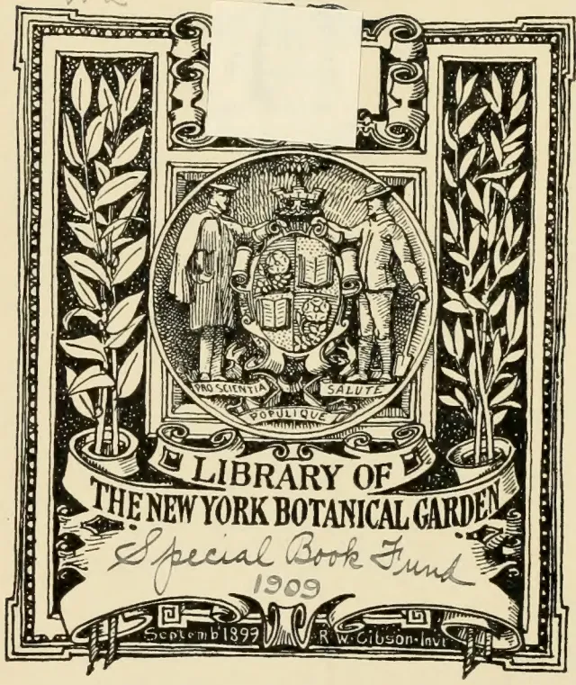

The image is a decorative library label for the New York Botanical Garden. It features a central circular crest containing two figures in 19th-century attire flanking a shield. The shield is divided into four quadrants: the top-left shows a globe, the top-right a book, the bottom-left a plant, and the bottom-right a star. Below the shield, the Latin motto 'PRO SCIENTIA SALUTE POPULIQUE' is inscribed. The crest is set within a rectangular frame with ornate scrollwork. On either side of the crest are vertical panels filled with detailed botanical illustrations of plants. A large white rectangular label is placed over the top portion of the crest. Below the crest, a banner reads 'LIBRARY OF THE NEW YORK BOTANICAL GARDEN'. Handwritten in cursive below the banner is 'Special Book Fund' and '1909'. At the bottom of the label, the date 'September 1899' and the engraver's name 'R. W. Gibson - Invt.' are visible.

2------------------------------------------------

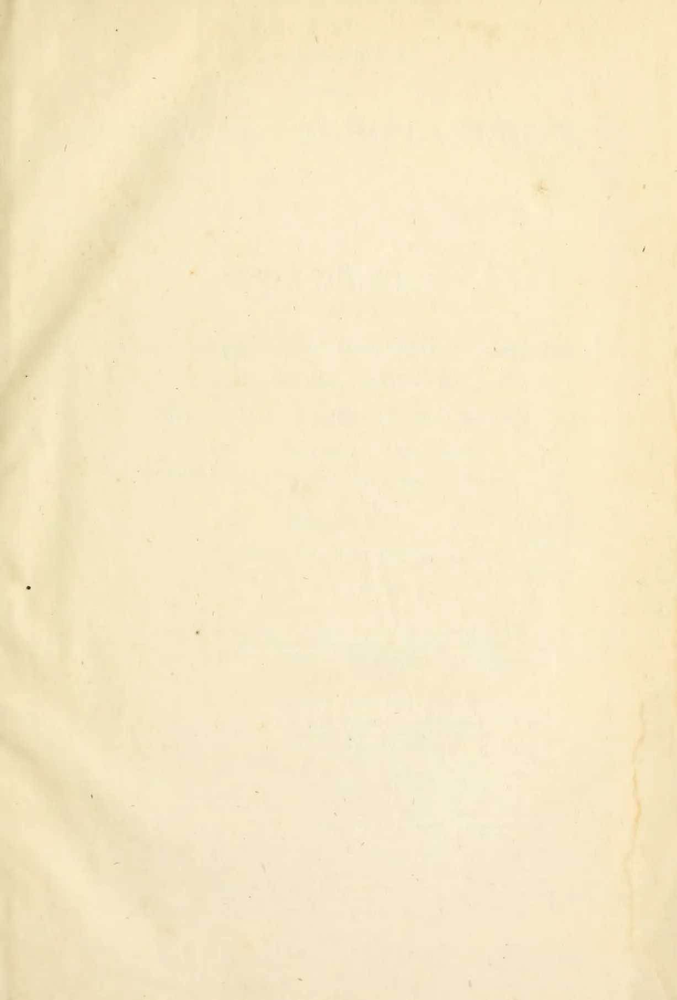This image shows a blank, aged, cream-colored page, likely an endpaper or flyleaf from an old book. The paper has a slightly textured appearance with some minor discoloration and faint creases. A prominent vertical stain or discoloration is visible along the right edge, possibly from moisture or age. There is no text or other markings on the page.

3------------------------------------------------

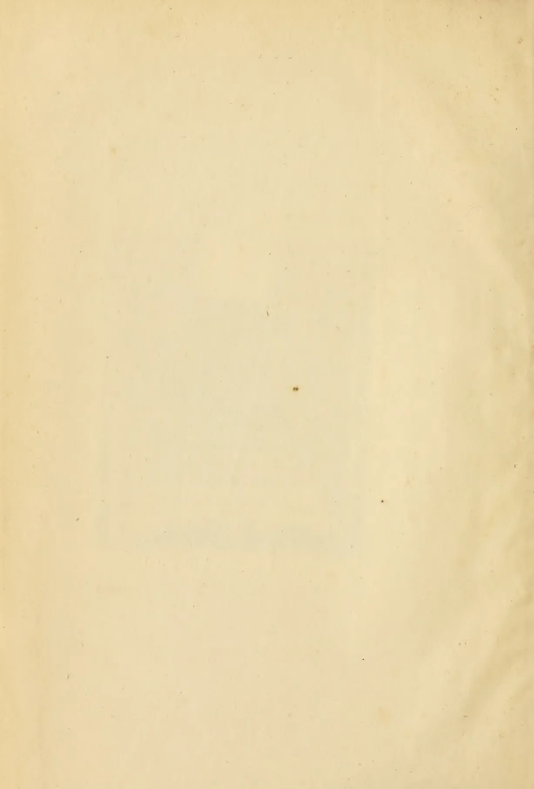This image shows a blank, aged, cream-colored page, likely an endpaper or flyleaf from an old book. The paper has a slightly textured appearance with some minor discoloration and faint smudges, characteristic of old paper. There is no text or other markings on the page.

4------------------------------------------------

[Vol. II., containing Numbers I. to XII.]

# THE TROPICAL AGRICULTURIST:

A  
MONTHLY RECORD OF INFORMATION  
FOR  
PLANTERS

OF

COFFEE, TEA, COCOA, CINCHONA, RUBBERS, SUGAR, TOBACCO, CARDAMOMS, PALMS, RICE,

AND OTHER PRODUCTS

SUITED FOR CULTIVATION IN THE TROPICS.

[ISSUED ON OR ABOUT THE 1ST OF EACH MONTH.]

"Step after step the ladder is ascended."—GEORGE HERBERT, *Jacula Prudentum*.

COMPILED BY

A. M. & J. FERGUSON,

of the "Ceylon Observer."

LIBRARY  
NEW YORK  
BOTANICAL  
GARDEN.

"It is both the duty and interest of every Owner and Cultivator of the Soil to study the best means of rendering that soil subservient to his own and the general wants of the community; and he who introduces, beneficially, a new and useful Seed, Plant, or Shrub into his district, is a blessing and an honor to his country."—SIR J. SINCLAIR.

A. M. & J. FERGUSON: COLOMBO, CEYLON.

AND SOLD BY:—*London*: TRUBNER & Co., 57 & 59, Ludgate Hill; J. HADDON & Co., 3, Bouverie St., Fleet St., E.C.; GEO. STREET & Co., 30, Cornhill; HUTCHISON & Co., 4, Guildhall Chambers; F. ALGAR, 11 & 12, Clement's Lane, Lombard St.; BATES, HENDY & Co., 37, Walbrook; COWIE & Co., 17, Gresham St.; GORDON & GOTCH, St. Bride St., Ludgate Circus; MAY & Co., 78, Gracechurch St.; W. H. SMITH & Co., Strand; NEWTON & ESKELL, Gray's Inn Chambers, 20, High Holborn, W.C.; S. DEACON & Co., 150, Leadenhall St.—*Liverpool*: CHAS. BIRCHALL, 32, Castle St.—*Glasgow*: W. & R. MACPHUN.—*Edinburgh*: W. & A. K. JOHNSTON.—*Aberdeen*: W. WESTLAND, 53, Nicholas Street.—*Continent of Europe*: K. F. KOEHLER, Leipsic, Germany.—*HACKER*, HIGGINBOTHAM & Co.—*Veilgherries and Wynaad Districts*: STANES & Co., Coimbatore.—*Calcutta*:—*Pinang*: SPINE & Co., and J. L. MACMILLAN.—*Bombay*: THACKER & Co., LD.—*Rangoon*: "MESSENGER" OFFICE.—*Penang*: BLAZE', REIDEL & Co.—*Singapore*: J. LITTLE & Co.—*Batavia*: JOHN PRYCE & Co., and G. CUYLENBURG.—*Surabaya*: THOS. C. WILSON & Co.—*Samarang*: MANUAL & Co.—*Deli, Sumatra*: W. L. REGISTER OFFICE.—*Hongkong*: "EXPRESS" OFFICE.—*Melbourne, Sydney and Brisbane*: GORDON & GOTCH.—*Adelaide*:—*Central America*: *Fiji*: ARTHUR J. STEPHENS.—*Brazil, Rio de Janeiro*: LOMBAERTS & Co., 7, Rua dos Ovos.—*Port Louis*:—*Jamaica*: JAMES BOYD, Panama.—*Natal*: ROBINSON & VAUSE, Durban.—*Mauritius*: C. W. GALL, Port Louis.—*Trinidad*: "CHRONICLE" OFFICE.—*British Guiana*: "ROYAL GAZETTE" OFFICE.—*United States*: H. HUBBARD, New Haven, Conn.; E. S. MORRIS, Philadelphia; "WEEKLY CHRONICLE" OFFICE, San Francisco.

MDCCLXXIII.

5------------------------------------------------

<!-- stage4: FAINT old-images-only -->

[Faint page: no legible print of its own could be verified; text withheld (stage 4 review list)]

6------------------------------------------------

LIBRARY  
NEW YORK  
BOTANICAL  
GARDEN.

## INTRODUCTORY NOTE.

---

IN closing the Second Volume of the "TROPICAL AGRICULTURIST," we have to direct attention to the increased amount of useful information afforded, and to the great variety of topics treated. From month to month we have endeavoured to lay before our readers the latest results of practical experience and scientific teaching in all that concerns tropical agriculture; and our ambition has been to make this periodical not only indispensable to the planter but of service to business men and capitalists, never forgetting that agriculture trenches upon every department of human knowledge and science, besides being the basis of all human wealth. While directing our attention chiefly to the products most prominently mentioned on our title-page, we have never omitted to notice minor industries likely to fit in with tropical conditions; and our readers have an ample guarantee in the pages before them that, in the future, no pains will be spared to bring together all available information both from the West and East, the same being examined in the light of the teachings of common sense as well as of prolonged tropical experience in this the leading Crown and Planting Colony of the British Empire. A full and accurate Index affords the means of ready reference to every subject treated in this second volume which we now place in our subscribers' hands.

A. M. & J. FERGUSON.

COLOMBO, 15th June, 1883.

DEC 21 1909

7------------------------------------------------

<!-- stage4: FAINT old-images-only -->

[Faint page: no legible print of its own could be verified; text withheld (stage 4 review list)]

8------------------------------------------------

# INDEX.

<table style="width: 100%; border-collapse: collapse;">
<thead>
<tr>
<th style="text-align: left; width: 40%;"></th>
<th style="text-align: right; width: 10%;">PAGE.</th>
</tr>
</thead>
<tbody>
<tr>
<td><b>A.</b></td>
<td></td>
</tr>
<tr>
<td>Acheen, Agriculture and Trade in...</td>
<td style="text-align: right;">571</td>
</tr>
<tr>
<td>Adelaide Botanic Gardens</td>
<td style="text-align: right;">182</td>
</tr>
<tr>
<td>Adulteration of Coffee</td>
<td style="text-align: right;">[See Coffee]</td>
</tr>
<tr>
<td>    of Food</td>
<td style="text-align: right;">29, 40</td>
</tr>
<tr>
<td>    of Tea...</td>
<td style="text-align: right;">[See Tea]</td>
</tr>
<tr>
<td>Africa, Exploration of</td>
<td style="text-align: right;">718</td>
</tr>
<tr>
<td>Agricultural and Horticultural Society of India</td>
<td style="text-align: right;">750</td>
</tr>
<tr>
<td>    Association, Ceylon</td>
<td style="text-align: right;">129-31, 237</td>
</tr>
<tr>
<td>    Company of Mauritius</td>
<td style="text-align: right;">204</td>
</tr>
<tr>
<td>    Depression</td>
<td style="text-align: right;">853</td>
</tr>
<tr>
<td>    Exhibitions</td>
<td style="text-align: right;">112, 504, 572, 769, 892</td>
</tr>
<tr>
<td>    Fads</td>
<td style="text-align: right;">966</td>
</tr>
<tr>
<td>    Journalism</td>
<td style="text-align: right;">749</td>
</tr>
<tr>
<td>    Prospects</td>
<td style="text-align: right;">497</td>
</tr>
<tr>
<td>Agriculture and Biology</td>
<td style="text-align: right;">178</td>
</tr>
<tr>
<td>    in America</td>
<td style="text-align: right;">16</td>
</tr>
<tr>
<td>    in Brazil</td>
<td style="text-align: right;">308, 799</td>
</tr>
<tr>
<td>    in Ceylon</td>
<td style="text-align: right;">378</td>
</tr>
<tr>
<td>    in China</td>
<td style="text-align: right;">432</td>
</tr>
<tr>
<td>    in Europe</td>
<td style="text-align: right;">18, 47, 158, 254, 400, 418, 593, 638</td>
</tr>
<tr>
<td>    in India</td>
<td style="text-align: right;">7, 49, 86, 111, 112, 277, 344, 419-21, 484, 541, 674, 710, 750, 771, 875</td>
</tr>
<tr>
<td>Agri-Horticultural Shows</td>
<td style="text-align: right;">652</td>
</tr>
<tr>
<td>Air as an Illuminator</td>
<td style="text-align: right;">32</td>
</tr>
<tr>
<td>Alkaloids, Cinchona</td>
<td style="text-align: right;">[See Cinchona]</td>
</tr>
<tr>
<td>Almonds from Morocco</td>
<td style="text-align: right;">531</td>
</tr>
<tr>
<td>Aloe Cultivation and Fibre</td>
<td style="text-align: right;">43, 107, 421-3, 426, 428-9, 433, 479, 596, 623, 652, 655, 685, 747, 808, 826, 868, 947</td>
</tr>
<tr>
<td>Aloes as Hedge Plants</td>
<td style="text-align: right;">286</td>
</tr>
<tr>
<td>    Market Rates for</td>
<td style="text-align: right;">88, 184, 364, 452, 532, 612, 772, 852, 936, 1008</td>
</tr>
<tr>
<td>Aluminum, Cheap</td>
<td style="text-align: right;">722</td>
</tr>
<tr>
<td>America, Agriculture in</td>
<td style="text-align: right;">16</td>
</tr>
<tr>
<td>    Central, Coffee Cultivation in</td>
<td style="text-align: right;">224</td>
</tr>
<tr>
<td>    Cinchona Shipments to</td>
<td style="text-align: right;">69</td>
</tr>
<tr>
<td>    Consumption of Coffee in</td>
<td style="text-align: right;">27, 30, 67</td>
</tr>
<tr>
<td>    Indian and Ceylon Tea in</td>
<td style="text-align: right;">42, 53, 55, 372, 468, 769, 776</td>
</tr>
<tr>
<td>    Indiarubber in</td>
<td style="text-align: right;">776</td>
</tr>
<tr>
<td>    Japan Tea in</td>
<td style="text-align: right;">180</td>
</tr>
<tr>
<td>    New Products in</td>
<td style="text-align: right;">529</td>
</tr>
<tr>
<td>    Population of</td>
<td style="text-align: right;">27, 30</td>
</tr>
<tr>
<td>    South, Seeds from</td>
<td style="text-align: right;">196, 578</td>
</tr>
<tr>
<td>    Tea and Coffee Duties in</td>
<td style="text-align: right;">26</td>
</tr>
<tr>
<td>    Tea Cultivation in</td>
<td style="text-align: right;">112, 164, 414</td>
</tr>
<tr>
<td>American Spice Trade</td>
<td style="text-align: right;">123</td>
</tr>
<tr>
<td>    Sugar Trade</td>
<td style="text-align: right;">788</td>
</tr>
<tr>
<td>Ammonia, Charcoal as a Medium for Applying</td>
<td style="text-align: right;">7</td>
</tr>
<tr>
<td>Amole</td>
<td style="text-align: right;">396</td>
</tr>
<tr>
<td>Analyses of Cinchona</td>
<td style="text-align: right;">[See Cinchona]</td>
</tr>
<tr>
<td>Andamans, Tea Cultivation in the...</td>
<td style="text-align: right;">235</td>
</tr>
<tr>
<td>Animal Food, World's Consumption of</td>
<td style="text-align: right;">818</td>
</tr>
<tr>
<td>Animals and Plants</td>
<td style="text-align: right;">386</td>
</tr>
<tr>
<td>Aniseed</td>
<td style="text-align: right;">908</td>
</tr>
<tr>
<td>Antimony</td>
<td style="text-align: right;">320</td>
</tr>
<tr>
<td>Antiseptics</td>
<td style="text-align: right;">430</td>
</tr>
<tr>
<td>Ants, Black, To Destroy</td>
<td style="text-align: right;">386</td>
</tr>
<tr>
<td>    in Horticulture</td>
<td style="text-align: right;">272</td>
</tr>
<tr>
<td>    Red, and Potatoes</td>
<td style="text-align: right;">654</td>
</tr>
<tr>
<td>Apiculture</td>
<td style="text-align: right;">581, 593, 710, 749, 845</td>
</tr>
</tbody>
</table>

<table style="width: 100%; border-collapse: collapse;">
<thead>
<tr>
<th style="text-align: left; width: 40%;"></th>
<th style="text-align: right; width: 10%;">PAGE.</th>
</tr>
</thead>
<tbody>
<tr>
<td>Apple, A Preserved...</td>
<td style="text-align: right;">953</td>
</tr>
<tr>
<td>    Culture</td>
<td style="text-align: right;">72</td>
</tr>
<tr>
<td>    Trees, Blight on</td>
<td style="text-align: right;">419</td>
</tr>
<tr>
<td>Arcanut Cultivation</td>
<td style="text-align: right;">791</td>
</tr>
<tr>
<td>Arnica for Mosquito Bites</td>
<td style="text-align: right;">349</td>
</tr>
<tr>
<td>Aromatic Woods, Imitation</td>
<td style="text-align: right;">967</td>
</tr>
<tr>
<td>Arracacha Cultivation</td>
<td style="text-align: right;">871</td>
</tr>
<tr>
<td>Arrowroot Cultivation</td>
<td style="text-align: right;">885, 975</td>
</tr>
<tr>
<td>    in Australia</td>
<td style="text-align: right;">99, 445</td>
</tr>
<tr>
<td>    Market Rates for</td>
<td style="text-align: right;">88, 184, 364, 452, 532, 612, 772, 852, 936, 1008</td>
</tr>
<tr>
<td>Arsenic in Fever</td>
<td style="text-align: right;">44</td>
</tr>
<tr>
<td>Asbestos Paint</td>
<td style="text-align: right;">26</td>
</tr>
<tr>
<td>Ashes, Value of</td>
<td style="text-align: right;">548, 636, 812</td>
</tr>
<tr>
<td>Ash, White, Alkaloid in</td>
<td style="text-align: right;">209</td>
</tr>
<tr>
<td>Assam, Cultivation in</td>
<td style="text-align: right;">56</td>
</tr>
<tr>
<td>    Tea Cultivation in</td>
<td style="text-align: right;">[See Tea Cultivation]</td>
</tr>
<tr>
<td>Assafœtida, Market Rates for</td>
<td style="text-align: right;">88, 184, 364, 452, 532, 612, 772, 852, 936, 1008</td>
</tr>
<tr>
<td>Atmosphere and Water</td>
<td style="text-align: right;">895-7</td>
</tr>
<tr>
<td>Australia and India, Trade between</td>
<td style="text-align: right;">11, 18, 42, 680, 709</td>
</tr>
<tr>
<td>    Ceylon and Indian Colonists in</td>
<td style="text-align: right;">331, 1003</td>
</tr>
<tr>
<td>    Cinchona Cultivation in</td>
<td style="text-align: right;">17, 89, 98, 111, 132</td>
</tr>
<tr>
<td>    Coffee Cultivation in</td>
<td style="text-align: right;">17, 89, 99</td>
</tr>
<tr>
<td>    Horse-Breeding in</td>
<td style="text-align: right;">18</td>
</tr>
<tr>
<td>    Import Duties in</td>
<td style="text-align: right;">279</td>
</tr>
<tr>
<td>    Indian and Ceylon Coolies in</td>
<td style="text-align: right;">[See Queensland]</td>
</tr>
<tr>
<td>    Indian and Ceylon Tea in</td>
<td style="text-align: right;">[See Tea]</td>
</tr>
<tr>
<td>    Indian Coffee in</td>
<td style="text-align: right;">544</td>
</tr>
<tr>
<td>    Irrigation in</td>
<td style="text-align: right;">14</td>
</tr>
<tr>
<td>    Olive Cultivation in</td>
<td style="text-align: right;">361, 383</td>
</tr>
<tr>
<td>    Ostrich Farming in</td>
<td style="text-align: right;">383, 653</td>
</tr>
<tr>
<td>    South, Planting in the Northern Territory of</td>
<td style="text-align: right;">17, 89, 97, 100, 191, 305, 383, 483</td>
</tr>
<tr>
<td>    Sugar Cultivation in</td>
<td style="text-align: right;">98, 145, 384, 653</td>
</tr>
<tr>
<td>    Tea Duty in</td>
<td style="text-align: right;">131, 138</td>
</tr>
<tr>
<td>    Tobacco Cultivation in</td>
<td style="text-align: right;">99, 666, 964</td>
</tr>
<tr>
<td>    Tropical Regions of</td>
<td style="text-align: right;">478</td>
</tr>
<tr>
<td>Azores, Orange Trade of</td>
<td style="text-align: right;">169</td>
</tr>
</tbody>
</table>

<table style="width: 100%; border-collapse: collapse;">
<thead>
<tr>
<th style="text-align: left; width: 40%;"></th>
<th style="text-align: right; width: 10%;">PAGE.</th>
</tr>
</thead>
<tbody>
<tr>
<td><b>B.</b></td>
<td></td>
</tr>
<tr>
<td>Babool Cultivation</td>
<td style="text-align: right;">989</td>
</tr>
<tr>
<td>Bacteria and Germs...</td>
<td style="text-align: right;">205</td>
</tr>
<tr>
<td>Bahamas, Pineapple Cultivation in...</td>
<td style="text-align: right;">446</td>
</tr>
<tr>
<td>Bamboo for Paper Making</td>
<td style="text-align: right;">733</td>
</tr>
<tr>
<td>    Gigantic</td>
<td style="text-align: right;">165, 445, 810</td>
</tr>
<tr>
<td>Banana Cultivation in Jamaica</td>
<td style="text-align: right;">720, 869</td>
</tr>
<tr>
<td>Bananas and Plantains</td>
<td style="text-align: right;">185</td>
</tr>
<tr>
<td>    Preserved</td>
<td style="text-align: right;">492</td>
</tr>
<tr>
<td>Banyans</td>
<td style="text-align: right;">448</td>
</tr>
<tr>
<td>Bark, Paper from</td>
<td style="text-align: right;">636, 754</td>
</tr>
<tr>
<td>Baskets, Hanging, To Water</td>
<td style="text-align: right;">204</td>
</tr>
<tr>
<td>Beans, Disease in</td>
<td style="text-align: right;">745</td>
</tr>
<tr>
<td>Bêche de Mer</td>
<td style="text-align: right;">68</td>
</tr>
<tr>
<td>Bedding, Sawdust for</td>
<td style="text-align: right;">385</td>
</tr>
<tr>
<td>Bee Culture</td>
<td style="text-align: right;">581, 598, 710, 749, 845</td>
</tr>
<tr>
<td>Beer, Adulteration of</td>
<td style="text-align: right;">891</td>
</tr>
<tr>
<td>    Brewing in Ceylon</td>
<td style="text-align: right;">655</td>
</tr>
<tr>
<td>    Substitutes for Hops in</td>
<td style="text-align: right;">655, 707, 710, 800, 884</td>
</tr>
<tr>
<td>Bees in Ceylon</td>
<td style="text-align: right;">231, 346</td>
</tr>
<tr>
<td>Beeswax, Market Rates for</td>
<td style="text-align: right;">88, 184, 364, 452, 532, 612, 772, 852, 936, 1008</td>
</tr>
</tbody>
</table>

9------------------------------------------------

## INDEX.

<table border="0" style="width: 100%; border-collapse: collapse;">
<thead>
<tr>
<th style="text-align: left;"></th>
<th style="text-align: right;">PAGE.</th>
<th style="text-align: left;"></th>
<th style="text-align: right;">PAGE.</th>
</tr>
</thead>
<tbody>
<tr>
<td>Beetles, Ceylon ...</td>
<td style="text-align: right;">866</td>
<td>Cape Colony, Planting in ...</td>
<td style="text-align: right;">719, 867</td>
</tr>
<tr>
<td>Beetroot Culture ...</td>
<td style="text-align: right;">595</td>
<td>Carbolate of Soda in Typhoid Fever ...</td>
<td style="text-align: right;">183</td>
</tr>
<tr>
<td>Begonia Cultivation...</td>
<td style="text-align: right;">438</td>
<td>Carbolic Acid ...</td>
<td style="text-align: right;">778, 955</td>
</tr>
<tr>
<td>Berbice, Coffee Cultivation in ...</td>
<td style="text-align: right;">906-8</td>
<td>    for Coffee Leaf Disease 9, 100, 128, 142, 146,     235, 288, 402, 403, 433, 463, 517, 709, 716,     721, 761, 779, 841, 892, 972</td>
<td></td>
</tr>
<tr>
<td>Biology and Agriculture ...</td>
<td style="text-align: right;">178</td>
<td>    as an Insecticide ...</td>
<td style="text-align: right;">469</td>
</tr>
<tr>
<td>Elight, Remedy for... ..</td>
<td style="text-align: right;">450</td>
<td>    in Diseases ...</td>
<td style="text-align: right;">40, 183, 450</td>
</tr>
<tr>
<td>Blossoming of Coffee and Rainfall ...</td>
<td style="text-align: right;">1, 72, 112</td>
<td>    in Forestry and Gardening ...</td>
<td style="text-align: right;">385, 584, 690</td>
</tr>
<tr>
<td>Blue Gum Cultivation ...</td>
<td style="text-align: right;">357, 451, 460</td>
<td>    Substitute for ...</td>
<td style="text-align: right;">384</td>
</tr>
<tr>
<td>    Leaf Disease 301, 308, 335, 460, 465, 485, 521-5,     571, 574, 575, 602, 613, 695, 707, 776, 793</td>
<td></td>
<td>    Powder as Remedy for White Ants ...</td>
<td style="text-align: right;">7</td>
</tr>
<tr>
<td>    Leaves as Remedy for White Ants ...</td>
<td style="text-align: right;">7</td>
<td>Carbonic Acid as a Remedy for Fever ...</td>
<td style="text-align: right;">39</td>
</tr>
<tr>
<td>    Oil ...</td>
<td style="text-align: right;">384, 407, 495, 988</td>
<td>Cardamom Cultivation 29, 70, 93, 103, 243, 368, 415, 564,     648, 651, 798, 812</td>
<td></td>
</tr>
<tr>
<td>Bolivia, Cinchona Cultivation in ...</td>
<td style="text-align: right;">157, 166, 337</td>
<td>Cardamoms, Enemies of ...</td>
<td style="text-align: right;">284</td>
</tr>
<tr>
<td>    Explorations in ...</td>
<td style="text-align: right;">166</td>
<td>    Market Rates for 88, 184, 364, 452, 532, 612,     772, 852, 936, 1008</td>
<td></td>
</tr>
<tr>
<td>    Indiarubber Cultivation in ...</td>
<td style="text-align: right;">615, 966</td>
<td>Carob Seed ...</td>
<td style="text-align: right;">934</td>
</tr>
<tr>
<td>Bone Ashes ...</td>
<td style="text-align: right;">636</td>
<td>Cashmere Goats for Ceylon ...</td>
<td style="text-align: right;">527</td>
</tr>
<tr>
<td>    Manure ...</td>
<td style="text-align: right;">738</td>
<td>Cassava Cultivation ...</td>
<td style="text-align: right;">885</td>
</tr>
<tr>
<td>    Tree ...</td>
<td style="text-align: right;">395</td>
<td>    Glucose from ...</td>
<td style="text-align: right;">28</td>
</tr>
<tr>
<td>Borneo, North 215, 308, 315-8, 535, 557, 702, 829-35, 875</td>
<td></td>
<td>Cassia and Cinnamon 423, 444, 453-6, 533, 827, 876</td>
<td></td>
</tr>
<tr>
<td>    Planting in 30, 71, 361, 384, 663, 892</td>
<td></td>
<td>    Tora ...</td>
<td style="text-align: right;">549</td>
</tr>
<tr>
<td>Botanic Gardens, Ceylon ...</td>
<td style="text-align: right;">913-32, 950-2</td>
<td>Castor Oil Cultivation ...</td>
<td style="text-align: right;">59, 550, 605, 710, 992</td>
</tr>
<tr>
<td>    Colonial 182, 359, 404, 509-14, 579, 846,     878, 880, 939-46</td>
<td></td>
<td>    Market Rates for 88, 184, 364, 452, 532, 852,     936, 1008</td>
<td></td>
</tr>
<tr>
<td>Botanical Terms ...</td>
<td style="text-align: right;">476</td>
<td>    Plant as a Fly-killer ...</td>
<td style="text-align: right;">202, 565, 934</td>
</tr>
<tr>
<td>Boxwood, Indian ...</td>
<td style="text-align: right;">845</td>
<td>    Varnish as Remedy for White Ants ...</td>
<td style="text-align: right;">7</td>
</tr>
<tr>
<td>Bran, Charred, for Preserving Fruit ...</td>
<td style="text-align: right;">120</td>
<td>Casuarina Cultivation ...</td>
<td style="text-align: right;">407, 828</td>
</tr>
<tr>
<td>Brazil, Agriculture in ...</td>
<td style="text-align: right;">308, 799</td>
<td>Catalpa Cultivation ...</td>
<td style="text-align: right;">870, 1000</td>
</tr>
<tr>
<td>    Climate of ...</td>
<td style="text-align: right;">1004</td>
<td>Caterpillars in Australia ...</td>
<td style="text-align: right;">415</td>
</tr>
<tr>
<td>    Coffee Cultivation in [See Coffee Cultivation]</td>
<td></td>
<td>    in England ...</td>
<td style="text-align: right;">257</td>
</tr>
<tr>
<td>    Indiarubber Cultivation in ...</td>
<td style="text-align: right;">331, 405, 667, 962</td>
<td>Cattle, Hornless ...</td>
<td style="text-align: right;">634</td>
</tr>
<tr>
<td>    Labor in ...</td>
<td style="text-align: right;">168, 623-6, 640, 707, 804, 1004</td>
<td>Ceará Rubber ...</td>
<td style="text-align: right;">[See Indiarubber]</td>
</tr>
<tr>
<td>    Progress in ...</td>
<td style="text-align: right;">157, 800</td>
<td>Celery Cultivation ...</td>
<td style="text-align: right;">958</td>
</tr>
<tr>
<td>    Rainfall in ...</td>
<td style="text-align: right;">111, 900</td>
<td>Cement, Strong ...</td>
<td style="text-align: right;">336</td>
</tr>
<tr>
<td>    Roads in ...</td>
<td style="text-align: right;">111</td>
<td>Ceylon Agricultural Association ...</td>
<td style="text-align: right;">129-31, 237</td>
</tr>
<tr>
<td>    Sugar Cultivation in ...</td>
<td style="text-align: right;">333, 626</td>
<td>    Agriculture in ...</td>
<td style="text-align: right;">378</td>
</tr>
<tr>
<td>Brazilian Coffee Exhibition ...</td>
<td style="text-align: right;">125, 150, 236</td>
<td>    and Jamaica ...</td>
<td style="text-align: right;">7</td>
</tr>
<tr>
<td>Breadfruit ...</td>
<td style="text-align: right;">971</td>
<td>    and Mauritius ...</td>
<td style="text-align: right;">28</td>
</tr>
<tr>
<td>Bread, Native ...</td>
<td style="text-align: right;">992</td>
<td>    Botanic Gardens ...</td>
<td style="text-align: right;">913-32, 950-2</td>
</tr>
<tr>
<td>Brewing in Ceylon ...</td>
<td style="text-align: right;">655</td>
<td>    Cinchona ...</td>
<td style="text-align: right;">[See Cinchona]</td>
</tr>
<tr>
<td>Brinjal ...</td>
<td style="text-align: right;">934</td>
<td>    Coffee ...</td>
<td style="text-align: right;">[See Coffee]</td>
</tr>
<tr>
<td>Brisbane Botanic Gardens ...</td>
<td style="text-align: right;">404</td>
<td>    Company Limited ...</td>
<td style="text-align: right;">196</td>
</tr>
<tr>
<td>    Budding ...</td>
<td style="text-align: right;">390</td>
<td>    Forestry in ...</td>
<td style="text-align: right;">[See Forestry]</td>
</tr>
<tr>
<td>Buffalo Horn Manure ...</td>
<td style="text-align: right;">265</td>
<td>    Gold in ...</td>
<td style="text-align: right;">204</td>
</tr>
<tr>
<td>Buffaloes, Fence against ...</td>
<td style="text-align: right;">53</td>
<td>    New Fields for Enterprise in 215, 218, 254, 334, 338, 424</td>
<td></td>
</tr>
<tr>
<td>Burma, Planting in 54, 146, 253, 365-8, 566, 785, 792</td>
<td></td>
<td>    New Products in [See New Products]</td>
<td></td>
</tr>
<tr>
<td>Burns, Remedy for ...</td>
<td style="text-align: right;">476</td>
<td>    Planters' Association ...</td>
<td style="text-align: right;">447, 753</td>
</tr>
<tr>
<td></td>
<td></td>
<td>    Planting in 225, 694, 724-8, 767, 837-40, 849-51, 854,     946, 953, 978</td>
<td></td>
</tr>
<tr>
<td style="text-align: center;"><b>C.</b></td>
<td></td>
<td>    Planting Prospects in 1-4, 28, 45-7, 57, 58, 90, 107,     108, 126, 216, 218, 241, 465, 664</td>
<td></td>
</tr>
<tr>
<td>Cacao Cultivation ...</td>
<td style="text-align: right;">151, 393-5, 782</td>
<td>    Rainfall in ...</td>
<td style="text-align: right;">[See Rainfall]</td>
</tr>
<tr>
<td>    in Ceylon 91, 103, 368, 556, 605, 649, 652</td>
<td></td>
<td>    Tea ...</td>
<td style="text-align: right;">[See Tea]</td>
</tr>
<tr>
<td>    in Ecuador ...</td>
<td style="text-align: right;">647, 668</td>
<td>Chaserculture ...</td>
<td style="text-align: right;">87, 731, 825</td>
</tr>
<tr>
<td>    in Grenada ...</td>
<td style="text-align: right;">665</td>
<td>Charcoal Making ...</td>
<td style="text-align: right;">296</td>
</tr>
<tr>
<td>    in Jamaica ...</td>
<td style="text-align: right;">151-3, 168</td>
<td>    Uses of ...</td>
<td style="text-align: right;">7, 431, 579</td>
</tr>
<tr>
<td>    in Surinam ...</td>
<td style="text-align: right;">669</td>
<td>Cheese, Artificial ...</td>
<td style="text-align: right;">1003</td>
</tr>
<tr>
<td>    in Trinidad ...</td>
<td style="text-align: right;">477, 535, 647, 898</td>
<td>Chestnut Cultivation ...</td>
<td style="text-align: right;">476</td>
</tr>
<tr>
<td>    Enemies of ...</td>
<td style="text-align: right;">70, 384</td>
<td>Chicory ...</td>
<td style="text-align: right;">57, 495</td>
</tr>
<tr>
<td>    Leaves ...</td>
<td style="text-align: right;">426</td>
<td>    Adulteration of Coffee with ...</td>
<td style="text-align: right;">8, 432, 768</td>
</tr>
<tr>
<td>    Market Rates for 88, 184, 364, 452, 532, 612, 772, 852,     936, 1008</td>
<td></td>
<td>Chilé, Agriculture in ...</td>
<td style="text-align: right;">337</td>
</tr>
<tr>
<td>    Preparation of 107, 203, 747, 808, 821, 848</td>
<td></td>
<td>Chillies, Market Rates for 88, 184, 364, 452, 532, 612, 772,     852, 936, 1008</td>
<td></td>
</tr>
<tr>
<td>    Sales of ...</td>
<td style="text-align: right;">32, 55, 146, 166, 196, 496</td>
<td>China, Agriculture in ...</td>
<td style="text-align: right;">432</td>
</tr>
<tr>
<td>    Varieties of ...</td>
<td style="text-align: right;">120, 155-6</td>
<td>    Forests in ...</td>
<td style="text-align: right;">449</td>
</tr>
<tr>
<td>Cactus Cultivation ...</td>
<td style="text-align: right;">580</td>
<td>    Grass ...</td>
<td style="text-align: right;">[See Rhea]</td>
</tr>
<tr>
<td>Caffeic Acid ...</td>
<td style="text-align: right;">474</td>
<td>    Sugar Cultivation in ...</td>
<td style="text-align: right;">645-7</td>
</tr>
<tr>
<td>Caffa ...</td>
<td style="text-align: right;">732</td>
<td>    Tea ...</td>
<td style="text-align: right;">[See Tea]</td>
</tr>
<tr>
<td>Calcutta Horticultural Company ...</td>
<td style="text-align: right;">627</td>
<td>Chinese Hemp Palm ...</td>
<td style="text-align: right;">214</td>
</tr>
<tr>
<td>    Tea Syndicate ...</td>
<td style="text-align: right;">[See Tea Syndicate]</td>
<td>    Textile Manufactures ...</td>
<td style="text-align: right;">407</td>
</tr>
<tr>
<td>Calisaya Bark, Alkaloids in ...</td>
<td style="text-align: right;">87</td>
<td>    Varnish Tree ...</td>
<td style="text-align: right;">214, 450</td>
</tr>
<tr>
<td>    Morada ...</td>
<td style="text-align: right;">409</td>
<td>Chocolate Plant, Cultivation of, &amp;c... (See Cacao)</td>
<td></td>
</tr>
<tr>
<td>Calumba Root, Market Rates for 88, 184, 364, 452, 532,     612, 772, 832, 936, 1008</td>
<td></td>
<td>Cigar Bush ...</td>
<td style="text-align: right;">450</td>
</tr>
<tr>
<td>Camomile Cultivation ...</td>
<td style="text-align: right;">635</td>
<td>Cinchona Alkaloids, Extraction of 132, 135-7, 145, 444, 635,     655, 756, 763, 934</td>
<td></td>
</tr>
<tr>
<td>Camphor in Germinating Seeds ...</td>
<td style="text-align: right;">992</td>
<td>    Method for Estimating 73, 414, 983</td>
<td></td>
</tr>
<tr>
<td>    Market Rates for 88, 184, 364, 452, 532, 612,     772, 832, 936, 1008</td>
<td></td>
<td>    Analyses 52, 107, 108, 109, 112, 135-7, 138, 199,     228, 319, 372, 485, 596, 623, 663, 681,     764, 934, 956, 966, 970, 1005</td>
<td></td>
</tr>
<tr>
<td>Canada, Farming in ...</td>
<td style="text-align: right;">150, 893</td>
<td></td>
<td></td>
</tr>
<tr>
<td>Canker ...</td>
<td style="text-align: right;">992</td>
<td></td>
<td></td>
</tr>
<tr>
<td>Cannonball Tree ...</td>
<td style="text-align: right;">349, 715</td>
<td></td>
<td></td>
</tr>
<tr>
<td>Caoutchouc ...</td>
<td style="text-align: right;">[See Indiarubber]</td>
<td></td>
<td></td>
</tr>
</tbody>
</table>

10------------------------------------------------

# INDEX.

<table border="0" style="width: 100%; border-collapse: collapse;">
<thead>
<tr>
<th style="text-align: left;"></th>
<th style="text-align: right;">PAGE.</th>
<th style="text-align: left;"></th>
<th style="text-align: right;">PAGE.</th>
</tr>
</thead>
<tbody>
<tr>
<td>Cinchona Bark, Analysis of</td>
<td style="text-align: right;">185-8, 229, 231, 284, 377, 579</td>
<td>Cloves, Market Rates for</td>
<td style="text-align: right;">88, 184, 364, 452, 532, 612, 772, 852, 936, 1008</td>
</tr>
<tr>
<td>    Drying of</td>
<td style="text-align: right;">230, 108, 565, 627</td>
<td>Coal and Flowers</td>
<td style="text-align: right;">451</td>
</tr>
<tr>
<td>    Exports</td>
<td style="text-align: right;">501, 518, 876</td>
<td>    in South Africa</td>
<td style="text-align: right;">349</td>
</tr>
<tr>
<td>    Market Rates for</td>
<td style="text-align: right;">88, 164, 184, 335, 364, 452, 532, 612, 772, 852, 936, 1008</td>
<td>    Tar, Indigo and Quinine from</td>
<td style="text-align: right;">72</td>
</tr>
<tr>
<td>    Sales</td>
<td style="text-align: right;">108, 109, 111, 144, 274, 286, 349, 492, 674, 771</td>
<td>Cocoa</td>
<td style="text-align: right;">309, 431, 460, 476, 548, 776</td>
</tr>
<tr>
<td>        Shipments to the United States</td>
<td style="text-align: right;">69</td>
<td>Cochineal Cultivation</td>
<td style="text-align: right;">145, 545, 982</td>
</tr>
<tr>
<td>        Specimens</td>
<td style="text-align: right;">668, 975</td>
<td>Cockchafer Grubs, Remedies for</td>
<td style="text-align: right;">396</td>
</tr>
<tr>
<td>        Substitutes for</td>
<td style="text-align: right;">292-5</td>
<td>Cocoa, Cultivation, &amp;c.</td>
<td style="text-align: right;">See Cocoa</td>
</tr>
<tr>
<td>        Thefts of</td>
<td style="text-align: right;">233</td>
<td>Coconut as a Remedy for Tapeworm</td>
<td style="text-align: right;">308</td>
</tr>
<tr>
<td>        Trade</td>
<td style="text-align: right;">248, 641, 667</td>
<td>    Borer</td>
<td style="text-align: right;">107</td>
</tr>
<tr>
<td>        Yield of</td>
<td style="text-align: right;">3, 55, 101, 108, 164, 463, 484, 574, 602, 652, 807</td>
<td>    Cultivation</td>
<td style="text-align: right;">343, 842, 933</td>
</tr>
<tr>
<td>    Barking</td>
<td style="text-align: right;">4, 29, 32, 36, 39, 69, 111, 151-3, 160, 301, 230, 308, 379, 382</td>
<td>        in Fiji</td>
<td style="text-align: right;">251, 491, 866, 868</td>
</tr>
<tr>
<td>    Barks</td>
<td style="text-align: right;">704-7</td>
<td>        in Queensland</td>
<td style="text-align: right;">170, 183, 458, 636, 904</td>
</tr>
<tr>
<td>    Canker</td>
<td style="text-align: right;">963, 976</td>
<td>        in Trinidad</td>
<td style="text-align: right;">494</td>
</tr>
<tr>
<td>    Coverings for</td>
<td style="text-align: right;">144, 161, 162, 164, 396, 415, 761, 954, 991</td>
<td>    Fibre for Growing Plants</td>
<td style="text-align: right;">968, 1000</td>
</tr>
<tr>
<td>    Cultivation</td>
<td style="text-align: right;">361, 528, 565, 569, 637, 702, 769, 770, 898, 962, 982, 985, 997</td>
<td>    Meal for Horses</td>
<td style="text-align: right;">912</td>
</tr>
<tr>
<td>        in Australia</td>
<td style="text-align: right;">17, 89, 98, 110, 132, 233, 544, 733</td>
<td>    Palm Sugar</td>
<td style="text-align: right;">568</td>
</tr>
<tr>
<td>        in Bolivia</td>
<td style="text-align: right;">157, 166, 337, 565</td>
<td>    Travels of</td>
<td style="text-align: right;">185</td>
</tr>
<tr>
<td>        in Ceylon</td>
<td style="text-align: right;">3, 31, 37-9, 61-3, 91, 109, 110, 144, 188, 192, 200, 229, 236, 240, 249, 252, 273, 284, 336, 481, 493, 614, 682, 715, 777, 788, 803, 820, 855, 861, 864, 867, 991</td>
<td>Cocos Islands, Planting in the</td>
<td style="text-align: right;">645</td>
</tr>
<tr>
<td>        in Ecuador</td>
<td style="text-align: right;">414, 426, 668</td>
<td>Cocculus Indicus, Market Rates for</td>
<td style="text-align: right;">88, 184, 364, 452, 532, 612, 772, 852, 936, 1008</td>
</tr>
<tr>
<td>        in India</td>
<td style="text-align: right;">70, 127, 135-7, 151, 189, 202, 227, 235, 310, 313-5, 340, 347, 501, 502, 528, 552-6, 558-60, 566, 639, 653, 682, 739-43, 744, 747, 933</td>
<td>Coffee, Adulteration of</td>
<td style="text-align: right;">8, 16, 33-5, 40-50, 55, 56, 57, 60, 68, 112, 234, 256, 283, 307, 336, 384, 432, 462, 533, 599, 666, 745, 760, 768, 808</td>
</tr>
<tr>
<td>        in Jamaica</td>
<td style="text-align: right;">168, 240, 976, 997</td>
<td>    Analyses of</td>
<td style="text-align: right;">666</td>
</tr>
<tr>
<td>        in Java</td>
<td style="text-align: right;">35, 281, 565, 568, 674, 703, 773, 774, 782, 789-91, 851, 911, 1002, 1008</td>
<td>    Artificial</td>
<td style="text-align: right;">842</td>
</tr>
<tr>
<td>        in Peru</td>
<td style="text-align: right;">337</td>
<td>    Beans, Damaged</td>
<td style="text-align: right;">50</td>
</tr>
<tr>
<td>        in Queensland</td>
<td style="text-align: right;">222</td>
<td>    Berries, Abnormal</td>
<td style="text-align: right;">492, 500, 868</td>
</tr>
<tr>
<td>        in St. Helena</td>
<td style="text-align: right;">794</td>
<td>    Berry, Spirit from</td>
<td style="text-align: right;">384</td>
</tr>
<tr>
<td>        in the United States</td>
<td style="text-align: right;">103, 179, 363</td>
<td>    Blight</td>
<td style="text-align: right;">842</td>
</tr>
<tr>
<td>    Cuprea</td>
<td style="text-align: right;">21-25, 253, 413, 435, 474, 756, 908</td>
<td>    Blossoms, Failure of</td>
<td style="text-align: right;">219</td>
</tr>
<tr>
<td>    Dying-off of</td>
<td style="text-align: right;">26, 38, 92, 613, 634, 709, 710, 746</td>
<td>    Concoctions</td>
<td style="text-align: right;">16, 579</td>
</tr>
<tr>
<td>    Enemies of</td>
<td style="text-align: right;">69, 329, 954</td>
<td>    Consumption of</td>
<td style="text-align: right;">27, 30, 67, 160, 430, 800</td>
</tr>
<tr>
<td>    Extract of</td>
<td style="text-align: right;">177</td>
<td>    Crops, Short, Cause of</td>
<td style="text-align: right;">1, 53, 90, 108, 238-40, 244, 247, 248, 285, 286, 302, 309, 311-3, 336, 337, 350, 379, 427, 434-5, 438, 459, 463-5, 466, 467, 485-90, 499, 527, 575, 586, 684, 708, 767, 795, 897</td>
</tr>
<tr>
<td>    Febrifuge</td>
<td style="text-align: right;">56, 177, 182, 429, 863</td>
<td>    Cultivation</td>
<td style="text-align: right;">143, 149, 242, 249, 308, 343, 398, 427, 485, 561, 562-4, 777, 811, 888</td>
</tr>
<tr>
<td>    Grafting of</td>
<td style="text-align: right;">410, 466</td>
<td>        in Australia</td>
<td style="text-align: right;">17, 89, 99, 340, 733</td>
</tr>
<tr>
<td>    Hybridization of</td>
<td style="text-align: right;">10, 28, 63-5, 94, 109, 143, 192, 409, 623, 745, 788, 817</td>
<td>        in Berbice</td>
<td style="text-align: right;">906-8</td>
</tr>
<tr>
<td>    Leaves, Variegated</td>
<td style="text-align: right;">144</td>
<td>        in Brazil</td>
<td style="text-align: right;">27, 30, 137, 218, 297-300, 333, 432, 466, 462, 565, 604, 623-6, 640, 652, 703, 775, 792, 796, 804, 828, 987</td>
</tr>
<tr>
<td>    Ledgeriana</td>
<td style="text-align: right;">623, 768, 815-8, 970-1, 990</td>
<td>        in Central America</td>
<td style="text-align: right;">224</td>
</tr>
<tr>
<td>    Micrantha</td>
<td style="text-align: right;">199</td>
<td>        in Dominica</td>
<td style="text-align: right;">900</td>
</tr>
<tr>
<td>    Officialis</td>
<td style="text-align: right;">200, 201, 229, 232, 233</td>
<td>        in England</td>
<td style="text-align: right;">892</td>
</tr>
<tr>
<td>    Pharmacy</td>
<td style="text-align: right;">506-8</td>
<td>        in Fiji</td>
<td style="text-align: right;">51, 463, 866, 868</td>
</tr>
<tr>
<td>    Robusta</td>
<td style="text-align: right;">976</td>
<td>        in India</td>
<td style="text-align: right;">199, 236, 300, 319, 332, 347, 371, 378, 399, 421, 427, 461, 528, 565, 566, 613, 629, 636, 644, 671, 728, 748, 769, 781, 806</td>
</tr>
<tr>
<td>    Seed</td>
<td style="text-align: right;">339, 411, 600, 611, 621, 623, 627, 768</td>
<td>        in Java</td>
<td style="text-align: right;">503, 568, 703, 710, 712-4</td>
</tr>
<tr>
<td>        Sales of</td>
<td style="text-align: right;">30, 50, 674</td>
<td>        in Mexico</td>
<td style="text-align: right;">168, 203, 224, 411, 666, 668, 899</td>
</tr>
<tr>
<td>        Shade for</td>
<td style="text-align: right;">230, 341</td>
<td>        in Perak</td>
<td style="text-align: right;">50</td>
</tr>
<tr>
<td>        Shaving of</td>
<td style="text-align: right;">339, 383, 764, 795</td>
<td>    Curing</td>
<td style="text-align: right;">360, 495, 652, 654, 710, 712-4</td>
</tr>
<tr>
<td>        Soils</td>
<td style="text-align: right;">739-43</td>
<td>    Duty</td>
<td style="text-align: right;">26, 56, 608, 953</td>
</tr>
<tr>
<td>        Sporting of</td>
<td style="text-align: right;">229</td>
<td>    Exchange, New York</td>
<td style="text-align: right;">20, 32</td>
</tr>
<tr>
<td>        Trees, Census of</td>
<td style="text-align: right;">764</td>
<td>    Exhibitions</td>
<td style="text-align: right;">125, 150, 236, 384, 415, 667</td>
</tr>
<tr>
<td>        Value of</td>
<td style="text-align: right;">303, 310</td>
<td>    Exports from Ceylon</td>
<td style="text-align: right;">1</td>
</tr>
<tr>
<td>Cinnamon and Cassia</td>
<td style="text-align: right;">423, 444, 453-6, 533, 827, 876</td>
<td>        Extract</td>
<td style="text-align: right;">644</td>
</tr>
<tr>
<td>    Chips</td>
<td style="text-align: right;">163, 341</td>
<td>        Gas from</td>
<td style="text-align: right;">636</td>
</tr>
<tr>
<td>    Cultivation</td>
<td style="text-align: right;">341, 343, 901</td>
<td>        History of</td>
<td style="text-align: right;">457, 872-4</td>
</tr>
<tr>
<td>        in Queensland</td>
<td style="text-align: right;">891</td>
<td>    How to Increase the Consumption of</td>
<td style="text-align: right;">60</td>
</tr>
<tr>
<td>    Market Rates for</td>
<td style="text-align: right;">88, 184, 364, 452, 532, 612, 772, 852, 936, 1008</td>
<td>    Indian, in Australia</td>
<td style="text-align: right;">544</td>
</tr>
<tr>
<td>    Oil, Market Rates for</td>
<td style="text-align: right;">88, 184, 364, 452, 532, 612, 772, 852, 936, 1008</td>
<td>    in France</td>
<td style="text-align: right;">667, 777</td>
</tr>
<tr>
<td>        Trade</td>
<td style="text-align: right;">27, 237, 616</td>
<td>    in Typhoid Fever</td>
<td style="text-align: right;">484</td>
</tr>
<tr>
<td>Citron Cultivation</td>
<td style="text-align: right;">874</td>
<td>    Leaf Disease</td>
<td style="text-align: right;">1, 8, 25, 40, 51, 53, 70, 90, 100, 103-5, 122, 128, 142, 146, 167, 170, 235, 236, 243, 261-5, 288, 321, 335, 381, 402, 403, 433, 463, 466, 467, 490, 497, 517, 617, 683, 708, 716, 721, 745, 761, 779, 794, 805, 841, 865, 866, 885, 892, 972, 975, 1005</td>
</tr>
<tr>
<td>Citron-Oranges</td>
<td style="text-align: right;">320</td>
<td>    Liberian</td>
<td style="text-align: right;">[See Liberian Coffee]</td>
</tr>
<tr>
<td>Citronella Oil, Market Rates for</td>
<td style="text-align: right;">88, 184, 364, 452, 532, 612, 772, 852, 936, 1008</td>
<td>    Making of</td>
<td style="text-align: right;">322, 449, 537, 1003</td>
</tr>
<tr>
<td>Clay in Soils</td>
<td style="text-align: right;">901</td>
<td>    Malt</td>
<td style="text-align: right;">383, 440</td>
</tr>
<tr>
<td>Climate and Plants</td>
<td style="text-align: right;">255</td>
<td>    Manuring of</td>
<td style="text-align: right;">2, 7, 243, 441, 527, 746, 778, 794</td>
</tr>
<tr>
<td>    in Zanzibar</td>
<td style="text-align: right;">387</td>
<td>    Market, Prospects of</td>
<td style="text-align: right;">157, 771</td>
</tr>
<tr>
<td>Clove Cultivation at the Straits</td>
<td style="text-align: right;">543</td>
<td>    Market Rates for</td>
<td style="text-align: right;">88, 184, 364, 452, 532, 612, 772, 852, 936, 1008</td>
</tr>
</tbody>
</table>

11------------------------------------------------

# INDEX.

<table style="width: 100%; border-collapse: collapse;">
<thead>
<tr>
<th></th>
<th style="text-align: right;">PAGE.</th>
</tr>
</thead>
<tbody>
<tr>
<td>Coffee, Mocha</td>
<td style="text-align: right;">54, 300, 793</td>
</tr>
<tr>
<td>—, Nalkanaad</td>
<td style="text-align: right;">70, 199</td>
</tr>
<tr>
<td>— Oil</td>
<td style="text-align: right;">166</td>
</tr>
<tr>
<td>Planting Prospects 1-4, 28, 45-7, 57, 58, 218, 806, 937</td>
<td></td>
</tr>
<tr>
<td>Production</td>
<td style="text-align: right;">55, 796</td>
</tr>
<tr>
<td>Pruning of</td>
<td style="text-align: right;">2, 494, 498, 864</td>
</tr>
<tr>
<td>—, Pulp as Manure</td>
<td style="text-align: right;">105</td>
</tr>
<tr>
<td>Pulper, Tithe of a</td>
<td style="text-align: right;">31</td>
</tr>
<tr>
<td>Roaster, People's</td>
<td style="text-align: right;">68</td>
</tr>
<tr>
<td>Robberies</td>
<td style="text-align: right;">110</td>
</tr>
<tr>
<td>Saccharate of</td>
<td style="text-align: right;">844</td>
</tr>
<tr>
<td>Sales</td>
<td style="text-align: right;">27, 28, 252, 485</td>
</tr>
<tr>
<td>Shade for</td>
<td style="text-align: right;">69, 70, 230</td>
</tr>
<tr>
<td>Shaving</td>
<td style="text-align: right;">615</td>
</tr>
<tr>
<td>Sporting of</td>
<td style="text-align: right;">192, 229</td>
</tr>
<tr>
<td>Syndicate</td>
<td style="text-align: right;">384, 399, 412</td>
</tr>
<tr>
<td>Travels of</td>
<td style="text-align: right;">155</td>
</tr>
<tr>
<td>Value of</td>
<td style="text-align: right;">349, 840</td>
</tr>
<tr>
<td>Weeding of 7, 424-5, 491, 494, 498, 499, 527, 563, 572, 575, 576, 604, 618, 619, 620, 621, 627, 651, 693, 747, 779-80, 805, 809, 864-6, 867, 869</td>
<td></td>
</tr>
<tr>
<td>Wood Furniture</td>
<td style="text-align: right;">229</td>
</tr>
<tr>
<td>Coir Fibre, Market Rates for</td>
<td style="text-align: right;">88, 184, 364, 452, 532, 612, 772, 852, 436, 1008</td>
</tr>
<tr>
<td>Rope, Market Rates for</td>
<td style="text-align: right;">88, 184, 364, 452, 532, 612, 772, 852, 936, 1008</td>
</tr>
<tr>
<td>Yarn, Market Rates for</td>
<td style="text-align: right;">88, 184, 364, 452, 532, 612, 772, 852, 936, 1008</td>
</tr>
<tr>
<td>Cola Nut</td>
<td style="text-align: right;">[See Kola Nut]</td>
</tr>
<tr>
<td>Colombia, Tropical Products of</td>
<td style="text-align: right;">843</td>
</tr>
<tr>
<td>Colonial Botanic Gardens</td>
<td style="text-align: right;">[See Botanic Gardens]</td>
</tr>
<tr>
<td>Columbia, British, Timber of</td>
<td style="text-align: right;">176</td>
</tr>
<tr>
<td>Consumption, Carbolic Acid as a Remedy for</td>
<td style="text-align: right;">40</td>
</tr>
<tr>
<td>Copal</td>
<td style="text-align: right;">322, 378</td>
</tr>
<tr>
<td>Coral</td>
<td style="text-align: right;">615</td>
</tr>
<tr>
<td>Cork Tree</td>
<td style="text-align: right;">161, 200, 226, 232, 746, 755</td>
</tr>
<tr>
<td>—, Uses of</td>
<td style="text-align: right;">438</td>
</tr>
<tr>
<td>Cotton Cake</td>
<td style="text-align: right;">690</td>
</tr>
<tr>
<td>Cultivation in Australia</td>
<td style="text-align: right;">90</td>
</tr>
<tr>
<td>— in India</td>
<td style="text-align: right;">744, 781</td>
</tr>
<tr>
<td>— in Natal</td>
<td style="text-align: right;">733, 900</td>
</tr>
<tr>
<td>Seed as Manure</td>
<td style="text-align: right;">183</td>
</tr>
<tr>
<td>— from America</td>
<td style="text-align: right;">411</td>
</tr>
<tr>
<td>— Oil and Meal</td>
<td style="text-align: right;">308, 406, 430, 502</td>
</tr>
<tr>
<td>Tree, Large</td>
<td style="text-align: right;">345</td>
</tr>
<tr>
<td>—, World's Manufacture of</td>
<td style="text-align: right;">68</td>
</tr>
<tr>
<td>Cows' Milk, To Increase</td>
<td style="text-align: right;">251</td>
</tr>
<tr>
<td>Cow Tree</td>
<td style="text-align: right;">887</td>
</tr>
<tr>
<td>Crab Oil as Remedy for White Ants</td>
<td style="text-align: right;">7</td>
</tr>
<tr>
<td>Crops and Diseases</td>
<td style="text-align: right;">31</td>
</tr>
<tr>
<td>— and Rainfall</td>
<td style="text-align: right;">1, 72, 112, 247, 249, 285, 808, 897</td>
</tr>
<tr>
<td>—, Rotation of</td>
<td style="text-align: right;">47</td>
</tr>
<tr>
<td>Croton Cultivation</td>
<td style="text-align: right;">674</td>
</tr>
<tr>
<td>— Seed Cultivation</td>
<td style="text-align: right;">236, 497, 722</td>
</tr>
<tr>
<td>—, Market Rates for</td>
<td style="text-align: right;">88, 184, 364, 452, 532, 612, 772, 852, 936, 1008</td>
</tr>
<tr>
<td>Cuba, Slavery in</td>
<td style="text-align: right;">234</td>
</tr>
<tr>
<td>—, Sugar Cultivation in</td>
<td style="text-align: right;">967</td>
</tr>
<tr>
<td>Cuprea Bark</td>
<td style="text-align: right;">21-25, 253, 413, 435, 474, 766, 908,</td>
</tr>
<tr>
<td>Curry, Receipts for</td>
<td style="text-align: right;">665</td>
</tr>
<tr>
<td>Cutch, Market Rates for</td>
<td style="text-align: right;">88, 184, 364, 452, 532, 612, 772, 852, 936</td>
</tr>
<tr>
<td>Cyprus, Forestry in</td>
<td style="text-align: right;">145</td>
</tr>
<tr>
<td colspan="2" style="text-align: center;"> <b>D.</b>  </td>
</tr>
<tr>
<td>Damar</td>
<td style="text-align: right;">322</td>
</tr>
<tr>
<td>Dangwe</td>
<td style="text-align: right;">549</td>
</tr>
<tr>
<td>Darjiling Tea Co.</td>
<td style="text-align: right;">194</td>
</tr>
<tr>
<td>Date Coffee Co.</td>
<td style="text-align: right;">50</td>
</tr>
<tr>
<td>— Cultivation in Queensland</td>
<td style="text-align: right;">170</td>
</tr>
<tr>
<td>— Palm</td>
<td style="text-align: right;">79</td>
</tr>
<tr>
<td>Demerara, Planting in</td>
<td style="text-align: right;">503, 529, 669, 904-6</td>
</tr>
<tr>
<td>Depression and Prosperity</td>
<td style="text-align: right;">28, 45-7</td>
</tr>
<tr>
<td>Dew and Hoar frost</td>
<td style="text-align: right;">81</td>
</tr>
<tr>
<td>Diphtheria, Remedies for</td>
<td style="text-align: right;">731</td>
</tr>
<tr>
<td>Diseases, Preventible</td>
<td style="text-align: right;">340</td>
</tr>
<tr>
<td>Disinfectants</td>
<td style="text-align: right;">235, 715, 840</td>
</tr>
</tbody>
</table>

<table style="width: 100%; border-collapse: collapse;">
<thead>
<tr>
<th></th>
<th style="text-align: right;">PAGE.</th>
</tr>
</thead>
<tbody>
<tr>
<td>Distillation of Essential Oils, &amp;c...</td>
<td style="text-align: right;">147, 161</td>
</tr>
<tr>
<td>Dividivi Cultivation</td>
<td style="text-align: right;">604, 642-4, 717, 730, 734, 756, 796, 884, 886, 955</td>
</tr>
<tr>
<td>Dogs, Mange in</td>
<td style="text-align: right;">357</td>
</tr>
<tr>
<td>Dominica, Coffee Cultivation in</td>
<td style="text-align: right;">900</td>
</tr>
<tr>
<td>Draining in Coffee Cultivation</td>
<td style="text-align: right;">7</td>
</tr>
<tr>
<td>Drugs, New</td>
<td style="text-align: right;">250, 481, 446, 891</td>
</tr>
<tr>
<td>Drug Trade</td>
<td style="text-align: right;">912</td>
</tr>
<tr>
<td>Dyer, Mr. W. T. Thiselton</td>
<td style="text-align: right;">8</td>
</tr>
<tr>
<td>Dyes, Artificial</td>
<td style="text-align: right;">308</td>
</tr>
<tr>
<td>— in India</td>
<td style="text-align: right;">127</td>
</tr>
</tbody>
</table>

## E.

<table style="width: 100%; border-collapse: collapse;">
<tbody>
<tr>
<td>Eastern Archipelago, Planting in</td>
<td style="text-align: right;">371</td>
</tr>
<tr>
<td>Ebonizing</td>
<td style="text-align: right;">566</td>
</tr>
<tr>
<td>Ebony, Market Rates for</td>
<td style="text-align: right;">57, 88, 184, 364, 452, 532, 612, 772, 852, 936, 1008</td>
</tr>
<tr>
<td>Ecuador, Cacao Cultivation in</td>
<td style="text-align: right;">647, 668</td>
</tr>
<tr>
<td>—, Cinchona and Indiarubber Cultivation in</td>
<td style="text-align: right;">414, 426, 668</td>
</tr>
<tr>
<td>Electric Light</td>
<td style="text-align: right;">270, 272, 308</td>
</tr>
<tr>
<td>Electrotypes, Gutta Percha Moulds for</td>
<td style="text-align: right;">6</td>
</tr>
<tr>
<td>Elephant, Fossil</td>
<td style="text-align: right;">723</td>
</tr>
<tr>
<td>Engineering Works, Great</td>
<td style="text-align: right;">722</td>
</tr>
<tr>
<td>Entomology, Economic</td>
<td style="text-align: right;">253</td>
</tr>
<tr>
<td>Esparto Fibre</td>
<td style="text-align: right;">875</td>
</tr>
<tr>
<td>Essential Oils</td>
<td style="text-align: right;">444</td>
</tr>
<tr>
<td>—, Distillation of</td>
<td style="text-align: right;">147, 161</td>
</tr>
<tr>
<td>—, Market Rates for</td>
<td style="text-align: right;">88, 184, 364, 452, 532, 612, 772, 852, 936, 1008</td>
</tr>
<tr>
<td>Estates, Sales of</td>
<td style="text-align: right;">167, 236</td>
</tr>
<tr>
<td>Eucalypti in Italy</td>
<td style="text-align: right;">892, 992</td>
</tr>
<tr>
<td>Eucalyptus in Diphtheria</td>
<td style="text-align: right;">731</td>
</tr>
<tr>
<td>— Oil</td>
<td style="text-align: right;">384, 407, 495, 988</td>
</tr>
<tr>
<td>— Trees</td>
<td style="text-align: right;">470</td>
</tr>
<tr>
<td>Exacum Macranthum</td>
<td style="text-align: right;">106</td>
</tr>
<tr>
<td>Eye, To Remove Lime from the</td>
<td style="text-align: right;">319</td>
</tr>
</tbody>
</table>

## F.

<table style="width: 100%; border-collapse: collapse;">
<tbody>
<tr>
<td>Farming, Amateur</td>
<td style="text-align: right;">548</td>
</tr>
<tr>
<td>—, Hill</td>
<td style="text-align: right;">503</td>
</tr>
<tr>
<td>— in Britain</td>
<td style="text-align: right;">707</td>
</tr>
<tr>
<td>— without Manure</td>
<td style="text-align: right;">48</td>
</tr>
<tr>
<td>Farmyard Manure</td>
<td style="text-align: right;">538</td>
</tr>
<tr>
<td>Fan for Drying Hay</td>
<td style="text-align: right;">408</td>
</tr>
<tr>
<td>Febrifuge, Cinchona</td>
<td style="text-align: right;">[See Cinchona]</td>
</tr>
<tr>
<td>Fertilizers</td>
<td style="text-align: right;">323-5, 602, 757</td>
</tr>
<tr>
<td>Fever, Remedies for</td>
<td style="text-align: right;">39, 44, 733</td>
</tr>
<tr>
<td>Fibre Cultivation</td>
<td style="text-align: right;">203, 331, 346, 424, 449, 557, 561, 564, 595, 623, 634, 636, 644, 655, 680, 709, 722, 737, 739, 747, 758, 776, 808, 826, 844, 868, 875, 877, 885, 886, 947-9</td>
</tr>
<tr>
<td>— Preparation</td>
<td style="text-align: right;">383, 437, 496, 502, 519, 548, 549, 652, 655, 660-2, 667, 685, 747, 819, 864</td>
</tr>
<tr>
<td>Fig Cultivation</td>
<td style="text-align: right;">87, 783</td>
</tr>
<tr>
<td>Fig Leaves, Effect of, on Meat</td>
<td style="text-align: right;">988</td>
</tr>
<tr>
<td>Figs</td>
<td style="text-align: right;">417</td>
</tr>
<tr>
<td>Fiji, Gold in</td>
<td style="text-align: right;">967</td>
</tr>
<tr>
<td>—, Labor in</td>
<td style="text-align: right;">146, 573, 938</td>
</tr>
<tr>
<td>—, Planters and Government in</td>
<td style="text-align: right;">138, 139-42</td>
</tr>
<tr>
<td>—, Planting in</td>
<td style="text-align: right;">40, 54, 146, 251, 463, 491, 525, 626, 654, 657, 866, 868, 989</td>
</tr>
<tr>
<td>Fish Curing</td>
<td style="text-align: right;">481, 483</td>
</tr>
<tr>
<td>Flax Cultivation and Fibre</td>
<td style="text-align: right;">389, 534, 634, 722</td>
</tr>
<tr>
<td>Flies, Remedies for</td>
<td style="text-align: right;">202, 579</td>
</tr>
<tr>
<td>Floriculture</td>
<td style="text-align: right;">607</td>
</tr>
<tr>
<td>Flowering of Plants</td>
<td style="text-align: right;">876</td>
</tr>
<tr>
<td>Flower, Largest, in the World</td>
<td style="text-align: right;">723</td>
</tr>
<tr>
<td>Flowers and Insects</td>
<td style="text-align: right;">900</td>
</tr>
<tr>
<td>—, Influence of Coal on</td>
<td style="text-align: right;">451</td>
</tr>
<tr>
<td>Flying-foxes, Remedies for Depredations of</td>
<td style="text-align: right;">755</td>
</tr>
<tr>
<td>Fodder Plants</td>
<td style="text-align: right;">113, 469, 627, 910, 954</td>
</tr>
</tbody>
</table>

12------------------------------------------------

## INDEX.

<table border="0" style="width: 100%; border-collapse: collapse;">
<thead>
<tr>
<th style="text-align: left;"></th>
<th style="text-align: right;">PAGE.</th>
<th style="text-align: left;"></th>
<th style="text-align: right;">PAGE.</th>
</tr>
</thead>
<tbody>
<tr>
<td>Feetic Cassia</td>
<td style="text-align: right;">549</td>
<td>Gum Arabic, Market Rates for</td>
<td style="text-align: right;">88, 184, 364, 452, 532, 612, 772, 852, 936, 1008</td>
</tr>
<tr>
<td>Foliage and Fruit</td>
<td style="text-align: right;">557</td>
<td>— Assafoetida, Market Rates for</td>
<td style="text-align: right;">88, 184, 364, 452, 532, 612, 772, 852, 936, 1008</td>
</tr>
<tr>
<td>Forest, Letting a</td>
<td style="text-align: right;">356</td>
<td>— Copal</td>
<td style="text-align: right;">322, 378, 579, 596</td>
</tr>
<tr>
<td>—, Value of</td>
<td style="text-align: right;">56</td>
<td>Daukar</td>
<td style="text-align: right;">322</td>
</tr>
<tr>
<td>Forests and Rainfall</td>
<td style="text-align: right;">419, 812, 869</td>
<td>from Grevillea</td>
<td style="text-align: right;">396</td>
</tr>
<tr>
<td>— and Streams</td>
<td style="text-align: right;">755</td>
<td>Kino, Market Rates for</td>
<td style="text-align: right;">88, 184, 364, 452, 532, 612, 772, 852, 936, 1008</td>
</tr>
<tr>
<td>— of Europe</td>
<td style="text-align: right;">755</td>
<td>— Myrrh, Market Rates for</td>
<td style="text-align: right;">88, 184, 364, 452, 532, 612, 772, 852, 936, 1008</td>
</tr>
<tr>
<td>Forestry</td>
<td style="text-align: right;">445, 577</td>
<td>— Olibanum, Market Rates for</td>
<td style="text-align: right;">88, 184, 364, 452, 532, 612, 772, 852, 936, 1008</td>
</tr>
<tr>
<td>— in Cyprus</td>
<td style="text-align: right;">115</td>
<td>— Tree Leaf Disease</td>
<td style="text-align: right;">See Blue Gum</td>
</tr>
<tr>
<td>— in India and Ceylon</td>
<td style="text-align: right;">26, 280, 336, 500, 998-1000, 1006</td>
<td>Gumming in Stone Fruits</td>
<td style="text-align: right;">556</td>
</tr>
<tr>
<td>Fowls, Roasted Corn for</td>
<td style="text-align: right;">733</td>
<td>Gums and Resins</td>
<td style="text-align: right;">319, 321, 957</td>
</tr>
<tr>
<td>—, Ticks on</td>
<td style="text-align: right;">357</td>
<td>Gutta Percha Production</td>
<td style="text-align: right;">4-7, 78, 242, 668, 959</td>
</tr>
<tr>
<td>France, Coffee in</td>
<td style="text-align: right;">777</td>
<td>—, Market Rates for</td>
<td style="text-align: right;">88, 184, 364, 452, 532, 612, 772, 852, 936, 1008</td>
</tr>
<tr>
<td>—, Vintage of</td>
<td style="text-align: right;">396</td>
<td>Gypsum</td>
<td style="text-align: right;">267</td>
</tr>
<tr>
<td>Fruit and Foliage</td>
<td style="text-align: right;">557</td>
<td></td>
<td></td>
</tr>
<tr>
<td>— Cultivation in England</td>
<td style="text-align: right;">363, 496, 548, 606, 719, 818, 892</td>
<td style="text-align: center;"><b>H.</b></td>
<td></td>
</tr>
<tr>
<td>— in Fiji</td>
<td style="text-align: right;">525, 654</td>
<td>Hakgala Botanic Garden</td>
<td style="text-align: right;">915-8, 921</td>
</tr>
<tr>
<td>— in India</td>
<td style="text-align: right;">560</td>
<td>Harvesting Machinery</td>
<td style="text-align: right;">958</td>
</tr>
<tr>
<td>— in Jamaica</td>
<td style="text-align: right;">234</td>
<td>Hatching, Artificial</td>
<td style="text-align: right;">841</td>
</tr>
<tr>
<td>— in Queensland</td>
<td style="text-align: right;">260, 608</td>
<td>Hawaii, Sugar Cultivation in</td>
<td style="text-align: right;">722</td>
</tr>
<tr>
<td>— Growing in Houses</td>
<td style="text-align: right;">744</td>
<td>Hay, Fan for Drying</td>
<td style="text-align: right;">408</td>
</tr>
<tr>
<td>—, Gumming in</td>
<td style="text-align: right;">556</td>
<td>Hedges</td>
<td style="text-align: right;">74, 286, 857</td>
</tr>
<tr>
<td>—, Preserving</td>
<td style="text-align: right;">120, 959</td>
<td>Hemileia Vastatrix</td>
<td style="text-align: right;">See Coffee Leaf Disease</td>
</tr>
<tr>
<td>Fruit Trees and Manures</td>
<td style="text-align: right;">788, 871</td>
<td>Hemp Cultivation in Mexico</td>
<td style="text-align: right;">125</td>
</tr>
<tr>
<td>— and Weeds</td>
<td style="text-align: right;">908</td>
<td>—, Indian</td>
<td style="text-align: right;">709</td>
</tr>
<tr>
<td>—, Protecting Blossoms of</td>
<td style="text-align: right;">86</td>
<td>—, Manila</td>
<td style="text-align: right;">627, 844</td>
</tr>
<tr>
<td>—, West Indian</td>
<td style="text-align: right;">250, 431</td>
<td>—, Palm</td>
<td style="text-align: right;">214</td>
</tr>
<tr>
<td>Fuel in India</td>
<td style="text-align: right;">167</td>
<td>Henarategoda Botanic Garden</td>
<td style="text-align: right;">918</td>
</tr>
<tr>
<td>Fungi</td>
<td style="text-align: right;">182, 501, 542, 957</td>
<td>Hill Farming</td>
<td style="text-align: right;">503</td>
</tr>
<tr>
<td>Furniture Polish</td>
<td style="text-align: right;">384</td>
<td>— Planting</td>
<td style="text-align: right;">787</td>
</tr>
<tr>
<td></td>
<td></td>
<td>Hippeastrums, Hybrid</td>
<td style="text-align: right;">289</td>
</tr>
<tr>
<td></td>
<td></td>
<td>Hoarfrost and Dew</td>
<td style="text-align: right;">81</td>
</tr>
<tr>
<td></td>
<td></td>
<td>Hogs and Pine Forests</td>
<td style="text-align: right;">729</td>
</tr>
<tr>
<td></td>
<td></td>
<td>Holly</td>
<td style="text-align: right;">77</td>
</tr>
<tr>
<td></td>
<td></td>
<td>Hongkong Botanic and Afforestation Department</td>
<td style="text-align: right;">259</td>
</tr>
<tr>
<td></td>
<td></td>
<td>Hop Blight</td>
<td style="text-align: right;">414</td>
</tr>
<tr>
<td></td>
<td></td>
<td>— Cultivation</td>
<td style="text-align: right;">566, 782</td>
</tr>
<tr>
<td></td>
<td></td>
<td>Hops, Substitutes for</td>
<td style="text-align: right;">628, 655, 707, 710, 800, 884</td>
</tr>
<tr>
<td></td>
<td></td>
<td>Horn Manure</td>
<td style="text-align: right;">265</td>
</tr>
<tr>
<td></td>
<td></td>
<td>Horse Breeding in Australia</td>
<td style="text-align: right;">18</td>
</tr>
<tr>
<td></td>
<td></td>
<td>— Manure</td>
<td style="text-align: right;">636</td>
</tr>
<tr>
<td></td>
<td></td>
<td>Horses, Mange in</td>
<td style="text-align: right;">357</td>
</tr>
<tr>
<td></td>
<td></td>
<td>Horticultural Co., Calcutta</td>
<td style="text-align: right;">627</td>
</tr>
<tr>
<td></td>
<td></td>
<td>Household Hints</td>
<td style="text-align: right;">888</td>
</tr>
<tr>
<td></td>
<td></td>
<td>Hybridity</td>
<td style="text-align: right;">27, 200, 313, 320</td>
</tr>
<tr>
<td></td>
<td></td>
<td>Hybridization of Cinchona</td>
<td style="text-align: right;">See Cinchona</td>
</tr>
<tr>
<td></td>
<td></td>
<td>— of Plants</td>
<td style="text-align: right;">504</td>
</tr>
<tr>
<td></td>
<td></td>
<td>— of Tea</td>
<td style="text-align: right;">See Tea</td>
</tr>
<tr>
<td></td>
<td></td>
<td>Hymenodycton Excelsum</td>
<td style="text-align: right;">961, 994</td>
</tr>
<tr>
<td></td>
<td></td>
<td></td>
<td></td>
</tr>
<tr>
<td></td>
<td></td>
<td style="text-align: center;"><b>I.</b></td>
<td></td>
</tr>
<tr>
<td></td>
<td></td>
<td>Iguana Oil</td>
<td style="text-align: right;">385</td>
</tr>
<tr>
<td></td>
<td></td>
<td>Iguanas as Vermin Destroyers</td>
<td style="text-align: right;">385</td>
</tr>
<tr>
<td></td>
<td></td>
<td>Illumination by Air</td>
<td style="text-align: right;">32</td>
</tr>
<tr>
<td></td>
<td></td>
<td>India, Agriculture in</td>
<td style="text-align: right;">[See Agriculture]</td>
</tr>
<tr>
<td></td>
<td></td>
<td>— and Australia, Trade between</td>
<td style="text-align: right;">11, 18, 42</td>
</tr>
<tr>
<td></td>
<td></td>
<td>—, Cinchona Cultivation in</td>
<td style="text-align: right;">[See Cinchona]</td>
</tr>
<tr>
<td></td>
<td></td>
<td>—, Coffee Cultivation in</td>
<td style="text-align: right;">See Coffee</td>
</tr>
<tr>
<td></td>
<td></td>
<td>—, Crops and Weather in</td>
<td style="text-align: right;">181, 270, 340, 362, 378, 447, 692, 771, 912, 1007</td>
</tr>
<tr>
<td></td>
<td></td>
<td>—, Forestry in</td>
<td style="text-align: right;">[See Forestry]</td>
</tr>
<tr>
<td></td>
<td></td>
<td>—, Fuels of</td>
<td style="text-align: right;">1004</td>
</tr>
<tr>
<td></td>
<td></td>
<td>—, Government Cinchona Plantations in</td>
<td style="text-align: right;">See Cinchona</td>
</tr>
<tr>
<td></td>
<td></td>
<td>—, Hill-Gardening in</td>
<td style="text-align: right;">127, 545, 551</td>
</tr>
<tr>
<td></td>
<td></td>
<td>—, Medicinal Plants in</td>
<td style="text-align: right;">147</td>
</tr>
<tr>
<td></td>
<td></td>
<td>—, New Products in</td>
<td style="text-align: right;">282, 781, 825</td>
</tr>
<tr>
<td></td>
<td></td>
<td>—, Planting in</td>
<td style="text-align: right;">145, 378, 422, 462, 482, 500, 526, 685, 708, 712, 718, 734, 771, 781, 911, 975</td>
</tr>
<tr>
<td></td>
<td></td>
<td>India, Tea Cultivation in</td>
<td style="text-align: right;">[See Tea]</td>
</tr>
<tr>
<td></td>
<td></td>
<td></td>
<td></td>
</tr>
</tbody>
</table>

13------------------------------------------------

# INDEX.

<table border="0" style="width: 100%; border-collapse: collapse;">
<thead>
<tr>
<th style="text-align: left;"></th>
<th style="text-align: right;">PAGE.</th>
<th style="text-align: left;"></th>
<th style="text-align: right;">PAGE.</th>
</tr>
</thead>
<tbody>
<tr>
<td>Indian Hemp ... ..</td>
<td style="text-align: right;">709</td>
<td>Jute Industry ... ..</td>
<td style="text-align: right;">356</td>
</tr>
<tr>
<td>— Tea ... ..</td>
<td style="text-align: right;">[See Tea]</td>
<td>—, Preparation of... ..</td>
<td style="text-align: right;">319</td>
</tr>
<tr>
<td>Indigo, Artificial ... ..</td>
<td style="text-align: right;">72, 395, 722</td>
<td></td>
<td></td>
</tr>
<tr>
<td>— Cultivation in Australia ... ..</td>
<td style="text-align: right;">99</td>
<td style="text-align: center;"><b>K.</b></td>
<td></td>
</tr>
<tr>
<td>— in Ceylon ... ..</td>
<td style="text-align: right;">668</td>
<td>Kaolin ... ..</td>
<td style="text-align: right;">417</td>
</tr>
<tr>
<td>— Industry ... ..</td>
<td style="text-align: right;">441</td>
<td>Kapok Fibre ... ..</td>
<td style="text-align: right;">50</td>
</tr>
<tr>
<td>—, Mr. Schrottky's Process for ... ..</td>
<td style="text-align: right;">55</td>
<td>Kew Gardens ... ..</td>
<td style="text-align: right;">635, 696-702, 717</td>
</tr>
<tr>
<td>Indiarubber, Action of Alcohol on ... ..</td>
<td style="text-align: right;">744</td>
<td>Khat ... ..</td>
<td style="text-align: right;">732</td>
</tr>
<tr>
<td>—, Adulteration of ... ..</td>
<td style="text-align: right;">793</td>
<td>Kino, Market Rates for 88, 184, 364, 452, 532, 612, 772, 852,</td>
<td style="text-align: right;">936, 1008</td>
</tr>
<tr>
<td>—, and Gutta Percha in the Far East ... ..</td>
<td style="text-align: right;">78</td>
<td></td>
<td></td>
</tr>
<tr>
<td>—, Ceylon 273, 351, 378, 381, 427, 626, 681</td>
<td style="text-align: right;">681</td>
<td>Kitul Fibre ... ..</td>
<td style="text-align: right;">48</td>
</tr>
<tr>
<td>—, Cultivation 14-16, 29, 69, 157-8, 242, 251,</td>
<td style="text-align: right;">251</td>
<td>Kola Nut ... ..</td>
<td style="text-align: right;">87, 309, 339, 431, 665, 667, 827, 851</td>
</tr>
<tr>
<td>— 352, 368, 378, 405, 604, 650, 861, 908</td>
<td style="text-align: right;">908</td>
<td>Kuskus Cultivation ... ..</td>
<td style="text-align: right;">935, 956</td>
</tr>
<tr>
<td>— in Africa ... ..</td>
<td style="text-align: right;">718</td>
<td></td>
<td></td>
</tr>
<tr>
<td>— in Australia ... ..</td>
<td style="text-align: right;">99</td>
<td style="text-align: center;"><b>L.</b></td>
<td></td>
</tr>
<tr>
<td>— in Bolivia ... ..</td>
<td style="text-align: right;">615, 966</td>
<td>Labels, Zinc ... ..</td>
<td style="text-align: right;">958</td>
</tr>
<tr>
<td>— in Brazil ... ..</td>
<td style="text-align: right;">331, 405, 667, 962</td>
<td>Laburnum, Poisoning by ... ..</td>
<td style="text-align: right;">812</td>
</tr>
<tr>
<td>— in Ecuador ... ..</td>
<td style="text-align: right;">426, 668</td>
<td>Lac ... ..</td>
<td style="text-align: right;">345, 449</td>
</tr>
<tr>
<td>— in India ... ..</td>
<td style="text-align: right;">414, 629, 751, 818</td>
<td>Lace-bark Tree ... ..</td>
<td style="text-align: right;">160</td>
</tr>
<tr>
<td>— in Mexico ... ..</td>
<td style="text-align: right;">414, 647</td>
<td>Lacquer Industry of Japan ... ..</td>
<td style="text-align: right;">51-6, 544</td>
</tr>
<tr>
<td>—, Enemies of ... ..</td>
<td style="text-align: right;">776</td>
<td>Lagerstroemia Indica.. ... ..</td>
<td style="text-align: right;">272</td>
</tr>
<tr>
<td>—, Industry in America ... ..</td>
<td style="text-align: right;">776</td>
<td>Land, Poor, Cultivation of ... ..</td>
<td style="text-align: right;">257</td>
</tr>
<tr>
<td>—, Market Rates for 88, 184, 364, 452, 532, 612,</td>
<td style="text-align: right;">649, 772, 852, 936, 1008</td>
<td>— Sales in Ceylon... ..</td>
<td style="text-align: right;">55</td>
</tr>
<tr>
<td>— Oil ... ..</td>
<td style="text-align: right;">722, 800</td>
<td>Lantana Cultivation... ..</td>
<td style="text-align: right;">342, 488</td>
</tr>
<tr>
<td>—, Piping, Manufacture of ... ..</td>
<td style="text-align: right;">6</td>
<td>Lavender Cultivation ... ..</td>
<td style="text-align: right;">508, 782</td>
</tr>
<tr>
<td>—, Seeds, Insects in ... ..</td>
<td style="text-align: right;">161</td>
<td>Layering Shrubs ... ..</td>
<td style="text-align: right;">385, 547, 891</td>
</tr>
<tr>
<td>—, Tapping of ... ..</td>
<td style="text-align: right;">69, 648</td>
<td>Leaf Disease ... ..</td>
<td style="text-align: right;">[See Coffee]</td>
</tr>
<tr>
<td>—, Tension of ... ..</td>
<td style="text-align: right;">634, 754</td>
<td>Leafless Plants ... ..</td>
<td style="text-align: right;">208</td>
</tr>
<tr>
<td>—, Trade ... ..</td>
<td style="text-align: right;">807, 848, 990</td>
<td>Leaves, Use of ... ..</td>
<td style="text-align: right;">968</td>
</tr>
<tr>
<td>—, Trees ... ..</td>
<td style="text-align: right;">75, 233</td>
<td>Lebong Tea Co. ... ..</td>
<td style="text-align: right;">219</td>
</tr>
<tr>
<td>— in Colombo ... ..</td>
<td style="text-align: right;">30</td>
<td>Leeches, Remedies for ... ..</td>
<td style="text-align: right;">795</td>
</tr>
<tr>
<td>—, Trees Yielding ... ..</td>
<td style="text-align: right;">160, 588</td>
<td>Ledgeriana ... ..</td>
<td style="text-align: right;">[See Cinchona]</td>
</tr>
<tr>
<td>Indo-China Tea Association ... ..</td>
<td style="text-align: right;">319</td>
<td>Cinchona Co. ... ..</td>
<td style="text-align: right;">278</td>
</tr>
<tr>
<td>Insecticides 171, 363, 431, 444, 469, 579, 794, 868, 902,</td>
<td style="text-align: right;">966</td>
<td>Lemon Cultivation ... ..</td>
<td style="text-align: right;">874</td>
</tr>
<tr>
<td>Insects and Flowers ... ..</td>
<td style="text-align: right;">900</td>
<td>— Juice ... ..</td>
<td style="text-align: right;">476, 597, 718</td>
</tr>
<tr>
<td>—, Injurious 59, 164, 233, 266, 628, 766, 798, 954, 968</td>
<td style="text-align: right;">968</td>
<td>Lemongrass Oil, Market Rates for 88, 184, 364, 452, 532, 612,</td>
<td style="text-align: right;">772, 852, 936, 1008</td>
</tr>
<tr>
<td>Ipecacuanha Cultivation in India... ..</td>
<td style="text-align: right;">203, 395, 728</td>
<td></td>
<td></td>
</tr>
<tr>
<td>Ironwood Tree ... ..</td>
<td style="text-align: right;">763, 766</td>
<td>Lentils ... ..</td>
<td style="text-align: right;">582</td>
</tr>
<tr>
<td>Irrigation in Australia ... ..</td>
<td style="text-align: right;">14</td>
<td>Liberian Coffee Cultivation 90, 102, 182, 284, 318, 319, 325-8,</td>
<td style="text-align: right;">368, 596, 602, 619, 652, 665, 667, 750, 801, 821, 978, 990</td>
</tr>
<tr>
<td>— in India... ..</td>
<td style="text-align: right;">31, 202</td>
<td>— in Australia ... ..</td>
<td style="text-align: right;">89, 647</td>
</tr>
<tr>
<td>Italy, Chemical Industries of ... ..</td>
<td style="text-align: right;">580</td>
<td>— in Jamaica ... ..</td>
<td style="text-align: right;">318</td>
</tr>
<tr>
<td>—, Fruit and Vegetable Cultivation in ... ..</td>
<td style="text-align: right;">993</td>
<td>— in Trinidad ... ..</td>
<td style="text-align: right;">210-4</td>
</tr>
<tr>
<td>Ivory, Scarcity of ... ..</td>
<td style="text-align: right;">105, 806</td>
<td>— Dried in the Cherry ... ..</td>
<td style="text-align: right;">821</td>
</tr>
<tr>
<td></td>
<td></td>
<td>— Varieties of ... ..</td>
<td style="text-align: right;">153</td>
</tr>
<tr>
<td style="text-align: center;"><b>J.</b></td>
<td></td>
<td>Light, Action of, on Vegetation ... ..</td>
<td style="text-align: right;">169, 961</td>
</tr>
<tr>
<td>Jade Stone ... ..</td>
<td style="text-align: right;">198</td>
<td>Lime Chloride as a Remedy for White Ants ... ..</td>
<td style="text-align: right;">7</td>
</tr>
<tr>
<td>Jak as Shade for Coffee ... ..</td>
<td style="text-align: right;">69, 70, 243, 380</td>
<td>— To Remove, from the Eye ... ..</td>
<td style="text-align: right;">319</td>
</tr>
<tr>
<td>— Cultivation ... ..</td>
<td style="text-align: right;">691</td>
<td>— in Germination of Seeds ... ..</td>
<td style="text-align: right;">80, 176, 818, 892</td>
</tr>
<tr>
<td>Jalap Cultivation ... ..</td>
<td style="text-align: right;">440, 823</td>
<td>— for Soils ... ..</td>
<td style="text-align: right;">444, 500, 529, 629, 755</td>
</tr>
<tr>
<td>Jamaica and Ceylon ... ..</td>
<td style="text-align: right;">7</td>
<td>Lime Cultivation ... ..</td>
<td style="text-align: right;">652</td>
</tr>
<tr>
<td>—, Banana Cultivation in ... ..</td>
<td style="text-align: right;">720, 869</td>
<td>— Juice ... ..</td>
<td style="text-align: right;">887</td>
</tr>
<tr>
<td>—, Botanic Gardens ... ..</td>
<td style="text-align: right;">509-14, 878, 939-46</td>
<td>Live Stock, Raising of ... ..</td>
<td style="text-align: right;">47</td>
</tr>
<tr>
<td>—, Cacao Cultivation in ... ..</td>
<td style="text-align: right;">151-3, 168</td>
<td>Linnean Society ... ..</td>
<td style="text-align: right;">564, 822</td>
</tr>
<tr>
<td>—, Cinchona Cultivation in ... ..</td>
<td style="text-align: right;">168, 240, 976, 997</td>
<td>Linseed Oil ... ..</td>
<td style="text-align: right;">395</td>
</tr>
<tr>
<td>—, Crown Lands ... ..</td>
<td style="text-align: right;">271</td>
<td>Lucknow Horticultural Gardens ... ..</td>
<td style="text-align: right;">579</td>
</tr>
<tr>
<td>—, Economic Cultivation in ... ..</td>
<td style="text-align: right;">214, 234</td>
<td>Luminous Paint ... ..</td>
<td style="text-align: right;">204</td>
</tr>
<tr>
<td>—, Fruits and Vegetables in... ..</td>
<td style="text-align: right;">431</td>
<td></td>
<td></td>
</tr>
<tr>
<td>—, Labor in ... ..</td>
<td style="text-align: right;">26, 168, 169, 384, 549, 933</td>
<td style="text-align: center;"><b>M.</b></td>
<td></td>
</tr>
<tr>
<td>—, Liberian Coffee Cultivation in ... ..</td>
<td style="text-align: right;">318</td>
<td>Mace, Market Rates for 88, 184, 364, 452, 532, 612, 772, 852,</td>
<td style="text-align: right;">936, 1008</td>
</tr>
<tr>
<td>—, Rats and Mungooses in ... ..</td>
<td style="text-align: right;">206-8, 893-5</td>
<td></td>
<td></td>
</tr>
<tr>
<td>Japan, Farming in ... ..</td>
<td style="text-align: right;">389</td>
<td>Madagascar ... ..</td>
<td style="text-align: right;">31, 220, 289, 647, 827, 836, 966</td>
</tr>
<tr>
<td>—, Lacquer Industry of ... ..</td>
<td style="text-align: right;">514-6, 544</td>
<td>Madlar Cultivation ... ..</td>
<td style="text-align: right;">557, 564</td>
</tr>
<tr>
<td>—, Pea ... ..</td>
<td style="text-align: right;">780</td>
<td>Madras School of Agriculture ... ..</td>
<td style="text-align: right;">[See Agriculture in India]</td>
</tr>
<tr>
<td>—, Radish ... ..</td>
<td style="text-align: right;">890</td>
<td>Mahwa Tree ... ..</td>
<td style="text-align: right;">77, 162</td>
</tr>
<tr>
<td>—, Sugar Cultivation in ... ..</td>
<td style="text-align: right;">389, 961</td>
<td>Mahogany Cultivation ... ..</td>
<td style="text-align: right;">448</td>
</tr>
<tr>
<td>—, Tea ... ..</td>
<td style="text-align: right;">[See Tea]</td>
<td>Maize Cultivation in Australia ... ..</td>
<td style="text-align: right;">98</td>
</tr>
<tr>
<td>Jarrah Wood ... ..</td>
<td style="text-align: right;">635, 891</td>
<td>— in Brazil ... ..</td>
<td style="text-align: right;">828</td>
</tr>
<tr>
<td>Java, Cinchona Cultivation in ... ..</td>
<td style="text-align: right;">[See Cinchona]</td>
<td>— in India ... ..</td>
<td style="text-align: right;">492, 780, 868, 1000</td>
</tr>
<tr>
<td>—, Coffee Cultivation in ... ..</td>
<td style="text-align: right;">503, 565, 703</td>
<td>Malacca, Tapioca Cultivation in ... ..</td>
<td style="text-align: right;">189-91, 628</td>
</tr>
<tr>
<td>—, Gutta Percha Cultivation in ... ..</td>
<td style="text-align: right;">668</td>
<td>— ... ..</td>
<td style="text-align: right;">44</td>
</tr>
<tr>
<td>—, Planting in ... ..</td>
<td style="text-align: right;">122, 340, 382, 586, 596, 663, 674</td>
<td>Malarial Fever ... ..</td>
<td style="text-align: right;">592</td>
</tr>
<tr>
<td>—, Rainfall in ... ..</td>
<td style="text-align: right;">635</td>
<td>Malay Plant Lore ... ..</td>
<td style="text-align: right;">383, 430</td>
</tr>
<tr>
<td>—, Tobacco Cultivation in ... ..</td>
<td style="text-align: right;">250</td>
<td>Malt Coffee ... ..</td>
<td></td>
</tr>
<tr>
<td>Johore, Planting in... ..</td>
<td style="text-align: right;">101, 154, 228</td>
<td></td>
<td></td>
</tr>
<tr>
<td>—, Progress in... ..</td>
<td style="text-align: right;">112</td>
<td></td>
<td></td>
</tr>
<tr>
<td>Jute Cultivation in Ceylon ... ..</td>
<td style="text-align: right;">561</td>
<td></td>
<td></td>
</tr>
<tr>
<td>— in America ... ..</td>
<td style="text-align: right;">644</td>
<td></td>
<td></td>
</tr>
</tbody>
</table>

14------------------------------------------------

# INDEX.

<table border="0" style="width: 100%; border-collapse: collapse;">
<thead>
<tr>
<th style="text-align: left; width: 50%;"></th>
<th style="text-align: right; width: 25%;">PAGE.</th>
<th style="text-align: left; width: 50%;"></th>
<th style="text-align: right; width: 25%;">PAGE.</th>
</tr>
</thead>
<tbody>
<tr>
<td>Mange, Cures for ...</td>
<td style="text-align: right;">357</td>
<td>Nutmeg Cultivation ...</td>
<td style="text-align: right;">232, 243, 543, 976</td>
</tr>
<tr>
<td>Mango Cultivation in Australia ...</td>
<td style="text-align: right;">988</td>
<td>Nutmegs, Market Rates for 88, 184, 364, 452, 532, 612, 772,</td>
<td style="text-align: right;">852, 936, 1008</td>
</tr>
<tr>
<td>    in Medicine ...</td>
<td style="text-align: right;">476</td>
<td>Nux Vomica, Market Rates for 88, 184, 364, 452, 532, 612,</td>
<td style="text-align: right;">772, 852, 936, 1008</td>
</tr>
<tr>
<td>Mangrove Cultivation ...</td>
<td style="text-align: right;">141</td>
<td></td>
<td></td>
</tr>
<tr>
<td>Mamtoha as a Field for Emigrants ...</td>
<td style="text-align: right;">150</td>
<td></td>
<td></td>
</tr>
<tr>
<td>    Vine Cultivation in ...</td>
<td style="text-align: right;">682</td>
<td></td>
<td></td>
</tr>
<tr>
<td>Manila Hemp ...</td>
<td style="text-align: right;">627, 844</td>
<td></td>
<td></td>
</tr>
<tr>
<td>    Trade of ...</td>
<td style="text-align: right;">807</td>
<td></td>
<td></td>
</tr>
<tr>
<td>Man Tree ...</td>
<td style="text-align: right;">793</td>
<td></td>
<td></td>
</tr>
<tr>
<td>Manioc ...</td>
<td style="text-align: right;">[See Cassava]</td>
<td></td>
<td></td>
</tr>
<tr>
<td>Manure, Farming without ...</td>
<td style="text-align: right;">48</td>
<td></td>
<td></td>
</tr>
<tr>
<td>Manures and Manuring 2, 41, 47, 268, 291, 343, 386, 388,</td>
<td></td>
<td></td>
<td></td>
</tr>
<tr>
<td>    141, 174-6, 538, 541, 588, 611, 634, 636, 690,</td>
<td></td>
<td></td>
<td></td>
</tr>
<tr>
<td>    703, 738, 756, 788, 811, 877, 933, 954, 993</td>
<td></td>
<td></td>
<td></td>
</tr>
<tr>
<td>Margosa Oil as Remedy for White Ants ...</td>
<td style="text-align: right;">7</td>
<td></td>
<td></td>
</tr>
<tr>
<td>Market Rates for Old and New Products 88, 184, 364, 452,</td>
<td></td>
<td></td>
<td></td>
</tr>
<tr>
<td>    532, 612, 772, 852, 936, 1008</td>
<td></td>
<td></td>
<td></td>
</tr>
<tr>
<td>Mate ...</td>
<td style="text-align: right;">154, 460, 723, 901, 938</td>
<td></td>
<td></td>
</tr>
<tr>
<td>Mauretius Agricultural Co. ...</td>
<td style="text-align: right;">204</td>
<td></td>
<td></td>
</tr>
<tr>
<td>    Aloe Fibre in ...</td>
<td style="text-align: right;">107, 421-3, 479, 747</td>
<td></td>
<td></td>
</tr>
<tr>
<td>    and Ceylon ...</td>
<td style="text-align: right;">28</td>
<td></td>
<td></td>
</tr>
<tr>
<td>    Labor in ...</td>
<td style="text-align: right;">670, 899</td>
<td></td>
<td></td>
</tr>
<tr>
<td>    Planting in ...</td>
<td style="text-align: right;">95, 111, 892</td>
<td></td>
<td></td>
</tr>
<tr>
<td>Medicinal Plants ...</td>
<td style="text-align: right;">147, 271, 756, 876, 973</td>
<td></td>
<td></td>
</tr>
<tr>
<td>Melon Cultivation ...</td>
<td style="text-align: right;">150</td>
<td></td>
<td></td>
</tr>
<tr>
<td>Mexico, Coffee Cultivation in 168, 203, 224, 414, 666, 668, 869</td>
<td></td>
<td></td>
<td></td>
</tr>
<tr>
<td>    Hemp Cultivation in ...</td>
<td style="text-align: right;">125</td>
<td></td>
<td></td>
</tr>
<tr>
<td>    Indiarubber Cultivation in ...</td>
<td style="text-align: right;">411</td>
<td></td>
<td></td>
</tr>
<tr>
<td>Mica ...</td>
<td style="text-align: right;">480, 528</td>
<td></td>
<td></td>
</tr>
<tr>
<td>Mice, Field, Destruction of ...</td>
<td style="text-align: right;">253</td>
<td></td>
<td></td>
</tr>
<tr>
<td>Mudew. Remedy for ...</td>
<td style="text-align: right;">450</td>
<td></td>
<td></td>
</tr>
<tr>
<td>Milk, To Increase Cows' ...</td>
<td style="text-align: right;">251</td>
<td></td>
<td></td>
</tr>
<tr>
<td>Mocha Coffee ...</td>
<td style="text-align: right;">51, 300, 793</td>
<td></td>
<td></td>
</tr>
<tr>
<td>Monstera Deliciosa ...</td>
<td style="text-align: right;">415</td>
<td></td>
<td></td>
</tr>
<tr>
<td>Moon and the Weather ...</td>
<td style="text-align: right;">433</td>
<td></td>
<td></td>
</tr>
<tr>
<td>Morocco, Almonds from ...</td>
<td style="text-align: right;">531</td>
<td></td>
<td></td>
</tr>
<tr>
<td>Mosquitoes, Remedies for ...</td>
<td style="text-align: right;">349</td>
<td></td>
<td></td>
</tr>
<tr>
<td>Moss, Ceylon ...</td>
<td style="text-align: right;">578</td>
<td></td>
<td></td>
</tr>
<tr>
<td>Mowra Tree ...</td>
<td style="text-align: right;">674</td>
<td></td>
<td></td>
</tr>
<tr>
<td>Mulberry Cultivation in America ...</td>
<td style="text-align: right;">112</td>
<td></td>
<td></td>
</tr>
<tr>
<td>    in India ...</td>
<td style="text-align: right;">954</td>
<td></td>
<td></td>
</tr>
<tr>
<td>Matching ...</td>
<td style="text-align: right;">476</td>
<td></td>
<td></td>
</tr>
<tr>
<td>Mungooses and Rats... 206-8, 893-5</td>
<td></td>
<td></td>
<td></td>
</tr>
<tr>
<td>Myrobalans. Market Rates for 88, 184, 364, 452, 532, 612,</td>
<td></td>
<td></td>
<td></td>
</tr>
<tr>
<td>    772, 852, 936, 1008</td>
<td></td>
<td></td>
<td></td>
</tr>
<tr>
<td>Myrrh, Market Rates for 88, 184, 364, 452, 532, 852, 936,</td>
<td></td>
<td></td>
<td></td>
</tr>
<tr>
<td>    1008</td>
<td></td>
<td></td>
<td></td>
</tr>
<tr>
<td>Myrtle Cultivation ...</td>
<td style="text-align: right;">139</td>
<td></td>
<td></td>
</tr>
<tr>
<td>Mysore, Climate of ...</td>
<td style="text-align: right;">7, 240</td>
<td></td>
<td></td>
</tr>
<tr>
<td colspan="4" style="text-align: center;">
</td>
</tr>
<tr>
<td colspan="4" style="text-align: center;"><b>N.</b></td>
</tr>
<tr>
<td>Nalkanaad Coffee ...</td>
<td style="text-align: right;">70, 199</td>
<td></td>
<td></td>
</tr>
<tr>
<td>Nankin Cotton ...</td>
<td style="text-align: right;">781</td>
<td></td>
<td></td>
</tr>
<tr>
<td>Naphthaline ...</td>
<td style="text-align: right;">407</td>
<td></td>
<td></td>
</tr>
<tr>
<td>Narcotic, New ...</td>
<td style="text-align: right;">495</td>
<td></td>
<td></td>
</tr>
<tr>
<td>Natal, Planting in ... 388, 417, 598, 733, 825, 847, 900, 995-7</td>
<td></td>
<td></td>
<td></td>
</tr>
<tr>
<td>Natti - Laver. Effect of, on Meat ...</td>
<td style="text-align: right;">988</td>
<td></td>
<td></td>
</tr>
<tr>
<td>New Guinea ...</td>
<td style="text-align: right;">356</td>
<td></td>
<td></td>
</tr>
<tr>
<td>New Products in Ceylon 3, 53, 102, 111, 147, 204, 220-2,</td>
<td></td>
<td></td>
<td></td>
</tr>
<tr>
<td>    222-4, 270, 368, 426, 428, 519, 590, 693, 694, 723, 724-6, 757,</td>
<td></td>
<td></td>
<td></td>
</tr>
<tr>
<td>    766, 771, 811, 835, 858-61, 903, 935, 949, 982, 1006</td>
<td></td>
<td></td>
<td></td>
</tr>
<tr>
<td>New Remedies ...</td>
<td style="text-align: right;">250, 431, 446, 887</td>
<td></td>
<td></td>
</tr>
<tr>
<td>New South Wales, Rainfall in ...</td>
<td style="text-align: right;">43</td>
<td></td>
<td></td>
</tr>
<tr>
<td>New York Coffee Exchange ...</td>
<td style="text-align: right;">20, 32</td>
<td></td>
<td></td>
</tr>
<tr>
<td>New Zealand ...</td>
<td style="text-align: right;">352, 685-8, 1004</td>
<td></td>
<td></td>
</tr>
<tr>
<td>    Flax Cultivation in ...</td>
<td style="text-align: right;">389</td>
<td></td>
<td></td>
</tr>
<tr>
<td>    Tea and Silk Farming in ...</td>
<td style="text-align: right;">731, 825</td>
<td></td>
<td></td>
</tr>
<tr>
<td>    Rabbits in ...</td>
<td style="text-align: right;">525</td>
<td></td>
<td></td>
</tr>
<tr>
<td>Nilgiri Botanical Gardens ...</td>
<td style="text-align: right;">824</td>
<td></td>
<td></td>
</tr>
<tr>
<td>    Nettle Cultivation ...</td>
<td style="text-align: right;">614, 782</td>
<td></td>
<td></td>
</tr>
<tr>
<td>Nitrates in Soils 84-6, 113, 177, 245-7, 266, 274-7, 337, 350</td>
<td></td>
<td></td>
<td></td>
</tr>
<tr>
<td>    381, 398, 503, 715, 765, 901</td>
<td></td>
<td></td>
<td></td>
</tr>
<tr>
<td>Nitrogen in Manures ...</td>
<td style="text-align: right;">474-6</td>
<td></td>
<td></td>
</tr>
<tr>
<td>Northern Territory of South Australia, Planting in 17, 89,</td>
<td></td>
<td></td>
<td></td>
</tr>
<tr>
<td>    97, 100, 134, 145, 191, 305, 383, 483, 503, 861, 1007</td>
<td></td>
<td></td>
<td></td>
</tr>
<tr>
<td>North Travancore Land Society ...</td>
<td style="text-align: right;">313-5, 383, 659, 884</td>
<td></td>
<td></td>
</tr>
<tr>
<td>Nursery Treatment of Plants ...</td>
<td style="text-align: right;">178</td>
<td></td>
<td></td>
</tr>
<tr>
<td colspan="4" style="text-align: center;">
</td>
</tr>
<tr>
<td colspan="4" style="text-align: center;"><b>P.</b></td>
</tr>
<tr>
<td>Pachouli ...</td>
<td style="text-align: right;">161</td>
<td></td>
<td></td>
</tr>
<tr>
<td>Paint, Luminous ...</td>
<td style="text-align: right;">204</td>
<td></td>
<td></td>
</tr>
<tr>
<td>Palm Cultivation ...</td>
<td style="text-align: right;">356, 812</td>
<td></td>
<td></td>
</tr>
<tr>
<td>Papaw Cultivation ...</td>
<td style="text-align: right;">243</td>
<td></td>
<td></td>
</tr>
<tr>
<td>    Juice ...</td>
<td style="text-align: right;">715, 967</td>
<td></td>
<td></td>
</tr>
<tr>
<td>Paper Manufacture ... 534, 636, 733, 754, 822, 867, 875</td>
<td></td>
<td></td>
<td></td>
</tr>
<tr>
<td>    in India ...</td>
<td style="text-align: right;">308, 462</td>
<td></td>
<td></td>
</tr>
<tr>
<td>    Uses of ...</td>
<td style="text-align: right;">898</td>
<td></td>
<td></td>
</tr>
<tr>
<td>Parasites, Vegetable ...</td>
<td style="text-align: right;">204</td>
<td></td>
<td></td>
</tr>
<tr>
<td>Parasitic Fungi ...</td>
<td style="text-align: right;">542</td>
<td></td>
<td></td>
</tr>
<tr>
<td>Paraguayan Tea ...</td>
<td style="text-align: right;">[See Mate]</td>
<td></td>
<td></td>
</tr>
<tr>
<td>Paraguay, Vegetable Products of ...</td>
<td style="text-align: right;">172, 583</td>
<td></td>
<td></td>
</tr>
<tr>
<td>Peach Cultivation ...</td>
<td style="text-align: right;">357, 437, 469, 579</td>
<td></td>
<td></td>
</tr>
<tr>
<td>    Stones ...</td>
<td style="text-align: right;">505</td>
<td></td>
<td></td>
</tr>
<tr>
<td>    Tree, Large...</td>
<td style="text-align: right;">272</td>
<td></td>
<td></td>
</tr>
<tr>
<td>Peaches, Packing of ...</td>
<td style="text-align: right;">449</td>
<td></td>
<td></td>
</tr>
<tr>
<td>Pear Cultivation ...</td>
<td style="text-align: right;">828</td>
<td></td>
<td></td>
</tr>
<tr>
<td>Pearl Tree ...</td>
<td style="text-align: right;">474</td>
<td></td>
<td></td>
</tr>
<tr>
<td>Pearls, Black ...</td>
<td style="text-align: right;">349</td>
<td></td>
<td></td>
</tr>
<tr>
<td>    Structure of ...</td>
<td style="text-align: right;">182</td>
<td></td>
<td></td>
</tr>
<tr>
<td>Peat Litter ...</td>
<td style="text-align: right;">525</td>
<td></td>
<td></td>
</tr>
<tr>
<td>Peeling Bark by Heat ...</td>
<td style="text-align: right;">787</td>
<td></td>
<td></td>
</tr>
<tr>
<td>Pepper Cultivation ...</td>
<td style="text-align: right;">103, 531, 801-3</td>
<td></td>
<td></td>
</tr>
<tr>
<td>    at the Straits ...</td>
<td style="text-align: right;">543</td>
<td></td>
<td></td>
</tr>
<tr>
<td>    in India ...</td>
<td style="text-align: right;">421, 427, 672-4, 821, 986</td>
<td></td>
<td></td>
</tr>
<tr>
<td>    in Zanzibar ...</td>
<td style="text-align: right;">387</td>
<td></td>
<td></td>
</tr>
<tr>
<td>    Market Rates for 88, 184, 364, 452, 532, 585, 612,</td>
<td></td>
<td></td>
<td></td>
</tr>
<tr>
<td>    772, 852, 936, 1008</td>
<td></td>
<td></td>
<td></td>
</tr>
<tr>
<td>    Poisonous ...</td>
<td style="text-align: right;">806</td>
<td></td>
<td></td>
</tr>
<tr>
<td>Peppermint Cultivation ...</td>
<td style="text-align: right;">607, 676</td>
<td></td>
<td></td>
</tr>
<tr>
<td>Peradeniya Botanic Gardens ...</td>
<td style="text-align: right;">913-32, 950-2</td>
<td></td>
<td></td>
</tr>
<tr>
<td>Pernambuco, Products of ...</td>
<td style="text-align: right;">271</td>
<td></td>
<td></td>
</tr>
<tr>
<td>Perak, Planting in ...</td>
<td style="text-align: right;">50, 238, 336, 416, 651</td>
<td></td>
<td></td>
</tr>
<tr>
<td>Perfumes, Distillation of ...</td>
<td style="text-align: right;">117</td>
<td></td>
<td></td>
</tr>
<tr>
<td>Petroleum as an Insecticide ...</td>
<td style="text-align: right;">363, 444</td>
<td></td>
<td></td>
</tr>
<tr>
<td>Pernu, Cinchona Cultivation in ...</td>
<td style="text-align: right;">333</td>
<td></td>
<td></td>
</tr>
<tr>
<td>Phenyle, Soluble ...</td>
<td style="text-align: right;">275</td>
<td></td>
<td></td>
</tr>
<tr>
<td>Phosphates, Analysis of ...</td>
<td style="text-align: right;">359</td>
<td></td>
<td></td>
</tr>
<tr>
<td>Phylloxera 227, 272, 416, 450, 528, 729, 788, 889, 891, 900</td>
<td></td>
<td></td>
<td></td>
</tr>
<tr>
<td>Piassava ...</td>
<td style="text-align: right;">123-5, 334</td>
<td></td>
<td></td>
</tr>
<tr>
<td>Pigs on Estates ...</td>
<td style="text-align: right;">271</td>
<td></td>
<td></td>
</tr>
<tr>
<td>Pinang, Planting in ...</td>
<td style="text-align: right;">110</td>
<td></td>
<td></td>
</tr>
</tbody>
</table>

15------------------------------------------------

# INDEX.

<table border="0" style="width: 100%; border-collapse: collapse;">
<thead>
<tr>
<th style="text-align: left;"></th>
<th style="text-align: right;">PAGE.</th>
<th style="text-align: left;"></th>
<th style="text-align: right;">PAGE.</th>
</tr>
</thead>
<tbody>
<tr>
<td>Pineapple Cultivation .....</td>
<td style="text-align: right;">446, 548, 968</td>
<td style="text-align: right;"><b>R.</b></td>
<td></td>
</tr>
<tr>
<td>    — Fibre .....</td>
<td style="text-align: right;">636, 808</td>
<td>Rabbits in New Zealand .....</td>
<td style="text-align: right;">525</td>
</tr>
<tr>
<td>Pine Forests and Hogs .....</td>
<td style="text-align: right;">723</td>
<td>Radish, Japan .....</td>
<td style="text-align: right;">895</td>
</tr>
<tr>
<td>Piping, Rubber, Manufacture of .....</td>
<td style="text-align: right;">6</td>
<td>Railway in the Tree Tops .....</td>
<td style="text-align: right;">87</td>
</tr>
<tr>
<td>Planks, Straw .....</td>
<td style="text-align: right;">806</td>
<td>Rainfall and Crops 1, 72, 112, 247, 249, 285, 808, 897, 900</td>
<td></td>
</tr>
<tr>
<td>Plant Food .....</td>
<td style="text-align: right;">252, 451, 755, 845, 889</td>
<td>    — and Forests .....</td>
<td style="text-align: right;">449, 812, 869</td>
</tr>
<tr>
<td>Plants and Animals .....</td>
<td style="text-align: right;">386, 578</td>
<td>    — Causes of .....</td>
<td style="text-align: right;">43</td>
</tr>
<tr>
<td>    — and Planting .....</td>
<td style="text-align: right;">749</td>
<td>    — in Ceylon 1, 53, 336, 347, 351, 447, 623, 724, 792,</td>
<td></td>
</tr>
<tr>
<td>        Cultivated, Origin of .....</td>
<td style="text-align: right;">546, 965</td>
<td>        — in India .....</td>
<td style="text-align: right;">7, 236, 252, 776</td>
</tr>
<tr>
<td>        Dibbling .....</td>
<td style="text-align: right;">963</td>
<td>        — in Java .....</td>
<td style="text-align: right;">635</td>
</tr>
<tr>
<td>        Diseases of .....</td>
<td style="text-align: right;">431</td>
<td>        — in New South Wales .....</td>
<td style="text-align: right;">43</td>
</tr>
<tr>
<td>        Flowering of .....</td>
<td style="text-align: right;">876</td>
<td>        — of the Globe .....</td>
<td style="text-align: right;">306</td>
</tr>
<tr>
<td>        from Cuttings .....</td>
<td style="text-align: right;">749</td>
<td>Rats and Mungooses .....</td>
<td style="text-align: right;">206-8, 893-5</td>
</tr>
<tr>
<td>        Influence of Climate on .....</td>
<td style="text-align: right;">255</td>
<td>Reana Luxurians .....</td>
<td style="text-align: right;">44, 828</td>
</tr>
<tr>
<td>        Medicinal .....</td>
<td style="text-align: right;">147, 271, 876</td>
<td>Red Ants and Potatoes .....</td>
<td style="text-align: right;">654</td>
</tr>
<tr>
<td>            New .....</td>
<td style="text-align: right;">754</td>
<td>    — Saunders Wood .....</td>
<td style="text-align: right;">31</td>
</tr>
<tr>
<td>        Nursery, Treatment of .....</td>
<td style="text-align: right;">178, 633</td>
<td>    — Spider .....</td>
<td style="text-align: right;">396, 596, 764, 769</td>
</tr>
<tr>
<td>        Swelling of .....</td>
<td style="text-align: right;">214</td>
<td>Redwood, Market Rates for 88, 184, 364, 452, 532, 612, 772,</td>
<td></td>
</tr>
<tr>
<td>        Travels of .....</td>
<td style="text-align: right;">82-1, 185</td>
<td>    — Remedies, New .....</td>
<td style="text-align: right;">250, 431, 446, 387</td>
</tr>
<tr>
<td>        Vaccination of .....</td>
<td style="text-align: right;">565</td>
<td>Réunion, Fibre Cultivation in .....</td>
<td style="text-align: right;">739</td>
</tr>
<tr>
<td>        without Earth .....</td>
<td style="text-align: right;">358</td>
<td>Reward for Discovery of a Cure for Coffee Leaf Disease .....</td>
<td style="text-align: right;">8</td>
</tr>
<tr>
<td>Plaintain Fibre .....</td>
<td style="text-align: right;">216-8, 844</td>
<td>Rheba Cultivation and Preparation .....</td>
<td style="text-align: right;">296, 584, 947-9</td>
</tr>
<tr>
<td>Plaintains and Bananas .....</td>
<td style="text-align: right;">185</td>
<td>Rhubarb, Market Rates for 88, 184, 364, 452, 532, 612, 772,</td>
<td></td>
</tr>
<tr>
<td>Planters, Indian, and Government .....</td>
<td style="text-align: right;">66</td>
<td>    — Market Rates for 88, 184, 364, 452, 532, 612, 772,</td>
<td></td>
</tr>
<tr>
<td>Planting, Depression and Prosperity in .....</td>
<td style="text-align: right;">28, 45-7, 57</td>
<td>    — in Ceylon .....</td>
<td style="text-align: right;">852, 936, 1008</td>
</tr>
<tr>
<td>    — Prospects in Ceylon 1-4, 23, 45-7, 57, 58, 90,</td>
<td style="text-align: right;">107, 108, 126,</td>
<td>Rice Cultivation in America .....</td>
<td style="text-align: right;">198, 203</td>
</tr>
<tr>
<td>    — Queries .....</td>
<td style="text-align: right;">565</td>
<td>    — in Ceylon .....</td>
<td style="text-align: right;">408, 417, 703</td>
</tr>
<tr>
<td>Puambago .....</td>
<td style="text-align: right;">502</td>
<td>Road-making .....</td>
<td style="text-align: right;">304</td>
</tr>
<tr>
<td>    — Market Rates for 88, 184, 364, 452, 532, 612,</td>
<td style="text-align: right;">772, 852, 936, 1008</td>
<td>Rose Cultivation .....</td>
<td style="text-align: right;">363</td>
</tr>
<tr>
<td>Pike, Virginian .....</td>
<td style="text-align: right;">966</td>
<td>Rust in Wheat .....</td>
<td style="text-align: right;">32, 334, 605, 714</td>
</tr>
<tr>
<td>Polish, Furniture .....</td>
<td style="text-align: right;">384</td>
<td>Russia, Coffee and Tea in .....</td>
<td style="text-align: right;">308, 451</td>
</tr>
<tr>
<td>Poplar Disease .....</td>
<td style="text-align: right;">806, 889</td>
<td></td>
<td></td>
</tr>
<tr>
<td>Porcupines and Indianrubber Trees .....</td>
<td style="text-align: right;">776</td>
<td style="text-align: right;"><b>S.</b></td>
<td></td>
</tr>
<tr>
<td>Posts, Oak .....</td>
<td style="text-align: right;">476</td>
<td>Sabah Land-Farming Company .....</td>
<td style="text-align: right;">667</td>
</tr>
<tr>
<td>Potash as an Insecticide .....</td>
<td style="text-align: right;">808</td>
<td>Safflower, Market Rates for 88, 184, 364, 452, 532, 612, 772,</td>
<td></td>
</tr>
<tr>
<td>    — Salts and Manures .....</td>
<td style="text-align: right;">387</td>
<td>    — Market Rates for 88, 184, 364, 452, 532, 612,</td>
<td></td>
</tr>
<tr>
<td>Potato Cultivation .....</td>
<td style="text-align: right;">433, 578, 654, 786</td>
<td>    — in Ceylon .....</td>
<td style="text-align: right;">852, 936, 1008</td>
</tr>
<tr>
<td>    — in Fiji .....</td>
<td style="text-align: right;">525</td>
<td>Saffron Cultivation .....</td>
<td style="text-align: right;">529</td>
</tr>
<tr>
<td>    — in India .....</td>
<td style="text-align: right;">202, 282, 539</td>
<td>Sago Cultivation in Borneo .....</td>
<td style="text-align: right;">361, 892</td>
</tr>
<tr>
<td>    — Disease 253, 271, 356, 395, 467, 497, 550, 666, 889</td>
<td></td>
<td>Sago, Market Rates for 88, 184, 364, 452, 532, 612,</td>
<td></td>
</tr>
<tr>
<td>Potatoes, Indigenous, in Arizona .....</td>
<td style="text-align: right;">723</td>
<td>    — Market Rates for 88, 184, 364, 452, 532, 612,</td>
<td></td>
</tr>
<tr>
<td>    — Seed .....</td>
<td style="text-align: right;">74</td>
<td>    — in Ceylon .....</td>
<td style="text-align: right;">772, 852, 936, 1008</td>
</tr>
<tr>
<td>    — Storing .....</td>
<td style="text-align: right;">748</td>
<td>    — Preparation of .....</td>
<td style="text-align: right;">885, 933</td>
</tr>
<tr>
<td>Poultry Houses .....</td>
<td style="text-align: right;">474</td>
<td>St. Helena, Cinchona in .....</td>
<td style="text-align: right;">794</td>
</tr>
<tr>
<td>Prickly Comfrey .....</td>
<td style="text-align: right;">644</td>
<td>Saltbush .....</td>
<td style="text-align: right;">433</td>
</tr>
<tr>
<td>Prickly-pear Cultivation .....</td>
<td style="text-align: right;">809</td>
<td>Salt as a Fertilizer .....</td>
<td style="text-align: right;">602</td>
</tr>
<tr>
<td>Prosperity and Depression, Planting .....</td>
<td style="text-align: right;">28, 45-7, 57</td>
<td>    — for Fish Curing .....</td>
<td style="text-align: right;">481, 483</td>
</tr>
<tr>
<td>Pruning .....</td>
<td style="text-align: right;">784-6</td>
<td>    — for Weeds .....</td>
<td style="text-align: right;">548</td>
</tr>
<tr>
<td>    — of Coffee .....</td>
<td style="text-align: right;">[See Coffee]</td>
<td>Sandalwood Cultivation .....</td>
<td style="text-align: right;">349</td>
</tr>
<tr>
<td>Pterocarpus Santalinus .....</td>
<td style="text-align: right;">31</td>
<td>    — Market Rates for 88, 184, 364, 452, 532, 612,</td>
<td></td>
</tr>
<tr>
<td>Puerh Tea .....</td>
<td style="text-align: right;">666</td>
<td>    — Market Rates for 88, 184, 364, 452, 532, 612,</td>
<td></td>
</tr>
<tr>
<td>Punica Berry .....</td>
<td style="text-align: right;">912</td>
<td>    — in Ceylon .....</td>
<td style="text-align: right;">772, 852, 936, 1008</td>
</tr>
<tr>
<td>Putrefaction and Antiseptics .....</td>
<td style="text-align: right;">430</td>
<td>Sand Baths .....</td>
<td style="text-align: right;">528</td>
</tr>
<tr>
<td>Pyrethrum Insect Powder .....</td>
<td style="text-align: right;">171</td>
<td>    — for Packing Fruit .....</td>
<td style="text-align: right;">958</td>
</tr>
<tr>
<td></td>
<td></td>
<td>Sand-binding Plants .....</td>
<td style="text-align: right;">758</td>
</tr>
<tr>
<td style="text-align: right;"><b>Q.</b></td>
<td></td>
<td>San Domingo, Cultivation in .....</td>
<td style="text-align: right;">168, 448, 976</td>
</tr>
<tr>
<td>Quassin Cups .....</td>
<td style="text-align: right;">182</td>
<td>Sandy Soil, Manuring of .....</td>
<td style="text-align: right;">267</td>
</tr>
<tr>
<td>Quebracho Drugs .....</td>
<td style="text-align: right;">209</td>
<td>Sapanwood, Market Rates for 88, 184, 364, 452,</td>
<td></td>
</tr>
<tr>
<td>    — Wood .....</td>
<td style="text-align: right;">203</td>
<td>    — Market Rates for 88, 184, 364, 452, 532, 612, 772,</td>
<td></td>
</tr>
<tr>
<td>Queensland, Labor in 222, 251, 329, 370, 373, 397, 398, 567,</td>
<td style="text-align: right;">664, 677, 714, 1001</td>
<td>Sarawak, Planting in .....</td>
<td style="text-align: right;">320</td>
</tr>
<tr>
<td>    — Planting in 170, 183, 222, 257, 260, 338, 340,</td>
<td></td>
<td>Sarsaparilla .....</td>
<td style="text-align: right;">566</td>
</tr>
<tr>
<td>        373-7, 397, 445, 458, 468, 505, 547,</td>
<td></td>
<td>Sawdust for Bedding .....</td>
<td style="text-align: right;">385</td>
</tr>
<tr>
<td>        608, 636, 647, 653, 662, 668, 703, 733,</td>
<td></td>
<td>    — for Cuttings .....</td>
<td style="text-align: right;">335, 450</td>
</tr>
<tr>
<td>        812, 813, 861, 904, 957, 960, 968, 983</td>
<td></td>
<td>Scalds, Remedy for .....</td>
<td style="text-align: right;">476</td>
</tr>
<tr>
<td>Quicksands .....</td>
<td style="text-align: right;">899</td>
<td>Scotland, Area of .....</td>
<td style="text-align: right;">308</td>
</tr>
<tr>
<td>Quillai Tree .....</td>
<td style="text-align: right;">437, 449</td>
<td>    — Hill Planting in .....</td>
<td style="text-align: right;">787</td>
</tr>
<tr>
<td>Quina Barks .....</td>
<td style="text-align: right;">819, 840</td>
<td>Scottish Arboricultural Society .....</td>
<td style="text-align: right;">73</td>
</tr>
<tr>
<td>Quinine, Adulteration of .....</td>
<td style="text-align: right;">65, 68, 72, 279, 383</td>
<td>Screw-pine .....</td>
<td style="text-align: right;">902</td>
</tr>
<tr>
<td>    — Artificial .....</td>
<td style="text-align: right;">133</td>
<td>Sea-sickness, Treatment of .....</td>
<td style="text-align: right;">240</td>
</tr>
<tr>
<td>    — Consumption of .....</td>
<td style="text-align: right;">41</td>
<td>Seaweed, Utilization of .....</td>
<td style="text-align: right;">396</td>
</tr>
<tr>
<td>    — in Fever .....</td>
<td style="text-align: right;">414</td>
<td>Seed, Collection and Storage of .....</td>
<td style="text-align: right;">813, 887</td>
</tr>
<tr>
<td>    — Makers, Combination of .....</td>
<td style="text-align: right;">65, 68, 72, 279, 319, 383, 954, 961</td>
<td>    — Sowing of .....</td>
<td style="text-align: right;">742</td>
</tr>
<tr>
<td>    — Substitutes for .....</td>
<td style="text-align: right;">407</td>
<td>Seeds, Damaged, Test for .....</td>
<td style="text-align: right;">92</td>
</tr>
<tr>
<td>    — Tasteless .....</td>
<td></td>
<td>    — from South America .....</td>
<td style="text-align: right;">196</td>
</tr>
<tr>
<td></td>
<td></td>
<td>    — Germination of 80, 176, 271, 289, 387, 429, 441,</td>
<td></td>
</tr>
<tr>
<td></td>
<td></td>
<td>    — Sale of 818, 846, 869, 876, 892, 967, 982</td>
<td></td>
</tr>
<tr>
<td></td>
<td></td>
<td></td>
<td style="text-align: right;">319</td>
</tr>
</tbody>
</table>

16------------------------------------------------

# INDEX.

<table border="0">
<thead>
<tr>
<th></th>
<th style="text-align: right;">PAGE.</th>
</tr>
</thead>
<tbody>
<tr>
<td>Senna, Market Rates for</td>
<td style="text-align: right;">88, 184, 364, 452, 532, 612, 772, 852, 936, 1008</td>
</tr>
<tr>
<td>Sericulture</td>
<td style="text-align: right;">... 174-6</td>
</tr>
<tr>
<td>    in America</td>
<td style="text-align: right;">... 112, 596, 808</td>
</tr>
<tr>
<td>    in Ceylon</td>
<td style="text-align: right;">... 163, 591</td>
</tr>
<tr>
<td>    in China</td>
<td style="text-align: right;">... 147, 163, 827, 1645</td>
</tr>
<tr>
<td>    in India</td>
<td style="text-align: right;">172-4, 252, 288, 382, 459, 500, 533, 647, 676, 723, 840</td>
</tr>
<tr>
<td>    in Italy</td>
<td style="text-align: right;">... 611</td>
</tr>
<tr>
<td>    in Japan</td>
<td style="text-align: right;">... 389</td>
</tr>
<tr>
<td>Servia, Wood Pulp Manufacture in</td>
<td style="text-align: right;">... 538</td>
</tr>
<tr>
<td>Shelk Marl</td>
<td style="text-align: right;">... 416</td>
</tr>
<tr>
<td>Shoeflower</td>
<td style="text-align: right;">... 214, 412</td>
</tr>
<tr>
<td>Silk and Tea Culture</td>
<td style="text-align: right;">... See Chasericulture</td>
</tr>
<tr>
<td>    Cotton</td>
<td style="text-align: right;">... 748</td>
</tr>
<tr>
<td>    Culture</td>
<td style="text-align: right;">... See Sericulture</td>
</tr>
<tr>
<td>    Moth, New Variety of</td>
<td style="text-align: right;">... 172</td>
</tr>
<tr>
<td>Silk-producing Bombyces</td>
<td style="text-align: right;">... 174-6</td>
</tr>
<tr>
<td>Slavery in Cuba</td>
<td style="text-align: right;">... 234</td>
</tr>
<tr>
<td>Sleeping Tree</td>
<td style="text-align: right;">... 180</td>
</tr>
<tr>
<td>Smallpox, Carbolic Acid in</td>
<td style="text-align: right;">... 150</td>
</tr>
<tr>
<td>Smut in Sugarcane</td>
<td style="text-align: right;">... 234</td>
</tr>
<tr>
<td>Soap, Gall</td>
<td style="text-align: right;">... 111</td>
</tr>
<tr>
<td>    Plant Yielding</td>
<td style="text-align: right;">... 396, 586, 756</td>
</tr>
<tr>
<td>Soda Nitrate</td>
<td style="text-align: right;">... 828</td>
</tr>
<tr>
<td>Soils, Composition &amp;c. of</td>
<td style="text-align: right;">... 47, 508, 908, 958</td>
</tr>
<tr>
<td>    Improvement of</td>
<td style="text-align: right;">... 76, 629, 845, 957</td>
</tr>
<tr>
<td>    Nitrates in</td>
<td style="text-align: right;">... See Nitrates</td>
</tr>
<tr>
<td>    Temperature of</td>
<td style="text-align: right;">... 992</td>
</tr>
<tr>
<td>Sola Pith Plant</td>
<td style="text-align: right;">... 833</td>
</tr>
<tr>
<td>Soot as a Cure for Mildew</td>
<td style="text-align: right;">... 740</td>
</tr>
<tr>
<td>Sorghum Cultivation...</td>
<td style="text-align: right;">7, 721, 984</td>
</tr>
<tr>
<td>Soya Grass</td>
<td style="text-align: right;">... 303</td>
</tr>
<tr>
<td>Sphagnum Moss</td>
<td style="text-align: right;">... 247</td>
</tr>
<tr>
<td>Spice Trade of the United States</td>
<td style="text-align: right;">... 123</td>
</tr>
<tr>
<td>Sponges</td>
<td style="text-align: right;">... 476</td>
</tr>
<tr>
<td>Spring Valley Coffee Co., Limited</td>
<td style="text-align: right;">... 330</td>
</tr>
<tr>
<td>Stinging Tree</td>
<td style="text-align: right;">... 538, 535</td>
</tr>
<tr>
<td>Stone Fruits, Gumming in</td>
<td style="text-align: right;">... 556</td>
</tr>
<tr>
<td>Straits, Planting at the</td>
<td style="text-align: right;">321, 335, 543, 656-9, 855-8, 890</td>
</tr>
<tr>
<td>Strawberry Cultivation</td>
<td style="text-align: right;">... 290</td>
</tr>
<tr>
<td>    in India</td>
<td style="text-align: right;">... 253</td>
</tr>
<tr>
<td>Straw Planks</td>
<td style="text-align: right;">... 806</td>
</tr>
<tr>
<td>Styptic, Vegetable</td>
<td style="text-align: right;">... 615</td>
</tr>
<tr>
<td>Sugarcane</td>
<td style="text-align: right;">... 752</td>
</tr>
<tr>
<td>    Disease in</td>
<td style="text-align: right;">... 234, 349</td>
</tr>
<tr>
<td>    New Variety of</td>
<td style="text-align: right;">... 181</td>
</tr>
<tr>
<td>    Yield of Sugar from</td>
<td style="text-align: right;">... 842</td>
</tr>
<tr>
<td>Sugar Cultivation in America</td>
<td style="text-align: right;">... 688</td>
</tr>
<tr>
<td>    in Australia</td>
<td style="text-align: right;">98, 145, 257, 340, 384, 397, 468, 505, 653, 703</td>
</tr>
<tr>
<td>    in Brazil</td>
<td style="text-align: right;">... 333, 626</td>
</tr>
<tr>
<td>    in Burma</td>
<td style="text-align: right;">... 755</td>
</tr>
<tr>
<td>    in Ceylon</td>
<td style="text-align: right;">... 413</td>
</tr>
<tr>
<td>    in China</td>
<td style="text-align: right;">... 645-7</td>
</tr>
<tr>
<td>    in Fiji</td>
<td style="text-align: right;">... 51, 525, 667, 866</td>
</tr>
<tr>
<td>    in Hawaii</td>
<td style="text-align: right;">... 722</td>
</tr>
<tr>
<td>    in India</td>
<td style="text-align: right;">... 321, 473, 541, 712</td>
</tr>
<tr>
<td>    in Japan</td>
<td style="text-align: right;">... 389, 961</td>
</tr>
<tr>
<td>    in Mauritius</td>
<td style="text-align: right;">... 95, 111</td>
</tr>
<tr>
<td>    in Perak</td>
<td style="text-align: right;">... 651</td>
</tr>
<tr>
<td>    in the West Indies</td>
<td style="text-align: right;">606, 843, 904-6, 967</td>
</tr>
<tr>
<td>Sugar from Toddy</td>
<td style="text-align: right;">... 414, 573</td>
</tr>
<tr>
<td>    in Germany</td>
<td style="text-align: right;">... 692</td>
</tr>
<tr>
<td>    Preparation</td>
<td style="text-align: right;">... 635</td>
</tr>
<tr>
<td>    Production</td>
<td style="text-align: right;">... 595, 721, 959</td>
</tr>
<tr>
<td>    Trade</td>
<td style="text-align: right;">... 797</td>
</tr>
<tr>
<td>        of America</td>
<td style="text-align: right;">... 788</td>
</tr>
<tr>
<td>Sulphur and Lime for Coffee Leaf Disease</td>
<td style="text-align: right;">... 6</td>
</tr>
<tr>
<td>    for Fever</td>
<td style="text-align: right;">... 733</td>
</tr>
<tr>
<td>    in Italy</td>
<td style="text-align: right;">... 336</td>
</tr>
<tr>
<td>Sumatra, Tobacco Cultivation in</td>
<td style="text-align: right;">... 224</td>
</tr>
<tr>
<td>Sunflower Cultivation</td>
<td style="text-align: right;">... 580, 593, 710, 755</td>
</tr>
<tr>
<td>Sorinam, Cacao Cultivation in</td>
<td style="text-align: right;">... 669</td>
</tr>
<tr>
<td>Sweet Potatoes</td>
<td style="text-align: right;">... 452, 547</td>
</tr>
<tr>
<td>Swelling of Plants</td>
<td style="text-align: right;">... 214</td>
</tr>
</tbody>
</table>

## T.

Tahiti, Vanilla Cultivation in

888

<table border="0">
<thead>
<tr>
<th></th>
<th style="text-align: right;">PAGE.</th>
</tr>
</thead>
<tbody>
<tr>
<td>Tamarinds, Market Rates for</td>
<td style="text-align: right;">88, 184, 364, 452, 612, 772, 852, 936, 1008</td>
</tr>
<tr>
<td>    Trade in</td>
<td style="text-align: right;">... 336</td>
</tr>
<tr>
<td>Tanning Backs</td>
<td style="text-align: right;">... 781, 875</td>
</tr>
<tr>
<td>Tapeworm, Coconut as a Remedy for</td>
<td style="text-align: right;">... 500</td>
</tr>
<tr>
<td>Tapioca Cultivation in Borneo</td>
<td style="text-align: right;">... 812</td>
</tr>
<tr>
<td>    in Brazil</td>
<td style="text-align: right;">... 17</td>
</tr>
<tr>
<td>    in Ceylon</td>
<td style="text-align: right;">... 180, 190</td>
</tr>
<tr>
<td>    in Malacca</td>
<td style="text-align: right;">... 18, 201, 25</td>
</tr>
<tr>
<td>    Market Rates for</td>
<td style="text-align: right;">88, 184, 364, 452, 732, 612, 772, 852, 936, 1008</td>
</tr>
<tr>
<td>    Preparation of</td>
<td style="text-align: right;">351, 855, 933</td>
</tr>
<tr>
<td>Tar, Ipecaco and Quinine from</td>
<td style="text-align: right;">... 75</td>
</tr>
<tr>
<td>Taro</td>
<td style="text-align: right;">... 965</td>
</tr>
<tr>
<td>Tasar Sericulture</td>
<td style="text-align: right;">... 173-4</td>
</tr>
<tr>
<td>Tavoy, Waste Lands in</td>
<td style="text-align: right;">... 145, 258</td>
</tr>
<tr>
<td>Tea, Adulteration of</td>
<td style="text-align: right;">51, 57, 126, 626, 748, 879, 891, 930</td>
</tr>
<tr>
<td>    and Silk Cultiv.</td>
<td style="text-align: right;">... See Chasericulture</td>
</tr>
<tr>
<td>    Arabian</td>
<td style="text-align: right;">... 732</td>
</tr>
<tr>
<td>    Association, Indo-China</td>
<td style="text-align: right;">... 319</td>
</tr>
<tr>
<td>    Boxes</td>
<td style="text-align: right;">287, 334, 417, 462, 576, 620, 720, 827, 905, 956, 984</td>
</tr>
<tr>
<td>    Bulking of</td>
<td style="text-align: right;">... 964</td>
</tr>
<tr>
<td>    Ceylon</td>
<td style="text-align: right;">... 111, 247, 282, 426, 615</td>
</tr>
<tr>
<td>    Charges in London on</td>
<td style="text-align: right;">... 257</td>
</tr>
<tr>
<td>    China, Exports of</td>
<td style="text-align: right;">... 533</td>
</tr>
<tr>
<td>    Classification of</td>
<td style="text-align: right;">... 32, 564</td>
</tr>
<tr>
<td>    Companies, Indian</td>
<td style="text-align: right;">... 373</td>
</tr>
<tr>
<td>    Consumption of</td>
<td style="text-align: right;">... 72, 169, 195, 251, 768</td>
</tr>
<tr>
<td>    Cost of Production of</td>
<td style="text-align: right;">... 51</td>
</tr>
<tr>
<td>    Cultivation in America</td>
<td style="text-align: right;">... 112, 164, 414</td>
</tr>
<tr>
<td>        in Ceylon</td>
<td style="text-align: right;">5, 11, 59, 157, 197, 209, 259, 232, 237, 243, 247, 284, 345, 415, 417, 419, 431, 477, 480, 481, 490, 492, 493, 501, 520, 528, 561, 564, 567, 589, 602, 621-3, 648, 649, 667, 755-7, 797, 809, 829, 863, 871, 969, 976, 979-81, 983, 988, 991, 1001, 1005</td>
</tr>
<tr>
<td>        in China</td>
<td style="text-align: right;">... 9-11, 392, 566, 636, 969</td>
</tr>
<tr>
<td>        in Fiji</td>
<td style="text-align: right;">... 51, 646, 985</td>
</tr>
<tr>
<td>        in India</td>
<td style="text-align: right;">9-11, 14-11, 18-17, 96, 148-59, 165, 194, 235, 249, 250, 260, 313-5, 320, 332, 342, 369, 372, 392, 400, 416, 425, 429, 459, 492, 501, 572, 576, 623, 632, 647, 675, 679, 716, 729, 793, 796, 806, 823, 847, 912, 969</td>
</tr>
<tr>
<td>        in Natal</td>
<td style="text-align: right;">... 358, 825</td>
</tr>
<tr>
<td>        in the Andamans</td>
<td style="text-align: right;">... 235</td>
</tr>
<tr>
<td>    Drinking, Origin of</td>
<td style="text-align: right;">... 121</td>
</tr>
<tr>
<td>    Drying</td>
<td style="text-align: right;">597, 615, 618, 630, 652, 702, 707, 729, 803, 822, 841, 909, 934, 956, 989, 1001</td>
</tr>
<tr>
<td>    Duty in America</td>
<td style="text-align: right;">... 26</td>
</tr>
<tr>
<td>    in Australia</td>
<td style="text-align: right;">... 151, 158</td>
</tr>
<tr>
<td>    in Britain</td>
<td style="text-align: right;">... 953</td>
</tr>
<tr>
<td>    Enemies of</td>
<td style="text-align: right;">319, 407, 416, 426, 429, 484, 596, 618, 761, 769</td>
</tr>
<tr>
<td>    Extract</td>
<td style="text-align: right;">... 614</td>
</tr>
<tr>
<td>    Hybridization of</td>
<td style="text-align: right;">... 16</td>
</tr>
<tr>
<td>    Indian</td>
<td style="text-align: right;">... 760</td>
</tr>
<tr>
<td>    in India and Ceylon in Australia and America</td>
<td style="text-align: right;">42, 53, 55, 131, 252, 295, 304, 372, 400, 468, 495, 653, 761, 776</td>
</tr>
<tr>
<td>    in India, Exports</td>
<td style="text-align: right;">... 56, 56, 104, 254, 334</td>
</tr>
<tr>
<td>    in Russia</td>
<td style="text-align: right;">... 308</td>
</tr>
<tr>
<td>    India vs. China</td>
<td style="text-align: right;">72, 147, 169, 193, 201, 235, 297, 304, 320, 401, 825, 946</td>
</tr>
<tr>
<td>    Japan</td>
<td style="text-align: right;">189, 251, 319, 329, 389, 470, 533, 596, 818</td>
</tr>
<tr>
<td>    Leaf Disease</td>
<td style="text-align: right;">... 886, 990</td>
</tr>
<tr>
<td>    Liquoring of</td>
<td style="text-align: right;">... 105-5</td>
</tr>
<tr>
<td>    Making of</td>
<td style="text-align: right;">... 322, 383, 430, 557</td>
</tr>
<tr>
<td>    Manufactory, Central</td>
<td style="text-align: right;">... 537</td>
</tr>
<tr>
<td>    Mummies</td>
<td style="text-align: right;">... 259, 544</td>
</tr>
<tr>
<td>    Market</td>
<td style="text-align: right;">... 692, 718, 794, 822</td>
</tr>
<tr>
<td>    Names of</td>
<td style="text-align: right;">... 32, 564</td>
</tr>
<tr>
<td>    New Kinds of</td>
<td style="text-align: right;">... 967</td>
</tr>
<tr>
<td>    Origin of</td>
<td style="text-align: right;">... 9-11, 13, 949</td>
</tr>
<tr>
<td>    Packing of</td>
<td style="text-align: right;">... 610</td>
</tr>
<tr>
<td>    Plucking of</td>
<td style="text-align: right;">168, 870, 892, 895, 956, 960</td>
</tr>
<tr>
<td>    Prices of</td>
<td style="text-align: right;">... 183, 504, 841, 842</td>
</tr>
<tr>
<td>    Properties of</td>
<td style="text-align: right;">... 32</td>
</tr>
<tr>
<td>    Pruning</td>
<td style="text-align: right;">... 570, 843</td>
</tr>
<tr>
<td>    Purch.</td>
<td style="text-align: right;">... 666</td>
</tr>
<tr>
<td>    Rolling</td>
<td style="text-align: right;">762, 960, 1001</td>
</tr>
<tr>
<td>    Sales</td>
<td style="text-align: right;">59, 169, 229, 251, 426, 773</td>
</tr>
</tbody>
</table>

17------------------------------------------------

<!-- stage4: ACCEPT_TABLE vsplitV/V_001:5+6+7+8 -->

PAGE

---

<table>
<tbody>
<tr>
<td>Tea Seed</td>
<td>...</td>
<td>...</td>
<td>82</td>
</tr>
<tr>
<td>—, Shade for</td>
<td>...</td>
<td>...</td>
<td>18</td>
</tr>
<tr>
<td>— Sifters</td>
<td>...</td>
<td>235, 491,</td>
<td>88</td>
</tr>
<tr>
<td>— Soil</td>
<td>...</td>
<td>250,</td>
<td>59</td>
</tr>
<tr>
<td>— Steamers</td>
<td>...</td>
<td>...</td>
<td>6</td>
</tr>
<tr>
<td>— Syndicate, Calcutta</td>
<td>43, 53, 226, 295,</td>
<td>462, 468,</td>
<td>77</td>
</tr>
<tr>
<td>—, Use of, by Natives in Ceylon...</td>
<td>...</td>
<td>...</td>
<td>5</td>
</tr>
<tr>
<td>Telegraph Wires, Use of Gutta Percha in</td>
<td>...</td>
<td>...</td>
<td>6</td>
</tr>
<tr>
<td>Teneriffe, Cochineal Cultivation in</td>
<td>...</td>
<td>...</td>
<td>14</td>
</tr>
<tr>
<td>Texas</td>
<td>...</td>
<td>677,</td>
<td>84</td>
</tr>
<tr>
<td>Textile Manufactures, Chinese</td>
<td>...</td>
<td>...</td>
<td>40</td>
</tr>
<tr>
<td>Ticks on Fowls</td>
<td>...</td>
<td>...</td>
<td>35</td>
</tr>
<tr>
<td>Timber at the Cape</td>
<td>...</td>
<td>...</td>
<td>71</td>
</tr>
<tr>
<td>— in America</td>
<td>...</td>
<td>...</td>
<td>25</td>
</tr>
<tr>
<td>— in Burma</td>
<td>...</td>
<td>...</td>
<td>58</td>
</tr>
<tr>
<td>— of British Columbia</td>
<td>...</td>
<td>...</td>
<td>17</td>
</tr>
<tr>
<td>— Seasoning of</td>
<td>...</td>
<td>251,</td>
<td>59</td>
</tr>
<tr>
<td>— Trees</td>
<td>...</td>
<td>...</td>
<td>4</td>
</tr>
<tr>
<td>Tissamaharama</td>
<td>...</td>
<td>335,</td>
<td>33</td>
</tr>
<tr>
<td>Tobacco Bush</td>
<td>...</td>
<td>...</td>
<td>45</td>
</tr>
<tr>
<td>— Cultivation in Australia</td>
<td>...</td>
<td>14, 355-6, 666,</td>
<td>75</td>
</tr>
<tr>
<td>— in Borneo</td>
<td>...</td>
<td>...</td>
<td>63</td>
</tr>
<tr>
<td>— in Burma</td>
<td>...</td>
<td>...</td>
<td>60</td>
</tr>
<tr>
<td>— in Ceylon</td>
<td>...</td>
<td>99,</td>
<td>96</td>
</tr>
<tr>
<td>— in India</td>
<td>...</td>
<td>...</td>
<td>34</td>
</tr>
<tr>
<td>— in Java</td>
<td>...</td>
<td>250,</td>
<td>59</td>
</tr>
</tbody>
</table>

<table border="0">
<tbody>
<tr>
<td>_____ in Sumatra</td>
<td>...</td>
<td>...</td>
<td>224</td>
</tr>
<tr>
<td>_____ in the West Indies</td>
<td>...</td>
<td>...</td>
<td>711</td>
</tr>
<tr>
<td>_____, Juice as an Insecticide</td>
<td>...</td>
<td>..</td>
<td>431</td>
</tr>
<tr>
<td>Toddy, Sugar from</td>
<td>...</td>
<td>...</td>
<td>414</td>
</tr>
<tr>
<td>Tomato Cultivation</td>
<td>272, 439, 444, 556, 572, 611,</td>
<td>891</td>
<td></td>
</tr>
<tr>
<td>_____, Disease in</td>
<td>...</td>
<td>...</td>
<td>764</td>
</tr>
<tr>
<td>_____, Value of</td>
<td>...</td>
<td>...</td>
<td>891</td>
</tr>
<tr>
<td>_____, Wine</td>
<td>...</td>
<td>...</td>
<td>891</td>
</tr>
<tr>
<td>Tonga</td>
<td>...</td>
<td>182,</td>
<td>49</td>
</tr>
<tr>
<td>Toon Tree</td>
<td>...</td>
<td>...</td>
<td>241</td>
</tr>
<tr>
<td>Tortoises and Water Plants</td>
<td>...</td>
<td>...</td>
<td>933</td>
</tr>
<tr>
<td>Tramways on Plantations</td>
<td>...</td>
<td>...</td>
<td>634</td>
</tr>
<tr>
<td>Transplanters</td>
<td>...</td>
<td>496,</td>
<td>990</td>
</tr>
<tr>
<td>Tree, Angry</td>
<td>...</td>
<td>...</td>
<td>992</td>
</tr>
<tr>
<td>_____, Foreign Substance in</td>
<td>...</td>
<td>...</td>
<td>448</td>
</tr>
<tr>
<td>_____, Planting</td>
<td>...</td>
<td>738, 812,</td>
<td>840</td>
</tr>
<tr>
<td>_____, Prehensile</td>
<td>...</td>
<td>...</td>
<td>451</td>
</tr>
<tr>
<td>_____, Pruning</td>
<td>...</td>
<td>...</td>
<td>115-7</td>
</tr>
<tr>
<td>_____, Stumps, To Eradicate</td>
<td>...</td>
<td>385, 448</td>
<td>560,</td>
</tr>
<tr>
<td>_____, Trembling</td>
<td>...</td>
<td>...</td>
<td>448</td>
</tr>
<tr>
<td>_____, Unwholesome</td>
<td>...</td>
<td>...</td>
<td>448</td>
</tr>
<tr>
<td>Trees, Ages of</td>
<td>...</td>
<td>...</td>
<td>451</td>
</tr>
<tr>
<td>_____, by Mail</td>
<td>...</td>
<td>...</td>
<td>787</td>
</tr>
<tr>
<td>_____, Felling of</td>
<td>...</td>
<td>...</td>
<td>451</td>
</tr>
<tr>
<td>_____, for Shade &amp;c.</td>
<td>...</td>
<td>...</td>
<td>195</td>
</tr>
<tr>
<td>_____, Growth of</td>
<td>...</td>
<td>508,</td>
<td>991</td>
</tr>
<tr>
<td>_____, Large</td>
<td>...</td>
<td>183, 748, 808,</td>
<td>812</td>
</tr>
<tr>
<td>_____, Maturing of</td>
<td>...</td>
<td>...</td>
<td>448</td>
</tr>
<tr>
<td>_____, Tennyson and</td>
<td>...</td>
<td>...</td>
<td>993</td>
</tr>
<tr>
<td>_____, Value of</td>
<td>...</td>
<td>56,</td>
<td>165</td>
</tr>
<tr>
<td>Trenching Soils</td>
<td>...</td>
<td>...</td>
<td>845</td>
</tr>
<tr>
<td>Trinidad, Planting in</td>
<td>210-4, 477, 494, 535, 647,</td>
<td>880</td>
<td></td>
</tr>
<tr>
<td><i>Tropical Agriculture</i></td>
<td>...</td>
<td>...</td>
<td>362</td>
</tr>
<tr>
<td><i>Tropical Agriculturist</i></td>
<td>106, 160, 192, 492 504, 556, 575,</td>
<td></td>
<td></td>
</tr>
<tr>
<td></td>
<td>623, 655, 668,</td>
<td>976</td>
<td></td>
</tr>
<tr>
<td>Tubercular Disease, Carbolic Acid in</td>
<td>...</td>
<td>...</td>
<td>40</td>
</tr>
<tr>
<td>Turmeric, Market Rates for</td>
<td>88, 184, 364, 452, 532, 612,</td>
<td></td>
<td></td>
</tr>
<tr>
<td></td>
<td>772, 852, 936,</td>
<td>1008</td>
<td></td>
</tr>
<tr>
<td>Turnips, Manuring of</td>
<td>...</td>
<td>...</td>
<td>41</td>
</tr>
<tr>
<td>Turpentine, Spirit of</td>
<td>...</td>
<td>...</td>
<td>776</td>
</tr>
<tr>
<td>Turtle Flesh, Dried</td>
<td>...</td>
<td>...</td>
<td>86</td>
</tr>
<tr>
<td>Typhoid Fever, Remedies for</td>
<td>...</td>
<td>183, 484</td>
<td></td>
</tr>
</tbody>
</table>

---

U.

United States  
Uva Coffee Co.

[See America]  
... 278

# INDEX.

## V.

<table border="0">
<thead>
<tr>
<th></th>
<th style="text-align: right;">PAGE.</th>
</tr>
</thead>
<tbody>
<tr>
<td>Vaccination of Plants</td>
<td style="text-align: right;">565</td>
</tr>
<tr>
<td>Vanadium</td>
<td style="text-align: right;">528, 616</td>
</tr>
<tr>
<td>Vanilla, Adulteration of</td>
<td style="text-align: right;">249</td>
</tr>
<tr>
<td>-----, Artificial</td>
<td style="text-align: right;">240, 385</td>
</tr>
<tr>
<td>-----, Cultivation</td>
<td style="text-align: right;">103, 407</td>
</tr>
<tr>
<td>----- in Mauritius...</td>
<td style="text-align: right;">95</td>
</tr>
<tr>
<td>----- in Tahiti</td>
<td style="text-align: right;">888</td>
</tr>
<tr>
<td>-----, Extract of</td>
<td style="text-align: right;">440</td>
</tr>
<tr>
<td>-----, Market Rates for</td>
<td style="text-align: right;">88, 184, 364, 452, 532, 612, 772, 852, 936, 1008</td>
</tr>
<tr>
<td>Varnish Tree</td>
<td style="text-align: right;">214, 450</td>
</tr>
<tr>
<td>Vegetable Parasites</td>
<td style="text-align: right;">204</td>
</tr>
<tr>
<td>----- Pests</td>
<td style="text-align: right;">788</td>
</tr>
<tr>
<td>Vegetables, Tropical</td>
<td style="text-align: right;">431</td>
</tr>
<tr>
<td>Vegetation, Action of Light on</td>
<td style="text-align: right;">169, 961</td>
</tr>
<tr>
<td>-----, Chemistry of</td>
<td style="text-align: right;">876</td>
</tr>
<tr>
<td>Verbena</td>
<td style="text-align: right;">449</td>
</tr>
<tr>
<td>Vine Culture</td>
<td style="text-align: right;">631, 755, 788, 1006</td>
</tr>
<tr>
<td>----- in Ceylon</td>
<td style="text-align: right;">447, 491, 499, 502, 527, 536, 570, 572, 617, 953</td>
</tr>
<tr>
<td>----- in Manitoba</td>
<td style="text-align: right;">682</td>
</tr>
<tr>
<td>Vine Disease</td>
<td style="text-align: right;">227, 272, 415, 416, 450, 528, 580, 720, 788, 889, 891, 966</td>
</tr>
<tr>
<td>Vines in California</td>
<td style="text-align: right;">334</td>
</tr>
<tr>
<td>Vintage of France</td>
<td style="text-align: right;">396</td>
</tr>
<tr>
<td>Virginian Poke</td>
<td style="text-align: right;">966</td>
</tr>
</tbody>
</table>

W.

<table>
<tr>
<td>Walnut Cultivation</td>
<td>...</td>
<td>890</td>
</tr>
<tr>
<td>Wasps, To Destroy</td>
<td>...</td>
<td>584</td>
</tr>
<tr>
<td>Water and Atmosphere</td>
<td>...</td>
<td>895-7</td>
</tr>
<tr>
<td>——, Boiling of</td>
<td>...</td>
<td>1002</td>
</tr>
<tr>
<td>——, Manures as Absorbents of ...</td>
<td>...</td>
<td>268, 291</td>
</tr>
<tr>
<td>Waterproof Calico</td>
<td>...</td>
<td>165, 581,</td>
</tr>
<tr>
<td>Wattle Cultivation</td>
<td>14, 341, 357, 378, 383, 471-3, 581,</td>
<td>605, 711, 748, 823</td>
</tr>
<tr>
<td>Wax, Grafting</td>
<td>...</td>
<td>165, 581</td>
</tr>
<tr>
<td>—— Palm Cultivation</td>
<td>...</td>
<td>159, 368</td>
</tr>
<tr>
<td>—— Plant</td>
<td>...</td>
<td>636, 754</td>
</tr>
<tr>
<td>Weather and the Moon</td>
<td>...</td>
<td>433</td>
</tr>
<tr>
<td>Weeding Coffee</td>
<td>...</td>
<td>[See Coffee]</td>
</tr>
<tr>
<td>Weeds</td>
<td>167, 548, 690, 796, 908, 1003</td>
<td></td>
</tr>
<tr>
<td>Well Irrigation</td>
<td>...</td>
<td>31</td>
</tr>
<tr>
<td>West Indian Fruit</td>
<td>...</td>
<td>250</td>
</tr>
<tr>
<td>West Indies, Planting in the</td>
<td>...</td>
<td>668, 711</td>
</tr>
<tr>
<td>Wheat, Disease in</td>
<td>32, 334, 605, 714, 842, 954</td>
<td></td>
</tr>
<tr>
<td>White Ants</td>
<td>...</td>
<td>442-4</td>
</tr>
<tr>
<td>——, Remedies for</td>
<td>7, 320, 525, 654, 729, 749, 755, 976</td>
<td></td>
</tr>
<tr>
<td>Whitewash</td>
<td>...</td>
<td>166</td>
</tr>
<tr>
<td>Wind, Effect of</td>
<td>...</td>
<td>589</td>
</tr>
<tr>
<td>Wire Fences</td>
<td>...</td>
<td>437</td>
</tr>
<tr>
<td>Wood Ashes</td>
<td>...</td>
<td>548, 812</td>
</tr>
<tr>
<td>——, Maturity of</td>
<td>...</td>
<td>992</td>
</tr>
<tr>
<td>——, Preservation of</td>
<td>...</td>
<td>250</td>
</tr>
<tr>
<td>—— Pulp</td>
<td>...</td>
<td>538</td>
</tr>
<tr>
<td>—— Trade</td>
<td>...</td>
<td>828</td>
</tr>
<tr>
<td>Wooden Joists</td>
<td>...</td>
<td>787</td>
</tr>
<tr>
<td>Woods, Hardness of</td>
<td>...</td>
<td>891, 899</td>
</tr>
<tr>
<td>Worms, To Remove, from Lawns, &amp;c.</td>
<td>...</td>
<td>165</td>
</tr>
<tr>
<td>Wynaad Planting and Mining Association</td>
<td>...</td>
<td>156, 560</td>
</tr>
</table>

Y.

<table>
<tr>
<td>Yam, Monster</td>
<td>...</td>
<td>417, 561</td>
</tr>
<tr>
<td>Yerba</td>
<td>...</td>
<td>[See Maté]</td>
</tr>
</table>

Z.

<table>
<tr>
<td>Zanzibar, Products of</td>
<td>...</td>
<td>387</td>
</tr>
<tr>
<td>Zapallo</td>
<td>...</td>
<td>1000</td>
</tr>
<tr>
<td>Zinc Labels</td>
<td>...</td>
<td>958</td>
</tr>
</table>

18------------------------------------------------

This image is a scan of a blank page. The paper has a light beige or cream-colored tint. There are a few very small, faint dark spots scattered across the surface, which appear to be scanning artifacts or dust particles. No text, lines, or other markings are present on the page.

19------------------------------------------------

This image is a scan of a blank page. The paper has a light beige or cream-colored tint. There are a few very small, dark specks scattered across the surface, which appear to be scanning artifacts or dust particles. No text, lines, or other markings are present on the page.

20------------------------------------------------

JULY 1, 1882.]THE TROPICAL AGRICULTURIST.1PLANTING PROSPECTS IN CEYLON.

SHORT COFFEE CROPS AND THEIR EXPLANATION:—FALLING-OFF IN MANURING: LEAF DISEASE; GRUB; ABNORMAL SEASONS.

CINCHONA AND WHAT IT IS DOING FOR OUR COFFEE-PLANTERS.

TEA CULTIVATION AND THE SCARCITY OF CAPITAL.

UPPER MASKELIYA, 8th May 1882.

No comment has so far been offered on the letter of a Matala correspondent who endeavoured to shew, by his rainfall return during several blossoming seasons and the succeeding crops, that the weather this year could have little to do with the poor prospects for 1882-3. But I have no doubt a good deal could be said by planters of equal experience in other districts, to shew that, however applicable to his own corner of the land, our Matala friend's inferences could not be drawn from the figures and facts recorded elsewhere.

It is probably impossible to name any one cause in explanation of the disappointing coffee blossoming season just closed. For a good many years alternate crops (middling and short) have been the rule, and we find the first explanation of the paucity or absence of blossom in the fact that the current is regarded as the normally poor year. Alternate years of good and bad crops are usually experienced by cultivators of fruit trees all over the world, at least, when once their orchards, vineyards, coffee or cocoa gardens have passed their early years of luxuriance; but there can be no doubt that, in our own case in Ceylon, this alternation has been intensified in a very striking way by other causes, of which the operation of the coffee leaf fungus is the most potent. As a consequence every alternate pair of years seem to shew a worse outturn than their predecessors. Here are the seasons and the export returns since 1874-75, when a maximum may be said to have been attained:—

<table border="1">
<thead>
<tr>
<th>Seasons.</th>
<th>Exports.</th>
<th>Total.</th>
</tr>
</thead>
<tbody>
<tr>
<td>1874-5</td>
<td>968,694 cwt.</td>
<td rowspan="2">1,659,121</td>
</tr>
<tr>
<td>'75-6</td>
<td>720,427 "</td>
</tr>
<tr>
<td>'76-7</td>
<td>943,047 "</td>
<td rowspan="2">1,563,339</td>
</tr>
<tr>
<td>'77-8</td>
<td>620,292 "</td>
</tr>
<tr>
<td>'78-9</td>
<td>824,509 "</td>
<td rowspan="2">1,494,123</td>
</tr>
<tr>
<td>'79-80</td>
<td>669,614 "</td>
</tr>
<tr>
<td>'80-81</td>
<td>453,758 "</td>
<td rowspan="2">1,353,758</td>
</tr>
<tr>
<td>'81-82</td>
<td>550,000 "</td>
</tr>
<tr>
<td>'82-83 (conjectured)</td>
<td>350,000 "</td>
<td></td>
</tr>
</tbody>
</table>

Doubtless objection will be taken in some quarters to the figures for the current season being put above 500,000 cwt., and for 1882-3 above 300,000; but the comparison is striking enough in shewing that the last three extraordinarily abnormal seasons in our table give a less aggregate than the two previous years. The alternation was slightly interfered with in 1879-80, when the crop was larger instead of smaller than in 1877-8. But this slight gain was woefully discounted in the succeeding year 1880-81, when not much more than one-half the outturn due was recorded, the fall being from 824,000 to 454,000

cwt. The present shipping season by our alternate rule is the one for a poor crop comparatively, but clearly, the pendulum having swung to so little purpose last year, while it is scarcely going to move at all for next crop, the exports of 1881-82 must be considered to be those of a comparatively "good" year. Alas! that the average export of coffee for the three seasons ending 30th September 1883 should not be shewn to exceed 450,000 cwt. against an average of 791,000 cwt. for the six years ending 30th Sept. 1880! The immense decline since 1880 is therefore the most notable feature in our table, and regarding the blossoming season of 1881 as an average one for the alternate poor year, those who think abnormal seasons have to do with our poverty of outturn must direct their attention to the blossoming seasons—Jan.-April—of 1880 and 1882 in order to explain the fall from 800,000 to 450,000 and two years later to 350,000 cwt. We believe an examination of the meteorological returns for the spring of 1880 and 1882, with the monthly average of from 5 to 10 years, will shew that, in the majority of our coffee districts, the rainfall more especially in the two critical months—February and March—has been much above the average. The figures for 1882 are not at hand to compare; but, taking typical estates and districts, we find, beginning at the south, that, in February and March 1880, the rainfall on Vegeria estate, Rakwana, was 22-23 inches against an average of 11-54 inches; on Deeside, Maskeliya, it was 23-15 against 12-15 inches; on Delrey, Dikoya, it was 21-38 against 11-29 inches; in Dimbula (at Craigie Lea, P. W. D. return) it was 15-88 against 4-52; on Rangbodde estate, Ramboda, it was 14-01 against 7-17 inches; on Leangwela, Maturata, the fall was 17-66 against 11-48 inches; on New Forest, Deltota, 13-83 against 7-76 inches. Going westward again, Templestowe, Ambagamuwa, gave 15-41 against 7-66 inches; Kabragalla, Dolashage, 12-33 against 9-04; Fussellawa 13-17 contrasted with 8-10 inches; Kandy 8-96 against 6-25 inches. In the north, we find Kandenuwara estate, Matala, giving 20-76 against 8-50 inches; while Matala town gave 13-05 against 5-76; Leangolla, Madulkele, 10-67 against 7-44; Ilagolla, Rangala, 9-81 against 8-36. Turning to the Uva districts, we have Wiharagalla estate, Haputale, giving 23-11 against 15-50 inches; Gowarakelle, Badulla, 18-41 against 11-38; Cocagalla, Hewa Eliya, 28-65 against 19-42; Bandaawela 15-99 against 7-99; and Diwella 18-98 against 6-12 inches. A similar return for February-March of the present year could not be made, though, to put a cover to it, is striking. The lessons to be learned from them, practical men will readily understand."

<table border="1">
<thead>
<tr>
<th rowspan="2">These</th>
<th colspan="2">Total rainfall Feb. and March 1882.</th>
</tr>
<tr>
<th>Feb.</th>
<th>March.</th>
</tr>
</thead>
<tbody>
<tr>
<td>Deeside (Maskeliya)</td>
<td>937</td>
<td>10-53 Ins.</td>
</tr>
<tr>
<td>Rangbodde (Ramboda)</td>
<td>778</td>
<td>5-38 "</td>
</tr>
<tr>
<td>Leangwela (Maturata)</td>
<td>17-66</td>
<td>8-92 "</td>
</tr>
<tr>
<td>Rangbodde (Ramboda)</td>
<td>2-43</td>
<td>3-20 "</td>
</tr>
<tr>
<td>Leangolla (Madulkele)</td>
<td>7-66</td>
<td>5-28 "</td>
</tr>
<tr>
<td>Kandy (Fussellawa)</td>
<td>4-52</td>
<td>7-73 "</td>
</tr>
<tr>
<td>Kandy (Fussellawa)</td>
<td>1-88</td>
<td>1-88 "</td>
</tr>
<tr>
<td>Kandy (Fussellawa)</td>
<td>3-75</td>
<td>3-75 "</td>
</tr>
<tr>
<td>Ilagolla (Rangala)</td>
<td>7-44</td>
<td>7-44 "</td>
</tr>
</tbody>
</table>

1

21------------------------------------------------

2THE TROPICAL AGRICULTURIST.[JULY 1, 1882.

No doubt, leaf-disease must be regarded as a chief cause of the steady falling-off revealed by our coffee crop figures. But, simultaneously with the depression and short crops experienced since 1878, we have had a less liberal system of cultivation—taking the country as a whole—and a large expanse of comparatively young coffee has not received that attention in manuring (and perhaps pruning) which was the rule in the previous decade and which proprietors would only be too glad to render, had they the means of investing in steamed bones, castor cake, or other similar valuable fertilizing substances.\* A fair index to the quantity of artificial manure used is afforded in the returns of traffic: they run as follows:—

*Manure carried by the Main Railway Line.*

<table>
<thead>
<tr>
<th>Years.</th>
<th>Tons.</th>
<th>Years.</th>
<th>Tons.</th>
</tr>
</thead>
<tbody>
<tr>
<td>1868 ...</td>
<td>3,664</td>
<td>1875 ...</td>
<td>14,410</td>
</tr>
<tr>
<td>1869 ...</td>
<td>6,891</td>
<td>1876 ...</td>
<td>24,277</td>
</tr>
<tr>
<td>1870 ...</td>
<td>8,784</td>
<td>1877 ...</td>
<td>27,412</td>
</tr>
<tr>
<td>1871 ...</td>
<td>7,334</td>
<td>1878 ...</td>
<td>21,772</td>
</tr>
<tr>
<td>1872 ...</td>
<td>5,772</td>
<td>1879 ...</td>
<td>11,297</td>
</tr>
<tr>
<td>1873 ...</td>
<td>8,160</td>
<td>1880 ...</td>
<td>6,448</td>
</tr>
<tr>
<td>1874 ...</td>
<td>11,217</td>
<td>1881 ...</td>
<td>(? 5,000)</td>
</tr>
</tbody>
</table>

Of course it cannot be denied that a great deal of money has been wasted, and that injury rather than benefit has resulted from the indiscriminate and thoughtless application of manures in past years; but when we know of good old properties which have been continuously treated for a score of years or so, giving, in such a season as the last and in spite of leaf disease, as much as 7 and 10 cwt. over fields of no inconsiderable area, it is impossible to deny the connection between judicious manuring and the amount of the coffee crop, whatever may be said of the season and of leaf-disease.

Still there are puzzling exceptions to almost every one of the rules of practise cherished by the most experienced of our planters, and never apparently were these more strikingly illustrated than during the past few seasons. When proceeding to England in July 1880, Mr. Giles F. Walker of Elbedde, Bogawantalawa (a gentleman who is second to none in the country in the careful attention he has paid to the weather and its bearing on crops), attributed a good deal of the disappointment attending two previous blossoming seasons in Dikoya to the absence of the continuously wet weather which usually prevailed right through crop-time, so enabling the trees to recover speedily and be ready for blossom. He expressed the hope then that wet weather from September to December might again be the rule. In 1880 this was not the case;

\* Of the value of manure we had a satisfactory illustration the other day. "Look on that coffee and on this," said a planting friend: "see how the bushes there are full of blossom set, while here we have bare branches with incipient berries few and far between." The difference was certainly very striking, in the same soil, field and circumstances—the two strips adjoining each other: the only difference being that the one had been fed with bones and castor cake, while the other had got nothing. On the other hand a leading V. A. has often met our call for manure by bringing forward cases of estates giving as good returns without as others in the same district with manure. No doubt, for some seasons, such cases can be found, but who will dare say that the unmanured coffee, however favourably situated for climate and soil, will continue to maintain its good crops and reputation without manure?

but last year the crop season was wet enough in all conscience. The rain continued all through December and on through January, and when some began to call "Hold, enough," there were other old hands who declared themselves more than satisfied, anticipating a hot dry March and April to make full compensation. That such has not been experienced is now generally admitted, and we believe in spite of our Matalé correspondent that taking the country as a whole, had the rains stopped on the 15th February and dry weather proved the rule since then, instead of a crop of 300,000 cwt., we might fairly look for one of double that quantity. Still the anomalies reported in the experience of different districts are very curious. For instance a visiting agent, passing from Matalé deluged with rain for weeks together in February and March this season, finds a blossom in danger of being burnt off in Kadugannawa for want of rain. Simultaneously we had recently a Dikoya planter expressing thankfulness that the rain had kept off for four days in contrast with the delight of his compeer in Hantane, over a day bringing heavy rain. Mr. G. D. Jamieson, who lately left Ceylon, on being asked about crop prospects in the district he had bid farewell to forever, said there was a good deal of blossom, more particularly on pruned coffee in Bogawantalawa and Dikoya, so far indicating the advantage of early pruning. But on the other side of the country we have a case where early pruning has destroyed the chance of crop. On Rangala properties, among the best cultivated in the country, after very satisfactory crops, the work was pushed on of clearing up and pruning in the full hope of another fair return from trees which, well-manured, had not suffered from carrying a good many cwts. per acre. But trees pruned early in January have since had nearly three months of growing weather, the rain moreover developing a fierce attack of leaf-disease, so that positively the only crop worth speaking of to be gathered during 1882-3, from the properties in question, will be from the fields unpruned in January and so far neglected! Places always manured in the Knuckles and Kelebokka districts are giving no crop this season. How this may operate was well illustrated by the statement of Mr. Wm. Mackenzie in a previous season when rain fell freely throughout the blossoming season. At the beginning of the year in question, we remember his saying that the only district he considered to be quite ready for blossom was Dikoya; but the trees which in January had 'wood' ready to burst into spike and flower, with some weeks of wet growing weather, lost their chance, and by the 1st March, the Dimbula coffee, which was bare two months earlier, had got ready, and so when the dry weather did come, the chance of Dikoya as a district was at an end! So much for the influence of the weather. But at the same time there can be little doubt that in the pre-fungus days the coffee tree in good heart and well-clothed with vegetation did develop blossom, resist sudden changes of weather, and mature crop in a way not often experienced at the present time.

Nevertheless can it be truly said that our planters are worse off than agriculturists in other parts of

22------------------------------------------------

JULY 1, 1882.]THE TROPICAL AGRICULTURIST.3

the world? We have had the troubles of British farmers brought prominently before us, and more recently there came a sad tale of distress from many parts of the Australian continent, the result of a terribly prolonged drought. Very noteworthy is it that there, as here, the "silver lining" to the dark cloud is found in the opportunity presented for cultivating "NEW PRODUCTS." The vignerons of France, the potato-cultivating Irish peasants, the wheat farmers of Australia, equally with the coffee planters of Ceylon, made the grand mistake of placing their sole dependence on one product. Let us listen to the comfort offered to the wheat farmers in South Australia in the *Adelaide Register*:-

[The extract which was to have been inserted here has unfortunately been mislaid by the writer: it reported, however, the great distress existing amongst the farmers of South Australia, many of whom had been absolutely ruined by the prolonged drought; a farmers' relief fund had been started at Adelaide; and the *Register* dwelt on the need for encouraging fruit culture to meet the ease of dry years. Many large gardens and orchards had been planted, and establishments for preserving fruit for export were springing up about Adelaide.]

Would that the "rush" into new products in Ceylon had commenced ten years earlier; but surely, as it is, there is comfort for planters and capitalists in the indisputable facts already before the public. The Director of the Royal Botanic Gardens must be considered the very embodiment of caution and impartiality, and yet we are aware that the encouraging report he has made on the prospects of several new economic plants—notably on cinchona, cocoa, Liberian coffee and rubbers—expresses less than he feels about the importance of these industries. We feel sure that the omission of any reference to tea was not due to any want of interest in the extending cultivation of this most important product, nor to doubt of its success. Dr. Trimen, no doubt, considers our tea industry to have got beyond the experimental stage, while there was nothing about it calling for scientific criticism or remark. A glance at the export table is sufficient to shew how rapidly the figures for cinchona and tea are running up. Cardamoms also are making a decent display; but the exports of cocoa are rather "lang o' comin," no doubt due to the steady extension of the cultivated area. [In connection with our export trade generally, it is satisfactory to see that, though coconut oil has fallen off, coir yarn is being increasingly exported, as also plumbago, cinnamon bark and oil, citronella oil and some other minor products.]

The want of capital will alone prevent a good many thousands of acres being planted with tea this season: there are large expanses of coffee land which have yielded very poor returns of berries of late years, which offer great facility (and encouragement) to the planting with tea. Nowhere in these districts have I heard of tea bushes failing: everywhere this product seems to be flourishing luxuriantly. Surely the tea-plant ought to be suitable to our moist hot climate. Leafage rather than blossom and fruit distinguishes our natural vegetation; and if the old Indian tea planters in our midst are to be believed, nowhere in the opposite continent is so much encouragement offered to go into "tea" as in the Central Province

of Ceylon. A great deal will be done in extending the area planted this year, now that good hybrid seed can be had for ten rupees per bushel; but this not so much in new clearings from forest reserves as in planting up fields and perhaps estates for which coffee has been found to be unsuitable. It behoves capitalists interested in coffee property to consider the advantage of adding tea as well as cinchona to the estate products. Few plantations are without patches, if not fields, which have never done and never will do much good in coffee and where it is equally useless to try the bark-tree, but for which tea seems well adapted. On badly grubbed coffee land, where cinchona cannot be got to grow, the tea-bush seems to luxuriate. We believe one of the most promising fields of tea in the country was, some years ago, the scene of abandoned, because completely grubbed-out, coffee. But alas; for tea, as cinchona and many other experiments full of promise, money is wanted, and that commodity is scarce in proportion to our coffee crops. It ought not to be so in respect of tea, if there is a steady profit of from R70 to R80 per acre to be made under the circumstances we refer to, counting the crop at 400 lb. and upwards per acre and the cost as equal to 40c. per lb. of tea f. o. b. at Colombo.

As regards cinchona cultivation in all its varied divisions and experiences, no one can say that, amidst many disappointments, there is not also much to encourage. Failures of plants and trees innumerable there have been, but nevertheless the value of the growing cinchonas at this moment must be very considerable, and if a large proportion of the succirubras are successfully utilized for the valuable "Ledgers" through the "Mattakelle" process, a very important addition to the wealth of the country must take place. As recent examples of success, encouraging enough to warrant still greater things from cinchona, the figures for the harvest gathering from an acre of red bark trees coppiced on an estate not a hundred miles distant, have been placed at our service:—

<table>
<tr>
<td colspan="4">1,573 succirubra trees 6 to 7 years old, have given of</td>
</tr>
<tr>
<td>Good quill bark</td>
<td>...</td>
<td>...</td>
<td>5,800 lb.</td>
</tr>
<tr>
<td>Branch quill</td>
<td>...</td>
<td>...</td>
<td>1,055 "</td>
</tr>
<tr>
<td>Bottle-branch bark</td>
<td>...</td>
<td>...</td>
<td>2,269 "</td>
</tr>
<tr>
<td>Shavings</td>
<td>...</td>
<td>...</td>
<td>2,840 "</td>
</tr>
<tr>
<td>Root bark (of a few trees)</td>
<td>...</td>
<td>...</td>
<td>36 "</td>
</tr>
</table>

Total (as dried on the estate)...12,000 lb.

The pecuniary result is not yet made known, but probably this acre of land will give as much to the proprietor now as the rate paid and demanded for additional station accommodation on the extension line, while of course coppiced and shaven trees are ready to yield again in due season. In another case in Lower Dikoya, 2 acres of land useless for coffee, an eyesore, planted with cinchona which began to canker at three years old, gave bark of all kinds which yielded R700 in Colombo the other day.

Still more satisfactory perhaps is it to hear of Mr. Martin's experience on Nanuoya, where the shaving of an acre of succirubra trees, five years old, has given 1,400 lb of produce which has been sold (? valued) for R1,084. No doubt these are the exceptions. Mention could be made of dire

23------------------------------------------------

4THE TROPICAL AGRICULTURIST.[JULY 1, 1882.]

disappointment—large clearings laid bare by canker, or excess of moisture, or unsuitable soil, or, in some cases, from a cause mysterious enough to defy detection so far. Ninety per cent failures is a common experience in clearings, and the appearance of canker among the best trees after two, three, or four years is most discouraging. A West Haputale correspondent reports drainage as sufficient to check the dying-down of an officinalis clearing; but that will not do in all cases. The alternation of belts of blue gums, or tea-bushes, is likely to do better, and there can be no doubt that, as time rolls on, experience will render the cinchona industry far more satisfactory and stable than it is at present. In this connection it may be added that Mr. J. T. Rae's little peeling machine—the latest of several inventions—is described by those who have seen and used it as by far the cheapest (R25 to R30) and best yet made. At present, we believe Messrs. Walker & Greig of Dimbula and Dikoya cannot overtake the orders coming in for their Mr. Rae's invention. So it will be, we have no doubt, in respect of other products—in cultivation, harvesting and preparation, Ceylon men will be sure to improve steadily and to lead the rest of the tropical planting world.

#### GUTTA PERCHA (GUTTA TABAN, &c.).

(From the *Encyclopædia Britannica*, vol. xi.)

This name\* is applied to the concreted or inspissated juice of various plants belonging to the natural order *Sapotaceæ*, growing in the Malay Peninsula. To what particular tree the name "gutta percha" properly belongs, there is no evidence to show; but it has been generally given to *Dichopsis Gutta* (Bentley and Trimen) or *Isonandra Gutta* (Hooker), the vernacular name of which is "taban."†

The *Dichopsis Gutta* attains a height of 60 to 80 feet, with a diameter of 2 to 4 feet. The leaves are obovate-oblong and entire, pale green on the upper side, and covered beneath with short reddish-brown shining down. The flowers are arranged in clusters of 3 or 4 in the axils of the leaves. The fruit, about an inch long, is of an ovoid shape, and is eaten by the Malays. In Siak (Sumatra) a vegetable butter is prepared from the seeds. The wood is soft, fibrous, spongy, of a pale colour, and marked with black lines, these being reservoirs of gutta percha.‡ The gutta, as it flows from the tree, is of greyish hue, occasionally with somewhat roseate tinge, probably, arising from the colour vessels of the bark becoming ruptured through surcharge, and their contents mixing

\* Gutta, or as it is variously written gutah, gatta, gittah, gatta, is the Malayan term for gum, and Percha (pronounced as in perch, not hard as perka), accentuated variously as pârcha, pertja, perchâ, is the name of the tree; hence the term may be translated "gum of the percha tree." The old name of Sumatra was Pulo or Pulau Percha, i.e., "island (Pulau) of the percha tree."

† Tuban, tûban, tâbân, is the name of the tree, and, according to Logan, a new word has been added to the Malay language, viz., Merâbân (Meu[t]âban), i.e., to collect gutta taban. The greater number of Malay nouns admit of conversion into verbs by a prefix.

‡ For figures and botanical descriptions see *Lond. Journ. Bot.*, 1848; De Vire, *De Handel in Getak-Perchi*; and Bentley and Trimen's *Medicinal Plants*, part 35, p. 16 (1878).

with the gutta. This species does not furnish all the gutta percha of commerce; indeed there are other trees which yield larger quantities. In all there are about thirty varieties known; but some of the vernacular names in different districts may prove mere synonyms.

The geographical distribution of the trees producing gutta percha is very restricted. Gützlaff defines the limits as 6° N. and S. lat. and 100° to 120° E. long.; whilst Captain Lingard (who has great personal experience on the subject) gives the limits as 4° N. and 3° S. lat., still further restricting the finer varieties to 3° 50' N. and 1° S., with a temperature ranging between 66° and 90° Fahr., and a very moist atmosphere. These limits are well within the isotherm of 80° Fahr. Many of the best varieties are found only on the hill slopes at a distance from the sea-coast, each variety forming a separate grove of from 200 to 500 trees, with high forest trees above them. They grow best in a rich light loam, with a rocky subsoil.

The collection of gutta percha generally takes place directly after the rainy season, as in the dry season the gutta does not flow so readily, while during the rains ague and jungle fever are most prevalent, and the gutta is liable to be washed away from the felled trees. The yield of a wellgrown tree of the best variety is from 2 to 3 lb. of gutta percha, such a tree being about thirty years old, 30 to 40 feet high, and 1½ to 3 feet in circumference. A full-grown tree sometimes measures 100 to 140 feet to its first branches, with a girth of 20 feet at a distance of 14 feet from the base, and may yield 50 to 60 lb. of gutta percha, which loses in six months about 35 per cent. of its weight in drying.

The methods of extracting the gutta percha are much the same amongst the Malays, Chinese, and Dyaks. The trees are cut down just above the buttresses, or *banes*, as they are called; and for this purpose a staging about 14 to 16 feet high is erected. The tools used in felling are either "billions" or "parangs." A billion is kind of axe used by the Malays in felling, building, &c. The blade is of chisel-like form and the tang is secured at right angles to a handle by means of a lashing of "ratan" or cane. The Chinese sometimes use an axe perfectly wedge-shaped. The parang looks more like a sword-bayonet, and in the hands of a Malay is a box of tools in itself, as with it he can cut up his food, fell a tree, build a house, or defend himself.

When the tree is felled the branches are speedily lopped off, to prevent the ascent of the gutta to the leaves. Narrow strips of bark, about an inch broad and 6 inches apart, are then removed, but not all round the tree, as its underpart in its fall becomes buried in the soft earth, much sap being thus lost. Some natives beat the bark with mallets to accelerate the flow of milk or gutta. The milk flows slowly (changing colour the while) and rapidly concretes, and, according to its source, may vary from yellowish-white to reddish or even brownish in hue. The gutta as it flows is received into hollow bamboos, doubled up leaves, spathes of palms, pieces of bark, cocoa-nut shells, or in holes scraped in the ground. If the quantity obtained is small, it is prepared on the spot by rubbing it together in the hands into a block, in one end of which a hole is made to carry it by. In this state it is known in the market as "raw gutta" or "gutta muntah." If water gets mixed with the juice, the gutta becomes stringy and is considered deteriorated, but after boiling appears quite as good. Sometimes the gutta is kept in a raw state for a month or two, and then undergoes the next step in the preparation, that is, boiling. The boiling is generally conducted in a "kwali" or pan of cast or hammered iron, of about 15 inches in diameter and 6 inches deep. The boiling is either simply with water, or with the addition of lime juice

24------------------------------------------------

JULY 1, 1882.]THE TROPICAL AGRICULTURIST.5

or cocoa-nut oil. If one pint of lime juice, be added to three gallons of gutta juice, the latter coagulates immediately on ebullition.

On arriving at the port of shipment the gutta before exportation, generally undergoes examination and classification into parcels, according to quality. As received in the "godowns" or warehouses it presents great diversities in condition, shape, size, and colour,—from crumbling, hardly coherent, whitish or greyish "raw" or "getah muntah" fragments, to reddish or brownish blocks as hard as wood. Sometimes it is made up into all manner of grotesque shapes of animals, and it is nearly always largely adulterated with sago-flour, sawdust, clay, stones, &c. The Chinese are great adepts in assorting and classifying gutta, and frequently prepare from different varieties a certain "standard sample" by cutting or chopping the material into thin slices and boiling with water in large shallow iron pans, keeping the contents constantly stirred with poles, and adding good gutta percha and even cocoa-nut oil to give a better appearance. When sufficiently boiled the gutta is pressed into large moulds, and is then ready for shipment. This process of reboiling is wholly unnecessary, and in some cases is done only to get rid of stuff which has no right to be called "gutta percha."

The amount and value of gutta percha imported into Great Britain in 1875-77 were as follows:—

<table>
<thead>
<tr>
<th></th>
<th>1875.</th>
<th>1876.</th>
<th>1877.</th>
</tr>
</thead>
<tbody>
<tr>
<td>Cwts....</td>
<td>19,686</td>
<td>21,558</td>
<td>26,359</td>
</tr>
<tr>
<td>Value ..</td>
<td>£149,684</td>
<td>£163,441</td>
<td>£238,327</td>
</tr>
</tbody>
</table>

The price of gutta percha ranges from 4d. to 3s. per lb., according to quality and demand.

*History.*—The early history of the use of gutta percha is somewhat obscure; the Malays and Chinese are said to have long known and used it. One of the earliest notices of it in England occurs in a catalogue of the collection of the famous Traderscents.\* Dr. Montgomerie, a surgeon in the East India Company's service, was the first to direct attention to gutta percha as likely to prove of great utility in the arts and manufactures. Having observed the substance in Singapore in 1822 in the form of whips, he commenced experimenting with it. In 1842, being again stationed at Singapore, he followed up the subject, and his recommendation of it to the medical board of Calcutta as useful for making of splints and other surgical apparatus met with high approval. He also sent specimens, with relative information, to the Society of Arts of London, which society warmly took up the subject, and on Montgomerie's return to England in 1844 presented him with its gold medal. Some have claimed the honour of introducing gutta percha to the notice of the commercial world for Dr. (afterwards Sir) José D'Almeida, who sent a specimen merely as a curiosity to the Royal Asiatic Society in 1843, but careful investigation clearly decides the question of priority in favour of Montgomerie. The Society of Arts having requested him to lay before them the result of his experiments, he delivered a lecture in

\* In the *Museum Traderscentianum*; or, a Collection of Rareties preserved at south Lambeth, near London, by John Traderscent, . . . London, MDCLVI., the following entry occurs (p. 44):—"VIII, Variety of Rareties.—The plyable mazer wood, being warmed, will work to any form." This museum became the nucleus of the Ashmolean Museum at Oxford. The word "mazer," variously spelt, often occurs in early English poetry, and is specially mentioned in old catalogues and wills. It is by no means impossible that mazer cups may have been made of gutta percha, as its lightness, strength, and non-liability to fracture would recommend it; and curiously enough one of the vernacular names of the tree yielding gutta percha is "mazer wood tree."

the autumn of 1844, and many patents were at once taken out, the chief being those of Mr. C. Hancock, Mr. Nickels, Mr. Keene, Messrs. Barlow and Forster, Mr. E. W. Siemens, and other. After this the substance soon came into general use.\*

*Properties.*—Gutta percha, like many other milky juices, occurs in the lactiferous tissue of the plant, which exists in greatest abundance in the middle layer of the bark. See BOTANY, vol. iv. p. 87.

Gutta percha is resolvable into two resins, *albin* and *fluavil*. Like caoutchouc or india rubber, it is a hydrocarbon; Soubeiran gives its composition as—carbon 87.80 and hydrogen 12.20. In commercial gutta percha we have this hydrocarbon or pure gutta, plus a soft resin, a resultant of oxidation of the hydrocarbon. M. Payen gives the following analysis of commercial gutta percha:

Pure gutta (milk-white in colour and fusible), 75 to 82 per cent.

Resins soluble in boiling alcohol:—

1. Crystalbin or albin ( $C_{20}H_{32}O_2$ ), white, and crystallizing out of the alcohol as it cools, 6 to 14 per cent.

2. Fluavil  $C_{20}H_{32}O$ , yellow, falling as an amorphous powder on the cooling of the alcohol, 6 to 14 per cent.

It is thus apparent that the change of pure gutta into a resin-like mass takes place naturally if means be not taken to stop it. Many a good parcel has been thus lost to commerce, and the only remedy seems to be thorough boiling as soon after collecting as possible. It must be remembered too that, in cutting through the bark to arrive at the lactiferous vessels, many other vessels and cells become ruptured, containing tannic and gallic acids, &c., and the presence of these no doubt accelerates oxidation. In opening bottles of the milky juice a turbidity and effervescence are often noticed, owing to the formation of a brownish liquid, the colour being probably due to the presence of gallic acid. In improperly prepared blocks of gutta also, these foreign substances induce the presence of a brown fermented and putrid liquid which decomposes the internal mass. Many of these substances, being soluble in water, are removable by the process of boiling.

Gutta percha as met with in commerce is of a reddish or yellowish hue, but when quite pure is of a greyish-white colour. In this state it is nearly as hard as wood, only just receiving the impression of the nail, is of a porous structure, and when viewed under the microscope has the appearance of a series of variously hued prisms. When moulded, rolled into sheets, or drawn into ropes, it assumes a fibrous character in the direction of its greatest length, in which direction consequently it can be stretched without rupture. If however, a strip of a sheet be cut off across the fibre, it will be found that a redistribution of the tenacity of the slip takes place; i. e. the direction of the fibrous character is developed in an opposite direction. The electrical properties of gutta percha were first noticed by Faraday. If a piece be subjected to friction, an electric spark can be obtained. On its relative electric conductivity, see vol. viii p. 53.

At a temperature of 32° to 77° Fahr., gutta percha has as much tenacity as thick leather, though inelastic and less flexible. In water at 110° Fahr. it becomes less hard; towards 120° Fah. it becomes doughy, though still tough; and at from 145° to 150° it grows soft and pliable, allowing readily of being rolled and moulded. In this state it has all the elasticity of

\* See Collins on "Gutta Percha" in *British Manufacturing Industries* (Stanford & Co.), and the very interesting volume of *Specifications of Patents in Caoutchouc, Gutta Percha, &c.*, issued by the Patent Office.

25------------------------------------------------

6THE TROPICAL AGRICULTURIST.[JULY 1, 1882.

caoutchouc, but this it loses as it cools, gradually becoming hard and rigid again, and retaining any form impressed on it whilst in its plastic condition. It is highly inflammable, and burns with a bright flame, dropping a black residue like sealing wax. The specific gravity of gutta percha has been variously stated at from 0.96285 to 0.9923. It is insoluble in water, alcohol, dilute acids, and alkalies, but dissolves in warm oil of turpentine, bisulphide of carbon, coal tar oil, caoutchin or oil of caoutchin, and its own oil—for it yields by destructive distillation an oil similar to that yielded by caoutchouc under the same treatment. Ether and some of the essential oils render it pasty, and it is softened by hot water, absorbing a small quantity of the water, which is slowly parted with in cooling.

*Manufacture and Applications.*—Gutta percha, as received in England, is in irregular clumps or blocks, and is frequently adulterated with massive stones, sawdust, bark, sago flour, and other foreign matters; and the first step in its manufacture is to cleanse it thoroughly. The blocks are first sliced by means of a powerful circular wheel driven by machinery, and having fixed in it two or three strong chisel-like knives, by which it is divided into thin slices. These are placed in wooden troughs filled with water and heated by steam. As soon as the gutta percha becomes soft it is taken out in baskets and placed in a toothed iron cylinder, called a "devilling" machine, which tears it into fragments; these fall into a trough of water, and the impurities sink to the bottom, leaving the purified gutta floating in the form of a spongy mass. This mass is then taken out by means of perforated shovels, thoroughly washed in cool water, and dried in baskets. It is then packed in jacketed iron chests heated by steam, and left till it becomes soft, when it is at once removed, and kneaded or masticated by means of a cast-iron cylinder, with a movable lid and an internal revolving toothed iron axis—the result being a homogeneous dough-like reddish-brown mass. Sometimes various substances are introduced into this machine, which is called a "masticator," to increase the hardness or density of the gutta, or to colour it—such as orange or red lead, chrome, vermilion, yellow ochre, sulphur, caoutchouc, gypsum, or resin, care being taken to use such substances only as are not affected by the heat necessary in the operation. The incorporation is conducted with great nicety, as, at the will of the operator, a soft and elastic or a hard and horny substance can be produced. When sufficiently masticated, the gutta is placed whilst still hot between two steel cylinders, and thoroughly rolled. By means of an endless band of felt the gutta is returned again to the cylinders, the distance between which is gradually diminished so as to compress and completely drive out any contained air from the gutta percha. There are various machines for cutting, driving bands, &c., to a uniform width, and for rounding off the edges and finishing. Soles for boots are made by cutting a long strip of the requisite width, and then passing the strip under a hollow die.

In making piping a machine is used consisting of a cylinder, with a diepiece attached of the requisite size. By means of a piston the gutta percha, which is introduced into the cylinder in a plastic condition, is driven through the die-piece, and the piston gives the inner diameter of the piping. As the piping issues from the machine, it passes immediately into a trough of water, which "sets" it and prevents it from collapsing. The value of gutta percha piping is very great: it does not contaminate water as lead piping does; it withstands insects, damp, &c., and is easily manipulated, being shortened, lengthened, or repaired without trouble or expense; and its acoustic properties have led to its employment largely

in the manufacture of aural, stethoscopical, and other instruments. Gutta percha speaking-tubes are now to be seen in nearly every office. The substance too, from the fact that few acids and alkalies affect it, especially if dilute, is largely employed for funnels, siphons, and other chemical apparatus.

In telegraphy gutta percha is of the very highest importance, being a cheap, lasting, and powerful insulator, easily applied to telegraphic wires. The general method of coating telegraphic wire is by charging a cylinder with plastic gutta percha, and forcing it through a die-piece, the wire forming a central core. As the wire is drawn through this "die" or "moulding" piece, it becomes coated to the requisite thickness, and, after passing through water, it is wound on drums ready to be coated with tarred rope, and with galvanized iron wire if required for submarine cables.

The readiness with which gutta percha, whilst in its plastic condition, receives an impression, which it retains when cold, early led to its employment in the decorative and fine arts, since it reproduces the finest lines, as in the taking of moulds from electrotypes. See ELECTROMETALLURGY.

In the production of imitations of oak and other ornamental woods, gutta percha has been largely used, since by the admixture of various substances "graining" or "marbling" can be very naturally represented, and a coating of a solution of gutta percha gives a varnish of great brilliancy.

*Substitutes.*—Many substances have been recommended as substitutes for or as supplementary to, gutta percha. Among these Balata gum undoubtedly holds the first place. It is obtained from the *Mimusops Balata* (Gartner), a tree found in British and French Guiana, Jamaica, &c. Prof. Bleekrod seems to have been the first to direct attention to this substance, by bringing it before the notice of the Society of Arts in 1857. The Balata gum combines in some degree the elasticity of caoutchouc with the ductility of gutta percha, freely softening and becoming plastic, and being easily moulded like gutta percha. What small parcels have been sent to England have met with a ready sale, and were remarkably pure and free from adulteration. But unfortunately, through the difficulty of collection, the occupation being dangerous and unhealthy, the supply of this excellent article has fallen off. It is procured by making incisions in the bark of the tree about 7 feet from the ground, a ring of clay being placed around to catch the milk as it exudes. A large tree is said to yield as much as 45 lb of "dry gum." *Pauchontee*, the produce of *Dichopsis elliptica*, Collins (*Bassia elliptica*, Dalzell), is a most interesting substance, and may yet prove an article of commerce if properly treated; at present, although by heat it becomes plastic and ductile, it is brittle and resin-like when cold. The tree is found very generally distributed in Wynaad, Coorg, Travancore, &c.

Many of the euphorbias yield milky juices which have some at least of the properties of gutta percha. The chief amongst these are the cattimandoo (*Euphorbia Cattimandoo*, Elliot) and the Indian spurge tree (*E. Tirucallis* Linn.) of India, and some euphorbias at the Cape of Good Hope. The alstonia or pala gum (*Alstonia scholaris*, R. Br.) and the mudar gum (*Calotropis-gigantea*, R. Br.), have also been recommended as substitutes for gutta percha. But the attempts made to utilize these substances have as yet been unsuccessful.

*Future Supplies.*—A very important matter for consideration is the question of the future supplies of gutta percha. It is after all only a spontaneous natural product. If a Malay or Chinese wishes to plant pepper, gambier, &c., he burns down a portion of the forest, and, when he has raised two or three

26------------------------------------------------

JULY 1, 1882.]THE TROPICAL AGRICULTURIST.7

crops, he clears a new portion, and thus finely wooded spots become denuded of trees, and covered with rank grass rendering them unfit for further cultivation. Again, to obtain the gutta percha the trees are cut down and none are planted in their stead, so that in districts where they were in abundance one or two only are now preserved as curiosities. It is a wonder indeed that a single tree is left. A writer in the *Sarawak Gazette* says that from 1851 to 1875 over 90,000 piculs (of 133 $\frac{1}{2}$  lb each) of gutta percha was exported from Sarawak alone, and this meant the death of at least 3,000,000 trees. In fact the only thing that preserves the tree at all is that it is of no use to cut one down till it is 25 to 30 years old. Sooner or later recourse must be had to cultivation and conservation. (J. Co.)

### MANURING, WEEDING, &c.

A correspondent writes:—

The *Field* of March 25th contains a lecture on "the production and loss of nitrates" by Mr. Warington that might interest many of your readers, the subject being one that more than probably is deserving of serious attention here, as at home, under many headings. Not least so as regards manuring, unremitted clean weeding, and the system so largely in vogue of close surface draining, to an orthodox depth of not under 15 inches! I mean to say nothing against either of the above, though, as regards the system of draining, I have often fancied coffee at least did not benefit by a too close adherence to the latter; and that shallower drains, and as few of them as possible, answered best. As for manuring: nothing like it to secure good crops, and high returns, of course! But still there are two ways of doing a thing; and much hitherto unaccountable want of success under this heading may now become explained.

Systematic clean weeding is of course such an immense saving and convenience in many ways that counter arguments would need be grave to think even of foregoing it. Still it may have its disadvantages, and seriously impoverishing ones too!

The same paper also contains an interesting account of the sugar sorghum enterprise in the United States. Also, a letter from Mr. Morris, which, as I read it, is nothing better than an attempt to recruit capital and investors at home, for Jamaica, at the expense of Ceylon, by a disparaging and unjustifiably incorrect comparison and statement as regards the labor supplies of the two countries.

Have blue gum leaves or a decoction of same; chloride of lime; margosa oil; carbolic powder; castor oil; varnish, or crab oil, only, it is said in the *Field*, procurable in Demerara, received fair trial against white ants?

X.

P. S.—I cannot help fancying that rather coarse, broken, dry charcoal might supply a useful medium for applying strong preventatives that otherwise would be injurious to the plant. If, as I fancy in the case of ammonia, it has the property of absorbing, and subsequently releasing, but very slowly, any at all volatile substance, it might do this so gradually as to in no way harm the plant, though to a sufficient extent to appeal to the good sense of the ants and induce them to pass on; whilst at the same time it would store a supply sufficient to act as a reminder for an indefinite time.

### THE CLIMATE OF MYSORE.

At the close of a very interesting article in the *Madras Mail* on sun spots and their coincidence with

heavy or light rainfall and famine, the climate of Mysore is thus noticed.

In Mysore there is no rain in the so-called cold weather, and naturally there are no cold weather crops. The average rainfall for the five months from the 31st November to the 31st April is only 3 $\frac{1}{2}$  inches, and this figure, small as it is, represents only fitful tropical showers, which dry up at once under a burning almost vertical sun and the parching winds of that season, acting too on a plateau 2,000 and 3,000 feet above the sea; for it must be remembered that evaporation proceeds more rapidly in a rare atmosphere. Under these conditions agriculture is as impossible as under the rigours of a Canadian winter. For the space of five months the land is arid. The average rainfall, or May is four inches, but this is derived from cyclonic falls and years when the monsoon sets in, as it does sometimes, as much as a month earlier than usual. The ryot looks for thunder showers to plough his fields towards the end of May, but practically the 1st of June marks the opening of the agricultural year in Mysore. The dry N. E. wind is replaced by the moist S. W. wind, merciful clouds temper the sun, the thermometer drops ten degrees, and nature awakens from the sleep of the dry season. This is the seed time of the year, and any deficiency of rainfall in the scanty monthly four inches of that period becomes serious at once. On wet cultivation, there is not much carried on in Mysore under the disadvantages of the dry season. That under rivered channels is comparatively of insignificant area; that under tanks is very restricted, and depends on the supply of water in the tank, i.e., on the quantity rather than the quality of the last monsoon rainfall. A cultivator of wet land has his eye on his tank, as he puts his plough through the sludge. He will plough just as much as he thinks he has water for. The fitful showers of the dry season are a matter of indifference to him. These showers will put no water into his tank, and, when it is considered that the evaporation from sheets of water freely exposed is about two-thirds of an inch per diem in the dry weather, we arrive at the result that the total average dry season rainfall would normally equal, area for area, the evaporation from a rice flat for four days. Practically, therefore, these hot weather showers are of no account to the cultivator; and, when the cry of famine in Mysore is raised in the middle of the hot weather, it will be admitted that the moment chosen is singularly ill-timed. We have seen that there was last year a small deficiency in the S. W. monsoon; the N. E. was up to the average; there were two periods of anxiety owing to two stoppages of the rains, the first of practically a month's duration in July, the second of three weeks in October, normally the wettest month of the year. But the year shows a total of 27 $\frac{1}{2}$  inches of otherwise fairly distributed rainfall, against the average of 35 inches (35.80 if the average of the last 11 years be taken), and in the face of such a record, there does not seem much chance of a famine. The years 1871 and 1873 had rainfalls each of 29 inches, and no one cried famine, although the population of Mysore was then one-sixth greater than now. Men's minds are still unhinged by the remembrance of the fearful calamities of 1876. The early showers are deficient; there is a slight importation of ragi by rail, as is most natural considering the harvests in the surrounding districts of Madras were better than those in Mysore, and forthwith the cry of "wet" is raised. The fact is we know less about the periodicity of droughts in Mysore, a country which has been known to Europeans for a century, than in the newly settled districts of inland Australia, where the droughts are of great severity, but are considerably mitigated by a knowledge of their periods of recurrence.

27------------------------------------------------

8THE TROPICAL AGRICULTURIST.[JULY 1, 1882.]COFFEE.

We make no apology for once more calling the attention of our readers to the importance of ensuring that coffee supplied to the public shall be genuine, and we are pleased to find that this matter is attracting the attention of members of the House of Commons, and that Sir E. Lechmere on Monday night, in putting a question as to the Treasury minute of January 20th, and the encouragement held out thereby to professional adulteration of coffee, put the saddle on the right horse, and directed his inquiry to the Right Hon. Joseph Chamberlain. In the very able speech which the President of the Board of Trade made in the late debate on Free Trade he stated that, whereas the consumption of articles of luxury, and notably tea and cocoa, had steadily increased, the consumption of coffee had undergone a decrease. The right hon. gentleman, with a surprising *naïveté*, stated that he was unable to account for this—"possibly the public taste had changed." Now, one cannot possibly believe that the taste for what passes for coffee has decreased. The preachings of the temperance party and the fact that "coffee palaces" have been established by thousands throughout the country point in another direction, and the success of private traders and public companies in palming off mixtures makes it very certain that the consumption of drinks which are flattered by the name of coffee has undergone an enormous increase. If Mr. Chamberlain wishes to know why the consumption of coffee has decreased, we must refer him to our annotation of March 25th, by which he will find that, out of thirty-seven samples of coffee bought in London during the month of February 1882, only two were genuine, and that not a few contained as little as 10 per cent. of true coffee. It is idle to contend, as Mr. Chamberlain did in his answer to Sir E. Lechmere, that the recent Treasury minute does not tend to increase the practice of adulteration; for facts are strikingly against him; and if this obnoxious minute be not cancelled, Mr. Chamberlain must rest under the imputation of giving the assistance of the Board of Trade to unprincipled traders. Why should the importation of mixtures of coffee with chicory, "and any other vegetable matter" be encouraged, and of what use is it to the public? Surely those who prefer their coffee mixed can mix it for themselves. In these days of "bold advertisement" every tradesman ought to be compelled not only to sell mixtures as such, but to give on each packet an exact statement of the nature of the mixture and its percentage composition. When this is done there will, perhaps, be an end of the outrageous cheating which takes place in connexion not only with coffee, but with hundreds of "patent" foods bearing incomprehensible names. Coffee may be looked upon as a home product, being largely produced in the British Empire, and, although we do not ask for "protection" for our countrymen from any legitimate competition, we think they have a right to demand that the Government shall at least ensure that those who import roasted vegetable refuse and sell it as coffee shall at least be made to pay dearly for the privileges which the Board of Trade allows to them. Coffee unroasted and raw pays a duty of 2d. per lb. If imported mixtures were saddled with a duty of sixpence, the importation of chicory and other (valuable?) vegetable matters unmixed would not be hindered, the British public would be able to get these mixtures more cheaply than at present (because the profit of the dishonest trader would be lessened), and a genuine and proper protection would be afforded to our countrymen who have invested their capital in coffee plantations. Coffee is a stimulant and possesses stimulating properties which chicory and roasted cabbage stumps do not, and we feel sure that, until the working man is made to understand the stimulating value of coffee, and is enabled to feel that a jaded nervous system is more benefited by an infusion of

the coffee berry than by a glass of gin, the temperance movement will take no firm hold of the population. Those who seek for stimulation from coffee should buy it raw and roast it and grind it for themselves.—*Lancet*.

NO REWARD FOR A REMEDY FOR LEAF-DISEASE.

The following correspondence has been forwarded to us by the Secretary to the Planters' Association of Ceylon:—

Colonial Secretary's Office, Colombo, 8th May 1882.

Sir,—I am directed by the Governor to transmit for the information of the Planters' Association the accompanying copy of a despatch and of its enclosure from the Secretary of State for the Colonies.—I am, sir, your obedient servant,  
(Sigd.) J. A. SWETTENHAM,  
For Colonial Secretary.

The Secretary, Planters' Association, Kandy.

Downing Street, 4th April 1882.

Sir,—I caused your despatch No. 75 of the 15th Feb., suggesting that a reward should be offered for the discovery of a remedy for the coffee leaf-disease, to be referred to Sir J. Hooker, for an expression of his opinion, and I now have to enclose a copy of his reply.

3. I agree with Sir Joseph Hooker and with Dr. Trimen that no advantage would result from the offer of such a reward, but that, on the contrary, it would encourage false hopes, and might possibly lead to considerable inconvenience. I do not therefore feel able to sanction either the offer of a reward or the grant of pecuniary assistance to experiments in connexion with the coffee disease.—I have &c.,  
(Sigd.) KIMBERLEY.

Governor Sir J. R. Longden, K.C.M.G.

Royal Gardens Kew, March, 22nd 1882.

SIR,—I am directed by Sir Joseph Hooker to acknowledge the receipt of your letter of March 21st requesting an opinion upon the proposal, supported by the Governor of Ceylon, that the Government of the colony should offer a reward for the discovery of a remedy for the coffee leaf-disease.

In the first place it must be remarked that the very language in which the proposal is embodied involves a fallacious conception of the point at issue. It is only by a loose analogy that the enemy which the coffee plant is suffering from in Ceylon can be called a disease at all. There is no evidence whatever that the coffee plant itself is constitutionally enfeebled or unhealthy. But it is now open to the attacks of the hemileia, a fungus or parasitic plant which more or less eats it up. What is meant therefore by "a remedy against coffee leaf disease" is really some method of either destroying the fungus or obviating its attacks. And the discovery of such a method has been the object aimed at in all action taken in the matter since the ravages of the *hemileia* began to inflict serious loss on the coffee planters.

The first thing to do was to find out everything possible about the hemileia and the mode of life which it pursued. The researches of Messrs. Berkeley, Broome, Thwaites, Abbay and Morris established some important facts. The whole subject has been in addition exhaustively studied by Mr. Marshall Ward, a skilful investigator, who has spent two years in Ceylon for the purpose at the Government expense. We now know all that it is practically important to know about the *hemileia* and the question is what helpful indications do we draw from the knowledge?

There appear to be three directions in which it is possible relief may be obtained:—

1. The spores (seeds) of the fungus are blown about by the wind. This being the case the recommendations of Mr. Marshall Ward in respect to this point are of the greatest importance. They are to be found in paragraph 7 page 29 of his third report. "Diseased leaves should be collected and destroyed and every means possible employed to prevent the ingress of winds, cultivation should be directed to these ends, and the pruning and manuring, as far as possible arranged, so that large masses of young foliage are as seldom as possible

28------------------------------------------------

JULY 1, 1882.]THE TROPICAL AGRICULTURIST.9

exposed, to the spores at those times when they are most blown about."

2. Supposing, however, that the spores cannot be prevented from reaching the trees, it is still possible to kill the former as well as the filaments which issue from them on germination in the very brief interval before those filaments plunge into the leaves and become inaccessible to treatment. This is the principle of the sulphur-lime remedy studied by Mr. Morris. The difficulty, however, is that though the sulphur-lime treatment does its work very effectually; the benefit is only transitory as the trees are apt to speedily become reinforced. Mr. Ward is nevertheless of opinion that the application of a mixture of sulphur and lime, or of lime alone, may be useful in cases where the disease is threatening to denude the trees of leaves at the critical period "when the crop is ripening."

The action of sulphur and lime as far as they go are perfectly satisfactory. Nothing, therefore, appears likely to be gained by experimenting on the action of other substances, such as mixtures containing Carbolic Acid. The principle of treatment is in every case identical. One substance may relatively be more or less active than another but none can remedy the difficulty that having killed one crop of the fungus the plantation is still open to fresh infection.

3. The plantations should be closely watched in order to see if individual plants show less tendency than others to succumb to the ravages of the *hemileia*. By sedulously sowing the seed and selecting from the progeny of these, a race comparatively resistant to the attacks of the *hemileia* might eventually be established.

I think that this statement will enable the Secretary of State to judge how little probability there is of the proposed reward being of the smallest real use. None is certainly required to enforce the common-sense suggestion to protect the coffee plants from spore-laden winds. On the other hand its existence by exciting vague expectations would paralyze the planters in using to the best advantage the practical suggestions already put before them. When the spores have reached the coffee plants, we already possess a means of killing them. That method of treatment has, it is true, disappointed expectations for reasons already explained. As far however as it goes it is not likely to be improved upon. When the fungus has once plunged into the leaves nothing can arrest their destruction short of killing the coffee plant itself.

Supposing, notwithstanding, that the Secretary of State were disposed to approve the reward as a matter of policy, and the more so as there is a minimum of probability of its ever being earned, the administrative difficulties which would immediately arise in connection with it are of the gravest kind. The action of the French Government is a case in point. A large reward has been offered for some years for a means of destroying the *Phylloxera* which is ravaging the vines of Western Europe. The result has been that while in 1879 alone 334 persons claimed it, a member of the Commission to whom the claims were referred summed up the result as follows:—

"La perspective offerte par ce prix semble d'avoir eu jusqu'ici d'autre résultat que d'égarer des imaginations impressionnables, de mettre en mouvement des appétits vulgaires, et non de susciter des travaux sérieux entrepris par des savants ou des agriculteurs exercés et compétents. Le concours n'en a été un embarras et n'a exercé aucune influence utile."\*

Similar evils would undoubtedly ensue in Ceylon. And there is the further difficulty that the thankless labor of sifting the more or less impossible schemes which would be sent in would not, as in Paris, fall upon a body of men removed by the status of European reputation from any possible impeachment of adverse criticism, but would have to be borne by two or three Colonial Officials already sufficiently occupied and whose lives would be made a burden to them by the proverbial contentiousness

\*The prospect offered by this prize seems to have hitherto had no result but that of misleading impressionable imaginations, of exciting vulgar greed, and not of arousing serious labors, undertaken by scientific men or practical and competent agriculturists. The open competition has been an embarrassment, and has not exercised any useful influence.—Ed.

and wrong-headedness of persons believing themselves the possessors of an inventive faculty. Sir Joseph Hooker is therefore unhesitatingly of opinion that the proposed reward is unlikely to lead to results of any public utility, while it will certainly cause a great deal of embarrassing and unnecessary labor.

As to the proposal that the Government should give aid to persons wishing to make experiments, it is open to such obvious objections that it is really unnecessary to state them. If the planting community agree amongst themselves that any experiments of a particular kind are desirable, the proper course would be that they should carry them out by mutual arrangement and co-operation.

I am &c.,

(Signed) W. J. THISELTON DYER,

John Bramston Esq.,

Colonial Office.

## TEA IN INDIA AND CHINA: THE QUESTION OF NATURAL HYBRIDIZING.

Assam was between the years 1815 and 1824 occupied by the Burmese, who committed the foulest atrocities to the almost depopulation of the country—indeed, the surviving natives stated that the Burmese, when finally driven out by the British, carried away with them the youth of the country, so that only the aged and feeble were left. To this cause the Assamese themselves attribute the sparseness of the population and the feeble character of the individuals. Inveterate addiction to opium eating, induced no doubt by the prevalence of jungle fever, must, however, be at the root of much of the apathy of the Assamese. They are, in truth, almost as much savages as the predatory tribes around them: the Abors, the Garos, the Nagas and other tribes, who must either prove amenable to the influences of Christian civilization, or be improved off the face of the earth which they do little more than cumber. The British might have long had the problem to solve, as to what was to be done with the densely forested, damp, rich-soiled valley of the Brahmaputra, but that about half a century ago attention began to be directed to an indigenous tea plant, which Dr. Wallich, from the large size of the leaves and blossoms, took for a new *camellia*. Of course, our readers are aware that the tea plant really is a *camellia*, but the *camellias* so famous for their flowers are not those that yield the leaves which, when infused, result in "the cup that cheers but not inebriates." Curiously enough, the first result of the discovery that a species of tea grew in the jungles of Assam was not to induce efforts to cultivate that particular plant, but to lead Government to send Mr. Fortune on a mission to China, to collect and bring seeds of what were believed to be the better species of teas, which it was hoped and believed could be cultivated where a tea grew naturally. Some writers on Indian tea, Col. Money amongst them, we believe, regard the introduction of the inferior China teas as a misfortune, but all experience and the general voice is in favour of the view taken by Mr. Baildon in his recently published work on "The Tea Industry in India," that it was well the plants were thus brought into contact, the result being a hybrid far superior to either parent. But, while this hybrid was being developed, the cultivation of the Chinese kinds extended from Assam to the Kangra Valley, Kumaon and the Dehra

2

29------------------------------------------------

10THE TROPICAL AGRICULTURIST.[JULY 1, 1882.

Dun in the Northern Himalayas, and Darjiling in the Eastern. In those places China tea flourished and still flourishes, after a fashion superior to anything known in China itself. But it is the vigorous, large-leaved, luxuriant and yet hardy hybrid tea which has converted Assam from a useless tract of jungle into one of the most promising provinces of the Indian Empire. There is much to be done, for Assam with five millions of population has only 9,145 square miles cleared and cultivated. But of this area, 240 square miles (in acres 153,657) are in tea, spread over 1,055 plantations, or "gardens" as they call them in India. That fact accounts for the progress, the trade and the prospect of future prosperity connected with what was once a country of large population, possessed of wealth and a knowledge of the arts, as numerous monuments prove, but which had relapsed into jungle and miasma. The country is being cleared and planted and peopled by immigrants from other parts of India, led by European captains of industry. The recent labour law is a concession to the importance and value of the tea enterprise, and ere long the whilom remote jungle will be joined to the rest of India, not only by river navigation but by means of the iron highway. The railway has, indeed, already made great advances. The enterprise which has, we may say, re-created Assam may be taken to have commenced about the time that our coffee industry really attracted the attention of European capitalists, about 1838. In the period between then and now, the planters of Assam have covered over 153,000 acres with tea, while the coffee-planters of Ceylon opened up fully 100,000 acres in excess of that area. As a humid climate is specially suitable for tea, it is matter for regret that we, in Ceylon, did not earlier recognize the fact that a large portion of our island is specially qualified, by climate eminently and in many places equally by soil to be a great producer of tea. We have now made the discovery, and we must follow it out, tea in some cases superseding coffee on cultivated land. We have the accumulated experience of our Indian neighbours to go upon, and the benefit of the hardy and yet luxuriant "hybrid" which their operations originated. The history of this hybrid, if hybrid it really be, throws curious light on the question of cinchona hybrids. Mr. Baidon's theory is that the tea plant is really indigenous to India, and that from India it was introduced to China and Japan about 1,200 years ago. The theory is supported by a legend common to China and Japan, crediting an Indian sage named Dharma with the introduction of a plant which has proved so valuable to the millions of Mongolians. There is a story about Dharma desiring to live without sleep, and finding tea just the beverage for his purpose, which has its counterpart in the story of the coffee bush; while the alleged origin of tea in the scattered exclavies of the sage resembles the legend of the origin of maize, which Longfellow has embodied in *Hivawasha*. The legendary lore seems to support Mr. Baidon's theory that there is only one species of tea, the Indian, and that the inferior growth and smaller leaves of the China tea are the result of the plant travelling

far from home into an uncongenial climate and unfavourable conditions of soil and treatment. Mr. Fortune, therefore, merely took the far-travelled, long absent and terribly changed plant back to its parental home, where again it united with its parents and its kindred. If this theory can be sustained, then, of course there is no question of hybridity, only of two varieties which in the course of ages and by the influence of circumstances had become quite distinct, coalescing and originating a third variety superior to either. Of the superiority there can be no question. The indigenous Assam plant is, in its damp and shady native jungles, a grand plant, and the three or four estates in Assam where this kind alone is grown must be a splendid sight, judging from the patches of pure indigenous we have seen in Ceylon. Really good "hybrid" plants, however, are more certain to grow when planted out, and many of them quite equal the indigenous in size and luxuriance. Removed from its natural conditions of jungle shade and moisture, the pure indigenous Assam tea plant is delicate, feels the sun and exposure, and is altogether behind the hybrid in hardiness. The China is hardy enough, and it has yielded good results in Darjiling and elsewhere, but it is rapidly being superseded everywhere by the hybrid. This so-called hybrid is easily propagated by seed, "after his kind," although occasionally strange varieties appear. Now we have no similar history of the cinchona plant wandering away from its home and being absent for over twelve centuries; but the area over which the plants are scattered on the Andean ranges is widespread enough to admit of room for changes many and great, due to conditions of soil and climate. Originally the feebler *C. officinalis* may have been one with the more robust *C. succirubra*, and what we call a hybrid may be but the reunion of varieties. The analogy of seed coming true to type, however, fails largely: at least so it seems. In the case of *Thea hybridæ* we have a *Thea robusta*, the larger proportion, often the whole, of the seeds of which come true to type. This is the kind of tea which is fully and firmly established in Ceylon, and on which we believe the future prosperity of the colony, shaken by the failure of Arabian coffee, so largely depends. Mr. Baidon's argument for the Indian origin of the tea plant we have marked for extract, and we have indicated his theory of the nature and his estimate of the merits of the hybrid. We quote the concluding paragraph of Mr. Baidon's first chapter:—

*Thea Robea* Assamica went away from home, and all lowed botanists (who had not found his parents) to give him the name of *Chinese*; but he has gone back now to the old country, and has agreed to remain, upon the acceptance of the equitable proposition (resulting from these radical times), that as he and his near relatives are getting old it is useless to quarrel about the family name; so they have made a new one, of a modern cast, for their progeny, which writes on the subject designate in English instead of afflicting it with its doubtful Latin title, and call the hybrid. There is peace in the family at last, and the rising generation is looked upon hopefully.

It is rather a nice idea of Baidon's that 'hybrid' is English and not Latin. It simply happens to be adopted Greek.

It just strikes us as singular, that if an Indian sage,

30------------------------------------------------

JULY 1, 1882.]THE TROPICAL AGRICULTURIST.11

acquainted with the virtues of tea, introduced the plant to China, his own countrymen should not have adopted the use of the beverage. This is a real difficulty in the way of the theory, but it is not conclusive against it, for many nations have failed to recognize the merits of indigenous products, which when exported have been prized and largely used. The probability seems to be that tea existed in its indigenous state along the range which connects Assam with the north of China. Found on the plain the plants always a cultivated one: never indigenous. We recollect seeing in Cooper's travels a notice of large tea trees in the north of China, which the people stated were five hundred years old!

With reference to what is stated about a lessened immigration to Assam, something must be laid to the account of the rapid and large introduction of rolling, drying and other machinery calculated to supersede manual labour. With one-tenth the number of coolies, rolling and firing are now better and more quickly performed; and what is true of India ought to be and speedily will be true of Ceylon. Jackson's Tea Roller and Davidson's Sirocco Drier are to the tea planter what Walker's almost perfect pulping machinery was to the coffee planter. The difference is that coffee planting was pretty old before it was helped by the best machinery. Tea planting has this aid at its very beginning. If only consumption goes on as experience leads us to hope, the success of the tea enterprise ought to be proportionately great.

#### TRADE BETWEEN INDIA AND AUSTRALIA: "GHEE" FROM AUSTRALIA TO INDIA.

A writer in the *Asian*, in concluding some papers on the operations of the Indian Revenue and Agricultural Department, remarks:—

Following up the knowledge which has been derived from the recent Melbourne Exhibition of the requirements in, and present capabilities of, Australia, the R. and A. Department has lately, among other measures, been considering the feasibility of raising an import trade in dairy produce from that colony. The fact exists that we send an appreciable quantity of various kinds of produce to Australia; and our exports thither have during the last three years largely increased, thus:—

<table>
<thead>
<tr>
<th></th>
<th>Value of exports.</th>
</tr>
</thead>
<tbody>
<tr>
<td>In 1879-80 ... ..</td>
<td>£45,76,210</td>
</tr>
<tr>
<td>„ 1880-81 ... ..</td>
<td>„ 152,98,699</td>
</tr>
<tr>
<td>„ 11 months of 1881-82 ...</td>
<td>„ 175,29,326</td>
</tr>
</tbody>
</table>

But Australia sends us little or nothing, and the object is to secure a return trade from thence. At present that colony does not seem to be able to send us any produce that requires manual labour. Fruit and a few other articles have been tried, but without any very encouraging results. Dairy produce is the only article which apparently has a chance of being successfully placed in the Indian markets. In considering the project the new department has borne in mind the necessity in any endeavour to promote such a trade, of suggesting that the article be imported in such a form as will meet the tastes of the natives. The only form in which natives in India use dairy produce is *ghee*. Therefore the new department has set on foot measures for the promotion of a trade in *ghee*. The necessary particulars were placed before some farmers in Australia, and, having elicited a request for the services of *ghee*-makers, two experienced men in the industry were sent from this country in February last. Information

has now been received of their safe arrival in Australia, and experiments in the making of *ghee* in that country leading to the Indian fashion have already commenced. It is much to be desired that this important and interesting measure will prove successful. No details seem to have been forgotten which can ensure success. Explanation has been sent of the exact way in which the article is packed and presented in the Indian markets, enquiries have been made of the rate of freight and the margin of profit that would ensue, and reports have been obtained from the different Provincial Governments as to the prices ruling in the various markets in India, and the probable quantity of *ghee* consumed in the country. The result of the enquiries under this last head shows that a quantity something like 14 to 15 millions of maunds of *ghee* is annually used in India. This may be said to represent a value of 35 crores of rupees. No detailed analysis is required to establish the importance, in an economic sense, of the measure which the R. and A. Department has taken. In a country like India where pasturage and fodder reserves have so greatly diminished as we have already mentioned, any action which will help the population at large to feed their cattle properly and to reduce the price of dairy produce so largely consumed as milk and *ghee*, and so necessary in a hygienic point of view owing to their oleaginous properties, must incontestably prove a real blessing conferred on the people.—L. *Ghee*, as our readers are aware, is cow butter prepared after a peculiar manner, clarified so as to be readily available for curries, &c.

#### ASSAM TEA CULTIVATION.

The Assam administration report for the year 1870-81 cannot be said to possess much general interest: nevertheless there are points therein worthy of notice. Assam may be a small province, but it produces a very big report. It evidently must be getting on; for, whereas in the days when a simple commissioner was sufficient to govern it, its annual history could be told in the few manuscript pages of foolscap to which a revenue commissioner's report extends, that history now requires a volume of 270 pages large octavo, with 133 pages of appendices, printed (and very well printed) at the Assam secretariat press, with a French grey binding and the royal arms stamped thereon all complete. The province, however, only comprises nine districts with a revenue of less than 32 lakhs of rupees, a cultivated area of 9,145 square miles, and a population of under five millions. The Chief Commissioner is also the proud master of no less than twenty feudatory states. These, however, are not of great importance; for instance the state of Maodon has a population of 305 persons and a revenue of Rs. 8.

The great feature of the province, that upon which it mainly depends for its coming greatness, is its tea industry. The area planted with tea amounted in the year under report to 153,657 acres, and, notwithstanding a great depression in the industry during that year, none of the gardens were closed, nor was the output of tea diminished. The export of tea to Bengal in 1880-81 was no less than 37,71,609 pounds, the total number of gardens being 14,000. The depression referred to, however, markedly checked the appropriation of waste land for tea cultivation; for, whereas in 1878, 60,000 acres of new land were taken up, and in 1879, 43,000 acres, in 1880 the area of new grants was only 10,000 acres. The importation of labourers for tea cultivation naturally fell in a similar proportion. In 1879 it was 44 per cent less than 1878, and in 1880, 36 per cent less than in 1879, amounting in the latter year to only 16,000 souls. Such a depression of the tea industry, if permanent, would

31------------------------------------------------

12THE TROPICAL AGRICULTURIST.[JULY 1, 1882.

be a terrible calamity for the province. The only chance for Assam is in the gradual introduction of an entirely new population, for from the Assamese nothing in the way of progress is ever to be hoped. "The total want of enterprize and energy which characterizes all the Assamese is a bar to anything like rapid progress in their material condition. The Assamese cultivator has all the materials before him for accumulating wealth and storing up against evil days, but he has no desire for more than sufficient to eat, sufficient opium, sufficient to clothe himself with and sufficient to shelter himself from the heat or inclemency of the weather. Should a famine ever strike the land he will not, I fear, be found more ready to meet it than the poorest and most rack-rented peasant of Behar."

The above extract is taken from the report of the Commissioner of the Assam Valley, and it mildly describes a state of things which is really phenomenal. The Bengali is not generally regarded all over India as the incarnation of virile energy and overbearing physical power: such, however, is the light in which that abject being appears to the still more abject peasant of Assam. The Assamese speaks of a Bengali as a Bengali might speak of a Sikh or Afghan, and the Beagali when he ascends the Brahmapootra puts on all the airs assumed by a Pathan who comes down to Bengal. Two explanations have been offered for this effete condition to which the once comparatively alert and industrious population of Assam have fallen. One of these is the Burmese mission of 1815. Between that year and 1824 the Burmese ruled the country despotically, and were only driven out by us in the latter year, after perpetrating the most unheard of atrocities and nearly depopulating the country. When they withdrew they carried with them, so the Assamese say, the whole of the youth of the province, and one explanation of the effetness of the present population is its descent from aged parents. This may or may not be the case, but the depopulation of the country had the effect, in a climate where luxuriance of nature requires constant repression by the labour of man, of permitting the entire valley to be overrun by the jungle in which it is now submerged. The result of this was seriously to impair the health, stamina, and spirits of the population, already broken by the terrible calamities inflicted on them by the Burmese. Add to this the ease with which opium was grown—it is almost a necessity in that climate\*—and then it is easy to understand the present moral condition of the Assamese. He has ceased to struggle against Nature. He is the victim of the climate, of the jungle, and the wild beasts, and he resigns himself to his fate. With such a productive soil a very small patch of cultivation would yield the rice and chillies which are all that he requires for food, and the opium which is necessary for his health and pleasure. Why then attempt to cultivate more and thus enter on a struggle with the jungle growth which in a night springs up to smother his sprouting plants; or the deer and hogs, and buffaloes and elephants, which swarm to consume them when in ear? The British now make him pay revenue, and will not let him cultivate the poppy, but sell him his beloved opium at a round price, so he has in these days to exert himself a little more to find the money for both. However, it is no great sum that is required after all, and in other respects he is independent. He requires no clothes; only a little coconut oil to rub on his body, and the coconut is plentiful. His house is made of the grass and bamboos which grow all around him, and he puts it up on bamboo poles to get out of the way of the tigers and other beasts which prowling round the hamlet. Evidently with a population having such

\* Until its use is superseded by a plentiful supply of the cinchona alkaloids.—ED.

few wants, so little ambition, and so little energy, it must always be the case, as the Commissioner of the Assam Valley reports, that "common labour continues to be much what it always has been in this division, expensive and difficult to procure, and, when procured, inefficient whenever the labourer is an Assamese."

Any progress, then, which Assam may make, must come from without. The population is not prolific; it is very doubtful, indeed, whether the birth-rate much exceeds the death-rate. Of themselves it is most improbable that the Assamese would ever again increase to the teeming population the traces of which are to be found everywhere—in tanks and embanked roads, and forts and village sites—hidden under the universal pall of grass jungle spread like a curse over the land. Certainly it was not a country to tempt immigration through its own attraction, so its prospects were really very hopeless until, not a quarter of a century ago,\* a Mr. Bruce discovered the indigenous tea plant. Since then the tea industry has galvanized the province into life. Between the census of 1872 and that of 1881 there has been an increase of population of nearly 19 per cent. This, says the report, is in those districts which are "the chief tea-producing tracts, and the large increment to their population is mainly the result of the extension of this industry." But tea, besides adding year by year largely to the population (as much as 50,000 to 60,000 souls per annum), and clearing the jungle and draining the soil (thus improving the climate), has created a trade of nearly 5½ crores, more than half of which is the tea itself, and the rest the result of the money which the industry has poured into the country. Tea has also created communications. Twenty years ago Assam was completely cut off from the outer world. From the Eastern Bengal Railway terminus at Kooshtea, a steamer struggled up the Brahmapootra once a month, taking a month to perform the trip to Dibrugarh. Now the railway reaches to Goalundo, whence a daily steamer service has been organized, and lateral communications with the river by means of tramways are in course of construction.

Tea being thus to Assam what coal and iron are to Wales or cotton to Manchester, it would be natural to suppose that every effort would be made to foster that industry. Hitherto the case has been rather the reverse, but the administration now appears to have taken up the tea interest and the disabilities imposed thereon in the matter of import of coolies are being removed. Act I of 1882 is a tardy act of justice to the body of enterprising Englishmen who have made Assam.

It may well be understood how worthless the indigenous Assam population is when we quote the Chief Commissioner's remark that over 1,550 maunds of opium were consumed in 1880 in the five upper districts of the Assam Valley, the revenue from the drug being 17 lakhs of rupees. The Assamese will do a few days' labour in a tea garden to obtain the money necessary for this opium and for the Government revenue (which is extremely lightly assessed), and will then work no more than is necessary for his little crop of vegetables and rice. "Want of cheap labour," writes the Chief Commissioner, "is the great difficulty of administration in Assam." That difficulty has to be got over by importing a new population. Such a measure which, for Government is impossible, as was seen in the failure of all attempts at aided emigration, is being carried out gradually by the operation of the tea industry.—*Pioneer*.

\* It is more than half a century since Mr. Bruce succeeded in drawing attention to the Assam tea plant, which had been noticed and reported on years previously by a Bengal civilian named Scott.—ED.

32------------------------------------------------

JULY 1, 1882.]THE TROPICAL AGRICULTURIST.15INDIA THE HOME OF THE TEA-PLANT.

Doubts have been expressed in the last few years as to the accuracy of the general belief that the tea plant had its home in China.

It must be admitted to be rather late in the day now to advance theories as to the nativity of a plant whose cultivation has been carried on for centuries. At the same time there will be nothing lost by looking into such records as exist, to see what information can be obtained on the subject.

Theorists are always eminently convincing to themselves; so in the present case, I know one individual who feels quite sure—no matter how general or anient be the belief to the contrary—that India is the natural home of the tea-plant.

Ball, in his exhaustive and valuable work, *the cultivation and manufacture of tea*, says (p. 15), "It may be here proper to remark that on the authorities of certain Japanese authors, a doubt has been raised by the Dr. Von Siebold, an intelligent botanist some years resident in Japan, as to the tea-plant being indigenous in China. All are agreed that it is of exotic growth in Japan, and was introduced into that country from China in the sixth century, agreeably to Kœmpfer, or the ninth century, (which seems more probable) according to Von Siebold."

The early history of the tea-plant is surrounded by the cloudy legends and mythological narratives of the imaginative Chinese. One writer says:—"The origin of the use of tea, as collected from the works of the Chinese, is traced to the fabulous period of their history. The earliest authentic account of tea, if anything so obscure and vague can be considered authentic, is contained in the *She King*, one of the classical works of high antiquity and veneration amongst the Chinese, and compiled by their renowned philosopher and moralist, Confucius. In this treatise, (*Kuen Fang Pu*), in the article "The Ancient History of Tea," an absurd story is related of the discovery of this tree in the Tsin dynasty. In the reign of Tuen Ty, in the dynasty of Tsin, an old woman was accustomed to proceed every morning at daybreak to the market-place, carrying a small cup of tea in the palm of her hand. The people bought it eagerly; and yet from the break of day to the close of evening, the cup was never exhausted. The money received, she distributed to the orphan and the needy beggar frequenting the highways. The people seized and confined her in prison. At night she flew through the prison window with her little vase in her hand."

Another (legendary) version of the origin of the tea-plant, is, that in or about the year of grace 510, an Indian prince and religious devotee named Dharma, third son of King Kosjusva, imposed upon himself, in his wanderings, the rather inconvenient penance of doing without sleep. The little Chinese narrative says that the Indian gentleman (who must have differed vastly from his countrymen of the present day), got on very comfortably for some years; until all at once he gave up, and had forty winks on a mountain-side. Upon awakening, Dharma was so grieved to find that he could not move about for years without going to sleep, that he pulled out his eye-lashes and flung them on the ground. Coming round that way later on, he found the offending lashes had grown into bushes, such as he had never before seen; and his long ignorance of sleep not having taken all the curiosity out of him, he nibbled the leaves, and found them possessed of an eye-opening tendency. He related the discovery to his friends and neighbours, and the tea-plant was forthwith taken in hand.

This, the most generally accepted indication of the first notice of tea in China—vague and legendary, I admit, but nothing more accurate is obtainable—uses

the name of Dharma as the promoter or creator of the tea-plant. The actual records speak positively of such a man, saying he was a native of India, probably a Fakir, and that he crossed to Japan. Kœmpfer states, upon the authority of Japanese chronicles, that tea was introduced into that country by a prince of the name of Dharma.

It will be advancing no theory to say that many mythological legends are based upon actual occurrences. In this year of enlightenment, 1881, we do not, of course, believe that a man named Dharma—especially an Indian—lived for years without sleeping, any more than we do that the tea-plant came out of his head; but it is possible, and even very probable, that the plant was brought to the notice of the Chinese by Dharma, just as it was to that of the Japanese by the same person. And when the ancient history of China is studied, one is quite prepared to find that a matter of past discovery or introduction has been enshrined in a fanciful record verging upon, if not actually clothed in, the allegorical, while at the same time indicating the actual. Yet, do what we will, we are, of course, guided by conjecture; by reason of which, at this late date, it is difficult either to prove or deny the existence of the tea-plant in China anterior to, or through the agency of Dharma.

Briefly, the matter stands thus. The most feasible of the Chinese legends on the subject makes the existence of the tea-plant in China to have originated with Dharma, who came from India in A.D. 510. The Chinese chronicles tell of such a visitor during the reign of Vû Ty, A.D. 543, stating that he came from India and crossed to Japan. The Japanese chronicles record the visit, and say Dharma introduced the tea-plant to that country. The Chinese and Japanese versions of the first phases of tea in their respective countries are thus attributed to a native of India. If we enter into the conjectural domain of "perhaps," there will scarcely be a limit to surpassing whatever we may advance. I will therefore venture only one "perhaps," and I feel quite sorry to do even that, having no doubt that Dharma was a very respectable individual, when doing the tea-plant business in China, at the time that England was divided into several kingdoms.

My one "perhaps" is this; and I think all who understand the Indian character at the present time will admit that it is not a far-fetched one. Perhaps Dharma, finding he was introducing to the Chinese an unknown plant, possessing peculiar properties, accounted for its existence in true Oriental fashion in a way not lowering to his own importance in the eyes of a superstitious people.

Mr. Ball says (p. 17):—"Recent discoveries in Assam also seem to justify the assumption, if nothing to the contrary be known, that it (tea) has spontaneously extended its growth along a continuous and almost uninterrupted mountainous range, but of moderate altitude, nearly from the great river the Yang-tse-Kiang, to the countries flanking the south-western frontier of China, where this range falls in with, or agreeably with the opinion of a well-informed and scientific author, Dr. Royle, forms a continuation of the Himalayan range. But in those countries, as in every part of China, if found in the plains or in the vicinity of habitations and cultivated grounds, it may be fairly assumed that it was brought and propagated there by the agency and industry of man.

There is neither a record, nor anything approaching a reasonable legend, to prove that tea was discovered in a wild state in China before Dharma brought it to notice. The earliest mention tells of people using it, and it may be inferred therefrom that they cultivated it. Precise and accurate information is obtainable as to the actual discovery of tea in Assam, away from habitations, and in dense jungles, far from "cultivated grounds." But similar

33------------------------------------------------

74THE TROPICAL AGRICULTURIST.[JULY 1, 1882.]

information is not obtainable in connexion with the first days of tea amongst the Chinese. We may reasonably suppose that the place in which nature plants anything is better suited to its growth than a chance one of man's selection, and also that nature does not plant a shrub in a place of medium suitability, and leave it "spontaneously to extend its growth" into a more fitting spot many hundreds of miles distant. And as to the suitability of India for tea, there can be no question; for even what is known as the Chinese plant gives a better return in India than in its reputed native land. We may either dispense with the agency of Dharna altogether, as having introduced the plant to China from India, or just reverse Mr. Ball's theory, and suppose that instead of the plant being indigenous to China and extending its growth along the countries mentioned into India, that it was indigenous to India, and extended its growth to China, *degradingating as it did so.*—S. Baidon's "Tea Industry of India."

#### WATTLE CULTURE.

It is quite true that in some cases "What is one man's meat is another's poison," and we have an agricultural case in point in the matter of wattle. We re-print an article from an Australian paper, *The Ovens and Murray Advertiser*, under the above heading. From a perusal of this, it will be seen how differently the wattle is thought of in Australia to what it is in India. Here we look upon it as a poison to the ground, as it certainly is. Grass will not grow side by side with wattle; the latter soon exterminates the former, and search is made in vain for fodder for cattle in between the growth of wattle. It is obnoxious and of no use. In Australia, on the contrary, the bark is made useful and, as we read below, wattle "will not interfere to any appreciable extent with grazing."

The above is from the *South of India Observer*, and the extract which follows shows that the wattle can be cultivated in Australia on the most arid soil. The reason why the plant becomes a nuisance in India and Ceylon is because our moist climate encourages a too dense and luxuriant growth from the roots. Trials should be made on patana soil. The bark would be useful for tanning and the timber for fuel on tea estates, &c.

#### BISHOP MOORHOUSE (OF MELBOURNE) ON IRRIGATION.

KERANG, 18th March. —Bishop Moorhouse delivered a lecture on irrigation tonight at the Mechanics' Institute. There was a very large attendance. The Bishop said that about three years ago he ventured upon a prophecy. He predicted that, if the then existing state of things as regarded water supply continued much longer, there would be a water famine. He found his prediction verified, when he crossed the plains a few days ago, and saw nothing but despair on every hand—no water, no verdure, and everything parched and withered, and suffering on every hand by both man and beast. We possessed a fertile land, the finest of all the Australian colonies, perhaps, excepting New Zealand and Tasmania. He loved Victoria and wanted to see her wealth increase, but the people and their legislators must exhibit courage, promptitude and energy in dealing with national questions. Wealth depended on productiveness, not on the mere spending of money. The man that spent his money in gratifying vicious habits did not produce. His expenditure of money was only waste, and unproductive. Ten thousand a year spent in this way did not add to the wealth of the colony. Who were producers, and what was produce?

The gold obtained from the mines was produced, but it cost £4 15s to gain £5. Therefore that labour was not very productive. Beef and mutton were our most profitable productions. A protective policy was said to be necessary for fostering local manufactures and providing employment for the young people. But it appeared that the articles so produced could not be sold at remunerative prices. It appeared that only in this colony they could be disposed of with a profit. The farmer and squatter were the only real producers. They were the most valuable portion of the population, the backbone of the colony, and the basis of its permanent prosperity. How were they to succeed? Only by permanent cultivation of the soil. This meant irrigation and putting something into the ground for what was taken out. Irrigation and manuring were the basis of permanent cultivation. Public opinion could not alter the laws of nature. He had looked over the beautiful and fertile plains of Lombardy, in Europe, and there seen a land twenty miles square, which supported an immense population under a grand system of irrigation and cultivation. The farmer must grow plenty of corn, hay, lucerne and root crops for his house cattle, in order to raise manure, and he must divide his land into ten-acre blocks to successfully irrigate it. He had been told that it was impossible to irrigate the lands of South Australia and New South Wales. If that was so, then he said there could not be any permanent cultivation in those colonies. An experienced engineer had assured him that portions of Victoria could be successfully irrigated for five miles on each side of the Goulburn river. He had entered into a calculation, and found that, if a good scheme of irrigation was started there, a population of 65,000 people could be maintained on the banks of the Goulburn alone. It was imperative upon the Government to undertake these costly national works. Let the farmers go to their parliamentary representatives and say: "You must give us water." They should not give a vote to any man who would not work energetically to obtain this boon, no matter what his political creed may be. At the same time water-boring should be also carried on, and every selector ought to deepen his dams and tanks, and endeavour to help himself. Those who lived on the banks of rivers had a fine opportunity of raising water by windmills. He was informed that a farm on the Campaspe, originally let at £4 an acre, had an engine and pump erected on it for irrigation purposes, and was now let at £40 an acre. The Government was building railways, expecting to have men and produce to carry; but, if they did not also provide a good comprehensive water supply they were only wasting public money in building these railways. He advised the selectors not to give the people of Melbourne any rest until a comprehensive water supply scheme for the country districts was taken up, and when this work was accomplished there would be no finer country in the world than Victoria.—Melbourne *Agc.*

#### INDIA-RUBBER.

Under this head a great deal of space is devoted in the latest Kew Gardens' Report, to the several plants which yield the different rubbers of commerce. On the subject of the Central American rubber plant, *Castilloa*, in Ceylon, Dr. Trimen is quoted as follows:—"Two plants have been sent to Calcutta. Those in Burmah are reported to be flourishing. Much better success now attends the propagation, by cuttings, of this fine species. Our largest trees at Heneratgodahave now a circumference of nearly 17 inches or a yard from the ground, and the trees are beginning to take their true form."

*Ceara Rubber (Manihot Glaziovii)*, Ceylon.—Dr.

34------------------------------------------------

JULY 1, 1882.]THE TROPICAL AGRICULTURIST.15

Trimen says this is still the only species which has flowered. "Seed has been supplied, during the year, to the Government gardens in India (Calcutta, Saharanpore, Ootacamund), and distributed as widely as possible among the planters in the colony, 24,500 seeds having been thus disposed of, as well as 1,879 rooted cuttings. We have also sent small quantities to the Botanic Gardens of Singapore, Mauritius, Jamaica, British Guiana, and Kew, the Acclimisation Society of Queensland, and Mr. Lowe, Her Britannic Majesty's Resident in Perak."

Dr. Trimen adds:—"This plant is now flourishing in Ceylon in suitable places, and proves very hardy; in the new estates in the Trincomalee district it is reported to be thriving, but to have shown itself intolerant of wet. In the Nilgiris, I am informed, it is doing well at 2,400 feet; and Major Seaton reports from British Burma that there are 500 and upwards set out, and well established in the Mergui plantation."

*Jamaica.*—Mr. Morris reports:—"This plant is evidently of a very hardy character, and adapts itself readily to the exigencies of culture. Plants at Castleton (600 feet) and at the Parade Garden, Kingston (50 feet), are doing well. At the former gardens, young trees, when about 9 to 12 feet high, were beginning to flower, but the hurricane deprived us of the hope of procuring seed this year. Judging by reports from South America, it is possible that tracts of dry, stony—almost worthless—lands, in the plains, may be turned to good account by means of this cultivation."

*Para Rubber (Hevea brasiliensis)*—On the cultivation of this rubber plant in Ceylon, Dr. Trimen reports that "it will be probably found to be satisfactory only in rich land, not much above sea-level, where the temperature is high and equable, and the rainfall large. At Peradeniya, the trees are making but slight progress, and suffer from wind, especially in the dry north-east monsoon. At Heneratgodu, their progress is all that could be wished. Our largest trees are now, at three feet from the ground, 16 inches in circumference. During the year, 662 cuttings were raised and distributed. *Hevea* has proved completely unsuited to the climate of Calcutta, but is doing well in Burma and Perak. In the latter place, a tree has flowered sparingly, at 2½ years old, and 35 feet high."

*African Rubbers (Lindolphia spp.)*—On this point it is stated that all the present commercial sources of African caoutchouc belong to the above genus, which is a group of woody climbers, all of which probably yield caoutchouc peculiar to tropical Africa and the adjacent islands. African caoutchouc comes into commerce, both from the west and the east coasts, and only one of the rubber vines is common to both. Three species of *Lindolphia* are described as producing caoutchouc on the West Coast of Africa. The form in which West African rubber comes into commerce is somewhat peculiar: it is accounted for by the method of collection, which has been described as follows:—Every part exudes a milky juice when cut or wounded, but this will not run into a vessel placed to catch it, as it dries so quickly, and forms a ridge on the wound, and stops its flow. The blacks collect it by making long cuts in the bark with a knife, and as the milky juice gushes out, it is wiped off continually by the fingers, and smeared on their arms, shoulders and breasts, till a thick covering is formed. This is peeled off their bodies and cut into small squares, which are then said to be boiled in water. The three species referred to above are *Lindolphia obovata*, *L. Monnii*, and *L. florida*. From the East Coast of Africa four species are recorded as furnishing rubber of commerce, namely, *L. florida* (before referred to on the west), *L. Kirkii*, *L. Petersiana*, new and undescribed species, and a species though distinct, not yet sufficiently known to admit

of scientific description. The following extract from a report to the Foreign Office by Mr. Holmwood, the Vice-Consul at Zanzibar, is descriptive of the mode of collecting the rubber:—"The process consisted in cutting clean slices of bark from the trunk and branches, from three to ten inches in length, and from  $\frac{1}{2}$  to  $\frac{3}{4}$  inch in breadth. The cuttings were made sometimes from one side only, but generally they were scooped all over the tree, about half of its bark being thus removed. The method of making the balls of rubber—which average two inches in diameter—is as follows:—A quantity of milk is dabbed upon the forearm, and being peeled off, forms a nucleus. This is applied to one after another of the fresh cuts, and being turned with a rotary motion the exuding milk is wound off like silk from a cocoon. The affinity of this liquid for the coagulated rubber is so great, that not only is every particle cleanly removed from the cuttings, but also a large quantity of semi-coagulated milk is drawn away from beneath the uncut bark, and during the process a break in the thread rarely occurs. By working hard, one person can collect 5 lb. of rubber, per diem, though the average is one half this amount. I was assured, however, that in the interior, where the trees were large, it is no uncommon thing for one man to collect 7, or even 9 lb. in a day. The regular season for the collection of india-rubber lasts from about the middle of May till the first week in December. This has little connexion, however, with the state of the tree, but is owing to the natives being generally engaged during, and for some time after, the rainy season in cultivating their lands." He further reports, that, in the districts of Mungao and Kilwa alone, india-rubber "has created a new trade, which finds profitable employment for all those classes whose means of subsistence came to an end with the suppression of the illegal slave trade. The total exports from these places now (1880) exceeds 1,000 tons annually. Since last season the price has risen from £140 to £150 per ton, and there seems no reason to suppose it will ever again fall to the former figure." With regard to the destruction of the rubber vines by the collectors, Vice-Consul Holmwood takes a somewhat gloomy view. He says it is "admitted that, while three years ago the supply of india-rubber was altogether derived from the country within 50 miles of the coast, the great bulk was now procured from Mahenge and Ubena, countries distant 150 to 200 miles from Kilwa; the supply from the more adjacent districts, having, moreover, greatly fallen off, and, in some instances, entirely ceased." Cousul O'Neill more recently remarks, in his report for 1880, on the trade of Mozambique:—"It is curious to note the marvellously rapid development of the india-rubber industry. In 1873, only £443 worth of india-rubber passed through the Custom-house of Mozambique; in 1876, it reached the value of £22,198, and in 1879, it exceeded £50,000. It would seem, now, to have reached its climax, while the present rude method of collecting this produce prevails, and until communications with the interior are properly opened up, for the careless cutting of the trees by the untaught hands of the natives has resulted in the destruction of enormous tracts of india-rubber forests near the coast."

From specimens of rubber-yielding plants received at Kew from Sir John Kirk, it seems that one of the Zanzibar plants is a species of *Lindolphia* hitherto unknown to science, and now proposed to be called *Lindolphia Kirkii*, in honour of Sir John Kirk. With regard to the mode of collecting the rubber from *Lindolphia Petersiana*, Sir John Kirk thus describes it in a report to the Foreign Office:—"The mode of preparation of this india-rubber differs essentially from either of the other two kinds, the juice being here gathered in a fluid state, by

35------------------------------------------------

16THE TROPICAL AGRICULTURIST.[JULY 1, 1882.

tapping, and coagulated by heat, or in some other way, similar to that used in Malagascar or the Brazils. The product, however, is said to be of an inferior quality."

On the subject of Bornean caoutchouc, the Kew report says:—"The most authentic information on the caoutchouc-yielding species of North-West Borneo is apparently that contributed by Mr. Treacher to the "Journal of the Straits Branch of the Royal Asiatic Society," for July, 1879 (p. 55). He enumerates no less than eight, with the following names:—

"1. Manungan pulau (*i.e.*, Manungan proper).

"2. Manungan bujok.

"3. Manungan manga (light coloured bark).

"4. Manungan manga (dark coloured bark).

"From the above is obtained the gutta lechak or gutta susu of commerce. (*Gutta* in Malayan means gum; *lechak*, elastic; *susu*, milk).

"5. Serapit larat.

"6. Serapit pulau.

"The produce of these is only used to increase the weight of the manungans, the milk not hardening sufficiently of itself.

"7. Bertabu or Petabo pulau.

"8. Bertabu or petabo laut.

"The produce of these is no longer marketable.

The different plants would appear to be accurately distinguished by the native collectors; and, if the best of them are to be sought and brought into cultivation, their precise botanical identification becomes important.

"No. 1 of the foregoing list is referred to as a new species of *Willughbeia*, the name proposed for it being *Willughbeia Burbi gei*.

"No. 2 is *Leucomatis cugenifolius*.

Nos. 3 and 4 are supposed to be species of *Willughbeia* and *W. Treacheri* is proposed for No. 5.

"The remainder would at present seem to be undeterminable. All the above species belong to one natural order, namely, *Apocynaceæ*. Other caoutchouc yielding plants are referred to in the report, which are, however, of minor importance as compared with those just enumerated.

"Regarding the collection in Perak of *Gutta singarip*, the produce of *Willughbeia Burbi gei*, the following description is given:—"The stem is generally ringed at intervals of 10 to 12 inches, and the milk allowed to run into vessels made of palm or other leaves, coconut shells, or anything available for the purpose; it continues to flow for some time, but after flowing for some minutes, it gets very watery and thin.

One flow will yield from five to ten catties of the coagulated caoutchouc. When raw, it has the appearance of sour milk, and, to coagulate it, the natives add salt, or salt water. When freshly coagulated, it is quite white, which gradually changes to a darker colour. It keeps white inside, and, on cutting, it presents a foveated appearance, the cells containing water and salt, which have become enclosed during coagulation. In texture it is soft, very spongy, and very wet."

#### COFFEE CONCOCTIONS:

##### AND HOW TO MAKE THEM.

A recent analysis of coffee affords strong grounds for the conclusion that such a thing as pure coffee exists only in the imagination of "the pure to whom all things are pure." Out of thirty-seven specimens, three proved to be actually devoid of any coffee whatever. It is that "sold as a mixture of coffee and chicory" proved a downright sell, the chicory itself being adulterated. Dates and dandelions are comparatively harmless, but there were besides, potatoes, carrots, parsnips, beans, mangold-wurzel, acorns, biscuit-powder, burnt sugar, and general vegetable mat-

ter ("What's the matter?" we should like to know?) As if these were not enough, there have been found also in coffee Venetian red, burnt rags, and rope-yarn, lentils, and ground lupine seeds, sawdust, horses' hearts (to think that adulterators should "have the heart to do this!"), and baked bullock's liver.

We thus see that a great deal of the fine Jamaica coffee is not "real jam" at all, and that the best Mocha is a mere Mocha-ry. As to the victims of such frauds, we might ask them, in music-hall language:

"How do you like our coffee? what do you give a pound?

How do you like baked horse's heart and lentils finely ground?

How do you like Venetian red, rope, sawdust, rags, and such?

How did you get that poison down, and did it hurt you much?"

—*Funny Folks*, April 15th.

#### AGRICULTURE IN AMERICA.

For some years past the attention of the Department of Agriculture in the United States of America has been directed towards supplementing the amount of sugar produced in the country, and that almost entirely from the ordinary sugar-cane (*saccharum officinarum*), by encouraging the extraction of sugar from *sorghum*. America consumes an enormous quantity of sugar, the annual consumption being estimated at 40 lb. per head, or for the whole population two thousand million pounds. As the production in the States hardly exceeds two hundred million pounds, it is evident that nine-tenths of the sugar used must be imported. *Sorghum* is a variety of maize, says the *Field* to which we are indebted for some information on a subject which has not escaped the notice of our local Department of Agriculture. In America they profess to have thirty-two varieties, of which the favourite is the early amber. This only occupies the ground ninety days and also contains the largest proportion of saccharine matter, to the acre, of the quicker-growing varieties. The Honduras *sorghum* which gives the heaviest yield of cane, occupies the ground longer, and the syrup obtained from it is inferior. It is estimated that from 60 to 65 per cent of juice should be given by the stripped cane, and that, if the cane be cut at the proper time *i.e.*, when the seed is thoroughly matured, from 12 to 16 per cent of the juice should be sugar, that is to say 100 lb. of stripped cane should yield 5½ lb. of sugar. The great merit of the *sorghum*, as compared with sugar-cane lies in the short time that it occupies the ground, only ninety days instead of the whole year. The experiments made by the N.W.-P. Department of Agriculture appears to have failed in obtaining proper granulation of sugar from the syrup. Much of the success in this direction depends on the cane being cut exactly at a favourable period of its growth, and in this the *sorghum* affords a better guide than ordinary sugar-cane: the hardening of the seeds being a sure test of the maturity of the cane. The seed too affords a useful food for cattle, though it would be best given in a crushed form. Moreover the *sorghum* yields its own seed, whereas in the case of cane a large proportion has to be set aside for seed canes for the following year. The manufacture of sugar from *sorghum* requires no expensive machinery. It is difficult to compare the profits obtained under the system of agriculture in America with those obtainable in India, but a low estimate would appear to give in America an outturn of 200 gallons syrup to the acre, worth 100 dollars, the cost of cultivation being only 6½ dollars per acre. The experiment of growing *sorghum* for sugar is well worth trying by agricultural experts and others desirous of

36------------------------------------------------

JULY 1, 1882.]THE TROPICAL AGRICULTURIST.17

improving the agriculture of India. There is risk, as in all experiments, of failure at first, but only in the more technical details of converting syrup into sugar. These unquestionably can be overcome, and the many points in which *sorghum* can be more profitably and more easily grown than cane recommend it at least for a thorough and exhaustive trial.—*Pioneer*. [*Sorghum* is most valuable as a specially nutritious food for cattle, but, when the Americans have succeeded in obtaining a profitable return of crystallized sugar from the stalks, it will be time enough to try any of the *sorghums* as substitutes for the true sugar-cane, which yields twice the amount of saccharine matter, weight for weight.—*Ed.*]

### POETT AND MACKINNON'S COFFEE PLANTATION.

A MAGNIFICENT ESTATE—AN EXTRAORDINARY SPRING—  
CINCHONA PLANTING—CHEAP LABOUR WITH A VENGEANCE—THE OLD CRY, “CONCESSIONS.”

Such are the headings to the following report by the special correspondent of the *S. A. Register* on the land in the Northern Territory thus described:—

“There was a thunderstorm with a heavy fall of rain in the afternoon, but we pushed through it to the Rum Jungle, about midway branching off to the west to see Poett, Mackinnon & Co.’s coffee plantation. They have altogether 3,500 acres, and from the time we entered its western boundary till we left its northern we were riding through a grandly fertile plain of red-and-chocolate soil, generally only damp, despite a rainfall, and not boggy. There was but one exception to this rule. That bog resembled an agglomeration of wet blacking, and our horses sunk in it as though it had been a quicksand. In every part the land is covered with long grass; it has thick patches of jungle; and altogether has more of a tropical appearance about it than any other piece of scenery we have passed here yet.

“At the clearing, which has been made at a most picturesque spot, we met Mr. Mackinnon, who has had a good deal of experience as a planter in Ceylon, and who is acting as manager in the absence of Poett. Work was begun on the 11th of last December, and already a patch of about four acres of jungle has been cleared. On it the framework for a capital bungalow has been erected, several huts and offices have been built, and two acres have been trenched and closely fenced for use as a nursery. In this one bed has been planted with cinchona, which was just peeping above ground. The seed was not good. Mr. Mackinnon says that he expects only 4,000 or 5,000 plants instead of twice as many. The beds have all been prepared for the reception of Liberian coffee—they fear the Arabian will not succeed. The seeds will probably arrive by the next Hongkong steamer, for Mr. Poett is in Ceylon sending it out. He is also arranging for a supply of Tamil labourers, who get 8d a day there, and who would, he believes, go to the Northern Territory for 2s a week more!! Mr. Mackinnon assured me that he would have no difficulty in getting 500 or 1,000 men at that rate; and he speaks in the highest terms of the Tamils as workmen. At present six Chinese, at £1 a week and the privilege of free cartage of rations, are employed on the plantation, and the manager characterizes them as lazy and impertinent. The Chinese carpenter gets £3 10s a week. The intention is to put 500 acres under coffee next year if possible; and also to plant cocoa, the india-rubber tree, and maize, amongst other things. Three years hence (Mr. Mackinnon thinks) there will be 500 men employed on the plantation.

“After partaking of Mr. Mackinnon’s hospitality, and drinking success to his company’s venture, we went

over the clearing, and saw one of the prettiest sights the Territory has to show. Near the office, in the middle of the creek, is a dense jungle, made up of trees unusually tall and stout, with intertwining laces of wiry creepers making an impassable network between their trunks. At one point a matted roof is formed in this way, leaving a clear space of a dozen feet from the ground. Below there lies a cool and limpid spring like a sheet of glass—so beautifully transparent. Looking some feet to its bed you see a slight displacement of its white sand crust in about a dozen places. Through these the water bubbles brightly up, and the spring is never less or more than it was when we saw it. It is a truly beautiful place, and the estate is a magnificent one. But yet the company, though getting their land under the most liberal of the Northern Territory laws, are asking the Government to give them concessions in respect to fencing and other matters. If these concessions be refused, and, if the land be dropped, I know of men who would take it up at a price half as high again as that the present owners paid.”

The correspondent adds on the territory generally:—“Personally I have had exceptional facilities for collecting information; and, that it may be perfectly trustworthy, I have been at some pains to check from different quarters any relation of reported facts respecting which there was any possibility of doubt. I have indeed erred by intent rather on the side of under-tinting than over-colouring; and, in closing this part of the narrative of the trip I can only repeat generally that the country abounds in minerals the extent of which has to be proved by trial, which has never yet been applied, or where slightly used with results perfectly satisfactory; that a comparatively small proportion only is fit for cultivation; and that almost all of it is good for grazing. There are many suggestions which will be made when this record shall have concluded. In the meantime, I may give, as the result of very careful enquiries, the opinion that, in the whole of the mining districts, including store-keepers and Government officers, there are scarcely 250 Europeans. The Chinese I estimate at 2,000. There is great difficulty in arriving at an absolutely exact computation of their numerical strength, because they are scattered over so large an area, but I interviewed the leading Chinese merchants and gold-buyers in every place I came to, and they gave me as approximately accurate the total I have given—a total verified by my own observation. I cannot too strongly impress upon the reader that there has, as a matter of fact, been positively no sustained systematic attempt to develop any part of the mineral country. There are all over the Territory only nine batteries, and all more or less defective. I have seen all of them, and at the time of my visit only three were working, or had been for some time. It is not too much to say that eight-ninths of these crushers lose at least one-third of the gold, and that fact should be remembered in the computation of the yield the stone they treat returns.

“The main drawbacks to the prosperity of the mining industry will have a reference hereafter. At present I will only incidentally refer to the operation of the swindles—that is their name up here—of some years ago. To them primarily is traceable the ill-savour of mining enterprise here ever since. In several cases companies were formed with fluctuating share-lists which did no work at all. Land was pegged out anywhere, leases were applied for, and the venture sold when not a single prospect had been taken. A well-known and ‘straight’ mining manager in one of the principal centres here assures me that years ago he received no fewer than four telegrams in one day from brokers in Adelaide to this effect:—‘Peg out claim anywhere. We’ll float it.’ What but a crash

3

37------------------------------------------------

18THE TROPICAL AGRICULTURIST.[JULY 1, 1882.]

could come of this? A crash did come, and I direct attention to the facts now, that a repetition of anything so disgraceful and so utterly inimical to the best interests of our grand northern estate may be avoided. I can see—any enquiring visitor can see—that the dulness and the apathy in the Territory, and the disgust outside respecting the Territory, were all born of this floating and bursting of bubbles in the days gone by. For legitimate enterprises, and for well-directed speculation, there is no better field than the Northern Territory presents, and granted a railway I warrant that our reviving white elephant will soon develop into one of the most useful animals any colony could wish to be blessed with.”

We cannot be surprised at the *Register* reporter's notes of admiration about Mr. Mackinnon's statement that he could get any number of coolies from Ceylon at a little over 8d per diem. Coolies accept wages in Ceylon at which they would not labour in the northern territory of Australia, and Ceylon is not a recruiting ground for Indian coolies.

### AGRICULTURE ON THE CONTINENT OF EUROPE.

(Special letter.)

PARIS, April 22nd.

Maize is largely employed in France for the production of spirits and starch; in both cases, the residue has an importance as an article of cattle food at once cheap and nutritive. The flour of all cereals in addition to starch contains gluten, fatty matters, gum, mineral salts, &c. When the maize has been softened in water, it is carried up to a pulp engine and reduced to liquid paste. By successive screenings, the starch is separated, and the residue is a yellowish mass, possessing an agreeable odour, capable of being preserved in trenches, and well relished not only by cattle but by horses, pigs, and barn-door fowls. It contains still 8 per cent of starch,  $1\frac{1}{2}$  of gluten,  $2\frac{3}{4}$  of fatty matters, and 7 of sugar. It can economically replace oil cakes, as 6 cwt. of the paste at 15 fr. is as nutritive as 2 cwt. of linseed cake at 23 fr. The secretion of milk is augmented, yielding a quality not only rich but of an agreeable flavour. In the north of France the farmers use the refuse of the starch mills very largely.

There is a warm rivary going on respecting the nutritive and economical value of palm and cocoa cakes\*; nitrogenous matter predominates in the latter, and fatty substances in the former. For pig feeding, both cakes are mixed. In the centre of France cocoa cake is generally employed for milch cows; the milk produced on this regimen is rich and the butter fine and well-flavoured.

In Brittany, Jerusalem artichokes, 23 lb. per day ration, are competing with parsnips in the feeding of horses. They produce a sleeker coat, and the animals relish them better; then they remain more juicy at the end of the season, when parsnips and carrots become dry and insipid. Parsnips demand a deep silicious soil, and, if near the sea, so much the better. The white carrot with the green neck has the drawback of not preserving well, and, last winter being mild, their conservation was very difficult. To meet the difficulty many farmers here cultivate the white carrot for first consumption, and the long red variety for later feeding, up to May, as it keeps well, and is highly relished, perhaps from its perfume.

Professor Sanson maintains that the native breeds of live stock of France have been so improved by judicious crossings with imported pure races, as to be chemically and nutritively, in point of meat, superior to the latter. Be this as it may, stock-breeders and judges at

agricultural exhibitions display still a weakness for pure stock. M. Sanson has analyzed portions of the prize animals' flesh at the recent Paris Fat Cattle Show, to determine the percentage of dry matter, of protein, and of fat, deducing therefrom the comestible value of the animal. Following his tests, in the case of stock, the Limousin breed would come first, and Durham last; for sheep, precocious merinos, a dishley cross, and South-down lambs. In the case of three breeds of pigs, the Normand and Limousin Yorkshires are superior to the pure Yorkshire. Allowing a good deal for patriotism, it is not clear what rôle difference of age has played in the comparison.

Professor Nocard, of the Veterinary College of Alfort, has remarked that many cases of the *charbon* malady were to be traced to lands dosed with such artificial manures as blood, refuse wool, &c. It is wise to take note of the observation without attaching to it undue importance. The Pasteur vaccination preventive against the *charbon* disease is now unanimously accepted in France. Many local agricultural societies undertake to repay the expenses of vaccination to farmers who allow their stock to be operated upon; there have been no cases of failure where the instructions for operating have been faithfully executed. Up to the present, two descriptions of virus or pox were necessary to be employed. M. Roux, one of Mr. Pasteur's assistants, has tried a new virus, which insures immunity by one vaccination in place of two; it has been successful everywhere. M. Tayon has conducted experiments with the virus on asses and mules in Africa, but these animals invariably proved rebels to all attempts at “taking” the vaccine. On the 11th May a Congress will be held in Paris to deliberate on the Pasteur principle being extended to other contagious diseases to which stock are liable.

This is more urgent as peripneumonia is the order of the day. Inoculating healthy animals in the tail, with a virus taken from an animal which has just expired, has only yielded mixed results: gangrene attacked the tail, produced from irritation of the wound or from impure virus: the remedy was worse than the disease. M. Pasteur has stated that the peripneumonic virus cannot be “prepared” like that of the *charbon*. However, de Dorpat of Germany has prepared the former free from fatal impurities by heating it pending ten minutes at a temperature of 131° Fr.

Efforts have been made to produce machinery capable of extracting sugar from beet on the farm even, and by the ordinary servants. A firm in the neighbourhood of Paris claims to have supplied the want; practical lessons have been given and with fair success at their works.

M. Marguerite draws attention to the great waste of blood, when it can render such invaluable services as a manure. A preparation of sulphate of iron, one quart to 20 of blood, will convert the latter into a cake, which, when dried, either by pressure or heat, will readily pulverize and contain from 10 to 12 per cent of nitrogen.

The employment of superphosphates as a complementary manure up to the present found but little favour among tillage farmers of calcareous soils in the south-west of France. M. de Gasparin, the eminent chemist, has investigated the subject, and found that, when the phosphate was scattered on meadow land, so as to be followed by a slight rain or heavy dew, the results were eminently satisfactory. The phosphoric acid in the superphosphate in question was in the state of phosphate of iron; but the acid is as capable of entering into vegetation in this state, as if combined with lime—iron playing an important part in the skeleton of cultivated plants: conclusion: that, in calcareous soils, superphosphates with base of iron answer well—a fact of great importance.

Professor Märcker, of Saxony, recommends manures containing 168 lb. of soluble phosphoric acid, and 66 lb. of nitrogen per 2½ acres for potatoes; for sugar beet

\* From the confusion in spelling it is impossible to say whether cake of cocoa (*theobroma*) are meant, or whether the comparison is between oil cake of the African palm and coconut poumac. The latter, we suspect.—Ed.

38------------------------------------------------

JULY 1, 1882.]THE TROPICAL AGRICULTURIST.19

the same dose of acid and double the quantity of azote. Dr. Wildt, of Posen, recommends nearly the same formula.

Brewery mash or refuse constitutes a valuable source of feeding for cattle, cows, especially when the lack of difficulty is to be had from a more acid diet, when in the case of a cow the milk. Several processes are employed to prepare it by drying and cooking, and into cakes, containing, what is well called, in mechanics, &c. At least, a large bar has been established when it is the refuse with bran, flour, peas, beans, &c., making the mass into a paste and baking as bread; the loaves recall in taste and odour fresh rye bread. The preparation readily dissolves in water, or can be mixed with chopped meat. All animal refuse, and the refuse in cows fed on it is excellent.

M. Roeber, a Swiss gentleman, has improved a winnowing machine for separating clover and lucerne seed from dodder, and which is highly spoken of by independent persons who have witnessed its action. The seed passes through a series of movable drawer screens, and is brought up into a drum after passing through a regulated current of air, which carries off the lighter seeds of the parasite. The machine can be adapted to party other seeds. A machine has been produced in Hamburg for making "wood wool," suitable for littering purposes, and made of the sawdust of oak and other trees. It is of a very fine kind of wood used in workshops into a sort of fibre or flock.

In the south-west of France the sainfoin is attacked with a malady caused by a fungus; applications of sulphur after the first cutting are recommended. M. Chevrel suggests a study of the changes effected in the composition of the soil.

The prospects of the beet crop are very brilliant, and the area of land under the root is this season largely in excess of previous years. For the success of sugar beet, the selection of good seed has become an axiom.

The vines commence to bud and leaf, so that in a few weeks we will be in a position to determine the new progress made by the phylloxera. Vineyard proprietors struggle energetically against the malady. It is proposed to apply the 300,000 fr., voted by the government some years ago for the discovery of a perfect cure, to supplying sulphuret of carbon, &c., at a reduced price. It has been remarked that, when American stocks are employed, care should be taken that their origin will coincide in point of climate with that wherein they are to be employed. The wheat crop is excellent; the only danger to be apprehended is a too rapid vegetation.

#### TRADE BETWEEN INDIA AND AUSTRALIA.

According to some figures given in a recent number of the *Calcutta Englishman*, the trade between India and Australia is scarcely if slowly on the increase. The fact that it is so is no doubt traceable to some extent to the holding of the Sydney and Melbourne Exhibitions. For several years before the Exhibitions were held the little trade there was between the two countries was on the decline. The number of vessels that reached India from Australia in 1877 was 149; in 1879 the number had dwindled to 111. Since that year, however, the tendency has apparently been in the other direction. In 1880 the Indian exports to these colonies were valued at 45 million rupees, while in 1881 their value was 62 million, and during the last nine months of the current year the estimated value was 71 millions. Of course remains to be seen to what extent this increase is attributable to the temporary excitement caused by the Exhibitions, but it will be the fault of the colonies if the new commercial relationships to which these events gave rise are not fostered, and maintained.

It need hardly be necessary to say that the export to these colonies is tea. Of this article the exports for 1879-80 were valued at 64,000 rupees, while for 1880-81 it was 515,000, for the nine months

ending December last year the value was 548,000. The next item of export is gunny bags, the value of which went up from 55 million rupees in 1879-80 to 56 millions for the last nine months of last year. The value of the raw jute exports also went up from 71,600 rupees in 1879-80 and 94,000 in 1880-81 to 152,600 rupees during the same months of last year. 5,191 rupees of woolen yarns was also exported during the last nine months of last year, whereas during the previous year there was no such export at all. The other articles which seem to be making headway are shellac, castor oil, saltpetre, linseed, cordage, and rope of vegetable fibre. The exports of coffee and rice seem to be on the decline. In 1879-80 those of the former were valued at 264,000 rupees, while for the first nine months of the current official year their value only amounted to 208,000. The value of the exports of coffee also fell from 84,000 rupees in 1880-81 to 12,000 for the first nine months of last year. It seems also that indigo to the value of 2,240 rupees was exported during 1880-81, while the statistics for the first nine months of last year mention no such export.

From the figures referred to, it will be seen that the trade between India and Australia is an exceedingly fluctuating one, but its tendency, upon the whole, is in an upward direction, and there is no reason why this tendency should not be maintained. The chief difficulty, of course, is the way in which the trade between the two countries lies in the fact that these colonies do not produce a general export of raw wools. Our chief export is wool, and India imports very little of that article. It is a manufactured item, and not as the raw material, that India has been in the habit of importing wool, and we find that the total value of the woollen manufactures imported into India during a recent year did not amount to more than about three-quarters of a million sterling. The principal import into India is cotton. More than one-third of the imports of the peninsula consists of articles of this description. It has been stated, however, that an order has been received in Sydney for 50 bales of wool to be worked up into blankets and carpets; and though with a country, with a climate, and with manufactures like those of India, we may never expect to do a large wool trade, we may open up a trade which it will be our duty to cultivate.

If we are to take the figures of our "Statistical Register," the total value of the trade between this colony and India for the year 1880 was about £20,000, £19,611 of this consisting of exports to India, and only £653 of imports from that country. Of the exports to the value of £19,611, more than £18,000 worth went to Bombay. Hitherto, our contemporary remarks, the dealings of India in the Australian market are limited to a moderate demand for horses, a little copper, and a small demand for fruit. We find, however, that during 1879-80 India took 76,000 tons of our coal. Now is there any reason why not only our tin and copper, but our frozen meat and our wines, should not find a market in India. At present the most serious obstacle to the trade between the two countries is the cost of freight. Before much is done there will have to be cheaper and better communication. In a maritime review, published a few time ago, it was stated that more than 50,000 cwt. of copper was brought from Australia to India via England. Such roundabout methods of communication as these are fatal to the growth of trade. *See page Monday World.*

#### HORSE-BREEDING IN CENTRAL AUSTRALIA.

BY JOHN G. P. J. STONE, "EQUUS."

Sir, in your issue of the 13th you republish from the *South Australian Advertiser* a very pertinent and telling letter on the above subject. In an official re-

39------------------------------------------------

20THE TROPICAL AGRICULTURIST.[JULY 1, 1882.]

port to the Indian Government, which was sent up some time ago, I made the same suggestion as is made by the correspondent under reference. There can be no doubt that there is yet a great future for these immense central plains and countless leagues of apparently "wind-swept desert" as breeding grounds for horses for the Indian market. In physical character they somewhat resemble the Arabian plains, famed for producing some of the finest strains of horse-flesh ever known. In climate they do not differ vastly from the Persian sandy steppes, which produce a hardy, serviceable class of horses. The arid wastes of parts of Scinde, Central India, the Punjab, and Afghanistan are noted for strains of Caboolie horses and what are called country-breds, which are noted for their good feet, strong frames, powers of endurance, and capacity to keep in good condition on scanty fare. These central Australian plains would produce the very class of horse suitable for India. They would have good bone, splendid feet and clean legs, and excellent wind. They would be inured to heat and accustomed to a dry herbage, and, most important point of all, they would be two weeks nearer India, with the certainty almost of a quick, quiet passage, and would be landed in the pink of condition and be at once ready for service. Under the present system, horses are usually sent up in sailing ships instead of in steamers specially constructed for a live stock traffic. They are generally put aboard by means of slings, subjecting them to the danger of ruptures and hurts instead of being walked aboard on inclined or sloping stages. The length of the voyage brings them down in condition and makes the percentage of deaths or risks of permanent injury unduly large. In consequence, horses landed in Madras or Calcutta have to be fed up and exercised and groomed often for weeks before finding a purchaser. Indeed, many are "cast" by the Government officers simply because it is a question whether they will live or die; and the dealers having to keep the stock till they get into some sort of fair condition adds enormously to the price of the animal. As a rule, a horse in India (an imported horse I mean) gets, perhaps, more luxurious treatment than in any other part of the world, Arabia itself not excluded. He has, generally, a spacious stall or loose box to himself. A grasscutter is told off to attend exclusively to his wants, and a syce or head groom looks after the grasscuts, and sees that they cut sufficient fodder for the daily supply. It is a common sight near a cavalry cantonment to see long lines of these grasscutters come trudging along the roads in the forenoon, each with his neat pile or bundle of couch grass on his head, from the roots of which all dust and grit have been carefully washed and beaten. Twice a day the "Waler," or imported Australian horse gets a feed of gram (*cicer arietinum*), probably the finest horsefeed in the world. This is mixed with a few pinches of salt after being soaked in water, and the horse before his feed is generally led out for a "roll," as it is called, which is merely a few miles' walking exercise. A buggy horse rarely is driven more than 8 to 10 miles on a stage; a saddle horse very rarely is ridden more than 12 to 15. Every planter possesses quite a stud; even an assistant generally keeps from three to five saddle horses, a polo pony, and often a buggy nag or two. For a stage the horses are sent on over night, each in charge of his grasscutter; and, as soon as his stage is finished, he is handed over to the man in waiting, who carefully cools him down, covers him with a cloth, and leads him home. Races are frequent in the cold weather. Bookmakers are unknown, and the sport is in the hands of true sportsmen and true lovers of fair racing. A turf scandal is a very rare occurrence in India, although, of course, there are occasionally black sheep to be met with there as else-

where. I know of no country where horses are better treated, more carefully tended, more highly appreciated, or more valued. The demand is practically inexhaustible; and, were horse-breeding to be gone into on a large scale, on good commercial principles, in Central and North-western Australia, and suitable steamers be provided to ship the stock from the north-west corner of our continent, I feel sure it would prove a most remunerative undertaking. Horses could then be sold somewhat cheaper than the prices ruling at present, which would tend to double the demand. Use would be made of vast tracts that are at present allowed to lie unproductive and neglected. The risk of carriage and length of voyage would be minimized, and another great stride would be made in the great policy of binding the outlying portions of the empire more closely together by a community of interests and the ties of commercial intercourse. Many speculations are claiming the attention of investors nowadays that do not present half the promise that an "Indo-Australian Horse Supply Association" presents. We hear of pastoral associations being got up to enable small capitalists to embark in wool-growing and beef-raising. I believe a company, who would take up land in Central Australia, for the purpose of breeding horses for the Indian market, could, or would, be able to get land cheap, breed suitable stock successfully and cheaply, secure large contracts with the Indian army authorities, and find a never-failing market for all the surplus stock they could raise, at highly remunerative prices. I shall be glad if you give some prominence and your powerful support to such a scheme, as I feel assured it has only to be started to become a great success. It would promote settlement, utilize waste land, attract capital and enterprise to the interior, and powerfully promote Indo-Australian trade—a matter which must appeal to every one who has the federation of the empire at heart. *Verb. sap.*—Yours truly, JAMES INGLIS (late Commissioner for India).—[Ceylon like India, will, we suspect, ere long obtain most of her horses from Australia.—ED.]

#### THE NEW YORK COFFEE EXCHANGE.

Polls will be open from today until Tuesday for the election of officers of the new coffee exchange. The regular ticket which will be elected is as follows:—President, Benjamin G. Arnold; Vice-President, John S. Wright; and Treasurer, John F. Scott. The constitution and by-laws which have just been adopted have been printed for distribution among the members. Among other things these provide that, prior to the 21st day of January 1882, until the number of outstanding certificates of membership shall be 100 the initiation fee shall be two hundred and fifty dollars. On and after the 21st day of January 1882, until there be 200 outstanding certificates of membership, the initiation fee shall be five hundred dollars; and thereafter the initiation fee shall be one thousand dollars; that the assessment for the first year shall be \$50, and after that not more than \$100; that the governing committee shall elect an arbitration committee of five members whose powers are carefully defined; that the Exchange shall be open from 9 a.m. to 4 p.m. and business shall be confined to those hours, any violation of which shall be punished by a fine of \$25; that all parties engaged in handling coffee for members, such as warehousemen, weighers and samplers, shall be licensed by the governing committee; that a board of supervisors shall nominate to the governing committee a board of inspectors to consist of five members, and shall supervise the duties of such inspectors. The inspectors shall establish standards of all coffees bought and sold in the Exchange, and enumerate in a clear manner the grades

40------------------------------------------------

JULY 1, 1882.]THE TROPICAL AGRICULTURIST.21

thereof whenever necessary. They shall also have charge of the grading and classifying all type samples, and shall be entitled to collect for each set so graded and classified five dollars. This board shall hear and decide on all cases of appeal from rejection of coffee on account of quality or condition, and their decision shall be final in so far as it affects any parties in interest who may be represented in the examination of the rejected coffee, or in the arbitration regarding the same, for which they shall be paid by the party in error fifteen cents per package. The by-laws provide a form of contract for sales for future delivery.

Coffee shall be receivable and deliverable in the city of New York, south of Fourteenth street, or within the limits of the port of New York, only from or at such warehouses as may be recommended by the board of supervisors, approved by the governing committee and duly licensed, as provided in sec. 93. Nor shall any delivery of coffee upon contract for future delivery, or to arrive be lawful, unless said delivery is from or at a licensed warehouse, and, unless otherwise stipulated prior to the sale of spot coffee, the buyer may demand that the coffee purchased be delivered from or at a licensed warehouse.

Commission shall be charged and paid under all circumstances, both upon the purchase and sale of contracts for future delivery, and where a "turn" involves two transactions, viz. : purchase and sale, a commission will be charged on both, this rule being equally applicable to extension or transfer of contracts from one month to another. The rates of commission shall be as follows : On packages of eight pounds gross weight or over, eighty cents per package, and on packages below eighty pounds in gross weight four cents per package, when the transaction is made for any party not a member of this exchange. The minimum rate to members of the exchange shall be four cents per package of under eighty pounds, gross weight, except where one member merely buys or sells for another, giving up his principal on the day of the transaction and not receiving or delivering the coffee, in which case the rate shall not be less than two cents for the larger and one cent for the smaller of said packages.

The constitution and by-laws are very elaborate and provide carefully for the government of the Exchange and the transaction of a great business.—New York *Commercial Bulletin*, January 12th.—[The danger will be that this "Coffee Exchange" will degenerate into a "Ring."—Ed.]

### THE ORIGIN OF CUPREA BARK.

There appears in the *Pharmaceutical Journal* an elaborate paper by JOSE TRIANA, a name familiar to those who have studied the literature of the cinchonas, on "THE BOTANICAL SOURCE OF CINCHONA CUPREA." It appears that the *cuprea* bark, so named from its coppery colour, is yielded by a group of plants which stand midway between the true cinchonas and the cascarillas. Triana and Karsten discovered some of these plants, but Triana, noticing botanical characteristics which separated the plants from the cinchonas, never thought of testing the bark for alkaloids. Indeed, until the introduction of this *cuprea* bark, many held the opinion, that from no plant but the cinchonas could alkaloids be obtained. But it is now found that the bark from two species of *Remijia*, growing plentifully the one in the lower Cordillera of the Andes, which extends to the great plain of the Orinoco and the other in the valley of the Magdalena River, do yield alkaloids although in small quantity. They grow at elevations

of 700 to 3,500 feet, in situations warmer and drier than those affected by the true cinchonas. We scarcely see why Triana should suppose that their discovery and the fact that these bushes (for such they are) will grow in dry warm localities are likely to affect cinchona cultivation and the price of quinine very greatly, for *cuprea* bark contains quinine only at the rate of .0 to 2 per cent, and it appears that, as in the case of cinchonas, "the alkaloids increase in proportion as the trees approach nearer to the upper limit of their vegetation and are better protected by the great forest." That is, the higher the elevation, the better the quality of the bark, so that the existence of abundance of the plants at low elevations and their capability of being cultivated in lower localities than will suit the true cinchonas need not give those interested in the cultivation of cinchonas the scare which Triana seems to think they ought to feel. The effect of accumulations of this inferior bark in the European markets has not been, as we were able to point out recently, to lower the average price of good cinchona bark, while Triana himself states that the rush into the trade and the stoppage of sales resulting from excess have so operated that "the industry which ought to prove a new source of riches for Columbia, has accidentally become a cause of financial disaster." Agriculture had been neglected in the rush to gather bark which is now unealeable at remunerative prices. While we follow the advice of Mr. Howard and the other great quinine manufacturers by growing the best species and varieties of cinchonas, we do not think we need greatly fear the competition of *cuprea* bark, or of other barks in which a bitter principle exists or which may yield minute quantities of alkaloids. For a time it appears a single firm in Bucaramanga in the State of Santander (have our readers ever heard of the place before?) kept the secret and enjoyed the monopoly of the trade in the bark of the *Remijia* plants. But the discovery, and the consequent rush and the overloading of the market, were inevitable. A small portion of the *cuprea* barks have yielded a new alkaloid called cinchonamine, and the peculiarity of *cuprea* barks generally is that they yield no cinchonidine. The bark which yields the new alkaloid resembles that of cascarilla, so that the *cinchonas* which yield abundance of alkaloids; the *Remijias* which yield small quantities, and the *cascarillas* which are so absolutely destitute of alkaloids, are "linked, each to each," by certain affinities: a fresh illustration of the difficulties of defining species. There are numerous plants belonging to the genus *Remijia*, but the two species from which the supplies of *cuprea* bark have hitherto been obtained are *Remijia pendunculata* which Triana himself described and named and *Remijia Purdieana* named after a botanist called Purdie. The trees closely resemble each other, and so do the barks, for Triana states:—

The resemblance between the barks of the two species is also very great and it would be difficult to find characters sufficiently marked to distinguish them. They are both, in fact, hard, very compact relatively heavy, the inner surface smooth and more or less of a wine red tint, the pith less than or more or less corky, and striated longitudinally. The fracture is not fibrous, as in many cinchonas.

41------------------------------------------------

22THE TROPICAL AGRICULTURIST.[JULY 1, 1882.

The cuprea bark which yield cinchonamine is, however, heavier and more compact and more filled with red resinous colouring matter, and its fracture generally appears to be horny.

The discovery thus made of febrifuge alkaloids in the barks of a group of plants outside the genus *Cinchona*, as defined by me, renders it necessary to reconsider the characters upon which the genus is founded and to estimate its affinities at their true value.

De Candolle constituted his genus *Remijia* from Brazilian plants which St. Hilaire, in his "Plantes Usuelles des Braziliens," had referred to the genus *Cinchona*, and which had previously been made known by Vellozo under the name of *Macrocnemum*. These plants are shrubs which grow on the dry and exposed summits of the mountains that extend from north to south of the province of Minas, indicating the presence of iron in the soil, according to St. Hilaire.

According to the same author they have bitter barks which singularly resemble those of the Peruvian cinchonas, and bear without distinction the names of *Quina de Serra* (mountain cinchona) or *Quina de Remijio* (the name of the person who first pointed out to the Brazilians their use as a substitute for the official cinchonas.)

St. Hilaire, while acknowledging that perhaps the "Quina de Serra" plants were only varieties of one species, yet referred them to three, called *Cinchona Remijiana*, *C. ferruginea* and *C. Vellozii*, and these have been retained by De Candolle under the new name *Remijia*; but I believe, in fact, that they ought to be considered as forms of one specific type. De Candolle, adopting the idea of St. Hilaire, who had called one of these species *Cinchona Remijiana*, in order to preserve the memory of the surgeon Remijo, to whom is due the use of these plants as febrifuges, gave to his genus the name of *Remijia*. This genus is evidently very near to *Cinchona*, and its affinity has been rendered still more close by the discovery of the cinchona alkaloids in the Columbian species of *Remijia*; but it is clearly distinguished from *Cinchona* by its axillary inflorescence, and its capsules dehiscing from above downwards. In the last character, as well as in the analogy of the structure of their barks, the species of *Remijia* approach more nearly to the genus *Cascarilla*; but from this genus they differ in the prominent and remarkable character of the axillary inflorescence, and also by the presence of alkaloids in their barks, which have not hitherto been discovered in the genus *Cascarilla*.

The genus *Remijia* presents then characters sufficiently well defined and constant to keep it distinct from the two genera most nearly allied to it, viz., *Cinchona* and *Cascarilla*.

The writer then goes on to recognize these plants as somewhat formidable rivals in commerce of the true cinchonas, after a fashion with which we cannot agree. But we let the author of the paper speak for himself:—

The official "remijias" of Columbia, as at present known, grow under conditions of elevation, soil, heat and exposure almost the opposite to those which the cinchonas require, and they grow in places only a little above the level of the sea, in the basin of the Magdalena river on one side and in the basin of the rivers Meta, Rio Negro, and Guaviare on the other, without ever reaching the elevated summits of the Cordilleras.

For the cultivation of the species yielding febrifuge alkaloids, whether in their native country or elsewhere, a new and much more extended and varied field is now opened up, and enterprizes of this kind will be more numerous and their success more easy and certain. The official "remijias," being more hardy and natives of the lower parts of the

mountains, loving warmth and not being affected by drought, will lend themselves more easily to cultivation and more especially in those intertropical countries where the cultivation of the cinchona would be impossible. The cultivation of the cinchonas in the old world will also be affected in consequence.

As to the commerce in bark it has already found in the genus "remijia" new sources of enterprise in the peculiar conditions and circumstances of its vegetation, which are, as already remarked, different from those of cinchona, and these may be still further increased by the possible discovery of febrifuge alkaloids in other known species of the same genus, natives of Brazil, Ecuador and Peru, or in new ones which may yet be found. Probably also investigation will be made of species of other genera allied to cinchona which have long been overlooked.

The answer to all this seems to be that, while cuprea bark is a drug in the market, the bark of the true cinchonas continues in demand at prices the average of which has not been reduced with increased supplies of the true species, and the enormous irruption of the *Remijia* or cuprea barks.

#### THE BOTANICAL SOURCE OF CINCHONA CUPREA.

BY JOSE' TRIANA.

Since the publication of my "Nouvelles Études sur les Quinquias," Dr. Hesse has remarked the appearance in commerce of a new bark which differed from those of all known cinchonas in its aspect, density, texture and colour, etc., but which contained alkaloids characteristic of the true cinchonas. Subsequently, Professor F. A. Fluckiger, in the *Neues Jahrbuch f. Pharmacie*, xxxvi.- 296, stated that the same bark differed considerably from the cinchona barks in its anatomical structure, which he compared to that of *Cascarilla magnifolia*, and gave to the new bark the name of cuprea cinchona, on account of the dull coppery tint of its external surface.

During the last few years especially there have been introduced into Europe considerable quantities of new barks, which have maintained in commerce the name of "cuprea bark," and the importations have been so large that the price of all cinchona barks and of sulphate of quinine have been very sensibly lowered.

The chief emporium and centre of exportation of the cuprea barks is Bucaramanga, in the State of Santander, and the trees which yield them are found in abundance in the mountain chain of La Paz, which breaks off from the great eastern branch of the Columbian trifurcation of the Andes, and runs parallel to the course of the Magdalena river, separating it from its affluent, the Suarez. At first there was one firm in Bucaramanga which exported the bark, and by keeping secret the use to which the bark was destined, it succeeded for some time in maintaining a kind of monopoly. But attention having been roused by the regular exportation, it at length became known that these barks were considered to be the produce of cinchonas, and were much valued in Europe; from that time an eager search was made for them, and their exportation soon assumed such proportions that the bark market became rapidly overloaded and supplied with sufficient to last for a long time.

The impetus having once been given, the search for cuprea bark was prosecuted in other forests of Columbia, and barks quite equal to those of Bucaramanga were found towards the base of the great eastern branch of the Cordillera of the Andes, and as far as the great plain which extends to the Orinoco, and in the valleys of the rivers Meta and Guaviare, affluents of the river

42------------------------------------------------

JULY 1, 1882.]THE TROPICAL AGRICULTURIST.23

Orinoco, and these barks pass in commerce under the same name as those first discovered.

The cuprea bark at present in commerce is therefore furnished by two very distinct regions: the one, just described, in the great basin of the river Orinoco, to the South of Bogota, and the other, which was the one first explored, in the lower part of the basin of the Magdalena river.

Amongst the numerous cuprea barks received from Bucaramanga, or the northern region, there is occasionally found a relatively small quantity, which has been discovered by M. Arnaud to be peculiar in containing, in place of quinine, a new alkaloid which he has called cinchonamine.

Professor Planchon has also observed that the anatomical structure of the bark containing cinchonamine differs from that of ordinary cuprea bark, and has compared it to that of a *Cascarilla*. He concludes that if the cuprea barks have characters in common which place them outside the genus *cinchona*, they also present between themselves such differences that they ought to be considered to form specifically distinct types.

Hitherto, the plant or plants which produce cuprea barks have been unknown to science, although the barks have taken so considerable a place in commerce and in the manufacture of sulphate of quinine. Desiring to fill this gap from a botanical point of view, I made strenuous efforts to obtain in Columbia specimens of the plants yielding the cuprea barks, and my efforts have been in great measure crowned with success. I have just received documents from the two centres of collection above named, which now enable me to determine and classify the trees which furnish the cuprea cinchona, and to establish their botanical nomenclature. This classification, and other facts shortly to be mentioned, raise points which seem to me to be of the highest interest in relation to science, commerce, and the cultivation of cinchonas, and to these point I have now to call attention.

The barks distributed in commerce at the present time under the name of cuprea bark are afforded by two distinct districts. They also belong respectively, at least, to two distinct species which, though nearly allied, are yet different from each other and belong to the genus *Remijia*, which comes very near that of *cinchona* and to the closely allied genus *cascarilla*. These species are *Remijia Purdieana*, Wedd. (*Ann. Sc. Nat.* [3], xi., p. 272), a plant formerly discovered by Purdie in the forests of Antioquia, upon the left bank of the Magdalena; and *Remijia pedunculata*, Triana (*Cinchona pedunculata*, Karsten, "Spec. Select.," i., 53, t. 26).

My identification of the tree from the valley of the Magdalena river is founded upon the only samples that I have received of the cinchonamine-yielding sort, which are identical with those of Purdie. I incline to believe that all the other cuprea barks said to come from Bucaramanga, notwithstanding the difference in their chemical composition noticed by M. Arnaud and the not less remarkable difference in their anatomical structure indicated by M. Planchon, can only be produced by the same botanical species, viz., *Remijia Purdieana*; inasmuch as (1) the barks containing cinchonamine have been exported to Europe as being those of cuprea, without any distinction being made between them, except in remarking that the trees from which the bark was obtained grow in a warmer locality at a lower elevation than the others, without, however, indicating that they might be different among themselves; and (2) if the trees worked in the northern districts be distinct, the resemblance between the one which is most abundantly exported from Bucaramanga, and which must have been used as a standard of comparison to discover the cuprea bark in the south, would be less than that which exists between

*Remijia Purdieana* and *R. pedunculata*, which is very great at first sight.

The difference in the conditions of vegetation where the trees yielding the two kinds of cuprea bark of Bucaramanga grow would suffice, it seems to me, to explain the change in the nature of the alkaloids and the modifications in anatomical structure observed in them. In any case this is a question that I hope I shall be able to solve when samples of the common cuprea of Magdalena, which I am expecting to receive shortly, shall have arrived. But there can be no doubt that if these trees are distinct they must belong to very closely allied species of the same genus.

With regard to the southern district, I am in possession of specimens gathered at Susumuco, Villavicencio, Papamene and on the banks of the Guaviare, etc., localities distant from each other and varying in elevation above the sea level from 200 to 1,000 metres. Notwithstanding slight variations, which cannot be considered as specific characters, all these specimens answer to *Remijia pedunculata*, Triana, a species discovered by M. Karsten and myself between Susumuco and Villavicencio, and of which my fellow-traveller has published a description and a fine figure in the 'Specimina Selecta.'

The two Columbian species of *Remijia*, which yield the cuprea barks, have, at first sight, a very great resemblance, in habit, in the form, size and smoothness of the leaves, in their inflorescence, and in their capsules of almost the same size; they are in reality, however, very distinct and are easily characterized.

*Remijia Purdieana* has the divisions of the calyx lanceolate-acute, almost linear, and much longer than the tube of the calyx. The stipules are lanceolate-acute and the capsules are also lanceolate.

*Remijia Pedunculata* has the teeth of the calyx small, triangular and almost rounded at the apex; the stipules are obtuse, broad and obovate, and the capsules are shorter than those of *R. Purdieana*, which are elliptic.

The resemblance between the barks of the two species is also very great and it would be difficult to find characters sufficiently marked to distinguish them. They are both, in fact, hard, very compact, relatively heavy, the inner surface smooth and more or less of a wine-red tint, the epidermis thin or more or less corky, and striated longitudinally. The fracture is not fibrous, as in many cinchonas.

The cuprea bark which yields cinchonamine is, however, heavier and more compact and more filled with red resinous colouring matter, and its fracture generally appears to be horny.

The yield of quinine from cuprea barks varies between 0 and 2 per cent., according to the conditions of vegetation of the trees, which have not yet been sufficiently studied. In this respect they resemble the official cinchonas. In both cases it appears that the alkaloids increase in proportion as the trees approach nearer to the upper limit of their zone of vegetation and are better protected by the great forest.

From a chemical point of view, the characteristic and remarkable feature which distinguishes the cuprea barks from the true cinchonas is the absence of cinchonidine, which has been ascertained by numerous analyses made by M. Arnaud, confirming the results obtained by other chemists.

In cuprea barks, quininidine would also be always proportionately more abundant than in other cinchona barks, which would permit the formation of the double salt of this alkaloid with quinine, and would produce, according to Mr. C. H. Wood and Mr. E. L. Barret (*Chemical News*, vol. xlv., p. 6, and *Moniteur Scientifique*, 3rd ser., xii., p. 148), the new supposed alkaloid, the discovery of which was announced almost simultaneously in England by Mr. D. Howard and Mr. J. Hodgkin, on the one part, and by Dr. B. H.

43------------------------------------------------

24THE TROPICAL AGRICULTURIST.[JULY 1, 1882.

Paul and Mr. Cowley, on the other part, under the names of "homoquinine" and "ultraquinine."

Nevertheless the existence of cinchonamine, the new alkaloid studied and isolated by M. Arnaud in certain cuprea barks, remains unquestioned.

The discovery thus made of febrifuge alkaloids in the barks of a group of plants outside the genus *Cinchona*, as defined by me, renders it necessary to reconsider the characters upon which the genus is founded and to estimate its affinities at their true value.

De Candolle constituted his genus *Remijia* from Brazilian plants which St. Hilaire, in his "Plantes Usuelles des Brasiliens," had referred to the genus *Cinchona*, and which had previously been made known by Vellozo under the name of *Macronemum*. These plants are shrubs which grow on the dry and exposed summits of the mountains that extend from north to south of the province of Minas, indicating the presence of iron in the soil, according to St. Hilaire.

According to the same author they have bitter barks which singularly resemble those of the Peruvian cinchonas, and bear without distinction the names of *Quina de Serra* (mountain cinchona) or *Quina de Remijio* (the name of the person who first pointed out to the Brazilians their use as a substitute for the officinal cinchonas.)

St. Hilaire, while acknowledging that, perhaps, the "Quina de Serra" plants were only varieties of one species, yet referred them to three, called *Cinchona*, *Remijiana*, *C. ferruginea* and *C. Vellozii*, and these have been retained by De Candolle under the new name *Remijia*; but I believe, in fact, that they ought to be considered as forms of one specific type, De Candolle, adopting the idea of St. Hilaire, who had called one of these species *Cinchona Remijiana*, in order to preserve the memory of the surgeon Remijo, to whom is due the use of these plants as febrifuges, gave to his genus the name of *Remijia*. This genus is evidently very near to *Cinchona*, and its affinity has been rendered still more close by the discovery of the cinchona alkaloids in the Columbian species of *Remijia*; but it is clearly distinguished from *Cinchona* by its axillary inflorescence, and its capsules dehiscing from above downwards. In the last character, as well as in the analogy of the structure of their barks, the species of *Remijia* approach more nearly to the genus *Cascarilla*; but from this genus they differ in the prominent and remarkable character of the axillary inflorescence, and also the presence of alkaloids in their barks, which have not hitherto been discovered in the genus *Cascarilla*.

The genus *Remijia* presents the characters sufficiently well defined and constant to keep it distinct from the two genera most nearly allied to it, viz., *Cinchona* and *Cascarilla*.

By the chemical composition of their barks, the "remijias" must now take an important place in commerce and in therapeutics by the side of the cinchonas, of which they are becoming rivals, which confirms the foresight of Remijo and St. Hilaire. Henceforth the two groups of plants will be coupled together, and as the name *Cinchona*, given by Linnæus to the tree of which the bark cured the Countess of Chinchon, will recall this fact, that of *Remijia* will preserve an analogous one from being forgotten.

Beside the generic characters which I have defined,

\* Mr. Triana appears to have overlooked the fact that Mr. T. G. Whiffen also made known the discovery of a new alkaloid, to which he gave the name "ultraquinine," and which was probably the same as that referred to by the other observers. (See before, p. 497.) As regards the suggestion that this alkaloid is really a compound of quinine and quindine we are still without any evidence in support of its probability or of the existence of such a compound.—Ed. P. J.

the original species of *Remijia*, as well as those subsequently published, have, as De Candolle remarks, "a peculiar stamp which distinguishes them at first sight from the cinchonas, and which consists of a shrubby habit, in the leaves being sometimes in whorls of three, particularly the lower ones, in the branches and inflorescence being covered with a reddish pubescence, and in the quadrifid woody capsules." But these distinctions, due to collateral circumstances, diminish in other species, especially in the two Columbian species herein noticed. Their glabrescent foliage, and especially their coriaceous, bipartite and relatively small capsules, give them a considerable resemblance to several of the officinal cinchonas. It is more than probable that it is to this similarity that the discovery of cuprea cinchona, which has undoubtedly been made by persons without scientific qualifications, is due. Perhaps a botanist would have done as I myself did, when I discovered *Remijia pedunculata*, and would have refused to admit this tree among those whose barks yield alkaloids, because it could not be ranked among the true cinchonas, and does not correspond in habit with those whose bark abounds in alkaloids.

From the above remarkable facts, there must follow results of the greatest importance to science, cinchona cultivation, commerce and therapeutics.

From a botanical point of view, several ideas concerning cinchonas, which were considered to be sufficiently established, must be greatly modified. For instance, it has been customary to consider that the presence of alkaloids in cinchona as exclusively characteristic of the plants of the genus as hitherto limited, and there have been those who have gone so far as to say that the chemical analysis might serve to control botanical classification, since alkaloids have never been discovered in the genus *Cascarilla* or in other genera allied to *cinchona*.

It is also admitted that the tress yielding febrifuge alkaloids, especially those of Columbia, as I have stated in my 'Nouvelles Études,' grow in the elevated regions of the Cordillera of the Andes, where the temperature is mild with scarcely any cold, and prefer the western slopes of the great eastern branch of the trifurcation of the Andes, the other two branches being almost destitute of them.

Since the number of alkaloid-yielding cinchonas has been augmented by the addition of some species of *Remijia* these plants, regarded as a whole, offer peculiarities worthy of remark, both as to their habitat and their geographical distribution.

The officinal "remijias" of Columbia, as at present known, grow under conditions of elevation, soil, heat and exposure almost the opposite to those which the cinchonas require, and they grow in places only a little above the level of the sea, in the basin of the Magdalena river on one side and in the basin of the rivers Meta, Rio Negro, and Guaviare on the other, without ever reaching the elevated summits of the Cordilleras.

For the cultivation of the species yielding febrifuge alkaloids, whether in their native country or elsewhere, a new and much more extended and varied field is now opened up, and enterprizes of this kind will be more numerous and their success more easy and certain. The officinal "remijias," being more hardy and natives of the lower parts of the mountains, loving warmth and not being affected by drought, will lend themselves more easily to cultivation and more especially in those intertropical countries where the cultivation of the cinchonas in the old world will also be affected in consequence.

As to the commerce in bark it has already found in the genus "remijia" new sources of enterprise in the peculiar conditions and circumstances of its vegetation, which are, as already remarked, different from

44------------------------------------------------

JULY 1, 1882.]THE TROPICAL AGRICULTURIST.45

those of cinchona, and these may be still further increased by the possible discovery of febrifuge alkaloids in other known species of the same genus, natives of Brazil, Ecuador and Peru, or in new ones which may yet be found. Probably also investigation will be made of species of other genera allied to cinchona which have long been overlooked.

I have already remarked that the enormous exportations of cuprea bark that have been made recently have produced a disturbance in commerce, which has lowered the price of the officinal cinchonas in general and of sulphate of quinine in particular, by the accumulation in Europe of barks intended for the manufacture of sulphate of quinine and by the temporary stoppage of the exportation of cinchona barks. This paralysis of business is aggravated in Columbia by the temporary neglect of agriculture, the collection of the cuprea bark proving much more lucrative, and also by the stagnation of capital represented by the value of the bark warehoused abroad, and which is usually held as a balance to meet the cost of imported goods. It happens, therefore, that the industry which ought to prove a new source of riches for Columbia has accidentally become a cause of financial disaster.

It may be hoped that this situation cannot last long, and that by degrees an equilibrium will be established. Commercial men will become more prudent and what is of more significance, the cuprea barks will be diminished in quantity in proportion as the sources of production, already rapidly undergoing devastation, become more exhausted, and the difficulty in collecting the bark becomes greater, as has been the case with the officinal cinchonas.

Finally, the investigations of the therapeutic properties of the new alkaloids or compounds of alkaloids discovered in the cuprea barks will present considerable interest. It now appears more than probable that these alkaloids or their compounds have passed unnoticed mixed with sulphate of quinine in the manufacture of this substance on a large scale.

The following is a list of the species of *R. mijia* :—  
*Remija* Hilari, D.C. (Prod., iv., p. 357).—*Syn.* Cinchona Remijana, St. Hil., Pl. us. Bras.; Cinchona Vellozii and Cinchona ferruginea, D.C.; Remija Vellozii and Remija ferruginea, St. Hil., l.c.; Macrocnemum, Vell.

This species grows in dry and barren places on the mountains of the province of Minas.

*R. pumiculata*, D.C.

A little known plant; a native of Brazil.

*R. Cujabensis*, Wedd. (Dist. Nat. des Quinqu.), 93 adn.—*Syn.* Ladenbergia Cujabensis, Klotsch in Hayn. Arzneigewachse, xiv.

This species inhabits forests in the neighbourhood of Bahia, in Brazil.

*R. Bergemana*, Wedd., l.c.—*Syn.* Cinchona Bergemana, Mart. in Linn., vi.; Litt. Ber., 67; Ladenbergia Bergemana, Klotsch, l.c.

A species indigenous in Brazil.

*R. firmula*, Wedd., l.c.; Ladenbergia firmula, Klotsch, l.c.

A native of the banks of the Rio Negro, in Brazil.

*R. macrocnemia*, Wedd.—*Syn.* Cinchona macrocnemia, Mart. Walp. Repert., ii., p. 507; Ladenbergia macrocnemia, Klotsch, l.c.

The species grows on the banks of the Amazon in Brazil.

*R. densiflora*, Benth., and Hook., Lond. Journ. Bot., iii., p. 215.

A native of English Guiana.

*R. hispida*, sp. n. in Herb. Spruce, No. 3,248.

Grows near Esmeralda, on the Orinoco River.

*R. tenuiflora*, Benth., l.c.

A species which is found between Barra and Barcelos, on the Rio Negro in Northern Brazil.

*R. Purdieana*, Wedd. in Ann. Sc. Nat. (3 ser.), xv., p. 272.

4

This species, which is one of those yielding the cuprea cinchona bark, grows in the forests of both banks of the lower Magdalena, in Columbia, in the provinces of Antiquia and Santander.

*R. pedunculata*, Triana, Nov. Etudes.—*Syn.* *Cinchona pedunculata*, Karst., Specim. Select., i., 53, t. 26.

This species, which also furnishes the cuprea cinchona of commerce, grows between 200 and 1,000 metres above the level of the sea, on the eastern slopes of the eastern Cordillera, on several affluents of the Orinoco and Amazon rivers, such as the Rio Mesa, Rio Negro, Guaviare, Papamene, Zarapote, etc.

#### "A PERFECT CURE"—FOR COFFEE LEAF DISEASE.

If heroic treatment can effect a cure, we have the recipe before us. Let us imagine a human being suffering from a cutaneous disease, say ringworm. The doctor is called, and his prescription is: "Pull out every hair from the head, and then scrape all the skin from the body, in order that both may be burned. Then anoint the bared frame with my mixture, and look out for a fresh head of hair." The sanity of the doctor would naturally be doubted, but equivalent treatment is seriously recommended for the coffee plants, by gentlemen who are particularly anxious that their interests should be protected.

When the senior editor of this paper was acting as Commissioner at the Melbourne Exhibition, he formed the acquaintance of a gentleman, who, formerly a coffee planter in Coorg, was then a reporter on the staff of the *Age* newspaper. As such it gave us pleasure to aid Mr. Gilbert Geo. Smith in preparing an account of the Ceylon Court for the paper he represented. By last mail we received a letter from Mr. Smith requesting us to ascertain and let him know the results of a specific for leaf-disease which Mr. Smith and his partner Mr. Ball had sent to the Ceylon Planters' Association of Ceylon for test. Mr. Smith added that he had found the substance useful during his career as a planter in Southern India. We referred the letter to the Secretary of the Association, and this morning we had a reply which astonished us, as it will those of our readers whose knowledge of vegetable physiology leads them to believe that a tree denuded of all its bark will as surely die as will the man whose brains are out. Mr. Philip courteously wrote to us:—

"The Committee of the Planters' Association was prepared to arrange to give Mr. Smith's specific for leaf-disease a trial until receipt of the enclosed (copy) letter, with the directions which, as you can understand, rather amazed it.

"The case of anti-coffee-blight has now arrived, having cost say R15 for freight, and I fancy the Committee will be glad to hold it at Mr. Smith's disposal."

We should think so, for here are the directions:—

Melbourne, 96, Swanston St., 12th Feb. 1882,  
A. Philip, Esq., Secretary, Planters' Association,

Kandy.

SIR,—We beg to inform you that by this steamer we have sent a case of the anti-coffee blight to care of P. & O. Company's Agent, Galle.

We desire you to be kind enough to inform the gentlemen—who will use the specific that it is absolutely necessary to adhere as strictly as possible to the following instructions:—

First.—Strip the infected plant entirely of all its foliage, then scrub it with a piece of coir, until all the bark is removed. Care should be taken to re-

45------------------------------------------------

26THE TROPICAL AGRICULTURIST.[JULY 1, 1882.]

move the bark under the notches and in crevices. Some mowing should be placed under the plant to catch all the leaves, bark, twigs, &c., which are to be burned.

*Second.*—Obtain a quantity of the most decomposed manure—cowdung preferred—and mix with it the specific, until it is reduced to a thick paste; then further reduce it with water, until it arrives at a consistency of treacle.

*Third.*—Rub the compound thoroughly into the plant, until it adheres to it. See that it reaches to every part of the plant, previously removing all decayed wood that may be on the tree.

*Fourth.*—Apply the preparation thoroughly, unless it be washed off by rain or rubbed off by accident, in which case give another application.

In about a month's time the new leaves will begin to shoot out and the plant will then rapidly assume a healthy appearance.

Do not be afraid of this treatment. It may appear harsh and novel to you, but we can assure you that the very best results have ensued from past experiments.

We would again request you, as the representative of the Planters' Association, to see that our interests do not suffer by our absence, and that you will inform us from time to time as to the progress it (the test) is making.

We are informed that a reward is offered for a cure of this disease. In event of success then, we shall leave ourselves to the honor of the coffee Planters' Association.—Yours truly,

GILBERT GEO. SMITH,  
M. BALL.

Our readers will observe that the trees to be operated on are to be deprived of *all their leaves*, besides a certain proportion (not stated) of the twigs, and *all their bark*. That the whole of the bark is meant and not merely the epidermis, is obvious from the remarks which follow about not being alarmed at the severe nature of the treatment. It had previously been carried out and the effects were good. We should have thought the effect would have been that the disease would have been cured as the patient's fever was. The fever went off, but he went off with it.

We can assure our readers that Mr. Smith, who is now sub-editor of a newspaper, showed no sign of mental eccentricity on the occasions when we saw him. He was a quiet gentlemanly man and did not look like a subject for the Yarra Bend Asylum. But of Mr. Ball we know nothing.

We could have understood all the foliage coming off (although the young leaves would be equally liable to be infected), and we could have seen reason in rubbing off all the rough outside bark; but when we appreciated the fact that the directions are to deprive the tree of *all* its bark, our gravity gave way and we afforded some reason for questioning our own sanity by our repetition of "A perfect cure!"

In damp retentive soils, young cinchona plants are prone to die off in large numbers, and to give very little notice of the advance of decay. Whole acres of fine, healthy-looking young cinchonas suddenly droop, and little is gained by working for a change in the weather, for it fails to produce a revival. A planter gives a hint which seems worthy of attention. He says that, as soon as you observe the drooping of the plants, cut a two foot hole on the lower side, and as near the stem as possible. The hole probably lowers the water level, and thus saves the plant. The remedy is not likely to prove successful, if the plants have been raised from immature seed.—*South of India Observer*.

"FOREST RANGERS"—The Government of India have established a Forestry School in the Dehra Dun at which it is hoped some 600 natives will be speedily fitted for the duties of "Forest Rangers." We presume our own Forest Department needs subordinate officers of the class required to. Has our Government sent any natives to Ceylon to be trained in the Himalayan Forest School, or in the Agricultural College at Madras?

LABOUR IN JAMAICA.—Mr. Morris recently wrote to say there was abundance, but the question is one of the wages, and each paper from Jamaica shows that the people are going to work on the Panama Canal and on South American railroads. We quote as follows from *Gall's News Letter*:—We learn that the contractors for the Costa Rica railroad, who have all along obtained labour from Jamaica, have now adopted the less expensive plan of sending to Colon for the unemployed Jamaican labourers there.

TEA AND COFFEE DUTY.—A bill is now before Congress (U. S.) to exempt from all discriminating duties tea and coffee produced in the Dutch Colonies. The law as now enforced provides for a discriminating duty of 10 per cent. on tea and coffee grown east of the Cape of Good Hope in the Dutch Colonies, in view of corresponding Dutch duties. As the latter have been repealed, the United States is called on to do so also. It will tend to flood this market with a poor quality of Java coffee, which is generally badly adulterated before leaving the colonies. The Rio merchants strongly object.—*Gall's News Letter*. [Naturally; but what right have the Rio merchants to complain because the United States Government abolish discriminating duties?—Ed. C. O.]

THE ASBESTOS PAINT promises to be a complete success, to judge by the experiments recently made at the Crystal Palace. The experiments were of various kinds and the tests applied could not be accused of any want of severity. Logs of wood, partly painted and partly unpainted with the asbestos preparation, were placed on a fierce fire burning in a large brazier and subjected for many minutes to the full force of the flames, fanned by a moderate breeze which was blowing at the time. When they were pulled out by the attendants, the parts which had been painted were seen to be blistered in places and to be emitting at first some light jets of flame, which, however, almost immediately extinguished themselves when the action of the surrounding fire ceased, leaving the surface almost as white and uninjured as before the fire had been applied, whereas those logs, which had been unpainted, or only partially painted, were, of course, charred and almost consumed. The most interesting experiment was, however, afforded by the four wooden structures which had been erected on the terrace, in imitation of theatres and sheds. In the centre of each of these was lighted a vigorous fire fed with shavings soaked in petroleum and burning immediately under the flooring. While the structure which was unpainted blazed up and was soon burning merrily in all its parts, those which had been painted stood the test most conclusively and were hardly marked after about half an hour's trial, when the unpainted sheds were a mere mass of smouldering embers. It was clear to all the spectators that the resistance offered by the paint is most obstinate and certain, and that the great difficulty which the flames have in getting any hold at all upon any substance covered with it would, at any rate, afford a long respite, during which the fire engines would not only have time to come up, but allow an audience retaining any presence of mind would be able to escape. The directors of the Crystal Palace Company have already caused their theatre to be covered with the paint.—*New York Hour*.

46------------------------------------------------

JULY 1, 1882.]THE TROPICAL AGRICULTURIST.27Correspondence.

To the Editor of the Ceylon Observer.

SALES OF CEYLON COFFEE AT GOOD PRICES.

Edinburgh, 12th April 1882.

DEAR SIR, I have read with interest in your "Observer" of 24th March, a short notice from "E. J. T." giving a list of fine prices realized for Stockholm, and a long one for London; 9s. 10 99s. 6d.; 2s. 10 197. 6d.; and 1s. 14 6s. Prices recorded for the "New Zealand" coffee only come to this. Take a few more, for instance, the 10th 1881; 1s. 10 18s.; 1s. 14 104s. 6d.; 9s. 10 7s.; 1s. 14 102; ex Dammak, 1s. 11 10s.; 6s. 2s. 10s.; 1s. 193; and 3s. 14 94s. 6d.; ex Dutcher or B. de Ham, 1s. 10s. 6d.; 4s. 101s.; and 24s. 90s. "E. J. T." states that the prices he gives will show that "Ceylon coffee can hold its own against the world." I will go further than this: I say that our fine Ceylon coffees can beat any other produce at which they may—which is proved by these good samples continuing to realize such fine prices, while the European stocks are so heavy and prices for middling and inferiors have fallen so heavily. Superior preparation, both on the estates and in Colombo, I have no doubt, has a good deal to do with good prices, and it would be interesting to all connected with coffee, advantageous both to managers and curers, if planters could give increased publicity in your columns, as to the results of their sales.—Yours truly,

P. D. MILLIE.

MR. A. SCOTT BLACKLAW ON COFFEE PLANTING PROSPECTS:

PRODUCTION IN BRAZIL APPLIED TO WHOLE CONSUMPTION IN THE UNITED STATES IS NEARLY INCREASING.

D. L. W. 12th April 1882.

DEAR SIR, I am much pleased with the way you have turned out my letters; you must have had some difficulty in the editing of them. My facts were taken from good authorities, and were checked up, but the putting of them together was generally rather hurriedly done, always at the last moment before the mail left. Living here out of the coffee world I do not know how the letters may have been appreciated by those more immediately interested, the proprietors of coffee estates in India and Ceylon. Your last come "Observer" of March 14th—contains the last two of my letters.

Possibly I may have said too much. There are some things better to be left unsaid, and I do not think my exposition, of the ease with which Brazil can produce and send to Europe and the United States such large coffee crops will meet with the approval of everyone, considering the straits many Ceylon coffee-planters are in, first from the effects of leaf-disease on their plantations; and second, the low price of coffee brought on by Brazil's large crops. While in London, two months ago, I put myself to the trouble to call on the Consul-General of the United States in London to get information on the increase of population in the United States during the last thirty years; in other words, during the time that the consumption of coffee has been steadily increasing. Brazil's coffee crops are consumed principally in the United States. When the crops of Brazil are larger than can be consumed in the United States, the surplus finds its way to Europe, and the price of Ceylon coffee will be driven down. Ceylon coffee is the staple of the European coffee trade in Brazil, the other crops there being

be larger than they are now, we might expect that, as the population of the United States increases, so the consumption of Brazilian coffee and the present surplus that is now being sent to Europe will follow the regular course as of old, and be sent to North America. Ceylon coffee, however, will remain, as before, supply the European market.

The Consul-General was very obliging, and, although I could not get returns as to the consumption of coffee in the States, he kindly furnished me with particulars as to the population. Here are the figures:—

<table>
<tr>
<td>1860</td>
<td>the population was</td>
<td>31,443,331</td>
</tr>
<tr>
<td>1870</td>
<td>...</td>
<td>38,553,371</td>
</tr>
<tr>
<td>1880</td>
<td>...</td>
<td>50,000,000</td>
</tr>
</table>

Emigration to the United States last year reached a total of 776,000, and at present it is going on at a larger proportion. We may safely calculate on an increase of 25 per cent of the population in the next ten years.

I leave you or some of your correspondents to work up the figures. I think one could get data sufficient to go upon by studying the coffee prices current. Coffee planting has got a future. I do not think the Ceylon planters should lose patience by considering the present price of coffee as likely to last.

I hope the experiments now being made to try to get rid of the leaf-disease may be successful. A cure for that will help Ceylon more than a rise in the price of coffee.—I am, yours very truly,

A. SCOTT BLACKLAW.

HYBRIDITY.

May 4th, 1882

DEAR SIR,—I think your correspondent "X.," in the *Observer* of 2nd instant, is in error when he assumes—by asking the question—"do, or do not, rabbits and hares cross freely?" Domesticated they may, but in their natural state it is comparatively rare, if not altogether unknown. The dog and fox, however, have often been known to cross. In that case, one at least is in the natural state, proving hybridity possible.

In the vegetable kingdom, how about *dicocious* plants? Are we told they never fructify naturally? if they do then why not hybridity? Yours faithfully,

SI VERUM SCIRE VIS.

THE CINNAMON TRADE.

8th May 1882.

SIR,—Referring to the discussion now going on as to the effect of the trade in cinnamon chips or the price of quilled cinnamon, I find from your Directory that the exports for the year ending the 30th Sept. 1880 amounted to 474,484 lb of chips as against 1,395,534 lb bales. It will thus be seen that the output of chips is over one-third of quills, considerably more than a planter allows, and there can be no doubt that the withdrawal of this enormous quantity of chips from the market must beneficially affect the price of quills. It is, alas! perfectly true that the sale of chips leaves only four or five cents per lb, after deducting the cost of scraping; and the apparently higher prices realized in the London market just suffice to cover the heavy charges. The demand for chips is always reported brisk and steady in London, and it seems only reasonable to infer that in the absence of chips there would be more inquiry for quills. If this results in price advancing by one-third of four or five cents (say  $\frac{1}{2}$  to 2 cents) we should not lose by throwing away our chips; but I anticipate the rise in price will be considerably more. It only requires that my fellow-proprietors should see the matter in this light to secure the practical abolition of the trade in chips and instead of "A Medea," in reply to "Planter," in a late issue of the *Observer*, suggests local sales as a means of doing away with the middle

47------------------------------------------------

28THE TROPICAL AGRICULTURIST.[JULY 1, 1882.

men, who, by means of quarterly sales, and otherwise, swallow up so large a share of the profits which should go to the producer. If local sales do away with two classes of middlemen, how comes it that "Merchant" makes no higher offer than is represented by London prices? If growers failed to realize in London at least as much as they do here, I hardly think they would continue the practice of shipping on their own account. We seek to do away with middlemen, not as such, but as absorbents of our profits. "Merchant" proposes to do away with the middlemen, only to put their profits into his own pocket; otherwise, he would pay us London prices plus the profits of the middlemen, or at least of as many of them as he does away with.

Again, there is this to be observed, that "Merchant," under the guidance of interested brokers, offers the same for well-known brands which fetch over 2s in London as for bark which sells at 1s 6d. The result is that small-holders sell to the native emissary, who sells to the merchant, rather than to the merchant direct; for the native gentleman pays a high price to mix with inferior stuff and sell to the merchant. If merchants deal direct with responsible men willing to let their marks be used, the result is likely to be satisfactory to both parties.—Yours truly,

PROPRIETOR.

#### WAVES OF PROSPERITY SUCCEEDING DEPRESSION: MAURITIUS AND CEYLON.

Colombo, 9th May 1882.

DEAR SIR,—The date is not so remote that it is difficult to recall the time, when the state of agriculture in the Mauritius was synonymous with ruin. The accounts of the Ceylon Company, Limited, published from time to time, furnish ample evidence of the losses sustained by the precipitate realization of sugar estates, of which it had one way or another become the owner.

No sooner had the Company realized their properties at the lowest point of depression than the tide changed. A couple of seasons favorable for agriculture smiled on the island, and the tide of prosperity began to follow. A short time ago, you published an extract from a Mauritius paper, shewing the wonderful enhancement that had taken place in the value of estates, in consequence of their having become the property of more intelligent persons. This change was not brought about by the increased value of the staple product, but simply by a change of seasons! By the enclosed cutting from the overland edition of the *Merchants' and Planters' Gazette* you will see that the prospect of a favourable season for the coming crop has further increased the wave of prosperity, and everything in the Mauritius has a roseate hue.

Is this not a warning to Ceylon planters and mortgagees, many of whom are, I believe, about to commit pecuniary suicide by abandoning or neglecting the cultivation of estates, which only three or four years ago were considered a mine of wealth, because their maintenance may add some small addition to the money already invested? In Mauritius prosperity was dependent upon one staple product: here, in the majority of cases, we have two, and in many three or more.—Yours truly,

MERCATOR.

#### A NEW USE FOR MANIOC OR CASSAVA.

Puttalam, 9th May 1882.

DEAR SIR,—I beg to forward, for your information and that of your readers, the following extract, which I have obtained from the *Scientific American*, December 31st, 1881, and trust that it may be of some use to those interested in "cassava," or those wishing to try new products.—Yours,

BOSTON.

(Extract referred to.)

A NEW SOURCE OF GLUCOSE.—A company has been formed in Philadelphia to manufacture glucose from cassava, the source of tapioca. As at present manufactured from corn, the average yield of corn being taken at 35 bushels to the acre, the glucose product is about 1,000 pounds to the acre. The yield from cassava is reckoned to be fully twenty times as great. The company's expectation will doubtless bear considerable paving down. They say that well authenticated evidence is at hand to the effect that 20 tons of cassava to the acre is no unusual crop in Florida. This, at 56 pounds to the bushel, would give a yield of over 700 bushels per acre, or, at the rate of 30 pounds of glucose per bushel, would produce over 21,000 pounds of glucose per acre. A comparison of the yield of glucose from corn, and cassava shows that 1,000 acres of corn yields about 500 tons of glucose; 1,000 acres of cassava yields about 10,000 tons of glucose.

[We had seen this statement, and meant to draw attention to it, as important to lowcountry planting in Ceylon. When we visited what is probably the largest cassava plantation in the world, the property of a French gentleman at Singapore, he told us that supply had outrun demand, and that he had a heavy stock of well-prepared cassava in London. If the statement now made turns out to be correct, Ceylon planters may be able to take a share in supplying with glucose the breweries of the world, including that just started at Nuwara Eliya.—E.]

#### SALES OF FINE COFFEE.

Colombo, 11th May 1882.

DEAR SIR,—Some not well acquainted with the subject might be misled by the letter of your correspondent, P. D. Millie. It is true that a few parcels of finest coffees fetched the prices he names, about February last, and at the time middling coffees were at their lowest point; but it must not be forgotten that these high rates were only paid because coffees of such quality have been so very rare amongst our shipments this year, and that the number of marks which have fetched those top prices could be counted on one's fingers. Coffees which were but slightly inferior, indeed so little so that planters would probably not distinguish any difference, have been sold at 15s to 20s per cwt. below these rates, and now even the marks named by your correspondent would probably fetch less by 10s per cwt. than in February last, owing partly to the influx of fine East Indians, against which it can scarcely be said that Ceylon is holding its own.

If estates are not kept up as formerly, not only shall we be deficient in quality, but Ceylon will rapidly lose its name quality also.—Yours truly,

VERY PALE.

#### THE BROUGHTON ESTATE CINCHONAS.

Badulla, 12th May 1882.

SIR,—My attention has been drawn to your articles in the *Observer* of 5th and 6th inst. on the analysis of "hybrid bark" obtained from some cinchona trees grown on Broughton estate, Haputale, particularly alluding to that portion of the estate that was once my property, and soliciting "enlightenment" from me on the now puzzling question of cinchona "hybrids," or at least information about the "offspring" of those (*succirubra* and *officinalis*) parent trees planted by me on Mahapiya estate in the year 1865. I obtained the original plants from the Hakgala garden when the late Mr. McNicoll was Superintendent of the Government Cinchona Plantation. As far as I can recollect there were only the two varieties, viz. *succi-*

48------------------------------------------------

JULY 1, 1882.]THE TROPICAL AGRICULTURIST.29

*rubra* and *officinalis*, available for distribution from the gardens at the time, other kinds having since sprung into existence, and now their name is *l. pua*. I applied first for 2,000 plants to the late Director of the Pandeyya Botanical Garden, and, on signing a document promising to attend to their proper cultivation, I was granted an order to receive 2,000 plants (1,000 *suc.* and 1,000 *cl.*). I was then manager of Monerikande and other estates in Haputale. I got the plants down to Monerikande intending to plant them there, but, when I was doing so, Mr. C. Tottenham, one of the then proprietors of Monerikande, visited the estate, saw what I was doing, appeared to be annoyed at such a waste of labour, and ordered me to desert from ornamental cultivation, pull up and the way what I had already planted, and on no account to go in for any more esthetics! I had already planted on some 500 plants along the road sides, and so little were they cared for or looked after, that only a few trees were on the estate a few years ago—the balance of the plants (some 1,500) I sent over to Mahapitiya and had them planted out *at intervals* along the road sides, round the boundaries of a 60 acre clearing, and on both sides of the ravines, after I lost the estate in 1867; how the plants fared I cannot tell, but I heard say that some subsequent superintendent cut down and destroyed most of the trees for the reason of their overshadowing the coffee, especially those in the ravines. Those old trees that Mr. H. H. Capper found on a portion of Broughton estate were the remnants of the cinchonas I planted in 1865. We only knew of two varieties then, *sucrinbra* and *officinalis*, but since then plants have grown from seeds set down under the old trees of so many different shaped leaves that they had commenced to puzzle even the most scientific botanists, and it is the fashion now to give new-fangled names to the plants by the shape, size, or colour of the leaves: they are so numerous already, there is no saying where the nomenclature will end. I leave it to such luminaries as the *Observer*, Forbes Laurie, and William Smith, and other minor satellites, to fight out the battle of hybridization; in my humble opinion these freaks of nature, sports, crosses, or whatever you may call them, will go on *ad infinitum*, till we have as many kinds of cinchonas growing, as there are races of mankind\* on the face of the earth. Apologizing for the length of this letter, I remain, sir, yours faithfully,

JNO. ATWELL.

P.S.—I may mention here that in 1863 I visited the Hakgala gardens for the first time in company with the late Mr. G. B. Carson, then proprietor of Gonomotava estate, and could only purchase five plants grown under glass shades in neat little pots. I had to pay 5s. *tid.* for each plant: I could not get more. These plants I planted on Gonomotava estate in 1863, and not long ago two or three of these first plants introduced by me into the Haputale district, were to be seen near the site of the old bungalow on Gonomotava estate.

#### SEVERE PUNISHMENT FOR FOOD ADULTERATION RECOMMENDED.

12th May 1882.

SIR,—I enclose the following extracts, say one from a leading London daily probably the *Daily Telegraph* but I cannot say for certain) and one from *Truth* of 13th April last.

In reference to the extracts above referred to, I would beg to suggest that, considering the great power possessed at the present day in the councils of our state by publican, and grocers (perhaps I

\*The off-hand way in which this writer disposes of questions on which the greatest man of science speaks hesitantly is quite refreshing.—Ed.

ought to place the latter first), I consider it a blight upon our great nation that the statesmen representing it (be they Conservatives or Liberals they are equally guilty) should so debase their high functions as to “frit” (that is Mr. A. Mackenzie’s term, as lately applied in indignant terms, when twitting his brother-planters with not backing him up in black-bellied accusations) of even a perhaps foolishly weak Haputale Magistrate) with the representative multitude of these all powerful trades whenever they (the said so-called statesmen!) have to legislate for the good of the *cool*!

I would suggest that every importer, manufacturer or tradesman who was found guilty by our courts of having adulterated the *simple food or drink* of the people (be the latter alcoholic or *non-alcoholic*) should, *in addition to fines* be made liable for a third offence with the loss of his vote at the general election, the fourth for two elections—the fifth with three elections, and sixth with a total disability to vote on any election whatever, and also with imprisonment at hard labour according to the seriousness of his offence.—I am yours truly. A FRIEND OF THE PEOPLE.

#### INFORMATION ABOUT CARDAMOM CULTIVATION DESIDERATED.

May 13th, 1882.

DEAR SIR,—As cardamoms are being grown, and will, I believe, be extensively cultivated later on in the hill districts, as well as in the lowcountry, it is desirable that planters experienced in this new product should give the results they have obtained in the cultivation of it.

Information on the subject is much needed. Could Mr. Holloway, or any other of your able correspondents, be induced to give it us, in the form of a pamphlet, describing in detail the treatment of the cardamom from the making of nurseries to the final shipping in Colombo? A book of this kind joined to “All About Cardamom,” published by you, would be a boon to planters intending to go in for this product.

I cannot say yet with certainty, but I believe it would pay well upon entry, judging from its growth and power of blossoming at 4,000 feet elevation in

YAKDESSA.

[On an estate in Ambagamuwa, the plant has failed to give a satisfactory return of fruit at a far lower level than 4,000 feet.—Ed.]

#### QUESTION ABOUT INDIA RUBBER.

DEAR SIR,—Being interested in the cultivation of rubber, I shall be exceedingly obliged, if you, or any of your correspondents, will inform me how long the Mozambique pink rubber (*Landolphia Kirkii*) takes to come to maturity. If, as a correspondent in the *Observer*, of the 29th March, hints, it is closely allied to the Para rubber, probably it will take nearly as long to come to maturity, which is, I believe, about ten years. In that case, will it not pay planters much better to stick to Ceará rubber, from which there is a good return two years after placing the seed in the ground. I have just been tapping a Ceará tree only six months old from which I collected a small ball of rubber? The tree is very lively and seems to stand wind remarkably well.—Yours faithfully,

CEARÁ RUBBER.

#### CINCHONA BARKING: FAILURE OF A COMPLICATED MACHINE AND SUCCESS OF A SIMPLE DEVICE.

Lindula, 15th May 1882.

DEAR SIR, In hard time like these I would not within my reach any man’s secrets of making money, especially when the means are so honest and credit-

49------------------------------------------------

30THE TROPICAL AGRICULTURIST.[JULY 1, 1882.

able as the fruits of one's own inventive genius. But on the other hand I think it is far more important that the many should not *lose* money by investing in what is a dead loss so far as my own experience goes. I refer to De Caen's peeling machine, which I regret to say does not answer its description in one single point. It is said to be easily carried to any part of the estate by two coolies: I find that three can carry it in and out of my teahouse, but four are required to carry it any distance beyond 100 yards (*vide* Messrs. Walker & Greig's post card enclosed). It will not peel any twigs smaller than the little finger, except in bundles, and the single twigs it *mashes* most unmercifully, the result being very unsightly and damaged bark; and it as often *squeezes* the bark into the wood as *looses* it. And most important of all, with personal superintendence I found that with two *men* at the wheel (boys will not do), two boys feeding, and one boy supplying twigs, I could not get from women barking more than 5 or 10 lb. apiece: say 50 lb. from 10 people, instead of 400 lb. from 5. The above is only my personal experience, and I shall therefore be only too glad for the sake of the inventor as well as the planters at large if it is proved that it is I who am at fault and not the machine.

To make up for my disappointment, just as I had decided to take to knife-peeling again (by which I can always get from 10 to 20 lb. of smallest twig bark) my assistant heard of a *dodge* (disc vered) it is believed, by Mr. Sandys Thomas of Lindula) whereby 20 to 40 lb. of bark from any twig above a hair's breadth can be got easily; and beautiful bark too. De Caen's machine costs R60; ten of these machines can be made for 60 cents! The process is simply this:—Tie two rounded sticks or bamboos about 3 feet long together at one end only; tie the tied end to a firm post or gum-tree, and your machine is ready. Put your twig between the two sticks, squeeze them together with your left hand while you pull the twig through with your right, and the bark almost always falls off of itself in two fine unbruised ribbands. If you wish to *imagine* what the machine is like, close all fingers except the first and middle of your left hand: then draw your pen through the latter (only take care to have the ink end towards you!). This contrivance takes the bark off the very smallest twig, which I claim was the desideratum, and which De Caen's machine will not do. I have seen neither Rae's nor McInnes-Mackenzie's invention, so write without prejudice and only from a sense of duty. You can substitute my name for my *non-de-plume* if you think fit. KAROLY FURDO

#### THE INDIARUBBER TREES AT THE COLMBO ACADEMY (NOW THE ROYAL COLLEGE).

DEAR SIR,—I have continued to read with great interest the various accounts of india-rubber plants in your columns; but I have been watching for some time in vain for a description according to the character of the "indiarubber trees" of old Academy boys. As far as I remember the *blossom* of the tree had a sheath very like that of a breadfruit. Every part of the tree on the slightest wound exuded a freely flowing milk, which rapidly dried. This was largely availed of by us to make balls of, particularly the cores of cricket balls. The process was to rub rapidly between the palms of the hands, when the ball formed, leaving a rough surface, but being a rough and ready ball all the same. With the friction of the hands the drying process was very fast. Was not this therefore a *Lindolophia*? There was a com-

\* It is the *Ficus elastica*, from which some India-rubber is gathered in Java.

plete row of these trees alongside the broad verandah, where taught at various times Messrs. J. R. Blake (ever-to-be-honored name, though I was not his pupil), "Tom Smith," W. B. Sproule (brother of the late Rector of Bath), S. Lister (from England) and others of less note. The trees were, perhaps, young when I knew them (a quarter of a century ago) but they were sturdy and flourishing and gave no end of milk to the little ones of the school!—Yours truly,

TWO STAR.

[My signature has no reference to the bark of oak trees.]

THE PURE CALISAYA LEDGERIANA SEED (2 500 grammes) offered for sale by Mr. Symons today (May 5th) realized from R6 to R10 per ounce.

BRAZIL COFFEE CROPS AND UNITED STATES POPULATION AND CONSUMPTION.—If, as Mr. Blacklaw seems to think, the Brazil crops are not likely to increase, the question of increased population in the United States—where coffee is consumed at the rate of 8 lb. for head—becomes important. This year and each succeeding year, for sometime to come, it is expected that one million per annum of immigrants will land in the ports of the Union. Then there is the natural increase. The prospect certainly is that, ere long, the United States will consume all the coffee Brazil can supply.

NOW THAT NORTH BORNEO has become a seat of European enterprise, it may be worth while to consider how the opening out of that new country may affect us in India. We have not at hand correct details as to the temperature of the island, but, lying so near the equator as it does, the climate must be hot, while the proximity of the sea will temper the tropical heat of the sun. We assume, therefore, that, for the growth of tea, the climate will be all that can be desired. The Southern States of America were found suitable for the same industry as far as mere climate was concerned, but the want of a sufficient rainfall made the industry an impossibility, because, although the plant grew and yielded leaf, it would not yield in sufficient quantity to make the industry a financial success. Borneo, however, is even more suitable than many parts of India in this respect, as will be seen from the following table, which we extract from the *Sarawak Gazette*, giving the rainfall for 1880 and 1881:—

<table border="1">
<thead>
<tr>
<th colspan="2">1880.</th>
<th colspan="2">1881.</th>
</tr>
</thead>
<tbody>
<tr>
<td>January</td>
<td>17.14</td>
<td>January</td>
<td>69.25</td>
</tr>
<tr>
<td>February</td>
<td>14.59</td>
<td>February</td>
<td>7.31</td>
</tr>
<tr>
<td>March</td>
<td>15.33</td>
<td>March</td>
<td>24.46</td>
</tr>
<tr>
<td>April</td>
<td>13.03</td>
<td>April</td>
<td>7.62</td>
</tr>
<tr>
<td>May</td>
<td>6.83</td>
<td>May</td>
<td>7.61</td>
</tr>
<tr>
<td>June</td>
<td>6.66</td>
<td>June</td>
<td>4.80</td>
</tr>
<tr>
<td>July</td>
<td>7.45</td>
<td>July</td>
<td>3.67</td>
</tr>
<tr>
<td>August</td>
<td>11.32</td>
<td>August</td>
<td>7.36</td>
</tr>
<tr>
<td>September</td>
<td>22.55</td>
<td>September</td>
<td>4.02</td>
</tr>
<tr>
<td>October</td>
<td>15.26</td>
<td>October</td>
<td>18.81</td>
</tr>
<tr>
<td>November</td>
<td>17.19</td>
<td>November</td>
<td>23.13</td>
</tr>
<tr>
<td>December</td>
<td>7.28</td>
<td>December</td>
<td>7.99</td>
</tr>
</tbody>
</table>

Total ... 154.28      Total ... 186.03

We see visions of a twelve months' season here. Nature will doubtless provide a season of rest for the bushes, and a glance at the above table would seem to indicate the months of May, June, and July as the period when the tea-plants might be pruned, and allowed to rest for recuperative purposes.\* If, however, the cultivation of tea be attempted on those elysian shores, no variety but the purest hybrid or Assam indigenous should ever be allowed on the island—*Friend of India and Statesman*.

\* As in Ceylon.—ED.

50------------------------------------------------

JULY 1, 1882.THE TROPICAL AGRICULTURIST.31

**CINCHONA.**—While some planters are advertising for old newspapers wherewith to clothe their shaved cinchona trees, the "old rag" being carefully preserved for this purpose in many junglows, in other cases the leaves of the cinchona itself tied on with manna grass are found to do very fairly for a temporary clothing. By many the shaving of trees from 3 years old and upwards is considered to be preventative of canker and decay at the roots. Blocks of wood are used as substantial substitutes for the bottles filled with sand in loosing bark from twigs and branches preparatory to stripping. By the way that was an interesting letter from a "Cinnamon Planter" the other day in which he described the preparation of "chips," the cost of scraping which is 3c. per lb. (while the value is from 7c. to 8c). The margin of profit is here certainly very close, and like the young twigs of inferior cinchona it will scarcely pay to harvest them.—*Planting Cor.*

**WELL IRRIGATION.**—Mr. E. B. Thomas, a retired Madras Civilian, has addressed the Government of India on a subject which is now receiving great attention, irrigation of land by means of wells. In the Jaffna Peninsula, well irrigation has been carried to great perfection, but the system is surely applicable to many other parts of the colony where irrigation tanks would be failures. From Mr. Thomas's paper we quote as follows:—In India, under the influence of a tropical sun, waters will produce grain in almost pure sand, and no one, therefore, will probably question the oft-repeated assertion "that irrigation (wherever practicable) should be extended to the utmost." It surely has been so to a very large extent. In three provinces in which I served (in Tinnevelly seven years; in Coimbatore eighteen years; in Trichinopoly three), I know that under the care of intelligent engineer officers every drop of available water for irrigation was utilized in cut channels of 70 and 80 miles long. No waste water reached the sea except at high floods. All river water was diverted into water-courses or into tanks, the rice crops being often finally saved by wells, when the channels began to fail. But much lies behind the one word "practicable." Irrigation is only practicable in level tracts bordering on perennial and unfailing rivers, chiefly from the south-west monsoon. To cover India with a network of channels and series of tanks, all certain to dry up on first failure of the monsoons, would only be a costly delusion. There are many provinces above the level of practicable irrigation; others with only small temporary rivers, which are torrents in the rains, but dry beds at other times. Again, there are soils unfit for irrigation, where water, if supplied, either disappears as through a sponge, or where the permeating water brings to the surface salts or other latent ingredients fatal to crops (some such are found, I believe, on parts of the great Ganges canal). One failure of a monsoon dries up all tanks and channels not fed by a perennial river; but a well will stand one, or even two, such failures, and still irrigate a portion of the land immediately round it, and save grain enough for the ryot's family, while the straw saves his cattle, with drinking water for both. Moreover, the water raised and used for the fields near the well percolates partly again into the wells, and is raised a second time, for renewed use. Not so with a tank or channel; the water flows once over, and off, the field, and is lost. The well, too, is the ryot's own property, and adds (ten-fold) to the saleable value of his land, and is thus a safeguard and an advantage both to the ryot and the State; for, if the ryot prospers, the State benefits, and is sure of its rent. "Mountain reservoirs" are specious, but *practicable* of little use; as to distant, the water is absorbed and wasted ere it reach the plain: canals, where practicable, and branch rail roads, where required, are self-evident necessities.

**THE TITLE OF A COFFEE PULPER.**—The *Natal Mercury*, in an article on Madagascar, gives curious details of the galling interference of the native custom officers, amongst which we find the following:—They one day wanted to get for the Government the ten per cent. duty for a machine for disengaging the grain of coffee from the pulp, and were actually on the point of cutting off at one end the tenth part in length of the machine, and so totally destroying it. This is of course very ridiculous, but it is illustrative.

**PIER CARPUS SANTALINUS OR RED SANDERS SEED.**—Noticing a new advertisement in today's (May 12th) issue for the sale of this valuable tree, we quote what Balfour, in his "Timber Trees of Southern India," says:—"Its wood is sold by weight as a dye wood and forms a regular article of export. The natives convert it into posts for houses and it is preferred to any other timber. It is heavy, extremely hard with a fine grain, much used as a dye-wood by color manufacturers and also in turnery taking a beautiful polish. It yields its coloring matter to alcohol and ether but not to water."

A GOOD STORY comes from Mincing Lane. A merchant lately gave a broker a sample to value for him, and this was done, and reported as being worth 5d a lb. It was eventually put up to public auction, and, on the merits of the sample, realized 6d a lb. When the merchant next met the broker, he upbraided him for having undervalued the tea. The broker admitted this; but added that the Customs had valued it at still less, for it had been ordered to be burned—the fact being that the two ends of the boxes from which the sample would be taken had a layer of inferior tea, while the inside was filled with rubbish. This, luckily, was discovered before the "tea" got into "consumption."—*London correspondent of "Aberdeen Journal."*

A CONCLUSION ABOUT CROPS.—A correspondent writes:—"Dear Sir,—In the letter headed 'Necessity for Retrenchment,' in your issue of 10th inst., we find the words:—'The crops of the last ten years have been governed by a visitation which no human wisdom could have foreseen.' The impossibility of the foresight may be doubted, because coffee leaf-disease seems but a parallel to the potato, hop, and vine diseases. In each case the diverse natural vegetation of large tracts of land has been destroyed to make room for the cultivation of a single plant, and the various diseases must surely be regarded as the efforts of nature to reassert itself. This is my CONCLUSION." Our correspondent's conclusion has suggested itself to many minds, but it is liable to some qualification, for the vegetation which nature herself places in a certain habitat is liable to disease and death. In many parts of Australia, notably in Gipps Land, we passed through square miles of what had been verdant forest, but which had been converted by a small moth, that ate up every leaf, even of the pungent *Eucalypti*, into an expanse of still grand but gaunt and weird-looking skeletons. Our jungle trees here are not exempt from visitations of the kind. The guava is specially the victim of the coccus which at one time threatened to kill our coffee. It did not succeed, and we trust the fungus will be equally unsuccessful in the attempt at extirpation. It is only recently that the rules of true science have been applied to the laws of nature generally and of plant life specially, and we have still much to learn. We suppose that most of us, if we had the ordering of matters, would dispense with destructive and noxious insects and vegetable growths. Why venomous snakes should have been created or "developed" is to most of us as much a mystery as the existence of evil and an evil one. We have to face the facts nevertheless.

51------------------------------------------------

32THE TROPICAL AGRICULTURIST.[JULY 1, 1882.]

**ILLUMINATION.**—A real panic has at last broken out among the gas companies. A member of the Brazilian colony in Paris, Sr. Olympio Barcellos, has discovered a process of burning a r for illuminating purposes, and it will cost only 50 centimes for a whole year. The process is still a secret within the brain of the inventor.—*Rio News*.

THE PROPERTIES OF TEA and the names of the prepared leaf are thus noticed in a review by the *Grocer* of the *Tea Cyclopaedia*:—After touching upon some of the chief points in reference to the discovery, cultivation, and consumption of the article, it may be interesting to offer a few remarks upon the "properties of tea," which, it must be owned, are rather various, if not conflicting. According to the *Cyclopaedia*, we say that a green tea has a fine flavour, also that a congou has a fine flavour, but they are totally unlike. The volatile oil it contains gives to tea its flavour. The effect of this oil is to produce wakefulness; but, on the other hand, the best authorities declare that "theine," another property in tea, does not create sleeplessness, being of a nature to soothe and compose. Theine also supplies to the human system what it loses by fatigue. This property in coffee is called caffeine, and the drinking of it is attended with similar results; but at the same time it is well known that "green tea will produce effects on persons that black teas will not," and that there is a greater fermentation in black tea than in green. Tannin, which is a powerful astringent, is another ingredient in tea; when chewed it "puckers up the mouth," but it is thought by some that it aids digestion. "Tasting tea upon an empty stomach is injurious, producing a sense of weakness as if one had fasted a long while;" and "tea experts," who are at it all day, "are made exceedingly nervous." Some assert that there is nourishment in tea; others say that there is none, and that tea consumes food; whilst the book we quote from informs us that tea, like liquors and drugs, when taken moderately, will have one effect, but if consumed largely it will produce just the opposite. With regard to the names of different sorts of teas and their meanings, we may state that "Pekoe" is a term from the Chinese "Pai-hao," white down or hair, because made from young spring leaf-buds, while they are still covered with down. "Souchong" is from "Seao-chung," which means little sprouts. "Congou" is a corruption of "Kung-fou" or labour; and "Hyson," or He Chun, signifies fair spring; while the meaning of "Young Hyson" (Yuchien) is, before the rains. The instructions for "making tea" are likewise very useful, and cannot be too widely known; and retail grocers might render a service to their consumers by giving them seasonable directions. In the first place, "tea should not be boiled, as the volatile oil will escape with the steam, and a much larger proportion of the tannic acid is extracted, leaving the infusion bitter." The best way to make tea is to have an earthenware teapot, which should be quite hot when the dry tea is put into it. A few minutes after, pour in the boiling water upon the tea, which, after "drawing" from seven to ten minutes, "is at the best point for drinking." A sufficient quantity that is wanted for use directly should be made at the first drawing. The habit of filling the tea-pot a second or third time is not right, because the theine, which is quickly soluble in scalding water, will have escaped, so that those drinkers who are supplied from the second drawing will lose the most beneficial part of the tea, and will have instead "a decoction composed chiefly of tannin." Churned tea, properly prepared with milk, is a beverage highly prized in Cashmere in entertaining visitors: and we are told that "the ladies there no doubt vent their grievance to sympathetic ears, discuss their bonnets and their babies, and talk scandal, over this cup in much the same way as their English sisters do over "Five o'clock tea."

**COCOA.**—There has been another sale of Ceylon cocoa, this week, but it won't bear comparison in any way with Mr. Tytler's sale reported in my last, the bulk of which fetched 116s. There were only 9 bags from the Woodslee estate, 7 of which realized 71s, and 2 only 20s 6d. What had happened to it I don't know, but it was almost black, and these were considered by experts very fair prices.—*Cor. "Ceylon Times."*

**ALAVANGAS AND BIG MACHINES FOR CINCHONA BARKING.**—Haputale, 24th May 1882.—We are now having mild and calm weather, after a regular burst of wind which blew the cinchonas about a bit, especially big suckers growing from stools. The latest method of twig-barking is to drive two alavangas into the ground, place the twig between the alavangas, seize the alavangas with the left hand at their upper ends, and with the right hand draw the twig through. I have heard this simple mode does a wonderful bit of work, comparing more than favorably with the twig machines at present invented.

**THE NEW COFFEE EXCHANGE.**—New York, March 15th.—The newly organized coffee exchange is now in operation. Señor Salvador de Medouça, Brazilian Consul here and other prominent citizens, were present at the opening ceremonies. The market prices in Rio are to be cabled over and posted up daily, and there are two daily calls, one at eleven a.m. and the other at one p.m. Mr. F. N. Saunders, the manager, told your correspondent that, for a while, transactions would be confined to "Rio strictly good ordinary," but that he hoped soon to see Java, Maracaibo, and Jamaica coffees added to the list. The calls are for future options in the coffees for each of the 12 months in the year in regular order. The first sale made on the exchange was by Scott & Co. of 250 bags to Small & Co., at 8½ cents.—*Gulf News Letter*.

**WHEAT** is subject to a malady known as rust or smut; it attacks the grain in the ear, transforming it into a shapeless mass, of a morbid tissue, and destitute of all nutritive qualities. Mr. Davaine traces the cause of the malady to an eel-shaped worm, which picks the tissues of the flower, and hence the development of the grain becomes abnormal. M. Braun admits the existence of the worm, but locates its action in the pistil of the flower, thus arresting development. M. Priedieu last summer—having sowed wheat so diseased—when the plant came into flower, saw by the microscope the worms pricking the stamina off the flower at the point of the ovary; the tissue become distorted into a tube which formed the kernel of the blasted grain. Preserved in the grain the worm regenerates itself in the soil where the diseased grain is sown, and can retain its vitality for 25th years.—*Gulf News Letter*.

**A NEW TEST FOR DAMAGED SEEDS.**—In the purchase of seeds, so common at this season, one is apt to be deceived. A correspondent of the *Journal d'Agriculture Pratique* recommends a test which he has used for many years with complete success. It is that of fire. Take at random a number of seeds from the bag, say eight. Put some live coals on a shovel, and deposit each of the seeds successively on it. Blow the coal, and watch how the seed behaves. If the combustion is slow, merely giving off some smoke, you may conclude that the seed had a damaged germ; if, on the other hand, the seed leaps and turns about on the coal, producing a dry sound (tac), proportional to the size, it may be inferred to have good germinative qualities. In this way the proportion of good and bad seeds may be ascertained. As for the larger seeds, such as acorns and chestnuts, it is sufficient to throw them into a fire, and keep them in view. If the quality is good, this will be indicated ere long by detonation of the seed.—*Public Opinion*.

52------------------------------------------------

JULY 1, 1882.]THE TROPICAL AGRICULTURIST.33MR. GLADSTONE DOING A MEASURE OF JUSTICE TO COFFEE.

We are able to quote from the *Philosophical Magazine*, & Co. the text of the resolutions forbidding the adulteration of coffee with any substance except chicory, which the Prime Minister, as Chancellor of the Exchequer, announced in his Budget speech as decided on, and we quote that portion of the Financial Exposition which referred to the revenue derived from alcoholic and non-alcoholic drinks. The case of coffee in itself, but especially as compared with tea,—the one left open to adulteration which indeed was invited by a series of Treasury Minutes; while the other was stringently protected—could not but force itself on Mr. Gladstone's attention. But we cannot help thinking that the action of the right hon. gentleman was largely influenced by the representations made to his government by persons interested in the coffee industry and trade, culminating in the Memorial of Feb. 6th, signed most numerously and influentially. The gratitude of the coffee planters of Ceylon as well as that of coffee planters everywhere is due to Mr. Thomas Dickson for his zealous efforts, and very especially to Mr. H. Pasteur for the convincing figures he prepared and argued from. He compiled a statement shewing the consumption of coffee in Britain in every year from 1842 to 1881, and shewed that

whilst in 1851, with a duty of 3d. per lb., 7,472,000 lb. were consumed in the country, in 1871, with the same duty, the consumption was increased by some 5 or 6 millions, the consumption fell to 31,000,000 lb., whilst in 1881, with a duty reduced by one-half, i.e. to 1½d. per lb., the consumption was not more than 31,943,000 lb.

He went on to affirm that

This decrease in the use of one of the best and most valuable of the articles of consumption which is in every other country of Europe and in the United States has been caused by the introduction of adulterated coffee, which has been carried on, and is growing steadily, as it were, under the tender care and solicitude of the British Government, who from time to time revise the regulations relating to the sale of coffee and the various cheap mixtures with which it is adulterated, so that the ingredients applied are chicory, ground and roasted acorns, or carrots, or any other nasty compounds, may have full scope for the exercise of his industry. (I do not name chicory, which seems to have become an almost too respectable substitute, judging by the fact that even the consumption of chicory has been less in 1881 than in 1880.) I do not think any one will call the above statement either exaggerated or highly colored, who will take the trouble to glance at the Treasury orders, issued from time to time on the subject, and which are enumerated in the last column of the tabular statement on the first page.

He, naturally enough (his justification being their own extraordinary proceedings) stated that it looked as if the Treasury and Excise had taken pains to find means to check and prevent the sale of coffee for consumption in Britain, by encouraging not merely chicory growers but preparers of date powder and all possible descriptions of trash which were allowed to be sold as coffee. Mr. Pasteur very naturally and fairly asked

What are the reasons why the same regulations which are considered fair and necessary to protect

the revenue from the tea duty, should not be applied to the sale of tea? Why should tea be protected by legislation against adulteration and not coffee also? Why should the Government be subjected again under the consideration of Government? Surely the coffee planters of Ceylon, and the coffee planters of India, and the coffee planters of the East Indies, and their representatives and the Planters' Associations, should not rest until they have succeeded in obtaining common justice and fair play for one of their most valuable and important productions.

This was in January. In February, Mr. Pasteur followed up his first attack by another specially directed against the astounding Treasury order which positively invited the importation of all possible substances of adulterants of coffee. Mr. Pasteur wrote:—

To state that coffee is one of the best and most useful of the articles of consumption, and that it is a source of amusement as well as satiety and moral gratification, is a truism. It is esteemed as such, and its use encouraged in all countries, save one, and its consumption is steadily increasing everywhere except in Great Britain. In America the consumption is at the rate of over 8 lb. per head per annum; in Germany, with a duty of 2½ pence, it is 3 lb. per head; in France, with a duty of 6 s. per cwt., it is 1 lb. per head. In England it was nearly 2 lb. per head in 1841, with a duty of 3s. per cwt., but now, with a duty of 14s. per cwt., it is less than 1 lb. per head, and yet we import annually some 70,000 tons of coffee or five times the quantity consumed. The reason of the growing disfavour for the article is solely and entirely owing to the wholesale system of adulteration which flourishes under the regulations permitting the sale of, and since the 20th January, the importation of, a kind of stuff mixed in any proportion with coffee. That the regulations hitherto in force did not protect the revenue is amply proved by facts; the duty on coffee yielded £216,800 in 1879, £203,500 in 1880, and £199,600 in 1881; and the aggregate received in 1881 for duty on the sale of chicory is nearly less by some £4000 than the amount received in 1880. Do the lords of the Treasury believe that by extending the duty to other vegetable substances imported mixed with coffee and chicory they will arrest the increase and that hereafter they might know, and they ought to know, that the result will be exactly the reverse; the public will leave off more and more drinking the wretched stuff which is sold to them under the name if, or coupled with the name of, coffee, and they will take to beer and spirits instead.

But, setting aside the question of revenue, another aspect of the case appears to have entirely escaped the attention of their lordships. Is it just, or right, or fair, that the name of coffee should be used as a sort of decoy? and that, by tacking to it some other name or epithet such as *chicory* or *French*, *Jersey date*, or *Fig* coffee, any kind of worthless or nasty substances should be allowed to be mixed with it, for the sole object of getting a profit which could not be got, if those articles were sold under their proper name. The public are powerless to protect themselves against those practices, although we are gravely told that the persons who infringe the regulations of the *Sale of Food and Drugs Act* render themselves liable to prosecution; the endless formalities required, and the expenses of analysis, &c., are such that the offending person is almost sure of immunity, or at the most, if prosecuted by the Excise officers, of a fine so slight as to be a matter of perfect indifference to him.

In fact the Treasury is told that the sale of adulterated coffee is a source of revenue to the Treasury, and that the duty on it is £200,000 per annum. It is also told that the sale of adulterated coffee is a source of revenue to the Treasury, and that the duty on it is £200,000 per annum.

The Treasury allow the importation of stuff which they know to be spurious and of no value, and unsalable here or anywhere else, except under a fictitious name. I repeat is it right or just, or moral? Why countenance or allow the importation of those mixtures? What are the interests which appear to Government so worthy of being encouraged and protected at the expense of the British public and of

5

53------------------------------------------------

34THE TROPICAL AGRICULTURIST.[JULY 1, 1882.]

all those engaged in an important article of trade? It cannot be for the sake of placing within reach of the million a wholesome and pure beverage at a reasonable price; for those wretched mixtures are sold at 1s per lb., whilst good pure coffee can be bought in the shops, roasted and ground, for 10d or 11d per lb.

Then came the Memorial, so largely and influentially signed, in which Mr. Pasteur's arguments were recapitulated and which concluded with the expression of the belief that

The consumption, if it had not been checked by unfair legislation, would probably exceed now 60,000,000 lb.

The history of the trade in tea, an article which was carefully protected from mixture even with exhausted tea leaves, largely justifies this conclusion, as becomes obvious when the figures are scanned and the results weighed of comparative statements of the coffee and tea trades of the United Kingdom for three decennial periods, 1852-1881.

In the first period a population of 28 millions (average) consumed 35½ million lb. of coffee, or at the rate of 1·4 lb. per head. In the second period, 30½ millions consumed only 31,385,000 lb. or 1·0½ lb. per head; while, in the ten years ended 1881, a population increased to 33,309,000 used only 32,715,000 lb., or 0·15½ lb. per head.

Meantime, tea, the adulteration of which was strictly forbidden under very heavy penalties, advanced rapidly as the figures will shew. In the ten years 1852 to 1861, an average population of 28 millions used 67,558,000 lb. of tea, or 2·6 lb. per head. In the next ten years a population of 30,284,000 consumed 102,369,000 lb. of tea, or 3·6 lb. per head an advance of 1 lb. per head. In the third decennia period, that which closed with 1881, 33,309,000 average population used 148 million pounds of tea, or 4·7 lb. per head, again an advance of a fraction over 1 lb. per head.

But, instead of the periods and averages, let us take one of the earlier years and the closing year of the thirty year period.

In 1854, then, 27,450,000 population used 37,350,000 lb. coffee, or 1·6 lb. per head. The course was then downwards, until in 1881, with a population increased to 35 millions, the consumption of coffee was only 31,243,000 lb., or 0·15 lb. per head.

With tea the reverse process took place, for, while in 1852, a population of 27,450,000, used 54,713,000 lb. of tea, or 2 lb. per head, in 1881, a population of 35 millions consumed 160,225,000 lb., or 4·9 per head.

The detailed statements are worthy of deep attention, and we repeat that we cannot doubt Mr. Gladstone's attention was attracted to and his action largely influenced by the figures and arguments to which we have been referring. We extract that portion of the Budget speech which commences with the recognition of diminished revenue from beer, spirits and wines—the alcoholic or “drink revenue,” as Mr. Gladstone called it. Except in the strange fact that in wines there is more than a proportionate decrease, when compared with beer and spirits, the diminution is matter for gratitude. Mr. Gladstone, however, seems to think that the money saved on alcoholic drink has not gone in tea or coffee,

but has been absolutely saved. It may be so, and, as far as coffee is concerned, who can wonder if neither consumption nor revenue increased, in the face of hostile legislation by Government. At length date coffee and all substitutes, except chicory, are expressly banned, and, if only a statement of the proportions of coffee and chicory were enforced by law, coffee would have nothing to fear. But coffee, like tea, ought, in Mr. Gladstone's own words, to be placed in a similar position with tea, so as to be “able to encounter alcoholic drink in a fair field and throw it in fair fight.” We cannot doubt that the mode in which coffee has been handicapped and discredited in the contest has given alcohol largely the advantage in the past. In the future we have now good hopes that coffee will march *pari passu* with tea and cacao in superseding alcoholic beverages in favour of those which, while they cheer, do not inebriate.

#### JUSTICE TO COFFEE.

The following is the extract from Mr. Gladstone's speech :—

Notwithstanding the increase of population, our receipt from beer duty is less by £90,000 than the average receipt from the old malt duty in the years between 1873 and 1879, I represent a state of facts in which there is some collapse somewhere. Is the collapse due to any alteration in the habits and practices of the people? (Hear, hear.) The Board of Inland Revenue officers, whom I consider to be good authorities on the subject, do not exclude that supposition, but they do not look to it as the main cause. They say that, although employment in the country is general, yet wages have not yet reached the full average level, and undoubtedly have not reached anything like the level which they reached in the years of prosperity, between 1873 and 1879. They also observe, and I have no doubt there is something in this, that last year in the cider counties there was a very great abundance of fruit, and a very large consumption of cider. Then comes another fact—the great increase of coffee-houses and clubs, which lead to the supposition of more temperate habits, and which are a proof of this deficiency in the revenue. (Cheers.) I think the house will deem it quite worth their while to spend a few minutes in endeavouring to get as accurate information as we can upon this subject and to put ourselves in a position to estimate fairly the influences which are at work. We have a group of simultaneous facts, which, taken together, are very curious, and do not all run quite in the same direction. In the first place, there is a very decided decline of the drink revenues proper. I hope my hon. friend the member for Carlisle approves of the term I use. (Hear, hear.) It is something disparaging, and that I am sure will be agreeable to his feelings. (Laughter.) I have got here a statement of the revenue derived from spirits, wine, malt, and beer, with the attendant licence duties and so forth at three separate periods. I have taken 1867-68, which was before the great rise of prices; 1874-75, when that rise of prices and wages was still on the whole in operation; and 1881-82, the last financial year. The entire revenue from these sources in 1867-68 was £23,001,000. In 1874-75 the revenue had sprung to £31,029,000. In 1881-82 it had gone back to £28,144,000. The most curious circumstance in this is that the wine revenue advanced from the time of the important change in the duties in 1860 in a very steady manner for a great number of years, and in 1874-5 it was £1,719,000; so that with our duties on wine varying between 1s and 2s 6d a gallon we were deriving about the same revenue as we had been accustomed

54------------------------------------------------

JULY 1, 1882.]THE TROPICAL AGRICULTURIST.35

to receive with a uniform duty of 5s 10d a gallon. But ever since that time the duty upon wine has been receiving a much greater proportion than other revenues from alcoholic liquors. The total of these revenues fell from £31,02,000 to about £28,500,000, or nearly 10 per cent; on the duty on wine fell from £1,113,000 to £1,236,000, or by more than one fifth. However, there is the fact that there is a great diminution, notwithstanding the large increase of population between 1867 and 1881—an increase in the population which could not be less than 4,000,000 persons. The gross revenue from these sources, which had risen to £11,029,000 in 1874, fell by more than £2,500,000 with an increase of population between 1874 and 1881 of about 2,000,000 persons. It is also a fact that we have taken the proportion in which we have been dependent on this source of the revenue of the country, and, in order to show that I have compared the liquor taxation of the country, as I would call it, with the non-liquor taxation—meaning by the non-liquor taxation all the tax revenue of the country except the income-tax, which I do not include on account of its frequent variation—but I put on one side the taxation derived from alcoholic liquors and on the other side the taxes derived from all other sources except the income-tax. Taking the percentages on the gross taxes as follows:—In the six years from 1869 to 1873 we levied 37½ per cent on our taxation from alcoholic liquors and 62 from non-alcoholic liquors. In three years from 1866 to 1868 we levied 42 per cent from alcoholic liquors and 57½ per cent from all other sources. In five years, from 1869 to 1873, we levied 46½ per cent from alcoholic liquors and 53 per cent from all other sources. In 1874-5 to 1879-80 we levied 51 per cent of our whole taxes, except income-tax, from alcoholic liquors, and 49 per cent from all other sources. That is a very curious set of facts. Since that came the reaction. I have carried you thus far down to the year 1879-80, when we may say that one-half of our taxes came from alcoholic drinks and the other half from other sources. But during the last three years a reaction had begun. Alcohol has gone down to 47½ per cent, and non-alcohol had risen to 53 per cent. But, then, you may say: "If this diminution of consumption is going on, and you have shown it to be so considerable, and if a main cause of this diminution is the foundation of those valueless medicinal preparations known all over the country—1 believe it is all the growths or in most of them and even in many country places—as coffee and cocoa houses, we ought to see a large increase of revenue, at least, from other sources." But that increase we do not find. That is the fact. I am not going to include tea, because tea, after all, is not much used in these public places. ("Yes.") The revenue derived in 1867-8 jointly—1 all our taxes—was £23,000 from chicory, cocoa, and coffee, was £23,000. The revenue derived from the same sources in 1874-5 had fallen to £3,000; but then, in that same place, the great advance to alcoholic liquors had not been commenced, and, in the second place, a very large reduction had been made on the duty, which, in 1867, was £370,000, but it was reduced in 1872 to £300,000, and in 1874 it only yielded £207,000. But what this great movement adverse to alcohol, chicory, &c., so markedly favorable to both coffee and chicory, was, we were sure in 1874-5, it has not proved to be the case, and in the revenue from coffee, but, on the contrary, during the last seven years, there has been a further diminution on coffee. In 1874 the coffee duty was £207,000; in 1881 it was only £189,000; and, although the chicory duty had been slightly increased, it only increased by £8,000 and did not make up the whole difference. The cocoa duty had increased somewhat, from £40,000 to £46,000; but the joint yield of these three articles, which in 1874 was £311,000, was only £306,000 in 1881. Where

we turn to tea, the case is very different. There it is not in the tea houses, but the domestic use of tea that is advancing at such a rate that there you have a powerful champion able to encounter alcoholic drink in a fair field and to throw it in fair fight. The revenue on tea, which in 1867 was £3,350,000, had risen in 1874 to £3,875,000, and in 1881 to £4,200,000. The increase of the population during that period of 14 years was 4,900,000. But there was no corresponding augmentation in the revenue from coffee and chicory. I am bound to say there is a peculiar state of the law to which I ought to invite the House to apply a remedy, and I shall lay a resolution on the table of the Committee this very evening with that view. At present every description of admixture with coffee is permitted, and we have long proceeded on the principle that the admixture of chicory with coffee was not an adulteration—that it was an admixture rooted in the habits of many countries so that people would not drink coffee without it. But of late a practice has grown up of producing all kinds of substitutes under the name of coffee (Hear, hear), and that I cannot but think, must in some degree account for the strange and singular state of the figures that I have laid before the Committee. We shall not attempt to interfere with the admixture of chicory with coffee, but we propose that it should not be allowed to introduce other miscellaneous admixtures with coffee. (Hear, hear.)

#### JAVA CINCHONA CULTURE.

The following is a translation of Mr. Moens' report for the first quarter of this year;—

#### REPORT ON THE GOVERNMENT CINCHONA ENTERPRISE IN JAVA FOR THE 1ST QUARTER 1882.

The weather during the past quarter was favorable for operations. The continuous wet weather permitted the regular carrying on of the partial stripping of trees; only in March the interval of two weeks drought obliged us temporarily to discontinue that work. There were put out in the open 30,000 *Ledgeriana* and 9,000 *sucirubra* plants. The harvest obtained so far reached 45,000 Amst. lb., of which a quarter was dispatched to Tjicoa—31,575 A. lb. In January, simultaneously with the original trees, many of the two year old grafts began to blossom. Although this might have been expected, it caused some uneasiness, as it was feared that the blossom might exact too much from the strength of these young trees. These were therefore carefully observed, and it is already clear not only that they have borne the blossoming well but that it is even very probable that they will also bring to maturity the fruit also, without harm to the plants. This last would be a great gain, as on the Tirtasari establishment, where these grafts are planted, there are no other varieties of cinchona but pure *C. Ledgeriana*. The flowers of these trees cannot therefore receive pollen from other cinchonas, and the seed ought to give exceptional plants. Among the grafts examined, in which the choice of stock was generally very limited, there are some which, although not yet one year old, are already blossoming profusely; it is to be feared that some of them will succumb to this. The chemical analyses which were performed during this quarter had still for their object the determination of the quinine yield of young *Ledgerianas*, produced from seed of different parent trees. The most valuable results of these investigations will be given in the next report. J. C. BERNELOT MOENS,

Director Govt. Cinchona Enterprise.

Bandong, 4th April 1882.

It will be observed that Mr. Moens evidently contemplates propagating *Ledgerianas* from seed obtained from grafted trees of only two years old. But it

55------------------------------------------------

36THE TROPICAL AGRICULTURIST.[JULY 1, 1882]

must be kept in view that the *Ledgeriana* grafts were taken from trees fully fourteen years old. The case is very different, therefore, from that of common plants blossoming and seeding prematurely. When we met Mr. Moens in Java he was anticipating a large crop of seed from his old *Ledgerianas*. If, in addition to the fulfilment of this hope, seed is gathered from any considerable proportion of the grafted plants, we may anticipate that ere long the distribution of seed to others than Java planters may be again sanctioned. Meantime first-rate *Ledgerianas* are yielding seed in Ceylon.

#### THE TEA IMPORTS AND EXPORTS OF BRITISH INDIA.

The *Pioneer*, in a second interesting article on the annual report of the Commissioner for Assam, strangely under-rates the quantity of China tea still imported into India. Its cheapness compared with Indian tea recommended it (especially to tea-drinking natives) before the duty of 6d per lb. was removed, and now, of course, the weak China tea will be in a still more advantageous position in the matter of the price per lb. at which it can be sold. The Indian tea is twice as strong as the China leaf, and more than twice as good, but time will be required both in India and Ceylon for the formation of a new taste. Having received from the Government of India the Customs Accounts for the year ended 31st March, we are able to see what the exact figures for imports of tea into India as well as exports from that empire are. The quantity imported is ten-fold that given by the writer in the *Pioneer*, as the following figures will shew:—

<table>
<thead>
<tr>
<th></th>
<th>1879-80.</th>
<th>1880-81.</th>
<th>1881-82.</th>
</tr>
<tr>
<th></th>
<th>lb.</th>
<th>lb.</th>
<th>lb.</th>
</tr>
</thead>
<tbody>
<tr>
<td>From China ...</td>
<td>2,089,041</td>
<td>2,534,090</td>
<td>1,895,850</td>
</tr>
<tr>
<td>„ other countries</td>
<td>445,477</td>
<td>788,317</td>
<td>949,362</td>
</tr>
<tr>
<td>Totals</td>
<td>2,534,518</td>
<td>3,222,407</td>
<td>2,845,212</td>
</tr>
</tbody>
</table>

The average, therefore, is about three millions of pounds per annum for a population of considerably over 200 millions of human beings, and we do not suppose that an equal proportion of Indian tea is used: let us say five millions of pounds in all. The day is coming when the figures will be 50 or even 500 millions. The condition and the taste of the Hindus must first be improved, however. The Customs valuation of the tea imported, which is too high, ranges over 2 millions of rupees per annum.

Let us now turn to the figures for tea exported in the past three years, remembering that every pound of this is India-grown produce:—

<table>
<thead>
<tr>
<th></th>
<th>1879-80.</th>
<th>1880-81.</th>
<th>1881-82.</th>
</tr>
<tr>
<th></th>
<th>lb.</th>
<th>lb.</th>
<th>lb.</th>
</tr>
</thead>
<tbody>
<tr>
<td>To United Kingdom</td>
<td>37,932,094</td>
<td>45,416,582</td>
<td>47,413,576</td>
</tr>
<tr>
<td>„ Australia</td>
<td>85,994</td>
<td>807,608</td>
<td>906,762</td>
</tr>
<tr>
<td>„ other countries</td>
<td>155,433</td>
<td>189,320</td>
<td>371,357</td>
</tr>
</tbody>
</table>

Totals 38,173,521 46,413,510 48,691,725

The Customs' valuation of the exports was over 30 millions of rupees for each of the two first years, and 36 millions for the last. Our readers will observe the effects of the Melbourne Exhibition and the operations of the Syndicate on the exports of Indian tea to Australia, the increase being from 86,000 lb. in 1879-80

to 906,762 lb. last year. Ere long the exports to the lands of the south will count by millions of pounds.

It remains to mention that the "re-exports" of China tea from India were in each of the three years 231,111 lb., 505,029, lb. and 563,617 lb. The actual consumption of China tea in India is therefore only 2,500,000 lb., with perhaps an equal quantity of Indian tea.

In the *Madras Mail* of the 23rd, we find the following estimate of this year's crop of Indian tea:—

The estimated probable crop of Indian tea this year is 51,619,000 lb. The local consumption, including the requirements of Government, may be taken at  $1\frac{1}{2}$  millions of lb., and, if, as is hoped, the shipments to Australia and America should amount to 2 millions, there will remain from the probable crop of 1882 about 48 millions of lb. for export to the United Kingdom.

As far as Ceylon is concerned there is reason to believe that the tea produced in the island is gradually supplanting the China kinds. In 1880 the duty levied on tea entered for home consumption was only R7,461. As the duty is  $\frac{1}{2}$  of a rupee per lb., the above sum represents 29,844 lb. So that a population of  $2\frac{1}{2}$  millions consumes only 30,000 lb. per annum of China tea, with perhaps 15,000 lb. of the Ceylon-grown article? The latter figure may be doubled for ought we know. In 1879 the quantity of tea imported was 78,000 lb., but as 35,000 lb. of imported tea were exported, the consumption of imported tea, ranging about 30,000 lb. seems to be going down. In 1880 73,763 lb. were imported, and only 29,844 lb. consumed. The consumption of locally produced tea ought to go up in proportion, and more than in proportion to the decrease in the consumption of imported tea.

Before closing we place here a paragraph which shews that a paper in China actually anticipates the absolute extinction of the trade in China tea:—

The *China Mail* recently noted the unprecedented increase in the sale of Indian teas during the last few years, and has predicted that the China teagrowers would have to look to it lest their Indian rivals ousted them altogether from the race. A correspondent engaged in the tea trade of China goes further than this, and asserts that the China trade will nearly disappear in five years, and entirely disappear in ten, unless the Chinese Government see fit to encourage it by a reduction in the crushing duties now levied on the exported leaf. There can be no doubt that the question is becoming a serious one for China and China merchants; and it would be well if the authorities interested were to take warning in time. From a national point of view, one scarcely knows whether to wish most success to the Indian trade, or that carried on in China. Chinese obstinacy will probably settle the question of rivalry sooner than people expect."

#### MR. DE CAEN'S CINCHONA FEELING MACHINE.

Hellbodde Estate, 24th May 1882.

DEAR SIR,—"Kately Furdo," in his letter dated 15th inst., distinctly questions the capabilities of my cinchona harvesting machine. At the same time he invites correction. I, therefore, challenge him to meet me here for the purpose of my proving to him how unjust as well as injurious his criticisms have been. I stand strictly by Messrs. J. Walker & Co.'s adver-

56------------------------------------------------

JULY 1, 1882.]THE TROPICAL AGRICULTURIST.37

isement, and am ready to substantiate it by guaranteeing a payment of R600 to the Friend in New Zealand Society, if it fail at the trial. Express in "Károly Furdö with report his guarantee by a similar guarantee. Your truly, J. H. de CAEN.

DE CAEN'S PATENT CINCHEONA BARK AND TWIG HARVESTING MACHINE.

*Direction for use.*

Carry the harvester to a spot as nearly as possible in the centre of your day's work.

Put the coolies to help to this work to carry every branch and twig about on their backs, and the coolies who have been employed in the previous work must turn the large wheel, and the loppers and possible, have never less than 12 or 15 lbs. spread through the rollers at the same time, should the twigs be very thick, so that through the rollers of the loppers branches are being harvested keep them well towards the tapering end of the machine. Change the "man at the wheel" every half hour, with one of the loppers or carriers.

When a considerable quantity has been peeled, take off from your collectors, two women, and set them to work sorting the wood from the bark. About half an hour before leaving off work, bring in all your loppers, &c., to sort what bark remains.

By this means it will be found easy to harvest at the very least 400 lb. of wet bark during the day, and this with five coolies actually working at the machine.

The number of loppers must entirely depend on the ground to be gone over. In a thick clearing, three extra coolies should suffice, but in open coffee land, with the trees at long distances from each other, five extra hands will be found necessary.

The harvester has proved itself capable on several occasions of peeling 80 lb. of wet bark per hour, when worked by one man and two coolies. J. H. de CAEN.  
Pusselawa, 18th April, 1882.

*Sole Manufacturers:—*

Messrs. John Walker & Co., Colombo and Kandy.

DE CAEN'S PATENT CINCHEONA BARK AND TWIG HARVESTING MACHINE.—The above machine has been greatly improved and strengthened. A fly wheel has been attached, making the task of 400 lb. of wet bark per day a certainty. The sample of branch and twig bark produced by this invention is very superior to that obtained by any other process now in use. Price of the improved machine with fly wheel, R60 (Sixty)—net cash.

Orders booked by Messrs. J. Walker & Co., Colombo, and Kandy, sole manufacturers.

On the removal of a gentleman who had a high doubt, well of the invention, our former correspondent purchased one of these machines, and was greatly disappointed with its portability and performances. The postcard indicating that the machine was ready to be removed from Tillicoultry stated distinctly that 4 coolies would be required to carry it, and our correspondent found it expedient that this number of men was required to carry it to the field and remove it from place to place. This is matter of fact, and the only question now to be settled is the weight of the machine. Will Károly Furdö have it weighed and let us know the result? Because Mr. de Caen, in an interview with us, stated that it ought not to weigh more than 500 lbs., and that in carrying it had carried it to considerable distances. Information as to the weight of the special machine will settle this question, and if the weight turns out to be beyond what Mr. de Caen mentioned, perhaps it may largely explain its failure in use. When Mr. de Caen came to our office and got from us the name of our correspondent, he preserved a courteous

tone and proposed to send a kangani to the estate to shew the mode of working the machine &c. We told him that if he did so, and if our correspondent found that he had done injustice or was in error in any respect, we felt certain he would publicly state the fact, and if necessary make such amends as might be necessary. We were interested in hearing that, worked by water power, the machine had done 800 lb. of bark in a day, and we specially noted that Mr. de Caen said, "Peeling of all twigs were put into the machine, and the case found by what the effect would be, for I have never tried it save with *succirubra*."

Now it is reported to Károly Furdö or other purchasers were informed that the machine was not adapted for *glaucoides*, as they certainly ought to have been. As Mr. de Caen, on full consideration evidently, has chosen to change the tone of civility due to the public from an inventor who courts their patronage as much as from a tradesman, we beg to assure him that we see no reason why our correspondent should leave his estate where one machine has been tried and where in his judgment it has failed, in order to see Mr. de Caen, under circumstances most favourable to his experiment, try another. It is Mr. de Caen's part to go to the estate on which the alleged defective machine is and if possible to satisfy our correspondent that he is mistaken, or that the machine (which is just possible) has not been made to pattern.

We can promise Mr. de Caen a polite reception and candid attention. We are also willing to publish results, conveyed in authenticated letters, obtained by other purchasers of Mr. de Caen's machines. But the weight and structure of the machine described as a failure ought, we submit, to be at once examined and reported on. As to prejudice on the part of our correspondent, we know that all his inclination, like our own, would be to accept the honoured name of Messrs. Walker & Co. as a good, a guarantee for the excellence of a machine, or which is far more responsible. But in the great case in the world must employ workmen, and all the work they turn out may not be equal in quality. At any rate Mr. de Caen is very much indebted to them for his work as inventor and that of the constructors of his machines are not open to the freest and fullest criticism. Let Mr. de Caen prove, by going to the estate where the condemned machine lies and working it successfully, that the criticisms were "unjust" and then he will get full satisfaction. If the criticisms turn out to be just, then the fact that they are "injurious" cannot be helped. It is for Mr. de Caen, we repeat, to correct the injurious effect of the criticism in this case, not by a blustering challenge to our correspondent to go and see quite another machine, but by proving that the very machine in question is not so heavy as to require four coolies to carry it, and is perfectly capable, when properly worked (and, if any one can work it properly, Mr. de Caen can), of doing all that it was promised it would do.

#### CINCHEONA CULTIVATION.

The letters of "Planter" and "Károly Furdö" are well worthy of attention, although it is quite true that

57------------------------------------------------

38THE TROPICAL AGRICULTURIST.[JULY 1, 1882.

there have been very varied and very puzzling experiences about cinchonas. Sometimes they will not grow in good-looking soil which has been dug over, terraced and holed, and sometimes they will flourish in indifferent looking soil, especially if it is gravelly, although only dibbled in. Our own experience with tea and cinchona at a high elevation on fairly good soil,—pronounced indeed by an Assam planter of experience to be a perfect tea soil,—was as discouraging in regard to cinchonas (mainly *officinalis*, but some *succirubras* also) as it was encouraging in respect to tea. Both plants were treated alike as regards holes, which were not so large as we could wish them to have been, but the best possible was done: distance  $3 \times 3$  all over. The higher knolls were reserved for the cinchonas. The *whole* of the tea grew splendidly, sending down its thick long taproots through the stiff subsoil. Some of the cinchonas did not grow at all: the plants perished as soon as put out, and replanting was of no use. Others on slopes exposed to the violence of the south-west monsoon were killed off as they attempted to grow. Exceptional patches, however, flourished in the teeth of the rain-laden cold winds. Our greatest success, undoubtedly, was on the face of a hill with an eastern exposure, and up to the third year a grove of *officinalis* was the admiration of all beholders. But from the third year onward, the fatal red of the foliage told of decay, and tens-of-thousands of plants were gradually rooted up and barked, the bark selling generally at good prices. In nearly all cases of uprooted trees it was found that the taproot had not been able, like that of the tea, to pierce the clayey subsoil, but had curled round the sides of the hole as if seeking an outlet. In many cases the roots were infested with white-looking fungi which Mr. Dixon pronounced to be liver-worts. We suppose it is a fact in horticulture, that if a plant cannot force its taproot downwards, but is compelled to twist it round in the soil, healthy growth is impossible? We at any rate know how fatal, in the case of coffee planting, is the doubling up of a taproot through careless planting. The fact, if fact it be, that plants grown from cuttings have no taproot, did not seem to help our plants in the stiff soil. We are now planting the knolls, where cinchona “went out,” with tea, and we are encouraged to hope that in a few years hence when the powerful tap-roots of the tea plant have penetrated, opened up and largely drained the soil, and when that soil has been ameliorated by the cultivation bestowed on the tea, it may be possible to grow cinchonas with success where previously they had been a complete or partial failure. Recent experiences of planting cinchonas amongst coffee have been so encouraging that this hope is justified. Amongst the anomalies of cinchona culture, planters will have noticed that sometime the plants will refuse to grow in heaped-up top soil by the sides of estate paths, while *succirubras* at least invariably flourish in subsoil turned up from considerable depth by the sides of high roads. What “Károly Fürdő” says about cinchonas on the upper and lower sides of drains is curious, and very close draining would seem the remedy, but even this has sometimes failed.

CINCHONA CULTIVATION.

May 26th, 1882.

DEAR SIR,—I noticed, in your last London letter, that your correspondent mentioned a report, as being current there, that cinchona in Ceylon was a failure, and that it was all dying out. Now I fear we will hear a good deal more of this and see it too, if cinchona planting is carried on as it has, in many instances, been hitherto.

Many men, and myself amongst the number, have been rushing out cinchona by hundreds of thousands, merely loosening the ground with a fork, or making such a hole as may be made by giving two or three digs with a mamotie, the consequence being that the plant comes on very well for a year, or perhaps, two, and then stops growing, getting gradually thinner in its foliage until at last there is only a leaf or two at the tip of each branch.

They are generally rooted out at this stage, but the bark, half dead, dry and sticking to the stem, will only come off in chips, and is not of much value.

A common way of accounting for this is that the second and third generation of cinchona in Ceylon is not nearly so robust as the first was, and, if this is really the case, the prospect for this product is a very poor one; but I am inclined to think the reason may be found in another direction, and that, if as much care were taken in the planting now as then, we would hear less about dying out. I consider that a hole should be cut for every plant such as would be a cut for coffee, and, if any one will try the experiment of holing and forking an acre or two in alternate lines, I am of opinion he will not be long in coming over to my way of thinking. I am not yet convinced that loosening the soil thoroughly with a long-pronged digging fork is not the most suitable way, if one could only get it done but any one who has seen coolies at this work can imagine how they do it when not under the eye of their master.

Of course, there are places on every estate, and almost in every field, where no holing or anything else will make cinchona grow past the first year or two, and other choice spots where they will grow and flourish, if merely stuck in the ground; but I speak of soils and aspects generally. One very soon knows the spots on an estate where cinchona will not grow:—

“If it will, it will, you may depend on ‘t

And if it won’t, it won’t, so there’s an end on ‘t,” and the best way is to leave that piece alone in future, and not waste plants on it. But I have under my eye here a boundary of trees, that were planted in holes, five years ago, for the most part still healthy, except in the unfavourable spots above referred to, while plants, put out with the digging fork, in the field alongside, only two years ago, are in many cases dead or in a very unhealthy condition.

I think then that a good many cinchona planters will, within the next year or two, see an illustration of the adage, “the more hurry the less speed,” that they will not like, and I would stake a good deal on it, that the man who puts out this season one hundred thousand in holes will harvest more bark in five years off these trees than his neighbour will from three times the number put out with the digging fork.

This is the conviction I have arrived at from my own observation, and I would like much to hear the views of some of my fellow-planters on the same subject.

In these times a good deal of tea is being planted in unprofitable coffee, and, so far as I know, in much the same manner (dibbling in either plants or seed) and the result must necessarily be a poor, sickly and stunted bush, except in places where the soil is exceptionally good and free.

58------------------------------------------------

JULY 1, 1882.]THE TROPICAL AGRICULTURIST.39

The man who is not too ambitious of a large acreage, but is careful to have the work thoroughly done, will save himself much future disappointment and loss in this as in any other product. Yours very truly,

PLANTER.

### CINCHONA AND DRAINAGE.

Lindula, 25th May 1882.

DEAR SIR.—In one of your recent issues I noticed an extract recommending a hole dug *below* a canker-ing cinchona tree as a means of saving its life. On this principle all trees on the upper side of a deep drain ought to have the best chance of existence, as having a continuous hole below them. But my experience is to the exact contrary of this, those immediately below the drain having lived, while those above canker'd off. I would therefore suggest that deep holes or drains be dug *above* the trees, and my reasons are as follows. No doubt the trees on the actual edge of the drain (lower side) benefit by the loose earth, but the plants to the distance of six, twelve, or twenty feet below (according to the lay of the land) grow equally well; there is then a well-defined line from which to the upper edge of the next drain the cinchonas have all died. What is the cause of this? The explanation I believe is that the water in the soil lodges in the top drain: it then soaks through the ground *below* the roots of the nearest trees, doing them good rather than harm, till it finds its own level (i.e. the level of the bottom of the drain) on the surface, down which it runs into the next drain, killing all intervening plants because it flows *over* their roots. I send a diagram, which, however, I do not suppose you can reproduce.—Yours truly,

KÁROLY FÜRDŐ.

### DE CAEN'S CINCHONA PEELING MACHINE.

Mr. de Caen's foolish challenge was scarcely before the public when the letter we publish today, from a second planter who authenticates and who records experience similar to that obtained by Károly Fűrdő, reached us. He adds that he could get decent results only by discarding twigs; but we suppose that it is mainly to deal with twigs that machinery is desiderated. Our present correspondent states that the machine went out of order, as most machines are apt to do. In a country like this machinery must be very superior indeed to supersede human labour. Over and over have stone-breaking machines been tried, only to be discarded. Here is the distinct statement that, for 35 lb of bark per cooly with the machine, 65 and more were obtained by means of alavangas used like Károly Fűrdő's bamboos. It won't do for Mr. de Caen to denounce such statements of fact as unjust and injurious and to publish wild challenges. He must produce countervailing facts. The experience of two purchasers and Mr. de Caen's own statement to us shew that the machine is not calculated to deal with cinchona twigs of small size; while its treatment of larger branches is pronounced not satisfactory. So stands the case now.

### DE CAEN'S CINCHONA PEELING MACHINE.

DEAR SIR.—My experience of de Caen's cinchona harvester, though better than "Károly Fűrdő's", supports his statement that it does not do the work it is advertized to do, and, by publishing the result of my trials, I hope, for the sake of the patentee, that somebody who has made it do 400 lb. or

more will show us where we have made the mistake and how to get the task done. I have worked the machine off and on for a month with sometimes six and sometimes eight coolies, and the best task was 282 lb. in a day. On other days I have got 210 lb., 225 lb., &c. The day I managed to get 282 lb. I rejected all the twigs and only passed medium and large-sized branches through. These of course were succirubras as officinalis branches are nearly all too small and go through untouched.

On several days I stood over the coolies the whole day, had three men feeding as hard as they could, and, changed "the man at the wheel" every half-hour, still the average stayed at between 30 lb. to 35 lb. per cooly, and finally the bearings of the lower roller were out and the cog wheels failing to bite the top roller stood still. After this I started with two "alavangas," using them as "Károly Fűrdő" does his sticks or bamboos and on the second day the coolies brought in 60 lb. to 65 lb. of wet bark each, and after a few days practice more they reached 75 lb. to 80 lb. Soon after this I had to stop barking, but next month I intend to start again, and have no doubt that, if one picks out the coolies who show themselves most apt at the work, nearly 100 lb. wet bark will be brought in by each cooly.

I was peeling branches from 3½ year old trees, and they did every size of branch with the greatest ease.

Even if the coolies, good and bad workers together, only average 70 lb. each with the sticks or alavangas, six of them will do as much as the machine is said to, so that the price R60 can never be recovered.

None of the statements in this letter are from hearsay or second-hand; and I shall be glad to be shown that I am wrong in my opinion of de Caen's harvester; still the fact will remain that "alavangas" do as well and are cheaper.—Yours faithfully,

JOHN PEEL—ER.

### "A NEW FEVER REMEDY."

Under the above title the *Indian Daily News* publishes an article of more serious import to cinchona growers than all the accounts we have seen of the manufacture of artificial quinine. In cases of fever quinine lowers the abnormal temperature of the body, and believers in the germ theory of disease hold that its curative property in cases of fever is due to its fatal effect on the germs which cause fever. The causes destroyed, the effects disappear. Our readers are aware that carbonic acid gas is, in quantity, amongst the deadliest of poisons. But this is the agent which is to supersede quinine in the treatment of malarious fevers, not in the dilute form of soda-water however, but in the shape of regular doses. Dr. John Parkin of London is the inventor of this treatment, but its introduction to India is due to Dr. Charles G. R. Naylor, Civil Surgeon, of Tharawaddy, British Burma. It seems that

He claims that by the proper administration of the antidote, a complete cure may be effected in three days, but allowing two more for rest after convalescence.

Without entering into the pathology of intermittent fever, it may be briefly stated that the cause of fever is the presence of a specific poison in the blood, and that carbonic acid gas, when taken into the stomach and absorbed and carried forward to the great venous centres, neutralizes its effects in the same way as charcoal or carbon is familiarly known to arrest decay. This is the theory which Dr. Naylor has put into practice in the following and other cases. The first patient, he tells us, was his wife. The fever was contracted in Akwab in April 1874, and commenced in a remittent form which lasted a fort-

59------------------------------------------------

40THE TROPICAL AGRICULTURIST.[JULY 1, 1882.

night, and was accompanied by delirium and jaundice. After this the fever returned regularly at intervals of about a month till May 1880, when the carbonic acid gas treatment was tried. Two or three doses were administered at short intervals before the accession of the cold stage, and on the fourth day the fever was gone, and has not since returned. A Deputy Conservator of Forests, who had been suffering from severe attacks of fever every three months for two years, and had tried quinine and other remedies without effect, was completely cured after a few days of the new treatment. Other cases are mentioned in which the fever has not only ceased, but the patient has seemed to resist its attacks even in malarious districts for months afterwards.

Dr. Parkin has not described any cases demonstrating the effect of this new remedy on surgical fevers, and Dr. Naylor has only been able to make one experiment of this nature as yet, in which the result appeared to be successful. The benefit derived by the use of the gas, in cases of remittent fever was found to be in direct proportion to the proximity of the period of its administration to the return or accession of a febrile paroxysm, provided that sufficient time was allowed to administer four or five doses of the remedy at intervals of about half-an-hour. In simple fever the best time was during the slight remission that occurs at some interval during the twenty-four hours. The gas is administered by dissolving three parts of bicarbonate soda in water, with two parts of tartaric acid, and drinking the mixture while effervescing. The soda and acid may, however, be taken separately one after the other with equally good effect. Should the new cure prove as generally effectual, as Dr. Naylor hopes it will, then not only will a great boon have been conferred on suffering humanity, but the Government itself will reap no small advantage. At present not only is there a heavy loss from cases of protracted fever in hospitals, particularly among soldiers in time of war, but in many instances the services of valuable officers are lost through continued fever producing organic disease, and necessitating a prolonged absence on leave or an early retirement from the service. Besides this, the cost of the new antidote is altogether insignificant as compared with that of quinine, cinchona, and other known febrifuges, so that in every way the Government have much reason to be interested in the success of the experiment. It is to be hoped, therefore, that the Government will direct its attention to the matter, and allow the experiment to have a full and fair trial.

Certainly this demand is reasonable, but if effervescing draughts of bicarbonate of soda and tartaric acid have the effect of being not only refreshing in hot weather but a potent cure for malarious fever, then truly marvellous is it that the virtues of the dose were not earlier discovered.

#### PLANTING IN FIJI.

We are the more glad to get the letter of our correspondent A. J. S., because we have been long doomed to look in vain for anything of the slightest importance in regard to coffee, leaf-disease, or anything else connected with planting in that pretentious wind-bag, the *Fiji Times*. Even when Marshall Ward's elaborate reports on *hemileia vastatrix* reached Fiji, the only notice in the *Fiji Times* was that the reports could be seen at a public institution and the insertion of a parody on scientific description, which the editor may have deemed wonderfully witty, but which we are greatly mistaken if his planting readers found instructive or useful. If the planters of Fiji are contented with such an organ as the *Fiji Times*, that is their business. When we want information about European enterprise in Fiji, we certainly shall not look in its columns. We are not surprised to hear that all experiments directed to finding a cure for *hemileia vastatrix* have failed, and

we have not the slightest confidence in Mr. Storck's much vaunted remedy. Carbolic acid is not a volatile substance, and the spores of the fungus will not be killed by a cultured smell of tar. Why Mr. Storck should now make a mystery of his remedy, after having fully disclosed his mode in the *Gardener's Chronicle*, it is difficult to see. It is clear that merely for the destruction of the spores nothing can excel lime and sulphur. The difficulty is to prevent fresh spores being blown on to fresh foliage, and, as the creation of shelter belts requires time, we fear we must just trust to time for the remedy in the shape of gradually decreasing virulence. The disease will run its course in Fiji as it has done in Ceylon and Southern India, and if the Fiji planters are wise they will direct their main attention to sugar. But without a good supply of cheap labour nothing can be profitably cultivated, and it is evident that the labour difficulty is becoming a very serious one in the isles of the south. If it cannot be overcome, rich volcanic soil will avail but little. Violent wind currents, too, form a drawback.

Having above expressed the opinion that the odour of carbolic acid, diffused in the atmosphere, is not likely to kill the spores of *hemileia vastatrix*, we think it only fair to give the following testimony of an opposite nature, sent to us by a correspondent as likely to be gratifying to Mr. Schrottky's friends:—

#### TUBERCULAR DISEASE.

TO THE EDITOR OF THE "LONDON" "TIMES."

SIR,—As an item which seems to me to support Professor Tyndall's letter on tubercular disease, in the *Times* of today, which also suggests a remedy, will you allow me to state in your columns that in the spring of 1871 I was a consumptive patient in Madeira, apparently past recovery; that I then tried the use of carbolic acid by my bedside as a protection from mosquitoes, and at once found that it had a beneficial influence on my lungs. I continued its use, and in the summer came to England, and have remained here, quite well, ever since. I have no doubt that the carbolic vapour inhaled destroyed the bacilli.—I am, sir, yours faithfully, R. R. MADISON.

Barnsley, Yorkshire, April 22nd.

#### COFFEE ADULTERATION AND ADULTERATION GENERALLY.

A merchant writes:—"Here is another extract of coffee:—

Last week I protested against the vile mixtures which are sold as coffee. Mr. Pasteur, the well-known Colonial broker, has put himself at the head of a movement to put an end to this abuse. He has already memorialized the Treasury on the subject of the Treasury minute of January last, which allows coffee or chicory, and any other vegetable matter applicable to the use of chicory or coffee, to be imported, washed, ground, and mixed, under a duty of 2d. per lb. The reply of the Treasury is that the minute involves no alteration of the conditions under which mixtures of coffee and chicory may be sold in England, and that the matter should be considered rather in connection with the Adulteration Acts than with the Customs. This, I think, is reasonable. It is not the business of Custom-house officers to analyze stuff imported as coffee, but merely to levy a duty upon it. What really is wanted is an Act prohibiting the sale of any sort of mixture under the name of coffee or under any name of which coffee forms a portion. Mr. Pasteur's facts are well worthy of consideration. In February he purchased thirty-seven samples of coffee at various London shops. Only in two instances was the coffee pure; in some cases the coffee formed only 7 per cent. of the mixture. The adulterations consisted of chicory, dandelion,

60------------------------------------------------

JULY 1, 1882.]THE TROPICAL AGRICULTURIST.41

dates, and finings. In some cases the compound was called coffee, in others a mixture, and in others "specially prepared French coffee." Now, what is the result? Whereas the consumption of a wholesome beverage, well fitted to advance temperate habits, is increasing elsewhere, with us it is decreasing. In 1847, with a duty nearly three times as heavy as the present one, our consumption was 37,472,153 lb., or about 2 lb. per head; it has now declined to 31,943,400 lb., or less than 1 lb. per head. Each succeeding year there is a falling-off. In 1879, the duty on coffee was 226,000; in 1880, 234,500; and in 1881, £199,600. The public, in fact, finding themselves only able to buy the wretched stuff which is sold to them under the name of, or coupled with the name of, coffee, are leaving off drinking it. The profits upon these adulterations are enormous. As a rule, these mixtures are sold at 1s per lb., whereas good pure coffee, roasted and ground, can be sold retail for 10d or 11d per lb. In America, the consumption is at the rate of 8 lb. per head per annum; in Germany, with a duty of 21s per cwt., it is 5 lb. per head; and in France, with a duty of 60s per cwt., it is 4 lb. per head. These facts speak for themselves.

I would recommend the friends of temperance to insist upon sharp penalties being enforced against all who sell mixtures and who couple the name of coffee with them. What we require are beverages, wholesome and agreeable, that will compete with beer and spirits. It is no use establishing coffee taverns if, by an abuse of law, we habituate people to the notion that coffee is a foul and unpalatable concoction.

The real way to have good coffee is to roast and grind it each morning, and to use at least two teaspoonsful for each cup required. The best plan to make coffee is that of the French peasants. They heat it in a saucepan, being careful to take it off the fire one second before the water boils, and then they strain it through a piece of muslin. Poor people, however, have not the time for this; they buy their coffee roasted and ground, and some means ought to be taken to ensure its purity. Years ago, when this subject was being discussed in Parliament, I remember that the late Sir Francis Baring, then Chancellor of the Exchequer, insisted that coffee was better with chicory than without it and that he always took this mixture himself for his breakfast. Tastes differ. Bad coffee, and badly made coffee, are perhaps, better with chicory, because it abates the bitterness; but I hardly fancy that even the late Sir Francis Baring would have liked a cup prepared from a mixture containing 7 per cent. of coffee and 93 per cent. of chicory, dandelions, dates, and finings.—*Truth*.

It will be a good thing if the Planters' Association will employ a printer and dispatch to each member of Parliament (or to that portion of them professing sympathy with the U. K. Alliance and other kindred bodies), to each judge of assize, to each leading prelate and to each dissenting minister openly sympathizing with the temperance movement, and to all who take the lead in such movements, a small pamphlet embracing original articles and all extracts, &c. that have appeared in the *Observer*, bearing upon the scourge of adulteration of staple articles of food (winked at by successive governments, which scourge is without doubt the *fly-wheel* of a vast proportion of evils brought about by the intemperate use of alcoholic drinks at the present day. The people of England *must*, sooner or later, be made to feel that *they* (i. e. the *honest people of them*) are, in truth, responsible for the fearful evils referred to, and when their eyes are once opened to this *fact* the working man's breakfast table will then be made as pure as the rich man's dinner table (and so it ought to be), and we shall then soon hear less of the canting humbug about the crimes committed due to "drink"!—due, it will be found, eventually to *weak and vicious government*. TRUCKING to the power of licensed victuallers and unscrupulous grocers, who poss-

ess by far the largest voting powers of any classes in the kingdom!

I verily believe that, at the present moment, a great proportion of the crimes now so prevalent in Ireland must be placed down to the present and former Governments. A great demand has lately sprung up throughout the world for whisky. It follows, I think, that at the present time, owing to this extraordinary call (far past the powers of distilleries to meet, if really good well-seasoned whisky is to be supplied), millions of gallons of unseasoned and maddening spirit must be let loose not only upon the miserable and misguided Irish but upon even the less passionate and generally cooler headed English and Scotch. If there is no law against such vials of madness being poured out upon the people (and I believe there is not), then the sooner the English Parliament attends to such a sickening state of things the better. As it is, our gaols, our lunatic asylums, our workhouses, are being filled to a great extent by the legitimate use of immature spirits, and most of all by that legitimized demon *Fuse Oil*.

P. S.—Surely no whisky or other spirit under a certain age should be allowed to be retailed under the very heaviest of penalties.

## MANURING EXPERIMENTS.

(From our Aberdeen Correspondent.)

I cull the following from the annual report by Mr. Jamieson (Agricultural Chemist, Aberdeen) on the manure experiments conducted by him at the experimental stations in Sussex, submitted by him to the meeting of the Sussex Association for the improvement of agriculture. It is interesting as giving the finishing blow to the long controversy, the "battle of the phosphates":—

### RESULTS OF EXPERIMENTS ON TURNIPS WITH VARIOUS PHOSPHATES.

<table border="1">
<thead>
<tr>
<th rowspan="2">Number of Plants.</th>
<th colspan="4">WEIGHT.</th>
<th rowspan="2">Net average of dry produce.</th>
<th rowspan="2"></th>
</tr>
<tr>
<th>When pulled.</th>
<th>After closely tapping and calking, washing free of sand, and drying externally.</th>
<th>After thinly slicing, drying on kiln, and grinding to flour.</th>
<th>After deducting the remaining traces of moisture.</th>
</tr>
<tr>
<th></th>
<th>lb.</th>
<th>oz.</th>
<th>oz.</th>
<th>oz.</th>
<th></th>
<th></th>
</tr>
</thead>
<tbody>
<tr>
<td>80</td>
<td>40</td>
<td>502</td>
<td>75</td>
<td>71.29</td>
<td rowspan="2">82.93</td>
<td rowspan="2">Ground Coprolite.</td>
</tr>
<tr>
<td>85</td>
<td>45</td>
<td>736</td>
<td>101</td>
<td>94.58</td>
</tr>
<tr>
<td>88</td>
<td>44</td>
<td>736</td>
<td>94</td>
<td>87.49</td>
<td rowspan="2">85.87</td>
<td rowspan="2">Ground Bone Ash.</td>
</tr>
<tr>
<td>89</td>
<td>50</td>
<td>754</td>
<td>88</td>
<td>84.25</td>
</tr>
<tr>
<td>88</td>
<td>52</td>
<td>816</td>
<td>102</td>
<td>95.68</td>
<td rowspan="2">87.52</td>
<td rowspan="2">Superphosphate.</td>
</tr>
<tr>
<td>87</td>
<td>51</td>
<td>784</td>
<td>84</td>
<td>79.36</td>
</tr>
<tr>
<td>72</td>
<td>41</td>
<td>24</td>
<td>4</td>
<td>4.12</td>
<td rowspan="2">5.60</td>
<td rowspan="2">No Phosphate.</td>
</tr>
<tr>
<td>69</td>
<td>41</td>
<td>20</td>
<td>3</td>
<td>3.00</td>
</tr>
<tr>
<td>88</td>
<td>50</td>
<td>736</td>
<td>93</td>
<td>86.67</td>
<td rowspan="2">85.34</td>
<td rowspan="2">Steamed Bone Flour.</td>
</tr>
<tr>
<td>89</td>
<td>44</td>
<td>704</td>
<td>89</td>
<td>84.01</td>
</tr>
<tr>
<td>86</td>
<td>43</td>
<td>704</td>
<td>86</td>
<td>79.56</td>
<td rowspan="2">79.80</td>
<td rowspan="2">Coprolite and Steamed Bone Flour.</td>
</tr>
<tr>
<td>85</td>
<td>43</td>
<td>670</td>
<td>84</td>
<td>80.04</td>
</tr>
</tbody>
</table>

So nearly equal in results are the different forms of phosphate used, and so doubtful are the slight superiorities when the individual results are examined, that it would be wandering from economy to purchase superphosphate when coprolite, provides the same quantity of phosphate

6

61------------------------------------------------

42THE TROPICAL AGRICULTURIST.[JULY 1, 1882.]

at half the cost. (It may be well to explain that both substances are about the same price per ton, but coprolite contains about twice as much phosphate as ordinary superphosphate.) So important is a good start, however, that some more quickly acting form of phosphate should accompany the slow coprolite. The rapid start by superphosphate we have seen was somewhat deceptive; the promise at first held out was not maintained: on the other hand, bone flour gave a start not much behind, and its action was more continuous. This is precisely our experience in Aberdeenshire. Five years later on, however, it was found that the superphosphate augmented a disease well known as "finger-and-toe" disease, but more correctly a club-root disease—it is distinct from the maggot tubercles so common in the south of England. On the whole, considering the action of all these phosphates in the field, considering their composition and their price, the most efficacious and most economical form of phosphate appears to be, in Sussex as in Aberdeenshire, a mixture in equal parts of steamed bone and coprolite, both ground to a floury state.

### INDIAN TEA IN NEW MARKETS.

If anything would justify the attention which has been given to the subject of opening up new markets, it will be found in the news received by us last mail from Australia, and in the Report of the Tea Syndicate which we give in another place. The considerable number of packages offered in Melbourne, at the last public sale, were not only all sold, but eagerly taken up, at improved prices all round, and several lots changed hands at a profit; while the trade now, there, quite look forward to these Indian tea sales. When such a result has been arrived at in so short a time, we may fairly congratulate ourselves, and feel justified and encouraged in making still further effort; for we may be sure that the liking for Indian tea in Australia is now well rooted, and will spread with rapidity. Already we hear complaints that no public auctions of Indian tea are held at Sydney, and orders from there for several thousand pounds' weight were a short while back sent to Melbourne. Mr. Sibthorpe, in his report on the Australian market, was disposed to discredit the chances at Sydney, although *why*, we at the time, as now, could not understand. Leisure did not permit him, perhaps, personally to experiment,\* and he thus had to take very much for granted what people said; and the fact is, at the time, not very much confidence was felt regarding the future of India tea in Australia. A variety of circumstances, however, fortuitously happened to spread the renown of our teas much more quickly than people had dared to hope for, and the result is now that they are being eagerly inquired for, from all parts of the Colony; and we may look to find a steadily increasing demand, which shall in no very distant time amount to quite an appreciable figure.

We do not think that planters have hitherto been so jubilant at the position reached as they fairly should be: but it is an Englishman's privilege too gumble; and those interested in Indian tea have for long had cause for grumbling, that they cannot all at once get out of the habit. The complaints we hear, however, appear to amount to this:—that it is a long time before owners see the colour of their money. Well, this has been so no doubt, and in the initiatory stage of

affairs it could not well be otherwise; but the drawback will diminish, as time goes on,—although, of course, so long as the teas of all gardens are bulked by the Syndicate, there is no obtaining, as in the case of direct home shipments, Advances. It is a long way from the garden to Melbourne (before leaving Calcutta for which place the teas have to be collected, bulked, and repacked), and sales are not, in Australia, weekly as with us, nor is the payment by buyers, we fancy, so prompt as here. Then when remittances *do* reach Calcutta, there is necessarily some delay, owing to the parting of the amount among so many. Of course in case of large public companies, the inconvenience is not felt much, but we can quite understand why there should exist amongst private owners some little soreness at a good deal of weary waiting. However, as we say, the thing is to a certain extent inevitable, and people must find their consolation in knowing that all share alike, and that their money is safe,—which might not have been the case had they had to trust to unknown and irresponsible agents at so great a distance.

Thus much for the Australian market. Now as to America. It will be remembered that it is only a month or so ago that encouragement held out to us, there, was not of the heartiest description; and we were reminded that progress would be very slow, and success by no means certain: while we were told to prepare, at any rate for preliminary loss. Well, here again we have been agreeably disappointed. The latest advices report a decided inquiry for our teas, and a brightening prospect,—the more so as Japan is losing her hold on the American market, and even is seriously beginning to question the desirability of continuing the trade. Her manufacture has so deteriorated that her teas no longer fetch remunerative prices; and, with the apathy of orientals, the Japanese seem prepared rather to let things slide than to bestow the requisite care and expense to restore to themselves their former position. We showed in a recent article what a prospect was thus opened up to this country: and indeed the effects of the change have already begun to sensibly manifest themselves. It now remains for us to seize on the opportunity with vigilance, earnestness, and *intelligence*. There is now reason to believe that America will follow speedily the example of Australia, and become in time a firm patron of Indian tea. The hands of the Calcutta Syndicate should therefore be strengthened in every possible way, to enable them to exploit the market on a sufficiently liberal scale; for it is no use trying to create a demand if, when it comes, you are not in a position adequately to meet it. Any doubt on this point existing in the minds of the American trade would be fatal to our future permanent success. We do not mean, of course, that India cannot give America all she is likely to ask for,—provided the requisite organization exists, adequately supported—but what we do mean is, that if supplies of tea to the Syndicate fall short of possible requirements—which seem likely earlier to be much larger than was originally expected—we should lose the vantage-ground we hope to gain; for it must be borne in mind that the Syndicate is not a speculative public Company, able to supply itself with stock from the open market. Such is against the fundamental principles of the body, which seeks to act as the *pioneer*, only, in opening up new markets,—depending entirely for its supplies upon the tea industry. The larger, therefore, the support the Syndicate receives, the greater will be its power for achieving successful results. \* \* \*

The necessity is that a "Bulking Company" should be formed to take over the business of the Syndicate when they decide to continue no longer, and that this Company should work on the lines laid down by the Syndicate, whose experience—so valuable—has been

\* But we know that he did his best, taking special advantage of an agricultural show in April 1881, to introduce Indian tea. He complained to us of the immovable apathy of Sydney firms. There was no firm of Henty & Co. there and no J. O. Moody. Mr. Jas. Inglis was acting as Commissioner for India in Melbourne. He is now in Sydney, and, aided by Mr. Pitt Brown, is working zealously in the interest of Indian tea. Ed.

† "Fortuitously happened"! Messrs. Moody, Inglis and others pressed the intrinsic merits of Indian tea, pointing to analyses by Newbery and Dunn; and they succeeded.—Ed.

62------------------------------------------------

JULY 1, 1882.]THE TROPICAL AGRICULTURIST.43

gained at such trouble and expense. Failing something of this kind, we fear that the efforts of the Syndicate—so successful as they have been—will fail of permanent effect. We want their practice pursued and persevered in: and if this be done, the position of Indian tea should be assured in the outside markets of the world.  
—*Indian Tea Gazette*.

#### THE ASTRONOMER OF NEW SOUTH WALES ON RAINFALL.

One of the most pleasant incidents of our visit to the Australian colonies was that of travelling from Sydney to Melbourne with Mr. Russell, the New South Wales Astronomer. Mr. Russell stands high as a keen but cautious observer, and we were not surprised to find that he was no believer in the theory that rainfall could be increased by covering plains with trees. On the other hand he was sanguine as to the grand results to be obtained from bringing to the surface the stores of water which are hidden under thousands of square miles of arid country in Australia. The following paragraph in the *Sydney Mail* shews what the conditions are by which, in Mr. Russell's opinion, the deposition of rain from the atmosphere can be influenced:—

Mr. Russell's presidential address at the annual meeting of the Royal Society contains a reply to the "rain doctors" that will be accepted by the intelligence of the public as conclusive, however much it may be cavilled about by those who, in accepting, it, would find cherished prejudices cut away or some portion of a profitable occupation gone. Mr. Russell's effort is to enable us "to get some notion of the forces at work in producing rain, and what it means if we try to interfere with them." The only one of these forces, which is in any way accurately understood, is the heating power of the sun's rays. To affect or control the rainfall we must change the temperature of the atmosphere, which will be most simply effected by a process of elevation. Familiar illustrations of the truth of this theory are afforded by comparison of the average rainfall at Windsor and Rurrojong. The summit of the hill gets 53 inches of rain for every 33 that falls in the township 1,800 feet below. Thus the same atmosphere being lifted 1,800 feet deposits 60 per cent. more rain. Hence it may be argued that in any cloudy but not rainy time the uplifting of the atmosphere some 2,000 feet would cause condensation and produce rain. The force requisite for such a work is the only point to be considered, and this is very clearly set down. Mr. Russell asks us to suppose that we desire to effect a change in the rainfall of Sydney to increase it by 60 per cent. and having calculated all the opposing forces to be overcome, he estimates that it might be accomplished by the burning of 8,000,000 tons of coal per day. This estimate is arrived at after some study, and is probably correct; it may be at least accepted as reliable data by those who desire to control the operations of Nature in the distribution of rain. The part electricity plays in the suspension of clouds, Mr. Russell tells us, speaking *ex cathedra*, science has not been able to ascertain. Franklin's experiment is often quoted, but the facts of that experiment are strangely overlooked, for it goes to prove, as does that of Crosse, at a later time, that lightning can be freely drawn from a cloud without producing rain. In fact, the question remains open to philosophers: Has electricity much to do with rain? Many instances are quoted of great explosions and vast conflagrations, some of which have been followed by rain, but the majority of which have not; and it is practically proved that it is quite impossible to get enough evidence together to establish the feeblest theory. The matter is dealt with in a clear and scientific manner, and is satisfactorily placed with those things that had better—by the present generation, at least—be left at rest.

Hills and mountains are the great capturers of moisture in the atmosphere, and by a curious law, rainfall generally increases with elevation up to a certain point, generally to 4,000 or at the very utmost 6,000 feet. The quantity then rapidly decreases, and

a mountain may present the phenomenon of a deluge of rain on its middle portion, while at its base and on its summit equally the sun shines through a clear atmosphere.

#### NEW PRODUCTS.

From an article so headed in the very able paper recently started, *The Indigo-Planters' Gazette*, we take the following extracts:—

Messrs. Cantwell & Co. of Calcutta, have related in the columns of the *Englishman*, that they "procured some of the aloe plant leaves, many of which were over six feet in length, and subjected them to their patent process for extraction of the fibre. A sample of the fibre taken from them was sent to London, and by the last mail advice was received valuing it at £28 per ton, and offering to take any quantity of it at that price. The advice also stated that the highest price that any aloe fibre has hitherto realized in the London market was £16 per ton, so that the Indian sample is nearly double the value of that at present obtainable in the market."

The subject of timber trees and the supply of woods is a very important one, and specimens should be selected with discrimination. Beside the specimens of leaves, flowers and fruits, there should be a horizontal section with the bark attached of the whole tree, about six inches thick; a plank about 3 feet long taken through the centre, and also a similar one shewing the sapwood. These will allow of judging of its applicability in carpentering, &c.; also two or three bars about 2½ square and two to three feet long, and cut from sound wood. These billets will enable the strength to be ascertained, the breaking weights of woods being generally tried with special instruments, with pieces squared accurately to 2 inches and a length of 16 inches. A piece, when turned in a lathe, but not varnished or polished, shows its applicability or otherwise for ornamental work in which lustre, grain, or figure, and colour are the chief desiderata. Notes too should be made of as to whether the trees are liable to insect attacks, the distribution, numbers, height to first branches, circumference, whether crooked or traight, rate of growth when at full age, amount of seasoning required and the available carriage.

Woods likely to be useful in ship-building, for railway sleepers, in house construction, for cabinet work and engraving, showing them by a horizontal section with bark attached, about six inches thick or less; a slab from the centre, and also from the sap, and two or three billets 2½ inches square, 2-3 feet long from sound wood, so as to show figure, grain, lustre, colour, &c. They should not be varnished or polished. Information as to whether quick or slow growers, size, natural age, liability to insect attacks. The roots and boles are often useful for ornamental work.

#### TEA SYNDICATE.

*To the Editor of the Englishman.*

SIR,—I have read the article in your issue of 4th instant, with reference to the operations of the Calcutta tea Syndicate in Australia and America, and beg to send you the enclosed circulars which have been issued lately by the committee, and which will, no doubt, be of interest.

You will notice that the Melbourne Agents of the Syndicate strongly recommend the committee to continue their shipments to that quarter, and this is the view the committee themselves have taken, for, although private shipments are increasing, still complaints are received of the great length of prompt customary in the colonies, and of the heavy charges\*

\* The heaviness of the charges have greatly hindered shipments from Ceylon.—ED.

63------------------------------------------------

44THE TROPICAL AGRICULTURIST.[JULY 1, 1882.]

which are usually made. Until some change have been brought about in these matters, it is not likely that merchants will find it to their interest to go very largely into the trade. The Syndicate has been placed upon more favourable terms in both respects, and returns are now being received much more quickly than before, but the committee have brought these complaints of private shippers to the notice of their agents in Melbourne with a view to some changes being made which will lead to an active continuance of the trade when the time comes for the Syndicate to withdraw from it.

I also understand that Mr. A. B. Inglis, who has lately left Calcutta on a visit to Australia, intends to take up this subject on his arrival in Melbourne.

With regard to the American demand, I may state that the advices of the Agents of the Syndicate are most encouraging as to the future prospects of the trade in Indian teas. The quantity hitherto shipped has not been large, and will, unfortunately, not be sufficient to last till the first shipments of the new crop arrive from this side, but the committee hope to be able to send forward full supplies this season. Upon the strong recommendation of our New York Agents, the committee have sanctioned a liberal expenditure for advertisements in all the principal newspapers throughout the United States, and all that is now required is, as you suggest, that gardens should make ample contributions of tea to meet the demand which will no doubt follow.

A. G. WATSON, Honorary Secretary.

Calcutta, May 6th, 1882.

#### MORE ABOUT FEVER AND ITS CURES.

The Calcutta *Englishman* contains the following article:—

“The *Indian Medical Gazette* for May contains amongst other interesting articles a précis of operations performed in the wards of the First Surgeon, Medical College Hospital, during the year 1881, and the report of a valuable paper read before the Calcutta Medical Society by Babu Rakkal Dash Ghose, L.M.S., on the use and abuse of quinine in fever. Criticism or notice of hospital operations are scarcely desirable in our columns; but our readers may care to know something about fever and quinine from a native practitioner who has had long experience of both. In all cases of intermittent fever, Babu Rakkal Dash Ghose says quinine stands pre-eminent in efficacy and success. Curonic intermittent fever, however, is seldom benefited by quinine, and in complicated malarious fevers which have been neglected it is useless. The formula of Sir Ronald Martin in cases of spleen, in which quinine does little good beyond allaying the fever, he has found very effectual in most cases.

“This receipt he varies in obstinate cases of chronic intermittent fever by adding *Lig. Ars. medicinalis*. The writer of the paper makes the somewhat astonishing statement that almost all the diseases of Bengal become tinged with *malaria*, and that the use of quinine in typhoid and eruptive fever of all sorts is desirable, especially in the case of the latter, when the eruption has been fully developed. It may be within the recollection of our readers that two Italian savants some four years ago claimed to have discovered the malarial germ in a microscopic fungus found in the Pontine marshes of Italy. Since then little has been heard of the malarial germ, till recently a M. Laveran has claimed to have found in the blood of patients suffering from malaria a remarkable parasite which he affirms is the genuine cause. We give below the entire statement from the *Scientific American*:—

“Mr. A. Laveran has found in the blood of patients suffering from malarial poisoning, parasitic organ-

isms very definite in form, and most remarkable in character; motionless, cylindrical curved bodies, transparent and of delicate outlines, curved at the extremities; transparent spherical forms provided with fine filaments in rapid movement, which he believes to be animalcules; and spherical or irregular bodies, which appeared to be the “cadaveric” stage of these, all marked with pigment granules. He has also detected peculiar conditions in the blood itself. During the year that has passed since he first discovered these elements, M. Laveran has examined the blood in 192 patients affected with various symptoms of malarial disease, and has found the organisms in 180 of them, and he has convinced himself by numerous and repeated observations that they are not found in the blood of persons suffering from diseases that are not of malarial origin. In general the parasitic bodies were found in the blood only at certain times, a little before and at the moment of the accession of the fever, and they rapidly disappeared under the influence of a quinine treatment. The addition of a minute quantity of a dilute solution of sulphate of quinine to a drop of blood sufficed to destroy the organisms. M. Laveran believes that the absence of the organisms in most of the cases (only 12 in the whole 192) in which he failed to find them was due to the patients having undergone a course of treatment with quinine.

“Whether the germ of malaria be a fungus, a parasite, an organic germ of some sort, or a superabundance of carbon dioxide and other exhalations and a consequent deficiency of oxygen in the air breathed over malarious districts, this at least is certain, that the magnitude of the loss of life from what is called fever in India has attained such dimensions as to warrant, if not a special commission of experts to examine and report on the subject, at least that every practitioner, who has any experience of “fever,” should give some time to its study and keep a note of his experience that it may be compared with that of others.

“The discussion on the paper above noted has been adjourned. If we are not too late, may we suggest that a committee of the Calcutta Medical Society should be appointed to report on the fever item that figures so largely and so invariably in the mortuary returns?”

[There can be no doubt that the great remedy for fever is quinine. Next to it in value is arsenic, but the latter requires great caution in its use, and should be taken only when prescribed by a physician. The arsenic eaters of Styria become ultimately the most fearful wrecks, more pitiable, if anything, than the victims of opium and alcohol. Our readers have heard the story of old James Reed of Rajawella, who discovered the proper dose of arsenic, after twenty coolies had succumbed to over-doses!—In the severe cases of remittent fever, where quinine fails, there is probably lesion of the liver or some vital organ.—*Ed.*]

REANA LUXURIANS.—An Indian correspondent writes:—“Your correspondent, who has tried the seed of the ‘Reana luxurians,’ should try parching it or roasting, when he will find it as edible as Indian corn. But Reana is not worth growing for its grain, as the stalk becomes hard and cattle cannot eat it then; when green, and before the seed forms, it is very good for fodder: in fact nothing can be better except the imphee or sorghum, which is capital fodder, besides giving abundant grain, which also is very good as a food grain for man and beast, if boiled, or parched, or ground down to meal. The Reana has one advantage, that it is not poisonous to cattle at any time, whereas the sorghum is poisonous at certain times of the year, before it is full-grown.”

64------------------------------------------------

JULY 1, 1882.]THE TROPICAL AGRICULTURIST.45

## VICISSITUDES OF THE PLANTING ENTERPRISE IN CEYLON:—THE TROPICAL SWING; DEPRESSION AND PROSPERITY.

Nothing succeeds like success. The timeworn aphorism has been marvellously illustrated again and again, in the history of planting and the experience of planters in Ceylon. Men with no special superiority of judgment, prudence, or ability, have been carried in on the full tide of prosperity to competency and fortune which they would not have dared to dream of but a few years previously; while their neighbours, missing, through no fault of their own, this rare good luck, have ere long found themselves stranded high and dry, watching the ebb-tide as it receded from them. Men have bought and planted land together, with the same care and judgment; one it may be distrusting fortune has sold prematurely at a moderate profit and afterwards been called a fool for his pains; a second has not had the chance of selling until the periodical inflation and "rush" have set in and then he acquires "fame and fortune" without asking for them; while a third who has never had a good offer so being perforce compelled to stick to the land, finds himself ruined in reputation as well as pocket when the cycle of depression, distrust and poverty of capital sets in. This is a picture of experience where speculation not cultivation was the primary object in view. Or, again, we have had the *bona fide* planter opening forestland and trying in vain to sell that in which he had lost faith, in order to possess himself of property in another and, for the time, favourite district. "Trying in vain" to sell his much-depreciated venture, to his great good-fortune; for a few more years shew that the once "favourite" district is a delusion, while his own despised property proves a perfect gold-mine to its owner. Such are some of the vicissitudes of recent years, and they are no mere idle speculations, for our illustrations are based on actual occurrences now in our mind's eye. A very short time ago the most prosperous coffee plantation "of the (past) season" was condemned in our hearing by some of the oldest and hardest-headed planters in the country, as never likely to do anything for its owners, while other places now worth not half its value were cracked up to the skies. Two of the most practical of managers and inspectors decided together about a dozen years ago that the Dimbula coffee plantation which is probably to give the best crop of the coming season—and which has yielded satisfactorily if not handsomely ever since it was opened—was not worth having in forestland at £2 per acre. Again the district which is at present deemed worthy of chief condemnation by financial and inspecting critics was but a few years ago in everybody's mouth as shewing the finest coffee in the island, and among its chief depreciators are some who, while carving their own fortunes out of it, were loudest in its praise. Need we say that Maskeliya is referred to, or remind our readers of the exuberant language used by planting visitors, usually chary of their words, to describe the clearings on "Peria Maskeliya," under Mr. Jardine's care, when the Peak Valleys were being felled on all sides. In the present writer's twenty years' experience he can recall no such unanimity of opinion among planting

authorities as was found less than ten years ago in reference to the suitableness of the quarter referred to for coffee, and if there were any of the then authorities and pioneers who in their heart of hearts had no belief in the coffee they were planting, being a success, surely these men above all others are worthy of condemnation?

The dark days of depression, wet seasons, leaf-disease and grub have wrought a woeful change. Estates sold not many years ago for prices then deemed well within their value, and on which cultivation has been kept up and extended, leaf-disease fought and grub repelled, are now estimated at from one-third to one-fourth the previous selling price, and no doubt taking the probable crop of the coming season, and the returns of the past two or three years as a guide, no other result could be arrived at. Nevertheless in all probability it is the thing we have seen in the past, which (*malgré* all the enemies of coffee) we shall yet see in the time to come. In 1845, wild speculation, followed by a heavy fall in the price of the berry and a collapse of credit, arrested planting enterprise in Ceylon for a time, and when from the ruins a fair and promising industry began to be established, it was gravely argued by the chief scientific authority of the day that "bug," then (in 1850) almost universally prevalent, would never quit the coffee tree and would wear it out eventually in Ceylon. A period of prosperity ensued however to be followed by a smart financial shock in 1855-6 (the eleven years' cycle) which shock, after another prosperous run, was repeated with even greater effect in 1866-67. In the latter years, commercial and planting disaster prevailed to a considerable extent, and the most striking picture of woe-begone misery to be found in Ceylon (according to Mr. Boustead, Senior) when he visited the island about that time, was "the man who owned a coffee estate"! The financial crisis and period of depression which commenced, after the usual interval, in 1878, has proved to be more trying and prolonged than any of its predecessors, save, perhaps, that of 1845-50, and the few "wise men" who, taking Josh Billings' advice, prophesy after the event, have had a great innings, building up reputations for keen sagacity and foresight on perhaps the ruin wrought among their neighbours by the failure of crops and pressure of the times. No doubt a stern lesson had to be read to check speculation, and to teach men what they had failed or refused to learn from any of the previous successive crises, namely the unwisdom of turning hundreds of miles of a mountainous country with varying climates and soils into cultivation with one product, when others equally profitable and more suitable were offering for their acceptance. But all the same, it is too much to find "professionals" who themselves did nothing to lead the way in "new products," denouncing in unmeasured terms "the mad folly" of the planters on whom they are now sent to sit and report. To persistently cry down plantations and the work of a dozen years back as useless seems to us, parallel to the case of the man who having murdered his father and mother, appealed to the Court for mercy because he was an orphan. No one having a due regard to past experience, and to the many advantage which attend the planter in the present

65------------------------------------------------

46THE TROPICAL AGRICULTURIST.[JULY 1, 1882.]

day to balance against the immediate serious evils which beset him, dare picture the future in sable colours only. There is a silver lining to the dark cloud of depression and though it may be

"The hidden but the common thought of all,"—or at any rate of a majority, that "coffee" is in the "sere and yellow leaf" in Ceylon—never to regain its potency—we fearlessly avow that we are not among the number of those who would confine "the silver lining" of the future to "new products" alone. No one dare say we undervalue any of these; for where but in the columns of the *Ceylon Observer* was the cultivation of cinchona, tea and cocoa urged on planting attention in season and out of season, during the years when as yet "king coffee" ruled the banker, merchant, would-be proprietor or pioneer, with undisputed sway? Not another acre of Arabian coffee would we see planted, until the "more light" which apparently only time can bring, is thrown upon the course of the leaf-fungus; but we refuse to rush to the other extreme and say that the coffee land now bearing from seven bushels of berries per acre downwards, is to be considered past recovery. Let us again illustrate. We have before us the possibility—not a few would say probability—that 500 acres of Maskeliya coffee all in one sheet of "living green," valued the other day at £6,000 (against £24,000 five or six years ago), may (should February prove dry as in 1878) yield in one season as much crop and profit as will clear the whole valuation. We do not find fault with the estimate on that account; but we do say that mortgagees who can afford to wait, more especially when they have evidence of new "products" being zealously and judiciously cultivated in addition to the coffee, ought to be loath to consider and cast aside their security as worthless.

We have referred above to the several crises in the past history of the local planting enterprise. Perhaps a few authentic instances of the vicissitudes of property will best illustrate what "coffee" has already passed through. In 1868, at the close of a period of severe trial, we asked two gentlemen of large and varied experience to relate what they knew, and so to afford some further evidence of "truth being stranger than fiction." One of our correspondents replied as follows:—

"I could, as you suggest, by raking up my reminiscences of the last 20 years, give you some curious facts illustrative of the unsettled and changeable value of coffee properties in Ceylon. This arises too from a variety of causes, frequently of a description over which neither buyer nor seller can have any control nor with which the character or condition of the estate has anything to do. A run upon a district or a run from it may raise or depress the value of properties. An incursion of rats, or an invasion of bug, may depreciate to an extent hardly credible a very fine plantation. A scarcity of money here or at home or a *fall in the market*, will lessen to an equal extent the worth of an estate, while a famine will sometimes depreciate it in much greater proportion. On the other hand, a bumper crop, a beautiful looking estate, a convenient locality, or a favorite mark, will, in an equal ratio, secure it a fancy price."

From the goodly number of examples then given, we reprint a few for the benefit of our present readers:—

"Example No. 1, consisting of about 100 acres old

coffee and some 300 acres jungle and abandoned land was, when I first knew it, leased by two gentlemen for £5 a year, at which rental they lost money! It was afterwards purchased by one of them for £15, was partially manured and sold within a year for £700! In a few months more it changed hands again at £1,200! Subsequently it was bought for £1,000 and by the same party sold after a year's working, with a very showy crop on the trees, for £6,000! Of this price, £3,000 was paid in cash and, the buyer failing, the seller took it back for the other £3,000,—then leased it to another party for ten years at £600 a year. That party failing during his lease, it was sold for something under £3,000.

"No. 2, in the same district, and on the high road containing about 100 acres good old coffee, considerably neglected; 100 more, abandoned; and probably 300 good standing forest—was sold or rather thrown away for £100. After a few months it changed hands at £700. Again in two years it brought £14,000. It has since ruined the last buyers, and were it in the market now, might not probably bring £7,000.

"No. 3, containing about 800 acres fine forest, was opened in a new district, upwards of 20 years ago. Shortly after, with about 50 acres good coffee, it was sold for £800: neglected again and almost abandoned it sold for £200: the district was then deserted and deserted. It was re-opened up to about 500 acres by the purchaser at £200, who then sold and retired with about £16,000 in his pocket, the result of the cultivation of that property. It has since, when more enlarged, and improved, changed hands at £28,000, and the district is now one of the most favored in the country.

"No. 4, contained 100 acres very fine coffee, and about 500 excellent forest; but the bug had clung to the estate for several years, and shortened its crops. It was also in a district far from a shipping port, and then consequently in low repute, although now a favorite district. It was sold at Fiscal's sale for £300. Two years afterwards it changed hands at £700. It was opened up to 250 acres by the new purchaser, who, after several years working and it having cleared itself, sold it for £16,000.

"No. 6, containing 120 acres coffee and 89 forest, was a perfect picture of a place—and was like an oasis in the desert: the only estate then in its district that had not been in whole or in part abandoned. The district itself being very much blown was much run down, and almost deserted.

"It has since ruined—many sheltered in oaks having been found in it. It is believed in again, and now contains some of the finest estates in the country. The one in question, at the date of my first acquaintance with it, was bought for £3,000. It was perfectly clean, and in fine order; but bug unfortunately overran it, and hugged it closely for several years. The proprietor, fearing it would never leave him, sold the property for £1,700. 80 acres were added to it by the new proprietor. The bug left the estate; but it had no roads nor permanent buildings. He, however, binding the lessee to erect these and manure the whole estate, leased it out shortly after for 10 years at £1,000 per annum. This lease is still running.

"No. 9 was conveniently situated in what was then thought a good district. It contained about 100 acres of coffee and 50 good forest. In 1846 £5,000 were offered and refused for this property. Yet in 1848 it was knocked down at public auction for £250 and everybody thought the purchaser had made his fortune. But it was not so. His first crop sold in London at 35s per cwt., and after working the estate with great economy for 4 years and planting up the spare land, he cleared out of it with a loss of £400. Those were ticklish times and bold was the man who ventured to open new land then. An estate was valued exactly in proportion to its immediate return—coffee

66------------------------------------------------

JULY 1, 1882.]THE TROPICAL AGRICULTURIST.47

in cultivation only being counted; and no allowance whatever made for available land, were it ever so good or so extensive.

"No. 11, in the same district and about the same period, an estate all in cultivation but neglected,—sold for £250; the road on the store was worth all the money it cost, which was the prevailing construction in pecuniary (and few cared to attend to) sales; but those who did so frequently came in for bargains. This was a case in point. It was purchased by a native of small means then, but who afterwards (dating his rise from that purchase) became in his own particular sphere a star of the first magnitude—became owner of many and varied properties; but who becoming infected with a speculative mania bought at every sale or change-lands of which he knew nothing, till one day he bought too much; and his decadence was then more rapid than his ascent. This estate after many years of good bearing and remunerative crops was sold last year for £7,000.

"No. 14, situated in the once despised district before alluded to, contained about 800 acres of land, of which 250 or thereabouts had been planted with coffee and on which the proprietors, both resident but inexperienced, had expended of their own money £5,000, and as much more as they could draw from their agents, before the crash of 1848 put drawing beyond their reach. The estates adjoined and were within 6 miles of a great trunk road. The soil was excellent and the coffee grew remarkably well. Most of the remaining forest was available. Sold by auction at the above panic period they realized £220. They have since been worked up—have yielded good crops—and are now worth probably from £10,000 to £12,000.

"No. 18.—Disaster followed disaster in coffee-planting from 1847 to '51. And when the atmosphere cleared up, many a timid holder sacrificed, at the first bid, a valuable property. It was then that a native offered a random sum of £250 for an estate of 300 acres forest, and 120 acres coffee, which had been cultivated and abandoned, resuscitated and re-abandoned, for the previous 20 years. The offer took, and the property changed hands. £450 were immediately given the lucky buyer for the forest land. The coffee he worked up a little, and in a few months sold for £2,400."

How many examples to add to our list are to be produced by the present period of depression?

The strict, we suppose unprecedented, economy exercised in respect of all items of estate expenditure is a most encouraging fact to the capitalist and mortgagee of the present day. We do not refer to the comparative absence of outlay on manures, for that is rather a matter of regret; but we have been greatly pleased to note the determination manifested upcountry both by individual proprietors and superintendents, to keep down anything approaching to unnecessary expenditure, to secure good work for the money paid, and to do all in their power with new products to supplement the present deficiency in coffee. In many cases we are glad to learn how cinchona bark will prevent a collapse of credit and failure of ways and means. In such a season as this, the harvesting of from three thousand to five thousand rupees' worth of bark, on average-sized plantations, more especially from the mere shaving of trees, will be the salvation of the coffee planter. There are other cases where the cultivation of large plantations will be fully provided for this year by cinchona, as much as R50,000 being netted for cinchona alone. The proprietor of some thousands of promising trees is said for the second time to be making an income of R5,000, by shaving his bark. In other cases tea has come to the rescue, and in a few, cardamoms have done

wonders. The activity, self-denial and ingenuity displayed on all sides by the majority of our planters have never been surpassed in the experience of any agricultural community, however much tried, and while we earnestly hope and believe that Ceylon coffee fields will yet reward the patient industry of their cultivators, we cannot but warmly applaud the spirit of scores and hundreds of men now anxiously supplementing the old, by the new, products with all the skill and means at their command. Many of them have given up not only their luxuries, but absolute "comforts," almost necessities of their daily lives—in order the more fully to put in practice the advice of the poet:—

To catch Dame Fortune's golden smile,  
Assiduous wait upon her,  
And gather gear by every wile  
That's justified by honour.  
Not for to hide it in a hedge,  
Not for a train attendant,  
But for the glorious privilege  
Of being independent.

May the ambition of the "poor but industrious" planter of the present day, who takes these words for his motto, be more than realized!

#### WRIGHTSON'S AGRICULTURAL TEXT BOOK.\*

This book was intended to meet the requirements of the Science and Art Department in science subject, XXIV, Principles of Agriculture. This important subject was first encouraged by payments from the Science and Art Department in 1876, and we hope the time may soon be when this subject shall be one of the extra subjects for grants in Ceylon. This text book of over 200 pages is divided into four parts. The first of these treats of the soil, its origin and formation as well as its diversified chemical composition, and tells us how soils may be improved when their vigour runs down—how their physical condition may be best improved by proper drainage and tillage. Ceylon is at a very low ebb in this matter as in many other things; they have the art of producing certain things, but they lack the science. It also tells us how the dormant or inactive constituents of a soil may be brought into a state of inactivity.

Part II discusses the ordinary manures in general use for maintaining or bringing up soils to a proper chemical strength and how and at what times such manures are best applied. Many of these remarks are applicable to Ceylon, but a great many require modification to adapt them to different circumstances of a tropical cultivation. Lime (not really a manure, but strictly speaking a corrective and a liberator of inert matter) occupies several pages. This substance is very much needed in our Ceylon soils. Other manures are also discussed, and, while writing of this, the Ceylonese idea of burning their lantana, scrub, &c., and so clearing their ground for planting, but before doing so sell the gathered up ashes to planters, reveals a wonderful ignorance. The best and most useful of all manures is lime, when it can be obtained.

The next part takes into consideration the rotation of crops. This, however, on the hill districts of Ceylon, is not applicable, save on many places where the bad coffee is giving place to cinchona, &c. In the low districts many useful and paying crops might be grown and a system of rotation could easily be adopted.

The last part devoted to the consideration of the

\* Wrightson's Agricultural Text Book. (Collins: Elementary Science Series.)

67------------------------------------------------

48THE TROPICAL AGRICULTURIST.[JULY 1, 1882.

live stock. The races and management of cattle and sheep are dealt with and how such may most profitably be fed and fattened for the market.

There are numerous tables showing the materials consumed by stock at various stages of growth and under varying conditions. Other tables show the food, increase, manure, &c., of fattening animals, as well as showing the average composition of various kinds of food and the comparative value of each.

We congratulate Mr. Wrightson, who was formerly Professor of Agriculture at the Royal Agricultural College, Cirencester, and now of the North Wiltshire Agricultural College, and hope before long to see the advanced text book of the same series giving us more detailed information.

#### FARMING WITHOUT MANURE.

*To the Editor of the "North British Agriculturist."*

SIR,—I keep no live stock, nor shall I. I can always buy what manure I require; but I am an advanced cultivator, and hold what to some would appear to be strange notions. In the early ages of the world, plants had to grow without manure. The plants had to grow first from the bare rock, and animals had to feed on the plants before there was any manure. Now we have the accumulated deposit of ages, which only requires cultivation to supply the elements of nutrition that a plant requires. Hence on good soil cultivation is an equivalent for manure. Thoroughly good soil allows a free passage for the circulation of the air. The gases of the air act and react on the soil, or supply food direct to the roots and leaves, so that every time we stir the soil it gathers a supply of riches from the air (heaven). The gases of the air, you at once see, are inexhaustible; so are the locked-up treasures of good soil. It only needs disintegration and pulverization to yield food for 100 or even 1,000 crops. Thus on a piece of such land put into cultivation I would grow a crop of wheat year by year of four or five quarters, which might be sold at 40s per quarter, and still have a profit after all the expenses of cultivation are paid for, without any manure at all, simply depending upon cultivation.

The ordinary practice of farmers, and even gardeners, is to hoe land only to kill the weeds. An advanced cultivator would hoe or dig it over, even if there were no weeds, for the purpose of aerating the soil, and allowing free circulation to the gases from the air. Soil worked in this way (good soil I am speaking of) is in a great measure self-supporting for moisture and also for gases of the plant, which can be absorbed by the roots. I have been an experimenter for the last twenty years with soils, manures, and plants, and have learned from failure as well as success. I have a technical knowledge, and call myself a specialist, and, when I plant my plants, I see the future of my plants traced out clearly, and doubt and uncertainty are reduced to a minimum. Such a thing as a failure of a crop of fruit from strawberry plants never enters into my mind. 'Work is prayer' was the motto of the monks of old, when they cultivated their land; so it is with me. Work is prayer, and cultivation manure, are the two leading principles of my life, and place me on a higher level than most cultivators have attained to. The blessing of health (and perfect health induces strength) which I fully enjoy enables me to put these principles into practice. The perfect man possesses the strong muscles and the clear brain; and if in addition he is cheered and strengthened with the thought that his work will benefit his fellow-men, and be rewarded with the approval of his Creator, he need wish for no higher or happier state in this life.

Nothing is easier than to produce disease in plants by feeding them with gross manure, especially if of a stimulating nature or in a liquid state. Feasting plants brings on disease and predisposes to disease. As with animals, so with man; and when I say that men might live to 100 years or more, I argue in this wise: men live to 80 who have spent their lives feasting and fasting, drinking spirits and smoking tobacco, breathing impure air (in bedrooms at night especially), and drinking polluted water, the pores of the skin clogged with the accumulated deposit of years, besides other excesses. In spite of all this liv-

ing in defiance of the laws of life, men live to 80 or 90; yet is it any wonder that man is subject to disease? No; the wonder is that he does not suffer more. If, after abusing and wasting life, as is the too common practice, disease did not make its appearance, I should be inclined to doubt the truth of that wise law of nature which ordains that punishment shall follow breach of law.—I am, &c  
W. L.

[We should say, regarding the above, which has been sent to us by our Aberdeen correspondent, that shallow egotism is apparent in every line. The good effects of turning over the soil, so as to lay it open to the action of the air, are universally acknowledged; but it is equally understood that the fertilizing qualities of the richest soil will become exhausted by constant cropping. If the land gets neither rest nor manure, it will simply, after a period more or less prolonged, according to the nature of its constituents, cease to yield crops.—Ed.]

#### KITTUL FIBRE.

(From "Notes on New Industries." By ARTHUR ROBOTOM.)

[This article appears in the *Labour News*, a copy of which has been sent to us. Our readers will observe that its very excellence has been fatal to the kitul fibre, the brush and broom makers considering it bad for trade to use an article which is everlasting! Surely there are other important purposes for which this quality would render it valuable?—Ed.]

About 30 years ago the fibre now known as kittul was unknown in England. It came under my notice in a somewhat curious and accidental manner. At this time I was frequently in London, and, being a lover of music, I spent my evenings at Julien's concerts. At the back of the orchestra, I observed a table, covered with a large number of foreign papers. One evening I walked to the table and took up a paper accidentally, which turned out to be a Ceylon journal. Being interested in the fibre trade, my eye at once turned to a paragraph containing a short account of the kittul palm. I was so much struck with the merits of the palm, as set forth in the article, that I at once put myself in communication with a Ceylon firm, requesting them to forward me a small parcel to London. In due course the sample of kittul fibre arrived, and I began to introduce it to the brush makers as a substitute for bristles. Shortly afterwards other parties began to ship this fibre, and a very large parcel arrived—just as it was gathered from the trees, and quite useless in this state to the brush-makers. This was put up to auction, and I bought it at 1d per lb., considerably less than the cost of freight and other charges. There were some tons of it, and I had it stored in some coach-houses and stables at the back of my house in the suburbs of Birmingham. Some weeks afterwards, I was making some experiments with a new kind of oil, and wishing to cleanse a large saucepan that the oil had been in, I took up a small bundle of this kittul (the colour of which was a dirty brown) and began wiping out the oily saucepan. To my surprize I found that the moment the fibre came in contact with the oil, it turned to a beautiful black. I imparted this information to a practical working man, who was a friend of mine, and he at once became interested, found his experiments successful, and went into the concern vigorously. Before long the trade increased to a very considerable extent, large quantities being used by the brush-makers to improve the quality of the bristle in com.

Thus the trade was regularly started, and bade fair to monopolize a large share of the attention of the brush-makers of the United Kingdom. An extensive use was found for kittul in the making of

68------------------------------------------------

JULY 1, 1882.]THE TROPICAL AGRICULTURIST.49

brushes for polishing thread; but before long science stepped in and a patent roller superseded the kittul brush. Meanwhile the brush-makers employed this fibre to mix with other well-known but cheaper fibres in the manufacture of their brushes, but from the first hesitated to make the brush *alone* with kittul. The trade, however, has now visibly declined, and at the present moment there are large quantities of this useful fibre in England unsaleable, except at an enormous loss to the shipper; and bankers, merchants, and brokers are pressing the sale, with a view of realization, for the purpose of recouping themselves for their advances. That this should be the case may seem surprising, when it is known that kittul is the *best substitute yet discovered for bristle*; but the public will probably be more surprised to hear the reason of the decline in the trade. The brush-makers became frightened: they discovered, in course of time, that kittul would *never wear out*, or virtually this might be said of it, so extraordinary are its properties of standing wear and tear. Then arose the cry that the trade would be "spoiled." The resolute few have had to give way before these tradesmen who by increase of numbers have ruled the market, the success of the latter being mainly due to the ignorance and consequent indifference of the general public. I have tried in vain to induce the brush-makers to use kittul for making the brooms ordinarily used for sweeping floors, shops, offices, mills, railway platforms, and indeed all places where hair or bristle brooms are used, but up to the present the cry "it will spoil the trade" has nullified all my efforts. The Government, and all other consumers, would effect a very considerable saving by using brushes only made of kittul. I have placed these facts before them, and personally I am not at all despondent upon the issue. I have lived long enough to see many infants pass through terrible vicissitudes of infantile maladies, yet in the end weather them all and grow up stout and hearty in mind and women; and in the same way I have little doubt that when once the kittul fibre has passed through this gate of opposition raised against it by the brush-makers, and the public are fairly alive to the value of this product, the trade will thrive with a yearly increasing vigour, and so create employment in this art, present almost unworked and unlimited branch of industry.

The manufacture of kittul brushes will demand a somewhat higher class of labour than that required in the manufacture of the Piassava brooms, and will consequently entitle them to higher wages. In all new industries the transition period will involve some difficulty. But as soon as the enterprise is commenced, the employer turns his attention to this trade, and is willing to manufacture brooms from the kittul fibre, a much extended business may be looked for. As a sample of what may be done, I induced a manufacturer when in Buffalo to try a sample of one cwt., and he has been successful in bringing it into general use on a large scale in that part of the United States. At Messrs. Bright's works at Rochdale, the kittul fibre has been for some time in use with remarkable success. An ingenious person in connection with the works insisted on having the brushes used for sweeping up the heavy dirt that collects on the floors fitted in the centre with kittul fibre, while the outer portion of the broom remained as before of bristle. Though Messrs. Bright are in all probability ignorant of the name and quality of the kittul fibre, as the brush-makers fairly conceal the name, they are fully alive to its superiority and resolutely refuse to use other brooms than those just described. When in Constantinople, I observed in one of the bazaars a small portion of English prepared kittul, and on enquiry I learned that it had been sold to go into Persia, but I was unable to arrive at the use it was intended to be put to.

The kittul brushes that are made in this country are known by the name of "elephant-fibre" brushes. The origin of this name lies in the fact that in Ceylon the wild elephants are secured with kittul rope. This brush wears much longer than bristles and can be had at half the price.

The kittul palm or Bynee (*Caryota urens*) is something like the Piassava palm and grows in the south of Ceylon—it is found nowhere else. In that country the fibre is largely used for fishing lines, and in England it is sometimes called "India gut."

## AGRICULTURAL EXPERIMENTS IN CENTRAL INDIA.

To the Government of India we are indebted for copies of correspondence respecting certain experiments with new products in the Division of Chhattisgarh.

We quote as follows from the remarks of the Chief Commissioner:—

An increased supply of forage is an object of great importance. On it depend in a large measure the improvement and maintenance in health of the cattle supply of the country. In the Chhattisgarh Division the mortality from cattle disease is annually very great, and much of this mortality is believed to be of a preventible character. If cattle were better fed, better housed and more carefully tended in health and disease, fewer would die.

Experiments were made with:—(1) Kharif jowari, (2) Rabi or ringni jowari, (3) Reana luxurians, (4) Rain-tree (*Pithecolobium saman*), (5) Lucerne, and (6) Mangel Wurzel.

The result of the experiments may be summed up as follows:—The kharif jowari failed; the rabi or ringni jowari appears to have been confined to the Sarangarh State, where the yield obtained was extraordinarily good: the attempts to acclimatize the reana luxurians and the rain-tree promise well; Lucerne thrives, but cannot, you think, compare with the reana luxurians; while, as regards Mangel Wurzel, no definite opinion can yet be formed in respect to the suitability of the soil and climate of Chhattisgarh to its cultivation.

In regard to fodder crops, the experience gained in the North-Western Provinces seems to establish that the ordinary cultivator will prefer the ordinary jowar to any exotic staple; the former will give him a food as well as a fodder crop, while the latter will only give him a fodder crop.

In reviewing the experiments conducted at the Cawnpore Experimental Farm during the autumn of 1880, the Secretary to the Government of India in the Home, Revenue and Agricultural Department remarked:—

"To judge from the results of the comparative cultivation of exotic and indigenous fodder crops, the common country jowar is practically equal in value to the black seeded sorgho and greatly superior to reana luxurians. Guinea grass seems to be a more promising crop than the other exotics tested, and its further cultivation will be watched with interest."

As guinea grass does not appear to have been cultivated in your Division during the year, it may be of use to quote the mention of it made by Mr. Fuller of the North-Western Provinces, in the report on the Cawnpore Experimental Farm for the Kharif season 1880:—

"Guinea grass gave an outturn, which was a little larger than that of jowar; but independently of this, it appears in many respects to be a crop eminently suited to meet some of the requirements of Indian farming. In the first place, it is a perennial, so that when once planted out the only expense it entails, in order to yield two good cuttings a year, is an occasional dressing of manure and occasional irrigation. The crop

7

69------------------------------------------------

50THE TROPICAL AGRICULTURIST.[JULY 1, 1882.]

from which the experimental cutting was made had been cut previously in the month preceding, but no manure had been given it since July 1879. It was also very scantily irrigated, the only waterings being one in May (after the first cutting), and one ten days before the experimental cutting was made, that is to say the crop kept green during the hot months from April to July, with only one watering, and was but little affected by the failure of rain in July and August. It may be safely said that no other fodder crop now known in India could have done this, nor in all probability could the guinea grass in its first year. But in the second year its roots naturally become far stronger and larger than the roots of any annual grass can ever be, and are therefore able to seek the moisture they require at a greater depth in the ground. Hence guinea grass in its second year may be considered a deep feeding crop, the only one now known in India, and as such it is more able to resist drought than any other of the fodders cultivated. It appears specially well suited for planting along the banks of canal distributaries, streams or ponds, where its roots will be able to obtain moisture for themselves without requiring surface irrigation. It may be mentioned that on account of these advantages, Mr. Buck made several attempts to obtain a consignment of seeds from Messrs. Suttons and other seedsmen, but failed, since it does not appear to be recognized in England by the name it bears in India, and there seems to be a like confusion as regards its scientific name. A consignment has, however, now been promised, and a quantity of seed has been raised in the farm for distribution during the ensuing year."

From the report of the Commissioner of the Chhattisgarh Division, we extract a few passages:—

The main difficulty in the way of increasing the supply of cultivated forage has hitherto been the indifference which the ryots of Chhattisgarh and Sambalpur evinced in regard to feeding their cattle. But the great mortality which has taken place among their herds during the last two years has opened their eyes in some degree to the folly of leaving their animals to die from neglect and semi-starvation; and during last cold weather wherever I went I found both malgozars and ryots ready to appreciate, in theory, the importance of properly feeding their plough cattle. I think then we have reason to hope that the practice of cultivating forage may gradually make its way in this Division, and some trouble and time may well be given by executive officers to working for this result, for its effect on the agricultural prosperity of the country will be great.

A manure which shall be both abundant and cheap is greatly needed in Chhattisgarh, where so large a proportion of the droppings of cattle are consumed as fuel, and it seems not improbable that bone dust may supply this need to an appreciable extent, for bones are fairly plentiful, and they can be ground into powder with the ordinary lever mill at small cost. With regard to the value of bone dust as a fertilizing substance, Mr. Buck remarks in his agricultural report for 1879:—

"The high cost of bone superphosphate in this country must place it beyond the reach of the ordinary cultivator, but bone dust, that is to say bones powdered fine, but not treated with sulphuric acid, is within the reach of every body, and though more tardy in its results than the superphosphate (being less soluble) will give in the end almost as satisfactory results."

#### THE DATE COFFEE COMPANY LIMITED.

TO THE EDITOR OF THE "TIMES OF INDIA."

SIR,—I shall be obliged by your correcting an inaccuracy in an article in your paper of the 26th inst. referring to this company. The works have

been in operation here more than eighteen months during which time we have been supplying the principal towns in India with our coffee, including Bombay. The dates are not reduced to a cinder, but only sufficiently roasted to admit of grinding, and are then mixed with one-fourth of Mocha to three-fourths of date.

I may add that you have advertised our coffee in your paper, and that our agents are Messrs. Morenas & Co., Medows Street, Fort, Bombay, who have always a stock on hand. E. J. BARDLEY MARE,

Manager, Date Coffee Co. Ltd.  
Kurrachee, Napier Road, May 2.

[But, as the result of Mr. Gladstone's resolutions, Mr. E. J. Bardley Mare will find the occupation of his Company gone as far as importation of their stuff into the United Kingdom is concerned. If the Company called their commodity date dust or powder, all would be right, but dishonesty is involved in the term "Date Coffee.—ED.]

THE NEDDIWATTUM PUBESCENS SEED, offered for sale by public auction by Mr. Symons yesterday, (June 4th) realized an average price of R2.19 per oz.

KAPOK.—The attention of shippers in Ceylon was first directed to this cotton as an article of export by the remarks of the Ceylon Commissioner to the Melbourne International Exhibition. Kapok or silk cotton has recently been shipped to Australia from Galle, per P. & O. steamer, and it is to be hoped that ere long a lucrative trade may be established.—Cor.

DAMAGED COFFEE BEANS FROM BADULLA.—With reference to the damaged coffee beans in parchment, which we noticed a few days ago, a quantity of punctured cherries has been sent to us, and the idea of damage by hail suggested. But our entomological referee writes:—

"The damaged cherries have been carefully examined. The wounds are deep, penetrating the parchment and injuring the bean more or less. Some have become quite withered and blackened. The mischief appears to have been done by some insect, perhaps by the bug *strachia geometrica*, described at page 13 of Nietner's 'Coffee Tree and its Enemies.' The insect should be searched for by the sender of the damaged berries."

COFFEE CULTIVATION IN PERAK.—"It is satisfactory," says the *Penang Gazette* of 22nd April, "to hear from Perak that the prospects of coffee are looking up, and the extraordinary results so far, of the labours of the pioneer planters, are encouraging to an unexpected degree. Liberian seedlings, only ten months planted out in the field, bloomed twice in February on some estates, and, what is more important, the blossom has set well, and so extraordinary has been the growth that some of the trees have attained the height of five feet within the above short period. In the district where these results have been obtained (that of Slim) there appears to be one well-defined season at all events. This of course does away with the objection so frequently urged, that, owing to the want of periods wherein trees might lay back at rest after delivering a large crop, they would be exhausted, unless manured to an extent which would almost cover any profit that might be obtained. This theory was based on the fact that coffee trees in the plains in the Straits show blossoms and berries in all stages at the same time throughout the year. We are referring to the Arabica species, none other being known in these parts till within the last year or two. But the Liberian species is a much harder plant, and may be able to stand the brunt of such a drain on its resources."

70------------------------------------------------

JULY 1, 1882.]THE TROPICAL AGRICULTURIST.57Correspondence.

\*

*To the Editor of the Ceylon Observer.*

NEWS FROM FAR FLJ: COFFEE AND  
HEMILELLI VASTATRIX, TEA, CINCHONA,  
SUGAR, LABOUR, &c.

Fiji, April 1882.

DEAR SIR,—It is some time since I dropped you a line from the utmost corner of the earth, and I don't often carry back any of your valuable paper concerning this latest addition to England's colonies.

Of course, you have read all the experiments conducted on the great Amalgam estate for the eradication of *H. vastatrix*, and a list of which I sent you long ago, describing what was done, proved ineffectual in spite of every care taken, and that Mr. Parr, the owner, has sued Government for £20,000 damages, on the grounds that the estate was ruined by them during their occupation. The case has been tried, and the Chief Justice has not, as yet, given his decision; so I cannot well comment on it. One thing I am certain of after all our experiments, and that is that lime and sulphur will not cure *H. vastatrix*. The mixture may mitigate the disease for a short time, and may do good, if constantly applied, but I much doubt if the extra expense incurred would be recouped by larger crops. After what I have seen I should not dream of applying any more. I have a great deal more faith in hyposulphite of soda and carbonate of lime, and I fancy an antidote to our enemy will be found in one or the other.

A friend of mine, Mr. Storck, who resides on the Rewa, declares most emphatically that he has discovered a certain cure. Of course after repeated failures here, as well as in Ceylon (the experiments in the latter colony being conducted by scientific men), one is very chary of believing in certain cures. Nevertheless, Mr. Storck has given me permission to use, and is anxious that I should try, his system of vaporization for the extinction of leaf-disease, and, after what I have read in his letter to me describing the system to be adopted, I feel inclined to give it a fair trial, over, say, 20 acres, and to see if it will turn out, as he says, a perfect and lasting cure. Should such be the case, of course the enormous benefit that will be conferred on all coffee planters where *H. V.* exists cannot be over-estimated, and Mr. Storck will certainly deserve to make a pile. His system, as far as I can see, will not be a costly one, and the expense, after first outlay, will be but small. I cannot give you particulars, as Mr. Storck has not given me permission to do so, but, should I try the experiment, as I hope to do shortly, I do not suppose there will be any objections to my making the results public. In that case you shall know what I think of it.

*Hemilella vastatrix* as communicated again just here (Taviuni), but the attacks do not seem to affect the young cane so much as they do in Ceylon, owing, I suppose, to the nature of the soil. The young coffee 2½ to 3 years old is giving a heavy maiden crop at an elevation of about 1,000 feet above sea-level at the north end of this island: above that elevation the crop is not so good on coffee the same as at the south end, but, to say, about eleven miles down towards the south end, coffee of the same age and at an elevation of nearly 1,000 feet is giving about 4 cwt. to the acre, whereas at the north it may be put down at half, shewing how the weather varies at the different places. I have often known it raining here at one end of the island (1,000 ft. above sea-level), when they have hardly had a drop below, and again raining every where when it has been very dry weather indeed at the other end!

All the estates I have seen look very promising indeed, for the everlasting "next year," and, should we have dry weather, we shall get bampers and no mistake, if hurricanes only leave us alone. We have just passed the hurricane months, and we escaped. I may say, almost scathless this year. We had a blow at the beginning of January, but it did but very little damage indeed; hardly worth mentioning, in fact. They had a flood on the Rewa, in Viti Levu, where most of the sugar-planting is going on, but only one or two planters seem to have been serious losers—one especially, who had a large acreage of cane under water for a long time which was utterly destroyed, and whose losses are put down at £3,000. I had a letter from a friend, planting coffee on the Rewa, the other day, but he does not complain of the ill effects of the blow, although his place must, I think, have felt it.

A Mr. Wilson is putting up a coffee-curing establishment at Wairiki in Taviuni, which ought to be a boon to the planters there, if he gets out a man who understands the work to superintend the curing. There is more coffee I should say planted in Taviuni than the other parts of the group put together, and yet our acreage is but small: less than 1,500 acres.

TEA.—I have planted up about thirty acres with Assam hybrid and want to plant up another forty acres. The young plants are growing well, and look promising. I sincerely trust the cultivation will prove successful. I see no reason why it should not, as we have such good soil, rainfall well distributed, and favorable temperature. I notice a good many of the plants tending towards constantly seeding, which is a drawback some of you have had to contend against. This, I expect, is owing to the seed not being the right kind exactly: Some plants, on the other hand, have fine large leaves, and do not show seeding inclinations so much, and it is off these, I fancy, seed for nursery purposes ought to be gathered. Our oldest plants, stock ones, are nearly 4 years old from the time the seed was planted; our next 1 year old, and so on down to some just planted out. I have planted both at stake and with nursery plants. I prefer the latter plan provided the plants are not too large.

CINCHONA.—I have made nurseries of both *condaminea* and *succirubra*. Some of the former after germinating died off, and part were destroyed by some insect or other during the night. The latter is growing well in the nurseries, but when planted out does not grow so rapidly, or look so well, as plants in Ceylon of a similar age. I am disappointed with these results, as I was in hopes that *succirubra* would have turned out a success at an elevation of 1,000 feet and upwards in Fiji, but, judging from what I have seen here, *succirubra* will not do at 1,000 feet.

SUGAR.—This is the industry attracting most attention at present, and which I expect will turn out to be the staple product of the colony. Several mills have lately been erected, and more will soon be put up in different portions of the group. At present Rewa (a river in Viti Levu) is the place where most of the sugar-planting is done, and where the colonial sugar-refining company have erected a very large mill. Mr. Lee (late of Ceylon) has also a large mill and is growing cane on his own account as well as crushing that of others. It is strange that Ceylon men, who have been coffee-planting, should leave their old love and go in for something new out here; but such seems the case. There is Mr. Hedges in Taviuni going in most extensively for sugar. He has already all of land under cane, and by the end of this year will probably increase it by 600 to 800 acres. His mill, a 10 ton one, is expected this or next month. Then again there is Mr. Akers, who has just bought nearly 2,400 acres in Vanua Levu, and who intends to plant cane: so you see three of them have changed over. Ten shillings is the general price paid per ton for

71------------------------------------------------

52THE TROPICAL AGRICULTURIST.[JULY 1, 1882.

cause delivered on the river banks. Lots of varieties are planted. Planters expect to cut 30 tons of cane per acre on an average. They may do this for a few years, say three to five, but, I very much doubt if they will keep it up without manuring. I enclose some meteorological returns. I am keeping a return of the rainfall &c, here, but, as it is only nine months since I commenced, I cannot send you complete returns till later on.

**LABOUR.**—Our supply is causing anxiety to the planters. Owing to the strict Government regulations a very few, if any, vessels are offering to go recruiting this season, and everyone seems to be afraid of their labour force falling exceedingly short, as a lot of men are being paid off without a chance of their being made up again. Some of the planters are trying to get men through their agents, one of whom has been to the colonies to try and charter vessels. Of course, it is impossible to say what the cost will be in the latter case, but it may be taken for granted, I think, it will not be less than £16 per head, the cost estimated by Government some months ago. Does it not seem absurd that we should have to go to the New Hebrides and Solomon Islands for labourers costing £16 and more per head, and even to Calcutta for coolies for whom we shall have to pay £22 or more, when we have a native population here of upwards of 100,000? and I suppose 10,000 is more than the number of laborers required at present by all the planters! One would naturally think that, in a new colony where there are but a few planters, and which has a population like this one, labour would be exceedingly plentiful and cheap; but such is not the case: the price of labour is steadily increasing annually, and there is no saying where it will stop. When I first came out nearly 4 years ago, Polynesians cost £9 per head to introduce; now the estimate is £16, for which sum it is doubtful whether we shall get them. The wages of the men have not risen—£3 each for able-bodied people—but I expect they soon will.

**FIJIANs.**—The few that work, or are allowed freely to engage, get more than they used to, and the cost of recruiting has increased in proportion, say 20 to 25 per cent more than four years ago. Coolies get 1s per working day, and the planters have to pay introduction expenses estimated at £22 per head. This sum must be guaranteed when you send in your application for men, and must be paid up when they are allotted. Formerly we did not guarantee, and £15 was the sum fixed by the ordinance to be paid in 5 annual instalments, but, owing to the home Government not sanctioning a loan, a new system has been inaugurated. The coolies are causing a lot of trouble wherever they happen to be. The great thing they object to is task-work, saying no mention was made about it when they were recruited, and that on their agreement it is stated that for 9 hours' work they are to get 1s. My coolies have struck work and refuse to go to any task-work whatever, although in our ordinance of course task is mentioned. The consequence has been that all of them have been sent to gaol. About 35 were liberated the other day, but still refused and were again imprisoned. The men seem determined on their point, and how the question is to be finally settled remains to be seen. They do not mind imprisonment at all; so all say. As a lot more coolies are shortly expected, the sooner this question is settled the better. If it is not finally settled, before the new lot arrives, the example set by these will be so bad that we may fully expect all those arriving to follow suit and strike against task-work. Hindustani coolies are difficult fellows to manage, and I would not recommend anyone who is not up to their ways to engage them. They are not nearly so tractable as Polynesians. The great objection to the coolies is that they are so fearfully

litigious, which does not pay out here, where you are fined for the least assault or infringement of any of the numerous labour ordinances. If you smack a coolie on the cheek, he will run down to the magistrate and lay a complaint as sure as fate, and then you may make up your mind to pay from 10s. upw. rd., according to the severity of the assault or number of convictions against you previously. The Agent-General of Immigration has the power of removing all your labour, if you have been convicted more than three times. It makes it very difficult to manage a large body of men, when trivial assaults are made to much of and the labourer sees his master fined and cautioned. Personally I am much against striking any labourer, but still there are occasions, when a man is insolent, extremely lazy, &c, when it is absolutely necessary for example's sake to give him two or three cuts with a small stick or cane. When occasions like these occur, a certain amount of discretion ought to be allowed to the magistrate to act apart from the ordinance. For instance, a planter is summoned, we will say, for his first assault by one of his men, who has been very insolent, and who was punished for his insolence by having three or four cuts across his shoulders with a cane. Under the above circumstances, I maintain that a caution to both would have the desired effect, without punishing the superintendent by fining him and allowing his labourer to go back, crowing over what he has succeeded in doing and setting a bad example to all the others. One may say on the other side: "True, but why take the law into your own hands, when you know you could get the man punished by imprisonment for insolence?" This is doubtless correct, but still the effect would not be nearly so good as a few cuts administered promptly, when the man was first insolent, letting alone the bad feeling created by taking your labourer to court.

My scrawl has reached a greater length than I intended. So I shall conclude now by wishing Ceylon better crops than last year.—Yours truly,

A. J. S.

#### CINCHONA ANALYSES.

16th May 1882

**SIR,**—Permit me to suggest through your columns that advertisers of seed from "parent" trees should be a little more liberal in their information. It certainly seems very essential that, when the analysis has been derived from one selected tree, and, perhaps, from renewed shavings from that tree, such information should be in the advertisement, or what are intending purchasers to think? If nothing is said about age of trees, renewed bark, or renewed (first, second or third) shavings, one cannot but believe that the analysis given refers to *original bark*! What we want therefore is *more information* on these very essential points. I am afraid purchasers of seed are too often *misted* by ONE-SIDED STATEMENTS.

#### INDIA TEA IN COMPETITION WITH CHINA AND CEYLON TEA IN THE BAZAARS IN LIEU OF THE EXTINCT COFFEE.

**DEAR SIR,**—The following quotation from an article in the *Westminster Review* on "the Fair Trade movement" may be of interest to your readers. The reviewer, noticing that part of the Fair Trade programme which proposes that tea from India or other parts of our empire should be imported free, a duty of one penny per lb. being continued on Chinese and other foreign teas, continues:—"Hitherto the tea planters of India have had to face the competition on equal terms of the old established tea-growers of China, and they have been forced to do all in their power to improv

72------------------------------------------------

JULY 1, 1882.]THE TROPICAL AGRICULTURIST.53

the quality of their tea. This they have done with such success that Indian tea is now recognized as the best in the London market, and the reputation of Indian tea has largely increased, while that of China is almost destroyed.

I do not know whether it has occurred to Ceylon tea-growers that a very large market is open to them for the disposal of the cheaper kinds of tea in the native bazars. I am told that the native coffee-gardens, from which the people have been drawn from the island supplied with the matutinal cup of coffee, are all but extinct. Would it not be possible to replace the cup of coffee by a cup of tea, if low-price teas made up into quarter lb. packets with showy paper coverings were introduced into the "kadeis"?

I know of one not inconsiderable station in Ceylon in which the only tea procurable was Chinese, some by reason of its mustiness and nastiness, and the price was R4 per lb.—Yours truly,  
T.

[The "Fair Trade" idea of free tea from India and the colonies, with a protective duty of 1d. per lb. on China tea, is, of course, too absurd to be seriously considered. The tea duty is simply a revenue impost, and if the tax is lowered, or, what is not unlikely at an early date, abolished, all tea will be treated equally. Attempts in India to supply native bazars with tea have not been very successful, but if planters could dispose of their larger and broken leaf and their dust tea on the spot, it would be very desirable. But native dealers must buy from the planters and manage the sale.—Ed.]

#### TO KEEP BUFFALoes OUT OF A CLEARING.

DEAR SIR,—What would be the best thing to plant under a wooden rail fence, which would grow into a thick hedge sufficient to keep out buffaloes, by the time the fence had fallen to pieces (say in 21 years) elevation 2,400 feet?

LEDGERIANA.

[The green aloe, *Fourcroya gigantea*, would probably fulfil the conditions desiderated. Sapan, being a thorny plant, makes a hedge which, if planted close enough, would resist even buffaloes, but we doubt if it would make sufficient growth in two years. But planters, (few we suspect) who have tried hedges may be able to give a more definite reply. A sunk dyke, if of sufficient size, would be the most effectual guard, but it would be very expensive.—Ed.]

#### SUCCESS OF NEW PRODUCTS IN CEYLON.

Dumbara, 27th May 1882.

DEAR SIR,—Some time ago I saw a letter in your paper saying that Liberian coffee did not grow well from stumps. I now beg to inform the writer that I have been very successful with Liberian stumps—in fact, they are a great success, not twelve months old, and a finer clearing you could not see, requiring no shade, and growing rapidly.

The Liberian coffee is very much fonder of throwing out suckers near the roots than C. Arabica. This any one can see, and knows, who has anything to do with the new variety.

Fine weather again after the short burst of the S. W. monsoon. All new products are doing well in this district, cocoa, and Liberian bearing at a tremendous rate, when we have aged trees. No doubt there is a great fortune for new products in the lowcountry of Ceylon yet.

If a reaction would only set in, and capital flow into the country, we would go ahead at a pace which would astonish you. They say when things get to the worst they must mend, but they are long in mending this time. Yours faithfully,  
NEW PRODUCTS.

#### LEAF-DISEASE OR UNPROPITIous RAINFALL IN SHORT COFFEE CROPS IN CEYLON.

28th May 1882.

SIR, I have just received your supplement, "Public Works Department Return of Rainfall during 1881," and I find that, in December of last year, the figures relating to the coffee districts in the Central Province are far away in excess of the figures given representing "mean during 10 years."

Well, we should probably not have suffered from having double, or, as has been the case in some of the Kandy districts, even *treble* the amount of rain usually apportioned to December, if that month had been followed by something like an average rainfall for January, February and March. I believe, however, that it is a fact we were overwhelmed in these months, and if you find such to have been the case (I have not the figures to refer to), small wonder, say if the blossoming season this year, on the Kandy side, should have proved such a disastrous one to proprietors. Yet we are told by the editor, "C. Times," that the weather was "simply splendid"! Perhaps you will be able to throw some light upon this question—either by the P. W. D. returns, or by those of the Surveyor-General, say, for the months, indicated, comparing them with the mean of previous 10 years for December, and of 11 years for January February and March.

Looking at the returns for the N. W. Province, I see Kurunegala is credited with a rainfall in December last of no less than 40.15 inches against for that month a mean during 10 years of 6.05!

In the Central Province, Dikoya would appear to be an exception, having had apparently only an average rainfall in December, say, 10.70, against a mean of 9.13 for 10 years!—Yours,  
DELUGE?

#### OPERATIONS OF THE CALCUTTA TEA SYNDICATE: AMERICAN TEA.

CALCUTTA, 10th March.—Since the issue of the circular of the 26th January, the Committee of the tea syndicate have received some valuable information from New York, which they think will be of use in guiding shippers with reference to the preparation of their teas for the American market.

You are probably aware that, in the opinion of the Committee and the members generally, our Indian black teas should stand upon their own intrinsic merits, and that it would hardly be an advisable policy to manufacture a special class of tea for a particular market. On the other hand, our friends in America strongly advocate the shipment of some parcels of green tea, and their views on this point are worthy of consideration.

In a letter dated 9th January 1882, from Messrs. John C. Phillips & Co., of New York, to Messrs. Whitney Brothers & Co., of Calcutta, an extract from which has been kindly sent to the Committee, they write:—"We note that you find very little disposition among planters to make green teas, but we trust you will not relax your efforts in this direction, for from even a small beginning of 10, 15, or 25 packages, which could not give any of them much trouble, great results might come in time. It would not prevent our work at the same time upon the black teas, and we take it planters would not be sorry to find a demand for the green if not for the black. We have sent to Mr. Major complete samples of green teas lately sold here from only an average class in quality, with prices obtained for each line, and we feel confident that the value will in many lines show a good margin for profit, if made from Indian teas."

The samples of green teas referred to above have not yet come to hand, but a valuation report upon them will be circulated in due course.

73------------------------------------------------

54THE TROPICAL AGRICULTURIST.[JULY 1, 1882.]

With regard to black teas for the American market, Mr. Sibthorp writes on the 13th January:—

“A black leaf tea with a flavoury liquor, like a good Kangra Valley Pekoe Souchong, will sell most readily here. *Tippy teas are not cared for, the tips being looked on as more or less a drawback to the appearance.* The leaf should be small and even, assimilating as nearly as possible to a China congou, to be easy of sale. Rough souchong teas and broken leaves are very hard to deal with, and reddish looking or mixed teas are also difficult of sale. Time and knowledge of our teas will, no doubt, overcome many of these prejudices, but at present they are very strong.”

A telegram dated 24th ultimo from this gentleman, at New York, has been received as follows:—“Good auction 250 packages. Can sell equal quantity weekly till July.”

This is very satisfactory as a commencement of operations in that Market, and as the total shipments of the Syndicate to New York amount to 3,299 packages, there is about a three months' supply for our agents to deal with.

Mr. Sibthorp's report upon the tea trade of the United States and Canada has no doubt been read with interest, but the Committee think it well to draw your special attention to his remarks upon the style of package most likely to prove attractive to buyers. “Before I close, one thing I would like to impress strongly on those who take an interest in working up these foreign markets is that the present style of packing considerably retards the sale of Indian teas. *Large packages are unsaleable, except at a considerably reduced price: half chests containing 38 to 5 lbs. will sell most rapidly.* They should be neatly finished and marked, so that, instead of being, as they are considered here, an eye-sore in the retail dealer's shop, they would prove an attractive ornament. There is a stronger feeling here against rough packing (of any kind of goods) than I can give you any idea of. A retail dealer will not purchase a rough package, as he calculates it would be likely to keep customers out of his ‘store.’ One reason I think why the Japanese have got such a strong hold on these markets is the remarkably neat way in which their packages are made up; they are neatly matted and papered with a stylish label, setting forth the class they claim to contain. I cannot see why we should not vie with the Japanese in this, and that the trouble taken would be well repaid I have not the slightest doubt.” The size of the chest should be the same as that recommended for Australia, viz., 1'. 5" × 1'. 5" × 1'. 3".

The Committee would also draw particular attention to the style of tea most in favor, as reported above by Mr. Sibthorp. It is possible that other grades may be found saleable, as our teas become better known in the American market, but it is impossible to express any more decided opinion on this point at present, and it is only by judiciously trying the market that we can ascertain the probabilities of other classes attracting buyers, as they have done in Australia.

The advice which have lately been received from New York show that most grades of Indian black teas have met with a favourable reception in that market. The exception is broken tea, for which there appears at present to be little or no demand, but our agents think that this may be developed in time, as has been the case in Melbourne. They write very strongly as to the desirability of keeping the New York market supplied with our good liquoring black teas during the next few months, when the scarcity of China congous must increase, so that the dealers may look to Indian tea for their supply of early fine teas next season instead of to China teas, as hitherto.

MOCHA COFFEE, while still considered the most delicately flavored, has the merit of being the parent stock from which all other coffees, except Liberian and some other African and a few East India sorts, have sprung, its superiority being in all probability due to the excellent soil and even climate of that part of Arabia.\*—*Merchants' Review*.

PLANTING IN BURMAH.—The local Government is trying to induce people to take up waste lands in the Tavoy district for planting coffee, tea, cinchona and spices. The terms on which these grants will be given are advertized in the *Rangoon Gazette*, and they are sufficiently liberal to attract settlers, except perhaps that the Government reserve all minerals and metals under and within the lands granted. It would be better, I think, to allow the grantee to get any metals, or minerals which he was fortunate enough to find, on payment of a royalty. In the recent cases for compensation on account of land taken up for the Kokine water-works, the Government wished to assert that even brick-making was not allowed on land they had granted freehold for ever, and, under the conditions advertized, planters would, perhaps, find that they were infringing the rules, if they made bricks out of the clay on their grants for their own dwellings. As regards payment of revenue, the terms are liberal, ten years being given rent free, provided *bond fide* steps to cultivate a reasonable proportion of the land are taken by the grantee. The lands are said to be at altitudes varying from 100 to 6,800 feet above the sea, with a rainfall of from 190 to 220 inches a year. Government will further pay to the first four grantees who begin *bond fide* planting operations R15 per head for every Indian or Chinese cooly, male or female, over 16 years of age, who may be settled or housed on their plantations before the 1st March 1885.—*Friend of India*.

TEA.—At a recent meeting of the Society of Arts, a discussion took place as to the relative cost of producing a pound of tea in China and in India. We are not in a position to speak of the cost in China, but we think that there is more recent data for fixing the cost in India than the figures of 1879. According to the general opinion of the meeting, the average cost in China was 5½d., while in India and Ceylon it was 10¾d., the extremes of figures presented to the meeting running from 4¾d. to 1s. 4d., the average of China and India taken together being fixed at about 6¾d. As we said before, we do not feel competent to challenge the figures for China, but we believe those for India are very near the truth, always, be it remembered, for 1879. If an enquiry were made into the present cost of manufacturing a pound of tea, we think it would be found to be about six annas, all charges included, up to the time when the tea leaves the factory. A further charge of two annas lands it in the London warehouse, and as the shipper in India gets the advantage of the difference in exchange, this sum of eight annas is really equal to tenpence, which is the cost of a pound of tea laid down in London. The average price realized is as near as may be one shilling and sixpence, so that, given a properly managed garden, tea ought to pay and pay well. The great anomaly is the vast difference between the price realized by the grower and that paid by the consumer. The average price realized at the Mincing-lane sale being 1s. 6d. makes the entire cost to the tea merchant, with duty added, 2s. per lb., and this is very much less than the average price paid by the consumer. We do not grudge the grower his profit, as he has to risk his money, and frequently suffer losses from bad seasons and other causes, but the middleman gets the lion's share.—*Friend of India*.

\* We need scarcely remind our readers that coffee found its way to Mocha, or rather the ranges of Arabia Felix, from Abyssinia.—Ed.

74------------------------------------------------

JULY 1, 1882.]THE TROPICAL AGRICULTURIST.55

**CEYLON COCOA.**—16 cwt. of Mr. Forbes Laurie's cocoa has realized at £54 per cwt., the parcel being bought for despatch to the continent.

**INDIAN TEA IN AMERICA.**—We find the following paragraph in the *Pioneer*:—The Honorary Secretary of the Calcutta Tea Syndicate writes:—"With regard to the American demand, I may state that the advice of the agents of the Syndicate are most encouraging as to the future prospects of the trade in Indian teas. The quantity hitherto shipped has not been large, and will unfortunately not be sufficient to last till the first shipments of the new crop arrive from this side, but the committee hope to be able to send forward full supplies this season. Upon the strong recommendation of our new York agents, the committee have sanctioned a liberal expenditure for advertisements in all the principal newspapers throughout the United States, and all that is now required is, as you suggest, that gardens should make ample contributions of tea to meet the demand which will no doubt follow."

**THE CALCUTTA "ENGLISHMAN" ON COFFEE PRODUCTS.**—"It is estimated that the world's total consumption of coffee reaches now 550,000 tons [11,000,000 cwt.] per annum. Of this the European consumption amounts to 370,000 tons [7,400,000 cwt.] and the American to 180,000 tons [3,600,000 cwt.] The increase in Europe has been at the rate of about 10 per cent. in every five years, but in America the demand has grown more rapidly, the increase being on the average 35 per cent. in every five years. By far the chief portion of the supply comes from Brazil, the crops thence for next season being estimated at some 360,000 tons [7,200,000 cwt.] Ceylon will, it is thought, give not much more than 30,000 tons [600,000 cwt.] The remainder of the supply comes from portions of Arabia (a very small quantity, but of first rate quality), from some of the West India Islands, the republics of Central America, some of the settlements on the east and west coasts of Africa, and two or three islands in the Pacific, Java and Madras, Java being the greatest producer in the world after Brazil. Coffee is said to be at present in a state of over-production. A surplus stock of some 35,000 tons [700,000 cwt.] is believed to have remained over the year in the hands of the dealers. A bad harvest in Brazil is therefore at present their hope, but there does not appear to be much chance of its fulfilment, the season in Brazil having been so far all that could be desired. The over-production has not, it seems, as yet made itself felt to any extent among the planters in that country, the loss falling entirely on the dealers who have been too sanguine in their purchases. Existing plantations in Brazil, while not being extended, are yet not being curtailed. If the planters pursue the same policy for a few years more and are not in a hurry to extend their gardens, consumption will, it is estimated, overtake the production by 1887. By that time the annual consumption in Europe will, it is reckoned, have increased by not less than 35,000 tons [700,000 cwt.] and in America by at least 40,000 tons [800,000 cwt.] The coffee trade has thus a prosperous future to look forward to. Some of the more sanguine dealers believe that even should the Brazil planters continue to extend cultivation in obedience to a growing demand, they will not be able to go on with that operation much further, for they hold that the limits of production have been almost reached, by reason chiefly of the insuperable difficulties connected with an adequate supply of suitable labour. This fact should encourage the desponding planters in Madras and Ceylon."

In the above article, we have reduced the tons to hundredweights in every case, as that is our modest way of counting in Ceylon. In regard to further extension in Brazil, the factor of disease in the coffee bushes, as well as that of labour, must be calculated.

**KELBURNE CINCHONA TREES.**—The nett proceeds of the bark, from the 130 succirubra trees, will be about £440 sterling, or about £3 7s sterling per tree, without root bark. The trees were coppiced and are now sending up vigorous stems, only one dead stool being found among the hundred and thirty.—"Ceylon Times."

**INDIGO.**—It has long been accepted as a truism that he man is a benefactor to the human race, who can make two blades of grass grow where only one grew before. Somewhat in that light, says the *Englishman*, ought indigo planters to regard the patented inventions of Mr. E. Schrottky for improving both the quantity and quality of the produce of the indigo plant. The results of Mr. Schrottky's process invariably obtained a higher market price than the produce of the same factories under the ordinary processes of manufacture.

**ADULTERATION OF TEA AND COFFEE IN GERMANY.**—In the adulteration of coffee, mixtures of earth, sugar, flour, and coffee extract are frequent; seeds, roots, rye and other kinds of grain, pease, beans, germs, stones of dates, chicory, and mineral substances, venetian red, are extensively used. Ground coffee is often mixed with ground and dried liver of animals. Tea is colored black with graphite, and colored green with Prussian blue and curcuma. Leaves thus treated receive a portion of porcelain dust. Leaves of other plants and trees, hawthorn, willows, strawberry, &c., are colored with substances dangerous to health, and mixed with genuine tea leaves.—"American Exporter."

**LAND SALES.**—We are surprized to learn that 146 acres of very fine forestland adjoining Nayapana estate, Pussellawa, were sold at the Kandy Kachcheri on the 31st ultimo, for no more than R20 per acre. Adjoining the forest there is one of the finest cinchona fields in the country, and the purchaser of the block (whose name has not reached us) may be congratulated on his bargain. A few years ago such choice forest would have realized at least R100, and probably nearer R200 per acre. At Kalutara, yesterday, Messrs. Leechman & Co. added to their extensive properties in that neighbourhood by purchasing two blocks of 147 and 175 acres, respectively, at a little over upset-price. This land is intended for Liberian coffee and rubber, for which it is very suitable. We are glad to learn in this connection that a careful trial is to be given to carbolic acid vapour as a cure for *Hemileia vastatrix* on a ten-acre field on Udapolla Liberian coffee plantation, under the careful direction of Mr. Jardine, whose opinion of the result will be awaited with interest by the planting community.

**CEYLON TEA.**—Yesterday (June 7th) at Messrs. Robinson & Dunlop's offices, Mr. Maclaren, of the Calcutta firm of Messrs. William Morgan & Co., tea and indigo brokers, tasted and valued a good number of samples of Ceylon teas, in the presence of the agents of the properties where the teas were grown and made. None of the teas were valued under 1s 2d some as high as 2s and even 2s 4d. The samples tasted on this occasion shewed how much we have yet to learn in Ceylon in making tea: many of the samples shewed under or over fermentation, and one sample was declared to be nearly approaching vinegar in taste, an opinion which caused a hasty retreat on the part of the proprietor who was present. There were also many instances of overfiring. Much satisfaction was expressed at the information so kindly given by Mr. Maclaren, whose long practical experience as a tea-taster and in tea generally entitles his opinions to the deference they meet with in Calcutta. Mr. Maclaren thinks very highly of the future of Ceylon tea, if their growing and making become primary considerations and are not made secondary to coffee and cinchona.—"Ceylon Times."

75------------------------------------------------

56THE TROPICAL AGRICULTURIST.[JULY 1, 1882.]

THE POPULATION OF ASSAM appear to be better off than in any other part of India, owing to the great abundance of cultivable land, the light assessement, and the high prices commuted by every kind of labour. It is said to be rare to find a cultivator who has not laid up in his granary food sufficient for two or three years' consumption, and should he have any difficulty in selling enough of the hoarded grain to pay rent or revenue, a few days' labour on a tea plantation or on the roads will place him in possession of a sufficient sum for the purpose. The heavy fall last year in the price of rice caused some embarrassment, but matters are gradually readjusting themselves. *Pioneer.*

THE DUTY ON COFFEE. According to Mr. Gladstone, the duty on coffee in 1881 was only £189,000. As a source of revenue to the Home Government, coffee occupies a rather insignificant position, and the question arises whether the duty might not be advantageously abolished. In 1867-8, the duty on chicory, cocoa and coffee combined, yielded £523,000. The revenue derived from the same sources in 1874-5 had fallen to £310,000, and in 1881 to £306,000. In 1872 the duty on coffee was reduced from 3d to 1½d per lb. The social movement adverse to alcohol has had no effect on the consumption of the berry, though a marked increase is shown in the consumption of tea, the revenue from which has grown from £3,350,000 in 1867 to £4,200,000 in 1881. It seems to us that it would have been better to have abolished the coffee duty altogether, leaving the manufacturers of spurious articles to be dealt with under the Adulteration Act. The repeal of the duty would have been a boon to the coffee planters in Ceylon and Southern India, while the loss of revenue to the Home Government would have been insignificant. —*M. Mail.*

INDIAN TEA ESTIMATE FOR 1881-82. — From a statement which has reached us from the Indian Tea Association, we are enabled to place before our readers the estimated and actual crops of 1881 and the estimated and probable crop of 1882. The figures have been obtained from the various tea agency firms in Calcutta and from the proprietors and managers of gardens. Last year's estimated figures proved about 11¾ per cent. in excess of the actual crops. The estimate for 1882 has been reduced to make allowance for this excess. The following are the figures for the years 1881 and 1882 respectively:—

<table border="1">
<thead>
<tr>
<th colspan="3">CROP OF 1881.</th>
</tr>
<tr>
<th></th>
<th>Estimated.</th>
<th>Actual.</th>
</tr>
</thead>
<tbody>
<tr>
<td>Assam</td>
<td>28,347,00</td>
<td>24,390,372</td>
</tr>
<tr>
<td>Cachar and Sylhet</td>
<td>15,018,180</td>
<td>13,903,016</td>
</tr>
<tr>
<td>Darjeeling and Dooars</td>
<td>7,500,000</td>
<td>7,000,000</td>
</tr>
<tr>
<td>Chittagong</td>
<td>880,880</td>
<td>740,895</td>
</tr>
<tr>
<td>Other districts</td>
<td>2,116,900</td>
<td>1,935,000</td>
</tr>
<tr>
<td></td>
<td>54,093,880</td>
<td>48,378,366</td>
</tr>
<tr>
<th colspan="3">CROP OF 1882.</th>
</tr>
<tr>
<th></th>
<th>Estimated.</th>
<th>Probable.</th>
</tr>
<tr>
<td>Assam</td>
<td>29,373,318</td>
<td>25,272,000</td>
</tr>
<tr>
<td>Cachar and Sylhet</td>
<td>16,347,030</td>
<td>15,133,000</td>
</tr>
<tr>
<td>Darjeeling and Dooars</td>
<td>8,755,672</td>
<td>8,384,000</td>
</tr>
<tr>
<td>Chittagong</td>
<td>836,720</td>
<td>709,000</td>
</tr>
<tr>
<td>Other districts</td>
<td>2,320,400</td>
<td>2,121,000</td>
</tr>
<tr>
<td></td>
<td>57,633,170</td>
<td>51,619,000</td>
</tr>
</tbody>
</table>

The local consumption of Indian tea, including the requirements of Government, may be taken at 1½ millions of lb., and if, as is hoped, the shipments to Australia and America should amount to 2 millions, there will remain from the probable crop of 1882 about 48 millions of lb. for export to the United Kingdom. It is possible gardens may work nearer their estimates of outturn in the current season than in the past, but the General Committee consider the figures given as the probable crop of 1882 will be found to be a fair estimate. —*Calcutta Englishman.* [The probable outturn of Indian tea being 51,619,000 lb., Ceylon will more than make up the round 52 millions. —*ED.*]

CINCHONA FEBRIFUGE. — Quinine is being steady, superseded by the cinchona febrifuge produced in India. It is now in general use in Government hospitals, and enters largely into private practice. Only 3,964 lb. of quinine were imported last year, as against 7,409 lb. in 1879-80. —*Madras Mail.*

WHAT WE OWE TO THE TREES. — A country cannot continue to be populous, nor highly civilized when its forests, or their equivalent in coal, are lost to it. But this loss has been experienced by many nations. The whole Eastern world was once well wooded. Roman and Greek writers assure us of this. Vast regions of Europe and Asia, by wars and wantonness and imprudence, have been stripped of their forests. A belt of woodland stretching from the Pyrenees to the Himalayas has been swept away, and that whole region, once fertile and populous, now barely sustains a people scanty in numbers. It is a significant fact that great deserts now occupy the original seat of the human race, and extend on every route of their migrations. Humboldt is reported as saying: "Men in all climates seem to bring upon future generations two calamities at once—a want of fuel and a scarcity of water." The two come alike from the destruction of forests. —*Harper's.* [This reminds us of a Sinhalese servant's delight with a planter's bungalow on a newly formed estate, with firewood all round and a full stream of water running past the kitchen. It was to him, accustomed to pay for firewood and even water in Colombo, a land flowing with milk and honey! —*ED.*]

THE PROHIBITION OF THE SALE OF DATE DUST AND OTHER RUBBISH AS COFFEE is thus noticed in the *Planters' Gazette*:

The manufacturers of date, fig, maize, malt and dandelion coffee, and the host of ingenious persons who worked up carrots, cabbage stalks, and other refuse into a semblance of the best plantation will find their occupation gone since they can no longer give their worthless rubbish a fictitious value by misappropriating the name of coffee. Henceforward they will be compelled to sell their wares for what they really are, which simply means that they will find no one foolish enough to buy them. The step is therefore a highly important one in the right direction, but we cannot help hoping that, when the Adulteration Act is under discussion, it may be possible to insert a clause completing the protection which producers and consumers alike have a right to demand. We mean a provision by which retailers of coffee and chicory mixture should be compelled to state what are its proportions, and to abide by the consequences of misrepresentation. This seems to us to follow as a natural corollary, and it would involve no undue hardships on honest tradesmen nor interfere with legitimate business. It will be observed that Mr. Gladstone was induced to lay an embargo upon coffee mixtures other than chicory simply from revenue considerations, and not because justice to the coffee grower and consumer demanded it. Possibly he thought that, as Chancellor of the Exchequer, the principal aspect of the case was alone within his purview, and, being convinced that consumption, and hence the customs revenue, suffered through wholesale adulteration, he resolved to stop it. This fact, however, demonstrates the wisdom of those who have been conducting the agitation here, for it was precisely this point that they thrust into prominence, and at the same time they refrained advisedly from any attempt to interfere with chicory, well knowing that their position would only be weakened thereby. In congratulating our planting friends in Ceylon, South India, and Jamaica, upon what has already been achieved, we must not omit to say that they are largely indebted for it to Mr. H. Pasteur, of the well-known firm of Patry & Pasteur, by whom this movement was initiated, and who has spared neither time nor trouble to carry it through. It is impossible, indeed, to read Mr. Gladstone's speech without the conviction that he has been impressed by the arguments advanced in Mr. Pasteur's able letters since he adopted substantially the same line. The London Chamber of Commerce must also come in for its share of the credit, as it took up the cause *con amore*.

76------------------------------------------------

JULY 1, 1882.]THE TROPICAL AGRICULTURIST.57COFFEE AND CHICORY

There can be no doubt that Sir James Elphinstone is right in the letter which we publish elsewhere, and the Planters' Association and Chamber of Commerce of Ceylon ought to give the British Government no peace until coffee is placed on precisely the same footing as tea. The permission to mix even chicory opens a wide door for fraud as well as for the deterioration of taste if not health by the sanction given to proportions up to 90 per cent of the ground root. Here is the definition of chicory from an impartial authority, Webster's American Dictionary :—

CHICORY a Fr *chicorée*, H. *cicoruta*, *cicorica*, Lat. *cichorium*, *foliis*. A plant of the genus *Cichorium*, or succory. (*Lettuce*, or wild chicory, is extensively cultivated and used for adulterating coffee, the roots being dried, roasted, and ground with the coffee-bean.)

We said years ago and we repeat our statement now that representative planting and mercantile bodies in the coffee-growing British dependencies will not be doing their duty until they make this very real grievance the occasion of an annual memorial to the Treasury. To allow mixtures of "coffee and chicory" to be sold without specifying the proportion of the latter as a check upon retail dealers, is to perpetuate a gross injustice towards both the producer and consumer. But better far than to specify the proportions would be to forbid all mixtures, "the working man" buying his coffee and chicory separately in the same way, as Sir James Elphinstone well points out—as he now buys his tea and sugar. We readily acknowledge that in this matter the Conservatives have held views sounder and more just in our opinion than successive Liberal Governments, and ever since, is 1870, Mr. Rucker, senior, personally recounted to us the history of his prolonged agitation and his repeated rebuffs at the Treasury, we have looked for redress with more hope to Mr. Hubbard's and Sir James Elphinstone's political friends than to the other side. Mr. Gladstone has, however, done a certain amount of justice at last to the coffee interest, but by no means a full measure; and the sale of coffee pure and simple, like tea, cocoa or sugar, ought to be the claim of every producer, merchant and right-minded colonist, until the full remedy is applied. We trust Sir James Elphinstone's timely appeal will bear fruit both in the Kandy Association and Colombo Chamber. The tender of thanks for the concession already made—or rather the wrong so far righted—ought to be accompanied by a request for full justice to an important and much-tried industry affecting India as well as Ceylon and the West Indies. Like Oliver Twist we must all cry out for "MORE," and if we only cry with due zeal and persistency, we are certain with so good a claim, to get what we want.

SIR JAMES ELPHINSTONE ON COFFEE ADULTERATION: A CALL TO FURTHER AGITATION AGAINST THE MIXTURE OF CHICORY.  
—THE COLOMBO HARBOUR WORKS.

LONDON, May 1st, 1882.

DEAR SIR,—I enclose the Treasury minute prohibiting entirely the introduction and sale of those

vegetable substances which have hitherto acted so prejudicially on the consumption of our staple :—

3. *Resolved*.—That the duty of excise on vegetable matter grown in the United Kingdom applicable to the uses of chicory or coffee (other than chicory) shall cease to be payable, and the sale or exposure for sale of any such vegetable matter in imitation of, or mixed with, chicory or coffee shall be rendered illegal.

4. *Resolved*.—That, towards raising the Supply granted to Her Majesty, the duties of Customs now charged on tea shall continue to be levied and charged on and after the first day of August, one thousand eight hundred and eighty-two, until the first day of August, one thousand eight hundred and eighty-three, on importation into Great Britain or Ireland (that is to say) : on  
Tea... .. the lb. 6d.

5. *Resolved*.—That the duties of Customs on vegetable matter applicable to the uses or chicory of coffee (other than chicory) shall cease to be payable, and the importation as merchandise of any such vegetable matter mixed with coffee or chicory shall be prohibited.

Chicory is still permitted to be mixed with coffee and we ought not to cease our endeavours until we enforce the separate sale of the articles. The plea is that a portion of chicory improves coffee. If so, which I am not disposed to admit, let those who like it use it as suits their taste. Every one uses sugar with tea, but I never heard of tea being sold mixed with sugar.

Tea is guarded from all admixture. Why should not coffee be equally protected? the Government could not resist the influential power brought to bear on them by Mr. Hubbard, and, if they insist on coffee and chicory being sold separately, it could not be permitted to continue in the present unsatisfactory practice.

The influence of your journal can do much to stimulate and continue the agitation, and a petition on the subject sent to Mr. Hubbard to the above effect would enable him to obtain a concession so just and so reasonable.—I remain, dear sir, yours very truly,

J. D. H. ELPHINSTONE.

COFFEE "AS SAFE AS THE BANK OF ENGLAND."

In these days of depression and despondency among nearly all connected with coffee planting in Ceylon, it is a real pleasure to meet with a gentleman who, with large experience and great responsibilities, can testify to a prosperous coffee planting enterprise under the care of Europeans, and in a place so near at hand as the Bamboo division of Coorg in Southern India. Mr. Meynell, the gentleman we refer to, is agent for the plantations of the late Mr. Donald Stewart ("King of Coorg"), once in Ceylon, as well as for several other properties, and, after eighteen years' experience, he has no hesitation in saying that at no previous period was coffee doing better or the enterprise on a stronger basis than it now is in the "bamboo" land in Coorg. The "borer" is no longer a persistently troublesome enemy, indeed, it seems to have almost disappeared, while the Coorg planter thinks very little of the leaf fungus *hemicia rustatrix*. But Mr. Meynell does not attribute the comparative exemption from what is our worst foe in Ceylon, to any particular kind of coffee—Nalkanaad or otherwise—as Mr. J. S. Middleton led us to infer. Mr. Meynell rather agrees with what Mr. R. H. Elliott of Mysore told us about the good effect of shade. One uninterrupted expanse

77------------------------------------------------

58THE TROPICAL AGRICULTURIST.[JULY 1, 1882.

fifteen by ten miles of coffee-planted land in Coorg is so thoroughly shaded that from a contiguous eminence a stranger would suppose it to be all forest. The testimony to the value of "shade" for coffee (at an elevation of from 3,500 to 3,800 feet) is so opposed to nearly all experience under similar circumstances in Ceylon, as to be unaccountable were it not for other advantages possessed by the fortunate planters referred to. The "bamboo" land under shade is amongst the richest in the hills of India : three and four feet deep of virgin forest mould and free rich soil is not uncommon, and the climate is so forcing, and yet dry, that the coffee has no difficulty in forming and setting blossom—indeed, the shade probably prevents the blossom being burnt off. The prolonged periods of drought in Coorg go a great way to account for the freedom from leaf-disease. But more remains ; high cultivation has been systematized to such an extent that, as Mr. Meynell says, coffee cultivation is now as carefully conducted on the generally flat bamboo land as market gardening is at home. The late Mr. Stewart laid down the rule that, for every bandy-load of coffee transported to the coast, a load of manure must be carried back. This is easily managed, because there is no rice or food supplies to be carted for coolies. The labourers buy their rice freely and cheaply in the surrounding villages, and the Coorg planters have now a superabundant supply of labourers. Mr. Meynell's constituents have their own manure works on the coast, importing the raw material—coprolites, bones, and guano—direct, and preparing and mixing them in their store. That "bamboo" estates are well supplied with fertilizing substances as well as kept perfectly clear of weeds, will be understood when we mention that the rate allowed for expenditure is equal to R100 per acre. In Ceylon during these "hard times," plantations are worked for less than half this amount, kept clean, but not of course manured. Indeed, we know of estates in good order on which the expenditure does not exceed R30 and R40 per acre, one-fourth of which again is allowed for superintendence ; but, alas ! this includes no manure, and it is very evident that, if we are to see good crops of coffee here again, expenditure in fertilizing substances must be incurred. Meantime we can only wish our Coorg neighbours a continuance of their good fortune and equal success in the cinchona enterprise (more particularly with Ledger seed) which they have lately begun. We may mention that the Nalkanaad coffee seed received in Ceylon shewed no exemption from the leaf fungus : the plants in the nursery were very severely attacked, but not killed out, as was the case with a nursery formed out of an importation of very fine picked Java seed which two Dikoya planters got over at considerable expense some years ago. This Java investment was a complete failure.

It might be worth trying in a corner of the Badulla district—with good soil and a hot dry climate—whether the cultivation of shade trees after the Coorg fashion would save coffee from the fungus ; but then the shade ought to be backed up by liberal cultivation, and how can manures be transported and applied without railway extension ?

## THE TROPICAL SWING: PROSPERITY AND DEPRESSION.

(*The views of an old planter and merchant.*)

The sketch given in your leader of the 1st inst. of the present state of agricultural depression in Ceylon and of previous ebbs in the tide of local enterprise is true and very interesting. Still, whether regarded as a historical sketch, or as a view of the present as compared with former periods of depression, it is, of course, incomplete. As far as it goes, neither friend nor foe could gainsay a word of it ; but, as a friend of the Ceylon planter, I feel strongly tempted to add a few words.

Historically, when the present situation of agricultural enterprise is compared with past periods of depression, the parallel soon fails. There are some general points of resemblance, but also strongly marked differences. The points in which the depression of the present time resembles those of former visitations are obvious ; but the differences are not so evident, even to those who, like myself, have witnessed and closely watched all the successive ebbs since 1846. Reduced incomes ; forced restrictions of domestic and national expenditure ; stagnation of trade and commerce ; and individual distress and ruin have, in all such periods, produced their inevitable train of miseries, personal and general ; but even these common results of adversity have been intensified in this last, and still present, period by its unprecedentedly long duration.

In all our disasters, the indomitable spirit of the planters has been conspicuous, but in no previous period has this characteristic been so strongly developed as in this long protracted ebb, persistently pursuing its course through a whole decade. If, in the earlier years of this period, high prices sustained the hopes and energies of the planters, and, if good crops, alternating with the disastrously bad ones, helped to keep up their spirits ; yet, the fact that each successive alternation showed a fateful decline upon the one preceding looked portentous and shook the very ground work of their hopes. And when, at length, the crop which, in accordance with previous alternations, should have been a large one, proved to be the worst of all, the sickness of deferred and disappointed hope struck despair into many a brave heart. Still, the culmination of misfortune was yet to come. A heavy fall in prices brought about a climax, of which our previous history furnishes no example. The long-protracted ebb, wrought by a combination of elemental disturbances, natural pests, and financial difficulties, during which so many brave men have been stranded, has no parallel in any former period.

In 1846 the blow to our enterprise was sharp, beyond all the disasters we have suffered since, but it was *short*. The fall then was terrible, but it was one frightful plunge, in which the utmost depth was reached at once. Recovery, though slow and painful at first, began almost immediately after the shock, and was steady and progressive. The planter realized at once the full measure of his misfortune, and was not then subject, as he has lately been, to the frightful ordeal of successive falls, in each turn bringing new disappointments, and landing their victims in still lower depths of ruin.

Another strongly-marked point of difference between this last and previous periods of depression, is in the comparatively few changes of proprietorship. In 1846 a convulsion of the agricultural enterprise was caused by the immense number of estates which changed hands, and which during the change were, in many cases, allowed to fall into neglect. At that period many estates were deluged with weeds and a prey to disorder, presenting a picture of desolation and ruin.

A stranger visiting our country now would hardly believe in the fact of agricultural depression, if he judged by the beautiful order which almost every where

78------------------------------------------------

JULY 1, 1882.]THE TROPICAL AGRICULTURIST.59

prevails on our estates. He would rather believe from the numerous young products springing up amongst the coffee, in a very little time than a decay of enterprise. He could see far in the signs of vigorous young life that so deepened and declined. He would be much more likely to infer an influx of new capital into the country than an utter depreciation of the old. He would leave the groaning circles in Colombo expecting to find the coffee fields wasted, leafless, barren, and would find them luxuriant with coffee, still showing wonderful order and vitality, and with no new plant ready to take its place or supplement its shortcomings. In truth, there is no feature of the present crisis in which it contrasts so strongly with all its predecessors, as in this wonderful order, vitality and promise visible on all the estates.

There are other points on which, as an old fogey, I might be tempted to prose, but I will venture to mention only just one more point of difference between 1846 and 1882.

The planter of 1846 thanked his stars he was not married. Poor fellow; he knew no better! On the other hand, he of 1882 *may*, and perhaps *does*, feel how much of all that has kept his head above water, during this period of ever-recurring visitations of misfortune, has been due to the gentle, but never failing influence, inspiration and encouragement of a wife, and to the unspeakable solace of a *home* and a *companion* in his trouble. If, in some rare case, the family care has intensified the sharpness of individual suffering, in the great majority of cases, family comforts have fortified the energies of the struggling planter, and minimized personal and individual misery. The planter of 1882 owes to the influence of woman the greatest comfort, the most wholesome stimulus, and the most effectual encouragement he has had to help him in his difficulties; and, in many cases, he owes to her the generous forbearance of his creditor! When better times come, and, of course, they must come, or else the *end of the world*, because, you know, Ceylon planters are not the only people whom this wave of agricultural depression victimizes; they only share a common lot, and they are sure to rise along with the rest. I say, when good times return, we must not forget how much gratitude we owe the ladies. I conclude this bit of old fogeyism with hearty good wishes to the planters and best cheers for those real heroines, their wives. G. W.

#### INJURIUS INSECTS.\*

The authoress of this useful book has long been known for her labours in the department of entomology, and has furnished us for several years past with various useful notes and observations on injurious insects.

This manual will be found of much interest to Ceylon planters, entomologists, and also to the meteorologist. Although many of the insects referred to do not exist here, yet there are many of the same genus around us. The timber trees, the cultivated crops, etc., vary much from a temperate climate, and such a manual as this, referring totally to the injurious insects of Ceylon, would be of very great value.

We have a small book (Neitner's) which tells us about the enemies of the coffee tree, but new products are rapidly extending, and they are likely to will soon have their insect pests.

Some such plan as that adopted by Miss Ormerod

\* A Manual of Injurious Insects, with Methods of Prevention, by Miss Ormerod, F. M. S. (London: W. Swan, 1878). Also: Hamburg: J. M. M. & Co. 1881.

might be carried out here. Let all those interested in the welfare of their crops furnish as many notes and observations on their various pests as they have time for. This treatise of 323 pages is based in many respects on Curtis's "Farm Insects," and many of the illustrations are from that book or from the pencil of Professor Westwood. A great amount of information is compiled from previous writers, supplemented with the records of all those who have so willingly rendered Miss Ormerod aid. Although our insects are very different, yet we notice in the text several akin to our coffee pests. Thus we have here *aphis coffeea*, and in the manual there are noticed 10 of the aphides with useful advice as to keeping them in check. Again we have *Zeuxera coffeea* and *Tortrix coffeea*, enemies of the coffee bush described by Neitner. In the manual, we notice:—*Tortrix viridana*, the oak leaf-roller moth, which causes serious injury to the oak forests of Europe, and also *Zeuxera cesculi*, which bores into many of our useful trees at home, such as the pear, apple, ash, horse chestnut etc. The white grub of the family melonthidae has its family represented in the manual by *melontha vulgaris*.

The introduction to entomology will be of great use to a beginner on the subject, and the authoress is to be congratulated on the interesting and well illustrated manual.

#### TEA IN CEYLON.

A very good proof that tea has found a congenial home in the hill as well as low country of Ceylon is afforded by the case of an abandoned estate in a medium district of which we heard the other day. A new clearing at an elevation of about 3,000 feet after being planted with coffee, cinchona and tea was, about two years ago, neglected and finally abandoned. Weeds and cheena soon took possession of the cleared land choking out the coffee as a rule and playing havoc with a good many of the cinchona, though not a few have struggled on to a size which makes them worth barking; but the tea bushes have held their own against weeds, lantana and cheena. A large number of them are most flourishing, and altogether the tea-plant in this abandoned clearing looks as if it had found its habitat.

Throughout several districts with heavy rainfall and in fields where coffee is undeniably not a success, tea seed is now being put out at stake between the coffee: in others nurseries are being formed for plants which will be ready to put out during next planting season. Everything points to a large addition to the planted area under tea during 1882-3, and where the cultivation of coffee, in good heart, and of promising cinchona is conjoined, there should not be much doubt of the success of this new venture.

#### CASTOR OIL PLANT.

Mr. J. Inglis writes:—I was asked a short time ago by a well-known firm in town to write answers to a series of questions on the cultivation of the castor oil plant. The information was wanted for some young planters in Fiji, but I have thought that possibly what little information I am able to give on the subject might be of use to some of your readers. I do think you will credit me with a simple wish to see my adopted country go ahead and develop its resources. That is my only excuse for putting the following information at your disposal. I believe castor might be made a profitable crop, and the product is a valuable one. The letter is as follows:—

"Dear Sirs,—Yours of 6th, re 'cultivation of castor oil plants,' to hand. What information I have is heartily at your service. I used to grow the plant largely in India, but it was such a common crop that

79------------------------------------------------

60THE TROPICAL AGRICULTURIST.[JULY 1, 1882.

really I did not bestow on its culture that minute attention I might have done. I have grown it here (Redmyre); it flourished luxuriantly even in the dry weather and bore well, and in many parts of the colony it grows 'like a weed,' and is looked upon as one. I will try now to reply to your questions seriatim:—1st. Best Distance to Plant: Average Soil.—It is a shrubby plant, with a tendency to branch and grow straggly, if neglected, perennial in warm climates, although an annual in Europe, will thrive on any soil, will stand hot winds, is suitable even for arid lands, thrives luxuriantly in good soil, and should be 'nipped back' when making too rapid growth, as this tends to increase productiveness. In India indigo planters usually grow it along the tops (or banks of the ditches), alongside the factory roads. The natives line the tops of their earthen boundaries along-ide their gardens and orchards with the plant. It is also used to crop poor, sandy exhausted fields, as it seems to give a rest to lands which have been cropped with cereals, pulses, or grasses. When thus planted in fields it is 'set' as thick as vines in a colonial vineyard; three to four feet average distance where good cultivation is followed; many ryots sow it broadcast, and thin out to suit their own ideas. It would be the best plan by far to sow in lines and earth up, much after the style of vineyard cultivations here; or use the plant as an outside crop, i.e. planted on the 'head rigs' and belts of 'tail' lands, round other crops, such as tobacco, cane, &c. In this way it forms an admirable 'breakwind,' and, if allowed to grow up, economizes space; and, being a very hardy, quick grower, it gives a quick return in produce, besides being valuable as an aid and shelter to the other staple crops. 2nd. When First Crop Ripe:—It should begin to produce in about four months from sowing—sometimes less even than that where circumstances are favourable. Keep 'topping back' the shoots and induce as shrubby a habit as you can; and picking can then go on indefinitely. By-and-bye you will have to lop off old wood; and, indeed, you must cultivate for branches and seed, and not for leaf. 3rd. Yield:—Impossible to estimate this; so much depends on soil, management, picking, &c. You should experiment only at first. There are thousands of other products equally valuable. Go in for, say, an acre, or even ten acres, of castor, a specific quantity of tobacco, cane, grain ginger, safflower, &c., &c., and note carefully the results. You will soon find what pays best. Get Baron von Mueller's 'Select Plants for Industrial Culture in Extra-Tropical Countries.' Subscribe to the *Tropical Agriculturist*, published by Ferguson's *Observer* office, Colombo, Ceylon, and read up. Trees will grow on, bearing so long as they are tended. We used to get so much from a certain range of bank along well-known factory roads, so that I regret I cannot answer this question with exactitude. Baron Mueller says of it:—'The easy and rapid growth, the copious seeding, and the early returns of produce render this important plant of high value in the warm temperate zone,' &c. 4. Most Remunerative Form to Sell Produce:—Oil decidedly, chiefly because you save freight. It is better to sell bacon than ship maize, to ship coconut oil than copra or nuts, oilcake and oil than bags of linseed. The seeds contain 50 per cent. of oil: the refuse forms goods manure, and parts of it can be made into soap. See page 290, Von Mueller's 'Select Extra-Tropical Plants.' 5. The oil is used both crude and refined. 6. The stages of manufacture are:—1. Picking. 2. Drying in the sun. 3. Husking. 4. Extraction by hydraulic pressure. 5. Bleaching. 6. Filtration and purification. The secondary process is to again treat the pressed mass with heated water, which gives a second quality of oil; and, thirdly, saponaceous matters are afterwards obtained, and the refuse mass

is useful as a manure. The leaves from a good fodder in seasons of drought, and are a good feed for a species of tussur silkworm, tho *Bombyx Arindi*." 7. Value of product.—That you know is 3s 3d to 3s 6d per gallon. 8. The market is capable of indefinite expansion. It is, I believe, the cheapest and best lubricant we have. The customs returns will show what are our imports. All our sugar, mining, locomotive, and other machinery should be lubricated with our native-grown castor oil. We should not be dependent on any but ourselves for a solitary gallon, assuming of course that we can make it cheap enough. 9. Could be sent to market in barrels, pacheons, tins, skins, jars, or in the way that best suits the locality where grown. Present supply chiefly from India. 10. Special plant required would be presses; ordinary intelligence should make a good oil miller. It would be no use trying to make the finer qualities without steam machinery and a fair knowledge of chemistry. The planter's work is to make the crude oil and send it to market. The refiner will do the rest. For lubricating purposes, which is its chief use, refined oil is not needed. The want of cheap labour may have militated against the Queensland attempt. But I do not know anything of the particulars."—*Queenslander*.

#### HOW TO INCREASE THE CONSUMPTION OF COFFEE.

(Communicated.)

When Mr. Gladstone made his late onslaught on coffee adulteration to court favor, it may be, with the vote of the grocers, he barred chicory. Mr. Pasteur, in spite of the bad odour his action has brought upon him, owing to the interests of middle parties being interfered with, perseveres in his good work. Why does not Mr. Gladstone do the same and sit upon chicory too? *London Truth* made some very pertinent remarks with regard to the fragrant berry, saying it was a question of "first catch your hare." The hare seems to be in a fair way of being caught; so I would say the question now resolves itself into "catch your coffee-roaster."

The want of a really A 1 cheap roaster stops the consumption of coffee in the United Kingdom. It appears to me that one could be made for a couple of shillings or so on the principle of the cheap oil cooking stoves, now being advertized, having the advantages of being "lit and extinguished in a moment, smokeless and without smell, and the cost of the oil used being infinitesimal."

The Gaslight and Coke Companies, now being formed to lend on hire stoves for heating and cooking purposes, might also with advantage add coffee-roasters to their stoves. Depend upon it if rich and poor had some easy and sure method whereby they could roast coffee for themselves we should see a vast increase in the rate of consumption per head. I now write, however, more on behalf of the working classes, and a cheap and expeditious oil coffee-roaster would probably meet their case best (for the use of such oil just now for lamps is pretty universal, (where gas is not used), so that the material would always be ready to hand, and the kitchen fire, otherwise employed perhaps, at the time, would not be interfered with.

If the different Temperance Associations are in earnest (and who can doubt it, seeing the enorm-

80------------------------------------------------

JULY 1, 1882.]THE TROPICAL AGRICULTURIST.61

ous sums they spend annually in furtherance of their object?), let them start a penny subscription, and offer a substantial prize for the best and most reliable and economical coffee roaster for the working man. The amount of the subscriptions would make up a large sum, but it would be well spent, for it would assist to free the people to a great extent from the adulteration of coffee left them by our legislature; but more important of all, the working classes would have freshly roasted coffee always ensured to them, and the spread of the delicious aroma throughout our streets and lanes would soon make the roaster a household want.

A short paragraph on this question might be inserted with advantage in the *Tropical Agriculturist*. In the question narrowly concerns coffee planters' interests, therefore it is within the scope of that journal. Moreover, the *Tropical Agriculturist* is circulated in many countries (including no doubt America) where adulteration is rampant. [This communication will appear in the T. A.—ED.]

Not many years ago it was possible to get really good coffee served to you at the French hotels and cafés. Now good coffee in France is almost as scarce as in England. At the time I refer to it was no uncommon sight to see men retailing coffee in the streets, the berries being roasted on the spot as required. Now-a-days coffee roasting is mostly delegated to the grocers, and cheap Brazil and vile mixtures usurp the place of the fine grades formerly used. A *Public Opinion* advertisement sheet received by a late mail has the following:

#### HOW TO STUDY ECONOMY!

Use Rapping's "Patent Oil Cooking Stoves."

*Advert., Southw., London, Sept. 2nd, 1882.*

They will roast joints or poultry, boil fish, vegetables, &c.; fry them, stews, or make bread, or any pastry, toast, hard flat irons; and, in fact, do the entire work of a kitchen fire; over which they have no advantage of heat, air, or exhaust, in a moment. They save keeping a fire in warm weather, and for domestic use are economy for the economy.

Three Months' Trial, for £1. 10s. 6d. Write for a Cook's Bill or a Price List from the Works, London.

Write for Illustrated list and full particulars to 118 Holborn, London.

"The Company is prepared to lend on hire stoves of approved manufacture for heating or cooking purposes. Patterns of various makes and sizes are kept at the Company's offices from which consumers can make a selection. The Company will fix the stoves, supply the material, and make all necessary connections at cost price, an estimate of which, including the annual rent of the stove selected, can be obtained from the Company's inspectors." *Vide Gas Light and Coke Company advertisement.*

A Company has just been formed at Dashwood House, New Broad St., London, for the supply of direct pure coffee, tea, &c., in small quantities—to small consumers. Capital, £10,000.

On the Continent today a vast amount of money is spent in coloring cheap green coffees to resemble fine colony Ceylon, and so probably the Germans and Britishers swallow no end of poisonous pigments while Britishers are dosed with the innocuous chicory.

#### A COFFEE-ROASTER IN EVERY HOUSEHOLD.

With regard to the idea, suggested in the foregoing, possibly at no previous period in the history of the

world could TIME be more truly designated as MONEY than at the present day. Especially is this the case with the working classes. Therefore, the roaster would require to be made on principles admitting of no waste of time.

#### CINCHONA CULTIVATION IN CEYLON.

##### SOME FACTS AND FIGURES.

It is well that a bark yielding 530 per cent of sulphate of quinine must be considered a valuable product, and this is the return given in a report received by a Ceylon planter from Dr. Paull, the well-known London Analyst. In another case local analyses which gave 2.22 per cent from shavings taken off in September last made the returns from the renewed shavings stripped in February and March no less than 3.82 per cent, while instead of 4 ounces at the former date the owner after some months got 5 ounces of wet bark per tree. This is very satisfactory; but, as if to counterbalance the effect, we have another case presented to us wherein the second analysis after a considerable interval shewed a worse result instead of an improvement on the first! In an exceptional case of this kind it is very important that all the circumstances of treatment of the tree operated on by covering it or leaving it bare, weather after shaving, mode of drying the shavings, &c., should be observed and stated. The opinion has become current now that September is about the best time to strip or shave bark, a shavings shewing the amount of alkalis to be largest then, but the improved return got above in March after seven months' growth was surely as good as could be expected. At the same time, considerable doubt as to the accuracy and reliability of analyses prevails in planting circles.\* More satisfactory

\* Since writing the above, we have received the following from a Colombo merchant:—"I send herewith the mail of 8th May with a paragraph on 'Discrepancies in Analyses,' which I think is important. It certainly is suggestive. If such differences occur in analyzing a purely mechanical mixture, how much faith shall we place on analyses of chemical or natural mixture, such as the alkaloids in cinchona bark! Most of us in the Far East have had experiences of very great discrepancies in this direction; and what is to be done to get at the truth? In the mail paragraph, the Dr. Paull mentions the same were alleged the contents of the stomach of the boy Percy John poisoned by Lamson, and on whose evidence we may say he was hanged! And yet he cannot analyse the quality of chicory in coffee." The extract is as follows:—

"In the above reference, Sir, you kindly discloseures of varying manner and results of analyses were made at the meeting of the Birkenhead Town Council on the 1st of January last. Mr. Alexander, a Fincourt grocer, was summoned for selling coffee largely adulterated with chicory, a certificate of the adulteration being given by Dr. Vacher, medical officer of health. Mr. Alexander denied the adulteration, and his contention that the coffee was pure was supported by several pieces of evidence, but by the analyst at Somerset House. The Secretary to the Council dismissed. On the 1st of Dr. Vacher, who persisted in the accuracy of his results of analysis, was summoned for the same charge. He denied the adulteration, and the analyst told him he was a person with chicory, and committed them to various analysts, with the

81------------------------------------------------

62THE TROPICAL AGRICULTURIST.[JULY 1, 1882.

evidence is offered as to the good effect of slitting open the bark on young trees, drawing the knife right along the bark (without if possible touching the cambium) from top to bottom. We understand that Mr. Bluett of Kotmale has made a series of experiments in this way, making as many as four and five slits round the circumference of some trees, and that the result is most satisfactory. Canker is in some cases due to the hidebound character of the bark, and relief is at once afforded by the slitting open referred to. But, even where not hidebound, the cutting benefits rather than injures the growth of the tree—or at least of the bark while a proportion of renewed bark is at once begun to be formed, and so little is the risk of injury, that even where the cambium is touched the tree has been found to prosper. Slitting therefore seems likely to do no harm but much good to trees from eighteen months and two years upwards. When general reddening of foliage, however indicates that the “dying out” process has fully set in, slitting the bark does not appear to arrest “the inevitable.”

The variety of opinion as to the treatment of the cinchona tree in other respects is still very great among our planters. Some there are who do not believe in shaving and think coppicing more profitable in the long run and more likely to secure sound vigorous growth and prolonged life. There is the great fact that on the Nilgheries, harvests have been taken from trees seven and eight times barked; while others have been coppiced three times with fairly good results. On the other hand a considerable proportion of trees which are coppiced must be expected to perish, a larger proportion certainly than the fatality due either to stripping or shaving. Colonel Beddome and Mr. Cross thought it important that the part of the tree left in coppicing should be pointed pyramidal ashion, but a slanting cut is thought to be as good in Ceylon. Of a large clearing in a medium district coppiced two years ago as many as 30 per cent have been failures; but the rest have made much better growth than the plants now two years old alongside.\* Wherever the coppices spring up on

following results:—A sample, which had been adulterated with 10 per cent. of chicory, Mr. E. W. T. Jones, Wolverhampton, certified to contain 7 per cent.; Mr. Alfred Smetham, Liverpool, 7 per cent.; Somerset-house authorities, 2½ per cent. not more, chicory; Dr. Davies, Liverpool, 5 to 10 per cent.; Dr. Carter Bell, Manchester, 10 per cent. and upwards of chicory; Dr. Dupré, London 16 per cent. and Dr. Vacher certified the sample to be genuine coffee. A sample, which had been mixed with, 30 per cent. of chicory was analyzed by these gentlemen, with the following results:—Mr. E. W. T. Jones, Wolverhampton, 31 per cent.; Mr. Alfred Smetham, Liverpool, 32 per cent.; Somerset-house authorities, 35 per cent. not less, chicory; Dr. Davies, Liverpool, 25 per cent.; Dr. Carter Bell, Manchester, 30 per cent. upwards of chicory; Dr. Dupré, London, 35 per cent.; and Dr. Vacher, 31 per cent. A third sample, mixed with 37½ per cent. of chicory, was certified by Mr. E. W. T. Jones, Wolverhampton, to contain 38 per cent. of chicory; Mr. Alfred Smetham, Liverpool, 34 per cent. Somerset-house authorities, 48 per cent. not less, chicory; Dr. Davies, Liverpool, 50 per cent.; Dr. Carter Bell, Manchester, 40 per cent. upwards of chicory; Dr. Dupré, London, 47 per cent. and Dr. Vacher, 50 per cent. *London Times*.

\* We may quote a few passages from Colonel Beddome's last Report as a further illustration of the differ-

the sheltered side of the root, they are apt to break off in the monsoon; not so if to the windward

ent opinions held on points connected with practical cultivation:—

*Coppicing.*—Mr. Cross objects to such a large area having been coppiced, and states that the trees have been coppiced too low down and that four to five inches of the trunk or collar should have been left. There has always been a difference in opinion as to the height the collar should be, and I find in my letters to Mr. Barlow, the Commissioner at the time (*vide* also G.O., 1,161, of 27th May 1879), that I was anxious to restrict the area to about 3 acres, and that I wished three systems tried as experiments for data: first, to adze the collar flush with the ground; second, to leave about six inches of collar; third, not to coppice without first establishing a shoot. The Commissioner was in charge of the plantations at the time, and I had only been ordered to select the area to be coppiced, and these suggestions of mine do not seem to have carried weight, as they were not acted up to and all the stools were adzed nearly flush to the ground. I have no reason to find fault with the result as will be seen from my report, and I think if coppicing were again ordered and in the absence of actual data, which I was anxious to obtain, I would rather give the preference to the flush collar than to a collar several inches high.

I do not think we shall have more coppicing as a system over given areas. I am much opposed to it for many reasons, and I think my report will go to prove that it is not desirable; but if we did again coppice, I should prefer the plan of first establishing a shoot. It will be seen by my report that when this plan is followed there is not a single failure, and that this is fully proved from several blocks of older experiments which I was quite ignorant of at the time that I made the proposition. Mr. Cross appears to think that the young coppice growth was thinned out prematurely, but I do not understand how he could give an opinion on this point without having seen the growth at the time it was thinned. It is very easy to tell the proper time; it is of course allowed to grow up till there are several prominent leaders; the growth of these would then be seriously retarded and interfered with unless the rest were cut away, and it is then apparent whether it is advisable to leave two, three, or four shoots. Adzing off with a rounded top is in my opinion preferable to a sloping cut or wedge form of coppice.

I cannot agree with Mr. Cross in his suggestions about forming a dense sort of underwood of *Chinchona* in the plantations; it would be opposed to every system of arboriculture and would be simply ruin to the plantations; the trees that did not get their heads to the light would come to nothing and interfere with the root room of others, and the result would be little or no bark of any value. We are not growing osiers or scrub firewood.

Regarding the remarks on “collection of seed” by Mr. Cross and the Collector, I cannot believe that this has not received attention. “This selection of the fittest” is the first aim of all florists and arboriculturists as well as breeders of animals, and was so long before Mr. Darwin's voluminous writings on the subject; a practical man, with the training Mr. McIvor had before he came to this country, must have been fully alive to the importance of this. During my inspection I observed muslin bags tied round the panicles of seed on some of the finest trees, which is proof that attention is paid to this subject. Regarding the cutting off of the panicles of flowers which the young trees produce so prolifically, I would observe that I strongly recommended, many years ago, when the trees first commenced to flower, to prun them, that this should be done as an experiment over about an acre, as I thought it would favor the growth of the trees and perhaps

82------------------------------------------------

JULY 1, 1882.]THE TROPICAL AGRICULTURIST.63

side. The reason why trees as a rule do better on the side below the drain than on the upper side seems obviously to be the exemption from percolation from the drain which carries off the water that would otherwise rot the roots of the trees on the lower side. In the same way it is found on rocky hill sides that plants placed on the lower side of boulders or detached stones almost invariably succeed, being protected from surface wash and also from being damped off. But there are exemptions to every theory that can be deduced from isolated experience and in the case of cinchona it is almost impossible to establish rules applicable all over even on one estate, much less over a district or for the country generally. A practical hand who knows by long experience what "grafting" means, has been trying the art on cinchona after the Matakelly plan and finds success is easily attained; but he prefers a pointed wedge-like graft inserted between two cuts in the stock to the outside splice recommended at Matakelly. Instead of 300 grafts a day, our practical friend considers 50 a good day's work, and he does not believe a cooly can be trained to do more than 40 at his best, if the work is properly done. But even that should be profitable work—costing only a cent

the virtue of the bark, and at any rate be a very interesting experiment; but I was met by the statements that it would be too expensive to attempt it in large plantations, and that expensive tools would be necessary, otherwise the branches would be much broken and injured.

The Calisaya will never answer at Naduvatam, but I have written fully on this question in my report. There are four varieties only, "the ordinary Calisaya," "the Ledger," the "Anglica," and the "Javanica;" the two former are known to be most superior; they are scarcely distinguishable, and I shall be surprised if further research proves the "Ledger" so very superior. The very favorable reports on this variety are probably due to the high cultivation of a few individuals; however, I may be wrong. Mr. Rowson told me that "Anglica and Javanica" had been analysed and gave a very poor yield; and this has been found the case in Java, where their cultivation is given up; the last named is only a brushy shrub.

I quite agree with Mr. Cross that grafting could be of no value when the object is "bark;" and Mr. Cross agrees with me that the art of hybridizing would not be at all likely to increase the value of the bark.

Mr. Cross appears to be of opinion that the natural bark may be richer in alkaloid than renewed bark; this is opposed to all the experience hitherto gained. I believe I am right in saying that every analysis has hitherto proved the great superiority of the latter, and that it always fetches a much higher price. Mr. Cross is also wrong in saying that a tree once barked will always require to be wrought after the same manner as long as it lives, as it is a fact that trees which have been many times barked are now growing splendidly from coppice.

We must be careful not to be guided too much by any report on the analysis of Mr. Cross's thirty small selected specimens. I much fear more harm than good has been done by the analysis of only favoured individuals, and that it is likely to be the result of much annoyance; I do not myself believe in the vaunted superiority of such varieties as "Angustifolia" or "Crispa" over ordinary "Officinalis" nor of "Ledgeriana" over ordinary "Calisaya." It is due probably only to high cultivation or to other favourable conditions appertaining to the selected individual; time only, however, can fully prove this,

a graft. When cinchona was first put out among coffee it was generally supposed that the centre of the square formed by each quartett of coffee bushes was the best place to occupy; but experience has shewn that plants put in the coffee rows rather than between them are much more likely to succeed. The coolies in weeding, pruning and picking between the coffee can scarcely avoid trampling or otherwise injuring plants in the centre of what is their walking path. On the other hand when coolies have been carefully warned and watched, both tea and cinchona have come on fairly well between the rows, and now that self-sown seedlings of cinchona are becoming so plentiful in many estates, those who wish to cultivate this most promising type of young plants must do all they can to prevent their being pulled out for weeds or trampled down beyond recovery.

Since writing the above we have received the following very encouraging report from Mr. Bisset of Kotmale:—

"I have just had some bark analyzed (by Mr. Symons) taken from trees growing on old coffee land—trees six years old. The plants were obtained from New Forest (Mr. Christie), and now give the following results:—9·20 per cent crystallized sulphate of quinine, and, as 'Calisaya Ledger stem bark' is worth 11/ per lb., with Howard's quinine at 9/6 per oz. The bark of a hybrid tree analyzed shewed the following:—4·20 crystallized sulphate of quinine valued at 4/10 per lb. When bark of this value can be grown on land that ceases to be remunerative with coffee, in spite of present depression, proprietors have nothing to fear."

#### WHAT IS A HYBRID AND WHAT IS A CROSS?

Mr. Gammie, of the Darjiling cinchona plantations, writes:—

"In our issue of the 26th April, Mr. Bosanquet says:—'That we are led astray by the misuse of the word *hybrid*, and that we should be more strictly correct in looking upon robusta as a *cross* between officinalis and succirubra.' This to me is incomprehensible, for I had no idea that more than one meaning could be attached to the term '*hybrid*,' viz., the joint offspring of two species. But Mr. Bosanquet would call the joint offspring of two so distinct species as officinalis and succirubra a *cross*. The technical term '*cross*,' as I understand it, means the joint offspring of two varieties of the same species. For instance, that between a shorthorn and a Hereford is a *cross*, and that between an ass and a horse a *hybrid*. It appears to me that, as far as the misuse of the terms is concerned, Mr. Bosanquet himself is the guilty party. His extraordinary assertions about an apparent succirubra of one or two years of age turning into a robusta, and a sucker from a succirubra growing up a robusta, only prove that he is not an accurate observer.

"Cross-fertilization is no doubt, as he states, a matter of daily occurrence, especially among plants—such as cinchonas—with flowers of dimorphic formation, and produces all the good results of robustness and fertility, as Darwin so amply proved; but cross-fertilization, as explained by Mr. Bosanquet, viz., the union of two distinct species, is quite a different matter, and is 'exceedingly rare in nature.' He refers to the so-called hybrid tea as an instance of hybridity, but I look upon it not as a hybrid but merely a well-marked and fixed variety. According to the best botanists (see Flora of India), the 'China'

83------------------------------------------------

64THE TROPICAL AGRICULTURIST.[JULY 1, 1882.]

and Assam indigenous, its reputed parents, are but varieties of the same species, *canellia theifera*, and before a hybrid can be produced there must be a second species. The modest hope expressed that his wonderful suggestions should prove a restorative to some bewildered brains is simply delicious, and we must take it for granted—since the writer says so—that the facts he alludes to are difficult of digestion. I must confess that I have been unable to discover them even after reading over the letter several times.

"Your correspondent 'X.' (2nd May) makes me say that 'there can be no such an occurrence as hybridization among cinchonas,' &c. Will 'X.' be so good as to point out where I have ever made any statement that can, by the greatest stretch of imagination, be construed into anything of the sort? I most distinctly deny ever having done so. Will he at the same time tell us what hybrid livers or rabbits are to be seen? He writes as if such were quite common, but I have never either seen or heard of one. There are, of course, any number of varieties of the common rabbit under domestication, as there are of most other domestic animals: but is there any known instance of the rabbit and hare interbreeding in a state of nature?

"In my last I quoted, as you did, that hybridity in nature is exceedingly rare, and ventured the opinion that no single instance of hybridity among either the indigenous plants or animals of Ceylon could be pointed out, and inferred that hybrids in the South American forests were equally rare, and that consequently, if *C. pubescens* of Howard could be proved to be of Andes origin, we had no right to call it a hybrid. But I certainly did not imagine that these statements could be taken as expressing my belief in the non-occurrence of hybrid cinchonas in this country, where the unnatural—if I may use the term—conditions of cultivation and close proximity of species naturally found a long way apart are most favorable to hybridity. While thinking that the Pata-de-Galinazo of Cross is a true species, I have not the slightest doubt that there are now many hybrid cinchonas both in India and Ceylon, but at the same time feel convinced that there are far fewer than many people think. With so many notable examples of known hybrid origin among the cultivated begonias and orchids, there is no denying the possibility of hybridism, either by intentional or accidental means, in the vegetable kingdom; but it is none the less true that hybridity in nature is exceedingly rare."

JAS. A. GAMMIE."

"Darjiling, May 22nd, 1882."

On receiving Mr. Gammie's letter we thought it well to "read up" on the subject of controversy. We have accordingly read and noted what Darwin wrote on hybrids and crosses, in his *Animals and Plants under Domestication* (the 1868 edition) and the articles "Hybrid" in *Chambers's Cyclopædia* and "Hybridism" in the latest edition of the *Encyclopædia Britannica*. The article in *Chambers* is, what most of the articles are, *multum in parvo* and reliable. The more elaborate article in the great book is confessedly a condensation of Darwin's already closely packed facts, while the writer, G. J. Romanes, avowedly reflects the Darwinian theory and inferences. All the authorities agree in the application of the term *hybrid* to the offspring of parents belonging to two different species, the word *mongrel* being used to distinguish the far more common results of the union or crossing of varieties more or less differing from each other. The

first is a hybrid proper and the second a mongrel, or more popularly a cross. So rare in nature is the crossing process that the Latin word *hybrida* is derived from a Greek word which signifies an outrage. But when animals or plants are domesticated, what would be an outrage on so-called natural laws becomes the rule, man profiting largely by the result in improved breeds of horses, cattle, sheep and poultry, as also in the increased fruitfulness, or value otherwise, of plants. As a general rule, but admitting of many and striking exceptions, the offspring of two distinct species is generally sterile; the crossing of varieties, on the other hand, generally results in improvement, in quality and in fertility. To this crossing of varieties judiciously pursued we owe such horses as the English racer, such cattle as the short-horns, and such sheep as the best merinos and south-downs; as also the choicest fruits, vegetables and flowers of our gardens. Much is gained by preserving purity of race on the one hand, but, if in-and-in breeding is carried too far, a cross with another variety is necessary to restore fertility and vigour. The questions of course arise, What is a species? and What is a variety? and often it is not easy to answer. The well-marked variety sometimes only wants a sufficiency of time to become a distinct form with all the qualities of a species, especially that of producing sterile offspring if by the agency of insects or of man it is crossed by a separate species. On the other hand, varieties, like hybrids, have often a strong tendency to reversion: to going back to the parent or original type. Darwin, the foundation principle of whose system is the descent or development of all organisms from a common ancestor, naturally enough occasionally uses the terms hybrids or mongrel convertibly. As our readers are aware, the keen observer who has recently departed, and the members of his school, including now the vast majority of naturalists and scientific men, do not believe that what we call species, or even genera and orders, however dissimilar in habits and characteristics they may be, were created distinct or so existed from the beginning. Creation with the Darwinists who do not deny the existence of a Creator (and many of them, like their master, devoutly acknowledge such an existence)—creation to them signifies simply the production of matter stamped with certain laws under which varied and progressive life is developed,—from the jellyfish to the man of highest intellect; from the lowest cryptogam to the noblest oak or palm. The differences which have arisen and in time stamped themselves on various forms, classified now for convenience sake into species, genera, orders, &c., were due to circumstances of locality and surroundings, abundance of food or its absence, &c. We are old enough to remember the time when to talk of the transmutation of species would stamp a man as being unscientific and ignorant, as much as would his expressed belief in the transmuting of metals. Now the highest order of science recognizes such transmutations in the past as the explanation of all we see in ourselves and in our relatives of the animal and plant world, and looks for such transmutations in the future

84------------------------------------------------

JULY 1, 1882.]THE TROPICAL AGRICULTURIST.

as the foundation of all progress. To a Darwinian, therefore, the wonder should not be that the offspring of hares and rabbits (*leporides*) should be fertile after their kind, but that a mule the offspring of ass and horse should be generally sterile; that in many cases hybrids should be invariably sterile and that in a very large number of cases separated species, even when crossed, refuse to produce offspring at all. Darwin very candidly confesses utter ignorance of the laws on which such varying results depend. Mr. Gammie is right and we were and are right in saying that hybridism is the rarest possible occurrence in nature; but when man takes either animals or plants in hand, and subjects them to conditions the reverse of natural, there is really no saying what the consequences may be. We regret to say that we cannot join our good friend in his sceptical queries as to the obtaining of prolific offspring from a union of hares and rabbits. Darwin in 1868 wrote that the statement of such results having been obtained was doubtful, but it seems now to be established beyond all possible doubt. The writer of the article in the *Encyclopaedia Britannica* writes:—"The hare and rabbit are said occasionally to breed together, and their offspring to be highly fertile when crossed with either parent species." But there is no qualifying "It is said" in the article in *Chambers*—the statement is express and definite:—"The most remarkable example on record of generative power in hybrids is afforded by the experiments of Mr. Rouse of Angoulême, who finds that he can cross hares and rabbits to any extent, and who has thus by breeding *leporides* established a new and lucrative enterprise in agriculture. For a full account of these experiments, which are well deserving of a trial in this country, the reader may consult Brown-Séquard's *Journal de la Physiologie*, vol. II. pp. 374-383. These experiments have inflicted a severe blow on the popular doctrine of the permanence of species." There may be some question still as to the variety of hare used in these experiments. The common hare of Ceylon bears a good deal of resemblance to a rabbit. We suppose the rabbits were the domesticated ones, some of the numerous and divergent varieties, all descended from the small grey wild one; just as the pouters and tumblers and fantails and carriers and runts of the pigeon family trace their descent from and are ever inclined to revert in shape and colour to the blue rock pigeon. We should not now be much surprised to hear that pigeons and bantams had been successfully paired, for we already know that the offspring of the common domestic fowl and the pheasant is a fine robust bird. That sledge dogs should pair with wolves is not wonderful, seeing that such dogs are themselves only partially tamed wolves, but it is startling to hear of a hybrid or cross between a dog and a lioness. As for plants, they are apparently capable of being hybridized by grafting and budding as well as by the intermixture of pollen of different species and varieties: in some cases, actually different genera. On the other hand all man's efforts sometimes fail. A plant will refuse to be influenced or will be influenced injuriously by pollen from a plant of a different species, while in some cases the pollen of a particular tree, used to

fertilize the blossoms of that tree acts like poison. To come to the cinchonas: they are, in their native Andean habitat, scattered in groups amongst other forest trees. Mr. Gammie seems to think that so situated, in a natural state, hybridism, from the influence of insects or otherwise, would not be likely to occur. Investigation might well be directed to this question, for whatever tendency to hybridism is due to the existence of dimorphic blossoms would render the cinchonas, to at least a certain extent, liable to hybridization or crossing, in the case of species and varieties. One wonderful German insisted that all the cinchonas cultivated in India and Java were merely hybrids! In that case, it would be difficult to know where to look for species. But whether Darwinians or not, we are all agreed in recognizing specific differences sufficient between *C. succirubra*, *C. officinalis* and *C. calisaya* to constitute them distinct species, although, no doubt, all very closely allied, in the constituents of their bark if not in the botanical characteristics. Of the large-leaved robust *C. succirubra* there are only two varieties. Of the more shrubby and smaller leaved *C. officinalis* there are at least half-a-dozen varieties, and so with the beautiful velvet-leaved *C. calisaya*. Crosses between varieties of the same plant we may look for, and we may expect such crosses to be fertile, and to be sometimes improvements on the original stock. Closely planted as our trees are too, sometimes all species intermixed, and insects abounding, we must also be prepared for the appearance of hybrids between *succirubra* and *officinalis*; between *succirubra* and *calisaya*; and between the different varieties of the species *officinalis* and the different varieties of the species *calisaya*. The general belief is that *C. robusta* is a hybrid between *C. succirubra* and *C. officinalis*. If so the question as to its continued fertility is interesting and important; but here we must pause for today.

#### A SUBSTITUTE FOR PERUVIAN BARK.

The following is an extract sent to us by our London correspondent: we have little or no belief in the supersession of cinchona bark by artificial quinine and will refer to the matter more fully again:—

Ever since the year 1820, when Pelletier and Cavenot discovered that the fever-destroying power of Peruvian bark was due to an alkaline, crystalline substance, which they named quinine, chemists have been searching either for a substitute for this costly medicament, or for a cheap method of making it artificially. Endless substitutes have been proposed from the bitter principle of angostura bark to spiders' webs; but none of them have succeeded in ousting quinine from its position as the first and best of febrifuges. From time to time, too we have heard rumours that some hitherto unknown chemist had discovered the method of making quinine from cheap materials, but the rumours have died away without echo. At last, however, we seem to be on the threshold of something positive in this latter direction. M. E. J. Marmont, a distinguished French chemist, has definitely announced verbally that he has succeeded in making quinine artificially—that is to say, without having recourse to the natural bark. He does not wish to announce the details of his process just yet, as he does not consider them perfect; but he has deposited a sealed packet containing an account of them with the secretary of the French Academy of

85------------------------------------------------

66THE TROPICAL AGRICULTURIST.[JULY 1, 1882.]

Sciences. M. Maunené's announcement is quite clear and distinct, and his reputation as a philosopher is too high for him to imperil it by a premature or ill-considered statement; we may, therefore, take M. Maunené's word that he has succeeded in making artificial quinine. The next question is that of cost, for we may pay too dearly even for artificial diamonds, as Mr. Hannay has shown. Another case occurs in artificial indigo, the process for making which is so costly as to be industrially useless. On the other hand, artificial alizarin, the colouring principle of madder, can be made at a far cheaper rate than by extracting it from that one useful plant, which is now almost driven from the market. Quinine, or rather its sulphate—the form in which it is generally administered—has been rising steadily for the last 15 years the latest Mincing Lane quotation being 10s per ounce, as against 4s 9d per ounce in 1867, and the demand for it is increasing steadily. Its importance may be guessed when we remember that without it India and our tropical possessions generally would be little better than European graveyards. If M. Maunené has succeeded in making artificial quinine at a cheaper rate than by extracting it from bark he has both fame and fortune before him; and the Peruvian bark plantations of South America, India, Ceylon and Java, whether natural or artificial, may be cut down for firewood. If, on the contrary, he can only produce it at a dearer rate, he will have achieved a result that will hand down his name to posterity as the first chemist who succeeded in the artificial formation of a vegetable alkaloid. It may not be out of place to mention that mauve, the first of the large and brilliant family of coal-tar dyes, was discovered by Mr. Perkin while he was endeavouring to form artificial quinine.

## PLANTERS ON INDIAN OFFICIALDOM.

[COMMUNICATED.]

We cannot in regard to the Indian C. S. expect to find, among the rising members of that envied profession, so many of the class that once almost exclusively filled its ranks, and had, by so doing, become patrician in the days of the East India Company, when the son followed the father, and had a family name and prestige to uphold. No, here, as in England, the plebeian and the patrician have now to elbow each other in the race; and as the plebeians of England greatly outnumber the patricians, what wonder is there that, in these days of cheap (almost free) education, the number of the former in the Civil Service, the army, the D. P. W. and other Government services, should exceed that of the latter?

It is not with the origin but with the conduct of officials that we have now to do: the former consideration is only so far necessary as it tends to throw some light upon the latter. We all know Shakespeare's lament over the tricks of the man clothed in a little brief authority. More sad (or more amusing, according to the temper of the observer) are the airs of our Government servants who find themselves hoisted into positions of wealth, honour, and power, far above the level from which they have emerged. Now, if our officials choose to tolerate the assumption of almost divine honours by the C. S., and, if there were no other Europeans besides Government servants in the country, no one would have any just cause for complaint. As, however, it happens that, in many dependencies, remote though they may be, as for example, the Provinces of Assam, Cachar and Sylhet, of Mysore, Coorg, and Travancore—some directly under our rule, others in the hands of their own native Princes, but under British surveillance—the European planting community is a large one, and the amount

of capital invested in tea, coffee, and cinchona, considerable; these large and important bodies of men, who are at present powerless owing to their disunion, are liable to, at any time, become powerful and dangerous on account of their strength, should common injustice and official arrogance impel them to unite and make common cause against their persecutors and insulters. The individuals composing these bodies of men differ as much, *inter se*, as regards origin as do the individuals composing the ranks of the Civil Service or the army; some are patrician, others are plebeian—very much so in a few cases. They are at present disunited through rivalry in business and class jealousy. If, however, jealousy is not sufficient to keep asunder rival aspirants for prizes in the ranks of the C. S., the army, the D. P. W. and other Government services, when one of their number has been met (it matters not with what justice) with opposition by a planter, the time may, perhaps, come when the scales of ignorance of their own strength (induced by the malady of personal jealousy) shall drop from the eyes of the planters and other non-officials, and they will make common cause against the aggressive insolence of certain Government servants. These are paid (and handsomely paid) for doing their work, just as all other loyal subjects of Her Majesty, whether European or native, have to do their work; but officials are not paid to use or abuse the official position with which Her Majesty's Government has entrusted them, and by so entrusting has honored them, for the purpose of insulting and obstructing non-official Europeans whenever the opportunity may occur to them to show their power before their native subordinates.

Have we not all seen the light in which Colonel Bumblebeaks, the Deputy Commissioner, regards the planter or other outsider whose income is say between R200 and R500 per mensem, while Colonel B. draws a large salary for—what? Now many a planter is of a family better than that of Col. B., and one that at home occupies a higher social position than his; but here the planter draws a small pittance, and Col. B., thinks himself entitled to assume superiority over him because he draws huge pay for doing—what? He knows, we imagine, though others might find it more difficult to explain.

Should the planter not care to call upon Col. B., he will find upon any occasion, when business may require his presence in the Deputy Commissioner's kachcheri, that the official cannot forgive the slight; should he call, he will be treated with half-contemptuous grudging civility, though the almighty man will not scruple, upon occasion, to condescend to sponge upon the planter's resources by requesting the loan of his boat, horse, or elephant.

We all know Mr. Brown, the greengrocer's son, who is now Assistant Magistrate. What a pet he is among the ladies, and how mamas with marriageable daughters vie with one another in doing him homage! The result is that Brown, who was not a bad fellow at 20, and with whom we formerly passed some pleasant days, has become an insufferably conceited young puppy, in place of the quiet (almost timid and retiring) man that he used to be while yet at his crammer's, now betrays his real origin; and, under the illusion that all his utterances, of whatever nature, are the *crème de la crème* of wit, occasionally gives vent to veiled vulgarisms and scandalous *double entendres*, which his innocent appreciators applaud simply because they do not understand them, but which almost cause his male auditors to blush for their sex.

The planting community has much reason to complain, in many districts, not only of the arrogance and assumption of Indian officials, but also of the injustice which the latter, through their ignorance o

86------------------------------------------------

JULY 1, 1882.]THE TROPICAL AGRICULTURIST.67

law, often commit. There have been flagrant instances of this in Assam—that far-off corner of our Imperial dependency, devoted to the consumption of opium, the cultivation of tea, and the growth of that interesting, if worthless and expensive cereal, viz. *official wild rice*—the reg on which stands “*facile princeps*” in the virulence of its mosquitoes, the drowsiness of its Public Works Department, and the marvellous renderings of the law, provoked by the maddening irritation of the Theercultural red rag. This province is commonly supposed to be regarded by the Supreme Government in the light of a useful penal settlement for the banishment of certain troublesome officials, whose eccentricities would not be tolerated in a more civilized region. This supposition is the more tenable since it is on a par with the fostering care and sympathetic consideration which the tea industry has at all times—though undeservedly—enjoyed at the hands of the paternal Government.

Truly the Assam planter has much to be thankful for! Struggling to maintain the existence of a fickle and precarious industry, often poorly paid and generally unable to obtain more than the bare necessities of life; oppressed by mosquitoes, and an adverse climate; worried by agents, superiors, subordinates, and last, but not least, by the unspeakable cooly; deprived in many cases of ladies' society; cut off from the ordinary enjoyments of a social life; and denied the justice, which in England, and wherever else England's Queen holds sway, he would not ask in vain. This is the crowning punishment for his presumption in going to Assam, and so securing their banishment from Bengal of the officials before alluded to—who, but for him, would have had to be provided for in other remote corners where they might

“Blush unseen

And waste their sweetness on the desert air.”

We gladly admit some districts in Assam have reason for self-congratulation upon the ability of their Government officials, but notable instances of a very opposite character are by no means uncommon. We have seen dire confusion in the ranks of Baudidom effected by the advent to a district (whose Deputy Commissioner appeared to imagine that a knowledge of law was quite superfluous, and that every utterance of his own sweet will was *ipso facto* law) of a planter who had formerly served her Majesty in a magisterial capacity, and had taken the trouble to study the law while engaged in its administration.—*Madras Times*.

#### BRIGHTENING PROSPECTS FOR COFFEE COFFEE TRADE IN THE UNITED STATES IN 1881.

The following condensed summary of the coffee trade of the United States for the calendar year 1881, compared with previous years, is from the columns of the *New York Slipping List* of January 21st:—

##### GENERAL STATEMENT.

<table border="1">
<thead>
<tr>
<th></th>
<th>Bags, etc.</th>
<th>Total tons.</th>
</tr>
</thead>
<tbody>
<tr>
<td>Receipts in the United States in 1881 ...</td>
<td>3,615,649</td>
<td>205,354</td>
</tr>
<tr>
<td>Add stock January 1st, 1881 ...</td>
<td>417,902</td>
<td>19,353</td>
</tr>
<tr>
<td>Total supply ...</td>
<td>4,033,551</td>
<td>224,707</td>
</tr>
<tr>
<td>Deduct exports by sea and shipments inland to Canada in 1881 ...</td>
<td>313,192</td>
<td>21,238</td>
</tr>
<tr>
<td>Deduct stock January 1st, 1882...</td>
<td>3,720,359</td>
<td>203,469</td>
</tr>
<tr>
<td></td>
<td>368,293</td>
<td>18,172</td>
</tr>
<tr>
<td>Taken for consumption in 1881 ...</td>
<td>3,352,066</td>
<td>185,297</td>
</tr>
<tr>
<td>Taken for consumption in 1880 ...</td>
<td>3,102,338</td>
<td>169,416</td>
</tr>
<tr>
<td>Increase in 1881 ...</td>
<td>249,728</td>
<td>15,881</td>
</tr>
</tbody>
</table>

<table border="1">
<thead>
<tr>
<th></th>
<th>Pkgs.</th>
</tr>
</thead>
<tbody>
<tr>
<td>Receipts in United States in 1880 ...</td>
<td>3,297,029</td>
</tr>
<tr>
<td>Add stock, January 1st, 1880 ...</td>
<td>404,490</td>
</tr>
<tr>
<td>Total supply ...</td>
<td>3,701,519</td>
</tr>
<tr>
<td>Deduct exports in 1880 ...</td>
<td>181,279</td>
</tr>
<tr>
<td>Add stock, January 1st, 1881 ...</td>
<td>417,902</td>
</tr>
<tr>
<td></td>
<td>599,181</td>
</tr>
<tr>
<td>Taken for consumption in 1880 ...</td>
<td>3,102,338</td>
</tr>
<tr>
<td>Weighing ...</td>
<td>169,416</td>
</tr>
<tr>
<td>Consumption of 1879 ...</td>
<td>179,241</td>
</tr>
<tr>
<td>Decrease in 1880 ...</td>
<td>9,825</td>
</tr>
<tr>
<td></td>
<td>Pkgs.</td>
</tr>
<tr>
<td>Receipts in United States in 1879 ...</td>
<td>3,510,389</td>
</tr>
<tr>
<td>Add stock, January 1st, 1879 ...</td>
<td>212,278</td>
</tr>
<tr>
<td>Total supply ...</td>
<td>3,722,667</td>
</tr>
<tr>
<td>Deduct exports in 1879 ...</td>
<td>135,796</td>
</tr>
<tr>
<td>Add stock, January 1st, 1880 ...</td>
<td>404,490</td>
</tr>
<tr>
<td></td>
<td>540,286</td>
</tr>
<tr>
<td>Taken for consumption in 1879...</td>
<td>3,182,381</td>
</tr>
<tr>
<td>Weighing ...</td>
<td>179,241</td>
</tr>
<tr>
<td>Consumption of 1878 ...</td>
<td>142,372</td>
</tr>
<tr>
<td>Increase in 1879...</td>
<td>36,869</td>
</tr>
</tbody>
</table>

It would appear from the above figures that the consumption of coffee in the United States from 1878 to 1881 has been:—

<table border="1">
<tbody>
<tr>
<td>In 1878 ...</td>
<td>142,372 tons.</td>
</tr>
<tr>
<td>„ 1879 ...</td>
<td>179,241 „</td>
</tr>
<tr>
<td>„ 1880 ...</td>
<td>169,416 „</td>
</tr>
<tr>
<td>„ 1881 ...</td>
<td>185,297 „</td>
</tr>
</tbody>
</table>

The increase in 1879 over 1878 was 36,869 tons; then came a decrease in 1880 of 9,825 tons compared with 1879, but 1881 showed an increase of 15,881 tons over 1880. The average for the four years would be 170,000 tons; but, as the figures for 1878 were so much lower than those of the succeeding years, a better average will be obtained from the past three years. This is 178,000 tons, or 3,560,000 cwt. But, as the increase of 1881 over 1878 is no less than 43,000 tons, or at the average of about 11,000 tons per annum, and as the population is increasing at such an enormous rate, we feel justified in estimating the consumption of 1882 at a figure closely approaching 200,000 tons, or 4,000,000 cwt. If the increased consumption of coffee follows the proportion of increase to the population, we may venture to predict the following figures:—

<table border="1">
<tbody>
<tr>
<td>U. S. consumption of coffee 1883 ..</td>
<td>215,000 tons.</td>
</tr>
<tr>
<td>„ „ „ 1884 ..</td>
<td>235,000 „</td>
</tr>
<tr>
<td>„ „ „ 1885 ..</td>
<td>260,000 „</td>
</tr>
<tr>
<td>„ „ „ 1886 ..</td>
<td>290,000 „</td>
</tr>
<tr>
<td>„ „ „ 1887 ..</td>
<td>325,000 „</td>
</tr>
</tbody>
</table>

or 6,500,000 cwt., equal to the present Brazil crop, which is not likely to be largely increased. The consumption of coffee, present and prospective, in the great Western Republic, is the keystone of hope for the coffee enterprise. If emigration from Europe continues at the present rate to the United States, our estimates of consumption will probably be largely exceeded.

87------------------------------------------------

68THE TROPICAL AGRICULTURIST.[JULY 1, 1882.THE PEOPLE'S COFFEE ROASTER.

We give prominence to this further communication on a very practical and important topic; without doubt the coffee roaster required should be automatic, and everything should done that can be done to induce the English people to roast coffee for themselves, seeing how they are poisoned at presene by grocers. With our wealth of mechanical skill in Ceylon, as displayed by patents and new machines, big and little, for years past, why should the coffee roaster of the future not be invented here? A wide sale might be anticipated for a suitable article.

The idea of offering a prize for a cheap and effective machine to be independent of the kitchen fire—fed at an infinitesimal cost by oil now in general use and admitting of the flames being lighted and extinguished in a moment—seems to be a good one but to make it perfect and to permit of coffee having an equal chance with tea (especially with the working classes, whose time is their money) it MUST BE SO ARRANGED AS TO WORK AUTOMATICALLY.

Just as, years ago, cheap, old-fashioned clocks, wound up and kept going for 24 hours by long cords and weights, were hung on cottage walls, in like manner the "Universal Coffee Roaster" must be capable of being placed on the ground in some corner of the kitchen, racket wheels and pulleys, cords and weights so arranged that when the latter were drawn up to a certain height their momentum would prove sufficient to set and keep steadily in motion the revolving cylinder below, say for the space of half-an-hour or whatever time it takes to thoroughly roast coffee. Worked in this fashion the machine could not well fail to prove a success, for the housewife would soon learn to what height the weights should be drawn to admit of the coffee being roasted (*without further attention*) to the required chestnut hue. A few minutes more or less would probably make a difference in the flavour, but by the method here indicated the exact time required would soon be discovered, and then there would be no difficulty in making every succeeding roasting precisely the same. Heated by either oil or gas there would be an end to the uncertainties and troubles necessarily attendant on roasters placed on the fire and turned by hand. The addition of a very small piece of butter to the beans when they were placed on the cylinder and a teaspoonful of sugar just before the cylinder performed its final revolution would make the operation an assured success.

P.S.—Good, sound, green coffee, not less than six months old (12 months would be better), should be purchased, and the cylinder should, of course, not be more than about half filled; for in the roasting the beans swell very considerably—fully one-third of their original bulk, if I remember correctly. Of course a powerful spring would be preferable to pulleys and weights if the cost would not be prohibitive.

A SUBSTITUTE FOR CINCHONA.—With reference to the extract from a home paper on this subject, we feel that persons interested in cinchona plantations need not prepare to cut them down for firewood. Our readers will observe that art has never yet succeeded in the formation of a vegetable alkaloid, and, although it may be possible that M. Maumené has been in some measure successful, the probability is that some element may be wanting, just as in the production of artificial beef. In any case the almost certainty is that the artificial product cannot compete in price with that formed in nature's laboratory and extracted by the Howards and Whiffens and other quinolists of our day.

THE PIONEER TEA STEAMERS may be looked for here in the course of a few days, the Stirling Castle, although she has not been the first to get away, being here probably about the same time as the Glenfruin, which stole a march upon her, and, probably somewhat owing to the fact that she was much sooner filled, got away with the first teas from Hankow.—*Straits Times*.

COFFEE ADULTERATION.—An estate proprietor writes:—"Ceylon should show its appreciation of Messrs. Pasteur's and Dickson's adulteration exertions, and the least to be done is to give them thanks from all public bodies in the island, including the Legislative Council. They are the first to get any satisfaction as to our great grievance, which is of very old standing; it was old when Dickson was Consul, and that is a long time ago.

A GOOD IDEA.—A correspondent writes:—"What do you think of the suggestion of a halfpenny or penny subscription by total abstainers at home for the best and cheapest working man's coffee roaster? It would total up to £1,000-3,000, and such a prize would bring the brains of everyone (even stars of engineers) to bear. It is the great desideratum, as drink is the greatest curse of the age. Such a prize would also allow of the best and cheapest coffee pot as well.

COFFEE.—Statistics show that over 1,500,000 operatives are employed in the manufacture of cotton goods in the principal countries of the world. Of these 480,000 are employed in Great Britain. France follows, with 210,000, and the other countries, in order of precedence, are the United States, Russia, Germany and India. With regard, however, to the annual value of cotton goods produced, the United States comes second, with about half the value of the production of Great Britain; and Germany and Russia follow.—*Rio News*.

A MINIATURE GARDEN.—*La Nature* gives the following instructions for raising a live bouquet as a pretty ornament for a room:—"Get a cheap sponge—the bigger the better—and, having dipped it in warm water, squeeze out half the water. Put into the holes seeds of millet, barley, purslane, red clover, grasses, &c., and in general any seeds germinating easily, and that will give a considerable variety of colours. Place the sponge thus prepared on a vase, or hang it in a window facing the sun. Sprinkle it with water every morning during a week. The sponge will soon be covered with vegetation.—*Chemist and Druggist*.

DRIED TURTLE FLESH AND BECHE-DE-MER are thus noticed in an article on Colonial Fisheries in the *Colonies & India* :—

A "turtle pen" in the West Indies is by no means a bad investment, and the wonder is that, with the demand for these reptiles which exists, the colonists do not do more in this direction. The drying of turtle flesh—after the manner of the "jerked beef" or sun-and-wind dried buffalo of the American prairie—is an industry which the tastes of London aldermen have, perhaps unwittingly, created. A still more curious industry is that of catching and drying the celebrated trepang or *bêche-de-mer*, of the South Seas and the East. In the Malay Peninsula and Archipelago, in Fiji, in Queensland, all over the Southern Pacific, abounds a species of sea-slug, scientifically known as *holothuria*, a somewhat hairy, slimy, black or brown creature, an inch or two wide by five or six inches long, which the natives catch, dry in the sun, and pick off to China at great profit. As French frogs have made their way into the London market, we may one day see the *bêche-de-mer* imported and consumed here—and connoisseurs say that Londoners display very bad taste in not having introduced this luxury.

88------------------------------------------------

JULY 1, 1882.]THE TROPICAL AGRICULTURIST.69Correspondence.

To the Editor of the Ceylon Observer.

CEARÁ RUBBER: TAPPING THREE TREES  
18 MONTHS OLD.

31st May 1882.

DEAR SIR,—I send by this post an egg of Ceará rubber milk, which was taken by myself and a cooly within 1-30 to 3-40 p. m. on Gondennawa estate in Nawalapitiya. My cooly Muttusamy, says that they will have a luck in feature in collecting rubbers under green shade; it seems that coolies are very fond of collecting rubbers.

I think within a few years our old Ceylon will beat Ceará in its rubber. So, dear editor, please let us know your remarks on this egg of rubber and oblige, yours obediently,  
J. P. ABRAHAM.

[The "egg of rubber" is as tough and elastic as could be wished, and the colour seems good. There is some moisture on the surface, which has a powerfully acid smell. We shall send the specimen to some one better able to judge of its quality. Meantime we hope Muttusamy cooly may turn out a true prophet as to the "feature" of Ceylon in regard to rubber. So many electric telegraph cables are being laid that a large demand is likely to continue for the gum.—Ed.]

CINCHONA BARKING MACHINES.

No. I.

Lindula, 1st June 1882.

DEAR SIR,—In justice to Mr. de Caen, I must say that, when I wrote my first letter, I had only passed officinals twigs through his machine, and that, when I and four coolies picked out the biggest branches of *succirubra*, we managed to get 12½ lb. of wet bark in about half-an-hour, or an average of 300 lb. per day for five coolies; but in justice to myself too I may say that, had I known that the machine was only meant to bark selected *succirubra* branches, I should either have not invested in one or have kept a "calm sough," merely muttering to myself: "*Le pauvre n'a pas la chandelle*."—Yours faithfully, KÁROLY FURIO.

No. II.

Mousa Ella, Lindula, June 1st, 1882.

DEAR SIR,—As there seems to be a general desire to have some reliable record of the amount of work done by the various cinchona-quilling machines, I beg to offer my experience of Rae's little machine, made by Messrs. Walker & Greig, Tillicoultry.

I have been using one of the above for nearly a month, and during that time have put it to some severe tests with dying trees, and otherwise, and must say I have every reason to be satisfied with it.

At present it is employed on officinals branches and suckers (varying from  $\frac{1}{4}$  to  $1\frac{1}{2}$  inch in diameter), and under these circumstances I obtain 10 lb. of bark per cooly per working hour, making 400 lb. per day (of 10 hours) from the 4 coolies employed at the machine.

The sample of quill obtained by using this little "barker" is really excellent, and the percentage crushed is very small indeed.

The peculiar construction of the rollers allows of the bark of young trees 5 feet or so long being removed in 2 long strips without a single break, and that in much less time than it takes to write it.

The whole machine can be readily transported from one place to another by one cooly.—Yours faithfully,  
T. McL.

No. III.

Deliota, June 2nd, 1882.

DEAR SIR,—My experience of Mr. de Caen's cinchona machine is similar to that of your other correspondents. I purchased one of his machines, believing it would be a profitable investment to the estate, but I only used it one day, the coolies bringing in the evening 125 lb., and they were very tired and had blistered hands as well. The bark was very inferior to that obtained by other processes, and the loss by dust was considerable in the drying. There was besides a great deal of bark jammed in the wood, which would have cost a great deal to get out. I should be glad if Mr. de Caen would send over 5 coolies to show me how to use the machine. As this estate is only 14 miles from his residence, they can easily come, and, provided they do the advertised task between 6 a. m. and 4 p. m.,\* I will give them a bonus of R2 each. Otherwise I think he should refund the money, my paying the cost of repainting the machine. Two coolies can easily carry my one.—Yours faithfully,  
R. P. H.

CINCHONA SHIPMENTS TO THE UNITED STATES.

SIR,—The Ceylon United States Consul writes to a local firm with regard to cinchona as follows:—"I note that cinchona is imported into the United States free of duty, if direct from the producing country; and, I judge from a recent decision of the United States Supreme Court, free also from differential duty." The amount shipped to New York since 1st July 1881 to present date (5th June, 1882) is 62,434 lb. most of which went via England on through invoice.—Yours truly,  
CINCHONA.

[What are the Yankees doing? Surely a million lb. ought to be taken by direct shipments.—Ed.]

INSECT ENEMY OF CINCHONA.

3rd June 1882.

DEAR SIR,—I send by this post several cin. offic. leaves infected with a small insect. Can you inform me through the medium of the *Observer* what they are, and if they are likely to do much damage?

When young the insects appear to be quite white, but in a few days they change rapidly and become perfectly black.

You will note that several of the leaves are perforated with holes. Whether these are done by these insects I am not yet in a position to state, but as I have never yet been able to find any other insect or caterpillar on the trees infected I think they must be.—Yours faithfully,  
X. Y. Z.

[The insect is a *Thrips*, belonging to the small order *Thysanoptera*. It is described in "Garden Pests and their Eradication," page 63. Westwood says:—"These insects are found upon various plants, sometimes swarming in immense profusion. They feed upon the juices of plants, and are often extremely injurious, the leaves upon which they reside being marked all over with small decayed patches." In the case in question, it is doubtful whether the remedies given in "Garden Pests" could be advantageously applied. Their cost would probably exceed the loss sustained through the damage done by the insect—unless the trees that have been attacked are few in number.—Ed.]

BARK TREES AS SHADE FOR COFFEE.

To the Editor of the Tropical Agriculturist.

DEAR SIR, I should be obliged if you will allow me a few words in answer to your correspondent.

\* I stipulate that all the bark must be taken off, and allowance of two per cent made.

89------------------------------------------------

70THE TROPICAL AGRICULTURIST.[JULY 1, 1882.

"P. T. L." with regard to the advisability of planting out jak trees as shade to coffee

The opinions I hold are not by any means original, but are common to most Coorg planters. In Coorg, especially in the south, shade is an essential to coffee, and, necessarily, the great thing is to find a tree which, on account of its loftiness or size of leaf, is most beneficial to that plant. Opinions during the course of years have undergone many changes. For instance, not very long ago, THE great shade was held to be "charcoal tree;" so much so that it was planted out in the coffee systematically. Now, however, it has quite lost favour, and is on many estates all being rung out. This is by no means the only example, many trees being considered A1, and after the lapse of a few months very much the reverse.

Latterly, however, the tree in question, the jak, has stepped to the fore, so much so that most estates, if the plants are available, put them out in the coffee rows about ten trees apart. I myself have seen invariably splendid coffee under jak, not, as "P. T. L." has, all foliage and no crop, but the reverse. The great thing in shade of all kinds is to keep it when young well lopped up, say 20 ft. without a branch, and, I think, if "P. T. L." will always keep his jakes well trimmed, they will not disappoint him. The argument your correspondent urges about "the constantly falling leaves" doing damage to drains by stopping them up I cannot refute, as here we have few or no no drains,\* the land being flat; the more leaves that fall the better always an addition to the soil. I should not, however, think that the leaves could do much harm; at any rate no more than other trees that shed their leaves and certainly not so much as prunings.

Natives also are very fond of jak, the stomach having a great deal, I dare say, to do with it; but I have seen cardamoms growing luxuriantly and cropping well in a clearing, the majority of the shade being jak. "P. T. L." seems to infer that it is a surface feeder by his paragraph beginning "but after that period (*i. e.* two years) has become incorporated with the past and their roots begin to know their way about, look out for your coffee," etc. That this is incorrect, to say the least of it, must be well known to those who have planted it out, it being a most difficult tree to transplant, owing to the tremendous length its tap root attains, even after a few months' growth. A great thing also in its favour is that it nearly always looks and is healthy: you seldom see a blighted jak.—Yours faithfully, L. I. P.

#### COCOA AND INSECT ENEMIES.

Colombo, 8th June 1882.

SIR,—Allow me, through the medium of your paper to enquire from cocoa planters, if they have ever tried a handful or two of powdered castor cake mixed with the soil prepared to receive the cocoa plant: if so, if it is a successful remedy against the attacks of white ants.

Is jakwood sawdust placed round the stem of the plant also effectual in keeping off white ants? These and other insects seem to be the greatest difficulty we have to contend with in the low-country in pushing this product forward.

Again; is it necessary to keep the land planted with cocoa thoroughly weeded, and free from all grass and quite bare—and to treat it in the same way as you do coffee?

Any suggestions gained from practical experience will be thankfully received by

COCOA PLANTERS.

\* The climate is a dry one, and the experience is very different from the heavy rainfall and wash experienced in Ceylon.—Ed.

#### PLANTING IN MYSORE:—JAK SHADE FOR COFFEE; SHADE NO PREVENTIVE OF LEAF-FUNGUS; THE NALKNAAD COFFEE; DENSE SHADE FOR CARDAMOMS; CINCHONA CULTIVATION.

Igoor, Munzerabad.

*The Editor of the "Tropical Agriculturist."*

DEAR SIR,—I notice several subjects of interest in your last issue that seem to require further ventilating, and so I am induced to offer you a few remarks thereon should you think them worthy of insertion in your ensuing number.

Your correspondent, "P. T. L.," I conclude, has never wandered out into this part of the world, for in Mysore the jak tree is considered about the very best tree where shade for coffee is necessary. Under its protection and for some little distance around the coffee is almost invariably more vigorous than elsewhere, especially in seasons of great drought, and gives, as a rule, fair average crops, and frequently bumper ones. Unless there is an excess of them together, scarcely a planter here would cut one down in preference to any other caste of tree. Even in neglected and unmanured portions of poorly cultivated estates, a distinct ring of healthy-looking coffee in the midst of a sea of shuck-plants is generally observable at all seasons, and more peculiarly so, the older the coffee is; to my own actual knowledge, this is the case up to the age of 40 years. The only coffee I have seen where it has looked somewhat less promising than under other shade has been now and then where the old coffee has been grubbed up and replanted with Coorg plants; but then, these, I am convinced, thrive best for the first three or four years without any shade at all, and the dense foliage of the jak retards their growth.

I quite agree with the notion that has lately been receiving the attention of Ceylon planters, namely, planting out a new variety of coffee plant more capable of resisting the effects of leaf-disease; but I am inclined to think that the Nalknaad seed is usurping a credit that is not at present its ascertained due, and is wearing the spurs won by the seed from coffee generally grown in Coorg. I think I am correct in stating that, until some 11 years since, no seed coffee for sowing had been exported from Coorg, about which time my late brother and myself were so thoroughly satisfied of the much greater hardness of the ordinary, then called horizontals, compared with the chicks, an opportunity of observing the two varieties growing intermixed having occurred, we not only imported some seed of the former, but preached up its good qualities, that gradually each planter in Mysore became convinced, and no one dreams now of putting down any but Coorg seed. The seed that has been so brought in has grown into the most vigorous plants, and it has been the valuable means of renewing our worn-out properties (as far as the coffee trees went), and actually saving many of us from absolute ruin. The Nalknaad so-called variety, as far as I am aware, has not been cultivated much, if at all, outside its own native area, until within at most the last three or four years—a not sufficiently long period to give plants of an age as yet, to determine whether, when in full bearing, they are more capable of resisting the ravages of *Hemileia* than the rest of the coffee grown in Coorg. I am inclined to suppose that its immunity from it in Nalknaad itself is, perhaps, more due to some advantages of locality or treatment than from its being a different variety, and that, when removed from those specially favourable circumstances, it will prove no more disease-resisting than such seed as we have been growing for nearly a dozen years and picked from the estates of Messrs. Mangles, J. P.

90------------------------------------------------

JULY 1, 1882.]THE TROPICAL AGRICULTURIST.71

Hunt, and one or two other gentlemen. Plants grown from Coorg seed are certainly not free from leaf-disease on any estates that I have had the opportunity of observing it, but then on the only estate on which I have seen Nalknaad plants growing they were literally eaten up with *Hemileia* before they were a year out in the field. These plants show no distinctive shape in them different to other Coorg plants, and a newspaper of mine reports the same of his Nalknaad plants. I don't doubt the coffee at Nalknaad itself being all that is claimed for it, but I don't think we have sufficient data to go upon that it will reproduce the same much-desired results elsewhere with any certainty. I think you must attach more importance than Mr Middleton intended to his advocacy of the Nalknaad variety, as I do not think he has had sufficient opportunity of judging of its merits personally, or in comparison with other Coorg plants, as his plants, I think, are scarcely a fair criterion of resisting leaf-disease, his rainfall being so heavy, and, as far as I am aware, they are planted amongst cardamoms where very dense shade (too dense even with a very much lighter rainfall for coffee) is absolutely necessary: they have never yielded a fair crop, and I do not think it can be a fair test of the resisting powers of coffee from leaf-disease, unless it has borne a good crop at least, this being particularly the case with young Coorg plants. I imagine most Mysore planters must have stared, when they read the statement that Mr Elliott's estates had been free of leaf-disease in consequence of shade! It is the first time I have heard of such a happy state of things, and it would be news that would travel far and wide. All planters here (I must except Mr Elliott, I suppose) will admit that shade is no preventive of fungus, as a proof of which I need not mention the native gardens, which as a rule are planted under the densest primeval forest, and undoubtedly they have suffered worse than the European gardens, which are comparatively in the open. A very large percentage of the former were utterly ruined by it!

I observe that *C. ledgeriana* seedlings are supposed to die off from the effects of a minute snail. I could not understand the cause; tried more and less watering without avail. A friend passing through advised sprinkling them with flowers of sulphur out of a pepper pot at intervals. I am trying it, but have not yet had time to decide upon its merits, but I can say that apparently it does them no harm, which is of some little importance anyhow.

Liberians are not much in favor here, and certainly as a rule they don't appear very promising. I have, however, 4 plants here brought out as seedlings from bulbs late in 1875 and are planted in open land and not jungle and have had very hard treatment. Last year they gave me about 1,700 beans, and I have this season already picked over 2,000 beans, and have as many more I imagine on the trees. They are very handsome plants, closely branched, but their progeny do not promise the same, instead showing a disinclination to throw out primaries. They were loaded with *Hemileia* the first year, but have not had a trace of it since.

I find that Ledger seed comes up almost without a failure when it has nothing but the finest (nearly as fine as in an hour-glass) river sand over it, but invariably I have had very heavy failures when earth has been mixed with the sand. In both cases merely sufficient to cover the seed was sprinkled over, and watered with a hair brush lightly. I remember seeing the fine coffee adjacent to Mr. Mann's bungalow in Mercara about a dozen years ago, and was told that the extraordinary results in the way of crop were due to manuring and irrigation, no mention was made of the fact of its being Nalknaad seed.

My remarks have extended themselves into such a long letter that I fear you will be inclined to put it where many a more important and interesting one has gone ere this, namely the waste-paper basket, as a hint not to offend again.—Yours faithfully,

MAHSEER.

[Our correspondent gives us interesting and useful information: the Liberian coffee plant clearly requires a moister climate and lower elevation than are found in Mysore or Coorg.—Ed.]

#### "THE GARDENS OF THE SUN" AND TROPICAL AGRICULTURE.

DEAR SIR,—I send you some extracts, which you may think worth inserting, taken from "The Gardens of the Sun," by F. W. Burbidge, the great botanist. The book is a record of his travels in Borneo and the Sulu Archipelago, and is as interesting as all such books are: but one very noticeable peculiarity of the author's style is his invariable adherence to Cardinal Wolsey's motto of *ego et rex meus*. In every instance it is "I and Mr. Veitch," "I and Mr. Cowie," &c. Otherwise he says his say well,—Yours faithfully,

KAROLY FÜRDÖ.

ANTS.—"The species of ants vary much in size. One is a tiny red fellow, but little larger than a cheese-mite, and scarcely visible: others are black, their bodies being an inch in length." (P. 126.) (This does not quite come up to the Chinese ant, one foot long!—K. F.)

SAGO.—"We stayed at one little sago station, where the natives were preparing the raw product. The process is very simple. The trees are cut down just as they attain maturity, the time being known by the production of the branched inflorescence. The leaves are removed, and then the trunks, which are ten to fifteen feet long, and as thick as a man's body, are split longitudinally into two halves. A man then cuts out the pith, with which the whole centre of the trunk is filled. This requires some skill. The implement employed for the purpose is an axe, formed by a bamboo stem, fixed in a stout wooden handle, and lashed with rattan. By repeated strokes of this instrument the pith and fibres are scooped out in thin layers, care being taken to cut it out as free from lumps as possible. The pulped pith is then carried in baskets to a washing apparatus. This consists of a rudely constructed vat, elevated on piles, beside a river or brook whence fresh and clean water is plentifully obtainable. From the vat a spout conducts the water into a trough below. The bottom of the vat is covered with a mat or bark-strainer. The pith is now placed in the vat, and trodden, water being occasionally poured over it during the progress, and the result is that the fine sago starch is washed through, and settles in the bottom of the trough below, the coarse particles and other impurities being retained by the strainer, at the bottom of the treading-vat. After the fine sago has been allowed time to settle in the trough, the water is run off, and the white pretty-looking mass below is packed up in bags, and sold to the Chinamen, by whom it is again washed and dried, previous to its being shipped to the Singapore market. Two species of sago palm grow here, forming stout-stemmed trees, 30 or 40 feet in height. They are readily distinguished by the one having smooth bases to the sheathing leaf-stalks, while the other has the leaf-sheaths set with stout black spine. The smooth variety is most abundant. The dried leaf-sheaths of this palm are utilized in the manufacture of neat baskets, being neatly sewn together with strips of rattan and fitted with lids. Rattans are much used in house building, the largest timber being secured by these and only 10 ft. long." (P. 176)

LEAF-DISEASE, &c.—"I saw coffee bushes growing apparently wild around the little farm-houses on the cool hillsides in Sulu; especially on Bukit Datun, which I ascended a few days after our return from Bu'at Timantang, and every leaf was fresh and green without a trace of the leaf fungus, which of late years has proved so hurtful in Ceylon. The cocoa-yielding Theobroma does equally well and fruits freely, forming indeed what may

91------------------------------------------------

72THE TROPICAL AGRICULTURIST.[JULY 1, 1882.

be called the national beverage in Sulu. Excellent tobacco is grown here, and this, if skilfully prepared, would furnish cigars equal to those of Manila. Cotton would do well, and the highest red land on the mountains, rich as it is with ages of forest debris, might be advantageously planted with coffee or other crops." (P. 221.)

MODE OF TERRACING.—"The soil [near Kina Balu in Borneo] is a reddish friable loam thickly sprinkled with large sand-stone boulders and stones: while in the lower plains and valleys is a deep black deposit, which under irrigation yields splendid crops of rice. Under European protection and management, aided by systematic Chinese cooly labour, the virgin tracts on these hill-ranges might be worked with advantage in the production of coffee and cinchona. Once fairly started, and with improved roads, this district would possess many attractions, not the least being a comparatively cool and salubrious climate. At elevations of 3,000 to 5,000 feet a cool bracing air is readily obtainable, indeed, as suggested by Mr. Low, the Marie Parie spur would form a capital site for a sanatorium of the utmost value to Europeans. At higher elevations a really cool climate, almost European, in fact, is obtainable. To bring this fertile district into cultivation and to form anything like good roads, however, would be a task Herculean, and one only to be accomplished by an immense expenditure of labour and capital. The system employed by the natives in clearing their new farms is to fell the trees and then to burn them during the dry season. The old stumps are left, and to prevent the rich earth and forest debris from being washed away by heavy rains, logs are laid against these horizontally all down the steep shoulders of the spurs." (P. 289.)

MR. DOBREE.—"We were surprised by meeting a young Labuan man—whom I had formerly employed \* \* \* and from him I heard that Mr. Pretyman, accompanied by Mr. Dobree, a Ceylon coffee-planter, were following, and that their object was to proceed to 'Kina Balu' in search of land suitable for coffee culture. A few minutes later we met them and had luncheon together on the dry stones of an old river course. An answer to Mr. Dobree's inquiries I told him what I have seen of the country, of the large extent either actually under cultivation by the Dusun or lying fallow as jungle, and that virgin soil in large tracts would only be obtainable by felling the primæval forests on the enormous spurs of Kina Balu itself." (P. 298.)

"About 4 o'clock we were surprised at the return of Mr. Dobree and Mr. Pretyman, who had proceeded no further than the hill just above Sineroup. The Chinese cook, of course, received orders to augment his food supply, and we spent a agreeable evenings Mr. Dobree showed us the skin of a young rhinoceros which he had shot in the mudpool near the Sagaliad river, about 20 miles from Sandakan. The lower horn was three inches in length, the upper one only just growing." (P. 301.)

HYBRID.—"We were successful in finding all the large species of nephentes in one locality on the mountain for the first time, and in addition a distinct variety of *N. Edwardsiana* with shorter thick-winged pitchers, which it is possible may prove to be a natural hybrid between *N. Edwardsiana* and *N. fillosa*." (P. 344.) [So this well-known botanist believes in hybrids, at all events!—K. F.]

CONSUMPTION OF CHINA TEA IN CEYLON: GREAT DECREASE IN THE PAST THREE YEARS.—The figures we published shewing the consumption of imported tea in Ceylon prove that, at length, the island-grown product is finding favour in its own country. Up to 1878, the average annual consumption of imported tea was about 71,000 lb., and perhaps Ceylon-grown tea made up the round 100,000 lb. For the past three years the average has dropped to a little over 31,000 of imported tea, and we should hope that Ceylon tea has not only filled the void, but that at least 100,000 lb. of Ceylon tea was consumed in 1881 in addition to the 31,865 lb. of foreign. As native coffee has so largely disappeared a taste for tea as a substitute ought to be cultivated amongst the natives, until the consumption of "the leaf which cheers but not inebriates" equals 1 lb. per caput of the population. That would be 2½ millions of lb., instead of a little

over 100,000 lb. now. The time for such a result is doubtless coming as well as for an export equal to ten and twenty fold the quantity locally consumed.

GEMS.—In the year 1871 precious stones to the value of \$2,346,732 were imported into the United States, of which \$2,283,350 were received in New York. In 1880 the value of these imports was \$6,698,488, New York taking \$6,294,392. Last year gems to the value of \$8,332,511 passed through the custom house, \$7,884,739 being for the New York market.—*Rio News*.

THE TEA COMPETITION between India and China is progressing apace. As far as regards the United Kingdom, the imports in four years from the former country increased by 20,500,000 lb., while those of the latter decreased, in the same period, 9,000,000 lbs.! In seven months last year India exported 185,000 lb. to America, and about half-a-million pounds of tea to Australia. Considering that the growth of the former trade is altogether recent, and the latter only two years old, the figures mentioned are, to say the least, surprizing.—*Friend of India*.

RAIN AND BLOSSOMS.—"Advance" writes:—"Many a well-known proprietor approves of what I wrote re untimely rain in January, February and March on the Kandy side. He said all his letters and reports gave that as the reason for short crops this year. Can you not give the figures in parallel columns? and shew daily comparison for the 3 months." It is not an easy matter giving the figures for a series of years for three or four months for a series of stations. However we have selected Dimbula, Dikoya, Maskeliya, Pussellawa, Nawalapitya, Maturata, Kandy, Rangalla and a Matale stations, and, with the assistance of the Surveyor-General's Department, we hope to make up such a table as is required at our hands.

THE PRODUCTION OF INDIGO AND QUININE FROM COAL TAR.—A correspondent has been good enough to send us the *Journal of Gas-lighting*, which is full of articles shewing how little chance the electric light has in competition with gas light. Amongst miscellaneous matter we find the following, which need not, we think alarm indigo or cinchona planters:—

The production of artificial indigo from coal-tar products will probably be extended, under a recent patent of the "Badische-Anilien und Soda-fabrik," where the original process of Professor Baeyer is worked. The fifth step in this process consisted in the preparation of a compound known as orthonitro-phenylropyolic acid. By the new patented process certain bye-products obtained from this acid are worked as sources of indigo. The action of alkaline-reducing agents, such as ammonium sulphide, or the ethyl salt of this acid, produces ethylic indoguate. By saponification of this salt a further product called indogenic acid is obtained, which easily gives off carbonic anhydride, either by boiling in aqueous solutions or by heating to its melting point. The result of this is the production of indogen, an oily liquid, showing yellow-green fluorescence. Any one of these substances—ethylic indogenate, indogenic acid, or indogen—readily yields indigo blue by the action of weak acids or alkalies when freely exposed to the air without heating. Although the cost of artificial indigo is still above that of the natural dye, it is for some purposes more economical in use, because of its freedom from waste, and a large trade is already done in the product as prepared in Germany. With regard to the other remarkable derivative from coal tar—artificial quinine—it is stated that the commercial production of this invaluable drug is no longer doubtful. Professor Kraup, of Vienna, and a French chemist, claim to have succeeded in producing pure camoline—a substance which has long been a known derivative of quinine—and which may prove to be its medicinal equivalent. Pathological experiments will have to be made on an extensive scale before the confidence of the medical profession in the new alkaloid can be assured. This is now being done, and Professor Morton is reported to have declared that, should the value of the artificial drug be established, the community will be greatly benefited, since the product in question can be made for about 4s a pound, while sulphate of quinine is worth about 16s per ounce.

92------------------------------------------------

JULY 1, 1882.]THE TROPICAL AGRICULTURIST.7THE SCOTTISH ARBORICULTURAL SOCIETY'S  
PRIZE MEDAL.

My guidman got a medal hame,  
An' hauds his prize wi' muckle glee;  
Its legend set my thochts aflame:  
"Tis 'Aye be stickin' in a tree."  
Stick in a tree, nae matter where,  
On bare hill-side or tufted lea;  
For when you walk the earth nae mair  
Its boughs may green and verdant be.  
Time was when a' oor mountain stood  
Tree-clad from base to summit hie,  
But aye men cut the growin' wood,  
Nor thocht o' "stickin' in a tree."  
An' nae the brown hill-tops look down  
On miles o' woodless country,  
Because some thoctless lordin's frown  
Forbids them "stickin' in a tree."  
Scotland, when shall thy glory cease,  
An' a' thine ancient prestige flee?  
When men forget in time of peace  
To "Aye be stickin' in a tree."  
Oh, dear old rugged mountain land,  
An' nursing-place of Forestry,  
Lang may thy sons, a stalwart band,  
Tak pride in "stickin' in a tree."

—*Journal of Forestry.*

K. KAY.

QUICK RETURNS IN APPLE CULTURE.

The old fallacy, that in planting apple or other fruit trees we benefit posterity more than ourselves, is happily now exploded, seeing that really good crops can be had off trees the second year after planting, if grown on the Paradise stock. Tiny trees, one, two, and three years from the graft, now bear crops of marvellously fine fruit, such as makes even old Kentish fruit-growers open their eyes with wonder. In the fruit-tree nurseries at Allington, near Maidstone, I last year saw trees not so large as ordinary goose-berry bushes covered with fruit, the size and colour of which were extraordinary. Apples being at the time a drug in the market, the fruit was lying thickly in all directions; and I was assured that there had been a deal of labour expended in divesting the young trees of their superabundant crops, for fruit was not the object sought for, but trees and bushes. Yet where a few rows of trees were standing with three or four years' growth, I question if it would have been possible to have grown a larger crop per acre by any other means, for the bushes quite touched each other, no room being left to get between the rows with a looking off the fruit.

Anyone contemplating apple culture in gardens should make it a special point to go into some nursery and see for themselves how these little apple bushes on the Paradise stock behave; this is essentially a garden apple stock. Apples on this stock may be grown on low trellises running north and south, feet as rows of peas are now grown between dwarfed vegetables, or as edgings to walks, or in any other way the cultivator may fancy. The simplest and possibly the best mode is dwarf-bushes about six feet apart, like gooseberries and currants. Procure the bushes in October or November, plant them at once, and mulch the roots; shorten the shoots in winter, and pinch them in July. The trees will need but little other attention, and will certainly reward one with abundance of fruit.

The orchard is quite a distinct affair. In this case large trees on the free stock, capable of bearing from twelve to twenty bushels of apples, is the only way in which the fruit can be produced cheaply enough

to pay the grower. There is no difficulty whatever in growing apples enough in England to supply all our wants, and of a quality superior to those imported; but the producer and consumer should be brought nearer together. In the meantime all who have a little garden of their own may soon be independent of both markets and importations. Buy a few little bushes of varieties that become fit for use in succession, for both culinary and dessert purposes; and if the produce is not found juicier and better than such as will stand a trans-Atlantic voyage without bruising, all I can say that is my experience has misled me.—J. G. LINTON.—*Field.*

METHOD FOR THE ESTIMATION OF TOTAL  
ALKALOIDS IN BARK.

BY DR. J. DE VRIJ.

In the *Archiv der Pharmacie* for August, 1881, two methods for the estimation of the total alkaloids in bark were proposed by Prollius, one of which the author has tested and now recommends as yielding, with a slight modification, excellent results.

The principle of the method referred to consists in using for the extraction of the alkaloids a mixture of 88 parts (by weight) of ether, 8 of alcohol (92 to 95 per cent), and 4 of liquid ammonia. Prollius directs 10 grams of this liquid to be taken for every gram of bark, but the author recommends the proportion of menstruum to be doubled.

The following is the method as modified by the author:—10 grams of finely powdered bark are introduced into a well closed bottle and, after being carefully tared, 200 grams of the ethereal liquid are added. The whole is now shaken at intervals during an hour, this length of time having been ascertained by comparative experiments to be sufficient. The bottle is then again weighed, and if evaporation have taken place the necessary quantity of ether mixture is added.

As much as possible of the clear liquid is now poured off into a flask and the bottle again weighed; the difference in weight gives the amount of solution taken. The ether is then recovered by distillation and the residual liquid, containing alkaloid and waxy matter, is transferred to a tared porcelain dish and glass rod, the flask being washed with a little spirit. The evaporation is now continued on the water bath until the weight is constant. This gives the amount of crude alkaloid. For instance 10 grams of succirubra bark were digested with 200 grams of ethereal liquid. 159.8 grams of the clear solution gave a residue of 0.78 gram, or 9.76 per cent of crude alkaloid.

To estimate the pure alkaloids the crude residue is dissolved in dilute hydrochloric acid, filtered, washed as long as the washings precipitate with solution of soda, and the whole made alkaline and shaken with chloroform. After standing twelve hours the clear chloroformic solution is run into a flask and evaporated by distillation. The residue is transferred with a little spirit to a tared dish and stirred and heated on the water-bath till the weight is constant. Particular attention should be paid to the latter point. In the instance referred to 0.648 gram of alkaloid was obtained, equivalent to 8.11 per cent or about  $\frac{1}{2}$  per cent less than the amount of crude alkaloid. The author is of opinion that by estimating the crude alkaloid and deducting  $\frac{1}{2}$  per cent a result will be arrived at with loss of but little time, which, for the practical purposes of the pharmacist, will be sufficiently near the truth. Of course the same method is applicable for the examination of the ext. cinch. liq. (de Vrij).

\* Abstract of a paper in the *Nieuw Tijdschrift voor de Pharmacie in Nederland*, January, 1882.

10

93------------------------------------------------

74THE TROPICAL AGRICULTURIST.[JULY 1, 1882.

From a sample of cinchona bark 10·01 per cent of pure alkaloid was obtained, whilst a former estimation by the lime and spirit method had yielded 10·02 per cent. The close agreement of these two determinations confirms the reliability of this method, which the author confidently recommends.—*Pharmaceutical Journal*.

### SEED POTATOES.

A correspondent of an American farm paper, the *Country Gentleman*, published at Albany, New York, makes mention of a fact which has no little significance for English potato growers. Writing from Kentucky, he dwells upon the difficulties with which potato culture is now surrounded there. Not only have the Americans—to use his own phrase—"to fight the bugs," but their favourite variety, the Early Rose, has shown great signs of wearing out. Seed appears to have been got, for a time with advantage, from New York State into Kentucky. But more recently another plan had been adopted, and, the correspondent of the Albany paper states, with very marked success. This was to plant Early Roses very late, and to take up the imperfectly ripened tubers in the autumn, and use these for the seed the following spring crop. It was found that seed so grown produced an earlier crop, and one more free from under-sized potatoes, than did seed of a crop grown under more natural conditions. As the letter (in the American paper) reads, it would appear that as a rule seed potatoes, early ripened, exhaust themselves in America by shooting before the planting season of the next year arrives, and that they yield a feeble plant. Now the potato beetle "seems to prefer a weakly vine to the strong thrifty ones." In contrast it would appear that the immature seed, taken up in the late autumn months, does not send out any sprout until it is planted for a crop, when, "however, many eyes it may have, each potato only pushes one, which often comes out of the ground half an inch in diameter, and branches out into a large, thrifty, healthy vine—the very kind needed to withstand the ravages of the bugs." And the letter goes on to state that even this method of growing special seed had been improved on. A gardener found that it paid better to plant potatoes of the first crop to produce a second—i.e., two crops are grown in one year, the first providing the seed for the second. "About the middle of July the potatoes of the first crop are dug, cut, and planted again. It generally takes them about six weeks to come up, and by the middle of October they are about the size of a hen's egg. If no larger than a pigeon's egg, it makes no difference, as they do as well as if larger."

No doubt other English growers besides myself have ascertained that there really is some truth in the principle which is here laid down, i.e., that immature seed vegetates more strongly and earlier than does seed which has fully ripened. In 1878 I discovered that some potatoes of a late variety, which had been taken up in July in order to make room for the bricklayers, and allowed to be about till they were quite shrivelled, produced the only piece of winter potato in 1879 which escaped the disease. Right and left of the rows from this seed the crop was wholly spoiled; but the rows actually grown from this seed gave a full yield of fine tubers. In 1880 a like result was obtained, i.e., the crop from very immature seed was the best of the season. Nor does 1881 tell a different tale. I took up some potatoes for seed early in July 1881, and placed them away in trays, and set the trays out of sight upon a high shelf. As the variety was a favourite one, and the quantity put away was small, the surplus potatoes from another portion of the same crop (which had been allowed

to ripen in order that they might be taken from the ground) were also put away in trays in October, and these trays placed side by side with the former lot upon the same shelf.

Reading the account in the American paper, I have just gone and examined the two lots. The former (the immature seed) have shrivelled very much, and have sprouts two inches long, with abundance of rhizomes emitted. The latter are firm, with the eyes just pushing, i.e., about a sixth of an inch long. There can be no question but that the immature seed, if it have not spent itself too far (for, in consequence of the unusually bright sunny winter, this seems to be possible), is far more likely to produce an earlier crop than are the later tubers. It has occurred to me that one reason why the earlier tubers escaped disease in 1879 was that they were taken from the ground in 1878, before the *Perinospora* infestans had developed itself. Now the seeds of that pest do not attach themselves to the roots as a general rule, and are less likely, if in the air, to fasten on the withered skins of the tubers. I believe that the *Perinospora* infestans work upon the tubers from within, i.e., that it descends in the sap of the infected vine down into the veins of previously healthy tubers. If so, the immature seed (removed from connection with the vine before the vine gets infected) is doubly valuable—i.e., it has a tendency to early growth (which is in itself a safeguard); and it is also free within from any of those forms in which the *Perinospora* is supposed to pass through the winter. At all events, there certainly is some truth in the opinion that immature seed taken up out of season does produce more vigorous growth in the following spring, and a healthier growth too, than do tubers which are part of any ripened crop grown to its full development in order to secure excellence for table purposes—G.—*Field*.

### HEDGES.

Next to plantations nothing so much beautifies and adorns the landscape and the country in general as hedges, and the more that agricultural improvements are advanced the more will hedges be appreciated both for beauty and utility. Any one who for the first time beholds the garden-like field formation and distribution of thorn hedges in Roxburghshire, the Lothians, Ross-shire, and some other districts of Scotland, is alike pleased and surprised with their beauty and utility. The first consideration, after determining its purpose, in planting a hedge is what description of plants to plant so as to suit the soil, and effect the purposes of protection and afford shelter to the kind of stock upon the farm. Unless the soil is of sufficient quality to grow a good strong plant, and maintain it in health and vigorous growth in future, it is unadvisable to plant hedges upon it.

After many trials, long practice, and frequent failures, the following among other successful results have been achieved:—In planting common whithethorn hedges the first thing to do is to trench, lime, and otherwise thoroughly prepare the ground, which should either be of a clayey or strong loamy nature. The plant bed should be about 4 feet wide by at least 2 feet deep, and the ground both underneath and on all sides well broken to a good depth, and thoroughly drained. It is advisable to have the preparation of the ground done in summer or autumn, and the planting done as early the succeeding season as possible. The plants preferred are strong seedlings (two or three years old), and should be put in without any cutting except in extreme cases where the roots are extra long and bare, in which case they should be slightly shortened with the knife. I plant nine or ten plants to the yard, and keep the hedge clean by hoeing and raking for several years thereafter, and never cut

94------------------------------------------------

JULY 1, 1882.]THE TROPICAL AGRICULTURIST.75

over the plants till they have made two years' growth, when, with a sharp knife, or pruning-saw, they are cut over to within three inches of the ground.

At the end of the second two years' growth they are again cut over at 18 inches from the ground, and again at two years' after two years' after the ground; thus, at six years from the time of planting, there is a close and good hedge 3 feet high, and as they seldom require to be more than 4 to 5 feet in height altogether, this height is attained at the end of seven years, after which the hedges may be pruned either once or twice a year as circumstances suggest. Our rule ought to be, never to cut the hedges at midsummer till they have attained their full desired height. No young hedges, that is, not a year old and of their full height—should be pruned in the summer season, nor till the young wood is perfectly ripe and matured, otherwise pruning stultifies and throws the hedge into a state of distorted and gnarled growth from which it never afterwards quite recovers.

I prefer planting hedges comparatively thick, and when they require to be thinned out with a pruning knife, which is a commonible practice, is thereby the remaining plants derive more room and consequently grow stronger.

The prunus myrobalana appears also to be (for it has not been long introduced) a very good hedge plant, but requires mixing either with common Thorn, Sweet Brier, or other less rapid growing species to thicken and give compactness to the hedge. This kind of hedge is planted and treated in every way the same as Thorn hedges, but the plant requires a still better soil to grow in, nor is it certain if it will grow to such old age as the Thorn even under the most favoured circumstances.

Whins or Gorse also make good hedges, which succeed well on turf dykes, but in consequence of their liability to die periodically from the effects of frost and their attraction for insects, they are less planted now than formerly. The Whin hedge is sown (rarely planted), and the common method is to make a scratch in the ground, as if for sowing Turnips, and from a bottle with a goose-quill fitted into the mouth the seed is sown and covered with a small rake or hoe. The plants come up the same season as sown, and require little further treatment beyond keeping the grass from choking them the first and second season, and annually pruning the hedge after shedding its flowers.

It is an expensive part of a garden to have two rows of wire in both Wall and Orchard, as it is better to do as possible, to constitute a back-bone to them, which is of the greatest importance; wherever cattle are to fence against the trees and the hedge, it would there are not some weak parts, and the strength of a hedge, as of a wall, is in the strength of its weak parts.

Many hedges, as those of Birch, are, though common, is not commendable, because if the soil is adapted to Beech it outgrows and kills the Thorn, and if suitable to Thorn it grows much better without the Beech. In winter, too, a hedge composed of Birch and Thorn always presents a very disagreeable appearance, for in spring all the one or the other dies out. Evergreen hedges for the orchard should be annually pruned in May, when all the old and withered foliage is pruned off, and the young shoots allowed freedom and time for completing their growth before the end of the season. There are, however, opposing considerations which have to be taken into account, such as the flowering of Whins, Rhododendrons, &c., and it is not till these and others have shed their blossoms that pruning is admissible. The beauty and neatness also when a newly-pruned hedge appears, is in the summer months, and should be preserved for some time before Nature's laws are, in regard to pruning fully exerted.—C. Y. Merrin, Culver House, London.

—Gardener's Chron.

## THE INDIA-RUBBER TREE.

The way in which this remarkable tree, *Ficus elastica*, became known to botanists and horticulturists was very singular, as related by Roxburgh in his *Flora Indica* iii., p. 543. Towards the close of 1810 a Mr. Matthew Richard Smith, of Silhet, sent Roxburgh a vessel, there called a "turing," filled with honey in the very state in which it had been brought from the Pundua or Juntipoor mountains north of Silhet. The vessel was a common, or, rather, coarse basket, in the shape of a four-cornered, wide-mouthed bottle, made of split rattans, several species of which grow in abundance in the above named mountains, and contained about two gallons. Mr. Smith observed that the inside of the vessel was smeared over with the juice of a tree which grows on the mountains. Roxburgh was therefore more anxious to examine the nature of this lining than the quality of the honey. The turing was accordingly emptied and washed out, and Roxburgh then found that it was very perfectly lined with a thin coat of caoutchouc. Young trees were speedily procured through Mr. Smith, and cultivated in the Botanic Garden at Calcutta, where they thrived with the greatest luxuriance. The name only was first published in Roxburgh's *Hortus Bengalensis* (1814), p. 65. When we say name only, we mean without description, although Roxburgh indicated that it was a large tree, and gave the season of flowering and fruiting. Recently Dr. Brandis (*Forest Flora*, p. 418, in a footnote) has stated that Blume must stand as the authority for *Ficus elastica*, "because Roxburgh did not include it in his *Hortus Bengalensis*, and his *Flora* did not appear till 1832, whereas Blume published it in his *Bijleva tot de Flora van Nederlandsch Indië* (1825), p. 446." But this objection fails, inasmuch as the name is included in the *Hortus Bengalensis* in the place quoted. Blume received the plant from the Calcutta garden, and published the name as his own. We sometimes find Linnaeus cited as the authority for the name, but, as we have shown, it could not have been known to him.

In 1815, five years after its discovery, as we learn from Sweet's *Hortus Britannicus*, 2d ed., p. 461, it was in cultivation in this country. Its hardy nature enabling it to bear smoke, dust, gas, wet, and drought, better than most other plants, it soon became a common and favourite ornament in sitting-rooms, and other parts of dwelling-houses, as well in this country as on the Continent. Although it will bear a great deal of rough treatment it repays a little care by producing leaves as much as two feet in length; but for indoor (dwelling-house) decoration it should be kept in small pots, in moderately rich soil, or it will soon outgrow its space. Indeed, it is remarkable how long this tree, which attains gigantic dimensions in a wild state, may be kept healthy and ornamental in a mere handful of earth. With regard to the size of this tree in its native country, we find some interesting particulars in William Griffith's "Report on the Caoutchouc Tree of Assam," in the *Journal of the Asiatic Society of Bengal*, vii, part 1, p. 132. In the district where it grows it overtops the other vegetation, not only growing tall, but forming colossal trunks. The dimensions of one tree measured by Griffith were:—Circumference of main trunk, 74 feet; ditto of main trunk and supports, 120 feet; estimated height, 100 feet. The nature of the trunk is very extraordinary, and is thus described by Griffith:—"It differs in the first place from the ordinary trunk by its sculptural appearance, and it is from this that its extremely picturesque appearance arises. The appearance arises entirely from the tendency of these trees to throw out roots, both from the main trunk as well as from the branches, and from the extreme tendency these have to cohere with the

95------------------------------------------------

76THE TROPICAL AGRICULTURIST.[JULY 1, 1882.

trunk or with each other. If the roots are thrown out from or very near the main trunk, they ordinarily run down its surface, and cohere with it firmly, and hence the sculptured appearance. If, as happens in some, they are thrown from the branches at such a distance from the trunk that they do not come in contact with it, they pass down to the earth and form what I call supports. These supports never appear to produce leaf-bearing branches, so long, at least, as they remain attached to the tree. They are generally perfectly straight at first, becoming conical only by divisions at the apex when near the earth, and by the mutual adhesion of these divisions. Very generally it would appear this species, as well as some others, vegetates in other trees; its first processes of growth being probably similar to those of other dicotyledonous trees. The roots, however, in obeying the laws regulating their descent, soon come into contact, and whenever they do so a mutual and firm adhesion is the result. A network is soon formed round the tree; the size of its reticulations soon diminishes with the increase in the number of roots; and at last a nearly solid and excessively firm cylinder is formed, which encloses, as it were, in a case, the tree which originally protected the young seedling. To such an extent is this carried that the death of the tree is sure to occur sooner or later. In such a case as this the fig tree has, it may be said, no trunk at all comparable to ordinary trunks, which result from growths in an ascending direction. In these they originate from the aggregation and cohesion of roots, or from growth in a descending direction." From Griffith's observation it appears that this tree rarely fruits in a wild state, and still more rarely does it fruit under cultivation in this country. An instance occurred in the garden of Mr. Boyce, of Clapham, in 1874, and the fruit was figured in this journal, n. s., ii., p. 359.—*Gardeners' Chronicle*.

#### THE IMPROVEMENT OF SOILS.

A pamphlet, "How to Profitably Improve our Soils," by Dr. J. E. Taylor, F.G.S. (published by E. Packard & Co., Ipswich, price twopence), is probably issued with the object of giving correct information as to the nature and use of chemical manures. We can only say that, if so, it is a very legitimate object, and, judging by the ignorant remarks frequently made, Dr. Taylor's clear exposition of the nature of soil; requirements of plants, and action of manures, may be read with advantage by those who denounce artificial manures as merely stimulants, and believe that their action is quite different from that of farmyard manure. It is high time that this truth is realised, viz., "that farmyard manure depends for its efficacy upon containing certain ingredients in certain proportions, viz., nitrogen, phosphate of lime, potash, lime, and possibly magnesia; and that these ingredients can be presented more directly in the form of a compound manure; and so, according to Professor Ville's experiments, the latter, if no richer than the home-made manure, produces better effects, because more immediately available." Farmyard manure, however rich it may be in the constituents which crops require as food, cannot yield it to them as fast as chemical manures can; for the simple reason that the former decomposes slowly, and the crops cannot get it faster than the rotting manure yields it to them. Indeed, no less than nine-fifths per cent of farmyard manure is composed of carbo-hydrates, of which there is already perhaps too much in the soil. It is for the same reason that the effects of farmyard manure last longer in the soil than artificials. What, however, is wanted now is a quick return, and the use of artificial manure, with or without farmyard manure, secures this.

If Professor Ville is correct as to the almost useless nature of 95 per cent of home-made manure, surely it is very unwise to make hard-and-fast rules as to the consumption of straw, when the same could be sold at remunerative rates, and its manuring value replaced by suitable applications. If, again, we are able to restore to the soil those particular materials abstracted by certain crops, we are no longer bound down to a rigid adherence to a rotation. The system of alternating crops was a wise and necessary one, when the farm depended so much upon its own resources for manure, and it will still be found desirable as a general rule. Different classes of plants exhaust the soil of certain elements in very different proportions. This fact, and the materials essential for growth, were proved by Professor Ville in a series of very beautiful experiments. The matrix used was sand, first calcined, so as to destroy all manuring matter. "Wheat sown in this sand, with the addition of a little water to moisten it, only just sprouted; even the straw did not grow so large as a knitting-needle; and when nine out of the ten elements, which are more or less necessary to plants, were added to the calcined sand (nitrogen being excluded), the growth was very little better. When nitrogen was added, but the nine elements left out, the result was nearly the same; but when both nitrogen and the mineral matters were added, the results were almost magical."

Professor Ville found that the conditions most favourable to fertility consisted in the union of four substances—nitrogenous matter, calcic phosphate potash, and lime, to which mixture he has given the name of normal manure. "His experiments with these materials were most interesting. Without any manure at all, the soil produced 12 bushels of wheat; with chemical manure, but without nitrogen, the yield was 18 bushels. Treated with nitrogenous matter, without minerals, the yield was 22 bushels; but treated with the 'normal manure,' the yield jumped up to 50½ bushels per acre."

As an illustration of the economy of rotations, it is pointed out that clovers and leguminous crops generally flourish in soils containing little or no nitrogenous matter; and not only so, but are able in some mysterious way to obtain nitrogen from the atmosphere, and to store up a portion in the soil. The fact is well-known to chemists. It has been proved that a soil from which two crops of clover have been cut, thereby taking away a large amount of nitrogen, is richer in nitrogen than it was before the clover was sown. The absolute necessity for phosphorous in the soil, especially for seeds and tubers, is pointed out. And not only is phosphorous an element found in all seeds, but the pollen of all kinds of plants is rich in phosphorous, and without its available presence in the soil at the time of flowering, imperfect fertilisation must result. The importance of soluble phosphates in the soil is thus established. Plants apparently have an extraordinary power of obtaining this manure, even when present in an insoluble state. Professor Jacks proved this by planting seeds in moist sand resting on polished slabs of *phosphorite*. They germinated there, reached down to the polished phosphate beneath, and thus dissolved out such quantities as they required, leaving on the polished slab an etched outline as a self-written record of how important this mineral was to their growth. We all know the effect of applying finely-ground bones, and even coprolites, to the soil. Here is an explanation of the efficacy of insoluble phosphate.

In the present condition of English farming it is quite impossible to do without large supplies of chemical manures. It is, therefore, well that farmers should have sound knowledge afforded them as to what they should use and what they should avoid.—*Field*.

96------------------------------------------------

JULY 1, 1882.]THE TROPICAL AGRICULTURIST.77THE HOLLY.

The holly is a general favourite, and it is found more or less in all ornamental grounds and policies. When planted out singly it has a very striking effect; it also forms a close ornamental hedge, and is used very extensively as underwood. There is a great variety of hollies—golden, silver, smooth, prickley, &c. There is one variety (*Ilex Paraguayensis*), a native of South America, the leaves of which are dried and roasted, and used as tea by the natives: so great is the demand for it that nearly eight million pounds are consumed annually. The common holly (*Ilex aquifolium*) is raised from seed, which ripens during the winter months. Some trees ripen earlier than others, according to situation and exposure. Great patience is needed in the management of the holly berries; they must lie a year amongst sand, in which they must be well bedded, to prevent them heating: care must also be taken to protect them from the ravages of mice. After lying a year in the heap, they should be sown in beds about three-and-a-half feet broad, amongst free, light soil if possible; when the seed is sown it should be clapped down level with the back of the spade, and a thin covering of fine pulverized soil spread on the top.

It sometimes happens that but few plants come up the first year; when this is the case the bed must just be kept clean until the following spring, when a second and fuller braid will appear. It may happen, however, that the seed may be inferior and never germinate at all; but it is a safe rule not to be in a hurry to dig over the seed-bed. The holly thrives best on a light, dry soil, for there is no plant that succumbs more quickly to the effects of wet than the holly. There is a fine holly hedge on the Dalkeith Park Estate, and on several occasions part of it have turned brown and sickly. On examining the roots I invariably find that they have come in contact with stagnant water, or stiff, impenetrable soil; when this is remedied the plants in a year or two get strong and healthy. There are also thousands of hollies growing all over the estate as underwood, and the best plants are found on a light, loamy soil, resting on a bed of gravel. The plants on the outside of the plantations with an open exposure form an impenetrable thicket, as many of the under branches take root, and send out a mass of vigorous growth; this forms excellent cover for all kinds of game, pheasants especially, as they roost amongst the branches at night. In order to make good cover, therefore, hollies must have room; if they are crowded together you only produce bare poles.

Where the soil is suitable, 30 feet apart will be found to be a good average distance for planting holly as underwood. Sometimes hollies get drawn up when growing immediately under forest trees with dense foliage; when this occurs the tops should be cut off, which has the effect of thickening the undergrowth.

I do not wonder that the holly has become a universal favourite; its shining foliage studded with red berries gives to the woods quite a gay appearance, even in the dead of winter. Throughout the festive season also the holly figures largely in all kinds of decorations, the other evergreens appearing very tame without it. But, although it is one of the best evergreens, I am sorry to say it is also one of the most attractive to vermin, for unless it is protected it is literally at the mercy of hares and rabbits. Unlike other trees, it does not protect itself by forming rough or corrugated bark at its base; hence a plant forty years old is just as liable to be destroyed as one newly out of the nursery. It is quite a common thing to find during a heavy snow-storm trees a foot in diameter peeled round and rotten to the centre. I have known something more than ten times the amount of damage, which have cost no little trouble in the rearing, killed off in this way. Hares and rabbits are kept down with a certain limit, it is needless to attempt to grow hollies. I in-

clude hares, for they are just as bad as rabbits. I do not suppose that these animals will ever be exterminated, and so long as even a few of them are roaming about, so long will hollies be exposed to damage from their attacks.

I read with great interest an article by Mr. McCrquodale, in the *Journal* for August, on the subject of how to protect trees from rabbits. I would feel obliged if he would let us know if he has tried the experiment of rubbing the tar on the trees in its cold state, by means of a rag, because up to this time I have found it necessary to give it a gentle heat, so as to spread it equally over the surface, and also to make the coating as thin as possible; and instead of a rag, we use a brush. I confess that I do not see any analogy whatever between a tree and the human body as illustrating the point in hand. If it is true that our skins are more tender and porous than the bark of trees, and our food and assimilating organs the opposite of theirs, then those are the very reasons why they should be treated differently, and ought not to be compared with each other.

We have used coal tar for many years to protect our hollies. If the stems are about three inches in diameter, it does not seem to do them any injury, but anything under that has to be treated very cautiously. There is no doubt at all that tar has an injurious effect on the tender bark of young hollies, as I have seen them frequently die from its effects; in such cases it was a choice of the lesser of two evils.

During the months of July and August I have been trying a new experiment in the way of protecting hollies. While engaged in thinning oaks, we had occasion to cut down about fifty Spanish chestnuts. We got those trees carefully peeled, and cut the bark into 18 in. lengths. After arranging the different sizes, two men were told off to put a length of bark round each holly stem; as a rule very little fitting was needed, the only fastening required being a piece of rope yarn to keep the bark together. We have operated upon 200 hollies in this way, all good specimens, but which had all been nibbled at more or less during last winter. In going through them lately I find that the bark has shrunk tightly round the holly stems, and the rope yarn hanging quite loose; I intend to let it remain, however, as the bark may slacken if wet weather sets in.

Now, some of these hollies have their branches nearly touching the ground, and it is next to impossible to detect the chestnut bark, as its colour is almost identical to the holly, and, where it is seen, it is certainly preferable to the black coating of tar. Where the trees are large, we found that the appearance of the bark was improved by vandyking its upper edge. As this experiment is new, I cannot say much about it yet, but these guards have this recommendation, that they are cheap, are easily applied, and at the least will stand for six or seven years. ROBERT BAXTER.

—*Journal of Forestry*.

THE MAHWA TREE.

This is one of the Indian food-trees. The name is spelled in a variety of ways, Mhowa, Malwah, and as above Mahwa, and is applied not only to the *Bassia latifolia*, but to *B. butyracea* and *B. longifolia*\*, which also bear edible fruits. The singularity of the genus consists in the fact, that not only is the fruit eatable, but the fleshy deciduous corollas are also largely employed by the natives of India for the same purpose, constituting in point of fact a staple, and indeed sometimes the only article of diet available for the very poorest classes during some months of the year. The tree is not unlike our oak in form, size, and the colouring of the foliage; it grows from thirty to forty feet high; flowers in the months of March and April; is found in the mountains of the Sunless and Haupet of the Tamils in Ceylon.—ED.

97------------------------------------------------

78THE TROPICAL AGRICULTURIST.[JULY 1, 1882.]

cultivated in other districts, but not so largely as it might be, considering its valuable properties.

The flowers ripen towards the end of February or beginning of March, the corollas becoming fleshy and tinged with the juices they secrete. They then gradually loosen from the calyx, and falling to the ground, are carefully gathered by the natives—women and children being chiefly employed in this business. They start in the early morning from their villages, carrying baskets and a supply of water for the day's use, to where the Mahwa trees grow.

Just before the blossoms are ready to fall, the grass is burnt away in a circle from beneath the trees, in order that none of the precious blossoms may be hidden by it, and so lost. The gleaners of the Mahwa crop remain in the neighbourhood of the trees all day, collecting and sleeping by turns, and return home at night laden with spoil. When the gleaners have come from a long distance, they often make a temporary encampment of huts, formed of branches of trees, and live on the ground until they have collected all the flowers. They never strip the trees entirely of blossoms; in good seasons, each tree will produce from two to three hundred pounds of flowers; and a good many are allowed to remain to seed themselves.

The natives clear a piece of ground in front of their huts, and on this spread out the flowers to dry in the sun. When quite dry, they are reddish brown in colour, and have shrunk to about three-fourths of their ordinary size, and lose at least half their weight.

The tree is a hardy one, and even in poor ground flourishes well. It could therefore be cultivated on land which would not yield ordinary crops. The trees are rented, and the rent varies with various circumstances, such as their abundance in the district, and the quality of the previous rice harvest. Mr. V. Ball, of the Geological Survey, says that in the Murpa district the prices paid for permission to collect vary from twopence to four shillings; and from one hundred and twenty to four hundred and eighty pounds per rupee—two shillings—is the price paid for the saved crop. Very often the exchange is made in kind, in salt or rice; the merchants then give a small quantity of salt, and six or eight pounds of rice for a *maund*—eighty pounds—of Mahwa. During the time of the famine in Manbhoom, the average price of Mahwa was twenty-four pounds for one rupee.

Two *maunds* of Mahwa are said to be enough for a month's food for a family of five. It is not generally eaten alone, however, but mixed with different seeds, those of the *Shorea robusta*, the *sāl* tree; and very often rice is added also. When dried, Mahwa flowers rather resemble inferior figs. When fresh, they have a sweet taste, but a by no means agreeable odour. The fruit succeeds the blossoms. It is about the size of a very small apple; and the kernels contain oil, which is of an inferior colour and rancid taste, but is very generally used by the poorer natives for lighting purposes, as well as for cooking; and it is also applied externally as a remedy for wounds, sores, and cutaneous diseases generally.

The freshly-dried flowers yield, on distillation, a very intoxicating spirit, called by the natives *daru*. It is usually diluted with from five to ten times its bulk of water, and is then offered for sale at about a penny per quart. Its smell, which is most offensive, cannot, even by the most careful distillation, be wholly got rid of. The natives, however, do not seem to mind it in the least; and even British soldiers acquire a taste for the liquor in time, though they generally hold their noses while drinking it. One hundredweight of flowers is said to yield from four to six gallons of proof-spirit. The very carefully distilled and rectified spirit is put into oak-casks, becomes of a yellowish colour with keeping, and is said to be little inferior to the best Irish whisky.

The oil is manufactured from the seeds by bruising,

rubbing, and subjecting them to heavy pressure. It is a coarse sort of oil; but in the manufacture of soap is largely used in the country, and also for candles. For that purpose, it would be worth in England from twenty-five to thirty-five pounds per ton. It has been tried by candle-manufacturers, and pronounced very suitable, and a valuable oil for such purposes.

Useful as the Mahwa tree is, and valued as it is by the natives, still, they do not protect or foster its growth as much as it might be thought they would, considering that the flowers and fruit are alike useful for food, drink, and domestic purposes. The cultivation of the tree is not so great as it well might be. This culture might, with very considerable advantage to the country be fostered by the government, as the trees would yield a revenue, by the duty on the spirit distilled from them, as well as afford food for the poorer native population at certain seasons of the year. No outlay is necessary, as they are very easily grown from seed, the trees propagating themselves in those parts of India in which the tree is indigenous, the seed being generally self-sown. In the Concan, the Circar Mountains, Bengal, Rajputana, Guzerat, &c., the Mahwa tree grows in considerable numbers, and it might easily be spread from thence over all India. The natives are sufficiently alive to the value of the trees to protect them in those places in which they exist, but do little or nothing towards increasing their numbers; and the increase of cultivated land prevents the seedlings springing up, as they would otherwise do in many places. With a view to securing the preservation of Mahwa trees in village areas, it is not now allowed to cut them down, even when they have ceased blooming, without permission. This is a step in the right direction; and if attention is turned towards the cultivation of seedlings throughout India, one of the best food-trees of the empire will be preserved from extinction.—*Chambers's Journal*.

#### INDIA-RUBBER AND GUTTA-PERCHA IN THE FAR EAST.

Dr. L. Pierre, Director of the Botanical Garden at Saigon, in French Cochinchina (about the same latitude as Tenasserim), has recently made some interesting observations on the rubber and gutta-yielding trees of Cochinchina and Cambodia, in No. 2 of "Cochinchine Française: Excursions et Reconnaissances," an official work published at Saigon.

*Siphonia elastica*, introduced *via* Java, is apparently certain of establishment, though not yet seriously cultivated; *Ficus elastica* has also been introduced. It is, however, to the indigenous plants that Dr. Pierre's attention has chiefly been directed. He speaks of three native species of *Euphorbia*, not worked by the inhabitants of the country, though easily cultivable, and growing on the freest and most unlikely soil, which afford a medium or inferior product, and are considered to be worth the attention of the Government; and he also mentions an allied plant of very wide distribution and rapid growth, *Excoecaria oppositifolia*, which furnishes almost abundant milk. But the most remarkable plant in Cochinchina, from the caoutchouc-producing point of view, is one of the *Apocynae*, *Parameria* (or *Erythronium*) *glandulifera*, on which positive and entirely conclusive experiments have been made. This plant is a liana or creeper, which grows to the tops of even the highest trees, and is found abundantly in all the forests of Cochinchina, especially at Cam-xay Phuquoc, Poulo-Coudore, and in the environs of Tay Ninh, Baria, and Bienhou, being excessively common near Xong-lus (we retain the original spelling): nevertheless, the natives do not know how to extract the rubber from it.

The diameter of this creeper when full grown (say in ten years) is nearly two inches. The juice that flows from it presents exactly the appearance of milk,

98------------------------------------------------

JULY 1, 1882.]THE TROPICAL AGRICULTURIST.79

and can be used like it, having a slightly nutty flavour. In its liquid state it is often employed as a medicine by the Annamites and Cambodians. The bark, after being dried (usually by fumigation) is sold at the rate of from 20 to 25 frs. the picul (133 lb.) and sent to China, where its medicinal properties are much appreciated. It is to be had in all the markets of Cochinchina under the name of "dau" or "dô tam" in the Annamite, and of "wâhrr angkôt" or "whole angkôt" in the Khmer language.

The method employed for the procuring caoutchouc is of the very simplest nature; it is only necessary to pour the juice drawn from the creeper (either by incisions or cutting it up into small lengths, if a larger quantity is wanted at once) into a basin of water of the temperature of 40° or 50° (presumably centigrade, equivalent to 104° or 122° Fahr.), when, on being stirred with a rod, the milky mass is instantly converted into an excessively pure rubber of unrivalled quality.

This plant is propagated by cuttings with astonishing rapidity. Introduced into the botanical garden at Saigon in 1874, it had, by climbing up trees, reached in 1877 a height of from 26 feet to 33 feet. It could be planted so as to economise space without harm under any forest tree not less than ten years old, when the now devastated forests of Cochinchina are regularly taken in hand; or it could be trained at the foot of fruit trees grown as hedges. In this way the almost entire want of any necessity for cultivation, and the double utilisation of land generally considered worthless, would combine to render the plant the source of a very paying revenue.

As to the now possible working of the creeper as it grows in a natural state in the forest, the only way would be to apply to the Chinese and the native traders (especially the Cambodians), who for an adequate offer would collect the juice. It is solely a want of care and the present state of infancy of French commerce which have caused the product of so valuable a plant to be hitherto neglected, says Dr. Pierre, who mentions among other *Apocynæ* in the Botanical Garden a species of *Willughbeia*, very vigorous and a rapid spreader, and yielding a very abundant juice, though its rubber is possessed of but slight elasticity.

As india-rubber is apparently now increasing in market value, it may be worth the while of our settlers in British Burma and the Straits Settlements to pay careful attention to the rubber-yielding Apocynaceous plants growing wild in those countries, which are in about the same latitude as Saigon, and present similar climatic and geographical conditions, being also parts of the Indo-Chinese peninsula. Economic botany has not been neglected in them, it is true; *Ficus elastica* has been introduced into British Burma and thrives as far as mere growth goes, though it is yet too early to judge whether it will retain its quality out of its natural limits. *Chevanesta esculenta*, a caoutchouc-yielding creeper, has also been planted in the Ma-ga-ree Forest (British Burma) and grows vigorously; but it is to the native plants that attention could apparently be profitably turned, and of these, *Ficus laevis* (in Burmese "Guyoung"), which grows in the evergreen tropical forests of Pegu and Tenasserim, is stated to yield a very good rubber, equal to that of *Ficus elastica*; and there are many other native species of *Ficus* and *A. lococarpus* yielding caoutchouc of different qualities. Another plant, *Isonandra polyantha*, found in the forests of Arakan, yields gutta-percha probably not inferior to that of Singapore (according to Spearman's *British Burma Gazetteer*, 1880); but it is evidently to the resinous gums that most attention has been paid by Colonial botanists here.

As regards gutta-percha, Dr. Pierre points out the present state of uncertainty as to the exact trees which furnish the very varied qualities of that commodity coming into the market under the names "Macassars," "Borneos," "Sumatras," "Banjermassins," and

"Singapores"—purely commercial designations, which afford an indication of the local origin of the species. "Borneos" are known to be inferior, but the others are subject to great variation; and it is a curious thing that no collectors, Chinese, Malays, Dyaks, or others, can be induced to supply specimens of the trees which furnish the gutta they bring. Hooker's original gutta-tree, brought by Lobbe from Singapore, and described as an *Isonandra*, is now known with certainty to be a *Dichophis*; but it is still not known whether this is the tree that supplied the best commercial gutta, for which the southern part of the Malayan peninsula, Borneo, Bantam, and the neighbouring isles, must probably be searched. The only commercial gutta really traced to a tree is that obtained in Larut by Messrs. Brau de St. Paul Lias and De la Croix, through Mr. Low, our Resident at Kuala-Kangsar. The tree from which this came is figured by Dr. Beauvisage under the name of "Gueutta seundek," and is supposed by him to be the *Keratephorus Leerii* of Hasskari, which is now known to belong to the genus *Payena* a Sapotaceous plant. Dr. Pierre notices another species of this genus *Payena alabasterana*, from the right banks of the Mekong; also a *Bassia* (called "Sang dao"), a *Minutops* (probably *M. Rauki*), *Chrysophyllum Roxburgii*, two species of *Sideroxylon*, and *Dichopsis krantziana*, as indigenous plants worthy of investigation as yielders of gutta-percha; and he concludes with pointing out the great commercial and economic importance of scientific observations in this direction, in language equally applicable to British Colonies in the Far East.—Colonies and India.

#### THE DATE PALM.

In my garden at Mentone I have planted many Date Palms (*Phoenix dactylifera*) which flourish all along the Genoeese Riviera in the more sheltered regions. They are thriving but developing slowly, except in two instances, which throw a light on the peculiarities of the tree. On one terrace there is a row of Palms planted twelve years ago, all healthy, but small. One of these Palms is an exception to the rule. It is six times larger than the others—2 metres 25 centimetres (7 feet) in circumference, whilst the rest, planted at the same time, are only 75 centimetres 1 foot from the ground. It is quite a tree, and bears yearly fruit that ripens, some of the other Palms being male plants and flowering at the same time. I was long unable to explain why this one Palm should have developed in so rapid and extraordinary a manner as compared with its compeers, but one fine day the mystery was solved. Twelve feet below the terrace on which the Palm grows, on the other side of a thick masonry wall, is a conservatory in which there is a water-tank. On cleaning it out a mass of Palm roots were found at the bottom. They had descended to the bottom of the terrace, passed underneath the masonry wall, and had reached the water. Thus the axiom of the Arabs was literally accomplished—for a Palm to flourish, its roots must be in the water and its head in the flames.

In another part of the garden the same lesson is taught in another manner. One of my neighbours had a right of waterway through my property, and the water passed over a terrace which had been carefully trenched to the rock to a depth of about 5 feet. On this terrace are planted various Palms, and the water passed once a week during the summer in the immediate vicinity of a *Livistona australis*, a *Chamaerops australis*, a *Latania borbonica*, and a *Cycas revoluta*. The recently trenched ground let the water soak in like a sponge, and the four plants named have grown so rapidly that they are now five times the size of all the others in the terrace. My neighbour came to me a year or two ago, and with tears in his eyes accused my plants of drinking up half his water on its weekly passage. In the face of their preposterously rapid growth I

99------------------------------------------------

80THE TROPICAL AGRICULTURIST.[JULY 1, 1882.

could not deny the impeachment, so I made him a channel outside the property into which the water was diverted. I thus also got rid of his right of presence on his water days. We have to husband the water most carefully, and principally succeed with plants that grow naturally in regions where there are long droughts, such as Mexico, Peru, Chili, the Cape of Good Hope, Australia, &c.

To return to the Date Palms. They do not thrive in regions where they cannot reach water by means of their long strong roots, or where they cannot be watered. The largest Palm forest I have ever seen is at Elche, in the province of Murcia, in Spain. It is many miles in circumference, in a most arid, burnt up spot, but then a small river runs through it; round every tree there is a large saucer or depression, and at intervals throughout the summer the river is turned into these saucers by irrigation canals throughout the summer the river is turned into these saucers by irrigation canals throughout its entire extent. The trees are grown for profit. They produce ripe edible fruit, which are sold in all the markets of this part of Spain as an important article of food. The Dates, however, are not the saccharine Dates we see and eat in the North as a sweetmeat, but a farinaceous dry Date which grinds into flour, and is consumed as such. I was told in Algiers that they cultivate in the desert oases sixty different kinds of Date. I saw very few Date trees in the vicinity of Algiers and along the coast. They are principally cultivated on the southern side of the Mount Atlas, in the numerous oases that are found in the desert within a short distance from the southern basis of the Atlas range.

The existence of these desert oases is easily accounted for. An immense quantity of rain falls in Algeria every winter on the Atlas Mountains, the prevalent winds being north-east or north-west, that is, moist sea winds. Immense masses of water thus fall down the southern slopes of the Atlas, mostly calcareous, and reach the sandy desert at their base. Sinking into the sand they form regular rivers underground, running along the base of the mountains from west to east, or east to west, at a variable depth, according to the amount of earth or of granitic sand that covers the calcareous rocks. Every now and then these subterranean streams come near the surface, forming a marsh or "shott," as it is called, or a fertile oasis if a spring rises to the surface, or even if the water can be tapped by wells. It is in these regions that the Date Palm grows and flourishes by tens of thousands, forming the principal food staple. If the roots reach the water all is well, as with my Palms; if not, and water can be got from deep wells, the Arabs accept the necessary labour and water them.

It is a remarkable fact that most of these marshes and oases springs are strongly impregnated with salt, which seems to suit the tree. The native Arabs get accustomed to these salt waters and thrive on them, but it is a great difficulty with Europeans, and is one of the greatest drawbacks the French troops have to encounter in their campaigns in and occupation of the desert oases. The young Date trees can be planted in soil the water of which is so greatly impregnated with salt as to be undrinkable even by the natives, and that without suffering in the least. They can, it is said, flourish in water containing as much salt as a drachm to a pint. These deep waters are easily reached by artesian wells, which the French are introducing all over the region of the oases at the base of the Mount Atlas range or within moderate proximity.

No other fruit tree thrives, nor do vegetables thrive, in these saline soils, and the vaunted fertility of the oases, except in the case of the Date Palm, is a fable; moreover, in Southern regions, singularly enough, deep shade, such as that given by groves of Palm trees,

all but destroys vegetation underneath. Light does not seem to penetrate under shade as in the North, deep shade all but killing ground vegetation; I see this exemplified in my garden. To give partial shade to a patch of artificial grass on a tearace I formed a canopy with a very vigorous *Buddleia madagascariensis*. I have been obliged to thin it out, for the grass would not grow underneath as it would have done in England. This fact is general, I believe, in the South of France and in all countries where the sun is ardent and the air dry. Light is broken and more diffused in northern regions with a cloudy sky.

Date Palms seem to thrive best in sandy, granitic, schistic soils, but in the proximity of calcareous rocks or disintegrated calcareous soils, at least it has so seemed to me. The sands of the oases of Sahara lie on calcareous rocks, and are watered by rain falling on calcareous mountains. At Bordighera, on the Riviera coast, where these Palms grow in great luxuriance, the soil is principally sand, brought down by the Roya river from granitic mountains, but this sand lies on calcareous rock. In my garden the soil is entirely calcareous, but with plenty of water, as I have said, Palms grow rapidly. The deduction from the above facts is that lime and salt might be advantageously introduced in the artificial cultivation of the Date Palm, and perhaps of other Palms, and that in their period of summer growth they cannot have too much water.

In conclusion, I would add that I have at home at Weybridge a dozen Palms—*Phoenix dactylifera*, *Phoenix palmetto*, *Chamerops humilis*, and *Livistona australis*—which I imported from Algeria ten years ago, and which have ever since then passed the four summer months in the garden, plunged in the soil. They are planted in the long cylindrical pots I introduced some years ago (30 inches deep), now known as Palm-pots. They are at present fine large plants, and pass the winter in an unused washhouse through which passes a brick flue from a stove. The temperature has generally been between 40° and 50° Fahr. In summer we water them freely, and they are very ornamental in my garden. I put them out June 1, and take them in October 1. My gardener generally gets the prize for Palms when he exhibits in the local flower shows in competition with regularly stove-grown Palms, and my example proves that the hardy Palms might be much more utilised out-of-doors in summer than they usually are. The position of my Weybridge garden is by no means exceptional. We are very liable to late frosts in spring and to early frosts in winter. But a few degrees of frost does not inconvenience the Date Palm in the least. He has to bear it wherever he grows. According to Canon Tristram (*The Sahara*) hoar frosts are frequently seen at sunrise in the oases of the desert during the winter.—HENRY BENNET, M.D., Mentone, March 7.—*Gardeners' Chronicle*.

THE FUNCTION OF LIME IN GERMINATING SEEDS.—Dr. Liebenberg has recently published, in the organ of the Vienna Academy of Sciences, the results of some researches on the part played by lime in the germination of seeds, from which it appears that there is a great number of plants of which the seeds require lime during germination, or the young plants die off from want of it. On the other hand there are plants that do not need this supply of lime in germination. Dr. Liebenberg further observes that the plants that die off in consequence of an insufficient supply of lime, do not die from the injurious effects of the solutions devoid of lime, but because lime is required in the nutrition of the plant. The author, however, was unable to determine with certainty the purpose of lime in plants, though he proved beyond doubt that the absence of it did not affect the formation of starch.—*Gardeners' Chronicle*.

100------------------------------------------------

JULY 1, 1882.]THE TROPICAL AGRICULTURIST.81DEW AND HOAR FROST.

All plants require moisture in order to live and grow, and Nature has provided in the abundant supply of this element one of the principal factors which determine the greater or less vigour of the growth of plants upon the earth.

It is to the copious dews that we have in a great measure to attribute the productiveness of the meadows bordered by rivers.

Water covers about three-fourths of the surface of the globe as ocean, partly in a solid condition, as at the extreme north; partly fluid, as in all warmer regions; it flows through the land in all directions in the form of rivers; it ascends into the air as vapour, and falls again to the earth as rain, snow, or dew. This continuous circulation of "water" produced by "heat," is the especial agent which penetrates the earth, filling it with life and prosperity.

Where water exists the sandy desert changes into a luxuriant oasis; where it is absent, even the greatest richness of soil remains a "waste," and unproductive.

Dew, which forms our particular subject, is the humidity which the air under certain circumstances deposits in the form of minute watery globules on the surfaces of the bodies in contact with it. For instance, on the withdrawal of the sun's rays the atmospheric air becomes colder, consequently the blades of grass, and leaves of plants become chilled from exposure to the influence of the cold, and in their turn cool the damp air which touches them, and cause it to drop its moisture upon their exposed surface. When the condensation of vapours occurs by contact with cold solid bodies it is called "dew;" when, on the contrary, the whole body of air is cooled "mists," "clouds," or "rain" is formed. It is probable that if it were not for the effect of dew the rapid escape of heat from the earth by radiation, the temperature of the soil would become so depressed during the sun's absence, that the extremes of heat and cold in the course of twenty-four hours might be so great as to destroy vegetable life in the summer season: and it is generally after nights of copious depositions of dew that the mornings are the brightest, and the sun's heat the most powerful.

Dew is only formed beneath a calm and cloudless sky, and never in windy weather, for under the influence of wind the moisture of the earth is carried off with extreme rapidity. A north wind also checks its production, but a gentle southerly breeze, charged with humidity, will occasion a copious deposit. When the atmosphere has a temperature below the point of congelation, the dew, which might adhere to the substances exposed, passes into the form of hoar frost. It is also found that if the temperature of the earth's surface sinks during the night down to freezing point, the particles of water deposited become solid and form hoar frost.

A deposit exactly similar to dew is formed whenever the air becomes suddenly chilled, by touching any surface colder than itself. Thus the walls of long passages, vaults, or massive buildings generally, drip with wet during the early part of the summer, before the external warmth has sufficiently penetrated.

Leslie says:—"In fine, calm weather, after the rays of the declining sun have ceased to warm the surface of the ground, the descent of the higher mass of air gradually chills the undermost stratum, and dispenses it to dampness, till their continued intermixture produces a fog or low cloud. Such fogs are, towards evening, often observed gathering in narrow vales or along the course of rivers, and generally hovering within a few inches of the surface."

In clear and warm weather the air is always drier near the earth's surface during the day than at a certain height above the ground, but it becomes damper on the approach of evening; hence, dew is

always more dense on grass and low-growing plants than on the leaves of shrubs which stand up some feet from the ground.

Many substances are endowed with the property of radiating their heat, and of thus becoming cool with different degrees of rapidity, and it is found that those substances which in the air become cool first, also attract the most quickly and abundantly the particles of falling dew.

Dr. Wells in his observations on the deposition of dew found that grass became 12° colder than ordinary garden mould, and 16°5 colder than a hard gravel-walk; hence we find that dew deposits the most readily on living vegetation, and that well-pulverised soils draw much more dew than those which have a hard surface, and are close and compact. Wherever the atmospheric air can freely penetrate there the depositions of dew under favourable circumstances take place. Sandy soils are powerful attractors of moisture, and on the sandy plains of Chili, where rain is scarcely ever known to fall, vegetation depends almost entirely on the nightly depositions of dew for its support.

It has been estimated by Dalton that the amount of dew which is annually deposited upon the soil amounts to about 5 inches, equal to more than 500 tons of water per acre. But the meteorological records inform us that the yearly rainfall on the eastern side of our island amounts to about 25½ inches, while 49 inches, or nearly double the quantity, is precipitated on the western side; and, as we find the rainfall varying considerably at different seasons and in different localities, so we know it is in the case of dew.

Steinmetz remarks that "the quantity of aqueous vapour in the atmosphere is greatest in equal latitudes on the sea-coast; it diminishes in proportion as we advance into the interior of a continent." In Algeria, at the stations on the coast, after the driest and hottest days, immediately the sun has set the soldiers' uniforms become wet with dew, and in a single night the blades of knives in the pocket become rusted, but at 30 miles from the sea night exposure is not attended with any inconvenience from the humidity of the air.

In countries near the equator the depositions of dew are much more abundant than in England, owing to the greater amount of heat absorbed from the sun during the burning heat of the day.

The quantity of vapour which the air is capable of holding in suspension is dependent upon the temperature, and we always find the atmosphere in the vicinity of currents of water more highly charged with moisture than it is in the uplands. In India the deposition of dew near the rivulets when all around is perfectly dry is said to be exceedingly marked. Colonel Sykes observes that "When in Poona in September and October, 1850, if there was no dew anywhere else it was found on the banks of rivulets and the Mota Molu river, but 15 to 20 feet from the water were the limits of the deposition."

Turning now to the composition of rain, dew, and hoar-frost, Bussingault has given the following analyses of samples collected at Paris and Liepzig in the year 1853:—

Table I. *Showing the Composition of Rain, Dew, and Hoar-frost, in Grains per Imperial Gallon.*

<table border="1">
<thead>
<tr>
<th></th>
<th>Acidic</th>
<th>Alkaline</th>
<th>Total</th>
</tr>
</thead>
<tbody>
<tr>
<td>Rain (Liepzig)</td>
<td>0.230</td>
<td>0.08</td>
<td>0.310</td>
</tr>
<tr>
<td>Dew (Liepzig)</td>
<td>0.110</td>
<td>0.110</td>
<td>0.220</td>
</tr>
<tr>
<td>Dew (Paris)</td>
<td>0.110</td>
<td>0.00</td>
<td>0.110</td>
</tr>
<tr>
<td>Hoar-frost (Paris)</td>
<td>0.000</td>
<td>0.02</td>
<td>0.020</td>
</tr>
<tr>
<td>Hoar-frost (Liepzig)</td>
<td>0.190</td>
<td>0.00</td>
<td>0.190</td>
</tr>
</tbody>
</table>

It thus appears that in Paris the quantity of nitrogenous matter brought down in the atmosphere is

11

101------------------------------------------------

82THE TROPICAL AGRICULTURIST.[JULY 1, 1882.

six times as great as it is in the country (Liebfrauenberg), a result no doubt due to the ammonia evolved during the combustion of fuel and to animal exhalations; and to the same cause may be attributed the excessive quantity of nitrogen found in the fogs of Paris. We also observe that dew is richer in plant-food than rain, which may serve to some extent to explain its remarkably invigorating effect on vegetation.

Again, Lawes, Gilbert, and Warrington have lately published in the *Journal of the Royal Agricultural Society*\* the following analyses of rain, dew, and hoar-frost collected at Rothamsted, and determined by Dr. Frankland.

Table II.—Showing the Maximum, Minimum, and Mean Amounts of Certain Constituents in Sixty-nine Samples of Rain-water, collected at Rothamsted, in parts per million.

<table border="1">
<thead>
<tr>
<th rowspan="2"></th>
<th rowspan="2">Total Solid Matter.</th>
<th rowspan="2">Carbon in Organic Matter.</th>
<th colspan="4">Nitrogen as</th>
<th rowspan="2">Chlorine.</th>
</tr>
<tr>
<th>Organic Matter.</th>
<th>Ammonia.</th>
<th>Nitrites and Nitrates.</th>
<th>Total Nitrogen.</th>
</tr>
</thead>
<tbody>
<tr>
<td>Highest proportion</td>
<td>... 8.78</td>
<td>3.72</td>
<td>0.66</td>
<td>1.28</td>
<td>0.44</td>
<td>1.94</td>
<td>16.5</td>
</tr>
<tr>
<td>Lowest proportion</td>
<td>... 0.62</td>
<td>0.21</td>
<td>0.03</td>
<td>0.01</td>
<td>0.01</td>
<td>0.13</td>
<td>0.0</td>
</tr>
<tr>
<td>Mean, sixty-nine samples</td>
<td>... 33.1</td>
<td>0.90</td>
<td>0.19</td>
<td>0.37</td>
<td>0.14</td>
<td>0.70</td>
<td>3.1</td>
</tr>
</tbody>
</table>

Table III.—Showing the Maximum, Minimum, and Mean Amounts of Certain Constituents of in Seven Samples of Dew and Hoar Frost, Collected at Rothamsted, in parts per million.

<table border="1">
<thead>
<tr>
<th rowspan="2"></th>
<th rowspan="2">Total Solid Matter.</th>
<th rowspan="2">Carbon in Organic Matter.</th>
<th colspan="4">Nitrogen as</th>
<th rowspan="2">Chlorine.</th>
</tr>
<tr>
<th>Organic Matter.</th>
<th>Ammonia.</th>
<th>Nitrites and Nitrates.</th>
<th>Total Nitrogen.</th>
</tr>
</thead>
<tbody>
<tr>
<td>Highest proportion</td>
<td>... 800</td>
<td>150</td>
<td>1.96</td>
<td>2.31</td>
<td>0.50</td>
<td>1.55</td>
<td>8.0</td>
</tr>
<tr>
<td>Lowest proportion</td>
<td>... 264</td>
<td>1.96</td>
<td>0.23</td>
<td>1.07</td>
<td>0.28</td>
<td>1.66</td>
<td>3.5</td>
</tr>
<tr>
<td>Mean, seven samples</td>
<td>... 187</td>
<td>2.64</td>
<td>0.76</td>
<td>1.63</td>
<td>0.10</td>
<td>2.79</td>
<td>5.3</td>
</tr>
</tbody>
</table>

In the analyses by Boussingault of aqueous deposits collected at Liebfrauenberg we find that dews are twice as rich in nitrogenous compounds as rain-water, while at Rothamsted, in an analysis made by Dr. Frankland by improved methods, nearly twenty years later, we find that these much deeper condensed from the lower stratum of the atmosphere contain on an average three or four times the amount of organic carbon, organic nitrogen, ammonia, and nitric acid found in the analyses of rain-water. The total quantity of solid matter and the amount of chlorides is also larger, but the chloride is much smaller than in the case of the other in rain-water.

It may be asked why snow and hoar-frost should be worse? The question is a natural one, but the answer is easily given. If snow had been black it would have rapidly absorbed the sun's rays and been thawed by the first sunshine which fell upon it, the result of which would have been that vegetation, being prematurely deprived of that protection which Nature intended to guard it against the cold, would have died in the frosty air as soon as the sun had set. But the heat-reflecting and non-conducting "white snow" and "hoar-frost" are of the utmost importance as a protection against sudden

alterations of heat or cold, for while it is melting its temperature never varies from 32° Fahr., and the plants which are enveloped in it rarely suffer a much lower, and cannot be exposed to a higher temperature. Hence we observe that frosts in spring or in early autumn generally do more damage to vegetation than the prolonged frost and excessive cold of winter, because the sun's rays act quickly upon the unprotected frozen plants, and by a sudden alteration in their warmth induce a change inconsistent with their vitality. Therefore gardeners during the winter season should take as much care to protect their plants from the sun's heat as from the frost's cold.—F. F. W., Harpenden, February, 1882.—Gardeners' Chronicle.

## TRAVELS OF PLANTS.

The wild plants of Peru and Chili were carried by the first explorers of those countries to Spain long before they grew in England or Ireland. Potatoes were in Burgundy in 1560, and in Italy about the same time. In 1584 they were at Youghal, but it was not until thirty years later that they took firm hold of the ground in Ireland on their re-introduction at Youghal by Sir Walter Raleigh. Meanwhile Gerard, the herbalist, received from Sir Francis Drake some tubers, which he planted in his garden at Holborn. In 1663 the Royal Society published rules for the cultivation of the new crop. The Dutch carried the Potato to the Cape, and it passed into India in 1800, and has generally spread over the whole world, being confined in hot countries to the hills. The Potato recalls the memories of an age of travels and voyages, when Drake sailed westwards with his five ships, singeing the King of Spain's beard on his passage, and re-appearing to be dubbed Sir Francis after having circumnavigated the globe. The nation was at all times extremely curious as to foreign countries, and having become wealthy by means of trade and the growth of wool, it naturally welcomed travelled plants and introduced them in its gardens. In exchange for the Potato and two other plants, Tobacco and Cinchona, America obtained from this hemisphere Sugar, Coffee, and the Coconut.

A word or two on the Sugar-cane, a plant allied to the Indian Rattan, but in the estimation of schoolboys widely different in flavour—the one being bitter, and the other sweet. We pass over its early travels from its home in China, and notice only its passage into Spain with the Moors, into Madeira and Mexico with the spaniards, into Brazil with the Portuguese, into Barbadoes and Jamaica with the English colonists in the seventeenth century, and into Bourbon and Mauritius with the French.

The exchange of plants between America and the Old World includes Wheat and Maize, whose typical climates are widely different. It is the habit of Maize to commence its growth suddenly at a gallop in June. Wheat, on the contrary, prefers to advance gradually, and it breaks down with rust and mildew when forced on by an excess of sun, without a sufficient pause between seed time and harvest. Maize has been known to run its course in ninety days, and to reach the threshing floor to the tune of 160 bushels per acre. It is not surprising, therefore, that this prolific grain should have accompanied the colonists of various nations over the whole of America from Chili to the chain of lakes. It was introduced into gardens on this side of the Atlantic within fifty years of the first voyage of Columbus. It entered the Mediterranean by way of Spain, and before the death of Queen Elizabeth and her counsellors—two of whom were noted gardeners. It reached the Levant, where it became an important item in the trade of the Venetians. It afterwards passed up the Danube to Hungary, and travelling eastward with the merchandise o

\* Vol. xviii., ss., part i. † Mean of thirty-four analyses.

‡ Mean of four analyses.

102------------------------------------------------

JULY 1, 1882.]THE TROPICAL AGRICULTURIST.55

caravans, it gradually entered the Rice countries, and reached China and Japan. Maize, however, is a native of temperate zones, and Rice of the tropics, consequently there are points where they part company. The latter does not find sufficient warmth in Europe north of the Alps; the former is at home in Ohio, Illinois, and the northern part of Kentucky, but in the Gulf States it finds too much heat. In the hot districts, where Cotton and the Sugar-cane flourish to perfection, it becomes magnificent in stem and leaf, and proportionately deficient in the ear or cob.

We will now take Tea. It has not been a great traveller as a tree, but the leaf ranges wide, and frequently passes twice through the teapot in company with any other small leaves resembling it in size. The first Tea was brought to England in 1666 by Lords Arlington and Ossory, who obtained it from the Dutch East India Company. Its original price was 60s. per pound. Fortune and other authorities describe the *Thea bohea* and *T. viridis* (green Tea) as varieties produced by the influence of age, soil, climate, and cultivation. Souchong, hyson, &c., are sorts which receive their names according to the time of picking and the age of the leaf and of the wood which bears it. Tea leaves, like grass in process of being made into hay, can only retain their green colour when quickly dried without oxidation of the juices by exposure in damp weather. Artificial green Tea is coloured by the use of indigo, gypsum, and Prussian blue, and being slightly poisonous, it has sometimes been known to "murder sleep."

The Paraguay Tea, so largely used in Brazil and neighbouring countries, is a Holly of restricted habitat, with properties, very similar to those of Tea.

The coffee tree is an indigenous ever-green in Arabia, where the berry remained locally unused till a Mufti of Aden acquired a taste for the beverage produced from it in Persia. In 1554 it was sold at Constantinople, where it had a remarkable effect in emptying the mosques in favour of the *cafés*. The berry travelled westwards in 1615 as an item in the Venetian trade. The *cafés* of Paris and the corresponding shops in London became fashionable at the end of the century.

To the preceding list of plants, which have been distributed by the industrious hands of man, we propose to add a few trees, placing first the Date—a Palm which has travelled from the confines of Asia through the Syrian and African deserts. Some of the finest plantations are those around Medina. Those of Egypt are important.

Two other equally important plants are the Banana and Plantain, tropical fruits which appear to be indigenous both on the Euphrates and the Orinoco. A patch of Bananas yields four or five times as much food as the same breadth of Potatoes, and the tree grows from a sucker, bears fruit in eight months, and sprouts and fruits again in three months. It is therefore, a convenient tree for the tropics, and has been dispersed over them from the earliest ages. It will be remembered that the Bread Fruit of the Pacific—a tree producing fruit the size of penny-loaves, yellow, sweet, and pleasant to the taste—was once set up in opposition to the Banana. The excitement on the subject culminated in London, in the idea of a crop of unadulterated bread growing ready baked in a large spreading tree of the Friendly Islands. George III. was accordingly petitioned on the subject, and the *Bounty* was sent out to Otaheite under the command of Lieutenant Bligh, for the purpose of securing some specimens of the important tree. The *Bounty* reached her destination in 1788, and shipped 1,500 young trees, which were destroyed during the mutiny. A few years later Admiral Bligh received a similar commission, and succeeded in conveying the Bread Fruit to the West Indies, where the colonists soon discovered it to be inferior as food to the

*for food of the Plantain, or Batan,* while the rice itself is a slow grower.

Other food trees of the tropics are the Cacao, which cannot wander beyond the regions of great atmospheric heat and moisture; and the *Butania*, the largest of tree fruits which Mr. Wallace enjoyed in the Malayan Archipelago. For the sake of naming the second largest tree fruit, we went on the Brazili, whose woody fruit holds sometimes a quart of those angular and oily nuts. Circumstances prevent these trees from travelling far, but there are others to be briefly noticed.

The Aspen trembles all through Europe. It may have commenced its curious habit in the Caucasian range, where it is still a prominent tree, but historically it has always been dispersed over Turkey and Russia as far as the Frozen Ocean, and there is nowhere such a trembling of Aspen leaves as in the woods around Moscow, where innumerable seedlings sprang up after the conflagration of 1813. The Aspen is found in the bogs of Denmark at all depths, while the Alder, Birch, and Hazel do not occur below the Oak level. Like the Scotch Fir, therefore, it is one of the primæval trees of Europe. It is also a native of the woods of Invercauld, near Braemar, where it ascends to a height of 1,600 feet. It travels into Sutherlandshire, loves moist situations and woods, overhanging the Highland lochs. The margin of Loch Katrine and the islet of the "Lady of the Lake" are its favourite sites.

In the Highlands on the banks of the Dee and the Spay, in the pass of Killiecrankie, and everywhere in England, what tree is so bewitching in its beauty as the Birch of Russian pleasure-grounds, and of Siberian and Icelandic wastes? On the Apennines the Birch begins to grow at about 5,000 feet above the level of the sea, in Lapland it cases at a line 800 feet above the Fir, and 2,000 feet below perpetual snow. The Birch is the superlative tree as regards the extent of ground it covers, in Northern Europe, and in the variety of purposes to which it is converted in Lapland, where the natives sit in birchen huts on birchen chairs wearing birchen boots and breeches, with caps and capes of the same material, warming themselves by fires of birchwood charcoal, reading books bound in birch, and eating herrings from a birchen platter, pickled in a birchen cask. Their baskets, boats, harness and utensils are all of Birch—in short, from cradle to coffin the Birch forms the peculiar environment of the Laplander.

That fastigate tree the Lombardy Poplar has been traced from Persia, where it abounds, and from the Himalayas, to the banks of the Po, and thence to the margin of our English steamers. About a hundred years ago Lord Rochfort imported from Turin the first cuttings of the Lombardy Poplar, which introduced here the novelty of a pole clothed with foliage.

The Cedar of Lebanon is a modern tree in Europe. The oldest are, or were, at Chelsea, the tallest at Strathfieldsaye, the largest at Sion House. Lebanon is a wet mountain whose frost and snow equals that of Scotland; consequently the Cedar of Lebanon is adapted to the English climate and meets its circumstances such as the banks of the Thames. It likes to dip its roots in running water for the purpose of absorption in dry weather. On dry soils it will be found a dwarf.

The introduction of the Cedar of Lebanon into France was an effort of most interesting devotion on the part of Bernard d. Jussieu, who brought it from the Holy Land in 1737, and kept it alive, the voyage by sharing with it the very small quantity of water which he received during a prolonged stay in the absence of a flower-pot. Jussieu succeeded in planting the Cedar in his hat, and by giving it a moiety of his daily glass of water he succeeded in

103------------------------------------------------

34THE TROPICAL AGRICULTURIST.[JULY 1, 1882.

keeping it alive, and afterwards had the satisfaction of planting it in the Jardin des Plantes at Paris. In 1838, at the age of 100 years, it was cut down, having attained a height of 80 feet.

The Elm, a wayside tree in Germany, a *Vive-peg* in France, and an ornament of several avenues in Madrid, is a puzzling tree to botanists, the genus being too mixed in character to reproduce itself true from seed. The Wych Elm is our only undisputed native, ripening its seed in our climate—the surest test of a native tree—and extending from the coast villages in Sussex to the haughs of the Teviot and Tweed, and even to the Highlands. All the varieties of the British Elms may be referred to this *Ulmus montana*, and to the old English Elm—*Ulmus campestris*—which has smaller leaves, throws up numerous suckers—not a habit of the Wych Elm—and sometimes displays a trunk of 90 feet long and 15 feet girth. This is a constant tree of avenues and parks in the southern and midland counties, and of hedgerows in the valleys of the Thames and Severn. It is spread over Southern Europe, Western Asia, and Northern Africa, and it has been naturalised in England, where it rarely ripens its seeds, of which, indeed, only a portion ripens in France and Germany. The English Elm was rarely found in Scotland before the Union, and only on sites where it was known to have been introduced. It has been distributed over Ireland in modern times. Evelyn spoke of it as being rarely seen north of Stamford, and as having been imported from Italy by our great benefactors the Romans. Even Philip II. admired the stately form of our tree of lights and shadows, whose open foliage admits the light and produces “the checkered shade,” which is the charm of woods. He had sat, perhaps, though not too often, with Mary—

“Under the shady roof  
Of branching Elm, star proof,”

and on his return to a more congenial country he transported to the Escorial some English Elms.

Space will not allow us to add to this short selection of travelling plants, and we have therefore omitted the conifers, which have arrived from the East and West in this age of easy transit in numbers too great for enumeration. The same remark applies to the plants introduced by private firms, and to those collected by Sir J. Hooker and other naturalists.—H. E.—*Gardeners' Chronicle*.

## THE PRODUCTION AND LOSS OF NITRATES IN THE SOIL.

Mr. Warington, chemist at Dr. Lawes's experimental farm at Rothamsted, in the course of a lecture at the Royal Agricultural College, Cirencester, gave an interesting account of the results of the investigations carried out in the Rothamsted laboratory, of which the following is a condensation.

Nitrates, Mr. Warington commenced by explaining, were produced as part of the living functions of a very low order of living organisms, bacteria, present in the soil; the action was analogous to that of the vinegar plant, the former supposition of chemists, viz., that nitrates were produced by mere surface oxidation, was proved to be erroneous. The conditions necessary to nitrification were, first, that the soil should be freely in contact with oxygen, for nitrification was a process of oxidation. Next, the soil must be moist—the more wet the soil was, the more would nitrification be assisted, provided the water was not so abundant as actually to choke the pores of the soil. Thirdly, the soil must contain some salifiable base for the nitric acid to combine with when it was formed, for if the base was not present, the process of nitrification would soon cease. In the fourth place, a favourable temperature was necessary.

The process of nitrification would take place, it was true, at a very low temperature, nearly at freezing point—he had had it going on at 3° C. (37° F.)—but in a summer temperature, the process was wonderfully accelerated. The French chemists, by whom the discovery of nitrification as a vital process was first made, said that the most favourable temperature was about 37° C. (98° F.), when it would take place ten times more rapidly than it would at 14° C. (57° F.) The process went on most rapidly in the surface soil, and that for two reasons—first, because there was on the surface a greater abundance of nitrogenous organic matter, the remains of animal and vegetable life; and, secondly, the surface soil came more freely into contact with the oxygen of the air than was the case with the subsoil. The production of nitrates in the soil was a subject of very great agricultural importance, because scientific studies had clearly pointed out that, of all forms of nitrogen, nitrates were those most suitable for plant food; and in the case of cereal crops it had been established that nitrates were practically the only form of nitrogen which was adapted for the wheat crop, and on which it fed with advantage. Thus, the crop of wheat or barley to be obtained from the soil depended principally on the amount of nitrates which that soil contained. The subject became of new importance when they considered one of the properties of nitrates, viz., their great solubility, and their great diffusibility; in fact, for them the soil had no retentive power. With some other substances this was not the case—superphosphate, for instance, was readily retained, but for nitrate of soda the soil possessed no retaining power, and the permanence of it in the soil was at the mercy of the weather. It would, therefore, very easily slip through their fingers, and for that reason it was more worthy of their consideration.

From experiments on blocks of natural soil in the condition of bare fallow, it appeared that a considerable amount of nitrates passed into the drainage water. The amount of nitric acid coming through was very considerable about the month of July, the average of five years for that month giving the amount at 2.78 lb. per acre. In the month of August the amount increased to 6.68 lb. per acre. During all the autumn months there was a great deal more nitric acid coming through than in the spring months. That exactly followed what he had told them about the facilities afforded by summer temperature for the process of nitrification, for it was after the summer, when the autumn drainage began to flow, that they got the greatest amount of nitrates coming through. The average of the two sizes of drain gauges, 20 in. and 60 in. deep, showed that during the five years they had in one case 44.8 lb. of nitrogen per acre per year draining through the soil, and in the other case 42.6 lb. of nitrogen per acre per year. That was a very great amount of nitrogen to pass through the soil in the drainage water, and until those results were obtained they had no notion that such an amount would come away. An average wheat crop of thirty bushels per acre only contained 45 lb. of nitrogen, and here they had an average of 42 lb. and 44 lb. being lost by drainage, the highest amount in one year being 63 lb., and the lowest 28 lb. He would now tell them the amount of nitrates found in bare fallow. Samples of soil had been taken at Rothamsted, in two fields under bare fallow, of the first depth of 9 in., the second depth of 9 in., and the third depth of 9 in. In one field the whole of the 27 in. yielded 58.8 lb. of nitrogen per acre, and in the other the amount was 56.5 lb. But at the third depth of 9 in. they had not got to the end of the nitric acid, and no doubt, if they had gone still deeper, a further quantity would have been found. The greatest quantity of nitric acid was found in the second nine inches. They generally found that the

104------------------------------------------------

JULY 1, 1882.]THE TROPICAL AGRICULTURIST.85

salts in the soil lay in bands, and it was very seldom that they were equally distributed throughout. The cause of the greatest quantity of nitric acid being found in the second depth was very simple. The nitrates were produced on the surface of the soil, and a few weeks before these samples were taken there had been a heavy fall of rain, which had washed them down. They saw that the results which he had mentioned really gave them the reason why bare allowing should be an operation calculated to so greatly increase the fertility of the land. In the early days of the Rothamsted experiments comparative trials were made, in adjoining fields, of wheat after wheat, and wheat after fallow. The first ten years of those experiments showed that the land that had borne an alternate crop each year after fallow had produced as much wheat in its five crops as the land that had grown wheat continuously had produced in its ten crops. They would understand how that happened when they observed the amount of nitrates found to be present in bare fallow; when the wheat followed a year's fallowing, it found two years' nitrates to feed upon. Of course the advantage or disadvantage of bare fallowing depended almost entirely on the weather, for in wet weather the advantage was to a great extent lost, owing to the nitrates being washed away, and removed in the drainage water. It was therefore a dry winter climate which made bare fallowing of value. He would next speak of the influence of a crop on nitrification. It was two-fold. First of all, they could not grow any crop on the land without diminishing the amount of drainage. The amount of evaporation from a field under crop is very much greater than from a field under fallow, and therefore the soil necessarily suffered less from drainage. The other effect was that the crop was eager to obtain nitrates, and therefore the nitrates were taken up by the roots, and turned into insoluble organic matter. He would lay before them the results of some determinations of the amount of nitrates present in cropped and fallow land. In 1878 they had at Rothamsted a field half in fallow and half in beans. After the removal of the crop of beans, samples were taken from that land, and also from the land under bare fallow. The first 18 inches of the soil that had been bare fallow contained 36 lb. of nitrogen per acre, and that from which the beans had been taken only contained 10.5 lb. per acre. At the same time a similar experiment was tried with land under fallow and land under wheat. The land under fallow yielded 33.7 lb. of nitrogen per acre, and that on which wheat had been grown only 2.6 lb. per acre. That was a striking instance of the extremely perfect manner in which the removal of the nitrates from the soil was carried out by the wheat crop. The drainage water from several plots of the experimental wheat field contained in the summer time no nitric acid at all, as it was taken up so completely by the wheat crop. They had now arrived at three cardinal points as regarded nitrates: (1) they were being continually produced, (2) they were very easily lost, and (3) that that loss can be prevented by a crop. This subject became one of very great agricultural importance when they saw the considerable money value of nitrates. Taking the present price of nitrates in the market, the loss by drainage of 44 lb. of nitrates per acre represented a loss of 37s. per acre per annum. That was a great loss, and it followed that economical farming depended very much indeed on the economising of the nitrates. Now, taking the various systems of cultivation, bare fallow involved the greatest risk of loss of nitrates, corn crops involved the next greatest, roots came next as causing a less loss, and lastly, pasture involved the least possible loss of nitrates. Why was this? They had seen that in bare fallow the loss was caused by the facility which the absence of crop gave for having the

nitrates washed away. As to corn crops, their growing period was practically limited to three months, April, May, and June, but the process of nitrification in the soil would go on in July, August, and September with vigour, and the nitrates then produced were freely lost in winter, when there was abundant drainage, and no crop to feed upon them. If wheat was grown after wheat, there might be a considerable loss of nitrogen from the soil, from the fact that loss by drainage went on during a great part of the season when the production of nitrates was most active, and when there was no growing crop to retain them. When they came to the root crop, they had growth going on in June, July, August, September, October, and up to November, during the very period of the year when they most wanted to save the nitrates. Mr. Lawes deserved the credit of first pointing out that the roots in a rotation were a conservative crop—they saved the nitrates in the soil; when they were fed off on the land, the roots returned to the soil the nitrogen they had saved. In pasture they had the best possible conditions for saving the nitrates, for there they had vegetation on the land all the year round—they had the largest amount of evaporation and the smallest amount of drainage. Was it then possible to do anything to diminish the loss of nitrates? He believed that a part of the present agricultural depression was owing to the extremely wet winters of the past few years, which had resulted in lowering the condition of the soil by washing out extraordinary amounts of nitrates. Could anything be done to alter this? He was not a practical farmer, and he wished them to take anything he said on that part of the matter as subject to a much better opinion than his own. But he would point out a few things that might possibly be a help. For instance, in the case of a bare fallow, the good work on the fallow was done in the summer time—that was when they got the advantage of the fallow; and the evil came in the winter. A gentleman had told him that he had found it a good plan to get the fallows clean in July, to then plant mustard or rape, and then, before sowing the wheat in the autumn, to plough the mustard or rape (which had grown vigorously) into the land, and then to sow the wheat. Now that gentleman knew nothing at all about nitrates, but he had done just what he ought to have done if he desired to save them. The mustard or rape took up the nitrates, and turned them into insoluble organic matter, and when it was ploughed into the land, it slowly resumed the form of nitrates, for the nourishment of the wheat plant. But for that simple plan, a great part of the nitrates produced in summer might have been lost by the drainage of the winter months. Again, he thought there was no doubt—though he was aware that there was a great practical difficulty about this point—that it was not advisable to plough light land in the autumn. By ploughing land in the autumn they did their best to give vigour to the production of nitrates. They were also destroying the weeds, and in the winter the weeds were the farmer's friends, for they prevented drainage to some extent, and also helped by taking up the nitrates; and thus, if the farmer left the destruction of the weeds till spring, they were more or less equivalent to a green manuring. He would therefore recommend that no more ploughing be done in the autumn on light land than was absolutely necessary. Having pointed out the value of long-rooted crops, such as rape, mangold, clover, and sainfoin, which helped to bring up again nitrates that had washed down to a considerable depth, and thus make them valuable for plant food, he passed on to say a few words on nitrification in relation to manures. Experiments had shown, from observations made on the drainage water from a field in which ammonium salts had been applied to the wheat crop,

105------------------------------------------------

86THE TROPICAL AGRICULTURIST.[JULY 1, 1882.

that the ammonium salts in a very short time became nitrified, and in one case a distinct increase of nitric acid was traced in the drainage water within forty hours of their application. In fact, as far as could be judged, the whole of the ammonia applied might be completely nitrified in a month. Another set of experiments showed that the application of nitrate of soda resulted in a still more striking increase in the nitric acid draining from the land. Seeing that nitrates found their way so quickly into the drainage water and were lost, it was of the highest importance to the farmer that he should not apply the costly manures which produced the nitrates before the crop was able to make use of them; and if they could only make sure of the seasons, they would be able to arrange their dressings accordingly. If they could anticipate a dry season, they would like to apply the manures in the autumn; while, if the winter was wet, of course a spring application of the manures would be preferable.—*Field*.

### INDIA:—CROP AND WEATHER REPORT.

(For the week ending 13th June 1882.)

**GENERAL REMARKS.**—The monsoon has been progressing rapidly up the western coast, and most of the provinces which usually benefit thereby have received rain. Thus the Bombay Presidency, part of the Nizami's territories, the Berars, part of the Central Provinces, and the Central India and Rajputana States, record more or less heavy rainfalls. From the Bay of Bengal the monsoon is now gaining strength, and more or less rain has fallen in all parts of Orissa and the Central Provinces, districts bordering thereon, as well as in all parts of Bengal Proper and Behar (excepting the Patna district and Durbhunga). British Burma too has received heavy rain. In Southern India the rains have continued heavy in Coorg, on the Malabar Coast, and in Travancore, and fair in the greater part of the Madras Presidency and of the Mysore State. In the Mulnad portion of Mysore, however, the fall has been heavy.

In Assam the southern districts continue to receive heavy rainfall, and other parts comparatively less. In the North-western Provinces slight rain has again fallen in nearly every district; and in the Punjab four districts have had rain.

General prospects are favourable throughout the country; crops, where on the ground, are doing well; and ploughing and sowing almost everywhere are progressing satisfactorily. These operations are, however, retarded somewhat in parts of the Mysore State, and in some of the southern districts of Bombay by too much rain. In the Madras Presidency two districts need more rain.

**MADRAS.**—General prospects good.

**BOMBAY.**—Rain throughout Presidency proper, heavy in the south, retarding sowing operations; slight fever and cattle-disease continue in a few districts; flights of locusts in Ahmednagar and Satara; cholera in Belgaum, Kaladgi, Satara, Ahmednagar, Ahmedabad and parts of Kathiawar; prices generally steady.

**BENGAL.**—More or less rain in all parts of the province during the week, except in Patna and Durbhunga; prospects everywhere very favourable; early rice, jute, and other autumn crops being sown; early sowings doing well; sowing of winter rice also commenced in some districts; sugarcane, indigo and other crops in the ground progressing; spring rice harvest almost finished, general outturn good; cholera much diminished; sporadic cases of small-pox and cattle-disease still reported from a few districts.

**ASSAM (CACHAR).**—Days hot and sultry, nights rainy; more than half of dumahi and murali crops

sown; 2 cases of cholera reported from Lakhimpur; common rice 26½ seers per rupee.

**MYSORE AND COORG.**—Rain has fallen throughout the Mysore States; agricultural operations retarded in the Mulnad, owing to excessive rainfall; 4.54 inches at Hassan, above 3.39 inches at Chickmangalur; crops in good condition; prospects good; prices satisfactory; public health generally good; cholera continues slightly in the Yedattore and Ashtagram taluks of the Mysore district.

**PICKLING ONIONS.**—The *New York Tribune* states that the aggregate length of the onion rows on a pickle farm near Chicago is 320 miles.

**PROTECTING THE BLOSSOMS OF FRUIT TREES.**—Now that the time for taking action in the matter of protecting the blossoms of our choice fruit trees from the effects of frost, with a view to securing crops of fruit therefrom, is near at hand, a word or two respecting the next best material to glass for this purpose may be acceptable to those of your readers who may now, with this object in view be contemplating the protecting of their fruit trees, but find it difficult to decide upon the best material with which to protect them. To those I would say, obtain from Messrs. B. Eddy & Co., Porthleven, Cornwall, the desired quantity of their No. 5 Web Hexagon Cotton Shading; it is made in three widths—54, 72, and 100 inches respectively—to suit walls varying in height, and is sold at 1s. 3d., 1s. 8d., and 2s. 6d. per running yard. The nature and make of this material render it more durable, elastic, and better adapted to serve the purpose for which it has been specially manufactured than any other material that has been had in use here or noticed elsewhere for a similar purpose, and for these reasons I think it is worthy of being noticed in the *Gardeners' Chronicle*.—H. W. WARD.

**GIANT GRASS.**—Last May, Messrs. Klunder and Co., Soerabaya, wrote to the Madras Government to say that they had forwarded a copy of instructions for cultivating "giant grass." This letter was communicated to the Superintendent, Government Farms, for remarks. The instructions referred to were, however, not received. The Superintendent reported that he had no personal knowledge of the grass in question:—"It is not an Asiatic species, but is indigenous in the region of country lying to the west of the Missouri River, United States, where it is found widely spread. Referring to this grass, in his report for the year 1870, the United States Commissioner of Agriculture wrote: 'The early pioneer, however, has already learned how soon the good native grasses are destroyed by the clipping and treading of domestic animals, and he sees with regret their places immediately occupied. *Panicum cappillare*, *Panicum sanguinale*, &c., &c., worthless weeds and grasses that occupy the soil to the exclusion of every profitable production.' From this quotation, it would appear that the grass has not a good reputation in the country where it is indigenous. Of course, it is possible the grass may have since been improved by undergoing special cultivation and treatment. I cannot, however, recommend that Government should incur any expense in endeavouring to introduce the grass. At the same time, it may be worth while to get some seed and try it here. This I can readily arrange to carry out. I will also write to the Director of Botanical Gardens and plantations, Batavia, Java, with whom I am in correspondence and who, I know, will gladly afford any information in his power about the grass.'—*Madras Times*.

106------------------------------------------------

JULY 1, 1882.]THE TROPICAL AGRICULTURIST.87

**TEA AND SILK CULTURE.**—Mr. Ernest Tye, Secretary of the Italian Tea Districts Association writes to say that the wages of ordinary coolies in Assam, are five and six rupees per month, and not nine rupees, as stated by Mr. Cochran (*see ante*, p. 282). Mr. Tye adds that the cost of producing Indian tea in 1880, which ranged from 1s. to 1s. 3d. per lb., includes all charges for carriage, freight and brokerage, commission &c.—*Journal of the Society of Arts.*

**COLA NUTS.**—Some very interesting particulars are given on the West African trade in Cola nuts, the seeds of *Cola acuminata*. We are informed that the import of these seeds amounted in 1879 to 108,000 lb. more than in 1878. On the other hand, the export was 58,000 lb. in excess of the export in 1878. The trade in Cola nuts is an attractive feature in the commerce of the Gambia. The Cola nut is the product of the Sierra Leone district, and the trade in it, both at Sierra Leone and the Gambia, is almost entirely in the hands of women, to a large number of whom it affords the means of livelihood, and in many instances the acquisition of considerable wealth. The nut is largely consumed by the natives of the Gambia; it is of a bitter taste, and produces no exhilarating effect, but is said to possess the power of satisfying for a considerable time the cravings of hunger. For this purpose, however, it is much less used than it is as a luxury. The trade in the article is rapidly increasing.

<table style="width: 100%; border-collapse: collapse;">
<thead>
<tr>
<th colspan="4" style="text-align: left;">lb.</th>
</tr>
</thead>
<tbody>
<tr>
<td>In the year 1860</td>
<td>the import was about...</td>
<td>150,000</td>
<td></td>
</tr>
<tr>
<td style="text-align: center;">,,</td>
<td style="text-align: center;">1870</td>
<td style="text-align: center;">,,</td>
<td style="text-align: center;">416,000</td>
</tr>
<tr>
<td style="text-align: center;">,,</td>
<td style="text-align: center;">1879</td>
<td style="text-align: center;">,,</td>
<td style="text-align: center;">743,000</td>
</tr>
</tbody>
</table>

The trade in Cola nuts has also spread to Central Africa, and even to the African shores of the Mediterranean. The plant has been introduced from Kew to the West Indies, Seychelles, Calcutta, Ceylon, Dominica, Demerara, Mauritius, Sydney, and Zanzibar.—*Journal of the Society of Arts.*

**CULTIVATION OF FIGS IN THE COLONIES.**—The *Colonies and India*, in recommending the cultivation of the Fig in some of our colonial possessions, points out that "Plantations have already been made in certain districts in Australia, but in all parts of that continent there is abundant opportunity for the extensive cultivation of the tree if only for the sake of its beautiful foliage in the treeless wastes in some portions of the interior. Of all the numerous varieties of Ficus scattered over the tropical and temperate zones, there is none more easily cultivated, none more striking in appearance, and none more profitable than the Ficus Carica. Its fruits eaten green or sun dried are both palatable and nutritious, and the enormous demand that exists for them is shown by the fact that the annual imports into Great Britain, chiefly from Southern Europe and the Levant, amount to over a thousand tons, while the United States import half a million dollars' worth yearly. According to the New York *Sun*, in Georgia, where the Fig bears two crops, an ordinary tree, six or seven years old, will produce 5 or 6 bushels of fruit annually, while twice or thrice that quantity may be expected from large old trees. There are trees in Eastern Florida that may be trusted to yield from 20 to 30 bushels of Figs a year. At Santa Barbara, California, it is said that a tree ten years old will bear about 800 lb. of fruit a year. In Alabama it is considered the most prolific of all fruit trees; and from Texas it is reported that the fruit succeeds perfectly all over the State. The tree is more hardy than is generally supposed, and if it will grow so well in tropical countries, and in the West Indies, in Fiji, throughout Australia and the greater part of New Zealand, in South Africa, in India—indeed, almost throughout our colonies and Indian empire. Figs ought to be a staple product. The ease with which the fruit is dried and packed is an important point in its favour."—*Gardeners' Chronicle.*

**CALISAYA BARK.**—At a meeting of the Pharmaceutical Society on March 1st, Mr. Umney said that Mr. Gerrard had alluded to cinchona bark, and imagined that he could standardize it. He would assure Mr. Gerrard that great difficulties presented themselves, inasmuch as at the present time he believes it would be impossible to obtain in the London market a single hundredweight of flat calisaya bark which would come up to the Pharmacopoeia standard. The requirement was, as they knew, 2 per cent of quinia. The flat calisaya barks, however, now present, would not probably contain more than 0.8 per cent of that alkaloid.—*Pharmaceutical Journal.*

**A RAILWAY IN THE TREE TOPS.**—The following paragraph, from a recent issue of the *Argus* of Petaluma, California, has lately been communicated to *Notes and Queries*:—"It may not be known outside of the neighbourhood where it is situated, but it is nevertheless a fact that in Sonoma County (Cal.) we have an original and successful piece of railroad engineering and building that is not to be found in the books. In the upper part of this county, near the coast, may be seen an actual roadbed in the tree tops. Between the Clipper Mills and Stewart's Point, where the road crosses a deep ravine, the trees are sawed off on a level, and the timber and trees laid on the stumps. In the centre of the ravine mentioned two huge Redwood trees standing side by side form a substantial support, and they are cut off 75 feet above the ground, and cars loaded with heavy saw logs pass over them with as much security as if it were framed in the most scientific manner. All roads lead to Rome except this one. The builders never contemplated a terminus at San Francisco, Petaluma, or Chicago, but merely to convey heavy timber from the woods to their mill. There are many places in our Redwood forests where this example might be followed profitably, as it would be cheaper to grade through with a cross-cut saw and lay the ties on the stumps than to remove the trees. We can boast of a broad gauge, a narrow gauge, and a road in the tree tops—yet we are not all happy."—*Gardeners' Chronicle.*

**TEA CULTIVATION.—India.**—The following statement, quoted from the *Madras Mail*, gives a striking picture of the progress made by this industry:—"In 1850, the area under this plant was approximately estimated at not more than 1,000 acres and the total outturn of tea at little over 250,000 lb. At the present time, the area under plant may be put down at 205,700, viz: A. a. n. 55,000 acres; Coochab, 47,000 acres; Syhet, 18,000 acres; Daroling and Terai, 34,000 acres; Dehra Doon, 4,300 acres; Kangra Valley, 7,100 acres; Khamoon, 4,400 acres; Chittagong, 4,200 acres; Chota Nagpore, 3,300 acres; producing about 40,000,000 lb. of prepared tea, and representing a capital invested not far short of fifteen millions sterling, while about two millions sterling are spent annually in India in the working and upkeep of the plantations. Of the advantages accruing to India—directly to the people, and indirectly to the Government—from the disbursement of so large an amount of money, there can be no question. It will be seen that, of the total area of 207,600 acres brought under cultivation, 150,000 acres lie within the administrative circle of the Chief Commissioner of Assam; and the statistics of that province demonstrate the continuous and rapid progress of its revenue and general prosperity during the period in question—a prosperity which may be fairly claimed as being almost entirely due to the beneficial influence of the tea industry. There still remains, however, a vast field for future development, not merely in the production of tea, but for almost every kind of crop grown in India, more especially rice."—*Journal of the Society of Arts.*

107------------------------------------------------

88

THE TROPICAL AGRICULTURIST.

[JULY 1, 1882.]

MARKET RATES FOR NEW AND OLD PRODUCTS.

(London Price List, June 8th, 1882.)

<table border="1">
<thead>
<tr>
<th>IMPORTED FROM MALABAR COAST, COCHIN, CEYLON, MADRAS, &amp;c.</th>
<th>QUALITY.</th>
<th>QUOTATIONS. 1882.</th>
</tr>
</thead>
<tbody>
<tr>
<td>BEES' WAX, White</td>
<td>... { Slightly softish to good hard bright ...</td>
<td>£6 10s a £8</td>
</tr>
<tr>
<td>Yellow</td>
<td>... Do. drossy &amp; dark ditto...</td>
<td>£5 a £6</td>
</tr>
<tr>
<td>CINCHONA BARK—</td>
<td></td>
<td></td>
</tr>
<tr>
<td>Crown</td>
<td>Medium to fine Quill ... Branch ' ...</td>
<td>4s a 6s per lb. 2s a 3s</td>
</tr>
<tr>
<td>Red</td>
<td>Medium to good Quill ... Branch ...</td>
<td>2s a 3s 1s 6d a 2s</td>
</tr>
<tr>
<td>Twig</td>
<td>... ..</td>
<td>5d a 9d</td>
</tr>
<tr>
<td>CARDAMOMS, Malabar</td>
<td>Clipped, bold, bright, fine ... Middling, stalky &amp; lean ...</td>
<td>6s a 7s 3s 6d a 5s 6d</td>
</tr>
<tr>
<td>Aleppée</td>
<td>Fair to fine plump clipped ...</td>
<td>4s a 5s</td>
</tr>
<tr>
<td>Madras</td>
<td>Long, lean, to fair ...</td>
<td>2s 6d a 4s 6d</td>
</tr>
<tr>
<td>Mangalore</td>
<td>Good &amp; fine, washed, bgt. ...</td>
<td>6s a 8s</td>
</tr>
<tr>
<td>Ceylon</td>
<td>Middling to good. ...</td>
<td>2s 6d a 3s 6d</td>
</tr>
<tr>
<td>CINNAMON</td>
<td>1sts Ord. to fine pale quill ...</td>
<td>1s a 2s 7d</td>
</tr>
<tr>
<td>2nds</td>
<td>" " " " ...</td>
<td>10d a 1s 8d</td>
</tr>
<tr>
<td>3rds</td>
<td>" " " " ...</td>
<td>5d a 1s 3d</td>
</tr>
<tr>
<td>China</td>
<td>Woody and hard ...</td>
<td>7d a 11d</td>
</tr>
<tr>
<td>Chips</td>
<td>Fair to fine plant. ...</td>
<td>1s 6d a 6d</td>
</tr>
<tr>
<td>COCOA, Ceylon</td>
<td>Good to fine ...</td>
<td>90s a 100s</td>
</tr>
<tr>
<td></td>
<td>Grey to fair ...</td>
<td>70s a 80s</td>
</tr>
<tr>
<td>COFFEE</td>
<td></td>
<td></td>
</tr>
<tr>
<td>Ceylon Plantation</td>
<td>Bold... ..</td>
<td>90s a 105s</td>
</tr>
<tr>
<td></td>
<td>Middling to good mid. ...</td>
<td>70s a 78s</td>
</tr>
<tr>
<td></td>
<td>Low middling ...</td>
<td>63s a 68s</td>
</tr>
<tr>
<td>Native</td>
<td>Good ordinary ...</td>
<td>45s nominal</td>
</tr>
<tr>
<td>East Indian</td>
<td>Bold... ..</td>
<td>90s a 110s</td>
</tr>
<tr>
<td></td>
<td>Medium to fine ...</td>
<td>78s a 90s</td>
</tr>
<tr>
<td>Native</td>
<td>Good to fine ordinary ...</td>
<td>56s nominal</td>
</tr>
<tr>
<td>COIR ROPE, Ceylon and</td>
<td></td>
<td></td>
</tr>
<tr>
<td>Cochin</td>
<td>Mid. coarse to fine light ...</td>
<td>£16 a £22</td>
</tr>
<tr>
<td>FIBRE, Brush</td>
<td>Ord. to fine long straight ...</td>
<td>£18 a £45</td>
</tr>
<tr>
<td></td>
<td>Coarse to fine ...</td>
<td>£12 a £18</td>
</tr>
<tr>
<td>COIR YARN, Ceylon</td>
<td>Good to superior ...</td>
<td>£2s a £45</td>
</tr>
<tr>
<td>Cochin</td>
<td>Ordinary to fair ...</td>
<td>£22 a £28</td>
</tr>
<tr>
<td>Do.</td>
<td>Roping fair to good ...</td>
<td>£16 a £20</td>
</tr>
<tr>
<td>COLOMBO ROOT, sifted</td>
<td>Middling wormy to fine... ..</td>
<td>14s a 22s</td>
</tr>
<tr>
<td>CROTON SEEDS, sifted</td>
<td>Fair to fine fresh... ..</td>
<td>5s a 6s</td>
</tr>
<tr>
<td>EBONY WOOD</td>
<td>Middling to fine ...</td>
<td>£9 10s a £17</td>
</tr>
<tr>
<td>GINGER, Cochin, Cut</td>
<td>Good to fine bold... ..</td>
<td>70s a 116s</td>
</tr>
<tr>
<td></td>
<td>Small and medium ...</td>
<td>45s a 60s</td>
</tr>
<tr>
<td>Rough</td>
<td>Fair to good bold... ..</td>
<td>40s a 50s</td>
</tr>
<tr>
<td></td>
<td>Small ...</td>
<td>32s a 38s</td>
</tr>
<tr>
<td>NUX VOMICA</td>
<td>Fine bold fresh ...</td>
<td>10s a 12s</td>
</tr>
<tr>
<td></td>
<td>Small ordinary and fair... ..</td>
<td>7s 3d a 8s 6d</td>
</tr>
<tr>
<td>MYRABOLANES, pale</td>
<td>Good to fine picked ...</td>
<td>10s a 12s</td>
</tr>
<tr>
<td></td>
<td>Common to middling ...</td>
<td>7s 3d a 8s 6d</td>
</tr>
<tr>
<td></td>
<td>Fair Coast... ..</td>
<td>6s</td>
</tr>
<tr>
<td>Picking</td>
<td>Burnt and defective ...</td>
<td>7s a 7s 6d</td>
</tr>
<tr>
<td>OIL, CINNAMON</td>
<td>Good to fine heavy ...</td>
<td>1s 6d a 2s</td>
</tr>
<tr>
<td>CITRONELLE</td>
<td>Bright &amp; good flavour ...</td>
<td>2d a 2½d</td>
</tr>
<tr>
<td>LEMON GRASS</td>
<td>... ..</td>
<td>2d a 2½d</td>
</tr>
<tr>
<td>ORCHELLA WEED</td>
<td>Mid. to fine, not woody. ...</td>
<td>40s a 60s</td>
</tr>
<tr>
<td>PEPPER—</td>
<td></td>
<td></td>
</tr>
<tr>
<td>Malabar, Black sifted</td>
<td>Fair to bold heavy ...</td>
<td>6d a 6½d</td>
</tr>
<tr>
<td>Aleppée &amp; Cochin</td>
<td>" good " ...</td>
<td>5½d a 6d</td>
</tr>
<tr>
<td>Tellicherry, White</td>
<td>... ..</td>
<td>9d a 2s 6d</td>
</tr>
<tr>
<td>PLUMBAGO Lump</td>
<td>Fair to fine bright ...</td>
<td>17s a 23s</td>
</tr>
<tr>
<td></td>
<td>Middling small to good. ...</td>
<td>14s a 18s</td>
</tr>
<tr>
<td>chips</td>
<td>Sli. foul to fine bright ...</td>
<td>11s a 14s</td>
</tr>
<tr>
<td>dust</td>
<td>Ordinary to fine, bright ...</td>
<td>5s a 12s</td>
</tr>
<tr>
<td>RED WOOD</td>
<td>Fair and fine bold ...</td>
<td>£7 a £8</td>
</tr>
<tr>
<td>SAPAN WOOD</td>
<td>Middling coated to good ...</td>
<td>£12 a £13</td>
</tr>
<tr>
<td>SANDAL WOOD, logs</td>
<td>Fair to good flavor ...</td>
<td>£30 a £60</td>
</tr>
<tr>
<td>Do. chips</td>
<td>... ..</td>
<td>£16 a £23</td>
</tr>
<tr>
<td>SENNA, Tinnevelly</td>
<td>Good to fine bold green ...</td>
<td>9d a 1s 3d</td>
</tr>
<tr>
<td></td>
<td>Fair middling bold ...</td>
<td>3d a 5d</td>
</tr>
<tr>
<td></td>
<td>Common dark and small 1d a 2½d</td>
<td></td>
</tr>
<tr>
<td>TURMERIC, Madras</td>
<td>Finger fair to fine bold ...</td>
<td>15s a 20s</td>
</tr>
<tr>
<td>Do.</td>
<td>Mixed middling [bright ...</td>
<td>1s a 15s</td>
</tr>
<tr>
<td>Do.</td>
<td>Bulls whole ...</td>
<td>10s a 12s</td>
</tr>
<tr>
<td>Cochin</td>
<td>Do split ...</td>
<td>10/6 a 11/6</td>
</tr>
<tr>
<td>VANILLOES, Mauritius &amp;</td>
<td></td>
<td></td>
</tr>
<tr>
<td>Bourbon, 1sts</td>
<td>Fine crystallised 6 a 9inch ...</td>
<td>20s a 28s</td>
</tr>
<tr>
<td>2nds</td>
<td>Foxy &amp; reddish " " ...</td>
<td>14s a 18s</td>
</tr>
<tr>
<td>3rds</td>
<td>J Lean &amp; dry to middling ...</td>
<td></td>
</tr>
<tr>
<td></td>
<td>( under 6 inches ...</td>
<td>10s a 13s</td>
</tr>
<tr>
<td>1th</td>
<td>J Low, foxy, inferior and ...</td>
<td></td>
</tr>
<tr>
<td></td>
<td>( packings ...</td>
<td>6s a 8s</td>
</tr>
<tr>
<td>IMPORTED FROM BOMBAY AND ZANZIBAR.</td>
<td></td>
<td></td>
</tr>
<tr>
<td>ALOES, Socotrine and</td>
<td>Good and fine dry ...</td>
<td>£6 a £10</td>
</tr>
<tr>
<td>Hepatic..</td>
<td>Common &amp; mid, part soft ...</td>
<td>£3 10s a £6</td>
</tr>
<tr>
<td>CHILLIES, Zanzibar</td>
<td>Good to fine bright ...</td>
<td>80s a 95s</td>
</tr>
<tr>
<td></td>
<td>Ordinary and middling ...</td>
<td>70s a 80s</td>
</tr>
<tr>
<td>CLOVES, Zanzibar and Pemba</td>
<td>Good and fine bright ...</td>
<td>9½d a 9½d</td>
</tr>
<tr>
<td>Mother</td>
<td>Ordinary &amp; middling dull ...</td>
<td>9½d a 9½d</td>
</tr>
<tr>
<td></td>
<td>Fair, usual dry ...</td>
<td>2½d a 2½d</td>
</tr>
</tbody>
</table>

<table border="1">
<thead>
<tr>
<th>IMPORTED FROM BOMBAY AND ZANZIBAR.</th>
<th>QUALITY.</th>
<th>QUOTATIONS. 1882.</th>
</tr>
</thead>
<tbody>
<tr>
<td>CLOVES, Stems</td>
<td>Fair fresh ...</td>
<td>2½d a 2½d</td>
</tr>
<tr>
<td>COCULUS INDICUS</td>
<td>Fair ...</td>
<td>10s a 11s</td>
</tr>
<tr>
<td>GALLS, Bus-orah &amp; Turkey</td>
<td>blue Fair to fine dark ...</td>
<td>50s a 57s</td>
</tr>
<tr>
<td></td>
<td>green... Good ...</td>
<td>40s a 46s</td>
</tr>
<tr>
<td></td>
<td>white... " ...</td>
<td>35s a 43s</td>
</tr>
<tr>
<td>GUM AMMONIACUM—</td>
<td>drop ... Small to fine clean ...</td>
<td>35s a 50s</td>
</tr>
<tr>
<td></td>
<td>block... dark to good ...</td>
<td>20s a 30s</td>
</tr>
<tr>
<td>ANIMI, washed</td>
<td>Picked fine pale in sorts, part yellow and mixed ...</td>
<td>£17 a £22</td>
</tr>
<tr>
<td></td>
<td>Bean &amp; Pea size ditto ...</td>
<td>£14 a £17</td>
</tr>
<tr>
<td></td>
<td>amber and dark bold ...</td>
<td>£8 a £13</td>
</tr>
<tr>
<td></td>
<td>scraped... Medium &amp; bold sorts ...</td>
<td>£11 a £15</td>
</tr>
<tr>
<td>ARABIC, picked</td>
<td>Pale bold clean ...</td>
<td>£7 a £10 10s</td>
</tr>
<tr>
<td></td>
<td>Yellowish and mixed ...</td>
<td>35s a 45s</td>
</tr>
<tr>
<td></td>
<td>sorts... Fair to fine ...</td>
<td>30s a 34s</td>
</tr>
<tr>
<td>ASSAFETIDA</td>
<td>Clean fair to fine ...</td>
<td>28s a 35s</td>
</tr>
<tr>
<td></td>
<td>Slightly stony and foul ...</td>
<td>50s a 80s</td>
</tr>
<tr>
<td>KINO</td>
<td>Fair to fine bright ...</td>
<td>10s a 40s</td>
</tr>
<tr>
<td>MYRRH, picked</td>
<td>Fair to fine pale ...</td>
<td>55s a 65s</td>
</tr>
<tr>
<td></td>
<td>Aden sorts ...</td>
<td>£6 a £8</td>
</tr>
<tr>
<td></td>
<td>Middling to good ...</td>
<td>£4 a £6</td>
</tr>
<tr>
<td>OLIBANUM, drop</td>
<td>Fair to fine white ...</td>
<td>13s a 55s</td>
</tr>
<tr>
<td></td>
<td>Middling to good reddish ...</td>
<td>38s a 42s</td>
</tr>
<tr>
<td></td>
<td>Middling to good pale ...</td>
<td>14s a 24s</td>
</tr>
<tr>
<td></td>
<td>Slightly foul to fine ...</td>
<td>15s a 20s</td>
</tr>
<tr>
<td>INDIA RUBBER</td>
<td>Mozambique, fair to fine sausage ...</td>
<td>2s 10d a 3s</td>
</tr>
<tr>
<td></td>
<td>" " Ball ...</td>
<td></td>
</tr>
<tr>
<td>SAFFLOWER, Persian</td>
<td>Ordinary to good ...</td>
<td>5s a 35s</td>
</tr>
<tr>
<td>IMPORTED FROM CALCUTTA AND CAPE OF GOOD HOPE.</td>
<td></td>
<td></td>
</tr>
<tr>
<td>CASTOR OIL, 1sts</td>
<td>Nearly water white ...</td>
<td>3½d a 4d</td>
</tr>
<tr>
<td>2nds</td>
<td>Fair and good pale ...</td>
<td>3½d a 3½d</td>
</tr>
<tr>
<td>3rds</td>
<td>Brown and brownish ...</td>
<td>3½d a 3½d</td>
</tr>
<tr>
<td>CUTCH</td>
<td>Good dark clean ...</td>
<td>20s a 28s</td>
</tr>
<tr>
<td>INDIARUBBER Calcutta...</td>
<td>Good to fine ...</td>
<td>2s 2d a 2s 10d</td>
</tr>
<tr>
<td></td>
<td>Common foul and mixed ...</td>
<td>9d a 1s 11d</td>
</tr>
<tr>
<td>Rangoon</td>
<td>Fair to good clean ...</td>
<td>2s 2d a 2s 10d</td>
</tr>
<tr>
<td>Madagascar</td>
<td>Good to fine piny &amp; white ...</td>
<td>2s 9d a 2s 11d</td>
</tr>
<tr>
<td></td>
<td>Fair to good black ...</td>
<td>2s 6d a 2s 8½d</td>
</tr>
<tr>
<td>SAFFLOWER</td>
<td>Good to fine piny ...</td>
<td>£3 15s a £5</td>
</tr>
<tr>
<td></td>
<td>Middling to fair ...</td>
<td>£2 15s a £3 10s</td>
</tr>
<tr>
<td></td>
<td>Inferior and pickings ...</td>
<td>£1 10s a £2 5s</td>
</tr>
<tr>
<td>TAMARINDS</td>
<td>Middling to fine, not stony ...</td>
<td>10s 6d a 14s</td>
</tr>
<tr>
<td></td>
<td>Stony and inferior ...</td>
<td>3s a 5s</td>
</tr>
<tr>
<td>IMPORTED FROM CAPE OF GOOD HOPE.</td>
<td></td>
<td></td>
</tr>
<tr>
<td>ALOES, Cape</td>
<td>Fair dry to fine bright ...</td>
<td>65s a 70s</td>
</tr>
<tr>
<td></td>
<td>Common &amp; middling soft ...</td>
<td>50s a 58s</td>
</tr>
<tr>
<td>Natal</td>
<td>Fair to fine ...</td>
<td>54s a 58s</td>
</tr>
<tr>
<td>ARROWROOT (Natal)</td>
<td>Middling to fine ...</td>
<td>2½d a 5d</td>
</tr>
<tr>
<td>IMPORTED FROM CHINA, JAPAN AND THE EASTERN ISLANDS.</td>
<td></td>
<td></td>
</tr>
<tr>
<td>CAMPHOR, China</td>
<td>Good, pure, &amp; dry white ...</td>
<td>77s 6d a 55s</td>
</tr>
<tr>
<td>Japan</td>
<td>" " piny ...</td>
<td></td>
</tr>
<tr>
<td>CUTCH, Pegue</td>
<td>Good to fine ...</td>
<td>28s a 35s</td>
</tr>
<tr>
<td>GAMBIER, Cubes</td>
<td>Ordinary to fine free ...</td>
<td>35s a 38s</td>
</tr>
<tr>
<td></td>
<td>Pressed ...</td>
<td>30s a 35s</td>
</tr>
<tr>
<td></td>
<td>Block ... Good ...</td>
<td>20s a 20s 9d</td>
</tr>
<tr>
<td>GUTTA PERCHA, genuine</td>
<td>Fine clean Banj &amp; Macas ...</td>
<td>2s 2d a 3s 8d</td>
</tr>
<tr>
<td>Sumatra...</td>
<td>Barky to fair [sar ...</td>
<td>9d a 2s</td>
</tr>
<tr>
<td>Reboiled...</td>
<td>Common to fine clean ...</td>
<td>6d a 1s 6d</td>
</tr>
<tr>
<td>White Borneo</td>
<td>Good to fine clean ...</td>
<td>11d a 1s 3d</td>
</tr>
<tr>
<td></td>
<td>Inferior and barky ...</td>
<td>4d a 10d</td>
</tr>
<tr>
<td>NUTMEGS, large</td>
<td>6½ a 80s, garbled ...</td>
<td>2s 6d a 3s 3d</td>
</tr>
<tr>
<td>Medium</td>
<td>85s a 95s ...</td>
<td>2s 4d a 2s 5d</td>
</tr>
<tr>
<td>Small</td>
<td>100s a 125s ...</td>
<td>1s 10d a 2s 2d</td>
</tr>
<tr>
<td>MACE</td>
<td>Pale reddish to pale ...</td>
<td>1s 6d a 1s 10d</td>
</tr>
<tr>
<td></td>
<td>Ordinary to red ...</td>
<td>1s 3d a 1s 5d</td>
</tr>
<tr>
<td></td>
<td>Chips ...</td>
<td>1s a 1s 2d</td>
</tr>
<tr>
<td>RHUBARB, Sun dried</td>
<td>Good to fine sound ...</td>
<td>2s a 3s 6d</td>
</tr>
<tr>
<td></td>
<td>Dark ordinary &amp; middling ...</td>
<td>10d a 1s 8d</td>
</tr>
<tr>
<td></td>
<td>High dried ... Good to fine ...</td>
<td>1s 2d a 1s 6d</td>
</tr>
<tr>
<td></td>
<td>Dark, rough &amp; middling ...</td>
<td>8d a 1s</td>
</tr>
<tr>
<td>SAGO, Pearl, large</td>
<td>Fair to fine ...</td>
<td>16s 6d a 17s 6d</td>
</tr>
<tr>
<td>medium</td>
<td>" " " ...</td>
<td>15s 6d a 16s</td>
</tr>
<tr>
<td>small</td>
<td>" " " ...</td>
<td>15s 6d a 18s</td>
</tr>
<tr>
<td>Flour</td>
<td>Good piny to white ...</td>
<td>12s a 4½s</td>
</tr>
<tr>
<td>TAPIOCA, Penang Flake...</td>
<td>Fair to fine ...</td>
<td>2d a 2½d</td>
</tr>
<tr>
<td>Singapore "</td>
<td>" " " ...</td>
<td>1s 9d a 2d</td>
</tr>
<tr>
<td>Flour</td>
<td>" " " ...</td>
<td>1½d a 1½d</td>
</tr>
<tr>
<td>Pearl</td>
<td>" " " ...</td>
<td>15s a 16s</td>
</tr>
<tr>
<td></td>
<td>Bullets ...</td>
<td>14s 6d</td>
</tr>
<tr>
<td></td>
<td>Medium ...</td>
<td>15s 9d a 16s</td>
</tr>
<tr>
<td></td>
<td>Seed ...</td>
<td></td>
</tr>
</tbody>
</table>

108------------------------------------------------

AUGUST 1, 1882.]THE TROPICAL AGRICULTURIST.89

"NORTHERN AUSTRALIA. THE RUMJUNGLE PLANTATION COMPANY LIMITED."

is the rather suggestive title of the Company proposed to be formed for the establishment of a plantation for tropical products in the Northern Territory of Australia. We have received an abridged copy of the Prospectus, from which we learn that the capital is to be £50,000 in 10,000 shares of £5 each, the calls being limited to 60s for a period of four years. The object is to cultivate coffee, cinchona and other tropical plants and for kindred purposes, and the provisional directors include men of standing and means in Melbourne and Adelaide, as follows:—

The Hon. John Colton, M. L. A., Adelaide.  
S. Cornish, Esq., (Messrs. Harold Bros., Adelaide).  
James Fergusson, Esq. (Messrs. Fergusson & Mitchell Melbourne).  
Richard Guthridge, Esq. (Messrs. R. Guthridge & Co., Melbourne).  
Robert Harper, Esq., (Messrs. R. Harper & Co., Melbourne).  
John Marshall, Esq., (Messrs. Anderson & Marshall, Melbourne).  
David Murray, Esq., (Messrs. D. W. Murray, Adelaide).  
S. Newland, Esq., M. L. A., Adelaide.  
John Robb, Esq., Melbourne.

The mode in which the provisional directors have gone to work can be judged from the subjoined extract from the prospectus:—

The promoters, at their own cost, some months since, sent Henry Poett, Esq. (who has had upwards of 20 years' experience in Ceylon as a coffee planter) to explore portions of the Northern Territory with the view of ascertaining its suitability as to soil, climate, rainfall, &c., for the growth (chiefly) of coffee.

This gentleman has made a careful examination of several extensive districts, found land every way suitable for the purpose in the neighbourhood of Collet, Finnis, and Rum-Jungle Creeks, and accordingly selected for the promoters several contiguous allotments, and paid survey fees on 1,000 acres and the first year's rents for 2,793 acres.

The conditions for obtaining a crown grant are the further payment of sixpence per acre per annum for four years, and the cultivation within five years of one-half the area, on the payment of 7s 6d per acre, free of conditions of cultivation.

These selections are described as maddering and well watered, with a rich chocolate soil, are only three miles off the Government road to Southport, which is distant only 30 miles, and from which there is daily access by steamer to Palmerston—the chief shipping port of the territory.

On one of the selections an area has since been cleared and fenced for a nursery; the ground has been trenched, drained, and prepared for sowing; huts erected for labourers and seed of the most suitable kind has been ordered from Ceylon, so that advantage may at once be taken of the present season for sowing.

In the meantime a bongo (from which quinia is obtained) has been sown, and, according to late advice, is already appearing above the ground. This is a product in very large demand, and its value as a source of profit to the Company can hardly be overestimated.

To establish a plantation, and bring it into full cultivation will involve the expenditure of considerable capital, which it is proposed to raise by means of a public company, to which the promoters will transfer their interest in 3,793 acres of land, and the improvements already made thereon, at £1,000 per acre, for a consideration of £1,000 (which sum has already been expended) to be paid in cash, and the issue to them of 1,500 shares in the Company paid up to £5 each, which will only participate in the profits of the company in proportion to the amount paid up on each share.

But of even more interest to Ceylon readers as

well as to would-be shareholders is the estimate which the ex-Ceylon planter, Mr. Poett, has put forward for the Company. It is as follows:—

Estimate made by Henry Poett, Esq., of the expenditure on and returns from a plantation of 1,000 acres, of which one-half will be under cultivation with Liberian coffee, and in bearing in four years:—

<table border="0">
<tr>
<td>Cash to be paid for promoters' interest in 3,793 acres and improvements</td>
<td>£1,000 0 0</td>
</tr>
<tr>
<td>Fencing, buildings for managers and labourers, implements, tools, working plant and stock</td>
<td>2,600 0 0</td>
</tr>
<tr>
<td>Clearing, trenching, draining and planting 500 acres in four years</td>
<td>5,200 0 0</td>
</tr>
<tr>
<td>Cost of importing coolie labour—wages, provisions, &amp;c., in four years</td>
<td>4,000 0 0</td>
</tr>
<tr>
<td>Salaries—Manager and assistant and other establishment expenses in four years</td>
<td>4,400 0 0</td>
</tr>
<tr>
<td>Repairs, replacements, maintenance, &amp;c.</td>
<td>3,000 0 0</td>
</tr>
<tr>
<td>Contingencies</td>
<td>1,000 0 0</td>
</tr>
<tr>
<td>Total expenditure in four years</td>
<td>... £21,200 0 0</td>
</tr>
</table>

At the end of the fourth year the first crop would be ready for gathering, estimated to be of the value of £3,500 at the plantation.

In succeeding years the trees being in full bearing would yield a return of £12,000, and the annual cultivation and establishment expenses would amount to about £6000.

From these estimates, which have been very carefully prepared, it will be seen that in the fifth year, when the plantation is in full bearing, it will yield a net profit of 20 per cent. per annum on a paid-up capital of £30,000, which is in excess of the anticipated outlay.

At this time also—that is, at the end of the fourth year—the cinchona trees, of which there would be many thousands, would be ready for barking, yielding from 2lb. to 3lb. of bark per annum, and of the value in the first year of 4s. per lb. As the trees become older they yield a greater weight of bark, which also is richer in alkaloids, and therefore of greater value per lb. The market value of this produce varies from 2s to 15s per lb., according to its strength.

We ought to know something about plantation "estimates" in this colony, but the conditions under which Mr. Poett has prepared his statement are so different in many respects to those prevailing here, that it is not easy to criticize his figures. It is, evident, however, that, apart from the cheapness of the land, Mr. Poett's expenditure would be considered very liberal in Ceylon; for the cost of bringing some 500 acres of land into full bearing with Liberian coffee is put down at close on £40 per acre. Nor can it be said that the estimate of the return of £12,000 from 500 acres of such coffee is too high, provided the plants grew and produced as they have done in Ceylon. But we question very much whether the dry Northern Territory of Australia will ever show a plantation carrying as much as 6 cwt. of coffee per acre over 500 acres. The experiment has to be made however, and although, in the Palmerston Experimental Gardens, coffee, tea and cinchona have not been very successful, the proposed plantations are on better soil and higher ground. As regards cinchona the Director of the Gardens seems to have given a decidedly adverse opinion which has called forth the following letter from Mr. Poett to the Melbourne *Argus*:—

SIR,—The special correspondent of the *South Australian Register*, in his last long and interesting communication to that paper, expresses the opinion, formed on Mr. Holtze's utterances, that cinchona will not succeed in the Northern Territory of South Australia.

Mr. Holtze is reported to have said: "It is all very well to say it thrives in Ceylon, but there are high mountains there; we haven't got these mountains." As I am undear-

12

109------------------------------------------------

90THE TROPICAL AGRICULTURIST.[AUGUST 1, 1882.

Owing to promote the introduction and cultivation of all tropical plants in this territory, and, as I have publicly expressed the opinion that cinchona will thrive there perhaps you will kindly permit me to answer Mr. Holtze in a very few words—words at which I trust he will not take any offence. I had the pleasure of meeting Mr. Holtze several times, and went over the gardens twice with him, and I have every respect for his ability, industry, and truly gentlemanly disposition; but differences of opinion will exist, and, I am sure, no one would be better pleased than Mr. Holtze himself to find he was mistaken, and that cinchona will succeed in the Northern Territory.

Although there are mountains in Ceylon upon which cinchonas flourish, it is equally true that many thousands of trees are successfully grown at an altitude of only from 100 to 200 ft. above the sea in that little island.

In Ceylon the higher altitudes are chosen in place of the lower, not only because the more valuable varieties of cinchona thrive better there, but because the climate in the former is more suited to the European constitution. I do not deny that a higher elevation than that obtaining in and around Palmerston would be preferable, but I am quite at issue with Mr. Holtze when he so unhesitatingly condemns the enterprise. Unless he has considerable experience in the cultivation of cinchonas, he should be very chary of giving utterance to an opinion adverse to the probable success of so interesting and valuable an industry as would be developed, if cinchona be successfully grown. An opinion coming from him will doubtless have great weight, and should therefore be only given after very mature deliberation. It is quite a mistake to suppose that cinchona seeds are peculiarly delicate and hard to rear. They are more often destroyed by over attention than by neglect. Those who have not had a varied experience, in rearing these little seeds are very apt to smother them with too much and wrongly-timed attention; hence the number of failures. This may have been the case with Mr. Holtze's seed, or it may have been too old, or too green, or immature. In any case, methinks it was premature to condemn the industry because (I write under correction) one small batch of seed failed.

I have in my time planted great quantities of this seed, and grown millions of plants under different conditions, and I am convinced that certain varieties will grow very profitably in North Australia.—I am, &c.,

HENRY POETT.

6 Apsley-place, May 10.

The cinchona nursery on the Rumjungle plantation is said to be getting on well, but it is evidently too soon to speak of success. A moderate account of success there may be, but certainly coffee and cinchona are not the products we should single out as most suitable for the territory in question. To judge by the accounts we have seen published of the country, its soil and climate, sugar, tobacco, cocoa and indiarubber are the products we should look to chiefly; but then we have not been over the land, and Mr. Poett, a practical planter, has, and he ought to know something of the conditions suited both to cinchona and Liberian coffee.

#### CEYLON: GENERAL PLANTING REPORT.

(From a Planter North of Kandy.)

COFFEE (ARABIAN AND LIBERIAN); COCOA; CINCHONA; TEA; CARDAMOMS.

I trust the readers of the *Observer* will pardon me, if I occupy some space in the columns of that valuable journal in reviewing the position of the planting enterprise, and in dealing with the various products that have assumed such proportions since the advent of leaf-disease has crippled our once-flourishing staple. One cannot avoid being struck with the wonderful energy and intelligence with which the Ceylon planters enter upon new cultivations, and improve on methods that have long satisfied planters in other countries.

The reason is just this: that the body of men average above any other body engaged in a particular branch of cultivation anywhere in the tropics. For instance in 1879 Mr. Andrew Nicol made the first experiment in Ceylon\* in shaving cinchonas, and now how largely has that method of harvesting developed. It has opened out a very large field in obtaining paying returns from cinchona never dreamt of in the old coppicing days. And so in everything else. Ceylon men have proved themselves equal, if not superior, to scientific Government officials, in attaining practical success. I will now go over the different products now being cultivated in Ceylon with remarks on each, which I put forth in all diffidence and modesty.

I. ARABIAN COFFEE.—To one journeying through the coffee districts in the month of May 1882, the abundance of wood and the absence of crop inevitably prove that, without leaf-disease, coffee would still give paying crops as in days of yore. At present we are growing wood for bumper crops of *Hemileia* spores! Most of the money spent on weeding and pruning and other works is spent to provide food for the speedy maw of leaf-disease. The ever-hopeful planter looks on his fields covered with fresh foliage, and tries to deceive himself that he has lots of wood for next year. Yes; next year's crop of what? Leaf-disease, and so year by year till our hearts are verily sickened. It would merely be folly to attempt to fatten and nourish a diseased man, unless the disease itself is eradicated. Therefore the question arises: "Why go on cultivating this product that has become unproductive?" This is not a financial crisis, nor a market crisis, that has overtaken the colony, but the sure result of the presence of a fatal disease in our coffee. The end I would say is sure.† All attempts to fight the disease have been baffled, and we have had the greatest scientific authorities diagnosing on the case.

II. LIBERIAN COFFEE.—Here is a brighter, more hopeful aspect. As surely as is the decline of the other coffee, so surely is the rise of this into favour as a successful product. It is the opinion of some that a certain jealousy lest this might prove a dangerous rival to the old staple has caused Liberian coffee to be looked upon to a great extent with prejudice. But there can be no rivalry now. In Kalutara, Kurunegala, Polgahawela and Dumbara, this product is being largely and extensively cultivated. There is ample scope in the moribund district of Morawak Korale and in many parts of Sabaragamuwa. The Liberian plot on Stubton estate in Rakwana shows what that plant can do when carefully cultivated. Then round by Passara and Badulla-Teldeniya and round by Bintenna to the Mahawelganga rapids up to Dumbara, there are thousands of acres available for Liberian coffee. To illustrate the obstructiveness of Government, I understand that an application for land was made some years ago by two planters for the cultivation of Liberian coffee near Bintenna resthouse, and that this was refused by the Kandy kacheri for some red-tape reason. There is a large acreage of land round by Nitre Cave and Laggala at low elevations suitable for this product, and also surely in Matale, which finishes the round of the low districts. Near Galle, Mr. Dobree is, I hear, very hopeful as to the prospect of success of Liberian coffee on the Company's land. I expect the product will prove a worthy successor to its smaller and choicer cousin. The pruning of Liberian coffee differs considerably from that adopted with regard to Arabian coffee. Secondaries and tertiaries, thrusting themselves upwards and back-

\*Nonsense.—Ed.

†This view is not consistent with the fact that coffee as badly afflicted with the fungus as any in the country, has of recent years borne heavy and profitable crops.—Ed.

110------------------------------------------------

AUGUST 1, 1882.]THE TROPICAL AGRICULTURIST.71

wards, should be tied down, and so trained to the horizontal position, instead of being pruned off. Plenty of wood is de-derated, as this plant requires shelter for its berries; bears in the green wood; and is chary of throwing out shoots at the eye of a cut-off branch. The result of pruning a Liberian coffee tree, in the same way as you would an Arabian would be that the former would become straggling and "whippy," instead of round and bushy, and moreover would give only a few berries at the tips of the branches. If your correspondents find their experience differ, I trust they will come forward with their criticisms. As machinery is in use to pulp and cure this variety, there is nothing calling for a remark here. Leaf-disease no doubt is present; but the vigour of the tree, as well as the stoutness of texture of its leaves, will I think, prevent it from suffering to anything like the extent of the Arabian kind. No doubt the question of leaf-disease has also been the means of preventing the free extension of this product.

III.—COCOA.—The chief attraction of this product is that it is permanent. I believe that a cocoa tree is considered in the West Indies to have reached its prime at its sixtieth (60th) year! So that the planter makes provision not only for his own lifetime, but for that of his children's. The undoubted success that has followed the cultivation of this plant, in Dumbara especially, is patent to any casual visitor to the valley. The returns are not so rapid, as it is the fashion for Ceylon men to hunger after; but the slowness does not detract from the sureness of future profit. It is just this "hungering after" rapid returns that has landed so many high and dry. When the trees have developed into their full proportions, and heavy picking is the order of the day, then some plan, differing from that adopted with regard to the small coffee berries, will have to be resorted to. The usual present plan is to cut off the ripe pods with an implement combining a hook and knife, taking care not to injure the excrescences on which future crops depend. The blossoms appear on these excrescences, and by tearing off the pods injury and loss occur. The pods are emptied of their contents by a coolie armed with a sharp knife, with which he half twists and half cuts the pod at the stalk end, and then the bunch of seeds comes out easily. These wet seeds have great specific weight, and therefore the carriage to the store, in the absence of carts, involves expense. These seeds are emptied into ordinary coffee cisterns, lined at the bottom with wire-gauze placed on reebers for the purpose of letting the juice drain off. On the top is laid a covering of plantain leaves, and then a covering of sand, and then over all are laid old sacks. This is left thus for about twenty-four hours, and then the seeds, having been fermented, are dried rapidly, either in the sun, or, should the weather be uncertain, in heated air. The nibs (the articles of commerce which are contained within the shell of the seed) are peculiarly susceptible to mould. The last shipment from Pallekelly, which reached such an unprecedented price, and which was termed by the brokers "highly dried," was, I understand, exposed to high temperature by the Clerihew process. One authority advocates hot water or hot air pipes, instead of a hot air draught through the room. As to pruning, reverse the Arabian coffee method, viz., keep on old wood, and keep down young wood. Of course this admits of modifications. The thing to be desired in a cocoa tree is a thick solid crown as compact as possible, so that the leaves shelter the young fruit. Cocoa is very sensitive to wind. It seems to luxuriate in the direct rays of the sun, but suffers from wind immediately. Therefore shelter, not shade, is required. In the West Indies the pods are heaped on the ground in the field for twenty-four hours before being opened. I should say that this would render the pods soft, and lessen the danger of

damage by a sharp-edged instrument. Some would reply: "Thieves might appreciate the heaps of ready-pulled fruit." In answer, I say that it does not make much difference whether the fruit be on the trees or on the ground. Mr. Vollar and Mr. Sinclair especially, along with others, deserve great credit in that they have brought the successful cultivation and curing of this most delicate product out of darkness into light, and, though more light may be wished for, yet the success has been very wonderful. Ceylon, generally, is not suitable for this product, but the experience gained here will be available for other tropical countries, such as Sarawak, New Borneo, and other lands, possessing richer soils than our island. There are some trees of the yellow variety, and also of the green or white variety, on Pallekelly. The coolies distinguish them as the "tangam choklat." These are bearing heavily, and present a very pretty sight, with the pleasant contrast of the golden-coloured fruit amongst the dark heavy foliage. These are of a more robust and spreading character, and will, I should think, bear more heavily than the red variety. I do not know if they would fetch a better price. There is nothing more pleasing to the eye than a cocoa walk; but, what is better, there are few things so filling (as regards the purse) at the price. I must not omit mention of the success that has crowned the efforts of Mr. Forbes Laurie in this product, and also notably in Liberian coffee. So much so has his success been apparent, and his pluck and enterprize been recognized that planters know him by the name of *New Products*. We all wish *New Products* all success in his various ventures.

IV. CINCHONA.—I feel myself unfitted to give adequate justice to this subject. There are many points connected with the cultivation, which belong to the botanist, and the chemist, and on which the greatest authorities differ.

This paper makes no pretence of going deeply into any subject, but is merely a review of different products. It was said in India that sufficient seed had been sent to Ceylon to cover the entire surface of the Central Province. I would venture to say that many hundred-weights of cinchona seed have failed. Still Ceylon planters were not daunted. Slowly but surely progress has been made; and, had it not been that the financial pressure has caused many to cut down their cinchonas, this product would have been more visible to the eye of one journeying through the different districts. Hard-up proprietors have had to kill the golden egg-laying goose. But new methods have since been discovered, whereby the goose may be induced to increase her produce without being slain. How bitterly do many repent the coppicing and the uprooting of their cinchonas in these days of shaving; but still those quills of bark gave a buoyancy to the sinking ship, and staved off the evil day to many a desponding planter. I do hope the evil day will never come, but that the turning in this long and dreary lane is near. I do not enter the disputed ground of nomenclature, hybridity, or classification. Suffice it to say that it is best to ask with Shakespeare "What's in a name?" and, leaving scientists to fight for their favourite theories, pursue steadily the cultivation of those kinds that have been already tested by the market and laboratory, as being the most profitable. *Succirubra*, and a hardy form of *officialis* (whether called *condaminea* or not) have been proved to be the best paying of the common kinds. *Ledgeriana* stands by itself, above all doubts and dissensions, as one of the most valuable products in the world. Great progress has been made in the extension of this priceless variety. A great deal of seed from India and Java has been obtained, from which many valuable clearings will now be planted up. The results of analysis with regard to this plant have been most wonderful, and have equalled anything effected

111------------------------------------------------

92THE TROPICAL AGRICULTURIST.[AUGUST 1, 1882.

in Java or India. Such names as Christie, Roberts, Wm. Smith and others are creditably connected with the cultivation of this prince of products. Mr. Wm. Smith has achieved marked success in open-air grafting that has proved of more value than the methods of Government scientists, and will no doubt prove a most important money-making cultivation of itself—I mean the grafting and propagation of Ledger plants.

The dying-out of cinchonas results from the following causes:—

(1) Bad seed, from which plants are raised, and afterwards languish and die through want of stamina of constitution in the plant.

(2) Planting in hard cabooky land, into which the roots of the cinchonas fail to penetrate freely, with the result that the growth is retarded, and eventually checked altogether.

(3) Planting in virgin land, with clay subsoil and wet climate, where the cinchonas grow surprisingly well at first, stimulated by the top humus and the moisture, but where the mortality is serious and sudden in the second or third year, owing to the roots penetrating to the sour clay beneath.

(4) Planting in watersheds, *i. e.* in valleys which are the source of streams on the ridge of a mountain range and full of slab bed rock and innumerable springs.

(5) Planting out immature seedlings placed in the ground by a chip of the mamoty, and left to themselves to fight their way in the world.

(6) *Using rich mould and manure for the nursery beds*, thereby producing a plant full of forced vitality, which vitality slowly but surely retrogrades when brought in contact with the ruder soils of the mountain-slopes.

(7) Canker. But, in mentioning this, I would state my belief that it results from the above causes—one or all of them—and is only another word for “dying out.” It is a result rather than a cause.

I disagree with those who say drainage will prevent dying out. Holes, either above or below each tree, or close surface drains, have hitherto generally failed in baffling this mortality when it sets in. Let those with good deep soil and thriving nurseries take heart of courage, and not fear canker or “dying out.” Drainage will modify certain evils resulting from surface wash; but that is all. The best way to avoid canker is to choose suitable land. Make your nursery with sand and “spoil” of roads in equal parts; water regularly and moderately; pick out carefully under fern; reduce shade till the plants can remain naked in any weather; don’t plant these out till they are six to ten inches in height, and have been exposed to all weathers a month or two; put them out in one-foot holes into which the top-soil has been carefully filled, and see that care be taken in arranging the roots; plant in “April” weather, that is, alternate showers and sunshine, *without* shade; or with very temporary material to last a few days only; keep the collar of the roots near the surface, and prevent the weeders from heaping rubbish round the plants:—exercise all this care, and you will be rewarded in having fine cinchona clearings; but remember that it may all be thrown away, if your land be unsuitable: that is the chief point.

Some say, “Lop your trees”; others, “Don’t lop at all.” The medium I think is the best; but it must be done with a view to future shaving. So in lopping it is best to leave a piece of a branch which will form a step, as the shaving operations extend beyond the reach of a cooly. This stump of branch sprouts freely; so there is no fear of its dying off. I think the earlier shaving is begun the better, after the tree’s second year. Some shave during the second year, and, perhaps, they are right. The majority advocate covering the shaved

stem with some material, such as mana grass, plantain leaves, wild cardamom or ginger leaves, or even with the leaves of the cinchona itself. The first-named is best, if within a conscionable distance. They say that, if you do not cover the bark, the alkaloids do not increase; that any breach of the cambium spreads as the bark renews and grows; and that often fatal injury to the tree results. It is safer to cover, and does not cost much. I do not wish to enter into details, such as cost and tasks; but there are many who can give us reliable figures. In lopping, the barking of the branches has to be considered. The old method was scraping off the bark with a knife at a great cost. Now the papers are full of new “dodges” and machines for peeling twig. I would say that the simplest is the best. Bottles, alavangas, old mangles, bits of sticks, are all used, showing that a good deal of twig bark is being harvested. There is great room for improvements on the spoke-shave. There are one or two, but I have not seen them. Uprooting, coppicing, stripping ribbands of bark with mossing, are obsolete systems to the pushing planter of Ceylon. Dr. Trimen, Mr. Moens, &c., &c., are all in the back eddy; and Ceylon planters are at work, with their mangles and alavangas, down the full stream of enterprize and success.

V. TEA.—As the last heading has occupied so much room, I must deal with this as my space will admit. The speculator, the greedy hungerer for returns, the Galle Face planter, need not have anything to do with tea. We want capital and careful work to effect slow but sure returns. Ceylon tea is assuming an honourable place in the world’s markets; and, as we get to understand more about it, it will prove a favourable and profitable investment for capitalists. There is more assistance from machinery in this than in any of the other products. An easy way of concentrating operations, and, at the same time, of extending the acreage under tea, is by central factories being established and presided over by a skilled tea-planter; by these factories purchasing green leaf at a reasonable cost from surrounding gardens; and by their also importing machinery which will enable them to pay the grower of the leaf remunerative prices, and to put the cured article in the market at the lowest possible cost with the highest possible sale-prices. They also would give employment to many ex-coffee-planters in field work, which would differ but slightly from that on a coffee estate. Then the Uva railway could bring down unlimited timber to the central saw mills, in which tea-boxes could be manufactured by machinery. I see a very wide field opening out; but capital must come first. Never for one moment listen to the croakers who look at things with their telescopes reversed, and narrow down the future of the country as their hopes of rapid fortunes fail to be realized.\* I have heard it said:—“The worst of tea is that it will grow well anywhere.” That may be taken to mean that one is tempted to push it in all climates and at all elevations because it grows, without making sure whether it will “flush to pay”: also that, should everyone “go into tea,” the market would be overstocked. That fear has never been realized in Ceylon with regard to any product. Ceylon will never upset the world’s markets with any produce. Tea-growers in Ceylon are deeply indebted to Mr. A. M. Ferguson: there is no doubt at all about that. The results will now make themselves felt; and a great rush for tea may be looked for in Ceylon in a few years. Let the discontented, the useless, the drones, be drafted out, and let the steady young fellows wait for the coming wave that will bear them right up on the heights of fortune,

\* And yet our correspondent’s first paragraph leaves the reader to infer that he recommends the abandonment of 250,000 acres of Arabian coffee!—Ed.

112------------------------------------------------

AUGUST 1, 1882.]THE TROPICAL AGRICULTURIST.93

not dreamed of in these dark days of trouble. It is bound to come, and I think "Tea" will be the chief agent in restoring prosperity in Ceylon, not a high-pressure, unwholesome state of things, but a solid, lasting prosperity. I do not profess to deal with tea, save in a broad sense. I am not a tea-planter, and I touch not the mysteries of withering, rolling, firing, fermenting, &c., &c., because I have a notion that machinery can do most of it, and there is no good in giving hints to a machine.

VI. CARDAMOMS.—This is a choice thing. A planter's idea of bliss should be 50 acres of cardamoms and 50 acres of "pucka" ledgers. £3,500 a year from the former, and what wealth shall I put down on account of the latter? It is unspeakable. It takes away one's breath. Let us softly enter and peep at the stores of wealth. 50 acres of jungle will cost £20 an acre to bring into bearing. That is £1,000. The returns after that nett £70 an acre with the above result. Away with sinna durais, conductors and kanganies. Let us, with our wives, sisters, daughters, sons and brothers, cousins, nieces and nephews, recline beneath the graceful fronds of the cardamom, and amid the cool fragrance from the precious fruit, as it is daintily picked, converse amicably together and dream of wealth. In Nitre Cave, Rangala, Medamahanuwara, Laggala, Matale and the Knuckles cardamoms fruit splendidly. In the neighbourhood of Ambagamuwa they grow freely but do not bear heavily. A beginning has been made in Balangoda and Kukulu Korales, but there is hardly time yet for results. A great race is beginning to set in. Mr. George Porter, an authority in this cultivation, made good use of his time at home. There are several kinds of cardamoms:—

(1) The Ceylon wild cardamom. This would certainly pay and deserves attention. It is very plentiful in the jungles of Nitre Cave, Ambagamuwa, and Kukulu Korale, &c.

(2) The Malabar cardamom. This is a very small but choice fruit, growing like the above in *racemes* along the ground, bearing heavily in suitable localities.

(3) The Mysore cardamom. Dr. Trimen should come up to Medamahanuwara or its neighbourhood, and thus find out whether this variety does not deserve more distinction (in both senses) than he chose to give it in his last report. The species is distinct. The *racemes* grow perpendicularly among the bulbs of the stool and the under surface of the leaves is smooth, whereas in the Malabar kind it is hairy. The Mysore cardamom is very robust and vigorous in habit, its stools reaching to large dimensions, and its growth surpassing that of other varieties. The fruit is large and round, whereas the Malabar is small and round, while the common Ceylon kind is large, elongated and flattened. The flavour of No. 1 lacks both strength and flavour; in that of No. 2 flavour predominates over strength; while No. 3 exceeds both of them in strength and the former only in flavour. Authorities are against propagation by seed. Bulbs of a good size are beat. These are put out singly or in couples at seven to ten feet distance apart, in a clearing prepared for them, by felling most of the jungle, save so much as is requisite to break the full glare of sunlight or daylight. Very little shade is necessary; indeed some believe that with the robust Mysore no shade is necessary. Fairly rich, moist, rather spongy ground is best; steep dry hillsides are not suitable. If the bulbs are near, it is not necessary to stump them. Put them in slantingly with their heads uphill and not too deep. I have said propagation from seed is bad; therefore it will be inferred that it is not advisable to use plants. A plant becomes a bulb about the first year; but bulbs from old stools are the best.

As to picking the fruit, the ripe capsules are distinguished by their slightly paler colour, and by the blossom stalk withering back to the fruit. In

the Malabar variety, ripe capsules are known by coming off easily at the touch, but that is of no use, as all capsules have to be clipped off with special scissors. These capsules have then to be well dried, both in the sun and in a room in which the temperature has to be kept up to a certain height. One planter is said to have discovered a sure method of obtaining a very clean sample, which fetches a higher price than other samples. Some mystery is attached thereto. Some hint that lime is employed; others bleaching powder, or chlorine; but I believe that what is used is nothing more or less than what the doctor recommended to his dirty patient afflicted with skin disease—*steep and water!* I may be wrong, but I think I am right. A pale straw-coloured tint, not a white or soiled appearance, fetches the highest prices. A cardamom room is a pretty sight, with its rows of light shelves for the movable cardamom trays. It is a nice occupation, and could be superintended by the manager's wife. Ladies have not enough to do, and gentlemen in this country monopolize the gossip; so cardamom-curing would be appreciated by an energetic, intelligent wife. [So that of the cardamom cultivator as of the Western farmer, it may be said that he cannot afford to remain single!—Ed.]

There is another species found in the jungles, which differs very much from all the others. It is stunted in habit, with large leaves which are hairy, like the Malabar, beneath. The fruit does not appear on *racemes*, but in close clusters near the root. The flavour is poor.

Cardamoms can be combined very easily with cinchona; for, when the cinchonas grow up, and are being subjected to the spokeshave, cardamoms can be planted under their shade. Suppose the cinchonas to be ledgers, and think it out, whether this condensed method of gardening, with its large returns and small amount of labour, be not a preferable investment to a wild goose chase over the mythical gold reefs of Southern India. Capitalist! the above is true and surely it is tempting. Adieu to the wasteful, straggling, ponderous, high-pressure coffee estates. Give me a bungalow containing every comfort and aesthetic enjoyment, and adjoining let there be the ladies' cardamom house filled with the dainty perfume of precious spice. Farther off the cinchona store heaped with scrapings from the rich ledger stems; and, along a well-swept path, let us pass, and visit the cardamom field, which is softly shaded by the foliage of the cinchona ledgerianas. As for other products, such as rubber, black pepper, cinnamon, vanilla, cloves, tobacco, &c., &c., I do not notice them, because their cultivation has not reached an appreciable importance. But there is one source of rich harvests, derived not from fruit, leaf, flower, bark, or sap, but from the bowels of the earth: that is *gemming*. But unless *gemming* is carried out wisely by the hands of Europeans—unless natives and immigrant Tamils and Moors are duly excited from speculation—no hope of returns can be confidently expected. That untold wealth lies hidden under foot of man round Kukulu Korale, Rakwane and Banbarabotuwa, and in other places in Sabaragamuwa, is certain. That the methods of the natives and Tamils are crude and primitive in the extreme, and are capable of immense improvement in the hands of Europeans, is obvious. Capitalists should give their attention to this. I do not for a moment believe that gold-seeking will pay in Ceylon. It is a forlorn hope, and will soon lapse into obscurity.

I trust the above notes will be worthy of a place in the *Observer*, and of a printed bill of fare. If they should raise any discussion, or afford any one assistance or knowledge on any point, the writer will be content.

ABEL DOWNEY.

113------------------------------------------------

94THE TROPICAL AGRICULTURIST.[AUGUST 1, 1882.

HYBRIDS AND CROSSES: DEVELOPMENT  
AND RECUPERATIVE POWERS OF  
CINCHONAS.

Mr. Gammie, without, so far as we are aware, having seen Mr. Baldon's recent book, holds that what is called Assam *hybrid* tea is not a hybrid at all, but simply a cross between two varieties: the indigenous tea of the Assam jungles and the cultivated tea of China. He considers the parent plants as but differing forms of the same species, and we feel strongly inclined to believe that he is right. Yet the large-leaved tree, *C. succirubra*, is scarcely more different from the generally small-leaved and shrubby *C. officinalis*, than is the large-leaved one-stemmed tree-like Assam tea from the small-leaved China, with its numerous stems and low bushy habit. What is called the Assam hybrid (an undoubted cross between the tree-like Assam tea and the bushy China) is perfectly and apparently permanently fertile, and, instead of combining the bad qualities of both parents, as Mr. Broughton rashly asserted of Mr. McIvor's cinchona hybrids, it is really superior to either and both; being, in open cultivation, less delicate than the indigenous Assam, and more luxuriant in size and quantity of leaf than the China. Now, if what is known in Ceylon and Southern India as the "hybrid cinchona" is really as fertile, and the seedlings as true to type, as statements and descriptions indicate, two questions have to be settled: is the tree actually a cross between *C. succirubra* and one of the varieties of *C. officinalis*, or is it merely a very large-leaved variety of *C. officinalis*, approaching *C. succirubra* in robustness of habit and size of foliage. If it is really a permanent hybrid, then we have a right to conclude that *C. succirubra* and *C. officinalis*, differing as they now do in habit and in foliage, are only "forms" or "races" of the same plant, identical in origin, but diversified in robustness, foliage, &c., by differences of position as regards soil, climate, &c., continued through a considerable period of time. If, on the other hand, *C. robusta*, with its smooth, unlichened, tall stem, rivalling or excelling *C. succirubra* as a tree and approaching it in size of leaves, is but a very marked variety of *C. officinalis*, then the two so-called *peers*, *C. succirubra* and *C. officinalis*, must be regarded as closely allied forms, of a family in which *C. calisaya* also holds a place, including *C. Ledgeriana*, which, from the wonderful richness of its bark, has been erected into a new and separate "species." Botanically, no doubt, the flowers and fruits will still be regarded as the scientific tests of species, varieties, &c., but bark characteristics, by which alone the Australian settlers recognize the various "gums" or *Eucalypti*, are still more marked in the case of the cinchonas. For purposes of culture the test of bark analysis, indeed, stand pre-eminent. The question of hybridization entirely aside, the cinchonas and, especially, the most valuable of all, *C. Ledgeriana*, are so addicted to sporting, that the analysis of the bark of a parent tree, whence seeds, cuttings or grafts are to be taken, is all-important. It is very curious that Col. Beddome should have adduced the dimorphic character of the blossoms of cinchona as an objection

to the idea of hybridization, seeing that Dr. Bidie had adduced that very characteristic as the reason why hybridization was inevitable, when the different species, if species they really are, came to be cultivated side by side, or in such close contiguity, that the pollen could easily be carried from tree to tree by the agency of butterflies and bees. Dr. Trimen, writing several years after Hooker and Thomson had penned the passage in the *Flora Indica* as to hybridism being rare in nature, has stated that the process is not unfrequent in certain groups of plants in their wild state, and the dimorphic blossoms of the cinchonas render them not only liable to the crossing process in their native forests, but give them a special tendency to intermixture when transferred to plantations and cultivated in large expanses. From this very tendency, a Ceylon planter, Mr. W. Forbes Laurie, who has closely studied the whole question, theoretically and practically, hopes for the best possible results, in the production and permanency of hybrids, specially suited for luxuriant and profitable growth in various zones of altitude and other climatal conditions. Already, it seems proved that *C. Robusta*, most probably a hybrid, or cross (?) between *C. succirubra* and *C. officinalis*,\* will flourish where pure *C. officinalis* refuses to grow or dies out, and even where *C. succirubra* does not succeed or attains but a poor success. While awaiting the results of Mr. Moens' hybridizing experiments in Java, we trust our leading cinchona planters in Ceylon will not be idle, but will try experiments in crossing species and varieties, as well as in grafting. On the other hand, the tendency to hybridization being established—and he must be a bold man who now ventures to doubt this tendency in the cinchonas,—the necessity becomes obvious of precautions to protect the blossoms of superior Ledgers and other species or varieties of ascertained value from being tainted by intermixture of the pollen of inferior kinds. So difficult did Mr. Moens find this task in Java, that he got Government to consent to the eradication of the inferior kinds, while he took to propagating the better, by means of grafts placed on vigorous stocks of *C. succirubra*. Owners of plantations in Ceylon cannot take all the precautions which are possible to the Director of the Java Government Plantations; but much can be done by means of musli bags, such as even our anti-hybridity friend, Mr. W. Smith, placed on his grand Ledgeriana trees, out of deference no doubt, to the mistaken ideas and prejudices of weak-need brethren, who are unable to resist the strong and cumulative evidence in favour of the tendency to hybridism or crossing amongst the cultivated cinchonas. The tendency admitted, the clear duty of cinchona planters is to avail themselves of it for the production of beneficial results, and to take all possible precautions against the process, where they know that it could only lead to deterioration of an existing superior type, such as *C. ledgeriana* undoubtedly is. Books on gardening afford full instructions regarding the artificial production of hybrid plants. The main principle is that the operator must cut

\* A cross, on the assumption that *C. succirubra* and *C. officinalis*, however different in habit, are merely varieties of one species, like the Assam and China teas.

114------------------------------------------------

AUGUST 1, 1882.]THE TROPICAL AGRICULTURIST.95

away the stamens of the flower of which the pistil is to be impregnated, and carefully prevent all access of pollen other than that which he brings to it. Darwin also laid stress on the principle that, in the case of dimorphic plants, the stigma of the one form should be fertilized by pollen taken from the stamens of corresponding height in the other form. Hybrids generally partake more of the nature of the male parent than of the female and, as regards permanency in hybrids, time alone can decide. The evidence as yet seems on the whole favourable to the permanency of what has been called *C. pubescens*, HOWARD; *C. larosa*, McIVOR; and finally *C. robusta*; one and the same plant whether its foliage is pubescent and *succirubra*-like, or glabrous and resembling *officialis* in foliage, although far more robust in habit of stem. The differing results of constituents of barks obtained from individual trees certainly favour the idea of hybridity and there is the negative evidence obtained by Dr. Trimen from Kew, where specimens were compared, that, whatever else it may be, our robust tree is not *Patá de Guinazo*. Cases of graft hybridization are so rare and also so doubtful that, apart from Mr. Moens' distinct experience that a Ledger grafted on a *succirubra* retained its good qualities unaffected, we need have no fear that the inferior though vigorous stock plant will deteriorate the tree which it supports.

Before our article has passed from the hands of the printer, we receive the following information:—

RENEWED BARK OF "C. ROBUSTA" IN DUMBULA GIVING

NEARLY 10 P. C. OF SULPHATE OF QUININE.

Such is the satisfactory report which reaches us with reference to trees growing on a well-known Lindula estate. Howard's analysis of the bark of the best tree is as follows:—

S. of quinine = Quinine. Cinchonidine. Cinchonine.

9.78 7.3 1.47 0.35

Another tree gave 9.53 sulphate and so on down to 7.23 which was the minimum from the bark of seven selected trees. In one case we have an analysis:—

S. of quinine = Quinine. Cinchonidine. Cinchonine.

9.15 6.86 1.27 0.67

This bark, we are told, was renewed under māna grass for 6 months and was uncovered for 3 months more—9 months in all. Had it been covered for the full 9 months, the proprietor thinks, the result would have been still better; but we are not so sure about that. It would be well to experiment after analysis, to settle a point of this kind. Meantime the proprietor of these fine trees may fairly be congratulated on possessing as valuable a collection as any of average Ledgers, considering the greater vigour and growth of bark usually made by *C. robusta*.

Casts like this go far to confirm belief in a great future for cinchona in Ceylon, by the appearance of hybrids or the development of varieties specially amenable to cultivation, specially rich in alkaloids and specially suitable for local circumstances of soil and climate. Encouraging intelligence, also, has just reached us, regarding the development of recuperative powers in plants long dormant and regarded as dead. Our correspondent, writing from an estate in Lindula where tens of thousands of cinchonas had "died

out" at various ages, states:—"The old cinchonas that have survived are flourishing and shewing no signs of canker; miserable plants that have stood still for five years (planted in 1877) are sending out new suckers—a hopeful sign."

#### MAURITIUS.

(From the Mauritius *Mercantile Record*, 16th May.)

THE WEATHER AND THE CROP.—Since the departure of the last mail, there has been very little rain, but for the last few days we have had some rather heavy showers almost all over the island. However, on the whole, the weather has been warm and dry, and the last rains we had came just in time to prevent any harm being done to the plantations. Our prospects for the next crop continue to be most favourable.

SHIPMENTS OF SUGAR.—The following is a comparative statement of the sugars shipped of the crops of 1879-80, 1880-81, and 1881-82 from the first of August 1879-80-81 to the 14th May of each following year respectively. It will be observed that we are behindhand in our shipments in respect to those of last year to the extent of 4,526 tons, and in respect to those of the previous one we are in advance to the extent of 21,574 tons. The total shipments during the last month have equalled 10,091.

<table border="1">
<thead>
<tr>
<th></th>
<th>Crop 1879-80</th>
<th>Crop 1880-81</th>
<th>Crop 1881-82</th>
</tr>
</thead>
<tbody>
<tr>
<td colspan="4" style="text-align: center;">Tons of 1,000 kilos</td>
</tr>
<tr>
<td>United Kingdom</td>
<td>1,663</td>
<td>1,355</td>
<td>1,421</td>
</tr>
<tr>
<td>France</td>
<td>512</td>
<td>2,716</td>
<td>1,471</td>
</tr>
<tr>
<td>Australian Colonies</td>
<td>35,056</td>
<td>40,691</td>
<td>35,017</td>
</tr>
<tr>
<td>Bombay</td>
<td>27,496</td>
<td>33,626</td>
<td>28,656</td>
</tr>
<tr>
<td>Cap of Good Hope</td>
<td>5,834</td>
<td>5,317</td>
<td>5,551</td>
</tr>
<tr>
<td>Sundry Places</td>
<td>5,023</td>
<td>9,263</td>
<td>2,516</td>
</tr>
<tr>
<td></td>
<td>78,579</td>
<td>110,679</td>
<td>106,153</td>
</tr>
</tbody>
</table>

VANILLA.—In Vanilla pods, no transaction has taken place since our last overland. The stock in first hands may be considered exhausted, and the shipments by the mail steamer leaving tomorrow may probably be the last for the crop 1881-82, which can be valued at 23,000 kilos. There may be about 500 kilos in second hands. The heavy rains, is estimated at 30 o/o. Few are the planters who are willing to sell their green produce; yet sales have been made at R4 per kilo, all sorts included, and at from R5 to R5.40 per kilo for fine pods of 6 inches and more.

<table border="1">
<thead>
<tr>
<th></th>
<th>kilos.</th>
<th>value</th>
</tr>
</thead>
<tbody>
<tr>
<td>Quantity of Vanilla previously exported</td>
<td>22,231</td>
<td>70</td>
</tr>
<tr>
<td>Cleared per "Duplex"</td>
<td></td>
<td></td>
</tr>
<tr>
<td>France</td>
<td>213</td>
<td>650</td>
</tr>
<tr>
<td>England, None</td>
<td></td>
<td></td>
</tr>
<tr>
<td>Total...</td>
<td>22,445</td>
<td>520</td>
</tr>
</tbody>
</table>

#### STATE PROPERTY IN MAURITIUS

STATE PROPERTY IN MAURITIUS. The saving of the Sugar Estates Companies was the thing to be done to save the colony from insolvency. The fact that Sugar Estates Companies will be the saving of the colony. The well-known success of Dr. Icey's Company, that of the Northern Company, and now the success of the Northern Company, will prove to the most obstinate that Companies in the hands of first-rate men of business in the planters' line, but above all under the direction of a thoroughly good manager, will always succeed. A profit of 25% is recent, for the year,

115------------------------------------------------

96THE TROPICAL AGRICULTURIST.[AUGUST 1, 1882.

of which is 18 per cent. paid in a dividend, is a truth doubly proved that Sugar Estates Companies are the real thing.

A new Sugar Estate Company is established under the style *Compagnie sucrière de l'Union*. This Company has acquired the two sugar estates of Messrs. J. Constantin & Co. at Savanne: L'Union and Petit St. Aubin.

It is stated that the estate *Bar-le-duc* belonging to Messrs. Chastellier & Co. has been acquired by Messrs. Leclézio for a price of R400,000.

The estate *Henrietta* belonging to Messrs. Shand & Co. and *Réunion* to Mr. G. Robinson have been converted into a Company under the style of the *Vaca Sugar Estates Company*, the capital fixed being R1,500,000, value of the 1st of April last.

It may be seen that Mr. Robinson as a thorough man of business has lost no time in setting himself to work; he is here for the last few days only on his return from Europe and he has already succeeded in starting the above large operation.

It is stated that a new Sugar Company for the working of the estates *Maison Blanche*, *Mon Rucher* and *Mon Goût* has just been formed under the style "The Pamplemousses Sugar Estates Company Limited." The capital will be R2,000,000 divided into ten thousand shares of R200 each. On that capital R450,000 of shares are now issued; the remainder will be affected to the purchase of new sugar estates, if necessary. The *Mon Désert* and *Helvetia* estates at Moka are in course of being formed into a Company.

THE ESTATE "PETITE RIVIERE NOIRE" (the portion known under the name of *Belle Vue* not included) has been sold by Messrs. Brémon & Co., for a sum of R70,000. — *Mauritius Gazette*.

#### TEA PLANTING IN ASSAM.

We regret that the second article from the *Pioneer*, which we publish today, should have been so long in following the first. We have already noticed the strange miscalculation about China tea imported into India. The actual quantity is nearer 3 millions of lb. than 300,000; although a considerable proportion of the tea so imported is again exported from India to independent states on its north-western borders. We believe also that, not only is Indian tea rapidly advancing in Britain, but that the import of China tea has considerably decreased. What tea drinkers in India and Ceylon, as well as Britain, have to learn is that good, pure Indian and Ceylon tea, though not relatively so cheap as the China stuff, is absolutely cheaper. The average of 200 lb. of tea per acre of cultivated land is too low, because young tea and tea not in bearing are included. About 280 lb. per acre, or less than half the average originally anticipated, seems to be the return from mature bushes. It will be strange if we do not exceed this average, even on the estates of loftiest altitude in Ceylon. In any case it is evident that, if tea cultivation is to stand or fall on a question of labour supply, our enterprise has at least as good a chance of permanent success as that of our friends in Assam:—

#### THE ASSAM TEA GARDEN.

In reviewing the Assam Administration report for 1880-81, we mentioned that the area of land under tea cultivation in that Province was 153,657 acres in that year—being an increase of 3,047 acres on the previous year, notwithstanding a continued depression of the industry. The fact is

that, in spite of a yearly increased difficulty in the matter of labour supply, the great tea industry of the lower provinces is steadily making its way, and is displaying a vitality which appears certain to insure it against the disasters that have befallen the, at one time, equally flourishing industries in indigo and silk. In Bengal, for instance, tea cultivation is now rapidly extending, and there were, in 1880, 38,805 acres of land under tea in that province, besides the quadruple area in Assam. In that year 50,276,883 lb. of India tea were brought into Calcutta, a very trifling quantity of which was from the Punjab and N. W. P. (323,629 lb.), and the rest from Bengal and Assam. Of this quantity 45,797,558 lb. were exported to foreign ports, which export was an increase of 21 per cent on that of the previous year. It is stated that:—"This increase was due in part to the enormous expansion of the demand from Australia in consequence of the Melbourne Exhibition; but a great increase was also observable in the exports of Indian tea to London, where the greater demand was accompanied by a decline in the importation so China tea."

Indian tea has thus not only successfully encountered China tea in India, where it has brought down the importations from China gradually, from 692,852 lb. in 1876-77 to 343,495 lb. in 1880-81, but also at home. In the latter case, it has not actually supplanted the China teas, for China maintains a fairly steady average of exports to the United Kingdom, but it has grown rapidly in favor by its side. Thirteen years ago the supply of China tea to England was fifteen times as great as that of Indian tea; it is now little more than three times as great. Moreover, a certain amount of China tea will also always come to this country. As remarked by the collector of customs in Calcutta in 1878:—"It is a fact beyond dispute that the inhabitants of India are developing a great taste for tea, and, as they cannot afford the expensively-manufactured Indian tea, it is for them that the inferior and cheap China tea is imported." China tea can be sold retail in Calcutta at 6 annas a pound, whereas the average value of Assam and Bengal teas is 11 annas to 12 annas a pound. It seems that India at present manufactures only black tea, and exclusively for the home and colonial market. It pays better to do so, and for that market the tea must be of best quality and consequently costly. It is stated in the Bengal administration report for 1878-79, that "the advices from home insist strongly upon the vital necessity of very careful manufacture in respect of quality, if Indian tea is to compete successfully with China tea in the London market." The fact is that India cannot hope to compete with China in cheap teas, owing to the immense advantage that China possesses in respect of labour. Indian tea must be comparatively expensive; therefore its only chance is to excel in quality, which depends on care in cultivation and manufacture.

In the early days of Assam tea it was estimated that in the fertile soil of that province 800 pounds to the acre would be a possible, and 600 pounds to the acre the average, outturn for a tea garden after the third year. This was for the luxuriant hybrid plant, which is that generally used in the plains. The Assam returns for 1880 show an average of 280 lb. per acre, but the Bengal report says:—"The average yield of tea per acre calculated upon the entire cultivation is now believed to be rather over 200 pounds. This amount, though falling far short of the sanguine expectation of the first days of tea planting, is amply remunerative, and the prices obtained show that the average quality of Indian tea must be very good. It is unquestionable that the industry is now in a good and safe position. The cultivation has enormously extended, and the gardens are, as a general rule, well filled with plants, highly cultivated, and carefully managed."

116------------------------------------------------

AUGUST 1, 1882.]THE TROPICAL AGRICULTURIST.97

Evidently then what Indian tea must stand or fall by is the supply of labour. There is any extent of land obtainable under the most favorable conditions of soil and climate, but this is in districts where unfortunately not only is the population scanty, but the very condition of soil, climate, and ample available area which favor tea also render the people averse to and independent of labour. Where this last is not the case, the other conditions are absent. In the Chittagong hill tracts, for instance, there is abundance of local labour except at the time of the rice harvest. Chota Nagpore again is the source whence most of the Assam labour has hitherto been supplied. But then "the soil and climate of the Lohardugga district ("hota Napore) are said not to be suitable for the successful cultivation of tea; but this drawback is partly made up for by the relative cheapness of land and labour," and the same applies to the Chittagong Hill Tracts. Thus Indian tea depends upon the facilities for importing labour to the districts where tea can be advantageously grown. To speak first of Assam, as being the principal tea growing district, we find that there was at the end of 1880-81 an imported labouring population of 187,300 souls in the tea gardens of Assam. Now, as this class of labour is only under contract for a fixed period (after which the coolies are free to take up lands and become lazy Assamese), this population has to be fed by constant immigration, to keep it up to its present strength, besides the increase required for extension of tea cultivation. But we find that the supply is steadily diminishing. The Assam report for 1880-81 gives a statement, showing that the coolies imported to that province for the last four years are as follows:—

<table>
<tbody>
<tr>
<td>1877</td>
<td>...</td>
<td>...</td>
<td>31,897</td>
</tr>
<tr>
<td>1878</td>
<td>...</td>
<td>...</td>
<td>43,061</td>
</tr>
<tr>
<td>1879</td>
<td>...</td>
<td>...</td>
<td>24,712</td>
</tr>
<tr>
<td>1880</td>
<td>...</td>
<td>...</td>
<td>15,913</td>
</tr>
</tbody>
</table>

The Bengal report for the same year says that the Bengal recruiting grounds are almost exhausted and "that managers of gardens must for the future look to upcountry labour to supply their requirements." It is there also stated that "Bengal has almost ceased to be a field for the supply of colonial immigrants," nevertheless no less than 12,185 coolies were found, not only for the British colonies of Mauritius, Demerara, Trinidad, Jamaica, and St. Lucia, but also for the French and Dutch colonies of Guadeloupe and Surinam. Now it would certainly seem as if the Provinces of India had the first claim, and that until this was satisfied coolie emigration beyond the sea should be discouraged.

But, until 1880, it was the coolie emigration to Assam that was discouraged. At last, on the 6th of April 1880, a London association memorialized the Government of India, praying that some measures might be taken to improve the position of the tea industry by removing the disabilities imposed by the Assam Labour Act passed in 1873. This has now been done by Act 1 of 1882, and the probable result will be a greatly increased importation of coolies into Assam from the N.-W. P., Oudh, and Behar, the provinces which have hitherto supplied the colonies. Darjiling and Julpigore draw their labour from Nepal, but it is obtained with difficulty by the latter, and those gardens, too, will soon have to recruit upcountry. Dacca, Chittagong, and Lahardugga can still depend upon the local supply. On the whole it may reasonably be supposed that the tea interest, with improved arrangements, should now be able, under the new Act, to obtain an adequate supply of labour without excessive trouble and cost. Some of the Calcutta firms interested in the supply of labour to the tea districts have adopted a system of establishing depôts and obtaining contractors' licenses for their own special agents, which appears likely to produce marked results on

the character of recruiting operations. Hitherto, the gardens have either trusted to professional contractors supplying coolies for a consideration, or else have sent out garden sirdars to bring in recruits from their homes. The former system was in every way unsatisfactory. The latter had this disadvantage, that either more men had to be sent out than could well be spared to recruit each a few men, or else large sums had to be entrusted to men for whose zeal and honesty there could be no guarantee. Under the provisions of the new Act for enforcement of the labourer's contracts and prevention of desertion, and with the improved arrangements for transit and the preservation of health, the planter will now obtain the services of a much larger percentage than heretofore of the gangs that he imports at great expense, and the cost of the individual coolies therefore will be less. So long as labour can be imported at less than R100 per head and kept up at a less average rate than nine rupees per month per working hand, on gardens yielding 200 lb. of tea per acre of mature plant, so long, it is said, will tea planting be a remunerative business. It may be accepted that for some time to come the expenses will be kept far below these figures.

#### THE NORTHERN TERRITORY OF SOUTH AUSTRALIA FOR TROPICAL PRODUCTS.

(From the Special Report of the *Adelaide Observer*, May 13th, 1882.)

GOVERNMENT GARDENS: SUGAR, COFFEE, CINCHONA, TOBACCO, MAIZE, ARROWROOT, COTTON, INDIGO, PEANUTS, FRUIT, INDIARUBBER, GRASSES.

The Director of the Palmerston gardens is Mr. Holtze, and the reader ought to post himself up in the miracle which that gentleman and the soil he cultivates have jointly wrought. The garden is about four miles from Palmerston, verging on Fannie Bay, and it was established by the Government for "the express purpose of raising plants of commercial value and distributing them over the country." The institution was originally started upon the recommendation of Dr. Schomburgh, Director of the Adelaide Gardens, and of all the worthy botanist's excellent suggestions none has proved more practically valuable than this.

There was another garden once nearer Palmerston. The old enclosure is used as the police paddock now. Eight acres of it were cleared, and it subserved principally the highly important purpose of growing vegetables for the officials. Mr. Holtze succeeded its former director about four and a half years ago, and audaciously hinted that to cultivate cabbage hearts was not the greatest ambition of the true gardener, or the most important operation for the country. So he cut down the supplies, and put in various tropical trees and other plants, and then suggested that a fairer trial would be given to the average of the Northern Territory soil, if a different plantation were obtained. He was allowed to get another, and he selected the present garden—then thick jungle mostly, in the position indicated. He has been blamed for doing so; the land is indifferent, the blame-givers say. And he says so too, but significantly he pleads that his selection is the best for experiments, and that he is now able to say to intending planters:—"You see, gentlemen, I have grown canes so many feet high on this indifferent ground; on good land you ought to have 25 per cent. more of measureable success." And he has repeatedly urged that there should be another Government garden upcountry—at Yam Creek, for instance—where there is good soil. What one failed in might be the other's strong ground of success.

The area of the garden is thirty-two acres, and it was chosen at a time when crowds of Chinamen came in from the gold-fields, half-starving, to demand rations from the Government. They were engaged as in a field work at 1s. a day to clear the selection, and they did it in "most horribly," Mr. Holtze assured me. By the 1st of

13

117------------------------------------------------

98THE TROPICAL AGRICULTURIST.[AUGUST 1, 1882.]

November 1879, it was fenced ready for planting, and then trenched twenty inches deep. The plants from the old garden had to be conveyed to the new; and as a most rigid economy was enforced, Mr. Holtze in the early morning and late night, before and after superintending the operations of the day, carted them himself, and got nothing more tangible than thanks for doing so. And now the reader knows the history of the place, and it is important that he should, to appreciate the sequel, as I describe it as I saw it two years and four months after its establishment. I ask him to bear particularly in mind the fact that only so short a time ago the land was thickly covered with jungle, and that the soil is merely second-rate.

To reach the gardens you branch off from the telegraph line on the road to Southport, and continue to ride for a mile through high grass and patches of thick jungle. The position of the place is picturesque in itself, and it commands a grand view of sea and seabeach, backed by distant, hazy, slightly rising land. The residence of the Director is built upon what are known as the "Northern Territory Government architectural lines," and the artistic effect is not wholly bad, whilst the comfort of the person residing in the erection is fairly promoted. There are huts for the Chinese gardeners, and there is a place in which a little of the produce can be stowed, but a seed-house and a few other structures are badly wanted. Mr. Holtze's salary is only £250 per annum, with quarters, and the amount voted for the gardens last year was, besides, but £500. This year it was £1,100.

Seventeen Chinamen are employed. Two of them get 25s a week each; two more, 20s; and the rest only 15s, without rations in each case. Mr. Holtze gives them an excellent character. He prefers them to Europeans for garden-work; and he has had both working and ought to be capable of forming a judgment. He remembers, of course, that men slaving nine hours a day, wet or shine, for 15s a week, cannot be expected to be over-energetic, unless they are pretty thoroughly overseered. Granted that reservation, he says that, whilst they certainly are "slow," they work well and get through more than any Europeans he has had ever got through whilst they were with him.

I got this information from Mr. Holtze ere we had gone into the gardens. When we had done that, I had an opportunity of seeing the men at work, and they put in a great many strokes to the minute whilst we were looking on. When their master's back is towards them, however, they are not, I have since found, too eager to injure themselves by over-exertion, and you really cannot expect them to be with such pay, when they know Europeans would get £6 at least.

The examination of the gardens was the greatest surprise I have had in the Territory. A wilderness a little more than two years ago is now an umbrageous paradise. Acclimatized trees shoot aloft and tower above the native ones outside full twenty times their age; they bear most luscious fruit, in quantity unstinted. Creepers indigenous to a foreign soil planted here have run at once over the place and now grow everywhere in wild profusion; and many herbs, well known and grown down South, after a year of cultivation here attain an immense size and spread weed-like through the adjacent land. Each area of the garden is only another greater wonder than the last, and, if I but cared to wax rhapsodical I certainly could not be justly charged with wanting warrant for it.

But I do not choose to go into rhapsody, and so I will condescend to the practical, with some little detail as to the most prominent experiments and their results.

First, as to sugarcanes, of which there are eight varieties, spreading over sixteen acres, in the gardens. Mr. Holtze affirms that it is bad this year, because he would not cut the last year's crop till the end of December, having orders to have some sent to Delissaville for crushing—the crushing which proved, through certain blunders, so disastrous. Through this the canes lost six weeks' growth, and Mr. Holtze feels very much annoyed at the result. Yet everybody outside agrees that at the canes are grand successes, though they are a trifle less satisfactory in appearance than were those of last year. When I visited the garden some of them had made six or seven feet of "cane," and that is almost twice as much as any else I have seen here have done. Of course it should be remembered that these grew from the rattoons. Speaking

of the growth of sugarcane in the Territory, Mr. Holtze says—and it will be of interest to give the result of his experiments—that it should be in by the commencement of October. DeLissa and others planted in December, and he predicts that their crops will not be one-half so good as they might have been. In sugar-cultivation generally he thinks it would be better for the first year or two to plant only cane-heads, and take the old roots up, and also to observe some rotation of crops, alternating the cane with something else. An idea of the important work the gardens have done for the promotion of the sugar-growing industry of the country may be gained from the fact that 140 tons of cane have gone this season alone from them to the various private plantations and a little to Chinese gardeners. The latter further took, including a few to Europeans, 3,000 banana plants and 13,000 pineapple trees. This year the numbers already are respectively 2,000 and 5,000. All these are given away. The cane is even cut at the expense of the Government and thus the garden gives no return whatever except a very intangible one in the shape of fruits for Government officers and fodder for their horses. Mr. Holtze suggests,—and I believe the planters do not object to the suggestion—that a small charge should be levied for the care at least—say a couple of pounds a ton. Then the persons getting it would enjoy a great advantage, which they would not have, had they to ship the plants from Queensland, and in the latter case they would not get them in nearly so fresh a state. Besides the planters, many diggers and settlers upcountry are getting seeds from the gardens. Mr. Holtze gives the carters those of the foreign grasses he has proved to be best adapted to the soil, and gets them to scatter them all over the country in the neighbourhood of their camps. The pineapples and bananas thrive even better than the sugar cane. I tasted all three—I have tasted so many tropical fruits and vegetables this trip that I believe I could name them each by flavour ten years hence—and I found them all that could be desired. The sugarcane particularly, with its soft, sweet, soppy juice, keenly appeals to one's susceptibilities. It reminds him of the days when he, like the pulpy cane, was in his infancy.

Going through the sugar acreage one naturally wants to know where the white ants have been that the crop should be so healthy. I closely examined each plot, and only in a few cases were there any signs of the ants. Mr. Holtze has a wholesale contempt for them; and, when you ask him whether he thinks the little pests will be a considerable factor in the planters' losses, you see an indignant man. He opposes to the ants arsenic and potash, and the common so-called remedy of carbolic acid he impeaches with Teutonic warmth as "nonsense." "It is all very well for the first time, so long as the smell is there," he says, "but when it leaves the ants are coolly walking over the powder and taking it to whitewash their cells with. Now I dilute my arsenic and potash in hot water, and take sugar and flour and make a paste. Whenever I see white ants I make a hole and fill it with a spoonful of the mixture. I never have the least trouble with them. Arsenic," he points out, "is a never-ending poison. The father ant takes it and dies. His sons affectionately eat him and they die; their mother and sisters devour them, and all give up the ghost, and so destruction goes on for ever." If his be the true solution of the ant difficulty, it certainly is a very inexpensive one. Four years ago in the old gardens he bought a half cwt. of arsenic: half of that he has still. With what is gone he has conquered the ants.

Maize is the next principal crop in the garden, and it is looking as well as it can look anywhere, notwithstanding that it is the third crop in a year. Rice simply flourishes, strengthening the evidence I have had throughout that the Northern Territory will be a great rice-growing country. Only the hill kinds are tried in the gardens, because the ground is too high for the swamp varieties.

Cinchona has not been successful. The seeds did not even come up, and Mr. Holtze maintains that the climate is too hot for it:—"It is all very well to say that it thrives in Ceylon, but there are high mountains there. We haven't got those mountains." On Messrs. Poett and Mackinnon's plantation at Rum-jungle, however, the seeds have germinated, and the little plants look healthy enough. But then the climate is

118------------------------------------------------

AUGUST 1, 1882.]THE TROPICAL AGRICULTURIST.99

different and the soil is better. Dr. Schomburgh wrote years ago that cinchona should be successful there.

Coffee does not do well in the gardens. The prime cause is said to be the fact of its being planted so near the sea. The Arabica is not unhealthy-looking above ground, but it has no root. The Liberian looks sturdy, and Mr. Holtze is confident that it will succeed on the plantations. It needs great care and attention, however. Tea and several spices have failed. They have been tried fairly, and, though they make plenty of leaves, they have no root. Cocoa is moderately successful.

Tobacco has not been as satisfactory as it was believed it would be. The plants I saw were very young, and I could not judge of them, but my conductor said that he has grown leaves 27 inches long by 18 inches wide, and that, I should think, is satisfactory enough. But he fears otherwise—says the soil is not fit for tobacco. He suggests, however, that in the more favoured parts of the country 100 acres in a crop of tobacco alternating with rice every year would pay well.

One of the best things in the gardens is the Arrowroot, which actually overruns the place, growing in grand perfection weedlike. Mr. Holtze ground some of the roots with a nutmeg-grater, and carried a few pounds of the powder he got in this way to the storekeepers for an opinion as to its quality, without letting them know whence he got it. They told him it was superior to any they had in stock. He took the roots from a fair average area of the crop, so that he might make a calculation as to the probable yield if all were ground. He is satisfied, as a result of that calculation, that even the indifferently good soil in the gardens will yield at least 25 cwt. of the finest arrowroot per acre.

Though Cotton grows well, there is a question in my guide's mind as to whether it will pay while labour is so dear. He submits, however, a proposition which he conceives to be perfectly reasonable: that, though he would not advise any one under present conditions to start cotton-growing, yet, if the Government want a cotton plantation, and will give him the use of 10,000 acres of land, he will try for five years to establish one. If he be successful, then he will pay 7s 6d an acre; if not he will yield possession again to the Government. There are two sides to that proposal, however.

Among the grand successes in the garden is the cultivation of Indigo, information concerning which Major Ferguson received special instructions to obtain whilst he was visiting India. The plant has run from the gardens into the surrounding scrub and jungle, and you see the bright, blue flower and the pretty dappered leaves on all hands. It overruns the gardens too, and indeed it seems as though it never enjoyed its most congenial climatic influences till it got them here. In India its average height if one may believe the books, is not much more than two feet, here it is over five feet. "There'll be many fortunes made in Northern Territory in indigo," said my conductor, and I quite believe him. Those who have travelled lately through India say that the necessities of its immense and ever-increasing population in the shape of food supply are always becoming greater and more pressing, and as a consequence the cultivators of indigo have to make food production their prime business. So the acreage under the dye-plant is gradually decreasing, though, as a matter of course, the demand is in an inverse ratio. Hence, and for other reasons, it is safe to back the prediction given below,

I should have mentioned, when I wrote of Tobacco, that Mr. Holtze gave me some cigars which he had made roughly—for he confesses to not understanding the work—from leaves grown in the gardens. Although new, they smoked as well as the best Manila, and they were milder—or at least they seemed to be—smoked as a variation of the exercises of sugarcane and maize and peanut and chili chewing—for I had scrupulously to sample everything that grew, and I felt like an Indian salad dish. And, by the way, there appertains to these cigars a little joke. The Government Resident had a box of them, and he valiantly championed their virtues whilst, as usual, men who ought to be the first to support "local industries" decried them. They were colonial; that was enough to damn them. He determined to give them fair test. Shortly afterwards he gave a whilst party and placed these cigars before the company without remark. Unchecked came exclamations of surprise at and admiration upon their excellence. And then the murder was out! I can understand the commendations, for I have paid sixpence for a much worse cigar

in the southern capitals. The first energetic and competent tobacco-planter and curer in the Northern Territory will doubtless make a fortune rapidly.

When I tell the reader that there are nearly a thousand kinds of plants in the gardens, he will thank me not to detail all the experiments. And so I pass over a great many, which meant months of careful watching and study in consummation, and most of which were successful, notwithstanding that there is not the slightest forcing to gain success. Not so much as a shovelful of manure has been used in the whole garden, and not a single plant has been watered except by dew or rain; for the Director contends that, if a thing will not grow without watering, then it is no good for the Northern Territory; and to the end that the conditions necessary to general success may be tabulated as far as possible, Mr. Holtze studiously takes every day thermometrical readings, and by a gauge registers the rainfall. This latter operation in a country where the downpours are so very partial is of great importance. It is more satisfactory still to know that the gauges were more plentifully distributed, for it would give the planters precise information. The new ones can, having registered the rainfall whilst they were clearing, come to the gardener and say: "My register is so-and-so; temperature so many degrees. Here's a sample of my soil. Shall it be sugar-cane or cotton, indigo or maize?" Easy as most theories, you observe.

But, continuing my summary, I may add that, much to my astonishment, I was introduced to the grand old Scotch kale, heathy and hale as its kin in the old country; to its warm friends pepper and cloves, and capsicums and cinnamon, all either flourishing or looking like to flourish; to healthy lycheenuts, mangoes and bread-fruit, guava, jack-fruit, yams, melons, beans, and sweet potatoes.

Peanuts particularly thrive. Last year one-fifteenth of an acre gave 4 cwt. Eight hundred pounds to the acre is considered a good crop in California.

The Manila Almond looks better here than on its native heath, and English apples, grapes, and peaches grow, but the first and last, I thought, seemed pining. Some Spanish and navel orange-trees were in fair health, but the ironstone-sprinkled ground is not the fittest for their tribe to live on. The mandarin oranges, however, as I proved by sight and taste, had not depreciated one whit by transplantation, nor had the limes, lemons, citrons, and pomegranates, nor the many-formed hibiscus, nor Cape gooseberries; chilis, custard apples, carob-beans, figs, almonds, plantains, earthnuts, sorghum, sesame oil, cassava, castor oil, sweet sob and sour sob, rhea or Chinese grass plant, and others whose names are semilegion. The coconut was tried, but not successfully. The nuts were planted on the beach, and I can hardly affirm that the experiment was a fair one.

To Baron von Müller the Director expressed his obligations generally, and particularly for recommending trial of the Indiarubber tree. Four months before I visited the gardens its seeds were sown, and I was introduced to a flourishing tree eight feet in height. The expressed and congealed juice of this indiarubber plant will unquestionably be one of the important minor articles of export from the Territory. So will palm oil from its tree, which grows luxuriantly.

A big shade-bamboo nursery in the centre of the gardens is full of with many rare and choice young plants. Here, as with respect to some at least in the open, scores of acclimatized and native grasses grow. The best to succeed is the common Phillips's. The English lawn grass grows well under shade, but does not seem to stand the heat, and yet I have seen a capital lawn in Palmerston; where exposed, not artificially watered, its growth is satisfactory enough. The Alizana Indica thrives in the gardens; but Mr. Holtze's opinion is that the native grasses are just as good as the imported are in their own home, and better than they will be here. He has been experimenting with the tall rank kinds I have described in my notes on the down-country travel, and he discovered that by cutting them down frequently he got at last a thick, soft, fast-spreading, somewhat dwarfed buffalo grass, which surpassed the best couch for lawn and feeding purposes.

English lucerne grows well, and the reana, a luxuriant fodder-plant about fifteen feet high, springs up with surprising rapidity. Jute has failed this season, owing to the unusually dry weather. The plants got sickly, and were attacked by a maggot like a gentle. The so-called broom-

119------------------------------------------------

100THE TROPICAL AGRICULTURIST.[AUGUST 1, 1882.]

"corn, from which American brooms are made, grows splendidly. I saw a thick plot, averaging fifteen feet in height. All the Chinese oil-plants grow well. The "teal" has spread—self-sown after the first year—all over the garden. Its juice is a capital lubricating oil; 1,200,000 acres are planted with "teal" every year in India. The six odd figures would give us a grand export for the Territory. Many different sorts of millets yield a heavy crop, and a row of mulberries are strong and healthy. The Director is importing some silkworms to live in them, and thus he will nurture two industries in one. Of Chinese bamboo-silk I have with me some good samples which I combed out from various thriving trees eight feet high. There is no doubt as to the success of this plant, and, as the fibre is valuable in cloth manufacture, its cultivation would be an important subsidiary aid to the planter. An African fibre-plant is equally successful, and so is the Indian physic-nut, used medicinally. The papaya-papa-papaw-papia (for it has as many names as a Chinese sharper has tricks) is amongst the most healthy fruit-producers. It is a peculiar plant. There are male and female. The male tree only flowers; the others add the fruit. The males are the hardier, and on one plantation I visited there were no females, and hence there was no fruit. The males have to be inoculated by bees, it is said, and, where the bees neglect their duty, the tree is of no account except for ornament. The fruit itself is to some tastes delicious, though others don't like it. It is a cross between rockmellon, a banana, and a pineapple.

And now, having served my purpose, I think I may finally close my notes on this important subject. I cannot do better than confirm from my own observation during several visits what the gardener says—that "everything imported that grows in this country thrives." At first plants which are most notably successful now pined. The proper season for planting them was not found till experiments had been made. When it was discovered, there was no further trouble, and it is only a reasonable surmise that the same thing will repeat itself till, when the purely experimental work shall have been completed, we shall have thousands of vigorous acclimatized plants where now there are only hundreds. That the trial may be perfect Mr. Holtze is getting from all quarters every variety of each plant, and of course he gives exchanges. The garden, be it understood, is not a place for floral beauties or the kickshaws of cultivation. Its strong point is its strictly commercial character, and in that point it is simply Herculean.

#### THE COFFEE LEAF FUNGUS AND STORCK'S CARBOLIC ACID TREATMENT IN CEYLON.

An Uva correspondent asks, in view of recent discouraging reports, how not a few Ceylon proprietors persist in experiments with carbolic acid as a preventative of *hemileia vastatrix* on their coffee. Among the rest he specifies the Hunasgiriya, Uva, Spring Valley and Ceylon Companies as being importers of considerable quantities of carbolic acid. We are glad to learn about this importation, for a careful experimental trial after Storck's plan is still required to decide the question of its value in Ceylon, and since we last referred to the subject we have heard from more than one quarter of encouraging results obtained from preliminary experiments. Contrary to the opinion of Dr. Trimen and Mr. Wall that carbolic acid is not volatile, we have cumulative evidence from gentlemen experimenting for themselves, of the readiness with which it evaporates, and of the powerful effect of the acid when placed in the vicinity of fungi, although not in contact. One gentleman suggests that sceptics should suspend a pair of boots over a tin with a small quantity of dilute carbolic acid, so that the fumes may pass round the boots (*à la* the coffee tree), and contrast the result in freedom from mouldiness with another pair similarly

hung in a different place! The following has been handed to us as the results of experiments made:—

Four days exposed to the action of the atmosphere in a room in an open vessel.

<table>
<tbody>
<tr>
<td>Sulphuric acid increased in bulk and in weight</td>
<td>290 grains</td>
</tr>
<tr>
<td>Muriatic acid increased in bulk and in weight</td>
<td>98 "</td>
</tr>
<tr>
<td>Carbolic acid decreased in bulk and in weight</td>
<td>15 "</td>
</tr>
<tr>
<td>Water decreased in bulk and in weight</td>
<td>60 "</td>
</tr>
<tr>
<td>Arrack decreased in bulk and in weight</td>
<td>395 "</td>
</tr>
</tbody>
</table>

From the above it will be seen that carbolic acid evaporates very slowly, but it may be none the less effectual in the destruction of fungi. In all accounts of the substance, including the article in the new edition of the "Encyclopædia Britannica," it is separated from the alcohols, and, apart from its great value in the production of aniline dyes, its antiseptic properties are chiefly dwelt on. We suppose that the property which enables it to arrest decay and destroy odour in putrifying meat and other substances, is that which renders it a fungicide, fungi being the great agents of decay? or at any rate always present as products of decay. But we should like to hear experts like Messrs. Wall and Dixon on the whole question of carbolic acid and its possession or non-possession of the power of destroying fungi by its vapour.

A later memorandum is as follows:—

14th June 1882.

Carbolic acid in an open tin vessel exposed to all weather lost 1 ounce and 70 grains in weight in six days. The net weight of carbolic acid exposed on 8th June, was 1 lb., 2 oz. and 30 grs.; therefore, about one-sixteenth part disappeared in six days, and so it would have evaporated entirely in 96 days. In another case, a planter who has been using carbolic acid in the way prescribed by Mr. Storck in a nursery has been greatly surprized at the rapidity with which it has acted on the fungus on the coffee leaves. In other cases, from one to five, and even thirty acres are being experimented on. On Warleigh estate, Dikoya, a combination of Messrs. Schrottky's and Storck's methods has been tried with, it is understood, good effect. A proprietor who takes a great interest in carbolic acid experiments writes:—

If you can rely upon the *bona fides* of your Fiji correspondent, "A. J. S.," who tells you, in his last communication, that he thinks so well of the cure that he is putting in hand 20 acres at once, we ought also to be stirring in Ceylon. I have read and reread Storck's paper many times and the plan seems to be well worthy of a trial throughout Ceylon. Two months ago, I commenced an acre. My neighbour has now commenced five acres, and many are trying it. I think the liquid has advantages over the dry treatment, but the carriage of water may, on some estates, become a not inconsiderable item. If you hear anything of its success elsewhere, I hope you will let your readers know of it. About a month ago, I saw its effects on a nursery, and it seemed to be acting then, after a week only, like a charm, but until the 12 months are ended we must not say too much. The article (Mr. Storck's) in the *Tropical Agriculturist* is rather long. We want a SHORT SUMMARY in large print to be pasted on boards and hung up in the superintendent's office walls, i.e., if the experiments now being made prove

120------------------------------------------------

AUGUST 1, 1882.]THE TROPICAL AGRICULTURIST.101

successful. Perhaps "A. J. S." can give us Mr. Storck's promised new idea, *re* the saving, as he says it would probably save considerable trouble and expense."

We shall be much interested in hearing of the result of the various experiments, and, if our correspondent "boils down" Mr. Storck's account of his treatment, so as to give the pith in a small space for the guidance of superintendents, we shall be glad to print placards for him, and give the summary prominence in our columns.

We learn that experiments made with carbolic acid among coffee at the Straits afford good promise of success.

#### WHAT "CINCHONA" IS DOING FOR THE CEYLON COFFEE PLANTER.

We lately gave several instances of the welcome aid obtained by much-tried coffee planters from the harvesting of cinchona bark; but we think no case then mentioned was, on the whole, so satisfactory as the one now brought to our notice. The owner of 11,000 succirubra trees,—four, five and six years old—growing among coffee about 4,000 feet above sea-level, began "shaving" in March and has since continued the operation at intervals. His first return was 2,000 lb. dry bark, or rather shavings, which have sold for £250 in London; he has since got in about 7,000 lb., for which he is offered as much as ten thousand rupees locally, but which, he thinks, will sell even better if shipped. Altogether his 11,000 trees, without cutting or injuring one of them, will, with twig and branch bark, as well as shavings, bring him in fully R14,000 this year, with the good prospect of a still better harvest next season (provided, of course, the French savant's "substitute for quinine" does not come to the front); and all this, be it remembered, from shavings of the comparatively despised red bark.

#### PLANTING PROSPECTS IN JOHORE.

To the Editor of the [Straits] "Daily Times."

SIR,—No one who has seen much of Johore can read the letter taken from the *Ceylon Observer* headed "A Devil's Advocate about Johore" without thinking the writer had an object in sending to that paper such a spiteful, and I think, unfair account of one of its districts. The anonymous writer, to give his letter some weight with planters, begins by mentioning the opinion of Mr. Dobree and other planters who have visited Pulai, as being most unfavorable to that district. Mr. Dobree, however, said nothing in his report as to the soil being "sand mixed with sour clay."

I have just returned from a visit to the estates which have been opened at Batu Pahat, and, whilst there, I examined the soil in many places to a depth of 3 feet. I can safely say I found nothing answering the description, "sand mixed with sour clay." I would call it a light, sandy soil. It is a free soil, and all the low and sheltered parts will, I have no doubt whatever, grow cocoa with very satisfactory results. The cocoa and Liberian coffee I saw growing looked very promising. I counted 37 pods on a 2-year old cocoa tree, from which the superintendent had but lately picked 10 ripe pods. The tree was, in addition, covered with blossom. All the trees I saw were perfectly healthy and as fine as any I have seen in Ceylon of their age.

Cocoa, as every planter knows, is a tender plant

when young, and the *Ceylon Observer* has more than once mentioned cases where there had been 60% to 70% of failures in the first year's planting. Now, although I do not mention Batu Pahat as having the best soil in Johore, I saw quite 60% of the cocoa looking as well as could be desired.

Liberian coffee could not well grow and crop better than it has done up to the present in Johore, and nobody can deny that it at least is a success in the country. I do not say anything of coffee Arabica, as, perhaps, through Ceylon prejudice, I do not believe in it at low elevations. I think, however, that everything that can be done is being done, in the way of planting shade trees, to make it a success.

In the way of labor, the average cost per man per diem is only 24 cents. Communication with Singapore is, as you know, by water. I believe H. H. the Maharajah's steamer runs once and often twice a month, and the Maharajah is good enough to hold it, free of cost, at the disposal of the superintendent or any visitors wishing to make a special trip. Fresh beef and mutton can be had only when the steamer goes up, but fish, fowls and vegetables can at all times be procured in abundance. There is, in addition, at Batu Pahat a well-stocked store, which can supply planters with all kinds of tinned meat, &c. Water communication goes to within a quarter of a mile of the nearest, and to within about 3 miles of the furthest, point of the range.

When sickness has nearly disappeared and the cost of labor has been reduced 20 per cent; when the difficulties of pioneering have almost been overcome by Mr. Watson after a trying struggle; surely, it is not the time to put faith in a letter written anonymously by a man who presumably left the country disappointed, and having a grudge against his employer. It does not require a planter of great experience to see that the luxurious growth and heavy produce of the Durian, jack and other fruit trees, that the magnificent pepper and gambier plantations, are not the outcome of a soil consisting of "sand mixed with sour clay."—Yours faithfully,  
W. W. BAILEY.

Singapore, 1st June 1882.

#### PENANG PLANTING NEWS.

(From the *Straits Times*.)

The *Penang Gazette* of the 29th May gives the following account of a deputation of planters who had an interview with H. E. the Governor in Penang on the 25th May:—

PLANTERS' DEPUTATION TO H. E. THE GOVERNOR.

An important deputation representing planting interests waited on His Excellency the Governor on Thursday last regarding the immigration question. The Hon. G. M. Sandilands, M. L. C., introduced the deputation.

Mr. Morrison, who acted as spokesman, said that an almost total cessation of Indian immigration had been occasioned by the illtreatment of coolies in the Indian Government depôts, as in them the coolies were allowed no liberty; they were herded together, both men and women, and were not even allowed to cook separately. He suggested that, either the planters' agents should be allowed to keep depôts under Government supervision, or that planters or their agents should be allowed free access to Government depôts.

Mr. Roberts assured the Governor that most stringent orders exist to prevent access to the depôts; he spoke from experience.

Mr. Morrison went on to say that immigrants were lately looked after, and being dissatisfied with their treatment absconded before embarkation. On one occasion, out of 179 who entered the depôt 97 only embarked; the rest absconded.

121------------------------------------------------

102THE TROPICAL AGRICULTURIST.[AUGUST 1, 1882.

Mr. Roberts corroborated this from personal inspection of the office books.

The Governor said he heard these statements with surprize. Mr. McGregor, the Protector of Indian immigration, had been sent to India with orders strictly to enquire into the arrangements there in every detail. He was expected to return very shortly, and, if he corroborated these statements, as further explanations were required, he would at once bring the matter forward, and make representations to the Indian Government. Mr. Morrison next brought under consideration the enforcement of the provisions of the law in regard to "cutting" a cooly's pay for short time of work.

The Governor replied that he was not above the law, and that, if the planters wished a change in the law, they must draw up a petition which he would carefully consider; but that they must be aware that there were strong reasons why any "cutting" of wages must be carefully guarded against. Mr. de Mornay then pointed out that, when a cooly wanted a day's leave now, it could not be given him, as there was no power, without troublesome reference, to deduct the day's pay.

Mr. Morrison requested that the new Indian Immigration Act might be pressed forward into law. The Governor said that it was only delayed because the Indian Government had lately pointed out that, according to their law, passage money, and he believed advances also, could not be recovered from immigrants. H. E. said that he had requested that their law might be altered in that respect, as otherwise immigration (other than free immigration) must stop. The gentlemen of the deputation expressed a general assent to this view.

Mr. Morrison called His Excellency's attention to Mr. McGregor's report as misleading in respect to his quoting the profits of Batu Kawan estate as representative of the financial condition of estates in the province generally. He said that, on those he (Mr. Morrison) represented, a capital of £154,000 only yielded a 4 per cent return. His Company could not afford to give increased wages; 16 cents would hardly cover the daily cost of a cooly; other gentlemen remarked that it was nearer 20.

Some conversation here ensued on the Governor remarking that it was unfortunate that higher wages than those now current could not be given in the colony. It was constantly found that men of one race broke their agreement, and left those who had brought them out, to seek higher wages elsewhere, and it could not be expected that a cooly should take a higher view of morality. Labour would like water find its level—it would always flow to higher wages; he did not think that any Government effort could prevent desertion so long as the rate of wages in Province Wellesley was less than in Perak. The Government had in the face of some opposition passed a measure to facilitate the capture of deserters, and Indian immigration to Perak was being pushed forward as rapidly as the necessity for preliminary arrangements would permit, and this would doubtless tend to equalize rates and diminish the temptation to absconders. In regard to offenders, the introduction of the treadmill into the gaols, which was decided on, would enable the authorities to see that punishment was sufficiently deterrent, which is admitted not to have been the case hitherto.

Mr. Morrison lastly brought forward the question of Chinese contracts.

The Governor produced the agreement which, after he himself had, as he believed, come to an understanding with the planters, was drawn up by Mr. Pickering, the Protector of Chinese acting under His Excellency's authority in connection with them. The Governor agreed on principle in favour of periodical rest being allowed to labourers, whether

Chinese or others. His views on that point were in no ways altered by the statement that the coolies had not complained in this case; the indulgence was only asked for men who were unwell or needed rest. Indians, well or ill, were allowed 52 days (Sundays) in the year, and were paid for those days of rest, and had not to work them out. Afterwards Government only asked for 30 days for Chinese, who could plead ill-health, and did not ask that wages should be paid to them for those days. The Governor thought this was a very small concession to ask the employers to make. Mr. Morrison said that the planters would be content if 15 out of the 30 days were worked out afterwards. He also pointed out that the printed form differed from the written agreement now produced by the Governor as assented to by Mr. Pickering with His Excellency's authority.

The Governor replied that he would see Mr. Pickering on his arrival here, and draw his attention to this statement which bore upon a point of legal interpretation.

The deputation expressed their thanks to His Excellency for the time and attention he had devoted to them and withdrew.

## NEW PRODUCTS IN CEYLON.

### LOWCOUNTRY REPORT :

LIBERIAN COFFEE—COCOA—PEPPER VINES—VANILLA—  
CARDAMOMS.

NEAR HENARATGODA, 12th June 1882.

Excepting the five days that followed the 17th, when it did little but rain, May was a series of alternations of sun and shower.

The coffee has continued to "grow, but hardly so rapidly as a few months ago. The oldest plants are ripening a little crop, and the last year's planting is beginning to branch. I planted all the plants that were sufficiently forward under what I considered very favourable circumstances, but within a few days a new enemy appeared on the ground. The new clearing had become fearfully dirty with the fresh crop of batal and other jungle products. This condition of the land seems to have suited the views of a species of moth for reproductive purposes, and the result was an immense army of caterpillars, that, finding the coffee leaves, among other things, to their taste, has reduced some thousands of thriving plants to mere skeletons, showing nothing but the stem and the midribs of the leaves. This is an unlucky chance, and, as it is altogether a new experience to me, I could not provide for it beforehand. I am now rooting and weeding the planted land to the quickest of my possibility, but I think the enemy has now nearly done his worst. The crows and minas had a week's feasting. That the plants will be thrown back and checked in their growth there can be no doubt, but, as the roots are sound, and the summit bud untouched, I have great hopes that nothing very serious will ensue, beyond a little retardation in the growth. All the injured plants, however, that do not make an immediate start after the weeding and rooting I will discard, and replace at my earliest convenience; for a Liberian coffee plant that has encountered a serious check will (however promising it may be for a time,) play its cultivator a dog's trick in the end. The *hemileia vastatrix* invariably feasts on a plant that has been checked in its growth, or has had its constitution weakened by any cause whatever. I have given the best that is in me to the observation of this matter, with the result that a Liberian coffee plant that has once encountered a serious check from any cause is almost certain to become the victim of *hemileia vastatrix* before it ripens a fruit.

122------------------------------------------------

AUGUST 1, 1882.]THE TROPICAL AGRICULTURIST.103

I do not see that the fungus has extended to many fresh plants during the month, and those that have it chronic are neither better nor worse. There is, however, much difference in its effect on the different castes. There are certain varieties, every plant of which takes the pest early on every leaf and drops them regularly. Some get covered with pinspots, without seeming to catch much harm; the leaves do not fall, the plants flower freely and ripen their crop, as if nothing were the matter. A third class get a few pinspots, which never get beyond a few, and seem to have no effect of any kind: and a few of the noblest castes repel it entirely, if I may judge from their standing for years in the midst of trees covered with the fungus without contracting a spot.

It seems as if it would take years, added to the years of battle already past, to thoroughly establish cocoa here. On some spots defeat has been acknowledged, and the attempt may yet be abandoned on others, but I am gradually getting the trees out of danger from the enemies of their early youth. My largest tree, now nearly three years old, has been flowering for more than twelve months, but only once, about six months ago, did it attempt to form a few pods, which it dropped before they took form. I have, however, noticed, within the last two days, a better promise on less promising trees, so far as size goes.\*

I carried out my idea of planting pepper vines, to run on the rocks, but few or none of them have struck, so I must try again.

The rupee's worth of vanilla cuttings I put down, six weeks ago, are getting on, and I would put down more, if I did not grudge a cent an inch for a plant that grows so freely.

I know not on what principle Dr. Trimen regulates his tariff of prices for plants. If it were the commercial principle, the prices would come and go, as supply failed to hit the exact balance of demand; if it were the principle of encouraging experimental cultivation, prices would be according to the rarity of the plant, or the difficulty of producing it. The prices of plants rare and precious may be fairly fixed, by any one having a monopoly, at the very highest that will secure customers; they have a right to make hay while the sun shines, but it is not business-like to go on charging, or offering for sale rather, at 25c. what outside producers offer at 5c., and surely the Government Gardens can find little custom for plants that have become weeds at many centres, and may be had in any quantity for the trouble of taking away—a rupee for a cooly load of cassava sticks, for instance, when its cultivators are only too thankful to those who will take them. As for vanilla cuttings (that led me into this digression), were there any market for them, which there is not, a fortune might be made out of a few hundred plants, by selling cuttings at one cent, instead of eight-and-a-half.

I have now about 300 cardamom plants ready for the field. I think I now know enough of the habits of this plant in infancy to make a better job of the next lot of seed I get.

We have had the true old form of monsoon weather since the 6th instant, and it still continues.

I am feeling the disadvantage of a public road through the property. Above fifty plants have been stolen out of the field after planting.

#### CULTIVATION OF CINCHONA IN THE UNITED STATES.

Hon. S. J. Randall presented the following in the

\* It does not seem desirable that the trees should mature fruit, until fully four years old.—ED.

House of Representatives a few days ago, and it was unanimously adopted:—

*Resolved:*—That the Commissioner of Agriculture be requested to inform this House whether any portion of the United States is adapted to the growth of cinchona.

Mr. Randall said: The subject is an important one, and I desire to call to it the attention of those who are interested in the growth of this tree in the United States. I have been more directly moved to submit the resolution by a letter, which I hold in my hand, from Professor Alfred L. Kennedy, of the Polytechnic College, Philadelphia." The letter is as follows:—

"Polytechnic College, Philadelphia, April 20th, 1882.

"My Dear Sir,—You are doubtless fully aware that the plantations of cinchona or Peruvian bark, from which the world derives its supply of *quinia*, are in jeopardy, and that Holland and England have, with a wise forecast, already provided against probable contingencies, by establishing in their Asiatic possessions plantations of the tree. It is so evidently the duty of our country to imitate this example, that I beg to suggest the passage by Congress of a resolution requesting the Secretary of the Interior to institute full and careful inquiry, and report to Congress whether any part of the public domain is adapted to the growth of the cinchona, with the view of having that portion reserved from sale until Congress take action on the report.

"The tree grows well up in the slopes of the Andes, in a rare and temperate atmosphere. Its cultivation in Asia has already afforded a bark yielding a higher percentage of the active principle than the bark imported from Peru. There should be no opposition to a resolution of this kind, and, although you are, I know, very much occupied, I trust that you will find time to prepare and present it at an early day.

Very truly your friend, ALFRED L. KENNEDY."  
—*Oil and Drug News*.

[We do not believe that cinchona, any more than tea, can be cultivated profitably within the United States.—ED.]

#### COFFEE AND TEA LEAF-DISEASE.

Our attention has been specially called from Calcutta, to the following article on "Leaf Disease" in the *Statesman*. Briefly it may be said that the writer falls back on the old theory of our chemists—Messrs. Dixon, Schrottky and others—that the disease attributed to *hemileia vastatrix* is much more deepseated than the leaf, that the poison in fact is to be found in the blood, the sap of the tree, and that the remedy must have a renovating power far beyond any topical application. But against this view, once a favorite with many of the planters themselves, we have the results of the investigations by Thwaites, Abbay, Morris, Ward and Trimen, all dead against the sap-disease theory, and we have the fact that Mr. Schrottky although he began with inoculation was fain to revert to topical applications after the example of Morris and more lately Storck. Nor can the cause of the disease given by the *Statesman* writer be accepted without dispute. The artificial culture and especially the pruning of the coffee tree was a matter of fully thirty years' standing in Ceylon before the leaf-fungus made its appearance. As we mentioned yesterday, Mr. R. B. Tytler introduced the practice of coffee pruning from Jamaica before 1840, and the first appearance of the *hemileia* was in 1869, and that not in an old district where the coffee had been arti-

123------------------------------------------------

304THE TROPICAL AGRICULTURIST.[AUGUST 1, 1882.]

cially treated and pruned for a generation, but in a remote, young district, where the plantations were still in their infancy, and where, since then, they have yielded heavy crops for years without being so much troubled as other and older districts which were visited later on by the dire enemy. Curiously enough, only during the last few weeks, the theory has been revived in Ceylon that in pruning—the free use of the knife—the coffee planter has one of the best means of fighting leaf-disease, and we believe the opinion is very general that for some seasons there has not been enough of pruning and handling owing to different causes, chiefly want of money, on most of our coffee plantations. But apart from this we have the case of a Dimbula proprietor who, in the face of warnings from his neighbours and old planters generally, has systematically gone in for severe pruning (accompanied by liberal cultivation) for five years back, and whose property, in place of being ruined as was prophesied, has steadily given crops much above the average, promising well even in this year of almost universal short crops. So again we have had one of the oldest planters in Uva declaring that he has no fear of leaf-disease if he is allowed the free use of the knife, and there are not a few now who are coming round to a belief in heavier pruning as one means of getting crops from plantations still afflicted with the leaf fungus. Of course, we may be told that the treatment referred to must inevitably wear out the tree sooner or later; but five years of steady cropping is a long period in the middle life of a coffee plantation in these days, and when the trees still continue to look as fresh and vigorous as any in the district, it is hard to gainsay the teachings of experience even when opposed by so logical a theory as that propounded in the following article:—

A discussion is at present going on at home between Mr. E. M. Holmes, F. L. S., and Dr. W. T. Thiselton Dyer, on the “Causes of Coffee Leaf-disease.” So far as we can make out from a perusal of the correspondence passing between these two eminent gentlemen, they are both arguing beside the question. It is admitted on all hands that weakly or badly nourished plants are more liable to be attacked than are healthy bushes. This, however, affords no evidence as to the cause of the disease, although it seems to confirm the opinion we have always held, that there is no such thing as leaf-disease at all. If it were a leaf-disease only, all bushes would be similarly liable to attack; but if it is, as we believe, a root-disease, then the comparative immunity from attack enjoyed by the healthy plant is intelligible. Mr. Holmes, while not admitting this, unconsciously brings forward evidence in support of it, when he says that the disease would be much less deadly if all the coffee plants in Ceylon had been newly obtained from a wild source. No doubt, because the causes which we affirm have tended to bring on the disease, would never have affected the “plants newly obtained from a wild source.” Mr. Holmes seems to think that the comparative immunity enjoyed by the Liberian coffee, is “because the texture of the leaves is unfavourable to the development of the fungus.” There may be some ground for this, but we suspect that the leaves of this variety will be equally affected with the others, after a few years of the same treatment. Dr. Dyer recommends a renewal of the plants on an estate from seed collected after the fashion of pedigree grain. This is equivalent to telling planters to

bear with the ills they have, and sacrifice their fortunes for the benefit of their successors. Pedigree wheat can be well selected after ten years, but as the coffee plant does not bear seed during its first year, thirty years would elapse before a carefully selected supply of seed could be obtained, and after all the result would only be problematical. This proposal of Dr. Dyer’s also admits the correctness of our theory that the disease is a radical one; else why try to get rid of it by such a thorough-going renewal process?

Regarding the comparative immunity enjoyed by Liberian coffee, Mr. Holmes says:—“I attribute the fact that Liberian coffee is *less subject* to the disease, to the plant having had as yet hardly time to have its vitality lowered by excessive bearing, or by growth in soil deficient in metallic nutrition for the plant.” This shows a true understanding of his subject. In this sentence, Mr. Holmes hits the two principal causes of disease—“excessive bearing” and “deficient nutrition.” In tea, there are two other causes operating to deteriorate the plant, and these are the cultivation for leaf as opposed to seed, and the excessive pruning to which the bushes are subjected. This difference allowed for, the causes of leaf-disease—so called—in both coffee and tea plants are the same.

We shall now direct attention to these causes somewhat in detail. Nature, in its production of fruits and seeds, works under fixed rules, and these rules we deliberately set aside. In the cultivation of coffee, the financial exigencies of the industry make it imperative that we should, if possible, obtain a heavier crop than would be produced under the ordinary operations of nature. To effect this, we resort to pruning, which has the effect of a stimulant on the plant, constraining the plant to throw out fresh flowers and seed-bearing shoots. There would not, perhaps, be so much harm in this, if we helped the tree by a little nourishing treatment, but herein we fail. When a man has extra work to do, he must be well rested and better fed than usual; otherwise his power to perform that extra work is weakened. This does not seem to have been taken into account in coffee cultivation. Year after year we strive for an extra crop, without exerting ourselves much in the way of feeding the hardworked plant. This then is the first cause of disease. Next comes what Mr. Holmes calls, “soil deficient in metallic nutrition for the plant.” In other words, the artificial forcing of the plant results in depriving the soil of what is commonly known as plant-food. Now, in the cultivation of ordinary crops, the farmer knows that, if he wants a good crop, he must manure his land, and if, from whatever cause, he is not in a position to apply manure, he, as a matter of course, looks for a poor crop. This sort of commonsense does not enter into tea or coffee planting; good crops are expected year after year, and thorough manuring—in fact, manuring at all—is the exception rather than the rule. Judicious pruning may enable this end to be achieved for a time, but a period arrives when nature will not stand this sort of treatment longer; and such results as this disease immediately show themselves.

Now, let us look at the treatment to which the tea plant is subjected. The pruning process seen in the coffee plant is very much aggravated in tea cultivation. During the winter, when the plant is resting, pruning takes place, and it is a much more thorough process than it is in the case of the coffee. There is also this to be said, that each time the bush is plucked, it undergoes a serious pruning, and that too of the most valuable leaves and shoots the struggling plant possesses—viz. the very youngest and the most active in the economy of plant-life. In December, we will say, the plants get their annual heavy pruning, and shortly thereafter growth begins. The very act of pruning compels the plant to make

124------------------------------------------------

AUGUST 1, 1882.]THE TROPICAL AGRICULTURIST.105

a violent effort to throw out new leaves—new lungs—to replace those of which it has been so ruthlessly shorn. As this growth progresses, the planter is on the look-out for it, and as soon as it assumes the dignity of a “flush,” it is pounced upon by the plucker. This process is repeated, perhaps, a dozen or more times during the tea season; each time the plant puts forth an effort, as surely is that effort nullified by the work of the plucker. Is it to be supposed that a plant so treated can long escape the ravages of disease—the precursor of decay? But there is worse behind. The ravages of blight have been found to be much more severe on gardeners having indigenous or hybrid bushes, than on those with the bushes of the ordinary small-leaved China variety. Now, under ordinary circumstances, this fact would militate against our theory, because the indigenous variety, and the many hybrids produced from a crossing of it with the China bush, have not been cultivated for so long a period as the ordinary China has. But the indigenous and hybrid varieties suffer very much more under the pruning knife. We do not simply mean that, being larger in every way than the China, the hybrid feels the cutting down more. We refer to the habit of the hybrid rendering it more sensitive to pruning. All who know the tea plant thoroughly must have observed that, while the China variety has the habit of a bush, the hybrid is a tree. A China seedling develops laterals almost as soon as it comes above the ground, whereas a hybrid seedling does not throw out these side branches until the main stem has assumed the form of a young tree. In conformity with this difference of habit, the China, if unpruned, would not grow high, while a hybrid, similarly treated, would assume the habit and attain the growth of a forest tree. We speak under correction, but are not aware of a China plant ever having grown to a greater height than seven feet. This is the greatest height we could induce one to attain, although we left it unpruned for several years. Thus it happens that the China variety does not suffer so much from pruning as does the hybrid. The former is a bush, and pruning only keeps it a bush, while the latter being a tree, is, so to speak, compelled by heavy pruning to assume the habit of a bush. This also explains why the blights on tea are of comparatively recent date. With regard to the recent occurrence of disease in connection with coffee, it is accounted for by the fact that only within comparatively recent times has heavy pruning, or pruning of any sort, been resorted to. One more cause of disease in connection with tea, and we are done. The fiat which went forth at the creation, that the fruit-tree should yield fruit after his kind, whose seed was to be in itself, indicates the first law of vegetable nature, that the first object of a plant is to propagate its own species, and hence we find all vegetable life at its best just as becomes fit for reproduction. In this respect the coffee-planter does no violence to nature, except in that he expects the plant to be in a chronic state of making violent efforts to produce a large quantity of seed. With tea it is very different. The planter cares nothing about seed, leaf being the craving of his soul. With this object in view, his whole energies are bent on thwarting nature and preventing the growth of seed. Is it to be supposed that a plant can long remain healthy when its natural instincts are not only interfered with, but directly opposed and crushed? In this we see a sure cause of disease and general debility. The absurdity of regarding such a blight as simple “leaf-disease” will thus be seen. When an eruption breaks out on the human skin, the skilful physician immediately treats it locally, but he does not make the mistake of considering the eruption only a skin disease. He treats it locally to relieve the pain, but he endeavours to remove the eruption itself

by acting on the source. This will most probably be the blood. There the disease has its seat, and, if the cure is to be permanent and thorough, the blood must be purified. The eruption on the skin is not a disease but a symptom, which draws the physician's attention to the blood. So with the leaf blight; it is but a symptom of the radical disease in the life-blood of the plant, and can never be cured by topical treatment. It may be mitigated, but we have no hesitation in predicting that mitigation will prove but transient at best.

#### AN IVORY FAMINE.

Notwithstanding the introduction of “celluloid” and other substitutes for the real article, the demand for ivory increases year by year, and year by year the supply falls off. Not only is the quantity of elephant ivory, both from Asia and Africa, rapidly diminishing, but the teeth or tusks of the walrus, whale, and narwhal, which are so highly prized for many purposes where their fine texture and close grain render them superior to elephant ivory, are similarly growing scarcer every year. If it had not been for the large supplies of fossil mammoth ivory which we have received from Siberia—the relics of a bygone age, when Northern India was the playground of monster tusk-bearing, elephant-like animals whose bodies, suddenly overwhelmed by an avalanche of ice, are still to be met with, kept in a state of perfect preservation by the most powerful and efficient refrigerating machinery of Nature herself—if it had not been, we say, for this extensive, but necessarily limited, source of supply, the price of ivory would be much larger than it even now is, when a plain ivory paper-knife, of ordinary size, after passing through the necessary cutting and polishing operations, is worth half-a-crown an ounce. The *Engineer* reports that the rapid advances in the value of ivory are causing some uneasiness in the market. At the last quarterly sale, which closed on the 23rd ultimo, there were only 81 tons offered, as against 122 tons offered in April 1881. The falling-off was mainly owing to the continued scarcity of Cape, and the limited supply of West African ivory, of which altogether only 12 tons were forthcoming. From Zanzibar and Bombay there were 33 tons, 24 tons from Alexandria and 9 tons from Malta. Prices consequently have gone up from 3/ to 4/ per cwt. The stores in the docks this year amount to 133 tons, compared with 213 tons for the corresponding period of last year. One importer at Sheffield has received 522 tusks, which, he says, will all be cleared out in a fortnight. These tusks represent 276 elephants, and it is argued that, if one ivory cutter alone can get through so many in so short a time, there is some fear of the elephant being relegated to the lost genera of animals. It is time that some steps were taken for the preservation of this valuable animal in Africa similar to those which have been adopted in India and Ceylon, and the authorities in our West African colonies might turn their attention to the possibility of devising some means to attain this object. In the meantime, cannot some inventive genius discover the means of utilizing the scraps and shreds of ivory which ivory-turners necessarily produce in such quantities, either by reducing them to a pulp, and pressing them into the desired shape, or into powder, which may be afterwards solidified?—*Colonies and India*, 19th May.

#### COFFEE PULP AS A MANURE.

By JOHN HUGHES (late of Ceylon).

Coffee pulp, as understood by planters, consists of the outer skin of the ripe cherry, together with a portion of the gelatinous, saccharine and somewhat

14

125------------------------------------------------

106THE TROPICAL AGRICULTURIST.[AUGUST 1, 1882.

glutinous material which envelopes the seed or beans. In the process of pulping the ripe fruit is brought in contact with revolving cylinders, furnished with small holes sufficiently large to allow the beans to be washed through into the fermenting tanks, while the pulp is carried by a stream of water through spouting into an adjacent pit, where it remains usually for some weeks until crop time is over.

It is then customary on most estates to apply this refuse pulp either alone or mixed with lime, or some concentrated manure, as a dressing for the trees; but there appears to be great difference of opinion among planters as to its merits as a fertilizer.

Some say that it is of little use in itself, and is very slowly decomposed in the soil, cases being mentioned where, upon digging up the soil twelve months after application, the pulp has been found in the same state as when removed from the pit (Grigson's pamphlet on coffee culture). Others, however, contend that when mixed with a little artificial manure the results, both as regards the production of wood and fruit, are very decided.

This uncertainty respecting the action of pulp as a manure may, I think, be traced to a difference in the treatment previous to application. In the one case it has been allowed to remain for weeks in a heap exposed to heavy rainfall and to the action of waste water from the pulping-house, whereby all the valuable salts of potash and soluble nitrogen compounds have been removed, leaving only a mass of woody fibre or cellulose, which would be of no more use as a manure than ordinary sawdust.

In the other case, the pulp has been regularly removed from the pit and mixed with cattle dung, or at least made into a heap away from the action of the running stream, and subsequently mixed with soil and lime to form a compost. At any rate care has been taken to preserve the valuable salts, and to effect the decomposition of the vegetable tissues previous to being applied to the coffee trees, and the results are consequently said to be satisfactory.

However, in order to form some practical opinion of the real value of coffee pulp when carefully treated, I took the opportunity, during my residence in Colombo, to prepare a sample of this material for future analysis on my return to England.

Some very fine ripe cherries were sent me by post in a tin case from the neighbourhood of Badulla, and were taken in hand and shipped immediately on arrival. Every 100 parts by weight of cherry yielded in round numbers 40 parts of pulp, and this gave on analysis the following results:—

*Composition of Fresh Coffee Pulp*

<table>
<tbody>
<tr>
<td>Water</td>
<td>...</td>
<td>78.310</td>
</tr>
<tr>
<td>*Organic vegetable matters</td>
<td>...</td>
<td>19.860</td>
</tr>
<tr>
<td>**Mineral matters (Ash)</td>
<td>...</td>
<td>1.830</td>
</tr>
<tr>
<td></td>
<td></td>
<td style="border-top: 1px solid black;">100.000</td>
</tr>
<tr>
<td>Containing Nitrogen</td>
<td>...</td>
<td>.330</td>
</tr>
<tr>
<td>**Consisting of:—</td>
<td></td>
<td></td>
</tr>
<tr>
<td>Potash</td>
<td>...</td>
<td>.874</td>
</tr>
<tr>
<td>Soda</td>
<td>...</td>
<td>.031</td>
</tr>
<tr>
<td>Lime</td>
<td>...</td>
<td>.184</td>
</tr>
<tr>
<td>Magnesia</td>
<td>...</td>
<td>.037</td>
</tr>
<tr>
<td>Oxide of Iron</td>
<td>...</td>
<td>.029</td>
</tr>
<tr>
<td>Phosphoric Acid</td>
<td>...</td>
<td>.084</td>
</tr>
<tr>
<td>Sulphuric Acid</td>
<td>...</td>
<td>.062</td>
</tr>
<tr>
<td>Chlorine</td>
<td>...</td>
<td>.047</td>
</tr>
<tr>
<td>Silica</td>
<td>...</td>
<td>.072</td>
</tr>
<tr>
<td>Carbonic Acid</td>
<td>...</td>
<td>.410</td>
</tr>
<tr>
<td></td>
<td></td>
<td style="border-top: 1px solid black;">1.830</td>
</tr>
</tbody>
</table>

From the above results it will be observed that fresh pulp, if taken direct from the pulper, is really a very useful and valuable material, and, though inferior to ordinary cattle dung as regards the proportion of

phosphoric acid, lime, and nitrogen, it is superior in the quantity of potash. Thus, in 100 parts of farmyard manure, we may assume that the above constituents are present in the following proportions:—

<table>
<tbody>
<tr>
<td>Nitrogen</td>
<td>...</td>
<td>.55</td>
</tr>
<tr>
<td>Lime</td>
<td>...</td>
<td>.70</td>
</tr>
<tr>
<td>Phosphoric Acid</td>
<td>...</td>
<td>.25</td>
</tr>
<tr>
<td>Potash</td>
<td>...</td>
<td>.50</td>
</tr>
</tbody>
</table>

If, however, pulp be exposed to continued washing, as is generally the case, the agricultural value is certainly less than it would appear to be from the above analysis. For I found by actual experiment that, if 100 parts of pulp were allowed to remain in contact with 10,000 parts of cold water for 24 hours, there were dissolved out the following:—

<table>
<tbody>
<tr>
<td>Organic matters (soluble)</td>
<td>...</td>
<td>6.543</td>
</tr>
<tr>
<td>Mineral matters (soluble)</td>
<td>...</td>
<td>1.201</td>
</tr>
</tbody>
</table>

In other words,  $\frac{1}{3}$  of the organic matters, and  $\frac{1}{3}$  of the mineral matters, including the potash salts, were washed out with cold water after saturation for 24 hours.

It is therefore evident that planters would do well to remove the pulp directly from the separator, and not allow it to remain in the pits even for a day, and certainly should not permit the continued action of running water.

At the present time, when crops are short and prices low, it is certainly imperative that planters should lose no opportunity of obtaining from a residuum material like pulp all the possible advantages of a useful manure.

It should also be remembered that properly decomposed vegetable matter must ever be a most valuable application to soils naturally light and porous like the majority of Ceylon, India, and Jamaica coffee estates; for thereby the supply of carbonic acid is increased, and the mineral resources of the soil are more easily rendered available as plant food.

As regards the best method of preparing coffee pulp, I would suggest that, where cattle or pigs are kept, it should be mixed with the manure from the sheds as soon as possible. But in other cases composts should be made of pulp, bones, and any other fertilizers that may be at hand. If nothing else be available, it should be mixed with a little lime and soil, and remain well protected from rain for a couple of months. When economy is absolutely necessary on all estates, it may be useful to direct attention to the natural advantages of coffee pulp when properly prepared as a manure.

Analytical Laboratory, 79, Mark Lane, London.  
—*Planters' Gazette*.

THE "TROPICAL AGRICULTURIST."—A native gentleman writes:—"It will be very useful and accomplish a long-felt want if the London and New York Price Currents are included in the *Tropical Agriculturist*." We purpose adopting this suggestion, beginning with the July issue, the first of a new year. The June number is now complete, but we have to add to it a full index for the yearly volume, which can then be bound up. The index is in hand. A Nawalapitiya planter writes:—"The T. A. is a special comfort to me and I am looking forward to this month's No."

EXACUM MACRANTHUM is a native of the mountains of Ceylon, where it is found at an elevation of about 6,000 feet above sea-level. It is a fine ornamental plant, belonging to an order—Gentianaceæ—which furnishes our gardens with by no means a few showy things. It grows about a couple of feet in height, has large, glabrous, glossy leaves, gradually becoming smaller as the terminal corymbs of handsome dark rich purple blossoms are reached; these measure about 2 inches in diameter, the yellow eye and large yellow stamens forming a striking contrast with the purple of the corolla. Now in flower in No. 8 house at Kew.  
—*Gardeners' Chronicle*, May 26th.

126------------------------------------------------

AUGUST 1, 1882.]THE TROPICAL AGRICULTURIST.107Correspondence.

To the Editor of the Ceylon Observer.

THE BORER IN COCONUT TREES.

Jobore, 22nd May 1882.

DEAR SIR,—I reply to "Sigma"'s letter, I have to state:—

1.—Salt should be applied to every tree twice a year.

2.—The seasons for applying it are at the beginning and end of dry seasons.

3.—The natives think it is of use applying salt to attacked trees, but I doubt it, as I have placed a "borer" in salt, and it did not kill it.—Yours truly,

E. E. A.

THE ALOE FIBRE ENTERPRISE IN MAURITIUS: WHAT IS TO BE DONE IN CEYLON.

Colombo, 10th June 1882.

DEAR SIR,—I enclose two cuttings from the *Mauritius Merchants and Planters Gazette*, showing that planters there, are also turning their attention to new products, to remedy the drawbacks attendant on having all one's eggs in one basket:—"We have to record the formation of another New Hemp Estate Company, viz: The *Vale* and *Black River Hemp Estates* (to include the estates: 1°. The *Vale*, 1,300 acres, partly under aloe; 2°. The *Carrecaux*, 200 acres, under aloe; 3°. The *Salines*, 700 acres, nearly all covered with aloes; 4°. *Petite Rivière Noire* and *Belle Vue*, 1,600 acres in lease.) Nominal capital, R500,000." The product which is now being extensively cultivated there is *aloe fibre*. There are already five Companies established for its cultivation, the aggregate capital of which is R800,000, and now another has been formed to work 4 hemp estates with a Nominal capital of R500,000. The shares of these companies are mostly at a fair premium, and it appears that a new grateuse" has been invented, which greatly improves the quality of the fibre, with an enormous saving in time and expense. Mauritius hemp ranks next to Italian, and is worth £30 to £40 per ton in London. Now, as every variety of the "aloe" grows well in Ceylon, why, may I ask, is its cultivation in our lowcountry to be neglected?

If we had a Government worth its salt, we should have large prizes offered for the successful cultivation of say 100 acres. Government should offer a prize of R10,000 to any planter who could prove that he had successfully cultivated a large area over a period of three years. If twenty planters each claimed and received the reward, it would be revenue well invested.—Yours truly, C. S.

P. S.—Of course the only drawback to its cultivation upcountry is the cost of carriage of so bulky an article. Probably the yield of fibre might counteract this:—

<table>
<tbody>
<tr>
<td>28th April 1882</td>
<td>..</td>
<td>100,000</td>
<td>300,000</td>
<td>200</td>
<td>200</td>
</tr>
<tr>
<td>March</td>
<td>..</td>
<td>300,000</td>
<td>†</td>
<td>200</td>
<td>200</td>
</tr>
<tr>
<td>..</td>
<td>..</td>
<td>70,000</td>
<td>†</td>
<td>200</td>
<td>200</td>
</tr>
<tr>
<td>..</td>
<td>..</td>
<td>50,000</td>
<td>†</td>
<td>200</td>
<td>200</td>
</tr>
<tr>
<td>16th April</td>
<td>..</td>
<td>150,000</td>
<td>100,000</td>
<td>200</td>
<td>200</td>
</tr>
</tbody>
</table>

HEMP COMPANY'S LIMITED.

<table>
<tbody>
<tr>
<td>Mount Cheesy Hemp Co. Limited</td>
<td>..</td>
<td>..</td>
<td>220</td>
<td>220</td>
</tr>
<tr>
<td>Rouge Terre Mauritius Hemp Est. Ltd.</td>
<td>..</td>
<td>..</td>
<td>200</td>
<td>220</td>
</tr>
<tr>
<td>Kahinya Sugar and</td>
<td>do</td>
<td>do</td>
<td>200</td>
<td>220</td>
</tr>
<tr>
<td>The Mauritius</td>
<td>do</td>
<td>do</td>
<td>220</td>
<td>220</td>
</tr>
<tr>
<td>The Massilia</td>
<td>do</td>
<td>do</td>
<td>200</td>
<td>200</td>
</tr>
</tbody>
</table>

MORE OLD LEDGER TREES RICH IN QUININE, IN DIMBULA.

Galkandewatte, Lindula, June 10th, 1882.

DEAR SIR,—I send you copy of analyses made by Dr. B. H. Paul of samples of bark taken in January last from five of the calisaya trees growing on Ardween

estate at an elevation of about 5,200 feet. These calisayas are from seed sent by the late Mr. McIvor to Mr. H. Humphreys in August 1875, and were planted out in September 1876:—

<table>
<thead>
<tr>
<th></th>
<th>Crystallized quinine sulphate.</th>
<th>Crystallized cinchonidine sulphate.</th>
<th>Cinchonidine (alkaloid).</th>
</tr>
</thead>
<tbody>
<tr>
<td>No. 1</td>
<td>8.40</td>
<td>trace</td>
<td>—</td>
</tr>
<tr>
<td>" 2</td>
<td>9.03</td>
<td>0.30</td>
<td>trace</td>
</tr>
<tr>
<td>" 3</td>
<td>8.24</td>
<td>trace</td>
<td>trace</td>
</tr>
<tr>
<td>" 4</td>
<td>9.10</td>
<td>trace</td>
<td>trace</td>
</tr>
<tr>
<td>" 5</td>
<td>9.75</td>
<td>0.70</td>
<td>trace</td>
</tr>
</tbody>
</table>

Dr. Paul remarks:—"The samples received from you are very good: much above the average quality of bark. From the analysis, I should say that they are all from the Le'geriana varieties of calisaya which is the best of all the cinchonas."—Yours faithfully,

JOHN TILLY.

[We congratulate the proprietors of these fine trees, which are undoubtedly of the Ledger variety, the analysis practically showing quinine only.—Ed.]

THE FERMENTING OF COCOA.

Pallekelly, Kandy, 12th June 1882.

DEAR SIR,—In response to "Aberdonensis" I may state that cocoa usually takes eight or nine days to ferment.—Yours faithfully,

FRED. H. GIBBS.

PLANTING NEWS FROM THE PEAK VALLEY, CEYLON.

Maskeliya, June 12.

SIR,—What has become of the monsoon? Have you got it in Colombo? As a proof of the mildness of the weather here, I noticed, yesterday that my neighbour on the opposite side had a large amount of bark out drying on his barbecue. He and I often differ as to whether the sun has an injurious effect upon shavings; he evidently is not yet a convert to commonsense, as I observed he had covered his bark with mats, to protect it from the rays of old Sol, who was as brilliant as if we were still basking in the brightness of February; and this proves (if any proof were wanting) the correctness of your views as to the unseasonableness of our seasons recently. No man who comes to take an unprejudiced view can doubt that our short crops during the last five years arise chiefly from this cause.

By the bye, do you think the blessing of God can follow the labours of those who persist in working on the sabbath? There is surely time enough during the week to have one's cinchona bark dried, without hurting the feelings of such as from youth upwards have been led to look upon the sabbath as a day of meditation.

We are deeply indebted to the writer who lately, in a series of able letters from this valley, defended our district from the ungrateful detractors, who think it their duty to go about the country repeating, in season and out of season, all the hard things they can imagine on the subject of our soil, climate, and prospects. Without being a sanguine man, I think I can honestly say that, from the church upwards, for at least two miles, one can see as fine a sheet of coffee, and as promising growth of young cinchona, as any at present in the island.\* Then this coffee has had the benefit of careful treatment and judicious cultivation, and it would be folly to expect that without these, coffee, debilitated by leaf-disease, can go on year by year bearing the fine crops, which the owner of these estates assures me he has gathered from them.

Have you heard of the sale of a share of Kelaniya estate to the wealthy gentleman who recently visited our shores in his own yacht? I feel confident it will

\*And no finer cinchonas could be wished for than on many of the estates "from the Church downward"—Ed.

127------------------------------------------------

108THE TROPICAL AGRICULTURIST.[AUGUST 1, 1882.]

turn out a good investment for him; at the same time I congratulate the vendor on the good price he obtained for his really valuable property.

To anyone who has not visited this district for the last few years, it would be a pleasant surprise to see the flourishing fields of cinchona which are cropping up on all directions. We are not here tied to any one variety. Near the foot of the plain we have some of the most valuable ledgers in the island; on the opposite side of the valley, the calisayas, which it was once the fashion to deery, are slowly but steadily winning their way to general favour; officialins flourish on steep slopes at the higher altitudes; and succirubras grow well everywhere. Talking of ledgers and calisayas, it has struck me that these fine varieties differ somewhat in their habits from the coarser but less delicate kinds. I have noticed that they have a tendency to drop their leaves, and assume the appearance of wintering, just as a friend tells me the Ceara rubber do in the lowcountry. In this connection I heard a good story the other day of one of our omniscient visiting agents. He, when reporting on an estate on which there were many rubbers, set them down as three-fourths dead. A month after, he had again occasion to visit the same part of the country, and, seeing all the supposed dead trees covered with healthy foliage, he soundly abused the superintendent for trying to sell him by sticking, as he said, jungle leaves on the dried Ceara stems!! Yet such are the men who undertake to teach us our work.

Long live the "old rag" to be the friend and encourager of the steady, the industrious, and the honest, but the scourge of the lazy, the bigoted, and the fanatic. The hard times are making us nearly all teetotalers.—  
Yours &c., J. S. W.

#### COFFEE CROPS IN DIMBULA, CEYLON.

Tillicoultry, Lindula, June 13th, 1882.

DEAR SIR,—I think it only right that anyone honestly able to say a word of hope and encouragement for the unhappy coffee (Arabica) proprietors and their scarcely less unhappy mortgagees, should do so. The hope I have is that the big blossom out in this district from April 10th to 16th has not failed to nearly the extent some gentlemen insisted it had done. For myself I was almost coming to their way of thinking, but within the last few days the not excessive rain and occasional sunshine has started the berries in swelling, and, although these have remained dormant for two months, I think there is every chance of their finding their way down to Colombo. There are I know many estates in this district which have blossomed well, and I believe—in fact I know—that such has been the case in other high districts, and the hope is that in all such estates prospects have equally improved as here. The cause of the want of growth in the berries I attribute to the unusually long continuation of the dry winds and great heat after the middle of April. I have had experience of Dimbula since 1867, and have never yet heard of a blossom failing from drought.

The coffee enterprise I fully believe has suffered as much damage by croakers and wreckers whom we find amongst our fellow-colonists as by all the leaf-disease and grub we have had. These pessimists (the croakers, etc.) have by their groanings and advice done much to discourage the proper cultivation of estates at the very time it was most required, thus immensely aiding our insect and fungoid enemies.—  
Yours faithfully, PHILIP M. ANSTRUTHER.

[Tillicoultry is the estate we had in view the other day when referring to the best crop, probably, of the coming season; and yet the laird of Mattakelly, less than a score of years ago, dissuaded a Colombo V. A. from investing in the jungle at

R20 per acre. Coffee was down then, and it is down now: is it not to revive in crops as well as prices? There is a good deal in what Mr. Anstruther says about the neglect of cultivation in pruning and manuring especially.—ED.]

#### CINCHONA BARK VS. SHAVINGS.

14th June 1882.

DEAR SIR,—I have just read your very interesting article on hybridization and *C. robusta*. The analysis given for renewed *C. robusta* is said to have been obtained from "bark." I conclude therefore "shavings" were not intended, but still, these terms being often applied in rather an indefinite sort of way, I would suggest that, until we get fairly into the way of using them, the designations "bark" and "shavings" be italicized in order that no doubts may exist in the minds of your readers. This is very important.

#### ROBUSTA.

P.S.—Can you give us any figures for renewed shavings of *C. robusta*?

[The Dimbula proprietor concerned will oblige us by saying if he shaved the second time: at nine months, the renewed bark could not be much more than a shaving.—ED.]

#### HOW CINCHONA BARK IS SOMETIMES THROWN AWAY BY LONDON BROKERS: A REMEDY WANTED.

June 14th, 1882.

DEAR SIR,—A few hints from your able pen would be of immense value to the unfortunate growers of cinchona, who have large clearings of this dying out, and who are in consequence greatly in need of money. Would you, therefore, greatly oblige me, by showing me the most profitable way of selling my bark, as it is heartrending to know that the middlemen sitting in their chairs all day should be reaping all the profits, men who have never risked a farthing in the speculation of cinchona cultivation?

That the following should have actually happened in the 19th century will hardly be credited:—A parcel of bark was sent to the London market, of which 60 lb. were taken out and given to a doctor friend to dispose of. The parcel was sold for 3s per lb, whereas the doctor got 13s a lb for his, and this was even resold again for 17s a lb. I have read in your paper for many years with considerable interest the various London brokers' reports on the cinchona market, and I have gathered from them that the intending purchasers do not have the bark analyzed unless it is a large parcel, and then the wastage in distributing samples is considerable, and probably samples are only given to the favored few.

A person who was connected with the largest sugar business in London told me that in the sugar trade two samples were taken from each shipment of sugar and sent to the two highest authorities to be analyzed, and the shipment was then sold by the mean average analysis of the two. Now, sir, would it be advisable when sending home a parcel of bark to get it analyzed by two of the leading authorities in analyzing bark, and then selling it by the mean analysis, and giving a guarantee as well? By this means the smaller chemists would buy with confidence whatever they required, as one chemist at the time might require a red bark giving a large proportion of cinchonidine, and another might require one giving a quantity of quinine. Whereas now they have to pay very high prices from the purchasers to obtain these, and they were unable to buy at the rate, not knowing what the bark contained, never having received any from the broker for analysis, nor been told by them what it con-

128------------------------------------------------

AUGUST 1, 1882.]THE TROPICAL AGRICULTURIST.109

tained. My trees having been shaved I shall have no bark to ship which could be sold by its appearance for show purposes.—Yours faithfully,

LIVE AND LET LIVE.

[We suspect the remedy must be provided in local sales for shipment to the Continent of Europe and to America. We heard the other day of the very fair arrangement under which Messrs. Volkart Brothers buy, on analysis, for the Continent. This house has shipped an enormous proportion of the season's exports, and, considering the magnitude of London charges and of the American differential duty, we think there can be little doubt that local sales *ought* to be the most profitable to the Ceylon bark cultivator. At the same time, complaints are not wanting in respect of local sales: the way in which good twig bark and shavings are sometimes sacrificed for 'an old song' in Colombo, while again parcels of decidedly inferior stuff, according to age and planting notions, realize a price beyond expectations, is unaccountable.—Ed.]

#### CINCHONA CLEARINGS.

SIR,—The failures in a cinchona clearing are usually attributed to unsuitable soil, want of drainage, or to bad planting, but may there not be another and unthought-of element in the matter? May not the rays of the sun on the young TENDER STEM of the plants have something to do with the numerous failures experienced by I may say every planter without exception. Would it not therefore be worth while to try sheltering the young plants by wrapping some suitable material: moss, coconut fibre, newspaper, old gunny stuff: or anything else, loosey. round the stem when being planted out? The method might also be adopted for coffee supplies. I am aware that young plants are generally sheltered by twigs with leaves upon them or by pieces of bark, but in such cases the young leaves of the plants are smothered up and deprived of the influence of the sun in causing the flow of sap.

Useful or useless, I offer the suggestion for the consideration of planters of CINCHONA.

#### LOCAL ANALYSES AND SALES OF CINCHONA BARK.

June 16th, 1882.

DEAR SIR,—I duly read your footnote to my letter, suggesting that the remedy might be by selling the bark in Ceylon on analysis, but the least said about a local analysis the better. These analyzers differ as much as chalk does from cheese, all giving a result well under a London analyzer's. Their object in doing this, and the reason why they are defended by the brokers, I leave to more competent hands than my own to dispose of.

I have given the local market a fair trial, and you can judge for yourself whether it is a fair one, even presuming the analysis was reliable. My experience of Colombo sales was that I could only get 20c. a lb. for branch and twig, and, on writing to the broker about this unsatisfactory price, and requesting him to have a subsequent batch analyzed, his reply was that it would do no good, as there was no sale for this on analysis. (Now, when my stem bark contains over 2 per cent of quinine, it is rather unreasonable to expect us to believe the branch and twig would only contain .33 per cent.)

I see by last mail that Howard's quinine was quoted at 10s 6d per ounce, the equivalent being R6 in Ceylon. Now supposing red bark by Ceylon analysis contains only 1 per cent of quinine, and 5 per cent of other alkaloids (all valuable), it would take 100 oz. or 6 lb. to make 1 oz. of quinine, and, consider-

ing the alkaloids are so good, we might expect at the least R1 per lb. for this (the quinine value alone being that), but I regret to say only 50c. a lb. can be obtained for this bark locally.—Yours faithfully,

LIVE AND LET LIVE.

[It is a pity that the medical officers in the planting districts are not qualified analysts to help the cinchona industry.—Ed.]

#### HYBRIDS AND CROSSES.

June 15th, 1882.

DEAR SIR—In your issue of the 9th instant, I notice Mr. Gammie takes me to task for having, in a previous letter, represented him to have said that hybridization amongst cinchonas never took place. I have not his former letter at hand to refer to, but suffice it that he points out the mistake, and I trust he will now allow me to apologize to him for it. He will, however, kindly remember that my former letter (written in joke rather than earnest) was in joint reply to another communication in your paper on the same subject. And I would here add that I most sincerely trust that nothing I did say in it may have caused even a shade of annoyance either to himself or to Mr. W. Smith: for to no two men is the unbounded respect I feel for them more absolutely due, for their intelligent and successful exertions in the development of the cinchona enterprise, and in turning the same to effectual account, to the benefit of multitudes. Truly has Mr. Gammie accomplished the latter in his successful attempts to produce a reliable febrifuge, and *yea even quinine itself* at a sufficiently cheap rate; and proud and happy may we well feel over it all. Still there is one point I must yet dare venture to join issue with him; and, I fear I must add, with yourself in your excellent and interesting review of the subject of his letter. I maintain, though on other grounds quite, that there cannot be such a thing as hybridization amongst the true cinchonas. And as to my remarks thereon in my previous letter, I see that Mr. Gammie passes them over unnoticed! He mentions that the two varieties of tea are said to have a common origin, and that, as it takes two *distinct* species to produce a "hybrid," the term is in this case a *mismoner*! This I am quite willing to grant; but I say that there is quite as little actual proof that the varieties of tea are of common descent as there is to the contrary in the case of the cinchonas, and that some sounder basis of argument than mere surmise is required in either case, even supposing the question really hinged on this point only or at all. Marked differences, granted, there are, both in outward appearance and habit, between the different varieties of cinchona, but none greater are there betwixt *officialis* in all its forms, *succirubra*, and the numerous, *so-defined*, *calisayas*, than between a Shetland pony, a cart-horse, and the indigenous wild horse of Thibet—more like an ass in appearance than it is to either of the former, still it is a true "horse," and said to be the original stock (a disputed question) from which all the different domesticated breeds of horses are descended, *outward appearance going for nothing*! Why? Because *the old world* ranks it as a "horse" in two of "asses"! And here the needful difference occurs to originate a "hybrid." Now, as regards all the hitherto cultivated varieties of cinchona, if I am right in my belief that there are no material structural differences between any of them—in fact, that they are one and all true cinchonas—then I say that the term "hybrid" may be a *mismoner*, but is nevertheless an *important* term to apply to the crosses in any case produced amongst them; for there are more crosses; and that to obtain *chona pulchra* is not necessary to go farther, though not necessarily beyond the same

129------------------------------------------------

110THE TROPICAL AGRICULTURIST.[AUGUST 1, 1882.

family. And I again revert to my former illustration : a cross between a true "cinchona," and say a "cuprea bark" tree. The latter I believe I am right in saying belongs to a group nearly allied to the true cinchonas, but possessing *structural* differences that separate its members unmistakably from the former, as do corresponding differences the *horse* from the *ass*, the *rabbit* from the *hare*, the *dog* from the *fox*, the *goldfinch* from the *canary*, or a *man* from an *ape*, not to mention in the latter case the God-bestowed, God-likeuing, *non-structural* gift to *man* of reason, or rather *soul* (for animals possess reasoning powers of a kind—who can doubt it?—and that they can be increased by culture!) forming as it does a barrier that an endless system of evolution can never overcome. Let *scientists* say what they like and outrage our instinct, that I take it, if the truth were known, clings to every clever man among them to the grave, and to their increasing discomfort, as they find themselves more nearly approaching it, causing them at the end to wonder despondently whether, or not, after all, their mighty intellects have not misled them into being spuriously rationalists under the deception of *materialism*. They want to find out what they are told they are not to know on this side of the *grave*, and because *they* can't do so *profess scepticism* in conceit engendered by dazzling discoveries. We may, for ought I know, have been "apes" in the first instance, but as "apes" only should we have remained to the end of the world but for that one gift *divinely* added—possibly when our animal sagacity had become sufficiently developed under an improving system of evolution, though I don't know that it has been shewn that monkeys are better monkeys now than in the *beginning*—at least, one friend of mine would speak feelingly to the contrary just at present!

But to return to cinchonas : I say again, cross any true cinchona with any member of an allied group or separate family (if this be possible) and the produce will be, in the true sense of the word, a "hybrid," but not otherwise. I may be wrong, and, in venturing the assertion, but suggest a point for men of science *obligingly* to explain.

To Mr. Gammie's queries, and those also of a former writer, as to the correctness of my statement with regard to the "hare" and "rabbit" having been known to interbreed "in" or "out" of confinement; the latter gave another equally good instance in the case of the "dog" and "fox," but he does not follow it to its conclusion, as to whether the offspring are fertile. On the other hand, I would add a more curious fact in the case of the "hare" and "rabbit": that the offspring at each succeeding generation *between themselves* gradually revert to the "rabbit," at least in appearance, and thus, may it not be presumed, the result of the cross would ultimately become obliterated, rather than a new species established (as scientists might prefer!)?

I may add another equally interesting (though irrelevant) occurrence in connection with the hare, and I think also the rabbit, that may not have come under your former correspondent's or Mr. Gammie's notice. I allude to superfecundity. A freak or feat of nature, rare though it be, it has been on more than one occasion verified beyond a possible doubt.

By the bye, I noticed in the papers that Jumbo is to have chosen out for him a wife from amongst the daughters of Asia. Now, supposing, as a result of the union, a young Jumbo puts in an appearance to delight the public and further enrich Barnum, how would it pay best to 'placard' him : as a hybrid "robusta," or the first elephant "mule"? For I am much mistaken if he would not have an undoubted right to either appellation on the score of anatomical differences existing between the Asiatic and African elephant that place them as two positively distinct

species—differences as important as between a horse and a donkey, to go no further. Read all Sir L. B. has to say on the 'front' shot! X.

[The argument regarding the so-called two species of tea, is that across between them having become at once and permanently fertile, we are justified in regarding the parents, not as distinct species, but as well-marked varieties. When we have the same form of evidence in regard to the various species or so-called species of cinchona, then we can arrive at a similar conclusion to that which seems justified on scientific as well as popular grounds in the case of tea plants, Assam indigenous, China cultivated, and the resulting so-called "hybrid Assam." Species, after all, if the development theory be admitted, are merely forms or varieties which have, under certain conditions and in long lapses of time, assumed distinct and permanent characteristics. If two plants, however different in habit and foliage, will readily intercross and yield permanently fertile offspring, then we have good grounds to say of the parent plants that they are not strictly species, but forms, races, or varieties. What we want in regard to the cinchonas is a series of carefully conducted experiments and the results.—Ed.]

#### CINCHONAS ON FLAT LAND.

DEAR SIR,—Can you inform me whether cinchona will, or will not, grow on flattish land? A planter told me the other day I was simply wasting valuable plants in planting them in some 15 acres of flat land—very little slope—that I want to put into cinchona succirubra.—Yours truly, CINCHONA.

[Dr. King lays it down in his manual that cinchonas absolutely refuse to grow on flat land, and that is generally our experience. We saw a marked exception in Java, however, a grove of magnificent succirubras, near Junghuhn's grave, growing on a perfect flat. But the soil was deep, free volcanic matter, though moisture easily percolated. The question, therefore, here, will be one of a subsoil so constituted as to allow of perfect natural drainage. If the subsoil is clayey and stiff, we fear disappointment will follow planting.—Ed.]

COFFEE ROBERTIES?—Can anything *unusually wrong* be going on of late in the Uva districts? We all know that coffee-stripping goes on there, as elsewhere, but it has generally been supposed that it is carried on only to an infinitesimal extent. Today, however, we hear that buyers and curers of so-called Badulla chetty estates' parchment are alike simply astonished at the character of the berries now reaching them through natives. The beans turn out so large and fine and the outturn is so exceptionally good that many have come to the conclusion they must be derived from high and finely cultivated estates under European management! As this matter has lately been much discussed down here, we consider that we ought to put our Uva friends in possession of the facts, pointing, as they seem to do, to either thefts on the estate, or changing and mixing of coffee on the way down. Again we say "Oh, for a railway!" Until the railway is available, no trouble ought to be spared in securing the best form of a bushel sealed sample bag to accompany each dispatch. A common gunny bag *sealed* is next to worthless, for cannot the sides be cut open and re-sown, or cannot bamboos be inserted, whereby inferior coffee can easily be inserted to make up for those abstracted, and so made to agree with the bulk already tampered with? The weight of a sample bag is no safeguard, of course, for the addition of a little water can soon be made to compensate for the difference in weight and bulk created by the introduction of light and inferior coffee.

130------------------------------------------------

AUGUST 1, 1882.]THE TROPICAL AGRICULTURIST.111

**CINCHONA.**—At a recent small auction of a mixed assortment of bark, held by Mr. John, prices generally went lower than at the previous sale. Some useful "succirubra" quill sold at R1.05. Twigs averaged from 17 to 25 cents.—"C. Times."

A GOOD GALL SOAP is obtained, according to the *Seifenfabricant*, by the following method: 15 lb. gallnuts are mixed with 250 lb. molten coconut oil, and the oil is then soaped cold with 125 lb. soda lye (38° B.). The soap is colored with 8½ lb. ultramarine, and perfumed with 12 oz. lavender oil and 12 oz. kummel oil.—*Oil and Drug News*.

**HARVESTING OF CINCHONA.**—Mr. Frater of the firm of Walker & Greig here has invented the *simplest and cheapest* cinchona barking machine, that I have seen yet. It is simply two iron bars, set in a square iron frame, the bars revolving on their axis. The cinchona twigs or branches are pushed between the bars, and are crushed, which enables the bark to be easily removed. Cost of machine R15 only.—*Badulla Cor.*

**THE CURRICULUM OF THE AGRICULTURAL EDUCATION** course (under Mr. Robertson of the Madras Government Farm) embraces scientific and practical agriculture, chemistry, veterinary medicine and surgery, botany, geology, land-surveying and mensuration, book keeping and arithmetic. The course of training extends over three years. Besides attending lectures on the subjects just mentioned, the students undergo practical training out-of-doors in surveying, practical training in the laboratory in analysis, in the veterinary hospital in the treatment of cattle-disease, in the botanical gardens in horticultural pursuits; while, on the farm, they are taught to perform the various operations of husbandry. Each student keeps a farm book, or a cultivation book, in which he enters the daily work of the farm, the cost of cultivation, the yield and value of the crops, &c. Every student must pass the ploughing examinations, of which there are three standards, increasing in difficulty with the progress of the training. We have, at present, forty-two names on the roll of the College. Of these students, twenty-two come from Bombay, Bengal, Central India, Mysore and Ceylon. Looking back over a period of now nearly fourteen years engaged in active efforts for improving husbandry in this part of India, I am of the opinion that the results of the last three or four years' efforts have been incomparably more encouraging than those obtained in the first ten years of the period, which I must attribute entirely to the influences set in operation by the work done in the School of Agriculture. The institution being the first of the kind established in India, and indeed the first ever established where caste prejudices had to be encountered, we had no choice but to begin on lines of a somewhat experimental character, though these were based on what has been established by long experience in Germany, France, the United States and other countries, where the State has long engaged largely in efforts for promoting agricultural education. We must, therefore, expect that the organization of the institution will need to be modified considerably as our experience in working it shows this to be necessary. One important modification now being introduced is in the direction of connecting the institution more immediately with the land administration of the Presidency, Government having just approved of a scheme, the basis of which is that the institution shall be utilized for educating and training in scientific agriculture a number of subordinate land revenue officials. When it is remembered that the Government of this Presidency employs many hundreds of subordinate officials in land administrative duties, not one of whom has hitherto had any means of undergoing a suitable training for his duties, the importance of the step just taken will be duly appreciated.—*Madras Mail*.

**CEYLON TEA.**—An English editor writes:—"I have tried your Ceylon tea. The sample you sent me had a perfectly unique flavour, which at first taste is not unlike *hay* tea, and I found most persons objected to it. But for myself I liked it very much, as a good, sound body, and it improved on acquaintance."

**SUGAR ESTATE COMPANIES** in Mauritius are paying 28-17 per cent profit!—and yet we travelled home in 1878 with a leading Mauritius estate proprietor who declared that the sugar prospects in that island were well-nigh hopeless, and that it was next to impossible for the Ceylon Company Limited to realize their property.

**CINCHONA CULTIVATION IN NORTHERN AUSTRALIA.**—A planter writes: "You make no comments on that part of Poett's prospectus relating to cinchona, though you criticize fairly enough some other portions of the document:—'At the end of the fourth year the cinchona trees, of which there would be many thousands, would be ready for barking, yielding from 2 lb. to 3 lb. of bark, per annum and of the value in the first year of four shillings a pound.' It occurs to the writer that Poett has stolen a march on us, and has the famous 'Verde' growing in those nurseries of his in that 'Rumjungle' (what's in a name?) plantation. It is just possible, however, that it may be the shareholders who are *verde*."

**YATIYANTOTA, 17th June.**—The weather since Sunday the 11th has been very favorable for planting, although there have been strong gales, and I am now planting out tea as quickly as I can, and I hope to have finished the new clearings ere 1st of July. Tea and Liberian coffee look as well as ever, and the Governor, when coming to the new and rising district, should visit Dunedin and Mipitiakande, on his way to Yatiyantota, and see in them both in splendid condition, tea and Liberian coffee—tea at Dunedin and tea and Liberian at Mipitiakande. He might take choice samples from here now of Liberian parchment, finest tea and cocoas, all from trees planted late in 1880! The chief surveyor is up here. I hope this portends more land being cut out and more estates. No floods this year yet, and the district very healthy and coolies in fair supply.

**RAINFALL AND ROADS IN SAN PAULO BRAZIL.**—The *South American Missionary Magazine* contains information which shews that if railways are going ahead in the great coffee district of which Santos is the port, the roads in rainy weather (a rainfall about equal to that of Nawalapitiya, characterizing the mountain up which the railway trains are drawn) are next to impassable:—

From San Paulo the Rev. T. J. Scott gives a pleasing description of the kindness and hospitality of the people of that province, and, speaking of the weather, he says:—The weather here is quite cool, thermometer for last two months averaging about 72 deg. It is true we have had a great deal of rain. The weather generally is awful at this time of the year—rain, rain, rain; and not such rain as we have in England, but sheets of water! The rainfall at the sierra (top of the mountain up which the train is drawn) was last year 169 inches. When you consider that the rainfall in England is somewhere about 80 inches, you will be able to appreciate the difference. The rain here not only keeps the air cool, but cleans the dirty streets, which is much needed. There has not been any fever this year at Santos; Rio also has been healthy this year. The rains made the roads and streets impassable; the roads at any time are dreadful, even worse than they are in Spain. I went out for a ride last Saturday in an ordinary lane, and I nearly got "bogged." The horse sank down to about the middle of his body, and I got my legs in up to between the knee and ankle. I was just going to spring off and try to pull the horse out by the bridle, when he made a great plunge, and got on to *terra firme* again.

131------------------------------------------------

112THE TROPICAL AGRICULTURIST.[AUGUST 1, 1882.

**AGRICULTURAL EXHIBITIONS.**—It has been decided that the most suitable sites for district exhibitions are those situated in the vicinity of the line of railway, and if possible, places of pilgrimage, such as Sri-rangan, Thirunwarkal, Bellary, &c., and that the most opportune time would be when fairs and feasts are held, which annually draw a large concourse of people together.—*Madras Times*.

**PROGRESS IN JOHORE.**—Mr. Walter F. Garland head of the Johore Government Survey, was a passenger by the "Nizam," and went on by the "Rosetta" this evening. Mr. Garland is likely to lay out the first railway in Johore, a light line of some 20 miles on the metre gauge, which will probably be constructed and equipped for a sum under £4,000 per mile. It seems that the ex-Chief Engineer of the Ceylon Staff, Mr. Macnair, was lately out reporting on proposed railways in Johore and the Straits Settlements, his services being secured, we suppose, through the influence of his cousin, Major Macnair. Be that as may, Mr. Macnair made his report and then disappeared.

**CEYLON COFFEE: THE LATE BLOSSOMING SEASON AND THE WEATHER.**—A proprietor with good means of information in reference to estates north as well as south of Kandy and Nuwara Eliya writes with regard to the discussion on this question:—"Extraordinary heavy rain during December no doubt interfered with January blossoms (especially would they do this, if the bulk fell in the latter part of that month). But this would not have been of much account, if blazing, hot, favorable, 'simply splendid,' weather had followed in the following three months. Such unfortunately was not our experience; nor was it that of \_\_\_\_\_, who has been resident in the Kandy districts since December last. I learn he agrees with my theory that most extraordinary weather prevailed. Favorable weather not prevailing in January, February, March, it follows, as a matter of course, that the heavy rain in December under such circumstances is to be equally deplored with the rest, for we were cut off from getting good January blossoms at the lower elevations. Of course, a good deal would depend on how the rain fell."

**SILK WORMS AND MULBERRIES.**—We are glad to note a renewed interest in silk culture, and trust that it may not run into an excitement. Until silk culture becomes a home industry and carried on by those members of the family whose services cannot be otherwise profitably employed, it will not be a success. Inquiries continue to come for eggs. The first step in silk culture is to secure a supply of food for the worms. This must be some kind of White Mulberry or the leaves of Osage Orange. In many States there are hedges of Osage Orange which can supply food. Prof. Riley, who has experimented with this food, says, if, when the worms get large, they are not fed with the tender succulent leaves, but only the firmer ones, there will be no appreciable difference in the silk from this food as compared with that from Mulberry. Those who have no hedges of Osage Orange must turn their attention to establishing a plantation of some kind of White Mulberry. There is scarcely anything to add to what was said in March. In all the older States there are trees, mostly relics of the "Multicaulis mania," from which cuttings may be procured. We have before referred to the "Women's Silk Cultural Association" of Philadelphia, which we understand is free from any speculative motives, but it to act as a medium between the widely scattered silk raisers and the buyers, their chief object being to advice and instruct. The Corresponding Secretary writes that in the first year of their operations they sent trees to 20 States and eggs into 25 States, and that they received cocoons from 21 States. We cannot do better by our inquirers than to refer them to this Association.—*American Agriculturist*, June.

**TEA GROWING IN SOUTH CAROLINA.**—China's monopoly of tea production bids fair to be broken in upon from unexpected quarters. The tea crop on the experimental farm near Georgetown has been gathered and cured. It is pronounced superior in appearance, quality, and flavour to the tea ordinarily imported into this country from China, Japan and India.—*Public Opinion*.

**LONDON COFFEE.**—At the instigation of a Mineing Lane merchant Messrs. Wigner & Harland have purchased from shops in and near London 37 samples of so-called coffee, and have tested them. One sample was sold as taraxacum coffee, and contained no coffee; a sample of dandelion coffee contained 10 per cent., and a sample of date coffee 57 per cent of coffee. The other 34 samples were served in response to a request for "coffee," and of these two were composed of 100 per cent of genuine coffee, and 32 were composed of coffee varying from 7 to 68 per cent, mixed with chicory, "finings," dates, dandelion, and other vegetable matters. Of these mixtures 15 out of the 32 were labelled "a mixture of chicory and coffee," but 10 of them contained other matters in addition to chicory. Fourteen were sold without any label, and of the remaining three one was labelled "specially-prepared French coffee" (this contained 34 per cent of coffee), and the others bore a label announcing that they were "mixtures," but not saying of what. Of the 32 samples of adulterated coffee one contained over 60 per cent of coffee, four contained between 50 and 60 per cent, four contained between 40 and 50 per cent, 10 contained between 30 and 40 per cent, six contained between 20 and 30 per cent, six contained 10 per cent, and one less than 10 per cent.—*Chemist and Druggist*.

**CINCHONA ANALYSIS.**—A correspondent writes:—"I have heard complaints upcountry of the varying results of analyses of the same bark in different hands. It is difficult to sell small lots, none of which will pay to be analyzed, and the consequence is very low prices are offered for bark, even though over 4 years old. It is proposed that local analysts be asked to check for themselves:—Now the plan I would propose would be this: make every analyst out here check himself. Whenever a planter or a merchant wished to obtain an analysis of bark he should call in the assistance of a brother-planter or merchant, and (the bark being ready before them) they would proceed to divide it into two unequal parcels, exercising every care, however, that the subdivision of each piece of bark was precisely what it ought to be, in order that, if the analyst did his work properly, the same figures identically almost would be produced in each case. If the figures differed widely, I opine that, under such circumstances, no fees whatever would be demanded or paid. If the figures closely approximated then the double fee incurred would, until one's confidence was restored, be money well spent. A few trials on this basis, carefully conducted, might soon prove which of our analysts could be most trusted. The parcels of course would reach the analyst through different channels and probably at different times, so that he would not know that any connection existed between them, nor (which is very important) would he ever know when he was being cross-examined. A guinea is surely ample to pay for any analysis; yet we often hear of much higher fees. Parcels consisting of less than 1,000 lb. would scarcely bear this charge. Then what can be done with numerous small lots of bark (good, bad and indifferent) which often, generally owing to their smallness, realize very low prices? I would say put all these through a rapid machine, cutting or smashing them into small pieces of about the size of your finger nail; then draw as amole. The analyst, reducing this to still smaller pieces, would again draw his sample, and so make an analysis, showing what the bulk of mixtures was really worth."

132------------------------------------------------

AUGUST 1, 1882.]THE TROPICAL AGRICULTURIST.113FODDER PLANTS.*Tagasaste (Cytisus proliferus), Adelaide.*

Dr. Schomburg reports:—"The seeds have grown uncommonly well, the plant reaching a height of four to five feet. There is not the slightest doubt that this plant delights, not alone in our climate, but in any kind of soil and situation. . . . I do not doubt a moment that this shrub, if sown on the sheep-runs, naturally well covered with soil, will soon become acclimatised, and will stock the runs with a new fodder plant."

*Brisbane.*—In these gardens the seed germinates freely in the open air, but makes but little progress in its subsequent growth.

*Tosinte (Euchlora luxurians), Adelaide.*—Dr. Schomburg reports:—"I have now cultivated it for the last three years, and no doubt it is one of the most prolific fodder plants. Notwithstanding the prevailing dryness of the two last summers, the hot winds did not injure it, the plants not showing the slightest effect on their leaves, which preserved their healthy green, while the blades of the other grasses suffered materially. The habit of throwing out young shoots is remarkable, to the number, in some plants, especially such as stand in a moist situation, of 50 to 60, with a height of five to six feet. There is one drawback. The plant, as I have already remarked, being essentially tropical in its habits, the ripening of the seed-crop will be problematical with us, as early frosts will kill the plant."

*Jamaica.*—Mr Morris reports:—"Treated as a garden plant, the *Euchlora* has grown well at Castleton gardens, but sufficient experience has not yet been obtained to express an opinion whether it will prove generally suitable as a fodder-plant. A good crop of seed has been harvested and widely distributed for experimental purposes in different parts of the island."

*Madras.*—The Agri-Horticultural Society report:—" *Euchlora (Reana) luxurians* continues to grow luxuriantly, seed, and reproduce itself, with so little care and watering as to confirm the opinion expressed in last annual report, that it may be considered a success. It is particularly worthy of growth in private gardens, a few stalks of it giving a green bite to horses in the long dry weather, when change of food is so hard to get. . . . As a single crop, with a given quantity of water and moderately good soil, the *Reana* will produce, in hot weather, a much greater bulk of green fodder than either lucerne or guinea-grass, which are most commonly grown in Madras for the purpose."—*Journal of the Society of Arts.*

LOSSES OF NITROGEN BY NITRIFICATION IN SOILS.

According to Mr. Lawes, the amount of nitrogen carried through the soil by the rainfall, or rather washed out of it and discharged through the drain pipes, is very great. The extent to which the evil is considered to work will be readily seen by the perusal of a lecture of Mr. Warington which was inserted in *The Field* of the 25th ult.—one which will attract all the more attention from the fact that Mr. Warington is associated with Mr. Lawes and Dr. Gilbert in making those particular experiments at Rothamsted on which the conclusion has been founded.

Mr. Warington read a paper on the subject at a meeting of the Society of Arts in the 23rd ult., and after alluding to the evidence of the drain-gauge, which was clearly shown by a large diagram appended to the wall, stated that the field at Rothamsted, which is laid out in experimental plots, has a drain pipe at 2 ft. deep under every plot, and that an examination of the drainage water from these pipes not only

confirmed the evidence derived from drain gauges, but showed that when salts of ammonia are applied as a dressing in the autumn, the process of nitrification in the soil has the effect of rapidly converting the ammonia into nitrates, to be washed out by the first heavy rains. In one case he said a distinct increase of nitric acid in the drainage water was traced to the ammonium salts within forty hours after their application, and he thought that the whole of the ammonia contained in them might be nitrified and become lost within a month after application.

In the discussion which took place after the lecture at the meeting of the Society of Arts, Mr. Darby called attention to the fact that this conclusion was diametrically opposed to the views taken, some twenty years since, by Professor Way, who made the discovery that the silicates in the soil have the power of arresting and absorbing ammonia whenever coming in contact with it. Nor was this all that he considered he had ascertained; for in one of his papers in the "Royal Agricultural Society's Journal" he seemed very positive that the silicates would retain with a very tight grasp the ammonia thus attracted. Mr. Darby thought the Rothamsted experiment, on which the speedy conversion of ammonia into nitric acid had been based, would have been more conclusive if the depth of the drains from which the discharge had been tested had been three feet instead of two feet; and stated that the clear, pure appearance of drainage water, when discharged from deep drains, had hitherto prevented the opinion being held that it contained nitrogen in considerable quantity; and further, he asked if it were not possible that the principle of nitrification had more powerful action in the land at Rothamsted than it would have in soils in general.

Dr. Gilbert, who was in the chair, alluded to these several points, but gave most prominence to the apparent purity of drainage water to the eye being no evidence, as it had been proved that when most clear and sparkling it contains a large quantity of nitric acid. As to the character of the Rothamsted soil he considered it neither very fertile nor very poor naturally, and rather heavy than light; consequently he thought it must be considered of a fair average for test purposes. The silicates he considered would be very likely to attract ammonia by decomposing its base, but the experiments at Rothamsted proved that they retained it but a short time.

Mr. Warington, in his reply, admitted that the drains in the experimental field at Rothamsted would have been better for the test of the drainage water had they been placed 3ft. deep; but said that the draining was effected as far back as 1849, when the system of shallow draining, introduced by Mr. Smith, of Deanston, was commonly practised. It may be remarked as rather singular that neither Dr. Gilbert nor Mr. Warington alluded to the point which had been raised as to the possibility of the Rothamsted soil having the nitrifying principle in excess, as on it seems to turn the pivot of the entire inquiry.

The following extracts from Professor Way's writings, to be found in Vols. 11 and 13 of the "Royal Agricultural Society's Journal" show plainly enough what his opinions were. He says:—

It has been shown that ordinary soils possess the power of separating from solution and retaining for the purposes of vegetation the bases of the different alkaline salts and certain animal and vegetable substances, and that this power extends to all those substances to which we attach the most value as manure.

In Vol. 13 of the "Royal Journal" the same view is still more fully enlarged upon as follows:—

It has long been known that soils acquire fertility by exposure to the influences of the atmosphere—hence one of the uses of fallows. It has also been

15

133------------------------------------------------

114THE TROPICAL AGRICULTURIST.[AUGUST 1, 1882.

generally understood that clay possesses a power of absorbing ammonia from the air, but only through the influence of rain or dew to bring down the volatile carbonate. This latter condition, however, is not at all necessary. I find that clay is so greedy of ammonia that, if air charged with carbonate of ammonia, so as to be highly pungent, is passed through a tube filled with small fragments of dry clay, every particle of the gas is arrested. In the same way, if into a bottle filled with air similarly impregnated a little dry soil is thrown, and the bottle is then shaken once or twice, all ammoniacal smell is destroyed. The double silicate of alumina and lime is in these cases the cause of the absorption.

While the principle of ready absorption is not disputed by Mr. Lawes, Dr. Gilbert, and Mr. Warington, that of retention is entirely disallowed; the theory of these gentlemen, as founded on their experiments at Rothamsted, being that ammonia, however powerfully grasped by the silicates, is extremely liable to be again washed away by being converted into nitric acid by the nitrifying plant, the action of which, under favourable circumstances of heat and aeration, they consider to be very great. Even if this theory be admitted, the question arises, as Mr. Darby put it at the meeting, "Is it no possible that the land at Rothamsted may have this nitrifying ferment in a state of more active working than the generality of soils?"

A considerable portion of Mr. Warington's lecture was devoted to the consideration whether India might not be made an extensive nitrate-producing country, owing to its high range of temperature being favourable to the working of this nitrifying principle. It was very conclusively pointed out by him that nitrification proceeds in English soils far more actively in summer than in winter; and also that active operation only proceeds when the soil is sufficiently aerified. The subjoined extract from Mr. Lawes's pamphlet on "Fertility" also teaches very plainly that, to proceed actively in the soil, nitrification requires certain mineral constituents to be present in sufficient force. Mr. Lawes says:—

A short time ago Schlösing proved that nitrification was due to the action of a minute organism which abounds in our soils. Under favourable conditions of temperature and moisture, nitric acid is produced with great rapidity. It has been proved, in regard to the yeast plant (which converts sugar into alcohol and carbonic acid), that, like our ordinary crops, its growth depends upon a supply of mineral food. We know the nitrifying plant cannot carry on its work unless it is furnished with alkaline substances to neutralise the nitric acid formed. If, as may be the case, it requires alkalies and phosphates, we can explain why it is that the water passing through peaty soils does not contain nitric acid.

From all this it not only seems possible, but very probable, that this principle of nitrifying would not proceed so actively in a great many soils as it has been found to do in that of Rothamsted. At any rate, before conclusions so very startling as those propounded by Mr. Lawes, Dr. Gilbert, and Mr. Warington are accepted as forming the new gospel of chemistry, they ought to be confirmed by careful analysis of a dozen or more different soils, especially as they seem to overturn at one fell swoop all the early teachings of the sages.

The solution of the problem appears to be of the very utmost importance to agriculture, because, if this nitrifying principle have only gentle and slow action—while it may prove a blessing by preparing plant food for crops—in the form brought to light by the Rothamsted experiments it appears as a devastating angel indeed, slumbering beneath the surface of the soil, only to be awakened by the very agencies which the farmer employs in the vain endeavour to

increase the earth's fertility, inasmuch as the treasures of earth and air would only be brought together by tillage to be a prey for the spoiler's hand. Even the magicians who have conjured up this phantom seem half afraid of it; for Dr. Gilbert, speaking at the meeting of the Society of Arts, assured those present that ammonia furnished to the soil in a vegetable form would not be liable to the same risk of loss. But although this may relieve anxiety slightly in respect to farmyard dung, I fear that no similar exemption could candidly be made by him for the large amount of ammonia which must be contained in the urine of sheep that, before consuming green crops, have been highly fed on oilcake.

A case for more inquiry is certainly then disclosed, the necessity of which appears all the more urgent because the natural inferences to be drawn from the Rothamsted theory, as it now stands, cannot be considered at all favourable to farming enterprise, but as rather calculated to deter everybody from undertaking the task of exciting in the soil a fertility which, in addition to the labour and expense required to produce it, is stated to be extremely liable at any time to be washed out of the soil into the drains.

AGRICOLA.

[We quite agree with our correspondent as to the desirability of carrying out experiments of the same character on different soils; but, until this is done, we see no reason for concluding that there is anything abnormal in the soil hitherto experimented on. No doubt it is easy to answer in the affirmative the question as to the possibility of the Rothamsted soil having a more powerful nitrifying action than soils in general; but the same answer could equally well be given were the question put as to the possibility of the action being *less* instead of more. In either direction there is a possibility, but the probability seems no greater on the one hand than on the other; and little harm can be done by assuming the Rothamsted soil to be of an ordinary character, until there is evidence to prove the contrary. As to Professor Way's writings, we do not look on them as so diametrically opposed to Mr. Warington's statements as our correspondent considers them to be; but, even if they were, it is no reproach to Professor Way to say that he could not know twenty years ago what has been subsequently discovered. Professor Way's views, as above quoted, merely indicate that nitrogen would not escape through the soil in the form of ammonia; but he also showed that, although the amount of nitrogen passing off in the form of ammonia is trifling, perfectly oxidised nitrogen (nitric acid) is carried off in large quantities in drainage waters. Mr. Warington's investigations go to show how readily ammonia is converted into nitric acid while in the soil; and in estimating the actual amount of nitric acid carried off by the water, he has had recourse to a method of analysis which was not elaborated till long after Professor Way wrote. But the discovery of the fact that, under certain circumstances, nitric acid is carried off more rapidly than has hitherto been supposed, need not lead us to consider the action of the soil as that of a "devastating angel." Mr. Warington showed, in the lecture we published a fortnight ago—(1) that nitrates were being continually produced; (2) that they were easily lost; and (3) that that loss may be prevented by a crop. No more nitrates are likely to be carried off in the future than have been carried off in the past, because it is ascertained that the loss is much greater under some conditions than under others. On the contrary, by availing ourselves of the knowledge now gained, and learning how and when to apply manures with the greatest advantage, we may hope to save much of the waste that has hitherto gone on undetected.—

ED.]—Field,

134------------------------------------------------

AUGUST 1, 1882.]THE TROPICAL AGRICULTURIST.115TREE PRUNING.

(Translated from the French of *A. des Cars*, by Charles S. Sargent, Professor of Arboriculture in Harvard College, U. S.)

*Aim and Method of Pruning.*—The object of pruning, economically considered, is to make it possible to raise on a given surface, say on one hundred acres of sprout land, the greatest number of full-grown trees, and to make them attain the greatest value in the shortest time without injury to the young trees beneath them. This may be accomplished by increasing the vigour of the reserve trees and by lengthening, without diminishing in diameter, their trunks. Treated in this manner the reserve trees do not interfere with the circulation of air and light necessary to the development of the undergrowth; and many serious accidents caused to trees by wind, frost, and snow breaking the larger branches may be avoided by keeping their heads symmetrical and upright.

The perfect forest tree has a straight, single trunk, without protuberances or wounds, and carrying up the same diameter to the first branches, which should be placed at a distance from the ground equal to one-third or one-half of the total height of the tree. The head should be rounded, regular, and set upright on the trunk. The wood, owing to the healthy growth of the tree, is straight-gained, compact, and suitable for construction. Such trees have a high value; and, in order to grow them, a method of pruning is adopted similar to that practised by gardeners in forming pyramidal fruit trees, with the difference, however, that the gardener favours the development of the lower branches, which are necessary for his purpose, while the aim of the forester is to increase foliage at the top of the tree by diminishing the vigour of the lower branches; and to obtain by successive suppressions of branches the necessary length of trunk.

There are two distinct operations in pruning: the removal of some branches, the shortening of others. The shape of a tree must depend somewhat, of course, upon its age, the nature of its surroundings, and the character of the soil, &c. Where pruning is not practised, the reserve trees approach the proper form in proportion to the length of time the coppice beneath them is allowed to grow. In forests, where thirty or more years are allowed to elapse between the cuttings, the undergrowth serves to prune the permanent trees by checking the development of their lower branches, and thus determining the height of their trunks. Sprout land is, however, often cut over every ten years; and this practice prevents the production of fine trees by permitting the growth of their lower branches. These, of course, interfere with the growth of the reserve trees themselves as well as with the young trees between them. Judicious pruning can obviate this difficulty.

*Classification of Forest Trees according to Age.*—The technical names by which reserve trees are known vary in different regions. For our purpose it will be best to divide the life of a forest tree into four principal periods, designated as follows:

1. 1. Young, up to about forty years.
2. 2. Middle-aged, from forty to eighty years.
3. 3. Old, from eighty to one hundred and fifty years.
4. 4. Very old trees, whose number is rapidly diminishing may be called veterans.\*

\* The technical terms employed in France to designate trees of the four classes into which forest trees are generally divided, *Baliveau*, *Moderne*, *Ancien*, and *Vieilles écorces*, have no equivalent as yet, and are not well translated into English. The term "Baliveau" is also sometimes applied to reserve trees of any age left after the first cutting off of a plantation, and such trees are then called "Moderne," or "Anciens," according as they have been allowed to remain after a second or third cutting of the coppice.—C. S. S.

These divisions are not, of course, absolute, as it is often difficult to determine, even approximately, the age of a standing tree; and the forester must use considerable judgment in the application of the following rules:—

1. The head of the young tree should be egg-shaped or elongated oval, and well balanced on the trunk, which should not exceed a third of the entire height of the tree. The lower branches should be sufficiently shortened to check their excessive growth at the expense of the leader, without, however, being so reduced as to impair the vigour of growth of the tree.

2. The head of the middle-aged tree should form an oval less elongated than that necessary for trees of the first class. The height of the trunk should equal one-third to two-fifths of the height of the tree.

3. The head of the old tree should be gradually rounded in outline; the trunk may, in some cases, be made to reach a height equal to half the height of the tree, which has now probably ceased to grow upwards.

4. *Veterans.*—Trees classed as veterans have generally ceased to increase in size. They gradually become flat-headed, and spread out, without, however, greatly injuring the adjoining coppices and plantations destined to take their places.

The proper method of pruning trees in each of these four divisions will be considered hereafter.

It is well to remember that the forms recommended are those nature gives the most perfect and most beautiful trees; although it is the most economic and not the picturesque aspect of trees which is here under consideration.

*Tools used in Pruning.*—The most convenient tool for pruning is a straight-bladed cleaving knife. Success in all operations of pruning depends on the neatness of the cut, and this cannot be attained with the common billhook used in many parts of France. The best tool for the purpose is one which has been used for many years in Holland, and which has lately been improved by de Courval. It weighs from 2 lb. 12 oz. to 3 lb. 6 oz., or more, according to the strength of the workman. The blade is reinforced in the middle to increase its strength and concentrate the weight. In the north of France this tool is generally hung to an iron hook attached to a leather strap buckled round the workman's waist, who is thus left perfectly free in his movements.

In pruning tall trees, or trees otherwise difficult to climb, the leather belt may with advantage be passed over the shoulder, thus bringing the pruning knife under the arm in a position from which it cannot easily be dislodged in climbing. To ensure greater safety in climbing tall trees, a stout cord attached to the workman's man's waist may be fastened round the trunk in such a manner as to prevent, in case of accident, a dangerous fall. A hatchet is useful, and facilitates the operation of pruning; it may be used with one or both hands, and serves to lop off large branches, protuberances on the trunk, or the dead stumps of branches, which from their hardness would soon dull the edge of the best pruning knife. A saw, too, is very useful in cutting large branches, but it requires so much practice to use this tool skilfully that it cannot be generally recommended.

*Ladders.*—Each labourer should be equipped with a light ladder, proportionate to the height of the tree on which he is to operate, and broader at the base than at the top. De Courval recommends that the feet of ladders intended for this purpose should be pointed to prevent them from slipping. This is a good plan, although hardly sufficient to prevent accident, and the top of the ladder should be fastened with a strong rope to the trunk of the tree to prevent it from being thrown down by falling branches.

*Hooks or Spurs.*—Except in very exceptional cases, or where very large trees are to be operated on, the climbing spurs sometimes used by professional pruners should not be allowed. These men, paid according to the number of trees operated on or the quantity of wood

135------------------------------------------------

116THE TROPICAL AGRICULTURIST.[AUGUST 1, 1882.

cut, have no idea in pruning beyond cutting the largest amount of wood in the shortest time. Climbing spurs should never be used by good workmen even, in pruning young trees, whose bark is not sufficiently thick to resist the wounds caused by the sharp iron teeth of this tool. Wounds made in this way encourage the growth of injurious side shoots on the trunk, and leave defects in the wood which never disappear, and diminish its value.

The future value of a tree depends upon the manner in which the operation of pruning has been performed; and the persons to whom this work is entrusted should fully understand its importance. Unskilful, or injudicious pruning may completely ruin a tree, and the difficulty of obtaining labour capable of doing such work intelligently causes, no doubt, many arboriculturists to completely neglect pruning of every kind.

*The Dendroscope.*—The tree requiring pruning should be carefully studied from the ground, that the operator may be able to judge intelligently which branches should be removed or shortened in order to reduce it to the desired shape. This may at first seem difficult to beginners in the art of pruning; and a dendroscope, the name suggested for a simple little contrivance, may be here used with advantage. A dendroscope may be made from a piece of thin board or cardboard (a playing-card answers the purpose), in which a hole of the shape it is desired to reduce the tree to has been cut. Across the middle of the hole, from top to bottom, a piece of fine wire is stretched to serve as a guide to the eye.

Holding the dendroscope at the level of the eye, with the wire opposite the centre of the trunk of the tree to be studied, the operator approaches the tree until the bottom of the cut falls on the trunk at the ground line. It is easy to see at a glance with the aid of this contrivance what operations should be performed in order to reduce the tree to the desired shape.

Remembering that under ordinary circumstances a vigorous, handsome tree must have a straight, vertical trunk and an evenly-balanced head, the first object of pruning should be to produce these conditions. The head, as has already been explained, should be oval in form; the height of this, however, must depend on the size of the trunk and the age of the tree when first subjected to the operations of pruning.

*Selection of the Leader.*—The branch most nearly perpendicular on the trunk of the tree should be selected to form the leader; and it may be stated as an absolute rule that whenever a branch near the top of the tree stands vertically on the trunk, or even on any part of the trunk, it should be preserved for the leader.

And it is wrong to suppose that only the original leader can be used. Its place may be often supplied by one of the lateral branches even; and by shortening the other branches to stimulate the growth of the new leader, the tree will, in a few years, straighten up in a manner which will appear astonishing to persons unfamiliar with the results which may be obtained from a sensible system of pruning.

If none of the branches near the top of the tree naturally approach a vertical position, two or three or several branches should be preserved to form a compact head. If the tree so treated is young, it is desirable, if possible, to establish the fork at a distance from the ground equal to at least one-third of the height which the tree may be expected to attain at maturity.

*Shortening Main Branches.*—Starting from the top of the tree, where the operation of pruning should always begin, the leader is first formed with the branch selected for this purpose; the head is made with a single leader; or, in case of necessity with several leaders. The principal branches, if too long, should then be shortened, especially those inclined to assume a vertical position or to grow with too great vigour at the expense of the leader; such branches are called gourmands. It will be seen that the right point at which to shorten

these vertical branches is the point where they begin to assume an upright growth.

In shortening branches, the cut should, if possible, be made above the point of development of one or several secondary ascending branches; these in turn should also be cut just above one of their secondary branches. In this way the direction of the main branch may be entirely changed, and its disproportionate vigour checked to the benefit of the leader and the whole tree.

*Sap Lifters.*—The name sap lifter (*Branche d'appel*) may, for want of a better term, be given to the branch or branches retained at the end of the shortened main branch. The name indicates the object for which such branches are left; namely, to attract and elaborate, by means of their leaves, a sufficient flow of sap to ensure the growth of the branch. Sometimes the main branches are so long that it is impossible for the operator to reach the ends where the sap-lifting branchlets should, of course, be left. In the case of the oak, such branches, except for the appearance of the tree, are of little importance; and provided the main branch retained is of a certain length (ten or twelve feet), and if it is large and on a large healthy tree, a sufficient number of new shoots to ensure vigorous growth will soon appear. With the beech, however, and some other trees which do not develop shoots from dormant buds as freely as the oak, it is necessary to cut the branch just above the forking of another branch or branchlet large enough to attract sufficient sap to ensure a healthy growth.

*Double or Forking Branches.*—In the case of a double branch, or of a branch forking close to the trunk of the tree, one of these branches should always be removed, that the base of the branch may not become disproportionately large. If, however, such double branches are objectionable near the trunk of the tree, they are of great importance at the extremities of main branches; and whenever it is possible branches should be shortened in such a manner as to secure forking branchlets at their ends. These give to the tree a more natural appearance, and by dividing the flow of sap prevent the growth of too vigorous shoots, which might in time develop into supplementary leaders, to the injury of the tree. For this reason it is necessary to remove all branches or branchlets assuming a vertical growth or inserted on the upper side of a shortened branch, in order to check the tendency of such branches to grow too vigorously at the expense of the leader.

Although essential in pruning young trees, this is less important in the case of older trees with large full heads, which in themselves have a tendency to check an unnaturally strong growth of any individual branch; and in operating on old trees the preservation of vigour in the shortened branch is the principal object to be attained. It is almost unnecessary to add that only main branches directed towards the outside of the tree should be preserved, and that branches which from any cause have turned back towards the trunk should be headed in, as well as branches with too great a tendency to droop unnaturally; generally, it will only be necessary to shorten such branches to induce them to reassume a natural direction of growth.

When several branches have been developed from one node, forming what botanists call a whorl, they should not all be cut away at the same time, lest the circulation of sap be checked by the destruction of bark (and consequently of cambium layer) over too large a surface.

All dead and dying wood should be removed by the workmen in descending the tree; lichens, and other parasites which interfere with the growth of young trees, should be knocked off with the back of the pruning knife; and the mistletoe, the most destructive of all parasites to tree life, should be carefully removed by cutting off the branch bearing it.

The necessity of commencing the operation of pruning at the top of the tree must be insisted on; in no other way can the form proper to the tree be estab-

136------------------------------------------------

AUGUST 1, 1882.]THE TROPICAL AGRICULTURIST.117

lished or the safety of the operator preserved. The disregard of this rule was followed not long ago by what might have been a severe accident. An excellent workman was about finishing the pruning of a peach tree; two long, slender branches remained to be operated on. He cut the lower of the two branches first; the twigs on the ends of the branches had become interlocked, and the branch B; in falling, pulled down the branch A. This broke under the weight of the first, and, striking the operator on the head, inflicted a severe wound, causing his fall to the ground, a distance of twenty or thirty feet.

*The Amputation of Large Branches.*—Many of the lower branches previously shortened must afterwards be removed, from time to time, until the necessary height of trunk has been attained. The number of branches to be removed must, of course, depend on the height of the tree, the nature of the soil in which it grows, and its age when first operated on. Great caution should be observed in amputating large branches; small branches can, of course, be lopped off at any time without danger to the tree. We agree with de Courval that at least three medium-sized branches may be safely removed from a tree in one year, although if the branches are very large, not more than one, or perhaps two, should be cut at one time. It is always desirable, however not to unnecessarily increase by the removal of living branches the wounds left on the trunk by the cutting off of dead branches or other excrescences. Whenever it is necessary to amputate a large or long branch, it should be cut first in such a manner as to leave a stump two or three feet long before the final operation of cutting it close to the trunk is undertaken. In this way the danger of tearing away by the weight of the falling branch portions of the bark of the trunk may be avoided. This will prevent, too, the serious accidents which often occur when a large branch is cut at first close to the trunk, when the end striking the ground may cause the butt to fly up and throw down the workman. It is an indispensable condition of the prompt healing over and perfect circulation of sap that all wounds should be evenly cut and shaped as nearly as possible to the trunk of the tree. In order to secure this condition, the operation of amputating a branch should be commenced by making a notch on its lower side. This notch should reach the middle of the branch; a second notch should then be made on the upper side of the branch, but further from the trunk of the tree than the cut. By adopting this method all danger, too, of injury to the trunk from the weight of the falling branch tearing away the bark will be avoided.

The operation of amputating a branch will not be complete, whatever method is employed, until the wound is made perfectly smooth. The workman may do this with his hatchet, used as a plane, the handle being held in one hand and the point of the blade in the other.

*Use of Coal Tar in Dressing Wounds.*—All wounds made on the tree in pruning should be covered with a coat of coal tar applied with an ordinary painter's brush.

The importance of observing the directions which have been given, however trivial or unimportant they may seem, will be apparent when it is understood that the entire success of the operation of pruning, and of the future production of timber, depends on the proper application of these rules.

It should always be borne in mind that a cut perfectly smooth, and as closely following the line of the trunk as circumstances will permit, is soon recovered with healthy straight-grained wood. In this connection it is well to quote from de Courval, who speaks with the authority of experience, and who has shown with many varieties of trees the correctness of his statements. "A casual examination," he says, "will show that between the surface, which has been cut smooth and treated with coal tar, and the new tissues which soon cover it, there is only the thinnest crack or fissure

analogous to the natural cracks or openings which always appear in wood in seasoning, and which, as is well known, do not diminish its strength, elasticity, or value for all industrial purposes."

In the preceding pages the general rules which should be followed in pruning forest trees have been given; the special methods applicable to each of the four classes in which trees have been placed according to their age will now be briefly explained.—*Journal of Forestry*.

## CORRESPONDENCE.

To the Editor of the Tropical Agriculturist.  
ORANGE CULTIVATION.

Coonoor, Madras, April 15th, 1882.

DEAR SIR,—Information regarding the cultivation of oranges would be valued by more than one planter here; the sorts to grow, the way to grow them, with the probable profits if any. Trusting you may be able to find space in your paper for improving our education on this subject.—I am, yours faithfully,  
W. RHODES JAMES.

[We copy the following from the *Gardeners' Dictionary*, edited by G. W. Johnson:—

*Citrus*, Orange-tree. (Derivation of doubtful origin; supposed to refer to *Citron*, a town in Judea. Nat. ord., *Citronovales* [Aurantiaceae]. Linn., 13. *Polyadelphia 2-Polyadelphia*.)

Greenhouse evergreen trees.

- *C. angulata* (angular-fruited). White. E. Ind.
- *— angustifolia* (small-fruited). 15. White. Asia. 1595.
- *— barifolia* (broad-leaved). 3. White. June. China.
- *— decumana* (huge. Shaddock). 15. White. June. India. 1724.
- *— deliciosa* (delicious). White. April. China.
- *— hystrix* (porcupine). 15. White. June. E. Ind.
- *— japonica* (Japan-small-fruited). 6. White. June. Japan.
- *— limetta* (lime-bergamot). 8. White. June. Asia. 1648.
- *— lucidum* (lemon). 15. White. June. Asia. 1648.
- *— Madurensis* (Madura). 10. White. June. China.
- *— mandarin* (pearl. *Seville*). 15. White. June. China.
- *— Medica* (Median. *Citrona*). 8. White. June. Asia.
- *— nobilis* (noble. *Mandarin*). 15. White. June. China. 1805.
- *— niger* (smaller). 15. White. June. China. 1805.
- *— spinosissima* (spiniest). 15. White. June. Cayenne.
- *— vulgaris* (common. *Seville*). 15. White. June. Asia.
- *— myrtifolia* (myrtle-leaved). 3. White. June. Asia.

*Common Oranges* (*C. aurantium*).—The following are esteemed varieties:—the China. Blood-red, Sweet-skinned, the Ribbed, Pear-shaped. Tiny-fruited, Fingered, St. Michael's, and Mandarin. The Mandarin and St. Michael's are far superior to the rest for cultivation. The Mandarin is cultivated extensively at Malta, although originally from China; it has a thin rind, and is of very superior flavour. The St. Michael's is also a small orange, but the skin is of a pale yellow; the rind, also, is very thin, and the pulp remarkably sweet. The fruit is generally without seed, and the tree is a great bearer.

*The Lemon* (*C. limon*).—The approach to the lemon; but the juice is flat, and somewhat bitter.

*The Shaddock* (*C. decumana*) has a large and round fruit; skin yellow with a white, spongy rind; the pulp sweet and juicy. This has been successfully cultivated, in Devonshire, on the open walls, with protection in winter, but no artificial heat.

*The Citron* (*C. limonum*).—The Citron fruit grows are about four inches from the seed, hence the great difference in quality of the imported fruit.

*The Camille* (*C. camille*).—A rind thick, spongy, and very fragrant; pulp, sub-acid.

*Propagation.*—All the kinds will propagate freely by cuttings, either of the young shoots, or of those ripe in character. The preparation is the usual way, and is sorted in pots of sand. A close frame, with a bottom-heat of 75°, is necessary, and they must be planted when they may be made at any period, excepting when the plants are growing. Some cultivators put out long, straight pieces of the Citron (which is easiest to propagate), of two or three years' growth; and, as soon as they are rooted, they graft them.

137------------------------------------------------

118THE TROPICAL AGRICULTURIST.[AUGUST 1, 1882.

*Layers* root with facility, but do not make such fine plants.

*Grafting.*—There are various ways of performing this operation, dependent much on the size and character of the stock. Some graft the young seedlings which were sown in early spring: these, by bottom-heat and high culture, are rendered fit for this operation in about four or five months. No clay is used in this delicate operation, but a little fine moss. Some cut off the head of the stock and crown-graft; others attach the graft to the growing shoot, as in ordinary whip-grafting. *Budding* is also practised by some cultivators.

*Inarching* has sometimes been practised by inarching several plants on one large stock, in order to form a head speedily.

*Stocks.*—The Citron has been mostly preferred; the Shaddock, however, makes a robust stock. McIntosh seems to recommend sowing any ordinary seeds—from such fruit, indeed, as have rotted in the warehouses, from which he has had complete success.

*Seeds.*—The mode of rearing them thus is simple enough. A light, rich soil and a lively bottom-heat, with a somewhat close atmosphere, will produce plants eighteen inches high in a few months.

*Soil and Culture.*—All the family love a generous soil. One half a free, yet rich loam, and the other half composed of leaf-mould, old cow-manure, and sandy heath-soil, will grow them in high perfection, adding a little sand and some charred materials. Care must be taken to use the turfey loam in lamps, and to drain well; indeed, all the materials should be somewhat coarse. They require liberal watering; and it must, when given, penetrate the whole mass of soil. They enjoy liquid-manure occasionally. They are not only grown in pots or tubs, but planted out as trees, and against walls and trellises; and they are equally adapted for all these modes of culture. Span-roofed houses would be highly eligible for them as standards; and the sides and ends, being portable, might be removed in summer. The Citron family are impatient of intense sunshine, being, for the most part, natives of woods. A slight amount of shading, therefore, becomes occasionally necessary. The temperature during winter—especially in houses with opaque roofs—must be very moderate: 48° to 50°, by means of fire-heat, is quite sufficient. As light increases with a returning spring, the thermometer may be permitted to advance a little. In light houses, a thermometer of 50° to 55° will do no injury. Here, however, shading will, at times, be requisite.

*Fruit, Uses, &c.*—Besides forming, in its natural state, one of the adjuncts of the modern dessert, these fruits are used in a variety of forms, both in confectionery, sweetmeats, and liqueurs. Thus, the *Seville*, *Bizarade*, or *Bitter Orange*, having a very bitter rind, is used for marmalade, bitter tinctures, candied peel, and for flavouring curacao. The *Bizarades* are the kinds used principally for the production of cut blossoms by the French gardeners. The *Bergamot* has a pear-like fragrance: from this the perfume obtains his bergamot essences. The *Lime* is used in flavouring punch and confectionery. The *Shaddock* has a cooling and refreshing juice; and the fruit is a splendid addition, in appearance, to the dessert. The *Lemon* is too well known to need comment. The *Citron* is used for sweetmeats, lemonade, and to flavour negus and punch.

*Diseases.*—We are not aware of anything which may be strictly termed a disease of this genus. A *black fungus* is frequently found on the leaf, having the appearance of soot, and perhaps arguing a corrupt atmosphere, through a too close confinement. This must be cleaned away, by a sponge, with warm water.

*Insects.*—The *aphis* and the *scale* (coccus) are amongst its principal enemies. The former may at all times be readily destroyed by fumigation; the latter may be rubbed off by means of sponge bound on a stick, frequently dipping the sponge in a liquor consisting of two ounces of soft soap beat up in a gallon of water.—Ed.]

*Pricking off.*—This is a term used by gardeners for the process of transplanting small seedlings as soon as they are fit to handle, and replanting them closely together, preparatory to being planted in pot or in the open ground. It is distinguished from planting proper, inasmuch as the "pricking off" process is always preparatory to the final planting. For example, when tomatoes come up thickly in the seed bed, they must be pricked off at a distance of an inch or so apart in a hot-bed, again to be planted,

either wider or in the open air. If this is not done, as soon as they are fit to handle, the plants will spindle and get weak, and often will die off altogether from damping.

*Propagation by Seeds.*—The most natural way of increasing plants is by seeds; and, whenever it is practicable to do so, it is preferable to all others, so that, in our own practice, any plant of which we can procure the seed, we rarely increase in any other way, unless, in cases where particular varieties are wanted that we know will not reproduce themselves from seed, so as to be certain of color or form; but in all cases where seed taken from a variety or species will reproduce itself exactly, or in cases where a general variety is wanted, the propagation by seed is invariably practiced. As propagation by seed refers more usually to ornamental plants cultivated under glass, we will briefly relate our own practice, which we have greatly improved during the past few years, and in which we have attained almost unfailing satisfactory results. We have found that seeds sown in shallow boxes, from one and a half to two inches deep, can be given a far more uniform degree of moisture than when sown in earthen seed pans made specially for that purpose. Those boxes are made from the ordinary soap-box, from four to five being made from each, with the bottom boards so put on as to allow free escape of moisture, though of course, not so wide apart as to allow the soil to wash through. These boxes are filled with finely sifted soil, such as has been run through a sieve fine as mosquito netting. This surface is then made perfectly level and smooth, and the seeds sown on it as evenly as possible, and in thickness corresponding to the variety sowed, though it must be here remembered that "in union there is strength" and that, if sown too thin, weak seeds may fail to press up the soil, if isolated too much. After the seeds are sown, and before they are covered, they are pressed down by a smooth board into the soil, so that the surface is again smooth and level.

The seed box is now ready for its covering. For the past year we have used finely-sifted moss (sphagnum) exclusively for covering. To prepare this it is rubbed through a mosquito wire sieve when dry and sifted over the seed only thick enough to cover it, usually about one-sixteenth part of an inch. In the absence of moss, dry refuse hops, coconut fiber, or leaves will answer, prepared in the same manner, the great object being to use a material light in weight, having non-conducting properties, and that will thus hold the moisture uniformly. Of all these, we think moss the best, and now use nothing else, as its sponge-like character keeps just the right degree of moisture wanted. These seed boxes should be placed in the open sunlight, in the windows of the dwelling-groom, in the hotbed or greenhouse, and never shaded, in a temperature running from 55 degrees to 65 degrees at night, with 10 degrees during the day; and, if a proper degree of moisture is applied, say a light sprinkling once a week, if there is life in the seed, germination is certain. As soon as the seeds have grown so as to attain the first true leaves (that is the first leaves that show after the seed-leaves) they must be "pricked off" (which see) carefully in soft, light soil, similar to that used for the seeds, at from one to two inches apart, according to the kind. This will not only prevent them from damping off, as many of them are very apt to do, but they will be much stronger and suffer less when put into flower pots or replanted in the open ground. We prefer to replant the seedlings in the shallow boxes already described. And here we again find that, if the soil is mixed with half its bulk of sifted sphagnum, we get a far better development of fibrous roots. They are more portable thus than if planted again in the soil of the hotbed, or bench of the greenhouse, though, of course, after planting in the boxes, these are put again in the hotbed or greenhouse. After the seedlings have been planted in these boxes, lightly water them and shade for two or three days.

To such as have not the convenience of a hotbed or greenhouse, vegetable or flower seeds may be sown in the shallow boxes above mentioned, and placed in the window of a south or east room, where the thermometer does not average less than 70 degrees. Success would be more complete, however, if panes of glass were placed over the seeds, resting on the edge of the box an inch or so from the soil. This would prevent evaporation, and render watering less necessary.

138------------------------------------------------

AUGUST 1, 1882.]THE TROPICAL AGRICULTURIST.119

*Propagation of Plants by Cuttings.*—As now understood, this is a simple matter. Formerly no operation in horticulture was more befogged by ignorant pretenders, who, in writing or speaking on the subject, warped the operation with troublesome conditions as to discourage not only amateurs in horticulture but inexperienced professional gardeners as well.

One of the first necessary conditions in the propagation of plants by cuttings is that the plant from which the cutting or slip is taken must be in vigorous health. If weak or tainted by disease, failure is almost certain to result. If, for example, we wish to root cuttings of greenhouse or bedding plants, such as *Bouvardias*, *Chrysanthemums*, *Fuchsias*, *Geraniums*, *Heliotropes*, *Salvias*, *Verbenas*, etc., one of the best guides to the proper condition is when the cutting breaks or snaps clean off instead of bending or kneeling; if it snaps off so as to break, then it is in the condition to root freely; if it bends, it is too old, and, though it will root, it will root much slower, and make a weaker plant than the slip that snaps off on being bent. With exceptions so few, and those of so little importance that it is hardly worth while to allude to them, cuttings of all kinds root freely from slips taken from the young wood, that is, the succulent growth, before it gets hardened, and when in the condition indicated by the "snapping test," as it is called. We believe we were the first to call attention to this valuable test of the condition of the cutting (snapping) in our work, "Practical Floriculture," first published in 1868. A very general idea is current that cuttings must be cut at or below an eye or joint. The practice of this system leads undoubtedly to many cases of failure; not that the cutting at or below a joint either hinders or assists the formation of roots; but from the fact that, when a slip is cut at a joint, the shoot often has become too hard at that point, while half an inch higher up or above the joint the proper condition will be found. We know that it will root even when in the too hard condition, but the roots emitted will be hard and slender, and, as a consequence, will not be likely to make a plant of the same vigor as that made from the cutting in the proper state; besides, as the hard cutting takes double the time to root, its chances of damping off from unfavorable atmospheric conditions are thus increased. With these instructions for the proper state of the cutting, we now proceed to describe the medium wherein it is to be placed, and the conditions of temperature, moisture, etc. If these are strictly followed, failure is an impossibility; for the laws governing the root of a slip as certain as those governing the germination of a seed. In our own practice, when these conditions are strictly followed, failure is unknown.

The most proper condition of temperature to root cuttings of the great majority of greenhouse and bedding plants is 65 degrees of bottom heat, indicated by a thermometer plunged in the sand of the bench, and an atmospheric temperature of 15 degrees less. A range of 10 degrees may be allowed, that is, 5 degrees lower or 5 degrees higher, but the nearer the heat of the sand can be kept to 65 degrees, and that of the rest of the house to 50 degrees, the more perfect the success will be.

Sand is the best medium in which to place cuttings; color or texture is of no special importance. What we use is the ordinary sand used by builders; this is laid on the hotbed or bench of the greenhouse to the depth of about three inches and firmly packed down. When "bottom heat" is wanted, the flue or pipes under the bench of the greenhouse are boarded in, so that the heat strikes the bottom of the bench, thus raising the temperature in the sand.

From the time the cuttings are inserted in the sand until they are rooted, they should never be allowed to get dry: in fact, our practice is to keep the sand soaked with water, the cutting bench being watered copiously every morning, and often, when the atmosphere is dry, again in the evening. Kept thus saturated, there is less chance of the cutting getting wilted, either by heat from the sun or from fire heat; for, if a cutting once gets wilted, its juices are expended, and it becomes in the condition of a hard cutting, in the condition in which, when bent, it will not snap nor break, which has already been described. To avoid this wilting or flagging of the cutting, every means that will suggest itself to the propagator

is to be used. Our practice is to shade and ventilate in the propagating house or hotbed just as soon in the forenoon as the action of the sun's rays on the glass raises the temperature of the house to 65 degrees or 70 degrees. This practice of ventilating the propagating house or hotbed is, we are aware, not in very common use; many contending that the place where the propagating is done should at all times be kept close. We have tried both methods long enough and extensively enough to satisfy us beyond all question, that ventilating and propagating at a low temperature is capable of producing a larger number of plants during the season than at a high temperature and in a close atmosphere. There need be no failures, and it has the important advantage of producing healthy stock, which the close or high temperature system would fail to do in the case of many plants. We have often heard propagators boasting of rooting cuttings in five days. We are well aware that this may be done, but we are also aware that it is often done in damp and cloudy weather at the risk of the whole crop, and it must be done at a high temperature, which at all times causes the plants to draw up slender, and thus impairs their vigor.

Permitting a moderate circulation of air in the propagating house tends to prevent the germination of that spider-web-like substance, which, for want of a better term, is known among gardeners as the "fungus of the cutting bench." Everyone who has had any experience in propagating knows the baneful effects of this: how that, in one night, it will often sweep off thousands of cuttings that a few hours before were in healthful vigor. But this dangerous enemy of the propagator requires, like vegetation of higher grades, conditions suitable to its development, which evidently are a calm atmosphere and a temperature above 55 or 60 degrees. Hence, to avoid this pest, we make every effort, by shading, airing, and regulation of fire heat, to keep the atmosphere of the house so that it shall not exceed 60 degrees. This, of course, is not practicable when the outside temperature in the shade is above 60 degrees; but the temperature can be reduced considerably by dashing water on the pathways and other parts of the house. It is rarely, however, that the outside temperature ever exceeds 60 degrees in the shade for any length of time in the district of New York before the middle of May, and all propagating had better be finished previous to that time, unless of tropical plants. In the fall months, about the middle of September, operations in propagating may again begin.

The temperature is prevented from rising in the house in various ways, some using canvas, or bast-matting, or painting the glass with lime or whitewash. We find the best and most convenient shading to be that formed by flexible screens made of common lath, planed and attached together like Venetian blinds, the laths being an inch or so apart; these can be quickly rolled or unrolled, and give an ever-varying modified shape, sufficiently cooling to the house, yet not darkening the cutting enough to impair its vigor. These are not unrolled in the morning until the temperature inside indicates it to be necessary, and are rolled up in the afternoon as soon as the sun ceases to shine on the glass, for it is of the utmost importance that the cuttings receive as much light as they will bear without becoming wilted. The time required by cuttings to root varies from eight to twenty days, according to the variety, condition of the cutting, and temperature. *Verbenas*, *Fuchsias*, or *Heliotropes*, put in in proper condition, and kept without ever being allowed to wilt, will root, in an average bottom heat of 65 degrees, in eight days, while roses, *pelargoniums*, or *petunias*, will take at least double that time under the same conditions.

It is best to pot off the cuttings at once when rooted, no matter how small the roots may be; half an inch is a much better length for them to be when potted than two inches, and the operation is much quicker performed when the roots are short than when long. But the main evils of delaying the potting off of cuttings are that, when left too long, the cuttings grow up weak and spindling, the roots become hard, and do not take as quickly to the pot. The same care is required in shading and watering after potting, nearly, as in the cutting bench; for no matter how care-

139------------------------------------------------

126THE TROPICAL AGRICULTURIST.[AUGUST 1, 1882.

fully taken up, in the operation of potting the delicate roots are nearly as liable to wilt as the unrooted cuttings. Cuttings should always be placed in small pots, the best size being from two to two and a half inches wide and deep; if placed in larger pots the soil dries out too slowly, and the tender root, imbedded too long in a mass of wet soil, rots and the plant dies. Though we generally prefer soil to be unsifted in potting large plants yet for newly potted cuttings it is better to be sifted fine, not only that it is more congenial thus to the young roots, but also that the operation is quicker done with finely-sifted soil. After potting, the cuttings are placed on benches covered with an inch or so of sand, watered freely with a fine rose watering-pot, and shaded for four or five days; by that time they will have begun to root, when no further shading is necessary. These methods of propagating by cuttings are such as are now practised by commercial florists, but for amateurs in horticulture, or gardeners who have charge of private greenhouses, there is usually no necessity for a regular propagating house, unless the requirements for plants are unusually large, as the "Saucer System" of propagating will answer every purpose, and it is the safest of all methods in inexperienced hands. We were, we believe, the first to introduce this system some twenty years ago, and here repeat the directions first given in one of the horticultural journals at that time. "Common saucers or plates are used to hold the sand in which the cuttings are placed. This sand is put in to the depth of an inch or so, and the cuttings inserted in it close enough to touch each other. The sand is then watered until it becomes in the condition of mud, and placed on the shelf of the greenhouse, or on the window-sill of the sitting-room or parlor, fully exposed to the sun, and never shaded. But one condition is essential to success: until the cuttings become rooted the sand must be kept continually saturated, and kept in the condition of mud; if once allowed to dry up, exposed to the sun as they are, the cuttings will quickly wilt, and the whole operation will be defeated. The rules previously laid down for the proper condition of the cuttings are the same in this case, and those for the temperature nearly so; although, by the saucer system, a higher temperature can be maintained without injury, as the cuttings are in reality placed in water, and will not droop at the same temperature as if the sand was kept in the regular condition of moisture maintained in the propagating bench. Still, the detached slip, until rooted, will not endure a continuation of excessive heat, so that we advise, as we do in the regular method of propagating, that the attempt should not be made to root cuttings in this way, in this latitude, in the months of June, July, or August, unless with plants of a tropical nature. When the cuttings are rooted, they should be potted in small pots, and treated carefully by shading and watering for a few days, as previously directed."

*Propagation by Layering.*—Although layering may be done with the ripened wood of vines or shrubs of the growth of the previous season, yet it is preferable to use the shoot of the present year in its half green state: for example, a rose or flowering shrub is pruned in the usual way in spring; by June or July it will have made strong shoots one, two or three feet in length from or near the base of the plant. Take the shoot then in the left hand (after having stripped it of its leaves for a few inches on each side of where it is to be cut), keep the fingers under the shoot, and make a clean cut on the upper part, an inch or so in length, and to about half the thickness of the shoot, then slightly twist the "tongue" or cut part to one side. Having opened a shallow trench, fasten the branch down with a hooked peg, and cover with earth. It is a good plan to place a flat stone over the layer to prevent the soil from drying out. This plan of cutting the shoot on the upper side we have never seen in illustrations showing the manner of layering, it being usually either on the side or under; but we have found in practice that it is much the safest plan, as the "tongue," when cut on the top part of the shoot, has far less chance to be broken off.

*Propagation by layering in pots* is the process of layering shoots or runners of plants in pots, so that, when the root forms in the pot, the plant can be detached without injury to it, as the roots are confined exclusively to the soil in the pot. Layering plants in pots can be done with roses, vines, or shrubs of any kind, with always

more certainty of making a plant quicker than by the ordinary way of layering the shoot in the soil. This system of propagating strawberries has been largely practised during the past ten years in the United States, and is now a favorite method. For details, see *Strawberry*, p. 221.

*Propagation by Layering in the Air.*—About twenty years ago we published a method of propagating geraniums, that, we believe, originated with us, and which we called, for want of a better term, "Layering in the Air." It consists in tonguing the shoot to be used as a cutting half through with a knife, as in the ordinary layering; the shoot so treated formed granulations, or "callus," on the cut surface, and was in a condition to form roots immediately on being detached and put into the earth. A year or two ago we bethought ourselves of our long-forgotten plan of "layering in the air," but this time we improved upon the former way of doing it. Instead of tonguing the shoot to be used for a cutting, as before, it was merely snapped short off at a point where the condition of the shoot or slip would make it hang on to the plant by the merest shred of bark. Slight as this strip of bark is, it is sufficient to sustain the cutting, without any material injury from wilting, until it forms the "callus," or granulated condition, which precedes the formation of roots. The cutting, or slip may be detached in from ten to twelve days after it has been broken in the manner described, and then potted in two or three inch pots. If watered and shaded rather less than required by ordinary cuttings, it will form roots in ten or twelve days more, and not more than two per per cent. will fail. Plants of the tricolor geraniums, which all know are difficult to root under the ordinary modes of propagation, particularly in hot weather, do excellently by this plan.

The advantage of this method is not only that the slips root with far greater facility, but the injury to the stock or mother plants is far less than if the slips had been cut clean off instead of being only partly detached. Many other plants can be thus propagated with safety, notably *Begonias*, *Petunias*, *Poinsettias*, and such plants, the cuttings of which have a tendency to damp in hot weather.

CHARRED BRAN FOR PRESERVING FRUIT.—The *Scientific American* writes:—"The use of charred bran for preserving delicate fruit while on the road to market, bids fair to solve the problem which has so long perplexed our millers. Converted into charcoal, the light and slippery product of the mills ceases to be unmanageable; and it is quite likely that a large local demand for charred bran will arise in the vicinity of most mills for packing not only quickly perishable fruits like peaches, plums, and grapes, but also apples and others firmer fruits, for storage as well as for transportation." It is probable that charred bran would answer equally well for packing tea seed. The experiment would certainly be worth the trial.—*Indian Tea Gazette*.

COCOA PLANTS FOR EASTERN COLONIES.—In an official report on the subject, Mr. Prestoe, the Government Botanist at Trinidad, remarks:—"The best kinds are by no means well-known. Indeed, with the majority of growers here they are not known at all, and they never notice a difference in the character of the trees nor that of the sample of produce, except in respect of *Calabacillo*, or 'wild' cocoa, and this they very rarely eliminate. In the whole range of varieties, however, there is a difference in the value-yield of at least one to five. Under these circumstances, the value of the cocoa plants now forwarded should be regarded as of rather a botanical or scientific nature, than as an agricultural or economic one, for immediate effect, for the varieties being separated and described, as far as it is practical, to have them, there is a base for experiments, and tests as to what are their real characters, and what may be done with them in the way of improvement."—*Journal of the Society of Arts*.

140------------------------------------------------

AUGUST 1, 1882.]THE TROPICAL AGRICULTURIST.121THE ORIGIN OF TEA-DRINKING.

As a specimen of destructive criticism, the following article from the *North China Herald* is simply perfect. But we wish the evidently well informed writer had given us some idea of the earliest well-authenticated mention of tea by a Chinese writer. It is beyond measure strange that Marco Polo, while mentioning not only silk, sugar, and camphor, but even ginger, should have left tea utterly unnoticed. This case shews the danger of arguing from negative testimony even more than that of the non-mention of cinnamon in the sacred and historical books of Ceylon. On the negative testimony of these records, the German savants (some of them) expressed doubts as to cinnamon being indigenous to Ceylon, and a great controversy was the consequence. The sufficient explanation in this case seems to be that the Sinhalese writers had too exclusively in view the glorification of Buddhism and of the kings who favoured it and built irrigation tanks, to trouble themselves about a plant which was not used in the Buddhist services and which did not require irrigation. But Marco Polo was a traveller who professed to record all the notable things he saw in his wanderings, and for him to omit tea-drinking in China is as strange as would be a similar omission in regard to whiskey in Scotland and Ireland and beer in England, by a traveller from a foreign land, professing to note and record the manners and customs, dress and food of the people. According to the *North China Herald* the Muhammadan travellers in China who preceded Marco Polo by half-a-dozen centuries were as mysteriously silent in regard to tea as was the mediæval Christian traveller. But it seems beyond question that tea was in use by the Chinese, centuries before the Muhammadan travellers visited China. The general belief is that the plant and the value of its leaves were known so early as the fourth century of our era, while Baildon, in his recently published book on Indian tea, broaches the theory that for the introduction of the plant and a knowledge of its varieties, China is indebted to an Indian Prince who visited the celestial empire in the early years of the sixth century. The Sbang-hai writer might be able to speak with some authority on this point. The tone, however, in which he notices Baron Richthofen's theory of how the use of tea in correcting bad water was discovered would seem to shew that he believes tea to be indigenous to China, while the period at which its virtues became known is uncertain. We have just had experience of a neglect apparently as curious as that of Marco Polo. His editor, Col. Yule, being the author of the article "China" in the new edition of the *Encyclopædia Britannica*, we referred to that article, never doubting that under the heading "TEA" we should find embodied all that was known or surmised on the subject. But, except as an article entering into the commerce of certain provinces, tea is not mentioned in Col. Yule's account of China. We suppose Col. Yule was instructed to hold his hand because all the information available regarding tea in China would be embodied in the special article "TEA." That would explain a brief treatment of tea amongst other vegetable productions, but in Col. Yule's otherwise elaborate

and valuable article on China there is absolutely no such section as "vegetable productions": they are simply mentioned, a few of them, incidentally!

The last inaccuracy concerning China which has fallen under our observation (reproduced in another column) is in itself of a very trivial nature, and is worthy of mention only as a specimen of a class. A gentleman who writes in *Once a Week* has been burrowing into antique manuscripts in the British Museum and has there discovered a paper, prepared by one Thos. Povery, Esq., 20th October 1686, in which is noted a list of twenty "Qualities and Operations," which he says characterize "The Herb called Tea or Chee." With the qualities and operations of this "innutritious plant"—as its foe, R. Montgomery Martin, Esq., of Voluminous Colonial Statistical memory was wont to call it—we have nothing to do, not being at present in the tea-trade. At the close of the list, however, the transcriber volunteers the information that "the Chinese believed implicitly in the virtues of the herb as summarized above," of which, he says, "we have evidence in the records of the travels of two Arab merchants, who visited China in the years A. D. 851 and 867. From this we learn that tea, under the name of Tcha, was universally drunk, and was supposed to be a cure for every disease." As the copyist does not mention the name of the Arabs whom he cites, we are left to guess who they may have been. That they make the statement which is credited to them we take the liberty to doubt. We shall see in moment that, when it comes to quotation, the authority of our hebdomadal friend is exactly nil. The Chinese have long been in the habit of using tea. When or how it came into use is probably not known. The conjecture of Baron Richthofen is, perhaps, as good as any other. According to his hypothesis, the water of the swampy and malarious rice-fields of the south was found to be, in its natural state, unhealthful; and it was therefore boiled. To correct the insipidity which resulted, an infusion of the leaves of plants was tried. Of the leaves so experimented with those of one particular kind of plant were found to be much superior to all others. Hence the use of tea. That the Chinese are strongly attached to their tea is unquestionable. So are the population of England, and of the United States. But that the Chinese believe that the tea-leaf is a "cure for every disease" we shall again be obliged to doubt, until it is supported by some stronger evidence than the quotations of our hebdomadal writer. Else what means the common proverb, which has quite a different look: "Tea does an hundred mischiefs, and only one good—it lightens the eye," which last statement corresponds to Mr. Povery's virtue No. 9. Excessive tea-drinking is said to interfere with the all-important Ch'i as is seen in the fact that tea-drinkers cannot walk without panting and puffing. In short, all the five viscera are injured by tea. This, however, by the way.

We are next informed that "Marco Polo, the famous mediæval traveller, also distinctly mentions tea in his travels in the East." Our hebdomadal friend is good at copying rare manuscript, but, as we have remarked, he does not shine in quotation. He appears indeed to have confined himself to the manuscript department of the British Museum. It is well known, however, that there is an enormous library in that respectable institution, full of books for reference and consultation. If he had taken the trouble to stroll round to the librarian, and ask for "The Book of Ser Marco Polo the Venetian, newly translated and edited with notes by Colonel Henry Yule, C. B." (the

16

141------------------------------------------------

122THE TROPICAL AGRICULTURIST.[AUGUST 1, 1882.]

last and incomparably the best edition of Polo that has ever been published) and had turned to P. CXXXX of the compendious introduction, he would have found the following passage:—"In no respect is his book so defective as in regard to the Chinese manners and peculiarities. The use of tea, though he travelled through the tea districts of Fokien, is never mentioned." Three Chapters (LXXX—LXXXII) are devoted to the "Kingdom of Fuju" [Fouchow] and its cities; yet, though we have notices of ginger, sugar, and camphor, of silk, cotton and spices, there is neither here nor elsewhere, anything said, or hinted, about tea. We have not the slightest idea that anything that we can say will discourage this style of quotation. We know London newspaper people too well for that. If we were not opposed, on grounds of political economy, to betting, we should be willing to lay a wager that the very next time one of the English or American newspapers launches into an essay upon the antiquity, virtues, and so forth of this plant, we shall meet again the calm affirmation that "Marco Polo the famous mediæval traveller also distinctly mentions the tea-plant in his travels in the East."

#### PLANTING EXPERIENCES IN JAVA.

(Extracts from a letter written by an ex-Ceylon planter, who lately proceeded to Java.)

The climate here is fearfully damp, and we have had rain nearly every day for the last three months: in fact, I should say the place was better adapted for tea than for coffee; no one seems to know when we ought to get the hot weather!

The Javanese lingo is something awful; the coolies speak high Javanese to you, and you have to talk to them in the low. There are different races of coolies in different parts of the island, who speak Malay, Sundanese, Madurese, &c., &c. So that, if you change to another district, you very probably have to learn another language, although you can generally get on with Malay by working Malay mandors, who take the place of Ceylon kanganies.

Chinese are by far the best workers we have here, but Government will not allow them to work in the interior. The Javanese are the laziest lot of scamps I ever saw, and do only about a third of a good Tamil coolie; they are very much like the Sinhalese in one respect and fight shy of a shower of rain. If it lasts for about an hour, off they go to their huts. They get 40c per day, and we have to give them curry and rice, and cook and carry it to the gentlemen in the field. Each of these aristocrats has his cigarette case, cigarettes, and box of matches, which he always takes with him to the field and smokes at all hours of the day; *they always buy their cigarettes ready-made*. It is rather amusing to see them after their lunch at 11-30 a.m., pull out their cigarette cases, and discuss, probably, politics: how I should like to have a hundred Ramaswamies here.

The bungalows are built solely of bamboo, split bamboo for the roof, and plaited bamboo for the walls; so that, when there is a breeze, it blows through all your rooms, which is not particularly pleasant. The bungalows are all on the groundfloor and are always damp. When it rains, your floor is all over small puddles, for the roof is anything but watertight.

Coolies are mustered at daybreak and go on working until dark. The day's routine here is very different from that of Ceylon: we rise at 6 a.m., have coffee and read the papers, have a bath and breakfast about 9-30, go out to work and come in at 12, have rice table and a nap, then coffee and go out again about 2, and work until dark. Dinner at any time up to 9 o'clock. I live chiefly on curry and rice. No meat at all, for it takes two days coming here, and by the time it arrives is always tainted and unfit for food.

The coolies are paid three times a month, 10th, 20th, and last of the month, on which days there is no work, and these three days are the only holidays we have, for we work on Sundays also.

The mosquitoes here are something awful, and the coffee swarms with them, and, unless you keep on smoking like a chimney, you get worried to death. I believe the reason is that the place is one mass of weeds, and only gets hacked over with a mamotie or sickle every two months. So the animals have plenty of time to increase and multiply.

The ordinary coffee borer has been attacking cinchona lately; I do not think I ever heard of this in Ceylon.

#### COFFEE LEAF-DISEASE.

Last night Mr. Marshall Ward lectured before the Linnæan Society on coffee leaf-disease. Your agents having been requested by me to send a shorthand reporter to attend the meeting, you may possibly be furnished with his extended report by this mail; but, as the transcript of his notes may not be ready, it will, perhaps, be as well to give you my own recollection of Mr. Ward's address. He did not read the whole of his paper, which is a lengthy one, and will, of course, be eventually published in the *Journal of Transactions*. Mr. Ward contented himself with sketching the life-history of the disease, illustrating his subject by chalk sketches on the black-board. He proceeded to describe how the spore of the fungus adhered to the leaf, and, germinating, threw out its sucker, which, piercing the leaf, formed the *mycelium* within it. Then he showed how from these *mycelia* the red rust was formed on the lower side of the leaf, which in its turn proceeded to produce fresh spores. It was remarkable, he said, how accurately it was possible to determine the time from the settlement of the spore to the development of the rust. He narrated the result of his experiments with coffee plants from Jamaica, and how soon they took and developed the disease; both when planted out or artificially inoculated. He concluded by saying that, although he could not pronounce the discovery of any cure, he had at least succeeded in establishing the life-history of the disease. Mr. Ward only spoke for about twenty minutes and then sat down. Mr. Thiselton Dyer said that he felt the most entire confidence in Mr. Ward's experiments and the results he had deduced from them. The information obtained was of a most important character, and might do something to stay the great falling-off in coffee exports from Ceylon, as to which he quoted figures. He said Mr. Ward's task had been a most difficult one, for he had to overcome and dispose of all sorts of previously conceived theories, such as that the disease was constitutional and took its rise from the very roots of the tree. He must say, however, that, as regards the approximation to any system of cure, he much feared the question was pretty much where it rested before Mr. Ward went out to Ceylon. From Mr. Ward's investigations it was evident that the development of the disease, from the lodgment of the spore to the completion of the evil, was exceedingly rapid. Too much so, he feared, to enable remedial measures to have any effect, and he could not but dread that a cure would be as undiscoverable as has been one for the potato-disease. It was possible, he thought, that screens of thickly planted trees against the direction of prevailing winds might be serviceable in arresting the carriage of spores by their agency, or at all events might considerably filter them off. He said Dr. Trimen's efficient and confidential to Mr. Ward should be acknowledged, Mr. Carruthers, of the British Museum, then rose, and said that he considered Mr. Ward had done much towards filling up the gap in their knowledge of this

142------------------------------------------------

AUGUST 1, 1882.]THE TROPICAL AGRICULTURIST.123

disease, but he must agree with Mr. Dyer in his fear that a cure would remain as undiscovered as in the case of the potato disease. There was one point of hope, however, and that was that, although the development of the coffee leaf-disease was rapid, it was as nothing as compared to that of the potato disease. The development in the latter case took only as many hours as days were occupied in the former. He should like to know if the much-talked of Liberian coffee resisted the disease, as it was evident the Jamaica coffee experimented upon had failed to do so. Mr. Ward, in reply to Mr. Carruthers, said that he could claim no immunity for Liberian coffee, but it seemed to him that, owing to the large amount of leaf carried by this variety, and the great size and thickness of its leaves, it was able to support the attack of the disease, and yet yield heavy crops of berries at the same time. The President, Mr. Thomas Crisp, then thanked Mr. Ward for his paper, and the meeting proceeded to the discussion of other topics. I was glad to welcome Mr. Ward back to England, and to observe that he showed but few signs of having suffered from his temporary expatriation.—*London Cor.*

#### THE SPICE TRADE IN THE UNITED STATES.

Here, in America, as in other advanced countries, modern habits of living are developing a taste for more highly-flavoured foods, and from this comes an increased use of spices. This is easily shown by the statistics of imports of these pungent products of tropical climes. The result has been that of late years a large trade has been built up in importing, grinding and packing spices for table use. New York city leads in this direction. In addition to numbers of firms located at this port, who bring these products into the country, there are in New York alone twenty spice mills. The important products forming the bulk of the trade are pepper, ginger, nutmeg, cinnamon, allspice, cloves, mustard, mace, cassia buds and curry powder. The first four named constitute the largest quantity sold, and in the order named, London is the spice market of the world, quarterly sales being held there which determine prices for all localities. The bulk of the spices used are raised in English and East Indian colonies deriving their supplies largely from Great Britain. These are paid for by return shipments of pepper, nutmegs, cinnamon, etc. For this reason, London has heretofore monopolized the trade in the best grades. Of late, however, importations to the United States have been made of high-class spices, and the time appears not far distant when this country will do her purchasing of these commodities direct from first hands to a large extent.

The growth of the trade in the United States is said by good authorities to have been at least 10 per cent. during the two years past. Since 1870 it has increased in a marked degree. Some statistics drawn from government reports will illustrate this. During December 1880, the value of the imports of spices amounted to \$154,135; in December the following year the total was \$196,176. Again in January 1881, the month following the first given above, the value of the spice imports was \$87,530, against \$154,776 in January 1882. During the seven months ending January 31st, 1881, the value was \$1,216,233, and in the corresponding seven months ending January 31st, 1882, the total was \$1,937,944. During the calendar year 1880 the value of spice imports into the United States was \$2,241,156, and in the twelve months of 1881 it was \$2,355,032. The last totals given show the growth of the trade in the last half of 1881 when the total for the fiscal year ending June 30th, 1881, is recalled—\$1,700,267.

The intricacies of the spice trade are due to the numerous grades and the methods of packing, which to the uninformed are the cause of doubt whether they re-

present different qualities of the same product, or like products from different localities simply. Broadly speaking, the latter is true. Thus, the four varieties of cinnamon are known by the country where grown, China, Saigon (French E. I.), Java and Ceylon; cloves, Amboyna, Bencoolen and Penang; ginger, three grades from Jamaica, Cochin, African and Race. Mace is from Penang, where nutmegs are grown, the former surrounding the latter, which grows somewhat similar in appearance to the walnut. Black pepper, which grows in a berry form, upon vines which cling to trees, is procured at Singapore, Sumatra and Batavia. White pepper is prepared from the black, and is obtained in perfection from Tellicherry; while red pepper, which grows in pods upon bushes, is imported from Bombay and Natal, that obtained from the latter place being the finest. Curry powder, from the East Indies, long in use in England, has only recently received extended favor in the United States. The special prominence given to the spice trade of late has been due somewhat to the controversy going on among dealers relative to adulteration. It used to be readily admitted by grocers that ground spices sold by them were adulterated with harmless ingredients. It was claimed that absolutely pure spices would not prove acceptable to consumers owing to their great strength. In this way a popular acceptance of the notion justified or permitted a very large amount of adulteration. Recent efforts toward reformation by grinding and selling absolute pure spices have not only excited, as stated, considerable feeling, but appear to have gone far toward showing that pure spices are as necessary as pure food, and far in advance of the adulterated article in the matter of flavor.—*Bradstreet's*.

#### THE PIASSAVA: OR ROPE-BEARING PALM.

(From "Notes on New Industries." By ARTHUR ROBOTOM.)

Although this article has been before the British public for nearly 40 years, very few persons know its origin, where it comes from, or how it grows. Being one of the first to introduce it to the trade throughout Great Britain, Germany, France, Belgium, and Denmark, and having travelled through the forests in Brazil where it is collected, a few remarks from me may be of interest. The word piassava means a rope-bearing palm, and the districts where the trees thrive are Una, Taperoa Cammamu, Ileous, Canaverious Marayu, Morro San Paulo, Boypepa, Porto Seguro, Rio de Contas, Belmonte Santa Cruz, and Cammandatuba, all situated in the Province of Bahia, Brazil. The first-named district is about 80 miles south of the town of Bahia and the forests extend to the Rio Pardo. The fibre grows from the beard of the leaf to the length of 10 to 14 feet. The natives climb the trees, which are from 30 to 40 feet high, and make a nick in the first leaf which bends so that the man can stand on it with safety; the piassava is then cut down, each tree giving from 20 to 30 lb. The natives have a great objection to cutting it during rainy weather, as in the wet season the venomous snakes are known to conceal themselves within the trees for shelter. After being cut down the piassava is taken to the nearest village and cleaned in a rough way by fixing pieces of sticks in the ground with sharp points, and the piassava is drawn through this rude cleansing apparatus, so as to remove the flossy fibre, the bulk of which is sold for consumption in Brazil for making ropes to tie poles together, or for making fences, &c., and in several native villages that I have visited I found the huts were made entirely of poles fastened together by this piassava rope, and covered with leaves from the piassava tree. The fine and flossy part, which is

143------------------------------------------------

124THE TROPICAL AGRICULTURIST.[AUGUST 1, 1882.

useless in this country, is much esteemed in some parts of Brazil, for I noticed that many of the mules going to Farer St. Anna, a district situated a long way from where the piassava is grown, were loaded with this fleshy piassava. After being cleaned the piassava is taken to the sheds which are generally erected by the side of the rivers, to be pressed; it is then packed in bales and bundles and put on board the launches to be taken to Bahia from whence it is shipped to Europe and elsewhere. During my visit I stayed for a short time at a native hut in the district. My food consisted of mandioca, mixed with a few eggs and water, and baked on burnt clay, and sometimes dried fish (young shark) was included in the baked dish. I never saw any bread all the time I was in the district; an old dark woman performed the office of cook, mixing the food with her hands which somewhat resembled the paws of a monkey. At night I slept upon a long board cut from the rosewood tree, and which virtually was my bed. The native hut was completely covered and protected with the leaves of the piassava. The piassava is sent principally to London, Liverpool, Hamburg, Antwerp, Havre, and some small quantity to Portugal, and sold to the bass dressers, who employ men to cut it into lengths from five to fourteen inches; it is then sold in this state to the brush makers who manufacture it into brooms (called "bass" brooms) for sweeping yards, stables, roads, streets, &c. The brooms used by the sweepers of the London streets and of many provincial towns are made of this material, and I notice these brooms already in use in the convenience erected by the Duke of Bedford, for the use of the market people. Such places supplied with such brooms ought to be largely multiplied in London. In some parts of England the brooms are miscalled "whalebone" brooms; on ship-board they are called "coir," while in Yorkshire they are known as "weed" brooms. I was told in Bahia that the name "bass" brooms was given to the piassava owing to the dealers in the early days of the trade having paid for it in "Bass's" pale ale. Piassava was first introduced into this country in the form of long ropes, and the "fenders" now so well known and used for placing down by the side of vessels when passing through the docks, or when coming in contact with other ships. Shortly after its introduction a portion of one of the fenders got into the hands of a working brushmaker, he made a broom which answered well. About this time the bulk of the sugar which was shipped from Bahia was packed in cases of about 16 cwt. each, and small quantities of piassava were used as dunnage, and lots of 2 to 3 tons would come forward principally to Liverpool. At the period of time I speak of I had business relations with Mr. Richard Dean, of Birmingham, a manufacturer of broom stocks. I induced him to begin to keep the piassava and retail it in small quantities to poor Irishmen who work principally in garrets. These men would buy from 14 lb to 1 cwt. on the Monday, and with the stocks and a little pitch make up the brooms and hawk them about at the end of the week, many of the brush-makers refusing in toto to enter into competition with the besom-makers (who were principally gipsies), the Irishmen began to make money by their work, and before long the brush-makers gradually began to get into the trade.

As the business is likely to increase it is necessary that some movement should be made to induce the people in the country where the piassava trees grow, to plant fresh trees and make regular plantations in the same way as already has been done in the cases of coffee, sugar, cotton, and cocoa plantations. It is clearly evident that we cannot depend on the future supply by the present natural, though precarious mode of planting, which is entirely due to

small animals and birds carrying the coquilla nuts (the fruit of the tree) from one part of the forest to another, leaving the nut on the ground, which, in the course of a little time, springs up into a piassava tree. On the top of the piassava tree a large bunch of these coquilla nuts grow, they are used in some parts of Germany for making the bowls of tobacco pipes, small tops, and other fancy articles. While I was in the forests I had one of the piassava trees cut down, with the piassava and coquilla nuts in full growth, and when the tree was in its full beauty. I had it sent up to Bahia as a specimen, for although the district where the trees grow is so near to this large city, many of those who deal in this product have never seen it grow in the forest. Although I have travelled over a considerable part of North, South, and Central America and other parts of the world, there is no sight more beautiful to my fancy than a forest of piassava trees. My only drawback in travelling in this part of Brazil was the want of a proper lodging-house, or place to sleep in. If I could only have been sure of getting a bed or accommodation equal to what our casuals get in our workhouses in England, and free from lizards, centipedes, snakes, musquitoes, and a hundred other lively companions, my happiness would have been complete.

I have tried to introduce the trade of making bass brooms into Naples, Rome, Genoa, and other parts of Italy. In Naples the streets are swept with small boughs of trees tied together, and few sticks made into a bundle. Although I have completely failed to get small manufacturers to start the business in Italy, I am quite convinced in my own mind that, if any one started the bass room making, they would soon find a ready sale in every city in that improving country. The export of piassava from Bahia to Europe in 1881 has been 336,288 packages, 507,157 arrobas, equal to 7,245 tons English; of this quantity nearly 6,000 tons was imported into England.

Para piassava or monkey bass is obtained from trees of the same family of palms as the Bahia piassava. The trees grow by the side of the White River and other streams that flow into the Oronoco and the Barra de Rio Negro, and are sent down to Para for shipment to England. This kind of piassava, which is of a finer quality than the Bahia piassava, realizes considerably more, and is used in making small brushes for cleaning cloth, &c.

Bass brooms were introduced into Dublin by Mrs. E. Wilson, the owner of the "Favourite" omnibuses in London, that lady going over herself to Ireland and finding out the necessity for such reform as can be brought about by the free use of these brooms. She accordingly sent over a new omnibus full of the new brooms to Dublin, starting the trade in Ireland in this way.

Before piassava became such an important item of commerce from Brazil, the natives in the districts where it is collected lived a very indolent, useless existence; they employed their time to a limited extent in hunting, and their food consisted mainly of the mandioca mentioned above. Very different, however, is the state of things today. The collecting of the piassava from the trees now finds work for hundreds of men, while as many are required to clean and press it. Labour is also in great demand for transporting, it and placing it in the Trepech or warehouse in Bahia, and from the Trepeche to the vessels for shipment to England. From this point the English labour commences: sailors to bring it to England, dock labourers to discharge the cargo and warehouse it in our docks, subsequently carters and lightermen to remove the piassava from the docks to the works, porters and railwaymen to carry it to the works and place it inside, men to steam it, men to cut it, men and boys to comb it, packers to pack it for home and

144------------------------------------------------

AUGUST 1, 1882.]THE TROPICAL AGRICULTURIST.125

foreign consumption, men and boys to bore the holes in the stocks to receive the piassava, and men, boys and women to make up and turn out the finished article. Nor should we forget, in conclusion, the large number of men employed in the metropolis, and elsewhere, in sweeping the streets with these very piassava brooms. The traders in piassava may be classed as agents, merchants, brokers, and dealers. The dealer buys it from the presser and consigns or carries it to Bahia to the agents. Merchants buy it and ship it to the merchant in England. The English merchants employ brokers to sell it. The dealers in this country buy and sell it to "lass" dressers who manufacture it and sell it to the brushmakers. It should here be remarked that the labour performed in the cutting and bailing of the material must necessarily be executed by natives owing to the conditions of climate and habits of life. The improvement in the condition of the natives, and the general progress of civilization since the opening up of the piassava trade is very marked.—*Labour News*.

#### HEMP CULTIVATION IN MEXICO.

The hemp industry in Mexico has, within the last ten or twelve years, attained considerable proportions, and one of the chief articles of trade in Yucatan is the fibre extracted from the hemp plant, or American aloe, commonly called by the Indian name of "henequen." Consul Lespinasse states that the plant is found in profusion throughout Yucatan, and forms the nucleus whence all the present hemp plantations have been formed. The hemp tracks are divided into "mecates," which is a Mexican measure of twenty-four yards square. After all the shrubs and weeds have been burned during the previous dry season, the Indian laborers proceed to dig small pits, in a straight line, from six to eight feet apart, and between each line of pits, a path about nine feet wide is left clear, in order to give the laborers sufficient room to cut the leaves when they have attained their full growth. As soon as the required quantity of land is thus laid out, the young plants are cut close to the ground, and, without any process, are simply placed in the pits prepared for them, with a little loose earth, and are left to take care of themselves. Each "mecate" contains about 96 plants. Twice a year the ground is cleared of the underwood. As the plant grows, a stem shoots out from the centre, and the leaves gradually detach themselves from it in a spear-like form with sharp prickles along the edges, and a strong, black, sharp needle-like thorn at the point. The plant requires from five to seven years to attain its full growth. At the end of this period, the leaves have an average length of four feet. A hemp plant will flourish from ten to fifteen years. Each plant has about twenty-six leaves during the year, sixteen in the rainy season, and ten in the dry; each leaf, four feet long, produces about three-quarters of an ounce of fibre; it requires, therefore, from seven to eight thousand leaves to make a bale, weighing four hundred pounds. As soon as the plant has attained its full growth, the leaves are cut from the trunk commencing from the bottom upwards, only those being cut which are well developed. From the hemp beds they are carried to the scraping machine, which consists of a strong fly-wheel, on which six or eight blunt brass knives are placed transversely. The leaves are placed one by one on a curved lever, which is raised or lowered in such a manner that the knives on the wheel only strike the pulp and lay bare the fibre. First, one end of the leaf is presented to the wheel, and, as soon as it is scraped, the other end is presented. Each time one end is introduced, the other is secured by a strong pair of iron pliers, which

are attached to the machine. Each machine employs four men, one to place the leaves near the machine, one to attend the lever, one to introduce the leaves into the machine, and the fourth to carry away the pulp and refuse matter. As a rule, the machines are worked by steam-power, and can clean about four hundred pounds of fibre in one day. When the fibre is extracted from the leaf, it is taken to the drying yard and hung on slender poles, which are stretched on wooden frames about three feet from the ground, and left to dry and bleach in the sun. If the weather is fine, it will become dry in four or five hours. While drying, the fibre loses its natural greenish hue, and assumes a white, glossy appearance. It is then placed in hydraulic presses, and compressed into bales of the required size, which generally weigh three hundred and fifty, four hundred, and five hundred pounds. The fibre is then ready for shipment.—*iji Times*.

#### EXHIBITION OF BRAZILIAN COFFEE:—IN-AUGURAL DINNER AT THE CRYSTAL PALACE.

An incidental reference to coffee as a public beverage, made by the Prime Minister in his last Budget speech, has naturally attracted more than usual attention to this subject, it is therefore at a moment especially auspicious that the first exhibition of Brazilian coffee in this country is now open to view at the Crystal Palace, and practical means adopted to supply the English public with reliable information as to the quality and other merits of this important product of the great South American Empire. It will doubtless be a surprise to many to learn that the total amount of coffee grown in Brazil during the year 1881 amounted to about 5,000,000 bags of 120 lb each, being equivalent to one-half the whole estimated consumption of the world. Of this prodigious quantity, in the same period, 2,241,976 bags were exported to America and 2,135,442 bags to Europe, England receiving 266,756 cwt. of the latter, and yet to the vast majority of people Brazilian coffee is quite unknown. From its superior and delicious flavour, it, indeed, enters into consumption as a component part of many of those execrable mixtures which have done so much to discredit and limit amongst us the use of the aromatic berry, but is seldom if ever sold in our grocers' shops in its own name and in its native purity. The "Central Association of Agriculture and Commerce of Rio de Janeiro," under the auspices of the Imperial Brazilian Government, have—and not too soon—resolved to put an end to this unsatisfactory and anomalous state of things by opening exhibitions in the principal cities of Europe and by otherwise popularizing the Brazilian product by the diffusion of statistical and authoritative data with respect thereto.

It would be difficult to exaggerate the value to Brazil of this new departure, and the friends of the Empire are to be sincerely congratulated on the very effective display of its coffee submitted to public inspection at the Crystal Palace. To Comendador J. L. C. de Salles, the Consul-General for Brazil, upon whom has devolved the arduous task of making all the preparations for this interesting exhibition, and who has evidently spared neither labour, thought, nor money to render it complete, the merit of achieved success must be frankly awarded, and it cannot be disputed that the position selected for this unique display in the Crystal Palace has been well and judiciously determined.

While all the arrangements manifest a careful regard to the practical objects in immediate contemplation, artistic effects have not been neglected, and the scene which strikes the eye of the spectator on entering the central avenue of the Palace, where the exhibition is located, is calculated to at once arrest attention. Than this central avenue no more

145------------------------------------------------

126THE TROPICAL AGRICULTURIST.[AUGUST 1, 1882.

advantageous position could have been secured, the aspect of the building at that point being most impressive, while in no part is it more frequented or more accessible to the crowds of visitors who constantly throng its galleries and corridors, at present illuminated with all the splendours of the electric light. There, neatly assorted, are a large number of small sacks lined with blue cloth, containing different samples of Brazilian coffee, from the principal "fazendas" of the provinces of Minas, Rio de Janeiro, San Paulo, and Espírito Santo, and the necessary explanatory particulars are conspicuously provided in documents prepared and printed for the purpose by the Consul-General. We also noticed a map of the world, on which the various coffee producing regions are marked, and which, more eloquently than words could do, must impress every beholder with the great fact that, in comparison with the coffee-growing surface of Brazil, all other countries shrink into palpable insignificance. The *tout ensemble* is also much improved by a number of fine views of the most picturesque and attractive points of Brazilian scenery, the whole display being loyally surmounted by the Imperial arms of Brazil.

It was only fitting that this useful Exhibition should have been inaugurated with some degree of observance, and we are pleased to record that, on Saturday, the 13th inst., with this object, Commandador J. L. C. de Salles, to whom we have already alluded, entertained at dinner, in the Crystal Palace, a distinguished and brilliant company of ladies and gentlemen connected with and otherwise interested in Brazil. \* \* \*

The Chairman, in responding to the toast, which was drunk with enthusiasm, expressed his high sense of the honour the company had done him in drinking his health with so much cordiality, and this token of the approbation of so many influential friends of his country encouraged him to persevere in the grand work which they had that day assembled to inaugurate. (Hear.) His Excellency the Baron de Penedo could testify that he had many difficulties to overcome, but these he had surmounted, he trusted, in a manner not altogether discreditable to himself nor unworthy of Brazil. (Applause.) He had endeavoured to obtain the use of the Kensington Museum for the purposes of their exhibition, being anxious to secure a place in the centre of London capable of accommodating a large gathering of people, to taste of the produce of Brazil in its pure and unadulterated state, but the authorities, though agreeable to assist, could not see their way clear, as their doing so would establish a precedent which might be of much inconvenience to that great national establishment; and he could not find fault with them, when he considered that England, possessing her own coffee-producing colonies, might not be over-anxious to promote the objects of a Brazilian Coffee Exhibition. (Laughter.)\* He had finally determined upon engaging accommodation for six months or a year for their exhibition in the splendid building within whose walls they were now assembled, and with the result they had, he confessed, many reasons for congratulation. (Hear.) Of one thing he felt confident: that when the people had an opportunity of drinking Brazilian coffee in its purity they would learn to prefer it to the produce of any other country, as no better coffee grew in any part of the world, and of late years, he was glad to say, the attention of the growers had been very successfully directed towards a more careful preparation of the coffee produce of

their great plantations, to meet and to merit an increased demand. (Applause.) He was also glad to know that this had been corroborated by a considerable number of persons who were excellent judges. The importance of the objects of the exhibition to Brazil would be evident from the fact that its Exchequer derived a large portion of its revenue from this source, while a considerable part of the native capital was employed in the cultivation of coffee, and he hoped that the influential committee of gentlemen at Rio de Janeiro, who had so ably and patriotically originated and conducted this great movement, would soon reap for their country the expected results of their arduous and beneficent labours. (Hear, hear.) In common with every friend of Brazil, he was much pleased to note the reference made to coffee in the last Budget speech of Mr. Gladstone, in which he announced the future intention of the Government to allow of the admixture of no other substance with coffee save chicory, so that the public might be protected against the vile compounds at present sold to them as coffee. This was a step in the right direction, and would materially promote the honest objects of their exhibition. (Applause) All that they wanted for Brazilian coffees was fair play, and no favour. In conclusion, he had no doubt that the efforts they were now making would tend to greatly increase the consumption of Brazilian coffee, which had only to be known for what it really was to be universally appreciated, bestowing not only a benefit upon the producing country, but also upon the consumers. (Applause.)

Before their departure, the guests adjourned to the adjoining reception room, where they partook of Brazilian coffee, prepared in such a manner as preserved in perfection all its aromatic fragrance. Served in cups of superb Sevres porcelain, specially made to grace this inaugural ceremony, with little golden spoons very artistically and elegantly chased, this delicious beverage elicited the unanimous award that Brazil was not only first in point of production, but also as to quality deserved to be called the King of Coffee.—*South American Journal*.

#### PLANTING PROSPECTS IN CEYLON.

Special attention has been called to the case of hardworking proprietor-superintendents of estates, of proved probity and steady industry, on whom mortgages may be inclined to press hardly during this year of scarce and dear money and financial distrust generally. The hope is expressed that foreclosures in such a season, may be few and far between—an abatement of interest being a wise concession in such a year of difficulty with planters who have good prospects in the new products which are fast coming to their aid.

The utmost activity prevails throughout our planting districts, notwithstanding the woefully short coffee crop on the trees. The planting season is now fully on, and advantage is being taken of it to add to the area under cinchona, tea and other products. Cinchona plants are being put out among the coffee, along paths and drains and in separate clearings with much more care than was the case, as a rule, in past years. The fact is now generally recognized that to too hasty planting, or rather to the throwing-in of plants, is due a large proportion of the failures since 1878. Immature seed will account for a large share of the balance. Henceforward, however, plants from self-sown seedlings will be making a show in many districts, and alto-

\* A piece of silly impertinence. The refusal was given on good grounds of inconvenient precedent. If this request were granted how could the request of the American Government to exhibit wheat, the Buenos Ayres Government to exhibit dried beef, and so on, be refuse?—ED.

146------------------------------------------------

AUGUST 1, 1882.]THE TROPICAL AGRICULTURIST.127

gether there can be no doubt that a year hence the wealth of the colony in cinchona will be much increased. This result will be greatly helped by the attention paid to the selection of the more valuable kinds—whether in *Ledgeriana* or the less-approved species. Some trees of the “hybrid” (*C. robusta*, which is so vigorous in growth) have already produced a bark giving nearly 10 per cent of sulphate of quinine. It

At the same time, it is evident that our planters have been remiss in not experimenting for themselves as to the requirements of their soils and so supporting the trees against the attacks of the fungus. There are individual plantations in the country, in this year of pre-eminently short crops, which are doing exceedingly well, but which ought to be no better than their neighbours, if the ordinary view of leaf disease was the correct one. How, for instance, is the case of Yoxford estate, Dimbula, to be explained? In most other instances where a good crop is spoken of, the answer is:—“Oh, what did that place do last year or the year before? Nothing at all. It is now getting a fillip as it was bound to do after successive bad crops.” But Yoxford, we are glad to say, gave a good crop last year, a satisfactory one the year before, and now we have what is, for these times, a big crop upon a big crop. A great deal of the area planted is fourteen years old: the elevation, soil and lay of land are no doubt well suited for coffee; but there are probably many hundreds, if not thousands, of acres which show similar natural advantages, and yet do not bear crop in the same way. The reason for the difference here and in one or two other instances which have come under our notice, is well worthy of enquiry. The proprietor of Yoxford is surely justified in attributing his success to the careful experiments he has carried out to discover the fertilizing substances best suited to his plantation. Mr. Bosanquet was, in England, a pupil of Mr. Lawes, and his action has been often the well-known example of Messrs. Lawes and Gilbert and also of M. Ville. He has, for instance, experimentally proved beyond all dispute, as we consider, that nitrogenous manure (and since this characterizes three-fourths of the manures applied to plantations hitherto, must cease) is worse than thrown away on the higher portion of Yoxford. Instead of blossoms and berries, an excess of wood is the result, and Mr. Bosanquet has quite settled that castor cake or other nitrogenous manure is not required, at least for the upper portion of his property. A few experiments probably not costing more than £50 ought to determine after a more satisfactory manner than the best analysis of soil, what the planter should apply to his different fields. But so far, systematic attempts, after the fashion adopted on Yoxford, have been few and far between. To this complexion however it must come, and the sooner systematic scientific cultivation is carried out on all plantations fairly suitable for coffee, the better. Mean-time, in this year of doubt and depression—when coffee is spoken of by one and another as doomed—we are justified in asking how the good crop on Yoxford or on Balmoral is to be accounted for. The

latter is usually referred to as an exceptionally fine piece of laud; but it cannot be said that Yoxford is specially favoured beyond other places along the side of Great Western, from Medacumbra up to Galkandewattie. Let critical Visiting Agents explain the difference before they begin to cry down the coffee enterprise.

In Liberian coffee, cocoa, cardamoms and India-rubber, the prospects are good and the extension of cultivation is steadily going on. In connection with the last-named we have just published a manual (on ‘India-rubber and Gutta Percha’) after the pattern of those issued from our office on cardamoms, cinchona, Liberian coffee, &c., from which we trust intending planters will derive much useful information.

#### NEW INDUSTRIES: DYES.

We take the following extract from Mr. O’Conor’s very interesting report on the foreign trade of India for 1880-81:—

“Aniline dyes, cochineal, and saffron are the three principal items under this head (*Dyeing and Colouring Materials*), the importation of aniline dyes increasing from year to year in a way which causes apprehension to those who are interested in the continued use of the Indian vegetable dyes, superior as these are to the aniline colours, both in richness and variety of tint and permanence. Aniline dyes are cheap and easily worked, and it seems likely that their use will extend to the detriment of Indian dyes. The imports in 1878-79 amounted to 1,145,208 ounces, in 1879-80 to 2,507,794 ounces and last year to 3,555,310 ounces. They are apparently not only affecting the foreign markets for Indian dyes, but threatening to supersede the latter in India itself. The art of dyeing in India, though probably the oldest industry in the country, may be said to be in its infancy as regards the process employed. It is carried on by the people in the smallest way with the roughest apparatus, and by the most tedious processes, without the aid either of capital or machinery, and unless the business is taken up by European or native capitalists, and conducted on a large scale, with the aid of the latest developments known to European skill, it is quite probable that it will not long compete with the cheaper, quicker, and easier processes used for dyeing with aniline colours. Both in an artistic and in a commercial point of view this result will be very regrettable, and it is to be hoped that the prospect of gain may induce capital to take the business up. It is one in which handsome profits may be certainly looked for.”

We have quoted this passage, in the first place, in order to bring a very important matter to the notice of enterprising capitalists; and, in the next place, for the information of those who, with the *Hindoo Patriot*, contend that the import duties had no protective tendency. The foreign aniline dyes used to pay an import duty of 5 per cent, and, though it was not sufficiently protective to enable the native dyes to hold their own, still it is evident that it must have been protective in a degree, and it is probable that its removal will very considerably hasten the consummation predicted by Mr. O’Conor, if capital continue to neglect this decaying industry—*Friend of India*.

#### HILL GARDENING AND CINCHONA IN WESTERN INDIA.

MAHABLESHWUR, May 5th.—There are at present three or four Chinese living at the station, one of whom owns a large garden near the lake. The English gentlemen, who founded this sanitarium, took a great

147------------------------------------------------

128THE TROPICAL AGRICULTURIST.[AUGUST 1, 1882.

deal of interest in the gardens; their ladies especially took pains in teaching the gardeners the best mode of raising various crops of vegetables, often supplying them with seeds brought from Europe and from other parts. If the ladies of the present generation would only show equal interest, I am sure they would contribute much to improve the products of the gardens, which certainly need improvement. The natives do not read, and are therefore ignorant of the new methods of raising better crops of vegetables and fruits. They invariably, from year to year, follow the same method once taught them, never taking the trouble of selecting good seeds or stock. The potato of Mahableshwur was at one time highly esteemed and reckoned the best in the Presidency; but the old stock has degenerated. What the cause of this degeneration is it is not easy to ascertain. *Varii varia dicunt*. Some say the degeneration is due to the owners having taken up the tubers too early; others attribute it to the crop being grown in successive seasons on the same spot. The latter is, I believe, the true cause of the degeneration; experience has proved that the potato plant does not thrive well when raised in successive years in the same place. Although an intelligent gentleman informed me that he had heard that the potato tubers became black some time after being dug up, I am led to believe from inquiries made that the fungus *Peronospora infestans*, which frequently appears in Europe in an epidemic form, has not as yet shown itself on this hill, sacred to Shiv and Krishnabai.

Last year Dr. McConaghy, the energetic Superintendent, brought tubers from Mussoorie and other parts of India and distributed them among the gardeners here. The crop raised is said to have been good. Major Affleck also brought some stock from England, but failed to raise a good crop.

Raspberries and strawberries are cultivated here. These fruits, with which Europeans are familiar, are susceptible of improvement both in size and flavour. *Rubus lasiocarpus* is the species of raspberry grown on this hill. It is a large, very variable, straggling kind of bramble with compressed prickles: indigenous to Neigherry, Himalaya, Murree, Cashmere, and other higher ghauts of India and Ceylon. It thrives well here, flowers in February, and fruits in March and April. It delights in rich soil, which is better renewed every year. We read in the Bombay Flora that *Rubus idocus* (the common raspberry of Europe) is successfully cultivated at Phunda Ghaut, south of Kolhapur.

The kind of strawberry cultivated here is *Fragaria Nilgerensis*: *F. elatior* of the Bombay Flora. It is indigenous to the Neigherries and Kassia. The Bombay Flora says:—"It is successfully cultivated above ghauts and extensively near Poona for sale in camp. The strawberries of Kolhapur and its vicinity appear to be the best in the Deccan." It is now in fruit here. Abundant water is necessary for raising a good crop of it. *Fragaria vesca*, which is, perhaps, a form of the Neigherry strawberry, is said to be raised at Saharaapore and Meerut. Supplies of other fruits, such as figs, grapes, plantains, mangoes, &c, are drawn from Poona, Dapoli, Wai and Satara. It appears to me that cardamom (*Elattaria Cardamomum*) could be introduced on the shady places of this hill. Whether an attempt has ever been made, I have not been able to ascertain. The elevation of the Travancore forest, where cardamom is indigenous and cultivated, is from 3,000 to 5,000 feet; the mean rainfall, 121 inches, and the mean temperature 72° F.

Lingmala is a place worth seeing; the distance from the garden is about two miles, and the road leading to it from the latter place is very good; the one ramifying from the Satara road not being in good order. Lingmala is situated on the right bank of the Yenna river, and was the site selected for the cin-

chona plantations. It appears that about 20,000 young plants, brought from the Neigherries, were planted here, but four years afterwards, being attacked with *cancker*, almost all of them died, and there are at present only a few plants of stunted growth from about three to five feet high, to bear witness to the experiment. There are also here some pear and guava trees, which were, I believe, planted at the same time. They flower and yield fruit, which is small, and I am told not of good flavour. Government abandoned the cinchona plantations in 1875, after spending about R60,000 in the attempt to introduce in this Presidency these useful American plants. The spot selected was not appropriate, being exposed during the greater part of the year to the dry hot winds of the Deccan.\* The jambul, birda and other plants, which become large trees elsewhere on the hill, are at Lingmala bushy. Should Government ever again attempt the experiment, they would do well to select some other spot: perhaps the valley, known to bazaar people as *Concubag*, where formerly a Chinaman tried to raise tea-plants, would be appropriate. *Cinchona succirubra* and *C. Cordifolia* ought not to be thought of again; instead *Ledgeriana* should have a trial.

About a quarter of a mile below the cinchona plantation is the romantic valley to which many people go to see the Yenna waterfall. This is enjoyed best at the end of the rains and during the cold season, when the volume of water is said to be large and the sight magnificent. Here in this valley on the left bank of Yenna, as well as in Wai, there are very handsome trees of *Elococarpus Oblongus*, known here as *Kassou*, which, when in full bloom are very beautiful. They are now beginning to flower; the flowers being arranged in simple drooping racemes; calyx reddish brown and petals white, beautifully fringed. This tree is closely allied to *rudrach* (*Rudrach ganitrus*) also found here, the nuts of which are elegantly tubercled and used as necklaces by Brahmins and fakers. The nuts of a euphorbiaceous plant, *Putranjiva Roxburghii* are used in the same manner; being strung up into rosaries and put by fond mothers round the necks of their children, on the supposition that they have the virtue of warding off evil spirits and keeping the little ones in health, whence the name, *putra jiva*, "life of the child."—*Times of India*.

#### APPROCHING VISIT OF MR. STORCK TO CEYLON.

We are glad to learn through the letters in an other place that the discoverer of the carbolic acid vapour treatment of the coffee leaf fungus is about to visit Ceylon, and we think the thanks of our planting community are due to Mr. Dobree for acting with so much promptitude and public spirit as he has done in this matter. We have always endeavoured to place the "Coffee Leaf Disease" literature of Ceylon within the reach of every savant or experimentalist interested in the question, and however great may be the doubt entertained of the success of a further set of experiments—after our prolonged disappointing experience—every one must be pleased to see Mr. Storck himself on the spot to watch the effect of his treatment. Should Mr. Storck be instrumental to any extent, in dissipating the present dark clouds which surround our coffee enterprise, he will indeed deserve well of the planters of Ceylon; but at first he must expect uphill work, for so much

\* We should have thought that they rather suffered, *cancker* being specified as the cause of failure, from the excessive rainfall of the Bombay sanatorium.—Ed.

148------------------------------------------------

AUGUST 1, 1882.]THE TROPICAL AGRICULTURIST.129

labour and money have been expended to little purpose in sulphur and lime, carbolate of lime and other mixtures, and experiments, and so little money is now available, that at first he must be contented to prove a success on a limited area to inspire due faith in the utility of more general treatment. One old Ceylon planter writing to us by last mail says :—" Be prepared for Ceylon coffee in February next blossoming out at a rate not seen for a good many years; it wanted rest and it has got it!" Now it is possible that some may be inclined to say coffee is bound to do well next year, whether treated for leaf-disease or not; but this argument will not do for the majority who hold out no such prospect. Besides, Mr. Storck should arrive here in the midst of the usual July-August attack of leaf fungus, and, unlike Mr. Schrottky, as we understand the matter, Mr. Storck can go to work with his cure and shew its effect on the pest at once, without waiting for a particular season.

#### COFFEE LEAF FUNGUS:—MR. STORCK ABOUT TO VISIT CEYLON.

Udagama, June 23rd.

DEAR SIR,—I send you enclosed a letter I received from Mr. Storck. This was in reply to a letter from me, in which I offered to give Mr. Storck £2,000 on the condition that he did, by his treatment, and at the cost he stated, viz. £2-10s. an acre, keep both a Liberian and an Arabian coffee estate free from leaf-disease for a year. If the experiment succeeded, the expenses of treatment were to be borne by me; if it failed, by Mr. Storck. There can be no doubt that Mr. Storck himself has every confidence in his cure, or he would not come all the way from Fiji to experiment. As I believe his system is being carried out on several estates in the island, we ought soon to know if it is doing any good.—I remain, yours faithfully, T. S. DOBREE.

Belmont, Upper Rewa, Fiji, April 3rd, 1882.

T. S. Dobree, Esq.

Dear Sir,—Yours of Jan. 28th is just to hand, and I am glad to notice some degree of confidence in my treatment expressed therein. It is just possible that, by the time this reaches you, a publication in the *Gardeners' Chronicle* may have appeared in Ceylon, giving an account of the manipulation, etc., of the system; but since writing it I have somewhat changed my tactics, and the thing had better be left untried, until I come myself.

I shall try and get away from here in about two months, so as to be in good time for a campaign in the N. E. monsoon, and we may then arrange about the experiments you speak of.

Should you give publicity to this note, I would be glad of the opportunity of conveying any thanks to the Editor of the *Observer* for his graceful act of attention in sending me Mr. M. Ward's third paper on *H. V.* which reached me since writing to him last.—I remain, dear sir, yours faithfully, JACOB P. STORCK.

#### THE CEYLON AGRICULTURAL ASSOCIATION.

A public meeting was held at Mr. C. H. de Soya's spacious office today (June 24th) in order to establish the Association mentioned above. As will be seen by a reference to the names of some of those present, the Sinhalese, Tamil, and Burgher communities were fairly well represented, the wealthiest of the Sinhalese being specially well represented.

Mr. C. BRITO had much pleasure in proposing that Mr. C. H. de Soya take the chair. No one had a larger interest in the agricultural enterprise of this island, he felt sure, than Mr. de Soya.

Mr. BARTON GRINDROD (of the firm of Grindrod, Jenkins & Co.) seconded the motion.

Mr. C. H. DE SOYA thereupon took the chair. He said :—Gentlemen, before proceeding to the business of the day, I would like to express to you my gratitude for so readily attending here, to make a beginning of such a useful work. The necessity for an institution of this kind has long been felt here, and, seeing the depression in prices at the present time, I thought it my duty to lose no time to call such a meeting, and I would ask your kind help and encouragement. However anxious I might be, I need not say that I would be helpless without your united and individual support. I am extremely thankful for your readiness in agreeing to work, together and this augurs well for the success of the proposed Association, which, if properly carried out, will, without doubt, be a boon to our country. Now, gentlemen, I will not take up your time any further but proceed to the business of the day.

The Hon. P. RAMA NATHAN then rose and said the chief object of that meeting was embodied in the resolution which had been put into his hands by the Chairman. That object was to promote the interest of those engaged in the cultivation and sale of Ceylon products. He considered that the time chosen by the Chairman for calling that meeting to be very opportune. Any common misfortune would weld together opposing forces, and at the present time of depression he had no doubt that men of varied opinions would unite in the formation of this Association, and contribute heartily to the success and prosperity of that institution. (Hear, hear). There could be no doubt that the institution proposed would be of great use to this colony and to the natives especially. If the Europeans who were so well able to look after their own affairs—who had their newspaper presses, their influential friends in England and their wealth to back up their opinions, think it, or thought it, necessary some 30 years ago to establish an Association to support their agricultural industries he had no doubt they could agree with him that arguments still greater would be found for establishing an Association amongst themselves similar to the Planters' Association. They did not intend to be in opposition to the Planters' Association, but rather to work conjointly with them in so good a cause as the agricultural interest of this country—working unitedly, so as to serve one and the same interest. He asked them to consider with him for a time the interests at stake, so far as the natives were considered, in the agricultural enterprise of the colony. If they turned to "Ferguson's Directory" (a book replete with information upon agricultural questions) they would find that there are about 30,000 acres of land under coconut cultivation and about the same number of acres of land in coffee plantations. Now they would agree with him in his statement that most of the coconut plantations were in the hands of natives, and, as regards coffee the export returns shewed that as much as one-fifth or one-sixth of the produce was native coffee; besides this there was a great deal of plantation coffee raised by the energy of the natives. As regarded cinnamon, 30,000 acres were under cultivation, and almost the whole of it was in the hands of the natives. If in terests of such value, amounting to severals million of pounds, were in their hands, he did not see why an Association such as the Planters' Association should not be initiated and worked by them. They had wealth in their midst; they had intelligence and energy in their midst. What then was wanting on their part to do that which Europeans had

17

149------------------------------------------------

130THE TROPICAL AGRICULTURIST.[AUGUST 1, 1882.

succeeded so eminently in doing? He sincerely hoped that all natives, of all classes, would unite in making that institution a success. (Hear, hear.) The cultivation and sale of those products, viz., of coconut, coffee, cinnamon and the new products which had come into existence were—it passed with out saying—of vital importance to the people of this island. The natives had now to complete with the trained intelligence and ability of Europeans. Every year which passed made the competition more keen, and unless they moved and asserted themselves they would go more and more to the wall. An Association of the kind now proposed would be very useful in many respects. He would like to point out to them the various benefits which it would confer. In the first place, by means of such an Association useful knowledge might be diffused regarding the nature of soils, the influence of climate upon the produce raised on them, the easiest and most paying and practical methods of cultivation, the implements, machinery and manures to be used, &c. When once a common ground had been established for the purpose of meeting and discussing questions connected with these operations, it was easy to get and disseminate information. Then there were other objects with which that Association might be able to deal. When once produce has been raised it must be sold. As regards sales, it might consider the best methods of selling the produce in the best markets. It might also communicate with the Government on matters of transport, taxation, &c. Undoubtedly their united representation would carry far more weight with the Government than the representation of any one man. There was another object which was of equal importance with the other objects already mentioned. The establishment of that Association would lead the Government to confer with the natives as a body on agricultural and other questions. They knew the importance of the Planters' Association now in existence; its privileges and powers were so thoroughly appreciated by the Government that the Governor willingly asks the Planters' Association to nominate one of its members to represent their interest in the Legislative Council. For a number of years it had been the custom for Governors to appoint the gentleman nominated by the Planters' Association. They would thus see how gradually an institution might be worked into power so as to make itself felt by even Government. He therefore thought that an institution of a similar kind would prove of the utmost benefit to the agricultural enterprise of this colony. All that, as he had already said, was achieved only by union. They must have the force of example and the sympathy of numbers: without it nothing could be done; and he would appeal to all classes of gentlemen of whatever class or creed to lay aside their prejudices and unite together and make that institution a success. He had therefore much pleasure in moving:—

That this meeting considers it desirable that an Association should be established to promote the interests of those engaged in the cultivation and sale of Ceylon produce.

Mr. D. M. ARESECULLERATNE (Proctor), seconded. The resolution was put and carried unanimously.

Mr. ADVOCATE DHARMARATNE, in a rather long speech, considered the idea of a native Association, such as that proposed, an excellent idea. He was very glad such a movement had been started, as it had been his misfortune both here and in Europe to hear so much about native apathy that it was indeed a source of grief to him. But here he saw the twilight that would dispel the obloquy which had been thrown upon natives. The idea should have originated 25 years ago. He then referred to the blessings of English rule, and said the natives had been slow to take advantage of the opportunities offered b

close contact with educated Europeans. They had been content with their jack and coconut and never thought of moving out of the island. Among the Sinhalese and Tamils the idea of leaving the island was dreaded. Such being the case, the obloquy was deserved. He was especially gratified to hear that the natives were to take fresh steps with regard to the sale of their produce. He then gave some hints as to a scheme for establishing branches of their new Association in London, Paris and Berlin, which would dispose of produce forwarded by the Association. "What an amount of profit the Association would derive from the sale of coffee, cinnamon, and other products in London, Berlin and Paris." Those branches, in the hands of natives, could undertake to supply all that the natives required to be sent from Europe. Wines for instance. What a boon it would be to get their port wine, for instance, at half price; wine was bought at Paris now and shipped to London and then sent here. Why not buy it at Paris themselves, and ship it here direct from Marseilles? The natives were indebted to the European planter for much of their knowledge. But the European planter had fallen, or partly so. That being the case, it was commonsense that the natives should do their best to find other sources of income. For instances there was ebony. Why should not they make a lot of furniture and sell it in America, London and Paris? He urged then to lose no time in organizing the Association. He moved:—

That the following rules be adopted by this meeting as the rules of this Association, viz:—

#### RULES AND CONSTITUTION OF THE CEYLON AGRICULTURAL ASSOCIATION.

I. That this Association be called "the Ceylon Agricultural Association."

II. That a suitable office be secured in the Fort of Colombo where the meetings of this Association shall be held.

III. That a Chairman for each year be elected.

IV. That a Secretary be appointed annually whose salary may be hereafter determined by the Committee.

V. That every person who is the owner of, either in his own right or as lessee, agent, superintendent or tenant, property in cultivation of the extent of 20 acres and upwards, shall be entitled to be elected a member.

VI. That each member do pay an annual subscription of ten rupees in advance.

VII. That a Committee be appointed (of whom five shall form a quorum) such Committee to be appointed yearly.

VIII. That the meetings of the Committee shall be convened by the Secretary with the Chairman's sanction or that of three members of the Committee.

IX. That a general meeting may be convened by the Committee or five of its members, or ten members of the Association, on ten days' notice being given, and the business to be brought forward shall be stated in such notice.

X. That the annual general meeting of this Association be held on the 1st of July of each year, on which day the Chairman, Secretary and Committee shall be appointed.

XI. That any member wishing to bring forward a motion or subject for discussion at any general meeting shall give ten days' notice of his intention to the Secretary.

XII. That every member possessed of more than 20 acres is entitled to give more than one vote, and the votes are to be regulated according to the cultivated acreage belonging to each member.

Mr. JACOB DE MEL seconded, and the resolution was carried unanimously.

Mr. JOHN DE SILVA Mudaliyar proposed, and Mr. C. W. FERDINANDS Proctor seconded:—

That those present at this meeting and qualified in terms of the fifth rule be considered as original members of the Association on their signing their names to the list now lying on the table.

This was adopted *nem. con.*

Mr. BRITO briefly proposed:—

That C. H. de Soyza, Esq., be appointed the Chairman

150------------------------------------------------

AUGUST 1, 1882.]THE TROPICAL AGRICULTURIST.131

and Treasurer of this Association for the ensuing year, dating from 1st proximo.

It was admitted that there is a general depression in the country both as to the value of articles produced here and also as to the stability of mercantile interests especially as connected with native agriculture. Various reasons had been given, among them that the sale of cinnamon chips lowered the value of cinnamon and that the middlemen in Mincing Lane had a hand in beating down prices. With this association, and with the co-operation of Mr. de Soysa, whose wealth, and connections in Europe were so well known they would, he thought, be able to arrive at the true cause of the present depression and be able to find some remedy. Apart from those considerations, new products would form an important feature in their transactions, as they must find some new cultivation whereby they should be able to obtain an adequate return for their invested capital in the maritime provinces.

Mr. H. VAN CUYLENBURG seconded and the resolution was passed.

Mr. H. VAN CUYLENBURG proposed and Mr. GABRIEL DE CROOS of Negombo seconded:—

That S. Peter de Soysa, Esq., be appointed Secretary of this Association for the ensuing year dating from 1st proximo.

This was unanimously carried.

Mr. J. MARTIN of Chilaw proposed and Mr. A. O. JOSEPH seconded:—

That the following gentlemen do form the Committee of this Association for the ensuing year with power to take such action as may be conducive to the interests of this Association, viz:—S. Rajapakse, Esq., S. R. De Fonseka, Esq., Jeronis Pieris, Esq., Francis Beven, Esq., S. Tambeyah, Esq., Jacob De Mell, Esq., F. Schrader, Esq., J. F. Driemberg, Esq., G. W. Stork, Esq., Dr. W. G. Vandort, O. Brito, Esq., P. Coomara Swamy, Esq., Hector Van Ouylenburg, Esq., F. O. Loos, Esq., C. E. De Bread, Esq., Dr. P. H. Van Ouylenburg, Simon Perera, Esq., John Clovis De Silva, Esq., S. C. Fernando, Esq., A. de Lowe, Esq., Gate Mudaliyar, Arnolis Dias, Esq., J. Wright, Esq., Louis Pieris, Esq., S. R. Fonseka, Esq., Jr., Juan De Silva, Esq., Mudaliyar, Gabriel Croos, Esq., Jusey De Silva, Esq., and Simon Fernando, Esq.

This was unanimously adopted.

Mr. S. R. DE FONSEKA, in moving the resolution VIII., spoke as follows:—Mr. Chairman and Gentlemen,—I have great pleasure in moving the Resolution VIII. As a cinnamon grower on a small scale, I also have shared, with those like our worthy Chairman and others, the losses consequent on a fall in the prices of cinnamon which, as you are aware, now hardly leaves a profit on the outlay. I have been regularly shipping for some years past my cinnamon to my agents in London, Messrs. Blyth, Green Jordin & Co., and they, in communicating to me the result of the February sales of my consignments, wrote as follows:—"We regret to report that, with a large quantity of cinnamon brought forward, the market was dull, and prices somewhat lower." Again in informing me of the result of the May sales, they wrote as follows:—"At this sale we had to compete with a large quantity of cinnamon, and prices were lower in consequence." I am inclined to think that the large quantity of cinnamon here referred to, is meant to be chips. A friend of mine, whose absence on this occasion is unavoidable, writes:—"I am afraid I shall not be able to attend the meeting on Saturday next, much as I should wish to be present. I have felt, how little we Ceylonese recognize the truth that unity is strength, and I hail the formation of a Low country Products Association, as a first step towards combined action in the protection of our common interests." This gentleman has been at some pains to point out, how the trade in chips has contributed towards the fall in the prices of cinnamon,

and I must candidly admit that the perusal of his recent appeal to all cinnamon planters, which appeared in the press, some time ago, induced me and the worthy chairman too, to rouse ourselves from the carelessness of our own individual interests, and to work up a course in which the will of all concerned to co-operate with each other may at once be set on foot, and for which purpose this Association is intended. I am exceedingly glad to see such a crowded house, indicating as it does that the natives of this island, although improperly characterized, in a certain quarter, as apathetic, are sufficiently alive to their interests, and are not backward in anything of importance to themselves and their country; and, now that we have such a willing and powerful leader as our worthy Chairman, we cannot fail to succeed in the steps which are to be initiated this day, to avert the losses which attend our trade; I hope therefore, gentlemen, that one and all of you, who are interested in the cultivation and sale of cinnamon, will gladly adopt the resolution:—

That the Committee appointed today do take into consideration the question of the large exportation of chips that is now being made and which this meeting believes has materially contributed to the fall in prices of cinnamon and report on this subject to a general meeting of this Association on a day hereafter to be named. That the wages now paid to peelers and other kindred subjects do also form the subject of this report.

Mr. J. F. DRIEMBERG seconded.

Mr. H. L. DANIEL moved, and Mr. R. SCHRADER seconded:—

That the thanks of this meeting be given to the Chairman for his obliging conduct in the chair.

This was cordially adopted, and the meeting terminated.

#### TEA IN AUSTRALIA: THE DUTY OF 3d. PER LB. IN VICTORIA TO BE ABOLISHED.

In publishing the following letter from our correspondent, we can scarcely agree with him as to the effect of the abolition of the duty. The superior quality of the Indian and Ceylon teas will still lead to a preference for them, and there will certainly be a largely increased consumption:—

Melbourne, 15th June 1882.

The proposal of the Treasurer to abolish the duty on tea has taken the Melbourne public by surprise. Sir Bryan O'Loghlen announced this decision in Parliament on 30th May in the following terms:—

"The Government further propose to sweep away absolutely the duty on tea (3d per lb.): that duty brings in an income of £100,000 per annum. I apprehend that in this matter the Government will have the support of the whole House, and of the whole colony. The proposition is this:—The full duty should be paid during the first three months of the financial year; that for the next three months it should be reduced to 2d and for the next three months to 1d per lb. It practically comes to this that in 9 months the duty will be entirely abolished."

£1 per ton a nominal fee will be charged for examination, &c.

In this from such a measure would clearly interfere with trade, and the Government must soon have seen this, for two nights afterwards the Treasurer came down to the House with a fresh proposition, viz. to remit the duty absolutely on the 1st January next, and in this form there seems to be some probability of it being carried.

On the 30th of May the Syndicate had another successful sale by auction of Indian teas, the lot this time

151------------------------------------------------

132THE TROPICAL AGRICULTURIST.[AUGUST 1, 1882.

being small, but the whole 945 half-chests passed the hammer rapidly amid very brisk biddings:—

<table border="0">
<tr>
<td>Assam Pekoes realized from 1s 5<math>\frac{1}{2}</math>d</td>
<td>to 1s 5<math>\frac{1}{4}</math>d</td>
<td>to 1s 5<math>\frac{1}{2}</math>d</td>
</tr>
<tr>
<td>Pekoe Souchongs „ 1s 2<math>\frac{1}{2}</math>d</td>
<td>„ to 1s 5<math>\frac{1}{4}</math>d</td>
<td>„</td>
</tr>
<tr>
<td>Cachar Pekoes „ 1s 5<math>\frac{1}{2}</math>d</td>
<td>„ to 1s 10<math>\frac{1}{2}</math>d</td>
<td>„</td>
</tr>
<tr>
<td>Pekoe Souchongs „ 1s 2<math>\frac{1}{2}</math>d</td>
<td>„ to 1s 4<math>\frac{3}{4}</math>d</td>
<td>„</td>
</tr>
<tr>
<td>Other Sorts realized „ 1s 1<math>\frac{1}{2}</math>d</td>
<td>„ to 1s 4<math>\frac{1}{2}</math>d</td>
<td>„</td>
</tr>
</table>

No fine teas offered.

The season has now very nearly closed, and over 700,000 lb. weight of Indian tea has been sold by auction alone, in Melbourne, at steadily increasing rates. Exclusive of the above and through the same medium, Ceylon gives a total of about 51,000 lb say = total

<table border="0">
<tr>
<td>Sales privately about Indian 175,000</td>
<td>751,000</td>
</tr>
<tr>
<td>Ceylon 15,000</td>
<td>190,000</td>
</tr>
</table>

941,000

a very respectable total for the colony of Victoria to take, and no doubt, if supplies come forward nearly double, they could have been sold, owing to the inferior quality of China teas this season.

#### THE CULTIVATION OF CINCHONA IN THE NORTHERN AUSTRALIAN TERRITORY.

The following letter has been addressed to the editor of the Melbourne *Argus*:—

Sir,—Since writing you a few days ago, *in re* the cultivation of cinchona (not chinchona) in the Northern Territory of Australia, I have received so many communications from gentlemen who are apparently interested in the subject of the cultivation of tropical plants in Australia, that I am of sheer necessity obliged to trespass on your indulgence in again seeking for a small space in your paper. The subject is, however, one of no small importance to your country, and, if any words of mine appearing in your columns should ultimately tend to the introduction and successful establishment of such industries as the cultivation of coffee, cinchona, cocoa, Indiarubber, and a multitude of other plants not indigenous to Australia, you will, I think, agree with me that your space has not been recklessly or unprofitably loaned.

I now markedly and publicly assert that it is my unqualified opinion that there is an immense area in Northern Australia well suited to the successful cultivation of a large number of tropical products. I do so without fear of contradiction. I speak after 20 years' experience in Ceylon, after several months' of travel and careful investigation in North Australia and therefore with some authority.

For the benefit and information of those who have addressed me, and whom I care not to answer individually, will you permit me to reiterate with all possible emphasis that I have no hesitation whatever in asserting that a large number of tropical products would thrive eminently well in Northern Australia.

In the wise selection of suitable varieties, judgment and experience will have to be brought to bear, but the same conditions exist to successful enterprise in this line in any country.

There are tracts of land there so pre-eminently suited to the growth of cinchona that, if the day ever comes when it shall be your pleasurable duty to report that Mr. Blank realized off his cinchona property bark sales to the value of £1,000 per acre, I, for one, shall not be surprized.

That this will be an immense success I am sure, the only drawback at present being the want of cheap and suitable labour. This is only a matter for Governmental arrangement. There are thousands of men ready to come, if you will only allow them to do so, and I think that matters are now in a fair vein to end in a speedy and satisfactory settlement of this very important question.

It does not suit my purpose at present to enter publicly into particulars with the view of verifying any statements I have made or opinions I have volunteered, but I make them as a practical planter after 20 years' experience, and as one whose utterances in Ceylon on the subject of new products have been publicly made and favourably received.—Yours, &c.,  
May 17th. HENRY POETT.

#### THE EXTRACTION OF ALKALOIDS FROM CINCHONA BARK.

From the Government of Madras we have received a very important and interesting paper, recording the results of experiments made in England in the extraction of the alkaloids from crown and red barks on account of Government. Two experiments were made, and in both the results obtained from crown bark shewed a considerable profit to Government over the prices at which similar barks sold. But in both experiments the crown bark was treated after the fashion usual in the laboratories of chemists specially devoted to the extraction of alkaloids from cinchona bark: that is, so as to obtain each alkaloid—quinine, cinchonidine, &c.—in a separate form. The case was different with the red bark. In the first experiment with this description of bark, the process adopted was one for obtaining "quinetum," or the alkaloids in a mixed form. The result was, in this case, a loss of 10 per cent as compared with the prices which similar bark realized in the market, whether purchased by druggists for use in decoctions or to be worked up by such foreign chemists as lay themselves out to extract the separate alkaloids from red bark. In the second experiments the process for mixed alkaloids was abandoned, and, although the bark now operated on for the extraction of the separate alkaloids was of poorer quality than the previous lot, the result was a profit equal to 10 $\frac{1}{2}$  per cent instead of a loss of 10 per cent. The difference between a process directed to the precipitation of the mixed alkaloids, therefore, and the usual scientific methods of extracting the alkaloids in a separate form, was no less than 20 per cent. This was in the laboratory of an experienced London chemist. In Java and in India, it is believed that only 50 per cent of the alkaloids present in the bark is obtained by the necessarily less perfect processes pursued to obtain the alkaloids in a mixed form. It is not wonderful, therefore, that there should be a recommendation to abandon, both in India and Europe, the imperfect method of working for mixed alkaloids, in favour of the strictly scientific process of fully exhausting the bark of what it may contain of each separate alkaloid. The value of the sulphate of quinine alone extracted from red bark in the second experiment was more than the price at which the bark would have sold for, and if Dr. King's calculation is adopted and only the actual cost to the Government taken into account, instead of the market value of the bark, sulphate of quinine extracted in London will compete in cheapness with the mixed alkaloids obtained in the British Sikkim factory. Those mixed alkaloids are chiefly the inferior and much cheaper ones, cinchonidine and

152------------------------------------------------

AUGUST 1, 1882.]THE TROPICAL AGRICULTURIST.133

cinchonine, and, while the efficacy of the mixture seems beyond a doubt, Mr. Howard still dwells on its nauseating effects. Dr. King, our readers are aware, insists upon it that nausea only occurs when, under a mistaken impression as to its inferior potency, over-large doses of the mixture are administered. We may take it for granted that Dr. King and Mr. Gammie will have something to say to results, on which a recommendation is based that the extraction of alkaloids in a mixed form should be abandoned and expenditure on a factory in India avoided. Extensive experiments with Darjiling bark are recommended, and meantime for the result of those on Nilgiri bark it is claimed that, after payment of freight, charges and the cost of extraction by a competent chemist like Mr. Whiffen, the gain to Government as compared with selling the bark in the open market is 23 per cent in the case of the crown barks and 10 $\frac{2}{3}$  per cent in that of the red barks. We believe it is admitted even by Dr. King and Mr. Gammie that about 2 per cent of the alkaloids in the red bark are lost in the process of precipitation and purification in use in British Sikkim. Taking the average of alkaloids in red bark at 6 per cent, this would represent a loss of 33 $\frac{1}{3}$  per cent, or one-third, instead of Mr. Moens' 50 per cent, or one-half. Still the loss of one-third of substances so valuable is a loss not only to Government but to the world, and we cannot wonder that, after adverting to the alleged ancient and imperfect method of extracting quinine adopted by Mr. Gammie, the final conclusion should be that it may be cheaper to send the bark to England, where not only can the quinine be better made but "the full amount of the alkaloids obtained."

We have thus indicated the main results of the experiments to which this official paper (which will be given in full in the *Tropical Agriculturist*) refers. But incidentally we obtain some curious and interesting information as to the relative values of cinchona barks in their natural state, mossed and renewed. We see that of sulphate of quinine, crown bark renewed yielded from 5.57 to 5.73 per cent, against 4.38 to 5.06 in the case of mossed bark and only 3.30 to 3.87 for natural bark. The best result of natural bark, therefore, in this the most valuable constituent, was 1.86 per cent under the best for renewed and 1.19 worse than the best result of mossed bark. In the renewed bark sulphate of quinine largely displaces the inferior alkaloids, for the renewed bark which gave 5.73 of quinine sulphate gave only 0.66 of cinchonidine sulphate and 0.21 of cinchonine alkaloid. The effect of mossing, as seen here, is different: it increases the amount not only of quinine but also of the other alkaloids: for the best result in the case of mossed bark shews not only 5.06 of quinine but 1.52 of cinchonidine, the next best alkaloid. All this as regards crown bark (*C. officinalis*). In the case of red bark, we have no renewed, but it will be seen that the effect of mossing was very largely to increase *all* the alkaloids: 1.74 instead of 1.23 quinine, 0.24 instead of 0.17 cinchonine, and 2.20 instead of 1.24 cinchonine. It, therefore, the bark in its natural state (its cultivated state, rather) is good, we have a right to characterize mossed bark as

better and renewed bark as best. Altogether we may regard the paper under notice as not the least important of the contributions to the literature and science of the cinchonas, which we owe to the Government of Madras.

#### QUININE.

The following is from the *New York Oil and Drug News*, and allowance must therefore be made for the point of view of manufacturers in saying that the demand for quinine and bark is not at present likely to increase:—

#### THE POSITION OF QUININE.

The bark syndicate in London have now had virtual control of the bark market there for the past six months, and, although speculative operators in quinine at first made the most of the position, and speculated on the probability of a permanent control by the London syndicate of the world's supply, there has been a gradual falling-off in the price of quinine, even the recent attempt to bolster up the price by shipping a part of our surplus back to England failing to bring about the reaction expected. It is true the market for German advanced about ten cents per ounce following this exportation, but this is entirely due to speculative operations, the supply here being considerably reduced and giving holders an opportunity to control it. But the actual position is not materially changed, the actual demand for consumption not warranting the large quantities held here prior to the return of the 45,000 ounces to England. The efforts of the London syndicate to advance the price of quinine and to keep it up have been persistent, but they have met with determined opposition by the manufacturers in this country at least, and the sales of bark at London show that the earlier reports that the manufacturers of quinine in England and on the Continent were in league with the bark syndicate had no foundation in fact, it being evident that the manufacturers are and have been purchasing only as their more urgent needs made it imperative necessary. Furthermore, it is evident from the small quantities recently sold, being only about twelve per cent of the whole lot offered, that the European manufacturers have been able to draw a large part of their supplies from other sources, probably direct from the places of production. This is exactly the contingency that we pointed out the bark syndicate would have to meet, when writing on this subject last December. At that time the total visible supply of bark was estimated at 100,000 bales, equivalent to about two and a quarter million ounces of quinine, and if, as is now asserted, the supply has diminished, there is still sufficient on hand for a year's consumption. Add to this the large surplus of the manufactured product, and we cannot see how the position is any more favorable to the syndicate than it was six months ago.

An increased consumption of quinine had been looked for this spring as compared with any preceding corresponding season, but the fact is the demand for consumption is not so large as it was a year ago, and there are now no indications that any important increase in the consumption will set in, although the spring has been rather unfavorable and not conducive to robust health. The inundations caused by the rise of the Mississippi river were counted on later as creating an increased need for this article, but as the waters subsided there was no such increase developed, and even this source of demand was not realized. In fact, every point predicted as calculated to improve the position of the syndicate and the market for bark has failed them, and now that, by the price, a part of our surplus back to England, and the comparative thinness of the market, an advance has been gained, there is still nothing in the condition of the article at present to warrant

153------------------------------------------------

134THE TROPICAL AGRICULTURIST.[AUGUST 1, 1882.

the expectation of a permanent enhancement of prices. In this view of the situation we are not alone, as is evidenced by the caution of buyers. At the prices now asked by holders of German there is little encouragement to purchase for speculative purposes, although some fair sales have been made during the past week, probably to fill contracts of parties who had sold "short." The pretty general belief entertained in the trade that American manufacturers would advance their prices, following the slight reaction in German, has not been confirmed, they doubtless seeing the situation did not warrant the rosy view taken by some of the more sanguine speculators, and being less influenced by the temporary flurries in this market.

## PLANTING IN THE NORTHERN AUSTRALIAN TERRITORY.

(FROM THE "ARGUS" SPECIAL REPORTER.)

AGRICULTURAL AND PASTORAL:—These two industries are yet in their early infancy. On the first, not more than £25,000 has been spent throughout the Territory; and on the second, leaving the price of cattle out of the question, not so much. But the results obtained, in agriculture especially, where they are sooner measurable, have been encouraging out of all proportion to the effort, personal or pecuniary, expended.

I will first briefly indicate what has been done in furtherance of it. The most important place, agriculturally, and that which served as a nursery for all the rest, is the Government plantation at Fannin Bay, about four miles from Palmerston, and on the coast. Years ago there was another Government garden close to the town, but very little real work was done in it. It is only two and a half years ago since the present plantation, the area of which is 32 acres, was selected and cleared, but during that time a thousand different kinds of Chinese and other tropical plants have been tried—nearly all successfully. The white ants, that at one time seemed an insuperable bar to the cultivation of acclimatized vegetation in the territory, have been overcome by the use of arsenic, and, though there has been only one skilled man to supervise the work which Chinamen, paid from 75s to 20s a week, do, the garden scientifically and practically is all that one could wish to see it. Though the ground was chosen because of its second-rate character, the better to test the average of the soil throughout the Territory, and, though not a spadeful of manure or a drop of water besides that falling directly from the clouds have been used the area is covered with luxuriant plants, many of them aspiring above the heads of outside native trees, perhaps 50 times as old. Creepers indigenous to a foreign soil, planted here, have run at once over the place, and now grow everywhere in wild profusion.

Of sugar-cane there are 16 acres flurishing. From the last year's crop was made at Delissaville the first sugar ever manufactured in South Australia—a sugar equal to the ordinary imported table kinds. Maize is the next principal crop in the garden, and it is looking as well as it can look anywhere, notwithstanding that it is the third crop in a year. Rice simply flourishes, strengthening the evidence I have had throughout that the Northern Territory will be a great rice-growing country. Cinchona has not been so successful as it was expected it would be, but young plants in the interior look strong enough. The test will be, of course, when they get bigger. Coffee does not do well in the gardens. The prime cause is said to be the fact of its being planted so near the sea. The Arabica is not unhealthy looking above ground but it has no root. The Liberian looks sturdy, but

needs great care and attention. Tea and several spices have failed to grow satisfactorily; cocoa is moderately successful. I saw young tobacco plants with leaves 27in. long by 18in. wide. From these capital cigars have been made. One of the best things in the gardens is arrowroot, which actually overruns the place, growing in grand perfection weed-like. Some of the roots, ground with a nutmeg-grater, yielded a compound declared by the local importers to be superior to the common article of import. An average of the productiveness of the crop was based on this return, proving that even the indifferent soil in the gardens will yield at least 25 cwt. of the finest arrowroot per acre. Cotton grows wild all over the place. The same may be said of indigo, the plants of which grow 5ft. high. Peanuts thrive; last year one-fifteenth of an acre gave 4 cwt. The chief of the other plants which have been successful I will simply enumerate promiscuously, with the mere mention of the fact:—Pine-apples, bananas, plantains, Scotch kale, pepper, cloves, capsicums, chillis, cinnamon, lychee-nuts, mangoes, bread-fruit, guava, jack fruit, yams, melons, beans, sweet potatoes, Manilla almonds, mandarin oranges, lemons, citrons, pomegranates, Cape gooseberries, custard apples, carob beans, figs, earthnuts, sorghum, sesamoil, cassava, castor oil, sweet sob and sour sob, rhea, or Chinese grass plant; Indiarubber, teal (Chinese oil plant), several fibre plants, including the bamboo silk, the Indian physic nut, the papaw, and scores of others.

In the open ground, and in a special shade bamboo nursery, various kinds of grasses have been tried. The best to succeed is the common Phillips's, though several of the Alizanas also thrive. The English lawn grass grows well under shade, but does not seem to stand the heat, and the gardener's experience has taught him that the native grasses are just as good as the imported are in their own home, and better than they ever will be in the Territory. He has experimented with the tall rank kinds I referred to in my telegrams, and by cutting them down frequently he has got at last a thick, soft, fast-spreading, somewhat dwarfed buffalo grass, which surpasses the best "couch" for lawn and feeding purposes. English lucerne grows well, and the reana, a luxuriant fodder plant about 15ft. high, springs up with surprising rapidity.

The gardens were formed for the "express purpose of raising plants of commercial value, and distributing them over the country." In pursuance of this object, seeds of the best acclimatized grasses are offered to the teamsters for distribution around the camping-grounds in the interior. Last year 140 tons of cane-heads were given to plantation owners for planting. During the same time 8,000 banana trees and 13,000 pineapple plants were distributed gratuitously, and this season the figures are already 2,000 and 5,000 respectively. In every sense the plantation may fairly be classed amongst the most successful experimental works tried by the South Australian Government.

In referring to private plantations, all of which I visited, I would preface my remarks with the observation that the industry was pioneered by Chinese, who have for years warded off disease in the mining districts in the interior by dispensing to the European diggers the vegetables they grew. There are scores of these small gardens all through the country and Companies are to be formed in Hong-kong to take up large areas of plantation land, to be owned, managed, and worked solely by Chinese. Rice and sugar, and possibly the opium poppy, are to be the staples of the crops, and the industry will probably embrace the manufacture of "semshoo," or Chinese wine. All the work on the English plantations is being done by the Chinese, whose wages, "finding themselves," are £1 a week. Some of the plantation owners prefer them to European workmen.

154------------------------------------------------

AUGUST 1, 1882.]

THE TROPICAL AGRICULTURIST.

135

Of these plantations, the principal is Delissaville, about 11 miles from Palmerston across the harbour (a grand harbour by the way) and on Douglas's Peninsula. The area is 10,000 acres, and the block is part of 70,000 acres given away by the South Australian Government under the Sugar Grant Act, to encourage cultivation. By a subsequent legislative blunder, however, the effect of the general legislation on the subject is to encourage land speculation rather than a more legitimate enterprise. At any rate, the cultivation which has resulted is very far below what expectation pictured it. Only two of the blocks have had anything whatever done upon them. An expenditure of £16,000 has been incurred upon Delissaville, which has 200 acres of sugar-cane and about 70 of maize, the latter more satisfactory in appearance than the former, though this fact is easily accounted for by the circumstances apart altogether from conditions of climate or soil. A thoroughly well-appointed mill, costing £10,000 with the enclosing buildings, has a prominent position upon the ground. This is the only sugar-mill in South Australia, and it will be noted hereafter as that whence the first sugar manufactured in the colony came.

On the Daly River, sugar and maize planting has been begun by a Melbourne Company, under the name of Messrs. Petersen, Croston & Spence, on 20,000 acres, the gift of the Government. They have 20 acres of canes in a nursery, thriving much better than those at Delissaville, and a small acreage of maize. They intend to plant a large area from the nursery, and to crush in 1884, by which time they expect to have a mill erected.

By another Melbourne Company, under the name of Poett and Mackinnon, there has been started near Rumjungle, on 3,400 acres of the best soil in the Territory, a coffee plantation, which had not at the time of my visit been applied to its original purpose. But this, I should explain, was not the fault of the proprietary. Awaiting the arrival of seeds from Ceylon, they are trying cinchona, which was just springing vigorously above the ground. They are going to grow maize also.

This exhausts the list of plantations on which actual work has been done, though several new ones are being started in time for the next season. On the Adelaide river alone 70 800 acres are protected by special survey applications for sugar-growing; 21,000 acres in the Hundred of Bagot north of Palmerston; and 2,000 acres on Douglas Peninsula, besides the 70,000 herein-before written of. In the Hundred of Ayers, 3,000 acres is held for plantation purposes, and near the coffee plantation at Rumjungle, over a wide radius, to all the land the same remark applies, as it does also to a great deal of that surrounding the harbour, particularly near Southport. The purely experimental work has been already done. The planters now can avail themselves of certain knowledge where two years ago all was uncertainty. The only trial has been thoroughly successful, and the logical conclusion is that the success will be generally as experiments multiply.

**NILGIRI CINCHONA BARK: EXTRACTION OF ALKALOIDS IN ENGLAND.**

Government of Madras; Revenue Department. Read: the following despatch from the most honorable Marquis of Hartington, Her Majesty's Secretary of State for India, to His Excellency the Right Honorable the Governor-in-Council, Fort St. George, dated India Office, London, 30th March 1882, No. 16 (Revenue).

Referring to my Despatch, No. 14. of the 18th May last, I now enclose, for Your Excellency's information,

a copy of a memorandum, showing the results of the manufacture of cinchona alkaloids from the 250 bales of crown and red barks, which formed part of the consignment received from your Government per steamship "Eldorado."

ENCLOSURE.—*Report on the Manufacture of Sulphate of Quinine and other cinchona alkaloids on Government account, dated 18th October 1881.*

Last year an experiment was made of manufacturing sulphate of quinine and other alkaloids, on Government account, from the bark sent home from the Nilgiri Government plantations. The result of this was so far satisfactory that it was determined to repeat the experiment on a larger scale. The manufacture of the several alkaloids from the crown and renewed barks yielded financially, 14 per cent more in the value of the products than the bark operated upon would have realized, if sold in the open market in the usual manner. With the red barks it was different, and the result in the case of these was a slight loss. In the former experiment, mixed alkaloids were extracted from the red barks, the value of which was found to be almost exactly 10 per cent less than the bark itself would have fetched, if it had been sold.

For the purpose of further experimental manufacture, 250 bales,\* forming part of the consignment received per steamship "Eldorado" last February, were made over to Mr. Whiffen, samples having been first taken for analysis on behalf of the Secretary of State by Dr. B. Paul, whose report gave the following results:—

<table border="1">
<thead>
<tr>
<th rowspan="3"></th>
<th rowspan="3">Bales.</th>
<th colspan="3">Cinchon-</th>
</tr>
<tr>
<th colspan="2">Quinine,</th>
<th>Cinchon-</th>
</tr>
<tr>
<th>Sulphate.</th>
<th>Sulphate.</th>
<th>ine (Alkaloid.)</th>
</tr>
<tr>
<th></th>
<th></th>
<th>per cent.</th>
<th>per cent.</th>
<th>per cent.</th>
</tr>
<tr>
<th></th>
<th></th>
<th colspan="3">Crown Barks.</th>
</tr>
</thead>
<tbody>
<tr>
<td>Natural, N C...</td>
<td>22</td>
<td>3.30</td>
<td>1.34</td>
<td>0.27</td>
</tr>
<tr>
<td>" N C...</td>
<td>11</td>
<td>3.87</td>
<td>1.20</td>
<td>0.22</td>
</tr>
<tr>
<td>Renewed, N C</td>
<td>66</td>
<td>5.57</td>
<td>0.72</td>
<td>0.23</td>
</tr>
</tbody>
</table>

<table border="1">
<thead>
<tr>
<th></th>
<th>Bales.</th>
<th></th>
<th>Bales.</th>
</tr>
</thead>
<tbody>
<tr>
<td>*Natural, Crown N C</td>
<td>33</td>
<td>Red Natural, P</td>
<td>20</td>
</tr>
<tr>
<td>Renewed " N C</td>
<td>100</td>
<td>Red Mossed, P</td>
<td>30</td>
</tr>
<tr>
<td>Mossed " N C</td>
<td>45</td>
<td></td>
<td></td>
</tr>
<tr>
<td>Branch " N C</td>
<td>22</td>
<td></td>
<td>50</td>
</tr>
<tr>
<td></td>
<td>200</td>
<td></td>
<td></td>
</tr>
</tbody>
</table>

<table border="1">
<thead>
<tr>
<th></th>
<th>Quinine, Sulphate.</th>
<th>Cinchonidine, Sulphate.</th>
<th>Cinchonidine (Alkaloid)</th>
</tr>
</thead>
</table>

<table border="1">
<thead>
<tr>
<th></th>
<th>Bales.</th>
<th>per cent.</th>
<th>per cent.</th>
<th>per cent.</th>
</tr>
</thead>
<tbody>
<tr>
<td colspan="5" style="text-align: center;"><i>Crown Barks.—(Contd.)</i></td>
</tr>
<tr>
<td>Renewed, N C</td>
<td>34</td>
<td>5.73</td>
<td>0.66</td>
<td>0.21</td>
</tr>
<tr>
<td>Mossed, N C</td>
<td>35</td>
<td>4.38</td>
<td>1.46</td>
<td>0.30</td>
</tr>
<tr>
<td>" N C</td>
<td>10</td>
<td>5.06</td>
<td>1.52</td>
<td>trace</td>
</tr>
<tr>
<td>Branch, N C</td>
<td>22</td>
<td>2.00</td>
<td>0.75</td>
<td>trace</td>
</tr>
<tr>
<td colspan="5" style="text-align: center;"><i>Red Barks.</i></td>
</tr>
<tr>
<td>Natural, P</td>
<td>20</td>
<td>1.23</td>
<td>2.97</td>
<td>1.24</td>
</tr>
<tr>
<td>Mossed, P</td>
<td>30</td>
<td>1.74</td>
<td>3.24</td>
<td>2.20</td>
</tr>
</tbody>
</table>

The estimated yield, by analysis, is as follows:—

<table border="1">
<thead>
<tr>
<th rowspan="3"></th>
<th rowspan="3">Quantity of bark in lbs.</th>
<th colspan="2">Quinine, Sulphate.</th>
<th colspan="2">Cinchonidine, Sulphate.</th>
<th colspan="2">Cinchonidine, Sulphate.</th>
</tr>
<tr>
<th>At per cent.</th>
<th>Total.</th>
<th>At per cent.</th>
<th>Total.</th>
<th>At per cent.</th>
<th>Total.</th>
</tr>
<tr>
<th></th>
<th>lb.</th>
<th></th>
<th>lb.</th>
<th></th>
<th>lb.</th>
</tr>
</thead>
<tbody>
<tr>
<td>Natural Crown</td>
<td>2,164</td>
<td>3.30</td>
<td>71.41</td>
<td>1.34</td>
<td>28.99</td>
<td>0.27</td>
<td>5.84</td>
</tr>
<tr>
<td>Do.</td>
<td>1,101</td>
<td>3.87</td>
<td>42.90</td>
<td>1.20</td>
<td>13.21</td>
<td>0.22</td>
<td>2.42</td>
</tr>
<tr>
<td>Renewed do.</td>
<td>6,506</td>
<td>5.57</td>
<td>367.39</td>
<td>0.72</td>
<td>47.14</td>
<td>0.23</td>
<td>15.17</td>
</tr>
<tr>
<td>Do.</td>
<td>3,443</td>
<td>5.73</td>
<td>198.43</td>
<td>0.66</td>
<td>22.85</td>
<td>0.21</td>
<td>7.27</td>
</tr>
<tr>
<td>Mossed do.</td>
<td>3,612</td>
<td>4.38</td>
<td>158.20</td>
<td>1.46</td>
<td>52.73</td>
<td>0.30</td>
<td>10.83</td>
</tr>
<tr>
<td>Do.</td>
<td>997</td>
<td>5.06</td>
<td>50.44</td>
<td>1.52</td>
<td>15.15</td>
<td>trace</td>
<td>..</td>
</tr>
<tr>
<td>Branch do.</td>
<td>2,218</td>
<td>2.00</td>
<td>44.36</td>
<td>0.75</td>
<td>15.63</td>
<td>trace</td>
<td>..</td>
</tr>
<tr>
<td></td>
<td></td>
<td></td>
<td>932.83</td>
<td></td>
<td>197.05</td>
<td></td>
<td>41.53</td>
</tr>
<tr>
<td>Natural Red</td>
<td>2,665</td>
<td>1.23</td>
<td>25.03</td>
<td>2.97</td>
<td>60.14</td>
<td>1.24</td>
<td>25.23</td>
</tr>
<tr>
<td>Mossed Do.</td>
<td>3,069</td>
<td>1.74</td>
<td>53.10</td>
<td>3.24</td>
<td>98.13</td>
<td>2.20</td>
<td>67.51</td>
</tr>
<tr>
<td></td>
<td></td>
<td></td>
<td>78.13</td>
<td></td>
<td>158.27</td>
<td></td>
<td>92.74</td>
</tr>
<tr>
<td></td>
<td></td>
<td></td>
<td>1011.26</td>
<td></td>
<td>356.92</td>
<td></td>
<td>134.27</td>
</tr>
</tbody>
</table>

155------------------------------------------------

136

THE TROPICAL AGRICULTURIST.

[AUGUST 1, 1882.

The result of the working of those barks has been as follows:—

<table border="1">
<thead>
<tr>
<th></th>
<th>200 bales of Crown Bark.</th>
<th>50 Bales of Red Bark.</th>
<th>Total.</th>
</tr>
<tr>
<th></th>
<th>lb.</th>
<th>lb.</th>
<th>lb.</th>
</tr>
</thead>
<tbody>
<tr>
<td>Sulphate of quinine ...</td>
<td>1,045.5</td>
<td>81.5</td>
<td>1,127</td>
</tr>
<tr>
<td>" of cinchonidine ...</td>
<td>149.5</td>
<td>143</td>
<td>292.5</td>
</tr>
<tr>
<td>" of quininidine ...</td>
<td>25</td>
<td>—</td>
<td>25</td>
</tr>
<tr>
<td>Cinchonidine alkaloid ...</td>
<td>71.25</td>
<td>71</td>
<td>142.25</td>
</tr>
<tr>
<td>Amorphous sulph. liquor ...</td>
<td>404</td>
<td>240</td>
<td>644</td>
</tr>
</tbody>
</table>

From the foregoing figures, it will be seen that, as, on the former occasion, the yield of sulphate of quinine has been in excess of the estimated result, and the sulphate of cinchonidine obtained somewhat under the expected yield, but the cinchonine alkaloid shows a slight excess. The sulphate of quinine shows an excess of 115.74 lb., or over 11 per cent. So far as the outturn is concerned, the result is therefore satisfactory.

With regard to the financial results of the experiment, it appears from Messrs. Jenkins' and Phillip's report of their sale that the average prices realized from the sale by public auction of similar parcels of bark forming part of the same consignment, were—natural crown, 5s 8d; renewed crown, 8s 11d; mossed crown, 10 bales at 6s 10d and 35 bales at 6s; branch crown, 3s 4d; natural red, 2s 5d; mossed red, 3s. At these prices the value of the above-mentioned barks was as follows:—

<table border="1">
<thead>
<tr>
<th></th>
<th>LB.</th>
<th>s.</th>
<th>d.</th>
<th>£</th>
<th>s.</th>
<th>d.</th>
</tr>
</thead>
<tbody>
<tr>
<td>Natural Crown ...</td>
<td>3,265</td>
<td>at</td>
<td>5 8</td>
<td>925</td>
<td>1</td>
<td>8</td>
</tr>
<tr>
<td>Renewed "</td>
<td>10,059</td>
<td>at</td>
<td>8 11</td>
<td>4,484</td>
<td>12</td>
<td>9</td>
</tr>
<tr>
<td>Mossed " { 10 bales.</td>
<td>1,025</td>
<td>at</td>
<td>6 10</td>
<td>350</td>
<td>4</td>
<td>2</td>
</tr>
<tr>
<td>" { 35 "</td>
<td>3,581</td>
<td>at</td>
<td>6 0</td>
<td>1,075</td>
<td>4</td>
<td>0</td>
</tr>
<tr>
<td>Branch "</td>
<td>2,218</td>
<td>at</td>
<td>3 4</td>
<td>359</td>
<td>13</td>
<td>4</td>
</tr>
<tr>
<td></td>
<td>20,151</td>
<td></td>
<td></td>
<td>7,204</td>
<td>15</td>
<td>11</td>
</tr>
<tr>
<td>Deduct allowance for</td>
<td></td>
<td></td>
<td></td>
<td></td>
<td></td>
<td></td>
</tr>
<tr>
<td>dust 3 per cent.</td>
<td></td>
<td></td>
<td></td>
<td></td>
<td></td>
<td></td>
</tr>
<tr>
<td>" tret, 4 do</td>
<td></td>
<td></td>
<td></td>
<td></td>
<td></td>
<td></td>
</tr>
<tr>
<td>" discount 2½ do</td>
<td></td>
<td></td>
<td></td>
<td>10½ per cent</td>
<td>756</td>
<td>8 0</td>
</tr>
<tr>
<td>" brokerage, &amp;c., 1 per cent.</td>
<td></td>
<td></td>
<td></td>
<td></td>
<td></td>
<td>6,448 7 11</td>
</tr>
<tr>
<td>Natural red...</td>
<td>2,035</td>
<td>at</td>
<td>2 5</td>
<td>245</td>
<td>18</td>
<td>0</td>
</tr>
<tr>
<td>Mossed "</td>
<td>3,069</td>
<td>at</td>
<td>3 0</td>
<td>460</td>
<td>7</td>
<td>0</td>
</tr>
<tr>
<td></td>
<td></td>
<td></td>
<td></td>
<td>706</td>
<td>5</td>
<td>0</td>
</tr>
<tr>
<td>Deduct allowance 10½ per cent.</td>
<td></td>
<td></td>
<td></td>
<td>74</td>
<td>3</td>
<td>1</td>
</tr>
<tr>
<td></td>
<td></td>
<td></td>
<td></td>
<td>632</td>
<td>1</td>
<td>11</td>
</tr>
<tr>
<td>Total...</td>
<td></td>
<td></td>
<td></td>
<td>£7,080</td>
<td>9</td>
<td>10</td>
</tr>
</tbody>
</table>

The value of the products obtained therefrom at the market prices of the day was—

<table border="1">
<thead>
<tr>
<th></th>
<th colspan="5">Crown Barks.</th>
</tr>
<tr>
<th></th>
<th>L.B.</th>
<th>s</th>
<th>£</th>
<th>s</th>
<th>d</th>
</tr>
</thead>
<tbody>
<tr>
<td>Sulphate of quinine ...</td>
<td>1,045.5</td>
<td>at</td>
<td>163</td>
<td>8,520</td>
<td>16 6</td>
</tr>
<tr>
<td>Sulphate of cinchonidine</td>
<td>149.5</td>
<td>at</td>
<td>34</td>
<td>254</td>
<td>3 0</td>
</tr>
<tr>
<td>Sulphate of quininidine ...</td>
<td>25</td>
<td>at</td>
<td>76</td>
<td>95</td>
<td>0 0</td>
</tr>
<tr>
<td>Cinchonine alkaloid ...</td>
<td>71.25</td>
<td>at</td>
<td>15</td>
<td>53</td>
<td>8 9</td>
</tr>
<tr>
<td>Amorphous sulph. liquor.</td>
<td>404</td>
<td>at</td>
<td>1</td>
<td>20</td>
<td>4 0</td>
</tr>
<tr>
<td></td>
<td></td>
<td></td>
<td></td>
<td>8,943</td>
<td>12 3</td>
</tr>
<tr>
<td>Deduct working expenses* ...</td>
<td></td>
<td></td>
<td></td>
<td>1,007</td>
<td>6 6</td>
</tr>
<tr>
<td></td>
<td></td>
<td></td>
<td></td>
<td>7,936</td>
<td>5 9</td>
</tr>
</tbody>
</table>

\* Including a proportion of 21/ paid for fire insurance at factory.

<table border="1">
<thead>
<tr>
<th></th>
<th colspan="5">Red Barks.</th>
</tr>
<tr>
<th></th>
<th>L.B.</th>
<th>s</th>
<th>£</th>
<th>s</th>
<th>d</th>
</tr>
</thead>
<tbody>
<tr>
<td>Sulphate of quinine ...</td>
<td>81.5</td>
<td>at</td>
<td>163</td>
<td>664</td>
<td>4 6</td>
</tr>
<tr>
<td>Sulphate of cinchonidine</td>
<td>143</td>
<td>at</td>
<td>34</td>
<td>243</td>
<td>2 0</td>
</tr>
<tr>
<td>Cinchonine alkaloid ...</td>
<td>71</td>
<td>at</td>
<td>15</td>
<td>53</td>
<td>5 0</td>
</tr>
<tr>
<td>Amorphous sulph. liquor.</td>
<td>240</td>
<td>at</td>
<td>1</td>
<td>12</td>
<td>0 0</td>
</tr>
<tr>
<td></td>
<td></td>
<td></td>
<td></td>
<td>972</td>
<td>11 6</td>
</tr>
<tr>
<td>Deduct working expenses* ...</td>
<td></td>
<td></td>
<td></td>
<td>272</td>
<td>18 0</td>
</tr>
<tr>
<td></td>
<td></td>
<td></td>
<td></td>
<td>699</td>
<td>13 6</td>
</tr>
<tr>
<td>Total ...</td>
<td></td>
<td></td>
<td></td>
<td>£8,635</td>
<td>19 3</td>
</tr>
</tbody>
</table>

From these figures it will be seen that the total net value of the products obtained from the bark is 8,635/ 19s 3d as compared with 7,080/ 9s 10d which would have been realized for the bark, if it had been sold with the remainder of the consignment of which it formed a part. The net gain by manufacturing on account of Government instead of selling the bark has thus been 1,555/ 9s 5d or nearly 22 per cent. Similarly, it will be seen that the net gain in respect of the crown barks alone is 23 per cent and in respect of the red barks nearly 10½ per cent. These results are obtained by taking, for the purpose of calculation, the price of quinine in May last, the date when the manufacture had been completed and the products were ready for delivery. The result of this experiment is considerably more satisfactory from a financial point of view than the previous one, which showed a net gain of only 9 per cent more than would have been realized had the bark been sold in the usual manner. It may be a question for consideration whether in future it will be advisable to work up the quinoindine into liquor unless it can be shown that there is likely to be any demand for it. A preferable plan probably would be merely to precipitate the alkaloid and not purify it, but set it aside in its rough state till such time as some use may be discovered for it. In the foregoing calculations, I have taken the value of it at merely the cost of manufacture, viz., 1s per lb.

As on the former occasion, the gain is chiefly obtained from the crown barks. In the previous experiment, the products from the red barks were obtained in the form of mixed alkaloids, and this resulted in a loss of 10 per cent. in value as compared with what would have been obtained by the sale of the bark. I then suggested that "it might, perhaps, be found more advantageous, from a pecuniary point of view, to extract the several alkaloids separately from the red bark instead of making cinchona febrifuge." The result has quite fulfilled my anticipations, for it will be seen from the foregoing figures that the value of the alkaloids separately extracted is 699/ 13s 6d, taking the price at 163s, as compared with about 632/, the net price which would have been obtained for the bark if sold, showing a gain as already stated of nearly 10½ per cent, instead of a loss of 10 per cent., notwithstanding that the red barks used in this experiment were very considerably poorer in quinine sulphate than those operated upon on the former occasion. It may also be noticed that the value of the sulphate of quinine alone extracted from the red bark amounted to more than the bark would have sold for.

This alteration of the mode of dealing with the red bark is the most important part of the present experiment, and deserves further examination. In the former experiment 4,277 lb of red bark, of a net value of 596/

\* Including a proportion of 21/ paid for fire insurance at factory.

156------------------------------------------------

AUGUST 1, 1882.]THE TROPICAL AGRICULTURIST.237

2s 2d, yielded mixed alkaloids of the value of 66s 7s, the cost of manufacturing which was 130s, or a little less than 20 per cent. of the total value. On the present occasion 5,104 lb. of bark, of the net value of about 632s, yield separate alkaloids of the gross value of 972s 11s 6d, and the cost of their production was 272s 18s, or a little over 28 per cent. In other words, by a process of manufacture 8 per cent. more expensive, a yield is obtained over 20 per cent. of increased value. This result seems calculated to throw some doubt upon the economic value of manufacturing quinine, and it is submitted that it might be desirable to make an experiment in this country on a tolerably large scale, with bark from the Darjiling plantation, before the Government of India commits itself to any considerable expenditure in the erection of a factory for the manufacture of quinine or quinetum in India.

Hitherto the results of these experiments have been considered from a purely financial point of view. It must, however, not be forgotten that, as has been expressly declared on more than one occasion, the object of the introduction of the cinchona plant into India was in order to place within the reach of the masses of the people, at the lowest possible rates, the only effective specific that science has yet discovered for the commonest of Indian diseases.

Adopting this view, the Bengal Government calculate the price of their cinchona febrifuge at its actual cost to the State, which in 1880-81 was Rs. 3-10-625 per lb., which is made up as follows:—

<table border="1">
<thead>
<tr>
<th></th>
<th>RS.</th>
<th>A.</th>
<th>P.</th>
</tr>
</thead>
<tbody>
<tr>
<td>Price of bark used in making 1 lb.</td>
<td></td>
<td></td>
<td></td>
</tr>
<tr>
<td>of febrifuge ...</td>
<td>6</td>
<td>4</td>
<td>0-760</td>
</tr>
<tr>
<td>Cost of manufacture, tinning, advertizing, &amp;c. ...</td>
<td>2</td>
<td>15</td>
<td>9-865</td>
</tr>
<tr>
<td>Total ..</td>
<td>9</td>
<td>3</td>
<td>10-625</td>
</tr>
</tbody>
</table>

which, at 1s 8½d the rupee, is equivalent to 15s 9-7d per lb. Adopting a similar process of calculation for the Madras bark, the following result is obtained:—

<table border="1">
<thead>
<tr>
<th></th>
<th>£</th>
<th>s.</th>
<th>d.</th>
</tr>
</thead>
<tbody>
<tr>
<td>* Cost of 50 bales (5,104 lb.) of red bark</td>
<td>259</td>
<td>10</td>
<td>8</td>
</tr>
<tr>
<td>Freight, wharf charges, &amp;c. ...</td>
<td>30</td>
<td>6</td>
<td>8</td>
</tr>
<tr>
<td>Return freight, &amp;c., say ...</td>
<td>27</td>
<td>4</td>
<td>8</td>
</tr>
<tr>
<td>Total ...</td>
<td>317</td>
<td>2</td>
<td>0</td>
</tr>
</tbody>
</table>

The cost price of the several drugs delivered to the Government of India would thus be—

<table border="1">
<thead>
<tr>
<th></th>
<th>Cost of Manufacturing</th>
<th>Rate</th>
</tr>
<tr>
<th></th>
<th>Bark, &amp;c. Charges, &amp;c.</th>
<th>Total. £ lb.</th>
</tr>
<tr>
<th>—</th>
<th>£. s. d.</th>
<th>£. s. d.</th>
</tr>
</thead>
<tbody>
<tr>
<td>Sulphate of quin. 81-5</td>
<td>242 13 0</td>
<td>24 per lb. 97-15 310s 83-6</td>
</tr>
<tr>
<td>of cinchonidine ... 113</td>
<td>50 12 0</td>
<td>18 .. =12s-14 179s 25 0</td>
</tr>
<tr>
<td>Cinchonine alkaloid ... 71</td>
<td>22 6 0</td>
<td>8 .. =2s-8 50-14 11 0</td>
</tr>
<tr>
<td>Amorphous sulphurous liquor ... 240</td>
<td>1 11 0</td>
<td>1 .. =12s 13-11 1-1½</td>
</tr>
<tr>
<td></td>
<td>317 2 0</td>
<td></td>
</tr>
</tbody>
</table>

\* The total charge against the plantations including interest on balance for 1879-80, the last year for which a report has been received, was Rs. 66,754-7, and the amount of the harvest was equivalent to 179,300 lb. of dry bark, the cost of which was therefore 9 annas 6-3 p s per lb., at which rate 5,104 lb. would cost Rs. 3,038-7-7, or £259 10s 8d.

In the same way it may be shown that the sulphate of quinine manufactured from the crown barks will be delivered to Government in India at a cost of only about 40s 7½d per lb., at which price it will successfully compete with the Sikkim febrifuge.

A second collection of papers, showing the recent result of the trial of cinchona febrifuge and other alkaloids prepared in Bengal from the Sikkim bark, has recently been received from India. Copies of these were sent to Dr. Macnamara and to Mr. J. E. Howard for report. The former notices that, "the cinchona febrifuge manufactured in India from red bark has evidently maintained and, indeed, increased

its reputation," and he urges "that the Government factory be placed in a position to produce the febrifuge in such a quantity and at so low a price as will provide for its widespread employment." Mr. Howard, on the other hand, points out the inferior efficacy and cheapness of sulphate of cinchonine and of sulphate of cinchonidine. He remarks that, in these papers, the febrifuge seems generally admitted "to be a nauseous medicine detrimental in a greater or less degree alike to Europeans and to natives."

Apart from these effects the efficacy of the remedy seems to be universally admitted, being apparently that of cinchonidine and cinchonine, of which it is chiefly composed." Mr. Howard notices that the amount of febrifuge obtained falls very far short of what is to be expected if the bark were thoroughly exhausted, and he quotes a report by Mr. Moens, in which it is stated that, "in the analytical laboratory of the Medical Department, by Dr. De Vrij's method (so-called), out of 3,000 kilograms of dry bark 56 kilograms of quinetum were prepared, less than 50 per cent of the alkaloid that was present in the bark." Should the Indian Government have any serious intention of improving the alkaloid, Mr. Howard says he should be happy, if desired, to supply further suggestions.

With their letter, No. 26 of 1881, the Government of India forwarded particulars of the process adopted by Mr. Gammie for the manufacture of sulphate of quinine. There is nothing new in this process, indeed it is a very old one which may have been employed in this country, but has certainly been abandoned for improved methods of manufacture for more than a quarter of a century, as it would be impossible by its use to extract the whole of the alkaloids from the bark. But probably this fact has already been ascertained by Mr. Gammie, and that he will be able to introduce some more efficient process of manufacture, before recommending Government to incur expenditure with a view to carrying out the manufacture on an extensive scale.

It may, however, be a question for consideration whether it would not be cheaper to send the bark to England for manufacture, where it would certainly be better made than in India, and the full amount of the alkaloids obtained, instead of permitting half of them to be lost, as is at present the case.

#### COFFEE IN BRAZIL AND THE PROSPECTS OF THE COFFEE MARKET.

The exports of coffee from the two great ports of Brazil from 1st July to 30th April (10 months) were, according to Kern, Hayn & Co.'s report:—

<table border="1">
<thead>
<tr>
<th></th>
<th>1879-80.</th>
<th>1880-81.</th>
<th>1881-82.</th>
</tr>
</thead>
<tbody>
<tr>
<td>From Rio ...</td>
<td>152,730</td>
<td>197,028</td>
<td>182,954 tons</td>
</tr>
<tr>
<td>.. Santos ..</td>
<td>52,962</td>
<td>58,358</td>
<td>7,141 ..</td>
</tr>
</tbody>
</table>

Total ... 205,692 .. 255,386 ... 258,095 tons  
There has thus been an increase in Rio for the 10 months of the present season over 1879-80 of over 30,000 tons, while Santos shows an increase, much greater in proportion, of 23,000 tons. Compared with the immediately previous year, there is a falling-off from Rio of 15,000 tons and an increase from Santos of 17,000 tons. If exports went on at the same rate for the two months ending today, the total for season 1881-82 will be: For Rio 213,500 tons

Santos 87,500 ..

Total 301,000 .. or 6,020,000 cwt.

A few years ago the average export was 200,000

18

157------------------------------------------------

132THE TROPICAL AGRICULTURIST.[AUGUST 1, 1882.]

tons or 4,000,000 cwt; or less by 101,000 tons the equivalent of 2,020,000 cwt; the usual calculation being total crop 260,000 tons, of which 200,000 were available for export, the rest being locally consumed. At present the total crop must be close on 400,000 tons or 8,000,000 cwt.: considerably over the quantity grown in all the rest of the world. Messrs. Kern, Hayn & Co. at the end of April took the view that the total exports from Santos would reach from 1,600,000 to 1,700,000 bags: if indeed the latter figures were not exceeded. Messrs. Robert von Glehn & Sons in their London Circular of 9th June (by which time the telegraph had enabled them to anticipate the results of the Brazil season ending this day) take a different view and hold that, while the deficiency of Rio exports to Europe will be 500,000 bags as compared with last year, the excess in Santos kinds (which go nearly all to Europe) will be only 300,000 bags. There will, therefore, if these calculations are borne out, be a total deficiency of 200,000 bags in the exports of Brazil coffee to Europe as compared with season 1880-81. To a deficiency in arrivals from Brazil is attributed "a good general demand at advancing prices for coffee" during the month of May. Including the shipments in May, advised by telegraph, the total exports from Rio, to America and other places as well as Europe, are not expected to exceed 4,000,000 bags, against 4,361,000 in the previous season. To Europe, as has been already shewn, the exports in 1881-82 were less by 500,000 bags than in 1880-81, the Rio coffee being diverted to the better markets for this kind in the United States. In the face of Messrs. Kern, Hayn & Co.'s higher estimates, Messrs. von Glehn & Sons quote figures which make the total shipments from Santos for 11 months only 1,370,859 bags, so that they do not expect a total of more than 1,500,000 bags. If their estimate is correct, so much the better for Ceylon coffee, with which Santos kinds seriously compete. For this superior coffee the market in the United States is so limited that about 200,000 bags only out of the 1½ million from Santos are diverted from the European markets. While thus giving the figures for Brazil exports in the season just closed, Messrs. von Glehn & Sons anticipate that there will be no falling-off in the crop of the season which commences tomorrow. In regard to our own season which commences on 1st October, the case will be very different, and only 10,000 tons—200,000 cwt. of Ceylon coffee are expected to reach the London markets, where the consumption of our fine coffee is not increasing, but the reverse. We shall see what effect short supplies and the new rules as to adulteration have. Both as regards production and prices realized, let us hope that we have now reached the lowest point and that reaction of a beneficial kind may set in.

#### THE AUSTRALIAN DUTY ON TEA.

TO THE EDITOR OF THE [MELBOURNE] "ARGUS."

SIR,—The proposal of the Government to reduce gradually and finally abolish the duty on tea is most objectionable in its present form.

Taking the financial year to commence on the 1st July next, it means that for a period of 10 months the tea trade of Victoria will be disorganized and seriously interfered with.

Traders and retailers will from this day forth steadily reduce their stock of tea held duty paid, and only draw fresh supplies for daily requirements. Country grocers and store-keepers will suffer most, and find the above plan of working very inconvenient and expensive, and will probably lose the equivalent duty rather than adopt the alternative.

For a week or so before each reduction in duty takes place, very little tea will be held by the bulk of retailers, or cleared at the Customs, because a reduction of 1d amounts to about 6 per cent, 2d to 12 per cent, and 3d to 18 per cent off the cost of the bulk of tea now sold in Victoria, and represents each reduction of duty as it comes into force.

Probably the most feasible plan, and one causing the least inconvenience to all parties, would be to abolish the duty of 3d per lb. on the 1st January, 1883, and this would not alter very materially the present estimates of the Treasurer.

But surely the Treasurer's statement in the House that the "duty on tea brings in an income of £100,000 per annum" is over-estimated, for this shows an increase of 50 per cent over the same period in 1880. The figures stand thus—

<table border="0">
<tr>
<td>Net revenue returns for year ending 30th June, 1880</td>
<td>£68,540</td>
</tr>
<tr>
<td>Do. year ending 30th June, 1881</td>
<td>£77,523</td>
</tr>
</table>

No doubt the year 1881-1882 will show a large increase, but scarcely the £22,477 increase as estimated by the Treasurer.—Yours, J. O. MOODY.

Little Collins-street west, 31st May.

[£100,000 revenue from duty at 3d per lb. would mean 8,000,000 lb. of tea consumed by a population of 850,000, or nearly 10 lb. per head. That this consumption will speedily be reached, we doubt not.—Ed.]

HOW A PLANTER IS TREATED IN FIJI.—We give on the next page the long tale of harsh treatment as Mr. Fillingham Parr tells it, and without holding ourselves responsible for the strong language in which he denounces some of the parties concerned in the annihilation of his coffee and in the subsequent law proceedings. What is stated about Mr. J. R. Hedges and his sayings and doings will prove amusing reading to his friends and acquaintances in Ceylon. As represented, the case certainly seems a very hard one, and we should think the judgment ought to be appealed against to the Privy Council. Altogether they do some things queerly down there in Fiji!

ANALYSIS OF RED BARK SHAVINGS—A Dimbula planter writes:—

"Possibly, the accompanying analysis by Dr. Paul of a sample of bark from about 1,500 trees might interest some of your readers. The trees were planted in 1877, original shaving February 1881. Shaving of renewed bark, of which a analysis is enclosed, March 1882 (being 13 months under moss).

"Analysis of shaving succirubra, renewed mossed, from Pittenweem estate:—

<table border="0">
<tr>
<td>Crystallized quinine sulphate</td>
<td>... 5.23</td>
</tr>
<tr>
<td>" quindine "</td>
<td>... —</td>
</tr>
<tr>
<td>" cinchonidine "</td>
<td>... 3.11</td>
</tr>
<tr>
<td>(cinchone (alkaloid))</td>
<td>... 1.60</td>
</tr>
</table>

(Signed) B. H. PAUL, London."

The interest of this analysis would have been increased, could it have been compared with that of the original shavings. As it stands, though, it is highly satisfactory.

158------------------------------------------------

AUGUST 1, 1882.]THE TROPICAL AGRICULTURIST.139Correspondence.

To the Editor of the Ceylon Observer.

HOW A PLANTER IS TREATED IN FIJI.

Levuka, 22nd May 1882.

SIR,—As I believe the *Ceylon Observer* is the leading planters' journal in the world, I shall be much obliged if you will kindly insert the following letter in it. I have informed Dr. McGregor and Mr. Hedges that I should write to you.

In June 1877 I commenced to open the Great Amalgam estate, which at that time was dense forest, and by the end of 1878 I had 355 acres planted with coffee. The land was selected after much thought and due inspection, and upon the advice at that time of the most experienced coffee planter in Fiji. The lay of the land was as perfect as it could be, and it was very heavily timbered and covered with enormous soft and hard wood trees and looked as though it would grow anything. Mr. J. P. Storck had often been over the place when hunting for specimens, and he says in his opinion the land was everything that could be desired for a coffee plantation. As a matter of fact, some 21 months ago I caused to be sent to Mr. Cochran (Colombo) for analysis a sample of the soil from the surface down to a depth of 3 feet, which analysis Mr. Cochran published in the *Ceylon Observer* with a letter dated 11th October 1880. On reference to that letter it will be observed that he says:—"Upon the whole it is very similar to that of our Ceylon soils. The percentage of lime is low, but higher than most of the Ceylon soils that have been analyzed. The amount of potash is about our average, while the phosphoric acid is higher. The percentage of nitrogen is fair." \* \* \* In making this comparison, however, it is to be remembered that the Ceylon soils analyzed within the last three years have been chiefly, if not exclusively, surface soils," and, as stated in the early part of his letter, the sample he received represented the composition of the soil from the surface to a depth of 3 ft. I am therefore led to the conclusion that with proper cultivation, such as draining, digging, liming, &c., the estate would have become a most valuable property; for the maiden crop on the coffee first planted was, at two years of age, estimated at from 4 to 6 cwt. an acre. As much as 13½ cwt. an acre have been gathered in Fiji, and 10 and 12 cwt. more than once; and, if estates in Ceylon producing 5 or 6 cwt. are worth as much as £100 an acre, I don't think it unreasonable to imagine that coffee property in Fiji might be equally as valuable when producing double that amount of crop.

In 1879 leaf-disease, almost as a natural consequence of planting coffee, made its appearance in Fiji, and everyone, especially those least acquainted with the disease, appeared to be panic-struck; and Great Amalgam was the place on which it was first noticed. I may mention that now scarcely anyone fears the disease in Fiji, and but little damage appears to be done by it.\* I was absent in the Australian colonies during the time of the great scare; otherwise I should have hoped to have allayed it. But to prove to what absurdity men, otherwise sane, can commit themselves under similar circumstances, the fact that the Agricultural Society sent a deputation to the Governor, and begged him to burn off the place at once—without first ascertaining whether the disease was on any other plantation, and after several simpletons had carried diseased leaves to various islands in the group as specimens would, if that Society had not been compelled through incapacity, have entailed everlasting disgrace upon it; and its then acting members can never otherwise

be regarded than as the least practical of men. However after one or two meetings had been held a commission was appointed, whose working members consisted of two young men—one of whom had never seen a coffee tree, and the other had merely stayed in Ceylon for a few months as a visitor—to visit and report upon every estate in Fiji; and within a few weeks after they had reported that leaf-disease only existed on Great Amalgam—as soon in fact as a practical man could visit each estate—leaf-disease was reported to exist upon nearly every patch of coffee in the country.

Great Amalgam was opened by, and was in charge of, a Ceylon planter of 10 or 12 years' experience, and the magnificent appearance of the young coffee when in full blossom was the cause of numerous congratulations. Early in 1879 Mr. George P. Drummond (a brother of your Mr. John Drummond), who was then a perfect stranger to me, wrote to me at my request to tell me of the prospects of my plantation. He said:—"In all my planting experience, and that extends over 16 years, I have never seen finer or more promising-looking young coffee than that now growing on Great Amalgam &c." Before any definite action was taken by the Agricultural Society the disease was officially reported on other patches of coffee, and nothing was then done until after my return to the colony in September. The Government were very anxious to get my estate into their own hands in order that Dr. McGregor, Chief Medical Officer, might try his hand at experimenting, and see if he could not get rid of the disease. This was partly, I believe, because the natives had grown a little coffee, but principally because Sir Arthur Gordon had such a high opinion of Dr. McGregor's ability that he may have thought it would be a fine chance to shew to Messrs. Abbey and Morris that where they had failed Dr. McGregor had succeeded. I, on the other hand, objected most strenuously to their interfering with so valuable a property, as I felt certain, after the manner of Governments in crown colonies, that sufficient care would not be exercised in the supervision, and that Great Amalgam would be sacrificed. Numerous interviews took place at my office with the Colonial Secretary, the Attorney-General, Dr. McGregor, &c., but I declined to accede to the wish of the Government. Eventually Sir A. Gordon sent Mr. A. J. Stephens (formerly of Ceylon) to me and told me that, if I would agree to their desire, I should receive compensation for the crop of coffee then on the trees, and not be called upon to pay any thing towards the cost of experiments; Morris' lime and sulphur treatment—which was then so much talked of in Ceylon—being the only experiment that occurred to either Mr. Stephens or myself. Knowing as I did that anyone in this "crown colony of a severe type" who would not fall in with the wishes of the Governor might at once retire, as his fate could be safely predicted I made a virtue of necessity, and agreed to do what he wished; and, as I knew that Great Amalgam would be benefited by a good liming, I foolishly proposed to pay half the cost of applying it, if the Government were unsuccessful in stamping out the disease. I also stipulated that a gentleman should be put in charge in whom I had confidence, and Mr. Stephens was appointed. An agreement was drawn up and executed between the Colonial Secretary and myself in which the Government agreed to endeavour to suppress disease; to weed, and keep the plantation as free from weeds as it then was; to put in all necessary supplies; before the end of January to properly stake all the coffee; and to cut roads and drains. They also agreed to compensate me for the crop of coffee then on the trees, and, in case of any dispute arising between us it was to be settled by arbitration in the usual way.

\* "Wait-a-bit."—ED.

159------------------------------------------------

140THE TROPICAL AGRICULTURIST.[AUGUST 1, 1882.

Up to the time leaf-disease broke out I had always had upwards of 200 permanent labourers on Great Amalgam, but I soon saw from the number Government employed in what manner they were going to carry out their agreement. The agreement itself was not actually signed until the 11th October, but on the 1st October, Dr. McGregor, unknown to me, sent the whole of my labourers off the estate, and put it into quarantine, although the Government labourers were unable to be put on to it until the 18th October, the weeds having thus all this time to get a firm hold. I ought to mention that on the 1st October it was all but impossible to discover a weed on any part of the estate, and that I have never lived on the plantation, but in Levuka, which is on another island and 40 miles distant. On the 18th October fifty coolies were sent by the Government on to Great Amalgam, and until the 15th January 1880 this was their full force; it will be readily seen therefore how utterly impossible it was for them with so few hands to carry out all the works agreed upon, as well as to attempt to cure leaf-disease. The estate had not up to this time been drained, for the reason that we had two very dry seasons, and the soil being very friable it had not suffered in consequence; but I was about to drain the whole of it when the Government took over charge.

I may state here that in November 1879 I obtained a valuation of my estate from Mr. Stephens, in which he values the two year old coffee at £65 an acre, the year and a half old at £40, and the year old at £25 an acre, or the 355 acres at £11,700. He specially mentions the attack of leaf-disease, but says he shall adopt the best remedies known to eradicate it, and adds:—"The remedies that are to be applied, viz., *liming and sulphuring*, will greatly benefit the estate."

Under the Ordinance which was passed on the 22nd August 1879, Dr. McGregor was appointed Chief Commissioner and Director of Ceremonies, and no one can accuse him of not putting plenty of energy into his work. He determined, in order, I presume, to assist the operation of *stamping out*, to destroy all the coffee on the Rewa river on which the disease could be seen; but during this process, and notwithstanding all precautions, I believe, he carried the disease with him to those places which before were free from it. He burnt off, or caused to be burnt off, a number of most valuable nurseries, one containing upwards of 500,000 strong healthy plants, a patch of about 14 acres of magnificent two year old coffee, and Mr. Storck's plantation of about 30 acres.\* No compensation has yet been paid by the Government for any of the loss thus occasioned, and none would be asked for, if it was thought the work had been honestly done for the benefit of the colony; \* \* \* \* \* The natives' nurseries, which were full of disease, were situate within a short distance of some of the above, but they were not destroyed, for the simple reason that the *Government* were positively afraid to burn them!! "What is sauce for the goose is" not "sauce for the gander" in Fiji; yet I know of a small plantation belonging to a European which was not even visited by Dr. McGregor or any of his assistants, and it was diseased.

On the 11th December 1879 a hurricane visited Fiji; the strength of the blow registered by my anemometer was 56½ miles an hour, although some of the puffs were doubtless stronger. At this time not a tree had been staked, as there was no labour to do the work; yet although the end of January was the time by which the whole of the taking was to be finished, it had been commenced as soon as the estate was handed over some 192 acres could have been com-

\* This must have been before Mr. Storck had thought of carbolic acid fumes as a remedy for *hemileia castaneae*.—ED.

pleted by the 11th December, and the balance of the coffee being small, and a great deal of it unsupplied, the remainder would not have been affected in so serious a degree. To this hurricane I attribute in the first instance the ruin of my estate; but the subsequent action of the Government, or really of Dr. McGregor, as Mr. Stephens was entirely under his control, will account for a great deal of the damage. After the blow the trees were put upright and earth trodden around them, but a very hot sun had scorched the roots before they could be replaced; and, as nearly all the taproots were twisted and broken, and the fibrous roots torn off, the estate never recovered the shaking it then got.

No cure for leaf-disease was attempted until the Government had the estate in their hands for six or eight months, for, although any number of native labourers were at their disposal, if they had required them, they professed to be unable to get the lime burnt although coral reefs were situate within a few miles of the plantation. This dilatoriness on the part of the Government is merely another instance of breaking their agreement, by which they agreed to endeavour to *stamp out* the disease.

It must not be supposed that I was a passive spectator of all this inactivity. I was continually writing and urging the Government to act up to the agreement, to stake, drain, supply, &c., and particularly did I in December point out that 50 men were totally incapable of carrying out the whole works of the estate, and I said 150 were the *least* number that could do so; and I several times gave them notice that I should insist upon certain matters forming subjects of arbitration. No supplies were put in; no drains were cut until just before the Government relinquished charge, and then only done in a most perfunctory manner; no stakes were put in until February, and then only on the hilly and exposed places; and a troublesome weed was allowed to get a firm hold. All this time the estate was kept in strict quarantine, although the disease was nearly all over the group; but I shall never believe, through reading Mr. Stephens's letters, that quarantine was so strictly enforced for any other reason than to prevent the public knowing what experiments were being tried, and observing how Dr. McGregor by his treatment was ruining the estate.

Dr. McGregor and Mr. Stephens, assisted by one or two other embryo botanists, previous to May 1880, had tried many dozens of experiments; and Morris's lime-and-sulphur remedy having at that time proved a failure in Ceylon, they doubtless felt they were justified in experimenting on their own account. After all their trials there was but one which they thought could prove effective, and that was carried out as follows:—A coolie went up a row carrying a bucketful of boiled arrowroot, lime and sulphur, with which he painted every part of the stem and wood of the tree. Another followed with a basin containing hyposulphate of soda and water into which he dipped every leaf and branch, and a third with caustic lime dusted over the tree and ground. Although the cost of an experiment of this kind would have been enormous, cost was not taken into consideration. Some two or three weeks after Mr. Stephens had commenced this experiment, Mr. Storck paid him a visit to attend to my imported plants; and, being invited by Mr. Stephens to inspect the operations, Mr. Storck showed him the disease appearing through the starch-like paint, and in fact overtaking the operators.

Mr. Stephens then told Mr. Storck that he was certain it was useless to continue the experiments, and he wrote to Dr. McGregor the same day and told him so. Although at this time but a comparatively small expense had been incurred in chemicals and materials, Dr. McGregor told Mr. Stephens to continue the

160------------------------------------------------

AUGUST 1, 1882.]THE TROPICAL AGRICULTURIST.141

operations, which he did, un'til the whole of the sulphur, &c., imported into the colony was used; and, a few days before the Government's occupation expired, 40 casks of sulphur were sent up to the plantation, and, as there was no lime left to mix with them, they were simply mixed with water and scattered broadcast over the estate. I believe a more wicked waste of Government money has never occurred in any colony.

In order the more effectually to cope with the disease—as Dr. McGregor said—he deemed it necessary to draw all the smaller timber into the ravines and burn it there; though why the larger trees were left is not very clear. Mr. Stephens wrote me on the 6th March 1880 to say that a very large quantity of the finest manure I could have for coffee, viz., the ash, would be lost unless I sent men to collect it, and that it would be a thousand pities if it were wasted. He said he had no houses to put any men in that I sent, although he said they would be put in quarantine; and, as I could not spare a hand from my adjoining sugar plantation, he, although the Government could have obtained a thousand men merely for asking for them, burnt the timber and neglected to apply or store the ash. The immense increase of surface wash which this suicidal act, before any drains were cut, has caused would alone have irretrievably damaged the property, as a large amount of the original surface soil has been swept by rain into the ravines.

The reports which I obtained about my plantation in October 1880 from practical men were that it could not be further profitably cultivated, as, since its management was undertaken by the Government, the coffee had suffered so lamentably that it was then without any value as a coffee plantation; and as soon as the twelve months had expired I tried my utmost to induce the Government to go to arbitration according to agreement, but I was unable to succeed. The Colonial Secretary (Mr. Thurston) would only consent to a gentleman acting as arbitrator for the Government of whose opinions he was well acquainted beforehand. He first proposed one and then another who had reported on my estate for the Government, evidently not wishing to remember that an arbitrator must come into a case with a thoroughly unbiased mind. Eventually Mr. J. R. Hedges (a late member of your firm of Lee, Hedges & Co.) was agreed to by both sides, but he left the country very abruptly without acting. A Mr. Mason, whose limited coffee experience was obtained in Fiji, was next proposed, and all but agreed to by me; but I luckily discovered that he had reported against my estate and that Mr. Thurston had seen a copy of his report. You see how careful one has to be in order not to be caught by the trickery that is practised by Government officials in Fiji, although I told His Excellency in January 1881 that, if the Government would admit their liability to pay me compensation for my estate, I would wait until a loan was raised, so as not to hamper it in impoverished colony, or I would have taken my claim out in land; but I received a reply from Mr. Thurston that "it was doubtful whether I was not indebted to the Government over the business, and not the Government indebted to me." With such an astute diplomatist working against me, what can I do? After Mr. Mason had been rejected Mr. Thurston said there was no one in the colony capable of acting as arbitrator for the Government, and that I must wait. Mr. Hedges returned. As there was no one better it was settled that Mr. Hedges was to act. Mr. Thurston I regarded this as a coup de main, and of suspicion; and, when he came about three months later, he, after an interview with Mr. Thurston, insisted on an umpire being appointed from Ceylon. I ought to mention that there was no objection raised

by the Government to my arbitrator, who was not a friend of mine, but I asked him to act because I believed he would give a conscientious award. So in July last year, nine months after the estate was abandoned, rather than be delayed any longer to please Mr. Hedges, I relaxed my efforts to get to arbitration, and issued a writ in the Supreme Court, which, as it turns out, was the worst step I could have taken. I now bitterly regret that I did not allow the umpire to be appointed from Ceylon, but, after waiting so long for the money which I felt I was justly entitled to, my patience was exhausted.

At our quarterly Supreme Court sittings in October I was quite prepared for trial. My witnesses were summoned from different parts of the group at great trouble and expense, and I hoped at last there would be an end of my troubles; but on the last day of the sittings the judge assumed that we were not ready, and, contrary to my urgent request to my counsel, as the judge wanted to remove to Suva on the next day with his wife and family, he adjourned the case until the following sittings in January. The case was then heard, and, if I had had a jury, my application for one having been refused, my counsel put such a strong case before the Court that I should have been certain of getting £20,000 damages. The judge, however, insisted upon trying the case himself, and, although he admits he is perfectly ignorant of coffee-planting, of chemistry, of practical agriculture, and the value of soils, yet he was not afraid to accept the responsibility of preventing a jury from giving just damages against the Government, and deciding on questions of fact himself. All my witnesses were gentlemen who saw the estate before the Government took charge, but I believe not one of the Government witnesses saw it until many months after the date of the hurricane. I have all along insisted that a view of the plantation was necessary before a just decision could be arrived at respecting it, and the judge a few weeks before he gave his judgment expressed his intention of going to inspect it; but he did not do so. His decision was not given until the 15th of last month (3 months after the evidence was taken), and, as an instance of his unpractical knowledge, he allows me £2,000 for rent of stationery; £1,000 for want of draining, £425 for not supplying, and £250 for crop of coffee; but he says I must pay one half the expenses, notwithstanding that, when I agreed to do this, I only thought, and so did Mr. Stephens, that Morris's lime and sulphur treatment would be tried—which amounts to about £1,600, and only leaves me upwards of £2,000 clear. He further admits that I have proved my most material claims for damages, but gives an amount totally inadequate to recoup my loss. If the Government had not cut my plantation and paid me the £6 an acre compensation, as provided by the Ordinance of August 1879, I should, taking interest on borrowed money, £10 per cent into account, be nearly £1,400 richer now than this verdict will leave me!!! I produced accounts showing that I was £10,000 at least out of pocket, and deducting the £2,000 I am therefore a loser of £8,000, besides wasting 5 years of my life. This is my only reward for acting in a patriotic manner and bringing my case before the Government, so that the whole colony might benefit by the experiment to be carried out upon it.

Having issued my writ, my solicitor wished to retain counsel, and the following fact will shew you how I was obliged to retain obtaining the pay, and what the amount of the fee, form of bill, &c. I was received for the colony, entertained of professional etiquette. Before the Government relinquished charge of my plantation, I was summoned to the Court for his opinion on the wording of the agreement and other matters for which he charged more than 7 guineas.

161------------------------------------------------

142THE TROPICAL AGRICULTURIST.[AUGUST 1, 1882.

and naturally therefore my solicitor offered him the retainer, as he had possessed himself of the chief points of my case, but, as Mr. Garrick refused to accept it, he retained another gentleman. Some months afterwards, when Mr. Garrick found he was not going to be retained by the Crown, he called and offered his services to my solicitor, who declined to avail himself of them. Mr. Garrick then went to the Attorney-General and offered them to him, I have no doubt at a very low rate, because he said in open court that he did not wish to be left out in the cold; the Attorney-General however was not instructed to retain him. He subsequently obtained a brief, I believe, at the special instance of Dr. McGregor, the fee on which was only £25; and Dr. McGregor stated, during the progress of the case, which lasted 3 or 4 days, that unless he worked harder at it, he would not pay him at all. The Chief Justice allowed Mr. Garrick to appear for the Crown, notwithstanding my protest that he was well aware through reading my papers what the nature of my claim would be. Such, however, is professional etiquette at the bar of Fiji.

Mr. J. R. Hedges was called as a witness for the Crown, but unfortunately his evidence was taken on Commission, and therefore he was not put into the witness-box. He would have us believe that none in Ceylon knew anything about coffee planting there besides himself\* although he admitted in cross-examination that he jumped at once into his magnificent position—as owner of thousands of acres of coffee property (2,919) and manager of tens of thousands of acres (13,342)—after two years' apprenticeship to Mr. Lee. From Mr. Hedges' own account, although not a chemist, he is a very good judge of soil—no one better. It was by accident he selected the land for a coffee estate in Morawak Korale, which afterwards died out on account of the land being thoroughly unsuited for coffee; it was not an error of judgment, and because he knew nothing about soil. He never visited my plantation until months after the Government handed it back to me completely ruined, and then from his previous vast and chequered experience he was able to say at a glance, and with merely a cursory examination, that the place was unsuitable for coffee-growing. In his opinion the hurricane which passed over the estate before the coffee was staked has not done it great damage; it is quite a mistake to suppose that hurricanes damage unstaked coffee irretrievably: he never heard of planting seed at stake, and does not believe that trees so planted give stronger and firmer roots than those from a nursery or stumps: in his opinion taproots would rot within 2 or 3 inches of the surface on sloping ground from excessive moisture, and draining would not prevent it: although he admitted finding almost any number of taproots where they had penetrated below the bottom of the original hole, this did not alter his opinion, &c, &c. A report which he had drawn up and signed that morning was handed in as evidence, notwithstanding a protest from my counsel against it being received. If Mr. Hedges had acted as an arbitrator he clearly shewed how thoroughly his mind was made up about the matter, and that he was quite prepared to ignore the chief duty of an arbitrator (an unbiased mind) and to give me no damages.

Dr. McGregor said in the witness-box that Sir Joseph Hooker approved of all he had done. The letter from Kew which was produced in evidence was dated 8th June 1880, and no mention is made in that of *hyposulphate of soda*, which was Dr. McGregor's specific. This letter would reach the colony just before the estate was relinquished by the the Government, and after Dr. McGregor's experi-

ments had proved abortive; but it is very significant, after what Dr. McGregor had said, Sir Joseph Hooker is silent on the point, and does not even name the chemical. Moreover Dr. McGregor must have written his letter, to which the one in June was a reply, sometime in March, before even he had decided on any special form of experiment. But he will no doubt claim that his name shall rank now with those of Abbey, Morris, Thwaites, Trimen, Ward, and Schrottky, but with this difference: where they have spent hundreds he has spent thousands of pounds.

To sum up what I have written above:—The disease was first noticed in May 1879.\* The ordinance dealing with it was passed in August. The estate was handed over to Government in October; but they did not commence to attempt to cure the disease until March 1880! And yet they agreed to endeavour to stamp it out! Nearly all the time my estate was in the hands of the Government it was kept in strict quarantine, and no one was allowed on to it without having his clothes boiled, and his hat dusted with sulphur before leaving again, when the disease was at the same time all over the group. If I accept the £2,000 I shall be more than £8,000 out of pocket, with a valueless estate on my hands, and having lost five years of my life.

It was suggested to me several times that the reason Sir A. Gordon wanted to get my estate into the hands of the Government was because I had always been politically opposed to him, and fought most strenuously, though honestly, against his native policy; and that, if they ruined it, I should be ruined, and incapable of offering further opposition. This suggestion was always scouted by me until, under the direction of Sir A. Gordon's officials, and with the knowledge and consent of Sir A. Gordon himself (as his then Attorney-General, Mr. Garrick, has several times publicly stated), I was made to travel to the district in which my plantation is situated, and there to stand (a seat being denied to me) for two whole days in a felon's dock to answer a charge of "feloniously killing and slaying one of my labourers," but as soon as the evidence for the Crown was closed the case was dismissed without my being called upon for a defence. A Governor who can descend to acts such as these makes it not impossible that the above suggestion may have been an honest one.

I have trespassed, I fear, too much on your favour, but, if any of your readers would furnish me with their opinions on my case, I should be extremely obliged to them. I have obtained leave to appeal to the Privy Council, but I question if it is a matter they could deal with.—Your obedient servant,

WM. FILLINGHAM PARR.

#### MR. STORCK ON THE COFFEE-LEAF FUNGUS AND HIS PROPOSED VISIT TO CEYLON.

Belmont Plantation, Upper Rewa. May 23rd, 1882.

DEAR SIR,—*Hemileia vastatrix* dies hard, but whether the principle of apogestation have any existence in reality or no makes no difference in the value of my treatment. Break the chain anywhere and if *Hemileia vastatrix* had as many lives as the mythical hydra, it must die.

What, for instance, became of the permanent parasitical mycelium in the trees I have cured, and which are now standing for 21 months without any indication of a return of the disease?

More scientists appear in support of Mr. M. Ward's statement that the mycelium of a fungus is unassailable when once "safely ensconced" in the tissue of

\* Mr. Hedges is not the man to underestimate himself, quite surely he did not actually say this?—Ed.

\* Just ten years after it was observed in Ceylon.—Ed.

162------------------------------------------------

AUGUST 1, 1882.]THE TROPICAL AGRICULTURIST.143

a leaf, and which assertion I claim to have disproved. It is certainly far more intelligible to expect that, where the tube of a germinating spore, a comparatively solid body, can enter a stoma an atmosphere can follow, than to suspect a process of gestation in the very tissue of live plants, their seeds and juices.

Many thanks for the paper containing Mr. Sabonadiere's letter. The action that gentleman recommends, although not an absolute condition of success with my treatment, would be found to make a vast difference in the point of expenditure, and this is what I meant in my letter when I said that I "ventured to predict that when my treatment had been in general use for a twelvemonth in a district; the treatment could then be periodically discontinued," etc., etc. Mr. Sabonadiere hints at a total stamping out of the disease, which, in the abstract, is possible. I know nothing about your grubs in Ceylon, but as to the predilections of the genus generally, in tropical countries or elsewhere, I adhere to my original opinions.

I shall endeavour to be in Ceylon in October next to demonstrate my treatment and claim the reward, and in the meantime leave my interests in the keeping of the planters and the press.—Yours truly,

JACOB P. STORCK.

P. S.—For the system of permanent vaporization through carbolic acid I hereby claim before yourself and the world priority of invention, which priority I am in a position to prove step by step through my plantation diary and my correspondence. J. P. S.

#### THE CINCHONA GENUS AND THE SPECIES COMPOSING IT: CROSSES AND HYBRIDS.

DEAR SIR,—With regard to the interesting article in your paper of the 13th instant, I should like to make a few remarks. As to the origin of the cinchona genus, we may presume that all the numerous species which compose it can trace their origin back to one parent form, the progeny of which, extending over a large tract of country of varying conditions of soil and climate, have assumed permanently the form of growth best suited to these conditions; the fittest have survived in each case, and the characteristics which rendered them so have become permanent. These are the various species which compose the genus cinchona, and, hybridization apart, the seed of any of them will produce plants referable to the same species, though they may shew numerous varieties. The indigenous and China Assam tea plants are, in the opinion of many authorities, true species. Though no doubt originally tracing their origin to one parent form, their characteristics are permanent, and, such being the case, they appear entitled to be considered separate and distinct species. The evidence that *C. robusta* is a hybrid appears very conclusive, and such is now the opinion of most authorities. That it is a hybrid between the two permanent species, *succirubra* and *officinalis*, is almost as clear. It is certainly not a variety of *officinalis*, as it is frequently raised from seed of *succirubra* trees. Now, individuals are classed under the same species—are varieties of it in fact—when the difference between them is so greater than experience has shewn between plants raised from the same parent. Thus from the seed of an *officinalis* tree of any type we may get specimens of the varieties, *uritusinga*, *crispa*, etc.; we should not get a *succirubra* plant; from the seed of an indigenous Assam tea tree, we should not get a China plant. The limits within which it is possible in the progeny of a plant to vary, coincide with the limits which include the members of the species of which it is representative. Unless, therefore, we change our definition of a species, we are bound to consider the various types of cinchona, *succirubra*, *officinalis*, *calisaya*, &c., with the indigenous and China species of tea, as having claims to specific rank.

An interesting paper has been published by Dr. Trimen in the *Journal of Botany*, entitled "Cinchona *Ledgeriana* a Distinct Species," in which it is stated that Mr. Moens has never seen "anything like *Ledgeriana*, either botanically or chemically," come from seed of a *Calisaya*.—Yours faithfully,

T. C. OWEN.

#### ARABIAN COFFEE IN CEYLON—IN DEFENCE: AND HOW TO CULTIVATE HIGH AND LOW ESTATES IN THE PRESENT DAY.

Maria Estate, 20th June 1882.

DEAR SIR,—I have been waiting to see some one take "*Aberdonensis*" to task for the manner in which he writes of Arabian coffee, but not finding any reply to date I cannot let his letter remain unanswered any longer. I had intended, however, not to write any more about Arabian coffee, but to work on with manures and disinfectants, and let those that are doubtful leave it alone, or come and see that it can be made to pay, if properly treated.

1. The letter of "*Aberdonensis*" speaks of the abundance of wood and the absence of crop. There are about as many high estates, which, as a rule, show abundance of wood and no crop, except in a very dry season. Here then is what I would say in such cases: Prune your trees of all superfluous wood in November, or December at latest. When dry weather sets in lay the roots bare, and put some country lime over the roots. If there is still too much sap, scrape with the back of the pruning knife the outside bark down to the white cambium in one or two places from top to bottom of tree, and you will let the superfluous sap escape, and secure a blossom which will give fruit and not turn into wood. The lime will keep leaf-disease away and summer the roots. Use disinfectants with manure (lime and ashes). Great mistakes are made in pruning for the sake of appearance and too much wood is left on the trees.

2. For low estates (especially on steep land) trench or waterhole, to save as much rainwater on your land as possible and let it soak into the ground. Apply your manure in holes; once in three years fork the ground; grow shade trees, but these trees must be thinned out or pruned when you find you have plenty of new wood on your coffee. If the roots of the shade trees damage your coffee, cut all the roots off that you find in one foot depth all round the tree. Do not cut all branches off and merely leave a crown at the top, but cut all branches off up to 10 feet from the ground. Then select so many (say eight) primaries, good distances apart, cut all others off and top your trees at 20 or 25 feet. The deep roots of the shade trees will be able to feed on nourishment which has gone below the coffee trees, and the leaves will absorb nitrogen from the atmosphere. Jak, suriya and croton are some of the best trees for shade. By all means plant all new products among coffee. As regards comparing Arabian coffee with Liberian, I can show Arabian coffee four years old beating Liberian of the same age by one-third of crop, both close together; and I have some old Arabian which no Liberian can beat. I have both growing. Learn to know the wants of Arabian coffee trees from the looks of the tree (leaves and new wood); attend to its wants, and it will pay better than Liberian coffee, at least at 1,500 feet elevation.—Yours truly, J. HOLLOWAY.

P. S.—With reference to your correspondence, "Tell the Truth," "Kel-bokka," and "E. C. B." I must refer them to my previous letter, and my challenge last year, and I can at all times prove statements made by me. As regards the poetry of "E. C. B." dedicated to James Holloway (I presume he meant me), I can only say if I could not rhyme better I would not send that epistle to the papers. J. H.

163------------------------------------------------

144THE TROPICAL AGRICULTURIST.[AUGUST 1, 1882.CINCHONAS ON FLAT LAND.

DEAR SIR,—Can you inform me whether cinchonas will, or will not, grow on flatish land? A planter told me the other day I was simply wasting valuable plants in planting them in some 15 acres of flat land—very little slope, that I want to put into cinchona succirubra.—Yours truly, CINCHONA.

[Dr. King lays it down in his manual that cinchonas absolutely refuse to grow on flat land, and that is generally our experience. We saw a marked exception in Java, however, a grove of magnificent succirubras, near Junghuhn's grave, growing on perfect flat. But the soil was deep, free volcanic matter, though moisture easily percolated. The question, therefore, here, will be one of a subsoil so constituted as to allow of perfect natural drainage. If the subsoil is clayey and stiff, we fear disappointment will follow planting.—ED.]

CINCHONA BARK: LOCAL MARKETS AND ANALYSES.

21st June 1882.

DEAR SIR,—I quite agree with what "Live and Let Live" says in his two letters.

I am convinced there is no market at all in Ceylon for cinchona bark, in spite of the brokers, analyzers and German firms pretending there is an uncommonly good one.

I certainly would advise all cinchona growers to send their bark home, where they would get some profit.

On perusal of your paper of the 19th inst., I see that Messrs. Lewis & Peat's sale account of May 25th states that Ceylon red twigs and young branch sold at 6d to 1s 6d per lb., whereas locally we only get 19c per lb. for this.

Of course, I make allowance for the brokers, as they must live by selling something, now that there is no coffee; but, in these hard times I don't think it is right for them to take advantage of the unfortunate producers.

Each unit of quinine is worth 66c per lb.  
Cinchonidine ... .. 25c " "  
Cinchonine ... .. 11c " "  
and the usual analysis of Ceylon red bark irrespective of quinine is:—

<table>
<tr>
<td>1 per cent of quinine</td>
<td>value</td>
<td>66c</td>
<td>per lb.</td>
</tr>
<tr>
<td>2 " " cinchonidine</td>
<td>"</td>
<td>50c</td>
<td>" "</td>
</tr>
<tr>
<td>1.75 " " cinchonine</td>
<td>"</td>
<td>18c</td>
<td>" "</td>
</tr>
</table>

4.75 ... .. Total...R1.34 per lb.

Trusting that Ceylon brokers will take notice of the few remarks made here by A LATE BROKER.

VARIEGATED CINCHONA LEAVES.

Dikoya, 22nd June.

DEAR SIR,—I enclose you a leaf from a cinchona succirubra plant about 18 months old. All the leaves on the plant are variegated in a similar manner. Is n't this a phenomenon?—Yours faithfully, A. W. B.

[Arabian coffee, which belongs to the *cinchonaceae* sports occasionally into very beautiful yellow leaves, while we have seen tea leaves white as snow. Variegated foliage on the true cinchonas seems a rare "phenomenon." The leaf sent to us has put on yellow near the point and the appearance is a good deal that of variegated coffee.—ED.]

CINCHONA SUCCIRUBRAS FLOURISHING ON FLAT LAND.

Radella, Lindula, 22nd June 1882.

SIR,—In your issue of the 20th, I notice "Cinchona" is query as to whether cinchona will grow on flat land, and your editorial note in which you quote Dr. King to the effect that cinchonas absolutely refuse

to do so; in which assertion, I beg to join issue with Dr. King, in proof of which I will gladly show any one some of the finest succirubra trees of their age (4 to 5 years) that you can find in this neighbourhood growing on absolutely flat land, as flat as the Radella cricket ground and separated from it only by the river.—Yours, &c. WM. MITCHELL.

COVERING CINCHONA TREES.

No. I.

DEAR SIR,—I shall feel much obliged, if you, or some of your numerous readers, would enlighten me on the subject of covering cinchona trees after shaving. I have heard that blue gum leaves have the effect of poisoning the bark, also that guinea grass causes canker. Again it has been suggested that the leaves of cinchona and most jungle trees would be injurious to the bark. As we all know, most leaves turn into pulp so quickly and thereby contract too much moisture. What effect then I should like to learn would Mauritius, mana grass, or any other vegetable covering have?—Yours faithfully,

DIKOYA PLANTER.

No. II.

Maskeliya, 26th June, 1882.

DEAR SIR,—Will you, or any of your numerous correspondents, kindly give your experience of covering shaved cinchona trees with guinea grass. I have been told by a neighbour that guinea grass, leaves, and jungle stuff are unsuitable for covering, as it causes the bark to canker. Is such the case?

SUCCIRUBRA.

[We advise our correspondents to experiment themselves with the various substances they mention and watch the result. Hitherto, the experience has been very varied in different districts: we have seen grass answering the purpose well in one case, and in another proving a cover for myriads of insect which appeared to injure the bark. Cinchona leaves do not seem to be a favorite with insects, but they are not so lasting as grass. At a high elevation, trees have been known to put on bark as quickly without, as with a covering; but the general belief (and analyses seem to bear it out) is that the uncovered renewed bark is not equal in quality to that protected from the sun. A great deal has yet to be learned as to the best and cheapest covering for shaved cinchona trees.—ED.]

CINCHONA BARK: THE LOCAL VS. HOME MARKET AND ANALYSES.

Colombo, Ceylon, 28th June 1882.

SIR,—It is to be regretted that your jocular correspondent, "A Late Broker," did not make it clearer in his letter of the 21st inst., that he only intended to poke fun at "Live and Let Live," and it may be useful for all concerned to have "A Late Broker" figures worked out a little further.

As quinine has about double the value of quinine, I may, taking "A Late Broker" figures as a basis, say that a unit of quinine is worth R1.20. Bark, according to the "usual analysis" of Ceylon red bark, has therefore a value of:—

<table>
<tr>
<td>1 p.c. quinine</td>
<td>..</td>
<td>1.20</td>
</tr>
<tr>
<td>1 p.c. quinine</td>
<td>..</td>
<td>.66</td>
</tr>
<tr>
<td>2 p.c. cinchonidine</td>
<td>..</td>
<td>.50</td>
</tr>
<tr>
<td>1.75 p.c. cinchonine</td>
<td>..</td>
<td>.18</td>
</tr>
</table>

Total ... R2.54 per lb of bark with 1 p.c. quinine

<table>
<tr>
<td>or</td>
<td>..</td>
<td>3.74</td>
<td>"</td>
<td>"</td>
<td>"</td>
<td>2</td>
<td>"</td>
<td>"</td>
</tr>
<tr>
<td>or</td>
<td>..</td>
<td>4.34</td>
<td>"</td>
<td>"</td>
<td>"</td>
<td>2.4</td>
<td>"</td>
<td>"</td>
</tr>
</table>

164------------------------------------------------

AUGUST 1, 1882.]THE TROPICAL AGRICULTURIST.147

To net those prices, taking drying loss and packing charges into account, amounts of respectively about 5s 6d, 8s and 9s 4d per lb. in London public sale would be required. As, however, Messrs. James Cook & Co., in their circular of the 25th May, quote Ceylon red bark:—

<table>
<tr>
<td>Fair to good quill</td>
<td>2s to 3s,</td>
</tr>
<tr>
<td>Young branch</td>
<td>1s, 1s 6d,</td>
</tr>
<tr>
<td>Chips</td>
<td>1s, 2s,</td>
</tr>
<tr>
<td>Shavings</td>
<td>2s, 3s,</td>
</tr>
<tr>
<td>Twigs</td>
<td>4d, 8d,</td>
</tr>
</table>

I am afraid anybody who was to buy in Colombo at "A Late Broker's" figures would let live, certainly, but not live himself very long.

Quinine manufacturers are not so dense as not to find out the market in which it is cheaper to buy; most of them have tried Colombo, and (with one exception, which might be explained) have declared that, as long as present prices are kept up in Colombo, they can buy cheaper in London, and as moreover they back their opinion by acting upon it, it may safely be inferred that local buyers on the average have offered and paid as good prices as planters could expect to get anywhere. Against individual cases in which bark at home fetched more than was offered here, I am prepared to quote others, which ended in a total loss to the local buyer.

Differences of analyses turn up everywhere, and local analyses have stood the test of manufacturers as well as those made by professionals in London.—Yours faithfully,  
MERCHANT.

#### SUGAR-GROWING IN THE NORTHERN TERRITORY.—

The following is a copy of a telegram from the Government Resident, Northern Territory, to the Hon. the Minister of Education, dated May 31st.—"Owston arrived from Daly River yesterday, bringing splendid sample of cane grown on Palmers-on Plantation Company's estate. All his cane in first-class condition, and quite equal to cane in Nursery."—*Adelaide Register*.

FORESTS.—The Secretary of State for India has selected Mr. Edward Dobbs, L.L.D., First Assistant Conservator of Forests under the Government of India, now on furlough, for the post of Conservator of Forests in Cyprus as a temporary arrangement. Mr. Dobbs while so employed will receive a salary of £400 per annum, with an extra house allowance of £50, and all his travelling expenses will be paid.—*Pioneer*.

ANALYSES OF BARK.—Prollius's methods for the estimation of the total alkaloid in bark have been tested by Dr. J. Biel (*Pharm. Zeitschr. f. Russland*, xiii., 249), who worked independently of Dr. de Vrij (see *Pharm. Journ.*, [3], xii., 765), but arrived at similar results. Like Dr. de Vrij, Dr. Biel rejects the extraction with chloroform mixture as inaccurate, and recommends a modification of the ether-ammonia process, in which the powdered bark (either South American or East Indian) is macerated for four hours with ten times its weight of ethereal mixture, filtered, decolourized if necessary with powdered lime, and a weighed portion of the filtrate evaporated to dryness. The crude alkaloid thus obtained is dissolved in dilute acid and extracted by shaking with chloroform after the addition of ammonia. The alkaloid left on evaporating the chloroform solution is dried and weighed and may be purified, if great accuracy is desirable, by dissolving in acetic acid and weighing the residual resin. The most important difference between Dr. Biel's and Dr. de Vrij's modifications seems to be in the length of time required for the complete extraction of the alkaloid from the bark, the latter being of opinion that one hour is sufficient, whereas the former maintains that the results will be inaccurate, if the stated period of four hours is not strictly adhered to.—*Pharmaceutical Journal*.

19

SHEVAROY, June 16th.—The season has turned out, much to our delight and satisfaction favourable and full of promise for the future. Blossom has set very fairly owing to timely and copious rains in April, which have continued almost without intermission up to the present moment. Should nothing now intervene in the shape of the hundred and one "ills" to which coffee is "heir," there is no reason why the long-expected bumper should not be realized. Such a result after two bad seasons would be highly satisfactory, and the anticipation alone is sufficient to put us in good spirits. An auction sale of land under the Waste Land rules took place on the 15th ultimo, when several lots were knocked down at very little over upset prices. The average rates obtained on this occasion were about R3½ per acre—a perfect contrast to a former sale, when, competition being brisk, R30 and 40 was obtained.—*Made's Times*.

THE WASTE LANDS IN THE TAYOY DISTRICT.—A correspondent sends us the following extract from a private letter in reference to the forest in Burma now being advertized:—"I enclose you an advertisement of our Government which may interest you. It is the outcome of a planter—late of your island—who has taken grounds at Johore and who was up here on a visit about a couple of months ago. He visited the district now advertized, and thought so much of the suitability of the place for coffee that, had he seen it before he went to Johore, he would never have gone there. I understand that he has had some ground allotted to him. I fancy the district advertized is a perfect jungle inhabited by tigers and other wild beasts. Some eight or ten years ago, Mr. — started a tin mine in that quarter and he had to import all the labour—Chinese. The adventure resulted in the loss of about £20,000, and now the place is abandoned. One of the men who were down there told me that a tiger jumped in at the cookhouse window, and carried off what he could get hold of."

COCHINEAL CULTIVATION IN TENERIFFE.—In consequence of the extended use of aniline dyes, the cultivation of cochineal in Teneriffe has received a severe check, so much so that a great many growers are reported to be utterly ruined. The result of this, we read in a recent report, has been that considerable attention has been directed to the cultivation of tobacco. At first this new production gave promise of a favourable result, there being a fair quantity collected, and the quality approaching to that of the Cuban tobacco. In consequence of the Spanish Government not fulfilling their promise to purchase the tobacco crops for a period of three years, the growers found themselves with their warehouses filled without any prospect of a speedy or remunerative sale. This induced them to abandon tobacco cultivation, and to return to that of cochineal; but, owing to a great fall in prices—below, indeed that limit at which growers find their crops pay—they have since attempted sugarcane, the proprietors of the plantations having sent a deputation to the island of Madeira to study the making of sugar, treacle, and rum. Although the majority of the growers think that the new production will give an impetus to agriculture, some of the principal persons in experience and knowledge doubt whether this cultivation will give good results, on account of the high price of land, while labour is dearer than in those countries where this article is usually produced. The cultivation of the almond is yearly falling off, on account of the indolence of the growers, who do not take the least care of the trees already planted, and never think of planting new ones. Within the last two years the cultivation of the banana has considerably increased, and may now be considered as an article of export which is gradually increasing.—*Gardener's Chronicle*.

165------------------------------------------------

146THE TROPICAL AGRICULTURIST.[AUGUST 1, 1882.]

**NEW PRODUCTS: CEYLON COCOA IN THE LONDON MARKET.**—It is reported that a sale of Gangaroowa (? Gangwarly) cocoa in Mincing Lane at 120s per cwt. had created quite a sensation in "the City." There can be no doubt that our "new products" are attracting attention to and renewing confidence in the future of Ceylon at home. The success of shaving and cop-ping cinchona has changed what was regarded as a very uncertain spasmodic type of enterprise, to one as regular and profitable in its returns as any connected with the tropics. A West Indian colonist now on a passing visit to Ceylon (*en route* round the world) has been astonished at the advanced and luxuriant growth of cocoa in Dumbara and North Matale: on one group of estates alone there are 1,200 acres of cocoa in the latter district, and a good deal amongst the coffee which does not seem to injure it in any way. All this is very satisfactory, but what is to be done in the meantime to secure financial aid: agents and banks seem to have come to a standstill as regards new business, and cash credits or mercantile advances seem unobtainable by "New Products" cultivators. WANTED: A "NEW PRODUCTS BANK"!

**MR. STORCK AND HIS REMEDY FOR COFFEE LEAF DISEASE.**—An Australian correspondent writes:—"I enclose extract from the Melbourne *Leader*, which gives in a succinct form a statement of Mr. Storck's remedy:—

A cure for the coffee leaf-disease (*hemileia vastatrix*) has happily been discovered by a gentleman in Fiji—Mr. J. P. Storck, Belmont Estate, Rewa River, formerly assistant to Dr. Seeman, who, in a communication to the *Gardeners' Chronicle* of 18th February, gives the name of the substance and his manner of application. The principle of the method is the diffusion through the plantation of carbolic acid vapor injurious to the fungus. His plan of procedure is to place in the plantation a number of tin vessels, about 36 to the acre, with a cover over each to keep out rain and dirt. The fluid consists of a mixture of carbolic acid and water, in the proportion of 8 to 10 per cent of Calvert's best No. 5 acid, but a greater strength may be used, since the acid does not touch either the plants or the soil. After clearing his trees and enjoying an immunity from the disease for eleven months, a gang of laborers brought back the infection from another plantation and the treatment had to be recommenced, but the infected trees were speedily cleared. The vessels after being filled require to be replenished weekly with the acid so long as the disease remains. Mr. Storck applied to the Fijian Government for protection of his invention and was refused on the strength of the local Patent Ordinance, which only partly covers the subject of his discovery, and only applies to inventions of a purely mechanical nature, so that, in making known his discovery for the benefit of the countries and planters suffering from the ravages of the *hemileia*, he can only "rely, as regards his rights of priority and proprietorship, upon that spirit of justice and fair play so generally obtaining in the scientific and planting world.

"A relative in Fiji tells me that Mr. Storck is a German and a very clever scientific man; he mentioned his having on his own coffee plantation cured the disease, but at that time he said he would not make his secret known, as he expected he should get a reward from the Fijian Government for it: this the Government has been unable to grant him, and he has now disclosed it trusting, as he remarks, to the generosity of those who may benefit by using this cure. There seems to be no deception about the cure."

A Ceylon proprietor expresses his opinion on the above thus:—"I quite agree that for all experimental purposes 8 to 10 per cent of carbolic acid ought to be persisted in and not once 10 per cent, and afterwards 5 per cent, as recommended by Mr. Storck in the *Gardeners' Chronicle*. If 10 per cent fails then of course it would be no use trying 5 per cent."

**CEYLON TOBACCO.**—In a recent issue we noticed the sale of 80 bales of Ceylon tobacco of promising quality, but badly packed, and consequently realizing a poor price. We are glad to learn that an experimental shipment of thirty tiers of Indian leaf, from a manufactory in Bengal, has turned out satisfactorily. It was pronounced by the experts, both merchants and brokers, to be of excellent quality, fully equal to American, and fold well—*Planters' Gazette*.

**THE INDIA-RUBBER** plant is cultivated successfully by the Forest Administration department at Mergui, where there are also four vanilla plants and 24 rain-trees flourishing. Coffee and tea have been grown successfully at some of the plantations, the former doing better than tea. Cinchona thrives nowhere in Burmah, the heat being too great for it, and an offer of R100 reward to Karens to undertake its cultivation on the Tounghee hills did not induce one single applicant for plants. The Forest Department have determined upon handling yearly some thousands of other trees than teak; so as to always have a supply of good seasoned timber on hand for the Public Works Department and for private consumption. By this means, it is hoped that the local expenditure of teak will be reduced, and that larger quantities will be set free for exportation to Europe and India.—*Friend of India Rangoon Correspondent*, May 29th.

**LABOUR IN FIJI.**—The fact that the advantages presented by the rich and fertile lands of this Colony are beginning to attract the attention of capitalists from without, is at once apparent from the fact that the proprietary of the Mago Island Company of Victoria have become the purchasers of the Islands of Kanacea and Cicia from the present owners at a very satisfactory price, while other men of capital who have recently immigrated hither are now extending their operations, as instance the purchase by Messrs. Harris and Akers, of a large and valuable block on the Dreketi River. There is no scarcity of good land, both in Viti Levu, Vanua Levu, Taviuni, and the various islands which make up the Windward group good land abounds, the only difficulty in selecting a suitable holding out of such an *embarras de riches*, and the only one thing necessary in order to make the cultivation of sugar cane or of any other tropical product remunerative being a regular and abundant supply of labor, and this it must be the constant aim not only of the Government, but of every one interested in the matter to obtain. It is a peculiarity of tropical produce generally that it requires a larger amount of manual labor than the products of more temperate climes. It therefore becomes a necessity to have abundance of cheap labor before the richness of the soil can be remuneratively availed of. It appears to us doubtful if the coolie labor which the Government seem so anxious to introduce will prove equal to the occasion at all, for there are many reasons why their influx here in large numbers would be objectionable, not the least of which is the growing jealousy and dislike with which they are regarded by the Fijians, which might lead to serious results, if any contagious disease was introduced by them. Under any circumstances the Polynesian is a far more useful immigrant, and we trust to see the efforts which are now being made to secure an increased supply of this description of labor from the Western Pacific, redoubled in order that the only existing drawback to the settlement and improvement of the waste lands of Fiji may be speedily removed.—*Fiji Argus*. [The settlers in Fiji are the best judges of their own affairs, but as Fijian natives are not available as labourers, and as the supply from other islands of the Pacific is daily becoming more difficult to obtain, progress must come to a stand or be greatly hindered, unless coolie labour can be utilized.—*En.*]

166------------------------------------------------

AUGUST 1, 1882.]THE TROPICAL AGRICULTURIST.147

MEDICINAL PLANTS IN INDIA AND THE  
DISTILLATION OF ESSENTIAL OILS,  
PERFUMES, &c.—NEW INDUSTRIES  
FOR CEYLON.

Amongst the papers we have received from the Madras Government is copy of a letter from Surgeon-General Cornish, specially dealing with the growth in India of *Hyoscyamus* (*henbane*), but noticing besides other drugs the extract from leaves of the Australian blue-gum, which is a valuable antiseptic. Mr. Bosisto, M. P., Chemist, of Richmond, near Melbourne, had in the Exhibition of 1880-81 a very large collection of preparations from the *Eucalypti* and other trees of similar properties, and we should think that even with cost of carriage the extract could be more cheaply obtained from Melbourne than prepared in India. As the experiment is to be tried, however, we shall be curious to know if the trees naturalized in India and Ceylon are as rich in essential oil as they are in their native habitat. We quote as follows:—

"A packet of *Hyoscyamus* seed was received by me from the Collector of Nilgiris. I have to point out that seeds of this plant are not used in medicine. An extract is made from the fresh leaves, and a tincture from the dried leaves. Formerly, when a medical officer was stationed at the Cattle Farm, Hoonsoor, *Hyoscyamus* was cultivated there, and the requirements of the Medical Store Department in the way of extract, and dried leaves were met from this source, but some bad extract having been made, and the charges for cooly labour in cultivating and making the extract, costing more than the English price of the drug, the local cultivation and manufacture was abandoned and *Hyoscyamus* extract and leaves procured from England. Of late years, however, the medicinal garden at Ghaneshkhind, Bowbay Presidency, has supplied the medical store requirements in the way of *Hyoscyamus* leaves and extract, and none has been procured from England. From the enclosed letter from the Principal Medical Storekeeper it will be observed that the Ghaneshkhind samples of *Hyoscyamus* leaves and extract are of excellent quality. The price of the leaves is 6 annas per lb., and of the extract Rs. 1-8-0 per lb., delivered in Madras, and these rates are considerably below the English prices of the articles. Unless, therefore, the Superintendent of the Government Gardens, Cota-mannur, could supply the medical stores at lower rates than those quoted, there would be no advantage in obtaining the supply locally. I believe the Ghaneshkhind medicinal garden is aiming to supply all India with drugs that can be locally cultivated to advantage, and, as *Hyoscyamus* grows best in the medium climates of Hoonsoor and the Deccan, it is doubtful if it is worth while to grow it at Kulhutti, on the small scale necessary for meeting the requirements of the Madras Medical Store Department. The extract can be made cheaper when the manufacture is conducted on a larger scale. The climate of the Nilgiri Hills is well adapted for the growth of *jalap*, and the gardens should soon be able to supply all the medical stores in India with a sufficiency, even if the drug does not become a commercial export. The essential oil of peppermint, now imported at a high price, ought also to be produced at Kulhutti at a cheaper rate than it can be imported. I should wish also to have locally prepared the essential oil of the blue-gum (*Eucalyptus globulus*), which is now coming into use, (recommended by Professor Lister) as an antiseptic, and used instead of carbolic acid in spray, during surgical operations. I propose to have some experimental trials of the

production of the essential oil from the leaves of the blue-gum."

In this connection we call attention to the letter of Messrs. Hutchison & Co., in another column. There can be no doubt that there is scope for an extension of the present low-country industry in the preparation and export of Essential Oils. The late Mr. George Winter of Baddegama was, we believe, the first to pay attention to the cultivation of citronella and lemongrass, and his descendants continue to manufacture a large proportion of the oil which now leaves the Colony, mainly to be used in scented soaps, for perfumery, &c. On Lord Elphinstone's Panadure property under the care of Mr. S. W. Foulkes, a large quantity has also been prepared for export and of recent years the cultivation of citronella (*Andropogon citratum*) and the distillation of the oil have been extending to various points along our Western seaboard. We learn from Mr. W. A. Lyford, who not long ago exchanged coffee planting in the Pundaluyo valley for a plantation in the Balapitmodara district, in which the cultivation of Liberian coffee and tea is conjoined with that of citronella, that the still for the last-mentioned (manufactured by the natives of copper sheets) is a very simple affair, and that there is no difficulty about the operation. But the sum (45s) mentioned by Messrs. Hutchison & Co., as the cost of a still adapted for the extraction of volatile oils is so moderate as to place it within easy reach of pioneers. We were struck the other day with the luxuriant growth and strong perfume of the geraniums almost running wild in bungalow gardens and along estate paths in Maskeliya and the thought at once suggested itself why not cultivate these and distil the essential oil. Patchouli would no doubt be as valuable a perfume as any to experiment with and the Indian herb (*Pogostemon patchouli*) from which it is obtained, would grow freely. Altogether our hill, as well as low, country presents a wide field for experiments of commercial value in this direction, and we shall be glad of the further information which Messrs. Hutchison & Co. promise to send. Not only the leaves of the *Eucalypti* so freely growing in our higher districts, but the indigenous mana-grass of our patanas may well be operated on.

The value of Essential Oils exported from Ceylon was £8,238 in 1850, rising to £13,141 in 1865, while in 1871 it had fallen to £11,098. Last year, however, the total value was close on £29,000, made up as follows:

<table>
<tbody>
<tr>
<td>Citronella</td>
<td>Oil ...</td>
<td>(Customs' nominal value)</td>
<td>Rs 247,413</td>
</tr>
<tr>
<td>Cinnamon</td>
<td>" ...</td>
<td>"</td>
<td>31,067</td>
</tr>
<tr>
<td>Cinnamon Leaf,</td>
<td>" ...</td>
<td>"</td>
<td>5,018</td>
</tr>
<tr>
<td>Lemon Grass</td>
<td>" ...</td>
<td>"</td>
<td>1,751</td>
</tr>
<tr>
<td>" Essential"</td>
<td>" ..</td>
<td>"</td>
<td>4,190</td>
</tr>
<tr>
<td colspan="3">Total</td>
<td>Rs 289,439</td>
</tr>
</tbody>
</table>

RIVALRY IN SILK AND TEA.

A Chinese tradition attributes the discovery of silk to one of the wives of the Emperor of China, Hoang-ti, who is said to have reigned about two thousand years before the Christian era; and since that time, so the tale runs—a special spot has been allotted in the gardens

167------------------------------------------------

148THE TROPICAL AGRICULTURIST.[AUGUST 1, 1882.

of a Chinese royal palace to the cultivation of the mulberry tree—called in Chinese the ‘golden tree’—and to the rearing of silkworms. Without waiting to discuss the probabilities of this item of folklore, which has possibly as much foundation in fact as most other popular notions on similar subjects, we proceed to known facts. The mulberry plant is a native of Persia, from which country the secret of silk manufacture was introduced into Italy *via* Constantinople, and over Europe, becoming domiciled in the south of France as a great manufacturing industry before the close of the fifteenth century. This is a brief historical summary of an article now used in nearly all countries as a luxury in apparel, but only belittling those of a higher social gradation, or those whose means permit of the indulgence of wearing such a comparatively costly textile fabric. Sericulture is now extensively practised in various parts of the world, temperate and tropical. The conditions which favour the plant are prejudicial to the insect, and *vice versa*. The mulberry thrives better in a cold climate, which implies a larger size of tree bearing a more abundant crop of leaves than in warm regions. But in these latter the silkworm develops more rapidly and obtains maturity in less than half the period in the former or colder localities. This is an overwhelming advantage, as it minimizes attendance and risk by a saving of more than three weeks. Cards of seed carried from China and Japan have been found to reproduce successfully in those countries where the mulberry can be cultivated. The silkworm has been introduced into various parts of America with favourable results: but the most interesting sericultural experiments of the period are those now undertaken in reference to the acclimatization of the insect and plant in Australia and Ceylon, in both of which countries there are reasonable grounds for believing that silk-growing may in time prove a profitable industry. “In Europe the silkworm takes about forty-five days to obtain maturity, but it has been found by experience that in the temperature of Colombo only from twenty-three to twenty-five days are required.” This quotation supports what we have already stated on this subject. It is a most important consideration, as the shorter period reduces the liability of loss from disease, and other well-known causes which prey upon the worm, as well as lessening the cost and trouble in looking after it. We have been induced to dwell upon this subject from the apparent fact that local products, which at one period were almost exclusively confined to China, have been produced successfully elsewhere, and, in some instances, left China far behind in the competition. This is particularly conspicuous in the matter of porcelain wares. The chief exports of China are, as our readers are doubtless aware, tea and silk. India is fast assuming a position in reference to China tea that, judging from the progress made during the past few decades, there is every possibility in the immediate future of its becoming something more than a powerful rival. In silk, China will have to dread a more widespread competition. It forbodes ill, as regards the future of this industry in China, that sericulture is commencing to be developed in intertropical countries, which will preclude China from monopolizing the advantage she possesses *re* cheapness of production. It has been already acknowledged that silk growing cannot be remuneratively carried on by white labour in Australia, which objection does not exist or imitate against the industry in Southern Europe. The conditions are, of course, different in Ceylon, where coloured labour is the only agency that could be employed for the purpose, and it is chiefly from such countries that China and Japan have to dread rivalry.

—China Mail,

## ORIGIN AND PROGRESS OF TEA IN INDIA.

[Our own notes to this article taken from Dr. Hunter’s “Indian Empire,” will be recognized by the usual Ed. Those signed “Ed. I. T. G.” are by the Editor of the *Indian Tea Gazette*.—ED.]

The cultivation of tea in India commenced within the memory of men still living, and the industry now surpasses even indigo as a field for European capital. Unlike coffee-planting, the enterprise owes its origin to the initiation of Government, and it has never attracted the attention of the natives. Early travellers reported that the tea-plant was indigenous to the southern valleys of the Himalayas; but they were mistaken in the identity of the shrub, which was the *Oxyris nepalensis*. The real tea (*Thea viridis*), a plant akin to the camellia, grows wild in Assam, being commonly found throughout the hill tracts between the valleys of the Brahmaputra and the Barak. It there sometimes attains the dimensions of a large tree; and from this, as well as from other indications, it has been plausibly inferred that Assam is the real home of the plant, which was thence introduced at a prehistoric date into China. The discovery of the tea-plant growing wild in Assam is generally attributed to two brothers named Bruce, who brought back specimens of the plant and the seed, after the conquest of the Province from the Burmese in 1826. In January 1834, under the Governor-Generalship of Lord William Bentinck, a committee was appointed “for the purpose of submitting a plan for the introduction of tea-culture into India.” In the following year, plants and seed were brought from China, and widely distributed throughout the country. Government itself undertook the formation of experimental plantations in Upper Assam, and in the sub-Himalayan districts of Kumaun and Garhwal in the North-Western Provinces. A party of skilled manufacturers was brought from China, and the leaf which they prepared was favourably reported upon in the London market. Forthwith private speculation took up the enterprise. The Assam Tea Company, still by far the largest, was formed in 1839, and received from the Government an extensive grant of land, with the nurseries which had been already laid out. In Kumaun, retired members of the civil and military services came forward with equal eagerness. Many fundamental mistakes as to site, soil and methods of manufacture were made in those early days, and bitter disappointment was the chief result. But while private enterprises languished, Government steadily persevered. It retained a portion of its Assam gardens in its own hands until 1849, when the Assam Company began to emerge from their difficulties. Government also carried on the business in Kumaun under the able management of Dr. Jameson, as late as 1855.\*

The real progress of tea-planting on a great scale in Assam dates from about 1851, and was greatly assisted by the promulgation of the Waste-Land Rules of 1854. By 1859, there were already 51 gardens in existence, owned by private individuals; and the enterprise had extended from its original headquarters in Lakhimpur and Sibsagar as far down the Brahmaputra as Kamrup. In 1856 the tea-plant was discovered wild in the district of Cachar in the Barak valley, and European capital was at once directed to that quarter. At about the same time tea-planting was introduced into the neighbourhood of the Himalayan sanitarium of Darjeeling, among the Sikh Himalayas.†

\* Entirely with the China variety or species (?).—ED.

† Again the China tea was that used. All the older hill gardens were planted with the China bushes, and it is only within a comparatively recent period that Assam hybrid plants have been introduced. Most of the Terai estates have been planted with the superior tea.—ED.

168------------------------------------------------

AUGUST 1, 1882.]THE TROPICAL AGRICULTURIST.149

The success of these undertakings engendered a wild spirit of speculation in Tea Companies, both in India and at home, which reached its climax in 1865. The industry recovered but slowly from the effects of the disastrous crisis, and did not again reach a stable position until 1869. Since that date, it has rapidly but steadily progressed, and has been ever opening new fields of enterprise. At the head of the Bay of Bengal in Chittagong district, side by side with coffee on the Nilgiri hills, on the forest-clad slopes of Chutia Nagpur [anciently Chota Nagpore!—Ed.], amid the low-lying jungle of the Chutan Dooars, and even in Arakan, the energetic pioneers of tea-planting have established their industry. Different degrees of success may have rewarded them, but in no case have they abandoned the struggle. The market for Indian tea is practically inexhaustible. There is no reason to suppose that all the suitable localities have yet been tried; and we may look forward to the day when India [and Ceylon,—Ed.] shall not only rival, but supersede, China in her staple product.

The following statistics, unless otherwise stated, refer to the year 1877-78. The total area taken up for tea in Assam, including both the Brahmaputra and the Barak valleys, was 736,082 acres, of which 538,961 acres fit for cultivation; the total number of separate estates was 1,718; the total outturn was 23,352,298 lb. at the average rate of 286 lb. per acre under mature plant. In Bengal, the area taken up was 62,642 acres, of which 20,462 acres were under mature plant, including 18,120 acres in the single district of Darjeeling; the number of gardens was 221; the outturn was 5,768,654 lb. at the rate of 282 lb. per acre under mature plant. In the North-Western Provinces, there were, in 1876, 25 estates in the districts of Kumaun and Garhwal, with an outturn of 578,000 lb., of which 350,000 lb. were sold in India to Central Asian merchants; and in 1871, 19 estates in Dehra Dun, with 2,024 acres under tea, and an outturn of 297,828 lb. In the Punjab, there were 10,064 acres under tea, almost entirely confined to the Kangra district, with an outturn of 1,113,106 lb., or 111 lb. per acre. In Madras the area under tea on the Nilgiris was 3,160 acres; the exports from the Presidency were 183,178 lb., valued at £19,308. Excluding the figures just given for Madras, the whole of the Indian tea is shipped from the port of Calcutta, and almost the whole is sent to the United Kingdom. The total exports by sea for 1877-78 were 33,459,075 lb. valued at £3,044,571. Of the total supply, about 26,000,000 lb. came from Assam, about 8,000,000 lb. valued at 787,000 lb., from the North-Western Provinces, and 684,000 lb. from the Punjab. In the same year, the exports of tea from the Punjab to Central Asia were returned at 1,217,840 lb., valued at £181,634, being a considerable decrease on the previous year. In the year 1879-80, the exports of Indian tea to Great Britain rose to 40 million lb., and new markets have been successfully opened in Australia and the United States.

These processes of cultivation and manufacture are very similar throughout the whole of India, with the exception that in Upper India the leaf is prepared as green tea for the markets of Central Asia. Three main varieties\* are recognized—Assam, China, and Hybrid. The first is the indigenous plant, sometimes attaining the dimensions of a tree, yielding a strong and high-priced tea, but difficult to rear. The China variety originally imported from that country, is a short bushy shrub, yielding a comparatively weak tea

\* It will be observed that Dr Hunter applies the term *varieties* to two plants so different as the Assam and China teas, and yet he calls the cross between them a true hybrid. From the full and permanent fertility of the latter, our own strong inclination is to go counter to Mr. Owen's conclusion, and to recognize the parents, however different in habit, as only well-marked varieties.—Ed.

and a small outturn per acre.\* The third variety is a true hybrid, formed by crossing the two other species. It combines the qualities of both in varying proportions, and is the kind most sought after by planters. In all cases, the plant is raised from seed, which in size and appearance resembles the hazel-nut. The seeds are sown in carefully prepared nurseries in December and January, and at first require to be kept shaded. About April, the seedlings are sufficiently grown to be transplanted—an operation which continues into July. The site selected for a tea-garden should be comparatively elevated land, for it is essential that water should not lodge round the roots of the plants. In Assam, which may be taken as the typical tea district, the most favourite situation is the slopes of low hills, that everywhere rise above the marshy valleys. On the summit may be seen the neat bungalow of the planter, lower down the coolie lines, while the tea bushes are studded in rows with mathematical precision all round the sides. The best soil is virgin forest land, rich in the decomposed vegetable matter of ages. Great pains are expended to prevent this fertile mould from being washed away by the violence of the tropical rains. In bringing new land into condition, the jungle should be put down in December, and burned on the spot in February. The ground is then cleaned by the plough or the hoe, and marked out for the seedlings by means of stakes planted at regular intervals of about four feet from each other.

For the first two years, nothing is required except keeping the plant clear of weeds [and hoeing round the roots.—Ed. *I. T. G.*] Afterward, it is necessary to prune the luxuriant [Why "luxuriant?" A two year old plant does not present a very "luxuriant" aspect. "Pruning" is to develop leaf, and to prevent the bush growing into a tree.—Ed. *I. T. G.*] height of the bushes in the cold season of every ensuing year. The prunings should be buried round the roots of the plant for manure. The plants begin to come into bearing in the third year, and gradually reach their maximum yield in their tenth year. The produce consists of the "flushes," or successive shoots of young leaves and buds, which first appear in the beginning of the rainy season. There are from five to seven full flushes in the season from March to November. The bushes are picked about every ten days by women and children, who are paid by weight on bringing their baskets to the factory,† when the operation of manufacture forthwith begins. The leaf is first spread out lightly on trays or mats, in order that it may "wither," *i. e.*, become limp and flaccid. Under favourable conditions, this result is effected in a single night; but sometimes the natural process has to be accelerated by exposure in the sun or by artificial heat. The next operation is known as "rolling," performed either by the manual labour of coolies or by machinery. The object of this is to twist and compress the leaf into balls, and set up fermentation.

\* When thickly planted and well-cultivated, the returns are good.—Ed.

† Dr. Hunter has been misinformed here. This is not always the rule.—Ed. *I. T. G.*

‡ This is not the case. Rolling is to give the necessary twist, and for the purpose of breaking or bruising the numerous diminutive cells of which the leaves are constructed, in order to induce chemical action to take place, the result of which is the product called tea. Baling is to fix the twist of the leaf, and to promote more rapid fermentation, or *up* fermentation, which would take place any how. Sometimes there is no baling at all, if the leaf has been well rolled. We have often seen the rolled leaf as it came out of the machine simply piled up on trays and covered over with a cloth; but it takes a little longer to ferment thus, though it saves labour somewhat.—Ed. *I. T. G.*

169------------------------------------------------

150THE TROPICAL AGRICULTURIST.[AUGUST 1. 1882.

The final stage is to arrest fermentation by drying, which may be effected in many ways, usually by the help of machinery. The entire process of manufacture after "withering" does not take more than about four hours and a half. All that now remains to do is to sort the tea in sieves, according to size and quality, thus distinguishing the various grades, from flowery pekoe to broken congou, and to pack it for shipment in the well-known tea chests.—*Hunter's "Indian Empire."*

### MANITOBA:—A SAD PICTURE.

A planter writes:—

"If you would publish the enclosed cutting from the *Money Market Review*, it might be a warning to many men who are thinking of leaving Ceylon for Manitoba."

TO THE EDITOR OF THE "MONEY MARKET REVIEW."

SIR,—I read the letters (in reply to mine) of your correspondents, "S. A." and "H."

In reply, I repeat, "the country is simply a fraud; the climate renders it unfit for man or beast." "H.," in saying "the glass never reaches the limit" I gave, must be dreaming. I copy from our own *Globe* of 3rd February 1880, as follows:—"Register kept by the son of a Canadian clergyman in his office in Manitoba:—

<table>
<tbody>
<tr>
<td>Dec. 10th, below zero</td>
<td>26</td>
<td>Dec. 17th, below zero</td>
<td>48</td>
</tr>
<tr>
<td>" 11th "</td>
<td>38</td>
<td>" 18th "</td>
<td>42</td>
</tr>
<tr>
<td>" 12th "</td>
<td>48</td>
<td>" 19th "</td>
<td>43</td>
</tr>
<tr>
<td>" 13th "</td>
<td>48</td>
<td>" 20th "</td>
<td>38</td>
</tr>
<tr>
<td>" 14th "</td>
<td>28</td>
<td>" 21st "</td>
<td>52</td>
</tr>
<tr>
<td>" 15th "</td>
<td>45</td>
<td>" 24th "</td>
<td>56</td>
</tr>
<tr>
<td>" 16th "</td>
<td>45</td>
<td>" 25th "</td>
<td>43</td>
</tr>
</tbody>
</table>

So if you take, say, the 24th December, the glass registered 88 degrees below freezing!!!

"S. A.," s nephew writes that the wheat there is "as good, if not superior," to that of some of the States. This confirms my views, but is within the mark. Manitoba wheat is the finest in the world. I enclose two samples cut there on the 13th August last, perhaps the only samples (except what I keep) in ear from that country in Europe. But, I repeat the railways will prevent the wretched farmers from keeping even body and soul together. *I have seen this done too often—to my cost.*

As to "large numbers of Canadians going to Manitoba, as also emigrants from the United States," it is perfectly true, but do not let the British public suppose they go to farm!! Their sole reason is to extract the coin which English emigrants are (delusively induced) taking out with them. As a proof of the baits held out to speculators, I may say that town lots are selling today in Winnipeg for a higher price than they are in London streets.

Lastly, I own large properties not a thousand miles from Winnipeg, and have worked them with abundant capital and machinery as a farmer. The result is that I find farming will about pay expenses, crediting the farmer who works hard with the wages of a day labourer. My lands are left to utter neglect now, because I cannot sell; just now railways induce purchases by selling on "long time" and the unfortunates do not see the awful pit into which such bargains lure them. Nothing would induce me to live above 42 degrees.

"City" life in the North-West is not so bad, because you have amusements, and can stay indoors,

but when the question resolves itself into causing gentlemen, ladies and children, to take up land in the bleak prairies, it is nothing short of murder. I repeat, deliberate murder. I could instance many deaths from exposure there—one of an English cavalry officer, two years ago, who went outside to cut wood. His wife found him an hour after frozen to death—she and her poor children left there without a sixpence.

Let "S. A." and "H." refute one of my statements, and I will say no more. The "bubble" is almost daily the theme of many who have been there and returned. I meet them constantly, and all deplore what is going on.—I am, sir, &c., F. F.

London, May 6th, 1882.

### THE BRAZILIAN COFFEE EXHIBITION AT THE CRYSTAL PALACE.

Our last number contained a full report of the banquet given by the Brazilian Consul-General in London. Mr. J. L. C. de Salles, on the occasion of inaugurating the Coffee Exhibition, by samples of that article drawn from the various sources of its growth in Brazil.

In addition to the steps taken by Mr. de Salles, thus far noticed, we may mention that he has made arrangements in the building of the Consulate for the exhibition of a large number of the different sorts of coffee sent for this purpose, in their original state, in order that brokers, merchants, and others may inspect and taste them, thus judging for themselves as to the popularity that Brazilian coffee is gradually assuming amongst those of other producing countries. Moreover, and, in order that this should be more fully known, the Consul-General has taken the trouble to distribute over England some hundreds of samples of the coffee already roasted, in japanned tins of three or four pounds each, the result being a great demand for more trials; indeed, everything possible is being done to bring this important subject fully under public notice. We have ourselves been favoured with one of these packages, which we shall turn to the best account.

One of the drawbacks to which the consumption of coffee in this country is exposed may be said to be the difficulty in finding competent coffee-makers. In the first place, as regards its quality, we believe that, with all the revenue restrictions as to the use of chicory only as a mixture, coffee is very extensively adulterated in other ways before it reaches the consumers' hands, and in the next place, little care or attention is exercised with it for daily use, even in well-regulated family circles, whilst for wholesale consumption in coffeehouses, or out of doors, a compound is too frequently produced of anything but an agreeable nature. In France, on the Continent, and in the United States, the principle is better understood, and what is called "café noir" or "café au lait," the latter used with good milk, are amongst the most healthy and agreeable of beverages, the latter particularly so for labouring men going to their work in the morning; "café noir" is used more as a luxury or *bon bouche*, but in both cases the requirements of the consumers are studied. John Bull is too apt to take things by the name they are called, whether coffee or tea, and not to question the particular ingredients, otherwise the consumption of coffee amongst us ought to be much more on a par with the extent of population; true it is that beer and alcohol enter more largely into this category of beverages, and it will take a long time before this habit is changed.—*South American Journal.*

\* What does Dr. Hunter mean by "the well-known tea-chests?" Is the Indian tea-chest "a thing of beauty and a joy for ever"?—*Ed. I. T. G.*

170------------------------------------------------

AUGUST 1, 1882.]THE TROPICAL AGRICULTURIST.151CINCHONA GROWING AND HARVESTING.(From the *Planters' Gazette* June 1st.)

Mr. Teare, manager of the Nedberry Tea and Cinchona Company, has recently been employed to inspect the several estates owned by the Wentworth Company, and from what he says it is quite evident that the soil and climate of the Wynad are most favourable to the growth of *C. Succirubra* and *C. Condaminea* at all events, whilst the more valuable *Ledeyrina* has only been less successful apparently because the particular locality on which it was planted had not been well chosen. Writing of the Kanambyle estate, Mr. Teare says:—"The four to six year old trees are chiefly *Succirubra*, but there are large numbers of hybrids varying in almost every gradation and degree between *C. Condaminea* and *C. Succirubra*. Experience will probably prove that most of these hybrids are superior in quality of bark to the pure *C. Succirubra*. There is one tree on Kanambyle of wonderful growth, which approaches very closely in appearance the valuable *C. Condaminea*. The growth of the cinchona trees now under report is most highly satisfactory; many of these are over twenty feet high, and I have not seen in other parts of South India any which, taken as a whole, and allowing for difference of age, can compare with these beautiful forests at Kanambyle. It is not that individual trees have attained, in solitary instances, an abnormal size, but that all the trees are well developed. Most of the trees on this group are now ready to yield a crop of bark; each tree is estimated to give an average of four ounces of dry scraped or shaved bark. The scraping or shaving process will be the most advantageous for the following reasons: 1. A larger amount of bark per tree will be obtained. 2. Bark harvested on this system is of higher value than if taken in strips. 3. If operated on with care, and protected with grass, the trees suffer little deterioration in growth. 4. The bark will renew over the entire stem surface within one year, and will consequently give a larger and more valuable subsequent return than can be procured by any other process at present known."

Mr. Teare is very decided as to the desirability of commencing to bark *C. Succirubra* and its varieties while the trees are young. The best authorities are, he declares, of opinion that as the bark grows older and woody fibre replaces cellular tissue, the alkaloids already in the bark appear to turn into resin and gum, or colouring matter, and the bark secretes in that part of it no fresh alkaloids; the result is the bark (of *C. Succirubra*) deteriorates with age.\* This last remark refers only to trees that have never been marked. He is also in favour of thinning out the young plantations in order to allow space for the growth of foliage necessary for the nourishment of the stems. "Leaves," he says, "perform a much larger share in the economic development of vegetable life than is generally supposed. They contribute more to the organic bulk of trees than the roots do; one hundred pounds of dry wood give only from half to one pound of ash or inorganic matter when burned. The ash represents the proportion of material absorbed by a tree through its roots; the remaining ninety-nine pounds of dry wood have therefore been obtained through the leaves, chiefly in the form of carbon. For these reasons I advise that in some places every alternate row of trees should be coppiced."

With reference to the preparation of bark for shipment, the following remarks contain a hint which may prove useful to any experienced managers:—

\* Certainly not until after the 10th year, if then.  
—ED.

"The best season for taking crop from cinchona being during the monsoon, when the atmosphere is saturated with moisture, and rain is constantly falling, it is necessary that means should be devised for drying the bark by heated air. Solar heat cannot be relied on during the monsoon. I therefore advise that a building should be erected for this purpose in readiness to receive the wet bark (from which from 55 to 65 per cent. of moisture must be driven off.) Machinery can probably be used for this purpose with great advantage, in regard to saving of time, space, labour, fuel, and money." We may add that so far as can be ascertained here no appliances specially designed for artificially drying bark have yet been invented, but that apparatus manufactured by Messrs. J. Gordon & Co. for drying cocoa and coffee seems likely to answer the purpose admirably. It consists of a store having an upper floor, on which strong galvanized wire netting is spread over the joists. On the ground-floor there is a furnace fitted with a hot-air chamber, and an iron pipe runs from it under the wire netting, and by this means hot air is rapidly diffused through whatever is laid thereon. There is also a fan, by means of which the moisture is carried off, and a regular draft maintained. The cost of the whole apparatus for a floor 30 feet by 15 feet (exclusive, of course, of the building itself), does not exceed £50. This system has proved very successful in practice with cocoa and coffee, and we would think it still easier to extract the moisture from cinchona bark shavings.

[The Cleribew system is the one referred to, but query whether cinchona bark, shavings at any rate, could not be prepared in the "Sirocco" tea-drying machine? Ed.]

MR. D. MORRIS ON CACAO (OR COCOA).

On Tuesday evening (9th May) Mr. D. Morris, M.A., F.G.S., the Director of Public Gardens and Plantations, delivered at the townhall the fifth of the present series of lectures under the auspices of the Jamaica Institute. His subject was: "Cacao; how to grow and how to cure it." The Hon. Alan Ker was called to the chair, and introduced the lecturer to a very large audience. The ladies were not numerous on this occasion, but there were in the Hall plenty of agriculturists who were anxious to be informed authoritatively whether money could be made in cacao.

Mr. Morris, who was surrounded by the illustrations which we enumerate below, said that by its soil, climate and varying altitudes Jamaica was naturally the home of a varied culture, and that it was necessary, in order to secure a permanent prosperity, to plant many things, and not "to carry all the eggs in one basket." Although sugar-cane cultivation would, he believed, always be extensive here, on account of the good opportunities presented for it, that cultivation had by means of the old conditions of the island been carried into localities whose elevation, &c., rendered it impossible that it could be profitable under existing conditions; and it was therefore expedient to look around for new industries. The island with a varied agriculture would be safer against fluctuating markets, depression of certain industries, and visitations which so often afflict economic plants—coffee, cane, cotton, tobacco, wheat, &c. There was, in his opinion, no reason why the cultivation of cacao in Jamaica should not become as great as that of cinchona, now so full of promise, and so energetically pushed.

The cultivation of cacao here was increasing rapidly. The present export was valued at £50,000 for 1880, the quantity being 3,500,000 lbs. compared with an export only 14 years' ago of 1,437,000 lbs. Mr. Morris quoted extensively from old historical writers, Edwards,

171------------------------------------------------

152THE TROPICAL AGRICULTURIST.[AUGUST 1, 1882.

Long, and others, to show that in the seventeenth century, cacao in Jamaica was very generally grown and was of great importance among the experts. But it declined on account of "blast" or hurricanes and of the excessive duties imposed upon it in England, amounting to 480 per cent of the value. The demand for cacao, in response to which the cultivation had been resumed here, was increasing every day, the annual consumption of cacao, being now from 100 to 110 million pounds. Although not a cacao "plantation" can be found in Jamaica the foundations of a new cacao industry are being laid. Mr. Morris, in giving a sketch of the history of cacao, stated that a member of the family was said by Martius to be a native of Jamaica. It was known as *Theobroma sylvestre* and grew wild. Its presence now is doubtful, but the fact, if verified, would tend to encourage those who were embarking in the enterprise, as proving that the island possesses the initial elements of soil and climate for the successful cultivation of cacao.

Mr. Morris gave a long and interesting description of the various kinds of *Theobroma cacao*, as Linnaeus named the tree, and showed the manner of its growth from plants on the platform. He called attention to the fact that he had already recommended for Jamaica the cultivation of the best kinds of Trinidad cacao and he insisted on the necessity of growing only cacao of the best quality. Speaking of the forastero cacao now grown in Trinidad to the exclusion of all other varieties, he said that unfortunately "of the kinds already established in Jamaica, the calabacillo (the lowest quality of forastero and never cultivated by a careful Trinidad planter) being the hardest has unfortunately survived in remote places, and I fear is being largely cultivated by settlers under the impression that all cacao of whatever variety is equally good." Happily from 20,000 to 30,000 of the best Trinidad varieties have already been distributed to planters in Jamaica, and it is hoped that when these have fruited there will be a supply of seeds available for thoroughly establishing the most valuable kinds in the island.

In treating of the cultivation of cacao, Mr. Morris observed, that as concerned temperature and rainfall, some of the plains and valleys of Jamaica were no doubt admirably adapted for the cultivation of cacao. "Although Jamaica is about  $7\frac{1}{2}$  degrees further north than Trinidad and nearly 6 degrees further north than Grenada, it is almost in the same latitude as some of the best cacao districts of Mexico and Guatemala." A consideration of the facts connected with climate, latitude, &c., led him to the conviction, however, that in Jamaica the successful cultivation would be confined to the moister valleys and hollows, up to 500 feet, well protected from winds. Cacao was already apparently at home in glades among the St. Andrew Red Hills, in the Wag Water Valley, in the Bath and Plantain Garden River districts, and in many parts of St. George and Portland. The rainfall should not be below an average of 60 inches per annum, nor the mean annual temperature below 75 deg. Fah., and the soil should be deep and moderately rich, the preference being given to that containing a certain proportion of lime or marl.

Mr. Morris proceeded to give directions as to selection of land, cleaning, planting at stake and from nurseries, shade trees and timber belts for shelter, the treatment of the plant until bearing time came, pruning, weeding, manuring, the best methods of picking and malting and preparing for market, &c. For shade in Jamaica, he approved bananas, and the sandbox tree in place of the Immortelle hitherto patronized in Trinidad. He condemned strongly the present processes in vogue here for washing and drying cacao, and recommended the Trinidad curing houses, models of which he exhibited, for the purpose of sweating the beans. He also called attention to the claying of the

beans, for which the red earth of Jamaica was very suitable. The adoption of the improved methods would add thousands of pounds yearly to the value of Jamaica cacao.

The lecture was illustrated as follows:—

- Diagrams—(1.) Plan of cacao estate, first year.
- (2.) Varieties of cacao.
- (3.) Return of cacao shipped from Jamaica, 1875-80.
- (4.) Coloured drawings, showing leaves and flowers of cacao tree; flower magnified; Forastero, *Colorado* and *Amarillo* varieties of fruit—method of cutting fruit—cacao hook.

Models—Cacao house for 300 acres; ditto for 10 acres.

Cacao hook for gathering crop.

Samples:—Cured cacao—"Caracas"—"Trinidad"—"San Antoni,"—"San Jose"—"Good Red"—"Good Ordinary"—"Jamaica Cacao"—Clay for curing cacao.

Specimens:—Criollo—Forastero—*Amarillo*, *Colorado*, *Truxilliano*, *Amelonado*, *Calabacillo*. Varieties of Jamaica-grown cacao—Growing specimens of cacao and Immortelle trees.

At the close of the lecture, the Hon. G. Henderson, Mr. Francis of Cedar Valley Mr. Harrison, the Rev. Mr. Downer and Mr. Kelly Smith spoke on the subject. A vote of thanks was passed, in the usual way, for the lecturer.—Jamaica *Weekly Gleaner*, 11th May 1882.

#### CACAO (COCOA) CULTIVATION IN JAMAICA.

We are sanguine enough to look for very happy and beneficial results from the lecture upon cacao cultivation delivered by Mr. Morris on Tuesday night at the Townhall. In our opinion the lecture is destined to give a stimulus to this cultivation commensurate with the stimulus given to cinchona by the earlier efforts of Mr. Morris. People who have not been through the mountainous district a few miles out north of Kingston and including St. Catherine's Peak and Blue Mountain, can hardly conceive of the vast extent of private land now under cinchona, but which before the arrival of our present hardworking Director of Public Gardens and Plantations was literally a burden on the owners. What has thus been done for the hills, Mr. Morris offers to do for the valleys, and he advocates that between the sugar of the plains and the cinchona of the peaks should come Liberian coffee to supplement the Arabian coffee and cacao cultivation to go hand in hand with banana cultivation. It is most encouraging to learn from a competent judge who, as his lecture showed, has taken infinite trouble to study the subject, that Jamaica presents a favourable field for cacao.

All who are interested in cacao cultivation here, or desire to become so, will doubtless obtain the lecture for themselves, in full, as early as possible, and take advantage of its practical instruction. We may remark that Mr. Morris points out how, from the very hour when the seed is dropped and the plant begins to grow, the present methods of the cacao industry in Jamaica may be improved. The piece of advice which is especially striking is that with regard to curing. We appear to be wholly in the wrong in Jamaica in the manner of preparing cacao for the market, and the sooner scientific methods are in vogue here the better it will be for the cacao growers and the reputation of their product. Mr. Prestoe, the Botanist of Trinidad, in his last report, speaking of the old, careless process of curing, advocates the same system as Mr. Morris does, and says of the cacao under the old system that, by the time it is shipped, it is only little better than decayed vegetable tissue.

Mr. Morris, although he does not promise that, by improvement all round, Jamaica cacao can obtain the price of the Trinidad "San Antonio," from 105s to

172------------------------------------------------

AUGUST 1, 1882.]THE TROPICAL AGRICULTURIST.153

120s per hundredweight. is very confident that, if properly grown and prepared, it would easily find a market at 50s, which is a price far beyond any now attained. But he points out that, while in Trinidad the cacao field yields no profit on its low shade trees, in Jamaica the banana will give good shade and provide fruit to meet the increasing demand in the United States. In Grenada, where cacao is also successfully cultivated, the growers suffer, we may here state, from an evil which is at least as bad as our high winds. Mr. Ober in his "Camps in the Caribees," recently published, says of the cacao cultivation in Grenada:—"Happy and contented as the negro may be in his wealth of cacao trees, he is sometimes enraged at the depredations committed by the forest quadrupeds, for the rats, not content with the succulent cane, eagerly seek out the sweet pulp of the cacao. Where monkeys are abundant, as in Grenada, they commit great havoc, not only gnawing holes in the pods as they hang on the trees, but carrying away all they can hold in their arms. In one of my monkey-hunting excursions I stopped at the house of a very agreeable planter, in the mountains. He declared that one year the monkeys nearly destroyed his crop: and not only ate the cacao seeds, but brought the empty pods and placed them on his door step, thus adding insult to injury. [Oh!—Ed.]

\*\*\* I have seen heaps of cacao pods, each with a small hole in it an inch or so in diameter, where the monkey had thrust in his hand to scoop out the pulp." In Jamaica, the mongoose will kill the rats, and we have no monkeys. Country readers will be glad to learn that the Government will print and issue Mr. Morris' lecture for public information at once.—Jamaica Weekly Gleaner.

#### VARIETIES OF LIBERIAN COFFEE.

The uniform type of the Arabian coffee in Ceylon has been maintained so completely, that any variation of habit and appearance, beyond that caused by soil and treatment, has been of the rarest occurrence. The planter therefore accustomed to the cultivation of this species was little prepared for the boundless variety of the Liberian species, that runs from the fishing-rod on end, with a crow's nest on the summit, to the dwarf, that on thirty inches of stem has crowded eighteen pairs of branches, the lowest and longest of which only measure fifteen inches. Again the different specimens differ from each other in every possible way: taking one hundred plants grown from imported seed, put out on the same day, in the same soil, and treated exactly the same in every way, for two and-a-half years, there is a vast range of variety in the height at which they begin to branch, running from one foot to three or more; in the regularity of their branching: one topped at six feet having thirty-four primaries, while its neighbour topped at seven feet has only seventeen: one may have short, stiff erect branches, while another close by will have them running out almost horizontally, and five feet in length. Then there is a vast range in the size, form, and colour of the leaf, from 5×11 inches to 5×2, and from the deepest dark green to a dusky yellow. One will be a close mass of foliage, while the next, without having suffered from *Hemileia*, is so bare that one might count all its leaves without touching it. So, in crop-yielding qualities, they are as unlike as in other respects. One tree will have 400 ripe cherries, and 3,000 of theirs in various stages,

while its neighbour has not 100 altogether; one has long foot stalks, that allow as many as 25 cherries to come to maturity in a single cluster, while another is so short, that half that number cannot possibly survive the pressure. The fruit of one tree is globular; of another oval. One tree ripens its fruit as perfectly as the Arabian species, while the cherries on another only change to a brownish yellow, crack, and dry on the branches.

Out of all these varieties it is enough to reject for propagation, all the inferior castes, the stragglers, the long-jointed loose-leaved kinds, the upright-branched, every one of which gets the fungus early, and never shakes it off, specially the long-legged kinds that always take "a list to leeward where wind blows, and gives so much to bare stem, that they have not room left, within cultivable height, for a fair amount of bearing wood. The first quality to be desired in a Liberian coffee tree is the power of resisting the fungus. There is no certainty that this resisting power is a hereditary quality, but the best practicable course is never to take seed from any tree that has ever exhibited a pingspot of *Hemileia*. The other qualities to be desiderated are low branching, full, dark foliage, good bearing quality, a long fruit-stalk, an oval rather than a globular fruit, long spreading branches, instead of short ones loaded with secondaries and tertiaries before a crop is gathered, and the capacity of fully ripening its crop within the year. We are acquainted with no one variety that combines all the qualities we want in this model tree, and, therefore, among those that have hitherto resisted the fungus, there is no choice; for, if this plant, or that, has one or two of the qualifications that satisfy, they are probably deficient in others equally important. So far then as our observation has gone, we have not met with one plant, that combines all the qualities desired in Liberian coffee; but there are three, perhaps four, varieties that come pretty close to perfection without reaching it, and any one of them will be a tolerably satisfactory plant to cultivate, unless one still undecided question should in the course of extended experience receive an adverse answer.

We have no assurance that a plant that has run into such wide variety in its habitat will keep true to the type of the immediate parent elsewhere. Certainty on this point can only be reached by patient experiments, extending over five or six years, but there are already facts available that seem to militate against the favourable side of the question. We cannot suppose that either Liberia or Udapola supplied their customers with seed from trees of "fishing-rod" style, yet from both we have seen specimens of that remarkable variety. The plants sent to Ceylon by Mr. Bull were all of one kind (though not the best kind, we now have in Ceylon); yet from Mausava seed there has been no uniformity of development. One plant branches at eighteen inches, and another runs up above three feet, without a branch, and what other diversities may hereafter occur we cannot say. There can be no doubt that, if we select seed from the best kinds, and systematically destroy all the weaker kinds, as soon as they manifest their qualities, we will arrive

20

173------------------------------------------------

154THE TROPICAL AGRICULTURIST.[AUGUST 1, 1882.

at a satisfactory variety in the end; but there is an element of doubt in the result, even when the seed of the best varieties alone are used, so long as the comparatively worthless varieties are permitted to remain side by side with the valuable kinds. Whenever two or more varieties of one species grow together, cross-fertilization will almost certainly result, leading to a still further multiplication of variety.

An experiment is proposed to be tried as follows:—To select seed from the four varieties that have among them all the good qualities required. Plant them in a field by themselves, as far as possible from any other coffee, and surrounded by some extent of jungle. As soon as any plant begins to manifest bad qualities, weed it out, so that in a couple of years none but the best varieties will remain. The prospect would then appear to be favourable to the hope that such treatment would yield varieties [not inferior to the immediate parents, and in all probability superior to any we now possess, none of which have all the qualities that go to make up perfection. Many of the smaller varieties are early and heavy bearers, but some of them are unequal to the ripening of their crop, and nearly all of them are specially weak on the fungus point. There is one rather common variety, with short, stiff, upright primaries, not one of which escapes infection, and, from the day on which it is attacked, it ceases to be a factor in the prospective success of an estate; it only stands among better kinds a leafless skeleton, and every fresh leaf it struggles to produce is met by the enemy as soon as developed. There are others of larger frame, but of an open straggling habit, that are not much safer from the fungus, and are much inferior as crop-bearers. Of the varieties most worthy of the planter's attention, we place on record the following notes of two distinct types planted on 7th November 1879:—

<table border="0">
<tr>
<td>Topped at 6 feet</td>
<td>No. 1</td>
<td>...</td>
<td>No. 2.</td>
<td>7 feet</td>
</tr>
<tr>
<td>Primaries 3 1/2 "</td>
<td>...</td>
<td>...</td>
<td>17 "</td>
<td>...</td>
</tr>
<tr>
<td>Length of primaries 3 feet 9 inches</td>
<td>...</td>
<td>...</td>
<td>4 "</td>
<td>6 in. high</td>
</tr>
<tr>
<td>Branched at 1 foot high</td>
<td>...</td>
<td>...</td>
<td>2 "</td>
<td>5 in. "</td>
</tr>
<tr>
<td>Size of leaf 9 in. x 3 1/2 "</td>
<td>...</td>
<td>...</td>
<td>11 in. x 5 "</td>
<td>...</td>
</tr>
<tr>
<td>Crop all sizes 3,500 cherry</td>
<td>...</td>
<td>...</td>
<td>1,500</td>
<td>...</td>
</tr>
</table>

No. 1 has nearly all the good qualities to be desired; the leaf is only rather narrow and the fruit-stalk short. No. 2 is a straggling plant of its type, but its vast leaves, its bold, long, and strong primaries, with their wealth of fine, healthy secondaries, and the general vigor of its appearance, render it one of the safest kinds to propagate.

It will be interesting to have this experience compared with that obtained by other planters of Liberian coffee in the Western, North-Western, Southern and even Central Provinces of Ceylon. There can be no doubt of the great variety of coffee imported from West Africa under the name of 'Liberian' in the early days of the pioneering enterprise, for, as Mr. Shelton Agar saw during his trip to Liberia, every size of bean was available from the small pea-like St. Thomé coffee up to the largest size of Liberian cherry. The planters who are beginning operations in Ceylon with the carefully selected seed now made available from the best trees, may be congratulated on the advantage they will thus have over pioneers who had to take the imported seed very much as it came to their hands.

#### PLANTING IN JOHORE.

To the Editor of the [Singapore] Daily Times.

DEAR SIR,—My attention has only lately been called to the letter which appeared in your issue of the 29th ult., signed "Coffee," republished from the *Ceylon Observer* and to the correspondence which it called forth in your columns. Having had upwards of eleven years' planting experience in Ceylon, and having been for some time engaged in planting in Johore, I venture to offer my opinion on the subjects referred to by "Coffee" and your correspondents. "Coffee" says that every Ceylon planter of experience who has visited Johore has condemned it. This is not correct. I could name several Ceylon planters of experience besides myself, who, so far from condemning Johore, have pronounced that it is excellently adapted for the cultivation of lowcountry products. "Coffee" refers to Mr. Dobree as being of the same opinion as himself. Mr. Dobree no doubt stated in his report that Pulai was at too low an elevation for the successful cultivation of *Coffee Arabica*, but he also stated that, in his opinion, other products, such as Liberian coffee, tea, pepper &c., could be grown successfully. Mr. Dobree also spoke highly of the soil and its capabilities for the cultivation of lowcountry products. There is little doubt, indeed, as to the success of tea, Liberian coffee, cocoa, pepper, sago and sugar, for these are now beyond the experimental stage, and if it should turn out that *Coffee Arabica* cannot be grown to pay, either in the open or in the shade, we have the satisfaction of knowing that the other products can.

My experience of Johore is that the higher you go the poorer the soil becomes. Fortunately there are but few mountain ranges, the country consisting for the most part of undulating land, which in Ceylon would be described as "lowcountry" and the soil is as good as if not better than the average Ceylon soil.

With regard to labour, I do not know what they pay in Butu Pahat, but I pay from \$4 to \$6 a month, and I believe my neighbours do the same. By advancing from \$12 to \$15 a head, we can get as many coolies as we require at \$5 a month. The cost of felling is considerably less than in Ceylon, and other works, such as holing, felling in, piling, burning, &c., can be done nearly as cheaply here as in that island. It should be borne in mind that this country is new to planting experience, and that probably in Ceylon labor is cheaper than in any other country in the world. I see from the *Observer* that in Fiji each coolie costs the planter from £16 to £22, and that in Queensland Messrs. Poett and Mackinnon are paying their Chinese labourers £1 per week!! In Johore, on the other hand, I consider that we do not compare unfavourably even with Ceylon.

As to roads, it must be remembered that Johore is still in its infancy so far as planting is concerned. The roads are therefore few, the natives generally living near the river. The river communication, however, is so ample that the need of roads is not felt as it would be in Ceylon. Nevertheless, many miles of roads have already been made and many more are in course of construction. The existing means of communication are sufficient for our present wants. If at any time a European has to go any distance, the Maharaja, who is a most kind and hospitable prince, is always willing to lend him one of his steam launches.

The future success of planting in Johore is, I think, well assured, and is only a question of time. When the acreage at present under cultivation comes into bearing, the public will be able to judge of its merits; and I think there need be little fear of the result.—I am, &c., L. C. P.

Johore, 15th June, 1882.

#### PARAGUAYAN TEA.

TO THE EDITOR OF THE "BRITISH TRADE JOURNAL."

SIR,—With reference to your correspondent's letter in the April number of the *British Trade Journal* on the subject of Paraguayan tea, I may say that the objection to Yerba Mate is common to beginners, as with smoking. But all Englishmen who have lived in South America will tell you that they very much miss the Yerba Mate here. It is, in time, a most grateful, and, beyond all question, a most healthy and invigorating beverage. Gauchos work cattle all day without

174------------------------------------------------

AUGUST 1, 1882.]THE TROPICAL AGRICULTURIST.155

other food, not eating till sunset. It was banned in this country under Queen Anne out of hatred to Spain (or to the Jesuits), the doctors declaring that it was an enemy to the fecundity of the human race. Such effects have never been noted in South America, where barrenness is exceedingly rare.

It is not to the interest of the tea-merchants or the revenue that we should get Yerba at a penny a pound, but whenever Yerba becomes common here we shall have fewer prisons, lunatic asylums, &c., as "drink" will be on the decline.

Jesuit's bark (cinchona) has proved a business to mankind, and the tea that bears their name may one day be almost as much valued.

If the doctors of Queen Anne's day had not been insaely prejudiced, or, perhaps, bribed by the tea-merchants, we should now have Yerba Mate in as general use here as in South America. The Irish sheep-farmers in Buenos Ayres take it with sugar, but if you can take it pure it is better. I like it *amargo*, in all its purity, just as much as I relish a cigar.—Yours truly,

ANGLO-PORTENO.

London, May 8th.

#### MR. D. MORRIS ON THE VARIETIES OF CACAO (OR COCOA.)

Our readers interested in the cultivation of cacao will be pleased to see the letter from the late Assistant Director of our Botanic Gardens, in which he summarizes information collected during a visit to Trinidad and given in full detail in a lecture which he recently delivered in Jamaica. The main points are that there are two great varieties of the cacao,—the creole and the foreign. "Creole" is a term employed in the West Indies, not (as many think) as the equivalent of half-caste, but quite the contrary: a person, colonial born, but of pure descent. In regard to natural productions the term seems to have the same sense as indigenous. In the case of cacao, the belief is that the fine but delicate "creole" coffee was the only variety cultivated in Trinidad, until a "blast" or hurricane wrought such destruction that a foreign kind was introduced, which compensates by its robustness for some inferiority of quality. In the two main varieties, however, there are almost endless subvarieties, and no doubt, the plant is specially amenable to the effects of careful cultivation. In this way what are deemed inferior varieties in South America or the West Indies may develop superior qualities in Ceylon. Indeed, they seem to have done so already, and although the Caraccas kinds, especially the pale one, are described as of superior quality, it may be that like *Ledgeriana* amongst the cinchonas and indigenous Assam amongst the teas: delicacy of constitution and consequent difficulty in cultivation may attend the choice of such superior varieties. Our planters will, of course, try all the existing kinds, and it is probable they will in time develop a Ceylon hybrid or variety of a specially good type. Meantime the proper preparation of such beans as are produced seems to be quite as important as the choice of kinds to cultivate. As yet, such small parcels of the Ceylon beans as have reached the market seem to have been well prepared and of good quality, and we trust no effort will be spared to preserve the good reputation of Ceylon-grown cacao. On that product, with Liberian coffee, tea and

cinchona, the future of the island and its enterprise and industry seem now largely to depend,—although we do not despair of the revival of old King Coffee of Abyssinia *via* Arabia.

#### MR. D. MORRIS ON THE TWO CLASSES OF CACAO: *C. CRIOLLA* AND *C. FORASTERO*,

Botanical Department, Gordon Town,  
Jamaica, 22nd May 1882.

SIR,—Having lately returned from a six weeks' trip to Trinidad and the Southern Islands for the purpose of looking up cacao cultivation, I gave the results in a lecture before the Institute of Jamaica, particulars of which will be found in the accompanying papers.

The lecture itself will be shortly published, and hence it is unnecessary for me to enter into any minute details at present. There are, however, one or two points relating to cacao in Ceylon from what I gather in your valuable publications—the *Overland Observer* and the *Tropical Agriculturist*—which deserve some attention; and I would mention them in the hope of throwing some light on the relative merits of the varieties now under cultivation there. So far as I have been able to gather, all the varieties of cacao cultivated in the West Indies and Venezuela may be grouped under two large classes, viz., *CACAO CRIOLLA* and *CACAO FORASTERO*. *Cacao criolla* was formerly the only kind cultivated in Trinidad, but, according to M. Joseph, in his history of Trinidad, a blast\* affected the plantations to such an extent that the cultivation was almost ruined.

This result was attributed at the time to the delicate character of the *cacao criolla*, which in addition was said to be a poor yielder and unsuited to the climate. Under these circumstances, the more robust and hardy *cacao forastero* (literally foreign cacao) was introduced, and of late years this has entirely supplanted the *cacao criolla*.† In fact, with the exception of some two or three trees here and there (one of which was pointed out to me by Mr. Prestoe in the Botanical Gardens) there is practically now no *cacao criolla* in Trinidad. It is chiefly confined at the present time to the mainland of Venezuela, and it doubtless yields some, if not most, of the celebrated Caraccas cacao of commerce. The pods in this kind are of a red colour and smaller than those of the *Forastero* class (generally about 6 or 8 inches long). When young, the end next the stalk is somewhat constricted or narrowed; the other end is pointed and slightly turned to one side. The chief difference, however, exists in the seeds. These are much thicker than in any other kind of cacao. I am acquainted with; very short, almost globular, and with the interior (when fresh) of a pale, crimson colour.

The product of *cacao criolla*, when well cured is of a much finer flavour than the more robust *Forastero* class. Possessing also a larger proportion of essential oil and less bitterness, it requires less fermentation and has better keeping qualities. As so much is thought everywhere of Caraccas cacao, I have been endeavoured for the last two years to procure pods of all the best kinds cultivated on the Main, and, after receiving several consignments of fruit as well as cured beans, from La Guayra—the port of Caraccas—and other places, I am inclined to believe that there is no distinctive variety which may be termed Caraccas cacao other than what is known as Creole cacao. That is, Caraccas cacao, if the produce of any well-defined variety, is probably that of *cacao criolla*. I may, however, be wrong in my supposition; but I give the result of my enquiries so far.

\* A hurricane.—Ed.

† The creole cacao.—Ed.

175------------------------------------------------

156THE TROPICAL AGRICULTURIST.[AUGUST 1, 1882.

Mr. Prestoe, I believe, agrees with me, for in a recent letter he remarks that as far as he is aware there is no variety of cacao peculiar to the mainland (Venezuela) which is not also represented in Trinidad.

With regard to *cacao forastero*, this class constitutes the bulk of the cacao cultivated in Trinidad, Grenada and the other West India islands. Its general characteristics are trees of robust, hardy growth and generally prolific in fruit: the seeds are somewhat long and narrow in the best varieties, but becoming flattish and angular in the lowest. The interior of the seeds when fresh are of a violet tint, as contrasting with the pale crimson of *cacao criolla*: they require generally longer time for fermentation, and, containing a somewhat smaller proportion of essential oil, they have not such good keeping qualities. In the best varieties, however, *cacao forastero* approaches very near *cacao criolla*; whereas for general cultural purposes it would appear, according to the experience in Trinidad, to be superior.

There are some twelve or fourteen varieties of *cacao forastero* known in Trinidad, each possessing well-marked characteristics as regards size of trees, requirements as to shade, yield of fruit, as well as quality of produce.

Owing to the contract system under which most of the estates now in bearing in Trinidad were established, the different varieties are so intermingled that it is impossible to keep them separate, and the produce is necessarily mixed and subjected to one uniform system of fermentation and curing.

This must result in some varieties being fermented too much and others too little. At present, however, there would appear to be no help for it, although some of the best planters are weeding out the worst varieties as they appear, and supplying their places with plants raised from seed of the best of the Forastero class. The following are the principal varieties:—

<table>
<tr>
<td>a—</td>
<td><i>cundeamur</i>*</td>
<td><i>verugoso amarillo</i></td>
<td>... rough yellow.</td>
</tr>
<tr>
<td>b—</td>
<td>"</td>
<td><i>verugoso colorado</i></td>
<td>... " red.</td>
</tr>
<tr>
<td>c—</td>
<td><i>liso amarillo</i></td>
<td>...</td>
<td>smooth yellow.</td>
</tr>
<tr>
<td>d—</td>
<td><i>liso colorado</i></td>
<td>...</td>
<td>" red.</td>
</tr>
<tr>
<td>e—</td>
<td><i>amelonado amarillo</i></td>
<td>...</td>
<td>melon-shaped yellow.</td>
</tr>
<tr>
<td>f—</td>
<td><i>amelonado colorado</i></td>
<td>...</td>
<td>" red.</td>
</tr>
<tr>
<td>g—</td>
<td><i>calabacillo amarillo</i></td>
<td>...</td>
<td>calabash yellow.</td>
</tr>
<tr>
<td>h—</td>
<td><i>calabacillo colorado</i></td>
<td>...</td>
<td>" red.</td>
</tr>
</table>

The best variety of the Forastero class in the *verugoso amarillo* or "rough yellow," which is much esteemed both in Trinidad and Grenada as hardy in growth and prolific in fruit.

The shell is comparatively thin and the proportionate weight of seeds is much greater than in the other varieties. It is also said to require less fermentation. In this, as well as the *verugoso colorado* or "rough red," the pods are generally large; some fine specimens which I brought from San Antonio estate being 11 inches long, and fully 12 inches in circumference at the thickest part. The seeds are of the true almond shape and pale violet colour.

In the *liso* and *amarillo liso* and *colorado* "smooth yellow" and "smooth red" respectively, the fruits have somewhat the same shape and characteristics as the *cundeamur verugoso*, but the shells are thicker and heavier.

As the quality of the produce is not so good as in the *cundeamur verugoso*, there is therefore a waste of material without any compensation. Similarly with the *amelonado* or "melon-shaped" varieties, of which again there are two forms, the yellow and the red. This latter holds a position midway between the *cundeamur verugoso* and the *calabacillo* or calabash varieties.

\* *Cundeamur* is, I believe, the Spanish name for the fruit of the Cerasée, *Momordica charantia*, and this cacao obtains its name from the warted rugged appearance which it presents closely resembling the above-named fruit.

The *calabacillo* also of two forms (yellow and red) is the lowest variety of the Forastero class, and is never cultivated by a careful planter. This is sometimes called "wild cacao," but as it appears even among seedlings of the best varieties, it is evidently only a debased form of *cacao forastero*. The pods of the *calabacillo* variety are small, seldom more than three or four inches long; the seeds are flat, angular, intensely bitter, and of a dark violet colour. They are not improved by fermentation, and the market value of the produce is low.

I found among cacao plantations in Trinidad a tree here and there which the Spaniards termed "male" or sterile cacao. On these trees the pods, when produced, contained only a few small seeds, the central portion being generally nothing but pith. Whether this is a very debased *calabacillo* form I know not. The occurrence of these trees is, however, a subject which deserves some attention, if only to discover whether they in any way contribute to the better fertilization of the ordinary hermaphrodite flowers. If, on the other hand, they are purely debased forms, and do no service, they cannot be too carefully eradicated.

As far as I can remember, in Ceylon you have no true *cacao criolla*, unless it has been introduced lately. Whether it is advisable to introduce and cultivate it, when you can obtain such good results with the Forastero class, is purely a matter of choice. You have, no doubt, good Forastero varieties.

I shall glad to be find if the above notes will do something towards identifying these varieties and lead to their characteristics being carefully observed. If, as remarked by Mr. Prestoe, there is a difference of value between the varieties of cacao trees as to quality and productiveness of at least from one to three; and, if also in respect to the relative value of the pod to its contents (that is weight for weight) the difference ranges as one to five, there is evidently for the planter and especially in a new country, much to learn as regards the special varieties of cacao to cultivate and their suitability for different soils, aspects and climates.—Very faithfully yours,

D. MORRIS,

Director of Public Gardens and Plantations, Jamaica.

#### WYNAAD PLANTING AND MINING ASSOCIATION.

NOTES OF A COMMITTEE MEETING HELD AT POOKOTE CLUB, VYTHERY, ON FRIDAY, 23RD JUNE 1882.

Present.—Messrs. Batty, Punnett, Winterbotham, Fetherstonhaugh and G. L. Yonge, Honorary Secretary. Mr. Winterbotham in the chair. The proceedings of the previous meeting were read and confirmed.

*Roads.*—Attention having been called to the unsafe condition of many of the bridges on the main roads, it was resolved that the president of the Malabar Local Fund Board be addressed on the subject.

*Adulteration of Coffee.*—Read letter from Messrs. Hind & Co. with copies of their correspondence with the Madras Chamber of Commerce. Resolved that this Association will cordially co-operate with the Malabar merchants in memorializing the Home Government on the subject.

*Bypore-Mysore Railway.*—Read circular from Messrs. Pierce, Leslie & Co., the agents for the concessionaries of the proposed Railway, suggesting the free surrender of waste lands required for the railway. Resolved that the project has the most cordial support of the Association. The committee hope that each individual member will agree to the terms proposed and that the native landholders will recognize the advantage of co-operating.

*Registration of Maistries.*—Read letter from the Honorary Secretary of the Coorg Planters' Association, inviting this Association to co-operate with them in a memorial to the Mysore Government to urge the enactment of an Act for the compulsory registration of all maistries.

Resolved that the Honorary Secretary recall to the attention of the Coorg Planters' Association the efforts that

176------------------------------------------------

AUGUST 1, 1882.]THE TROPICAL AGRICULTURIST.157

have been made for many years to get this most important matter attended to, forwarding them the printed correspondence on the subject and assuring them of our willingness to join them in any well concerted proposal.

*Leaf-Disease.*—Read communication from the Revenue Department, Government of Madras. Reporting that in consequence of the appearance of leaf-disease in the Island of Reunion the French Governor had prohibited the importation of coffee plants and berries from India.—Recorded.

**CINCHONA GROWING IN BOLIVIA.**—The following is an extract from a Bolivian official's report, and we present it to our readers as a sort of puzzle. All that we can make of it is that the cultivation of cinchona is spreading in Bolivia, a fact of which Mr. T. Christy has already made us aware:—"The plantations of quina are daily increasing very considerably throughout the Eastern Andes. The plantations established are as follows:—In Yungas 200,000, Songo 70,000, Maipiri 3,500,000, Guauay 32,000, Camato 30,000, Caupolican 10,000, making in all 3,842,000 trees, which may, perhaps, be further increased to 4,000,000, if the plantations of Challana were included in the estimate. Under the supposition that each tree will afford from six to eight tons (sic) of cascarilla, there would result for the planter a clear annual profit of from one to two bolivianos (about 3s sterling) for each plant, so that 4,000,000 trees at 5 bolivianos each represent a capital of 20,000,000 bolivianos. These trees, which at present are only from 5 to 10 years old, will arrive at their full state of development in from 10 to 15 years more, and will then represent a capital of 80,000,000 bolivianos, presuming the price of the bark to be 100 bolivianos per quintal (100ths.)"—*Planters' Gazette*.

The Rio CHAMBER OF COMMERCE is evidently a practical and important body. We read in the *Am. News*:—The "Centro da Lavoura e Commercio" of this city has called meetings for today and the 17th for the discussion of the various questions relating to the development of agriculture and commerce. According to the *Cruzeiro* the subjects to be considered will be:—1, reduction of export duties; 2, commercial treaties in the interests of agriculture; 3, revision of the mortgage laws to facilitate liquidation and augment real estate credit; 4, practical means for promoting immigration; 5, the pledging of agricultural products and valuables; 6, agricultural premiums and the introduction of products; 7, modification of railway tariffs. There is need, of course, of many vital reforms in the mortgage laws, but these should be undertaken in the interests of creditors, rather than for securing greater borrowing facilities. Just now there is a very dangerous craze over this question of agricultural credits. With the enormous burden of indebtedness now weighing upon the agricultural estates of this country, it is nothing less than madness to legislate further facilities into the planter's hands for increasing his indebtedness. What Brazil needs is more manual labor—not more debts. In the matter of immigration, there is food enough for a great many discussions. It is a question which involves, directly or indirectly, a reform in almost every class of laws in the country. It involves putting the emigrant to Brazil on a par with those going to the United States, to Canada, and to Australia, in the matter of religion, of education, of citizenship, of acquiring, holding and devising property, of Association, and of the many other things which tend to an emigrant's social and material well being. It's too broad a question for an hour's talk; the "Centro" should begin it, and then follow it to the end—if it takes all summer. And so too with the question of railway tariffs—which might also include that of state administration. As a rule, the tariffs in this country are much too high, and they can well be reduced in the interests of all parties concerned.

## NEW PRODUCTS: INDIARUBBER CULTIVATION.

Attention may be directed to the very encouraging remarks in the last letter of our London Commercial Correspondent in respect of rubber culture, and these remarks as well as the letters of Mr. Christy and "Nemo Nomad" reach us as we receive very satisfactory reports of the growth of the tree in several Ceylon districts. The almost unprecedented windstorms which have swept over parts of the hill-country lately have affected some of the trees, snapping off the tops; but this is exceptional, and, so far as experience has been gained, there can be no doubt of rubber becoming a very successful and profitable cultivation in Ceylon. We have already reported how small balls of rubber, gathered from the *Ficus elastica* here, were valued in London at from 2s 8d to 3s 4d per lb. Dr. Trimen has taken home about a pound weight of the rubber got from tapping the trees in the Peradeniya Gardens, and the report upon this produce will be looked for with interest. Meantime, experiments in making excisions in the bark of rubber trees nine months old and upwards are being made every week, and so far with success. A trained cooly can go over 3,000 or 4,000 trees a day, and another on the following day can almost as quickly collect the coagulated strips the rubber oozing out and running down the side of the tree without being lost or injured. The splendid tree on Sembawatte estate referred to in our "Rubber" pamphlet was photographed by Mr. Seowen of Kandy in July 1881 when the tree was 13 months old, and it makes a very pretty picture (for a copy of which we are indebted to Mr. C. Ross Wright). We do not suppose that this tree has been exceptionally treated, and therefore its rapid growth (over 24 feet high by 3 feet in circumference) in two years is only a sample of what the culture ought to be under average circumstances in Ceylon. On Wariapolla, Matale, the progress of the trees is most satisfactory. There can be no doubt that capital could be profitably devoted to the cultivation of rubber trees on a large scale in Ceylon. The product is in great demand; supplies are not sufficient, and the price at home is steadily on the rise. In connection with our enterprise in "New Products" generally, the thanks of Ceylon planters are due to Mr. A. L. Hutchison for his timely letter to the London Times.

## MR. T. CHRISTY OF LONDON ON INDIARUBBERS.

LONDON, 14th June 1882.

SIR,—I see that a question is asked on page 450 of your weekly edition of the *Ceylon Observer* as to the best manner of getting the indiarubber out of the different rubbers of the "Landolphia" species, and also enquiring when it is likely to come to maturity.

I have studied the habits of the "Landolphias" from the west coast of Africa for about three years, and have taken every information I could gather respecting them, and, after considerable difficulty, obtained one plant of "Landolphia Kirkii" from Kew. This last plant has made its growth, and I can see that its habit is very similar to "Landolphia florida."

Because the Indians obtained the rubber by tapping the trees, that is to say, by cutting holes in

177------------------------------------------------

158THE TROPICAL AGRICULTURIST.[AUGUST 1, 1882.

the bark and catching the juice, it is no reason why this course should be followed, when it is necessary to obtain the juice from a different class of tree to the *Ficus elastica*. If any of your readers who are growing this species of "Landolphia" will take a dead bough or "runner" and cut it through the bark up to the stem, without quite severing the piece, they will find that it is full of gum, and so elastic in quality that, if the woody piece of bark is separated and the gum fibre left, it will spring back to its former position, carrying the bark with it.

This tree throws up every year runners from the roots, and, in my opinion, it is advisable that these should be allowed to mature, and that, when they can be cut down, it will be necessary to find some process for extracting the rubber from the dry bark or from the stems. With this aim I am trying some experiments, but I need hardly add under what difficulties I labour in this country, only being able to obtain such small pieces. I have written over and over again to the west coast for branches and trees to be sent over to me, but my correspondents say that I have no idea of the expense and trouble of sending into the woods for these faggots and then having to transport them through the surf to the steamers which lie in the roadsteads. There are plenty of substances that will melt the indiarubber, but the object is to find a chemical that can be relied upon, that when treated will return a commercial product in the pure state of "gum elastic."

It must be also noted that, if any experiments are tried, the strength of the spirit should be recorded, for some strengths will melt the resins as well as the rubber.

Very little is as yet known respecting the rubbers that come to the London market further than that the merchants classify them as they can turn them to commercial purposes. I have placed before a man, who knew rubber at sight, three samples, all taken from the same tree, the juice or milk having been treated differently. He could hardly believe that the native form which he was accustomed to purchase could be treated so as to yield a clean, clear gum. This proves what may be done by careful collection.  
—Yours truly,  
THOS. CHRISTY.

(By Our City Correspondent.)

Sometime back I asked Mr. Heilbut, of Messrs. Heilbut, Symons & Co., the great indiarubber merchants, to obtain some seed for me from their correspondents. At the time Mr. Heilbut gave me little encouragement of being able to do this, but a week back I received the pleasant intelligence that one hundredweight was waiting for me at his office. Upon calling there a glance at the seeds told me they were worthless, but, unwilling to believe this, I took them over to Mr. Christy, who confirmed my impression. There were some five hundredweight in all. I am supplying Mr. Heilbut with the necessary details for proper packing.

I hear that Mr. Chippindall is to go out to Borneo to choose land for the Sub-Company which is being formed in London to take over 500,000 acres or square miles (I am uncertain which) from the parent Company. The Sub-Company has the right to choose its land where it pleases.

Your *Tropical Agriculturist* is not half well enough known in England yet. I handed a copy to a gentleman in Messrs. Lewis & Peat's office yesterday. He takes the greatest interest in cinchona, and has large experience in the article. He had never heard of it, and cannot say too much in favour of it.

Dr. Kirk at the Linnean Society last night exhibited several specimens of indiarubber from the east coast of Africa. He explained the value of the rubber plants exhibited from Kew, the *Landolphia florida*, *L. kirkii*, *L. petersiana*, and the *L. watsoniana*. He said that

owing to merchants sending out for seed in quantities the natives went into the woods, and collected it promiscuously. This will cause planters much disappointment, though it is difficult to see how it is to be avoided. He (Dr. Kirk) values first and foremost the *Landol. kirkii*, because it hardens very rapidly, next *Landol. florida*, because it yields a very fine rubber. The other varieties, he states, are of little value. Mr. W. T. Thistlethwaite Dyer exhibited *Paramaria glandulifera* China. This variety was shown at the Linnean Society in 1881 by Mr. T. Christy, but it has only been recognized owing to some dried specimens being sent home from Cochin-China. The dried stems as sent to Europe certainly exhibit a large percentage of elastic gum, which can be drawn out when the bark is severed. I understand that a specimen of this bark was sent to Ceylon last year. The native name is To-tong. I enclose with this letter another specimen which I send in case you have lost the first, for which I am indebted to Mr. Christy\*. It is said that this plant is shipped to China, as the natives use it for smoking. Dr. Kirk does not give much encouragement to cultivators, stating that he considers it doubtful if the growing of indiarubber will be found to pay. But the fact that it can be wound off from the trees of the *Landolphia* species in a film direct from the tree in a perfectly pure state should prove that machinery can be brought to bear upon its collection. The natives on the east coast destroy not only the stems but also the roots. The shipments of indiarubber from the east coast have risen from £400 in 1873 to £250,000 in 1881. The specimens of Malay and Borneo rubber exhibited from Kew showed that there was some chance of obtaining supplies in these countries, but owing to the natives employing salt-water in the preparation of the gum it is much depreciated in value.

INDIARUBBER.—It is very desirable that the cultivation of this should be extended as rapidly as possible. Messrs. S. Rucker & Co. assure me that they find it extremely difficult to supply current requirements and prices are rising daily. At Silvertown, I am told by Mr. Silver, they find the utmost difficulty in obtaining the quantity necessary for their extended operations, and, if Ceylon would but come early to the front with anything like a good supply, she would obtain a firm hold of the market.—*London Cor.*

## AGRICULTURE ON THE CONTINENT OF EUROPE.

(Special Letter.)

PARIS, June 17th.

Denmark is very justly proud of her reputation for good butter; the mark is appreciated wherever it is known. But, as nothing succeeds like success, Denmark wants to become celebrated for her skim-milk cheese: to achieve this end, she is tormented by American competition, and still more so by her neighbours, the Dutch. Butter farming cannot be financially successful, save that a profitable outlet be found for their milk cheese, in the event of the non-existence of a local demand. The average price of such cheese is about 1½d to 2d per lb.; it reaches double that price in some seasons; Dutch makes realize as much as 4½ lb. The principal outlets for second-milk cheese are warm countries, as soft, rich cheese will not stand a long voyage. In Denmark, there is no uniformity in the preparation of cheese, as in the case of that of butter: less attention is paid to variations of temperature, that which exercises so important an influence on the production of cheese; in-

\* The specimen received we took for a piece of renewed cinchona bark.—Ed.

178------------------------------------------------

AUGUST 1, 1882.]THE TROPICAL AGRICULTURIST.159

deed it may be a question, if, from the industrial point of view, Denmark is up to the mark in the commercial preparation of cheese.

In Germany, Milk Societies are the order of the day. They are constituted according to important legal formalities, and severe penalties are imposed on such members as transgress the statutes. The general lines of these Milk Associations are: the members accept unlimited responsibility; each farmer undertakes to supply daily a fixed quantity of milk, over and above that required for home and young stock consumption. Milk from a diseased cow, the mouth-and-foot malady excepted, cannot be received, and the milk from cows after calving must be delivered separately, pending a period of 15 days. If the milk arrive late, the farmer is fined, and, if the cart be not locked containing the tins, the latter must be; the sender and the receiver have duplicate keys; the carrier is never entrusted with the key. In winter these cans are covered with straw during the journey; in summer, with damp cloths; the van too must be hung on springs. Some of the societies include 160 members, each furnishing on an average the milk of five cows. As there must be different qualities of milk, how are the farmers paid? They are paid alike; 10 per cent of cream being accepted as a minimum standard of richness. Every mechanical appliance has been tried to test the measurement of the cream in the milk, but without success. Personal and unexpected visits of officials to the farms at milking hours, and taking away them and their samples, are the only practical tests.

But while the percentage of cream in the milk allows of the yield of butter being estimated, there is no test to determine the production of cheese. The richer the milk in butter the less dense the milk, while the contrary is the case for cheese, because the matters rich in cheese are held in dissolution. One of the rules of the Milk Association is that any milk which becomes sour in six hours after delivery will be reduced in price 60 per cent. The milk is paid for every month, never in advance; but the accounts are finally balanced once a year, and dividend declared when the sales for cheese and fatting of pigs shall have been realized. The societies also undertake to supply pure milk to children, and it is becoming the practice to select the neighbourhood of these societies for "nursing stations."

Milk and cheese farming naturally bring in their wake pig-rearing. This is not only the case in France and Switzerland, but notoriously in Denmark. The small pigs in that country are shipped to Hamburg, where they are killed, cured, and exported to England as bacon. The coarser animals are sent to Holland and the Rhenish provinces; indeed some of the hams find their way to France as "Yorkshire" and "Westphalian." The trichine is closely connected with pork. The Academy of Sciences has been discussing the vitality of that parasite. M. Fourmont asserted that a morsel of pork affected with trichine was kept in brine pending fifteen months; it was then left to some mice that died from trichine after eating it. In the uncertainty which reigns, there the popular remedy is the safest, that of well boiling the meat, and which the French ever do, whether it be healthy or diseased.

The Pasteur process of vaccinating cattle continues to make enthusiastic progress. Russia and Italy have sent veterinary surgeons to be initiated into the *modus operandi*, and have had everywhere to note but success. There are two kinds of *charbon* malady: that accompanied by fever and the other by tumors. M. Pasteur confined his discoveries to the first, while Messrs. Arloing, Cornevin, and Thomas have applied vaccination to the second, and with equal success.

The beet crop has taken a considerable extension this year in France, and is destined still farther to extend, when the legislature settles the vexed question

of distillation and the sugaring of wines. When wines require body, or to be "cured," beet sugar—never any syrup from grain—is added, which is duly converted into alcohol. Indeed, with beet sugar, a special aroma, a prepared color, and unlimited supply of water, wine can be manufactured at will. The vineyard proprietors allege that, if the law does not check the preparation of artificial wines, the days are counted for classed natural brands.

The reports on the state of the crops cannot be more favorable, and this year promises to be one of plenty. If the yield of hay be light the quality is good, and this is shown in the superior condition of the stock sent either to the shows or to the markets. The season will be a dry one, but taken with all its drawbacks, a tendency to drought is preferable to a constant dripping. In dry weather plants perspire a good deal, and give off their watery vapor to the atmosphere: but in many cases we can correct a little the drawback irrigation where practicable, green manuring, and especially that of the farmyard. For light soils, cow and pig-stye manure is most suitable: it is cool and retains humidity. If there be less consumption, or less waste, during a dry summer of the elements of plant-food, more will be left for the following season.

M. Rodinoff draws attention to the use of calcined earth as a litter. He covers some branches with clay, sets them on fire and the earth is baked; it must then be kept under a shed to prevent absorption of humidity. In the calcined form, the absorbent power of clay is naturally augmented: in that state it is better fitted also to fix gases. It is more suitable for a sheep than a cattle shed, and, when employed in the latter case, a slight sprinkling of straw will be an improvement. The best litter is that which will absorb most urine, &c., in this sense, following:—Boussingault, bean, buck-wheat and pulse straws are first, as they absorb 3 times their weight of liquid: wheat straw, but twice its weight, and dried earth, but one-half. The latter then is only four times inferior to wheat straw.

There is nothing special to record respecting the phylloxera: the enemy is being bravely fought everywhere, and the means, sulphuret of carbon, &c., autumnal irrigations, and la-t, not least, strong manurings.

M. Joulie gives some very sensible explanations respecting the laying of grain. It is popularly, but erroneously, believed that the laying of wheat, &c., is due to a deficiency of silica in the stem. Analysis however, has shown that this is not so, there being no perceptible difference between the laid and the stalwart stem. Corn lies, because the stem or the foot is weak, and this weakness is the consequence of moist, warm weather, and the absence of sunlight; the latter prevents the elaboration of carbonic acid to enable the plant to form cellulose, or sinew, and which imports solidity. The stem becomes not ligneous but herbaceous and etiolated; it breaks at the base, from want of regular nutrition; it has "rickets"; it is unable to support the upper part and ears; consequently the crop is laid and destroyed. This is not the same with grain laid from wind and heavy rain.

WAX PALM SEED.—We are glad to be able to report that this seed sent here from South America and which has been neglected so long, because it was nearly all supposed to have lost its germinating power, has been most successfully germinated at Hultsdorf Mills. The seed experimented with there is germinating steadily and it is very satisfactory to know that this useful tree will now be introduced into the island. Every one interested in land should have a few trees of this new product, if for seed alone. By and bye the trees will be very valuable. Germinated seed will shortly be available.

179------------------------------------------------

160THE TROPICAL AGRICULTURIST.[AUGUST 1, 1882.

**JAMAICA: A NEW INDUSTRY FOR CEYLON.**—The supplies of the lace bark tree—*Lagotto Intearia*—are stated to be falling short. It is the inner bark of this tree which, when macerated in water, yields a most delicate lace-looking material, which for several centuries has been largely used for ladies' articles of dress. A former Governor presented Charles II. with a cravat, frills, and ruffles made of it, and the Woman's Self-help Society has of late derived much remunerative employment in the preparation of similar articles; the threatened diminished supply is therefore regarded seriously.—*Colonies and India*.

**THE "TROPICAL AGRICULTURIST."**—We have had lent us by a friend a number of the *Tropical Agriculturist*, published in Colombo, Ceylon. Its perusal enables us to state that we view it as a serial which will be found most interesting to every planter, as the large amount of information contained in its varied and able articles cannot fail to prove of value to them. Cocoa, tea, coffee, cinchona, sugar, rice, palms, and other products are dealt with. The contributions are from scientists of acknowledged repute, whilst the statistics which it furnishes are highly important. The articles on cinchona cultivation and production are exhaustive and replete with information, which, with the extended cultivation (by private individuals) of this plant now going on in Jamaica, must be perused with great attention. The *Tropical Agriculturist* we must not omit to say is published by Messrs. A. M. and Ferguson, *Ceylon Observer Office*.—*Trinidad Chronicle*.

**NEW INDIARUBBER PLANT.**—Some months ago the Civil Surgeon of Kurrachee, Dr. Adey, had his attention drawn to certain Indian plants capable of producing Indiarubber. Of those he experimented upon, he found that the *Cryptostegia grandiflora* was the only plant which produced juice in a sufficient quantity to make it worth while to use as an indiarubber-producing plant. The results of his experiments led to a discussion in which the Superintendents of the Botanical Gardens at Gunesh Khind, Saharunpore, and Calcutta took part. The Government has now come to the conclusion that a new and more extended trial of the plant is necessary, and that Mr. Birdwood should co-operate in the experiment. With this view the Commissioner in Sind has placed a sum of R100 at Mr. Birdwood's disposal to enable him to conduct the experiments on a proper scale. It is understood that a sample of the rubber obtained from the *Cryptostegia grandiflora* will be sent to England to test its quality and to ascertain its market value.—*Indian Daily News*.

**CINCHONA MACHINES.**—Badulla is to the front again. And yet another cinchona machine. You readers may cry out, "Won't they stop," yet this machine is simplicity and cheapness combined, and capable of turning out 400 lb. of wet bark a day, with one cooly to feed the machine, two to bring the twigs, and one to dress the bark. It is the invention of Mr. Fraser of Messrs. Walker & Greig, Badulla, and be it noted that this enterprising firm, or rather a member of it, has brought the most useful machines. This barker is extremely portable, the weight being 30 lb. The cost is not much, R15, which is a point not to be lost sight of in these hard-up days. The facility with which the machine works is astonishing, and any odijan will be able to manage it, and it is destined to supercede the alavanga and bottle dodge. The patent has not been obtained, and so I refrain from giving particulars of the instrument. From all that is known de Caen's it is an awkward machine. The McInnes and Mackenzie machine will do well to bark old trees, and "Fraser's own" will strip twig bark, as well as up to the thickness of the arm of a man. It strips clean without *punishing* the bark. I was also courteously shown a cinchona press which the same firm is bringing out. It will press within the compass of a three bushel bag 60 lb of bark, that is double the quantity at present obtained by cooly labour. When this machine is more generally known, planters will find out, that labour and money will be greatly saved.—*Cor.*

**INDIAN TEA.**—Auctions, comprising 11,000 packages, have been held, and nearly the whole has been taken by the trade without further concession in value, except in the case of teas wanting quality, which are neglected and cheaper. Some of the finer lines have attracted more attention from the exceptional value offered to buyers at present rates, and show a tendency to recover. From Messrs. W. J. and H. Thompson's circular:—"On June 6th the closing sale of the Assam Company's crop was effected at comparatively full rates, and on the same day the first arrival of the new crop was sold—viz., 100 chests from the Land Mortgage Bank's Moonda Kotee estate, Darjeeling which were of superior quality, and realized an average of 1s 6½d per lb, compared with 1s 0¾d. for the corresponding invoice last season.—*Overland Mail*.

**THE CONSUMPTION OF TEA AND COFFEE.**—Mr. H. Barter writes, *apropos* of Mr. Gladstone's "perplexity," at the fact that the consumption of tea steadily increases while that of coffee steadily decreases:—The "perplexity" is easily solved. It is because of the great increase in the consumption of tea that that of coffee decreases, or, what is more correct to say, remains steady. The facts and figures about tea are very interesting. In 1841 the consumption of tea in this country was 41,459,000 lb.; in 1851 it was 58,500,000 lb.; up to this date the duty on it was 2s 2½d per lb. In 1853 Mr. Gladstone began his grand campaign against the tariffs. Tea was one of the first articles attacked, and the duty was reduced to 1s 10d. per lb.; in 1854 it stood at 1s 6d; in 1855-6 it was raised to 1s 9d; from 1857 to 1862 it stood at 1s 5d; in 1863-4 it 1s; and in 1865 it was reduced to 6d per lb., where it now stands. The rapid growth in the consumption during these years has been perfectly marvellous. So great has it been that last year, 1881, it reached the enormous total of 160 millions of pounds, as against 58 millions in 1851, when the duty stood at 2s 2½d. The revenue derived from it at 6d per lb. duty reached a total of over four millions sterling, against a revenue of about six millions in 1851, so that this enormous relief to the people—to say nothing of the indirect advantages such as stimulus to trade—has been secured without very much loss to the revenue, and has largely increased the comfort and happiness of the people. The consumption of coffee has remained steady during the period to which I have referred, being about 32,000,000 to 35,000,000 lb. a year. The fact is that the English people, and especially the poorer classes, are a tea-drinking rather than a coffee-drinking people.—*Home and Colonial Mail*.

**INDIAN TEA.**—The following details may interest our readers:—Indian tea, till within the last few years has been used in England almost entirely for improving the liquor of low-priced China tea. From the beginning, Ireland has been the great stronghold, and the prices paid by grocers in quite small places in the north of Ireland for the finest grades would astonish Sydney buyers. In Belfast and Londonderry, 3s 6d and 4s per lb. *in bond* is not an extraordinary price for a grocer to pay. Of course his customers would not give him a profit on these prices, nor would they find the tea palatable if they did, but by judicious blending he has found a way to make them most profitable and exceedingly palatable. The poorest and smallest grocer in Ireland now says, "I like your broken *Assam*, they give so much liquor." Originally all Indian tea was called "*Assam*," no matter what district it came from, so much so that it was not an unheard-of thing to be asked for "*Java Assam*" when the grocer wanted to reduce the price of his mixture, and still sell pure *Assam* tea. At the leading clubs in London, where there are numbers of retired Indian officers, and the Army and the Navy Co-operative stores, the tea consumed is almost pure Kangra Valley tea. In Scotland the larger leaf teas or souchongs are taken, and the grocer there goes to the trouble of cutting the leaf down in a mill, in order, no doubt, that his customers may get as much weight as possible into a teaspoon, many of these teas being improved by being triturated.—*Tea News*.

180------------------------------------------------

AUGUST 1, 1882.]THE TROPICAL AGRICULTURIST.161PACHOULI AND THE DISTILLATION OF ESSENTIAL OILS: NEW INDUSTRIES.

4, Guildhall Chambers, 33, Basinghall St, London E.C.,  
9th June 1882.

DEAR SIR,—We can reply to one query made by "W. T. McK." in his letter upon pachouli under date 21st March in your *Tropical Agriculturist*. He wishes to know how it is obtained. In reply we will give particulars of a small still which has lately been brought out in London, the price for which brings it within reach of all, and should make the extraction of perfumes an interesting occupation for ladies as well as a profitable pursuit possibly in your island, favoured with such luxuriant growth of vegetation. The price of this still is 45s. Many a flower is wasting its sweetness in the desert air, but the gardens of Damascus and nearer home, the neighbourhood of Mitcham in Surrey, yield most profitable returns to the cultivators. By the aid of the still the essential oil which is the cause of scent in flowers is obtained. There exists a considerable difference between the oils producing perfumes and those which are used in lamps, &c. The latter are termed *fixed* oils, whilst the former, from being easily evaporated, are termed *volatile* oils. This difference will be readily understood by trying the following experiment. Drop a little otto of roses and some almond oil on the two opposite corners of a piece of blotting-paper, and hold each over the flame of a candle. The otto of roses if pure will evaporate entirely without leaving the least stain, whilst the almond oil will not leave the paper until it is completely burned. From this may be marked the difference between oil produced from flowers and from fruit. The object of the still is to separate the volatile oil from the grosser or solid parts with which it is associated. For this purpose heat is applied to convert the oil first into a state of vapour, and subsequently this is condensed and becomes a liquid. Some flowers yield their essential oil readily; others part with it more slowly. The distillation of brandy, rum, gin, then wine, and lastly ale, can be tried first, as these contain successive less spirit, and so prepare the way to the more delicate and less producing process of the distillation of flowers. When a tolerable amount of success has been arrived at, then the distillation of a spirituous extract of the essential oil of flowers may be attempted, and so by each step a readiness and ease in the use of the still will be acquired.

Wear making enquiries as to the market value of the produce, and other particulars which may be of service.—Yours faithfully, HUTCHISON & Co.

COVERING CINCHONA TREES: EXPERIENCE RELATED AND INFORMATION WANTED.

DEAR SIR,—I proposed writing you today on the subject of covering for shaved cinchona trees in the hope of eliciting from you, or some of your correspondents, a few wrinkles which might help me in my perplexity.

I now find from your issue of the 26th inst. there are others, as well as myself, in want of information, and, as I have tried one or two of the substances mentioned in their letters, I shall give my experience of them, and trust others will enlighten, as to what substances they have found most satisfactory.

Plantain leaves and pith I used last year, and these seemed very suitable until showery weather began, when they soon decayed, became infested with insects, and had to be removed sharp.

Clay and cowdung, which, I was informed, were the correct ones, were also tried, and proved a complete failure.

Old sacks were a great success, but they too had to be removed when the wet weather set in. Sacks are

expensive though, when manuring is not the order of the day.

I subjected four trees to Karslake's dodge. The sun soon shrivelled up the strip of bark left on the trees which made it useless as a covering. One tree renewed well, one middling, one badly, and one not at all.

This year I began with straw mats on a few trees. The first showery weather mildewed them, and the insects soon appeared in shoals, so they had to be discarded. Their cost too would prohibit their use when grass is plentiful.

Mama and guinea grass were also tried, and there can be no doubt the former is much superior to the latter, as it does not stick to the tree so closely nor rot so soon, but I have just removed it too, as it undoubtedly damages the bark during wet weather also. Bar the clay and cowdung I have no doubt any of these substances is quite suitable for covering during dry weather, and probably sacks or mama grass would answer all the year round in a comparatively dry district, but here we get long spells of moist weather during which everything gets staurated and rots sooner or later and must then be removed.

What I should feel obliged to learn is: do shaved trees require any covering in a cloudy climate, and, if so, what substance has been found most suitable during wet weather?

I have seen shaved trees renew their bark in dry and wet weather without any covering which leaves nothing to be desired as far as appearance goes, but the question seems to be what about the quality?—Yours truly, SCEPTIC.

P.S.—Last year my trees were only partly stripped; this year shaved. S.

INSECTS IN RUBBER SEEDS.

DEAR SIR,—Under separate cover, by same post, I send you eight Mozambique pink rubber seeds (*Landolphia Kirkii*), infested with small white worms.

These worms must have come with the seeds; as the other kinds of rubber seeds, in the same bed, are unaffected, and have vegetated very satisfactorily; while, of the *Landolphia Kirkii*, not a seed has germinated, although they have had every attention.

Can you, or any of your correspondents, recommend a recipe that would destroy the worms without injuring the seeds? PLANTER.

[In this particular case, killing the worms which have already killed the seeds would be of very little use. The best course is that care be exercised in cleaning and packing the seeds. We should think a slight fumigation with sulphur might destroy all insects and their eggs without destroying the viability of seeds. But gardeners and others in the habit of collecting and despatching seeds, must have long ago fixed on the best agent for destroying the life germs of insects without injuring the germinating powers of seeds.—Ed.]

THE CORK TREE:—A NEW INDUSTRY.

Badella, 26th June.

DEAR SIR,—Enclosed is a cutting taken from the *Engineer* of 2nd June regarding the importation of cork by England and its cultivation in Algeria.

Can you give any information as to whether the cork oak has been reared in Ceylon?—Yours truly,

B. B.

England imports some 10,000 tons of cork per annum, and the quantity is yearly increasing, notwithstanding the introduction of many stoppers and substitutes for corks, such as plugs of wood, whose uses have been specially patented for the purpose, in hardware, and other materials. The French Government are giving special encouragement to the plantation of the cork-oak in Algeria, and the same thing will, no doubt, be done in Tunis; but, the Colonies

21

181------------------------------------------------

162THE TROPICAL AGRICULTURIST.[AUGUST 1, 1882.]

says, the tree will grow equally well in India, Central America, the West Indies, many parts of Africa and Australia, and in the South Sea Islands, the planters in our possessions might lay the foundation of a profitable industry by introducing some of these trees and starting their systematic cultivation. The tree, besides being a most valuable one and easily cultivated, is of magnificent growth, and would form an ornament in any landscape.

We take the following from the *Planters' Gazette* :—

There can be no reason, however, why the cork tree should not be cultivated in some of the British colonies, so that this country may be rendered independent of foreign supply, since England alone imports about 10,000 tons of cork per annum, and the amount is yearly increasing. The requirements of the tree are an altitude of from 1,600 to 3,200 feet, a climate having a uniformly high temperature whose mean annual average is not less than 55° Fah. and a southerly slope on a granitic, silicious or slaty soil, where a free circulation of air and exposure to light is admitted. Profuse nightly dews and abundant moisture with efficient drainage favour the development of fine cork, which, under these circumstances, becomes more elastic and less porous. The tree will not flourish on calcareous soils, nor beyond a latitude of 45° N. Wherever these conditions are complied with the cork tree can be successfully grown; and there are many places in India, Central America, the West Indies, Africa, the South Sea Islands and Australia, where the foundation of a profitable industry might be laid by introducing the cork tree. In the last mentioned country there exists a native cork tree *Quercus occidentalis*, which is harder than *Quercus Suber*, and which according to Dr. Mueller, yields a very good cork bark.

It should be stated, however, that the cork oak does not arrive at maturity until fifteen years old, and can then be cut with profit only every six or eight years, so that it would probably pay best when grown, as an adjunct to other plantations. Indeed, it might do good service in preventing the spread of fungi, by forming a separating line between different coffee plantations, since it is unquestionably the case that the coffee disease extends more rapidly on account of the close proximity of a number of trees of the same species.

In France, about 110 to 120 trees to 2½ acres is thought to be sufficient, and each tree is calculated to produce about 181 lb. of cork. The best cork comes from Sardinia and Tuscany, and seeds of these trees are therefore preferable for cultivation. Large and sweet acorns develop into the most regular trees, and produce the finest cork, while trees grown from bitter and small acorns yield an inferior bark.

The inner bark of the tree yields about 12 per cent. of tannin, and an extract is prepared from it which is more easily obtained than that from English oak bark. As it yields a dark leather, and very little "bloom," it is generally mixed by tanners with valonia, or English oak bark. In Italy it is largely used in tanning sole leather; Marseilles also annually imports large quantities, and Ireland at one time consumed 8,000 to 10,000 tons of it. But this extract can only be obtained where the trees grow freely, or from those which have to be thinned out, since its collection involves the destruction of the tree, the tannin being contained in the last layer or inner bark.

[Has the cork tree ever been tried in Ceylon, beyond the precincts of the Botanic Gardens?—F.D.]

#### THE MAHWA TREE.

30th June 1882.

DEAR SIR, Referring to the article on the Mahwa in your issue of the 27th, there are several kinds in Ceylon answering thereto, all known as migas, of which Telmi is the best, and is cultivated for its oil which the Sinhalese mix with their rice. The estate Tamils call it illapu and eat the flowers after being dried. Neither the Sinhalese nor Tamils in Ceylon know anything of the arack or whisky that can be distilled therefrom. The Sinhalese value the tree on account of its timber as well as for the oil and burn the gedi after being dried as a light. The migas may be now seen in flower on the banks of the Mahawali-

ganga, below Katumittala, in such abundance that they turn the water of all the oyas and small streams quite black in their decomposition, and the nauseous effluvia will indicate their presence long ere the eye alights on the white flower. This scent is supposed by the Sinhalese to give fever, and I have seen Sinhalese vomit frightfully after eating fish (although boiled or cooked) caught whilst the flower of this tree was falling. NEMO.

[The Mahwa tree (*Bassia latifolia*) is not indigenous to Ceylon: the tree to which Moon gave this name with the Sinhalese one of *Kini-hæmbiliya* is no doubt the same as the one described by Dr. Thwaites as *Isonandra grandis*, in *En.* p. 176, from which an oil is extracted and used like that from the *Tel-mee-gaha* (*Bassia longifolia*) which is the *Ilupe* of the Tamils: 4 species of *Dasyalus*, 1 do. *Dichopsis*, and 7 species of *Isonandra*, given by Dr. Thwaites are all now included as mere sections of *Bassia*, so that we have 13 species of *Bassia* in Ceylon, but only two of them resemble the Mahwa of India, and it is questionable if they are worth cultivating for their flowers, as food at any rate. The *Bassia* (*Isonandra*) *grandis* is well-known in the Central Province as a timber tree under the Sinhalese name *Meeria* or *Meehiriya*, whilst the same tree is known in the Western Province as *Heen-kiri-heriya*.—W. F.]

#### COVERING CINCHONA TREES.

No. I.

1st July 1882.

DEAR SIR,—In your issue of 26th ult., in answer to "Dikoya Planter," I would suggest, on the subject of covering cinchona trees after barking, that a colodion of indiarubber, guttapercha, or some vegetable gummy exudation, might be used. Should this, however, be rejected on account of its impermeability to gases, i. e. preventing osmosis, I think gum acacia and chalk, or some species of gum and plaster of Paris, would, perhaps, be preferable, on account of being porous. In this case *external support might be rendered*, if necessary, by means of strips of a very thin, unbleached calico, thinner in texture and cheaper than are surgical bandages, or narrow strips of gauze—in fact any cheap texture to answer the purpose. It is quite possible in time that not only inoculation to increase the percentage of sulphate of quinine, but also, after the first and subsequent barkings, the rapid formation of fresh bark by the application of some stimulant (liquid or solid); just as in "granulation" is illustrated this point, in the formation of new tissue in "animalia."

Planters will do well (not to confine this to experts only, but to extend the number of close observers) to study "Vegetable Histology," e. g. cinchona barks, not only in minute structure, but formation and requirements in birth, growth, development, decline and death; and so progressing in knowledge, may eventually come to the consideration, understanding and explanation of the pathology of cinchonas: but far higher education and keen appreciation of symptoms—i. e. slight alteration in the daily condition and wants of plants—is necessary to effectively carry out these suggestions than take it as a rule exists at present, though of course the scientific cultivation of cinchonas is more or less in its infancy.

As to a method of accelerating the formation of new bark, I would suggest that "skin-grafting" e. g. (on the surface of wounds, where there is extensive destruction, or removal of the external covering or skin—vide Bryant's "Surgery"), illustrates in animal life one of the stimulating processes. I now suggest as being applicable to vegetable life, in assisting the formation of new bark both as to time and improvement as to quality (in the case of the latter) under study and care at the proper moment.

182------------------------------------------------

AUGUST 1, 1882.]THE TROPICAL AGRICULTURIST.163

This process of "grafting" bark, not in the general acceptance of the word *grafting*, as applied in horticulture, applying in this case to *bark only*, brings us to consider how closely this process of "bark-grafting" combines and resembles vaccination and inoculation. Hence I suggest that, instead of grafting a tree with its own bark, or skin, it be grafted as in the case of a fine, large, straight and healthy succirubra with the very finest, healthiest and most suitable ledgeriana bark, or, if not procurable, with at any rate one of the more valuable cinchona barks, suitable of course to the altitude, soil, climate, etc.

These suggestions are original, and theoretical only. However I hope they will lead practically to further consideration and result.—Believe me, your obedient servant,  
S. STILLINGFLEET TO WLES.

P. S.—Budding roses, as done at home, is an example of grafting bark.

No. II.

DEAR SIR,—If your correspondent "Sceptic," in your issue of the 1st inst., will use ferns as a covering for his shaved cinchona trees, he will find the ferns sufficiently open to keep the bark cool and so prevent injury from damp; and they will also prove a thorough protection to the bark from the rays of the sun. S. A.

CINNAMON.

3rd July 1882.

SIR,—I am pleased to find that the agitation set on foot by "Cinnamon" in the local "Times" and taken up by me in your columns has been productive of some good. Though there are scores of men in the country who will be benefited directly by the suppression of chips, yet such is the apathy amongst us natives, that no one interested himself in the subject, till "Cinnamon" with commendable zeal distributed copies of his letter to many of the principal native landholders, and through the medium of private letters to the most influential amongst them managed to set on foot the NATIVE AGRICULTURAL ASSOCIATION. Long years of usefulness I wish it most heartily.

This is one outcome of the agitation. Another is that the subject has attracted the attention of the brokers in London, as I find by the letter of your London correspondent. It is idle for your correspondent to say that the withdrawal of chips will not influence the price of quilled cinnamon. If he refers to the export of chips, the quantity sent from Ceylon for the last two years will appal him. I am sorry I have not your "Directory" at hand to give the exact figures (please supply the omission\*); but, if the withdrawal of this immense quantity does not give us a better price for our quilled cinnamon, nothing will. We in Ceylon have not the slightest fear of China supplying what we withdraw from the market. Confectioners with an established reputation will be slow to use the next to worthless cassia bark for flavoring purposes, in the place of cinnamon. Cinnamon, whether quilled or in chips, must I suppose, be ground to powder when used for flavoring confectionery. No wonder then that chip-flavored so much favor amongst small confectioners, as the quills we bestow so much care in preparing, when ground to powder, cannot be distinguished from powdered chips, except by an expert, who will be able to detect a milder flavor in the former. If chips be withdrawn, and cinnamon be still in demand by confectioners, it is reasonable to suppose they will go in for quilled cinnamon, and with increased demand prices will rise. When the prices of cinnamon went up about a twelvemonth back, I remember reading in the commercial letter of either the *Observer* or the

"Times" that the keeping up of the prices was practically in the hands of the growers, by keeping back the immense quantity of chips then flooding the market. For the London brokers to now tell us what is opposed to all commonsense is foolish.

As for the arguments against monthly sales, I need not take the trouble to refute them, as your correspondent simply repeats what the brokers told us before. We were not satisfied with the soundness of their arguments, neither are we now. Self-interest makes them still adhere to antiquated and out-of-date quarterly sales.

I trust, now that the Association has been formed, some member will ere long bring forward a motion by which all members will bind themselves to discontinue scraping chips on their estates—even for a couple of years. If the withdrawal of chips does not favorably affect the price of quilled cinnamon, then we can all resume scraping. Again wishing the Ceylon Agricultural Association long years of usefulness, I subscribe myself,  
PLANTER.

RIVALRY IN SILK AND TEA: SILKWORMS IN CEYLON.

Dimbula, 4th July 1882.

DEAR SIR,—There are one or two rather misleading statements in the article under this heading which is quoted from the *China Mail* in your paper of the 1st inst.

First we are told that "the conditions which form the plant are prejudicial to the insect, and *vice versa*." Then, in warm regions the silkworm "obtains maturity in less than half the period in colder localities. . . . This reduces the liability of loss from disease." &c. &c.

As regards the first statement, can any proposition be more absurd? The mulberry being the natural food-plant of the silkworm, are we to infer that there has been a grave error made in the laws of Providence? The mulberry tree may "thrive better in cold climates," but this is no proof that it is better adapted as food for the worm. Most trees may be improved by "high cultivation," but pruning and manuring the mulberry at all heavily renders the leaf unsuitable.

As regards the second statement, experience here supports the views of Capt. Hutton, published so long ago as 1859:—"A temperate climate is by far the most suitable for it; beyond 80° Fhr. I confess I should look for nothing but debility and sickness. . . . Nearly all competent observers have remarked that the longer the worm takes to come to maturity the better will be the cocoon."

It is true, as the *China Mail* remarks, that cards of eggs sent from China and Japan have reproduced successfully: a large proportion of the grain hatched. One gentleman wrote me that he had millions of worms, but I have not heard that they were a success. Hatchers of eggs from either country continued to hatch out day after day for six months or longer, and, if this was not a sign of debility in the parent stock, it was the result of indolence or fraud on the part of the exporter. I pointed out in a former letter that it was most important in rearing silkworms to have the utmost regularity in every stage from the time the young worm leaves the egg until the spinning of the cocoons. In any properly-managed establishment the moths would not be allowed to lay their eggs promiscuously for months together, but each day's eggs would be kept separate.

I do not think there will be any occasion for Ceylon to procure more "grain" from China or Japan, as we have eggs now of a far healthier standard than "the heathen Chinese" is likely to offer for exportation.

Sericulturists will do well to bear in mind that the worms should not be fed on leaves from trees under three years old, at least, as immature leaf increases the debility of the worm, and, of course, spoils the quality of the silk.—Yours faithfully,  
B.

\* The export of cinnamon chips in the last three seasons was 118,518 lb., 474,484 lb., and 321,772 lb. respectively.—Ed.

183------------------------------------------------

164THE TROPICAL AGRICULTURIST.[AUGUST 1, 1882.CINCHONA: PRICES HERE AND AT HOME.

SIR,—If your facetious correspondent "Méchaut" would refer to the *Ceylon Observer* of last Monday, July 3d, he will therein see a confirmation of my statement respecting the value of Ceylon bark and the absurdly small prices obtained locally.

Rucker & Beneratt's Price Current of June 8th quotes Howard's quinine at 9s, quindine 5s, cinchonidine 2s 6d, and cinchonine 1s 3d for new bark, giving by a reliable analysis 1.22 of quinine, fetched 2s 2d per lb, equivalent in rupees currency R1.26 whereas locally 60 cents could only have been obtained.

—Yours faithfully,  
LATE BROKER.

ROOFING FELT AS A COVERING FOR CINCHONA.

SIR,—A good covering for cinchona trees still seems to be a desideratum. If the following idea is worth a thought, use it, or you have a useful basket. The only doubt I have about it is the cost or will it pay—at any rate I think it would for valuable trees. What do you say to roofing felt? It is cheap, and I dare say a much cheaper article could be made, suitable for the purpose in question. It could be cut to the exact size required, and would last for years, and be very easily applied, just tied round in two or three places with coil string. When the tree was sufficiently covered, it could be removed in a minute, and used again or stored away till wanted. It would not harbour insects; any ventilation thought necessary could easily be provided for by resting it on a stone or two or forked stick at the bottom, where air could enter, and a few holes could be made with a gun-wad punch.—Yours, S.B.

P.S.—If the the cheapest stuff of the kind now made is too dear, which is likely (though very cheap for roofing), I feel sure very cheap stuff could be made, that would do well for covering cinchonias.

NEW INSECTS INJURIOUS TO AGRICULTURE.—Mr. C. V. Riley remarks that almost every year the appearance of some insect or insects injurious to agriculture, but previously unknown in an injurious capacity, has to be recorded. These new destructive species may either be (1) recently introduced species from some foreign country; (2) native species hitherto unobserved or unrecorded and new in the sense of not being described; or (3) native species well known to entomologists, but no previously recorded as injurious. The author argues that, in the last two categories, more particularly, we frequently have to deal with newly-acquired habits and, in the second category, with newly-acquired characters that in many cases systematists would consider of specific value. In short, he believes that certain individuals of a species which has hitherto fed in obscurity on some wild plant may take to feeding on a cultivated plant, and with the change of habit undergo in the course of a few years a sufficient change of character to be counted a new species. Increasing and spreading at the rapid rate which the prolificacy of most insects permits, the species finally becomes a pest, and necessarily attracts attention. The presumption is that it could not at any previous time have done similar injury without attracting similar attention—in fact that the habit is newly acquired. The author reasons that just as variation in plant life is often sudden, as in the "sport," and that new characters which may be perpetuated are thus created, so in insects there are comparatively sudden changes which under favouring conditions are perpetuated. In this way characters which most systematists would consider as specific originate within periods that are very brief compared to those which evolutionists believe to be necessary for the differentiation of specific forms among the higher animals.—*Gardeners' Chronicle*.

CALISAYA BARK.—At a meeting of the Pharmaceutical Society on March 1st, Mr. Umney said that Mr. Gerrard had alluded to cinchona bark, and imagined that he could standardize it. He would assure Mr. Gerrard that great difficulties presented themselves, inasmuch as at the present time he believed it would be impossible to obtain in the London market a single hundredweight of flat calisaya bark which would come up to the Pharmacopoeia standard. The requirement was, as they knew, 2 per cent of quinia. The flat calisaya barks, however, now present, would not probably contain more than 0.8 per cent of that alkaloid.—*Pharmaceutical Journal*.

TEA CULTURE in South Carolina bids fair to become an important industry. A reporter of the Georgetown *Enquirer* says:—"The tea plants of Friendfield Plantation, the residence of Dr. Forter's family, have been submitted for inspection to a leading importing house in Baltimore, and the tea produced therefrom is pronounced by them to be equal, if not superior, in pungency, and in strength and richness of flavour, to the finest imported article. There are now in Friendfield 1,642 tea plants, all exhibiting a splendid and vigorous development. Some of these plants, which have been allowed to grow without pruning, are six feet high with a circumference of ten and twelve feet."—*Pioneer*.

INJURIOUS INSECTS AND FARM CROPS.—Mr. H. M. Jenkins, the Secretary of the Royal Agricultural Society, has just issued a circular to members and others in which he states that the seeds and plant diseases committee would be much obliged if any person would forward to Miss E. A. Ormerod, of Dunster-lodge, Isleworth, the consulting entomologist of the Society, any information respecting the injuries caused by wireworms to various crops that they might be able to give, also as to any remedial that has been found beneficial. It is intended to collect and publish the results of the observations and practical experience of agriculturists in all parts of the kingdom concerning the attacks of wireworms, which have been unusually disastrous this season, in the same manner as has been done by Miss Ormerod during the past year with regard to turnip flea, and all persons are earnestly requested to give their assistance in this work. Information is especially desired upon the following points:—(1.) The extent of the injury and the probable money loss caused by such attacks. (2.) Methods of treating pastures or clover leys before they are broken up and the results of the application of dressings and of rolling, bush harrowing, and other means which have been found serviceable to prevent the click beetles from laying their eggs and to destroy the wireworms. (3.) The effects of any special methods of cultivation as well as of the treatment of land whose crops have been affected—such as rolling, treading by sheep, or other means. (4.) The results of the application of artificial manures in encouraging the rapid growth of the plants affected, the special effect of rape cake, and of caustic manures put on to directly check the wireworms. (5.) As to whether land is more subject to wireworms attacks after certain crops (for instance "seeds"), and the special precautions taken in such cases; also whether crops, such as mustard and peas, act as preventives of attack. (6.) Upon any other points in connexion with wireworm attacks that may have been noted. The circular contains a very good illustration of the click beetle and wireworm, to enable farmers and others to identify the pest.—*London Times*. [Queries as to the effect of caustic manures on cockchafer grubs; caustic lime, for instance? As to plants to attract insects from the coffee roots, their cultivation would mean weedy estates, and yet we believe a crop of mustard was tried in one instance in Maskeliya with some degree of success.—Ed.]

184------------------------------------------------

AUGUST 1, 1882.]THE TROPICAL AGRICULTURIST.165

TO REMOVE WORMS FROM LAWNS AND POTS.—Place a peck of quicklime in thirty gallons of water, stir well up, and allow it to stand for a few days until it is quite clear; then water the lawn thoroughly with the clear lime water. The worms will come to the surface where they may be swept up and cleared away. This is not an useful mode of eradication.—*Indian Agriculturist*. It might be efficacious in bringing grubs to the surface on coffee estates?—Ed.

TO WATERPROOF CALICO.—A cheap and easy mode of rendering calico waterproof, so as to make it applicable as a temporary substitute for glass as a covering to frames, is by the following process:—Take pale linseed oil 3 pints, sugar of lead 1 oz., and white rosin 4 oz.; grind the sugar of lead with a little of the oil, then add the rest and the rosin. Stir the whole well together in a large iron pot over a gentle fire. Tack the calico loosely on the frame, and apply the mixture while hot with a large brush.—*Gardener's Chronicle*.

LIQUID GRAFTING WAX.—This is a very useful application, and is, perhaps, the most convenient for the purpose of all the mastics used for covering wounds and grafting. It is of the consistency of varnish, and is applied very thinly with a brush. Care must be taken got to lay it on thickly, for the surface hardens so rapidly that the alcohol is prevented from evaporating. VII.—Rosin 1 lb., beef tallow 1 oz., spirits of turpentine 1 tablespoonful, alcohol (95 per cent.) 6 oz. Melt the rosin over a slow fire; when melted, take it off and add the beef tallow, stirring it constantly; let it cool down somewhat, mix the spirits of turpentine little by little with it, and at last the alcohol in the same way. Should the alcohol be added while the mass is too hot, much will be lost by rapid evaporation; if, on the contrary, it is too cool, it will form a viscid lump, and must be slightly heated again. Stirring briskly is indispensable to mix the ingredients thoroughly. In well-corked bottles it keeps for years. If course of time it becomes too thick, the addition of some alcohol will make it liquid again. For this purpose it must always be warmed. It is a good plan to put the bottle containing it in boiling or hot water to accomplish this.—*Ibid*.

TEA.—THE REPORT of the Doom Dooma Tea Company for 1881 must be a comforting document to the shareholders. It shows a dividend earned and declared of 10½ per cent. To those who purchased their shares at par, this is a snug income, and even to those who buy at the present enhanced rate of the shares (186), it represents a return at the rate of 7½ per cent. The report gives evidence of good management in the factory as well as careful control in the office, and given these *desiderata*, it were strange this Company's career should not be a prosperous one. The outturn was 622,565 lb., being at the rate of 425 lb. per acre of plants in full bearing. The cost of this tea in London, including all Calcutta and London sale charges, and allowing for exchange, was one shilling and one-eighth of a penny per lb., equal to 8 as. 1 pie. This must be considered particularly good. The estimate for the present year provides for 676,000 lb., at a cost on the factory of 44 annas per lb. Allowing for exchange, last year's cost 6 annas per lb., so that the present year promises well. A heavy item, apparently, is the sum of £581.13.9 for directors' fees, but, as this is made up of five per cent. on the sum available for dividend, it is clearly well spent. The system of paying such fees by a fixed payment per meeting is wrong in principle, while that adopted by this Company is financially sound. Perhaps the most satisfactory item in the accounts is that of £870, commission to European establishment. This item increases the salaries of these gentlemen by no less than 29.68 per cent. This is the true way to make people take an interest in their work, by making interest and duty run on parallel lines.—*Indian Planters' Gazette*.

GRAPHIC BAMBOO. Messrs. Skeen & Co. remind us that the photograph from which an engraving was made for the *Journal of the Chinese* of the gigantic bamboo at Peradeniya Gardens, was taken by them and was accompanied by Dr. Trimen's graphic description. Messrs. Skeen's indeed is a more complete picture than Mr. Scowen's, taking in the whole group and displaying a wealth of vegetation and a glimpse of river scenery seldom equalled even in tropical representations.

GRAFTING WAX.—Grafting wax is very much used on the Continent for protecting newly-made grafts instead of the clay and horse droppings formed into a plaster, such as is used in this country. It is also of great service in covering fresh wounds in trees, made either by accident or design, and is a much more cleanly substance, as well as a more neat application, than the ordinary grafting clay. I have here furnished various formulæ for making the grafting wax or mastic, and, as I have used them all at various times, they may be relied upon to answer the purpose for which they are intended. The first five require to be melted in an earthen pot over a fire, and to be applied warm, but not so hot as to injure the tissue of the bark with which it may come into contact. I.—Rosin 1 part, yellow wax 1 part. II.—Black pitch 5 parts, rosin 1 part, yellow wax, 2 parts. III.—Burgundy pitch 1 lb, black pitch 4 oz., yellow wax 2 oz., rosin 2 oz., mutton suet 2 drams. IV.—Yellow wax 2 parts, suet 1 part. V.—Black pitch 1 part, yellow wax 1 part, suet 1 part, pounded brick 3 parts. The following has not the inconvenience of requiring to be applied warm, and may be prepared and used without being heated. VI.—Yellow wax 1 lb, turpentine 1 lb, Burgundy pitch 8 oz., mutton suet, 4 oz. Melt all together and mix thoroughly, and leave them to cool. Form the mass into small balls, as it will not stick to the fingers, and use them when opportunity offers.—*Indian Agriculturalist*.

TREES.—The *Cincinnati Commercial* Explains the influence of tree culture on the atmosphere:—“Forests influence the atmosphere, it says, more powerfully by their effect on its general humidity than in any other way. An evaporation of moisture from both earth and trees takes place constantly. The evaporation is greater from open soil than from woodland, but the difference is far more than made up by what is called ‘transpiration’ of leaves of the trees. This corresponds in a degree to the insensible perspiration of animals. Some conclusive experiments have been made with growing pot plants, going to show that leaves do not absorb moisture, but that, on the contrary, they give it out. Moisture is absorbed through the roots. “The quantity of sensible vapour that is given off through leaves is immense, amounting to one and a quarter ounce to the square foot of leaf surface. The world-old metaphor of counting the leaves of the trees has a new significance in the light of science. Pains-taking experiment has enabled those studying the matter to make an approximate estimate of the comparative amounts of vapour given off by earth surface and leaf surface. They have calculated that a square foot of soil sets free about six times as much moisture as a square foot of leaf. The leaf surface, however, many times greater than the soil surface, so that twice as much evaporation takes place from forests as from open land. When the wood of the country is cut away, therefore, other things being equal, two-thirds of the moisture-giving material of the atmosphere is gone with it. Hence the long fearful droughts on lands bare of trees.”—*Lumberman's Gazette*. It seems plain, then, and we have no cause to undervalue the influence of trees in a naturally dry and flat country. What we have always done is that rainfall is lessened by forest denudation in a hill country naturally moist.—Ed.

185------------------------------------------------

166THE TROPICAL AGRICULTURIST.[AUGUST 1, 1882.

HOW TO OBTAIN OLD COFFEE, WELL ROASTED AND GROUND has been a problem more difficult of solution in Ceylon than in countries where coffee cannot be grown. Our readers, especially those at the head of families, will be glad to learn that one so experienced and competent as Dr. Shipton has laid himself out to supply this long-felt want. Dr. Shipton in sending us a specimen tin of good old coffee (with an admixture even of chicory!) writes:—"I am trying to supply what I think has always been a great want in Ceylon, i. e., good old coffee prepared for use, as there has always appeared to me great difficulty, first of all in getting the raw product and then in getting servants to properly roast and grind it. I can supply it to the public at 50 cents per lb., and propose making it up in 2 lb. and 3 lb. tins, charging 25 cents each for the tins, which will be soldered. I hope not only to find a good demand for local consumption but that the steamers calling at Colombo may find it convenient to take in a good supply. Perhaps in time a market may also be found in India." We wish Dr. Shipton all the success his enterprise deserves. His name is a guarantee for the excellence of the article he promises to supply. We believe Messrs. J. Walker & Co. manufactured the roaster to be used by Dr. Shipton.

RECENT EXPLORATIONS AND NEW PRODUCTS IN BOLIVIA.—Dr. E. R. Heath, who has recently returned to the United States from South America, reports that he has explored 300 miles of the River Beni to its confluence with the Madeira. Little or nothing had been known of the northern portion of Bolivia until Professor Orton, who met his death in that country a few years ago while prosecuting his surveys, and his successor, Dr. Heath, penetrated this vast wilderness of pampas. The latter gentleman has succeeded in correcting many geographical errors which appeared on the published maps, and reports the river as navigable through its entire length, with the exception of a slight fall at one point. The water of the Beni varies in depth from 27ft. to 500ft. The channel of the stream has been cut through the red clay and gneiss formations to an average depth of 30ft. the walls being in many places vertical. In a few years the vast resources of this country will be developed, and the effects of this inland commerce will be felt by American and European countries. Some of the products of the Beni valley are the rubber tree, which is even now being exported to Europe, but a period of two years and upwards is required to receive returns. Peruvian bark is extensively cultivated in many places on the confines of civilization. One planter owns a forest of 1,000,000 trees, while another is the possessor of 200,000. The supply of Peruvian bark is said to be practically inexhaustible. The finest quality of coffee in the world is raised in this region, and it is believed that its introduction into foreign ports will materially lessen the cost of the staple varieties now in use. Dr. Heath, during his travels, covering several years, came into contact with many savage tribes. He describes one of these as being a white race, but possessing the Indian physiognomy. A tribe of cannibals occupies a portion of the Beni valley, and makes yearly incursions into the neighbouring districts for human flesh. Many of the tribes of this section are entirely nude, while others are provided with but little clothing. Traces of former occupancy are numerous in many places, and hieroglyphics are abundant along the rocky walls of some portions of the river, and in some places he observed that certain characters occurred at high water mark, showing when it was dangerous to navigate the river. Among these devices, of which drawings were made, are a number strongly resembling anchors, though the general character of them is the same as the ancient picture writings found on the rocks in some sections of the western United States. Ruined stone structures are abundant at many points. The fauna and flora of the Beni region include a large number of hitherto undescribed species, and the collections of the former have been placed in the hands of Professor E. D. Cope, the eminent paleontologist, for classification. No published reports of the explorations have yet appeared, but they will be issued in due time.—*London Times*.

LOCAL SALE OF COCOA.—We learn that Mr. J. L. Stipperger has purchased about 16 cwt. of cocoa from the Delgolla plantation, in the Kurunegala district, at very satisfactory rates for the producer. The cocoa was divided into three lots:—about 4½ cwt. 'selected' bought at R55 per cwt.; about 9 cwt. ordinary at R53; and 3½ cwt. common and light for R30 per cwt. These are very good prices to start the local market with, and must be considered encouraging by all planters of cocoa. We may yet see a large portion of the Kurunegala district under this new product.

A WHITEWASH THAT WILL STICK AND WASH.—We find in a German paper a formula for a wash which can be applied to lime walls and afterwards become waterproof so as to bear washing. Resenschek, of Munich, mixes together the powder from three parts silicious rock (quartz), three parts broken marble and sandstone, also two parts of burned porcelain clay, with two parts freshly slaked lime, still warm. In this way a wash is made which forms a silicate if often wetted, and becomes after a time almost like stone. The four constituents mixed together give the ground colour to which any pigments that can be used with lime is added. It is applied quite thickly to the wall or other surface, let dry one day, and the next day frequently covered with water which makes it waterproof. The wash can be cleansed with water without losing any of its colour; on the contrary, each time it gets harden, so that it can even be brushed, while its porosity makes it look soft. The wash of calcimine can be used for ordinary purposes as well as for the finest painting. A so-called fresco surface can be prepared with it in the dry way.—*Public Opinion*.

A CORRESPONDENT writing to the *Madras Mail*, recently made certain remarks regarding Neilgherry tea and the prospects of Indian tea planters. Of the former, he observed that for the first week, during which he had used Neilgherry tea, he thought the beverage delicious, but continued use created a dislike which induced him in a few weeks to abandon it altogether. Many of our readers will regard this as an exaggeration. Neilgherry tea, like every other manufactured article, is of many and different qualities. We have tasted the congou of some of the estates enjoying the very best reputation, and have found it the vilest stuff. Planters are in the habit of disposing of tea with defects in manufacture to the local trade and petty dealers, and this damaged stuff not unfrequently is passed off upon customers, who thereupon at once condemn the genuine article. Even the very best tea in a climate like Ootacamund, if not carefully kept, becomes mouldy in a short time, and then yields a most objectionable flavored liquor. We have frequently seen tea that had become mouldy in packets dried in the sun and re-packed. The genuine article, of reputed brand and obtained from respectable dealer, produces as fine a tea as any body could wish to drink. Some of our friends who have used the tea for years speak in the highest terms of the liquor and strength and of its thorough wholesomeness. The China tea is even here used to flavor a mixed tea. The China leaf has this single recommendation, and for this reason planters cultivate a small patch, with the China plant, and after manufacturing the leaf separately, mix it with the tea of high class hybrid. The separate manufacture seems necessary, as China leaf is hard and does not roll or ferment as rapidly as the leaf of Assam hybrids. The prospects of tea planters are not of the brightest at present; tea estates are a drug in the market, but an improving future is before them, and a reaction imminent. With expanding consumption, increasing markets and depression in China trade, all the conditions exist for the future prosperity of the tea industry of the Neilgherries.

186------------------------------------------------

AUGUST 1, 1882.]THE TROPICAL AGRICULTURIST.167

**FUEL.**—The *Madras Mail* believes that India's great need is an abundant supply of cheap fuel, which was once cheap and abundant; but the wasteful habits of the natives, who recklessly cut down shrubs and bushes as soon as they had grown a foot or two in height, have completely exhausted the supply. For want of this the smelting of iron, which was once largely carried on in many districts, has almost died out; and other industries, such as pottery, for which artificial heat is indispensable, are also likely to become extinct. The Government has already paid some attention to the matter by the creation of what are known as village forest lands.

**COFFEE LEAF FUNGUS.**—(Linnean Society) Mr. F. Crisp, Treasurer, in the chair.—Mr. M. Ward read a paper on his 'Researches on the Life History of *Hemileia vastatrix*, the Fungus of the Coffee leaf Disease.' The phenomena attendant thereon show great analogy to those of the Uredine fungi. The spores, under favourable conditions, viz., moisture, a due supply of oxygen, and a temperature of 75° F., usually germinate in from twelve to twenty-four hours. Complete infection, or establishment of the mycelium in the intercellular passages of the leaf, occurs about the third day after the formation of the germinal tubes. The so-called yellow spot, or ordinary outward visible appearance of the disease, manifests itself about the fourteenth or fifteenth day, but may be delayed, its development and course being dependent on secondary causes, such as atmospheric conditions, monsoons, age of the coffee leaf, &c. By watching the progress of the spots it has been ascertained that the spores therefrom may be continuously produced for from seven to eleven weeks, or even more. Some 150,000 spores have been estimated as present in one yellow cluster, and as 127 disease spots have been counted in one pair of leaves, the quantity of spores thus regularly produced must be enormous. According to amount of diseased spots the sooner the leaf falls, and though young leaves arise the fruit-bearing qualities of the plant necessarily are seriously interfered with. The various sorts of coffee plant are all liable to infection; the only possible remedy is the difficult one of destruction of the spores, and these are supposed originally to have been introduced from the native jungle and rapidly spread under the favourable conditions of artificial cultivation.—*Athenaeum*.

**WORSE AND WORSE WEEDS.**—Sometime ago we mentioned the fact that the flowers of the Ox-Eye Daisy were in such demand by the city florists, that several persons were engaged in forcing them, in order to get them into bloom in early spring, at which time they were sold at a price sufficiently high to pay for the labor expended. When the plants came into flower in the fields, they were offered at every street corner, and were not much in demand. Later, we have seen in the florists' windows, clusters of the flowers of a still worse weed, the Toad-flax (*Linaria vulgaris*), also called "Butter and Eggs," and in some localities "Ramsted weed." This is now justly regarded as one of the worst weeds of our farms, yet the writer can recollect when it was a favorite garden plant. Clusters of this were generally offered by the Broadway florists. Another weed appeared later in the windows, and noticeable from the fact that it is a native. The two plants mentioned above are introduced from abroad, as are the great majority of the weeds of our fields and gardens, but in *Rudbeckia hirta*, the "Thorny cone-flower," we have an undeniable native. This is supposed to have been brought from the West in baled hay; at all events it is now thoroughly distributed throughout the meadows and pastures of the Eastern States; it has come to stay, and makes itself more thoroughly at home from year to year. Like the Ox-Eye Daisy, it belongs to the great Sunflower family. It is much larger and coarser than that; its flowers are much larger, with yellow rays, and the central portion, or disk, of so dark a purple that it is almost black. The stems and foliage are very coarse and beset with rough hairs.

To see this miserable weed, the increase of which we have watched with dismay, offered for sale, and to see large clusters of it in the belts of ladies who had purchased it, produced a sensation far from pleasing. It will be curious to watch what effect this sudden bringing into favor of some of our most pernicious weeds will have upon the agriculture of the country.—*Ibid.*

**IMPORTANT SALE OF A PLANTATION.**—We are glad to learn that Mr. Kettlewell, who was here recently in his yacht, besides investing in Cinchona property in the Maskeliya district, has, through his local agents, purchased the Great Valley estate in Lower Hewaheta for the sum of £14,000 cash with expenditure from 1st April. Great Valley has been the scene of extended cultivation with cinchona under the direction of Mr. E. S. Grigson and the active superintendence of Mr. R. P. Hart, and the plantation has generally been considered as worth a good deal more than the price paid for it. The parties selling have certainly not made their fortune out of it, and the congratulations are rather to be extended to the purchaser on the good bargain he has made.

**CINCHONA PROPERTY.**—If the Agents of Mr. Kettlewell or any other capitalist want to get a hold of a valuable cinchona property, they ought to look after the sale advertised in another column. The Kenmare estate referred to has been generally regarded as a most promising place, and the neighbourhood is famous for its healthy growth of the usually uncertain but valuable crown bark tree. A correspondent writes:—"Mr. T.— is losing a SLENDID property just as it is going to give good crops in cinchona bark; hard lines is no name for it. I believe it will go for R33,000 if there is no competition; here's a chance for men with a little money."—According to the advertisement there is even now 20,000 lb. of cinchona to be harvested, worth, we suppose, from £2,000 to £3,000 sterling!

**TEA IN CEYLON.**—It is reported that the estimate of crop from Galbodde plantation, Ambagamuwa for the coming season is 5½ maunds—say 550 lb.—per acre! The tea cannot be more than five years old: when it was between three and four years the yield was equal to 400 lb. per acre. From the Kalutara district we learn that a 2½ year old clearing is estimated to give over 3 maunds, and the prospects of tea in this moist part of the lowcountry are excellent. On Mipitykande, Yatiyantota, the crop for six months of tea now only 2½ years old, has been equal to 160 lb. an acre and for the coming year, 400 lb. per acre will probably be exceeded. To refer to a fourth district, we learn that some tea from Agar's Land, Balangoda, has been pronounced by a home authority as equal to the best Darjiling which is quoted 3s 8d per lb. This gentleman reports:—"I never tasted any tea, India or China, equal to it for delicacy of flavour and for strength. The tea plant being a *camellia*, I wonder that Ceylon can grow it, as it does best in a cool atmosphere. I fancy the higher it is grown with you (as in the case of Arabian coffee and cinchona) the richer the produce." With the very suitable climate, easy transport and cheap labour enjoyed by the tea planter in Ceylon, he is almost certain to beat competitors in India, in the price at which he can ship his produce. But, cheap as labour is, machinery is still more economical and effectual for the preparing department—a rolling machine for instance doing with 4 coolies what it requires 40 to complete without. When tea rolling, drying, and sifting machines are in full operation on all large plantations and in central factories for the service of limited areas under tea, and when men now beginning to understand the work, have gained the needful experience, there need be no fear of Ceylon holding its own in tea against pall comitators.

187------------------------------------------------

168THE TROPICAL AGRICULTURIST.[AUGUST 1, 1882.

**LABOUR IN JAMAICA.**—Mr. Valentine Bell, in a lecture on railways in Jamaica, gave a history of the Jamaica railway and compared its working and expense per mile under Government control, with that of the Company who instituted the railway, and gave several reasons why the engineers who had charge of the extension of the Jamaica railway chose to cut the Gibraltar Tunnel. He was sanguine that when the extension was completed the railway traffic would be doubled, and it would be a source of revenue of some advantage to the colony. Notwithstanding the enormous exodus of labourers to the Panama Canal works, there were still plenty of labour to be had, and he was of opinion that labour would be plenty throughout. These works supplied labour to persons who would otherwise be idle. After the lecture advantage was taken, by several persons in the body of the Hall, of the usual "question time" allowed, which gave the meeting the appearance of a political election campaign with the farce of "Heckling" which always winds up the more serious performance. These questioners elicited the fact that male labourers on the railway receive 1s 6d per day and females 1s per day, but the most of the work was task-work which was paid by results. —*Gall's News Letter*.

**THE LABOUR QUESTION IN BRAZIL.**—There are many questions awaiting the attention of Parliament, whose settlement is of urgent importance. Among these is the old immigration question which assuredly should be delayed no longer. It is not a matter which can be settled in a day, nor a week; it will require the earnest, candid consideration of Parliament for many weeks, for the simple reason that the welfare of immigrants requires reforms in almost every department of legislation. We are convinced that Brazil can secure a large and steady immigration, providing the right inducements are held out, but never under present laws. The immigrant must come as a prospective citizen and property-holder, and he must be assured of every right which his fellow-emigrants enjoy elsewhere. He must be assured beyond all possibility of doubt that there will be no restrictions upon his religious faith, and that no artificial barriers will be placed before him socially and politically. He must be made to feel that the country needs his political and social co-operation just as much as it needs his labor. This question is one which cannot safely be deferred much longer, and the General Assembly will do well to inaugurate the needed reforms at once. —*Rio News*.

**COARSE OR FINE TEA PLUCKING.**—Of course the younger tea leaf is when plucked the finer the resulting tea. But quantity and price at which planters can afford to sell, have to be considered as well as quality. The *Indian Tea Gazette*, in discussing the question of separate rollings for large and small leaf writes:—

It is most assuredly certain we shall have to abandon the fine plucking so lately recommended; the difficulty pointed out by our correspondent will become less, because the leaf will be more equally coarse: that is to say the percentage of coarse leaf will be out and away above that of the very fine. Whereas we had been told at the commencement of last year that none but first-class teas would do, now we are told that the demand will be for teas which can be sold, at a profit, retail at 2s a lb. or less. And why is this? Because Indian teas are going into more general consumption—which means that the middle classes are drinking them, having found out their merits over Chinas. But still these classes cannot afford to pay, and will not pay, more than a certain price. Thus it seems that, while making a certain percentage of tea for mixing, we shall have to make a larger percentage than before of teas to be drunk pure, and then a little over-fermentation will not prove a matter of so much consequence, as regards the other.

THE YELLOW stain made by the oil used on sewing machines can be removed, if, before washing in soapsuds, the spots be rubbed carefully with a bit of cloth wet with ammonia. —*Queenslander*.

GORSE (OR FURZE, SCOTTISH WHINS) AS A FORAGE PLANT is thus noticed by a writer in the *Field*:—There were some very intelligent farmers in the neighbourhood of Guildford some years ago, and I believe they tried gorse as a forage plant. It grows freely enough and blossoms magnificently, all over Surrey, on the poorest sands. "Agricola" gave many examples in the *Field* of its successful cultivation; and many others have been reported in Staffordshire, where it was given to cows, and in Wales, where it put horses into capital condition. I have seen a report of cavalry horses during the Peninsular War getting nothing but gorse, and doing well on it. It is a plant of strong constitution and vigorous habit, deep-rooted and reductive—the best plant in the world, one would suppose, for extracting nutriment from poor soils.

AN AMERICAN COFFEE PLANTING COLONY IN MEXICO.—The Boston *True Flag* of February 18th relates the following concerning the establishment of an American colony in Mexico:—A thoroughly American city has been laid out in the state of Chiapas, Mexico. The site is a beautiful plateau of land, through which runs a never-failing stream of mountain spring water, clear as crystal, full of fish, and affording power for any amount of manufacturing machinery, at an altitude of three thousand feet above the sea-level, on the line of the Mexican Southern railroad. It is called Allen City. Around the city are laid out and taken up twenty-four coffee farms, each touching the city plat. There will be over three million coffee trees in nursery cultivation at this place within the coming year, all to be transplanted and raised to bearing within the next four years. All goods, stores and supplies, agricultural implements, machinery, building material and furniture for the colonists, are exempt from duty, also all exports and imports of productions of the country, and stock for work or breeding purposes, are exempt for ten years. The colonists thus far are from California. —*Rio News*. [The altitude is all right, but, before offering an opinion on the prospects of the coffee enterprise, we should like to know what the average rainfall is and its distribution over the year, also the minimum temperature. —Ed.]

CINCHONA AND CACAO IN JAMAICA.—Sir Arthur Musgrave and Mr. D. Morris are doing wonders for the West Indian colony: would that we had some of their energy in high quarters in Ceylon:—

The efforts of the Government of Jamaica to introduce the cultivation of the cinchona tree into that island promise to be as successful as those of the Government of India, and may be expected in time to contribute powerfully to lower the high price of that invaluable drug quinine. Governor Sir Anthony Musgrave, in his report just published, directs attention to the fact that this year the article which used to be known in commerce as Jesuits' or "Peruvian" bark appears for the first time in the list of West Indian exports. The bark sent away during the year, amounting to 23,981 lb., of the stated value of £7,302, was chiefly the produce of the Government plantations. Sir A. Musgrave observes that a great impetus has been given to the cultivation of this valuable tree by the success attending the experiment undertaken by Government, and it may be confidently hoped that in the course of a few years the export of cinchona bark will rank high on the list of exports. It is added that there is a large quantity of land available which is well suited for the growth of cinchona, for the acquisition of which on liberal terms facilities have recently been offered by public notification, the particulars of which have already been set forth in our columns. —*Colonies and India*.

188------------------------------------------------

AUGUST 1, 1882.]THE TROPICAL AGRICULTURIST.169ACTION OF LIGHT ON VEGETATION.

Professor Pringle thus sums up the results under this head obtained from a long series of observations:—The primary action of the rays of the sun on vegetation consists in thermic and photo-chemical effects, the influence of which on the separate constituents of the cells is directly recognizable in intense light. The photo-chemical effects relate exclusively to the behaviour of the plant towards the oxygen and carbonic acid of the atmosphere; they are simply changes of intensity in the interchange of gases. These have been fully determined in the case of the absorption of oxygen; less completely in that of carbonic acid. It cannot be shown that light produces any other effect on the plant than the thermic and the photo-chemical. All the action of light on the phenomena of vegetable life, not merely on growth and metasis, had also the so-called vital and mechanical movements of irritation caused by light, can readily be traced to purely thermic and photo-chemical effects. A more exact knowledge of them requires, however, a special investigation of the behaviour of those constituents of the cells which are sensitive to light, *i.e.*, which are photo-chemically excitable. For an investigation of these, and of their differences from those constituents which are not excitable photo-chemically, the reader is referred to the author's treatises on the functions of chlorophyll and the action of light upon it.—*Pharmaceutical Journal*.

THE LABOUR DIFFICULTY IN JAMAICA.

TO THE EDITOR OF "THE PLANTERS' GAZETTE."

SIR,—It must be a matter of sincere regret to all wellwishers of Jamaica to find that now, after so many years, the old cry of the decadence of Jamaica is raised again at home with as much earnestness and vigour as ever. When such respectable journals as the *Colonist* and *India* and the *Planters' Gazette* give credence to it, and write leading articles upon it, and when the chairman of the Colonial Bank reiterates it at an annual meeting, it is but natural to think that there must be some foundation for all the statements made.

Noue, however, is given. They say there is no prosperity in Jamaica because of the "labour difficulty," and they advise us to import coolies from India to remove it. Now, as a matter of fact, there is no "labour difficulty" in Jamaica. The difficulty is purely mythical, and the cry is a delusion and a snare. It was a cry of some force some fifty years ago, but today, with an increase of population equal in proportion to that of the United Kingdom, it is nowhere. If a hurricane of great severity, if a drought of greater intensity, and if unexpected floods disturb—as disturb they must—the prosperity of a purely agricultural colony, the depression which naturally follows is at once ascribed to the old bogey, the "labour difficulty."

It would, no doubt, surprise the writers of the articles in question to learn—and I speak from some experience and knowledge in the matter—that the Jamaica negro, who is paid 1s 3d or 1s 4½d per day, and finds his own hut, food, tools, and medical attendance, is twice as good a labourer as the poor Indian coolie (recommended to us by our mentors), who in Ceylon gets 9d or 10½d per day, but who, in addition, has barracks, tools, rice, blankets and medical attendance found for him. As a tropical labourer, the Jamaica negro is unsurpassed, and he only requires careful and judicious management and proper payment to make him fully equal to all the labour demands of the colony. On the government cinchona plantations—the most remote and most difficult of

access of any plantations in the Blue Mountains—we have had to dismiss this week 60 people, all strong healthy Jamaica negroes, whose services are no longer required. The other day I wished to get some ten acres of forest cleared in another portion of the Blue Mountains, and asked a headman to get a gang for the purpose. In a few days he had 60 men—axemen and others—to do work intended for only about 10 men! If the necessary capital were forthcoming, at least 5,000 acres could be placed under cultivation in cinchona and coffee on the Blue Mountains of Jamaica without importing a single coolie! Where is then the "labour difficulty?"

Is it on sugar estates? The fact that few, if, indeed any, coolies are applied for to the Immigration Department, in spite of two heavy railway contracts in progress, and the departure of 500 labourers for the Panama Canal, shews that the difficulty on sugar estates is as mythical as on the coffee and cinchona estates. If not on the mountains nor in the plains, where is the "labour difficulty" of Jamaica? Surely it can only exist at home!—I am, Sir, very faithfully yours,

D. MORRIS,

Director of Public Gardens and Plantations, Jamaica.

Feb. 24th, 1882.

THE ORANGE TRADE IN THE AZORES.

In a review of the produce of the Azores, dated about the middle of last year, it is stated that the Orange trade shows indications of decline; 220,678 "malote" boxes of Oranges, of the value of £42,312, were exported to England, and notwithstanding this apparently large number the season was stated to be a most disastrous one for St. Michael's, the Orange trade every year getting less and less, and the population emigrating because they are unable to find employment and subsistence. Several circumstances, however, have tended to circumscribe the exportation of Oranges to England: firstly, the old trees have been left, young ones have not been planted in sufficiently large numbers to replace the old ones, and a corresponding diminution of fine Oranges has been the result; secondly, a series of rainy seasons has caused the Oranges to drop off before maturity. Instead of 401,191 "malotes" or flat boxes of Oranges which were exported in 1878, and nearly as many in 1879, only 220,678 were exported last year, being little more than half. On the other hand the anticipated falling-off of the Orange trade has stimulated the cultivation of Pine-apples, which has been raised to 57,232 Pines exported during the season under review against 35,207 and 39,869 exported in 1878 and 1879 respectively. But what has tended more than anything to paralyse the Orange trade with England has been the arrival of Oranges from Valentia in Spain, and the islands of the Mediterranean. In 1872, 417,026 cases of Oranges were exported to Great Britain from Valentia, and in 1878 this trade had increased to 645,000 cases, and no doubt during the last two years the importation of Oranges to England must have been more important. It is stated further that another cause of the diminution of this trade has been the employment of steamships instead of sailing vessels, for one of these large steamers will take six times as many Oranges as the former sailing ships did, and on that score landing in England at one time, and delivering in a few weeks the whole of the Azores crop of Oranges and meeting at the same time the shipments from Valentia, the market in England became glutted, and this at a cold winter season when the state of the weather limited the consumption. In 1872 and 1873 steam vessels were purchased by a company in St. Michael's; no doubt the speculation has proved remunerative to the company, but detrimental to the interests of the proprietors of Oranges in the island

22

189------------------------------------------------

170THE TROPICAL AGRICULTURIST.[AUGUST 1, 1882.

and to the public generally, by depreciating the value of the Oranges from St. Michael's, for the arrival of Oranges by steam vessels could be calculated, while that of sailing vessels could not, and the market rigged accordingly. The prices latterly have been so low as to give cause for speculation on the advisability of some other article of export being found to replace the Orange. The Coffee tree has been tried and found to succeed very well—that is, that the trees grow very well in sheltered situations and produce fine Coffee beans, but it has still to be ascertained whether the damp climate of the Azores will allow these beans to be dried sufficiently for exportation. Great difficulty attends the drying of the Indian Corn cobs, but as this cereal forms one of the principal articles of food for the inhabitants and for the towns on the continent of Portugal, the difficulty has been overcome. The Tea plant has also been tried and found successful, and two Chinamen were sent for to teach the means adopted for curing the leaf, which has also to contend with the extremely damp climate of these islands. In doing so it was found that the leaf requires an immense deal of manipulation before it can be presented for sale, and a great part of this manipulation can only be accomplished by mixing up with the hands the Tea leaves. Perhaps some better way may be discovered in process of time when this cultivation comes to be better known; in the meantime the plant thrives very well, and does not appear to require more shelter than the Coffee or Orange trees.—*Gardeners' Chronicle*.

#### THE CAUSES OF LEAF DISEASE.

TO THE EDITOR OF "THE PLANTERS' GAZETTE."

DEAR SIR,—I have read Mr. Holmes's article on Coffee Leaf Disease in the *Planters' Gazette*. The view he maintains, that cultivated plants tend to become enfeebled by the artificial conditions under which they are grown, has often been suggested. I am very doubtful about the evidence myself. Facts might be easily adduced pointing in exactly the opposite direction.

Many of the points in Mr. Holmes's letter seem to me open to discussion.

From what I know of the habits of *Hemileia*, I see no reason to suppose it would have been less deadly if all the coffee plants in Ceylon had been newly obtained from a wild source. The reasons why the Liberian coffee escapes are not, I think, those suggested by Mr. Holmes, but because the texture of the leaves is unfavourable to the development of the fungus. What I should recommend is, that planters should try to obtain a race of Arabian coffee with similar resisting powers. This might be done by carefully selecting any plants which seemed habitually less diseased, saving and sowing their seed, and repeating the process indefinitely. In this way a strain of seed might conceivably be obtained which would be as little injured by the *Hemileia* as the American vines by the *Phylloxera*. All that is to be said on the present state of the question is contained in Mr. Marshall Ward's last report. It includes some excellent practical suggestions. I should scarcely think this important document can have been seen by Mr. Holmes.—Yours faithfully,

Kew, March 17, 1882. W. T. THISSELTON DYER.

Mr. Thiselton Dyer's opinions naturally carry great weight from his high reputation and long experience at Kew, but Mr. E. M. Holmes, F.L.S., to whom we thought it only fair to send a proof of the above, remains unconvinced, for he has returned it to us with the following remarks:—

DEAR SIR,—The object of my article on Coffee Leaf Disease was to call the attention of planters to the importance of, regarding the subject from more than one point of view. Any facts that Mr. Dyer can

adduce from his large experience in the Royal Gardens at Kew, to prove, that plants in vigorous health and reproducing freely, are more liable to disease than weakly and badly nourished specimens, will doubtless tend to throw some light upon the question, and open a discussion in your columns, which will, I trust, be advantageous to those interested in coffee planting.

Mr. Dyer seems to assume that Liberian coffee escapes the disease. If he will take the trouble to refer to the *Ceylon Observer*, Feb. 27, p. 186, he will find that Mr. Schrotty's carbolic powder has been used to keep down the disease in the *Liberian coffee nurseries* for a year. I attributed the fact that Liberian coffee is less subject to the disease to the plant having had as yet hardly time to have its vitality lowered by excessive bearing, or by growth in soil deficient in metallic nutrition for the plant. Unquestionably Mr. Marshall Ward has done good service as a cryptogamist in throwing light on the life history and development of the fungus, and the best time of year to take preventative measures. Of his report I received an early copy from Dr. Trimen, and am not therefore, as Mr. Dyer presumes, ignorant of its contents. But there are other points of view—for instance, that of agriculture. If it be true, as stated by Mr. Stephen Wilson, that the germs of the fungus are found latent in the seeds of diseased plants; his suggestion of taking the seeds of slightly diseased plants, can scarcely be of any value, unless he be prepared to prove, that the disease may be prevented by a process of inoculation, similar in some respects to that which has been practised with such success by M. Pasteur on animals; but I am not aware that this line of experiment has even been suggested. The Joddrell Laboratory at Kew doubtless offers excellent opportunities for an investigation of this kind. I venture to suggest to the assistant director the possible value of experiments with this view.—Yours very truly,

E. M. HOLMES.

#### THE COCOA-NUT AND DATE PALM IN QUEENSLAND.

On the Pioneer River, exactly opposite to the town of Mackay, is to be seen one of the most remarkable sights in all Australia, the cocoa-nut groves of Mr. Barnes. It is some sixteen years since Mr. Barnes conceived the idea of growing cocoa-nuts, and he selected his present homestead with that particular view, and it appears to be eminently suitable for the purpose. The land is a low-lying sandy and vegetable deposit, at one time covered with mangrove trees, and just about on a level with high springtide mark. In fact, dams are made in places in order to keep back these tide waters.

Mr. Barnes has a grove of 1,200 of these beautiful trees now healthily growing upon 10 acres of land. The oldest planted are perhaps some 20 feet in height, but the majority are not yet up to that. The age at which these trees commence to bear fruit varies much, some beginning at four years old, and some not for some eight years later. When once they commence fruiting they continue without intermission—that is, a flower-stem shoots out from the base of every leaf as it is formed, so that fruit in all stages, from the flower to ripeness, will be upon the one tree at the same time. The fruit of the cocoa-nut improves with the age of the tree, and these at Mackay are not yet up to their best, therefore Mr. Barnes has not as yet troubled about looking for an export market. The Kanakas on the various plantations buy a large number, so that it pays the proprietor better to sell, say, one-half the produce at a retail price, and let the other half waste, than to hunt for a distant wholesale buyer. For the same reason he has not commenced to dry the

190------------------------------------------------

AUGUST 1, 1882.]THE TROPICAL AGRICULTURIST.171

fruit, or express the oil, or utilise the fibre. Thus any selector thinking to go in for cocoa-nut growing will see that it is entirely owing to the circumstance of Mr. Barnes being so close to a large town that the industry has been made to pay.

In these gardens there are many other trees as well, the most noticeable being date palms, of which there are 300 planted. These grow quite as well as the cocoa-nuts, and are equally handsome. Between 300 and 400 orange trees also are planted out, most of which are in full bearing; some of these were evidently suffering from dryness or poverty of the soil, and a great many were injured from having been planted too near the date trees, which rival the bamboo in the way in which their roots ramify and rob the moisture from every neighbouring plant or tree.—*Queenslander*.

### PYRETHRUM INSECT-POWDER.

BY C. V. RILEY.

APPLICATION OF PYRETHRUM IN FUMES.—The powder burns freely, giving off considerable smoke and an odour which is not unpleasant. It will burn more slowly when made into cones by wetting and moulding. In a closed room the fumes from a small quantity will soon kill or render inactive ordinary flies and mosquitoes, and will be found a most convenient protection against these last where no mosquito bars are available. A series of experiments made under our direction indicates that the fumes affect all insects, but most quickly those of soft and delicate structure. This method is impracticable on a large scale in the field, but will be found very effective against insects infesting furs, feathers, herbaria, books, &c. Such can easily be got rid of by enclosing the infested objects in a tight box or case, and then fumigating them. This method will also prove useful in green-houses, and, with suitable instruments, we see no reason why it should not be applied to underground pests that attack the roots of plants.

ALCOHOLIC EXTRACT OF PYRETHRUM POWDER.—The extract is easily obtained by taking a flask fitted with a cork and a long and vertical glass tube. Into this flask the alcohol and pyrethrum are introduced and heated over a steam-tank or other apparatus. The distillate, condensing in the vertical tube, runs back, and at the end of an hour or two the alcohol may be drained off, and the extract is ready for use. Another method of obtaining the extract is by repercolation after the manner prescribed in the American Pharmacopoeia. The former method seems to more thoroughly extract the oil than the latter; at least, we found that the residuum of a quantity of pyrethrum from which the extract was obtained by repercolation had not lost a great deal of its power. The first method is apparently more expensive than the other, but the extract is in either case more expensive than the other preparations, though very conveniently preserved and handled. The extract may be greatly diluted with water, and then applied by means of an atomiser. Professor E. A. Smith, of Tuscaloosa, Ala., found that, diluted with water at the rate of one part of the extract to 15 of water, and sprayed on the leaves, it kills cotton-worms that have come in contact with the solution in a few minutes. The mixture in the proportion of one part of the extract to 20 parts of water was equally efficacious; and even at the rate of 1 to 40 it killed two-thirds of the worms upon which it was sprayed in 15 or 20 minutes, and the remainder were subsequently disabled. In still weaker solution, or at the rate of 1 to 50, it loses its efficacy, but still kills some of the worms and disables others. Professor Smith experimented with the extract obtained by distillation, and another series of experiments with the same method was carried on

last year by Professor R. W. Jones, of Oxford, Miss. He diluted the extract with twenty times its volume of water, and applied it by means of an atomiser on the cotton-worm and the boll-worm with perfect success. Mr. E. A. Schwarz tried last summer the extract obtained by repercolation, and found that 10 drachms of the extract, stirred up in two gallons of water and applied by means of Whitman's fountain pump, was sufficient to kill all cotton-worms on the plants. Four drachms of the extract to the same amount of water was sufficient to kill the very young worms.

PYRETHRUM IN SIMPLE WATER SOLUTION.—So far as our experiments go this method is by far the simplest, most economical, and efficient. The bulk of the powder is most easily dissolved in water, to which it at once imparts the insecticide power. No constant stirring is necessary, and the liquid is to be applied in the same manner as the diluted extract. The finer the spray in which the fluid is applied the more economical is its use, and the greater the chance of reaching every insect on the plant. Experiments with pyrethrum in this form show that 200 grains of the powder stirred up in two gallons of water is amply sufficient to kill the cotton-worms, except a very few full-grown ones, but that the same mixture is not sufficiently strong for many other insects, as the boll-worm, the larva of the *Terias nicippe*, and such species as are protected by dense long hairs. Young cotton-worms can be killed by 25 grains of the powder stirred up in two quarts of water. The pyrethrum water is most efficacious when first made, and loses power the longer it is kept. The powder gives the water a light greenish colour, which after several hours changes to a light brown. On the third day a luxuriant growth of fungus generally develops in the vessel containing the fluid, and its efficacy is then considerably lessened.

THE TEA, OR DECOCTION.—Professor E. W. Hilgard, of Berkeley, Cal., is the only one who has experimented with pyrethrum in this form, and he expresses himself most favourably as to the result. He says:—"I think, from my experiments, that the tea, or infusion, prepared from the flowers (which need not be ground up for the purpose) is the most convenient and efficacious form of using this insecticide in the open air; provided that it is used at times when the water will not evaporate too rapidly, and that it is applied, not by pouring over in a stream, or even in drops, but in the form of a spray from a syringe with fine holes in its rose. In this case the fluid will reach the insect despite of its water-shedding surfaces, hairs, &c., and stay long enough to kill. Thus applied I have found it to be efficient even against the armoured scale-bug of the orange and lemon, which falls off in the course of two or three days after the application, while the young brood is almost instantly destroyed. As the flower tea, unlike whale soap and other washes, leaves the foliage perfectly clean, and does not injure even the most tender growth, it is preferable on that score alone; and in the future it can hardly fail also to be the cheaper of the two. This is the more likely as the tea made of the leaves and stems has similar, although considerably weaker, effects; and if the farmer or fruit grower were to grow the plants, he would save all the expense of harvesting and grinding the flower-heads by simply using the header, curing the upper stems, leaves, and flower-heads altogether, as he would hops, making the tea of this material by the hogshead, and distributing it from a cart through a syringe. It should be diligently kept in mind that the least amount of boiling will seriously injure the strength of this tea, which should be made with briskly boiling water, but then simply covered over closely, so as to allow of as little evaporation as possible. The details of its

191------------------------------------------------

17-THE TROPICAL AGRICULTURIST.[AUGUST 1, 1882.]

most economical and effectual use on the large scale remain, of course, to be worked out by practice."

The method of applying pyrethrum in either of the three last-mentioned forms is evidently far more economical in the open field, and on a large scale, than the application of the dry powder; and, moreover, gives us more chance of reaching every insect living upon the plant to which the fluid is applied. The relative merits of the three methods can be established only by future experience.—*American Naturalist*.

### THE VEGETABLE PRODUCTS OF PARAGUAY.

The following notes, gathered from a recent report by Mr. E. H. Egerton, on the above subject, will give an idea of the character of the economic plants of that country. Paraguay, we are reminded, is but very slowly recovering from total collapse, the result of the depopulation and financial ruin caused by its great war. Two sugar-mills are reported to have started work. The Paraguayan sugar-cane is said to contain more saccharine matter than the Tucuman cane. On this subject, however, Mr. Egerton says:—"Though my opinion is not worth anything, the rich alluvial soil of Tucuman seemed to me more suitable for the cane, which certainly grows thicker and more luxuriantly there than in the Paraguayan red sandy soil, fertile though the latter be.

"Paraguay will find it hard to find a market for her sugars, as in Monte Video and the Argentine Republic there are heavy import duties, so that I cannot believe much production of sugar, beyond that for home consumption, will take place in Paraguay."

Tobacco is grown everywhere, but the better quality comes from near Villa Rica. Cigars prepared like Havanas are made there, and there may be considerable increase in the export of these. The taste of nearly all Paraguayan Tobacco is somewhat strong and bitter, which will prevent it fetching high prices. Of undressed Tobacco large quantities are sent to Bremen and other ports of Europe from Asuncion, via Buenos Ayres and Monte Video.

Of oil from the indigenous Coco Palm a fair quantity is made. There might be a considerable increase in this article, as there are vast quantities of this tree in the neighbourhood of Asuncion. A quantity of ground-nut oil is produced. It is known as "Mani." It is used as a substitute for Olive oil. The Castor-oil plant, which grows well in Paraguay, is recommended for more extended cultivation in consequence of the oil being valuable for lubricating purposes.

Enormous quantities of Oranges are sent from Asuncion to Buenos Ayres, Paraguay having a reputation for the excellence of its Oranges, which are much superior to those of Corrientes. Most of the gardens contain Banana trees, and there is some export of the fruit. Coffee is grown on a small scale on the northern side of the hills; its flavour is very good, though somewhat strong and bitter. No Wheat seems to be grown, but the native bread, made from the Mandiocca root (*Manihot utilisima*), is an excellent and wholesome substitute. At present, the newer valuable produce of the country is the Yuba Maté (*Ilex Paraguayensis*), of which increasing quantities are yearly exported. The Paraguayan Maté, though better than the Brazilian, is not equal to that of the Upper Argentine Misiones.

The wealth of timber is immense, all the hills—and the whole country is hilly—being covered with splendid trees, and all the marshy shores of the Paraguay are a vast forest. When more Basques and Italians arrive the timber trade may become important, and barges full of valuable hard woods may be floated or towed down the river for export. Such hard work as felling or dressing trees is not very congenial to the native Paraguayan.

Of medicinal plants "Jaborandi" (*Pilocarpus* sp.)

is referred to as being one of the most important, and a plant, of which the native name "Yambayu" alone is known, is considered by the Indians as a cure for asthma. *Ipecacuanha* is grown in large quantities, but it is said to be distinct and inferior in quality to that from the Brazilian province of Matto Grosso.

Of dyes that obtained from Eupatorium tinctorium is said to be very similar to indigo, though perhaps a little darker. It is a very good dye, and is the blue colour that has long been in use by the Indians. A small sample of this dye lately sent to France for trial is stated to have realised 12 francs, when Indian indigo was sold for 15 francs. The Central American blue dyes have generally been beaten from the field by the Indian indigo; it seems, however, that this Paraguayan shrub is so remarkably prolific and vigorous that it can be stripped of its leaves four times a year without injury to the plants. As it requires but little care or cultivation, this dye plant may some day compete in the European market with that of Indian indigo.

Regarding fibre plants there are many that yield large crops and fibre of good quality. "But," Mr. Egerton says, "by far the best fibre of the country is that of the Caraguatá iberá, a Bromeliacea, which is something like the Pine-apple plant, and which is very abundant in Paraguay, the Misiones, and the Chaco. It is very long and silky, and has long been used by the Indians, and much money has already been spent in endeavours to find some practical machine for the economical preparing of this fibre. I am assured that the desired result has now at length, after a long series of experiments, been attained by a French machine, invented for the purpose, which has just been set up not very far from Asuncion, the process being a simple one without previous maceration. Should this invention prove a success the Caraguatá fibre will become an extremely important article of export, and if half I hear of it be true should compete with advantage against Jute. I am assured, but I cannot vouch for the assertion, that there is immense superiority in the quality of the Paraguayan fibre over that of the Chaco and Misiones Caraguatá."

This plant is referred to in the Kew Report for 1877, p. 37, as a paper material upon which Mr. Routledge had remarked that "Fibre when abstracted no doubt will make good paper." It is also stated in the report to have been determined at Kew to be "one of the singular South American species of *Eryngium*, which have before flowering quite a Bromeliaceous habit."—F. R. F.—*Gardeners' Chronicle*.

### NEW VARIETY OF SILK-MOTH.

On behalf of both entomologists and sericulturists, it seems desirable to make some further mention of the fertile hybrid silk-moth—result of a cross between the *Yamna-mai* of Japan, and the *Tusser* moth of the Deccan—first produced at Bombay about seven or eight years ago (see *ante*, p. 349). It is not mentioned by Mr. Wardle in his valuable "Handbook of the Collection Illustrative of the Wild Silks of India," though that bears date so late as July last year. Besides, this new silkworm, though specially reared, comes under the definition given by Mr. Wardle in his opening sentence:—"The term 'wild silks of India' must be regarded as applying to all species of silk other than that produced by the *Bombyx mori*, the worm which feeds on the mulberry leaf." The primary advantage of this new high-class silk-spinner is in its being able to feed and thrive, not only on the bhair tree (*Zizyphus juguba*), as mentioned in my remarks the other day, but on almost every variety of the *ficus*—probably on all the trees mentioned by Mr. Wardle (p. 15) as furnishing food to the "Tusser" worm. Thus the

192------------------------------------------------

AUGUST 1, 1882.]THE TROPICAL AGRICULTURIST.173

new worm might be diffused over the greater part of India without any planting preparations being required. The Japanese progenitor of the hybrid is known as the "oak-feeding" silkworm; so that may partly account for the omnivorous character of the creature, although experience may show that carefully selected diet will improve the quality of its silk. The new variety might be provisionally designated *Yamma-paphia Mowisia*, thus preserving the name of the ingenious sericulturist, Mr. Paul Mowis, who developed the hybrid, and tested its value through several seasons. Having, myself, seen the creature during all its stages, from eggs to moth, I can testify to its healthy appearance, its fertility, and productiveness. Some millions of its cocoons were, I understood, sent about 1878, to be reeled and worked up at Bradford. The silk is finer than that of the Tusser, and nearly as strong; so that if the worm can be reared and fed on the same plants, and with as little trouble as the coarser Tusser worm, then there should be a very distinct gain in the more valuable quality of silk produced. Mr. Mowis is, at present, carrying on his sericulture somewhere in the railway reserved forests of H. H. the Nizam's dominions; and, no doubt, information could be elicited from him on the subject. He had given much attention to the practical chemistry of sericulture in trying to hit on the best methods of removing the mucilaginous matter from the worms, and in preparing the fibre for dyeing.

Sir George Birdwood's old report (1859-60) on the Tusser and other wild silks of the period (reprinted by Mr. Wardle), though in some respects superseded, gives useful indications of the spirit with which this promising industry should be fostered by the Bombay Government.—W. MARTIN WOOD, West Kensington, February 27th, —*Journal of the Society of Arts*.

#### TASAR SERICULTURE.

Letter from Major G. Coussmaker, (Tasar Sericulture), to the Secretary to Government, General Department, dated Poona, 3rd February 1882, No. 2.

I have the honor to submit, for the consideration of Government, my report upon the progress made in Tasar Sericulture during the past year as far as the same came under my notice.

1. I cannot yet state that I have succeeded in gathering a full season's crop of cocoons of my own rearing. I certainly had better results last year than in previous years, but still there were many deaths among the silk-worms for which I could not account to my entire satisfaction.

2. I believe that my cages are as perfect and as simple as can be; my plantation has thriven well, and I never thoroughly exhausted my stock of food, though once or twice I fancied that the caterpillars had begun to spin their cocoons before they were quite full grown. I can only imagine that there was some climatic influence which I did not perceive, or against which I was unable to contend with perfect success; or, although the cages kept out rats, birds, lizards, wasps and other enemies of the silk-worms, there may have been some small spiders, mosquitoes or other equally minute enemies which I did not perceive. As it was, I gathered 1,000 cocoons from 270 feet of hedge during the monsoon.

3. I was fortunately able to commence operations at the earliest and most favorable opportunity. My first batch of worms hatched out on 2nd May, and the first cocoon was spun on the 6th June. The last batch of worms hatched in the middle of November, but they gradually dwindled away and came to nothing, the last worm dying on 8th December. A skilful sericulturist might evidently extend the rearing over eight months in the year.

4. The whole season's collection amounted to 60,000, double of what it was in 1880 and collected in the same way. The contribution of the Forest Department amounted to 58,000 against 17,000 in 1880, all gathered in the Northern Division. I had all these cocoons cleaned of extraneous matter, and the result being 200 lb. of clean cocoons for the two years, I sent it all to Mr. Thos. Wardle of Leck. His report will be most valuable, for these are all of this Presidency's production, and the quantity will be sufficient for him to pronounce thereon a decided opinion.

5. In the districts I myself purchased from the villagers about 1,000, which is about what I have been able to do for the past two years in the Ahmednagar Collectorate. Previously I had found them almost entirely on the "Bher" or "Bheri" tree—*Zeyphus Jujuba*; but last year they were found on the "Ain" or "Sakra" *Terminalia tomentosa*, and the "Karanda"—*Carissa Carandus*. I was at work in the Akola Taluka of Ahmednagar, in a part where the majority of the cultivators habitually manure their seed beds with fresh wood ashes, and where two-thirds of these two trees are pollarded annually or cut back very hard. This cultivation is most favorable to the Tasar worm, for the constant lopping of the trees and burning of the branches and leaves harass the squirrels, birds, lizards, and wasps, while the fresh shoots which spring from the mutilated trees afford the best food possible to the worms. During the short time that I was there I got more perfect cocoons than I have collected elsewhere. I made it a rule to always have a few empty cocoons in my pockets, and when I went out I used to show these to the little village-boys who were tending cattle, telling them to bring me as many as they could, and that I would pay them for so doing. The consequence was that every day when I returned to my tent I used to find three or four children sitting down, waiting for me. I never refused to take the smallest collection, giving them one pie for every two cocoons produced, and they went away exulting in the possession of two or three copper coins. Pretty prompt payment is what is required in this matter, and if the *Wani*, the village retail dealer, would but take the matter up, the Tasar silk industry would soon be firmly established. The *Wani* buys these cocoons in the Central Provinces; why should he not take them here to? There is no need for him or any one to kill the chrysalides inside; he has simply to hang the cocoons anywhere where the rats cannot get at them and let the moths escape until he can send the cocoons to Poona, or wherever the market may be. Until village *Wanis* or other independent traders will take the purchasing of the cocoons from the villagers up as a regular business, I fear that we can only look upon the collection of the same as a spasmodic affair fostered by Government officials and carried on by the lower classes for the sake of currying favor with them.

6. As regards the prospects of the Tasar silk industry they are most promising, and every year shows an improvement. Mr. Thos. Wardle has lately drawn up a most complete and minutely detailed account of the "Wild Silks of India" in his "Handbook of the Collection in the Indian Section of the South Kensington Museum." In this he mentions how desirable it is that a trade in Tasar cocoons should spring up, for the uses of this silk are rapidly increasing and the demand is far in excess of the supply; one of the most important uses to which it has been applied is in the manufacture of seal cloth. This beautiful fabric consists of a Tasar silk plush woven into a cotton back and was sold in 1880 at 58s. 6d. per yard. When I was in England in 1873 the highest price obtainable for any fabric manufactured from Tasar was

193------------------------------------------------

174THE TROPICAL AGRICULTURIST.[AUGUST 1, 1882.

3s. 6d. per yard. For the manufacture of this seal cloth, yarn spun from the waste and from damaged cocoons is used. In December 1879, I gave over to Government nearly 50 lb. of this yarn manufactured in Bombay by the Alliance Spinning and Weaving Company from cocoons collected in this Presidency. In describing the various purposes for which Tasar silk yarn can be used, Mr. Wardle states, in weaving it into silk carpets he finds that for very many reasons it is superior to Mulberry silk, being lustrous, strong and peculiarly suitable for embroidery.

7. As usual I have sent seed to Mr. Stormont, of the Government Experimental Farm, Bâdgâon, and to Mr. George Baird, at Udepur, for the Mahârâna's plantation, and expect to hear some particulars from them soon.

8. I have now laid out one-sixth of an acre as a plantation on one uniform system, and as this seems to answer well, I take this opportunity of describing it for public information. "*Lagerstroemia Indica*" *Gul Mendhi* or *Daiyeti* is the best shrub in Poona for the purpose, and I have now planted 906 feet of it in hedges, besides having struck enough cuttings to make nearly as much more. The land is laid out in ridges 7 feet wide with a gutter of 1 foot between. The shrubs are put into a trench of good soil mixed with manure in the middle of each ridge at one foot apart. On each side of these, on the ridges, vegetables of all sorts are being cultivated where the ground is not occupied with the cages, care having been taken to lay out the grounds in the way most suitable for irrigation, and to ensure the most being made of it at all times. The cages are made of rectangular pieces of split bamboo screen work tarred—a very cheap, light material, and when thus protected it is neither liable to be hurt by the weather nor gnawed by rats. In constructing the cages I tie these screens together, making the sides 3 feet high and the ends 6 feet wide. The cage can be put up the whole length of the hedge, and is divided into 12 feet partitions. From side to side, arched over the top of the hedge, are pieces of rattan fastened down at their extremities to the screens, and in the middle to a light ridge pole which rests on triangular screens, stretching across the cage at intervals. Over the hoops thus made coarse open cotton is spread, thus nothing touches the shrubs, for they are uniformly cut to a height of 4 feet and the worms have no inducement to leave their food. The screens under the triangles at the end consist of three, the middle one of which is fixed and the two smaller on either side are fitted with string hinges, thus allowing boys to go in and clean up on both sides of the hedges without injuring the shrubs. The worms are, when hatching, put upon the plants near the door, and they eat away steadily crawling on to the next when their own twig has been stript. As fast as this takes place the bare twigs are cut off and fresh spring forth. In a few weeks' time the hedge is as thick a mass of verdure as it was when the caterpillars were put upon it, and this process goes on as long as the rearing of the worms is continued. As partition after partition gets stript it can be taken down and shifted on further down the hedge or to a new place. An occasional watering is necessary if the weather is not favorable, but as a rule very little irrigation is necessary; still it is as well to have the power at hand if required.

9. I have now spent the R500 placed at my disposal by Government in March 1880; indeed I have spent R67-10-0 over and above that sum, and I hope that Government will now place another sum of R500 at my disposal, the account of which will be as usual submitted to the Accountant-General.

## SILK-PRODUCING BOMBYCES AND OTHER LEPIDOPTERA REARED IN 1881.

BY ALFRED WALLY.

(Membre-Lauréat de la Société d'Acclimatation de France.)

By referring to my reports for the years 1879 and 1880, which appeared in the *Journal of the Society of Arts*, February 13th and March 5th, 1880, February 25th and March 4th, 1881, it will be seen that the bad weather prevented the successful rearing in the open air of most species of silk-producing larvæ. In 1881, the weather was extremely favourable up to the end of July, but the incessant and heavy rains of the month of August, and beginning of September, proved fatal to most of the larvæ when they were in their last stages. However, in spite of my many difficulties, I had the satisfaction of seeing them to their last stage. Larvæ of all the silk-producing Bombyces were preserved in their different stages, and can be seen in the Bethnal-green Museum. In July, when the weather was magnificent, the little trees in my garden were literally covered with larvæ of more species than I ever had before, and two or three more weeks of fair weather would have given me a good crop of cocoons, instead of which I only obtained a very small number. The sparrows, as usual, also destroyed a quantity of worms, in spite of wire or fish-netting placed over some of the trees.

On the trees were to be seen—*Attacus cynthia* (the Ailanthus silkworm), the rearing of which was, as usual, most successful; *Samia cecropia* and *Samia Gloveri*, from America; also hybrids of *Glovericecropsia* and *Cecropia-Gloveri*; *Samia promethea* and *Telea polyphemus*; *Attacus perryi*, and a new hybrid, which I obtained this last season by the crossing of *Perryi Roylei*. For the first time I reared *Actias selene* from India, on a nut tree in the garden, and *Attacus atlas*, on the ailanthus. The *Selene* larvæ reached their 5th and last stage. The *Atlas* larvæ only reached the 3rd stage, and were destroyed by the heavy rains; only two remained on the tree till about the 8th or 9th of September, when they had to be removed. I shall now reproduce the notes I took on some of the various species I reared.

*Actias Selene*.—With 60 cocoons I only obtained one pair. The moths emerged from the beginning of March till the 13th of August, at intervals of some duration, or in batches of males or females. I obtained a pairing of *Selene* on the 30th of June, 1881, and the worms commenced to hatch on the 13th of July. The larvæ in first stage are of a fine brown-red, with a broad black band in the middle of the body. The second stage commenced on the 20th of July, larvæ of a lighter reddish colour, without the black band; tubercles black. Third stage commenced on the 28th of July; larvæ green; the first four tubercles yellow, with a black ring at the base; other tubercles, orange-yellow. Fourth stage commenced on the 6th of August; larvæ green; first four tubercles golden-yellow, the others orange-red. Fifth stage commenced on the 19th of August; first four tubercles yellow with a black ring at the base; other tubercles yellow, slightly tinged with orange-red; lateral band brown and greenish-yellow; head and forelegs dark brown. As stated before, the larvæ were reared on a nut-tree in the garden, till the last stage. *Selene* feeds on various trees—walnut, wild cherry, wild pear, &c. In Ceylon (at Kandy), it is found on the wild olive-tree. As far as I am informed by correspondents in Ceylon, this species is not found—or is seldom found—on the coasts, but *Attacus atlas* and *Mylitta* are commonly found there.

*Attacus (antheraea) Roylei* (with 60 cocoons); three pairings only were obtained, and this species I found the most difficult to pair in captivity. Two moths emerged on the 5th of March, a male and a female,

194------------------------------------------------

AUGUST 1, 1882.]THE TROPICAL AGRICULTURIST.175

and a pairing was obtained; but the weather being then too cold, the ova were not fertile, the female moth, after laying about 200 eggs, lived till the 22nd of March, which is a very long time; this was owing to the low temperature. The moths emerged afterwards from the 8th of April till the 25th of June. A pairing took place on the 2nd of June, and another on the 6th of June.

*Roylei* (the Himalaya oak silkworm), is very closely allied to *Pernyi*, the Chinese oak silkworm, the *Roylei* moths are of a lighter colour, but the larvæ of both species can hardly be distinguished from one another. The principal difference between the two species is in the cocoon. The *Roylei* cocoon is within a very large and tough envelope, whilst that of *Pernyi* has no outer envelope at all. The larvæ of *Roylei* I reared did not thrive, and the small number I had only went to the 4th stage, owing to several causes. I bred them under glass, in a green-house. A certain number of the larvæ were unable to cut the shell of the egg.

Here are a few notes I find in my book:—Ova of *Roylei* commenced to hatch on the 29th of June; second stage commenced on the 9th of July. The larvæ in the first two stages seemed to me similar to those of *Pernyi*, as far as I could see. In second stage, the tubercles were of a brilliant orange-red; on anal segment, blue dot on each side. Third stage, four rows of orange-yellow tubercles, two blue dots on anal segment, brilliant gold metallic spots at the base of the tubercles on the back, and silver metallic spots at the base of the tubercles on the sides. No further notes taken.

One of my correspondents in Vienna (Austria) obtained a remarkable success in the rearing of *Roylei*. From the 25 eggs he had 23 larvæ hatched, which produced 23 fine cocoons. The same correspondent, with 35 eggs of *Samia Gloveri*, obtained 20 cocoons. My other correspondents did not obtain any success in rearing these two species, as far as I know.

*Hybrid Roylei-Pernyi*.—I have said that it is extremely difficult to obtain the pairing of *Roylei* moths in captivity. But the male *Pernyi* paired readily with the female *Roylei*. I obtained six such pairings, and a large quantity of fertile ova. The pairings of *Roylei* (female) with *Pernyi* (male) took place as follows: two on the 21st of May, one on the 3rd of June, two on the 4th of June, and one on the 6th.

The larvæ of this new hybrid, *Roylei-Pernyi*, contrary to what might have been expected, were much easier to rear than those of *Roylei*, and the cocoons obtained are far superior to those of *Roylei*, in size, weight, and richness of silk. The cocoon of my new hybrid has, like *Roylei*, an envelope, but there is no space between this envelope and the true cocoon inside. Therefore, this time, the crossing of two different species (but, it must be added, two very closely allied species) has produced a hybrid very superior, at least to one of the types, that of *Roylei*. The cocoons of the hybrid *Roylei-Pernyi* seem to me larger and heavier than any *Pernyi* cocoons I have as yet seen.

The larvæ of this new hybrid have been successfully reared in France, in Germany, in Austria, and in the United States of North America. The cocoons obtained by Herr L. Huessman, one of my German correspondents, are remarkable for their size and beauty. The silk is silvery white.

I have 17 cocoons of this hybrid species, which number may be sufficient for its reproduction. But the question arises, Will the moths obtained from these cocoons be susceptible of reproduction?

In my report on Lepidoptera for the year 1879, I stated, with respect to hybrids and degeneracy, that hybrids had been obtained by the crossing of *Attacus Pernyi* and *Attacus Yama-Mai*, but that, although the moths (some of which may be seen in the Bethnal-green

Museum), are large and apparently perfect in every respect, yet these hybrids could not be reproduced. It must be stated that these two species differ essentially in one particular point, *Yama-Mai* hibernates in the *ovum* state, whilst *Pernyi* hibernates in the *pupa* state. The hybrids hibernated in the *pupa* state. *Roylei*, as *Pernyi*, hibernates in the *pupa* state.

In the November number, 1881, of "The Entomologist," Mr. W. F. Kirby, of the British Museum, wrote an article having for its title:—"Hermaphroditic-hybrid Sphingidae," in which, referring to hybrids of *Smerinthus* and *populi*, he says that hermaphroditism is the usual character of such hybrids.

I extract the following passage from his article:—"I was under the impression that hermaphroditism was the usual character of these hybrids; and it has suggested itself to my mind as a possibility, which I have not, at present, sufficient data either to prove or to disprove, that the sterility of hybrids in general (still a somewhat obscure subject) may perhaps be partly due to hybridism having a tendency to produce hermaphroditism."

Now will the moths of my new hybrid *Roylei-Pernyi* (which I expect will emerge in May or June, 1882), have the same tendency to hermaphroditism as has been observed with the hybrids obtained by the crossing of *Smerinthus populi* with *Sm. ocellatus*? I do not think that such will be case with the moths of the hybrid *Roylei-Pernyi*, on account of the close relationship of *Roylei* with *Pernyi*, but nothing certain can be known till the moths have emerged. Here are the few notes taken on the hybrid *Roylei-Pernyi*. Ova commenced to hatch on the 12th of June; these were from the pairing which had taken place on the 21st of May. Larvæ, black with long white hairs. Second stage commenced on the 21st of June. Larva, of a beautiful green; tubercles orange-yellow; head dark brown. Third stage commenced on the 1st of July; 4th stage on the 7th. Larva of same colour in those stages; tubercles on the back, violet-blue or mauve; tubercles on the sides, blue. Fifth stage commenced on the 18th of July. Larva, with tubercles on back and sides, blue or violet-blue. First cocoon commenced on the 10th of August. Want of time prevented me from taking fuller and more accurate notes.

*Attacus Atlas*.—For the first time, as stated before, I attempted the rearing of a small number of *Atlas* larvæ in the open air on the *Ailanthus* tree, but had to remove the last two remaining larvæ in September; the others had all disappeared in consequence of the heavy and incessant rains. These larvæ were from eggs sent to me by one of my German correspondents. The pairing of the moths had taken place on the 17th of July, and the eggs had commenced to hatch on the 4th of August.

I had about 80 cocoons of another and larger race of *Atlas* imported from the Province of Kumaon, but only eight moths emerged at intervals from the 31st of July to the 30th of September. Not only did the moths emerge too late in the season, but there never was a change of obtaining a pairing. In my report on Indian silkworms, published in the Nov. number of the *Bulletin de la Société d'Aclimatation*, for the year 1881, compiled from the work of Mr. J. Georgegan, I reproduce the first appendix of Captain Thomas Hutton, to Mr. Georgegan's work, in which are given the names of all the Indian silkworms known by him up to the year 1871.

Of *Attacus atlas*, Captain Hutton says:—"It is common at 5,500 feet at Mussoorie and in the Dehra Doom; it is also found in some of the deep warm glens of the outer hills. It is also common at Almora, where the larva feeds almost exclusively upon the 'Kilmorah' bush or *Berberis Asiatica*; while at Mussoorie it will not touch that plant, but feeds exclusively upon the large oily leaves of *Falcatia* or *Acacia*. The cocoon is, perhaps, more easily reared than any other of the wild Bombycida."

195------------------------------------------------

176THE TROPICAL AGRICULTURIST.[AUGUST 1, 1882.

I will now quote from letters received from one of my correspondents in Ceylon, a gentleman of great experience and knowledge in silkworm culture.

In a letter dated 24th August, 1881, my correspondent says:—"The *Atlas* moth seems to be a near relation of the *Cynthia*, and would probably feed on the *Ailanthus*. Here it feeds on the cinnamon and a great number of other trees of widely different species; but the tree on which I have kept it most successfully in a domestic state is the *Milnea Roxburghiana*, a handsome tree, with dark-green ternate leaves, which keep fresh long after being detached from the tree. I do not think the cocoon can ever be reeled, as the thread usually breaks when it comes to the open end. I have tried to reel a great many *Atlas* cocoons, but always found the process tedious and troublesome for practical use.

"The *Mylitta* (Tusser) is a more hardy species than the *Atlas*, and I have had no difficulty in domesticating it. Here it feeds on the cashew-nut tree, on the so-called almond of this country (*Terminalia catappa*), which is a large tree entirely different from the European almond, and on many other trees. Most of the trees whose leaves turn red when about to fall seem to suit it, but it is not confined to these. In the case of the *Atlas* moth, I discovered one thing which may be well worth knowing, and that was, that with cocoons brought to the seaside after the larvæ had been reared in the Central Provinces, in a temperature ten or twelve degrees colder, the moths emerged in from ten to twenty days after the formation of the cocoon. The duration of the pupa stage in this, and probably in other species, therefore, depends upon the temperature in which the larvæ have lived, as well as the degree of heat in which the cocoons are kept; and in transporting cocoons from India to Europe, I think it will be found that the moths are less liable to be prematurely forced out by the heat of the Red Sea when the larvæ have been reared in a warm climate than when they have been reared in a cold one.

"I do not agree with the opinion expressed in one of your reports, that the short duration of the larva stage, caused by a high temperature, has the effect of diminishing the size of the cocoons, because the *Atlas* and *Tusser* cocoons produced at the sea-level here are quite as large as those found in the Central Provinces at elevations of 3,000 feet or more. According to the treatise on the "Silk Manufacture," in "Lardner's Cyclopaedia," the Chinese are of opinion that one drachm of mulberry silkworms' eggs will produce 25 ounces of silk if the caterpillars attain maturity within 25 days; 20 ounces if the commencement of the cocoons be delayed until the 28th day; and only 10 ounces if it be delayed until between the 30th and 40th day. If this is correct, a short-lived larva stage must, instead of causing small cocoons, produce, just the contrary effect."

In another letter, dated Nov. 25th, 1881, my correspondent says:—"I am sorry that you have not had better success in the rearing of your larvæ, but you should not despair. It is possible that the choice of an improper food-plant may have as much to do with failures as the coldness and dampness of the English climate. I lost many thousands of *Atlas* caterpillars before I found out the proper tree to keep them on in a domesticated state; and when I did attain partial success, I could not keep them for more than one generation, till I found the *Milnea Roxburghiana* to be their proper food plant. I do not know the proper food-plant of the *Mylitta* (Tusser), but I have succeeded very well with it, as it is a more hardy species than the *Atlas*. Though a *Bombyx* be polyphagous in a state of nature, yet I think most species have a tree proper to themselves, on which they are more at home than on any other plant. I should like, if you could find out from some of your correspondents in India, on what species of tree *Mylitta* cocoons are found in the largest numbers, and what is about the greatest number round on a single tree. The *Mylitta* is common enough

here, but there does not seem to be any kind of tree here on which the cocoons are to be found in greater numbers than twos and threes; and there must be some tree in India on which the cocoons are to be found in much greater plenty, because they could not otherwise be collected in sufficient quantity for manufacturing purposes. The *Atlas* is here found on twenty or more different kinds of trees, but a hundred or a hundred and fifty cocoons or larvæ may be found on a single tree of *Milnea Roxburghiana*, while they are to be found only singly, or in twos and threes, on any other tree that I know of. The *Atlas* and *Mylitta* seem to be respectively the Indian relations of the *Cynthia* and *Pernyi*. It is, therefore, probable that the *Ailanthus* would be the most suitable European tree for the *Atlas*, and the oak for the *Mylitta*."

*Attacus Mylitta* (*Antheraea paphia*).—I did not receive a single cocoon of this species for the season 1881. My stock consisted of seven cocoons, from the lot received from Calcutta at the end of February, 1880. Five were female, and two male cocoons, one of the latter died, thus reducing the number to six. The moths emerged as follows:—One female on the 21st of June, one female on the 26th, one female on the 28th, one female on the 1st of July, and one male on the 3rd of August; the latter emerging 34 days too late to be of any use for rearing purposes. The last female moth emerged, I think, about the end of September. These cocoons had hibernated twice, as has been the case with other Indian species. I had Indian cocoons which hibernated even three times.—*Journal of the Society of Arts*.

THE INFLUENCE OF LIME IN THE GERMINATION OF SEEDS.—Some interesting results of experiments by Dr. Liebenberg as to the influence of lime on the germination of seeds, have recently been published by that gentleman in the *Journal* of the Vienna Academy of Sciences. It appears that the seeds of many plants require the presence of lime in the soil during the germinating process or the seedlings die for the want of it. It is shown also that many other plants do not fail to germinate freely and well without the presence of lime in the soil. Dr. Liebenberg also points out that plants which fail to grow through the absence of lime in the soil do not fail in consequence of the injurious effects of any other matters that may be present, but because lime is essential to their healthy growth.—*North British Agriculturist*.

THE TIMBER OF BRITISH COLUMBIA.—Professor Dawson, of the Dominion Geological Survey, in a report on the forests of British Columbia, draws attention to the vast importance of the timber supplies of the Province. He states that many first-class mills have been established in various parts of the country, and the total annual product is stated to be about 200,000,000 feet, of which 25 million feet are exported to other countries, 25 million feet used at home, and 150 million feet sent to California. He estimates that 110 million acres (or two-thirds of the whole Province) are covered with timber. The Douglas fir, or Oregon pine, is the most valuable commercial tree. It frequently exceeds eight feet in diameter, and rises to a height of from two to three hundred feet, forming great and dark forests. The western hemlock and the red cedar are the next most important trees of the Province, both of them, the latter especially, growing to a great size. The importance of these vast reserves of timber, as well as of the mineral resources of the Province, will become more apparent as settlement extends westwards from Manitoba towards the Rocky Mountains. The construction of the Canada Pacific Railway will also develop the mineral and timber resources of the Province.—*Colonies and India*.

196------------------------------------------------

AUGUST 1, 1882.]THE TROPICAL AGRICULTURIST.177

SELECTIONS FROM THE NON-OFFICIAL FOR-  
MULARY OF THE DUTCH SOCIETY FOR  
THE ADVANCEMENT OF PHARMACY.

EXTRACTUM CINCHONÆ (De Vrij) (*Liquid Extract of Cinchona*).

<table>
<tr>
<td>Red cinchona (bark of stem of <i>Cinch. succi- ubra</i>, grown in Java or India, and containing at least 6 per cent of alkaloids), in fine powder .....</td>
<td>100</td>
</tr>
<tr>
<td>Normal hydrochloric acid (volumetric stand- ard) .....</td>
<td>38</td>
</tr>
<tr>
<td>Glycerin .....</td>
<td>20</td>
</tr>
<tr>
<td>Water .....</td>
<td>362</td>
</tr>
</table>

Macerate the cinchona with the acid and water for twelve hours, occasionally stirring. Whenever the foam has disappeared add the glycerin and transfer the whole to a percolator, the orifice of which is closed with a linen plug. When the liquid runs off clear continue the percolation with water until the liquid is no longer precipitated by solution of soda, and evaporate the percolate on the water-bath until it amounts to 100 parts.

The extract is clear, bright yellow, and yields a clear solution with water. 10 parts of the extract, mixed with a solution of 1 part of acetate of sodium or potassium in 6 parts of water, yield a copious, light flesh-coloured precipitate of kinotannate of quinetum. The quantity of this precipitate, when collected on a filter, washed with a little water and dried on the water-bath in a tared capsule, should amount to 0·7 parts. When mixed with a large quantity of strong alcohol the extract becomes very turbid and deposits a viscid, colourless calcium salt. If this is not the case too much acid has been used in its preparation.

EXTRACTUM CINCHONÆ SPISSUM (De Vrij) (*Inspissated Extract of Cinchona*.)

Evaporate the liquid extract of cinchona on the water-bath until the weight does not diminish any more sensibly. 100 parts of the liquid yield about 57 parts of the inspissated extract.

It is of the consistence of thick honey, yellowish-red, and yields a clear solution with water in all proportions.—*New Remedies*.

THE INDIAN CINCHONA FEBRIFUGE.

On several occasions we have referred to reports as to the results following the administration of the alkaloidal mixture prepared in India from red bark, and which is now used largely in India under the name of "cinchona febrifuge." For although success in the attempt to provide a cheap and effective substitute for quinine sulphate would prove a vast boon to suffering multitudes in our Eastern possessions, its effects would not be limited to them, but would extend to other parts of the world. A communication to the *Medical Times and Gazette*, of March 18, from Dr. James Irving, formerly Surgeon-General in the Bengal Army, enables us to quote a few details which will supplement those already published.

Dr. Irving states that the "febrifuge" is now extensively used in Bengal and Bombay, and that during the year 1880-81 as much as 9,296 lb. were manufactured, according to Mr. Wood's process, at a cost of rather less than 18s. 6d. per lb. Oddly enough, however, it does not seem to gain much favour in Madras, although the preparation formerly made by Mr. Broughton was in repute there. Dr. Irving says, too, that when the preparation was first issued for use in Bengal, and probably also in Bombay, there was undoubtedly a strong prejudice on the part of medical officers against it, owing to its disagreeable taste and smell, but chiefly to its tendency in some cases to produce nausea and even vomiting, as well as an uncomfort-

able feeling of griping, which were attributed to the presence of amorphous alkaloid.

Recently an abstract has appeared of a series of reports of the medical officers in the North-West Provinces and Oudh, where the febrifuge has been tried for a year in gaols, police hospitals and dispensaries, alternate cases being treated with quinine. All the reports testify that the preparation is of undoubted therapeutic value in the treatment of ordinary malarious fever, and is an excellent tonic in small doses; but the most of them indicate that it is inferior to quinine in every respect and not trustworthy in the treatment of severe cases of intermittent or remittent fevers. Disagreeable gastric symptoms are said to occur in about one-third of the cases in which it is administered, but a combination of sedatives and aromatics has been found to obviate these symptoms.

Dr. Irving concludes by saying that there is no denying that disagreeable effects not very uncommonly follow the use of this remedy, and that although some medical officers have spoken favourably of it, they are generally opposed to the use of the febrifuge for European soldiers. He therefore thinks it very desirable that, if possible, the obnoxious principle should be removed. But even as it is, he considers the introduction of the febrifuge has been a great boon to the people of India, as it is very much cheaper than quinine and infinitely superior as an antiperiodic to any of the indigenous drugs.—*Pharmaceutical Journal*.

NITROGEN IN SOILS: PRACTICAL CONCLUSIONS.

MESSRS. LAWES AND GILBERT.

1. Most of the nitrogen of farm-crops is derived from the nitric acid of nitrates within the soil.

2. The nitric acid in the soil is produced from the nitrogenous compounds of the soil itself, from the nitrogenous organic matter of animal and vegetable-mauures, from the ammonia of artificial-mauures, and from the ammonia supplied by rain and condensation from the atmosphere. A very small quantity of ready-formed nitric acid is supplied by rain and condensation from the atmosphere. Nitric acid is also provided by the direct application of nitrates.

3. The ammonia of ammonium-salts is rapidly converted into nitric acid in the soil, as also is the nitrogen of some organic matters, such as urine. The nitrogen of rape-cake, that of the less soluble parts of farmyard-maneure, of stubble, of roots, &c., is much more gradually converted into nitric acid, and it may require many years for the conversion of the whole of it. The nitrogenous compounds of the soil itself are very slowly converted into nitric acid, but the soil yields a certain quantity every year.

4. When there is no vegetation, and there is drainage from the land or even when there is vegetation, and excess of drainage, nitric acid is lost by drainage.

5. As in the case of permanent grass-land the soil is always covered with vegetation, there will be with it the maximum amount of nitric acid utilised by the crop, and the minimum amount lost by drainage. Land without vegetation will be subject to the maximum loss of nitric acid by drainage.

6. The power of a growing crop to utilise the nitric acid in the soil is much diminished if there be a deficiency of available mineral constituents, and specially of potash and phosphoric acid, within the reach of the roots.

7. As the various crops grown upon a farm differ very much as to the period of the year of their most active growth, the length of time they remain on the land, and the character and the range of their roots, their capacity for taking up nitric acid from the soil is very different.

8. The recognised exhausting character of corn crops is largely due to the limited season of their active

23

197------------------------------------------------

178THE TROPICAL AGRICULTURIST.[AUGUST 1, 1882.

growth, and the long period during which the land is bare, or there is little growth, and so subject to loss of nitric acid by drainage.

9. When salts of ammonium, or nitrates, are applied as manure, the chief, if not the only unexhausted residue of nitrogen left within the soil available for future crops, is that in the increased roots and other residues of the crops; and this is only slowly available.

10. When oilcakes or other foods are consumed by stock, the formation of nitric acid from the manure produced is slower, but continues longer than when salts of ammonium are used. When there is a liberal use of animal-manures, an accumulation of nitrogenous and mineral matter takes place in the soil, and such accumulation is known under the term "condition." Under such circumstances the fertility of the soil is maintained, or it may even be considerably increased.—*Journal of the Royal Agricultural Society of England.*

#### NURSERY TREATMENT OF PLANTS.

All young trees before being removed to plantations should be transplanted from the seed-beds into positions in the nursery approaching, where practicable, those into which they are ultimately to be transferred, and the state of the plants ought to be regulated to suit the soil and site. Thus for bare and exposed tracts small robust plants well furnished with fibres are necessary, larger ones with similar roots for those less exposed, and for sheltered positions, with a good open loam, those with moderately furnished roots will answer, provided they are able to sustain their vigour; but for open, sandy, and stiff, tenacious soils the plants cannot be too well rooted. I will not enter here into the question of the most suitable sizes of plants for planting, and need only state that this must be regulated by attendant circumstances, just as exposure, the nature of the ground, and the natural covering that may be growing upon it.

In my opinion the non-stability of the trees, where that exists, is not traceable to any elaborate treatment they receive in their younger stages, but in some case it may be owing, especially with conifers, to the manner of performing the necessary operations in the nursery. As already stated, the roots ought to spread out equally all round the plant, and not, as frequently is the case, all on one side, for when such are planted, by some of the methods at present in vogue, they are placed permanently in the ground with their roots directed in one direction, so that fresh roots require to strike out from the base of the plant in an opposite one, and they never attain the same vigour and strength as the others; it is therefore not surprising that numerous trees are heeled over when a strong wind strikes them from a point opposite to that of their roots.

The methods adopted when transplanting in the nursery are "dibbling" and "laying," but to have properly formed roots these operations must be efficiently carried out. In the case of small coniferous plants, with a nursery soil of a loose and open character, dibbling is to be preferred before laying, as better developed roots are formed if they are dropped direct down in the opening formed by the dibble; but if the opening so made is not of sufficient capacity, either as to depth or width, the roots inevitably get doubled up with their points near the surface, which causes them to be of an unnatural form, and thereby hurtful for a time to the growth of the plants and to the further development of their underground ramifications. Laying is performed by cutting a trench in the form of a right or acute angle, deep enough for the roots of the plants to be inserted, and to project direct down to their full extent, and when that is done they will be formed in a natural manner; but when the trench is opened, as is

too often done, to a depth quite insufficient for the requirements of the roots, the consequence is that they are placed at something like a right angle to the stem, and when not covered in that position they are generally doubled up and pressed against the face of the trench by the operator when pressing in the loose soil to cover them, so that they become shaped according to the way in which they are placed; and, if they be again transplanted, the contortions of the roots are further aggravated. I do not mean to aver that when such are planted and growing in plantations they will not be capable of withstanding storms of wind, but they will be more ready to succumb than those whose roots have been grown in a form more nearly approaching those in a natural state.

There are particular soils on which plantations are more liable to suffer than on others, such as those of a loose, open, and thin character, and on thin soils with a cold, tenacious, or impervious stratum underneath; on these, whether the trees have grown there direct from seed, from seedlings planted there, or from plants prepared in the nursery, they would be equally liable to suffer.

In conclusion I may state that what ought to be more looked to in treating plants in the nursery is greater attention and care in transplanting, so that roots may be produced of a more natural formation, and when they are transferred from there to the forests they should be placed in the ground in as natural a position as possible.

With a view to nullify the effects of winds upon plantations, belts of trees, which are most capable of weathering the storms, should be planted on all their most exposed boundaries, and particular attention must be paid to these, if they are to be of any benefit, both in their arrangement when planting, and in after years. Trees of a low-growing habit ought to be kept on the outer margin, and taller ones behind, and they should never be allowed to become crowded together, but have plenty of room for encouraging the development of side branches, and extending their roots underground. Hill-ocks and ridges might also be taken advantage of, where these would be likely to afford shelter to other portions of the plantation, arranging and treating the trees upon them for that purpose.—ANDREW SLATER Jun., Wyreside Cottage, Lancaster.—*Journal of Forestry.*

#### BIOLOGY AND AGRICULTURE.

Recent advances in our knowledge of the lowest forms of life have tended to bring into prominence not only their relation to disease but to the ever-increasing importance of the part which they play in our arts and industries. Probably in none of the industrial arts, save those concerned with fermentation, commonly so called, has the progress of this branch of biology shown such remarkable development as in its bearing on the art of agriculture.

It was even been suggested that a *bacterium* is at the bottom of the present state of agricultural depression, and there is a considerable amount of force in this suggestion. The loss of nitrogen from the in the form of nitrate is one of the most serious difficulties with which the farmer has to contend; and, as this loss takes place by the washing out of nitrates in the drainage and its diffusion into the subsoil below the reach of the roots of plants, it is necessarily greater in wet seasons such as have been the rule for the last few years.

We believe that Pasteur was the first to suggest, twenty years ago that the process of nitrification going on in soils and waters might be due to the agency of an organism; but it was not until the last five years that the researches of Schlosing and Müntz and of Warington conclusively showed that this is the case and that the organism is a *bacterium*. This *bacterium* is present in all fertile service soils and

198------------------------------------------------

AUGUST 1, 1882.]THE TROPICAL AGRICULTURIST.179

under the proper conditions of temperature, moisture, supply of oxygen, and presence of salifiable base is continually converting ammonia and nitrogenous organic matter, which has passed the putrefactive stage, into nitrates. The nitrates are the chief form from which most crops and especially the cereals assimilate their nitrogen is now admitted generally, even by the few physiologists who still cling to the belief that plants can assimilate free atmospheric nitrogen; the very great use of this nitrifying organism is thus apparent. It may be remarked in passing that this Schizomycete is able to effect a change in a mineral substance, ammonia, causing its oxidation into nitric acid, all other known organised ferments being concerned in the transformation of organic bodies, and this is an operation hitherto unsuspected in the life of any Bacteria.

Nitrification takes place in soils most rapidly in the hot months of the year, and as a cereal crop assimilates little or no nitrogen after June, but merely transfers that already taken up and present in the roots, stems and leaves to other organs, it follows that, on a cornfield, in the late summer and the autumn months, nitrate will be formed and, will, in the event of wet weather, be readily washed out of the soil.

Observations made during many years at Rothamsted, and recently published by Messrs. Lawes, Gilbert, and Warington,\* show the extent to which this loss of nitrates may occur. They find that on land uncropped and unmanured, that is, a bare fallow, during 4 years 1878-1881, nearly forty-two pounds of nitrogen per acre per annum, equal to nearly two and a half hundredweight of ordinary nitrate of soda, was lost by drainage. They also estimate that on land under continuous wheat cropping from ten to twelve pounds of nitrogen per acre per annum was lost by drainage from plots which received no nitrogenous manure. When nitrogen is applied in the manure, considerably larger quantities are lost in the drainage, and this is exclusive of that diffused into the lower layers of soil below the reach of plant roots, and of that which may under certain conditions be lost by deduction to elementary nitrogen.

In an ordinary rotation the loss of nitrogen will be considerably less than in these experiments, for crops will often be growing for months after the cereal crop is removed, and thus conserve the available nitrogen and store it up for future use. It is however obvious, that, with a bare fallow favouring the production of nitrates, followed by a wet season, a very considerable loss of available nitrogen will occur through loss of nitrates, and it becomes a matter for the farmer to consider whether it is to his advantage, for the sake of cleaning his land, to take the risk of this loss and supply the nitrogen at a cost, in ammonia, salts, or Chili saltpetre, of nearly a shilling per pound, or on the other hand, adopt some system of cultivation and cropping by which much of the loss may be obviated. On some soils the growth of an autumn green crop would save most of the nitrates and leave the land in fair condition for a succeeding crop; naturally the decision as to the advisability of such a course must rest in each case with the individual farmer.

The Agricultural mind appears to always require a panacea from the scientific man before it will accept his results as of any use. At a recent meeting of the Farmers' Club it was observed by a leading agriculturist, that, although Mr. Lawes (now Sir J. B. Lawes) had discovered the way in which nitrogen was lost he had not told the farmer how to retain the good effects of nitrogenous manures in adverse seasons. The discovery of the manner in which the loss occurs

is, however, an immense step in the right direction, and moreover Lawes and his colleagues have clearly shown that with a growing crop on the land the loss is very greatly lessened.

This *bacterium* of nitrification is but one of a great number of the lower forms of life now engaging the attention of scientific men, which are, or ought to be, of immense interest to the scientific pursuit of agriculture. The researches of Pasteur on the life history of *Bacillus* of Anthrax, Aitken and Hamilton's investigations now being conducted into the causes producing braxy and louping ill: and the study of the organisms concerned in the changes which occur during the souring of milk and the ripening of cheese are kindred studies bearing in a direct manner on the daily practice of the farmer. Of no less interest too is the biological work done by Kühn and Liebscher, which has traced the *beet sickness* to the presence of a Nematode, while the investigations into the life history of *Hemileia vastatrix*, the too well-known coffee leaf disease, the *Plasmidiophora*, which is the proximate cause of *anbury* in turnips, and the fungus of potatoe disease, all point to the growing relation between the kindred sciences of biology and agriculture. Illustrations might be multiplied almost indefinitely, but these are of sufficient importance to show that the work of the microscopist and biologist has a wide and deep influence, first of all on the practice of agriculture, and through it on the comforts and the pockets of the consumers at large.—*Nature*.

#### CULTIVATION OF CINCHONA IN THE UNITED STATES.

In response to the resolution presented in the House of Representatives, relative to the growth of cinchona trees in the United States, published in the *Oil and Drug News* on May 9, the following letter was received from the Commissioner of Agriculture:—

Washington, May 12, 1882.

In reply to the above resolution I have the honor to state that for the past sixteen years the Department of Agriculture has annually distributed cinchona plants, some seasons to the amount of many hundreds, and that the reports received afford but little hope for success except in Southern California, and, so far, no trustworthily experiments have been made in that region.

Some of the species will live in Southern Florida, notably *cinchona succirubra*, which is one of the most robust, as also one of the most useful; but the climate of that State is not considered so promising for the establishment of an experimental plantation as the higher lands of Southern California.

Dr. J. Elliott Howard, of England (high authority in everything relating to the cinchona), in the transactions of the Linnean Society, remarks that "it must be remembered that these are mountain plants, loving free air and alternate mist and sunshine, while the hot, close atmosphere of the lower lands is always injurious to their perfection as quinine-producing plants.

The object sought to be obtained by the Department in its distribution of cinchona plants was that of making practical tests in the most promising localities in regard to their permanent introduction; this being the only safe method of procuring such information.

The climactic conditions under which the cinchona flourishes in its native habitats have been repeatedly described and are now comparatively well known. The management of an artificial cinchona plantation is now as well understood as is the management of an orange group.

In the India cinchona plantations the best results are said to be obtained in a warm, equable, and very moist atmosphere, at elevations where the mean yearly temperature indicates 64° Fahrenheit, and in those established in Saint Helena the plants flourish well at an elevation of 1,500 feet above sea level, in rich lands, bathed in moisture, the mean temperature for the year being 60°.

It is shown in the reports of the Signal office that the mean temperature for the year at San Diego is 60°, the

\* *Journal of the Royal Agricultural Society*, 2, xvii, and xviii.; and *Journal of Society of Arts*, April 7th, 1882.

199------------------------------------------------

180THE TROPICAL AGRICULTURIST.[AUGUST 1, 1882.

highest monthly mean reaching 68° in August, and the lowest monthly mean being that of 53°, in January and February. So far as thermometric figures indicate atmospheric temperature, the climate of San Diego corresponds with that of St. Helena; but it is well known that the thermometer alone is not a safe guide in comparisons of this kind, the hygrometrical condition of the atmosphere being of equal, if not of greater, importance as regards vegetable growth, and here, as elsewhere, a well-conducted practical test with the growing plants will settle the question of adaptability.

This, as well as many other questions of similar import, could readily be answered by this department if means for doing so were placed at its disposal, and where lands in suitable locations could be made available in carrying out, under special instructions emanating from and controlled by this Department.

GEO. B. LORING, Commissioner.

P. S.—I enclose herewith a communication addressed to my predecessor on the subject of cinchona, under date of December 20, 1880.

SALEM, COLUMBIANA COUNTY, OHIO, December 20, 1880.

SIR,—In accordance with my offer when in your office a few days ago, I send you the following copy of my letter to you under date of July 7 of the present year, which seems to have been lost:

\* \* \* \* \*  
I have shown that this tree is not strictly tropical, as you suppose it to be, but belongs to the cold climate (*tierra fria*). The cinchona belt begins at the limit of that of the orange, banana, coffee, bamboo, &c. You say that it will not bear the slightest touch of frost, but I have explained that the whole cinchona region is liable to a visitation of frost any night of the year, and that considerable ice is formed in some parts of it. There is, perhaps, no forest tree that runs up into a higher, and therefore colder, region of the Andes.

I suspect that your plants have been killed by heat, rather than by cold. I would expect to succeed by selecting a site on the mountains above the range of the trees above mentioned. This would be the rule within the tropics, and one would suppose that it would hold good in any other region where the cultivation was at all possible. Certainly, few localities could be less congenial to this tree than the hot, flat and water-soaked soil of Florida.

A study of the literature of the subject as found in England in connection with the forthcoming thermometric and hygrometric reports of the present year would place the Department in a position to judge with considerable accuracy as to the manner of conducting experiments and the probability of a favorable issue in a given locality. I would always be ready to assist so far as my own observations in the Andes might be of value.

WILLIS WEAVER.

In the Report of the Agricultural Department for 1879, a correspondent in Elk Grove, Sacramento County, California, inquired whether an attempt has ever been made to naturalize the cinchona in the warmer parts of the United States; and whether it is probable that the tree could be raised in California, the climate of which, he remarks, "is suitable for oranges, lemons, figs, olives, and other tropical fruits; and, proceeding to reason upon this erroneous basis, he urges that our government ought not to be behind that of England, which has successfully introduced cinchona into its East and West Indian colonies. Mr. Le Duc, then Commissioner of Agriculture, replied as follows:—

We have advised our correspondent of the unsoundness of his position in regard to the climate of California, and that oranges, lemons, figs and olives, not being tropical fruits, afford no criterion of climate in the premises; and further, that if our government had tropical climates within its control, as has that of England, it might with some propriety be urged to make efforts to introduce tropical plants, and especially such plants as are peculiarly valuable, and strictly tropical, as cinchona is believed to be.

The various climates of our widespread country, however, embrace no locality that can be called tropical, and that is adapted to the cultivation of tropical products,

whatever may be the range or degree of temperature. It is alleged, we know not with how good reason, that there are localities in California and Florida where frost is never experienced; and hence the conclusion is ignorantly or unadvisedly reached that all the conditions of a tropical climate exist, and that the productions of such a climate are possible. This quite common error leads to embarrassment, and often to disappointment, and as the Department has frequent occasion to notice, gives rise to inquiries for information and to requests for seeds and plants which would otherwise be avoided. There are other conditions of vegetation within the tropics than that of mere absence of frost, conditions upon which plants strictly tropical absolutely depend, and in the absence of which, whatever the temperature may be, they cannot be expected to succeed. It has been stated that in some of the most southern counties of England an occasional winter will pass without the thermometer ever dropping below the freezing point. Still it cannot, we think, from this casual occurrence, be concluded that England, or any portion of it, has a tropical climate.

With regard to cinchona, the Department has in former years grown plants of several species, and distributed them in Southern California, and in several of the Southern States, more particularly Florida. The results of experiments made with these plants, have been in all cases unfavourable, owing to adverse climatic conditions, showing that the plant will not stand the slightest degree of frost without injury. The locality of San Diego, California, is the only one in the United States which affords any promise of success, and the uncertainty and doubt in respect of that would not warrant the Department in a continuous effort to introduce the cultivation. In a word, after many years of trial, the Department considers the prospect of successfully growing cinchona as being too unfavourable to authorize any further distribution of plants, or any special attempts to establish its production among us.

It is believed that Commissioner Le Duc, in the above, did not treat the question with knowledge of the subject, and further experiments will continue to be made by Commissioner Loring.—*Oil and Drug News*.

A SLEEPING TREE.—A tree was recently brought from Australia to Nevada, which has been in the habit at night of going to roost like the chickens. The leaves fold together, and the ends of the tender twigs coil themselves up like the tail of a well-conditioned pig. After one of the twigs has been stroked or handled, the leaves move uneasily, and are in a sort of mild commotion for a minute or more. Indignant at having been transplanted the other day, it had hardly been placed in its new quarters before the leaves began to stand up like the hair on the tail of an angry cat, and soon the whole plant was in a quiver.—*American paper*.

THE AMERICAN JAPAN TEA MARKET.—Regarding the importation of Japan teas into the American tea market by American buyers, the *Japan Herald* writes as follows:—The American tea market seems destined to operate as a caution and a warning to the direct trade enthusiasts, by which they ought not to fail to profit, unless they are singularly obtuse. In the course of only two months during last season it was asserted, and passed uncontradicted, that importers lost no less than three million dollars by their operations, and this year telegrams to hand convey the intelligence that the first parcels of new season's tea show a loss of from seven to eleven cents per pound. These facts prove how reckless the competition of buyers is, and that large sums of money pass into Japanese pockets, which would never find their way there if business, on the part of foreign tea buyers, were conducted on more rational principles, or if the Japanese were to carry out to its full length the direct shipment theory, in which in the absence of experience, seem to have so much faith.—*Indian Tea Gazette*.

200------------------------------------------------

AUGUST 1, 1882.]THE TROPICAL AGRICULTURIST.181INDIA:—CROP AND WEATHER REPORT.

FOR THE WEEK ENDING 11TH JULY 1882.

**GENERAL REMARKS.**—The rainfall of the week has been general throughout the country (excepting the Madras Presidency, from which no reports have been received). In Coorg the rainfall has been excessive; in the Mysore State extremely heavy in parts and sufficient everywhere; in the Bombay Presidency heavy in some places, good in others, and light in a few talukas of three districts; in the Nizam's territories fair; in Berar good; in the Central Provinces good everywhere, and heavy in two districts; in the Central India States good on the whole; in the Rajputana good in some districts, fair in others, and none in Peshawar; in the North-Western Provinces and Oudh heavy in Rohilkund, good or fair in other districts and light in the eastern tracts; in Bengal good nearly everywhere, though light in one or two places; in Assam good in all districts, though in one more is wanted; in British Burmah good generally, but in some localities apparently still short.

General prospects are satisfactory on the whole. In Coorg the ragi crops are being weeded and paddy, where not flooded, is doing well; in the Mysore State standing crops are in good condition and sowings are in progress; in Berar and the Nizam's territories the sowing of kharif crops is either progressing or completed; in the Bombay Presidency sowings have mostly been completed and in some places transplantation has commenced; in the Central Provinces the kharif sowings have been completed in parts and continue in others, and the transplanting of rice is progressing in the eastern districts; in the Central India and Rajputana States ploughing and sowing are progressing; in the Punjab kharif sowings continue in some districts, and have commenced in others; in the North-Western Provinces and Oudh the kharif crops have come up well in places and sowings are still in progress in others; in Bengal the sowing of the autumn crops is still going on in Behar, elsewhere the transplanting of winter rice on low lands is proceeding, and sugarcane, early rice, and jute are doing well; in Assam and British Burmah ploughing and sowing are still in active progress.

**BENGAL.**—Rain fell in all districts during the week; prospects generally favourable, but more rain is wanted in some places for cultivation of winter rice, especially on high lands; transplanting of winter rice on low lands proceeding; sugar-cane, early rice, and jute promising; in Behar sowing of autumn crops still going on; cholera has almost disappeared from many places, but is still prevalent in Birbhoom, Chittagong, and Sonthal Purgunnabs; fever is said to be increasing in parts of Nuddea, but is abating in Darjeeling Terai.

**ASSAM (CACHAR).**—Weather very warm and sultry; sowing of dumahi and murali crops finished; ploughing for sali crops continues; common rice 21 5-16th seers per rupee; tea doing well; no more cholera cases reported.

**MYSORE AND COORG.**—Rain has fallen generally throughout the Mysore State; heavy floods in the Cauvery, Henavaji, and Zegachi rivers; the Tongabadra in the Shimoga district has overflowed its banks in many places; standing crops everywhere in good condition; agricultural operations in active progress; ragi, Kartik paddy, balar, &c., being sown; prospects favourable; prices—ragi 25½ seers per rupee in Bangalore, 20 seers in Mysore, 23 to 36 in Shimoga, 32 to 44 in Chitaldrug; public health good.—*Pioneer*.

NEW VARIETY OF SUGAR-CANE.

A communication, interesting in itself, and specially to inasmuch as it must have been one of the last matters to engage the attention of our great naturalist, Darwin, was read before the Linnean Society at its

last meeting. The subject was the production of a new variety of Sugar-cane by a process of apposition, and which opened up the whole question of Graft Hybridisation. The paper was forwarded to Mr. Darwin by a Brazilian planter, with a record of confirmatory experiments by Dr. Glasl, Director of the Botanic Garden of Rio Janeiro, and communicated to the Linnean Society. According to the statements made in the paper, duly and formally attested by a number of planters, a new variety had been produced by taking two cuttings of different varieties of Sugar-cane, dividing the cuttings in halves lengthwise, and then tying the cut surface of one-half of the one to the corresponding surface of the other. Then by means which we need not detail, but but which seem to be similar to the *greffe à double bouture* of the French, and which is employed for propagating Aucubas, union is effected, and a new bud or shoot produced, possessing, not characters intermediate between the two varieties, but characters sufficient to lead the authors to speak of it as an entirely distinct variety—a circumstance which leads us to think the experimenters are attempting to prove too much.

In addition to the sworn testimony photographs were sent, but from the slight inspection we have been enabled to make of them, we should not deem the evidence they afford as sufficiently conclusive. Of course there is no reason whatever to doubt the perfect good faith of the writers; but in a case of such importance it is only right to require that the evidence they lay before us should be made as rigorous as possible, so that misinterpretation of facts should be as far as possible excluded. Gardeners in general who, or their ancestors, have practised the art of grafting from time immemorial, are almost without exception unanimous in their verdict against the possibility of graft hybridisation; but, on the other hand, they must and do admit the existence of some modifications, else the utility of grafting at all would, to a large extent, be negative. The truth seems to be that physiological differences are produced—the stock acts in this way on the scion, and to a less degree the scion on the stock. It is needless to give illustrative instances, as they are familiar to every gardener, and we have so often adverted to the matter in these columns, and given so many illustrative cases, that it is needless now to repeat them.

It must be admitted that, as a rule, the changes produced are chiefly physiological, actual changes of form so marked as to be obvious to the unaided vision being relatively few. Still they do exist, and if the proportions they bear to the enormous number of cases in which no such visible effect is produced is apparently infinitesimal, yet the presumption is that as marked physiological change can hardly exist without change of structure, so it is only the imperfection of our vision and the coarse methods of our observation which prevent us from seeing it. If this be admitted, and we think it must be, the possibility of graft hybridisation must be admitted also. Then such cases as that of the Cytisus Adami, of the Potato, of the Vine (several cases), of the Pear, and of many others which have been recorded in these pages from time to time are, taken as a whole, inexplicable upon any other hypothesis. The numerous cases where a variegated scion has communicated its properties to a green-leaved stock, of which we have also seen numerous cases, are sufficient to prove the reality of the reciprocal influence, though it is perhaps not fair to adduce a constitutional defect as a case of graft hybridisation properly so called.

We believe, then, that graft hybridisation is quite possible—nay, that it does occur; but under all the circumstances of the case we are justified in demanding the most rigorous evidence possible before we can admit that any individual case which may present itself is really attributable to hybridisation of this character. Grafting of any kind in the case of monocotyledons is indeed of doubtful possibility. It is true we have

201------------------------------------------------

182THE TROPICAL AGRICULTURIST.[AUGUST 1, 1882.

heard of the grafting of *Dracenas*, and we have heard of flute-grafting in the case of some grasses, but we do not think in either case that the evidence is free from suspicion. These matters demand careful experiment and most minute and patient examination, and there are few matters that might more profitably attract the attention of experimenters with the requisite intelligence, skill, and patience. The matter would not be of purely scientific interest, but clearly also of practical value. We trust, therefore, that instead of having to rely, as we do now, on a very few isolated examples which occur to us, as it were, by accident, we may in the future have a body of evidence, founded on careful experiment, and from which all sources of doubt and fallacious interpretation may be banished.—*Gardeners' Chronicle*.

PEARLS owe their lustre to their being composed of fine layers which allow light to pass through them, whilst the numerous layers, lying one under the other, disperse and reflect the light in such a manner that it returns and mixes with that which is directly thrown back from the outer surface.—*Progress*.

FUNGI.—Not very long ago, Sir James Paget pointed out that much might be learned by the surgeon from a study of morbid growths in plants. Gardeners are now returning the compliment, and acknowledge that they may learn from the medical man how to study the life history of the microscopic fungi which infect plants, and the nature of the minute ferments which convert insoluble inert salts into soluble nitrates fit for the food of the plant.—*Pharmaceutical Journal*.

CINCHONA ALKALOIDS.—It has been observed by Dr. Hagar that the ingestion of the cinchona alkaloids and morphia is better tolerated by the stomach when accompanied by an excess of hydrochloric acid. Some experiments that he has made lead him to the same conclusion with respect to chinoline. He found that upon taking tartrate of chinoline in the pill form, without acid, in doses of 0.5, 0.75 and 1.5 gram, it always produced disturbance of the stomach and a dull singing in the ears. The same quantities of tartrate of chinoline made up into pills with 0.25, 0.4, and 0.8 gram of the official hydrochloric acid, when taken and followed by half a glass of water, did not cause the unpleasant symptoms.—*Pharmaceutical Journal*.

DOES LIBERIAN COFFEE PAY?—This is a question mooted by an Indian contemporary in a brief paragraph on the subject, and he proceeds to answer it to some extent in the negative, for no other reason than that the cultivation of the variety does not seem to have made much progress in any of the countries into which it has been introduced. So far as Ceylon is concerned, we should say it has succeeded in nearly every locality where it has been planted, and so far as bearing goes, nothing could be better than the Liberian estates in Ceylon. That this new product has not taken with planters so readily as some others, may be attributed to two reasons. One of these probably is that the coffee stocks being excessive, it is not desirable to increase them; secondly, many localities which are unsuitable to Liberian coffee are favourable to other new products such as tea, cocoa, cardamom, and hence these latter have had the preference with most Ceylon men. Moreover the decided success which has attended the last-named cultivations, has encouraged planters to continue them, and so long as this is the case, tea is bound to have the preference over coffee as a lowcountry product. It is true that in one locality, that of Kalutara, Liberian coffee and tea are thriving side by side, and we may venture to say both equally well. Kalutara tea bids fair to take a high position in public estimation, a sample having recently been valued at 2s 2d per lb.—*Ceylon Times*.

QUASSIA CUPS are now largely made in Boston, Massachusetts. One firm there last year worked up fifty tons of the wood (*Picrena excelsa*), which is obtained from Jamaica, and costs about £5 per ton. Four years ago the price was £12 per ton, but it has steadily declined as well as that of the bitter cups which have dropped from 12s. to 4s. per dozen.—*Journal of Applied Science*.

THE ADELAIDE BOTANIC GARDENS.—Dr. Schomburgk's annual report on the establishment under his direction contains as usual many features horticulturally interesting. Amongst plants of special botanical interest are mentioned three species of *Landolphia*, named respectively *Kirki*, *Petersianum*, and *Watsoni*. These *Landolphias* are woody climbers, belonging to the *Apocinee*, and are natives of the east and west coast of tropical Africa. They are the producers of a caoutchouc of excellent quality, known as "African rubber," which forms a large article of export. It is only lately that these three species have been botanically described and named. Dr. Schomburgk fears they are not suited to the dry climate of Adelaide, but will, no doubt, thrive at Port Darwin. There also will the "Rain Tree," *Pithecolobium Saman*, be likely to succeed; it has been growing luxuriantly in the shade-house. We note amongst the novelties *Bertholetia excelsa*, the tree which furnishes the well-known Brazil nuts; *Nectandra Rodiei*, a noble tree belonging to the *Laurinee*, a native of British Guiana, where its bark is considered a febrifuge. The new Museum of Economic Botany has been appreciated more than Dr. Schomburgk ever expected; young and old take a lively interest in the many objects exhibited, which show how the vegetable products can be turned to account for our use as articles of food, construction, medicine, or art, which knowledge is the more readily obtained by exhibiting the economical and commercial plants in their raw state side by side with the articles into which they have been converted by the labour and skill of man.—*Australasian*.

TONGA PLANT.—Mr. N. E. Brown, in the *Gardeners' Chronicle* (February 11, p. 180), gives a detailed account of the tonga plant, *Rhaphidophora vittensis*, Schott. This gentleman, who has paid especial attention to the aroid group remarks that the plant is involved in great confusion botanically. In his opinion it is identical with *R. Pinnata*, Schott, and with *Epipremnum mirabile*, Schott, the last name being the one he prefers to retain for the plant. It is stated to be a widely distributed plant, occurring in Java, Sumatra, Baly, Amboyna, Timor and Tropical Australia, and has been in cultivation by Mr. Bull, at Chelsea, since 1878, but was not then recognized by Mr. Brown, who saw it in flower, as identical with *Rhaphidophora vittensis*. According to Rumphius ('*Fl. Amboynensis*,' vol. v., p. 489, t. 183, fig. 2), the natives of Java and Baly cook "the horns," or terminal buds of the flowering stems, a little over the fire, and bruise them and squeeze out the juice, which is given to lean and feeble horses and cows, and is said to bring them into a fat and healthy condition. The internal substance is pounded and used in the form of a poultice as a remedy for sprains. Cows feed upon the leaves, especially during the hot months when the fields are destitute of grass; they seem to be very fond of them and also of the stems, as these are not acrid. Mr. N. E. Brown attributes the identification of tonga to Baron Mueller. This is scarcely correct, the first identification being that by E. M. Holmes in May, 1880 (*Pharmaceutical Journal*, [3], x., p. 889), of *Rhaphidophora vittensis*, by comparing the starch found in tonga with the starch found in a fragment of the stem of that plant. The other plant, *Premna taitensis*, was first identified by Dr. Hansen Erch, who visited the Fiji Islands on purpose to discover the plants.—*Pharmaceutical Journal*.

202------------------------------------------------

AUGUST 1, 1882.]THE TROPICAL AGRICULTURIST.183

**CARBOLIC ACID AND CARBOLATE OF SODA** in doses of from 15 to 20 grains daily have been used by M. Raymond (*Practitioner*, Feb., p. 126, from *Journ. de Méd.*) in the treatment of typhoid fever, with the result of a notable lowering of temperature, lasting as long as six hours; he did not, however, find that the duration of the fever was shortened by the treatment. M. Hallopeau reports more favorable results, as he found that the effects of carbolate of soda in lowering the temperature lasted for many days, and he believes that it did exercise an influence on the duration of this disease. M. Raymond says that he has also obtained excellent results from the use of carbolic acid in erysipelas; he uses a 50 per cent solution as a lotion, and administers carbolic acid internally and carbolate of soda in injections.—*Pharmaceutical Journal*.

**COTTON SEED AS MANURE.**—One of the advantages of feeding sheep on oilcake is that the nitrogenous constituents of the diet are conveyed to the soil in the shape of manure; but it appears to have only recently occurred to any one to try the experiment of using cotton-seed as a manure by direct application. The idea seems to have originated in the United States, where cotton-seed meal applied to poor cotton lands increased the productiveness of the cotton crop eight-fold. Land, which before the use of this cotton-meal as a fertilising agent yielded only 18 bales per acre, is said to have been so improved by its application as to have produced 145 bales to an acre. The interesting question arises, whether this remarkable result is due to any particular connection between the chemical properties of the manure and those of the crop—both being identical? It would be important to decide this point by trying cotton-meal as a manure for different crops. It is a well-known fact that a manure which will suit one plant will disagree with, or produce smaller effects on, another, and cotton-seed meal may not give such startling results as those above quoted if applied to other agricultural produce. But the experiment is worth trying. It would, if the American reports may be relied upon as accurate, prove invaluable, at least in India, Queensland, Fiji, the West African Settlements, and other cotton-producing parts of our Empire, even if it did not succeed on other crops.—*Colonies and India*.

**TEST FOR GOLD.**—In the present great search for gold in Ceylon the following test, taken from the *Public Opinion*, will be read with interest:—"There is a simple method for the detection of gold in quartz, pyrites, &c., which is not generally described in the mineralogical text-books. It is an adaptation of the well-known amalgamation process, and serves to detect very minute traces of gold. Place the finely-powdered and roasted mineral in a test tube, add water and a single drop of mercury: close the test tube with the thumb, and shake thoroughly and for some time. Decant the water, add more and decant repeatedly, thus washing the drop of mercury until it is perfectly clean. The drop of mercury contains any gold that may have been present. It is therefore placed in a small porcelain capsule and heated until the mercury is volatilised, and the residue of gold is left in the bottom of the capsule. This residue may be tested either by dissolving in aqua regia and obtaining the purple of Cassius with protochloride of tin, or by taking up with a fragment of moist filter paper, and then fusing to a globule on charcoal in the blowpipe flame. It is being shown that gold is much more universally distributed than was formerly supposed. It has recently been found in Fulton and Saratoga counties, New York, where it occurs in pyrites. It has also been discovered in the gravel of Chester Creek, at Lenni, Delaware County, Pa. In one of the Virginia gold mines wonderful richness is reported, 160,000 dols. worth of pure gold having been taken from a spe of three square feet."

**A SIGN OF THE TIMES.**—One marked effect of the low prices which prevailed in 1880 has been to stimulate a demand for our medium and cheap qualities, as well as to permanently increase the price paid for them, so that now common grades show an advance of about 30 per cent, while fine teas exhibit a falling-off of fully half as much. It is believed that fine sorts will remain permanently weakened, and that the tea of the future in most general demand will be one which can be retailed at from 2s. to 2s. 6d.—*Indian Tea Gazette*.

**THE LARGEST TREE.**—The biggest tree in the world is not in California, as every one supposed, but in Australia. The champion of the Yosemite Valley must give way to the peppermint trees on the Dandenong range of hills in Australia. Baron von Müller, who is a great authority on botanical subjects, asserts that he has seen one of the trees of the enormous height of 480 feet, almost equalling the height of St. Paul's Cathedral.—*Land and Water*.

**A COCOA-NUT GROVE IN QUEENSLAND.**—On the Pioneer River, exactly opposite to the town of Mackay, is to be seen one of the most remarkable sights in all Australia, the Cocoa-nut groves of Mr. Barnes. It is some sixteen years since Mr. Barnss conceived the idea of growing Cocoa-nuts, and he selected his present homestead with that particular view, and it appears to be eminently suitable for the purpose. The land is a low-lying sandy and vegetable deposit, at one time covered with Mangrove trees, and just about on a level with high springtide mark. In fact, dams are made in places in order to keep back these tide waters. Mr. Barnes has a grove of 1,200 of these beautiful trees now healthily growing upon 10 acres of land. The oldest planted are perhaps some 20 feet in height, but the majority are not yet up to that. The age at which these trees commence to bear fruit varies much, some beginning at four years old, and some not for some eight years later. When once they commence fruiting they continue without intermission—that is, a flower-stem shoots out from the base of every leaf as it is formed, so that fruit in all stages, from the flower to ripeness, will be upon the one tree at the same time. The fruit of the Cocoa-nut improves with the age of the tree, and these at Mackay are not yet up to their best, therefore Mr. Barnes has not as yet troubled about looking for an export market. The Kanakas on the various plantations buy a large number, so that it pays the proprietor better to sell, say, one-half the produce at a retail price, and let the other half waste, than to hunt for a distant wholesale buyer. For the same reason he has not commenced to dry the fruit, or express the oil, or utilise the fibre. Thus any selector thinking to go on in for Cocoa-nut growing will see that it is entirely owing to the circumstance of Mr. Barnes being so close to a large town that the industry has been made to pay. In these gardens there are many other trees as well, the most noticeable being Date Palms, of which there are 300 planted. These grow quite as well as the Cocoa-nuts, and are equally handsome. Between 300 and 400 Orange trees also are planted out, most of which are in full bearing; some of these were evidently suffering from dryness or poverty of the soil, and a great many were injured from having been planted too near the Date trees, which rival the Bamboo in the way in which their roots ramify and rob the moisture from every neighbouring plant or tree. Many Bananas and Pine-apples are grown, and Mr. Barnes adopts the safe plan of frequently changing the ground upon which he grows these, and also plants them wide distances apart. Melons in great quantities are also grown, and are ripe in early September. As this is a full month sooner than they appear in the Brisbane market, doubtless a trade will some day be carried on in the way of the North exporting them to the South.—*Queenslander*.

203------------------------------------------------

184

THE TROPICAL AGRICULTURIST.

[AUGUST 1, 1882.]

MARKET RATES FOR OLD AND NEW PRODUCTS.

(London Price List, July 6th, 1882.)

<table border="1">
<thead>
<tr>
<th colspan="2">IMPORTED FROM MALABAR COAST, COCHIN, CEYLON, MADRAS, &amp;c.</th>
<th>QUALITY.</th>
<th>QUOTATIONS.</th>
<th colspan="2">IMPORTED FROM BOMBAY AND ZANZIBAR.</th>
<th>QUALITY.</th>
<th>QUOTATIONS.</th>
</tr>
</thead>
<tbody>
<tr>
<td colspan="2">BEES' WAX, White</td>
<td>Slightly softish to good hard bright</td>
<td>£6 10s a £8</td>
<td colspan="2">CLOVES, Stems</td>
<td>Fair fresh</td>
<td>2½d a 2½d</td>
</tr>
<tr>
<td colspan="2">Yellow</td>
<td>Do. drossy &amp; dark ditto</td>
<td>£5 a £6</td>
<td colspan="2">COCULUS INDICUS</td>
<td>Fair</td>
<td>10s a 11s</td>
</tr>
<tr>
<td colspan="2">CINCHONA BARK—</td>
<td></td>
<td></td>
<td colspan="2">GALLS, Bussorah &amp; Turkey</td>
<td>Fair to fine dark</td>
<td>50s a 57s</td>
</tr>
<tr>
<td colspan="2">Crown</td>
<td>Medium to fine Quill</td>
<td>4s a 6s per lb.</td>
<td colspan="2">blue</td>
<td>Good</td>
<td>40s a 46s</td>
</tr>
<tr>
<td colspan="2">Red</td>
<td>Branch</td>
<td>2s a 3s</td>
<td colspan="2">green</td>
<td>"</td>
<td>35s a 43s</td>
</tr>
<tr>
<td colspan="2">Twig</td>
<td>Medium to good Quill</td>
<td>2s a 3s</td>
<td colspan="2">white</td>
<td></td>
<td></td>
</tr>
<tr>
<td colspan="2">CARDAMOMS, Malabar</td>
<td>Branch</td>
<td>1s 6d a 2s</td>
<td colspan="2">drop</td>
<td>Small to fine clean</td>
<td>35s a 50s</td>
</tr>
<tr>
<td colspan="2">Aleppie</td>
<td>Clipped, bold, bright, fine</td>
<td>6s a 7s</td>
<td colspan="2">block</td>
<td>dark to good</td>
<td>20s a 30s</td>
</tr>
<tr>
<td colspan="2">Madras</td>
<td>Middling, stalky &amp; lean</td>
<td>3s 6d a 5s 6d</td>
<td colspan="2">ANIMI, washed</td>
<td>Picked fine pale in sorts, part yellow and mixed</td>
<td>£17 a £22</td>
</tr>
<tr>
<td colspan="2">Mangalore</td>
<td>Fair to fine plunip clipped</td>
<td>4s a 5s</td>
<td colspan="2"></td>
<td>Bean &amp; Pea size ditto</td>
<td>£14 a £17</td>
</tr>
<tr>
<td colspan="2">Ceylon</td>
<td>Long, lean, to fair</td>
<td>2s 6d a 4s 6d</td>
<td colspan="2"></td>
<td>amber and dark bold</td>
<td>£8 a £13</td>
</tr>
<tr>
<td colspan="2">CINNAMON</td>
<td>Good &amp; fine, washed, bgt</td>
<td>6s a 8s</td>
<td colspan="2"></td>
<td>scraped</td>
<td>£11 a £15</td>
</tr>
<tr>
<td colspan="2">1sts</td>
<td>Middling to good</td>
<td>2s 6d a 3s 6d</td>
<td colspan="2">ARABIC, picked</td>
<td>Medium &amp; bold sorts</td>
<td>£7 a £10 10s</td>
</tr>
<tr>
<td colspan="2">2nds</td>
<td>Ord. to fine pale quill</td>
<td>1s a 2s 7d</td>
<td colspan="2"></td>
<td>Fair to fine</td>
<td>37s 6d a 45s</td>
</tr>
<tr>
<td colspan="2">3rds</td>
<td>" " " "</td>
<td>10d a 1s 8d</td>
<td colspan="2"></td>
<td>Yellowish and mixed</td>
<td>33s a 36s</td>
</tr>
<tr>
<td colspan="2">China</td>
<td>" " " "</td>
<td>8d a 1s 3d</td>
<td colspan="2"></td>
<td>Fair to fine</td>
<td>30s a 40s</td>
</tr>
<tr>
<td colspan="2">Chips</td>
<td>Woody and hard</td>
<td>7d a 1s</td>
<td colspan="2">ASSAFOETIDA</td>
<td>Clean fair to fine</td>
<td>50s a 80s</td>
</tr>
<tr>
<td colspan="2">COCO, Ceylon</td>
<td>Fair to fine plant</td>
<td>1½t a 6d</td>
<td colspan="2">KINO</td>
<td>Slightly stony and foul</td>
<td>10s a 40s</td>
</tr>
<tr>
<td colspan="2">COFFEE</td>
<td>Good to fine</td>
<td>90s a 100s</td>
<td colspan="2">MYRRH, picked</td>
<td>Fair to fine bright</td>
<td>50s a 60s</td>
</tr>
<tr>
<td colspan="2">Ceylon Plantation</td>
<td>Grey to fair</td>
<td>70s a 80s</td>
<td colspan="2">Aden sorts</td>
<td>Fair to fine pale</td>
<td>£6 a £9</td>
</tr>
<tr>
<td colspan="2">Native</td>
<td>Bold</td>
<td>90s a 105s</td>
<td colspan="2">OLIBANUM, drop</td>
<td>Middling to good</td>
<td>£4 a £5</td>
</tr>
<tr>
<td colspan="2">East Indian</td>
<td>Low middling</td>
<td>68s a 76s</td>
<td colspan="2"></td>
<td>Fair to fine white</td>
<td>40s a 55s</td>
</tr>
<tr>
<td colspan="2">Native</td>
<td>Good ordinary</td>
<td>62s a 65s</td>
<td colspan="2"></td>
<td>Middling to good reddish</td>
<td>30s a 40s</td>
</tr>
<tr>
<td colspan="2">Cuir ROPE, Ceylon and</td>
<td>Good ordinary</td>
<td>45s nominal</td>
<td colspan="2">INDIA RUBBER</td>
<td>Middling to good pale</td>
<td>14s a 24s</td>
</tr>
<tr>
<td colspan="2">Cochin</td>
<td>Bold</td>
<td>90s a 110s</td>
<td colspan="2"></td>
<td>Slightly foul to fine</td>
<td>15s a 20s</td>
</tr>
<tr>
<td colspan="2">FIBRE, Brush</td>
<td>Medium to fine</td>
<td>78s a 90s</td>
<td colspan="2"></td>
<td>Mozambique, fair to fine</td>
<td></td>
</tr>
<tr>
<td colspan="2">Stuffing</td>
<td>Good to fine ordinary</td>
<td>58s nominal</td>
<td colspan="2"></td>
<td>sausage</td>
<td>2s 5d a 2s 9d</td>
</tr>
<tr>
<td colspan="2">COIR YARN, Ceylon</td>
<td>Mid. coarse to fine light</td>
<td>£16 a £22</td>
<td colspan="2">SAFFLOWER, Persian</td>
<td>Ordinary to good</td>
<td>5s a 35s</td>
</tr>
<tr>
<td colspan="2">Cochin</td>
<td>Ord. to fine long straight</td>
<td>£18 a £45</td>
<td colspan="2"></td>
<td></td>
<td></td>
</tr>
<tr>
<td colspan="2">Do.</td>
<td>Coarse to fine</td>
<td>£12 a £18</td>
<td colspan="2">IMPORTED FROM CALCUTTA AND CAPE OF GOOD HOPE.</td>
<td></td>
<td></td>
</tr>
<tr>
<td colspan="2">COLOMBO ROOT, sifted</td>
<td>Good to superior</td>
<td>£28 a £45</td>
<td colspan="2">CASTOR OIL, 1sts</td>
<td>Nearly water white</td>
<td>3½d a 4d</td>
</tr>
<tr>
<td colspan="2">CROTON SEEDS, sifted</td>
<td>Ordinary to fair</td>
<td>£22 a £28</td>
<td colspan="2">2nds</td>
<td>Fair and good pale</td>
<td>3½d a 3½d</td>
</tr>
<tr>
<td colspan="2">EBONY WOOD</td>
<td>Roping fair to good</td>
<td>£16 a £20</td>
<td colspan="2">3rds</td>
<td>Brown and brownish</td>
<td>3½d a 3½d</td>
</tr>
<tr>
<td colspan="2">GINGER, Cochin, Cut</td>
<td>Middling wormy to fine</td>
<td>14s a 20s</td>
<td colspan="2">CUTCH</td>
<td>Good dark clean</td>
<td>20s a 32s</td>
</tr>
<tr>
<td colspan="2">Rough</td>
<td>Fair to fine fresh</td>
<td>50s a 55s</td>
<td colspan="2">INDIARUBBER Calcutta</td>
<td>Good to fine</td>
<td>2s 1d a 2s 9d</td>
</tr>
<tr>
<td colspan="2">NUX VOMICA</td>
<td>Middling to fine</td>
<td>£9 10s a £17</td>
<td colspan="2">Rangoon</td>
<td>Common foul and mixed</td>
<td>9d a 1s 10d</td>
</tr>
<tr>
<td colspan="2">MYRABOLANES, pale</td>
<td>Good to fine bold</td>
<td>70s a 116s</td>
<td colspan="2">Madagascar</td>
<td>Fair to good clean</td>
<td>2s a 2s 6d</td>
</tr>
<tr>
<td colspan="2">Picking</td>
<td>Small and medium</td>
<td>45s a 60s</td>
<td colspan="2"></td>
<td>Good to fine pinky &amp; white</td>
<td>2s 7d a 2s 9d</td>
</tr>
<tr>
<td colspan="2">OIL, CINNAMON</td>
<td>Fair to good bold</td>
<td>40s a 50s</td>
<td colspan="2">SAFFLOWER</td>
<td>Fair to good black</td>
<td>2s 3d a 2s 5½d</td>
</tr>
<tr>
<td colspan="2">CITRONELLA</td>
<td>Small</td>
<td>32s a 38s</td>
<td colspan="2"></td>
<td>Good to fine pinky</td>
<td>£3 15s a £5</td>
</tr>
<tr>
<td colspan="2">LEMON GRASS</td>
<td>Fine bold fresh</td>
<td>10s a 12s</td>
<td colspan="2">TAMARINDS</td>
<td>Middling to fair</td>
<td>£2 15s a £3 10s</td>
</tr>
<tr>
<td colspan="2">ORCHELLA WEED</td>
<td>Small ordinary and fair</td>
<td>7s 3d a 8s 6d</td>
<td colspan="2"></td>
<td>Inferior and pickings</td>
<td>£1 10s a £2 5s</td>
</tr>
<tr>
<td colspan="2">PEPPER</td>
<td>Good to fine picked</td>
<td>8s 6d a 10s 6d</td>
<td colspan="2">IMPORTED FROM CAPE OF GOOD HOPE.</td>
<td>Middling to fine, not stony</td>
<td>10d 6d a 14s</td>
</tr>
<tr>
<td colspan="2">Malabar, Black sifted</td>
<td>Common to middling</td>
<td>7s 3d a 8s</td>
<td colspan="2">ALOES, Cape</td>
<td>Stony and inferior</td>
<td>3s a 5s</td>
</tr>
<tr>
<td colspan="2">Aleppie &amp; Cochin</td>
<td>Fair Coast</td>
<td>7s 6d a 8s</td>
<td colspan="2"></td>
<td></td>
<td></td>
</tr>
<tr>
<td colspan="2">Tellicherry, White</td>
<td>Burnt and defective</td>
<td>6s 9d a 7s 6d</td>
<td colspan="2">Natal</td>
<td>Fair dry to fine bright</td>
<td>75s a 80s</td>
</tr>
<tr>
<td colspan="2">PLUMBAGO Lump</td>
<td>Good to fine heavy</td>
<td>1s 6d a 3s</td>
<td colspan="2">ARROWROOT (Natal)</td>
<td>Common &amp; middling soft</td>
<td>60s a 65s</td>
</tr>
<tr>
<td colspan="2">chips</td>
<td>Bright &amp; good flavour</td>
<td>21 a 2½d</td>
<td colspan="2"></td>
<td>Fair to fine</td>
<td>60s a 65s</td>
</tr>
<tr>
<td colspan="2">RED WOOD</td>
<td>Mid. to fine, not woody</td>
<td>40s a 60s</td>
<td colspan="2">IMPORTED FROM CHINA, JAPAN AND THE EASTERN ISLANDS.</td>
<td>Middling to fine</td>
<td>2½d a 5d</td>
</tr>
<tr>
<td colspan="2">SAPAN WOOD</td>
<td>Fair to bold heavy</td>
<td>6d a 6½d</td>
<td colspan="2">CAMPHOR, China</td>
<td></td>
<td></td>
</tr>
<tr>
<td colspan="2">SANDAL WOOD, logs</td>
<td>" good "</td>
<td>5½d a 6d</td>
<td colspan="2">Japan</td>
<td>Good, pure, &amp; dry white</td>
<td>72s 6d a 80s</td>
</tr>
<tr>
<td colspan="2">Do. chips</td>
<td>" "</td>
<td>9d a 2s 6d</td>
<td colspan="2">CUTCH, Pegue</td>
<td>" " pinky</td>
<td></td>
</tr>
<tr>
<td colspan="2">SENNA, Tinneveli</td>
<td>Fair to fine bright</td>
<td>17s a 23s</td>
<td colspan="2">GAMBIER, Cubes</td>
<td>Good to fine</td>
<td>22s a 35s</td>
</tr>
<tr>
<td colspan="2">TURMERIC, Madras</td>
<td>Ordinary to fine bright</td>
<td>14s a 18s</td>
<td colspan="2">Block</td>
<td>Ordinary to fine free</td>
<td>35s a 38s</td>
</tr>
<tr>
<td colspan="2">Do.</td>
<td>Fair and fine bold</td>
<td>11s a 14s</td>
<td colspan="2">GUTTA PERCULA, genuine</td>
<td>Pressed</td>
<td>30s a 35s</td>
</tr>
<tr>
<td colspan="2">Do.</td>
<td>Middling coated to good</td>
<td>5s a 12s</td>
<td colspan="2">Sumatra</td>
<td>Good</td>
<td>21-61 a 22s</td>
</tr>
<tr>
<td colspan="2">Do.</td>
<td>Fair to good flavor</td>
<td>£7 a £8</td>
<td colspan="2">R-boiled</td>
<td>Fine clean Banj &amp; Macas</td>
<td>2s 2d a 3s 8d</td>
</tr>
<tr>
<td colspan="2">VANILLOES, Mauritius &amp; Bourbon, 1sts</td>
<td>Middling to good</td>
<td>£12 a £13</td>
<td colspan="2">White Borneo</td>
<td>Barky to fair</td>
<td>9d a 2s</td>
</tr>
<tr>
<td colspan="2">2nds</td>
<td>Fair to good</td>
<td>£30 a £60</td>
<td colspan="2"></td>
<td>Common to fine clean</td>
<td>6d a 1s 6d</td>
</tr>
<tr>
<td colspan="2">3rds</td>
<td>Good to fine bold</td>
<td>£16 a £23</td>
<td colspan="2"></td>
<td>Good to fine clean</td>
<td>11d a 1s 3d</td>
</tr>
<tr>
<td colspan="2">4th</td>
<td>Fair middling bold</td>
<td>3d a 5d</td>
<td colspan="2"></td>
<td>Inferior and barky</td>
<td>4d a 10d</td>
</tr>
<tr>
<td colspan="2"></td>
<td>Common dark and small</td>
<td>1d a 2½d</td>
<td colspan="2">NUTMEGS, large</td>
<td>64's a 80's, garbled</td>
<td>2s 7d a 3s 3d</td>
</tr>
<tr>
<td colspan="2"></td>
<td>Finger fair to fine bold</td>
<td>15s a 20s</td>
<td colspan="2">Medium</td>
<td>85's a 95's</td>
<td>2s 7d a 3s 3d</td>
</tr>
<tr>
<td colspan="2"></td>
<td>Mixed middling [bright</td>
<td>13s a 15s</td>
<td colspan="2">Small</td>
<td>100's a 125's</td>
<td>2s 5d a 2s 6d</td>
</tr>
<tr>
<td colspan="2"></td>
<td>Bulbs whole</td>
<td>10s a 12s</td>
<td colspan="2"></td>
<td>Fair reddish to pale</td>
<td>1s 10d a 2s 3d</td>
</tr>
<tr>
<td colspan="2"></td>
<td>Do split</td>
<td>10/6 a 11/6</td>
<td colspan="2">MACE</td>
<td>Ordinary to red</td>
<td>1s 6d a 1s 10d</td>
</tr>
<tr>
<td colspan="2"></td>
<td>Fine crystallised 6 a 9inch</td>
<td>20s a 28s</td>
<td colspan="2"></td>
<td>Chips</td>
<td>1s a 1s 2d</td>
</tr>
<tr>
<td colspan="2"></td>
<td>Foxy &amp; reddish</td>
<td>14s a 18s</td>
<td colspan="2">RHUBARB, Sun dried</td>
<td>Good to fine sound</td>
<td>2s a 3s 6d</td>
</tr>
<tr>
<td colspan="2"></td>
<td>Lean &amp; dry to middling</td>
<td></td>
<td colspan="2">High dried</td>
<td>Good ordinary &amp; middling</td>
<td>10d a 1s 6d</td>
</tr>
<tr>
<td colspan="2"></td>
<td>under 6 inches</td>
<td>10s a 13s</td>
<td colspan="2"></td>
<td>Dark to fine</td>
<td>1s 2d a 1s 6d</td>
</tr>
<tr>
<td colspan="2"></td>
<td>Low, foxy, inferior and pickings</td>
<td>6s a 8s</td>
<td colspan="2">SAGO, Pearl, large</td>
<td>Dark, rough &amp; middling</td>
<td>8d a 1s</td>
</tr>
<tr>
<td colspan="2"></td>
<td></td>
<td></td>
<td colspan="2">medium</td>
<td>Fair to fine</td>
<td>16s 6d a 17s 6d</td>
</tr>
<tr>
<td colspan="2"></td>
<td></td>
<td></td>
<td colspan="2">small</td>
<td>" " "</td>
<td>15s 6d a 16s</td>
</tr>
<tr>
<td colspan="2"></td>
<td></td>
<td></td>
<td colspan="2"></td>
<td>" " "</td>
<td>15s a 17s</td>
</tr>
<tr>
<td colspan="2"></td>
<td></td>
<td></td>
<td colspan="2">Flour</td>
<td>" " "</td>
<td>12s a 14s</td>
</tr>
<tr>
<td colspan="2"></td>
<td></td>
<td></td>
<td colspan="2">Penang Flake</td>
<td>Good pinky to white</td>
<td>2d a 2½d</td>
</tr>
<tr>
<td colspan="2"></td>
<td></td>
<td></td>
<td colspan="2">Singapore "</td>
<td>Fair to fine</td>
<td>1s 9d a 2d</td>
</tr>
<tr>
<td colspan="2"></td>
<td></td>
<td></td>
<td colspan="2">Flour</td>
<td>" " "</td>
<td>1½d a 1½d</td>
</tr>
<tr>
<td colspan="2"></td>
<td></td>
<td></td>
<td colspan="2">Pearl</td>
<td>Bullets</td>
<td>15s a 16s</td>
</tr>
<tr>
<td colspan="2"></td>
<td></td>
<td></td>
<td colspan="2"></td>
<td>Medium</td>
<td>14s 6d a 15s</td>
</tr>
<tr>
<td colspan="2"></td>
<td></td>
<td></td>
<td colspan="2"></td>
<td>Seed</td>
<td>15s 9d a 16s</td>
</tr>
</tbody>
</table>

204------------------------------------------------

SEPTEMBER 1, 1882.]THE TROPICAL AGRICULTURIST.185

"TRAVELS OF PLANTS": THE COCONUT,  
COFFEE, AND PLANTAINS VS.

BANANAS.

We do not know what position in the botanical world is occupied by "H. E.," who wrote the article on the migration of plants, which will be found on page 82 (Vol. II.), but, amidst much that is exceedingly interesting, he tells us some things which have surprised us. For instance, taking the leading botanists of the world as our authorities, we have hitherto pinned our faith to the belief that the coconut palm was a native of South America, whence the nuts floated to the East Indies, including Ceylon; the isles of the Pacific, &c. But we are now astonished at being told that, while the Eastern hemisphere is indebted to the Western world for such products as the potato, the cinchonas, tobacco, wheat and maize (chillies and a good many other plants might be added to the list), it was the Eastern world which, with sugar and coffee, gave to the Western the boon of the coconut palm! We thought, too, it had been finally settled as an article of botanical belief, that coffee is indigenous to Africa, and that what is called *Coffea arabica* reached Arabia Felix from its home in Abyssinia, at a period not very far back in history. Travellers in Abyssinia and in Africa generally, especially western and central Africa, have found varieties of the coffee plant growing abundantly in the primitive forests, while we are unaware of any evidence that coffee has ever been seen in any part of Arabia, except as a cultivated plant,—generally requiring and obtaining irrigation. Are we now to believe, on the authority of this writer in the *Gardeners' Chronicle*, that "*Coffea arabica*" is not a misnomer but a correct indication of origin? Is it true also that forced growth, the result of excess of sun, accounts for rust in wheat? We are inclined still to believe that wheat rust, like the allied fungus of the coffee leaf, flourishes chiefly where there is excess of moisture. The fact that innumerable seedlings of aspen sprung up around Moscow after the conflagration which checkmated the Corsican invader is of great interest, but it is not singular. In Australia, myriads of seeds of *eucalypti* and *acacias* which have lain in the soil inert, perhaps for generations, vivify and spring up on tracts which have been swept by desolating bush fires, and many seeds refuse to germinate until heated by fire or steeped in hot-water: the seeds of the Australian acacias (wattles), for instance, should always receive a steeping in hot-water before being sown. "H. E." writes as if there were a real distinction between plantains and bananas. We are not aware of any, although we have occasionally heard very large sized plantains grown in Ceylon called bananas. Here we speak of plantains: in America, and we believe in the West Indies, in Australia and most other parts of the world, "banana" is the term for the nutritious starchy and saccharine fruit, so valuable as an article of food to the inhabitants of the tropics.

Since writing the foregoing, we have referred to the "Treasury of Botany," from which we learn that botanists observe a slight distinction between the plantain and banana. The following contribution by Dr. Masters ("M. T. M.") is of general interest, apart from the question under notice:—

*M. paradisiera* and *M. sapienta* are the botanical names by which the plantain and banana are respectively known. The latter has its stems marked with purple spots and its fruits are shorter and rounder than those of the plantain, but otherwise the two plants are little different one from the other. They have been cultivated from the most remote

times in tropical climates, in subtropical Asia, America, Africa, and the islands of the Atlantic and Pacific Oceans, for the sake of their fruits, which they produce in enormous quantities with very little attention. There are several varieties, the fruits of which differ in flavour, but all are more or less mawkish and viscid, at least in the ripe state, for the starch that abounds in the unripe fruit becomes converted, as it ripens, into mucilage and sugar. They are highly nutritious, and serve as the staple food of a large number of the human race. Though less nutritious than wheat or potatoes, yet the space occupied by their culture, and the care required, are so very much less, that Humboldt has calculated the produce of bananas compared to that of wheat as 133 to 1, and to that of potatoes as 44 to 1.

Plantain meal is obtained by powdering the dried fruit; it is very nutritious, as it contains not only starch, but protein or flesh-forming material. The fruits of the plantain are stated by chemists to be most nearly allied in composition and nutritive value to the potato, and the plantain meal to rice. The natives of many parts of India live almost entirely on plantains, and the stems, laden with fruit, are made use of at wedding festivities, in token of plenty. Plantations of bananas or plantains are made by settlers to support their families, and the fruits are eaten raw, or cooked in various ways. The expressed juice is in some countries made into a fermented liquor, and the young shoots eaten as a vegetable.

The specific name, *paradisiera*, was given under the supposition that the fruits of the plantain were the Forbidden Fruit of the Scripture, or the fruits called grapes that the spies brought to Moses from the promised land as evidence of its fertility; but it is hardly necessary to say that there is no foundation for such opinions.

When the stems are cut down, or decay after the formation of the fruit, new suckers are sent up from below, and these in the course of a few months produce fruit in their turn. Each bunch of fruit weighs from sixty to eighty pounds and upwards, even when ripened in hothouses in this country. The abundance and nutritive properties of the fruit are not the only qualities which give these plants their value. Their leaves serve as thatch for houses, and for other domestic purposes; and some parts are used medicinally in cases of dropsy, and as an external application to burus and ulcers.

The *Musas* are likewise remarkable for the quantity of fibrous tissue pervading their leafstalks, and which is capable of being employed for weaving purposes, for making paper, &c. One species, *M. textilis*, is especially valuable on this account. It furnishes what is known as Manila hemp, the plant being cultivated in the Philippine Islands for the sake of its fibre, the finer kinds of which are woven into beautiful shawls, and the coarser employed in the manufacture of cordage for ships, &c. A very large supply of fibre, adapted for papermaking and other purposes, could be obtained at comparatively little cost from this and various species of plantain.

Several species are cultivated in hothouses in this country for their foliage or for their fruit. *M. chinensis*, also called *Cavendishii*, a dwarf species from China, produces fruit abundantly in our hothouses. *M. Ensete* is a native of Abyssinia, where it was discovered by the traveller Bruce. Its fruit is dry and inedible, containing a few large stony seeds; but the base of the flower-stalk is cooked and eaten by the natives. A plant of these species was for many years one of the chief ornaments in the palm-house at Kew, its leaves being upwards of twenty feet long, and traversed by a stout vivid red rib, while the trunk attained a circumference of nine feet in three years. It was remarked by Bruce that on ancient Egyptian sculptures representations of Isis with ears of corn, and the foliage of the banana occur, and sometimes carvings are met with showing the hippopotamus destroying the banana. Now the true banana is not a native of Egypt; hence Bruce surmised that the Abyssinian *Ensete* was intended. The hippopotamus typifies the Nile, the inundations of which have gone so far as to destroy not only the wheat, but also the *Ensete* which was to supply its place.—[M. T. M.]

ANALYSIS OF CINCHONA BARK.

Mr. A. C. Dixon is good enough to write in the interest of planters and others as follows:—"A paragraph in your paper on Saturday in regard to the

24

205------------------------------------------------

186THE TROPICAL AGRICULTURIST.[SEPTEMBER 1, 1882.

analysis of cinchona did not give books where much information could be got *re* analysis. It is very scanty in all you name. The best works are in German. The best English work on the subject has recently been published I send it to you perhaps you might like to reprint a portion for planters. See page 448 on the Determination of total alkaloids and separation of the same." The book in question is Vol. II. of "Commercial Organic Analysis" by Alfred H. Allen, F. I. C., F. C. S., published by Churchill this year. The important chapter to which Mr. Dixon refers is as follows:—

ASSAY OF CINCHONA BARKS.—The complete assay of the various species of cinchona bark, with the view of ascertaining the proportion of the different alkaloids contained in them, is a process at once important and difficult. A great many methods have been proposed, but very few can be trusted to yield accurate results when employed by chemists unused to them. Again, a process which is suitable when quinine is the chief alkaloid present becomes difficult of application when the cinchonine is in excess. Unfortunately, also, certain processes which are extensively employed by professed quinolologists are kept strictly to themselves.

In choosing a process of assaying cinchona bark, due consideration should be given to the kind of information required. Thus, a pharmacist desiring to know the alkaloidal strength of his bark, will require a less accurate and elaborate process than a manufacturer buying bark for the extraction of quinine. Again, in some cases it is sufficient to determine the percentage of total alkaloids, while in others it is very important to ascertain the proportion of crystallized sulphate of quinine which the bark is capable of yielding. On this account, it is desirable to discuss the determination of the total alkaloids and of the actual quinine separately.

DETERMINATION OF THE TOTAL ALKALOIDS OF CINCHONA BARK.—1. The following process is that of De Vrij, with certain modifications suggested by Prescott and Muter. It is applicable to all varieties of bark. 20 grammes\* of the finely powdered bark, weighed after drying at 100° C.,† is thoroughly mixed with 5 grammes of quicklime and 50 c.c.‡ of water. The mixture is then dried at a very gentle heat. When dry, it is transferred to a flask fitted with an inverted condenser, and boiled with 200 c.c. of the strongest rectified spirit.§ The liquid is allowed to cool, and is then passed through a filter 6 inches in diameter, and the residue is again boiled with 100 c.c. of alcohol, and then washed twice with alcohol, using 50 c.c. each time. The filtrate is next rendered slightly acid by dilute sulphuric acid, and, after allowing any precipitate of calcium sulphate to subside, the liquid is passed through a very small filter, which is washed with a little alcohol. The filtrate is evaporated or distilled till the alcohol is expelled, cooled, and again passed through a small filter, the precipitate, consisting of quinic acid and fatty matter, being washed with water slightly acidulated with sulphuric acid. The filtrate, which contains the alkaloids in the form of acid sulphates, is then concentrated to about 50 c.c. or less, and transferred to a separator of 100 to 150 c.c. capacity. Soda is next added in decided excess, and the liquid containing the separated alkaloids then shaken without delay with 30 to 40 c.c. of previously washed chloroform. After a few minutes' agitation, the liquid is left at rest till the chloroform has completely separated from the aqueous layer. The lower stratum is then tapped off, and the watery liquid agitated three times more with chloroform, using from 2 to 30 c.c. on each occasion. The mixed chloroformic solutions are then distilled to a small bulk, the residual liquid evaporated to dryness, and the residue dried in the water-oven till constant in weight. The amount so found represents the total alkaloids in the 20 grammes of the bark taken.

\* A gramme = 15.4328 grains; 28½ grammes go to an oz. — Ed.

† 100° C. = 212° F. — Ed.

‡ A centilitre (1-100th litre) = 2 dr. 49 min. — about a small dessert-spoonful. — Ed.

§ The spirit may be methylated, but should be previously dehydrated to about 93 per cent. by being kept in contact with freshly-ignited potassium carbonate. Xoxheth's extracting apparatus, shown on page 127, might doubtless be advantageously employed for the alcoholic treatment described in the text.

Cinchonine and cinchonidine readily become anhydrous at 100°, and quinine may be trusted to do the same. Quinidine retains 2 aqua in the water-oven, but the proportion in which this base occurs is too small appreciably to affect the accuracy of the assumption that the alkaloids are weighed in the anhydrous state. If preferred, however, the temperature may be raised 115°C.\*

For the assay of yellow cinchona bark, ether may be substituted for the chloroform employed in the above process.

2. The foregoing method being thoroughly satisfactory for the extraction of the total alkaloids of cinchona bark, it is only necessary to describe in detail one other, which is that of Hager. The accuracy of the method has been confirmed by O. Medin.†

Ten grammes of the dried and finely-powdered bark are treated for a short time with 100 c.c. of water and 10 grammes of caustic potash solution of 1.35 specific gravity. The mixture is then heated and kept at the boiling point for a quarter of an hour. 15 grammes' weight of diluted sulphuric acid (sp. gr. 1.115) is next added, and the whole boiled for twenty minutes. After cooling, both liquid and residue are transferred to a measuring cylinder, and diluted with water till the whole has a volume of 110 c.c.‡ The liquid is then passed through a dry filter, and 60 c.c. of the filtrate (= 6 grammes of bark) are mixed with 50 c.c. of a cold, saturated, aqueous solution of picric acid. After standing for a half-an-hour the precipitated picrates are filtered off, washed with a little cold water, dried at 100°, and weighed. The product contains 42.5 per cent. of its weight of alkaloids, calculated as quinine. A preferable plan is to suspend the washed precipitate in cold water, add excess of caustic soda, and agitate with chloroform. The chloroformic solution of the alkaloids is then treated as in process 1. The picric acid method of assaying cinchona barks is said to be accurate, easy, and expeditious.

Probably a very perfect and expeditious method of obtaining the total alkaloids from cinchona barks would be to extract the dried mixture of the powdered sample with lime, obtained as described in process 1, in a Xoxheth's apparatus, with chloroform. Very little of the solvent would be required, and, by avoiding the evaporation of dilute alcoholic or aqueous solutions, there would be no danger of producing amorphous alkaloids.

SEPARATION OF THE ALKALOIDS OF CINCHONA BARKS.—The separation of the various alkaloids of cinchona bark is a far more difficult problem than the determination of the total amount present. In some cases it is sufficient to determine the proportion of crystallizable quinine, which may be effected as described on page 453, but in other cases it is necessary to determine also the cinchonine, cinchonidine, and occasionally the quinidine, quinine, and amorphous alkaloids. Such an analysis is very difficult, and its accurate performance presents special obstacles to an inexperienced analyst. For the separation of quinine from the admixed alkaloids, ether is usually employed, but it must be remembered that the separation effected by this solvent is not an absolute one, all the free cinchona bases being more or less soluble in ether, especially in the presence of quinine. The anhydrous sulphates of quinine and cinchonidine are almost insoluble in chloro-

\* With a few modifications of minor importance, the method described in the text is that used by our best quinolologists. Dr. Paul prefers to work on a very large quantity of the bark (about 2 lb.). Having treated with lime, alcohol, and acid in the manner described in the text, he precipitates the aqueous solution of the sulphates with soda, filters, washes slightly, dissolves the precipitate in acetic acid, and filters from any undissolved colouring matter. The filtrate is divided into two equal parts A and B. A is precipitated by ammonia, filtered, and the filtrate shaken with chloroform, which is then used to dissolve off the alkaloids from the filter. The solution is evaporated, and the total alkaloids weighed, after drying at 115°C. B is treated in a manner similar to A, but the chloroform is replaced by ether. The alkaloid thus dissolved is called "quinine," the difference between that and the total alkaloids being the "other alkaloids."

† *Zeitsch. Anal. Chem.* viii. 477; and ix. 447.

‡ This is allowing 100 c.c. for the liquid, and 10 c.c. for the bulk of the residual woody fibre, &c.

206------------------------------------------------

SEPTEMBER 1, 1882.]THE TROPICAL AGRICULTURIST.137

form free from alcohol (see page 430) but in presence of sulphate of cinchonine or quinine, sensible quantities pass into solution. Crystallization of the quinine sulphate from water affords a simple and fairly accurate mode of separation, which has the advantage that it is similar to the process employed by the manufacturer.

The tabulated scheme for the separation of the principal cinchona bases on next page is founded on a method described by De Vrij.\* The process requires a considerable weight of alkaloids, and does not yield strictly accurate results. Traces of quinine and cinchonidine are dissolved by the ether, and are only recovered on treatment of the amorphous alkaloids with a limited quantity of ether as directed. In presence of much quinine the solubility of cinchonidine in ether is notably increased. The best part of the process is the accurate estimation of the crystallizable quinine, and this determination may be still further improved by substituting iodosulphate of quinoine for the tincture of iodine, as described on page 421; † but this mode of operating sacrifices the possibility of investigating the nature of the amorphous alkaloids.

A weight of not less than 2, and preferably 5, grammes of the mixed alkaloids in a free state is finely powdered, and treated in a closed tube with ten times its weight of ether (free from alcohol). The mixture is well shaken and left at rest for twelve hours, when it is filtered, and the residue washed with a small quantity of ether.

A. The residue is dried and weighed. It may contain *cinchonine*, *cinchonidine* and *quinidine*. It is dissolved in a slight excess of dilute hydrochloric acid, and the solution rendered neutral by cautious addition of soda. The cinchonidine is then precipitated as tartrate, the quinine as hydriodide, and the cinchonine as hydrate, the operations being conducted exactly as described on page 454, with the exception that quinine and amorphous alkaloids having been previously removed, the processes and calculations necessitated by their presence may be omitted.

B. The ethereal solution is evaporated to dryness, and the residue weighed. It consists of *quinine*, *amorphous alkaloids*, and *quinantine*, with traces of *quinidine* and *cinchonidine*. It is dissolved in 10 parts of proof spirit, acidulated with 1-20th of sulphuric acid. To this solution an alcoholic solution of iodine is gradually added as long as a precipitate is produced. Excess of iodine must be carefully avoided. In presence of much quinine, a black precipitate of herpathite is immediately produced, but, if the quantity is small, some time is required for its appearance. In such a case only a small quantity of iodine solution must be added, and the liquid well stirred, and left twelve hours. The precipitate is filtered off, and washed with strong alcohol.

The precipitate consists of herpathite. It is dried at 100° C., weighed. The weight, multiplied by .55055, gives the quantity of *quinine* in the mixed alkaloids operated upon. The precipitate may also be treated as suggested in the note on page 451.

The solution is treated with sulphurous acid till colourless, and then carefully neutralized with caustic soda. The alcohol is evaporated off, and the liquid treated with excess of soda or ammonia, and agitated with chloroform. The residue left on evaporating the chloroform consists of *amorphous alkaloids*, with traces of *quinidine*. The two latter will remain undissolved on treatment with a limited quantity of ether, and the amorphous alkaloids may be distinguished as described on page 444.

In some cases it is desirable to separate the quinine in the actual form of crystallised sulphate, this being regarded by many as the best proof of the proportion obtainable by the manufacturer. The following method described by Muter is the most accurate mode of proceeding:—

Treat the total alkaloids or the ether-residue from 20 grammes of bark with warm distilled water slightly acidulated with dilute sulphuric acid, till the mixture is perceptibly acid. Add water to make 50 c.c. for each 1 gramme of alkaloids taken, and then very dilute soda with a faint stirring till the liquid is exactly neutral, with a faint tend-

ency to acidity. Digest the liquid at 85° C. for five minutes; then cool, and leave at 15° C. for one hour. Filter the liquid through a small double filter (2½ inches diameter), the two filters being previously trimmed to equal weight, and receive the filtrate in a graduated cylinder. Wash carefully with water at 15° C. till the filtrate and washings measure 90 c.c. for each 1 gramme of the mixed alkaloids. The filter and contents are now completely dried at 100° C., and weighed, the second filter being used as a counterpoise. To the weight in grammes add .000317 gramme for each c.c. of filtrate and washings. The sum divided by .0855 gives the corresponding amount of crystallised sulphate, and this number multiplied by 5 gives the crystallised quinine sulphate obtainable from 100 grammes of dried bark.

The quinine sulphate so obtained is apt to contain cinchonidine sulphate (see page 435).

The foregoing method may be applied with advantage to the residue obtained by evaporating to dryness the ethereal solution B. of De Vrij's process (page 452), for many practical purposes is even preferable to precipitation as herpathite. The remaining alkaloids may be recovered from the filtrate from the quinine sulphate by concentrating the liquid somewhat, adding soda in excess, and agitating with chloroform. On evaporating the chloroform the bases will be obtained in a solid state, and may be separated in the following manner. The method may also be applied to the total mixed alkaloids extracted from a sample of bark, in which case it may be carried on simultaneously with the treatment for crystallised quinine sulphate described above.

The mixed alkaloids extracted from the bark or the filtrate from quinine sulphate by treatment with soda and chloroform, or the residual alkaloids left on treating the total alkaloids with ether (see page 452), are dissolved in strong alcohol. The solution is rendered faintly acid by hydrochloric acid, and evaporated to dryness at 100° C. The residue is dissolved in the least possible bulk of water at 40° C., and the trace of free acid neutralised by soda. A saturated solution of Rochelle salt is next added in excess, the liquid cooled to 15° C., and repeatedly stirred during one hour. Crystalline streaks in the track of the glass rod consist of tartrate of cinchonidine (or quinine). The precipitate is collected on a double tared filter, and washed cautiously with cold water, the filtrate and washings being collected in a graduated cylinder.

The precipitate is dried at 100° to 105° C. and weighed, the outer filter being used as a counterpoise. The amount found is corrected by adding .00083 gramme for each 1 c.c. measured by the filtrate and wash-water. The sum multiplied by .804 gives the weight of *cinchonidine*. If quinine has not previously been separated, the amount of crystallised sulphate found must be multiplied by .915, and the product subtracted from the weight of the tartrate before calculating it to cinchonidine.

A. The filtrate is concentrated to its original bulk, cooled, a drop of dilute acetic acid added, and then excess of a saturated solution of potassium iodide (free from any alkaline reaction). The liquid is left for two hours at 15° C., being frequently stirred. Any streaks in the track of the glass rod are produced by quinine hydriodide. The liquid is filtered on a double counterpoised filter, and the precipitate cautiously washed with cold water.

The precipitate is dried at 100° and weighed. Its weight is corrected by the addition of .00077 gramme for each 1 c.c. of filtrate and washings (B). The sum, multiplied by .7168, gives the *quinidine*.

B. Filtrate is measured and made distinct by alkaline with caustic soda. The precipitated *cinchonine* is filtered off, washed, dried, and weighed, or else extracted by agitation with chloroform. The weight found is corrected by deducting .00052 for each 1 c.c. measured by filtrate A., and .00066 for each c.c. of filtrate B. Any *amorphous alkaloid* may be dissolved out by spirit of 94° gravity.

The foregoing process, with experience, gives very good results, the sum of the separated alkaloids frequently amounting to 99 per cent of the mixed bases operated on. It is well suited for Indian barks. The most defective part of the process is the separation of the cinchonine from the amorphous bases by dilute spirit. A cautious employment of ether is, perhaps, preferable. If the process of

\* Pharm. Journ. [3], ii. 642.

† If desired, the herpathite may be converted into crystallized quinine sulphate by heating it with alcohol and sulphurous acid till colourless, and then neutralizing with soda, as described on page 453.

207------------------------------------------------

133THE TROPICAL AGRICULTURIST.[SEPTEMBER 1, 1882.

eparation be conducted simultaneously with the determination of the crystallized quinine sulphate in another portion, the whole analysis can be completed in about six hours.

The mixed alkaloids of yellow cinchona bark consist almost wholly of quinine, and hence the portion soluble in ether represents the whole useful constituents of the bark. Pale and red barks, on the other hand, contain a considerable proportion of alkaloids insoluble or sparingly soluble in ether. Hence the use of chloroform in the general process for assaying cinchona barks (see page 448).

In some cases the alkaloids soluble in ether are contaminated to a considerable extent with colouring matter. In this event, the following is a good method of obtaining colourless quinine sulphate:—The ether-residue is dried thoroughly and weighed. It is then dissolved in 30 c.c. of absolute alcohol, and decinormal sulphuric acid cautiously added from a burette, using litmus paper as an indicator, till the liquid is neutral or very faintly acid. The measure of acid used is noted. Each c.c. is equivalent to .324 grammes of anhydrous alkaloids. The liquid is next evaporated nearly to dryness, and a measure of decinormal sulphuric acid added equal to that previously required for neutralization. 30 c.c. of hot water are added, and the liquid boiled till complete solution results. Purified animal charcoal (prepared as described on page 227) is added, in quantity equal to the weight of the ether-residue. Heat the liquid on the water-bath for 20 minutes, filter, and wash the residue twice with boiling water acidulated with sulphuric acid. The filtrate is brought to a concentration of 70 c.c. for each 1 gramme of ether-residue taken, and then cautiously neutralized with caustic soda, and further treated as described on page 453.

Special processes for separating certain of the cinchona bases will be found on pages 435, 441, and 445, as also methods for testing the purity of the various commercial salts of the alkaloids.

Obviously every analyst of cinchona bark or other substances ought to possess Mr. Allen's very full and able work.

#### THE CULTIVATION OF CINCHONA IN CEYLON.

We are indebted to the courtesy of Dr. Trimen, the Director of the Royal Botanic Gardens in Ceylon, for a copy of his report on the work carried out under his guidance in the gardens during the past year, and are thus enabled to place before our readers some interesting information as to the progress of the attempts to cultivate in Ceylon various economic and useful plants, among which cinchonas and rubber-yielding plants are, perhaps, the most important at the present time. As regards the cinchonas, it may be mentioned that during the year 1880 a very great impulse was given to their cultivation in Ceylon, and very sanguine anticipations were entertained as to the probable results of this enterprise. The varieties grown were principally *C. officinalis* and *C. succirubra*. The climatic conditions of the higher elevations in Ceylon are remarkably suitable for the growth of the former, but at heights below 4,500 feet it appears more desirable to grow other varieties. Dr. Trimen satisfied himself last year that the more valuable *C. Ledgeriana*, though less abundant than the sorts above-mentioned, was nevertheless represented by a considerable number of trees scattered over several estates in the island, these having been raised from seed obtained either from the gardens of the Dutch Government in Java, or from Darjeeling or the Nilgiris, but in all cases being descendants of the seed originally brought over by Mr. Ledger. In speaking of the cultivation of this most valuable variety of cinchona, Dr. Trimen took occasion to impress upon the attention of owners of these trees the extreme importance of minimizing the chances of their being crossed by the pollen of other and inferior kinds. He recommended that, if any of these were in the immediate neighbourhood, they should be destroyed, and that in selecting seed trees no pains should be spared in ascertaining from analyses by a competent

chemist which were most suitable for the purpose, all those which did not give good results on analysis of the bark being ruthlessly destroyed. It is only in this way that it will be possible after a few years to obtain seed that will come true, and growers may judge of the desirability of this course being adopted by them from the probability that before long it will be only the best kinds of bark yielding a large amount of quinine that will secure good prices.

In the report for the year 1881, which has just come to hand, Dr. Trimen again refers to the supreme importance of selection based on analysis in the scientific cultivation of *C. Ledgeriana*, and he mentions that the observations made on this point in his previous report have been supported by further experience. As a general rule the botanical characteristics were found to tally with the bark value, so that selection intelligently made on that basis was usually justified by subsequent analysis; but such very distinct exceptions to this general rule were occasionally met with as to force one to the conviction that the production of alkaloids must be largely personal, so to speak, to the particular tree, apart from its inherited external characters. For this reason, therefore, Dr. Trimen considers that analysis must still be regarded as the only certain guide in the judicious selection of trees for the cultivation of *C. Ledgeriana*.

The simple process of grafting on *succirubra* has been found in a large proportion of cases both easy and successful in the propagation of *C. Ledgeriana*, and it is considered that this or some similar process must become the general practice in the cultivation of specially valuable trees on the principles advocated.

Much attention has lately been directed to the large and usually readily distinguished trees found scattered over estates in Ceylon, and variously known as "hybrid," "lanosa," or "large-leaved Condaminea." These trees were sent out from the Hakgala nurseries in past years, usually as *succirubra*, but sometimes as *officinalis*, and they are identical with the "magnifolia," "pubescens," "robusta," etc., of the Nilgiri Government plantations, from whence they were doubtless originally received. They were first noticed there by Mr. McIvor, and considered at one time by him to have originated by the crossing of *succirubra* and *officinalis*. The same view was also taken in Ceylon, but Colonel Beddome, after examining these plantations, has come to the conclusion that the trees in question are not of hybrid origin, but from a well-marked and distinct species. Dr. Trimen does not share this view, which was largely based upon the positive statement of Mr. Cross that the plant is the same as that yielding the "Pata de Gallinazo" bark of Chimborazo, which he collected there when with Dr. Spruce, and he considers that there are great difficulties in accepting this story. Thus, for instance, a comparison of the Nilgiri plant with Spruce's original specimens at Kew does not lend it any support whatever. On the contrary, the two kinds seem to be quite distinct in several respects, and M. Triana, one of the most careful and accurate botanists who has made cinchonas a special study, has referred Spruce's specimens to *C. erythrantha*, Pav., which is considered to be a variety of *C. pubescens*, Vahl. According to Dr. Trimen, the view which is on the whole most in accordance with the facts is that the plant is a hybrid which has acquired some permanence and stability, though he is not in a position to speak decisively as to the amount of permanence from seed. Colonel Beddome maintains that it comes as true to type as any other species, while the majority of observers in Ceylon state positively that a large proportion turn out to be *succirubra* and *officinalis*. In Nikkim, also, where this kind, originally from Ceylon, is called "ignota," fully half the seedlings are said to come up *officinalis*. Dr.

208------------------------------------------------

SEPTEMBER 1, 1882.]THE TROPICAL AGRICULTURIST.189

Trimen proposes that the distinctive name *robusta* should be applied to this cinchona, as it is the only one that is not preoccupied or otherwise unavailable. He also thinks that those who can do so should propagate it by cutting from trees ascertained by analysis to be good; but the more rapid increase by seed need not be neglected, as the young plants, showing rever- sion could be easily removed.—*Pharmaceutical Journal*.

#### GOVERNMENT CINCHONA PLANTATIONS.

The following summary from the *Madras Times* shows that as a mere money speculation, the cinchona enter- prize of the Madras Government has been a success, while the gain to humanity has been incalculable. No doubt the reason why barked trees coppice best is that the shock to the system of the tree increases the tendency to the preservation of life by sending out shoots from the lower portion of the stem:—

“We gather the following particulars from the last Administration Report on these plantations submitted to Government by Colonel Jago. In accordance with the wishes of the Secretary of State, the supervision of the cinchona plantations hitherto entrusted to the Commissioner (now Collector) of the Nilgiris was trans- ferred during the latter part of the year to the Conservator of Forests, and the Local Forest Officers assumed charge of them on the 1st February 1881. Deducting casualties, and adding plants put out, the total number of trees in the plantations had risen from 569,031 in 1878 to 666,815 on the 31st March 1881. During the year 1,140,209 plants, seedlings and cuttings were raised, of which 843,484 were issued to the public. Three plants of the Santa Fé and six of the Carthagena varieties were brought by Mr. Cross in October 1880. The three plants of the former variety were taken care of by Mr. Cross himself who had at the close of the year six established. The six Carthagena plants were handed over to the Superintendent of the Botanical Gardens, Ootacamund. Though five of these plants died, a portion of the plants was saved for cuttings, five of which had rooted on the last day of the year. The yield of the year was 243,896lb of dry bark against 179,299lb in the previous year. The sale of bark realized the following amounts dur- ing the year:—

<table>
<thead>
<tr>
<th></th>
<th>R.</th>
<th>A.</th>
<th>1.</th>
</tr>
</thead>
<tbody>
<tr>
<td>Value of bark sent home</td>
<td>405,860</td>
<td>9</td>
<td>4</td>
</tr>
<tr>
<td>Value of bark supplied to Bombay Medical Department.</td>
<td>2,397</td>
<td>15</td>
<td>4</td>
</tr>
<tr>
<td>Value of bark supplied to Private Parties.</td>
<td>12,527</td>
<td>4</td>
<td>4</td>
</tr>
</tbody>
</table>

“A further sum of R13,175.4.8 was received from the sale proceeds of plants and seed, the total receipt be- ing R434,261.1.8 against an expenditure of R96,105.0.7. It is observed that coppices from bark trees have been found to grow much better than those from un- barked trees. Manuring operations were about to be increased, and the conservancy of the plantations was well attended to. The financial results from the com- mencement of the cinchona enterprise up to the end of 1880-81 show a net profit of R58,252.6.9 at the close of that year.”

#### SHADE FOR TEA.

The subject of shade for tea is one which does not obtain that attention which it deserves. For a long period, all shade has been removed from the tea gar- dens, and a new clearing for tea was perfectly denied of trees. By and by it was found that, while the great heat of summer certainly vitalized the bushes, and, as it were, forced on the flushes, it likewise led to intense evaporation, which speedily left the plant

panting for moisture. In the North-west, moderate shade tended to increase production, by inducing evaporation, and leaving more moisture in the soil. Three things have been found essential; the shade must not be too dense, nor the trees too close to- gether. By planting trees widely, the sun got at every bush for a short period, while for the bulk of the day the bushes were in shade. The shade should be so open that the sunlight should be able to find its way through, here and there, to the plants, and this can be managed by judicious tree pruning, and by planting the proper class of tree. In the second place the tree ought not to be a surface feeder. Such trees withdraw the nourishment intended for the tea bushes, and *third*, the trees should be those shedding their leaves liberally. This for purposes of returning to the soil much which may have been removed by the necessities of tree life. Each district must select its own trees for this purpose. In the North-west the most suitable are the toon (*Cedrela toona*) the tallow tree (*Stillingia sebifera*), and the sissoo (*Dalbergia sissoo*). The toon and sissoo trees produce valuable timber, and after 25 years the trees may be thinned out and sold, their places being supplied by seedlings of other varieties.—*Indigo Planters' Gazette*.

#### A TRIP TO MALACCA: TAPIOA CULTIVATION.

(From the *Gardeners' Chronicle*.)

As tapioca is now one of the principal articles of export from the Straits Settlements a few notes made during a flying visit I recently paid to Malacca regard- ing the mode of cultivation and the primitive and modern modes of manufacture there employed may not be uninteresting to some of your readers. During a six years' residence in the Straits I was never fortunate enough to have sufficient time to spare in Malacca to go far beyond the limits of the town; yet when one reflects on what Griffith, Thomas Lobb, Maingay, and others have unearthed from its jungles it has become to the botanist and naturalist the most interesting part of the Straits Settlements, and, while driving along its country roads or traversing its jungle paths and reflecting on the work done by those lovers of nature, one feels that he is on classic ground so far as botany is concerned.

It was, therefore, with no little satisfaction that I accepted an invitation from Mr. J. M. Lyon, who is the head of an engineering firm in Singapore that has acquired considerable local renown for its inventions for manufacturing tapioca, to accompany him on a short trip to Malacca before leaving for “the land of the white elephant.”

Leaving Singapore at 4 p.m. on September 14th by the steamship “Mayflower”—which, by-the-bye, is not the same craft which conveyed the “Pilgrim Fathers” from the shores of Old England “converted”—we arrived in Malacca (locally known as “Sleepy Hollow”) at 9 a.m. next morning, and at once called on some of the principal tapioca planters.

Before starting for the plantations we were treated to a surfeit of Malacca fruits, which at the time of our visit were abundant, including delicious Dukus (*Lansium domesticum*), the Tampui (*Hedycarpus malayanus*), which, I think, is much to be preferred to the Mangosteen, of which, of course, we saw plenty, and splendid Chikos (*Sapota Achras*), which, although is not an indigenous fruit, thrives and fruits to perfection in Malacca.

Before noon, however, in company with two of the most extensive and energetic planters in the colony, Mr. Chea Hoon Beng and Mr. Koh Hoon Boh, we were en route to their plantations.

To the estate of the former gentleman, which is about 10 miles from Malacca, the drive was very enjoyable, the sides of the road for some distance being mostly overshadowed with *Coccoloba*, while under-

209------------------------------------------------

190THE TROPICAL AGRICULTURIST.[SEPTEMBER 1, 1882.

neath the Rambh trees (*Pierardia dulcis*) were loaded with long hanging racemes of fruit, while large clumps of Salak (*Zulacca edulis*), Licualas, Baubinias, Poinciana pulcherrima, Ixoras, &c., served to diversify the vegetation. Some fine native grown coffee was passed, laden with ripe fruit, and further on a thriving nutmeg plantation was passed through. Further on, where the jungle road begins, there was little to interest—*Rhodomyrtus*, *Grewias*, *Mussaenda* and *Melastoma* forming the larger part of the vegetation.

The mode of cultivating tapioca in the Straits varies but little on different estates, whether owned by Europeans or Chinese. If jungle composed of large trees is to be cleared the trees are cut down at some height from the ground, the stumps remaining in the ground and the whole set on fire, the charred remains of the trees being generally allowed to lie where they fall until the first crop is being cleared off, when they are utilized for fuel. After the ground has been dug over and the soil put into a friable condition the cuttings of tapioca are planted in rows from 3 to 4 feet apart and about 9 inches or a foot in the rows. The cuttings are lengths about a foot long of the stem of the matured plant. These root easily, and in less than two months the ground is covered with a carpet of green almost a foot high. From this time to the time the crop is lifted, beyond weeding and slightly banking-up, nothing is done to the crop, although on some estates the tall stems are sometimes cut down to about 4 feet from the ground, which must evidently keep the plants in a growing state, and prevent the proper storage of starch. On some estates I have known the crop lifted nine months after planting, with good results; but the Chinese planters in Malacca usually keep the roots in the ground sixteen or even eighteen months. Perhaps each has its advantages, but it has struck me that tubers kept in the ground over a year develop a large amount of woody fibre without increasing the quantity of starch, which is evidently a disadvantage to the machinery. The general mode of lifting the crop is to cut off a certain portion of the tops, and pull up the tubers, the broken pieces being dug out afterwards. Of course, on land that has previously carried a tapioca crop, manure should be used which by some planters is applied previous to planting, and by others after the young plants have started into growth. In Malacca, however, cowshed refuse is a scarce article, and the cost of carriage would be considerable where estates are distant from the base of supply and roads in many instances steep and bad.

On one estate in Singapore under European management a green crop is grown with the tapioca, consisting principally of *Arachis hypogaea*, various *Crotalaria*s, principally *C. striata*, &c., which is dug in with lime, &c., while green, for the next crop, but the plan does not appear to find acceptance with other planters. The root of the tapioca it is hardly necessary to describe here, but I may state that while in Malacca I saw some specimens over 2 feet long, and weighing between 6 and 7 lb. The roots being laid in heaps are carted to the manufactory, and the sticks laid in stacks for supplying cuttings for the next crop.

The estate first visited in Malacca was Bukit Bruang (literally Bear Hill), and here we found J. M. Lyon & Co.'s patent machinery in full working order.

Of course steam is the motive power: in fact the most primitive styles of preparation seem unable to do without this, as I will show later on. The roots, being first divested of their woody tops, are thrown into a large revolving drum, in which pipes are so arranged that constant jets of water play on them as they are turned over and over, and gradually they reach the farther end of the drum perfectly clean, and empty themselves into a rasping machine, whence

they emerge in the form of a fine pulp, which is thrown direct from the rasper into another cylinder covered either with stout muslin or brass-wire gauze, through the sides of which jets of water are continually passing. By this process the starch is separated from the pulp, the starch passing through the muslin or gauze into a tank beneath, where further supplies of water send it off through gutters to vats prepared for its reception, while the pulp is discharged from the drum into baskets and thrown into heaps either for cattle feeding or manure, for either of which I imagine it is little suited.

After the starch in the vats has been allowed to subside the water is gradually drawn off, fresh water supplied, the whole stirred up and again allowed to subside, and the water again drawn off. The treatment of the starch in this stage depends on the purity of the water used—as, unless the tapioca when prepared is of the purest whiteness, it can hardly be given away. Hence, one of the principal points to be attended to is the supply of clean water in abundance. After the starch has become sufficiently pure it is allowed to dry in the vats, whence it is cut out in cakes and is then ready for the last stage of preparation. If tapioca flour is required it is placed first on racks to dry, then on large, almost flat tin sheets which form the top of a brick flue where an extremely gentle fire is kept up.

If flake tapioca is requisite it is submitted to rather stronger heat in concave pans at first, whence it is removed to the previously mentioned sheets and kept turned over with wooden rakes, &c., until it assumes the flake-like form so familiar to consumers in Europe. The flakes are then sifted, to separate the various sizes, and the prepared tapioca is ready for placing in the bags for shipment.

After a liberal tiffin, for which we were indebted to the proprietor of the estate, Mr. Chea Hoon Bong, we started for an estate some 8 miles farther on belonging to Mr. Koh Hoon Boh (the name of which I have unfortunately forgotten, and as I have mislaid all my notes about our first day's trip I am obliged to fall back on memory for particulars).

Now commenced the real business of the day. The road from Bukit Bruang to this estate is in some places so steep and bad that only light traps are available, hence it became necessary for either my companion or myself to drive while our Chinese hosts came on behind in another carriage. As it soon became apparent that unless I drove we should remain behind at Bukit Bruang, I was compelled reluctantly to take the ribbons, more especially as I found that our united weight amounted to close on 32 stone, to say nothing of the syce, who would be compelled to hang on behind somehow. The road did not belie our expectations, as it lies mostly through tapioca estates, and cut up by constant bullock-cart traffic, with the end of charred trees projecting on one side, and living ones with enormous buttresses jutting out on the other, combined with stiff inclines and declines and sharp corners, so that it was out of the question altogether to think of looking at the vegetation as we passed.

Arrived at our destination, we found the machinery was splendid order, in three hours putting through 120 piculs (a picul is 133 lb.) of roots, one-fifth of which would be tapioca eventually. On this estate about 20,000 acres are under cultivation. Reaching Bukit Bruang on the return journey safely, we changed vehicles, and arrived at Malacca at 8 P.M., visiting a very flourishing nutmeg plantation belonging to Mr. Koh Hoon Boh on the way, and leaving our hospitable friends at their estates.

Arrived in Malacca, we found ourselves pretty well tired, but our labours were by no means yet at an end. My companion had declined several country invit-

210------------------------------------------------

SEPTEMBER 1, 1882.]THE TROPICAL AGRICULTURIST.191

ations to dinner and a bed for each of us, as he had always been accustomed to put up at the house of a planting friend in Malacca, and depended on being able to do the same this time; consequently, on arriving at the entrance, we got our traps out and discharged the carriage. Judge of our surprize when, after sitting down a little while, we were told that Mr. — was away at the plantation.

Calling a carriage, we started to find somewhere to put up at, as Malacca possesses no boarding-house or hotel, and, as there is nothing to do in Malacca after 6 p. m., residents retire early; so on driving to one house after another we found them shut up for the night. Driving to the residences of some bachelor friends we were informed by the servants that "master had gone for a walk, and the time of his return was uncertain." This caused us to look rather stupidly at each other, and, after a drive all round the town, I proposed that we should put up in the carriage for the night, my companion proposing that we should go back and take possession of the house of one of our absent friends. This we acted on, and succeeded admirably, being warmly welcomed by our host after the first surprize of finding "men in possession."

I have related this incident rather in detail as it will help to give some idea of the state of civilization at which Malacca has arrived, and as a "word in season" to travellers who think of visiting Malacca to make sure of a bed before arranging to stay ashore a night there.

Next morning at 6 o'clock we were *en route* to another estate, belonging to Mr. Koh Hoon Boh, at Matchap, about 18 miles distant. The first ten miles is along the public road, along some parts of which in wet situations are large indigenous plantations of the Glam (*Melaleuca leucodendron*), the bark of which is used by Malays for caulking their boats. In all directions we saw the natives busy planting the rice fields.

On leaving the public road, however, our troubles began; to drive over the road we did the day before was a delight compared with the one it now fell to our lot to drive over, and it was with no little satisfaction that I gave up the reins at Matchap to the syc, after his informing me when within 50 yards of the house that I had 2 miles more to drive. Here we found the primitive style at work. The roots are first half-peeled with knives, in which operation a large part of the root is cut off, then thrown into a tank of water when they are washed by the Chinese treading on them; thence they are lifted in baskets, to the rasping machine, and worked by a traction engine, built in the brickwork, and regulated by hand. The pulp falls from the rasper into baskets, which are carried about 20 yards, and the contents emptied on muslin covers of concave wickerwork baskets, above which a wooden water gutter is placed, the supply of water being regulated by plugs over the baskets. Here the Chinamen separate the starch by arranging a constant fall of water on the muslin, and keeping the mass well stirred with their hands until they think they have extracted all the starch, when they throw the refuse pulp away, and receive a fresh supply from the rasper, the water with which they wash the pulp serving to convey the starch to vats prepared for it. Of course the starch prepared in this manner requires more washing than that prepared by the machinery I have described, and I venture to think that consumers in England would prefer tapioca made by machinery, when it need never be handled, to that which is carried about so much amongst decaying vegetable matter and mud, as that hand-prepared usually is. Here the starch is backed by fire passing beneath a tile-covered flue on which it is placed. Pearl tapioca is manufactured here as follows:—A cloth is attached

like a hammock to the beams and kept open by cross sticks. A man at each end alternately jerks the cloth to and fro, the slightly warmed starch under this treatment soon forming small, completely spherical balls, which are afterwards baked on a tile-covered flue.

The number of coolies about here was surprising, and it is hardly necessary to say that only about 30 piculs of tapioca are produced per diem; in fact, Mr. Koh Hoon Boh is so thoroughly convinced of the superiority of manufacture combined with economy of the preparation by machinery, after comparing the cost at his estate, which we visited the day before, with the cost of hand preparation, as at Matchap, that he ordered a machine to be erected at once.

After tiffin we returned to Malacca, where we were lodged and fed, in first-rate style, our host being Mr. Chea Hoon Bong, whose name is well known throughout the Straits (and beyond) as one of the most liberal-minded and hospitable Chinese gentleman in the colony. The next day we parted from our hospitable friends of Singapore per steamer "Bilton," arriving on Sunday morning loaded with presents of fruit for ourselves and Singapore friends. Thus ended what is probably the last of my trips in the Malay peninsula, and certainly, thanks to my companion and our Chinese host, the most enjoyable one.

Can you or any of your readers give me any information as to the probable date of the introduction of tapioca into the Straits, or by what nation it was first brought to the East? I have not Cranford's *Descriptive Dictionary of the Indian Islands* to refer to but so far as I recollect he does not mention Manihot utilisima.

TRAVELLER.

## THE NORTHERN TERRITORY OF AUSTRALIA.

[S. A. Register's Special Reporter.]

We were disappointed this morning. The latest recollections of the most sleepless of the party on Friday night were of rain pouring down as rain pours only in the tropics, and the profusey was a flood today. But this morning when we left the ramshackle public house at Rum Jungle the sun was frowning witheringly upon us as though he intended to grill us offhand. The profuse jungle vegetation, rain-sprinkled, glittered like diamond resin; a select few of the comparative scarcity of birds—the jungle pheasant, the pigeon, the bower bird, the cockatoo, a sort of magpie, and others—piped out cheerily, those that could pipe; and gaudy butterflies—bright-yellow, and mauve-and-black, and one like an animated pansy, and a good pansy at that—fluttered gaily about atop the long intensely white seedling grass. And nature-lovers in the party were moved to music, and for once the prospect was that the trip would be a pleasure excursion.

Just behind the starting-point the telegraph poles begin to alternate—wood and iron—the intention being to make them all of metal eventually. They are burnt down now very often in the dry season, when the natives and the teamsters periodically fire the grass to secure a succulent growth immediately after the late rains. The soil for some distance beyond Rum Jungle is a rich brown loam, sprinkled with ironstone gravel in places—soil similar to that on McKinnon & Post's plantation three miles away. The country is a truly little and undulating, and there are some pretty peeps of scenery, the grass tall but less rank and more succulent; the trees stringybark, ironbark, white gum, and other kinds of eucalypti, as well as the screw palm, all twined round with different members of the convolvulus family. All the way along the road—and also as far as I could cross it while the other horses were perforce going along at a walk—the country is of the sort which would

211------------------------------------------------

192THE TROPICAL AGRICULTURIST.[SEPTEMBER 1, 1882.

make the fortune of a stockowner holding stock in it. It is grandly watered and grassed, and, of course is thickly dotted with anthills.

This holds good more particularly with regard to the land north of Banyan Creek—called Banyan. I presume, because a peculiar far-spreading sort of fir-tree\* grows there. Beyond we had an experience of the difficulties of vehicular traffic on the road. Half a dozen Chinamen, with five horses in a small dray, were struggling to extricate their property from the boggy road—a light stiff clay. They had only about eight hundred weight of rice, and they had been six days coming thirty-six miles from Southport. When the bog ceases the country becomes rugged and stony; less useful for patronage or tillage, and more valuable mineralogically. Several quartz-reefs crop up and there are ironstone and greenstone in plenty.

The most striking upland is Paqualin's Hump—two miles from Stapleton. On it good iron ore has been got, and from its crest you see one of the best views along the whole road. Surrounding hills form an almost perfect amphitheatre, and in the perspective are other elevations rising higher and higher till the last bounds the horizon. The descent of the Hump is long, stony, and winding. Just below its foot is a somewhat pretentious Chinese garden, in which are grown principally the peanut, from which the Chinamen have begun to manufacture oil; the sweet potato, which has been grown luxuriously after early failures through ignorance of the proper season in which to plant it; and Chinese beans. The Chinamen—gathered in a body—did their *devoirs* to the party.

Then you come to Stapleton Creek—named after poor Stapleton, who was killed by the blacks at one of the telegraph stations—which sometimes foams down more than a quarter of a mile wide, but now rippled over an area of only a few yards in width. There is a ford which seems to have done much service. The grass all round for some distance has been eaten down and former rankness has become toothsome herbage. There are high-towering hills round the incipient township of Stapleton, and on the creek's banks grow, besides bright hibiscus, numerous screw-palm and a thick grove of a tall bamboo, which Professor Tate proclaims new to science—a bamboo which flowers periodically on a high stalk, but is not in bloom now.

#### "A PERFECT FOREST OF CINCHONA TREES FIVE YEARS OLD."

The description which "E. A. C." is good enough to send us of the successful clearing of Crown Bark trees on the upper portion of Loinoru, Bogawantalawa, will be read with general interest. The all-important point is the age of the trees, for clearings of the same variety, beautifully grown and regular and apparently as prosperous as could be desired, have not been uncommon in other districts up to two and even three years of age. Then the fatal canker appeared and one after another the trees died out until all were practically cleared off. If the Loinoru trees have lived over five years without any appreciable mortality, the case is decidedly exceptional and well worthy of the fullest investigation. We would recommend therefore that the Dikoya Association in place of calling for a prize essay, expend their money in getting a report from a competent Committee on the circumstances connected with the clearing, the character of soil and climate, the seed or plants used, the mode of planting, &c. "E. A. C." refers in general terms to the comparatively light rainfall and free soil with which the extreme corner of Bogawantalawa is favoured;

but a more particular report ought to be of value. Free soil and a medium or light rainfall are not unknown in other districts where nevertheless clearings of the officialis' species have, in the face of much care and outlay, proved comparative failures. The District Association with its energetic Secretary ought to cause an enquiry and report to be made *pro bono publico*.

#### THE TROPICAL AGRICULTURIST.

(Reviewed by a competent authority.)

##### POSSIBLE SPORTING OF COFFEE AND CINCHONA.

The 1st volume of the *T. A.* has recently been completed by the issue of the June number with its most useful index. New products are discussed here and there in the journal and are steadily making their way to the front, especially cocoa. Tea, coffee and cinchona are all well represented by various articles treating of their cultivation, curing, &c. A large amount of correspondence has taken place about cinchonas *re* hybrids. The subject of hybridity is very easily understood. The term *cross* had better be dispensed with, as it is rather a popular than a strictly scientific term. Plants are divided into natural families and these families into general species and varieties. Now, it is a well-known fact that in the vegetable kingdom genera near akin, *i.e.* of the same natural order, may become fertilized the one by the other. Such a thing is of rare occurrence, but it has happened in the genus *Pyrus* with genus *Crataegus*, both belonging to the natural order Rosaceæ. The resultant plant is termed a *genus hybrid*, also called a *bigener*. Cinchona and coffee belong to the same family, and it is not impossible that some of the sporting of cinchonas on estates might be due to the pollen of coffee fertilizing the ovules of cinchona. The pollen grains of coffee and cinchona are very similar. In the same manner, species near akin may hybridize, which is not at all uncommon in nature. The result of such is termed a *species hybrid*. Fertilization is much easier between varieties near akin, and is exceedingly common as every gardener knows, with varieties of genus *Brassica*, the resultant of such is termed a *variety hybrid*. The term *cross* if retained should be used for this kind of hybrid. Thus we have:—

<table>
<tr>
<td>Genus hybrids</td>
<td>or</td>
<td>Bigeners,</td>
</tr>
<tr>
<td>Species „</td>
<td>or</td>
<td>Hybrids,</td>
</tr>
<tr>
<td>Variety „</td>
<td>or</td>
<td>Crosses,</td>
</tr>
</table>

and from these hybrids we have *derivative* hybrids or combined hybrids.

When plants are *protogynous* (that is when the stigma of a flower is receptive before the anthers of the flower are mature), which is a common occurrence, we have a kind of compulsory hybridization. Now looking at the offspring of planted seeds of cinchona or of fallen seeds, and observing the great sprouting which prevails, it is evident that hybridization has taken place.

The treatment of coffee leaf-disease is still pursued, but with no definite effects.

Agricultural education is also taken up in the paper referring especially to work done in the Madras Presidency. The report of the Director of the Botanic Gardens is given in full showing us the work done there in the way of introducing new plants and of experiments carried out. Long may this useful Journal of Agricultural Information live.

(From another correspondent.)

I congratulate you on the completion of the first volume of the *Tropical Agriculturist*, and a goodly volume it is with its 1088 pages, and an index as complete and comprehensive as the book itself.

\*Fig-tree.—Ed.

212------------------------------------------------

SEPTEMBER 1, 1882.]THE TROPICAL AGRICULTURIST.193

When I received your first number (some twelve months ago) I thought you would have some difficulty in filling up such a number every month, but, whether owing to the extensive and varied nature of your subject, "Agriculture," or to your wondrous faculty of aggregation, you have certainly succeeded in producing a voluminous volume of carefully collected and well written information—a volume which ought to be found on every planter's table and in every merchant's office, as well as in every kachereri and library in the tropical world.

Perhaps you will allow me space for a few remarks on No. 13, which lies before me. On pages 1001-7 an old friend writes in his usual graphic and interesting style on "New Products in the Lowcountry." But is he not a little behind the age, in this day of "Scowen's transplanters" and Liberian coffee seed at R1 per 1,000, with his "baskets" and consequent expenses and trouble in watering, etc.? His reason for using baskets is that by this plan he has fewer plants destroyed by crickets. If he knows the percentage of destruction in the nursery let him put in extra seed sufficient to cover the loss, and in ten months' time he will find his undisturbed plants will be far stronger and better than those coddled in baskets and will cost him less per thousand too, which is not an unimportant item in such calculations. As to "shade" for cocoa, Mr. Prestoe (page 1079) says:—"Some varieties require shade to thrive well, others do not." My opinion is that, with the variety generally cultivated in Ceylon, shade ought to be provided for two years or so and then be removed. The most inexpensive and efficient (from the beginning) shade, with a minimum of demand on the resources of the soil, will be found in the trees already standing on the land to be planted. Let the planter judiciously—i. e. taking into account the nature of the tree, the size, etc., of its roots—select and mark off trees sufficient for slight shade and breakwinds; let the "woodman spare such trees." The planter will not "burn off" such a clearing: he will simply lop and clear sufficiently to hole and plant. Cocoa planting under such conditions will have fewer failures and will be less liable to be attacked by white ants.

The communication signed "Udagama" (p. 1004) will repay perusal. But if "Udagama" can afford to be wise, he will not allow his 3 year old cocoa trees to mature and ripen as many as 60 pods each; let the trees pass their 4th year first. *Hemeleia* on Liberian coffee:—On a small clearing close to my house and under constant observation I find that it is only small, sickly, badly-grown trees that are affected. The question is, whether the sickly state of the tree is the cause or the effect of the disease. I am strongly of opinion that it is the cause. If such trees are "centres of infection," which I doubt, or whether this is so or not, all such trees ought to be rooted up and burnt; otherwise they will "cumber the ground" and may injure their neighbours.

I do not believe in any special "disease-resisting Liberian coffee" (see page 1073). My belief is that all healthy, well-grown trees will resist disease. But as it is as well at this stage of our knowledge of the subject to take every precaution and also because the best seed ought to be produced by the best trees, all seed in future should be taken from so-called "disease-resisting trees." From Mr. Carry's letter (p. 1018) it would appear that the battle of the "vaporizers" is approaching, Carry vs. Storck. I have read with pleasure your article on page 1084. I am a believer in the "adverse influence of the sun spots" theory and imagine that our long-suffering friend *C. arabica* would be better off with less vapour and more sun. Those rays of the sun which produce chemical effects are called "actinic rays," and it is the opinion of scientists that with the maximum of sun spots we have

the minimum of actinic rays. Ten years ago, Professor Roscoe invented an instrument to test the truth of this theory. The instrument was handed over to the Russian Government, and the results were to be known in about 10 years. Have you heard of this instrument, or of the results of its use? During the perihelia of the four major planets, the sun spots visible to us will increase or decrease in proportion to the number, etc., of the planets appearing at the earth side of the sun. If Jupiter and Saturn happen to be at our side of the sun, the sun-spots will doubtless be very few and so the much-dreaded perihelia may be a blessing in disguise. If, however, the sun comes between us and our gigantic neighbours, the sun spots will increase at the earth side, and grand disasters may follow. Can "Isis" enlighten us on this point? Gardeners will find on page 1021 an interesting article on "Root-grafting Roses." Land owners in the neighbourhood of the great mail port might with advantage study the articles on "Orange Cultivation" on pages 1027 and 1030. Planters who wish to increase their "screw" will find some hints on the subject in an article by Mr. Cooper on page 1032. I commend the article on the cultivation of the "fragrant weed," page 1035, to all whom it may concern, but especially to the notice of our pioneers at Mahatissarama (I think that is the name of the tank visited by the Governor the other day). Cinchona and tea planters have a large share of attention. "Graphite" belongs to the agriculture of a former age; still a notice of it is not out of place here (page 1061), for it may form the "mineral wealth" of some lowcountry estates. Merchants and planters will read with profit the extracts given on pages 1078-79-80, from Mr. Prestoe's report. His recommendation in paragraphs 347 and 348 are worthy of consideration here. We shall soon require a "CENTRAL RECEIVING FACTORY" for both Liberian coffee and cocoa, where small proprietors can sell their produce and where Liberian coffee and cocoa can be properly prepared for the market. Wishing you every success and a large circulation of the *T. A.* past, present and to come. NIREFONOS.

#### TEA AS AN INVESTMENT.

A good property for investors should have a capital net exceeding five hundred rupees per acre. We know that many fine gardens have not cost so much as this, and we could also point to some which have cost nearly three times this amount. As a general rule, five hundred rupees per acre should be the capital value of a good garden. This then is the first thing to find out. Another important item is the yield. A garden in bearing should give four hundred pounds per acre. Many give more, but, if the property turns out this quantity all round, that is another point in its favour. We next come to cost of production: that should not exceed eight annas per pound. We are quite aware that, in most of the Assam districts, labour is very much higher than in other localities, but the climate of Assam is so much more favourable to quantity, that we consider the question of labour equalized. In Assam, what with deaths, runaways, and bonuses, we are quite prepared to hear that each adult costs his company eight to ten rupees per month, while in the Upper Provinces labour can be had in abundance at rates running from four to five rupees. The climate there, being, however, not so conducive to heavy flushing, we do not look on the advantage of cheap labour as being of such primary importance after all.

An important point is: what does the future of tea hold out by way of inducement to investors? This important point turns on that other: will last season's prices be maintained or not? Three causes are said to have operated last season to keep the prices up, and the question is: to which of these was the increase

25

213------------------------------------------------

194THE TROPICAL AGRICULTURIST.[SEPTEMBER 1, 1882.

mostly due? These causes were:—(1), the inferior quality of the supplies arriving from China; (2), the unusually fine quality of the Indian teas, and (3), the extremely low prices ruling for Indian teas, during the preceding two years. The prospects of the coming season, and indeed of the immediate future of tea, depend on the more immediate cause of the recent high-ruling rates. If the first of these three causes has had a predominating influence, or, if, even the third has had a controlling effect on purchases, and consequently on rates, then we may look forward to the future with considerable misgiving. If, on the other hand, the second of the above-noted causes has been the ruling power in the change, investors may look to the future with confidence. A general feeling is abroad to the effect that the real cause of the sudden advance made by Indian tea was the abnormally low prices ruling during the last two years, which induced a wider sale. This, it is felt, was assisted by the low quality of China teas arriving during the same period. We are not prepared to endorse this view, as we consider the real operating cause to have been improvement of Indian tea itself, helped certainly by the inferior quality of China tea in the market, and we shall endeavour to prove our position. That the low prices of Indian tea prevailing for some time is not the cause, is, we think, proved by the fact, that the demand did not cease when these abnormally low prices gave place to the higher—much higher—rates of which we are speaking. Again, if the previous prices of Indian tea were abnormally low, those of China tea were even proportionally lower still, and we do not find that the result was an increase in the consumption of the latter. We shall now give the actual figures for the past three years, which will put this in a clearer light:—

INDIAN TEA.

<table>
<thead>
<tr>
<th></th>
<th>lb.</th>
<th>lb. per head</th>
</tr>
</thead>
<tbody>
<tr>
<td>Consumption, 1879</td>
<td>... 35,242,800</td>
<td>1.02</td>
</tr>
<tr>
<td>Do. 1880</td>
<td>... 41,605,200</td>
<td>1.20</td>
</tr>
<tr>
<td>Do. 1881</td>
<td>... 48,862,296</td>
<td>1.39</td>
</tr>
</tbody>
</table>

CHINA TEA.

<table>
<tbody>
<tr>
<td>Consumption, 1879</td>
<td>... 125,409,728</td>
<td>3.63</td>
</tr>
<tr>
<td>Do. 1880</td>
<td>... 116,965,642</td>
<td>3.36</td>
</tr>
<tr>
<td>Do. 1881</td>
<td>... 111,363,493</td>
<td>3.18</td>
</tr>
</tbody>
</table>

In Indian tea the annual increases were '18 and '19 lb per head, whereas, in China, the decreases were '27 and '18 lb per head. It will be seen from this that what we call the great increase in the consumption of Indian tea in 1881 was really not greater than it had been in the previous year. This seems to us to dispose of the remark that the low prices caused the increased demand. These figures prove that the consumption of Indian tea has been steadily improving, while that of China has been as steadily declining. We are thus forced back on the second cause as the real one. The tea made last year was very much better, and immediately, in consequence, commanded a better price. It is also worthy of note that the sudden increase which took place in the home value of Indian tea was synchronous with the materially decreased manufacture of under-fermented, under-fired, pungent tea which we had been making for several years past. Indian tea was thus adapted to be drunk alone and unmixed, and the true flavour of good tea soon had the natural effect of increasing its popularity. We hold, therefore, that, barring accident, the tea shareholder can look ahead with considerable confidence.—*Indigo Planters' Gazette*.

DARJEELING TEA COMPANY.

(From the *Planters' Gazette*, May 15th)

The 17th annual meeting of the above Company was held at the office, in London, on the 1st inst, when the directors presented a very satisfactory report of the Company's position and prospects, which was unanimously adopted, and a dividend at the

rate of 8 per cent declared. The following extracts will be read with interest by all who are engaged in the tea industry in the East, and we may point out in passing that the example set by the directors of this Company in giving full information to their shareholders might with advantage be followed by those of other concerns occupied in tropical cultivation:—

"The directors consider, that, on the whole, the result of the past season's operations has been of a very satisfactory character, exhibiting, as it does, a nett profit of £12,088 17s 8d, which is equivalent to very nearly nine per cent on the paid-up capital of the Company.

"The weather during the past season was unfavourable for the production of large flushes of leaf, and consequently the total quantity of tea manufactured amounted to only 431,674 lb, being 38,326 lb below the outturn which was estimated by the manager at the commencement of last year.

"The alterations in the treatment of the plants during the spring, and in the system of plucking the leaves, as described in the directors last annual report, have been generally approved and although the quantity of tea may have been somewhat diminished thereby, nevertheless there is no doubt of the fact, that the quality of the tea was vastly improved and the proportion of broken and common descriptions greatly reduced by the alterations which were carried out. In addition to which the condition of the plants has been much improved, they have increased in size, and have now a fine growth of young wood upon them, which must make them capable of producing larger flushes of leaf than formerly.

"It is satisfactory to state that an average price of 1s 7.64d per lb was realized for the crop of tea, which is 2½d per lb in excess of the average price for the previous year's crop.

"For the information of the members the following statistics are given, showing the operations of the Company during the last four years:—

Total Outturn of Tea and Cost at Plantations.

<table>
<tbody>
<tr>
<td>In 1878, 1,393 acres,</td>
<td>511,849 lb.</td>
<td>at 367 lb. per acre,</td>
<td>£189,115</td>
</tr>
<tr>
<td>" 1879, 1,496 "</td>
<td>475,593 "</td>
<td>318 "</td>
<td>" 185,822</td>
</tr>
<tr>
<td>" 1880, 1,534 "</td>
<td>541,606 "</td>
<td>352 "</td>
<td>" 186,982</td>
</tr>
<tr>
<td>" 1881, 1,534 "</td>
<td>481,674 "</td>
<td>314 "</td>
<td>" 191,222</td>
</tr>
</tbody>
</table>

Gross Expenditure and Cost per lb. of Tea, after deducting the difference in the Rates of Exchange.

<table>
<tbody>
<tr>
<td>In 1878, £26,695 ... cost per lb.,</td>
<td>Is 0.69d</td>
</tr>
<tr>
<td>" 1879, £26,123 ... "</td>
<td>1s 1.42d</td>
</tr>
<tr>
<td>" 1880, £27,337 ... "</td>
<td>1s 0.31d</td>
</tr>
<tr>
<td>" 1881, £26,646 ... "</td>
<td>1s 1.58d</td>
</tr>
</tbody>
</table>

Account Sales Weight of Tea, Average Prices, and Proceeds

<table>
<tbody>
<tr>
<td>In 1878, 504,619 lb. at 1s 6.19d,</td>
<td>£38,259</td>
</tr>
<tr>
<td>" 1879, 467,014 "</td>
<td>33,550</td>
</tr>
<tr>
<td>" 1880, 532,783 "</td>
<td>37,977</td>
</tr>
<tr>
<td>" 1881, 470,863 "</td>
<td>38,538</td>
</tr>
</tbody>
</table>

Dividends Declared.

<table>
<tbody>
<tr>
<td>On 1878 crop of tea, 9 per cent.</td>
<td></td>
</tr>
<tr>
<td>" 1879 "</td>
<td>6½ "</td>
</tr>
<tr>
<td>" 1880 "</td>
<td>7½ "</td>
</tr>
<tr>
<td>" 1881 "</td>
<td>8 "</td>
</tr>
</tbody>
</table>

DIVIDEND.

"The directors beg leave to recommend that a dividend at the rate of 8 per cent., clear of income tax, be now declared, and that the same be made payable on and after the 1st May instant, which will absorb the sum of £10,833 12s, and that the balance of £1,255 5s 8d be carried to the credit of the reserve fund.

TEA SEASON, 1882.

"The estimates for 1882 have been carefully prepared by the manager, and although it must at all times be a difficult matter to estimate with accuracy what large numbers of tea plants, covering an area of 1,534 acres, are likely to yield from April to

214------------------------------------------------

SEPTEMBER 1, 1882.]THE TROPICAL AGRICULTURIST.195

November, nevertheless, it is believed from past experience that the estimated outturn of 6,650 maunds, or 532,000 lb. of tea is likely to be realized, should fair average weather prevail throughout the season.

“Assuming that the estimates will be realized, the cost of production may be stated as follows:—

<table>
<tr>
<td>Outlay on Plantations</td>
<td>... ..</td>
<td>0s 8 5/6d per lb.</td>
</tr>
<tr>
<td>General outlay</td>
<td>... ..</td>
<td>0s 5 6/4d ”</td>
</tr>
<tr>
<td></td>
<td></td>
<td>1s 2 20d per lb.</td>
</tr>
<tr>
<td>Less difference in exchange</td>
<td>... ..</td>
<td>0s 1 8 1d ”</td>
</tr>
<tr>
<td>Cost</td>
<td>... ..</td>
<td>1s 0 39d per lb.</td>
</tr>
</table>

### THE RATE OF INCREASE IN CONSUMPTION OF INDIAN TEA IN BRITAIN FROM 1874 TO 1881,

(averaging 16 per cent per annum), is thus given in the *Indigo Planters' Gazette*:—

<table>
<thead>
<tr>
<th></th>
<th>Deliveries. lb.</th>
<th>Increase. lb.</th>
<th>Increase. per cent.</th>
</tr>
</thead>
<tbody>
<tr>
<td>1874</td>
<td>17,756,700</td>
<td>...</td>
<td>...</td>
</tr>
<tr>
<td>1875</td>
<td>23,273,900</td>
<td>5,517,200</td>
<td>31</td>
</tr>
<tr>
<td>1876</td>
<td>26,733,500</td>
<td>3,459,600</td>
<td>15</td>
</tr>
<tr>
<td>1877</td>
<td>28,011,500</td>
<td>1,278,000</td>
<td>5</td>
</tr>
<tr>
<td>1878</td>
<td>36,766,700</td>
<td>8,755,200</td>
<td>31</td>
</tr>
<tr>
<td>1879</td>
<td>35,243,200</td>
<td>1,523,500</td>
<td>4</td>
</tr>
<tr>
<td>1880</td>
<td>41,605,100</td>
<td>5,361,900</td>
<td>15</td>
</tr>
<tr>
<td>1881</td>
<td>48,862,300</td>
<td>7,257,200</td>
<td>17</td>
</tr>
</tbody>
</table>

During the past seven years then, the average increase has been at the rate of 16 per cent each year over the preceding season. A consideration of this ought to guide planters in extending, but it does not, and the flooding of the market at home is largely due to this disregard. When a season proves unusually good, extensions are the order of the day, and it seems to be entirely overlooked that this same sanguine feeling takes possession of the minds of all planters simultaneously, the result being a very largely increased area, which comes into bearing a few years later on, when prices may be at zero. If the produce of newly planted land was immediately available, there might be some excuse for this rashness, but the state of the market four or five years after any given date has no connection with that first point. Now we find that the general increase ought to be about 16 per cent. every year, and at first sight the simplest mode of keeping pace with the increasing demand would be to add 16 per cent. of new clearing every year; but this would be fatal, as no account is taken of entirely new gardens, which are continually being opened out, and the produce of which is steadily coming to market. Taking all these things into consideration, we imagine that an annual increase in the case of gardens already producing should not exceed five per cent. every year, and we feel convinced that this would not lead to the markets being glutted on the one hand, or starved on the other.

We are not believers in the theory that the cure for an overstocked market is to make fine teas only. Doubtless it would speedily reduce stocks, but this would be effected at a heavy cost. A large proportion of consumers cannot afford to pay for expensive tea, and a reduction of stock of such qualities would drive consumers to the China article; and besides, we believe the theory to be mischievous as applied to the financial working of a garden. We know that the prevailing feeling in this connection is, that you can only get a thoroughly good quality by limiting production—by plucking lightly. This we hold to be a fallacious theory, and we shall give our reasons for holding that opinion. We will suppose a garden whose manager is bent on making five maunds per acre of fair all-round tea, while another has estimated for four maunds, but of

superior quality, or to speak more correctly, of finer classes. The latter ought to make—and we are now speaking in round numbers—one maund Pekoe, two maunds Souchong, and one maund Congou. The other ought to make precisely the same, with one maund Congou extra. Now the theory believed in by many being, that you cannot make such fine teas where you have a larger quantity of low class leaf in the factory, and it is just at this point that we join issue with the holders of this theory. We insist that the one maund Pekoe, and the two maunds Souchong of the “quantity” garden need necessarily be of lower quality than the same teas of the “quality” garden. It is true that the one has more to make each day than the other, but that is a question of establishment. If the same number of factory hands be employed in both cases, then the theory holds good, for if the proper number of men to make four maunds are employed, it would be absurd to look for equally careful manipulation if they are called upon to manufacture five maunds. Another reason frequently advanced in favor of quality, as against quantity is, that the bushes are not so heavily plucked. Let us see what this belief amounts to. The quantity short-plucked being one maund per acre, represents, say, 320 lb. of green leaf. Allowing for vacancies, and reckoning plants to be 4' + 4' we may estimate the number of bushes per acre at 2,500, and this saving to the bush, is thus at the rate of two ounces. Considering the quantities removed by the pruning knife every year, we look on this other relief as being utterly insignificant. Regarding the proper quantity to pluck, for bush, we hold that a pretty safe rule is to pluck all leaf that will make tea, the only exception to this rule being during the early spring season, when the entire crop consists of single shoots, and before the second and subsequent shoots have had time to grow out from the axils of the first. To pluck heavily under such circumstances would be the extreme of folly. Besides, what do five maunds per acre amount to after all; one maund of tea requires about 4 maunds of leaf, hence 5 maunds of tea per acre is equal to 714 ton per acre of green leaf. It cannot surely be seriously advanced that with such a plucking the bushes would be the better of a rest. From a consideration of these points we arrive at the conclusion that it is a mistake to suppose that quality and quantity are opposed to each other. The aim of the intelligent planter should be quality and quantity. The limitations of outturn must therefore take the shape of a limitation of the size of gardens, since it is always good policy to pluck all flushes adapted for tea-making.

### TREES ON COFFEE ESTATES FOR SHADE, SHELTER, AND OTHER USES.

Circumstances of climate, such as protracted drought and parching winds, may render shade indispensable, and we feel bound to bow to the better judgment of the large majority of planters in Southern India who consider shade necessary for their cultivation (see the letter elsewhere), although in Ceylon the conviction is next to universal that where coffee will not grow without shade it had better not be cultivated at all. But lines or belts of trees are valuable as shelter against tearing winds, which are most injurious to coffee apart from the fact that they infect the leaves, which they do not blow off the bushes, with the spores of the fatal fungus. In many parts of Ceylon, too, where the climate is rainy and the subsoil damp, trees are valuable for purposes of “suction drainage.” In planting, whether for shade or shelter, it is, of course, desirable, if possible, to use trees valuable for

215------------------------------------------------

196THE TROPICAL AGRICULTURIST.[SEPTEMBER 1, 1882.

their fruit, timber, or juices. The jak is valuable for fruit and still more so for timber, but it puts on a dense umbrageous head. It would, therefore, if adopted, require free and frequent pruning. The foliage so removed would make excellent fodder for animals. We suspect, however, that the jak would leave but little nutriment in the soil for the plants in its immediate neighbourhood. The *erythrina*s and the *albizia moluccana* used for shade in Java, and the various Indian figs preferred in Southern India are of little for timber or otherwise than as shade trees, unless indeed *ficus elastica* is one of the figs adopted by our friends over the way? If that and other rubber-yielding trees could be grown amongst the coffee, whether for shade or shelter, a double benefit would be gained. Some rubber-yielding trees grow at high altitudes; some at low elevations only; while some have a wide range. So that the right sorts could be chosen with reference to altitude, heat and moisture. On our hill estates in Ceylon tree-growing for shelter and drainage purposes has largely extended of late years, the fast-growing Australian trees, especially the blue gum, the black wattle, and *grevillea robusta* being preferred. But many other trees, and amongst them those yielding caoutchouc could be added with advantage. We should like to have the views of local correspondents on the most recent experience of tree planting in connection with coffee cultivation.

#### SEEDS FROM SOUTH AMERICA.

A planter, who is expecting seeds from South America, writes :—

Regarding the different seeds soon to arrive from South America: they have been procured principally in Bolivia from the districts of "La Paz" and "Jacua."

The *Calisaya morada* is from the former district (whence Ledger's seed came), and I need not add that it is the variety yielding the most valuable bark known. I am told that two only are thought worth cultivating (corroborating what has been said as to this elsewhere), the other doubtless being *C. verde*. This seed has been procured from an unquestionably reliable source, the sender having himself been 18 years resident, and both privately and in business intimately acquainted with many of the principal landowners and merchants throughout the country. He writes that it is only as an "immense favor" that this cinchona seed has been supplied, and it is further stated to be "A 1".

As for the other seeds, the description Markham gives of the different plants and their various good qualities induced me to write for them, now more than a year ago. But from all accounts, the world still moves slowly in South America, and the late war has interfered.

The "Maiz Blanc," the best of several varieties the Incas are said, in olden days to have brought to their present perfection (if I remember right) by "selection of seed," must be a very grand specimen of maize, and should prove a success in at least the *high portions* of Uva, and possibly in the higher and dryer parts of Dimbula and Dikoya. It may also do well lower down in Uva, but I fear not elsewhere in Ceylon. Peruvian cotton, however, I believe firmly, will prove an entire success in the dry portions of the lowcountry. The rich lands about Trincomalee should suit it to perfection. It is the native of a very dry climate; the yield is spoken of as being very large, and the quality excellent, and I have every hope of its proving a really valuable introduction. The moister districts, at the lower altitudes, are already superabundantly provided for by many well-proven, highly profitable cultivations; and it is for the

dry portions of the country, though deficient in rainfall, frequently possessing a splendidly rich soil, that it would seem to me suitable introductions are still needed, and should now be sought out. Ceara rubber and possibly tobacco are the only ones I have as yet heard as likely to be successful without irrigation. Coca ought to do well at the higher elevations here, and I do not see why the natives in the East, as in South America, should not work the better, and preserve a higher standard of health too, by its use. Whether they can be induced to take to it is another question; but it would seem to be well worthy of a trial. In South America it has become an absolute necessity to millions; and, if this could only be brought to pass amongst the lower orders of both *Hindus* and *Chinese*, it would not only possibly prove directly beneficial in itself, but probably tend to lessen a craving for opium and other pernicious (I exclude tobacco) narcotics, and for spirits: the consumption would perforce become enormous, and a staple industry established. The Yungas (Incas!) coffee is also from Bolivia, and I gather that it is there grown very extensively, being (in South America) regarded as the finest flavoured of coffees. This I did not write for, and it is evidently sent under an impression that it would be a valuable addition to a coffee-growing country. A small quantity was sent me several years ago, but I was in England at the time, and I do not remember to have heard on my return that it had even been sown—probably not.

#### CEYLON COCOA TOPPING THE MARKET.

To the Editor of the *Ceylon Observer*.

Colombo, 15th July 1882.

DEAR SIR,—The following extract from the report of the London brokers who sold the parcel of "Amba" cocoa, shipped by us per S. S. "Orion," will probably be of public interest.—Yours faithfully,

SABONADIÈRE & Co.

(Extract from Broker's Report on 72 Bags Cocoa per S. S. "Orion" from Colombo.)

We have nothing new to remark as regards this shipment. The prices are exceptionally good, the cocoa is of exceptionally fine quality, and the competition was general and good. We believe it is generally wise to let well alone, and we can only hope that your cocoa may continue to come of similar good quality, and that the buyers may continue to give us not less than recent prices:—

<table>
<tbody>
<tr>
<td>Amba</td>
<td>Bags 20</td>
<td>@</td>
<td>118s per cwt.</td>
</tr>
<tr>
<td>A.</td>
<td>" 27</td>
<td>"</td>
<td>120 "</td>
</tr>
<tr>
<td>B.</td>
<td>" 20</td>
<td>"</td>
<td>114 "</td>
</tr>
<tr>
<td>T.</td>
<td>" 5</td>
<td>"</td>
<td>70s 6d. "</td>
</tr>
</tbody>
</table>

72 bags

You will see that, while the bulk realized 120s, the average of all round was over 114s per cwt., which reflects great credit on the care bestowed throughout in curing.—(True extract.) S. & Co.

[We are glad to learn that there is now a nice parcel of 114 cwt. of the same mark of cocoa at the wharf waiting shipment per S. S. "Quetta"—Ed.]

#### CEYLON COMPANY LIMITED :—REPORT.

DIRECTORS:—George Stuart Simpson, Esq., Chairman, Charles Joseph Braine, Esq., Major-General Christopher Palmer Rigby, Patrick Francis Robertson, Esq., Christopher Barker Smith, Esq., Richard Ottaway Turner, Esq.

Report: To be presented at the twentieth annual meeting, to be held at the Cannon Street Hotel, in the city of London, at 2 p. m., on the 27th June, 1882.

1.—The Directors have to report that the coffee crop from the Company's own estates in Ceylon, 1881-82, which they have lately been realizing, turned out in quantity

216------------------------------------------------

SEPTEMBER 1, 1882.]

THE TROPICAL AGRICULTURIST.

197

about what they reported as expected in the half-yearly report of 20th December 1881, viz., about 18,500 cwt.

<table border="0">
<tr>
<td>It was about</td>
<td>28,000 cwt.</td>
<td>in 1878-1879</td>
</tr>
<tr>
<td>" "</td>
<td>14,300 "</td>
<td>" 1879-1880</td>
</tr>
<tr>
<td>" "</td>
<td>13,650 "</td>
<td>" 1880-1881</td>
</tr>
<tr>
<td>And it is now</td>
<td>18,500 "</td>
<td>" 1881-1882</td>
</tr>
</table>

They regret to say the prices realized have been on the average from 5s to 6s per cwt. less than last year, or about 11s per cwt. less than in 1879-80: this, on about 18,500 cwt., materially reduces the credit to profit and loss for Ceylon business, but still that credit this year is £26,176 4s 11d, against £17,214 8s 7d last year.

2.—As to the ensuing crop, 1882-3, the advices are imperfect and at present not favourable: the weather, January to March, was bad, and the blossoms were poor and injured: some improvement has however, since taken place, which may favourably affect the crop, and the Directors hope for increased quantities of tea and cinchona.

3.—The crop of sugar from Mauritius of 1881-2 on the Company's estates was about 5,600,000lb. against £3,362,804 lb. in 1880-1, as per previous reports. The prices in the average were 2s per 100 lb. higher: thus, and from absence of the unfavourable debits which appeared in last year's report, the loss of last year, £21,413 1s 3d is changed this year to a gain of £8,124 12s 11d. The Directors are very glad also to inform the proprietors that three out of the four estates owned by this Company at Mauritius have been sold and paid for in cash: they are also glad to state that the item, £64,026 3s 3d, "Mortgages and other securities at Mauritius," as per report of last year, has been all realized and credited in the present accounts; the only remaining estate of the Company at Mauritius, Chamouny, left a fair profit last year, and the account of its coming crop is favourable. The above realizations have caused a further loss of £14,750 10s 3d, which has been carried to the debit of estimated deficiency in value of assets. The Directors beg to acknowledge the great assistance they have received from their able agents, Messrs. Ireland, Fraser & Co., in the general management of these affairs.

4.—To the credit of the estimated deficiency account, there have been carried further credits from shares forfeited £3,437 12s 9d, and shares surrendered £4,640, and the balance now at the debit of this account is £305,677 0s 3d against £299,004 2s 9d.

And now further as to the accounts:

5.—The balance sheet for the past year is annexed; the main assets are taken at the valuations of the 31st of March 1878, as has been always done since that date. It has not been found possible to have new valuations, opinions differing widely, particularly as to the value of estates partly planted with cinchona among the coffee, and in separate plantations; the scarcity of money, and fluctuating and unseasonable weather, also making values generally changeable and uncertain. The Directors are giving much attention to the increase of cinchona and tea, and generally to making the most judicious use possible of the properties.

The landed and other properties in Ceylon stand this year at £569,862 19s 7d against £566,003 16s 4d last year. Full details of the acreage under coffee, tea, cinchona, and other products in Ceylon will be found in the annexed schedule.

The cost of cinchona cultivation in reference to trees not matured is shewn this year under a separate heading. Part of this amount was expended in previous years, but was included in other accounts. As the bark comes to market hereafter and brings in revenue, this outlay will be gradually recouped: further expenditure on new planting will on the other hand be debited to this account year by year.

The investment amount at Mauritius is now reduced to £61,190 14s 6d, and the general balance at the debit of profit and loss is £72,928, against £81,976 0s 9d last year.

On the other side full details are given as to capital paid up; the amount of debentures outstanding is reduced from £78,233 10s to £54,600, and the interest upon them from £6,434 10s 6d to £4,123 1s 9d. The liabilities of the Company altogether apart from capital, as compared with last year, are reduced to the extent of £150,228 17s 7d.

6.—The crop of tea from the Company's estates in Ceylon amounted last year to 123,000 lb. A special manager for this article has recently been appointed, under

whose direction it is confidently expected that the Company's tea will still further improve in quality, and the Agency business be increased. Cinchona has been largely planted, and the number of trees and plants of it now growing on the Company's estates has been estimated at 4,847,398; many die before maturing, but are replaced by others, and even if one-third only arrive at maturity, a very considerable support is being built up for future years.

India Rubber.—Continued attention is being paid to this cultivation, and to the introduction of new varieties.

7.—The law suits in Ceylon are still pending. The Directors assure the proprietors that they are making every effort, with the assistance of their able legal advisers, to make progress with them. The small legal case at Mauritius the Company are again advised has been decided in their favor with costs.

8.—The Directors decided it was necessary to make another call on the proprietors, payable on the 10th May last, of £1 per share; they are glad to say it was promptly met, and to the present date about £21,540 has been paid of it, and every possible attention is being given to what is outstanding: these receipts of course are not in the present accounts.

The following is a memorandum of the previous calls, and with the full details in the balance sheet, supplies all particulars of the capital account:—

<table border="0">
<tr>
<td>Fully paid shares owned by proprietors</td>
<td>...</td>
<td>4,375</td>
</tr>
<tr>
<td>Shares owned by proprietors and liable to further calls</td>
<td>...</td>
<td>28,769</td>
</tr>
<tr>
<td colspan="3">(Of these 28,769 shares there were arrears of calls due in respect of 3,087 on 31st March last amounting to £17,545 10s for part of which some security is held.)</td>
</tr>
<tr>
<td>Total shares forfeited and surrendered</td>
<td>...</td>
<td>4,356</td>
</tr>
</table>

£37,500

The Directors wish again to express their sympathy with their fellow-proprietors at the continuous calls without dividends; they are necessary, and it can only be hoped that time and good seasons, industry and unceasing effort, may give some advantageous result.

9.—The Directors much regret to have to inform the proprietors of the death of their esteemed colleague, Major-General Burn, since the last meeting. Mr. G. S. Simpson and Mr. P. F. Robertson are the two Directors who retire by rotation this year, and being eligible, will be proposed by the Board for re-election.

10.—The shareholders will be requested to elect Auditors for the ensuing year. GEORGE STUART SIMPSON, Chairman. St. Clements House, 27 Clements Lane, E.C., 17th June, 1882.

THE TEA ENTERPRIZE IN CEYLON:  
ESPECIALLY WITH REFERENCE TO THE  
REDEMPTION OF UNPROFITABLE OR  
ABANDONED COFFEE LAND.

Having, from a period dating back a full score of years, pressed on the coffee planters of Ceylon the advisability of not trusting their fortunes exclusively to one product, but to give due attention to cinchona and tea, we are naturally pleased to see our advice so extensively and, for the interests of planters and the colony, so beneficially followed. The aspect of the tea enterprise specially dwelt on by Mr. C. Shand, in his reassuring letter which we publish today, is that of the redemption of unprofitable or abandoned coffee land by planting it up with tea. This process, Mr. Shand tells, can be accomplished so inexpensively, that, if but half the average quantity of leaf yielded by estates cut out from the primitive forest is obtained from such redeemed land, the enterprise in the one case will pay as well as that in the other. With just the serious qualification mentioned by Mr. Shand, of the effect of the present crisis in the coffee enterprise on our supply of immigrants, there can be no doubt of our

217------------------------------------------------

198THE TROPICAL AGRICULTURIST.[SEPTEMBER 1, 1882.

superior position in regard to labour; while by the introduction of such machinery as rollers, driers, &c., a much smaller number of labourers will suffice. While agreeing with Mr. Shand that, as a general rule, it costs less to bring an acre of coffee, tea, or cinchona land into cultivation here than is the case in India, we cannot help suspecting that our correspondent has taken an extreme instead of an average, in putting down R900 to R1,000 per acre as the rule in India for tea estates. Some of the older estates have, no doubt, cost even more than R1,000 per acre, but recently opened plantations stand at a much more moderate sum. In most of the estimates we have seen, R500 per acre for tea in full bearing, that is when the bushes are over four years old, has been the average figure adopted. There is this to be said, however, that greater expenditure must be incurred in India, even where terracing is not resorted to, in clearing away all timber so as not to provide food for the white ants which subsequently attack the tea bushes. There is another difference in the necessarily expensive process of clearing streams running through estates, not only of timber but of large stones. No doubt a good deal of the expense of this process is recouped by the additional space on the banks of streams gained for planting purposes. Our soil in Ceylon may not be equal to that of the Terai or Dooras in absolute fertility, but we have compensation in a climate which, while sufficiently moist and forcing, is generally far more salubrious than that in which our competitors in India are compelled to work. As regards soil, indeed, it is most important to know that in stiff ferruginous clay, not favourable for coffee and very adverse to cinchona, tea will flourish. Considering that the average yield per acre in Assam and Cachar is not more than 280 lb of dried tea, \* it is gratifying to hear of 500 lb per acre being gathered on an estate of medium altitude in Ceylon. Indeed Mr. Shand feels himself justified in taking 500 lb per acre as the Ceylon average, in his argument that half that yield on reclaimed lands will pay well. There can be no question that, all abatements made, Ceylon seems destined to become one of the great tea producing countries of the world. India has had the start in the race, but we are following energetically in her wake. We are not aware of any elements of superiority in the case of Japan, while, as regards China, there are not only the internal imposts to which Mr. Shand alludes but an onerous export duty to handicap the tea industry. In his desire to be reassuring, Mr. Shand may have somewhat understated the cost of producing tea in Ceylon both on virgin soil and replanted land—those who have gone carefully into all the elements of expenditure will be able to judge,—but even supposing an appreciable percentage is added, the case is still good and most encouraging, and the planting community will feel grateful to Mr. Shand for his timely words of cheer, based as they are on considerable experience. In July 1879, Mr. C. H. Hay of Delosbagie was good enough to send us the result of his experience so far in Ceylon in a form which we regret to say has not yet seen the light. Better late than never and perhaps the publication of the statement now may induce criticism and bring us the results of further experience:—

"I send you the working out of half a month of this new year beginning July 1st, as you ask if any one can say what

\* 280 lb. is the official return which includes young clearings. Writing to us in January 1879 with the Government statistics, Mr. Baker of Assam said:—"Taking average gardens in fair cultivation over three years old and upward, 320 lb is about the outturn. But a 10 year old and upward garden is doing its 500 lb per acre. I think all over the province, and this without manure, to which nobody seems to take at all."

1 lb. of tea costs to make. This is just copied from my tea book.

<table border="1">
<thead>
<tr>
<th>Date.</th>
<th>Green Leaf.</th>
<th>Pluck-ers.</th>
<th>Wither-ing.</th>
<th>Roll-ing.</th>
<th>Dry-ing.</th>
<th>Sift-ing.</th>
<th>1 ct. a lb. Charcoal used.</th>
<th>Tea made.</th>
</tr>
</thead>
<tbody>
<tr>
<td>2</td>
<td>310</td>
<td>16</td>
<td>1</td>
<td>4</td>
<td>8</td>
<td></td>
<td>80</td>
<td>76<math>\frac{1}{2}</math></td>
</tr>
<tr>
<td>3</td>
<td>67</td>
<td>5</td>
<td>1</td>
<td>3</td>
<td>7</td>
<td></td>
<td>171</td>
<td>21</td>
</tr>
<tr>
<td>4</td>
<td>121</td>
<td>10</td>
<td>—</td>
<td>2</td>
<td>5</td>
<td></td>
<td>74</td>
<td>29</td>
</tr>
<tr>
<td>7</td>
<td>264</td>
<td>43</td>
<td>1</td>
<td>4</td>
<td>5</td>
<td></td>
<td>130</td>
<td>88<math>\frac{1}{2}</math></td>
</tr>
<tr>
<td>8</td>
<td>477</td>
<td>47</td>
<td>2</td>
<td>10</td>
<td>2</td>
<td>5</td>
<td>82</td>
<td>118<math>\frac{1}{2}</math></td>
</tr>
<tr>
<td>9</td>
<td>410</td>
<td>45</td>
<td>3</td>
<td>14</td>
<td>3</td>
<td>8</td>
<td>209</td>
<td>109<math>\frac{1}{2}</math></td>
</tr>
<tr>
<td>10</td>
<td>420</td>
<td>41</td>
<td>2</td>
<td>10</td>
<td>2</td>
<td>6</td>
<td>295</td>
<td>103<math>\frac{1}{2}</math></td>
</tr>
<tr>
<td>11</td>
<td>400</td>
<td>39</td>
<td>2</td>
<td>13</td>
<td>3</td>
<td>13</td>
<td>342</td>
<td>100<math>\frac{1}{2}</math></td>
</tr>
<tr>
<td>15</td>
<td>91</td>
<td>6</td>
<td>1</td>
<td>11</td>
<td>2</td>
<td>20</td>
<td>297</td>
<td>21</td>
</tr>
<tr>
<td></td>
<td>2,663</td>
<td>255</td>
<td>12</td>
<td>74</td>
<td>23</td>
<td>77</td>
<td>1,680</td>
<td>658<math>\frac{1}{2}</math></td>
</tr>
<tr>
<td></td>
<td>Plucking 255 at 36 cents</td>
<td></td>
<td></td>
<td></td>
<td></td>
<td></td>
<td></td>
<td>... R91.80</td>
</tr>
<tr>
<td></td>
<td>Withering do do</td>
<td></td>
<td></td>
<td></td>
<td></td>
<td></td>
<td></td>
<td>... 4.32</td>
</tr>
<tr>
<td></td>
<td>Rolling do do</td>
<td></td>
<td></td>
<td></td>
<td></td>
<td></td>
<td></td>
<td>... 26.64</td>
</tr>
<tr>
<td></td>
<td>Drying do do</td>
<td></td>
<td></td>
<td></td>
<td></td>
<td></td>
<td></td>
<td>... 8.28</td>
</tr>
<tr>
<td></td>
<td>Charcoal at 1 cent per lb. (very dear)</td>
<td></td>
<td></td>
<td></td>
<td></td>
<td></td>
<td></td>
<td>... 16.80</td>
</tr>
<tr>
<td></td>
<td>Sifting, redrying, packing, soldering, lining in boxes and general work at 36 cents</td>
<td></td>
<td></td>
<td></td>
<td></td>
<td></td>
<td></td>
<td>... 28.02</td>
</tr>
<tr>
<td></td>
<td></td>
<td></td>
<td></td>
<td></td>
<td></td>
<td></td>
<td></td>
<td>R175.86</td>
</tr>
</tbody>
</table>

Average rate of pay 36 c.

The boxes for holding 80 lb. pekoe, 100 broken pekoe, 70 p sonchong.

23 M 18 M 18 cost to make, wood, work, nails, hoop iron everything R2.69 per box. This does not include the carriage, nails, and hoop iron, but this is very small. Of course, the charcoal used for heating house, drying tea and also for redrying other tea before packing. I have not exactly found out what a sheet of lead costs, as I have not been able to count 1 cwt. yet. Of course, the longer tea is made the cheaper it must become, because all new appliances have to be taken into consideration, but this, as you will see is the bare amount expended in making 658 lb. or 6 maunds 9 sears costing R175.86 or 26.7264 per pound. I may have made some mistakes but hope you will correct me.

I am sorry I cannot send more minute details but later on I may find a reduction in some thing. For making about 5,600 lb. I find last year it came to 40 cents closed in the box but then so many things came in this account.—July 24th, 1879.

We hear it said sometimes that the pioneer of tea among Ceylon planters—Mr. Taylor of Loolconda—has not made the cultivation a profitable one; but we are in a position to state on the best authority that this is a mistake for the tea-plantation in question is giving "a very fair return."

ORANGES IN FLORIDA.—Reports from Florida show the orange crop of the past season to have been very large, the number of oranges shipped being 28,941,760. A still larger yield is looked for next season.—*Public Opinion*.

RICE.—The following as to the Louisiana Rice crop is from the New Orleans *Sugar Planter* of the 6th May:—"We cannot recall a previous season when the crop of this cereal presented such favourable conditions as at present, and we have no doubt that the product this year will be the heaviest in the history of rice culture in Louisiana."

JADE STONE.—In the April number of the *Monatschrift für den Orient* Lieutenant Kreitner writes on jade stone. It is found, he says, so far as we know at present, only in three places on the globe:—in New Zealand, on the northern slopes of the Karakorum mountains, and in northern Burmah. The fact that it is found in Europe and America among archaeological remains gives the stone a peculiar interest. It has not the value in mineralogy that Asiatics, and especially the Chinese, give it. It is of various colours: white, grey, brown, red, and green—the last being the most common. China is supplied by the Burmese mines, through Bhamo, which is the entrepôt for the trade. The stone must exist there in large quantities, for it is discharged in cargoes from boats at Bhamo. Quality, not quantity, is the test of value. The cutting and shaping of the rough stone into ornaments is in the hands of single artists all over China. In Canton a whole quarter of the city is occupied by workers in jade. It is universally in use as an ornament by all classes, from the highest to the lowest. Occasionally it is exceedingly expensive, a small bracelet in some instances costing as much as 600 dollars. This is that makes it overprized in China.—*Japan Gazette*.

218------------------------------------------------

SEPTEMBER 1, 1882.]THE TROPICAL AGRICULTURIST.199Correspondence.

To the Editor of the Ceylon Observer.

CINCHONA MICRANTHA.

Lindula, 22nd June 1882.

DEAR SIR,—Can you tell me if any cinchona micrantha bark has been analyzed in Ceylon? If so, what was the analysis? In Mr. Owen's book, I note he says they are poor in fine alkaloids, and Markham says they are a fine species. I have 300 trees here, about two years old, and I would like to know if they are of any value, before I pull them out.

How would officials do grafted on to the micrantha stocks?—Yours truly,  
W. S.

[We regret that this letter should have been delayed. *C. micrantha* is almost entirely destitute of quinine and scarcely worth cultivating for the sake of the inferior alkaloids. As the trees grow vigorously, however, our correspondent ought to coppice and graft them, harvesting and testing the bark, of course. Like the "inferior" *calisayas*, the *micrantha* tree may be improved in the Ceylon climate and soil.—ED.]

COFFEE-PLANTING IN COORG; AND  
GENERALLY.

Amutty, Coorg, 29th June 1882.

DEAR SIRS,—In the issue of June 13th of the weekly edition of your valuable journal, I notice an article on the coffee enterprise in the Bamboo district of Coorg. It is not my intention to enlarge on this subject, seeing that in the main the article is correct; but I think that the cordial thanks of all interested in that part of the country are due to you for your expressions of kindly feeling in wishing us a continuance of our good fortune. I am, like the griffin at an afternoon speech, "unaccustomed to public speaking," &c., unaccustomed to public writing, yet I feel that, if a few words from me can be of any use to others engaged in the above industry, it will not be time wasted. For a number of years I have watched with considerable admiration your own exertions so strenuously exercised in whatever was calculated to promote the good of your fellow-colonists, and I am sure I can confidently assert that these have not been fruitless. You are very good, too, in giving room to others who are pleased to give ventilation to their opinions and ideas and are having the same end in view, namely, of being useful in their day and generation. Hence, I would beg for a small corner, if you please, to say a word or two on the subject of coffee-planting generally, but particularly on the letter which appeared in your issue of the 14th June, signed "Mahseer" and dated Munzerabad. It seems to me a very delicate matter to pronounce an opinion dogmatically on any subject, but looking back to a considerable series of experience both in the Ghaut and Bamboo land of Coorg, if there be one thing about which a difference of opinion can scarcely exist, I think it is the necessity of growing coffee with a certain quantity of some sort of shade to protect it from the sun's rays as well as to shelter it from high winds. In certain districts owing to climatic differences there must necessarily be a certain amount of diversity in the kind of trees best suited, as well as regards the density of the shade. To say that coffee in any part of the Province of Coorg, which embraces a climate of wonderful variations considering its area, will grow well and give profitable returns without the help of shade would be a rather rash assertion: but I maintain without the least fear of contradiction that where coffee has been cultivated judiciously under shade in no instance has such cultivation resulted in failure, and I am prepared to go further in maintaining that no

place in which coffee has been tried as yet but it would have yielded more or less profit to the grower had the shading of the trees been attended to with care and judgment. Your correspondent's remarks regarding jak as one of the trees suitable for shade are well worthy of notice. There are several other kinds which seem to be as it were universally adapted in this respect. The different varieties of the fig family, for instance, appear to suit equally well in the wet districts as in the dry. In the "bamboo" districts of Coorg we are certainly blessed with good soil, and also with a forcing climate during the greater part of the year, but the long season of drought which we experience between December and April has great drawbacks which are not realized in the "forest" districts of the province; yet, most men prefer to cast in their lot in "the bamboo," and why?—simply because coffee would not pay without having it under shade, hence shade was a *sine qua non* and consequently was studied and handled scientifically. Had the estates opened out on some of the choice bits of our forest land received half the attention bestowed on those neighbouring in bamboo land there would be nothing in the latter to equal them in point of large vigorous trees with close jointed wood alike free from the ravages of "borer" and leaf-disease. I might name another reason why forest land has gone down in public estimation: namely, because of the large tracts of land cleared, which were not fitted from the fact of the exposure being the wrong one, and also the land being unfitted, owing to the nature of the subsoil. Too much sun and too much wind are equally fatal to the constitution of the coffee shrub. It must be borne in mind however, while advocating so strongly the merits of shade, that every other work is to be not neglected: no, by no means. In my humble opinion, timely pruning and handling, keeping down weeds, liberal manuring, and, in short, due regard to be paid to the proper cultivation of the plant, are just as necessary to the welfare of a coffee estate: without these, shade would be of very little avail. With them, it should be the means of at least keeping owners of coffee property in fair circumstances even in these times of low prices. I had intended saying a few words on the merits of the Nalknaad plant and the much discussed subject of leaf-disease, so far as it has affected us, but already this letter has assumed much vaster proportions than was anticipated when commencing.—Yours faithfully,  
A "BAMBOO" PLANTER.

CINCHONA ROBUSTA NATURAL BARK 5  
YEARS OLD GIVING 6.60 P. C. SULPH-  
ATE OF QUININE.

Craig, Haputale, 8th July 1882.

DEAR SIR,—I send you copy analysis of six cinchona trees, "hybrids" or "robustas." These trees were planted in 1872, Hakgala seedlings. Also copy of analysis of six trees, five years old, grown from seed taken from the older trees: the youngsters shame their parents.—Yours truly,  
A. MCK.

<table border="1">
<thead>
<tr>
<th colspan="2">Hakgala seedlings.</th>
<th colspan="2">Craig seedlings.</th>
</tr>
<tr>
<th></th>
<th>Cr. sulph.</th>
<th></th>
<th>Cr. sulph.</th>
</tr>
</thead>
<tbody>
<tr>
<td>No. 1</td>
<td>2.000</td>
<td>No. 1</td>
<td>3.60</td>
</tr>
<tr>
<td>2</td>
<td>2.905</td>
<td>2</td>
<td>4.55</td>
</tr>
<tr>
<td>3</td>
<td>2.067</td>
<td>3</td>
<td>5.95</td>
</tr>
<tr>
<td>4</td>
<td>2.535</td>
<td>4</td>
<td>6.60</td>
</tr>
<tr>
<td>5</td>
<td>4.79</td>
<td>5</td>
<td>2.63</td>
</tr>
<tr>
<td>6</td>
<td>2.65</td>
<td>6</td>
<td>1.20</td>
</tr>
<tr>
<td>Average</td>
<td>2.29</td>
<td>Average</td>
<td>4.59</td>
</tr>
</tbody>
</table>

Natural bark.

[The great improvement shown in the bark from trees of the second generation is a good proof of the suitability of the Haputale climate and soil for these cinchonas. Mr. McKenzie should take care of his best trees, keep the seed separate and watch the further improvement: renewed bark will show a still higher percentage.—ED.]

219------------------------------------------------

200THE TROPICAL AGRICULTURIST.[SEPTEMBER 1, 1882.THE CORK TREE.

Tuesday, July 10th.

DEAR SIR,—“*Quercus suber*,” the cork oak, if planted 45 trees per acre, yielding 150 lb. per tree, would be 6,750 lb. of bark per acre, *i. e.* 3 tons. Can any of your numerous readers kindly inform me—how cork sells, and if it is likely to become a drug in the London market, should the supply be largely increased? Whether its cultivation *alone* would necessitate much expense in nurseries, weeding, pruning, labor, etc., and in bringing to saleroom, or if it should be left alone until obtaining maturity, *i. e.* in 15 years. Whether its destruction then for tannin would pay? If so, after 1st or 2nd crop, or when to best advantage? Has it failed at a lower altitude than 1,600 feet, other conditions being favourable? Any, or more, information on the subject will be most acceptable.—Believe me, your obedient servant,

NEW PRODUCTS.

A SUCCESSFUL CLEARING OF C. OFFICINALIS FIVE YEARS OLD.

Berar, Bogawantalawa, 11th July.

DEAR SIR,—As there are many who at the present time took upon cinchona officinalis (or, as it is termed in the London market, a “mere annual”) as being unsuitable to these coffee districts in the Central Province, I can only say the trouble would be well repaid of a visit to the far end of Bogawantalawa.

Last Sunday I spent an afternoon in going over the upper part of Lomorn estate, where there is *literally* without any exaggeration a forest of pure officinalis rising five years old.

Although the soil is nothing extraordinary and the drains not particularly close, as generally considered to be necessary, the healthiness of the trees is remarkable, and not one per cent of sickly-looking trees is to be seen. This is equally marked in later plantings of the same variety. There are about 15 acres in all of this officinalis planted 6 x 6 in the first instance, and later on supplied between rows and plants, making them 3 x 3 as they now stand.

Undoubtedly the climate where the rainfall is so small and the freeness of the soil coupled with good and careful work can alone account for this great success. I must also mention that Lynford and the adjoining estates bid fair to equal the growth of the clearing above-mentioned, and on Lynford may be seen a field of some 20 acres in extent rising 2 years old, which I have no reason to doubt will be equally good.

In fact, on every side of this most favoured locality may be seen officinalis of all ages looking most promising, in spite of the late winds which have been exceptionally severe. To all interested in the cultivation of this most valuable variety which is so much run down at the present time, the above description, I trust, will be encouraging.—I am, dear sir, yours faithfully,  
E. A. C.

HYBRIDS AND CROSSES.

Lindula, 13th July 1882.

DEAR SIR,—In the July number of the *Tropical Agriculturist* just to hand you have an editorial upon a letter from Mr. Gammie headed “What is a Hybrid and What is a Cross?” Mr. Gammie says:—“Will ‘X,’ at the same time tell us where hybrid hares or rabbits are to be seen? He writes as if such were quite common, but I have never either seen or heard of one. There are of course any number of varieties of the common rabbit under domestication, \* \* \* but is there any known instance of the rabbit

and hare interbreeding in a state of nature?” You remark upon this:—“We regret to say that we cannot join our good friend in his sceptical queries as to the obtaining of prolific offspring from a union of hares and rabbits,” and you give confirmatory extracts from the *Encyclopaedia Britannica*, and from *Chambers*. I send you another note on the subject, as every little helps. Could not Mr. W. Smith of Mattakelle tell us whether the hares interbred with the rabbits he used to keep on his patanas?—Yours truly.

KÁROLY FÜRDÖ.

“Of late years a hybrid race of rabbits, bred of a cross between the hare and the rabbit, has been successfully cultivated. These hybrids, singularly enough, and unlike the general rule of hybridization, are able to breed among themselves. The name of *Lepus Darwinii* has been given to this remarkable zoological manufacture of a new species. In Heligoland this kind of rabbit is bred specially for the markets, where it is in high request, and its flesh partakes alike of the best qualities of that of the hare and of the common rabbit.”—*Natural History Rambles Underground*, p. 31, 1879, by J. E. Taylor, F. L. S., F. G. S., Editor of *Science Gossip*, &c.

TEA CULTIVATION IN CEYLON:—WHAT CAN BE DONE: FACTS AND FIGURES.  
Colombo, July 13th, 1882.

DEAR SIRS,—The export of tea from Ceylon for the current year has increased to 4,200,000 lb., and will probably be 600,000 by the 30th September. Next year, I think, it will be little short of two millions pounds, and the year after three or four millions, with every prospect of a rapid increase year by year.

I have, as you know, advocated both publicly and privately, the cultivation of tea on abandoned coffee land, and also amongst inferior coffee, especially as an adjunct to coffee and cinchona estates.

Many persons are deterred from adopting the course I have recommended, from a mistaken impression that, unless a large yield per acre is obtained, the cultivation cannot be profitable.

It is with the view of dissipating this idea that I venture to ventilate in your columns a subject, upon which I have given much consideration, and in which I have had some experience.

That the extent of profit on the cultivation of tea in Ceylon as in other countries, depends under equal circumstances, on the yield per acre admits of no question, but, as the cost of production is much less affected by the yield than is generally supposed, it stands to reason that a small yield per acre, from land which has cost a small sum to bring into bearing, may give a larger relative profit than a large yield per acre, from land which has entailed a much larger outlay if the expenses of cultivation, manufacture, and transport to market are equal.

For instance twopence per pound net profit on a tea estate yielding 500 lb. per acre, and costing R20 per acre to bring into bearing, is equal to 20 per cent; whilst two pence per pound on only 250 lb. per acre, on an outlay of R70 per acre, which is the cost of bringing abandoned coffee land into bearing (if it is an adjunct to a coffee estate having water power), is equal to 30 per cent. In saying that the cost of producing and placing tea in the market, is less affected by the acreage yield than is generally imagined, I mean that it costs very little more per pound to lay tea down in Colombo, with a yield of only 250 lb. than it does with one of 500 lb. That this is possible, will be recognised when it is remembered, that after the estate is in bearing, the only items of expenditure in the production of tea, which would affect the cost one way

220------------------------------------------------

SEPTEMBER 1, 1882.]THE TROPICAL AGRICULTURIST.201

or another, are weeding and pruning; and as these do not come to more than seven cents per pound, on a total cost of 33 cents, the difference on a large or small yield would be very slight.

These figures, which will no doubt be criticized closely, are made up as follows:—

<table>
<tr>
<td>Superintendence and contingencies</td>
<td>4c per lb.</td>
</tr>
<tr>
<td>Weeding and pruning</td>
<td>7c "</td>
</tr>
<tr>
<td>Picking green leaf by task work</td>
<td>9c "</td>
</tr>
<tr>
<td>Manufacture where there is a rolling machine</td>
<td>6c "</td>
</tr>
<tr>
<td>Lead-lined tea boxes</td>
<td>5c "</td>
</tr>
<tr>
<td>Transport to Colombo</td>
<td>2c "</td>
</tr>
</table>

Together 33c "

I believe these figures will be found to be tolerably correct, but any alteration in them will not affect my argument.

Freight to and charges in England come to about 10c per lb., from which has to be deducted the difference between currency and sterling, say five cents per lb. This would make Ceylon tea cost about ninepence per pound laid down in England, but exclusive of interest on capital invested.

In India, tea estates stand in from five hundred to one thousand rupees per acre, but in Ceylon, I believe, forest land may be planted, and brought into bearing with requisite buildings and machinery, for about two hundred rupees per acre.

As an adjunct to a coffee and cinchona estate, abandoned coffee land may easily be cleared, planted and brought into bearing for R70 per acre, made up as follows:—

<table>
<tr>
<td>Clearing chena land per acre</td>
<td>...</td>
<td>...</td>
<td>R10</td>
</tr>
<tr>
<td>Holing and lining 3½ ft. by 3½</td>
<td>...</td>
<td>...</td>
<td>20</td>
</tr>
<tr>
<td>Weeding for two years</td>
<td>...</td>
<td>...</td>
<td>24</td>
</tr>
<tr>
<td>Re-opening drains, roads and contingencies</td>
<td>...</td>
<td>...</td>
<td>6</td>
</tr>
<tr>
<td>Rolling machine for 100 acres</td>
<td>...</td>
<td>...</td>
<td>10</td>
</tr>
</table>

Together ... R70

It is unnecessary to give any estimate for bringing tea planted amongst coffee in cultivation, as holing and lining are the only items.

In the foregoing estimates I have not included anything for plants: these may cost a few shillings to forty rupees per acre; whilst one planter may be content to plant seed at stake another planter may prefer to pay R10 per thousand for plants.

I do not recommend any one to plant on abandoned land, which is either steep or has been much washed. With a moist climate, gently sloping or undulating land originally good and planted tolerably close should yield at least 300 lb. per acre.

The benefit to be derived from planting cinchonas amongst tea is too, obvious to necessitate being expatiated upon by me.

The great advantages which Ceylon possesses as a tea producing country are not sufficiently known or recognized. Its climate, situation, facilities of transport, and relative cheapness of labor will enable it to defy the competition of any other country where labor is paid for.

Our climate enables us to crop all the year round, and thus work with a much smaller number of coolies; it gives us three hundred days to do the same work performed in more northern latitudes in one hundred and twenty days, and our forty years' experience gained in carrying on a cognate industry, enables us to economize labor to the fullest extent. In what other part of the world can virgin forest-land be converted into a productive tea estate, for two hundred rupees per acre, or cultivated on formerly cultivated land at from twenty to seventy rupees per acre?

A few years hence when Governments discover the inconsistency of preaching doctrines of sobriety to their peoples, and at the same time taxing excess-

ively their non-intoxicating beverages, unalloyed tea may from its cheapness become, as in Eastern Europe, and Northern and Eastern Asia, the chief drink of the masses of the people.

We could not of course compete with China, but for the great number of stiles on the roads from the native villages to the markets, at each of which tolls have to be paid to all engaged in the industry, from the Government downwards.

Japan can no doubt beat us in the race of competition, but we are a long way yet from entering into it.

The chief obstacles in Ceylon to the more extensive cultivation of tea, are first, the poverty of the planting community, secondly our unskillfulness in manufacture. With the number of teachers which are now coming to the island, the necessary knowledge will soon be acquired, and in two or three years hence, there is little doubt our produce will rank in quality, second to none.

When English capitalists have their attention drawn to all the advantages which Ceylon offers, for the profitable employment of capital, in the production of an article the consumption of which is permanent, and increasing and which involves comparatively little outlay and very small risk, I have no doubt money will again flow in the meantime what we have to fear is the loss of labor during the present syncope of coffee planting, which however is a very long way from death, especially if it can be supported in its hours of sickness by cinchona and tea.—Yours truly, C. SHAND.

#### MR. GORE'S CINCHONA PEELER.

Rookwood, Deltota, 15th July.

DEAR SIR,—Touching cinchona peelers, I think we have a really good thing in Mr. Gore's, and cheap. It was tried here yesterday and yielded 88 lb. of succirubra bark: the coolies were purposely left to themselves, and the day was very wet and windy. Mr. Gore states, in his advertisement, it can harvest 50 lb. of officinalis bark which is a fact. Another recommendation it has is that it can be so easily moved about the field, tied on to any log for use. The intention evidently of the inventor was to screw it down, but this is a mistake: the holes intended for screws come useful to pass the rope through. My notice of this machine (if you are good enough to give it to your readers) may seem somewhat in the way of a puff. What matters? My object in giving it to you is that I feel we at last have the perfect bark harvester for twigs and branches, diseased as well as healthy, and cheap and portable withal; but it was tried, and I am sure none can dispute its merits.—Yours faithfully,

C. SPEARMAN ARMSTRONG.

[In publishing this testimony, we may say that we ought ere now to have published a very favourable account we received of Mr. Rae's machine; and there is also the Norwood invention doing wonders; so that our cinchona planters are surely well off now.—Ed.]

#### CINCHONA OFFICIALIS.

Begawantawa, July 17th, 1882.

DEAR SIR,—It is refreshing to see some one take up his pen in defence of the much-maligned *C. officinalis*, for during the last few months the V. A.'s who run it down as almost a curse to the country have had it all their own way, and have been allowed to condemn and vilify poor officinalis unchecked and unchallenged. A visit to the Agrapatana end of Dimbula should, I think, be sufficient to prove the fallacy of their statements with reference to the fearful mortality *C. officinalis* is said to be heir to, and, although this variety of cinchona is notoriously sensitive to cold wet and "clayey" soils, surely this is

26

221------------------------------------------------

202THE TROPICAL AGRICULTURIST.[SEPTEMBER 1, 1882.

no reason why it should be condemned in the wholesale and sweeping manner it has been. In my belief, officinals has its proper zone in Ceylon in point of climate and elevation, and when this is found it is a very poor soil that will not grow it with greater or less degree of success.—Yours faithfully, HYBRID.

[Not far from Loinoru, we learn, there is an abandoned plantation once covered with young officinals plants which failed to grow up: now here is the chance for the wise men of Dikoya to examine and report on the success and failure: the wherefore and why.—ED.]

THE CASTOR-OIL PLANT AS A FLY-KILLER.—Observations made by M. Rafford, a member of the Société d'Horticulture at Limoges, show that, a castor-oil plant having been placed in a room infested with flies, they disappeared as by enchantment. Wishing to find the cause, he soon found under the castor-oil plant a number of dead flies, and a large number of bodies had remained clinging to the under-surface of the leaves. It would, therefore, appear that the leaves of the castor-oil plant give out an essential oil, or some toxic principle which possesses very strong insecticide qualities. Castor-oil plants are in France very much used as ornamental plants in rooms, and they resist very well variations of atmosphere and temperature. As the castor-oil plant is very much grown and cultivated in all gardens, the *Journal d'Agriculture* points out that it would be worth while to dry decoctions of the leaves to destroy the green flies and other insects which in summer are so destructive to plants and fruit-trees. Anyhow, M. Rafford's observations meant that trial should be made of the properties of the castor-oil plant both for the destruction of flies in dwellings and of other troublesome insects.—*British Medical Journal*. [A correspondent, on p.908 vol. I of the *T. A.*, stated that his experience was quite contrary to that given above: he found the castor-oil plant peculiarly subject to the attacks of insects.—ED.]

IRRIGATION CANALS IN INDIA most people believe to be unmitigated blessings. A writer in the new and ably conducted *Indigo Planters' Gazette*, is of a different opinion as witness the following extract:—

"Where ignorance is bliss 'tis folly to be wise" is evidently the motto adopted by the authorities in the North-West Provinces and the Punjab, in the management of their canals. Because canals have succeeded with admirable results in Southern Europe, Egypt, and parts of Madras, it has been argued by the authorities in India that they must, as a natural consequence, succeed in the arid plains of the North-West Provinces and the Punjab. The west winds howl; the atmosphere is one of the driest in the world; the rainfall is partial and light, and therefore (argue our authorities) all that is wanted to turn the Northern Indian plains from a desert to a garden is a plentiful supply of canal water. No heed is taken of the fact that the howling west winds, and the dry atmosphere of these provinces constitute a "sucker" of irresistible power, which, through time, will lay waste the surface of the fields with salts raised by excessive capillary action. The laws of nature are ignored, and the Strachey and Hunterian school of administrators, with all the influential newspapers of India and England at their back, having settled that irrigation is the chief panacea for the evils arising from excessive drought, have covered Northern India with a network of high level canals, which, if they continue to work as they are worked at present, will, before many years are over convert a magnificent wheat-producing country into a saline waste.

There can no doubt that the saline efflorescence, locally "reh," is promoted by irrigation and is a terrible curse. But surely some chemical agent, cheap as well as effective, can be found to counteract it, or convert it into a valuable compound.

CINCHONA vs. TEA.—We wonder that planters in the hill districts of India are not turning their attention more than would seem to be the case to cinchona cultivation. There is no reason why, in the Darjeeling district, the present area could not be increased a hundred fold, while many parts of the Kangra Valley should be equally suitable in point of climate. In Ceylon they are taking up cinchona in earnest, and there is no reason why we should not do the same. In fact there is every reason why we should.—*Indian Tea Gazette*. [The success of cinchona in the sheltered valleys below Darjeeling has been proved; but the Kangra Valley? We were under the impression that trials in the northern Himalayas had resulted in entire failure. Tea will stand snow and some frost; cinchona will not.—ED.]

THE NILGIRI POTATO CROP.—The coming potato crop promises to be a comparatively good one. There has been considerable extension in the growth of potatoes in the district, but the disease has not yet disappeared. A disregard in the selection of seed is still apparent, and the gratuitous distribution by Government has had no perceptible influence on the crops; in fact, we have seen a good deal of diseased seed sent out of the gardens. The market price of Nilgiri potatoes is prohibitive. The finer sorts selling for 2 and 2½ rupees a maund of twenty-five pounds, while for ordinary kinds 1¼ and 1½ rupee are the ruling rates. This scarcity has induced the importation of Bangalore potatoes, which are brought and sold here for about the same as inferior local sorts, while the quality and flavour are much below. Many places on these hills are admirably adapted for the growth of the potato, which at present is left to a careless class of growers, who do not care to improve the quality or the cropping power of the tuber. The demand for Nilgiri potato, especially for the Kulhuty, which has long since ceased to be the fine tuber it once was, is great in the plains, and every market day sees return bandies carrying away tons of this food which we can ill spare.—*Madras Mail*.

GIANT GRASS.—Last May, Messrs. Klunder and Co., Soerabaya, wrote to the Madras Government to say that they had forwarded a copy of instructions for cultivating "giant grass." This letter was communicated to the Superintendent, Government Farms, for remarks. The instructions referred to were, however: not received. The Superintendent reported that he had no personal knowledge of the grass in question:—"It is not an Asiatic species, but is indigenous in the region of country lying to the west of the Missouri River, United States, where it is found widely spread. Referring to this grass, in his report for the year 1870, the United States Commissioner of Agriculture wrote, 'The early pioneer, however, has already learned how soon the good native grasses are destroyed by the clipping and treading of domestic animals, and he sees with regret their places immediately occupied. . . *Panicum cappillars*, *Panicum sanguinale*, &c., &c., worthless weeds and grasses that occupy the soil to the exclusion of every profitable production.' From this quotation, it would appear that the grass has not a good reputation in the country where it is indigenous. Of course, it is possible the grass may have since been improved by undergoing special cultivation and treatment. I cannot, however, recommend that Government should incur any expense in endeavouring to introduce the grass. At the same time, it may be worth while to get some seed and try it here. This I can readily arrange to carry out. I will also write to the Director of Botanical Gardens and plantations, Batavia, Java, with whom I am in correspondence and who, I know, will gladly afford any information in his power about the grass.'—*Madras Times*.

222------------------------------------------------

SEPTEMBER 1, 1882.]THE TROPICAL AGRICULTURIST.203

**FIBRES.**—Mr. Egerton calls attention to the fibre known as “caraguatá ibera,” a *Bromelacia*, which is something like the pine-apple plant, and which is very abundant in Paraguay, the Misiones, and the Chaco. It is very long and silky, has long been used by the Indians, and much money has been spent in endeavours to find some practical machine for the economical preparing of the fibre. The desired result has at length, after a long series of experiments, been attained by a French machine, invented for the purpose, which has been set up not very far from Asuncion—the process being a simple one, without previous maceration. The fibre, Mr. Egerton adds, will become an extremely important article of commerce, and should compete with advantage against jute.—*British Trade Journal*.

**MEXICAN COFFEE.**—The *Anglo-Brazilian Times* refers to a successful effort made by Messrs. Steele, of Rio de Janeiro, to grow the Mexican variety of the coffee plant on their plantation in that province. These gentlemen, we are informed, had exhibited on the Rio exchange laden branches raised from Mexican seed, and they are said to have attracted “much attention from the regularity of the clusters and ripening of the berries.” Our contemporary remarks:—“Messrs. Steele are to be congratulated on the public spirit which has led them to obtain the seed and grow it, and to afford persons interested in the great industry of this country an opportunity of examining in full fruit and leaf a coffee of such precious qualities and high estimation.”—*South American Journal*. [It might be worth while trying the seed of this Mexican variety in Ceylon.—ED.]

**CEYLON TEA.**—We observe, our townsman, Mr. MacLaren, of Messrs. William Moran & Co., has been laid hold of on his way through Colombo, and induced to look at a large number of Ceylon tea samples. This is one of the penalties of greatness, and as Mr. MacLaren has made a name for himself in connection with tea, he must not be surprized if he be interviewed in this manner. He was able to give an encouraging opinion of their produce, which must have been very satisfactory to the island planters. We are told he valued none of the samples under 1s 2d, and some as high as 2s 4d. If none were under 1s 2d, we imagine they could not have been a fair average assortment of samples. They must have been only high-class teas; at any rate, as the result of this examination, we shall expect Ceylon to take a higher rank in Mincing Lane this year than she has hitherto done. We are afraid that the mistake made by Ceylon is in planting out tea as an appanage to a coffee plantation leaving its cultivation and manufacture to the coffee, manager and his establishment. This will not do; treatment of the two plants being so diverse, in der to give the tea anything like fair play, it must have its own trained establishment. The former mode may be excusable, when only a few acres are planted for experimental purposes, but, if Ceylon wishes to take her place among tea producing districts, she must grow and manufacture her crop on more intelligent principles. Mr. MacLaren complained of over and under fermentation, and of over-firing. Fermentation being one of the most important processes in manufacturing would seem not to have received that attention it deserves. These facts all go to prove what we have said; that the growing and manufacturing of tea must be superintended by gentlemen who have given attention to the subjects, and not by coffee planters whose experience has been in another direction.—*Indigo Planters' Gazette*. [But there is nothing in the world to prevent an intelligent coffee-planter mastering the mysteries of tea manufacture. Many have qualified themselves and others are learning. Unhappily, on a large number of coffee estates, the quantity of coffee recently produced has not been such as to demand the exclusive attention of superintendents.—ED.]

**RICE.**—According to the United State Censes of 1880 the three states of South Carolina, Georgia and Louisiana produced almost the entire rice crop of 1879, their respective crops being, in round numbers, 52, 25, and 23 million pounds. The average yield per acre was 725 pounds in Georgia, 664 pounds in South Carolina, and 552 pounds in Louisiana. Some few single counties in these states exhibited an average yield of 1,000 pounds per acre, but the areas of such an average were small.—*Rio News*.

**THE IPECACUANHA PLANT.**—Major J. C. Walker, Conservator of Forests, reports that the two Ipecacuanha (*Cephaelis Ipecacuanha*) plants received in 1870 never attained sufficient growth to propagate from; they flowered, but failed to ripen fruit, and died in 1873. Some plants were subsequently sent by Mr. Jamieson for experiment at Nilambur with identical results. The climate of Nilambur is evidently not suitable. The Government look especially to the Conservator of Forests to take measures for the successful cultivation of the Ipecacuanha plant, which in its habitat is reported to grow in a damp atmosphere, under the shade of woods, and exposed to full tropical heat. The Conservator is to make enquiries from all his subordinates working on or under the western face of the ghats, as to the places fulfilling the conditions mentioned above.—*M. Mail*.

**COCOA.**—Mr. Morris, in the course of his lecture, alluded to what depreciates cocoa in the British market—namely, the practice of washing and drying it in the sun. That is just the way with us Jamaicans—generally overdoing things. What is it that sometimes hinders our coffee from equalling the Mocha? Just that same washing (and pulping). We are, in fact, too neat, where neatness is out of place,\* and not sufficiently so where neatness is in order—as in the practice of packing oranges in old, flour and biscuit barrels. The sensible Arabs dry their coffee in the pulp, just as we have seen done by such of our peasantry who grow a little coffee for their own use. This preserves the aroma of the berry, but the process of pulping or “hulling,” as the Yankees would term it—is just a little more troublesome. Besides, the adoption of the process of drying in the pulp would necessitate the alteration of the “hulling” machinery to meet the new conditions, and our coffee planters as well as our sugar growers and manufacturers, are like the people of China, incurably conservative in their methods and habits.—*Gall's News Letter*.

**THE VALUABLE AMERICAN TIMBER**, belonging to the family of the Asclepiades, and regarding which information was quoted on page 148, Vol. I., of the *Tropical Agriculturist*, is thus noticed in the *South American Journal* under the news from Buenos Ayres:—

A large European steamer had ascended the rivers to the Gran Chaco, with the object of loading quebracho sleepers. The incident is one of a very suggestive character. It should be known that the Argentine wealth in timber in the Gran Chaco region is practically inexhaustible, and that nowhere in the world is there to be found better or more durable wood for railway sleepers than grows in that part of the River Plate. Indeed, the quebracho colorado is said to be “superior to iron.” The facts are thus stated by the Rosario correspondent of the *Buenos Ayres Standard*:—

“It is worthy of mention that the steamship ‘Maria,’ of the Marseilles and Genoa line, of 1,200 tons, has gone up to the Gran Chaco to load quebracho sleepers for Europe. This is the largest merchant craft that has up to the present time gone so far up the Parana. It is impossible to doubt the importance of the object of this expedition. It would appear that our quebracho wood,

\* What Mr. Morris condemned, however, was want of neatness.—ED.

223------------------------------------------------

204THE TROPICAL AGRICULTURIST.[SEPTEMBER 1, 1882.

**HOW TO WATER HANGING BASKETS.**—Hanging baskets require frequent watering, to accomplish which, with due regard for the carpet beneath, they must commonly be taken down from their perches and then suspended elsewhere to dry. This trouble may be avoided by a simple and inexpensive device. Fill a bottle with water, into which insert the ends of two pieces of yarn, permitting the other end of each piece to hang down outside the bottle. The bottle should be suspended just above the basket and the water allowed to drip, which will follow in sufficient quantities to keep the earth moist.—*Illustrated Sydney News*.

**AGRICULTURAL COMPANY OF MAURITIUS.**—Inclusive of £5,422 gained by exchange on funds remitted to Mauritius, the net profits of the Agricultural Company of Mauritius (Limited) for the year ended March 31st, were £18,012 which was increased to 18,251, by the addition of a small sum brought forward. The directors have carried £3,000 to the reserved fund general account which is thereby raised to £36,038, and £10,000 to the reserved fund exchange account, which stands at £40,000. They now propose a dividend of 1s 6d. per share, making a total return of 3s per share, or 15 per cent., for the year; and further recommend a bonus of 1s. per share, or at the rate of 5 per cent. The balance to be carried forward is £251.—*Overland Mail*.

**GOLD IN CEYLON.**—Interest in our quartz reefs will be revived by intelligence received from England. Samples amounting to one-fourth of a ton of quartz from Rangboda estate, in the Ramboda district, has been found, on analyses by the Assayer to the Bank of England, to contain as much as two ounces of gold to the ton. A further large sample from the same locality is now on its way home, and, if the test prove equally satisfactory, no time will be lost in commencing mining operations. The enterprise could not be begun under better auspices, and we have not the slightest doubt that when capitalists realize the facilities of ready transport and cheap reliable labour as well as of healthy climate which exist in Ceylon, that not alone in respect of gold-mining will British capital once again begin freely to seek investment in the country. Our new products—tea, cinchona, cocoa, rubbers, &c.—challenge attention on all sides.

**MR. SCHROTTKY AND BLIGHT.**—We had occasion some years ago to dispute with Mr. Schroottky regarding his diagnosis of spider blight—and for this reason: that he based his conclusions on mere theory, and not from a practical experience on the spot (in tea gardens) of the nature and effects of blight. Since then this gentleman has spent a considerable time in Ceylon, endeavouring to grapple with the dread *Hemileia Vastatrix*. He appears to have gone to work in a most practical manner, by visiting and residing for some time at different coffee estates. This is the right plan; and, whether he has succeeded or not in finding a remedy for the coffee disease, he has gone the best way to effect this, and only thanks are due to him. Let him try the same plan in India in reference to red spider, and he may earn the gratitude of all tea planters. The man who should discover a remedy for this pest could hardly be over rewarded. We advocated, years ago, the employment of a State entomologist for this purpose. A movement was made, but it ended in nothing, because it was not sufficiently followed up. It surprises us that in a matter of such vital interest to the tea industry, a subscription list is not started so as to permit of the best services of a scientist being secured.—*Indian Tea Gazette*. [What has happened to us in Ceylon in regard to coffee fungus would probably be repeated in India in regard to red spider and other insect pests. The whole "life-history" of the insects would be detailed in elaborate reports, but no cure would be indicated, only remediable measures already known, but not availed of, because too expensive.—ED.]

**LUMINOUS PAINT ON PLANTATIONS.**—In a pamphlet giving an account of the uses to which Balm's patent luminous paint can be applied, we find the following paragraph:—

In those countries having wide tracts of land without roads, large stones may be painted and placed a mile apart, so that the shortest tract is denoted on dark nights—through plantations, luminous arrows pointing the way, can be painted on the trunks of trees, and in those countries where towns are not lighted with gas, all the house-door Nos. and street names, if luminous, render great benefit for the better administration of the public service.

**VEGETABLE PARASITES.**—The commonly received opinion concerning vegetable parasites is that they attack their victims. But S. T. Fergus, in *Coulter's Gazette* (*Gard. Chron.* Feb. 4), gives the beech tree credit for a benevolence which quite upsets preconceived ideas on this point. He says, concerning a root parasite known as beech drops or cancer root, *Epiphegus virginiana*:—"The beech root, on being touched by the parasite, sends a branch or branch-like growth into the latter, through which all its nourishment is carried, causing the death of the root from this point to the end, if not too large, while that above flourishes despite the drain of the parasite. If, however, the root is large, and there is substance enough after the parasite is supplied, it will live, but will be retarded in its growth."—*Pharmaceutical Journal*.

**NEW PRODUCTS.**—We are glad to learn that the proprietor of Damboolagalla and Petikande plantations in Matale East, has just invested in 500 acres of crown land in the Yatiyantota district with the view of cultivating new products, chiefly tea. Mr. J. H. Young, during a long connection with Ceylon, extending over nearly 40 years as proprietor of coffee and cinnamon plantations, has had no occasion to speak otherwise than well of the colony in which his capital was invested, and we trust a full measure of success will attend the new venture he has now to embark in. All the accounts we receive of the prospects of tea in the districts between Awisawella and Gampola continue to be most promising. It is reported that the Mariawatte tea estate near Gampola has been leased by Mr. Wm. Cameron (tea planter from Assam) for R6,000 per annum: we cannot vouch for the rent being correctly quoted. The estate consists of 107 acres planted chiefly with tea, but with some cocoa and cardamoms.

**INDIAN TEA.**—The following figures, showing the growth of the Indian tea trade during the last eleven years, from the Custom-house records, are taken from the second annual report of the Indian Tea Districts Association. The increase in deliveries is 360 per cent.

*Amounts imported into this country, and the amounts cleared for home consumption.*

<table border="1">
<thead>
<tr>
<th></th>
<th>Imports.</th>
<th>Deliveries.</th>
</tr>
</thead>
<tbody>
<tr>
<td>1870 .. ..</td>
<td>13,148,168 .. ..</td>
<td>13,472,800</td>
</tr>
<tr>
<td>1871 .. ..</td>
<td>15,351,672 .. ..</td>
<td>13,560,120</td>
</tr>
<tr>
<td>1872 .. ..</td>
<td>16,924,030 .. ..</td>
<td>16,272,060</td>
</tr>
<tr>
<td>1873 .. ..</td>
<td>18,424,077 .. ..</td>
<td>18,392,061</td>
</tr>
<tr>
<td>1874 .. ..</td>
<td>17,377,976 .. ..</td>
<td>17,756,640</td>
</tr>
<tr>
<td>1875 .. ..</td>
<td>25,605,132 .. ..</td>
<td>23,273,994</td>
</tr>
<tr>
<td>1876 .. ..</td>
<td>29,383,788 .. ..</td>
<td>26,733,820</td>
</tr>
<tr>
<td>1877 .. ..</td>
<td>31,883,310 .. ..</td>
<td>28,011,600</td>
</tr>
<tr>
<td>1878 .. ..</td>
<td>36,007,140 .. ..</td>
<td>36,766,460</td>
</tr>
<tr>
<td>1879 .. ..</td>
<td>38,483,684 .. ..</td>
<td>35,243,194</td>
</tr>
<tr>
<td>1880 .. ..</td>
<td>44,010,554 .. ..</td>
<td>43,500,000</td>
</tr>
<tr>
<td>1881 .. ..</td>
<td>45,765,000 .. ..</td>
<td>48,500,000</td>
</tr>
</tbody>
</table>

Since 1877 there has been an increase in the consumption of Indian tea of 20½ million lb., while during the same period there has been a decrease in the consumption of China tea of 9 million lb.—*Journal of the Society of Arts*.

224------------------------------------------------

SEPTEMBER 1, 1882.]THE TROPICAL AGRICULTURIST.205GERMS AND BACTERIA.

The part formerly played by electricity seems now likely to be assigned to Bacteria. A few years ago, when any new or strange phenomenon was made known, a ready explanation was found in the word electricity, and most people of an unscientific turn of mind complacently went on their way without giving a longer thought to the matter. Now-a-days "Germs" and Bacteria are accepted by many as the causes of various phenomena with just as little real enquiry. It is not that electricity is really any less potent than before, but the potency of Bacteria is a new revelation. Although the word is getting common, and the effects more and more recognised, the definition of Bacteria is not yet settled, their place in organised Nature not known beyond dispute, their life-history by no means fully unravelled. It must suffice for us here to remind the reader that these Bacteria are, in all probability, plants; they are certainly of extreme minuteness, and of extreme simplicity of structure, and they are probably mere transitory stages of some more perfect organism. Under certain circumstances they exist in prodigious numbers, and, under certain circumstances, they bring about changes and diseases in the unfortunate animals or plants into which they gain an introduction. It is natural to suppose that these minute germs are but the accompaniments of fermentation and putrefaction—effects, not causes, and this may be so in some instances. In other cases it has been proved to demonstration that certain changes and diseased conditions arise when they are introduced, and do not arise when by various means their entrance is prevented, or their activity destroyed. By experiments on animals, amongst other means, these facts have been established, and not only this, the means of prevention have been found. One hundred and fifty thousand horses, cattle, and sheep have now been vaccinated by M. Pasteur and his disciples, and the success in preventing the access of splenic fever, if not absolute, is yet so large as amply to prove the greatness of the benefit conferred. As we have already referred to this matter, explained the *rationale* of the process, and recorded the already vast beneficial results, we need not again enter into details further than to remind cultivators of fruit trees that they have their concern in the matter, since it has been asserted—though the statement requires confirmation—that a particular form of canker in Apple trees is caused by the presence of these Bacteria.

It is our purpose, however, now to once again call attention to an aspect of the matter in which cultivators, whether farmers or gardeners have the deepest concern—we mean the existence of these agents in the soil and the work they do in it. In some remarks contributed to these columns under the title *Hortulana* it was shown by the writer how the difference between the inert "dead soil" and the "live soil" might be accounted for by the presence of these wonder-working agents in the one and their absence in the latter. Sterile poor soil may and often does owe its sterility, not to any real deficiency of plant food in the soil, but to the absence of those go-betweens whose office it is to convert the insoluble to the soluble, the useless to the useful. The food may exist in abundance, but for want of proper cooks it may be of no avail to the hungry plants. The actual quantities of certain ingredients taken from the soil by plants are often so small that it rarely happens that a soil does not prove on analysis to contain ten times—a thousand times—more than what would be required for the plants growing upon it. The analysis of a soil by a chemist is, however, one thing, the analysis of the same soil by a plant is quite another. Most soils, for instance, contain as much potash as the plant is likely to require, and yet it is not always yielded up to the plant in sufficient quantities, as is proved by

the beneficial results of the application of potash manures. We do not yet know whether Bacteria play any part in the supply of potash in an available form, but quite apart from potash it is certain that we often actually pay for large quantities of fertilisers when there is a more than sufficient supply already in the soil could we but make them available. We do not lay this down as absolute truth, of universal application at all times and seasons: we are far too ignorant as yet to deal in dogmas; still what we have said is, we believe, substantially a correct illustration of a general truth, and represents, so far as it goes, the present state of science on this matter.

The latest publications on the subject are those of Mr. Warington, who lately addressed the Society of Arts on the subject. Nitre, or saltpetre—in chemical language potassic nitrate, or nitrate of potash—is, as has long been known, formed in the soil in large quantities in certain hot countries, and it was ascertained by chemists that this production of potassic nitrate was due to the combination of nitric acid and potash. The nitric acid necessary to form the combination does not exist ready-made in the soil, but is derived from ammonia. Now, when oxygen is added to ammonia (a compound of hydrogen and nitrogen) the ammonia is oxidised, as it is said, and the ammonia becomes converted into nitric acid. Thus much was known for certain, but until the last few years it was not known what brought about the oxidation of the ammonia. Two French chemists, MM. Schlessing and Muntz, in 1877, proved that the formation of nitre in the soil was due to the action of a living ferment. Mr. Warington investigated the subject for himself in Mr. Lawes' Laboratory at Rothamsted, and has been enabled to confirm fully the theory just mentioned, and the proof was afforded by the same means as those we have before alluded to. When access of germs was prevented, no nitrification took place; when they were allowed ingress, or when they were purposely added, then the process began: so that in the inorganic lifeless soil, as well as in the organic living plant or animal, these humble organisms play a part of first-rate importance. Mr. Warington having succeeded in producing nitrification at will, proceeds to show how the process may be carried on on a large scale for commercial purposes; and a perusal of his paper among other things suggests the possibility of making our own nitrate of soda, and of thus reducing the cost of this valuable manure.

Another very important aspect of the case is touched on by Mr. Warington; we allude to the purification of sewage. The purification of sewage by the soil depends upon one or more of the following causes:—1, simple filtration; 2, on the precipitation and retention by the soil of ammonia, &c., previously in solution; and lastly, and especially, by the oxidation of the ammonia and of organic matter by the agency of living organisms (Bacteria). These organisms are abundantly present in surface soils, but are probably absent, or nearly so, from sub-soils, but sewage and farmyard manure contain the organisms necessary for their own destruction, and the supply of the plant with food. The amount of nitrates formed in the soil, and which are so important to plants—inasmuch as it is through them that vegetation derives its nitrogen—is very large, and has formed the subject of special investigation at Rothamsted. There the rainfall, the amount of drainage water per acre, down to a depth of 60 inches, and the quantity of nitrogen in that water have been determined for the last five years, the general result being that nitrates are seen to be produced in large quantities even in unmanured fallow soil, more especially in the hot autumn months; on the other hand, during the rainy months a large quantity of the nitrates will be washed away, to the detriment of the soil's fertility. The growth of any

225------------------------------------------------

206THE TROPICAL AGRICULTURIST.[SEPTEMBER 1, 1882.

crop on the land checks this outpour of nitrates, first because much more water is evaporated from the soil and the plants together than from the bare soil, so that the amount in the drainage will be diminished, and because the roots greedily take up the nitrate from the soil, so that the drainage waters collected from a Wheat field in June—July were found to contain little or no nitrates—all, or nearly all, had been taken up by the plant. The Wheat, however, ceases to take up nitrates after its season of growth is over, and there is, therefore, the risk, the certainty rather, that the remaining nitrogen will be drained out from the soil. But in the case of root crops the growing period goes on much longer, so that the roots get the benefit of the summer production of nitrates and obviate much of the loss and waste in the autumn. Permanent pasture, where there is a crop on the land all the year round, obviates the loss of nitrates even more effectually. With reference to this waste of nitrogen (valued at about 1s. for 7 lb.) the practical question is, whether it is cheaper for the cultivator to buy nitrates at a high price (the present value is £16 a ton) or to take more or less expensive means to prevent the waste.

It may, however, be within the bounds of possibility that even as we have now the means of effecting oxidation and consequent solubility, so chemists and microscopists may some day be able to tell us how to reverse the process. There are many kinds of Bacteria, and we already know that their life habits are very varied. Mr. Warington himself tells us that while one will ensure the formation of nitric acid, another will only form nitrous acid, an acid containing a less proportion of oxygen than the nitric. There is, then, nothing inconceivable in the suggestion that as some of these organisms are now known to act as cooks and dish up good food to the plants, others may be found to stop or counteract the process. When we have reached that happy stage we shall turn on the nitrogen just when we want it, and turn it off when it is of no more service, just as we have done for years in the case of gas, and we are now doing with the electric light.—*Gardeners' Chronicle*.

#### THE MUNGOOSE AND RATS ON SUGAR, COCOA AND COFFEE ESTATES IN JAMAICA.

While collecting information for a report on the agricultural products of Jamaica, I was lately led to investigate the results of the introduction of the mungoose (*Herpestes ichneumon*) into the island for the purpose of destroying the plague of rats, which have always more or less infested sugar estates and caused considerable loss by their ubiquitous depredations. As a consequence, rat-catching has been an important item in all sugar estate expenses not only in Jamaica, but in all the West Indian islands, and for the last two hundred years numerous suggestions have been made to cope with an evil which, in spite of rat-catchers, dogs, traps, baits, and poisons, has remained as great as ever.

The rat-catchers on estates are mostly Africans (negroes), who pursue their calling accompanied by a troop of dogs, and use traps of a very primitive fashion. These consist of a bow made of tough wood, with a small basket at one end to hold the bait, and just large enough to admit a rat's head. The string, attached to the bow, is formed into a loop inside the basket, and held ready for action by a small peg, on which the bait is fixed. The rat, on touching the bait, loosens the attachment of the string, which suddenly tightens round its throat and kills it. Besides traps, poisons prepared from phosphorus are largely used.

The common brown and black rats of Europe, introduced, no doubt, by ships, are common everywhere; but the most destructive to the sugar cane is the "cane-piece rat," which Gosse has named *Mus sacchari-*

*vorus*—distinguished by its large size and white belly' a truly formidable creature (drawn by Robinson in his M.S. volumes, iv., 13), measuring 20in. in length, of which the tail measures one-half. This rat is also known as the "Charley Price rat," from an impression—proved, however, to be erroneous—that it was introduced by Sir Charles Price for the purpose of destroying the black and brown rats. Naturally, one of the first thoughts of an Englishman plagued by rats, and beyond the power of cats and dogs, would be the introduction and naturalisation of the European ferret.\* It appears, however, that the ferrets when introduced were rendered useless by their inability to overcome the attacks of the Chigoe flea, which infests the lowlands and becomes a serious pest to most imported animals. "Under these circumstances, Sir Charles Price bethought him that, if he could find an animal in the country of the Chigo, corresponding to the weasel of Europe, he would accomplish the naturalisation of a rat destroyer with instincts capable of counteracting the plague of the parasitical insect. He accordingly procured something from South America, that, in the eyes of the negroes, had strong rat characteristics, but which was no rat. It was of large size. Several were set at large about the house at the Decoy in St. Mary's and at Worthy Park, to establish themselves how they might. It would seem that nothing came of the scheme, for no animal allied to the musteline group quadrupeds has been found in the colony."† The appearance of the large "cane-piece rat" in the island about this same time was no doubt connected by the natives with the animals introduced by Sir Charles Price, hence his name remains associated with the rat instead of its destroyer.

The introducer of the native ant of Cuba (*Formica omnivora*) was more fortunate. This is said to have been Thomas Raffles, who, in 1762, brought over this formidable hymenopteron to prey on the young rats; and, strange as it may appear, the "Tom Raffle ant" has remained to this day a firm friend to the sugar planter and a foe to all pests of rats and vermin.‡ To aid the "Raffle ant," another foe to rats was adopted in the "Aguá toad"—an enormous South American amphibian, some seven inches from the muzzle to the coccygeal extremity, and as broad as long. This was introduced by Mr Anthony Davis in 1844. These gigantic toads had been considered in Martinique and Barbadoes very important auxiliaries to the planter by their pursuit and destruction of young rats. They had no doubt been introduced in the first instance from Cayenne and the intertropical parts of South America, where they are said to be indigenous, and to abound in great numbers. The dispersal of these strange animals in Jamaica caused at first considerable commotion. The oldest inhabitant never heard such hoarse bellowings from the ponds and pastures as suddenly saluted their ears when this "Bull frog" became common. Its note, to use the words of the late Mr Richard Hill, is a "loud sort of modulated snoring noise" and he evidently thought little of it as a rat catcher, for he adds, "they are now (1847) radically established among us, and are to be added to the miscalculating delusions which gave us 'big rats' to devour 'little rats,' and the ant of Cuba to rid us of the accumulated

\* Although cats have been introduced and encouraged on estates, it appears that they have not contributed largely to diminish the plague of rats. There is an impression in the island, which I give for what it is worth, that the negroes are addicted to eating cats, and thus frustrate the efforts of the planter; but whether from choice or as an antidote to Obeahism is not stated.

† Gosse, "Naturalist's Sojourn in Jamaica," 1851, p. 447.

‡ In some districts where specially abundant, the "Raffle ant" has been known to attack the young of both cats and dogs, and to severely injure them, especially in the eyes. Calves have also been similarly affected.

226------------------------------------------------

SEPTEMBER 1, 1882.]THE TROPICAL AGRICULTURIST.207

pest of rats and vermin, and to become a more intolerable scourge than all the other plagues put together." \*

It appeared, however, that both the Raffle ant and the Agna toad had had their day, for up to 1872 the rat pest continued as great as ever. In some of the moister parishes of the island depredations by rats were estimated to cause the loss of nearly one-fifth the produce of a large estate, while the cost of rat catching, poison, &c., amounted to more than £200 per annum.

It would be almost impossible to estimate, with any degree of certainty, the annual loss caused by rats on sugar estates; for, although planters in nearly all cases could give the number of cartloads of rat-eaten canes ground for the still house, the fact that these canes give a return in rum somewhat lessens the loss.

It is, I know currently reported that some estates in the Swift River Valley (Portland), such as Paradise, Eden, Elysium, and Shrewsbury were actually abandoned, owing to the destructive depredations, of rats. This may not have actually been the case. It is a fact, however, that portions of estates and cane pieces bordering on woods and near rocks, affording shelter to rats, have been finally abandoned on account of their depredations; and even in the case of whole estates, "the damage caused by rats has no doubt been one of those large leaks that has helped to sink them."

From a careful series of returns received from planters in all parts of the island, I am led to believe that the loss caused by rats in rat-eaten canes, up to a recent date, could not be less than £50,000 per annum; while the expenses incurred in rat-catching, rebuilding walls pulled down to catch rats, poison baits, and rat-traps, would reach nearly £5,000 per annum. This, however, only applies to sugar estates. Cane pieces cultivated by settlers, coffee, cacao, coconuts, corn, sweet potatoes, arrowroot, fruits, peas, vegetables, and numerous other crops, appear to have suffered equally from depredations by rats, so that the total loss caused by rats in Jamaica, apart from the discouragement which they have caused to many minor industries, might very safely be estimated at not less than £100,000 per annum.

As examples of the distribution of rats and the destruction caused by them in the island, the proprietor of an estate in Trelawny informs me that "the annual number of rats destroyed and paid for on one estate was over 20,000 at the rate of one penny per head, exclusive of what was destroyed by poison and dogs." Another in Portland writes: "I lost fully 20 to 25 per cent of the entire sugar crop by the ravages of rats, and could never grow corn, sweet potatoes, or peas. The cost of catching rats was over £200 per annum." A large proprietor in St. James's reports that he paid in a district not remarkable for the depredations of rats, on an average £70 per annum for rat-catching, and the destruction of canes by rats may be moderately estimated at £200 per annum." Another reports: "On this estate we lost frightfully by rats; fully one-third of the crops were often destroyed."

With these facts before us, it will not be a matter of surprise to learn that the rat question has continually cropped up and pressed itself with more or less vigour upon the proprietors of all estates and especially in the moister districts. The "Tom Raffle ant" had either lost its initial vigour, or had gradually disappeared from districts in which it had proved of service.† The

\* The "Bull frogs" (as they are called by the negroes) are said to commit depredations on ducklings in ponds, and to be terrible enemies to beehives. I can well understand that to a confirmed insectivore like a toad, our stingless and casible accessible bee must be a veritable *bonne bouche*.

† On this point a correspondent remarks: "Formerly this estate (Swanswick) was swarming with ants commonly called "Tom Raffles, and they kept the cane fields quite clean of rats; but within the last ten years or so, these useful little creatures have almost disappeared."

"Agna toad," if it ever was of service, was quite unequal to the formidable task of cleaning out some hundreds of thousands "cane-piece rats." A new rat enemy was therefore in urgent request, and the mungoose was thought of.

Among the earliest importers of the mungoose into Jamaica were the Hon. William Vickers, Westmoreland; Mr. De B. Spencer Heaven, of Ramble; Mr. Wm. Bryce Watson, of London; Hon. J. W. Fisher, Mahogany Hall; Mr. Shortridge, of Hollands Estate; and Mr. Burgess, of Mount Eagle. Most of the animals introduced by these gentlemen were, however, obtained from London, and having been bred in captivity they were to use the words of one of the introducers, "literally afraid of a rat." The first importer of the mungoose direct from India appears to have been Mr. Wm. Bancroft Espeut, of Spring Garden Estate, Portland, who, by the interest of Government, with the aid of Mr. Anderson, Agent General of Immigration in India, obtained four males and five females by the cool ship "Merchantman" in March 1872. Mr. Espeut paid £9 for their expenses in transit, and at once turned them out on different portions of his estate. From these nine animals nearly, if not quite, all the mungooses in the island at the present time have been obtained. Hence, among the natives, the mungoose is becoming known as "Massa Espeut ratta," just as the animals supposed to have been introduced by Sir Charles Price were called "Massa Price ratta."

The negroes in the neighbourhood of Spring Garden Estate appear to have caught and sold thousands of mungooses to planters in other parishes. One who went actively into the trade is said to have received over £300 for animals supplied to estates in other parts of the island.\* All these were doubtless the progeny of the nine introduced by Mr. Espeut in 1872. Their powers of reproduction must therefore be very great. They are now firmly established in the neighbourhood of Kingston and in every parish in the island; and even in the mountains at elevations from 5,000ft. to 6,000ft., with a minimum temperature of 45° Fahr., they are becoming quite common. That they can swim and dive with great facility has often been noticed and thus streams and lagoons offer no hindrance to their dispersal. After just ten years' experience with the mungoose in Jamaica, it is an interesting question both for the sugar planter and the naturalist to discuss, What are the practical results of the experiment?

The introduction and complete naturalisation of an animal possessing such strong predatory habits and remarkable powers of reproduction as the mungoose must have an important influence on all indigenous and introduced animals capable of being affected by it. As is well known, the mungoose, although shaped like a weasel, belongs to the civet-cat family (Viverridae), and its disposition is as sanguinary as its habits are predatory. Its natural food consists of birds, snakes, lizards, rats, mice, and last but not least, the eggs of both birds and reptiles. In India the destruction which it often causes amongst poultry is well compensated by the incessant war which it wages against snakes and vermin. Even the lethal cobra falls a victim to the agility of the mungoose, which, according to eastern tradition, is said to possess an antidote, by means of which it can withstand the venom of the most deadly reptile. This would represent a total saving to the island of nearly £45,000 per annum.

For sugar estates, the rat question appears, for the present at least, to have been fully solved. With regard to other industries, the question is not so clear, nor, perhaps at first sight, so satisfactory.

\* Numbers of animals have also been supplied to Cuba, Porto Rico, Barbados, and Santa Cruz; while Mr. Espeut himself has undertaken to ship some to Australia and New Zealand for the purpose of putting down the rabbit pest of those countries.

227------------------------------------------------

208THE TROPICAL AGRICULTURIST.[SEPTEMBER 1, 1882.

For instance, rats, especially the black and brown species, have always caused considerable loss to coconut plantations by attacking the young nuts on the trees and destroying them, sometimes in mere wantonness, in immense numbers. With the spread of the mungoose, I am informed that more rats than formerly have taken refuge in coconut plantations, apparently driven away from sugar estates by the mungoose; and, as the latter cannot climb, the rats are apparently quite safe. This, I fear, will always be the case, especially with the black rat, which nests in trees, and is a splendid climber. It is only in the open, where cultivation is carefully kept up, and the rats have no special shelter or trees to climb, that the mungoose is a successful rat-killer. Coconut planters are now, however, protecting their trees when grown up by placing strips of tin around the stem, about six feet from the ground, after effectually clearing out the rats and their nests from the trees. Bats, here called "rat bats," probably do quite as much harm in some districts to young coconuts as rats, and to depredations of this kind there would appear to be no remedy.

The cultivation of cocoa will no doubt ultimately benefit by the introduction of the mungoose to a considerable extent. The peasantry have hitherto suffered so severely by the depredations of rats that this cultivation has never been taken up by them on a large scale. Owing to the introduction by Government of the best varieties of cocoa from Trinidad, and the energy displayed by several large planters in establishing plantations, cacao is likely to prove a very important industry in the island.

The following table will show the rapid increase which has taken place in the export of cocoa from Jamaica since 1874:

<table border="1">
<thead>
<tr>
<th>Year.</th>
<th>Quantity Exported.</th>
<th>Value.</th>
</tr>
</thead>
<tbody>
<tr>
<td>1875 .. ..</td>
<td>311 cwt .. ..</td>
<td>£873</td>
</tr>
<tr>
<td>1876 .. ..</td>
<td>459 ,, .. ..</td>
<td>1286</td>
</tr>
<tr>
<td>1877 .. ..</td>
<td>375 ,, .. ..</td>
<td>1051</td>
</tr>
<tr>
<td>1878 .. ..</td>
<td>1694 ,, .. ..</td>
<td>7832</td>
</tr>
<tr>
<td>1879 .. ..</td>
<td>2153 ,, .. ..</td>
<td>6631</td>
</tr>
<tr>
<td>1880 .. ..</td>
<td>3304 ,, .. ..</td>
<td>10,918</td>
</tr>
</tbody>
</table>

Where large areas are planted with cocoa, and where the ground is kept clean and open, the mungoose must prove of great service in checking the depredations of rats, and the trees being small and low rats would be unable to make a permanent lodgment in them.

Similarly with coffee, which has hitherto suffered most severely from their depredations. The proportion of "rat coffee" on some estates is probably one-twentieth of the whole crop, and it would be larger still if it were all carefully gathered and cured. The actual damage done to coffee by rats has been estimated as high as £15,000 per annum, and probably this is not far beyond the mark.

In some districts the greater yield of coffee and cocoa, in recent years, has been attributed more to the influence of the mungoose than to the increased area under cultivation. Certainly the large increase of our exports in cacao during the last five years cannot be accounted for alone by the increased area devoted to this culture.

The actual benefits conferred by the mungoose on the cultivation of corn, arrowroot, sweet potato, peas, and those ground provisions cultivated by the negroes, cannot be estimated at present. "Where the cultivation is neglected, and grass allowed to grow plentifully, from my own experience," says a planter, "with the growth of corn the mungoose is of little or no advantage; but when the land is kept clean, and the mungoose has free action to see and dart upon its prey, I am of opinion it is of immense advantage to corn, &c."

Turning now to another phase of the subject, viz., the injuries said to be inflicted by the mungoose on poultry and other domestic animals, the general opinion amongst the negroes and those who have not suffered severely by the depredations of rats is of a

character decidedly unfavourable to the mungoose.

It is but natural that an ichneumon should eat eggs and destroy chickens when other supplies fail; but from my own experience (and I have some one hundred and fifty fowls running freely about the yards) I cannot recall a single instance in which eggs or chickens have been actually destroyed by the mungoose, and it is, and has been, for some time, very prevalent in the neighbourhood. Many of my correspondents, however, state the fact, and on this account the negroes destroy the mungoose whenever they find it. The evils as yet, is not of a serious character, whatever it may eventually attain, and certainly not greater in most districts than that formerly caused by rats before the mungoose became common. At present there would appear to be no diminution in the supply, or increase in the price of either poultry or eggs. It is said that the mungoose will not trouble any fowl-house near which a dog is kept, and, as it is a day walker, its depredations in these respects are likely to be kept within comparatively reasonable limits.

From the naturalist's point of view, the acclimatisation of the mungoose is likely to cause a disturbance in the distribution of many of our indigenous animals, which is much to be regretted. For instance, quail, wild guinea-fowl, and most ground-hatching birds, are rapidly diminishing.

Sea and water fowl are also being attacked in several of their nesting places, with the evident result of their being gradually reduced. The yellow snake, or boa (*Chilabothrus inornatus*), itself a good rat-catcher, and the "meek-faced" ground lizard (*Ameiva dorsalis*), are also becoming daily more scarce.\*

The diminution and probable extinction of animals, in no sense dangerous, but, on the other hand, highly useful, may hereafter considerably alter the conditions of animal life in the island. For present, however, we can only note the facts as they present themselves to us, leaving it to the naturalist of the future to draw his own conclusions.

One view is, that when the mungoose has attained its maximum distribution, and its food supply is diminished, it will, like the Raffle ant and Agua toad, become less felt in the economy of life, and find its natural place with the rat—but both in diminished numbers. While on this subject—the due balance of animal life—I may mention that it is the opinion of one trustworthy correspondent that the Agua toad, when it swarmed over the island, by destroying the predatory insects which held the ticks and grass lice in proper check, brought upon us the present tick infestation of the colony. If this view be correct, then we may hope that, now the toad is diminishing, we have also seen the worst of the tick plague. Truly, a consummation, much to be wished!—D. MORRIS, Jamaica, Feb. 21.—Field.

LEAFLESS PLANTS.—The anatomical structure of plants bearing phyllodes, or stems with few or no leaves, such as *Tuscus*, *Asparagus*, *Acaca*, *Spartum*, and *Casuarina*, has been examined by H. Pick, who finds that as the amount of foliage decreases so the stems approach in structure to the leaves, the cortical parenchyma assuming the palisade form to common in the upper surface of leaves, while numerous intercellular spaces and stomata are also present. He has also found that plants with few leaves give out most oxygen and assimilate most. When light is excluded starch is stored up in the plants in the course of two or three days, while in plants with abundant foliage this takes place only in from eight to fourteen days.—*Pharmaceutical Journal*.

\* As a means of destroying the dreaded Fur-lice, or rat-tailed snake of St. Lucia, the mungoose might do good. It would be interesting to learn whether it has been tried, and with what result.

228------------------------------------------------

SEPTEMBER 1, 1882.]THE TROPICAL AGRICULTURIST.209

PRELIMINARY NOTICE OF AN ALKALOID IN  
THE BARK OF FRAXINUS AMERICANA  
(WHITE ASH).\*

BY PROFESSOR FREDERICK E. POWER, PH. D.

In the course of some experiments which were undertaken a few weeks ago by Mr. H. M. Edwards, under my direction, in the chemical laboratory of the Philadelphia College of Pharmacy, our attention was directed to the presence of an alkaloid in the bark under notice. The body in question is apparently quite a strong base, and is, with a considerable degree of probability, the principle upon which the therapeutic virtues of the bark depend; the preparation of the bark which has been most successfully employed for obtaining its specific action being a wine, for which a formula has been given by Mr. Thomas S. Wiegand.

The object of this brief notice at this time is primarily to make known the observation, which is attended with special interest from the fact of no alkaloid having as yet been observed in plants of the natural order of Oleaceæ, and furthermore, as Mr. Edwards, a student of the present class, will not have the opportunity of pursuing the investigation to request that the further chemical investigation, of the subject be reserved for the writer.

The researches herewith connected, embodying the isolation of the alkaloid, its description, composition and properties will be completed and reported upon at the earliest possible date.—*Pharmaceutical Journal*.

INVESTIGATION OF THE ARGENTINE  
QUEBRACHO DRUGS.†

BY O. HESSE.

QUEBRACHO COLORADO.

The red quebracho occurs especially in the northern portion of the Argentine Republic, where, besides being called "quebracho colorado," it is known under the name of "cevil colorado." The plant belongs to the Terebinthaceæ, and Grisebach named it *Loxopterygium Lorentzii*. The name *Quebrachia Lorentzii*, used for it by Arata, would appear to be superfluous.

The bark of this tree, in consequence of the considerable amount of tannin it contains, is used in its native country for tanning purposes; whilst the wood only appears to be used in the preparation of an extract which according to T. Stuckert, is manufactured in Santiago del Estero.

The wood, as its name implies, is of a red colour, due essentially to a substance occurring also as a solid exudation in the cracks and fissures. Pedro N. Arata,‡ who first observed this exudation, named it "gummi quebracho." This gum is of a ruby colour, friable, and yields to ether a neutral crystallizable substance, also soluble in water, which is not coloured with perchloride of iron. The residue, after treatment with ether, is insoluble in chloroform and freely soluble in cold alcohol. The alcohol solution, which is intensely brown-red, separates brown-red flocks upon an admixture with ether, but remains clear when water is added. This solution is neutral and gives with sugar of lead a brown flocculent precipitate, and with perchloride of iron a dirty green precipitate, which becomes violet upon the addition of a little ammonia, or sodium carbonate or bicarbonate. Arata is of opinion that this substance, is a peculiar tannic acid, which he calls "quebrachotannic acid," but the author's observations incline him to look upon it as a catechin-like body.

The therapeutic action of red quebracho wood, first observed by Penzoldt, which is said to resemble that of the bark of the white quebracho, naturally suggested that in this case also the action was probably due to an alkaloid, which was at first thought to be aspidospermine. Although Volhard\* failed to detect any aspidospermine in the wood, Lutz subsequently separated, by means of ether, from an "extractum ligni quebracho" purchased from Bidingen, of Frankfort on Maine, a substance that showed clearly the reactions of aspidospermine.

On the other hand Fraude† announced that Arata had separated from quebracho colorado an alkaloid that had a composition and properties differing from those of aspidospermine. But this statement depended upon a misunderstanding of the part of Fraude, against which Arata put forward a protest. He wrote to Fraude:—"Le Quebracho colorado ne contient aucun alcaloïde. Je vous supplie de rectifier, dans votre prochaine communication, cette affirmation, qui pourrait faire continuer dans l'erreur plusieurs personnes sur la nature de ces végétaux."

It remained, therefore, only to test Lutz's statement, the correctness of which was the more doubtful in that Volhard had found the red quebracho wood free from aspidospermine, and the author could find no alkaloid at all in it. An examination of the extract, obtained from the same source, as might be expected, gave not the least trace of an alkaloid.

But although the presence of alkaloids in the preparations at present made from quebracho colorado wood has been unanimously negatived, it cannot be denied that the bark of the red quebracho, which in this respect has been apparently overlooked, actually contains two alkaloids, though scarcely in more than traces. These two alkaloids are obtained by the same process as given for the white quebracho. If the ether residue be dissolved in dilute acetic acid the yellow-brown solution gives with potassium sulphocyanide a precipitate of one alkaloid, whilst the other remains almost entirely dissolved and can be precipitated with ammonia.

Together with the flocculent sulphocyanide the greater part of the yellow-brown colouring matter goes down. If the salt be decomposed with soda, the base extracted with ether, and this solution, after being treated with animal charcoal, shaken with a few drops of very dilute sulphuric acid, the acid acquires a magnificent blue colour, and now gives all the reactions characteristic of the alkaloid. As the acetic acid solution of the original mixture is not blue, but yellow-brown, it must be assumed that the blue-colouring alkaloid is not present originally, but is subsequently formed from another one. The correctness of this opinion may be demonstrated by boiling the acetic acid solution with some perchloric acid, when it at once becomes greenish-blue, and not unfrequently, by longer boiling, blue, like the sulphuric acid solution. It would follow that the blue-colouring alkaloid is an oxidation product.

The second alkaloid of the quebracho colorado bark fortunately exhibits greater stability. By treatment of it in acetic acid solution with animal charcoal and then precipitating with ammonia, it is obtained perfectly pure.

*Loxopterygine*, as this new alkaloid has been named by the author, is obtained in this way in white amorphous flocks, freely soluble in ether, alcohol, chloroform, benzene and acetone, and but slightly in cold water. It is amorphous, has a strongly basic reaction and tastes intensely bitter. With perchloride of iron it gives no coloration. It dissolves in concentrated nitric

\* From the *American Journ. of Pharm.*, March 1882.

† *Annalen der Chemie*, vol. ccxi., p. 249.

‡ *Pharm. Journ.*, [3], vol. ix., p. 531.

\* *Berliner Med. Wochenschr.*, 1880, No. 40.

† Lutz, 'Ueber die therapeutischen Wirkungen der Quebracho-präparate.' Dissertation, Bern, 1880.

‡ *Berichte*, xii, p. 1560.

27

229------------------------------------------------

21CTHE TROPICAL AGRICULTURIST.[SEPTEMBER 1, 1882.

acid with a blood red colour, which soon becomes paler; in pure concentrated sulphuric acid with a yellowish colour, which upon the addition of a little molybdic acid becomes first violet and then blue, and upon the addition of potassium dichromate violet. In perchloric acid it dissolves colourless in the cold; upon warming the solution becomes brown-red. The acetic acid solution of loxopterygine gives with ammonia, caustic soda, and sodium carbonate or bicarbonate a white flocculent precipitate which when dried in the air is anhydrous.

Loxopterygine melts at  $81^{\circ}\text{C}$ . (uncorr.), and quickly decomposes if this temperature be exceeded; eventually an oil distils over that appears to be chinoline. The analysis was made with the ammonia-precipitated substance; unfortunately, from want of material,\* it had to be carried out with very small quantities. The results corresponded with the formula  $\text{C}_{13}\text{H}_{17}\text{NO}$ ; but the author has reasons for considering that double this formula— $\text{C}_{26}\text{H}_{34}\text{N}_2\text{O}_2$ —is more correct. This formula however, is only given with reserve, as the yellow flocculent platinum salt, obtained by precipitating the hydrochloric acid solution of the base with sodium platinochloride, gave more platinum than is required for a neutral salt, though this might have been due to an admixture of acid salt. The solution of the alkaloid in hydrochloric acid gives with mercuric chloride a white amorphous precipitate, with gold chloride yellow amorphous flocks very difficultly soluble in acids and water, and with phosphotungstic acid an abundant white amorphous precipitate.

Besides these two alkaloids and a tannic acid the red quebracho bark contains nothing noteworthy.

#### CONCLUDING OBSERVATIONS.

This above described investigation of the drugs coming from the Argentine Republic under the names of quebracho blanco and quebeached colorado has led to the discovery of several alkaloids, peculiar to each kind of quebracho. Only those, however, are of prominent interest which are contained in the bark of the white quebracho, and which by their reactions and composition give evidence of their relationship to one another. Passing for instance from aspidospermine to the alkaloid met with in the bark of more favourable origin, it may well be imagined that the plant forms from it the other alkaloids in a simple manner, which may be expressed somewhat as follows:—

$$\begin{array}{ll} \text{C}_{22}\text{H}_{30}\text{N}_2\text{O}_2 - \text{H}_2 & = \text{C}_{22}\text{H}_{28}\text{N}_2\text{O}_2 \\ \text{Aspidospermine.} & \text{Aspidospermatine.} \\ \text{C}_{22}\text{H}_{28}\text{N}_2\text{O}_2 & = \text{C}_{22}\text{H}_{26}\text{N}_2\text{O}_2 \\ \text{Aspidospermatine.} & \text{Aspidosamine.} \\ \text{C}_{22}\text{H}_{26}\text{N}_2\text{O}_2 - \text{CH}_3 + \text{H} & = \text{C}_{21}\text{H}_{25}\text{N}_2\text{O}_2 \\ \text{Aspidosamine.} & \text{Hypoquebrachine.} \\ \text{C}_{21}\text{H}_{25}\text{N}_2\text{O}_2 + \text{O} & = \text{C}_{21}\text{H}_{26}\text{N}_2\text{O}_3 \\ \text{Hypoquebrachine.} & \text{Quebrachine.} \end{array}$$

Further, it is not impossible that the plant, in another phase of its development, follows the opposite process in the formation of the alkaloids, starting consequently from quebrachine.

Nearly allied to these alkaloids are paytine and paytamine, which more than ten years previously the author separated from a bark at that time unknown to him, but since recognized as from a species of *Aspidosperma*. Meanwhile paytamine has been found to originate simply in an arrangement of paytine, and it has, therefore, a similar composition. Both substances give upon boiling with perchloric acid a fuchsine-red solution, like some of the quebracho alkaloids. With the single exception that paytamine does not take a cherry-red colour with perchloride of iron, this alkaloids

\* From 6 kilograms only about 0.5 gram loxopterygine could be obtained.

† *Annalen*, cliv., 287. The name "paytamine" was first chosen for the amorphous alkaloid in 1877 (*Berichte*, ix., 2969).

possesses almost the properties of hypoquebrachine, which it closely approaches also in composition, showing only a difference of  $\text{H}_2\text{O}$ .

$$\begin{array}{l} \text{Hypoquebrachine} \dots \dots \text{C}_{21}\text{H}_{26}\text{N}_2\text{O}_2 \\ \text{Paytamine} \dots \dots \text{C}_{21}\text{H}_{24}\text{N}_2\text{O} \end{array}$$

Notwithstanding this similarity the author has not succeeded in obtaining paytamine from bark of the white quebracho, or in converting hypoquebrachine into paytamine. Also the attempt to separate hypoquebrachine (and aspidospermine) from the white bark from Payta gave a negative result.

It is therefore established that the bark of the white quebracho and the white bark from Payta, each of them derived from a particular species of *Aspidosperma*, do not produce the same alkaloids, but only bases between which there is a resemblance. The possibility, however, is not excluded than in the course of time an *Aspidosperma* bark may be met with that may contain all these alkaloids together. The genus *Aspidosperma* includes forty species, of which at present only two have been examined.

Moreover, the genus *Aspidosperma* stands in close relationship to the genus *Strychnos*, and this explains why the *Aspidosperma* bases at present obtained present in their reactions a certain similarity to the *Strychnos* bases. This similarity appears to extend even to the physiological action, although the *Aspidosperma* bases are less powerful in their action than the *Strychnos* bases, especially curarine.

Although the general results communicated by Penzoldt might incline us to look favourably upon the bases from *Aspidosperma quebracho*, the author is of opinion that the above-mentioned near relationship between the two genera should not be overlooked as imposing a certain degree of caution in the use of the bases in question. Especially he considers it to be indicated that in the treatment of human disease, instead of the *mischmasch* of alkaloids from *Aspidosperma Quebracho* the pure alkaloids should be used. This of course would not exclude the *mischmasch* from being available to the physician; but for the avoidance of confusion he thinks it should not bear the name "aspidospermine," or, as in Buenos Ayres, "quebrachine," but should be called "quebrachetum."\*

Finally, in what relation the alkaloids of the red quebracho stand to the *Aspidosperma* bases cannot at present be stated; but that they will now and then be met with in quebrachetum appears probable from the fact, that occasionally this mixture when boiled with perchloric acid will give a bluish or a green solution. Probably in the preparation of such quebrachetum a material has been used consisting more or less of the bark of the red quebracho.—*Pharmaceutical Journal*.

#### LIBERIAN COFFEE IN TRINIDAD.

(Extracts from Mr. Prestoe's Botanic Gardens Report.)

LIBERIAN COFFEE (*Gaffea Liberica*).—The Liberian coffee trees being the subjects referred to in my notices of this coffee published in 1876 and 1877, it seems desirable to recall here the conditions under which they started and the various features which have presented themselves during development subsequently.

Drawing my conclusions from the appearance of the few plants received in 1875 from Kew, as also some information of the habit of growth as presented by this coffee plant in Liberia, they were planted in a shady position under a notion that shade was necessary if not indispensable, especially for young plants as they were.

They were planted at intervals of 10 feet with Moka coffee plants alternating: the only preparation

\* This word is formed after the model of the word "quinetum," which, as is known, describes a *mischmasch* of cinchona alkaloids.

230------------------------------------------------

SEPTEMBER 1, 1882.]THE TROPICAL AGRICULTURIST.211

being roughly dug two-feet holes or pits with a small application of vegetable mould as the plants were put in.

Their growth was most vigorous, some of the leaves being over a foot long and of a rich metallic green colour, but the stems ran up 4-5 feet without throwing side branches, except as "robber" stems, and this character has been perpetuated in almost all the trees; they are thus what is known commonly as "leggy" trees.

This of course is not the most desirable habit of growth either in respect of fruitfulness on a given area or for convenience or economy in picking the crop. It is entirely due however, 1° to the too shady position, 2°—to the proximity of the Moka coffee trees interlocated, and which also grew enormously, and 3°—to the plants having been raised in pots and unavoidably crowded together from the first. The same character of growth occurred with the plants first planted in Java, and was there attributed by Dr. Scheffer to the same or similar influences as those cited above. The same leggy character would of course result under similar conditions anywhere, especially if the young plants be allowed to be interfered with by weeds or other growths. Visitors who have seen the Liberian coffee as it is in Liberia however, on seeing two of the specimens first planted here, have remarked, "that is just as they grow in Liberia as a rule; the people don't plant or look after them, and they are there as often in clusters, or mixed up with bush as occurring singly, and generally bearing more at top than at bottom."

That this leggy habit of growth is by no means its strictly natural one, and such as it assumes in positions of full exposure and with room for free expansion, is fully proven by specimens in the gardens, some of which were planted subsequently to 1875 under very slight (moveable) shade at the beginning and then left to full exposure.

Under such treatment the habit is perfectly pyramidal on a height of 5 feet being reached—the extremities of the lower branches touching the ground, although occurring on the stem over one foot above the base.

Fine examples of this habit of growth are to be seen in different parts of the island—specially at the Hon'ble Dr. Mitchell's, Melville Lodge, and the Hon'ble A. P. Marryat's, Marabella.

Besides the fine pyramidal form assumed under full exposure, the form and texture of the leaf is greatly improved, in the sense of advantage to the cultivator. Altogether smaller, more erect, and of sturdier texture, they give the tree an aspect to suggest its perfect adaptability to open field culture. The joints are shorter, the branches sturdier, and the tree is altogether more compact and calculated to yield a far larger crop on a given area, than when grown in shade.

In a "free" hillside soil, or a stiff one either hillside or low flat opened up by proper tillage—conditions which occur in the gardens here—anything like a *general* or *uniform* shade—even when afforded by trees of thinnest foliage—would evidently be a mistake. The plants being put in some time between May and September, a single bit of Palm leaf to prevent the plant from "blistering" at starting is all that is required, and scarcely that in cloudy weather. At the same time a certain amount of tree growth other than that of the coffee and of course mixed with it—either in a scattered form or in regulated belts of uncut tree-growth—will always be necessary, not so much for shade as for maintaining as largely as possible those conditions which are found in "recently cleared land in the forest, and which are so well known to be highly favourable to coffee of all kinds, as well as economic trees generally. Such shade and humus-yielding trees should be judiciously selected and properly prepared for, as one of the elements of vital importance in culture of this coffee on a large scale and for an extended period. In very good or rich low land no shade appears necessary or even desirable.

The distance from plant to plant on flat land should be from 10 to 16 feet according to character of soil, and on which the future size of the coffee tree will depend more largely than on any other influence. On hillsides sometimes the distance might probably be less than 10 feet—the incline giving an increase in "head-room."

As an intercrop and such as will afford a genial and necessary starting shade, plantains might be employed (and profitably) planted in a manner to evenly alternate with the Liberian coffee plants and be allowed to bear one crop. No ratooning should be allowed, but where shade for a second year proves necessary, the plantains should be re-set regularly and singly, as before.

As to permanent shade, or rather renovation trees, they should occur only so as to give a lateral or partial shade of about one-fourth of the area dealt with. Trees of erect habit are to be preferred to those of spreading habit; a good example of the former is the *pois doux* or *Inga laurina*, a tree admirably adapted for *line* or *belt* planting.

In clearing forest, or land having large tree-growth, the requisite amount of shade or renovation trees should invariably be left in lines, belts or clumps—especially on barren spots or exposed eminences. Indeed, an eminence or ridge should never be bared of original forest-growth, in a tropical country—whatever the cultivation may be.

The manner of raising ordinary coffee seedlings in beds preparatory to planting in the field is pretty generally and well known. The same plan can be followed with the Liberian coffee; observing only that till the seed and seedlings have got their first leaf, more shading and a great deal more water will be required through the dry months—during which, the seeds being gathered at the end of the year, the seedlings must be raised. In fact the very young seedling Liberian coffee is semi-aquatic, and the development of *tap-root* is tremendous. The less this tap-root is interfered with or injured the better—although it can be almost entirely removed, and yet with shade and moisture the young plant quickly re-establishes itself.

Seedlings of Liberian coffee are very liable to the "turn" or "doubling" in the tap-root—properly regarded as objectionable by coffee-planters generally. This appears to arise chiefly from the bulky character of the young tap-root (or radicle), and the strong character of the parchment covering the bean, and by which the growing point of the radicle is conducted round the bean in germination, and thus the "turn" is set up. The remedy to this is the removal of the parchment—though not by drying, or the vitality of the seed will be lost—and laying the beans all flat side downwards, as sown.

Altogether, the Liberian coffee is a beautiful tree. Its stately form, rich foliage, and general vigour being strongly expressive of its superiority above its fellows—at least on the same level. Its pure white, highly fragrant, and thickly-clustered gardenia-like flowers make it one of the most charming objects, but like its fellow the *C. arabica*, its flowers last but 24 hours. Unlike it, however, as to the time of flowering—for it has a full autumn as well as a spring flowering, and at both seasons there is a more or less *successional* flowering—the *extent* of this apparently depending on the amount of fruit with which the tree may be already burdened.

There does not appear to be any uncertainty with the Liberian coffee in respect of the *setting* of the fruit, as exists with the *C. arabica* even at elevations at which it appears to be most perfectly at home. The number of fruits to follow the flowers appearing to depend entirely on the strength of the tree to carry them.

This character tends most largely to assure to the Liberian the palm for productiveness.

Owing to this capacity for fruitfulness at various

231------------------------------------------------

212THE TROPICAL AGRICULTURIST.[SEPTEMBER 1, 1882.

seasons, both flowers and berries—and those, too, ripe—are often to be seen on the tree at the same time; as however the chief flowering occurs December to February, the berries are, as a rule, sufficiently ripe—if not fully coloured before the great outburst of flowers and can, as indeed they should at all times, be removed before the opening of new flowers.

The uncertainty of the blossom “setting” fruit in the case of *Coffea arabica* is only too well known, even in Ceylon, at what is regarded as suitable elevation. It is still greater in the West Indies at a necessarily very low level, but at this same level; the Liberian is uniformly fruitful; and hereby as noted from the first, lies its chief usefulness and value. What is now wanted is a hybrid that will possess the character of productiveness at low level combined with the superior substance and flavour of the bean of *Coffea arabica*. The attainment of such a variety would only result from much patience and skill, but it is not too much to hope for.

It is found that on trees more or less shaded the berries take much longer time to ripen, and are much less highly coloured than on trees fully exposed, on which indeed the ripening with high colouring occurs a month or six weeks earlier.

The berries produced on young vigorous trees are often over an inch through lengthwise, but the beans are not so much larger in proportion to those of the *C. arabica*, nor than the beans borne in smaller berries either on the same or older trees—on which indeed the berries are invariably of diminished size and at the same time of greater uniformity. I have not found in any case that an increased size of the berry is accompanied with an appreciably larger bean.

I observe that the fruit on the older trees is not only smaller than on younger trees, but the pulp is much thinner and generally of a more satisfactory character to the cultivator; it then agrees very nearly as to size with the “cherry” of the *Coffea arabica*, and proves much more susceptible of drying in the “cherry” state, in the manner I find it is dealt with in Liberia.

The outer or “pulp” part of the Liberian coffee berry is extremely tough and hard, and suggests some difficulty in extracting the beans the refrom.

There is also an objectionable stickiness in the mucilaginous covering of the parchment which greatly interferes with rapid shelling from the fresh pulp.

In the face of this and the fact that the entire fruit can be readily dried into a crackling, it would appear that the method of preparing the Liberian coffee for the market will be in conformity with this, and by means of a modified hulling machine to get out the bean from the crackling or dried “cherry.”

The berries ripening from November onwards is here a circumstance in favour of this process, (as also the gathering—in the face of an unsteady and expensive labour) for, as a rule, fine weather prevails. A further and remarkable feature in favour of this process is the non-fermentable character of the fresh fruit—its surface being dry—by which amassing for convenience in unsteady weather would be largely practicable.

As to the character of the crackling Coffee in respect of hulling as compared with that of the ordinary Coffee, the difference is not in favour of the Liberian. Dealing with crackling coffee as suggested above and which has been carefully observed, it is found that in a pound of Liberian coffee in this form the weight of the beans is  $7\frac{1}{2}$  oz., while the weight of the refuse crackling hull and parchment is  $8\frac{1}{2}$  oz.

In a pound of crackling Creole coffee (*Coffea arabica*) the weight of beans is 11 oz., while the weight of refuse crackling hull and parchment is only 5 oz. The waste tissue in Liberian coffee is therefore about 70 per cent more than in Creole of *Coffea arabica*.

The general character of the beans, more especially

of those received direct from Liberia, as compared with beans of *Coffea arabica*, and varieties, is coarse, dull in colour, and uneven. The bean is of an ovate shape, with a very wide fissure running diagonally across its flat side.

As to weight of bean a great deal of course depends on the state of dryness, but at the degree it may be assumed to be fairly marketable, 1,000 beans go to the pound, while ordinary *Coffea arabica* beans go 1,300 or 1,400 to the pound, at the same time Liberian coffee beans can be easily dried up to 1,200 to the pound.

In all published accounts which have come under my notice, the Liberian coffee has been represented to be of superior flavour and of much greater yield than *Coffea arabica*—so much so that it had become monopolised by American dealers, but from the earliest notices, nothing has been said, so far as I am aware, as to the general character of the bean as obtained by careful scientific test. In the earlier notices, the tree and its produce were alluded to in general terms only, and not without exaggeration.

Quite recently favourable accounts as to yield have been received from Ceylon, but so far I do not find any particulars of the character of the bean produced there, but the prices quoted for Liberian coffee sold in London would imply that it is regarded as superior.

It would appear that in America it is esteemed by dealers as a good coffee for mixing—i.e., giving body to thin flavoured kinds.

The tests to which it has been subjected here would indicate it to be a ‘fair’ coffee, and as such I received the testimony of the late Dr. Inray who paid close attention to the subject of its cultivation in Dominica. Beans received direct from Liberia did not however support this character of ‘fair’ and newly gathered beans produced here were not much better, only they were of a different flavour—being in fact quite green and possessing characters common to green vegetable tissues—by no means agreeable. A sample from the same gathering 12 months old however produced very different results, and justified the term ‘fair’ as to quality.

The flavour is very distinctive, and specially remarkable in its diffusive and penetrating character, and which I imagine constitutes its superiority in the American market as a “mixing” coffee.

Flavour and consistence will of course vary with circumstance of soil, age of bean, as also of the tree producing it. In the tests made here, however, I have found nothing to constitute it a superior coffee to the produce of *Coffea arabica* and varieties. Further, the samples tested were distinctly deficient in the fine piquant aromatic flavour characteristic of Moka, and the fine Trinidad creole coffee—which however is inferior to none the world produces.

Information bearing on the flavour of the Liberian coffee, as well as on the geographical distribution of the L. coffee plant was voluntarily communicated to me by an intelligent old African whose early life was passed in the Mozambique—East Africa. He was engaged cleaning a sample of Liberian coffee and proceeded to remark in a pleasant tone to which he was evidently aroused by having to deal with “home” material—“plenty “of this coffee grows in my country, but the people “don’t like it too much. Portuguese and French people “come from the ship and take the berries, make the “children pick them and carry them away, but, my “country-people don’t use them if they can get the “other quality” (*Coffea arabica*), and then putting his hand on a tray of nutmegs hard by, he remarked “my country got plenty of these too, but people “don’t bother to pick them up, because there are too “many all about.” Now as Nutmegs and Cloves are known to be shipped from the Mozambique quarter, it is probable that the old man’s information as to Liberian coffee is correct, and the species, (possibly introduced) or one like it is to be found there also,

232------------------------------------------------

SEPTEMBER 1, 1882.]THE TROPICAL AGRICULTURIST.213

*Coffea zanguebaria*, Lour., without description is mentioned in Hiern's monograph on African Coffees.

Being desirous to ascertain the relative amount of the coffee alkaloid in the Liberian and coffee Arabica (Creole) I have been so fortunate as to obtain, under the sanction of His Excellency the Governor, the assistance of Professor McCarthy, Government Analyst, who has been kind enough to furnish me with the results of his analyses, as follows:—

<table border="1">
<thead>
<tr>
<th></th>
<th>Caffeine. per cent.</th>
<th>Fat per ct.</th>
<th>Ash per ct.</th>
<th>Potash per ct.</th>
<th>Phosphoric Acid, per ct.</th>
</tr>
</thead>
<tbody>
<tr>
<td>Liberian coffee...</td>
<td>77</td>
<td>6.625</td>
<td>4.25</td>
<td>2.13</td>
<td>.436</td>
</tr>
<tr>
<td>Coffea Arabica...</td>
<td>1.65</td>
<td>10.375</td>
<td>4.28</td>
<td>1.95</td>
<td>.455</td>
</tr>
</tbody>
</table>

The difference in the respective percentages of alkaloids and fat would point to the inferiority of the Liberian coffee. It is well known, however, that much of the flavour of coffee depends on the aroma which is developed during the preparation and roasting. The excellence of a coffee, as judged of by the popular taste, does not so much depend on the oily matter and alkaloid present as on the quality and quantity of the albuminous and other extractive substances with which the alkaloid and fat occur. Prof. McCarthy has promised to continue his researches on the subject, and later I hope to be able to publish the results of his analyses more in detail.

In estimating the productiveness of the Liberian coffee, or value of its yield on a given area as compared with the same in *coffee arabica*, due regard should be paid to its habit, characteristics of growth, and the way in which it is affected by climate or locality.

Quite recently an account has been given of trees in Ceylon bearing at the rate of 25 cwt. and more per acre.\* This, however, is probably based on exceptional cases, and is calculated to mislead. It appears quite possible that a single tree might be met with to bear a quantity (of even dry coffee) at that "rate," allowing so many trees to the acre; but practically I do not think such a yield likely to occur *per acre*. But as to yield *i.e.*, weight of bean on a given area: judging from what trees in the gardens here have done, as also others in other parts of the island on attaining their fifth year, the Liberian coffee is a surer, and, therefore, a heavier cropper than the "Creole" coffee—at least at the same or nearly the same low level—and, if regard be had to the average yield of this latter coffee *per tree* in Jamaica, French Antilles, Bengal and even Ceylon, there remains a very wide margin in favour of Liberian coffee.

The ordinary yield of coffee per acre in Ceylon is stated to be 4 to 5 cwt., and the figures given as export together with acreage of fruiting trees corroborate this, and which *per tree* is under 5 oz! The same for Southern India is barely 3 oz: for Jamaica and the French Antilles scarcely so much. A Liberian coffee tree can therefore, according to data already noted, be relieved of half its wonted crop at setting and still bear more to the area than what is now a good yield for *coffee arabica*.

The Trinidad trees of Liberian coffee have now borne, as crop, in the fourth year planted, and without much growth of secondary branches, one thousand to 1,200 berries. Estimating at the rate of even 1,200 beans to the pound, this gives a yield of 2 lb. per tree.†

The present spread of the trees averages 8 feet, but this will in two or three years be ten or twelve; especially if the trees are kept down to 6 feet high. This yield, however may be regarded as a basis for estimating the yield *per acre* at whatever distance the trees may stand apart—the ground being covered. Standing

\* We feel quite certain that the trees were stated to be exceptional.—Ed.

† We shewed recently that in Ceylon 1 cwt. from 50 trees planted 7×8 would be a moderate average. That yield per 50 trees would be very nearly 2½ lb. per tree, while exceptional trees have yielded more than double this quantity of clean coffee.—Ed.

at greater distance (as indeed under ordinarily favourable conditions they must do) their growth and yield will of course be individually and proportionately greater. Thus, trees to the acre at 8 feet apart, 680, and at 2 lb. per tree, give a yield of 13 cwt. This result, however, is liable to reduction of, perhaps, one quarter under a more complete drying of the bean, and it remains to be seen whether so considerable a yield of beans can be sustained by the tree evenly over a number of years. I should say probably not, for I observe that a moderate yield—less than the above—has often had the effect on the branches of preventing them growing food for fruit the next year equal to that in bearing.

There is a decided tendency to overcrop fruit on all the trees, and this in extensive cultivation will be a point requiring much careful attention; especially with young trees. As a rule it can be judged of whether the tree is over-cropped early in the autumn, by the amount of branch produced beyond that on which the fruit is borne. By Nov. or Dec. it should be at least equal, for, if less, the trees is obviously overtaxed with its present crop. It is to be noted at the same time, however, that fruit is often produced twice on the same wood, after an interval of a season.

A similarly strong disposition to over-crop occurs with the robust variety known here as Hybrid Moca—second only to Liberian for size and vigour and certainty of setting. Two large specimens of these are recovering from a greatly diminished vitality resulting from overcropping two years successively. The remedy in respect particularly of young trees of Liberian will of course be judicious thinning of the young fruits.

This disposition to over-fruitfulness in the Liberian coffee, and the effect observable after an interval of a season, point to the conclusion that under extensive and prolonged cultivation the trees will not as a rule go on enlarging so indefinitely as for instance the cocoa or other large trees, but reach their limit in ten or twelve years, and then renovate gradually by breaking anew from base of principle or primaries, which have become more or less defunct by successive croppings.

The process of pruning will thus be very simple and what is here the easiest kind of pruning to do, as well as being the most suitable in trees of almost every kind, viz.—removing back to the new break all the branches which show markedly diminished vitality, *i.e.*, those which have borne all the fruit they were able to.

Under this course the pyramidal form of the tree will be very completely kept up, and probably such compactness of height as to render the use of ladders, &c., in gathering the crop, unnecessary to any great extent.

I might here instance a special example of fruiting Liberian coffee tree in the gardens. It is really five years planted, and some eight months more from the seed, but it lost a whole year from sickness at starting, and has since been prevented doing its best by a neighbouring nutmeg tree and other coffee trees. At this time (January) it has 24 primary branches bearing 960 berries; 34 secondary branches bearing 2,040 berries—total 3,000. Taking the beans so high as 1,400 to the pound, this is a yield of over 4 lb. The tree is over 12 feet high, but its spread is not over 8 feet. The height of the tree, however, would make it necessary to allow it a spread (or area) of 10 feet in estimating on its yield the rate *per acre*, and which thus would be over 17 cwt. This tree has some sign of being overcropped, but it is not marked.

A well-defined portion of the Nursery Extension ground is devoted to specimen Liberian Coffee trees planted without manure in a poor stiff soil—except for trenching—and under exposure. They will not be watered artificially and the most that will be done to them as protection against prolonged drought—which is more likely to be harmful than the sun simply—will be to mulch their root surface with such dry grass as might be procured in any part of the island.

233------------------------------------------------

214THE TROPICAL AGRICULTURIST.[SEPTEMBER 1, 1882.]

So far their condition is perfect, as indeed is the case with this coffee in all sizes from the seed-leaf.

Two trees three years old, fully exposed from the beginning, are now 8 feet high, well branched and fully flowering, in the highest state of health. [This careful statement by so high an authority as Mr. Prestoe is surely encouraging.—Ed.]

**JAMAICA.**—In order to encourage and extend the cultivation of valuable economic plants in the island of Jamaica, the Government has announced its willingness to supply allotments from over a hundred thousand plants now ready in the public gardens and plantations at a charge representing only the cost of propagating them. Amongst the plants specified are the Trinidad cacao, Liberian and Mocha coffee, cinnamon, nutmeg, clove, pimento, vanilla, cardamoms, black pepper, cinchona, jalap, tea, cassia, camphor, indiarubber, balsam of tolu and the coconut and sago palms. The railway and coastal steam-boat companies, too, have offered to lend their assistance by conveying the plants free of charge. Cinchona seed will also be supplied at the rate of 5s. per ounce for *C. officinalis* (producing the crown bark), and 3s. per ounce for *C. succirubra*. An ounce of seed is estimated to be sufficient to produce twenty thousand seedlings, which, if carefully raised, will plant five acres of land.—*London Times*.

**CHINESE VARNISH TREE.**—In Dr. Bretschneider's notes on some botanical questions connected with the export trade of China, it is remarked that "it is generally accepted by authors writing on Chinese varnish, that it is produced by *Rhus vernicifera*, the Japanese varnish tree." The Chinese varnish tree is found in the provinces of Chê Kiang, Kiangsi and Sze-chuen. According to Bretschneider the figures of the tree in Chinese botanical books do not at all resemble *Rhus vernicifera*. I learn from Mr. H. T. Murton that a Chinamun at Singapore has about forty acres planted with varnish trees. Specimens sent to Kew prove that it is *Aleurites vernicia* (—*A. cordata* and *Eleococcer vernicia*). Seeds of this plant had been previously obtained through a correspondent from Sze-chuen, and have been distributed to Ceylon, Demerara, Dominica, Jamaica, Washington (Department of Agriculture), and Zanzibar. Dr. Kirk reports (September 9) from the last-mentioned place that the seeds "are all a foot high, and I am planting them out."—*Journal of Applied Science*.

**CHINESE HEMP PALM.**—(*Chamaecrops Fortunei*).—In the "Journal of Botany" for June, 1879, Dr. Hance states that he is "assured that the fibrous leaf-sheaths" of *Caryota Ochlandra*, Hance, "supply all the coir so extensively used in this part of China for covering trunks, making brooms, mats, and sandals, and for other purposes." He has lately sent to the museum of the Royal Gardens an interesting collection of objects manufactured from this material, and though they are for the most part different to anything we possessed before the material itself is apparently identical with that derived from the fibrous leaf bases of *Chamaecrops Fortunei*. We are indebted to Mr. Robert Fortune for a rain-cloak and hat (such as are figured in his "Residence among the Chinese," p. 145) made from this material. He calls the palm producing it "the hemp palm" (*Chamaecrops* sp.), a tree of great importance to the Chinese in a commercial point of view, on account of the sheets of fibre which it produces yearly on its stem" (page 189). He describes it as occupying "a prominent place" on the sides of the mountains in Chê Kiang. While Mr. Fortune was at Shanghai an earthquake took place. On the following day "groups of Chinese were seen in the gardens, roadsides, and fields engaged in gathering hairs which are said to make their appearance on the surface of the ground after an earthquake takes

place. Some of the Chinese did not hesitate to affirm that they belonged to some huge subterranean animal, whose slightest shake was sufficient to move the world." Many of the fibres of the hemp-palm were shown to Mr. Fortune as the hairs in question.—*Journal of Applied Science*.

**HIBISCUS ROSA SNESENSIS.**—A flower of a superb variety that we have lately examined is so remarkable in its conformation that its peculiarities are worthy of being placed on record. All goes on as correctly as should be the case with a properly conducted *Hibiscus* till after the corolline whorl is reached; then the flower breaks out into the wildest extravagance, so that it is difficult to reduce the tangled mass of petals to anything like order. In the ordinary course of things there should be within the petals a tube, bearing at its upper part an agglomeration of anthers, and forming the column or tube of stamens so characteristic of well conducted Malvaceæ. Within and at the bottom of this tube of united stamens is, or should be, the ovary whose slender style traverses the tube and breaks up above its edge into five branches, each tipped with a knob-like stigma. In the flower before us we have a very different arrangement. Instead of the staminal tube we have six solid branches or axes clothed with petals of all sizes and shapes, and each bearing at the top a few stamens surrounding the base of a small but perfectly formed ovary, whose styles and stigmas, however, though present, are but small. It would therefore seem as if the main axis of the flower, after throwing off sepals and petals as usual, suddenly branched into five or six divisions, each provided with an irregular number of petals, and terminated by an ovary. It is difficult to suppose any real transformation here; but if such a phenomenon be invoked, then the five or six branches of the flower must be stamens, but stamens must be very mad indeed to bear complete ovaries at their tips, though we are far from denying the possibility of such an occurrence.—*Gardeners' Chronicle*.

**THE DAILY SWELLING OF PLANTS.**—With delicate means of measurement Herr Kraus has recently proved the existence of a phenomenon in all plant organs, which is connected with their variable water-content, and consists in a periodical swelling and contraction in the 24 hours. Leaves, &c., decrease in thickness from the early morning till the afternoon, when they begin to swell again, attaining a greater size by night than by day (this is well seen in agave, aloe, and the like). Similarly with buds, flowers, green cones, fruits, &c., and with stems and branches. Herr Kaiser had before proved such a period in trunks of trees, and Herr Kraus shows that both wood and bark share in it, independently or unitedly. The various experiments of Herr Kraus—removal of foliage, watering, shutting out light, &c., lead to explanation of the phenomena by the varying reciprocal action of those factors which bring water into the plant and those which carry it away. By night only the water-absorbing activity of the parts below ground operates, by day the water-consuming activity of the parts above ground besides. The water-consuming activity depends mainly on the foliage and on light (removal of leaves or of light stops the contraction) and consists essentially in transpiration. Herr Kraus states that when a plant is watered these things occur:—In a short time, less than an hour, the stem begins to swell; both wood and bark take part in this, the wood always first. The swelling progresses at a pretty quick rate, upwards of several metres per second. After some time, perhaps an hour, contraction gradually recurs. The contraction began at the upper part of an acacia after 10 minutes, whereas the swelling at the lower part continued 50 minutes. This shows that the contract on is due to the activity of the foliage, and is gradually extended downwards.—*London Times*.

234------------------------------------------------

SEPTEMBER 1, 1882.]THE TROPICAL AGRICULTURIST.215

NEW FIELD FOR AGRICULTURAL  
ENTERPRISE ;  
THE NORTHERN DISTRICTS OF CEYLON AND  
"NEW PRODUCTS": FARMING, PLANTING  
AND HUNTING COMBINED.

European colonists having turned their attention to paddy (rice) cultivation and their attempts at Tissamaharama in the Hambantota district having met with an encouraging degree of success, there is some reason why public attention should be directed to other districts presenting ample scope for the agricultural capitalist and pioneer. In the Wanni division of the Northern Province for instance there are a large number of abandoned tanks with good irrigable lands lying below them which could be bought outright from Government at the upset price of Rs 10 an acre and fees (say £1 sterling in all), or for responsible pioneers ready to invest, probably even easier terms on a deferred scale of payment could be got. A group of tanks near each other and situated in close proximity to a main road might easily be selected as the site of a farm, to which could be added any extent of fine land suited to the cultivation of new products. The tanks in question are easily repaired, nothing being required but the filling in of the breaches in the banks and the supplying of wooden or masonry sluices. In respect of the latter, probably Government would supply any iron or carpenter work required from the Colombo Factory, free of expense. We are glad to learn that a demand for such abandoned tanks and the adjacent land is now springing up among natives, and some applications have already been sent in to Government for surveys with a view to purchase. As regards means of communication the fine central road running through the province places Jaffna and Matale within easy access of every part of the district we refer to, and there are also numerous minor roads branching off from the main thoroughfare into the adjoining country all of which are available for cart traffic. Sir Wm. Gregory spent his surplus revenue—derived from the coffee planting enterprise in the height of its prosperity—very freely for the construction and improvement of roads in the north and east, and it would be very satisfactory if European as well as native agriculturists now demonstrated the benefit of this investment of public money.

The introduction of "new products" in the Wanni is being attempted by the Government, and an "Experimental Farm" is to be started next year under the direction of Mr. C. A. Murray, one of the most popular Assistant Government Agents in the service. The few plants now growing in the Assistant Government Agent's private garden at Vavuniyavilankulam look well. Two rubber plants show a vigorous life by their fast growth and sturdy appearance, and four Brazilian wax palm plants are about nine inches above ground and look robust. The latter took about five months to germinate, but under the system adopted at Hultsdorf Mills this delay can be overcome in future experiments. The climate and soil of the Wanni however are more especially adapted for the growth of cotton and tobacco, the latter product being grown extensively in nearly every village in the district. New varieties are being introduced, and if the crop are properly cured Wanni tobacco think find a ready sale in Europe. The district ought to be equally suited for rubber cultivation on a large scale, and the chocolate (cacao) plant should do well if once started by the aid of irrigation. As regards health, from what we learn we do not think there is much to fear from the

climate for European colonists who are ordinarily careful of themselves. The fever which generally appears among the people at the change of the monsoons is of an ordinary type, yielding readily to treatment, and it does not spread to any great extent. Finally we may mention that throughout the Wanni game of every kind abounds, so that lovers of sport can combine agriculture with the pleasures of the chase.

Vavuniyavilankulam is within 95 miles of the railway terminus at Matale, there being resthouses at Nalanda (14 miles from Matale), Dambula (29 miles), Kekirawa (43 miles), Tiripane (57 miles), Anuradhapura (71 miles), and the Jaffna mail-cart makes the journey from Matale to Vavuniyavilankulam in about 26 hours. As the North road is certain to attract planting attention ere long, we may as well put on record the authentic information respecting the mail-cart and journey with which we have been favoured:—"Mails are carried from Matale to Jaffna by cart. Bullocks are used for the greater portion of the way between Matale and Elephant Pass, from whence there is a coach into Jaffna. There are a few horse and pony stages on the road between Tiripane and Vavuniyavilankulam. The bullock cart leaves Matale at 1 p. m., and reaches Anuradhapura at 6 next morning. Vavuniyavilankulam between 2 and 4 p. m. The distance from Matale to Vavuniyavilankulam is roughly speaking ninety-five miles. The accommodation is better suited to a small than a large man, for the seats are narrow; but I travelled in the bullock-cart from Dambulla to Matale on one occasion, and was quite satisfied. Just now a person may drive his gig or dogcart from Matale to Jaffna perfectly—the road will be in perfect order the whole way. During the N. E. monsoon rains portions of it are like paddy fields. The coach reaches Jaffna at 11 in the morning of the second day. It leaves Jaffna at 2 p. m. and reaches Vavuniyavilankulam at 11 next morning, Anuradhapura at 6 p. m. and Matale at noon next day."

We are promised a full account of the experiment under European auspices at Tissamaharama: who will be the first to pioneer as Farmer, Planter and Sportsman (combined) in the Wanni district of the North?

#### NORTH BORNEO.

An announcement appeared amongst the shipping arrivals of last week which claims a little more than the mere passing interest usually given to that portion of a newspaper. It recorded the entry into this harbour of the British ship "Archos" from Kudat, and consequently the first opening of trade which, it can scarcely be too much to predict, will before long constitute an important feature in the commerce of the East. British enterprise needs but a reasonable opening to effect startling results; and, in this case, with a country comprising an area equal to that of Ceylon, and only waiting cultivation and development of its many latent resources to render it a mine of marketable produce of all kinds, it cannot be said but that the opening afforded is one from which most promising results may be looked for, and that at no distant date. Few, if any of those now residing in this island, and forming part of a community actively engaged in business, possessing palatial dwellings to live in, and enjoying institutions and advantages of every kind, realize the fact that, in 1841, or say only forty years ago, the site of this large and busy town was a bare rock, as free of huts (not to say houses) and trees as the top of Kelle's Hill or the Peak now is. Yet what a hive of busy population and centre of vast trade it has since become! The same may be said of the Model Settlement of Shang-hai. That port was opened to trade on the 9th November 1843, when the present British, American, and

235------------------------------------------------

216THE TROPICAL AGRICULTURIST.[SEPTEMBER 1, 1882.

French Concessions were simple rice swamps, with clumps of cottages here and there in which the native cultivators thereof lived. Yet now Shanghai claims place as one of the finest cities of the East, and is a nucleus of a trade valued at forty millions sterling per annum. Of course it is not pretended to compare the "New Ceylon" with either Hongkong or Shanghai, or to foretell for it a progress as rapid and gigantic as that accomplished by the latter, for it lacks one important element of success, which has done much to float the last-named places on to fortune, and that is the advantage of position; in the one case upon the borders of a thickly populated empire, and in the other, upon an old established trade route. But what we wish to maintain is that the day of small things need never be despised, and we sincerely trust that the arrival of the "Archos" may indeed be remarkable as the presage of a future of solid success for North Borneo, and of wealth for those who give their money and their time towards building it into a new state.

As far as we are at present informed, Kudat and Sandakan are the only two places which claim the dignity of settlements and trading ports. The first is prettily situated on a land-locked cove, which juts into the western side of the bay of Marudu, a large arm of the sea, situated in the northernmost point of Borneo Island. The metropolis of the new State is to be established here, and Governor Treacher is only awaiting the erection of his house and offices to remove thither from Labuan with all his subordinates. The settlement consists of a number of Chinese shops and Malay huts, which are daily being added to by newcomers from the neighbouring islands and Singapore. A substantial pier has been erected by a Singapore firm, at which vessels of considerable draught may haul alongside. Having been only started as a station in the month of December last, there is of course little to be said as to the trade of Kudat or of its prospects of trade, but, considering its short life it may really be pronounced to be a thriving place. Sandakan, which is situated in a fine bay that forms the embouchure of the two longest rivers on the east coast of North Borneo, was founded upon a settlement which had originally been a place of considerable native trade, and has therefore made material progress already. It contains a population of 3,000 souls of whom a large and influential number are Chinese. Malays are continually coming in from Sulu and the neighbouring islands, as well as from the distant interior, attracted by the protection and freedom from molestation which they secure under the new *régime*. The trade is yet limited, but it suffices to occupy two steamers, belonging to different parties, and which make fortnightly trips between Sandakan and Singapore, calling at Kudat and Labuan *en route*. The country round is covered with forest, but the soil is rich, and pronounced to be well suited to the cultivation of both low and high country products. Much more might be added as to other portions of the new territory which are likely sooner or later to be brought into prominence, when once labour and capital can be brought to bear. But our object being merely to call attention to the interesting fact that communication has been opened between this colony and Borneo, we will leave these places and their capabilities for further notice hereafter. One thing we are glad to learn on the authority of those who are competent to form an opinion. It is that the Malay population have not only given up their predatory and head-hunting propensities, but are willingly submitting themselves in all directions to the jurisdiction of the Residents, whose grasp of authority is effective in the maintenance of good order and discipline. Even some of the chiefs who were at first recalcitrant, and hesitated to acknowledge the sovereignty of the Company, are now giving in their adhesion with that of their people.—*Hongkong Daily Press*.

## PLANTING PROSPECTS IN CEYLON.

NAWALAPITIYA, July 21st.

By the time the train had reached Peradeniya the rain had passed away, and the mountains around and beyond Nawalapitiya stood out pretty clearly, but there is heavy rain again up here. Its result, and no doubt the depression of the coffee industry, is that the natives are cultivating rice more largely than in former years. Note that to leave old coffee as shade for cocoa is right, as you want tree formation. In the case of Liberian coffee it is wrong, because your object should be to get bushes with primaries near the root. Udapolla gave double the estimate of Liberian coffee, and Liberia yielded 1,800 bushels of Liberian coffee. The cocoa trees on Moragalla continue flourishing, while sapan plants are shewing well. A late visitor from Brazil was much struck with the energetic efforts of the planters to retrieve the failure of Arabian coffee by new products. Brazil has plenty of fine soil, but the labour collapse, though postponed for perhaps ten years, is yet inevitable. There are already a considerable number of runaway slaves in the backwoods, and there are constant accessions. Immigration from Europe and China is equally a failure. Coffee has been overdone. The future of Ceylon presents a far more favourable view as regards labour, communications, and a variety of products.

## THE UTILIZATION OF PLANTAIN FIBRE.

In copying an interesting article from the *Calcutta Englishman*, we feel bound to say that previous reading led us to doubt whether the fibre of cultivated plantain stems could be profitably utilized for cordage fibre. In the case of these stems, as well as that of the wild plantain, the main difficulty always has been about the cost of carriage of bulky stems to the machine, or of a bulky machine to where the stems were in plenty. Then comes the difficulty of preparation so as neither to weaken nor discolour the fibre. Finally comes the question of the low price per ton offered by London buyers. The "Manila hemp" apart, we have always felt that if plantain stems were ever to be profitably used it must be as half stock for the paper makers. There can be no question, however, that great advances have been made lately in fibre-separating machines, and in the cleaning, drying and preparation of fibres; and the ubiquitous plantain, cultivated and wild, as well as aloes, may in Ceylon be turned to profitable account. The statements of our Calcutta contemporary speak for themselves, and we are especially struck by what he says about the leaves of the pineapple. We have always felt that the long leaves of the plants, as grown in shaded places in Ceylon, ought to yield fibre of value superior even to the fruits, although these will now be in special request for steamers resorting to Colombo harbour. The fibre of the pineapple is strong as well as fine, but, for cordage, we always understood the defect of fibre from stems of the cultivated plantain, was their weakness. This objection will not tell so much, if the material is used for paper making. In these hard times, when coffee planters out of employment are ready to turn their hands to anything, the preparation of fibres from the numerous plants which yield them would seem to offer a field of desirable enterprise, and we feel sure that, if the pursuit is taken up in earnest, Messrs. John Walker & Co. and other engineers will do their part in providing the requisite machinery: simple, strong and light. The

236------------------------------------------------

SEPTEMBER 1, 1882.]

THE TROPICAL AGRICULTURIST.

217

writer in the *Englishman* refers to the leaves of the plantain trees as well as the stems, as fibre-yielders. There is certainly plenty of green material, but the proportion of water is enormous, as any one who cuts a large stem or leaf can see. This large proportion of water has been the great difficulty in former experiments, and perhaps the difficulty could be obviated by the use of a small machine to express the moisture from the stems and leaves before they are carried to the separating machine. Indeed the *Englishman* states that for half stuff for paper it is only necessary to split and cut the stems into lengths and pass them through rollers. If, as is asserted, the Bombay experiment, regarding which detailed figures are given, was so satisfactory and profitable as is alleged, the question naturally arises why was it abandoned, as it appears to have been? We suspect it is a mistake to say that plantains will grow on the poorest soil. Unless manured they exhaust even good soil. Still, if the experiment succeeded in Bombay, it certainly ought to succeed in Ceylon, and we trust it will be fully tried.

In this connection we may notice the suggestion made by a correspondent of a contemporary that paper pulp, the raw form of *papier mâché*, should be used as a covering for scraped cinchona trees. The idea is worthy of attention. It is given in the following form:—

I would utilize paper but in a modified form. In every town there is an enormous wastage of paper cuttings and soiled paper of all sizes and kinds, burnt or destroyed daily, all of which might be turned to account for cinchona covering. Nothing is simpler or easier than reducing cuttings of paper to a state of pulp by the addition of water. Paper soaked and then squeezed or mashed up by hand or any other means, takes the form of a pulp, the foundation in fact of *papier mâché*, and in that state could easily be placed in a thin coating round the trees: it would at once adhere the only proviso being that it should not be applied during heavy rain, but once dried on it will be found capable of resisting all but the heaviest rain, and if it remains on the stem for one month its purpose will have been served. The supply of paper cuttings and pieces must be very large in Colombo and Kandy. Dried leaves of plantain trees ought to be useful as a covering, but they would be bulky to carry and in seasons of drought would be apt to take fire. The paper pulp could probably be pressed free of moisture at Colombo and again moistened on the estate before being applied? If pressed into then sheets, we fear it would not be sufficiently pliable for use.

(From the Calcutta "Englishman.")

Few persons can long reside in any part of India without being struck by the number of plants, such as aloes, plantains, pineapples, &c., which form a characteristic feature in every landscape.

The stranger from northern latitudes, should he happen to be of an observant and enquiring turn of mind, will reflect on the value of these plants and the various uses to which they could be applied, and he will soon see that they are productive sources of the most valuable fibres of every degree of strength and fineness, and suitable for working into the most delicate fabrics, as well as for cordage and cables of the greatest strength. The couch upon which he reclines is covered with cloth made from a material as fine as silk, and he will be astonished to learn that it has been obtained from the leaves of the wild pineapple, which occasionally forms the hedgerows of enclosures and is thickly scattered throughout the jungle. He will notice the native craft rigged with superior

cordage, and will be informed that it has been twisted from the leaves of the aloe, patches of which from their fleshy leaves he has seen growing around in every direction. Or he will choose from the box of an ordinary pedlar, should he desire to send home a *souvenir* of his wanderings, a scarf of texture almost as fine as that which the spider weaves, made from the leaves of the common pineapple and known in India as *puna*. On seeing a fallen plantain tree of the ordinary kind, he will notice the end of strong white fibres protruding from the broken part, and will be struck by their resemblance to hemp or flax, but on closer examination he will find them to be very similar to the celebrated Manila hemp, the increasing demand for which in Europe and America he will probably have heard of. And to any one at all informed as to the growing and insatiable wants of the manufacturer, it is a matter of no small surprise that the well-known and acknowledged deficiency in the supply of fibrous materials has not been made up from the numerous sources which in India one sees flourishing everywhere around him. Why is it that countless thousands of plantain trees in India, which are cut down after having yielded their fruit, are allowed to rot where they fall, instead of being utilized for the excellent fibres with which they abound; and why are the numerous species of aloe and wild pineapple plants which flourish on uncultivated and otherwise barren land, and invade every abandoned piece of ground, suffered to send out their fibre-stocked leaves only to flourish and decay, while the demand for fibrous materials in all parts of the world increases every day?

The plantain in India is considered as valuable on account of its fruit alone, but both the stems and leaves abound in fibre useful for textile and cordage purposes, while the tow which is separated in preparing the fibres forms an excellent material for the finest or the toughest paper. Nor is the process involved in extracting the fibres in any way laborious or expensive. Early in the year 1880 the attention of two gentlemen in Bombay was directed to the fibre-producing capabilities of the common plantain suitable for paper making, and after making several satisfactory experiments with machinery of their own invention, they commenced operations on a moderate scale at Bassin, distant about 30 miles from Bombay, giving employment to about 40 day labourers for a period of above one year. The result of these works was all that could be desired, the outturn of fibre, waste, and paper stuff produced at the rate of two tons per diem by the simplest conceivable machinery and at comparatively trifling cost, readily commanding the following prices, on 9th December 1880, in the Liverpool markets:—

<table border="0">
<tr>
<td>Plantain fibre</td>
<td>£20 per ton.</td>
</tr>
<tr>
<td>" waste</td>
<td>£10 "</td>
</tr>
<tr>
<td>" tow</td>
<td>£10 "</td>
</tr>
</table>

From 800 trees, which was the average daily quantity manipulated by Messrs. Price & Lacey, the yield was as follows:—

<table border="0">
<tr>
<td>Clean fibre</td>
<td>...</td>
<td>...</td>
<td>1 ton</td>
</tr>
<tr>
<td>Waste</td>
<td>...</td>
<td>...</td>
<td><math>\frac{1}{2}</math> "</td>
</tr>
<tr>
<td>Tow</td>
<td>...</td>
<td>...</td>
<td><math>\frac{1}{2}</math> "</td>
</tr>
</table>

while the cost of production was as given below:—

<table border="0">
<tr>
<td>800 stems at R2</td>
<td>...</td>
<td>...</td>
<td>R. A. P.</td>
</tr>
<tr>
<td>Cartage for above</td>
<td>...</td>
<td>...</td>
<td>16 0 0</td>
</tr>
<tr>
<td>40 coolies, for cutting, splitting, washing, drying, packing, &amp;c.</td>
<td>...</td>
<td>...</td>
<td>10 0 0</td>
</tr>
<tr>
<td>Fuel for engine</td>
<td>...</td>
<td>...</td>
<td>5 0 0</td>
</tr>
<tr>
<td>Sundries</td>
<td>...</td>
<td>...</td>
<td>5 0 0</td>
</tr>
<tr>
<td colspan="3" style="text-align: right;">Total Rs...</td>
<td>52 0 0</td>
</tr>
</table>

To which may be added cost of carriage by boat from

28

237------------------------------------------------

218THE TROPICAL AGRICULTURIST.[SEPTEMBER 1, 1882.

Bassein to Bombay, and freight from thence to Liverpool, which, however heavy freight may have been at that time, left them a large margin for profit. These figures, however, would hardly give a satisfactory idea as to the commercial merits of an enterprise in this direction, as the capitalist would undoubtedly reap greater benefits from an undertaking of this nature were he to obtain his supply of raw material from a plantation of his own. The culture of the plantain is extremely simple, as it will flourish in almost any soil where the climate is warm and moist. It will grow in the poorest soil, and its culture might be extended with very little trouble and expense. A young shoot being planted attains maturity in eight months, producing a bunch of fruit weighing 30, 50 and even 100 lbs., and throwing out from its roots and around its stem from 7 to 10 fresh shoots. These will, of course, each become a distinct plant, producing its own bunch of fruit. According to the distances, there may be from 300 to 400 plants in an acre, each producing on an average seven suckers, thus making in all from 2,100 to 3,200 plants in an acre. The produce of fruit at the lowest estimation would be from 900 to 1,200 lb. annually; and this fruit has its market value. But should the supply be in excess of the consumption in any particular part of the country, it could be dried and preserved by a very simple process, in which state it is at all times marketable. Thus it is apparent that the planter who would cultivate the plantain in large quantities on account of its fibres or the preparation of papermaking stuff would be amply repaid for the cost of cultivation by the proceeds of the fruit yield alone, while the fibre from the stems and leaf stalks for textile and cordage purposes may be extracted at so small a cost, with the aid of simple rollers for crushing the cellular tissues and pressing out the sap, and then of an ordinary scutcher removing the remaining extraneous matter, that there is every reason to believe that the planter would find it a very profitable business. For preparing half-stuff for paper makers, we understand that it is only necessary to split the stems, cut them into lengths of three feet, and pass them through rollers grooved in such a manner as to make them into fine strips, after which they may be dried and packed into bales for export.

The fact of ground rent being in many parts so extremely low, the ease with which a plantation may be raised, and the very small amount of labour required in tending the plants and extracting the fibre or preparing paperstuff, should be sufficient inducement to many capitalists to launch out on a new enterprise, or at least to make the experiment of developing an almost new and certainly sadly neglected industry.

#### CEYLON FIELDS FOR PLANTING ENTERPRISE:

—NEW AND OLD PRODUCTS: TISSA,  
GOOD; VAVUNIYAVILANKULAM, BETTER;  
KANTHALAI, BEST.

(By one who knows all three.)

“Kanthalai” writes:—“I have read with much interest the article in your paper of yesterday’s date headed ‘New Fields for Agricultural Enterprise.’

“The 10,000 acres of land surveyed in convenient lots of from 500 to 1,000 acres allotted for that defunct Jaffna and Batticaloa Company comprise all the advantages you desiderate, with the additional one of being irrigable by the Kanthalai tank, and of being supplied by a good road to Trincomalee on one side from which it is distant 25 miles, and from Matale railway on the other (75 miles).

“The soil is as good, if not better, than that at Tissamaharama, and there is the additional advantage of from 3,000 to 5,000 acres of beautiful pasture land round the tank. The climate is better than that of

Tissa, though I have no doubt that is becoming better every year.

“The Government cannot surely intend to keep this and locked up any longer, for the benefit of the defunct Jaffna and Batticaloa Company! One wonders now it has been reserved for so long as nearly five years. If thrown open to public competition, on what are known as pioneer rates (R10 per acre paid in four instalments), I have no doubt that much of it would be taken up.

“I send my card, and I am ready to supply any information, that may be required by any intending settlers in respect of this land.”

#### COFFEE IN BRAZIL AND CEYLON.

A proprietor of Ceylon coffee property now at home, but about to return to the island, sends us the following cutting:—

##### COFFEE FROM BRAZIL.

June 14th, 1882.—Speaking of the exhibition of coffee from Brazil at the Crystal Palace, London, the *Brazil and River Plate Mail* says:—It will doubtless be a surprise to many to learn that the total amount of coffee grown in Brazil during the year 1881 amounted to about 5,000,000 bags of 132 lb. each, being equivalent to one-half the whole estimated production of the world. Of this prodigious quantity, in the same period, 2,241,976 bags were exported to America and 2,135,442 bags to Europe, England receiving 266,756 cwt of the latter and yet to the vast majority of people Brazilian coffee is quite unknown. From its superior and delicious flavour it, indeed, enters into consumption as a component part of many of those execrable mixtures which have done so much to discredit and limit amongst us the use of the aromatic berry, but is seldom if ever sold in our grocers’ shops in its own name and in its native purity. The Central Association of Agriculture and of Commerce of Rio de Janeiro, under the auspices of the Imperial Government, have resolved to put an end to this unsatisfactory and anomalous state of things by opening exhibitions in the principal cities of Europe and by otherwise popularizing the Brazilian product by the diffusion of statistical and authoritative data with respect thereto.

Our correspondent, commenting on the above and on the position of the coffee interest in Ceylon, writes as follows:—

“I send you a cutting out of yesterday’s paper on Brazilian coffee: would that our Government would do something in the same direction, though I am not one who believes that the chief industry of Ceylon cannot recover; friends in Brazil advise me that present prices are ruining many there, and have caused a check to cultivation, which must make itself apparent before long, besides which at the present rate of immigration, America will soon double her consumption of the bean. No doubt, times are very hard and we must all husband our resources—saving every penny, not in the too absurd way of starving the goose that lays the golden egg, and spending far and away too much on the style of living, but by giving up some of the absurd extravagancies we fell into during the palmy days of 1876-77; and in my opinion, we shall yet see much brighter days for coffee. No doubt, immense stocks are now held everywhere, but all this is every day losing colour and becoming more and more valueless, as buyers now will only take colory kinds. So the large stock of inferior colourless stuff will do its duty in the shape of mixing into compounds (French coffee, &c.). Immense quantities of chicory are now grown in Great Britain itself. So here at home we have a ready means of adulteration, which legislation should affect. As you may be interested in the leader in the *Times* on crop prospects here I send it you.”

238------------------------------------------------

SEPTEMBER 1, 1882.]THE TROPICAL AGRICULTURIST.219FAILURE OF COFFEE BLOSSOM.

Mr. Wall, under date 18th July, writes to us :—  
 “ Experience is now rapidly accumulating in regard to all our new enterprizes, and your excellent record of progress in this serial (the *Tropical Agriculturist*) is of the utmost value and interest. I am ashamed that I have individually contributed so little in the way of correspondence, but I am not therefore idle, and I hope my work may not be altogether fruitless. My long absence from home interferes with literary work.

“ It is very discouraging, and utterly unaccountable, to find so much abortive blossom on coffee trees of luxuriant growth, and scarcely affected by leaf-disease, or by any other apparent malady, as is to be seen all over the coffee districts this year ! Here is a sketch of a branch plucked off a splendid tree full of healthy foliage in one of our very best districts.

“ I plucked it whilst asking the manager what had become of the splendid blossom we had seen on that particular spot on my last visit. His reply was, as he looked at the straggling fruit on the tree, ‘ That is all I can show for the blossom you saw, and one or two other blossoms besides.’ We have evidently much yet to learn regarding the conditions necessary to fertility in fruit trees. Our home experiences prove that trees of luxuriant growth and apparently perfect health become absolutely barren at times, and have to be forced, by various expedients, into fruit-bearing. What can we do to our coffee? Manure, our great ally, pruning,—and every other ordinary form of attention have all proved ineffectual this year, and indeed for several years, and we find coffee trees of every variety of age and condition, all involved in one common case, the few exceptions to which are as unaccountable as the rule itself! Having closely and diligently studied several of the remarkable exceptions of fruitfulness in the very midst of surrounding barrenness, I can detect no clue to the marvellous discrepancy! Roots, bark, foliage, soil, each and all refuse to render any evidence. It is God that gives the increase, and it is clear we have yet to learn some of the essential laws and conditions of His work!”

THE LEBONG TEA COMPANY, LIMITED.

Capital £100,000, in 10,000 shares of £10 each, of which 8,207 have been issued. Directors—Sir James Caird, Sir G. U. Yule, Messrs. C. E. Goodhart and D. R. Smith. Area of cultivation, 951 acres. Manager in India—Mr. G. W. Christison. Secretary—Mr. S. Ward. The report and accounts of this concern to be presented to the shareholders at the twentieth ordinary general meeting, convened for today at the Company’s

\* In which O represent eyes of last crop.

★ “ stalks of failed blossoms.

( ) “ the two formed berries.

offices, have been issued. The revenue account for the year shows the receipts to be £21,359 8s; less total expenditure, £13,798 3s 6d; net profit, £7,561 4s 6d. Out of this £2,462 2s was paid in December last as a dividend of 3 per cent.; £1,348 11s 5d has been placed to reserve fund. It is proposed to devote £3,232 16s to payment of a dividend of 4 per cent., making 7 per cent. for the year, leaving the sum of £467 15s 1d to be carried forward. The profit made by last season’s operations was thus more than sufficient to have given the shareholders a dividend of 9 per cent. on the capital. The cost of the crop of last season laid down in London, including all home charges, was 1s 0½d per lb., and the average price realized for the teas was 1s 6d per lb. The yield per acre from the area of plant three years and upwards of age, viz., 729 acres was 313 lbs. The estimated out-turn for this season is 2,900 mds., or 232,000 lbs., i.e., at the rate of 278 lbs. of tea from 833 acres of plant three years old and upwards. The general manager’s full and careful report on the state of the plantations is annexed to the director’s statement. The report states that the new garden at Barnesbeg has continued to make satisfactory progress, the produce of last year being 215 mds., and the teas from this estate have been much approved by the trade. The extensions on this and the other gardens of the Company may now be considered nearly complete. The estimated yield from Barnesbeg this season is 350 mds., the area of tea three years of age and upwards being 135 acres, which seems to be a very full yield from plant, the larger portion of which is but three years old. The red spider is said to have spread its ravages to parts hitherto free from it, and as this subject is of general interest, we quote the remarks of the general manager in full :— “ This pest is set in later, and checked the flushes less in May and June, but more about the middle and towards the close of the season than in 1879 and 1880. It was more diffused and less severe upon the whole than last year. No parts suffered quite so much as the parts worst affected during the previous two years, though it spread a little more on the places almost free formerly. Many spiders remained alive on the plants at the close of the season, and the winter was too mild to greatly check them. At present the pest is worse on the parts comparatively free hitherto, but taken on the gardens all round it is decidedly less severe than at same date last year. The fields that suffered most were pruned late this season, and as yet the red spider show much less upon them than in former years to same date. But it is too early to offer any decided opinion in the mysterious matter. The improvement may be more apparent than real. The pest may merely be coming on later, owing to the late pruning and coldness of spring. It has been spreading at Badamtam during the latter half, and at Tukvar during the last week of April, and it is certain to be very much worse still by the end of this month. It is but safe, therefore, to reckon that the pest will become fully as general as ever it has been, and that the gardens may suffer as much as last year. And yet we may at least venture to hope that, owing to its commencing rather late, the bushes during the rains will be better able to resist and grow out of it. The spider was pretty general at Barnesbeg, and many of the bushes of all ages there were very red with it last season. Still the garden did not seem to suffer to any extent, and it passed off after a couple of months. At present this division is about as much affected as at same time last year. The sulphur had a beneficial effect last season. One-third of this year’s supply has been applied on Mumfick (No. 24) in March, and the remainder will be put on at Badamtam and Vah this month when the spider is reaching its fullest development, and should at that stage do most good, if not

239------------------------------------------------

220THE TROPICAL AGRICULTURIST.[SEPTEMBER 1, 1882.

waved off the bushes by rain too soon. It will be seen that it is difficult—if not practically impossible—to apply any remedy effectually over so wide an area, and as formerly stated there can be no doubt but the best safeguard is continued light cropping accompanied by careful cultivation. As noticed in last report, the number of pests that prey upon the tea plant seem to increase rather than diminish in this district, but so far the red spider is the only one that materially affects the Company's interests." The Company's manager surveyed and reported on various properties which were for sale in the autumn of last year, and the directors authorized certain purchases on what they considered equitable terms, but as much inflation in prices occurred just at this period, no purchase was effected; but the general manager is authorized to examine any tea estates that may come into the market, and which may be eligible in quality and position.—*H. and C. Mail.*

#### NEW FIELDS OF ENTERPRISE:—"MADAGASCAR."

THE TANALA COUNTRY.—This is nearly all a great forest, with few villages of any importance, the great bulk of the people being settled on the low country to the east of it. The eastern edge of the table-land has very steep sides, with many bold and rugged mountains, and waterfalls of great beauty; the country is well-watered and exceedingly fertile, sugar-cane and rice growing in luxuriance, with coffee on the hillsides. Except the dwellers in the five towns, the population is migratory, shifting their quarters as they move to fresh rice grounds. From the Faraona southward, the country is virtually independent, and is under the rule of Zafirambo chiefs, whose head successfully resisted the Hovas in his mountain stronghold of Ikongo. This has a town and many rice-fields on its large flat top; no stranger is allowed to ascend it, and the only access is by long ladders of creepers let down by the garrison. The dwellers in the forest are woodcutters and ironworkers, much iron ore being found at its western edge. The Tanala is the richest district in Madagascar, and presents a fine field for European enterprise in the cultivation of coffee, sugar-cane, vanilla, and even tea.—*Colonies and India.*

#### NEW AND OLD PRODUCTS IN CEYLON.

(By the Senior Editor.)

Lindula, July 22nd.

While expressing admiration yesterday of "Liberia" and the other clearings a little beyond Polgahawela, I said to a fellow passenger interested in Liberian coffee and cocoa: "There must be large tracts of land suitable for culture between Polgahawela and Rambukkana." His reply was that after six months' search through blocks aggregating over 2,000 acres surveyed by orders of Government with reference to sale he had at length fixed on a lot which was duly advertised for sale. But a forester sent to report on it indicated that the land bore a quantity of useful timber and was within easy distance of the railway. The sale was, therefore, stopped, and the land, it is expected, will either be reserved as Government forest or sold at an enhanced upset price. In either case there will be not encouragement but discouragement to enterprize in "new products." Of course it is very important that Government as representing the public should retain possession of a sufficiency of forest reserves to supply public demand for timber, but Government must take care that the interests of the enterprize on which the colony depends for relief from present depression, are not sacrificed to the one interest of forestry. The

natural desire of the professional forester will be to get every tract of land which carries good forest reserved, and the high officers of Government will have to perform the duty of holding the balance true, so that while a sufficiency of forest is reserved, enterprize is not discouraged or repressed.

In this connection a Dimbula planter who was a fellow-passenger held that Government should deal more liberally in the case of reserves alongside streams. Let the planter clear and then plant good trees, said he, but let him have property in the timber, on condition that for every tree he cuts down he shall plant at least one. A large number of planters would thus become timber producers, to the benefit of the colony and Government. The more timber grown, the cheaper would be the cost in the market. This gentleman believes that growing trees for timber purposes will pay, and I feel inclined to agree with him.

The Liberian coffee and cocoa planter stated that while the short squalls of the monsoon of 1881 had "scorched" the cocoa trees, the much higher winds of the present monsoon had done no damage. I questioned the scorching property of any Ceylon wind (although the action of wind laden with sea-moisture on young coconut palms looks exactly like that of fire), and an experienced V. A. who was present hrewdly suggested that the cocoa plants were this year better grown and so better able to resist the wind.

Cinchonas like cocoa plants will be all the better of the shade and shelter of coffee or tea when young, and a gentleman, who has had considerable experience in Ambagamuwa, Dikoya, Maskeliya, and Dimbula expressed strongly his opinion of the advantage of planting cinchonas amongst tea. Certainly in my own case *cinchona officinalis* planted amongst tea looks wonderfully fresh and flourishing. There seems little doubt that the far reaching taproot of the tea plant drains the soil of superfluous moisture, while the rootlets open up the soil. The test will be the critical period when the cinchonas are about three years old.

Coffee seen en route looked fresh and green—alas! too much so, but I have seldom seen tea and cinchona looking better. I was told that leaves of the areka palm were being tried as covering for shaved cinchona trees. Contracts had been made to deliver the leaves at any railway station at R1 per hundred, or a cent each, and the calculation was that three leaves would cover an ordinary tree. The danger, I apprehend, would be from the thickness and imperviousness of the leaves, so that fermentation might be set up. Mana grass has many merits: amongst the rest that no string is required to tie it on the trees. "Wild ginger" or cardamom leaves answer well, and I have seen the leaves of gladioli thus utilized. Up at this elevation, besides coarse grasses in open spaces in the forest, there is abundance of the dwarf bamboo, which probably would answer as a covering.

The appearance of tea at between 5,000 and 6,000 feet altitude, here, is all that could be desired, and the use of machinery is increasing. I wonder if a fellow-passenger was correct in his assumption that the soil of Ceylon, unless manured, would never produce tea with the strength of the Assam product. Delicacy of flavour, however, is the desiderated quality in tea to be used alone, and that Ceylon tea possesses.

The carpenter on this estate who has taken a contract for making tea chests is doing a little in tea dealing. After purchasing several parcels of coarse, broken leaf at 6d per lb. he has just got 1 cwt. at 5d. The tea, although it "liquors" excellently, would scarcely sell in the London market, so that the transaction pays us, as we do not supply lead, &c., and it is of very great importance that the consumption of tea by the natives should be encouraged. I trust, therefore, the buyer will obtain such profit as will lead him to more extended transactions. The popul-

240------------------------------------------------

SEPTEMBER 1, 1882.]THE TROPICAL AGRICULTURIST. .221

ation of Australia is exactly the same as that of Ceylon. But, while over twenty millions of pounds of tea are consumed in Australia, the consumption in Ceylon is not much over 100,000 lb. Now that the native patches of coffee have so largely gone out, those accustomed to coffee ought to take to tea. If our 2 $\frac{1}{2}$  millions only consumed  $\frac{1}{2}$  of a pound per head per annum, that would be nearly 700,000 instead of 100,000. If the consumption of tea could be increased and that of arrack lessened seven-fold, the change would be for the better for all classes. I cannot doubt that the Hindus will yet rival the Chinese as tea drinkers.

The blue gums grow rapidly as a general rule, but at high elevations, where they are exposed to cold wind and drizzle, they suffer from what I take to be a species of leaf fungus which spreads to cinchonas, tea and other plants. A very considerable proportion of the gums get broken or blown down in the high winds, being top-heavy and often with but a slight hold of the ground. Tea is being pruned as well as planted, and there is at present no sign of the moth which does so much harm to the tender flush. The climate is today perfection—cool without being cold, even at 5,800 feet altitude.

Lindula, July 23rd.

I suppose it is due to the unusually wet monsoon that the species of tea-blight which affects the older leaves, turning them to a rusty copper colour, deepening to dark brown as the leaves wither and die off, is so badly prevalent. The Australian gums are innocent of any responsibility in this case, for the disease was seen long before the eucalypti were grown on this estate. Many years ago, I sent some affected leaves to Dr. Thawites, but he made light of the matter, indicating that discoloration of some of the older leaves of the trees would not affect their general health. So it has been generally, but this year the blight has caused the withering and dropping of a large amount of foliage, especially in the case of trees reserved for seed-bearing purposes. Much more serious enemies as yet, however, have been the symplex, round the stock and root of which from two to a dozen bushes sometimes die, and the moth which, in warm weather, attacks not the mature leaves but the tender flesh, much of which it ruins.

There is always something for the planters to contend against. Strange to say the unusually wet weather has not developed bug to any extent; *Hemitelea vastatrix* seems in abeyance, and grub, which swept up, in the course of the past four or five years, from Nanuoya estate through Palmerston, Ritnageri, Somerset, Langdale, Avoca, Lorne, and Abostford to Mahalia, is departing in the same order, the last-named estate alone being now badly affected. At this juncture the coffee planters' old and much dreaded enemies the rats have appeared, and recommenced their diabolical work of destruction, taking off the primaries close to the stem, with a cut as clear as if a sharp pruning knife were used. If the rodents are attracted by hunger, and I believe some of the *nilu* (*strobilanthus*) is flowering, the strange thing is that they do not eat the branches they sever. I can as yet only speak of the wood-rats on Dessford and Abbotsford, but I suspect they will diffuse their attentions. A good deal of rain fell this morning, but there is some promise of a fine afternoon. Cinchonas seem to be flourishing as they never did before, up here.

Lindula, July 24th.

This is a fine planting monsoon, and I suppose advantage has been and is being taken of the moist weather to push forward the planting of tea, cinchona and shelter trees, everywhere, and, at the lower altitudes, cocoa, cardamoms, rubber trees, &c. With all the rain falling up here, the temperature recently has been so mild that the tea bushes are showing decided symptoms of a "flush," which may be gathered

from some of the bushes before they are pruned, an operation to which it is melancholy to see from 2 to 6 feet of most luxuriant green and golden growth sacrificed. This in the case of best Assam hybrid, the growth of which between 5,000 and 6,000 feet is so marvellous, that I can well conceive the use of superlatives being necessary to describe the progress of the plantations in the low, hot valleys near Awisawella, Kalutara, Yatiyaniota, &c. By the way, the appearance of the flourishing tea plantation which has taken the place of coffee on a portion of what was old Sinhapitiya estate, near Gampola, the first coffee plantation opened in Ceylon vividly reminded me of a similar but much more extensive expanse of undulating tea cultivation, in the valley of Sinegar, Java, the property of Mr. Kerkhoven. The Java elevation is only 1,500 feet, that of the Dumbara valley, and my first sight of 1,200 acres of closely cultivated and evenly pruned tea suggested the idea of a mimic sea, with wavelets of vivid green. Mr. Kerkhoven believes in the "hedge" system of culture, his China plants being put down at distances of 2 feet in the rows (he believes in even closer planting) and 4 feet between the rows, to allow of the careful hoe and even plough culture which is possible on his land. That our Ceylon tea must ultimately be manured is evident from the fact that the Java estate, although formed on rich lava soil, is copiously treated with fertilizing matter, largely manure from the proprietor's extensive horse stables. But I must refer to my notes (which I have not here) for a full account of the Java tea culture, as also for the incidents of my most interesting visit to the establishment at Buitenzorg of the gentleman whose death I regret to see recorded in their latest news from the Dutch colony—Mr. J. E. Teysmann. To his courtesy I owed my first sight of an extensive plantation of cocoa in full bearing, the only one in Java, I believe; while the sight of his large collection of rare animals was a great treat. The apes and monkeys were especially numerous and varied, some of the former painfully human-like in visage. I there, for the first time, saw the anomalously tusked, hog-like creature, described by Wallace as almost peculiar to Celebes. But what most astonished me were the breeding cages of multitudes of insects of the mantis tribe, some enormous in size, curious from their resemblance to leaves and twigs and many distinguished by gorgeous colouring of vivid scarlet and orange. I fancy Mr. Teysmann never recovered the shock of the death of his wife, for whom he was mourning when, in company with his successor in the Botanic Gardens, Dr. Treub, I visited his interesting place. No doubt my visit to Java took place at a period of abnormal drought, but I came away with a settled conviction that, whatever may be the case in regard to coffee, Java has no advantage over Ceylon as a tea-growing country except that of having earlier adopted the enterprise. Our hot, moist climate and evenly distributed rainfall, and especially our command of labour, more than compensate for a soil somewhat inferior in fertility. Although neighbouring tea bushes get affected by the blight which I have noticed as attacking the leaves of eucalypti planted above 5,000 feet here, the tea does not seem to suffer to any extent. The case is very different with cinchonas, which, to the lee of the gum trees especially, suffer much: not only the leaves but occasionally the top twigs withering, while a few cinchonas have been undoubtedly killed by the disease. After emptying our present nurseries, therefore, we shall plant no more gums above 5,000 feet, and we have learned by experience that it is unwise to plant those trees in soft ground by the sides of roads or drains, as they do not seem to send down tap-roots, get top-heavy, with luxuriant foliage and fall down in numbers, not merely in windy wea-

241------------------------------------------------

222THE TROPICAL AGRICULTURIST.[SEPTEMBER 1, 1882.

ther, but when the earth is soaked by rain. Grevilleas are preferable in every respect except, perhaps, rapidity of growth: they and the "black wattle." The latter tree is specially liable to attacks of loranthi, parasitic plants allied to the mistletoe, but these could be cleared away by coolies armed with long poles to the ends of which crooked knives or sickles are attached. Monkeys still continue occasionally to break off the tops of cinchonas near forest with their forehands, but latterly elk have become much more destructive and must receive attention. As I am always ready to give information I now venture to ask for the experience of those who have allowed tea plants grow up as seed-bearers. Ours have been left absolutely to grow at their own sweet will some for seven years. But probably a certain amount of pruning and perhaps topping (?) would improve the quality as well as increase the quantity of the seed? Some of my trees are over 20 feet in height. Would topping be beneficial as well as thinning out the smaller branches?—P.S.—At 3 p.m. the rain is heavily heavily, 0.62 of an inch having fallen since the record of the previous 24 hours was taken, and the coolies have had to be knocked off.

The Tamils are valuable labourers, but only when well looked after. In this connection I may notice a letter which my good friend Mr. St. George Caulfeild has addressed to the *Queenslander*, and in which he claims special belief in his testimony favourable to the Tamils as labourers, because he is a superintendent and not a proprietor. Now why, may I ask, should the testimony of a superintendent as regards the character of the coolies be better worthy of belief or less suspicious than that of a proprietor. Superintendents are constantly passing into the ranks of proprietors—Mr. Caulfeild, doubtless, hopes to undergo the transformation. Will his testimony and that of other men who have passed from the position of superintendent to that of proprietor become valueless or less trustworthy with their rise in life? Until an answer is given, I must consider the problem as much "one of the things which no fella can understand" as the compositor's reason for making me write of tea *flesh* instead of *flush*. Perhaps the printer had heard that tea to hard-working milliners and others is not merely a stimulant but a very good substitute for flesh-forming meat. The vulgar idea that tea is injurious to weak or consumptive people has in countless cases resulted in the cruelty born in ignorance. One of my earliest recollections is that of a poor consumptive patient who instinctively longed for the comfort of a cup of tea, which she said her husband out of kindness—most mistaken kindness—refused to let her have. To the vast majority of those who use it, tea is a boon, and the more who can use it the better.

#### INDIAN COOLIES. CINCHONA.

TO THE EDITOR OF THE "QUEENSLANDER."

SIR,—I am a Ceylon planter of ten and more years' experience, and I have lately had my attention much turned towards Queensland, where I have relatives. I have been principally interested in the procuring of Tamil labour for Queensland, and have read with interest articles in the Queensland papers on this seemingly vexed question. I hold that the extra value to be obtained from your waste lands, both public and private, by the increased cultivation rendered feasible by the introduction of black, cheap, and good labour, will in time tend to make more work in many ways for the whites, who now object to the introduction of such labour. From all I hear and read, I gather that the available fields of Northern Queensland must and will lie waste unless you get a sufficient quantity of cheap black labour, which your *kanaka* labour evidently is not. My experience of Tamils extends

over eleven years, and I find them capital workers. Mind, I write as a paid superintendent, and not as a proprietor, so my words can be relied upon. With such vast extent of available lands, Queensland ought to be a fine field for hard-working men willing to rough it for a time.

I send you by this mail a packet containing 1 lb. of *Cinchona officinalis* seed, to be used as you see fit. If it had not been for the cinchona enterprise out here a good many planters would have gone to the wall, owing to bad coffee crops. The public were at first most unwilling to embark in the new enterprise, but now it is largely engaged in, and has turned out a first-class cultivation. *C. officinalis* will, I believe, suit your climate best, as out here, owing to excessive wet, it dies out in large patches, with cankered roots. You should strongly advise your fellow-colonists to give the cultivation a trial, and should it thrive with you it will run your other products hard, as the demand is steady, and indeed above the supply.—I am, sir, &c., H. ST. GEO. CAULFEILD.

Ceylon, 24th April.

A CEYLON planter (Mr. Caulfeild), of more than ten years' experience, has kindly forwarded to us by mail 1 lb. seed of *Cinchona officinalis* for distribution. His reasons for doing so will be gathered from the letter accompanying the seed, which will be found on another page. Mr. Caulfeild's opinion and remarks are in perfect agreement with the reports which appear from time to time in our exchanges from India. There the cinchona is largely cultivated, and various methods are in use for stripping the bark so as to save the trees for future production, and different varieties are grown according to the locality. It may be well for our readers to bear in mind that the tree is decidedly tropical, and cannot be expected to thrive except in the northern districts; there, however, without doubt it will be perfectly at home. We have to thank our thoughtful correspondent for the fine parcel of seed we have received, and which we shall be happy to distribute amongst those of our readers in the North who will give it a fair trial, if they will make early application for the same.—*Queenslander*.

#### LOW-COUNTRY PRODUCTS IN CEYLON.

LIBERIAN COFFEE AND HEMILEIA VASTATRIX; CROP; COCOA; WAX-PALMS; CEARA RUBBER; CRICKETS.

Henaratgoda District, 8th July 1882.

June was wet up to the 23rd, when a fortnight of dry weather set in, cloudy with strong wind—not reasy, teasy, easy wind, but raining, taring, raging wind, that tears branches from the trees, and carries them for many yards. The wind had calmed down for a couple of days, but broke out again yesterday, in one of the fearful squalls to which our district is so liable. I was fortunate, in having evacuated the kajan hut I have occupied for three years, for it came down by the run, a few days afterwards, burying one coolie in the ruins; luckily none of the heavier sticks came on him, and he was rescued with little or no damage. I thought I had chosen a spot for my bungalow, sheltered from both monsoons, and so it is, but the wind perversely persists in coming either from the north-west or south-east. In fact, the wind has not settled for a day to south-west, since the present monsoon opened.

I am sorry to say that the fungus is extending on the coffee of all ages, from nursery plants upwards, and many of the larger trees, that hitherto appeared fungus-proof, are contracting pinspots. I cannot now say, that there is one variety, on the place, that remains unaffected in all its individuals, and I begin to fear that we have not a kind with an absolute power of defying the enemy. I have three ways of

242------------------------------------------------

SEPTEMBER 1, 1882.]THE TROPICAL AGRICULTURIST.223

treating the disease, on plants from one year old downwards. A fine healthy plant, with only a few leaves affected, I strip of all diseased leaves to give it another chance; a plant from eight to twelve months with a stem as thick as my finger, and all its leaves affected, I cut down; and, where a very young plant has contracted the disease, I pull it up altogether. I already know that stumping is little or no good in the way of getting a healthy shoot, but one here and there succeeds, it is worth while to give it another chance. When the fungus attacks a very small plant in the field, the best way of dealing with it is to destroy it at once; it never will be a healthy plant if left, and will always be a fresh centre of infection as long as it lives; the chances are, however, that it will die after shedding an immense crop of spores.

The young plants injured by the caterpillars have mostly opened fresh leaves, but the check has made them particularly liable to contract fungus, and I am daily pulling them up, as it manifests itself. I could not detect it on the plants when put out, but it was probably latent in the nursery, else how could it appear so suddenly on the newly cleared land?

I have a very small crop to gather this month, the first-fruits of the thirty-two months old trees; its characteristics are great thickness and toughness of pulp, a great quantity of very tenacious slime, and thirty-five per cent of peaberry. A picked sample of the largest dry parchment, 640 beans weighed one pound, of the smallest it took 1,200; and of the unsorted 850. The average of the largest and smallest gives 920, but there is no more of the large and middling sized than of the very small; the peaberry gives more of the very small than the doubles, trebles are very rare in Arabian coffee, but they are not uncommon in Liberian. Of course, these facts and figures decide nothing: I only record them while they are fresh, and I have only a few handfuls of half dry parchment to deal with. When I next write, I will be able to tell more about it from further experiments. For the last two months, I have been gathering a few berries that dried on the trees, and, having cleaned and thoroughly dried them, I find it takes 1,760 to make a pound, and perhaps a day or two more in the sun may call for a greater tale to make up the weight. There are a good many 'ifs' connected with the future; if we can get rid of *hemileia vastatrix*, the if of ifs, if we can eliminate all but the best varieties, if we can place them in congenial soil, and if we feed them year by year with as much or more of the elements of fertility as we remove, there is a fortune of R10,000 in 20 acres of such Liberian coffee. This is however a mere dream of what might be, if conditions were different from what they are; at the very foundation of such a system, we must have no *hemileia*; we must either succeed in establishing a variety that will absolutely resist it under every circumstance, or we must have some means of effectually combating it. Till one or other of those objects be attained, we have no security for our investments in this product. We may, in favourable cases, recover the original outlay, but while we see the pest surely if slowly advancing, absorbing, one after another, our most hopeful plants; when we see that the most vigorous tree that has once admitted a pinspot is lost to profitable cultivation, after a struggle of longer or shorter duration according to its essential stamina. It is true that Liberian coffee plants have lived and flourished for years in an atmosphere laden with the germs of *hemileia*, but when we see those plants stricken at last and rapidly succumbing, we begin to lose confidence and seriously consider, whether, under the circumstances, it is a prudent course, to continue extending the cultivation or to rather wait and watch, for more knowledge to guide our action. There is

no doubt, that, of all our new products, Liberian coffee is the foremost, but for this one drawback, the liability to the fungus. In the direction of an effectual remedy, our hopes must be rather cold all round, but with the certainty that among the vast variety there are degrees of liability to contract fungus, we may do much in selecting seed from those plants alone, that have stood the test of years and possess other good qualities. In my own charge, I have still less than ten per cent of affected plants, but my trouble arises from the fact, that the percentage is increased by every spell of wet weather, and the instances in which it has been shaken off are few and far between, and recently spots have shown on some of my pet plants. I have at length a few pods of cacao, on the few trees that are just three years old, and even those a few months younger are trying hard to bear. This plant, so hard to establish, seems hardly enough, when it gets up, to two and a half or three years, on tolerably sheltered spots, but on a gravelly soil, or an exposed situation, it simply will not do any good, though it has great tenacity of life, and sometimes makes a start, after lingering between life and death for a couple of years.

The seed of wax-palm have been in the ground for three weeks, and on examining some today I find no change whatever. A small nursery of cloves (only forty seeds down); and I am waiting for a thousand nutmegs, to commence that branch of cultivation. I cannot speak very favourably of the cardamoms, but vanilla seems to have found here exactly what it requires to thrive on. Ceará rubber is already in some cases nearly twenty feet high; and I will within the year have my own seed for extending its cultivation. I am by degrees getting up fruit trees. The pumalo, the citron, the orange, and the lime: somebody—I forget who—promised me lemon seed. The citrus tribe have their special caterpillar, and very difficult to rear, to the height of three feet, when they are pretty safe. I have only two or three mangoes, as all but the best kinds are mere cumberers of the ground, and I wait till I can get the best kinds. The Kew pine seems destined to supersede all the inferior kinds. I have only a few plants now, but hope soon to enlarge my stock of this magnificent product. I have breadfruit, custard-apple, soursop, namnam, pomegranate, coca, papaw, rambutan, &c., &c. I have not gone in for a vegetable garden, and ornamental plants, but these may come hereafter, with some leisure to attend to them. "Jock," said the dying laird of Dumbiedikes to his son, "when ye have naething else to do, ye may be aye sticking in a tree: it will be growing when ye're sleeping."

A lowcountry estate should grow some of everything, that can be profitably cultivated, that conduces to the comfort of the resident, or is even pleasant to the eye. With half a score of different products, cultivated on one property, there can hardly be such a general failure of crops, or depression of markets, as to affect them all at the same time. If there be a poor crop of coffee, the tea may be a good one; there may be a failure of the cocoa, but the rubber may bleed well; the bad fruit season may be a good spice one, and *v. v.* It is not easy to find in Ceylon a hundred acres of land of uniform quality but by multiplying our cultivated products we can suit all qualities, and put Ceará rubber or wax-palm, where nothing else will grow.

A writer in the *Observer* of 13th July accuses me of being behind the age in those days of Scowen's transplanters, and coffee seed at a rupee a thousand in that I have been using baskets, to rear my plants; and advises me to sow seed enough for the percentage destroyed by crickets, as well as for my own wants.

I answer, that for upwards of two years the per-

243------------------------------------------------

224THE TROPICAL AGRICULTURIST.[SEPTEMBER 1, 1882.

centage of loss from crickets would have been precisely one hundred, in open nursery beds, and but for the fortunate discovery, that the plants were comparatively safe in baskets, the attempt to rear them here must have been abandoned. Furthermore, the seed I had to deal with was not obtained for one rupee per thousand, some of it having cost as much as twenty rupees. If I expressed myself, so as to lead an "old friend" to believe, that I meant to use baskets, when or where there were no crickets, I am sorry for it, as I never intended to convey such a meaning, and if my critic will visit me I will show him as fine a mersery in the open ground, as heart could desire, the army of mole crickets having failed to put in its half-yearly appearance last March. I remain in total ignorance of the conditions, that rendered this place, for two and a half years, the favourite breeding ground, of myriads of mole crickets; as of the change of conditions, that has led to their almost total disappearance. I do not hold any one a competent judge of the necessity of the precautions taken, to counteract an evil, that the critic has never had to deal with, on an equal scale. Let my old friend one day plant out 2,000 plants, and find one half of them cut off next morning, and he will probably feel less ready to find fault with the doings of those who have had to deal with such mischances.

I had not one of my last planting cut in the field, but I have lost some hundreds from caterpillars: quite a new experience.

#### TOBACCO-PLANTING IN DELI (SUMATRA).

(From a Correspondent.)

27th June 1882.

I am glad to be able to report that cholera is now on the decrease. A short time ago this fatal epidemic seemed to have been raging in all parts of the country, sweeping away the "Celestials" and Bataks in great numbers. It was a sad time indeed for tobacco planters, who could ill afford to lose their coolies just about the middle of the planting season. However, we are now pretty nearly rid of the enemy, and the drooping spirits of the planting community are beginning to look up again. Much is owing to the recent heavy rains we have had in arresting the epidemic, and still the cry is for more rain, being as it is so very beneficial to the growth of tobacco. This is the only product cultivated to a great extent and the prosperity of Deli has been hitherto mainly due to the success which has attended its cultivation. All the planters are looking forward to "bumper crops" this year. Cutting has already been begun on most of the estates, and there are not a few who hope to make from 12 to 14 piculs per coolie. The advices which have lately been received from Amsterdam show as usual that most grades of Deli tobacco have met with a favorable reception in that market: the exception being broken leaf, which is now in little demand. So far everything looks promising for the planters, and should the strong winds we are having just now from the south-west do no damage, all will be as desired.

I do not think it will be long before the planters here take to cultivating other products, besides tobacco. The long range of hills in the distance offers a tempting prospect to those who are contemplating the cultivation of coffee, &c. The soil is rich and the climate delightful. But unfortunately the hills are forbidden ground to the "Orang putih"; notwithstanding this there seems to be a steady advance made on them by two enterprising Dutch gentlemen, an advance which, if properly directed and carefully assisted by the ruling powers, may ultimately result in a good portion

of the hill-country coming under cultivation. At present all is but a wilderness of fertility, awaiting the busy hand of the planter.

#### COFFEE CULTURE IN CENTRAL AMERICA AND MEXICO.

(From the *Rio News*.)

The following remarks upon coffee culture in Mexico and the Central American states, are from the pen of M. Thiersant, French consul in Central America, translated from the *Journal des Economistes* into the New York *Commercial Bulletin* of March 3rd:

"When the railways now in course of construction are finished we may look forward to great improvements and extension in the cultivation of coffee in Mexico. The present export is estimated at 4,000,000 pounds, almost exclusively purchased for the United States. The culture was introduced in 1828, and has now extended to the states of Chiapas, Colima, Michoacan, Vera Cruz, Talhzeo, &c. Colima coffee is well known in all markets. The Government and planters are doing everything in their power to extend the cultivation and improve the product. An agricultural Society is established in the city of Mexico, to which most of the planters belong, and a weekly paper is published containing their observations, &c. Here, also, however, plants that are five years' old are attacked by a disease termed *chahustle*. It is especially observable in dry and worn-out soils, or on sun-exposed slopes.

"Costa Rica began to grow coffee in 1820. In 1830, the immense tracts to the south of the capital were sold on condition that only coffee trees would be planted. Still, the cultivation has only slowly extended until recently. At present, from 250,000 to 300,000 quintals are annually exported. The soil of the country is extremely fertile, and the climate most favourable to the coffee plant. Labor and capital are, however, wanting, and roads and means of transport in the interior very deficient. Almost the whole foreign trade of the country is done through the port of Puerta Arenas, on the Pacific, and to this port there is only one line of communication, and even this is only practicable in the dry season, from December to March. The freight from the port to the capital is often 80 piastres per ton for a distance of 18 leagues. Only one-half of the 300,000 bags harvested can be exported, on account of the bad roads. A railroad from Limon on the Atlantic, which is to connect the port with the principal centres, has been in course of construction since 1870, but is still far from being completed. The total length will be about 115 miles. The soil has been exhausted in many instances, and manuring will be requisite. There is a very suitable zone for the cultivation of coffee which is traversed by 70 miles of railroad, and which can be connected with the port of Limon.

"Nicaragua began to grow coffee in 1848, and now some four and a-half million of pounds are annually exported. The same hindrances alluded to above are here in force. Lately, new plantations have been made and the construction of a railroad had been begun. The country is of extraordinary natural wealth, but its fields are deserted, its forests silent and its harbors empty. The inhabitants seem to have been placing illusive hopes on the construction of a trans-oceanic canal.

"Salvador now ships 200,000 quintals—a quantity which may be doubled within a few years. The cultivation was almost entirely confined to the western part of the republic, but is now extending to other parts. Some plantations have been lately made on the heights near the volcano of San Miguel. A foreign Company has been given a concession to build a line

244------------------------------------------------

SEPTEMBER 1, 1882.]THE TROPICAL AGRICULTURIST.225

of railway from Sonsonate to the port of Acajutla. The population is laborious and peaceable, and the country on the road to progress. The coffee trees were attacked last year by an insect, but a very good remedy has been found in the use of tar.

"Honduras so far has scarcely grown enough coffee to provide its own wants, and the article known as Honduras in other markets is Guatemala. The government has passed a measure to exempt all coffee plantations from taxation during ten years, and it is believed that the imports of the state, amounting to 9,500,000 piastres annually, may be covered by coffee exports within two years; 5,000,000 coffee trees have been planted. The want of hands, that is of well conducted Europeans, and the eternal political disquiet of the country are great drawbacks.

"Guatemala, bathed by the two oceans, and with the magnificent port of Santo Thomas de Castillo, has also a fertile soil and salubrious climate. Coffee constitutes its staple product today, and the shipments are now 289,762 quintals. Before 1855, very little was grown. Several railway lines are now being surveyed or in process of construction. The compulsory labor of the Indian is spoken of as a legislative measure. The insect enemies of the plant are numerous, but not so dangerous as in other places."

The writer attributes the present state of the coffee market to over-speculation, chiefly the work of a clique, who began operations in Frankfort on the Main in 1868; also to the over-production in Brazil, and to the effects of the commercial crisis. The fall in prices in the United States added to the difficulty. The present prices, M. Thiersant thinks will hardly change for the better, unless through speculative process; "but then," he adds, "the coffee market has now become a true speculative market."

[The quintal is equivalent to 100 lb. Our readers will notice the frequency with which disease in Coffee, chiefly of insect origin, is mentioned.—ED.]

#### PLANTING ON THE HILLS OF CEYLON.

THE RAIN: "TOO MUCH OF A GOOD THING"—THE GUM-TREE LEAF DISEASE—GROWTH OF THE TREES—"HYBRID" VERSUS "INDIGENOUS" ASSAM TEA—HYBRID CINCHONA—RATS, GRUB, AND LEAF DISEASE—FRUIT TREES—FODDER GRASSES.

LINDULA, 27th July 1882.

What the Scotch proverb says of the "fox's bairns," viz. "the aulder the waur" (the older the worse), can truly be said of the S. W. monsoon of 1882 in its closing days. Good planting weather is very good, but one thinks of the inebriate who was audibly praying that the Virgin would help him on to his horse. A passer-by gave him such a lift that he fell over on the other side. With unjustifiable expletives he exclaimed: "When you are good you are too good!" Genial rains and gentle winds are excellent, but when both rain and wind unite to cause such a "pelting pitiless storm" as to keep or drive planting gangs indoors for days in succession, one feels inclined to say of moisture, that, like other good things, there may be more than enough of it. Without moisture there would be no vegetation, but moisture in excess is almost as injurious to vegetation as is the liquid with which the toper too frequently "moistens his clay." Disease results in each case, and the following reply to my queries as to the insect or fungoid character of the blight-epots which attack the leaves of the eucalypti up here, and from the gums spread to cinchonas and other plants, favours the inference that excessive moisture may pro-

duce diseased tissues, without the agency of insect or fungus:—

"I have received your letter of the 22nd instant, with various diseased leaves. The latter I have examined microscopically, and cannot find that their diseased state is attributable to the attacks of insects. They may have suffered in some measure from fungi, but I am uncertain whether the injury is entirely owing to attacks of that nature. Balfour, in his *Class-book of Botany*, tells us that the common cause of disease in plants are improper soils, ungenial climates, frosts, rains, storms, parasitic plants, insects and wounds of various kinds, and that plants grown in an ungenial climate and soil are very liable to disease. He further says that there is no evidence of plants being acclimatized by a process of cultivation. Thus, there is a wide field for investigation. The rats that have made their appearance, will probably not remain long. I am sorry I am unable to throw more light on the subject of the diseased leaves." The comfort, of course, is that a climate which in particular seasons and temporarily may, from excessive moisture for instance, be rendered unfavourable to particular plants, may, on the whole, be eminently suitable to their vigorous growth. That the climate here, with all its moisture, so different to that which generally distinguishes the arid habitat of the eucalypti in Australia, is a suitable one for the gums, notwithstanding occasional attacks of leaf disease, may be inferred from the fact that around me, as I write, are blue gums which have attained a height of over 60 feet in five years: the average rate of growth being thus 12 feet per annum or 1 foot per mensem, even at an altitude of close on 6,000 feet. It is not injury to the gums themselves, I fear from the small pock-like spots on the leaves so much as the harm done to the more delicate cinchonas, especially the calisayas and ledgerianas, by the infection which spreads to them and which affects injuriously not only the leaves but the tender tops, which canker off. The much more robust tea plants can take care of themselves when attacked by the gum spots, and even the more serious blight peculiar to themselves does not seem seriously to affect their strength: they lose foliage but are not debilitated like the unfortunate coffee trees under the enfeebling attacks of *hemileia vastatrix*. To verify my statement that some of my seed-bearing tea plants were over 20 feet in height, I had one of those in my seven-year old grove of best Assam hybrids tested by actual measurement this morning. The ascertained height from the ground to the top was 22 feet, and there was near by one about a foot higher, while it is believed that a tree in a distant part of the estate is loftier still, probably 25 feet high. I should like to hear if taller tea trees exist in Ceylon, and what their ages are. The rate of growth established in the case of the one measured today is 3½ feet per annum, or say one-fourth the rate at which the Australian gums progress. I think I have read of tea trees 40 feet high in the jungles of Assam, but I should like the test of absolute measurement applied to trees so described. The alleged altitude is certainly not improbable as my own trees look as if they had by no means ceased their upward growth. Some of the stems are about 4 inches in diameter, that is 1 foot in circumference near the ground. My big trees are all from seed of good hybrid Assam, which, with us here, has given far better looking and more vigorous plants than those resulting from seed of "indigenous" plants, charged at the rate of R150 per maund. I do not feel justified in giving it any further trial, while hybrids approaching the Assam parent are so superior to either the large leaved but delicate "indigenous" Assam, or the dwarf China plants, with all the varieties between. Col. Monev, amongst others, deplores the contamination

29

245------------------------------------------------

226THE TROPICAL AGRICULTURIST.[SEPTEMBER 1, 1882.

of the native Assam tree by the introduction of the China plants in Lord Wm. Bentinck's time; but the almost universal consensus of opinion amongst Indian planters is that the result of the connection between the Mongolian and the Indian plants has been most beneficial, by the production of a hybrid, which is copiously fertile, more robust than its Indian parent, and more prolific of leaf than either that or the China parent. It would seem as if the intermixture of the various species of cinchonas here and in India was likely to yield similarly beneficial results in the production of a hybrid, more robust than *ledgeriana* while approaching it in wealth of alkaloids, quantity of bark making up for any possible deficiency of the latter, if deficiency there should ultimately be. I have reason to be glad that the "hybrids" are approved instead of being condemned, for a gentleman who travelled with me from Colombo informed me that of plants from officinalis seeds received from this estate 30 per cent at least turned out to be hybrids. The same pleasure which he felt at this result I have experienced in seeing the thousands of robust, vigorous-growing trees here, the result beyond question of a cross between our *succirubra* and *officinalis*. Hybrids between *succirubra* and *calisaya* promise equally well. It does not seem as if the rodential attack was to be more than sporadic, and as for the fathers and mothers of the grubs, the appearance of a solitary beetle during a long excursion today was considered phenomenal. Having since I wrote passed twice close enough to Maha Eliya to have a good look at it, and up to the top of the valley as far as Calsay, I may say that even the effects of "grub" are now few and far between. While having pleasure in stating this fact, it is quite a new idea to me, although it has been propounded, that to say that grub or the effects of grub existed on an estate might injure the character of a superintendent. Human nature is unreasonable enough, but we should like to see the moral monster who held the superintendent of a plantation of coffee responsible for the ravages of grub or hemileia, or the manager of a vineyard for the deadly effects of phylloxera. That grub as well as leaf disease have existed and inflicted incalculable injury on coffee in all the estates in this valley as well as in other parts of Ceylon, is a simple matter of fact, to be greatly deplored. The almost total disappearance of both would be matter for unqualified congratulation, if we could only be certain that each had said "farewell forever." We can but hope for the best, while, personally, I regret that I did not follow the advice given by "old Thwaites" in Nuwara Eliya in 1870, to plant tea and not coffee on the property marching with Maha Eliya in which I am interested. What with leaf disease, rats, grubs, debilitated bushes and bad blossoming seasons, I have never had but one decent paying crop of coffee. It may do better, and I hope it will, for the sake of those more entirely dependent on it than I am. But I am doing now what I wish I had resolved to do a dozen years ago,—devoting my first attention to tea, my second to cinchonas. From the first, however, I neglected neither, so that now I am able to extend largely the cultivation of both, and both promise exceedingly well.

Orchard fruit trees obtained from England and Australia have been generally disappointing, from want mainly no doubt of proper attention by a good gardener, such as is so common in India, so scarce in Ceylon. In most cases of peaches and nectarines, the grafts died off and the stocks and sprouts from them flourished. A few apples have appeared occasionally, however, and this morning a couple of bunches of two distinct kinds were gathered to save them from the effects of the weather and the attentions of the coolies. I send one of each

kind,\* and you will see that they give promise of good results to those who could bestow proper attention on fruit growing, in pruning, digging, manuring, &c. The fruit which flourishes on coffee estates is the citron, of which bushels can be obtained. They might be acceptable to steamer passengers, if but for the manufacture of cooling drinks. Of all the fodder grasses, guinea grass is the most acceptable to stock; but at high altitudes *reana luxurians* flourishes much better and yields large returns of stalks which, if the cattle do not take kindly to them, could be used to cover cinchona trees. Amongst its other merits is that of growing on subsoils bared by landslips as readily as mana grass. Today I saw fine plants thickly growing, the result of seed scattered on such a bared precipitous spot. As sugarcane is grown for fodder up to 7,000 feet in Central America, it ought to do well here, and I believe an experiment was tried on Mattakelly.

#### CULTIVATION OF CORK.

The cork tree is an oak (*quercus suber*) growing in the south of Europe and especially in Spain and Portugal, where it attains the height of thirty feet. No oak is indigenous to Ceylon, "the Ceylon oak" being a misnomer, and the few plants of English oak introduced have been very slow of growth and have degenerated into a bushy form. Even if the cork oak could be established on our higher hill ranges, it would need, under the influence of our tropical climate, to come to maturity much earlier than it does in its native habitat, to satisfy a desire for quick returns. From the short notice in the new edition of the *Encyclopaedia Britannica* we gather that the first stripping does not take place until between the 15th-20th years, and such bark is only suited for ornamental work in conservatories or for tanning. The bark is subsequently removed every eight or ten years, for 150 years, improving with each successive period. A trial of the cork tree might be made, but scarcely on a large scale.

#### CALCUTTA TEA SYNDICATE.

Calcutta, June 20th, 1882.

DEAR SIR,—By desire of the Committee of the Tea Syndicate, I issued a circular on the 15th April last, and, having since received important letters from the New York and Melbourne agents, I now wish to draw your particular attention to certain portions of them.

#### AMERICA.

Under date of 24th March, the New York agents write that inquiries which come from Canada, Baltimore, and the Far West, places hundreds of miles apart, show that there is more interest taken in Indian teas every week, and they are quite confident that a general curiosity to have a few of them would soon lead to deliveries of considerable importance, if they had the teas to offer. In a general way, they would advise shipments of teas costing about 8 annas, and a few at 10 annas, giving preference to small, black, well-made leaf, free from dust, and of flavoury liquor, rather than to those with much pungency.

On the 1st April they write that the quantity of Syndicate teas offered at the weekly auctions might be gradually increased, if they had a sufficient supply to keep the tea before buyers, up to receipt of the first shipment of new tea. As, however, they

\* These can be seen at our office.—ED.

246------------------------------------------------

SEPTEMBER 1, 1882.]THE TROPICAL AGRICULTURIST.227

had only 950 packages unsold, they proposed to spread this quantity over sales in April and May, but they would have none to offer in June. New China congois reach New York in small quantities about the 20th to 30th July, and are in supply about the end of August, before which latter time it is hoped our first shipment of new season's teas will be on the market.

Writing on the 15th April, they say the experience of Indian teas in New York will doubtless be like that in other countries, viz., that the safest business will be in medium grades, or teas rather below these, but it may be politic, in order to make a favourable first impression, to ship finer grades. The New York agents have lately been selling most of the teas by auction, only offering the choicest kinds and the broken teas at private sale, and they say, under date 21st April, that they see no reason to regret having resorted to auctions, for the teas continue to bring very fair prices, and the chances of their coming into general use are very much increased by the prices at which the trade have secured them, as well as by the fact of their having gone into the hands of many more buyers. Up to that date 2,646 packages had been disposed of to 58 different dealers.

Acting upon the very strong recommendation of the agents in New York, as to the advantages that would probably be gained by a liberal system of advertising in the principal cities throughout the United States, the committee have authorized extensive advertising, and trust that shippers will now be induced to come forward with ample supplies of tea to meet the demand, which, as shown in the above extracts, now exists, and which may be expected to be materially increased when the full effect of advertising begins to be felt.

The advices from the agents in Chicago have not lately been as full or as frequent as could be desired, but the prices obtained there for the Syndicate teas have been very satisfactory, though the progress in sales has not been so rapid as in New York.

#### AUSTRALIA.

The reception which Indian teas have met with in this market has been most gratifying, but our agents in Melbourne write "that supplies are nothing equal to demand, and are far short of requirements." Under date 24th April, they say that, looking carefully into the quantity of tea that can be taken by the colony (Victoria) during the coming season, they feel sure a million and-a-half pounds weight could be placed if the price did not exceed 1s 1½d per lb. in bond, and they have every reason to believe that two and-a-half million pounds weight of all descriptions could be disposed of, say of the following kinds:—

<table border="0">
<tr>
<td>1,500,000 lb.</td>
<td>up to</td>
<td>1s 1½d</td>
<td>per lb.</td>
<td>in bond.</td>
</tr>
<tr>
<td>750,000 "</td>
<td>"</td>
<td>1s 6d</td>
<td>"</td>
<td>"</td>
</tr>
<tr>
<td>250,000 "</td>
<td>over</td>
<td>1s 6d</td>
<td>"</td>
<td>"</td>
</tr>
</table>

The following extracts from their advices of the above date will no doubt be read with interest:—

"If prices are high with you, of course our estimate could not be realized, but, if you are in want of a good outlet for your surplus, we think Melbourne especially and the other colonial ports in smaller proportion, are open to you.

"If prices are low with you consequent on a depressed market, we should consider a good opportunity for the Syndicate (as representing the planters of India) to ship heavily to Australia, not that we think high prices would rule here, but it would give all tea buyers the opportunity to try Indian tea; for the great drawback this year to general distribution has been high prices, resulting in confining purchases to few buyers well established in the Indian tea trade. Cheaper prices, however, would induce more tea men to enter into the business, and so result in a considerable gain in the long run to India.

"There is not the slightest reason that we can

see why India should not command half the tea trade of Australasia, which is at present equal to 23,000,000lb. per annum; but somebody must initiate the trade, to whom immediate profits are not of so much consequence as laying the groundwork of a large, steady, and profitable business in the future."

The members of the Syndicate are already aware that the committee are in favour of pushing the sale of Indian black tea in these new markets, in preference to attempting to ship green tea to compete with the green teas of China and Japan so much in favour in America. The shipments of green teas to America by the Syndicate have hitherto been very small, and the result has not been very satisfactory; the prices realized for them comparing badly with the valuations made here. The committee have therefore decided not to make advances on shipments of green teas, but to continue the usual advances of 50 per cent., less Calcutta charges, on black teas shipped to America. As the experience gained of the Australian market gives more confidence in estimating results to be obtained in it, the committee have resolved to increase the advance to 70 per cent. on black teas despatched to Australia.

I would request your special attention to the statements contained in this circular, and ask you to fill up, in the forms already sent you, the quantity of tea you hope to be able to make over to the Syndicate for despatch to America and Australia during the current season. The quantity promised by returns received to date is only about 600,000lb for both markets, or not enough for the requirements of one of them, and if the hold, which, by your support Indian teas have acquired of the trade is to be maintained and increased, it will be necessary to receive much larger contributions from you. I shall be happy to supply you with fresh forms in which to fill up contributions, if you wish them.

Since the above was written, a private letter has been received from Mr. A. B. Inglis, late member of the firm of Messrs. Begg, Dunlop & Co., of Calcutta, dated Melbourne, the 18th May, in which he says:—"Don't, however, let shipments fall off, as it is most important to keep up a full supply, even at a little sacrifice in price, to get more people into the trade, until we are quite sure it is established. The consumers are everywhere taking to Indian tea, and I think all you have to do is to send plenty of it and watch the quality."

A telegram has just been received from Melbourne to the following effect:—

"Saffordshire sale successful. Pekoes higher. Send more tea."—I am, dear sire, yours faithfully,

A. G. WATSON, Offg. Hony. Secy.

CINCHONA.—The Ooty paper states that the Government Cinchona Plantations on the Nilgiris have yielded during the official year ending 31st March 1881, a net profit of R338,156-1-1, the receipts for the year having been R434,261-1-8 and the expenditure R96,105-0-7. The financial results of the enterprise from the commencement up to the same date, show a net profit of R58,262-6-9 after the capital outlay is fully recouped.

M. Mail.

THE PHYLOXERA.—A Vienna paper has received from one of the largest vineyard proprietors in Austria a communication on experiments made in a vineyard attacked by phylloxera vastatrix. The proprietor in question states that of 600 stocks invaded by the phylloxera more than 60 at once put forth new shoots and grapes. This result was attained by plentifully manuring all the plants attacked, which would seem to confirm the opinion that whilst the complete destruction of phylloxera vastatrix cannot be attained it is yet possible to prevent the stocks dying, and, even more, of causing them to produce grapes by nourishing them and by giving them strength by means of manure judiciously employed.

247------------------------------------------------

228THE TROPICAL AGRICULTURIST.[SEPTEMBER 1, 1882.Correspondence.

*To the Editor of the Ceylon Observer.*

THE PLANTING ENTERPRISE IN JOHORE AND PERAK:—FACTS AND FIGURES.

Slim River, Durian Sa'batang, Perak, 26th June 1882.

SIR,—In your edition of the *Weekly Ceylon Observer* for 8th May last, I read a letter on Johor, Batupahat district, by "Coffee." He describes the soil as being "sand mixed with sour clay" and quite unsuitable to the growth of coffees, Arabica or Liberian, or cocoa. Such a statement from a man of "nearly 20 years experience" must more or less tend to prejudice your readers and possibly men wanting to leave Ceylon for the Straits and induce them to think the soil of the whole peninsula may answer to the description given by "Coffee," viz. "sand mixed with sour clay."

To disprove this, I forward to your office, carriage paid, by Austrian Lloyd's S. S. from Penang, specimens of soil, pressed into tins taken at various depths, and specimens of rock taken from holes dug also from adjacent streams, fair samples of the average quality of a 3,000 acre tract. One hundred acres are now felled and twenty-five planted with Liberian coffee, the rest holded and ready for planting, besides a clearing of *C. arabica* just put in by Mr. \_\_\_\_\_.

This place is 300 feet elevation over sea-level, running to 5,000 ft. and well watered by many heavy streams coming from a high mass of mountain land, the nearest top of which I can reach in 6 hours (4,000 ft.). Soil of excellent quality.

Health is now good, though at first opening, but moderate, much low fever. No dysentery nor jungle fever.

Liberian coffee promises to be a great success. Three trees growing side by side, put out in October 1881 as 15 inch plants, showed at the end of May 1882 a total of 34 berries set, and another (the third) blossom to follow. I do not think, sir, that in such soil as this "early maturity means premature decay." On another Liberian fourteen months planted I find 260 berries and 324 blossoms with 14 pairs of primaries. I think you will agree that this soil is nearly perfect and fit to grow either *C. arabica*, Liberian, or cocoa. I first came across this part of Perak in April 1879, and here determined to settle down in spite of seeming difficulties in preference to remaining in N. Perak, but though I sent description of soils and country, could not induce more than one Ceylon gentleman to follow or at least to come and judge for himself.

Communication is gradually being improved and our river opened to steam launches. Our district magistrate is building his house and station within what will be one day's walk of my place. Cooty stores are very cheap. Rice this month put down here at the rate of R2-87 per bushel, bought in Penang; salt fish at same cheap rate; dholl R5 per bushel; oil bought on the river. "Coffee" is right in saying that European food is bad. Pigs and fowls comprise the whole of the fresh meat list, but fish and turtle are brought for sale by the Malays.

The Indian labour question is still under discussion. Labour at present is above Ceylon prices. Tamils at 25 (dollar) cents per day are not cheap. I am working 21. Chinese pay better for heavy contract work, but they are not content to earn less than 25 to 30 cents per day—well worth it for roads, drains and holes: also at planting work they are perfect. I have just seen Chinese coolies put out 200 plants each for half day's work with an after loss of 3 to 5 per cent only. The greatest difficulty

has been the felling, as the Malays are so utterly worthless and unreliable, content only to sleep, eat and get drunk on very strong tobacco. Whether the rising generation will prove more useful remains to be seen. I doubt it much. Slavery is far better suited to their style of work, or at least forced labour, as in Java.

Mr. T. N. Christie was here in March 1880, and was well satisfied with what he saw. He decided to take 3,300 acres in the Slim valley. If "Coffee" should again visit the Straits he had better pay this district a visit *via* Penang and Durian Sa'batang. He will, I think, be satisfied with the samples of soil sent to your office.

Mr. S. Kay Shuttleworth wished me to send samples two years ago, but, having no other certain information to give, I thought it better to wait. I give you rainfall to date since August 1879:—

<table border="1">
<thead>
<tr>
<th></th>
<th>1879. inches.</th>
<th>1880. inches.</th>
<th>1881. inches.</th>
<th>1882. inches.</th>
</tr>
</thead>
<tbody>
<tr>
<td>January</td>
<td>—</td>
<td>8.95</td>
<td>1.24</td>
<td>5.71</td>
</tr>
<tr>
<td>February</td>
<td>—</td>
<td>3.90</td>
<td>1.26</td>
<td>3.16</td>
</tr>
<tr>
<td>March</td>
<td>—</td>
<td>10.93</td>
<td>2.92</td>
<td>2.92</td>
</tr>
<tr>
<td>April</td>
<td>—</td>
<td>11.90</td>
<td>6.08</td>
<td>8.12</td>
</tr>
<tr>
<td>May</td>
<td>—</td>
<td>16.97</td>
<td>9.65</td>
<td>10.35</td>
</tr>
<tr>
<td>June</td>
<td>—</td>
<td>7.44</td>
<td>6.38</td>
<td>* 2.48</td>
</tr>
<tr>
<td>July</td>
<td>—</td>
<td>5.55</td>
<td>2.29</td>
<td>—</td>
</tr>
<tr>
<td>August</td>
<td>8.88</td>
<td>10.99</td>
<td>7.28</td>
<td>—</td>
</tr>
<tr>
<td>September</td>
<td>7.38</td>
<td>10.93</td>
<td>10.46</td>
<td>—</td>
</tr>
<tr>
<td>October</td>
<td>10.45</td>
<td>13.66</td>
<td>14.89</td>
<td>—</td>
</tr>
<tr>
<td>November</td>
<td>9.40</td>
<td>6.64</td>
<td>13.47</td>
<td>—</td>
</tr>
<tr>
<td>December</td>
<td>7.27</td>
<td>5.42</td>
<td>10.69</td>
<td>—</td>
</tr>
<tr>
<td></td>
<td>43.38</td>
<td>113.58</td>
<td>86.61</td>
<td>* 26 June.</td>
</tr>
</tbody>
</table>

The greatest rainfall in 24 hours during these three years has been 3.00 inches. The shade temperature ranges from 64 to 90 degrees Fht. taken at 6 a.m. and 12 noon.

The box of soils cannot reach you before July. I have sent no surface soil, as I think more reliance can be placed on subsoils, and, where the latter are of this quality, the former must be of a superior class. The tins are labelled showing the different depths down to 38 inches at which taken. I pressed each tin downwards into the soil until full, so that none has been broken before entering the tin. I enclose my card.

LEICESTERSHIRE.

P.S.—After writing this I received a letter from the Resident, in which he says:—"The coolly ordinance is passed."

CAPT. COX'S LEDGERS IN WYNAAD:—ANALYSIS OF BARK BY MR. HOWARD.

Cherambadi, July 10th.

DEAR SIR,—The following analyses made by Messrs. Howard & Sons of samples of bark taken in April last from seven of Capt. Cox's splendid ledgeriana trees may be of interest to some of your readers who purchased seed from me last season. As the analyses were sent by telegram I cannot give the decimal.

<table border="1">
<thead>
<tr>
<th>Class.</th>
<th>Crystallized Sulph.</th>
<th>Quinine.</th>
</tr>
</thead>
<tbody>
<tr>
<td>No. 1</td>
<td>...</td>
<td>... 10.</td>
</tr>
<tr>
<td>" 2</td>
<td>...</td>
<td>... 12.</td>
</tr>
<tr>
<td>" 3</td>
<td>...</td>
<td>... 10.</td>
</tr>
<tr>
<td>" 4</td>
<td>...</td>
<td>... 10.</td>
</tr>
<tr>
<td>" 5</td>
<td>...</td>
<td>... 11.</td>
</tr>
<tr>
<td>" 6</td>
<td>...</td>
<td>... 7.</td>
</tr>
<tr>
<td>" 7</td>
<td>...</td>
<td>... 12.</td>
</tr>
</tbody>
</table>

The field where these trees are growing contains exclusively ledgerianas, and is separated from the succirubra cultivation by a belt of jungle. Capt. Cox had previously had bark from most of the trees analysed, but I thought it best to have the remaining ones done, and I think you will agree with me, that the results are most encouraging.—Yours faithfully,

PERCY GUARD.

248------------------------------------------------

SEPTEMBER 1, 1882.]THE TROPICAL AGRICULTURIST.229

[Twelve per cent of sulphate, or nine of pure quinine is certainly a rich return: to compare with the analyses of Ceylon bark, we should like to have the age of Capt. Cox's trees.—ED.]

#### INSECTS IN CINCHONA NURSERIES AND COPPING AT 6 OR 8 FEET HIGH.

Maskeliya, July 10th 1882.

DEAR SIR,—Can you or any of your numerous readers inform me through the medium of your journal what is the best thing to kill insects in a nursery seed bed? The insect destroying powder, sold in packets, is simply worse than useless. Would dilute tobacco juice or kerosene oil be of any use and what percentage of each in solution would be innocuous to the young seedlings? As a "combination of spoke-shaving and coppicing", what do you think of topping cinchona (say at 2 or 3 years old) 6 or 8 feet from the ground, and allowing them to throw up two suckers from that height, one sucker to be cut down after 3 or 4 years' growth, when two more would be allowed to start and the 2nd suckers to be cut down after 7 or 8 year's growth: the 8 feet of stem to be permanent for the purpose of "stripping" or spoke-shaving yearly?—Yours truly, KNOSE.

[Phenyle is the latest remedy recommended, but we have not yet tried it. The process our correspondent suggests is really topping and we should doubt its success. There is nothing like trying, however. ED.]

#### COFFEE WOOD FURNITURE.

"Imperial Caesar dead and a roost to lay  
May stop a hole to keep the wand away."

Madulkele, July 10th.

DEAR SIR,—Chairs made of coffee wood by the Sinhalese carpenters of Matara used to fetch from five to ten rupees apiece in the local markets. The purchaser I am sure (though conscious of giving a high price which cannot rule very long) gives his money not for only possessing what is a curiosity, but for what is in fact a piece of handsome household furniture which combines beauty with durability. The wood, when polished, looks like ivory; and walking-sticks made of it are considered to be not only beautiful but strong. Having the possibility of developing a profitable industry in this useful manner, the reflection is revolting, why such nice coffee stumps or stems as those to be found in old estates now abandoned should be allowed to decay and be lost. Ceylon exports ebony and satinwood to England and the Continent, and I think it will not be difficult to send a trial shipment of coffee wood to the recipients of the former. It will be presumptuous on my part to dictate to you the manner how an export trade might be opened: be that what it may, the result will undoubtedly alter the present misfortunes of hundreds of proprietors whose once flourishing shrubs of coffee are now so many scenes of desolation—Yours obediently, A. VAN STARREX.

[We have recently seen pretty tables ornamented with rustic work made of coffee stems. We should think the close grain of coffee wood might render it valuable as a substitute for boxwood, which is getting scarce and dear. There are some big coffee trees in Ceylon, but they must hide their diminished heads in comparison with those to be seen in Java—perfect trees, a mass of ferns and rich orchids. Now as in the time of Sir Stamford Raffles, deals of a respectable size can be obtained from old coffee trees.—ED.]

#### SPORTING OF CINCHONA AND COFFEE.

Agrapatana, 15th July 1882.

DEAR SIR,—Your authority says cinchona and coffee belong to the same family, and it is not impossible that some of the sporting of cinchonas on estates

might be due to the pollen of the coffee fertilizing the ovules of cinchona. Now, this granted, would be give us his opinion of what results might happen, should the pollen of the cinchona fertilize the ovules of the coffee tree, and also his opinion of the results of self fertilization on our *café arabica*. I remain, dear sir, yours faithfully, J. D. W.

[In reply, all I can say is that nothing is known of such on the family to which coffee belongs, and further, unless actually done with camel-hair pencil it is but seldom we get a seedling from coffee to remain under the trees. It would be very interesting to know what would be the result.—A. C. D.]

#### A GOOD WORD FOR C. OFFICINALIS.

Agrapatana, July 15th, 1882.

DEAR SIR,—I am glad to see some one saying a good word for *officinalis*. As in the top end of Boga-wantalawa so here many acres of fine healthy *officinalis* can be seen. For instance Preston, Stair, Waverley, St. Regulus, Thornley, Bromley, &c. Most of us know that in our hurry to be in time and our rush to get rich we have put out millions of weak cankered rubbish from our nurseries of immature seed from sickly trees, but that is no reason to damn *officinalis*, root and branch. There are of course many soils and positions unsuited to it, but give a good healthy plant a satisfactory chance in a suitable situation and it will prove a most valuable possession. I have some 20,000 trees from eight years old down to four years which have most of them survived three scrapings and show no tendency to die out. Also to perpetuate and continue our valuable hybrids we should plant *officinalis* with *sucrubra* and others. When coffee was being planted far and wide, how many clearings were spoilt by bad plants being put in. But that did not damn coffee as coffee, so why should *officinalis* be damned, \* a more delicate plant than coffee, because bad plants have been badly planted in bad situations.—Yours truly, R. W. W.

#### CEYLON TEA IN THE LONDON MARKET.

Strathellie, Nawalapitiya, 16th July 1882.

DEAR SIR,—It may interest some of your tea-growing readers to know that the 6 chests of tea referred to in your London correspondent's letter as selling at 8d per lb. contained what is commonly known as red leaf. A few months ago I sent 6 chests of the same quality, but the market was then stronger for teas of this rough descriptions and they sold at 10d per lb.

If our red leaf fetches such prices we may look for something very good for our fine teas when we have occasion to put them on the market. Demand has been so great privately that I have not for two years sold any tea in London, but intend shortly sending a break of 20,000 lb. to the Lane by way of testing the market.—Yours faithfully, P. R. SHAND.

#### ANALYSIS OF CINCHONA BARK: COMMERCIAL AND SCIENTIFIC.

Colombo, 27th July 1882.

DEAR SIR,—Referring to your note to the letter of "Enquirer" in the *Observer* of the 26th instant, drawing a distinction between a "scientific" and a "buyer's" analysis of cinchona bark, I note that you characterize the latter as a "rough and ready process" in comparison with the former. If, by a "buyer's" analysis, you mean certain tests which buyers may apply to the bark for their own satisfaction, this may be true; but if you really mean a "commercial" analysis, or one that is meant to satisfy both buyer and seller,

"The synonymous word "condemned" has a more pleasant sound!—ED.

249------------------------------------------------

230THE TROPICAL AGRICULTURIST.[SEPTEMBER 1, 1882.]

I have no hesitation in saying that no "rough and ready process" will do. A "commercial" analysis has no doubt a different end in view from a purely scientific analysis, viz., to ascertain how much of the alkaloids, and specially of quinine, can be separated in a pure crystalline marketable form; but the care and skill required to do this are quite equal to, and if extended to the inferior alkaloids, perhaps greater than are required to tell the exact proportions of the four alkaloids usually found in cinchona barks.

M. COCHRAN.

[What then is understood in the "bark" trade to be the difference between a "buyer's" and "seller's" analysis?—Ed.]

#### SHADE TREES FOR COFFEE.

17th July 1882.

DEAR SIR,—In your July number two correspondents writing from Coorg and Mysore take exception to my abuse of jaks as shade trees. Will you allow me space for a few observations on their remarks. "L. I. P." acknowledges that this tree is only now undergoing probation in Coorg, so that his favourable conclusions may be considered premature. It is quitwithin the possibilities that "after the lapse of a few months" jaks will be looked upon as "very much the reverse of A 1" as shade trees. Ceylon experience of the last few weeks has shown that this is anything but a land of "languid air," so that, if we follow "L. I. P."s advice of keeping our trees well trimmed, we shall be casting away their chiefest use, to wit their screen power.

My objection to the litter caused by the ever dropping leaves is based solely on my experience of drains choked from this cause and the effects beyond this choking. I could show "L. I. P." surface-feeding jak roots 20 feet long and more, and I have no hesitation in saying that, where jaks are planted among coffee in land having a substratum of rock, the former will thrive and the coffee die out.

As a rule, jaks of a certain age do look healthy; still that argues nothing for their kindness to the coffee, for the benefit of which these trees have so long been planted in Ceylon to no purpose.

Such was (and is) my *unbelief* in these trees that I took steps a few weeks back, which have ensured the possibility of seeing, not a, but many a, "blighted jak"! "L. I. P." may be interested to hear that in Ceylon we seldom make nurseries, but sow jak seed at stake in the wet months.

As a shade tree I pin my faith on a less melancholy object than jak, viz. the tree known to the Tamils as *muringay maram*, and well-known for its scarlet blooms and bean-pod-like seed-cases. Perhaps you will give us the botanical name of this tree. [The botanical name is *morinya pterygosperma*.—Ed.]

"Masheer" is right: I have never had the opportunity of seeing Mysore with its gardens "where they grow the coffee berries"; would that I had! It is no marvel to me that "Masheer" has for so many years obtained satisfactory results from his sub-jak coffee property (*esto perpetua!*): the climatic conditions of Mysore and Ceylon being so dissimilar.

That shade is no protection from the fungus in this country is open to doubt; but that shade which is light, and is likewise shelter, is a power for good against hemileia, no one can deny. "Masheer's" experience in Mysore, and Mr. W. D. Bosanquet's grand results on Yoxford in this island, ought to revive the drooping spirits of those present objects of pity, the proprietors of coffee estates.

Supplying here has generally been found to be merely waste of money, when our old island stock plants have been used. According to "Mahseer" we have only to introduce the Coorg and Nalknaad

varieties among our coffee to stave off, as he staved off, that "absolute ruin," which, without some such provident step, is most certainly imminent.

The alternate path, and to my mind the safer of the two, is that so pluckily and faithfully trodden by W. D. B., viz., cultivation based on scientific principles. *Vive la science!* A bas injudicious manuring and pruning!

If W. D. B. can make his trees, young and old, bear fruit, in spite of leaf-disease, so as to approximate an average, year after year, of 6 cwt. all round, when most estates are doubtful of securing and many dare not calculate on a box per acre even, surely we have a safe pilot in him.

It will be our fault now if we fail to bring the old enterprize round to the condition it was in five years ago only, and to better fettle than that; but we must be as plucky as our leader, and, above all things, avoid half-measures. If an analyst is deemed necessary to each estate, or group of estates, we must not hesitate to employ an analyst. Time will allow of no dilly-dalling. 'Tis a case of now or never. The restoration of all our younger estates is no longer theoretical. W. D. B. has proved its practicability. To each proprietor who can afford—ah, there's the rub—to work on the lines laid down by the manager of Yoxford, I would in all good faith say:—

Respice finem.

"T will soon be dark.

Up! mind thine own aim, and

God speed the mark."

Faithfully yours, P. T. L.

[Our correspondent will be understood as being "kinder sarcastic" in regard to Mr. Bosanquet's experiments. But we suppose it is simply the impossibility of the necessary funds being obtained, which staggers him. Perhaps Mr. Bosanquet will now state, in addition to rate per acre of coffee obtained by his system, the cost of culture and resulting profit.—Ed.]

#### HAY-DRYING FANS AND CINCHONA DRYING.

Lindula, 19th July 1882.

DEAR SIR,—I should like to draw your attention to the following paragraph in the latest *Freeman*, in case you have not noticed it:—"Some interesting experiments have been conducted at Solna, Roehampton, under the auspices of Mr. Allender, with one of the new Neilson fans for drying hay in wet weather." We have had such terrible continued wet weather here lately that it has been almost impossible, even in a tea store with fires going, to keep our cinchona bark from getting mouldy, and if you could procure further information as to the process and success of these drying fans, we planters might find them a safe investment.—Yours faithfully,

KAROLY FURDÖ.

#### THE BARKING AND SHADING OF CINCHONA TREES.

SIR,—A great deal has of late been written about the barking and shading of cinchona trees. I trust the few practical notes on the different materials I am now about to enumerate may come of some assistance to my brother planters. There is such an extensive field before us, of valuable trees, plants, grasses and mosses, and so many within the reach of almost every cinchona grower, I only give those generally known and that can be found in almost every district. All material should be well dried before use and the seedn thrashed out off the grasses. A cookie with a good clean stick will finish a large quantity in a day.

*Ferns.*—*Pteris aquilina*: the bracken," found all over the world and known by every planter. It is found

250------------------------------------------------

SEPTEMBER 1, 1882.]THE TROPICAL AGRICULTURIST.231

in all the old districts and several of the new. Very easily collected and makes an excellent covering.

*Pteris biaurita* : this is the most abundant fern in Ceylon, and is found from the sea coast to the highest mountain top. Those having nurseries should know this fern well and the great value it is for shading young plants. To the planter it is of great value in many a way.

*Pteris quadriaurita* : this variety is generally found growing with the former.

*Mosses*.—*Hypnum* : there are a great many varieties of this moss to be found in the jungles, and all are useful for covering, and often used.

*Sphagnum* : varieties of this moss are found in marshy places and often two feet long. It is much used in England for decorating and packing.

*Lycopodium cernuum*, stagshorn moss, badal wanassa of the Sinhalese : this moss is well known for its great beauty and value for decorating churches and ballrooms.

*Lycopodium clavatum*, common club moss, badge of the Sinclairs : common at high elevations, much used in Scotland for decorating. The seed spores are of a strong repulsive power and also highly inflammable.

*Grasses*.—*Paspalum scrobiculatum*, ammu, Sinh. : common grass all over the island and eaten by cattle.

*Panicum sanguinale* : very abundant and one of our common pasture grasses. Cattle are very fond of it.

*Panicum repens*, attora, Sinh. : very common, much valued by the Sinhalese as cattle fodder, but trouble some weed on some coffee estates. This is one of the common grasses sold in Colombo.

*Panicum jumentorum*, guinea grass : this grass is well known and when dry makes an excellent covering.

*Panicum barbinode*, Mauritius grass : even this grass in a dried state will be found useful for a covering.

*Garnotia stricta* : good thatching grass, resembling iluk, and found at high elevations.

*Spodiopogon obliquivalvis*, rat-tana, Sinh. : common all over the island and extensively sold in Colombo as fodder for horses.

*Anthisteria ciliata*, kangaroo grass : this is one of the most abundant and most valuable of our patana grasses, and when cut and dried is splendid fodder for cattle. Abundant in the patanas of Uva, Dimbula and Kotmale. It is extensively used for covering cinchona trees on the Uva side, and I have seen it used in Dimbula. The worthy Laird of Mattakelle used to cut this grass for cattle fodder some years ago, and his fine hay-ricks have been commended by many.

*Andropogon Martini*, mana grass : this grass is well known and requires few remarks on its use.

*Andropogon venustus* : resembling mana grass and found at high elevations.

*Andropogon pertusus* : abundant in the warmer parts of the island and valuable fodder grass in green or dry state.

*Pollinia tristachya* : found growing in wet peaty parts on the patanas at high elevations.

*Imperata arundinacea*, iluk, Sinh. : excellent thatch grass and found all over the island, generally in stiff ground. Troublesome weed on some coffee estates and difficult to root out.

*Oryza sativa*, rice plant : the indigenous variety. Of varieties in cultivation over India and Ceylon, there are about 200. Paddy straw is well known, and its great value as fodder. In some of the old districts it can be got very cheap and is one of the best covering for cinchona trees.

*Musa sapientum*, plantain : the dried leaves and stems of this plant are of great value for tying material, and also suitable for covering purposes.

*Cocos nucifera*, coconut palm : the most valu-

able commercial tree in the world. The plaited leaves known as cadjans are valuable as a roof covering for houses &c. In covering cinchona trees the work can be done very neatly and last for a long time. I consider grass material by far the best covering that can be used : it is certainly superior to sacking or any other manufactured article.

Its open nature enables the air to pass through freely, thereby creating a more active life in removing the bark.

No species of tree requires a thick cohesive covering. All we want is a simple shade from the direct rays of the sun.

In districts where troubled with "white ants," to prevent them from ascending the trees, do not remove the bark within a foot from the ground.—Yours,

OLD BOTANIC BOY.

#### CINCHONA BARK ANALYSES.

July 19th, 1882.

DEAR SIR,—I should have written ere this to acknowledge and thank you for the full and complete information afforded in your issue of 11th inst., upon the question of the analysis of cinchona bark, in answer, I presume, to a letter of mine of a former date. Needless to say the question was suggested by a note of your own as to the desirability of district medical officers taking up the work of assaying cinchona bark, but a reference to the process as shown in the article alluded to would show how extremely difficult it would be to carry out the details, in addition to one's own proper work in the district. In the works previously alluded to by you there are simpler, but perhaps not so accurate, methods alluded to—one of which I have tried—but you have also shown how extremely difficult it is to get reliable analyses, and I question very much whether one from upcountry would, even in time, be relied upon; and until we know what is to be our position under the proposed alterations as to medical aid in coffee districts, one would be rash to incur much expenditure upon the matter.—Yours faithfully, ENQUIRER.

[We learn that there is a good deal of difference between a buyer's analysis for manufacturing purpose and an analysis for scientific purposes. The latter shews the contents with almost mathematical accuracy : the former is a much more rough-and-ready process. There can be no great difficulty to overcome, seeing how quickly the art has already been picked up by Ceylon men.—Ed.]

#### ON BEES IN THE PLANTING DISTRICTS.

[VERY INTERESTING.—Ed.]

SIR,—Some one was writing a few months back that all bees had deserted the Dimbula district, but it has been quite the other way within Uva, swarms of bambara having been passing continually seemingly from east to west.

The reason of there being so many this year is that the nilu, a nice smelling blue flower\* that contains much honey, has been out in full bloom. The Sinhalese say it only comes out once in six years; however that may be the bees always seem to turn up with it, this being their favourite food, a proof of which is that the taste of the honey and scent of the nilu is much the same. Seeing so many swarms about I thought to secure some, so had a frame hive made after the English pattern with sliding frames, glass top &c., and finding a large swarm in the coffee under a low rock I took my appu with me at night and secured the lot in a pair of pyjamas in this way :—First tie up the legs of this article of apparel, then gently put the top part over the bees close up against the rock, then

\* *Strobilanthes*.—Ed.

251------------------------------------------------

232THE TROPICAL AGRICULTURIST.[SEPTEMBER 1, 1882.

with a stick cut away the bees as they hang and they all fall down in a mass, when by pulling the tape of the pyjamas the top is closed and there you have them a buzzing seething hot mass of life. Having reached the bungalow they were let out of captivity into the hive by one of the legs, when they all settled in a mass on one of the frames.

The bambara are very handsome, with a golden body, and are much larger than the British bee. But it seems impossible to domesticate them: they object to a box, strongly preferring to hang from a big rock, generally a cliff under a light shade of hanging vegetation or from the branch of a big tree.\* At least I found it so with the five different swarms I took. Some I kept quiet for a week, feeding them with honey, which they always ate too much of, making themselves very drunk, from the effects of which most of them died. Others were fed in the same manner that English bees are fed in winter, but with no other result than that whilst the dull weather lasted they would fly in and out of the hive as if they meant to remain, but with the first bright sunny day they one and all cleared out in about five minutes.

Failing to get honey by domestication I set to work to procure it from the cliffs: an easy matter when you know how. It is done in this way:—Collect a small bundle of dried sticks and bind these together with jungle creeper and then surround the bundle with small green branches; set fire to the sticks; when the branches give out a dense smoke wave this under the bees; when they fly away from the smoke this movement should be hastened with the hand by brushing off those that are lazy, and when they are all gone cut away the comb with a knife and make "tracks." It is as well to have some one at hand to help when the knife is wanted, and to hold a dish or pail for the honey when taken. The bees buzz around the smoke but won't come within it.

The larger the swarm, the bigger the comb. The average comb is about 1 foot to  $1\frac{1}{2}$  foot broad  $\times$   $1\frac{1}{2}$  foot to 2 feet deep, hanging down in a half-moon shape. At the top, where the comb fixes on to the support, the cells are as deep as a Bryant & May match is long, and full of very tasty honey. The honey cells occupy the top part of comb for about a space of 6 to 8 inches, the cells gradually tapering down from the above dimensions to the smaller size of  $\frac{1}{2}$  an inch, when they reach the honey limit of 8 inches: then the cells for the young bees appear to the length of another 10 inches. There being 16 cells to the square inch, and two rows of cells each side of the midrib of a comb, I calculate that there would be about 6,000 young bees within, and about the same number of old ones without.

In all the combs that were taken no queen bee's cell was found, and I have never seen a bambara queen bee amongst the swarms that were taken, although I have found three and four queen bee cells in one comb of the *apis indica*. Can it be that the bambara have no queen bee?

The Sinhalese have an idea that bambara bees gather the honey when there is no moon at night, and eat it at the period of the month when the moon is full. This idea must have been taken from Dr. Watts' rhyme:—"How doth" &c.!

The nilu being finished there was not a bambara to be found: they all flew away to the north or north-east, but to where could it be, to India? Many Sinhalese keep *apis indica* in chatties over their huts. They are also found inside hollow trees and clefts of rocks but they are a very mild bee compared with the bambara, that can be fierce at times.† A story is told

\* In India their habits are the same.—Ed.

† As poor Mr. Benton found to his cost: by-the-bye has "Honeydew" read Mr. Benton's letters on this subject in our columns?—Ed.

that a planter was chased through a new clearing by a swarm and only escaped by going to bed and pulling down the mosquito curtain. The wax is of a beautiful whiteness.—Yours,  
HONEYDEW.

#### NUTMEGS.

DEAR SIR,—Any one experienced in the cultivation of nutmegs will, I daresay, be able to explain the reason why some trees only blossom and do not set at all. I have twenty-six trees, all but ten bearing: the latter blossom magnificently and never set.

They are somewhat closely planted, or rather the spreading branches touch each other and I believe they are about 10 feet apart, and I would be thankful to any one who will let me know if by any artificial means these ten trees could be made to bear.—Yours faithfully,  
MALIGAKANDA.

#### THE CORK TREE.

DEAR SIR,—The cork oak grows readily enough as low as 800 feet above the sea in some parts of Portugal. The bark is taken about once in 11 years. If you cut any cork longitudinally you can see certain cross marks or divisions, each division represents the growth of a year. No trouble is taken in the cultivation and the cost of nurseries is trifling. I should think that the climate up-country generally, would be too wet for the cork oak, but of course that can be only seen from experience.—Yours truly.

R. I. P.

#### CINCHONA OFFICINALIS: THE OTHER SIDE OF THE PICTURE.

Bogawantalawa, 20th July 1882.

DEAR SIR,—I am sorry I cannot agree with "Hybrid" in your issue of 18th, if he implies that officinalis cinchona has found its zone throughout this district.

In my humble opinion a large sum of money has been sacrificed in convincing us that officinalis is too uncertain to warrant its cultivation here, and I regret having been misled by the promising appearance of plants one and two years old. It is possible that Lomorn and the estates adjoining enjoy exceptional soil and climate but with the experience I have had, I fail to see why we should not stick to succirubra and hybrid, the growth, analysis and certainty of which place them in advance of any other variety we have tried.

The existence of a fine old officinalis tree, here and there, or even of a group of trees, is anything but conclusive evidence in favour of "Hybrid's" opinion. Let him enquire what percentage of officinalis plants carefully put out has failed in Bogawantalawa and Dikoya, since 1869, and I think he will change his opinion.—Yours truly,  
V. A.

#### THE TEA ENTERPRISE IN CEYLON: 5 YEARS' OLD TEA YIELDING OVER 6 MAUNDS PER ACRE IN AMBAGAMUWA.

Colombo, 22nd July 1882.

DEAR SIR,—In your issue of the 8th instant wherein reference is made to the tea on Gallebodde estate, it is stated that the estimate for coming year is 5 $\frac{1}{2}$  maunds per acre; probably your correspondent has mixed up the coming season with results already obtained, and we therefore append a memorandum of the yield from the beginning, which should afford encouragement to all engaged in the enterprise. For the coming season we hope to again exceed 6 maunds per acre.—Yours faithfully,  
MACKWOOD & CO.

Planted June to August 1877. per acre.  
Yield for 12 months ending 30th June 1880 = 98 lb.  
" " 30th June 1881 = 392 lb.  
" " 30th June 1882 = 530 lb.

252------------------------------------------------

SEPTEMBER 1, 1882.]THE TROPICAL AGRICULTURIST.253C. OFFICINALIS.

Udapusselawa, 22nd July.

DEAR SIR,—In your issue of the 18th instant appears a letter about a successful clearing of *C. officinalis* in Bogawantalawa. Any one not well acquainted with the facts concerning *C. officinalis* would think this letter and statement rather startling, considering how much this variety of cinchona has been run down these last twelve months or so past, by many who have not been successful with it. But any one who would like to see *C. officinalis* growing to great perfection need not go many miles out of Nuwara Eliya towards Kandapola and Upper Udadussellawa, when they will see some splendid fields of this variety of cinchona at all ages from one to five years old. If I am not out of place, I will mention three or four estates in which *C. officinalis* is growing most luxuriously in Kandapola and Tullibody, there are fields of beautiful trees three to five years old, and also on The Park and part of Eskdale adjoining the Park there are some very fine fields, looking very healthy and strong, between three and four years old. Altogether between these last-mentioned estates I should think there were 150 to 180 acres of this age, and so far it is a pretty sight. Part of Kenmare has some fine cinchona, but it is rather mixed. There is also a fine field of *C. officinalis* in Dovedale, at Kandapola Gap. Hillside, Concordia and Brookside can show some fine *C. officinalis*, and also other estates in this neighbourhood, the names of which I cannot recollect just now. But the fact is so little is said about this beautiful part of Ceylon, that very few know how successful some have been with this variety of cinchona, and I feel certain there is yet a bright future for both cinchona and tea at Kandapola.—Yours faithfully,  
C. OFFICINALIS.

NATIVE BUYERS OF CINCHONA BARK IN THE PLANTING DISTRICTS: A CAUTION.

Maskeliya Valley, 26th July 1882.

SIR,—The Order of the Bath is to be obtained gratis up here. Tea and cinchona planting are all the go, as you are well aware. Tea planting at stake appears to be the thing. But planters must keep their "weather eye" open. An "oriental" is knocking about "offering to purchase cinchona bark at 25 cents per pound," and what's more the coolies on an adjoining estate are well aware of the fact. If all planters refused to sell their bark to such fellows, pending robbery might be thwarted; but, if they once come to terms with a planter, the bark bought would be held up as an excuse, while pounds of bark at 25 cents might be made away with by estate coolies. Action is wanted and joint action too, or "look out for squalls."—Yours truly,  
ALPHA.

SOLUBLE PHENYLE AND INSECTS.

(To the Editor, "Madras Times.")

15th July.

SIR,—In reply to a "Bellary Boy's" appeal, which appeared in your issue of the 14th inst., I would strongly advise him to procure a bottle of *Little's Soluble Phenyle* from Messrs. Norton & Co., of the Mount Road, Madras. A small quantity of this liquid, diluted with water in the proportion of 1 in 50, and sprinkled near the places which black ants and cockroaches usually frequent, will disperse them in a few minutes.  
FACT.

No. II.

Young Rotshchild, July 24th 1882.

DEAR SIR,—In your issue of 22nd I see a correspondent "Knose," asks "What is the best thing to

30

kill insects in a nursery bed?" Speaking from actual experience, as far as cinchona is concerned, the best insecticide is the Phenyle you mentioned in your footnote to his letter. This preparation is in the form of a highly concentrated liquid, and requires diluting with water only. I refrain from saying more, not wishing to make your correspondence columns the medium of advertising an article for which I am the agent, but if "Knose" will communicate with me direct, I shall be very glad to give him or any one else the fullest particulars.—Yours faithfully,

JOHN N. GRANT.

CINCHONA.

(To the Editor, "Australasian.")

SIR,—I shall be greatly obliged if you can afford me the following information:—1.—What portion of Northern Australia is best adapted to the growing of cinchona? 2.—How much capital is required per acre 3.—How long before one gets any return? 4.—What is the average yield of bark per acre?

Melbourne.

CINCHONA.

[The best parts of the Northern Territory would be the sheltered slopes of the higher lands, where the soils are good and the rainfall regular. Mean temperature, about 60 deg. or 65 deg. One acre of land, in South India—Clearing, 10r.; planting, 20r.; maintenance (as replacing plants that have died, weeding, &c.) per acre, per annum, 70r. 4,800 trees planted on one acre; at the fourth year thin out to 2,400 trees, which would yield about 1,200lb of bark, value 1r. per lb. 1,200r.; at sixth year thin out to 1,200 trees—yield, 1,200lb bark, at 1r. per lb., 1,200r.; eighth year, 1,200 trees will yield 2lb bark, at 1r. per lb. 2,400r. Total, 4,800r. Summary—Expenses: First year, 100r.; second, third, fourth, fifth, sixth, and eighth year, 420r. Total, 520r. Results (eight years bark as above): 4,800lb bark, 4,800r. Gross profit for eight years, 4,280r. Reckoning the rupee at two shillings this would be £428.—*Australasian*. [A too-too satisfactory estimate: no doubt inspired by Mr. H. Poett.—ED.]

INDIANTRUBBER PLANTS.—Mr. W. T. Thistlethwaite, C.M.G., laid before the Linnean Society on June 15 an important communication "On the Caoutchouc-yielding Apocynaceæ of Malaya and Tropical Africa." After giving a general sketch of the structure and physiological conditions of the occurrence of caoutchouc in plants, the author pointed out that the plants which appeared to yield it in commercial quantity in three widely separated regions, all belonged to one tribe of Apocynaceæ—the *Carrisæ*. In the East Indies, the *Gutta* *Singgarib* of the Malay Peninsula, the *Gutta* *Soosoo* of Borneo, was the produce of a new species of *Willughbeia*, *W. Burbridgei*. Many other species of this and other allied genera also seemed to produce caoutchouc in quantity worth collecting. In Central Africa, *Landolphia*, which was closely allied to *Willughbeia*, but differed in possessing terminal instead of auxiliary flowers, was the most important source. On the East Coast caoutchouc was yielded by *L. ovariensis* and *L. florida*, the latter a very ornamental plant. As the rubber exuded from the cut stems it was plastered on the breast and arms, and the thick layer, when peeled off and cut into squares, was called "Thimble rubber." On the West Coast the most important species was *L. Kirkii*, the rubber of which could be wound off into balls or small rolls from the cut stems like silk from a cocoon; this species was called "Matere." *L. florida* also occurred, and was called "M'bungu;" its rubber was worked up into balls, but was inferior in value. The rubber of *L. Petersiana* was of little importance. In South America, *Hancornia speciosa* yielded what was called "Mangabeira" rubber.—*Gardeners' Chronicle*.

253------------------------------------------------

234THE TROPICAL AGRICULTURIST.[SEPTEMBER 1, 1882.]

**SLAVERY.**—Our West Indian sugarplanters will hear with interest that a strong effort is being made in Madrid to secure the entire abolition of slavery in Cuba. At a largely-attended meeting of the Abolitionist Society held during the week demand was made for the abrogation of the law under which no slaves are to be liberated till 1886, and which compels all slaves to forced labour under their then masters for two years after that date. A painful sensation was produced when the speakers illustrated the present condition of the 200,000 negroes in Cuba by pointing to a whip, iron chain and heavy iron collar, and other instruments of corporal punishment still used under the so-called Emancipation Law of 1880, which really authorizes the sale and barter of human beings until 1888. A member of Congress who has recently visited Cuba declared that 60,000 negroes were kept in slavery by their owners eluding the laws concerning African-born slaves. It is expected that the abolition of slavery will be proposed in the Cortes by the Cuban members. This fact suggests the reflection that in one respect at least the Spanish Colony is more advanced than our own Colonial possessions—it has direct representation in the central Legislature.—*Colonies and India.*

**FRUIT-GROWING IN JAMAICA.**—Just as the ravages of *Hemileia vastatrix* have induced the planters of Ceylon to turn their attention, with great advantage to themselves, to the culture of chinchona, tea, cocoa, and other produce, instead of pinning their faith to coffee alone, so the sugar-growers of Jamaica have learnt by adversity the impolicy of devoting their whole capital and energies to the production of the single article sugar. Encouraged by the success of the experiments which have been made by the energetic Director of the Botanical Gardens at Kingston, they have turned their attention with great success to the introduction of chinchona, while cocoa, vanilla, and other indigenous plants, which have not hitherto been thought of such importance as to demand serious efforts to secure an extensive produce and sale are being taken in hand. In fruits of various kinds, says the *Colonies and India*, perhaps the greatest success has been attained so far, and instead of merely collecting enough to supply local wants, and remaining content with an occasional shipment to New Orleans, of fruit, which possibly, owing to bad packing, went bad before it reached its destination, Jamaica planters are developing a remunerative trade in oranges, bananas, pine-apples, limes, shadocks, mangoes, and other fruits. Even grapes are being grown for export. The United States are at present the chief market for their produce, but England receives no small share of the yield, and still larger quantities of fruit in even greater variety will no doubt be shipped to Europe, as experience shows that better means of packing can be employed to avoid the deteriorating effects of a long voyage. The export of oranges to the United States from Jamaica has increased 50 per cent. in the last six years; of bananas it is expected that the export this year will reach two million bunches, or twenty times as many as in 1876. When it is remembered that each "bunch" contains 250 pods, the extent of the trade may be realized. Fifteen million coconuts, or double the quantity exported last year, will, it is anticipated, be sent out of the island before the end of the present season. Oranges are one of the principal items in the fruit trade, and as the Jamaica variety has a peculiar property of keeping good for a longer period, even when fully ripe, than the European variety, the advantage which the island has in the growth of this fruit is very great. These instances will show the advance that is being made by Jamaica in this direction, and the possibility that lie before planters in the future. To small capitalists of a horti-

cultural rather than agricultural taste Jamaica offers, in her delicious climate, her fertile soil, and the abundance and variety of her produce, exceptional advantages. Small areas of land can be had on very reasonable terms, and few colonies present better opportunities to gentlemen of small means who would turn to profitable account that love of "gardening" which is innate in most Englishmen. Fruit culture in Jamaica demands little of the hard labour of wheat farming, while it yields results, perhaps, even more profitable.—*Globe.*

**COFFEE MIXTURES.**—We last month quoted a clause from the Customs and Inland Revenue Bill now before Parliament, which, it appeared, would absolutely prevent the sale of any mixture (except chicory) with coffee. We thought it rather hard that if any person should really desire to have a combination of coffee and dandelion he should be prevented by law from purchasing such, and we wrote to the Chancellor of the Exchequer to ask if such a mixture would be allowed to be sold provided the proportions of the ingredients were definitely stated. The following reply indicates that dandelion, or taraxacum, coffee will be allowed to be sold as heretofore:—Inland Revenue, Somerset House, May 25th, 1882. SIR,—The Chancellor of the Exchequer having forwarded to this department your letter of the 2nd instant, I am instructed by the Board to acquaint you, in reply, that dandelion root will, it is understood, be considered as analogous to chicory; and, provided duty be paid accordingly as for chicory, no objection will be raised to the sale of a mixture of dandelion root and coffee.—I am, &c. (Signed) CHAS. B. FORSEY, Secretary.—The Editor of the *Chemist and Druggist*.

**"SMUT" DISEASE IN CANE.**—A committee, consisting of the following gentlemen, having been appointed by the Victoria (Natal) Planters' Association to enquire into and report upon this disease—C. T. Saner, W. R. Cowley, A. Dubois, and Leonard Acutt—made the following report:—Your Committee recommends the Association to take immediate steps to promote the introduction of new varieties of cane from different countries. In the meantime it recommends that the following means be adopted to prevent the deterioration of the different varieties of sugarcane the country already possesses:—1. Better cultivation generally; 2. Care in selection of plants, planting only from our most vigorous canes; 3. Obtain plants from other estates and districts; 4. Establish nurseries in which plant canes obtained from a distance; manure such nurseries with natural manure only, as a forced plant is apt to be as weak as neglected canes; 5. From indifferent soils, take off only a plant crop and one ratoan crop, and from good soils only plant crop and two ratoan crops. There will then be no bad cane in the country to be used for plants, or to contract and spread diseases; 6. Root the canes out completely from abandoned or fallowed fields, as diseases are always rife in canes which are allowed to grow up among grass and weeds, and the land does not get a complete rest; 7. Adopt the Mauritius plan of planting other crops in fallow fields: it is better for the land than allowing it to revert to weeds and grass. A suggestion made by a member of Committee may recommend itself to some planters. To establish nurseries off the coast in places where frost is rare, it is thought that a cane grown in a more temperate climate will prove hardy when propagated on the coast. In conclusion your Committee records its opinion that the disease will cause great loss, unless vigorous general action is taken for its eradication. But that, having in view the satisfactory results following attempts to cope with it, added to the fact that it has been known and dealt with in Mauritius for so many years, it sees no cause for alarm, if planters are alive to the danger and are determined to stamp it out.—*Natal Mercury.*

254------------------------------------------------

SEPTEMBER 1, 1882.]THE TROPICAL AGRICULTURIST.235

TEA cultivation in the Andaman islands is a great success. On the 14 acres of tea which were under cultivation last season the out-turn has been 411 lb. to the acre for the twelve months. Forty-seven acres more land have lately been planted out, and a further extension up to 200 acres is contemplated.—*Madras Mail*

CINCHONA. To the planters of cinchona who have suffered so severely from the recent gales and floods, from the number of trees blown down, and the heavy wash of surface soil, the figures we gather from the trade returns will be some comfort. While the quantity of cinchona bark exported from India has greatly decreased in 1882, the quantity of quinine imported has enormously increased. Thus:—

<table border="1">
<thead>
<tr>
<th colspan="2">Cinchona Exported.</th>
<th colspan="2">Quinine Imported.</th>
</tr>
<tr>
<th>lb.</th>
<th>R.</th>
<th>lb.</th>
<th>R.</th>
</tr>
</thead>
<tbody>
<tr>
<td>1880... 4,85,184</td>
<td>6,87,526</td>
<td>1879... 5,940</td>
<td>6,50,005</td>
</tr>
<tr>
<td>1881... 6,99,258</td>
<td>7,24,705</td>
<td>1880... 7,409</td>
<td>8,60,072</td>
</tr>
<tr>
<td>1882... 4,28,497</td>
<td>4,58,340</td>
<td>1881... 3,964</td>
<td>4,29,515</td>
</tr>
<tr>
<td></td>
<td></td>
<td>1882... 10,65</td>
<td>9,98,631</td>
</tr>
</tbody>
</table>

The falling off in the exports of cinchona bark cannot be accounted for by want of confidence in the undertaking on the part of cinchona planters, for a number of new estates have recently been opened, and many plantations have been much extended. It would appear to be due in a great measure to the large quantity of bark retained in the north, for the purpose of making the new febrifuge, and to the smaller quantity of bark taken from the Government plantations on the Neilgiris. The price of quinine having been much lower in 1882 may have induced larger imports; and the stock on hand from the previous year, during which the imports were comparatively small, may have necessitated the greater demand for present and future consumption.—*M. Mail*.

ON THE USELESSNESS OF SOME OF OUR ORDINARY DISINFECTANTS.—In an official volume just published by Dr. R. Struck, Chief of the Sanitary Department of Germany, Dr. R. Koch has published the results of his studies upon disinfectants. He used, in order to test the value of a disinfectant, the micro-organisms of splenic fever which exist in the form of minute, round spores or micrococci, afterward developing under favorable conditions into slightly larger, rod-shaped bodies or bacilli. It was found, though this indeed was already known, that the spores had a much greater vital resistance than the bacilli. Two per cent. solutions of carbolic acid, after three days' contact, only hindered the development of the spores, but even five per cent. solutions did not kill them. On the other hand, one per cent. solutions killed the bacilli within a few minutes. Furthermore, one part of carbolic acid in 1,000 parts of beef broth prevented the further development of bacilli. These are important facts, since they show a source of error in former experiments. It has been stated by Endemann, Sternberger, and others that carbolic acid solutions of about two per cent. strength destroy the activity of low organism. But this, if Koch's experiments are correct, evidently cannot apply to all organisms, or to every life-form of the same organism. Koch tested the power of sulphuric acid, chloride of zinc, borax, white vitriol, and other substances. He found them absolutely incapable, in any ordinary solution, of killing the spores. Such substances as arsenic, quinine, and perchloride of iron would, in one or two per cent. solution, kill the organisms in the course of six or ten days, but were, on the whole, quite feeble disinfectants. On the other hand, a few substances only were found to be very active. Thus, two per cent. solutions of bromine, iodine, and chlorine, and of corrosive sublimate (the last being the best) killed the spores within a day. The power of these latter substances to prevent the activity and development of the bacilli was found to be very remarkable. Thus, one part of sublimate in 500,000 of water would completely check the activity of the organisms. Certain volatile oils, such as thymol and terpinebene, were also efficient in dilutions of 1 to 80,000 and 1 to 70,000. As the result of his experiments Koch came to the conclusion that only bromine, chlorine, iodine sublimate, and few oils of the class referred to were of value as disinfecting agents.—*Medical Record*.

ANSELL'S TEA SIFTER.—We hear this machine is thought more and more highly of. One correspondent, writing from the Dooms, says:—"Ansell's Tea Sifter is *par excellence* THE Tea Sifter of Tea Sifters. I have seen several tea sifters working, but none can hold a candle to Ansell's."—*Indian Tea Gazette*.

UPPER ASSAM, 2nd July.—We are getting a fair amount of rain just now, and there seems every prospect of a good season. In some gardens it has been found necessary to stop all cultivation, for the time, to take advantage of the heavy flush appearing there, while on other estates there has been almost a dearth of leaf. A great deal of new machinery has been called into use this year,—a pretty good sign, we think, that last year's workings were fairly profitable.—*Indian Tea Gazette*.

INDIAN TEA.—Practice and experience in drying and packing have taught the growers how to avoid the faults which at first detracted from the value of their produce, and in consequence Indian tea is becoming more appreciated by English consumers. The imports have reached the value of three millions a year, and are growing rapidly and steadily. The first consignment of the season of Darjeeling tea, which has just been sold, fetched the very fair average price of 1s. 6d. per lb.—a far higher figure than the most sanguine Indian tea-planters ever expected their produce to realise. One great advantage possessed by the Indian over the Chinese tea-grower is that Assam teas can be placed in the London market when the China teas are only just leaving Woosung or Shanghai.—*Public Opinion*.

TEST FOR GOLD.—I have asked permission of Mr. Haly for you to publish the enclosed.—*Cor.*

Colombo Museum, 15th July 1882.—Small parts are chipped from all the sides of a mass of rock, amounting in all to about a quarter of an ounce. This is finely powdered in a steel mortar and well mixed. About half of it is placed in a capacious test tube, and then partly filled with a solution made by dissolving twenty grains of iodine and thirty grains of iodide of potassium in about an ounce and a half of water. The mixture thus formed is thoroughly agitated by shaking and warming, and then, after all particles have subsided, dip a piece of pure white filter paper in it, allow it to remain for a moment, then let it drain, and dry it over the spirit lamp. It is then placed upon a piece of platina foil held in a pincers and this heated to redness over the flame, the paper is speedily consumed; and after heating further to burn off, carbon, it is allowed to cool and then examined. If at all purple gold is present in the ore, and the relative amount approximately deduced, as much, fair, little or none. This method takes but little, time and is very trustworthy.—(Signed) A. HALY, Director, Colombo Museum.

MR. STORCK'S CURE FOR LEAF DISEASE.—A correspondent from Fiji writes to the Calcutta *Englishman* on Mr. Storck's cure as follows:—"Perhaps a word in conclusion as to a recent discovery of a cure for *Hemileia vastatrix* may not be uninteresting. I have seen the remedy in operation here, and from what I have seen I believe it to be a genuine thing. The inventor, Mr. Jacob Storck, has already been in communication with the *Tropical Agriculturist* in the matter, and it is probable he will proceed to Ceylon in October to demonstrate the value of his invention. His plantation, together with many others, was destroyed by the Government, on the appearance of *Hemileia* two years ago, no recompense being made save in one case, where Mr. Fillingham Parr recently got a verdict of £2,000 damages. Mr. Storck, being victimised, set promptly to work to devise a cure, and, after 12 months' continuous experimentalizing succeeded, at any rate to his own satisfaction, as not a plant now growing on his estates is infected. I saw the cure at work on a partially infected tree, which he assured me was at one time shewing the disease in its worst type. The cure is by vaporization, and the cost is stated at 4s per acre for purifying a plantation."

255------------------------------------------------

236THE TROPICAL AGRICULTURIST.[SEPTEMBER 1, 1882.

**BUDDING CINCHONA.**—We call attention to the planting paragraph from Maskeliya (page 249) wherein a planter of experience relates his success in "budding" cinchonas. He has several "buds" coming on well and is confident that by the use of two punches—the larger one for the piece of *ledgeriana* or hybrid that is to be "planted" into the *sucirubra* and the smaller for the hole in the bark—this process will be found much simpler and more successful than grafting. In our forcing climate there is no doubt of the facilities presented for budding or grafting and we are only at the beginning of the improved processes which will be devised by Ceylon planters in cultivating and preparing new products.

**ANOTHER NEW AND PROFITABLE PRODUCT.**—Mr. J. Holloway, of Wattegama, whatever may be thought of his faith in *Coffea Arabica* "properly treated," deserves on all sides credit for his indefatigable zeal over new products. A letter lies before us addressed to his Colombo Agents, in which he says:—

"I have sent to your address this day a box containing 4 lb. croton seed. Will you be good enough to send part to the Boston Exhibition (as Maria Estate Ceylon Croton Seed) and test the London or foreign market with the balance. I saw it quoted at 70s per cwt. in an English price current. Taking 10 lb. a tree as an average production it will pay well: my two large trees will give me 20 lb. each this year. The seed grows rapidly in nursery and stands transplanting and stumping the same as Arabian coffee, begins to bear at two years old, is a splendid shade, a hardy plant which no insect cares to touch and grows in the poorest soil. It bears all the year round; once a week a coolty shakes the tree and picks up from the ground what has fallen off; then drops the pods in the sun, shells them, then gives another drying which is all that is required; the wood of tree is also very tough and stands the wind well."

We trust the Bostoners (at "the hub of the universe") will appreciate the enterprize of the proprietor of Maria estate, and that large orders for Ceylon croton seed will result from the Exhibition.

**A MODEL PLANTATION AND FARM.**—We cannot help calling attention to the advertisement offering a Dimbula plantation for sale, in our columns today. Unfortunately, plantations are not rare commodities in the market in Ceylon at present: the would-be sellers of coffee estates far exceed the number of purchasers:—in many cases, it is true, the seller will tell us

My poverty, but not my will consents.

Be that as it may, it must be confessed that there is something unique in the account given of the Holbrook plantation now in the market. What would the rough and ready planters of thirty or twenty years ago—whose horizon was bounded by coffee and coffee only—say to the combination of money-making arrangements on this Holbrook property? The yield of coffee has surely been enough, of itself, to satisfy proprietors during the hard times lately experienced; an average of over 6 cwt. for six years carries us back to the palmiest days of the local enterprize; but what would poor "Sandy Brown" (of the "Planters' Manual") say to the fifty thousand of flourishing cinchona trees, besides the twelve acres of this product, yielding, from an annual shaving merely, a crop equal to the richest return from coffee. It is the dairy produce, however, which has chiefly arrested our attention, for Mr. Saunders seems to have solved the question on Holbrook of maintaining a suitable cattle-manuring establishment for his coffee, with a due return from the dairy and the butcher. Surely this example can be more widely followed, more especially when the railway opens up our highest plateaux to permanent settlers and a multitude of visitors.

**COFFEE ON THE SHEVAROYS.**—We hear that the prospects of the coffee crop on the Shevaroys are this year very fair and that, after two rather unfavorable seasons, the planters are likely to get a small return for their labors in the past three years.—*M. Standard*.

**A BRAZILIAN COFFEE EXHIBITION.**—Senor De Medonca, the Brazilian Consul-General here, has just opened a really creditable exhibition of samples of Brazilian grown coffees. An office at Broadway has been arranged for the display, and when I dropped in there were over 1,000 different samples for many different plantations, and showing the differences created by care in seed and improved methods of cultivation. The show has been visited by the members of the Coffee Exchange who deal largely in "futures" on Rio and they admit that Brazil must greatly benefit her trade by this public exhibition of her staple. Why cannot enterprising Jamaicans get up such an exhibit here of their products? It would stimulate trade and prove mutually beneficial.—*Gall's Jamaica News Letter*.

**HEAVY RAINS IN COORG.**—Mercara, 14th July.—Thanks to our enterprising merchants and shopkeepers both European and native, we have stored up sufficient food to last us for a month at least, but the price of provisions has doubled. Raggi for the coffee estate coolies, rice for the Coorgs, and wheaten stuffs for foreigners, can only be procured from those who were wise to have them stored up. Butcher's meat is very little at 8 as, a pound: this means mutton of course. Beef is only to be obtained by going out of the country: in Coorg it is never sold. What is the reason of this famine? I answer, the rains which have been fearful, tremendous and continuous. In the month of June 95 inches fell. In July, to the date of my letter, 75 inches more, and in one day over 14 inches fell. It is now found that of the four trunk roads leading into Mercara, not one is passable. The oldest inhabitant, a man who has been in Coorg 14 years, says, he remembers such another monsoon, which was, if anything, worse than this. But it was the year before he came up.—*Madras Standard*.

**COFFEE-LEAF DISEASE.**—Abstract of paper read before the Linnean Society:—"Mr. Marshall Ward read a paper in his researches on the life-history of *Hemileia vastatrix*, the fungus of the coffee-leaf disease. The phenomena attendant thereon show great analogy to those of the Uredine fungi. The spores under favourable conditions, viz., moisture, a due supply of oxygen and a temperature of 75° F., usually germinate in from twelve to twenty-four hours. Complete infection or establishment of the mycelium in the intercellular passages of the leaf occurs about the third day after the formation of the germinal tubes. The so-called yellow spot or ordinary outward visible appearance of the disease, manifests itself about the fourteenth or fifteenth day, but may be delayed; its development and course being dependant on secondary causes, such as atmospheric conditions, monsoon, age of coffee-leaf, &c. By watching the progress of the spots it has been ascertained that the spores therefrom may be continuously produced for from seven to eleven weeks or even more. Some 150,000 spores have estimated as present in the yellow clusterspot, and as 127 disease spots have been counted in the pair of leaves, the quantity of spores thus regularly produced must be enormous. According to the amount of diseased spots, the sooner the leaf falls, and though young leaves arise, the fruit-bearing qualities of the plant necessarily are interfered with. The various sorts of coffee plant are all liable to infection; the only possible remedy is the difficult one of destruction of the spores, and these are supposed originally to have been introduced from the native jungle, and rapidly spread under the favourable conditions of artificial cultivation."—"Nature," June 15th, 1882

256------------------------------------------------

SEPTEMBER 1, 1882.]THE TROPICAL AGRICULTURIST.237TEA IN CEYLON.

Ceylon tea is beginning to attract its due share of attention in business circles at home, and there ought to be little difficulty now in obtaining the support of mercantile capitalists to extend an industry which, according to Mincing Lane authorities, has everything in its favour in this island, save a sufficiency of skilled supervision for the preparation of the leaf. The want can be readily supplied from India to the satisfaction of capitalists, so that the promoters of a Dolosbage, a Yatiyantota, Ambagamuwa, Maskeliya or Adam's Peak Limited Company for the cultivation of tea should be readily patronised among the men who have so liberally developed the tea districts of Northern India. Ceylon presents to home capitalists very important advantages, and, as we said, the only alleged drawback is one which time is steadily rectifying, but which can be removed at once by a well-managed Company.

In addition to the supply from India, we may shortly receive an increased quantity of tea from the new field now being developed in Ceylon. To the present, the quality of teas from this quarter has not proved so satisfactory as could be desired. Ceylon ought to do well, as it has the advantage of a climate equal to that of Darjeeling or Assam, it being practicable to have plantations on the higher ranges as well as in the valleys. Owners of estates, must take care not to repeat the mistake made by the first planters in Assam. This mistake was the employment of managers, who, if competent to *plant* tea and manage the estate in other respects, failed to recognize the absolute necessity of care in *manufacturing*.

The unsatisfactory prices recently obtained, arise plainly from neglect of the first principles of manufacture. We offer the suggestion, that owners of estates in Ceylon should insist on a rectification of the neglect. It is a well-known fact that teas yielding a thick malty liquor will sell anywhere in the United Kingdom at fairly steady prices, whereas teas of a thin but fine and delicate flavour are subject to violent fluctuations in price, and even when there is a demand for such qualities, it is but temporary and local. The aim of all managers should be the production of a sound, useful tea, not coarsely plucked however. For the purpose of mixing with China sorts, there is always a large demand for thick malty teas.

Capital alone is wanted to give a proper impetus to the extension of tea cultivation in this island: virgin forest-land at a high or low elevation is available; labour can be had in abundance; planting supervision of the best on moderate terms; skilled supervision for manufacture is at hand; transport is very convenient and cheap and climate is vastly superior to that of most of the Indian tea districts.

THE CINNAMON TRADE.

It is evident from the recent correspondence in the local Ceylon papers that the prices at which cinnamon has been selling in this market, especially at the last few quarterly sales, have not been remunerative to growers. This is the case even with those who ship direct on their own account, while to those growers who sell to merchants on the other side, the present values must be even less profitable, as the merchants to whom they sell can only make offers to show them a profit on public sale quotations, after taking into consideration the expenses of freight, loss in weight, dock charges, and so on. In this, as with all other commercial productions, the price realized is of course simply a matter of supply and demand, and the present statistics show that the former is far in excess

of the latter. The stock here has increased gradually year by year, and is now no less than 7,292 bales of Ceylon, 1,412 packages of China cinnamon, and 4,641 packages of chips, against a total last year of 5,994 packages of Ceylon and China cinnamon and 3456 packages of chips. This very heavy stock, of course, greatly depressed the market, and at the last quarterly sales in May prices dropped to the extent of 4d. to 6d. for fine to superior qualities, and 2d. to 3d. for inferior to good sorts. The system of quarterly sales, which survives as a relic from a former state of things, no doubt materially aggravates the evils from which the growers in Ceylon suffer. They are kept out of their money for an unnecessary period, and the stocks accumulate over a period of thirteen weeks, until they reach an immense total. When the sales finally take place, a crushing quantity is offered, and prices are unduly depressed, to the benefit of speculative buyers and the injury of planters. The sales of cinnamon, in the interests both of the growers and of the home trade, ought to be held from week to week, just as is done with any other commodity. There is no virtue or peculiarity in cinnamon that necessitates its being sold in a different way to other things. Even monthly sales, instead of quarterly ones, would be decidedly a step in the right direction, for the present system of quarterly sales only multiplies speculative buyers, who buy largely to supply orders that come into the market during the three months without sales, and thus obtain a profit which the planters ought to get. For instance, export orders that cannot be held over for the quarterly sales have to be executed at a profit from second-hand parcels in the market. Dealers also have to buy largely for a three months' stock, to avoid having to buy between the sales, and have thus to hold more cinnamon than they would need under a more reasonable system. Here, again, it is the planter who has to pay. Some of the correspondents of the *Ceylon Observer* recommend that chips should not be sent to this market. This, however, appears a short-sighted policy, which would simply stimulate the demand for cassia and China cinnamon if the price of quill Ceylon should rise, which appears very doubtful, though broken cinnamon might do so. If weekly or monthly sales were established they could not in any way tend to decrease the demand, but they would render it more even, would make realizations more prompt, would save interest and dock charges, would throw open a sort of small monopoly; and while bringing better prices to the planter, would be beneficial to the dealers and shippers by interfering with the operation of the speculative buyers.—*Produce Markets Review*.

CHINESE AND CEYLON TEA.

Very considerable attention is being attracted in Chinese quarters to the present condition of the tea trade, and those who know most about the subject will be the least surprised to hear that for several reasons it is not regarded as perfectly satisfactory. In the first place, whereas China long enjoyed a monopoly of the trade in this article, she has now to cope with more than one enterprising competitor. India has for some years competed with her on not unequal terms in the London market; and, unless the present signs are totally misleading, Ceylon will very shortly be in a position to challenge the superiority of Orange Pekoe or Flowery Congou. In the United States, Chinese tea has also been ousted to a great extent by that of Japan. Many say that China has seen the worst in this matter, and that the foreign demand for her tea is not likely to decline any further. This belief may or may not prove well-founded, but the

257------------------------------------------------

238THE TROPICAL AGRICULTURIST.[SEPTEMBER 1, 1882.]

Chinese are evincing wisdom in not showing themselves indifferent to this tendency. It is easier to note the evil than to assign the cause or to fix the remedy. Several circumstances have contributed to the decline of Chinese tea in popular favour. Over competition among Chinese planters and merchants appears to have resulted in a deterioration of the quality of the tea itself. What are called best "crops" are distinctly inferior to what they were ten years ago, and the main cause of this falling off seems to be the over haste shown in despatching tea from the fields to the market. The principal object with both the Chinese and the English merchant in China appears to be not to send the best tea so much as the earliest tea on to the market. If persisted in, this must prove a suicidal policy. There are, no doubt, several other reasons. It must also be borne in mind that tea is a heavily taxed article, and one also out of which many different persons have to derive a profit before it reaches the cup of the consumer. The Chinese Government derives, by the export duty, about 3½d. from each pound, and our own tax on it is still expensive.—*Globe*.

#### THE CEYLON AGRICULTURAL ASSOCIATION.

The Committee members then presented their report on the subject of the exportation of Cinnamon Chips in accordance with the VIIIth Resolution, and it was resolved that the same be printed and circulated amongst the members of the Association, and that a general meeting be called for the 19th August 1882, at 1 p. m., to consider this subject and other matters that may be brought forward.

In terms of Resolution VIII passed at a general meeting of "The Ceylon Agricultural Association," held at this office on the 24th June last, the Committee of the said Association beg to submit the following report on the subject of the exportation of chips.

On referring to the Chamber of Commerce returns, the following are the figures appearing, showing the exports of Cinnamon, quills and chips, for a series of years.

<table border="1">
<thead>
<tr>
<th colspan="3">Total quantity exported from 1st Oct. to 30th Sept.</th>
</tr>
<tr>
<th></th>
<th>Quills : bales.</th>
<th>Chips : lb.</th>
</tr>
</thead>
<tbody>
<tr>
<td>1872</td>
<td>10,327</td>
<td>235,135</td>
</tr>
<tr>
<td>1873</td>
<td>10,232</td>
<td>242,547</td>
</tr>
<tr>
<td>1874</td>
<td>10,825</td>
<td>183,303</td>
</tr>
<tr>
<td>1875</td>
<td>9,027</td>
<td>200,607</td>
</tr>
<tr>
<td>1876</td>
<td>12,622</td>
<td>258,381</td>
</tr>
<tr>
<td>1877</td>
<td>10,631</td>
<td>284,664</td>
</tr>
<tr>
<td>1878</td>
<td>12,983</td>
<td>259,174</td>
</tr>
<tr>
<td>1879</td>
<td>12,192</td>
<td>188,518</td>
</tr>
<tr>
<td>1880</td>
<td>13,955</td>
<td>474,484</td>
</tr>
<tr>
<td>1881</td>
<td>13,194</td>
<td>321,772</td>
</tr>
<tr>
<td>10 months 1882</td>
<td>10,288</td>
<td>358,003</td>
</tr>
</tbody>
</table>

It will be observed from the above, that the export of chips has gradually increased, till in the 10 months of this season there has been exported more chips than was shipped in any one season during the past 10 years, (with the exception of 1880, when the enormous quantity of 474,484 lb. were exported), and during the remaining two months of this season, it is expected that a further quantity will go forward.

It is well known that, at every quarterly sale of cinnamon in London, there is a larger quantity of spice offered for sale than can find purchasers, and the consequence has been unprecedentedly low prices for quills, and a large addition to the stock, and as long as chips are at hand, and can be obtained at 2d to 3d per lb., against 2s to 3s the rates for quills, it is not to be wondered at that competition for the latter is anything but satisfactory. The Committee trusts that, cinnamon-growers will see the necessity of stopping entirely, or at least reducing, the quantity of chips for shipment to London and other markets, and so, to a certain extent, increase the demand in the London market for quills, and the advance in rates will assuredly be corresponding.

In this connection, the opinion of an eminent London firm, long in the Ceylon business, is worth every attention. To an enquiry regarding chips they write:—

"With regard to your proposal to keep back your chips and send them to the distillery, we do not think it would make much difference if one shipper was to do this. Of course if all shippers would agree not to send forward any chips for 12 months, it would strengthen the position of the market for the quills."

The Committee, under these circumstances, trust that all members of this Association, who are interested in the cultivation of cinnamon, will join in doing their utmost to stop the scraping of chips on their estates, say for a period of three years, save for the purposes of their own stills and those of their constituents.

Colombo, July 28th 1882.  
Resolved:—"That the Secretary be requested to address the agents or proprietors of Gallunapokena, Kimbulpitiya and Ratmalane estates, and to invite their co-operation in this movement for the suppression of the trade in chips, as injurious to the interests of cinnamon proprietors."

It was also resolved that, at the next general meeting, interpreters be employed to convey what passes, in Sinhalese and Tamil, to such members as may not be acquainted with English.

Resolved:—"That the Secretary do write to proprietors who have not already joined and invite them to join this Association."

Read letter from Mr. Laker MacMillan, F. C. S., dated Calcutta, 15th July 1882. Resolved:—"That the Secretary do write to Mr. MacMillan thanking him for the offer of his services as honorary consulting chemist of the Association."

Resolved:—"That a vote of thanks be accorded to the chair."

S. PETER SOYSA, Secretary.

Colombo, August 1st, 1882.

#### "WHAT AILS OUR COFFEE TREES?"

Such is the heading of a letter signed "W.," which will be found on page 244. Those who have attentively perused the articles which appeared in the *Observer* recently, and which will be found in the leading pages of the most recent edition of the *Ceylon Handbook and Directory*, will see that we attach much importance to abnormal seasons and exceptional meteorological conditions as factors in the terrible change for the worse in the fruit-bearing powers of the great staple product of Ceylon, Arabian coffee. Elaborate calculations were made and important figures quoted to prove the especially adverse influence of abnormal rainfall in the blossoming season. We have nothing to say against "W."s position that, in common with that of a large portion of the world, the agriculture of Ceylon has suffered for a series of years from abnormal weather—from disjointed seasons, the causes of which are beyond human ken; unless, indeed, we fall back on the effects of solar disturbance, the mention of which "G. W." as carefully avoids as the use of the little, but in our estimation sadly potential, word "GRUB." Surely this latter omission, in a letter professing to trace the causes of the fearful depression under which the leading industry of the island (it is still that) suffers, is worthy to be ranked with the most curious of literary, scientific and metaphysical phenomena of our day. So is also the developed tendency of so practical a thinker to suggest occult causes, and undervalue the gravity of symptoms which lie either on the surface (*hemileia vastatrix*) or not far below the surface (*white grub*). The latter, as we have said, is utterly ignored, while "W." makes light of the fungus

258------------------------------------------------

SEPTEMBER 1, 1882.]THE TROPICAL AGRICULTURIST.239

as a primary agent in the production of the present crisis. In neither respect can we agree with him, any more than in the position taken up that the visitation of the fatal fungus was due to predisposition of the trees to be injuriously affected. We think it will be universally admitted that never was coffee in Ceylon better cultivated, more vigorous, more fruitful than in 1869. That was the year of our culminating crop and simultaneously came the development over our cultivated coffee of a fungus which, beyond doubt, had been previously latent on the allied trees of our jungles. Some of the cultivated coffee was of course debilitated from age, but a large proportion was young, and of this description a great addition was made to that existing in the half-dozen years which followed 1869. Additions were made to existing cultivation in that period at a rate entirely unprecedented. Prices of coffee were good, and planters, until taught by bitter experience, refused to take the same serious view of the effects of *hemileia vastatrix*, which scientific onlookers held and expressed. We had all to learn, what "W." apparently wants us to unlearn, that the minute fungus which had so suddenly and mysteriously appeared was the deadliest foe which coffee had ever encountered, a foe which, while it no doubt told most heavily on old and debilitated trees, did not spare the youngest and most vigorous, but attacked them repeatedly and pertinaciously, feeding on their life-blood, and so gradually reducing them also to such a condition of debility, that to them the double task of keeping up successive crops of foliage and still producing fruit became impossible. No doubt the virulence of the attack varied in different seasons, in different districts and on different estates. Constituents of soil, the presence of manure, the effect of tillage, light and heavy pruning, the presence or absence of weeds, and—a most material factor in the case—the presence or absence of grubs at the feeding rootlets of the tree—all told. The recuperative powers of the coffee trees, too, especially of the younger ones, and the instinctive tendency to fruit the more existence was threatened, must not be forgotten. Hence the capricious results which "W." would trace to seasons and occult influences, alone or mainly, underestimating the effect of fungus on the leaves and utterly and unaccountably ignoring the destruction of the feeding rootlets of the trees, whereby the candle of life was burnt at both ends. And coffee suffered, has suffered, does suffer, from the *indirect* as well as the direct effects of a fungus which, like the white ant in the case of cocoa and other plants, does not wait for conditions of decay to attack vegetable tissues. We have heard of planters recommending the remedy for grub of so feeding them with manure, that they might be diverted from preying on the rootlets. The remedy proved very questionable as regarded the cockchafer grubs, while in the case of the fungus, planters who manured heavily found, over and over again, that most of the fertilizing substances supplied to strengthen the coffee bushes went simply to feed fresh crops of parasites. What wonder then, if owing to such experience and the absence of paying crops, manuring was given up by many in despair; by many others from sheer inability to bear the necessary expenditure. The prevalence of fungus and grub may be and no doubt is due to abnormal seasons, those abnormal seasons being again due to "W."s "occult" causes. But we cannot and dare not undervalue the effects of the specific pests while they exist, any more than we

should venture to disregard the external and obvious symptoms of enteric or jungle fevers, because we know that the one is due to foul water or mephitic gases, while we infer that the other is due to an occult cause to which we give the name of malaria. Had "W." instead of taking for granted a predisposition in our coffee trees to the attacks of the fungus which developed in 1869 and onwards, adopted the position that our exclusive devotion to one product, with which we had covered vast unbroken expanses, was to blame, as an outrage on the general arrangements and laws of nature, we could understand and largely sympathize with him. Indeed, if we are at liberty to infer the designs of Providence from his dispensations and their effects, the disaster which has overtaken our coffee culture, like that which previously desolated the potato crops in Ireland, was intended as a punishment for a too exclusive devotion to one food product and an incentive to the cultivation of a more varied list of plants—"new products," in fact. Unhappily experience has led us but too largely to agree with "W." as to the hopelessness of the attempt, by topical applications, to banish the ubiquitous leaf fungus. Its powers of reproduction are such that, if a particular estate or group of estates could be cleared this month, the chances are that they would be as badly affected as ever the next.

We cannot, however, agree with "W." in the fear that, if the pest were completely got rid of, it would be certain to reappear in its pristine destructiveness. We have the history of the black bug or scale insect to guide us. That pest also existed in our jungles, but after a more obvious fashion, and with much more cosmopolitan tastes than are characteristic of the coffee leaf parasite. As the result, no doubt, of the presence of an expanse of suitable food and the occurrence of abnormal seasons, black bug nearly forty years ago suddenly swept like a deadly epidemic over the whole of the cultivated coffee of Ceylon. Whole valleys and mountain sides turned from healthy green to funereal black, and the fear entertained regarding bug then, as it is in reference to the fungus now, was that it would prove the absolute destroyer of the coffee enterprise. Topical applications, such as dusting with saltpetre, &c., were as ineffectual then as lime, sulphur, carbolic acid, &c., have been in the recent fight against the fungus. But (and now we are again with "W." as to the potent influences of seasons and the occult influences which guide their character) the seasons changed after the disastrous years 1846 to 1849; black bug disappeared, and, instead of its coming back and being a bad as ever, as "W." fears will happen in the case of *hemileia*, it has never since given the planters much trouble, being confined to small exceptional patches of coffee estates, and affecting crop to no appreciable extent. What has happened in the case of black bug, we have a right to look for in the case of *hemileia vastatrix*. We are experiencing—thanks probably to the more or less occult influence of "sun-spots," as the solar whirlwinds are called—an abnormal season, and planters, whose opinions are worthy of respect, are most hopeful that the result will be to drown out both fungus and grub. If the pests once disappear, our reasonable hope is that, although they may not be blotted out of existence, their reappearance will not be in a deadly epidemic form, but in the shape of slightly sporadic attacks, sufficient merely to keep planters on the *qui vive* and to prevent their neglecting any precautions against the old exhausted foes or such new ones as are possibly destined to develop with reference to new circumstances. The "thorns and briars" curse has a reality and an extent which we can recognize, however little we can understand that and a thousand other mysteries of our nature and our environments. That the same

259------------------------------------------------

240THE TROPICAL AGRICULTURIST.[SEPTEMBER 1, 1882.

enevolent BEING should be the CREATOR, not only of the cattle and the herbs which are good for the food of man, but also of destructive parasites, insect and vegetable, which so often defeat man's best efforts and ruin his resources, would seem to present a problem as insoluble as the existence of moral evil. In the one case, as in the other, man's duty, which often becomes a pleasure, is to fight strenuously and valiantly against adverse influences, trusting to overcome them, by strength not his own. In the case of the natural evils now under review, our immediate duty seems to be to avail ourselves, as far as possible of laws which are obvious and which to some extent we can control, trusting to the operation, sooner or later, of the larger and less explicable laws which we can understand only after they have operated for long periods and over wide areas. We hope we shall not be misunderstood. We only disagree with "W." in as far as he makes light of such specific evils as fungus and grub,—the latter of which he does not even mention! We most heartily approve of his suggestions that planters should attempt to trace out and so be able to supply the conditions under which exceptional trees, or patches of trees, are found to resist disease. We should, however, be sorry to discourage any experiments at cures for fungus or grub which planters may feel inclined to institute. But as meteorological phenomena have been, we believe, the main agents in the development and continuance of these two destructive pests, our main hope of relief—and it is strong—is founded on the evidences recently presented of changed seasons such as we believe to be adverse to the abundant existence and deadly operations of some of the worst ENEMIES OF THE COFFEE TREE which have ever appeared in Ceylon.

#### RIVAL QUININE-GROWING COLONIES.

The two Colonies of Jamaica and Ceylon—separated by so wide a distance, but so nearly alike in agricultural resources—are running a close race with each other for first place as quinine-producing countries. Ceylon, which was in the field first, naturally has the advantage of longer experience; but Mr. Morris, who took with him to the West Indies all the information which his career in the East had enabled him to collect, has shown that Jamaica well knows how to make up for lost time. Meanwhile planters growing for profit, and the official botanist growing for experiment, in Ceylon, are placing the cultivation of the different varieties of cinchona on the level of a science. The particular virtues of *succirubra*, *officinalis*, *adgeriana*, *cali-aya*, *cordifolia*, *lanceifolia*, and others are accurately weighed, and their suitability for different kinds of soil exactly ascertained, while anything that seems to be a new variety is eagerly tested at the Government Botanical Gardens at Peradeniya. Mr. Trimen, in his report on these gardens for the year 1881, states that bark of excellent quality has been obtained from a cinchona tree, whose exact species seems in some doubt, but which is believed to be a hybrid, originally brought into the island from the Indian Government plantations in the Nilgiris, which has assumed a permanent form. Whatever its origin, its produce is proved to be very valuable, and Mr. Trimen proposes to christen it scientifically *C. robusta*. He strongly urges the exercise of the greatest care in the examination of all plants raised from seed which do not come true to type, and he recommends propagation, wherever possible, by cuttings instead of from seed. One great principle which distinguishes the system of Government encouragement in Ceylon from that adopted in Jamaica, is, that while in the former island the Government does not enter the market as a producer of bark, the

principal supplies of cinchona received from the latter island are grown and sold by the Government. Mr. Trimen thinks, and properly so, that it is not the duty of the Government to enter into competition in such a matter with private enterprise. Perhaps when cinchona cultivation promises to be as largely adopted in Jamaica as in Ceylon, the authorities there will confine their attention to the experimental culture of new varieties.—*Colonies and India*.

VANILLA FROM OATS.—It is well known that the German chemists Thiemann and Harmann, some time ago succeeded in preparing artificial vanilline from the sap of pine trees. A French chemist, M. Eugène Scrullat, has discovered a way of producing the same compound from common oats. The hull of the oats contains a principle which is very soluble in boiling water, and to which M. Scrullat has given the name of Aveneine. This principle is isolated from the residues of manufacture of oat meal, is oxydized, and becomes converted into the characteristic perfume of vanilla. Whether it has all the properties of vanilline, as made from the bean and the sap of the pine, remains to be determined.—*Oil and Drug News*.

MYSORE, July 24th.—Weather this monsoon has been exceptionally severe both as regards wind and rain. During the 16 years I have gauged the latter nothing like it had previously fallen. The fall here (Igoor) is about a fair average one for the coffee districts of Mysore, and is about 110 inches annually, and this year 145.79 inches has already fallen, of which 50.49 and 86.49 respectively for June and the unfinished part of July. The nearest approach to this hitherto was 57.90 in July 1876, but with only about 15 inches month before and after, and again in June 1874, 50 inches followed by 43.69 in August. The maximum annual rainfall hitherto was 145.16 in 1874, and minimum 90.67 in 1881. We may expect monsoon rain for another 3 or 4 months.

THE TREATMENT OF SEA-SICKNESS.—Dr. Milan Soule surgeon on the steamship "City of Skiney," has written an account of his experience with the bromide treatment of sea-sickness as laid down by Dr. G. M. Beard. His testimony to its efficacy is very emphatic and convincing. He says: About three years ago I began to use the bromides in treating sea-sickness, following as nearly as possible the directions given in Dr. Beard's valuable monograph on that subject. I had then been in the service of the Pacific Mail Steamship Company nearly four years, and as my field for experiment was large, I had tried nearly every drug or combination of drugs that had ever been proposed for the cure of alleviation of this disagreeable malady. Repeated failures and humiliating disappointments had so shaken my faith in the power of drugs over this disease that I began to use the bromides with a good deal of doubt and hesitation. Greatly to my surprise and gratification, however, I found that I was able to entirely prevent or greatly alleviate the disease, and not one single failure to record. The following is the combination I most frequently employed viz:

Bromide of Sodium ..... drachms four  
Bromide of Ammonium ..... two  
Peppermint water.....fluid ozs. three.

A teaspoonful before meals, and at bed-time; begin treatment three days before going on board. When preparatory treatment has been neglected, and the disease fully established, I put a teaspoonful of the above in a half-tumbler of water, and a drop of extr. ipecac. fld. and give a teaspoonful every five minutes, it generally relieves the patient in less than an hour. I have received several letters (guinea inclosed) from passengers asking me to send them the above formula. Next to the bromides, I have found hyoscyamia the most successful remedy. Atropia will frequently afford relief, but is not altogether safe as I have noticed a few cases of retention of urine to follow its use. I gave nitrite of amyl a fair trial, but it proved a complete failure. I have notes of several cases where the bromides entirely prevented sea-sickness during voyages of from twenty to thirty days, although these patients were always sick on previous voyages.—*Medical Record*.

260------------------------------------------------

SEPTEMBER 1, 1882.]THE TROPICAL AGRICULTURIST.241Correspondence.

To the Editor of the Ceylon Observer.

THE "CEDRELA TOONA" AND ITS INSECT ENEMY.

Houses of Parliament, Brisbane, 1st June 1882.

To the Editor of the Tropical Agriculturist, Ceylon.

SIR,—I was much interested by the account given, in your issue of 1st February, of a borer which attacks the young trees of *Cedrela Toona* in Ceylon; because the same thing has come under my observation here, where the tree is also indigenous. As I write I have within sight two trees eleven years old which are little better than stunted shrubs from this cause. Year after year the tender shoots have been attacked in the manner described, the grub commencing at the terminal point and eating its way until, apparently, the shoot became too woody for its operations. These are the only cases shewn to myself, but I have heard of others where the trees has been artificially planted.

This season is the first in which my trees have escaped, a circumstance probably attributable to a succession of very dry seasons which have had a disturbing influence upon much insect life. We have no entomologists in Queensland except a few dilettante butterfly collectors, and I have therefore not been able to learn to what insect the injury done to our young cedars is attributable. If however the subject is likely to be of any importance to Ceylon, I shall be glad, on the first reappearance of the grub, to send specimens for your determination.—Yours faithfully,

LEWIS A. BERNAYS.

[We shall be glad to receive specimens: it is strange the tree should suffer so much if indigenous to Queensland.—Ed.]

THE CEYLON PLANTING ENTERPRISE AND THE PROSPECTS OF OLD AND NEW PRODUCTS.

12 Great Tower Street, London, June 30th.

SIR,—In reading your leading article in the *Overland Observer* headed "The Tropical Swing" I was glad to find you bear out my own stated views as regards the continuous shortness of the crops in the chief districts on the Kandy side of the country (in contradistinction to the Uva side) to be owing to rain in February, and not to debility in the trees from leaf-disease, as so many suppose.

It would be interesting to compare the rainfall return for January, February, March and April, for the last ten years with the crop returns of some of the leading districts, say Dimbula and Dikoya.\* I think the comparison would show that given fine weather from 15th January to end of February, with one or two thunderstorms at the most, the blossoms for the year, even if partially rained upon, will have produced a very fair average crop; and when the fine weather has been prolonged to the end of March or the first week in April (compare the Dikoya crop of 1878 and the great Dimbula crop of 1876) the crops have been a good deal above the average. My object in writing this is to help to point out that it is the badness of the last four blossoming seasons that is at the root of our present misfortunes in Ceylon, and not so much the fungus pest, as people at home especially seem to think. Leaf disease cert-

ainly has diminished the possible average crops from 7 or 8 cwt. an acre to 5 or 6, but it is not responsible, I maintain, where estates have been kept in heart, for the present miserable average of the last three crops, and the coming one, which will even reduce the average further in many cases.

We all know with fair average crops and fair average prices coffee always pays well. A period of dry weather is perfectly essential to enable any fruit-producing tree to put out a healthy blossom. I was down in Kent in April last in the blossoming season, and never had there been seen a finer show of blossom. In addition to all the orchards there was not an isolated plum tree even in a cottager's garden all the way down from London, that was not a mass of bloom. I attributed this to the prolonged drought dating as far back as last November interrupted of course by an occasional shower. I was not in England during the blossoming season of 1881, but I was told the drought was longer then and the blossoms apparently as heavy. I can vouch for it that the fruit season in Kent in 1881 was the best in quality and the most in quantity they have had for many years. The coming season will be even better, judging from the blossom, especially as there have been no damaging frosts to speak of, and nothing to injure the prospects, except a severe storm in May, which in some places did harm.

The fruit in many cases is sold on the trees before it is ripe, and I hear that the fruit of the cherry orchard, which is supposed to be the finest in England, has been sold for £100 more than last year. A good blossoming season not only means, I think, a large crop, but a good quality of crop. Both the quantity and quality of the Indian coffee crop this past season has been excellent, and helps with the large supplies from Costa Rica to flood our overladen markets.

The quality of last season's Ceylon coffee as a whole has been disappointing. It is very evident that the meteorological conditions of Ceylon's atmosphere have been out of gear from some unknown cause, but that is no reason why they should continue so, and we may reasonably look for a series of favourable blossoming seasons again. I feel quite confident in my own mind that Ceylon will come round even more rapidly than one can just now hope for.

The position of Ceylon cinchona not only as regards present prices in the London markets but as regards the competition for it, and the new profitable methods of harvesting bark, is all that could be desired. If planters could only see the dullness of the South American bark sales at auction compared with those of India and Ceylon they would be much inspired. The cinchona saleroom every alternate Tuesday is becoming quite a rendezvous for Ceylon planters in England.

I am engaged in collecting the statistics of the importations of bark into the different European countries and America for the last five years, and hope shortly to finish my researches. As far as I have at present gone, the increase everywhere is of a most encouraging nature, both as regards quantity and value.

I think it is a great mistake to send home any bark that is not likely to realize 1s per lb. A slight loss owing to a small proportion of bark being required for samples will not be felt or noticed when shipments change from 500 lb. to 50,000 lb., as the same amount for samples would be sufficient in either case.

Any estates that have gone in largely for cinchona would do well to establish their marks in England, in the event of an overstocked market, when known and tried marks would probably have the first attention of the buyers.—I am, yours faithfully,

JOHN HAMILTON.

\* This can be done on a reference to our Ceylon Handbook for 1882, where we give a table of rainfall during the blossoming season for a number of years.—Ed.

31

261------------------------------------------------

242THE TROPICAL AGRICULTURIST.[SEPTEMBER 1, 1882.]

### MODIFIED OPINIONS REGARDING WEEDS AND PRUNING IN COFFEE CULTIVATION.

Peermaad, Travancore, 23rd July 1882.

DEAR SIR,—I shall be glad if you will find space in your valuable journal for the following remarks which I hope will bring forth some discussion.

There are two points on which I have for some years held a decided opinion; one is that weeds are without exception an evil and a source of loss to the proprietor of an estate; the other that by an early or late pruning one could force the coffee trees to mature their wood and so get a somewhat earlier or later blossom. I have lately altered my opinion on both points.

I know full well that the negative of my first question will be run down by an enormous majority of planters, but I trust some instead of scoffing will give me the benefit of their experience and views. First let me give a brief outline of the district, for it is peculiar. I have charge of several estates in a valley through which a biggish river flows. The estates are surrounded on all sides by high hills. The elevation is about 2,600 to 2,900 feet; but this can give no idea of the climate, the heat being more like that of the lowcountry than the hills. The soil is as fine as any I have seen anywhere. Neither Haputale nor Dumbara can beat it. Taking one thing with another the district bears a striking resemblance to that of Dumbara. The rainfall has not been kept for an entire year, as I was away last September and the gage was not kept during my absence, but from July 1881 to June 1882, I registered 63.66 inches on 115 days, over 26 inches of which fell in June. From January 3rd to March 27th not a drop of rain fell—a period of 83 days drought. In November and December we had very forcing weather, constant light showers and hot sun. The blossom was therefore very forward by the end of the latter month, and the rain at the commencement of January brought out a nice sprinkling of blossom, which set well and very materially helped on the big spike that was before well advanced. It is hardly necessary for me to say that an enormous percentage of the spike was burnt and was knocked off the trees by the first rains.

In former years these estates have invariably had regular and heavy dews; indeed I am told they have sometimes been so heavy as to open and set blossom. Last year this estate was fairly clean all the year round; I then had but little dew. This year the estate has been clean and the dews have been practically an entire failure; while other estates that have been weedy have had more dews and have set their blossoms well. From this there is, I think, but one inference to be drawn, and this is that by having a carpet of green weeds during these three dry months there would be less radiation and the ground would be kept comparatively cool and moist in place of being baked up and having every particle of moisture drawn out of the soil. I may mention that the ground was so hot that it was painful for coolies to walk without sandals. My present theory is that, if the months of November and December are forcing and the blossom is well advanced by the commencement of January, it would be better to drop weeding from January to April. During these months a peculiarly succulent kind of keerie springs up and thrives, I may say to the exclusion of all other weeds. It disappears after the first weeding when the rains have set in. If on the other hand the blossom is backward at the commencement of the year, I am of opinion the estates could not be kept too clean, as it would serve to ripen wood and force the blossom. I have always looked upon weeds as one of the planter's worst enemies and still do so under ordin-

ary circumstances. But I think this is a case in point where circumstances alter cases.

Next as regards pruning. One part of this estate I pruned in January 1881. Now if the theory that early pruning assists the wood to maturity be correct, this field should have had more blossom burnt than any other, as it was pruned first. It has a crop of 8 cwt. an acre now on the trees. Part of the estate which I gave a heavy knife handling to in May 1881 gave a crop and matured it of 15 cwt. per acre, and this year is giving nearly 10 cwt. I have therefore come to the conclusion that the rate at which wood matures depends not on the time of pruning, but on the condition of the tree itself or in other words the amount of vitality it possesses. Of course some seasons are more favourable for the ripening of wood than others. But given any one season I think infinitely more depends on the disposition of the tree itself than on any artificial means, such as an early or late pruning.

I consider the *Tropical Agriculturist* a journal of the highest value as a medium for promoting useful discussions on all planting matters, as it has such a large and extensive circulation in all parts of the world. It is therefore in the hope that some may have had the same experience as myself that I venture to ask you to publish this letter and beg for the opinion of my fellow-planters.

What do the faculty consider to be the proper distance for planting *calisaya robusta* and *succirubra cinchonas*?—Yours truly, JOHN S. SEALY.

P. S.—The area of coffee with 8 and 10 cwts per acre is but small.

### NEW PRODUCTS: "INDIARUBBER AND GUTTAPERCHA."

"If you wish success, make perseverance your bosom friend, experience your wise counsellor, caution your elder brother, and hope your guardian genius."—ADDISON.

July 24th, 1882.

DEAR SIR,—Planters have to thank you for this year's latest "compilation," and it is only a matter of surprize that it has not been more noticed in your columns, but doubtless its contents are being well digested by many.

The notes and reports on pages 42 (on *Chavannesia esculenta*) and 43 (on the methods of collection and preparation) are very interesting and valuable, but Mr. Cross's reports are most generally unreliable and Mr. Borron has most sensibly criticized and condemned some of his statements, page 75. That gentleman has done great service in the collection of plants, but his accounts are romantic and should be taken *cum grano satis*. The extract on page 72 is repeated again on page 81—word for word—but you may have intended this, by way of drawing attention to Dr. King's experience and cautious advice! On page 102, it is recommended to plant *Heveas* (Pará) in alternate lines with cocoa. Has any one tried this? Should it succeed, what a grand combination! Rubber shade trees and cocoa!—comparable with ledgers and cardmoms.

That is a very interesting article (from the *Indian Agriculturist* of March 1871) on page 99, but on page 27 reference is made to the *Chavannesia esculenta*: "instructions for its cultivation have been recently published in the *I. Agriculturist*." Can you reprint this for us in the *T. A.*, as the wonderful climber might succeed better here than in Calcutta?† The notes on page 78 by Warnford Lock are true and to the point. On page 74 "Sceptic" estimates 109 trees (Cera) to the acre, but a planter writing in the *Observer* of September 19th, 1881, recommends 500—a far more sensible suggestion, i. e., about  $10 \times 9 = 454$  per acre: half the distance apart quoted by "Sceptic" and more than four times the number of trees per acre.

\* See Owen's *Cinchona Manual*.—ED.

† We shall endeavour to do so.—ED.

262------------------------------------------------

SEPTEMBER 1, 1882.]THE TROPICAL AGRICULTURIST.243

Mr. Cross says on page 98 :—"A Castillon tree . . . may be expected to yield 12 lb. of rubber per annum," but "E. M. H." page 9, states that a tree "20 to 30 ft. high to its first branches, and about 4 ft. in diameter, is expected to yield 20 gallons of milk," equal to about 40 lb. of rubber.

The cultivation of *Ficus elastica* is not likely to pay Ceylon planters from its poor yield, slow growth, low prices, and the fact that it ought to be tapped, only once in three years, but the climber *Urecola elastica*, a native of Borneo and Sumatra, "of very rapid growth and gigantic dimensions is said to yield by tapping from 50 to 60 lb. annually" (page 19)! Has Dr. Trimen any plants of this variety at Peradeniya or Henarato la?

I have tried tapping roots of Cera, and find plenty of milk exudes, but query whether this would not tend to kill the goose that lays the golden eggs? It thrives better than the more valuable Pra at present but we may not have hit off exactly the right locality for the latter in Ceylon yet, and it is worth persevering in, being the most valuable of all rubbers.

The Vaheas make a terribly slow growth at first from my experience, but, perhaps, the manager of the C. C. L. will tell us how they and the Landolphins are getting on now on the several estates tried.

That rubber will pay in many parts of the island, and in combination with other new products, there can hardly be a doubt, and the sooner Dr. Trimen returns and lets us know the results of the "further experiments" (see page 108) he promised would "be shortly made" in tapping the Cera trees at Peradeniya, the better for those interested, it being just a year since the "preliminary and tentative investigation to ascertain the condition of the milk" in the Cera tree was then made!

I wish your new Manual every success, and hope information will so readily accumulate that a new edition will be rendered necessary ere long.—Yours faithfully,  
TRY.

#### ENEMIES OF CARDAMOMS.

Ceylon Company, Limited, Colombo, 28th July 1882.

DEAR SIR,—I send you a tin containing some cardamoms received from an estate near Kalutara. You will observe that some insects—I think ants—have penetrated the covering of the seed and eaten the contents. If you or any of your correspondents can give me a hint as to the best way of preventing this destruction to one of our new products, I shall be very much obliged.  
ENQUIRER.

[It is the opinion of a good authority that the cardamoms have probably been attacked and the seeds eaten by some night-feeding caterpillar or grub. The superintendent of the estate should search for it after dark, or very early in the morning. Ants are not likely to have done the mischief; but in hunting for food they may enter the cavities made in the cardamoms by the insect that should be looked for.—Ed.]

#### THE JAK TREE (TWO SPECIES); MANURING COFFEE AND H. V.

DEAR SIR,—Is it possible that your correspondent "P. T. L." is not aware that there are in Ceylon two species of jak: one a surface feeder, such as he describes, and another a deep feeder? I should have thought this fact was too universally known to need mention, but "P. T. L."s remarks suggest the possibility, at least, of his not knowing it! The trees differ, not in the roots only, but in their ramification and fruit. The deep feeder is a much more compact and, in its early stages, a denser tree than the other, which is spreading and lax. The fruit of the former is also much more esteemed than that of the latter. I am

not an advocate for *shade* for coffee, but *shelter* is often very desirable, and for that purpose the deep-feeding jak is valuable, and inflicts little injury on the coffee beneath. By-the-bye the present generation of planters do not seem to know that, originally, all coffee estates were opened with shelter belts. One, I remember, was opened in small fields of only a few acres each, and looked, at a distance, rather like a draught-board. I have still an old sketch of one of our principal coffee districts taken from a neighbouring peak, with many of the intersecting belts shown. At the time when the black bug attacked the estates, and overran the country, it was found that the pest lingered about the belts, even when it had left the more open parts of the fields, and there was therefore a general clearance of the belts in consequence.

In the present crisis, when crops are so small, and the coffee trees so very shy of fruiting, any information of a reliable nature as to means of inducing the trees to bear, is of the highest value. Mr. W. D. Bosanquet's experiments are therefore most interesting, and he would confer a great obligation on his fellow planters, if he would inform them whether the excellent crop he has the good fortune to possess this year is confined to the manured portions of his estate; or whether it extends also to those which have not been subjected to his special treatment.

In this connexion, and as showing the importance of caution in drawing conclusions from experiments, I may mention that, a few months ago, I selected a dozen coffee plants that were covered with hemileia, for the purpose of experiment. Not, however, that I believe in any *cure* for hemileia, but simply in the interest of science. The plants, which were in pots, were removed to a spot favourable for the treatment to be tried. But, before commencing the treatment, it occurred to me to wait awhile, to see whether the change of locality, a very slight one, would have any effect on the disease. The result was that, after a few weeks, not a speck of the fungus was to be seen on the plants! Now, if the original intention had been at once carried out, the *cure* would almost certainly have been attributed to the treatment. G. W.

#### NUTMEGS.

28th July 1882.

DEAR SIR,—Referring to "Maligakanda's" enquiry in your paper of 27th inst., respecting above, he will, I think, find that his non-bearing trees are male ones. *Myristica fragrans* is dioecious (staminate and pistillate flowers on different plants) and Simmonds speaks of there being "three sorts of nutmegs, namely, the male or *barren*, the royal, and the queen, the last being preferred." I expect your correspondent's best plan would be to coppice, say half of his unprofitable trees, and try grafting (by the crown or cleft graft), but "W. F." is better able to advise upon this point than yours truly.  
TASTE AND TRY.

P. S.—Your correspondent should read the *Tropical Agriculturist*, as in the February No., page 738, his question is anticipated and answered fully, in paragraph 12th of Lumsdaine's report.

#### RAPID GROWTH OF TEA AND OF THE PAPAW TREE IN PANWILA DISTRICT.

July 29th, 1882.

DEAR SIR,—It is a pleasure to read such good accounts about the sale and outturn of tea in Ceylon: will you allow me to say a few words as regards its rapid growth? A seedling planted on Maria estate about four years ago and allowed to grow up without topping, only having all primaries cut off from time to time up to four-and-half feet, was measured the other day and found to be twenty-one feet high.

263------------------------------------------------

244THE TROPICAL AGRICULTURIST.[SEPTEMBER 1, 1882.]

the stem fifteen inches in circumference at 9 inches from the ground, and above the five feet height it is very bushy. This tree has been kept for seed and not been manured or had any extra care bestowed on it.—  
 Yours faithfully,  
 J. HOLLOWAY.

P. S.—Having a read a good deal about papaw trees of late in your *T. A.*, I had a fruit plucked the other day weighing two-and-a-half pounds!—J. H.

#### WHAT AILS OUR COFFEE TREES?

SIR,—There are, it appears, still amongst us some planters who believe that *Hemileia* has been the primary and potential cause of the fatal decline of our coffee crops during the last ten years; and, nothing daunted by past failures and discouragements, they are about to make renewed efforts to discover a cure.

Setting aside the question as to whether or not a cure for the pest be practicable, let us consider the larger, and far more important question, as to whether or not *Hemileia* has really been the primary cause of the sad loss of fruit-bearing power in our coffee trees. The evidences to the contrary seem to me to be both cumulative and conclusive.

*Firstly.* The first general disaster to our crops was in 1871, when the crop of the island fell suddenly to little more than half the previous average. Like its successors, this first misfortune was universal, and affected coffee, more or less, in every district, of all ages, and regardless of soil, aspect, or any special conditions. As yet, however, *Hemileia* was hardly known. It had been observed in only two or three districts, had visited only a very few estates, and had affected but a few groups of trees. Here then is clear proof that adverse conditions had previously set in; and that the fruit-bearing powers of our coffee trees were already seriously impaired before *Hemileia* could possibly have had any material or general influence.

*Secondly.* In the succeeding years, up to 1876, our coffee crops alternated; but there was no alternation in the progress of the pest, which spread steadily and with fatal rapidity. In 1876 the fungus may, I think safely, be said to have attained its utmost force. It had by that time, affected every coffee estate in the island, and I believe there was hardly a tree that had escaped its ravages. Moreover, it had increased in virulence as much as in the universality of its attacks. Yet the crop of that year was one of the largest of the decade! A group of estates, I visited in February of that year, were almost leafless. The fields were brown, and the trees a mass of bare sticks. They were suffering, in fact, from the fiercest attack of *Hemileia* it has ever been my misfortune to behold on so large scale, and they presented a most desolate appearance. Yet, notwithstanding this terrible attack, immediately preceding the blossoming season, these estates gave the best crop that year that they had given since 1870! On the same journey, and only a few days later, I visited another estate which was comparatively free from the fungus, a picture of luxuriance, and with every apparent promise of crop. But this estate gave, in that same year, less than a tenth of its ordinary crop, a failure exceeding any I had, up to that time, ever witnessed! Of such discrepancies my experience furnishes numerous instances. Only last year, on remarking what a fine crop there was upon a small field I had in view, the manager of the estate reminded me that on a very recent visit, I had remarked on the virulence of the fungus on that very spot. In citing these cases, I shall not, of course, be understood to attribute the good crops to the *Hemileia*, nor the failure to its absence! But I maintain that such discrepancies prove, beyond doubt, a want of that sympathy between the ravages of the pest, and the unfruitfulness of our coffee trees, which would neces-

arily exist between cause and effect. There is, in fact, no such correspondence between the attacks of leaf-disease and the failure of crop as a mutual dependence would imply.

*Thirdly.* Coffee has not been the only product of the soil to suffer. Even in Ceylon the cereal crops, which have had no leaf-disease, have suffered almost as much as coffee, and from about the same date. From the same fatal year, 1871, disastrous of far greater magnitude than any we have suffered, and affecting agriculture over the whole face of the globe, may be dated. India has suffered dreadful famines, successively, in Bengal, Madras, Bombay, the N. W. provinces, and Cashmere. China has had to endure a famine yet more intense and of longer duration. Persia, Turkey, and the South of Russia have endured a similar fate in varying degrees. Europe notwithstanding its teeming capital, and all its resources of science and skill, has had to bear terrible agricultural disasters, and their miserable consequences. Even in Great Britain, we learn from Mr. Caird, the highest authority in such matters, that there has been but one good crop of cereals, that of 1874, since 1871. The fruit crops of the U. S. of America have failed so persistently during the same period that the Board of Agricultural lately reported that the art of fruit culture seemed to be lost!

It would seem, therefore, that some wider influence than that of *Hemileia* has been in operation during the period of our depression; not in Ceylon only, but over the whole world. And it appears also that elsewhere, as well as in Ceylon specific pests have followed in the wake of that more general influence, and have attacked, not coffee only, but other agricultural products.

*Fourthly.* Evidences that something affecting the fruit-bearing power and stamina of our coffee trees had preceded and invited the attack of *Hemileia* are strong and consistent. It is a characteristic of the whole family of fungi that they prey upon organisms bordering on a state of decay, and upon such as are suffering under conditions uncongenial to their habit. Of 200 species of fungi that infest the British Oak, only 6 attack the growing tissues! All the rest await the autumnal decline of vegetative power, and prey upon the dead or dying members. The decomposition of organic substances is almost always accompanied by, and has therefore become almost synonymous with, fungoid agencies, such as ferments, &c., &c. mark, then, how well this view of the advent of *Hemileia* agrees with the fact that sickly and suffering coffee trees are subject to its first and worst attacks. Of such trees, indeed, none escape. Though healthy and luxuriant trees around them and in actual contact with them are scarcely injured, these are nearly killed! Nor have such trees any respite, for when the fungus disappears for a time from the stronger trees, it still clings with fatal force to these miserable.

The foregoing arguments are based on facts which are well-known, and which have, no doubt, been carefully considered by many of my fellow planters who, nevertheless, revert to the popular idea that leaf disease has been the cause of all our misfortunes, simply because there is no other cause apparent! It is natural to assume that there must be a recognisable cause for a change so remarkable and so widespread as that we have witnessed in our coffee; and so we blame the *Hemileia* because it is the only one we can see! And this would be a reasonable conclusion if we had all the forces of nature within our ken. If all possible causes of infertility, and all the conditions necessary to fruit-bearing, were within the scope of our knowledge, we might conclude, if no other cause were evident, the *Hemileia* must be the true cause. But our misfortune is that, so far from our knowing all the laws and conditions of nature

264------------------------------------------------

SEPTEMBER 1, 1882.]THE TROPICAL AGRICULTURIST.245

operations, we know but *few*, and even those few very imperfectly. The real cause from which we suffer may probably be one of whose nature we have no more idea than a deaf-born could have of sound! It may therefore, elude our most persevering and painstaking research; but we should not improve our chance of ascertaining it by starting on a wrong tack! It is not consolatory to feel that we are in search of something that may prove to be beyond our reach; but it may save us from wasting our time and substance in efforts in a wrong direction. The sooner, in fact, that we cease to regard *Hemileia* as the prime cause of the unfruitfulness of our coffee trees, and recognize it in its true light, as a consequence which fearfully aggravates the evils we suffer from some *remoter and possibly inscrutable condition*, the sooner shall we cease to court disappointment by following wrong paths.

It is a wise decision on the part of our Government to decline to offer a reward for the cure of leaf disease, as it will prevent many from diverting their thoughts from their more legitimate business, to the pursuit of an *ignis fatuus*. The commission lately appointed by the French Government to consider the merits of a host of claims to the prize offered for a cure for *Phylloxera*, attest, in terms which I regret I cannot quote as the precise words escape my memory, the *mischievous* effect which that offer of a prize has produced, without any compensating useful result.

Our hope lies in careful and persevering attention to those strange and accountable exceptions which are to be found in every district, and on almost every estate, where trees, or groups of trees, or even whole fields of coffee, differing in no other apparent manner from those immediately around them, are nevertheless bearing abundant crop, whilst their neighbours are utterly barren! However universal and inscrutable may be the operative cause of infertility, these exceptional trees or spots have been favoured by some counteracting influence, potent enough to prevail over that cause. Would to God that we might discover this beneficent influence, and restore those conditions of fertility and health, the want of which has brought this pest upon our enterprise!

So long, however, as our trees lack that vital stamina, or essential condition of fruitfulness, be it what it may. the removal of *Hemileia*, even if that were possible, would leave us still open to renewed attack. Even if we were fortunate enough to discover a cure, and to obtain the co-operation of every owner of a coffee tree in the Island, to carry out, by combined action, the total destruction of the fungus, it would find us out again, as it did before; unless those antecedent conditions which invited its original attack were first removed, or counteracted. As rapidly as it originally travelled from Sumatra to Ceylon and South India, so rapidly would it return. We must go to the root of the mischief! Our prospect of success may be remote, and our discouragements great, but it is more profitable to seek the substance, than to pursue its shadow. —W. in the Ceylon "Times."

#### LOSS OF NITRATES IN THE SOIL.

The effect on the planting enterprise of Ceylon: altogether one million sterling lost per annum through causes more or less remediable.

29th July 1882.

DEAR SIR,—I am glad to notice that you have found space in your July number of the *Tropical Agriculturist* for Mr. Warington's lecture on "the production and loss of nitrates in the soil," for after its careful repulsion I am more than ever forced into the belief that the subject merits the very serious attention of agriculturists, of all shades and denomina-

tions, everywhere, but particularly in the tropics, owing to the (unfortunately) more favourable climatic conditions prevailing, to the nitrification of any nitrogen present in the soil. Here, at all elevations, though more particularly in very hot, moist localities, we are evidently thus especially subjected to the rapid loss of our existing stock, at once on the land being cleared, unless immediate precautions are taken to conserve and reconvert the nitrates, as they become formed again into nitrogen. This, if Mr. Warington's deductions are correct; and can they be doubted? I am even inclined to say that the rapidity with which tracts of land, especially at the lower elevations, have both in this country and elsewhere become deprived of their fertility affords conclusively substantive proof, and that the impoverishment caused by chenaing which we have hitherto most of us, I fancy, attributed solely to the abstraction of fertilizing matter by the crops removed, is to no small extent due to the ruinous loss of nitrogen caused by nitrification. Or I would say this: that if a piece of land of however good quality be cleared and deprived of vegetation of any sort, it will gradually become *almost* sterile with a rapidity proportionate to the amount of nitrogen present in it originally and the climatic conditions—favourable or otherwise—to the process of nitrification. I have used the expression *almost* sterile, as I believe it is correct to say that the rain falling, whilst it washes out the nitrates that have become formed, at the same time gives up to the soil it penetrates a certain amount of fresh nitrogen in the form of ammonia; and though insufficient alone for the purpose of profitable cultivation, as the other plant constituents that may exist remain we are told ever present (unless removed from the land by crops or wash), a certain low state of fertility, it is but reasonable to suppose, will always be maintained. Or is there any reason adverse to the conclusion that it could be either kept up, or restored to its original standard by artificially supplying the waste of nitrogen, in due proportion, as it occurred, or at any time subsequently? Now the question I would ask (that is if the subject be considered deserving of the importance I am induced to attach to it, on the strength of Mr. Warington's remarks, and I shall be in particular glad if Mr. Wall chances to think so, as we may be certain then of its being properly handled, and the many *pros* and *cons* fairly thought out and explained):—have we not, especially of late years, maintained a system of cultivation, which we have come to think near to perfection, at an almost appalling cost in the loss of nitrogen (more particularly, unfortunately, under the prevalent method, of at the outset resorting to, more or less close and deep draining), and this over vast areas of land throughout the country? For the admission seems to me unavoidable that under it the whole extent has at the commencement had virtually to remain under *bare fallow*, and subject to periodical heavy falls of rain for the space of two good years. And I would further ask: After the coffee may be considered to have fully occupied the ground, does reason or proof exist to shew that the trees are capable of taking up all the nitrates as they become formed? If not, is it too much to infer that, on a perfectly clean kept—and more particularly, if well drained—coffee estate, the *surplus* nitrates are on the setting in of the monsoon rains rapidly washed out, and carried off, first by drain to stream, then from stream to river, and ultimately to sea: unless some more than ordinary intelligent native has, where possible, had the forethought to pass the water, as it came from *drain* or *stream* through his paddy field, and that thus a perpetual loss of nitrogen (whether it be large or small is a point for consideration!) is incessantly going on, apart from crop drafts on it?

265------------------------------------------------

246THE TROPICAL AGRICULTURIST.[SEPTEMBER 1, 1882.

Strong arguments I know can be adduced under other headings in favour of the present system and as to its being the most, if not the only, efficient one. Under the item of draining however—as regards the chief point in its favour, viz., the prevention of wash—I am inclined now, from an experiment under trial, to believe that this might have been, and can be, as effectually checked by a system of terracing (not unsimilar to the Sinhalese method of terracing their hillside paddy fields) at a somewhat greater though not prohibitive outlay. And then as regards clean weeding. How would it do on young clearings upcountry, rather than leave the ground bare during the rains, to grow thinly-planted crops of sugar beet (beet being a crop highly spoken of for the purpose intended)? If it be not rich in nitrogen, extract the sugar, and return the refuse, either in the form of cattle manure, or directly, or after killing the roots, to allow them to rot, as they stand? In the lowcountry a crop of mustard, to be dug in and repeated at intervals, might meet Mr. Warington's advice, and I am inclined to fancy might prove an effectual check on white ants. At least a friend who has studied agriculture at home mentioned the plan as effectual in the case of wireworm—here now the pests have taken to cutting down the young nutmeg plants. These, however, are not the only points for or against the existing system. But the fact (on Mr. Warington's shewing) remains, as far as I can make it out that it can only be carried on without some modification's or improvements at an alarming loss of nitrogen.

We are told that at a temperature of 98° nitrification takes place ten times more rapidly than at 57°; that "the average of the two sizes of drain gauged 20" and 60" deep shewed that during 5 years they had in the one case 44.8 lb. of nitrogen draining through the soil, and in the other case 42.6 lb."; that nitrates form rapidly on bare fallow, and that when formed, on wet weather setting in, they are rapidly washed into the drains and carried off, or, deep down into the soil that he (Mr. Warington) believed that a part of the present agricultural depression was owing to the extremity wet winters of the past few years, lowering the condition of the soil by washing out extraordinary amounts of nitrates.

Now in consideration of our everywhere higher temperature, and the enormous excess of rain falling during the monsoons, it can hardly be an exaggeration to assume twice the home loss, as occurring, at least, during the first two years of a clearing, if left under bare fallow, as usual at present, and consequently a sufficient quantity of nitrogen is allowed meanwhile to escape to support a crop of 120 bushels of wheat—or probably over two tons of coffee—unless it can be shewn that coffee consumes proportionately more nitrogen than wheat; when, if this be so, its loss is obviously of still more serious import!

And it is not only to coffee that this seems to me equally to apply but to almost every new product as yet under trial in the country.

The fact that, if not drained off the land, the surplus nitrates get washed deep down into it, I think points to the reason why tea is found to be a so particularly lasting cultivation, and why it continues to improve in yield rather than diminish for several consecutive years without manure, and why too it (if more slowly at first) eventually attains to full perfection, in many places, on abandoned land: also why we may anticipate that Liberian coffee will prove a more lasting tree than *C. arabica*, and certainly less dependent on extraneous supplies of nitrogen. They are both, the tea especially, deeper rooted plants, and, as they grow old, their roots search out the nitrates that have been washed down to a depth completely beyond the reach of the roots of

the former, or by reason of their greater strength break into hard soils these could not possibly penetrate. Tea too, as it has often before been pointed out, may be presumed to perform a much more powerful part in draining the land, and (vide Mr. W.) may be regarded as exercising conservative influence, not merely by reason of the nitrates taken up, but that, by relieving the soil of an excess of moisture, a check is placed on their too rapid formation. Mr. Warington's remarks seem also to afford explanation on a point that has often puzzled me, viz., why in the dryer sections of the island (at least those that are or have been under forest) at all elevations, the soil is as a rule far richer than elsewhere. The reason, I would now suppose, is that the fallen leaves decay more slowly, and that with less heavy rain the trees have time granted them to absorb a majority of the nitrates formed, to be again returned in the form of insoluble nitrogen at next fall of leaf; whereas, wherever periods of protracted heavy downpour occur, a vast quantity of the nitrates must surely be carried away even on the heaviest forest land, though not to the same ruinous extent, of course, as on bare fallow, but that nothing short of a close growing crop such as wheat or grass fallowed entirely prevents it. Did the same quantity of rain, be it almost however great, fall evenly and gently throughout the year, so that the nitrates were brought gradually to the roots as they became formed, instead of as in many parts of the island now (owing to the clearing, I suppose, of *extents* of forests!) in heavy plumps alternating with spells of dry weather (washing off, instead of into, the elements of fertility) it would be quite a different matter. I remember well a very old Badulla planter, some years ago, too, contrasting seasons present and past. He said that in olden days, in many parts of Ceylon, there was almost an incessant light drizzle and mist occurring, so that you rarely saw the sun for any continuous length of time. And I think I remember too Mr. Shand once telling me that in Rakwana they used formerly to experience the greatest difficulty in getting their crops dried for a similar reason.

The conclusion forced on my mind is that, to take full advantage of nature's gifts, it is necessary to devise means:—1st, to pass every drop of rain water that falls through the soil, and thus clean rob it of all its riches: 2nd, to place an effectual check on the nitrates as they are formed being wholly or partially washed away or beyond the reach of the plants. That as regards the application of nitrogenous manures, they should rather be supplied often and in quantities sufficient only to meet the more immediate requirements of the trees and in proportion to the crop set that may be required to be supported; and that to apply such manures as castor cake and other poonacs in over big doses can only result in great waste.

It is out of no desire to run down the present *modus operandi* of estate working that I venture the above queries, but rather in the hopes that they may give rise to suggestions likely to counteract, if possible, any existing defects. Draining is undoubtedly a desirable work, if only means can be devised to conserve the nitrates, and further, to pass the rainwater through the soil before it reaches the drains. And so as to clean weeding: if by other means than allowing the weeds to grow (and be hacked down from time to time as in olden day here, or, as at present, I believe, in some parts of India, sickled!) the nitrates can be conserved. What I would be inclined to say is *add to* rather than *alter* the present system.

If the losses that have been caused in Ceylon—by wash, waste by nitrification, short labor and consequent fall of crop, white weed, thieving cart contractors, and the want of railway communication not only in one

266------------------------------------------------

SEPTEMBER 1, 1882.]THE TROPICAL AGRICULTURIST.247

but in various directions, the medical ordinance, and as a climax by leaf-disease—since the stumps were removed, and the *first cleared* coffee estate ploughed by elephants could be totalled up, I fancy it would amount to an average sum not far under the round million sterling annually. Much of this loss has of course been unavoidable, but, perhaps, it is worth pondering over with a view to the future. And as to this; if 25 million pounds more or less, have been lost to the planting interests during the present century. I firmly believe as many, fully, will yet be realized before its close, though there are only 18 years more to run.

Another query suggests itself. We are told: "Nitrates are produced as part of the living functions of a very low order of living organisms, bacteria, present in the soil."

Now is this bacteria identical with the organism similarly named, and to the presence of which in our blood, fevers and malarias are attributed? If so—though the germs only, I suppose, can be borne by and imbibed from the atmosphere—it would seem certain that a vast quantity of the fully-developed animalcule must be present in the water—however clear and bright it may look out of any stream or spring draining a new clearing. And may not this account for the fever always occurring with greater or less severity at low elevations, just at first? May not a reason be found here too why malarias of the more severe types than usual exist, and hang on long, in localities where the land is especially rich—and should I add?—as nitrates seem to be an essential part of the bacterias—is it not probable that the exemption from malaria at high elevations is to be attributed to the lower temperature? That hence nitrification taking place less rapidly, neither they nor their spores are at any one time originated in harmful quantity? X.

#### MINCING LANE CRITICS AND CEYLON TEA.

Central Province, 1st August 1882.

DEAR SIR,—With reference to your article headed "Tea in Ceylon" and the extract from a broker's report which you quote, may I be allowed to point out that, supreme as Mincing Lane authorities undeniably are in such questions as the relative selling value of teas, and the prospects of the market, they are not equally infallible when, overstepping these boundaries, they proceed to enlighten their customers with their views on the subject of manufacture. Gentlemen who take upon themselves to tell us that we are ignorant of the first principles of manufacture should be sure, before making such a statement, that they are themselves acquainted with these principles. Now, when Messrs. Gow and Wilson tell us, as they do by implication, that, because the teamaker does not turn out a "thick, malty tea," he fails to do so from "neglect of the first principles of manufacture," they commit a ludicrous error of a kind which recalls to memory the time-honoured story of the coffee proprietor in England, who is said to have instructed his superintendent to grow nothing but peaberry. The teamaker may, by certain variations in his mode of manufacture, make his tea a little more, or a little less, deep in colour and full in flavor, but it is not possible to make a "thick malty liquor" from leaf which yields tea of a "thin but fine and delicate flavor." For such a radical change (if it were possible) we must look to cultivation rather than to manufacture. But even more absurd is the solemn injunction to make a "sound, useful tea, not coarsely plucked, however." I italicize the *however*, because though it may not be known to these gentlemen, it is nevertheless true, that "sound, useful tea, thick, malty flavour, and suitable for mixing with China, sorts" could never, by any process of manufacture be made from coarse leaf. I lately observed in another

Mincing Lane gentleman's report, that certain Ceylon tea had a smoky flavour, which he gravely proceeded to state was to be attributed to incorrect fermentation. My brother teamakers will appreciate the joke. It is really time that some of these gentlemen should cease to be funny, and should turn their attention to elucidating the strange fact, well known to some of us, and of which I, for one, possess proofs, that better prices can be obtained from provincial dealers than are procurable in "the Lane."

It is equally incorrect to refer to prices procured for Ceylon tea as unsatisfactory. Some may be so, but the figures fetched by some five or six marks I could name, compare favorably with average Indian prices. On perusing a sale list, it will be found that the very high prices, viz., those from 2s upwards, are few and far between, and form but a small proportion of the bulk. And it is quite possible that our average priced teas may be more remunerative to the producer than some of the higher priced rivals.

I enclose my card.—I am, dear sir, yours truly,  
TEAMAKER.

#### THE COFFEE CROPS AND UNFAVOURABLE SEASONS.

Waverley, Agrapatana, 2nd August 1882.

DEAR SIR,—Mr. John Hamilton is perfectly correct when he writes you (31st ultimo) that our blossoming seasons for the past four years have been bad, and hence a reason in a great measure for our crops failing. In 1873 we had 31 days *in succession, without a cloud*, and thereafter a shower gave us a blossom, from which was picked on a 25-acre field on Chrystler's Farm 276 cwt., or 11 cwt. (over) per acre, while the whole estate gave over 5 cwt. per acre, with one-third of the acreage not in bearing. The adjoining estate, Yuillefield, gave over 7 cwt. per acre. These estates in one or all of the years since 1873 have looked as well, if not better, but I do not suppose they have given one-fifth of the crop they gave then, simply because we have not had a succession of scorching, dry days, during our blossoming seasons, such as we had in February and March 1873.—I am, yours faithfully,

ROBT. C. BOWIE.

#### SPHAGNUM MOSS.

DEAR SIR,—I have much pleasure in replying to Mr. Nock's inquiry concerning the localities where varieties of this moss are found. Several of the places where I have seen it growing are now cultivated lands. I first found a variety in wet marshy grassy places in the wilds of Laggala and Nitre Cave; also in similar spots in Ambagamuwa, Bogawantalawa and Maskeliya. I regret I have not got the specimens I collected by the Maskeliya-ganga.

Some years ago I saw the same moss by the old road from Dimbula to Nuwara Eliya, and on the same journey between Nuwara Eliya and Kandapola. Very I intend spending a day in search of some old favourites in the jungles by Nuwara Eliya, where I may meet Mr. Nock.—Yours,  
OLD BOTANIC BOY.

#### TEA: CLOSE PLANTING FOR OLD CLEARINGS.

DEAR SIR,—Mr. C. Shand's hints are in season. At this moment there are doubtless many coffee estates in the island being metamorphosed into tea gardens, and a word in season may not be amiss as regards distances in planting. We look to the example and experience of India in the great enterprise now dawning in Ceylon: and from all we learn about the dimensions attained by the indigenous Assam and the high class hybrid plants in India, we expect to see plants of enormous proportions here. We read in

267------------------------------------------------

248THE TROPICAL AGRICULTURIST.[SEPTEMBER 1, 1882.

the local papers of the height attained by trees in this place and the yield per acre in that; and with that belief which we have in the soil and climate of Ceylon we may readily jump to the conclusion that we must do a great deal better in Ceylon than in India. There are districts and estates in Ceylon, beyond doubt, that may realize the most sanguine hopes of the enthusiast. But in planting up an old estate one must be careful not to overrate the fertility of his soil, or the suitability of his climate. Here in Ceylon many of us have accepted  $4 \times 4$  as a fair distance to adopt in planting tea. It may be open to question how far it would be safe to accept this as a fair distance for old clearings, steep slopes, and high elevations. For certain and speedy returns it may, therefore, be advisable to adopt a closer system of planting on old clearings. Even on the same clearing the difference of growth is apparent between the bushes on flat, or gently undulating land, and those on hill-sides, pointing clearly to the necessity for closer planting on certain lands. Apart from the consideration of wash, which does not exist in any great measure in Ceylon clearings, there are advantages which cannot be overlooked. For one thing the tangible advantage of speedy returns. Indeed Colonel Money himself, in spite of the general rules laid down, points out the advantage of close planting. At page 44, third edition, he speaks of slopes and adds:—"The closer the lines to each other and the closer the plants in the lines to each other, in short, the more thickly the ground on slopes is planted the less will be the wash, for stems and roots retain the soil in its place, and the more there are the greater the advantage." Again at page 59 he repeats himself with a modification:—"Plant as close as you will in the lines, but give each plant its own home." Then at page 70, he maintains:—"Where manure is obtainable and the soil can be kept up to a rich state by yearly applications a garden can scarcely be planted too close. I see no objection to trees touching each other in the lines. On considerable slopes, to prevent wash of soil the plants should be placed as close as possible, say  $3\frac{1}{2}$  feet between and 2 feet in the lines. A closely planted garden will grow less weeds than a widely planted one, and will consequently be cheaper to work. As the expenditure in a garden is in direct proportion to the area, and the yield in direct proportion to the number of plants (always supposing there is power enough in the soil to support them), it follows that a closely planted garden *must* be very much more profitable than the reverse."

His advice as regards "flat land and for hybrid, if high class" is to plant  $4 \times 3\frac{1}{2}$  or  $4\frac{1}{2} \times 4$ . What then should be the distance, in planting up old coffee is a question, the answer to which must depend on soil, elevation, lay of land, &c.

All the same for speedy returns the writer would advocate close planting. The Ceylon planter would soon enough know how to keep the soil in a state of fertility, to support the trees when the estate proves a paying concern.—Yours truly, PEKOE TIPS.

P. S.—Since writing the above I have read the advice of the Darjiling correspondent recommending the sowing of a few seeds under existing bushes to make them many stemmed.

#### WHAT AILS OUR COFFEE TREES?

DEAR SIR,—As you have paid my letter the compliment of devoting a leader to a critique thereon, I will ask you for a little space by way of rejoinder.

Let me premise by pointing out that the letter did not profess to answer the question as to what ails our coffee, but was intended solely to prove that

*hemileia* was not the primary cause of the universal decline of the fruit-bearing power of our coffee trees. In that connexion I submit that no other cause came logically within the scope of the argument. Though fully sensible of the ravages of *grub*—and also that seasons have been abnormal—I submit that these terrible factors of our depression had no connexion whatever with the argument with which my letter was exclusively concerned.

Of the many causes to which our misfortune has, at one time or other, been attributed by your correspondents and others, there is not one, I believe, which answers the essential conditions of a primary cause of the universal effect we all deplore; nor am I hopeful of any immediate discovery of that cause: but there is reason to hope that, even though it remain a mystery, we may discover the counteracting influences or conditions to which we are indebted for those strange and exceptional cases of fertility which are to be found in the very midst of surrounding barrenness.

My letter under review was intended as a contribution towards a thorough analytical and critical investigation of each of those causes which have met with any general acceptance. And by proceeding logically, step by step, disposing of each in turn, we may hope to direct our efforts to useful ends, and not waste them in wrong directions.

Leaf-disease was the first to claim attention, as being the most universal and also the most mischievous in its efforts, of all those secondary agencies which have followed in the train of that remoter, mysterious and unseen influence we would fain know, or learn to counteract. *Grub*, abnormal seasons, a "too exclusive devotion to one product," and other causes which have contributed to the "terrible change" in the fruit-bearing power of our coffee, will need special notice, but each separately and in turn, and not all at once.

Considering the thorough knowledge you possess of the views of the whole planting community, and the strong interest you have always taken in the discussion of agricultural topics, the views you advance may be regarded as almost an embodiment of those most generally held by planters, and may be dealt with accordingly.

Confining myself, for the present, to such of your remarks as bear on leaf-disease, and deferring the rest to a future occasion: your argument against the existence of a "predisposing condition of the coffee trees" seems to me to favour my view and to imply the existence of such a condition. You say that "the fungus was latent on the allied trees of our jungles," an assumption which seems to me to imply that it remained in a latent state until some favouring condition supervened to bring it into active play. Your words clearly regard the *hemileia* as a secondary factor, brought out of its latent condition of abeyance into terrible activity by some preceding influence. It is this influence, this primary motive power, of which we are in search! Coffee had covered large areas of land for 30 years, surrounded by the indigenous vegetation in which, you say, the fungus was all along latent; but it so remained until stimulated into fearful activity by some newly acquired condition of the trees. The existence of this primary cause is what I contend for, its nature, or something to counteract its ruinous influences, is what we want to discover.

The secondary character of black bug, which you regard as a parallel case to *hemileia* has been established in our experience. This pest was known in the country long before it took its sudden devastating tour of the coffee districts, and threatened to extinguish the enterprise. It had long disfigured some few of our garden shrubs, but was powerless over our

\* The italics are mine.

268------------------------------------------------

SEPTEMBER 1, 1882.]THE TROPICAL AGRICULTURIST.249

coffee fields, until favouring conditions attracted it with electric rapidity over the whole existing area of coffee! Whatever may have been the influence or condition which gave it such fatal force, it passed away after a short reign, the bug retired into its previous inactivity, and so remains to this day. Its attack followed a long period of rain, and was attributed by many planters of the time to "wet feet." If this view be correct, we may hope that modern drainage may save us from renewed attack. But, whatever may have been the favouring conditions which first introduced the attack, I am satisfied that, if they were now to re-appear, the fire of our old enemy would be relighted, and the sooty foe would return, and would remain as long as those conditions prevailed. In like manner, were *hemileia* to be for a while wholly extirpated by some remedial agency, whilst the conditions still existed which first attracted it from its latent state, it would again leap forth from its lurking places, and resume its devastating work. These pests are not freaks of nature or chance visitations, but the workings of her immutable laws. As the black bug disappeared without artificial agency, solely by changed conditions of an unseen and unknown nature, so will *hemileia* disappear; but not until that primary cause which first brought it out of its latest state shall have ceased its influence. In other words, it will continue obedient to law. Would that we could discover that law; or learn at the least how to take the hints that nature gives us in counteracting its effects. The secret is embosomed in those spots where fertility still stands in strange contrast to surrounding fruitlessness. W.

#### COFFEE UNDER HIGH CULTIVATION IN DIMBULA: THE COST AND RESULTS.

Yoxford, Dimbula, August 8th, 1882.

DEAR SIR,—In reply to "G. W."s question in your issue of the 1st instant, it is undoubtedly the case that only on the manured fields of the estate is the coffee now bearing a first-rate crop. There are patches, however, which, owing to exceptionally favourable circumstances, have a very good show of crop, though unmanured. The main difference between the manured and unmanured fields is that the former are bearing evenly, while the latter are patchy. On the older coffee, which is more exhausted by previous cropping, I find that one application of artificial manure by itself is hardly sufficient to restore the trees to good heart, but that, if the artificial is bulked with a little compost, the desired result appears to be at once attained.

As to your question of cost, I shall be in a better position to give you exact figures next year, but, at present, I can say that coffee manured last year at a cost of £50 an acre is this year bearing from 7 to 8 cwt.

Referring to a previous letter from your correspondent "G. W.," criticizing my experiments and comparing some of his own, I would first observe in reply, that, in accurate scientific experiment, appearances count for little; and secondly that, if your correspondent had given the subject practical consideration, he would never have suggested plots of such a size as 300 trees in length by 10 in breadth. Further, in support of my method of experiment in small plots, I will quote from the last report of the Aberdeenshire Agricultural Association, in which the following sentences occur:—"Experience of plots of various sizes had led to distrust of results from large plots, and to the adoption of plots 34 ft. 7 in. by 11 ft. 3 in., or 1-112th of an acre: this size is highly recommended both for insuring equality of soil, conditions of cultivation, and accuracy of work."

In conclusion, let me disclaim all pretensions to

knowing all about manuring. I consider that, at present, I am but at the commencement of the enquiry, and only through the cumulative experience of years of experiment do I hope ultimately to arrive at something like definite conclusions. My experiments have, however, already taught me much of which I was previously ignorant, and, if others would but make a few similar trials, their experience, like my own, would soon lead them, each one for his own estate, to the adoption of the most profitable system of cultivation.—I remain, dear sir, yours faithfully,

WM. D. BOSANQUET.

[Hear, hear.—Ed.]

TEA.—The latest reports from the tea-growing districts continue favourable, and the outturn from most gardens up to date has been larger than the estimates.—*Pioneer*.

As VANILLA beans were never so cheap as at the present time it is probable that those who are fond of icecream will this year learn the true flavor of vanilla. Heretofore all sorts of abominable mixtures of tonka and other flavorings have been palmed off on manufacturers of ice cream as true extract of vanilla, and the consumers, not being a judge, and perhaps never having tasted the delicately pleasant flavour of the genuine article, were satisfied. There is now no excuse for adulteration when prime beans can be purchased for one-third the price asked three years ago.—*Oil and Drug News*.

RECENT COFFEE CROPS AND THE SEASONS.—We attract attention on page 247 to the important facts related by Mr. Robt. C. Bowie, as coming within his own experience in the Dimbula district and bearing upon this important question of the seasonal influence on recent coffee crops. So far as the higher districts are concerned, it is quite certain that the blossoming season—January to March inclusive—cannot be too dry; and, after such a south-west monsoon as the current one, we think there is good reason to anticipate a drier spring in 1883 than has been experienced since 1878.

BUDDING VS. GRAFTING:—MASKELIYA, 25th July.—Rain and rivers almost impassable in this month's weather account; crops small, but no smaller than our neighbours'. On the whole the valley should send away as much as last year. Coffee looking well: where not touched by wind and very little leaf-disease and that on shuck trees only. Cinchona doing well: looks just now a little knocked about by the wind. "Budding" will whip "grafting" yet. All you want is two gunwad punches, one a size larger than the other and a string. The business is simple: with the larger punch, punch out a piece of the bark to the cambium of *Ledgeriana* or good hybrid with a little shoot or eye in it; with the smaller tool punch out a piece of the bark of *sucirubra*. Then put the *Ledgeriana* or hybrid into its place at once and tie with a piece of worsted or soft string, a little clay or grafting wax round the circle, and I'll lay a penny on the bed. The punches should be of different sizes, as the (bark) piece punched contracts. *Mauritius grass* makes a good covering for shaved cinchona; the damp instead of injuring does good. Young trees shaved in March 2½ years old and covered with it have renewed well. The new bark is thicker than the original, and on some of them the *Mauritius grass* has grown into a matted mass. It does not take long for a cooly to remove it to a ravine out of the coffee afterwards. Mana grass is preferable, when procurable. "Poor Ramasamy" begging for work. Too many in the district; not for the work that is required to be done, but for the amount of money to do it. Grub beginning to eat the roots of cinchona as well as coffee. I do not believe there is a coffee tree on our flats that has not had 1 dozen to 1½ dozen grub eating away at his roots. Some folk say they have no grub; dig round a tree and look.

32

269------------------------------------------------

250THE TROPICAL AGRICULTURIST.[SEPTEMBER 1, 1882.]

TOBACCO.—The *Java Bode* of the 3rd June calls attention to the great falling-off in tobacco cultivation in Java, formerly so flourishing there, as evidenced by the fact that lately, in the eastern portion of that island, three estates were sold collectively for the trifling sum of 5,700 guilders, while only three years ago a brick tobacco shed on one of them cost 400,000 guilders. The decline in cultivation is ascribed to the low prices of tobacco in Europe.—*Singapore Times*.

NEW REMEDIES.—Mr. B. Walker, of Derby, in writing to the *Lancet* (February 18, p. 296), speaks very highly of the value of calcium sulphide in boils and skin diseases, and remarks:—"It is destined to play a most important part as the great germicidal remedy. It is thus invaluable in croup and diphtheria. Dr. A. Fontaine, of Bar-sur-Seine, who has treated four hundred of these cases, finds the mortality reduced from 16 to about 6 per cent. This substance is very difficult of administration and does not keep well. He recommends, therefore, the tasteless granules containing  $\frac{1}{2}$  of a grain. One of these is given every half-hour or hour until the vapour of sulphuretted hydrogen is given off from the skin and lungs and then every three hours only." A statement of Dr. W. H. Lambert, in the same journal, that he had cured a case of that frightfully infectious and fatal disease, puerperal fever, by four minim doses of tincture of aconite, shows that an antidote to the poison which accompanies germs may be quite as effectual as one that merely destroys bacteria. The revival of the use of another ancient medicine shows that Isaiah's remedy for Hezekiah's boil deserves more attention than it has received in modern days. Professor Billroth has found that in a case of cancer of the breast, which was so excessively foul smelling that all his deodorizers failed, the application of a poultice made of dried figs entirely freed it from odour. Professor Bouchut also finds, as the result of his experiments, that the milky juice of the fig tree possesses a digestive power.—*Pharmaceutical Journal*.

TEA: ADVICE AS TO CULTIVATION.—A correspondent sends the following to the *Darjeeling News*:—"Let all the bushes be many stemmed; a great many are so now. Let the single stemmed bushes be converted into many stemmed by sowing a few seeds under such bushes. Many stemmed bushes admit of sundry of the stems being cut down to the ground year by year, from which new shoots arise, and this thinning out of the bush can be done without reducing its yield, while permitting of its being entirely renewed in four or five years by which time the bush will be far larger and healthier than when first taken in hand. All the prunings should be collected in heaps and reduced to ashes. It is anticipated that by the numbers of the pest "red spider" being thus greatly reduced and by the increased energy of the plant enabling it to overcome the attacks of its enemies whether spider, "blister blight" or lichen, and fungi on the stems, gradually all these enemies to the welfare of the plant and planter may be exterminated. The writer also states that in another part of India, where "red spider" is, fortunately, unknown, he has during the past six years, by gradual renewing ten years old, neglected, stunted, scrubby bushes, raised the yield from three maunds tea to eight maunds maximum and six maunds minimum per acre. Most planters bury the prunings round the roots. We well recollect suggesting to a very old and experienced planter, (with some diffidence) that burning might be the safest, and that probably there would not be much loss in manure value. But he quite ridiculed the idea. [In recommending many-stemmed bushes, the correspondent must have the Chinese plant in view. The objections to burning twigs whether on tea or coffee estates are first the expense, second the danger of conflagration.—ED.]

GOOD PRICES FOR COORG COFFEE.—A gentleman writing from Amutty, Coorg, on the 22nd instant, says:—"I do not know if it is of any interest to your paper to hear of good prices realized in these depressed times of coffee from here, but I can send you an account sale of this estate's last season's crop averaging 95s 2d for 23 tons including triage, all sound."

GHEE.—A short time ago the attention of the Agricultural Department of the Government of India was directed to the manufacture of *ghee* in Australia for shipment to ports in India. It was then stated that the quantity of butter available in parts of the colony was so great that *ghee* could be manufactured and laid down at any Indian port at a very low price. We hear that the subject has been submitted for the opinion of the Board of Revenue and that the views of the different collectors have been called for. *Ghee* is manufactured in very large quantities in the interior of the districts and supplies are continually shipped to Calcutta and Ceylon. Last month about Rs 3,000 worth *ghee* were shipped at Madras for Calcutta and Colombo.—*Madras Standard*.

THE PRESERVATION OF WOOD.—A new wood-preserving process has been invented in France by M. Jacques. He first impregnates the timber thoroughly with a simple solution of soap, mixed with an acid—preferably phenic acid. This causes the fermentation, in a few days, within the wood, of a fatty acid, which is insoluble in water, and impregnates the remotest fibres. The reaction of the acid on the soap does not take place until a portion of the water has evaporated. It is claimed that more perfect impregnation can be had in this way than with creosote, and there is no danger of the washing out of the preservative from the exposed surfaces, as when sulphate of copper is used. The Government Commission on technical railroad operation in France is said to favour this process.—*Metal Worker*.

WEST INDIAN FRUIT—GLUT OF RED BANANAS.—The schooner "Mary F. Pike," Capt. Good, arrived here from Baracoa this week with a large cargo of red bananas and several thousand coconuts. Last week within 24 hours, thirteen cargoes of red bananas, in all 34,000 bunches arrived in New York. It is expected that the total import between March and the end of July will be 150 cargoes. The cold weather has prevented the fruit from ripening rapidly and it cannot consequently be disposed of as fast as it comes. This of course tends to depress prices, which range \$1 to \$1.50 per bunch of 60 bananas. They are sold direct from the vessel to be sent all over the country. The damaged and over-ripe fruit is set aside for the Italian vendors in this city. Every sailing vessel arriving now from Baracoa brings from 2,000 to 4,000 bunches of red bananas, and from 20,000 to 100,000 coconuts. The supply this year will be over one-third larger than it was last year. The yellow bananas coming from Jamaica, Aspinwall, and Honduras, by steamships, in large quantities, are more in demand than the red kind. However a Baracoa planter who is in town says the flavour of the red is better than that of the yellow. He said the yellow were more in demand because dealers could make more money from them. They sell for from \$1 to \$2 per bunch according to size, and the bunches contain about 150 bananas while there are only about 60 in a bunch of red ones. Coconuts are selling for \$34 and \$35 per thousand and find a ready market at present. Pineapples are just beginning to come and are not likely to be plentiful. The mangoes now on sale from Baracoa are not worth importing as two-thirds are rotten and have to be thrown away. Judging by late reports here an abundant crop of the delicious Jamaica oranges are expected. Every barrel of them shipped here finds a ready sale.—*Gall's News Letter*.

270------------------------------------------------

SEPTEMBER 1, 1882.]THE TROPICAL AGRICULTURIST.251

A FRENCH chemist reports that water made slightly salt, and to which, when boiling, bran in the proportion of one quart to every gallon has been added, has been found in a series of experiments to increase the yield of milk 25 per cent, if given to the cows as their ordinary drink.—*Indian Agriculturist*.

LONDON WHOLESALE PRICE FOR INDIAN TEA.—The following will give an idea of the rates charged by wholesale dealers to the trade in England for "Indian teas."—

SPECIAL SELECTIONS, May 27th, 1882.

<table>
<tbody>
<tr>
<td>Half-chests Assam Orange Pekoe (superb quality; full full of golden tip; Matchless liquor).</td>
<td>3-1½</td>
</tr>
<tr>
<td>Chests Assam Pekoe (handsome leaf, little red, full of tip; extra fragrant; superb quality; great pungency; most attractive tea).</td>
<td>1-8½</td>
</tr>
<tr>
<td>Chests Assam Pekoe (handsome, tippy leaf; extra strong, powerful liquor).</td>
<td>1-5</td>
</tr>
<tr>
<td>Chests Assam Pekoe Souchong (semi-broken, regular leaf, free from dust and small; most intense strength).</td>
<td>1-4½</td>
</tr>
<tr>
<td>Chests Assam Broken Pekoe (handsome appearance; tippy; extra strong, with choice quality).</td>
<td>1-1½</td>
</tr>
<tr>
<td>Chests Assam Broken Pekoe (tippy; rather small; strong; with fine quality).</td>
<td>0-7½</td>
</tr>
</tbody>
</table>

—*Tea Gazette*,

TIMBER.—The strength of many woods is nearly doubled by the process of seasoning, says the *North-Western Lumberman*, hence timber used in its green state is not only weak, but is exposed to continual change of bulk, form and stability. Wood will always warp after a fresh surface has been composed, and will change its form by the presence of moisture. The effect of moisture on dry wood is to cause the tubular fibres to swell; hence if a board be wet upon one side the fibres there will be distended and the board will bend. The natural law that governs the shrinking or contracting of timber is most important to practical men, but it is too often overlooked. The amount of the shrinkage of timber in length when seasoning is so inconsiderable that it may in practice be disregarded, but the shrinkage in transverse directions is much greater, and presents some peculiarities which can only be explained by regarding the structure of the wood as resulting from its mode of growth.—*Indian Agriculturist*.

REGARDING THE JAPANESE TEAS of the present season, the following remarks from the *Japan Herald* will be interesting to some of our readers:—We hear that, to-day 16th, two or three musters of the Second Crop Teas have been shown, and that the quality is considered very satisfactory, the leaf being carefully and well manipulated, and favoured by the fine weather which we have so far enjoyed this year; the cup quality is also excellent. The general character of Japan teas has been this season far above that of the last three or four years, and it may tend to restore them to the great popularity which they once held in the American market.—On the following day this appeared: We inserted, in our issue of last evening, a paragraph about the Japanese Tea Trade, in which—trusting to the universal dictum of all the *chasses* out here—we stated that the general quality of this year's crop was superior to that of the last three or four years. However universal the opinion of the excellence of this season's crop may be out here,—if telegrams may be believed,—a contrary opinion prevails in the States. We are indebted to a friend for a copy of the following message, which was received this morning from New York, which is apt to cast a doubt on the minds of our own tea-tasters as to the accuracy of their judgment:—"New crop—quality not appreciated by buyers"—(this sounds like sarcasm on the reports sent from Japan)—"teas ex first steamer selling at thirty-eight cents per lb. Your export being excessive, importers are afraid of its effect on this market. Prospects are not encouraging." We commend this telegram to the consideration of the native merchants who are going in for the direct export trade.—*N. C. Herald*.

WHAT TEA TO MAKE.—The brokers say, that pale liquoring under-fermented teas, with greenish infusion, are not now in request. What is wanted is a good thick malty liquor, with a bright copper-coloured infused leaf.—*Tea Gazette*, July 15th.

RUBBER.—The *Indigo Planters' Gazette* asks:—"Have any of our district friends ever tried to experimentalize with the Ceara rubber tree? It is said to yield a quick and decent profit. It seemingly is likely to thrive in Tirhoot, for we saw a plant in a factory compound the other day over twelve feet high, planted about eighteen months ago, in very poor soil. Seeds are, we believe, to be had from the Secretary of the Agricultural and Horticultural Society."

THE AREA PLANTED WITH COCONUTS in the Fiji Islands is no less than 9,166 acres. Copra, which is the dried kernel of the coconut, is the largest in the list of exports, and its declared value at the Custom House was in the years—

<table>
<tbody>
<tr>
<td>1875</td>
<td>...</td>
<td>...</td>
<td>£40,003</td>
</tr>
<tr>
<td>1876</td>
<td>...</td>
<td>...</td>
<td>45,908</td>
</tr>
<tr>
<td>1877</td>
<td>...</td>
<td>...</td>
<td>79,403</td>
</tr>
<tr>
<td>1878</td>
<td>...</td>
<td>...</td>
<td>122,194</td>
</tr>
</tbody>
</table>

Thus in three years the trade in this one article has trebled itself, and as the settlers have been for some time extending their plantations, each year promises to yield an increased quantity. The coconut tree takes from five to seven years to mature, and returns are, therefore, slow, but nevertheless sure, and usually some other product, such as cotton, is cultivated in conjunction. About 50 coconut trees are planted to the acre, and in full bearing will yield an annual crop of about 100 nuts each. The acre will thus produce say a ton of copra, worth on the plantation £12 10s, besides coconut fibre, hundreds of tons of which are exported to Sydney, and used in various manufactures. The coconut industry is by no means an unprofitable one.—*Indian Agriculturist*. [In Ceylon the trees are not in full bearing under from 12 to 20 years, and the average yield of trees is not much over one-third of a hundred nuts.—Ed.]

SINHALESE LABORERS FOR QUEENSLAND.—Evidently those who framed the notice for Sinhalese emigrants to Queensland, appearing in last night's *Observer*, are under a wrong impression as regards the laboring classes in Ceylon. It is a well known fact that laborers in Ceylon are chiefly composed of coast or Malabar coolies and country-born Tamils, and that there are but a few laborers among the Sinhalese who hire out their labor, and, of these, the number employed on coffee estates or acquainted with estate work is very small. The laborers on coffee estates are, as you know, coast or Malabar coolies under the conductorship of Jaffna Tamils. The Tamils from Jaffna are capital workmen. They also now form a large portion of the laborers on the estates: but they are as a rule employed in *building* and *planting*. It seems therefore that the term "Sinhalese" in the notice is used in a general sense, meaning not laborers who are Sinhalese *by birth* but *labourers born in Ceylon*. If the latter is the meaning, native Tamil laborers, who are more enterprising than Sinhalese, will accept the terms advertised and emigrate; but, should it be confined to Sinhalese, it need hardly be said that the Sinhalese man, who is remarkable for his stay-at-home tendency, will not care to quit a life of ease and indolence for that of toil and separation.—*Cor.* [In a few districts, notably Rakwana and Western Dolosbage, Sinhalese laborers have often done good work for the coffee-planters, and even in Dimbula we heard last season of a proprietor who could get as many Sinhalese to come and work for him at a certain rate of advance per head, as he chose to have. Hard times are making the Sinhalese laboring people a little more reasonable in respect of plantation work.—Ed.]

271------------------------------------------------

252THE TROPICAL AGRICULTURIST.[SEPTEMBER 1, 1882.]

**SILK.**—It is reported that in view to promoting the silk industry in this country the Revenue and Agricultural Department have made arrangements for supplying such of the local Governments and Administrations as are prepared to join in the experiment with small quantities of silk-worm eggs of the univoltine variety, for the purposes of silk-worm rearing during the next cold weather. It has also been suggested to the provincial Governments that if the experiment is to be carried out on a large scale, the extended cultivation of the mulberry should be at once commenced in the localities selected for the trial and for this purpose cuttings of the *Morus multicaulis*, the kind of mulberry found much the best for the ordinary silk-worm, has been promised for planting during the ensuing cold season.—*Bombay Gazette*.

**INDIAN TEA IN AMERICA AND AUSTRALIA.**—The *Indian Tea Gazette* alludes to a circular letter issued by the Syndicate, dated Calcutta, June 20th, 1882. In this most satisfactory document it is stated that inquiries which come from Canada, Baltimore, and the Far West—places hundreds of miles apart [mark that], show that there is more interest taken in Indian teas every week; and the New York agents write that they are quite confident that a general curiosity to have samples of Indian teas would soon lead to deliveries of considerable importance if they had the teas to offer. In America, we are told that owing to the quantity of Indian tea on hand, the brokers were compelled to spread their sales over April and May, but they say if they had a sufficient supply to keep the tea before buyers, they could have done much better; for they add that unless they conserved their stock, they would have none to offer in June. It would never do to create a demand, and then be unable to supply it, and the American brokers have therefore done wisely to limit sales. But look at the resultant drawback. Here you have a market willing and anxious to deal with you, but stocks are insufficient to enable the trade to buy from you to the extent they would wish. Then as to Australia, the Melbourne agents write, "Supplies are nothing equal to demand, and are far short of requirements." Need anything more be said to induce tea owners to support the Syndicate to the fullest extent. And if anything more were wanted, it will be found in the present and probable future low prices of Indian tea in England. We do not wish to unnecessarily sound a note of alarm, but as the organ and adviser of the Indian Tea Industry, we should be failing in our duty if we did not plainly point out that the present season does not promise to be a successful one as far as London prices are concerned. The heavy stocks at home must and will act prejudicially, and there is therefore every necessity to ship as much of our tea as we can, to new markets. It may be that high prices will not rule in these new markets, at present; but we have to face an almost certainty of low prices prevailing this season at home. The less tea, therefore, we send to Mincing Lane, and the more we divert to other places, the better necessarily will be our position. The Melbourne agents write:—"There is not the slightest reason, that we can see, why India should not command half the tea trade of Australasia, which is at present equal to 23,000,000 lb. per annum; but somebody must initiate the trade, to whom immediate profits are not of so much consequence as laying the groundwork of a large, steady, and profitable business in the future." Here is a prospect, and a brilliant one, before us. Let us not fail to take, in time, due advantage of it; and the way to do it is to strengthen the hands of the Syndicate by adequate supplies of tea. Mr. A. B. Inglis, of Messrs. Begg Dunlop and Co., writing from Melbourne, says:

"Don't let shipments fall of, as it is most important to keep up a full supply, even in a little sacrifice in price, to get more people into the trade, until we are quite sure it is established. The consumers are everywhere taking to Indian tea, and I think all you have to do is to send plenty of it and watch the quality;" and a telegram, just received, says "Send more tea."

**THEY DO THESE THINGS BETTER IN FRANCE.**—So far as oyster-growing is concerned, this seems to be the case. "Oyster Gardens" have been formed at Auray, in the Department of Morbihan, which in 1876 yielded 7,000,000, and in 1880, 33,000,000 oysters. The Abbé Bonnetard, parish priest of La Teste, near Arcachon, has invested an artificial system of cultivation, and the results are so remarkable that out of 151,000,000 oysters consumed in France last year, 97,000,000 were produced under his system.—*Public Opinion*.

**WEATHER AND CINCHONA: LOWER AMBAGAMUWA:** 28th July.—It has been raining for two weeks now almost incessantly. The storm is accompanied with thunder since today, and the rainfall is heavier. Portions of the estate exposed to the monsoon wind rapidly harden what little flush they put forth. Pruning is the order of the day and planting of course. In a field of about 20,000 succirubras three years old there is hardly a failure of 5 per cent. in the coffee under various aspects and situations. But in a clearing of 5 acres virgin soil, and with no other product, growing trees of the same age have succumbed cent per cent. Year after year they died out during the monsoon from damp. They are not wind-blown. This establishes what you say that cinchonas should thrive among tea, what with the long taproots to take up the moisture.

**PLANT-FOOD.**—A discovery, which may have some influence on the preparation of artificial manures, has just been made. A plant does not draw its mineral food from a fully-prepared nutritive solution, but prepares it itself by the direct action of its own cells with the particles of the soil where the food is stored up. M. Petermann has read a paper before the Belgian Academy in connexion with this subject, showing that the proper way of discovering what nutritive substances soils contain is dialysis rather than analysis. He shows that arable soils yield to distilled water, from which it is separated by a thin vegetable membrane, lime, magnesia, ferric oxide, potash, soda, chlorine, sulphuric acid, silicic acid, phosphoric acid, and even nitric acid. Arable soils, therefore, contain organic matters which easily pass through such a membrane as a cell-wall.—*Australasian*.

**COORG, August 1st.**—We are having over here one of the heaviest monsoons there has ever been: rivers flooded, bridges carried away, and tanks bursting on all sides. The monsoon came in very lamblike indeed. As for the first few days we had only a slight drizzle and splendid weather for planting, then it gradually increased in fury, blowing regular gales of wind for over a week, during which time we had more than 21 inches of rain: that is nothing however to the amount an estate in the Wynaad registered during the same week, *i. e.*, 51 inches.\* However there is one blessing: we shall all I think get good clearings and good crops this year. Cinchona is getting on very well, especially in the Ghauts, but I think that is about the only other new product we have tried as yet. I am afraid we are not such a persevering lot as you over in Ceylon. One or two have tried cocoa, but with little or no success, though I see no reason why it should not get on as well in Coorg as in Ceylon. I expect a heavy dose of leaf-disease would bring us all to our senses and make us begin to think there are other things worth growing besides coffee.—L. J. P.

\* An average of nearly 7½ inches per diem.—ED.

272------------------------------------------------

SEPTEMBER 1, 1882.]THE TROPICAL AGRICULTURIST.253

It is said that during last season more than seven billion feet of timber were cut in Michigan, Wisconsin, and Minnesota. The whole quantity of pine timber now standing in these three States, according to the latest reports, is 81,500,000,000 feet. The supply at the present rate of destruction will only last twelve years.—*Indian Agriculturist*.

PLANTING IN BURMAH.—The current number of the *British Burmah Gazette* contains an interesting report on the experimental cultivation of coffee, cocoa, cardamoms, black pepper, vanilla, nutmegs and tobacco carried on in the Mergui District by Captain Butler, the Deputy Commissioner. With the exception of cocoa, there seems every prospect of the different plants succeeding.—*Madras Mail*.

ECONOMIC ENTOMOLOGY.—The city of Paris has granted to the Agricultural and Entomological Society land to the extent of 4,000 metres, in Mout-suris-park, on which it is intended to erect a school of entomology. In this school will be carried on the practical study of all kinds of useful insects, such as silkworms, bees, &c. Researches will also be conducted and experiments made, with a view to neutralizing the effects of noxious insects. Courses of public lectures will be given on all these subjects. Seeing how much France gains from useful insects, and how greatly she is suffering from such noxious species as the *phylloxera*, this movement is much to be commended.—*Australasian*.

HOW TO OVERCOME THE POTATO DISEASE.—By J. L. Jensen.—The director of the department of Agriculture at Copenhagen informs us that the average disease everywhere depends on the rainfall during the two weeks before, and the three or four weeks after, the time of ripening of the winter wheat. The reason is that the disease in the tubers is largely due to the spores falling from the diseased foliage, which are washed down by the rain to the tubers, on whose surface they germinate. His experiments "convincingly proved that perfect protective moulding (*i. e.*, covering with earth to a thickness of four inches above the upper surface of the uppermost tubers) can not only check the disease, but, if properly performed, is capable of reducing it to a minimum." Mr. Jensen also gives the results of his experiments as to the liability to disease of the different soils, and he suggests an improved form of plough to carry out his proposed method of cultivation. The pamphlet is well worthy the attention of practical agriculturists, and they will be glad to learn that the author is still engaged in further experiments.—*Bookseller*.

DESTRUCTION OF FIELD MICE.—The attention of the Revenue and Agricultural Department has been attracted to the plan adopted by French Agriculturists for the destruction of field mice, the damage done by which has, in the Department of Aisne alone, cost the farmers a loss of no less than 13 millions of francs. The measure hit upon is to construct heaps or small stacks of straw, to which the mice resort in myriads. These heaps are placed partly below the level of the ground and are securely packed and covered in, being first stored with poisoned beet-root, turnips and carrots. Much damage is occasionally done to crops in certain parts of the North Western Provinces and Assam which are infested by these plagues, and we understand that the Local Government and the Chief Commissioner have been requested to allow their Agricultural Departments to ascertain the result of similar measures in the tracts so affected. The circumstance that a sum of R50,000 was recently granted by the Government of India for distribution in villages on the frontier of the Hill tracts of Chittagong, of which the crops had been destroyed by field rats proves the importance of ascertaining the best remedy which can be applied in such cases.—*Calcutta Englishman*.

CINCHONA.—A very important discovery has lately been made in England which is likely entirely to revolutionize the cinchona industry in this country. Amongst the cinchona barks imported into Europe, one of an inferior quality, which only yields 2 per cent. of the alkaloid, instead of some 10 per cent. yielded by the higher quality of bark, has for some time been coming in increasing quantities from America. Attention was thus drawn to this particular bark, and, on investigation, it was found not to be cinchona at all, but an allied plant of the order of the *Rubiaceæ*. It used to be supposed that cinchona alone, the cultivation of which is difficult and expensive, was capable of yielding quinine, and therefore this discovery is one likely to have important results. Quinine may now be looked for among the members of the *Rubiaceæ*, and it is quite possible that some indigenous wild plant may be found in this country from which quinine may be extracted. Whether this be so or not, the American plant which has now been ascertained to yield it, might be easily enough cultivated over large areas in Bengal—in Tirhoot, for example, and in other parts where land and labour are incomparably cheaper than at our hill stations. Under these circumstances a yield of 2 per cent. would be more profitable than a yield of 10 or 12 per cent. from cinchona; and we may reasonably expect to be able soon to purchase quinine at half its present price. This will be an incalculable boon to the fever-smitten populations of parts of India; but the prospect is not so cheering to those who have invested their capital in cinchona cultivation.—*Friend of India*. [We doubt very much the possibility of the profitable cultivation of the trees which produce cuprea bark in the climate of Tirhoot.—Ed.]

STRAWBERRIES IN THE NILGIRIS.—The present strawberry crop of France is reported to be the best for many years. Forty tons of fruit were a few weeks ago shipped in a single vessel for Southampton, and other shipments to England were made during the same month. This popular fruit grows well on the Nilgiris, and yet very indifferent attention is paid to its culture. A few years ago, strawberries were always to be had at Mr. Misquith's fruit-stall, but now we seldom if ever find a few dishes offered. During the warmer months, the fruit in Ootacamund attains a good size, and is of fine flavor. We have seen strawberries grown here from Australian varieties very large indeed, and, although these large kinds are invariably insipid, still with a little attention to the composition of the soil, this defect can be remedied. At Coonoor and Kotagherry, the climate is simply perfection for strawberries, but scarcely any attention is paid to the cultivation. Regular sale at remunerative prices can always be secured for strawberries. The method of cultivation is simple. They are grown in lines three feet from each other and half that distance from plant to plant. The best soil is off a light, rich, loamy character, which should be well trenched, deeply dug, and freely manured to sustain the plants for at least two years, after which they should be lifted and divided, or the fruit is likely to deteriorate. It usually happens that the fruit the second year is more abundant than in the first, though it is not so well flavored. When the blossom sets, it is sometimes necessary to thin out, in which case the crop, though not abundant, is well formed and luscious. At the time of ripening the fruit should be protected from birds with wire netting, and from insects that come out of the soil by freely watering the same with a weak solution of salt and water. If in addition to this a little fresh straw is placed under the trusses of fruit, it will keep them free from mud and grit, which is washed on to the fruit by rain or the watering of the plants.—*South of India Observer*.

273------------------------------------------------

254THE TROPICAL AGRICULTURIST.[SEPTEMBER 1, 1882.CONSUMPTION OF TEA, &c., IN VICTORIA.

A large proportion of the tea used in other colonies of the Australasian group finds its way first to Melbourne, whence it is distributed. A copy of the *Australian Trade Review* enables us to give the figures for the actual consumption of the gold colony. The quantity increased from 5,786,067 lb. in 1880 to 6,495,776 lb. in 1881. This was an increase of 709,709 lb. in one year, so that we may safely take the round seven millions of pounds for 1882. As the population of the colony is, in round numbers, 900,000, this would be at the rate of about 7½ lb. per head. As tea drinkers, therefore, the colonists of Victoria are very far ahead even of the inhabitants of the mother country. The proportion of coffee per head, however, is about the same in each country, not quite 1 lb. In Victoria the consumption was 787,886 lb. in 1880 and 863,768 lb. in 1881, an increase of 75,882 lb. Chicory is not separately shewn in the tables before us, but it is at least as largely used in Victoria as in Britain. Of chocolate and cocoa the consumption was 255,312 lb. in 1880 and 274,477 lb. in 1881, a decrease of 10,835 lb. Of sugar the consumption (that used in breweries included) is very great. The figures for 1880 were 573,951 cwt., for 1881, 608,784 cwt., an increase of 34,833 cwt. The consumption per head exceeds 75 lb. and is rising rapidly to the round 100 lb. It may be noted as a curious coincidence that the duty on tea in this colony, 3d per lb., is equivalent to £1 per maund. In Queensland and Tasmania the duty is the English figure of 6d, while in New Zealand 4d per lb. has been adopted.

TISSAMAHARAMA: PADDY AND NEW PRODUCTS: EUROPEAN AND NATIVE CULTIVATORS.

(From a Correspondent in the local "Examiner.")

Tangala, 30th July.—Let us gauge the cost of bringing 100 acres of land under crop under the primitive system of the *goya*, and the advanced and scientific method of the English paddyist. Having some knowledge of the former, I will take that in hand now:—The owner of 100 acres in one lot must needs have 20 men to watch his crop night and day for from 3 to 5 months running. These are not paid a daily or even a monthly wage; they get invariably a third of the output, the cattle-supplier, that is the owner of buffaloes used in ploughing, mudding and preparing the soil for the reception of the germinated paddy, gets another third share; and the proprietor of the soil, the remaining third; but this division takes place after the following charges are cleared off:—

1st One-seventh for cutting, stacking and threshing the crop.

2nd One-tenth Government share calculated on the original quantity.

3rd Fifty per cent interest on seed paddy.

4th Muandiram, or village headman's perquisite, at 10 curunies from every amunam (=6 bushels) extent sown.

5th One curuni from every amunam sown called Kenwi for the use of the village charmer.

6th One curuni from every amunam sown called Nekcetivi for the use of the village astrologer.

7th One curuni from every amunam sown called Pinwi for charitable purposes.

A 100 acre average soil field will give, all things fair, nearly 2,400 bushels.

After all these, and with the water rate of 50c the acre in districts where Government irrigation works exist, you will see how heavily handicapped the staple native industry is.

The soil all over Tissa is a stiff clay, and suited for purposes of cultivation only with unfailing irrigation available. If the tobacco plant takes kindly to the soil, all accessories for its successful and remunerative cultivation are at hand. In 1850 a tobacco plantation was started by the agents of Baron Delmar in the neighbourhood of Tangalla, and the quantity and quality produced were considered excellent by connoisseurs. The plantation was kept up for many years, but after the death of Mr. Straube, the Colombo agent, the experiment which had passed the tentative stage was unhappily abandoned. I have great faith in Liberian coffee and rubber proving successful in the more favoured portions of the district—those portions bordering on the Matura district. In the Kirame, Katuwana and Getamanne division, labour is plentiful and cheap, the soil is excellent, and the rainfall of sufficient average, and the cultivation of what are called new products need be no experiment, but will be an assured success, whilst the drier portions will afford a splendid field for the cultivation of the valuable varieties of the tobacco plant.

Hambantotta, July 29th.—The cultivation at Tissamahara has, I am extremely happy to say, proved a decided success. To the best of my knowledge, an area of nearly 5,000 acres of land has already been sold to both Europeans and natives. Out of the 5,000 acres of land, nearly two-thirds has already been cleared of jungle, and the cultivation of paddy is going on vigorously. The cultivation at Tissa is now regularly being carried on both in Maha and Yala seasons, and sometimes three times a year, and in all appreciable returns have been obtained. Not only paddy, but other products, too, such as Liberian coffee, cocoa, citronella, plantains, and coconuts are reported to thrive well. A paddy landowner assured me that a few Liberian coffee plants are thriving well in his garden. On the whole, the place is making rapid strides towards regaining its former glory, and already good and substantial houses are springing up. Messrs. Wodehouse, J. W. Newington, F. F. Blatherwick of Aningkanda estate, and a European lady are the purchasers of the lands at Tissa. Mr. Blatherwick has caused to be planted some coconut plants on his land, the rest being planted with paddy. Machines for winnowing, grinding and husking paddy have been taken to Tissa by Mr. Newington, who is residing at Tissa, having built a good house there.

AGRICULTURE ON THE CONTINENT OF EUROPE.

(Special Letter.)

PARIS, July 15th.

Very great attention is given at present in France to irrigation. "Soil is female, water male," says an Arabian proverb. To be able to irrigate land appropriately is to bring fecundity, where, without such, the soil would remain sterile, despite all labor and manuring. But the agriculturists must be instructed how to employ, and economically, the water within their reach, from springs, rains and streams. The department of the Var is one of the driest in southern France, and one which has most suffered in its vineyards from the phylloxera. Proprietors have employed steam engines to pump water from rivers and inundate the vineyards in autumn, thereby drowning the phylloxera to a large extent. The cost of plant &c.

274------------------------------------------------

SEPTEMBER 1, 1882.]THE TROPICAL AGRICULTURIST.255

amounted to 2,400f. per acre in the year 1875, when the flooding began to tell. In 1881, vineyards which six years previously represented but a dead loss, yielded a clear profit in wine of 1,000 francs per acre, or 25 per cent. The expenses would be very much less, where the water is furnished by canal, or tapped from springs. Small proprietors frequently unite to secure a water-supply, for, if submersion in autumn be not a cure for the phylloxera, it certainly minimizes its ravages. The value of water in vegetation is most advantageously ensured, when the irrigations are intermittent, instead of non-continued, between April and September: the sheet of water arriving on the soil after an interruption forces the stratum of air, which has replaced the first watering, to descend into the soil, renewing there the atmospheric oxygen around the roots of the plants. Two or three irrigations per week suffice. The same number of irrigations is not required for every kind of culture, as science has demonstrated that there is a connection between the weight of water which ought to pass by evaporation of the leaves through a yield, and the brut weight of that yield. That connection represents 60 times the yield in the green state: in other words, less the produce is green, less the quantity of water required.

A discussion is taking place respecting potato stalks as forage, either in the green state or in the latter when dried. The first point to consider is: how far the removal of the stalk affects the development of the tubers. Opinion is next to unanimous that, removed too soon, either before coming into flower or shortly after that stage, the formation of starch and dry matters in the tubers is arrested. The researches of Professors Nobbe and de Tharaud on this point are conclusive. Further, it is only after the formation of the flowers or aerial organs that the plant commences the rapid development of the tubers. Suppression or thinning of the stems is only justifiable when they are over luxuriant, and keep out air, sun and light from the soil. According to Stockhardt, the chemical value of clover as compared with potato haulm is as 3 to 2: he, and also de Stecher, testify that the haulm neither affects the yield of milk nor the quality of the butter: these drawbacks are only produced, when the apples or berries are attached. With 30 lb. of haulm, 15 of beet leaves, and 7 of straw, cows thrive well, suffering at first slightly from diarrhoea; the latter disappeared, so that 60 lb. of haulm could replace a proportionate reduction in beet leaves.

Oxen are extensively employed in farming operations; in summer their daily labour is divided into two periods, so as to avoid the hours of highest temperature. Taking 7 or 8 hours a day, as ample for them working, the oxen are yoked at two periods: from 4 to 8 a.m., and 4 to 7 or 8 p.m. White coloured oxen support the heat best, as do also those bred in the plains.

M. Pasteur is prosecuting new experiments bearing upon inoculation against peripneumonia in black cattle. So for his labours lead to the belief he will be as happy in his new field as he has been in the case of the *charbon* malady. Having stated he required funds to purchase subjects, the sum of 10,000 fr. was immediately subscribed by agriculturists and societies.

At the Chateauroux cattle show, a very simple and ingenious force pump with plunging piston was exhibited; the piston, which acts as handle, working in a small tube, sends the liquid into a larger one; the latter is in sections, the joints secured by indiarubber rings; it pumps 100 quarts a minute of urine, or well water; is eleven feet long, weighs 80 lb., throws a jet of liquid to the height of 23 feet, and costs 50 f.

Despite the prevailing rains, farmers count upon this being a happy season for cereals. The harvest in the south of France is over, but the drought has told on the yield. In these regions, canals, to irrigate the parched soils, are sadly needed. Green crops are making up leeway, but would be greatly improved by sun: the vineyards are not likely to realize their promise.

A gardener steepens the mats he employs to protect frames and conservatories, between October and May, for 24 hours in a solution of sulphate of copper, in a large hogshead; having allowed the matting to drain and become half dry, he plunges them for a few seconds in a solution of quicklime. Matting thus prepared will last, instead of one, seven seasons. The cord employed in the matting must not be oiled.

#### INFLUENCE OF CLIMATE ON PLANTS.

Mr. John Eliot Howard sends us the following cutting of a striking communication to *Knowledge* which we had previously noted for extract:—

In a number of *Knowledge*, on which I cannot at present lay my hand, I noticed some facts with regard to the influence of climate on plants. It may interest your readers to know that plants feel severely the change in their usual habits which takes place when they are transplanted from Europe to South Africa. The Curator of the Botanical Gardens here, who has, perhaps, more practical knowledge of tree-planting than any man in the country, informs me that this is markedly the case with regard to fruit-trees. The reversal of the seasons, occasioned by the change of hemisphere, bewilders the plants, which are in some sense "educated" to such a degree that they are not able to survive the shock. The only chance of getting them to grow is by grafting, when they borrow the constitution of the tree on which they are grafted, and acclimatize readily. Ordinary deciduous trees behave very irregularly also. Sometimes they will pull through, sometimes they die, but the first cuttings never appear to thrive. I understand that evergreens are not affected. Birds take to the change of season well, if one may judge by the few European sparrows which have been introduced. European dogs generally die. Imported oxen and horses appear to do well, provided they receive the same amount of care which they experience at home. Cats thrive. Perhaps I may be pardoned if I suggest that the appearance of numerous articles from upholders of Darwinism in your capital magazine, must not lead your less scientific readers to imply that Darwinism is by any means universally accepted. It is, admittedly, only a hypothesis. I use the word hypothesis in the sense to which you restrict it in "Pleasant Ways in Science" (p. 315), as an opinion not based on phenomena. Dr. Mivart, one of the greatest of living anatomists, terms it, with all due solemnity, "a puerile hypothesis." May I be allowed to recommend to those of your readers, who are not terrified by mere weight of names on the other side to read carefully Mivart on the "Genesis of Species," Dr. Elam's "Winds of Doctrine," and Dr. Beale's "Protoplasm," in which they will find refreshing antidotes to the works of Darwin, Huxley, and Haeckel, the positive, comparative, and superlative exponents respectively of the fashionable doctrines in transcendental doctrine. Especially let them study well the history of "Bathybius Haeckelii," two unfit evolutions from the original Darwinic idea, which have ceased to survive. As a last suggestion (I hope you will forgive the space) may I remark that your magazine is extensively read this side the equator, and that some good maps of the southern sky would be appreciated both here and in Australasia. J. NIXON. Grahamstown, Cape Colony, May 4th, 1882.

275------------------------------------------------

256THE TROPICAL AGRICULTURIST.[SEPTEMBER 1, 1882.

## COFFEE ADULTERATION AND THE BRITISH GOVERNMENT.

We call attention to the letter Mr. H. Pasteur has addressed to us, and we endorse every word of animadversion he has passed on the conduct of the home Government. Here is the report from the London *Times* of what took place in Parliament on the occasion to which Mr. Pasteur refers:—

### DUTY ON COFFEE.

In Committee of Ways and Means, Mr. Courtney moved the following resolution:—"There shall be granted and paid to Her Majesty, her heirs and successors, upon every half pound weight of any article or substance called by any name of coffee or chicory, or prepared or manufactured for the purpose of being in imitation of or in any respect to resemble or to serve as a substitute for coffee or chicory, which is sold or kept for sale in the United Kingdom, and also upon every half pound weight of any mixture of such article or substance as aforesaid with coffee or chicory, which is sold or kept for sale in the United Kingdom, the duty of excise of one penny."

Mr. Magniac complained of the proposal being made without due notice. The imposition of the duty would aid the makers of horrible compounds in selling them as substitutes for coffee, of which they contained very little. It was immoral to facilitate the sale of these precious messes for the sake of increasing the revenue.

Mr. Gladstone said the Treasury were concerned with the collection of the revenue and not with adulteration.

Mr. G. Russell pleaded that the compounds were harmless, and were believed to be healthful, and they promoted temperance. The proprietors were willing to drop the name of coffee.

Mr. Warton detected a vein of satire in the last speech, and complained of the immorality of the Prime Minister's speech.

Mr. Magniac said it would alter matters if the name of coffee were dropped.

After further discussion the resolution was agreed to and reported to the House.

It is impossible to understand how a man so generally fair and clear-sighted as Mr. Gladstone cannot see the absolute injustice he has inflicted on the producers and English consumers of coffee by his policy in respect of chicory and other coffee mixtures since 1852 onwards. As Mr. Pasteur points out, tea is most carefully guarded, and as a natural result the taste for tea has spread throughout all classes in Britain, while the so-called drinkers of coffee among the working classes do not know what pure coffee means. A correspondent of the *Pall Mall Gazette*, writing after Mr. Gladstone's budget speech and referring to the mysterious compound sold by the grocers as coffee, and the Government restrictions as regards chicory being mixed with it, says:—

"This applying the name 'coffee' to a heterogeneous array of products confounded altogether the element of price; and one of the most valuable effects of the new orders will be to restore to coffee its true market price. This will greatly relieve commerce generally; but it will, above all, relieve the planter of a serious burden. In India, in Ceylon, and in the West Indies millions of pounds sterling are invested in the industry of coffee-growing, and profitable employment is afforded for hundreds of thousands of English citizens. To free such an industry from the trammels of most unfair competition is only to perform a neglected duty towards a large and enterprising class of industrial workers."

This ultra-Liberal journal, it seems, has been making a strong stand against the extreme views of certain Free-traders; for we read further in the *Produce Markets' Review*:—

"In an article in the *Pall Mall Gazette*, headed "The Language of Trade," the following remarks occur; and it would be interesting to know what the writer thought of coffee when qualified with the adjective "French" and "improved" by the addition of 50 to 90 per cent. of Chicory:—"In these days of free-trade one must view with considerable concern a tendency that has come into active existence of late years to abuse the power of language for classifying commodities for the purposes of trade. Every day we are learning that the vitalizing competition, which has so improved the legitimate relations of production and consumption, is now driving men to 'improve' the quantity as well, by the addition and the substitution of totally foreign products under the one established name. Every now and again consumers are forced to protest, and to act in their own defence. They have quite recently been urging, with reason, the complaint why, when they ask for coffee, they should have given to them stones of dates and pips of figs—why, when they order butter, they are to have foisted upon them lard or dripping? And within the last few days we have learned that Americans have devised a means of utilizing skim-milk by combining it with a sufficiency of lard to form that we are told is "an excellent imitation of American cheddar." This may not be saying much for American cheddar, but the English consumer is none the less threatened with a commodity that it is to be known to commerce as "imitation factory cheese." Cheese we know, and like, as being the "exclusive product of the milk of animals." Factory cheese we know, and suspect. But what of this "imitation factory cheese," made up, apparently, of the discarded refuse of all-milk cheese thickened with a variety of animal fats?"

In elucidation of the reference to "French coffee" we find the following in the *Home and Colonial Mail*:—

It need now be no longer a matter for speculation as to how a firm designating itself the London and Newcastle Tea Company can afford to give away with every pound of tea sold a "handsome present," for a case tried before Sheriff Russell here on Tuesday reveals what a large amount of profit the Company has by the sale of at least one article, viz:—coffee. The Company are the retailers of what is known by the public as "Game's French Coffee," and the article is manufactured in Manchester by a Mr. Pearson. This gentleman was examined in the Sheriff Court here on Tuesday, and in cross-examination, after hesitation, revealed the fact that Mr. Game, the head partner of the London and Newcastle Tea Company, was supplied by him with the article already mentioned at the low price of 9½d per lb., for which Mr. Game's firm charged 1s 4d, thus realizing a profit of 6½d on each lb. sold. This is trading at a rate somewhere like 33 per cent. The profit would be even greater, and the value of the article is even less, when it is taken into consideration that the packing of the article in tins costs 2½d. Now that this is an excessive profit for any retailer will be admitted on all hands; and if the case served a good purpose at all, it served this, that the public are now in a position of knowing what they purchase when they go into a shop and ask for "Game's French Coffee." It is certainly difficult to obtain a conviction under the 6th section of the Food and Drugs Act, when the purchaser has been supplied with an article not of the nature substance, or quality of the article demanded; and the only way that it will be possible to put a stop to the over-adulteration of coffee, mustard, &c., with other

276------------------------------------------------

SEPTEMBER 1, 1882.]THE TROPICAL AGRICULTURIST.257

substances, though not of an injurious character to health, will be to have fixed standards beyond which the manufacturer cannot go. The over-adulteration of whisky with water is not injurious to health, but still the party adding too much water can be prosecuted and convicted; the over-adulteration of coffee with chicory may not be injurious to health, but like the publican, the merchant excessively adulterating it should be liable to conviction.

Date coffee shareholders and dealers in other abominations are naturally jubilant over the unexpected harking-back of the Government; but they may not be able to exult long. The fight in so good a cause must be strenuously maintained, and the day cannot be far off when coffee in England will be placed on exactly the same footing as tea.

#### LAYING POOR LAND TO PERMANENT PASTURE.

Some down land on the chalk ridge between Guildford and Dorking was ploughed up some years since. It had been worth 2s. 6d. an acre in down, and, as it proved to be worth less than nothing in arable, it was allowed to revert to its original condition as a sheep run, and is now again worth about half-a-crown an acre as before. I need hardly say that no seeds were sown, and no expense incurred in laying this land down; and although the "facts and figures" which your correspondent inquires for cannot, I fear, be accurately arrived at, he will perhaps find no difficulty in admitting that down land, worth 2s. 6d. an acre, cannot very readily be rendered more productive, and would hardly pay the cost of much artificial treatment. I do not dispute that the 4,700,000 acres of cultivated land in Scotland might be increased profitably by the culture of some portion of the 15,000,000 acres of mountains, moors, and wastes, and that part of the 8,000,000 acres of waste or wild land in England might also be profitably cultivated; but the inclosure of uncultivated land seems for the present to have reached its limit, and at any rate there are many millions of acres whose appropriate crops are those which extract their necessary nutriment slowly from poor soils without cultivation—such as heather and the coarser varieties of grass.

No one doubts the potency of dung, and Mr. Lawes, who supplies cotton cake *ad libitum* to his cattle on the new pastures, would be the last person to deny the propriety of manuring grass lands in general; but when I recall the conduct of the grasses in the trial plots at Rothamsted and elsewhere, I can understand his doubts on the propriety of spending money for tillage and seed in the case of poor land like that which he described.

The boundary between land which will pay for cultivation and that which must be allowed, under present circumstances, to revert to its natural herbage, depends on various conditions, and partly, no doubt, on the skill of the occupier. Such a boundary exists, however, and the area of uncultivated land seems not unlikely to be enlarged.—HENRY EVERSHED.—F.M.

#### SUGAR: OFFICIAL RETURN OF THE CROPS OF MACKAY DISTRICT, QUEENSLAND, FOR 1881-1882.

SUGAR.—On March 31st, 1882, there were 9,801 acres of land under cane, this acreage being held or farmed by 109 growers. Of the acreage it is estimated that 8,895 acres will be brought to the mills during the ensuing crushing season, and the crop estimated to be produced therefore is put down at about 8,000 tons, which amount, it will be seen, provides for a return of less than one ton per acre. We have strong hopes that this low estimate will be exceeded, and that the forthcoming crop will reach nine, if not ten, thousand tons, but we quote the estimate as put down in the return, merely remarking that the growers as a rule prefer to make their estimates so as to keep themselves on the safe side. So much for the prospect for the coming crop, and we now turn to that part of the

return which refers to the past season. From this we learn that 7,167 acres of cane were cut and the produce manipulated in the 19 mills which were last year in operation, the result therefrom being 10,712 tons of sugar, and 407,020 gallons of molasses. A reduction of these figures gives a very satisfactory result for the season's operations as far as the return of sugar to the acre. This may be stated at 30 cwt., which shows a decided advance over the average of the previous year, which was only 25 cwt. 2qr. The number of gallons of molasses to the ton of sugar will be seen to be just 40, that of the previous crushing being 39. There is no doubt that the prospect for the coming season would have been much brighter, had we not, in common with the whole of the colonies, suffered from the drought during the end of the last and the beginning of this year, but at the same time we have cause for congratulation in possessing the knowledge that during the present year the increase in the acreage of cane will be very large; estimate it to be at least 50 per cent, and consequently we the returns for 1883 may confidently be looked forward to as likely to be very good indeed, provided there is anything like a fairly good season. That there will be ample means for taking off this increased crop there can be no question, for we remark that it is noted in the return that there are no less than 10 mills in course of erection, and we learn privately that not one of these new mills has a capacity of less than 500 tons in a season, most of them in fact being what are generally spoken of as thousand ton mills. Such being the case we have no need to fear any difficulty in the way of taking off of the crop of 1883.—Mackay (Queensland) Standard.

#### THE PLAGUE OF CATERPILLARS IN ENGLAND.

(TO THE EDITOR OF THE "SPECTATOR.")

SIR,—I doubt if the interesting old records quoted by your correspondent throw much real light on this matter. Till lately, there were no trained observers of natural phenomena, and there was so little knowledge of their causes, that few could have been competent to judge whether one cause was more probable than another. Take, for example, the statement that, "In 1499, in Germany, vegetation was destroyed by blight and caterpillars together." I should ask (if there were any one to answer), *What blight and what caterpillars?* Of caterpillars, there are hundreds of different kinds that prey on vegetation, many with widely different habits; and as to "blight," that may be described as a term used by practical gardeners to make their employers believe they know all about it, when anything has injured vegetation. It is analogous to the railway guard's answer to the passenger who asks why the train is stopped, and is told, "Because the signals are against us." If the tender shoots curl up, or the rosebuds, instead of opening, turn brown, or the leaves look mildewed and spotted, or there is a great abundance of aphides, or hairy black flies, the gardener has one confident explanation, "It is a blight," and he probably adds something in a mysterious tone about the east wind having brought it. As to Schenknius's statement that the winter having been so severe as to kill nearly all the brute creation, the sunshine next summer was so hot as to set the trees on fire,—I do not believe Schenknius. I think it will be by such skilled and careful observations as those of Miss Eleanor Ormerod that we shall arrive at adequate knowledge on the subject. In the meantime, may I venture to offer the following general considerations:—

1. 1. Since the number of individuals, on the average, remains the same, an enormous majority (say, ninety-nine hundredths) die without continuing their species.
2. 2. Every insect has four stages to pass through in a year, sometimes in half a year or less, viz., egg, caterpillar, pupa, and winged insect; it is in the caterpillar stage that all the eating is done.
3. 3. The caterpillar and the winged state, being the stages of exposure, are those in which most of the thinning takes place; and the latter is the more important stage in this respect, because by the time a caterpillar has grown large enough to be made a satisfactory meal of, it has already done much mischief.
4. 4. In the caterpillar stage, the thinning effected by birds, tree-bugs, carnivorous cater-

33

277------------------------------------------------

258THE TROPICAL AGRICULTURIST.[SEPTEMBER 1, 1882.

pillars, &c., is enormous. Ichneumon flies are not to be included, for though they kill, death does not take place till the caterpillar is full fed; and, in the meantime, the young, parasitic family they provide it with has probably increased the caterpillar's voracity. 5. In the winged stage, also, immense numbers are destroyed by birds and by bats and carnivorous insects. 6. But none of these checks on multiplication, nor all together, appear to be sufficiently variable to account for that sudden increase in caterpillars in some years that is spoken of as a plague; the question arises whether we do not find such a check in the weather. I doubt whether any one who has not been a practical entomologist has an adequate conception of the thinning effect exercised by unfavourable weather on insects in the winged state, or the correspondingly quickening effect of weather that is favourable. The effect is concentrated, because the existence of insects in this state is brief—a few days for an individual, a few weeks for a whole species—and it is strong, because in this stage they are so sensitive to it. It is not merely that rough weather destroys them, and that in windy weather they do not fly, but the mere absence of sunshine is enough to prevent many species from moving at all. Like the "pale primroses," but in a different sense, they,—

"Die unmarried, ere they can behold  
Bright Phœbus in his strength."

The sunless summer of 1860 nearly exterminated from some of the Sussex and Hampshire woods several species which had formerly been plentiful there. A rainy fortnight may produce such an effect on a species; on the other hand, a hot fortnight at the right time may foster an immense increase in the number of fertile eggs laid. Even when the species does not require sunshine, greater or less warmth makes a vast difference in the numbers on the wing; in hot weather, the lightest touch of the beating-stick brings them out in swarms, while in ordinary weather they are difficult to rouse.

I need scarcely add that the circumstance that a principal cause of insect plagues—the weather—is beyond our control, affords no argument against the use of such means of keeping them under as are within our power to influence. Chief among these means seems to be the preservation of those vivacious inhabitants of our woods and gardens, some shy, some impertinent, but all (except sparrows) delightful, our wild birds.—I am, sir, &c., F. MERRIFIELD.

Brighton, July 10th.

[What's the matter with the poor sparrows?—ED.  
Spectator.]

## THE TAVOY PLANTING DISTRICT.

RANGOON, 19th June 1882.

As the Chief Commissioner has been advertising grants of waste land in the Tavoy District for planting purposes, I dare say some remarks on the description of this place will be of no little interest to several of your numerous readers. The Tavoy District is on the Moulmein side, in the Tenasserim Division, extending along to the eastern side of the Bay of Bengal, from 13° 15' to 15° 11' N., bounded on the north by Amherst, from which it is separated by a range of hills south of the river Re; on the south by Mergui, and on the east by the high chain of mountains which form the boundary between British India and Siam. Its extreme length and breadth is about 150 and 50 miles respectively, and has an area of 7,200 square miles. Its general aspect is that of a long sea-coast tract, hilly and densely wooded, enclosed by mountains on three sides, and open on the west towards the sea.

Some of these mountains reach an elevation of nearly 6,000 feet. There are two rivers, the Tenasserim and the Tavoy; the former being remarkable for having two sources, one of which, rising in the north, flows south to the village of Metta, where it is joined by the latter. After uniting, they flow due eastward, and then turn south, entering the Mergui District. The greatest part of this river is dangerous to navigate on account of its rapids. The Tavoy river, however, flows south through a narrow valley, being fed by numerous mountain torrents. These mountains appear to be of granite, with the exception of a few, which consist of clay and slate. Gold is, I hear, to be found at the head waters of some of the streams, though

never worked. With the exception of the valleys, the whole surface of the Tavoy country is covered with dense forest, which has never been cleared, beyond patches here and there, in the vicinity of the villages. Travelling is extremely difficult on this account, and more so, as there are no roads to travel by. Many of the trees are found to produce a bright gamboge.

The cool season commences at the close of the rains' in October, and continues until the middle of February' when the hot weather prevails. The rains begin in May' and continue to the middle of October, although slight showers frequently occur in the cold season, when the weather is pleasant; the thermometer scarcely reaching 85° in the shade, and sometimes, in the mornings, falling as low as 56°. The winds prevail from the east, and are of a very considerable force, especially in the monsoons. During the months of December, January, and February, heavy fogs prevail in the mornings till about 9 o'clock, and it is at this season of the year that the greatest thermometric range is observed, occasionally as much as 30° in one day. The rainfall varies from 160 to 220 inches in the year. The average during the months are, January to May, 30 to 40; June to September, 160 to 180, and from October to December, 1 to 10. The temperature in the shade varies during the day, as in Rangoon. The area under cultivation is barely more than 1-17th of the whole area of the district, yet there are 3,550 square miles of waste land lying idle waiting to be cultivated. The best soil to be found is in the Amherst district, to the north.

The products at the present moment are chiefly rice, sugarcane, beetle-nut, dhanee, pan-vun, and mixed fruits and likewise a small amount of cotton, fibres, tobacco, and vegetables. In addition to this, there is a large hill-garden cultivation. The soil is not considered particularly rich, and the average outturn of rice is 1,270 lb. to acre. In fruit trees the country is very rich, containing many varieties.

The average prices of labour I quote from the Administration Reports:—Daily hire of a skilled labourer, Re. 1-4; unskilled As. 8; and that of a cart, Re. 1-8, whilst that of a boat is Rs 7. The manufactures are salt and earthen pots, of which the former is made from sea-water, and entirely consumed in the district. Up to the present moment no European has attempted to plant in this district, except Mrs. Helfer, the wife of Dr. Helfer, a German. She started a plantation in 1840 at Mergui, and, having lost her husband shortly afterwards, who was killed by the natives in one of the islands in the Archipelago, she trusted the estate to her brother, He eventually, through sickness, had to leave, so that the plantation was without anyone to manage it. This lady, becoming involved in some difficulties of a pecuniary nature, neglected to go out again, and in the meantime the German Government were entering into negotiations with the East Indian Company regarding the land, so that the plantation became completely wrecked through want of attention. The plantation at the time consisted of 2,000 acres, and contained 150,000 young area palms, 6,000 nutmegs, 6,000 coffee plants, and 50,000 coconuts. Mrs. Helfer has written a book known as "The Travels of Dr. and Mrs. Helfer," and from her remarks, it would lead me to suppose that, until these complications I have mentioned above arose, the plantation was in a flourishing condition. Since then, as I have stated, no other European has attempted to cultivate this vast amount of waste land. Mergui, I should say, is not in the Tavoy District, being slightly to the south. I am informed on very reliable information that it would occupy planters a few years before they could clear the jungle. Labour is most difficult to obtain, either from Bengal or Madras, and, when the coolies do arrive, they are generally very independent. I have known an Engineer on the Sittang Railway, which is under construction to Toungghoo, take some hundreds of coolies up to river to work, but they all returned as they said they were unable to live. My firm opinion is that the Tavoy District is more favorable for mining operations, in which the country is very rich, rather than for planting purposes.—*Indigo Planters' Gazette*.

[From what is stated in this article, it is evident that the great difficulty planters in the hill-country of British Burma will have to contend with is that regarding labour, which is, at present, scarce and dear.—ED.]

278------------------------------------------------

SEPTEMBER 1, 1882.]

THE TROPICAL AGRICULTURIST.

259

TEA SOIL AND MANURES.

The following is a report by Mr. Joseph Cripps, the well-known analyst, upon some samples of Assam soil submitted to him by one of the leading Indian Tea Companies. He says:—

“These soils appear to have been formed by the disintegration of granitic rocks, and contain but little available plant food, the insoluble silicates alone ranging from 81 to 93 per cent of the air-dried samples.

“Lime is found in small quantities, existing either as silicate or sulphate, and in my opinion the free use of lime, either as quicklime, marl, or carbonate, should be one of the first steps taken in the future management of such soils. Quicklime should only be used, however, provided it can be followed up by a liberal dressing of organic manure, dung, decaying vegetable matter, or such like substance.

“Potash and phosphoric acid are also deficient. It will be noticed that the amount of oxide of iron and alumina is much greater in the soils taken at depths of 1½ to 3 feet below the surface than in the soils marked surface, and, as the iron exists as protoxide in the lower depths, lime will have a very beneficial effect, and, as opportunity is afforded, I would advise that more of the subsoil be incorporated with the surface soil by digging or deep ploughing.

“This will bring up stores of phosphoric acid and potash, which are now practically unavailable.

“The tea plant, as will be seen from appended analysis, is one which extracts from the soil very large quantities of potash and phosphoric acid, and it is to the replacing of these constituents that the attention of the grower should be directed. It would appear that phosphoric acid and potash are most necessary for the full development of the tea plant, and, unless stores are developed from the subsoil, or their constituents are applied in the shape of manure, the soil will become exhausted, and disease of the plant a natural consequence of such exhaustion. The disease known as ‘red spider’ is most likely one of the results of this exhaustion, and it must be evident that soils robbed of nearly all their available soluble constituents can only grow plants of a delicate and languishing character.

“For a full and vigorous growth of plant, to be followed by the production of a crop of leaves so rich in phosphoric acid, potash, and nitrogen as is tea, a regular feeding of the plant by good rich fertilizers must be absolutely necessary.

“I understand that plants which get a fair start and have plenty of fertilizing matter to draw upon are seldom attacked by red spiders or any other parasite; while, on the other hand, as soon as a plant, from want of necessary supplies of food begins to languish, it becomes a prey to disease and blight.

“The appended analysis of tea will show how large is the amount of phosphoric acid and potash required for the full development of this plant.

“Composition of the ash of tea:—

<table border="0">
<tr>
<td>Potash*</td>
<td>...</td>
<td>...</td>
<td>...</td>
<td>39.22</td>
</tr>
<tr>
<td>Soda</td>
<td>...</td>
<td>...</td>
<td>...</td>
<td>.65</td>
</tr>
<tr>
<td>Magnesia</td>
<td>...</td>
<td>...</td>
<td>...</td>
<td>6.47</td>
</tr>
<tr>
<td>Lime</td>
<td>...</td>
<td>...</td>
<td>...</td>
<td>4.24</td>
</tr>
<tr>
<td>Oxide of Iron</td>
<td>...</td>
<td>...</td>
<td>...</td>
<td>4.38</td>
</tr>
<tr>
<td>Protoxide of Manganese</td>
<td>...</td>
<td>...</td>
<td>...</td>
<td>1.03</td>
</tr>
<tr>
<td>Phosphoric Acid</td>
<td>...</td>
<td>...</td>
<td>...</td>
<td>14.55</td>
</tr>
<tr>
<td>Chlorine</td>
<td>...</td>
<td>...</td>
<td>...</td>
<td>.81</td>
</tr>
<tr>
<td>Sulphuric Acid</td>
<td>...</td>
<td>...</td>
<td>...</td>
<td>trace</td>
</tr>
<tr>
<td>Silica</td>
<td>...</td>
<td>...</td>
<td>...</td>
<td>4.35</td>
</tr>
<tr>
<td>Carbonic Acid</td>
<td>...</td>
<td>...</td>
<td>...</td>
<td>24.30</td>
</tr>
<tr>
<td></td>
<td></td>
<td></td>
<td></td>
<td>100.00</td>
</tr>
</table>

“Tea is also very rich in nitrogen:—

<table border="0">
<tr>
<td>Pekoe, containing</td>
<td>...</td>
<td>...</td>
<td>6.58</td>
</tr>
<tr>
<td>Gunpowder</td>
<td>...</td>
<td>...</td>
<td>6.82</td>
</tr>
<tr>
<td>Souchong</td>
<td>...</td>
<td>...</td>
<td>6.15</td>
</tr>
<tr>
<td>Assam</td>
<td>...</td>
<td>...</td>
<td>5.10</td>
</tr>
</table>

One of our home manure manufacturers, acting on the above, sets forth that his manure for the tea tree will be found to sustain and nourish the tree in the production of a luxuriant development of frequent flushes of leaf; and as it is not an unduly stimulating manure, neither

\* In coffee beans the proportion has ranged as high as from 40 to 52 per cent.—Ed.

the tree nor the soil are overtaxed, or their future fertility drawn upon.

“The basis of the manure is the mineral matter necessary for the vigorous growth of the tree combined with nitrogenous salts and animal organic matter for the production by decomposition in the soil of ammoniacal and carbonaceous constituents. The advantage of supplying these elements, in conjunction with the mineral ingredients required by plant life, cannot be over-estimated; for, by the decomposition of organic matter—and most valuable of all animal organic matter—carbonic acid and other solvents, are generated side by side with the mineral matters, rendering not only such of these as are artificially supplied in the manure, but those also which the soil itself may contain, available for the sustenance of the plant.”

The following is a guaranteed analysis of this manure:—

<table border="0">
<tr>
<td>20 to 22 per cent soluble</td>
<td>Phosphate of Lime.</td>
</tr>
<tr>
<td>4 to 6 ”</td>
<td>undissolved ”</td>
</tr>
<tr>
<td>3½ to 4 ”</td>
<td>pure Ammonia. ”</td>
</tr>
<tr>
<td>4 to 5 ”</td>
<td>pure Potash.* ”</td>
</tr>
</table>

There is no doubt that as time goes on, and soils become exhausted, more and more attention will have to be given to the question of manure; but to attempt to re-fertilize a soil without ascertaining first in what respects it is deficient, is only to waste money. Therefore analysis of the soil of a garden should be carefully made before it is decided what manure to apply.

In some cases artificial manure to suit the required purpose could be made on the spot, for the carriage cost of an article of such bulk is a serious matter; but even if manure could not be so well or safely made on the garden, there is no reason why it could not be made in Calcutta. It has always struck us as particularly absurd that people should go to the expense of importing at great expense what can so easily and far more cheaply be made in this country.—Indian Tea Gazette.

THE BOTANIC AND AFFORESTATION DEPARTMENT, HONGKONG.

REPORT FOR 1881.

The following Report from the Superintendent, Botanic and Afforestation Department, is published for general information:—

AFFORESTATION.

17.—The following is a tabulated return of planting operations during the year:—

<table border="0">
<tr>
<td>Pinus sinensis, one year old,</td>
<td>...</td>
<td>...</td>
<td>...</td>
<td>97,695</td>
</tr>
<tr>
<td>Pinus sinensis, 3 years old, 3 to 5 ft. high,</td>
<td>...</td>
<td>...</td>
<td>...</td>
<td>3,776</td>
</tr>
<tr>
<td>Pinus sinensis, <i>in situ</i>,</td>
<td>...</td>
<td>...</td>
<td>...</td>
<td>649,587</td>
</tr>
<tr>
<td>Pinus Thumbergii, <i>in situ</i></td>
<td>...</td>
<td>...</td>
<td>...</td>
<td>7,060</td>
</tr>
<tr>
<td>Eucalypti</td>
<td>...</td>
<td>...</td>
<td>...</td>
<td>4,347</td>
</tr>
<tr>
<td>Stillingia sebigera, (Tallow Tree) <i>in situ</i></td>
<td>...</td>
<td>...</td>
<td>...</td>
<td>6,000</td>
</tr>
<tr>
<td>Quercus salicina, and Q. Harlandi</td>
<td>...</td>
<td>...</td>
<td>...</td>
<td>2,115</td>
</tr>
<tr>
<td>Quercus Japanese spp.</td>
<td>...</td>
<td>...</td>
<td>...</td>
<td>2,240</td>
</tr>
<tr>
<td>Rhus succedanea, (Wax Tree) <i>in situ</i></td>
<td>...</td>
<td>...</td>
<td>...</td>
<td>1,860</td>
</tr>
<tr>
<td>Melia Azederach (Pride of India)</td>
<td>...</td>
<td>...</td>
<td>...</td>
<td>1,110</td>
</tr>
<tr>
<td>Bamboos</td>
<td>...</td>
<td>...</td>
<td>...</td>
<td>654</td>
</tr>
<tr>
<td>Syncarpia laurifolia,</td>
<td>...</td>
<td>...</td>
<td>...</td>
<td>344</td>
</tr>
<tr>
<td>Castanea (Chesnut) <i>in situ</i></td>
<td>...</td>
<td>...</td>
<td>...</td>
<td>300</td>
</tr>
<tr>
<td>Albizia Lebbek</td>
<td>...</td>
<td>...</td>
<td>...</td>
<td>319</td>
</tr>
<tr>
<td>Cocos nucifera (Cocoa-nut)</td>
<td>...</td>
<td>...</td>
<td>...</td>
<td>196</td>
</tr>
<tr>
<td>Aleuritestriloba (Candleberry Tree)</td>
<td>...</td>
<td>...</td>
<td>...</td>
<td>180</td>
</tr>
<tr>
<td>Ficus retusa (“Banian”)</td>
<td>...</td>
<td>...</td>
<td>...</td>
<td>71</td>
</tr>
<tr>
<td>Dammara robusta</td>
<td>...</td>
<td>...</td>
<td>...</td>
<td>61</td>
</tr>
<tr>
<td>Aleurites sp.</td>
<td>...</td>
<td>...</td>
<td>...</td>
<td>26</td>
</tr>
<tr>
<td>Miscellaneous</td>
<td>...</td>
<td>...</td>
<td>...</td>
<td>93</td>
</tr>
</table>

777,914

18.—The total number—777,914—of trees planted shows an increase of 566,899 over the previous year’s work, i.e., the number has been nearly quadrupled. This year we expect to make an increase of about a quarter of a million over those planted last year, which will make a total for the

\* While the analysis of the leaf shews in round numbers 40 per cent. So that the preparer of the manure must agree with Mr. Hughes that, besides the potash in the soil, there is a considerable proportion in the phosphate of lime.—Ed.

279------------------------------------------------

260THE TROPICAL AGRICULTURIST.[SEPTEMBER 1, 1882.

season of 1882 of over a million additional trees for the colony.

19.—As will be seen from the above table, many kinds of trees beside the Chinese pine have been planted. Some of them are put out for experiment—and I have great hope that they will succeed—but others are of indigenous trees which are certain to do well. A few of them, as the Japanese wax tree, the tallow tree and the pride of India, will probably furnish valuable products, as they do in China and Japan, such as wax, vegetable tallow, and timber, besides the great addition of diversity of form and colour which they will make to the beauties of the future sylvan scenery.

20.—Roadside planting outside of the town has been extended on both the Pokfoolum and Shaukiwan roads. About a mile of the former, and a little less than a mile of the Shaukiwan road, was planted. The trees used were bamboos and “banians.” Many of the former were purchased from Chinese on the mainland. The “banians” were translated from the Botanic Gardens, Bowington Plantation, and other places where they were no longer required. The dimensions of these trees ranged from 7 feet 2 inches down to about 1 foot 6 inches in circumference, at three feet from the ground; in height, after about half the length of the branches had been lopped, from 25 feet downwards to 10 feet; and their ages were from about 25 years down to 10 years. A few of these trees were much damaged by the large larva of a species of *Longicornes*. Many kinds of trees here during the weakened condition of their health, consequent on removal, are very subject to attacks from species of *Longicornes*. The eggs of the *Longicornes* are deposited in the bark, and when they hatch the larva subsist by consuming the inner portions of the bark, thus causing much injury to, and sometimes the destruction of, the tree.

21.—By the typhoon of the 14th October 20 trees in the streets and roads were blown down, most of which, however, were replanted in their old positions or conveyed to, and planted in, more suitable sites.

22.—Ten nurseries in Hongkong and Kowlong have been maintained. The trees—small seedlings—in two of these, which are situated at considerable altitudes—900 to 1,100 feet—suffered severely in the October typhoon. Although, for the sake of saving labour in the transport of trees, it would be very desirable to maintain nurseries high up on the hills, in the middle or vicinity of intended planting grounds, the damage done by this typhoon to the seedlings points to the inadvisability of risking quantities of tender seedlings in nurseries in high and exposed positions.

23.—In the beginning of the year Forest Guards were appointed to protect trees and shrubs from the depredations to which they were constantly subject, and also to control the goat-keepers in regard to the lands used for grazing purposes. For the protection of the young trees it was found necessary to interdict certain lands for grazing purposes and grass cutting, and to allot lands where goats and cattle might be permitted, and where grass might be cut. The result of the appointments has been very satisfactory. Tree cutting has been very much checked, and the cutting of large pine trees, which had gone on very much, has been almost entirely stopped, except at Little Hongkong, where there have been two or three instances of a number of good sized trees being felled and carried away. The villagers report that the cutting was done by night by boat people who landed at Deep Water Bay. I have much reason for believing, however, that the villagers themselves are the culprits, and to put a stop to this tree cutting it may be necessary to adopt more stringent measures.

24.—Hill fires have occurred in several places. In the vicinity of the Chinese Cemetery on Mt. Davis the grass was set fire to twice—by worshippers at the Cemetery, I believe; in the first instance the fire destroyed about 5,000 healthy trees which had been planted only a few months, and in the second case about 500 trees were burnt.—I have the honour to be, Sir, Your most obedient servant: CHARLES FORD, Superintendent, Botanic and Afforestation Department.

The Honourable W. M. Deane, M.A., Acting Colonial Secretary, &c., &c., &c.—*China Mail*.

#### FRUIT-GROWING IN QUEENSLAND.

Among the objects of interest to be seen in the neighbourhood of Maryborough the most attractive to a visitor from the south are the Willow-vale gardens, the property of Mr. John Cheyne. These gardens, which are certainly the most famous in the district, are situated on the south bank of the Mary River, about four miles from Maryborough. The road out is a very uninteresting one, being through a sour-looking forest country in which there is a deal of undergrowth and very little grass. On approaching the bank of the river the character of the soil and the appearance of the country suddenly change for the better. The flat monotony of the forest is replaced by pleasant swelling banks, on which the grass grows luxuriantly. Nearer the river the country is covered with fields of maize and sugar-cane, and in one of the most pleasant spots in view are situated Mr. Cheyne's gardens. The area of the property is about 25 acres, of which a considerable portion is given up for flower-growing; the Willow-vale bouquets being considered far superior to any other. On entering the ground the fine dark green of the orange trees at once attracts attention. The trees here grow much healthier than in any place in Queensland that I have yet seen, and the fruit is extremely fine. All kinds of oranges are grown, there being 16 acres planted with this fruit alone. Some of the mandarins are very well grown, and of excellent flavour. The trees are planted 20ft. apart and the ground between kept thoroughly clean, a horse hoe being used occasionally when the condition of the soil is favourable. At present the ground is so hard that it is being gone over with the hoe. Like everywhere I have been in Queensland, this district is suffering from the effects of a severe drought. Last season was considered the worst, by a long way, ever known in the district, and yet the trees are all healthy, with a fine dark foliage, and plenty of fruit. Mr. Cheyne attributes his success with his fruit trees (of all kinds) during the drought to deep cultivation, the whole of the ground where the trees are planted having been thoroughly trenched. The oranges are sent to market at Brisbane and Sydney, and a good many cases find their way to Melbourne. Few lemons are grown, this fruit not appearing to be in such demand in Maay borough as it is in Melbourne. Limes, however, grow well and yield plenty of fruit. Of the fancy kinds of orange the cumquat does the best, the fruit being much fancied by those who are used to it for eating as well as for preserving. About two acres are planted with pineapples, the rough and smooth varieties being pretty equally represented. They are planted in double rows with a space of about 5ft. between. The ground is kept perfectly free from weeds, and the plants are better grown and more healthy than any I have seen in the country. In the proper season the smooth-skinned pines grow to a large size. The finest are sent to Sydney for sale, and I have been informed that they are scarcely ever kept there, the cases being redirected for Melbourne, whither they are at once forwarded. For the finest pines Mr. Cheyne considers he is fairly well paid at 1s each. Those who buy the fine large pines occasionally seen in Melbourne fruits hops can guess at the profit made by the dealer and retailer. Owing to the bad season, the pines this year have not been so fine or so plentiful as is usually the case; but in walking through the ground I saw many very fine ones, the most numerous at present being the smooth-skinned variety. Next season Mr. Cheyne intends increasing the area under pines. The next fruit in importance is the banana, for the growing of which a space between the high bank and the river is reserved. Some of the bananas grow here to a considerable height, while the foreground is occupied with the dwarf varieties. The soil in this part of the ground is very rich, the plants are well looked after, and they are all in excellent health. The crop in fair seasons is a heavy one, and sells wholesale at 4d per dozen. None but the finest varieties are grown. These three fruits—the orange, the pine, and the banana—represent the main crop; there are, however, many other fruits coming into bearing, which, in the course of a year or two, promise to equal any one of the three fruits named. Of these the glorious mango is the most important. This fruit grows to perfection at Willow-vale, and commands a ready sale at Maryborough. The trees are as yet young, but they are handsome and well grown, and evidently very

280------------------------------------------------

SEPTEMBER 1, 1882.]THE TROPICAL AGRICULTURIST.261

healthy. The crop will steadily increase every year, and it is extremely probable that in half-a-dozen years mangoes will be freely grown in the neighbourhood, whence they can be shipped in any quantity to Melbourne. The guavas all do well; the principal varieties grown by Mr. Cheyne are the cherry, the gooseberry, and the common guava. All three varieties give heavy crops of excellent fruit, the most fancied being the gooseberry guava. Several varieties of the custard apple are grown, the trees yielding considerable quantities of fruit. The Chinese date-plum does so well that it is likely to become a common fruit in the district. Loquats are also well represented, and grapes do fairly well, but the wood is weaker and not nearly so healthy-looking as in Victoria. The American varieties appear to stand the climate better than the European grapes, the most hardy and the best bearer being the Isabella. Mulberry trees are grown in moderate quantities, and yield good crops. Besides the fruits named, Mr. Cheyne has planted a number of tropical fruits as an experiment, with the view of ascertaining that fruits will succeed in the district. Of these fruits the Lee-chu Brazilian cherry and Chinese dwarf peach have succeeded better than any other. The tamarind tree has grown to a good size, and is beginning to fruit. The cinnamon has thriven exceedingly well, and should pay well for cultivation. Apple trees grow fairly well, but owing to the climate the tree has no rest; blossoms and fruit come at all times, but the fruit is almost useless. Only one variety of pear will grow, and that is only fit for cooking. Peaches do not pay for growing, as the fruit is attacked by the flies before it is fit for picking, and is thus rendered unfit for use. The Chinese dwarf variety comes to maturity before the flies attack the fruit, and thus escapes. This peach is worked upon a common stock, and, when it has a year or two's growth, it has a peculiar and very attractive appearance. The orchard has a very serious enemy in the great troops of flying foxes which often visit it, when they do an immense amount of damage, as they not only eat a large quantity of fruit, but destroy twice as much as they eat. Near the dwellinghouse are some very fine flowerbeds, which in the season must present a most beautiful appearance. Some very fine varieties of roses are grown, all of which give splendid blossoms. The camellias have a handsome appearance, with a great promise of blossom. Many varieties of European flowers grow well, and there is a fine collection of the flowering tropical bushes that present such an attractive feature in all well-kept gardens in this neighbourhood.

Notwithstanding the heat of the weather (for though it is winter time now the temperature is almost equal to that of a Victorian summer), this part of the colony suffers at times from frosts which, though, as judged by a Victorian standard are very mild, are yet sufficient to injure many of the tender tropical plants. When the weather is at all inclined for frost the most rare and tender plants are protected, the pineapples being covered with dry grass, which effectually prevents the frosts from injuring the fruit. If the frost once touches a pine, it is entirely ruined for sale, and but for the boys, who in all countries are ready to take damaged fruit at a considerable reduction, they would be thrown away.—*Australasian*.

#### TEA IN UPPER INDIA.

The saying that "a good tea climate is necessarily an unhealthy one for the planter," has almost acquired axiomatic force, and is taken for granted without the slightest attempt at cavil. We are, however, not prepared to accept it in its entirety. We are perfectly aware that every tea district in India has in turn been unhealthy, and that many are so still, and we are even prepared to admit that the best tea districts are likely to deserve a bad name in this connection. At the same time we deny that there is any unalterable connection between a good tea district and an unhealthy one. The great causes of unhealthiness are incidental to a rich vegetable growth, and as a rich vegetable growth is necessary to make a tea garden a complete success, we can easily understand how the idea has taken such a firm hold on our imagination. We know many gardens which in their early days were perfect hot-beds of fever, but which are now comparatively healthy—as healthy, in fact, as we can look for

in a tropical climate. The Western Doons district has a bad name in this way, and it is a name that will possibly be difficult to remove, because it will always be more or less deserved, but we anticipate a comparative immunity from fevers, when the country is opened up, and the jungle growth kept under, as will be the case when a large number of gardens are in working order. The gardens in Upper India form a class perfectly free from this drawback. The climate for the greater part of the year is about as near perfection as possible, and only during May, June, July, August, and September is there the slighted inconvenience from heat. Most people dispense with punkahs altogether. For five months in the year, fires are welcome, especially in the morning and evening, and during the winter months, white frost covers the grass till breakfast time. To one accustomed to see tea cultivation in the Assam districts, it seems quite impossible that it should grow so as to be a commercial success; but there is the stern logic of facts to put against this idea, and notwithstanding the cold and bleak feeling in the mornings and evenings, for so many months in the year, there is a splendid outturn obtained during the tea season proper—from April 1st to November 15th. The temperature ranges from  $35^{\circ}$  to  $90^{\circ}$ , with a mean of  $70^{\circ}$ , and an annual rainfall of 85 inches. This seems to be dead against another traditional axiom, viz., that tea will not pay, commercially, under a rainfall of 100 inches. It does not, however, run counter to it, as the saying referred to must be taken in connection with a tropical climate. Now the district we are speaking of—Dehra Doon—as typical of the tea gardens of Upper India, has not by any means a tropical climate. It follows, therefore, that the evaporation is much less than in a hotter climate, and a lighter rainfall suffices.† The rainy season lasts from the middle of June to the beginning of November, and is supplemented by a week's fall about Christmas, and three week's rain in March. This latter starts the spring flush, which is ready for plucking on or about 1st April. The season then continues to the middle of November with a break of about three weeks in the early part of June, just after the spring crop has been gathered, and before the big rains commence. The only climatic drawback is the hot wind,‡ this is a veritable plague, but it is fortunately not an annual visitation. Possibly one year in 4 or 5 is about as often as those winds blow with such power and duration as to retard growth. In the spring of 1876 they were very severe, and those gardens situated in the Western Doon, near the Jumna, suffered severely. Quite six weeks were lost, during which time the leaves crumpled up like singed brown paper, and tea manufacture was an impossibility. The wind enters the Doon from the plains through the wide gap in the Sewalie Range, formed by the passage of the River Jumna, and those gardens in the vicinity suffer severely. The gardens further east, and in the neighbourhood of the town of Dehra, do not suffer so much, because of the protection afforded by the forests intervening. Many gardens are now being protected by belts of timber on their western boundaries, and these will speedily grow up and make the hot winds cease to be a bugbear. One very large garden is entirely free from any evil effect of these winds, from the fact of trees being planted on both sides of every main road in the plantation. The jāt of plant is the ordinary China (*Thea Sinensis*). There are many sub-divisions of the *Thea* family, but for all practical purposes the following list is sufficiently complete —

<table>
<tr>
<td><i>Thea Sinensis</i></td>
<td>... The China variety.</td>
</tr>
<tr>
<td><i>Thea Assamica</i></td>
<td>... The Assam indigenous.</td>
</tr>
<tr>
<td><i>Thea Hybrida</i></td>
<td>... The different hybrids.</td>
</tr>
</table>

In the early stage of tea-planting, the late Mr. Fortune

\* In Dimbula, at 4,600 feet above sea level, only once during about ten years' observations was the thermometer known to go below  $45^{\circ}$ . But while our minimum is  $10^{\circ}$  higher than that of Upper India, our mean in consequence of our lower maximum heat is about  $5^{\circ}$  lower, that is, if the figures in this article are strictly accurate. We can say from personal experience that the cold on a February evening in the Dehra Doon at 2,000 feet in  $30^{\circ}$  North was bitter. But, in the hot season, the Europeans of Dehra go to Mussoorie, 5,000 feet high up.—Ed.

† N. B. Ed.

‡ Utterly unknown in Ceylon.—Ed.

281------------------------------------------------

262THE TROPICAL AGRICULTURIST.[SEPTEMBER 1, 1882.]

was deputed to go to China to study tea-planting, and he forwarded seeds to the Indian officials for the purpose of experimenting in India. These, we believe, were planted out in Kumaon, one of the earliest—if not the very earliest—gardens was Hawalbagh, which was only recently disposed of to Dr. Oldham. From that nursery—for it was little else—seedlings were distributed to the neighbouring districts, and hence it comes that the variety in vogue in the Upper Provinces is the common China. Various experiments have been made with the Assam indigenous variety, and also with the hybrid, but the generally received opinion, until very recently, was that the climate did not suit these jats. We feel convinced, however, that the plants never got fair play, inasmuch as the mode of planting out the China seedlings, peculiar to the Doon, was followed in the case of the others. This plan is to compensate for the small habit of the China plant, by planting several seedlings to form a bush. The general rule has been to plant, from 3 to 7, or even more, to form a bush—we have ourselves counted 32 in some cases.\* The consequence is, that an Assam indigenous or hybrid has no chance of living under such treatment. The China plant is in all essentials a bush, whereas the others develop the habit of a tree, and we would never think of planting seven fir trees in one hole. About the year 1876, a popular medico, with a penchant for tea, planted out a few acres of hybrid by way of experiment, and took the precaution to plant them singly. Here and there where the seedlings were delicate, he planted two, with the intention of eradicating which should turn out the weaker, and the result justified his good sense. They grew ample, and when the writer saw them last, in 1878, they gave promise of being the nucleus of a good garden. We feel sure that hybrid will there, as in other districts, turn out the favorite. In 1876, an unusually long spell without rain, told very heavily on the gardens, and on all sides the ravages caused by the heat were visible, while a few hybrid and indigenous scattered here and there over the gardens, showed no symptom of feeling the drought at all. The reason was of course not far to seek. The tap root of the tea plant goes deep into the earth, and this is particularly true of the hybrid, whose root we have traced to the depth of seven feet,† hence bushes with such tap-roots, sought their nourishment at such depths, that they were practically beyond the reach of suffering from a temporary drought.

The value of land is high. There are vast stretches of fine land in the hands of Government, but it might as well be swamp-land for any value it is to investors. Government are willing to lease out grants of 500 acres to *bona fide* cultivators, but there is always that abominable forest clause, which prevents any but idiots from taking up a grant. The forest clause reserves all timber on a grant to the department, so that the lessee cannot cut a tree, and must plant his tea under the densest shade. Again, to the department is reserved the right of felling and removing the timber, without being liable to compensation for injury done by the process. It will be seen from this that leasing waste land is out of the question. The land under forest reservation is about 600 square miles, much of which is suitable for tea, and with the advantages which tea planters enjoy in the Doon, a large portion of this would speedily be put under tea, if the "dog-and-manger" policy of the Government were only departed from.

Now that the rage for "rasp" has somewhat abated, we look for an increase in the value of the teas grown in Upper India. For years back these teas have ranked low in public estimation, solely because the jat of plant, and particularly the climate, made it impossible to manufacture "rasp" to order. This was a disadvantage to the proprietors of the gardens in Kumaon, Dehra Doon, and the Kangra Valley, and their teas were little esteemed in Calcutta. The planters, however, had the satisfaction of knowing that their teas were good and wholesome, and that they did not require to be diluted with China Congou to neutralize the drug-like flavor of the "rasp." Now, however, that we are returning to our proper senses, and are looking out for Indian tea intended and fit to be drunk pure and unmixed, the delicate flavour of the teas of

Hindustan, will unfailingly improve in value. For a long series of years, the shares of those companies have been quoted at a considerable discount, and although some of them made fair dividends, the want of sympathy with the Calcutta market has kept down the value of the shares; a revival in demand will however speedily remedy this, and we may soon hope to see those gardens becoming valuable properties.—*Indigo Planters' Gazette*.

#### ON COFFEE LEAF DISEASE.

(Quarterly Journal of Microscopical Science, January 1882.)

ON THE MORPHOLOGY OF *HEMILEIA VASTATRIX*, Berk. and Br. (the FUNGUS of the COFFEE DISEASE of CEYLON). By H. MARSHALL WARD, B.A., on special duty as Cryptogamist to the Ceylon Government. (With Plates I, II, III.)

[The paper is strictly scientific, but we think it well to publish it, so that all the information possible on the subject of the deadly coffee fungus may be available. It appears that *bacteria* complete the destruction commenced by *Hemileia vastatrix*, and that both Abbey and Morris mistook for developments of the leaf fungus organisms which had no connection with it.—Ed.]

During the past twelve months the progress of my investigations into the life history of *Hemileia vastatrix*, the fungus so prominent in the so-called "coffee leaf disease" of Ceylon, has resulted in the accumulation of a series of facts concerning its structure and development which have been hitherto undiscovered, or, in some cases, misunderstood. Sufficient material being now at hand to throw light upon the morphology of this remarkable parasite, I purpose bringing together shortly the main points which have been established.\*

Since it is not intended to enter upon any speculations, and none of the numerous physiological and pathological phenomena of "leaf disease" can be introduced here, it appears unnecessary to discuss at length the previous publications on the subject of "coffee-leaf disease."† In so shortly referring to them no inattention is implied, but it will be impossible to clear up points of difference without numerous figures in addition to those hereto annexed. Nor is it necessary to enlarge upon the history, so far known, of this serious pest to one of our most important cultivations. I shall therefore proceed at once to the immediate object of the present paper.

The external appearance of a leaf severely affected with the "disease" is characterised as follows:—Small, cloudy yellow spots appear on the under side of the leaf; any one of these may be observed to increase in area and depth of colour, spreading centrifugally from a point in a more or less circular manner. Sections of such a spot show that a young mycelium is spreading in the lacunæ between the cells of the leaf, and that the discoloured are corresponds to that occupied by the mycelium. In a few days small groups of orange-coloured, granular bodies, appear externally, and, rapidly increasing in numbers, soon form an orange-red powder on the under side of the leaf; this pulverulent "rust" consists of the spores‡ developed by the internal mycelium. They arise in rosette-like groups from the stomata to which the mycelial branches have direct access from within. As age progresses the yellow colour of the "disease patch" becomes darker, and at length brown in the centre; the brown colour, which is due to destroyed leaf cells, &c., spreads centrifugally as before, and at length a shrivelled, dark-brown blotch of dead tissue is all that remains of the affected area.

This is the typical mode of development of the "disease spot," and there are several points of importance regarding it. The oldest part is always the centre, and

\* Mr. Marshall Ward has reviewed the whole course of his investigations, especially in relation to the economic aspect of the subject, and the possibility of remedial measures, in a final report to the Ceylon Government (Colombo, Sessional Paper XVII, 1881).—[Ed. 'Q. J. M. S.']

† They are chiefly—Abbey, 'Journ. Linn. Soc.,' Dec., 1878; Morris, 'Journ. Linn. Soc.,' March, 1880; and a valuable summary of the whole question up to 1880, by W. T. Thistlethwaite Dyer, 'Quart. Journ. of Mic. Sci.,' April, 1880. Smaller papers by Cooke, Berkeley, Thwaites and Morris, are referred to in these.

‡ The evidence which proves this will be found below.

\* Thirty-two!—Ed.

† N. B.—Ed.

282------------------------------------------------

SEPTEMBER 1, 1882.]THE TROPICAL AGRICULTURIST.263

as we proceed outwards from this, each successive phase is younger than the last. The oldest part appears to be always on the *outer* side of the leaf; the disorganization of the upper side and the corresponding appearance of the mycelium there occur later. The appearance of various saprophytic fungi on the old shrivelled spot indicates the completion of the destruction. With these and other phenomena which vary the described course of the "disease spot" we are not at present concerned.

The orange-coloured "rust" consists chiefly of small, somewhat reniform bodies, which, from their structure, behaviour towards reagents, &c., and especially from their manner of germination, I have called *Uredospores*, to distinguish them from a second, less common, napiform spore, which presents sufficient analogies to the typical *Teleutospore*\* of the *Uredineae* to warrant the adoption of that name also.

The "Teleutospores" were discovered in Ceylon in March, 1880;† they occur mingled with the much more numerous *Uredospores* on the same "rust" patch, and, indeed, spring from the same spore-group. Mr. Abbey seems to have incompletely figured similar bodies, without understanding their nature, on coffee from Sumatra.‡ Such are, shortly, the external features of the "disease spot," and we may now pass on to the details of form and structure of the parasite itself.

Since the main facts of development are now discovered, it will be perhaps the simplest plan to trace the history of the adult fungus from the *Uredospore*—to relate, in fact, what occurs after sowing the spores on coffee, giving the details of structure as we proceed.

The *Uredospore* ("Sporange" of Abbey and Morris) is figured on Plate I, fig. 1, in various positions, and is seen to be a somewhat kidney-shaped body, broader, and rounded at the free end, and slightly tapering at the other, where it is attached by a very short pedicel to the spore-bearing structure hereafter described (Pl. III, fig. 40, c and f). The free upper surface is convex from before backwards and from side to side, and is studded with small solid papillæ. The remainder of the surface forms two converging, slightly flattened sides, which gradually meet below in a broad, rounded, saddle-like ridge. This is quite smooth, concave from before backwards, and convex from side to side. The vertical transverse section of such a body is somewhat triangular, with rounded corners; but various figures are obtained by projecting the several oblique optical sections as it rolls over (Pl. I, figs. 1-3). The upper side alone is normally ornamented, though the papillæ at times occur on the upper portions of the otherwise smooth sides; these papillæ are outgrowths of the thick *exospore*, and are usually pointed and regularly distributed on its free surface (fig. 6 d).

The granular protoplasmic contents of the spore are enclosed by a delicate hyaline *endospore*, which becomes readily seen on germination, or may be detected by such reagents as sodic-chloride, sugar solution, &c. (figs. 6 and 7), which cause it to contract away from the *exospore*, to the inner surface of which it was before applied (fig. 4). The contents are usually coloured orange red, and at times contain oil drops of an intense orange-red tint (fig. 5); as a rule, however, the granular matrix is uniform throughout in the fresh spore. Under certain conditions the orange tinge is lost, and the contents of the spore become grey and cloudy. With these and other abnormal changes we are not here concerned. The size of these *Uredospores* averages  $\frac{1}{500}$  inch long by  $\frac{1}{500}$  broad and deep.

After lying in water for some hours it commonly happens that many of these spores become filled with spherical vacuoles, closely packed in the granular matrix, of equal or unequal size, and varying in number accordingly. A common appearance is that figured in fig. 7, and the impression of a sac filled with spore-like bodies is suggested. These spherical bodies are, however, not solid, but cavities excavated, so to speak, in the protoplasm, and filled with watery liquid. In the first place they are not constant, but may be seen to change their position, size, &c., very slowly; moreover, they eventually disappear, not by escaping

boldly from the sac, but slowly, and this is accompanied by other changes. On crushing the whole carefully, these spheres are no longer seen in the extruded mass of protoplasm. Staining reagents do not colour them darker than the matrix, and they are not rendered clearer by such fluids as would cause contraction of denser protoplasm; on the contrary, solutions of sugar, salt, &c., and such reagents as iodine, glycerine, &c., make them disappear, evidently by the abstraction of water.

With careful treatment I have caused these vacuoles to reappear, after applying weak sugar solution, on washing in pure water. What is the nature of this vacuolisation? How far is it normal, and how far connected with other phenomena, must be left for future consideration. The proofs that these bodies are vacuoles must, however, I think, be admitted.

The strongest evidence that the papillate body is itself a spore, however, and the basis on which I have chiefly proceeded, is afforded by its germination. This occurs in pure water on glass typically as follows. At about two to five, frequently three nearly equidistant spots, the *exospore* becomes thinner, and pushed aside by the swelling *endospore*, and a delicate finger-like tube is protruded from each (fig. 8). This tube has very thin cellulose walls and a blunt, rounded apex. It may dilate slightly just beyond the place of exit, and the constriction at that spot is rendered conspicuous in contrast; otherwise the diameter of the tube is equal, and measures about one fifth of the narrow diameter of the spore (fig. 9). This germinal tube rapidly grows forwards, extending, by apical growth, as a simple unbranched cylinder for some time. As it elongates its diameter remains uniform, and its cavity continuous with that of the spore. The orange-coloured granular spore-contents meanwhile pass along the germinal tube, often presenting a most beautiful streaming motion here and there along their course; vacuoles and oil drops form both in spore and tube, and branches are soon put forth at various points, to remain short or become extended, in the same manner as before (fig. 9). This process is, however, limited, and the amount of growth is clearly dependent upon the quantity of food material originally present in the spore.\*

After growing thus for some time with a sinuous course and uniform diameter the germinal tube dilates, at some place, usually near the growing end, into an ovoid or pyriform sac-like vesicle, into which all, or nearly all, the coloured contents soon pass (figs. 12 and 13), leaving the rest of the tube and spore empty of everything, except a few granules and frothy vacuoles. Fig. 11 f shows in outline what an extensive growth may take place before this scabulation occurs; it usually occurs sooner, however.

The pyriform dilation may remain simple, or put forth branching processes here and there from any point (fig. 14). Sometimes it grows forwards as a simple tube (fig. 15), on which a similar dilatation may arise afterwards, and in this case the coloured contents pass forwards into the new vesicle. This forward growth is very rapid, and accompanied by vigorous streaming of the protoplasmic contents. It sometimes happens that a septum is formed across the neck of this swelling between it and the rest of the tube (fig. 14).

Where the branching is vigorous these vesicular bodies may become very complicated, and assume the most grotesque figures; huge vacuoles, streaming, &c., arise as the growth continues (fig. 14). This is not for long, however, and though the swellings may remain some hours after the remainder of the tube and spore have rotted, they and their contents become at length the prey of *Bacteria*, *Torula*, &c.

On sowing the *Uredospores* on the lower surface of vigorous living coffee leaves, I obtained results in the main similar. The germinal tubes produced, however, are usually shorter and less branched, or quite simple, and the whole process is apparently carried on more energetically.

At fig. 16 is represented a piece of the lower epidermis of a cotyledon of *Coffea Arabica*, on which *Uredospores* had been sown some eighty hours; the spores germinated and put forth the tubes freely as described above. The

\* Attempts to grow a more extensive mycelium in nutritive fluids of various kinds have utterly failed; this is not surprising in the light of what follows.

\* Vide 'Second Report to the Ceylon Government,' 1, 1880.

† Vide 'Preliminary Report to Ceylon Government,' June, 1880.

‡ Loc. cit., Pl. 13, figs. 10, 11 and 12.

283------------------------------------------------

264THE TROPICAL AGRICULTURIST.[SEPTEMBER 1, 1882.

pyriform vesicle appears very early, and receives the whole of the contents. And now the meaning of the vesicular swelling above described becomes clearer, for it is usually formed over the orifice of a stoma and sends its processes through this into the intercellular spaces of the leaf (Pl. II, fig. 18). This is, in fact, the act of "infection." The Uredospore on germinating produces a simple mycelium (the germinal tube), which grows rapidly at the expense of the reserve material in the spore, and is only capable of further progress on reaching the interior of the leaf in this manner.

The commencement of this further development is well shown in figs. 19 and 20. That the internal mycelium is simply an extension of the germinal tube is proved by such example as fig. 21: the spore germinating close to the orifice of a stoma, has sent its tube directly through into the leaf without forming the preliminary vesicle. These and many similar preparations were obtained by sowing spores on living leaves kept damp in glass cells, and cutting vertical sections at periods varying from 24 to 100 hours afterwards.

I carried still further the proof of the fact that the internal mycelium is but an extension in the leaf of the germinal tube by sowing spores on the upper surface of leaves at places from which the epidermis had been removed; the result was a rapid growth of the germinal tube directly into the tissues, pushing its way between the palisade cells as it advanced (figs. 22 and 23). Here again no vesicle was formed. All attempts to infect by sowing on the uninjured upper surface have failed; the spores germinate, tubes and vesicular swellings form as on glass, but the whole soon shrivels and dies.

The mycelium within the leaf, then, the action and extension of which corresponds to the yellow discoloration seen externally, is clearly but a continuation of the germinal tube sent forth from the Uredospore, and which enters a stoma as described. Once established in the lacunæ of the leaf this soon branches, chiefly at first in the plane of the leaf, and feeding upon the products of the cells of its host, produces the injury.\* At first the young mycelial tubes are very delicate, filled with fine-grained protoplasm, and somewhat stumpy; they soon become vacuolated, and more coarsely granular, and send out tufts of short, thick branches towards the cells bounding the intercellular spaces, while here and there longer "leaders" run out between the cells in various directions.

The main features of the internal mycelium thus produced are typically as follows. Its ramifications are confined to the intercellular spaces (fig. 24), except that at numerous points here and there very slender processes pierce the cell-walls to form haustoria. The mode of branching is extremely irregular, and influenced by the arrangement of the cells between which the branches run; the rate of growth, depending on several circumstances, also affects the length of the branches.

Transverse septa occur here and there, often separated by long intervals (fig. 28), especially at the peripheral parts. The diameter of a mycelial thread is about the same as that of the germinal tube, and, like that, generally preserves its uniform calibre throughout. In some cases the similarity between mycelium and germinal tube is rendered more striking from the contents of the former being also coloured orange-red; as a rule, however, the protoplasm of the internal mycelium is colourless. Vacuoles, granules, and oily drops occur commonly in fresh preparations (fig. 27), but in some cases the branch is filled with a dense, homogeneous protoplasm, shining with a grey, pearly lustre, (fig. 28). The "coral-like" habit of the tufted, short-branched form is well seen in figs. 25 and 28.

The haustorium is a somewhat remarkable structure. It consists of a stiff, long neck, piercing the cell wall vertically from a branch of the mycelium (figs. 25, 29, 30); the distal end is expanded into an ovoid or pyriform body.

\* As further evidence, I may remark the success of infection experiments based on these observations. In one instance, I made sixteen separate sowings on healthy leaves of as many plants: in fifteen cases the "disease spot" appeared where the sowing was made, and nowhere else on the plant.

suspended free in the cell cavity, and containing usually one or two brilliant granules surrounded by a cloudy matrix. In older specimens a distinct wall is evident. Spreading in all directions from the point of entry, the mycelial branches become applied to the exterior of the cells, and feed upon their contents by means of these haustoria, until a stage is reached when the well-nourished vegetative structure commences to form the spores, which appear externally as "rust."

This process is begun by a tuft of branches collecting in a lacuna, and growing towards the orifice of the stoma, close to which their apices remain in contact for a short time; the tightly-packed bundle then forces itself into the orifice, and pushes the common apex through to the exterior (figs. 32 and 33), where the spores are formed by budding.

The first spores arise as follows:—The spore-bearing branches, formed as above described, are filled with fine-grained grey protoplasm (fig. 33), and on reaching the exterior the apex of each expands into an ovoid sac (Pl. III, fig. 34), in which the protoplasm accumulates. A succession of other similar sacs arise by budding from the parts below this, and thus a tuft of young spores is formed (fig. 35 and fig. 40 *a, b, c*). Each of these spores arises by the protrusion of an ovoid sac, remaining narrow below, and becoming constricted off at the neck, where a septum also is formed separating the young spore from the spore-bearing branch (fig. 40). A small pedicel or stalk is usually formed, but the spore is readily detached from this, and it is rarely seen on adult specimens, though the circular place of attachment may frequently be detected.

Each spore consists at first of a simple, smooth, thin-walled sac, filled with fine-grained protoplasm, in which a nucleus-like body may be frequently observed (fig. 40, *c* and *e*). At a very early stage the existence of an endospore can be proved, but the exposure remains smooth and thin for some time. As the regular ovoid shape of the spore becomes altered by lateral and other pressures, the thickening exospore develops the solid papillæ above, and the contents begin to assume the orange-red tinge.

As the spore-bearing branches (each of which forms spores as above at first) pass through the orifice of the stoma they are crowded together into a neck; below and above this constriction they expand again. As age advances, however, they are found to become coalesced into a kind of pseudo-parenchyma, and the later-formed spores arise from the sides and top of a compound body (figs. 39 and 40 *d*), produced by their union. This structure presents the form of an oval boss, with its lower side attached by a neck, which passes through the stoma to the mycelium within the leaf; its sloping sides are covered with crowds of short, stumpy processes (fig. 41), the remains of pedicels from which spores have fallen. The fusion of mycelial elements may even extend to the internal position close to the neck, and possibly the "dark body" figured by Abbay\* is this structure, into which air had penetrated.

Viewed from above, the various stages of spore formation are easily discovered. The story is the same. A few ovoid young spores arise (fig. 41 *a, b*), and additional ones bud off from near their bases (*c*), until a rosette-like cluster is formed (*e*). The appearance of the old spore-bearing head, formed by the fusion of the spore-bearing branches, is figured at fig. 41 *f*. When the "disease spot" has ceased to spread, and all, or nearly all, the spore-bearing heads have become as advanced as this, the second form of spore is produced.

This *Teleutospore* is a very remarkable body, and it is only intended here to describe its morphological characteristics. It is at first indistinguishable from the young *Uredospore*, but, instead of developing into the reniform papillate structure, it remains somewhat smaller, quite smooth, and expands into a subglobose shape. When fully formed it is napiform, and situated on a short stalk (fig. 44) attached to the spore-bearing head already described (figs. 38 and 39). An endospore is early distinguishable, and the granular protoplasmic contents soon become coloured bright orange red.

Very soon after its complete formation the central portion of the free, slightly flattened end of the oblate spheroid protrudes as a rounded, blunt, boss-like eminence; this

\* Loc. cit., p. 177, Plate 13, fig. 4, &c.

284------------------------------------------------

SEPTEMBER 1, 1882.]THE TROPICAL AGRICULTURIST.265

goes on until the whole structure assumes the shape of a flask (fig. 39). This outgrowth of the apex is the first indication of germination, and the free, straight, neck-like portion is the promycelium. The whole process normally advances to completion, while the Teleutospore is still attached to the spore-bearing head, though detached specimens germinate quite readily in water on glass slips.

When the promycelial tube has attained a length of about six to eight times that of the Teleutospore, it becomes divided by transverse septa into four subequal cells (figs. 42-45), each of which receives its share of the orange-coloured contents, which have passed along the tube from the spore. In specimens grown on glass slips under cover the promycelium and chambers are much longer (figs. 45, &c.) than those found on the leaves, and the tube may be curved and delicate in the former case, whereas in the latter the promycelium stands up stiff and straight into the moist atmosphere. This may be compared with what occurs with Uredospores germinating on glass and leaves.

The Promycelium fully formed, each of the four cells (normally) sends forth a slender process, into the cavity of which the coloured contents pass (fig. 45); the process from the upper cell is simply a continuation of its apex; those from the sides of the lower cells spring from beneath the septa. The free terminal portion of each of these four outgrowths now swells into the form of a small subglobular conidium, which receives the remaining contents, and at last is simply attached by one point to the constricted end of the branch which produced it (figs. 42-46), and may be detached with the greatest ease.

This conidium, abstricted in this manner from the promycelium, is much smaller than the Teleutospore; it is usually subglobular, but at times subreniform or ovoid in shape, and is filled with the usual orange-red, granular protoplasm (fig. 46), enclosed in a delicate, smooth envelope. During the formation of the structures just described—i.e. during the later stages of its germination—the walls of the Teleutospore and promycelium become collapsed (figs. 42-46, &c.), and, being very transparent, are not easily discovered.

The Conidia germinate readily in water (and, indeed, even while attached to the promycelium), and may produce a long delicate tube (fig. 46 d) very rapidly; as a rule, however, after forming a large central vacuole, the endospore protrudes slowly (fig. 46 a) as a blunt, thin-walled, finger-like process, which attains a length of some four times the diameter of the conidium, and then shrivels up and dies. This very simple and transient germination is all I have been able to induce, either on glass or living leaves.

The production of Teleutospores, &c., appears to be the last act of the mycelium within the leaf, and the brown, shrivelled remains of the "disease patch" soon becomes the prey of Bacteria, &c., which follow in the tracts of such parasites as Hemileia.

The foregoing description will naturally provoke the inquiry, to what group of fungi does Hemileia belong? Without insisting upon an answer to this question, I think it may be worth while to review some of the points in this connection. The general similarity of the "disease-spot" itself to the spots produced by many *Uredineæ* is somewhat striking, and the occurrence of the orange-red pigment in all the spore-structures, &c., vividly recalls the same. The mycelium, ramifying in the lacuna and forming tufted groups here and there externally; the septa, sometimes separated by long intervals, sometimes more closely arranged; and again, the centrifugal spread of the fungus, are all points of analogy worth recording.

It seems impossible to overlook the resemblances of the two spores of Hemileia to the *Uredospores* and *Teleutospores* of an ordinary *Uredine*. In size, colour, ornamentation of the exospore, mode of germination, and entry of the germinal tube through the stoma after forming a vesicular swelling over its orifice, we have strong analogies, so far as the papillate spore is concerned.

The smooth, turnip-shaped spore, in its mode and time of origin, shape, structure and colour, and especially in its germination, so strongly recalls the *Uredinea*, that I ventured to use the well known name Teleutospore. Indeed,

the promycelium, with its four cells and conidia, might almost pass for that of *Uromyces* for instance.

Nevertheless, there are some difficulties in referring Hemileia to the ordinary *Uredines*. The curious spore-bearing head which protrudes through the stoma, and the long-necked haustoria, so numerous on the mycelium, are perhaps the chief. How much weight these difficulties carry may be an open question. In cases where two spore-bearing heads have passed through two closely adjacent stomata, it rarely occurs that the one or two intervening cells have become destroyed; the two heads here become one common, broad, and irregular receptacle, and very like an ordinary uredinous patch.

In conclusion, it appears necessary to make a few remarks on the other forms of fungi, believed by Messrs. Abbey and Morris to be phases in the life-history of *Hemileia vastatrix*. It is impossible to explain all the points raised without numerous drawings, for which there is not room here; at a future date I hope to illustrate more fully the following brief statements.

The forms figured by Abbey\* are very common in germination experiments out here. I recognised them at an early date, cultivated them for several months, and through several generations; they produce mycelia and forms of fructification and spores, &c., which have nothing to do with Hemileia. Their connection with the spores of the latter fungus is not genetic. So with the forms illustrated by Morris; † they belong to saprophytic or epiphyllous forms, and can in no way be genetically connected with Hemileia. Of course in such statements I am not resting on the negative evidence that no connection has been traced, but upon the results of actual cultivation of these forms, as well as the successful propagation of Hemileia itself as above described.

May 1st, 1881.

BUTLINO HORN MANURE.—The invigorating and sustaining properties of horn shavings as a manure is being forcibly illustrated at Chiswick in the case of zonal *Pelargoniums* and tuberous-rooted *Begonias* in pots. The wonderful wealth of foliage allied to a sturdy growth seen in the plants, and the splendid trusses of flower seen on the *Pelargoniums* are correct indications of the value of the manure. *Chrysanthemums* grown in soil with which the horn shavings have been mixed grow vigorously, and retain their foliage to the last. The pity is, that the high price charged for it makes its general use too expensive to plant growers. If the price could be cheapened, the vendors would do a larger and doubtless equally remunerative trade. It should be used only with quick-growing succulent plants; or, at least, with great care in the case of slower growing subjects. Its value is probably mainly due to the ammonia it contains. *Gardener's Chronicle*.

LONDON TEA CHARGES.—The *Produce Markets' Review* is very properly heading a crusade against the excessive charges to which importers are liable on tea at the various docks in London. It is shown from a table prepared that the gross charge per chest is 2s. 6d., but this is not all. The unnecessary formalities insisted on, mean vexation and loss of valuable time. The imports of tea into England last year were 94,000 tons, and the *Review* says that if the importers had paid the same rate upon tea as is paid on coffee, they would have saved a sum of £100,000, or about two-thirds of what they now pay. It seems truly monstrous that tea should be thus handicapped at home as against coffee. We fancy few will disagree with the following sensible remarks:—In the abstract, there is not the slightest reason why tea should pay more than coffee. No doubt the former is more perishable, but then it is packed in wood and lead, and is thus very fully protected. Nor will the *ad valorem* test explain matters, for the average value of China tea, at any rate, does not now exceed the cost of coffee. Tea, also, is often opened for inspection, but, on the other hand, all coffee is turned out of the packages, bulked, and repacked. Coffee and tea alike are sold at landing weights and numbers, and there is no special difference between the weight of a bag of coffee and of a chest of tea.—*Ladner & Co. Ltd.*

\* *Loc. cit.*, Pl. 14, figs. 10 to 19.

† *Quart. Journ. Mic. Sci.*, April, 1880, Plates X, XI, XIII, and XIV.

34

285------------------------------------------------

266THE TROPICAL AGRICULTURIST.[SEPTEMBER 1, 1882.

### INSECTS INJURIOUS TO FOREST AND SHADE TREES.

By A. S. Packard, Jun., M. D. Bulletin No. 7 of the United States Entomological Commission. (Washington: Government Printing Office, 1881), Pp. 275. 8vo.

We think it might have been better had the author somewhat modified the title. Every insect known to feed upon a particular tree is treated upon. In his introductory remarks the author states that Kaltenbach enumerates 537 species of insects as injurious to the "Oak" in Europe; a very large number are given as injurious to the same tree (using the term in a broad sense) in America. It is obvious, when we come to analyse this list, that only a very small proportion of these are strictly noxious insects, and then only when they occur in extraordinary numbers, which is only occasionally. It is natural for certain caterpillars to feed upon certain plants, and the damage they occasion is in proportion to their number. We have to deal here only with trees, and beyond the unsightliness caused by occasional destruction of foliage on a large scale, we doubt if the trees suffer permanent injury from leaf-feeding larvae. Naturally a certain amount of functional disturbance must result; but surely an equal or greater disturbance arises from judicious pruning or lopping, even although this is usually carried out at the season of least functional activity. Our author, however, regards these insects as "parasites," not specially injurious, adding that the deadly forms are comparatively few. Probably under this latter limited class he includes some of the wood or bark feeders. He is possibly right in some instances, but we feel sure that the morbid conditions commonly attributed to the presence of lignivorous insects are more frequently due, in the first instance, to "something wrong at the root," inducing an unhealthy state which the insects seize upon just as flies attack carrion, or visit an ulcer on a beast's back.

At this moment a lady (Miss E. Ormerod), eminently qualified for the position, has received the distinction of being appointed honorary entomological referee to the Royal Agricultural Society—the first time that economic entomology has received any official recognition in this country. She can, and doubtless will, do much good (as she has already done) in enlightening our agricultural classes as to the nature of the insect pests that trouble them, and by instilling into their minds the axiom that "prevention is better than cure." Keep up a vigorous state of health, and the damage caused by insects will occasion little anxiety as a rule, and to this end the advice of an economic entomologist should mainly be directed. But there are exceptions, and when these assert themselves in an extraordinary degree (as will sometimes happen) we fear the only thing is "to grin and bear them."—*Gardeners' Chronicle*.

### INSECTS.

When Shakespeare penned those trite and true words, "The worst of creatures fastest propagate," he must, one would think, have known something of gardeners' troubles, and of the insects with which they have to contend, for truly the rate of increase of some of these is marvellous, and where they spring from, or how many of them originate, is a mystery. Take red-spiders, for instance, the most minute of the lot, and the puzzle is how such pests get into a quite new house freshly planted with Vines or Peaches, and yet, if the conditions are favourable, hosts of them soon come into existence and spread with the greatest rapidity. Bad as red spiders are, however, they are quite outdone by green-fly, which breed so fast as to almost outrun all calculation, and if one or two only appear on a plant, their progeny, and those issuing from them, are soon all over the leaves, sucking out the juices and curling them up. What they have a special liking for just now are Roses and Peaches, which both show unmistakable signs that the enemy is at work, for, look where one will, crippled shoots are to be seen, and if these are not liberated and set going at once, they will be a long time in getting over the check. Tobacco-dust, though highly dangerous to leave on for any lengthened period, is an excellent remedy against aphids, as with a distributor, which may be carried in the pocket while disbudding is going on, a puff may be given to any shoot affected, and the progress and breed-

ing of the insects at once stopped. The best time, however, to apply the tobacco-powder is early in the morning, while the trees or bushes are moist with dew, as then it adheres readily, and as it at once acts on the fly, and causes them to leave their hold, they may easily be washed off by means of water from a garden engine or syringe. By looking over Peaches and Nectarines occasionally and treating them in the way referred to, they may be kept clean without having recourse to Gishurst or other insecticides of a similar nature, none of which can be used while the fruit is in such a small tender state without much risk of injury to the delicate skin. To make short work of greenfly on Roses and cleanse the plants of their presence, there is nothing I am acquainted with equal to nicotine soap, which has the active properties of Tobacco in it, and by diluting it to the proper strength it may be syringed on, or the long shoots bent down and dipped in without causing much waste. Quassia chips boiled with some soft-soap in the water forms a good and cheap insecticide, and if a little tobacco-juice or nicotine is added, fly quickly vanish under its influence. The only way of dealing effectually with the Rose-maggot, so snugly ensconced in the leaves it so dexterously curls, is to give each a loving squeeze between the finger and thumb, which may be done without bruising or harming the young tender foliage, as the grub is soft and collapses under the gentlest of pressure. The Gooseberry caterpillar, so prevalent in some gardens, may be got rid of by the use of lime, which should be sown thickly on the ground under the bushes, as there the larvae lie and hatch and issue forth as soon as the weather gets warm. Currants, so subject to greenfly, which affect the tips of the young branches, are best managed by nipping the points out, as the aphids cannot exist on the old hardened leaves, the tissues of which are too tough for them to get the sap through. The worst of all the aphids family are the black, which usually affect Cherries, and the only way of destroying them without harming the shoots is to use a strong solution of nicotine soap and immerse them all in. The liquid at once penetrates their oily coating, and by its quick action seems to dissolve them. The aphids peculiar to Plums are almost as difficult to kill, and the best way of battling with these and the black on dessert Cherries is to remove the young shoots early by timely stopping, as by doing this they may in many cases be kept away altogether. As to red-spider, the best remedy where they affect trees on open walls is cold water, drenchings of which from a garden engine they cannot endure. Dryness at the root is a frequent cause of these parasites affecting Peaches, to prevent which it is a good plan to mulch all trees with half-rotten manure, and this should be done early, so as to keep the moisture in and maintain the soil in an equable condition of warmth. By—and by, when the fruit is swelling fast, an occasional soaking of sewage will do much towards keeping the trees in vigorous health, and will also assist them greatly in carrying their load.—F. SHEPPARD.—*Gardeners' Chronicle*.

### THE ROYAL AGRICULTURAL SOCIETY'S JOURNAL.

The first part of vol. xviii., second series, lately issued, contains matter of great interest, and fully sustains the high character which has been earned for the journal in recent years. The first article is from Rothamsted, and deals with the amount and composition of rain and drainage waters. A great amount of evidence is produced, proving the process of nitrification in the soil, and showing the comparative activity of the action at different seasons. The practical conclusions may be noted. Most of the nitrogen of farm crops is derived from the nitric acid of nitrates within the soil, and this may come from the nitrogenous compounds in the soil itself, from animal and vegetable manures, from the ammonia of artificial manures, and from the ammonia supplied by rain and condensation from the atmosphere. This latter source, however, is very limited. There is a difference in the rapidity with which ammonium salts are converted into nitrates. Thus, the nitrogen of rape cake and farmyard manure is more slowly changed into nitric acid than that from ammonium salts. The nitrogenous compounds of the soil itself are very slowly changed into nitric acid. Where there is no vegetation and drainage in operation, there is a loss of nitric acid by solution from the soil. This loss is greatest during

286------------------------------------------------

SEPTEMBER 1, 1882.]

THE TROPICAL AGRICULTURIST.

267

the winter. When the surface is covered by a crop, as in the case of permanent pasture or clover, then the maximum quantity of nitrogen is absorbed, and the least waste occurs. A very important fact brought out by the experiments at Rothamsted is, that the capacity of a crop to absorb nitrogen depends upon the presence of suitable mineral food, especially potash and phosphoric acid.

We do not entirely receive the Rothamsted experiments as characteristic or illustrative of ordinary cultivated land. The proportion of ammonia is very much greater in the soils at Rothamsted than those under ordinary culture. The drains, as a rule, are only two feet below the surface; nevertheless, they are of great value, as indicating the nature of the changes going on in the soil, and guiding us as to our practice. It is evident that the practice of applying farmyard manure on the stubbles in autumn, once so common on deep good soils, and still practised, is not economical, whereas the dressing of artificial grasses may take place with safety at any time, and the application of manure in spring and summer time for root crops is a safe and sound practice. It is further evident that some loss of nitrogen may occur when our land is clean and uncropped in winter; but we cannot at present go with those who estimate the loss so highly that they would prefer allowing perennial weeds to flourish, and run the risk of not being able to clean the land at all, rather than secure a clean soil with a certain loss of nitrogen.

—*Field*.

EXPERIMENTS IN MANURING SANDY SOIL.

SIR,—Will you permit me to call the attention of your readers to the very interesting report just furnished by the Sussex Association for the Improvement of Agriculture? I could wish that a copy of that report were in the hands of every agriculturist; but, as this is impossible, perhaps you will allow me to allude to one or two of the lessons which the experiments of the society appear to teach.

On one of the stations (Hassock's Gate) the society had a soil to work on which was almost pure sand, containing only 260 per cent of organic matter, and 458 of soluble ingredients—in fact, almost entirely destitute of plant food; and perhaps I had better leave Mr. Jamieson, the chemist of the association, to describe in his own words the effects of manures upon it: "He would merely say that, when they gave no manure to that sandy soil, the plants never got beyond the first few germinal leaves. When they gave all the ingredients essential to plant life, omitting only the phosphates, they had a little better plant, giving about half a ton per acre; but when they supplied the phosphate in the form in which it had long been said to be of no use, the produce rose to about eighteen or twenty tons per acre. This he thought had given the finishing point to the battle of the phosphates. The form of phosphate he had found to answer best in Sussex was a mixture in two equal parts of finely ground coprolite and steamed bone flour, and this mixture was far more economical than superphosphate or dissolved bones."

Mr. Jamieson goes on to estimate the saving which can be effected by using the more economical manure which was found to answer best in Sussex and in Scotland. He calculates that in the county of Sussex alone the saving would be £35,000 annually. Mr. Jamieson was not content with weighing the produce of each plot of land; but he proceeded to estimate the solid matter contained in the turnips grown by the application of each form of phosphate, and the conclusion was forced upon him that the finely ground undissolved coprolite and steamed bone flour produced a turnip containing less water, and consequently not so liable to rot as that grown by dissolved bones or superphosphate.

I shall not trespass longer on your valuable space, but would say in conclusion that Mr. Jamieson deserves the thanks of every honest chemist by the way in which he has exposed the present system of giving high analyses, whereby a manure is made to appear to contain by analysis far more phosphoric acid than is really present. It is high time this practise was done away with, and it is to be hoped that Mr. Jamieson will succeed in giving the finishing blow to this monstrous evil.—A. M'DONALD GRAHAM, F.C.S., F.I.C., 3, Union-chambers, Union-street, Liverpool. —*Field*.

GYPSUM.

SIR,—Continuing this subject, which has been discussed in your paper from time to time, I send you a translation of an interesting German paper, which puts the question of "fixing carbonate of ammonia by gypsum" on a more scientific basis than heretofore. It needs no comment, except as to its concluding paragraph. With regard to that, in this country at least, gypsum is much cheaper than magnesium chloride; so there is no necessity to risk the poisonous influence credited to an excess of chlorides, even though this alleged pernicious influence is combatted by the author. F. C. S.

The following is a translation of a paper (from *Biedermann's Central Blatt*, January, 1882, pages 8, 9, and 10) originally published in the report of the German Stations for Agricultural Experiments, 1881.

ON THE POWER OF SOME SALTS TO "FIX" AMMONIA.

BY DR A. MARKER.

For the purpose of fixing the volatile ammonium carbonate in manures, formerly gypsum, and of late years Stassfurt potassium salts, have been used; but as yet no numerical data have been published on the subject. The author, therefore, has undertaken to fill up this gap. The experiments were tried with gypsum, kainite, kieserite, magnesium sulphate, potassium sulphate, and magnesium chloride.

The questions to be solved were: (1) How much carbonate of ammonia can be fixed, i.e., rendered not volatile, by a given quantity of the substance? for example, by one gram of gypsum, kainite, &c.; or, inversely, how much of the substance would be required to fix one gram of ammonium carbonate? (2) Does the one gram of substance always fix a like quantity of ammonium carbonate, or does the quantity fixed depend upon the amount of ammonium carbonate originally mixed with the gypsum or other substance used?

The method employed was this: Each of the substances was mixed respectively with 10, 20, 30, 50, and 80 per cent ammonium carbonate; they were ground up together in a mortar, moistened with water, and left for twenty-four hours. The unfixed ammonium carbonate was then driven off by heating on a water-bath; the insoluble carbonates were filtered off, the filtrate made up to a definite volume, and the nitrogen estimated by the azotometer. The ammonium carbonate was calculated from the quantity of nitrogen found. The results are tabulated below. The numbers represent the ammonium carbonate fixed for one gram of the substance.

<table border="1">
<thead>
<tr>
<th></th>
<th>In the 10 per cent mixture.</th>
<th>In the 20 per cent mixture.</th>
<th>In the 30 per cent mixture.</th>
<th>In the 50 per cent mixture.</th>
<th>In the 80 per cent mixture.</th>
</tr>
</thead>
<tbody>
<tr>
<td>Potassium sulphate ...</td>
<td>0.005 ...</td>
<td>0.008 ...</td>
<td>0.01 ...</td>
<td>0.016 ...</td>
<td>0.031</td>
</tr>
<tr>
<td>Gypsum ...</td>
<td>0.07 ...</td>
<td>0.12 ...</td>
<td>0.21 ...</td>
<td>0.55 ...</td>
<td>0.62</td>
</tr>
<tr>
<td>Kainite ...</td>
<td>0.08 ...</td>
<td>0.09 ...</td>
<td>0.15 ...</td>
<td>0.22 ...</td>
<td>0.25</td>
</tr>
<tr>
<td>Kieserite ...</td>
<td>0.08 ...</td>
<td>0.09 ...</td>
<td>0.13 ...</td>
<td>0.24 ...</td>
<td>0.31</td>
</tr>
<tr>
<td>Magnesium sulphate...</td>
<td>0.10 ...</td>
<td>0.20 ...</td>
<td>0.18 ...</td>
<td>0.23 ...</td>
<td>0.23</td>
</tr>
<tr>
<td>Magnesium chloride...</td>
<td>0.11 ...</td>
<td>0.22 ...</td>
<td>0.35 ...</td>
<td>0.47 ...</td>
<td>0.42</td>
</tr>
</tbody>
</table>

The quantity of ammonia fixed by these substances—potassium sulphate excepted—is not insignificant, and, in fact, the fixing power of the substance increases, almost throughout, with the amount of ammonium carbonate in the mixture. It is hence probable that the quantity of fixed ammonium carbonate does not depend upon an excess of the fixing substance, but on the larger or smaller number of points of contact between the two substances. Therefore it is advisable in practice, in order to obtain the best effect, to use the fixing substances as finely divided as possible.

It will be seen from the table that, with gypsum, the mixture containing the smallest percentage fixes the least, whilst the mixture with the largest percentage fixes the greatest quantity of ammonium carbonate. With magnesium sulphate, however, this is not the case; and with kainite, kieserite, and magnesium chloride, the fixing power is nearly the same for all mixtures.

The increase in the fixing power of gypsum evidently shows that, on account of the insolubility of the salt, the very large number of points of contact afford an unlimited requisite for the fixing of a larger quantity of ammonia

287------------------------------------------------

268THE TROPICAL AGRICULTURIST.[SEPTEMBER 1, 1882.

The fixing of ammonium carbonate rests solely on a chemical process. The change therefore takes place with greatest perfection when insoluble carbonates are formed. The length of time of action of the salts on one another is of a very small importance, as regards the quantity of ammonia fixed. The following numbers illustrate this fact. They represent the fixed ammonia in percentages of the entire quantity of ammonium carbonate present in the mixture. The mixture was gypsum with 10 per cent of ammonium carbonate.—Immediately, 53.50 per cent; after twenty-four hours, 60.00 per cent; after forty hours, 61.50 per cent; after 120 hours, 74.30 per cent. For practical purposes, we may deduce from these experiments that gypsum and magnesium chloride are by far the most suitable for the prevention of the volatility of ammonium carbonate; but magnesium sulphate, kainite, and kieserite are also useful for this purpose, and, therefore, where they can be obtained easily and cheap, they may be used to advantage. Special attention is due to magnesium chloride, because of its very low price. With regard to the objection that, when magnesium chloride is used, chlorides are added to the soil which are injurious or even poisonous to plant life, the author refers to his work, "Potassium Salts and their Application in Agriculture," where there are facts which show that, in many cases, impure potassium salts (containing chlorine) have produced larger results than the pure salt not containing chlorine.—*Field*.

#### CULTIVATION OF USEFUL PLANTS IN SAN DOMINGO.

In a recently issued report by Major Stuart on San Domingo it is stated that the cultivation of the Sugar-cane may now be considered an established industry in the district of Porto Plata. There are already five large plantations in bearing, with mills of the most approved construction. The area of many of the old plantations is being enlarged, and new ones are marked out for immediate clearing. The cultivation of the Sugar-cane is, however, on the only agricultural industry that has lately begun to flourish in this district; Cocoa, Coffee, and Tobacco are also produced in continually increasing quantities, having each a good surplus for exportation after liberally supplying the home trade for local consumption. Previous to the recent introduction of the Sugar-cane, Cocoa, Coffee, and Tobacco formed the staple produce of the country, and its chief medium of commerce. About 12,000 quintals was annually exported, nearly all of which was sent to Bremen, the chief market for the produce of Porto Plata. In 1878 or 1879 the consignees at Bremen wrote to their correspondents in Porto Plata that they would accept no more consignments of Dominican Tobacco, as owing to the want of proper care in the cultivation of the plant, and in the preparation of the leaf, it could not be sold unless at a heavy loss. This announcement produced a widespread consternation in the country, for it seemed to threaten both growers and exporters with ruin. Happily the remedy was at hand. A good many Cubans were in the country who understood the Cuban mode of cultivating and preparing Tobacco; they were applied to by the Dominican growers, and the fruits of their instructions were the exportation from Porto Plata alone of 40,000 quintals in 1880, and 100,000 quintals in 1881, of prime Tobacco.

Dominican Tobacco is now in demand, at good prices, not only in Bremen, but also in Liverpool, Havre, and New York. Its cultivation is carried on in the southern districts, as well as in the north, and on a yearly increasing breadth of land, while both in the north and south factories are already established for the manufacture of cigars and cigarettes under the superintendence of Cubans of experience. Of these manufactures there is already a very considerable exportation, with every prospect of increase. In fact the Dominicans aim at competing with the Cubans in the finer sorts of Tobacco, and as they possess the same advantages of soil and climate, there is no reason why, with equal skill and care, they should not succeed.

Major Stuart further writes as follows:—

"All that I have said about the progress of agriculture in the north applies in every particular to the south, but in a much larger sense as regards Sugar. On the lands lying aback from the capital, and along the banks of the

lower Ozama, numerous cane plantations are now established each complete with mill and all the stock and require ments for the production of sugar. There are already twenty-three of these plantations within a radius of a few miles round San Domingo city, and it is not intended that the number should rest there. When I visited San Domingo for the first time, in the fall of 1875, none of these plantations existed, but one—the first in the country—was in course of clearing, and workmen were engaged in putting up the mill. Last year, I may add, a system that promises well was tried of inducing small holders in the neighbourhood of plantations to raise canes on their lands, and sell them in a raw state to the millowners. The cultivation of Coffee is also in a promising condition in the Dominican country. Congenial soil and climate for it are found without difficulty in various places, but chiefly at present on the heights above Azua overlooking the Bay of Ochoa, a deep inlet that divides into nearly equal parts the south coast of the island. Here a small Coffee plantation was established in 1877 by President Gonzalez on his patrimonial lands. It succeeded so well that others hastened to follow the example, not only in the neighbourhood of Azua, but also in different parts of the country. The little tree is tended and dressed with proper care, the berry is treated after the most approved process, and so rapidly has the cultivation extended that even now Dominican Coffee appears in its own name on foreign markets, and is quoted, I have been told, on a par with that of Jamaica. The quantity exported is still comparatively small, but it increases with every season. Until 1878 Coffee was imported into the country, for the Dominicans are a coffee-drinking people, and now it is the surplus left after the supply for home consumption that is sent out of the country."

The next production to be noticed is the Cacao or Chocolate tree. This tree is of recent introduction into the Dominica country. It has taken very kindly to the soil, and being cultivated with care it yields abundantly, and the kernel is of good quality. Cacao now figures well among the exports of the country, with an annual increase which keeps pace with that of Sugar and Coffee.—*Gardeners' Chronicle*.

#### MANURES AS ABSORBENTS OF WATER.

BY A. STEPHEN WILSON.

I am not aware that any complete theory of a manure has yet been laid down; nor I do propose entering upon the labour of laying down such a theory. My present purpose is to show, from experiments made by me, that manures perform a certain office in addition to that of directly supplying plants with the food contained in their own substances. The office to which I refer is that of absorbing moisture from the atmosphere—a function which may be called hygro-sorption (*hygro*, moist, and *sorbeo*, I drink up). Now, it would seem obvious that if in a dry season a given manure has the capacity of absorbing moisture from the atmosphere more copiously than the soil in which it is mixed, the roots of plants growing in that soil and manure will be better supplied with water than if the manure were absent. And if, of two manures, the hygro-sorptive power of the one is greater than that of the other, a plant growing in the more hygro-sorptive will be better supplied with water than a plant growing in the less. But the results will be better seen after the experiments have been detailed.

Some trials of a rough kind were first made in search of suggestions. Two small flower-pots were filled with soil; two were filled with the same soil mixed with finely ground Cambridge coprolite; two with soil and dissolved coprolite; and two with soil and guano. The pots were accurately weighed and set beside each other in the evening in a garden walk. In the morning it was found that the soil alone had gained 47 grains; soil and ground coprolite, 42 grains; soil and dissolved coprolite, 60 grains; and soil with guano, 54 grains. This comparison was carried on for twelve days; but the conditions were seen to be very defective. The pots were of equal size, but possibly varied in porosity. The soil and the manures at the outset were just taken as they came to hand, and therefore may have contained, to being with, varying percentages of moisture; then slight showers occasionally fell, while the wind may have carried off from some of the pots a few particles,

288------------------------------------------------

SEPTEMBER 1, 1882.]THE TROPICAL AGRICULTURIST.269

lying on the surface. The results were, therefore of no value, except to indicate certain precautions necessary to secure scientific facts, and need not be here given.

#### FIRST SERIES.

Garden soil, ground coprolite, dissolved coprolite (superphosphate), and guano were then taken, and all sun-dried, though not completely. Small stoneware jars, all of the same size and shape, were then filled with as nearly the same degree of compactness as could be attained. They were then set upon a platform in a tray containing water, and the whole enclosed with a large glass bell to confine the evaporation. Weighings were made every day, but as they harmonised throughout only as many are given as to show the general results. From May 28 to June 8 the earth lost 25 parts from 1,000, the ground coprolite gained 14 parts, the dissolved coprolite gained 39 parts, and the guano gained 80 parts. Undoubtedly had the jar of earth stood in the water-closed bell alone it would have gained weight, but the absorptive power of the dissolved coprolite and guano immediately beside it caused a still further drying of the less absorptive soil; and this result shows that such manures in a comparatively dry soil will attract towards their particles the moisture in the surrounding soil, and therefore become more rapidly liquified and available for roots.

#### SECOND SERIES.

But the conditions under a glass bell were somewhat artificial. I next thoroughly sun-dried quantities of earth, cow-dung (pulverised), ground coprolite, dissolved coprolite, potato manure, and guano. They were all in a state of fine division. Cups and pans corresponding with each other in size and surface were filled with the various manures, and the surface struck off with a straight-edge. It would have been possible to have put the same weight into the competing jars, but this would have necessitated different degrees of compression, and it was therefore resolved to compare equal bulks exposed with equal surfaces. The cups were of different sizes, the same numbers (1, 2, 3) in the table being of the same size. The whole were placed in a large tray and set in the floor of a disused milk-house.

Between June 3 and 10 the earth had gained in each cup 2 per cent, the cow-dung 10 per cent, the ground coprolite 3 per cent, the dissolved coprolite 6, 7, and 8 per cent, in the respective cups; the Potato manure 26 per cent in one cup and 35 per cent in the other, and the guano had gained in one cup 10 per cent in another 15, and in the third 19 per cent. The gain is greatest in some of the small pans, simply because the absorbing surface exposed to the air bears a greater proportion to the weight of manure in the pan in the smaller pans than in the larger. Where there is little absorptive force the difference is small.

It is seen from the figures that the earth has less absorbing power for atmospheric moisture than any of the manures compared with it. The next lowest in this power is the ground coprolite, then follows the dissolved coprolite, absorbing twice as much moisture as the ground coprolite; then comes the cow-dung or farmyard manure, absorbing rather more than the dissolved coprolite; next follows the guano, with a still higher absorptive power; and lastly comes the Potato manure, taking in from the air nearly four times as much water as the superphosphate.

These results are not at all meant to give absolute factors of hygroscopic power, but merely to show that this power varies greatly in different manures. For permanent comparisons probably a standard cup would have to be adopted with various other fixed conditions; but into this point I need not here enter.

#### THIRD SERIES.

The manures for the third series of comparisons were completely sun-dried and pulverised, and turned over in a current of air under bright sunshine till all the moisture which could be driven off in this way was got clear of. The pans were then loosely filled, and the surfaces evenly struck off. For each kind of manure there were two pans of different sizes; all the No. 1 pans being largest and of the same size, and all the No. 2 pans being also equal to each other. They were then placed in a tray and set in the floor of an outhouse. The door and window permitted a constant current of air over the pans; but they were

completely protected from all rain. They were exposed from June 13 till July 30, and were weighed sixteen times. The weights of dry manure are made 100, and the increase in each case is reduced and stated percentively as before.

Notes were kept of the state of the weather, which was sometimes dry and sometimes wet, but not much rain fell during the time under notice, so that the air was in an average state of saturation. It was not thought fit to continue the experiment longer, because large crops of mould began to show themselves on some of the pans, especially those containing the Turnip and Potato manures; and, as many fungi have a strong affinity for moisture, further results would have been vitiated.

The manures are placed in the table in the order of their absorptive power, and it will be seen that the soil has absorbed 3 per cent, the ground coprolite 5, the cow-dung 16, the dissolved coprolite 25, the Challenge manure 37, the Turnip manure 39, the guano 53, and the Potato manure 92 per cent. The earth, under the conditions of atmosphere which here affected the experiment absorbed in a few days all the moisture it was capable of withdrawing from the air, and the ground coprolite behaved in a nearly similar manner. The cow-dung after July 15 gave off a little of the water it had up to that date absorbed. The superphosphate continued absorbing at a diminishing rate up to the end. The Challenge manure, Turnip manure, guano, and Potato manure, also went on to the end adding to their water, at a rate, upon the whole, gradually diminishing, the guano having added about one-half to its weight, and the Potato manure having nearly doubled its weight.

—*Gardeners' Chronicle*.

#### EXPERIMENTS WITH THE ELECTRIC LIGHT.

It is really a matter of the greatest importance in vegetable physiology to ascertain precisely what is the effect of growing a plant under continuous light. The prevalent notion among physiologists is that light retards growth—that a plant feeds by day by virtue of the sunlight, and uses up at night the food so gained, or rather that which has previously been so gained and stored in the tissues. At first sight it seems as if this opinion must be in direct contradiction to facts that come under our daily observation—that it must be directly contrary to what is observed in the short summers but nightless days of the far North, where for a few weeks the plants are constantly exposed to light, and where, in consequence, growth are harvest operations occupy a much shorter time than with us. It would seem also that the results already obtained by the aid of the electric light are directly contradictory to the opinion of the physiologists. But the divergence is not so great as it appears. Laboratory experiments are one thing, ordinary cultural experiments are quite another. It is the object in the laboratory, as far as possible, to study the influence on plants of light only, or of heat only, or of moisture only, to isolate each factor of a plant's growth, and study it by itself—see what it does, and what it does not do when separated from other agencies. In Nature, or under ordinary cultivation it is quite another matter. All the forces of Nature come into play, and fashion the plant by their combined influence. The action of light is controlled by that of heat and moisture, and so the plant is the result of the concurrent operation of many forces, and it varies in character and in the way it does its work according as it is equally or unequally influenced by these agencies. It is rash at present to speculate, still more so to dogmatise, as to the absolute necessity for rest in plant-growth—we know how desirable it is sometimes—rash to affirm that periods of darkness are absolutely essential to their health. On all these points we want accurate information, and should welcome it from any source. For immediate practical purposes we need not, however, be so exacting. It is for early forcing purposes, as we have before said, that we imagine the light will be found most useful. It is now established sufficiently that the light, properly applied, will supplement the daylight and afford light when the sun does not, and that in so far it will hasten vegetation and promote the more rapid ripening of fruits. But whether it will do so at such a cost as to allow of commercial success is a point that has not yet been satisfactorily answered.—*Gardeners' Chronicle*.

289------------------------------------------------

270THE TROPICAL AGRICULTURIST.[SEPTEMBER 1, 1882.]NEW PRODUCTS.

SIR,—Perhaps it may be interesting to you to know the degree of favour in which the several new products are now held, as judged by the demand for seed and price of the different sorts.

*Liberian Coffee.*—I am sorry to say this once much run after article is now (most undeservedly I think) at a discount. There is no inland demand for seed, and even good nursery plants are unsaleable. I have heard of only one enquiry lately. It was from a part of Dambara, which, I fear, is too dry for the proper maturing of Liberian coffee fruit. I should like to see another letter from Udapolla, on the relative merits of Liberian plants and stumps. I know the experience of some differs from that of Mr. Jardine. Another point which should be settled is, whether it be true that Liberian trees do not fruit in their 6th year. Whether true or not, some believe it, and I have even heard the Peradeniya garden authorities quoted as being of this opinion. It is a pity this product should be viewed with distrust, as it is undoubtedly a sturdy grower, and adapts itself to old soil in a wonderful manner.

*Tea.*—There is a great demand for seed of the Asam-hybrid variety, but very little faith in the seed generally sold as such. I am glad to see one firm advertising that the seed they sell is from selected trees. But query! is there not the danger of some crossing with the inferior qualities adjoining? For, although not allowed to grow up unpruned, as is the case with plants reserved for seed-ing purposes, it is well known that the inferior kinds are given to flourishing much more freely than their better class neighbours. I cannot help thinking that there is source of much and easily acquired gain open to any one who will isolate a few acres of really first-class tea bushes, and allow them to seed. Men would much sooner pay Rs 80 for undoubted seed, than pay Rs 40 for a mixed lot. At present, those who have seed, cannot meet the demands made upon them, and the public owe the growers thanks for selling at the comparatively low prices of Rs 40 to Rs 50. There is no doubt the up-country faith in coffee has been rudely shaken within the last six months, and planters as well as V. A.'s are beginning to see that cinchona will not grow everywhere. Were the money available, there would be a great rush into tea in old districts. Every estate ought to have a few acres of a fine variety, if only as a nursery for future requirements. The day will come when cinchona will become rare on most estates; and as it has to be rooted out, *something* (and tea is the only alternative I know of at present) must take its place, unless European industry is to retire from the hills.

*Cinchona.*—There is not much activity just now in cinchona seed or plants. Not that there is no demand, but that there is no supply. Official seed might be gathered literally by the ton, but bitter experience bids us leave it alone. Plants can be had for Rs 2 per 1,000 instead of the Rs 20 of a year or two ago. *Succirubra* trees are not seed-ing much at this season, but there will be plants by-and-by. Many have been shaved, and people are shy of seed from such trees; most have been lopped, and it is from the lower branches that seed is chiefly obtained. There an unlimited demand for plants. Rs 20 per 1,000 can be readily got for *Succirubra* or *Hybrid* plants, but nurseries were few this year, and have long ago been disposed of. There are some coming on for N. E. planting. Natives are now keen purchasers, and strange to say for cash too. *Ledger* seed of all kinds is not much trusted. This especially applies to imported seed. When Mr. Taylor again sends seed from his trees into the market, he will find by the ready sale it will command that planters generally appreciate the care bestowed by him on the selection and gathering of it. Of his seed I have heard no complaints; of imported seed I have frequently seen and felt the unhappy results. If Mr. Smith went round the country and examined nurseries grown from "undoubted Ledgers of high analysis," he would speedily become a believer in sporting and hybridization.

*Cocoa Seed* is now comparatively very cheap, as there is any amount to be had. The reasons why the extension of this product is so slow, are: 1st, that there is no land being sold which is suitable to it.—I might go further and say that it is believed there is not much land in the Government hand which is well adapted for it. Were it not so, there would be many applications, for belief in the

product is strong. 2nd, in old soil, cocoa is probably the most perplexing and disheartening thing planters ever touched. Its enemies are like the stars in the firmament, and planting, supplying and resupplying are often done with very small results. Perhaps the best method is to put a few seeds into each hole at stake. 3rd, as trees get up to four and five years of age, the returns are much beneath the expectation. All blossom copiously, but only one tree in ten sets and retains its fruit. It is now quite certain, especially in the case of old soil, that patience will be sorely tried before fortunes are made in cocoa. But patience will be rewarded, and a cocoa estate can be handed down to posterity.

*Rubber* has been under a cloud, from which Dr. Trimen's recent revelations should tend to rescue it. It is being slowly extended in a cautious and experimental fashion, and I predict a sudden change of feeling and its exaltation into a favorite. Seed is now a drug.

*Cardamom* is the popular king of new products wherever there is land to grow it, and the money wherewith to buy the bulbs. In the northern districts it reigns supreme, although it has great difficulty in taking possession of much territory, from the great scarcity of bulbs and the immense price they command. Even natives pay Rs. 50 per 1,000 for single bulbs, and if owners refuse to sell they take them by stealth. I heard recently of one case, in which a small clearing was completely robbed of its bulbs in a single night. Belief is beginning to spread that shade is not necessary for cardamoms, or if so, that the shade of cinchona trees is sufficient. I even learn that the oldest shipper of cardamoms is now planting in the open.

The chief requisite for this product is good soil. It will grow almost anywhere; but on a poor soil fruit will be deficient. Can any one give us an idea of the probable future market for cardamoms?—NEW PRODUCT.—*Times of Ceylon*.

INDIA: CROP AND WEATHER REPORT.

(For the week ending 8th August, 1882.)

GENERAL REMARKS.—The very heavy rainfall in the extreme south-west of the Madras Presidency and in Coorg has somewhat diminished, although still heavy. In other parts of the Madras Presidency it has continued to be light, except in Ganjam. In Mysore rain fell in varying quantities in all districts. In the Nizam's Territories only light showers occurred. In Berar the rainfall was good. In the Bombay Presidency it was good in some districts and deficient in a few. In the Central Provinces it was generally fair, though heavy in some districts.

In Central India and Rajputana the rainfall was good in some States, light in others, and a break occurred in a few States. In the Punjab there was rain in all but four districts, light, except in Amritsar. In the North-Western Provinces and Oudh good rain fell everywhere, excepting one or two districts. From Bengal rain in varying quantities is reported from all districts. In Assam and British Burma good rain fell in all districts, except Prome.

Agricultural prospects are favourable in both these Provinces; ploughing, sowing, and transplanting are progressing. In Bengal more rain would be beneficial in many parts for autumn crops and the winter rice. In the North-Western Provinces and Oudh the prospects of the kharif crops are generally favourable, but here also more rain is needed in some districts. In the Punjab sowings have been completed or nearly so, and prospects are good here as well as in the Rajputana and Central India States. In the Central Provinces a break in the wet weather is still needed for weeding operations in some districts; prospects of the kharif crops are favourable.

In the Bombay Presidency sowings have mostly been completed and rice is being transplanted in some parts; more rain seems wanted in the Deccan. In Berar the cotton and kharif crops are in good condition. In the Nizam's Territories also crops are in good condition, but more rain is needed. In Mysore wet cultivation in some parts requires more water, while in others excessive rain has done some damage; but on the whole prospects are favourable here and also in Coorg. In the Madras Presidency standing crops are, with a few exceptions, in fair condition.

The barometer had risen in all parts of Northern India and in the central and western parts of the Peninsula up to the 9th instant, but a slight fall set in on the 10th.

290------------------------------------------------

SEPTEMBER 1, 1882.]THE TROPICAL AGRICULTURIST.271

The break in the rains, however, continues in North-Western India, where dry weather has set in. Atmospheric conditions somewhat resemble those of August 1880.

**MADRAS.**—General prospects fair.

(ASSAM) Cacher.—Weather cloudy; prospects of tea, *damadi* and *murali* crop satisfactory; transplanting *sali* crop continues; common rice 25½ seers per rupee; public health good; death of 6 cows by cattle-disease reported from Lakhimpur.

**MYSORE AND COORG.**—Rain continues to fall generally throughout the Mysore state, and at others excessive rain has done some damage and is retarding the transplanting of seedlings; in Kolar the rain has been scanty; crops generally in good condition and prospects are favourable; small-pox, fever, and murrain prevail in many places; prices satisfactory.—*Pioneer*.

**ECONOMIC PRODUCTS OF PERNAMBUCO.**—Writing on the trade of Pernambuco, Mr. Consul Bonham says the chief products are sugar and cotton—the former being grown on all the lower lying ground and in the valleys, while the latter is chiefly grown in the distant interior. Coffee is grown in small quantities, and in former years a little was exported, but it has not been found to answer since owing to the climate. It does not produce fruit at any regular season, but does so more or less all the year. This is found to be a great hindrance to growing it in large quantities, though for private consumption a fair amount is produced. It is stated that there is land in the interior, where the climate is somewhat cooler, which is well adapted for the cultivation of coffee. Eventually when the interior is opened up, it may be found to succeed and become an important product. On the subject of cocoa it is stated that attempts are being made to introduce its cultivation, and large plantations are in course of formation. It is probable that it could be cultivated successfully, and in future years it will most likely rank amongst the staple products of the country. Large plantations of the cocoa-nut palm exist near the sea, but the nuts are not exported in any quantity; some, however, are sent to the south of the empire. A large trade might be done in this article. Tobacco is grown in the province, but not in a sufficient quantity to meet home requirements, since much is imported from Bahia. There is no reason why the cultivation of this article should not be immensely increased, as the country is well suited for its growth, and it is very surprising that it is not more extensively planted, not only in sufficient quantity to meet home requirements, but also for export. The castor-oil plant (*Ricinus communis*) is described as growing very luxuriantly, but it is not cultivated to any extent; some of the oil is, however, prepared and used in lamps.—*Gardeners' Chronicle*.

**JAMAICA CROWN LANDS.**—I should be much obliged if you or some of your readers can afford me the following information as to the Government or Crown lands for sale in Jamaica. I have been referred by the Colonial Office to Edward Stanford and Co., the publishers of the "Colonisation Circular, 1877," but Mr. Stanford writes to say that the circular is out of print, and it is, at best, doubtful if it contains what I want to know. I have tried Messrs. Silver and Co. and several others, but without success. The Colonial Office also referred me to the Colonial Secretary, Jamaica, but it takes six weeks to get an answer back. As you published some very interesting letters *re* Jamaica, perhaps you can tell me: 1, the price; 2, the locality; 3, if any are for sale on the north side near the sea; 4, if any special terms for taking a large lot.—H. R. [We fear H. R. must be satisfied with doing as others have to do, viz., apply to the Director of Roads, Kingston, Jamaica, who is the appointed officer for land grants. The upset price of Government land is 2s. per acre, subject to terms as to planting, timber, reservations of roads and springs, and incidental surveyor's fees, &c., and it is sold by public auction. There are from 60,000 to 100,000 acres of untouched virgin forest on the mother slopes fit for coffee, and a corresponding area of higher elevation available for cinchona. The actual cost per acre varies, according to accessibility and character, from 4s. to £3 per acre; the average price of large tracts is seldom above £2 or £3 per acre.—Ed.—*Field*.]

**HINT FOR SEED-GROWERS.**—Dr. Aitchison, in his paper on the *Flora of the Kuram Valley*, tells us that the leaves of *Edwardsia mollis* and of *Adhatoda vesica* are largely collected and mixed with the grain in the rice nurseries to hasten the process of germination by the heat generated during their decomposition.—*Gardeners' Chronicle*.

**CULTIVATION OF MEDICINAL PLANTS.**—Great differences are known to exist in different species or varieties of the same genus as to their medicinal properties—a fact which every one familiar with the varying qualities of Apples and Pears will readily understand. The species of the large genus Aconite, for instance, differ very materially one from another in the quantity of aconitin they contain, and even in the quality and strength of that ingredient. For medicinal purposes it is specially desirable that, so far as possible, uniformity of strength in this and other drugs should be attained. With a view, therefore, to ascertain which particular variety is best for the purpose, it is suggested by the *Flora, a critical Journal*, that space should be afforded at Kew for the cultivation on a sufficiently large scale of various species of Aconite and other medicinal plants, which it is not possible to obtain free from other species in commerce, to allow of chemical investigation of the quantity of the alkaloids contained in the various organs at different parts of the year. Such work is indeed quite legitimate for a botanic garden, and formed one of the duties of the old "physic gardens." The importance of determining the right variety is exemplified in the case of the Cinchonas, where at one time much time and money was lost in cultivating inferior varieties. It very often happens that two varieties, scarcely differing at all in external appearance, yet vary so much in chemical constitution that the one is practically useless, while the other is rich in some particular secretion which renders it of consequence for commercial purposes.—*Gardeners' Chronicle*.

**THE POTATO DISEASE.**—Potatoes, generally, and early varieties especially, must be nearly fully grown before the disease will attack them virulently, and where cottagers in particular often lose their crop is in the disease commencing in the early ones, and spreading at once to the late sorts, planted by the side of them. They would to a great extent save their crops if they could only be induced to remove the haulm off the early varieties, as soon as the first spots are observed, and destroy it. [We have often urged the necessity for this procedure.] Those who take every precaution against the disease do not get all the reward they should, so long as their neighbours remain indifferent in the matter, as a garden wall will not keep the spores out. When the disease is not spreading rapidly and the tubers have not attained a fair size; it is a good plan to go through the rows and remove all the affected leaves. We saved a large patch of American and other varieties, which are generally so badly affected by the disease, in this manner last year.—*Gardeners' Chronicle*.

**CURIOSITIES OF GRAFTING.**—The paragraph headed as above, in your impression of July 1, reminds me of a successful experiment which I made some twenty years since, and which I think is of sufficient importance to be again brought before the lovers of conservatory climbers. Having at that time a *Passiflora edulis* covering a large portion of the back glass work of a warm house, I conceived the idea of working (by inching) a few varieties of showy Passion-flowers and *Tacsonias* upon it, for the sake of variety. Consequently I procured the necessary growing shoots of the current year, and at once performed the operation of inching them upon the *P. edulis*, allowing the end of each scion to dip into a phial of water, suspended for the purpose. When the operation was completed a garden mat was suspended at a short distance in front of the plant, as a shade, and this was kept moist by heavy syringings. The number of scions inching was about ten or twelve, all of which grew and flourished until the following winter, when, owing to some accident to the stem, the old plant died. Had not this happened, I doubtless should have had, in the following spring, *Passifloras*, and *Tacsonias* of all colours mingling upon the same plant.—H. H. [We have often urged the budding or grafting of various *Passifloras* and *Tacsonias* on a dardy stock. ED. G. C.]—*Gardeners' Chronicle*.

291------------------------------------------------

272THE TROPICAL AGRICULTURIST.[SEPTEMBER 1, 1882.]

**LAGERSTROMIA INDICA.**—The display of flowers which this plant is capable of yielding under a proper system of cultivation is now practically exemplified in the fine garden of Joshua Dickson, Esq., Winslade, near Exeter, where there are plants flowering over 8 feet high and as much across, literally laden with a glowing mass of rich rosy-pink flowers, produced in long panicles, something after the manner of *Hydrangea paniculata grandiflora*, but much more graceful-looking, because the flowers are not so closely packed together upon the flower-stem. Plunged in a border in the conservatory, under the broad leaves of Palms or Fern fronds, the effect is magnificent—probably there is no other plant coming into flower at this season to equal it for general decorative purposes.—*Gardeners' Chronicle*.

**BAD NEWS FOR PORT WINE DRINKERS.**—Official papers state that the pest of the *Phylloxera vastatrix*, which had manifested itself in the Douro Vines in a virulent form, has invaded the districts of Leiria and Santarem; and it is anticipated that ere long the whole country, as far as the Algarve, will be infested with this insect. The treatment of the Vines with sulphate [ide] of carbon has not proved effectual, so much so, that in the Douro the cultivation of Tobacco is going to be tried with the permission of the Government. Moreover, in spite of the conventions entered into by Portugal, and the regulations issued, the auction of the authorities with regard to the *Phylloxera* is marked by very great apathy. It is stated that the Botanical Garden at Coimbra has long been infested with the *Phylloxera*.—*Gardeners' Chronicle*.

**A PEACH TREE AT BEARWOOD.**—A truly remarkable example of a Royal George Peach may be seen in one of the Peach-houses at Bearwood. It completely fills the interior of the roof of a lean-to house 20 × 14½ feet. The tree is in the best possible condition; it could not well be more vigorous in growth and healthy in appearance, and the stem is in proportion to the tree, and of the same thickness throughout. The crop of fruit, now rapidly reaching on to ripeness, is very large, and individually the Peaches are of splendid development. It is a crop much above the average, but the tree is in such perfect health and so robust in all its parts as to be able to carry it to a most successful issue. Mr. Tegg wins high honour over the management of this splendid tree, and the achievement well deserves a record. It is when one looks on to the tree through the glass from the outside that the amount of the crop is realised. It may be added that the Early Grossie Mignonne is regarded by Mr. Tegg as the best early Peach in cultivation.—*Gardeners' Chronicle*.

**NEW METHOD OF GROWING AND TRAINING TOMATOS.**—As we grow older the majority of us are supposed to grow wiser in our generation, and if we do not we certainly ought to do. At all events, in the matter of Tomato growing we have not been over-sharp in discovering the shortest way of obtaining the best results. As long as Tomato growing was carried on chiefly by private gardeners the one-leader system, which gave a few fine fruits, was all very well for the exhibition table, and ornamental-looking in the hothouse of a private gentleman; but as the public demand for English-grown Tomatoes increases, the one-leader system will have to be given up, and the side-shoots more depended upon for a general crop. As a matter of fact the side-shoots are the most prolific, and if they do not bear the largest fruit, they produce the greatest quantity, and already the market-growers, or the most knowing of them, are finding this out, and are very wisely altering their tactics. In the case of one—a well-known private gardener at one time—the system now adopted is to plant out in a narrow border (there are Cucumbers grown at the front of the same house), and peg down the side-shoots upon the surface of the border, where they root in a short time, and have to be supported under the weight of their crops. Instead, therefore, of having long naked stems, we shall in future have a border covered with medium-sized shoots, and laden with fruits which pay as well, or better, than anything else in the market at the present day. Given a moderate-sized variety, and a free cropper, grown upon the principle indicated, and started early in the season, or even now, for a late crop, no other garden produce will be found to pay its way better, or be more generally satisfactory.—*Gardeners' Chronicle*.

**THE ELECTRIC LIGHT.**—The theoretical possibility of imitating, by artificial means, the effect of solar radiation on plant-life has been demonstrated again and again. In obtaining experimental results on a large scale there seems to me absolutely no difficulty except the question of cost. I see no reason why, say, Cucumbers, should not be grown with electric light alone, if proper precautions are taken to exclude the nitrous gases and prevent scorching. The only question is, whether the result will justify the expenditure even to the wealthy. Dr. Siemens speaks of the importance of excluding the ultra-violet rays. That they are positively injurious to plants supplied with an adequate amount of light of lower degree of refrangibility has, I think, not been demonstrated, though no doubt these rays are filtered off to a great extent from sunlight by the aqueous vapour present in the atmosphere. Any positive results in this direction would undoubtedly be of the greatest interest.—W. T. THISTLETON DAIR.—*Gardeners' Chronicle*.

**THE UTILISATION OF ANTS IN HORTICULTURE.**—Professor Riley contributes the following note to a recent number of *Nature*:—Dr. C. J. Macgowan has sent me, from Hanchow, Province of Hainan, China, a little paper on the 'Utilisation of Ants as Insect Destroyers in China.' It seems that in many parts of the Province of Canton the Orange trees are injured by certain worms, and to rid themselves of these pests the inhabitants import ants from the neighbouring hills. The hill-people throughout the summer and winter find the nests of two species of ants, red and yellow, suspended from the branches of various trees. The 'Orange ant breeders' are provided with pig or goat bladders baited inside with lard. The orifices of these they apply to the entrance of the bag-like nests, when the ants enter the bladders, and, as Dr. Macgowan expresses it, 'become a marketable commodity at the orange-ries.' The trees are colonised by placing the ants on their upper branches, and bamboo rods are stretched between the different trees, so as to give the ants easy access to the whole orchard. This remedy has been in constant use at least since 1640, and probably dates from a much earlier period. This is certainly a new way of utilising ants, which, as a rule, are deservedly considered a nuisance by the horticulturist. Professor Riley would like to learn from any reader whether the facts communicated have before been known in Europe, and, if so, whether the species of ant has been determined.—*Gardeners' Chronicle*.

**THE ORANGERIES.**—It may not be amiss to repeat what I must have said before—that to grow Orange trees well enough to produce fruit of superior quality to place upon the dessert-table there are a few essentials that cannot be dispensed with. It seems necessary to urge the following points, because one seldom sees the trees doing so well as they ought to do. In the first place peaty soil, such as imported trees are potted in, will not do. Good turfey loam, enriched with some stable-manure and bone-dust, is the best material to support the roots. In potting the compost should be pounded in rather firmly; the pots to be well drained; and as the trees may be two or three years—or, in the case of large specimens, even longer—in the same pots, some fibrous loam, free from dust, should be laid over the drainage. Cleanliness is next in importance. The Orange is often infested with scale, and mealy-bug will also get on to them. There is no better plan than to wash the trees with strong soft-soapy water, washing leaves and stems thoroughly. They may then be kept clean by thoroughly washing them with the syringe every day. Temperature is also of vital importance. Oranges will become yellow, the hue of ripeness, and they will grow to a large size in an ordinary greenhouse, but they will not be eatable. To have them of good flavour they must be grown in a stove temperature. Then the varieties must be selected; varieties usually imported from France will not answer. Tangierine, Maltese Blood, St. Michael's, and Plata, or Silver Orange, are the best. They should now be grown on in a high temperature, with a moist atmosphere; but if the fruit shows any sign of cracking, keep the trees rather dry at the roots.—F. DOUGLAS.—*Gardeners' Chronicle*.

[In consequence of the delay of the London Mail of August 4th through the breakdown of the Messageries steamer, we omit the usual London Price Current for Tropical Products this month.—ED.]

292------------------------------------------------

OCTOBER 1, 1882.]THE TROPICAL AGRICULTURIST.273CINCHONA IN THE LOWCOUNTRY OF CEYLON.

The experiment in course of trial near Kalutara (reported by "W. L. F.") may be fraught with very important consequences. The leaves sent to us of *ledgeriana*, *pubescens* and *condaminea*, growing at so low an elevation as 200 feet above sea-level, shew healthy and luxuriant growth. Curiously enough, it is the red bark trees (*succirubra*) which fail at so low an elevation, instead of *ledgeriana*, the native habitat of which is 5,000 feet above sea-level. Accordingly, in first experiments it was tried at high elevations in Ceylon. Experience has shewn that it grows better in low warm sites, and *how low* it can be grown will depend on the quality of the bark of the trees which are now flourishing at 200 feet only of altitude. So with the "*pubescens*" and "*condaminea*" trees. We are not surprised to hear of a tendency to premature blossoming, as the same tendency is displayed at the other extreme of high altitude. In both cases, we suppose, it would be wise to deprive the plants of their blossoms? If, as we suppose, "*pubescens*" is a hybrid between *succirubra* and *officialis*, it is a curious circumstance that the hybrid should succeed at a level too low for that parent which specially suits low altitudes. It seems as if the hybrid, like the tea plant, will grow from sea-level to 7,000 feet altitude. At the latter elevation in Ceylon hybrids are growing where *officialis* died out, although we were taught, and the experiment on *Dodabetta* seemed to prove, that this was *the* species for high elevations. If what is called "*condaminea*" is a variety of *officialis*, and not, as we suspect, a hybrid, then it is still more curious to find it so wonderfully adapted to changed conditions, not even shewing a disposition to premature flowering, as *pubescens*, "*freely*," and *ledgeriana* also do. There is another fact of very considerable interest and importance. The estate in Dolosbage whence the plants were brought to be "*put out*" at 200 feet above sea-level has an altitude of, at least, 2,500 feet. The plants, therefore, are flourishing at an elevation 2,300 feet lower than the nurseries in which they were reared. Unless the free flowering of the *pubescens* (healthy otherwise) is to be ascribed to the shock of this change of climate, no evil effects seem to have followed. But, as it is bark more or less copiously yielding alkaloids which is desiderated in cinchona cultivation, the great question now is as to the quality of the bark. We should think it is not too early even at present to take specimens of bark for analysis from some of the trees, and the process should be repeated (the results, we trust, being published) at intervals not longer than six months. If trees at so low an altitude can produce bark moderately rich in alkaloids, it is obvious that the whole enterprize of cinchona cultivation will be revolutionized.

REPORT ON CEYLON INDIARUBBER.

We take the following from correspondence printed in the *Gazette* by direction of the Governor:—

W. T. THISELTON DYER, Esq., C.M.G. to the COLONIAL OFFICE,  
Royal Gardens, Kew, 30th June 1882.

Sir, I am directed by Sir Joseph Hooker to inform you that Dr. Trimen, the Director of the Royal Botanic Garden, Peradeniya, has brought with him to this country a sample of the bark of the Ceara-rubber tree, (*Manihot Gaziowii*) of Ceylon production. It will be in your recollection that it was introduced into Ceylon in 1877 as part of an undertaking initiated by the Government of India, and carried out from Kew at its expense for the purpose of introducing the most important cau-

chou-e-yielding plants of South America into the tropics of the Old World. The Ceara-rubber plants went out to Ceylon in charge of Mr. Morris, the late Assistant Director of the Royal Botanic Garden, Peradeniya.

This sample is the first of bulk sufficient for experimental purposes, which has been yielded by the trees at Peradeniya. I am now to submit for your information copies of a correspondence with Messrs. S. W. Silver & Co. as to its commercial value.

I may remark that too great importance need not be attached to the difference between samples numbers 1 and 2, which is probably in great measure a mere accident. There seems no reason to doubt that the bulk of Ceara-rubber produced in Ceylon might be up to the standard of No. 1, the value of which Messrs. S. W. Silver & Co. estimate at from 2s 9d to 3s per lb.

I may add that Dr. Trimen states that the Para-rubber plants (*Hevea*) seeded last year for the first time, and that the (*Castilloa*) was in flower when he left the island. These circumstances are of the more interest as these species have proved difficult of propagation from cuttings in Ceylon.—I am, &c., W. T. THISELTON DYER, Assistant Director.

W. T. THISELTON DYER, Esq., C.M.G. to S. W. SILVER, Esq.  
Royal Gardens, Kew, 17th June 1882.

Dear Sir,—It will be within your recollection that the plant (*Manihot Gaziowii*) which yields Ceara-rubber has been introduced into Ceylon at the expense of the Government of India. It is now thoroughly naturalized there, and is likely to become practically a weed. Dr. Trimen, the Director of the Royal Botanic Garden, Peradeniya, arrived in England from Ceylon on the 15th. He brought with him the accompanying samples of rubber from the Ceara plant, the first which has been produced in the island.

Sir Joseph Hooker would esteem it a favour if you could give him an estimate of the commercial value of the article as now sent you.

There are two samples, and you will observe that that labelled (2) is more glutinous and sticky than that labelled (1). A separate estimate of the value of each, supposing them to be sufficient for the purpose, would greatly oblige.

Sir Joseph Hooker ventures to trouble you in the matter, remembering the kind assistance which on other occasions you have rendered this establishment. He also feels, that, as an opinion on the results of the experiment will be anxiously anticipated in Ceylon, he cannot apply to a more authoritative source for an estimate which will be accepted with confidence.—I am, &c., W. T. THISELTON DYER.

THE INDIA-RUBBER, GUTTA-PERCHA, AND TELEGRAPH WORKS Co., Limited, to W. T. THISELTON DYER, Esq., C.M.G.,  
Assistant Director, Royal Gardens, Kew.  
Silvertown, Essex, London, E., 29th June, 1882

Sir,—Referring to your letter of the 17th June to Mr. S. W. Silver, enclosing two samples of Ceara-rubber, we have now the honor to enclose you our Chemist's report on same after careful examination. The present market value of No. 1 sample is from 2s 9d to 3s per lb. No. 2 sample we do not consider worth more than from 1s. to 1s 3d per lb.—We remain, &c., The India-rubber, Gutta-percha, and Telegraph Works Co., Limited,

J. W. BAILEY.

Report of Examination of two Samples of Rubber from  
S. W. SILVER, Esq., accompanying letter from W. T. THISELTON DYER, Esq., C.M.G., Assistant Director,  
Royal Gardens, Kew.

*Description, &c.*—Sample No. 1 has a dry and compact appearance, is free from extraneous impurities, and from its tolerably uniform condition has been collected with care. It agrees in all respects with Ceara-rubber of good and sound quality.

Sample No. 2 is soft and sticky, and is mixed with a considerable quantity of coarse sand. It is much darker than No. 1. It is very desirable that a sample of No. 2, collected without this admixture of sand, should be examined. Whether this sand is accidentally or intentionally mixed, its presence would be a serious drawback to its use. For the better class of rubber manufactures it would be totally unsuited.

35

293------------------------------------------------

274THE TROPICAL AGRICULTURIST.[OCTOBER 1, 1882.]

In Manufacture, &c.—Sample No. 1, when washed and dried, gives a loss of 8 per cent. This loss is much less than is met with in Ceara-rubber of the finest quality, and may probably be accounted for by the small bulk, and the facilities offered by time, mode of packing and transit, to the escape of the natural moisture of the product. Water removes a considerable quantity of mucilaginous and feculent matter and salts—the natural impurities of the rubber—and leaves it quite white and almost pure. Alcohol extracts but a slight amount of resinous and oxidation products. On incineration it yields 4.13 per cent mineral ash, which agrees, in its chemical composition, very closely with the ash obtained from Ceara-rubber, the ash from which amounts to 4 or 5 per cent. This sample (No. 1) vulcanizes perfectly when mixed with the suitable proportion of sulphur and heated.

Sample No. 2, when washed and dried, gives a loss of 6.2 (sixty-two) per cent. The sand renders it extremely difficult to wash, unless warm water is used, which increases its stickiness on drying. Water removes much less mucilaginous matter than from No. 1. Alcohol removes, even on long digestion, only a slight quantity of soluble matter. On digestion in alcohol it does not become harder or less sticky. This shows that its stickiness is not due to an oxidized state of the rubber, nor to the presence of resins, and would create an opinion that some other product has been added. The chemical analysis is of the mineral ash in such cases is of great assistance the quantity of foreign mineral matter in sample No. 2 renders the analysis of the ash in the present case quite unreliable. It yields 27.53 per cent ash before washing, and 6.42 per cent ash when washed and dried. Sample No. 1, when washed and dried, yields 2.9 per cent ash, insoluble salts contained in the juice of the plant. When mixed with the suitable quantity of sulphur and heated, sample No. 2 vulcanizes, although not so satisfactorily as No. 1.—THOS. T. P. BRUCE WARREN, Analytical Chemist to the Indiarubber, Gutta-percha and Telegraph Company.

Slavertown, 29th June 1882.

### CINCHONA BARK IN LONDON.

(From a Correspondent.)

The great variety of cinchona bark from Ceylon was the chief characteristic of the public auction on 18th July. Cinchona of every class of preparation, of succirubra, hybrid, and officinalis, was offered for sale, which gave valuers from appearance every opportunity of increasing their knowledge. Some classes were in more demand than others, perhaps owing to a great scarcity of cinchonidine prevailing. For anything in the shape of red quill, no matter whether uneven, unassorted, mixed, or thinnish, the prices given were higher than usual. Renewed red and renewed crown shavings sold very well; some of the latter from Upper Cranley realized as much as 6s 10d per lb. It would be interesting to know the details of that lot, such as age of trees, age of renewed bark, and whether the bark was procured from a second or a third shaving. 5s 1d per lb. was paid for renewed red shavings (well gnarled) from one of the Messrs. Campbell's Lindula estates. Some shavings from two year old officinalis trees sold for 2s per lb. Other features in the sale were hybrid shavings (the first offered perhaps) realizing from 2s 3d to 3s per lb., succirubra stump and root 2s, officinalis stump and root 3s 8d. Some 3 foot quill from New Brunswick brought 4s 5d per lb. There were as many as nine sales, and in all but one Ceylon bark was offered. There is a fall in the value both of good succirubra spoke-shavings and stem chips to 2s 6d. According to yesterday's sales detailed values are as follows approximately:—

#### Officinalis.

<table>
<tr>
<td>Twigs ...</td>
<td>0s</td>
<td>9d to 1s</td>
<td>7d</td>
<td>Twigs ...</td>
<td>0s</td>
<td>5d to 1s</td>
<td>4d</td>
</tr>
<tr>
<td>Chips ...</td>
<td>2s</td>
<td>0d to 4s</td>
<td>1d</td>
<td>Chips ...</td>
<td>2s</td>
<td>0d to 2s</td>
<td>6d</td>
</tr>
<tr>
<td>Root ...</td>
<td>2s</td>
<td>0d to 6s</td>
<td>7d</td>
<td>Root ...</td>
<td>1s</td>
<td>2d to 2s</td>
<td>4d</td>
</tr>
</table>

#### Succirubra.

<table>
<tr>
<td>Stump ...</td>
<td>—</td>
<td>3s</td>
<td>8d</td>
<td>Stump ...</td>
<td>—</td>
<td>2s</td>
</tr>
<tr>
<td>Spoke ..</td>
<td></td>
<td></td>
<td></td>
<td>Spoke ..</td>
<td></td>
<td></td>
</tr>
<tr>
<td>shavings</td>
<td>2s</td>
<td>0d to 3s</td>
<td>10d</td>
<td>shavings</td>
<td>1s</td>
<td>6d to 2s</td>
<td>6d</td>
</tr>
<tr>
<td>Quill 2nd</td>
<td></td>
<td></td>
<td></td>
<td>Quill 2nd</td>
<td></td>
<td></td>
<td></td>
</tr>
<tr>
<td>quality</td>
<td>2s</td>
<td>8d to 3s</td>
<td>6d</td>
<td>quality</td>
<td>1s</td>
<td>10d to 2s</td>
<td>8d</td>
</tr>
<tr>
<td>1st ..</td>
<td>3s</td>
<td>8d to 6s</td>
<td>0d</td>
<td>1st ..</td>
<td>2s</td>
<td>10d to 5s</td>
<td>0d</td>
</tr>
<tr>
<td>Renewed</td>
<td>4s</td>
<td>3d to 6s</td>
<td>10d</td>
<td>Renewed</td>
<td>2s</td>
<td>6d to 5s</td>
<td>1d</td>
</tr>
<tr>
<td>Dust ..</td>
<td>0s</td>
<td>11d to 1s</td>
<td>7d</td>
<td>Dust ..</td>
<td></td>
<td></td>
<td>4d</td>
</tr>
<tr>
<td>Bits (a) ...</td>
<td>0s</td>
<td>0d to 1s</td>
<td>9d</td>
<td>Bits</td>
<td></td>
<td></td>
<td>1s</td>
<td>5d</td>
</tr>
<tr>
<td>Pieces (b) 1s</td>
<td>6d to 2s</td>
<td>0s</td>
<td></td>
<td>Pieces ...</td>
<td>1s</td>
<td>8d to 1s</td>
<td>10d</td>
</tr>
<tr>
<td>Hybrid quill ...</td>
<td></td>
<td></td>
<td></td>
<td>3s</td>
<td></td>
<td></td>
<td></td>
</tr>
<tr>
<td>Hybrid stem chips ..</td>
<td></td>
<td></td>
<td></td>
<td>1s</td>
<td>10d</td>
<td></td>
<td></td>
</tr>
<tr>
<td>Hybrid shavings ..</td>
<td>2s</td>
<td>3d to 3s</td>
<td></td>
<td></td>
<td></td>
<td></td>
<td></td>
</tr>
</table>

J. H.

### CONVERSION OF NITROGEN IN THE SOIL INTO NITRATES AND THE LOSS OF NITRATES AND DRAINAGE.

As the editor of the *Field* said in answer to his correspondent "Agricola," the loss of nitrates now is not greater than it was before Lawes experimented and Warington lectured, but we suppose a good many of our readers will share the feelings with which the revelations made have inspired us and others: especially our correspondent "X.," from whom a second communication appears today. What with Mr. Hughes' tremendous calculations of our loss of soil by wash, and now the statements as to the tendency of nitrogen to assume the form of nitrates, merely to be in large proportion lost in drainage, the case of agriculturists, tropical agriculturists especially, seems a hard one. We were led to believe that earth was the great filter and disinfectant provided by nature, with the power of assimilating all offensive substances, rendering them not merely harmless but beneficent, only letting the pure fluid flow away. But now we are told that the earth teems with bacteria, the most formidable agents of disease. Those low forms of organisms are also, Mr. Warington tells us, the agents which change nitrogen into nitrates, by a species of action which, for our comfort, we are told, is analogous to the action of the vinegar plant. If the process of nitrification takes place at a low temperature, but is wonderfully accelerated by summer heat, in England, how much more rapid must the process be under our tropical sun and how much greater the waste from our tropic rains?! Even in England, according to Mr. Warington, in growing a crop of wheat, the loss of nitrates in drainage was equivalent to that used in the production of the crop. The only comfort is that in certain subsoils the nitrates go far down and can, of course be again found, say in Ceylon by the deep roots of the tea plant. Our old idea of the retentive powers of the soil holds good it seems for superphosphate, but nitrate of soda is at the mercy of the weather! The value of bare fallowing, it appears, depends on the seasons. If these are mild, nitrates become superabundant: if the weather is wet, as has for years now been the case in England, the nitrates are washed away. Economical farming, it is laid down, very much depends on the economizing of the nitrates, and in wet seasons the only sufficient means of preserving the nitrates is to put in a crop which will absorb them. That is easily enough done in England but what are we to do on our coffee, cocoa tea and cinchona plantations, close to the equator? If *agardum* or "white weed" was not possessed of such an inveterate tendency to feeding when scarcely above ground, we might be able to kill two birds with one stone

(a) Better than twigs.

(b) Not so good as stem chips.

294------------------------------------------------

OCTOBER 1, 1882.]THE TROPICAL AGRICULTURIST.275

by utilizing it. It contains all the elements of coffee. So do the lupins, which Liebig recommended should be grown amongst our coffee and turned down into the soil as "green manure." All the pulses are great absorbers of nitrogen, and the rape plant has been specially recommended to our notice. Most opportunely we find an article on the Indian culture of this plant in the *Indian Agriculturist*, which we shall subsequently notice. We should feel more about the excessive wet of the monsoon just closing, but that, as far as the application of manure to the soil is concerned, there were so few nitrates to be washed away. As matters stand, experienced planters hope much from a reaction to hot, droughty weather. As ploughing on our plantations seems out of the question, the problem to be solved seems to be:—Can we by the hoe or fork so prepare our soil as to enable it to bear a crop of mustard or of rape so thick as to choke all ordinary weeds, the sown crop itself being hoed down into the soil before the flowering stage—during that stage—or when the seed vessels are quite green? We suppose the plants will have absorbed the maximum of nitrogen in this last stage? In face of the opinion that the whole of the ammonium salts applied to land might be nitrified and lost in forty-eight hours from the time of application, it is comforting to learn that the silicates in the soil (and our plantation soils consist mainly of silica) have the power of absorbing ammonia with which they come in contact. Our loss, therefore, in this direction, may not be so great as we are apt to fear, in view of doctrines which led the correspondent of the *Field* to write that they were "rather calculated to deter everybody from undertaking the task of exciting in the soil a fertility which, in addition to the labour and expense required to produce it, is stated to be extremely liable at any time to be washed out of the soil, into the drains." The answer of the editor is that the knowledge of the truth will not aggravate the evil, and that the loss of nitrates "may be prevented by a crop." In our case when coffee, cinchona, tea, cocoa, &c., are full grown, we have standing crops, the feeding rootlets of which ought to absorb a very large proportion of the nitrates. It is the case of young clearings, especially in the hot "low-country," which is calculated to excite anxiety. A correspondent of our own, "X.," has impressed on the planting community the gravity of the subject and contended that altogether one million sterling per annum was lost through causes more or less remediable! As this correspondent is compelled to concede, planters will not be ready to admit that they have erred in being so careful to take weeds out of and put drains into their lands. If on our steep hill sides an experiment in terracing, similar in principle to that which the natives apply to their rice fields can be carried out at a moderate cost, we shall be glad to have the details. Where we have seen terracing for tea, on the rich deep soil of the Eastern Himalayas (Darjeeling) and in the decomposed lavas of Java, the process was facilitated by two qualities of the soil: the earth was easily worked, and the subsoil turned up was in no respect inferior to the surface soil. In fact the distinction of soil and subsoil did not exist. Of how few of our soils in Ceylon can this be said? In our own experience a small experiment in terracing for fine quality cinchonas was very expensive, and the result by no means so beneficial as we hoped. One experiment is not conclusive, however. On a considerable proportion of our plantation land, terracing is simply inadmissible, the inclines being too steep even for stirring with the fork. Crops of which any part is to be taken away from the soil, such as beetroot, are open to grave objections. Even kurakan and sweet potato growing amongst coconut palms is exhaustive of the humus of the soil. But either mustard (said to

be an antidote to wireworm) or rape, which can, with all its absorbed nitrogen, be turned down into the soil, seems to be in quite a different category. Experiments in this direction ought, we think, to be tried. The question asked by our correspondent "X.," too, whether the presence in the soil of bacteria necessary to the formation of nitrates and their passing into water may not account for the existence of fever, is worthy of attention. We do not know if the idea has been previously started, but it seems deserving of being followed up. For no one has ever yet really laid his hand on the origin of jungle fever. "Malaria" is, after all, a very indefinite term.

But to the practical point of rape as a nitrogen-absorbing plant, to be grown amongst coffee, cinchona, tea, &c., on plantations. From the article in the *Indian Agriculturist* we find that, in class, order, and scientific name, rape is closely allied to mustard, and that, like that pungent plant, it is in India largely cultivated for the sake of its oil. But some of our readers may be surprised to learn that this plant, with its "robust, succulent tap-root," is not only a member of the cabbage tribe, but is a type from which, by cultivation, have originated the Swedish and Teltower turnips. Both rape and mustard are annual plants, and the writer in the article we are noticing states:—

The short duration of its life, the almost no cultivation given, without irrigation and manure, the comparative heavy yield—2.5 maunds an acre, and the high market the seed commands—12.16 seers to the rupee, prompt many cultivators to grow the rape plant as extensively as their means and suitableness of the soil and climate will admit.

Of course it would not be cultivated on estates for the sake of its seed. From the fact mentioned, that the plant is largely grown in parts of Oudh bordering the Himalayas, the probability is it would flourish in our hill country. Rape oil as an edible as well as a lamp oil enters very largely into Indian cookery. From a long list of savoury preparations described, we copy the first:—

*Pooree* or *oochee*. This is made of coarse wheaten flour (H. *átá*) made into dough and balls, pressed and shaped like biscuits by means of H. *belan* and *chookke* (wooden roller and circular piece of wood or stone slab); and fried in boiling oil (H. *et B. tel*) in a H. *karkai*, B. *kyrae* (circular iron or brass pan). This is poor man's *pooree*. The rich, however, substituting *maida B.*, *maida H.*, for *átá* and ghee, for oil. Among the Hindus, *pooree* is considered a dainty food, and is the favourite viand on all high occasions; in festivities, marriages, &c. It is termed *paka khana H.*, and *chapatis H.*, and *bhat H.*, *kacha khana*.

We quote again:—

The residue oilcake is sold by the name of *sorsom kakkatá H.*, *shorsheyre khol B.*, which is used as food for the live-stock in the winter season. It is not administered in the summer, being considered heating. This oilcake sells much cheaper than that of the linseed, and is therefore available as valuable manure—rich in most elements required by plant life; especially in phosphoric acid, potash, magnesia, lime, and silica (*vide analysis*.)

The pericarp leaves and stem are good sheep-fodder; but is rarely given in India. Indian goats and animals of the bovine species do not appear to have much predilection for them; and they are available as very good manure (*vide analysis*).

Lastly, the fresh flowers and peduncles, tied in a thin cloth, boiled and mixed with a little mustard oil, salt, and a pinch of powdered black pepper, are eaten in Bengal by the name of *shorsheyere phoolere*, *bharta B.* The tender top, nipped, and fried in mustard oil with admixture of chillies and salt. Eaten by both Bengalees and Hin-

295------------------------------------------------

276THE TROPICAL AGRICULTURIST.[OCTOBER 1, 1882.

dustanis, under the name of *shorosheyre shag B.*, *lāhee ká shag H.*

Under the head "climate" we are told:—

This plant is an annual, and prefers a temperate climate. Being hardy it will succeed even in the frigid zone (Baron Mueller). Frost does no injury if irrigated, nor any quantity of rain: westerly winds of Upper India favours the healthy growth, and long continued cloudy weather favours *abbis*, a small fly (*H. máhoo*), which attacks this and all other plants of *N. O. crucifereæ*, more or less; and within a few days, nay, a few hours, generates in myriads, feeds on all parts of the plant, especially the flowers, pods and tender leaves, and ultimately destroys the crop wholesale. There is no means of extirpation of this formidable pest.

So that we can grow nothing which has not its fungoid or insect enemies, and it might be a serious question whether in growing rape we might not be introducing a fresh insect foe to our regular culture. To quote again:—

**TIME OF SOWING.**—No time should be lost to sow the seed just after the thorough cessation of the rains—middle to end of September; and, if possible, a fortnight earlier. Later sowing exposes the crop to attacks from the *abbis*.

**GEOGRAPHICAL DISTRIBUTION.**—A native of various parts of Europe (Baron Mueller): also indigenous to Northern India; ascending as high as 15,000 feet in the Himalayan mountains (Sir W. Jackson Hooker).

**SOIL.**—The rape, like all other plants of the cabbage tribe, requires a very rich and heavy soil. *Argillaceous soil* of the *calcareous order*, and of the species not too poor in sand and *humus*. Composition of soil:—

<table>
<tr>
<td>Clay...</td>
<td>... 70 parts.</td>
</tr>
<tr>
<td>Lime</td>
<td>... 5 "</td>
</tr>
<tr>
<td>Humus</td>
<td>... 4 "</td>
</tr>
<tr>
<td>Sand</td>
<td>... 21 "</td>
</tr>
<tr>
<td></td>
<td>100 "</td>
</tr>
</table>

**CHEMISTRY OF THE RAPE PLANT.**—The produce of one acre—seed, pericarp, leaves, and stem (vide *heading yield*) has:—

<table>
<tr>
<td>Seed...</td>
<td>... 265,146 lb. of inorganic matter</td>
</tr>
<tr>
<td>Do ...</td>
<td>... 5,844,541 ,, ,, organic ,,</td>
</tr>
<tr>
<td></td>
<td>6,109,687 ,,</td>
</tr>
<tr>
<td>Pericarp, leaves, and stem..</td>
<td>... 673,591 ,, of inorganic matter.</td>
</tr>
<tr>
<td>Do. ...</td>
<td>14,600,595 ,, ,, organic ,,</td>
</tr>
<tr>
<td></td>
<td>15,274,186 lb.</td>
</tr>
</table>

Chemical analyses of the *inorganic* portions of the above:—

<table>
<thead>
<tr>
<th></th>
<th>Seed.</th>
<th>Leaves, stem, and pericarp.</th>
</tr>
<tr>
<th></th>
<th>lb.</th>
<th>lb.</th>
</tr>
</thead>
<tbody>
<tr>
<td>Potash</td>
<td>... 43,483</td>
<td>113,836</td>
</tr>
<tr>
<td>Soda</td>
<td>... 1,325</td>
<td>72,074</td>
</tr>
<tr>
<td>Chloride of sodium...</td>
<td>2,651</td>
<td>16,166</td>
</tr>
<tr>
<td>Lime</td>
<td>22,007</td>
<td>142,801</td>
</tr>
<tr>
<td>Magnesia</td>
<td>... 23,333</td>
<td>20,207</td>
</tr>
<tr>
<td>Oxide of iron</td>
<td>... 4,772</td>
<td>8,756</td>
</tr>
<tr>
<td>Phosphoric acid</td>
<td>... 85,377</td>
<td>38,394</td>
</tr>
<tr>
<td>Sulphuric acid</td>
<td>... 14,317</td>
<td>26,270</td>
</tr>
<tr>
<td>Carbonic acid</td>
<td>... 14,848</td>
<td>155,599</td>
</tr>
<tr>
<td>Silica</td>
<td>... 53,029</td>
<td>79,483</td>
</tr>
<tr>
<td>Total</td>
<td>265,142</td>
<td>673,586</td>
</tr>
</tbody>
</table>

From the above table, the kinds and quantities of elementary substances required are redundant, which the soil on which the plant is to be raised must contain or must be supplied as manure, otherwise the plant will not grow, flourish, and yield according to the expectations of the cultivator.

More places of decimals have not been given, as the difference of a grain or so in each elementary substance in an acre, is immaterial for the application of manure. Where the decimal figures are less than 500, half a pound, and more than 500, one pound, should be computed for manure.

Rape plant belongs to the *lime order*.—(Liebig). It will be seen that rape, allowed to seed, which we do not contemplate, takes from the soil large quantities of potash, lime, and phosphoric acid. To allow the plant to ripen its seed, therefore, would seem to be, for the purpose we have in view, a fatal mistake. It ought to be buried in the soil when green, and we should think caustic lime ought to be added to hasten decomposition and prevent the formation of fungi. About manure for rape, ploughing and water channels for irrigation, we need not quote; nor need we cultivate in "ridges." But as the Indian cultivation is for ridges with plants a foot apart, we should probably, for thick, broadest sowing use double, or treble the Indian allowance of 1 seer or as we say in Ceylon measure ( $\frac{1}{32}$  part of a bushel) of seed per acre. Care should be taken to obtain clean, well sifted seed. Hand-sowing will suffice for estate experimenters, but for extensive culture of this and other plants the Indian writer recommends the "beet-sowing machine" recently invented in France. Cultivated for seed the maximum yield obtained from rape by the writer of the article was:—

<table>
<tr>
<td>Seed</td>
<td>... 6,109 lb.</td>
</tr>
<tr>
<td>Pericarp</td>
<td>... 3,054 ,,</td>
</tr>
<tr>
<td>Leaves and stem</td>
<td>... 12,219 ,,</td>
</tr>
</table>

Total ... 21,382 lb.

The seed being thus somewhat under one-third of the whole. Sown thickly to be turned into the soil before the appearance of flowers, we should think 20,000 lb per acre could be calculated on. Lime added at the rate of at least 5 cwt. per acre would we should think be beneficial.

It is possible that from its pungency, mustard may be preferable, as inimical to insects instead of inviting their attacks. We do not suppose there need be any difference in the mode of cultivation: sown broadcast over forked soil. As in the case of rape, we ought probably to obtain seed of the Indian variety, which is very largely grown on the opposite continent for lighting oil. The Indian mustard is distinguished as *Sinapis ramosa*. The "hill mustard," which is said to be a different genus, *Bunias*, might suit our higher altitudes. Seed of each could be obtained for experiments. Dr. Trimen could obtain seed through Dr. King of Howrah or Mr. Buck of the Indian Agricultural Department.

## NITRIFICATION OF AMMONIA AND LOSS OF NITRATES: PIGS ON COFFEE ESTATES.

(To the Editor of the *Ceylon Observer*.)

Udagama, August 18.

DEAR SIR—I must thank you for affording your space to so long a letter as my last in your issue of the 5th inst. and will not further ask to occupy it now in attempting to correct a slight mixing up of stops and capital letters—attributable I am free to admit to faulty writing—as my meaning under all important headings stands unaltered. But I would wish to add that I had overlooked subsequent letters in the *Field* commenting on Mr. Warrington's letters, and that appear in your August number of the *Tropical Agriculturist*—though I do not see that they afford material to do more than perhaps somewhat modify my conclusion. It is true that Messrs. Lawes and Gilbert in their "practical conclusions" tell us "the nitrogenous compounds of the soil itself

296------------------------------------------------

OCTOBER 1, 1882.]THE TROPICAL AGRICULTURIST.277

are very slowly converted into nitric acid, but the soil yields up a certain quantity every year," but I take it this refers to *old or subsoils* and cannot apply to the fresh surface soil of a new clearing—virtually nothing more or less than a top dressing of manure in the form of organic matter; though albeit a manure less rapidly susceptible to the formation of nitrates; and it is in some sense satisfactory to know that the same rule to some and a greater extent than I fancied, applies to rape and I suppose, therefore, to other descriptions of poonac. But on the other hand are not the hopes thus extended completely cancelled, by the ruinous activity, Mr. Warrington's remarks would lead us to suppose, a climate such as ours exerts in the creation of nitrates? And this view is supported by Mr. Lawes:—"Under favourable conditions of temperature and moisture, nitric acid is produced with rapidity." (See page 114 *T. A.*) Further on we are told "the nitrifying plant cannot carry on its work unless it is furnished with alkaline substances," and it is suggested that phosphates may also be necessary. In all our soils alkalies of some sort I fancy abound; though should it be that phosphates are also required it perhaps may be inferred that poor soils, on being deprived of vegetation, lose their nitrogen less rapidly than rich ones. Also, that the application of phosphoric acid, in the form of bonedust or otherwise, in excess, may have a tendency to exhaust the existing nitrogen. As regards conserving the latter: how would it do to eat-off any green crop it might be decided to grow amongst the coffee &c.? But I would say with pigs in preference to sheep—for I do not remember pigs loose about the lines ever doing any material damage to old coffee, and in crop time they could be housed; and not only do they give a very rich manure, but I am not sure that they would not be a complete antidote to grub. With other vegetable matter besides the coffee roots to feed on the latter would not probably confine their attention to these only: and anyhow I believe the pigs would ruthlessly and quickly grub out every one of them. And the harm thus occasionally done to the coffee would I feel sure prove but a minor evil! No old tree would be, but partially, uprooted—and the cause removed—to be set straight again, and a little fresh earth stamped round would speedily rectify all semblance of injury. Grubbing about with their snouts, the manure and rotting vegetable matter too would be worked into the soil. This is an idea that I know will be laughed at—and welcome! All I ask is accompany the laugh with a substantial reason. If none are forthcoming an acre, to be surrounded by movable hurdles as at home, thus treated would not be a ruinous experiment. X.

#### THE LOSS OF NITRATES QUESTION.

SIR,—A letter signed "X.," appearing in your issue of 5th instant, has hitherto attracted no attention. It is based upon a lecture by Mr. Warrington, reproduced in the July *Tropical Agriculturist*. I am indebted to "X." for drawing my attention to this very concise, clear and pithy paper, from which I gather that nitrification or the formation of nitrates, which constitute the most suitable form in which nitrogen is absorbed by plants, takes place chiefly on the surface soil, and that these from their great solubility are readily washed through the soil, unless there is plant life present to take them up and use them. I learn further that nitrates are as readily and regularly produced as they are easily lost, and that the loss is diminished by the presence of a crop. Mr. Warrington is lecturing specially on the loss of nitrates in wheat cultivation, and shows that, though a bare fallow increases the nitrates, they are better preserved under a crop rotation. It appears then

that, if wheat—a great absorber of nitrates—were perennial, there would be no loss of nitrates because the wheat would always be absorbing them as they were formed.\* "X." endeavours to apply the facts and logical conclusions of Mr. Warrington in reference to wheat to the perennials coffee and tea. Now the preservation of nitrates is of vast importance to the wheat-grower, because he knows that wheat is a greedy devourer of this compound, but to the tea and coffee planter the loss of nitrates is of no importance, until he knows that there is a deficiency in the soil. What we do know is that we are living in a country where nitrates are rapidly and continuously made owing to the higher atmospheric temperature. "X." assumes that we are suffering from loss of nitrogen, and that this is accelerated by close draining. If this, which is not proved, be the case, it is surely better that some of the nitrates should be washed deeper into the soil and some lost in the drains, than that the surface soil itself should be carried with ever-increasing force and rapidity down the whole face of a long hill. If "X." would first prove that coffee or tea or any of our new products were suffering from loss of nitrogen, there would be some cause for his letter, and, perhaps, some sense in his remarks about mustard and beet crops. He should not, however, say that Mr. Warrington advises these, as that gentleman is speaking specially of annual crops. "X.," to suit his argument, assumes twice the loss of nitrates here as compared with England; he might with more certainty assume the production to be four times as large. Mr. Warrington gives us facts based on actual experiment, "X." gives us theories not based on any thing. Mr. Warrington deprecates being considered a practical farmer, "X." says nothing to lead one to suppose that he is practical either as planter or chemist. He speaks, however, as one in authority. What a boon he might confer on the planting community, if he were to supplement Mr. Bosanquet's useful experiments by analyses of the drainage water and soil. Y.

[These are just what we want and ought to have, for surely this writer is not serious in stating that the loss of nitrates is "of no importance" to the coffee and tea planter. In the article in another column, written before the receipt of this letter, we pointed out that, on the older estates, the feeding rootlets of coffee, tea, &c., ought to absorb the nitrates. It is on new clearings, especially in the lowcountry, that green crops, such as mustard or rape might prove useful.—Ed.]

#### THE MADRAS SCHOOL OF AGRICULTURE.

The *Indian Mirror*:—It is undeniable that the Madras School of Agriculture is engaged in doing most useful work. Through the experiments it is carrying on with such general success, it is gradually paving the way to the introduction of a thorough reform in the present methods and implements of Indian agriculture. It is doing what is better still—it is raising a body of men who can at all times carry out and perpetuate that reform which is so necessary in a country so purely agricultural. The rate at which population is increasing in every part of the Empire, is fast outstripping the productive powers of a soil, rich it is true, with tropical fertility, but gradually exhausted by a reckless system of cultivation. Doubtless, much new land remains to be broken up. But it seems to us that such new land may be held in reserve to fall back upon hereafter, while such old

\* Mr. Warrington expressly adduces an instance where as great a quantity was lost in drainage as was absorbed by the wheat in forming a crop.—Ed.

297------------------------------------------------

278THE TROPICAL AGRICULTURIST.[OCTOBER 1, 1882.]

land as has already been brought under the plough, and drained of its fecundity, should be reinvigorated for productive purposes by those artificial resources which modern science has placed within our reach. It should be cheaper to renew an exhausted soil than to break up virgin soil, except where it lies in the vicinity of cultivation; for the poverty of the agricultural classes generally would prevent them from shifting their homesteads to new and more distant sites, even if their prejudices allowed them to remove from localities to which they are already bound by many close associations. With agriculture in so backward a state as it is in this country, it is surprising that our large and wealthy Zemindars do not endeavour to secure the services of these passed students to introduce agricultural improvements on their estates. But, unfortunately for this country, our Zemindars are optimists, and think that the present condition of things is the best condition possible, and needs no change. While ready to waste unconsidered sums of money in hopes of gaining titles, they will not spend a rupee in contributing to the advancement of their countrymen and the welfare of their country. Rather than avail themselves of the services of the young men, trained in agricultural science and capable of benefiting themselves, their tenantry and their estates, they prefer the traditional *gomashtha* who knows no better than his fathers, and likes things to run on in their old groove. It is very much to be regretted that in Bengal, the most agricultural Province in a purely agricultural country, a similar school was not established. If Sir George Campbell had remained at the head of the Government of Bengal for the full term of his office, we have no doubt but that he would have seen his way to the foundation of such an institution. But unfortunately for this Province, neither the Government nor the Zemindars take that interest in agriculture which is its staple industry and its surest source of increasing wealth. It is gratifying to observe that Maharajah Holkar with his usual intelligence, has laid down the germs of an Agricultural Department for his State in the State Farm which is working with some success under a superintendent, trained in the Madras Agricultural College. We should be glad to see His Highness' example followed by other Feudatory Princes.—*Madras Mail*.

#### LEDGERIANA CINCHONA COMPANY.

LONDON, 18th July.

When last writing, my letter mentioned that the prospectus of the Ledgeriana Cinchona Company had been printed. A few extracts from it may be of interest to the many in Ceylon who desire to see the introduction into your colony of fresh capital. No later information has reached me since last writing of further progress with this undertaking, the objects of which are stated to be:—"To acquire by purchase, or by lease for long periods, freehold lands in Ceylon, Jamaica, and in Java: and to plant and cultivate upon them trees of the different varieties of cinchona. To acquire by purchase, or by lease for long periods, freehold lands in the above-mentioned islands, upon which cinchona trees have already been planted." The prospectus then proceeds to discuss the cost of producing cinchona bark, premising "that by the time the cinchona bark, which the Company is now about to grow, is marketable, the prices will still be considerably in excess of what their bark has cost them to place in the market." The estimated expenditure for bringing an acre of ledgeriana into the sixth year of growth in Ceylon is £80, land being estimated at £5 per acre. The cost for succirubra is estimated at £52. Fifteen hundred

red Ledgeriana trees are rated to the acre, and the return is averaged at 1 lb. of bark each, the total return of 1,500 lb. being priced at 5s per lb., or £375 for the whole. The succirubra is presumed to give  $1\frac{1}{2}$  lb. of bark per tree, equal to 2,250 lb., expected to sell for 1s 6d per lb., or £168 in all. These figures are based on the assumption that, at the end of the sixth year, the trees are completely uprooted, but the prospectus then proceeds to consider the results of gradual harvesting-by "shaving." "Treated in this way, the return from an acre of Ledgeriana would be, during the three years from six to nine (inclusive) of the plantation's history, a total of £125, or about £40 per annum, arrived at thus:—500 trees (Ledgeriana) giving  $\frac{1}{2}$  lb. each of bark, i. e. 166 lb. at 5s (about £40.) After that period the renewed bark will, the promoters write, fetch higher prices. Then, dealing with succirubra similarly treated, the prospectus under review continues:—"An acre of succirubra in this way would in the first three years from the sixth year of the plantation's life, give from  $\frac{1}{3}$ rd of the trees, 510 lb. of bark at 1s 6d to £37; in addition to 500 lb. of bark from another  $\frac{1}{3}$ rd of the trees, which must be uprooted gradually, as succirubra trees are of too vigorous a nature to allow more than one thousand trees to cover the ground after the sixth year to £37 more, or a total of £74." This would be equal to about £25 per annum. The history of cinchona planting in Ceylon is then reviewed, and the failure of the delicate officialis kind referred to. It is thought desirable that growing estates, heavily in bearing, or in full bearing, should be purchased to ensure immediate return on capital, and the embarrassed position of many Ceylon planters is advanced as encouraging the hope that many properties could now be purchased on advantageous terms; it being believed that, when trees are from 2 to 3 years old, an estate could be purchased for an average of about 1s per tree. A second part of the prospectus, or an addendum to it, is devoted to the consideration of the probable future prices of cinchona bark. Into this space forbids my entering, and the subject too is rather of a speculative character, and does not possess the interest of the figures as to cost of production, which have been above given, and which will doubtless evoke criticism, either for or against them, from experts among you. As the Company is not yet matured, it is not open to me to send you the copy of the first prospectus, but I am permitted to make extracts of the foregoing figures.—*London Cor.*

#### UVA COFFEE COMPANY.

The following are the principal statements of the Uva Coffee Company's report:—

The season produced the smallest crop yet gathered from the Company's estates; 4,042 cwt of coffee, exclusive of inferior pickings, sold in the island. The sales in Ceylon and London aggregated £14,478 1s 5d only, owing to the fall in the value of coffee during the year, but for which a small bargain of profit would have been shown. Cinchona bark stripped from the old trees on the estates, and weighing 48 cwt, has realized to £548 11s 2d.

The net result of the year's operations is a loss of £1,007 2s, which has to be set against the balance of profit carried forward last year, £8,084 16s, leaving £7,077 14s to credit of revenue. Out of this the directors declared and paid in January last a dividend of 2½ per cent, or £2,500, so that there remains an undivided balance of £4,577 14s as shown in the statement. Under more favorable circumstances they would, as they hoped to do, recommend a further distribution at the present time; but looking to the serious fall experienced in the coffee market during the current year, and to the excessive stocks held in Europe, they are unwilling for her to encroach upon the funds at their disposal, until the realisation of the crop

298------------------------------------------------

OCTOBER 1, 1882.]THE TROPICAL AGRICULTURIST.279

1881-82 now arriving is more assured. They, therefore, consider it prudent to defer any further payment of dividend until January, 1883, when they will be better able to estimate the result of the current season, and to form an opinion of the prospects for 1882-83.

The crop of 1881-82, now in course of shipment, will probably net amount to much more than 3,500 cwt. Expenditure is confined to necessary outlay upon the upkeep of the estate, and to the extension of improved appliances for the distribution of manure. The falling off in the productiveness of the estates during two consecutive seasons may without doubt be attributed in a large measure to leaf disease, the spread of which has unfortunately been ascertained, while the forming of fruit has been prevented, by unusual atmospheric conditions. Latest reports, however, confirm the directors in their belief that the disease has not permanently injured the trees, and hopes are entertained that it will in course of time wear itself out, as has been the case with other pests.

Returns from embola bark will during the next few years gradually increase as a separate source of income. There are already planted on the properties about a million embola trees of various kinds, and the nurseries contain a large number for future planting.

Cocoa is growing successfully on Rockhill, and is to be also planted on a small portion of Bâlagalla. It is to be regretted that the result of the year's operations is a loss. The balance of last year leaves a not inconsiderable sum in hand, but it will no doubt be thought a wise act of the directors not to trench upon it by payment of a further dividend at present.

#### IMPORT DUTIES ON CEYLON PRODUCTS IN THE AUSTRALASIAN COLONIES.

The *Australasian Trade Review* is as severe as the *London Times* on the conflicting and hostile tariffs of the seven colonies, including New Zealand, which go to make up the Australasian group. To quote:

The principles underlying colonial taxation are inscrutable. No two colonies even employ the same nomenclature as regards denominations of weights or measures. An article may be taxed at per lb. in one colony, at per ton in another, and under the *ad valorem* system in a third. In one colony the only aim seems to be to raise money by any clumsy method, and in a second to arbitrarily select a number of industries and tax the community to support them. How necessary it is that some common method of taxation should be adopted is evident from the table of Australasian import duties comparatively arranged, which we print in another part of this issue. That people of the same race, with like interests and aims, with, we believe, the prospect of ultimate union before them, should in so grave a matter as commercial intercourse vex and harass one another in the barbarous fashion revealed by that table, would be incredible if the fact were not patent. That the public attention is being aroused on the subject is not to be wondered at, and it is to be hoped that an overpowering public outcry will be raised to ran intercolonial Customs union.

From the table referred to we gather that coffee in its raw state is charged 3d per lb. in Victoria, New South Wales, South Australia, Tasmania and New Zealand. In Queensland the charge is 4d, and in Western Australia only 2d. There is no distinction in the case of the roasted article in Victoria, N. S. Wales and Western Australia; but in Queensland the charge is 6d, in S. Australia and Tasmania 4d, and in New Zealand 5d. In connection with coffee we may say that the duty on *cherry* is 3d per lb. in Victoria, N. S. Wales, and New Zealand; 4d in Queensland, S. Australasia and Tasmania; and 2d in Western Australia. *Chocolate* is charged 3d per lb. in Victoria, N. S. Wales, S. Australia, Tasmania and N. Zealand; 4d in Queensland; and 2d in W. Australia. *Coconut* beans are free in Victoria; 3d per lb. in N. S. Wales, S. Australia, Tasmania and N. Zealand; in Queensland and W. Australia 2d. "Prepared" beans are 3d in Victoria, N. S. Wales, S.

Australia, Tasmania and New Zealand; 4d in Queensland; and 2d in W. Australia. Coconut oil is not separately shewn in the table. *Spices*, including, of course, cinnamon, are charged 2d per lb. in Victoria, when ground; unground free. The charge in N. S. Wales, Queensland, and S. Australia is 2d; in W. Australia and N. Zealand 3d; and in Tasmania 4d. The duties on tea are 3d per lb in Victoria, N. S. Wales and S. Australia; 6d (2s per maund) in Queensland and Tasmania\*; and 4d in W. Australia and New Zealand. As our readers are aware, the duty on tea in Victoria, which Sir Bryan O'Loghlen proposed to abolish, is now to be retained. The average value of the China tea sent to Australia is scarcely one shilling per lb., but Indian tea brings the whole up to about the shilling in bond. The duty of 3d per lb. therefore is 25 per cent on the value; the 4d duty 33 $\frac{1}{3}$  per cent; while the 6d duty in England and the Australian colonies which levy it is 50 per cent of the value. This is a heavy impost, but if a general war follows the present outbreak in Egypt we fear an enhancement rather than a reduction of the English duty may be anticipated. The present too is not a time for the Australian colonies largely to reduce any taxes, but it is to be hoped they will at no distant date confederate for Customs purposes as well as self-defence.

#### ARTIFICIAL QUININE.

(To the Editor, "Madras Mail.")

SIR,—A few weeks ago the English papers mentioned the discovery of artificial Quinine by a Chemist in Paris. We wrote to our correspondents in London on the subject, and have much pleasure in enclosing a copy of their reply, which will be of interest to Planters in India and Ceylon.

Madras, 9th August.

CROYSDALE AND CO.

Messrs. Croysdale, & Co., Madras.

DEAR SIR,—The Synthetic manufacture of Quinine has always been the dream of Chemists, and is considered possible by some of the Quinine manufacturers, but, as yet, has never been accomplished. You will observe that even M. Maunene, does not consider his process perfect, and we fancy that a less interested judge might find it impracticable, and even should it be accomplished, there remain two things to be considered.

##### 1st. Expense.

2nd. Would it have the same effect on the human frame? For, it is a well-known fact that articles manufactured synthetically sometimes have different effects from those of the article manufactured naturally, although the chemical formula may be similar. This is a most important point, for it is not here a question of a dye, like Indigo, but of the most important chemical, used in cases where the issues of life and death, humanly speaking, hang on its quality.

Again, should the synthetic article be really obtained in research with natural article, then, perhaps, will step in, and we wish the Planters of Ceylon could know what a stubborn obstacle this is to the introduction of anything new. People will not experiment, medical practitioners dare not. The experience we had introducing the Nodgheery Cinchona, which, after all, proved the same article as the South American bark and, perhaps as that any change must be a very gradual process, and any new article must take a long time to work its way into practical use.

Is Synthetic Quinine a new idea, we have been threatened with it for many years, and, as a trade, we ignore it, and the only Nodgheery Planters of Ceylon can afford to do the same, if for no other reason than the following:—

Should this invention be what it claims to be, and should it, after much time spent in overcoming prejudice, enter into the market as a reality, the almost certain effect would be to drive the present Quinine manufacturers into the necessity of turning on the public the valuable qualities of the other Alkaloids contained in the bark, some of them really superior in effects, in some cases to Quinine itself, which Alkaloids are at present neglected. We should then see the difference in price between Quinine and the other Alkaloids almost disappear, and the manufacturers would be able to produce Quinine at an infinitely lower cost, whilst still being able to pay remunerative prices for the bark in consequence of the increased value of what are now considered bixie products. With the Nodgheery Cinchona Planters consider that their success, so rich in Alkaloids, would thus lose on the one hand, on lower prices of Quinine, and gain on the other from higher proportionate prices of the

\* Proposed to be reduced to 4d from 1st January, 1882.

299------------------------------------------------

280THE TROPICAL AGRICULTURIST.[OCTOBER 1, 1882.]

other Alkaloids, we think we may advise them to let the future take care of itself, and go quietly on trying to produce a really good rich bark, without misgivings as to a fair return. — We are, &c.,

(Signed) FRANCOIS LE MAIR & RIVERS HICKS,

London, 14th July.

— Madras Mail.

## THE FORESTS OF CEYLON.

BY F. D'A. VINCENT.

(From the *Indian Quarterly Magazine* of *Forstry*.)

The general public probably gets its idea of Ceylon by a short stay on the western side of the island, when the steamer touches at Colombo or Galle, or perhaps by the account given of the climate by some relation who forms one of the large and important community of coffee planters, with estates in the centre of the island. The climate and vegetation of the greater part of Ceylon are so different from those of the western coast and of the coffee districts, that I shall first give some idea of the distribution of the rainfall before mentioning the forest vegetation.

The island is exposed to the full force of the south-west and north-east monsoons; and, as these monsoons blow for eight months out of the twelve, it would be natural to suppose that the rainfall is both heavy and equally distributed throughout the year all over the island. This, however, is not the case. The south-west monsoon, breaking generally about the middle of May, passes over two-thirds of the island without more than a passing shower, the principal rainfall of the island being that brought by the north-east monsoon.

If the reader will examine the map of Ceylon he will find in the centre of the southern half of the island some ranges of hills extending from Kandy southwards to the Moruwa Korale, within 30 miles of the sea. These ranges of hills, about 60 or 70 miles long, form the eastern boundary of the area affected by the south-west monsoon. All parts lying to the south-west of these hills share more or less in the downpour, whilst the rest of the island only benefits by an occasional shower. The effect of these ranges of hills is most remarkable, and is probably due to their arresting the course of the clouds, and forcing them back towards the sea. In Colombo, which, it will be seen, is south-west of the northern limit of the hills, the average annual rainfall is 87 inches, whilst at Negombo, 18 miles further north, and rather further from the hills, the rainfall is 66 inches. At Chilaw, only 42 miles north of Colombo, and quite out of the influence of any hills or other obstacles to arrest the course of the south-west currents, the rainfall sinks to 48 inches. On the southern coast the same effect is noticeable. At Galle the rainfall is 90 inches, whilst at Hambantota, 70 miles to the east, in the extreme south-east corner of the island, across which the two monsoons sweep, the rainfall is only 20 inches.

The north-east monsoon begins in October, and, lasting till February distributes its rainfall over the whole of the island, those parts to the north-east of the central mountain ranges naturally receiving most. The hills do not, however, as in the case of the south-west monsoon, protect the lee side of the island, for, at Colombo and on the western side of the island, the winter rains are often the heaviest and most continuous.

The moist zone, or that affected by both monsoons, is therefore comprised within lines drawn south from Kandy to Matara (about 100 miles), and from Kandy to Colombo (about 60 miles). Within these lines and the sea the rainfall varies from 60 to 230 inches, the average being perhaps about 90 inches.

The rest of the island or the dry zone, is affected only by the north-east monsoon, the rainfall varying

from 60 inches on the eastern coast to 30 and 20 inches at Manaar and Hambantota, the average annual rainfall for the greater part of the area being about 45 inches.

It will, therefore, be seen that the climate of the greater part of Ceylon presents a vast difference from that of the western parts most visited by Europeans. The limits of the moist and dry zones, which have been thus roughly defined, correspond with the limits of two very distinct floras—that of the moist zone is very similar to the flora of the Malayan Peninsula, whilst that of the drier parts of the island resembles in many respects the flora of the Madras mainland.

As regards the forests I may begin by saying that all the forests are evergreen; there are very few deciduous trees, and none of them form any important part of the forest growth.

In the moist zone there are few forests left of any extent, comprising the only parts of the island which are thickly populated. Very large areas of Crown land have been sold for plantations of coffee, cocoa, tea and other "new products," also for paddy cultivation. Some of the most important forests have also been sold to private persons, who are to work out the timber and sell it in Galle or Colombo.

The forests, which are still the property of the Crown, form only small isolated blocks. In the moist zone the forests do not generally contain much valuable timber. With the exception of Calamander and Nedun (*Pericopsis*) there are no very valuable woods, but with easy water carriage to the coast, all the softer timbers find a ready sale for in-door work, and for coffee cask staves. The principal woods in these forests are:—*Doona zeylanica*, *Artocarpus nobilis*, *Carallia integrissima*, *Dillenia retusa*, *Vateria acuminata*, *Dipterocarpus zeylanicus*, *Careya arborea*, *Melia dubia*, *Pericopsis Mooniana*, several species of *Eugenia*, *Diospyros quesita*. The last, Calamander wood, was formerly common in the wet forests with a rainfall of 120 to 150 inches. For cabinet work it is one of the most valuable, but the tree is now almost extinct. Pieces only fit to give planks four inches broad are said to have been sold at the rate of R400 a ton, and it is difficult now to get even a specimen of this beautiful wood.

Timber work at present is principally directed to the dry zone, where there are still very large areas under forest. In the northern half of the island, and in a great part of the eastern province, the population is very scattered; villages are very far apart, and probably not more than one hundredth part of the area is cultivated. The rest of the country is more or less covered with evergreen forests, and with tree scrub. The principal forest trees are:—Satinwood (*Chloroxylon Swietenia*), Ebony (*D. Ebenum* and *D. Melanoxylon*), Trincomali Wood (*Berrya Ammonilla*), *Mimusops Elangi*, *M. indica*, *Alsoclaphus semecarpifolia*, *Vitex altissima*, *Calophyllum tomentosum*. These form the saleable woods. They are mixed up with a very large proportion of woods which are at present worthless, and almost unsaleable. Most of the forests usually consist of the commoner kinds of wood, with the saleable woods sparingly sprinkled amongst them. The only valuable trees which anywhere form a fair share of the standing stock are Trincomali wood, Satin wood and *Mimusops indica*, and with these it is only in the most favorable situations that any one species forms one-sixth of the standing timber. The following are some of the commoner kinds; some give very fair timber, but there is at present only a demand for the better kinds of wood mentioned above:—

*Schleichera trijuga*, *Strychnos Nux Vomica*, *Ulmus integrifolia*, *Acacia leucophloea*, *Diospyros Embryopteris*, *D. medifolia*, *Terminalia Arjuna*, *Phyllanthus Emblica*, and very many others, such as *Stephanyne*, *Adina*, *Dysoxylon*, *Pterocarpus*, *Cassia*.

300------------------------------------------------

OCTOBER 1, 1882.]THE TROPICAL AGRICULTURIST.281

A tree forming a very remarkable feature in nearly all the drier forests is *Hemicyclia septaria*. It often forms one-third or even more of the forest, and with its irregular fluted trunk has a very peculiar appearance in large masses. The wood is useless.

The forest soil is generally sandy, poor, and of no great depth, with an underlying rock of gravel, quartz or gneiss. Under the taller trees there is usually a dense scrub, consisting of seedlings of the inferior woods, and of other shrubs, and growing to a height of six feet. With the larger trees overhead and the undergrowth, the soil is completely protected from sun and wind, and its natural poverty is less apparent when enriched by thick layers of leaves. Grass is rare in all the forests, and consequently forest fires of any extent are unknown.

Since 1873 the forests have been principally worked by direct Government agency, but previous to that permits to cut timber were issued to traders on payment. With defective supervision, it is scarcely necessary to add that immense harm was done; we now find that the traders succeeded in clearing most of the forests within 25 miles of the seaboard. There is reason to believe that very large thefts of timber took place, but worse than that, the natural reproduction of the better species has been almost at a standstill for the last 30 years. It is difficult to arrive at the real cause of this, but it is possible due to the fact that the ground was, at the time of the felling, already stocked with seedlings of the commoner kinds of timber. These had been forming the undergrowth for years, only waiting for the opportunity, which the clearing gave, to spring up into vigorous growth.

The forests have, however, a still greater enemy to contend with. Chena or Hen, the Ceylon representative of the Indian Kumri, Jhoom or Toungya, has perhaps done more harm here than in any other part of the east.

A scanty population of Sinhalese and Tamils decimated by disease and famine, and too indolent to undertake paddy or any other form of permanent cultivation, have, for the last fifty years, been engaged in devastating thousands of square miles of the finest forest in the island, to secure one or two crops of millet or Indian corn. The soil after being abandoned becomes covered with a very dense scrub of *Dichrostegia cinerea*, *Phyllanthus Endavia*, *Zizyphus* (four species) *Carissa*, *Dodonaea viscosa*, and other similar species. This scrub grows about 20 feet high in 15 to 25 years, and then remains until the cultivator returns to clear it again. This he avoids doing until he has exhausted all the available areas, of rich forest land; and, as he can generally manage even now, to find some forest which has never been cleared before, it is rare to find old chena land brought into cultivation a second time. Except on the east coast, grass rarely comes up on chena clearings, so, when seen from a height, the general appearance of the country is most deceptive. Old chena scrub has the appearance of forest, so that looking from one of the many isolated hills of the bare gneiss which are so common in the north-east of Ceylon, the ordinary observer would think he had to deal with one vast forest instead of with a few clearings, dotted with a few islands, the remains of old forests. Chena cultivation, and the devastations of the traders combined, has only left the remains of what 30 years ago must have been magnificent forests. The work of restoring these remnants and restocking the forests with the better woods will, I fear, take more than double that time to accomplish.

A large portion of the forest produce is exported to India, China and Europe. India takes tincon, liwood for its gun-cannage factories, for the Madras masula boats, &c.; satin and ironwood for building; palmyra

for rafters (cut at present in private lands); *Calophyllum tomentosum*, for poon wood masts and spars; and some firewood.

China takes ebony, the blackest wood only, and of this Ceylon has the monopoly. For the best black ebony the price usually is R 120 to R 140 per ton in Colombo. Satin wood and ebony are sent to England, the English market being less particular than the Chinese as to the color of the latter.

### CINCHONA CULTURE IN JAVA.

In the report for the second quarter of 1882, translation of which we publish today, Mr. Moens records an additional fact shewing that a stock plant inferior in the more precious alkaloids has no influence on the graft. This had been already proved in the case of succirubra stocks, and now Mr. Moens has ascertained that a graft of valuable ledgeriana placed on a stock of *C. josephiana* almost destitute of quinine retained all its valuable properties unimpaired. As we always felt certain would be the case, too, hybrids between the better ledgerianas and succirubras gave bark rich in quinine. Mr. Moens says nothing of their habit of growth, but we see no reason to doubt that such hybrids will generally combine the robustness of the succirubra parent with the richness in quinine alkaloid of the ledgeriana. From its spindly habit, apart from any question of dying off, we found *C. officinalis* in great disfavour in Java. It will be seen, however, that such bark of this kind as was sent to market from the Government gardens fetched prices only second to those realized by ledgeriana bark.

### REPORT ON THE GOVERNMENT CINCHONA ENTERPRIZE IN JAVA FOR THE 2ND QUARTER 1882.

The rainy weather continued during the past quarter. There were planted out 14,000 more ledgerianas, of which about 4,000 were cuttings and grafts, and 9,000 succirubras. The partial stripping, favored by the wet weather, was continued. About 120,000 A. lb. of bark have now been cathered, of which, up to the end of June, 108,384 A. lb. packed in 803 bales had been dispatched to Tjicao. The crop of 1881 was sold on 23 May at Amsterdam at the following prices per  $\frac{1}{2}$  kilo:—

<table>
<tbody>
<tr>
<td><i>C. succirubra</i></td>
<td>88c. to 253c.</td>
</tr>
<tr>
<td><i>C. calisaya javanica</i></td>
<td>55c. „ 200c.</td>
</tr>
<tr>
<td><i>C. „ schuldkraft</i></td>
<td>47c. „ 161c.</td>
</tr>
<tr>
<td><i>C. ledgeriana</i></td>
<td>78c. „ 670c.</td>
</tr>
<tr>
<td><i>C. hasskarliana</i></td>
<td>60c. „ 180c.</td>
</tr>
<tr>
<td><i>C. officinalis</i></td>
<td>261c. „ 410c.</td>
</tr>
<tr>
<td><i>C. lancifolia</i></td>
<td>135c. „ 175c.</td>
</tr>
</tbody>
</table>

The shavings of succirubra were sold at a higher rate than the finest stem bark in quills; for ledgeriana also the highest price, 670c., was paid for shavings. The ledgeriana twig bark realized, according to the yield of alkaloid, which varied from 1.2 to 3.1, from 78 to 220 cents per half kilo. The renewed bark of *officinalis* fetched 410c. per half kilo. On the whole the prices were in accordance with the yield of quinine, and were very satisfactory. By G. O. of 2nd May No. 13 G. Tockamp was appointed temporary nurseryman, and he entered on his duties at once. Besides the oversight of the extensive nurseries at Tjinjroean he is charged with the making of experiments of different methods of grafting in the open air, and he has already made a beginning with this. It was shown by an experiment with a *C. ledgeriana*, which was grafted five years ago on the stem of a *C. josephiana*, that the value of the alkaloids was not altered by the grafting. The ledgeriana bark contained 7 p. c. of quinine, while that of the *josephiana* stem had 0.6 p.c. The examination of young ledgeriana bark, both from government and private gardens,

36

301------------------------------------------------

282THE TROPICAL AGRICULTURIST.[OCTOBER 1, 1882.

was continued. It is shown more and more clearly that when the young trees possess the pure type of the mother tree the alkaloid yield also agrees with this. As the average of very typical four year old plants, descendants of the mother trees 23 and 38, 9 p. c. quinine was yielded. A picked tree, descendant of 23, of that age, contained so much as 11.75 p. c. quinine. A series of experiments was also performed with barks of descendants of *C. ledgeriana* which from their habit appear to point to a hybridization by *C. succirubra*. They are usually very rich in alkaloid, sometimes also in quinine, while a yield of cinchonidine often confirms the opinion that they have been produced by a hybridization with *C. succirubra*. The determination of the alkaloids of specimens of the crop was regularly carried on.

J. C. BERNELOT MOENS,  
Dir. Govt. Cinchona Enterprise.

Bandong, 1st July 1882.

Total trees at 30th June 1882, 3,094,500, viz. :—*in nurseries* : 651,000 ledgeriana (including 6,553 cuttings and grafts), 220,500 suc., 171,800 off.; *in the open* : 650,200 ledger. (including 79,000 cuttings and grafts and besides the more or less 6,300 original ledger.), 491,000 calis. and hass., 443,500 suc. and calop., 457,500 off., and 9,000 lanc.

### TEA.

There has been a good demand for the larger supplies of Indian Teas, and a better sale for the medium descriptions, at rather firmer rates for the stronger sorts, since the arrival of the new China crop. Until large shipments of new Indian Teas arrive, a steady market may be expected, especially for the good medium sorts. The reports from most of the plantations of the progress of the new crop continue favourable, and although the season may be somewhat later than the last, the teas will probably be quite equal in quality. At the public sales 8,302 packages were offered, including 917 of Java and 625 of Ceylon teas. The Indian growths were well competed for, at generally firm prices. The quality of the Ceylon teas was inferior to that of some of the previous shipments; but the falling-off, it is to be hoped, is only temporary, as there is no reason, with care, why they should not become as popular as either Indian or China teas, and the industry may in time prove highly important. It is, indeed, reported that the Ceylon crop may reach 1,500,000 lb this year, and the Indian yield, should the weather be propitious, may not impossibly reach 60,000,000 lb. There is thus every prospect of rapidly increasing supplies of teas, especially when it is remembered that only a few years back the Indian crop was less than that of Ceylon now is. The Java teas offered at this week's sales were better than the bulk of the late imports, and consequently there is a good demand for them at improved prices.

The imports of tea into the Kingdom for the month of June were 8,406,570 lb, or nearly double those of the corresponding months in 1881, being an increase of no less than 86.3 per cent., or 3,899,775 lb. For the six months the imports were 63,842,543 lb against 61,355,386 lb, an increase of 2,487,157 lb, or 4.05 per cent. The deliveries for home consumption for June were 12,865,130 lb against 11,667,572 lb, an improvement of 10.26 per cent., or 1,197,558 lb, and for the six months the consumption was 79,462,523 lb against 79,043,651 lb, a slight improvement of 0.52 per cent, or 418,872 lb. The total deliveries from the 1st January were, however, materially smaller, as the exports for the six months have fallen off to the extent of 3,657,063 lb, or 20.68 per cent., though those for June compare very favourably with the corresponding month last year, as they were 295,547 lb, or 11.90 per cent. in excess. The totals were 14,026,815 lb against 17,683,878 lb, and 2,777,882 lb against 2,482,335 lb respectively. The stock on the 30th ultimo was 83,672,350 lb, against 69,564,254 lb on the same date in 1881, an increase of no less than 20.28 per cent., or 14,108,096 lb.—*Produce Markets' Review.*

**ECONOMIC PLANTS.**—Mr. Roberts of Galle, Teylon, is in receipt of seeds of the following plants, viz., *Cinchona Calasaya Morada*, the choicest description of cinchona cultivated in Bolivia, *Soma Cotton* a very valuable variety, *Coca*, *Quinoas*, *Pacuo* and *Yngas* coffee, considered to be the finest flavoured coffee in the world, *Maize Blanc*, the best variety of the wonderful *Cusco* or *Yncos* Maize, and has offered them to Government for sale at R500 per ounce, R150 per lb. R200 per lb., and R200 per lb. respectively. Government have referred the matter to the Board of Revenue, the Conservator of Forests, the Honorary Secretary of the Agri-Horticultural Society, and to the Superintendent of the Government Central Museum.

—*Madras Times.*

**THE POTATO CROP ON THE NILGIRIS.**—The continuous rain and damp that has prevailed since the beginning of June without intermission for nearly two months has caused serious injury to the prospects of a fine potato crop. The young tubers have rotted wholesale in the soil, and the growers are taking up as rapidly as they can what is left of the crop, and throwing them into the market in an immature state. This immaturity can easily be detected. The skin is very light colored and thin, while the potato when boiled does not crumble, but is sodden and wanting in flavor. A great scarcity of potatoes will arise, if the crops elsewhere are destroyed in the same way as in the neighbourhood of Ootacamund. Seed potatoes will also be scarce, as little that is now being rooted up can possibly keep till next sowing time comes round.—*Madras Times.*

**CEYLON TEA.**—We observe, our townsman, Mr. Maclaren, of Messrs. William Moran & Co., has been laid hold of on his way through Colombo, and induced to look at a large number of Ceylon tea samples. This is one of the penalties of greatness, and, as Mr. Maclaren has made a name for himself in connection with tea, he must not be surprised if he be interviewed in this manner. He was able to give an encouraging opinion of their produce, which must have been very satisfactory to the island planters. We are told he valued none of the samples under 1s 2d, and some as high as 2s 4d. If none were under 1s 2d, we imagine they could not have been a fair average assortment of samples. They must have been only high-class teas; at any rate, as the result of this examination, we shall expect Ceylon to take a higher rank in Mincing Lane this year than she has hitherto done. We are afraid that the mistake made by Ceylon is in planting out tea as an appanage to a coffee plantation leaving its cultivation and manufacture to the coffee manager and his establishment. This will not do; the treatment of the two plants being so diverse, in order to give the tea anything like fair play, it must have its own trained establishment. The former mode may be excusable, when only a few acres are planted for experimental purposes, but, if Ceylon wishes to take her place among tea producing districts, she must grow and manufacture her crop on more intelligent principles. Mr. Maclaren complained of over and under fermentation, and of over-firing. Fermentation being one of the most important processes in manufacturing would seem not to have received that attention it deserves. These facts all go to prove what we have said; that the growing and manufacturing of tea must be superintended by gentlemen who have given attention to the subjects, and not by coffee planters whose experience has been in another direction.—*Indigo Planters' Gazette.* [But there is nothing in the world to prevent an intelligent coffee-planter mastering the mysteries of tea manufacture. Many have qualified themselves and others are learning. Unhappily, on a large number of coffee estates, the quantity of coffee recently produced has not been such as to demand the exclusive attention of superintendents.—ED,

302------------------------------------------------

OCTOBER 1, 1882.]THE TROPICAL AGRICULTURIST.283Correspondence.

To the Editor of the Ceylon Observer.

COFFEE ADULTERATION:—SHAMEFUL ATTITUDE OF BRITISH OFFICIALS.

38 Mincing Lane, London, E.C. 14th July 1882.

DEAR SIR,—I beg to hand you a statement hastily penned, showing the present position of the coffee adulteration question, and the shameful way in which the Government appear to be withdrawing from their pledges and promises. I have no doubt that this breach of faith will arouse a deep feeling of indignation throughout the colony, and I hope that the coffee planting interest in Ceylon will strengthen our hands in the fight, which we have no intention whatever of giving up, to obtain redress in a righteous cause and the reversal of legislation, which is a scandal and a disgrace to this country.—I remain, dear sir, yours faithfully,  
H. PASTEUR.

38, MINCING LANE, London, 14th July 1882.

On the 20th January last the Treasury, at the request of the Board of Trade, and against the strongly-expressed opinion of the Board of Customs, issued a minute sanctioning the importation of "coffee or chicory, roasted and ground, mixed, without reference to the proportion of the mixture, and of any other vegetable matter applicable to the use of chicory or coffee." This order led to an indignant protest on the part of the coffee trade, whose memorial, signed by all the most influential firms representing its various interests, was addressed to the Treasury, followed by the urgent representations of its delegates, and of the Council of the London Chamber of Commerce, and the Financial Secretary of the Treasury, promised that the obnoxious order should be reconsidered.

On the 24th of April, Mr. Gladstone, in his budget speech, spoke as follows:—

"The revenue derived from coffee in 1867 yielded £380,000; the coffee duty was reduced in 1872 from 3d to 1½d per lb., and in 1874 it only yielded £207,000. But while the great movement adverse to alcohol, which has been so eminently favourable to both coffee and chicory, has been at work since 1874-5, it has not produced the slightest rally in the revenue from coffee, but on the contrary, during the last seven years, there has been a further diminution in coffee. In 1874 the coffee duty was £207,000; in 1881 it was only £189,000; and, although the chicory duty had been slightly increased, it only increased by £8,000, and did not make up the whole difference. When we turn to tea, the case is very different. There it is not in the tea houses, but the domestic use of tea that is advancing at such a rate that there you have a powerful champion able to encounter alcoholic drink in a fair field and to throw it in fair fight. The revenue on tea, which in 1867 was £3,350,000, had risen in 1874 to £3,875,000, and in 1881 to £4,200,000. The increase of the population during that period of 14 years was 4,900,000. But there was no corresponding augmentation in the revenue from coffee and chicory. I am bound to say there is a peculiar state of the law to which I ought to invite the House to apply a remedy, and I shall lay a resolution on the table of the Committee this very evening with that view. At present every description of admixture with coffee is permitted and we have long proceeded on the principle that the admixture of chicory with coffee was not adulteration—that it was an admixture rooted in the habits of many countries so that people would not drink coffee without it. But of late a practice has grown up of producing all kinds of substitutes under the name of coffee, and that, I cannot but think, must in some degree account for the strange and singular state of the figures that I have laid before the Committee. We shall not attempt to interfere with the admixture of chicory with coffee, but we propose that it should not be allowed to introduce other miscellaneous admixtures with coffee."

Mr. Gladstone, that same evening, laid on the table of the House the following resolutions, viz:—

1 "That the Duty of Excise on vegetable matter grown in the United Kingdom applicable to the uses of chicory or coffee (other than chicory) shall cease to be payable, and the sale or exposure for sale of any such vegetable matter in imitation of, or mixed with, chicory or coffee shall be rendered illegal.

2 "That the Duties of Customs on vegetable matter applicable to the uses of chicory or coffee (other than chicory) shall cease to be payable, and the importation as merchandise of any such vegetable matter mixed with coffee or chicory shall be prohibited.

3 "That it is expedient to amend the law relating to the Inland Revenue and the Customs."

A few days later the Customs and Inland Revenue Bill was printed; that Bill, prepared and brought in by Mr. Playfair, the

Chancellor of the Exchequer, and Lord Frederick Cavendish, contains the following clauses:—

3 "The Duties of Customs on vegetable matter (other than chicory) applicable to the uses of chicory or coffee shall cease and determine.

1 "The importation of any article or substance whatsoever prepared in imitation of chicory or coffee, and called by any name of or mixed with chicory or coffee is hereby prohibited, and such preparations or mixtures shall be forfeited and may be destroyed or otherwise disposed of as the Commissioners of Customs shall direct.

6 "If any person shall keep for sale, or offer or expose for sale any article or substance whatsoever prepared or manufactured for the purpose of being in imitation of or in any respect to resemble chicory or coffee, or to serve as a substitute for chicory or coffee, or which shall be alleged or intended so to be, or shall be mixed with or called by any name of chicory, or coffee, such article or substance, and any chicory or coffee with which it is mixed, shall be forfeited, and may be seized by any officer of Inland Revenue, and the person preparing, manufacturing, or selling the same, or in whose custody the same is found, shall incur a fine of one hundred pounds."

Evidently at that time Mr. Gladstone recognized the justice of the complaints of the coffee trade against the recent Treasury minute, and his speech and the clauses of the Bill show that he also realized the gross injustice and unfairness of the unprincipled adulteration which had gradually been allowed to be practised in that trade. The Customs and Inland Revenue Bill was, however, set aside, under the exigencies of the Clôture resolutions, and of the Irish and Egyptian questions. Still, relying on Mr. Gladstone's promises, the trade waited patiently for the passing of the Bill, which was but an act of partial and tardy justice, when, to the surprise and indignation of all, the new financial Secretary of the Treasury, Mr. Courtney, between 2 and 3 o'clock in the morning on the 8th inst., in Committee of Ways and Means, without previous notice, rose to propose on behalf of Government the following resolution:—

"There shall be granted and paid to Her Majesty, her heirs and successors, upon every half-pound weight of any article or substance called by any name of coffee or chicory, or prepared or manufactured for the purpose of, being in imitation of, or in any respect to resemble or to serve as a substitute for coffee or chicory, which is sold or kept for sale in the United Kingdom, and also upon every half-pound weight of any mixture of such article or substance as aforesaid with coffee or chicory, which is sold or kept for sale in the United Kingdom, the duty of excise of one penny."

To the protests of one honourable member, Mr. Gladstone observed that the Treasury were concerned with the collection of the revenue, and not with adulteration. One is at a loss to qualify such an extraordinary and arbitrary proceeding. In ordinary life it would be called a breach of faith; on the part of the Chancellor of the Exchequer who, in his financial statement addresses himself in the name of Government to the whole country, and to its colonies and dependencies all over the world, and, bearing in mind the words of the Chancellor, and the terms of the Bill embodying his views and those of his Government, it is a violation of a distinct pledge and promise, without one single word of explanation. Mr. Gladstone does not even condescend to say that he has changed his mind since the 24th of April; he probably has not changed his mind, but is prevented from doing what he considers himself as an act of justice, by the pressure of his friends of the Board of Trade, and of those clever and industrious individuals who have been earning their living by mixing *dray* free malt, or ground date stones, or dandelion root, or other rubbish, with *duty paying* coffee, and selling the mixture at the price of genuine *duty paid* coffee, using the name of coffee, to which they tack on that of their special pet article, so as to attract an unsuspecting public, and realize profits which could not be secured if they attempted to sell their manufacture under its real name.

It is an unworthy excuse, or rather it is an evasion and not an excuse, to reply, as Mr. Gladstone has done, that the Treasury is concerned with the collection of the revenue and not with adulteration, when he has stated himself in his budget speech that "the practice which has grown up of late of producing all kinds of substitutes under the name of coffee, must in some degree account for the strange and singular state of the figures that he has laid before the Committee, and for which he invites the House to apply a remedy;" in other words, Mr. Gladstone recognizes that owing to those adulterations the revenue from the coffee duty has decreased, and a remedy must be applied to restore the productiveness of that source of revenue. Such, no doubt, is the duty of the Treasury, and such would have been the effect of the clauses of the Customs and Inland Revenue Bill, which have just been thrown overboard by Government to please their interesting friends and protégés in the Channel Islands, Liverpool, Aylesbury, and other centres of the industry of coffee mixtures.

Mr. Gladstone praises those valuable and useful institutions, the Coffee Taverns and Tea Houses, which are encouraging alcoholic drink in a fair field, and may throw it in fair fight. Tea has and always has had all his sympathies, its sale is guarded closely by regulations, no admixture whatever is permitted; woe to the offending retailer! Tea has a fair field; it looked at one moment as if coffee would also have an equal chance provided chicory was mixed with it, but now coffee is not to have a fair field, but is to be handed over to the tender mercies of manufacturers of horrible mixtures, and adulterations

303------------------------------------------------

284THE TROPICAL AGRICULTURIST.[OCTOBER 1, 1882.

of the most reckless description, under which it will probably disappear some day as an article of consumption in this country.

The baneful effects of the Treasury minute of 20th January, to which Government appear to have practically alluded, cannot be better described than in the terms of the memorial of the Chamber of Commerce to Mr. Gladstone praying for its withdrawal, where it is described as a "tacit admission and encouragement of indefinite adulterations, and as containing indications contrary to all principles of integrity and honesty." It appears, however, that Government consider that they have no concern with the morality of a thing, so long as *an honest penny (?)* can be earned by doing it.

H. PASTEUR.

### ANALYSIS OF CINCHONA BARK.

London, E.C., 21st July 1882.

DEAR SIR,—On page 510 in your overland issue I find you conclude a letter by saying: "What a pity the medical officers in planting districts are not qualified analysts, to help the cinchona industry."

There are several known methods of testing the value of cinchona, and when one of your Ceylon planters was at home he came to me to enquire if he could be taught the process. I introduced him to a friend of mine in Paris, who, in about a week, educated him by a very simple method to test the value of the different samples of cinchona. There are many young chemists who would be thankful to qualify here or in Paris and go out to Ceylon, and, if they received a small fee for each analysis, they ought to make a good living. With constant practice the test is very quickly made, sufficiently good for a planter's guide.—Yours truly,

THOS. CHRISTY.

### CINCHONA AND LIBERIAN COFFEE CULTIVATION IN THE LOWCOUNTRY.

Kalutara, 22nd July 1882.

DEAR SIR,—The cinchona question is occupying so much attention at present that a few details of some experiments in Kalutara will be interesting to you and your readers.

On this estate, plants of *C. succirubra*, *ledgeriana*, *pubescens* and *condaminea* were put out a little over a year ago, and the three latter varieties are all doing well, being on an average from  $3\frac{1}{2}$  to 5 feet high. The first-mentioned is not doing well here, but on the other estates at an elevation of 500 to 700 feet it is looking remarkably well for its age.

The elevation, here is only 200 feet above sea-level, and there has, so far, been no dying out, except on a little flat, where, through damp, a number of plants have failed. All the plants on the estate were reared in Barnagalla nurseries, in Dolosbage, and none died from the effects of the long journey down.

The foregoing facts open a field for investigation among our cinchona savants, as *C. succirubra* has heretofore (I understand) been supposed to be the variety suited best for low elevations.

The *pubescens* has flowered freely, and one or two of the ledgers, but the others have no tendency to do this. I send you, under separate cover, some flowers of *ledgeriana* and *pubescens* type and leaves of both and *condaminea* too.

Curiously enough I noticed a ledger plant covered with black bug. The latter looked exceedingly fat and happy: probably from the medicinal effects of the foliage they were feeding on?

That Liberian coffee on selected land will pay handsomely, there can be no doubt. A small clearing (5 acres), the first opened on an estate here now  $3\frac{1}{2}$  years old, will, within its fourth year give 100 bushels parchment: already 60 bushels have been dispatched. This is about 4 cwt. per acre planted  $10 \times 10$  feet; but at  $7 \times 7$  feet, which is the distance most people have now adopted, it would give 8 cwt. per acre: not a bad maiden crop in those hard times?—Yours faithfully,

W. L. F.

### ENEMIES OF CARDAMOMS.

August 8th 1882.

DEAR SIR,—In answer to several enquiries as to what grub or other insect bores the holes in cardamom seed, I now send you the grub as caught in the act of boring a seed and the seed with it. Perhaps you will be able to describe the same. This grub lives among the cardamom bulbs and is difficult to get hold of. A mixture of ashes and lime applied among the bulbs is the only thing I find that stops the grub from doing the mischief, but whether it kills the brute or whether it jumps out of its nest and goes somewhere else I cannot say, as I have not found a dead one yet: this grub jumps for some distance.—Yours truly,

J. HOLLOWAY.

[The well-known destructive wireworm. It is the larva of a beetle belonging to the family Elateridæ. Curtis, in his "Farm Insects" says:—"These beetles have been called elaters from a peculiar power they have of leaping up like a tumbler when placed on their back, and for this reason they have received the English appellation of spring-beetles, and skip-jacks, and from the noise which the apparatus makes when they leap they are called snap or brick-beetles and likewise blacksmiths." The same authority gives the following description of the grub:—"The wireworm very much resembles the mealworm; it is of a pale ochreous colour, becoming darker when dead, with a few hairs scattered over its polished shining skin, it is semi-cylindrical, the back being convex, the belly more flat; its head is flattened or wedge-shaped, and there are twelve abdominal segments. Of all the insect enemies with which the farmer has to contend, there are none which are more fatal in their effects and more difficult to overcome. Refuse lime of gas-works will banish the wire-worm. Soot and lime will kill them." The little book on "Garden Pests" gives a short description of them at page 76.]

### TEA FROM CUTTINGS: THE WEEDING AND DRAINING OF PLANTATIONS.

DEAR SIR,—Can you, or any of your readers, state whether tea has been grown successfully by planting it from cuttings? That they strike rapidly and without any trouble I know from experiment, but I should be glad to hear whether it has been ever attempted on a large scale. I have read with much interest the letter about weeding and loss of nitrates in the soil, etc., by "X.," in your issue of the 5th inst. One thing is certain, namely, that our system of cultivating in Ceylon by keeping the surface of the land bare with monthly weeding and cutting open surface drains across our hillsides is unique and not adopted in other countries, even where labour is plentiful, either for coffee, tea, or cinchona. How can it be proved that the results are in our favour, or that estates previously dirty and undrained have given larger crops since they have been cleaned and thoroughly drained? With regard to drainage I believe sentiment and association have had a great deal to do with the general way in which it has been carried out. A. at home is pleased to see in the report he receives that his estate is now all thoroughly drained, and possibly is sorry when told that his neighbour B. is likely to be ruined and have his estate washed away, because he has not had a drain cut in it. These surface drains and drainage as carried out on land at home have widely different effects, and with our tropical bursts of rain I am inclined to think B. is better off than A. Another circumstance which is seldom taken into account when ordering an estate to be drained is that the cost of constructing these drains is nothing to the ultimate expense of clearing and

304------------------------------------------------

OCTOBER 1, 1882.]THE TROPICAL AGRICULTURIST.285

keeping them in repair. After heavy bursts of rain, and with short crops and several miles of drains to keep clean, the work is not done, and wash is intensified though expenditure be kept down. Draining has been carried out now nearly universally upcountry, and if drains be the means of stopping wash, how is it that as soon as there is a heavy burst of rain all the streams and rivers become immediately discoloured?

J. L. A.

ABNORMAL SEASONS AND NOT LOSS OF NITRATES (FROM EXCESS OF WHICH COFFEE TREES OFTEN SUFFER) THE MAIN CAUSE OF SHORT CROPS.

August 15th, 1882.

DEAR SIR,—Your correspondent "W." with his wonted acuteness observes, that "the secret of the hidden ailments under which our coffee is suffering is embosomed in those spots where fertility still stands in strange contrast to surrounding fruitlessness."

I believe that that secret is to be traced to unfavorable climatic influences, very frequently combined with exhaustion of soil. I do not seek to explain all the subtle influences comprised in the word "climate," but only to point out some of the more obviously unhealthy conditions which are induced by unfavorable seasons.

Let us consider what are the conditions necessary to the production of good crops: they are three—good climate, good soil, and judicious cultivation, and the most important of these is *climate*: if we have poor soil it can be ameliorated by cultivation, but over climate we have no control, though we may to some extent modify its influences by cultivation. Climate is synonymous with season.

As a proof of the effect of climate, I would instance the Udapussellawa district, which, with the exception of a few estates, is by no means remarkable for its richness of soil, but with its wonderfully favorable seasons it has produced some of the best crops seen in recent years. Unfavorable seasons produce unhealthy conditions: in a season of too much rain during the blossoming period nitrification probably proceeds too rapidly, and the tree unless provided with an abundant supply of soluble mineral food, absorbs too large a proportion of nitrogen, which induces an over rapid cell formation; consequently the tree runs to wood, the sap of which is ill-nourished, so that, even if blossom is formed, it does not set; the tree too, being weak, is in the most receptive condition for the attack of leaf disease and other enemies. It is noticeable that coffee, as it were disappointed by an unfavorable season in its desire to crop, appears to be thrown off its balance, the wood which intended to blossom is spoilt, and the tree makes a further effort towards reproduction, pushing out an abortive spike out of its proper season, which further exhausts the tree. These disturbed conditions above soil probably indicate an equal disturbance below, and the balance once destroyed is not easily restored, though even a good season may follow upon the bad one; it is probable therefore that a diseased condition of the roots is induced which it will require a succession of good seasons to restore to health: such a succession of seasons it has not been our good fortune to experience for the last 10 or 11 years; now—even given the return to normally favorable seasons—we should have to suffer from the weakness following upon low cultivation and want of conditions of fertility in the soil.

In order to arrive at conditions favoring the utmost fertility it appears reasonable to suppose that a proper balance must be maintained between the mineral and nitrogenous supply of food, and that therefore in a wet season, when nitrification is proceeding rapidly,

giving an over-abundant supply of nitrogen to the tree, the effects of the season may be considerably modified by adding artificially to the soil a supply of mineral food with little or no nitrogen; in an over-dry season or hot climate, the process being reversed. Doubtless on such estates as are favored with a limestone formation, the supply of mineral food is better sustained alongside that of nitrogen, than on the majority of estates, which are without this natural advantage, wherein is contained a hint as to the artificial addition of lime.

In unhealthy condition of soil is, I believe, to be found the explanation of the grub pest, a sort of fermentation being very possibly set up, which would provide the grub with fungoid food, and if this hypothesis were correct, until the conditions were removed there would be little hope for the departure of the enemy.

Though the subject of nitrification will no doubt be more ably handled by Mr. Wall and others, still, as bearing incidentally upon my subject, I hope that "X." and your other readers will pardon me if I touch upon a question which I have frequently had under consideration.

If the deductions of "X" from Mr. Warington's paper on the Rothamstead experiments were correct, the first exhaustion from which our coffee trees would suffer would be want of nitrogen, whereas the presumption is that, the reverse is the case, seeing that the trees still retain the power to make wood, and that the measure of restored fertility is mainly in proportion to the amount of phosphate in the manure. "X." has overlooked the very material difference between subsoil drainage by covered pipes and our own system of surface drains: by the former the rain water is drawn through the soil by the suction of the pipes and carried off to the streams, while by the latter, after the complete saturation of the soil, only the superfluous water runs off. The nitrates therefore would only be carried down to the subsoil to be taken up again by the roots as soon as they had struck down to it. In a bare fallow such as our clearings present for the first year or two after the burning off of the jungle, the surface soil would naturally become considerably exhausted of nitrogen and be in an unfavorable condition for the support of young plant-life; still in our tropical climate there is probably much compensation for the loss sustained by heavy rainfall. In the exhaustion of nitrogen in the surface soil I am of opinion that the reason is to be found why supplies fail to such a large extent after the first few years of a plantation's existence,\* and also why cinchonas do not grow on a second planting.

To sum up, my contention is, that to abnormal seasons producing unhealthy conditions and a disturbed balance we mainly owe our present infertility. By abnormal seasons I would be understood to mean rain or drought occurring at the wrong time of year and not that a heavy rainfall or a prolonged drought at the proper season does us any great amount of injury: on the contrary I consider that in the present heavy rainfall lies the chief promise for a good crop next year upon such estates as are in a condition to avail themselves of a good period of blossoming weather.

Secondly that good cultivation, which means judicious use of manure and tillage of the soil, is capable of modifying to a considerable extent the ill-effects of abnormal seasons and giving us immunity from other pests.

And further that it is not to loss of nitrates that we are to look for the explanation of our present short crops.—I remain, dear sir, yours faithfully,

W. D. B.

\* But there is great force in the popular planting belief that the main reason why supplies fail is that the feeding rootlets of the established plants enter the stirred soil and rob the supplies of their nutriment.—Ed.

305------------------------------------------------

286THE TROPICAL AGRICULTURIST.[OCTOBER 1, 1882.

CRANLEY CROWN BARK FROM TREES 6 YEARS  
(SECOND SHAVING) YIELDING 6s 10d PER  
LB.—THE LOCAL AND HOME MARKET.

Cranley, Agrapatana, 16th Aug. 1882.

DEAR SIR,—I have much pleasure in informing you that the oficialis trees on Upper Cranley, the bark of which fetched such a fair price, are about 6 years old. This is second shaving and was performed about 11 months after the first, the increase in quantity being about 20 %. The analysis of the original bark was only 1.96% sulphate quinine, which realized 3s per lb. You will be surprised to learn that R1.75 per lb. only was offered for the renewed bark in the local market.—Yours truly,  
C. R. P.

ALoes &c. AS HEDGE PLANTS.

Mysore.

DEAR SIR,—I read in your last volume, *Tropical Agriculturist*, a letter from "Ledgeriana," asking what would be the best thing to plant round a clearing as a hedge, and in an editorial I see you advise him to try aloes, but you doubt whether they would make sufficient growth in the time required. Of course they greatly depend on the plants when put out. If you can get them grown a foot to nine inches they would—I am speaking from experience—reach the height of about 2½ to 3 feet at the expiration of two and a half years. To begin with: a drain should be dug all round the clearing, say 1½ foot deep, and the mud taken from the drain thrown on, or rather neatly piled up on the off side, that is the side opposite to clearing. On this loose earth the aloes should be planted about 1½ feet apart; no more: less, if you have enough plants. Let them have plenty of air and light, and do not allow them to get choked and overgrown, and they will grow rapidly. The reason for the drain is because aloes, as I daresay most of your readers have noticed, are very injurious to coffee. One seldom sees good trees within 8 or 10 feet of a hedge, and also the great tendency they have of spreading. So much for aloes.

We in Coorg use all kinds of hedges: rose, stakes and lantana, though very few are foolhardy enough now to use the latter and wire. Rose hedges are made by sticking cuttings about a foot long on the ground crossways, and they very soon shoot and make a fair hedge, with a tendency, however, to get gaps in it through some cuttings dying; it also requires a lot of trimming, or it gets very straggly. Stake hedges are simply large cuttings or stakes of some good tree that will grow from cuttings. Stick in about 1 yard apart with strips of bamboo nailed across them just like a post and rail paling. By the time the bamboos are rotten the cuttings, which should be about 5 feet long (one feet in ground), will have shot out all over; then only a little judicious pruning is required. This is all very well for 2 or 3 years, but after that they (the stakes) get into regular trees, and the shade necessarily very heavy. As for lantana, the only advice I can give to those thinking of planting it is—do not. Wire of course needs no explanation.

By the way, I should be much obliged if any one of your correspondents will let me know what is the best remedy for, and what causes, a small clearing of ledgeriana I have to gradually lose all their leaves except the top pair—apparently eaten away by caterpillars, but on examination deal a one can you find. The soil is a fair one, land quite level, but they do not seem to grow a bit.  
P.

WHAT AILS OUR COFFEE TREES?

SIR,—It has already been shown in a previous letter that infertility prevailed generally throughout the coffee districts in 1871 before leaf-disease had appeared

in any force; that even after the fungus had attained its fullest development, good crops sometimes followed its very worst attacks: and utter failure of crop ensued in spite of almost complete exemption from attack; and, finally, that there has not been any such correspondence between the attacks of *hemileia* and the failures of crop, as would certainly have existed between cause and effect. The case as against the fungus must therefore be dismissed, unless as an accomplice after the fact.

Let us then put "abnormal seasons" on their trial. Many planters believe that in them is to be found the prime cause of our misfortunes.

The first step in our enquiry must be to define what is meant by *season*. The term admits, on the one hand, of a practical and comparatively simple definition, comprising only such elements as are familiar to us all; or, on the other hand, it may be so stretched as to involve other forces of which we have no definite knowledge, and may thus become vague and confusing. The practical farmer understands the term to comprise rainfall, wind, temperature, and direct solar influence. He speaks of the seasons as too *wet*, or too *dry*; the rain failing when it was wanted or falling when it was neither expected nor required; as coming in torrents, or drizzling continuously. He remarks on the direction, force and fickleness of the *wind*, its stormy outbursts, or its persistent drift. He notes the degrees and changes of the *temperature*; and takes cognizance of the variations of sunshine and clouds. But he knows nothing of *sunspots*, has probably never heard of *ozone*, and has no other knowledge of *electricity* than what he sees in thunder showers or the electric light. It is not denied that these are all real and powerful forces, and there may be others yet unknown to us in operation; but, as we have no knowledge whatever of their relation to agriculture, we should gain nothing, but only confuse everything by speculating about them.

With regard to *sunspots*, Herschel thought they had a direct influence on agriculture. He believed that, when spots were most numerous, they had an adverse influence on vegetation, and *vice versa*. Careful and prolonged observation has proved the existence of cyclical variations in the number and magnitude of these wonderful phenomena; and they are believed to culminate in periods of about eleven years. As panics or crises in the Commercial World have latterly succeeded each other in somewhat similar cycles, an attempt has been made to connect the spots and the crises in the relation of cause and effect. The result has as yet proved more curious than conclusive. In fact, all that is yet known of these solar disturbances is that they are gaseous outbursts, of the nature of explosions, on a scale so stupendous as to far surpass our powers of conception. They are believed to affect the magnetic currents of the earth, but, as to their influence on agriculture, nothing whatever is known. In the question of the infertility of our coffee trees, however, sunspots may be fairly set aside; because the coffee enterprise has existed through more than 3 entire cycles, and has shown no such periodical variations either of the fruitfulness or growth of the trees as would correspond with those cycles. There was a maximum period in 1860, when our coffee was most flourishing. Another culmination succeeded in 1870, which certainly preceded our first disaster, but it was followed by a minimum in 1878, which so far from inaugurating a return of fertility began the worst part of a cycle which has grown in intensity, and has attained its highest development in this most disastrous year of the decade!

Reverting, however, from things speculative to others familiar to our experience, what abnormal features have our seasons manifested since 1871 to lend sanction

306------------------------------------------------

OCTOBER 1, 1882.]THE TROPICAL AGRICULTURIST.287

to the idea of their having caused the ruinous infertility we now deplore?

Adopting for our enquiry the practical and simple definition of the term *season*, as already described, what are we to understand by a *normal* season? There has not been, during my long experience of the coffee districts, any such regularity of season as *theory* prescribes. The changes of monsoon, and the weather these changes are expected to bring about, have not occurred with the punctuality and precision that *theory* lays down. In my experience irregularity in all detail has been the rule, and punctuality the exception. If, therefore, seasons which have deviated from the theoretical law are to be accounted *abnormal*, nearly all that I have witnessed would come under that category. But, setting aside details, both of date and character, those seasons may fairly be regarded as *normal*, in which the monsoons have set within two or three weeks, one way or other, of the theoretical date, and with a fairly good rainfall, both as to quantity and distribution. And those seasons only would be excepted as *abnormal*, when the monsoons have failed, or when one monsoon has materially invaded the precincts of its opponent, or when the months which should be dry have proved wet, and *vice versa*.

Of all periods of the year, the blossoming months are those to which the planter looks most anxiously. Practically, the idea of season in the mind of the planter is almost concentrated upon and confined to those critical months during which the spike is forming, and the blossoms setting. At other times the coffee bush withstands great vicissitude of season without material suffering. Severe and prolonged droughts during the crop-bearing months may affect the filling of the bean, and the ripening of the fruit, but it is in the blossoming months that the effect of the weather is *critical*. If the months of January and February of one monsoon, and August and September of the other, be hot and dry, and, if there be a fair rainfall in the intervening months, the planter may be said to have good normal weather. But, on the other hand, persistent rain in the blossoming months is most adverse, and is even worse, perhaps, than the want of rain in the months which should be wet.

Now, it is matter of history that the critical months of the present year were of the worst. The rain in January and February was persistent and heavy. The usual heat and dryness were wholly wanting, and the blossoms were therefore poor and scattered. Under any circumstances such a season would necessarily have proved adverse: nevertheless, it would be wrong and misleading to attribute the failure we now witness to this cause alone; because seasons similar in this respect, and even worse than this, occurred in former times without producing effects at all comparable to the failure of this year! Moreover, if we were to assume this failure to be due to the adverse blossoming season, how should we account for the failure of the crops of previous years? It seems impossible to attribute a failure of crops so general as that of this last decade, to a cause which has operated so partially, and which past experience proves unequal to produce so terrible a result. The same appeal to experience of the past months enables us to answer the question as to the effects of season generally; for there has not been any such special feature of the seasons since 1870, as has not been witnessed in former times, when their influence went no further than to slightly impair our crops. It is in fact within our knowledge that seasons similar in all observable respects to those of the past decade produced no such disaster as we now suffer, though they doubtless caused some loss of crop!

Without taxing your readers' patience by any attempt at detailed analysis of all the elements of season during the past decade, it may, I think, be confidently alleged that there has not been any single ele-

ment, nor any combination of elements, recognizable in the seasons since 1871, but such as had been experienced before that fatal year. It does not appear reasonable or possible, therefore, to refer a result so widely diverse from all our previous experience to causes which were in operation then.

If, however, for the sake of argument, it could be conceded that all the blossoming seasons had been adverse since 1870, how should we account for that falling of immature fruit in advanced stages of growth which has so strikingly characterized the period of infertility we are now discussing? Or, to what cause should we attribute that novel feature of the past decade which is to be seen on our finest estates, in the most favoured districts, and on the strongest coffee trees in the shape of abortive fruit? After a fine healthy-looking spike has burst in good weather, and has set, to all appearance, well, how comes it that two or three months after the blossom, its only representative remaining to be seen is a berry here and there amongst a multitude of abortive stalks! And this, alas! is no uncommon case: it is to be seen everywhere. In former times, in one or two extremely wet districts, where the soil was cold and clayey, the fall of immature fruit was often seen, but the abortion which has lately become so fearfully prevalent has affected our trees without regard to soil, climate, or apparent vigour of growth. This is a new phenomenon without any parallel in the history of the coffee enterprise prior to 1871.

For such results as we have experienced during the last decade, it seems to me that no vicissitude of season, nor any abnormal features of the weather which we can recognize, will at all adequately account.

Seasons have been sometimes adverse, and, so far as they have operated, they have helped to aggravate our misfortune, but, when all reasonable allowance has been made for any effects they were capable of producing, there remains a terrible balance of disaster for which they will not account.

The object sought in asking the question "What ails our coffee trees?" is, if possible, to dissatisfy the planters with those reasons which have been too commonly and too long accepted; and to direct their researches and efforts to the discovery of the real origin of the evil. Whoever clings to an erroneous theory raises a barrier against the truth, and, if all these barriers were removed, there would at least be a free and unobstructed course for research. W.

#### THE CEYLON COMPANY (LIMITED): THEIR TEA AND TEA BOXES.

Colombo, 21st August 1882.

And now, for the benefit of your readers and shippers of tea in particular, I will make you a present of a piece of information which may be of service to them. It is quite true that some of our teas, and other people's teas too, most unfortunately, did go home in boxes which, when they arrived in London, were found to have an objectionable odour, and we have suffered some loss in consequence, both in replacing the objectionable chests with others, and in liberal allowances to our constituents for supposed depreciation to the tea carried in those chests, notwithstanding that, as stated in my letter of 19th inst., these very teas competed successfully with Indian teas sold at the same date, and it was difficult therefore to suppose they could have suffered any appreciable depreciation through the lead linings, from the effect of the wood. So jealous is this Company that the reputation of Ceylon teas and the pockets of their constituents should not suffer from any error of judgment of theirs, however unforeseen. The wood of which these boxes was made was buckme—a very good-looking, cheap, light, and workable wood, and we and others had used it for long,

307------------------------------------------------

288THE TROPICAL AGRICULTURIST.[OCTOBER 1, 1882.

without the slightest objection being raised to its odour. As a matter of fact, it has no odour when properly seasoned; but we find that, when it has been for any length of time in water in a green state, it acquires a very powerful and unpleasant odour, which, though disappearing almost, if not entirely, as the wood becomes dry, reappears when it is again subjected to moisture, or the steamy atmosphere of a ship's hold. As I said before, I find that others have used this wood as well as ourselves; and I know of chests composed partly of other woods and partly of bucknack, of which, however, a single board in its offensive state is quite sufficient to infect the whole box; my object in mentioning this now is that others may profit by the experience we had to pay for.—  
Yours faithfully,  
C. W. HORSFALL, *Manager*.

#### MR. STORCK'S TREATMENT OF COFFEE LEAF DISEASE.

TO THE EDITOR OF THE "FIJI TIMES."

SIR,—When republishing my letter in the "Gardeners' Chronicle" of February 18th last, on my system of permanent vaporisation for the cure of the coffee leaf disease, you were not aware that a portion of it, the introductory matter, and upon which I placed peculiar value as showing the train of thought which led me to my invention, was only referred to as "reviewing previous attempts that had been made." Although I have upon general grounds no reason to complain of adverse criticism from such an authority as the "Gardeners' Chronicle," the editorial remarks contain what may be misleading to others in what it says about the "depth to which fungus may penetrate." I now send you copy of a summary of the part omitted, which please be kind enough to give space in your next issue.

In some of his remarks upon coffee leaf disease, Dr. G. H. K. Thwaites, of Ceylon, speaks in connection with Mr. Morris's sulphur and lime treatment of the mitigating effects of sulphurous gases upon the potato disease in the neighbourhood of certain copperworks. In a very clever paper which appeared in the *Ceylon Observer* lately, the partial immunity from coffee leaf disease of some districts in Java was explained by the presence of sulphurous vapors in the atmosphere produced by neighbouring volcanoes. Although the treatment of *Hemileia* has, with lime and sulphur, proved a failure practically, the idea of acting upon the fungus through sulphurous acid gas evolved by the contact of sulphur with lime—in short—of an atmospheric treatment remains correct. The fault of the treatment lay in the manner of application of the material direct to the plants, and of necessity, to the soil: its effects upon the fungus were too evanescent and the formation of sulphurous acid in appreciable quantities absorbed by the soil, disastrous to plant life.

The first instance of atmospheric treatment, I witnessed in the winter gardens and forcing houses of Germany, where earthen platters, partly filled with lime and sulphur were variously disposed all over the houses, and the practice answered very well under the shelter, and confinement of glass-roofs but how to adapt it to the open field was another matter.

Soon after the introduction of coffee leaf disease into this Colony, I had without any artificial aid, and only guided by the instincts of a gardener, made certain observations, followed by experiments, which convinced me that a thorough and lasting cure of leaf disease was possible. The first attempts I made were by direct applications, "dustings," with various substances, killing the spores as fast as they appeared on the principle of pulling a weed before it seeds; by daily dustings with moderately caustic coral lime I succeeded in exhausting the spots of spores forming and ripening in the tissue of the leaves after about eight weeks. Of two Liberian trees treated

in the same manner with sulphur and lime one died a slow death, whilst the other after being cured, was only saved by timely and careful transplanting into sweet soil. All the trees treated in this manner, with the exception of some which were reinfected afterwards through laborers from an adjoining district, remain clean to this day, twenty-three months.

But direct treatment by hand, even if practicable and correct in principle, with bulky material such as lime, etc., must always be laborious and expensive, subject to interruption by the weather, and open to failure through careless performance. Besides these drawbacks such treatment must be comparatively valueless except on an estate, isolated or capable of isolation, because unless the treatment became general in a district or a province, infection would be re-imported from adjoining plantations as fast as the manual treatment could keep it under.

Whilst carrying on and making my observations on the above experiments I never lost sight of the practicability of a system of vaporisation adapted to the open field, and by degrees matured my "method of permanent vaporisation."

Carbolic acid in its quality of an antiseptic, has for a considerable time past been employed against various fungoid organisations, as also against *Hemileia Vastatrix*, but against the latter with only indifferent success, owing to the manner of application which in every case that has come to my knowledge to this date, was direct, manual, and therefore unreliable and expensive. My method is purely atmospheric, etc.

JACOB P. STORCK.

Belmont, Rewa River,  
June 5th, 1882.

**SERICULTURE.**—The silk industry in the Mysore province some years ago provided occupation for thousands of people; the export of raw material was large; there was a great demand for silk cloths from Mysore which were famed in the East and in Europe, and the revenue to the state from Sericulture was an item not to be despised. But bad times came, the worms were attacked with disease and died out, means were wanted to replace them, people grew disheartened and gradually from a very flourishing occupation, the silk industry almost became extinct. Recently, however, attempts were made in several parts of the province to revive silk manufactures, and within the past two years the cultivation of the mulberry for food for the silk worms has pushed aside in many places all other garden cultivation. We would, therefore, draw the attention of the Mysore Government to the necessity there exists of directing the endeavours of the cultivators into proper channels by which all possible risks of failure might be guarded against. The Agriculture Department of India have made arrangements for supplying such of the Local Governments and Administrations as are prepared to join in the experiment with small quantities of silk worm eggs of the univoltine variety for the purposes of silk-worm rearing. We surmise there is nothing to prevent an experiment of this kind being carried out in Mysore. But to do this properly the cultivation of mulberry should be extended and commenced at once in localities selected for trial. We believe the kind of mulberry found most suited for the ordinary silkworm is the *morus multicaulis* cuttings of which can also be had from the Agricultural Department. There are two kinds of mulberry cultivated in Mysore for silkworms—one indigenous, which is preferred by natives owing probably to its easy cultivation, the other an imported kind, which, though said to be the best, does not find favor with the native cultivators.—*Madras Mail*.

308------------------------------------------------

OCTOBER 1, 1882.]THE TROPICAL AGRICULTURIST.289SEED-SOWING IN DRY WEATHER.

To obtain successions of many things, it is necessary to sow frequently. Though spring is the season for sowing the bulk of the main crops, yet in well-managed gardens, where every yard of land is made the most of, seed sowing must be a constant business; and if during a severe time of drought the seeds cannot be got in, or if they do not germinate, there is a break in the supply of that particular article. Take the case of any common vegetable in daily use, such as turnips or lettuces. The seeds will not grow in a dry dusty soil at this season; and yet it is important that both these crops should be sown now, more or less in proportion to the demand. The same thing occurs in the case of late peas. The season will soon be past for them, and in dry situations the seed may sometimes be in the land for days without making a move, simply because there is not sufficient moisture in the soil to induce germination. Ours is a porous soil, and at this season, even if there are flying showers, as there are now, we always like to well soak with liquid manure the drills for peas, French beans, turnips, radishes, endive, lettuces, and other things sown, for the next six weeks and draw the drills slightly deeper than would be necessary early in the season. Where there is no liquid manure tank, put a pound of guano, or two or three pounds of superphosphate, into a barrel of water, and a couple of pounds of salt. Stir the water well with an old brich broom, and well soak the drills; sow the seeds immediately, and cover with the dry soil drawn out of the drills. So treated, the young plants come up strong and vigorous, and get away from insect pests at once by their rapid growth. In some cases shade may be employed with great advantage. I found the simple expedient of hanging nets over a bed of turnips of great value in a twofold sense during the dry seasons we had ten or a dozen years ago; and these dry times may come back again.—E. H.—*Field*.

DR. BONAVIA'S HYBRID HIPPEASTRUMS.

In 1875, in the Lucknow Horticultural Garden, I had five or six kinds of ordinary Hippeastrums; one was a deep carmine, a second an expanded scarlet, a third a cream coloured one (probably *H. Solandreflora*); a fourth a curious small but firm petalled orange variety, with upright flowers; a fifth, a red one with bands on the middle of the petals, evidently a descendant from *Amaryllis vittata*, and another or two. I had them all in pots, in what is called a "chick" house—a house with walls and tops of reeds to keep out excessive heat and sunlight, and under which Ferns, Palms, &c., are successfully grown. With these materials, in April I began to cross promiscuously, to obtain as much Hippeastrum seed as I could. A large number seeded well. The seeds were sown as soon as ripe, and they germinated within a fortnight or twenty days. The bulbs were given more space every year, and eventually planted out in borders under the shade of shrubs and trees. They grew wonderfully, and about their third year many flowered, producing interesting varieties. These were crossed again among themselves, and with their parents, and the process of crossing and sowing went on annually; after the first time I showed the native head gardener how to manage it. These crossings and recrossings have now produced some marvellous results—both of form and colour—and something quite different from their original ancestors. Several of the most distinct have been lately named and catalogued.

Some marvellous forms and colourings have been produced from five or six of the most ordinary Hippeastrums, and taking those now in existence as a basis for future work, there is no telling what grand future is in store for the Lucknow hybrid Hippeastrums. They are cultivated in the open, and with the most ordinary care. They have taken to the soil and climate very kindly. Here are a few points which have been brought out during these experiments:—

1. I have in many cases tried them with their own pollen in order to endeavour to repeat in the seedlings the fine colouring of the parent, but have failed in every case. They appear not to be susceptible of fertilisation with their own pollen. Some of them set seed with foreign pollen with great ease, others do not.

37

2. It would appear that these Hippeastrums have Sprekelia blood in their composition, otherwise the form of *A. formosissima* in *formosa* and *Dilkoosha* is not easily accounted for.

3. There is often no knowing what form and colours may result from the mixing of the elements of two plants. It is like shaking their atoms in a kaleidoscope—every shake produces a new picture.

Truly, as Mr. Douglas says in the *Gardeners' Chronicle* of April 8, 1882, the *Amaryllis* has a great future. Some of the Lucknow strains crossed with the fine English ones might produce marvels of beauty. I gave up charge of the Lucknow Horticultural Garden in 1877, and the work of hybridisation is now carried on by my former assistants, Mr. Ridley, who is now superintendent, and Girdhari, the native head gardener. This is a Government garden, and is supported by the sale of produce and plants of all kinds. I have some of the Lucknow hybrid Hippeastrums, and intend making further experiments with them.—E. BONAVIA, M.D., Civil Surgeon, Etawah, June 3, 1882.—*Gardeners' Chronicle*.

THE NATURAL HISTORY OF MADAGASCAR.\*

*Area and Physical Geography.*—The island of Madagascar is exceeded in size by only two other islands, namely, Australia and Borneo. It is about 1,000 miles long, with an extreme width of 360, and an average width of more than 260 miles, which give an area of 250,000 square miles, or nearly four times that of England and Wales. It is separated from the east coast of Africa by a channel nearly 250 miles broad, and is situated almost entirely within the south tropical zone. A lofty granitic plateau, from 80 to 160 miles wide, and from 3,000 to 5,000 feet high, occupies its central portion, on which rise peaks and domes of basalt and granite to a height of nearly 9,000 feet; and there are also numerous extinct volcanic cones and craters. This mountain mass runs north and south, sloping steeply to the east, on which side are many of the numerous rivers, all of which flow through short, deeply cut gorges, making their way to the plain by a succession of wooded cataracts. The falls of the *Matinana*, for instance, leap at a single bound a depth of 500 or 600 feet. A good deal of this central elevated portion is bare and somewhat dreary-looking country, consisting of rolling moor-like hills, covered principally with long grass, which gets very dry and brown by the end of the summer. The soil generally is a red clay; and the highest level anywhere reached by the forest is 6,000 feet. In the Betsilo country there is some fine mountain scenery, and in the centre the Ankaratra Mountains rise to a height of 9,000 feet within a short distance of the capital, which itself is situated at a height of 4,000 feet above the level of the sea. There are tracks of rich black alluvial soil in some of the valleys, where Rice, the staple food of the inhabitants, is cultivated. A belt of primæval forest runs all round the island, descending to the sea-shore in the north-east, opposite the French island of St. Marie. It is substantially continuous for a length of upwards of 2,000 miles, and the trees which compose it are imperfectly known. There is a vast extent of uninhabited country in the plains, where the soil is fertile, and there are wide tracts of land between the territory occupied by the different tribes in the hill country, as, for instance, what is called "No-man's Land," between *Imerina* and *Betsileo*, which are only peopled very thinly, or not at all. As scarcely any of it is desert, or rainless, it could doubtless support a large population, and there is probably nowhere else in the tropical zone such a wide extent of country so little interfered with, or where man has done less to modify the natural distribution of the plants and animals.

*Climate.*—Madagascar falls within the zone of regular periodical rains and winds; but there is no record of observations sufficient to give any precise idea of the climatic conditions of different parts of Madagascar, though enough is known to afford a general idea. In July, 1862, Dr. Moller made a trip from Tamatave, on the east coast, to Antananarivo, the capital, when the maximum shade temperature noted was 88° and the minimum 49°. The

\* Chiefly compiled from an essay on the subject by J. G. Baker.

309------------------------------------------------

290THE TROPICAL AGRICULTURIST.[OCTOBER 1, 1882.

wet and warmer season lasts from November to April, when the monsoon wind blows from the north-west. At this time there is a heavy fall of rain, which sometimes continues incessantly for several days. The vegetation of the forests, the abundant epiphytes, the tree-mosses, the filmy Ferns, and the tendency in Ferns to viviparousness, furnish evidence of a humid climate. Dr. Parker, a resident in Madagascar, who has sent considerable collections of dried plants to Kew from the interior, writes to the effect that the flowering season of most plants in Madagascar, whether in the forest or out of it, is during the rainy season; but a very large majority do not commence till towards the end of December, whilst most of the grasses and sedges do not flower before the approach of the dry season.

*Vegetation.*—Turning again to Mr. Baker, he, in describing the general character of the flora, estimates that we have now definite knowledge of at least 2,000 species of flowering plants growing wild in Madagascar; and considering how many novelties each new parcel from an unexplored district contains, and what a large proportion of the named and described species gathered by the French collectors we do not possess in England, and how rich the Fern flora of the island, which has been much better explored than the flowering plants, he thinks the number of the latter inhabiting the island may be between 4,000 and 5,000.

*The Vegetation of the Central Hill Country.*—This is much better known than that of the forest belt or even the coast flora; and the endemic element is mainly specific. Its affinities are with the flora of the Cape and of the mountains of Central Africa. Mr. Baker summarises it in the following words:—"There are many curious cases of affinity between the flora of the hill-country of Central Madagascar and those of the Cape and the mountains of Central Africa. Many of the groups and genera characteristic of the Cape flora are represented in Central Madagascar, as they are in the mountains of Abyssinia, Angola, and Guinea, and the Zambesi country by species closely allied to, but not absolutely with those of their headquarters. At the Cape there are upwards of 500 Heaths; in Central Madagascar there are about a dozen species—one of *Ericinella* and the rest of *Philippia*. The *Selaginæ* are represented by a single endemic species, *Selago muralis*, which grows upon the walls of the royal palace in Antananarivo. The *Aloes* are represented in Madagascar by *Aloe Sahundra* and *A. leptocaulon*; the *Cape Iridæ* by species of *Aristea*, *Geissorhiza*, and *Gladiolus*; the *Proteaceæ* by *Faurea* and *Diloeia*; the special *Cape Ferns* by *Mohria caffrorum*, *Cheilanthes hirta*, *Pellaea Calomelanos*, and *P. hastata*; the *Cape saprophytic Scrophularineæ* by *Alectra melampyroides*, and *Harveya obtusifolia*; and *Cape Orchids* by species of *Disa* and *Satyrium*; and the *Cape Thymelææ* by species of *Dais* and *Lasiosiphon*. Other characteristically *Cape genera*, represented by one or two endemic species in Central Madagascar are *Phylcia*, *Anthospermum*, *Diclis*, *Chironia*, *Halleria*, and *Streptocarpus*. There are a few curious cases in which characteristically temperate species reach Central Madagascar, or a Madagascar species reappears at the Cape and amongst the Central African mountains. Among the vascular Cryptogams of Central Madagascar are *Asplenium Trichomanes*, *Nephrodium Filix-mas*, *Aspidium aculeatum*, *Pteris aquilina* and *P. cretica*, *Lycopodium complanatum* and *L. clavatum*; *Asplenium Mannii* reappears in the Cameroons and Zambesi-land. The only Madagascar Violet (*Viola Zongia* = *V. eminensis* = *V. abyssinica*) only occurs elsewhere at 7,000 feet above the sea-level in the Cameroons, at 10,000 feet above sea-level at Fernando Po, and in the mountains of Abyssinia. The only Madagascar Geranium (*G. eminense* = *G. compar* = *G. simense*, &c.) has the same range. The only Madagascar *Drosæra* reappears at the Cape and in the mountains of Angola and Guinea. *Agauria salicifolia*, an *Ericaceæ*, is common to the mountains of Madagascar, Mauritius, Bourbon, and the Cameroons; and has lately been found on the high plateaux round Lake Nyassa. *Caucalis melantha* occurs only in Central Madagascar; in Abyssinia at an elevation of 9,000 feet; in the Cameroons at 7,000—8,000 feet; at Fernando at 7,000 feet." From the foregoing extract it will be seen that there is a distinct affinity between the mountain floras of Madagascar and the continent of Africa.—*Gardeners' Chronicle*.

## STRAWBERRY CULTURE.

Strawberry plants are now generally grown in lines, at a distance of some 3 feet from each other, and at about half that distance from plant to plant. They will succeed in any ordinary good soil, but prefer one of a light, rich, loamy character, which should be trenched or deeply dug, and at the same time sufficiently enriched with manurial matters to sustain the plants for at least two years. The Strawberry may, of course, be increased by seed, and it is only by this means that new and improved varieties can be secured.

The usual mode of increase, however, is accomplished by the runners which spring from the stock of the old plants, their use being that of transporting the young plant to some distance from the stock, and to fresh soil, on which it is not slow to establish itself; and thus, as the old plants become worn out, and ultimately die, their place is taken by runners, or young plants, and extinction is for a time thus prevented. In order to obtain young plants for the formation of new plantations, as well as for the purpose of forcing, the soil between lines of established plants should, about the middle of the month of May, be loosened or forked up, and a line of 3-inch pots, filled with rich, light soil, should be sunk in the same to the level of their rims, and in the centre of each pot the joint of a runner should be placed, and this should be kept in position by a small peg, or even by placing a small stone upon it. The young plant will soon root freely into the fresh soil, and if the weather following this operation prove dry, the pots should be freely watered every evening, and as the primary object in view is to obtain strong young plants at as early a period at the season as possible, the young plants need not be severed from the parent plants until the small pots they are in are well filled with roots; and soon after this has been done, the weather and the soil being in proper condition, the plants intended to form a new plantation should be at once carefully planted out, while those intended for forcing should be transferred to their fruiting pots, which need not exceed 6 inches in diameter. The operation of planting out, as well as that of re-potting, should be performed in such a way as to avoid giving anything like a check to the plants, and should if possible be accomplished before the month of June has ended; while during the remainder of the summer the plants should have every necessary attention, in the way of watering, keeping clean, &c., and unless the season proves exceedingly unfavourable the planted-out plants, as well as those in pots, will generally be found strong enough to carry fair crops of the finest fruit—those planted-out in the open air at the usual season, in the following year, while the fruit of the plants in pots will ripen in accordance with the time they are started into growth. And these forced plants, if planted-out after the first crop of fruit has been gathered, will seldom fail to produce a most abundant crop in the season following. The produce of the planted-out plants will also be more abundant in the second season than in that of the first, although the individual fruits may be less fine. And such plantations may, if desired, be retained for any number of years, but the crops, as well as the quality of the fruit, will generally be found to deteriorate after the second season. In the forcing of the Strawberry plant it is of great importance to place the plants as near as possible to the glass, and to commence with a comparatively low temperature, which should of course be gradually increased as the season advances, and as the plants develop themselves. But, as a rule, the night temperature should not exceed 60° until the fruit has fairly set, nor should the day temperature be allowed to exceed 70° without air being admitted to the structure.

Some varieties of the Strawberry, more than others, are apt to produce unisexual flowers, which does not, however, prevent the production of fruit; in order, however, to prevent the same being defective or deformed in any way, or to prevent blooms running altogether "blind," as it is called, more particularly during early forcing, it is advisable to take advantage of fine days, or during intervals of sunshine, to distribute the pollen with a small brush or camelhair pencil. When the fruit is fairly set, it may be found necessary to more or less thin it out, and in doing this all small or imperfectly formed fruits should be removed, and this will tend to

310------------------------------------------------

OCTOBER 1, 1882.]THE TROPICAL AGRICULTURIST.291

render the remainder more fine; and as soon as this begins to colour or to approach a ripening condition, the trusses should be raised on twigs or small branches of any kind, or even neatly staked and tied up, so as to keep the fruit clean, by removing it from the surface of the soil, and to allow the air to circulate freely among the ripening berries. This gives also an attractive appearance to the plants, and is better than allowing the fruit to hang round the sides of the pots and in contact with them. Some have objected to this practice, contending that the natural position of the fruit of the Strawberry plant is upon the surface of the soil. There can, however, be little wrong in assisting or even improving upon Nature in this respect, and a Strawberry plant growing in a pot is, of course, in an artificial condition. It is also equally necessary to prevent the fruit of plants growing in the open air from resting upon the surface of the soil, which, if allowed to do so, however fine it may be, it is nevertheless almost sure to be rendered useless by having the grit from the soil washed upon it by heavy falls of rain. Various means have been resorted to as a remedy for this evil. What are known as Strawberry tiles have been invented and highly recommended, but from some cause (possibly their expense) they do not appear to have ever come into general use. The raising of the trusses of fruit from the surface of the soil upon twigs or small branches has also been suggested, and to some extent practised. But it increases the temptation which ripe fruit presents to the blackbird, &c., it also involves considerable trouble, and can hardly be recommended. Tanner's bark in the neighbourhood of towns or where this material can be readily obtained is very frequently used, with the desired effect for the purpose of mulching the surface of the soil and preventing the same being washed upon the fruit. It has also the very desirable property of driving away slugs, snails, woodlice, and other troublesome pests, which are always sure to attack ripe fruit, clean straw of any kind may also be effectually used for the purpose; indeed it is quite possible that from the use of this material in early times, that this delicious fruit may have derived its designation of the straw berry. Another material, which is perhaps more extensively used for the purpose than any other, although by no means free from objections, but in most garden establishments it comes to hand readily, and is certainly not unsuited to the purpose in view—this is the short grass, or the mowings of the lawns, &c. But weather tiles, straw, or grass be used for the purpose, the soil between the lines of plants should previously have a good dressing of soot, gas lime, or even a slight sprinkling of salt, as any of these will have the effect of keeping away most of the insect pests which have been alluded to until such time, at least, as the fruit has been secured. But in addition to all that has been recommended, it will be necessary in country places, or wherever birds are prevalent, to protect the Strawberry plantations with nets, or wirework, as soon as the fruit approaches to a ripe condition. P. GRIEVE, Bury St. Edmunds.—*Gardeners' Chronicle*.

## MANURES AS ABSORBENTS OF WATER.

BY A. STEPHEN WILSON.

(Continued from page 268.)

### FOURTH SERIES.

The fourth series of comparisons consisted of some of the same manures as were used in the third series. They were taken from the same dried heaps, but put into cups of a different form, the intention being to have confirmation of results under various circumstances. The cups were placed in the same floor upon a board, so as to avoid adhesive moisture.

In this experiment the cups were deeper and had less surface than in the previous case, but the order of absorptive power is nearly the same as before. The period of exposure was the same as in the third series, but the Potato-manure—the most powerfully absorptive of the set—has here only taken up 59 per cent, while in the previous case it took up 92 per cent. Probably the difference is to be explained partly by the difference in area of surface exposed; but there are evidently other considerations involved, because in this case the deeper cup of cow-dung with less surface has the higher weight of absorbed moisture,

namely, 19 as against 16. I shall not at present attempt to explain this difficulty, as it in no way affects the main contention.

### FIFTH SERIES.

The fifth series of comparisons was also with some of the same manures as above, dried in the same way, but tested in another form of cups, and in the same place as the others.

Here the coprolite dissolved with sulphuric acid absorbs four times as much water as the same coprolite merely ground to a fine flour. In the third series the dissolved phosphate took up five times as much as the ground phosphate. The difference no doubt arises from causes acting in relation to difference of surface exposed; but that the superphosphate absorbs a large amount of moisture more than the ground phosphate is clear. It is clear also that the guano, as compared with the soil and the ground phosphate, has a high hygroscopic power.

### DEDUCTIONS.

No new property in any of the substances here experimented with is assumed to be discovered; but only some of the well known properties assumed to be set perhaps in a new light. Into the composition of guano, superphosphate, and the various Turnip and Potato manures, enter large quantities of various salts of a highly deliquescent character—that is, salts which are highly hygroscopic. The large percentages of sulphate of potash and ammonia in Potato and Turnip manures, explain why, in the above experiments, these manures absorb such large quantities of moisture. A comparison of the composition of the superphosphates with the undissolved materials of which they are formed, also explains why these materials, after being treated with sulphuric acid, became more absorptive of moisture.

Now if in a dry season part of a Turnip crop, for example, is laid down with a hygroscopic manure and part with a non-hygroscopic, the plants in the first case will be better supplied with water than in the second case.

### HOW ROOTS GET WATER.

But how do the roots of plants get water? In plants which grow in water in its liquid form, the roots are directly in contact with water, and the matter seems plain. But with plants which grow in drained land, where there is no water in a liquid form, the aspect of things is different.

I filled pots of clear glass with small stones and loose open soil up to near the brim and finished with a thin layer of good soil. Seeds of Oats, Wheat, and Barley were then planted close round the edge, so that their roots would come down near the clear glass though and amongst the openings made by the small stones and lumpy soil. Whenever a fresh growing root appeared in an available position, a low power objective was directed upon it, and it was found that the root-hairs were covered with innumerable vesicles of moisture. I therefore concluded that in dry soils the roots of plants do not go in search of water—the water comes in search of them. The water which they need is condensed upon their root-hairs, and then absorbed into the tissue.

Now a manure which has a highly hygroscopic capacity will keep the soil around the roots of plants better charged with moisture than a manure of the opposite character; evaporation will fill the interspaces of the soil with vapour, and will thus enable the moisture withdrawn from the air to be condensed on the roots. Whether any part of the food of a plant may be condensed in solution upon the root-hairs in addition to mere water may be a question. "Liebig has suggested," say Johnston and Cameron, "that plants do not take up their food in solution, seeing that it is so sparingly soluble in the liquid present in the soil. It seems, however, improbable," they add, "that solid matters could pass into the organisms of plants, and we can hardly accept Liebig's theory, at least in its entirety, until our knowledge of the physical condition in which the food of plants exists in the soil is considerably enlarged" (pp. 229, 230, 11th ed.). The "solution" implied by Liebig was solution in liquid water. But if any part of plant food—ammonia, for example—may be vaporised and condensed within the vesicles on the roots, a different view is opened up.

311------------------------------------------------

292THE TROPICAL AGRICULTURIST.[OCTOBER 1, 1882.

Certain manures are characterised by giving a rapid growth to plants in the early part of the season. Two main causes combine to render hygroscopic manures rapid in their action; they are soluble, and they have the capacity of absorbing the moisture which renders them fluid, thus distributing their particles and rendering them highly available by the roots.

#### HYGROSORPTION IN RELATION TO FUNGI.

But other incidental consequences will arise from the hygroscopic action of a manure. From certain experiments made by Mr. Thomas Jamieson, he has discovered that manures treated with sulphuric acid have a greater tendency to foster the development of club-root in Turnips than manures not so treated. His explanation is that the sulphur in the manure and in the Turnip is the predisposing cause of clubbing (see Report Aberdeen Agr. Assoc. 1880). This explanation does not seem to me to meet the requirements of the case. M. Woronin has clearly shown that the cause of clubbing in the roots of Brassicaceous plants is the simple spore-bearing parasitic fungus which he names *Plasmodiophora brassicae*. His main conclusions have been all verified by the present writer. Now the spores of this fungus, which are minute hyaline spheres, lie quiescent through the winter. In the early summer, if they are supplied with moisture, they give off zoospores, which very soon "plasmoidiate" or become fused together into a homogeneous, semi-liquid mass. A manure, therefore, of a hygroscopic character, is just the very manure to promote the plasmoidiation of these spores, and render them fit to be absorbed in the form of a fluid plasm by the roots of the plants. We do not directly know that sulphur promotes the germination of this fungus, but we do know that the moisture accompanying a manure dissolved by sulphuric acid is a *vera causa* in promoting the germination of the spores of this fungus; in other words, the application of moisture to a spore previously kept dry is directly seen to cause it either to give birth to a zoospore or to plasmoidiate retaining its contents—both results being essentially the same, and giving rise to a speck of granular plasm. But upon this view any manure of a highly hygroscopic character, whether containing sulphur or not, should be found promoting club-root. This, accordingly, is known to be the case. Land manured with sea-weeds, the salts forming which are highly absorptive of moisture, has had to be disused as a Turnip soil—owing to the prevalence of clubbing. But, indeed, all the manures here tested are more or less hygroscopic as compared with soil; and all manures are occasionally found associated with clubbing. The enormous clubbing of the Cabbage roots in the market gardens around St. Petersburg, referred to by M. Woronin, was not caused by the use of superphosphate. And the first recorded prevalence of this disease is found by that botanist in the writings of a Spanish king of a date earlier than the invention of dissolving manures with vitriol. Besides this fungus attacks the stock Gilliflower, and other plants which never receive dissolved manures. In corn-fields where no superphosphate has been applied, the Charlock is in many cases found to be clubbed. And the fact that clubbing in Turnips goes along with superphosphate, or along with manures containing deliquescent salts, finds its natural explanation as a corollary of the theory of hygroscopicity. The manures do not cause the club-root fungus any more than they cause the plants in which it grows—they simply promote the growth of both; and the more rapidly the host-plant grows, or multiplies its cells, the further through its tissues will the plasm of the parasite be carried.

The Potato manure in the above tables contains a high percentage of potash, and is the most hygroscopic of the set. There can be no doubt, therefore, that the growth of the non-parasitic system of the *Peronospora infestans*, or Potato fungus, will be promoted by such hygroscopic manures. The parasitic system of this fungus, as it exists in the Potato leaf, grows mostly during the night, when plenty of moisture is available; and the non-parasitic mycelium, arising from conidia and resting spores within the soil, can only grow and extend its lines when surrounded by a moist medium.

The manures here experimented with only began to promote the germination of certain moulds after the salts had been so far diluted by the water they absorbed as to be harmless to the fungi; for it is obvious that strong

sulphuric or other acid would be destructive to all vegetable life. But if manures are favourable to the growth of phenogamous plants, all the more likely is it that they will be favourable to the growth of cryptogamous plants. Indeed hardly a speck of decomposing or rotting matter, in other words manure, can be found free of certain parts of some non-parasitic fungus. And if manures, which are simply plant-food, are thus favourable to non-parasitic fungi of all kinds, they must be favourable to the non-parasitic elements of those fungi which attain their perfect or fruit-bearing condition as parasites in the tissues of phenogamous plants. And that the hygroscopic action of manures should favour the growth of certain Cryptogams is no more to be wondered at than that the same action should favour the growth of certain Phenogams.

But these effects on fungi are rather to be regarded here as incidental. The direct value of hygroscopicity in a manure is the supply which it draws of moisture from the air for the roots of plants. The manure requires to be so nearly in a liquid form, as that it may find its way osmotically through the cell-walls of the roots, and it has the property of being able to absorb from the air the very moisture required to liquify it. The process is still further accelerated by the condensation of vesicles of moisture upon the young and growing fibres of the roots. It is not water in the liquid form which agricultural plants require, but water in the form of condensable vapour, and this is what is partly supplied to them by the hygroscopicity of manures.

In their ordinary market condition these manures usually contain from 12 to 15 per cent of moisture. But we see that they can add largely to this amount when exposed to the atmosphere. And the more powerfully a manure abstracts moisture from the air the more powerfully will it resist drying or the giving of it up again. During the night moisture will be drawn from the air, and during the day a part of this moisture, vaporised within the soil from the dead material of the manure, will be condensed upon the living roots and root-hairs in the form of minute dewdrops to water the plants. Farmyard manure, which keeps the soil open, has a mechanical value in creating air-chambers, from which vapour may be condensed upon the roots passing through them, succeeded by a chemical value consequent upon complete decomposition.

By what cause moisture is thus condensed upon the root-hairs is doubtful. My own experiments with masses of the young roots of Cress and Turnip growing through little wire baskets under a water-closed glass bell, and having a delicate thermometer which could be brought into contact with the roots, gave no decided indication that the roots were colder or warmer than the surrounding air. Other trials made within the soil were not satisfactory. The matter deserves further investigation, and will probably bring into view some new facts regarding the relationship of plants and their food; and also some new facts in explanation of the theory of drainage.—*Gardeners' Chronicle*.

#### SUBSTITUTES FOR CINCHONA BARK AND OTHER PRODUCTS.

(*Pharmaceutical Society Meeting, April 1882.*)

Mr. Holmes, Curator of the Museum, called attention to various specimens on the table. He first referred to some herbarium specimens of different forms of the Japanese aconite plant, lent by Professor Maximowicz and gathered by him in Japan. He (Mr. Holmes) had received a specimen direct from Japan through Professor Kinch, as being the plant which yielded the Japanese aconite of commerce; but feeling some doubt about its identity, on account of its roots being more tapering than those usually met with, he had sent a leaf of the plant to Professor Maximowicz, asking whether he could tell if it was from *Aconitum Fischeri* or not. He had received the following letter in reply:—

"Your aconite leaf seems to me to belong to *A. Fischeri*, itself a very polymorphous species as to its leaves and size, but sufficiently different from *A. Napellus* by its flowers. There is much doubt yet what is to be considered a good species in *Aconitum*, the forms being extremely numerous, but running into each other to an extent which is perfectly puzzling. But *A. Fischeri* can be held as a species, it seems."

312------------------------------------------------

OCTOBER 1, 1882.]THE TROPICAL AGRICULTURIST.293

One of the specimens lent by Professor Maximowicz had a root which tapered suddenly at the apex, and in that particular it seemed to differ from the ordinary aconite of commerce, which tapered gradually down to a point. One of the specimens of Japanese aconite sent by Professor Maximowicz had a root nearly approaching to that of *A. Napellus*, but the foliage was very different. It would be seen, from the specimens on the table, that *A. Fischeri* was a very polymorphic plant and one very variable in character. There were also some specimens of the valerians which grew in Japan, which he had borrowed from Professor Maximowicz, being desirous of ascertaining what species yielded the Japanese valerian root exhibited at a former meeting. None of these borrowed specimens, however, seemed to have roots identical in character with the Kesso or Japanese drug, and therefore he presumed that the latter was obtained from a different plant. There were two specimens of aconite root presented by Mr. Squire, one being from *Aconitum paniculatum*, and the other from *Aconitum Napellus*. They approximated very closely in appearance and general character. It was not surprising that growers were puzzled in distinguishing the different varieties which were met with in gardens or obtained from the florist. The best practical test for distinguishing these two species would appear to be in the absence of tingling in the taste. Mr. Squire had also sent a root of biennial henbane, which, he maintained, could be grown as an article of commerce. The present specimen was grown from seed sown in March, the root being dug up in the March of the following year. There were also some specimens of bark from Jamaica, from Mr. D. Morris, Director of the Botanical Gardens of Jamaica, who kindly sent specimens of drugs which came under his notice. One of the samples of bark was a very bitter one. The Director had written, saying—

"I send you a few scraps of a bark sent me the other day from Hayti as a 'cinchona.' It has a remarkably warm sweetish bitter taste, and I am inclined to think it might be useful as a tonic or stomachic. Unfortunately I could get no account of its source beyond being 'the bark of a tree common in Hayti.' If some friend of yours would care to analyse it, the result might be interesting. I am endeavouring to get further particulars so as, if possible, to identify the tree from which it is obtained, but I cannot promise much in this way as Hayti is a most difficult place to get anything from."

He (Mr. Holmes) had compared this bark with specimens already in the Museum, and it seemed to be exactly identical with an *Exostemma* bark, which was used in Hayti and several other islands of the West Indies as a bitter tonic. Some specimens had been presented to the Museum by Mr. E. G. Schweitzer, one of these being a very pretty one of the alpha resin of copaiba, which had been described by Berzelius. He (Mr. Holmes) believed that it was obtained by digesting the resin in ammonia, and allowing the ammonia to evaporate. Another specimen presented by him was columbin, the bitter principle of calumba root. The Museum was by no means rich in specimens of the active principles of plants which were discovered in the early part of the century. This one, which was discovered by Wittstock in 1830, was one of the few which had been presented to the Museum. Probably there were in private laboratories many interesting objects of that kind, and these would be gladly received by the Society for the purpose of illustrating the active principles of various drugs. Mr. T. Christy had presented an article which was very rarely seen in this country, namely, the pod of the tonka bean. The seeds in the pod were sufficiently fresh to grow. Another specimen from the same donor was pure papayotin, the active principle of the papaw, which had been prepared in Jamaica. This substance was a very interesting one, as it had lately been shown that pepsine, like this substance, formed an insoluble compound with fibrin which underwent hydration. Hence the resemblance between papayotin and pepsine was much greater than had been imagined.

The President remarked that anything in connection with medicinal plants contributed by Mr. Squire was entitled to great consideration. Mr. Squire grew several, and he was exceedingly careful and very observant respecting them. Mr. Squire had mentioned to him (the President) that he intended sending to the Museum these two roots, *Aconitum paniculatum* and *Aconitum Napellus*, which had been grown

on his own grounds. He had supplied him (the President) with a root of each, which had been in spirit for some time, and also gave him a sketchy drawing of each. As Mr. Holmes had said, from the drawing it would be extremely difficult to distinguish for practical purposes between the two varieties. But in making sections of the two roots he (the President) had found a very great difference between the two, so that there was not much difficulty in determining which was "paniculatum" and which was "napellus." Curiously the section of the "paniculatum" closely corresponded to a section of German aconite. It seemed likely, therefore, that roots of *Aconitum paniculatum* were very often mixed with the roots of *Aconitum Napellus* imported into this country from Germany. He thought that the German aconite sent here generally came from the neighbourhood of Prague in Bohemia. He believed that it was gathered by men who went out into the range of mountains running from Bohemia to Salzburg, and gathered medicinal roots of several kinds, and then took the roots in a bag and sold them to pharmacists, leaving the purchasers to distinguish which was gentian and which was aconite. Bearing in mind that in the roots of *Aconitum paniculatum* there was an absence of the tingling property, it was of some importance to determine accurately whether a large proportion of this root came over mixed with the German roots of professedly *Aconitum Napellus*. The two or three sections which he had made of one part of the root of each of these two varieties scarcely enabled him to express a positive opinion with regard to the character of the sections being uniform throughout the root. It was very possible that the section might differ in different parts of the root. It would be necessary to take sections from different parts of the roots and from many roots to be able to determine whether there was any difference of section which could be relied upon between *Aconitum paniculatum* and *Aconitum Napellus*. He might remark with regard to the specimens from Mr. Maximowicz, that he met him in St. Petersburg two years ago, and sketched on a paper a Japan aconite root of which he had been able to make sections. Mr. Maximowicz immediately said, "That is *Aconitum Fischeri*." He seemed to be very well acquainted with the aconites as grown in Japan. But the history of the aconite roots and the varieties imported seemed to be involved in mystery.

Mr. Postans mentioned a circumstance which occurred recently in connection with hyoscyamus. He had always used the leaves of the biennial variety of *Hyoscyamus niger*, but he ordered a fresh supply in, and after a while some of it was made into tincture. This was a nice-looking preparation, although a much brighter green colour than the B.P.; when mixed with water it presented a different appearance from that of the biennial plant. He was told that a considerable quantity of annual henbane was in the market, and that it was sold largely in some districts for the preparation of tincture of hyoscyamus, principally because of its cheapness. The British Pharmacopoeia recognized only the biennial plant, and the annual henbane of which he had spoken was evidently a different variety of the same species; it would seem important, therefore, that pharmacists should know whether comparative experiments had been made as to the usefulness of the two sorts.

Mr. Cleaver said that it had been several times stated that the annual and the biennial henbane varied very little with regard to the percentage of hyoscyamine to be obtained from them; but there was a much more powerful smell from the biennial than from the annual; and biennial precipitated with water. This would tend to show that there was something besides hyoscyamine in the biennial which gave the remedial properties to the tincture of that variety. As to the specimen of root of henbane on the table, it certainly seemed remarkable that they had never had any use of it in pharmacy. Considering the comparatively large development of root, it would be useful if something could be done with it. He should like to know whether a chemical examination of it had been made. With regard to the aconite specimens, it was well known that the Japanese aconite contained a large quantity of alkaloid. There appeared to be something very peculiar in the climate of Japan, for the Japanese valerian root was very much more powerful than the English, as regarded the volatile oil in it. And in the case of peppermint, the quantity of oil of peppermint

313------------------------------------------------

294THE TROPICAL AGRICULTURIST.[OCTOBER 1, 1882.

yielded by the Japanese plant was considerably more than that yielded by the English plant, and of a very different odour.

Mr. Holmes said that the difference between different varieties of plants was very important. An instance in point was the Japanese peppermint oil, which he had alluded to, and which was obtained, not from *Mentha Piperita* but from a variety of *Mentha arvensis*, which in England yielded an essential oil that was quite different in taste and odour. Botanists observed but very little difference between the English *Mentha arvensis* and the variety used in Japan for peppermint oil. In the same way, botanists had classed together a great many aconites in the same group as *Aconitum paniculatum*, some of which were known to be poisonous, although that species did not appear to be so. It seemed to him that the aconites required examination from a chemical as well as a botanical point of view. A chemical examination might throw considerable light on the botanical relationships of different species which were now classed together. He observed that the Pharmacopoeia said concerning aconite root "Imported from Germany or cultivated in Britain." He thought that it would be highly important in the next Pharmacopoeia to omit the words "Imported from Germany," because, until they could be sure that all the German aconite was obtained from *Aconitum Napellus*, they would frequently get varieties of which they knew nothing, and consequently it would be impossible to say whether German aconite contained aconitine in various proportions or some other alkaloid, which might not possess the same properties as aconitine. The specimen of henbane root referred to by Mr. Cleaver was the only one received from Mr. Squire, and it had not been examined.

The President said that he believed that the only mode of determining whether a tincture of hyoscyamus had been made from the biennial henbane or not was the use of the spectroscope, as was pointed out by Mr. Stoddart some years ago. At the Swansea Conference, he (the President) had read a note on some henbane from India, and Mr. Umney then made the remark that on the continent hyoscyamine was prepared from the annual henbane.

Dr. Symes, on behalf of Mr. Williams, who was absent in consequence of ill-health, brought before the meeting some observations on chinoline. He said that this was a body which was exciting attention in the medical world, and therefore had an interest for pharmacists. Mr. Williams had sent some very nice specimens of chinoline, pure and tartrate, artificial and otherwise. Chinoline had the chemical formula of  $C_5H_7N$ . It was prepared originally some few years ago from cinchonine and quinine, and was said to be also prepared from strychnine. Cinchonine was, however, its principal source, and it was prepared by heating that alkaloid in a solution of caustic soda. In fact, the cinchonine underwent destructive distillation at a high temperature, the result being a very dark red oily-looking liquid, which had a most unpleasant odour, and was very impure. Professor Greville Williams devoted considerable attention to this body. Upon being redistilled, it produced a brownish liquid, which was still impure, and a tarlike residue. Professor Greville Williams found five or six other basic bodies present in this liquid, in addition to chinoline. He came to the conclusion that the best means of obtaining pure chinoline was to produce the chromate. Latterly, however, chinoline had been produced synthetically, and it was this fact, probably, which had caused some amount of inquiry into its nature. The original use to which this body, as prepared from cinchonine, was devoted was the production of cyanine, a blue colouring matter, by heating it with iodide of amyl and potash. Chinoline was produced synthetically by the action of caustic potash upon a mixture of glycerine and aniline. He did not know that there was any published description of the method; but he believed that it was patented in Germany and possibly so in England. The Germans found that the best means of obtaining pure chinoline was by the production of a tartrate. They found that on treating the chinoline with an excess of tartaric acid and boiling water, the chinoline tartrate crystallized out, and many of the impurities were separated in the mother liquor. The present specimen had been obtained by forming an acid tartrate in boiling water, and allow-

ing it to cool and crystallize in this way. The process had been repeated three times to obtain a comparatively pure salt. When it was wished to obtain a pure chinoline, the tartrate was decomposed with caustic soda and agitated with benzine. This was the method of purification which had been adopted by Mr. Williams himself. The benzine dissolved out the pure chinoline, and left behind some trace of impurity which still existed in the tartrate. The solution in benzine was then evaporated until the smell of benzine had disappeared. The liquid was then distilled, and about an eighth or a ninth of the liquid came over at a temperature below  $238^\circ C$ . That was not pure chinoline, but the pure chinoline would distil at that temperature. There was a specimen of it present, from which it would be seen to be an oil-like liquid having a pale brownish tint. The artificial had very much the same appearance. From chinoline (as had been stated) cyanine had been prepared, by treating the chinoline with iodide of amyl. The blue colour was developed on the addition of caustic soda. If some chinoline were put into a test tube and held over the flame of a spirit lamp, it darkened after a time, and ultimately formed a red resinous body; the addition of caustic soda then developed the blue colour. The artificial chinoline treated in this way yielded a brownish and not a blue colour. Mr. Williams particularly wished him to say that he did not put this forward as any evidence of impurity in the artificial chinoline. Although chemically the same as the natural chinoline, it would appear as though there must be some different arrangement of the molecules, or difference in the physical constitution. It was known that leucoline, having the same chemical formula as chinoline and obtained from coal tar, does not yield cyanine. The tartrate of chinoline was the substance which was used internally for medicinal purposes. It was supposed to be a cheap substitute for quinine, but its taste was rather unpleasant. He was not prepared to say how far it fulfilled this purpose medicinally. He had been informed that the pure chinoline had been used for the purpose of producing local anaesthesia.

Mr. Passmore, in reply to Dr. Symes's query, said that a description of the process for the synthetic preparation of chinoline had been published by Herr Skraup in the Austrian *Monatshefte fur Chemie* about twelve months previously. Herr Skraup preferred to act with an alkali upon a mixture of nitrobenzene and aniline in the presence of glycerine, for although either nitrobenzene or aniline would yield chinoline, the one by the elimination of hydrogen, and the other of oxygen, the yield from a mixture of the two appeared to be more favourable. From the description of the process he should gather that very great difficulty was experienced in the purification of the product, the chinoline being produced in a mixture of similar bodies, rather than as a definite body in a state approximating to purity.

Mr. Robbins said that he was with Dr. Symes when Mr. Williams explained the process to him, and they might congratulate Dr. Symes on the very lucid way in which he had made the communication. Mr. Williams had been prepared to perform the experiments necessary for illustrating the process, and a number of other experiments of an interesting character. He (Mr. Robbins) thought that this was one of the most interesting subjects which had been before these meetings for some time. It was a curious fact that the artificial chinoline was not exactly the same as the natural, for, although they were unable to distinguish the two kinds in many ways, still the artificial would not yield cyanine. This showed that there was a difference in the arrangement of the elements. As to the use of chinoline as a medicine, it was a nice-looking white crystalline body, to the appearance of which no one would object, but its taste was so excessively disagreeable, that it must have many advantages which quinine did not possess, if it was to supersede that drug. The taste of quinine, although bitter, was yet pleasant in comparison.

Mr. Carteigne said that several of the specimens of chinoline which he had examined, though not in a very detailed way, had given him much the same impression as that recorded by Mr. Ekin in a short note in the Journal a few weeks ago. Because chinoline was produced artificially in a cheap way and possessed certain crystalline characters, and was regarded in the report of

314------------------------------------------------

OCTOBER 1, 1882.]THE TROPICAL AGRICULTURIST.295

one or two persons to be a substitute for quinine, it did not necessarily follow that further investigation would show that it possessed all the virtues ascribed to it. There were two or three distinct varieties of the artificial substance and its salts in the market. He had compared these with some specimens which were made many years ago, when Greville Williams first discovered the compound, and he must say that he had found there was a very material difference between them. The fact that this was the case should be a warning to pharmacists not to use these products indiscriminately. The very strong way in which the importers of the salts of chinoline spoke of their medicinal properties ought to be a caution to pharmacists to be careful in dispensing them.

Mr. Holmes said that Mr. Williams showed him in his laboratory the experiment for producing the blue colour from chinoline, and he succeeded in obtaining the colour to perfection. The cyanine fell down as a resinous substance with a coppery lustre like that of indigo when rubbed. In treating artificial chinoline in the same way, he obtained only a pale red colour which was perfectly different from the colour produced from the natural body. It would appear, therefore, that Greville Williams's chinoline was not the kind which was used in Germany. The one with which the therapeutic experiments had been made appeared to be the German article. Whether the latter was compound or a pure body he could not say, but it appeared to him doubtful whether the chinoline obtained from cinchonine had the same properties as the one which Dr. Donath had described. It was an important question to be decided for medical men and chemists: whether artificial or natural preparations should be used. Many medical men who did not closely observe the journals might not be aware that there was any difference in physiological action between what were called the natural and the artificial preparations.

Mr. Walter Hills said that when an article like chinoline was on its trial it was very important that the kind originally introduced should be used. The same remark applied to salicylate of soda, concerning which they had heard that the artificial compounds had given rise to certain disadvantages which might have tended to rather lower those bodies in the estimation of those who prescribed them. It was shown that there was some physical difference between the artificial and the natural chinoline, and possibly there was some medicinal difference also.

Mr. Carteighe said that it was obvious that the formation of an alkaloid or any distinct organic body synthetically in the proportion of 95 per cent was a matter of very great interest chemically, but it was a question how far such a substance might be useful in medicine with a small amount of impurity, which it was difficult to remove. The production of bodies of this class on a cheap scale was a matter to be encouraged by pharmacists, if the artificial preparations had the requisite therapeutic properties. Many pharmacists would submit to a great deal of personal torture to introduce them; but they must know what they were experimenting with, and must be assured that the process of "vivisection" to which they submitted would advance therapeutics. They could not make statements as to the value of a preparation when after all it was more or less an impure product, and that appeared to be the condition in which all the salts of chinoline were presented.

Mr. Cleaver suggested that the chinoline appeared to be called a substitute for quinine, merely on account of its possessing febrifugal properties or reducing the temperature of the body. If so, there were plenty of nicer things which would do as well.

Mr. Postans said that the opinions which had been expressed about chinoline quite coincided with his own. The discussion raised the all-important question of the ethics of isomers, for hardly two chemists were agreed on this subject. That being so, it was extremely difficult for pharmacists to take unfair preparations if they could possibly procure natural ones. If two bodies possessed an isomeric composition, how was it that they presented different appearances, and that as experiments were made by competent men from time to time certain differences were discovered which years before had not been found. They were told that this was due to a "re-arrangement of the molecules," but it was curious that this re-arrangement did not take place in the same way in natural products, and

he could not help thinking that the artificial products were like the objects in Madame Tussaud's exhibition. There was everything there most beautifully prepared to represent life, but there was not life.

The President said that he had tasted the artificial chinoline, and he thought that it would take a person a very long time to get fond of it. He thought that it would be difficult for a delicate stomach to tolerate it.

This being the last meeting of the session, on the motion of Mr. Robbins, a vote of thanks was cordially awarded to the President.—*Pharmaceutical Journal*.

## THE AUSTRALIAN TEA SEASON: 1882-83.

MELBOURNE, 1st July 1882.

The Calcutta Tea Syndicate, in conjunction with the Government of India, will carry on their operations during season 1882-83.

The favour with which Indian Teas have been received during the season just closed, has been most gratifying to the concerned, and whilst regretting that the supply sent forward to the Colonies has not been found equal to the demand, hope to obviate this drawback by increased supplies during the current season.

All teas passing through the hands of the Syndicate are carefully selected and examined prior to shipment from India. Further, on arrival in Melbourne, the bulk of every line of tea will be submitted for inspection and analysis, and a warranty given with full particulars of such analysis, and on every catalogue issued, if time before sale permits of this. But in all cases the Syndicate guarantee all their teas as pure and free from any adulteration.

India, with her tea gardens at altitudes of from 400 to 7,000 feet above the sea-level, her climate and rich soil possesses advantages unequalled in the world. Her teas are prepared under the immediate supervision of Europeans, and with the help of the finest machinery procurable, many of the Indian tea-growthings are as much in repute as some of the far-famed vintages of the Continent.

The crops of Indian tea during the past 10 years have been as follows:—

<table>
<tbody>
<tr>
<td>1872</td>
<td>17,900,000</td>
<td></td>
<td></td>
</tr>
<tr>
<td>1873</td>
<td>19,750,000</td>
<td>Increase</td>
<td>1,850,000 or 10.33 per cent.</td>
</tr>
<tr>
<td>1874</td>
<td>23,300,000</td>
<td>"</td>
<td>3,550,000 or 17.97 "</td>
</tr>
<tr>
<td>1875</td>
<td>26,100,000</td>
<td>"</td>
<td>2,800,000 or 12.02 "</td>
</tr>
<tr>
<td>1876</td>
<td>29,400,000</td>
<td>"</td>
<td>3,300,000 or 12.64 "</td>
</tr>
<tr>
<td>1877</td>
<td>35,800,000</td>
<td>"</td>
<td>6,400,000 or 21.77 "</td>
</tr>
<tr>
<td>1878</td>
<td>35,000,000</td>
<td>Decrease</td>
<td>800,000 or 2.23 "</td>
</tr>
<tr>
<td>1879</td>
<td>40,000,000</td>
<td>Increase</td>
<td>5,000,000 or 14.29 "</td>
</tr>
<tr>
<td>1880</td>
<td>46,500,000</td>
<td>"</td>
<td>5,500,000 or 13.75 "</td>
</tr>
<tr>
<td>1881</td>
<td>48,300,000</td>
<td>"</td>
<td>1,800,000 or 3.88 "</td>
</tr>
</tbody>
</table>

Total increase in ten years 30,400,000 or 170 per cent.

and if the 1882 estimate of 51,619,000 is realised, and we see no reason why it should not be, the increase since 1872 will have reached the enormous amount of nearly 190 per cent. London deliveries during the same period have increased in like manner, being 12,276,000 lb. in 1872, against 48,666,000 lb. in 1881, nearly 200 per cent.

During the last twelve months the imports of Indian tea (including Ceylon), into Melbourne, equals say—

1st July, 1881, to 30th June, 1882.....979,520  
Against same time, 1880-81.....671,000

showing an increase of over 40 per cent. The whole of these imports have been sold, and no stocks are held in first hands, and only trifling quantities by the trade.

By public auction, some—  
655,429 lb. weight, sold at 1s. 0½d. to 2s. 5½d. per lb. in bond.  
59,175 " " 9½d. to 1s.  
all Indian Tea, in addition to which some 51,435 lb. of Ceylon tea sold at up to 1s. 9d. per lb.—thus giving to India the position of having sold nearly one-third of all the better class teas sold by public auction in Melbourne, or say teas at over 1s. per lb. in bond.

Messrs. Cosmo Newbery & Dunn, who have analyzed nearly 800 samples of teas, have kindly furnished the following report, which is published in full and gives most invaluable and interesting information.

315------------------------------------------------

296THE TROPICAL AGRICULTURIST.[OCTOBER 1, 1882.]INDUSTRIAL AND TECHNOLOGICAL MUSEUM.

LABORATORY, 22nd June, 1882.

The following results shows the highest percentage of Extract we have so far obtained during our series of examinations to date:—

<table border="1">
<thead>
<tr>
<th>Locality.</th>
<th>Percentage of Mineral Ash.</th>
<th>Percentage of Extract.</th>
<th>Percentage of Soluble Salts.</th>
</tr>
</thead>
<tbody>
<tr>
<td>Ceylon ... ..</td>
<td>4.16</td>
<td>53.18</td>
<td>2.58</td>
</tr>
<tr>
<td>India ... ..</td>
<td>4.82</td>
<td>52.85</td>
<td>3.04</td>
</tr>
<tr>
<td>China (Hankow)</td>
<td>5.82</td>
<td>52.80</td>
<td>3.26</td>
</tr>
<tr>
<td>„ (Foo-Chow)</td>
<td>6.30</td>
<td>46.71</td>
<td>3.27</td>
</tr>
<tr>
<td>Japan ... ..</td>
<td>5.78</td>
<td>49.90</td>
<td>3.28</td>
</tr>
<tr>
<td>Java ... ..</td>
<td>5.28</td>
<td>45.82</td>
<td>3.19</td>
</tr>
</tbody>
</table>

The samples of Indian and Ceylon teas were obtained from the Melbourne International Exhibition of 1880-81; the small percentage of Ash and Soluble Salts is probably owing to the rapid growth of the tea plant, and also the carefulness bestowed during the process of manufacture. The three last samples are the best that could be obtained, but we do not consider them as representatives of the "Finest Teas" that their respective localities are capable of producing.

The results of our examinations leads us to expect that each country is capable of producing a tea which contains the same percentage of extract.

J. COSMO NEWBERY,  
FREDERICK DUNN.

These teas may be classed as the highest standards (so far obtained) of excellence from the analysts point of view, which is also confirmed from a tea taster's standpoint by the aroma and liquor of the teas analyzed. This result tends to show that all countries can grow the finest description of tea.

To the consumer, the question of the greatest importance is, how near do the teas of commerce go to the above standards. As far as Melbourne is concerned, the question is easily answered by the following tables, prepared from numerous analyses made by Messrs. Cosmo Newbery & Dunn—

<table border="1">
<thead>
<tr>
<th>Season 1881-82.</th>
<th>Percentage of Mineral Ash.</th>
<th>Percentage of Extract.</th>
<th>Percentage of Soluble Salts.</th>
</tr>
</thead>
<tbody>
<tr>
<td>Average of 14,000 half-chests of Indian teas ... ..</td>
<td>5.56</td>
<td>43.71</td>
<td>3.15</td>
</tr>
<tr>
<td>Average of 13,299 half-chests of first crop Foo Chow Congous...</td>
<td>5.48</td>
<td>34.58</td>
<td>3.45</td>
</tr>
<tr>
<td>Average of 10,299 half-chests of second crop Foo Chow Congous</td>
<td>5.66</td>
<td>30.94</td>
<td>2.87</td>
</tr>
<tr>
<td>Average of six samples 300 half-chests of Moning Congous ...</td>
<td>5.71</td>
<td>36.94</td>
<td>2.92</td>
</tr>
<tr>
<td>Average of four samples 118 packages of Japan teas ... ..</td>
<td>5.16</td>
<td>36.32</td>
<td>3.27</td>
</tr>
<tr>
<td>Average of three samples 48 packages of Java teas... ..</td>
<td>5.51</td>
<td>40.64</td>
<td>3.27</td>
</tr>
</tbody>
</table>

The Moning, Japan, and Java teas, though sold in the market, are rather too small in quantity to give a fair average for this class of commercial teas.

It is claimed for India, and confirmed by the foregoing analyses, that her commercial teas rank far higher than those of any other producing country in the world, and are nearest to the highest standard of excellence as determined by one of the most exact sciences (chemistry), that civilized nations possess.

Professor Hassall writes—

"Tea owes its properties mainly to tannin, theine, and the volatile oil. The first gives it astringency, the second stimulates both the vascular and nervous systems, while the third acts not only as a stimulant but imparts the aroma, which is so characteristic of good tea, and which is grateful to many. The exerts it power chiefly on the nervous system. It excites the activity of the brain, and stimulates the flow of thought."

Professor Johnson writes—

"Tea exhilarates without sensibly intoxicating. It excites to increased activity and produces wakefulness. It soothes on the contrary and stills the vascular system, hence its use in inflammatory diseases and as a cure of headache."

PREPARATION OF RHEA OR CHINA GRASS.—At a recent meeting of the Paris Société d'Encouragement, M. Simon reported on the process of decortication devised by M. Favier, retired captain of Engineer corps. The greatest drawback to the use of the rhea, or China grass, is said to be the slight proportion of textile filament which it possesses. To reduce the time and expense of preparation, M. Favier places the stalks, freshly cut to lengths of five to ten feet, in a wooden receptacle, to which steam is then admitted. The outside covering is afterwards removed very easily by children.—*Journal of the Society of Arts.*

CURIOSITIES OF GRAFTING.—M. Carrière records in a recent number of the *Revue Horticole* a case wherein he grafted a Jerusalem Artichoke on to the stem of the Sunflower. The method of procedure is not stated, but a curious result followed, viz., the formation of tubers on the stem of the Sunflower, no tubers being found below-ground, although several were found on the stem just above-ground. We trust M. Carrière will give us further particulars as to this interesting experiment. The figure does not show how the graft was effected, nor whether the tubers were formed on the stock both above and below the graft. M. Carrière also figures a graft of the Tomato on the stems of *Solanum Dulcamara*. Our readers will remember the analogous experiments of Mr. Maule and Mr. Alexander Dean some years since.—*Gardeners' Chronicle.*

CHARCOAL MAKING IN KENT.—This is done to a large extent in the Hop districts of this country, in order to supply the heavy local demand for drying Hops in the time of the Hop harvest. The old Hop-poles are largely utilised for the purpose. To prepare them for burning they are broken into lengths of 3 feet each, and placed for burning in stacks, which are formed of "cords" of wood, as they are termed. Some of the larger stacks are made up of three or four "cords" of wood, and the burners are paid so much per "cord." In forming a stack for building, a hollow place is left in the centre, and then the lengths of Hop-poles are sent up on end round this till the size required is obtained. It is usual to burn the upper parts of the poles only, leaving all the sound lower portions some 5 feet in length, in which form they are very useful for repairing hedges, &c. When these are too much decayed for this purpose they are burnt, but it is necessary to place the ends which have been dipped in creosote before being used with the Hops upwards, or they would not be consumed. They of course take a much longer time to burn through than do the undipped portions. The heap, when ready for lighting, presents a thick mass of upright pieces of wood, the heaps varying in size according to the quantity to be burned, and is from 14 to 20 feet in diameter. A layer of coarse straw is then placed over the heap of wood, and over this a covering of rough sand, 2 inches or so in depth, is placed. A quantity of red-hot charcoal is then dropped into the opening in the centre, which ignites the wood, and then the opening is covered over. The fire, therefore, proceeds from the centre to the circumference, and it occupies from a day and a half to three days to thoroughly char the mass. When sufficiently cooled it is cleared away into a shed ready for use, and another heap is formed, till all that is required to be burned is exhausted. The work is done by professional charcoal-burners, who take a kind of circuit, itinerating in various parts of the country. The best charcoal is made of roots of trees, but a longer time is required to convert them into charcoal—what is known as "cord wood"—that is, the branches of trees that are cut out to thin them, or blown down by the wind, and Hop-poles. The straw becomes thoroughly charred, and, being mixed with the calcined sand and small pieces of charcoal, makes an excellent manure for Onions, Turnips, &c. It is not unlikely that this charred sand and charcoal would prove an excellent ingredient for Auricula soil. There can be nothing injurious in it, being mainly composed of the finer particles of the charcoal; and the sand must be better after being burnt than before. Some of this sand will be used by an Auricula cultivator in his potting compost this summer, and it will be interesting to know how it answers. It would not be difficult to obtain some fine charcoal for potting purposes from some of the Kentish homesteads as the Hop-dressers do not care to use the fine among it, and prefer the coarse. The remains of a store-heap have to be sifted, and the siftings supply Auricula cultivators with what they appear to require to keep their soil **orous and sweet.**—*Gardeners' Chronicle.*

316------------------------------------------------

OCTOBER 1, 1882.]THE TROPICAL AGRICULTURIST.297

COFFEE CULTURE IN BRAZIL:  
FINANCIAL COST AND RESULTS OF  
TYPICAL PLANTATIONS.

The *Anglo-Brasiliian Times* has published details regarding coffee cultivation in Brazil, which will be of special interest to our planting readers. From the figures given in the extract, it will at once be seen that money in Brazil, for estate purposes, is rated 2 per cent dearer than in Ceylon. The usual rate of interest for loans on coffee property in Ceylon has been 8 per cent, and as a very large proportion of our land has been opened with borrowed money the rate has seldom been calculated lower in estimating the cost of estates. In Brazil, it will be observed, the "interest on capital" (for no actual borrowing of money on mortgage is recognized in any of the cases furnished) is taken at 10 per cent, and the balance which remains from proceeds of coffee and "other produce," after the payment of all expenditure, including the "expenses of owner's family," is said to reduce the normal rate of interest (10 per cent) or to raise it. The latter process is shewn in only one of the cases given. In another case the balance left for interest on capital was below 2 per cent. The sums allotted for expenses of owner's family are so modest that we cannot help thinking they must be supplemented by plantation-grown meat and what in the West Indies are called "ground provisions." And this raises another question: although the sales of produce other than coffee are shewn in some cases, we do not find any reference to either cost or value of cassava, maize, rice, yams, or other food for the slaves grown on the plantations. Account is only taken of what is purchased: "jerked beef, clothing, &c." No doubt a certain amount of allowance ought to be made in the direction we have indicated. The vastly different conditions under which coffee culture is carried on in Brazil, however, when compared with Ceylon are shewn by the two facts that, while the word "salary" appears in these accounts, the allied term "wages" is nowhere inserted, and that the slaves who work the plantations are estimated at a value considerably beyond the aggregate of land, coffee bushes, buildings, machinery and terraces; the latter, no doubt, what we call "barbecues" in Ceylon, only that they are much more extensive on plantations in Brazil, where, so far as we know, there are no "curing establishments," such as we have at our port of shipment. All is done on the estates, unless there should be some exceptions of recent date at Santos. In view of the average rate of exchange, we may, for all practical purposes, take the Brazilian *mil* at 2s. This premised, our readers will observe that, while, in the case of the first estate, the value, with slaves, &c., is put down at £63,400, the land, equal to 4,700 acres, is rated at considerably less than one-third of this sum, viz., £19,400. The coffee bushes, estimated at 300,000, are valued at £6,000. The rate per tree is 200 reis = one-fifth of a *mil*, or somewhat under 5d. As in Brazil as well as Java, the coffee bushes are not pruned, but allowed to grow their full size, our usual calculation for both countries has been 300 trees per acre. Of the 4,700 acres of land in the first case less than one-third (200 times 6.7 acres), or say 1,340 acres, are planted with coffee, which gives less than 240 trees per acre. An extent of 134 acres is described as "virgin forest"

for coffee," what we in Ceylon would call reserve jungle; four times that extent is in pasture, while two tracts, each equal to that in coffee, are described as "tired" (worn out?) land, and what we do not pretend to understand (can any person with local knowledge help us?) "cold" land. Is swampy land or land otherwise unsuitable for coffee culture indicated? We should also be glad to know why the "alqueriões" differ so much in size—6.7 acres, 11.56, and so forth? It will be observed that the slaves are valued

Field hands at ... .. £120 each,  
Artizans " ... .. £200 "

while 30 "servants" and 25 sick are lumped up at £5,000 for the whole, about £166 each. No doubt some of the so-called "servants" attend to cattle, pigs, &c.; but the unpaid-for service of a proportion ought surely to be charged against "expenses of owner's family"? It will be observed that for an estate of 4,700 acres gross, of which 1,340 are in coffee, the labour force is stated at 230. These are all valued as adults, but, of course, there must be children in addition, most of them born "free,"—after a fashion. Taking the field hands, 150, we get only 1 labourer for over 31 acres of the gross extent, or, for the 1,340 acres in coffee, a little under 9 acres for each. In our best times we used to have 2 coolies for 3 acres in Ceylon. Of course the slaves in Brazil are permanently employed, and neither are the trees pruned nor is the land weeded as with us. On the other hand the coffee in Brazil is prepared on the estate. Amongst the items of expenditure, by the way, is the curious entry "hire of sacks," so that the estates do not seem to have their own bags. Perhaps the muleteers or contractors provide them and charge for the hire? The items of transport to railway and its freight charge, with transport in Rio, we can understand, but will some expert help us to the meaning of "3 per cent commission on 4 mils"?—Oh, we see,—it is the broker's commission on coffee sold at 4 mils (eight shillings) per 10 kilograms (=22 English pounds). Besides the 10 per cent interest on capital, our readers will observe that the "amortization" of land (why 1s 3d in 36 years—is it a misprint?), coffee, buildings, terraces, machines and slaves is provided for under the head of "expense," as well as "10 per cent on 91,000 mils" (?) in addition to 10 per cent interest on capital. The item for amortization of 230 slaves, the period fixed being 10 years, is £1,597. Nothing is down for wearing out of implements, deaths of cattle, &c. But these are minor matters. Salaries of administrator &c. are shewn as aggregating £1,300, but probably the administrator and his subordinates, like the owner's family, get more or less estate produce. The valuation of this estate of 4,700 acres, it will be seen, is thus made up:—

<table>
<tbody>
<tr>
<td>Land...</td>
<td>£19,400</td>
</tr>
<tr>
<td>Coffee trees ... ..</td>
<td>6,000</td>
</tr>
<tr>
<td>Slaves ... ..</td>
<td>28,000</td>
</tr>
<tr>
<td>Buildings and terraces ... ..</td>
<td>7,000</td>
</tr>
<tr>
<td>Machinery, implements, cattle, &amp;c.</td>
<td>3,000</td>
</tr>
</tbody>
</table>

Total... £63,000

From that portion of the estate, 1,340 acres, covered with 300,000 bushes, the coffee gathered was 360,000 kilograms, or taking the kilogram at 2½ lb., a bearing rate of 583½ lb. per acre and 2¾ lb. per tree. The proceeds of crop, all sold in Rio, were, at 4 mils per 10 kilos (8s for 22 lb.) 144,000 mils, or say £14,000. But as 849 reis, or not far from 1 mil, per 10 kilos were paid for transport, commission, &c., on each 10 kilos sold, the net proceeds were only £11,343.12, or £542.2 less than the "expense" taken at £11,885.10; "thereby" it is finally said, "reducing the interest on capital to 9.14 per cent."

38

317------------------------------------------------

298THE TROPICAL AGRICULTURIST.[OCTOBER 1, 1882]

Not a bad result, we should say, after fully providing for support of owner's family, amortization of slaves, &c. The great question, of course, is, was the establishment free of debt except to the capital of the owner? If so that owner might be called prosperous, provided a slave owner can ever know what true prosperity is. Our readers interested in the subject can make deductions from the rest of the figures, such as we have attempted to found on the first set. In the second case the interest on capital was down to 3.09 per cent; then comes 3.46; 1.88; 4.84; 3.72; 7.41; and in the last exceptional case 11.92, or nearly 12 per cent. With reference to the number of trees to the acre, we take the second estate with 1,400 acres of land, only 46 per cent of which is in cultivation, some of it with "other products than" coffee. Let us take 500 acres as bearing the 400,000 trees (old and new), and we get in this case the (for Brazil) high average of 800 trees per acre. Perhaps it may be owing to the number of old trees in this case that 400,000 gave only 88,132 kilograms, against 360,000 for 300,000 trees in the first case. In the third case we have 35 per cent (let us say one-third) of 1,392 acres—in round numbers 400 acres, bearing 300,000 coffee trees. The average in this case (like the last one, exaggerated, we suspect) is 750 trees to an acre. This São Paulo plantation yielded only 44,061 kilograms of coffee from 300,000 trees, or about 110 kilograms per acre, a poor result for the district of which Santos is the port. But probably a great many of the coffee trees were young. In the fourth case 200,000 trees are credited to about 300 acres, or at the rate of 666 trees to the acre. Even this is too high. The round numbers given for coffee trees look suspicious. The Minas Geraes estate gave the worst result of all, only 1.88 per cent on capital. A crop of 73,435 kilos in this case was somewhat over one-third of a kilo per tree, or 183½ kilos per acre. The equivalent in English pounds per acre is 401 lb. Of the fifth estate it said that 180 acres are in maize and beans and 24 in mandioca (cassava), while 70 per cent of the whole 1,900 acres is in pasture and "worn out" lands. Coffee trees numbered at 140,000 on 380 acres (468½ trees to the acre) gave 52,000 kilos of coffee (136 kilos or 299 lb. to the acre). The land in this case is valued at only £1,600, or £300 only in excess of the interest at 10 per cent of the whole establishment, the 55 slaves being valued at much more than the land. In the case of the sixth estate we have it expressly stated that out of a total of 250,000 trees only 150,000 are productive, the others being young. The trees would seem to be at the rate of about 625 per acre, but no reliable calculation can be made. It will be seen that yams and rice are grown in the 4 per cent of swampy land on this estate. In the case of No. VII, we are asked to believe, which we cannot, that 300 acres bear 250,000 trees; but 97,500 kilos of coffee from 300 acres is at the rate of 325 kilos or 715 lb. per acre. To shew how essentially different the conditions in Brazil are from those in Ceylon, we need only attract attention to the note attached to this case, "Unused land 57 per cent of whole area." On most estates in Ceylon every inch has been utilized. In the 8th and last case 30 per cent out of 195 acres of land are unused, and as "other products" were sold we suppose we may take 120 acres as bearing the 120,000 trees mentioned. As this would be at the rate of 1,000 trees per acre, there can be no doubt that the round number for trees is grossly exaggerated. The yield of 90,900 kilos from 120 acres would be equal to 757½ kilos or 1,673 lb. (or 15 cwt.) per acre! The trees were probably scattered over a considerably larger area than 120 acres. Altogether the statements (correct enough, probably, as to number of slaves and some other details) can only be taken as approximations in

regard to coffee bushes and yield per acre of clean coffee. Still the figures will be interesting to our readers as affording a glimpse of the conditions under which the Brazilians compete with us in the production of coffee. The chief differences are the large areas of land at the disposal of planters and the permanently bound labour force. But, if all were known about money borrowed, deaths and running away of slaves, with the shadow of impending emancipation, and no prospect of labour in substitution, it might be seen that the Brazilian planters are not normally better off than their brethren in Ceylon. Fungus, grub and bad seasons have sorely tried us, it is true; but there are insect and fungoid plagues in Brazil also, which may be at the worst as our troubles abate and prosperity returns to the land where coffee is and always has been grown by means of free labour. We have, at least, no emancipation measure to fear: and no utter failure of labour supply impending.

#### BRAZILIAN COFFEE.

(From the Anglo-Brazilian Times.)

In connection with the present or future of coffee in Brazil the question of the cost of its production has extreme importance. By the kindness of the German Consul-General of this city we are enabled to give extracts from returns, furnished by the proprietors, for the actual working of several important plantations in Rio de Janeiro, San Paulo, and Minas Geraes, situated not far from a railway:—

#### I.

Coffee plantation in the province of Rio de Janeiro, with 700 alqueires (of about 67 acres each) of land, of which 200 are planted, 200 "tired," 80 in pasture, 20 virgin forest for coffee, and 200 "cold" land.

<table border="0">
<thead>
<tr>
<th></th>
<th style="text-align: right;">Mils.</th>
</tr>
</thead>
<tbody>
<tr>
<td>Value of plantation, with slaves, etc. ...</td>
<td style="text-align: right;">634,000</td>
</tr>
<tr>
<td>viz. Land (about 4,700 acres) ...</td>
<td style="text-align: right;">194,000</td>
</tr>
<tr>
<td>230 slaves, value, 280,000 mils. viz:</td>
<td></td>
</tr>
<tr>
<td>150 field hands at 1,200 mils...</td>
<td style="text-align: right;">180,000</td>
</tr>
<tr>
<td>25 artisans at 2,000 mils. ...</td>
<td style="text-align: right;">50,000</td>
</tr>
<tr>
<td>30 servants and 25 sick ...</td>
<td style="text-align: right;">50,000</td>
</tr>
<tr>
<td>300,000 coffee trees, 6—30 years old, at 200 reis ...</td>
<td style="text-align: right;">60,000</td>
</tr>
<tr>
<td>Buildings, etc. ...</td>
<td style="text-align: right;">40,000</td>
</tr>
<tr>
<td>Terraces ...</td>
<td style="text-align: right;">30,000</td>
</tr>
<tr>
<td>Machines, implements, cattle, etc. ...</td>
<td style="text-align: right;">30,000</td>
</tr>
<tr>
<td>Transport, Freight, Commission, etc., per 10 kilos, 849 reis per kilo, viz:</td>
<td></td>
</tr>
</tbody>
</table>

<table border="0">
<thead>
<tr>
<th></th>
<th style="text-align: right;">Reis.</th>
</tr>
</thead>
<tbody>
<tr>
<td>Transport to Dom Pedro II. railway station of Sapucaia ...</td>
<td style="text-align: right;">300</td>
</tr>
<tr>
<td>Freight to Rio ...</td>
<td style="text-align: right;">388</td>
</tr>
<tr>
<td>Hire of sacks ...</td>
<td style="text-align: right;">20</td>
</tr>
<tr>
<td>Transport in Rio ...</td>
<td style="text-align: right;">21</td>
</tr>
<tr>
<td>3 per cent. commission on 4 mils ...</td>
<td style="text-align: right;">120</td>
</tr>
<tr>
<td>Expense; 118,855 mils viz:</td>
<td></td>
</tr>
<tr>
<td>10 per cent. interest on capital ...</td>
<td style="text-align: right;">36,400</td>
</tr>
<tr>
<td>Amortization of lands 1s 3d in 36 years</td>
<td></td>
</tr>
<tr>
<td>Amortization of coffee, 36 years</td>
<td></td>
</tr>
<tr>
<td>Amortization of buildings, 36 years</td>
<td></td>
</tr>
<tr>
<td>Amortization of terraces, 36 years</td>
<td></td>
</tr>
<tr>
<td>10 per cent. on 91,000 mils ...</td>
<td style="text-align: right;">910</td>
</tr>
<tr>
<td>Amortization of machines, 15 years ...</td>
<td style="text-align: right;">475</td>
</tr>
<tr>
<td>Amortization of slaves, 10 years ...</td>
<td style="text-align: right;">15,970</td>
</tr>
<tr>
<td>Jerked beef, clothing, etc. ...</td>
<td style="text-align: right;">20,000</td>
</tr>
<tr>
<td>Salary of Administrator, etc. ...</td>
<td style="text-align: right;">13,000</td>
</tr>
<tr>
<td>Expenses of owner's family ...</td>
<td style="text-align: right;">5,000</td>
</tr>
</tbody>
</table>

Receipt: 360,000 kilograms of coffee at 4 mils. per 10 kilograms, 144,000 mils. deducting from which 849 reis per 10 kilos, for transport commission, etc., there remains net 113,436 mils., or 5,421 mils. less than the above expense, thereby reducing the interest on the capital to 9.14 per cent.

#### II.

Another return, in regard to a Rio de Janeiro plantation of 120 alqueires, or 1,400 acres of land, valued as 80,000 mils. having 150,000 new trees and 250,000 old ones, worked with 124 slaves, 8 of whom were domestics, gives

318------------------------------------------------

OCTOBER 1, 1882.]THE TROPICAL AGRICULTURIST.299

the value of the plantation, with its slaves, at 458,000 mils.

<table>
<thead>
<tr>
<th>Expense : 64,836 mils viz :</th>
<th>Mils.</th>
</tr>
</thead>
<tbody>
<tr>
<td>10 per cent. interest on capital</td>
<td>45,800</td>
</tr>
<tr>
<td>Amortizations ... ..</td>
<td>12,836</td>
</tr>
<tr>
<td>Jerked beef, clothing, etc ... ..</td>
<td>2,500</td>
</tr>
<tr>
<td>Salary, etc. ... ..</td>
<td>2,200</td>
</tr>
<tr>
<td>Family expense ... ..</td>
<td>1,500</td>
</tr>
</tbody>
</table>

Receipt : 88,132 kilograms of coffee at 4,330 reis per 10 kilograms, 38,156 mils; sale of other products 2,000 mils; total receipt 40,156 mils; deducting from which transport and charges at 792 reis per 10 kilograms, there is net 33,187 mils; or 30,648 mils. less than above expense, thereby reducing the interest on the capital to 3.09 per cent.

46 per cent of the area in cultivation.

III.

In one having regard to a San Paulo plantation, 40 to 50 years old, of 200 alqueires, of 11.56 acres each, of land or about 2,392 acres of land, valued at 21,500 mils., having 300,000 coffee trees and 74 slaves, 12 of these domestics, the value of the plantation and slaves, etc., is given at 225,500 mils.

<table>
<thead>
<tr>
<th>Expense : 35,107 mils. viz :</th>
<th>Mils.</th>
</tr>
</thead>
<tbody>
<tr>
<td>10 per cent interest on capital</td>
<td>22,550</td>
</tr>
<tr>
<td>Amortization ... ..</td>
<td>7,757</td>
</tr>
<tr>
<td>Jerked beef, clothing, etc. ... ..</td>
<td>1,000</td>
</tr>
<tr>
<td>Salary, etc. ... ..</td>
<td>600</td>
</tr>
<tr>
<td>Family expenses ... ..</td>
<td>3,000</td>
</tr>
</tbody>
</table>

Receipt : 24,078 mils. from 44,061 kilograms of coffee, at 4,330 reis per 10 kilograms, and 5,000 mils. from sale of other products; deducting from which transport and charges at 847 reis per 10 kilograms, there remain net 20,346 mils. or 14,760 mils. less than expense, thereby reducing the interest on capital to 3.46 per cent.

35 per cent of the area is in bearing with coffee.

IV.

In one, in relation to a Minas Geraes plantation of about 940 acres of land, worth 31,500 mils., having 200,000 trees and 43 slaves, 6 of them domestics, the value of the plantation and slaves, etc., is given at 196,000 mils.

<table>
<thead>
<tr>
<th>Expense : 30,219 mils., viz :—</th>
<th>Mils.</th>
</tr>
</thead>
<tbody>
<tr>
<td>10 per cent. interest on capital...</td>
<td>19,600</td>
</tr>
<tr>
<td>Amortization ... ..</td>
<td>4,919</td>
</tr>
<tr>
<td>Jerked beef, clothing, etc. ... ..</td>
<td>2,000</td>
</tr>
<tr>
<td>Salary, etc. ... ..</td>
<td>800</td>
</tr>
<tr>
<td>Tax... ..</td>
<td>100</td>
</tr>
<tr>
<td>Family expenses ... ..</td>
<td>2,800</td>
</tr>
</tbody>
</table>

Receipt : 23,030 mils., viz : 22,030 mils. from 73,435 kilograms of coffee at 3 mils. per 10 kilograms, and 1,000 mils. from sale of other products; deducting from which transport and charges at the rate of 1,188 reis per 10 kilograms there remains 14,06 mils. net, or 15,912 mils. less than above expense, thereby reducing the interest on capital to 1.88 per cent.

47 per cent. of the whole area is virgin forest, 15 per cent. pasture and "worn-out" land, 31 per cent. in cultivation.

V.

Another, in relation to a second Minas Geraes plantation of 160 alqueires, say 1,900 acres of land, worth 16,000 mils., having 140,000 coffee trees and 55 slaves, 16 of these domestics, gives the value of the plantations and slaves, etc., at 131,200 mils.

<table>
<thead>
<tr>
<th>Expense : 24,645 mils., viz :</th>
<th>Mils.</th>
</tr>
</thead>
<tbody>
<tr>
<td>10 per cent. interest on capital</td>
<td>13,120</td>
</tr>
<tr>
<td>Amortization ... ..</td>
<td>3,625</td>
</tr>
<tr>
<td>Jerked beef, clothing, etc. ... ..</td>
<td>2,000</td>
</tr>
<tr>
<td>Salary, etc. ... ..</td>
<td>4,900</td>
</tr>
<tr>
<td>Family expenses ... ..</td>
<td>2,000</td>
</tr>
</tbody>
</table>

Receipt : 24,016 mils., viz :

22,516 mils. from 52,000 kilograms of coffee, at 4,330 reis per 10 kilograms, and 1,500 mils. from sale of other products; deducting from which transport and charges at 1,180 reis per 10 kilograms, there remains 17,880 mils. net, or 6,765 mils. less than above expense, thereby reducing the interest on capital to 4.84 per cent.

70 per cent. of the area is in pasture and "worn-out" lands; 380 acres are in coffee, 180 acres in maize and beans, and 24 acres in mandioca.

VI.

Another, relative to a third Minas Geraes plantation of 75 alqueires, say about 900 acres of land, valued at 33,000 mils., having 250,000 coffee trees and 51 slaves, 5 of these domestics, gives the value of the plantation and slaves, etc., at 195,000 mils.

<table>
<thead>
<tr>
<th>Expense : 31,660 mils., viz :</th>
<th>Mils.</th>
</tr>
</thead>
<tbody>
<tr>
<td>10 per cent. interest on capital</td>
<td>19,500</td>
</tr>
<tr>
<td>Amortization ... ..</td>
<td>5,149</td>
</tr>
<tr>
<td>Jerked beef, etc. ... ..</td>
<td>2,051</td>
</tr>
<tr>
<td>Salary, etc. ... ..</td>
<td>1,960</td>
</tr>
<tr>
<td>Family expense ... ..</td>
<td>3,000</td>
</tr>
</tbody>
</table>

Receipt : 25,263 mils. from 63,158 kilograms of coffee at 4 mils per 10 kilograms; deducting from which transport and charges at 925 reis per 10 kilograms, there remains 19,421 mils., or 12,231 mils. less than above expense, thereby reducing the interest on capital to 3.72 per cent.

Unused land 32 per cent of whole area; 11 per cent in pasture; 4 per cent swampy but producing yams and rice; and 53 per cent in cultivation, but only 150,000 coffee trees are productive, the remaining 100,000 being too young.

VII.

Another, relating to a fourth Minas Geraes plantation of 117 alqueires, say about 1,400 acres of land, valued at 60,000 mils. having 250,000 coffee trees and 57 slaves, 7 of these domestics, gives the value of the plantation and slaves etc. at 237,800 mils.

<table>
<thead>
<tr>
<th>Expense : 37,916 mils. viz :</th>
<th>Mils.</th>
</tr>
</thead>
<tbody>
<tr>
<td>10 per cent interest on capital</td>
<td>23,780</td>
</tr>
<tr>
<td>Amortization ... ..</td>
<td>5,181</td>
</tr>
<tr>
<td>Beef, clothing, etc. ... ..</td>
<td>3,500</td>
</tr>
<tr>
<td>Salary, etc. ... ..</td>
<td>3,500</td>
</tr>
<tr>
<td>Family expense ... ..</td>
<td>2,000</td>
</tr>
</tbody>
</table>

Receipt : 42,246 mils. from 97,500 kilograms of coffee at 4,333 reis per 10 kilograms, less transport and charges at 1,073 reis per 10 kilograms; leaving net 31,785 mils. or 6,176 mils. less than above expense, thereby reducing the interest on the capital to 7.41 per cent.

Unused land 57 per cent of whole area.

VIII.

Another, in relation to a fifth Minas Geraes plantations of about 195 acres of land, valued at 19,800 mils. having 120,000 coffee trees and 38 slaves, 6 of these domestics, gives the value of the plantation and slaves, etc. 160,800.

<table>
<thead>
<tr>
<th>Expense : 26,016 mils. viz :—</th>
<th>Mils.</th>
</tr>
</thead>
<tbody>
<tr>
<td>10 per cent interest on capital...</td>
<td>16,080</td>
</tr>
<tr>
<td>Amortization... ..</td>
<td>4,436</td>
</tr>
<tr>
<td>Beef, clothing, etc... ..</td>
<td>2,000</td>
</tr>
<tr>
<td>Salary... ..</td>
<td>1,500</td>
</tr>
<tr>
<td>Family expense ... ..</td>
<td>2,000</td>
</tr>
</tbody>
</table>

Receipt : 38,000 mils. viz :— 36,000 mils. from 90,000 kilos. of coffee, at 4 mils. per 10 kilograms, and 2,000 mils. from other products; deducting from which transport and charges on coffee at 938 mils per 10 kilograms, we get net 29,108 mils or 3,092 mils more than above expense, raising the interest upon capital to 11.92 per cent.

Unused land 30 per cent. of whole area.

## COFFEE PRODUCTION IN BRAZIL : ITS VALUE AS COMPARED WITH THE WHOLE COMMERCE OF THE EMPIRE.

In the *Anglo-Brazilian Times*, attached to the figures relating to the value, expenditure on and proceeds of typical estates, we find the following striking figures :—

### EXPORT OF COFFEE FROM RIO AND SANTOS.

<table>
<thead>
<tr>
<th></th>
<th>Bio Janeiro.</th>
<th>Santos</th>
<th>Total</th>
</tr>
<tr>
<th></th>
<th>Mils.</th>
<th>Mils.</th>
<th>Mils.</th>
</tr>
</thead>
<tbody>
<tr>
<td>1851-52 ...</td>
<td>81,055,324</td>
<td>1,523,992</td>
<td>32,579,316</td>
</tr>
<tr>
<td>1859-60 ...</td>
<td>51,319,118</td>
<td>7,623,652</td>
<td>58,942,770</td>
</tr>
<tr>
<td>1867-68 ...</td>
<td>70,785,039</td>
<td>9,55,438</td>
<td>80,740,477</td>
</tr>
<tr>
<td>1875-76 ...</td>
<td>94,500,316</td>
<td>22,661,601</td>
<td>117,161,917</td>
</tr>
<tr>
<td>1876-77 ...</td>
<td>88,911,82</td>
<td>17,716,09</td>
<td>106,532,991</td>
</tr>
<tr>
<td>1877-78 ...</td>
<td>87,359,560</td>
<td>27,433,349</td>
<td>114,692,909</td>
</tr>
<tr>
<td>1878-79 ...</td>
<td>100,917,767</td>
<td>31,084,522</td>
<td>132,002,289</td>
</tr>
</tbody>
</table>

319------------------------------------------------

300THE TROPICAL AGRICULTURIST.[OCTOBER 1, 1882.STERLING VALUE OF ABOVE TOTALS AND THEIR PERCENTAGE TO THE TOTAL EXPORTS OF THE EMPIRE,

<table border="1">
<thead>
<tr>
<th></th>
<th>Exchange of d.</th>
<th>Sterling. £</th>
<th>To Total Exports, per cent.</th>
</tr>
</thead>
<tbody>
<tr>
<td>1851-52 ..</td>
<td>27½</td>
<td>3,733,655</td>
<td>48.86</td>
</tr>
<tr>
<td>1859-60 ..</td>
<td>25¾</td>
<td>6,293,368</td>
<td>53.21</td>
</tr>
<tr>
<td>1867-68 ..</td>
<td>23¼</td>
<td>7,821,735</td>
<td>43.45</td>
</tr>
<tr>
<td>1875-76 ..</td>
<td>27</td>
<td>13,180,716</td>
<td>61.31</td>
</tr>
<tr>
<td>1876-77 ..</td>
<td>24½</td>
<td>10,855,451</td>
<td>54.58</td>
</tr>
<tr>
<td>1877-78 ..</td>
<td>24</td>
<td>11,469,291</td>
<td>61.21</td>
</tr>
<tr>
<td>1878-79 ..</td>
<td>21</td>
<td>10,550,200</td>
<td>63.94</td>
</tr>
<tr>
<td>1879-80 ..</td>
<td>22¾</td>
<td></td>
<td></td>
</tr>
</tbody>
</table>

STERLING VALUE OF THE WHOLE EXPORTS OF RIO AND SANTOS AND THEIR PERCENTAGE OF THE TOTAL EXPORTS OF THE EMPIRE.

<table border="1">
<thead>
<tr>
<th>Rio de Janeiro.</th>
<th>Santos.</th>
<th>Total.</th>
<th>Per cent.</th>
</tr>
<tr>
<th>£</th>
<th>£</th>
<th>£</th>
<th></th>
</tr>
</thead>
<tbody>
<tr>
<td>1851-52 4,180,716</td>
<td>262,711</td>
<td>4,442,427</td>
<td>58.16</td>
</tr>
<tr>
<td>1859-60 5,933,850</td>
<td>813,920</td>
<td>6,747,770</td>
<td>57.06</td>
</tr>
<tr>
<td>1867-68 7,477,930</td>
<td>901,930</td>
<td>8,379,860</td>
<td>48.78</td>
</tr>
<tr>
<td>1875-76 11,316,663</td>
<td>2,729,173</td>
<td>14,045,836</td>
<td>65.34</td>
</tr>
<tr>
<td>1876-77 10,315,300</td>
<td>2,147,710</td>
<td>12,463,010</td>
<td>62.75</td>
</tr>
<tr>
<td>1877-78 9,233,916</td>
<td>2,788,450</td>
<td>12,022,366</td>
<td>64.17</td>
</tr>
<tr>
<td>1878-79 9,220,270</td>
<td>2,765,179</td>
<td>12,045,449</td>
<td>66.67</td>
</tr>
<tr>
<td>1879-80 10,566,800</td>
<td>2,810,470</td>
<td>13,377,270</td>
<td>70.67</td>
</tr>
</tbody>
</table>

It will be observed that, while, in the seventeen years between 1851-52 and 1878-79, the value of coffee exported from Rio, the chief port of Brazil (we take the mil at 2s), rose from £3,105,000 to £10,091,000, or somewhat more than treble; in the case of Santos (the port of São Paulo, in which province slave labour has recently been concentrated), the increase has been from £152,399 to £3,108,000, an increase of no less than 2,000 per cent! The total increase in the exports from the two chief ports of Brazil in the seventeen years, calculated strictly in sterling, was from £3,733,655 to £10,550,200, or at the rate of nearly 300 per cent. (In consequence of high prices, the value in 1875-76 was no less than £13,180,716.) The proportion of coffee from the two ports to total exports, rose from nearly 49 per cent in 1851-52 to 64 per cent in 1878-79; so that coffee from other ports with sugar, cotton, and all other articles exported, only made up 36 per cent, or somewhat over one-third, against nearly two-thirds for coffee alone from Rio and Santos. Of course, other products, besides coffee, go from Rio and Santos, and when the value of these is counted the exports from the two great ports make up 70.67 per cent of the whole export trade of the Empire. The preponderance of coffee is overshadowing, but the concentration latterly of nearly all available capital and labour on this one product has been good neither for Brazil nor for the rest of the world—except, perhaps, to the consumers of coffee—or mixtures of which coffee forms (more or less) an ingredient. Coffee, in truth, has been overdone in Brazil, as tea is likely to be in India.

"MOCHA" COFFEE.

The following, from the official report on the trade of India just published, deals another blow at the farce of so-called "Mocha":—"Sending Indian Coffee, to Arabia seems like sending coals to Newcastle, but the export is largely increasing:—

<table border="1">
<thead>
<tr>
<th>Years ended March 31st</th>
<th>Cwts.</th>
<th>R.</th>
</tr>
</thead>
<tbody>
<tr>
<td>1876-77</td>
<td>4,954</td>
<td>1,48,632</td>
</tr>
<tr>
<td>1877-78</td>
<td>5,022</td>
<td>1,45,115</td>
</tr>
<tr>
<td>1878-79</td>
<td>5,737</td>
<td>1,86,382</td>
</tr>
<tr>
<td>1879-80</td>
<td>10,214</td>
<td>2,65,015</td>
</tr>
<tr>
<td>1880-81</td>
<td>12,561</td>
<td>13,54,289</td>
</tr>
</tbody>
</table>

Apart from such portion of this Coffee as may be required for local consumption, to supplement the deficiency caused by the export of the more valuable Arabian Coffee, and by the drought which for the last two years has more or less affected the Arabian Coffee-

growing districts, it would seem to be the fact that, as stated in a previous review, this Coffee is made up for sale as Arabian Coffee—genuine Mocha."

The same Return has the following remarks on the general Indian Coffee production:—"There was a fairly large increase in the quantity exported, but a decrease in price and consequently of value. Rather over half of the whole exports were sent to England, and 133,736 cwt. to France. Of the rest, the greatest part was sent to Arabia, Persia, Turkey in Asia, and Egypt (36,217 cwt. in all), or about a tenth of the total exports. In addition to the quantity exported from British India, we should include 10,624 cwt. exported from the native states of Travancore and Cochin to arrive at the total exports of Indian Coffee in the year. They would thus amount to 379,981 cwt. Coffee Planters have been neglecting their business in a very unfortunate way for many months past, and have given their attention to speculations in land in connection with the craze for gold mining, which is sure to cause heavy losses with, what is worse, discredit of really sound Indian speculations by English capitalists. There were in 1880, 198,329 acres under Coffee cultivation in India, of which 106,036 were in Mysore and Coorg, and 73,587 acres in the Wynnaad and other parts of the Madras presidency, the total outturn being stated at 33,100,778 lb.—*Produce Markets Review*.

COFFEE PROSPECTS IN COORG, (S. INDIA).

MERCARA, 12th August.—There was some uneasiness felt by planters that the supply of Canarese labour for the coffee estates would this year be limited and in that case be the occasion of much loss: for with the construction of the Mysore State Railway, and the large pay offered to coolies by the many newly opened Gold Mining Companies, there was felt to be much fear of attraction. But it is not the case, for labour has never been more abundant than at the present time, and, as one quick-thoughted planter remarked, they just jostle one another. Add to this the country to the west of Mysore, from which our labour is drawn, has not for many years been favored with such a copious rainfall, whereby all the fields for cultivation, without exception are now and have been ploughed and sown with grain, which gives the villagers more work to do. Yet withal that, the supply is plentiful. An old Ceylon planter settled here has this year brought into Coorg about three hundred labourers from Salem or thereabouts; these men are giving satisfaction in their work. They offer a contrast in their feeding, they being omnivorous, to the upright Canarese coolies, who may be classed as graminivorous. The coffee crop will not be so large as that of the past year, there having been a very great failure of the spring showers which instead of happening at the proper period of March when the ground was parched, and the trees only waiting for a timely shower to fall on them, to burst with renewed vigor and strength into blossom: the sky remained unclouded until May whereby the buds or spikes were scorched upon the trees; and when the rain did fall, and what blossom was remaining to come out, did shew forth the rains and high winds of a very early monsoon which quickly destroyed the greater part of that. In South Coorg the crop prospects are much more favorable, and another bumper season is hoped for, the berries are of good substance and well forward, there having been sufficient rain in March to bring out and set the blossom there. That striving pest, the borer, which for two or three years has been partly quiescent, is now causing havoc among the well-stocked and largely bearing trees: and upon several estates on difficult patches, from three to seven hundred trees in an acre have been dug out; and now that there is a break in the weather, they are

320------------------------------------------------

OCTOBER 1, 1882.]THE TROPICAL AGRICULTURIST.301

being burnt on the sides of the estate roads. But even this disaster is better borne than the leaf-disease, which subtle pest spreads and spreads and cannot be overcome but with vigorous measures applied quickly and in time to the borer, its increase is greatly checked. Moreover, I saw an estate last month in good condition, and bearing a virgin crop from its young trees, which had been replanted where the borer had destroyed the coffee six years ago. Of leaf-disease its attitude is highly pacific, and where a system of high cultivation is followed, as is the case in the majority of coffee estates, the evil effect is almost nil, and it is only upon the early ghat or forest clearing, where the pioneer coffee planters first embarked their enterprise, that the bad consequences are felt for here all nutrition has long since gone; the top substance being exposed to the sun and made friable, has been washed away in impetuous monsoons, causing the trees easily to succumb: so that from this experience, now all new coffee clearings are planted largely with coeval surface root feeding shade trees, which afford protection doublefold.—*Madras Standard*.

#### THE BLUE GUM LEAF DISEASE.

Of the disease in the leaves of *Eucalyptus globulus*, and of its effects not only on the trees themselves but on neighbouring vegetation, we have frequently written in these columns since the disease was first noticed about three years ago. It took the form of spots resembling smallpox on the leaves, and similar spots, more injurious than the originals in their results, spread to ledgerianas which it was hoped would have benefited by shelter instead of suffering from contagion by being planted close under the lee (the opposite side to that whence the south-west monsoon blows) of the Australian trees. Beyond loss of foliage the gums did not, at first, seem to suffer, and, although contiguous cinchonas and rose bushes were more injuriously affected, a few spots on the leaves of tea plants were reckoned of but little account. We referred specimens of affected leaves to Dr. Thwaites, C. M. G., who told us to look out for a "bug." But the presence of diurnal or nocturnal insect we have never been able to trace. Still stranger, Mr. S. Green, so well qualified as a naturalist and microscopist, has never been able to find on the affected leaves any specific fungus or the certain action of an insect. Leaves were sent to Mr. Marshall Ward by Mr. A. M. Ferguson, junr., and the Government mycologist merely replied that leaves of trees were frequently so spotted! He suggested neither cause nor remedy. Our own crude theory of the disease is, that it is a chemical change of an injurious nature in the juices and tissues of the leaves, owing to change of habitat in the tree from warm and dry to cold and wet. Until quite recently the affection was confined to trees on Abbotsford above the elevation of 5,000 feet. Now, we fear, it is spreading downwards, but for information on this head we wait. Before the writer left Abbotsford at the end of July, he felt anxious about the condition and effects of trees which it had cost him so much to establish as drainers of the soil and shelterers of other vegetation, and the introduction of which, he had, through the press, so earnestly (and honestly) urged on his brother planters. We left, hoping that as the disease had abated in previous years, without doing serious damage, so it would in the present season.

But the heavy and long-continued wet of this monsoon brought matters to a crisis, and the conviction, which cost us many a pang, was forced on us by the reports which reached us, that, to save not only the cinchonas which we had left looking so healthy and luxuriant but even the much hardier tea bushes, we must consent to sacrifice the blue gums, at least to the coppicing of them. The trees were not only themselves dying but were spreading infection and denudation of leaf, cancer of stems (in the case of cinchonas), and in some cases death all around them. From the tops downwards the cinchonas died off; a hedge of roses was left utterly leafless, and patches of tea bushes (for the first time seriously affected by the pest) were reduced to the same condition. "Wattles," never before shewing a trace of disease, were infected by neighbouring gums and killed, and the infection spread to rare Australian plants, around the bungalow, which had been sent to us by Dr. Bennett and Mr. Moore of Sydney. Our latest account of the disease is that it was down and doing damage at 4,900 feet above sea level, and our fear is that it may prevail even at lower elevations. Planters naturally, especially in these hard times, do not care to mention the appearance of pests, new or old, and we kept saying: "Surely this disease cannot be confined to Abbotsford. What about the gums on Oliphant at an average of nearly 7,000 feet; and what, especially, about those fine shelter rows of gums in the Lover's Leap cinchona plantation at the Kandapola end of Nuwara Eliya?" A visiting agent assured us recently that there was no sign of the disease on the Uva side of Nuwara Eliya, and, until our attention was called to a paragraph in the local "Times" indicating the presence of the disease in Dikoya, we had never heard of it beyond the limits of the property in which we were interested. We fear we shall now hear too much of it. If compelled to abandon the cultivation of blue gums, we trust we may be able to say that *Grevillea robusta* retains all its favourable characteristics. The great advantage of the blue gums was their exceedingly rapid growth and the prospect of good timber from them at ten years old. The *Grevillea* also grows quickly, and gives better shelter and timber than the *Eucalyptus*. We have already stated in the *Observer* that we saw square miles of *Eucalyptus* in Gippsland, bare of foliage and dead. But the cause of the destruction was a ravenous moth. Of fungus or chemical leaf disease we have never heard, as affecting the Australian trees, which, after all, attain their greatest perfection on such wet ranges as those above Fernshaw in Victoria, the scene of the growth of the highest trees in the world. These are *E. amygdalina*, to which *E. globulus* is only second in height. In the "*Tea Encyclopedia*" there are illustrations of diseased tea leaves, somewhat resembling in appearance those affected by the gum leaf disease, but below each drawing is the description "*pierced*" by the immature or mature insect. But in our case there are no marks of piercing. The "tea bug" or "mosquito blight" of India is undoubtedly *Helopeltis theivora*, a name changed by Mr. Moens in his later accounts of its deadly doings on cinchona and tea in Java to *Helopeltis Antonii*. If bad in India, this insect seems to be worse in Java. We said to our good host, Mr. Kerkhoven of Sinagar: "Why, may I ask, have you pruned your fine tea so unmercifully: down almost to the ground?" "Sorely against my will," he replied, "but the remedy was rendered absolutely necessary by the ravages of *Helopeltis*." We took away a glass bottle in which specimens of these destructive insects, resembling large mosquitoes, were preserved in spirits, and which we handed to Mr. Green. But he has seen no sign of the insect, mature or immature, on the leaves we have submitted to him. In only one case did

321------------------------------------------------

302THE TROPICAL AGRICULTURIST.[OCTOBER 1, 1882.]

he see anything like the piercing of a leaf. We trust, therefore, we have not the deadly "mosquito blight" amongst us, although we suppose that, on the principle of "where the carcass is, there will the eagles be gathered together," we must expect its advent some day. Except "red spider," the "tea bug" is the worst enemy of cultivated tea. In certain seasons the yield of particular estates, sometimes whole districts, has been reduced by one-fourth, one-third, and even one-half, by the ravages of these insect pests, known to Indian planters under the rather inappropriate generic term "blight." The rains of the monsoon have been so heavy that even the cockchafer beetles disappeared, and in India it is believed that heavy rains wash away the "bug" and the "spider." In any case neither insect nor external fungus was observed, although we suppose it would be unphilosophical to recognize fermentation in the leaf tissues except as the result of the presence of certain forms of fungi?

What renders our surprise and disappointment so extreme at the development of a malignant disease in the leaves of *E. globulus*, is the enthusiastic estimate generally formed of the antiseptic powers of those very leaves, with their powerful volatile oil. Here is Baron von Mueller's summing-up in his elaborate description of *E. globulus* contained in his great work, "*Eucalyptographia*":—

"We have as yet no accurate pathologic data on the effect of the exhalation of Eucalyptus-forests on phthisic patients; but I anticipate, that in the same manner as the air of dense woods of Pines is apt to stay the inflammatory processes in diseases of the respiratory organs, so the vapors of our Eucalyptus-forests, the odor of which we so readily perceive and recognize, will likewise arrest the progress of these sad diseases, more particularly in their earlier stages, and probably more so than sea-air, notwithstanding its pureness, the atoms of bromine and iodine carried with it and the increased ozone, which it evolves. Indeed I should assume, that sanitarian dwellings could nowhere on the whole earth be provided for phthisic patients more auspiciously and more hopefully, than in mountains clothed with Eucalyptus-forests in extra-tropical Australia and at elevations (varying according to latitude from 1,000 to 3,000 feet), where the slightly rarified air of a very moderate humidity pervaded by Eucalyptus vapor together with the comparative equality of the temperature would ease the respiration greatly. This assumption is largely based on the facts, that no other gregarious trees in the world evolve essential oil so largely as our Eucalypts, unless perhaps some of the most terebinthine Pines of colder climes, and that thus is afforded most copiously an oily volatile emanation, befitted to absorb and condense oxygen into ozone, the most powerfully vitalizing, oxydizing and therefore also chemically and therapeutically disinfecting element in nature's whole range over the globe.

"Our Blue Gum-tree has on the whole exercised already on regions of the warm temperate zone a greater influence, scenic, industrial and hygienic, than any other single species of arboreous vegetation ever reared anywhere, even Pines or Oaks or other classes of leading trees not excepted. Thus it has transformed the features of wide formerly tree-less landscapes, has already afforded in many places timber and fuel for rapidly increasing settlements, and rendered also many a miasmatic locality permanently habitable. The sanitary influence of Eucalyptus-vegetation was surmised by more than one of the early Australian settlers, who however were reluctant to place their conjectures on public record without positive investigations and final proof. Mons. Ramel touched with a few words on this subject (*Revue maritime et coloniale*) in 1861, but Sir William Macarthur was perhaps the first to

argue, very many years ago, that our freedom from ague here was mainly due to our extensive myrtaceous vegetation, in which the Eucalypts are prominent, although species of *Mcleanea*, *Leptospermum*, *Prækea* and some allied genera are also gregarious in many parts of Australia. The incontestable sanitary effect of these prevailing Myrtaceæ throughout Australia, except in some of the tropical coast-tracts, must be ascribed to a complex of causes: 1st, the ready and copious absorption of humidity from the soil by Eucalypts and closely allied trees; 2ndly, their corresponding power of exhalation, much greater than that of many other kinds of trees; 3rdly, especially the evolution of peculiar highly antiseptic volatile oil; 4thly, the disinfecting action of the dropping foliage on decaying organic matter in the soil, Eucalyptus-leaves themselves not causing any noxious effluvia through their own decomposition. Thus during maceration, for artistic skeletonizing, Eucalyptus-leaves, unlike almost all other kinds of foliage, give off no disagreeable odor, as first observed here by Mrs. Dr. Lewellin. The disinfecting and deodorizing virtue of the tree being unquestionable, it has even been placed in the wards of continental hospitals, a measure initiated by Drs Mosler and Goetz of Greifswald and here insisted on by Dr. Alexander Buettner. The fresh bruised leaves can with advantage be employed for the dressing of wounds to prevent or subdue septic inflammation, especially when no other remedies are at hand. Possibly the Blue Gum-tree is even a better scavenger of back-yards than a weeping willow, and in so far safer as it does not intrude into the foundations of buildings and leaves no putrefying foliage. Indeed the sewage-question of cities in the warm temperate zone would become very much simplified, if each house had at its rear the evergreen Eucalyptus tree. Mr. Th. Taylor found that albuminous compounds could be preserved in water, which by mere maceration of leaves of *E. globulus* had absorbed some of their oil and perhaps other preservative particles, a few drops of oil added to water serving the same purpose. Other kinds of volatile oils act very variously in this respect. To Bacteria and other micro-organisms Eucalyptus-oil proves as fatal as Phenac Acid; hence also, as Taylor observed, it may be injected into the veins and arteries of cadavers for purposes of preservation. Flesh of any kind is as well preserved by Eucalyptus-oil as by Creosote, while beef sprinkled with it will dry hard without putrefaction. This writer is inclined to attribute the hygienic action of the oils of Eucalyptus and Pines simply to their high oxydizing power exemplified in the decomposition of *miasmata*. He recommends Eucalyptus-oil to be applied as an admixture to dressings in Gangrene. (*See Report of the Department of Agriculture, Washington, 1876, pp. 82-86.*) The Baron makes no reference to the possibility of the leaves becoming diseased and being the source of disease in other vegetation. A. M. F.

#### OUR COFFEE CROPS:—SECONDARY AGENCIES AND THE FIRST CAUSE.

We call attention to the letter of "P. T. L." on page 311, and we must, in justice to ourselves, add a note to what this able writer says, to indicate our sympathy with the man who, in a somewhat similar crisis, says what the late General Skobeloff said when his attacking force was almost annihilated, "I blame no man; it is the will of God." On that position, we, who are not agnostics, must fall back, when, having done our best to understand and regulate secondary causes, we are compelled in a species of despair to give the problem up and fall back on

322------------------------------------------------

OCTOBER 1, 1882.]THE TROPICAL AGRICULTURIST.393

the wise though mysterious will of a First Cause. Accumulated adversities may be as much for our good as they undoubtedly were in the case of Job (N.B.—That Satan was *permitted* to be the instrument of the trial), and prosperity may, as in that case, return when, in deepest humility, we cease to question and rebel. So much for the supernatural element in the argument. As to the natural, we most keenly appreciate the evil effects of want of shelter, and on the property in which we are interested we took pains to leave belts. But in the most complete shelter of such belts coffee bushes and cinchona trees have died off after a very trying fashion; while now the very trees we planted for shelter are turning out sources of mischief! The scriptures recognize the possibility which we dare not contest that God may have a controversy with a people or a land and may visit for disciplinary purposes with mildew, blight and "abnormal" seasons. Those who believe this are not all ignorant fanatics, but persons who reconcile their creed with the most intense study of the nature and tendency of secondary causes.

### THE VALUE OF CINCHONA TREES.

We call attention to the letter of our correspondent "S. T. R." on page 311, in order to say that our latest revised estimate of the value of Cinchona will be found in the introduction to our "Handbook and Directory for 1882," page 31, where, after giving information as to returns, we add:—

It is exceedingly difficult to fix on even an approximate value for Cinchona plantations, but as of some interest, even if inapplicable in most cases practically, we give the following:—

*Approximate Value of Cinchona Trees in the Hill Districts of Ceylon.\**

#### DESCRIPTION:

<table border="1">
<thead>
<tr>
<th>AGE.</th>
<th><i>C. Succirubra</i>† (RED BARK.)</th>
<th><i>C. Officinalis</i>. (CROWN BARK.)</th>
<th><i>C. Calisaya</i> <i>Ledgeriana</i>. (YELLOW BARK.)</th>
</tr>
<tr>
<th>Years.</th>
<th>PER TREE.</th>
<th>PER TREE.</th>
<th>PER TREE.</th>
</tr>
</thead>
<tbody>
<tr>
<td>2</td>
<td>1</td>
<td>1</td>
<td>1½</td>
</tr>
<tr>
<td>4</td>
<td>3</td>
<td>3</td>
<td>4</td>
</tr>
<tr>
<td>6</td>
<td>6</td>
<td>7</td>
<td>8</td>
</tr>
<tr>
<td>8</td>
<td>10</td>
<td>12</td>
<td>15</td>
</tr>
<tr>
<td>10</td>
<td>15</td>
<td>18</td>
<td>22</td>
</tr>
</tbody>
</table>

*Officinalis* will stand closer planting than *succirubra*, and the price obtained per lb. for the bark is very much greater, but the yield of bark is much less, so equalizing the value of the trees up to a certain age. We merely offer these figures as a basis of calculation. The need of caution in estimating the value must be recognised when it is remembered how cinchona plants die out prematurely—to such an extent that a maximum loss of 90 per cent has been reported. Even after three years, a liberal allowance for probable losses must be made. At four years of age the tree, if cut down, has a good marketable value, provided an average growth has been made, and perhaps therefore our figure may be deemed too low by proprietors of flourishing trees of this

\* A cinchona planter, who has seen these figures, writes that he would halve our returns, "for, while a single tree by itself may prove of this value, what with dying out and here and there dwarfed specimens and large patches where cinchona will not come on, any area of 500 acres would prove the truth of this suggestion"; but our friend overlooks the fact that our valuation is per tree, not per acre.

† We are reminded that the *Officinalis*-*Succirubra* hybrid (*Pubescens*) would be about 50 per cent more valuable than *Succirubra*.

age. It is impossible to give a scale applicable to all circumstances. Our column for *Ledgeriana* is entirely conjectural: few or no results being available to show the value of trees of this kind grown in Ceylon.

### MAJOR FERGUSON IN INDIA: COOLY LABOUR FOR NORTHERN AUSTRALIA.

"Cooly labour for the Northern Territory" is the title of an instructive paper recently presented to the Parliament of South Australia. It contains Major Fergusson's report on his mission to negotiate with the Government of India for coolie emigration, and narrates many facts bearing upon the subject, incidentally mentioning also the steps taken by the Government of our own colony in dealing with this question.

Major Fergusson describes his visit to the Demerara Emigration Dépôt near Calcutta, in company with Dr. Grant, the Protector of Emigrants for the Government of India. He saw a party of 500 coolies just returned from Demerara, and close by another large party about to embark for the same place. The returned emigrants he describes as looking healthy, happy, and prosperous, their children fat and very unlike native children in India. In reply to his questions they agreed that British Guiana was very a good place, and that they had been well treated aboard ship. They had brought back an average of two hundred rupees a head. Those about to embark looked as a rule miserable half-starved wretches, chiefly from the Oude and the north-west provinces, from Benares, Patna, and Allahabad, and a few from Delhi. The conditions of their engagement were read over to them, and they were afterwards called up singly and asked whether they understood the conditions, and went voluntarily. Two made rather doubtful answers, and were kept back for further examination. Major Fergusson afterwards, in company with Mr. Firth, the Emigration Agent for Demerara and Natal, paid a visit to the ship from which the return coolies had landed. The doctor of the ship informed him that the death-rate did not exceed three or four per voyage, and that the coolies were quiet and orderly. The huts provided for the coolies whilst awaiting embarkation are long thatched buildings, the sides of which were formed of a sort of native mat, held upright by light bamboos or of mud, after the fashion of the "wattle-and-dab" of Australia. The whole cost of the dépôt, capable of holding 1,200 coolies, was about £200. This is situated on the banks of the Hooghly, not more than two miles from the terminus of the main line of railway from Bombay and the Punjaub. Sir Ashley Eden, Lieutenant-Governor of Bengal, with whom Major Fergusson had an interview, is most favourable to coolie emigration, and he recommends their shipment at Madras, as the mortality would be much less than among the Bengal coolies, perhaps because they live better; besides which there would be less trouble in rationing them, as they eat meat and have fewer caste prejudices. This advice corresponds with that given by Mr. Hepburn, a coffee planter in Mysore, who was a fellow passenger with Major Fergusson in the *rome*.

During his stay in India Major Fergusson was summoned to the Council Chamber, where the Governor-General-in-Council was engaged in the discussion of the South Australian Bill. The nature of the questions put to him on that occasion give additional proof of the almost paternal care of the Government for the coolies. They were anxious that the Protector of Immigrants in the Northern Territory should be a man in every way qualified for the post, and even contemplated offering to pay him. It was pointed out that the Government of South Australia would probably agree to this, and would even be willing that

323------------------------------------------------

304THE TROPICAL AGRICULTURIST.[OCTOBER 1, 1882.

the officer should be appointed by the Indian Government, but that in any case he would have to be under the authority of the South Australian Government. It appears that among the employments to which it was proposed to put the coolies on arrival in the Northern Territory was that of railway making, and eventually in the mines and on the goldfields; but during his audience with the Governor-in- council, Major Fergusson saw so clearly the opinion of the Indian Government that he pressed only for their use in railway construction, and is hopeful of securing this as a concession to which his Government attach great importance. He says the Queensland Government have not secured the right to employ coolies in other than agricultural pursuits, and mentions that there have lately been great objections raised to the employment of coolies on the tea plantations of Assam, and the Government are disposed to watch jealously over the disposal of the coolies after emigration. Major Fergusson feels that to press for leave to employ them on goldfields would very likely result in a refusal to allow them to work on railways, and points out that, in engaging the coolies, it will be necessary in each case to specify what they are to be employed in.—*Queenslander*.

#### SCIENTIFIC ROAD-MAKING.

The *Federal Australian*, in its Scientific Supplement, publishes the following letter on the subject of road-making, a question which is exercising the London metropolitan boards, the American cities, and nearly all the Australian capitals. Mr. P. Behrendt, C. E., says:—

"A city with architectural ornaments and monuments, but having miserable roads, is like 'a woman wearing jewels and ragged clothes at the same time.' This saying of a German philosopher is very suitable for Melbourne, and as the councillors of this city have now taken to their hearts the miserable state of the roads, and are talking earnestly about the best manner of building good roadways, I hope you will kindly allow me space on this occasion for the following remarks on roadways in cities:—

"Four conditions ought to be fulfilled by any good roadway:—1. A road must cause a minimum of resistance against a load moved on wheels. 2. The durability of a road must be a maximum. 3. The cost of making and of the maintenance of a road must be a minimum. 4. The road must not injure the health of the inhabitants of the city. That a road must have sufficient strength to bear the heaviest traffic is a *conditio sine qua non*.

"I take into consideration stone pavement, wooden pavement, and asphalt pavement, bringing these three systems into comparison with our well-known macadamized roads. The following figures, compiled by me for this purpose, will give a clearer idea than a long disquisition; they are the results of observations in America, England, France, and Germany:—

<table border="1">
<thead>
<tr>
<th rowspan="3">System.</th>
<th rowspan="3"></th>
<th colspan="4">Resist- Duration Cost of Cost of</th>
</tr>
<tr>
<th rowspan="2">ance.</th>
<th rowspan="2">in Years,</th>
<th colspan="2">making</th>
</tr>
<tr>
<th>per</th>
<th>Main-</th>
</tr>
<tr>
<th></th>
<th></th>
<th></th>
<th></th>
<th>tenance</th>
<th></th>
</tr>
<tr>
<th></th>
<th></th>
<th></th>
<th></th>
<th>per</th>
<th>per</th>
</tr>
<tr>
<th></th>
<th></th>
<th></th>
<th></th>
<th>square</th>
<th>yard.</th>
</tr>
<tr>
<th></th>
<th></th>
<th></th>
<th></th>
<th>yard.</th>
<th>yard.</th>
</tr>
<tr>
<th></th>
<th></th>
<th></th>
<th></th>
<th>s.</th>
<th>d.</th>
</tr>
</thead>
<tbody>
<tr>
<td>Macadamized roads</td>
<td>·023</td>
<td>8</td>
<td>40</td>
<td>16</td>
<td></td>
</tr>
<tr>
<td>Stone roads (porphyry)</td>
<td>·020</td>
<td>13</td>
<td>28</td>
<td>9</td>
<td></td>
</tr>
<tr>
<td>Wooden pavement</td>
<td>·018</td>
<td>11</td>
<td>16</td>
<td>17</td>
<td></td>
</tr>
<tr>
<td>Asphalt pavement</td>
<td>·013</td>
<td>20</td>
<td>26</td>
<td>13</td>
<td></td>
</tr>
</tbody>
</table>

"According to this table, asphalt pavement is the best, and in my opinion there is no doubt that this system will be the pavement of the future for all large cities. Wooden pavement is most used in America, but even there the engineers relinquish it, and New York

is going to build asphalt roads. Should the councillors decide for wooden pavements, they ought to use 'asphalt-wood-pavement,' which would be not only the best, but also the cheapest; and if any system has a future, it is this one. It has been tried quite lately in London, and the price was 12s 6d per square yard.

The faults of wooden roads are generally the following ones:—1. The construction is in most cases very costly and takes much time. 2. The maintenance is always very costly. 3. Wooden pavement is very dangerous in cases of fire—example, Chicago. 4. It does not last long enough, at least not in comparison to the expenses of building. 5. Some wooden pavements cause injurious evaporations.—*Queenslander*.

#### THE AUSTRALIAN TEA SEASON OF 1881-82.

Mr. Robinson, the commercial editor of the Melbourne *Age*, who once visited Ceylon and is a warm friend of our tea, gives a clear and able review of the tea trade of Australia in general and Victoria in particular, shewing that in the season ended 30th June 1882 the imports of China teas had been even more overdone than in the previous season, while the same tendency seemed still to prevail, notwithstanding accumulated stocks, and although in last season no really fine teas had been received from China. The sales by auction at Melbourne proved this:—

3,926,760 lb. sold at 4d to 1s per lb. in bond.

1,528,280 lb. sold at 1s 0¼d to 1s 10d per lb in bond.

This shows a slight decrease as compared with 1880-81 in quantity of teas sold over 1s per lb., and the entire increase of 1,000,000 is on teas sold below 1s per lb.

The exports of tea from China to Australia had risen in three seasons from 15 millions of pounds to 22,700,000. The proportion sent to Melbourne had risen in the same period from 8 millions of pounds to 12,490,000, but this included in the past two seasons tea from India and Ceylon to the extent of 671,000, and 980,000 lb. in each season, respectively. About one-third of the tea imported into Melbourne was exported to the other colonies. As the population of Victoria is increasing very slowly, the increase in the consumption of tea, from 5,611,000 lb. in 1878-79 to 7,381,000 in 1881-82, is the more gratifying. The heavy stocks of teas in bond in Melbourne were of low class China, 8d per lb. and under. Stocks of Indian were trifling in amount, and more of this kind was wanted. We find the editor stating of China teas:—

No choice S. O. pekoes came to hand, and we notice a decided falling off in the use of this tea, which is perhaps just as well, for it is only an artificially scented tea, a make belief used to give ordinary congenous that lack the true tea scent a substitute for same.

Whilst on this subject we should be glad to see all high burnt teas ostracised, and give place to the well fermented and carefully fired article, with a rich, fine and true flavour of tea.

Our crusade against artificially colored tea &c., and other rubbish akin, which the gentle almond-eyed foreigners offered to us as substitutes for genuine tea, has been to some extent successful, and we are glad to report a heavy falling off in the imports from Canton, which we hope will still further be checked by the operation of the Tea Act now in force.

It is satisfactory to find that the shipments to hand of new teas, 1882-83, are turning out much better in quality, especially Paklum. No doubt the restrictions of the Tea Act have something to do with this.

324------------------------------------------------

OCTOBER 1, 1882.]THE TROPICAL AGRICULTURIST.305

The price of Indian and Ceylon teas we quote in full :-

Indian teas, as anticipated by us, show a large increase in sale and consumption over the previous season. The following are the imports from India, including Ceylon, into Melbourne for :-

<table>
<thead>
<tr>
<th></th>
<th>lb.</th>
</tr>
</thead>
<tbody>
<tr>
<td>1880-1881</td>
<td>671,000</td>
</tr>
<tr>
<td>1881-1882</td>
<td>979,520</td>
</tr>
</tbody>
</table>

The total sales by auction are for seasons.

<table>
<thead>
<tr>
<th></th>
<th>lb.</th>
</tr>
</thead>
<tbody>
<tr>
<td>1880-1881</td>
<td>561,000</td>
</tr>
<tr>
<td>1881-1882</td>
<td>766,039</td>
</tr>
</tbody>
</table>

Privately, about 200,000 lb. weight has been placed. No stocks remain in the hands of importers, and very little in the hands of the trade. By public auction some 684,679 lb. weight sold at 1s 0 $\frac{1}{4}$ d to 2s 5 $\frac{1}{2}$ d per lb. in bond, and 81,360 lb. sold below that.

Some eight public auctions have been held in Melbourne of the Calcutta Tea Syndicate's teas, and on the whole each sale has shown a slight advance over its predecessors and responding to the like advance in prices taking place in Calcutta.

In spite of the heavy advance established on the lower grades, the teas continued in strong demand all through the season, and probably double the quantity could have been placed on the market without seriously affecting prices. The Darjeelings turned out exceedingly well, and, as last season, continue favorites with buyers; prices ranging up to 2s 5 $\frac{1}{2}$ d per lb. in bond.

Assam and Cachars came forward in larger quantities than last year, and some very choice pekoes merited a better price than obtained, viz., 2s 4d per lb. in bond. Taken on the whole, these teas were well liked, and the bulk of them are used for bringing up China teas. Darjeeling Terai, Chittagong, Doars, Kangra's, &c., in smaller quantities, all had attention and brisk sales. Dehra Doons are liked for their appearance, but the liquor does not come up to expectations. Broken teas and broken pekoes, which at first were neglected by the trade, are now in strong demand at high prices owing to their value being appreciated for blending purposes. The following statistics show the increase in the growth of tea in India :-

The crops of Indian tea during the past ten years have been as follow :-

<table>
<thead>
<tr>
<th></th>
<th>lb.</th>
<th></th>
<th>lb.</th>
</tr>
</thead>
<tbody>
<tr>
<td>1872</td>
<td>17,900,000</td>
<td>1877</td>
<td>35,800,000</td>
</tr>
<tr>
<td>1873</td>
<td>19,750,000</td>
<td>1878</td>
<td>35,000,000</td>
</tr>
<tr>
<td>1874</td>
<td>23,300,000</td>
<td>1879</td>
<td>40,000,000</td>
</tr>
<tr>
<td>1875</td>
<td>26,100,000</td>
<td>1880</td>
<td>46,500,000</td>
</tr>
<tr>
<td>1876</td>
<td>29,400,000</td>
<td>1881</td>
<td>48,300,000</td>
</tr>
</tbody>
</table>

Ceylon teas show only a trifling increase over last season, say :-

<table>
<thead>
<tr>
<th></th>
<th>lb.</th>
</tr>
</thead>
<tbody>
<tr>
<td>1881-1882</td>
<td>63,630</td>
</tr>
<tr>
<td>1880-1881</td>
<td>54,000</td>
</tr>
</tbody>
</table>

These quantities are included in the sales of Indian teas.

The teas gave satisfaction, and are in strong demand, but much larger quantities should be sent if the Sinhalese hope for a permanent market in Melbourne. We notice the *Ceylon Observer* advises large areas of land being now devoted to tea cultivation, so we may hope to see this British colony soon figure more largely in her export returns of tea. Let us hope that there is a brighter future in store for Ceylon, and that the growth of tea will prove more profitable than the growth of coffee has lately done, and that the restless energy of our race will again bring Ceylon into the foremost position of British colonies.

The Japan teas were said to be deteriorated by too high long while, and it is said

Java teas to a trifling extent have again appeared on the market, and some of the teas show improvement. They were at 25,000 lb. weight of tea at 1s 3 $\frac{1}{2}$ d to 1s 5 $\frac{1}{2}$ d.

## THE NORTHERN TERRITORY

of SOUTH AUSTRALIA has been largely discussed and in very opposite senses as to its capabilities. Professor Tate, of the Science Department of Adelaide University, who ought to be an authority, has reported pretty favourably of its metalliferous resources; less favourably of its pastoral capabilities, while we give just as it stands his qualified opinion of its fitness for the culture of tropical products :-

### AGRICULTURAL RESOURCES.

So very little has been done to test the agricultural capabilities of the country that the question, "Are the climate and soil of the Northern Territory suitable for the growth of tropical plants of economic value?" is still open for discussion. The soils of the valleys and of the hill slopes are, in my opinion, ill-suited for agriculture; and with a few exceptions the land seen under cultivation was only that reclaimed from the jungle. The chief of the exceptions to which I allude is the soil formed by the decomposition of the diorite rock, massed between Port Darwin Camp and Yam Creek Telegraph Station; it shows great capabilities, if I may judge from the healthy growth of the great variety of culinary and fodder plants under cultivation by the Chinese. Corroborative evidence of its richness is afforded by the reappearance of the graceful palm, *Kentia acuminata*, and, if it really be that species, in a more luxuriant state than it assumes in its northern stations. It abounds about Fannie Bay, near Palmerston, and occurs at intervals as far south as the Stapleton; thence its place is taken by the fan palm, *Livistona humilis*, which is less choice in its habitat. My opinion of the unfitness of the country generally for agriculture is based on observations. 1. On the nature of the soil; 2. On the general character of the indigenous vegetation; and 3. On certain meteorological phenomena. The "desert sandstone" tableland I leave out of consideration, as it is conceded by all who have traversed it that, with the exception of isolated tracts of the basaltic formation, agricultural operation is impracticable. The prevailing uniformity of rock structure makes it easy to generalize upon the capabilities of the soil. Thus, we have a dry, gravelly, iron and quartz detritus on the slopes of the metamorphic sandstone; stiff clays with humid surfaces on the metamorphic slates; barren sands upon the granitic surfaces—all of these are comparatively worthless for agriculture. Whilst the soil upon the coast cliffs is generally condemned, Captain King, in his narrative of a survey of the coasts of Australia (1818-22), writing concerning Raffles Bay, says, "The soil in some parts might be called even rich; there were, however, very few places that could bear so favourable a character," vol. I., p. 85. And again, "The land about Port Patterson appeared to be barren and arid," vol. I., p. 271. Captain Stokes, in his discoveries in Australia, expresses the same opinion regarding the Port Essington District. At p. 386, vol. I., he writes: "Generally speaking, however, there is a great deficiency of land fit for cultivation"; and again, "The capabilities of the soil, though it has by some been pronounced totally unfit for agricultural purposes, are still supposed by others to be great, and it is believed that rice, cotton indigo &c. might be raised," loc cit., p. 389. Alluding to the same area, Jukes, in the voyage of the Fly vol. I., p. 351, says "The soil generally seemed of the poorest and most sterile description." There are patches of good, if not rich soil most undoubtedly; but in the aggregate they form a very small fraction of the region of the northern rivers. The opinions touching the capabilities of the soil about the tidal portions of the rivers are very conflicting. King describes the soil abutting

39

325------------------------------------------------

306THE TROPICAL AGRICULTURIST.[OCTOBER 1, 1882.]

on the Alligator and Liverpool Rivers as a sour stiff clay—Op. cit. I., pp. 104 *et* 259. Stokes says, "While the banks [of the upper part of the tidal portion of the Adelaide] were low—a circumstance very favourable for irrigation and the cultivation of rice."—Op. cit. I., p. 415. Jukes writes, "That rice might probably be raised in small quantities on the borders of the lagoons."—Op. cit., p. 361. I have reproduced these observations because they have reference to portions of the Northern Territory with which I am unacquainted. The meteorological phenomena, which must have a depreciating influence on the value of certain soils for particular crops, are—(1) The intermittent character of the rainfall at the chief period of growth. Many successive days of unclouded sky and hot winds during the wet season must have a deterrent effect on the growth of succulent plants and shallow rooting annuals in particular. (2) The rapid diminution in the amount of rainfall, proceeding in a southerly direction thus starting with a yearly average of 76.89 inches at Southport, it gradually decreases at the rate of about one inch to every five miles, to 39.23 at Pine Creek. (This will be seen on a reference to Mr. Todd's reports.) The productions of the soil of the Government Gardens at Fannie Bay, reclaimed from a dense jungle, afford evidence that a great variety of useful plants may be successfully grown under similar conditions of soil and situation. But, as I have just shown, the climatic conditions change so rapidly as we recede from the coast that I am dubious, even other things being the same, whether equal results will be gained in the more inland tracts. If we turn our attention to the dominant vegetation we find that it implies, if not sterility of soil, then certainly the absence of those points of character indicative of permanency of atmospheric moisture, and conversely general exposure to the sun. Thus we note the absence of dense lofty forests, scarcity of ferns and epiphytic orchids, no lichens, no liverworts, and only four species of mosses having a very limited range of distribution. However, I believe that in several parts of the colony various species of Gossypium [cotton-plant], rice, and indigo could be cultivated, and a fair or even prolific crop obtained. Indeed, good cotton has been produced within the Murray basin (see F. von Mueller, "Select Plants for Cultivation," p. 99, 1876). The rice-plant is indigenous to the Northern Territory, having been found by Baron F. von Mueller in the marshes about Hooker's Creek, by Mr. Wilson in the marshes of the valley of the Norton-Shaw River, and by Mr. J. A. Giles in the valley of the Birdum Creek. The tamarind is also a native, having been noticed first by Leichardt at Port Essington, and subsequently by Mueller on the cliffs at the entrance to the Victoria River. Another useful plant indigenous to the country has been overlooked. It is *Tacca pinnatifida*, from the tubers of which the main supply of the Fiji arrowroot is prepared. I noticed it growing in rather humid gravelly soil here and there from Palmerston to Pine Creek. We think it quite probable that a good deal of land with a suitable climate is available near the coast, if only the labour difficulty can be overcome.

#### THE RAINFALL OF THE GLOBE.

*Nature* reviews, in an interesting and, no doubt, scientifically correct fashion, a paper recently published on this subject by Professor Loomis of America. There is so much of value to Ceylon readers, and especially to those who take an interest in the causes of deficient rainfall that we make the following extracts:—

Leaving out of consideration all exceptionally heavy rainfalls, confined to limited spots, such as those of Cheerapunji, in Assam, which amounts to 492 inches

annually, and the Styx, in Cumberland, which is about 190 inches, the heaviest rainfall is met with in the rain-belt, which surrounds nearly the whole globe, lying between the north-east and south-east trade winds. Absolutely the largest rainfalls over large regions are to be found where the trade-winds after having traversed a great breadth of ocean, are forced against and over a breadth of land of some elevation and extent which lie across their path. Of these the best examples are the highlands of Java, Sumatra, and Assam, in the Old World, and parts of the north of South America, and of the steep slopes of Mexico facing the Gulf of Mexico in the New World, over which the trades or monsoons discharge their moisture so copiously as to raise the rainfall over large tracts up to and in cases considerably above 200 inches annually. The influence of height is well illustrated by the rainfall of Mauritius; thus, while at the observatory it is 46 inches, it amounts at Cluny to 149 inches on a mean of the same 19 years. Similarly in St. Helena, while near the sea level it is only 5 inches, at a height of 1,764 feet it is 48 inches. In Ascension no part of which rises to any considerable height, the annual rainfall is only 3 inches, and the whole island is little else than a burned-up desert. The rainfall is particularly large in mountainous regions in both hemispheres above lat 40°, situated on the eastern shores of the great oceans, and consequently in the full sweep of the strong westerly winds of these high latitudes. Thus large portions of Scotland north of the Clyde, one or two small patches in England, a few spots in Ireland, large tracts between California and Alaska, the south of Chili, and the west coast of the south island of New Zealand have an annual rainfall exceeding 80 inches. Nay even at Bergen, lat 60° 23' N., bathed in the warm, moist westerly winds of the Atlantic, the rainfall is 73 inches annually, which is the largest rainfall yet observed any where at so high a latitude. Those headlands, even though of comparatively small height, which run out into the sea, meeting the moist oceanic winds, have rainfalls very considerably above the average—owing doubtless largely to the greater friction of land than water on the winds, thus partially arresting their progress, and inducing a more copious precipitation. As causes of deficient rainfall, Professor Loomis enumerates five, viz:—(1) a uniform direction of the winds during the year, such as prevails within the regions of the trades, illustrated by the rainfall of Ascension, Sahara and South California; (2) the prevailing wind having crossed a mountain range, thence descends on the leeward side, illustrated by the desert of Gobi, Chili and large tracts in Spain; (3) ranges of mountains so high as to obstruct the free movement of the surface-winds towards the interior, as parts of Central Asia and California; (4) remoteness from the ocean measured in the direction from which the wind proceeds, illustrated by the gradual diminution of the rainfall on advancing eastward into Europe; and (5) high latitudes, since beyond lat. 60°, at a little distance from the ocean, it seldom exceeds 10 inches, and there are apparently large tracts in North America and Asia where the rainfall is less than 10 inches. As regards this last statement, observation scarcely bears it out, since in the Europe-Asiatic continent, only two stations in latitude above 60°, viz., Kola in Russian Finland on the Arctic Sea, and Yakutsk show rainfalls less than 10 inches, and these are doubtful owing to the short periods over which the observations extended. The truth is there are other causes powerfully influencing the distribution of the rainfall, than these which an examination of the rainfall of the individual months, notably January and July, best disclose. These causes have their explanation in the sys-

326------------------------------------------------

OCTOBER 1, 1882.]THE TROPICAL AGRICULTURIST.307

tems of low and high pressures, which appear and disappear with season. Of these the most prominent are the low pressures which occupy the centres of continents in the summer months and the northern portions of the Atlantic and Pacific Oceans in the winter months; and on the other hand, the high pressures which fill the centres of the continents in the winter months and the high pressures in the oceans immediately to the west sides of the great continents, about lat. 36°, as shown by the Admiralty's physical charts of the Atlantic, Pacific, and Indian Oceans. To take, as an example, the great summer barometric depression of Central Asia, with the winds flowing in upon it on all sides vertically carrying with them the moisture of the ocean from which they come. Thus East Siberia is then swept by south-east and East winds, which distribute to westward as far as Irkutsk, in July, a monthly rainfall of 3 inches and upwards. Now since the annual rainfall of this region is all but wholly determined by the rains of the summer months, the extension of these rains inland wholly determines the position of the annual iso-hyetal lines. Again, to westward of long. 100° in Siberia, the rains have their origin in the Atlantic and Arctic seas, and since west and north-west winds prevail from Archangel to Central Asia, they bring with them comparatively so large a share of moisture from the ocean, as to raise the annual rainfall over the greater part of these northern regions to about 20 inches, or even more. On the other hand, on the east side of the Ural Mountains, which drain these winds of much of their moisture, the summer rainfall is much less. From north of the Caspian and Aral Seas, southward to the Persian Gulf, and eastward to the Indus, the summer winds are north-west and since they thus advance over regions rapidly rising in temperature, little if any moisture is deposited in their train, thus rendering this extensive region one of the largest arid tracts of the globe. These, with other considerations, indicate that the courses of several of the iso-hyetal lines, where observations are sparse, should be regulated to a greater extent than has been done in the map before us, by the positions of river-basins and mountain ranges in their relations to those seasonal winds, which really determine the annual amounts of the rainfall. One of the most important points to which attention is drawn by Professor Loomis, is that more rain falls on the eastern than on the western sides of continents. This remark holds good everywhere, until we reach the higher latitudes of both hemispheres, where the predominating winds become westerly. Thus the rainfall at San Francisco is only from a half to a third of the amount which falls on the coast of Pennsylvania in the same latitude; and about the same proportions, or even proportions still more striking, are seen on comparing Morocco with the Chinese coast, and the west with the east coasts of South Africa, Australia, and South America. The explanation is to be found in the portions of the areas of low and high pressures, with their accompanying winds, during the season whose rainfall determines the annual amounts. On the east side of the continents the prevailing summer winds are south-west, south or south-east which, having traversed a large extent of ocean, and constantly advancing into higher and colder latitudes, spread a copious rainfall over the regions they traverse. But on the other hand, since the west side of continents in the same latitude lies between the region of abnormally high pressure in the ocean immediately to westward, and the low pressure of the interior, north-west winds in the northern, and south-west winds in the southern hemisphere prevail there; and as they advance into lower latitudes or ever regions of a constantly increasing temperature, they deposit little or no rain in their course.

Hence, owing to the failure, more or less complete of the summer rains it follows that the annual rainfall of these portions of the continents is small.

#### COFFEE ADULTERATION IN ENGLAND.

Owing to the immense pressure of other business, and also no doubt to the strong influence brought to bear by interested parties, the Government propose to abandon the instalment of fair play announced to be given to the Coffee trade at the time of the Budget, and to substitute a scheme, the effect of which would be to legalize every form of adulteration. Mr. Gladstone stated that the Treasury were only concerned with revenue matters, and not with adulteration. The latter offence could no doubt be dealt with under the ordinary law; but that is worse than useless at a time when a simple declaration of admixture, obscurely printed on the packet, would amply comply with its requirements, though the mixture contains only 10 per cent of the substance under the name of which it was offered. That such a dilution should be possible with Chicory, and should be carried on to an immense extent, is surely sufficiently destructive to the Coffee trade, but the proposition of the Government would make such practices equally legal with charred cabbage stalks or anything else that was not so heavy as to sink to the bottom of the pot when infused, instead of discolouring the water. Brick dust must not remain suspended in water long enough, but many forms of clay or stained earth would dissolve and pass muster under the Government proposal, when added to Coffee. Again, the injustice of a scheme is manifest, for, as there is absolutely no machinery for collecting an Excise duty of the sort, the relatively honest trader who paid 2d per lb. duty on the charred cabbage stalks he added to Coffee, would be undersold by his less fastidious neighbour, who could procure ample supplies of the unnutritious but woody stems from his own back garden, without communicating with the Excise. As Mr. H. Pasteur justly observes, in a spirited circular he has just issued on the subject, the public would be horrified were it proposed to legalize the admixture of other leaves with Tea. That commodity is, indeed, specially protected by law, and is inspected by the Customs on import, so that none is allowed to pass into consumption unless it is found to be pure. To be consistent, the Government should repeal that portion of the law, and provide "that a duty of 6d per lb. should be granted to Her Majesty, her heirs, and successors, on all aloe, willow, hawthorn or other leaves, or any other article or substance, intended to be mixed with, or to serve as a substitute for, Tea." The only safeguard that the public would possess in the case of Coffee, would be that when the adulteration became so general that the mixtures are kept in bulk and not in packets or tins, that the Inspectors under the Adulteration of Food Act might from time to time entrap some unwary small tradesman into selling cabbage stalks or date stones under the name of Coffee, without affixing even the vague declaration of admixture, which would protect him under the lax law now in force. Surely such a proposition can only be carried if the Government and the House of Commons are not informed of the effects that would follow its adoption. At any rate, if such a law be passed, it should be accompanied with the provision that the proprietors and names of the other substances mixed with Coffee should be declared to the purchaser at the time of sale. Then the levying of the duty upon Coffee substitutes would be fair enough, but in the form now made the proposition would simply add fresh injustice to what the Coffee trade has to

327------------------------------------------------

308THE TROPICAL AGRICULTURIST.[OCTOBER 1, 1882.

complain of, while it would deliver the defenceless public over to the unstrained mercies of the adulterators—*Produce Markets' Review*.

**CINCHONA.**—Shaving cinchona bark has been adopted as the mode of harvesting in Darjeeling, having been introduced there by Dr. King after the Java fashion. The trees are said to be looking very well after the operation, and renewal is progressing apace.—*South of India Observer*.

**THE TOTAL AREA OF SCOTLAND** is about 20,000,000 acres, hardly one quarter of which may be reckoned as arable forest for pasture land, the remainder being occupied by the lakes, rivers, peat-mosses, moorlands, bare rocks, and mountains. It is surprising then to find that against such a vast area of uncultivated ground only 734,490 acres, according to the official returns of 1872, are classed as woodlands.—*Indian Agriculturist*.

**TRAVELLING IN "NEW CEYLON."**—Our readers will peruse with interest Mr. von Donop's account of his exploration of North Borneo. The "waste land" resources of the country are abundant, and the soil of the higher ranges seems to be especially good. The one great want is population, and this Sir Walter Medhurst is doing his best to supply from China. There are other difficulties to overcome, but we cannot doubt that there is a great and prosperous future for this latest of British settlements in the East.

**A NEW COMPANY**, called "The Titaghur Paper Mills Company, Limited," with a capital of R600,000, in shares of R100 each, has been quietly formed and successfully floated in Calcutta in a few days, the whole of the shares being taken up by substantial investors. The Company starts under good prospects of success. It has secured a good site on the river bank at Titaghur at a cheap rate, the machinery has been selected with a view to introducing all the most modern improvements, and the management is in good hands. After completing the necessary buildings it is expected that the Company will be able to commence work after about twelve months.—*Pioneer*.

**COTTON SEED OIL AND MEAL.**—"Amongst the latest introductions into the Canadian market," says the *Montreal Gazette*, "are cotton seed oil and meal. The oil is extensively used in the southern and south-western states for culinary purposes, having largely superseded lard and butter. Cotton seed oil is shipped in considerable quantities to Italy and the south of France from whence it is re-shipped to different parts of the world as best table oil. The other article above referred to as cotton seed meal, is widely used in the United States, and also in England and Scotland, for feeding beef cattle and milch cows. Over ten thousand tons of this meal were sold last year in the New England States alone, and wherever it has been introduced it has given great satisfaction."—*Rio News*.

**THE BEST FIBER** yet used by Mr. Edison for the carbonized arch of his incandescent light is one found by Mr. John C. Branner in Brazil. The plant furnishing this fiber is to be found all through the Amazon valley, and the fiber itself is of exceptional purity, length and toughness. Mr. Edison is delighted with it, and is naturally desirous of securing a permanent supply of it. The difficulty of securing trustworthy laborers for gathering it, the local restrictions, and the certainty that a heavy export duty will at once be imposed upon it, has led to some hesitation in the matter of sending for it. A bamboo fiber was found in Japan which, though inferior to the Brazilian fiber, is easily procured, and is now being used, and will continue to be used until the question of expense in securing the Amazon fiber is settled. Mr. Branner is now engaged in preparing a report of his year's exploration in Brazil.—*Rio News*.

**COFFEE CULTURE.**—Not long since a friend of mine suggested sowing and forking in green the common *Crotalaria*, and "G. W." long, long ago advocated the growth and digging in of the "Lupine," as practised in Southern Italy.—W. F. Ley.

**AGRICULTURAL SCHOOL IN BRAZIL.**—The Minister of Agriculture has recommended an appropriation of 480,000 milreis for the founding of six agricultural schools. This, it seems to us, is a very important step, and likely, if the proposal obtains the necessary legislative sanction, to produce valuable results as affecting the material progress of the Empire.—*South American Journal*.

**THE COCONUT A REMEDY FOR TAPE-WORM.**—In the Antilles the coconut is the popular remedy for tape-worm, and its efficacy has been conclusively demonstrated by medical men in Senegal. A coconut is opened, and the almond extracted and scraped. Three hours after its administration a dose of castor oil is given. The worm is expelled in two hours afterwards. In nine cases in which this remedy was tried by a surgeon in Senegal the result was complete.—*Natal Mercury*.

**A RUSSIAN TEA-DEALER** at Moscow advertises in the Russian papers as one of his specialties Indian tea. It is described as a "Rose Tea," and the price in English money comes to within a fraction of 5s 4d a pound. As he alludes prominently to the article and recommends the people of Moscow to give a trial to this "new tea," we may conclude that Indian tea is not familiar to the Moscow palate. The name of this enterprising merchant, it may interest some of our readers to know, is Korestchenko, and his address, Pont des Marechaise, Maison Terletsky, Moscow.—*Pioneer*.

**THE GUM TREE DISEASE.**—With regard to this affection our readers will share our relief at seeing the latest account just received from Abbotsford:—"The gum disease seems to be getting better: some red-gums, roses, and tea have quite recovered and are putting on new wood, and altogether, since the fairing up of the weather, the disease seems at a standstill. Last Sunday I saw some *Emilina calisaya* on—very badly effected, and in some instances quite dead from apparently the same disease, but these plants were on the jungle edge, and at least an eighth of a mile from any blue-gums. There is a small stunted red-gum near them, but it has only a few of its leaves at all bad. I think the wet weather had a great deal to do with the disease, as all plants (of any description) which did not get too much of it are now throwing out new leaves and buds." The disease may not, therefore, always originate with the gums, although it attacks them with peculiar virulence, that virulence being contagious. We should like to know if the spots have been seen on cinchonas far removed from the possibility of infection from gums.

**ARTIFICIAL DYES.**—The editor of the *Indi, o Pl. aters' Gazette*, after quoting notices of various substitutes for indigo, seems inclined to throw up the sponge, writing as follows:—"The energy here displayed by chemists points to a determination on their part to drive the real dye from the market. So long, however, as the prices of these products are not appreciably lower than that of indigo, the latter as a blue, will command the market. Mention has already been made of the requirements which we must fulfil, if we wish to maintain the title of superiority for the natural dye, and to enable us to meet the fluctuations in price of artificial products. The fulfilment of these requirements, however, will be no guarantee against the power and resources of the chemist, who has successively overthrown the madder and cochineal industries. It was said after the introduction of the naphthalin dyes, when they were in a state of imperfect development, that they never would be able to throw cochineal and its products out of the market. This opinion has now been changed, for with the better qualities of naphthaline colour, the shades can not only be produced just as bright, but even surpassing them. The use of cochineal has therefore decreased considerably."

328------------------------------------------------

OCTOBER 1, 1882.]THE TROPICAL AGRICULTURIST.309Correspondence.

To the Editor of the Ceylon Observer.

KOLA NUT AND COCA.

155, Fenchurch Street, London, E.C., July 27th, 1882.

DEAR SIR,—The kola nut (*Cola acuminata*) which I introduced into Ceylon is likely to answer well. The price on the west coast of Africa has now gone up to £100 the ton for the nuts, and a house in London have found that they can use them with advantage and would gladly purchase any that they can find. The leaves of the *Erythroxylon coca* are now in demand, but your article in the last *Tropical Agriculturist* shews that the leaves very soon lose their active principle. It was for this reason that I have had a preparation made for me in South America from the green leaves, and this has entirely convinced the physicians in the country of the great value of the extract.

As there are plants in the Botanical Gardens in Ceylon, no doubt you will get a supply of seed from them as well as cuttings.—Yours truly,

THOS. CHRISTY.

WHAT AILS OUR (CEYLON) COFFEE TREES?—No. IV.

SIR,—Grub has been declared by some of our plauters to have been a more potent factor in the failure of our coffee crops than even the ubiquitous *hemileia*! Let us then inquire what part it has played of late years in our plantations.

Grub has been known and recognized amongst the enemies of the coffee tree since the earliest infancy of the coffee enterprize. Its incursions, in former times, were confined to particular spots of very small area. Groups of 10 to 100 trees were attacked, and always with fatal effect, on estates in every district of the country. Occasionally several such plots would be attacked simultaneously in different parts of the same estate, and, in such cases, they would occasion serious temporary alarm. The worst of these attacks were, however, of brief duration, and they never proved a permanent discouragement of the enterprize. I am not aware of any instance, until the last few years, in which any breadth of land was so affected. Even now, the cases in which large areas are attacked occur, I believe, in only three of our coffee districts. Elsewhere, so far as my knowledge and observation serve me, the modern incursions continue to be of the same limited extent as formerly; and they have become, I think, less frequent now than they were 30 years ago.

It is probable that the insects which have committed the recent depredations on such an alarming scale in the districts of Dambula, Dikoya and Maskeliya are not of the same species as those formerly known, and which continue occasionally to visit the other districts. Their attacks differ, not only in extending over vastly larger areas, and enduring for a much longer period, but they are fortunately much less fatal. The attacks of our old enemy were generally discovered and recognized by the sudden death of their earliest victims; whereas the grub which infests the large young districts specified, rarely kills the trees outright, and never with the suddenness which characterizes attacks of grub elsewhere. Nevertheless the formidable nature of its depredations places it in the very foremost rank of the enemies of our enterprize. It has undoubtedly aggravated the evils of the decade to a most serious extent; still the fact must not be overlooked that even in the districts where it has committed such havoc the infertility of the coffee trees has not been confined to the infected parts, but has mani-

fested itself universally, and has been subject in these districts, as elsewhere, only to the same kind and degree of exception as has occurred so unaccountably in the oldest and worst districts!

A local expert is of opinion that the grub which has infested these young districts has been attracted by a fungus on the roots of the trees, which, if correct, would prove the pest to be of a secondary or consequential character. In any case, however, there is no such coincidence between the attacks of grub and the infertility of our coffee trees, as would establish the relation of cause and effect. It is impossible therefore that grub can have originated the universal failure of the fruit-bearing power of our coffee trees, or have had any primary connexion therewith.

The clearing of forest land has, at one time or other, been brought forward, in almost every country where it has been extensively carried out, as a sufficient reason to account for almost every evil that has afterwards beset the agriculture of those countries! And it is now adduced as the primary cause of the ailment of our coffee trees! Needs must, therefore, that it should take its place along with other alleged originators of our discomfiture in this discussion. It is a vexed question, and one which crops up continually in agricultural circles, with its youth renewed for each fresh advent! It seems always at hand ready to answer for anything or everything that concerns the welfare or the discouragement, alike, of the agriculturist. It meets you at every turn of your quest, whether you be in search of an old friend that has disappeared, or a new enemy that has entered the field!

When God sent man upon the earth, He commanded him to "subdue and replenish" it. This command, if it had any meaning at all, signified that man was to convert it to his use. Accordingly, man has cleared away the noxious and unproductive vegetation that cumbered the ground, and has replenished, not denuded, it; turning its wastes into smiling fields, and re-clothing its unwholesome jungles with fruitful and salubrious vegetation! Wherever man, in obedience to his divine mission, has subdued and replenished the earth, fertility, salubrity and prosperity have rewarded his labours, and wasteful growths, deadly climates and barrenness linger still in the yet unsubdued and unreplenished wilds of the world. The statement made by a correspondent, that a long list of countries, which he enumerates, have been ruined by the mere clearing of their forests, is opposed to world-wide experience, to the history of the human race, and to the order of Providence. If, indeed, they have been ruined, their ruin cannot be attributed to a cause which, in all the range of human experience, has proved to be beneficent alike in its operation and its origin. Let those who make such statements prove them. As for me, I repudiate them as contrary to commonsense, and dishonouring to divine authority.

It is not denied that climates have changed, are changing, and must ever change. Change is life; stagnation death. The maintenance of life demands unceasing change, and when the cycle of life-changes ceases, a cycle of corruptive changes inaugurates new life in other forms. So, cosmic life maintains itself by change incessant, but ever obedient to laws ordained by Him who bade his creature, man, microcosm, subdue and replenish His earth. There is no conflict in His laws, and though their harmony may not be evident to our poor vision he would be a fool indeed who would distrust God's wisdom on no higher testimony than that of his own judgment. The arid deserts of the earth, not less than its most fertile plains, owe their condition to meteorological laws, wholly independent of the sandy carpet of the one, as of the luxuriant herbage of the other,

329------------------------------------------------

310THE TROPICAL AGRICULTURIST.[OCTOBER 1, 1882.

Probably the result most generally believed, and most frequently reiterated, as attributable to the so-called *denudation* of forests, is *deficient rainfall*. Whenever a failure in the rainfall happens, it is straightway laid to this account; and even should it follow upon a period of excessive rain (which is left to account for itself as best it may) the felling of the forests is denounced by almost common consent! Yet, what a strange inversion of cause and effect, or jumbling of them together, is here involved! Either the forests bring the rain, or the rain brings the forests. Which is it? If rain preceded the forests then it needs them not. We may cut them down. Rain came at first without their invitation, and can remain without their aid. But, if the forests preceded the rain, and drew the reluctant waters from the firmament, then the forests originally grew without the heaven-born element, which fell *superfluous*, a puzzle to mankind. In this connexion it might be asked what has brought us this year's ceaseless downpour? If the forests have anything to do with it, there would seem to be still enough left of them, and to spare.

But the question for us in this discussion is to ascertain whether denudation (improperly so-called) of the forests can in any way have contributed to the infertility of which we are seeking the origin.

There is certainly no evidence afforded by our experience in this island, that the conversion of the forests to the cultivation of useful products has been injurious either to the health of man or the growth of vegetation. So far as our knowledge avails us, the replenishing of the land, with fruit-bearing, useful vegetation in place of that which was useless and malarious has proved an unmitigated blessing. Theorists may speculate upon consequences of their own imagining; but the facts of our knowledge, the evidence of our experience is that here, as elsewhere, man has done well to subdue and replenish the earth. If any injurious consequences have followed the progress of this work, it is more reasonable to attribute it to the unwitting breach of some law we have failed to recognize, than to indulge in speculations that impugn the wisdom and goodness of God. When the Israelites took possession of the promised land, and neglected to first drive out the Canaanites, they suffered bitterly for their disobedience of that part of the divine command. In like manner, we may suffer, if, in obeying one law, we overlook another. If, therefore, it could be proved that we have suffered by clearing so much forest, it would be more reasonable rather to search for laws we may have broken, than to assume that our misfortune is due to our having obeyed the dictates of the reason and ordinance of God. In fact, the whole aim of our discussing what ails our coffee trees is to dispel the illusions and speculations which have so long diverted our attention, and stood between us and the truth regarding the origin of our misfortune. Instead of resting satisfied with speculative causes, which prove, on examination, to be wholly irrelevant, or utterly insufficient, we should boldly cast them aside, and clear the way for efforts of a more logical and practical nature.

Already, in discussing "abnormal seasons," it has been shown that whatever may have been of abnormal character in the seasons of the last decade, there is no correspondence between the phenomena of infertility and those of season. We need not therefore further discuss the question of forest clearing in its supposed relation to the seasons. Since the letter on that subject was published some valuable contributions in regard to season have appeared. These will be reviewed hereafter, when this correspondence closes. In the meantime, it may be pointed out that evidence which would prove a change of seasons for 20 years past has no relation to results exclusively confined to the last ten!

The only practical and reliable test which our past experience affords us the means of applying in order to determine the actual effect the felling of our forests may have had on the loss of the fruit-bearing power of our coffee trees seems to me to be, by referring to those estates, or groups of estates of which some yet remain, where the surrounding indigenous jungle continues almost intact. Whatever ill results overclearance may be capable of producing, its effects should be minimized if not wholly absent, in the estates so situated. Looking, then, to these outliers, far removed from extensive forest "denudation," and still enjoying whatever advantage the proximity of predominant forest may possess, do we find them exempt from the evil of infertility, either wholly or in any appreciable degree? Or have they shared to its full extent the common misfortune? The answer is conclusive. Neither the numerous small plots of native coffee, which are embedded in overwhelming tracts of larger growth, nor yet the more extensive fields of cultivated coffee, which are still surrounded by indigenous jungles, afford any evidence in favour of the idea, that the evil we deplore, either originated by, or has any direct relation to, the felling of our forests. Possibly the extensive and sweeping clearance of jungle in the young districts may have favoured, or even originated, the attacks of *grub*, from which they have suffered so much; but it is no part of our task to trace the origin of *grub*, as it has been shown to have no relevancy to our discussion. Sufficient is it for our purpose to show that the clearance of our forests, whether directly by its own influence, or indirectly through its supposed effect on season, cannot have originated the universal loss of fruit-bearing power of our coffee trees. Our misfortune neither synchronizes with such clearance of forest, nor has any recognizable relation therewith, either direct or consequential. W.

#### COFFEE-PLANTING IN THE BAMBOO DISTRICTS OF COORG.

Amatty, Coorg, 7th Aug. 1882.

DEAR SIR,—In my letter of 29th June, which you were good enough to publish, and also to notice editorially, I regret that there was one paragraph—beginning, "In the bamboo districts," &c.—which hardly expresses what was meant. I intended to say that, notwithstanding the great drawbacks caused by the dry climate of the bamboo districts, planters preferred casting in their lot in them. But, finding from experience that coffee cultivation would not pay without having it grown under shade, this was made a *sine qua non*, and hence shading was studied closely and treated with great attention. It was found easier to grow the suitable shade in the bamboo districts than in the forest. Consequently land in the former went up in value, while, in the latter, the demand ceased altogether. Another slight mistake I notice, too: instead of a considerable series of experience, &c., please read *period*.—Yours faithfully,

A BAMBOO PLANTER.

#### CAPT. COX'S WYNAAD LEDGERS.

Cherambadi, Aug. 17th, 1882.

DEAR SIR,—I must apologize for not sooner giving you the information asked for in your footnote to my letter of the 10th ultimo, regarding the age of the trees, bark analyses of which I sent you. Six of them were planted in the field in 1874, thus making them eight years old now. The remaining one, No. 6, yielding 7-20 crys. sul. quinine, is a six-year old tree. At the same age, it may show as good results as the others.—Yours faithfully,

PERCY GUARD,

330------------------------------------------------

OCTOBER 1, 1882.]THE TROPICAL AGRICULTURIST.311THE VALUE OF CINCHONA TREES.

Haputale, 23rd August 1882.

SIR,—The *Observer* of 14th August 1879 had the following as value of cinchona trees:—

<table border="1">
<thead>
<tr>
<th>Age.</th>
<th>Succubra.</th>
<th>Officialis.</th>
<th>Ledger ana.</th>
</tr>
</thead>
<tbody>
<tr>
<td>2 years</td>
<td>R 1 ½ tree</td>
<td>R 1 ½ tree</td>
<td>R 1 ½ tree</td>
</tr>
<tr>
<td>4 "</td>
<td>" 3 "</td>
<td>" 3 "</td>
<td>" 4 "</td>
</tr>
<tr>
<td>6 "</td>
<td>" 7 "</td>
<td>" 7 "</td>
<td>" 7 "</td>
</tr>
<tr>
<td>8 "</td>
<td>" 10 "</td>
<td>" 12 "</td>
<td>" 15 "</td>
</tr>
<tr>
<td>10 "</td>
<td>" 15 "</td>
<td>" 18 "</td>
<td>" 22 "</td>
</tr>
</tbody>
</table>

Do you consider the value holds? and if it does, does it mean the average to be obtained for trees uprooted at four years old and upwards? or are the values given, those for valuation of an estate and so including prospective enhancement of value?

I wish to know the probable returns from uprooting. It is likely the value of trees for destruction may be greater at the small ages in the Kandyan districts than in our dry Uva climate? Can any of your correspondents say as to this?—Your truly,

S. T. R.

[See our remarks, page 303.—Ed.]

COFFEE CULTURE:—SECONDARY AGENCIES AND THE FIRST CAUSE.

26th August 1882.

SIR,—Loss of nitrates, abnormal seasons, grub, and leaf-disease, have, one and all, been suggested as causes of our staple's present ailment. Per contra "W." lays down that "it is God that giveth the increase."

Now, sir, I am all rapt attention when "W." writes on the basis of his broad scientific knowledge, and the vast observation he has brought to swell the volume of that knowledge. but I must regret to see him shuffle out of his position of advocate for wider scientific research as accessory to our present system of cultivation with a vote of thanks to his God for the increase (good crops) He sees fit to withhold just now. I presume "W." did not wish us to infer, by his writing "first cause" with small initials, that we should go to the devil for the *raison d'être* of short crops. But this is what we must conclude from his letter. The less religion is mixed up with manure in writing on coffee, the better able shall we be to arrive at some means of opposition to "the slings and arrows" to which "outrageous fortune" now treats us. I would ask "W." to reflect for a moment on the large number of diseases common to the human system which scientific enquiry has brought within the last half-century into the category of curable complaints from that of "visitations of God."

The analogy existing between the animal and vegetable kingdoms, in relation to nutrition, reproduction and decay, becomes clearer and clearer as the years roll on. In this connection let us take, as types of these two kingdoms respectively, a lovely girl and a fine coffee bush. Without going right along their several roads with them, we shall find, I think, that the ruin of each is traceable to *exposure*. This is my present opinion with regard to coffee's "wretched fall," and, if you will bear with me, I will endeavour to show that your correspondents "W.," "W. D. B." and "X." all point to this without directly naming the name.

"X." flings at our heads long columns, in perusal of which the eye wearies, as with a conventional wall-paper in a sick-room at the frequent repetition of "nitrates" and "nitrification." He means evidently that to run our rainfall off, as the present system of draining causes it to run, is to lose some very valuable plant-food, viz. *nitrates*. At this up jumps "W. D. B.," and says he:—"Why, my good sir, it's this very abundance of nitrates that we do

not want. Man alive, can't you see the trees are always making wool and does n't that argue superfluity of nitrates? Between you and me, my friend, I think it's just *abnormal seasons* that are at the bottom of these short crops." Here "W." chimes in with his "want to know" what "W. D. B." may mean by "season" and "abnormal," with a hair-splitting precision worthy of Plato. Given these two definitions, and he thinks we may start fair. Nevertheless, he himself opines that the reign of law does not apply to seasons in Ceylon and that the word "monsoon" is merely a conversation-toy, meaningless, the which I think a little, just a little irreverent on his part. Notwithstanding all which he holds that fine weather in the blossoming months, and again at that season of the year which we, in our folly, have deemed the between-monsoons, may be taken as a ground for hopes of a good crop, in which sentiment he and "W. D. B." are really at one.

"W." has told us that in early days estates were never opened without a liberal allowance of standing-jungle breakwinds. *Nous avons changé tout cela*: nowadays a belt is the exception; and herein. I think, lies the key to the mystery under discussion. "W." will not deny that coffee which suffers the direct influence of wind is now everywhere as shuck as shuck can be, nor that hollows which enjoy, more or less, immunity from wind are looking as hearty as ever, nor that in these same hollows, both from their position and the shade afforded by thick foliage, the ground is ever moist, nor that on exposed fields the wind and sun absorb all moisture almost as it falls. From these postulates the conclusion is not difficult that it is moisture that we require; and that it is *wind* which counteracts the benefits intended for us in copious rainfall must be admitted, as surely as that a too general forest denudation has opened the doors to this wind. So that "X." is probably correct in his "nitrates" theory, and "W. D. B." not far out in his "abnormal seasons" conjecture. "W." will, of course, not allow these remarks to pass unchallenged. Indeed, he has already raised objections to any such possible conclusion as the above by his notice of those patchy fields, wherein, he thinks, lies buried the key with the aid of which we may let ourselves out of this prisonhouse of doubt. Can "W." point to any large hill-side, where holes cut five (5) feet deep would reveal homogeneous surface and subsoils? May it not be that where the coffee is fine the soil is just retentive enough, and *vice versa*? If I am right, deep water-holes among the shuck coffee might be our remedy. I am speaking here, as I think "W." was, of fields of coffee which only feel the wind indirectly, or scarcely at all.

In closing this too long letter, I would ask you to credit me with *bona fides* in any writing of mine, and, if my pen at times runs off into cynical remarks to believe that these are not prompted by personal feelings, or that your correspondent "only does it to annoy, because he knows it teases." I ask this, as I see that your footnote to my last led some to misconstrue the spirit in which it was written.—Faithfully yours, P. T. L.

WHAT AILS OUR (CEYLON) COFFEE TREES?—No. V.

SIR, Amongst the many causes which have been suggested from time to time as having originated the calamity of our coffee trees, one that has found a certain amount of favour is our "*too excessive cultivation of the one product*," coffee.

As to the *parity* of our having committed our interests so exclusively to one staple, there is, I suppose, but one opinion. It must be generally conceded that, if we had devoted our attention to other products before our coffee failed, we should not now have been

331------------------------------------------------

312THE TROPICAL AGRICULTURIST.[OCTOBER 1, 1882.]

so ruinously affected. General as has been the discouragement of agriculture in almost all countries during the last decade, some products have escaped, or have at least enjoyed comparative immunity from the infestation which has smitten our coffee. If, therefore, our estates had been devoted to several, instead of being exclusively occupied with one product, we might have enjoyed at least a partial prosperity, and should not have suffered such total discomfiture.

But it is not merely as a matter of policy that our *too excessive cultivation* of one product has been condemned. It is advanced as a cause of the prevailing loss of fruit-bearing power of our coffee trees! In what manner this has been brought about is not stated. The authors of this doctrine do not appear to have considered it necessary to connect the means with the end. It has been expected to carry conviction and to need no enforcement. A very sagacious planter of my acquaintance furnishes the only argument I have ever heard advanced in its favour. This gentleman has very consistently, and for several years past, divided his attention upon several products; and has therefore profited substantially by his belief in the hypothesis that a country can only produce a certain quantity of any one product. Ceylon, for example, on his theory, can only yield, say, a million cwts. Beyond this stipulated natural capability it would, he believes, be impossible to stretch the power of the country to produce coffee. Even though the whole island were planted up with coffee it could not yield more than the prescribed million cwts.! This theory seems to be based upon the opposition that *something* necessary for the production of coffee has been dealt out to Ceylon in certain measure, and that we have overdrawn the account! It reminds me that I once heard from a highly-intelligent and well-informed friend, who had resided in a sugar-growing country, that, after the cultivation there had extended till the crop attained an aggregate of, say, half-a-million hhd's., all attempts to raise the crop beyond that quantity failed entirely, though the area of cultivation was more than doubled! It is not possible to confute a theory of this kind. It *might* indeed be true! If, however, for the sake of argument, we were to accept this hypothesis, it would not fit our case. Had all our subsequent crops, after we had reached our million allowance, continued to average about that quantity, irrespective of largely-extended area of cultivation, we might have inquired further about the theory; but it fails to account for the sudden change which came over our coffee trees in 1871, and for the reduction of our total crop during the decade to a quarter of the prescribed allowance. Why this cartailment of our credit by 74 per cent? This is precisely what we want to know, and this theory does not help us! Indeed, it would hardly have been worth mention, except to show how unsatisfying are all attempts yet made to account for the ailment of our trees and to what extremities we are reduced to find an adequate originating cause! Then there are those, a goodly number, who lay the whole blame of our misfortune on *inbreeding*! We are rightly served, say they, for having neglected to import fresh seed. We really cannot omit to notice this complaint.

The degenerative tendency of successive crops from seed grown on the same soil is on all hands admitted. If, therefore, we could be convicted of having made so grievous a mistake we should deserve blame, whether the evils we suffer were or were not the penalty of our fault. But is it a *fact* that we have irradicated *successive* crops by sowing and resowing the seed so planted on the same soil?

*Certainly not.* The accusation originates with a total misapplication of principle. The theory applies to *annual* plants, raised from year to year, through

many successive generations, from seeds sown and resown on the same lands on which they were grown; and is not applicable to perennial trees; unless to a very slight degree. We have yet amongst our plantations the very identical plants, living and fruiting which were produced from the first imported seed! We are even yet sowing the seed from these very trees, and are in so far, in the very first generation of direct descent from the primals! Possibly some of the later school of planters may have been less careful regarding the sources from which they have derived their seed and plants, but formerly the selection of seed and the sources from whence it came were habitually regarded as of *primary importance*. The same care is still exercised by many at least of the modern school, if indeed it has been wholly neglected by any. The seed from the older plantations, whose produce had an established character in the London market, was always in high request, and continues to be so still. It follows that a very large proportion of our coffee trees are but first descendants from the trees of imported seed! Moreover, within my own knowledge planters have imported seed from Mocha and elsewhere. Amongst my earliest recollections relevant to this subject was a prediction of an old planter about 1847 regarding two contiguous estates, of which he prognosticated that one would be a flourishing property after the other should have died out. The prophecy was based on the fact that one had been planted from the nursery and the other from the villages. I have lived to see that prediction verified. Village plants were in those days strongly denounced, and few planters would then have incurred the odium of resorting to such a source for their supply of plants.

It follows from the foregoing scrap of history that, even supposing some of the younger estates may have been grown from seed which had passed through two or three descents; and, granting that here and there some of the older fields were planted from native seed, *inbreeding* to this limited extent, even if the term could with any propriety be applied to the case, could not account for the sudden change of our prospects in 1871, nor for the universal infestation from which we are now suffering. Still, it would be a useful lesson to some planters of this present period, if they could see the fastidious care with which planters of old selected their plants and watched their coolies planting them. Had the same discrimination and care been exercised in selecting and planting cinchona as were observed in regard to our oldest coffee plantations, the result would very amply have repaid the pains and sacrifice they would have entailed. It is probably to this care and personal supervision that we may attribute the fine luxuriant fields of coffee still extant on our oldest estates. But alas! these have shared the same fate as the younger generations, and we are therefore forced to search for causes more applicable than *inbreeding* to our case, if we are to account satisfactorily for the origin of our present misfortune.

*Imperfect fertilization*, ascribed to the supposed decrease in the number of bees about the estates, has been suggested as a possible cause of failure of fruit. And, though I have not heard of many disciples of this doctrine, it is by no means unworthy of notice, not only because of its bearing on the natural method of fertilization of coffee blossom, but because it has an interesting relation to recent unfavourable blossoming seasons. The fact is that, owing to the relative position of anthers and stigma of the coffee flower, no foreign agency whatever seems to be necessary to the fertilizing process. Nor, indeed, is it requisite for the purpose of impregnation that the flower should ever open. This fact renders the process of hybridization and crossing in the case of the coffee plant extremely

332------------------------------------------------

OCTOBER 1, 1882.]THE TROPICAL AGRICULTURIST.313

difficult, and sometimes precludes altogether the possibility of such an operation. It is often the case that some pollen matures and impregnates the stigma, with which the anthers are in close contact in the bud, before the flower opens. Indeed, cases have occurred, and I believe not unfrequently, where fair crops have been produced without any blossom ever having blown. Notably, about 20 years ago, several estates in my knowledge failed to blossom. The spike grew to be about a third of an inch long, and then, in planters' parlance, "turned to brush" at that stage without acquiring so much as the size of decent spike. Yet crop ensued on each of these estates, and, though it came in such a questionable way and was by no means abundant, the quality of the bean was apparently unimpaired, and betrayed no such sign of deficient stamina as to raise doubt of its being sufficiently fertilized. The unfavourable weather of that blossoming season seems to have had no effect on the productive power of the trees, which yielded their crop notwithstanding the disadvantage of so imperfect a blossom! Have we not here a proof of some new cause of infertility to account for the different behaviour of our trees in these days as compared with what they proved themselves capable of doing formerly, even when they had to contend against such adverse influences. Today we are not sure of a crop, even though the spike pass through all its normal stages and develop into fine, healthy-looking flower. Would that we could discover the secret of this fatal deficiency. But, be it what it may, it evidently does not consist in, or depend upon, the agency of insect fertilization.

Careful analysis of all the theories which have been suggested to account for the loss of fruit-bearing power in our coffee trees seems to show that we are yet entirely in the dark both as to the nature and origin of the malady. Our inquiries seem, in fact, to have been pursued in wrong directions. We have been seeking for the cause of a world-wide discouragement of agricultural enterprise in strictly local influences. Our researches into the cause of a sickness which affects a whole race have been restricted to the study of a particular disease of a single family. Had the same industry and perseverance with which we have studied local coffee leaf-disease been directed to logical inquiry in the wider domain of the agriculture of the world, we should have been saved much futile effort, and might possibly have acquired useful, practical knowledge. A review of our past efforts seems to indicate that the true nature and origin of our misfortune should be sought by inquiry into the various forms in which discouragement has smitten the agriculture of other countries beside Ceylon, and into the degrees in which other branches of the vegetable kingdom have been affected here and elsewhere. Should our researches fail to reveal the real cause, which may probably lie outside the boundaries of our present knowledge, they might nevertheless show the limits of its sphere of operation; and, more important still, they might unfold to our view the nature of those counteracting agencies which are so strikingly exhibited in the strange exceptions we see around us to the general rule of infertility. The facts that discouragement has not extended equally to all countries, though none would seem to have been totally exempt; that all classes of vegetation have not been affected in the same manner and degrees; and that some branches of agriculture have altogether escaped the malific influence which has so severely smitten others, are all facts full of significance, and therefore full of promise to patient, intelligent research.

The imperfect review of our past enquiries into the cause of the misfortune which has befallen our staple enterprise, which this letter closes, is submitted to

40

my fellow-planters in hope that they may add their contributions to the common cause. Before suggesting more particularly the course of enquiry which seems to me most promising, I wait for such aid as their criticism and remarks may afford. W.

#### IN-AND-IN BREEDING, &c.

DEAR SIR,—With respect to in-and-in breeding I think the general idea is that any peculiar trait of individuals or races of men or animals is maintained by that means. It narrows rather than widens the intellect. The race-horse is kept a race-horse thereby. Extraneous influence destroys this speciality of character. The Jews, who were a peculiar people, went in largely for cousin marriages, and this habit is often given as one cause of their dissimilarity to all other people. It has also I believe been proved by breeders of fox-hounds, harriers, beagles and such like uniform creatures that suddenly introduced extraneous blood has broken up the beautiful equality of style and uniformity in their mode of hunting, and what has been harmony has become discord and confusion. The action of the extraneous blood is, however, I believe, said to be more potent but less plastic in its progeny: creatures are often larger, but irregular, and scarcely so symmetrical and beautiful. A far removed strain in horses and dogs does not produce progeny so true of type and so amenable in the hands of man, and whip-cord is thereby often more in request. Among plants, true type and character cannot be assured, if kindred and often hardier species of the same are growing near by, and the very peculiarities you may require may thereby be eliminated. I write this in reply to rather an imperfect representation of the *Queenslander* in the *Observer*. In all cases of in-and-in breeding, I think it can be clearly proved that it retains peculiarities. Intellectually in man it would act the same, but it has been argued that the mind of man will not bear a strain in only one direction without injury.\* This I can say nothing about: it is too delicate a subject. All our most useful domestic animals, all our prize oxen, horses, poultry and everything else of special eminence is the result of breeding-in. Once allow the hardier and rougher outsider into your flock, and you may have a creature better able to fight the battle of nature, but as an economical creature for the use of man from generation to generation you must return to the flock and adopt what, if inquiries are made, will prove to be breeding from very close relationship. W. F. L.

#### THE NORTH TRAVANCORE LAND SOCIETY, AND THE PROSPECTS OF THE KANNAN DEVAN HILL DISTRICTS WITH CINCHONA AND TEA.

SIR,—About 18 months ago, you inserted an article in your paper which I wrote to the *Field* under the name *de plume* of "Staplegrove," descriptive of the country owned by the above Society, and you advised planters to wait and see what progress would be made in planting by the Society before they thought of investing in land in the new district. I am now on another visit to the Kannan Devan Hills, and I think that a brief account of the progress of the enterprise may be not unwelcome to the planting community, if you will kindly give it a place in your journal.

It will be remembered that I stated, in the article on the "Kannan Devan Hills" alluded to above, that the country seems hardly to have been visited by any European, until Mr. Munro, the well-known Peermad planter, penetrated into it about 20 years ago, and directed attention to it in a pamphlet entitled "A Report

\* What does Galton say in his book on the subject?—  
ED.

333------------------------------------------------

314THE TROPICAL AGRICULTURIST.[OCTOBER 1, 1882.]

on the High Ranges of Travancore." For several years afterwards he and other sportsmen were in the habit of resorting to these high ranges for bison and ibex shooting, which was, and is still, to be had there in great excellence. So it came to pass, as has been the case with so many planting districts in the world, that the lands that attracted the sportsman by-and-bye came to be desired by the planter, who now hangs up his rifle and telescope in the corner of his bungalow which he has built among his cinchonas and his tea bushes.

The salubrity of the tract made it desirable as a place of abode. Twenty years ago, no one thought about condamineas and pubescens, and the tea industry was at a discount in India. So these high ranges, with their magnificent forests, were let alone as being at too high an elevation for coffee, and it was not until the cinchona mania set in strong (about 5 or 6 years ago) that the forests at 6,000 and 7,000 feet were sought after.

The tract of uplands known as the Kannan Devan Hills, now the property of the North Travancore Land Society, lies between the Anaimali Hills of Coimbatore and the Pulney Hills of Madura, connecting those two ranges, like an elbow-joint, in uninterrupted sequence of elevation. Thus, a charming expedition can be made from Kodekaval on the latter mountains along a mountain path into the Kaunan Devans, as far as the elbow-joint at Munaar, and thence north into Michaels valley in the Coimbatore Anaimalais, descending to Pollachy, which is within a night's journey of the Madras railway. The expedition from Kodekaval to Michael's Valley could be done in about ten days' easy marching. February is the time to choose. The whole journey lies along grassy plateaux and valleys and over shoulders of hills, with hardly an inch of jungle and between 5,000 and 7,000 feet above sea-level. The cold is considerable at night, and frost could be found in many of the valleys.

The possessions of the Society, including forest and grass land, rocks and mountains, are taken to exceed 100,000 acres in extent, and there is, perhaps, 30,000 acres of virgin forest within the boundaries. On the west, the forest runs from 5,000 feet down to 750 feet above sea-level, and it is on that side unbroken in extent, the rainfall there being upwards of 120 inches per annum. The further east we go, the higher the country becomes, culminating in several lofty mountains over 8,000 feet high, the slopes and valleys of which are now clothed with dense sholas, now open grass, according to the exposure, and a shelter from the S. W. & N. E. monsoons—120 inches, 100 inches, 80 inches—marking the gradual arrest of the western monsoon as we get east of those giant hills which bar its advance. Among these hills, on the plateaux, in and along the elevated valleys, lie the sources of a branch of the Roryar and of the Amravati, a feeder of the Kâvari. The plateaux, where the Amravati rises, is within the Society's boundary. General Douglas Hamilton first visited and described this place. This is a curious place—a large and wide plateau of grassy downs, some miles in area, 7,000 feet above sea level; in the midst of this is a lagoon, fed by the drainage of the swamps at the foot of the downs. This lagoon is about a mile long, and several feet deep, full of the purest water in the world, banked back by a ledge of rock over which the excess water pours into another tortuous lagoon, which is also banked up by another ledge of rock, down over which the water pours in a cascade several hundred feet deep into Turner's Valley. There it pursues its course, meandering along a channel fringed with the most lovely rhododendron trees, which in January are in full bloom, till it falls over into the Palliar Valley and, then into Anjinad and so on to the Coimbatore district. Some attention has recently been directed

to a hill-station in South Travancore, which may be good enough in itself, but for a true hill sanatorium the place is Hamilton plateau. Without any doubt, it is the finest place in South India for a hilltown, and, if the Maharaja of Travancore desires to found such a town, I hope he will call for information concerning Hamilton plateau before he commits himself to some contracted minor elevation on the Asamboos. Its extent, its scenery, the lovely walks that could be constructed to the top of Anaminudi 8,800 feet, to the top of Kanthamallai 8,100 feet, Vagawunai 8,000 feet, with its lagoons, its waterfalls, its rhododendrons, wanting but a few plantations of trees such as have been successful on the Neigheries to screen it during the S. W. monsoon, are certain to ensure its being taken up some day when it becomes accessible to the arteries of communication. The Society, however, have fixed their headquarters at Devicolum on the southern edge of their territory, because of its proximity to the plains of the Madura district, with which it is connected by a bridle-path 20 miles long to the town of Bodenaiknur 16 miles west of Pereacolum, the headquarters of a Tahsildar and 26 miles from the S. I. R. station of Ammanaiknur, which is a night's run from Tuticorin.

Devicolum, where there is a post-office, is 6,000 feet above sea-level, and here the Society have clearings over 300 acres in extent, and within 2 and 3 miles private estates are being opened, all of cinchona officinalis raised from Dodabetta seed. To those who understand such matters, it will be sufficient to say that the two-year old cinchona is from 5 feet to 8 feet high and the same number of inches in circumference, while one-year old plants are 3 feet and 4 feet. The total number planted out in the clearings must be over 7 lacs:  $1\frac{1}{2}$  lacs 2-year old,  $2\frac{1}{2}$  lacs 1-year old and 3 lacs just planted. Here also are a few of the so-called *pubescens* which rear their heads high above their *condaminean* brethren. There seems to be no difficulty about coolies; kanganiies come up from Madura and Tinnevelly with gangs; contractors for felling and picking are abundant and not more evasive than the race is in other centres of planting enterprise; and carpenters find their way across from Cochin and stay up readily enough till the monsoon bursts. Virgin forest land in this Devicolum district is now selling at 30 to 40 rupees an acre.

Besides the Devicolum district there are three others where operations have been commenced either by the Society or by private planters. The three districts are Alanjimed on the east, adjoining the Pulneys, where there is a large tract of forest some 6,000 to 7,000 feet high.

The rainfall is somewhat less at Alanjimed than at Devicolum, but the fine mountain Karrincolum over 8,000 feet high arrests a great deal of moisture-laden clouds, which condenses into rain along its slopes, and has caused a very excellent forest growth. There is a fine plateau on the summit of this mountain, higher I suspect than any plateau of extent in South India. It abounds with water, two or three very considerable streams falling down over its sides into the valleys below. It is well worth visiting, and occasionally a good saddle-back may be found along with the herd of doe ibex which the Society rigorously preserve on this mountain.

From Devicolum an excellent bridle-path some miles long leads to Munaar, where the Society have opened 170 acres of forest land in tea, coffee and cinchona. This is all two years old. The cinchona (*officinalis*) is of good growth, and there is a promising show of berries in the coffee bushes, while the tea bushes are already yielding a virgin crop. The elevation on this side is 4,800 feet and here the unbroken forest commences which clothes the whole western edge of the Kannan Devans. The cardamom is indigen-

334------------------------------------------------

OCTOBER 1, 1882.]THE TROPICAL AGRICULTURIST.315

ous here, and the Society, I believe, intend to bring a tract under cultivation when they find themselves able to do so. But the Travancore Government claim a considerable share of this crop by virtue of a monopoly they exercise, and it is doubtful whether systematic cultivation with European superintendence would under these circumstances leave a large margin for profit. But this Munaar country is no doubt the place for tea, and not only within the Society's boundaries, but all along in the adjacent country known as the Chengamunád forests, comprising probably 100,000 acres of virgin forest, I do not suppose there is any better tea land in the world than this, and, if the Travancore sovereign were disposed to have it opened out, I believe it would bring enormous wealth to his country. Steamers would run from Cochin straight to London, and this port is no great distance from the country I am writing about. The Society is selling land here at R25 an acre.

Starting again from Devicolum, a rough path, 14 miles, leads to the Talleai district, elevation 4,000 feet and upwards, where, as some critics contend, the finest land is to be found. This is a deep valley facing the east, protected on the west by a semicircular range of mountains 7,000 to 8,000 feet high. The Society have opened 300 acres here, and a private company is opening up a block, while applications for other blocks are daily coming in. The price of land here is stated to be R30 an acre. A path has been opened out from Talliar to the Coimbatore district, distant some 30 miles, and this is a great convenience for planters in this district, as it obviates a long portage of goods across the hills from Devicolum. It requires but a very little improvement on the road to enable carts to come within fifteen miles of the Talliar valley.

As a new planting district, the Kannan Devan hills merit the attention of planters. It certainly possesses many advantages over such as Burma, Borneo, and the Straits. Labour is cheap and inexhaustible; the proximity of the districts of Madura and Tinnevelly guarantee this. The suitability of the soil for planters' products is established by the success of the Society's openings. The salubrity of the climate can be vouched for by the manager, Mr. A. W. Turner of Devicolum, who has not had any fever himself, nor have his European assistants had it, nor yet his coolies, and he has now been there upwards of four years. In Talliar, however, there is some suspicion of fever, as you get low down. On the other hand roads are not in existence and no cart can yet get into the country. Consequently there is some difficulty about supplies; land is getting scarce, therefore dearer, every year, but there is no trouble or delay about getting a title which can be procured at the Society's office at Devicolum.

STAPLEGROVE.

"TRAVELLING IN NEW CEYLON"  
(NORTH BORNEO): BY AN EX-CEYLON  
PLANTER.

Pappar, June 20th, 1882.

DEAR SIR,—A short account of a trip I have just returned from, inland, may be amusing to your readers, as it will give them some idea of the inland of Borneo, which at present is very little known. I left here in a boat with 20 natives as guides and baggage-carriers, and was paddled up this river, which is very pretty, and its banks will no doubt before long be more thickly populated than they are at present. Some distance up the river was free of all obstacles, but shortly after passing a small village called Conquot the rapids began, which made our passage rather slow. I was informed that a chief called Tahan lived here whom I was anxious to see, he having been Mr. Dobree's pilot about this part of

the country; however I thought it better to push on and make his acquaintance on my return. We reached our destination about 4 o'clock—earlier than I anticipated—and found two little huts erected by Government in which we put up for the night. Early next morning we commenced our march inland, our track taking us through chena, but there were no signs of inhabitants. After crossing several rivers we arrived at the foot of the mountain range and put up in a comfortable little hut erected a few days previously, which kept us quite dry and snug, while it rained cats and dogs outside. Next day we commenced our ascent of the mountain range, which was rather hard work to the men who were carrying loads. We, however, reached the top 4,500 and descended to 2,500 on the other side, where we made a little leaf hut beside a ravine and stopped that night. Next morning I woke feeling rather cold, and found a heavy dew falling, and was glad to be on the move. The soil in parts was very rich and generally of a fair nature. Arrived at a river below I was able to obtain a view of the land we had been descending through, and noticed several small native clearings, which I had not previously seen. I met a Dusun on his way to Pappar with a load of gutta, and was much interested in the coat he wore, it being made out of the bark of a certain tree. It appeared strong but coarse. It would, I was informed, last for 5 years, but did not stand washing. He was smoking a pipe which he made himself, and his tobacco did not smell or look at all bad. From the river 2,200 we began to ascend, and our path during the day was mostly at that elevation, but towards evening we descended and put up in a native house, the elevation being 2,650. The roof I noticed was made of split bamboo put on in the same fashion as tiles and appeared to act very well. Previous to arriving at the house I had noticed a small forge where two men were busy making tools out of old iron. The owner of the house received us most kindly. These houses are generally constructed with an enclosed verandah, from which there are doors leading into the several compartments. We all made ourselves comfortable in the verandah, there being the usual curiosity among the occupants to see the white man who had been the first to visit their village. Next morning we were delayed in starting, waiting for guides; these men were not, however, of much use to us, as the next village they came to they wanted to eat a meal, but, as I had already been delayed an hour, I decided to leave them and push on by ourselves. A rather difficult river had to be crossed, and then our track led for some distance along its banks. I was rather startled, when walking through the chena which lined the banks, to see my men all of a sudden going down like ninepins in front of me. I soon saw the cause: a huge wild buffalo had charged them, but fortunately changed his course before coming to me. A short time after we came across a party of native sportsmen, who, it appeared, were on his track, with a few miserable-looking dogs, but which from their snapping bark appeared to have some idea of scent. After wishing them good luck, we passed on and came suddenly on a party of thirty men all armed to the teeth with spears, blow-pipes and creeses and coats made of rhinoceros hide. On enquiring I was informed they were going to have a conference with another tribe. At first we were both rather reserved, but, as our road appeared the same as theirs, we soon got communicative, and at night we all camped down together. Men were put on at once, and before half-an-hour a house was made out of bamboo and coiled cardamom leaves large enough for us all, now numbering close on 50. The flooring was also made from split bamboo, resembling cane matting, and which method I had not before seen. I secured one end of the house and made

335------------------------------------------------

316THE TROPICAL AGRICULTURIST.[OCTOBER 1, 1882.

myself comfortable, but had an incessant crowd round about me. My first thought was to change my wet clothes for dry, and the usual curiosity existed to see if I was white *all over*. Having finished my toilet I was glad to get my dinner, as we do not stop in the middle of the day for a meal when on the march. I noticed some of the guides explaining the whole of this business and looking very wise over it. I thought the fact of my having dinner might induce them to go and do likewise, but not so. First my watch, India-rubber sheet, rug, and, last but not least, my revolver, were all objects of great curiosity to them, and the last thing I remember before going off to sleep was a lively discussion among the guides as to what my aneroid was. Prior to going to sleep I had a small talk with them about growing rice, and tried to explain to them the system of irrigation which they would find more suitable than their present hill paddy which necessitates their constantly changing their land and home for other localities. They appeared much interested, and stated if they were once shewn it would be quite sufficient. Next morning I obtained two of the band to shew us the road to the plain of Tambunan, but could not get them to come farther than the outskirts, as they are not on friendly terms with the inhabitants. We, however, came across a native belonging to the place who shewed us the rest of the way and who informed me that Mr. Witt, the exploring officer, and his party, were resting there, having been visiting the country to the south. I was much struck with this fine plain after having seen nothing but jungle and scrub for the last few days. It reminded me much of what Kandy must have been in its early days, and I hope before long to see it a thriving little town. Mr. Witt introduced me to the chief, who provided my men and myself with accommodation, and in the evening we witnessed a ceremony of friendship, which consisted of a stone being put up and a goat slaughtered in commemoration of our being the first Europeans who had ever visited them and to many the first white man they had seen. The men and children, notwithstanding there is a nice river close by, were very dirty, but the women appeared very neat. As is the custom in Borneo, they do all the work and the men the fighting and the drinking. Their dress consisted of a short petticoat, generally made from the cotton they grow themselves, with coils of wire round their hips, which looks rather nice. In the case of young girls who have had no child, they wear a strip of cloth across their breasts. Their agricultural duties appear to agree with them, and one could not wish to see a more healthy lot. On first sight the village appears from the houses to be thickly populated, but on inspection many of these houses have nothing but one big cask in them made from the bark of the sago tree, in which their paddy is stored. The place swarmed with pigs and dogs, who appear to do all the scavenging. I decided during the day to alter my previously arranged plan and join Mr. Witt and his party; so I handed over to him all my trade goods, consisting of beads, cloth and looking-glasses, and sent my men back to Pappar. Mr. Witt I should mention is the exploring officer of the Company and has seen more of the inland portions of North Borneo than any other officer. His reports and survey of the country he has been through are very interesting, and one can only understand properly the difficulties and hardships experienced by him by taking a small journey one's self. On the following day we walked over to another village to attend a feast, which was held in a large house. Along the usual verandah there were about 30 pigs, all waiting to be slaughtered. This is performed in rather a strange manner: a small incision being made in the chest, and then a stick inserted which destroys the lungs, and the pigs bleed

inwardly. We partook of some hard-boiled eggs and rice toddy and then returned. There appear to be several little villages on this plain, and strange to say many of them are on very bad terms with each other. Only parts of it appear to be cultivated: those that are very flat are irrigated, but no signs of terracing are seen; neither do the people appear to have any tools. A fine mountain range I see to the N. E. is, I am informed, called Madii: this I hope to explore in a day or so. Next morning we made our start, our guides as usual being late; so we went on and told them to follow. Our track led us over small hills, which shewed signs of previous cultivation. Towards the end of the day I obtained a good view of the Todus Madii range, the highest point being, I should think, about 7,000 feet. It was a pretty piece of jungle, reminding me very much of what the Pundaluoya Valley must have been before it was felled for coffee and cinchona. In one of the gardens we passed through I noticed tobacco growing remarkably well. There appear to be two kinds grown: one having the large cabbage leaf like that grown in Ceylon, and other the long narrow leaf closely resembling that grown in Sumatra. On enquiry the natives told me they prefer that of the former. I was shewn some of the tobacco which was already cut up and ready for smoking and which looked and smelt very nice. It does not appear to undergo any fermenting in the curing. The leaves are picked when ripe, and cut up in bundles very fine, and put out to dry for a few days, and to look at it one would think it was European. No attempt has ever been made as yet to make cigars. We came across a house towards evening and put up in it for the night, and made ourselves quite at home. On the following morning I found it rather cold, but then Dusun houses are generally rather airy. Before continuing our journey we were pressed to witness the usual ceremony of friendship, a chicken instead of a goat being decapitated. Our journey today was rather difficult, one moment up a hill, and then crossing a river below, and so on, but we came across a solitary house in the evening, and put up for the night. The practice of displaying wisps of straw on the roofs of the house was pointed out to me, each wisp denoting a head, but on entering I could see no signs of these skulls. As our journey for the next few days will take us through country totally uninhabited, we have to stop here for a day, and bring and pound some paddy, there not being sufficient rice ready for our party. During the day neighbours came in to see and talk with us. The men and children are as usual very dirty, and covered with sores, to which Mr. Witt willingly gave his attention, the white man's medicine being of course an object of great curiosity. The women were busily engaged pounding rice for us the whole day, their task being finished when darkness came on. The usual bartering was gone through, a small quantity of beads, cloth, etc., procuring enough rice for our journey. I notice the Dusun men very seldom have hair on their face, but, if they have, are very proud of it.

There was heavy rain during the night, making walking rather difficult. From 2,900 we began to ascend, getting into the Madii range. Dusun paths, however, are not very satisfactory to me, as they generally are up ridges. The top was duly reached: from here (4,620) I was able to get a good view of the range in front of us, while away to the north old Kinabalu was to be seen standing boldly out. The jungle round me was fine, and the soil good. From here we again descended and crossed a small river, and then made a leaf hut for the night. It rained heavily, but then we must expect that at this time of the year. We made the usual early start and partook of our morning meal of rice and salt at a

336------------------------------------------------

OCTOBER 1, 1882.]THE TROPICAL AGRICULTURIST.317

stream we came to, the water of which we both greatly appreciated. Our journey today resembled closely that of the day before, but, owing to the rain, we halted early in a small cave on the banks of a stream; which came in very useful. This kind of weather is very annoying to Mr. Witt, who has to attend to the survey department of our trip. Our guide whose teeth were chattering informed us this was the last water we should get till we got to the other side of the mountain, and strongly advised us to stop, and so we did, but we cannot believe these men, as we have already discovered from experience. Owing to the cold we neither of us got much sleep, the thermometer being 55 in the morning. We were both glad to be on the move, and soon found ourselves on a small native track which was to take us over the range. At 6,280 we obtained a very good view of the land around us. The jungle was fine, and the soil excellent. One peak to the S. S. W. must be over 7,000 feet. From here our journey was rather difficult, being through a region of moss, orchids, etc., but at last we reached the pass at the top, which we found to be 7,000 feet. Our reception, however, here was not very warm. In the afternoon rain had already commenced and a heavy mist spoiled all chance of a view. We, however, waited an hour, hoping it would stop, but it became if anything worse; so the order to proceed was given, but not before we had named the pass after Sir Rutherford Alcock and celebrated the event with a drink from our flask, which for the first time we found we required badly. Our men appeared rather glad to descend from this cold spot, and I was glad to find that our path on this side led down a valley and not like on the other side a ridge. The soil continued good, and the timber excellent; fine straight stems, and no signs of wind or dampness. We descended to 5,000 feet, and then made a house for the night. The thermometer next morning quoted 60°. We continued our descent, and at 2,000 feet came to where two rivers met, the course of which we followed, and soon came upon signs of cultivation, eventually a miserable little house in which we put up. The occupant appeared to grow cassava principally, which composed our dinner, the taste reminding me very much of English chesnuts. Some toddy also made from it was very good and better than that I tasted previously made from rice. On the following day we found we had to retrace our steps a little, and follow the course of the river we had left the day before. Coming to a plain I obtained a view of this side of the mountain. I should think the highest average height would be about 5,000 feet. It will be a very pretty sight when this range on both sides is covered with plantations of tea, cinchona, cardamoms, and coffee, as I have no doubt it will be some day. Arrived at a small village we halted and had some hard-boiled eggs. The occupants of the house we stopped at had also some meat in jars they were anxious to sell our men. I fortunately left the house before a jar was opened, but Mr. Witt, who came out of the door like a ball out of a cannon, appeared to have lingered a little too long.

We were soon on our travels again and reached the village we wanted to stop at about 3 in the afternoon; found out the chief's house and made ourselves comfortable. The male population, however, appeared all absent but came in during the evening. I noticed skulls here for the first time, but they did not appear good samples. I was amused to see a leaf out of a novel bartered for a fowl, the natives looking upon it as a sort of charm; the pieces of broken glass and an empty biscuit tin which one of our men had, also procured two of the feathery tribe. Before night the usual ceremony of friendship was gone through. On the following morning the whole place was enveloped in

mist, but cleared soon after we were on our road. I noticed our party is daily increasing, as at every village we come to these inhabitants want to come as guides; of course receiving a small remuneration in the shape of a piece of cloth. Our journey for the next few days had nothing of particular interest except the rain and the leeches which were annoying, especially as we had to make rather long journeys. We were today able to see the plain of Limbawan, which we are making for and which appears quite as big as Tambunan. It was dark when we reached a fair-sized house, and several of our men had tailed behind, but turned up shortly afterwards. We found, however, we could get very little rice and nothing else; so we decided to push on next morning for a small village a little out of our way and get our morning meal then. Our guide informed us it was quite close. On asking him what quite close meant, he said the time occupied in reaching the village would be the same as that required to smoke two cigarettes, but the cigarettes this man is accustomed to smoke must be rather queer ones, as we did not reach the place till nearly twelve o'clock, but luckily we were able to get rice, coconuts and plantains, to which we all did ample justice. After we had finished our meal, we pushed on for Limbawan, crossing a rather difficult river, but which we have by this time got accustomed to. This plain like Tambunan is exceedingly pretty, but it was a feeling of regret to me that this fine green extent was not paddy instead of being covered with the lalang and other coarse grasses. We walked some distance before we reached the village. Mr. Witt, who had stopped here once before, painted it in rather dark colours, but I must say he did not at all exaggerate the picture, the people and their dwelling-places being filthy. It is here the custom to bury the dead in jars, which they place under their houses and heap up a small mound of earth round it, but piggy and his friends soon knock this down—in fact, most of the jars I saw had the earth at the top removed. In entering the village we came across a party of women gaily dressed. On enquiry I was informed that this was their drinking costume, and that they were on their way to one of these festivals. The chief placed a house at our disposal and a young buffalo was purchased, which an hour afterwards we were all busily eating. It had been understood between Mr. Witt and myself that from here we were to strike across to Sebookoo, our south-eastern boundary, the country having never been explored, but from letters we found awaiting us we were requested not to do so, as the boundary question with the Dutch Government was now being settled, and our travelling through the country might lead to some misunderstanding. It was very disappointing, but we were both glad the letter reached us in time, as we should have been sorry if our trip had raised any ill-feeling. Mr. Witt continues his survey, but the country he is going to visit does not require attention so much as other localities: so I return to Kimanis, our present south-western boundary. On the following morning Mr. Witt and his remaining followers saw us some way on our road and we then parted, both sorry to leave each other but anticipating another pleasant trip together before long.

My party consist of men who have the pluck but not the stamina to follow their leader. From 900 feet we ascended to a village at 2,400 and put up in it for the night, the country we had passed through being principally Dusun gardens which contained the usual sugarcane, Indian corn, tobacco and rice. On the following morning we continued our journey, having procured a guide who was to take us to a village at which we would arrive at 4 o'clock, but this guide turned out a regular scamp. We reached his village at 10 o'clock, and of course I declined to stop, not-

337------------------------------------------------

318THE TROPICAL AGRICULTURIST.[OCTOBER 1, 1882.

withstanding he informed me we should not get water again. We arrived at the top at last, 4,700, and then began our descent on the other side, having made a further arrangement with our guide to go on till evening with us, but to serve his own convenience he took us down the wrong road, as there was a ready made *Dusun hut* close by; but I declined to stop it being only 2 o'clock, the usual alarm about no water, no house, &c., &c., having no effect on me. From the untroubled appearance of the track, I was certain this was not the right path, although he firmly stated it was. About 5 o'clock we came to a ravine, and I decided to halt here, but my guide informed me if I went on a little farther I should find a leaf hut. This was the only bit of truth that came out of him. We found the usual little bags of rice, tobacco, etc., hung up, belonging to same *Dusun* who was either away trading at *Kimanis* or *hnuting gutta*. It is an understood thing amongst them not to touch what does not belong to one. I was told if one of these little bags was stolen there would be a tremendous hue and cry all over the country. I was very lucky to be in a watertight hut, as it rained heavily all night and consequently the rivers were much swollen in the morning, making wading very difficult. The guide expressed a wish to return, but I declined to allow him, as I told him he had brought us into a path we were all ignorant of and where we had no chance of coming across any travellers, as we would have had if we had gone down the proper ridge. However I came into a track I had travelled before; so I allowed him to return. Soon after we came into the green pastures above *Kimanis* and then to the river. Here we borrowed a boat and floated down with the current to the Residency, Mr. Dalrymple, the officer in charge, kindly attending to our wants. On the following day I went round, by boat to Pappar, which brought a very pleasant and useful trip of a little over 3 weeks to an end, which, thanks to Providence, was marred by no accident. Two of my party were men from Tambunan and had never seen the sea, though their village is only four or five journeys from here. What strikes one inland is the independent manner of living among the natives. They appear to have as much rice as they want, they grow their own tobacco, also cotton for making their clothes, and out of rice they manufacture their toddy. Everywhere we went they appeared happy and contented, and we and our party were everywhere most heartily welcomed, though the first white men many of them had seen. I saw no sign of persecution or slavery: in fact slavery out here is very different to what people imagine it at home. The few slaves I have seen have invariably been fine men who to all appearance are one of the family; they are generally married and have children who appear quite as well cared for as their parents.

*Selam, July 11th.*—I intended closing this at *Kuddat*, but I found so much correspondence awaiting me that I was unable to do so. Mr. Collinson I found very busy surveying this rising little town and superintending the erection of several buildings. I return there in a few days to see the country around which is said to be first-class and easily got at.

The experimental garden here is progressing slowly. I am anxiously awaiting the result of Sir Walter Medhurst's mission to China, and have no doubt in the course of a month or so I shall be able to announce that suitable labour is both abundant and cheap.

*Selam* is already a small Ceylon colony, Messrs. Lempriere and Callaghan both being old Ceylon planters. The former fills his position as Assistant Resident with both grace and dignity, and gives us every assistance that lies in his power. I was sorry to find on my return here that *Bagoos*, one of the conductors I brought with me from Ceylon, had been accidentally

killed from a tree being felled on him. Everything that could be done for him was done, but he succumbed to concussion of the brain a few hours afterwards.—Yours truly, L. B. VON DONOP.

#### LIBERIAN COFFEE IN JAMAICA: INFORMATION ABOUT PULPERS ASKED FOR.

Botanical Department, Gordon Town, Jamaica, 22nd June.

SIR,—As some of our Liberian coffee trees on private plantations are coming into bearing it would be interesting to learn for the information of planters in the West Indies whether you have at work in Ceylon a "pulper" successfully adapted for cleaning the Liberian coffee bears.

Naturally the difficulty with the Liberian coffee planter, when his first crop is produced, is the removal of the somewhat hard fibrous covering of the beans, and to those accustomed to the treatment of the ordinary or Arabian coffee the subject at first sight is somewhat discouraging.

I have no doubt, however, that the problem has, ere this, been solved by Ceylon planters, and you would confer a great benefit on planters of the new coffee here if you were to publish the results achieved in Ceylon in this connection. It would also be interesting to learn whether, as compared with Arabian coffee, the pulping and subsequent treatment of the Liberian coffee is more tedious or expensive?

I have noticed with pleasure the good prices obtained for Ceylon-grown Liberian coffee at New York, which appears to be the best market for this kind; and Ceylon planters are to be congratulated on having taken the lead in placing this coffee in the market as an article of commerce. I must not, at the same time, forget, to congratulate you personally upon the establishment and extension of Liberian coffee, in Ceylon, for the *Ceylon Observer* undoubtedly did great service in bringing Liberian coffee into notice, and its columns were for a long time the chief repository of all the practical knowledge we had on the subject.

We cannot hope in the West Indies to compete with Ceylon in the growth of Liberian coffee, for our lowlands are limited in extent and for the most part taken up by sugarcane; but, I believe, that before many years have elapsed we shall export an appreciable quantity of this coffee. I have just seen a good patch of Liberian coffee growing freely and well, at almost sea-level and on land exhausted by about 180 years of sugarcane cultivation. The yield was estimated at the rate of about 10 cwt. per acre with trees 3½ years old at 9 ft. apart. The trees established in Jamaica had not up to a late date afforded all the seeds we required, and in order to meet the large demand for plants we had to procure seeds from the trees so successfully established at Dominica by the late Dr. Imray. This year we are having large crops everywhere, so there is practically now no limit to the cultivation.

Our crop of Blue Mountain coffee is the best for several years and is only to be approached by that of 1879, and although small compared with the total exports of Jamaica coffee it is of considerable value. The total crop of this fine coffee for 1882 will probably reach some 12,000 cwt. which is shipped chiefly to the Liverpool market. Although the prices of coffee generally are very low just now, Blue Mountain coffee is apparently unaffected, for already prices ranging from 130s to 155s and 140s per cwt. have been obtained by several properties. As this coffee is wholly cured on the estate and only leaves just before shipment, the expenses of pulping, curing &c. are necessarily higher than they are in Ceylon. In spite of this, however, the cultivation must be highly re-

338------------------------------------------------

OCTOBER 1, 1882.]THE TROPICAL AGRICULTURIST.319

munerative, and it is a matter of regret that it is not more widely extended.—Believe me, very faithfully yours,  
D. MORRIS.

[There can be no question that the unequal size, often, of the Liberian beans renders the process of pulping difficult. Messrs. W. Forbes Laurie, W. Leechman and others can afford the information desiderated by Mr. Morris, and we have no doubt that the leading pulper manufacturers of the world, Messrs. John Walker & Co., will be able to meet and overcome the difficulties.—Ed.]

### THE CULTIVATION OF CINCHONA: SCHROTTKY'S EXPERIMENTS.

*To the Editor of the "Chemist and Druggist."*

SIR,—Referring to Dr. Cochran's letter to the *Analyst*, inserted in your last issue (p 249), the following information may be of some interest:—

I have just completed the analysis of two sets of succirubras, each set consisting of 100 trees—one set being treated according to Mr. Schrottky's method, the other not:—

<table border="1">
<thead>
<tr>
<th></th>
<th>Before</th>
<th>After</th>
</tr>
</thead>
<tbody>
<tr>
<td>Quinine</td>
<td>1.00</td>
<td>1.04</td>
</tr>
<tr>
<td>Cinchonidin</td>
<td>2.41</td>
<td>2.13</td>
</tr>
<tr>
<td>Cinchonin</td>
<td>1.37</td>
<td>1.39</td>
</tr>
<tr>
<td>Quinidin</td>
<td>0.02</td>
<td>0.11</td>
</tr>
<tr>
<td>Amorphous</td>
<td>0.60</td>
<td>0.60</td>
</tr>
<tr>
<td>Total</td>
<td>5.40</td>
<td>5.27</td>
</tr>
</tbody>
</table>

Practically the two sets are identical, and are remarkably accordant for two sets of similar trees. Possibly Mr. Cochran did not have the opportunity of analysing such a large quantity of trees; and experience has shown that two succirubras, identical as regards age, appearance, growth, &c., differ very widely from one another in the percentage of quinine, &c.

At the same time it is possible that this particular set of trees were not under suitable or favourable conditions for enjoying the benefit of Mr. Schrottky's nostrums, and that later on we shall find that he is right in his experiments.

The following analysis of some "hybrids," &c., forwarded at the same time from Ceylon, may also be of interest:—

No. 1.—Six-year-old tree, Pata de Galinazo type.

No. 2.—Dark shining leaf, succirubra shape, but not wrinkled.

No. 2b.—Hybrid, succirubra type.

No. 3.—Hybrid, pendant-branched, condaminea type of leaf, rough bark. Seven years old.

No. 3b.—Hybrid, a good deal of officinalis type.

No. 6b.—Hybrids Nos. 1, 2, 3, and 4. Six to seven years old.

<table border="1">
<thead>
<tr>
<th rowspan="2"></th>
<th rowspan="2">No. 1</th>
<th rowspan="2">No. 2</th>
<th rowspan="2">No. 2b</th>
<th rowspan="2">No. 3</th>
<th rowspan="2">No. 3b</th>
<th colspan="4">No. 6b</th>
</tr>
<tr>
<th>1</th>
<th>2</th>
<th>3</th>
<th>4</th>
</tr>
</thead>
<tbody>
<tr>
<td>Quinine</td>
<td>1.15</td>
<td>1.21</td>
<td>0.84</td>
<td>1.65</td>
<td>2.68</td>
<td>3.11</td>
<td>1.70</td>
<td>2.79</td>
<td>3.61</td>
</tr>
<tr>
<td>Cinchonidin</td>
<td>4.06</td>
<td>1.11</td>
<td>1.65</td>
<td>2.62</td>
<td>3.81</td>
<td>1.92</td>
<td>1.80</td>
<td>3.88</td>
<td>1.78</td>
</tr>
<tr>
<td>Cinchonin</td>
<td>0.81</td>
<td>2.41</td>
<td>2.24</td>
<td>0.30</td>
<td>0.57</td>
<td>0.53</td>
<td>2.11</td>
<td>1.03</td>
<td>0.41</td>
</tr>
<tr>
<td>Quinidin</td>
<td>0.15</td>
<td>0.41</td>
<td>trace</td>
<td>0.12</td>
<td>0.07</td>
<td>0.10</td>
<td>0.22</td>
<td>trace</td>
<td>0.11</td>
</tr>
<tr>
<td>Amorphous</td>
<td>0.12</td>
<td>1.07</td>
<td>0.83</td>
<td>0.51</td>
<td>0.19</td>
<td>0.18</td>
<td>0.28</td>
<td>0.65</td>
<td>0.19</td>
</tr>
<tr>
<td>Total</td>
<td>7.62</td>
<td>6.21</td>
<td>4.99</td>
<td>5.20</td>
<td>6.12</td>
<td>6.04</td>
<td>7.02</td>
<td>8.35</td>
<td>5.39</td>
</tr>
</tbody>
</table>

I am, sir, yours faithfully,

Stratford, E.

JOHN HODGKINS

INDO-CHINA TEA ASSOCIATION.—Some short time since we noticed the opening of the first four retail establishments of this Company for sale of tea to the public. The Association now announces that it is prepared to undertake the conveyance and sale to the home market of teas direct from the plantations, and to enter into special arrangements with planters whose teas are suited to the requirements of their establishments.—*Overland Mail*.

TO REMOVE LIME FROM THE EYE.—Lave the organ with diluted vinegar.—*Indian World*.

THE SALE OF VALUABLE SEEDS from South America by Mr. C. E. H. Symons, of Colombo, was, we are sorry to learn, not a success owing to the cinchona calisaya Morada seed having come to hand in the husk instead of "clean," as was expected. It was deemed advisable to have the seed cleaned and it will be offered for sale again next Saturday. The maize seed sold at R5 per ounce and some of the coca at the same rate. There were no bids for the other seeds. The Java ledger seed sold at an average of 80 rupees per ounce.

THE LIBERIAN COFFEE PULPERS made by Messrs. J. Walker & Co., Mr. Morris will be glad to know, it is confidently predicted, will do for Liberian what their other machines have so successfully done for Arabian coffee. The following are a few advantages secured by the Liberian coffee pulpers:—1st.—They are simple and all the working parts are easily got at. 2nd.—They are substantial; are not likely to get out of order, and can be driven either by hand or by power. 3rd.—They do their work thoroughly and without damage to good coffee. These pulpers are made in sizes to suit requirements from £18 to £130 in price, and pulping from 10 to 80 bushels per hour.

ENEMIES OF TEA IN JAPAN.—Towards the latter end of last May destructive green worms made their appearance in the tea plantations at Uji. They turned into butterflies and spread rapidly by the middle of June. Mr. Kitagaki, the governor, and some officials of the industrial Bureau, visited the plantations, and by their advice and example induced the people to engage in a general slaughter of the obnoxious insects. At length it was thought they were all killed, and then to make sure of extirpating them the governor offered a reward of 4 rin for every worm or butterfly produced at the Fuchu. The whole neighbourhood then turned out, and engaged in the chase with such vigour and success that in a short time over 120,000 of these insects were brought in, and a bill of over 600 yen incurred.—*Hiogo News translation*.

JUTE PREPARATIONS.—We believe that it is the intention of the Bengal Government to procure at as early a date as possible one of Messrs. Dennis and Angell's machines, a short description of which we reproduced in our columns on the 25th July. Should the machine be equal to all that is claimed for it, it will certainly effect a considerable change in jute manufacture and fibre manufacture generally as at present practised. The Minister at Washington has as yet been unable to procure Dennis and Angell's fibre preparing machine, as it is still imperfect in many details and consequently the inventors are not prepared to offer their machines for sale. As soon, however, as the machines are in the market, one will be procured, as we have said, by the Government.—*Calcutta Englishman*.

GUMS AND RESINS.—In order to ascertain the free commercial value of the gums and resins to be obtained in the forests of this Presidency, a collection, made by the officers of the Forest Department, was forwarded by the officers of the Local Government to Her Majesty's Secretary of State for India for examination and report, by competent authorities in London. On arrival in England, the samples were handed over to Messrs. Burgoyne, Burbridge, Cyriax and Ferries, of Coleman Street, London, and from their report it appears that the gums of *Acacia leucophleba*, (Salem); *Ailanthus malabarica*, *Bassia latifolia*, *Bombax malabarica*, (Wynaad); *Hardwickia binata*, (Salem); *Moringa pterygosperma*, (Trichinopoly); *Eucalyptus latifolia*, (Salem); and other gums, were found to be of a very low quality and not worth importing.—*Madras Mail*.

339------------------------------------------------

320THE TROPICAL AGRICULTURIST.[OCTOBER 1, 1882.]

**CITRON-ORANGES.**—Large quantities of citron-oranges have been received from Jaffa, and its neighbourhood. They are produced from orange-sets grafted on citron-stocks. They are much larger than oranges, and sell for 10 to 20 leptas each. The oil obtained from the peel by distillation or by the Sicilian method of expression differs from both orange and citron oil. —*Chemist and Druggist*.

**PLANTING IN SARAWAK.**—Mr. Loyalty Peake writes to us by this mail:—"My cinchona nurseries are now doing very well and the plants looking very strong and healthy. I have some succiruba about 10 months old from date of sowing seed, about 3 feet high, and very vigorous. I was fortunate enough to obtain  $\frac{1}{2}$  lb. of Ledger seed from Mr. Gammie and a small quantity pubescens. I have also the promise of some Java Ledger from the Dutch consul in Singapore. I am also trying tea, Liberian coffee, cocoa and rubber: present appearances are in favour of them all."

**HYBRIDS.**—It has long been matter of dispute with some as to whether in-and-in breeding is *per se* inimical to health. Notwithstanding that it has been shown, times out of number, that all the greatest improvements in the domestic animals have been brought about by closely in-breeding, many fail to be convinced that it does not result in degeneration. Mons. V. La Perre De Roo, of the Société d'Aclimatation, France, has published a work on "consanguinity." In it he states that at one time he shared the common opinion, which led him to make various inquiries as well as to experiment upon animals. The net result of these observations and inquiries—practised at the institutions of Paris, Lyons, Bordeaux, Rouen, Antwerp, Liège, Berlin, Munich, Milan, &c., and also at the chief sheep dépôts of France, and of the experiments made and continued for twenty years on all sorts of animals—is that the ill effects attributed to consanguinity are purely imaginative. So convinced is Mons. De Roo of the absence of any evil effects from in-breeding that he says, "the question of consanguinity does not deserve to be considered by science." —*Queenslander*. [This is contrary to Darwin's doctrine that an occasional cross, even with an inferior variety, leads to good results.—Ed.]

**INDIAN TEA.**—Several small invoices of new season's tea have been placed on the market, representing some of the principal districts, and in every instance the quality appear much below the average of the first imports of previous years, thus confirming the early advices. The recent news of the crop has, however, been more encouraging, and the latter shipments will probably bring stronger and better teas. It will be more than ever necessary this season for the Planters to produce Teas possessing the above characteristics, and even in some degree to sacrifice weight to quality. Indeed, it has long been a question whether the incessant pickings in India are not likely to bring about in time blights and other plant diseases, which will seriously compromise the industry. The Chinese do not pick the leaves nearly so often as is done in India. It is true that their climate, at any rate in the northern districts, is not so hot and moist as in Assam, so that the flushes are probably not so frequent. On the other hand, the Chinese variety of the plant has not nearly so strong a growth as the plant indigenous to India, and it is obvious that incessant pruning and picking is more likely to do harm to what, if left alone, would grow into a tree, than to a plant that would not become more than a large bush. If incessant pickings are kept up, it is a matter of consideration whether it would not be desirable to let the plants lie fallow at intervals to recover themselves, and in any case, the complaints of various blights already heard in India are of serious potent. —*Produce Markets' Review*.

**ANTIMONY.**—Our supply of antimony has hitherto been brought from Great Britain and the island of Borneo. But mines of it have been found in the southern part of Utah, whence ten tons of ore, yielding 60 to 65 per cent of antimony have lately been received at Baltimore. —*Oil and Drug News*.

**A MEMORANDUM FOR EVERY PLANTER'S NOTE-BOOK.**—The following may be accepted as the dates on which tea cultivation commenced in the different districts:—Assam 1835, Kumaon 1850, Cachar 1855, Dehra Doon 1855, Sylhet 1857, Kangra 1858, Darjeeling 1860, Terai 1860, Chittagong 1860, Neilgherries 1862, Chota Nagpore 1872, Dooars 1875. These dates are from a London contemporary, and we believe are generally correct. —*Indigo Planter's Gazette*.

**TEA.**—In the following advice to Managers of tea gardens is given in Messrs. Moran & Co.'s last circular:—"The manufacturing season is now about half through, and we would again warn all concerned in the industry against overplucking. Production so far is generally much ahead of what was expected. This has been brought about in a great measure by the leaf having, chiefly in Cachar, come out faster than usual owing to favorable growing weather, but, unfortunately, in some cases, too fast to allow of its being plucked sufficiently quickly. When this is the case, of course a large quantity of leaf accumulates, and cannot generally be worked off fast enough to make good tea, and consequent on this is the falling off of the quality which has in many cases been noticed." —*Pioneer*.

**WHITE ANTS.**—If X. will try kerosine oil, I think he will not be disappointed. It kills all black ants it falls on almost directly. Whenever black ants appear, I stuff their holes up with cotton or cloth well wetted with kerosine oil, and pour some round the holes. They won't go near it. It is equally good for white ants. They will not touch anything rubbed over with it; nor will they appear again (at least for a long time) where it has been put down. If the ants (black or white) appear high up on a wall, squirt kerosine oil into the holes they have made. I should think it might be tried on trees with great advantage to save them from white ants. The wood-work of doors and windows, and innumerable other things, can be preserved by being rubbed over with a cloth wetted with kerosine oil, I am quite surprised how few people know of this simple and cheap remedy for getting rid of ants of all sorts. I don't see why it should not answer for other insects, but have not as yet tried it. —B.—*Pioneer*.

**JAPAN TEA TRADE.**—Conflicting rumours as to the actual condition of the American tea-markets generally continue current; some evidently taking a pessimist view of the position, whilst others show, that although no very brilliant results can be expected, affairs are not really so bad as some would make out. We believe that when the present feeling of alarm amongst buyers in New York—caused by the unprecedentedly large shipments from this, has subsided, it will, as a rule, be found that the tea crop of the present season has been—as regards quality—the best that we have had for several years. The only fault about it is the price, and for that the Japanese are not to be blamed. We hear that, thus far, the results of the campaign have been very satisfactory to native producers, although they still complain of the high cost of labour resulting from the present enhanced prices of most of the necessaries of life. We trust, that for the balance of the season, the producers will not fall into the grievous error of bringing into this market an inferior article, with the view of saving the expense. It would be far better for them to sacrifice some, if not all their profit, than to adopt any course which may again endanger the popularity of Japan Teas in the States—a popularity which they now seem to have a good chance of regaining. —*Japan Herald*.

340------------------------------------------------

OCTOBER 1, 1882.]THE TROPICAL AGRICULTURIST.321COFFEE LEAF DISEASE.

What may be done to check coffee leaf disease is thus mentioned by Mr. E. M. Holmes, in a letter to the *Planters' Gazette* :—

1st.—To select for fresh plantations at a proper elevation the side of a hill which is leeward of the wind which prevails at the time the fungus usually appears, so that the shelter of the hill may prevent the spores being readily carried to the trees, and the trees themselves from being liable to such sudden changes of temperature as if exposed to the direct action of the wind. Where it is not possible to select such a situation, some shelter might, at all events, be made by growing a barrier of taller trees between different plantations, more especially on the side on which the spores are likely to be brought by the prevalent wind, trees of leafy habit and not belonging to the natural order *Cinchonaceae* being selected.

2nd.—It is very important also to ascertain as far as possible the freedom of the seed sown from the fungus. It has recently been observed in this country that the hollyhock blight (*Puccinia malvacearum*), which in a remarkably short space of time spread over the whole of Great Britain, although quite unknown here before, attacks the seeds of the common mallow, and thus gives rise to the same fungus in the seedling plants. (*Gardeners' Chronicle*, July 15th, p. 87.) It is quite possible that the coffee fungus may be propagated in the same way.

3rd.—Probably it might be a wise plan to destroy trees whose vitality seems very low. Although cases are on record in which a tree stripped of its leaves by the fungus one season may yield a very heavy crop the next, yet in such case the tree has probably made vigorous growth previously, and a cessation of a drain upon its resources by the non-production of fruit one year enables it to produce more the next. It cannot be hoped that the fungus will ever be exterminated—it is sure always to be latent on the wild coffee and *Canthium*, as well as in weakly trees, awaiting only favourable conditions to enable it to spread. Weakly trees will help to do this by affording suitable conditions for the development of the fungus, and serving as a sort of centre for its distribution, and their destruction by fire might lessen the evil.

SUGAR IN INDIA.

The map of cane areas in the North-West Provinces and Oude, prepared by Mr. Buck, C. S., Director of Agriculture and Commerce, gives the percentage of the area under cane in the various districts as averaging from one to eight per cent. The census returns of 1871-2 give the area of the sub-Himalayan portion of the North-West Provinces as 69,903 square miles, and of Oude as 23,992 square miles, or together, a total of 93,895 square miles. The report of the Assistant Director of Agriculture and Commerce states (see North-West Provinces Circular, No. 8, of 7th July, 1880) the area under cane in the North-West Provinces and Oude to be 1,067,000 acres—1,668 square miles, or about 1.75 per cent of the whole area. This includes an increase since 1876-7 of 160,000 acres, or 250 square miles which is only 0.26 per cent of the total area.

We estimate the maximum average produce of raw sugar (goor or jaggery) to be about 30 cwt. per acre, which makes the total yearly production over the above area to 32,000,000 cwt., which at 7s. 3½d per cwt. equals £11,666,000. By being doubled, the area under cane would be only 3½ per cent of the total area, and at the rate of increase between 1877 to 1880, above alluded to, this may be done in 25 years.

Assuming the out-turn from this area to be at the rate of 30 cwt. of "goor" per acre, and the value at 7s 3½d. per cwt., we have 42 million cwt. of raw sugar produced annually, worth £15,312,000; here also, if the area under cane were doubled, it would be only 2.76 per cent of the total area. The Punjab, Madras, Bombay, Burma, and the native States produce sugar in quantities of which it is difficult to get reliable figures, but suppose it is half as much as that of the Gangetic valley, the total would be 111 million cwt., or 51 lb. per head of the population.

The exports are comparatively small, only 368,546 cwt. in 1879, while the imports were 923,381 cwt. It thus

appears that India is producing sugar for home consumption only, and at the rate of 51 lb. per head of population. (This does not include the produce of the date palm, which is considerable in some parts of India.) To those acquainted with the habits of the agricultural and labouring classes of India, this will appear more than a liberal allowance for consumption. (In 1880, the consumption per head of the population of the United Kingdom was about 63½ lb.) It is evident the production could be easily doubled, without making an undue and disproportionate demand on the supply of labour and land. Any increase in the area under cane, will tend to reduce the present low prices, if it be greater than a proportionate increase of the population. Profitable extension, then, is only possible when the cultivation of the cane, and manufacture of the raw sugar, has been so far improved as to bear export by sea, or long journeys by land, exposed to changes of weather and temperature.

The "Colonial Statistical Abstract" for 1879 gives the total production of sugar by Jamaica, Barbadoes, Trinidad, British Guiana, and Mauritius, as 6,870,725 cwts., valued at £6,967,128, being an average of 20s. 3½d per cwt.

It may be here mentioned that there is a large bi-weekly bazaar or market at our chief village, Jugdespore, and a register of prices is kept up at the zamindary office there. Taking an average of five years (the "goor," or "jaggery," being of the improved quality produced by the Beheca cane mill), the value is only about 7s. 3½d. per cwt., or a little more than one-third in value, as compared with colonial sugars. The total Indian production, 111 million cwt., if of equal quality to the sugars produced in the West Indies and Mauritius, would be worth 126 millions sterling, but it appears the Indian cultivators get only about 40½ millions for it. It is not to be expected that the necessarily domestic nature of the sugar industry of India can ever be improved to equal in quality of produce, the careful scientific manufacture of the large sugar estates in the colonies above referred to, with their costly machinery and all recent improvements. The difference is 85½ millions, and it may reasonably be hoped to recover one-fourth of this, which would amount to an additional 22½ millions sterling—a vast advantage to India, especially were this sum the equivalent of sugar exported. There seems to be no reason in soil, climate, time, or value, and supply of labour why this advantage should not be recovered. The first necessity is a careful "garden" cultivation of the sugar-cane plant in harmony with its nature and habits, instead of the present rude field cultivation; secondly, improved means of extracting the cane juice; thirdly, the proper treatment of the juice after extraction, by cleansing and fumigation of receiving vessels, straining and removal of foreign matter, defecation and evaporation of the watery portion of the juice at the lowest possible temperature, all of which essentials are obtainable by means within the reach of the people. These remedies are within the means of the smallest cultivator, but but he is only an atom in the huge mass of the Indian ryots. Were he to step out of the rut to produce a better article, no one would give him a corresponding price for it.—*Journal of the Society of Arts*.

GAMBIER AND GUMS FROM THE STRAITS SETTLEMENTS.

A staple article of export from the Straits Settlements is gambier (*terra japonica*), derived from the gambier vine, which latter is most extensively planted by Chinese exclusively in the province of Johore and other provinces on the Malay peninsula, and in Sarawak, Borneo, as well as on several islands in Netherlands India, south and near Singapore. Our Consul at Singapore, Adolph J. Studer, writes as follows regarding it :—

This vine grows so luxuriantly and bushy that it will exhaust the fertility of the soil in a short time. After a few crops (clipping of the shoots and tendrils) the land is abandoned, and proves worthless for several years. Notwithstanding this, the demand for gambier is constantly increasing, and with it, of course, the cultivation of the vine. Gambier planters are constantly on the move for new lands, which they clear and make ready for the time when the fertility of the last plantation is exhausted. They rarely fertilize, because wild jungle

41

341------------------------------------------------

322THE TROPICAL AGRICULTURIST.[OCTOBER 1, 1882.

land is as plenty as the wild tracts of prairie in our west. It will not pay Europeans, with their usual mode of planting in the east, to engage in planting gambier at the present prices, and Chinamen only can exist by it. Other natives, Hindoos and Ma'ays, could also exist by it if they were possessed of the industry and stamina for making money as the Celestials are. Rich Chinese capitalists, known as "Towkays," upon the arrivals of shiploads of poor coolies from China either hire them and make contracts with them for planting and boiling gambier, or they advance them money upon condition of obtaining a certain share of a crop, and take care that they receive the "lion's share." Those gambier-planting coolies are little better than slaves, since, as a rule, they only earn a scanty living. But it is wonderful with what tenacity they stick to their "Towkays" until they get a little better acquainted in the country, and find they can do better at something else. By dint of careful management and great industry some of the coolies that plant on shares earn a little more than a living, and invest this in such a careful manner in something or in some way, that in a few years they become small "Towkays" themselves, and pretty soon wealthy ones. There are to-day in Singapore immensely wealthy Chinese "Towkays," who were once gambier-planting coolies. The same or a similar mode is observed in tin mining.

The only marketable gambier is obtained ("cutch," or "catecu," a species of gambier, planted in British Burma, and the coast of Tenasserim also) by boiling the clippings (shoots with leaves and tendrils) of the vines in huge boilers; the mass is strained and the extracted juice is boiled until it becomes thick; when cooled it is pressed into square blocks or "cubes." When pressed into small cubes it goes into the market under the name of "cube gambier." The latter sort commands a higher figure because it is treated with much greater care and is more free from foreign matter.

Gambier possesses "taamin" in a high degree, and is exported chiefly for tanneries in Europe and America as a very excellent substitute for bark. It is also used for dyeing, and in a purified state for medical purposes, being a great astringent. I have also been told that beer-brewers purchase it, but I have been unable to learn for what special purpose—I suppose to give beer a dark brown color; if so, while it serves to cheat, it is at least harmless if not used too freely.

When I first came here gambier was not largely exported to the United States, and rather to Europe, England principally. At that time it vacillated between \$3 to \$3.50 per picul, and that figure was (for the common usual sort and not "cube") not often exceeded until the latter half of 1879, when it gradually rose, owing to unprecedented demands, to \$4 and over, and this without getting lower than \$4 to the present time.

The exports of gambier to the United States during the last three years have amounted to \$1,060,619.05. Considering this large quantity, it must be extensively used in tanning and must be regarded at home as a profitable material for that purpose.

The blocks, in which shape gambier is exported, being very heavy, the article comes very handy as "dead weight" to ships loading produce, more especially since nearly all the tin for the past five or six years (the longer the more so) is shipped in steamers to the United States. The more gambier a ship can get the sooner she will be able to complete her cargo and go to sea. It is to be regretted, however, that nearly all the tin, being the best and easiest handled "dead weight" is, nowadays, shipped by steamers, carrying nearly all tea as chief cargo. Tin comes very handy to them because it is heavy and clean, and, being cast into blocks or slabs, it can be carried easily to any part of the ship for the purpose of "trimming the ship."

#### GUM COPAL AND GUM DAMAR.

Gum copal and gum damar, both very important articles of export in larger quantities, steadily increasing, and in price as well, have been exported.

Gum copal is a rosin of the earth, of which there are very heavy deposits on or near the island of Ternate in the Southeastern Archipelago, and at Gorontalo or Celebes, near the Moluccas. As we all know, it is used in making varnish, and nothing here could have been a

better barometer of increased manufacture and building of edifices and vessels in the United States than the increased demand for this valuable gum. The average price of gum copal, including all charges, per picul, in 1878 was about \$6.90, in 1879 about \$6 $\frac{1}{2}$ , and in 1880 about \$12.50. Truly a strange change; and the deposits of the gum being regarded inexhaustible, I cannot account for this enhancement in 1880, except as the result of an eager demand for immediate use, old supplies having been exhausted.

Gum damar (some call it and write "dammar" which is too strong an expression, and does not sound as the Malays pronounce it, *i. e.*, sounding like damar, if pronounced by an Italian)—unlike gum copal, which is of brown color and a rosin of the earth—is a tree-rosin of light amber color, and when prime almost white and transparent. It exists in the jungles of the Malayan Peninsula and on the island of Sumatra and other adjacent islands. That brought from Sumatra is counted the best, though I have, myself, seen it on the branches of trees in the interior of Malacca, and it had as clear and white an appearance as any I have ever seen. There are, however, various species of damar trees, each producing a different shade in the color of the gum.

The gum-trees are not at all scarce. I found them always growing on the banks of rivers and creeks, the branches overhanging and so low that the gum could be gathered easily from a boat underneath, and from the most of them no gum had apparently been gathered, the branches having large adhesions of it. The price of this gum has been on a slow, constant rise for several years back, but I could not account for it through any scarcity of it in the jungle, or a scarcity of natives to go and gather it, without any hardships, except rowing and raising the hands to gather it.

The exports to the United States of gum copal and gum damar during three years ending September 30 last amounted to about \$400,000.—*Oil and Paint Review.*

#### THE MAKING OF TEA AND COFFEE.

Some curious fanatics in matters of taste, bent on belittling the conclusions of extreme civilization, maintain that the true and only wise method of taking tea and coffee is to drink them as do the Chinese the one and the Turk or the Egyptian the other. The Celestial, who exhausts his æsthetic powers on the appreciation of birds'-nest soup, and his gastronomic on the preparation of rats and puppies in pies, puts a pinch of tea-leaves into a tiny cup, pours on to it boiling water, and swallows it. The gustatory fanatic admires the simplicity of the operation, reflects that the Chinaman grows tea, prepares it for our use, knows every grade and quality of it, and himself drinks it—ergo, the Chinaman's way of drinking tea is the best way. The Arab, again, discovered coffee, gave it to Europe and the world, drank it first and drinks it still. He roasts it a little, pounds it to a fine powder, puts it into a little copper boiler which they call an *ibric*, pours some boiling water on it, boils it an instant, and serves it hot, to be drunk grounds and all. Now, the Arab, quoth our fanatic, invented the beverage, grew the berry, drank it first, and drinks it still—therefore his way of drinking it is ideal; and one continually hears people who have passed three months in the Levant talk with the gravity of a Turk on the supreme and sublime perfection of Turkish coffee hot from the *ibric*, and swallowed grounds and all. Philosophy and gastronomy are both against the fanatic; the one against the assumption that the taste of the barbarian is a proper standard, and the other against the absurd conclusion that tea and coffee, which are infusions, can be rendered more delicate to the palate by the swallowing of the woody particles from which the infusion is made simultaneously with the decoction itself. I have never drunk tea with a mandarin, but I have often taken it in the houses of China merchants habituated to the Celestial usages, and as choice in their selection of the herb as Kung himself could have been, and of all varieties—Assam, Japanese, Chinese—and at prices varying from £3 per lb. avoidupois to 1s. 3d., yellow, green, black, overland, and sea-borne. I have also had a large range of observation in coffee, my father having been a Sybarite in that article alone of all that

342------------------------------------------------

OCTOBER 1, 1882.]THE TROPICAL AGRICULTURIST.323

came on his table, with the finest of tastes for all the growths—Mocha, Java, Brazil, Martinique, Sumatra, &c.—sampling it always, and buying a bag when he found a good article, and to me coffee is the one indispensable luxury. I never, except under necessity, lunch or dine at a London restaurant, for the simple reason that I never found one where I could get a good cup of coffee when I had finished. I have drunk it in the West and the East—Paris and Constantinople, Turkish fashion and Egyptian, French, Viennese, Manhattanese—have followed the decay of its use and its gradual disappearance, until I can no longer find a cup of genuine coffee, and properly made, out of my own house, anywhere between Constantinople or Alexandria and New York. As to tea, as the *Pall Mall Gazette* has observed, there is little chance of being deceived; any respectable merchant can give you a good tea if you do not want it too cheap; but people who in London will use tea at 3s. per lb. or less must never hope to understand the question. In England most housewives understand the mystery of making tea, but few know the advantage of the Russian samovar over all other methods of making it. The samovar is a tea-kettle which has its fire in a tube running through it, and which, with a few pieces of lighted charcoal dropped into the tube, maintains the water at boiling point with a minimum of evaporation, and gives it at that point on the table; and as a beverage the Russian does certainly surpass all other nations in tea-making. We drink it as a stimulant, and take it strong in the morning, and too strong at night, with milk and sugar as a general thing; we finish and send the tea-things away, but to the Russian it is an all-the-evening enjoyment. The samovar stands on the table, and the tea (the delicious yellow variety generally) is put into the teapot, the boiling water run on, allowed to stand a moment, and then tea is served—mild rather than weak, and more water poured on at once—a little tea added from time to time if needed. I have often seen Russian friends drink a dozen or more cups in the evening. The quick making of the infusion is in accordance with Chinese custom, but there the parallel ends. The addition of sugar—to the Celestial a barbarism—is now opposed by some English tea-drinkers, but the overwhelming majority of opinion is in favour of its use. It seems to me as indispensable to the development of the best appreciation of the tea as salt is to that of a beefsteak. The sugar is so neutral as an emollient that it absolutely disguises no quality of the tea, and I hold it to be a cardinal principle in gustastics that where two flavours can be so combined as to sacrifice neither an advance in art is achieved. And the same is true of coffee—the addition of sugar is a development of the beverage. But milk does not come under the same category. When people drink tea as strong as most of us do at breakfast, the intense bitter is mollified by milk, but weak tea is made insipid by it.

The Russian adds a slice of lemon—the only addition after sugar which does not deteriorate the quality of a delicate tea; but he also takes a little rum—a distinct departure from the purest standard, due probably to his generally imbibing propensity. Both rum and cognac having distinct flavours which disguise the quality of the tea, are abuses unless the tea is bad. A delicate yellow tea, with sugar and lemon, is, *me judice*, the perfection of tea-drinking if made with the samovar. A hint to economists on the long steeping of tea (for boiling is a horrible barbarism never to be dreamed of): the samovar is arranged so as to allow the teapot to stand in the chimney, keeping the tea at a point just below the boiling indefinitely; and when the tea is of an old crop the flavour will be greatly and judiciously developed by fifteen or twenty minutes standing on the samovar top. A new-crop tea does not require this treatment.

The making of coffee is a much more complicated operation. Whether made in the Eastern or Western method, the precautions and most of the difficulties are the same. The choice of the growth allows of latitude, as does the choice of a vintage. The Turks prefer the Mocha and Martinique or Java mingled. It is indispensable to roast your own coffee, of whichever growth, and wise to get the best quality of its kind. The coffee-growers follow an antiquated and barbarous method of preparation, steeping the berries in water until the pulp is decomposed

and rubs off in a slimy mass, leaving the berry naked. But the fermentation always damages the flavour of the coffee, and if allowed to go too far destroys it, so that many samples of coffee apparently bright are already damaged. I do not mention ground coffees, as these are anything but coffee—chicory, barley, bread crusts, any burned gramenia, acorns, juniper corns, &c., enter in; and I was told last year at Kalamata that the whole fig crop of the Morea goes to Trieste to be burned into coffee. Coffee must be roasted slowly and evenly, kept in constant motion, till the berry will crack crisply when pressed between thumb and finger. The Egyptian stops as soon as it will break any way; but this will have a slight taste of the raw berry, which seems to me a drawback. It should crack freely, but by no means crumble. Ninety-nine per cent of the people who roast their own coffee burn it, and destroy all its best qualities. From this point Eastern and Western methods differ. The Turk has slaves in plenty, and is no sparer of their labour. He has his coffee pounded in a mortar to an impalpable powder (his imitators at Athens and elsewhere fail here), and then a spoonful for each cup is put into the ibric, the water poured on hot; it is set for a few seconds on the coals, not boiled, and is poured into the cup—if for himself without sugar, if for a Frank sweetened; but I have always suspected that practices connected with Eastern politics had much to do with the exclusion of sugar, as enabling the drinker to detect certain deleterious agents sometimes introduced.

The Western coffee-maker grinds the berry, and not too fine; but the primitive ibric gives place to numerous contrivances, of which I have collected and tried many. For stupid housekeepers the best is the common French filter placed above the coffee-pot; for anyone who has mechanical ingenuity enough to use it the balance cafetière is the perfection of utensils, and should always be placed, like the samovar, on the table. But in the hands of a fool it is unsafe. Coffee with milk—*café au lait*—comes not under gastronomy, but dietetics. It is a bilious article of food, and better made of chicory than coffee, as the latter is wasted when thus used.—*Planters' Gazette*.

#### FERTILIZERS.

BY ARTHUR G. HADDOCK, A. I. C.

By fertilizers I mean those substances which contribute to the building of the structure and the maintenance of the life of plants. In fact, I use the term in the sense of the food of the vegetable kingdom. For vegetable life requires food to support it, just as does animal life, and food also which it is capable of digesting and assimilating.

Different species of plants require different elements of nutrition; as in the animal kingdom, beasts, birds, fishes, etc., require different kinds of food.

A plant derives its support from juices and gases, absorbed through its roots and leaves. A portion of its food is contained in the air, and a portion in the soil in which it grows.

Plants are partly of an organic and partly of an inorganic structure. The organic elements, carbon, oxygen, hydrogen and nitrogen, are combined together in various manners, and with the exception of the nitrogen are chiefly derived from the atmosphere.

The inorganic elements, together with the greater part of the nitrogen, are derived from the soil. The following substances form the chief portion of the inorganic constituents of the plant:—Phosphoric acid, lime, magnesia, iron, soda, potash, sulphuric, silicic and hydrochloric acids.

The inorganic salts form a very small proportion of the weight of the plant, as compared with the organic. The ash, for instance, of an oak tree only constitutes about  $3\frac{1}{2}$  per cent of its weight, but although this may seem a very small quantity it is absolutely essential that every one of those elements which go to make up this  $3\frac{1}{2}$  per cent of incombustible material should be supplied to the tree, or we should get a stunted growth and rapid decay.

This is the case in every instance, that the soil in which a plant grows must contain every inorganic ingredient which it requires for its sustenance or the full vigour of healthy growth will not be obtained.

343------------------------------------------------

324

THE TROPICAL AGRICULTURIST.

[OCTOBER 1, 1882.

Virgin soils usually contain all the elements required and in sufficient quantity to render any further addition unnecessary, and they can usually be cropped for a considerable time before any appreciable decline in the produce is noticeable. If the same plant is grown year after year, and the produce is continually being removed, the decline makes itself manifest in a shorter time, since the soil will become exhausted of one or more of the constituents necessary for the structure of that plant, which may have been present in unduly small quantity originally.

It is better, therefore, not to grow one kind of plant on the same soil continually, but to change it after the first year for another which has a different composition, and which therefore would exhaust the soil of other elements, or at all events, the same elements in different proportions. This is the reason that rotation of crops is practised. For instance, mangolds and swedes require the same compounds in almost the same proportions in several cases. They each require large amounts of sodium and potassium compounds in proportion to others, and therefore it would be unwise to cultivate them in the same soil for following years. Those salts which become deficient could certainly be added, but still unless every compound taken by the plant were replaced in proper quantity there would be exhaustion of the soil and a poor produce.

It is clear that we cannot go on indefinitely removing salts from the soil, and there consequently comes a time when no species of plant will thrive on the impoverished land, and here chemistry steps in to again make the soil fertile.

Before the time of Sir Humphrey Davy, farmers in this country had altogether worked by rule of thumb; they had used no fertilizers whatever, except perhaps the dung of the animals on the farm, and through continually robbing the land of its necessary constituents, and not replacing them, it was getting into an impoverished state. Scientific information was for a long time disregarded, and it took a great deal of time and trouble to drive into the farmers the benefits of scientific farming. Indeed, the British farmer still, in many instances, asserts his national obstinacy by refusing to consider anything of a scientific character as worthy of his serious attention. Happily, however, he is not altogether deprived of the advantages of science, since he closely watches his neighbour, who probably does believe in science, and when the results are more favourable than his own, he often copies the method of obtaining them, although he still denies the assistance of science. He thus reaps the benefit indirectly.

Scientific farming was established on a firm basis in 1840, when Liebig published his 'Agricultural Chemistry,' and for the first time publicly announced his theory that all the salts taken from the soil by crops must be returned to it in the same quantity. He put the matter, which had hitherto been in a very unsettled state, in a clear form, and traced the life and constitution of the plant to its elements in a manner as convincing as it was new. Scientific farming consequently received a great impetus, unfortunately to be again checked, as the farmers found that the increase in the crops, in many cases, did not pay for the fertilizers they had been advised to add.

Liebig considered that the inorganic salts only required replacing in the soil, and that the plant derived all its organic elements from the atmosphere. Lawes, however, showed the cause of the failure of the exclusively mineral fertilizer by proving that plants were not able to assimilate the nitrogen contained in the atmosphere, and that therefore some compound containing nitrogen must be added to the fertilizer. This admixture was found to give excellent results, and finally established agricultural chemistry as a science. It is now only exceedingly stupid farmers who scoff at scientific farming, and most of them, to a greater or less extent, avail themselves of its advantages.

There are still some who are sceptical, but I should think that the majority of these are people who have been swindled by unscrupulous dealers in fertilizers. Although farmers have been considerably educated of late, they require to be a little more so.

They have been educated, or driven, to the conclusion that they must use fertilizers, but they require educating to the further extent that before they buy they should know what the soil is short of, and then know that

they are getting the fertilizer which will supply those elements which are deficient.

I am afraid that farmers, in buying a fertilizer (often the wrong one), are sometimes atrociously swindled by some manufacturers or their agents, by being supplied with rubbish not worth a tithe of what is charged for it. But such is the peculiar idiosyncrasy of the British farmer that he will rather buy his pig in a poke for, say £100, than pay about a guinea to look at it, and by so doing save perhaps £75. I mean by looking at his pig, that on buying he should have an independent analysis made by a competent chemist, and then he will know that he is getting the stuff he has paid for.

Happening to pass through a farmyard several years ago, I noticed a quantity of superphosphate of lime lying under a shed, and I asked the farmer, whom I knew, what he had paid for it. "£10 per ton," was the answer. I next asked him if he bought it on analysis: he replied in the negative. From the appearance of it I judged it to be of very inferior quality, and, for curiosity, took a sample and analysed it, with the following result:—

<table border="0">
<tr>
<td>Water ... ..</td>
<td>13.86</td>
</tr>
<tr>
<td>Organic matter* ... ..</td>
<td>17.94</td>
</tr>
<tr>
<td>Soluble phosphate of lime ... ..</td>
<td>2.70</td>
</tr>
<tr>
<td>Insoluble phosphate... ..</td>
<td>21.49</td>
</tr>
<tr>
<td>Gypsum ... ..</td>
<td>30.74</td>
</tr>
<tr>
<td>Sand ... ..</td>
<td>8.28</td>
</tr>
<tr>
<td>Oxide of iron, etc. ... ..</td>
<td>4.99</td>
</tr>
</table>

100.00

I forwarded the result of my analysis to the farmer, and told him that I did not consider it worth more than £1 15s per. ton, and that the price charged for it was a gross imposition. He confronted the manufacturer with my analysis, and this person accepted, on the face of this, £10 for the lot, which was over 6 tons. I met the farmer about a year ago. He told me that he had bought no more stuff from this man, but was dealing with another firm. I said, "Of course you are getting this lot analysed?" He replied, "Oh, no, I did not think it worth while; they seem to be a respectable firm." The faith of that man in human nature was so touching, that I said no more, but formed my own conclusions, which were not very flattering to the individual in question.

Then suppose the farmer goes to an honest manufacturer or dealer, and gets what he orders at a fair market price. Unless he knows what the soil is short of, he is very likely wasting his money in buying an article which the land does not want. If, say, he wants to grow carrots, potassium salts will probably be deficient. It is of no use his buying phosphates, salt, etc., and manuring the land with these (if these substances are already there in sufficient quantity); as long as the deficiency in the potassium salt is not made up, so long will the soil yield poor crops of carrots. It is, therefore, of the utmost importance that the farmer should know what the crop takes from the soil, and what the soil has already in it, or at all events, leave it to someone who does know these things, and knows how to replace any deficiency.

I have known farmers who have had lime recommended to them as a manure. Lime, in its place, is certainly an excellent manure, especially on stiff, clayey, or sour ground. These farmers tried the lime, and found at first, a natural increase in the crops. But they went on repeating the same application year after year, until now they are really doing the crops harm.

For instance, a wheat straw with excess of lime in its constitution is much more brittle than the normal straw, and is therefore not able to withstand the beating and levelling effects of wind and rain. Normal and healthy wheat may be quite flattened by heavy rains, but such is the elasticity of the straw that it will gradually recover its vertical position. A limy straw on the contrary, if flattened, breaks off, and consequently dies, and rots away. As with the animal, so with the plant. If a man takes too much carbon and hydrogen, in proportion to nitrogen, in his food, he becomes inconveniently stout, and if he takes too much nitrogen, he is also inconvenienced.

Again, it is necessary that the food should be supplied

\* Containing nitrogen ... .. '10 per cent.  
Equal to ammonia ... .. '12 "

344------------------------------------------------

OCTOBER 1, 1882.]THE TROPICAL AGRICULTURIST.325

in a form in which the plant can absorb it, that is, in a soluble form, or in a form which is capable of undergoing such changes in the soil as will render it soluble. For the plant has to absorb its food through pipes in the roots, stems and leaves, which pipes are capillary, and require the substances taken up to be in solution, and not in the solid state. It is wonderful, what an influence saline solutions, and even water alone, have in time, in decomposing the most refractory substances, and bringing their valuable constituents into solution. The chief source of potash salts in the soil has, no doubt, been the primary rocks, the felspar of which has gradually got decomposed. But there are many substances containing valuable nutritive elements which are worthless as plant foods, because of their insolubility and resistance to solution in the soil.

If the ordinary farmer trusts to his own opinion as to what is the proper manure to apply to his soil, he will, in many cases, land himself in great expense and difficulty.

Some (many) farmers consider that a fertilizer is worth as much as it smells, or rather, as much as it stinks, and such a one would reject such really valuable fertilizers as sulphate of ammonium and precipitated phosphate, in favour of a highly odoriferous, exceedingly valueless manure, such as, say, scutch, which consists usually of a little bone and hair, and a great deal of water, dirt, putrefaction, and stink. A writer on the subject says, "It is certainly difficult to put down the pecuniary cost of a stink, but if the farmer will take the value of one half of the food, the loss of his cattle, the amount of his farrier's bill, and to these add the cost of medicine and attendance rendered necessary by the sickness of himself, his wife, and family, and divide the gross amount by two, after adding about 25 per cent for loss of time and labour, he will arrive at something like the cost of this most expensive and fondly cherished fallacy."

A manure may be very rich in all the elements of nutrition, and yet not have the slightest odour. The smell is a sign of putrefaction, and generally means loss of ammonia, one of the most valuable constituents in a fertilizer. The ordinary farmyard manure, the litter and excrements of the cattle, is a very valuable fertilizer, and would be much more so, if the farmer had not such a fondness for a stink. I have no hesitation in saying that in many cases more than half the value of the manure is going away in that smell which so pleases the farmer's olfactory nerves, and which is so detrimental to the health of himself, his household, and his stock. Not content with losing the ammonia which escapes as gas into the air, he often places his midden in the open yard, and makes a channel running from it to an open ditch so that all the liquid portion flows away and when the rain comes, it washes away into the ditch a great portion of the ammonia which has escaped vaporization. He probably also has, in the same yard, the well which supplies his house with water. The wasted nitrogenous compounds, so beneficial to the plant, so injurious to the animal, find their way into the water of the well, which water the family drink, and thus plant the seeds of typhoid and other putrid fevers.

I incline to Alderman Mechi's theory that the dunghill ought not to be allowed to decompose in the farmyard, but should be carted straight to the land, and ploughed in, or if not at once, as soon as possible, and allow the decomposition to proceed in the soil.

But if the decomposition is to proceed on the premises, it should certainly be done under cover, in a shed with a false-bottom floor, most perfectly cemented, so as to retain the liquid portion, which is exceedingly valuable, and so keep it from running to waste, and injuring the health of the family and stock by contaminating the air and the water they have to drink. I think a little acid should also be placed on the lower floor of the shed to combine with any free ammonia.

If the farmer took adequate means for preventing the loss of the natural fertilizers produced in his own farmyard, and used these in the right season and the proper manner, he would not need to so often have recourse to the dealer, but could benefit his land by restoring to it a portion of the actual substances which had been abstracted from it. But the loss cannot, of course, be altogether made up, however careful he may be to prevent waste, for a large amount of matter is taken off the farm in

the produce and stock which he sells, and in the food which the household have consumed for their sustenance. This loss must be made up by artificial fertilizers, and it was my intention to enter into the consideration of those which are now in the market, and to discuss their different advantages and disadvantages, but the necessary introduction to this subject has lengthened itself so much that I must defer their consideration to a future meeting.—*Pharmaceutical Journal*.

## LIBERIAN COFFEE.

REPORT BY CONSUL-GENERAL SMYTH, OF MONROVIA.

The description of the coffee tree generally will, with the exceptions hereafter named, apply to the Liberian variety. \* \* \* \*

The exceptions which the Liberian coffee forms to the above description, and which constitute it distinctively, a variety, are:—

1. *Its unusual size.*—Wild trees are found in the forest more than 30 feet high, and 10 to 12 inches in diameter. So, also, the cultivated tree exceeds in size that of any other variety.

2. *Its tendency to vary in the number of primary and secondary branches.*—With the Liberian coffee tree generally the branches are arranged in pairs; but occasionally one sees a single primary branch shooting from the trunk, and sometimes a single secondary one. Sometimes, also, three primary branches shoot out from one node and three secondary branches.

3. *The size and color of the berry.*—In size, both the cultivated and the wild Liberian coffee exceed that of any other known variety. Some berries from a wild tree in the section of country beyond Careysburg, about forty miles from the sea, were found to be one-third larger than any hitherto discovered. As a rule, the berries are entirely red when ripe; but some are red on one-half and yellow on the other. Some are red on one-half and green on the other. Others, when ripe are entirely green on the outside, but have the blood-red color on the inside of the first hull. Others, again, are entirely yellow.

4. *The characteristics of the flower.*—In other countries the coffee tree belongs to the class and order *Pentandria Monogynia*. But while the Liberian coffee tree belongs to the order *Monogynia*, its class varies considerably. It may be described as belonging to the classes and order, *Pent-, Sex-, Sept-, Oct-, Non-, Dec-andria Monogynia*; that is, on the same tree there will be flowers belonging to several classes. The flowers most frequently met with are those of seven and eight segments and stamens. (This tendency to vary in the flower seems to point to the conclusion that the Liberian coffee will degenerate when removed from its *habitat*. This seems borne out by facts, for while in Java, Ceylon, and other countries, Liberian coffee has been produced exceeding in size the coffee of those respective countries, it has always lacked the superior quality of the coffee produced in Liberia and without attaining the full size.)

5. *The divisions of the berry in to sections or "beans."*—Here there is the pea-berry coffee, as in other countries, where one of the beans is fully developed and round like a pea, while the other is abortive. Then occasionally the berry is divided into three beans. Some years ago a gentleman from Careysburg showed the writer two berries of enormous size. On removing the cherry-hull there were seven sections or divisions in each cherry, like the sections of an orange or lime, but the divisions exceeding two are rare.

The virtues attributed to coffee generally are possessed in a higher degree by the Liberian variety, it being of superior quality and strength. It is an excellent beverage in heat or cold, in rainy or dry weather. It prevents the disagreeable effects of over-exertion or fatigue, and the too rapid waste of the body. It is said to possess, also, febrifuge properties, being allied to the family of the *Cinchonacee*; and this virtue is contained in the leaf as well as in the fruit. The coffee tree is admirably suited to the malarious districts of the coast, not only absorbing malaria with its broad leaves, but also alleviating or expelling fever by the decoction of its leaves.

As to the origin of the Liberia coffee, opinions at first varied, some supposing it to be indigenous, others thought

345------------------------------------------------

326THE TROPICAL AGRICULTURIST.[OCTOBER 1, 1882.]

it was brought here by the Portuguese in remote times and had become acclimated; but at present the opinion prevails that the Liberia coffee is a native of the country. The reasons for this opinion are—

1. There is no coffee found in any other country of the world, or in any other part of Africa, like this variety. There is a coffee here, the long-pointed kind from San Domingo; but the Liberia coffee is confined strictly to the section of country included between  $4^{\circ}$  and  $7^{\circ}$  north latitude.

2. It has been found wild from the sea-shore to the section where the mountainous or hilly land descends into the grassy plains on the borders of the Mandingo country. Here the Liberia coffee apparently stops. It has not been found east of this line; nor has it been discovered at Sierra Leone on the north, or below Cape Palmas on the south. In either direction, one meets a coffee of smaller size and inferior quality.

3. The wild coffee is little inferior to the cultivated kind, and, in the instance referred to above, coffee has been found wild in the forest larger than that cultivated.

#### SOILS BEST SUITED TO ITS GROWTH.

The coffee tree delights most in hilly regions, although found in other situations. In Liberia, while grown in all varieties of soil, it prospers most in soils of a loose nature, such as the sandy and loamy soils, especially if these are strengthened by the addition of rocks. There are two species of sandy soil in Liberia. One has been the bed of the sea most recently. This soil has not been enriched by decayed vegetable and other matter. Its substratum of clay or other earth is at too great a depth to be of service to it; and hence it is barren, or nearly so. The other sandy soil has been somewhat enriched by decayed vegetable and other matter. It has near the surface a substratum of clay. This serves as a reservoir to hold the surplus water, which, rising through the sand by capillary attraction, keeps plants growing even in dry weather. This soil is suited to coffee, which grows rapidly in it.

But the soil which must be selected for the coffee plantations, owing to the abundance and superior quality of land of this nature, is to be found on the granitic and thickly wooded hills of the interior and the plains that surround them. These begin their ascent not far from the coast. Their soil is loam, generally intermixed with ferruginous gravel and granite rocks. Gneiss, oxide of iron, feldspar, tourmalin, and other minerals abound in some localities. In some places the granite is more friable than that near the coast, and the fertility of the soil is, to a considerable extent, maintained by the disintegration of the rock. Where the soil does not consist of "hungry gravel," but has a due proportion of loam and gravel and small stones, and this mixture extends to a considerable depth, it is rich and porous. The surplus water, instead of being carried off by "wash," which causes so much damage to land, sinks through the porous soil. On one occasion the writer was surprised to see, at an inland town, some vegetables growing on the steep face of a hill. Remarking that on his farm plants would not thrive in that situation without terracing, and inquiring what became of the surplus rain-water, he was shown the water trickling through the soil at the base of the hill.

But the coffee tree delights especially in a situation among granite rocks. Here the roots seize with avidity the surrounding rocks, and, probably by catalytic force, derive more nutriment than by the ordinary wear of the rock. The potash obtained by disintegration of the feldspar is most beneficial to it. It is in such situations that the Liberia coffee acquires that superior flavour that it is not equalled by any other coffee on the globe. On low lands the largest berry and largest crops are produced; but it is to the dry, rocky hills one must look for finest quality.

#### TEMPERATURE.

Situated between latitudes  $4^{\circ}$  and  $8^{\circ}$  north, for the production of the finest coffee the climate of Liberia is unsurpassed. The temperature ranges from  $74^{\circ}$  to  $88^{\circ}$  Fahr., in the shade. It occasionally reaches  $90^{\circ}$ . The lowest observed in Monrovia was during the prevalence of the harmattan winds in the month of January, when the thermometer stood  $62^{\circ}$  Fahr. at sunrise. The range

is not so high in the interior, as the land rises rapidly. About 25 miles from the coast the land in some places is 550 feet above sea-level; and at the distance of 198 miles from the coast it is 2,200 feet. But notwithstanding this difference of altitude the coffee is of the same superior quality wherever found, whether it be near the sea or in the interior *ceteris paribus*. Our long, dry season tends to mature the bean thoroughly and develop its peculiar aroma.

#### METHOD OF CULTIVATION.

The method of cultivation is somewhat similar to that adopted in the East Indies. The forests are cleared in the same manner. The undergrowth is first cut, then the large trees are felled, lopped, and, when sufficiently dry, the whole is set on fire. The stumps of the trees are sometimes immediately removed, but not always. Most of these rot after a few years. The entire ground is not plowed or dug up; but holes are dug at proper intervals for the reception of the plants. These should not be less than 12 feet apart, and should be dug in straight parallel lines. Plowing, by loosening the soil, would, on sloping land, render it liable to be washed away by the heavy rains. The plants are taken from the nursery when from a year to two years old. Plants a year old grow faster than older ones.

In planting, the cherry hull is removed, and the seeds are deposited in the nursery in rows 2 to 3 feet apart, and 3 to 4 inches apart in the rows. They can be thinned out when large enough. The seeds are inserted in the ground at a depth of 1 inch, if the showers are regular; but if the weather be dry, then 2 inches. The transplanting is best done at the beginning of the rainy season, in May and June, for then the plants have the entire rainy season to grow and get a good start before the "dries" set in.

The Liberia coffee tree does not need shading. Of a harder nature than any other coffee, it is able to endure the tropical sun. The plants in the nursery must be shaded or mulched during the dry months. The young plants also must be mulched in the dry season, until they are large enough to shade their roots with their own foliage. In Liberia, the coffee tree does not produce largely under shade. In dry weather shade is beneficial to its roots, but the leaves must have the sunshine, to elaborate a due proportion of sap into fruit buds.

The trees are topped at 5 feet height. This rule is not observed by all the farmers. But topping increases the production of fruit, enables the fruit to be gathered more easily and with less damage to the tree. After having been topped the trees shoot out a number of suckers from the body. These should be pulled off by hand; and no secondaries should be allowed to grow on the primary branches nearer to the trunk than 18 inches. This would give an open space of 3 feet in diameter in the centre of the tree for the penetration of sunshine, and for the circulation of air. The trees should be regularly pruned. But if they are properly handled at first, severe pruning will not be necessary.

The Liberia coffee tree does not produce all its flowers at one blooming. The time of blossoming depends upon the occasional showers that fall in the dry season. For, notwithstanding the blossom buds may stand out prominently, they will remain without opening for a space of two months, or until there falls a shower of rain sufficient to saturate the soil. A light shower, that does not soak the ground, will not cause them to open. There is a light blossom in December. The fullest blooms occur in January and February; trees that are cultivated produce blossoms and fruit throughout the year. There is, however, only one full crop, and this is gathered during the months of December, January, February, and March. The cause of the crop requiring so long a time to be gathered arises from the fact that the crop does not ripen at once.

The berries are of different colors when ripe, as stated above, but the red color greatly predominates. It is the rule; the others are the exceptions.

Surface manuring is best suited to the Liberia coffee tree, as it belongs to the class of forest trees whose feeders keep near the surface. Even where the manure is placed in trenches the fibrous roots or feeders penetrate it and seek the surface long before the manure is consumed, seeking air and sunshine, which they need as well as

346------------------------------------------------

OCTOBER 1, 1882.]THE TROPICAL AGRICULTURIST.327

food. Besides, in digging trenches, there is danger of cutting off the spongioles, and thus retarding the growth of the tree.

The coffee pulp, mixed with cattle dung, forms an excellent manure. Guano has been tried with beneficial effects, but as it is very stimulating it should not be used too frequently, and should be alternated with other manures. Ashes, except on new soils, and occasionally a little lime, are of advantage to the tree. The clay from the hills of the *Termites*, or "*Bug-a-bugs*," especially on very light soils, is a good manure. Containing alumina, it prevents the too rapid evaporation of moisture and dissipation of ammonia; and having been moistened with the fluid from the bodies of the insects, it doubtless contains some uric acid, or other nitrogenous compound. It is a fact that plants of all kinds grow luxuriantly and produce abundantly when planted at the base of these hills.

But it is a mistake to stimulate the trees to heavy bearing beyond their age. This sometimes kills the trees, and when they do not die they are sickly, and require a long time to recover.

There are two methods of hulling the coffee. One is taking off the cherry hull when fresh from the tree, drying the bean, and then denuding it of its parchment hull. The other is drying the entire berry, and taking off both hulls by one manipulation. The former method is the more expeditious. By the latter there is an improvement in the quality of the coffee, as the beans having been thoroughly dried in both hulls, the peculiar aroma is prevented from escaping. Some say there is also a gain in the weight of the bean; but the coffee is large and tough, and cannot be hulled so rapidly as by the former method. Besides, the two hulls, on drying, adhere together, and are as heavy as the small grain, and it is difficult to winnow them without a waste of the lighter grains of coffee. Then there is to be taken into consideration the long time the coffee requires for drying.

#### DISEASES.

The Liberia coffee tree is not subject to so many diseases as is that of other countries. There are sometimes observable on the leaves of some trees small yellow spots, which some Ceylon planters, and for a while, the writer, supposed to be *Hemileia vastatrix*, that pestilence so destructive to coffee plantations in the East Indies. But these spots were found always of the same color, and did not turn black, nor did the leaves drop off, as in the case of the above-named disease, and the trees bore their usual quantity of fruit. Near the woods, where, in other countries, this disease loves to lurk, a few trees have been found with black spots, and the green berries dried up on the trees; but the trees appeared otherwise flourishing.

The borer only occasionally attacks the coffee tree in Liberia. This is the larva of a fly or winged beetle, now identified as the *Xylotrechus quadrupes*. It generally attacks the tree some inches above the ground, and, boring a hole as round as that made by a gimlet, it ascends. The tree soon begins to droop, and finally dies, down to where the borer entered. Sometimes the borer ascends from the tap-root, in which case the entire tree dies. It usually works upward; but the writer once detected six borers starting from the same point, three them working upward and three downward.

There is a disease that affects the bark of the coffee tree. Sometimes it attacks and destroys only a single branch, at other times it destroys a half or the whole of a tree. In any case, the diseased branch or tree is drooping a long time before it expires. Trees are known to droop for more than a year before dying out. The sap-bark by degrees becomes desiccated, and turns brown. Sometimes, by digging and dunging with some stimulating manure, where the disease has not made much progress, decay is arrested, and the trees after a time resume their wonted vigor. Ceylon planters say this disease is caused by grubs attacking the roots of the trees. Some planters in Liberia hold this opinion; others do not. The disease does not begin always at the root of the tree. Sometimes it appears at the mode of a branch; at other times, midway between two pairs of branches; then, again, it ascends in a long line on one side of the tree, while the bark in all other situations is perfectly sound and healthy.

In no case, however, where diseases similar to those in

other countries attack the Liberia coffee tree, are their effects so general or so disastrous.

#### COST OF CULTIVATION.

The questions which, in the present condition of the coffee industry, are most difficult to be answered, owing mainly to unsystematic and imperfect cultivation, are, what is the cost? and what is the production per acre? On these two points, however, approximate estimates may be made.

With regard to land, immigrants receive, free of cost, 25 acres for each family, and 10 acres for each single adult. Large quantities are given as bounty to soldiers who serve in war. Government lands may be bought by citizens for a small sum, the starting price being \$1 an acre for front, and 50 cents for rear, lands.

The cost of clearing coffee land may be set down at \$10 an acre. Cost of plants per acre, if bought, \$6; if grown by the planter in his own nursery, they can be had for one-fourth that sum. But, in buying plants, there is a saving in time of one year. Holing and planting an acre will cost \$3. Weeding, the first year, if the ground is thoroughly cleared and burned at first, will be only half the cost of subsequent years. The cost of weeding after the first year may be set down at \$5.50 an acre, when weeding is done after the Liberian method generally, that is, two weedings a year. If the weeding is performed constantly by the hands going over the plantation and keeping the weeds down as fast as they appear, and before they get a start, the cost will be only a little more, while there is much gain in the thriftiness of the tree. There will be no cost for topping or pruning the first year. About the third year after the trees are planted there will be a cost of \$1.50 an acre for topping and handling; and, in subsequent years, the cost of pruning, \$1.50 an acre, must be added to this. If the soil be very fertile, there will be no need of manure for several years, until after the trees have borne one or two good crops. If the land be sloping, and much subject to "wash," there must be an additional expense for surface trenching, or terracing.

There is no account, in the above estimates, of tools, buildings, machinery, or superintendence. The cost of these will depend on the taste and ability of the proprietor. The cost will be always in inverse proportion to the quantity of land cultivated.

The cost of picking and preparing coffee for market with the imperfect machinery at present employed, is from  $2\frac{1}{2}$  to 3 cents a pound—one-half of which is for picking. This is expensive. Where, however, coffee is produced on a large scale, and manipulated with improved machinery, the cost of preparing for market is much less.

#### PRODUCE PER TREE AND PER ACRE.

Different estimates have been given of the produce of the Liberia coffee tree. Some state that the trees, if properly cultivated, ought to average three pounds when ten or twelve years old. Others give a higher estimate. The trees in Liberia, owing to lack of means to give them that high cultivation which they require, do not give on an average one-third of the quantity of coffee they are capable of producing. The highest average on any farm has been one pound to the tree. But the trees were of all ages from three years to thirteen. Averaging the ages of the trees, this would be one pound to the tree of eight years, while proper cultivation would have given three pounds. Single trees at eight years have been known to produce five pounds. Six bushels of berries (equivalent to thirty-six pounds of dry, marketable coffee) have been gathered from a single tree. But the tree was old, well manured, and no grass was allowed to grow. The late Dutch consul informed the writer that he gathered, as the produce of two seasons, 220 pounds of coffee from eight trees growing in his yard at Sinou. These are old trees. A Ceylon coffee planter of thirty years' experience in coffee growing, estimates that the produce of an acre of Liberia coffee would, under favorable circumstances, equal that of ten acres of Ceylon coffee.

Now, allowing for overestimates, as well as for small returns from insufficient cultivation, the produce of an acre of Liberia coffee trees ten years old, properly cultivated, may safely be set down at 1,500 pounds. Generally, the smaller farms give a higher average than the larger ones;

347------------------------------------------------

328THE TROPICAL AGRICULTURIST.[OCTOBER 1, 1882.]

pointing to the fact that the means of the farmers are insufficient to give all their trees the cultivation they need.

It is a mistake to suppose one obtains a crop from trees three years old. The trees begin to blossom in the third year, and the fruit ripens in the fourth year—each tree producing only a few berries.

In other countries the coffee-tree arrives at maturity long before it does in Liberia. This arises from the fact that the Liberian variety, being larger and hardier, takes a proportionate time to mature.

#### HINDERANCES TO LARGELY INCREASED PRODUCTIONS.

The export of coffee from Liberia the last season was a little more than 300,000 pounds. Considering the productiveness of the Liberian variety, the fertile soil and genial climate, one would naturally be surprised to see so small a quantity of coffee produced for exportation. But it must be borne in mind that the settlers did not on their first arrival enter largely into agriculture. Their numbers were small, and their means still more limited. Besides, they were drawn away from this noble and profitable employment by the seductions of trade. And although their attention was early called to the advantages of coffee culture, it is only in recent years that any coffee farms have been started. Even now, when the people have so generally begun the cultivation of coffee, the results are not what might be expected.

In the first place, the farms are small; and, as has been stated above, the trees on each farm have not been planted at once, they are of all ages and sizes. Then, again, the trees planted do not receive that thorough cultivation which increased means on the part of the farmers would allow. This want of capital is one of the greatest drawbacks to success in Liberia. There has been no colony, in ancient or modern times, planted and sustained with so small an expenditure of money as has been the colony of Liberia. There are no banks in the country; no institutions from which, on good security, farmers can obtain sufficient means for conducting large and profitable operations, or for rendering more profitable the smaller enterprises already undertaken.

The smallness of the number of the civilized population engaged in coffee growing is another cause of the crop not being larger. There is a population available, strong and laborious, whose efforts ought long ago to have been turned in this direction, that is, the native population. Their habits of farming are not settled. Moving from spot to spot yearly, they destroy a vast quantity of the most valuable timber. If the premiums given some years ago by the Liberian Government had been expended on native producers instead of on the civilized settlers who already appreciated the advantages of coffee culture; and if the government had announced and pursued a settled policy to prevent the wars that often rage in the country, the results would, doubtless, have been astonishingly beneficial.

In reckoning the hinderances to largely increased production, account must be taken of the unsystematic and unsettled condition of labor. From the coast tribes, large numbers are available for agricultural and other purposes. But there must be some agency to see that contracts made for labor are observed by both parties; and that, at the proper time, the laborers are returned to their homes. Even then, the coast tribes, who are principally traders and fishermen, are not so valuable for agricultural purposes as Pessahs, Golahs, Barlines, and other interior people who have always been devoted to agricultural pursuits. Then, again, in the case of these interior tribes, several difficulties present themselves. First, when their services are most needed, they depart for their own farms. Secondly, the wars call off from legitimate and profitable labor large numbers of men, to engage in the feuds that have for ages been destroying the aboriginal population. Could these internecine strifes be stopped, there would be enough labor available for the farms both of settlers and natives.

#### INTERNATIONAL.

A single American vessel last season exported nearly one-half of the coffee grown for foreign consumption. About two-thirds of the crop went to the United States. And this proportion has been steadily maintained all through the coffee industry. While European countries

buy coffee largely for re-exportation, the United States purchase this commodity principally for consumption; and, therefore, paying a higher price, they will always compete successfully with other countries. Another reason for the larger exportation to America is, American manufactures and other products are especially desired by those engaged in coffee culture.

Now, it seems a mere trifle, this exportation of so small a quantity. But it must be remembered that coffee production in Liberia is in its infancy. The figures above are small; but they are—

The baby figures of the giant mass  
Of things to come at last.

By removing the hinderances now in the way of large production, the coffee grown in Liberia would be of such a quantity as would affect American commerce for good.

The people of Liberia look in two directions for aid to bring about this desirable result. First, they look to American capitalists. They believe if some arrangement, some legal enactment could be decreed, by which the interests of capitalists could be thoroughly secured, money would be introduced into the country for the production of coffee, for manufactures, for the making of roads, and for other enterprises. They are doubtless correct in their opinion, when they think American capital can be introduced without endangering their republican institutions, and with less risk to the safety of the state than can that of any other country.

Again, the people of Liberia look to the United States Government for co-operation. Now, the writer does not wish to incur ridicule when he modestly hints that it is by encouraging the emigration of the negro population of America and their settlement in Liberia, this co-operation will be most effective. It may at first sight appear an inconsistent method of denationalizing their citizens for the United States to encourage this emigration. But on careful consideration, such a course will be found to be only in keeping with the efforts, which not only American philanthropists, but also the United States Government have always made to sustain the infant colony and republic. It would be helping to transmit in perpetuum those republican traditions which they have handed down to us. This help would arrive most opportunely. It would come at a time when European monarchism, with loud raps, is knocking at the door of Liberia.

When the civilized settlements planted farther and farther in the interior shall have become numerous and strong enough to settle the wars that harass the land, labor will be settled and productive, and the natives, inclined to peaceful pursuits, will engage largely in the growing of coffee. As soon, too, as there is some security for labor, and some protection for trade, other commodities will be increased; and there will spring up a large and profitable commerce, to which the present commerce of the country bears no proportion; and, with suitable encouragement, the larger portion of this commerce will flow towards the United States.

JAMES H. SMITH, *Consul-General.*

United States Consulate-General, Monrovia, Liberia.

—United States Consular Reports.

OYSTER CULTURE IN ITALY.—The problem of obtaining a cheap supply of oysters appears to have been solved by the Italians. The most extensive ground of all, and that from which most of the oyster consumed in Southern Italy are obtained, is known as the "Mare Piccolo" or little sea, near Taranta. An immense number are reared here, and the consumption of the produce of these beds is estimated to average seven to eight millions annually, the price ranging from three to six lire per 100. The system of cultivation appears to be as successful as it is simple. From April to November, bundles of brushwood are submerged in outer sea, and to these the spawn is found to readily attach itself. They are afterwards raised, and those on which the tiny oysters have settled are sunk in the Mare Piccolo, where, in about two years, they attain their full size.—*Journal of the Society of Arts.* [Even in the face of Mr. Holdsworth's failure off the Ceylon coast, we cannot help asking why the pearl mussels should not be similarly cultivated.—Ed.]

348------------------------------------------------

OCTOBER 1, 1882.]THE TROPICAL AGRICULTURIST.329

CEYLON AS A DEPÔT FOR SUPPLY OF  
PLANTING SUPERINTENDENTS AND  
LABOURERS:

SINHALESE EMIGRATING TO QUEENSLAND.

Ceylon has long been acknowledged to be in the forefront of British Dependencies and tropical lands generally in the intelligence and enterprize brought to bear on her planting industries. Her numerous plantations have, during the past score of years, afforded a practical training to a much larger number of a would-be planters than can, alas! in the present time of depression, find profitable employment—or employment of any kind—within her bounds. The central position of the island and the attention drawn by local planting publications to its several industries, as well we may fairly say, as the fame of the *Ceylon Observer*, have done much to bring the Ceylon planter and estate labourer into public notice all over the world. It must be remembered that during the years of prosperity—1873-8—before any one had anticipated such a collapse of coffee crops as is experienced in the present season, we were urging in these columns with all the energy at our command, the importance of cultivating new products, more particularly cinchona and tea, and catering for the needful information from every authority and in every land with which we could hold communication. During that period, the *Observer* had a Special Correspondent—the late Mr. Cuiwel—travelling in Brazil and Central America; another visiting the tea districts of Assam; another examining Liberian coffee in its native habitat on the West Coast of Africa; while the experience of yet another planter was laid under contribution in reference to cocoa in Trinidad; and the Nilgiris, Darjiling and British Sikhim districts were personally visited with reference to cinchona and tea cultivation. It is no wonder, therefore, if Ceylon planters who have been so well served and, who have had the opportunity of watching and sharing in an immense variety of experiments in the cultivation of new products, should be regarded as, on the whole, at the top of their profession, and should, therefore, be in request as pioneers and instructors in other settlements where the cultivation of tropical products is engaging attention. This island has supplied Southern India with a certain number of trained planters from time to time: Wynaad, Coorg and the Nilgiris coffee districts owe their beginning to Ceylon men. The Travancore planting settlement was an offshoot from this Colony, and more lately North Peermadaa has been occupied in the same way. Natal and Jamaica have attracted a few Ceylon planters; Fiji has largely availed itself of experience from the same quarter; Johore and Perak are taking a goodly number of our planters, as well as Sarawak and North Borneo; while, simultaneously, Northern Australia and North-East Queensland are coming into notice and are likely to avail themselves not only of superintendents but of labourers from Ceylon. Already a considerable number of Tamil coolies have been transferred from this island to labour on Johore plantations, and although fault was found at the time with a movement which seemed to be a breach of the agreement between the local and Indian Governments; yet we are not clear that if any Ceylon-born coolies—of whom there is now a considerable population—are selected for emigrants, any infraction of the law will take place.

But it is not the emigration to other tropical lands of Tamil coolies—whether born in Ceylon or India—that we have to notice today, but the approaching departure of as many as 100 Sinhalese (carpenters and agricultural labourers) on an engagement with a Sugar-estate pro-

prietor in Northern Queensland, an engagement which we have no doubt is the one referred to in the following article from the *Queenslander*—an extract of special interest in itself, to the people of Ceylon:—

“The coolie question has assumed a new phase. It would appear from the letter of our Maryborough correspondent, published in another column, that Mr. Nott, of Bundaberg, has resolved to cut the Gordian knot and himself import 100 Sinhalese labourers under engagement for five years, at a salary of £20 per annum, including, it may be presumed, rations and accommodation. This, by comparison with the rates paid to Polynesians and coolies, is very high, but possibly these people being in a sense skilled labourers are deemed to be of more value than either Polynesians or coolies in their primitive condition. The population of Ceylon in 1878 was 2,606,930, of whom 14,000 or 15,000 were British and other whites of European descent, about 1,750,000 Sinhalese, and the remainder Tamils, Arabs, and Malays. “The Sinhalese inhabiting the coasts are a mild, timid race, obsequious to strangers, and hospitable and humane. Their stature is rather below the middle size; their limbs slender but well shaped, eyes dark, finely-cut features, hair long, smooth, and black, turned up and fixed with a tortoiseshell comb on the top of the head. The Sinhalese of the interior, or Kandyan Sinhalese, are a superior race, being handsomer, and of more manly and independent bearing, with a greater degree of intelligence.” The foregoing is from *Blackie’s Encyclopædia*, published last year. From other authorities we learn that the Sinhalese, with a few exceptions, are Buddhists, by which faith “the taking of life is strictly forbidden, and falsehood, intemperance, dishonesty, anger, pride and covetousness are denounced as incompatible with religion, which enjoins the practice of chastity, gratitude, contentment, moderation, forgiveness of injuries, patience, and cheerfulness.” These labourers have probably been engaged in the cultivation of tobacco, cinnamon, coffee, cinchona, &c., and will no doubt be found very useful in the early efforts of our planters to raise tropical products. But the introduction of these people is likely to involve social difficulties nevertheless. They are British subjects, and in making engagements for service in Queensland will apparently not be in any way interfered with by a paternal Government. Under our Masters and Servants Act, the five years’ engagements with these labourers will be valid in Queensland, and the law will treat them in all respects as it treats European labourers. Yet these people will enjoy no political rights, and will be an alien race brought into close intercourse with British colonists. Should the planters persist in introducing Sinhalese, speedy legislation will be imperative, even if the Government should determine to abandon or find themselves unable to legalise coolie immigration. It seems probable that if prohibitory legislation is not demanded by the constituencies, some restrictions at least will be imposed upon the introduction of these people, and employers will be required to pay for the privilege they enjoy. As the Sinhalese are British subjects, our Legislature cannot put a poll-tax on them, especially those who come into the colony not under engagement. But with engaged labourers the conditions are different, and the Legislature will be expected to lay down very specific rules under which their introduction may be permitted.”

It will be observed that the Queensland journalist considers £20 a year, including rations and accommodation, “very high”! What with cost of lines, medical attendance, &c., Tamil coolies on Ceylon estates cost nearly as much as this, at least in normal seasons when there is a fair proportion of coffee crop to pick and prepare. If Mr. Nott is to get Sinhalese artificers at the rate mentioned, he certainly need not complain of it being too high, and yet we suppose out of the £20,

42

349------------------------------------------------

330THE TROPICAL AGRICULTURIST.[OCTOBER 1, 1882.]

the Sinhalese will be able to live comfortably and save money to bring back with them to Ceylon. The experiment is in many respects a very interesting one, and no more favourable climate or land for making it, could be presented than tropical Queensland. The Sinhalese have been so accustomed to English colonists that they will soon adapt themselves to their new, if temporary, homes. Kind and considerate treatment will, of course, be necessary, and the Queenslanders will we have no doubt consider the Sinhalese in many respects more desirable servants than either South Sea Islanders or Chinese. That the call for emigrants is locally popular may be judged from the fact that Mr. Caulfeild could send 500, instead of 100 to his principal in Queensland in answer to the appeal made by advertisement in our columns. We ourselves have had a number of letters of enquiry on the subject from outstations. And yet the Sinhalese have always been regarded as an extremely conservative stay-at-home people! Perhaps the present readiness to emigrate shews how the "hard times" have told on the people, but it is also evidence of the spread of intelligence and of a more manly independent spirit. The Australian colonies too have been well spoken of among hundreds and thousands of Sinhalese through the long, pleasant and profitable business done between Australian passengers and native dealers and servants at Galle. Several Sinhalese have travelled by mail-steamers from time to time as servants, and six Sinhalese lads went as shepherds to Queensland last year who perhaps have sent back news of their comfort and good prospects which may have spread through the native villages and influenced the present movement. Be that as it may, now that emigration has commenced on a scale of some importance, we must begin to ask: is it not time for the Ceylon Government to legislate with reference to the recruitment of its subjects? It certainly behoves the local Government to see that in the lengthened engagements made, the interests of the Sinhalese are fully protected. We see it stated that a young Eurasian overseer accompanies the Sinhalese (who go by next B. I. steamer to Cooktown) with the view of settling down in the country permanently; but it is not likely that all of the emigrants will care to become permanent settlers and most will want to come home after their 2½ or 5 years' engagement. In the terms as advertised by Mr. Caulfeild, the arrangement for passage back is very fair. We quote a few paragraphs from the advertisement which are considerate and liberal:—

"Wages:—£20 sterling per annum, and house and garden 242 square yards per adult, *free*; no food, no clothing. These latter can be supplied by employer on a corresponding reduction of salary.—Passage and food:—On a five (5) years' engagement passage will be paid to and fro. On a two-and-a-half (2½) year engagement passage will be paid to and half from. Employee, on renewal of engagement for 5 years after completion of first (5) years, receives £25 per annum, wages.—Bonus of £6 Sterling: On completion of five (5) years term and employee electing to renew for a further period of five (5) years, he will be entitled to the above bonus of £6; and passage on completion of renewed term.—Bonus of £3 Sterling:—On completion of two-and-a-half (2½) years term and employee electing to renew for a further portion of two-and-a-half (2½) years he will be entitled to the above £3, but has then no claim for passage money on expiry of renewed term.—Accommodation:—Same as accustomed to on the Ceylon coffee estates.—Inducements:—242 square yards of land to each adult man or woman for garden cultivation, the same not transferable without employer's sanction.—Medical attendance: Free.—Holidays and Sundays:—Sundays, Government holidays and Sinhalese holidays will be allowed.—Illness of employee:—During a prolonged or severe illness the employee will be entitled to half salary and food gratis, on doctor's certificate."

There are other clauses equally considerate, and we are told that the engagements made will come under the Labor Ordinance of Queensland; but it is obviously needful to see that the provisions of that ordinance apply to the case of Sinhalese and equally that a corresponding ordinance—if not an intercolonial enactment—be arranged for in Ceylon.

We must not be understood as wishing to discourage the present movement: we believe Ceylon and the Sinhalese will greatly profit in many ways from a few hundreds or even thousands of the people going forth to see the world and to give of their industrial power to the development of new enterprizes. Sugar cultivation is by no means light work, and the Kanakas, who have hitherto been the mainstay of the Queensland planters, and not available in proportion to the increasing demand for cheap labour. White men, even if they could toil in the field under a tropical sun, are out of the question, for the idea of

eight hours work, eight hours play  
eight hours sleep, and eight *bob* a day,—

is incompatible with the profitable cultivation of the sugarcane. It remains to be seen how the Sinhalese will answer. As carpenters and helpers about the factories, they are sure to give satisfaction, but there may just be a little doubt of their readiness to do field work; and yet we must remember that they labour for long hours and under trying circumstances in their gardens and paddy fields, and that one-half their objection to employment on our hill coffee plantations arises from dislike to be associated with the immigrant Tamil coolies on whom they have been accustomed to look down. We are hopeful therefore that in Queensland Mr. Caulfeild's selection of 100 Sinhalese will give satisfaction to their employers, that they will prosper under their engagements and return in due season not only richer but better men ready to promote the development of agricultural industry, where there is abundance of scope, in their native land.

#### SPRING VALLEY COFFEE COMPANY, LIMITED.

Report to be presented to the Seventeenth Ordinary General Meeting of the Company, on Thursday, the 3rd day of August, 1882, at 1-30 p. m.

The Balance Sheet now submitted to you shews the financial position of the Company on 31st May, 1882; and the profit and loss account gives the result of the season of 1880-81. At the meeting held in July, 1881, you were informed that the crop then being gathered was likely to reach 6,700 cwt; but, as has been stated by circular in January last the pickings fell away at the end of the season in a manner for which your Directors were certainly not prepared; and whether too sanguine an estimate had been at first made on the spot, or the trees, suffering from repeated attacks of leaf-disease, failed in a larger measure than in previous seasons to ripen the crop, the out-turn, including inferior coffee sold in Ceylon, was from the two properties but 6,211 cwt. The amount realized from the sale of this has been £21,211 3s. 7d., and it may here be pointed out that this is within a few pounds of the sum produced by the much smaller crop of 1878-79, prices having materially receded in the meantime.

The expenditure of the year in Ceylon, which includes a considerable outlay on buildings upon Spring Valley, has been £17,485 15s. 7d., a large portion of which had been incurred before the falling off in crop was ascertained. The net result of the year's working is a profit of £2,399 7s., and this added to the balance of £1,544 16s. 1d., carried forward last year, gives £3,944 3s. 1d., to the credit of revenue. In January last a dividend of 4s. per share, or 2 per cent., upon the Capital, was paid to you, absorbing £1,000 of this credit balance. It is with much disappointment that the Board ask you to consider that payment as final for the current year, leaving £2,344 3s. 1d. to be carried forward. They would willingly recommend a further distribution at this time, if the returns for 1881-82 were likely to add materially to the balance in hand,

350------------------------------------------------

OCTOBER 1, 1882.]THE TROPICAL AGRICULTURIST.331

but the crop now shipping is in a large measure a failure on many parts of the property, the Autumn pickings having amounted to a few cwt. only, and the entire yield of the year will probably not exceed 3,900 cwt.

Believing that the best care and attention have been bestowed on the cultivation of the estate by the Company's Manager and his assistants, and knowing that outlay on what should be productive cultivation has not been spared, your directors can only attribute the shortcomings of the two years under review to the unfavourable seasons which, while they have proved antagonistic to the maturing of fruit from blossom, have developed the spores of leaf-disease in a cruelly prolific manner. The latest advices from the estate, however, report an abundant show of healthy wood, and good prospects for spring crop in 1883; and it is satisfactory to know that the trees shew no sign of succumbing to the disease, but are generally healthy and vigorous. The planting of cinchona trees on Spring Valley is being largely extended, and their growth is reported to be very encouraging for the future. During the current year bark is being scraped from some of the earlier planted trees; and, year by year, increased revenue may be looked for from this source.

It will be noticed that a sum of £868 7s. 7d. appears in the Balance Sheet as expended on the purchase and shipment of wire tramways. These are in course of erection. The transport of manure to the higher fields, so essential to the upkeep of the property, has hitherto been found impracticable, but by the suspended rope system, as now to be extended and perfected, considerable accumulations of manure from the main cattle establishment will be distributed over a large area of the property.

It is much to be regretted that the strong representations which have been made to Government in the Colony and at home, on the necessity for granting railway facilities to planters in the Ouvah district, have as yet been made in vain. To this Company alone it may safely be said that direct communication by rail to the shipping port would ensure a saving of several thousands of pounds annually, and to the Government themselves, as owners of the entire railway system of the colony, the advantage of bringing into it one of the most important sections of the island's traffic ought to be self-evident.

#### PROSPECTS FOR EX-CEYLON COLONISTS IN AUSTRALIA.

In answer to an enquiry made by us on behalf of a Ceylon planter with a little capital and a big family, a gentleman of wide observation and commercial experience resident in Victoria gives the following opinion as to the best opening in the Colonies. The information may be of service to others who may be meditating settlement in the far South on removal from depressed, overcrowded Ceylon:—"My own idea is Victoria or New Zealand will be the best place for anyone with limited means. What is the age of the sons, and what kind of work are they used to? Probably the best employment in Victoria would be dairy farming, but this is very laborious. Wheat growing is easier but risky, but still a friend of mine has just netted £2,000 off 600 acres of land. Victoria has the advantage of a good market, which none of the other colonies can boast about. Tasmania I look upon as only suitable to the miner and capitalist. New Zealand has good climate and land, but a very bad market for her produce." Our correspondent promises to give fuller particulars by next mail.

#### INDIARUBBER PRODUCTION IN BRAZIL.

A pamphlet, lately issued in Rio de Janeiro by Senhor Pimenta Bueno, calls attention to the great importance of this product, and the influence it has had on the commerce of Para, the value of whose imports and exports has risen from 26,352,550 mls. during the years 1849-1854, to, in 1874-1879, 108,702,684

mils. or fully four times as much during the last five years, while the revenue of the city has increased during the same period from 4,368,527,650 reis to 17,825,895,567 reis, having during the five years previously, say from 1869 to 1874, reached the large sum of 21,345,591,032 reis. To show the proportionate value of indiarubber, as compared with other exports, the return for 1879 80 apportioned them as follows:—

<table>
<tr>
<td>Indiarubber</td>
<td>...</td>
<td>12,242,500 mls.</td>
</tr>
<tr>
<td>Castanhanuts</td>
<td>...</td>
<td>1,473,800 "</td>
</tr>
<tr>
<td>Cocoa</td>
<td>...</td>
<td>1,032,500 "</td>
</tr>
<tr>
<td></td>
<td></td>
<td>14,748,800 "</td>
</tr>
</table>

On the other hand, the total export from the two provinces of Para and Amazonas during the same period was 15,497,600 mls., a striking proof of the position held by indiarubber. It is further stated that "the provinces of Para and the Amazonas import sugar, coffee, Indian corn, beans, and even mandioca flour." Again, the writer of the pamphlet states that indiarubber occupies the third place in the exports of the Empire, after coffee and sugar, and yet how few of our readers are probably aware of this fact, Para occupying the extreme northern limits of the Empire, with its vast river, the Amazon, flowing past it.

The writer shows how, owing to the destructive manner in which the indiarubber trees are cut down this valuable branch of industry is threatened with serious diminution, if not almost extinction, and urges that means ought to be taken to regulate the cultivation and supply of this valuable article, a conclusion in which most people must agree, who feel an interest in Brazil, as well as the great river which gives access from Para to the Andes, and whose banks are covered with primeval forests, many as yet almost untrodden by the foot of man. A great increase in the value of the article is exhibited, that current being 3,100 reis per kilogram for fine quality, whereas in the year 1825 it was only worth 300 reis the kilogram. It may also be noticed that indiarubber contributes 25 per cent of its value to the general and municipal taxes of Para.

The naturalist Agassiz, in his great work on Brazil, devotes a large portion of it to the Amazon and its productions, extracts from which will be found in our columns, and he makes especial mention of the attention he received from Senhor Pimenta Bueno during his visit to that region.—*South American Journal*.

#### FIBRES AND FIBRE MACHINERY.

The Calcutta *Englishman* summarizes information which has been published in the *Calcutta Gazette* regarding the cultivation of jute in the State of Louisiana, and which is calculated seriously to affect the cultivators of jute in India and the manufacturers of the fibre in Calcutta and Dundee. Jute as well as ramch (rhea grass) seems succeeding well. The *Englishman* article states:—

India has hitherto supplied jute to all manufacturing countries. The importance of jute cultivation to the cotton planter of the Southern States of America is very great. Jute bales imported at a low rate of duty have, it is said, driven bagging flax to the wall. In 1879 the estimated yards of bagging used to cover the cotton crops of the year was 33,000,000. Of this quantity 28,000,000 yards were made of jute bales and "rejections" and the balance, 5,000,000, of flax straw. Flax bagging, it appears is not in favour as compared with jute bales bagging as it is so dirty that it makes a difference in the price of the cotton. Since 1872, when Congress took off the duty on jute it has been found impossible at a paying rate to manufacture bagging for cotton in the State of Minnesota; and thousands

351------------------------------------------------

332THE TROPICAL AGRICULTURIST.[OCTOBER 1, 1882.]

of dollars worth of fibre in Wisconsin and Minnesota are represented as "rotting upon the fields." No use of the vast acreage of flax fibre is made, except in one establishment, in the State; The same condition of affairs was apparent in other states of the Union when the duty on gunny cloth was reduced to such an extent as to make the manufacture of flax for bagging purposes impossible.

We should think that in such a case the flax straw could be utilized for paper-making. While it is stated that there can be no doubt as to the successful cultivation of jute, it is added that a machine has been invented such as the Indian Government desiderated in the case of rhea, and for which, if perfectly successful, a prize of Rs 50,000 was to be awarded. No machine fulfilling all the conditions was brought forward, although some did good work. Now, however, we are told that:—

With regard to the separation of the fibre from the bark a process has, it appears, been discovered, a combination of chemical and mechanical means, by which the "intrinsic and industrial value of jute can be greatly enhanced at comparatively small cost." This however requires to be confirmed by the test of practical experience. In this newly discovered process the steeping and rolling of the plant hitherto deemed indispensable has been overcome and the cultivator of jute need have no more difficulty with his jute crop than with wheat or rye. Sowing, cutting and carting will represent the cultivator's work, and pools for steeping as in India for jute and ramie, and for flax in various countries in Europe, with the various handlings and dryings entailed will now, should the invention bear the test of experience, be unnecessary. In addition to this, a machine of a most remarkable character has been invented and patented in America by Messrs. Martin Dennis and Albert Angell for the preparation of jute or ramie fibre. It is thus described by Mr. Drummond.

This machine is 34 inches wide and 44 inches high, and is very strong and not liable to damage. It can be removed to any point without taking apart, and it is ready for use on the instant, being simply a series of rollers, and scrapers and beaters. At the top is a copper with a dozen holes, through which the fibre is fed to the machine. The machine started, a stalk of ramie or other fibre is set by the thick end into the hole; it is grasped between two rollers covered with flexible rubber, and the stalk in passing into the machine immediately encounters a knife, which splits it in two, sending one two halves to opposite sides of the machine. The halves on their journey encounter "beaters," which break off the pith and wood, and, on the other side, encounter "scrapers" which remove the bark, and in an instant the filament comes out in long ribbons of fibre. An unbroken ribbon, exactly the length of the stalk or switch which was fed to the machine, is thus obtained, and the wood and extraneous matter are as cleanly taken off as could be desired and without slivers.

This machine claims to be able to clean or prepare 2,000 lb. of fibre a day, and that it may be fed by a boy. Ramie, mallow, or jute may be run through it as soon as they are cut without any rotting of the outer bark by steeping, which, it is contended, injures the fibre. The fibre is unbroken. The scrapings can be used as paper stock, and the woody fibre as fuel for driving the machine. The only process needful after running the jute through the machine is to boil the gum from the ribbons of fibre, and they are then ready to be tied in bunks for the manufacturers. The very great importance of the inventions we have thus shortly noticed cannot be overestimated that is, should they prove equal to all the work they claim to be able to perform. Messrs. Dennis and Angell's machine is about to be tested on a large

scale during the year, and we may look for reports of its working in a month or two. Should, however, the operations prove successful, the Indian cultivator and the Dundee manufacturers of jute will have to adapt themselves to the changed conditions of cultivation and manufacture if they are to compete with America. There is always the advantage of cheap labour on the side of India and if America invent machines European capital and enterprize can procure and work them with the advantage of an almost unlimited and cheap labour market thrown into the bargain. How it will affect Dundee or India remains to be seen.

Of course the success of the semi-chemical process, and that of the machine, might help to render the extraction of fibre from rhea and other plants including plaintains, aloes, pineapples, &c., profitable in Ceylon.

#### COFFEE AND TEA CULTIVATION IN THE MADRAS PRESIDENCY.

A statement shewing the extent of coffee and tea cultivation in the Madras Presidency for 1881 has recently been submitted to the Government. The statements from Travancore and Cochin are still due, which is unfortunate, as Travancore has a rather large acreage under coffee cultivation. The statement illustrative of the state of coffee cultivation shews that the total number of plantations is 18,028, including 14,244 plantations in the Wynad. This is a decrease as compared with former years, which is attributed to the abandonment of estates in consequence of the plants thereon having been blighted. Of course a large number of these are small native gardens. Elevation ranges from as low as 100 feet on the Malabar Coast to 6,000 feet on the Nilgiris. The Wynad estates are from 2,400 to 4,700 feet above sea level. The total area in acres is as follows: Vizagapatam 6; Madura 5,059; Tinnevelly 2,870; Coimbatore 3,888; Nilgiris 48,033; Salem 10,718; Malabar (including Wynad) 63,016; the grand total being 133,591 acres. Of this area 59,355 acres is not yet planted, although the land has been taken up for planting. The acreage for Travancore will, we believe, be found to be about 30,000 acres, making a grand total of over 160,000 acres. The average yield in lb. per acre of mature plants varies from 100 lb. in some parts of Malabar to 554 lb. in Palni, Madura. The Nilgiris average is a good one, 426 lb., much higher than that of the Wynad, 195 lb. The Ceylon average of recent years, has been under 3 cwt. per acre. The total approximate yield in the Nilgiris was 10,015,619 lb., and that of the Wynad, with a larger area planted, only about half the quantity, viz., 5,763,225 lb. The smallness of the yield in the Salem District, 792,000 lb. from 5,650 acres planted, is attributed to the damage committed by the cyclone in October last. The total approximate yield in all the districts was 18,548,646 lb. These statistics show the grave importance to this Presidency of the recent action of the British Government with regard to the adulteration of coffee, cultivation. We must now turn to the statement illustrative of the state of tea cultivation in this Presidency, is not a very elaborate one. The plantations are of course chiefly upon the Nilgiris, where they number 86; there are three small estates in the Malabar district, and two very small estates in Madura. The elevation ranges from 3,000 to 8,000 feet. The number of acres planted is 4,302, and there are 4,833 acres taken up for planting but not yet planted. The approximate yield was 648,616 lb., or about 246 lb. per acre of mature plants. Some estates—one at Coonoor—produced as much as 400 lb. per acre, we hear privately, which must have resulted from high cultivation and careful working. It must be remembered that

352------------------------------------------------

OCTOBER 1, 1882.]THE TROPICAL AGRICULTURIST.333

these returns do not include Travancore and Cochin, although the figures from these districts will not greatly affect the tea statistics of the Presidency, we suppose. We should have liked to have seen the returns more complete; some idea of the size of the estates might have been conveyed. At present a large number of very small gardens must be included, or the Wynad estates would not be entered as numbering over 14,000 for an area of 58,652 acres of coffee.—*M. Mail.*

## DEVELOPEMENT OF THE AMAZON:

SUGAR, COFFEE AND NEW PRODUCTS.

(From the *South American Journal*.)

We have for some time endeavoured to call attention to the great facilities presented by this immense inland navigation, if properly developed, and rendered more available to external commerce. In another part of our paper will be found allusion to a pamphlet lately issued by Senhor Pimenta Bueno, upon the culture of India rubber, and the evils arising from neglect of this most valuable commodity, which requires to be more under control if it is not to fall into decadence and eventual ruin from the reckless manner the trees are dealt with.

Professor Agassiz, who paid a lengthened visit to Brazil during the winter of 1865, and devoted a large portion of his interesting volume, published in 1868, to an account of an exploration of the Amazon, more extensive probably than by any writer who has preceded him as regards its facilities, thus expresses the general impression made upon him:—

“I have never been able to explain quite to my own satisfaction the somewhat melancholy impression which this region, lonely as it unquestionably is, made upon me when I first saw it—an impression not wholly destroyed by a longer residence. Perhaps it is the general aspect of incompleteness and decay, the absence of energy and enterprize making the lavish gifts of nature of no avail. In the midst of a country that should be overflowing with agricultural products neither milk nor butter, nor cheese, nor vegetables, nor fruit, are to be had. You constantly hear people complain of the difficulty of procuring the commonest articles of domestic consumption, when, in fact, they ought to be produced by every landowner. The agricultural districts of Brazil are rich and fertile, but there is no agricultural population. The tamed Indian floating about in his canoe, the only home to which he has a genuine attachment, never striking root in the soil, has no genius for cultivating the ground.”

Speaking of the productions of sugar and coffee, rather a singular illustration is afforded of the want of appreciation in which Brazil coffee has been held in foreign countries to remedy which laudable efforts are now being made in this country.

Mr. Agassiz says:—“The sugar cane has long been the chief object of cultivation in Brazil, and the production of sugar is still considerable; but within several years the planting of sugar cane has given way to that of coffee. I have taken pains to ascertain the facts respecting the cultivation of coffee during the last fifty years; the immense development of this branch of industry and the rapidity of the movement, especially in a country where labour is so scarce, is amongst the most striking economical phenomena of the country. Thanks to their perseverance and to the favourable conditions presented by the constitution of their soil, the Brazilians have obtained a kind of monopoly of coffee. More than half the coffee consumed in the world is of Brazilian growth. And yet the coffee of Brazil has little reputation, and is even greatly underrated. Why is this? Simply because a great deal of the best produce of Brazilian plantations is sold under the name of Java and Mocha, or as the coffee of

Martinique or Bourbon. Martinique produces only six hundred sacks of coffee annually, Guadeloupe, whose coffee is sold under the name of the neighbouring islands, yields six thousand sacks, not enough to provide the market of Rio de Janeiro for twenty-four hours, and the Island of Bourbon hardly more. A great part of the coffee which is bought under these names, or under that of Java coffee, is Brazilian, while the so called Mocha coffee is often nothing but the small round bean of the Brazilian plant found at the summit of the branches and very carefully selected. If the fazendeiro, like the Java planters, sold the crops under a special mark, the great purchasers would learn with what merchandize they have to deal, and the agriculture would be greatly benefited. But there intervenes between the fazendeiro and the exporter a class of merchants—half bankers, half brokers—known as commissarios, who, by mixing different harvests, lower the standard of the crop, thus relieving the producer of all responsibility, and depriving the product of its true characteristics.”

This state of things is about to be rectified, and hereafter Brazil coffee will stand more on its real merits.\*

Professor Agassiz, after drawing striking pictures of the great advantages the Amazon valley presents to the Empire and the delusions that prevail as to the injurious nature of the climate, concludes his remarks with the following additional notice of its productions:—“The importance of the Basin of the Amazon to Brazil from an industrial point of view can hardly be over estimated. Its woods alone have an almost priceless value. Nowhere in the world is there finer timber, either for solid constructions or for works of ornament, and yet it is scarcely used even for the local buildings, and makes no part whatever of the exports. It is strange that the development of this branch of industry should not even have begun in Brazil for the rivers which flow past these magnificent forests seem meant to serve, first as a water power for the saw mills which ought to be established along their borders, and then as a means of transportation for the material so provided. Setting aside the woods as timber, what shall I say of the mass of fruit, resin, oils, colouring matter, textile fibres which they yield. When I stopped at Para, on my way to the United States, an exhibition of Amazonian products, brought together in preparation for the World’s Fair at Paris, was still open. Much as I had admired, during my journey, the richness and variety of the materials native to the soil, I was amazed when I saw them side by side. I here noticed among others, a collection of no less than one hundred and seventeen kinds of highly valuable wood, cut from a piece of land less than half a mile square. Of these many were dark coloured, veined woods, susceptible of a high polish—as beautiful as rosewood or ebony. There was a great variety of oils, all remarkable for their clearness and purity. There were a number of fabrics made from the fibres of the palm, and an endless variety of fruits. An Empire might esteem itself rich in any one of the sources of industry which abound in this valley, and yet the greater part of its vast growth rots on the ground, and goes to form a little more river mud, or to stain the waters on the shores of which its manifold products die and decompose. But what surprized me most was to find that a great part of this region was favourable to the raising of cattle. Fine sheep are fed on the grassy plains and on the hills which stretch between Obydos and Almeyrim, and I have rarely eaten better mutton

\* Its “real merits” will be rated in the future as they were in the past by the extent to which the “cherries” are allowed to ripen on the trees, and the care bestowed on the preparation. It has been because of beans gathered prematurely and badly prepared that Rio coffee has held low rank.—*Ed.*]

353------------------------------------------------

334THE TROPICAL AGRICULTURIST.[OCTOBER 1, 1882.]

than at Eraré in the midst of these Serras. And yet the inhabitants of this fertile region suffer from hunger. The insufficiency of food is evident, but it arises solely from the inability of the people to avail themselves of the natural productions of soil. As an instance of this I may mention that, though living on the banks of rivers which abound in delicious fish, they make large use of salt cod, imported from other countries."

[It just comes to this: that one of the richest portions of the globe is, wrongfully, in possession of the acre least fitted to turn it to good account.—Ed.]

**RUST IN WHEAT.**—Notwithstanding the frequent experiments made to ascertain as nearly as possible the cause of rust in wheat, no certain conclusion has yet been arrived at. The Rev. J. B. Sneyd, of South Australia, gives as his opinion, based upon his own observations, that "where limestone exists in considerable quantities in the soil, red rust does not make much havoc with the crop; where it exists only in small quantities, rust seems to flourish."—*Queenslander*.

**VINES IN CALIFORNIA.**—Concerning the vine culture of California, the San Francisco *Bulletin* says:—"The increase in the size of vine-yards is remarkable. Four years ago a plantation of 200 acres was considered a very large plantation. Now vineyards of 500 to 600 acres are common, and there has this year been planted one of 1,500 acres, near Los Angeles. An experienced viniculturist gives it as his opinion that before three years we shall have vineyards of 5,000 to 6,000 acres each. The present total number of acres under vines, he conjectures, is about 100,000, all of which will be bearing four years from now, with a possible production of 40,000,000 to 50,000,000 gallons yearly. Last year's vintage produced 9,000,000 gallons, but more than one-third was destroyed through frosts. The outlook for the next year's crop is very good; but last year's prices for grapes will not be maintained."—*Public Opinion*.

**PAPER TEA-BOXES?**—Why not, since roofing tiles, railway carriage wheels and especially casks are made of paper? The idea suggested itself to us while reading a valuable article on "Tea Bulking" in the *Indigo Planters' Gazette*. The article concludes thus:—"There is one point in connection with box-making, which seems to have escaped the notice of planters. Boxes, as a rule, are not cubes, and for many reasons they ought to be. In making boxes by machinery, it is clearly advantageous to have all the sides of similar size, but the great advantage to be gained is in stowing in a vessel's hold. A box is handed down to the stowing coolies, and after being tried in a certain space, it is found that it won't fit in, the box is then lifted and twisted round till the narrowest side is ascertained, and then it is returned to its place. All this knocking about would be avoided, if it were known that tea chests were cubes, because if a chest failed to fit a space one way, it would be folly to move it about in a vain hunt for a narrower side. These are the little points—little, individually, perhaps, but powerful for evil collectively—that are as a rule not considered worth wasting time about, but which must be attended to in an intelligent manner, in view of the competition with China tea which is every day becoming more keen." Now, it seems to us that by the use of no other substance could so much uniformity of strength, size and weight be secured as papier mâché well dried, solidified by pressure, and perhaps lacquered on the outside. How the sheets of which the boxes should be made could be put together is the greatest difficulty we anticipate, but no doubt it can be overcome. Will some competent authority work out the idea, which is so obvious that, perhaps, it has already led to experiment.

**TEA.**—The tea trade in Madras last month was a pretty large one, the total quantity of tea shipped from this port being 21,620 lb. valued at R22,877. Of the above quantity 20,010 lb. were shipped to Great Britain, 792 lb. to New York, 738 lb. to Melbourne and 80 lb. to Rangoon. Small shipments continue to be made by every steamer leaving Madras for London.—*M. Standard*.

**NEW PRODUCTS.**—The "Agricultor Progressista" publishes a letter from a Brazilian engineer, directing attention to the value of the nuts of the piassaba palm as a fuel for steam engines. He declares that they are equal in heating quality to the best coal, and superior to it in that they leave no cinder—only an ash, very rich in potash. The piassaba palm abounds, and the writer calculates that ten palms would yield per annum 5,000 nuts, equivalent to a ton of coal, and that 180 palms would require only one acre. An experiment might be made on some of the Anglo-Brazilian railways.—*S. A. Journal*.

**"NEW AND UNTRIED FIELDS IN CEYLON."**—Under this heading, the *Lanka Snahan*, while deplored the want of originality in the Ceylonese of the present day, points out various fields to which they should turn attention. In the cultivation of paddy, the natives have gone on in the same primitive fashion for centuries, but now that Europeans have begun to take up this product, no doubt we shall see an improvement. In coconut and cinnamon cultivation Europeans have already set the example of scientific methods, and intelligent natives have not been slow to follow. But there are other fields of enterprise almost untouched. To quote from our contemporary:—"In manufactures Ceylon has made but little progress though admittedly there is extensive room for it. Many of the products of our fields gardens and forests are wasted or lie rotting in the air from our ignorance of the means of utilizing them. We have an unlimited number of fibre yielding plants the produce of which can easily be converted into cordage, canvas or cloth, but most of which is now absolutely thrown away. Our lands can produce an inexhaustible supply of different varieties of fruits and vegetables which if people are more generally conversant with the methods of preserving them, can be kept fresh and ready for daily use when the season has passed besides exporting in large quantities to foreign countries. The field for breeding every variety of cattle horses and fowls is practically without limit. If we will follow the example of the 'go-ahead' Americans the most useless lakes and lagoons can be turned it seems to very profitable account by being used for breeding the best kind of fishes the supply of which when once established will be almost everlasting. We well remember the remarks made by some Americans during the last pearl fishery, that every bit of the flesh and shells of oysters buried under ground in Ceylon, would have been converted to some use in the United States, if the fishery had only taken place there. For manufacturing and other purposes it is impossible to compete with Western nations without the introduction of suitable machinery. The use of Machinery is not in all cases so expensive as it is generally supposed in Ceylon. There are hundreds of machines which with very inconsiderable outlay, can be made to yield very large profits. Even the costly machines are in the long run of great value to their possessors. It is use of the machinery in addition to large forest land, which has made the United States in a comparatively few years a formidable rival to the long established commerce of England. Steam and machinery there have to a great extent taken manual work out of the hands of laborers." The newly formed Agricultural Association will, no doubt, make it one of its aims to introduce new enterprizes and extend and improve old ones among the natives.

354------------------------------------------------

OCTOBER 1, 1882.]THE TROPICAL AGRICULTURIST.335

**CINCHONA**—The advanced rates obtained for cinchona of good quality at the last public sale and the very spirited bidding are explained by our morning correspondent as follows:—"It appears that two London Firms had forwarded an opinion, based on advices of sales from this side, that the margin between the Colombo and the London rates was greater than circumstances warranted, and in order to put this to the test, orders for a good extent of bark were sent out to two local houses, who by their competition advanced the rates by about seven cents the unit of quinine, which, as our readers are aware, forms the basis of calculations for value."

**GUM LEAF DISEASE.**—With reference to this newly developed pest, the interesting question has been incidentally suggested to us, whether the affection has ever been seen on the large *primary* foliage of the blue gums, and, if it has not, whether the exemption from it of trees on the Lovers Leap plantation and elsewhere may not be due to the fact that the advice which Dr. Thwaites, C.M.G., formerly gave to us and others, to keep the trees topped, so as always to preserve the original leafage, has been followed? We confess that the cause for exemption if such exemption exists, does not seem to us sufficient, but we shall be glad to have information on this and other heads from those able to afford it. The extra virulence of the attack this season seems clearly enough to be due to the excessive and incessant rainfall.

**AMATEUR** gardeners are not generally aware that sawdust has been found of great service in striking cuttings. A writer in the *Journal of Horticulture* recommended it in very strong terms some time back, and other journals, devoted to agriculture have repeated it on the experience of others, so that it appears to be an established fact in propagating at the present time. The testimony given concerning it agrees in this, that it tends to produce roots more quickly, surely, and numerously than any other material; and if the material is obtained fresh from the pits it will not require renewing for twelve months. Cuttings of soft wooded and hard wooded plants alike strike freely in it, and the kind of sawdust mostly tried in this way has been soft wood. Sawdust as a fertilizing agent is of little or no value unless bearded down to animals.—*Quinsander*.

**CREOLES AND COOLIES IN BRITISH GUIANA: STRENGTH ACT AGAINST INDOLENCE REQUIRED.** The *Royal Gazette* says:—"The first, and we might safely say, the only source of permanent wealth in a colony such as this is, lies in agriculture and its operations. Every other means of livelihood hinges on the fruits of the soil, and there is more truth than is generally credited to it in Mr. Russell's contention, that to the immigrant population should be charged the entire prosperity of the Colony, and the ability of its inhabitants to meet the taxation necessary to grease the wheels of the state, and which led to its ultimate development. Without the coolie these means would shortly be nowhere, and British Guiana would speedily revert to the deplorable position it was in prior to 1851. Could the vagrancy act only be carried out, and the lazy youths now hanging round our towns and villages, be forced to gain an honest livelihood whether on their own grounds or in the sugar estates we would speedily see a vast improvement on the face of the whole country; and the present cry of the merchants regarding dull trade would be soon changed in its tune. It is not to the coolie and his saving habits this condition can be attributed but to the lazy creole. The sooner this fact is recognized, and pressure brought to bear upon the Government to cause each member of the community to add by his labour, the *quota* to the public weal, so much the earlier will the trade of the Colony improve and its merchants regain their former prosperous position."

**PLANTING AND COFFEE LEAF DISEASE IN THE STRAITS.** Mr. F. L. Hill a well known ex-Malaya planter, writes by the mail: "I am anxiously watching results of experiments with Mr. Storck's vaporization cure for leaf-disease. I have tried all remedies that have been advocated while I was in Ceylon, and did not ever try one a second time. I have used Mr. Storck's system at work here since A. M. de la Balmantra (they came from Ceylon) were very bad indeed in April: the results are all one could wish. I have ordered a large quantity of No. 5 acid. A nursery also has been used here during the past four months: that took a long time before the carbolic had any visible effect on it. It is no use trying with any but the real acid: it is only disappointing. 5 months is a short time and previous failures engender caution, but so far I quite think it will prove a success. There will be a large rise in the revenue here, and, if there was an *Obscurer* to promote, review and discuss planting matters, it would be a want supplied." Ceylon is not so far away: let the Straits planters freely utilize these columns and those of the *T. A.*, and they will find the Straits authorities carefully considering their suggestions.

**TISSAMAHARAMA TANK IN CEYLON** is the subject of an able report by Mr. J. H. Dawson, embodied in a Sessional paper just published. His subject is really "Irrigation" under the tank in the valley of Tihawa, the conformation of which he describes. He next refers at some length to the ancient scheme for the irrigation of the valley, and Mr. Dawson sums up with the belief that these and other similar works "so generally found to be projected on scientific principles," are, "if rule in the method of their construction, admirably adapted for the achievement of the objects for which they were designed." Next we have a table of rainfall for 8 years—the extremes being 23.82 in 1876, and 73.94 in 1878—the average for 1873-80, being 46.10 inches. Then follows the more practical part of a Supply scheme from Ellagalla, Tissawewa tank, Yodayawewa tank, distribution under Tissamaharama tank, a synopsis of report and estimate of cost of works, description of plans and 'Financial.' The latter exhibits a most glowing estimate of the advantage to Government which in revenue alone should get 13½ per cent on an expenditure of R300,000! Later on, Mr. Churchill deals with Mr. Dawson's second and more modest scheme, and concludes his estimate as follows:—"The Tissamaharama works, as they are at present, will soon bring in 1,500 acres of publicly land. They were originally designed on a small scale (with the exception of the ancient across the Māgan river) with the view of ascertaining whether people would go and settle down and purchase and cultivate their lands. If this has proved to be the case, I think it would be desirable that the works should be enlarged for the irrigation of 5,000 acres more land. This could be done at a cost of 52,800 rupees. Mr. Dawson, in his report, calculates the return to the Government from one fifteen-fold crop over the extent of this 5,000 acres at 7½ per cent. on the total expenditure on the works (from the first commencement) of 200,000 rupees. This, I think, is a very low estimate of what may be expected. As the land becomes sold and cultivation extends over these 5,000 acres, the works will then be further enlarged and another reservoir constructed at a cost of about 100,000 rupees for the irrigation of another 5,000 acres, the return from which would be less than from the other 5,000 acres." The whole of the revenue is absorbed in Establishments and the mere routine motion of Government. In 1883 out of £1,250,000, for investment in a work of a decidedly reproductive character; and yet there are no men in the midst who are asked at the cry for Retrenchment!

355------------------------------------------------

336THE TROPICAL AGRICULTURIST.[OCTOBER 1, 1882.]

**SULPHUR.**—The value of the yearly production of sulphur in Italy is now estimated at something like five million dollars. This country is the greatest importer, the next in order being France, Great Britain and Germany. The exporting ports are, Gurgenti, Licata, Terranova, and Catania. Fifty per cent of the material is lost in burning and melting, and the whole process in use is very primitive.—*Oil and Drug News*.

**ARTIFICIAL QUININE.**—There have been rumours for some time that artificial quinine could be made, and was indeed being largely manufactured. The process was apparently one of childlike simplicity, and consisted only in bringing together dihydrolepidin, dihydroethylpyridin, and the chloranhydride of chloropropionic acid. A substance obtained in this, or some similar way, and called chinolin tartrate or artificial quinine, has been used by Dr. Schapringer in the Jewish Hospital, Philadelphia. It was found to have slight antiperiodic properties, but to be far inferior to quinine.—*Record*.

**A STRONG AND HANDY CEMENT.**—One of the strongest cements, and very readily made, is obtained when equal quantities of gutta percha and shellac are melted together and well stirred. This is best done in an iron capsule placed on a sand bath, and heated either over a gas furnace or on the top of a stove. It is a combination possessing both hardness and toughness—qualities that make it particularly desirable in mending crockery. When this cement is used the articles to be mended should be warmed to about the melting point of the mixture, and then retained in proper position until cool, when they are ready for use.—*Oil and Drug News*.

**OUR FORESTS AND VEGETATION.**—We call attention to Mr. Vincent's paper on "Ceylon Forests," which we take over from the *Indian Quarterly Magazine of Forestry* and to the summary and translation of Professor Haeckel's enthusiastic description of what he saw and experienced in Ceylon. There is more of the latter to follow. It will be observed that Mr. Vincent expressly states that chena cultivation has perhaps done more harm to the forests in Ceylon than in any other part of the East, and more especially has the mischief been done during the past fifty years—a severe reflection on the way in which the Agents and Assistant Agents of Government have looked after their districts.

**OUR HILLS.**—We read in the *Indian World*:—"Some of the Darjeeling people are complaining about "continuous rain" up there. But continuous rain is the normal condition of things at Darjeeling. People who are not prepared to live in a mackintosh suit, should stay in the plains." The truth in this case is two-sided. A Ceylon planter visited Darjeeling and experienced incessant rain. Our experience was incessant drought which had lasted for seven months, and the view of Kinchinjunga was hidden from us, not by mist but by the smoke of a country a large portion of which had been fired by the *joomers*, or we should call them in Ceylon the *cheniers*.

**A NEW ARTICLE OF TRADE.**—Of late an export trade has sprung up in tamarind, and large supplies are sent by almost every P. & O. steamer to Suez and London. Supplies of tamarind obtained from the districts were hitherto retained for local consumption, and with a demand from almost all the towns on the coast, and especially in the southern districts and Ceylon, the trade in this commodity was a purely Indian one. Now, however, with shipments steadily going forward, we may have to record the fact that the price of tamarind has risen, and that the trade in it has never been so brisk as it is present. The steamer "Nepal," on the 21st ultimo, took away 422 bundles from this port, and large supplies were shipped on board the "Lombardy" yesterday.—*Madras Standard*.

**PERAK.**—Mr. A. Schutze, proprietor of the coffee plantation in Perak so much admired the other day by His Excellency Governor Weld, is at present on a short visit to Ceylon, and he will be glad, during his stay at the Queen's Hotel, Kandy, till Monday next, and after that at the Grand Oriental Hotel, Colombo, till Thursday or Friday, to give information about this new planting territory, to any intending investors. Mr. Schutze brought over with him some 24 bushels of his maiden coffee crop in parchment. This on being cured in Colombo, has given the fair outturn of 5 cwt., and although the bean had been lying too long in the parchment skin, the samples (of Nos. 01, and P.B.) given to us by Mr. Schutze, are very favourable and of good colour. These can be seen at the *Observer* Office.

**COFFEE ADULTERATION.**—We see from a paragraph in a home paper by this mail that Mr. Magniac, M.P., induced the Government to provide for other admixtures with coffee, in the same way as has been done with chicory, thus:—"Vegetable Matter."—Mr. Magniac has succeeded in considerably improving the new law as to the sale of substitutes for coffee by the insertion of a clause providing that all packets purporting to contain coffee with a mixture of other articles should bear on the outside a plainly-printed statement of the nature of the admixture. The amendment was accepted by the Government, who, however, most inconsistently refused to accept another amendment proposed by Mr. Cavendish Bentinck, that the percentage of coffee to other ingredients should also be stated. The label will run no doubt: "This is a mixture of coffee and ———." But, until the proportions are specified, such label will afford little or no check on the retailers.

**CINCHONA CULTIVATION UNDER SHADE; COFFEE CROPS, FOREST DENUDATION AND CHANGE OF SEASONS.**—A planter writes:—"I should be glad to see a paragraph from some one who has had practical experience of cinchona cultivated under the shade of forest trees, but I should not consider a small patch of standing jungle, on a ridge, for instance, planted with cinchonas, any argument for or against shade. Could you get 'W. D. B.' to give us his opinion on this important subject? I feel sure it would be of value. The summing up of his letter of the 15th on abnormal seasons I believe to be as true as any judge ever summed up a case for the consideration of a jury. If we can agree that abnormal seasons as understood by 'W. D. B.' is the cause of short crops, and if there be any truth in the theory that the wholesale destruction of our mountain forest is the cause of the change of climate, then, in addition to the means recommended by 'W. D. B.' so as to modify the evil effects of the seasons I would suggest that Government be asked to appoint two or more competent foresters from India to supervise the establishing of nurseries of suitable forest trees for the purpose of planting up the whole of the available crown panamas. Blue gums and other quick-growing trees would soon repay the trouble and expense. Our Forestry Department, I see, is composed of six foresters, but report hath it that their duties are more in the way of marking trees for the axe than for planting purposes. Our correspondent may make his mind easy about forest denudation in Ceylon affecting the rainfall and seasons. We think "W."s admirable letter in Friday's *Observer* (which probably our correspondent had not read when he wrote) should once and for ever dispose of the croaking about forest denudation in Ceylon. Of course "W." does not attempt to defend indiscriminate felling of forests. Timber is one of man's wants, and forests have there rôle. However, so far as the matter bears on our case, it is clear we may leave it to theorists.

356------------------------------------------------

OCTOBER 1, 1882.]THE TROPICAL AGRICULTURIST.337Correspondence.

✦

*To the Editor of the Ceylon Observer.*

INFORMATION FROM PERU AND CHILE.

Edinburgh, 26th July 1882.

DEAR SIR,—The annexed extract from a private letter received from my brother in South America may be interesting, should you care about publishing it.—  
Yours, &c., P. D. MILLIE.

“Coquimbo, Chile, June 1882.

“Cinchona.—You are going to have a pretty low price for your produce, now that its cultivation is carried on, on so large a scale, almost everywhere that the tree will grow. Quinine will ere long be amazingly cheap too; all the better for mankind, if not for the planters. A letter has at last been received from the Vice-Consul at the port of Mellendo in Peru. It turns out just as I told you would be the case. No planter will sell, or allow to be taken, if he knows it, the seed of the *Calisaya Vera*. They will let you have any quantity of the other varieties without difficulty. The Consul writes that he made every effort to get some seeds of the right sort, but to no purpose. Of course a botanist might take the matter into his own hands, and roam about in Upper Peru, helping himself to any seed he might find on the trees, but, if suspected of doing so, as doubtless he would be, I guess his life would not be worth much.

“The Bolivians have latterly taken to cultivating the tree, and are not such fools as to assist anybody else to obtain the seed of the coveted variety, the almost exclusive possession of which (were this possible) would enable them to compete with all the world.

“As regards ‘New Products’ for Ceylon: I fancy that a great many have been almost overlooked. Instance the grape, which, I observe, has only recently been found to be quite easily cultivated in some parts of the island. In India nobody used to think that wheat would succeed. This year, I observe that 1,000,000 tons of shipping will be required to carry wheat from India to Europe! I wonder if this is really true? The Argentines used to think that wheat would not grow on the River Plate, and were supplied with it from Chile; now they are exporting too. I could give many more instances of the same kind, and think that, in Ceylon, with a great variety of climates, little enterprise and tact have hitherto been shewn in the way developing products. [Now it is different.—P. D. M.]

“Here in Chile for years, I might say for generations, we have been importing wines, beer, oil, and many other things, which we are only now finding out can be abundantly produced in our own country if we will only turn our attention to agriculture, or horticulture as a science and get competent people to start new undertakings, instead of bringing wine, beer, and oil from Europe. We want the men who are skilled in producing them. Perhaps there is some room for this sort of thing in Ceylon, too.

“T. J. W. MILLIE.”

THE NITRATES QUESTION: WASH, DRAINING, WEEDING, &c. ON TROPICAL PLANTATIONS.

23rd August 1882.

SIR,—With reference to your footnote to my letter, in which you say that I cannot be serious in suggesting that the loss of nitrates is of no importance to the coffee planter, I would endeavour to illustrate my meaning by saying that, if a man has enough money to live on, the loss of any surplus income is practically of no importance to him; he merely puts by surplus

income with the view of providing for the contingency of inability to make money, or for the benefit of posterity. If he had none of these contingencies to provide for, there would be no need for surplus income. The supply of nitrates is regular, the crop is perennial, and what need to weep over the loss of nitrates which so far have not been shown to be deficient? Loss by wash seems to me to be far more important; and practically there is not the slightest doubt that this evil has been mitigated by close draining. In what are called the young districts one does not see the roots laid bare as in the old districts opened without drains. The last thing deserving of condemnation is draining, and I cannot agree with “J. L. A.” in regretting the money expended in keeping the drains clean. The greatest enemy to clean drains is the weeding contractor, who tumbles down earth, stones and logs without heed, whereas in weeding on estate account the cleaning out of drains may be effected month by month without any appreciable increase to the cost of weeding. Anything that will stop wash must do good; and, speaking more especially with reference to tea, I believe that this would be approached by growing the creeping grass frequently used for lawns underneath the shrub. I am not sure that it would do any harm to coffee. Fruit-trees at home and coconuts out here do very well in grass. Manuring would have to be carried out on the old principle of holes, but the land might be beneficially prised up with forks without turning over the sod at suitable seasons. “X.” appreciates our troubles and seems to grasp at any new idea, any departure from our present *modus operandi*. A great evil to be guarded against is the tendency of planters to follow their leader, to embrace new ideas *en masse*, to prune in the same way, lop to the same height, manure on the same principles and in the same quantities, regardless of local conditions. This is due in part to the fact that there is very little scope allowed to the superintendent in the present day, that his local knowledge is often “pooh-poohed,” that he has merely to carry out the views of the visiting agent, or still worse of the omnipotent Colombo firm. If climatic influences are important, it must not be forgotten that they vary on every group of estates and even on every estate, and that local experience is more valuable than the most ingenious theory. “X.” is fertile in new ideas, but I think that he is mistaken in supposing that pigs do no damage; they knock off crop and break the lower primaries.

Since writing the above I have seen “W. D. B.”’s and “W.”’s letters in your issue of the 22nd, and I am glad to find that “W. D. B.” agrees with me in attaching little importance to the loss of nitrates theory. As to what causes our short crops: I believe it to be the diseased condition of the tree, leaf-disease in short, aggravated it may be by climatic conditions, and certainly in our older districts by exhaustion—an exhaustion hurried on by want of draining and bad cultivation, by constant change of supervision, by the wholesale adoption of new views, and by a general disregard of the careful noting and preservation of results. It is to carefully conducted experiments, and the faithful record of the same and their results, we must look for hope in the future, not only for ourselves, but, as Mr. Bosanquet nobly says, for those who come after us. Y.

SHORT COFFEE CROPS AND THE CAUSE.

28th August 1882.

DEAR SIR,—“W.”’s letters on the cause of short crops seem to have called forth little discussion, but I think silence in this case does not mean consent. Nothing that “W.” has brought forward justifies his statement that “the case against the fungus must be

48

357------------------------------------------------

338THE TROPICAL AGRICULTURIST.[OCTOBER 1 1882.

dismissed, unless as an accomplice after the fact." I say that the case against the fungus is a true bill. Every effect must have had a cause, but, if we believed "W."s reasoning, we would scout at the doctor who said that his patient died of smallpox or cholera and insist that the doctor did not know what his patient died of, unless he could explain the subtle cause which enabled the germs of disease to fasten on the victim.

The subtle cause of leaf-disease, or rather the development of leaf-disease, did, *per se*, no harm to our coffee, and had there not been a fungus to take advantage of the favoring conditions, these conditions might have passed away harmlessly. We therefore regard leaf-disease as the visible and direct reason why our coffee drops its leaves. That the coffee bush annually has to yield such an enormous leaf crop is quite sufficient to account for the deficiency in its fruit crop.

Apart from the practically fallacious reasoning about prime causes, I think "W."s attempt to show that there has been no sympathy between the attacks of the disease and short crops fails. "W." seems to found his doctrine on the supposed fact that leaf-disease did little or no damage prior to 1871. My own opinion is that it was present and gradually sapping the health of our trees before it was noticed. Such an unlooked-for thing might go on for years without causing any remark other than that the "coffee looked a bit yellow from crop" or a "bit bare after the monsoon."

Gradually, step by step, did the "fungus develope"; it was noticed, talked about, considered a trifle, then rather serious, then very serious, and now, when nearly half the country is brought to a yield, for this year, of one bushel per acre, people might be excused for calling it fatal. That an estate for one or two years gave a good crop after a bad attack of disease in no way exculpates the disease. No cinchona, for a year or so, crops so well as one that is half-cankerred. Can "W." name any estate in full bearing that gave even two consecutive crops after 1871 equal to any two consecutive crops gathered, say prior to 1869?

But better still: if "W." will take a dozen estates and add together their 5 years' crops from 1865 to 1870, and then add their 5 years' crops from 1870 to 1875, the figures will show him that there is an unmistakable correlation between the full appearance of leaf-disease and diminished yield of crop.

Soil and climate that allowed coffee to be cultivated remuneratively, so long as leaf-disease did not interfere, do so no longer, and it is only under exceptionally favourable conditions that coffee in Ceylon can be said to pay in spite of leaf-disease.—Yours faithfully,

#### FATAL FUNGUS.

[Our correspondent "Fatal Fungus" must remember that we have already expressed opinions, in discussing "W."s first letter, from which we see no reason to swerve. We quite recognize the *aggravation* of our misfortunes by abnormal seasons, but the *great* enemy of our coffee and prosperity has been the fungus which was first noticed in Madulsuma in May 1869 and rapidly spread with enfeebling, if not fatal, effect over the whole coffee cultivation of the island. We believe our present correspondent to be mistaken, however, in supposing that this specific fungus was present and that to it was due the yellowing of coffee leaves, previously to 1869. That the denudation of forest in our mountain regions has not affected climate, we have consistently held for forty years; but we think that undoubtedly the large unbroken expanses of coffee which took the place of the forest favoured the spread of the fungus and have contributed to its long continuance.—Ed.]

#### QUEENSLAND AS A NEW FIELD.

DEAR SIR,—I enclose a letter, or rather a "chit," from one who gave up his connection with the planting interest here a short time ago and went to try his fortune in the Australian colonies. I think the letter, though short, speaks volumes in favour of that grand country, Queensland, and you and your readers may find it of some interest on that account. The writer, who, I feel sure, would be the last to misrepresent things, says "it is a *fine* country," and "the one to make money in"; he feels very "fit indeed and likes the place much." What more, barring further particulars, could one wish as a recommendation for the adoption of a new country? Now, in these times, it is useless to hope that our present Government will assist the planters thrown out of situations to reach new fields, where their experience and energy would find better scope. But what about that go-ahead colony Queensland? Were she to charter a steamer for the transport of planters out of their billets through no fault of theirs, well versed and experienced in tropical agriculture, I am bound to say that it would turn out, in the end, one of her best investments. Over the way they are admittedly far behind us in many branches. Why, sir, a detachment of our planting community, armed with the *Tropical Agriculturist*, would be a mine of wealth in developing the resources of the colony. The paltry £2,000 or so thus expended would be but a drop in the bucket as compared with the advantages to be gained. Queensland must be blind if she does not see it and take the hint.

WH.

(Letter referred to.)

Le Rowai, Mackay, Queensland, 2nd July 1882.

My Dear WH.—You will see that I have at last settled down here. It is a fine country, and the place to make money in. I feel very "fit" indeed, and like the place much. When I get more settled I will write you a "yarn," as there are some things I shall want you to send me. How is dear old Kandy getting on? I suppose much the same as usual? I hear that the crop prospects are as bad as ever, and it grieves me greatly to think that many good men may be "burst up" over this crop. With my kindest regards to you and all old friends in haste, I remain, yours sincerely,

P. A. R.

P.S.—Mr. Cran, who is writing to you, is a friend and neighbour of mine and would like to have some of your things. Please give him full particulars, and do them for him as reasonably as you would for me. Cran is from Aberdeen, are you from Aberdeen awa?

(Yes. In what inhabited corner of the globe is the granite city not represented?—W.)

[The Queensland Government, like those of all the other colonies, is anxious to increase population, but it pays the passages only of the working classes. Ceylon planters with some means left are finding their way to Queensland in considerable numbers, and so with Sinhalese emigrants. The Mr. Cran referred to is probably uncle of a gentleman of the same name who had charge of Messrs. Darley, Butler & Co.'s cotton establishment at Tuticorin. In company with Mr. Tooth (brother of the ritualistic clergyman who was imprisoned for contumacy) Mr. Cran engaged largely in sugar cultivation in Queensland.—Ed.]

#### TISSAMAHARAMA AND THE RICE-GROWING ENTERPRIZE OF EUROPEANS

#### IN CEYLON.

SIR,—The most authentic record of the early history of the Tissamaharama lands is to be found in the Mahawanso. The details are given in Harrison's interesting reports on the irrigation scheme drawn up at the instance of Sir H. Ward, who then contemplated the restoration of the ancient irrigation works.

In 1859, attention was drawn to the spot by the rebuilding of the great dagoba, then a ruin, which was undertaken by a priest of the Siamese sect, who died before the completion of the work. This dagoba,

358------------------------------------------------

OCTOBER 1, 1882.]THE TROPICAL AGRICULTURIST.339

with the ruins of the Sandagiri dagoba, has now been made over to the Stamese priests, while the two lesser ruins of the Jatula and Manik dagobas have been given in charge of the priests of the Amarapura sect. It is expected that the rivalry of the opposing sects will have a salutary effect in developing the settlement of the place, and, by an equal division of the shrines, the privilege of worshipping at the sacred places has been secured to all classes of the Buddhist community.

The cultivation of land under the restored tank was commenced about five years ago, and has progressed beyond all expectation, though very little encouragement has been given by Government to those who are willing to run the risk of opening up a new country. The soil is extremely fertile, and appears capable of growing rice, plantains, sugarcane, tobacco, and all lowcountry products. At present 2,500 acres of land have been sold, of which 1,500 acres have been opened. There is a great demand for more land, but, although 4,000 acres, or so, have been surveyed, the sale is still deferred. The sale of this land alone would go far towards paying for the expenditure on the work. The reason given for withholding it is that the intake channel from the river has not been cut sufficiently wide to bring in a constant supply of water for the irrigation of a larger acreage than that already under cultivation. But surely this is a matter easily remedied, and, considering that the works have cost R140,000, there is no excuse for not finishing the work, when only some R60,000 is asked for (see Mr. Fisher's Administration Report) and their completion would allow of the sale of the remaining 4,000 or 5,000 acres of valuable land.

Several large paddy estates are in course of opening both by Europeans and natives. The largest of these is the Beaconsfield estate, the proprietor of which is very well satisfied with the returns already derived from invested capital. Several new varieties of paddy have been introduced from other districts, and some imported, and it is intended to cultivate with ploughs of an improved pattern and to introduce weeding and transplanting as followed in the Kandyan countries.

Tobacco and plantains are the only other products yet grown, but it is intended to give other lowcountry products a trial, including coconuts on a large scale, as they seem to grow luxuriantly.

The chief feature, however, is the introduction of machinery, for thrashing, winnowing and husking rice. The rice mill is worked by bullocks, and is capable of turning out 40,000 bushels of rice in a year; attached to it is a purler which polishes rice for the fastidious by tossing it about in a sieve, and round a stone making 480 revolutions in a minute.

A large Government bungalow has been built overlooking the tank, and with the other bungalows dotted about gives the place quite a civilized appearance. There is plenty of good water and the people are all healthy; the place has quite lost its bad reputation and coolies come to it freely for employment.

It is hoped that Government will not now allow things to go backwards, but encourage those already settled by granting the irrigation necessary.

The great richness of the soil is sure to prove attractive to all practical men, now that there is a tendency to invest in the lowcountry. The Government incur a serious responsibility by keeping the land out of the market.

The statements in your issue of the 10th instant, taken from the "Examiner," convey an erroneous impression as to the profits derivable from paddy cultivation, for of course Europeans working with their own capital are not subject to the payment of the numerous taxes therein mentioned, "village charmer," etc. The tythe alone is levied by Government and planters are not subject to other extortions.

F. B.

#### NEW PRODUCTS: KOLA NUT.

DEAR SIR,—Any information on the subject of the kola nut would oblige. At what elevation will it grow best in Ceylon? I have got some trees over 3 years old: they are only 6 feet high, and have at present shown no sign of blossoming; they are planted at an elevation of 2,500 feet.

PHANTOM B.

[Has our correspondent noticed what is said at page 1,200 of the *T. A.*, vol. I.? We should gather that the plant is more suited for the lowcountry, but Dr. Trimen says (page 1050) that there are several flourishing examples in the Peradeniya Gardens.—ED.]

#### CINCHONA LEDGERIANA SEED.

DEAR SIR,—In the *Tropical Agriculturist* of September 1st, you reproduce an article from the local "Times" on "New Products," in which, among other things, it is stated that ledger seed of all kinds is not much trusted; especially so the imported. Is it through ignorance, or for the good of the public, that the "Yarrow ledgers," the most authentic seed ever offered for sale in Ceylon, should be ignored by this writer? Unfortunately for planters there have been many vendors of so-called ledger seed, but have any of the sellers given to the public the proofs that the proprietors of Yarrow have? As well as I remember: out of a clearing of about 200 trees there have been sixty separate analyses published—analyses both by Mr. Symons and Howard of London—giving up to 12 per cent and some 8 or 9 samples over 11 per cent sulphate of quinine. This for 5 year old trees is conclusive and has not been shown of any other seed offered in Colombo for sale.

Besides it is well known that the Yarrow trees were raised from seed brought over by Mr. McIvor from India—the firstfruits of trees raised from the original seed imported by Ledger. Consequently plants raised from Yarrow trees should be purer than if raised from Darjeeling, where seed is collected from trees several generations later.

Yet people having all this at their own doors as it were, where they can see the trees as they grow, can prove all that is said of them and know the men that planted them and the men that analyze the bark, persist in buying Java calisaya seed from Dutchmen at R80 per ounce, without any guarantee, and when it is well known that pure ledger seed will fetch four or even ten times this price in Java.

I may mention that I have no personal interest in Yarrow, beyond being a purchaser of the seed, the germinating vitality of which I can speak of with certainty, as I have been most successful with it; in one instance raising 5,000 large seedlings from 2 grammes of seed.—Yours faithfully, J. A. R.

#### SHAVING CINCHONA TREES.

8th Sept. 1882.

SIR,—Referring to your paragraph of last evening, re shaving cinchona, the information afforded is most valuable; there are many amongst us who are thirsting for more. Can, or rather will, the "planter in a high district" referred to inform us:—firstly, at what age he commenced to shave his trees; secondly, if he shaved them in the wet or the dry seasons; thirdly, if he applied mana grass or other covering or left them uncovered; fourthly, for what time did he allow this covering (if any) to remain on the trees; fifthly and lastly, were the trees operated on succirubra, officinalis or hybrids; at what elevation are they growing, and are they located on this or the other side of Nuwara Eliya?—Yours, HUMIDITY.

359------------------------------------------------

340THE TROPICAL AGRICULTURIST.[OCTOBER 1, 1882.

**CINCHONA.**—We hear that some bark, taken off Ledge-  
riana trees only two years old growing on the Chumbaly  
Estate, Gudalur, has on analysis given very satisfactory  
results, and considerable attention is being paid to the  
cultivation of the valuable variety in the whole of Wynad  
which seems well adapted to its growth. We, how-  
ever, learn that some renewed *Succirubra* bark from  
Cherambaddy (Captain Cox's) has fetched 5s 9d per  
pound, being equal to the Crown barks of the Govern-  
ment Plantations. This rather upsets the forecast of  
Government officials made some years ago, that *Succi-  
rubra* even if it would grow in Wynad, would  
be devoid of valuable alkaloids.—*South of India  
Observer*.

**PREVENTIBLE DISEASES.**—A paper read by Dr. Guy  
before the Statistical Society, entitled "Two Hundred  
and Fifty Years of Smallpox in London," should  
have much interest for those Southern Colonies which  
are striving to prevent the disease from obtaining  
a footing in their midst. On the question whether  
vaccination is a preventive of smallpox, Dr. Guy con-  
cluded that, "Taking a careful and comprehensive  
view of all the facts that bear upon this question, it is  
allowable to conjecture that while vaccination does not  
act as a sufficient protection in epidemic years, it does  
effectually guard against attacks of smallpox in all  
other years, and that where it does not protect it  
mitigates." He pointed out that while the lowest  
figure of the seventeenth century was 1,008 deaths by  
smallpox (in 1647) in 100,000 deaths from all causes,  
and the lowest in the eighteenth century in 1772 was  
1,532, the lowest in the present century, viz., in 1875,  
was only 56, while the maximum figures were in accord  
with these. In contrast to these figures it was shown  
that the statistics of deaths from measles and whoop-  
ing-cough—for which no such remedy as vaccination  
has been discovered—go just the opposite way, the  
deaths from these diseases increasing instead of dimi-  
nishing. If, as argued, the falling-off in the number  
of deaths from smallpox is due to improved sanitary  
arrangements and not to vaccination, why is not the  
same result seen in the case of other epidemics?—  
*Colonies and India*.

**PLANTING JOURNALS AND EXPERIENCES IN JAVA.**—  
Mr. W. E. Kimball, of Tjik kandie Odie, Java, writes  
by this mail:—"The *Ceylon Observer* and *Tropical Agri-  
culturist* are becoming great favorites here, and my  
friends are always happy to have them. For myself I  
must say I have got more good ideas from those publica-  
tions in one year than I have ever been able to pick up  
in other books and papers for years. In fact, one good  
idea derived from the 'old rag,' as you call it, is  
worth a year's subscription at least to me! When I  
first began taking the *Ceylon Observer*, I asked a  
neighbouring planter if he would like to have a look  
at it. He wrote back: 'No! Those Ceylon fellows are  
a set of fools, always crying 'Wolf!' He afterwards  
took a few copies home to read, when he had nothing  
better to do (*sic!*) and soon after wrote me: 'Man, the  
*Ceylon Observer* is the best paper out, and I want you  
to send it regular.' Java papers are also beginning to  
quote from it. I wish there was enterprise enough  
in this country to start such a paper! Liberian  
coffee doing finely here where it gets fair play. Old  
coffee planters still refuse to take stock in it; not  
that they do not think it will succeed, but, I think,  
because they are afraid it will prove too big a success.  
It is now west monsoon, as it rains here daily. About  
half of the Ceara rubber seeds germinated, and the  
plants are doing pretty well. They seem to like a  
moist climate and are not so hardy as the Brazilian  
rubbers. If considered worthy of your attention, I  
will send you from time to time a few jottings from  
this." We shall be glad to have planting notes from  
our correspondent, whose appreciative remarks call for  
an acknowledgment.

**PERRMAAD (NORTH TRAVANCORE).**—An ex Ceylon  
planter, now settled in India, writes:—"You talk  
of Ceylon weather: I wish you had been here  
for the last 9 weeks: you would never have  
said anything more of bad weather in Ceylon. I must  
say Peermanad crops do a fellow's eyes good after  
coming from poor old Ceylon. Cholera is said to be rag-  
ing at a village called Cumbeen, about 50 miles from  
here. Nobody knows what a treat a *Weekly Ceylon  
Observer* is, until he gets into an outlandish place  
like I am in, with Malayalam coolies and wild beasts  
to keep one company."

THE QUEENSLAND SUGAR INDUSTRY is drawing the  
attention of southern capitalists, who are investing  
in land and machinery, and setting down to work  
among us in real earnest. Several good farming dis-  
tricts which were at first devoted to maize-growing  
are now wholly given up to sugar-growing; notably,  
the district of Bundaberg, where the firm of the  
Messrs. Cran are now about completing one of the  
largest and most complete sugar factories and refineries  
in the Southern Hemisphere. The Crown lands of  
the colony are being rapidly taken up in all direc-  
tions wherever there is any certain prospect of estab-  
lishing the industry, and "the discontents" of the  
southern colonies are looking thitherward anxious to  
swell the numbers already at work with sugar. The  
attractiveness of Queensland just now is being felt also  
amongst the planters of India, many of whom are  
watching with interest the change now taking place,  
and the development amongst us of this important  
industry. It is now clearly shown that Queensland  
soil and climate is a mine of wealth waiting only  
for energy, enterprize, capital, and skill to develop  
its marvellous resources; and the cultivation of sugar  
is but one of the rich veins out of many that have  
been struck. The others will be brought to light  
when the necessary population and experience has been  
acquired, and the country subdued from its native  
wildness.—*Queenslander*.

**COFFEE IN QUEENSLAND.**—We have received from  
the grower, Mr. Costello, of Mackay, through the  
courtesy of Mr. Hume Black, a sample of the first  
coffee produced in Queensland on a scale suited for  
commercial purposes. It was grown on the Millicent  
Plantation, nine miles north of Mackay, and the area  
planted and now bearing is above 12 acres, and in its  
third year from time of planting. This pioneer planta-  
tion is on volcanic scrub soil, hilly, and very stony,  
and is situated about three miles from the coast;  
and the coffee already grown there has been pronounced  
by Ceylon gentlemen to be superior to anything they  
had seen in Ceylon. The industry is one requiring a  
dane deal of light labour, and, as much of the work  
in connection with its cultivation and preparation could  
be done by children, it is especially suited to Europe-  
ans with growing families, and three or four acres  
could easily be managed by them, to add to the re-  
sources and profits of the farm. If conducted on a  
large scale, with all the newest appliances and with  
cheap labour, it would prove a remunerative industry;  
and as the older coffee countries are now suffering  
from a disease amongst plants, which affects and  
destroys the leaves, the present would be a favour-  
able opportunity for making a commencement. It is  
quite time that something more than mere experiments  
were tried with this crop, for enough has been done  
in many directions to prove the shrub thoroughly at  
home here, and enterprize, with a moderate amount  
of capital, could be used to good advantage in this  
direction. We are somewhat surprized to hear now  
for the first time that a plantation of 20 acres, three  
years planted, is in existence in Queensland, but we  
are none the less gratified at making the discovery, and  
we trust the enterprize manifested thus far will be  
continued and abundantly rewarded.—*Queenslander*.

360------------------------------------------------

OCTOBER 1, 1882.]THE TROPICAL AGRICULTURIST.341CINNAMON CULTIVATION AND CHIPS.

TO THE EDITOR OF THE "CEYLON TIMES."

SIR,—You have fallen into the error of considering "the greater or less abundance of chips to be the result of neglected cultivation," and that in a highly cultivated estate there ought to be but a trifling quantity of chips. Now the only cultivation that a cinnamon estate receives is weeding and pruning. These works generally follow a cutting; a peeler to get at a "peelable" stick in the middle of a cinnamon bush, has to press down the obstructing branches, and these, if they do not right themselves and assume an upright position, will be cut down by the pruner. Besides these bent down branches, the pruner, in trimming a bush, removes all old wood that is not likely to ever peel again. The prunings are scraped into chips. If your idea is that the production of chips is confined almost entirely to lands in the hands of natives, you are wrong. For natives, or at least the poorer class, resort to what is known as forced cuttings, to get as much crop as possible during each season, thereby leaving no old wood damaging the bushes. Besides forced cuttings, natives peel almost all the year through, and whenever by the help of a few showers of rain, sap flows freely between the bark and the stick; so that you see, sir, very little or no old wood is left on their lands, and consequently their lands produce a minimum of chips.

According to the style of cultivation carried on a properly managed estate, peeling takes place only twice a year. During a cutting there are many sticks that from no apparent cause, or from the apparent cause of their carrying a tree, do not peel. These are reserved for the next cutting, that is six months hence. During the interval, if the growth of cinnamon be fast, many of these sticks will have passed the age for peeling, and will be fit only for the pruner's catty, or in other words for chips. Thus you will see that the production of more or less chips is no guage as to the proper cultivation or want of cultivation of a property; if anything the converse of what you held is true. I shall be very glad if any planter of experience correct the views of a young yet

OBSERVANT PLANTER.

CINNAMON CULTIVATION.

SIR,—I fail to be convinced by the repetition of your assertion that an estate well cultivated must produce but a small quantity of chips. If by proper cultivation you mean harvesting the bark at the proper seasons, I am one with you; as the missing of a season must necessarily harden the "peelable" sticks and make them fit only for chips. That in good cultivation you include the seasonable harvesting of the bark, is apparent from the concluding portion of your paragraph, where you say "that the quantity of chips need not be of any serious extent unless from neglect" (in harvesting bark?). Besides missing the season, unseasonable weather has a great deal to do with the production of a large quantity of chips. That you write from personal experience, I am aware, but am I wrong in believing that your experience has been confined to only visiting cinnamon estates; and might I respectfully urge, that when anybody takes to visiting an estate, cultivating products of which he has no personal experience as planter, he is likely to hold some views on the results of cultivation which will be erroneous?

OBSERVANT PLANTER.

CINCHONA UNDER SHADE.

SIR,—Some two years or so ago, I tried the experiment of clearing away all the underwood from a small plot of forest land, removing anything that was under six inches in diameter. This I planted with *sucrubra*. The plants never came on well except at the edge of the plot, where there was much light. The reason so far as I can make out, being drip. I know of two other cases, exactly the same, showing that the tree requires to be free from drip, at least. This is one side of the question, and now for the other. On one estate I know of, where there are *jâk* trees growing in the coffee, all the cinchona trees on the west side of the *jâks*, and within a radius of, say

ten feet, are taller and better looking than those that are not in any way protected from the sun. This leaves the impression that shade, not too great, without drip, is of advantage, and it might be as well to plant parallel rows of some fast-growing trees to afford shade, without at the same time holding a shower-bath over the plant. Again, I have remarked the superior vigour of some cinchona trees adjoining forest, compared to that of the same age out in the open, a fact which confirms the shade theory. When cinchona has been planted, and the land been left to grow anything from weeds to jungle trees, there not the slightest bad effect can be noticed, except perhaps in the shape of the tree which is pressed by its surroundings. It is therefore interesting to learn if cinchona would stand an equal cultivation with forest plants, that is, simultaneously and side by side. Probably this idea may be scorned, but it must be remembered that cinchona in its natural state, is found, to use Humboldt's words, "growing in thick woods."

K. S.

FLOWERING OF THE AUSTRALIAN WATTLE ON THE NILGIRIS.

BY D. BRANDIS.

At this season the Australian wattle on the Nilgiris is covered with flower buds, which are arranged in large panicles at the ends of the branches. These buds take a long time before they open, and only a few trees here and there, or rows of trees, are now in full flower. Most of the trees in flower are small, and all the rest are, and have, since last month, been in bud. When talking over this remarkably slow development of these flowers with Major-General Morgan, he gave me an account of the introduction of this tree on the Nilgiris. General Morgan was for many years in charge of the forests and plantations on these hills, and his remarks on this subject, which I give, as he kindly sent them to me, will, I feel sure, interest the readers of this Journal. Generally, it may be said that many shrubs and trees have a remarkably long flowering season on the Nilgiris, and I believe that this has long ere this attracted the notice of botanists. A beautiful Myrtaceous shrub, (*Rhodomyrtus tomentosa*) which is common all over the plateau, at elevations above 6,000 feet, has now been in flower ever since March, and on the same shrub will be found the ripe berries (which are eaten) as well as buds and flowers. Regarding the wattle General Morgan writes as follows:—"Notes on *Acacia dealbata*."—This tree was introduced on the Nilgiris before the year 1845. Colonel Dun, the owner of many houses in Ootacamund, had planted several trees in his compounds probably several years before 1845, but the tree was by no means common, and as late as 1855 was sold at the Government Gardens at two annas a plant. A curious fact regarding the flowering of this tree has been observed:—In 1845, and up to about 1850, the trees flowered in October which corresponded with the Australian flowering time, but about 1860 they were observed to flower in September; in 1870 they flowered in August; in 1878 in July; and here, this year 1882, they have begun to flower in June, this being the spring month here corresponding with October in Australia. All the trees do not flower so early, because at various times seeds have been imported from Australia, and the produce of these would of course flower at the same time as the parent trees in Australia, until acclimatised here. Having watched the flowering of these trees for nearly forty years, there cannot be any doubt in the matter; and it is a curious fact that it should have taken the tree nearly forty years to regain its habit of flowering in the spring. Commencing in October, our autumn, it has gradually worked its way back to summer, and finally to spring; probably it will remain at this point. On arriving in Ootacamund in the flowering time, the stranger cannot fail to be struck with the golden appearance of the trees, clothed with blossoms of the purest yellow. Indeed it may be said to be our only conspicuous tree flower; for, though the *Eucalyptus* has its pretty white blossom, the amount of flower is small in comparison with the foliage."

—*Indian Journal of Forestry*.

361------------------------------------------------

342THE TROPICAL AGRICULTURIST.[OCTOBER 1, 1882.TEA IN UPPER INDIA.

We need not waste time writing of manufacturing, that process being the same in all districts. In the Upper Provinces labour is so cheap, that we could never see the advantage of tea-rolling machinery. There can be no doubt that several machines are doing good work, but for a thoroughly well finished tea, we prefer hand-work. Labour being so cheap there, the tea is all hand-rolled. The only room for machinery is in the directing of a withering apparatus, and the local talent and skill have produced a suitable machine to this purpose. In the Upper Provinces, too, the good old custom of panning black tea, is retained in many factories. We have tried both plans, and consider panning essential for the production of a delicately flavoured tea. We know that many planters will join issue with us here, but there are many who still believe in the old habit. In China it is universal, and John Chimaman would surely have discovered the advantage of dispensing with this manipulation, if it could have been done without. [There may be differences of opinion as to the value of a final panning, but we thought there was none as to the superior evenness of tea rolled by machinery? Can any reader tell us the nature of this withering apparatus referred to? Something of this kind would be valuable in the wetter districts of Ceylon.—Ed.]

\* \* \* \* \*

We come now to the production. The winter season is very cold, and the summer not by any means so hot as in Assam, Cachar, or Sylhet, and one would naturally look for a smaller outturn on this account. He would be mistaken, as we consider the outturn of the bushes in Dehra Doon, will not suffer by comparison with the production of the same class of plant in the hotter districts. Darjeeling is another instance of this. The frost which the plants get, and in particular, which the soil gets, does much good, and when the spring sets in, after a few months of cold weather, the flushing is wonderful. Five hundred pounds per acre is not an unusual outturn, and it must be borne in mind that the bushes are all of the ordinary China jât. We question if hybrid plants in Assam would give more—counting an equal number of pluckings—from a China and from a hybrid bush, it will be seen on a moment's reflection that the weight of the latter ought to be at least fifty per cent more than the other.

The teas of Upper India are in great demand for private consumption. They lack strength, and hence are avoided by the grocer for mixing purposes, but they possess a delicate flavour, which may be said to be peculiarly their own. For a cup of delicious tea, we infinitely prefer the mild flavour of the Upper Indian teas, to the strong body of the Assam variety.—*Indigo Planters' Gazette*.

HOW TO SOW SEED.

A third of fine loam, a third of peat, and a third of silver-sand, with a little of pulverised leaf-mould, make a good compost. Drain and fill your pot, and when full to a quarter of an inch press down with a flat bottomed tin to make a smooth surface; then if your seeds be small, say of Begonias, Heaths or the like, sift with a fine wire sieve, a little sandy compost, on which sow your fine seeds, and then, without covering them, press down with your smooth-bottomed tin; you will find, by the pressure, they will be sufficiently covered. Larger seeds, such as Delphiniums, Columbines, or the like, may be covered by the wire sieve, as before, then smoothed by the tin. In watering I would recommend you to use only boiled water, for if you use such water as we are supplied with in Edinburgh, or even rain-water from roofs, you will find that if your seeds be long before they grow the pots will be covered with Liverwort before six months are run, which the growth of small seeds, or even pretty large ones, cannot penetrate. For my own part most seeds come better away under a higher temperature than that in which they subsequently grow, but once sprung, remove temperate things to more temperate quarters, and in genial summer weather an open frame, exposed to the rains and dews of heaven, is the best place for them. Indeed, I have had hopeless things housed and so exposed for summer after summer. Some of the things above noticed, which took years to vegetate, were so exposed.

There is yet a class of plants I have frequently had no little trouble and sometimes total failure to raise from seeds, namely hybrids among various tribes. Among these I have had large experience, and over many years, especially in the case of Rhododendrons, Gentians, Campanulas, Silenes, Aquilegias, &c. Many years ago I was especially drawn to cross Rhododendrons with Indian Azaleas, at all times a difficult cross. However, when the grand species of Rhododendron, *R. Aucklandi*, became known, I attempted and did succeed in crossing an Indian Azalea with its pollen, and though I allowed ample time, as I believed, to ripen, I found, to my disgust, when I had pulled the seed capsules, the seeds, though plump, were still green; yet, hopeful after drying them, that some would come, not one seed ever did. This taught experience, and experience hope, and I ever after gave all hybrid things more than the usual time for ripening normal seeds. But we must not stop here, but liberally extend the time for hybrid seeds, when fully ripe, coming up. I found this especially necessary among the *Campanulaceæ*, which among crosses of the smaller forms, such as *Waldsteini*, *pulla*, and the like, would take very frequently two years and more.—I. ANDERSON-HENRY.—*Gardeners' Chronicle*.

LANTANAS AT CHISWICK.

How largely the group of Lantanas has increased of late can be inferred from the fact that M. Victor Lemoine, of Nancy, catalogues something like forty varieties, and they are of comparatively recent introduction. Not one of them appears to be of English origin. We are, therefore, indebted to Continental raisers for the production of new forms of the Lantana. Mr. Barron has gathered together a goodly number of these at Chiswick, and grown them in pots, and any one interested in these greenhouse shrubs can inspect them, and note those worthy of cultivation. They vary somewhat in the character of the foliage and in vigour of growth: some are of a free-branching habit, others of a more compact character, while there is a dwarf section that seems particularly well adapted for cultivation in pots. There is a good amount of variety in the tints of colour, and generally speaking, they are all bright and effective. There is a group in which pale purple, violet, mauve, and salmon tints are prominent; and the varieties in this group are being improved year after year. The best among them are *Venusta*, salmon with orange centre, very fine pip and truss, distinct, and very good. *Le Patriote* opens orange and blush, changing to pink, with rosy-pink centre; fine and distinct. *Clio* opens gold, and gradually changes to lively rosy-purple; fine pip and truss, and a good free grower. *Triomphe du Commerce*, pale lilac-pink, deepening to violet; fine pip and truss; extra fine. *Giselle*, lilac and mauve, tinted with rose; opens pale lemon; good grower, and very free: one of the best in this group. *Rosa Mundi*, rosy-purple; very pretty indeed. *Souvenir d'un Ami*, opens gold, changing to orange-salmon, and deepening to rosy-purple; very fine pip and truss. *Comtesse de Biencourt*, opens yellow, changing to pale rosy-pink; very pretty, and remarkably free. *Météore*, opens cream, changing to pink and rosy-lilac; pale in colour, but very pretty.

Among the yellow and gold flowered varieties there are a few that are particularly fine and striking. Foremost is *Reveil*, deep yellow; very fine. *Pluie d'Or*, golden-yellow, small flower, good colour; capital for pots. *Figaro*, bronzy-yellow, very free; *Bijou*, a dwarf form, with pale orange and yellow flowers, very free; an excellent pot plant. *Globe d'Or*, a fine hue of gold, very dwarf and free. *California*, pale yellow, distinct in character, good close habit, and very free. *Toison d'Or*, pale orange, golden centre, small and very free.

The varieties which can be grouped as white flowered are but few in number. The best are *Innocence*, opens pale lemon changing to white; good habit, and very free. *Bouquet Blanc*, pale yellow changing to white; and *Le Lis* opens pale yellow changing to pure white—so far the best white: good habit, and very free.

Lantanas can be put to several uses. Strong growing, high coloured varieties like *Le Grenadier*, make fine specimens for exhibition purposes, when the foliage is tho-

362------------------------------------------------

OCTOBER 1, 1882.]THE TROPICAL AGRICULTURIST.343

roughly good, and the trusses of bloom numerous and richly coloured. It is not often a good specimen *lantanus* is met with, but occasionally one sees a really good specimen, when it is a telling point in a group. They also make good and useful greenhouse plants, but as they root freely, they require to be grown in thoroughly good soil, in order to get well-furnished with foliage, and when the plants become pot-bound they bloom freely and finely. But the plants must be cared for, and not neglected. The dwarfed and closer growing varieties are also very useful for bedding out during the summer.—*Gardeners' Chronicle*.

#### NOTES ON MANURES.

The value of experimental stations where experiments with a definite purpose can be adequately carried out under the superintendence of competent experimenters, is happily becoming more and more recognised. The Sussex Association, for instance, sets out to ascertain for any particular crop on any particular soil, the most efficacious and economical forms of manure, limiting its enquiries in the first instance to the different forms of phosphorous, and the effect of applying with the phosphorous other essential ingredients. From the experiments carried out under the superintendence of Mr. Jamieson at Hassock's Gate, it appears that potassic chloride (muriate of potash) does harm when applied as manure in cases where the organic matter in the soil is in low proportion. The theory is that the chlorine is liberated and injures the plant, unless it can be neutralised by organic matter. The proportion of organic matter is much less in Sussex than in Scotland, the soils in colder climates possessing more nitrogen. As regards the use of phosphates, the greatest economy was reached by mixing the cheapest phosphate (ground coprolite) with that sold at moderate cost (steamed bone-flour), by which means a saving of one-third might be affected without detriment to the weight or quality of the crop. For rough experimental purposes Mr. Jamieson recommends that farmers should procure six or eight bags of manure—one to contain all the ingredients a plant requires—*e.g.*, nitrogen, phosphorus, potash, lime, magnesia, sulphur, iron—another all but one, omitting, say, potash; a third all but one, but this time a different one from the former, say phosphate, and so throughout the series.

The experiments at Hassock's Gate seem to be most instructive. The soil there is almost pure sand, and as such very suitable, from its poor character, for trying experiments as to the comparative value of manures. On this soil, where no manure was given, the plants never got beyond the first few germinal leaves; when all the ingredients except phosphate were given, a crop of half a ton per acre was procured; but when the phosphate was applied, even in the form usually supposed to be inoperative, the produce rose to 18—20 tons per acre. The advantage of steamed bone-flour is that after steaming at high pressure and the extraction of gelatinous matter, the bones could be much more finely ground than raw bones. It is to be hoped that the very interesting experiments at Hassock's Gate may be repeated over and over again under as nearly as possible similar circumstances, using, so to say, plots of virgin soil each year in succession, as well as continuing the experiment on the same plots year after year. The problem is so complex, and the possible sources of fallacy so numerous that it is only by careful repetitions, under as nearly as possible identical conditions, that full confidence in the result of such experiments can be justified.

From experiments made at the College Farm of the New Jersey Board of Agriculture it appears that neither sulphate of ammonia nor superphosphate of lime, used alone, increased the grain or the straw in the case of Maize during an average of seven years. Potassic chloride increased the yield of grain 13 per cent, and of the straw 26 per cent (ten years' average). Farmyard manure increased the grain 36 per cent, and the straw 24 per cent (five years' average). The complete chemical manure increased the grain 26, and the stalks 38 per cent (average seven years).—*Gardeners' Chronicle*.

#### OUR CULTIVATIONS:—COFFEE, COCONUTS AND CINNAMON IN CEYLON.

In seeking for some possible reason for the present shortness of our coffee crops, it has been attempted to be shewn that in the first place we have all along made a great mistake in cultivating coffee at all, for that it has been manifest that the climate on the western half of the island, at any rate, is far too moist for the successful cultivation of fruit-bearing trees, and that what we should look for is some cultivation, such as tea, in which the product is essentially leaf, which proves in present results a very marked success.

Those who advance such arguments must have forgotten the indisputable fact that coffee was at one time as great a success as tea is at this moment, and not only was it a success, but that it continued a success for fully a quarter of a century, during which period enormous coffee crops were yielded by some estates, and very abundant crops on the majority of properties. Unless, therefore, it can be demonstrated beyond a doubt that on the western half of the island great and complete climatic changes have taken place, this argument cannot be fairly held.

There is, however, a strong argument against the theory of the non-fruit-bearing capacity of the land under existing climatic conditions, to be found in the great low-country industry of the coconut palm, which is an essentially fruit-producing tree, as distinguished from leaf-producing, and which has not suffered any diminution of crops where ordinarily suitable soil and fairly good cultivation has existed. Were a calculation made of the weight of produce in the shape of husk, shell, and dried kernel, from one acre of moderately healthy coconut trees annually, the total amount would surprise those who advance the theory to which we have alluded. This marvellous productiveness too, has, in the majority of cases, existed hand in hand with a neglect of anything like what is understood as high cultivation. By far the greater portion of coconut estates in the country never have anything in the nature of manure applied to them, by which their powers of production are maintained, and, as a rule, the coconut palm flourishes on land which for most other cultivations would be deemed poor and unsuitable.

There is yet another theory urged by some as a cause of the present infertility of our coffee estates. It is that we have caused too large and continuous an area of land to be brought under one cultivation, and that, as we have seen in the case of the great stretch of vineyards in France, and of potatoes in Ireland, disease and unfruitfulness have been the results. Here there is a contradiction in the undoubted fact that *all* the vineyards in France are not affected by the phylloxera, and that vast tracts of vines are still growing in that country, Germany, and other parts of the world, unaffected by the pest.

We can, however, find an argument against this theory without leaving the island, and we have it in the cultivation which has already been noticed in reference to the previous theory, viz. that of coconut cultivation, and we may add that of cinnamon. Both of these have been carried on in the low country for generations, and over large uninterrupted stretches of country without any ill consequences. The coconut tree and fruit have their enemies, but not in the form of pests, and it is an undoubted fact that neither in the case of the cinnamon plant or the coconut palm does any disease or unusual decay prevail; they are in fact both marvellously long-lived, though but rarely aided by manure in any form. A native will tell us that the coconut palm bears abundantly for a hundred years, whilst there appears to be no limit to the productive years of the cinnamon bush. In the latter case it is the more noteworthy because, for the proper yield of cinnamon bark, the tree has to be kept in an artificial condition,—no longer a tree in short but a coppiced bush, sending up any number of straight shoots. Left in a state of nature the cinnamon tree would attain a great size and be valueless as a producer of marketable price.

We have, therefore, in two of the oldest and best established staples of the country, measureable arguments against the theories advanced by a correspondent in our present issue, as well as by other at various times,—*C. Times*.

363------------------------------------------------

344THE TROPICAL AGRICULTURIST.[OCTOBER 1, 1882.]INDIAN TOBACCO.

Believing as we have done for years in the great future of Indian grown tobacco, it is satisfactory to find that not only the Agricultural Department in this country, but also some of the officials connected with the Indian Museum at home, are paying special attention to this most important agricultural product. The quantity of tobacco consumed in India must be enormous, for men, women and children in most parts of the country all smoke, and to many an ill-fed labourer a few pulls at a *chillum* answer the purpose of a light meal in staving off hunger for the time, and enabling him to continue his work with renewed vigour. The anti-tobacconists, like their fellow fanatics the anti-opiumites, never take into consideration the great benefits conferred on many millions of the human race by these solaces to their afflictions, in their zeal to denounce the injury inflicted on a few by over indulgence in what is in nine cases out of ten in this country a positive necessity. We have no hesitation in saying, and experience in supervising large numbers of natives at work enables us to write with some authority, that without his tobacco an Indian labourer would do even less work than he does at present. Ask any large employer of labour in Indian mills what the hands do when they are allowed out from work for a few minutes, and he will tell you that they at once dart off for a smoke. The dust of the mills notwithstanding, the drink of water is a secondary consideration. So tobacco may rightly be classed as quite as great a necessity of life to the poorer classes of natives as salt. Providence also seems to have had some such ideas when it is found that there are but few parts of India in which tobacco will not and does not grow. The native certainly is not very choice as regards the flavour of his tobacco; he will smoke anything so long as it has the slightest suspicion of taste of the flagrant weed, whilst the richer classes mix up the tobacco for their hookas with jaggery, spices, rosewater, &c., until even the remotest flavour of the genuine article has vanished. All this, however, only goes to show the enormous consumption of tobacco in the country at present.

The object of the Agricultural Department is to make tobacco an important item amongst our Indian exports. Messrs. Begg, Dunlop & Co., in their tobacco manufactory at Poosa, have shown what can be done in this direction by well selected seed, careful cultivation, attention to the drying and preparation of the leaves and careful manufacture. Specimens of tobacco sent home by them have realised a handsome profit, and been pronounced equal to the best American samples. There is no reason why, with the outlay of the necessary capital, others should not follow in their wake.

Until this is done the export trade of Indian tobacco will remain, as it is at present, about nil—in fact the report of Mr. J. R. Royle, of the Indian House, on “the cultivation and manufacture of tobacco in France,” now before us, tells us, that in 1881 only ten bales of East Indian tobacco, valued at about £20, were sold in London for home delivery; that fifty years ago better tobacco came from India than at present; and that, in fact, East Indian is the lowest priced tobacco in the London Market. The experience of Messrs. Begg, Dunlop & Co.’s shipments shows that this need not continue to be the case. The increased demand at home for so-called Burma, as well as Madras-made cheroots, show that the public are acquiring a taste for Indian-grown tobacco, even as they have for Indian tea. We are convinced that there is as good an opening for one as for the other. The report now before us contains translations by Mr. Royle of “A report on the cultivation of tobacco in the Pas de Calais, by M. Grojean; “Notes on tobacco cultivation,” by M. Javin; “Instructions concerning tobacco cultivation,” by M. Schlessing; and an account of the apparatus and processes employed in the manufacture of tobacco in the French State manufactories. What strikes one on reading these reports is the great care shown in every process connected with the growth of the plant and its manufacture. The planter is never left to himself for many days together, but is constantly receiving visits from the local inspectors, who supply him with the only seed he is allowed to grow, and advise him in every detail connected with the cultivation and curing.

We are afraid that such constant supervision might lead to abuses in this country.

The most interesting part of the report to us in this country is a Memorandum by Kumar Gajendra Narayan, of Kuch Behar, contrasting the cultivation and drying of tobacco in the Pas de Calais with that adopted in Isere and Savoy. This shows an intelligent study and understanding of the subject which deserves the highest praise, and sets a good example to other native landholders. The Kumar is at present agricultural manager of the Raj of his brother, of Kuch Behar, and as a large quantity of tobacco is grown in that State, we hope soon to see good results from his practical experience. The agricultural products of the State should also generally improve under his practical supervision.

It is a sad reflection on the agricultural enterprise of this country as regards tobacco when we find that the Dutch only began growing tobacco in Sumatra about twelve years ago, and that in 1880 they sold in Holland 57,000 bales, producing nearly one million sterling. During the same period they sold 5,000 bales of East Indian tobacco, producing about 1*l.* per bale.—*Asian*.

AGRICULTURE IN INDIA.

From an agricultural point of view, the fact cannot be overlooked that very little attention has been paid up to now to what may be called the marginal resources of the agricultural population, i.e., the means of livelihood and support which the country can afford, irrespective of the produce of cultivated land. As commercial demands and home consumption have gone on increasing, every effort has been made, especially in the populated regions, to encourage the extension of the cultivated area to the gradual diminution of the forest and grazing tracts. Land has been given away or disposed of on very easy terms, canal water has been sold at very low prices, and the right of possession of common lands by Government has been abandoned to private owners without any reservation. One consequence of the gradual absorption of the forest or jungle lands of the plains of India has been that in a drought or general failure of a harvest the poorer section of the population are deprived of the resources of food upon which history shows that they had been accustomed to fall back upon in times of famine. Another has been a fatal destruction of cattle, which, depending, as they now do, so very largely upon field-grown fodder, are, in seasons when harvests fail, left almost completely without food. These consequences have befallen, and will befall the cultivators and their cattle, with as much certainty as droughts and scarcities are known to recur. A third consequence is that in ordinary seasons cattle have barely enough fodder during the hot months which precede the advent of the monsoon rains, and cultivators have, at all times, to use cowdung more and more largely as fuel, to the detriment of the soil, which in consequence receives no manure. Wood, it is true, can never entirely take the place of cowdung which is found to be the best kind of fuel for native cookery; but this truth lies within certain limits only, and there is no doubt that, if wood could be had at cheap rates and in ample quantities, the use of cowdung as fuel would become more and more restricted, for the cultivators and well aware of the necessity of manure for their lands, and the usefulness of cowdung in supplying this necessity.

The first criticism passed by all competent experts on the agricultural system of India is, that the area under cultivation is out of all proportion to the manure-supply; and Mr. James Caird, in his pamphlet on the “Condition of India,” has expressed his opinion that it is unsafe to break up more of the uncultivated poor-land, as the diminution of pasture thereby already caused is showing its effect in a lessening proportion of working cattle for an increasing area of cultivation.

In these circumstances the provision of village fodder and fuel reserves has become an imperative necessity, and the Revenue and Agricultural Department, while considering the question of providing for the agricultural requirements of the country, appears to have seen the necessity. It has accordingly asked the Forest Department to inform it of the steps which it can take to assist in placing a system of village reserves on a proper footing. As soon as Provincial Departments of Agriculture are established

364------------------------------------------------

OCTOBER 1, 1882.]THE TROPICAL AGRICULTURIST.345

firmly in their work, they will, we understand, be asked to furnish the central bureau with information on the following points—

(a.) What waste lands are at the present time the property of Government, and available for fodder reserves?

(b.) What waste lands, in which proprietors or cultivators have grazing or other rights, can be appropriated without serious injury to the neighbouring population?

And it may perhaps be that orders will also be passed disallowing any private interests to be newly acquired in any part of the waste area without reference to the Agricultural and Forest Departments; and measures will be taken enabling Government to appropriate areas of waste lands within the meaning of the Land Appropriation Act on payment of reasonable compensation.

The usefulness of such measures becomes still more apparent when we consider the fact that trees are a powerful engine in the production of coolness and moisture, and that their growth throughout a country afflicted with dryness and heat should be promoted. Mr. E. O. Buck, noting on this very point in 1877, with reference to a pamphlet by the late Colonel Corbett on the climate and resources of Upper India, said—

"The reply will be made that we do encourage the preservation and increase of forests, and so far have done our duty. But is it so? No doubt we have been doing a great deal to maintain the woods of the sub-Himalayan regions, and to clothe our mountains with forests of new growth. But the question still remains whether belts of thick wood in the Tarai, or luxuriant forests on ranges of the Himalayas, will add moisture to the arid climate of the Doab, or give rain to the famine-stricken plains of Bundelkhand. The effect of an edging of verdure along the mountain boundary of the north upon the climate of the wide-spreading plains of the south is probably so remote as to be inappreciable. A much greater, because a more proximate, influence will be exercised by the increase and encouragement of scattered groves, of lines of trees, and of small plantations throughout the agricultural area of the Provinces, in which direction little has been done except in the adoption of the negative measure of releasing grove lands from the payment of revenue, and by the occasional plantation by Revenue officials of avenues of trees along public roads.

"The superstitious reverence of the Indian ryot for trees which his grandfather planted has hitherto saved grove upon grove, but when the price of wood rises reverence for ancestry falls, and when Railway Companies offer cash for fuel, holy plantations sink before the more sacred rupee. The destruction of wood along the low hills of Bundelkhand for the supply of the Allahabad market proceeded of late years at so rapid a pace as to alarm the local authorities, and to cause the Commissioner of Allahabad to bring the matter to the notice of Government; while, at the other end of the Province, the Collector of Shahjahanpur urged measures to prevent the disappearance of wood for the supply of fuel to the new Oudh and Rohilkhand Railway. Some system is necessary which will lead to the conservation and increase of plantations or trees, not only in ring fences like forest-covered tracts, but in scattered patches, wherever the nature of the ground permits trees to be planted without interfering with cultivation."

Colonel Corbett gave an apt description of diffused arboreiculture in the following words:—

"Suppose a square mile of land, like a chessboard, the squares of, say, a mile each in measurement, the black squares planted with trees and bushes, and the white squares left bare. The trees in the black squares would absorb a great amount of the solar heat which fell on them, and the air in the daytime above them would not be so hot as that coming in contact with the surface of the bare squares. The cooler air over the planted squares would, by its greater gravity, sink and displace the air over the bare squares as it became heated and expanded. The air in the planted squares during the day would be given off by radiation, the superincumbent air would be chilled, sink, and spread over the surface of the bare squares, displacing the more heated air which had not been chilled by radiation. The trees on the planted squares would act mechanically in checking and breaking the force of the wind, as a lattice-work breakwater breaks the force of the waves; they

would also deflect the wind upwards; it would not sweep over the surface of the bare squares as it does over a plain where there is nothing to check its force, and its drying effects would be lessened. The surface soil of the bare squares would not be so dried and hardened from the action of the wind as the open plain now is; the air would contain more vapour of water evaporated from the trees of the planted squares, and this again would interpose a screen which would lessen the amount of solar heat falling on the surface of the bare squares. The soil of the bare squares not being so dried and hardened could be ploughed and broken up at any season of the year, which now it cannot be, owing to its hardened condition; and when broken up it too would further help to moderate the heat of the hot weather by its increased absorptive and radiative powers."—L.—*Asian*.

TEA IN HEWAHETA, 12th August.—As you are aware our district can boast of some of the oldest and best known tea estates in Ceylon. Young clearings in new districts with a lower elevation and greater facilities for manuring may give large returns; but I do not notice any better prices quoted than those against the favorite old marks—Rookwood and Loolcondura. The latter of these estates is known to give an average return of 300 lb. per acre; the former is said to give nearly 500 lb. This difference, if it really exist, may partly arise from the method of picking adopted; some men do not care to gather the coarser leaves, as the low-priced teas cost as much to pick, cure, pack and dispatch as the better varieties, and in consequence leave only a small and very doubtful profit. —*C. Times*.

LAC.—We made some remarks the other day on the lac industry, and we are reminded that there is another product of Upper India which is at present neglected, but from which a considerable income might be made; we refer to kamala (Hindostanee name *Kamud*; botanical name *Mallotus Phillipiensis*). This tree grows at an elevation of from 2,000 to 5,000 feet, and once a year bears numerous bunches of berries, which, when ripe, are not unlike rowans, the fruit of the mountain ash. These berries at a certain stage of their ripeness are really brown, but are covered with a thick coating of red dust like soot. This dust is the kamala of commerce, and can be collected easily by plucking the bunch of berries gently, and rubbing them between the palms of the hands over a cloth spread out to catch the dust. If the berries are plucked too early, this dust is mixed with another sort, of a greenish tint, which destroys the value of the article, and if not plucked at the right time, the dust will all disappear, being blown away by the wind, leaving the berries of a greenish-brown colour, and of no value. This article, kamala, finds a ready market, and is now worth one shilling and sixpence per pound.—*Friend of India*.

LARGE COTTON TREE IN PALAMOW.—Readers of Mr. Ball's "Jungle Life in India" may have noticed a description at page 652 of a large silk-cotton tree at Seraidih in Palamow, regarding which he says:—"At Seraidih there is a silk-cotton tree (*Bombax malabaricum*) which I believe to be the largest tree I have ever seen; unfortunately I do not retain the measurements of this vegetable monster. I did not realize its enormous dimensions until I saw the pack-cattle and elephants stalled between the huge flange-like buttresses which project from the main stem. I think I estimated by shadow-measurement the height to be 140 feet." We recently had an opportunity of inspecting the tree, and can certainly bear out Mr. Ball's statement as to its appearance from a little distance giving very little idea of its real size. The girth round buttresses was 115 feet. The height was, as nearly as we could ascertain, 135 feet, though the calculation made, as Mr. Ball made it, by the shadow, gives much more. But as the tree has a very rounded head, and the sun was rather low at the time, it is not surprising that the height could not be satisfactorily estimated by that method. The tree stands alone in the middle of rice-fields, and has its buttressed side to the north. Seraidih is a large village lying half-way between the Kechick and Betlah Forest Reserves and in the angle formed by the junction of the rivers Koel and Aurunga. It is about three miles from the junction of those rivers, and about five from the curious old forts of Palamow.—*Indian Journal of Forestry*.

44

365------------------------------------------------

346THE TROPICAL AGRICULTURIST.[OCTOBER 1 1882.MR. T. CHRISTY ON FIBRES.

Mr. Thomas Christy's new work on fibres, of which he has sent us a copy, is the subject of the following letter from the author:—

"155, Fenchurch Street, London, E.C., 11th Aug. 1882.

"I forward you my new work upon 'Fibres' and also upon 'Drugs.' I have been requested by some of the professors during the progress of the work to publish the plate of drawings *separately*, and I propose to have a new set of lithographs struck. I am trying to induce Mr. Leechman to represent the Ekman patent for Ceylon. He was with me yesterday, and I have offered to take him to the works and shew him the outturn of coconut fibre: by placing the skin or husk of the nut in the boiler or cylinder with the bi-sulphite of magnesia, the pithy matter in the nut is dissolved and it leaves a fibre suitable for bristles within the hour. But the beauty of this process is that the operation can be stopped at any stage; that is to say that, should a fibre be under operation, supposing that the operator desires to have a filament, that is to say the fibres agglomerated together, he can so have them by arresting the progress after a certain time. Should he desire the ultimate fibre or *normal fibre*, that is to say, the pure cellulose, he can continue the operation until he knows he has arrived at that result. Up to the present time, it is impossible to say which fibre will be decided the best, but I may inform you that hemp, as grown in England or India, gives a most lovely white silky fibre. Jute that has not been retted also gives a good normal fibre, but, where labour is cheap, it will be a great advantage, for, when the cylinder is opened and the fibre shot out the natives will be able to handle it as soon as it is cool and keep the whole in straight lines and so prevent it "knotting." Some Americans who are returning this week, who have decided to work the patents for America and Canada, were at the paper mill on Wednesday, and they increased the speed of the paper machine up to a production of 126 feet per minute, and the paper it yielded was of excellent quality for printing purposes, although there was nothing whatever in it but pulp made from wood.

"I much wanted Dr. Trimen to go down and see the whole of this work before he returned to Ceylon, but he had not the time. I am sure it would have amply repaid the Government of Ceylon to give him an extra week to study out this subject. The raw product Magnesite has been found near Madras, but, as it is an extremely low price in the Mediterranean, and sulphur also, the raw chemicals can be taken to Ceylon and turned into bisulphite of magnesia at a very low cost. So far it is found that any plant that is really ripe in its foliage, that is, fully developed, yields better fibre than a plant in an unripe state.

"I have endeavoured in my book to shew that the only apparatus that is necessary to carry out the Ekman process is the cylinder with valve and a small apparatus for making the bi-sulphite of magnesia. There is nothing whatever intricate in the operation, but only what the most ordinary native can carry out. Skilled labour is entirely unnecessary, but it is only fair to tell you that the operation is of that peculiar nature that a rather careless chemist, who was under Mr. Ekman's directions to obtain certain results, made the operation perfectly, but, owing to his not keeping proper notes he could not repeat it and it took over a year to arrive at the same result. It is therefore necessary that any one who is going to work should be properly shewn how to operate, but this need not be a skilled operator, either chemist or engineer.

"My book also shews another point: that unless fibre can be got at a remarkably low price it will hardly pay to ship to England to compete against wood pulp which can be made here at a low price: therefore

I do not wish Ceylon merchants to run away with the idea that they can immediately commence this operation, and rely upon England for her market."

There are plenty fibrous plants, wild as well as cultivated, in Ceylon, and fibre would be taken at low freight as dunnage. The difficulties are the cost of collecting a sufficient quantity at convenient centres, and the cost of operating and conveyance to port of shipment. Trials might be made, however. The contents of the pamphlet we shall notice hereafter.

THE LARGE BEE OF CEYLON AND INDIA

(*Apis dorsata*), which Mr. F. Benton brought into notice last year, has attracted the special attention of German beekeepers, and their Consul General at Madras has been appealed to in the following letter published in the *Madras Mail*:—

To the Imperial German Consul, Madras.

SIR,—In Ceylon and presumably also on the neighbouring continent is found a honey collecting bee that surpasses all hitherto known bees in size, the *apis dorsata*. As the same lives in a wild state it was not possible until very recently to form any idea as to its habits and mode of living. Only last year a certain Mr. Frank Benton of Cyprus succeeded in finding it in the Island of Ceylon, after searching for it in vain in Java, and he bought and exported 5 families of the same. Unfortunately Benton himself became ill with fever and his bees died on the journey through neglect in consequence. The fact that this bee according to Benton's report, is mostly found at an elevation of several thousand feet above the level of the sea and flies only after sunset shows that it prefers a cooler temperature, and that it is inconvenienced by the heat of the day. It may therefore be presumed that it would be able to live and thrive in cooler climes.

As when brought into a regular bee-house it submitted to proper treatment, it is further to be presumed that it may be tamed and cultivated like our home-bees. This premised, it is natural to expect from a larger size bee also a greater production, for if it has a larger trunk it will be able also to gather from such blossoms as are inaccessible to our European *apis mellifica* on account of their depth.

It may therefore be possible through crossing to produce a cultivated breed that would combine the properties of both races in the most advantageous manner which would be of the greatest advantage to our German Apiculture.

All we German apiarians are therefore anxious to be able to turn this *dorsata* to use and no trouble will be spared from many quarters to get hold of it.

The same is the case with me, and at the risk therefore of becoming troublesome, I beg to request the I. G. Consulate to be good enough to inform me whether and how it might be possible to import this bee to Germany.

In the first place it will be necessary to give a minute description of the *Dorsata*, which is as follows;

According to Benton it is 22 millimeter long, of black colour with three orange rings under the wings; its wings themselves appear blue-yellow.

It builds its combs of 4 centimeter thickness perpendicularly like our German bees, principally in high trees or on quiet rocks of the mountains.

The first means of securing it would be to catch it in whole families into cases of proportionate size, each with fly-hole of 2 c. m. high by 10 c. m. broad. These cases should be placed and secured in a cool place by the bee hunter.

The question now is are there in your country any persons able to catch such swarms and are they sufficiently acquainted with the habits of bees?

There is with every family a queen or mother that lays all the eggs, that unless the newly caught family is immediately removed to a distance of at least three kilometer it will return to its old place; the bees will suffocate unless there is fresh air admitted into the case through a wire net, etc, etc.

All this is necessary to give even the slightest hope of success in obtaining these bees. In case the *dorsata* could be thus obtained in Madras, I would ask the I. G. Consulate to allow me to send a completely furnished case to Madras with the request to get a few boxes filled each with a queen and 500 to 1,000 bees and to send it by the shortest possible route to my address.

I would send the cost and charges for same with the case if I were informed of the probable amount. Considering the great interest involved in the importation of the *Dorsata* for German Apiculture, as well as for science generally, I trust my request will not be in vain, and asking the I. G. Consulate for their kind report in this important matter, etc.

Has a similar letter come to the Consul at Colombo? If so, Mudaliyar Samuel Jayatileke of Kurunegala is the official to whom to apply, to put Mr. Freudentberg in the way of making arrangements for securing a few colonies of the big bee which so excited Mr. Benton's admiration as that he risked life itself in his attempt to secure specimens in the short time at his command.

366------------------------------------------------

OCTOBER 1, 1882.]THE TROPICAL AGRICULTURIST.347

## THE COORG COFFEE AND CINCHONA CROP.

To the Secretary, Agri-Horticultural Society, Madras.

Mercara, 1st September.

Sir,—On my return from South Coorg, it is a pleasurable task to write a season report. Having been shut up in Mercara by the heavy monsoon for months, I felt like a schoolboy on a holiday tour, and the more genial climate of the sunnier south at this time of the year, but especially the vast expanse of splendid coffee estates, and the happy faces of their owners or representatives, exercised a most exhilarating influence and I would invite every one who is interested in coffee to come to Coorg, to see for himself, and to take courage. The monsoon, with a rainfall in June and July of 56 and 90 inches respectively in Mercara, and 28 and 52 inches in the Bomba, has certainly been the heaviest on record; but though excessive in north and west Coorg in the south and especially in the Bomba district, the quantity of rain seems to have benefitted coffee cultivation to an unusual degree. There is a remarkable freshness and luxuriance in the appearance of the trees, which, besides to high cultivation, must be ascribed to the very favourable season. For opening out new land, the planting could not have been effected in more suitable weather, and the result should prove a great success. With very few exceptions, the forthcoming crop throughout Coorg seems to be a good one. Fine as the estates in South Coorg are, I have seen equally good ones in North Coorg, and success in the rivalry between the two geographical divisions lies still with the intelligent, energetic and hard-working planter, who has soil climate and money to rely upon.

The coffee borer has, in the early part of the season, shown itself in destructive force, but the resolute treatment of eradication checks its progress, and I have not observed a clearly marked borer-tree. Of leaf-disease there is little to be seen, but in exposed places the strong monsoon wind has done much mischief in blowing off leaves and crop. *Liberian Coffee* is now considered as not adapted to the Coorg climate; the berry, though over twelve months on the tree, does not come to maturity, and the bulk of the hard fleshy part is in excess to the size of the bean, which is not much larger than that of good sized ordinary coffee.

A grand feature throughout the Bambu district is the judicious shade planting, which, on more advanced estates, is attended to with careful adjustment to local requirements of intensifying or thinning out shade. The old favorite charcoal tree (*Sponca Wrightii*) has almost disappeared, and given way to the varieties of the fig tribe. If climate, especially the amount of rainfall, were a certain factor in the planter's calculations, shade might be dispensed with even in the Bomba, and the fecundity of trees regulated by pruning and manuring. On the best cultivated estates pruning, handling, and the regulation of shade, claim now the principal attention of the planter, and experience has gone far to supply him with trustworthy conclusions for his guidance. The time when Ceylon-practice was quoted by Coorg planters as the highest standard of excellence in coffee cultivation, is happily gone by and the planters of Coorg have now attained to the proud position of being able to lay down the law for themselves from their own experience, and to find their estates admired even by planters from Ceylon. There is no longer any individual groping in the dark, or doubtful experimentalizing in coffee planting; riding over twenty miles through uninterrupted coffee plantations one finds the same style of working with the same results, only varying in

degree. Another striking feature rising into prominence, is the cultivation of cinchona among coffee, or on separate land. Mr. James Chisholm has evidently taken the lead as to extent of cultivation. His planting among coffee and on waste land on Elkhill amounts to two lacs of succirubra, 10,000 of Condaminea and 4,000 of Ledgeriana, and the plants of one to three years old are in fine condition. Even natives are now taking to cinchona cultivation, and for the last two years there has been a great demand for plants. The seedlings imported from the Nilgiris generally arrive in poor condition, and a very heavy percentage prove failures; local efforts have therefore lately been made, and with much success, to rear the plants from seed, and next year there will be large supplies of succirubra, condaminea, and even ledgeriana in Coorg. My first attempt at harvesting the succirubra bark by shaving has proved successful; the bark sent home fetched 3s 8d per pound, and the trees thus treated, and without any artificial covering after shaving, have completely renewed bark, and will be ready for the process next month. The cultivation of *Ceara rubber* has been tried by several planters; but with coffee and cinchona so hopeful, Ceara finds little favor. The many expensive attempts with acclimatizing *Theobroma cocoa* are not encouraging. The plant does not take kindly to the soil, and remains in a languid state and after repeated efforts of producing diminutive leaves withers and dies. The growth of the *oil palm* leaves, however, nothing to be desired, also *Pithecolobium Saman* and *Carobal* have the same chance.

Rice cultivation, which in July looked so hopeless on account of the heavy rain, is now everywhere promising satisfactorily, and should today, on the Coorg Kishmut feast, be completed. I observed with pleasure everywhere, the rice valleys green with the thriving grain, and a rich harvest is anticipated.—Yours faithfully,

G. RICHTER.

—Madras Mail.

[From Mr. Richter's very interesting report we should gather that *coffee arabica* in Coorg is in a far more flourishing condition than we can report of it in Ceylon. On the other hand cocoa seems an absolute failure, while *Liberian coffee* appears not to be in favour. But they may not know in Coorg that *Liberian coffee* is ripe, often when yellow or even green, and that the size of the beans increases with the age of the trees. We are glad to learn that the Coorg planters are out of this pupilage.—Ed.]

## THE SOUTH-WEST MONSOON OF 1882,

was, or rather has been, for it does not seem yet to have exhausted its force, about the most severe on record, as affecting the mountain regions of Ceylon and Southern India. At Mercara, in Coorg, no less than 140 inches of rain fell in the two months of June and July. We do not suppose that anything like this quantity of absolute rainfall has been experienced at any point of record in the mountain system of Ceylon, but the interesting and instructive return which Mr. Giles Walker (see page 351) has furnished for an average and fairly central hill station, Bogawantalawa, shews that the south-west monsoon of 1882 will be memorable in the meteorological records for combined wind, wet and cold. The latter condition, indicated by a temperature 3° lower than the mean of ten years, assumes a new importance from its bearing on the theory of Béquerel that in tropical climates especially the destruction of forest is accompanied with an elevation of the

367------------------------------------------------

348THE TROPICAL AGRICULTURIST.[OCTOBER 1, 1882.]

mean temperature. In and around the station where Mr. Walker's observations were taken, forest denudation has gone on for forty years, until over more than a quarter of a million of acres trees averaging 40 to 60 feet in height have given place to coffee about 3½ feet high. Whatever local and limited effects the clearance may have had, the experience of this season is conclusive in favour of grand cosmic agencies, *versus* the puny efforts of man, as deciding questions of climate. Our own theory, deliberately adopted in the wilds of Uva, more than forty years ago, that forest denudation on mountains exposed to monsoon currents cannot possibly reduce the average of rainfall, has been confirmed by the observations of every succeeding year. Indeed, were we inclined now to adopt the theory that to clear away forest in mountain regions is the best means of increasing rainfall, we might rest for support on the figures supplied by Mr. Walker. After extensive and widespread denudation westwards and eastwards, southwards and northwards of Bogawantalawa, the figures for the three south-west months of 1882 shew an increase of rainfall over the average of the previous ten years of 51.30 inches as against 32.68, falling on 89 days instead of 72: that is there fell 18.62 more inches of rain, the rainy days being increased by 17. In ordinary seasons (to give a more striking illustration), twenty rainless days out of the 92 might be calculated on; while this season the rainless days were only three. For all practical purposes, we may say that the rain was perpetual. This experience was general over the hillcountry, but the effect of local peculiarities of aspect, elevation, &c., as modifying great cosmic influences, is also proved by the facts stated by Mr. Walker, viz., that in the lower and upper ends of the valley, and its middle, the rainfall in July varied as represented by the figures 45 inches for the lower end, 21 for the middle, and only 13 for the upper portion which abuts on Sabaragamuwa and Uva. Our readers will notice that the temperature during this monsoon shewed perfect sympathy with the rainfall, the 21 inches of July on thirty days sending down the thermometer to 60.7. But for the wind this fall in temperature need not have happened. Evaporation the result of strong wind produces cold equally with radiation, and often of a less endurable and more disastrous nature. We are not, we suppose, likely again to hear of rainfall reduced and temperature exalted in the hill region of Ceylon, as the result of forest denudation.

### THE CINCHONA BARK SPECULATION IN AMERICA AND EUROPE.

In a review of the drug trade of New York during 1881, Mr. D. C. Robbins, of the firm of McKesson & Robbins, gives a succinct history of the speculation in cinchona bark, which still cramps the market, and keeps the price of quinine above what it would be in accordance with laws of supply and demand. The receipts of bark in the United States have declined progressively from 41,900 bales in 1875 to 31,500 in 1881. In London the receipts were 31,318 bales in 1877, 45,250 in 1878, 53,066 in 1879, 78,257 in 1880, and 115,360 in 1881. It may be interesting to show the fluctuations in the varieties thus imported.

<table border="1">
<thead>
<tr>
<th></th>
<th>1877</th>
<th>1878</th>
<th>1879</th>
<th>1880</th>
<th>1881</th>
</tr>
<tr>
<th></th>
<th>Bales</th>
<th>Bales</th>
<th>Bales</th>
<th>Bales</th>
<th>Bales</th>
</tr>
</thead>
<tbody>
<tr>
<td>Cahsaya</td>
<td>6,799</td>
<td>7,834</td>
<td>9,187</td>
<td>6,530</td>
<td>7,017</td>
</tr>
<tr>
<td>E. I.</td>
<td>6,588</td>
<td>6,251</td>
<td>13,460</td>
<td>20,692</td>
<td>15,388</td>
</tr>
<tr>
<td>Carthagena</td>
<td>2,024</td>
<td>5,771</td>
<td>5,360</td>
<td>6,180</td>
<td>5,723</td>
</tr>
<tr>
<td>Colombian and New Grenada</td>
<td>15,637</td>
<td>25,394</td>
<td>30,659</td>
<td>44,565</td>
<td>81,132</td>
</tr>
</tbody>
</table>

The development of the cuprea bark, which is of Colombian origin, and the decline in the receipts of East Indian are the noticeable features of this table.

Regarding the latter Mr. Robbins remarks, "It has been

generally supposed that these barks would come into market from year to year in a constantly-increasing ratio. The diminution in receipts, however, is explainable by the fact that, owing to low prices obtained for coffee and other crops in the past, many planters who were growing cinchona trees, in connection with other products, have sacrificed the cinchona product to obtain money; and a considerable amount of bark came into market in 1881 which should not have been cut so soon."

The cuprea bark district in Santander, which has furnished so large a portion of the bark supply during the last year, according to Mr. Robbins, is losing its importance. There is a considerable quantity of bark now cut which will come forward, and the district is by no means exhausted; the remaining bark, however, is not easily accessible, and in many parts of the State would not pay for the expense of cutting and bringing forward. The price of cuprea bark steadily declined during 1881 from 3s. 6d. at the earliest sales down to 1s. 5d. in November.

Respecting the speculation in bark, which was instituted in London in December last by the chief consignees the cuprea bark (Messrs. Meyer & Co., of Mark Lane) Mr. Robbins says:—

"The firm, holding large consignments of bark, practically withdrew the same from market, and sent their representatives to South America with advices to shippers of the movement, leading them to expect higher prices in the future. They purchased a considerable quantity of rich bark, in the American market and large quantities of sulphate of quinine at prices from 6s to 9s 6d, the aim being to remove all cheap lots of quinine and bark from the market. The greater part of the quinine and bark thus purchased is still held by the syndicate alluded to. They hope, no doubt, that the usual spring demand for quinine will find both manufacturers and holders of quinine short, and the manufacturers will be forced to purchase bark at advanced rates. It is supposed that the syndicate controls three-fourths of the bark in the London market."

Mr. Robbins anticipates a possible combination of the bark syndicate with the chief Continental manufacturers of cinchona alkaloids, which, he foresees, would place both the European and the American markets at their mercy, one person, he says, having the control of two of the largest works on the Continent, and being in a position to supply one-half of the requirements of the world.

That person, as we have stated in a previous number, has publicly disavowed any association with the recent speculation, and has declared that the interests of his firm are not promoted by speculative movements. That a manufacturer in such a position as is occupied by the Italian firm could give valuable aid to the controllers of the bark market is obvious, but it is not easy to see how his own interests would be promoted in the regular way of business by doing so. It is likely enough that the manufacture of quinine is yet in too few hands, but the competition among the present makers has always been severe, and seems to be still more so, because "quinine rings." That a "corner" in bark is possible is, however quite clear. Whether the present attempt will be successful or not is a puzzle to the most experienced dealers on the market, and we do not profess to solve it.—*Chemist and Druggist.*

### SANDALWOOD.

(To the Editor of the Madras Mail.)

SIR.—Having recently read an interesting article in the *E. Anglo-Indian Advocate*, about successful sandalwood growing, and being anxious to try the experiment of planting sandal seedlings between rows of "Lantana" cuttings, I shall feel obliged if any one will kindly inform me whether Government would allow any concession to those who undertake to grow such plantation, when the trees are matured and fit for sale. I am told sandalwood is a Government monopoly, and is taken possession of by Government when the trees are matured. It is therefore surprising that it is found at all on private property. I have seen hundreds of fine young trees

368------------------------------------------------

OCTOBER 1, 1882.]THE TROPICAL AGRICULTURIST.349

growing spontaneously out of "Lantana" hedges in and around Bangalore, and can endorse the opinion of the writer of the above-mentioned article, that Lantana hedges are best adapted for growing sandal in. The Government revenue would be considerably enhanced were sandal planting by private enterprise encouraged by a concession of say half the value of the produce.

PLANTER.

**SUGAR CANE DISEASE.**—With reference to the sugar cane disease existing in various parts of the empire, the minister of agriculture reports that not enough data have yet been received to warrant a conclusion as to its cause and remedy. From the examinations and analyses of Mr. Daniel Henninger it is known that the diseased canes contain a very small quantity of potassic salts, especially phosphates, with relation to other salts, while in the healthy canes this proportion of potassic salts is very large, especially in phosphates. Mr. Henninger recommends deep cultivation and the use of potassic salts as fertilizers.—*Rio News*.

**BLACK PEARLS IN CALIFORNIA.**—As an indication of the interest taken by the United States in fish culture, it may be mentioned that the Government has voted a sum of £10,000 for the International Fish Exhibition, at which America will be fully represented by a splendid collection of appliances and models.—Diving for black pearls employs a large number of men and boats off the coast of Lower California. Traders supply the vessels and diving apparatus upon the stipulation that the pearls that are found are to be sold to them at specified rates. The jewels are of much beauty and highly prized. 100 year's production is worth on an average from 500,000 to 1,000,000 dollars.—*Public Opinion*.

**WHAT COFFEE WILL DO.**—Dr. Henry Seguer thus enumerates the blessings which coffee can produce: It is a mental and bodily stimulant, assisting to convert the blood into nervous tissue, and thus recruit the nervous, moving, and thinking faculties. It lessens waste of tissue, and thus lessens the amount of food necessary to support the system. It will often cut short and cure attacks of intermittent fever. In typhus fever it increases the excretion of urea, and so far purifies the blood without increasing tissue metamorphosis. It tends to lessen coma and low delirium. It is a great reliance in yellow fever. It is useful in spasmodic asthma, in whooping cough, and hysterics. It is a diuretic in cardiac dropsy. In opium poisoning its efficacy is well known. It relieves the sense of oppression and helps digestion after a hearty meal. It is a disinfectant and deodorizer. Habitual coffee drinkers generally enjoy good health and live to a good old age.—*Oil and Drug News*.

**QUININE'S LATEST RIVAL.**—The last new thing in the way of a rival to quinine comes from Spain. To the land that the Countess del Cinchon was the first to import the famous Peruvian bark, we are indebted for the new product, which is simply spider's webs washed, dried and ground to powder. These are reported to possess many of the valuable properties of quinine. Dr. Olive, after observing 119 cases, comes to the following conclusions:—1. Spider's web taken in powder cures malarial fevers when they are of the daily or tierce character. 2. Given in a dose of two grains to adults, and one gram to children, it curbs any ordinary fever after the second attack. 3. Its action is not so rapid as that of sulphate of quinine, and for this reason, until better informed, it should not be employed in the case of pernicious intermittent fever. 4. The powder having no taste is more easily taken than quinine. 5. The use of the remedy is an insurance against relapses, better than could be inferred from the indications. Unfortunately the doctor does not state whether the webs of all classes of spiders are efficacious.—*Oil and Drug News*.

**COAL IN SOUTH AFRICA.**—Mr. F. W. North's report on the coal-field of Natal estimates that the field in Klip River county covers about 1,350 square miles, and contains over 2,000 million tons of workable coal. The quality is good.—*Public Opinion*.

TINCTURE OF ARNICA A REMEDY FOR MOSQUITO BITES.

I tried ineffectually all manner of supposed remedies in vain, until by accident—that is, through having nothing else within reach—I applied strong tincture of arnica, and almost instantaneously all the irritation was gone. I have travelled very much in hot climates, and am frequently still all over the south of Spain, and am now returning from Andalusia, where the mosquitoes are a bad nuisance; but I find the tincture of arnica, freely applied and undiluted, an absolute certainty. If applied when you are bitten I find that the bite is absolutely innocuous, and if the arnica is applied even hours afterwards, still it takes away at all events, with me—all trace of the irritation. I have now tested it for over two years.—INELWATI (Fonda Paris, Madrid).—*Field*.

**THE CANNON-BALL TREE.**—Mr. Jeunman, the colonial botanist at British Guiana, sends us a photograph of the flowering and fruiting stem of a young Cannon-ball tree, taken in the Promenade Gardens, Georgetown, British Guiana, which we have had engraved. This particular tree, which, as will be seen, is well named, is about 45 or 50 feet high, with a stem 18 inches thick, free of branches, as shown, and with a handsome spreading, hive-shaped head of dense dark green foliage. This is a young tree. In its native forests it grows to a much greater size. *Courouipita guianensis* inhabits the wide-stretching alluvial lands skirting the rivers of British Guiana, where it is plentiful, attaining a height of 80 to 100 feet or more. It is of free growth, and quickly forms a fine feature as a specimen plant in a tropical garden. It suddenly drops its leaves in March, and in a few days is again clothed in fully developed foliage of the richest green. The flowers are large, freely produced, curious in form, pink in colour, and highly scented. The solid rusty-coated fruits are about 6 inches in diameter, and contain a quantity of flat circular seeds, rather larger than a sixpence, embedded in their pulp. The tree belongs to the *Lecythis* family, and it is stated that the hard shells of the fruit are used as drinking vessels.—*Gardeners' Chronicle*.

**AUCTION SALE OF CINCHONA BARK.**—Messrs. Oakes & Co., under instructions from the Deputy Conservator of Forests, in charge of the Government Cinchona Plantations, sold by public auction, at their Sale Rooms, Exchange Hall, Madras, on Monday, 20,000 lb. of Cinchona crown and red barks in lots of about 100 lb. each. The attendance at the sale was influential and the bidding brisk. The following table shows the prices realized as compared with those of the sale on the 11th January, from which it will be seen that rates ruled considerably higher:—

<table border="1">
<thead>
<tr>
<th>Description of Bark.</th>
<th>Weight of bales lb.</th>
<th>Jan. 11. R.</th>
<th>Sept. 4. R.</th>
</tr>
</thead>
<tbody>
<tr>
<td>Mossed Crown*</td>
<td>104 to 108</td>
<td>343—345</td>
<td>353—360</td>
</tr>
<tr>
<td>Natural*</td>
<td>102 to 107</td>
<td>243</td>
<td>245—267</td>
</tr>
<tr>
<td>Branch*</td>
<td>104 to 111</td>
<td>average</td>
<td>60</td>
</tr>
<tr>
<td>Natural red†</td>
<td>102</td>
<td>111—120</td>
<td>121—126</td>
</tr>
<tr>
<td colspan="4" style="text-align: right;">bale of 100 lb.</td>
</tr>
<tr>
<td>Mossed red</td>
<td>100</td>
<td>147—151</td>
<td>158—182</td>
</tr>
<tr>
<td>Do†</td>
<td>102</td>
<td>none</td>
<td>170—172</td>
</tr>
<tr>
<td>Branch red</td>
<td>102</td>
<td>73</td>
<td>73</td>
</tr>
<tr>
<td>Do†</td>
<td>102</td>
<td>81½</td>
<td>80</td>
</tr>
</tbody>
</table>

This result will, no doubt, be very satisfactory to Government, and will induce them, as well as private growers, to dispose of their produce in this market, rather than run the risks and delays of consignment to England.

*M. M. J.* [The *Madras Standard* adds:—The purchasers were Messrs. Arbuthnot & Co., Dymes & Co., Mr. F. M. Bowden, Mr. Croysdale, and Dr. Currie. The latter purchased about one-third of the quantity. The sale realized about £35,000.]

369------------------------------------------------

350THE TROPICAL AGRICULTURIST.[OCTOBER 1, 1882.]Correspondence.

✦  
To the Editor of the Ceylon Observer.

NITRATES IN AGRICULTURE:

THE PAST AND FUTURE OF COFFEE PLANTING—LOSS  
FROM BURNING WEEDS.

August 28th, 1882.

DEAR SIR,—In his closing remark in your issue of 22nd inst.—“and further that it is not to the loss of nitrates that we are to look for the explanation of our present short crops.”—“W. D. B.” does not directly tax me to the contrary, and this remark may not have been especially, or in this sense, directed against my previous letters. But it is a point I am anxious not to be misunderstood on. Nothing I have said can be fairly construed into implying this. On the contrary, the widespread and persistent short crops of late years, I as fully feel, are to be attributed to other causes. This is the more manifest in the face of shortcomings, even when cattle dung has been liberally applied. All I have supposed, and venture still to say, is that, as in the case of, I believe, every other cultivation, nitrogen is a most important element both in the economy of the plant and for the development of the bean. The same can no doubt be said with equal truth of phosphoric acid, potash, lime, &c. Does not M. Ville in other words tell us so?

But to turn the tables: “W. D. B.”’s letter would almost permit the inference that he regards nitrogen as an item of comparatively small importance, or that it is forced on us naturally, in our excessive rainfall so liberally—a sufficiency of the latter being absorbed as it is—that the subject is at least one proprietors need not feel anxiety on or trouble their heads about! Now—without referring to Hughes or the many other agricultural scientists, who, even before they knew of losses that may be attributable to nitrification, laid stress on the importance to us of abundance of nitrogen,—it is here I certainly cannot agree with him: that after a series of years, during which little has been removed by crop, or in soil known meanwhile to be rich therein, he is right in confining manuring operations to the application of phosphoric acid, potash, &c. In fact, whatever his soil is deficient in, in what the chemists would call “an elegant form,” I fully believe. But wait a wee! It stands to reason that, given 4 lb. of beef—though it may amply suffice for 4 days—if you will allow your dog to steal half of it, you must lower your condition on insufficient rations, or at the end of the second day purchase fresh supplies. And so, depend on it, your correspondent will find. With but short crops, and as long as the soil contains abundantly an unexhausted store of nitrogen, extraneous supplies would be waste, and may for a long time be found unnecessary. But let, as I hope, and it would so far lead us to anticipate, his present system of manuring result in continued crops of 7 to 8 cwt. per acre, my belief is that he will find the supply insufficiently maintained by the small proportion of the amount nature offers through the medium of rainwater which he cares to accept under the present system as it stands. He will then see the necessity of devising means to do, as I said: “clean rob every drop that falls of all its riches.” And further than this, unless by some means an entire check be placed on losses by nitrification, I venture to believe that it won’t be many years before he is in the market for beef (nothing in reality better for the purpose!)—or shall we say white castor cake!! Further, if, as I confess I infer, he has such an entire confidence in the superabundant amplitude of our natural supplies of nitrogen, it leads up to a conclusion that the high value hitherto set on cattle man-

ure (and especially cake fed) is little better than a popular delusion, for, though it be true that it contains phosphoric acid, potash, &c., in fair quantity, nitrogen is, or I am wrong, its dominant element of fertilization, and the one on which its value has been considered *predominantly* to rest—a conclusion I don’t think many of our most experienced planters will readily accept! I grant though that I have often thought that, if, by the application of gypsum, or otherwise, the ammonia in it could be *fixed*, a *very great* saving in the cost of application (transport) might be effected—on the presumption that this would permit of the manure being *dried*, thus ridding it of a *very heavy* portion of its extraneous matter in the form of *sterile moisture*. I believe it is right to say that M. Ville disapproved cattle manure only as being a *clumsy* manure; and that he attached no less importance to nitrogen in abundance, I think the following extract shews conclusively:—“Professor Ville found that the conditions most favorable to fertility consisted in the union of 4 substances, *nitrogenous matter*, calcic phosphate, potash, and lime, to which he has given the name of *normal manure*. His experiments with these materials were most interesting. Without manure at all, the soil produced 12 bushels of wheat. With chemical manure, but without nitrogen, the yield was 18 bushels. Treated with nitrogenous matter but without mineral the yield was 22 bushels. But treated with *normal manure* the yield jumped up to 50½ bushels per acre!”

It is adverse to sound argument, and to resolve a discussion into a waste space and paper, to attach meanings to a writer that cannot be fairly construed from his words. I would therefore carefully guard against implying that “W. D. B.” attaches *no* importance to nitrogen; but that he *does seem* to be over-confident of the magnitude of our natural supplies, or too lightly regards the necessity of conserving those supplies; that he does not apparently consider that, if the days of abundant harvest return permanently, any losses in this direction will have to be made good at their equivalent value *artificially*, if I interpret his views rightly. Your correspondent may be right but I think not. It is true I did not take the power of suction exercised by covered-in drains into account, and, if it be a power, this truly would point to less loss by a system of open drains. But it must be remembered that, in the Rothamstead experiments, drains but 20 inches deep carried off the largest quantity of nitrates; and he cannot surely mean that *none* but the surplus surface water passes into *uncovered* drains; that a large quantity does not in times of heavy rain filter through the soil into them, or that this water contains no appreciable proportion of nitrates? Again, *allowing* that the nitrates do all sink down into the subsoil, is he justified in assuming that they remain indefinitely, or for a sufficient length of time, within access of the roots? I make no *assertion* to the contrary but are there not stronger reasons for supposing so in the case of a free soil? Can “W. D. B.” say that on digging out old bushes he has found the roots to a depth he would, judging from Mr. Warington’s experiments, believe sufficient, and in sufficient numbers, to take them all up again as required? Or on a stiff, clayey soil, presuming that this does absorb and retain the nitrates near the surface, does not the manner in which the roots of a well-grown young plant are often to be found confined within the hole cut for it, as in a flower-pot, lead to a doubt whether the roots of even an old tree can get at them in such a soil with sufficient readiness? Convert it into a free soil by cultivation, digging, &c., without some counter-check, you at once open the door to their escape? If it be true as to the power of clay soils to hold nitrates or check nitrification, it may account for their often great fertility when worked up and sweetened by lime, draining &c. That “W. D. B.” sets no too high a value on

370------------------------------------------------

OCTOBER 1, 1882.]THE TROPICAL AGRICULTURIST.351

a limestone bottom, I firmly believe; and that this equally applies to cinchona as to coffee—instance Jamaica! Though a clay soil, the limestone it rests on affords perfect drainage; and hence I fancy the reason we do not hear of the former dying out there.” I well remember too poor “Squatter” Davidson (a far above the average well-read, well-informed, man he was; as other members of his family, a keen observer of anything connected with natural history, and a good talker to wit: one I never wearied of listening to—except only perhaps it might be on one subject—and, as others too out here, I don’t doubt, would gladly add, many a pleasant hour I have spent at his fireside at Hatton, so doing!) attributing the exceptional crops of a certain locality—I think in Dimbula somewhere, but am not certain—to its *limestone bottom*!

As to the suggestion of a protective crop of some sort to be grown amongst the coffee: that the idea occurred to, and its adoption recommended by, so good an authority as Liebig, I think entitles it to consideration. And further that it has received a long and successful trial already in Ceylon, I venture to name Alloowihazee: there the whole surface was permitted to become covered with moss (a velvety, olive-green moss as far as I remember) with a view to check wash, which it would seem to do effectually; but probably too, more than this, in the conservation of nitrogen. Still, though naturally a rich soil, I think on enquiry it will be found that it was necessary to apply liberal supplies of the latter *artificially* in order to support and maintain the *splendid* crops it notoriously gave, year after year, for years, and for ought I know may still be giving. Save possibly to a partial extent, through wash and neglect, can “W. D. B.” kindly name any other sufficient cause than a waste of nitrogen and refusal of nature’s supplies for the deplorable contrast that I fear has prejudiced many a passing visitor to Kandy unfairly against the coffee enterprise generally in Ceylon between the terraced paddy fields, that I suppose for generations have retained their fertility, to be seen on the righthand side ascending the Kadugannawa Pass, and the adjacent melancholy-looking scrub grown on the hilltops with but a few coffee stumps remaining as a memento of the past?

*Apropos* of your suggestion of rape as a green crop, and as possibly equally applicable to it, the following quotation may not be out of place:—“Leguminous crops generally flourish in soils containing little or no nitrogenous matter; and not only so, but are able in some mysterious way to obtain nitrogen from the atmosphere, and to store up a portion in the soil. The fact is well known to chemists. It has been proved that a soil from which two crops of clover had been cut, thereby taking away a large amount of nitrogen, is richer in nitrogen than before the clover was.”

If so, how much more rich, had the clover only been dug in! It has since occurred to me that every bundle of weed I removed to be burnt in anxiety to clean a certain property was equivalent to removing (instead of applying) a basket of grass-fed cattle-dung.

The following is the opinion of an eminent Professor of Agriculture at home (for which, by the way, to a neighbour of mine who studied under him, thanks are due) which may afford your correspondent “W.” some clue in connection with leaf-disease. I think it is briefly thus:—“That different plants *inhale* and *exhale* different gases; that consequently, if only one product be cultivated over large areas, the atmosphere becomes after a time *charged* with the *exhaled* gases, which, if not it may become poisoned by re-inhaling its own breath; and that thus a door is opened to the different blights that almost invariably put in an appearance under these conditions.” But this theory would in the present instance seem to be entirely upset by the prevalence of

the disease in Sumatra, Java, &c., where properties are all more or less detached. And it is curious to note that, whereas in these countries the climate is generally a humid one, in India, the dry districts (Coorg, &c.), as in Ceylon, seem to be comparatively but little affected by it’ X.

P. S.—Besides Mr. Bosanquet’s success I heard the other day of a property in Matale on which the resident proprietor had, by systematic and judicious manuring, any how kept up the yield to an average considerably more than sufficient to enable him to gradually convert it into a cocoa walk “in embryo.” These are no doubt but two instances among many, and why with good blossoming seasons in the future should it not be to the same extent general?

NATIVE-GATHERED CAOUTCHouc.

Galkissa, Sept. 2nd, 1882.

SIR,—I take the liberty of sending you, per this day’s tapal, for your inspection, a ball of caoutchouc, discovered and taken by me from a certain species of the caoutchouc-bearing family indigenous to Ceylon.—Yours faithfully, F. SREWARDENNE.

[The ball sent to us is not like rubber at all: Dr. Trimen, who has seen it, cannot suppose it to be of any commercial value. Can our correspondent tell us the Sinhalese name of the tree from which he collected this ball?—Ed.]

PREPARATION OF TAPIOCA.

Kalutara, 7th September 1882.

DEAR SIR,—Having 4 acres of manioc ripe, and being ignorant of the manipulation of the root, I should be much obliged if you, or some of your subscribers, would let me know a simple way of preparing tapioca for the market, in return for which I will with pleasure give you the benefit of our experience with it here, along with figures showing the profit or loss, in the transaction, which will be a rough criterion for intending planters to go by.

The natives in this district willingly take up arrow-root and make it into very good flour for  $\frac{1}{2}$  share of the produce, but of the manipulation of manioc they are quite ignorant, refusing even an offer of  $\frac{1}{2}$  of the product.—I am, yours faithfully, W. L. F.

[Our correspondent will find in our Handbook for 1880-1, p. 400x, a paper by a Singapore planter describing the preparation of tapioca.—Ed.]

THE SOUTH-WEST MONSOON OF 1882 AND THE RAINFALL RETURN FOR BOGAWANTALAWA.

Delrey, Bogawantalawa, 7th Sept. 1882.

SIR,—The S. W. monsoon now drawing to a close has been admittedly one of the most severe on record, and the following results of observations taken here may be of interest to some of your readers. The mean temperature during June-August, as compared with the mean of the nine years 1872-80, was as follows:—

<table>
<thead>
<tr>
<th></th>
<th>9 years mean</th>
<th>1882.</th>
</tr>
</thead>
<tbody>
<tr>
<td>June</td>
<td>65°7</td>
<td>63°5</td>
</tr>
<tr>
<td>July</td>
<td>65</td>
<td>60°7</td>
</tr>
<tr>
<td>August</td>
<td>65°4</td>
<td>62°7</td>
</tr>
</tbody>
</table>

shewing an adopted mean for the three months of 62°3 this year against 65°4: that is a mean temperature for this period more than 3° below the average. The rainfall was:—

<table>
<thead>
<tr>
<th></th>
<th>10 years mean 1872-81.</th>
<th>1882.</th>
</tr>
<tr>
<th></th>
<th>Rainfall.</th>
<th>Days.</th>
<th>Rainfall.</th>
<th>Days.</th>
</tr>
</thead>
<tbody>
<tr>
<td>June</td>
<td>14°72"</td>
<td>25°2</td>
<td>15°86"</td>
<td>29</td>
</tr>
<tr>
<td>July</td>
<td>10°26"</td>
<td>23°2</td>
<td>21°07"</td>
<td>30</td>
</tr>
<tr>
<td>August</td>
<td>7°70"</td>
<td>23°8</td>
<td>14°37"</td>
<td>30</td>
</tr>
<tr>
<td>For the 3 months</td>
<td>32°65"</td>
<td>72°2</td>
<td>51°30"</td>
<td>89</td>
</tr>
</tbody>
</table>

371------------------------------------------------

352THE TROPICAL AGRICULTURIST.[OCTOBER 1, 1882.]

We have in different years experienced equally cold, wet and windy weather, but for periods more or less short. This year has been distinguished for extremes of cold, wet and wind continued throughout the entire monsoon period, and is quite exceptional. This has probably been still more strongly marked in places that are more exposed to the influence of the S. W. monsoon.

In July against 21" rain here, upwards of 45" were registered on an estate at the lower end of this valley, while on another estate near the hill-range above Balangoda the fall was about 15" only.—I am, sir, your obedient servant,  
GILES F. WALKER.

### THE PROSPECTS IN NEW ZEALAND:—THE OTHER SIDE.

Colombo, 9th Sept. 1882.

DEAR SIR,—The letter appearing in your paper of last evening gives such a very different account to that which I have always understood of New Zealand (and my information has been derived from friends residing there) that I think the enclosed letter dated two days later than that of your correspondent may not be without interest. I therefore send it you to make any use you like of it. The position of the New Zealand Government stock in the London market certainly does not appear to me to bear out the sweeping accusations made by your correspondent, and conversations I have had with Sir Julius Vogel lead me to think that there is a very good field for enterprize in the colony, if the intending settler has energy, a small capital, and ordinary caution. At this time of depression here (temporary only I firmly believe), when some amongst us may be turning their attention to other colonies, I think it only fair to give any information that may throw light on the other side, and feeling that your correspondent has not written quite impartially must be my excuse for occupying your space.  
COLONIST.

New Zealand, 31st July 1882.

Yours of the 1st June to hand; thanks for it. I wrote you the second letter fearing the first had missed you, not having heard in reply. I find it somewhat difficult to reply to all your questions, but however will try to do so. In the first place the climate of New Zealand generally and this district in particular is good for Europeans. The death rate never exceeds 12 in the 1,000, whereas England's is something like 22—in fact, owing to the mildness of both summer and winter old people reach 100 often. If you bring the smallest sum mentioned, viz., £5,000, and purchase land at a fair market value, the returns ought to enable you to save money annually, but as for stating how much—no man in a young colony can do that; the price of everything fluctuates more than in an old colony. If I could purchase this place at £5 per acre which I cannot, as the agent for the owner asks £7 and in its present state carries 150 cows, 400 sheep. The total outlay say for stock 150 head at 70s, £525; and 400 sheep at 10s, £200; rams bulls, horses, £100; total £825. Returns:—150 calves 30s £225; sheep, wool, £100; lambs £120. Total £440 at present market value. I pay £100 a year rent leaving £300 to the good to live, &c., and, as the land supplies all but labour and groceries, there must be a margin for profit. I have to live somewhere and have to pay rent; therefore on a farm a man lives cheaper than in a town. The place I am on is delightfully healthy; that is the reason I took it, and I presume I will end in purchasing it, as I have been spending money on it in fencing, draining, &c. This land is reckoned as good second-class. For first class land from £14 to £18 per acre is the present price. As many wealthy people are coming into the districts I doubt if there will be any decline in price.

The market for stock is all local, as new lands are being opened up so is stock required. Cereals pay if you can get fair prices for what you grow. Wheat here is 4s 6d, oats 2s 6d per bushel. Of course new land where broken up is better for a crop, before being put into grass; so if the crop will pay the expenses it is free. The last land I had I sold for £18 10s per acre; that returned about four per cent. This place, if I gave £4,000, will return about 10 per cent, but in New Zealand in farming pursuits no man can determine what his income will be; stock fluctuates so very much. This time last year cows were worth £6, now about £4. But the success or failure of a man in the colony depends entirely on himself. Nature has done more for New Zealand than for any country in the world. I would not recommend any one coming here to invest all their capital in land and stock, but place at least one-third on mortgage at 8 per cent. The wages of servants here are about 15s per week for girls, £1 for men living in the house, man and wife about £75 per annum; day's wages of eight hours 7s, but all farm work I get done by contract. I am now trying to let some 300 acres of scrub to be cut by contract. I have a young man who looks after fences and stock, milks cows, cuts up firewood, &c. Round here there are some very nice people living, and with a pony chaise I think Mrs. — if she likes the country would feel very jolly. The sporting season closes today, and I have had my share of longtails; have four hanging up now. When I get the land clean will be able to get more as I lose so many and require a boat or raft on each lake as the ducks remain in the middle and dogs are not always to be depended on. I think I have done what I can for you in answering your questions, but you must come yourself. All I can answer for is climate and soil. I have heard of one or two instances of moderate fortunes being made, but they are few and far between and then mostly among business men, but I think all settlers are doing well—at least but few complain and none fail.

### THE CULTIVATION OF RUBBER: PRACTICAL EXPERIENCE; SHOULD LOCAL SEED FROM YOUNG CEARA TREES BE USED?

12th September 1882.

DEAR SIR,—As indiarubber is to be doubtlessly one of the future great products of the island, it might be as well to consider the advisability of extending the cultivation by means of country-grown seed. With the exception of Peradeniya, there cannot be any very old trees, and therefore seed taken from young trees now may cause hereafter disappointment by the trees dying out. In some solitary cases I have found trees, after reaching 15 or 16 ft. before branching suddenly drop all their leaves and apparently die, or else hang for several months on the verge of it.

Perhaps some planter may be able to account otherwise for this peculiarity, but for my part I think it is from defective seed. There can be no doubt that canker in cinchona, where apparently the soil is perfect, can be only another name for bad seed, and so from past experience of cinchona we ought to be most careful how such a valuable tree as the caoutchouc tree is extended through the island. Could not Dr. Trimen be asked to pronounce his opinion, once and for all, as to whether it is safe to use seed from the young trees of the Ceara? Out of some 30,000 trees growing well and now over one year, I have had six cases of tall trees not having branched, casting their leaves; in two cases death was the result, and in four cases, after having for several months remained apparently so, they suddenly shot up again.—Yours faithfully,  
WATCHMAN.

372------------------------------------------------

OCTOBER 1, 1882.]THE TROPICAL AGRICULTURIST.353

## TOBACCO CULTIVATION AND CURING IN THE NORTHERN PROVINCE OF CEYLON.

Report of the Government Agent, Northern Province, called for by Colonial Secretary's Circular of the 12th September, 1871, of the modes of culture, curing and manufacture of Tobacco as carried on in the Northern Province.

Tobacco is cultivated in this Province in all parts of the District of Jaffna, and in some villages of the Mullaitivu and Mannar districts. There is little or none cultivated in the Nuwanakalawiya district, owing very probably to the want of wells in that district from which to irrigate the gardens, the irrigation of tobacco being almost entirely carried on from wells and "thoravoes" as they are called in Tamil (தொவ) which are merely temporary wells sunk in tanks and in sandy districts. The quality of the tobacco, of course, varies according to the nature of the soil, the quantities and description of manure used, the care and labour bestowed upon its cultivation, and the process of curing gone through.

The best smoking tobacco according to the native taste is grown in the Pachchilappalai, Pimakari and Tamachchi divisions of the Jaffna District, and in Illuppikkaduvai and Marotte divisions of the Mannar District, and Puthukkudiviruppu of the Mullaitivu District.

The tobacco grown in the Vadamarachchi, Valikern on East, Valikammam North, and a few villages in Valikammam West, in Jaffna, and in the Navakulipathi of the Tennorachi division, and Allaippiddy of the Island division, is considered the best for export to India and for the markets of the Southern, Western and Central Provinces of this Island.

### *Seed.*

In each garden one or two plants are allowed to run to seed in order to supply the seed for the next season. The heads of the plants, on which are the seed pods, are cut off and left in the sun, and when sufficiently dry are kept wrapped up in clothes or in baskets and hung up in smoke till next season.

### *Process of Cultivation.*

The cultivation of tobacco is carried on in what is called "garden lands," and sometimes in paddy fields immediately after the harvest. After the tobacco crop has been taken off the "garden lands" they are sown with fine grain the heavy manuring required for the tobacco being availed of for the dry grain cultivation.

The cultivation is commenced about the end of October and continues to about the end of April. The seed is sown in nurseries. A nursery consists of a small patch of ground raised about one foot from the ordinary level and heavily manured with different descriptions of leaves and cattle or goats' dung. The seed is sprinkled over these and covered with thin layers of earth and pressed down with the foot and completely covered with cocoanut or palmirah leaves. Water is sprinkled over them once a day. In about eight days the cocoanut or palmirah leaves are removed. When the seeds commence to germinate a "pandal" (பாண்டல்) two or three feet high is placed over them to shelter them from sun, rain and dew, and they are daily sprinkled with water for about ten days. The cover is then removed, and water is sprinkled once a day for another month, at the expiration of which time, if the seedlings are found to be too close to one another, another bed similar to the nursery bed is prepared, into which some of the seedlings are temporarily transplanted, and sheltered as before for about eight days. In about 2½ months from the time of sowing the seedlings are transplanted into gardens which have been prepared for them in the following manner, viz:—When the seed is first sown in the nurseries, the preparation of the garden is commenced by manuring thus,—by penning cattle on them and thus securing the dung, by burying leaves of various descriptions in them, and by folding goats or sheep in them in order to secure the manure, or by spreading cow dung over them. They are then ploughed, and about the middle of January holes for the reception of the young plants are made about a yard apart, in which cattle manure and leaves are buried, and one or two seedlings planted in each, which are covered over with small boughs of trees and leaves to protect them from the sun. The young plants are watered once or twice a day, as necessary, for about fifteen days. The ground around the plants is slightly hoed, and they are kept without being watered for a day or two. At about this time if any of the plants die they are replaced. After ten days the land is again hoed and left for one or two days to dry. Furrows are made between the plants, with smaller furrows to the roots of each plant, and water is passed through them all so as to wet the roots of the plants without wetting the intervening spaces of ground. Cattle or goat dung is again spread over the land, which is again hoed and levelled, and the earth is hoed up round the plants and left for two or three days, and then formed into small squares enclosing two or four plants so as to form small reservoirs round them, into which water is conveyed every other day. By about the 10th of March the plants begin to blossom, and the tops are lopped off leaving about twelve leaves on the stems, the lopped-off tops being left on the ground. Any off shoots that may appear are carefully removed. About from forty days to sixty days after lopping, according to the nature of the soil, the leaves will be fully matured and ready for cutting. The tobacco plants are subject to damage or injury by insects and various worms called Alukkanavan (அலுக்கனவன்), Kotian (கொத்திண்) and Erivandu (எரிவந்து). The cultivators are obliged to carefully pick off those insects immediately from the plants. The insect (அருதிச்செவன்)

45

373------------------------------------------------

354THE TROPICAL AGRICULTURIST.[OCTOBER 1, 1882.]

appears when there is an absence of rain for any length of time. If the plants are allowed to run to seed the quality of the leaves is affected, they become small, get brown, wither and fall off.

There are three descriptions of leaves taken from each plant—the first sort, Terivu (தெரிவ), the second sort Idai (இடைய), the third sort Sachchu (சுச்சு). The number of leaves on a plant averages from ten to twelve of which there are of the first sort five leaves, the second sort two, the third sort three to five. The first sort are the upper leaves, the second sort the middle leaves, the third sort the bottom leaves.

### Curing.

When the leaves are ready for cutting the general practice is to cut the plant off short, and leave it on the ground. The leaves are then cut with part of the stem attached to them and left in a heap for from one to three days, according to circumstances; they are then taken up tied together in bundles of about five and hung up in the smoke in a kudil (கூடில்), or hut, closely walled round with mud and eadjans and smoked for a day or more. The leaves are then taken out and hung up in the shade in the air, and when quite dry they are piled up and pressed down. The bundles are then untied and the leaves sorted, and again tied into bundles of 50 each and piled up into heaps. The tobacco made by this process is called Velaiicheharakku (வேலிச்சேரக்கூடில்). Another process, by which what is called the Karuppucharakku (கரப்புச்சேரக்கூடில்) is cured is as follows:—After the plants have been cut and left to the action of the sun for some time, they are hung for three days in the air in the shade and then the leaves are separated allowing part of the stem to remain with each leaf; they are then buried in heaps of cowdung, either fresh or old, or are buried in trenches in the ground and allowed to remain for about three days; they are then taken out and tied in bundles of five each, and smoked, and then left for three days “to cool,” as it is termed, and then piled in heaps, covered and pressed; they are then again hung up and smoked, and left hanging in the kudil, or hut, for from two to four days; they are then taken down, sorted, made up into bundles of 50 leaves each, and heaped.

The first process of curing is carried on in general with regard to tobacco exported to India; the second with regard to smoking and chewing tobacco and tobacco exported to the markets of Galle and Colombo.

### Manufacture.

The only manufacture is that of cigars of a rough description. The process of curing the smoking tobacco has already been referred to.

The process of manufacturing in some places is merely to roll up pieces of tobacco in a good leaf, and tie the end up with a thread. Another process is to soften the leaves with fresh water, the first sort being used for the outside and the second sort and broken pieces for the inside. The cigars are tied together in small bundles of ten, and a decoction (தேயுரு) prepared by boiling the tobacco fibre in tea, arrack, or young cocoanut water is sprinkled over them, and they are then packed in boxes containing from 20,000 to 50,000 each. This decoction (தேயுரு) is used not only to increase the flavour of the cigars, but it is also to preserve them from injury by insects. A coarse description of snuff is prepared (but in no great quantity) by roasting the tobacco leaves of the first sort in fire and reducing it into a thin fine powder and mixing a small quantity of chunam to increase its strength. This manufacture is entirely for local consumption.

The greater portion of the tobacco grown in the Jaffna Peninsula is exported in leaf to Galle and Colombo, in the Island, and to Cochin and other parts of India.

What is called the first description is exported to Galle and Colombo; the second description and any surplus of the first description to Cochin, &c.; the third sort is principally taken to Mátalé.

For export, the tobacco is tied up in bundles called “sippam” (சிப்பம்), which are nothing more than bundles of tobacco weighing from 75 lb. to 1½ cwt., pressed and tied up in ola (palmirah leaf) mats.

The bales of tobacco sent to Galle and Colombo weigh from one to one and a-half cwt. The bales exported to Cochin weigh generally about three quarters of a cwt.

The tobacco exported to India is sprinkled with salt water before being tied up in bales.

From 1858 to the end of 1869 an export duty of 4*d.* a cwt. was levied on tobacco exported beyond sea. This duty was abolished in 1870 with other export duties.

The annexed statement, furnished by the Customs, shows the quantity and value of the tobacco exported beyond sea and coastwise from 1856 to 1870, and the duty recovered on that exported beyond sea.

I have no means of ascertaining the quantity taken to Mátalé by land. I believe it to be between 3,000 to 5,000 cwts. annually, and that consumed in the Province would be perhaps 9,000 cwts., which will make the total annual crop from 50,000 to 60,000 cwts., and the value from £80,000 to £100,000.

The extent of land cultivated with tobacco in the Jaffna Peninsula must average about 4,500 acres.

The average price of the tobacco is as follows:—

<table>
<thead>
<tr>
<th></th>
<th>£</th>
<th>s.</th>
<th>d.</th>
<th>Rs.</th>
<th>cts.</th>
<th></th>
</tr>
</thead>
<tbody>
<tr>
<td>First sort</td>
<td>3</td>
<td>0</td>
<td>0</td>
<td>or</td>
<td>30</td>
<td>0 per cwt. = 1,440 leaves.</td>
</tr>
<tr>
<td>Second sort</td>
<td>2</td>
<td>2</td>
<td>0</td>
<td>or</td>
<td>20</td>
<td>0 do. = 2,880 do.</td>
</tr>
<tr>
<td>Third sort</td>
<td>0</td>
<td>16</td>
<td>6</td>
<td>or</td>
<td>8</td>
<td>25 do. = 4,320 do.</td>
</tr>
</tbody>
</table>

374------------------------------------------------

OCTOBER 1, 1882.]THE TROPICAL AGRICULTURIST.355

The following is an extract from a report made to me by the Second Mudaliyár, of the Kachcheri regarding the cost of cultivating and the yield of an acre of land in the Jaffna Peninsula.

"To grow tobacco in a piece of land, not less than three people must own a company, for, in the manner plantations are watered in the Jaffna Peninsula from wells, the work cannot be done by a less number; but in some villages of Tenmaracheli and in the Pachehilappali, Púmarai, and in the two districts of Mullaitivu and Mannár, where the plantations are watered from Thuravoo, or other temporary tanks, one or two people can cultivate a piece of land, and the extent of cultivation will be very much limited. The quantity of tobacco yearly cultivated in the latter being comparatively very small. I think it right to pass over such manner of growing tobacco in illustrations

"The three people in a company can cultivate tobacco on an extent of one acre during one season of a year. The rent of four lachams (1 rood) of tobacco ground varies from 15s. to 40s., and at that rate rent for an acre will be £3 to £8 (Rs. 30 to Rs. 80).

"The cultivation for a season will occupy their labour for six months; the value of their labour at 15s. each per month for three people for a period of six months will be £13 10s.

"The people commence to manure and prepare the land for tobacco in October or November, and the land is first manured by penning black cattle; these cattle are either procured from their owners for feeding, or they are the property of the cultivators themselves, and they do not pay for this manure; but it should be observed that to keep up the black cattle in the winter, by feeding them cattle, will occupy nearly the whole time in the day. Again, the cultivators bury green leaves. One cartload of green leaves will be wanted for a lacham, and at that rate 16 cartloads for an acre will be, at 5s. a cartload, £4.

"Again, the land is manured by sheep: 60 paddies (or ...), each containing 100 sheep, will be required for four lachams, and for an acre extent 240 paddies (or ...), and one paddy ... in manure will cost at least 1s.; for an acre extent £12. Total cost, £32 10s. to £37 10s. (Rs. 325 or Rs. 375).

"When I submitted a paper to the late Mr. Dyke some several years ago, I had calculated on 1,000 plants to be planted in every three lachams. Since that, as people began to apply more manure and to raise the quality of tobacco, it is found necessary now to plant 1,000 for every four lachams—so in an acre of land 4,000 plants are planted.

"The tobacco planted in a very good soil and in a highly manured land will yield—

<table>
<thead>
<tr>
<th></th>
<th></th>
<th></th>
<th>£</th>
<th>s.</th>
<th>d.</th>
<th>Rs.</th>
</tr>
</thead>
<tbody>
<tr>
<td>1st sort leaves</td>
<td>5 for 4,000 =</td>
<td>20,000 ..</td>
<td>£2</td>
<td>per</td>
<td>1,000 ..</td>
<td>40 0 0 (400)</td>
</tr>
<tr>
<td>2nd "</td>
<td>2 ..</td>
<td>4,000 =</td>
<td>8,000 ..</td>
<td>15s. ..</td>
<td>...</td>
<td>6 0 0 (60)</td>
</tr>
<tr>
<td>3rd "</td>
<td>3 ..</td>
<td>4,000 =</td>
<td>12,000 ..</td>
<td>5s. ..</td>
<td>...</td>
<td>3 0 0 (30)</td>
</tr>
</tbody>
</table>

The produce of an acre ... £49 0 0 (Rs. 490)

"The difference between £37 10s. (Rs. 375) and £49 (Rs. 490) is the profit, and for each of the cultivators the profit will be £3 15s. (Rs. 37.50). This profit the cultivators can yearly expect if the market price in Travancore does not fall to what it is now, and if the tobacco crops have not met with heavy rains or gales when they are in plants.

"When the cultivators do not take lands on rent the owner of the lands defrays all expenses and divides the profits into nine shares, and takes six shares for himself, and the three shares are divided among the three cultivators, which will give nearly £5 10s. each; and cultivating on "varam" is much less profitable to the cultivators, for, in the other case, an amount was allowed as hire for their labour, and in addition to that there is a profit of £3 15s.

"Much of the cultivation is under the latter system—that is, "varam."

"True copy."

W. C. TWYNAM,  
Government Agent.

Jaffna Kachcheri,  
30th December, 1871.

#### NOTES REFERRED TO.

##### 1.—Tobacco.

The best smoking tobacco is also grown in the divisions of Achchelo in Valikámau East, and Chutumulai in Valikámau West.

##### 2.—Process of Cultivation.

As a general rule, immediately after manuring, the ground is first hoed and then ploughed as often as is necessary to fit it for planting the seedlings.

375------------------------------------------------

356THE TROPICAL AGRICULTURIST.[OCTOBER 1, 1882.

### 3.—Description of Leaves.

The second sort (2) generally averages from three to five leaves, and the third sort two to three leaves.

### 4.—Manufacture of Snuff.

In addition to chunam, a few drops of gingely oil or cow-hice is also used to increase its flavour and to preserve it from damage.

### 5.—Extent of Cultivation.

The extent under cultivation at present must average about 6,000 acres, showing an increase by one-third of what was cultivated in 1871, and the total annual crop would be fairly estimated from 70,000 to 80,000 cwts.

The largest export beyond the Island was 41,986 cwt. in 1880.

### Manning.

The following leaves are generally buried for manuring the ground for cultivation of tobacco:—  
 Pannai (பன்னை), Káviláý (காவிலாய்), Káññí (காணி), Ikkeeri (இக்கேரி), Chatturakkally (சுத்தருக்கலி), Káñdai (காண்டி), Píñdai (பிண்டி), Káddámanakku (காட்டமானக்கு), Chooria (சூரியா), Vedduk-kunáý (வெடடககூனாய்), Margosa (மரகோசா), Púñku (பூங்கு). One cartload of the above leaves, &c., would cost from 2 to 3 rupees.

### Smoking.

Cocoanut husks and dried nuts of palmirahs, with other common firewood, are used for smoking the tobacco.

“True copy.”

W. C. TWYNAM,  
 Government Agent.

LEAVING A FOREST. The deer forest of Dunloell, in Scotland, on the estate of Mr. Mackenzie, of Dunloell, has been let at a rent of nearly £5,000. This forest, including Gruinard shootings, extends to upwards of 60,000 acres. *SedSmith.*

RAISING PALMS FROM SEED. —The great demand for Palms, especially in a small state, makes the production of these a matter of some moment. Some raise their plants from imported seeds; others, who grow on a less restricted scale, purchase seedling plants on the Continent and grow them on into size until fit for sale. Those who raise from seed obtain their seeds from various parts of the world at all times of the year. Mr. F. Bause, of the General Horticultural Company's Melbourne Nursery, Auerley, raises annually a large number of Palms, and whether the species and varieties require warm or cold treatment all are treated alike in the matter of raising plants from seed. The seeds are sown as soon as received in pans and shallow wooden boxes; the soil used is turfey loam and a little sand, and the seeds are covered about an inch or so. In raising Palms from seed the great point is to get the seed as fresh as possible; and, if perfectly fresh when received, *Arecas* will germinate in six weeks, and *Cocos Weddelliana* in about the same time. *Euterpe edulis* is quicker in germinating. A few sorts lie in the soil longer than others. *Bactris* requires twelve months to germinate; one or two at a time will come earlier, and at intervals, but the bulk take the length of time named. *Elais guineensis* requires the same period before the cotyledons appear above the soil. The principal Palms raised from seed in this country are:—*Euterpe edulis*, *Areca lutescens*, *Cocos Weddelliana*, *C. flexuosa*, *C. amara*; *Bactris Binoti*, *Geonoma gracilis*, *G. Schottiana*, *G. Seemanii*; *Thrinax elegans*, *T. parviflora*; *Keatia australis*, *K. Fosteriana*; *Caryotas*, *Latania borbonica*, *L. rubra*, and *L. aurea*. The matter of potting from the seed-pans is one of some importance. Mr. Bause pots within a reasonable time after the plants are something like established in the seed-pans, but it is well not to pot too soon. Each plant is placed individually in a small pot. Some sorts show their peculiar leaf character sooner than others. *Latania borbonica* will do this in from one to two years; *Geonoma* shows its character in quite a young state, and *Cocos Weddelliana* does the same. *C. flexuosa* not so soon. It is a practice full of interest to the grower to what the gradual development of character in the young plants as they increase in size and vigour.—*Gardeners' Chronicle*.

THE JUTE INDUSTRY OF DUNDEE.—By the American Consul Winter.—A Dundee manufacturer, who has frequently passed through Ceylon en route to India, and who is well acquainted with the nature of the climate and the soil of that island, has asserted that jute is a product suited for cultivation there, especially in the southwest side. There has, however, been no action taken upon this suggestion. *United States Consulate Report*.

THE POTATO DISEASE.—A constant succession of small showers is, by the promotion given to the diffusion of the *Peronospora* spores in the Potato plant, very rapidly bringing about the defoliation of early sorts, and with many kinds hardly a green leaf is left. With the second early sorts the black spot is very abundantly visible, whilst the later kinds, having stout robust growth and vigorous leafage, exhibit evidence of the fungus only here and there. Naturally growers are seeing these disease aspects with considerable alarm, and their fears are not allayed by the too frequent evidences of the presence of the disease in the tubers found on lifting the roots. The theories so ably propounded by Mr. Jensen have naturally set intelligent growers thinking, and though many have found it too late this year to test his plan of protective moulding, yet they have tested it so far as to ascertain whether the spots of disease now too evident in the tubers bore evidence of external or internal attack. Our own experience so far has resulted in the finding of the disease spots chiefly upon the tubers nearest to the surface, and on the upper sides, except in cases where the basin that inevitably exists around the stems earthed-up in the customary fashion has facilitated the carrying of the water down into the nest of tubers at the base of the stems, and there disease has been found in various places on the tubers, some small ones being entirely affected. With our crops in their present somewhat diseased state, the ordinary practice with many growers would be to pull the haulm and remove it; but there now follows the danger that the loosening of the soil consequent upon the pulling of the tops and the inevitable drawing of the tubers nearer the surface is calculated to do more harm than good. Disastrous results, too, have so often followed upon very early lifting and storing, that it renders Mr. Jensen's advice, to allow the tubers to remain buried until the fungoid spores are no longer active in the air, of momentous importance. It cannot, however, be too clearly understood that such advice is intended to apply to crops that are moulded as he advises.—*Gardeners' Chronicle*.

376------------------------------------------------

OCTOBER 1, 1882.]THE TROPICAL AGRICULTURIST.357BLUEGUM AND WATTLE SEED.

TO THE EDITOR OF THE "AUSTRALASIAN."

SIR,—What is the usual quantity of Tasmanian bluegum seed sown to the acre broadcast? Also, should wattle seed be steeped in hot water previous to sowing; if so, for how long, and at what temperature should the water be when the seed is put in? SUPER COMBING.

Amuri, New Zealand.

[Two ounces and a half good bluegum seed will be enough for one acre; plough very shallow and harrow fine before sowing. 2. Pour boiling water upon it, and set it aside to cool. If the bulk be large, use shallow pans; leave it to soak until it swells.—Ed. *Australasian*.]

HOUSEHOLD PRESCRIPTIONS BY "HAKIM."

The prescriptions 1 and 2 are said to be infallible. I have not tried them but my friend has, with glorious success in almost hopeless cases. A trial is requested, and the result to be communicated to the *Asian*.

(1.) MANGE IN HORSES.—Take a few pounds of the refuse *mhowa* (*Bassia longifolia*) flowers (after distillation) and grind into a paste; then rub it well into the eruption, letting the paste to remain on for about four hours, after which wash it off with warm water and country soap. One application a day for a week will suffice to eradicate the disease.

(2.) MANGE IN DOGS.—Reduce a quantity of the blighted stalks of the milkhedge (*Saindh, Thur, Hindustani; Kulli, Tamil*) to powder, and mix with linseed oil to form a paste, after which rub the diseased parts well with the paste, and allow it to remain on for a couple of hours, then wash off with soap and tepid water. Apply only once a day. A teaspoonful of sulphur, mixed either with milk, butter, or ghee, to be given every morning for three days. Diet light.

(3.) TICKS ON FOWLS.—Common salt, mixed with coconut oil, is an effectual remedy. The *B. fats* begin to get stiff and fall off within a couple of hours; after which time the fowl is to be sponged, with lukewarm water. There is no use applying the above solution if the "moorghikhana" is a receptacle for these abominations. Exterminate them by filling up all cracks in floor and walls with mortar, and then lime wash. This latter is to be done once a week. The "bloodsuckers" not liking water prefer leaving the geese and ducks alone.

The Deccan, August 1882.—*Asian*.GUINEA GRASS.

Enquiries having been made by several of our friends respecting the merits of Guinea grass as feed for stock, we give the following remarks from *The Southern Cultivator*, which owes them to the *Florida Agriculturist*.

Guinea grass (*Panicum jumentorum*) is first mentioned in connection with the Island of Jamaica, where it was accidentally introduced about one hundred and fifty years ago. A present of some beautiful birds had been sent to a lady in Jamaica by a friend on the Guinea Coast. After their arrival in Jamaica the birds died, and the seed which had been sent with them was regarded as of no further use, and was thrown out into a hedge. Some time afterwards it was noticed that cattle kept lingering about that particular spot, trying to get at something in the hedge. This attracted attention to the grass, and it was henceforward cared for. It has since spread over the whole island, and also the neighboring West India Islands. In Jamaica large tracts of country are kept planted with it, and the finest horses and cattle are reared upon it. There is no need of planting it every year. Some fields have been seeded over one hundred years to this grass without being renewed or manured. The fields are usually closed up twice a year to allow the grass to grow to the proper height and ripeness before turning in the stock to feed it down. The droppings from the cattle and the quantity of grass trampled into the ground are sufficient manure. When the fields are kept for cutting purposes they are manured once a year, the grass being previously fed down before the rainy season, and manure scattered over the roots, to be washed in by the rain. In parts of Jamaica it grows much more readily than in

others. In some parts the wood has only to be cut down and burnt off when the field springs up in fine Guinea grass. In other parts the plant must be carefully cultivated. Although only one variety of this grass was taken to Jamaica the climate has somewhat changed its nature, so that I (Editor *F. A.*) know of three varieties. Every estate or coffee property keeps fields of the grass for cutting purposes, and stock are entirely fed upon it. I have never known the estate mules to get grain of any kind, and if offered to them they would probably not eat it, yet they are as hard worked as any animals in the world. In Jamaica the Guinea grass is seldom propagated from seed, but from the roots of old plants, which are taken up, separated, and re-planted in small holes dug with the hoe. This practice may arise in part from the hilly nature of the island, which often renders ploughing impossible.—*Queenslander*.

TREATMENT OF THE PEACH TREE.

From the proceedings of the Agri-Horticultural Society of India, we quote hints for the treatment of about the most useful and successful fruit cultivated in estate bungalows in Ceylon:—

Submitted the following account from Mr. C. Nickells, of Jaunpore, of the result of his treatment of the Peach tree:—

"I have been very successful with peaches this year, both as regards size and quality, a tree upon which I had been experimenting having yielded fruit 8½ inches in circumference and 4½ ounces each in weight, and of very fine flavour. The following is my system of treatment:—At the close of the rains, or about the 15th of last October, I laid the roots of the tree in question bare for about 4 feet all round from the stem. By the 1st December the tree had ripened its wood and the leaves had nearly all fallen. I immediately pruned it and pulled off the few remaining leaves. The roots were then covered with dry well-decayed cow-house manure, and over this a thin layer of earth. About three weeks afterwards the tree was in full bloom, and when the fruit had set I began irrigating it. My plan is always to give plenty of water. After a little while I thinned out the fruit, allowing only one to remain upon each shoot. All the time that the fruit was swelling I gave it liquid manure prepared as follows:—Two parts fresh goat's dung, two parts oil-cake, half part soot, and half part lime. This mixture I put into earthen jars buried in the ground, about half the jar being filled with the mixture, and then filled up with boiling water and kept closely covered. The liquid manure was prepared two months before it was required, and the tree got about three gallons of this mixture diluted with a large quantity of water once a week.

"Next year I hope to produce finer peaches, if that is possible. I think rotten fish might be added with advantage to the liquid manure, and bone-dust to the roots. I'll try the experiment at all events.

"Would you like to have a few grafts from my tree for the Society's Garden? If so, I shall be happy to prepare them for you, or I could send you cuttings during the rains for budding, i.e., if this operation can be successfully performed in Calcutta. The fruit is of considerable beauty and fine flavour, and the color of the flesh is pale with a slight tinge of red next the stone. I need not say there is not the least taste of bitter in it, as is so common."

HEDGES OR LIVE FENCES IN AUSTRALIA.

Many species of plants have been pressed into the service, to do duty as apologies for hedge-rows in small, as well as around large gardens in the colony, and not a few attempts have resulted in utter failure, whilst numerous instances of very partial success occasionally meet the eye in suburban as well as in more remote districts. But where can one see anything approaching to the luxuriant and well-kept hedges of old England? Does not the hawthorn thrive in this climate splendidly, and grow luxuriantly, with its white pearly blossoms and fragrant perfume. First and foremost, then, may be placed the white thorn as a popular hedge-plant; it stands without a rival for such a purpose, and requires cutting only once

46

377------------------------------------------------

358THE TROPICAL AGRICULTURIST.[OCTOBER 1, 1882.]

a year, whereas other substitutes need no end of attention—such as the acacia lophantha, which impoverishes the soil wherever it is planted. Acacia armata, or prickly acacia, has been largely patronised, but it has a tendency to get patchy and bare, and now presents a very sorrowful aspect around many a country and suburban garden. The arbor-vitæ, when duly attended to, does much better. The New Zealand pittosporum Eugenioides forms a very beautiful garden hedge, and bears clipping remarkably well. The various kinds of cypress, such as erecta, torulosa, horizontalis, and lambertiana, as well as the olive and ceanothus, have all been used with more or less success, according as attention has been bestowed upon their cultivation. The common furze forms a capital live fence, but as it gets very dry, and susceptible of easy ignition when a little old, it is rather a dangerous subject to deal with in this hot climate. Then there are the *privets*, deciduous and evergreen, which make a very beautiful and ornamental fence; the Cape and prickly broom are also used for such a purpose, as well as the Chinese enonymus japonicas and variegatus, which also stands clipping well. The famous Osage orange (*maclura aurantiaca*) and Gleditschia, both from America, form fine strong hedges—many preferring the former to the hawthorn. Certainly the Osage orange makes a very substantial fence. *Bursaria spinosa*, a native of this colony, which flowers in January, is a very pretty ornamental shrub, and adapted for a garden hedge.

As already stated, however, there is no plant like the thorn so suitable for forming a hedge, not only for small gardens, but boundary fences, fields, and forest plantations. It takes well with richly prepared soil, and amply repays any extra labor in the due preparation of the ground for their reception, which ought to be well-trenched, and incorporated with a good supply of well decomposed manure. Any quantity of young seedlings can be obtained at the nurseries, but three-year-olds, twice transplanted, having fibrous roots, may be relied on as very satisfactory. When put in about six inches apart in the hedge-row, and headed down to within two inches from the ground, the following season numerous shoots will have burst forth. The erect mode of planting is preferable to the horizontal method, so commonly pursued in the old country. For a couple of years the plants may be left to their natural growth, but the third season brings round the trimming process, which may then afterwards be pursued according as the will of the practitioner may suggest. The usual form adopted is the wedge shape, being by far the most easily performed with the hedge-bill than the other modes that sometimes find favor. It is of paramount importance, in order to be successful, to see that the ground is always kept in good order on either side of the hedge.—*Town and Country* [N. S. Wales.]

#### PLANTS WITHOUT EARTH.

A certain amount of ingenuity may co-exist in an individual with a want of true perception of the value of a discovery or plan. Anyone who has observed the way plants grow need not be told that they are not always particular as to a "medium." If we bring a load of fine shed from the shore in winter, the first spring day it will be taken possession of by a number of plants, which will grow and flower well the same year. Cinders are not soil, yet a heap will soon get covered with plants by no means sickly-looking. Ferns, usually supposed to love moist rich soil, often thrive in the lime dust of a dry wall. We have often noticed the yellow fumitory high on an old fort, where soil or moisture in any ordinary sense did not exist. Cocoanut fibre—the detritus of the husk of a fruit—is chosen by gardeners for its excellent qualities in assisting in the growth of cuttings and young plants. Pure sand is used to a large extent for propagation; and we have seen very remarkable results obtained in striking fine-foliaged tropical plants in sawdust in M. Truffaut's nursery at Versailles.

We may take advantage of such facts, and learn something from them, without building unwarrantable assumptions thereon. This we may say of the growth of plants in moss—a somewhat recent French "invention," of which we have heard a good deal. This so-called discovery reveals to us that plants may be grown in moss without earth, though we already knew the fact that orchids grew

often in moss, and even in air, without it or anything else. Moss is nearer in nature to soil than some of the above-mentioned substances, and it has been used a good deal in various kinds of cultivation and propagation. In America, Peter Henderson, of Jersey city, has great success with sphagnum moss, used in a layer in seed raising; but no one has hitherto recommended it for use instead of earth. Mr. Dumesnil does this at last, and, judging by the exaggerated statements that have gone the round of the papers concerning his method, he has been busy urging its merits on those who take for granted all that is said on the subject. No one doubts, who has observed the above and many other facts, that plants will grow in moss. We often see them so growing in very mossy woods and on mossy rocks. Bog earth, used to a very large extent by itself for plant culture of various kinds, is mainly decayed and compressed moss. But these things would not justify anyone in giving rise to statements such as we give examples of from *Good Words*.

We ourselves tried this system as presented to us by the agents of the discoverer, and found, as we expected, that the plant—a *Ficus*—lived fairly well in the moist moss. There was no advantage in the case in having the plant in moss, because it would occupy no more space in good earth, which moreover would have been simpler and better for the house and its owner, as well as the plant; for the inventor, not having confidence in moss alone, saturates it with some chemical which to us, as tested in a large room, had a slightly cadaverous, offensive, though not strong smell. A pot of good earth never has any odour of the kind; but one could get that in the shed, whereas this prepared moss has to be bought like our patent medicines. The one use that such a plan would have is in enabling "floral decorators" to put plants in various elevated and awkward positions in rooms—in our country a matter of limited importance. If it would enable us to grow plants better indoors, the plan would be a gain; but it does not do this—on the contrary, it would make their culture more expensive and troublesome.

The following extracts from *Good Words* may serve to show the length to which want of judgment will urge persons who might write usefully if they would plead the claims of the no-earth plan in terms befitting its use and importance—and they are modest enough:

"A Russian lady, suffering from intermittent fever, was attended by Professor Edward von Eichwald, of St. Petersburg. The disease readily gave way to quinine, but returned again and again in the most inexplicable manner. At last the cause was discovered; when she left her sick room convalescent she went into the saloon, a large room filled with plants. Professor von Eichwald ordered the room to be entirely cleared, and the fever returned no more. Such malignant effects are impossible with fertilising moss; it cannot turn sour like earth and poison the plants, or contain germs of malaria and poison their owner."

We need scarcely say here that various plants may be grown in a room without in the least tainting the air. The odour of certain plants in flower may be disagreeable, but there is nothing in a pot of sweet earth with healthy roots in it which anyone need fear. In the trial we made with this "fertilising moss," there was, as we have said, an odour which, to sensitive persons at least, would be offensive, if not injurious.

"The object in the cultivation of vegetables being increased and regular productiveness, the plan adopted by the gardener of Vascouil is to place their roots, enveloped as above described, in an ordinary bed of mould. The results are most satisfactory. We saw at Vascouil as many as thirty fine potatoes the produce of one mother-tuber. Thus the poorest land may be made to team with rich crops, the soil being of no importance, the earth merely affording room and shelter for the plants. Seedlings and cuttings are raised in the same way. In fact, the process seems to have all the characteristics of a great discovery: perfection in principle and indefinite powers of further development. The discovery of a nourishment applicable to all forms of vegetable life is the primary fact in the Dumesnil culture. The fertilising moss agrees with every kind of plant, those that grow wild, as well as exotics, herbaceous, or ligneous, ornamental or for food. By its fostering power with plants, natives of the Pyrenees, the

378------------------------------------------------

OCTOBER 1, 1882.]THE TROPICAL AGRICULTURIST.359

Alps, the Carpathian Mountains, the Caucasus, and the Himalayas, introduced during recent years into English gardens, will, by this process, flourish under a simple glass all the year round."

These statements may be left to our readers' judgment, we think! Moss is a useful aid in its place, but much of the more important kind of plant culture in rooms may be carried on without its aid, and has as been so carried on for many years, in our own country and in others where room culture is more largely practised. It may be useful in various kinds of culture in light vessels or baskets for certain positions, but its use will be limited, by reason of the special sale of the fertilised moss as a patented article. Such merit as it has, however, should not be used to unsettle people's minds as to the value of soil, in the way of which we have given examples from a periodical of large circulation and influence.—*Field*.

#### ANALYSIS OF PHOSPHATES.

Professor Jamieson, of the Aberdeen University, has recently drawn attention to this subject in a short pamphlet, which is of such importance that we regret our inability to reproduce it *in extenso*. To the ignorant and confiding farmer the opening sentence is sufficiently surprising—viz., that phosphatic manures do not, as a rule, contain the proportion of phosphate represented by the analysis by about 3 per cent. This error, it is stated, is owing to chemists using inaccurate methods of analysis. Those who do not use such methods suffer in their profession. Manure merchants naturally enough prefer to employ those who uniformly give high results. That farmers suffer through these unduly high analyses is undeniable. 3 per cent excess in bones alone would make a difference of £20,000 in the value of the Board of Trade returns; whilst on other phosphates the difference would probably amount to more than double this sum.

Mr. Jamieson next appeals to chemists engaged in the agricultural world to amend their practice, and proceeds to give a striking illustration of the evil complained of. The substance analysed was an undissolved mineral, chiefly composed of calcic carbonate in a fine state of division, remarkably uniform in quality, as proved by the analyses of two samples. This substance was analysed by six chemists, described as mostly well known, and representatives of manure analysts:

<table>
<tbody>
<tr>
<td>No. 1</td>
<td>found</td>
<td>10.80</td>
<td>phosphoric anhydride.</td>
</tr>
<tr>
<td>No. 2</td>
<td>"</td>
<td>10.47</td>
<td>"</td>
</tr>
<tr>
<td>No. 3</td>
<td>"</td>
<td>10.30</td>
<td>"</td>
</tr>
<tr>
<td>No. 4</td>
<td>"</td>
<td>9.58</td>
<td>"</td>
</tr>
<tr>
<td>No. 5</td>
<td>"</td>
<td>9.18</td>
<td>"</td>
</tr>
<tr>
<td>No. 6</td>
<td>"</td>
<td>8.62</td>
<td>"</td>
</tr>
</tbody>
</table>

Professor Jamieson, having above results supplied to him, found 7.50 phosphoric anhydride, being 1.12 per cent below the lowest result, and 3.30 per cent lower than the highest, a difference equal to 7.20 per cent phosphate of lime. Naturally, Professor Jamieson's result was objected to, and a second sample sent, which produced 7.68 per cent, which is practically identical. Professor Church was suggested by Professor Jamieson as referee: the sample was divided into three portions, put into stoppered bottles, and sealed up. As to this proposition Professor Jamieson says: "The practice of sending reference samples to chemists largely employed by the trade, and known to be 'high,' is clearly absurd. Professor Church, not being in either of these positions, being well known in chemical science circles, author of an excellent work on Agricultural Analysis, and known to be painstaking, his name I felt satisfied would be accepted as satisfactory." The merchants did not agree to unite with Professor Jamieson in reference to Professor Church, but the sample was sent, and the following is his decision: "The mean of six determinations gave 8.06 as the percentage of total phosphoric acid in this manure. The extreme difference between any two of these determinations was 0.31 per cent of phosphoric acid." The extreme closeness of this result with that arrived at by Professor Jamieson is, of course, evident: adopting it for comparison, with No. 1 result, there is a difference of 2.74, equal to 6 per cent of phosphate of lime, or more than one-third of the total phosphate present. The following remedies are proposed for the consideration of chemists, and it may be mentioned here that no less than fourteen

chemists, whose names are given in the appendix, have signified their willingness to perform analyses on the plan here suggested.

After much consideration, I venture to propose—(1) Uniform methods of analysis known to give strictly accurate results, viz., the Molybdenum process, checked and confirmed by the Uranium process. (2) Uniform methods of expressing results, viz., the percentage of the element phosphorus in the three forms of (a) soluble phosphate of lime, (b) insoluble phosphate of lime, (c) phosphates of iron and alumina. (3) Reference, in need, to a competent chemist, whose engagements do not preclude his performing the analysis personally, who will state the number of estimations made, the methods employed, and the extreme variation.

Professor Jamieson proceeds to describe and defend the processes of analyses recommended, and he especially commends the uranium process, inasmuch as by it the phosphates of iron and alumina can be separated, and their presence and proportion exhibited—a matter of considerable importance, as, if not altogether useless, their manuring value is much less than phosphates from other sources.

As regards the second proposition as to expression of results, Professor Jamieson points out the importance of terms which can be understood by the unscientific, and the confusion that now prevails owing to different expressions for the same thing. By stating the phosphate in terms of its essential element, "phosphorous," the utmost possible simplicity is reached; and there is the other advantage, that by the simple factor of 5 the quantity is converted into the other extreme of phosphate of lime.

The following example is given:

<table>
<tbody>
<tr>
<td>Phosphorous (as soluble phosphate of lime), 5.51</td>
<td rowspan="2">} equal 30.0 phosphate of lime.</td>
</tr>
<tr>
<td>Phosphorous (as insoluble phosphate of lime), 0.49</td>
</tr>
<tr>
<td>Phosphorous (as phosphate of iron and alumina) 0.61.</td>
<td></td>
</tr>
</tbody>
</table>

It is also stated that the same principle might be adopted as regards determinations of nitrogen, potassium, and other elements of plant food.

Professor Jamieson appeals to farmers through their self-interest; and if the evidence produced is unassailable, and it is a fact that, owing to faulty methods of analysis, from two to three per cent more phosphate is shown than actually exists, and consequently paid for, then all that is necessary is to publish the fact to insure attention; and farmers have the matter in their own hands if they follow out the suggestions now offered, which are—

1. Each to ask his manure merchant to state the guaranteed percentage of *phosphorous* present as phosphate of lime (soluble or insoluble).

2. To send the manure for analysis to a chemist known to use the above method.

Manure merchants are asked to aid the reform by instructing their chemist to analyse by the molybdenum and uranium methods, and report the phosphates or *phosphorous* in the three forms of (1) soluble and (2) insoluble phosphate of lime, and (3) phosphates of iron and alumina.

The following chemists approve of the proposals in the pamphlet, and are willing to perform analyses on the principles indicated thereon:

*London*—Professor Church, F.I.C., Royston House, Kew; Otto Hehner, F.I.C., 11, Billiter-square, E.C.; C. T. Kingzett, F.I.C., 17, Lansdowne-road, Tottenham, N. *Norwich*—Frs. Sutton, F.I.C., London-street. *Cirencester*—Professor Kinch, F.I.C., Royal College of Agriculture; Professor Prevost, F.I.C., Royal College of Agriculture. *Salisbury*—Professor Munro, College of Agriculture, Downton. *Liverpool*—A. M. Graham, F.I.C., 3, Union-chambers, Union-street; Dr. J. Campbell Brown, F.I.C., University College. *Leeds*—Thomas Fairley, F.I.C., 16, East-parade. *Dublin*—Dr. Cameron, F.I.C., 15, Pembroke-road. *Glasgow*—R. Tatlock, F.I.C., 138, Bath-street; Dr. Milne, F.I.C., 180, West Regent-street. *Aberdeen*—T. Jamieson, F.I.C., 140, Union-street.—*Field*.

#### REPORTS OF THE COLONIAL BOTANICAL GARDENS.

The reports of the several Colonial Botanical Gardens which we receive from time to time, though, of course, largely occupied with administrative details that have little interest for the home reader unfamiliar with the peculiar

379------------------------------------------------

360THE TROPICAL AGRICULTURIST.[OCTOBER 1, 1882.

local circumstances of each particular case, frequently contain some matter of general interest. It is pleasant to see how in the older colonies the value and importance of such institutions is in general fairly recognised.

Such institutions have several distinct but mutually connected functions to fulfil. They are, or ought to be, great educational institutions wherein the student should find the means of studying the vegetation of the country, and of selected representatives of the flora of other countries, such as it may be possible to cultivate.

When we speak of educational institutions we do not limit the term to pure science, the demand for which, and the means for which must, as a rule, both be small in the colonies; but we would include also the practical applications of botany, such as the merchant and the planter would appreciate, and the horticultural and agricultural element which contributes not only to the food and physical welfare of the population, but to the culture and refined enjoyment of the people. These latter matters, though less capable of direct estimation, are, in the long run, fully as important to the general welfare of a country as those the practical advantages of which are more immediately apparent. Science looks to these establishments for aid in the discovery, determination and distribution of the native plants, for investigation as to the conditions, climatal and otherwise, under which their cultivation can be carried on—in fact, for the elucidation of all matters connected with the flora of the country, its geographical distribution, its natural history, and its use for horticultural or economic purposes. Services such as these are available for the whole civilised world, and to render them is, in a degree, to repay the advantages and benefits conferred by our common civilisation.

Of more restricted but still vast importance are the experiments which should always be carried out in such gardens—experiments having for their object the determination of what plants can be profitably introduced into cultivation with a view to increase, not only the local resources and wealth of the country, but the advantage of the world at large. We need only specify what has been done in the case of the Cinchona, and of the Teaplant in India, to illustrate our meaning.

In the third place, these gardens should contribute to the welfare and gratification of the residents. This may be done by keeping the gardens in such condition as to be agreeable and sightly at all times; they should furnish evidences of taste and culture, such as cannot fail to be beneficial, and which go far in the eyes of the public to justify the expenditure. Public appreciation is likely to be roused by the sight of a well-organised, well-maintained establishment, which, while contributing to the recreation of the people, and cultivating their sense of beauty, has, at the same time, a business-like aspect, which appeals more directly to their sense of what is fitting.

We have before us as we write recent reports of three of these institutions, and if we advert to them only on this occasion, it is with no intention of disparaging the others. Who could do so who remembers the splendid services rendered in India, in Melbourne, in Sydney, and elsewhere, by botanic gardens and their Directors?

Dr. Schomburgk's report on the Botanic Garden at Adelaide gives a vivid picture of the difficulties of maintaining a garden where great extremes of temperature and humidity occur. In June and July the temperature on several occasions was as low as  $29^{\circ}$ , the frost proving very prejudicial to the tropical Figs and other plants. In January, on the other hand, the weather was of a torrid character— $112^{\circ}$  in the shade and  $180^{\circ}$  in the sun! not so much below boiling point—while the rainfall for the entire year was only a little over 18 inches. A large part of Dr. Schomburgk's report is occupied with details of the trials of varieties of Wheat and fodder plants. Certain Millets withstood the drought well, and prove excellent for their purpose. The Cytisus proliferous also is shown to be highly valuable as a forage plant in South Australia. *Vitis californica* is mentioned as valuable as resisting the Phylloxera, and, therefore, as likely to be useful as a stock for grafting other Vines upon. Flower farming for the purpose of the manufacture of perfumes is alluded to as eminently suitable for South Australia, though at present not much practised. The Museum of Economic Botany is said to be highly appreci-

ated from the way in which the utilitarian side of botanical and horticultural pursuits is brought home to the public.

In this connection it is impossible to overlook the zeal and energy shown by Baron Mueller at Melbourne for the last quarter of a century, not only in scientifically investigating the native flora, but also in seizing every opportunity of showing by practical experiment the commercial and economic value of plants.

The terrestrial paradise at Peradeniya has, under the care of Dr. Trimen, been redeemed from the condition of jungle to which, from want of thinning, it was approximating. The situation of this garden, and of the others associated with it, is such that the introduction of Cinchonas has been carried to such an extent that State aid is no longer needed there to distribute this valuable tree, the best varieties being now in general cultivation, thus leaving space for trials with drugs, dyes, and other products, which need to be tried. Mr. Ward's researches into the Coffee disease (*Hemileia*) have been successful in unravelling the whole history of the pest, and of showing the necessity for co-operation and united action on the part of the planters in the endeavour to stamp out, or at least restrict, the disease.

Ceylon seems to be favourably placed for the introduction of the various "rubber plants," especially the species of *Landolphia* which promise to be of such vast commercial importance in the supply of caoutchouc. We cannot now mention more as to the useful work carried on in Ceylon, but we note the complaint of the Director that he is called upon to sell Ferns, Orchids, &c., for conveyance to England and elsewhere at a direct pecuniary loss to the garden; and, what is worse, at a sacrifice of time and energy which should be devoted to more important and relevant matters.

This leads us to speak of the third report on our table; that of the Botanic Gardens at Cape Town under the management of Mr. McOwan, a highly competent botanist. The condition of the garden is, as some of our own correspondents have informed us, and as is substantiated in the report before us, far from satisfactory. Mr. McOwan complains bitterly of deficient water supply, without which it is obvious no garden can exist. Eucalyptus and other useful trees have, however, been largely distributed, and a useful hint is given as to the possibility of distilling spirit from sugar Sorghum, in the event of the introduction of the Phylloxera to the Cape, and the consequent loss to the wine growers. But what strikes us with nothing less than disgust is the fact that the authorities have so little appreciation of what duties a botanic garden should perform, and what the work of its Director should be, that we find the State neglecting its proper business and undertaking that of the nurseryman. The receipts and expenditure of the garden are somewhere about £2,000 annually. Of the receipts, £500 are supplied by Government, £189 by private subscriptions, leaving £1,300 or so to be raised from the sale of plants and seeds! So that here we have a highly talented Director, capable of doing excellent public service, reduced to the condition of a salesman, and the garden turned into a nursery establishment, hard pressed in competition with the local nurserymen, who complain on their side of the illegitimate interference of Government with their lawful calling. This is altogether a most humiliating state of things, and the more to be deplored from the peculiar opportunities of furthering botany and horticulture, scientific and economy, which a properly organised and equipped establishment at the Cape has. At present, it seems, the Botanic Garden does not and cannot mind its own business, while its energies are vainly frittered in the attempt to do what it has no right to meddle with.—*Gardeners' Chronicle*.

LANDRE AND GLINDERMAN, of Amsterdam, reporting on American goods, say:—Coffee-mills are now disposed of in considerable numbers, and give general satisfaction. Coffee hulling and polishing machines.—A long-felt want of improved machines for hulling and polishing coffee has lately been supplied by the introduction here and at Rotterdam of the "Santa Cruz Coffee Huller," manufactured at Lynn, Mass. They are now in operation, and the indications are that they will give complete satisfaction.—*United States Consular Report*.

380------------------------------------------------

OCTOBER 1, 1882.]THE TROPICAL AGRICULTURIST.361OLIVE GROWING IN AUSTRALIA.

Since the impost of a protective duty of 6d. per gallon on olive oil, the Australian Oil Factory in Melbourne, Victoria, offers 10s. per cwt. for olives. An ordinary yield from an olive tree in bearing is from 4 to 6 cwt. An olive field is not too thickly planted which contains 100 trees; and 100 trees per acre, yielding even 4 cwt. or £2 per tree, gives the handsome gross return of £200 per acre. In South Australia the growing of olives and the pressing of the oil have become firmly established, and the plantations are increasing annually. Those who are engaged in olive culture assert that nothing they have yet tried pays them so well. A South Australian olive grower, Mr. Barnard, in a recent paper read before the Adelaide branch of the Farmers' Association, pointed out that the olive claimed attention at the hands of the farmer as one of the most remunerative products that he could possibly adopt as an adjunct to his other agricultural operations. His paper, summarised, showed—1st. That the olive is a tree that does not take up much room. 2nd. That it is a great protection from the hot and blighting winds, and affords a grateful shade in summer, and shelter in winter to cattle. 3rd. That it does not require a great deal of pruning and attention. 4th. That the wood is hard and close-grained, and very useful for all sorts of purposes. 5th. That it can be put in the form of small, six-inch rooted seedlings, only costing a mere trifle per hundred, by running a common plough twice or thrice along the same furrow in order to get sufficient depth, and placing them at intervals before turning a fresh furrow. 6th. That the oilcake, which by arrangement, can be returned by the oil manufacturer for a trifle, is most fattening food for pigs and poultry. 7th. That it is comparatively more profitable to the farmer than to those who are entirely confined to and dependent upon plantations, from the notable fact that they bear much more heavily in the single rows, as round the fence of a wheat paddock, where the light and sun can get round them, than in the close olive groves.

A special reporter, while on a tour in South Australia, inspected various olive plantations in that colony. At Mr. Davenport's place, near Adelaide, he found that 150 gallons of oil had been made from the year's crop, which amounted to 75 cwt. of olives. One cwt. of fruit produced 2 gallons of oil. The yield of Mr. Davenport's olive trees varied, according to age and size, from one to 20 gallons, but one very old and celebrated tree had been known to give up to 55 gallons. The heaviest expense connected with the industry was the picking, which cost from 2s. to 3s. per cwt. This was done by women and children.—*Melbourne Leader*.

[Amongst the special attractions of the Melbourne Exhibition were the beautiful olive oil trophies shewn by Mr. Davenport.—Ed.]

CINCHONA.

Some rather disjointed and fragmentary notes upon certain points in the culture and preparation of Cinchona Bark to which our attention has been specially directed, and for these we are chiefly indebted to Mr. Charles G. Warnford Lock, F.L.S., editor of Spon's new Encyclopedia. Propagation by "Layering," a method by which a far greater number and more rapid succession of Cinchona plants may be propagated than by the ordinary system of cutting, is that known as "layering." This operation consists in bending the branches of the plants into the soil, and cutting them half through at the bend; the object of this is to cause roots to spring from the cut portion of the branch, which is placed in the soil for that purpose. The juice of the plant escapes so rapidly from the cut as to induce decay, unless at once absorbed; this end is attained by placing a piece of thoroughly dried brick in the slit formed by detaching the tongue. The latter is then kept down, if necessary, by means of the peg. When it would be inconvenient to bring the branch down to the soil, the latter may be raised in boxes. The best season for layering is during the rains. When well rooted, say in 3-4 months, the layers are separated from the parent plant, and removed to glazed frames, where they are placed about 6 in. apart in good soil. Here they

become established as "stock plants," and yield a constant succession of cuttings. In taking these, whole shoots must not be removed, but a few buds must be left to provide new shoots. Cuttings from stock plants are treated in the same way as any others. [What we saw of layering on the Nilgiris and in British Sikkim produced the impression that this is about the most difficult mode of propagating Cinchonas.—Ed.]

*Drying*.—In our last we gave some particulars of an apparatus manufactured by Messrs. J. Gordon & Co., for artificially drying the bark. Since then we learn that Mr. Kinmond has patented a machine for the purpose which answers well in practice both for tea and cinchona, and one of them has been supplied to the Neigherry Tea and Cinchona Co., of which Mr. Teare is the resident manager. These machines are manufactured for the patentee, by Messrs. Robey & Co., of Lincoln. Experts are of opinion that the bark should not be subjected to artificial heat more than 12 to 15 degrees above that of the outer air or its chemical qualities will be prejudicially effected.

*Colisaya Verde*.—Mr. Holmes' article in our February number, describing the cultivated Bolivian variety, has induced a very active demand for the seeds, and we may mention that Messrs. T. Christy & Co. are expecting a fresh supply in a month or six weeks. From an estate in the Wynad, to which a small quantity of the seed was sent in February last, we learn that it germinated most successfully in about 10 days after being sown. The manager calculated that there were about 60,000 seeds to the oz.—*Planters' Gazette*.

THE SAGO PALM IN BORNEO.

Amongst the papers issued by the gentlemen connected with the Charter for North Borneo is an interesting one on Sago Planting.

It is stated therein that the Sago Palm is indigenous in Borneo, and grows to perfection there, nearly seven-eighths of the Sago brought into the European markets being produced in the island.

The Palm appears to be a most prolific plant, three trees yielding more food than an acre of wheat, and six trees more than an acre of potatoes. A single tree will give 600 lb. of food, sufficient to support a grown up person for a year.

The cultivation at present is entirely in the hands of the natives. But Mr. W. M. Crocker, a gentleman of long local experience, recommends that in British North Borneo an experiment should be made by the Directors of the Company of planting this Palm on a large scale.

As a preliminary he gives an estimate of the probable cost of and profits from a plantation of 2,000 acres, of which the following is a summary:—

On the 2,000 acres 100,000 trees would be planted. The total cost at the end of ten years from the first start, including interest is put at £17,280.

The plantation would then be ready to produce 30,000 trees annually. And it is calculated that for a yearly outlay of £6,950 there would be a net return of £22,500, leaving a yearly profit of £15,550.

Nothing is charged for the land, as the Directors of the North Borneo Company have it at their own disposal.

There can be no doubt that the statements made by Mr. Crocker, which, it may be added, are said by the *Sarawak Gazette* to be well within the ascertained facts, will receive the close attention of those who are undertaking the responsibility of acting as pioneers of planting in North Borneo. And it may well be that in the cultivation of the Sago Palm there may be found a most useful and lucrative adjunct to the growing of other products. But it is clear that the length of time required for a return would quite prevent it being made a staple, at least by the earlier planters. Man must live, and he cannot live on future profits, especially if those profits be based solely on estimates, as in this case.

In writing thus we must not be supposed to be casting any—the least—reflection on Mr. Crocker's figures. These are, doubtless, fairly and moderately deduced from facts well within his knowledge. But to illustrate our meaning we may mention the case of the early Cocoa Nut planters in Ceylon. The cultivation of that Palm some forty years ago, as of the Sago Palm now in Borneo, was entirely

381------------------------------------------------

362THE TROPICAL AGRICULTURIST.[OCTOBER 1, 1882.]

in the hands of natives. The palm trees so cultivated bore, and they still bear, several hundred nuts yearly.\* Estimates were made, and it was proved beyond question, that any one who would wait twenty years could make his fortune by planting a cocoa nut estate. Many estates were planted, and some have given a fair return for the money sunk, but no fortunes have been made. The simple fact is, that with all care and attention, the trees thus planted out on estates do not bear at all as those planted about native dwellings. In place of gathering a hundred nuts per tree yearly, the crops dwindle down to a miserable four or five; or, as in one case of which we have heard, to two!

We should be glad to learn a little more as to the system on which the cultivation of the Sago Palm is at present carried on in Sarawak, whence it seems that 7,000 tons of sago flour are even now exported yearly, and where the cultivation and manufacture already afford a steady industry to some thousands of people.—*Planters' Gazette*.

[Cassava growing has already been overdone in the Straits and there is danger of the same result in regard to Sago, unless the article can be produced cheaply enough to be used as food for calves.—Ed.]

### MR. SIMMONDS, COMPILER OF THE BOOK ON "TROPICAL AGRICULTURE," IN CORRECTION.

*To the Editor of the "Tropical Agriculturist."*

Crystal Palace, Sydenham, March 31st, 1882.

DEAR SIR,—In a letter in the March number of the *Tropical Agriculturist*, p. 817, from Mr. H. Cottam, I notice a serious charge, which I trust, you will allow me to reply to. Mr. Cottam states that in my "wonderful book on tropical agriculture the outturn of coffee of the world is by a misprint given at one million instead of ten million cwt." I immediately turned to my book and could not trace this error.

My words are:—"Taking the production at present at 13,000,000 (thirteen million hundredweights) which is certainly within the mark." This was, of course, to a great degree an estimate. But then I gave subsequently the actual statistics of production for the year 1875 made up from official returns, amounting to 11,338,530 cwt. (eleven millions three hundred and thirty-eight thousand five hundred and thirty hundredweights). My book was published in 1877, and yet the figures agree tolerably well with your estimate in your Handbook printed several years afterwards "of 11 million cwt. as the quantity exported, the producing countries consuming three millions more."

I am sorry to find from your editorial note that "my book has a number of gross errors." Covering as it does so large a field of observation and reasoning in many instances on questionable data, I could not possibly be always so well-informed as those locally conversant, but I took the greatest trouble and pains in getting at my facts, and endeavoured to lay a foundation on which others, more experienced, could estimate and correct the opinions and statements I advanced.—Your obdt. servant, P. L. SIMMONDS.

[We regret very much the long delay which has occurred in publishing the above letter, but the fact is we had mislaid the particular copy of Mr. Simmonds' useful and elaborate compendium on "Tropical Agriculture," on the margin of which we had made notes of some gross errors occurring in the pages referring to coffee; we do not blame Mr. Simmonds for these, for it would be a marvel indeed, if dealing with so wide a subject, he could have secured accuracy in reference to every country and product treated of in his book. We do not know where Mr. Cottam got the million cwt. he referred to, but here are the passages noted by us which we have no doubt Mr. Simmonds will correct when the next edition of his volume is called

for:—Page 34, the export of coffee from Java in 1869 is given at 3,299,000 cwt., then follows:—"the crops were defective from 1864 to 1867. The export has occasionally reached 170,000,000 lb." This is ridiculous—170 millions lb. equalling 1½ million cwt.; while, as Mr. Simmonds shows in two lines above, the export has occasionally reached over 3 millions. On the next page, 35, there is a statement about 126 millions of coffee trees in bearing in Sumatra giving about 100,000 cwt. of crop (in 1872), or 1 cwt. per acre, and not much more in 1874, which we regard as absurd: probably the figures represent the export and not the yield. Leaf-disease had not then affected coffee in that quarter. On page 57, Mr. Simmonds will find some blundering under Africa where the eastern and western coasts and islands are put down for a production of 2 millions lb., while St. Thomas alone is credited with 1½ million of this. On page 59, it is said Liberian coffee will enable planters to pursue their calling "at elevations above the fever line"; quite the contrary being the case. We have marked "absurd" opposite the statement on page 63, that in 1844, 20 millions sterling were invested in coffee estates in Jamaica. We have queried and we doubt the statement on page 64 that Cuba imports large quantities of coffee from Porto Rico; also that "the coffee plant is a native of this continent," meaning America, given on page 65. The information about coffee exports from Brazil on pages 71-2, is given in a very misleading way.—The foregoing is simply a transcript of our pencilled marginal notes made in 1878. Many years before that, we had given in our Handbooks estimates of the total production and consumption of coffee. But, after all, as we have said, Simmonds' is a very useful book, and, as a proof of our interest in it, we may say that more copies have probably been disseminated through our agency in Ceylon than in any other tropical colony. But a serious complaint against the compiler remains,—that of wholesale appropriation without acknowledgment. For instance, the larger portion of an Essay on Tea cultivation, written for the *Ceylon Observer*, without a single word as to the source whence it was derived. That is only a specimen.—Ed.]

### INDIA:—CROP AND WEATHER REPORT.

*For the Week Ending the 5th September 1882.*

General Remarks.—Good rain has fallen throughout the Madras Presidency; prospects of standing crops are good, and harvesting has commenced in a few places. In Coorg the monsoon has set in again; rice and ragi crops are doing well. In the Mysore State, in the Nizam's Territories, and the Berars there has been light rain, except in Hyderabad where it has been heavier; standing crops are in good condition and prospects are favourable. In the Bombay Presidency good rain has fallen in all districts except Guzerat, and has been beneficial to standing crops; parts of the Guzerat division are in need of more rain; locusts are reported from a few places. In the Central Provinces the kharif crops have benefited by the recent break in the rains and are promising well; weeding operations are in progress and occasional showers are occurring.

In Central India and Rajputana rain has been reported from every State, except Sirohi, Jeypore, and the British district of Ajmere, and prospects are favourable everywhere except in Sirohi. Rain has also been general throughout the Punjab, except in Hissar and Peshawar. The North-Western Provinces and Oudh have had more or less good rain in all districts; early crops are being cut, and prospects of all other crops are good; more rain is now wanted in part of Lucknow only. In Beugal rain in varying quantities has fallen in all districts; prospects of the winter rice crops have improved, jute and sugarcane

\* It is the rarest thing, if possible, to see a coconut palm which in one year has perfected 200 fruits. Forty is a high average.—Ed.

382------------------------------------------------

OCTOBER 1, 1882.]THE TROPICAL AGRICULTURIST.363

are in satisfactory condition, and the autumn harvest is progressing, with promise of a fair average autumn; a little more rain would help the transplanting of the winter rice crop in some places. In Assam the transplantation of the winter and the reaping of the early autumn crops are progressing; rain has been general; tea and sugarcane are doing well.

In British Burma good rains has fallen everywhere except in two districts, where it has been light; agricultural operations are, on the whole, progressing satisfactorily, except in parts of Proma and Tharrawaddy.

The general fall in the barometer noticed last week was succeeded by a rise which, beginning in Western India, spread over all parts of the country, and was again followed by a steady fall all over India.

Madras.—General prospects good.

Assam (Cachar).—Weather warm; transplanting of *sal* and reaping of *damahi* and *murali* crops continues; tea doing well; common rice 21½ seers per rupee; no more cholera reported.

Mysore and Coorg.—Rain continue to fall throughout the Mysore State in Tumkur 2.29, the Hassan 2.52 Shimoga 3.30, Kadur 43; crops in good condition; prospects favourable; prices compare favourably—in Bangalore ragi 26½, horse-gram 40¾, in Mysore ragi 25½, horse-gram 30¾, in Shimoga ragi 19 to 39; gram 25 to 40 seers per rupee.

FRUIT CROPS IN ENGLAND.—Those who recommend the British farmer to take to fruit growing for market as a partial remedy for agricultural depression would do well to scan previously the annual records of the Fruit Crops given in our columns before they counsel the locking up of capital in fruit culture. We do not now care to say any thing about foreign competition, the difficulties of carriage, of realising a satisfactory market price—the glut at one time, the deficiency at another—but we do advise the would-be fruit-grower on a large scale to cast an eye over the records of the last ten or a dozen years, and see if they are at all encouraging. Beginning with 1870—for ten years is quite long enough for our purpose now—we find in 1870 that fruit crops of all kinds were generally abundant; in 1871 they were scanty and late; in 1872 there was universal failure. In 1873 the crop was reported under average. In 1874 the yield was over average, so it was in 1875; but in 1876, 1877, 1878, 1879, 1880—five years in succession—a failure was recorded. In 1881 the crop was a fair average; and now in 1882 we have another general deficiency to record. Taking the whole breadth and thleng of the British Isles, there were only three out of thirteen years in which the apple crop was abundant, only one wherein it was fair, and in all the rest deficient. This is not a tempting prospect.—*Gardeners' Chronicle*.

A WONDERFUL GRASS.—The *soya hispida* grass is, if all that is claimed for it be true, one that should be introduced into Australia without delay. The uses it can be put to are varied and numerous. The *soya* is a native of Central Asia, more particularly of the eastern portion of the continent. It flourishes in China and Japan, and has found its way to Hungary. It is also largely cultivated in Syria and Dalmatia. The grass, if soaked in water, becomes a delicious kind of lentil. Planted in a dark place, sheltered from the sun's action, the long white stalks sprout up into a kind of celery-endive. The seeds when ground and pressed yield a valuable vegetable oil; the refuse can then be made into oil cake for fattening cattle. Treated in another fashion, the juice can be manufactured into a sauce, which is much esteemed by Chinese epicures. When dry and cut up it is a valuable feed for horses. One would almost fancy that the above were sufficient uses for a plant to be put to, but the *soya* possesses still more valuable properties. The seed, or grain, when dried, roasted, and ground, forms an excellent substitute for coffee. Its stalks are woven into a coarse kind of cloth, and mats, etc., are also made of it; and last, but not least, it has fattening properties of no mean order. We can only say in conclusion that if the *soya hispida* is what home journals represent it to be, its introduction into this colony will cause the wail of "feed scarce" to become a thing of the past.—*Planter and Farmer* [Queensland.]

PROPOSED CULTIVATION OF CINCHONAS IN THE UNITED STATES.—In consequence of the resolution recently passed by the House of Representatives recommending that the possibility of acclimatizing some species of *Cinchona* in the United States should be inquired into, a report has been made by the Minister of Agriculture, in which he expresses an opinion that some of the species, especially *C. succirubra*, would live in Southern Florida, but suggesting as most promising for the establishment of an experimental plantation the higher lands in Southern California. It may be mentioned, however, that experiments in cinchona cultivation were made in theregion referred to a few years ago and were uniformly unsuccessful.—*Pharmaceutical Journal*.

ROSES FROM CUTTINGS.—I was at Wood and Ingram's nursery a few days ago, where, amongst other things of an interesting character shown me, was a little frame in the propagating house filled with rose-cuttings rooting in a bed of cocoa-nut fibre. The cuttings had been taken from plants grown under glass, the shoots of which were just getting firm. Several were pulled up indiscriminately, and each had formed delicate little roots half an inch or so long, just in the right condition for potting, or, as was remarked, planting out at once in the open border, judiciously sheltering and shading for a time. There was no heat in the house beyond sun heat, and of course the fibre being partly decomposed, there was no heat there. The majority of cuttings which fail are killed by the watering pot; but cuttings in such substances as cocoa-nut fibre and sawdust require but little water. As the material retains moisture, there is no occasion to be always watering. The middle or end of July is a good time to strike rose-cuttings in a frame full of cocoa-nut fibre, or old moist sawdust from hard wood, not deal. Take the shoots that are getting firm, shade in bright weather, and dew the leaves over occasionally. As soon as the roots are formed, the little plants must be taken from the propagating bed and potted off or planted in good earth, with a frame, over them. Many things strike in some non-conducting material—such as cocoa-nut fibre, old tan, or sawdust—better than in sand, that one has to be constantly watching, for fear it should get too wet or too dry.—E. H.—*Field*.

PETROLEUM AS AN INSECTICIDE.—After two years' experience I can speak very strongly in favour of petroleum (erroneously called paraffin) as an insecticide. For that worst of all pests, mealy-bug, on *Gardenias* and *Stephanotis* it is first-rate; and it is equally fatal to red-spider, thrips, and brown scale. I do not know who first made known its value for this purpose [Mr. D. Thomson], but I for one am greatly indebted to him. I use one-twelfth part of a pint to one gallon of water, and as often as I find any insects, whether it be once a month or twice a week. The most important point is the thorough mixture of the oil and water. I know of only one method by which it can be performed, and those who think it too troublesome had better leave petroleum alone and try Hughes' Fir-tree Oil, which is a capital thing, mixing easily with water, and is not unpleasant in the using; but as the quantity required for one gallon of water costs eighteenpence, while of petroleum the quantity required for one gallon of water costs half a farthing, we use petroleum. I put the oil and water in a vessel, and fill the syringe, then force it back into the vessel, repeating this action a dozen times or more before using any on the plants; afterwards each alternate syringeful is forced back into the can. It does not injure the roots or blooms apparently in the slightest degree, in fact, I am not quite sure that it does not benefit them. I enclose you a few specimens from plants that have been treated in the way I describe for the last two years (indeed, the last application was made four days ago), that you may see whether I am justified in saying so much. If so, I think it a duty to help to make known such a boon. I do not recommend it for such tender foliaged plants as *Coleus* or *Cucumbers*, and I think in the case of *Gardenias* and *Stephanotis* it is best used on a dull day or in the evening, when the sun's rays are not so powerful. I ought perhaps to mention that except on the days when the petroleum is used, the plants are syringed daily with clear rain-water. If any one has tried petroleum in this way for mealy-bug on *Vines*, I should be glad if he would kindly give us the benefit of his experience, as I have not so tried it.—G. DUTFIELD, Winchmore Hill.—*Gardeners' Chronicle*.

383------------------------------------------------

364

THE TROPICAL AGRICULTURIST.

[OCTOBER 1, 1882.]

MARKET RATES FOR OLD AND NEW PRODUCTS.

(London Price List, August 31st, 1882.)

<table border="1">
<thead>
<tr>
<th colspan="2">IMPORTED FROM MALABAR COAST, COCHIN, CEYLON, MADRAS, &amp;c.</th>
<th>QUALITY.</th>
<th>QUOTATIONS.</th>
<th colspan="2">IMPORTED FROM BOMBAY AND ZANZIBAR.</th>
<th>QUALITY.</th>
<th>QUOTATIONS.</th>
</tr>
</thead>
<tbody>
<tr>
<td colspan="2">BEES' WAX, White</td>
<td>Slightly softish to good hard bright</td>
<td>£6 10s a £5</td>
<td colspan="2">CLOVES, Stems</td>
<td>Fair fresh</td>
<td>24d</td>
</tr>
<tr>
<td colspan="2">Yellow</td>
<td>Do. drossy &amp; dark ditto...</td>
<td>45 a £6</td>
<td colspan="2">COCULUS INDICUS</td>
<td>Fair</td>
<td>11s a 13s</td>
</tr>
<tr>
<td colspan="2">CINCHONA BARK—</td>
<td></td>
<td></td>
<td colspan="2">GALLS, Bussorah &amp; Turkey</td>
<td>Fair to fine dark</td>
<td>55s a 62s 6d</td>
</tr>
<tr>
<td colspan="2">Crown</td>
<td>Medium to fine Quill</td>
<td>1s a 6s per lb.</td>
<td colspan="2"></td>
<td>blue</td>
<td>...</td>
</tr>
<tr>
<td colspan="2">Red</td>
<td>Branch</td>
<td>2s a 3s</td>
<td colspan="2"></td>
<td>green...</td>
<td>15s a 50s</td>
</tr>
<tr>
<td colspan="2">Twig</td>
<td>Medium to good Quill</td>
<td>2s a 3s</td>
<td colspan="2"></td>
<td>white...</td>
<td>40s a 45s</td>
</tr>
<tr>
<td colspan="2">CARDAMOMS, Malabar</td>
<td>Brauch</td>
<td>1s 6d a 2s</td>
<td colspan="2">GUM AMMONIACUM—</td>
<td>drop...</td>
<td>Small to fine clean</td>
</tr>
<tr>
<td colspan="2">Aleppee</td>
<td>Clipped, bold, bright, fine</td>
<td>6s a 7s</td>
<td colspan="2"></td>
<td>block...</td>
<td>20s a 30s</td>
</tr>
<tr>
<td colspan="2">Madras</td>
<td>Middling, stalky &amp; lean</td>
<td>3s 6d a 5s 6d</td>
<td colspan="2">ANIMI, washed</td>
<td>Picked fine pale in sorts.</td>
<td>£16 a £20</td>
</tr>
<tr>
<td colspan="2">Mangalore</td>
<td>Fair to fine plump clipped</td>
<td>4s a 5s</td>
<td colspan="2"></td>
<td>part yellow and mixed</td>
<td>£14 a £16</td>
</tr>
<tr>
<td colspan="2">Ceylon</td>
<td>Long, lean, to fair</td>
<td>2s 6d a 4s 6d</td>
<td colspan="2">ARABIC, picked...</td>
<td>Bean &amp; Pea size ditto</td>
<td>£8 a £13</td>
</tr>
<tr>
<td colspan="2">1sts</td>
<td>Good &amp; fine, washed, bgt.</td>
<td>6s a 7s 6d</td>
<td colspan="2"></td>
<td>amber and dark bold</td>
<td>£11 a £15</td>
</tr>
<tr>
<td colspan="2">2nds</td>
<td>Middling to good...</td>
<td>2s 6d a 3s 6d</td>
<td colspan="2">scraped...</td>
<td>Medium &amp; bold sorts</td>
<td>£7 a £10 10s</td>
</tr>
<tr>
<td colspan="2">3rds</td>
<td>Ord. to fine pale quill</td>
<td>1s 1d a 2s</td>
<td colspan="2">ARABIC, picked...</td>
<td>Pale bold clean</td>
<td>37s 6d a 45s</td>
</tr>
<tr>
<td colspan="2">China</td>
<td>Woody and hard...</td>
<td>7d a 11d</td>
<td colspan="2"></td>
<td>Yellowish and mixed</td>
<td>33s a 36s</td>
</tr>
<tr>
<td colspan="2">Chips</td>
<td>Fair to fine plant...</td>
<td>1s 1d a 2s</td>
<td colspan="2">sorts...</td>
<td>Fair to fine</td>
<td>30s a 40s</td>
</tr>
<tr>
<td colspan="2">COCO, Ceylon</td>
<td>Good to fine</td>
<td>100s a 14s</td>
<td colspan="2">ASSAFETIDA</td>
<td>Clean fair to fine</td>
<td>50s a 80s</td>
</tr>
<tr>
<td colspan="2">Grey to fair</td>
<td>70s a 90s</td>
<td></td>
<td colspan="2"></td>
<td>Slightly stony and foul</td>
<td>10s a 40s</td>
</tr>
<tr>
<td colspan="2">COFFEE</td>
<td></td>
<td></td>
<td colspan="2">KINO</td>
<td>Fair to fine bright</td>
<td>50s a 55s</td>
</tr>
<tr>
<td colspan="2">Ceylon Plantation</td>
<td>Bold...</td>
<td>94s a 110s</td>
<td colspan="2">MYRRH, picked...</td>
<td>Fair to fine pale</td>
<td>£6 a £8 10s</td>
</tr>
<tr>
<td colspan="2">Native</td>
<td>Middling to good mid.</td>
<td>75s a 85s</td>
<td colspan="2">Adeu sorts</td>
<td>Middling to good</td>
<td>£4 a £6</td>
</tr>
<tr>
<td colspan="2">East Indian</td>
<td>Low middling</td>
<td>68s a 70s</td>
<td colspan="2">OLIBANUM, drop</td>
<td>Fair to fine white</td>
<td>40s a 55s</td>
</tr>
<tr>
<td colspan="2">Native</td>
<td>Good ordinary</td>
<td>46s nominal</td>
<td colspan="2"></td>
<td>Middling to good reddish</td>
<td>36s a 40s</td>
</tr>
<tr>
<td colspan="2">Cochin</td>
<td>Bold...</td>
<td>95s a 115s</td>
<td colspan="2">pickings...</td>
<td>Middling to good pale</td>
<td>14s a 21s</td>
</tr>
<tr>
<td colspan="2">Mid. coarse to fine light</td>
<td>Medium to fine</td>
<td>82s a 94s</td>
<td colspan="2">siftings...</td>
<td>Slightly foul to fine</td>
<td>15s a 20s</td>
</tr>
<tr>
<td colspan="2">Ord. to fine long straight</td>
<td>Good to fine ordinary</td>
<td>56s nominal</td>
<td colspan="2">INDIA RUBBER</td>
<td>Mozambique, fair to fine</td>
<td>2s 4d a 2s 9d</td>
</tr>
<tr>
<td colspan="2">Stuffing</td>
<td>Mid. coarse to fine light</td>
<td>£16 a £22</td>
<td colspan="2">SAFFLOWER, Persian</td>
<td>sausage</td>
<td>2s 4d a 2s 9d</td>
</tr>
<tr>
<td colspan="2">Cochin</td>
<td>Ord. to fine long straight</td>
<td>£18 a £15</td>
<td colspan="2"></td>
<td>" "</td>
<td>5s a 35s</td>
</tr>
<tr>
<td colspan="2">Cochin</td>
<td>Coarse to fine</td>
<td>£12 a £18</td>
<td colspan="2">IMPORTED FROM CALCUTTA AND CAPE OF GOOD HOPE.</td>
<td>" "</td>
<td></td>
</tr>
<tr>
<td colspan="2">Do.</td>
<td>Good to superior</td>
<td>£29 a £15</td>
<td colspan="2">CASTOR OIL, 1sts</td>
<td>Nearly water white</td>
<td>33d a 4d</td>
</tr>
<tr>
<td colspan="2">Do.</td>
<td>Ordinary to fair</td>
<td>£23 a £28</td>
<td colspan="2">2nds</td>
<td>Fair and good pale</td>
<td>33d a 3 1/2d</td>
</tr>
<tr>
<td colspan="2">COLOMBO ROOT, sifted</td>
<td>Roping fair to good</td>
<td>£16 a £20</td>
<td colspan="2">3rds</td>
<td>Brown and brownish</td>
<td>3d a 3 1/2d</td>
</tr>
<tr>
<td colspan="2">CROTON SEEDS, sifted</td>
<td>Middling wormy to fine...</td>
<td>14s a 20s</td>
<td colspan="2">CUTCH</td>
<td>Good dark clean</td>
<td>20s a 32s</td>
</tr>
<tr>
<td colspan="2">EBONY WOOD</td>
<td>Fair to fine fresh...</td>
<td>50s a 55s</td>
<td colspan="2">INDIARUBBER Calcutta...</td>
<td>Good to fine</td>
<td>1s 8d a 2s 6d</td>
</tr>
<tr>
<td colspan="2">GINGER, Cochin, Cut</td>
<td>Middling to fine</td>
<td>£9 10s a £17</td>
<td colspan="2">Rangoon</td>
<td>Common foul and mixed</td>
<td>6d a 1s 6d</td>
</tr>
<tr>
<td colspan="2">Rough</td>
<td>Good to fine bold...</td>
<td>70s a 116s</td>
<td colspan="2">Madagascar</td>
<td>Fair to good clean</td>
<td>1s 10 a 2s 4d</td>
</tr>
<tr>
<td colspan="2">NUX VOMICA</td>
<td>Small and medium</td>
<td>45s a 60s</td>
<td colspan="2"></td>
<td>Good to fine pinky &amp; white</td>
<td>2s 7d a 2s 10d</td>
</tr>
<tr>
<td colspan="2">MYRABOLANES, pale</td>
<td>Fair to good bold...</td>
<td>40s a 50s</td>
<td colspan="2">SAFFLOWER</td>
<td>Fair to good black</td>
<td>2s 4d a 2s 6d</td>
</tr>
<tr>
<td colspan="2">PICKINGS</td>
<td>Small</td>
<td>32s a 38s</td>
<td colspan="2"></td>
<td>Good to fine pinky</td>
<td>£3 15s a £5</td>
</tr>
<tr>
<td colspan="2">OIL, CINNAMON</td>
<td>Fine bold fresh</td>
<td>10s a 12s</td>
<td colspan="2">TAMARINDS</td>
<td>Middling to fair</td>
<td>£2 15s a £3 10s</td>
</tr>
<tr>
<td colspan="2">CITRONELLA</td>
<td>Small ordinary and fair...</td>
<td>7s 3d a 8s 6d</td>
<td colspan="2"></td>
<td>Inferior and pickings</td>
<td>£1 10s a £2 5s</td>
</tr>
<tr>
<td colspan="2">LEMON GRASS</td>
<td>Good to fine picked</td>
<td>9s a 11d</td>
<td colspan="2"></td>
<td>Middling to fine, not stony</td>
<td>10s 6d a 14s</td>
</tr>
<tr>
<td colspan="2">ORCHELLA WEED</td>
<td>Common to middling</td>
<td>8s 6d a 9s</td>
<td colspan="2">IMPORTED FROM CAPE OF GOOD HOPE.</td>
<td>Stony and inferior</td>
<td>1s a 5s</td>
</tr>
<tr>
<td colspan="2">PEPPER—</td>
<td>Fair Coast...</td>
<td>8s 6d</td>
<td colspan="2">ALOES, Cape</td>
<td>Fair dry to fine bright</td>
<td>30s a 55s</td>
</tr>
<tr>
<td colspan="2">Malabar, Black sifted</td>
<td>Burnt and defective</td>
<td>7s a 7s 9d</td>
<td colspan="2"></td>
<td>Common &amp; middling soft</td>
<td>10s a 46s</td>
</tr>
<tr>
<td colspan="2">Aleppee &amp; Cochin</td>
<td>Good to fine heavy</td>
<td>1s 6d a 2s</td>
<td colspan="2">Natal</td>
<td>Fair to fine</td>
<td>15s a 50s</td>
</tr>
<tr>
<td colspan="2">Tellicherry, White</td>
<td>Bright &amp; good flavour</td>
<td>2d a 2 1/2d</td>
<td colspan="2">ARROWROOT (Natal)</td>
<td>Middling to fine</td>
<td>2 1/2d a 4d</td>
</tr>
<tr>
<td colspan="2">PLUMBAGO Lump</td>
<td>Mid. to fine, not woody...</td>
<td>40s a 60s</td>
<td colspan="2">IMPORTED FROM CHINA, JAPAN AND THE EASTERN ISLANDS.</td>
<td></td>
<td></td>
</tr>
<tr>
<td colspan="2">chips</td>
<td>Fair to fine bright bold...</td>
<td>16s a 18s</td>
<td colspan="2">CAMPHOR, China</td>
<td>Good, pure, &amp; dry white</td>
<td>72s 6d a 75s</td>
</tr>
<tr>
<td colspan="2">dust</td>
<td>Middling small to good...</td>
<td>13s a 17s</td>
<td colspan="2">JAPAN</td>
<td>" "</td>
<td>pinky</td>
</tr>
<tr>
<td colspan="2">RED WOOD</td>
<td>Sli. foul to fine bright</td>
<td>9s a 12s</td>
<td colspan="2">CUTCH, Pegue</td>
<td>Good to fine</td>
<td>2s a 37s</td>
</tr>
<tr>
<td colspan="2">SAPAN WOOD</td>
<td>Ordinary to fine bright</td>
<td>5s a 10s</td>
<td colspan="2"></td>
<td>Ordinary to fine free</td>
<td>38s a 40s</td>
</tr>
<tr>
<td colspan="2">SANDAL WOOD, logs</td>
<td>Fair and fine bold</td>
<td>47 a £s</td>
<td colspan="2">GAMBIER, Cubes</td>
<td>Pressed</td>
<td>32s a 35s</td>
</tr>
<tr>
<td colspan="2">Do. chips</td>
<td>Middling coated to good</td>
<td>£12 a £13</td>
<td colspan="2">Block</td>
<td>Good</td>
<td>25s a 26s</td>
</tr>
<tr>
<td colspan="2">SENNA, Tinnevell</td>
<td>Fair to good flavor</td>
<td>£30 a £60</td>
<td colspan="2">GUTTA PERCHA, genuine</td>
<td>Fine clean Banj &amp; Macassar</td>
<td>2s 2d a 3s 8d</td>
</tr>
<tr>
<td colspan="2">Good to fine bold green</td>
<td>9d a 1s 3d</td>
<td></td>
<td colspan="2">Sumatra...</td>
<td>Barky to fair</td>
<td>9d a 2s</td>
</tr>
<tr>
<td colspan="2">Fair middling bold</td>
<td>3d a 5d</td>
<td></td>
<td colspan="2">Reboiled...</td>
<td>Common to fine clean</td>
<td>6d a 1s 6d</td>
</tr>
<tr>
<td colspan="2">Common dark and small</td>
<td>1d a 2d</td>
<td></td>
<td colspan="2">White Borneo</td>
<td>Good to fine clean</td>
<td>11d a 1s 3d</td>
</tr>
<tr>
<td colspan="2">Finger fair to fine bold</td>
<td>15s a 20s</td>
<td></td>
<td colspan="2"></td>
<td>Inferior and barky</td>
<td>1d a 10d</td>
</tr>
<tr>
<td colspan="2">TURMERIC, Madras</td>
<td>Mixed middling [bright</td>
<td>1s a 15s</td>
<td colspan="2">NUTMEGS, large</td>
<td>64's a 80's, garbled</td>
<td>2s 9d a 3s 6d</td>
</tr>
<tr>
<td colspan="2">Do.</td>
<td>Bulbs whole</td>
<td>12s a 14s</td>
<td colspan="2">Medium</td>
<td>85's a 95's</td>
<td>2s 6d a 2s 8d</td>
</tr>
<tr>
<td colspan="2">Cochin</td>
<td>Do split</td>
<td>11s a 12/3</td>
<td colspan="2">Small</td>
<td>100's a 125's</td>
<td>1s 10d a 2s 6d</td>
</tr>
<tr>
<td colspan="2">VANILLOES, Mauritius &amp; Bourbon, 1sts</td>
<td>Fine crystallised</td>
<td>6s a 9s</td>
<td colspan="2">MACE</td>
<td>Pale reddish to pale</td>
<td>1s 5d a 1s 9d</td>
</tr>
<tr>
<td colspan="2">2nds</td>
<td>Foxy &amp; reddish</td>
<td>14s a 15s</td>
<td colspan="2"></td>
<td>Ordinary to red</td>
<td>1s 3d a 1s 5d</td>
</tr>
<tr>
<td colspan="2">3rds</td>
<td>Lean &amp; dry to middling</td>
<td>10s a 13s</td>
<td colspan="2">RHUBARB, Sun dried</td>
<td>Chips</td>
<td>1s a 1s 2d</td>
</tr>
<tr>
<td colspan="2">4th</td>
<td>Low, foxy, inferior and pickings</td>
<td>6s a 8s</td>
<td colspan="2"></td>
<td>Good to fine sound</td>
<td>2s a 3s 6d</td>
</tr>
<tr>
<td colspan="2">IMPORTED FROM BOMBAY AND ZANZIBAR.</td>
<td></td>
<td></td>
<td colspan="2">High dried</td>
<td>Dark ordinary &amp; middling</td>
<td>10d a 1s 8d</td>
</tr>
<tr>
<td colspan="2">ALOES, Socotrine and Hepatic</td>
<td>Good and fine dry</td>
<td>£6 a £10</td>
<td colspan="2"></td>
<td>Good to fine</td>
<td>1s 2d a 1s 6d</td>
</tr>
<tr>
<td colspan="2">CHILLIES, Zanzibar</td>
<td>Common &amp; mid, part soft</td>
<td>£4 a £7 5s</td>
<td colspan="2">SAGO, Pearl, large</td>
<td>Dark, rough &amp; middling</td>
<td>8d a 1s</td>
</tr>
<tr>
<td colspan="2">CLOVES, Zanzibar and Pemba</td>
<td>Good to fine bright</td>
<td>80s a 90s</td>
<td colspan="2">medium</td>
<td>Fair to fine</td>
<td>16s a 17s</td>
</tr>
<tr>
<td colspan="2">Mother</td>
<td>Ordinary and middling</td>
<td>70s a 80s</td>
<td colspan="2">small</td>
<td>" " "</td>
<td>15s 6d a 16s</td>
</tr>
<tr>
<td colspan="2"></td>
<td>Good and fine bright</td>
<td>7d a 7 1/2d</td>
<td colspan="2">Flour</td>
<td>" " "</td>
<td>14s 9d a 15s</td>
</tr>
<tr>
<td colspan="2"></td>
<td>Ordinary &amp; middling dull</td>
<td>7d a 7 1/2d</td>
<td colspan="2">TAPIOCA, Penang Flake...</td>
<td>Good pinky to white</td>
<td>12s a 14s</td>
</tr>
<tr>
<td colspan="2"></td>
<td>Fair, usual dry</td>
<td>2d a 2 1/2d</td>
<td colspan="2">Singapore</td>
<td>Fair to fine</td>
<td>2d a 2 1/2d</td>
</tr>
<tr>
<td colspan="2"></td>
<td></td>
<td></td>
<td colspan="2">Flour</td>
<td>" "</td>
<td>1d a 2d</td>
</tr>
<tr>
<td colspan="2"></td>
<td></td>
<td></td>
<td colspan="2">Pearl</td>
<td>Bullets</td>
<td>15s a 16s</td>
</tr>
<tr>
<td colspan="2"></td>
<td></td>
<td></td>
<td colspan="2"></td>
<td>Medium</td>
<td>14s 6d a 15s</td>
</tr>
<tr>
<td colspan="2"></td>
<td></td>
<td></td>
<td colspan="2"></td>
<td>Seed</td>
<td>15s 9d a 16s</td>
</tr>
</tbody>
</table>

384------------------------------------------------

NOVEMBER 1, 1882.]THE TROPICAL AGRICULTURIST.305BRITISH SETTLEMENT IN BURMA :PLANTING PROSPECTS.

To residents in Ceylon much interest has always attached to the country which lies opposite us on the Bay of Bengal. Ethnically the energetic Indo-Mongolian race which inhabits Burma differs essentially from both the Sinhalese and Tamils, but the religious tie of Buddhism binds the Sinhalese, at least, to the Burmese. As our readers are aware, the Amarapura priests of Ceylon are so called, because men of what were deemed an inferior caste were driven by the bigotted caste prejudices of the Sinhalese priests to resort to Burma for ordination, so originating "the Amarapura sect" as a protest against what is said to be as foreign to pure Buddhism as it is abhorrent to the spirit of true Christianity. Like the rest of the Buddhist world, Burma recognizes Ceylon as the central home of Buddhism because it holds the much venerated dental relic of the great teacher of Nirwana and also because the Burman code is believed to have been brought from Ceylon by Buddhaghosa. Burma is a land of monasteries (in which every Burman is expected to spend a portion of his life), and the "monks," unlike their lazy confreres in Ceylon, are really earnest and industrious in the work of education, which is, as yet, largely in their hands. The laity, too, are industrious cultivators, especially of the great staple rice. Taking the whole of Burma, British and independent, we get an area of nearly 300,000 square miles, of which about 85,000 are under British rule, with  $3\frac{1}{2}$  millions of acres cultivated out of about 60 millions cultivable. It is as if we held the Delta of the Nile and all lower Egypt and were waiting until the unbearable insolence and aggressiveness of our neighbours compelled us to annex Upper Egypt. But Pegu is even more a land of rivers and tidal creeks, of deltas, floods and fertile mud-flats, than Lower Egypt, and the British, with so much to do in the region they hold, are only too anxious to postpone the inevitable in the case of Upper Burma. That portion of the Burmese Empire which we annexed in 1826 long proved unprofitable in a revenue sense. But with the annexation of Pegu in 1852 commenced a career of prosperity and progress such as few portions of the world, even under British rule in its best form, have shewn. The population has far more than doubled, the increase in the past 8 $\frac{1}{2}$  years being no less than 36 per cent, while in 10 years the commerce has risen from about seven and three-quarter millions sterling to over eighteen. Rice is the overshadowing staple of this trade, the value of the portion exported last year constituting one-third of the whole value of the trade or nearly six millions sterling. Besides land revenue paid direct by farmers whose holdings average five acres, the export duty on rice is about 14 per cent of its value. But the returns are so good that the people are well-to-do, spending liberally on monasteries, shows and theatricals and spending an average of £12 per head on imported goods, largely jewellery. We are speaking exclusively of British Burma, of course, for the contrast across the border, where no man can call possessions or life his own if he incurs the displeasure of corrupt officials and a tyrant king, is as marked as that between the brightest day and the darkest night. The last census shewed that about a quarter of a million, that is one-eighth of the total population of independent (and anarchical) Burma had been attracted by British rule and liberal laws as administered by gentlemen whose present head as Chief Commissioner is Mr. Bernard, a nephew of the late Lord Lawrence, and a man and administrator of the

same stamp. Mr. Bernard and his staff of British officers, with their successors for some generations, have plenty of work cut out for them, in the improvement of territory equal to nearly four Ceylons (between 80,000 and 90,000 square miles of area), of which the vast proportion is still uncultivated, although a full million of acres have been added to the crop-bearing land in the past ten years. Teak timber is the second staple in the trade of Burma and, in order best to utilize the timber and the grain, large imports of machinery have been made in the shape of saw-mills, rice-husking apparatus, &c. The revenue is large and increasing, and under the recently adopted system of assigning to the various provinces of the Indian Empire large proportions of the money collected, within their bounds, for provincial purposes, British Burma is likely in the future to outstrip the past in the path of progress. A canal has been cut to join two great waterways, and some important sections of railway have been constructed. But the great want to be supplied is that of ordinary roads, which from the nature of the country must be raised above flood level. The estimate for such roads is £700 per mile and considering the high cost of labor in Burma, it does not seem as if roads made at such a figure can be anything like those for which in Ceylon we now pay at the rate of £2,500 a mile. Of course there is a great difference between an abrupt mountain system and a flat plain, even although the plain is liable to periodical flooding. There are nearly 60,000 square miles of more or less fertile land still available in British Burma and these await labor and resident population. Labor is obtained from the same fields which supply Ceylon, those of Southern India; but in regard to Burma, even more than to Ceylon, apparently, the laborers do not go to settle, but to amass savings and return to "their country." As our readers too well know, there are many portions of the great Indian Empire overpeopled, mouths being in excess of food, plentiful as that is in normal years. The remedy seems obvious: that the surplus should immigrate to such lands of promise as British Burma, where, good wages to begin with, property in prospective and efficient protection of property and life await them. But exaggerated conservatism and an increasing nostalgia are the banes of the Hindu races and the plague of the race which wants to govern them for their good. And so, even with all the encouragement which the Provincial and Imperial Governments can afford, human beings die in millions or vegetate wretchedly, while untold wealth of food and all that renders life pleasant await them, if they would but have the moral courage to leave their ancestral homes and found new ones in better situations. The climate of British Burma is generally good, the exception here as all over India being the lower hill ranges. In Tavoy and Mergui there is abundance of mountainous country, where "the forest primeval" has not been desecrated by the axe and torch of the *joomer* (or *chenaer*), and to such regions European life, capital, enterprise and industry are invited. Tea is indigenous in the forests, although the great Burmese dainty (next to putrid fish) of "pickled tea" is supposed to consist of the leaves of another plant, *Eledendron Persicum*. As the rainfall ranges from 54 inches in the low country to 245 in the high, there is plenty of scope for tea, coffee, cocoa, cardamoms (which, like tea, are indigenous), nutmegs, and most tropical products. We refer our readers to the report of experiments made in Mergui by Dr. Helfer and more recently by the Deputy Commissioner, Capt. Butler. Of course, there would be the danger of disease in the case of coffee, and white ants and crickets seem as injurious to young cocoa plants as ever those pests have been in Ceylon. But, as Capt. Butler truly says, such obstacles can be fought and overcome. The labour

47

385------------------------------------------------

366THE TROPICAL AGRICULTURIST.[NOVEMBER 1, 1882.

difficulty is a more serious one, but even that will not offer an insuperable obstacle to British enterprise and pluck and determination. The terms on which forest lands will be granted have appeared in our columns, and the record of Capt. Butler's experiments now, with the notice of what Dr. Helfer, in the face of all obstacles, accomplished in Mergui district, will shew what is possible to enterprise aided by capital and labour. The latitude of British Burma is more that of Jamaica than Ceylon, but the greater distance from the equator is not likely to constitute a serious objection. The climate and rainfall seem closely to resemble those of Ceylon, excepting that the period between October and December (inclusive) is even more a dry season than it is in our mountain region. Apart from the possibilities of agriculture, British Burma, with its slate formations alternating with granite, seems rich in minerals, from gold to iron, and from jade to rubies. So that the attractions are many-sided, and we cannot doubt that in the future even more than in the past the progress of Lower Burma will be onwards. *Upwards*, too, we might add, for recent events, which shew that the rulers of Upper Burma resemble the Bourbons in having learned nothing and forgotten nothing (that is forgotten nothing narrow and bad and vain and insolent), warn us that any day the British, however unwilling to annex more territory, may be compelled to extend their border until it marches with China, acting in the interests not merely of their own subjects and commerce but in those of outraged humanity.

REPORT ON EXPERIMENTAL CULTIVATION CARRIED ON BY  
CAPTAIN BUTLER, DEPUTY COMMISSIONER, MERGUI,  
DURING LAST YEAR.

In March 1881 a grant of R2,500 was sanctioned to meet the cost of planting out 10 acres of coffee and of making experiments on a limited scale of cocoa, nutmeg, pepper, and vanilla seeds, and plants were at once indented, for and operations commenced on the southern side of the forest plantation in clearing jungle, digging up roots, trenching the land, and preparing nurseries for the plants.

In reply to my indent for seed, I was informed it was then too late in the season to obtain any all last year's crop having been already sold or planted out. Messrs. D. Brandt & Co., of Singapore, sent me some plants instead:—

- 2,600 Liberian coffee plants,
- 600 cocoa or chocolate,
- 100 cardamoms,
- 300 pepper seeds planted in earth,
- 1 vanilla full-grown,

the cost of which, with freight, packing, and shipping charges, came to 274 dollars 75 cents or R634.4-0, and R150 more for the passage-money of the overseer to Singapore and back to bring up the plants; so that the total cost of plants landed in Mergui came to R784.4-0, leaving only a balance of R1,715.12-0 out of the grant for cultivation. Messrs. D. Brandt wrote subsequently offering to supply Liberian coffee seed at one cent per seed, equivalent to R25 per 1,000 seeds. I am inclined to think that it could be obtained even for less than that from Ceylon. For I was only charged R20 a bushel, which contains over 30,000 seeds, by a Ceylon firm for coffee-seed which I obtained through Messrs. King, Hamilton of Calcutta, but this turned out to be Arabian seed.

*Results at the end of the year.*

*Coffee.*—Of 2,600 Liberian coffee plants, which were all planted out in nurseries on the upper land under the shade of large forest trees, over 1,200, that is, nearly one-half, are doing well, being strong and healthy and making vigorous growth, throwing out large leaves from nine inches to one foot long, like a Portuguese laurel, and have already made over two

feet of growth in the year, and there is therefore every prospect of the experiment being a complete success. The remaining 1,400 plants were more or less sickly from having got their roots damaged in the boxes in transit, and in consequence were afterwards unable to get their tap-roots well down into the ground, or to make any growth. On the approach of the hot weather they showed symptoms of drying up, their leaves began to fall. In January I removed them down to the banks of the creek, where the moisture in the soil from propinquity to water caused them to revive, though they were unable to make any growth; they are beginning to throw out fresh leaves, and will, I have every hope, pick up and become strong healthy plants by the end of the coming rains. The first supply of seed I obtained from Ceylon in November turned out a complete failure; not a single seed germinated. I am inclined to think it had been gathered too early, before it was fully ripe. I at once sent for a further supply, and this time with ample success. In every bed planted the seed germinated freely, and the young plants, about 8 to 10,000 in number, are strong and healthy in the nurseries awaiting for the rains to be planted out, but the plants appear to be Arabian instead of Liberian.

*Cocoa or Chocolate.*—This, I am sorry to say, has not been so successful as the coffee. In the first month after their arrival, 400 out of the 600 were carried off and destroyed by white ants and crickets, both of which pests swarm in the dense forest land round Mergui, and subsequently 140 more succumbed to their attacks, leaving us only 60 survivors. It is a consolation to know that this loss is not singular.

Ferguson, in their *Hand-book on Ceylon*, state:—“The failures with cocoa are, in our opinion, far more numerous than with either Liberian coffee, cinchona, or almost any other new product. White-ants and other enemies seem to make a dead set at the young plants, and if 12 per cent. survive of the first clearing, planters have considered themselves fortunate.” Yet with this heavy percentage of failures cocoa seems advancing in Ceylon, and I see no reason to despair of its success here also, for it must be borne in mind that it succumbed to the ravages of insects, and not to soil or climate being unadapted to its growth.

*Cardamoms.*—Of the 100 plants sent more than three-fourths rotted in transit from too much damp on the journey. I subsequently found out that they were indigenous to the district growing wild in the Palow township, our revenue circle being called Palatike, or the cardamom circle, on account of its being found growing there. The seed is collected by the Karens and sold in the bazaar for Re1 a viss for spicing curries, but like most bulbous plants cannot easily be raised from seed; the plant propagates itself from shoots thrown out from the root.

*Pepper.*—The 300 pepper-seeds sent in earth never germinated; this also is to be found in many gardens in the suburbs of Mergui, climbing up to a great height on large trees, but it is not looked after or cared for as the natives seem to prefer the more pungent chilly and consequently its berries are generally carried off by birds or squirrels. If properly cultivated and attended to, it is said to be far more profitable than either tea or coffee, and it therefore seems curious why its cultivation has not been more extensively resorted to by European planters. I obtained 200 to 300 cuttings from the gardens in Mergui, and planted them at the roots of large forest trees, where they soon took root, established themselves, and are now growing vigorously.

*Vanilla.*—One hundred cuttings were ordered, but Messrs. D. Brandt & Co., sent instead one large full-grown plant, from which he said it would be far better for us to take as many cuttings as we re-

386------------------------------------------------

NOVEMBER 1, 1882.]THE TROPICAL AGRICULTURIST.397

quired after arrival here than for him to sent small cuttings, which might get dried up or damaged in transit, and the result has proved the correctness of his advice, for upwards of 20 cuttings have already been taken from this single plant and planted at the foot of large forest trees without a single failure; one cutting is already 25 feet high, another 20 feet, the rest from five feet to eight feet, but all doing well, looking strong and vigorous; whereas two cuttings obtained by the Forest Department from Ceylon two years ago, have not grown an inch or thrown out a single shoot.

*Nutmegs.*—Some seed or nuts were obtained from Chinese gardens in Mergui from trees originally imported by Dr. Helfer. Only 12 plants were raised from over 100 seed nuts. This, I am inclined to think, was from the seed being planted too fresh, for when gathered from the tree the seed is then full of green sap, which, when placed in the ground, rapidly ferments and rots, but if the seeds were to be well dried in the sun before planting, better results would probably be obtained.

There are only about five full-grown trees in Mergui and as the seed nuts can be obtained from R1-8 to R2 a hundred, a further trial can be carried out next year without much expense. It is a delicate plant and requires both care and time to raise, and takes from six to nine years to come to full maturity; it then amply repays one by its very bountiful returns. Each tree bears from 2,000 to 3,000 nuts, which at R1-8 per 100 would bring in R20 to R30 per tree; and as they require no expense in curing, the fruit being merely dried in the sun and are then fit for market, ought to make it one of the most profitable of tropical garden products. They are extensively cultivated in the Straits Settlements, where the export in 1867 was 485,123 cwt. of nutmegs valued at £50,559 and 5,416 cwt. of mace valued at £7,354, which will show it is a cultivation well worthy of every endeavour to introduce. Last week, while walking round the forest plantation with Mr. Hill, Conservator of Forests, we were rather astonished to come across a quantity of fallen fruit under a tree, which on examination turned out to be wild nutmegs, the *Myristica fuma* or *tomentosa* of a longer shape and smaller.

*Labour.*—The amount spent under this head amounted to R1,510. For this sum 6½ acres of land have been cleared of jungle, and 3½ of this has been dug up, cleared of roots, and trenched, and 1½ planted out, the young plants raised from seed being still in nurseries waiting for the rains to be planted out, as to plant out in the hot weather would have killed the young seedlings. This would seem rather a small area for the outlay, but it must be borne in mind that this includes building sheds, fencing the nurseries against the encroachment of deer, for both Sambhur, mouse, and hog-deer abound in the dense jungle round, clearing paths, planting and transplanting, watering during the hot weather. Operations were commenced just at the beginning of the rains, the most unfavourable season of the year to make clearings, for the sap is then well up in the wood, and the jungle cleared will not then burn easily and require to be stacked; the ground is then wet and heavy, and large forest trees and roots difficult to move or get rid of. Heavy showers throughout the rains more or less hamper the work, which ought, properly speaking, to be done in the fine weather.

However, taking all things into consideration, I think the results are not altogether unsatisfactory. All the plants raised from Ceylon seed, and half of the Liberian plants that were sickly and had to be removed to the lower ground, are still in nurseries, and if the original intention of planting out 10 acres with coffee is desired to be carried out, a further

grant of R1,000 to R1,500 will be required for this year's operations to complete that extent. [A further grant of R2,500 was made to Captain Butler with a special recommendation to pursue the experiment in coffee.—Ed.]

After writing the above we were favoured with the following figures for rainfall at Tavoy for three years, as supplied to a Ceylon planter by the Deputy Commissioner of Tavoy. From these it will be seen, that in Tavoy at least, October and November are just what they are in Ceylon, rainy months, and that the dry season is also coincident with our own, over the south-western portion of our mountain zone, extending from December to March, inclusive. Over the remaining eight months of the year, the rain is pretty well distributed, although the great bulk falls in the four months, June–September. In July of 1880 it will be seen very nearly 67 inches fell, and nearly 50 in August last year. The average for the three years is 208.65 inches, which, as well as the four rainless months, constitutes a pretty good tea climate as far as rainfall is concerned. In 1879, out of 221.25 inches, 163.29 fell in the four months June–September, leaving 57.96 for the rest of the year. In 1880, the result was worse, 168.14 for four months, leaving only 46.70. Still more unfavourable was the result of 1881, 160.27 for four months and only 29.41 for the other eight. But Darjiling shews a similar climate. Figures for temperature, however, are desiderated, although there can be little doubt that there is warmth enough and to spare in the hot season.

Rainfall in Tavoy for the past three years.

<table border="1">
<thead>
<tr>
<th></th>
<th>1879. Inch. cts.</th>
<th>1880. Inch. cts.</th>
<th>1881. Inch. cts.</th>
</tr>
</thead>
<tbody>
<tr>
<td>January</td>
<td>... 0.15</td>
<td>—</td>
<td>—</td>
</tr>
<tr>
<td>February</td>
<td>...</td>
<td>—</td>
<td>—</td>
</tr>
<tr>
<td>March</td>
<td>... 0.72</td>
<td>4.82</td>
<td>1.47</td>
</tr>
<tr>
<td>April</td>
<td>... 19.15</td>
<td>11.65</td>
<td>—</td>
</tr>
<tr>
<td>May</td>
<td>... 13.55</td>
<td>19.82</td>
<td>14.52</td>
</tr>
<tr>
<td>June</td>
<td>... 32.90</td>
<td>33.76</td>
<td>34.51</td>
</tr>
<tr>
<td>July</td>
<td>... 43.77</td>
<td>66.96</td>
<td>46.86</td>
</tr>
<tr>
<td>August</td>
<td>... 39.17</td>
<td>32.16</td>
<td>49.86</td>
</tr>
<tr>
<td>September</td>
<td>... 45.40</td>
<td>35.23</td>
<td>29.04</td>
</tr>
<tr>
<td>October</td>
<td>... 16.65</td>
<td>10.09</td>
<td>9.15</td>
</tr>
<tr>
<td>November</td>
<td>... 9.77</td>
<td>0.30</td>
<td>3.75</td>
</tr>
<tr>
<td>December</td>
<td>... —</td>
<td>—</td>
<td>0.51</td>
</tr>
<tr>
<td>Total</td>
<td>... 221.25</td>
<td>214.84</td>
<td>189.68</td>
</tr>
</tbody>
</table>

By a slip of the pen we yesterday represented the cultivable land reserve of British Burma at nearly 60,000 acres. For acres read square miles, representing an acreage of 38,400,000. And this reminds us of a fact mentioned in Mr. Bernard's Administration Report which may be quoted as an encouragement to our authorities in Ceylon to push forward a regular cadastral survey. The result of such a survey in British Burma has been to reveal so much more cultivated land than unscientific surveys had previously shewn that the land revenue, by this cause alone, was increased 22 per cent. The tax is about one to nine on gross produce, which accords with our Ceylon rate, only that here we tax only one article of produce, grain—leaving all else free. This very liberality has been quoted against our Government by wonderful political economists, who, to get rid of "a bread tax," proposed a land tax which would affect roots, fruits and vegetables as well as grain. No doubt a land-tax is a fair tax, where it can be worked, and where it stands in lieu of much other taxation. But Governments must consult possibility and expediency, as well as hard and fast equity, in taxation. Grain is taxed in Ceylon just on the principle that tea is taxed in Britain. Revenue is necessary to good government, and it is better to levy it from a few

387------------------------------------------------

368THE TROPICAL AGRICULTURIST.[NOVEMBER 1, 1882.]

articles of general use, than to spread taxation in a fashion equally vexatious and unproductive. The rice-growers of Burma are doubly taxed. They pay land tax and their produce is taxed when exported. But the benefits conferred on them are more than commensurate, if we look but at the wonderful decrease in crime. It is but rarely now that a young Burman engages in dacoity in order to prove his manhood. Happily Burma is free from those terrible curses of India, child marriages and child widowhoods. The people are able to marry early, however, and the natural increase of population is very rapid. What with this increase and the results of immigration from Foreign Burma and India, the cultivated area has increased in ten years from  $2\frac{1}{2}$  to  $3\frac{1}{2}$  millions of acres,—the increased breadth of cultivation being at the rate of 100,000 acres per annum. If the world's demand for rice goes on as it has done in the past decade, the next will shew a much greater annual increase in rice land, while we cannot doubt that the process of utilizing the hill forest lands will make good progress amongst the Burmans proper, while the rapidity with which the Karens have adopted, propagated and sustained the religion brought to them by missionaries from America, is without parallel since apostolic days.

#### NEW PRODUCTS IN CEYLON:—LOWCOUNTRY REPORT.

LIBERIAN COFFEE—COCOA—CARDAMON—WAXPALM—  
ORANGES—CEARA—RUBBER.

(July and August 1882, in the Lowcountry East of Colombo.)

Throughout July, and especially in its latter moiety, the rains were heavy and frequent for the most part, accompanied by strong wind. On the 29th we had the heaviest shower we have experienced since this estate was opened: it lasted for less than an hour, but it proved the inefficiency of the drainage system, that has been under process of being accommodated to exceptional storms for three years past. For example, an embankment about one hundred feet long across a ravine, and having an escape at one end, seven feet by four feet, was, at the height of the storm, overflowed from end to end. The watershed above this point contains not over ten acres, but for fifteen minutes water flowed on every inch of the surface. Up to the 12th of August, the same sort of weather continued, and since then, though we have had almost daily rains, they have been light and gentle.

The coffee seemed to flourish tolerably through the wind and rain, but on the return of milder weather it became evident that the fungus had seriously extended its devastation, having increased in virulence and spread to vast numbers of plants that had hitherto escaped.

Encouraged by the favourable planting weather, I planted out about 5,000 that had not attained the size that I would otherwise have waited for. The old enemy, the crickets, had not as usual appeared in force about the first of March, and, as they were still apparently absent up to the end of July, I fancied the putting out of even very small plants was tolerably safe. I had, however to suspend operations, as I found vast numbers of the plants cut every morning, but whether it is the cricket or some new pest I am still unable to decide. The cricket usually cuts the stem below the seed leaves, but on the present occasion the remarkable feature of the case is that the depredation is in the majority of cases above that point. This may, however, be owing to the fact that the newly hatched cricket has not the power of jaw necessary to deal with the harder portion of the stem, and con-

sequently it makes its way to more tender spots. Three years' experience taught me to expect the cricket plague early in March and early in September and their entire disappearance about the middle of May and the middle of November, but my theory must be lacking in some essential point, when their first appearance in the year takes place in August. [Their breeding period affected by abnormal weather.—Ed.]

I have at length a crop of cocoa on a few of my oldest and best sheltered trees. I showed them to an experienced friend, and he treated them very cavalierly. "You must think about your average," he said, "and not rest much hope on your special trees." All right and true, but when one has been long looking for a fruit forming amid a thousand blossoms, one cannot help asking a visitor to come and see it. My experienced planting friend saw the miserable abortions as well as the pet trees; saw that the former were ten to one of the latter, and issued his decree accordingly. Another friend, not a professional planter, was much refreshed and encouraged by a sight of the same trees and their crops. He has been fighting for two years to establish a field of cocoa, but, so far as I can make out, with no very satisfactory result. He declares his soil and exposure is specially suitable, and, seeing my measure of success, he is determined to persevere till he has 20,000 bearing cocoa trees on his fifty acres. I like pluck! My experience is less encouraging to myself than to my friend. Out of about 30,000 plants first and last, I have some 3,000 alive. One half of these seem to be past the worst, and promising to get on in the future. Of the other half, one part is doubtful, and the remainder not doubtful, but certainly destined to perish. After surviving over twelve months, however, their vitality is wonderful. When about two feet high, the wind strips all their remaining leaves, the stem dies downwards, but within six inches of the ground a sucker takes up the growing, and in many cases succeeds in becoming a tree. My own conclusion is that cocoa will not succeed in soil where gravel predominates, and it will not succeed where the south west wind reaches it, either direct or deflected. My best trees are on a steep face, fronting N. E. The south west wind is deflected round the lower ridge of the hill, and strikes the other side of the valley with great force, and the course it takes is distinctly marked by a straight line, dividing the healthy and flourishing cocoa from the seedy and dying. I have carefully experimented on the shade question, and, so far as I have got in its study, with all the varieties at my command, the present conclusion is that none of them require protection from the sun, but all require protection from wind; not only from exceptional storms, but from the steady breeze of every-day weather. Instead therefore of planting shade trees among the cocoa, I would leave narrow belts of jungle, say one chain, at every five chains, both ways, enclosing squares of two and a half acres, the belts running from north to south and from east to west. Then I would reserve half a chain along the line of each belt, in which I would plant, at three feet apart, the quickest growing and most valuable of our indigenous and naturalized timber trees. In three or four years I would clear the jungle belt, and plant the space with cocoa, leaving the wind to deal with the cultivated protection.

If I had recalled at the proper time knowledge I possessed when I was very many years younger, I would, perhaps, have been more successful in dealing with the seed of the Wax-palm entrusted to me, some months ago, but I am always glad to give others the opportunity of profiting by my errors, and I therefore record my experience. The seed of the wax

388------------------------------------------------

NOVEMBER 1, 1882.]THE TROPICAL AGRICULTURIST.369

palm should be put into soil broken up and cleaned to the depth, of from nine to twelve inches, and cover to a depth of two inches. Water as the weather requires, and never indulge in the monkey trick of digging the seed up to see how it is getting on. All seeds grow root before they grow stem, and in their early stages the radicle is far too tender an organ to be exposed above ground with impunity. If left undisturbed, all seeds that retain their vitality will show it above ground during the third, or, at latest, early in the fourth month. This is much about the same time that our indigenous palms take. I believe the seed that came into my hands was, for the greater part, past germinating, but I have enough of plants to establish the tree firmly in the island, even if there were none elsewhere. A few previously germinated seeds that were sent to me are still making no sign above ground.

The dying of many of my Cardamoms after planting out, and the unhappy look of those that survive, I have been ascribing to too much rain, but when I recollect the habitat of the indigenous species is in the neighbourhood of Padupola, that position becomes untenable, and I am hitherto unable to take up another not equally weak. [On an estate not far from Padupola, the cardamoms grow, but produce very little fruit.—Ed.]

To get up Orange plants in this locality appears to be almost a hopeless undertaking. They have two enemies: the caterpillar that eats the tender leaves, and possibly the cricket that cuts off even tolerably hardened branches. I will have to give up trying to grow them from seed, and try what can be done with cuttings.

CEARA RUBBER.—It is just ten months since I put down the first Ceara rubber seeds, and I have already collected and sown ripe seeds, produced from the resulting plants. The largest tree is about fifteen feet high, branches at about seven feet, and now shades a circle of ten feet diameter. Some others have reached the height of ten feet without branching, but the greater number have branched at from two and a half to five feet, and the seed-bearers are those that have branched lowest. As to the growth of this product there is no longer a question, and the value placed on the only sample sent from Ceylon seems satisfactory; but we have much to learn before we can pronounce it a paying industry. At ten feet apart, we will have 434 trees to the acre, but we are still in utter darkness in respect to yield per tree and the cost of collection. Till those two questions are settled, it can hardly be considered safe to go largely into it. As for the cost of cultivation, exclusive of collection and preparing for the market, it would after the first year be trifling, as it is evident that the tree is able with twelve months' start to hold its ground against all competitors. The field of conjecture is a wide one, and I dare not go a step further in it. In front all looks an open plain, but beware of sloughs and pitfalls.\*

In *re Eucalyptus globulus*, *Tropical Agriculturist* vol. 1, p. 415., will hardly account for the infection of other species of plants, but proves this particular tree subject to some mysterious disease. [Which disease is said to attack cinchonas entirely beyond the influence of eucalypti.—Ed.]

#### TEA IN UPPER INDIA.

(From the *Indigo Planters' Gazette*.)

The land of the Doon has a beautiful slope, just sufficient to admit of proper drainage. The town of Dehra which stands on the watershed almost exactly half-way between the Ganges and the Jumna, is 2,345

\* The rapid growth of this plant surely indicates its use for shelter belts. It could be planted thickly and thinned out as experience dictated.—Ed.

feet above sea level. The Ganges, 30 miles to the east, has a height of 1,050 feet, and the Jumna, an equal distance to the west 1,000 feet. This is an average fall of 34 feet per mile, ample for drainage purposes, and not by any means too much, as when the slope is great, the soil, and particularly the humus, which forms the most valuable part of it, gets washed away. The geological formation of the Doon gives evidence of its having been the bed of a mighty river at some time, the traces of the current or the banks being most distinctly marked on the Sewalic range at Hurdwar, at which point the river evidently found its way to the plains, as the Ganges does now. From the present formation, however, it is clear that the existing soil, with its exuberant humus, is the product of washings from the Sewalic on the south, and the Himalayas on the north. Countless streams are still bringing in fresh supplies from the everlasting hills, and thus the luxurious richness of the soil is fully accounted for. Prospecting for good land, we have personally had the soil examined to the depth of 12 feet, and in nine trials out of ten, have found no break in the continuity of the soil, and it were strange if such a soil should not prove good for tea. Here and there one comes across beds of gravel, over which tea grows well for a few years, till the tap-root reaches the stratum of gravel, when all growth and production of leaf practically cease; the tap root cannot reach the source of nourishment, and during the dry weather, such a thin soil as we are speaking of, gets denuded of its moisture. The soil is particularly rich in plant-food, and is easily hoed, unless during the early spring months, when it becomes hard from constant baking by the sun. The Doon is furnished with canals, bringing water from the many streams of the Himalaya mountains, but unless for seedlings, this water is of no value to the tea planter. The geological feature of the hills above Dehra is lime, and the water is so impregnated with this lime, as to be almost fatal to tea. A field watered plentifully from the canal, will, as a rule, give scarcely any leaf for a year or two, and in many gardens the track of old village canals can still be traced, the line being absolutely bare of plants. Much has been written on the value of lime to the soil, but in too many cases the fact has been entirely overlooked, that lime does not enter largely into the composition of the tea plant. In fact, the proportion of lime in the ashes of the plant is only  $4\frac{1}{2}$  per cent while in coffee it is 60 per cent. Lime is, therefore, one of the best ingredients for coffee soil, and in this way it has come to be considered good for tea as well. This is a great mistake, and hence irrigation in the Doon is a doubtful blessing so far as tea is concerned. The Doon planters are so alive to this fact, that in letting spare land to rayats, it is customary to stipulate that no rice shall be grown on the land. Rice requires so much water that a year or two of its cultivation destroys the land for tea, unless several years' fallow intervene. [We have now discovered in Ceylon that clayey and ferruginous soils in which lime is not present in sufficient abundance for coffee culture, answers admirably for tea.—Ed.]

The labour difficulty never arose in that happy valley. The country around is very scantily inhabited, so much so indeed, that local labour is almost unknown. One result of this is a scarcity of food grains, large supplies of which come from Saharanpur and Meerut. This forms one of the traffic items on which the promoters of the Doon railway rely for their dividend. We have no doubt that another result of the railway will be to bring a larger population to the Doon, the more so when the Oudh and Rohilkund lines extend from Moradabad to Saharanpur, with the branch to Roorkee and Hurdwar. The tea planters of the Doon rely for their labour on im-

389------------------------------------------------

370THE TROPICAL AGRICULTURIST.[NOVEMBER 1, 1882.]

migrants from the densely populated districts of Sultapore, and other of the more crowded parts of Oudh. These people must lead a hard life of it in their homes, when they leave their native villages and travel so far for such small wages. The men usually leave their wives and families behind, until after a couple of years they can save twenty to fifty rupees, when they frequently take leave and go to their homes, bringing their household gods—their *lares* and *penates*—with them on their return. Thus the Doon villages are quietly being peopled by these useful *Poorbeahs*, who as a rule, have no very high caste, and become steady cultivators of their own little leased farms. In arranging for labour, it is not necessary to make any contract, the coolies being engaged as monthly servants, and provided with free houses. There the contract ends, as, of course, the labourers get free medical attendance and medicine, and where ground is available, are also allowed to cultivate small patches of vegetables. In the better conducted gardens, they are encouraged to do this, as a plentiful supply of fresh vegetable diet, tends to keep them healthy. The prices of labour are as follows:—

<table>
<thead>
<tr>
<th></th>
<th>R.</th>
<th>per month.</th>
</tr>
</thead>
<tbody>
<tr>
<td>Field hands—</td>
<td>4</td>
<td>8</td>
</tr>
<tr>
<td>Factory hands</td>
<td>5</td>
<td>0</td>
</tr>
<tr>
<td>Women</td>
<td>3</td>
<td>0</td>
</tr>
<tr>
<td>Boys and girls 1-8th to</td>
<td>2</td>
<td>8</td>
</tr>
</tbody>
</table>

Women are employed at light work when there is no plucking, such as carrying manure, weeding nurseries, classing teas, &c. During the leaf season, women, boys, and girls usually make more than the men, as all leaf plucking is piece-work, the customary rate being three pies per pound, which is R14 per maund. These *Poorbeahs* are very fair workers, and as a rule give little trouble, if treated at all fairly well. This labour question is one which gives the North-West planter an immense advantage over his brethren who obtain their labour under the cover of legal enactment; for about seven rupees per month, he can have labour to the extent of one man and-a-half per acre, which would cost an Assam planter from R12 to 15 per month. Thus it is that up-country planters having gardens yielding generously, can turn out their teas for four annas per lb, a price which more than compensates them for the heavy carriage between their gardens and Calcutta.

[Ceylon cannot possibly compete with the Dhoon in regard to cost of labour, and yet, if the Dera estates are now yielding profits, there has been a change the better within the past few years.—ED.]

The course of cultivation is very regular, the rainy season being punctual, and from one year's end to another the routine of one month, is exactly the same for every year. Towards the end of November, or early in December, when the season's crop is all classified and packed, pruning begins and while this is going on, manure is brought from the various pits where it has been stored, and is piled along the walks of the garden. The best men are set to the pruning, while the ordinary field hands commence the annual deep hoeing, trenching it is called, but erroneously so, it being only an extra deep hoeing, and this is perhaps the only job which breaks the planter's temper. He knows perfectly well that much of his next season's crop depends on this hoeing being done thoroughly, and to ensure its efficiency, he usually gives a small *virik*.—[Task. Ed. C. O.] However, unless close personal supervision be given, he will be disappointed. The order we will say, is for a 15-inch hoeing, as a rule he will be content with twelve, but calls it fifteen. To keep the men up to the work. A 12-inch perpendicular hoeing would work wonders with next year's leaf, but the coolie will

persistently give him a 12-inch slope, and by sloping even by more than ordinary, will sometimes present for measurement and examination a 15-inch slope, but by the well-known rule of the hypothenuse, the planter knows that a 12-inch slope at an angle of 45°, means only a perpendicular depth of eight inches and-a-half. This is not the place to moralise on the immense importance of a good deep hoeing, we shall, however, return to the subject on some future occasion. About the middle of January the pruning ought to be done, when a number of the bigger lads are set to work opening out the roots, preparing for the manure, this the women and boys carry from the walks, in small baskets, each containing the supply for one plant, say about ten seers. It is astonishing how quickly a large number of coolies get over such work in the cool [often very cold.—Ed. C. O.] weather of January or February. A second batch of men with hoes go behind the basket women, and cover up the manure around the roots. This work goes on till the end of February, when the whole month of March remains to prepare for the coming season. This month is usually occupied in putting the walks in order, in attending to repairs in the factory and coolie lines, and in getting into working order the factory plant. As we have said, the leaf is ready with astonishing punctuality, one or two days on either side of 1st April.

#### THE COOLIE OR CHEAP LABOUR QUESTION.

is the subject of considerable agitation in Queensland at present, and it may be doubted whether the opposition which is being offered to the introduction of Indian coolies as of Chinese would not be extended to our Sinhalese so soon as they made their appearance. Brisbane, the capital, is the headquarters of the opposition. There the working classes naturally object to the competition of cheap labour; but they do not sufficiently realize the impossibility of cultivating sugar or other tropical produce in the northern division of the colony by the agency of European labourers even if such were available. The Ministry appears to be in a quandary, and have just laid before Parliament correspondence with the Indian authorities which closed on the 21st June last. Under the arrangements made with a representative of the Queensland Government and Mr. Buck, Officiating Secretary to the Government of India, an employer would have to pay £18 for each emigrant, and give a bond of £12 for his return passage. "It is understood," says Mr. Buck, "that the chief protector of immigrants at Brisbane, in whom the control of Indian immigrants is vested by the draft regulations, is a permanent Government official, charged with the general superintendence of all immigration affairs," and Mr. Buck further points out the necessity of that officer having had Indian experience, and a knowledge of the Indian language. The Queensland premier, Mr. McIlwraith, closed the correspondence in a letter from which the following is an extract:—

"Under the regulations, as approved by the Governor-general, there is nothing to prevent time-expired immigrants from engaging themselves as domestic servants, &c., to town residents and others entirely unconnected with tropical agricultural pursuits, the effect of which would be that these immigrants would not only come into active competition with European labourers, but they would escape that supervision at the hands of the Government protectors which not only the Indian Government but the Government of

390------------------------------------------------

NOVEMBER 1, 1882.]THE TROPICAL AGRICULTURIST.371

this colony are anxious to secure. These alterations, I have no doubt, will be acceptable, as I observe, in looking through the correspondence on the subject of coolie emigration, that it is the desire of your Government that coolie immigrants should, if possible, be confined to field labour.

"You will note that a slight addition has also been made to the form of contract, whereby the immigrant binds himself, before leaving India, not to work for any employer in the colony other than one engaged in tropical or semi-tropical agriculture.

"With regard to the appointment of a special officer with Indian experience and a knowledge of the Indian languages, as Chief Protector in Queensland, I have to inform you that the Government will have no objection to the appointment, provided his salary be not made a charge upon the public funds of this colony. There is, however, no necessity for the appointment of such an officer by the Indian Government, as our Immigration agent, who is also chief inspector of Pacific Islanders, has a well-organized staff, consisting of officers residing in the several districts of the colony charged with the duty of carrying out the provisions of the Pacific Island Labourers Act, whose work would be available for the performance of the usually undertaken by the Chief Protector."

Since then—or on July 26th—a meeting, largely attended, of the citizens of Brisbane, has been held with the Mayor presiding, at which the following resolutions were carried:—

That this meeting views with alarm the proposal to introduce coolie labour into Queensland, being firmly convinced that such a course must entail the most serious consequences to the European working class of the colony.

That this meeting emphatically protests against the industrial classes of Queensland being brought into competition with semi-civilized and underpaid coloured labour, and is determined to maintain this colony as a home for the European races.

That this meeting urges the establishment of branches of the Anti-Coolie League in every town in the colony, so as to unite the people for the purpose of averting the threatened danger.

That a petition to the Legislative Assembly be prepared in support of the bill for the repeal of the Coolie Act, and signed by the chairman of this meeting on its behalf, and that the senior member for the city be requested to present the same.

After this, Mr. Griffith, the leader of the Opposition in Parliament, tried to steal a march on the Ministry, by moving for the repeal of a Cooly Act passed some years before. The matter is thus referred to editorially by the *Queenslander*:—

Without going so far as to say that Parliament cannot restrict the importation of coolies unless by virtue of an agreement with the Indian Government for their introduction, we agree—nor do we think that Mr. Griffith will deny—that legislation of some kind is imperative. There is nothing to prevent employers at present from introducing coolies in the manner suggested by Mr. Macrossan, and the agreements made with them in Ceylon would unquestionably be validated by the Masters and Servants Act in this colony. There can be no question that if we desire to restrict coolie immigration, or even to entirely forbid it in the form of hired labourers, we can do so by legislation in the colony, apart altogether from the regulations of the Indian Government. On the whole the better course will probably be to amend the present Act in the manner proposed by the Government—that is, as a tentative measure to enact that any regulations that may be adopted shall require validation by resolutions passed by both House of Parliament. This bill may be passed by common consent in an hour, and will provide for present exigencies. If when the regul-

ations come before Parliament they are deemed impolitic they can be rejected, and such further legislation be carried out as the circumstances of the case appear to require.

Altogether it seems to us that there will be no peace in Queensland over this Labour Question, until the colony is divided into two: the northern and tropical portion being founded as a Crown Dependency, in which the fact will be recognized that Europeans must supply the capital and do the supervising, but not the field-work. For the latter "native" labourers—whether Kanakas, Indian coolies, Chinese or Sinhalese—must be employed or farewell to the success of sugar, coffee, cocoa and other plantations in the promising settlements of Northern Queensland.

#### PLANTING IN THE EASTERN ARCHIPELAGO.

The *Java Bode* of the 31st July contains a report laid at Amsterdam before the shareholders of the Company formed to turn the island of Batchian to commercial account, in which it is stated that the Company's operations will be chiefly directed to trading, until sufficient coolies have been engaged from Java and elsewhere to promote extensive cultivation, which is intended to be the principal business conducted. Coffee and nutmeg planting will be first taken in hand. Cocoa growing will only be undertaken when that plant shall be found not liable to a disease which attacks it in many places. In the meantime, the preliminary operations will also comprise the collection of dammar and other jungle produce. Turning the sago forests to account awaits better means of transport. During the short time the Company has had an establishment at Batchian, that island was visited by a British coaster, besides other vessels.

#### PLANTERS AND THEIR AGENTS.

(From the *Madras Mail*, Sept. 12th.)

"Dry Cherry" writes:—"The natural excitement attending the prosecution of the gold industry in the Wynaad is, I fear, hurtfully drawing away from the study of their own interest the attention of those entirely dependent for their future on the success of coffee and cinchona cultivation. I am myself nought but a baby-planter of a few years' experience, but that experience has been long enough and close enough to convince me that it is not the seasons which have been or are the planters' sole enemy, but those gentlemen yclept agents, who certainly look after No. 1. As a text for further observation, I will detail my past season's experience. I sent down to my agents 4,800 bushels of cleaned coffee, almost entirely consisting of parchment. The out-turn on the average was 106 bushels to the ton, that in the case of dry cherry reaching in one instance to the unprecedented number of 187 bushels. Let my readers connote the foregoing with the following facts: (1). I had taken every precaution to thoroughly dry my coffee,—the best samples I weighed here strangely enough are bulk for bulk a trifle lighter than the coffee after it was cleaned and put on board-ship; (2). I took one lot which had been all picked from the same field, pulped at the same time, and dried for the same period; I divided this into three consignments, and sent it to the agents under three marks, and the out-turns varied from 98.5 to 122 bushels to the ton; (3). The large quantity I sent down was delivered to the agent exactly to the number of bushels I had measured it here on the estate. Putting these facts together, it will not require much mental exertion, either deductive or inductive, to conclude that my 4,800 bushels never entered the agent's yard in their fulness, and that the receipt I hold to say they did, is but one of those happy literary figments that

391------------------------------------------------

372THE TROPICAL AGRICULTURIST.[NOVEMBER 1, 1882.

grace the course of an agent's dealings with his constituent. I would fearlessly commit myself to a moderate bet, that not even a single load of coffee, after having been shaken over sixty miles of rough road, in a springless cart, would turn out in quantity at its terminus exactly what it was at the start. How manifold would my confidence be increased if I came to bet on 4,800 bushels, instead of sixty! The solution of exactitude is very transparent. My despatch note was no doubt received as really representing the quantity delivered. Upon the basis of such accepted delivery, all the agent's returns of out-turns, &c, were thenceforward based, but it must be apparent that inferentially these returns are false in fact as they are unintentionally dishonest in creation and carelessness. I have mentioned that I took particular care in drying my coffee, and that the best samples in my possession are bulk for bulk lighter than the mass they represent, as that left the agent's hands. My fellow victims may then fairly conceive the tonic gurgulations that I became the subject of, when looking over the outturn statements; I found  $4\frac{1}{2}$  per cent. had been deducted as 'driage' from the quantity I sent down. Surely this word is a misnomer. Influenced, no doubt, by the climatic operation here, I find that the coffee when it gets to England, undergoes still further 'driage' to the extent of  $1\frac{1}{2}$  per cent. Thus in all the reduction in weight amounts to 6 per cent., and I would ask any planter who has studied the matter, if such diminution could possibly have occurred under ordinary treatment.

My coffee on the average was sold for R750 the ton; against this I have to put the following charges:—

<table>
<tbody>
<tr>
<td>1. Discount—for what purpose charged</td>
<td>heaven R.</td>
<td></td>
</tr>
<tr>
<td>only knows, 1 per cent</td>
<td>...</td>
<td>7.50</td>
</tr>
<tr>
<td>2. Guar'd, commission—an upward appeal</td>
<td>can alone explain this, <math>\frac{1}{2}</math> per cent</td>
<td>3.75</td>
</tr>
<tr>
<td>3. Freight, brokerage, etc., 13 per cent</td>
<td>...</td>
<td>97.50</td>
</tr>
<tr>
<td>4. Driage 6 per cent</td>
<td>...</td>
<td>45.00</td>
</tr>
<tr>
<td>5. Cleaning charges</td>
<td>...</td>
<td>50.00</td>
</tr>
<tr>
<td>6. Transport</td>
<td>...</td>
<td>75.00</td>
</tr>
<tr>
<td>7. Interest to Agent</td>
<td>...</td>
<td>67.50</td>
</tr>
</tbody>
</table>

R346.25

Taking the average Wynaad yield at 3 cwts. to the acre, to produce one ton I have to maintain  $6\frac{2}{3}$  acres. Deducting 346.25 from 750, I have thus R403.75 left to do this, or say, R60 per acre. In my opinion, an estate to be properly maintained ought to have spent on it per annum R80 an acre at least, so that receiving R60 for what costs me R80 to produce, I, as a planter, contribute generally to the public benefit, and particularly handeomely to the income of my agents. What a cheering prospect before me! I come now to the main object of my letter. My case I know is not singular, and that my position is better than most of my neighbours! I ask myself, and I want my brother planters to ask themselves, why we should go on submitting to the present state of things? Let us have a 'Planters' Union.' The agents have established a union amongst themselves; they charter vessels to carry our coffee, share the profit of the transaction between themselves, and dictate the rate of freight to us; they act similarly as to the curing, shipping, interest, and home charges. In all parts of the world, the binding of a common interest by the tie of a healthy co-operation has been most beneficial in its results; why cannot we planters learn a lesson from others? I may be answered that the agents have us in their clutches; that we are all, generally speaking in their debt, and cannot escape from them; but what often is impracticable and impossible to individual intention may be accomplished by united action. Let us combine

and start a company, such as the Neilgherry Lands Investment Company, content with a moderate rate of interest; let us incorporate ourselves legally as a body, and we can then borrow money from the banks at a far less rate of interest than the agents charge us; let us start an Insurance Fund, wherefrom the planter who has fairly worked his estate and under the control of the Committee of the Union may be strengthened in a bad season for efforts in the future; let us start an Agency in England, and protect ourselves from the cost of paying for the maintenance of a credit there, which our necessities here create for our so-called agents. Let us do some or all of these things, and the coffee industry may yet look up and hold its own. Let us forbear and inscribe Ichabod on our gate-posts. To shew that I am serious, I am quite willing to put R20,000 down to promote such an undertaking as I propose. For lack of leisure I enunciate my views in a very crude form, but will be most happy to interchange ideas with any or all of my fellow-planters. If any notice is taken of my suggestion, I would propose that our old friend J. B. Burnett be hunted out of an obscurity which his wide experience does not entitle him to occupy, and entrusted with the digestion of my scheme."

LEDGERS (CINCHONA) IN LINDULA.—Mr. Parsons sends the following encouraging report:—"Perhaps you will be interested to learn that Mr. Cameron's 18 months' old *Lageriana* trees on S. Regulus show an analysis of 2.93 per cent crystallized sulphate of Quinine. The sample was taken from ten trees, and the result must, I think, be considered somewhat encouraging."

THE NAGA HILLS.—Mr. McCabe's administration report of the Naga Hills for 1881-82, although considered "rather sketchy and vague" by the Chief Commissioner of Assam, affords "an extremely interesting" summary of the events of the year, which Mr. Elliott has digested with "great satisfaction." Mr. McCabe suggests in his report that the great Nambar forests be partially reserved, and a portion thrown open for tea cultivation. In this the Chief Commissioner has concurred, so that the planters are now to be invited to take lots of land for cultivating.—*Statesman*.

TEA IN AUSTRALIA AND AMERICA.—We have already ventured to predict that, at least three million pounds of tea will this year be necessary to meet the requirements of the Australian market. Various other estimates have been made, ranging from two to two and a-half million pounds, but we still adhere to our own estimate of three as a minimum. The latest news from Australia tends to confirm the correctness of this forecast, and a considerable quantity at a recent Calcutta sale, was purchased for that market. Mr. Sibthorp has recently brought an encouraging report from America. There the preference for the finer scented quality of China, and more particularly of Japan, has obtained such a hold on the public taste, that he does not expect much will be done in those classes. There is, however, an immense field for tea to sell at about one shilling and sixpence. This is very encouraging, and by and by the better classes will come to learn, that Indian Pekoes will bear comparison with certain classes of very expensive China teas, and thus a footing will soon be attained in that great country, with its teeming and ever-increasing population. Mr. Sibthorp sold a quarter of a million pounds, during his short stay in America. Taking these two markets together, we should not be surprised if five million pounds were this year retained for transmission to them. This will be a very sensible relief to the London market, and this should always be kept in view, as it, more than anything else, affects prices.—*Indigo Planters' Gazette*.

392------------------------------------------------

NOVEMBER 1, 1882.]

THE TROPICAL AGRICULTURIST.

373

INDIAN TEA COMPANIES.

The working of thirteen Companies has been analyzed and tabulated by the Planters' Stores and Agency Company, Limited, and is published in the *Indian Agriculturist*. Of course dividends depend not so much on the result of particular years, but on the capital expended from first to last, and others besides the Assam Company may have got their property for a mere song, at the expense of previous shareholders. This premised, we may say that the highest yield of tea is shewn by the Borelli Company, whose yield per acre over old and young cultivation was 470 lb. in 1880 and 524 in 1881. The cost per lb., including all charges, was 1s 2½d in 1879; 1s 2d in 1880; and 11½d in 1881. The gross prices (including sales of tea seed, etc.) were 1s 7¼d, 1s 4d, and 1s 4¼d. Profit per lb. 5½d, 2d, and 5¼d. The dividends varied 10 per cent, 4, and 10. The Assam Company, on the other hand, which divided 35 per cent in 1877, fell to 10 percent in 1879, taking 2 per cent of this out of the reserve fund; the rate being 7 per cent in 1880 and 10 in 1881. The yield per acre of tea was 400lb. in 1880 and the same in 1881. The tea cost for the 3 years 1879-81, 1s 5¾d, 1s 2¾d, and 11¾d. The profit per lb. was 1¾d, 1¼d, and 4¾d. It is possible that extensions may have been charged against revenue instead of capital? Looking at the figures for prices in the past three years the course has generally been downwards with them, while, in consequence of lower cost of production, the result, no doubt of enforced economy, profits were higher. For instance, as the figures we have quoted shew, the Borelli Company had 5¾d profit in 1879 out of 1s 7¼d per lb., while in 1881 1s 4¾d gave 5¼d profit. The case of the Darjeeling Company was exceptional, shewing rising prices and increasing profits, thus:—

<table border="1">
<thead>
<tr>
<th></th>
<th>1879.</th>
<th>1880.</th>
<th>1881.</th>
</tr>
</thead>
<tbody>
<tr>
<td>Price per lb.</td>
<td>1/6½</td>
<td>1/6¾</td>
<td>1/7½</td>
</tr>
<tr>
<td>Profit ,,</td>
<td>3½</td>
<td>5</td>
<td>6</td>
</tr>
</tbody>
</table>

The lesson taught is that of the most rigid economy, for the following note, referring to four leading companies, shews how prices have tended downwards generally since 1876:—

Average gross price proceeds sale of crops including all receipts by gain in exchange and sale of tea seed:—

<table border="1">
<thead>
<tr>
<th></th>
<th>1876.</th>
<th>1877.</th>
<th>1878.</th>
<th>1879.</th>
<th>1880.</th>
<th>1881.</th>
</tr>
<tr>
<th></th>
<th>s. d.</th>
<th>s. d.</th>
<th>s. d.</th>
<th>s. d.</th>
<th>s. d.</th>
<th>s. d.</th>
</tr>
<tr>
<th></th>
<th>per lb.</th>
<th>per lb.</th>
<th>per lb.</th>
<th>per lb.</th>
<th>per lb.</th>
<th>per lb.</th>
</tr>
</thead>
<tbody>
<tr>
<td>Assam Co.</td>
<td>..2</td>
<td>4½</td>
<td>1 10½</td>
<td>2 0½</td>
<td>1 7½</td>
<td>1 3½</td>
</tr>
<tr>
<td>Borelli Tea</td>
<td>..2</td>
<td>4½</td>
<td>1 10½</td>
<td>2 0½</td>
<td>1 7½</td>
<td>1 6½</td>
</tr>
<tr>
<td>Company</td>
<td>..2</td>
<td>0</td>
<td>1 11½</td>
<td>1 11½</td>
<td>1 7½</td>
<td>1 4</td>
</tr>
<tr>
<td>Doom Dooma</td>
<td>..2</td>
<td>0</td>
<td>1 11½</td>
<td>1 11½</td>
<td>1 7½</td>
<td>1 6½</td>
</tr>
<tr>
<td>Tea Company</td>
<td>1 10½</td>
<td>1 3½</td>
<td>1 7½</td>
<td>1 5½</td>
<td>1 2½</td>
<td>1 2½</td>
</tr>
<tr>
<td>Wilton Tea</td>
<td>..2</td>
<td>1½</td>
<td>1 8½</td>
<td>1 9</td>
<td>1 5</td>
<td>1 1½</td>
</tr>
</tbody>
</table>

While 524 lb. per acre was the highest bearing rate, it was so low as 192 in the case of the British India Company. This Company made no profit in 1879 and 1881 and incurred a loss in 1880 of 0¼d per lb. Excluding this case, the average of 10 companies was 365 lb. per acre.

The following, which we take from the *Indigo Planters' Gazette*, shows that the average cost of producing tea on some of the largest concerns in India in 1881 slightly exceeded one shilling per lb. What is the average in Ceylon? Of course it will be lowered as experience is gained, larger quantities made and as machinery is introduced:—

The following is a list of cost prices of 1881:—

<table border="1">
<tbody>
<tr>
<td>Assam Co.</td>
<td>..</td>
<td>..</td>
<td>11-5d</td>
<td>Lebong</td>
<td>..</td>
<td>..</td>
<td>12-5d</td>
</tr>
<tr>
<td>Borelli</td>
<td>..</td>
<td>..</td>
<td>11-5d</td>
<td>Jorehat</td>
<td>..</td>
<td>..</td>
<td>13-125d</td>
</tr>
<tr>
<td>Doom Dooma</td>
<td>..</td>
<td>..</td>
<td>12-125d</td>
<td>Darjeeling</td>
<td>..</td>
<td>..</td>
<td>12-72d</td>
</tr>
<tr>
<td>Scottish Assam</td>
<td>..</td>
<td>..</td>
<td>12-25</td>
<td>Land M. Bank</td>
<td>..</td>
<td>..</td>
<td>13-125d</td>
</tr>
<tr>
<td>Jhnzie</td>
<td>..</td>
<td>..</td>
<td>11-125d</td>
<td>Dejoo</td>
<td>..</td>
<td>..</td>
<td>12-25d</td>
</tr>
</tbody>
</table>

The average of these is 12-225d.

QUEENSLAND AND COOLIES: THE PROSPECTS OF TROPICAL AND SEMI-TROPICAL AGRICULTURE IN AUSTRALIA.

The fact that not only European directors of labour are seeking new homes in the great Island Continent of the south, but that, for the first time in their history, the Sinhalese are seeking

"fresh woods\* and pastures new"

for their labour, more than justifies us in furnishing our readers with such further information as is within our reach. When in Australia, we frequently discussed with friends there the relations between south and north, involving questions almost as burning as those which finally led to civil war between the northern and southern States of what only now can really claim the title of the American Union! Although, happily, the iniquity of slavery does not exist and is never likely to exist in Australia as a curse and a complication, from which only a terrible internecine conflict freed the Americans, yet the parallel as regards the two countries is curiously close in the matter of aboriginal races which are melting out of existence in the presence of the energetic land-tilling and manufacturing, navigating and trading Europeans who have taken possession of their hunting-grounds. There is, of course, no comparison of physical vigour and lively intellect between the red Indians of America (about whom, however, too much of the halo of romance has been thrown) and the miserable blacks of Australia, but the fate of both is alike, in that they are doomed to perish. The lands which once knew them shall speedily know them no more. Neither for themselves nor for the superior races will they work, except in very rare cases and within narrow limits of employment, and as their hunting-grounds are fast being converted into sheep and cattle runs, farms and orchards, cities and manufactories, and their fishing pools and rivers utilized for watering flocks and herds, sluicing of mines and irrigating farms, they must give up the earth to those who can properly develop its resources; who have come up to possess the land and to increase and multiply on its surface. The disappearance of the aborigines in the temperate portions of Australia, where the white man can work and enjoy life, would be merely a matter of sentimental regret to the few, while to the many—the working classes—the removal of an inferior race, individuals of which did occasionally compete with them in the management of horses and as police troopers,—would be hailed with rather a sense of relief, we fear. But the ends of the world are coming together, and as one ethnic problem is solved by the disappearance of a race to whom civilization was fatal, another swarms on the scene (that is the true mode of expressing the phenomenon) in the shape of the ubiquitous and irrepressible Mongolian, who flourishes on the crumbs of civilization and often by combined industry, sagacity and enterprize takes his place amidst the amenities and the luxuries of the higher ranks of life. Witness the wealthy and hospitable Mr. Kong Meng of Melbourne, the late Hon. Mr. Whampoa of Singapore, and others. As "fossickers" of dirt heaps from which Europeans have extracted all the visible gold, and even as market gardeners (utilizing manure and water and growing cabbages, cauliflowers, peas, potatoes, and other vegetables, but for which many a white man's board in aid Australia would be but scantily supplied with and scabrous food),

The true reading.—ED.

48

393------------------------------------------------

374THE TROPICAL AGRICULTURIST.[NOVEMBER 1, 1882.]

the labouring white man might tolerate the Chinese. But... has been shewn over and over again, the bounds of toleration are passed, when the pigtailed men bring down the rate of wages on the shipping wharves, in the coal mines, in the cabinetmaker's shop and in other important departments of labour and handicraft. Of course, to an onlooker, not personally interested, as was the case with us, the abstract and equitable question of free trade in labour as in commodities was obvious and simple, and we felt ourselves on strong ground in arguing that the yellow-skins had as much right to come to labour and trade in Australia as the white skins had to enter China for similar purposes. The answer of the working classes, as interpreted by their spokesmen on the platform and in parliament was:—“We mean to keep this glorious heritage of ours free from the contaminating influences of an inferior and a foully immoral race: that is our firm determination,” the real meaning of which amongst the labourers and artizans was, “We are determined that our scale of wages and our standard of living shall not be lowered by competitors who are ready to work for half or quarter our normal rates of 6s to 11s per day of eight hours.” As universal suffrage prevails in Australia, the working classes control legislation, and there are but few constituencies in the south (except in Western Australia which has only recently ceased to be a dépot for convicts) which would return to parliament and give the chances of public life to any man who adhered to the abstract doctrine of the equal rights of all men to go anywhere to live and labour, so that they do not violate law or disturb order. We shall not soon forget the embarrassment of a member of the New South Wales Parliament with whom we crossed the Blue Mountains by the celebrated zigzag railway and discussed the whole question. He conceded all the principles of abstract right for which we contended, but he ever fell back on the popular argument of self-preservation. The white races had possession of Australia, and for themselves and their children they must preserve the inheritance. They had rights founded on the principle

That he should take who has the power,  
And he should keep who can.

Above all, the dignity and the rewards of labour must not be lowered. In this spirit, even so zealous an advocate of free trade as Sir Henry Parkes has been as ready to go further anti-Chinese legislation as the arch-Protectionist, Graham Berry of Victoria. And the strange part of the matter is, that, notwithstanding our treaties with China, the Imperial Government has repeatedly advised the Queen to consent to such legislation.

But although we could largely sympathize with the feelings, considering the position of those who cherished them, which dictated anti-Chinese and anti-cooly legislation affecting the temperate portions of Australia, we did expect that the leaders of thought in the southern colonies would recognize the necessity of exceptional treatment of the tropical portions of their vast territories: the northern portion of “so-called South Australia and Northern Queensland for, in Australia, be it remembered, the further north; we go the hotter does the climate become, because the nearer do we get to the equator. We always contended that both should be separated by a convenient geographical line and ruled by Lieut.-Governors, Superintendents or whatever designation might be preferred, on the principles, generally, which are applied to Crown colonies, like Ceylon. A system, indeed, approaching this principle has been applied by the Government of so-called Southern Australia to their Northern Territory by the appointment of a Resident at Port Darwin. In company with Mr. Buck, the Commissioner for India, now at the head of the Indian Agricultural Department)

and the gentleman who succeeded him at Melbourne, Mr. Jas. Inglis, we discussed the whole question in Melbourne with the former able editor of the *Queenslander*, Mr. Gresley Lukin. Mr. Buck, who took great interest in the subject and who has elaborated a scheme of cooly immigration to Queensland, as also Mr. Inglis, who was enthusiastic on the subject of a closer union between Australia and India, fully supported our contention that by means of cooly labour alone could the resources of tropical Australia be developed, seeing that the supplies from the Solomon group and other isles of the Pacific were becoming so scarce that even Fiji was in danger of coming to a standstill for want of labour. The chiefs objected to the departure of their fighting men, and the Kanakas, who had returned with guns amongst other trophies, were often only too ready to use their acquisitions in thinning a population already diminished and diminishing from other causes besides violence. To our surprise Mr. Lukin objected to black or coloured labour even in the tropics: white men, he insisted, could do all the work! When we mentioned this to a sugar planter on the Burdekin, he exclaimed: “*Mr. Lukin is only a newspaper editor, and knows nothing about it!*” which, we said, was rather rough on men who were only newspaper editors. It was in vain we pointed out to Mr. Lukin that the coolies would only come to sojourn—to engage for fixed terms in tropical labour and to return, and that we contemplated a form of local government under which the question of the franchise could not be raised—a benevolent despotism, tempered by an open council and public opinion, such as we have in Ceylon. Mr. Lukin, who had had the advantage of residing in Queensland, insisted that white men could labour there from the tropic of Capricorn at Rockhampton to the extreme north at Cape York and Thursday Island. Subsequently we had the opportunity of judging for ourselves, not only by visits to the splendid sugar estates which line both sides of the Pioneer river in the Mackay district, but amidst the mangrove swamps of the Burdekin delta, where quinine and chlorodyne were indispensable. Most part, even of the tropical portion of Queensland, is fairly salubrious, but, except on the hills, the climate is at times hotter far than even in Kurunegala and Matale, and there are many fever-haunted localities which have claimed and will claim their victims. Even in the cleared and cultivated portion of the Mackay district, a touch of fever occasionally reminds dwellers on the banks of the Pioneer, that a rich soil and forcing climate, if they have their advantages, have also some drawbacks. The proportion of white labour to black which we saw on the Mackay sugar estates, and which, no doubt, the experience of about a dozen years had settled as the best, was 20 per cent of white labour to 80 per cent of black. The white labourers ploughed the land, drove the waggons and looked after the horses, exceptional aborigines or Kanakas who could perform such work being very rare. In the moderate climate of Mackay the white men followed their ploughs: in the more northern delta of the Burdekin, with its higher temperature, the ploughs employed were the American “sulkies” on which the ploughman sat and drove. The Kanakas perform the field-work and are also (women included) employed in feeding cane to the sugar-mills and other work connected with the manufacture of sugar, molasses and rum. When we saw the Pacific islanders vigorously cutlassing down the cane beneath a vertical sun and in heat which was stifling, as no breeze could pass through the dense grove of tall stalks, we felt that if white men could be got to perform such work, “sunstroke” would speedily claim many victims. We could not help, however, remembering Messrs. Hornby & Sons’ most effective hedge-trimming machine, which we had

394------------------------------------------------

NOVEMBER 1, 1882.]THE TROPICAL AGRICULTURIST.375

seen at Kyneton, cutting the top and both sides of a furze fence, while pulled by a horse only on one side of such fence. All was done by the adjustment of the guillotine apparatus. What we said on that occasion occurred to us again and again, and we deem it not impossible that a modification of the hedge cutting machine may largely supersede human labour in the mere cutting of sugarcane, and even in trimming off the tops which the Kankas did on the field with their cutlasses. Indeed we believe Messrs. Hornby & Sons' machine has already been used to shave off at the surface the grass tussocks which in large portions of New Zealand render the clearing of land for agriculture so difficult and expensive. The era of cheap as well as effective machinery to supersede human labour in tropical field work has not, however, yet arrived, and clear it is that if, now that the Pacific field of labour supply is about exhausted, while cultivation is largely extending, the sugar planters of Queensland are not able to procure a supply of cheap cooly labour, they must retire from competition with Mauritius, Guiana, Java and Cuba as sugar growers.

We have mentioned "separation," a political cry well known in Australia. The latest community to raise it is that of Townsville, the Australian Naples, "beautiful for situation" and destined to be the capital of Northern Queensland. It will, in the future, profit largely by the sugar and other tropical culture in the deltas and alluvials of such rivers as the Burdekin and the Herbert with the hill and mountain ranges in which those streams have their origin. But as yet its prosperity has been mainly furthered by the pastoral interests of which Mr. Towns, after whom the city is named, was one of the pioneers and the mining enterprise of which Charters Towers, to which the railway is rapidly approaching, is the centre. The cry of "separation," raised by the Townsvillites, has, therefore, no reference to a desire to obtain coolies as labourers: quite the contrary. North unites with south (except the small but influential body interested in sugar cultivation, including, we believe the present premier of Queensland), in denouncing the introduction of black labour to compete with white, after a fashion which raises grave doubts in our mind if the Legislature of Queensland will sanction the scheme which the MacIlwraith Ministry have settled with the Indian Government for the introduction of coolies; and we only trust our Sinhalese friends will not find that their "lines" have fallen to them in the reverse of pleasant places, if public opinion develops as it is doing. Capitalists, large and small, who contemplate sugar planting and other tropical culture, will welcome them, and especially those who have "scrub" (that is tall, dense forest) to fell: but cursing instead of blessing will be meted out to them by the white labouring classes and their friends. The main reason, it is alleged, why, headed by Alderman Simpson, the residents of Townsville have raised the cry of separation, is that the construction of a jetty or breakwater, which Townsville urgently needs to facilitate her commerce, has been temporarily stopped. At present an ordinance is in existence permitting the introduction of Indian coolies, but it remains to be seen if even Mr. MacIlwraith's Ministry can induce the Legislature to sanction the rules under which this law is to become operative. Until such sanction is given and the consent of the Indian Government is obtained, no coolies from India can be introduced. But we suppose the present laws suffice for Sinhalese as well as for Kankas. The wages are exclusive of rations, and while meat is plentiful and cheap we fear there may be some difficulty about rice, on which an import duty of, we believe one penny per lb. is levied. Now Queensland is suited for rice culture, and we feel

confident will become a great rice-growing country. The Sinhalese immigrants would be the very men, if they could be spared from the work of the sugar plantations, to establish this industry. Initiate it they cannot, for trials have already been made and with perfect success. Our old Scotch friend Mr. Alexander Macpherson shewed us some fine specimens in the Queens land Court at Melbourne grown by himself. But even Macpherson and other growers of rice\* were anticipated by nature, for the rice plant is indigenous in the swamps on the borders of the Gulf of Carpentaria (whither a trans-continental railway, with its terminus at Point Parker, a sheltered port, whence steamers can make direct for India, is likely soon to be extended). So plentiful and so prolific is the rice plant in these swamps, that at certain seasons the pigeons from New Guinea (less than eighty miles distant) are described as flocking in *millions* (that is the word used in an official report) to feed on the grain. What a paradise, of rice as well as pigeons would the Sinhalese deem the river-fed swamps on the borders of the Gulf of Carpentaria! To convert those swamp into cultivated rice-fields, as well as to profitably grow sugar, coffee and other tropical produce, the one great want is labour. White labour, aided by science, can do much, but we strongly suspect that to the people of India and Ceylon remains the task of subduing and rendering fruitful the alluvials and swamps, the hills and the mountains of Northern Queensland and tropical Australia generally: always, of course, under European guidance and command. Coffee, like rice has been tried in Queensland, and there can be no doubt of its success, as far as soil and climate are concerned. Bonwick, in his valuable compendium, "Resources of Queensland," states that "coffee plantations flourish at Tingalpa, Redbank, Eightmile Plains, Mackay and the Lower Herbert;" but to dignify the small patches of coffee which exist at the places named with the title of plantations, reminds us of what James Boswell's father said of Dr. Johnson:—"He keepit a schule an ca'ed it an Academy." The goodness of the soil in those parts where disintegrated volcanic rock and coral are saturated with decayed vegetable matter, will compensate for occasional prolonged droughts. But rich soil is as favourable to weeds as to coffee, and for weeding, as for the other branches of coffee culture, cheap labour is necessary. Weeding cost our good friend, Mr. Costello, the real pioneer of coffee in Queensland, at the rate of £20 per acre! Of course that expenditure on a large scale would never pay, and a proper system of regular weeding would render it unnecessary. We met Mr. Costello on a sugar estate which he superintended, but his patch of coffee, lying a dozen miles away, we were unable to visit. From our inspection, however, of branches on which leaves had yellowed, which Mr. Costello sent for, we were able to say that the dread fungus had not then affected the trees. But how long will it be absent if coffee is cultivated on a large scale in Queensland? We should fear disease and also the effects not only of drought but of frost, from which sugar, even within the tropics, often suffers. While the larger portion of the estates in the Mackay district are exempt, a plantation opened by a Mr. Jack at some distance and at a higher elevation had a crop destroyed at its commencement. Of course a crop of canes, if injured by frost, can still be utilized and if a crop is destroyed it can be replaced. Frost affecting coffee is a much more serious evil.

The *Queenslander* in noticing the unusual weather, distinguished by a heavy fall of snow, wrote on August 12th:—

"The effect of this exceptional weather has not on the

\* Bonwick states that "Rice, both on flooded and dry soil does well; there are twenty varieties known."

395------------------------------------------------

376THE TROPICAL AGRICULTURIST.[NOVEMBER 1, 1882.

whole been injurious. In some places the sugar cane has suffered and alarmists have declared that there will in those places be no crop next year. The districts so affected are, however, comparatively small in extent and few in number, and a warm spring, now setting in, will probably remedy any mischief done. Against the pessimist view of the matter there is also to be set the great extent of new country, both north and south, being cleared and planted for next season, and the sugar crop now being crushed is turning out very well."

A full account of Mr. Costello's coffee experiment appears in the *Mackay Standard* of July 21st, from which we quote as follows:—

"The pioneer of the Coffee Industry, and we believe it will become in this district of sufficient importance to be ranked as an industry, is undoubtedly Mr. J. Costello, of Millicent. Although, prior to the date of that gentleman's settlement in this district, coffee plants had been raised, and in fact coffee had been manufactured, in small quantities, yet Mr. Costello was the first person to take up the business of coffee growing upon such a scale as to test its suitability to the climate and soil of the Mackay district. The work which was before Mr. Costello in his experimental venture was by no means a light one because he was not possessed of the ample means which would have rendered a trial of this crop an easy matter, and the present result of his labors at Millicent speaks volumes for the energy and pertinacity with which he stood by his pet project and has eventually overcome difficulties before which many less determined men would have succumbed. In his capacity of manager of a sugar estate, it has only been at rare intervals that he has been at liberty to visit his property at Millicent, which is situated at a distance of about 12 miles from town, on the Northside. Here, however, he has managed to develop a property which, while it is particularly interesting as the pioneer coffee plantation of the district, we sincerely hope, as we honestly believe, is destined to become very profitable in the not distant future. Commencing operations by cutting down and clearing the scrub from the high ridges on his farm, he was only able during the first season, (nearly five years ago,) to plant a small number of trees which he had raised in boxes in his garden at the plantation which he was then managing. With little other knowledge than that acquired by reading, the first few years' experience of the best mode of culture of the coffee plant, was necessarily experimental and thoroughly practical; and it is gratifying to remark that the results of Mr. Costello's labors have been satisfactory. During the second year, an area of 15 acres was planted with coffee, and at the present time we should estimate that there are fully 12 acres growing well. To account for the reduced area, we may explain that in the first instance fifteen acres were planted, but before the trees had reached any great height they were subjected to attacks from scrub wallaby and other vermin to such an extent as to render it quite a question whether it would be wise to throw up the project altogether. Not daunted, however, with this reverse, Mr. Costello continued to replant and supply the blanks at the same time taking such precautions as he was able to prevent a recurrence of the attacks. Instead of attempting to enlarge the area under crop, Mr. Costello's efforts have been directed to completing so far as lay in his power the planting of the area first cleared and the result at present is that making due allowance for blanks and young plants, we may estimate that there are at present about 12 acres of coffee plants between three and four years old. At the time this enterprise was undertaken there seemed little probability of a sugar mill being erected within such a distance of Millicent as would render it desirable to plant cane, and hence the attention of the proprietor was directed

to such products as might be likely to yield a fair return in future, and coffee was the one on which the owner decided. The system of planting adopted here was to place the rows at a distance of eight feet apart, and the trees are set six feet apart in the rows. At the present time the primaries are interlocking in the rows, and within another year they will do so between the rows. The trees have been of course regularly pruned and topped, and they present a very different appearance to the shrubby trees which we are accustomed to see in gardens. The plants are topped according to circumstances, such as situation, and exposure or aspect, and the average height we may place at two feet six inches. The varieties grown at Millicent are Mocha, Arabica, and Liberian, and it is remarked that the latter do not make so much growth in a given time as the former varieties. Millicent has during the last season been visited by a number of gentlemen whose experiences in Ceylon and other parts of the world entitle them to express an opinion on the subject of coffee-growing, and their reports as to the general appearance of the coffee, are such as to render Mr. Costello satisfied with his prospects of future success. The original plants nearly five years old, are loaded with the cherries, and are calculated to give a return at the rate of 12 cwt to the acre, and it is to be regretted that their number is very small. The bulk of the crop, which is between 3 and 4 years old, is estimated to give from 5 to 8 cwt. to the acre, and this, for young trees, we understand, is a highly satisfactory yield. It is probable, therefore, that the crop for this year will not fall far short of three tons, and although this will appear a small amount, yet as practically the first crop of coffee grown in this locality it is worthy of more than passing notice. The soil on which the coffee is grown is a deep chocolate, with plenty of stones intermixed, such as may be found in all the scrubs of this district in great quantities. It is by no means uncommon for coffee growers from other countries to declare that particular soils and elevations are essential to successful coffee growing, but a visit to Millicent has satisfied many of these gentlemen that the specialities considered necessary in other countries do not apply in this district. The maiden crop taken off last year by Mr. Costello was prepared and manufactured by such means as his ingenuity suggested, and having tasted the manufactured article we can conscientiously assert that it is as fine a sample of coffee as we ever had the pleasure of drinking. Mr. Costello is importing from Ceylon, for his coming crop, a pulping machine, and if, as we believe he will be, he is able to place three tons of coffee, such as we tasted, in the Queensland market the opportunity of securing for themselves a supply of probably the best and purest coffee ever offered to the public in this colony. That Mr. Costello will succeed, as we think we have shown he deserves to do, will be the wish of every person interested in agriculture in Queensland and we can only express the hope that his success may lead to the establishment in tropical Queensland of an industry which for importance will rank second only to that of sugar."

It thus appears that coffee will grow and fruit in Northern Queensland, but it remains to be proved if on a large scale, it will pay. Not certainly if cheap Indian or Ceylon labour is excluded. And if, with Ceylon labour the leaf disease is introduced, it will be a bad lookout. Besides weeds it will be seen that the serious pest of animal vermin has to be contended with. As settlement advances, however, the wallabies (small kangaroos) and other marsupials will disappear, the fur and flesh being of some value. Ceylon planters will, no doubt, fully try experiments, with coffee in Queensland,

396------------------------------------------------

NOVEMBER 1, 1882.]THE TROPICAL AGRICULTURIST.377

but they are not likely to adopt such wide planting and such short topping as Mr. Costello seems to have resorted to. Even when topped to 2½ feet, trees must be in good soil, when their primaries meet at a planting distance of 8 × 6 feet. By "north side" in the account is meant the north side of the Pioneer river, and it is a curious fact that frost does more harm to plantations on the north side of Queensland rivers than on the south. Nothing is said of frost, however, as affecting Mr. Costello's experimental patch of coffee. It would seem as if Liberian coffee is likely to flourish better farther north than the Mackay district. Deep chocolate coloured soil, intermixed with stones, is just what suits coffee, and the rainfall of the Mackay district fairly suits tea as well as sugar. The process will probably be, if the inflow of labour is permitted, to cultivate the flatter portions of the valley of the Pioneer with sugar, carrying coffee culture up the hilly country which stretches away from its banks and towards its sources.

After the above had been placed in the hands of the printer we received a letter written by a Ceylon planter, who has been travelling through the Australian colonies, to a friend in Ceylon. The writer followed our own route through the districts of Mackay and the Burdekin delta. Like us he had the good fortune to meet Mr. Costello, and, as a curious enough instance of "history repeating itself," we may note that as to us Mr. Costello deprecated the over-sanguine account of his coffee experiment which had been published, so on this occasion he told his Ceylon planter visitor that "the beans did not fill out properly." With his Ceylon experience, the gentleman whose letter we are referring to declares himself to be "pretty certain that between Townsville and Mackay there is no suitable land." After adding what Mr. Costello said about his beans not filling out properly, the writer gives the following:—"My advice is any one is to have nothing to do with coffee; it is too uncertain a crop altogether, and requires too many congenial conditions." The advice ought to be duly weighed, but if coffee will not succeed in the region between Townsville and Mackay, we suspect climate will be more at fault than soil. As a general rule the proper zone for coffee is 15° on each side of the equator, with a rainfall of about 70 to 100 inches. As Mackay is 21° south of the equator, and even Townsville is not nearer the line than 19°, it is probable that the region for coffee will be the northern peninsula which separates the Gulf of Carpentaria from Torres Straits. The hill ranges ought to be explored to ascertain the conditions of soil and climate. As far as rainfall is concerned Hinchinbrook Island attracted our attention as a fitting scene for an experiment in coffee, but, alas! it is "a noble cone of granite, 2,500 feet high." There is much granite (auriferous) and too much sandstone, but there is also much good soil; without a plentiful and cheap supply of labour, however, not only is it useless to talk of coffee, but sugar culture must come to a standstill in Queensland and Northern Australia.

Our remarks have extended already to such a length, that we defer our notice of sugar culture for another article.

To the above article from the *Mackay Standard*, we add the following from the *Queenslander*:—

"Coffee is one of the things which bids fair to be one of Queensland's products, and that before long. Java, Brazil, and India—more particularly Ceylon—are growing it largely, and find it a very remunerative crop, but of late years an enemy belonging to the insect world [*Hemileia vastatrix* is a fungus.—Ed. C. O.] has given the planters no end of trouble, besides heavy losses, by attacking the leaves of the trees, and thus injuring them in a vital part.

Measures one after another are being devised and tried to rout the enemy, but it is found that when any of these means answers the intention it only drives the marauders back into the jungle, and it is now largely held that the invaders came from the jungle to the plantations at the first. Our readers will remember that some months back a sample of coffee from Liberian coffee trees grown on the Herbert River, Queensland, was sent down to the curator of the Botanic Gardens, Brisbane, who declared the sample superior to the original seed which came from Ceylon. Similar testimony has recently been borne by Ceylon men themselves with reference to coffee grown at Mackay; so that we have every reason to believe that, with the proper amount of capital, enterprize, and spirit, Queensland coffee, as well as Queensland sugar, may soon become a familiar household word."

Again, new country now being settled and watered by the rivers, Tweed, Richmond and Clarence is said to be eminently adapted for sugar cultivation in some parts, and for coffee in others. We should imagine sugar to be the more likely to pay, but we see:—

"As proof that coffee can be grown successfully on the high lands around the Tweed, there are many healthy, vigorous, and fruitful specimens to be seen in different localities there, grown merely by way of experiment, and fulfilling their end perfectly. On the lands at Cudgen, sold by Messrs. Guilfoyle to Messrs. Robb and Co., of Melbourne, are some tall specimens fully 8 ft. or 9 ft. high, laden with berries large in size and approaching maturity, the trees being evidently untouched by frost. Mr. Thos. Brady, of Anthony, also has a few good specimens, but they do not show to advantage, being mostly grown under the shade of strong and luxuriant clumps of bananas. These, as might be expected under such conditions, are not so fruitful, and run more to wood and leaf than they should do. While very young, shelter of some kind is serviceable to the coffee plant, when the shrubs are old enough to bear, they require, in common with all other fruit-bearing trees, perfect access for light and air to ripen the wood, or they cannot set for fruit except very sparingly. In old coffee countries, moreover, the coffee shrub is always kept low and stocky, so that the branches may be within easy reach of the gatherer, and, as the work is well suited for women and children, 5 ft. is about as high as they should be allowed to grow."

## THE ASSAY OF CINCHONA.

(From the *Chemist and Druggist*.)

Dr. Squibb, in his usual painstaking and laborious manner, contributes a paper in his "*Ephemeris*" on "Assays of Cinchona." His method is one intended to be followed by the practical pharmacist who may wish to estimate cinchona by means which do not present too great manipulative difficulties. The point aimed at was complete exhaustion, bearing in mind that different samples of bark differ very much indeed in structure, and, therefore, in accessibility to the exhausting menstruum. Some are soft and spongy, easily exhausted with a small quantity of liquid in a short time, while others are hard and compact, and require both more liquid and longer digestion. This difference in the facility with which different cinchonas are exhausted has been too much overlooked, and may have caused the disagreement between Drs. Biel and De Vries, working by the same process, advised the former a digestion of four hours and the latter of one hour as sufficient.

Dr. Squibb's process is based on the fact that amylic alcohol freely dissolves all the alkaloids of cinchona barks, but does not dissolve the salts of these alkaloids, and that it dissolves much less of the colouring matter than other solvents; the outline of the

397------------------------------------------------

378THE TROPICAL AGRICULTURIST.[NOVEMBER 1, 1882.]

method is to break up the natural salts of the alkaloid in the bark and fix the colouring matters by lime in excess. The free alkaloids are then extracted with amylc alcohol, ether being added to facilitate the percolation and filtration. The alkaloids are converted into salts, and thus got out of the amylc alcohol verted into a watery solution. From this they are precipitated in the presence of chloroform, which dissolves them freely. Finally the chloroform is evaporated off, and the residue we ched as anhydrous alkaloids. The various steps of the process are then minutely detailed.

The digestion and shaking with amylc alcohol dissolves all the alkaloids present, and dissolves very little besides; but a portion of the solution remains absorbed by the spongy character of the particles. Such portions can be percolated out on a filter with amylc alcohol, and without ether, but the filtration is tedious and troublesome. By diluting the alcohol with about three times its volume of stronger ether, it is rendered very manageable, and the filtrations and washings are accomplished in about an hour, leaving the residue practically exhausted. If this solution be evaporated spontaneously, or by a water-bath, it creeps over the edges of the capsule badly; but if boiled down in a flask in a water bath, as soon as the ether is driven off the remainder has no tendency to creep over. Care must be taken that the ether vapour does not catch fire.

The alkaloids are washed out from the amylc solution as acid oxalates, being thus freed from waxy and fatty matters; three washings are required. The solution being concentrated, the alkaloids are precipitated in the presence of pure, not commercial, chloroform. Normal solution of sodium is added to ensure precipitation complete to an alkaline reaction, yet without sufficient excess of sodium to hold the alkaloids from the chloroform. A wet filter is an efficient means of separating the chloroform, for not one particle of it passes, while the watery solution of sodium oxalate goes through to the last drop.

In the same way the chloroform may be separated by a chloroform-wetted filter, all impurities being left behind.

**A GUM FOREST.**—Mr. O'Neill, H. B. M.'s Consul at Mozambique, has recently reported to the Foreign Office that from Mr. James Heathcote, of Inhambane (who was employed by him for the recovery of the body of the late Captain Wybrants), he has received information of the discovery of a considerable tract of copal forest. Mr. Heathcote writes:—"The forest where I obtained this gum, of which I send you specimens (I have collected 6 tons) is fully 200 miles long. It is a belt which runs parallel with the coast, and is midway between the coast and the first range of mountains. From Inhambane it is nearly 100 miles to get right into it." The distance of the forest from Inhambane is rather great, and may retard its being opened up; but its discovery adds to the known wealth of the district, and a new export to the place. Mr. Heathcote points out the following curious coincidence, and although it may not be the first time that attention has been drawn to it, the Consul mentions it:—"The native name of this gum is 'Stakate' and 'Staka.' The Zulu name for gum is 'Inthlaka.' The name 'Stacte,' mentioned in Exodus xxx 34 (this is believed to be the gum of the Storua tree, *Styrax officinale*), would be pronounced as the above native name. The tree dominates over all, and standing in any place overlooking the forest, you see here and there trees growing as it were in a bay-hed. The gum is as beautiful as if it powdered and burnt, also if boiled in a pot of water." The ordinary gum copal tree of the mainland of Zuluzibar and Mozambique, though as a rule lofty, is by no means of the striking stature indicated by Mr. Heathcote's comparison.—*Public Opinion*.

**THE COMING COFFEE CROP** in Southern India is evidently going to be a good one, if we may judge from the number of orders for pulpers and other machinery received at Colombo recently.—*M. Mail*.

**RUBBERS.**—Dr. Trimen brings back a most encouraging account of the extent to which indiarubber is in demand: the manufacturers will take all the raw produce that can be sent to them, and numerous new uses for the article could be found, if only rubber were more plentiful and cheaper. On the other hand, in Ceylon, the plants are flourishing again and may be expected to run wild with tea and lantana—so well-fitted is the climate for them.

**UTACAMUND.**—The extent to which the Melanoxylon has been eradicated is apparent from the scanty show in the station of the golden blossom of this variety of Australian tree. In August it usually bursts into profuse bloom and the trees are a mass of blossom with a strong though not disagreeable odour. In a few years, we may hope to see it disappear altogether if house owners continue to remove it as persistently as they have done of late years.—*South of India Observer*.

**MYSORE (MUNZERABAD),** 1st Sept.—Since the first week of August, weather has been fine here. Only some 18 inches of rain have fallen for the month, but we had a great deal too much of it in July when 97.03 in. fell, and June with 50.49. I would suggest your fixing a rather stronger wrapper around the *T. A.* In the last two numbers they were torn to ribbons. It was scarcely possible to read the address on one of them, and I fear in consequence some day I may have to lament its non-arrival from the impossibility of knowing in the post-office to whom it is directed. The more I see of the disease, or whatever it may be that has affected my calisayas both "Ledger" and "Verdi," before pricking out, the less I can think it is due to minute snails, as I saw mentioned in a late number of the *T. A.* Reading the article upon orange culture in August number (on the right hand column of page 119), I was struck with the idea that the "fungus of the cutting bench" seemed a better explanation, if such is possible, than any other theory I have heard started on the subject, as I have noticed the surface sand in seedling boxes adhering together with a "spider-web-like substance" where the plants were dying off.

**FRUITS AND VEGETABLES** are "in season" just now in and around Kandy: the market teems with them; and loads of them are carried along the roads for sale. Oranges sell at a cent each, and a hundred good limes can be had for six cents. The capabilities of the soil are such that a good trade should be established between Colombo and Kandy in fruits and vegetables of all kinds. The absence of anything like systematic cultivation is what strikes one everywhere. Even the *jak* grows almost wild here and supplies the Kandyan with a staple article of his ordinary food. The appearance of paddy fields receiving but the poorest attention from the sons of the soil gives one the idea of Palestine—the land flowing with milk and honey. Really, when looking at a vast expanse of land very near Gampola on the Pussellawa road—an expanse of paddy land all glorious with green and gold, with paddy in ears and fully ripe—ready for the scythe—bending under its own weight and having a scent peculiar to itself,—I was forcibly reminded of Genesis xxvii 27:—"See, the smell of my son is as the smell of a field which the Lord has blessed." The seasons are eminently propitious: on the other side of the road they are just preparing the land for sowing, whilst along the line you see paddy in every stage of growth. If only the hard-working cultivator of the northern peninsula could be induced to settle here and till the land, Ceylon should once more be what it was in ancient times, the "Eden of the eastern wave."—*Cor.*

398------------------------------------------------

NOVEMBER 1, 1882.]THE TROPICAL AGRICULTURIST.379Correspondence.

To the Editor of the Ceylon Observer.

PEELING CINCHONA BARK.

September 12th, 1882.

DEAR SIR,—Now that Mr. Gore's cinchona peeler is being used to a considerable extent, would some of your readers who have had it in use give the public the benefit of their experience, with regard to the quantity harvested per diem, by each cooly, or, that is to say, the number of pounds in all, that, say, 10 coolies could collect: some carrying the boughs, etc. to the machine, and the rest peeling?—Yours faithfully,  
KANIK.

WHAT AILS OUR COFFEE TREES?

September 5th, 1882.

DEAR SIR,—In attempting to ascertain the reason of the unproductiveness of coffee in Ceylon, apart from leaf-disease, a writer, under the *nom de plume* of "W.," leads us into a wide field of speculation. These speculations have given rise to criticisms by several writers, among which criticisms is a leader by your able pen, guided by a mind stored with experience even greater than that of "W." himself. [Not in regard to the cultivation of coffee!—Ed.]

The importance of the subject, I trust, will be a sufficient excuse for my apparent presumption in entering the lists with such champions. When we consider the issue at stake—when we consider that the cultivation or abandonment of 250,000 acres (see your note to my former letter) is to be eventually decided by the continuance or disappearance of causes prejudicially fatal—I think that it will be admitted that the subject should receive full ventilation. In groping about for "occult" or "inscrutable" causes, would it not be wise to compare our coffee, not with other products, but with the same product in other countries? Is it not a fact that, wherever *Hemileia* does not exist, as in the case of Brazil, these other inscrutable evils do not appear or have not the same effect, while we find that short crops invariably and inevitably result from the ravages of leaf-disease?

I will go over "W."s line of argument. He begins in his first letter thus:—"First: Because *Hemileia* was hardly known or generally observed in 1871, when the first general disaster to our crops occurred, there is clear proof that adverse conditions had previously set in, and that the fruit-bearing powers of our coffee-trees were already seriously impaired before *Hemileia* could have had any material or general influence." In reply, I would say that, as it is admitted that the disease appeared palpably in 1869 (Nietner, a careful observer, had been familiar with it many years previously), it is but natural to suppose that its insidious effects were felt by the coffee before it had reached a very marked stage, or before its effects had generally attracted attention. I agree with "W." as to the adverse conditions existing previously to 1871, but I maintain that these were owing to leaf-disease. Put a healthy man into a malarious district, and observe the way the disease gradually saps his strength. He may take more nourishing food, or even stimulants, as he secretly feels the climate tell on him; but slowly and surely will the effects increase, even before his outward appearance or his general powers are much affected. Would it be profitable to go groping wildly as to why malaria should have that effect on man, as to what other reasons could have been at work, when doctors tell us that malaria is prejudicial to life and health?

"Second: Because the crop of 1876, one of the largest of the decade, occurred when leaf-disease was said to

have attained its utmost force, therefore it is proved without doubt that there is a want of that sympathy between the ravages of the pest and the unfruitfulness of our coffee-trees, which would necessarily exist between cause and effect." Softly. Make sure of your premises first before misleading others by twisted statements. In 1875, in the month of June, you wrote "that, with a few exceptions, leaf-disease has almost entirely disappeared, or has ceased to be a source of anxiety to the planter." Again you say:—"There is every prospect in the splendid appearance of plantations all over the country of a succession of good average crops to make amends for past deficiencies.....The appearance in wood and vegetation for next year is all that could be desired." Where does the point of the argument fit in as to sympathy between the disease and short crops in the way of cause and effect? Then we find that in 1875 double the amount of manure was carried by the railway than in 1871. Would that not influence matters? We also find the rainfall more fairly distributed; the dry districts getting more and the wet less. Would that modify the virulence of the disease for the time being? According to Ward, we have reason to believe so. Then, because leaf-disease was very severely felt in 1876, does that prove that the previous mild attack had nothing to do with the big crop? Because the man in the malarious district has over-exerted himself, after feeling stronger on account of the season modifying the evil effects of malaria, and has a relapse of weakness in consequence, is it absurd to believe that the malaria will not have a greater effect on his weakened body, or that it argues that malaria is not the immediate cause of his illness? Another reason for the large total of crop in 1876 would be that the large area of coffee having just come into bearing took advantage of the favourable season to bear well and thus swelled the total.

"Third: Because coffee has not been the only product in the island, or even in the world, to suffer, therefore some wider influence than that of *Hemileia* has been in operation, not in Ceylon only, but over the whole world." Is that not straining at a gnat and swallowing a camel? Leaf-disease, being purely a local instead of a constitutional disease, caused direct damage by loss of leaves, and indirect damage by diminished crops, which again breeds fresh damage, such as hampered operations in cultivation and superintendence, absolutely necessary to make up for former heavy cropping as well as to fight the constantly recurring attacks of *Hemileia*; till we are inclined like "W." to grope half-stunned for occult reasons. Why roam abroad over the continent of India, why fly with wings of fancy to the celestial kingdoms of China, or wander from Europe to the far west? Verily this is swallowing the camel; and what about the gnat? Dr. Trimen tells us what the gnat is. He says:—"Cleared of many erroneous observations and inferences, the ordinary life-history is now shown to be of extreme simplicity." The disease is simple; but the trouble arises when we come to its effects and its cure. Let me inform "W." that he will never hit it off by referring to the agricultural history of the globe, any more than the malariously affected man will do himself any good by studying the *Materia Medica*.

"Fourth. Because something affecting the fruit-bearing power and stamina of our coffee trees had preceded and invited the attack of *Hemileia* is clearly evidenced; therefore it must be this something and not *Hemileia* that is the cause of infertility, and *Hemileia*, being a fungus, preys upon coffee as a decaying organism." Now it is not fair in argument to make use of, as a settled point, what has been brought forward at an earlier stage on the same side. I think that

399------------------------------------------------

380THE TROPICAL AGRICULTURIST.[NOVEMBER 1, 1882.]

that is what "W." does here. Taking it for granted that his premises under his second head were unrefutable, he builds upon it his fourth argument. Therefore I refuse to take this heading into consideration, except noting what is said about "fungi preying upon decaying organisms." What does Mr. Ward say? He says:—"The fungus injures the coffee by robbing it of food on the manufacture of which a large expenditure of energy has been employed, by occupying valuable space on the leaves, and by producing profound disturbances in the functions of the plant." Here is enough of injury to ruin the most vigorous of plants; and yet "W." comes with his notions about "decaying organisms." Every practical man will refuse to allow such a term to be used with regard to his once fruitful and still comparatively vigorous fields. Surely Mr. Ward has diagnosed sufficiently on the disease and patient; and he has shown us by the above remarks what a terrible thing it is we have to do with, and yet "W." says "we blame the *Hemileia* because it is the only one we can see." There is no doubt about the visibility of it any more than there could be doubt of the illness, and the cause of the illness, when we look on the emaciated, powerless man, reduced to that state by ever-recurring attacks of fever fed by the malaria. Are we to act against our commonsense, and refuse to reconcile what Mr. Ward tells us with what is visible to our eyes? "W." argues thus:—"Because we are unable to know all the laws of nature—therefore we are unable to conclude that *Hemileia* is the true cause." So, because the doctor, who is called to the fever-stricken patient, is unable to know all the laws of nature as discovered by medical scientific researches, therefore he is not fitted to say whether malaria causes the fever. I deny that there is anything inexplicable in exceptional trees and spots being specially favoured. I do not see that the key to the mystery lies in those sheltered nooks, any more than the key to the favourable conditions or reproductive powers of the coffee will be found swinging on the stumps of a primary on a battered, shapeless coffee tree, standing on its tiptoes in cabocco subsoil, and exposed not only to every wind that blows, but every evil that may exist. Scientific men tells us the disease came from the jungle. A man of commonsense argues that as the fuel increases so the power of the flame; therefore what was in itself a comparatively harmless fungus, kept down to small limits by limited food, yet blazed forth in steadily increasing force, as a special plant, favourable to it as a food, was extended over a large acreage. In his second letter "W." still harps on the same strain, seeking for the *primary* cause. He says:—"Coffee had covered large areas of land for 30 years, surrounded by the indigenous vegetation in which the fungus was all along latent; but it so remained until stimulated into fearful activity by some newly-acquired condition of the trees." The spread of cholera in some large city may be the result of meteorological conditions combined with contagion brought by, perhaps, one individual; but you cannot say that contagion and the disease is not the *primary* cause and only favoured by climatic influences. "W." would have us reverse this; and this is the whole gist of his argument. Also in some climates like that of Colombo, cholera is not indigenous as on the coast; so, however often you brought the contagion, it would expire as a flame in a lamp empty of oil. Now here the conditions are prominent—they resist the spread of the disease—whereas, in the other case, they promote the same. In which of the two are the conditions to be primarily considered? I take it in the one where they have most power. If "W." was in search of the conditions as favouring the spread and continuance of the disease, I could follow him; but he insists on regarding the

conditions as the primary cause. Now I think we have narrowed down the question to a point. Leaf-disease has paralyzed and crippled the coffee enterprise. Who has found a remedy? I am satisfied that a topical specific will yet be discovered; but what about the present? The mouse gnawing at the rope has brought the whole structure about our ears. Leaf-disease weakened our trees; the trees could not bear; the planters got no returns; the trees again suffered starvation and hard-hips; they became still more unable to bear; planters became still more unable to help them. These are co-relative evils. Then irregularity of suitable weather; fluctuation and fall in market prices; reckless speculation; haste in extension and selection of new plantations; and undue forcing of the soil by artificial manure—combine the latter evils with the former, and you get stoppage of all manuring; nearly all pruning; cutting down of salaries to a point of bare existence; and at the same spreading this underpaid supervision over larger areas; and so on, in all the easy stages to abandonment and chaos—were it not for new products. The *Rip van Winkle* of Ceylon has wakened too late. Let us leave him trying to account for changes apparent to every observant man, and find a door of hope in the watchword of planters, new products. Should we wake up some morning, to find *Hemileia* gone, then it will be time to renew our advances to our old love; but at present we have taken to ourselves other maidens more comely and more responsive. Those men who are leaving us may be induced again to return, if we can offer them fruitful fields instead of barrenness.

Since writing the above, I have come across the letter of "Fatal Fungus" in your issue of the 2nd instant, which bears on the question in almost the identical words I have used. I do not look on this merely as a coincidence, but as a proof that there must be some reason in the arguments.

ABERDONENSIS.

MR. HOLLOWAY ON JAK TREES, &c.

Maria, 7th Sept. 1882.

DEAR SIR,—I am surprised that your correspondent "G. W." in reply to "P. T. L." should have stated that there are in Ceylon two species of jak: one a surface feeder and another a deep feeder; whereas, in fact, we have *peni-waraka*, *pol-waraka*, *han-waraka*, *waraka*, *pol-wela*, *diya-wela*, *meti-wela*, *kuru-kos*, *kurukos-waraka*, *kurukos-wel* and *hera-pila*. The latter bears fruit from the roots and is only found in Jaffna, I believe. *Kuru-kos* is a small sweet fruit. The natives say it is difficult to distinguish jak by the foliage: they judge by the fruit. I have found some of all kinds to be surface feeders, but that need not alarm any one: any shade tree, no matter of what species, which is a surface feeder and does not allow coffee or other products to grow near it, should have an 18 inch deep and wide trench cut around it and all roots in that trench cut out, when the adjoining trees will get as vigorous as any other trees.

I quite agree with "P. T. L." that, where jaks are planted among coffee in land having a substratum of rock, the former will thrive, if the wind does not blow them down. So would all other shade trees thrive and the coffee tree die out. I cannot hold with his objection to the litter caused by the ever-dropping leaves, simply because they fill up drains: cut 4 ft. pits in your drains every 50 or 100 yards, which will catch your surface soil and leaves; clear them out whenever full: that soil is good for supply or will assist manuring.

"P. T. L." will find many of his *murunga maram* also surface feeders and a mere nominal shade. He will find *Sooriah* and *croton* better.

400------------------------------------------------

NOVEMBER 1, 1882.]THE TROPICAL AGRICULTURIST.381

I was glad to see "W. D. B."s letter about the good crop he has in Dimbula on natural coffee. My experience is the same, and I have a good crop on fields from 4 to 50 years old (native plantation trees) again this year.

I have now with me Mr. J. T. Sturm, Naturalist and Chemist: he was a pupil under Prof. Hückel\* of the Jena University, and is now learning coffee and other produce planting, &c., &c.

"G. W."s removal of plants in pots affected with leaf-disease to another spot when in a few weeks not a speck of the fungus was to be seen on the plants is a further proof that a change of atmosphere has caused the fungus to disappear. Coffee trees can't be shifted about; so we must apply disinfectants which are at the same time good for the plants. Again, I must request planters to give a fair trial to "wood ash and lime," dusted on the trees when wet. If very much attacked,  $\frac{1}{2}$  basket good cattle manure well saturated with urine around the stem of the coffee tree and scatter  $\frac{1}{2}$  coconut shell full of lime over the manure. I warrant that the best and quickest as well as cheapest means of getting rid of leaf-disease and securing paying crops.—Yours truly,

J. HOLLOWAY.

What ails our coffee trees?—(1) the soil they live in is full of bad gas and poor; (2) the atmosphere gets impure from the gas coming out of soil (observe lower leaves always drop first); (3) want of nourishment of the proper kind and at the right time (see good crops by good cultivation); (4) want of purified atmosphere and tonic to the leaves when first attacked with leaf-disease (lime purifies and ashes tonic).—J. H.

[Coffee on virgin soil of good quality has been no more exempt from leaf-disease than that grown on worn-out soil. What evidence can Mr. Holloway adduce for his bad gas theory, beyond the inconclusive fact that the lower leaves wither first?—Ed.]

#### INSECTS FEEDING ON THE COFFEE FUNGUS.

Badulla, Sept. 9th 1882.

DEAR SIR,—Thinking that a new trait in leaf-disease has been discovered by me a few weeks back, I now send by tappel a matchbox filled with diseased coffee leaves. You will observe a number of insects of all sizes apparently feeding on *H. V.*, and these are only to be found on diseased leaves and on the lower side of the leaf only: these insects are very lively, and wander about all over the leaf; consequently they may get out of the box in the transmission through the post. Should this be so, I shall be glad to send you more, as they can be found in thousands on all badly diseased patches. As this pest was first discovered here, would it be too much to hope that, perhaps, the cure may also come from this portion of the coffee district?—Yours faithfully,

PLANTER.

[The well known Thrips, described in "Garden Pests," page 63. These small insects feed on various plants and other vegetable substances. It is very doubtful whether they will do any appreciable good in Badulla in the way of checking the speed of *hemileia*. They consume a considerable quantity of the spores of the fungus, but scatter much about the leaves. Had they not such succulent food to feed upon, they would probably attack the tender leaves and blossom of the coffee tree. Pollen is their favorite food, but they have doubtless been attracted in large numbers by the smell of the fungus. This insect attacks cinchona leaves in some districts, but does not appear to do much harm.—Ed.]

\* It is to be hoped Mr. Sturm is more of a gentleman than is his conceited master.—Ed.

#### CEYLON CEARA RUBBER AND THE RECENT LONDON VALUATIONS OF THE PRODUCT.

Peradeniya, 15th September 1882.

SIR,—I send for publication a copy of a letter addressed by me to Mr. E. S. Grigson, in answer to some questions from him, arising out of Messrs. Silver's report on the samples of Ceara rubber I submitted to them.—I am, sir, yours faithfully,

HENRY TRIMEN.

R. Bot. Garden, Peradeniya, 14th Sept. 1882.

DEAR SIR,—With reference to your questions regarding the samples of Ceara rubber from the Gardens lately reported on in London, I can give the following information:

I am ignorant of the cause why some of the rubber, became sticky. Nothing was mixed with the milk which was simply dried in the sun; and all came from the same 9 or 10 trees. When sending the samples to Messrs. Silver I thought it well to separate the sticky from the other, expecting there would be a difference in value; but I was not prepared for the report of the analyst. The sand was contracted by some of the milk falling on the ground round the stem.

The report shews clearly the extreme importance of careful collection.

So far as Ceara rubber is concerned, I think we get it better in tears and strings allowed to dry in the stem than by any other way at present tried. This, too, is the form in which it comes into the market from Brazil.

If this method be followed, it will be well to plant rather closely with a view to securing straight stems and discourage branching low down. The liquid milk is very liable to drip on to the ground instead of trickling down the stem, if the latter be not fairly vertical. At the same time the trees must not be so close as to draw up the stems unduly and render them spindly.

As regards the periods of collecting, I believe that this will resolve itself into a question of expense, and would vary according to circumstances. Little harm appears to be done by an exhaustive extraction of milk at one operation extending over several days. In a large plantation, no doubt tapping might be almost always going on in suitable weather, but experience must shew whether more rubber will be obtained from any individual tree during its life by partial tappings frequently repeated than by annual ones of a more exhaustive character.

The milk from young trees certainly contains a less proportion of caoutchouc; but the latter is, I should suppose, of equal quality, though requiring more drying to obtain pure. There is thus, perhaps, not any great objection to milking young plants, especially as every thing would lead one to believe that the tree cannot be a long-lived one.

I think I have answered all your queries; and, as the matter is one of general interest, I think it right to send a copy of this reply to the newspapers for public information.—I am, yours faithfully,

HENRY TRIMEN.

E. S. GRIGSON, Esq.

#### THE VALUE OF NITRATES IN PLANT LIFE.

16th Sept. 1882.

DEAR SIR,—"X."s letter in your issue of the 13th instant seems to require some reply from me.

Referring to my letter of 15th August, my argument *in re* the loss of nitrates amounted to this:—that the loss was greatly overestimated by "X." and that it had little to do with the present infertility of coffee. "X." has covered a good sheet of paper in inferring

49

401------------------------------------------------

382THE TROPICAL AGRICULTURIST.[NOVEMBER 1, 1882.]

that I hold certain views not set forth in my letter, and arguing against them. Far be it from me to attribute no value to the nitrogen added in our manures, but what I do lay stress upon is that, there are certain circumstances in which its addition is positively injurious, in causing the trees to make wood at the expense of crop. That our trees over the greater portion of the country show such a power to clothe themselves with foliage, is, in my opinion, of itself an argument that they are not suffering from want of nitrogen, and any artificial addition of nitrogen will only help them in the same direction. The main point of my letter was that the assimilation of mineral matter must proceed hand in hand with that of the nitrogenous, otherwise the tree would not crop. Is there anything in this to lead to the inference that I place no value on nitrogen? I take it that I am a closer follower of M. Ville in advocating a higher proportion of mineral matter than of nitrogenous in manure, seeing that M. Ville considers it sufficient to return to the soil *half* the nitrogen taken away by the crop. Now seeing that, according to Hughes, the soil loses by a crop of 7 cwt. an acre only 21 lb of nitrogen, the application of 600 lb of bones or say  $\frac{1}{2}$  lb per tree is quite sufficient to restore the full amount of nitrogen required by the soil, and on the theory of M. Ville have as much again to go to waste without impairing its productiveness. I see no reason, therefore, why I should be in the market for beef, otherwise castor cake, so soon as "X." expects. Sufficient unto the day is the evil thereof, and as long as our oldest estates show themselves to be so abundantly supplied with nitrogen it appears to me a secondary consideration whether there is a slight waste of nitrates from the soil taking place or not.

However much our most experienced planters may be inclined to place faith in cattle manure, which "X." says is chiefly valued for the nitrogen it contains, it is probable that the more experienced they are the more often they have witnessed that cattle manure frequently puts wood only upon the trees, which is not very profitable cultivation for the proprietor of the estate. Cattle manure is not valued so much on account of its nitrogen as for the reason that it supplies plants with all the necessary elements of food in the most available form; it is chiefly deficient in phosphoric acid which should therefore be added to it artificially. The value of cattle manure depends much upon the time that it is applied; if used fresh from the shed it is of little value on account of its nitrogen, the proportion of that element being at that period but trifling, as compared with the mineral. If planters upon high-lying estates would but avail themselves of this fact and use their cattle manure straight from the shed with an addition of lime, they would find their crops considerably better than they now do by following the old custom of applying it when fully fermented. I fear that "W." is too well acquainted with vegetable physiology and the gases which plants inhale and exhale, to find much assistance in "X."'s suggestion, in the latter part of his letter, towards explaining the origin of leaf-disease. The assimilation of *fac*'s is, I should say, a more difficult process to some thinkers, than that of nitrates by the coffee tree.—  
Yours faithfully,  
W. D. B.

#### COMPARISON OF THE VALUE OF CINCHONA MACHINES.

September 18th, 1882.

DEAR SIR,—In your issue of the 14th, your correspondent "Kanik" desires to know the number of pounds of bark which can be harvested with my cinchona machine, inclusive of the labour employed in collecting the twigs. Reading his letter has recalled to my mind a point on which I have often

insisted, in comparing the relative efficiency of different cinchona machines. This is, that we must *not* include in our consideration the labour required to supply material for the machine. To do so inevitably vitiates the correct proportion; because the same number of coolies with two different machines may require a *different* number of coolies to keep them supplied, the latter number naturally increasing with the efficiency of the machine supplied. My meaning will be at once rendered clear by putting a case in figures, calling our machines No. 1 and No. 2. Let us say that, material supplied, with No. 1 machine 6 coolies yield us 360 lb of bark; and that similarly with No. 2 machine 6 coolies yield us 180 lb. Then, in the first case, we have 60 lb per man and in the second 30 lb and hence it is of course clearly proved that No. 1 is twice as good as No. 2, as an appliance. Now let us add 6 more coolies in our first case to supply twigs sufficient to give 360 lb bark. Then in our second case we shall only require, other things being equal, 3 coolies to supply twigs for 180 lb bark. We thus have 30 lb per head in the first case and 20 lb per head in the second case. But 20 is more than half of 30, and hence it is shown that an unjust estimation of the value of the appliance itself is arrived at by the method of "Kanik."

It must in fact be remembered that the goodness of the machines employed is only one of the causes determining the whole average cost of the harvesting; that the two do not vary directly together, and that therefore it is a mistake to estimate the former by the latter. I have trespassed already too much on your valuable space in considering such a simple point. So I will only add that I think my machines will always peel what I have advertised them to peel, without any difficulty, and that I, equally with "Kanik," shall be glad to hear the reports of those who have patronized my invention.—Yours faithfully,  
J. F. W. GORE.

SERICULTURE.—With the view of promoting the silk-industry in this country, the Government of India made arrangements for the supply of a small quantity of silk-worms' eggs of the univoltine variety, and offered to place at the disposal of His Excellency the Governor in Council two ounces of these eggs for experiment during next cold weather. Besides the supply they offered free of cost, Mr. Buck inquired whether His Excellency the Governor in Council would consent to purchase 1 lb of eggs in April 1883 for trial in the following year; and if so, whether the multivoltine or the univoltine variety would be preferred, and by what date the eggs will be required for hatching. The date should correspond as closely as possible with the season when the mulberry is in new leaf, i. e., in or towards the close of the cold weather.—*Madras Mail*.

A CEYLON PLANTER IN JAVA.—An ex-Ceylon planter writing on 26th August says:—"We have had a fearful spell of wet weather here: out of 120 days, only 3 days without rain, and that, in bungalows made of bamboo, with mud floors, is anything but pleasant, and slightly conducive to rheumatic fever. We grow our coffee out here under a shade tree called 'dadap,' and the better and thicker the dadap grows, the better your coffee, and the larger your crop. It seems very curious after Ceylon, for one can't get the coffee to crop at all under shade there, and here it won't crop well without it. They say the wind is awful here, but, as it does not come on till January, I am unable to tell you anything about it. I was very much shocked to see the death of S. G. Aitken in your paper: I did not know he was suffering from any ailment at the time I left. Wishing you every success in the old-country, which I look on as a sort of home from out here."

402------------------------------------------------

NOVEMBER 1, 1882.]THE TROPICAL AGRICULTURIST.283

**ENTERPRISE.**—A scheme is on foot in which capitalists undertake to invest £10 000 in importing and breeding ostriches and cultivating wattles and olives in the Northern Territory of Australia.—*Pioneer*.

**NORTH TRAVANCORE LAND PLANTING AND AGRICULTURAL SOCIETY (LIMITED).**—The writer of the letter to the Kannan Devan Hills in a recent issue now writes to us:—"The Society have decided to grant a commission to agents who will effect sales of land for them, and if any one would care to undertake an agency, they would hear of favourable terms by writing. Mr. A. W. Turner will gladly put up any one who may come over, and show him over the land. The journey would be a most charming excursion."

**PEARL OYSTERS** migrating from the Red Sea to the Mediterranean is a piece of news given in the *Graphic* by this mail. Can any one send us Dr. Keller's report, or is it given in substance in *Nature*?

Dr. Keller has communicated to the Swiss Geographical Society some interesting notes relative to the migration of fish by means of the Suez Canal. It was at one time predicted that the interchange of fish between the Mediterranean and the Red Sea would soon assume large proportions, but this prediction has not been fulfilled. Specimens of the smaller Mediterranean fish have been found in the Red Sea, and for some unexplained reason the fish seem to travel in that direction in preference to the other. The most interesting circumstance noted is that the pearl oyster is slowly making its way toward the Mediterranean. Its progress is slow, but it is said to be moving in large companies.

**MALT COFFEE.**—If that new temperance beverage, malt coffee, be as strengthening and nutritious as other malted foods it will be a matter for regret should this addition to the national dietary come to harm through fiscal regulations. There are, we know, several so-called "coffee" whose disappearance would be no loss to the British public. These are, for the most part, coffee only in name, a very small portion of the fragrant berry being mixed with ingredients which have no sort of claim to public favour. Malt coffee, on the contrary, should be both wholesome and invigorating, if the constituents are what the name implies. Each is beneficial in its own way to the human constitution, and the combination ought, therefore, to improve the health of those who consume it. We assume, of course, that the article is genuine; real coffee and real malt in due proportions, without any foreign ingredient added. Such is the claim, at any events, by those who have introduced the compound, and, if it can be upheld, the new industry would seem rather to deserve State encouragement than suppression.—*Globe*, 4th Aug.

**EKMAN'S FIRER PATENT.**—Mr. Thomas Christy, of Fenchurch Street, writes again:—"Mr. Leachman has had another interview with Mr. Ekman with a view to determine if his patent process could be profitably employed in Ceylon upon coconut husks with a view of extracting the fibre so as to yield a commercial result. The apparatus, which consists of a cylinder for boiling the material in, and a furnace for making bi-sulphite of magnesia, is the whole plant that is necessary, of course provided anyone who is going to work it has a small steam boiler, because the fire is not put under the cylinder, but the contents of the cylinder are heated by steam. So many people ask me where the paper on which the book is printed has been made. My reply is, 'at the Ilford paper works!'"—[The paper is of excellent quality and the wood pulp is so cheap, that to prepare and export it is hence for paper making, would be in most cases useless. But, according to Mr. Christy, Ekman's patent process will facilitate enormously the preparation of fibres from plantains, pineapples, aloes, &c., for textile purposes, the fibres for such purposes selling at high prices.—*Ed.*]

**THE TEA** at present most in demand in the London market is a good thick malty liquor, with a bright copper colored infused leaf; underfermented teas with pale liquor and greenish infusion which was the fashionable tea a short time ago, now finds no buyers.—*South of India Observer*.

**HAVING CINCHONA.**—Has any one experience extending over a longer period than three years and four shavings? We hear of a planter in a high district whose trees are renewing their bark for the fifth time—with from six to eight months between each shaving—and his experience has been an increase in quantity and largely in quality at each shaving, while only a small percentage of his trees seems to have suffered in any way.

**GRAFTING EXTRAORDINARY: VINES ON CACTI.**—Dr. Taylor of "Science Gossip" writes to the *Australasian*:

"I don't know how much truth there is in the stated discovery that experiments have been made in South California which are likely to revolutionize viticulture. Grape cuttings, inserted or grafted on the trunks of cactuses, are said to flourish as vigorously as on cultivated land. If this be so, the most barren lands of tropical regions may be turned to valuable account. I mention the statement (which I have seen in an American scientific journal) for what it is worth as well as to give a hint to such of my Australians readers as may be interested in vine culture."

**QUININE: PROF. MORTON ON THE NEW "CHINOLINE."**

—According to the *Oil and Drug News*, President Henry Morton, of the Stevens Institute of Technology, who has given much attention to the production of artificial quinine, was recently interviewed by a reporter and said that artificial chinoline was so much like the drug of commerce that many persons believed it to be the medicinal equivalent of quinine. If it did not prove to be fully that, there could be no doubt that the progress thus made would be advanced till it produced quinine itself. By a process of destructive distillation, chinoline could be obtained from quinine, and, with the resources of modern chemistry, it was certain that this result could be reversed. Professor Morton said that he had manufactured the artificial chinoline in his own laboratory, a few ounces at a time, and had produced probably some three pounds in all. He had succeeded in making some minor improvements in the process, as for instance in the purification. When first made in Germany, the colorless liquid assumed a reddish-brown tint on exposure to the air, but as he now made it, the liquor remained colorless at all times. This liquid was combined with tartaric acid, and then formed bi-tartaric of chinoline. In this form, if pure, it was a white, crystalline powder, resembling commercial sulphate of quinine. Professor Morton exhibited some of this powder. It has an acrid, slightly burning taste, but the flavor is not so bitter as that of quinine, and it passes away much more quickly. A number of experiments to test the medicinal qualities of the new product have been made in Russia, Germany and America, but with no decisive result. It has been proved, however, that the artificial chinoline, when administered medicinally, has the effect of lowering the temperature, as quinine has, and that, like quinine, it is a powerful antiseptic. When asked as to the probable supply and cost of artificial chinoline, in case it should be proved the medicinal equivalent of quinine, Professor Morton replied that it could easily be manufactured in great quantities at large works erected for that purpose, and that the actual cost of its production need not exceed one dollar a pound. Inasmuch as the supply of medicinal bark was diminishing, the great importance of cheap mechanical substitutes was apparent. This last statement of the Professor is certainly no borne out by the great extension which is taking place in cinchona cultivation.

403------------------------------------------------

384THE TROPICAL AGRICULTURIST.[NOVEMBER 1, 1882.

**LIQUID FURNITURE POLISH.**—Dissolve 4 ounces D. C. sh. llac in 2 pints alcohol, and add 2 pints of linseed oil, and 1 pint spirits turpentine. When thoroughly mixed, add 4 ounces sulphuric ether and 4 ounces aqua ammonia. This requires to be shaken when used, and is applied with a soft sponge.—*Oil and Drug News*.

**THE COFFEE BERRY.**—With reference to an Occasional Note in your issue of the 17th ultimo, wherein it is stated that "another new product has just been perfected by Mr. de Baway of the Ceylon Brewery in the form of spirit which he distilled from fermented coffee berry, &c." allow me to state that there is nothing new in this for in my Hand Book to coffee planting in Southern India, published in 1864, at pages 136, '37 and '38, I have fully described the process from actual experiments, not only with the fresh coffee pulp, but also from the dried husks of the fruit in the manufacture of spirits. JOHN SHORTT.—*Madras Mail*.

MR. DELISSA, the pioneer of the sugar-planting enterprise, in the Northern Territory, was, says the *Daily Press*, a passenger from Port Darwin to North Borneo by the E. & A. steamer "Tannadice," which landed him at Sandakan. Mr. Delissa was the means of introducing the sugar-cane in the Palmerston district, and Delissaville plantation is now a very flourishing monument of his enterprise and skill. He resigned his post as manager there because the Company working it placed another gentleman unacquainted with the industry over his head. Mr. Delissa has gone to Sandakan to take up land there to commence sugar growing, in which undertaking he is sure to succeed.—*Straits Times*.

**ENEMIES OF COCOA.**—A Badulla planter writes:—"I send you by this post a box containing some beetles, and should be obliged if you could inform me of their species. They are very destructive to young cocoa trees, and devour the bark greedily, but do not interfere much with the leaves. There are large numbers of them on a young cocoa clearing here, where they have done considerable damage." The insect is a weevil belonging to the family of beetles named curculionidae, of oval shape, length 7-16ths of an inch exclusive of rostrum. Thorax and wingcases pale brown with dark brown patches and buff markings; a buff band extends across the elytra in a bent form. Legs long and robust, with large tarsi. The whole insect is clothed with small oblong scales, discernible under a low magnifying power.

**COFFEE EXHIBITION IN NEW YORK.**—The members of the Coffee Exchange yesterday afternoon marched to the office of the Brazilian Consul, at No. 42 Broadway, where an exhibition of Brazilian coffee was opened under the auspices of the Associação Centro da Lavoura e do Commercio, which conducted the international exhibition of Rio de Janeiro last fall, when 1,200 samples were exhibited. After the close of this exhibition the samples were divided and sent to this city, London, Paris, Vienna, and even to St. Petersburg, where it is hoped to awaken an interest in coffee which, strange to say, is not consumed in Russia. There were 200 samples in the lot exhibited in this city. The members of the Exchange went from sample to sample, discussing the merits of each. A cup of coffee was handed to each visitor. The exhibition is under the immediate supervision of Senhor Salvador de Meudonça consul general. Brazilian Chargé d'Affaires J. G. do Amaral Valente was also present. The chief objects of the exhibition are to give the New York importers a better knowledge of the qualities of coffee produced by the different states or provinces of Brazil, and if possible to encourage direct dealings between the planter and the American importer. The Brazilian consul is now preparing an account of the actual cost of producing coffee on the plantations, the estimate including the rental of the land, value of the slaves, labor, etc.—*New York Commercial Bulletin*, June 14th.

**JAMAICA LABOUR.**—It is a remarkable fact that whilst there is a consensus of opinion as to the necessity for a well-organized scheme of coolie immigration for Jamaica, yet whenever the construction of some great public work creates an urgent demand for labour within a certain radius of the colony, attention is immediately turned to its resources. This was notably the case a few months ago, when M. de Lesseps began work in earnest on the Panama Canal, and thousands of Jamaica negroes were drawn thither by the promise of high wages. Just now a railway is to be made in San Domingo under the auspices of some Cuban capitalists, but the Government of Cuba will not permit labourers to be engaged there for the purpose, and hence the contractors intend, it is said, to send a vessel to Jamaica to enlist men. It certainly seems paradoxical that enterprise in Jamaica should in popular belief be languishing for want of sufficient labour, and yet at the same time it should become a source of labour-supply to its neighbours. The explanation, of course, is that the men who go on railway and canal works do not take kindly to estate work on the Blue Mountains.—*Planters' Gazette*.

**BLUE GUM OIL A SUBSTITUTE FOR CARBOLIC ACID.**—A Planter writes:—"The enclosed is from a recent list of new medicines by the big London Chemists, Burgoyne & Co. Can we not turn our gum trees in Ceylon into some use. How should the oil be extracted and how should or can an extract be made of the leaves?" The extract is as follows:—"Eucalyptus Globulus.—The oil of Eucalyptus Globulus, as a substitute for carbolic acid, has been much advocated of late. It is a most valuable antiseptic, and has obtained the happiest results in malarial fevers, as well as in bronchial catarrh. Professor Lister is of opinion that the Eucalyptus Globulus should supersede carbolic acid as an antiseptic because of its harmless nature. It contains—(1) Eucalyptic Acid; (2) a volatile oil; (3) a resin which has an acid reaction; (4) Eucalyptin, a bitter crystalline substance soluble in ether and alcohol; (5) a yellow resin of bitter taste; (6) a white body crystallising in needles called Eucalyptol. There are other elements, but these are the most important. Eucalyptus has been found by Mosler to have a marked effect in reducing the volume of the spleen. By using an extract of Eucalyptus leaves the spleen decreased in all its dimensions."

**THE NEED FOR A COFFEE SYNDICATE** in London cannot be doubted, and we are pleased to see that the Travancore Planters' Association has taken up the matter. One of the results—a most important one—of the Calcutta Tea Syndicate has been the opening up of new markets for Indian tea, first in Australia and New Zealand, and more recently in America. There is no reason why the cultivators of the fragrant berry should not take united action to protect their interests, as the tea planters and merchants have. Had there been a coffee Syndicate, with a representative committee in London, there would in all probability have been much less delay in prevailing upon the Home Government to take steps to prevent such shameful adulteration as existed before Messrs. Pasteur and Dickson took up the matter. They, by sheer force of fact and argument, brought the Government to a sense of the injustice which was being done to the coffee enterprise by the extensive and unprincipled system of adulteration of coffee by mixtures of roasted dates, figs, beans, &c. The formation of a coffee syndicate was suggested to us by planters some time ago, but we believe the subject has never been taken up seriously by any of the planters' associations till now. We should think that the associations of India and Ceylon will be ready to act with the Travancore Planters' Association in an endeavour to form a Coffee Syndicate "to watch, protect, and further the interests of the coffee enterprise generally."—*M. Mail*.

404------------------------------------------------

NOVEMBER 1, 1882.]

THE TROPICAL AGRICULTURIST.

385

IGUANA OIL.

(TO THE EDITOR OF THE "AUSTRALASIAN.")

SIR, Iguana oil is good for the growth of hair. I may inform you that on our station, Murrumbill, North Queensland, the shearers and boundary riders use it occasionally, about twice a week, for the cure of scurf, which is prevalent in our district, and it has also the effect of making the hair thick and glossy. The way they make the oil is to take the fat from the iguana, and render it down in an earthenware jar, and perfume it with oil of lemon. I shall be glad to know through your columns how your correspondent gets on, as I return home on the 3rd of January.

E. MURRAY NAUGHTON.

Murrumbill, North Queensland.

DESTROYING TREE STUMPS.

SIR,—Knowing the difficulties met with by selectors in clearing their land of stumps for cultivation, I append the following, which I take from the *Family Reader* of January 26, 1878, No. 356, for insertion.

Dec. 4. A WELL-WISHER OF SELECTORS.

"A very simple process is employed in America for freeing woodland newly brought into cultivation from the stumps of trees. A hole some 2in. in diameter and 18in. deep is bored in the stump about autumn, filled with a concentrated solution of saltpetre, and closed with a plug. In the following spring a pint or so of petroleum is poured into the same hole, and set on fire. During the course of the winter the saltpetre solution has penetrated every portion of the stump, so that not only this, but also the roots, are thoroughly burnt out. The ash is left *in situ*, and forms a valuable manure." I imagine, failing petroleum, kerosene would act in the same manner.

[Although this recipe has been given several times, we accede to our correspondent's request, in the hope that the plan may prove useful to readers who may not have seen it before. We shall be glad to hear from those who have tried it the results of their experiences with our gum trees; the trees principally thus dealt with in America are likely to be firs.—ED. *Australasian*.]

IGUANAS AS VERMIN DESTROYERS.

SIR,—In some of your recent issues I have seen inquiries made as to the possibility of finding a market for iguana oil. This leads me to suppose that some persons are killing them wholesale, or are prepared to do so in the event of a market for the oil being forthcoming. Now it has been proved that iguanas, during the summer months, destroy countless numbers of young rabbits in the burrows. It is only the other day that a gentleman, whose station is overrun with the vermin, expressed an opinion that during the hot weather the increase of rabbits in sandy country was almost checked by the raids made on their young by the iguanas, and that for six months in the year one iguana would kill as many rabbits as two men would employ in digging them out. In the face of such a statement from a reliable source, it is to be deplored that iguanas should be generally killed wherever seen. I have given strict instructions to my men never to interfere with them, and hope that by now drawing attention to the subject through your wide-circulating columns, I may induce others interested to do likewise.

SPINNETT.

[Iguanas are also destroyers of snakes; their value in that capacity alone should preserve them from injury by man.—ED. "*Australasian*."]

THE LAYERING OF SHRUBS.

Layering is the simplest of all methods of propagating, and one which the amateur who wishes to multiply his shrubs, and is without the facilities afforded by a propagating house, most frequently resorts to. Indeed there are some shrubs that can with difficulty be propagated in any other manner; the Dutchman's Pipe (*Aristolochia*), for example, is treated in this manner in the nurseries, and the charming little Garland Flower (*Daphne Cneorum*),

so difficult to grow from cuttings, roots readily when layered. As stated last month, there are some varieties of the Grape that can only be propagated in this manner, and the usual method of layering the vine was illustrated on page 292.

This method is easy with those shrubs that form branches so near the ground as to allow them to be bent down sufficiently to admit of the burying of a portion a few inches below the surface. After the layer is made, care must be taken that the soil does not become dry. A few flat stones placed on the surface will prevent this. Where it is desirable to layer a shrub, the branches of which are too high for the purpose, a flower-pot may be cut in two, lengthwise, using an old saw; then, if need be, enlarge the drainage hole, and place the pot around the branch, wiring the two halves together. The pot is then filled with good soil, and, if necessary, supported by a stake. Of course the earth must be kept constantly moist. It is well to "ring" or remove a portion of bark from the stem.—*American Agriculturist*.

CHEAP EXTRACT OF VANILLA.

C. A. McG., *Jeanerette, La.*—Will you please be kind enough to give formula for making extract of vanilla from tonka beans, and oblige?

Answer.—Extract of vanilla cannot be made from tonka beans, but an imitation vanilla extract, which we suppose is what you mean, may be made as follows:—

<table border="0">
<tr>
<td>Tonka beans</td>
<td>... ..</td>
<td>7 ounces.</td>
</tr>
<tr>
<td>Brown sugar</td>
<td>... ..</td>
<td>2 "</td>
</tr>
<tr>
<td>Water</td>
<td>... ..</td>
<td>24 "</td>
</tr>
<tr>
<td>Alcohol, 95 per cent...</td>
<td>... ..</td>
<td>40 "</td>
</tr>
<tr>
<td>Caramel</td>
<td>... ..</td>
<td>q. s. to color.</td>
</tr>
</table>

Cut the beans up fine and mix them with the sugar, bruise in an iron mortar together; then add one pound of pure white sand. When thoroughly incorporated, transfer to a percolator, and after mixing the alcohol and water pour it gradually on. An extract that will give better satisfaction, and that ought to be cheap enough at the present price of vanilla beans, may be made of the following ingredients, treated in the same manner as the former:—

<table border="0">
<tr>
<td>Vanilla beans</td>
<td>... ..</td>
<td>1½ ounces.</td>
</tr>
<tr>
<td>Tonka beans</td>
<td>... ..</td>
<td>4 "</td>
</tr>
<tr>
<td>Brown sugar</td>
<td>... ..</td>
<td>2 "</td>
</tr>
<tr>
<td>Water</td>
<td>... ..</td>
<td>24 "</td>
</tr>
<tr>
<td>Alcohol, 95 per cent...</td>
<td>... ..</td>
<td>40 "</td>
</tr>
<tr>
<td>Coloring</td>
<td>... ..</td>
<td>q. s.</td>
</tr>
</table>

—*Old and Young News*.

SAWDUST FOR BEDDING.

TO THE EDITOR OF THE "JOURNAL OF FORESTRY."

SIR,—In reply to "Subscriber's" letter in last month's *Journal of Forestry* (p. 824), regarding sawdust as a substitute for straw for bedding, I beg to state my experience. We have used it for a number of years at Taymouth as bedding for the dairy-cows, the horses at home farm and young horses in loose boxes, and never found that it injured the animals in the least. We use the dust of all kinds of wood (fir among the rest) sawn at the estate sawmill, and prefer it dry. The wet bedding only is removed from the stables, and byres daily, and mixed in the dung-pit. It absorbs a large quantity of liquid manure. We have used this manure for root crops and for top-dressing pasture lands, and always found it produced good crops. Care, however, must be taken to remove as little dry sawdust from the stalls as possible unless there is enough liquid manure in the pit to soak it thoroughly.

WM. DEAN.

Mains of Kenmore, Aberfeldy, N.B.

USE OF CARBOLIC ACID IN FORESTRY AND NURSERY GARDENS.

SIR,—With reference to the notice in the *Journal of Forestry* for March, 1882, I think it well to call attention to the fact that the employment of carbolic acid—as it might naturally be supposed—is in a high degree detrimental to the growth of seeds.

The experiments which I made last autumn, purposely, in a room of low temperature, gave the results recorded

405------------------------------------------------

386THE TROPICAL AGRICULTURIST.[NOVEMBER 1, 1882.]

below. The examination proceeded slowly, and I should have continued my observations longer if the seeds in sections number 10, 11, 12 had not been devoured by mice.

I think that the knowledge of this experiment may preserve many readers of your *Journal*, who might be tempted to steep their seeds in carbolic acid before sowing them, from serious loss.

*a. Scotch Fir Seeds of One Year.*

<table border="1">
<thead>
<tr>
<th></th>
<th>Without carbolic acid.</th>
<th>10 minutes in a solution of 1 per cent.</th>
<th>10 minutes in a solution of 5 per cent.</th>
<th>1 hour in a solution of 5 per cent.</th>
</tr>
<tr>
<th></th>
<th>Per cent.</th>
<th>Per cent.</th>
<th>Per cent.</th>
<th>Per cent.</th>
</tr>
</thead>
<tbody>
<tr>
<td>In blotting paper....</td>
<td>(1) 50</td>
<td>(4) 29</td>
<td>(7) 0</td>
<td>(10) 0</td>
</tr>
<tr>
<td>In Nobbe's apparatus.</td>
<td>(2) 59</td>
<td>(5) 18</td>
<td>(8) 10</td>
<td>(11) 0</td>
</tr>
<tr>
<td>In flannel .....</td>
<td>(3) 56</td>
<td>(6) 53</td>
<td>(9) 23</td>
<td>(12) 23</td>
</tr>
<tr>
<td colspan="5" style="text-align: center;">Red Clover of One Year.</td>
</tr>
<tr>
<td>In blotting paper....</td>
<td>(13) 79</td>
<td>(16) 0</td>
<td>(19) 0</td>
<td>—</td>
</tr>
<tr>
<td>In Nobbe's apparatus.</td>
<td>(14) 84</td>
<td>(17) 0</td>
<td>(20) 0</td>
<td>—</td>
</tr>
<tr>
<td>In flannel .....</td>
<td>(15) 86</td>
<td>(18) 73</td>
<td>(21) 21</td>
<td>—</td>
</tr>
</tbody>
</table>

Duration of the experiments, four weeks.

Darmstadt

GUSTAV HICKLER.

THE USE OF CARBOLIC ACID IN FORESTRY.\*

Carbolic acid being antiseptic, is used for preserving timber; but it is to another of its uses that attention is here called. Carbolic acid affords to plants a most effective protection from their enemies. Gardeners have discovered that seeds (peas, beans, maize, &c.) which before putting into the ground have been kept rather less than twenty-four hours in a weak mixture of carbolic acid and water, will not be meddled with by worms, mice, moles, or other enemies. The seeds themselves are said to receive no injury from this treatment. A tree painted with the same weak mixture will not be approached by rabbits. This also has been proved by experiment. In houses rats, mice, and vermin may be driven away by the smell of carbolic acid.

The idea suggests itself that in forest economy also this little-noted property of carbolic acid should be utilized. There is no reason why tree seeds should not likewise be treated with weak acid to protect them against the attacks of mice and birds; at worst no diminution of germinating power would be caused by this process.

To prevent birds feeding on tree seeds, experiments have recently been made with red minium, and the seeds before being sown were coloured with this substance. This remedy, however, seems to have had doubtful success, as can be gathered from *Dornelmann's Zeit-Schrift für Forst und Jagdwesen*, (pp. 455 and 576 of the 1880 set), although a more recent writer (p. 637) tells of favourable results.

At all events, to steep seeds in weak carbolic acid is simpler than to colour them with vermilion, and the expense can be no hindrance, seeing that crude carbolic acid can be obtained either from the chemist or grocer at a cheap rate. For these reasons this remedy is recommended to the members of the forster's profession to be employed experimentally.

Perhaps also nursery plants and valuable young trees might be protected from the destructive bites of hares and roe deer, if from time to time the plants were watered.—*Journal of Forestry*.

LIQUID MANURE.

TO THE EDITOR OF THE "QUEENSLANDER"

Can I make liquid manure from the scrapings of my fowl-house? If so, please explain the method of preparing it. E. WALLER.

Brisbane, January 27.

Stir a bushel of scrapings in fifty gallons of water. Let it settle for a day; then skim off the scum.

TO THE "YONG MOUTH NEWS"

These little birds are in the habit of crowning

\* Translated from the *Forst und Jagd-Zitung*.

peoples' houses to an extent which is excessively annoying. I have discovered a remedy in an American publication, and that is—Take a white china plate and spread a thin covering of common lard over it; place it on the floor or shelf infested by the troublesome insects and you will be pleased with the result. Stirring them up every morning is all that is required to set the trap again.

W. FARAWAY.

Stoney Creek, February 6.

GAS LIME.

Can you give me any information about gas lime? What chemical change does lime undergo at the gas works? What is the difference in application and effect of gas lime as compared with the ordinary lime used in farming?—Yours &c., C. HARTMANN.

Range Nursery, Tooowoomba, January 31.

[Lime is merely a means of converting manure into living plants. The precise nature of the chemical effect produced in soils by the use of lime has always been a subject of uncertainty. But as we know the effect produced out of the soil by its agency, it is usual to consider that it acts in the same manner on substances in the soil. It is thus not a manure of itself, but it acts upon inert vegetable humus, causes it to enter into union with oxygen, giving rise to humic acid. This latter unites with lime to produce soluble humates, and as these salts yield nourishment to plants, it is evident that lime is advantageous to them. It also neutralises the acid properties of some soils. The effects of burning upon lime consist not merely in the expulsion of the carbonic acid of the stone, but in the production of a variable quantity of gypsum and silicate of lime. Gas lime is produced as follows:—Slacked lime is regularly spread on perforated iron shelves in a large cast-iron box. The gas passes through this lime, which deprives it of its sulphuretted hydrogen. The gas lime as it leaves the purifier is a mixture of sulphur of calcium and a certain quantity of unneutralised or caustic lime. Alkaline sulphurets are injurious to vegetation, and for this reason gas lime should never be applied in its fresh state. By exposure to the air, the sulphuret of calcium speedily absorbs oxygen, and becomes sulphate of lime or gypsum. As a manure the gas lime supplies gypsum and sulphur, and hence may be applied in the same manner as gypsum.]

INTERDEPENDENCE OF PLANTS AND ANIMALS.

Few, perhaps, know that a certain little gall fly (Cynips) of Asia Minor decides on the existence of tens of thousands of human beings. As our clippers and steamers carry the produce of the land from continent to continent, so these tiny sailors of the air carry the fertilising pollen from the male to the female flowers of the fig tree. Without pollen there come no figs, and consequently on the activity and number of the gnats depends the productiveness of these trees. The fruit of the fig is not, as in most other cases, a pericarp enveloping the seed, but a common calyx or receptacle which encloses the flowers. In the centre of this receptacle the cavity is lined with a multitude of flowers, the male and female blossoms being on distinct plants. The medium of communication, to these flowers is only a small aperture at the summit of the receptacle. Hence the access of pollen to the female blossoms is impossible by the ordinary means of transmission, and this is accomplished by the little gnat, which is continually fluttering about from fig to fig for the purpose of finding a suitable place in the cavity to deposit its eggs. These gnats, therefore, regulate in fact the extensive and profitable fig trade of Smyrna. A little ugly beetle of Kamchatka has, in like manner, more than once saved the entire population of the most barren part of Greenland from apparently unavoidable starvation. It is a great thief in its way, and a most fastidious gourmand moreover. Nothing will satisfy it on a long winter evening—and we must bear in mind that these evenings sometimes last five months without interruption—but a constant supply of lily bulbs. The lilies are well content with this arrangement, for being eaten comes as natural to them as to a Fiji islander; and they are, as a compensation, saved from being crowded to death in a narrow space, while those that escape the beetle shoot up vigorously the next summer

406------------------------------------------------

NOVEMBER 1, 1882.]THE TROPICAL AGRICULTURIST.387

in rich pastures. Still better content are the Greenland bears; for, when their last mouthful of meat and their last drop of train oil are gone, they dig up and rob the provident little beetle of its carefully-hoarded treasures, and, by its aid, manage to live until another season.—*Scientific American*.

#### THE CLOVE AND PEPPER CROP OF ZANZIBAR.

The only products of the island of Zanzibar are cloves, peppers and cocoa nuts. United States Consul Bacherder writes as follows:—

The clove crop the last season, commencing in September and ending in June, can only be given from what my own knowledge enables me to say, as no statistics whatever are kept by the Sultan or any of his officers. From actual inspection, and information obtained from the natives, I estimate the last season's crop at 1,400,000 pounds; which sold at an average of \$9 per 35 pounds, or \$36,000. This crop was the largest gathered since the hurricane in 1872; and each year now, for some years to come, the crop will continue to increase, as new trees are continually being planted and beginning to bear. In this estimate it must not be understood is included the entire quantity of cloves exported from this place, as the entire product of the island of Pemba is brought to this market for sale and export. This crop is much larger, and was estimated the last year at 3,500,000 pounds, valued at \$900,000; so that the entire clove crop of this island and Pemba reached the large quantity of 4,900,000 pounds, and brought the good sum of \$1,260,000. Of this quantity there were exported to the United States 1,206,120 pounds, valued at \$344,541.

Pepper, owing to the great advance in price abroad, fully equaling 100 per cent, has received a great deal more attention than formerly, and in consequence a large crop has been grown, which I estimate at 315,000 pounds, valued at \$36,000. Of this, 37,000 pounds were exported to the United States, valued at \$3,251.

The cocoanut growth is not of much importance, and no statement can be given of the amount or value. None are exported to America, but most all go to France, and are used in making soap.

The revenue of the island is from the customs, which are farmed out to private parties, and which might be estimated at \$500,000. From an extra tax on all cloves and rubber the Sultan obtains a further sum of about \$400,000. This, with a moderate revenue derived from his own clove plantations, gives him an average income yearly of, probably, \$1,200,000.—*Oil and Drug News*.

#### DETERMINATION OF POTASH IN POTASH SALTS AND POTASSIC MANURES.

According to the nature of the salt there may have to be determined potash, soda, magnesia, chlorine, sulphuric acid, nitric acid, moisture, insoluble matter, &c. The author, M. A. Rousselot, treats here merely of potash.

A. Dissolve 10 grms. in water, and make up to a litre. Take, according to the nature of the salt, 125 or 250 c.c., and introduce into a half-litre flask. Boil for a few moments, and add 20 c.c. baryta-water at 1-20th in case of a chloride, or 50 c.c. if a sulphate. Pass in a current of carbonic acid, boil for half an hour, let settle for some hours, filter into a flask marked at 500 c.c., and make up this volume with the washing-waters.

B. Take in duplicate 200 c.c. if a sulphate, or 100 c.c. if any other salt; put the portions into two porcelain capsules of 10 centimetres in diameter, add hydrochloric acid, and then 40 c.c.—2 grms. platinic chloride at 1-20th. Evaporate to dryness in the water-bath, and take up in alcohol at 69° mixed with 1-10th ether; wash by decantation with the same liquid, so as to have about 200 c.c. of filtrate.

C. Put the filter and its contents into a  $\frac{1}{2}$  litre flask, pour upon it boiling water in small quantities by means of a washing-bottle, until the platinum salt is completely dissolved. Heat in a large porcelain capsule (16 to 18 centimetres in diameter) about  $\frac{1}{2}$  litre of distilled water, and add 20 c.c.—2 grms. sodium formiate solution at 1-10th), and heat to a boil. Pour then into the capsule the solution likewise boiling, of the potassium chloro-platinate. Keep up the ebullition for a quarter of an hour, and until all escape of gas has ceased. When the liquid is clear and quite cold, filter, wash the precipitate with hot water

acidulated with hydrochloric acid, and pour it finally upon the filter. Clean the sides of the capsule with a glass rod tipped with a small caoutchouc stopper, still using the acidulated water, and finally finish washing the filter with hot distilled water. The filter and its contents are dried, calcined in a small tared platinum capsule, and weighed. The net weight found after deduction of the ash of the filter is multiplied by 200  $\times$  0.4747. We have thus at once the percentage proportion of KO in the salt analysed. This method, though somewhat long, totally eliminates the excess of barytic salt, and furnishes very accurate results.

For the determination of potash in manures the author takes 10 grms. After having ground it up in a mortar, and exhausted it completely with boiling water, he filters and makes the solution up to 1 litre. He then operates upon quantities of the liquid corresponding to 1-25 to 5 grms. of the manure, and treats with baryta-water. Then after a long boiling, at least half an hour, to expel ammonia and eliminate phosphoric and sulphuric acids, a current of carbonic acid is passed into it for half an hour. After boiling, to decompose the bicarbonates, it is let settle, and the analysis is completed by filtering as in the former case.

*Boletín de la Sociedad Científica de París.*

#### GERMINATION OF SEEDS.

I have lately read in the *Gardeners' Chronicle* some papers on the germination of seeds; may I be allowed to note my experience in this matter? I do not find Gentiana seeds take long to grow, nor do I find that plants with whorled flowers differ from each others in their period of germination. What I do find is this:—Old seeds take longer to germinate than fresh ones; that soft or rain water is far superior to hard water, indeed hard water always impedes germination, and often stops it altogether; that lime to be beneficial must be in the soil, and not in the water. There are some seeds which, as everybody knows, take longer than others. I find, as a rule, that the seeds whose embryos are more highly developed germinate faster, some even germinate on the mother plant, and the less developed the embryo the longer is the time required to germinate. There are many seeds whose embryos are quite indistinguishable from the albumen, these are the slowest to germinate; witness some Palms, which take so long to grow, whilst others, as Phoenix dactylifera, whose embryo is visible, germinate in a few days. Then there is the case of ripeness. All seeds when fully ripened take longer than when sown when just formed; for example, if you gather Schotia pods when just turning colour the seeds germinate much sooner than when the pod is allowed to turn black or fully matured. But then there are peculiarities; some seeds will germinate with more vigour and make finer plants when allowed to germinate in the fruit. Take, for example, the Orange tribe, whose seeds grow with other facility when allowed to germinate in the rotting pulp. Elais guineensis is another example; these seeds germinate better if allowed to remain in the oily fruit. Other seeds taken from the same receptacle, some will germinate at once, others take months; for example, Poinciana regia, a beautiful African plant—most of the seeds from one pod will germinate in a few days, others take months, even a twelvemonth. Other seeds, sow them how you like, and at whatever time of the year, will all germinate together at their proper season even to a day. There is also a circumstance to be noticed: a pan of seeds will grow at the same time, yet there are one, two, or more seedlings outstripping the others in their development; this is the case with some seed, and I always retain these for seeding from, as they are evidently of stronger constitution. Improper conditions of soil, &c., will also impede germination. I find that when a current of electricity is caused to run through the soil, germination is impeded and not accelerated as I supposed it might be; but if you dip the two ends in an aquarium, the plants seem to find a relish, and show better colour. The rare section of Demersa which throw down a stolon will often remain twelve months before the plumule is developed; this is the case with some plants from the marshes of Mozambique. I have only found this in another seed sent to me from the Brazils without any designation of its habitat.—CHEV. D. G. DE NATEL MONTEIRO, Almada, Portugal.—*Gardeners' Chronicle*.

407------------------------------------------------

388THE TROPICAL AGRICULTURIST.[NOVEMBER 1, 1882.]TEA PLANTING IN NATAL.

"Ager sine cultura fructuosus esse non potest."—(Cic.)

Kearsney Estate is five miles from Stanger, and the road leading thereto offers pleasant and charming scenery, and the landscapes are beautiful. On reaching the top of the hill overlooking Stanger you are struck by the picturesque panorama you have before you. The several farms in the distance speak highly, by their appearance, of the enterprising and agricultural spirit of their owners. Entering the estate you notice a large area of coffee trees, now abandoned; and on ascending the hill to the house, at the right hand side of the large avenue of magnificent blue gum trees, you come to the tea plantation, which has taken the place of the coffee trees. Acres and acres are covered with this precious tree, amongst which can be noticed by their size trees of all ages. The young plants are very promising indeed, and I have been told by the proprietor of the "Kearsney" Estate—and I was able to see it myself—that the tea plant likes a light or sandy soil, in fact it grows splendidly in such a soil. The old trees, that is to say those of three, four, and five years, are covered with seeds, and some are in full blossom. These are left for seeding, and in consequence are not pruned. In a month there will be a very large amount of good seed ready for sale, not to speak of the young plants that can be applied for. Judging from what has been already pruned, this year's plantation will give a splendid yield. The preparation of the leaf is very simple, and does not require as great an outlay and trouble as the manufacturing of sugar. Four hundred pounds of good, sound, first-class dried tea will soon be ready for the market, and a better quality of tea than the one already obtained can hardly be had in Natal. The tea I have tasted has the same flavour as the one you drink in "Assam," and is far superior in taste to the ones imported in this colony. For cheapness in price it compares favourably with the ones you can get at the various stores. Three pounds of green leaves give one pound of dry tea, and a tea plant of three years' growth gives several pounds of superior dry tea. The plant itself is a charming tree, which planted in a garden will be quite an ornament. It resembles the camellia, and its white flowers are very pretty indeed. From what I have seen and tasted, considering the rapid growth of the plants and the small outlay of capital it requires to grow them, the tea-planting at Kearsney proves a success; and tea-planting is likely very soon to be a source of revenue in Natal, and will be grown with advantage at places where coffee and sugar are no more thought of. It is but right to mention that this result is due in a great measure to the well-known energy, intelligence and ability of the proprietor of Kearsney and to cite the name of James Leigh Hullett, junr., is enough to tell intending visitors of this splendid estate who will be willing to go and convince themselves of the reality and success of tea planting in Natal, not to speak of the pleasant and home-like hospitality they will receive.

Choisy, January 26.

—Natal Mercury.

"IGNOTUS."

COST OF MANURE.

The cost of fertilising the land is a subject of prime importance in agriculture. Most amateur farmers who come to grief or lose their money—as that class of agriculturists often do—are wrecked on the manure bill. Practical farmers will understand that in speaking of the manure bill I do not refer merely to the direct purchases of manure, but to all charges incident to the fertilisation of the land, including the cost of feeding stuffs consumed by stock, whether the "stuff" be purchased or grown at home. Unpractical farmers who do not keep accounts, and do not really know how the stock-feeding part of their business stands, are apt to imagine that farmyard dung costs them nothing. There is no subject that has been more constantly thrashed by speakers and writers during the past thirty years than high farming. Those who approach the scientific bearings of the subject will learn what our fortunate predecessors, in dearer times for corn, may not have thought of, that, in the present struggle

between the farming of England and the virgin soils of America, the system of high farming is handicapped with an adverse scientific principle which has often been entirely ignored. Virgin soils are unhampered, since they yield their whole crop from their own substance; but English soils depend on manure. They yield something, no doubt, from their own substance; but, in spite of deep ploughing and steam cultivation and all other expedients, nothing but abundant manuring can secure continued heavy crops. In America the production of corn is a manufacture of the soil's own substance, aided by the atmosphere; in England, under high farming, the soil yields little of its own substance—sometimes it yields nothing, but gains by the process—and its crops are "manufactured" from dung and other manure as their raw material. The advice so often, and sometimes so heedlessly, offered about increasing the amount of farming capital and beating the Americans by doubling our crops, has a sort of patriotic ring about it. High farming was always regarded as a good thing for the country, though no business can really be good for the country unless it be conducted at a profit; and those who read the first report of the Agricultural Commission may remember how many persons were shown to have suffered severely by high farming. A gentleman in Staffordshire, whose farm is his own, so that he enjoys fixity of tenure, lost £2,287, or one-fourth of his capital, in one year; and half the loss was due to the heavy payments for feeding stuffs and manures. A high farmer, who "goes in" for 10 bushels an acre more than his neighbour loses it in a wet season, and his risks are enhanced by the operation of a scientific principle. If the double dressings doubled the crops, the man who applied much manure would only incur the same risk as the man who applied little, and with high farming for a weapon we should easily flog the Americans; but, quoting the words of Sir John B. Lawes, "the higher you farm beyond a certain limit, the less is the amount of increase you obtain for a given amount of manure, and therefore the grater the cost of that increase.

One cannot but conclude that agriculture is confronted with a great difficulty in having to meet lower prices by increasing the crops. In solving the problem how to adjust his business to existing circumstances, I cannot think that "low farming" will be resorted to, since land that has been long cultivated yields but little without liberal dressings. The practical farmer will probably ask himself how he can best fill the soil with manure at the least cost and risk, and he will then proceed with the cultivation of the best crops for his neighbourhood. He will not fatten bacon hogs, and if he rears his own bullocks he will not keep them till three or four years old, young beef, as every practical farmer knows, being far more profitable than old; and the same may be said of mutton. The prize farm near Reading, which the writer had the pleasure of visiting, and which has a thoroughly practical tenant in Mr Radcliff, reads us a useful lesson, as, indeed, all well-conducted farms must do in these trying times. We may learn what the ablest farmers and proprietors are doing to meet the times in the extension of pastures and the diminished acre of wheat. It happens that the prize farm is well adapted for wheat, and that the straw is exceptionally valuable in that neighbourhood; but, looking to the cattle for the lesson we require, we find that milk, mutton, and beef—all of the best—and 10-stone porkers are the leading animal products, and the system of feeding and management is so good that I have no doubt the manure is obtained at a reasonable price. The cattle at the prize farm, too, are bred with great skill and care; the forty cows (on a farm of 230 acres) are first-rate milkers, and excellent for beef, as their achievements at the Agricultural Hall at Islington testify.

Our best is "the cost of manure;" and when we consider the need for manure in farming an old country, and that good farming implies a heavy manuring of the first crop, the turnips, of the four-course rotation, with the folding off of a portion of that crop for the barley that follows, and one dressing at least between the clover and the wheat, the third and fourth crops, it is evident that that economical manuring of the land is a subject of the first importance. In Sir James Caird's volume on "English Agriculture" republished from the *Times*, he

408------------------------------------------------

NOVEMBER 1, 1882.]THE TROPICAL AGRICULTURIST.39

referred to a "cause of much national loss to agriculture," existing in the "immense mass of fertilising matter which runs to waste from all the large towns of the kingdom." It is useless enlarging on this loss here, intimately connected though it be with the cost of manuring the land, and I will, therefore, only add that the best remedy for the waste lies in the economical manufacture of farmyard dung by skilful stock farming, and in the continued supply of "artificial manures" at a moderate price. *—Quickly.—Field.*

#### CULTIVATION OF FLAX IN NEW ZEALAND.

Consul Griffin states that *Phormium tenax* is by far the most valuable fibrous plant indigenous to New Zealand, and since 1809, it has been an article of export. The attention of Europeans was first directed to it by Captain Cook, who described it as something superior to either flax or hemp. The Maories have for many years used it for binding together the frame-work of their houses, and for making clothing, baskets, fine mats, fishing nets and lines, and sails for their boats and canoes. *Phormium tenax* is sometimes called the flax lily. The leaf varies in size from three to fourteen feet in length, and from half-an-inch to five inches in breadth at the widest part. It grows in bunches or groups of plants, each shoot has five leaves, and, on an average, about ten of these shoots form a bunch. The leaves are perennial, hard and sword-shaped, with a stalk rising five or six feet above them, bearing a profusion of yellow, and sometimes red flowers, followed by triangular pods filled with flat and thin black shining seed. The plant attains its full growth in three years, when the leaves generally split at the end, and it first comes into flower. It is said that in rich soil the flower rises to a height of twenty feet. The leaves are smaller than those of European flax and hemp plants, being composed of cellular trusses running the whole length of the leaf incased in a green substance. The trusses consist of two parts wood and bast, the latter forming the fibre so highly prized. The vascular bundles compose the inner bark of the plant, and serve to circulate the juices which are taken from the soil by the roots; these consist of exceedingly fine threads, one over-lapping the other in such a manner as to give a free circulation throughout the leaf. The plant is indigenous to New Zealand and Norfolk Island, although it has been transplanted in India and other countries. It grows best in rich, moist, and well-drained grounds, and attains its maximum growth on the banks of running streams. When the leaves are full grown the natives gather them when green, and separate the fibres; they scrape the leaves with a shell, and then divide them with a comb. They are then put in the sun to dry, and when dry are perfectly white, soft and silky to the touch. It takes only a very short time to prepare the fibre, and about one ton of fibre is produced by the natives out of four and a half tons of green leaves. A full-grown plant will produce on an average about thirty-six leaves, besides shoots from the roots, and it takes about six leaves to yield one ounce of fibre. At this estimate an acre of ground planted three feet apart would yield about sixteen hundredweight of fibre. There are very many varieties of the *Phormium tenax*, among them being the *aonga*, a variegated flax; *atewhiki*, a very white fibre, used for making fine mats and garments, the leaf is narrow with a reddish tinge and bright scarlet lines; *sapoto*, cultivated at Coromandel, Kawhia, and Waikata, glossy leaves rather red at the edge, having a general orange green appearance; *sarariki*, a species of very fine and soft texture used for making ornamental mats, the leaves tapering, of a dull olive green. There are several flax mills in New Zealand, principally in Auckland, used chiefly for dressing the flax for rope making. Here the green leaves are stripped by revolving rollers with projecting beaters travelling at a high rate of speed, these crush the epidermis against a fixed plate so arranged as to allow room for the fibre to remain intact. The fibre thus freed from the leaf of the plant is washed by various methods, put on the ground or on lines to dry and bleach, finished by an arm or barrel scutch, and when boiled is ready for market. All the machines used are identical in principle, and vary only in the details by which the principle is carried out. This principle is that the leaf is held between

horizontal feed rollers, revolving at a certain speed, while as the leaf passes out from them, a drum, armed in its circumference with iron beaters, and revolving more rapidly than the feed rollers, strips the epidermis and tissues away from the fibre, means being provided for adjusting the beating drum to a proper distance from the roller or bar against which the phormium leaf is stripped, so that the leaf may neither, on the one hand, pass through without being crushed, nor, on the other, have the fibres cut. The method of preparing fibre by machinery is a great improvement over that pursued by the Maoris, as regards the quantity produced, as they do not obtain from each leaf one-fourth of the quantity which is obtained in machine dressing. The natives cut off the leaves about six inches below the point where the two blades adhere together, and reject the coloured edges; they also take much time and pains in preparing the leaf, often soaking it for four or five days in running water, and then beat it with a stone or mallet. This process is repeated over and over again for four or five weeks. Consul Griffin states, however, that the fibre dressed by the natives is far more valuable and beautiful than that prepared by machinery. The principal competing fibre with *Phormium tenax* is Manila hemp. This is made from a species of plantain, called *Musa textilis*, which is planted generally on the slopes of hills, and requires shade and plenty of moisture. The trees are planted about eight feet apart, and are cut down at the end of the third year, and made into fibre. A full-grown tree is estimated to yield about one pound and a-half of hemp. The process of manufacture is as follows:—The tree is cut down and stripped of its linings; these are then cut into pieces three or four inches wide, after which they are drawn underneath an instrument resembling a saw fixed in a block of wood. The fleshy part of the cortex is scraped off, and the fibre alone remains, which is then placed in the sun to dry. Two persons, one engaged in cutting down the trees and stripping them, and the other in extracting the fibre, can work up about 25 pounds of hemp in one day. The value of *Phormium tenax* exported from New Zealand, in the year 1880, amounted to £16,267.—*Journal of the Society of Arts.*

#### FARMING IN JAPAN.

GRAIN—TEA—SILK—AND SUGAR.

Consul Van Buren, in a report upon the laws, religion, government, &c., of Japan, has given some details respecting the condition of the agricultural classes in that country. He states that the Japanese farmer, under the old system of classes, ranked next to the "Samurai," or governing class; in the new order, he holds the same position in public opinion and general estimation. He is now owner of the soil he tills, and is taxed according to its producing capacity. The "Kocho," or village officer in all agricultural villages, has always been a leading farmer, and some villages had and still have the right to choose this officer. His duties were to settle petty disputes, maintain the peace, keep a register of the inhabitants, grant travelling permits, arrest thieves, and to be a general adviser for the whole village. Within the last two years the position and influence of the landholder has been greatly enhanced, a decree having been promulgated, by which local election assemblies have been created, the electors to which are confined to those landholders who pay at least a land tax of 40s. Farmers in Japan have no seasons of rest, as in colder climates, for the climate in nearly all parts of the country is so mild in winter as to admit of raising the hardier crops. A considerable percentage of the land-owners are not workers, large numbers of the tea, silk, rice, tobacco, and sugar producers being able to employ labourers. Almost every farmer can read, write, and keep his farm accounts. He sends his sons to school, and his daughters are taught music and needlework at home. All labour on a farm is mere hand-work, a plough being seldom seen. Sometimes, in the lowland rice-fields, an implement, five feet in length, with a wooden cross-piece, and depending iron teeth, twenty inches in length, set four or five inches apart, is used, with a horse, as a pulveriser of the soil, after the latter has been thoroughly dug up and worked over with a mattock. Ninety-nine per cent, however, of all labour is still manual. In 1878, the number of farmers,

50

409------------------------------------------------

390THE TROPICAL AGRICULTURIST.[NOVEMBER 1, 1882.

out of a population of 35,000,000, was something over 15,500,000, of which over 7,000,000 were women. The wages of an able-bodied farm-hand are about £7 per annum, with board, and £10 without board, female labour being much cheaper. To perform work in a house, or on a farm, stout healthy women are engaged at from 35s. to 40s. a year, with food, and from £5 to £6 without food. The number of hours of labour will not average more than nine, and in many cases does not exceed eight. The Japanese farmer is an easy taskmaster, and treats his farm labourers with great kindness. In ordinary farming there is little skilled labour, but in tea, silk, and sugar cultivation and preparation skill and experience are required, and paid for with higher wages. A good tea-firer on a tea plantation, or a silk winder, receives double the wages of the unskilled labourer. The food of a farm labourer is almost entirely vegetable, and consists of rice, barley or wheat, millet, beans, peas, turnips, potatoes, onions, carrots, and a few other vegetable products. In some districts rice is too high in price, and only barley, turnips, and millet are used. Religion, custom, popular prejudice, and force forbid the use of animal food. The clothing of the farm labourer in summer is little more than a thin covering for the body, in winter an addition is made of one or two cotton garments, with straw sandals or wooden clogs. The entire clothing for the year does not cost more than 16s. or 17s. Several holidays are allowed each year, such as religious festivals and family celebrations. When a man and his wife work for yearly wages they will receive, without board, about £15. From this they have to pay from 30s. to 40s. for a small-roomed house, consisting of two or three rooms, and buy clothing for a family of four or five. A small garden is generally attached to the house, from which one-half of the living is produced, and it is no uncommon sight to see a child of six or seven years, with a baby of six months strapped on its back, gathering brush or dried grass on the commons for fuel. The homes of the rice, silk, and tea farmers are the best of all the agricultural labourers in Japan. The house is often as large as thirty or forty feet square, always one storey high, with a thatched roof, strongly built, with verandah in front, and consisting of five or six rooms, one being generally kept as a spare or reception-room. On the tea plantations, ordinary labour wages are paid for the tillage of the soil, but the man who trims the plant must be a skilled labourer, and receives as much as 1s. 6d. a day. The tea picking is done by women and girls, and requires great care. When working by the day, they are paid from 5d. to 6d. Tea rollers and firers must be skilled, and can command from 7d. to 10d. a day. Silk production also gives very considerable employment to farm labourers, and as better processes of preparing silk are continually being introduced, and, consequently, a better article is produced, there is a greater demand for skilled labour, and increased wages are offered. Mulberry plantations are found in fifty of the sixty-six provinces of Japan, and the business of silk production is carried on in the house where the farmer resides. The mulberry leaves are either picked off by women and children and carried into the house, or the young branches, with the leaves on, are cut off and taken there, where the leaves are picked off, washed, cut up, and given to the worms. When the cocoons are ready for winding, that is also done by women and girls. To make an even thread requires experience, care, and skill, and such labour commands wages accordingly. Spinning, warping, dyeing, and weaving are all, more or less, skilled branches, and require skilled labour. The man who tends the trees commands ordinary farm wages, while the leaf pickers, winders, spinners, and weavers of plain cloth will get as much as 10d. to 1s. 8d. a day. Weavers of fancy-patterned goods are paid at a much higher rate, receiving as much as 4s., but this is very exceptional. On the cotton plantations the labour employed is not skilled, and is paid for at a very low rate. It was estimated, in 1875, that the total extent of land in Japan under cultivation was about 12,000,000 acres, giving to the actual farming population three-quarters of an acre per head. The tillage is of the most thorough order. Two crops are invariably raised each year, so that the producing capacity of the area cultivated is double that of the number of acres named.—*Journal of the Society of Arts*

PROPAGATION BY BUDDING.

As a school-master is obliged to begin each year with a primary class, so in a journal like ours, it is necessary to now and then repeat certain rudimentary lessons. There are many—probably the majority—of our readers who look to the *American Agriculturist* as the sole source of their information

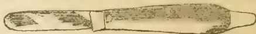
Fig. 1.—A BUDDING KNIFE.

in all that relates to agriculture and horticulture. When these ask us to tell them how to layer plants, how to prune, how to graft and to bud, and to do other operations, they will not be satisfied if we refer them to certain books for their information.

GRAFTING AND BUDDING

have the same end in view, and the operations are essentially the same, but differ greatly both in the manner and the time of performing them. In both, budding and grafting, we place a variety that we know and wish to increase, upon a tree of the variety of which we know nothing. It is a well known fact that our esteemed varieties of fruit are in an unnatural condition; so that when we plant the seeds of these, there is no certainty that the trees thus produced will bear fruit like the parent tree—that from which the seed was taken. The seedlings of our cultivated fruits may produce better kinds than those from which the seed was taken, but generally the fruit will be poorer, and there is no certainty about it. It is on account of this uncertainty that we propagate the varieties that we know, by grafting or budding them upon seedlings about which we know nothing. In grafting, we use a scion, a twig upon which are several buds, of a known variety, and insert it upon a tree raised from seed. We plant this scion, or cutting, not in the soil, where it may take root, but upon a tree which already has roots. In budding, we plant a single bud upon another tree. The operation of

BUDDING IS SOMETIMES CALLED INOCULATING.

and the use of this term, "inoculating," has given rise to an incorrect popular notion. In the inoculating of animals, including the human subject, we introduce a virus, or disease, which affects the whole system, and causes certain changes to take place within it. Many have an idea that in "inoculating" a plant, a similar influence is exerted, and that the nature of the plant is somehow so changed by the operation, that it will afterwards bear good fruit. This view of "inoculation," or budding, is entirely erroneous. Had the bud been left on the tree which bore it, it would have expanded, and pushed from it a green shoot, which in time would ripen and become a branch, and ultimately bear fruit. When we remove the bud from its tree, and plant it in another tree, it expands, a shoot appears; this grows and branches, and the bud, in time, becomes the tree, as all

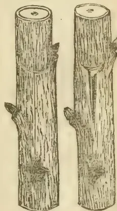
Fig. 2. Fig. 3.

the rest of the tree in which it was planted is cut away. In budding, we need

THE STOCK AND THE BUDS.

The stock, or plant in which we insert the bud, is a young tree of the same kind as the bud, or of a nearly related kind. Peach, Plum, and many other stocks are young trees raised from seeds; other stocks, as the Quince for budding the Pear, and those for the Dwarf or Paradise Apple, are young trees produced by layering. In budding the Peach, the stocks are from seeds planted the spring of the same year; the plants, with good cultivation, will be large enough to bud in August or September. Apple stocks and others grow for two or more years. But we must now assume that one has his stocks ready; the next step is

410------------------------------------------------

NOVEMBER 1, 1882.]THE TROPICAL AGRICULTURIST.391THE SELECTION OF THE BUDS.

It is all important that the buds be true to name; hence they should be taken from bearing trees. When a fruit tree has completed its growth for the season, that is, when the branches have ceased to increase in length, there then appears in the *axil* of each leaf—the angle where the leaf joins the stem—a bud. Examine any shoot of the current season's growth, and these buds will be found; those near the end of the shoot will be immature, those at its base small and poorly developed, while between these extremes will be several well-formed, plump buds. In securing the buds, take always the shoots that have grown this year. Such sticks of buds may be cut, and if prevented from drying, may be kept in good condition for a week or ten days. When the shoots are cut, the leaves should at once be removed by cutting through the petiole, or leaf-stalk, half of which should remain attached to the shoot. Such sticks of buds may be kept in damp moss, damp sawdust, or be wrapped in wet cloths. If simply moistened and inclosed in a tight tin box, they will keep well.

THE TIME FOR BUDDING.

varies with the kind of fruit, the locality, and the season. The usual succession is Plum, Pear on Pear stocks, Apple, Cherry, Pear on Quince, and Peach. The precise time for each kind is, when the bark on the stock will "run,"—that is, when it will readily part from the wood, this being the condition necessary in the stock; of course the buds must be plump and well formed.

THE OPERATION OF BUDDING.

is a very simple one, and those who make a business of it become very rapid budders. In the largest nursery in the Southern States, the best

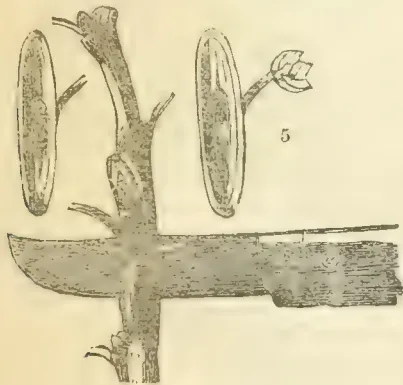
Fig. 4.Fig. 5.

budder is one who was formerly a slave. In the large Peach nurseries, the budder has two assistants; one goes ahead and prepares the stocks, by rubbing or cutting off twigs, and removing leaves from the place where the bud is to go; the other follows and ties the buds. Of course the amateur who inserts but a few buds, will perform all these operations for himself. It is a matter of importance to put the bud on the right side of the stock. If the rows run east and west, the bud is inserted on the north side, and when they run north and south, on the west side. It is also important to insert the bud as low down on the stock as a proper place can be found for it.

THE BUDDING-KNIFE.

is the only implement used in budding, and every budder has his own notions as to the proper form of the blade. Budding-knives, like that in fig. 1, are made with a thin ivory point at the end, for the purpose of lifting the bark, but experienced budders use the blade for both making the cuts and lifting the bark. The first step is, to select the place for the insertion of the bud. Two cuts are made upon the stock, down through the bark to the wood; one crosswise, and the other extending from this downwards, forming a T-like incision, as in fig. 2. Figure 3 shows the corners of the bark lifted, ready for the bud. The bud is now to be separated

from the stick, though some budders first cut the bud, and hold it between the lips until they have made the cuts upon the stock. Figure 4 shows the manner of removing the bud from the stick; the knife enters at A half an inch above the bud, and by a downward cut, comes out at B three-quarters of an inch below it. In making this

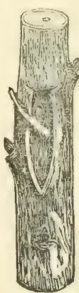
Fig. 6.
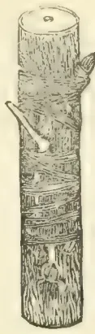
Fig. 7.
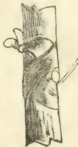
Fig. 8.

cut to remove the bud, as little wood as possible is to be taken off with it. When the bud is removed, it will consist of, besides the bud itself, a shield of bark, a portion of petiole or leaf-stalk that has been left attached, and a small portion of wood removed in the cutting, as in fig. 5. European budders direct the removal of the attached piece of wood, but our budders pay little attention to it, as unless it parts very readily from the shield of bark, the base of the bud may be injured by its removal. Holding the shield of bark and its bud by the leaf-stalk as a handle, it is placed in the incision (fig. 3), and pushed well down. If the stock is in the right condition for budding, the pushing of the bud to its place will be easily done, and the bark upon the stock need only to be lifted at the corners of the cut, to allow of the entrance of the shield; the bark at the upper end of the shield is then cut square across, so that it may fit the horizontal cut on the stock. Figure 6 shows the bud in place, and ready to be tied. The tying material is usually bass-bark, moistened to make it flexible; woollen and cotton yarn are both used, and some budders use thin and flexible corn-husks, selected from the interior layers at husking time. Figure 7 shows one method of tying buds, and fig. 8 another. In all cases, the object is to hold the parts in closest possible contact, and yet not injure the bud. In about 10 days, or two weeks, after the insertion, the buds must be looked to; the stock is still growing, and a serious strangulation may occur if the ties are left as they were applied. At this time it may be ascertained if the operation has been successful, or if the bud has "taken." If the bud and its bark look shrivelled, and the attached leaf-stalk is still remaining and dead, the operation has failed. If, however, the bud is still plump, the shield of bark bright, and the bit of leaf-stalk has dropped, the operation is successful. In case of failure, and the stock is still in good condition, another bud may be inserted; otherwise the stock may be left until next spring, and then be grafted. When the buds are found to be all right, the tie may be loosened, or cut through, to allow of the growth of the stock. The inexperienced will do better to loosen the knot sufficiently to allow of the increase in diameter of the stock, but retain the tie to protect the bud until later. When a bud has taken, and the ties loosened, nothing more is to be done until the following spring, when all of the stock above the bud is to be cut away. It is, of course, important to properly label the budded trees, that the kind of bud inserted may be known. In nurseries, this is done by labelling the rows, but in small operations, the stocks may each be marked by a label with the variety of bud inserted.

—*American Agriculturist.*

411------------------------------------------------

392THE TROPICAL AGRICULTURIST.[NOVEMBER 1, 1882.TEA CULTURE.—A REVIEW.

From the North China Herald.)

*The Tea Cultivator*; a Volume of Selections from Leading and Original Articles, Correspondence and Papers regarding matters of permanent interest and value concerning Tea and Tea-science, Tea-blight, Soils and Manures, Tea-cultivation, Buildings and Machinery, Miscellaneous Tea-topics, Tea-statistics, &c., &c., &c. Printed and published by the Indian Tea Gazette, 10, Bare St.

Though we live in the land of the tea-plant, it is astonishing how little the average resident in China knows about it. Even those whose livelihood depends upon the once "lobster article" are often found to be as ignorant as is any outsider: their knowledge is confined to the assumed value of the leaf on the London or New York markets, and they take little or no interest in the details of its production and preparation for sale. So great was the want of knowledge displayed by those who would naturally be expected to be the best informed upon the subject, that until quite recently, and owing solely to the investigations made in India, it was an axiom of general belief that black and green teas were gathered from totally distinct plants. Such enquiries as might have led to more accurate information were beyond the scope of the merchant dealing in the article, and the best tea-taster was often he who, confining himself to a practical knowledge of its market value, had the least theoretical acquaintance with the conditions ruling its production. And the apathy thus displayed is not confined to the foreign merchant. The Chinese themselves with whom he comes in contact, brokers and hongmen, appear equally ignorant, and little information is to be gleaned from them. Unless the Western buyer is prepared to speak the language and to spend a good portion of the season in the interior, watching with his own eyes each stage of production, the result of his stay in the country will be no greater, as far as a real acquaintance with his subject is concerned, than if he had never wandered a hundred miles from the dingy purleys of Mincing Lane.

While thus, in old times the European tea-merchant in China was content to purchase at the sea-port and ship home whatever the native teamen produced for sale, satisfied to reap an easy profit without asking troublesome questions; in the present epoch profits are no longer easy; the bright prospects of former decades are clouded over, and the newspapers, when they allude to the subject, are filled with wailing and lamentation over the hard times on which we have now fallen. Barely twenty years ago a cloud no bigger than a man's hand appeared upon the Western horizon in the shape of an export from Calcutta of about one million pounds of Assam tea. One looked upon this indication as a warning of a coming storm, for it was said Indian tea is bitter and unpalatable, and is a novel experiment not likely to succeed on a large scale or to oust from its supremacy the delicate fragrant growth to which long custom has wedded tea-drinkers all the world over. Yet the small cloud has increased fifty-fold, and the storm has begun to break with no little violence, until we find the consumption of China tea actually receding and the average value reduced nearly one-half. The time has now come when all concerned are compelled, willingly or not, to pay some attention to the rationel of the subject, and endeavour to enable themselves to form a judgment regarding both the present position and the future prospects of the trade in which they are engaged.

A most serviceable aid to such an inquiry is the file of the *Indian Tea Gazette*, which in our opinion every person interested in the cultivation or the sale of the article should read:—if not in the numbers of the journal as they appear monthly in Calcutta, then in the condensed form as given in the work under review, in which is accumulated the cream of eight years' issues. This work possesses farther the advantage of having its contents classified according to subjects. Unlike Colonel Money's well-known standard work on tea-cultivation, the *Indian Tea Gazette* is an accumulation of facts bearing on every branch of the subject, contributed by various authors, all specialists, and thus exhibiting the matter from every possible point of view. Controversies are carried on by various correspondents, and the reader is enabled to draw his own conclusions. Every fresh discovery or suggestion as to the improvement of the manufacture or in the methods of carrying on the trade

are freely given to the public, thus setting an example of cordial interhelp which the merchants in China would do well to emulate instead of as at present (as it would seem from such glimpses of the buying in Hankow as are from time to time vouchsafed to the general public) throwing dust in each other's eyes. In India it would appear that any specially fortunate planter hastens to publish the secrets of his success. Thus we have here collated the experience of planters scattered over all the various tea growing districts of India from Chittagong to the Punjab, and the advantages of different methods argued out, until little doubt as to the best course to pursue in any given case is left. The soil to be chosen, the manuring, the plucking of the flushes, whether at long or short intervals, the withering, firing, packing, shipments, and sale, are all related in detail, and lastly the opening up of new markets and the supplanting of China tea wherever practicable is strenuously advocated and the means of success pointed out. The generality of the contributors are curt and to the point as becomes practical men, but a few wild notions seem still to prevail where China tea is the subject of discussion. Thus at page 23 we find it stated "that the time is probably not far distant when the tea trade will buy entirely by analysis, supplemented in a few cases by a taster's report. An experienced palate will detect particular flavours which analysis will fail to show; but a fairly complete chemical examination of tea is of the highest value, whether as a guide to the purchaser, or merely to shew its freedom from adulteration." As well might we resort to chemical analysis to enable us to gauge the bouquet of Burgundy and hence its value. At the same time the long list of methods for discovering adulteration are useful, and the scientific account of the growth and development of the plant interesting in the extreme to the tea-drinker as well as to the grower or dealer; but the fact that the flavouring substances of tea and coffee are chemically identical shews the futility of trying to arrive by chemical analysis at the value of an article grown to please the palate. From an analysis given on page 346 we find that in dried tea the element theine comprises about one-tenth of the weight of the whole. The analyst also states that theine does not produce wakefulness, but that its effect on the system is a sedative one. Theine and quinine are similar in their chemical constituents, and although tea may not cure fever and ague, it doubtless acts as a preventative. The next elements of importance in tea are the volatile oil and the tannic acids. This former element upon which the commercial value mainly depends, and whose quality can only be gauged by the palate of an expert, forms in the best teas only a fiftieth part of the weight of the whole. To this is due the distinctive flavour, and no chemical analysis of it has yet been made. It is to the presence of this oil that the wakefulness attributed to tea drinking is due, and it is stated by those who have made these subjects a special study that it acts upon the system in the same manner that *digitalis*—the foxglove—does.

It is a well-known fact that this sleeplessness and, when tea is taken to excess, palpitation of the heart is more marked in green tea than in black tea-drinkers. This latter *kung-fu* or "worked" tea as it is technically described, and *hung-cha* or "red" tea as it is popularly known by the Chinese) loses a portion of its volatile oil in the "withering" (or, as it is improperly called "fermentation")\* which is replaced by an empyreumatic oil developed in the subsequent firing and to which the peculiar soft flavour of Congou is due. A similar effect is produced in the curing of tobacco; upon the effectual manner in which this is carried out depends the absence of the biting acrid taste of ill-cured leaf, and its consequent nauseating effects even upon the system of the practised smoker. The volatile oil is still there, but its character is changed. Hence the importance, in obtaining a well-flavoured cup of tea, of employing soft water capable of dissolving the volatile oil, not steeping it too long so as to overpower the flavour with the bitter extract of tannin, nor of boiling the tea, by which the volatile oil is driven off and lost.

\* The reviewer has here fallen into a curious mistake. The process of withering, which makes the gathered leaves flaccid as finest satin, precedes the rolling process, after which comes fermentation.—ED.

412------------------------------------------------

NOVEMBER 1, 1882.]THE TROPICAL AGRICULTURIST.393

Tannic acid or tannin forms nearly one-fourth part of the chemical properties of tea. It is a powerful astringent, and is remarkable as being entirely absent in coffee. Some attribute to this element the dyspepsia from which ardent tea-drinkers suffer; others believe that it aids digestion, but its true physiological action is still a matter of doubt.

The above is a specimen of the exhaustive information to be culled from the book before us. Part II. is devoted to a description, illustrated with handsome plates, of the insect enemies of the tea plant and the best methods of their destruction. These are "rust, mosquito-blight, the tea-grub and the red spider." We have never heard of the plantations in this country being ravaged by these pests, whom doubtless some people engaged in the trade would not be sorry to see introduced for a season into China.\* They never fail to have a material influence on the production in India, and without them our rival would be still more fatal. The details of their ravages and the different methods of combating them are highly interesting, as are the chapter on choice of ground for tea cultivation, and the various processes of planting, curing and packing adopted in different gardens. We almost think an opening for an enterprising "tea-man" presents itself in India to introduce the Chinese system of bulking, which appears to be entirely unknown there, and which necessitates the bulking in the London warehouses of all Indian tea. This process, pursued at the termination of the voyage, is doubtless the cause of the bad keeping qualities of Assam tea. The tea is, as is well known, after being for some time exposed to the London air, replaced in the chests, the lead lining of which has been partially destroyed, and which it is never attempted to re-solder. In China, the leaf from many gardens is brought up in small quantities and in its natural state by the so-called teamen, who erect or hire packing houses in the centre of a district, and then bulk their purchases into chops of 500 to 2,000 chests before packing. Thus a wonderfully homogenous tea in merchantable quantity is placed upon the market, and, until it reaches the consumer, but a small proportion of its bulk needs subsequently to be exposed to the atmosphere for the purposes of sampling and taring. Whether a similar undertaking in India would afford a safe investment of capital remains to be proved by experience; but we cannot but think that such a division of labour would prove acceptable at least to the smaller planter, who would thus be enabled to realise his crop immediately on the spot and be absolved from the risk attending the subsequent stages of manufacture and sale.

Another chapter is devoted to Brick tea, in which our Indian neighbours are ambitious of emulating Hankow in the commerce with Thibet.

The question of labour, long tables of statistics, the relations of planters to the government, the various items that go to swell the cost of production, are all fully treated of. For the purposes of comparison it would be most interesting to be placed in possession of similar statistics of the China growth. These are unfortunately unobtainable in the present condition of the country, but the time will doubtless come when the foreign advisers of the government will shew them the necessity of doing all in their power to facilitate the obtaining of information and to improve the methods of culture.

The competition of India is becoming more serious each year, and, handicapped as China tea is by greater distance and by an export duty of fifteen to twenty per cent *ad valorem*, it seems to be only a question of time when it must succumb to its more favoured rival. Science against hand-to-mouth methods must prevail in the end, and with, in India, such ardent intelligence and progressive knowledge devoted to the subject, as illustrated in the work before us, China, so long as no need of improvement is felt, must ultimately take second place. As long as European merchants continue to buy freely all that the Chinese produce, this need will not be felt; but the signs of the times point to the coming exercise of a compulsory reticence on their part, totally alien to the ancient and still prevailing traditions of the trade. Hard facts

\* It is probable they are present, although scarce in proportion to the scattered patches of cultivation. Is there no description of the tea plant and its culture in Chinese, in which insect or fungoid pests are mentioned?—Ed.

will have to be faced and their logic may produce a change which the most lucid reasoning has hitherto been powerless to effect.

A few defects it is our duty to point out ere we quit what has been a most interesting study. Some incorrect statements among so large a number of contributors are almost sure to creep in, and notably in regard to China, with the tea-industry of which the writers have probably no practical acquaintance. Here we find such glaring misstatements as these.—"China never sends us her best teas"—"China, whose people began making tea two thousand years ago" p. 293, whereas a few hundred years would be nearer the mark:—"The Chinese destroy the gum by overfermentation" (p. 296). Then we find the idea prevailing among several correspondents that "China tea is more or less adulterated," the fact being that with the exception of a very few low-class teas prepared in Canton, adulteration is practically unknown, there being more genuine tea than the packers in the country can absorb.\* There is practically no limit to the quantity of tea producible in China, the portion, large as it is, packed for foreign consumption, forming probably but a small proportion of the total yield.

The history of tea cultivation in India forms another most interesting chapter. We learn that the cultivation was originally introduced into Kumaon under government auspices in the year 1835, when two small experimental gardens of three and four acres each were planted with seed sent from China by Mr. Gordon. This was the result of a Committee appointed by Lord William Bentinck on the 24th January, 1834, "for the purpose \*\*\* of the introduction of the culture in India and the superintendence of its execution." These early plantations appear to have languished under official superintendence until the year 1843, when Dr. William Jamieson paid his first visit to the Dehra Dun; and in September of that year a favourable report was given on the first sample of Indian tea ever seen in England by the celebrated firm of W. J. and H. Thompson in Mincing Lane. Dr. Jamieson had shewn that its culture could be made a commercial success, when in 1850 Robert Fortune was despatched to China to obtain both seeds and workmen.

We will conclude our too lengthy notice with a few figures extracted from the tables which extend to the year 1879. In that year the total area of land under tea cultivation was 200,000 acres, producing an average yield of 216 lb. to the acre, making a total production of 44,700,000 lb., employing an army of 1,200 Europeans and 300,000 natives, and an expenditure of 250 lacs of rupees. It was then calculated that "when all the tea now planted out shall have come into bearing, India will produce 70,000,000 lb. of tea!" The land available for the production of the future is practically unlimited.

A. J. L.

#### COCOA AND ITS CULTIVATION

Considering the large and increasing consumption of cocoa and chocolate, not only in this country but also over a large extent of continental Europe, it is not surprising that some interest has of late arisen amongst those interested in the supply to consider from whence our future consignments are to come. It is to be hoped that nothing will occur either by disease or otherwise to diminish the cocoa crops in the countries that have been so long famed for the cultivation of this valuable tree; it is, nevertheless, the duty of planters for the benefit of the world at large, as well as for their own pecuniary advantage, to introduce and cultivate in their own plantations economic plants of widely different character, and the cocoa is one that should command a large share of attention in countries where the conditions of soil and climate are similar to those of the West Indies or South America, and particularly of those districts which are celebrated for the high quality of the produce. Since the successful introduction of the cinchona plants into India from their native haunts, in the dense damp forests of South America, our eastern empire has been looked upon as the probable future home of numerous

\* Much of the lower qualities, if not adulterated are very poor rubbish. Considering that tea sent from China pays an export duty of 3½d, how is it possible that 6d. per lb. or less in England and Australia can pay?—Ed.

413------------------------------------------------

394THE TROPICAL AGRICULTURIST.[NOVEMBER 1, 1882.]

other useful plants. Ipecacuanha followed cinchona, but up to the present time its success is far from being ensured.

In the Island of Ceylon, where the coffee plantations have been so devastated by the attacks of the *Hemileia vastatrix*, it is satisfactory to know that the cocoa (*Theobroma Cacao*), has been successful, and quite recently some of the best varieties of cocoa plants have been transferred to Singapore and Fiji. On this subject we quote the following from the Kew Report for 1880.

"Mr. Horne, the director of the Mauritius Botanic Garden, having visited Fiji, at the instance of the governor, Sir A. H. Gordon, reported to the Colonial Office that it was peculiarly desirable to introduce into the islands, as well as the eastern colonies, 'the twelve or thirteen superior varieties of the cocoa plant in cultivation in Trinidad.' Arrangements were accordingly made, and in the course of last autumn (1880), seven Wardian cases of cocoa plants were received from Trinidad at Kew in excellent order, and after examination and repacking transmitted to Ceylon, whence it was arranged that portions of the collection should be sent to Singapore and Fiji respectively. The transmission to Ceylon was fairly successful, and Dr. Trimen has since made the distribution. Individual planters in the East have already largely supplied themselves with cocoa seed from Trinidad. It was thought that it would be advantageous, however, to have in the Botanic Gardens of the colonies above mentioned standard collections of varieties for future observation and experiment. In an official report on the subject, Mr. Prestoe, the government botanist at Trinidad, remarks:—"The best kinds are by no means well known. Indeed, with the majority of growers here they are not known at all, and they never notice a difference in the character of the trees, nor that of the sample of produce, except in respect of the Calabacillo, or wild cocoa, and this they very rarely eliminate. In the whole range of varieties, however, there is a difference in the value yield of at least one to five. Under these circumstances, the value of the cocoa plants now forwarded should be regarded as of rather a botanical or scientific nature than as an agricultural or economic one for immediate effect, for the varieties being separated and described as far as it is practical to have them, there is a base for experiments and tests as to what are their real characters, and what may be done with them in the way of improvement." As usually seen, the cocoa tree averages 14 to 18 feet in height, but if allowed to grow without restraint would attain to 30 feet or more. The leaves are very large, sometimes 7 inches in length.\* The plant flourishes best at an elevation of not less than 500 feet above the sea. Notwithstanding that it delights in great heat, it comes to the greatest perfection in sheltered situations. In an exhaustive paper on cocoa cultivation read before the Society of Arts some years since, it is stated that the cultivation of the plant extends more or less in Mexico, Honduras, Guatemala, Nicaragua, and throughout almost the whole of Central America, Brazil, Peru, Ecuador, New Grenada, Venezuela, Surinam, Demerara, Essequibo, and the West Indian islands; it has also been grown in Africa, Mauritius, Madagascar, Bourbon, East Indies, Australia, and the Philippine Islands. Trinidad and Grenada are the sources of the chief supplies, and they perhaps afford upon their western shores the finest possible sites of cocoa plantations. The latter country is of a particularly mountainous character, the mountains attaining even an elevation of 3,000 feet, forming many fertile valleys and fine rivulets, more numerous perhaps than in any other island of equal extent, in consequence of which it is well suited for cocoa cultivation. Considering the fine qualities of cocoa produced in Grenada, that country may be looked upon as the type or copy for planters and cultivators in other parts of the world, and the following notes refer more particularly to the system of cultivation as carried on in Grenada. Upon ground of a steep, hilly character, such as is found in that country, the site recommended should have a west or south-westerly aspect. The crop is said to be more regular, and the outturn more abundant in plantations where there are hills and valleys rather than

upon a level. In consequence of the tenderness of the flowers of the cocoa-tree, it is best to select a site for a new plantation not too fully exposed to the effects of high winds, for, from this cause alone, cocoa crops are often defective. The question of shade for trees is also a very important one in the proper management of a cocoa plantation, especially on level situations. On this head we are told: "An alluvial plain, where obtainable with the necessary qualifications and in the proper situation, grows a fine quality of cocoa, but does not necessarily yield the best return. When planted on such a site the cocoa requires to be interspersed with tall trees to obtain the necessary coolness, moisture, and protection from the winds. The *Erythrina umbrosa* or *Covallodendron*, called in the country "Bois immortel," is much planted in Trinidad, but it must be said of the system that the trees keep out light and air, which are great necessities. Much moisture is necessary to the perfection of the cocoa, and where near a running stream of water it grows most luxuriantly, but near a stagnant pond withers and dies; while in the former case the water furnishes a supply of moisture to the roots, which seems to act beneficially; in the latter it chills the roots and destroys the tree. The leaves of the cocoa-tree absorb a large quantity of moisture, and it is necessary for the nurture of the tree that the atmosphere generally should have a tendency to decided humidity."

Regarding soil, a very important consideration in a cocoa plantation, it is necessary that it should be deep and porous, the best is a loamy virgin forest soil where there is a good deal of vegetable mould. Cocoa, however, will thrive in a stony soil because the roots cling to the stones, from which it is said they derive a coolness\* and a certain amount of moisture, while they sometimes help to break up the density of the soil. A retentive or swampy soil should in all cases be avoided.

It is necessary before planting commences that the ground should be thoroughly cleared of weeds. In consequence of the tenderness of the cocoa plants when young care should be taken that they are not exposed to a blazing sun or any undue coldness of night air. To protect them from these effects many kinds of trees are used whose broad foliage form a shelter, and at the same time prevent the growth of weeds. Amongst the trees best suited for this purpose are the Plantain and Banana, the fruits of which give a return during the three years that the cocoa plants are coming into bearing. Besides the Plantain and Banana some of the tuber yielding plants are sometimes planted, such as the Manihot or Cassava (*Manihot utilisima*), Yams (*Dioscorea spp.*), &c. From April to June is the time best suited for planting the cocoa, though, with proper care, the planting may go on throughout the year. The distance at which the plants should be separated varies according to the quality of the soil, the most satisfactory distance seems to be 10 feet asunder for a poor soil, 15 feet for good land and on rich virgin soils as much as seventeen or eighteen feet, taken throughout in Grenada, if planted about twelve feet apart, it is about the best average distance. The system adopted by the natives in Grenada of close planting is a great fallacy as is evidenced by the yield obtained by them. It is not, however, expedient to allow the tree to grow larger than can be thoroughly nourished; indeed, to obtain the fullest extent of fruit the cocoa tree must be pruned in, and in a measure stunted, and the earlier the land can be covered in the better as the weeds, so long as they have light and air, will grow stronger and more rapidly than the cocoa."

Care should be taken to plant in parallel lines and the avenues at right angles with the lines; by this means a better current of air is maintained amongst the plants, and the work of the plantation can be carried on more methodically, and a better supervision maintained. Practice shows that it is better to plant three or four seeds in the space where a single tree is required so as to ensure the growth of one, and when the growth of one is ensured the others, if germinated, can be removed. More than one seed, however, should not be placed in one hole as they are apt to sweat and cause decay. On the subject of manure in the cultivation of cocoa it is said that should it be deemed advisable to apply it, it should be done by

\* On young trees in Ceylon they attain a length of over 2 feet.—Ed.

\* Warmth, surely.—Ed.

414------------------------------------------------

NOVEMBER 1, 1882.]THE TROPICAL AGRICULTURIST.395

digging a ring around the tree twenty or thirty inches from the trunk, and buying the manure, which should never be other than put into the hole, and that is given to the extreme extremities, which are the points whence nourishment is received from the soil.

In selecting seeds for planting two parts are developed, they are either taken from the fresh ripe fruits and planted at once or they are allowed to remain in the fruit after gathering till the fruit becomes somewhat dry, or rather the pulp does which surrounds the seeds. The best system is considered to gather the fruits when ripe, and stack them in heaps for a few days, after which the seeds are said to germinate more rapidly.

When the young trees are fully established the spare trees may be removed, and may serve for transplanting into other parts of the plantation, to fill up vacancies. In trimming or pruning the trees, the object to be attained is to have three or four healthy primary branches, and to prune back the others so as to prevent them touching each other, and thus to shut out light and air. The branches should not be allowed to ascend too perpendicularly; the object of this is to keep the trees down to reasonable limits, so that the crops may be gathered with greater freedom. "The cocoa throws out a great many branches, which injure the productive power of the tree. It is most important that they should not be too numerous, nor the foliage too redundant; the one is the result of the other, and together they weaken the tree, and keep off that strength and vigour which the access of the sun's rays and the circulation of air naturally produce. Though the leaves of the tree are the imbibers of much moisture, and the sources from whence, equally with the roots, the tree is nourished, it is essential to allow only the growth of a necessary quantity, in order that the rays of the sun may penetrate, and the air circulate, among the branches. It will, therefore, form the most important part of the planter's duty to prune into form the young cocoa tree."

Most plants are liable, and unfortunately, those that are of the greatest use to man seem specially liable, to attack by insects or fungi, therefore a sharp look out should be kept in all plantations that the cocoa plants are perfectly clean, equally as much from an overgrowth of mosses, lichens, &c., as from insects at the time of flowering; this is especially necessary, and it is also the custom in the best kept plantations, to clear the ground of weeds and other foreign growths, preparatory to gathering the crops. The fruits are ripe and ready for picking when they begin to turn yellow; the fruit is then picked, and the seeds usually by boys and girls, in heaps, where they are allowed to remain for twenty-four hours at least, when they are opened by a slit made longitudinally with a knife or cutlass, and the seeds pulled out by the hand; they are then removed in baskets to the works, where they are placed on a slope to allow what moisture remains to drain off, after which they are placed in boxes for the purpose of slight fermentation, or sweating as it is called. The acid juice that drains off is easily convertible into vinegar or spirit. This sweating process is continued on an average for about 24 hours, but it must not be continued too long, or a sourness is produced instead of the aroma which is intended. Upon removing the seeds from the boxes they should be spread out to dry, and for this purpose they should be exposed as much as possible to a free current of air as well as to the sun's rays. The object of careful drying is to produce a clear, dark red-coloured seed, which is generally considered a test of good quality. When thoroughly dry the cocoa seeds are packed either in bags or barrels, the latter are not only the most secure, but the contents are better protected from external moisture or from being spoiled by coming in contact with other products of a totally different character, which may per chance be mixed with them.

The various uses of the cocoa bean are so well-known that it is unnecessary for us to go into them here. There is always a demand for cocoa of good quality; it should, therefore, be the aim of the planter to produce a seed of good size and colour, and with a delicate grateful aroma. These may all be obtained by care and practice. It is generally considered that the best prepared cocoas for use as a beverage are those from which a certain portion of the butter or fat

has been taken. The infusion is thus lighter and more easily digested; but it must not be forgotten that the fat of the cocoa bean is not a waste product, but a very important commercial article, both in medicine and for manufacturing purposes, in consequence of its non-liability to turn rancid.—*Planters' Gazette*.

RUSKIN says that linseed oil is one of the most durable of materials supplied by nature.—*Oil and Drug News*.

ARTIFICIAL INDIGO ABANDONED. The Badische Aniline and Soda Fabrik has abandoned the idea of being capable to produce artificial indigo at a price low enough to compete with the natural color, and therefore has abandoned the experiments made according to Professor Baeyer's process. It remains to be seen, however, if the idea of the artificial production of indigo, although given up as impracticable at present, will not be realized at some future time, as also it remains to be seen if indigo will always be capable of holding its own against the indophenols discovered by Witt and Koechlin, or any other dyestuffs which may be discovered at some future time.—*Oil and Drug News*.

THE BONE TREE.—Captain Maclear, commanding H. M. surveying ship *Albatross* writes to the *Standard* last month:—"In August last there appeared in the *Standard* a letter from Lieutenant de Hoghton about the pearl-shell fisheries in Torres Straits. In this he mentioned a curious tree that picked up bones. The account was so curious that I wrote to Mr. Chester, the resident magistrate at Thursday Island, for an explanation, and I think his answer will interest your readers:—'I have made inquiries about the tree, and I find that it grows at Marbiac, not far from Pearson's Station. It is a kind of Banyan, or fig tree, and sends down long vines, or tendrils [roots], from its upper branches; these run along the ground, and twine round any small obstacles in their path, such as bones and other unconsidered trifles. The vines afterwards contract and draw up whatever is attached to them. This is Pearson's explanation of the phenomenon.'"*Journal of Forestry*.

IPECACUANHA.—The propagation of this medicinal plant is now carried on at the Ootacamund Botanical Gardens with artificial heat. This operation was previously conducted in the branch garden at Burlair 2,500 feet above sea level, but in consequence of the difficulty of securing the services of a trained gardener to live in so feverish a locality, the change to Ootacamund was advised and adopted. In the course of a year the number of established plants was increased from 130 to over a thousand. When once rooted the cuttings can be put out and demand little attention. They require a well prepared compost of vegetable mould, with a liberal allowance of manure. Water must be sparingly applied so as to keep the soil moist but not wet or the plant will sicken and die. With the requisite temperature the cultivation of the Ipecacuanha is a simple matter requiring no skill. So far as we can ascertain there has hitherto been no demand for the cuttings with the stock on hand, the superintendent ought to be able to supply a good number to those desirous of cultivating a fine—*Scots. J. of Med. Obs.*

PROTECTIVE MOULDING OF POTATOES.—I beg to inform you that since the publication of my little book, I have made further experiments which have confirmed in the most satisfactory way possible all the principal results laid down in my pamphlet, as far as the "protective moulding" and the different soils are concerned. I fear no contradictions from practical field experiments if only they are carried out in exact accordance with my directions. Two things, especially, are necessary, viz.:—1, The earth covering of the protective moulding must be not less than about 5 inches over the upper surface of the uppermost leaves, sitting generally to about 1 inches; 2, The protective moulding must be executed before the disease in the leaves has set in, or at least as soon as the first traces can be noticed by a careful inspection of the leaves. A covering of 4 inches is, however, quite sufficient for sandy soils, but for medium and stronger soils 5 inches to 6 inches with sifted manure. These suggestions rest on experiments recently corroborated.—J. L. JENSEN, Copenhagen. [We shall be glad to hear more of the results you obtain.—Ed.]—*Gardeners' Chronicle*.

415------------------------------------------------

396THE TROPICAL AGRICULTURIST.[NOVEMBER 1, 1882.

UTILISATION OF SEA-WEED.—M. Alexandre Saint Ives is reported to have succeeded, after numerous experiments, in extracting from sea-weed a composition like that of starch and sugar, which is well adapted for the economical manufacture of certain articles of commerce, such as imitation leather, and transparent substances. The sea-weed, previously washed in pure water, or water impregnated with a little lime, or potash, is dried, and then pounded or ground, according to its variety, and introduced into a conical boiler. A soluble substance is extracted by a bath of hot water or steam, when the residue, on cooling, assumes a gelatinous consistency.—*Journal of the Society of Arts.*

VINTAGE OF FRANCE, 1881.—Consul Roosevelt, of Bordeaux, states that the details given by the Minister of Finance, in relation to the wine crop, show a considerable improvement. In 1879, 25,000,000 hectolitres (the hectolitre being equivalent to 22 imperial gallons) were produced in France; in 1880, 29,000,000 hectolitres; while in 1881, there were 34,138,715, giving an increase of 9,138,715 over the year 1879. Notwithstanding this improvement, the yield is still 15,000,000 hectolitres below the average of the ten years preceding 1879. In the early part of last year, appearances seemed to indicate the prospect of a very much greater production, but the ravages of the phylloxera, and the abnormal heat which succeeded the constant rains of September and October, to a very great extent blighted the vines.—*Ibid.*

RED SPIDER, ITS CAUSE AND CURE.—To a great many struggling, industrious, and enthusiastic amateurs this universal garden pest is a source of annoyance, and often of considerable loss. Whether it be the imperfectly trained market grower who pays for his learning at the beginning of his career, or the amateur who cultivates Vines or other fruit trees or plants more for pleasure and recreation than for profit, the constant cry is, How can we eradicate or keep down red-spider? It is not always safe to recommend drastic measures to inexperienced people, and yet nothing short of a drastic remedy will oust the enemy from his position. Practical gardeners being fully aware of the dire effects of a serious attack of red-spider, follow the safe maxim that "prevention is better than cure," and therefore give the enemy no quarter. But with the amateur, the enemy comes as a thief in the night, and the sad work of destruction is well-nigh complete before he is aware of the fact. Vines, perhaps, suffer more from the attacks of the enemy than any other plant or fruit tree. In ninety-nine cases out of a hundred the cause is either absolute dryness at the roots of the Vines, or an unhealthy condition, brought about by defective drainage.—*Gardeners' Chronicle.*

A PLANTER OF EXPERIENCE sends us the following information in regard to covering for cichona trees after shaving, as being cheap, effective, and expeditious. Take common glue, gum, or gelatine, or any like substance, melt by heat with a sufficiency of water, and add Bichromate of Potash or Crome alum. Take any common paper, such as old newspapers, cut up into slips, (by preference 3 inches in width) and paint over or on the solution. Dry in the sun. When dried, and the colour of the solution on paper has turned a dirty brown, the paper can be used for the purpose required. Commence covering, as in ordinary bandaging, at the lowest part of the tree, and so on to the highest portion shaved, keeping of course each turn of paper slightly lapping over the last turn, and finish off at the top with a tie of aloe fibre, or thread of old sack. The bands of paper may not of course be long enough in themselves to cover the whole of the tree, but one piece can be continued on from the other, if merely commencing as at first. The painted side of paper is of course exposed. I have tried this method with great success, and, if properly put on, the paper will last for months. Potash Bichromate is about 9d per lb. in England, and 1 lb. would be sufficient for thousands of trees, when in solution. Make the gum solution fairly thin, and add to each liquid oz., say 25 grains of the Potash Bichromate. The action which takes place, perhaps you may like to hear, is described as follows:—"Gelatine, aided by light, reduces the Chromic acid of the bichromate to a lower state of oxidation and then enters into combination with a compound chromic acid, produced by decomposition of the acid and the gelatine, the result being the formation of a leather-like substance insoluble in hot water." The Potash Bichromate is, I may add, a highly irritant poison.—*Daily Bulletin.*

GUM FROM GREVILLEA ROBUSTA.—In some interesting notes on the Shevaroy Hills for 1881, recently communicated to the Agri-Horticultural Society of Madras by Deputy-Surgeon-General Shortt, the following paragraph occurs:—"Of the plants introduced on these hills, I have to notice a peculiarity as regards the *Grevillea robusta*—one tree, which is now eleven years old, has for the last two years during the rains produced spontaneously each year 10 oz. of a translucent gum which has no smell or particular taste, is of a pale yellow colour, and mixes readily with water, when it forms a whitish brown-coloured milceage, and as a paste answers all the purposes of the so-called gum arabic for adhesive purposes. The other *Grevillea* trees are some two or three years younger, and have not as yet evinced any disposition to produce gum." This statement is a remarkable one, as none of the Proteaceæ were known to yield gum.—*Gardeners' Chronicle.*

COCKCHAFER GRUBS.—A paragraph in the *Indian Journal of Forestry* is to this effect:—"It is recorded in the *Revue des Eaux et Forêts* that a forest guard, named Beny, has pointed out a good plan of getting rid of cockchafer grubs from his garden. He digs holes about 2 feet in diameter and 2 feet deep, and fills them with stable litter covered over with soil. In June, in a day when the sun is hot, the holes are opened, and a large number of grubs are then found and destroyed. But such a measure would be of very little use in India. In 1881 in Darjeeling almost all gardens were visited by these cockchafer grubs, who eat off not only the roots of bulbs and other flowering plants, but stripped the turf from the banks. The Superintendent of the Botanic Garden made an estimate that he had destroyed about eight millions of them. This year the beetle is not uncommon, and it is much to be hoped that it will take itself off elsewhere to lay its eggs.

A GIGANTIC OLIVE TREE.—A correspondent of the *Berlin Garten Zeitung* states that there is an Olive tree at Bendinal, near Palma, in the island of Majorca, that has a trunk 13 metres in circumference. The tree is of little height, and has few branches. Its fruit is like that of the younger trees. He goes on to say that the Olive trees of Jerusalem are computed to be 2,000 years old, and they are only 6 metres in circumference. How old, then, he asks, may the Majorca tree be? Perhaps not so old as those at Jerusalem, we answer. Coutance, in his admirable *History of the Olive*, mentions one tree as having a trunk 12½ metres in circumference close to the ground, and 6½ metres at 1 metre from the ground. This tree stands between Villefranche and Nice, and was a notable tree in 1515. He also quotes another writer, though he does not seem convinced of his veracity, who describes an Olive tree whose hollow trunk was so large that a score of persons could take shelter within it at once.—*Gardeners' Chronicle.*

AMOLE—A PLANT THAT YIELDS SOAP.—These cacti grow on the American continent from Mount Shasta on the north to a similar latitude in South America, and from the Pacific coast to east of the Rio Grande, through New Mexico and Western Texas. The flower stalks are destitute of leaves, but are plentifully supplied with branches about eighteen inches long, from which flowers of white and yellow colors are suspended in the flowering season. The bulbous root is from one to six inches in diameter and from six to eighteen inches long. A saponaceous juice is expressed from the root and the fiber of the leaves\* is heckled for the manufacture of mattresses, cushions, and chair seats. The vegetable soap extracted from the root has been used by the Indians, Mexicans, and others for many years as a hair wash, and exceeds in purity our manufacture from animal substances. The preservative qualities of the soap are well known and its use gives the hair a fine natural glow, preventing decay of the hair and entirely eradicating dandruff or other impurities on the scalp. Cattle eat the leaves in the spring as a purgative. And cut into bits and thrown on water where fish abound, the effect is stupefaction of the fish, when they can be easily taken. The price among the Indians and Mexicans, who sell it in Tucson, is five cents for a bunch of two stalks interlaced (mancuernas). For cleaning flannels the amole is found vastly superior. It may be hoped that the manufacture and preparation of amole may become one of the industrial pursuits of the age.—*Tucson Citizen.*

\*Fibre of the leaves of cacti? Aloes must be meant.—ED.

416------------------------------------------------

NOVEMBER 1, 1882.]THE TROPICAL AGRICULTURIST.397

TROPICAL CULTIVATION IN QUEENSLAND:  
THE SUGAR ENTERPRISE THERE  
AND IN CEYLON.

Before taking up our specific subject, we may advert to and discuss today the Governor's suggestion, in his Speech to the Legislative Council, of the possible revival of sugar cultivation on a large scale in Ceylon, and the remarks of a correspondent on the subject. Our impression always has been that the sugar enterprise in Ceylon failed, not because the soil and climate were not equal to the production of crops of luxuriant cane, but because the proportion of saccharine matter in the canes produced was so small in proportion to the watery moisture as to render manufacture unprofitable: often impossible. We remember seeing a Mr. Allan in the neighbourhood of Negombo, ladling up a mass of bubbling molasses-looking stuff from a cauldron, and declaring, in a tone of despair that, boil as he would,

Double, double, toil and trouble,

Fire boil and cauldron bubble,

he could not get the sugarcane juice to granulate. That, we believe was, more or less the reason why all the plantations, from the Dumbera one on which the late Mr. R. B. Tytler began life in Ceylon, on to the close of the late Lord Elphinstone's persevering efforts at Paraduwa were abandoned,—as sugar plantations. It is very true that all was not failure. We well remember Mr. MacGregor, who managed Lord Elphinstone's place (now likely to be a success with such "new products" as Liberian coffee, cocoa, tea, etc.,) bringing a loaf of refined sugar to the *Observer* Office, such as could scarcely be excelled. But mere occasional successes, due, perhaps, to abnormally dry seasons, did not enable the enterprise to pay, and so sugar plantations and manufactories with their expensive machinery, were abandoned, all but that on which some of the earliest experiments were made, by the late Mr. George Winter and continued by his son-in-law, Mr. Bowman, in the valley of the Baddegama or Gintara river, above Galle. The near contiguity of this estate (formed mainly of paddy lands), to a steady market for the inferior kinds of sugar, amongst the shipping resorting to Galle, was in the early stages much in its favour, and before Mr. Bowman's lamented death he felt encouraged to import improved appliances, the results of which are the fine crystals now for sale in the local markets. But although the local markets—first of Galle and then of Colombo,—have sufficed to support the comparatively limited experiment at Baddegama, it is clear that operations on a more extended scale could only command success by the growers being able to compete in the markets of the world with the sugars grown on volcanic deltas and in deep rich alluvials in Cuba, Jamaica, Java, Demerara, Mauritius, and other more favoured countries. What the Ceylon rivers wash down in the shape of mineral matter is mainly disintegrated gneiss, and the alluvial matter, apart from the decayed vegetation which it contains, is fertile mainly because of the influence of tropical heat and heavy rainfall. It will grow luxuriant crops of stalks and leaves, but after a few crops are removed, its power to mature fruit or to elaborate saccharine matter is largely exhausted. Fertilizing substances must then be applied and the question now is, can sugarcanes in Ceylon, which are common enough as an article of refreshing diet in the raw state amongst the natives, being sweet enough for that purpose,

be so improved by the use of guano and phosphates, as to granulate well and yield paying returns? Even the richest soils of volcanic origin require manuring after half-a-dozen crops are taken off the ground. The competition, therefore, would be unequal only against those who have large areas of virgin soil to operate on. This is the case with the Queensland sugar-growers at present. The river deltas are by no means so extensive as they are in many other countries, but still the areas are large. For instance, in the Mackay district alone it is computed that there are over 300,000 acres of land suited for sugar cultivation. The other great consideration is the enormous cost of the machinery required in the scientific manufacture of sugar. To take in canes sufficient to yield 200 tons of sugar, machinery, including vacuum pans and *triple effect* appliances, would have to be erected which would cost £20,000; while this sum must be doubled if 500 to 600 tons are manufactured. When we were in the Mackay district we travelled with a Mr. Mackinnon, who paid £90,000 for the Pioneer estate, and, besides the machinery which he found ready to his hand, we believe he has made additions at a cost equal to half the money which he paid for the property. Operations on such a scale are, evidently, not to be thought of at present in Ceylon. If experiments are to be tried, they must be tentative and modest. We should not like to speak dogmatically, but we must repeat our belief that (visitations of insect and fungoid plagues excepted), in our soil and with our climate, we can grow luxuriant canes of all the best descriptions. The question is not growth but chemical constituents. If our canes could be brought to yield juice, of which ten per cent would shew sugar by the test of Beaume's saccharometer, and if we could get 20 to 30 tons of such canes for each acre, then we might go ahead. But as a preliminary experiment, it would be well to have specimens of the canes grown in the wetter and the drier parts of Ceylon analyzed and tested for sugar. Sugarcanes which taste sweet enough when sucked for the sake of the juice, might be found woefully wanting in the saccharine constituent when so proved. If, on the other hand, they stood the test, then it would be clear that the cause of former failures must be looked for mainly in the superabundant moisture in our atmosphere, and a remedy might be discovered in the modification of buildings and machinery. We are by no means sanguine that Ceylon will ever take her place amongst the sugar countries of the world, but, as we can remember the time when the successful growth and manufacture of tea in our island was believed to be impossible, because, amongst other reasons, tea prepared for the Messrs. Worms, cost £5 sterling per lb., we certainly feel that the interesting question started by Governor Longden, in consequence of his past connection with sugar colonies, ought to be fully considered and investigated.

In order that at this juncture of renewed discussion of the subject our readers should be placed in possession of all available information on the subject, we extract from Fergusons' *Handbook of Information for 1876-78*, the carefully compiled summary of the history of Sugarcane Cultivation in Ceylon, a history marked by failure and disaster apparently in every case save that of the carefully conducted and long-continued experiment by the Messrs. Winter and Bowman near Galle. It would be interesting to know to what extent they have used fertilizing substances and of what kind:—

SUGAR IN CEYLON.

The systematic cultivation of the sugarcane was, previous to the present century, attempted twice on a large scale in Ceylon, in the neighbourhood of Kalmata, and both times occasioned great loss to those engaged. The late Mr. Winter first, in the present century, introduced cane, planting a little near Kalmata in 1826, and growing it and manufacturing sugar, but abandoning the

51

417------------------------------------------------

398THE TROPICAL AGRICULTURIST.[NOVEMBER 1, 1882.

attempt on his removal to Galle. At Baddegama, a Bengal indigo planter put down an acre of Otaheitan cane obtained from Mauritius along with his indigo (which proved a failure) and his estate being purchased by Mr. Winter in 1840, the latter turned his attention to sugar, which grew most luxuriantly. In the Central Province, Mr. Tytler was employed to plant sugar in Dumbara for Messrs. Ackland and Boyd in 1837-40 and the Peradeniya sugar estate of Messrs. Baring Bros. was opened in 1840. West Indian and Mauritius planters engaged in the industry with plenty of experience and capital, chiefly in the neighbourhood of Galle, as well as of Negombo and even of Kandy; and between the years 1842 and 1846, the following large sugar plantations were formed in the Southern Province at a great expenditure of money:— Oodagama on the Gintara river, 30 miles from Galle, by the Baron Delmar, Hahangam on the road to Matara, 12 miles from Galle, by the Baron Delmar. Telicada on the Gintara river, 9 miles from Galle, by Messrs. Faulkner, a Liverpool house. Kohila Wagura, on the Ambalangoda lake, distant 18 miles from Galle, by Messrs. Tindall and Co. Paradoowa, on the Matara river, by Lord Elphinstone. Wilpita, on the Matara river, by Mr. Greg. Mr. Robert Craig who made a fortune in coffee growing in Kaduganawa, lost it all in trying to produce sugar near Galle.

In addition to these, small plantations were opened near the Gintara by Mr. A. Orr and at Waterakka by Mr. Palmer, but the result was again disastrous, and it was finally proved that, while the cane will grow most luxuriantly, the climate is too moist to permit of the sap crystallizing or yielding a sufficiency of produce save in the form of raw canes. One by one within from five to ten years the larger estates were abandoned and sold at a heavy sacrifice; Telicada, Shandon, cost Messrs. Faulkner £30,000 and was sold by them in 1852 to M. Montclair for £550, and he again sold off the land in small lots. There were several sugar plantations also formed in the Western Province:—at Dalloopatgedera, between Negombo and Kurunegala, commenced by Mr. Elliott, and purchased by Mr. G. Fraser, an experienced West Indian sugar planter; and at Katukanda, Dambawinna and Egtala or Perth; but in every case save the last, coconuts speedily took the place of the cane. In 1860, the only places where any systematic cane-growing was still attempted were at Paradoowa (Lord Elphinstone's, managed by Messrs. Mac Gregor and Hume), Baddegama (Messrs. Winter); Egtala or Perth near Panadura (belonging to Bombay Parsees, and managed by Mr. Gay); and Peradeniya, near Kandy (Messrs. Baring Bros., managed by Mr. Vallance). Within a few years however, Paradoowa was sold to Moormen who parted with it to Mr. J. W. Home, who started there his first speculation in Ceylon, a grand garden of bananas or plantains, the fruit and fibre of which were to make the enterprising cultivator's fortune, until a great flood came and swept all the trees and his hopes away. Perth has been converted into a coconut plantation. Peradeniya sugar-land has been gradually sold in lots, and Baddegama alone remains with a small acreage under cane, \* the cultivation and manufacture of which are combined with several other industries, more particularly essential oils from cinnamon and lemon grass. The natives manufacture great quantities of "jaggery" sugar for local use from their palm trees, chiefly the kitul (*Caryota urens*) and palmyra, and they have also the sugarcane very freely growing in their gardens, which adds to the means of subsistence very considerably, a favorite accompaniment for a Sinhalese pedestrian on a journey being a stick of sugarcane over his shoulders, at which he munches occasionally as he trudges along. If the natives paid more attention to the growth of cane especially in the Southern Province, and allowed it to be manufactured at a European mill, a good deal of course sugar might still be obtained for the local market. There are probably a few thousand acres still under sugarcane chiefly in native gardens. The annual import of sugar into Ceylon are now equal to:—candy and refined sugar, 5,606 cwt. valued at £67,023; unrefined 13,701 cwt. at £20,552; and palm and jaggery sugar (from India, better made probably than in Ceylon,) at £4,182.

Of cane sugar the world's production is given at 2,140,000 tons,—of which one-third is raised in Cuba; one-sixth in Puerto Rico, and the rest of the West Indies (British, Danish, and Dutch); 200,000 tons in Java; 170,000 in Brazil; 130,000 in Manila; 120,000 in China; 100,000 in Mauritius, and the same in Martinique and Guadeloupe; Louisiana 75,000; Peru 50,000; Egypt 40,000, also Central America and Mexico; Reunion 30,000; British India and Straits 30,000; Honolulu 10,000 and Australia (Queensland and New South Wales) 5,000 tons.—Nearly a million tons are consumed in the United Kingdom, and rather more on the Continent of Europe; in North America 750,000 tons; in Central and South America 150,000; West Indies 50,000; Africa 50,000; Australasia 100,000 tons; Asia  $\frac{1}{2}$  million tons.

In the Madras Presidency—chiefly Bellary and Ganjam—there are 30,000 acres under sugarcane.

A series of practical papers on sugar cultivation appeared in the *Ceylon Observer* of 1841 from the pen of Josias Lambert, Esq., F.G.S.

#### SINHALESE LABOUR FOR QUEENSLAND.

The following is an extract from the Bundaberg correspondence of the *Queenslander*:—

In about a dozen places around here sugar mills are

\* In the latest Government Blue Book four sugar mills are still reported from the Southern Province, but we doubt it they are used, unless it be the one at Baddegama.—COMPILERS.

† The figures for India must be far below the mark considering how largely sugar enters into the food of the Hindoos.—Ed.]

being erected as fast as labour and material will permit. Avoca is nearly finished, Fairymead is fast approaching completion; whilst in the Wongarra Scrub much headway is being made. The cane on the whole looks splendid, only in low-lying situations showing any sign of being affected by the few frosts we have had. Towards the coast the youngest cane is as green as a leek, giving promise of huge returns. The refinery and pipes leading thereto will be ready to commence operations early next month. Many Polynesian labourers are needed to fill up the gaps that will be made by expireeboys in August. Where they are to come from is a serious difficulty. Messrs. Nott Bros., of Windermere, are not going to trust to chance, but have taken time by the forelock by treating for 100 Sinhalese, which will arrive by the incoming mail-steamer. It is their intention to obtain regular supplies of these labourers for themselves and others. The planters are much pleased with Messrs. Nott's action in thus helping them out of a most unfortunate dilemma. It is only those who live in sugar districts north of Brisbane, who can form any idea of the value of reliable labour in developing this important industry. Even with all the outcry against Polynesians, it is almost impossible to get anything done by white labour; to get necessary work done in a hurry is out of the question. Every branch of skilled artisans here is crowded with work, and numerous annoying delays and losses occur in consequence.

In an article on "Pacific Island Labour" in the *Queenslander*, we have the reason more fully given why the sugar Planters of Northern Queensland are indenting on Ceylon for Labour:—

What causes have led to the shortness of the supply of islanders? The islands are not depopulated. They are better known than they were. Trade with the islands from both Sydney and Melbourne has increased. Whence then this difficulty? The 17,000 islanders which at various times have been introduced into Queensland represent a very small proportion of the island population. Of these nearly 10,000, up to the end of 1880, had been returned to their island homes. Having become acquainted with us and our ways having served their apprenticeship on our plantations it was supposed that these return labourers would act as missionaries of this industry, that having acquired a knowledge of the world they would induce their friends and relations to cast in their lot with us, and thus rise above the simple savagery of their native homes. It must be admitted that there are some grounds for disappointment. The natives do not flock to our recruiting vessels, as it might by some perhaps be expected that they would. Too frequently the every reverse of this is the case. Agents are not unfrequently killed. The recruits which are obtained are often weak and undersized—mere youths—whose services are of no great value to their island superiors. What are the causes of our comparative failure in dealing with these interesting people? It must be admitted, we fear, that we have not made the best of our opportunities. They have taken their boxes to their islands. These contained a few slop clothes which would soon wear out, some useful tools occasionally, axes, adzes, and saws, and there was invariably a gun, a Suider rifle, and ammunition. And now it is quite a common thing for boats approaching some of these islands to be fired at indiscriminately.

#### NITRIFICATION IN SOILS AND COFFEE CULTURE.

No more burning of weeds but rather the digging of them into the soil on coffee plantations with the addition of lime and all the prunings that can be availed of, should henceforward be the order of the day. It is evident that a great deal more must be

418------------------------------------------------

NOVEMBER 1, 1882.]THE TROPICAL AGRICULTURIST.309

done with lime so soon as the railway is open to the higher districts, and we believe more thorough pruning and utilization of all green stuff as well as the digging of the soil will be found to repay on every plantation where the coffee is in fair heart Dr. Taylor of "Science Gossip" writes :—

As far back as a quarter of a century M. Pasteur suggested that the process of nitrification going on in soils and waters might be due to the agency of an organism. The researches of Schlosing, Muntz and Warington have now proved that this is the case, and that the organism is a *bacterium*. This *bacterium* is present in all fertile soils, and under proper conditions of temperature, moisture, supply of oxygen, and the presence of a salifiable base, it is engaged in continually converting ammonia and nitrogenous organic matter into nitrates. These nitrates are the chief sources whence our crops obtain their nitrogen. Nitrification in soils has been discovered to take place most rapidly in hot weather. The *bacterium* which thus produces nitrification of soils is only one of a great number of the lower forms of life which are just now engaging the attention of scientific men. Amongst others are the life-histories of the organisms which bring about the changes occurring during the souring of milk and the ripening of cheese. "Beet-sickness"—that is, the unaccountable withering away and shanking of the beet plant at a time when it ought to be rapidly growing—has been traced to the presence of a nematode worm.

Most agricultural chemists regard the vast stores of nitrogen contained in our atmosphere with envy. How are those supplies to be tapped? To the man who can solve this problem wealth and fame are open. Some plants, chiefly leguminous, have partially discovered the secret. Professor Ville, the distinguished French agriculturist, advises the European Governments to unite and offer a large reward for the discovery, so as to tempt experimentalists. But the discovery will be made eventually without any inducements of this kind. Already it has been found that if 1 per cent of magnesium sulphate be added to any manure-heap, the nitrogen is increased by absorption from the atmosphere.

#### PROPOSED FORMATION OF A COFFEE SYNDICATE.

We lose no time in publishing and drawing attention to a letter from Mr. Bourdillon, the Secretary to the Travancore Planters' Association, on the question of a Coffee Syndicate, so that there may be the opportunity for consideration of the scheme at the approaching meeting of the Ceylon Planters' Association. The arguments used by Mr. Bourdillon are such as have always seemed to us to be forcible and conclusive. We can see no possible reason why a distinction should be made in legislation between tea and coffee, guarding with strict jealousy the purity of the one, while free scope is allowed for the adulteration of the other. Even granted that to some coffee may be distasteful, unless its native strength is modified by a mixture of chicory, surely the two articles can be sold separately, the consumer mixing to his taste. If our legislators profess that this would be entailing trouble on the consumer from which the benevolent grocer ought to be allowed to save him, then we reply, "at least, insist on the grocer inscribing on his packets the proportions in which they contain the genuine article and the adulterant." The true reason why such arguments are not listened to is that legislation is influenced more by the powerful dealer interest than by the coffee-drinking people or their friends. From the constant discovery, invention and advertisement

of date coffee, pelotas coffee and other substitutes, the impression might fairly be received by onlookers that the genuine coffee was a poisonous impostor who ought to be as much superseded by innocuous, if feeble beverages, as Hans Andersen's character in the tale was by his own shadow. Coffee, in truth, has been so put in the background and overlaid by things which come like shadows but do not so depart that, although the fragrant berry is not a new article like Indian tea, yet there is a real necessity of proving to the public the existence and the merits of genuine, unmixed, unadulterated coffee, which is as superior to imitations and substitutes as Stilton cheese is to Dover chalk. The Ceylon planters are the best judges of what will subserve their interests, and it is true that at present they are likely to find a ready market for all the colory plantation coffee their much-tried bushes will bear. But as we have not given up heart or hope, even in regard to our "sick man," King Coffee, so we think this idea of a Coffee Syndicate for the purpose of exhibiting and pressing the claims and merits of genuine coffee is worthy of consideration and support.

#### PLANTERS AND THEIR AGENTS IN S. INDIA.

A 'Garbler' writes :—

"Please allow me to put 'Dry Cherry' through an allegorical peeler, and try and make something of him.

1. Would 'Dry Cherry' kindly state the weight he dried his coffee down to on the Estate? There is not one Planter in fifty who sends his coffee down to his Agents perfectly dry and fit to peel. Planters have few facilities for drying coffee in Wynaad, such as large barbecues, &c. The mountain dews and mists are also fatal to proper drying. Could the coffee be dried on the Estates, coffee-curing would cost much less than it does at present. I should also like to know how he makes out that the samples he weighed on the estates are bulk for bulk lighter than after it was cleaned and put on board ship? How can he compare the two weights, of parchment when it leaves the estate, and that when it has been dried, peeled, sized, garbled and packed?

2. He says he took one lot of coffee and sent it down to the Coast in three consignments under three marks. I will prove that what he sent down could not have been parchment coffee, as no parchment, unless it was utter refuse, would turn out 122 bushels to the ton. 95 is about the average. It could not have been cherry, or mixed, as that averages 140 to 150 bushels to the ton, and never turns out so low as 98. What could it have been? It must have turned out to be some new produce of Fair Wynaad, certainly not coffee; but, happy thought, it might have been date coffee.

3. He says the coffee that he measured on the estate turned out exactly the same number of bushels when it reached the Agent. He is evidently a lucky dog and had an honest cart contractor; but given that the contractor is honest, and the coffee fairly dry when sent off, I will, as Mr. Dry Cherry wishes to make a moderate bet, eat his best bet if that coffee does not turn out the same number of bushels when it arrives on the coast as when it left the estate; should it not do so of course Mr. Dry Cherry would have to eat my best bet, a fine old beaver by Lincoln and Bennett. I guarantee it would prevent the tonic gurgulations which he appears to be suffering from, and which are, strange to say, in his case caused by excessive drainage. With myself and others, when we get an attack of tonic gurgulations (which of course is never, or, well, hardly ever) they are caused by excessive dampness in the interior of the body; Exshaw No. 1, or gin tonic, taken in too large doses will produce the gurgulations referred to. The only dry drink I know of which will cure them is Dry Monopole,

419------------------------------------------------

400THE TROPICAL AGRICULTURIST.[NOVEMBER 1, 1882.

but I am wandering from the point again. With reference to the sale, &c., of coffee, if a Company were started for that purpose, I doubt very much whether they could do things cheaper, and as to the rates of freight he must well know that if he wishes to do so, he can ship his coffee by the British India New Line, which is endeavouring to do things cheaper than the coalition, whose rates of freight have always been as low as other lines of steamers. As to curing charges, R50 per ton at first sight appears to be a high price to pay, but it must be remembered that for eight months in the year expensive works, necessary for curing coffee, and containing valuable machinery are lying idle; the same may be said of the greater part of the establishment of clerks, who have to be kept on all through the year doing little or nothing. Let 'Dry Cherry' start a Company and go and borrow money if he can get it from the Banks. There is nothing to hinder a planter from doing that now, except the one important fact, that the Banks would not advance the money. The Coast Agent will not accept a greater risk than the Banks, and therefore rightly expect a higher rate of interest on his money. I envy 'Dry Cherry' at his being able to put down R20,000 on the nail; there are few planters and even much abused Coast Agents who are able to say that in these hard times. In concluding my letter I must state that in writing as I have done, I do not intend to run the planters down. They are the jolliest and most hospitable fellows out, but when one of their number runs the 'Garblers' down they must defend themselves, and therefore 'Dry Cherry' has been put through the peeler."—*Madras Mail*.

#### TEA IN CACHAR.

The season promises to be a peculiar one, and the general cry is for rain, and, judging from general appearances, one-half of the paddy lands will not be put under crop this year. We do not anticipate, even in the face of this, a very material rise in prices, as none of last year's crop has as yet been sold, and a very large portion of the previous year's crop is still housed in the villages. The present prices are ruinous to the cultivator, so that a slight rise will do no one any harm. The rainfall is now from 12 to 15 inches short of last year.

We are now past the middle of the season, and so far as regards Cachar, the increase in outturn will not be very much. Most of the gardens on the north bank of the Barak are far behind, whilst on the south bank they are equally far ahead, and allowing for increase in area coming into bearing, we do not think that the increase for export over last year will be more than half-a-million pounds, but the teas are of a decidedly better quality than last season's. Notwithstanding, they are fetching very much lower prices, the brokers do not attribute it to the market; consequently the poor planter is blamed.

Tea must be produced locally for five or six annas, and in Calcutta charges must be reduced to say 1½ annas per lb., in order to make it a thriving industry, and one which will pay, and new gardens must be opened out on a very different basis to what they were in former years. We purpose, in succeeding numbers, to enter upon the subject of opening out a new estate, with an object to make it pay at a price not exceeding nine annas per lb., and to show that even that will give a handsome return, provided economy is exercised in opening out, and indenting for what is only necessary, instead of as in former years having the godowns in the factories crammed with machinery of all sorts and sizes, which is not at all necessary. We have just got most seasonable rain, and it looks as if it would continue. There is a long lee way to make up, as much as thirty-five inches in some places.—*Indigo Planters' Gazette*.

#### CEYLON TEA IN AUSTRALIA.

Mr. A. B. Inglis, late of the Firm of Begg, Dunlop & Co., of Calcutta, and member of the Governor-General's Council, in the course of extensive journeyings before settling down to business in London, returned from a trip to Australia by last steamer, and we had the pleasure and profit of comparing notes with him about Australia, India and Ceylon. As it was he who induced Mr. Bernard, the present Chief Commissioner of Burmah, when Secretary to the Government of India, to regard favourably the idea of a Government grant to the Calcutta Tea Syndicate, whose operations in Melbourne, through the Firm of James Henty & Co., have been so eminently successful in introducing Indian tea to the Australian communities, he was, of course, much gratified at what he found had been done in the Southern Colonies, by the Firm referred to in Melbourne and by his own able and eloquent brother, "Maori" Inglis, in Sydney. With reference to Ceylon tea seeking a market in Australia, we told Mr. Inglis that, while most anxious, in return for all that Mr. Moody had done for Ceylon tea, to induce all whom we could influence to send tea for sale to Messrs. Henty & Co., complaints had reached us regarding the heaviness of the Melbourne charges as compared with those in account sales from London. Mr. Inglis told us that similar objections were raised by the Calcutta Syndicate and that now the charges were lowered in their case to 4 per cent. It seems that the Melbourne custom has been for purchasers of tea even at auction to get long credit, and that in the introduction of a new article it was felt that the purchasing brokers must be conciliated. If consignors wanted their money at once of course discount had to be charged and this has been specially complained of as heavy. We have no doubt, however, that on proper representations being made, all such difficulties will ere long be removed, and we trust that Ceylon tea will yet be as well known and as much approved in Australia as it now is in London. It will be of great importance to the future of our young and promising industry that it should have many markets to go to.

#### AGRICULTURE ON THE CONTINENT OF EUROPE.

(Special letter).

PARIS, 26TH AUGUST 1882.

M. Fleischer, of the Agricultural College of Bremen, has been conducting, since three years, experiments on peaty soils, to test the efficacy of partly soluble phosphates and the superphosphates. The former proved the more beneficial; the phosphoric acid readily soluble is not absorbed by the humus-earth, so consequently disappears quickly from the stratum where the roots exist; indeed this acid exercises a deleterious effect in soils already acid. Bone-dust, guano, gelatinous phosphate, and phosphorite, in a word, all substances containing soluble phosphoric acid yielded the same results, on old as well as new peaty soils. Hitherto it was believed that peat soils contained a good deal of sulphuric acid, which acted in the recalcitrant phosphates. M. Fleischer shows that the energetic action is due to humic acid.

Potash is a fertilizing element whose restoration to the soil is indispensable, as it is carried off by crops in considerable proportions. This restitution becomes the more imperative, when plants of the leguminous family, such as clover, disappear to be replaced by moss. Unwashed wood-ashes containing 6 to 8 per cent of potash and 3 to 4 of phosphoric acid, often produce marvellous effects; the moss disappears, and the clover and similar plants take its place.

M. Rimpeau at Schlanstedt, and Prince William at

420------------------------------------------------

NOVEMBER 1, 1882.]THE TROPICAL AGRICULTURIST.401

Schaumbourg, have been occupied with the influence of potash on the production of sugar in beet. After the bedding was cleaned in the morning, the boards were strewn with 1 cwt. of kanite, and  $\frac{1}{2}$  cwt. of gypsum, per two tons of soiled bedding: the latter on being removed was allowed to steep in putrid urine, and in time applied at the rate of 11 tons per acre, to a marly soil. The manure, enriched with kanite, produced a slight augmentation in yield of roots, over the gypsum combination. The salient fact elucidated by Prince William on his estate in Bohemia is that chloride of potassium exercises no essential action in humid years, while in dry seasons  $1\frac{1}{2}$  cwt. per acre secures an increase of 3 tons of roots per acre; that the salt of potash acts less by furnishing that element to vegetation than by its absorbing and retaining humidity for the plant.

The Prussian Minister of Agriculture appointed Messrs. König and Krauch to study the changes which water undergoes, and the action it produces when applied in irrigation. The experiments took place at Munster, where several systems of waterings and drainages are employed. About 5 per cent of the water employed, on an average, escapes by the subsoil; in a soil destitute of fissures, &c., the loss is less than is generally imagined: heavy and persistent rains do not penetrate the soil beyond 12 inches, and humidity entered in proportion as the surface presented cracks, or was honeycombed by moles, &c.; drains flow only when the rain has ceased, and discharge waters that have arrived from distant points, due to accumulation in impermeable strata, &c. The more the temperature of the water employed for irrigation is elevated, the more beneficial it is for vegetation: the water in flowing over the meadow cools quickly if the air be cold, while if the contrary, it augments rapidly. Even in cold seasons, the water possesses a sensibly higher temperature than the soil, thus preserving the latter warmer for a longer time. The fertilizing action of irrigating water depends less on the absorptive properties of the soil upon the matters held in solution than on the precipitation of the matters in suspension, and the direct absorption of these nutritive elements by the roots of plants. The only nutritive element retained by the earthy particles with persistence is potash, and the water is deprived of the mineral matters it contains in proportion as the temperature of the soil, of the water, and of the air, augment. It is from the water directly then that plants extract nutriment, save potash, which the soil seizes upon: thus in the seasons when vegetation sleeps, the water escaping by drainage from irrigated meadows is poorer in potash owing to absorption by the soil, than the irrigating water itself. The application of potash salts to grass lands under irrigation produces an elimination of the lime in the soil; the equilibrium becomes re-established when the potash ceases to be applied. Similar observations apply to phosphoric acid. The irrigating water introduces oxygen into the soil, similarly as does tilling the land: it reduces the acidity also of the soil, as the water escaping by the drains is proverbially richer in acid combinations.

Belgium has started a new idea, that of founding an agricultural station, or technical college, exclusively devoted to the conduct of scientific and practical experiments connected with the growing and manufacturing of sugar beet.

The Pasteur process of vaccinating sheep as a preservative against charbon, after proving a success in the north of France, has turned out the same in the warm south. The point on which attention is now fixed is for how long—six, twelve, or thirty-six months—does the efficacy of the pock endure? Time of course will settle the point. Native Barbary sheep are proverbially known to resist charbon, but when crossed in France that immunity disappears.

That other scourge, the phylloxera, continues to extend its devastations: authorities are commencing to make up their minds to expect that malady as permanent,

and requiring to annually employ insecticides against it, as sulphur is for the oidium. The best insecticide is still sulphuret of carbon, joined to fortifying manurings. Irrigations during autumn are excellent, and M. Jules Maistre even practises the same during summer.

The prospects of the beet crop are good: the density of the juice is remarkably satisfactory: only continued moist weather can make an alteration.

#### INDIAN TEAS.

[The indefatigable Mr. Moody, of Messrs. James Henty & Co., has circulated the following information with a catalogue of 1,253 half-chests of Indian tea which were to be sold on 21st Sept.]

*The following Extracts are from a valuable Manual just published in London:—\**

One of the most remarkable circumstances in connection with the development of the tea trade is the rapidity of the increase in the production of Indian tea. It is within the memory of many still engaged in the trade that the idea of India being one of the most important branches of the business would simply have provoked a smile, and yet, in the year 1881, there was imported 44,585,000 pounds of Indian tea; and, large as this quantity is, it failed to keep pace with the consumption, which for the same year was 45,342,000 pounds. This is an increase of tenfold in fifteen years, and even in weight is nearly one-fourth of the entire deliveries of tea; while, should money value be taken as the test, the proportion would be much larger, as the price commanded by Indian tea is considerably greater than that of China.

The taste for Indian tea is rapidly increasing; here and there some even prefer it by itself. In Belfast and other parts of the North of Ireland scarcely any China tea is consumed, the trade being nearly all confined to the stronger Indians; but the greater portions of the English people like in every blend at least half China tea.

No China teas possess such sharp piquancy, such great strength, and such pronounced yet delicate flavour as the better descriptions of Indian teas. To obtain the perfection of these qualities it becomes essential to use the best Indian varieties.

The cultivation of tea is, in India, much more a matter of science than it is in the Celestial Empire. The Chinese, from time immemorial, have grown their teas on every little available space—sometimes on hillsides, sometimes on patches of land comparatively barren. They have used little or no manure; in fact, the son has followed in his father's steps without attempting to excel.

On the contrary, the growth of the tea industry in India has been fostered by many experiments—experiments as to the climate most suitable to tea-growing, as to the soil most congenial to it, and the manure by which it is most nourished; experiments as to the best methods of manufacture, and also experiments to ascertain the best kind of plant to cultivate. All these problems have been solved to a certain extent, but there is no doubt much progress will still be made.

When, therefore, we consider the difference between a system of cultivation so barred to progress as that of the Chinese, and one so enterprising as that of the English in India, we cannot wonder that, while Indian tea has been advancing greatly in public estimation, China tea has made comparatively little progress.

There is one remarkable difference between Indian and China teas, and that is, while first, second, third, and fourth crop China teas are different in character, and respectively inferior the one to the other, there is nothing in Indian tea to proclaim its relationship to any particular crop or gathering.

The following are the principal districts from which our supply of Indian teas is obtained:—

<table>
<tr>
<td>Assam</td>
<td>Hazaribagh (Chota Nagpore).</td>
</tr>
<tr>
<td>Darjeeling.</td>
<td>Chittagong.</td>
</tr>
<tr>
<td>Cachar and Sylhet.</td>
<td>Neigherry (Madras).</td>
</tr>
<tr>
<td>Kangra.</td>
<td>Doogra.</td>
</tr>
<tr>
<td>Dehra Dhoon.</td>
<td>Julipg. ie.</td>
</tr>
<tr>
<td>Kunnon and Simla.</td>
<td>Rangn.</td>
</tr>
</table>

\* "The Art of Tea Blending: a Handbook for the Tea Trade."

421------------------------------------------------

402THE TROPICAL AGRICULTURIST.[NOVEMBER 1, 1882.

**ASSAM.**—Indian teas from the district of Assam are nearly always strong and pungent, the brokens, in addition, being thick and rich. The colour of the infused leaf is a ruddy brown, with a tendency to red. The dry leaf is a dull, greyish black. The finer sorts are evenly curled, and abound with Pekoe tips.

Assam is the home of the indigenous plant, and its hot, moist climate and rich soil are nearly perfect for tea-growing.

**DARJEELING.**—Darjeeling teas are full and very flavoury but are not so pungent as Assams. The infused leaf is tender and bright. The dry leaf is blacker, but, taking the average, is scarcely as tightly twisted as that of Assam teas.

Darjeelings from the Terai (the Terai is below Darjeeling) are probably the best teas that are brought to England; for full flavour and rich strength they are unequalled.

Occasionally Darjeelings are found that do not possess the flavour for which the district is justly famous. The tea then is soft and insipid, and is useless for increasing the flavour of a blend. Most of the plants in Darjeeling are from China seed.

**CACHAR.**—Teas from this district are in character between the Assam and the Darjeeling. They are not so pungent as the Assams, nor are they as flavoury as the Darjeeling, but neither their strength nor flavour is to be despised. The leaf is blacker than the Assams. The liquor is rather soft, and occasionally fruity, with a tendency to be slightly burnt. The majority of Cachar trees are hybrids.

**SYLHET.**—Sylhet produces teas that are similar to those of Cachar, but are more pungent.

**KANGRA.**—Teas grown in the Kaugra Valley are fine, delicate, and aromatic. Their infused leaf is very bright, and the flavour is even considered superior to that of the Darjeelings, but unfortunately they are often thin.

**DEHRA DHOON.**—Dehra Dhoon teas are mostly thin, high burnt, and rather sour. Occasionally the flavour is rather earthy. They are not very much sought after.

**KUMAON AND SIMLA.**—These teas are somewhat similar to Kangras. They are very flavoury, and sometimes rich, but are not unfrequently thin, and occasionally the flavour is not of a very high order.

**HAZARIBAGH (CHOTA NAGPORE).**—The infused leaf of these teas is very bright. The liquors are fresh and flavoury, but also weak and sickly.

**CHITTAGONG.**—Chittagong teas are strong, thick, and almost nutty in character. They are good, useful teas, and, for their great strength, are in considerable demand.

**NEILGHERRY (MADRAS).**—The Neilgherry Hills produce fancy green teas. The black teas from these hills are, perhaps, the most inferior of all Indian teas. When Neilgherry teas were first imported the flavour was decidedly objectionable. It has now slightly improved, but is still far from perfection. The liquor is thin, and the dry leaf black and tippy. These Neilgherry teas from Madras must not be confused with the Assam Neilgherry teas [? Ed. C. O.] which are strong, rough, and pungent.

**DOOARS.**—The teas produced in this district are similar in character to those of Cachar, but, being considerably stronger, are more valuable for blending.

**JULPIGOORIE.**—Julpiigoorie teas have a very bright in fused leaf, and a thick, rich, but rather soft, liquor.

**RANGURI.**—The infused leaf of this is also bright. The liquor is fine and fresh, but thin and inclined to be sickly.

#### SORTS OF INDIAN TEA.

In the manufacture, Indian teas are generally sorted into the following classes—

<table>
<tbody>
<tr>
<td>Flowery pekoe</td>
<td>Broken orange pekoe</td>
</tr>
<tr>
<td>Orange pekoe</td>
<td>Do. pekoe</td>
</tr>
<tr>
<td>Pekoe</td>
<td>Do. pekoe souchong</td>
</tr>
<tr>
<td>Pekoe souchong</td>
<td>Do. Souchong</td>
</tr>
<tr>
<td>Souchong</td>
<td>Do. mixed tea</td>
</tr>
<tr>
<td>Congou</td>
<td>Fannings</td>
</tr>
<tr>
<td>Broken flowery pekoe</td>
<td>Dusi</td>
</tr>
</tbody>
</table>

“A note at the end of the catalogue is to this effect:—The whole of the Darjeeling teas being mountain grown, are suitable to drink alone; the broken kinds and other district teas, are fine mixers.

#### COFFEE AND MR. STORCK OF FIJI:

##### HIS CARBOLIC ACID VAPORIZATION PROCESS FOR THE DESTRUCTION OF HEMILEIA VASTATRIX.

We print on the following page a letter which Mr. Storck has written from Fiji about his carbolic acid vaporization remedy for coffee leaf-disease. As we anticipated, a “perfect cure” has not yet been discovered. On the contrary, Mr. Storck has discovered that his previous dilutions were rather mild for the formidable pest he had to deal with. The process, therefore, is still in the tentative stage. Mr. Storck now uses improved evaporating vessels and has increased the proportion of acid to water to 25 per cent of the former. The vapour then becomes so powerful that it “eats” away the fungus, not only without destroying the leaves but without injuring the more delicate blossoms! And this is not all. We understand Mr. Storck to insist, in the face of what Mr. Ward so strongly asserted, that the odour is fatal to mycelia however snugly ensconced in the interior of the leaf cells. The statement seems to indicate that with a solution of 25 per cent of carbolic acid to 75 of water, placed in proper evaporating vessels, the disease can be extirpated, from spore to root—wherever the odour can be made to penetrate. Of course Mr. Storck will follow up his experiments where he began them, and we shall be delighted beyond measure to learn that one or more estates in Fiji have been freed and kept free of fungus by the constant presence and action of the vapour of carbolic acid, a vapour, happily which promotes sanitation generally, and which, as it does not injure blossom, is not likely to affect the fruit except for good. Taking it for granted, which we certainly do, that it would be necessary to keep the vaporizers constantly supplied (local experiments have shown conclusively that they become exhausted, more or less quickly) the great question now is what would be the cost of vessels, material, attendance, &c. ? If the remedy proved as efficacious as Mr. Storck expects and if it were very generally adopted, no doubt the quantity of carbolic acid required might be after a time considerably lessened, and in any case carbolic acid is not an expensive substance and could be obtained in large quantities at a moderate cost. The result might be that whole districts, perhaps the entire hill country of Ceylon, would be subjected to a constant process of disinfection and deodorization, with no slight effect on bacteria in the soil and in diseased human or animal lungs, as well as on the fungi infesting the coffee leaves. We need not, of course add that tea, cinchona and other products would, by the same agency, be probably freed from insect pests. At this juncture, perhaps gentlemen who have locally tried experiments with the vapour of carbolic acid will relate their experiences. Gentlemen like Dr. Trimen and Mr. George Wall have offered the objection that carbolic acid is not sufficiently volatile to be effective, but, apart from Mr. Storck’s experiments, we know at least one gentleman in Ceylon who has come to an opposite conclusion to that of the scientific authorities named. After the failure of Mr. Schrottky, for failure, we fear, the result must be called, we are not, we confess, over-sanguine. But we hold our mind open to conviction, and we are ready to hail the man who really succeeds in effectually and permanently curing our coffee trees of the most terrible disease which ever attacked them, as one of the greatest benefactors of Ceylon and of the coffee producers of the Eastern world.

422------------------------------------------------

NOVEMBER 1, 1882.]THE TROPICAL AGRICULTURIST.403MR. STORCK'S CURE FOR COFFEE DISEASE.

Upper Rewa, July 4th, 1882.

DEAR SIR,—Since I, a twelvemonth ago, established the first experiment with my "method of permanent vaporization," I have learned a great deal on the subject, and will now give you a summary of my experiences and the final results of the treatment. An account of the first stage of my experiments has already appeared in print, and I, therefore, proceed with a sketch of what followed.

With the low density of the fluid mixture and its vapors I attained certain results which drew my attention forcibly to the influence of the vaporized atmosphere upon the *mycelia* of both the already rust-bearing spots and those still in formation within the tissue of the leaves. Although vast numbers of the spores perished in the act of germination, I could not shut my eyes to the fact that a small proportion escaped, as proved by the reappearance of pinspots on new foliage. Of these pinspots many again died under the treatment, but the survivors grew laterally, were greenish yellow in colour, owing to the comparatively large areas of live green tissue among the branches of the *mycelia*, as seen under the microscope. They grew and changed their appearance very slowly, seldom produced healthy spores, and generally perished with the leaf without producing any. Leaves so affected would live for many months. Several occasions, however, when the treatment was purposely interrupted, and the density of the fluid and vapor sank below a certain level, those inert-looking spots would develop red rust, usually around their edges, although I had in the meantime raised the density by degrees to 7 per cent and 10 per cent of acid. This demonstrated that the *mycelia*, even though temporarily barren under the vaporized atmosphere, have the faculty of recovering through forming new lateral buds and branches and are not actually dead until brown and dry. The signal success I had with a Liberian tree under peculiar circumstances and taking into account the periodicity of the consecutive stages of the development of the fungus, have since deterred me to use, what I had before indicated as a safe limit, 25 per cent, but in fortnightly applications only, which change in my tactics has been followed by the best results. I have, in the way of experiments, repeatedly employed a mixture so strong, that its vapors eat the spores on fully developed patches as clean away, as would muriatic acid a spot of rust off iron, without the least deleterious effects upon young leaves and flowers, which were both represented on the plants under treatment. The vapor produced by a dilution of 25 per cent makes very short work of the spores, whilst the undeveloped spots rapidly change colour, turn brown, and die. With one vessel I used, common cups, I worked at a disadvantage, as carbolic acid only partly dissolves in water, the thick sheet of which, overlaying the stock of acid in the bottom, was obstructive to the rapid and steady production of gas. The vessel I have modelled for general use has with equal capacity nearly double the evaporating surface, and a simple and inexpensive contrivance in it will ensure a steady production of gas, and economise material in using up the greatest possible quantity of the acid present in the dilution by turning it into vapor. Nor need there be any fear of danger to the laborers handling the fluid, as a properly constructed feeder will obviate that and the chance of any waste.

With Mr. Ward's experiments with carbolic vapor and the conclusions he arrives at, I entirely disagree. If Mr. Ward had wished to deceive himself against his own better judgment he could not have improved thereon. By his own showing, the most important agent for the absorbence and conveyance of the vapor to the foliage and the fungus patches—atmospherical

moisture—was absent. A sporepatch in the open air under the influence of the vapor changes its appearance several times. The older spores in the centre first begin to look yellowish and attain a dry, gritty kind of look; the younger spores nearer the edges turn brown; and after a day or two in the early morning with the dew on the leaves or on a showery day, it will be seen that the patches of spores, in good health, always dry and seemingly greasy and impervious to wet, are as wet as the rest of the leaf-surface, the surest sign of their death. I have seen the spores on new vigorous patches die, and with those following on below and the layer of dead ones, fairly form a dish of brownish paste, the thickness of the nib of a quill pen. The atmospheric moisture impregnated with the vapor is precipitated upon both sides of the leaves, thus working the destruction of *mycelia* and spores, and in dry time, when the foliage is dry, respiration of the leaves through their stomata continues the work. It will be seen from the above that the very conditions most favourable to the growth of the fungus, calm, dewy nights and close steamy days, are also those under which the vapor is most destructive.

So much for the action of carbolic vapour upon ripe spores and upon growing *mycelia* within the tissue of the leaves, supposed by Mr. Ward and other scientists to be *safely ensconced* against the ordinary enemies of their tribe, and this constitutes the one chief point upon which I am at issue with those gentlemen, much as I must admire the keenness of research and observation brought to bear upon the life-history of the fungus, and the valuable, because useful information resulting therefrom.

I have repeatedly seen scientists and other of your correspondents lay great stress upon the action of the wind in the distribution of the spores of *Hemitea*, etc., whilst it appears to me that the passage of labourers among the coffee, brushing off the spores from one tree and in the same manner again depositing them on others, is the chief means of dissemination. Here in Fiji, nearly, if not all cases of infection during the time of the first introduction of the pest were noticed by and reported to me as having occurred near a landing-place or immediately around men's huts, in every case plainly pointing to bodily contact; whilst infection through atmospheric means in a country were coffee plantations are for the most part so small and so far apart could only happen through the merest chance. With you in Ceylon the monthly system of weeding would sufficiently account for rapid contagion.

I was much pleased at Mr. W. Sabonadiere's letter and flattered at the notice he takes of my doings and writings. The Nestor of coffee planters recognizes the soundness of the principles upon which I have based my operations, and would go a good deal farther in the application of my treatment than I ever dared contemplate, even though I more than *once hinted* at the expediency of removing every possible source of re-infection outside of plantations under regular cultivation.

The gratuitous remarks of Mr. Schrottky upon my mode of treatment I could have overlooked, had he not committed the naivety of stating "that he would have been glad to borrow anything useful from me," when he had already borrowed that which constituted the chief feature of my process, and through which he hopes to change his own, a manual and direct treatment, and as such a failure on the face of it, into a neutral, permanent and successful one. Mr. Schrottky's doings lack every element of original conception and invention, nor will borrowed plumes avail him anything.

JACOB P. STORCK.

423------------------------------------------------

404THE TROPICAL AGRICULTURIST.[NOVEMBER 1, 1882.THE BRISBANE BOTANIC GARDENS.

From the Brisbane Botanic Gardens and from those of the Acclimatization Society the farmers and horticulturists of Queensland have been liberally supplied with plants suited to tropical and intertropical climates, to the great profit of individuals as well as to the advantage of the country. The Botanic Garden, judging from its last report, seems as flourishing and useful as ever. For instance, it is stated that :—

Several varieties of cinchona have been planted, and are doing well. There have also been planted several varieties of Landolphia, valuable rubber plants discovered in West Africa by Dr. Kirk. Trial beds of Liberian coffee and Assam tea have also been formed. Two stools of each variety of sugar-cane in the collection at Oxley (forty-two in all) have also been planted in these beds, and have done remarkably well.

And we have a reference to both species of coffee in the following extracts :—

It is also mentioned in this report that during the year many coffee planters from Ceylon have visited the gardens, and all have expressed their admiration of the productiveness of the coffee plant in Queensland, as shown by the group of specimens in these gardens—the crop of berries being greatly in excess of anything they have seen in Ceylon for some years, owing to the ravages of the coffee-leaf disease. This disease being unknown in this colony, it is the unanimous opinion of these gentlemen that if cheap labour could be obtained coffee-growing would become a great and profitable industry; as it is, many small farmers are turning their attention to coffee-growing, and find it more profitable than the exclusive cultivation of corn or potatoes, especially where there is a family of children to gather the berries. Several small quantities of green berries have been disposed of in Brisbane at from 8d to 10d per pound. Liberian coffee also promises to do well, at least in Northern Queensland, it being very successfully grown on the Herbert River by Mr. F. Neame, of Macnade, and Mr. H. A. Wickham, of Maragen. The demand for plants of this variety has been exceptionally great from all parts of the colony, and all applicants have been supplied from the plants in stock. In order to guard against the introduction of disease, it is intended not to introduce any more seed from Ceylon or Fiji, the seed of Liberian coffee kindly sent from the Herbert River being quite equal to the imported seed.

Upwards of 5,000 coffee plants have been distributed, including 1,000 *Coffea Liberica*, of which there are now 2,000 plants in stock.

The demand for general economic plants has also been very great, especially from Northern Queensland, and among others the cinchona tree has been distributed. The resources of the establishment have been taxed to the utmost in the supply of tropical economics, and if this is to be maintained increased means of propagation will be required. During the year 15,000 plants and ninety collections of seed were distributed.

The curator acknowledges his indebtedness to the British-India Company for gratuitous carriage of plants and seeds to and from Europe.

In connection with the Oxley Forest Reserve, it is stated that when it became known that the sugar-cane growing on this reserve was to be distributed among intending planters, applications from all parts became very numerous, and during August and September, 40 tons in forty varieties were distributed to seventy applicants. As it was impossible to meet all demands, an additional two acres was planted, and this will probably be all required for distribution this

season. Notwithstanding the drought the young cane has done exceedingly well, which may be attributed to the ground having been well cultivated before planting.

The forestry department has also been considerably extended. A quantity of plants of silky oak (*Grevillea robusta*), Moreton Bay chestnut (*Castanospermum Australe*), planes (*Platanus occidentalis*), poplars, willows, and mulberries of various kinds have been raised. There are now ready for distribution about 15,000 plants of red cedar (*Cedrela Australis*). It is much to be regretted that owners of suitable land do not plant this valuable timber tree more largely, especially when any number of plants would be supplied by the Government from this nursery.

That little word "if" is amongst the most important in the English language. If only the Queenslanders can obtain a supply of cheap labour and if they can only keep out the ubiquitous and deadly fungus, the coffee enterprise may be as great a success amongst them as sugar promises to be. But there are great difficulties about cheap labour, and we fear that, in ceasing to import seed from Ceylon and Fiji, our southern friends have but closed the stable door after the steed was stolen. If *Hemileia vastatrix* followed Ceylon coffee to Fiji, we scarcely see how it is possible that it should not develop in Queensland. But whether it does or not, coffee is not likely to be grown on a large scale until the labour wants of the sugar enterprise are met. The Agricultural editor of the *Queenslander* states :—

A correspondent writing from the North, and commenting favourably upon the article on "Coffee," which appeared in our pages a few weeks back, expresses surprise that we did not recommend leaving large trees standing here and there in the plantation. It is hardly possible for any one acquainted with the nature of our forest trees, and aware of the scant rainfall of the colony, to say one word in favour of such a practice. Established forest trees send their surface roots through every inch of space within 50 or 60 yards of their stem, and if they find a bit of worked ground will pounce upon it, to the injury of the tender plant; and even if weekly attentions were bestowed upon such worked plots the feeding roots of the old veterans could not be kept out of it. Besides, the coffee plant is not tender so far as sun is concerned; it revels in our greatest heat, so long as it is well supplied with moisture; water in good quantity, however, is a *sine qua non*, and for that reason large trees would be the bane or ruin of the coffee shrub. In climates such as Ceylon or Java, where the rainfall is mostly in excess of requirements, large trees may be of service in absorbing some of the superabundant moisture. The only things that have ever withered the coffee plant in Queensland, so far as can be ascertained, are frost and drought, either of which cut up the plants severely. To avoid the former, plant only well up on hill-sides; and to escape drought, practice deep cultivation.

The position taken up respecting shade even in the dry climate of Queensland is, we believe, correct; at any rate in the depreciation of leaving old forest trees in the ground. But it is a curious mistake to suppose that shade would be useful in Java and Ceylon because of superabundant rainfall. It is not because of the heavy rains at one season of the year, but because of the trying drought which too frequently follows, that shade is deemed necessary in Java, and even there the original forest is not left standing. Special shade trees, such as the dadap (a species of *erythrina*) are employed. The experiments tried in Ceylon have ended in the general conclusion that, where coffee cannot be grown without shade, it had better not be tried. Apart from the effects of the roots of old forest trees in robbing the coffee bushes

424------------------------------------------------

NOVEMBER 1, 1882.]THE TROPICAL AGRICULTURIST.405

of nutriment, the dense shade and the drip are serious objections. In Southern India, however, shade is generally used, the favourite trees for the purpose being Indian figs. Many of these, including the noble Moreton Bay Fig, are native to Queensland, so that, if the coffee enterprise is really entered on extensively, experiments with trees likely to be most beneficial and least injurious as shade can be easily tried.

### THE INDIARUBBER INDUSTRY IN BRAZIL AND CEYLON.

is the subject of discussion in the Rio Press. The *Rio News* writes:—

Concerning our comments on the new rubber-producing industry of Ceylon, and of the backward state of that industry on the Amazon, our esteemed contemporary, the *Diario do Gram-Pará*, contests both the accuracy of the observations of Mr. Henry Trimen of Ceylon, from whose report we made a full extract of the discussion on "coffee" and "rubber" and the deductions which we drew from them. We are inclined to believe that our colleague misunderstands the position assumed both in our extracts and in our comments, as he devotes his whole attention to proving the comparative superiority of the Pará rubber, and of its inexhaustible supply on the Amazon. As far as we know, no one seeks, to under-rate the excellent qualities of Pará rubber, nor the immense supplies still within reach. What we sought to demonstrate was the energetic measures adopted in Ceylon and India to cultivate this product, and the apparent good chances of success. We then drew attention to the apathy existing in this country on this growing competition—just as it has existed in the case of coffee production—and of the wasteful process still employed in the industry on the Amazon. We also drew attention to the gradual recession into the interior of the rubber-producing localities, giving the receipts this last season from the Rio Beni as an instance. The *Diario* replies that the Beni is in Bolivian territory, and that the rubber came down in canoes until it reached the river steamship route, where it was shipped down the Amazon by steam. This, however, does not meet the argument. We held that the rubber industry in Brazil is still primitive and destructive, and that it is steadily receding into the interior, thus increasing the costs of production through increased inland transportation. We learned from one of our Pará or Amazonas contemporaries that the first shipment from the Rio Beni came down this last season to Manaus—and all the way by canoe. Whether gathered on Bolivian territory or not, it still proves the truth of our statement that the industry is receding into the interior. Furthermore, our colleague must admit that scores of rubber-producing localities on the lower Amazon are now entirely unproductive and deserted, and that even the villages of rubber-gatherers have gone up the river with the opening of new *seringues*. So true is this that travellers are often shown the sites of these abandoned villages, now over-grown with new forest. These facts prove the correctness of our argument, and should prove also the logical conclusion which we drew that the industry is in serious danger. It is all well enough to point out the excellence of Pará rubber, and its steadily increasing commercial importance. In this connection it should be remembered that the increasing export is due to the increasing uses of rubber throughout the industrial world, and that this means as much for other producing countries as for Pará. Whenever the cost of Pará rubber becomes too high in comparison with other grades, nothing is more certain than that manufacturers will make more minute classifications of grades for special uses, and will find a wider use for the inferior grades. If Brazil chooses to sleep until that time, she will then find that the

child of today has grown into a strong man—that the new producers who are now planting, cultivating and experimenting, have won a position where they can compete on advantageous terms. Even admitting that Ceylon and India may never be able to produce a grade of rubber equal to that of Pará, the fact still remains that they will eventually conquer an important part of the consuming market and may restrict Pará to the supply of a special grade for special uses. As in the case of coffee, it may occur that production will outstrip consumption, in which event prices and profits must fall. In such case how is Pará prepared to meet the emergency? Her source of supply will be distant and diminishing. The cost of production and transportation will be high and increasing. And she will be totally unprepared to make economies. We beg our colleague to remember that nothing is ever lost by looking facts square in the face. The export at Pará has been increasing hand over hand, but that means also a corresponding destruction of the source of supply. It means nothing more than that more people are engaged in the business, and that more rubber trees are compelled to pay tribute to the demands of trade. In a developed industry this would also mean a more extended cultivation, and a consequent addition to the permanent wealth of the country. In the Amazon rubber industry, however, it means nothing of the sort. The people are becoming no wealthier and no more civilized. The land is not tilled, no new permanent improvement, are being made, the country is really not a shilling richer than before. It is true that a few more traders will gain profits from the industry, and that the tax-gatherer will gain new revenue from the increased product, but of what real value is this to the country? No country ever yet taxed itself rich, and no country ever gained but a slight permanent advantage from the profits of its frontier traders. We do not doubt the natural advantages of the Amazon valley in this respect, but we do doubt the wisdom of continuing so important an industry in a primitive stage.

The writer then goes on to contrast the backward state of Brazil first visited by the Portuguese under Caldeira three years before the pilgrims landed at Plymouth Rock and the progress of New England. The settlements on the Amazon do little yet except to collect and export forest produce which constitute 14.15ths of the exports from Pará for the half-year ended June last. Rubber shewed for \$12,350,000, say £1,235,000 for the half-year. At the same rate for the 12 months, the value would be £2,470,000. Our readers will thus see the great importance of the trade which the Brazilians are exhausting.

### HINTS ON TEA CULTURE AND MANUFACTURE.

Tea planters throughout all the various districts of India, Ceylon and Java are now straining every nerve to reduce the cost of production, whilst at the same time improving the quality, and hence the following practical suggestions, prepared by a London firm having the agency of a large number of Indian properties, deserve wider publicity than they have hitherto been accorded. They are specially directed to the more perfect economical working of Indian tea gardens, but they are equally applicable to the case of Ceylon, Java and Johore:—

Some of the more important points to be kept steadily in view are—

1st.—*Plucking* the green leaves at an earlier stage of development—allowing at the commencement of the season a free growth of shoots for the formation of young wood. It does not necessarily follow that this would entail any material reduction in the amount of crop, and any partial loss in quantity would be

52

425------------------------------------------------

406THE TROPICAL AGRICULTURIST.[NOVEMBER 1, 1882.]

more than compensated for by the higher standard of *quality* and value attained, and by the healthier tone that would be imparted to the London market by the general adoption of this principle. In like manner any partial or occasional reduction in the daily task for leaf gathering, rendered necessary by this system, would be fully covered by the greater money value of the day's work, whilst there would be a substantial relative economy in all the subsequent operations, inasmuch as a maund of green leaf giving tea worth an average of 1s 6d per lb., costs quite as much in charcoal, manipulation, lead, boxes and freight, as one giving tea worth 2s per lb. Taking even the extreme case, then, of a reduction of one-fourth in the bulk of the crop, if accompanied by a corresponding improvement in the quality, there would be a positive saving of 25 per cent. in the items indicated, whilst the market would be less glutted, and the absorption of the inevitable increase of importation incident to extension of cultivation would take place under more regular and natural conditions.

There are no doubt times—such as when a sudden flush of leaf comes out simultaneously all over the gardens—when it would be difficult to carry out this system and at the same time gather all the leaves. If such cases cannot be adequately met by a partial gathering of the suitable leaves over the whole area, then there can be little doubt that, rather than go on gathering coarse large leaf to produce comparatively worthless and unsaleable teas, it would answer better to suffer a portion of the garden to run completely *banjie* for a time, and to turn back and gather the leaf, while in a suitable condition, on the earlier plucked portions. The ease with which a basket may be filled with overgrown leaf no doubt affords a strong inducement to the coolies to persevere in that direction, but this is a minor difficulty which no competent manager would admit himself unable to control. The manager has also to guard against a tendency on his own part to strive after *bulk* in his crop as being the most important consideration, and the test by which he is likely to be judged. The sooner this illusory principle is discarded, and *quantity*, without being lost sight of, made strictly subservient to *quality* and *profit*, the better it will be for all concerned.

2nd.—The subsequent treatment of the leaf in the tea-house—the *withering*, *rolling*, *fermentation*, *firing*, *sorting*, and *packing*—all demand careful attention and supervision, if the fruits of all the preceding labour and expenditure—just within our grasp so to speak—are not to be more or less sacrificed and lost. In *withering* it is necessary that there should be ample space, and in *rolling* that care should be taken to avoid putting too much leaf into the machine at one time, and not to carry the process into excess, thus injuriously affecting the strength of the liquor to obtain, what is of infinitely less value, a well-twisted and a good-looking leaf.

Important, however, as these operations are, there is less room for serious error in them than in the following one of *fermentation*, to hit the right degree of which requires more study and discrimination than are generally given to it; and failure at this point is, beyond doubt, one of the most prolific causes of *poor teas of weak liquor*. It is no unusual thing to meet with two samples which, having as nearly as possible the same appearance in the dry state, show such a marked difference in the infusion as to make one worth from 3d to 6d per lb. more than the other—a difference generally traceable to an error in fermentation, though it may also occur in the firing—more frequently from insufficient than over firing—or from the tea being allowed to lie about and become more or less musty before packing.

While the two extremes of *over* and *under* fermentation have to be avoided, the general tendency is to

err on the side of excess. This sometimes occurs from inability to recognize the true indications of sufficient fermentation; sometimes from a want of appreciation of the importance of the point, and allowing it to be treated in a haphazard routine fashion by the tea makers. One cause of over-fermentation may be found in the habit, prevailing in many tea-houses, of allowing the leaf to lie about in heaps too long before firing, waiting for space to be available on the choles or trays, there being a tendency, more especially in factories where steam is employed for the purpose, to push on the rolling of the leaf without giving any consideration to the adequacy of the accommodation for firing it off while at the right stage of fermentation. Another fertile cause of over-fermentation, producing dull, weak, and sour teas, is want of care in seeing that the fires are kept brisk and bright, and that no more leaf is put on each *chalnee* or tray than can be quickly fired off. When a thick mass of leaf is put over a slow fire, fermentation of course goes on even more rapidly than before, stimulated by the gentle heat, and a dull sourish tea is the certain result. Rolled leaf is in a fit state for firing off just as the original green colour is turning to pink. The outturn of the infused leaf should be a *bright salmon brown*.

The first *firing* has thus been incidentally dealt with; the *sorting*, being a mechanical process which may be modified from time to time to meet the requirements of the market, does not call for special remark in this paper, beyond pointing out the great importance of its being done as promptly as possible, to be followed by an equally prompt *final firing*, carried to the point when the tea gives off the well-known malty aroma, and *packing* in a warm state—a most essential condition—so as to preserve the full freshness and aroma of the teas. Delay in this, and allowing the teas to lie about exposed to the atmosphere, is next, if next, to error in fermentation,—a most common and potential cause of deterioration, and one which cannot be too watchfully guarded against. Whilst, then, the most strenuous efforts should be made to have all the operations (from the time the leaf is gathered till it is packed as tea) following each other in their due order without needless delay, it may sometimes happen, from pressure of work and an inadequate labour force, that this cannot be accomplished unless at a greater sacrifice than would result from a temporary delay in sorting and packing. To meet such cases, each factory should be provided with a few zinc-lined bins for storing the made teas, or where these do not exist, bins may be easily and cheaply made of *ekara* and *naga*, mats or *machans* raised from the floor a sufficient distance to allow of charcoal fires being kept constantly burning below them.

This being the test by which brokers and buyers in England are guided in the sale and purchase of teas, it is certainly no less essential that it should be systematically and carefully applied by the producers, in order to obtain an approach to certainty, or anything beyond empirical, haphazard results, in the standard of quality.

#### THE COTTON SEED OIL INDUSTRY.

Speaking of the new era of prosperity for the South, Commissioner Kenner, of Louisiana, of the United States Tariff Commission, said to a reporter lately:—

"I made the prediction five years ago, and the present state of the business justifies the prediction, that the manufacture of oil and other products from cottonseed would within twenty-five years bring from one fourth to one-third to the South of what our section then got from the staple itself. This would yield an increase in revenue of probably not less than \$100,000,000. The business has entirely grown up

426------------------------------------------------

NOVEMBER 1, 1882.]THE TROPICAL AGRICULTURIST.497

since the war, and it is only within the past ten years that it has attained any importance. There are now sixty-five or seventy mills in operation or being erected, and the progress and profits of the manufacture are already established. When the chief mill in New Orleans was established some ten years ago we paid but from \$7 to \$10 a ton for the seed. Last year we were obliged to pay from \$16 to \$19 a ton. At first we could get such a supply as we wanted along the watercourses, and the transportation cost but little. The demand has grown to such proportions that we must now go into the interior, and the difference in the cost of getting the seed to market makes the difference in the price to us.

"For every bale of cotton—400 pounds—there are 1,200 pounds of seed. The annual cotton crop amounts to about six million bales, which would yield, after reserving the necessary seed for planting next year, about two and a half million tons of cottonseed. This seed, if manufactured into oil, oilcakes and other products, would be in value not less than \$75,000,000, and probably \$100,000,000. All of this seed before the war, with the exception of that used for planting, was thrown away. We now buy all that we can get. With increased facilities of transportation, permitting the planters to ship their seed to the mills, the entire crop will be utilized, because the profits of the manufacture, with the price at not more than \$20 a ton delivered at the mill, will induce the expansion of the business until the whole crop will be used. There will be always a ready market. All that is now made is readily sold. There are four products of the seed—the oil itself, lint necessarily left on the seed in the process of ginning, the cake and the residuum left after clarifying the oil. The oil is used for table purposes and for cooking; the oil cake for feeding animals and for fertilizers; the residuum for soap stock. Out of one ton of seed we get thirty-six gallons of oil and about seven hundred pounds of cake, besides the lint and residuum. The total value of the manufactured product yields a very handsome profit. Our markets for the oil are Italy and the Mediterranean ports: for the cake, England and Germany. Of course, large quantities of both are also consumed in the United States. Good judges declare that where cottonseed oil is well made and clarified it is hard to tell the difference between it and the best olive oil. Both are vegetable products, and there can be nothing purer or more free from injurious effects upon the stomach than is cottonseed oil. I have no doubt that the time will come when it will be used with fully as much savor as the salad oil from Europe. It is now used by thousands who cannot detect the difference between it and olive oil. I look to its manufacture as one of the great factors of the future prosperity of the South."—*Oil and Paint Review*.

**QUININE.**—Dr. Tuckerman says:—"Quinine may be rendered tasteless by giving it with powdered slippery-elm bark. Take about 5 grains of the bark and mix with about half a table-spoonful of water, stirring till the mass is thoroughly mucilaginous; then mix in a dose of quinine, and give it to the patient, following it with a swallow of water. The bitter is barely perceptible."—*Medical Brief*.

**VANILLA.**—The new crop vanilla has not yet appeared in the market: we have therefore no quotations to give. We do not of course make any mention of a few small lots of which the preparation was not even completed. The gathering of the pods is going on slowly, the ripening being somewhat late this year in the elevated regions of the island, from which we now receive the greater part of our vanilla. Gradually as the gathering goes on, it becomes apparent that the falling of the pods has been more serious than was anticipated at the commencement. We cannot however pronounce with any certainty on the probable amount of our crop for 1882-83.

**ENEMIES OF TEA.**—"Planter," Balangoda sends us a small box containing one or two 'caterpillars,' which have been doing much damage by eating down his tea seedlings. The 'caterpillars,' we are sorry to see, are none else than the common destructive black grub, against which patience seems the only effectual remedy. They will disappear as suddenly as they come, and meanwhile the tea seedlings will in the majority of cases send up a fresh shoot. Kerosine ought to do good, but the bed might also be watered with lime and water, or soot and water, and the grubs picked up and killed as they come to the surface.

**NAPHTHALINE** has recently found a new and important use in medicine. It has been found that this hydrocarbon is an excellent antiseptic, which kills fungi and bacteria in a short time. For surgical bandages and in contagious diseases, so far as experiments have been made, it has answered an excellent purpose, and seems well adapted to replace in many cases those antiseptics now so much used, namely, carbolic and salicylic acids, and iodoform. It has one great advantage over carbolic acid, being absolutely free from poison, and can, therefore, be used in any desired quantity without causing any disturbance. It also surpasses all other antiseptics in cheapness. As 100 kilos of pure naphthaline can be bought for 60 marks (about 7 cents per pound), there is no doubt that it will soon find general use for medical purposes.—*Oil and Paint Review*.

**CHINESE TEXTILE MANUFACTURES.**—It may not be amiss to call the attention of the British cotton and silk trades to the fact that the Chinese are making arrangements for the manufacture of both textiles on their own account. Under this head in the reports recently issued by the American Consuls—one of whom, Consul Stevens, states that a cotton factory of the most perfect construction is shortly to be erected in Shanghai. Consul Bandinel writes from New Chiang to the effect that the local officials contemplate establishing a company in the very heart of the silk district, for the purpose of employing foreign machinery in the treatment of the raw article and in the production of silk piece goods. In view of this undertaking, the cottagers of the adjoining districts have been ordered to acquaint themselves with the most approved methods for rearing the worms, killing the cocoons, and reeling off the silk. It need scarcely be observed that if the Chinese seriously set to work to provide themselves with their own cotton and silk piece goods an unmistakable blow will have been delivered at our Lancashire and Cheshire commercial centres.—*London Times*.

**CASUARINA CULTIVATION AT MADRAS.**—A correspondent, writing from Madras, says:—"A great part of the road (between Ennore and Madras) is bordered by casuarina plantations, looking as neat and well kept as many coffee estates. The trees are planted in rows and carefully watered when necessary. Weeding is also attended to, so that the young plantations look very well. And all this upon poor sandy soil which used to be next door to waste land. It is on the coast, and I believe that the sea-breezes are said to have something to do with the success of casuarina cultivation here. Most of the plantations are owned by Europeans, but the natives have begun to open their eyes and see what benefits are to be derived from such an enterprise, so that I suppose there will be great demand for the many thousands of young plants now in nurseries. Ennore is a lovely spot, with a salt water lake at its back and the sea on the other side. Fine bathing and the lake is large enough for a good sail." Casuarina cultivation ought to do well on many parts of the east coast of Ceylon, but then there is no market there, and on the west coast the more valuable coconut palm is ubiquitous, while firewood is obtained along the line of railway to Kandy, from the *va (cassia florida)* and other indigenous trees.

427------------------------------------------------

408THE TROPICAL AGRICULTURIST.[NOVEMBER 1, 1882.

## Correspondence.

*To the Editor of the Ceylon Observer.*

### OIL OR EXTRACT OF EUCALYPTUS AND GUMS: USEFUL HINTS BY AN AUTHORITY.

DEAR SIR,—In reply to a planter's enquiry (page 384) as to how the oil or extract of the eucalyptus is prepared, I send you the following from Squire's "Companion to the British Pharmacopoeia."—"Liquid extract of eucalyptus rostrata.—gum 1 part, water 2 parts: dissolve and strain. An excellent remedy in arresting bleeding from the nose: to be injected into the nostril. Lint dipped in it checks bleeding from wounds. The gum is used in doses of 5 grains every 4 hours in diarrhoea and dysentery. The oil is obtained from the leaves by distillation."

Reading of the antiseptic properties of blue gum, and the question "can we not turn our gum trees in Ceylon into some use," reminds me that large quantities of cashew gum are not collected and used, owing to persons not knowing that it can be utilized as well as gum Arabic if dissolved in cinnamon water, which is an antiseptic and keeps the gum from fermenting and turning so ur. It is not generally known that distilled cinnamon water, which can be bought fresh from the oil manufactories in Colombo, preserves animal matter also from decomposition. It can be used for preserving flesh meat and specimens of natural history without decomposition. Large specimens of fleshy matter after being immersed in spirits can be transferred to vessels containing cinnamon water. This reminds me also of the beneficial effects of the pure oil of cinnamon for curing lameness in horses. A couple of teaspoonfuls of the oil and equal parts of salad oil should be well rubbed in on the affected part which will be blistered slightly; after which there will be an oozing of watery humour. A little olive oil should now be applied, and the lameness will disappear if the remedy has been properly used. At this season, when horses are affected by strokes of "land-wind," it will be found invaluable; also when rubbed outside the windpipe for catarrh. A light oil, resembling that made from cloves, is prepared by natives from the leaves. What I have found useful is the pure heavy oil, which sinks in water, and is made from the bark of the cinnamon tree only. For human adults equal parts of cinnamon and olive oil make a good liniment for chronic rheumatism.

Yours faithfully,—MEDICUS.

### NEILSON'S PROCESS FOR CURING DAMP HAY AND CORN.

Thatched House Club, St. James' Street, London, W.

SIR,—Reference is made in a letter in your overland issue of 27th July to Neilson's exhaust fan for rick drying. I have given this fan a most successful trial this summer, and, without being able to say what it may be capable of doing with cinchona bark, I may shortly explain the process with hay. In a damp and partially aired state, the hay is carted into a round or square stack, in the centre of which a flue is formed in the usual way. A 9-inch drain pipe, laid underneath the stack, serves to connect this flue with the exhaust fan outside. Thermometers placed in tubes, set in the stack during building, shew the temperature in the interior. In 24 hours the heat registered will rise to 160°, when it is necessary to set the fan in motion. If driven by hand, it will reduce the temperature to 120° in about 80 minutes. The process is repeated day by day until the stack is permanently cooled and cured. This

usually takes a fortnight. Heat sufficient to engender steam is necessary in the stack before starting the fan. The damp is thus extracted in the form of steam, and cool air is drawn from the outside equally through the stack. Unless the hay is allowed to heat, it is impossible to cure it. In making hay by this process, sun is still necessary. The fan supplements the sun, but does not take its place.

Failures in its use have been numerous, but chiefly have arisen from attempting too much or from carelessness.

There are numerous patterns of fan. I have used one by Phillips of Newport, costing £12. It is of iron and gives about 1,200 revolutions a minute. Driven by steam or water 2,400 revolutions are obtainable.

I have given the subject considerable and careful attention during the last twelve months, and with perfect success. I shall be much pleased to give any information in my power, and hope the system may be of use to Ceylon. The cost being small makes it worth a trial. It would be easy to work the fan by usual estate water power, and, provided the current of air can be distributed evenly over the bark operated upon, mould should be, I think, prevented, and the drying much accelerated whenever the air outside is fairly free of moisture. Long cylinders made of reapers and ceiling cloth, wherein to place the bark, might answer the purpose. But practical trials will have to be made, before this can be ascertained.—Yours truly,

CHARLES S. COX.

### CULTIVATION OF RICE ON COFFEE ESTATES.

Kalutara, 7th September 1882.

DEAR SIR,—The very interesting letter from F. B., in your issue of the 5th instant, on "Tissamaharama and the rice-growing enterprise of Europeans" opens an important question for discussion and careful consideration.

In times of depression like the present any new outlet for European energy and safe investment for European capital with early and good returns will be eagerly welcomed by every one interested in the colony. The object of this missive is to direct attention to what might be done on many estates in the lower districts and to ask Mr. Benzie, of Donside, to give the public, through your columns the particulars and returns from his cultivated ravines, as he can write with some authority, having a considerable acreage under cultivation and being past the experimental stage.

There are at the present moment many old estates at medium elevations which are barely paying their way or being worked at a loss with a hope that in a few years new products will take the place of old, and cocoa, tea, cinchona, or Liberian coffee flourish, and pay, where coffee arabica has died out or gone back so much as to be worked at a loss.

On most of those estates large quantities of manure have been applied from time to time and want of drains has sent a considerable amount of it down to the flats or edges of ravines, which have consequently very valuable deposits, if available for rice cultivation.

That in many cases those flats or ravines could be cultivated in paddy to great advantage there can be no doubt, and, while the outlay would be very small, the returns in the shape of rice for the coolies would go a long way to keep the pot boiling till the better times (we have looked for so long) come round.

Ramasamy is a very long-suffering party when he gets his weekly allowance of rice; and an occasional rupee, but when the rice is stopped he "cuts up rough" very soon. The possibility of being able to grow rice for estate requirements (a very few bushels do nowadays in many cases!) and being inde-

428------------------------------------------------

NOVEMBER 1, 1882.]THE TROPICAL AGRICULTURIST.409

pendent of the tribe of gentlemen who go about with massive gold rings and red umbrellas, and not infrequently a bundle of summons by way of amusement, and have the monopoly of the rice trade in their own hands is enough to send a gleam of hope to many a down-hearted and hard-up planter.—Yours truly,  
B. F.

P. S.—I think Mr. Benzie told me his returns were from 50 to 70 bushels paddy per acre, as compared with 20 to 25 in good, lowcountry paddy fields.  
B. F.

#### HYBRIDISM IN CINCHONA.

Hope Tea Estate, Ouchterlony Valley Nilgiris,  
September 8th, 1882.

DEAR SIR,—Having read in the columns of your excellent periodical, the "Tropical Agriculturist," various articles and letters on the above important subject, I shall feel much obliged if you will permit me, even at this late period of the discussion, to add a few independent remarks in support of the hybrid theory.

I believe that no supposition is more generally entertained than the erroneous one that cinchona will not hybridize or cross-fertilize. This popular idea, however, is supported by very tottering evidence, and even after taking into due consideration the most salient points argued in favour of non-hybridism the fact must remain conclusive to any painstaking observer that hybridism and cross-fertilization prevails considerably and in some instances extensively among the various species of the genus cinchona. Any person who has studiously examined the many varying forms of trees on the *Nedivuttum* plantations must, I am certain, arrive at the same conclusion; but I think the most distinct results are to be seen among the more recent progeny of the *Nedivuttum* trees, many of which are now flourishing on the most important estates in the Wynad and Ouchterlony valley, the marked difference not only being distinctly prominent as regards form, shape and structure of leaf, but the habits of the trees, the colour of the flower, forms of capsule, &c., differ in many instances most materially, and forms may be noticed graduating in every conceivable degree between all the commonly cultivated species. On the Hope estate I have noticed the "Pata" of Mr. Cross—*Pubescens*—and two more less distinct kinds springing up spontaneously among the many self-sown seedlings which originate from a few mature *succi-rubra* and *officialis*; and in this instance I may mention there is not a seed-bearing tree of "Pata" or even *Pubescens* within several miles.

The arguments of some gentlemen extend over a very unlimited and indefinite range when they bring forward the case of wild plants and even mention animals in support of their views.

I for one fully believe that the range of hybridity among plants in a state of nature occurs but rarely. Under cultivation, however, circumstances are broadly different. Here we have a number of species of cinchona all having their natural reproductive organs fully developed, that have already been under cultivation several years, and yet we are told they will not hybridize or even cross-fertilize in any other way than that of artificial impregnation, and even any permanent benefit arising from this process has been more than doubted by several recognized authorities.

Many of our leading horticulturists at home are clever hybridists, and they are also perfectly aware that the species of many genera hybridize, under the influence of insect agency when growing in convenient proximity; but now we are asked to believe that cinchona, even when seven or eight species are planted

together indiscriminately without any regard to specific separation, will not take advantage of this very natural method of crossing.

Very few persons doubt the genuineness of our famous hybrid perpetual roses or cavils at the origin of the choice hybrid forms of *primulas*, *calceolarias*, *begonias*, *orchids*, &c. &c., and the many hundreds of choice fruits improved on from time to time; but if we are to credit the anti-hybrid enthusiasts all this must go for nought, leaving us no alternative but to passively accept the probability that all these fine hybrids must have existed contemporary with Noah's ark or the still more remote days of Methuselah.\*

The only definite way in which to settle the controversy to the satisfaction of everybody concerned can only be attained by a series of carefully-conducted experiments with the inferior as well as the more desirable kinds, and, if one or more of the leading growers in each cinchona district, combined to undertake simultaneously a course of experiments and at the conclusion carefully compared results, there can be but little doubt that the supporters of non-hybridism in this genus would find themselves considerably enlightened, and I for one firmly believe it to be only a question of time, when by judicious crossing and selection, forms will be obtained equalling in value and exceeding in robustness our now famous *Ledgeriana*.—I am, sir, yours faithfully,  
W. T. KEMP.

Ouchterlony Valley.

#### CALISAYA MORADA.

Udagama, September 8th, 1882.

DEAR SIR,—It may interest some of your readers, especially those who have any of the seed, to read the following extract from a letter just received:—Can you spare me a little of the Morada cinchona seed? I saw a small packet which you had sent up here to ————. I am told the bark (*husk*?) glistens with quinine."

To shew the care taken to procure the real thing, the following remark that I find in an old letter from South America may also be worth quoting. Referring to a proprietor who could, if he liked, supply the best, it concludes by saying "it is next to certain he would supply me trash."

Sometime ago I wrote to a friend to whom I had given a little that I believed it would turn out *cinchona* "rex"—an opinion I see no reason to alter—and I venture to write again about it, as the subject is one that must be of some importance to cinchona growers; for it amounts either to possessing the best kind in the world (for surely the Bolivians themselves should know it, if any one does?) and that they regard *C. Morada* as such is certain), or, as Mr. Moens says in his letter to me, its *counterfeit*, and "trash," not only representing a complete waste of purchase money, but a waste of the ground it is planted on, and, as he adds: "nothing but disappointment," and a loss of profit at the end of, perhaps, five years." It is either one thing or the other.—J. C. R.

P. S.—There are no more seeds of any kind for disposal, but, as application has also been made to me for "cuzeo maize blanc," and particulars as to its "superior characteristics," I copy a few from Markham's book, in case you may think them of sufficient general interest to be worth publishing.

(Extract from Markham.)

The Cuzeo maize, and the quina of the lofty *punas* of the Andes are two cereals which are most valuable in their native land. Cuzeo maize is one of the great results of Yucan agriculture, one lasting proof of the civilization of ancient Peru. Maize, as a cereal supplying millions of people with food, is one of the most useful gifts which the Old World received from the New. But

\* According to the received chronology the death of Methuselah took place in the year of the Noachian deluge.—Ed.

429------------------------------------------------

410THE TROPICAL AGRICULTURIST.[NOVEMBER 1, 1882.

the maize of Cuzco surpasses all other kinds in its yield and in its excellence.

The earliest notice of this magnificent corn is from the Ynca Garcilassode la Vega who was born at Cuzco and brought up upon the Cuzco maize, and who published his account of it in 1609. He says that what the Mexicans and people of the Antilles call *maiz*, the Peruvians call *sara*. He adds that there are two kinds of *sara*. One is hard and the other is tender and highly esteemed. The Peruvians made different kinds of bread and cake from the maize. The sacrificial bread called *canca*, the festive bread *huminata*, ordinary bread *thanta*. They also made fritters called *api*, boiled puddings called *muti*, toasted grains called *camcha*, and cakes. They made a fermented liquor from the flour called *acca*, and a strong spirit called *sora* and *vinapu*, as well as vinegar. A good sugar was obtained from the stalk. The stalks and leaves were used as food for cattle, whilst the leaves of the cobs were in request for rubbing and smoothing stones for sculptors. The Ynca Garcilasso tells us that he saw all this with his own eyes, and was sustained and nourished on this *sara* until his nineteenth year.

The Jesuit Acosta, who was in Peru from 1570 to 1586, speaks in admiration of Peruvian maize. He says it grows on stalks, each one producing one or two cobs, and that on some of the cobs he counted 700 grains. It must be planted by the hand, one by one, and not very close together, and it is not uncommon to gather 300 bushels for 1 bushel sown, whilst the green leaves and stalks are used for food for cattle and mules.

The Cuzco maize is so called from being cultivated in the warm valleys in the neighbourhood of the ancient capital of the Yncas, but two to three thousand feet below the site of the old city. Its grand proportions are due to the careful agriculture of the Yncas during many centuries. The stalk grows to a height of 15 feet, and the grains are four or five times the size of ordinary maize. The grains were white, red and yellow, yellow, red, and purple, and there were double cobs of immense size which were looked upon as sacred.

The year of the Yncas was regulated with reference to the maize cultivation. In June the people were occupied with the irrigation channels. Then came the sowing, the ripening, and the harvesting, each with its solemn festival. In the month of *Ayrhuay* (April) they reaped and harvested the crops, singing a chant called *yaravi*; and the Ynca himself with his nobles assisted in reaping the crop on the *Colcampata*, beneath the fortress of Cuzco. These wise sovereigns held the science of agriculture in high honour.

Cuzco maize was, and still is, cultivated in its greatest glory in the lovely valley of Yucay. It should be grown at heights from 8,000 to 3,000 feet above sea-level.

Here the Yncas constructed those marvellous hanging gardens which bear testimony to the skill and taste of the designers and where the Cuzco maize was gradually brought to perfection. The terraces are wider at the edges of the level ground, and, as they ascend the mountain sides, they become narrower until the topmost terrace, some 1,000 feet above the valley, is scarcely two feet broad. The terrace walls are of rough stones, slightly inclined inwards, and varying in height according to the slope of the mountain, from 3 to 15 feet. An artificial aqueduct, starting from the verge of the snow, is conducted through the *andenes*, whence the water is led along each terrace. The terraces were filled with rich soil from which every stone was removed; and here grew the noblest of all the varieties of Cuzco maize, the *yura-sara* or white maize (*Maiz Blanc*) of Yucay. The palace of the Yncas high up on one of the loftier terraces was surrounded by the glorious maize of Yucay, and had a view from its halls quite unequalled for combined loveliness and grandeur.

In a subsequent report Colonel Chamberlain said that the Cuzco maize was incomparably the finest variety he had ever seen, and that for table purposes there was nothing known to him equal to it. He adds that it could be used as a most excellent and nutritious food for cattle.

The next year Colonel Chamberlain sowed a quarter of an acre with 400 seeds which produced 38,000 grains in magnificent cobs and 680 lb. of green stems. He pressed out 640 lb. of stems in a sugar mill and boiled the juice which gave 15 *sirs* of raw sugar or 4 lb. of refined sugar and four bottles of spirits. This sugar was of good market value for refining, worth 8s to 14s per cwt. If the proper methods had been used from 10 to 15 lb. of refined sugar, instead of 4 lb., would have been obtained, which is a third of the quantity produced from sugar cane. But the sugar is an *aztra* product.

#### GRAFTING LEDGERIANAS ON SUCCIRUBRAS : IMPROVED METHODS.

[The following very interesting letter deserves and will receive the best attention of cinchona planters.—Ed.]

Ouchterlony Valley, India, September 12th, 1882.

DEAR SIR,—The following remarks regarding grafting *C. Ledgeriana* upon *Succirubra* may prove of interest, if not of benefit, to some of your numerous readers in Ceylon, at present engaged in propagating this valuable variety. I have seen several methods described from time to time, but, as the following are

original, as practised by myself, I now embrace the opportunity of placing them at your disposal.

In the first instance, the stocks suitable for grafting are prepared as follows :—Select the requisite number of plants, the size and age of which must correspond as nearly as possible with that of the graft, and, after trimming the roots liberally back, head them down to within 6 or 8 inches of the collar, and plant them temporarily in a shaded bed of light soil until fresh young rootlets commence pushing, when the plants will be ready for the grafting operation.

My grafting is performed by stumping the stock finally to within 2 or 3 inches of the collar, then with a sharp knife make a clean cut upwards entirely through the plant, leaving a clean, sloping surface about 1 in. or 1½ in. in length, terminating if practicable with a bud. Then take the graft, and, after making a cut of a corresponding and similar length downwards, place the cambium lips at once together, binding the whole gently but firmly with any good tying material available.

I find a vegetable fibre which decays in a short time when subjected to atmospheric moisture preferable, as it obviates the necessity of loosening the ligature after the graft has united with the stock; and, bearing this well in mind, I have used the fine fibre of the Neilgherry nettle (*Urtica heterophylla* Rox.) with signal success. The operation is completed by claying the grafted part, for which purpose an excellent composition can be prepared by taking a quantity of the well-worked clay from the haunts of those busy creatures, the white ants, and kneading it thoroughly with one-fourth of its bulk of freshest cow manure. Plant out in a well-prepared bed, burying the collar and greater part of the clayed part below the surface, and for protection adopt either bamboo cylinders or glass bottles.

If above the region of white ants bamboo cylinders are the best and cheapest and prevent chills. These are easily prepared by sawing them to the required length and placing one over each graft sheltering at the top with a broad leaf or any substance through which a little light can penetrate.

At the elevation where white ants abound bamboos are practically useless; so the grafts are sheltered by bottomless bottles which are in every respect as efficacious as the more expensive bell-glasses. The bottles are prepared for the special purpose by the following system. Having collected a sufficient number of bottles (no easy matter sometimes), pour in each a sufficient quantity of coconut or other vegetable oil enough to cover the bottom; heat the oil quickly by immersing the red hot end of an iron bar, and after withdrawing the bar place the bottle a few inches in cold water. This at once causes the bottom to crack off, leaving the necessary part intact, which can be inverted over the graft when required. After a bed is carefully planted, a thick, substantial screen or pandal should at once be erected, not only to shade the plants from sun during the day but also as a protection against the deposits of dew and moisture at night, which condensing inside the bottles would cause a large proportion of grafts to rot, should such a precaution be neglected or considered unnecessary.

No. 2—is a system performed in a somewhat similar manner, the chief difference being that the mode of attaching the graft to the stock is identical with that practised by Mr. Moens, of Java.

No. 3—suggested itself to me on observing aerial roots emanating from the point of junction in several instances on grafted plants and for simplicity of conception and general utility is I am convinced one of the most expeditious methods of propagating *C. Ledgeriana* as a cutting.

Take a piece of the stem of a young *succirubra* plant or sucker with at least two joints, the age and

430------------------------------------------------

NOVEMBER 1, 1882.]THE TROPICAL AGRICULTURIST.411

texture of which must correspond exactly to that of the cutting, and, after splicing and claying in the manner described for grafting, plant firmly in sandy soil, taking the precaution to bring the clayed portion below the surface. The rooting process is greatly facilitated by placing a piece of brick or broken chatty at the base, so that the succirubra end rests upon it. In 5 to 8 weeks most of the cuttings should be wellrooted, and may then be lifted gently and transplanted into a well-prepared and shaded nursery bed. The above system can of course only be adopted during moist or monsoon weather, but success can be attained all the year round by practising in a suitable propagating house. I will describe another method before concluding, which can be carried out with great success in a propagating house or frame.

Prepare the grafts, as recommended at the commencement, and plant firmly up to the collar in a bed of fairly good soil under a propagating frame, and give the whole a gentle watering. Have ready a quantity of finely, sifted, clean brickdust, with which fill up to the point just above the clayed part. This precaution will effectually prevent withering, and keep the grafts plump and cool until they are established, and a gentle sprinkle with a syringe morning and evening on bright days will greatly assist in conserving the necessary amount of atmospheric moisture. For the first few weeks, shading will be necessary, and ventilation should be given judiciously, when the temperature exceeds 70°—Fahrenheit.—I am, sir, yours faithfully, W. T. KEMP.

#### CINCHONA AND COTTON SEED FROM AMERICA.

Sept. 13th, 1882.

DEAR SIR,—Mr. Millie's interesting letter in a recent issue of the *Observer* I think calls for a few words of assurance from me to the purchasers of the calisaya morada seed recently sold by Mr. Symons on my account. There can be little doubt that all Mr. Millie says is true, and that it applies with equal truth to Bolivia, from whence the morada seed came, as to Peru, the moral being that from seed collectors and official sources it is almost hopeless to expect genuine seed; for, whereas the former, if too well acquainted with the best kind to be misled, may expect forcible obstruction, the latter will as certainly have their requisitions liberally satisfied with spurious supplies. That this is so, I have further proof in a letter lately to hand from Mr. Moens, referring to the manner in which their Consul had been imposed on:—"From our Consul, Mr. Schuhkraft, we got large consignments of calisaya seed, which proved after several years to be really 'trash,' though the seed was guaranteed pure, and of the best C. morada, vera, Boliviana, &c. In his last letter he warned me not to buy any seed sold in Bolivia, as all the growers try to sell the worst stuff they can get." And it is curious that my reply—referring not only to officials, but, strangely enough, suggesting the difficulties named in the way of seed collectors—should now unwittingly receive exact confirmation from Mr. Millie. That it all points to great difficulties in the way of getting reliable seed, there can be no question. But it cannot be said to *debar the possibility* of procuring the best kinds, especially if in small quantity, privately from the large landowners there who are now cultivating extensively, and particularly as in the present instance, if the seed be supplied as a personal favour. Apart from the fact that my brother, from long residence in the country, is likely to know who to trust and who not, that it came in husk (though disappointing enough to me financially, the seed when cleaned counting by ounces instead of pounds) goes, I think, far to support the assumption

that the seed he has sent is genuine, and as stated "A I." The small size of the capsules and seed, I also think, may tend to support the firm confidence I continue to have in its merit, though unaware that this can be justly considered a set rule. Specimens have gone to Mr. Moens, and go to Dr. Trimen, for their opinions, and I shall be happy to send a little to other local experts who care to do so, to examine. I am further endeavouring to procure the fullest information regarding it from South America, and also analysis or samples of the bark, in order that the quality of the variety may be more positively determined, for I think I may fairly add that I feel as keenly anxious to know the introduction a success, as others at present possessing it can.

Whilst writing, and as, though no more is for sale, it is being distributed, and has already, what has been sown (as also the maize blanc), germinated freely, it may be well to mention the Peruvian cotton again, as it seems to have attracted no notice, and I fancy this may be due to an impression that it is a plant similar to the ordinary American or Brazilian cotton, both annuals requiring a moist climate, and a failure here, I fancy, so far where tried. The Peruvian cotton on the contrary is a perennial, thriving in a very dry hot climate. According to Markham, it is in such a climate an enormously profitable cultivation, and I think it will repay any of your readers interested in the hot and dry districts of the low-country to look up the very interesting account he gives of it. J. C. R.

(Extract from Markham.)

"The Peruvian cotton tree grows to 15 feet in height with a branch 6 inches in diameter. It would probably live 20 years. But it is usually cultivated as a shrub to be within easy reach of the pickers. It sends down a very long tap-root, and the lateral roots are usually few and short. The Pinra cotton (*Algodon de Pinra*) is a shrub generally considered to require from nine to ten months to mature its first crop. Afterwards it produces every six months. When two or three years old, good plants have yielded in one crop 8 to 12 lb. of cotton, and even 18 lb. About 130 bolls give 1 lb. of cotton. The plants usually stand about 15 feet apart, and in 3 years begin to interlock. From 5th year the yield degenerates in quality and quantity, and at the 6th or 7th year the bushes are stubbed up and the ground resown. Taking the plants at 15 feet apart, there are 193 to an acre, yielding 1,544 to 2,316 lb. The Payta cotton is very white and soft with good length of staple. Yca cotton has the habit of Pinra cotton, and can be scarcely distinguished from it, but it produces the largest pods with the most numerous seeds, and consequently the greatest quantity of cotton. The respective lengths of the staples of the different kinds of cotton compared with Peruvian are as follows:—

<table border="1">
<thead>
<tr>
<th></th>
<th>Minimum inches.</th>
<th>Maximum inches.</th>
<th>Yearly inches.</th>
</tr>
</thead>
<tbody>
<tr>
<td>Sea Island</td>
<td>1.41</td>
<td>1.80</td>
<td>1.61</td>
</tr>
<tr>
<td>Egyptian</td>
<td>1.30</td>
<td>1.52</td>
<td>1.41</td>
</tr>
<tr>
<td>Peruvian</td>
<td>1.10</td>
<td>1.50</td>
<td>1.30</td>
</tr>
<tr>
<td>Brazilian</td>
<td>1.03</td>
<td>1.31</td>
<td>1.17</td>
</tr>
<tr>
<td>New Orleans</td>
<td>0.88</td>
<td>1.16</td>
<td>1.02</td>
</tr>
<tr>
<td>New Orleans grown in India</td>
<td>0.95</td>
<td>1.21</td>
<td>1.08</td>
</tr>
<tr>
<td>Indigenous Indian</td>
<td>0.77</td>
<td>1.02</td>
<td>0.89</td>
</tr>
</tbody>
</table>

N.B.—1,544 lb. per acre per crop is equal to 3,088 lb., or at 25 cents R772 per acre annually.\*

\* But do the figures represent clean cotton, or cotton with the seed still in it? Markham seems to indicate clean cotton, but the yield seems incredible.—Ed,

431------------------------------------------------

412THE TROPICAL AGRICULTURIST.[NOVEMBER 1, 1882.]A COFFEE SYNDICATE?

Trevandrum, Travancore, Sept. 19th, 1882.

SIR.—In your issue of the overland *Ceylon Observer* of the 2nd Sept., I notice a reference to a resolution passed at our late general meeting on the subject of a Coffee Syndicate, and I therefore take the liberty of offering a few words in explanation.

First of all, however, let me disclaim any intention on the part of our Association of starting the Syndicate ourselves. The Ceylon Association, being by far the largest and most influential body of all those interested in coffee, should take the initiative, if it cares to do so; we merely offer the suggestion, whatever it is worth.

It is, I think, I generally agreed that the adulteration of coffee in England has increased to such an extent that, unless some very decided steps are taken for its prevention, it will not be worth while continuing to grow coffee at all.

The first thing that suggests itself is to frame a very strong and united remonstrance to the English Government against:—

1st. The adulteration of coffee with any other substance whatever.

2nd. The use of the name of coffee for substances which are intended to imitate or replace it.

For there is a great injustice done in even borrowing the name. Every one knows that coffee is a great preventative of fever, that it is the most invigorating drink after a hard day's work, and that it has many other properties that I need not detail here. When then people fail to find in the adulterated coffee they buy all the benefits they expect from it, they not only condemn the substance they have been drinking but consider that its valuable properties have been overestimated.

But it is necessary to go a step farther, or it may be many years before the British public will appreciate the value of pure coffee; so much is it accustomed to adulteration. When in England a few years ago I met an old schoolfellow who assured me that, though he went to the trouble of getting his coffee pure, he always bought chicory to mix with it, as he found it too strong alone. No amount of legislation could prevent this. A person who was accustomed to the use of sanded sugar or watered milk would probably find the purer articles hardly to his taste on first trying them, but, if it was properly put to him that he was loading his stomach with substances which, if they did him no harm, could do him no good, he would probably give the purer article a trial. For, be it observed, the most that is claimed for these adulterants is that they are harmless.

It is our duty then to give the British public an opportunity of comparing the two, the pure article and the adulterated. Now the best way of doing this, and one which seems also to have suggested itself to the Brazil planters, is to form a Syndicate in London to advertise, distribute samples, and extend the knowledge of Ceylon and East Indian coffees through Great Britain in every way. To turn for an instant to a parallel case. The Tea Syndicate of Calcutta was formed at the suggestion of the Indian Government at the time of the Melbourne Exhibition, to introduce Indian teas into Australia. Twenty thousand rupees were raised by subscription, and ten thousand more were given by Government towards the expenses, and a further sum of six thousand rupees was added by them when the Syndicate decided upon trying to open a market in America. Though it has been such a short time in existence, we all know how successful the attempt has been. It may be objected that this is scarcely a similar case, because our coffee is already retailed in England but is it really so? Is it not notoriously difficult to get pure coffee at the grocers' shops: indeed, but for the prevalence of adulteration,

date coffee and other abominations would never have obtained a footing at all; so unlike are they to the real article.

This, sir, is our suggestion, and I trust it may commend itself to some of your leading men. As things stand at present, and while the grocer has the power to adulterate indefinitely, it is evident that the English market is controlled by him and not, as it should be, by supply and demand; nor can we ever hope to be compensated for short crops by increased prices, so long as he retains this power. And if all the capital expended, all our labour and all the discomforts we undergo have but one result, and that to swell the profits of those who risk nothing, the sooner we cease to grow coffee the better.—I remain, sir, yours faithfully,

T. F. BOURDILLON.

Secretary, Travancore Planters' Association.

SHOEFLOWER.

DEAR SIR,—I believe some time ago there was a talk about the shoeflower as an article of diet, especially to European and foreign palates unaccustomed to our fiery "curries." The ordinary four-petal flower\* is an article of food as good as its manifold congener—a flower that measures, when fully developed, four inches in diameter and has five distinct blossoms embodied in one; but the quantity required to meet the requirement is very large. Of the latter, nine or a dozen will make a dish, the preparation of which is very simple. Pick the petals, say of a dozen flowers, wash and add 9 s. diluted salt and 6 billings or any other vegetable (except lime juice, which, by a singular chemical non-affinity, injures the mess and makes it tasteless) and a few sliced onions. When over the fire mash the contents into a paste and add 9 s. of the thick first extraction of coconut milk, boil it to perfection and you will find it "a dainty dish to set before a king." A few leaves of spinach added will give the mess a delightful flavour. That the shoe-flower is a powerful anti-scorbutic and blood purifier I found out by experiment. A scrofulous lad placed by me on a strict diet that consisted of shoeflower curry, rice and gingelly oil, got over his troubles within one month; his skin is clear, and the fellow is as round as a pumpkin. I cultivate the plant largely for the flowers, which I eat freely, and give my children; and I strongly advise your readers to do the same, particularly those whose palates are averse to hot curries.—Yours truly,

COOK.

[The shoeflower (*Hibiscus Rosa sinensis*) so called because its petals are used for blacking shoes, is used by native cooks universally to give a rose color to all kinds of stewed fruits, such as mango, pineapple, plantain, &c. It is mucilaginous and harmless like all the members of the family to which it belongs—the *Malvaceæ*. We quote the following account of the shoe-flower from "Drury's Plants of India":—"In China they make these handsome flowers into garlands and festoons on all occasions of festivity, and even in their sepulchral rites. The petals of the flowers are used for blacking shoes, and the women also employ them to colour their hair and eyebrows black. They are also eaten by the natives as pickles. The leaves are considered in Cochin China as emollient and slightly aperient. The flowers are used to tinge spirituous liquors and the petals when rubbed on paper communicate a bluish purple tint which forms an excellent substitute for litmus paper as a chemical test. Rheede says that the root triturated with oil is useful in menorrhagia, and that the tender leaves rubbed with butter are applied to boils to bring them to maturity. The leaves are prescribed by the natives in smallpox, but are said to check the eruption too much." *Rheede, Don, Asiatic.*]

\* Always fine petals.

432------------------------------------------------

NOVEMBER 1, 1882.]THE TROPICAL AGRICULTURIST.415

SUGAR-MAKING IN, AND THE INTRODUC-  
TION OF NEW VARIETIES OF SUGAR CANE  
TO, CEYLON; &c.

Colombo, 21st September 1882.

DEAR SIR,—Referring to passages on the above subjects in the address of His Excellency Sir James Longden to the Legislative Council yesterday, I beg to offer a few facts which may not be generally known, and which may be of use to Dr. Trimen in case he attempts to introduce varieties of sugarcane to Ceylon:—It is likely that the real sugarcane (*Saccarum officinarum*) was introduced by the Portuguese or the Dutch to Ceylon, but in Moon's time, 1824 the white and purple stemmed varieties were grown in Ceylon.

The experiments made at Peradeniya, Paradua, Del-patgedera, Katukende and elsewhere to grow cane and manufacture sugar are all well known to have ended in failure, though some of them were conducted by old and experienced West Indian and Mauritius sugar planters.

When surveying in the vicinity of Katukende in 1841-2 I had frequent opportunities of meeting the Messrs. de Chermont, who had come to Ceylon from Mauritius on purpose to grow sugarcane and manufacture sugar, and from the felling of the primeval forest to the planting and reaping of the canes I watched the several operations with great interest. The Messrs. de Chermont imported all the canes for planting, I believe, direct from Mauritius, and I well recollect seeing the effects of the borer, the grub of a moth imported with the canes from Mauritius; nevertheless I have often said since that I never saw any plant that could compete with the sugarcane planted at Katukende for such a luxuriant and equal weight of crop. In from nine to ten months' time I should think the plants were from six to eight feet in height, and I do not believe that any thing that can be planted in Ceylon can produce an equal weight of crop in the same time as sugarcane.

I can scarcely doubt but the best varieties of cane then growing in Mauritius were introduced to Ceylon on this and subsequent occasions, and that it is not likely the natives lost the chance of growing all these in their gardens.

If His Excellency the Governor or any resident in Colombo will drive out between the hours of 7 to 10 a. m. by any of the roads entering the town from the direction of Kotte, Kaduwella, and the Bridge of Boats, they will find bundles of sugarcane to be the most abundant produce brought in to be sold to the inhabitants. Women, children, and bullock-carts will be met with for several hours of the day carrying in loads to the extent of several tons' weight, all of which is grown within a distance of six to ten miles of Colombo in small private fields.\*

A few days ago a small field of sugarcane was in full flower a little beyond the level crossing close to the canal at the new siding near Urugoddewat, worth looking at by those who would like to see the sugarcane in full flower. Knowing of the success of the experiments carried on, on a small scale by the Messrs. Winter and Bowman at Galle, I suggested to a gentleman in Colombo the propriety of erecting a sugar manufactory in the vicinity of the great extent of cane-fields near Colombo, and buying the canes from the native growers. The reply was that the machinery required to manufacture our Ceylon canes into good sugar would be so expensive that it would not pay. I have no doubt that any variety, of the sugar-cane introduced by Dr. Trimen, and planted in a portion of the Heneratgodde gardens, would grow well, but, before

any expense is incurred in this respect, Dr. Trimen should receive specimens of all the different kinds of cane now grown in Ceylon, and a report on the reasons for the failure of former attempts to manufacture sugar profitably in the island.

It is well known that several attempts made to raise large seeded varieties of the Indian corn, an allied plant, in the island, ended in failure. They all after a time degenerate into the most common small seeded form; and I fear our soil cannot compete with that of Jamaica and Maritius for the growth of sugar-cane.

In respect to the conservancy of our forests, I think the reproduction of a discussion on this subject by the late Sir Coomara Swamy in the Legislative Council in October and November 1867, and a letter by myself would prove of interest now especially if a report of the result of the appointment of Government Conservators were appended,—Yours truly,

W. FERGUSON.

CUPREA BARK.—Professor G. Planchon, in the *Journal de Pharmacie*, this month, throws some fresh light on the source of cuprea bark. A microscopical examination of the specimens supplied to him by M. Triana showed that the barks derived from Bucaramanga, in the north, and from Llanos, the southern district, both present the same characters and are evidently both furnished by *Remijia pedunculata*. The cinchonamine bark of M. Arnaud presents different microscopical characters, and is referred by M. Planchon to *R. Purdieana*. He remarks that a microscopical examination has never yet deceived him in the solution of like problems. A singular confirmation of the value of this method of research occurs in the form of a postscript to M. Planchon's article, in which he states that since it was written M. Triana has received information to the effect that the cinchonamine bark does not come direct from Bucaramanga, but only passes through it, being collected near Antioquia on the other side of the Magdalena river. Further, that a large exporter of the cuprea bark has recognized the southern bark as the produce *R. pedunculata*.—*Pharmaceutical Journal*.

OSTRICH FARMING.—In a young country it is always cheering to hear of the establishment of new industries particularly when it is done without the aid of any artificial stimulus, such as protective duties or a large State bonus. We therefore, hail with especial pleasure Mr. W. Malcolm's successful effort at ostrich farming at Buchsfelde, near Gawler. A year or so ago he paid a visit to South Africa, and noticing the large profits that were made by people who kept ostriches, he determined to purchase two or three birds and see how they would do in South Australia. He experienced some difficulty in keeping them alive on the voyage from the Cape, and lost one or two valuable birds, but nothing discouraged, he persevered until he had a number safely housed at his farm. Though little more than a year has elapsed since he started his operations, his enterprise has met with an excellent reward already. He has now a flock of 30 birds, of which only nine have been imported; and he has proved to his satisfaction that the feathers of locally-bred ostriches are of equal value to those produced elsewhere. It is now clear that the climate and other conditions of the colony are suited for ostrich-growing, and there is no reason why the industry should not extend beyond the limits of one farm, as the demand for ostrich feathers is said to be practically limitless. We understand that the Government are disposed to favourably regard Mr. D. C. F. Moodie's application for a lease of 6,000 acres in the Far North, with which, assisted by a few of our leading colonists, he purposes establishing an ostrich farm. Should the experiment succeed, we shall have proof that an extensive area of the colony is adapted for what is to us a new, and probably may prove to be an important industry.—*Adelaide Observer*.

\* Who can tell us the average yield per acre of such cane and its wholesale and retail price per cwt. or lb.? Five cents each piece or stalk is the quotation given to us.—ED.

53

433------------------------------------------------

414THE TROPICAL AGRICULTURIST.[NOVEMBER 1, 1882.]

**COFFEE AND RUBBER IN MEXICO.**—This mail brings us an enquiry for information respecting coffee and rubber planting from Agua Zarca, Mexico, where the "Colima Coffee Company, organized under the laws of the State of New York," has its headquarters.

**THE HOP BLIGHT.**—A correspondent, formerly resident in Ceylon, who is recognized as an authority upon high cultivation, writes as follows:—"I have just returned from Worcestershire, where I have been visiting some of the hop 'yards.' The majority have suffered most severely from blight this season, some of the best managed and best manured equally with those of inferior quality. I have seen several acres temporarily abandoned for remainder of season, the weeds being allowed to grow up to any extent. Here and there we came on some good 'yards,' and others that have recovered, and in the latter the farmers are applying readily available manures to help the maturing of crop. This is what coffee planters might do when they get a good blossom and all set."—*Planters' Gazette*.

**"FORESTS" OF CINCHONAS IN ECUADOR?**—A consular report quoted by the *British Trade Journal* stated:—"Commercial prospects in Ecuador are not encouraging. Three out of four of the principal articles of export, viz., cocoa, ivory-nuts, and Peruvian bark, show a large decline in exportation, while the export of the fourth—indiarubber—has increased. Up to the present, however, no measures have been taken by the Government to prevent the cutting down of the trees producing this article, and the resources of the country in this respect are being gradually destroyed. As regards the supply of Peruvian bark, it is satisfactory to know that large forests of the best quality of bark-trees have recently been discovered in the interior. The low price prevailing in Europe has curtailed the exportation of this article, but supplies are ample. As is the case in Costa Rica, great things are expected from the development of the mining industry."

**TEA CULTIVATION IN AMERICA.**—The Americans are not yet convinced that their climate will not do for tea cultivation, and are now and again enlivening us with short paragraphs regarding the growth of their experimental plants. The latest information we have come across is the following:—"Tea culture in South Carolina bids fair to become an important industry. A reporter of the Georgetown *Enquirer* says:—"The tea plants of Friendfield Plantation, the residence of Dr. Forster's family, have been submitted for inspection to a leading importing house in Baltimore, and the tea produced therefrom is pronounced by them to be equal, if not superior, in pungency, and in strength and richness of flavour, to the finest imported article." It would be strange if the flavour were not good, but this is not the point. No man in his senses doubts that tea will grow in America, for the matter of that it would grow in Great Britain, but the point to be considered is, will it produce sufficient leaf to make its cultivation and manufacture profitable. Now, the climate of the Southern States, Louisiana, Mississippi, Alabama, Florida, Georgia, and South Carolina is admirably adapted for the growth of the plant. There rice grows, and there also, flourish other tropical plants as sugarcane, sorghum, and tobacco. Where these come to fruition, tea should grow. Thus it appears, have the Americans argued, but while the plant will grow, to make it pay, it is necessary that the growth of leaf should be very great, and heat alone will not effect this, a rainfall being also required. The rainfall of those States does not exceed 29 inches per annum, and with such a mild climate as is developed in those States, by the proximity of the Gulf Stream, 29 inches of rain are utterly insufficient to enable the bushes to flush profitably. There are many crops which can be cultivated to perfection in that great country, but tea is not one of them.—*Indigo Planters' Gazette*.

**A NEW OIL FACTORY.**—Messrs. Parry and Co., Madras, are now constructing a factory at Bandepalleum, for the purpose of manufacturing oils of different kinds. The works are pushed on vigorously.—*Madras Mail*.

**SUGAR FROM TODDY.**—The success of Dr. J. N. Fonseca, author of the History of Goa, in converting toddy of the coconut tree into crystallized sugar, has been hailed with satisfaction by the press at Goa, and flattering calculations are made of the advantages that will accrue to the country from the development of this new industry.—*Bombay Gazette*.

**COMBINATION OF QUININE MAKERS.**—An announcement has been published that the houses of C. F. Böhringer & Sons, of Mannheim, Böhringer and Geyer, of Stuttgart, and the Fabbrica Lombarda di Prodotti Cinchina, of Milan, have amalgamated their businesses. Arrangements have been long pending, and, in consequence of the recent sudden disease of Mr. C. H. Böhringer, of Mannheim, have been concluded. Mr. B. Kühn, who has been the London representative of the Milan house, will henceforth represent the combined firms.—*Chemist and Druggist*.

**RUBBER.**—In the annual report of the Forest Board of South Australia for 1880-81, there is much from which we in India might learn. Perhaps the most instructive item in the report—at least to us, is the fact that the department confined itself very largely to the propagation of indigenous varieties of trees. In India we have a hankering after exotics, and even where we have a superior indigenous variety, we spend years and large sums of money over efforts—often fruitless—to introduce exotic varieties. The India-rubber tree is an example of this. We have the *Ficus elastica* which flourishes and grows well, but our experimenters prefer making expensive efforts to introduce the *Ceara* and the *Hevea* from South America.—*Friend of India and Statesman*.

**FOR CINCHONA PLANTERS: ESTIMATION OF ALKALOIDS IN CINCHONA BARK.**—Proullus observed that if a mixture of 38 grams alcohol, 10 grams chloroform, 2 grams ammonia water, and 5 grams cinchona bark, is agitated in a stoppered bottle, a wine-red liquid is obtained, containing all the cinchona alkaloids. On mixing the clear decanted liquid with 5 grams finely levigated calcium hydrate, it is at once decolorized, and on slow evaporation the quinine is left of a rosinous appearance, while the other alkaloids are crystalline. From the weight of the decanted liquid the weight of the cinchona bark represented therein is easily calculated, and the percentage of alkaloids from the weight of the residue obtained on evaporation. A simpler process for ascertaining the percentage of quinine and of the other alkaloids soluble in ether is as follows: A mixture is made of 88 ether, 4 ammonia water and 8 alcohol, the latter serving merely for uniting the ammonia with the ether. Thirty grams of this mixture are well agitated during several hours with 3 grams powdered cinchona bark, 20 grams of the clear solution, containing the alkaloids in question, and being mixed with a slight excess—5 or 6 drops—of dilute sulphuric acid, separate a thick solution of the alkaloidal salts, from which the ether may be readily decanted; the latter should be well agitated with 2 grams and then with 1 gram of water, in order to obtain all the alkaloids. The mixed aqueous solutions are heated to expel all the alcohol, and, while still warm, precipitated with ammonia. The weight of the precipitate, after washing and drying, multiplied with 50, indicates the percentage of the alkaloids soluble in ether. The alkaloids may also, though less correctly, be weighed as sulphates, if the ethereal tincture is freed from ammonia by agitation with water, and then very carefully neutralized with dilute sulphuric acid, when the sulphates will at once crystallize out; a slight excess of acid will readily dissolve these salts.—*Archiv, Pharm.*

434------------------------------------------------

NOVEMBER 1, 1882.]THE TROPICAL AGRICULTURIST.473

A CATERPILLAR PLAGUE IN SOUTH AUSTRALIA is thus noticed by the *Jameson Agricultural Review* :—“ Myriads of caterpillars are making their appearance in the most northern areas.”

RIO.—The “Centro do Lavouca e Commercio” proposes to hold another national coffee exhibition in this city during the first half of September next, and for that purpose envelopes have been sent out to the planters asking for the remission of samples.—*Rio News*.

COVERING FOR CINCHONA TREES.—Our attention has been called to a patent waterproof paper manufactured by a Company in the suburbs of London, which seems admirably adapted to take the place of moss or grass as a means of protection to Cinchona trees after the bark has been stripped. It is light, very easily applied, quite impervious to wet, and by no means expensive. The charge is, we understand, two-pence per yard of 54 inches width, so that the cost per tree would be trifling.—*Planters' Gazette*.

A NEW VINE DISEASE.—Our travelling contributor, writing from Florence, states that a new disease in the vines has manifested itself in Italy, where it made its first appearance in some vineyards in the neighbourhood of Granarolo. It is an insect locally known as the Apaté—the *Sinoxylon muricatum* of entomologists. When it has reached its full growth, it is less than a centimetre (three-eighths of an inch) in length, dark coloured, with a reddish metallic lustre, and somewhat resembling a small fly. It attacks the wood of vines from one to three years old, and bores tunnels in them, which are visible to the naked eye. It exhibits a great predilection for the knots, in which it burrows. Shortly afterwards the leaves, grapes, and branches springing from them dry up and wither away. When it has found a congenial nidus it lays its eggs, and completes its life-work. The Apaté ordinarily attacks the weakest plants, but strong and healthy ones do not escape its ravages. The injuries which the insect is capable of inflicting are stated to be so serious as to necessitate the adoption of immediate measures for its destruction whenever it exhibits itself. At present it seems to be uncertain whether the Apaté is a novel enemy of the vine-tree, or whether it is one of the many parasites which have from time to time preyed upon it, and which favourable conditions have stimulated into exceptional activity.—*Melbourne Argus*.

FRUIT.—The *Monstera deliciosa* is a fruit only requiring to be tested to be as commonplace. At present it is a rarity, and but few have had their palates tickled by its exquisite flavour; it may be gratifying to such as have not to know that it is truly delicious, as its name imports. In shape the fruit is something like a very large banana from 8 inches to 9 inches long. It has a scaly rind, which comes off easily when ripe in square pieces, and the eatable portion is a pulp about as soft as a very ripe banana, surrounding a small hard core. The flavour is a blending of the pineapple and the banana, and like the latter fruit for juice, and can hardly fail to please all comers. The plant evidently loves moisture, and is to a great extent a parasite; for in its native habits it runs over and roots on logs on creek sides and in moist places, but it is sufficiently accommodating to thrive fairly in ordinary garden soil, with a good-sized lump of hardwood to cling to. Almost anywhere upon the coast country of Queensland it will succeed, but the more tropical the climate the better it will thrive. It is quite ornamental with its large glossy divided leaves, and, although not a remarkably prolific bearer, should have a place in every good collection. The fruit takes about a twelve-month from the time it first appears until it ripens, so that patience is called for before it can be enjoyed.—*Queenslander*.

MYSORE AND MALABAR CARDAMOMS GROWN AT RANGALA. I beg to thank a correspondent for an entire plant of the Mysore cardamom with one branch of fruits attached to it, and another of the Malabar one. The former is from a plant of 20 months' growth, and is 9½ feet long with very fine clusters of fruits on the flowering stalk, which is 30 inches in length. The Malabar variety is from a plant of 22 months' growth, and measures 8 feet 4 inches, with the fruit stalk 20 inches. The Mysore plant is very robust and evidently a more prolific variety than the other. By a curious coincidence the native gardener in charge of the Government experimental gardens at Henaratgoda showed me on Saturday morning some cardamom plants grown in a corner of the forest under dense shade, and which were loaded with fruits, but he informed me that the fruits had three enemies to contend with, viz., the common country monkey, rats, and grub. The plants were tall, robust, and seemed to be bearing well here, but then the soil and shade in the Henaratgoda gardens are exceptionally good. Some time ago some plants were sent to me with the flowers and fruits growing abnormally in the axils of the upper leaves: can any of your correspondents tell me if this mode of flowering is of rare occurrence, or whether it is common to any variety of the cardamom plant cultivated in Ceylon?—W. F.

A TEA PARADISE.—A correspondent sends the following glowing account of some of the country near Adam's Peak as well suited for tea culture :—“Kuruwite, 27th September.—In view of the increasing demand for Ceylon teas at home, as ascertained through public and private sources, but principally through the latter, all localities suitable for the production of this article should be placed more before the general public, and there are few places in the island more admirably adapted for the cultivation of tea, yet so little known, as the Kuruwite and Nawadun-korales; they deserve to be taken more notice of than they hitherto have been. This district, perhaps, contains the largest reserves of forest at present available for tea cultivation, and also other new products, not to speak of the chenned and other lands which, from the extraordinary combination of humidity and heat that obtains here, forcing out great quantities of leaf, are of considerable value. The soil is good, being of a rich surface and a free sandy subsoil, in places of very considerable depth, and good natural drainage. The lay of land is all that could be desired. The rainfall at Ratnapura averages about 150 inches in the year, with a slight increase as one approaches the Adam's Peak range; but, by some influence the precipitous hills exercise on its condensation, it principally falls at night, leaving the days alternating sunshine with showers, and very hot and steamy. The value of this combination for flushing cannot be overrated, and in consequence of the extraordinary absence of wind the flushes are not liable to be checked. The elevation ranges from 100 to 2,000 feet, and higher, if preferred. His Excellency the Governor's opening address to the Council last week gave us the very gratifying intelligence that our wished-for road had been voted; and the trace is carried close past what would be likely the great centre of the district. Transport to Colombo would be always reasonable, as the rates for cart hire (the road from Ratnapura is 57 miles) would be held in bounds by the option of water-carriage to Kalutara. A further advantage here is that, for a low-lying country, the population is scanty, and thus would not interfere so much with the purchase of large tracts of land. I can confidently predict that, before many years have passed, this district will rank as one of the largest and best tea-producing localities in Ceylon.”

435------------------------------------------------

416THE TROPICAL AGRICULTURIST.[NOVEMBER 1, 1882.]

**SHELL MARL.**—A Company has been formed in South Florida, it is said, to manufacture an active fertilizer from the shell marl, which is found in large quantities on some portions of the upper St. Johns. It is proposed to grind the shell, and supply ammonia by adding the decomposed flesh and bones of fish, —*Oil and Drug News*.

**PIONEERING IN PERAK.**—No doubt the depression and hard times have since of late given an impulse to the sons of Lanka's isle to leave her and their sweet homes, to try their fortune in other climes. Just at this time Perak from far-off hails the so-called prospects to our young friends with the good news that a dollar \$ is equal to R2.25 of Ceylon currency, which makes an impression on people to obtain employment at any cost, but they know nothing of the difficulties they will have to undergo because they only see the bright side. I shall now in the interest of my countrymen depict the gloomy side of the picture. Offering employment at Perak on a salary of 50 or 60 \$ per mensem and free quarters is looked upon by those in Ceylon as really a chance to make money. I shall make use of the old saying to applicants: "Look before you leap," or else the ditch is near. Now comes the grand question: what kind of a place is Perak, how far from Ceylon, and what are the expenses for living in such a place? Perak is a province in the Straits Settlement and a native state having a Malay Rajah. The sons of the soil are Malays—a wicked and ugly race who would draw their knives for the least thing. Besides these there are a few Tamils and thousands and thousands of Chinese with their pugnose and pigtail. The Europeans are but a handful. The working of the State is carried on by the British, subject to the Rajah, with a Resident who is like the Governor of Ceylon, an Assistant Resident, a few Collectors, a Doctor and his Assistants, a Superintendent of Public Works, and Surveyors with a few assistants, a public office with a few clerks, a force of Sikhs, some constables, a jail and jailor, and some bazaars with the exception of a number of mines ("lead:") everything else is jungle. The distance from this to Ceylon is about 1,058 miles, 1,050 by sea and river, and 8 miles by land. Penang is the first landing-place when you leave Ceylon, and the proximate cost is passage Colombo to Penang R100 to R130 second-class, boat hire R50, guide R2.25, carriage R1.12, cart hire and luggage, R2.25, the lowest hotel charges for the day R13.25. From Penang to Larut:—Carriage R1.12, cart hire for luggage R2.25, boat and steam tug R3.87 and from thence to Thaipeng, the chief station, of Perak, carriage and cooly hire R4.87, and resthouse charges R2.50, attendance and bath R1.12 for the day. Then comes the cost of different things:—washing 8c a piece, a crop 60c, a shave 41c, scavenging 25c a day, a bath 40c, a cook R25.00 (or 10\$) a month, who will do no other work. In short, every servant you engage will have to pay 10\$. Meat or mutton cannot be got, but buffalo meat which is sold two or three times a week at 40c per lb, fowls of small size 60 to 100c each, eggs 8c each, ducks R2 to R2.25 each, pork 40c to 50c a lb, river fish 30c a lb, all dry and fresh fish is sold by weight counts 12c each, onions 20c, a lb, chillies 25c a lb, (rice 20c a measure), eating this is similar to eating straw, firewood for cooking 25c a day, a pair of shoes R4, a white "drill" suit k7, an ordinary tweed suit 35\$ or R77.62. In like manner everything else is dear, no sea fish, maldive fish, plantains, hoppers, &c., &c., to be got; and some liniad. As for the dainties and luxuries of Ceylon you will ever have to pine. Taking up appointments in Perak for 75\$ which is equal to R198.75 is only offering oneself for voluntary banishment for life. In bygone days convicts of Ceylon were sent to the Straits and it was considered as a great punishment. 60 or 70\$ is hardly sufficient to live upon, so how can

you manage to get back to your native country except you get money from home, otherwise end your days in sorrow and cares?—*Cor.* [Hoot, toot; this will never do for a young Ceylonese emigrant.—*Ed.*]

**EFFECTS OF THE RED SPIDER.**—The destructive effects of this pest will best be understood by a reference to the figures taken from the published reports of the Leebong Tea Co. In 1875 the out-turn was 4000 mds., but since 1878, the advent of the red spider, the out-turn from the original gardens has fallen to 2,600 mds.—*Indian Tea Gazette*.

**THE CONGRESS ON THE PHYLLOXERA** have arrived at no very practical result. It seems to be held that those who have the means of submerging their vines for at least forty-five days continuously in water may cure their vines of the insect plague, though we do not know that they would not be liable to a reinvasion by it. But very few have the means of managing this immersion, and if they had, a great many of the vines are found to be injured as fruit-bearing trees by the process. Again, sulphuret of carbon and sulphocarbonate of potash kill a great many of the insects, if the roots of the vine be well impregnated with either; but the cost of the first is £18 per acre the first year and £12 afterwards, and of the second, £28 an acre the first year, and £20 an acre afterwards. Neither does either remedy, costly as it is, ensure the plant against insects. Completely killing out the infected vines and importing new kinds seems the best chance: but that, again, means an enormous waste of capital.—*Spectator*.

**TEA IN NORTHERN INDIA.**—The Duars, or as sometimes called, the Bhootan Duars, is a belt of forest and jungle land, stretching out from the foot of the Darjeeling and Bhootan Hills along the banks of the river Teesta, on to the borders of the Assam districts. This very fertile tract of country belonged to the Deb Rajahs of Bhootan; but after the Bhootan war of 1864, the territory was ceded to the British. Early in the season of 1874-75, applications were made, by a few planters, for land in the Western Duars; and in due course, clearings were made here and there, and tea gardens sprung up. The country is very favourable for the growth of tea, as its soil is rich and loamy, well manured by decayed vegetation, which has lain there for ages. The aboriginal inhabitants of the country are the *Machies*, a tribe of people very much allied to the Assamese, whom they resemble in features and habits. Their mode of cultivation is very disastrous to the forest tracts. The *Machies* are useless as labourers for tea gardens. They simply refuse to work. All the labour has to be imported, and the Nepalese coolies are found to be the best workers. At the present time there are a good number of tea gardens scattered over a large area of country; and the manufacture of tea has been going on for the last five years. A glance at the tea sale reports will show that the prices realized for the Duar teas are, on an average, much higher than the prices obtained for tea from the Terai, or the Darjeeling district. Possibly this is due to the richness of the land, and hence a finer crop of leaves. From the latest information received from the Duars, it would appear that there are no less than 500 applications for land lying in the Commissioner's office; and it is quite possible that, within a very short period, the whole of the country will have become a continuous string of tea gardens. As to sport, the district abounds with game of nearly every description, from the elephant downwards: and we would recommend it as a good shooting ground for sportsmen during the cold weather.—*Civil and Military Gazette*. [The great disadvantage of the Duars is that against which planters in the Terai and in many parts of Assam and Cachar have to struggle, a pestiferous climate.—*Ed.*]

436------------------------------------------------

NOVEMBER 1, 1882.]THE TROPICAL AGRICULTURIST.417

MR. DE SOYSA'S RICE, GROWN AT HANGURANKETTE, has been tried by us in broth and with curry, and we can only say we wish we and our readers could always be supplied with grain so plump, so clean and white and so nutritious. It is the greatest possible contrast to the stuff generally supplied to the coolies and to much of what is seen in the bazaars. Rice like that produced at Hangurankette ought to command a good price in the market, in comparison with much of the imported grain.

GENERAL BISSET'S Farming Scheme in Natal does not seem to be a success, at least so far as the gentleman pupils are concerned; the report of the case between pupil and master which we took over from a Natal paper, besides being interesting and even amusing in itself, reveals to us a good deal of the life encountered by a pioneer farmer in South Africa, and indeed the work which the young gentlemen in this case, found too hard, is just what has to be faced in any of our farming colonies.

A MONSTER YAM.—The *Fiji Times* has the following paragraph:—A correspondent from Taviuni has forwarded to this office for inspection a tikaui, a species of wild yam, which one of his men lately dug out of the bush at the back of his homestead on that island. The tuber is 4ft 5in. in length, 2ft. 1in. in girth, has a spread of 2ft. 5in. in the fork, and weighs 35lb. That it should have attained to such a size without cultivation or care is the best proof that can possibly be given of the extraordinarily productive power of the soil in which it was grown, and it well maintains the reputation of Taviuni as the most fertile island of the group. The gentleman who forwards it modestly styles it a "tivoli," and naively observes: "This is larger than the men ordinarily bring in."

TIN TEA BOXES.—We have received from Messrs. Wm. Law & Co. papers referring to Messrs. Harvey Bros. and Tylor's tin tea boxes, for which they are the agents. One paper gives colored representations of the different sized boxes (from 1 lb. to 20 lb.) and another gives minute directions for making up the tins, while a third quotes Col. Money's article from the *Indian Tea Gazette* of 20th October 1880, and a letter by a tea planter in the London *Times* complaining of the loss of weight to the importer in weighing teas on their arrival in England which the use of these boxes of obviates. Messrs. Harvey Bros. and Tyler say in reference to these boxes:—"Owing to the great success which has attended the introduction of these decorated boxes (with China designs) to Australia,\* especially the smaller sizes, we have had boxes made with Indian designs to contain 6 lb. and 12 lb. of tea. These we should recommend being used along with the larger size. It will, of course, be understood that the weight of tea in every box varies according to the description of tea packed; for instance, a box holding 12 lb. of bold-leaf pekoe souchong may hold 16 to 18 lb. of fine pekoe or broken tea. In this way the cost per pound is considerably reduced. We have little to add to what has been said by Colonel Money, and can only repeat that the advantages these boxes possess are—1. the improved condition of the tea in transit; 2. the uniformity of tarinsured, and thereby the reduction of loss in weight to a minimum; 3. the introduction of an increased sale in other markets than England for Indian tea; 4. the probability of Indian tea reaching the consumer in an unadulterated condition in such convenient packages as 20 lb., 12 lb. and 6 lb. boxes; 5. the facility with which the boxes can be put together, and their ornamental appearance and utility when they are emptied of tea." Certainly those boxes seem to have great advantages over the wooden cases, and we shall be surprised if they do not ultimately supersede the latter.

TEA GROWN NEAR GALLE AND HIGHER UP.—A short time ago Mr. Zeigan, of the P. & O. Company's service, gave us specimens of pekoe and pekoe souchong, the produce of his land in the valley of the Gintara, about twelve miles from Galle. The tea had a newish taste, but was good in quality and the pekoe especially remarkable for strength. The samples, like most others which reach us, shew that tea will grow well in Ceylon from sea-level to 7,000 feet. Yesterday we supplied Mr. A. B. Inglis (late of the great Calcutta tea firm of Begg, Dunlop & Co.) with a cup of tea from a property nearly 6,000 feet higher than Mr. Zeigan's and he said that a nicer tea there could not be. Most part of the teas of Ceylon, like those of Darjiling, will be sought on their own merits and not so much to be mixed with China.

FIGS from the earliest ages have been held in great repute. In a primitive condition of society they served to furnish the nations of the East with an article, not of occasional luxury, but of daily and constant food. So highly were they esteemed by the Athenians that their exportation was prohibited under a heavy penalty. In Rome they were carried after the wine in the processions in honour of Bacchus, and the old gentleman himself is supposed to have owed his corpulence and vigour not to the grape but to the fig. By the Jews a bad fig year is regarded as a most serious calamity. Fresh figs, when ripe, are soft and succulent, and are digestible, wholesome, and delicious fruit, which may be used with advantage in habitual constipation. When the fresh fruit is not obtainable, we must be satisfied with the dry, although as a medicinal agent it is far less efficacious.—*The Family Physician for June*.

KAOLIN.—In his report on the geology of the North Arcot District, Mr. Bruce Foote writes:—"The highly felspathic varieties of the granite gneiss are occasionally so greatly decomposed as to appear to offer sources for the collection of kaolin or China clay. When carrying on the survey of the Vellore and Gudiyatam Taluks, I noticed various spots which appeared to me to be deserving of attention with this object till I had seen some of the great China clay works in Cornwall, which I visited specially for the purpose study when at home in 1868. The conclusion I then came to was, that none of the North Arcot localities showed rocks sufficiently rich in decomposed felspar to be of much importance. The extent to which the Indian rocks have been penetrated by decomposition is greatly less than the Cornish rocks, and the quantity of clay which would therefore be procurable in India would, area for area, be greatly smaller than in Cornwall. Added to this very serious disadvantage is the difficulty of a suitable water-supply. To insure the preparation of kaolin of good color, which alone commands a high price, a very large supply of perfectly limpid water is a *sine qua non*. This is not always easy to obtain, even in a rainy climate like that of the south-west of England, where running streams are of frequent occurrence, and in a dry climate like that of the Carnatic this want could only be met by the construction of special reservoirs of large size, in which the water could be allowed to stand for many months after the rainy season till all the suspended particles of ferruginous clay had settled, and the water itself has become perfectly limpid. If the great cost of providing such supplies of limpid water free from saline matter in an eminently dry country be taken into consideration, together with the fact that the kaoliniferous decomposed rock occurs in greatly smaller quantity, and is generally much less free from ferruginous staining due to the filtration through the almost universally overlying red soil, the conclusion seems inevitable that the prospects of establishing profitable China clay works in North Arcot are not very promising.—*Madras Mail*.

437------------------------------------------------

418THE TROPICAL AGRICULTURIST.[NOVEMBER 1, 1882.

## AGRICULTURE ON THE CONTINENT OF EUROPE.

(Special Letter.)

NITRATES, PHOSPHATES, POTASH AND SOILS.

PARIS, September 9.

What is the true theory of a rotation of cropping? Doctors differ on the point: there is a school in this country that reduces the question of the fertility of the soil to a matter of strange give and take. Here, they say, is a general table of analyses of soils and also of cultivated crops: of certain manures, &c. Nothing is easier than to calculate the total yield of a crop, to know the quantity of phosphates and of potash, &c., carried off; the analysis of the manure will enable the quantity of these salts to be estimated and requisite to be returned to the soil: if in excess, the richness of the land will be augmented. It is further laid down that cereals and industrial plants draw largely on the soil for nitrogenous principles, but as the crops are succeeded by forage plants, the deficit is made up by the intervention (hypothetical) of atmospheric azote. Further: the necessity to practise a rotation of cropping is explained by plants not requiring the same mineral substances, so that, what one leaves the other will appropriate, and that after a lapse say of five years. Thanks to periodical manurings and dissimilarity of tillages, the alternate exhaustion and the renovation of the soil will be found equalized.

Now what is our stock of precise, demonstrated knowledge on this subject of rotation? It is exact: that the mineral food removed must be restored. By the successive cropping of lands in Sicily with wheat, the phosphates had been exhausted, and the soil has become impoverished. The same fact was in process of realization in the north of France, till M. Corenninder called attention to the necessity of employing phosphates, and since fertility has returned. Now for plants, as for manures, there is no constancy either in mineral or nitrogenous, or even in any other elements. Analysis shews that a large number of different manures vary in composition; from one to four times in the case of the same element. Similarly for plants; wheat for example, where the percentage of nitrogen, as in gluten, varies from one to three, there are analogous differences for the potash and phosphoric acid carried off. Hence, there is no mean, no Procrustean standard, that can be declared off land, applicable to a special soil. Strictly speaking, each particular case demands a new analysis; one field may produce a forage five times more nutritive than another.

A popular error exists that Boussingault asserted that forage plants take nitrogen directly from the air, but even his latest experiments demonstrate the exact contrary. Then the attempt has been made to explain the restitution of nitrogen to the soil by the agency of meteors and rain. It is a fact that ammoniacal salts and nitrates are constantly present in the air, and conveyed along with other saline and dust matters to the soil by the rain. But the latter falls on the just and unjust alike; upon all cultures indistinctly, not upon any particular rotation, and not specially on forage plants. It is assumed, but not proven, that electricity nitrifies the azote of the air in the interior of the soil by a union with hydro-carbonaceous matters; or effects a similar end in the interior of plants by their starch, sugar &c. We know, however that the azoteous matters in the soil can be nitrified, but that is not an augmentation of richness; also, Cavendish has shown in 1784 that an electric spark, traversing an atmosphere, enriched with oxygen, can produce nitric acid. Now if electricity makes ammoniacal salts and nitrates in the atmosphere, that intervention is for all rotations and crops alike.

It may be laid down as an axiom that every system

of culture which does not bring from an outside source the materials—whether nitrates, phosphates or potash, &c.—rare in a soil and carried off by the produce, must ultimately suffer in fecundity. There is a necessity, apart from these food considerations, to rotate crops. The plan affords the means for extirpating weeds, for cleaning the ground, and of destroying insects, since, if the latter, peculiar to a distinct crop, be deprived of its special food for one or two years, it must die of starvation. To keep a soil rich, depend upon manure rather than on—the air.

The extent of vineyards in France is 4½ million acres. One-quarter of this area is invaded by the phylloxera, and the new ravages of the insect are estimated at the rate of 200,000 acres annually. Three official remedies are recognized: sulph-carbonate of potassium and sulphuret of carbon, submersion, and American stocks for grafting on the affected vines. To these must be added a relatively high manuring. It has been found that purely nitrogenous manures, as wool clippings, horn parings, dried blood, oil cakes, &c., develop the vine at the expense of the fruit; but farmyard manure, or a composition of potash salts, soluble phosphates, and a proportionate dose of azoteous matters have the opposite effect. A high authority, M. Rommier, recommends a new and cheap insecticide—bi-sulpho-carbonate; he also recommends the summer floodings of vineyards. He doubts the efficacy of autumnal irrigations, because at that period the bug is prepared for its hibernial sleep, is encased in a kind of wax waterproof, and has a sufficient provision of air to guard against being drowned. Even M. Faucon, to make the submersion process more certain, has had to prolong the floodings to 45 consecutive days. Some persons of late dissolve the insecticide in the water intended for irrigating the vines.

In several parts of France, and notably in the southern vine making districts, the residue of the grapes, after being pressed or distilled, is conserved in cement cisterns for cattle feeding; the layers, of 12 inches, are dusted with salt, the whole when pressed down being covered with puddled clay: occasionally the latter is represented by a thin sheet of weak brine. Some people take the stalks out of the residuum, as the mass then keeps better. Stock relish the feed from its alcoholic flavour, and is given similarly to beet pulp. In the district of Mont-d'Or, famous for its cheese, prepared from sheep's milk, the sheep are house fed all the year round; in summer, &c., on the leaves of the vine, and in winter on the residue of the winepress. In Germany, brewers' grains are similarly preserved as the grape residue, save, that the cistern has a cover battered down on the grains, being itself covered by a layer of water 8 inches deep.

The beet crop has been attacked by the same fungus this year as in 1852; it is a species of mushroom that settles on the leaves, producing a kind of rust. In some cases all the leaves had been destroyed; in others, new leaves had succeeded. On analyzing the root, it was found to have suffered to the extent of 3 per cent in richness as compared with healthy roots.

Water-distributing flexible pipes are generally lengthened or joined by the additions screwing together. M. Beaume simply arranges that one end of the pipe passes into that of the other, the union being secured by a lever, which locks; an indiarubber ring prevents all leakage.

French farmers are becoming also manufacturers: thus, the distillation of molasses, of maize, and of beet, has been improved by employing the electrolyseur, which sends an electric current into the mass that decomposes the water; the liberated oxygen then displays an affinity for foreign products of objectionable taste and burning them. It is thus that beet brandy has been debarrassed of its bad flavour; the first shot distillation yields 85 per cent. An electrolyseur will produce 4,000 gallons of brandy in 24 hours.

438------------------------------------------------

NOVEMBER 1, 1882.]

THE TROPICAL AGRICULTURIST.

419

AMERICAN BLIGHT ON APPLE TREES.

A practical gardener and horticulturist supplies us with the following cure for American blight on apple trees:—The best time for operating on the trees is the end of May or the beginning of June. Bare the roots of the affected trees of soil, and leave them exposed for a few days to the air. Prepare a wash composed as follows:—Boil 1 lb. of tobacco in a covered saucepan for an hour in two quarts of water. Strain off the water for use. Make into a paste, with warm water, 2 lb. of soap, 2 lb. of flour of sulphur, and a gill of turpentine. Mix this paste up well in the tobacco water, and add as much more warm water as will bring the whole mixture up to five gallons. Then scrape off all the rough diseased bark from the stem of the trees, and with a hard brush scrub the trees with the wash, which should be applied warm, say at a temperature of 115 degrees. Then saturate the soil you have drawn away from the roots with ammoniacal liquor from a gas-works, or if you cannot get that, use stale urine (a month old), or a strong brine of common salt, and return to the roots the soil so saturated again. With this treatment I have always managed to destroy the blight, and keep my trees in healthy condition. [Treatment which, in a modified form, might be found useful as a remedy for blights on fruit-trees in Ceylon.—Ed.]

ESTIMATE OF THE COST OF PRODUCTION OF CEYLON TEA.

The manager of one of the largest tea "consers" in Ceylon writes:—

"I enclose this year's estimate in rough: if there is any information you are welcome to it. The charges in some cases are high, but I have to make preparation for making other 40,000 bought leaf: hence the machine and additions."

ROUGH ESTIMATE FOR 1882-3:—

Salaries:—European ... 250.00  
 Do. Conductor ... 40.00  
 Do. Tea-house man ... 25.00 = 3,780.00 or 9.450.

Allowance, 2 men per day on an average R21 per month or for 12 months R252—630

Weeding 160 acres at 1.76 per acre = R3,384.00—8.40

Pruning 135 acres 5 x 5 = 235,170 trees and 25 acres 4 x 4 = 68,025 or 303,195 trees at 150 trees per man, 2,021 men = R666.93 or 4.27 per acre; if it can be done for that.—1.667.

Roads:—Upkeep of estate roads. Road to the gap ½ share repairing culverts, &c., R150.00—375.

Drains:—Keeping clean and blasting stones R1 per acre R160—400. [After indicating that repairs will be needed for stores, bungalows and lines, the writer proceeds as below.]

Cattle grazing 32 head, cutting bedding and grass 3 men per day R368 28—9.27.

Firewood:—320 cubic yards required for 40,000 lb tea, and it costs 75 cents per yard delivered in Factory, or R240.00 or ½ cent per lb.—600.

Plucking: 160,000 lb green leaf at 2 cents per lb, women for the past year having averaged 16 lb per day, R3200.00 or 8 cents per lb tea.

Withering: One man every night as watchman and wither R120—4.

Rolling:—On an average 44 men per month, R174 24—433.

Drying: On an average 52 men per month 205.72—510

Sifting—Cleaning out red leaf and sorting 400.00—1.000 a pound.

This estimate is for 40,000 lb tea or 3½ maunds per acre. I might make 50,000, if I could guarantee cash and labor.

Cost of redrying, packing in boxes, soldering linings

solder, sheet lead, closing boxes and hooping them 1½ cents per lb. R600—1.500.

Cost of boxes in Colombo 1.80 say R2 put together, and, as the average weight often in boxes is 90 lb., 450 boxes roughly would be required R900.00 or 2½ cents per lb.

Carriage:—About same as last year, lead, solder, nails, machinery, store charges, &c., R180—450.

Despatch carrying boxes to Gap at 15 cents per box or for 450 chests R67.50.

Tea chest average weight is 114 lb. gross and 450 weigh 51,300 lb. or 23 tons, and rail freight is 14.70 per ton R338.10—845.

Cart hire to Nawalapitiya 23 tons at 9—R207.

Tools:—New drying machine say £87.00-00 in London and at 1s 8d it comes to R1,032—landed at estate cannot say. [It will certainly cost R1,300.—Ed. C. O.]

Other tools:—Repairing vetta cutties, repairing forks &c., R100.

Contingencies:—Medical Assessment R80, stationery R20, Dolosbage road, estate books, report forms, &c. Hospital charges.

Charcoal for heating store for withering about 100 maunds at R1 per maund R100.

<table border="1">
<thead>
<tr>
<th></th>
<th>Rs.</th>
<th>Cents.</th>
</tr>
</thead>
<tbody>
<tr>
<td>Salaries</td>
<td>3,780.00</td>
<td>9.450</td>
</tr>
<tr>
<td>Allowance</td>
<td>252.00</td>
<td>630</td>
</tr>
<tr>
<td>Weeding</td>
<td>3,384.00</td>
<td>8.400</td>
</tr>
<tr>
<td>Pruning</td>
<td>666.93</td>
<td>1.667</td>
</tr>
<tr>
<td>Roads</td>
<td>150.00</td>
<td>2.375</td>
</tr>
<tr>
<td>Drains</td>
<td>160.00</td>
<td>400</td>
</tr>
<tr>
<td>Stores</td>
<td>500.00</td>
<td>1.250</td>
</tr>
<tr>
<td>Bungalow</td>
<td>100.00</td>
<td>250</td>
</tr>
<tr>
<td>Lines</td>
<td>182.00</td>
<td>330</td>
</tr>
<tr>
<td>Cattle</td>
<td>368.28</td>
<td>927</td>
</tr>
<tr>
<td>Firewood</td>
<td>240.00</td>
<td>600</td>
</tr>
<tr>
<td>Plucking</td>
<td>3,200.00</td>
<td>8.000</td>
</tr>
<tr>
<td>Withering</td>
<td>120.45</td>
<td>300</td>
</tr>
<tr>
<td>Rolling</td>
<td>174.24</td>
<td>433</td>
</tr>
<tr>
<td>Drying</td>
<td>205.72</td>
<td>510</td>
</tr>
<tr>
<td>Sifting and packing</td>
<td>400.00</td>
<td>1.000</td>
</tr>
<tr>
<td>Redrying and soldering</td>
<td>600.00</td>
<td>1.500</td>
</tr>
<tr>
<td>Boxes</td>
<td>900.00</td>
<td>2.250</td>
</tr>
<tr>
<td>Carriage</td>
<td>180.00</td>
<td>450</td>
</tr>
<tr>
<td rowspan="3">Despatch</td>
<td>67.50</td>
<td>168</td>
</tr>
<tr>
<td>338.10</td>
<td>845</td>
</tr>
<tr>
<td>207.00</td>
<td>501</td>
</tr>
<tr>
<td>Tools</td>
<td>1,132.00</td>
<td>245</td>
</tr>
<tr>
<td>Contingencies</td>
<td>300.00</td>
<td>750</td>
</tr>
<tr>
<td>Charcoal</td>
<td>100.00</td>
<td>250</td>
</tr>
</tbody>
</table>

17,660.42 or 40.206 44.099 by fractions.

All the lead, hoop-iron, solder, &c., was taken at the rate three years ago, but instead of R25 a owt., for lead it cost this year 13 to 17 only; weeding is high; also my pay may appear high on 156 acres, but then it is the outside leaf that raises certain charges.

MADRAS GOVERNMENT FARMS.

PADDY—SUGAR—CANE—ARROWROOT—TOBACCO—

CASUARINA.

(From the Madras Mail Sept. 29th.)

We have only now received a set of three reports for 1880-81, submitted to the Government in June, July, and September of last year, by Mr. W. R. Robertson, Superintendent of the Government Farms. Fodder crops were raised on an area of 36.65 acres. Further experience confirmed the opinion long ago expressed that South-India is remarkably rich in the possession of fodder crops suited to the different soils, and the widely differing conditions of climate which characterize the cropping seasons. It is worthy of notice that, in so short a growing period as six weeks, fair crops of fodder were provided. We notice

439------------------------------------------------

420THE TROPICAL AGRICULTURIST.[NOVEMBER 1, 1882.

that of the unirrigated cereals the *sorghum saccharatum* gave a poor crop owing to the unusually heavy rain and the low temperature. On the other hand the Planter's Friend, which is closely allied to the *sorghum sacch.*, did remarkably well. This crop is evidently a hardy one, and capable of withstanding adverse conditions that would prove disastrous to a crop of *sorghum sacch.* Irrigated cereal food crops were raised on an area of 16.63 acres of land irrigable from the Mylapore tank. On most of the land two crops were raised, the latter ones being watered in later stages of their growth, by baling, the tank water not then being available at a sufficient height to admit of it flowing on the land. For some of these second crops sufficient water could not be got, and the out-turn from them was accordingly considerably lessened. The total area of crop raised to maturity was 26.82 acres, 26,517 lb. of grain, and 67,067 lb. of straw were in a period of seven months produced on 16.63 acres; the average out-turn per acre being thus, grain 1,594 lb., and straw 4,033 lb. As has already been noticed, much of this crop was second crop, which, from unavoidable circumstances, did not receive as good treatment as was desirable. However, how many of our native paddy growers can show such results? Some interesting facts are elicited with regard to sugar-cane. The land occupied with this crop was planted with cane on the 21st December 1879. The land had previously carried plantains, and during their growth had been brought into a fair condition. The soil however, like the soils of the farm generally, is naturally poor. Early in December powdered bones were applied broad cast and ploughed in just before trenching for planting. In April slaughter house refuse was applied. In August 1270 canes were taken out for use as seed cane in another field of the farm, and again in November 304 canes were removed for the same purpose. By the end of December the canes were ready to cut. "Some of the canes were sold standing; a row 80 yards long being sold for R. 2.4.0, or at the rate of R. 136.2.0 per acre." Such a statement as this, the result of the sale of one single solitary row of canes, is of very little value. The statistics which follow, though, are of importance:—during January and the early part of February, the whole crop was removed, and the greater part crushed in one of Thomson and Mylne's beheca Sugar mills, and the juice boiled down into jaggery. Canes weighing 12,383 lb. were crushed, and yielded 780 $\frac{1}{2}$  lb. which sold for R. 46.9.0. The yield of jaggery from an average row of cane was about 34 lb., worth R. 2.0.4. The result showed that it is more profitable here to sell the canes standing for retail sale in the bazaar, and that on soil of the nature of that in the field where this crop was raised, the crop does better in every way if planted in rows only three feet and not six feet apart. The result of careful cultivation was that the farm-grown canes produced much more juice and much more jaggery than canes which were purchased in the neighbourhood for the sake of comparison.

What Mr. Robertson writes about arrowroot should be read by our agricultural readers, especially natives, and we give the whole paragraph:—

*Arrowroot (Curcuma angustifolia).*—A plot measuring .25 acre was planted with this crop at the end of 1879, and remained down during the year under report. It was taken up at the end of January last and yielded 986 lb. of tubers or at the rate of 3,944 lb. per acre. The yield of flour obtained has generally been about 12 $\frac{1}{2}$  lb from 100 lb of tubers, so that the above yield would represent an outturn of 493 lb. of flour per acre. In another case in the College Experimental Garden, a plot measuring 1,160 square yards planted with this crop yielded 1,798 lb. or at the rate of 7,500 lb. per acre. The culture of this

crop is very simple: it is only necessary to plant the sets in properly-prepared soil, and to water them occasionally during the dry season. The removal of the crop is tedious unless the tubers can be ploughed out, as potatoes are done in England, which is seldom possible owing to the dryness of the soil, so that the tubers have to be dug up. The preparation of the flour is also very simple and easy. The tubers have only to be reduced to pulp on a grater, after being well washed to remove soil and dirt, and then the pulp is mixed thoroughly with water so as to separate the starch completely from the fibrous matters. The whole is afterwards strained through cloth, through which the starch and water passes, and the fibre left behind. After this the starch has only to be thoroughly washed by decantation with clean water, and dried in the sun. It is then rolled on a table to break it up thoroughly into fine flour and is ready for sale. The flour can be produced at a very low price; it could be sold profitably at 4 annas per pound.

The results of the analysis of tobacco grown on the farm show how much the farm soils have been improved by careful cultivation. Smokers will be interested to learn that

On the proportion of organic salts of potash in the leaf the "whiteness and permanency of the ash of a cigar depend," and their presence also "modifies the burning of tobacco in a peculiar way, to the improvement of its flavour, and also positively facilitates burning." In real Manila tobacco the amount of this substance is above 9 per cent., whilst the ash of the best American tobaccos often contains from 25 to 35 per cent rent.

Having been agreeably surprized to see what a change has been created in the neighbourhood bordering the road to Ennore by the successful planting of casuarina trees, we were pleased to find some remarks about casuarinas in the Saisdapat Report. Wereda:—

The *casuarina* trees planted in 1878-79 continued to progress well during this year, many of them making a great growth; they are now nearly safe from the effects of bad seasons. Those planted in 1879-80 have also done very well on the whole, most of them having been manured early in the year. The watering required was but little, owing to the shade and protection afforded by the dholl sown between the lines for the purpose. One large plot (5 acres) was planted in three portions; in one portion the rows of trees were 4 feet apart and the trees 3 feet apart in the rows; in another the rows were 4 feet and the trees 4 $\frac{1}{2}$  feet apart and in the third the rows were 6 feet and the trees 6 feet apart. Of these, the first portion have done much the best, and the last much the worst; but the latter portion is situated on the poorest portion of the field, and many blanks occurred from deaths, which had to be replanted during the year.

Various causes combined to spoil the effect of the manuring experiments, but careful notes are being taken to afford information in this direction next year and in following years.

The Aden cow referred to in the last report continued to yield large quantities of milk, and a carefully kept record of cost and of the amount received for milk and calves prove how profitable the breed may be made. Since the report was submitted, a fresh consignment of cattle of this breed has been received from Aden. Some steps have been taken to improve the breed of indigenous sheep, but much remains to be done in this direction, and Mr. Robertson recommends the importation of a few merino sheep from Australia.

Upon a farm used for such experimental purposes one cannot expect a profit. As Mr. Robertson writes,

It must be obvious to all who have given the matter a moment's thought, that the interest the

440------------------------------------------------

NOVEMBER 1, 1882.]THE TROPICAL AGRICULTURIST.421

State has in the working of experimental Farms, is far greater than is represented by the sum it is possible to obtain by the sale of produce raised thereon; else, it would be far better for the State to refrain from engaging in such undertakings, and to seek other investments for the capital on which a mercantile return is sought. Experimental farming is very different from ordinary farming. The cost of the farm might be reduced were the Commissariat slaughter-yards, so frequently complained of, closed and the buildings made available to the farm, as was approved of some years ago. We have shown, again and again, how remunerative dairy farming is here; but we have been unable to undertake this branch of our work, chiefly, because we do not feel justified in keeping a number of valuable cows at the farm, exposed, as they would be, to frequent attacks of disease brought by the slaughter-house cattle. From our inability to engage in dairy farming and stock-rearing, which would so specially suit our soils and circumstances, with the direct loss, by deaths, of stock during the year, traceable to disease, which could have reached the farm stock only through the medium of the Commissariat stock, our annual loss would represent a sum quite equal to 30 per cent of the net annual cost of the farm. However, as long as the objects of the farm are, as at present, experimental and educational, its maintenance must necessarily involve some expense to the State.

Referring to these remarks the Board of revenue observe that in his report for the previous year Mr. Benson stated that he proposed to set apart certain fields on the northern side of the firm to be worked as a commercial or model as distinguished from an experimental farm. The present report does not show that this intention has been carried out, and the Board again invite Mr. Robertson's attention to the matter, repeating their opinion regarding the beneficial effect upon ryots of demonstrating to them that our methods of farming are, from a financial point of view, better than theirs.

#### EXPORT OF COFFEE AND PEPPER FROM THE WEST COAST OF INDIA.

The table we publish on page 427, includes, in the case of coffee, nearly the whole of the exports from Southern India, as but a small quantity goes from Madras, and we suppose not much from Allepey, Tuticorin and Coimbatore. It will be observed that Messrs. Alstons & Co. trace deterioration of the Mysore native coffee to the introduction of Coorg plants. Why? Our experience in Ceylon seems to indicate that soil and climate have more to do with the quality of coffee than variety of plant (Liberian coffee is a different species). We could understand European planters introducing plants from other districts, but the natives of Mysore must be more reflective and enterprising than ours in Ceylon, if they voluntarily import plants from other districts. That they should supersede their own plants by others of an inferior class is, however, beyond measure strange, and we should be glad to have an explanation of the enigma propounded by Messrs. Alstons & Co. There is a distinction made in their figures between plantation and native only in the case of some of the ports, and the quantity of this kind seems insignificant. Looking at the aggregate totals we find that the fluctuations are such as might occur if leaf-disease had never made its appearance. The West Coast season ends with June, three months earlier than the close of ours, but the difference is not very material. The question now is: Will there be a fair average crop

in the season which commenced on 1st July? If such should be the case, then it will be evident that leaf-disease in Southern India has not told so disastrously as in Ceylon. And yet we have heard sad tales of estates in Wynaad abandoned. Pepper, it seems, is all native grown, but it is possible that the culture may pay the few Europeans in Ceylon who have taken it up, in view of the fact that warfare in Achin seems to have revived and is likely to be indefinitely protracted. The possession of the chief pepper grounds in the world have cost and are likely to cost our Dutch neighbours more lives and money than they are worth. But prestige has also to be sustained. Curiously enough, the transaction between the British and Dutch Governments, by which, in exchange for a small Dutch colony in Western Africa, we gave up the grand island of Sumatra entirely to the Dutch, involved both nations in little wars. Ours against Ashantee was speedily concluded by the man who is now the hero of Egypt. General after General, on the contrary, has returned with a shattered reputation from the war in "Atjeh," as the Dutch call Achin. Governor Loudon sent too small a force to begin with and an officer, whom he censured for not doing what the officer pleaded was impossible, got himself removed from the Army "with honour," for the insubordination of refusing to take the hand which the Governor-General extended to him on landing at Batavia. He gave a formal military salute instead and got shelved. Such are the consequences due to pepper and the mental idiosyncracy to which the spice gives the name of "peppery!"

#### THE ALOE FIBRE ENTERPRIZE IN MAURITIUS.

Through the medium of a Natal paper, containing report of the proceedings of the Victoria Planters' Association, we are, at length, in possession of distinct information as to the species of aloe from which the planters of Mauritius obtain the fibre which they sell as a rival to hemp. It is the green aloe, *Fourcroya gigantea*, so well-known in Ceylon, especially as a hedge plant for coffee estates exposed to cattle trespass. We have not, to our recollection, before seen the alternative name, *agave fetida* by which it seems to be known in Mauritius. The industry in that island—the aloes being probably grown on exhausted sugar land—must have assumed considerable importance from the fact that a M. Evenor de Chazal has published an elaborate book on the subject, giving sketches of the machinery employed. This, we regret to observe, is elaborate and expensive, costing from £1,000 to £1,200, apart from the necessary buildings which would, probably, double the amount. A brother of M. de Chazal, who resides in Natal, thus describes the machinery used in Mauritius:—

A small mill able to do half a ton of fibre would contain the following machinery:—1. One boiler of 30-horse power. 2. One engine of 18-horse power; 3. Six apparatus to card, commonly called scrapers, the whole of which would amount, in Mauritius, to £1,000 or £1,200 sterling. According to the produce established above, this mill could manufacture daily 33 tons of aloe leaves.

The machinery being so costly\* and it being certain that even if a considerable space could be at once

\* At the same time, no doubt there are steam engines in the country at present comparatively idle, which would be available.—Ed.

54

441------------------------------------------------

422THE TROPICAL AGRICULTURIST.[NOVEMBER 1, 1882.]

planted, four or five years would elapse before the planter would get any appreciable returns, the Chairman of the Victoria Association naturally objected to the diversion of attention from sugar, about which they knew, to an experimental and costly enterprise like this. When their sugar grounds were exhausted, the case might be different. From the fifth to the eighth year the return of leaves per acre would be about 40 to 75 tons, yielding about  $1\frac{1}{2}$  of clean fibre, which would realize about £40 per ton. Other estimates of fibre run up to twice the quantity indicated, but we suspect the more moderate estimate, is the more reliable, both in the case of leaf and fibre. We have had a good deal of personal experience of the green aloe, and we know that it grows readily in most soils, growing of course most luxuriantly in good soils. It yields large quantities of leaves, but the more frequently they are cut, the more is the flowering, seeding,—and dying stages in the plant's life history hastened. A green aloe left untouched might make twelve years of growth before the flower stalk (which shoots up at the rate of half-an-inch an hour or faster) appeared. But the same plant rigidly pruned of its lower leaves would have its life shortened to seven years. On the other hand the reproductive powers of the plant are wonderful and the mode of perpetuation very curious. The stalk of an aloe in flower somewhat resembles that of the talipot palm, the flowers along the stalk being of a delicate primrose colour. We have talked of the seeding stage, but there are really no seeds. The flowers gradually turn green, the petals assuming the form of leaves springing from a bulb, which as it enlarges becomes loosened from the stalk, until a breeze of wind or a shake sends down a shower of miniature but perfect plants, which root the moment they touch the ground. We should think that one flower stalk would yield a full thousand of such little plants. But when the whole of the young plants have matured, the old plant has to be rooted up and replaced and it might be a question whether a good second crop would flourish on the same soil. Perhaps some of our readers—say Mr. John Stephens, of the Diggings, near Gam-pola, whose estate at one time was fenced with splendid green aloe hedges—can give definite information on this point. It is claimed for the green aloe that not only will it flourish on dry sandy soil, but that it is unaffected by disease or insects. We should have agreed to this, as far as our personal observation goes, but that about a dozen years ago, we heard of the result of an experiment on patena land belonging to Meddekumbara estate, the great Dimbula property of the Ceylon Company Limited. A patch of patena land was properly hoed and planted with aloes, but the plants were exterminated by grubs. So that to these destructive insects the most delicate *Ledgerianas* and the most fibrous aloe leaves seem to be alike acceptable. The possibility of damage and destruction by insects must therefore be taken into account. If all that Mr. Christy of London says in favour of Ekman's patent process of dealing with fibrous plants is sustained on trial, then, probably, the objection to the extent and the cost of machinery can be obviated. But it might not be easy at once to obtain large supplies of plants and there would be at least three years to wait for the first returns from a plant, the life of which would be shortened in proportion to the extent to which it was deprived of its leaves. M. de Chazal of Natal states that:—

"The kind of aloe cultivated by preference in Mauritius is the *agure fauida*, called *fourcroya gigantea*, or roughly called green aloe. Aloe is planted in any season of the year, in furrows 5 ft. distant from each other; 1,600 or 2,000 aloe plants will cover an acre of land. Young plants, or those having two or three years' growth, might be taken for the plantation;

however, seeds are much better, but in this case the crop can only be done when they are five years' old. The aloe arrows when it is seven or eight years' old, and can be cut four or five times before it stems; when it has reached this period, the plant must be renewed.

"Comparing aloe plantation with cane plantation, the former can be done with less expense. A simple tilling would do; moreover, sandy, or loamy lands would do perfectly well. I think that as soon as the plant has grown it might be left to itself, without weeding, until the crop takes place.

"The produce of the fibre in one acre of aloe would be about one ton and a half, the price of which varies from £30 to £40 the ton, and still tends to rise. Nothing is certain concerning the real richness of the fibre in the leaf of the aloe, the estimates vary from  $3\frac{1}{2}$  per cent to 8 per cent. With the last improvements brought in to Mauritius, they have succeeded in getting three pounds of fibre to 100 pounds of leaves; but according to the system of counting in Mauritius an average of five pounds has been reached."

Four or five annual crops of leaves, therefore, appear to be the returns which can be safely calculated on, provided the cochchafer grubs or other pests do not interfere. We do not know that weeding would be necessary, but as a general rule the liability to fungoid or insect pests is in proportion to weediness. Dr. Sutherland of Natal gave some valuable information respecting the green aloe as existing in Natal, Mexico and elsewhere:—

"The letter from Dr. Sutherland stated that the plant known by various names, had been established in this colony for years; it thrived in the coast districts. The leaves were smooth, the only spine or thorn on them being the solitary one at the tip. The seeds germinate on the parent stem, and strike their roots into the soil as soon as they fall. The leaves attain to their maximum growth in about six years, and are then from six to ten feet long. A full crop would yield probably 75 tons an acre. The yield of fibre is about two per cent an acre, thus yielding about  $1\frac{1}{2}$  tons of marketable fibre, varying according to demand and supply, in value, about £60. The fibre is known in commerce as 'Sisal Hemp,' and is exported abundantly from Mexico, the chief market is the United States; it is only of late attention has been drawn to it in Mauritius and St. Helena. The cost of working the machinery best adapted for separating the fibre from the cellular pulp and the other results have not, so far as he was aware, been determined on a thoroughly reliable basis. After numerous experiments with the plant conducted through a good many years, he came to the conclusion that sooner or later the fibre would figure largely in our exports. The great difficulty is machinery to work off large quantities. The hand scraping process applied in Mexico is too degrading for the progressive communities of our colonies. He tried the effect of steam with a pressure of 60 lb. to the inch, and believed he had succeeded; but his process slightly discoloured the fibre, which naturally is a pure white. Notwithstanding the creamy tinge the heat and moisture imparted, he sent some of the samples to London, and they were valued at £40 a ton, while the pure white hand-scraped samples were valued at £50 and ranked with the 'Sisal Hemp' prepared from the same aloe in Central America. He looked forward to valuable results to agriculture, when by means of machinery thousands of acres could be cleared with the facilities at present applicable to sugar cane. The plant grows best in good soil, taking up a fair share of moisture, but it would grow luxuriantly in dry sandy soil. There are, however, other fibre yielding plants which merit atten-

442------------------------------------------------

NOVEMBER 1, 1882.]THE TROPICAL AGRICULTURIST.423

tion, and will ere long become great factors in our industries: China grass, indigenous as well as exotic; hemp, indigenous or crossed with Belgian; Adam's needle, which yields 4 per cent of excellent fibre, New Zealand flax and several species of a native *Hibiscus* are ready to yield profitable returns to the demands of intelligent agriculture."

With this information before them, our planting readers can judge of the advisability of trying experiments with aloe culture. If the pulp can be separated from the fibre by chemical solutions without injury to the colour or strength of the fibre, and if the chemicals can be cheaply obtained, then the enterprise may be very profitable.

A copy of the Mauritius pamphlet reached us some time ago, but the member of our staff who had the task of translating it, was compelled to take a health trip before his task could be completed. A gentleman, C. S., who has just received a copy sends us a summary, which will be found elsewhere, as well as the remarks of a correspondent on aloes in the Northern Province.

### CEYLON CINNAMON AND CHINA "CASSIA"

For a couple of centuries including the period of Dutch rule and the first half century of British rule, an average of about half a million lb. of cinnamon,—the fine spice of which Ceylon has a natural monopoly, sufficed for the wants of the world. The quantity exported was, indeed rather under the round half million, for the average for the five years ended 1841 was only 452,000 lb. In those early days, consumption was no doubt restricted by the enormous export duties which prevailed, and which, apart from increasing the competition of China cassia, tended to encourage the cultivation of the true cinnamon in Java and at Tellicherry on the west coast of India. At the end of the period mentioned Government had abolished the unprofitable cinnamon department, sold their gardens and gradually lowered the duties, which were finally abolished. The result was that the averages rose as follows:—

<table>
<tbody>
<tr>
<td>Five years ended 1846</td>
<td>...</td>
<td>lb. 530,000</td>
</tr>
<tr>
<td>" 1851</td>
<td>...</td>
<td>" 565,000</td>
</tr>
<tr>
<td>" 1856</td>
<td>...</td>
<td>" 755,000</td>
</tr>
<tr>
<td>" 1861</td>
<td>...</td>
<td>" 807,000</td>
</tr>
<tr>
<td>" 1866</td>
<td>...</td>
<td>" 825,000</td>
</tr>
</tbody>
</table>

Then came the great spring, owing to what at the time was deemed the grand discovery, that it would pay better to send cinnamon chips into the market than distil cinnamon oil from them. In 1867 the million of pounds was, for the first time in history exceeded and in 1869 we had the culminating export of 2,685,000 lb. Next year the two millions were exceeded, but there was then a considerable decrease and the average for the five years ended 1871 was 1,834,000 lb. The average for the next five years went down to 1,264,000 lb; and the two millions of pounds have not again been so closely approached since 1871 as in the season just closed, for which the exports, were:—

<table>
<tbody>
<tr>
<td>Baled cinnamon</td>
<td>...</td>
<td>lb. 1,600,000</td>
</tr>
<tr>
<td>Chips</td>
<td>...</td>
<td>" 394,000</td>
</tr>
<tr>
<td colspan="2">Total lb...</td>
<td>1,994,000</td>
</tr>
</tbody>
</table>

For ten seasons there has been no higher export of baled bark than in that just closed, and the quantity of chips was only exceeded in 1879-80

when the enormous quantity of 474,484 lb. were shipped, or above the old average for total export. Recently there has been an agitation in favour of discontinuing the export of chips, so as to improve the prices of the fine, long-quilled cinnamon. Looking at the motives which usually actuate human nature, it is in the last degree improbable that any compact binding owners of cinnamon gardens not to export chips, or sell them for purposes of export, would be observed. A certain number will refuse to enter into the compact and another uncertain number, (we fear a considerable per centage) will violate it, either by directly exporting chips, or selling to those who will export. With the abolition of the duties, and the export of chips from Ceylon the cinnamon enterprise, both in Java and Western India, ceased to be profitable, although curiously enough, the growers of cassia in China believe that they are suffering from the competition of Java cinnamon. Although Ceylon has no monopoly of the growth of cinnamon, yet for fineness of quality its spice, largely grown in almost purely silicious sand, is entirely unequalled. But as in the case of coffee, the millions look to cheapness more than quality, and so the true cinnamon has long had a formidable rival in the cassia of China, the bark of an inferior variety of the cinnamon laurel, or, which at any rate as grown in China yields an inferior bark. How formidable that rival is, and how slight the effect on the market of withholding the chips, if that were possible, would be, we had no idea until we saw the statistics embodied in a report on China cassia by the Hong Kong Botanist. This report, which has been sent to us by the local Government for perusal, will be duly noticed. For the present we confine ourselves to the figures for exports from Canton. If these can be depended on, the quantity of "Lignea, twigs and broken twigs" exported in 1879 considerably exceeded 100,000 piculs of 133½ lb. each,—say 13½ millions of pounds! That, to be sure, was the maximum, but after a considerable falling-off in 1880 the exports in 1881 reached in piculs,

<table>
<tbody>
<tr>
<td>Lignea</td>
<td>...</td>
<td>54,526</td>
</tr>
<tr>
<td>Broken do.</td>
<td>...</td>
<td>3,129</td>
</tr>
<tr>
<td>Twigs</td>
<td>...</td>
<td>6,941</td>
</tr>
<tr>
<td>Bark of do.</td>
<td>...</td>
<td>2,532</td>
</tr>
</tbody>
</table>

Total piculs ... 67,428

or close on nine millions of lb. The average export of cassia, therefore, considerably exceeds four times, is, indeed about five-fold the figures for Ceylon cinnamon, and the Chinese growers would be only too ready to fill in the deficiency of supply created by the withholding of Ceylon chips. No doubt our most inferior chips are better in quality than the best China cassia. We recollect that some time about 1848, we received specimens of the China spice from the late Capt. Margesson, R. A. who was then serving at HongKong and who was interested in Ceylon cinnamon. The bark was coarse and pungently hot, instead of having the fine delicate flavour of our best quality; but the very strength of "cassia," will be counted a merit by many of the pudding eaters of England. Besides bark, about an average of 2,000 piculs, or over a quarter of a million pounds of "cassia buds" are annually exported. Can any reader tell us why the buds of our true cinnamon have never been exported as a spice from Ceylon? The source of the China cassia is now ascertained to be exclusively a variety of the true cinnamon, *cinnamomum cassia*, BLUME; "yuk quai she" of the Chinese.

This has been conclusively settled, by the Hong-Kong botanist, as we shall subsequently show. [See further on.]

443------------------------------------------------

424THE TROPICAL AGRICULTURIST.[NOVEMBER 1, 1882.]

THE NORTH-CENTRAL AND WANNI  
DISTRICTS OF CEYLON:

FIBRES WORTH £40 A TON AVAILABLE FOR  
PREPARATION,  
(Communicated.)

A number of indigenous fibre-producing plants are to be found in the jungles of the Wanni, and among them is one specially prized by the natives for the strength and durability of its fibre. It is called "erukullai" (ஏருக்கிலை) in Tamil, and Wāra (වාර) in Sinhalese, and grows prolifically in open grounds such as abandoned chenas and paddy fields. A sample sent to England recently was valued in London by a manufacturing firm at £40 per ton. In the last number of the *Tropical Agriculturist* (Oct. 2nd) page 332, a description is given of a fibre machine patented by Messrs. Dennis and Angell of America, which would just suit this plant. It would pay anyone to buy one of these portable machines and travel about the country fixing himself in a locality where the plant grew in abundance, and moving on to new ground when the stock became exhausted. The life would be a pleasant one, for he would in this way travel all over the country with constant change of scenery and climate, and, if of a botanical turn, would discover other plants of commercial value. The cost would be very little, as he would not have to invest in land nor keep up cultivation. The experiment is worth trying with any one who has a little money and time to spare.

What are our men of capital doing that they should allow 500 sturdy Sinhalese to leave their country without finding any means of employment for them here, and will they allow the wily Queenslander to take the wind out of their sails in this manner? Are there not rich lands in the North and North-Central Provinces to be bought where the Sinhalese could be employed among his own people and at a work which he thoroughly understands, viz., paddy cultivation. He would be ruled by a Government thoroughly acquainted with his laws and customs and ready to grant him such concessions as lies in its power, should he wish to purchase land. This subject is worthy the attention of all local agricultural Associations.

The immigrant road from Mannar to its junction with the central road at Madawachchi, would be a good base to work from and to commence the march of civilization over a country abounding with the remains of "ancient tanks, by the aid of which a dense population was enabled to live on plains now covered with forest and jungle where men go to hunt." A number of old tanks are to be found near the road, the first 20 miles from Madawachchi. There are telegraph stations at Mannar and Anuradhapura, and the tappal from Vavunia-Vilankulum to Mannar runs along a good portion of it. If local labour is not available, coast coolies passing and repassing can be engaged in any number.

COFFEE AND WEEDS.

From the direction which public opinion is taking, we are quite prepared to hear some of these days that weeds—against which Mr. D. Morris and other experts so earnestly warned us as affording a nidus to the spores of *Hemileia vastatrix*—had they been allowed to grow at their own sweet will, would have saved us from the plague! We take from the *Madras Mail* two letters, one by the scientific agriculturist, Mr. Harman, the other by a Wynaad planter of

seventeen years' experience. Mr. Harman shews how clean weeding deprives the soil not only of its nitrogen but of its moisture-absorbing power. The Wynaad planter is equally emphatic in decrying weeding as helping wash to carry away the soil, and he proceeds to curse drainage as art and part in the destructive process. Now we suppose no one will deny that, if weeds were not harmful otherwise, they would really be useful in binding the soil so as to resist wash. But they, especially grasses, would also bind or occupy the soil, so as to prevent, considerably, the spread of the feeding rootlets of the plant, which are near the surface. "If weeds do not enrich the soil," exclaims the planter, "what is the good of a fallow?" But a fallow between annual or temporary crops, the fallow being followed by careful ploughing and harrowing before another crop is put into the ground, is surely a very different thing to allowing weeds occupy a soil in which stands a perennial crop-yielder, like coffee? With all the rich volcanic soil of Java, clean weeding is now resorted to on government as well as private estates, where the labour supply renders such weeding possible, and, if weeds are allowed to grow amongst tea in India, they are regularly hoed into the soil and amongst them is rarely to be found the *agratum* which takes out of the soil exactly the same elements as the coffee tree requires. Both in India and Java, where terracing is resorted to, the weeds, if not deeply buried in the earth, are relegated to the outside edges of the terraces which they help to bind. But in both countries the soil is better capable of supporting a cultivated plant plus weeds, than is ours in Ceylon. "If they are not permitted to seed," writes Mr. Harman, and we agree with him that could the white weed and others be regularly turned over into the soil in their green state and before seeds had formed, the whole question would assume a different aspect. It would, certainly, be better that the weeds should rot *in situ* than that they should be carried to compost heaps and back again. But, unfortunately, white weed, or goat weed, or ageratum, or, as the Sinhalese call it, the weed of the wind, is, often, scarcely above ground when it begins to seed profusely; and while the scientists tell us to burn the fallen leaves, or to bury them with lime, if we want to get rid of the fungus, and we are compelled to reply that we cannot afford the cost; there is not much use in telling us that we must, some half-dozen times in the year, hoe the weeds into our soil instead of removing them. If we let them alone for even six months, the signals of distress thrown out by the coffee bushes soon tell us of the mischief done. Whatever may be the case, in Java and India, most of our Ceylon soils, we repeat, are too poor to support weeds, plus coffee. But while the question of weeds may be a debateable one, we scarcely thought that of drainage was. The old Wynaad planter, however, regards drainage as only second to clean weeding in the suicidal category. Unfortunately a large portion of our plantations are situated on the sides of hills so steep, that the frequent hoeing down system could not be attempted even if we could afford the labour and the money. We are ready to receive light, however, and we should be glad to learn the results of any experiments which have been tried in Ceylon in the direction of hoeing weeds into the soil periodically, instead of removing them and of either abstaining from drainage or allowing drains to choke up. During these hard times the experiment of allowing weeds to grow and drains to fill up must be in many cases involuntary. Our impression, how-

444------------------------------------------------

NOVEMBER 1, 1882.]THE TROPICAL AGRICULTURIST.425

ever, is that although manuring has been intermitted, careful weeding is, whenever possible, still insisted on? Mr. Harman is now, we believe, on a visit to Ceylon, and may, perhaps enforce or modify his orthodox views, after seeing our plantations.

### WEEDS ON COFFEE ESTATES.

TO THE EDITOR OF THE "MADRAS MAIL."

Sir,—In your issue of the 16th inst. your correspondent "R. M. S. B.," commenting on the subject of sickling weeds in the monsoon on coffee estates, says: "It is surely obvious to the most casual observer that the coffee plants ought to have all the soil to themselves, and that whatever is abstracted from the soil by other vegetation is so much waste of power." To casual observers probably this is so, but by many a very different conclusion is arrived at by more thorough observation. To me it appears clear that a system of covering the soil by plants which prevent the evil effects of mechanical wash and the loss of nitrogen, which has recently been so conclusively proved by my old friend Mr. Warington at Rothamsted, and the increase of humus, so valuable an agent in absorbing and retaining moisture in the dry season, must require very strong arguments against it. The effect of weeds in binding the soil together and preventing the roots of the coffee tree from penetrating is not in my experience supported by fact. Nothing gives me greater pleasure at the close of the monsoon than to have a sufficiency of weeds in the soil to allow of the coolies fork turning over big clods to receive the ameliorating action of the air during the dry months; while the tap root of the coffee cares no more for surface weeds than do the roots of an oak. The rootlets of the coffee are of course in a measure broken by a deep forking, but not to the injury of the tree. As to impoverishing the soil, I hold that weeds, if kept properly in hand—that is if they are not permitted to seed and are dug over annually—have exactly the opposite effect. On an estate I visited some years ago in Mysore, where clean weeding was attempted, the organic matter and water of combination had become reduced from 27.60 to 20.00 after ten years' cultivation; in other words the soil had lost 25 per cent of its power to absorb water from the air, equivalent roughly in a well cultivated soil to a fall of 10 inches of rain. There is also a great chemical loss in the absence of weeds continually rotting in the soil, there being less carbonic acid to assist the decomposition of silicates. If our weeds caused a permanent loss to the soil, I could understand there being an objection to their growth, but as they sooner or later pay back all they have borrowed as well as a handsome interest acquired from the air, I cannot endorse the deep-rooted prejudice in your correspondent's mind to their growth. In conclusion I quite agree with him that water should pass through the soil and not over it, but it would be interesting to the managers of the Ouchterlony valley estates to know how a profitable system of sub-soil drainage could be practically carried out over their extended cultivated area.

F. E. HARMAN, M. R. A. C., F. C. S.

### II.

SIR,—A correspondent in your impression of the 15th instant seeks to revive the ancient fallacy that clean weeding is the proper system to follow on coffee estates. I thought this idea had been exploded long ago. The stock arguments of the binding of the soil and impoverishing it are again trotted out. The weeds certainly do bind the soil, and without their conservative action there would be very little soil left to bind on most estates after a couple of monsoons like the one we have lately passed through. So far from impoverishing the soil, vegetable growth of any kind, if buried, can only enrich it. Where the

weeds are pulled up, carefully put in a bag, carried to the nearest road and burned—as I have seen done years ago—the soil certainly is impoverished; but where the weeds are allowed to grow in the wet weather, and are turned into the soil before the dry season sets in, we are simply continuing the natural system by which all rich soils have been formed—the decay of vegetable matter. In most books on coffee cultivation, marvellous plans are given for making compost heaps, the bases of all of which are rotted weeds. What difference is there between applying your weeds direct, and stacking them to be afterwards carried out and applied? If weeds do not enrich the soil, what is the meaning of a fallow? The notion that weeds impoverish the soil has been brought out by the so-called "practical" men, whose chief experience before their arrival in the coffee districts has been in the forcing of crops on the worn out garden soils of England, where it is only by manuring highly that crops can be produced at all. In such soil every weed that springs up is fattening on the manure put down for the forcing of the legitimate crop, and is rightly looked on as a bane. In garden cultivation the whole ground is occupied by the plants put down, of whatever nature they may be; no returning of weeds to the ground is possible, as before they could decompose into vegetable mould, the garden produce would be uprooted, and the ground cleaned for the sowing of a fresh crop. The state of affairs obtaining on a coffee estate is entirely different to this, and the tactics of the cabbage garden become wholly unsuitable. The tree is permanent, and each growth of weeds, as it is buried, is a gain to it. Not only do we return to the soil what was taken from it, but all that the weed also absorbed from the atmosphere, which is given by the most modern authorities as three-fourths of the whole. "R. M. S. B." recommends draining. Perhaps he has tried it? I did so (to the cost of my employer) about 17 years ago, under the direction of the most experienced planter at that time in Wynad. Two seasons were sufficient for us. If any of your readers are dissatisfied with the rate at which their soil is being naturally washed into the ravines let them try "catch draining."

Manantoddy.

AGERATUM.

### GRASS ON COFFEE ESTATES.

SIR,—The letters that have appeared lately in connection with a description of the weeding in the Ouchterlony Valley, make no distinction between grass and weeds. The latter if kept low and thin do not do much harm; but grass cultivated as it is under that system of sickling down for several months in the year until there is a strong turf, and then plastering it over with earth can only have one effect on coffee, that is, cause it to disappear, and manuring does not even go as far as to repair the wear and tear under this system alone. Of course soil like the 'Valley' will stand it the longest, but I remember seeing some of the old coffee three years ago, that showed unmistakable signs of the effects of

GHERKA HOOLOO.

### ON TEA CULTIVATION.

A correspondent of the *Indian Tea Gazette*, asks a few questions on tea cultivation, viz: 1st—Does throwing the earth up round the stem of a tea bush do any good? 2nd.—Whether is it good, bad, or indifferent cultivation to hoe deep during the rains? 3rd.—Whether is it better to let weeds grow, and then hoe them into the ground, or not to let them grow at all.

It thus appears that even in Indian Tea Cultivation it is not yet settled whether it is better to bury than to remove weeds.

445------------------------------------------------

426THE TROPICAL AGRICULTURIST.[NOVEMBER 1, 1882.]

**ADULTERATED TEA.**—To test whether tea is coloured by carbonate of soda, put two tablespoonfuls of liquid ammonia, and half that of water in a corked bottle; put into this one tablespoonful of leaves; shake the bottle, and if a blue colour appears there is copper in the tea, and it is adulterated. *Journal of Design and Work.*

**COCOA : ZULULAND WATTEGAMA,** 5th Oct.—I send you a cocoa leaf by train today, which measures over 2 ft. long. I am not sure whether you have yet had one so large but if not just mention it in your paper to let people know that we can produce foliage as well as fruit in this part of the world. The tree is just 18 months old. [The leaf is simply magnificent.—ED.]

**TEA SALES.**—A Correspondent writes:—"Perhaps you may have noticed that in the last sale of Windsor Forest tea one chest broken pekoe was marked Windsor Forest G H D E, and sold for only 1/4, whereas what was marked Windsor Forest estates sold for 1/8. Now, I happen to know that one chest was packed at the same time as the other 12, and had been bulked with the rest; only as it was intended to be taken by a private individual, it was marked with the old Windsor Forest mark. However, it seems that it was put up for sale in the Lane, and being alone was not deemed as good as if it had made the 13th chest, and bene marked differently. Of course it is well-known one chest won't sell as well as a large number; still, I whoever bought the one chest got the same tea 4d cheaper. I see there was a chest pekoe as well G. H. D. E. sold 1/2, W. F. division selling at 1/3 $\frac{1}{2}$ ."

**ALOE FIBRE.**—Messrs. Cantwell & Co. write as follows to a contemporary:—"The following will no doubt be found interesting to land-owners and cultivators. In November last we observed a quantity of prunings of the American aloe plant, together with other weeds, thrown at one of the gates of Government House for the purpose of being removed as refuse. We procured some of the aloe plant leaves, many of which were over six feet in length, and subjected them to our patent process for extraction of the fibre. A sample of the fibre taken from them was sent to London and by the last Mail advice was received valuing it at £28 per ton, and offering to take any quantity of it at that price. The advice also stated that the highest price that any aloe fibre has hitherto realized in the London market was £16 per ton, so that the Indian sample is nearly double the value of that at present obtainable in the market. Land stocked with plants of the foregoing description would probably yield about 50 maunds of fibre per beegah annually. The cost of cultivation would be very little, as the plant will grow almost anywhere and requires no attention. The cost of preparing the fibre by our process, which is very simple and adapted to the circumstances of the ryot, would not exceed eight annas per maund. Even allowing that the cost of production and placing the material on the Calcutta market would be R2 per maund and the price obtained for it only R8 per maund, the difference, R6 per maund, would give a net profit of R300 per beegah, which is worthy the serious attention of cultivators. Every ryot should at least have his fences and hedgerows stocked with a good description of the American Aloe plant."—*Indian Agriculturist.* ["A good description of the American aloe"? The only American aloe we know of in Ceylon is the grey, comparatively slow-growing *agave americana*. The green aloe, *fourcroya gigantea*, grows much more rapidly and luxuriantly, but the fibres of its leaves may be weaker? What we want to know is the best species or variety of the aloe to cultivate for the production of "hemp," and we have at last obtained the information which will be given in Monday's paper.—ED.]

**ENEMIES OF TEA.**—Yattiyantota, 7th Oct.—I am sending by this post a matchbox containing some small green poochies which I find infesting the young shoots of newly pruned tea. The shoots are also badly affected with blackbug. Have the poochies come to feed on the shoots or on the bug? [The green poochies are the larvae of a genus of flies belonging to the family Syrphidae. They somewhat resemble small wasps, and in their larvæ state feed upon aphides &c. The larvae received from our correspondent, were no doubt feeding on the young and tender black bug at the time of their capture, unless they happened to be within reach of aphides, their usual food, of which, they devour immense numbers. Since they have been in our possession, many of them have turned into the perfect insect, and thus we have been able to identify them.—11th Oct. 1882.]

**COFFEE PLANTING DEPRESSION AND THE CAUSE.** W. F. L. writes:—"I cannot understand 'W.'s letters. Such districts as Pundaloya, Rambodda, Kalebokka, Rangalla, and the best parts of the new districts would not have gone out as they have done without leaf disease. It is leaf-disease absolutely that has reduced their crops to almost nil. The Governor's remark, in his opening Speech in Council, speaking of the falling-off of coffee crops as being owing to the falling-off of manuring, is logically 'the cart before the horse.' Planters manured as long as they could, and only stopped when the coffee with manure ceased to pay for its continuance. When estimates would admit of it no longer, they were perforce obliged to stop. Would that Lunatic Asylums could be stopped also, and that felons' Prisons were a little less inviting, and we might then keep more of our own property."

**NEW PRODUCTS IN THE HILL COUNTRY.**—Rubber trees in Doomberra are beginning to assume quite an altered shape and appearance. Instead of the branches growing upwards, they seem, after the second year, to bend over and hang down to the ground, something like what is known in coffee planting as an umbrella tree. The tree thus loses in height, but gains in breadth, and the branches quite conceal the stem. *Cardamoms.*—I hear of some cardamom stools in Dolosbagie giving 1 to 1 $\frac{1}{2}$  lb. per stool of dry ripe fruit. *Cocoa.*—It is generally believed that a cocoa plant is ruined if its tap-root is cut. I know one instance where a large number were regularly cut, and so far as one can see, without any evil consequences. On an estate in Nilambe, where all efforts to grow the ordinary Doomberra cocoa have been most disappointing, the Caraccas variety is flourishing. Maravilla cocoa, or what has been imported in one instance as such, almost invariably splits up into five leading primaries about four feet above the ground. The pods are green.—"Times."

**INDIA-RUBBER AND CINCHONA IN GUAYAQUIL.**—In a Consular Report recently issued on the trade and commerce of Ecuador through the port of Guayaquil during the year 1881, it is stated that the amount of indiarubber collected during the year exceeded that shipped in 1880 by about 10 per cent. Up to the present no measures have been taken by the Government to prevent the cutting down of the trees producing this article, and this practice is slowly destroying the resources of the country in this respect. Under the head of Peruvian Bark we are informed that the sudden fall in the price of this article in Europe considerably curtailed the exportation, which would otherwise have been in excess of 1880. As it is, there is a small decrease noticeable, from the fact that most of the inferior grades of bark which had been collected were retained in Ecuador, the owners fearing that the expenses of conveyance would consume even more than the proceeds of the bark in Europe. New districts containing large forests of the best quality of bark-yielding trees have been recently discovered in the interior.—*Gardeners' Chronicle.*

446------------------------------------------------

NOVEMBER 1, 1882.]

THE TROPICAL AGRICULTURIST.

427

Correspondence.

To the Editor of the Ceylon Observer.

CEARA RUBBER.

DEAR SIR,—In your "overland" edition just arrived, there is an interesting correspondence started by Mr. Thiselton Dyer, respecting the ceara rubber which he sent to Mr. Silver to test. As you have Dr. Trimen close at hand, could you not, for the information of the public in this country and for planters in Ceylon, find out from him what the difference was between No. 1 and the No. 2 rubber he gave to Mr. T. Dyer. We all know that any rubber that is sent home that is sticky and will not congeal properly (even in this cold climate) is of very small value, whereas one sample that came home was beautifully dry and hard and valued at 3s 9d per lb.

Another thing must be borne in mind in the India-rubber trade, viz., the prices fluctuate in certain seasons of the year. This is caused by speculators who get up the prices and then make sales for goods to arrive, so that they can come in again at a low price. —Yours truly,

THOS. CHRISTY.

[Dr. Trimen could not explain the difference between the samples, beyond that the one may have been less carefully collected than the other and had probably foreign matter, dust, &c., mixed with the rubber.—Ed.]

COFFEE AND PEPPER EXPORTS FROM WESTERN INDIA.

Tellicherry, 26th September 1882.

DEAR SIR,—Along with this we have the pleasure to hand you a statement of our exports of coffee and pepper for the year ending 30th June last. This also includes similar exports from the other ports on this coast. From this you will observe that the crop of coffee has been an improvement on the previous one, but pepper shows a deficiency. The crop of Mysore native coffee was below the average, both in quantity and quality, and we fear the extensive introduction of Coorg plants there must gradually alter the character of this produce.

The course of prices of both coffee and pepper followed closely that of Europe. In fact, the keenness of merchants to do business, either for a very small commission or on speculation, kept rates far too near those ruling in Europe to allow of anything like a fair profit.

The pepper market was also influenced by the demand from Indian ports, with which a large business was done through native agency, and during the latter part of 1881 especially, few if any transactions took place on European account.

The coming crop of coffee is expected to be a fair one though somewhat below the last. The south-west monsoon has been unprecedentedly heavy, and the estates on the Ghauts have suffered from the excessive rainfall and high winds. Estates situated to the eastward of the Ghauts, however, such as those in the Bamboo di-tribct of Coorg, have suffered but little as far as crop is concerned and benefited by the suitability of the weather for planting. In the Eastern Mysore districts reports are, however, not very favorable.

We have not been able to obtain very reliable information about the pepper crop, but believe it will not be equal to the last. The cultivation is entirely in native hands, so it is most difficult to get information that can be safely depended on.—We are, dear sir, yours faithfully,  
ALSTONS & Co.

Messrs. ALSTONS & Co.'s Annual Statement of COFFEE and PEPPER exported from the MALABAR COAST during season ending 30th June 1882.

<table border="1">
<thead>
<tr>
<th rowspan="2">To</th>
<th colspan="3">Mangalore.</th>
<th colspan="3">Tellicherry.</th>
<th colspan="2">Calicut.</th>
<th colspan="2">Beyepore.</th>
<th colspan="2">Cochin.</th>
<th colspan="2">Colachel.</th>
<th colspan="2">Quilon.</th>
<th colspan="2">Total.</th>
</tr>
<tr>
<th>Ptn.</th>
<th>Nat.</th>
<th>Total.</th>
<th>Ptn.</th>
<th>Nat.</th>
<th>Total.</th>
<th>Coffee.</th>
<th>Pepper.</th>
<th>Coffee.</th>
<th>Pepper.</th>
<th>Coffee.</th>
<th>Nat.</th>
<th>Total.</th>
<th>Coffee.</th>
<th>Pepper.</th>
<th>Coffee.</th>
<th>Pepper.</th>
<th>Coffee.</th>
<th>Pepper.</th>
</tr>
</thead>
<tbody>
<tr>
<td>London</td>
<td>37,855</td>
<td>258</td>
<td>38,113</td>
<td>14</td>
<td>43,034</td>
<td>2,781</td>
<td>45,815</td>
<td>106</td>
<td>53,748</td>
<td>36,232</td>
<td>6,469</td>
<td>385</td>
<td>6,854</td>
<td>987</td>
<td>12,511</td>
<td>14,076</td>
<td>207,349</td>
<td>2,135</td>
</tr>
<tr>
<td>Marseille</td>
<td>167</td>
<td>10,228</td>
<td>10,395</td>
<td>680</td>
<td>6,672</td>
<td>7,352</td>
<td>1,804</td>
<td>890</td>
<td>342</td>
<td>...</td>
<td>379</td>
<td>595</td>
<td>379</td>
<td>...</td>
<td>...</td>
<td>...</td>
<td>19,025</td>
<td>2,146</td>
</tr>
<tr>
<td>Hayre</td>
<td>3,125</td>
<td>3,125</td>
<td>...</td>
<td>372</td>
<td>44,486</td>
<td>44,858</td>
<td>5,222</td>
<td>7,647</td>
<td>...</td>
<td>...</td>
<td>...</td>
<td>...</td>
<td>595</td>
<td>1,011</td>
<td>...</td>
<td>...</td>
<td>56,225</td>
<td>6,232</td>
</tr>
<tr>
<td>Bordeaux</td>
<td>3,753</td>
<td>3,753</td>
<td>...</td>
<td>...</td>
<td>5,087</td>
<td>5,087</td>
<td>7,709</td>
<td>1,213</td>
<td>...</td>
<td>...</td>
<td>...</td>
<td>...</td>
<td>...</td>
<td>...</td>
<td>...</td>
<td>...</td>
<td>10,053</td>
<td>7,709</td>
</tr>
<tr>
<td>St. Nazaire</td>
<td>...</td>
<td>...</td>
<td>...</td>
<td>...</td>
<td>...</td>
<td>...</td>
<td>...</td>
<td>...</td>
<td>...</td>
<td>...</td>
<td>...</td>
<td>...</td>
<td>...</td>
<td>...</td>
<td>...</td>
<td>...</td>
<td>...</td>
<td>5,000</td>
</tr>
<tr>
<td>Genoa</td>
<td>...</td>
<td>81</td>
<td>...</td>
<td>...</td>
<td>...</td>
<td>...</td>
<td>...</td>
<td>...</td>
<td>...</td>
<td>...</td>
<td>...</td>
<td>...</td>
<td>...</td>
<td>...</td>
<td>...</td>
<td>...</td>
<td>...</td>
<td>...</td>
</tr>
<tr>
<td>Trieste</td>
<td>...</td>
<td>...</td>
<td>...</td>
<td>...</td>
<td>313</td>
<td>313</td>
<td>...</td>
<td>283</td>
<td>...</td>
<td>...</td>
<td>...</td>
<td>...</td>
<td>...</td>
<td>...</td>
<td>...</td>
<td>...</td>
<td>...</td>
<td>...</td>
</tr>
<tr>
<td>Venice</td>
<td>...</td>
<td>...</td>
<td>...</td>
<td>...</td>
<td>...</td>
<td>...</td>
<td>...</td>
<td>...</td>
<td>...</td>
<td>...</td>
<td>...</td>
<td>...</td>
<td>...</td>
<td>...</td>
<td>...</td>
<td>...</td>
<td>...</td>
<td>...</td>
</tr>
<tr>
<td>Hamburg</td>
<td>...</td>
<td>...</td>
<td>...</td>
<td>...</td>
<td>...</td>
<td>...</td>
<td>...</td>
<td>...</td>
<td>...</td>
<td>...</td>
<td>...</td>
<td>...</td>
<td>...</td>
<td>...</td>
<td>...</td>
<td>...</td>
<td>...</td>
<td>...</td>
</tr>
<tr>
<td>New Zealand</td>
<td>...</td>
<td>...</td>
<td>...</td>
<td>...</td>
<td>...</td>
<td>...</td>
<td>...</td>
<td>...</td>
<td>...</td>
<td>...</td>
<td>...</td>
<td>...</td>
<td>...</td>
<td>...</td>
<td>...</td>
<td>...</td>
<td>...</td>
<td>...</td>
</tr>
<tr>
<td>Melbourne</td>
<td>...</td>
<td>...</td>
<td>...</td>
<td>570</td>
<td>...</td>
<td>...</td>
<td>...</td>
<td>...</td>
<td>...</td>
<td>...</td>
<td>...</td>
<td>...</td>
<td>...</td>
<td>...</td>
<td>...</td>
<td>...</td>
<td>...</td>
<td>...</td>
</tr>
<tr>
<td>New York</td>
<td>...</td>
<td>...</td>
<td>...</td>
<td>...</td>
<td>...</td>
<td>...</td>
<td>...</td>
<td>...</td>
<td>...</td>
<td>...</td>
<td>...</td>
<td>...</td>
<td>...</td>
<td>...</td>
<td>...</td>
<td>...</td>
<td>...</td>
<td>...</td>
</tr>
<tr>
<td>Turkish and African Ports</td>
<td>...</td>
<td>7,970</td>
<td>7,970</td>
<td>...</td>
<td>...</td>
<td>...</td>
<td>...</td>
<td>...</td>
<td>...</td>
<td>...</td>
<td>...</td>
<td>...</td>
<td>...</td>
<td>...</td>
<td>...</td>
<td>...</td>
<td>...</td>
<td>...</td>
</tr>
<tr>
<td>Bombay and Indian Ports</td>
<td>...</td>
<td>8,046</td>
<td>8,046</td>
<td>...</td>
<td>...</td>
<td>...</td>
<td>...</td>
<td>...</td>
<td>...</td>
<td>...</td>
<td>...</td>
<td>...</td>
<td>...</td>
<td>...</td>
<td>...</td>
<td>...</td>
<td>...</td>
<td>...</td>
</tr>
<tr>
<td>Total</td>
<td>39,022</td>
<td>33,461</td>
<td>71,483</td>
<td>830</td>
<td>44,684</td>
<td>71,641</td>
<td>116,325</td>
<td>39,012</td>
<td>63,983</td>
<td>36,234</td>
<td>7,388</td>
<td>2,660</td>
<td>10,048</td>
<td>9,553</td>
<td>12,511</td>
<td>14,194</td>
<td>324,778</td>
<td>51,238</td>
</tr>
<tr>
<td>1880-81.</td>
<td>20,412</td>
<td>44,190</td>
<td>64,602</td>
<td>866</td>
<td>20,111</td>
<td>76,779</td>
<td>96,880</td>
<td>39,211</td>
<td>45,659</td>
<td>33,533</td>
<td>3,575</td>
<td>2,444</td>
<td>5,819</td>
<td>11,740</td>
<td>11,222</td>
<td>10,054</td>
<td>257,745</td>
<td>60,634</td>
</tr>
<tr>
<td>1879-80.</td>
<td>44,663</td>
<td>38,858</td>
<td>83,521</td>
<td>1,452</td>
<td>56,441</td>
<td>92,893</td>
<td>144,279</td>
<td>30,562</td>
<td>77,375</td>
<td>57,449</td>
<td>9,916</td>
<td>3,199</td>
<td>13,112</td>
<td>3,551</td>
<td>11,852</td>
<td>8,144</td>
<td>392,388</td>
<td>36,955</td>
</tr>
</tbody>
</table>

LANTANA-INFESTED LAND RE-CULTIVATED WITH COFFEE.

DEAR SIR,—With reference to your article on lantana in last night's *Observer*, the estate of Attabagey, on the right-hand side of the road between Campola and Pussellawa, is a case in point. It had been originally chena, was planted up by Mr. Frank Sabonadiere with coffee, gave one good, and two or three indifferent, crops of coffee, and was

447------------------------------------------------

428THE TROPICAL AGRICULTURIST.[NOVEMBER 1, 1882.

allowed to "snuff out." It was soon covered with lantana, and I remember Mr. F. Sabonadiere telling me that he believed the land would be rendered fit for growing coffee in 7 or 8 years. This was 17 years ago; the land has been planted up about two years. So it was allowed to lie fallow for 15 years. What the result of the planting up may be, I do not know.—Yours truly, X.

#### NEW PRODUCTS IN DUMBARA FELIX!

Dumbara, 9th Oct. 1882.

DEAR SIR,—I have been knocking about in this district for a few days, and think you might like to hear the impressions of a casual visitor.

*Cocoa*, as of course you know, is A 1. I must confess though that, high as my expectations were, they have been far surpassed by the reality. I have seen it at all ages, from the seedling of a few inches to the patriarch of twenty years old and more than as many feet, and the strongest impression they have left on my mind is *crop*, though I have been informed that this is the smallest crop of the two. I have seen trees from four to five years old, with 100 to 120 pods on them beyond the doubtful age; this represents eight to ten cwts. an acre. And this is their small crop!

*Liberian* comes only second to cocoa, and a very good second it seems too. I have seen a five acre clearing, four and a bittock, where some trees are bearing at the rate of twenty-four cwt. per acre (ascertained by counting the berries), and the average of the whole clearing cannot be under fifteen cwt. Again am I told that this is "our small crop"! Three years old trees with 650 berries, or four cwt. an acre. Leaf disease makes hardly any impression on it, but it shows signs of drought more readily than the Arabian variety.

The old staple (Coffee) too shows more crop generally than I have seen anywhere this year: on one place in particular, where a lot of soft wood shade trees have been ringed out, there must be a crop of five cwt. an acre at least—not bad for this year. Alongside of this there is a very fine clearing of cocoa, Liberian and ceara rubber, with tobacco planted between the rows, and all coming on as well as could be wished. This latter is a step anyhow towards carrying out your suggestion, of planting something to preserve the nitrates, though I fear tobacco will take more out of the soil than it puts in. Happy Dumbara!—Yours faithfully,

HULLIGAN GUARD.

P. S.—Touching this same preservation of nitrates, would rape or clover grow so low down as this? Mustard does, I know, as I have often seen it in chenas. And do you think an equally good effect would be produced, by simply grass-knifing the plants, and leaving them to rot on the surface, giving the place a dig over say once a year; as I fear few estates could afford to dig over as often as the plants came into seed?

[Tobacco, which is removed from the soil and not turned down into it, is one of the most exhausting of crops, depriving the soil especially of potash. Tobacco culture involves heavy manuring or speedy impoverishment of the soil. On the subject of weeds, see our remarks in today's issue on the letters of Mr. Harman and a Wynaad planter. We do not suppose clover would succeed in the hot dry climate of Dumbara.—Ed.]

#### ALOE CULTIVATION.

Colombo, 10th Oct. 1882.

DEAR SIR,—I have once or twice directed your attention to the increasing cultivation of aloes and the manufacture of hemp therefrom in the Mauritius,

\* Protest after protest against the definite article, seems in vain. Why the Mauritius and not the Ceylon?—Ed.

and pointed out how suited the soil, climate and circumstances of this island are for the same purposes.

Application having been made to a firm in Mauritius for information as to the description of aloes cultivated and the method of manufacture, I have been obligingly furnished with full particulars not only as to the mode of cultivation, but as to the description of the machinery employed in the manufacture of the hemp.

The description of aloes cultivated in Mauritius is the *Fourcroya gigantea*, or *Agave fetida*. It appears to grow within the tropics in almost any sort of soil, in the most exhausted to the richest, as well in the lowcountry as in the high, in a dry climate as in a moist one; and when it is once planted does not require much cultivation. I wrote to the Director of the Royal Botanical Gardens at Peradeniya to enquire whether this description of *Agave* is the same which grows so well in the higher districts of Ceylon, and, though he has not favoured me with a reply, I am satisfied that it is.

In Mauritius it is propagated either by seeds planted at stake or by means of young plants from twelve months to three years old: they are put in the ground five feet apart.

If grown from seed, they require five years to attain their full size, but, if plants 18 inches high are put in, they mature in three years.

On an average they blossom in seven or eight years; they can therefore be cut only four or five times before requiring to be re-planted.

The yield of clean fibre with the improved machine is three per cent of the green leaf, or equal to a ton to a ton and a-half of fibre per acre.

The machinery is very simple and inexpensive.\* The value of the hemp was at first £30 to £32 per ton in London; it advanced subsequently to £38 to £40 owing to the high price of Manilla hemp. The Mauritius firm say that the latest accounts from England are not so favourable, and in some quarters it is feared the supply of fibre from that island alone will exceed what is required for the purposes for which it serves.

Be that as it may, the cultivation of a product which costs so little to grow and whose area of growth is so enormous, is not likely to be stopped by dismal forebodings, so long as the immediate prospects are highly favourable, and the question will as a matter of course ultimately resolve itself into the cost of labour and transport. There are hundreds of thousands of acres of land in Ceylon adapted to its cultivation, with the probability of a maximum yield per acre, owing to the humidity of the climate. It would be a cultivation adapted to the genius of the Sinhalese, if they could find at central factories markets for their green leaves.—Yours truly, C. S.

#### ALOE FIBRE: A "GRATTEUSE" NOT TO COST MORE THAN R200. CULTIVATION AND PREPARATION IN CEYLON.

Colombo, 11th Oct. 1882.

DEAR SIR,—Referring to my letter of yesterday, will you allow me to explain that, in describing the machinery used in the manufacture of hemp in Mauritius as being very simple and inexpensive, I did not include the cost of the motive power, because its existence in Ceylon was one of the circumstances which made the island, in my opinion, as suited to the cultivation of aloes as Mauritius?

If the previous possession of steam engines on the sugar estates made the cultivation of the aloes practicable in the Mauritius, does not our water and steam-power place us in an equally favorable position? In

\* See our article and extracts: can machinery costing £1,000 at least be called inexpensive.—Ed.

448------------------------------------------------

NOVEMBER 1, 1882.]THE TROPICAL AGRICULTURIST.429

saying the machinery was simple and inexpensive, I was referring to the "Gratteuse" only. I am almost certain that either Messrs. John Walker & Co., or the Fairfield Iron Works would make a "Gratteuse" and attach it to the water-power on our coffee estates, or the steam-power in Colombo, or elsewhere, for the sum of R200;—nay, more, I believe any intelligent superintendent of a coffee estate could convert an old-fashioned coffee pulper into a "gratteuse" for R20. The fact is, the machine is simply a modification of the coir fibre machine introduced here by the late David Wilson and myself, nearly a quarter of a century ago.

Instead of the steel combing pins, pieces of 2 inch angle iron are screwed across the drum at regular distances, and these are the scrapers. The thick end of the green leaf is introduced between the rollers, and the drum furnished with scrapers driven at great speed, scrape off the epidermis and pulp of one side of the leaf, which, when finished, has to be withdrawn to present the other side. In the coir machines there is nothing to support the husk against the combing pins, but in the "Gratteuse" an adjustable sloping breast or chop, placed a little below the periphery of the drum, supports the aloe leaf against the scrapers. This breast is three-quarters of an inch thick, and is sloped off exactly like the end of the inner side of a thumb. On this surface the leaf is apparently scraped, the chops being adjusted as close as experience dictates, to the scrapers. There are 18 scrapers to each drum placed at regular distances.

The defect of the machine which Monsieur Chazal describes as "brutal" is that it only scrapes one side of the leaf at a time.

There is on our coffee estates, and in Colombo and other places, water, and steam power, to drive several thousand Gratteuses. At the coffee stores in Slave Island, I worked twenty-four coir machines with the engine which drove the peeler and sizers: these which were purchased by Mr. de Soysa, and those on the Horrekella estate, were the only ones, that could be used in the Island, until our patent expired. At Horrekella 60,000 plantings have been put in, and many more will no doubt be added. Five years hence, if not long before then, the coir fibre machines will probably be converted into Gratteuses, if in the meantime some better method of separating the fibre from the pulp is not discovered.

If the natives can be induced to plant aloes, the mills in Colombo, could be supplied with leaves from a radius of twenty or thirty miles owing to the cheapness of transport, as instanced in the case of firewood.

In addition to the steam-power, Colombo possesses baling power, capable of pressing a thousand bales of three hundred pounds each per diem. I may be excused therefore, for not including cost of power and buildings in calculating the cost of the machinery. On coffee estates, the hemp could be manufactured even more cheaply than in Colombo, and sent here in bundles, as in the case of Cinchona twigs, to be baled and shipped. In addition to the profit on the manufacture of the fibre, there would be an enormous mass of pulp, which might or might not be converted into nitrogenous manure for the coffee. But alas! we should have to wait five years for this consummation, by which time according to the prediction of our prophet, coffee in Ceylon will be a thing of the past; he prophesied yesterday that if with favorable weather, we are blessed next year with a good coffee crop, as he thought possible, it would be our last! I admit that in uttering this prediction, he did so, jovially and laughingly, as if he disbelieved in the fulfillment of his own prophecy, and I am sure he intended to bless the enterprise, and not to curse it—so we may hope that even five years hence, there will be some coffee in existence which may be manured with

the pulp of the "Foureroya Gigantea" if it is not converted into paper pulp, for the manufacture of tea boxes, which it probably will be.—Yours truly, C. S.

P. S.—I suspect our planters would find some way of using the leaves before they attained maturity, as in the case of cinchona trees. The maxim that half a loaf is better than no bread is a very favorite one in Ceylon just now.

PROLONGED VITALITY OF SEEDS.—In Coulter's *Gazette* it is recorded that seeds of *Pyrus coronaria* germinated after lying dormant for twenty-three years. If there was no mistake on the part of the observers, these seeds were buried beneath the foundation of a building erected in 1859, and pulled down last spring.—*Gardeners' Chronicle*.

TEA PESTS.—In the weather and tea crop reports of the Indian *Tea Gazette*, we find this ominous record:—"SYLHET.—Rainfall to date 107.80. Weather, favorable for manufacture. Flushes at present fair, but too much banjee. Blight, blister blight, red spider, and beetle blight,—a little of each."

TEA IN KULU AND KANGRA.—The correspondent of the *Delhi Gazette* writes, September 22nd:—"I hear from the Kangra Valley that it has been a fairly average year for the planters; but at present the tea bushes are covered with an unusual and abnormal amount of seed. Besides its far greater rainfall, the Kangra Valley has this great advantage over Kulu in the matter of tea-growing; it lies parallel to the great snowy ranges, and is in a great measure sheltered from cold north winds; whilst the Kulu Valley, funnel-like, slopes gradually up to the snowy range, at right angles; and through the depression of the Rhotang pass, which may be considered the neck of the funnel, these cold north winds sweep down over the valley. I have at times seen the tea bushes so nipped by them that they looked as if they had been scorched. Lovely weather, with very cool nights and mornings. The high ranges are capped with snow; flights of wild fowl are passing down en route to the plains; those birds who winter in Kulu are beginning to put in an appearance; and there is every promise of abundant autumn crops."

NEW CINCHONA PREPARATION.—Some time ago the Secretary of State sent out to this Presidency, for trial, certain new preparations of cinchona, viz., *quinetum tartrate Cinchona Alkaloid*, and *Liquor Amorphous Sulphate* produced by Mr. Whiffen, the Quinine manufacturer, from bark sent from the Nilgiris. These were handed over to the Surgeon-General with the Government of Madras who supplied them to certain medical officers for trial and report. It appears from the reports of these officers that the *tartrate of quinetum* proved successful in nearly 91 per cent of the patients, while quinine had to be substituted in nearly 9 per cent of the cases, and only one death occurred; but it produced symptoms of nausea, giddiness, headache and vomiting in about 20 per cent of the cases. The *cinchona alkaloid* was tried with the following results:—Nearly 81 per cent recovered, and in 19 per cent of the cases quinine had to be resorted to, and no deaths occurred. The special symptoms noticed above were observed in 17.8 per cent of the patients. In the case of the *Liquor of amorphous sulphate of quinine*, it proved effectual in nearly 86 per cent and quinine had to be had recourse to in about 14 per cent of the subjects experimented upon; only one case succumbed, but as the patient had been in hospital only one day, the Surgeon-General, considers that it ought to be eliminated from the statistics. The Surgeon-General, however, we hear, is of opinion that the number of cases is too small to afford any valuable data as to the value of the preparations, and the Government agreeing with him have, we understand, directed that further trials be made with them and reported upon.—*Madras Times*.

55

449------------------------------------------------

430THE TROPICAL AGRICULTURIST.[NOVEMBER 1, 1882.

COFFEE.—The French are said to consume four times, the Americans eight times, and the Germans twelve times, as much coffee per head as the English.  
—*British Trade Journal*.

MALT COFFEE.—A patent has been published at the instance of Arthur Conroy and Michael Conroy, both of Liverpool, entitled "Improvements in the treatment of malt to produce an article of diet, which may be used as a substitute for coffee." Roasted ground coffee is exhausted with boiling water; with the extract thus formed, raw and roasted malt are saturated, and then dried. The result is a material closely resembling real coffee in taste and appearance, but possessing an invaluable property of the malt diastase, viz., that of causing starchy substances, such as bread, &c., to dissolve in the stomach, and in this way it materially assists digestion. It is, too, said to be more nutritious than ordinary coffee, as the phosphates and albuminous matters of the malt remain in the mixture.  
—*Planters Gazette*.

HOW TO MAKE TEA.—Some remarks recently appeared in a trade journal on this subject. The writer says:—Fill the kettle with cold water from the cistern, boil quickly. When the water is at the boil, *not boiled*, pour into the teapot a little to heat it up, pour out and let the teapot dry; put in the tea in the dry pot, let it stand so for two minutes, then pour in the boiling water and draw ten minutes; use a little cream, sugar to taste, and you have a delicious cup of tea.

To give my reasons why this short date should be so, I give the analysis of a pound of fine Assam tea, taken from an authority in the trade:

<table border="1">
<thead>
<tr>
<th></th>
<th>Ounces.</th>
<th>Grains.</th>
</tr>
</thead>
<tbody>
<tr>
<td>Water</td>
<td>0</td>
<td>350</td>
</tr>
<tr>
<td>Theine</td>
<td>0</td>
<td>210</td>
</tr>
<tr>
<td>Caseine</td>
<td>2</td>
<td>175</td>
</tr>
<tr>
<td>Aromatic Oil</td>
<td>0</td>
<td>52</td>
</tr>
<tr>
<td>Gum</td>
<td>2</td>
<td>3-5</td>
</tr>
<tr>
<td>Sugar</td>
<td>0</td>
<td>211</td>
</tr>
<tr>
<td>Fat</td>
<td>0</td>
<td>280</td>
</tr>
<tr>
<td>Tannic Acid</td>
<td>4</td>
<td>87</td>
</tr>
<tr>
<td>Woody Fibre</td>
<td>3</td>
<td>87</td>
</tr>
<tr>
<td>Mineral Matter</td>
<td>0</td>
<td>350</td>
</tr>
</tbody>
</table>

Now, the volatile oil contained in tea is the component part which gives it flavour, and which, when long drawn evaporates. The theine or caseine contained in tea refreshes and gives repose, and assists digestion, while the tannin, of which there is a large proportion, is a powerful astringent. This tannin comes out when the tea is overdrawn. The theine and oil evaporate, and we have nothing but a bitter and unwholesome beverage which destroys digestion, excites the nerves, and hurts the health. The time was when twenty minutes was not too long to draw fine pure Congou; that was when China teas were alone consumed, and the manufacture was very different. Teas were so difficult to get to shipping ports, and the time thus employed was so long, that unless the tea was extremely well cured, well dried and tightly rolled before it had arrived at Canton it would have been unfit for shipment, but now with open ports all over China teas are rapidly and poorly cured, the manufactures knowing that when they commence to deteriorate they will be on the hands of the grocer. Hence it will be found that China teas and also Assams do not require the old-fashioned time to draw. This it would be well to remember, for what, after all, is tea? At best it is but a beverage; its nourishing properties are very few; it is rather more of a stimulant, and to make it enjoyable it should be made and used to create the greatest amount of happiness and pleasure. To do so every grocer should educate his customer. I would ask every grocer to try three experiments in tea making: 1st Make it as I have described; 2nd. Make it with boiled water and draw double my time; 3rd. Put in the same quantity in old boiled water that I have done with mine, and you will find it does not draw; then do as some wives do, add another spoonful of tea to bring up the strength and he will find a strong decoction.

COTTON SEED before the American civil war was supposed to be worthless, except for fertilizing purposes, the business of expressing the oil which it contains has now become a profitable business, which is indicated by the fact that there are 70 odd mills devoted to it. From each ton of seed is produced 35 gallons of oil, which can be sold at from 40 to 50 cents per gallon. Seven hundred and fifty pounds of oil cake likewise are obtained, worth \$13. The hulls, worth \$4, are disposed of as a part of the yield. For lubricating machinery, for grinding with white lead and mixing paints, and for salad dressing (in the guise of the product of the Spanish olive), cotton seed oil is in extensive use vegetable and animal oils also have an extensive rival in it.  
—*Rio News*.

PUTREFACTION AND ANTISEPTICS.—In the course of researches on this subject, M. Le Bon has lately obtained results which seem to have important practical bearings. The so-called "normal liquid" he used for putrefaction was an aqueous solution containing hashed meat to the extent of a tenth of its weight. He finds (1) that the disinfectant power of any antiseptic is weaker the older the putrefaction (new products are given off, in time, by the putrefying liquid, that are not so easily destroyed). (2) Measuring the power of antiseptics by their disinfectant properties on a given weight of the normal liquid, the strongest disinfectants appear to be (in order), permanganate of potash, chloride of lime, sulphate of iron acidified with acetic acid, carbolic acid, and the glyceroborates of sodium and potassium. (3) There is no parallelism between disinfectant action and action on microbes (or minute organism). Thus, permanganate of potash, so strong in the former respect, has no appreciable action on microbes; alcohol, a strong preventer of microbes, is very weak as a disinfectant. Nor (4) is there parallelism between the power of preventing putrefaction and that of stopping it when it has arisen. Alcohol and carbolic acid, preservative agents *par excellence*, have very little effect on putrefaction once commenced (5) With exception of a very small number of substances that are strong poisons (as bichloride of mercury), most antiseptics, and notably carbolic acid, have very little action on bacteria. M. Le Bon has at present carbolized solutions several months old, and rich in bacteria; indeed, he thinks, this acid one of the best liquids for preserving live bacteria a long time. (6) There is no parallelism between the virulent power of a substance in putrefaction and the toxic power of volatile compounds given off by it; indeed these properties seem to be even in inverse ratio. A frog is placed in an enclosure with some of the liquid. When putrefaction sets in, a very fetid odour is produced, and the liquid swarms with bacteria, and is known to be very virulent if injected under the skin of an animal; but the frog merely breathing the effluvia, takes no harm. After two months the liquid ceases to have virulent properties, but the animal breathing its volatile products is killed. (7) The very small quantity of products of advanced putrefaction necessary to kill an animal by simple mixture with air proves these volatile alkaloids to be extremely poisonous. M. Le Bon ascertained that they are so to man. He knows only a very small number of substances, such as nicotine, prussic acid, and the new alkaloid he lately extracted from tobacco, that are as poisonous. (8) The experiments explain the evils arising from bodies long buried, and prove that the atmosphere of cemeteries (contrary to what has been affirmed on the score of there being few microbes present), may be very dangerous. In connexion with typhoid fever, too, and other affections, the volatile alkaloids produced by action of microbes on certain organic substances, are doubtless largely active.  
—*London Times*.

450------------------------------------------------

NOVEMBER 1, 1882.]THE TROPICAL AGRICULTURIST.421

**COCA LEAF &S. KOLA NUT.**—A Maskeliya planter enquired yesterday as to the "nut" which is used as a great stimulant by the American Indians or Africans. We mentioned in reply the coca (*erythroxylon coca*) but we should have corrected *nut* to *leaf*. The leaves of the coca are specially used as stimulants by the Peruvian Indians. Perhaps, though our correspondent meant the kola nut (*cola acuminata*), the seeds or nuts of which are used as a sort of condiment by the natives of tropical Africa.

**CHARCOAL AND ITS USES.**—Charcoal laid flat on a burn will cause the pain to abate; tainted meat, surrounded with it, is sweetened; strewn over heaps of decomposed pelts, or over dead animals, it prevents any unpleasant odour; foul water is purified by it; it sweetens offensive air if placed in shallow trays around apartments. It is so porous that it absorbs and condenses gases most rapidly. One cubic inch of fresh charcoal will absorb nearly 100 cubic inches of gaseous ammonia. Charcoal forms an unrivalled poultice for malignant wounds and sores. In cases of what is called "proud flesh" it is invaluable. It hurts no texture, injures no colour, and is a simple and safe sweetener and disinfectant.—*Queenslander*.

**INSECTS AND TOBACCO JUICE: WORTH A TRIAL.**—A suggestion (based on actual experiment has been made to the French Horticultural Society by M. Boizard, which is worth listening to and proving by all those who have conservatories and delight in them. If a solution of tobacco-juice is vapourized by boiling on a small fire until the liquid has disappeared, it will destroy every insect without harming the tenderest plant. The plants thus rid of insects are exempt from their attacks for six months, with the exception of aphides and thrips. The temperature of the hot-house should be as low as possible whilst the operation is going on. In the open air the tobacco vapour might be applied through a tube.

**NEW REMEDIES.**—A correspondent writes:—I enclose you some extracts from "A Record of New Remedies" (published by Burgoine's), dated June 1882, which may possess some interest to many of your readers. I am aware you have often referred to the papaw, but cannot recollect it being mentioned as a remedy for tapeworm before, or for diphtheria. The notes on eucalyptus and bulby tree gum you will find interesting." The extracts are as follows:—

*Papaw.*—The soluble ferment of carica papaya possesses remarkable properties of digesting animal substances, being in fact, a valuable pepsine. Tough meat is rendered tender and easy of digestion when boiled in water to which a small quantity of the juice has been added. Hard-boiled eggs soaked in the water are rendered soft and friable. In Quito the juice is used to smear over meat before cooking. In Java, Guiana, and the Mascarene islands, newly killed meat is wrapped in leaves of the tree to render it tender. Papayatine, the active principle, has been obtained from the fruit, seeds, and milk of the tree, and is a white amorphous substance. As a vermifuge papaw has proved successful, being very active in digesting and expelling tapeworm. Dr. Bruchut, of the Academy of Science of Paris, has experimented with the juice in diphtheria, applied externally to the diphtheritic deposit, it dissoherit, and gives good hope of being a serviceable remedy in that disease.

*Coconut (Remedy for tapeworm).*—In the Antilles the coconut is a popular remedy in taenia. Dr. Martiali, chief of the medical service in Bengal, reports that it is most efficacious. A coconut is opened the meat removed, scraped, and three hours after being administered a dose of castor oil is given, the process being most complete.

*Astonia Constricta*, or *Queensland feror bark*, is in common use in Australia as an antiperiodic. It has been used as a substitute for hops to make beer bitter, and as a domestic remedy for malarial fevers. It is sometimes called native quinine. *Astonia constricta* contains several alkaloids, one of which, alstonidine, is said to combine the properties of quinine and nuxvomica.

*Bulby Tree Gum.*—This gum, the hardened juice of sapota Mueller Bt., also known by the names of balata or tunoguna, or leche-de-popa, is coming into general use as a substitute for India-rubber and gutta-purcha. It seems to be an intermediary between caoutchouc and gutta-percha, and is being successfully employed in the manufacture of submarine cables and for other purposes. When properly prepared, the gum presents a white, dry and hard appearance.

THE QUESTION OF TEA CULTIVATION seems to be attracting more attention than ever in Ceylon. A suggestion is made that worn-out and abandoned coffee land should be planted with the hardy shrub, the cost of which would be comparatively small. The question of labour, upon which the depression in the coffee enterprise has acted so adversely, has, however, to be reckoned with. But, with the introduction of improved machinery, Ceylon quite expects to be able to compete with India in the tea industry.—*British Trade Journal*.

**TROPICAL FRUITS AND VEGETABLES: JAMAICA WITH ITS FLOWER AND FRUITS NOW BEATING CEYLON.**—We have been favoured by our occasional correspondent, Mr. J. Hart, Superintendent of the Cinchona Plantations at Gordon Town, Jamaica, with photographs of a flower show held in Kingston, Jamaica, in June last, and of a group of tropical fruits and vegetables exhibited on that occasion. The latter we have had engraved, and now present it to our readers (fig. 58). The group, which was arranged by Mr. Hart, included in the centre a plant of the Calalu, *Phytolacca icosandra*, a common subject in the West Indian Islands; in front of it pine-apples and artichokes, and on the right bananas, mangoes (*Mangifera indica*), the fruit of the naseberry (*Achras Sapota*), Seville oranges, carrots, the coconut (*Cocos nucifera*), vegetable marrow, celery, turnips, plantains (*Musa paradisiaca*), and rice *Oryza sativa*. On the left are the jack fruit (*Fruit Artocarpus intergrifolia*), large beans, potatoes, Indian corn, gourds, yams, *Colocasia esculenta*, pumpkins, cucumbers, cabbage, Muscat grapes, the mammee apple (*Mammea americana*), the Shaddock (*Citrus decumana*), and above these is a comb of honey. The exhibition on the whole appears to have been a great improvement on that of the previous year, and included a considerable number of plants of a decorative character, sent from the various public gardens, &c., under the supervision of Mr. D. Morris, and many admirably-grown specimen plants exhibited by residents in Kingston.—*Gardeners' Chronicle*.

**DISEASES OF PLANTS.**—It is proposed to form an international Association of those botanists and entomologists most competent to deal with this important subject, and for the purpose of studying the natural history of plant diseases, and the investigation of the means whereby they may be obviated or cured. The main objects proposed are:—1. Recognition and speedy communication of information as to the various forms of diseases of plants of all kinds, the spread of epidemics, and the prevention of the same. 2. The collection of statistics respecting diseases in various localities and observation of the influences of situation, soil, climate, &c. 3. Investigations as to the power of particular varieties to resist disturbing influences, and especially frost, and also the making of various cultural experiments with a view to discover the best varieties of plants to be cultivated in different localities. Co-operation of members in different countries is indispensable, and they should be chosen from among the most able men having sound knowledge of the variations, &c., of plants. Scientific investigation of new forms of plant diseases will be conducted both anatomically and chemically. For the furtherance of the object of the Society it is advisable to issue an appeal to the members, the appeal to take the form of questions and tables to be filled up with notes on the weather, and other remarks. The growth of seeds is also to be studied with regard to locality, climate, &c.: as also the cultivation of fruit, forest, and garden trees. The nature of the soil is to be taken into consideration, and the power of different plants to withstand weather, especially frost. Dr. Paul Sorauer, of Proskau, Silesia, is the secretary and originator of the proposed Society, and in each country special representatives are to be appointed to collect information.—*Planters' Gazette*.

451------------------------------------------------

43 2THE TROPICAL AGRICULTURIST.[NOVEMBER 1, 1882.]

**ORANGE WINES.**—A writer in the *Semi-Tropic California* describes his experience in making orange wines from the wild orange of Florida years ago. He says that it cannot be surpassed for medical purposes, and sold when only eight months old for \$3 per gallon. The oranges must be perfectly ripe. Peel them and cut them in halves, crosswise of the cells; squeeze into a tub. The press used must be so close that the seeds cannot pass into the must. Add 2 lbs. of white sugar to each gallon of the sour orange juice, or 1 lb. to each gallon of sweet orange juice; and one quart of water to each gallon of the mixed sugar and juice. Close fermentation is necessary. The resultant wine is amber-coloured, and tastes like dry hock, with the orange aroma. Vinegar can be made from the refuse, and extract from the peels.—*Chemist and Druggist*.

**AGRICULTURE IN CHINA.**—The following estimate by the *North China Herald* of Chinese Agriculture will take most of our readers by surprise:—"From the time of Shen Nung, the Divine Husbandman, down to the present day, the pursuit of agriculture has always been held in high estimation by the Chinese. Next to the study of the priceless literary treasures bequeathed by the sages of old, the tilling of the Earth, the great 'Mother' of Chinese mythology, ranks in dignity and honour. It is difficult to say how many grains of superstition may be found in this time-honoured idea, or whether it takes its rise entirely from utilitarian considerations. It is also difficult to reconcile the great deference professed towards agricultural science in China with the very imperfect results that are produced. There is no doubt that, in spite of the honour bestowed on those who guide the plough and scatter seed, farming is in a very backward state. Chinese fruits are proverbially poor, tasteless, and often worm-eaten. Chinese vegetables are greatly inferior to those of Europe, while as regards horticulture the results are meagre in the extreme. The fact is that in the art of tilling the soil, as in most other arts, China is really backward. The Chinese have advanced to a certain point, and there stopped. It appears, to them, sufficient to pay an exaggerated deference to agriculture in the abstract, and, doing what their ancestors have done before them for centuries, to leave the results to Heaven."

**COFFEE AND CHICORY.**—The *Daily News* says:—"Some forty years ago coffee was coffee. Chicory was a *malum prohibitum*, a thing not to be tolerated. Then followed its toleration, not a full toleration, but a toleration coupled with a condition. The condition was observed in the use of the familiar packet announcing that the grocer sold the packet as a mixture. No other adulteration was allowed, and the result was most unexpected. The trade adopted the permission, but the public did not adopt the coffee, at least they did not do so for a long time. Chicory was legalized; but the increase in the sale of coffee did not keep pace with the increase in the census returns. And now the Revenue Act of the last Session starts coffee under new conditions. All sorts of vegetable substances may now be mixed up with the coffee of commerce, only the mixture must be sold as a mixture and in quarter-pound packets or packets containing an even number of quarter-pounds, with each quarter-pound subject to a penny tax. We may eat beans and turnips and dandelions—what the Germans call *Gesundheits Kaffee*—and there will be every variety of beverage and fluids with all names, at all prices, and with all properties. One variety, indeed, we probably shall not see. To the other mixtures which shall constitute the coffee of the future, chicory will not be added. The reason is not hygienic but commercial. Each adulteration bears its own special tax. Chicory brings in its own return to the revenue, and the beans and the dandelions would bring in theirs, and the British taxpayer won't pay both."

**COFFEE IN BRAZIL.**—Mr. Consul Ricketts, in his report on the trade of Rio de Janeiro in 1880, says:—"There is probably no country in the world more suited as regards soil and climate to the growth of the coffee tree than Brazil; but notwithstanding this, the production of coffee does not increase in the same ratio as it does in some other countries, such as the Philippine islands, central America, and Ceylon.\* The same remark applies also to Java, where the coffee bean has for a long time past formed one of the principal articles of export. But this result has in each instance proceeded from different causes, for, while in the Dutch East Indian possessions it has been brought about more especially by the action of the Government, which—having taken upon itself the anomalous position of ruler and trader—placed numerous restrictions on the producer, in Brazil it has arisen from a system of labour, which, under any circumstances, could not receive much expansion; but what might not be effected as regards the cultivation of coffee if the present difficulties surrounding the question of labour were removed?"—*Produce Markets' Review*.

**PEERMAAD HILLS TO PANDY LAND.**—A fine road is the Peermaad road for 32 miles; it runs through a very pretty hilly country, which is well watered; nestled among the trees are comfortable looking houses, standing in their own gardens, with the never failing coconut, arecanut, sago palm and plantains everywhere. In the valleys are sugar cane and paddy, the latter largely predominating. Passing Varoor, 17 miles from Cottayam where there is a Traveller's bungalow, (with a cot, a table and two chairs by way of furniture) we pushed on to Kangerapillay, 23 miles, where there are two houses belonging to planters; here we called a halt and spent the night, leaving again next morning, after early tea, and reaching Moondykyam (32nd mile) in time for breakfast. In sight of a bungalow on the top of a hill at the head of the Ghat, which certainly commanded a most lovely view, but the place wore an abandoned appearance, though there were signs of care and attention having been displayed in years gone by. We noticed some *grevillia* robustas, cypresses and a wealth of roses under the windows, with ivy clambering all over the walls; we noticed some tea, a fine kind of hybrid Assam, which appeared to be doing remarkably well, though apparently no attention had been paid to it for some time; and some peach trees, and the wreck of what had been a kitchen garden. Came in sight of the H— bungalow and estates. Here we met with a hearty welcome,—the regular planter's hospitality, and we were soon made jolly and comfortable. After a glance at the Tote, which looked very flourishing, with heaps of coffee berries all over the trees, and a few on the ground, which the manager groaned over, as he said "Confounded winds, never saw such weather in my life as we've had; put a big crop on, and the wind comes and knocks off a deuce of a lot"—but, planters, like farmers at home, are known to be fond of a grumble, and never like to own to being satisfied. For our own part, it struck us that you might sit under some of the trees, and pick coffee till you were blue in the face. We pushed on to the A—y, where the sporting owner showed us some of his magnificent trophies, bison, sambur, ibex and other heads; an exceedingly handsome liquor case, made out of an elephant's foot, attracted our attention. This estate, too, looked in wonderfully good heart. A visit to two or three more estates near by, all in a most promising condition, brought our Peermaad stay to a close.—*M. Mail Cor.*

\* A very strange mistake, over-production in Brazil being the result of concentrating slave labor on coffee.—*Ed.*

452------------------------------------------------

NOVEMBER 1, 1882.]THE TROPICAL AGRICULTURIST.433

STOCK'S CARBOLIC ACID CURE for Coffee Leaf Disease, is, we regret to learn not turning out a success so far in Ceylon. On Warleigh estate, Dikoya, where it has been applied on an elaborate scale, the report is very qualified as to results, even though the coffee has the advantage of being interspersed with cinchona, so checking the spread of the spores. On Udapolla Liberian coffee again, Mr. Jardine has experimented with a mixture up to 25 per cent of the acid, without being satisfied that the fungus spores in the immediate neighbourhood were disposed of. In fact they were said to be ripening fast. Mr. Jardine will now try up to 50 per cent and watch the results as an experiment.

"SALT BUSH" AUSTRALIA AND INDIA.—Amongst the beneficial results of Mr. Buck's visit to Australia as Commissioner for India at the Melbourne International Exhibition, will probably be the introduction of the valuable salsolaceous plant, known in Australia as "salt bush." Originally regarded by the Australian settlers as useless or worse, it turned out to be one of the most nutritious cattle feeds in the world. Now it is likely to confer a double benefit on India. Not only is good cattle feed wanted, but a plant desiderated which will feed upon and rid the soil of the saline inflorescence called *reh*, the result of frequent irrigation and the cause of sterility. The Australian salt bush is being tried for these purposes in North Western India and with every probability of success. Query whether the salt bush might be successfully grown by the sides of marine streams and on the sea shore and other places in the Northern Province of Ceylon.

THE CULTIVATION OF THE POTATO is thus discussed in the *Sydney Mail*:—"To obtain profitable root crops it is imperative to pulverize the ground thoroughly and to manure it highly. The first of those root crops demanding manure in large quantities is the potato, introduced into notice only some 260 years. It has found its way into every garden, and in the face of loud and constant assertions to the contrary, has proved itself a very valuable and wholesome article of diet for man and beast. That mode of culture which shall at all times and in all situations tend to produce the heaviest crops and of the finest quality is of material importance, not to the farmer alone but to the consumer also. Mr. Knight, the late president of the Horticultural Society, in his admirable lecture on the culture of the potato, declares "that *light* is of the utmost importance to the growth of this plant, and advises all potato-drills to run north and south, thus insuring the greatest breadth of light daily. To plant old potatoes, good sized ones, none of less weight than four ounces, indeed he uses six-ounce ones in preference; each set to be six inches apart in the rows, and two feet six inches from the centre of one row to the centre of the next. One fact Mr. Knight mentions, and as it is of importance, I may quote it:—"The outer rows and single rows produce far more potatoes than those in the inside." The best soil, where you can choose it, for growing potatoes is light sandy and moderately rich land, if fine mealy potatoes are required. When potatoes are boiled or steamed carefully they are eaten by horses, cows, pigs, and poultry with the best results; but raw potatoes are not so fattening. In Tasmania as much as sixteen tons have been dug from an acre of land. Indeed, I have been told that carefully-selected seed will make the difference of two or three tons per acre. The potato prepares land for the wheat crop admirably to follow, having well manured the ground and ploughed it with a deep rather than a wide furrow, let it rest until you wish to put in your crop. Ash-leafed kidney or silver-skin may be planted in May and June; the end of July and August is time enough for the main crop. If you have a grubber put it through the land; then, with a light double mould-board plough, open it into ridges and furrows

about two feet from centre to centre; but, if the land is rich, two feet six inches will be even taken; along these furrows lay evenly the manure, which should contain a large proportion of slacked lime and salt; on this lay the potatoes, and then, with a plough, split the ridges from end to end, covering up the tuckers and making fresh ridges with the manure, and potatoes as a centre core. We have no potato disease here, but a grub is sometimes troublesome. Lime and salt clears the ground of this pest speedily."

THE MOON AND THE WEATHER.—We observe that Sir W. Thomson, in his address on Friday week to the British Association, declared authoritatively that "careful observation with the barometer, thermometer, and anemometer, at the time of new moon, full moon, and half-moon, has failed to establish any relation whatever" between the phases of the moon and the weather. "If there is any dependence of the weather on the phases of the moon, it is only to a degree quite imperceptible to ordinary observation." It is difficult to account for the deep-rooted popular prejudice that the weather does change more, and with more significance, at the time of the phases of the moon, than at any other time. This is a point on which ordinary people will not accept scientific opinion. They raise their brows, and evidently think that vague, popular impressions must have more value than scientific observation. We wonder why. It seems precisely one of the matters which scientific observation should set at rest.—*Speculator*.

Aloe CULTIVATION.—On page 426 appears an extract from the *Indian Agriculturist* referring to aloe fibre. If aloe fibre is of such commercial value as is represented in the extract in question, a bright future is certainly in store for poor Jaffna. Perhaps, it is not generally known that aloe is a common plant in Jaffna. Uncared for, it grows luxuriantly not only in the peninsula, but also in other parts of the Northern Province. It is found in wild abundance in the Pachchellapally district. The species of aloe known in Jaffna are chiefly three, and their Tamil names are (1) *Kumarikaththadai* (?) *marel* and (2) *Pul-laikaththalai*. The first-named species attains a great height, and its stalks, measuring 6 or 8 feet in length, give it a noble appearance. It is common in Pachchellapally, and is a favorite fence plant with the coconut planters. A traveller by the central road may see it in unbroken succession, forming the boundary fences of the estates in the district. It is never watered nor any care bestowed upon it: yet there is hardly any other plant which grows so luxuriantly and rapidly as this. The late Mr. D. Todd who knew more of it than his fellow-planters, a short time previous to his death, cut down some which grew in his estate, prepared the stalks into fibre and took it with him to England. On his return he informed one of his friends in course of conversation that the aloe fibre which he took realized a good price, giving him a clear and an unexpected profit of R,000 on the whole transaction. This was the first and only transaction in Jaffna aloes, and Mr. Todd having soon after died, it is known to a few only. The other day the enterprising broker of Messrs. Delmege Reid & Co. procured for his principals a small lot of fibre extracted from one of the species mentioned above. It was obtained from the Wanni, and, although it was not subjected to any patent process, yet it looked remarkably fine. It has been sent to England, labelled probably "Jaffna fibre." The result is anxiously looked for by all interested in Jaffna. The *marel* grows in Wadamarachy and may be seen in large groups in the plains of Semmani. The remaining species is a favorite medicinal plant with native doctors and is not so common as the others. Surely a cultivation which requires but little money and trouble must be at once undertaken, and there is no place in Ceylon so fitted for it as Jaffna.—*Cor.*

453------------------------------------------------

434THE TROPICAL AGRICULTURIST.[NOVEMBER 1, 1882.

### THE "FATAL FUNGUS" AND IND EFFECTS ON THE COFFEE TREE.

"W.'s" letter given below, will, like all his writings on coffee culture, be read with respectful attention. But in denouncing the popular belief in the fatal effects of the fungus, as unscientific, we suspect "W." himself will stand alone amongst scientific men. We are not aware that the quack who propounded the "internal ulcer" theory had a single believer in his absurd theory. We all know and believe that the evil is in the leaf. The fungus enters it by its stomata and feeds on the contents of the cells, the very life-blood of the plant, and crop after crop of leaves produced by the plant for its own sustenance, used for the sustenance of the parasite and then dropped, have a very different effect on the strength of the plant to leaves withering and dropping after they had performed their nourishing function. Under continuous attacks of the fungus and repeated attempts to renew foliage necessary to its own existence, which only go to feed its foe, the tree becomes so debilitated, that it cannot mature its fruit. Mr. Hughes has shewn, what no one knows better than "W.," that a tree can be exhausted by too frequent production of leaves, as well as by over-bearing of fruit crop. Wind is a terrible evil in depriving the coffee tree of its leaves and were tearing winds to become as permanent in existence and operation as *hemileia* the effect on the coffee bushes would be much the same. But bad as "wind, wash and weeds," the planters' three great enemies are, the three combined, do less mischief than the ever present and almost ever active fungus.

With all respect to "W.," we feel it right to say that we adhere to our opinion. It is that while coffee has suffered much from abnormal seasons in the past decade of years, and from other causes,—notably insect pests,—its great enemy has been, and continues to be *hemileia vastatrix*. Even when torn off by winds, leaves gave back fertilizing mineral matter to the soil. In the case of leaves destroyed by the fungus, the fertilizing matter has gone to feed the parasite and increase its power for mischief. Other causes, many and potent have worked against the coffee tree and those dependent on it. But the sudden development of a new fungus, peculiar to coffee in 1869, its rapid spread and its "fatal" effects, have done more harm to the coffee enterprise than all other causes combined. If the virulence of this one pest abated, we should soon cease to ask the question "What ails our coffee?"

### WHAT AILS OUR COFFEE TREES? No. 6.

SIR,—*Hemileia* has evidently become far too convenient a scapegoat, and has been too long accepted to be easily relinquished by many who have accustomed themselves to imagine it an adequate cause of the recent infertility of our coffee trees, notwithstanding that the theory is equally opposed to logic and to facts.

The only correspondents who defend the fatal fungus theory with any show of reason assume that the pest was carrying on its destructive work insidiously and universally on our estates prior to 1871, although it was unobserved except on a very few. Before the true nature of the *Hemileia* and its attack was fully ascertained, some high authorities believed the pest to exist unseen in the internal tissues of the trees, and to develop itself there unobserved. But this hypothesis was always doubtful, and was eventually demolished by Mr. Ward's complete exposition of the life history of the fungus, and the precise method of its attack.

The external origin of the disease was thus fully established, and it was proved conclusively that the leaf was the sole seat of the attack, and that the operation of the disease is therefore manifest. The assumption that *Hemileia* might have been insidiously carrying on unseen mischief is therefore entirely erroneous, and the only argument by which the universal failure of crop in 1871 could be attributed to leaf-disease falls to the ground. In fact, as has already been shown in previous letters, the theory of the fungus being the potential cause of the short crops of the past decade is logically untenable, inasmuch as the alleged effect preceded the cause. And it is also opposed to fact, as there has been throughout the decade the greatest discrepancy both in point of time and intensity between the so-called cause and its operation.

Setting aside, however, both the logical impossibility of the theory and the utter want of sympathy between cause and effect, as thereby implied, it may be instructive to consider the subject from another point of view. Seeing the almost universal prevalence of fungal attacks on vegetation, and that coffee is by no means exceptional in having its fungal parasite, it is well worth considering whether, and to what extent, *Hemileia* and its effects on our coffee leaves differ from other parasitic fungi and their ravages on the vegetation around us. If we stroll through the jungle, or along any path in the country, innumerable forms of fungi will meet our view, both on the fallen leaves which are shewn on the ground, and on many leaves still living and clinging to the trees and plants. Few plants, indeed, will be found to be exempt from the ravages of fungi in some form or other. Parasitic fungi are no strange phenomena, but are almost as universal as vegetation itself. Yet we hear no jeremiads on the havoc so committed all around us. No doom is pronounced against the jack, and many other of our most useful trees, which, nevertheless, suffer as much as our coffee trees, or more, from precisely similar kinds of attack! A few weeks ago, on pointing out to a fellow-planter who was with me a fearful dose of fungus on the leaves of one of our new and most hopeful products, and asking him how it happened that no scare had been got up about this invader, he merely remarked that it seemed "so natural" he had not regarded it as a pest! In fact, it was quite natural and the leaves in question were only going the way of most leaves. The alarm about our *Hemileia* was inspired by the belief that, like the potatoe peronospora, it existed in the internal tissues of the tree, and infected its whole economy. All serious fears ought, therefore, to have subsided when the true nature of the fungus and the method of its attack were fully ascertained. Before this discovery, however, it had been generally accepted as the cause of all our misfortunes, and was not so easily dismissed from the pre-eminence it had attained. Many will still cling to the fatal fungus theory, and probably regard me as a personal enemy for trying to deprive them of it.

The history of a leaf is like that of all vital organisms in having a period of growth, or cycle of life-changes, during which it fulfils its appointed functions for the plant to which it belongs, until it attains its full maturity, when these life changes and these functions cease. The leaf is then no longer an active member of the society in which those life changes and functions were fulfilled, but passes through death into a passive state, and becomes subject to a new cycle of changes, in the course of which its substance is either recomposed or dissipated. The passive remains of the once active organism may still cling to the place of its birth and activity, but its work is done! It is but a corpse, and the undertaker, if he have not already with indecent haste anticipated the event, is ever ready to begin his work. The delunct

454------------------------------------------------

NOVEMBER 1, 1882.]THE TROPICAL AGRICULTURIST.435

leaf is thenceforward subject to a new cycle of change, wholly irrespective and independent of its former life and connexion. Whatever may thereafter happen to the leaf, whether it shrivel and dissipate under the slow process of cremacosis, or become food for insects, or be assimilated into fungi, matters not to the plant it once served as lung and stomach. A dissolution of partnership took place the moment the leaf ceased its growth and active functions, and no further vital connexion subsists between them. The useless leaf goes like the old horse to the knackers! What matters it to the brave old oak that 200 undertakers are ever attente to dispose of his used up limbs? or to the pine that 100 fungi will wake over the fallen or falling members of his communion? or to the lime that some 70 claimants will scramble for his old clothes? Then, why should King Coffee give up the ghost at the sight of two poor body-snatchers? By the bye, why has one of these been raised to the highest pinnacle of fame, whilst the other has been relegated to share the fate of the handbook? Why has poor spherid been denied the honour or shame of its share in the fatal transaction, and dropped as completely as though it had never been heard of? It derives its nourishment, however much or little that may be, from our coffee leaves, and seems by Mr. Morris's account to be always present. At any rate he always found it when required.

Mr. Ward has proved that whatever mischief *Hemileia* is in its nature capable of doing is done to the leaves, and even to them only whilst they are growing, and fulfilling their proper functions. It matters not to the coffee trees what becomes of its leaves after they had passed the growing stage. That is certain. Surely it cannot then be a very difficult matter to estimate the extent of possible harm our enemy can do us, when we know so exactly how to measure its operation! The leaves themselves are our witnesses, and will furnish full and conclusive evidence. How then do they appear? Are they puny, stunted, half-grown cripples, testifying to a desperate, life-long struggle against some superior foe? Look at our coffee trees! Were they ever more handsomely clothed than they now are? Or was their foliage ever brighter in colour, larger in size, or more luxuriant? Even the corpses of the leaves, as they lie scattered on the ground, are not like victims of weakness and starvation, but resemble well-nourished veterans who have borne the heat and burden of the day, having attained a full maturity of growth, and therefore having done their duty and fulfilled their appointed functions. Contrast the victims of *Hemileia* with those of wind or insects: cockled, stunted, discoloured, and misshapen. Consider the quantity of foliage thus annually lost during the prevalence of severe winds, and bear in mind that the foliage so destroyed is cut off or injured in its youth, when its active functions are not merely interrupted, or abridged, but destroyed. Yet our trees have always been subject to this serious loss of leaf by wind, according as they were more or less exposed, and, though they have no doubt suffered thereby to some extent, it has never inflicted any such fatal infertility as is now attributed to the loss of leaf by *Hemileia*.

The fact that the vast majority of all infected leaves attain their full size proves beyond question that any abridgment of their life, or lessening of their functional work they may suffer by leaf-disease must necessarily be brief and limited, and quite incapable of producing such ruinous consequences as we now deplore.

Fall of leaf is of course an important factor in weighing the effects of *Hemileia*, and it is one regarding which much misconception exists. Some planters regard almost all fall of leaf as attributable

to the fungus, and overlook the fact that all leaves have a natural period of growth, and an inevitable time of fall. Coffee trees have two periods of fall in the course of the year; and are liable, besides, to loss of leaf from weeds, wind, or crop. In days of old, when weeds predominated, loss of leaf often occurred to an extent which even the worst attack of *Hemileia* could not surpass. The familiar sign of leaf distress, the fading colour of the foliage, first yellow, and then, if prolonged, a sickly white, betokened a heavy dose of weeds, or else a bumper crop, or both combined; and was always followed, if relief were not speedily administered, by a tremendous fall of leaf, leaving the trees as bare and sticky as the worst attack of modern leaf-disease! Yet, although the loss of leaf in such cases involved a total interruption of active leaf-work, there was no such resulting infertility as is now attributed to the loss of leaf inflicted by the fungus. The combined strain of a heavy crop on trees so divested of their growing leaves, and robbed at the same time of their proper nourishment by weeds, never produced infertility. The trees so tried no doubt suffered at the time, but they speedily recovered and yielded fresh and abundant crop. Many of these very trees are now, in their old age, equal in vigour to their youngest neighbours!

In whatever light regarded, and by whatever test tried, the fungus theory of the present infertility of our coffee trees is utterly untenable. This conviction forced itself on my mind long ago, and has been confirmed and strengthened by all subsequent observation and experience. For some time I abstained from any public discussion of the subject, as it did not appear to tend to any important advantage. Latterly, however, it seemed worthy of notice as a barrier to the discovery of the real ailment of our trees, and also as possibly saving us from scares in regard to other and newer enterprises which are, or may be, affected by similar fungal attacks. Scares are unmitigated evils, and the liability to them is a perpetual source of danger and anxiety. The fatal fungus scare has lived too long, and should be reduced to its proper value by thoughtful research and the light of science.

The destruction of leaf tissue by insects, and some other cognate matters, which should have found a place in this letter, are necessarily precluded for the present at least by the unreasonable length it has already attained. I must conclude by reminding my fellow-planters of the great difference there is between the power of producing leaf and that of bearing fruit. Whatever the mystery of fertility may be, the fact that it is not co-equal with vigour of growth or production of leaf is one of every day's experience. We see plants and trees of most luxuriant growth refusing to flower, and others flowering profusely without a sign of fruit. Even amongst our coffee plantations are fields of most vigorous growth, which we have never been able to coax into crop bearing, and such fields existed and exercised our patience and ingenuity long before we had the scape-goat *Hemileia*, on which to lay the blame.

We want more light, but those need not expect it who keep their shutters up. W.

#### CUPREA BARKS RECENTLY IMPORTED FROM THE EASTERN PART OF THE UNITED STATES OF COLUMBIA.\*

BY M. ARNAUD.

Until recently, only the northern "cuprea" barks, coming from Bucaramanga, in the province of Santander, were known. Having received several specimens of these barks from another part of Columbia, I propose to give some details of the examination I have made, both of the "cupreas"

\* Paper read before the Union Scientifique des Pharmaciens de France (*Journ. Pharm. et de Chimie*, [6], v., 560).

455------------------------------------------------

436THE TROPICAL AGRICULTURIST.[NOVEMBER 1, 1882.

from the north, and of two new types of "cuprea" from newly explored regions. The "cupreas" of Buccamaranga have now been imported into Europe for several years, and more recently in such quantities as to cause a considerable fall in the price of sulphate of quinine. This fall was due not only to the large consignments that were received, but also to the expectation of others, it being announced that vast forests of the trees yielding these valuable barks existed. This is now known to be incorrect, and unfortunately it is possible that the Buccamaranga "cuprea" will become rather scarce.

The "cuprea" barks have quite a special, very compact appearance. They are remarkable for their great density, which exceeds that of all other quinine barks; the apparent density varying according to my experiments from 1.128 to 1.180, taking water as unity. They are therefore easily distinguishable from all cinchona barks, except "pitayo" and "calisaya," like these latter, the "cuprea," instead of floating on the surface of water, sinks immediately to the bottom.

The transverse fracture of "cuprea," after it has been trimmed with a knife, is characterized by a horny appearance. All the cells are, in fact, filled with a gum-resinous matter that is not present in the ordinary cinchona barks. Notwithstanding this appearance, which is so different from that of good cinchona barks, the "cuprea" bark contains sometimes upwards of  $2\frac{1}{2}$  per cent of quinine. It is therefore a valuable bark and justly sought after. The following shows the percentage obtained in analyses made of several samples coming from Buccamaranga:—

<table border="1">
<thead>
<tr>
<th></th>
<th>I.</th>
<th>II.</th>
<th>III.</th>
<th>IV.</th>
<th>V.</th>
<th>VI.</th>
</tr>
</thead>
<tbody>
<tr>
<td>Quinine ...</td>
<td>1.60</td>
<td>1.68</td>
<td>1.80</td>
<td>1.38</td>
<td>1.29</td>
<td>0.99</td>
</tr>
<tr>
<td>Quinidine...</td>
<td>0.47</td>
<td>0.57</td>
<td>0.57</td>
<td>0.37</td>
<td>0.55</td>
<td>0.36</td>
</tr>
<tr>
<td>Cinchonine ...</td>
<td>0.54</td>
<td>0.55</td>
<td>0.54</td>
<td>0.45</td>
<td>0.60</td>
<td>0.55</td>
</tr>
</tbody>
</table>

This bark has been described by Professor Flückiger\* from a botanical point of view, and M. Planchon has recently published† an interesting paper on the microscopic sections of "cuprea." On the other hand, Mr. D. Howard‡ has stated that cinchonidine is entirely absent from this bark a fact that is confirmed by all my own analyses. The absence of cinchonidine constitutes therefore a perfectly distinct character of this species, in addition to its great density.

In order to give a correct idea of the densities of these barks I will give here some results that I have obtained with specimens for which I am indebted to the kindness of Professor Planchon, and with typical barks determined by M. Weddel. As far as possible, I selected barks of the same thickness, taken from the trunk or large branches, so as to have them not differing much in age.

*Genus Cinchona.*

Water=1.

<table border="1">
<tbody>
<tr>
<td><i>Cinchona lancifolia</i> ...</td>
<td>0.617</td>
</tr>
<tr>
<td><i>Cinchona rosulenta</i> ...</td>
<td>0.614</td>
</tr>
<tr>
<td><i>Cinchona cordifolia</i> (Weddel's coll.)...</td>
<td>0.844</td>
</tr>
<tr>
<td><i>Cinchona succirubra</i> ...</td>
<td>0.915</td>
</tr>
<tr>
<td><i>Cinchona Calisaya</i> (from Planchon)...</td>
<td>1.021</td>
</tr>
<tr>
<td><i>Cinchona Calisaya</i> (Weddel's coll.)...</td>
<td>1.064</td>
</tr>
<tr>
<td><i>Cinchona Pitayensis</i> (from Planchon)</td>
<td>1.077</td>
</tr>
</tbody>
</table>

*Genus Remijia ("Cuprea.")*

<table border="1">
<tbody>
<tr>
<td><i>Cuprea buccamaranga</i> ...</td>
<td>1.128</td>
</tr>
<tr>
<td><i>Cuprea llanos</i>, north ...</td>
<td>1.179</td>
</tr>
<tr>
<td><i>Cuprea llanos</i>, south ...</td>
<td>1.160</td>
</tr>
<tr>
<td>Bark yielding cinchonamine ...</td>
<td>1.320</td>
</tr>
</tbody>
</table>

*Genus Cascarilla.*

<table border="1">
<tbody>
<tr>
<td><i>Cascarilla magnifolia</i> (Weddel's coll.) ...</td>
<td>0.958</td>
</tr>
</tbody>
</table>

The considerable variation in the apparent densities will not escape notice; first amongst the cinchona barks themselves and then between them and the "cupreas," for it is now certain that the "cuprea" barks do not belong to the genus *Cinchona*, but to a neighbouring genus.

I will turn now to the new "cupreas" which are the special subject of this note. I have received two series of specimens from the Cordillera regions, opposite the llanos, or immense plains which in the eastern part of the United States of Columbia extend down to the Orinoco. The first series of these specimens came from the northern part of these mountains; the second came from the south.

The "cuprea" from the northern part much resembles in appearance that from Buccamaranga, it being very hard, durable and dense. It is of a dark red-brown colour, and has a mean density of 1.179. The following are the percentage results of analyses of three specimens, being those presenting the greatest difference in alkaloidal contents amongst all the barks from this district that I have analysed:—

<table border="1">
<thead>
<tr>
<th></th>
<th>I.</th>
<th>II.</th>
<th>III.</th>
</tr>
</thead>
<tbody>
<tr>
<td>Quinine...</td>
<td>0.39</td>
<td>0.57</td>
<td>0.78</td>
</tr>
<tr>
<td>Quinidine ...</td>
<td>0.36</td>
<td>0.45</td>
<td>0.72</td>
</tr>
<tr>
<td>Cinchonine ...</td>
<td>0.72</td>
<td>0.66</td>
<td>0.67</td>
</tr>
</tbody>
</table>

The richness in alkaloids, and especially in quinine, is much less than in the "cupreas" from Buccamaranga, at least in the ten or twelve specimens that I have analysed.

The second series of "cupreas," from the southern part of these mountains, appears, as far as can be seen, to be more important. This bark is of a lighter colour than the two types above-mentioned; it is also very compact and dense, its mean density being 1.160. In alkaloidal strength it is very variable, but I have one specimen nearly as rich as those from Buccamaranga. The following are my determinations:—

<table border="1">
<thead>
<tr>
<th></th>
<th>I.</th>
<th>II.</th>
<th>III.</th>
</tr>
</thead>
<tbody>
<tr>
<td>Quinine...</td>
<td>1.35</td>
<td>0.51</td>
<td>0.48</td>
</tr>
<tr>
<td>Quinidine ...</td>
<td>0.48</td>
<td>0.49</td>
<td>0.48</td>
</tr>
<tr>
<td>Cinchonine ...</td>
<td>0.99</td>
<td>0.81</td>
<td>0.80</td>
</tr>
</tbody>
</table>

It may be remarked that these three types, coming from different districts of Columbia, possess physical properties and a chemical composition which allow of their immediate recognition as "cupreas," apart from their external appearance. Indeed they all contain a large proportion of quinidine. Sometimes these barks even contain as much quinidine as quinine, whilst in cinchona barks quinidine is relatively rare, at least in appreciable quantities. On the other hand, in the "cupreas" there is a total absence of cinchonidine, the alkaloid that occurs so widely and so abundantly in some Columbian barks. The great density of these barks as compared with ordinary cinchona barks has already been referred to.

For all these facts there is a complete explanation, since M. Triana, the eminent Columbian botanist, has shown that the "cupreas" do not belong to the genus *Cinchona*, but to the very closely allied genus *Remijia*.\*

The occurrence of barks relatively rich in quinine that are not derived from cinchonas is a very important fact, and it seems to me the more interesting because the "cupreas" appear to be met with throughout the Columbian Cordilleras, and possibly in all parts of the Andes where the cinchonas are usually found. This expectation appears to be warranted by the two series of "cupreas" received by me from the llanos. The "cupreas" differ so completely from the cinchonas that it is easy to understand how they have hitherto escaped the search of the American exporters, and it will yet be some time before it can be ascertained what may be expected from the riches of the American forests in "cupreas."

It is now only remains to establish the identity of quinine extracted from "cuprea" with the quinine from cinchona, and the following experiments are perfectly conclusive on this point. The sulphate of quinine obtained from "cuprea" bark crystallizes very well. It presents the appearance of ordinary sulphate of quinine and gives the same reactions. Further the rotatory power of the sulphate in acid solution leaves no doubt as to the identity. The following results were obtained with a solution of the sulphate in 10 c.c. of normal hydrochloric acid diluted with water to 25 c.c.  $\pi=0.490$  gr.;  $\lambda=0.220$  m.;  $v=25$  c.c.;  $\alpha_D=-9.70$ ; the temperature being  $12^\circ$  C., which gives  $(\alpha)_D=-22.48$ .

Pure sulphate of quinine from cinchona bark, under the same conditions, show an average rotatory power that is practically the same, or  $(\alpha)_D=-22.5$ .

In conclusion I would remark that as it is now evident that quinine occurs in other than cinchona barks, it will be desirable to search for this alkaloid in the barks of the genera allied to the cinchonas, which, perhaps, like the "cupreas," might contain it in considerable quantity.—*Pharmaceutical Journal.*

\* Neues Jahrbuch f. Pharmacie, xxxvi., 296.

† Journ. de Pharmacie et de Chimie, [5], v.

‡ Pharmaceutical Journal, [3], xii., 528.

\* M. Triana determined the botanical genus and species of the "cupreas" with leaves and fruits coming from the same trees as the barks analysed by me.

456------------------------------------------------

NOVEMBER 1, 1882.]THE TROPICAL AGRICULTURIST.457TREATMENT OF FIBRES.

The following communication appears in the *Journal of the Society of Arts*:-

Having observed the remarks made by Mr. Thomas Christy respecting Mr. Ekman's "process for the treatment of different fibres," printed in your *Journal*, No. 1,543, Vol. xxx, dated the 16th June, 1882, I take the liberty to call to your attention my patents, No. 4,419, and No. 5,532, for the "production of solvents and manufacture of pulp," and believe that any kind of fibre can be properly dissolved by my process in a cheap and practical way. I use my invention principally for wood and straw, at my mills at this (address about three miles from Gothenburg), but I find also its practicability and excellent effects on jute and esparto, and would have no objection to make experiments with any other kind of fibre, such as rhea, if some one interested in this process would communicate with me, and furnish the necessary quantity of material.

Kornal Molndal, Sweden.

D. O. FRANCKE.

PEACHES.

The great fault in peach culture is too thick training—crowding of the shoots during the growing season, which weakens them and hinders their early and complete maturity. The other day I measured a shoot of a remarkably vigorous and fertile Victoria nectarine here, and found the width, from the points of the leaves on each side, to be close upon 16in. As it is the common practice to tie in the shoots from 3in. to 4in. or 5in. asunder, it will be seen how much the foliage must be crowded. He would be considered an incapable who trained vines so thickly. We have yet to learn what the effects of training peach shoots sufficiently far apart to expose every leaf fully to the light would be. That it would result in the production of annual shoots of a far more robust description than we are accustomed to see, and fruit of proportionate size and quality, no one can have any doubt, and, if we are to improve in our culture, this is the direction in which we must go.

Those who grow peaches for profit must divest themselves of the notion that mere training is the chief end and aim of culture. In the nervous fear that trees will become bare of branches at their base, some cultivators are prevailed upon to shorten the tops unnecessarily when the tree has the best chance of bearing and growing, and many a peach wall has been half destroyed from this cause. So long as one can get fertile wood in plenty all over the tree (and under the most unlimited extension this is quite easy, as we can testify by trees nearly twenty years of age now), it does not matter in the least how or where the wood is originated; but that well furnished trees can be secured by this mode of training, and preserved in excellent health and fertility, we are prepared to prove by the trees themselves, in spite of all the prognostications of critics.—*Field*.

WIRE FENCES, AND BRACING THEM.

A good fence on the farm is of the greatest importance, and suggestions as to the best kinds, and the building of them, are valuable. There are but few sections of our country where any fence can be erected so cheaply as the common barbed wire fence, now being used so extensively throughout the Western States. A wire fence, properly put up, is as effectual in turning stock, which has become accustomed to it, as a stone wall or a board fence; and although an animal may be occasionally injured, there is on the whole but little danger to be apprehended in using it.

Four wires, all barbed, are generally used. The fence could be made much cheaper, and nearly or quite as effective, by using two strands of common wire in connection with two barbed wires, placing them alternately, a barbed wire at the bottom, about one foot from the ground for cattle, and closer for sheep. To turn horses and cattle, it is well to fasten a strip of lath, whitewashed or painted white, to the top wire. This aids the stock in determining the proximity to a fence in the dusk, when, without this, they might run into it and be injured.

The most essential thing to observe in building a wire fence is the bracing of the end-posts. They are usually

braced from the inside, which I think is a mistake, as the wires always have a tendency to lift the posts from the ground, and thereby become slack. A far better way is as follows: Take a  $\frac{3}{8}$ -inch rod and bolt one end through the post, between the uppermost two wires, and fasten the other end of the rod to a large stone or log, sunk three or four feet below the surface on the outside of the post. When it is desirable to drive nearer the end post than the brace will allow, the second post may be braced, and the support carried to the end-post by means of a piece of scantling. Braced in this manner, the wires have a tendency to pull down the end-posts instead of lifting them; and when the work is properly done, a fence will remain in place, and be of service until two-thirds of the posts have rotted off. A stretcher is not only convenient but necessary in facilitating the construction of a well-built wire fence.—F. H. McFARLAND, Dallas Co., Iowa.—*American Agriculturist*.

BRAZIL TAPIOCA.

A discussion has been going on in Ceylon as to the feasibility of employing European capital and enterprise in the cultivation of manioc or cassava, either for human food or the manufacture of glucose, and the same subject has also cropped up in Jamaica. There seems little doubt that in suitable soil and under proper management this industry would prove most profitable, but there is a kindred cultivation which might as easily be introduced, the prospects of which are even more promising, we mean that of Brazil tapioca. Now Rio tapioca is as much superior to the common flake tapioca as rice grown in Carolina is to rice grown in Moulmein or Arracan. Rio tapioca is also as much superior to the East India tapioca, as Bermuda arrowroot is to potato starch. The tapioca should be steeped in water twelve hours before it is cooked. It is highly recommended as an excellent food for either the healthy or sick, for the reason that it is so quickly digested without fatigue to the stomach. So greatly is Rio tapioca esteemed in Europe for the superior properties it possesses, combined with the high price paid for it, that the quantity shipped to the United States except by special importation, is very small. Five years ago an enterprising firm in New York city, knowing its worth, imported a shipment, but so little was its value known in that country, that it had to be sold to be made into Brazilian arrowroot. Brazil tapioca is generally packed in barrels, while East India is put into bags of about 100 pounds each. The natives in India frequently eat the simple root, after having roasted it in hot ashes, without any subsequent preparation. The leaves are also boiled and eaten by the natives, who frequently ferment the juice with molasses, and make an intoxicating drink called noyau. So great is the productiveness of the manioc or cassava plant, that it has been calculated that one acre of it will yield food for more people than will seven acres of wheat. Necessity is the mother of invention; such has been the havoc made by the Colorado beetle on the potato crop in America that it no longer pays to grow potatoes to make potato starch. An enterprising New Englander has with great success planted the manioc or cassava plant in Florida, and has raised a crop so large that a company is about being formed to manufacture it into starch.—*Planters' Gazette*.

THE QUILLAI TREE IN CHILI.

While steps are taken to replace the quillai trees which are destroyed annually, the probable extinction of this valuable plant in Chili is attracting the attention of foreign countries, as may be seen from the subjoined article from the San Francisco "Bulletin." The quillai is not likely to disappear from Chilian forests quite so soon as the "Bulletin" appears to anticipate; nevertheless, now that the bark of the tree has become an important article of exportation and is much sought for in Europe, the inroads on the valuable plant will naturally increase yearly. Under these circumstances some steps ought to be taken in time to preserve an indigenous tree of so great value from utter destruction at no very remote period, otherwise a succeeding generation may be witness of the strange anomaly of Chili being tributary to other countries

56

457------------------------------------------------

438THE TROPICAL AGRICULTURIST.[NOVEMBER 1, 1882.

for a supply of what is pre-eminently a Chilean product. The article referred to is as follows:—"Possibilities of horticulture in California are so great that hardly a tithe of what might be grown here is in any way tested, nor can be for many years to come. But there is a South American tree of commercial and peculiar value which deserves immediate attention. Baron Von Muller, of Melbourne, Australia, a veteran botanist, and a man of large and practical attainments, who has established forests and botanic gardens in many places, calls the attention of the Australian public to the Quillaja Saponaria (the soap tree of Chili). An English journal asserts that the tree is fast disappearing from the forests of Chili, its chief habitat, owing to the recklessness with which the natives strip off the bark, which contains the saponaceous element. It also says that for dressing silk and wool, chemical science has not yet discovered any equally efficient substitute for this bark, and it has accordingly come into large demand both in France and England. But Australia and New Zealand, being great wool-producing countries, are interested in procuring a supply of such a powerful alkaloid. There is, therefore, a decided anxiety in these countries to plant quillaja groves. But California has equal if not superior advantages for its culture. Seeds of quillaja have twice been distributed on the Pacific Coast by the "Bulletin," and quite a number of small trees from these importations are thriving in various parts of California. The alkaloid from the bark of this tree is also coming into use as a cooling and healthy wash for the hair, and as a component part of various preparations used by barbers and hair-dressers. There is likely to be a scarcity of quillaja bark in a few years, and plantations of the tree might with profit be established on the hills of this State."—*South American Journal*.

#### ABOUT CORK AND ITS USES.

Thirty years ago, it is said by old dealers, there was not one-tenth as much cork used in the United States as there is today, and the rate of increase is not only steady but rapid. A reporter who has been investigating the matter for the *Times*, gives some information on the subject, which is undoubtedly true, but not very new. A chemist in this city, he says, when applied to for information, frankly admitted that he had always had an idea that cork had no chemical properties. He looked over his authorities, however, and ascertained in an old chemistry that when treated with nitric acid, cork was found to contain proportions of white fibrous matter, resin, oxalic acid and suberic acid. The latter is an acid not in practical use and is comparatively unknown among the dealers in chemicals. Cork has a very high percentage of carbon, and when treated in the same way that wood is burnt to make charcoal, it produces a pigment known as Spanish black, which is used to a slight extent among artists to procure certain dark tints. It is claimed by some American dealers that cork can be profitably grown in the Southern States, and a few modest efforts have been made in that direction in Georgia and Florida. A New York cork importer said that he had seen American-grown cork, and thought it of a very good quality, but he had never seen any of it in the New York market, and had heard of no attempts being made to introduce it here. England and Russia used by far the larger quantity of cork, the people of those countries applying it in a hundred different ways, both domestically and scientifically.

There has been a great deal of the rough bark of the cork tree imported lately. It is called virgin cork, and looks very much like the bark of an oak tree. It is quite cheap, and is used for decorative purposes in gardens and conservatories. Florists also use it to some extent in their fancy designs. Rustic devices made from virgin cork may be seen in several of the handsome grounds along the Hudson River and on Long Island. In England\* it is extensively used in the public parks and in the formation of picturesque grottos in private estates. A gentleman who visited Portugal and Spain as buyer for a New York cork firm, last year, says that in that country the cork bark is used by the peasantry for cradles and chairs, beds and sofas, and even to make houses of. He saw scores of little row-boats on the small rivers of Portugal which the cork cutters had hastily fashioned

out of virgin cork. Some of these boats were large enough and strong enough to hold six or seven persons. So cheap is the virgin cork, even in this country, that enough can be purchased to tastefully ornament a whole garden for \$10 or \$15.—*Dray News*.

#### THE BEGONIA,

(which must not be confounded with *Bignonia*) is a plant conspicuous often on watery rock faces in Ceylon, having pretty pink blossoms. That that this is only one of many varieties, enormously multiplied by the gardener's art, is evident from an article in the *Asian*, from which we quote:—

There is probably hardly any other genus of plants that has been either so much improved or have attained such a degree of popularity in such a short period as has the Begonia during the past few years in Europe, and also to a some what less extent in this country. This is scarcely to be wondered at when we consider the ease and rapidity with which they can be propagated, either from seed or cuttings, and many of them from leaves or parts of leaves only; and certainly as foliage plants a large section of them occupy a unique position in plant society; for what other genus of dwarf ornamental plants have we that can be compared with the beautiful foliage of the immense number of new varieties of what is known as the "Rex Section." Of this large family, with their bold fantastically marked leaves, embracing almost every shade of colour, from pure silvery white, through all the shades of green to the deepest black and frequently also blended with pink, crimson, and maroon, the original parent of this large group "*B. Rex*," a native of this country, has been so far outdistanced by the beauty of its numerous progeny that it has been almost entirely driven out of the field, and yet scarcely ten years since it was the only variety known in our gardens. It is not, however, as a foliage plant that the Begonia has made such rapid strides to attain popularity in such a short period, but as a flowering plant; and in Europe at least it bids fair to rival even such old-established favorites as the Geranium or Calceolaria as bedding plants, being equally hardy and more diverse in its various shades of colouring. These now form an entirely distinct class, and are known as the "tuberous-rooted section," the history of which is certainly interesting. The parents of this group are *B. boliviensis*, *B. Veitchi*, *B. roseaflora*, and *B. Pearcei*. The first hybrid variety raised was *B. Sedeni* by that prince of hybridisers Mr. Seden in 1868, and since that time the number of named kinds sent out might be reckoned by the thousand, and it is computed that at the present time there are at least six hundred standard varieties in cultivation. During this brief period of fourteen years an immense improvement has been made in the size and form of the flowers, which in some of the best of the new varieties it is stated measures nearly six inches in diameter; but undoubtedly the crowning triumph of all was the introduction of varieties with perfectly double flowers in 1876. There has since then been a great addition to the list of these also, and vast improvement made in them, some of the new varieties being described as being as perfect in form as a Camellia.

#### THE DECLINE OF COFFEE IN CEYLON.

SIR,—In reading through "W.'s" letters on the decline of coffee in Ceylon, and the various agencies which may, or rather, according to him, may not have brought about the present lamentable results, I fail to notice any allusion to a most important point, viz., the nurseries, the source from which every estate must trace its origin.

Now to digest a little. There are but few cultivators of cinchona, who have not had to mourn the loss or debility of their plants in all their stages, from the unsuccessful nursery to the fast diminishing three year old plantation. This is chiefly attributable, no one will attempt to gainsay, to the folly displayed in the purchase of most of the seed, and the carelessness with which it was collected. I am certain that more than half the seed sold was quite unfit for propagating its kind, either on account of the immaturity of its parent, or its own unripeness. I could dilate much

\* And in Australia.—Ed.

458------------------------------------------------

NOVEMBER 1, 1882.]THE TROPICAL AGRICULTURIST.439

further on this point, but it is coffee not cinchona that is my text, and my allusion to the latter is but to use it as a parallel case to strengthen my argument concerning the former.

We planters of the present generation flatter ourselves, if we had had the opening up of the old coffee districts of Ceylon, that with our enlightened views, for many succeeding decades they would continue in their pristine vigour, and be veritable mines of wealth, even at their present advanced age. Now what grounds have we for making any such proud boast, where with all our vaunted knowledge so many have failed to pay cinchona, within the last few years, the necessary attention due to the first proceeding on planting any product, the healthy source of the plants to be cultivated. If, with all our experience, we have acted so foolishly of late, what grounds have we for supposing our forefathers exhibited more discrimination? Were our coffee nurseries of yore planted with carefully selected seed, fully ripe, off well-grown fully matured trees? Then, having begun so far well, was a careful selection made of the plants raised when about to be transferred to their permanent abode? I trow not, judging from the care I have seen displayed generally, during even the last few years, in the planting up of clearings. I have seen coffee and cinchona nurseries planted out with no selection of plants, and the refuse of other nurseries eagerly accepted by needy neighbours. I have known seed collected from two year old succirubras for sale, and large packages of unripe seed eagerly bought. We have surely no one to thank but ourselves for the accumulation of evils emptying their vials upon our heads. This same haste to be rich is displayed in every branch of our planting, and we shall soon have to weep over fruitless plantations of other products, if seed from three year old cocoa and eighteen months rubber continues to be germinated. On coffee this practice may not have exactly the same result as on other plants, but we may surely trace future barrenness and early decay of primaries in great part to some such cause.

"W." wishes us to believe that to have bred inherent weakness in our coffee trees would have required many descents. I think not; a flaw one generation back is sufficient to effectually debilitate the immediate offspring. The proinquity of a bad tree unfit for reproduction will contaminate the pollen of a well-nurtured one in juxtaposition, and cause the failure of any plants raised from their stock.

"W." also remarks that he has seen an opened flower form fruit, which cannot have known any extraneous help to fertilization. Now is any fruit so formed, naturally healthy, and fit for sowing? Would it not rather be degenerate from weakness brought about by too great a strain on the unassisted powers of a spinster flower?—"V."—*Ceylon Times*.

#### PRUNING AND TRAINING THE TOMATO.

A correspondent asks us to give precise directions for pruning the Tomato, with illustrations, in the same manner that we have done for the grape-vine. It is not practicable to do more than to give general directions, to be applied as the condition of the plant may require, as in an herb like the Tomato, we do not find that regularity of growth presented by the vine. The Tomato plant continues to grow, and to form new stems and new flower buds as long as warm weather lasts, and when the growth is stopped by the first frost, it will be loaded with a large quantity of green fruit of all sizes, as well as many flower buds. Here is a great waste of strength in the plant; it sets and contributes to the partial growth of a large quantity of fruit that can never mature. One of the first steps in the garden culture of the Tomato should be, to prevent the partial growth of all the fruit that can not be ripened. Of course no definite rule can be given as to the quantity to be removed, but each one must exercise his judgment. It is assumed that the plant is trained to a support or trellis of some sort, otherwise pruning would be of little use. One object in pruning should be to remove the superfluous small branches that are produced in abundance, and make a dense, confused mass of foliage. The pruning to remove the excess of fruit may be combined with this; the later flowers are borne upon the small, recently grown branches, and by removing these altogether, two ends are accomplished. When one of the main branches of the

plant has set all the fruit it can ripen, it should be stopped, or prevented from growing any longer. An inspection of the Tomato plant will show that it produces its flowers and fruit in a different matter from most others. A flower-cluster generally springs from an axil, or where the leaf joins the stem, or, as in the grape, appears at a point opposite to the leaf, while it is in the Tomato midway between two leaves, as shown in the diagram. In stopping the growth of a stem, there should always be a leaf left above the cluster, the line in the diagram showing where to cut; if desired, as a precaution against accidents, two leaves may be left; in this case removing the upper flower-cluster, should there be one above that which has been fixed upon to be the last one upon the stem. When the fruit is partly grown, it will be well to remove all that are deformed and misshapen, and if a cluster promises to be unusually heavy, it will be well to support it to the trellis by a bit of string. Thinning the crowded branches, removing the excess of fruit, and stopping the growth of stems after they have set sufficient fruit, are the ends to be aimed at in pruning the Tomato, and in these one operation usually includes the others. In applying these general rules, which are all that can be given, one, in the first attempt, is not in danger of pruning to excess, but of leaving too much. Those who grow the vegetable in field culture, gathering the fruit by the bushel, and wasting as much as they use, may ridicule the notion of training and pruning the Tomato. Many who have small gardens, and wish to make the most of them, find it a great saving of space, besides giving the garden an air of neatness to train the Tomatoes to a trellis, and if this is done, pruning becomes a necessity. The ease with which the Tomato can be grown in our climate has led to its neglect, and we rarely have the fruit in its best condition. Some, who are fond of Tomatoes in the raw state, pay as much attention to the quality of the fruit as they do to that of an apple or a pear. Such will find that Tomatoes cultivated with care, fully developed, and thoroughly ripened in the manner indicated are so greatly superior to those grown in the usual hap-hazard way, as to warrant the slight trouble it involves.—*American Agriculturist*.

#### NOTES ON USEFUL MYRTLES.

BY JOHN M. MAISCH.

One of the myrtles of tropical America has been introduced into and naturalized in most other tropical countries, where it is highly valued on account of its fruit, which resembles a medium-sized pear with a downy, veined, brittle and thin rind, and containing a whitish, yellowish or reddish pulp, of a very agreeable sweet, acidulous and aromatic flavour. The fruit is known as *bay plant*, *guava* or *quayava*, and in Brazil as *araca marim* and *araca goiaba*. It comes from a small tree, the *Psidium Guava*, Raddi, under which name two or three nominal species are comprised, chiefly distinguished by the shape of the fruit; this is either pyriform or globular, the latter apple-shaped or red guava being regarded as rather inferior to the former, or white guava. The unripe fruit is astringent, and is employed like other astringents; the young leaves and buds have similar properties, also the root and the bark, and are used both internally and externally. The white guava is most esteemed for eating in the raw state; but the pulp of both varieties is used in the West Indies in the preparation of two kinds of preserve, which are known as guava jelly and guava cheese, and furnish a not unimportant article of commerce.

The dark red spherical, well-flavoured fruit of *Psidium Cattleyanum*, Sabine, has the size of a large plum, and on account of its purplish pulp is known as purple guava, and in Brazil a *aracaseiro do campo*; it is indigenous to Brazil and naturalized in China.

*Psidium guineense*, Swartz, is cultivated in the West Indies for its somewhat smaller, dark yellow and internally red berry, and the fruit of *Engano* (*Myrtus*, Sprenger) *pseudo-psidium*, Jacquin, is esteemed there under the name of *Castor guava*.

*Psidium angustum*, Swartz, the *moatina guava* of Jamaica, has a globular fruit, scarcely  $\frac{1}{2}$  inch in diameter, which, like the flowers, has a bitter almond odour. A species of St. Vincent, *Psidium Guddi bonum*, Grisenbach,

459------------------------------------------------

440THE TROPICAL AGRICULTURIST.[NOVEMBER 1, 1882.

with small berries, only  $\frac{1}{4}$  inch thick, has in its habit considerable resemblance to *Myrcia coriacea* and *Pimenta acris*, but the rigid leaves are devoid of pellucid dots.

*Campanumosa* (*Psidium*, Aublet) *aromatica*, Grisebach, has yellow globular eatable berries, and a foliage of a balsamic odour. The similar fruit of *Campanumosa lineatifolia*, Ruiz et Pavon, is known in Peru as *pidillo*, and that of *Camp. cornifolia*, Kunth, in New Grenada, as *guayabo de Ancho*.

In this connection should also be mentioned the *rose apple* and *Melay* or *Otaheite apple*, which have been naturalized in the West Indian Islands, and there, as in tropical Asia, their native country, are highly valued on account of their agreeable taste and rose-like odour. The former, *Jambosa vulgaris*, De Cand., s. *Eugenia* (*Myrtus*, Kunth) *Jambos*, Lin., is a globular or oval yellowish or reddish berry, about  $1\frac{1}{2}$  inch in diameter; the latter *Jambosa* (*Eugenia*, Lin.; *Myrtus*, Sprengel) *muluccensis*, De Cand., is pear-shaped or top-shaped, 3 or 4 inches long, of a crimson or blackish-red colour externally, and with a white, juicy pulp.

The bark and leaves of both species possess strongly astringent properties, and the seeds are aromatic and acrid. The fruit of several other species indigenous to tropical Asia is employed there like those mentioned.

The jambolana, *Syzygium* (*Eugenia*, Lam., *Calyptroanthes*, Wild.) *Jambolanum*, De Cand., is also naturalized in Jamaica and other West Indian islands. The dark red oval and somewhat curved fruit is of the size of a large cherry, has an astringent, acridulous taste, and is employed in gargles; the bark, notably that of the root, is astringent and aromatic. Several other species of this genus, mostly indigenous to tropical Asia, bear eatable berries.—*Pharmaceutical Journal*.

#### EXTRACT OF VANILLA.

BY GEORGE W. KENNEDY.

The object of the writer is to present a reliable formula, which has, in his hands, proved very satisfactory during the past eight or ten years that it has been used. Prior to that time I had experimented considerably with menstruum of various alcoholic strength, and also with mixtures containing glycerine. I obtained good results from some, but the formula I have adopted I prefer to all others, and am satisfied that even the inexperienced can manufacture a good preparation, provided they use a good quality of bean and carry out the manipulation properly. The formula does not differ materially from the many in general use, both as to alcoholic strength and the quantity of bean used, although some pharmacists use less than one ounce to the pint: but to insure uniformity throughout the country, I think that the strength indicated should be generally adopted.

For exhausting the vanilla, various writers have suggested simple percolation, repercolation, digestion—both with a cold and warm menstruum and ether for a limited or an unlimited period—and prolonged maceration followed by percolation. The writer prefers simple percolation, which, of course, requires to be skilfully managed. Some writers have recommended strong alcohol as a menstruum. This, I believe is unnecessary, as it is a waste of alcohol, making the preparation more expensive without obtaining better results. I have found 50 per cent alcohol to answer the purpose admirably, and as vanillin, to which the odor is due, is soluble in this menstruum, it is, in my judgment, the most desirable one to use.

As there are many varieties of vanilla in the market, attention should be given as to its selection. A good quality, although perhaps decidedly more expensive at the outset, will be the cheapest in the end for preparing the extract. There is an inferior kind of Mexican vanilla sent into the market, cut up into small pieces of an inch or a little more in length, which consists of beans unfit to be bundled up, and is offered at the low price of \$5 per pound. It is unwise to purchase vanilla in a broken condition. In the manufacture of an extract only a good quality of Mexican bean should be used, which has a peculiar, agreeable, characteristic odor of its own, whilst some of the other kinds have an odor resembling that of tonka, which, in my judgment, makes those varieties decidedly objectionable. You might almost as well use

a certain percentage of tonka bean as the lower kinds of vanilla for the purpose of making a cheap flavouring extract. A preparation should be sold for what it is, and nothing else. If it contains tonka call it, say, compound extract of vanilla for flavouring, or any other suitable name, but, above all, do not throw it upon the market as extract of vanilla. There are those people perhaps, though very few, who prefer the odor of tonka, which is due to coumarin, but for their use an extract of tonka could easily be prepared.

A short time ago I was offered, by a travelling salesman, a bean at \$4 per pound. He stated for extract purposes it was just the thing, and was largely sold to ice-cream makers and others. They were about six inches long, bright brown in colour, quite dry and brittle, void of odor, and would remind one of a bean that had laid in alcohol for weeks, taken out and dried. Cheap and worthless extracts of vanilla appear to be largely sold, and perhaps mainly by grocers.

The formula proposed is as follows:—

Take of Good Mexican Vanilla ..... 4 oz.

Sugar (granulated) ..... 4 oz.

Alcohol, water, of each a sufficient quantity.

Cut the bean transversely into small pieces, place the sugar and the cut bean into an iron mortar of convenient size, and reduce to as fine a condition as practical, after which moisture the powder with a mixture of alcohol and water in proper proportion, so as to obtain a menstruum containing not less than fifty (50) per cent of alcohol; then carefully pack the moistened powder in a cylindrical percolator, close the lower orifice with a cork, pour on more menstruum of the same strength (sufficient to cover the surface of the powder), cover the top of the percolator, and allow it to remain undisturbed for twenty-four hours; then remove the cork and permit percolation to proceed, not faster than at the rate of 40 drops per minute, and continue until four pints have passed, when the preparation is completed.—*American Journal of Pharmacy*.

#### THE CULTIVATION OF JALAP.

BY E. M. HOLMES, F.L.S.

In the last number of your valuable journal a remark is made as follows:—"From an analysis and valuation made of the root in India, there can be no doubt entertained as regards the commercial value of Ootacamund grown jalap." It is probably not generally known that the commercial value of a drug is to a certain extent dependent upon its appearance; and regarded from this point of view, the Ootacamund jalap might probably be improved in value by a little care in its preparation. When a new drug is offered in the London market, the wholesale druggists will not readily purchase it, unless it corresponds in appearance with that which they have been accustomed to buy, or unless it can be obtained at a lower price, while guaranteed by analysis to equal the best qualities met with in commerce. Thus if jalap grown in India can be sold in England at a price that will enable the manufacturer to prepare jalap resin or jalapin of as good quality as that obtained from Mexican jalap at a cheaper rate, he will buy it for that purpose, but he will not purchase the root to sell again if it differs much in appearance or colour from the ordinary drug. Now the samples of Ootacamund jalap, as well as those from Jamaica, which have been offered in this country, are usually in the form of slices, which are much whiter and more starchy-looking than the tubers obtained from Mexico, and have not the smoky flavour and wrinkled appearance of the ordinary drug.

These differences probably depend upon the mode of drying. In Mexico, owing to the wetness of the climate in the districts where jalap is collected, the tubers are generally hung up in a net over the constantly burning fire in the Indian's hut, and in consequence acquire a smoky flavour, and become slowly dried in an atmosphere that probably prevents fermentative changes. How far this process can be imitated on a large scale it is of course for those who cultivate jalap to determine. Mr. D. Morris, of Jamaica, in a letter received a few months since, informed me that he calculated that the artificial drying would add about 2d per lb. to the cost of production. This, however, would hardly be a consideration

460------------------------------------------------

NOVEMBER 1, 1882.]THE TROPICAL AGRICULTURIST.441

when the crude drug is required for sale in that state. This gentleman appears to have paid considerable attention to the cultivation of the drug, and the following statements gathered from information communicated by him may have some practical value.

At first the jalap was planted among the cinchonas, but it was found to exhaust the soil too much, and was consequently removed. In the year 1880-81 the crop of Jamaica jalap amounted to 14,924 lb., and sold in the fresh state for £82 3s 8d. He found it impossible to dry the tubers, either whole or gashed, without the aid of artificial heat. They lost over 70 per cent in drying, so that it required nearly 1,800 lb. of green tubers to yield 500 lb. of marketable jalap. Some specimens of Jamaica-grown jalap received from Mr. Morris were carefully analysed at my request by Mr. T. Greenish, F.O.S., who found that the whole tubers yielded 9.13 per cent of resin while the sliced drug, dried without artificial heat, yielded 9.89 per cent of resin, and a specimen of India jalap contained rather less. Mexican jalap yields on an average 11 or 12 per cent of resin, but sometimes as much as 18 per cent. The percentage of resin in jalap root is often erroneously estimated at too high a rate by those unaccustomed to analysing the drug owing to the difficulty, without careful washing, of freeing the resin from adhering sugar; but in the analysis above quoted, especial care was taken to obviate this source of error. It would appear, therefore, that neither Jamaica nor India, as yet produce jalap equal either in percentage of resin, or in appearance or odour, to that of Mexico. According to the experiments of Professor Tichborne and Mr. Conroy,\* the largest Mexican tubers are inferior to those of smaller size, the former containing often 25 per cent less resin, and more starch in proportion.

In its native country jalap grows in shady woods on the eastern declivities of the Andes, at an elevation of 5,000 to 8,000 feet, in regions where the rain falls almost daily, and when the temperature during the day ranges between 60° to 70° Fahr. It prefers a deep, rich vegetable soil. Where these requirements are met with, jalap may doubtless be successfully and profitably cultivated, although the demand for the drug will probably always be a limited one, as compared with cinchona bark.—*Planters' Gazette.*

#### COFFEE MANURES.

Whilst there is still great difference of opinion amongst experienced planters as to the best description of artificial manure for coffee, there are very few indeed who do not admit that high cultivation is absolutely necessary in order to sustain the vitality of the trees, and enable them to resist successfully the attacks of disease or the effects of continuous crops. It will therefore be interesting to give some account of the special fertilizers for coffee manufactured in this country. Three makers have established a high reputation for themselves in this particular line, and we shall refer to each in turn. The writer of a pamphlet on Odam's Special Manure for coffee says:—"The best results are obtained by the application of manures which contain not two or three ingredients of nutrition only, but a variety of the fertilizing elements of plants, and these in a natural form in order to the proper nourishment of the tree and its maintenance in full bearing. All merely nitrogenous manures wholly in a soluble form should be avoided, such manures being stimulants only, the free use of them scourging the land and leading to disease, and at best a premature exhaustion of the tree.

Old estates, especially, are deficient in organic matter, and for successful cultivation in such cases organic matter containing nitrogen must be supplied. Odam's Special Manure may be applied in conjunction with cattle dung, rotten grass, leaves, pulping, &c. Those applications are conducive to the preservation of moisture in the soil, which is of the utmost importance for the continuous growth of the coffee tree, and much promotes the proper assimilation of the ingredients of the fertilizer employed.

This manure will be found suitable for either plantation or native coffee.

Those who may be in the habit of using bone dust will

find much advantage from a mixture of that article and Odams' Special Manure, instead of applying bone dust alone. Mr. John Hughes, F.O.S., has reported favourably of the compound above referred to, and furnished the following analysis:

<table>
<tbody>
<tr>
<td>Moisture</td>
<td>...</td>
<td>15.10</td>
</tr>
<tr>
<td>*Water of Combination and Organic Matter, including Salts of Ammonia</td>
<td>...</td>
<td>26.92</td>
</tr>
<tr>
<td>Monobasic Phosphate of Lime (Equal to Tribasic Phosphate of Lime rendered soluble by acid)</td>
<td>...</td>
<td>14.64</td>
</tr>
<tr>
<td>Insoluble Phosphates (Bone)</td>
<td>...</td>
<td>22.93</td>
</tr>
<tr>
<td>Sulphate of Lime</td>
<td>...</td>
<td>6.48</td>
</tr>
<tr>
<td>**Alkaline Salts and Magnesia</td>
<td>...</td>
<td>12.15</td>
</tr>
<tr>
<td>Insoluble Silicious Matter</td>
<td>...</td>
<td>12.20</td>
</tr>
<tr>
<td></td>
<td>...</td>
<td>2.45</td>
</tr>
<tr>
<td></td>
<td></td>
<td>100.00</td>
</tr>
</tbody>
</table>

<table>
<tbody>
<tr>
<td>*Containing Nitrogen...</td>
<td>*Nitrogen soluble equal to Ammonia</td>
<td>3.27</td>
</tr>
<tr>
<td>Equal to Ammonia ...</td>
<td>Nitrogen insoluble equal to Ammonia</td>
<td>.69</td>
</tr>
<tr>
<td>**Containing Potash ...</td>
<td>...</td>
<td>5.55</td>
</tr>
<tr>
<td>Equal to Sulphate of Total Ammonia</td>
<td>...</td>
<td>3.96</td>
</tr>
<tr>
<td>Potash...</td>
<td>**Containing Potash ..</td>
<td>5.55</td>
</tr>
</tbody>
</table>

Messrs. Arnott Bros. & Co. is one of the oldest firms that have devoted attention to Special Manures for the leading tropical products, and for many years past the "Raw Bone Super-Phosphate Manure" and "Ammonia Phospho Coffee Manure" have been known and appreciated in Ceylon and other producing countries. Recently, however, another specialty has been added to the list in the shape of "Anti-Vastatrix Fertilizer New Leaf Disease Manure," regarding which the manufacturers say—It is the only Fertilizer, so far, that has really proved of any effect in subduing this disease, and it is fully protected under our Registered Trade Mark.

This Manure should be applied at the rate of about four cwt. per acre, and as a large proportion of its components are readily soluble in water, it should be well mulched, which will keep it at the rootlets of the trees, encourage its absorption, and not allow it to be so easily washed away in heavy rain.

Messrs. Ohlendorff, whose dissolved Peruvian guano has obtained world-wide repute, have also since 1874 been making a concentrated coffee manure which they describe as follows:—

This manure, which is styled Ohlendorff's Guaranteed Coffee Manure, is prepared by us, and sold of uniform strength, guaranteed to contain nitrogen in various stages of combination, equal to 4 per cent non-volatile ammonia, 27 per cent bone phosphate of lime, 20 per cent alkaline salts, including 5 per cent potash. In a fine, dry, powdery condition.

The phosphates we guarantee to be present in the shape of bone, or in organic forms, to the entire exclusion of cheap and ineffective mineral phosphates. Of the 27 per cent of phosphates, 5 to 6 per cent are rendered soluble in water, and the rest is present as insoluble bone phosphate of lime, in a state of combination sufficiently available to support the healthy growth of the trees, and to promote a large yield of well-matured coffee-berries.

Alkaline salts, or salts of potash and soda, which we are informed are generally deficient in Indian coffee soils, play an important function in coffee cultivation, and the supply of potash in a proper state of combination, hitherto, has not received the attention which it deserves.

In addition to above constituents our coffee manure contains magnesia, lime, soda, silica, &c., and in fact all the mineral constituents found in the ash of the coffee-berry. Thus our coffee manure embodies all the organic and inorganic elements of nutrition, essential for the coffee tree.

—*Planters' Gazette.*

#### A GLIMPSE AT WHAT MIGHT BECOME A NEW INDIGO COUNTRY.

It was at the end of the last, and at the beginning of this century, that the indigo industry in India took an immense start under the enterprising energy of European settlers. The stock from which they obtained their plant, was that of the *Indigofera tinctoria*. "amil" and "disperma,"

\* *Pharmaceutical Journal*, October 15, 1881, p. 324.

461------------------------------------------------

442THE TROPICAL AGRICULTURIST.[NOVEMBER 1, 1882.]

natives of Hindustan, and such as had produced the "Indicum" known by the Romans and the Greeks, and before them by the Egyptians, witness the blue wrappers of the mummies. From this same stock had also been derived the plants which the Spaniards found advantageous to introduce into Central America, notwithstanding the presence there of a biennial indigenous indigo plant, producing indigo of a fair quality, but yielding only half the quantity which is given by the cultivated species. At that time the cultivation of indigo was carried on by the Portuguese in the north of Brazil, also on a small scale by the European planters of Guiana and the West Indies, but it was very extensive in all the Spanish colonies of Central America, laying between the equator and the 20th degree of north latitude. A race for competition between the American and the East Indian planters, immediately ensued; the great facilities and cheapness of labour in India, the care brought into the process of manufacture, as well as the energy of the English and French planters, (a great part of the factories in Lower Bengal was at one time in the hands of Frenchmen or French creoles from the Mauritius) gave them an immense advantage over their antagonists, and after the declaration of the independence of the Spanish colonies, and the disturbances that followed, the production of indigo from America fell considerably, and in many provinces ceased entirely. At present the yearly production cannot be calculated to reach above 15,000 maunds, and nearly the whole of that quantity comes from the States of Guatemala and San Salvador. In Java under the monopoly system of the Dutch, the indigo industry is kept under limits, probably because the Governors at Buitenzorg find it pays them better that other crops should be cultivated. The average yearly output is not above 20,000 maunds. In India setting aside the Madras Presidency, where a limited cultivation is still carried on by natives in the Cuddapah and adjoining districts, and by Europeans in the northern part of the presidency towards Bimlipatam and part of Ganjam, the whole of the industry is carried on in the Bengal Presidency, between the 23° and 27° of north latitude, and in the vicinity of the river Ganges and its tributaries.

The indigo industry of India, notwithstanding the large capital at stake is, for the greater number of planters after all, but a precarious one. With the exception of a few favored concerns that have abundance of land, held at cheap rates for the cultivation of the plant, and that are besides situated in thickly populated districts, the greatest part of the factories suffer from the want of the one or the other. The high rates of interest charged, the commissions to agents and brokers, swallow but too often all their profits. This may not be a bright picture, yet, it is, but too correct. The American production as stated before, is almost entirely reduced to that of the States of San Salvador and Guatemala, where it attains about 15,000 maunds yearly. Now, if notwithstanding the endemic state of revolution in which these States have existed for the last fifty years, the indigo industry retains there, still a certain position, it is not owing to any greater degree of energy of the people, nor to more facilities for labour, nor to the abundance of capital; on the contrary, the people are wanting in the commercial energy which remains powerful under English rule; labour is very scarce and expensive, as proved in the case of the new Panama Canal scheme, and last of all, the republics of San Salvador and Guatemala are more or less bankrupts, and have been in that state for years, so that capital cannot be said to be plentiful—no, none of the above considerations have any force, it is simply because the plant introduced by the Spaniards from the East, has under the influence of soil and climate, acquired certain advantages and qualities which the mother stock does not possess. It is stated by travellers and colonists, and it is recorded from reliable commercial sources, that the produce of an area of indigo in Central America, is greatly in excess of what is obtained in any other country in the world. The production is estimated at from 60 lb. to 65 lb. per acre, and this is from 250 to 300 per cent more than the produce of indigo land in Tirhoot or the Benares districts, where the yield is the largest in India.

If added to this, it is noted that the indigo plant in Central America will bear during three years, and give two cuttings each year, altogether six cuttings, whilst the

plant in India, gives at best two cuttings only, the secret is at once obtained of the vitality of the indigo industry in San Salvador and Guatemala.

Looking at the map of India, we see at once that the country which resembles most the configuration of Central America, is the southern part of the Tenasserim provinces in British Burmah—situated between the 10° and 15° of north latitude, as the indigo districts of Central America are; it is like those districts also, between two seas, the gulf of Bengal and the gulf of Siam taking the place of the Carribean Sea and the Pacific Ocean, its chain of mountains divide the country, and the drainage is effected in the same way. Last, it possesses a similar climate, the moist equable temperature of Central America. If new fields had to be searched for the extension of the indigo industry in India, the most likely place of success would probably be the country indicated. The great disadvantage would be the want of labor, which would have to be imported, and it is likely in that case, that Chinese labour, easily procurable within a short distance, (Penang or Singapore) would prove the cheapest in the end. It would certainly not be dearer than Central American labour.

—*Indigo Planters' Gazette*.

#### WHITE ANTS.

The following interesting information regarding these industrious but destructive animals is taken from the *Asian*, and is condensed from two letters from different sources which appeared in that journal:—

For a year or two I have been watching the effects of white ants on our forests. I was first particularly struck with their work two hot seasons ago. The ground was thickly strewn with dry leaves, and I was getting nervous about fire conservancy, when we had a fall of rain; a few days after the rain by far the greater proportion of the dry leaves had gone. The natives told me that the white ants had eaten them, so I examined the ground then, and a few times since after the rain, and now I believe that what I was told is correct, and I begin in many ways to consider that white ants are very useful to foresters. Mr. Darwin's very excellent book on worms shows the vast amount of cultivation these small animals can accomplish. Worms in certain places throw up large castings in this country, but up to the present time I have only observed them in low-lying moist ground. In our forests I have seen that white ants do more than any other insects in removing dead leaves, twigs, wood of all sizes, and grass. As far as I know, the food of white ants must be dead before they can eat it. They are often found eating the bark of trees, and our Indian *malis* are very careful to brush off their galleries, but if left alone I don't think they would do any harm. I have under my charge some forests that have not been burnt for six years, and one for seven years. I notice that in these forests the white ant is everywhere, but I cannot as yet discover any damage that he is doing. The young *Sal* that were annually burnt have now strong healthy shoots, in some instances even 25 feet or more high. The old stem of some is still plainly seen, and I notice that it is only on the lower part of the tree that the white ant finds work to do; the shoots at the top of the old stem are never touched. On many other trees I have brushed off the galleries of the white ant, and seen a new green healthy bark forming underneath. Also in many instances I have seen a healthy vigorous tree growing untouched in a white ant hill, apparently doing uncommonly well in that position.\* Many of the true ants remove dead vegetable matter I know, and also many other insects. The white ant is not an ant, as, no doubt, many of your readers already know; it belongs to the family of "Neuroptera," the type of which order are the Dragon Flies. The true ants belong to the family of "Hymenoptera," and in this family are included also the bees and wasps. In my opinion the white ant does wonders in keeping the surface soil of our Indian forests in a healthy state. Every leaf, every dry stalk of grass, and every twig are

\* It is notably so with the cinnamon bushes in Ceylon which flourish in pyramids of earth inhabited by the termites. But it is now beyond doubt that they destroy the living tissues of tea in India and of cocoa (cacao) in Ceylon.—ED.

462------------------------------------------------

NOVEMBER 1, 1882.]THE TROPICAL AGRICULTURIST.443

eaten by them, and to accomplish its work in safety, it covers the food it is about to eat with galleries of clayey earth. This earth is brought up from the sub-soil, and so it goes on day after day, and year after year, bringing up the sub-soil to the surface. In one year alone this becomes a considerable layer averaging fully the one-eighth of an inch I should say, but probably more. Mr. Darwin's book, already referred to, shows the immense amount of work that worms can do, and this is equalled, if not surpassed, by white ants, where they are numerous. Mr. Darwin tells us that in certain localities worm castings are not found, but the white ant is nearly everywhere. As a destroyer of man's labors undoubtedly the white ant deserves much abuse; but on the other hand, I am sure he is a most useful insect. How often do we see in notes and official reports on agriculture or in reviews on them, people wondering how the plains of India are able to keep on growing crops without manure and deep ploughing; but I have seldom seen any one suggesting that insects are the principal cause of the fruitfulness of the land. Insects, sun, rain, and a little cultivation at the time of sowing, and weeding afterwards, are all that is necessary to get a crop, not a bumper crop but a moderate one. For eleven years all through the cold season I have been in the habit of eating my breakfast whilst lying on the ground, and I have invariably watched the insects. Almost everywhere the galleries of the white ant are to be seen. There he is always at it, bringing up the sub-soil, and converting dead vegetable matter into manure, and that is why the habit of leaving a field fallow has such good effects, for then the insects are able to go on undisturbed at their work. In a forest they have it all their own way, barring the birds, beasts, and other insects that feed on them. The white ants' numbers are, all sportsmen know, greatly reduced by a few sloth bears, for they are very fond of them, and pheasants, partridges, and many other birds eat them, also several kinds of insects.\* Besides the food already mentioned, white ants are very fond of elephant's dung and cow dung. The galleries are useful to them as a protection from the sun, and also from other insects. How many kinds of white ants we have in the forests of India I don't know as yet, but I think that there are two kinds, if not more. I am not aware whether it is known or not, that white ants are able to extract enough moisture from their bodies for repairs to their nests. I have seen a large piece of an ant hill repaired by them in dry weather very quickly, when they were in the piece that had been broken off. In that instance they appear to have thought that they were in their own nest, and not in a piece of it only, and they had no means of communicating with the ground beneath, so they must have formed the moisture used by themselves. In the case seen by me the covering made over the broken part was a very thin one.

I shall be very glad to hear of any book on the white ants of India, as I wish to find out all I can about them. All the books I have read treat only of white ants of other countries, and then only abusing them as destroyers, and never looking on them as of any use. I am firmly convinced that they are very useful in many ways in India, and so are many other insects. We are all of us apt to overrate our own works, and underrate the works of others, and especially the works of insects; but Mr. Darwin has shown us what worms can do so thoroughly, that I have no doubt many other small animals will be studied now. I don't pretend to be a naturalist, and shall be very much obliged to any one who will correct me when I am wrong, and also to any one who will send me any information on white ants, or if any one will recommend any books on insects that are wood-eaters.

White ants (*Termites*) belong to the order *Neuroptera*, and with the true ants (*Hymenoptera*) wasps, bees, and hornets are, I believe, the only insects that form perfectly organised societies. Herewith M. P. Huber's observations on the subject:—"The great end of the societies of insects being rapid multiplication of species, Providence has employed extraordinary means to secure the fulfilment of this object, by creating a particular order of individuals

in each society, who devote themselves wholly to labour, and thus absolve the females from every employment, but that of furnishing the society, from time to time, with a sufficient supply of eggs to keep up the population to its proper standard. In the case of termites, the office of working for the society, as these insects belong to an order whose metamorphosis is *semi-complete* devolves upon the larvae—the neuters, unless these should be the larvae of males, being the soldiers of the community. From this circumstance perfect societies may be divided into two classes—the first including those whose workers are larvae, and the second those whose workers are neuters. The white ants belong to the former class, and the social *Hymenoptera* to the latter." The societies of these *Neuroptera* consist of five descriptions of individuals—workers or larvae, nymphs or pupæ, neuters or soldiers, males and females.

(1.) *The workers or larvae* are the most numerous, and at the same time the most active of the community, upon whom devolves the office of erecting and repairing the buildings, collecting provisions, attending upon the female, conveying the eggs when laid to the nurseries, and feeding the young larvae till they are old enough to take care of themselves. They are distinguished from the soldiers by their diminutive size, by their round heads, and short mandibles.

(2.) *The nymphs or pupæ*.—These differ in nothing from the larvae, and probably are equally active, except that they have the wings folded up in cases (*pterotheca*).

(3.) *The neuters*.—These are much less numerous than the workers bearing the proportion of one to one hundred, and exceeding them greatly in bulk. They are also distinguishable by their long and large head, armed with very long subulate mandibles. Their office is that of sentinels, and when the nest is attacked, to them is committed the task of defending it.

(4 & 5).—*Males and females*, or the insects arrived at their state of perfection. There is only one in each separate society; they are exempted from all participation in the labours and employments occupying the rest of the community. Though at their first disclosure from the pupæ they have four wings, they soon cast them, but they may be distinguished from blind larvae, pupæ and neuters by their large and prominent eyes.

The first establishment of a colony takes place thus.—In the evening, soon after the first tornado, which at the end of the dry season proclaims the approach of the ensuing rains, these insects, having attained to their perfect state in which they are furnished with two pair of wings, emerge from their clay-built citadels by myriads and myriads to seek their fortune. Borne on these ample wings and carried by the wind, they fill the air, entering houses, extinguishing the lights, &c., &c. The next morning they are discovered covering the surface of the earth and waters, and having lost their wings, which are only calculated to carry them a few hours, are only capable of crawling on the ground. In this state they are destroyed wholesale by men, birds, reptiles, &c. "The workers, continually prowling about their covered ways, occasionally come upon some of these, and being impelled by instinct, they immediately elect a king and queen, or rather father and mother, of a new colony.\* The workers, as soon as this election takes place, begin to enclose their new rulers in a small chamber of clay, suited to their size, the entrances to which are only large enough to admit themselves and the neuters, but much too small for the royal pair to get through, so that their state of royalty is a state of confinement all their lives. The care of feeding the queen and her companion devolves on the larvae, who supply them with food, and as she increases in dimensions they keep enlarging the cell. When the business of oviposition commences they take her eggs from her, and deposit them in the nurseries. She now continues to grow till her bulk equals 20,000 or 30,000 workers, and gives sometimes from sixty eggs a minute, or eighty thousand and upwards in twenty-four hours! They live two years in their perfect state. When the eggs are hatched they are provided with food and receive every necessary attention till able to shift for themselves. The royal cell has, besides some soldiers in it, a kind of body guard to the royal

\* We have seen the common grey Ceylon squirrel feasting on white ants which had covered their galleries up the stems of coconut palms. Fowls are exceedingly fond of them as food.—ED

\* This statement about only one *male* in a nest is quite new to us. Our impression was that, as in the case of bees, there were many male insects although only one "queen."—ED.

463------------------------------------------------

444THE TROPICAL AGRICULTURIST.[NOVEMBER 1, 1882.

pair, and the surrounding compartments contain always many labourers and soldiers."

I had no idea white ants could produce any sounds, but from the following it appears they can:—"In the process of building or repairing each labourer carries in his mouth a mass of mortar which he sticks on to its proper place. When engaged in this work all the soldiers retire, except one or two, who saunter about amongst them, but never assist. Every now and then this overseer, by lifting his head and striking with his forceps upon the wall of the building, makes a particular noise, which is answered by a loud hiss from all the labourers, and appears to be the signal for despatch; for every time it is heard they may be seen to redouble their exertions. On the nest being attacked, in rush the labourers, and out march the military, who again retire when all is quiet." Again a species larger than *Termes bellicosus* called the *Termes viarum*, makes the same sort of hiss according to Mr. Smeathman. He describes having heard a loud hiss like that of serpents, but this statement appears to me doubtful.\* I would advise enquirers to get Kirby and Spence's Entomology. In it they will find long and very interesting accounts of the ways, habitations, food, &c., of insects. The book is an old one, but contains a vast amount of information.—*Indian Agriculturist*.

**TOMATO SEEDS.**—These are furnished with an abundance of a slimy mucilage, which many find it difficult to remove. If the seeds are dried as they are taken from the fruit, they will adhere in a mass, and be difficult to separate. Remove the masses of pulp which contain the seeds, place them in a bowl and cover with water. Let them remain where they can be examined daily; fermentation will soon take place, and when the seeds are found to be free from the mucilage, wash and dry them. This will not injure the vitality of the seeds, if the fermentation is stopped as soon as they are clean.—*American Agriculturist*.

**LIME APPLIED TO SOILS**, naturally destitute of it, supplies an essential element of plant food. In most cases, however, the good effects of this substance is due to the chemical action which it exerts in the soil. It renders available the plant food in the soil, without supplying it. Liming is therefore a stimulating process, and can only be practised with success upon soil that is already rich in plant food. Freshly burned lime is the most effective, as it quickly and thoroughly reduces organic matter to an available form. Ground limestone, so highly recommended, is of no special value, except on clay soils, or those destitute of lime, where it acts as a direct fertilizer, and not as a reducing agent.—*American Agriculturist*.

**CINCHONA BARK.**—In some "Notes on the Pharmacy of Cinchona," Mr. R. W. Giles called attention to the unsatisfactory results that have followed the "fearful deterioration of Calisaya bark," both pharmacy and medical practice having been prejudiced through the consequent substitution of quinine for pharmaceutical preparations of the bark. He recommends that all pharmacists should keep in stock Indian or other non-official bark of sufficient alkaloidal value, and that when opportunity offers they should educate the medical profession to the use of it. He considers that the standard adopted for the cinchona of pharmacy should be an alkaloidal and not a quinine standard, that it should be a mean and not an extreme one, and that it should admit barks from all sources. Further, he described a process for the determination of the alkaloidal value of cinchona bark which, he said, though simple and easy of manipulation, gives results near enough for pharmaceutical purposes. He expressed a preference for a fluid extract as a pharmaceutical preparation, but said that a fluid extract of cinchona worthy of its name was still a desideratum. In the discussion of this paper, Mr. Welcome recommended that the standard of a pharmaceutical bark should be fixed at 2 per cent of quinine with a proper proportion of the other cinchona alkaloids. Mr. Southall spoke favourably of the decoction, which he said was largely used in the Birmingham district, and Dr. Symes said it was also a favourite preparation in Liverpool. On the other hand, Mr. Ekin reminded the Conference that he had found the decoction to be the preparation weakest in alkaloid.—*Pharmaceutical Journal*.

\*The explanation may be found in the fact that makes often inhabit the galleries made by white ants.—Ed.

**MANGROVES.**—Twenty-four young Mangrove trees (*Rhizophora* sp.), of three different varieties, have recently been brought home in good condition by Lieut.-Colonel E. S. Berkeley, and are now in the gardens of the Royal Botanic Society of London, Regent's Park. The Mangrove is found in abundance on the shores and creeks of tropical islands, and at the mouth of large rivers in the East. The tree is very valuable as fuel for river steamers, being as a fuel next to coal in heat-giving properties; the bark is utilized for tanning leather, and is also said to furnish a febrifuge, which, if true, is very curious, as a Mangrove swamp is a fertile source of fever.—*Gardeners' Chronicle*.

**REPORT ON THE DIFFERENCES BETWEEN THE ESSENTIAL OILS OF CINNAMON AND CASSIA**, by Mr. A. H. JACKSON.—The reporter stated that, tested from a physical standpoint, the oils possess distinctive and characteristic odours, and that the cinnamon oil has a more fiery taste than the cassia, but that neither the relative densities nor the refractive energies are sufficient guides in distinguishing mixtures of these oils, though the density of the oil of cassia was found to be somewhat greater than that of the oil of cinnamon. The chemical examination seemed to show that the constituent or constituents in which the oils differ from each other are present only in extremely small proportion.—*Pharmaceutical Journal*.

**PETROLEUM AS AN INSECTICIDE.**—I can fully endorse all that Mr. Duffield states (p. 363) as to the efficacy of petroleum as a remedy for many of the insect pests with which gardeners are troubled; and further, I would warn all those who are not practically acquainted with it as an insecticide to be extremely cautious how, when, and where they use it before they are better informed respecting its damaging properties, as the remedy may prove far worse than the evil, as the following instances will show. My own and first acquaintance with this oil as an insect killer dates back to some fifteen or sixteen years ago. Our plan of using it is to put two wineglassfuls of oil with four gallons of water, and mix it precisely in the same way as that recommended by your correspondent at p. 363. For green or black, or any kind of scale, I don't know of anything cheaper or better. This much, however, I feel compelled to say—viz., do not use it too often early in the spring, when the foliage is young and tender, or the consequences will be that the young leaves will fall off before they are half grown, especially in the cases of Peaches and Nectarines—in fact, I would not recommend its being used on anything when the foliage is young and tender, but when it is fully developed little or no injury will result.—H.—*Gardeners' Chronicle*.

**LATENT VITALITY OF SEEDS.**—Messrs. Ph. van Tieghem and Gaston Bonnier have been making some preliminary experiments to ascertain the effects of different conditions on the latent vitality of seeds. On January 9, 1880, several packets of seeds supplied by Vilmorin were divided each into three equal parts. One portion was exposed to the free air, but screened from dust; another portion was put into closed air, securely corked up in a tube; whilst the third was placed in pure carbonic acid. At the end of two years the seeds were taken out and weighed, and afterwards sown. With regard to weight all the seeds exposed to free air increased in weight. Thus, for example, fifty seeds of the common Pea were found to have increased about  $\frac{1}{2}$  of their original weight; and fifty seeds of the French Bean about  $\frac{1}{5}$  of their original weight. The seeds confined in closed air increased in weight, but infinitely less than those exposed to free air, and the increase in some instances was so trifling as to be hardly measurable. Thus fifty Peas increased about  $\frac{1}{10}$  of their original weight; and fifty Beans about  $\frac{1}{10}$  of their original weight. As for seeds placed in pure carbonic acid, they did not vary half a milligramme from their original weight. The following are two examples of the comparative germination of the seeds, the conditions being as near as possible exactly the same:—

<table>
<tbody>
<tr>
<td>Peas left in the free air,</td>
<td>90 per cent germinated.</td>
</tr>
<tr>
<td>" " " closed air,</td>
<td>45 per cent germinated.</td>
</tr>
<tr>
<td>" " " pure carbonic acid,</td>
<td>0 per cent germinated.</td>
</tr>
<tr>
<td>Beans left in the free air,</td>
<td>98 per cent germinated.</td>
</tr>
<tr>
<td>" " " closed air,</td>
<td>2 per cent germinated.</td>
</tr>
<tr>
<td>" " " carbonic acid,</td>
<td>0 per cent germinated.</td>
</tr>
</tbody>
</table>

—*Gardeners' Chronicle*.

464------------------------------------------------

NOVEMBER 1, 1882.]THE TROPICAL AGRICULTURIST.445THE TEACHING OF FORESTRY.

LECTURE BY COLONEL G. P. LEARSON.

As a proof of what has been already effected in India by the forest officers educated in the Continental schools, I may mention that in that country there are at the present date 9,520,000 acres of reserved forests, and 2,493,000 of which are protected from fire, as well as cattle and sheep grazing, and consequently are now in a condition to reproduce themselves under the natural system; and as perhaps, the most convincing proof, from a practical point of view, of the value of the system, I may add that the forest revenue of India, which in 1870 was only £357,030, with a net revenue of £52,000, in 1880 reached £545,000, with a net revenue of £215,000—that is to say, that the revenue had increased 56 per cent, while the charges had only increased 8 per cent.

In South Australia, a serious commencement has been made in the right direction also. By an Act passed in 1873, the sum of £2 per acre is paid to landowners, in certain districts of the colony, to form plantations of trees. In 1875, a Forest Board was constituted as certain districts of the colony were formally defined as forest reserves. In 1878, a Forest Act was passed and a Conservator of Forests. (Mr. Brown) was appointed. Last year about a quarter of a million trees were planted out, and the forest revenue amounted to £6,517, of which £1,380 was for timber sold, against an expenditure of £6,200.

If, then, so much has been done by the Indian and Colonial Governments to secure the future of their forests, can nothing be accomplished at the head-quarters of the Empire? This is the question now before us, and I trust that it may be answered by instituting a course of instruction which may eventually develop into a forest school for Great Britain.—*Society of Arts Journal*.

ARROWROOT MANUFACTURE IN QUEENSLAND.\*

The machinery used for the manufacture of arrowroot is simple in the extreme, and is chiefly manufactured on the place, the shafts, pulleys and engine work being, of course, foundry made. The first process shown was the roots being tipped by two boys into a long trough, through the length of which a shaft slowly revolved, and by means of wooden projecting pegs the dirty roots were stirred up and so cleaned, there being a constant stream of water running through the trough. These revolving pegs have a screw pitch, so that the roots are gradually moved towards the far end of the trough, where they are caught up by a sort of bucket pump which elevates them some 12 feet and drops them regularly into a hopper. As they fall to the bottom of this they meet the grater, which is a drum of perforated galvanised iron driven at great velocity. A small stream of water pours into this all the time, and the roots are quickly grated up into a brown coloured pulp. This mass of fibre and pulp falls into a cylinder of perforated iron, about 9 feet long and 2 feet in diameter; through the length of this runs an axle on which are two beaters like the drum of a threshing machine; these smash up the fibrous pulp, exposing it to the action of the water, so as to enable all the starch and fine pulp to be washed out and squeezed through the perforations of the cylinder, while from the one end is discharged a constant stream of the dirty looking fibrous refuse. A stranger looking at the process at this stage would think it utterly impossible that the white arrowroot of commerce could be the result of such an unpromising material; however, water works wonders, and an abundance of pure, soft water is essential for the successful manufacture of arrowroot. The finer pulp, as squeezed through the perforations of this cylinder, is received in a precisely similar one below; here again the mass, now only pulp, is beat up; but the perforations around this second drum being very small, only the starch and dirty looking water passes through, the pulp being again discharged from the cloaca at the end. The stream of water and starch pouring from these cylinders is received in troughing, extending for 100 feet around the shed, and, as it runs along, the starch, being heavier than the water, all sinks to the bottom and the water runs away. So far the work

goes on automatically, no one but the two boys throwing in the roots troubling themselves about it. But towards the end of the day the stream of water is stopped, and the arrowroot starch scraped up out of the trough, where it has accumulated in a layer some inches in thickness, and is placed in large vats or tubs, all ranged in regular rows. Before being put into these tubs it is passed through fine muslin sieves, and at the same time another stream of water is turned on. These fine sieves effectually clear it of any foreign matter, and it settles by the morning at the bottom of the vats, clean and white as snow. The water is drained from it, and the starch put into a centrifugal machine exactly similar to that what is used for sugar; this soon forces out the surplus water, but perfect dryness is essential to its keeping qualities, so it is now carried to the drying room, which is some 60 feet long by 12 feet wide. Round the whole length of this runs a flue heated by a special furnace, and over this are shelves of galvanized wire netting; on this netting is placed calico, and on this is spread out the starch. In this hothouse the moisture is quickly evaporated, and the arrowroot becomes crisp and grain-like. On fine days it is spread out in the sun on similar wire stages. All operations are now finished, and the flour is stowed away in bins in the storehouse, and there made up into the packets usually seen in the shops. For this work-women are employed, and smart hands can earn as much at this employment as their husbands are doing at the rougher work of the mill.—*Pharmaceutical Journal*.

THE SQUARE BAMBOO.

One of the chastest and most elegant ornaments provided by Chinese ingenuity for the library or study, consists of bamboo boards, the ground being elaborately carved in fretwork, and inscribed with characters, generally quotations from the classics, cut from the wood of the same plant. They are to be obtained from the Chinese in Shanghai, and are valuable by reason of the peculiar character of the material from which they are made. Bamboos are divided into a large number of species, and well repay the study of those who take an interest in botanical researches. There is one sort of a remarkably unique character, called the "square" bamboo, specimens of which have, we understand, been forwarded by Dr. Macgowan at Wenchou to the United States Consul General at this port, together with a sample of the ornament above described, the device in this instance, however, consisting of a representation of the bamboo itself. Some of the plants received from the Doctor are destined for the Park at San Francisco, while others of the same nature are intended for the Public Garden at Shanghai. The following description of this novel-shaped product of the vegetable kingdom will, we think, be found of interest by our readers.

There is no plant except cereals proper which has received so much attention as this graceful grass. Early Chinese botanists enumerate seventy varieties of the bamboo, but if quest were now made in local gazetteers, that number would be found greatly augmented. They describe the bamboo as diaceous. Pre-eminence is assigned to the square variety of this most useful as well as ornamental plant, which has been a favourite in Imperial gardens whenever its acclimatisation has been effected in the North. The Emperor Kao Tsu once inquired of his attendants who were planting bamboos, concerning the various kinds. In reply he was informed respecting several remarkable species. Chekiang in particular furnished one that was an extraordinary curiosity, in that it was square, and for that quality and its perfect uprightness was much esteemed by officers and scholars. They also told him that it was used for many purposes of decoration and utility, including, among others, that of being made into ink-slabs. Subsequently specimens were obtained, polished, and sent to his Majesty who thereon signified his respect for the article by rubbing ink with his own hand on the inkstand, and inditing an essay on the curiosity. In 650 A. D. the reigning Emperor sent a eunuch to Chekiang to obtain specimens for the Imperial Park. Besides being furnished from scattered portions of this province, it is found in Honan, Szechuen, Yunnan, and Hunan; in the latter province it appears to present its peculiar characteristic in a marked degree, being as square, with corners, and as well defined

\* From the *Queenslander*. Reprinted from the *Weekly Drum News*, August 25, 1882.

51

465------------------------------------------------

446THE TROPICAL AGRICULTURIST.[NOVEMBER 1, 1882.

as if cut with a knife. The Chekiang species have slightly rounded corners, and moreover they are more slender, being used only as pipe-stems, whereas the western kind is large enough to serve as staves for the aged. In its early stage of growth the square bamboo is nearly round, assuming the anomalous figure it afterwards presents as it advances towards maturity. Like several other kinds of bamboo it is thorny, abounding in small spines. If we may credit accounts which have reached China from Western Turkestan (Ta-yuen), there is or was produced in that region a square bamboo which is a curiosity of a curiosity. The Prince of that country possessed and highly prized a square bamboo, on the faces of which were eyes, beard, and teeth. Art no doubt contributed to the production. There are considerable varieties in the colour of bamboo,—white, yellow, reddish, purple and black. Besides being ornamental, it is useful, very pretty chairs being made of it. A native writer says of this plant that it “injures its mother,” which means that its shoots must not be planted near the parent clump. In mentioning these curious bamboos, we must not forget the most useful description of all. We refer to what is generally known as the “hair” bamboo, the shoots of which constitute an excellent esculent, which is largely exported from the neighbourhood of Wenchou; the bearded appearance of the shoot giving it the hirsute designation. It is not like the square bamboo, which is adapted to limited areas only, but it will flourish almost wherever there is a due amount of heat, moisture, and a fertile soil. The uses of this kind of bamboo have been often described, but there is one purpose to which it is applied, and at Wenchou only, and therefore but little known. It is rendered plastic by being boiled half a day in potash and lime; the alkalies having done their work, a slit is made in the cylinder (which is of any required length, usually a foot), and it is then pressed out into a sheet form by heavy stones. These sheets of bamboo, which are sometimes a foot in width, are then carved, cutting them through, and in this way are formed representations of flowers, birds, various forms of characters in verse, and the like, which, glued to delicate flagger work of bamboo, and framed, make the unique and elegant pictures to which we have referred above.—*North China Herald*.

#### NEW DRUGS INTRODUCED DURING THE LAST TEN YEARS.

BY FRED. KILMER.

At a meeting of the American Pharmaceutical Association, held in 1880, at Saratoga, Mr. Jas. G. Steele, of California, exhibited about fifty specimens of California plants, some of which have become of some note, a list of the same is appended:—

1.—Alder Bark. *Alnus Oregona*. Tonic and astringent. Used for lotions in cases of sore mouths, ulcers, &c. 2.—Ava Kava Root. *Macropiper methysticum*. Used with success in gonorrhœa, gleet, gout, rheumatism, &c. 3.—Barberry, wild or holly-leaved, of California. *Berberis aquifolium*. Part used, the root. Tonic and alterative. Used in cancer, intermittent fever, and syphilis. Samples sent of entire plant of *B. aquifolium*; also of *B. repens*, the root of which is sometimes substituted for that of the former. 4.—Buckeye Bark. *Esculus Californica*. Tonic, astringent, and antifebrile. 5.—Buckthorn Bark of California. *Rhamnus crocea*. Tonic, alterative, and laxative. 6.—Butterfly Plaut. *Bahia arachnoidia*. Tonic, expectorant, diaphoretic, and alterative. 7.—Cascara Sagrada. *Rhamnus Purshiana*. Seven samples of the bark, from as many different localities, all more or less differing in appearance, but identical in therapeutic effects. Tonic and laxative. Used with success in dyspepsia, torpid liver, habitual constipation, piles, &c. 8.—Canchalagua. *Erythrea venusta*. Antifebrile and an aid to entebied digestion and impaired nutrition. A bitter tonic. 9.—Cedron Seeds. *Simaba Cedron*. Powerfully tonic and antiperiodic: Antidote to hydrophobia and the bites of venomous serpents. 10.—Copalque Bark. *Croton superosum*. Bitter tonic and antiperiodic. 11.—Damiana Leaves. *Turnera aphrodisiaca*. Aphrodisiac, tonic, and laxative. 12.—Durango Root. *Tricerastes glomerata*. Balsamic, tonic and stimulant to the circulatory system. 13.—El Gobernador. *Garrya Mexicana*. Balsamic, tonic, alterative, and laxative. 14.—Eucalyptus Leaves. *Eucalyptus globulus*. Tonic and

antifebrile. Used in fevers, kidney diseases, catarrh of the bladder, and in diseases of the lungs and air passages. 15.—Garrya Bark. *Garrya elliptica*. Properties similar to the Garrya Leaves. 16.—Garrya Leaves, or California Quinine Bush. *Garrya Fremontii*. Bitter tonic, stimulant, antimalarial, and sedative. 17.—Ginger Leaf. *Eremocarpus setigerus*. Stomachic, tonic, carminative, and febrifuge. 18.—Grindelia. *G. robusta*. Expectorant, demulcent, and tonic. Used locally for the cure of “Poison Oak.” 19.—*Grindelia Squarrosa*. Useful in malarial diseases, enlarged spleen, &c. 20.—Kidney Root. *Baccharis pillularis*. Balsamic, tonic, and stimulant to the kidneys and bladder. 21.—Laurel Leaves. *Oreodaphne Californica*. Aromatic, carminative, sedative, and antiseptic. 22.—Laurel Tree Bark. *O. Californica*. Possesses the properties of the leaves in a reduced degree. 23.—Life Everlasting. *Gnaphalium macrocephalum*. Anodyne, diuretic, sudorific, and narcotic. 24.—Lilac Tree Bark. *Ceanothus thysijorus*. Demulcent, tonic and antiperiodic. 25.—Lucco Weed. *Oxytropis campestris*. Poisonous. Powerfully narcotic and depressant. 26.—Madrona Leaves, *Arbutus Menziesii*. Tonic and astringent, with a stimulant effect on the urinary organs. 27.—Madrona Bark. Possesses properties similar to the leaves, in a reduced degree. 28.—Manzanita Leaves. *Arcostaphylos glauca*. Astringent, tonic and diuretic. 29.—Maple Bark. *Acer macrophyllum*. Tonic, astringent and ophthalmic. 30.—Mistletoe. *Phoradendron flavescens*. Nervine, antispasmodic, narcotic, and emmenagogue. 31.—Oak Bark. *Quercus densifolia*. Tonic and powerfully astringent. 32.—Oak Excrescences. *Quercus lobata*. Contain a notable percentage of tannin. 33.—*Rhamnus tormentilla*, Bark of. Similar in properties to Cascara Sagrada, but in a reduced degree. 34.—Romero. *Trichostema lanata*. Anthelmintic. 35.—Sage, Wild. *Artemesia Californica*. Bitter tonic, aromatic, and discutient. 36.—Sneezeweed, or Swamp Grass. *Helenium puberulum*. Errhine, tonic, alterative, and antisyphilitic. 37.—Spikenard Root. *Aralia Californica*. Diaphoretic, diuretic, and expectorant. 38.—Tar Weed, Blue. *Trichostema lanceolata*. Balsamic, strongly terebinthinate, diuretic, and counter irritant. 39.—Tar Weed, Yellow. *Hemizonia corymbosa*. Highly odorous, tonic, cathartic, and discutient. 40.—Tyone Bark. *Heperomale arbutifolia*. Tonic, astringent, and sedative. 41.—Tyone Leaves. Carminative, antispasmodic, and sedative. 42.—Willow Bark. *Salix longifolia*. Astringent, tonic, antifebrile, and aromatic. 43.—Wild Sunflower, or Turpentine Root. *Wyethia helenoides*. Stimulant to the secretions, expectorant, and diuretic; tonic to the kidneys and bladder. 44.—Wormwood. *Artemesia absinthium*. Properties similar to the Eastern grown plant, in an enhanced degree. 45.—Yarrow. *Achillea millefolium*. Tonic and emmenagogue. 46.—Yerba Buena. *Micromeria Douglassii*. Anthelmintic, carminative, and antiperiodic. 47.—Yerba Marra, or Man Root. *Megarhiza Californica*. Drastic cathartic, hepatic, and antiperiodic. 48.—Yerba Reuma. *Frankinea grandifolia*. Given with success in catarrh, gonorrhœa, leucorrhœa, and catarrhal rheumatism. 49.—Yerba Santa. *Eriodictyon glutinosum*. Tonic, expectorant, and diuretic. Useful in diseases of the throat, lungs, &c. 50.—Leaves of the *Rhamnus Purshiana* and *Berberis aquifolium*, mounted and framed.—*Oil and Drug News*.

#### CULTIVATION AND PRODUCTION OF PINE-APPLES IN THE BAHAMAS.

The cultivation and shipment of pine-apples is, according to Consul McLain, the most important industry of the Bahamas, much capital, and very many people being employed in it, so that the material prosperity of the colony, from year to year, depends largely upon the success or failure of the crop. Of the several varieties of pine-apple, only two are considered profitable to cultivate for exportation, the “scarlet” or Cuban pine, and the “sugar-loaf.” The former was introduced to the Bahamas from Cuba in 1850, and is now the leading variety of commerce; the latter, a very luscious fruit, is exported principally to England. The Bahamas generally are noted for the thinness of the soil, which seldom exceeds a depth of from six to eight inches. The islands are composed largely of a species of limestone, made up of sand, carbonate of lime, and the remains of myriads of defunct coral insects, so that the rock itself is a very good fertiliser; in fact

466------------------------------------------------

NOVEMBER 1, 1882.]THE TROPICAL AGRICULTURIST.447

prolific vegetation flourishes apparently upon the bare rock, the surface of which is broken and honeycombed, the small openings being full of vegetable mould, and furnishing holding-places for the roots of not only plants and grasses, but often of large and stately trees. The ordinary soil of the Bahamas is not fitted for the cultivation of the pine-apple, as this plant requires a depth of at least two feet to be grown successfully. But upon many of the islands, extensive tracts of soil are found, composed of a reddish clay, about two feet deep, and these are peculiarly adapted to the pine-apple; this soil is very rich, being, as geologists say, composed of the decayed remains of decomposed vegetable life, and the debris of shell-fish and coral insects, each cubic foot of the soil representing the decay of about 1,000 times that quantity of original matter. In preparing a field for planting, the dense natural growth of bush, or *chaparral*, is first cleared away, and this is done by cutting and burning, the cutting being effected by the blacks, with heavy, long-bladed knives called "machetes." The plants are then set out about two feet apart, when they take root, and grow very quickly, great care being taken to keep down the weeds. The fruit comes to maturity in from eight to nine months, at which time the main stalk dies, leaving an abundance of young sprouts, which in turn spring up and bear fruit. The bush or plant upon which the pine-apple grows, is at maturity about thirty inches high, having long, slender, hard, blade-shaped leaves, with serrated edges. The leaves bend outward from the centre, and out of this centre the fruit springs, one pine-apple only to each plant. An acre of good land will easily support 6,000 plants of the sugar-loaf variety, or about 5,000 of the scarlet kind, and there is a large quantity of land in the Bahamas eminently adapted for the purposes of growing pine-apples which has never yet been cultivated. The price of good land varies between £1 and £4 per acre, and depends upon the size, the fertility of the soil, and its proximity to a suitable place for shipping the fruit; and as much of the fruit is taken on board vessels which call along the coast during the season, a plantation which borders upon some cove, bay, or good anchorage, is a valuable one. The average life of the scarlet pine is three years, and that of the sugar-loaf about five. The average weight of the fruit in the Bahamas is from three to three and a half pounds. A field is generally gone over three times during the season, affording three grades of fruit, called first, second, and third cuttings. The scarlet variety ripens a month or two earlier than the sugar-loaf. Owing to the sharp serrated leaves of the plant, the gathering of the fruit is a tedious and difficult matter, the men, women, and children engaged in the work being obliged to wear heavy canvas leggings and gloves with gauntlets to protect themselves against the sharp spikes of the plant. The pine-apple plants furnish but one regular crop during the year, although the local markets are seldom without pine-apples for sale. The first cuttings of the scarlet pines are made about the middle of April, and the last is made about the 1st of July. The sugar-loaf pine is at maturity during July and August. The shipping season is one of great activity in the Bahamas, as when the fruit is ready for the knife, it must be cut and hurried with all speed to market, or it will be lost. It is estimated that from seventy-five to one hundred cargoes of fruit are shipped from April 15th to July 15th, and about 40,000 pine-apples make an average cargo, the total exports reaching from 4,000,000 to 5,000,000 pine-apples during the season. The fruit for shipment is never allowed to ripen, but is cut when green, as soon as it is full of juice, otherwise it would spoil before reaching a market. The average price paid for the fruit is about 1s. 9d. per dozen for first cuttings, 1s. 6d. for seconds, and 1s. 3d. for thirds. Some growers export their own fruit, others sell to local buyers who purchase the crop at the foregoing figures. The pine-apple business, though a lucrative one, is very hazardous; if everything is favourable good profits are realized, but a few untoward circumstances will bring ruin. Occasionally there is too much rain or there is drought; at times armies of rats and land crabs invade and devour whole fields; and, again, bush fires frequently devastate a plantation. As a rule, the scarlet pine-apple is consigned to the United States, the sugar-loaf goes to England. As

the latter voyage is a long one, the pine-apple plant is cut off at the root, and plant and fruit are shipped unseparated. The whole of the pine-apple crop is not now exported, a portion being put up or preserved in tin cans, several factories upon the islands being engaged in this work; at one alone, in Nassau, it is estimated that about 25,000 pine-apples per diem are consumed, and 200,000 to 250,000 cans of fruit are put up during the season. The wages paid to the workmen are at the rate of about 2s. a day for men, 1s. for women, and 6d. for children, and even lower wages are paid to plantation hands. For several years prior to 1880 the pine-apple industry was unprofitable to the colonists, owing to a succession of disasters in the way of bad weather, low prices, and decay; but during 1880 and 1881 good crops were made, better prices prevailed, and business materially revived. In 1880, about 340,000 dozen pine-apples were exported; in 1881, about 363,000. There were also shipped about 200,000 tins of preserved pine-apples; in 1880 and in the following year this number was increased to 257,000 tins.—*Journal of the Society of Arts.*

## INDIA: CROP AND WEATHER REPORT.

FOR THE WEEK ENDING THE 10TH OCT. 1882.

GENERAL REMARKS.—Light rain has fallen in all districts of the Madras Presidency except Travancore, where it was heavy. There has also been some rain in Mysore and Coorg, Bengal, Assam, and British Burma. The North-Western Provinces and Oudh, Central India, and the Bombay Presidency report showers in a few districts. The Punjab, Rajputana, the Central Provinces, and the Nizam's Territories have had slight rain in one or two places; there has been none in Berar.

Prospects of standing crops are, on the whole, favourable everywhere, although some more rain would be beneficial in a few places.

Harvest operations continue in many parts of the country. Preparations for, and sowings of, rabi crops are in progress in parts of the Bombay Presidency, Bengal, the North-Western Provinces and Oudh, the Central Provinces, Mysore, the Nizam's Territories, and the Central India and Rajputana States.

In the Bombay Presidency locusts are doing much injury to crops in Khandesh, Ahmednagar, and Nasik.

A general rise in the barometer during the earlier part of the week was followed by a fall of equal extent, less marked in Northern India than in most other parts.

MADRAS.—General prospects good.

ASSAM, SYLHET, (Oct. 11th.)—Crops reported on favourably from all quarters; cholera and small-pox still reported.

MYSORE AND COORG.—Seasonable showers in all districts except Kolar, where more rain is wanted; standing crops generally in good condition; ragi, juari, horse gram, &c., harvested in parts; sowing of other grain continues; public health good; prices easy.

CEYLON PLANTERS' ASSOCIATION.—We have to acknowledge receipt of a copy of the Proceedings of this body for the year ending 17th February, 1882. Apart from a record of the current business of the Association and of political proceedings, there is a large amount of agricultural information, more particularly in respect of new products, coffee leaf fungus, grub, &c. Dr Trimen's Notes on trees yielding India Rubber are also included, and altogether this volume is well worthy of the best of its predecessors.

NO RAIN FOR SIX MONTHS AND VINE CULTURE IN THE NORTH-WEST.—Kalpitiya, 23rd October: We have had a slight drizzle after a spell of six months' drought but still the heat is wellnigh unbearable. The monsoon is now evidently fast approaching and this is a bad sign for the grapes. The grape crop of this place has been fairly good this year as upwards of 20,000 lb. of it had been sold. [Sold to whom? Surely the writer is exaggerating the quantity of crop, or that the crop has been much larger than usual owing to the prolonged drought.—ED.]

467------------------------------------------------

448THE TROPICAL AGRICULTURIST.[NOVEMBER 1, 1882.

**GRANITE IN A TREE.**—Upon splitting a white Oak tree cut down in Nevada county, California, there was found embedded in the heart of the trunk, 60 ft. above the roots, a piece of granite weighing about two pounds. A probable explanation is that the stone had been put in the fork of the tree when it was young, and that the tissue had gradually closed upon it after the manner of the Oak tissue around the egg of the gall fly.—*Journal of Forestry*.

**STUMPS.**—The following receipt has proved very successful in the back-woods of America for removing the stumps of trees. In the autumn, bore a hole of one or two inches in diameter about eighteen inches deep, put in one and a half ounce of saltpetre, fill with water, and plug up close. In the following spring, put in the same hole half a gill of kerosine oil, and then light. The stump will smoulder away without blazing, and the fire will go to every part of the roots, leaving nothing but ashes.—*Indian Agriculturist*.

**DIFFERENT KINDS OF TREES** attain maturity at different ages, and the same kind of tree will more quickly ripen in one situation than in another. Thus, it is calculated that a teak tree seven years old in Malabar, where the soil and climate are favourable to its growth, will be of the same dimensions as one fifteen years old in Bombay, where the moisture is greatly less. Then, again, the age of a tree is not so easily guessed as at some people appear to think, and the rate of growth as observed in Europe is no criterion of the age of a tree in other countries. The age of the gigantic Eucalyptus trees of Tasmania, put down in a haphazard sort of way at from 200 to 300 years, was proved to range from 50 to 75 years only. The usual calculations of age in this instance were entirely upset by the fact that most of these trees shed their bark twice a year, and the sap moving up the tree twice forms two rings in the wood of the stem, instead of one only in each year of their growth.—*Journal of Forestry*.

**THE TREMBLING TREE.**—There is a tree, says the *Chicago Lumberman*, which is a species of acacia, that is most peculiar in its habit, and that seems more animal than plant. Some of these trees have been raised in this country as curiosities, and the owners have had strange experiences with them. On one occasion a tree of the kind was grown from a seed brought from Australia, and before very long had come to be a sapling some eight feet in height, when it was in full foliage, and growing rapidly. It is leguminous, and very distinctly shows the characteristics of the mimosa, or sensitive plant. Regularly every evening, when the chickens "go to roost," the tree performs very much the same duty. The leaves fold together, and the ends of the tender twigs coil themselves up like the tail of a well-conditioned pig. After one of the twigs has been stroked or handled, the leaves move uneasily, and are in a sort of mild commotion for a minute or more. While these peculiarities in the tree were understood by those who possessed the one that has been mentioned, it was soon discovered that it had in it much more of life and feeling than it had ever before been credited with. The tree being in a comparatively small spot, which it was fast outgrowing, it was deemed best to give it one of much larger size, but when the tree was removed to its new quarters, it resented the operation to the best of its ability. When it had been fairly transplanted it acted as if furiously enraged, and in a way that suggested that the very demon must be in it. The leaves began to stand up in all directions, like the hair on the tail of an angry cat, or the quills upon the fretful procupine, and soon the whole plant was in a feverish quiver. This could have been endured, but at the same time it gave out an odour most sickening and pungent—just such a smell as is given off by rattlesnakes and many other kinds of venomous serpents, when disturbed. The odour so filled the house, and was so nauseating that it was found necessary to open the doors and windows. It was fully an hour before the plant calmed down and folded its leaves in peace, and it appeared that it had given up the battle only because the hour for its peculiar manner of "retiring" had arrived. It is probably needless to say that the children, and, in fact, the whole household, now stand in abject awe of the strange tree, as being a thing vastly more reptile than vegetable. Many similar experiences, and some even more remarkable, have been had with the different forms of highly sensitive plant life.—*Journal of Forestry*.

**MAHOGANY IN SAN DOMINGO.**—In consequence of the demand for mahogany of late, it has been feared lest the supplies should fall short; we are assured, however, in a report of the Vice-Consul at Puerto Plata, San Domingo, that the diminution in the exports of mahogany is by no means to be attributed to a scarcity of the wood, for the forests are apparently inexhaustible, but it is to be accounted for through the absence of suitable tonnage for charter in the neighbouring colony of St. Thomas throughout the year.—*Gardeners' Chronicle*.

**GINSENG.**—The following account of the cultivation of ginseng and the wild plant in Corea is from the report of the Commissioner of Customs, at Newchwang:—The chief item which the Coreans bring across the border is ginseng, and this is the most valuable. Wild ginseng is found amongst the hills, and takes more than 30 years to arrive at perfection. The root can be used when it has been in the ground about 12 years, but it is not so valuable as that of mature age. The other kinds of ginseng, known as first and second quality Korean, are a special branch of culture. Only well-to-do people can afford to set apart the ground for its cultivation, and to devote to it the time which it requires. The usual period allowed for the root to attain its full growth is from five to six years; it is then dug up, washed, and dried in a pan over a fire, and, after the skin has been scraped away, it is ready for the market. Once every year a small red flower is put forth, seed from which is carefully preserved and sown the following year.—*N. C. Herald*.

**AN UNWHOLEsome TREE.**—Among the enterprises in which a Sanitary Society of Brooklyn is said to be now engaged is a crusade against the *ailantus* trees which shade many of the streets of that city, as well as of New York. The tree was introduced from China into this country some forty years ago, heralded by extravagant praises, which led to its extensive use for street planting. For a time its hardness and extremely rapid growth kept it in favour, but the blossoms which cover it for a few weeks in spring have a peculiarly unpleasant odour, and of late years it has gradually been disappearing. Now, however, it is reported that the perfume of the flowers is unwholesome as well as disagreeable, and that "prostration of the nervous system," an "oppressive feeling in the throat," "swollen joints," and other affictions are caused by inhaling it. Under these circumstances it is not surprising that twenty-two "eminent medical men," and over fifty householders, should have signed petitions against the trees; the only wonder is that they should not, as soon as their pernicious character was disclosed, have armed themselves with axes and incontinently extirpated the species from the town. However, the citizens of Brooklyn usually act with a commendable deliberation in such matters, and it is gratifying to learn that the Sanitary Society is "collecting data from physicians and others" before giving the signal for the general destruction of the trees.—*American Architect*.

**BANYAN TREES.**—A Mexican traveller, says the *North-Western Lumberman*, makes the statement that the much-exaggerated banyan tree, of tropical Mexico, in no way resembles its brother of the Pacific archipelagos, for in the Society Islands he has seen banyan trees whose main trunk measured 30 ft. in girth, while some old patriarchs or giants of their species boasted of over 300 minor trunks or branches, which had dropped to the ground, had taken root, and in turn shot out branches that also fell downward and rooted. The Banyan tree of Guerrero is but a pigmy in comparison. Its main trunk will seldom measure more than from 10 to 12 ft. in girth, and it reaches an altitude of 30 ft. before it branches, while the limbs may extend 30 to 40 ft. from the parent stem before they incline to the ground and root. It is difficult to find a specimen that possesses more than 20 branch trunks. These trees are quite numerous in the valleys and "barrancas" among the mountains of Guerrero. They are generally found near running water, while, strange to say, their presence in any locality denotes the existence of "placer" gold diggings; at least so affirm the Indians of the vicinity. Yet it is none the less true that all the gold dust that has been gathered in this region was found in close proximity to trees of this species, from which fact it is fair to presume that this theory was originated by the seekers after mineral wealth in that section.—*Journal of Forestry*.

468------------------------------------------------

NOVEMBER 1, 1882.]THE TROPICAL AGRICULTURIST.449

**CHINESE FORESTS.**—The remark is made by a Texas newspaper that "one of the strongest arguments in favour of preserving forests is to be found in Chinese history. The terrible famine which raged in that country several years ago, was brought about by the destruction of the few forests left standing, thereby rendering it impossible for the solie to retain the little rain that fell from time to time."—*Journal of Forestry*.

**VERBENA.**—The well-known fragrant, sweet-scented lemon verbena (*Lippia citriodora*) is regarded among the Spanish people as a fine stomachic and cordial. It is either used in the form of a cold decoction, sweetened, or five or six leaves are put into a teacup, and hot tea poured upon them. The author of a work, "Among the Spanish People," says that the flavour of the tea thus prepared "is simply delicious, and no one who has drunk his pekoe with it will ever again drink it without a sprig of lemon verbena." And he further makes a statement, more important than all the rest, if true, that is, that if this decoction be used one need "never suffer from flatulence, never be made nervous or old-maidish, never have cholera, diarrhoea or loss of appetite."—*Sydney Mail*.

**A NEW FIBRE PLANT.**—The *Queenslander* gives, in its agricultural columns, an account of a new fibre producing plant which is said to be attracting great attention in America just now. It is there known as bear grass, and Spanish dagger, and is said to yield largely, requiring no cultivating after its third year, growing for 100 years and producing the strongest coarse fibre in the world. Such ample recommendations as these are likely to cause people to pay more than ordinary attention to this plant, and we can only hope that it may turn out to be as good as it is reported to be. The experience of Queensland with fibre producing plants has not, we regret to say, been a very fortunate one. Mr. MacPherson of Brisbane has proved himself an adept in the preparation of beautiful show cases of fibres grown in this colony, but as yet we have heard of no financially successful operations in the way of fibre growing. When *sida retusa* was first introduced to us, its advent was heralded by a description of its economic value very similar to that given of bear grass, but practically it has been found that *sida* is one of the greatest curses of Queensland agriculture. In order that our experiences in this direction may not be repeated with bear grass, we would suggest that the Government should have an acre or so of it grown in Brisbane as an experiment. If it proves equal to what is asserted of it, there would be no difficulty then in adding bear grass fibre to the list of our products; if on the other hand it proves a second *sida*, we should like to have it made criminal for any one to grow it.—*Australasian*.

**THE QUILLAIA TREE.**—Attention has recently been drawn to the commercial value of the quillaia tree (*Quillaia saponaria*), a native of Chile, the bark of which has been known for a considerable time both in this country and on the Continent, for the saponaceous principle which it contains. In consequence of the trees having been cut down to obtain the bark, there is much reason to fear that the supply may fail, particularly if the demand increases. Quillaia bark it seems, is very extensively used by wool and silk manufacturers both in this country and in France, in consequence of its efficacy as a powerful cleansing agent. Our contemporary, the *Colonist and Ladie*, in drawing attention to this tree, remarks, "that a decoction prepared by placing a small piece of this bark and soaking it over night in water will remove in a minute or two grease from articles of clothing and leave the cloth clean and fresh as if it was new. It may also be used for cleansing hair-brushes and other similar purposes, under conditions in which soap and other alkalies are powerless. It is also suitable for a hairwash, and is said to be largely used by French hairdressers, though the mode of preparation is kept secret. Such a tree ought to be invaluable in Australia, New Zealand, Cape Colony, and other colonies where wool growing is a staple industry." Among the uses to which this bark is put may be mentioned that of a preparation for giving an artificial froth or head to ales, a very small quantity put into beer that has become dead causing it to be covered with froth. The bark occurs in commerce in two forms, that of irregular pieces as taken from the tree, and in the form of powder.—*Nature*.

**PACKING PEACHES FOR DISTANT MARKETS.** Pick peaches carefully. Let them be well coloured, but firm, not soft. Wrap each peach in stiff brown paper, not in tissue paper. The former is more elastic, and prevents bruising. In packing lay them in with the greatest care. Fill the box full so that the peaches cannot shake about. Put a layer of clean fine oat straw at the bottom of the box, and paper between the other layers and over the top one.—*California Horticulturist*.

**PREPARATION OF COFFEE.**—Mr. Clement Wragge, F.R.O.S., in a recent number of the *English Mechanic*, gives the following recipe for the preparation of coffee in the Arabian fashion. Roast some raw nibs, and pound them down; when your water is boiling put in the coffee so treated, and stir it about. Next place the pot again on the fire, and carefully manipulate it, if occasion requires, till simmering sets in, when you must immediately remove it, and pour the contents into the cup. Milk or cream should never be added, but a little soft brown sugar may be used to suit the taste; also a little cardamom seed. Smoking a pipe of Turkish tobacco is only needed to give additional flavouring to your sips, and to transport you temporarily to the delights of the Muslim's paradise.

**THE LAC INDUSTRY** is one peculiarly adapted to the natives of this country. It is one which requires no forethought or preparation. The villager has nothing to do so far as that work is concerned, but remain at home till the crop is ready for gathering. Nature does all but collect the harvest. Such is the manner of conducting this industry common to the *mofussil* villager. If he had a spark of energy or enterprise, he would assist nature, and thereby materially increase his own income. The way to assist nature is to take small twigs bearing insect cells, and fasten them to trees hitherto unvisited by the insects. All he would require to do would be to break off a small twig, and carry it to a tree or bush in the neighbourhood, fastening it to a branch with a little grass or straw to prevent its being blown off, until the young spawn had had time to attach themselves to their new habitation. A few hours' work of this kind would very materially increase his harvest. It appears that the cultivation of the lac insect has taken root in the Punjab, especially in the district of Hoshiarpore. The Punjabee with his characteristic energy is fast inoculating—if we may use the term—the forest in the neighbourhood of his village with the spawn of the lac insect; and one great advantage connected with this work is, that the return is pretty sure and is certain to be speedy. The industry might be pursued all along the Sewalik range, where the height does not reach a frosty climate. The trees most frequented by the lac insect are the peepul (*Ficus religiosa*), the bér (*Zizyphus jujuba*), the banyan (*Ficus indica*), and various other trees common to those districts. The lac produced on the bér is the best, and this is a fortunate circumstance, as the tree is as common in Upper India as a hedgerow at home. Before the mode of producing this lac was understood, a prejudice existed against it, as it was not known to be of animal origin, but was supposed to be the result of a disease of the tree, and therefore unclean. It is astonishing, however, how these prejudices vanish in the face of a profitable industry. The only difficulty at present found in the Punjab, is the greed of the collectors, who would leave nothing but stumps, thus to a certain extent slaying the goose that lays the golden eggs. The bér has been found to possess considerable vitality, and does not resent very heavy prunings, but supplies the place of lopped twigs with unfailing certainty the following season. The mode of preparation is simple, and the appliances of no great cost. It is crushed in the *denki*; the particles of wood disappear on the powder being thrown into water, the wood immediately floats, and is removed at once. The powder is then thoroughly washed, and the lighter particles laid aside for making lac for bangles, &c.; the heavier particles, lying at the bottom of the tubs, are pressed into cakes to make the lac-dye of commerce. The light powder is put in a cotton bag which is rolled tight, and held in front or over a hot fire; the lac melting exudes through the bag, and is carefully collected and spread over hot surfaces, to form cakes, known as shell-lac. The industries might all be made by-work for the farmer, as their prosecution need not interfere with his more important occupation.—*Friend of India*.

469------------------------------------------------

450THE TROPICAL AGRICULTURIST.[NOVEMBER 1, 1882.]

**CHINESE VARNISH TREE.**—In Dr. Bretschneider's notes on some botanical questions connected with the export trade of China, it is remarked that "It is generally accepted by authors writing on Chinese varnish, that it is produced by *Rhus vernicifera*, the Japanese varnish tree." The Chinese varnish tree is found in the provinces of Ché Kiang, Kiangsi and Sze-Chuen. According to Bretschneider the figures of the tree in Chinese botanical books do not at all resemble *Rhus vernicifera*. I learn from Mr. H. T. Murton that a Chinaman at Singapore has about forty acres planted with varnish trees. Specimens sent to Kew prove that it is *Alcurites vernicia* (= *A. cordata Eleoococca vernicia*). Seeds of this plant had been previously obtained through a correspondent from Sze-chuen, and have been distributed to Ceylon, Demerara, Dominica, Jamaica, Washington (Department of Agriculture), and Zanzibar. Dr. Kirk reports (September 9) from the last-mentioned place that the seedlings "are all a foot high, and I am planting them out."—*Journal of Applied Science*.

**SUCCESSFUL MELON-GROWING.**—Mr. C. Smith describes in the *Gardener* as follows a fine crop of melons at Cardiff Castle:—"The plants, seven in number, were planted in a border 2ft. wide and 14in. deep, in a compost of soil which had produced two crops of melons before the crop I am going to describe. Mr. Pettigrew is not particular as to the quality of the soil he uses for growing melons. His success depends more on giving the plants liberal supplies of liquid manure and light top-dressings, to induce root-action near the surface, than trusting to any special soil. Three crops were taken from the plants which I allude to—namely, eight fruit from each plant each crop, or 24 melons from each plant, making a total of 168 fruit to the seven plants, which averaged 3 $\frac{1}{2}$ lb. each, or, in all 588lb. Many of the fruit of the first crop were more than 5lb. or 6lb. each, but they were smaller in size towards the end of the season. They were, however, all presentable fruit, and none of them under 2lb. in weight, and of the very best quality. The variety which produced the enormous crop was Eastnor Castle, green-fleshed kind."—*Australasian*.

**NOTE ON HEDYOSMUM NUTANS AND CRITONEA DALEA.**—Some months since a sample of a fragrant volatile oil, said to come from Jamaica under the name of tobacco bush oil, was presented to the Museum by Mr. J. C. Sawyer. As that name was not to be found in Lunan's "*Hortus Jamaicaensis*," nor in Barham's "*Hortus Americanus*," I wrote to Mr. D. Morris, the Director of the Botanical Department at Gordon Town, Jamaica, who has informed me that "the name (of tobacco bush) is applied to *Hedyosmum nutans*, Sw., a common plant on the Jamaica hills, as about Port Royal and on the Blue Mountains, at an elevation of 5,000 to 6,000 feet above the sea. It is also called headache weed, and is generally used by the natives for making tea and for binding around their heads when in pain." Rosenthal states that the leaves and flowers are used as a stomachic and antispasmodic. The plant is now placed in the Chloranthaceae, although the genus was referred to the Amentaceae by Sprengel, and to the Caprifoliaceae by Reichenbach. The flowers are unisexual, the males bractless, in small, close, oblong spikes; the females sessile on a corymbose inflorescence. The leaves are opposite, lanceolate acuminate and serrate, with the bases of the petioles united so as to form a short sheath around the stem. The flavor of the leaves is pungent and aromatic, and the odor like that of scented soap. Indeed, if the oil could be obtained at a cheaper rate it would make a very agreeable perfume for soap, and if it really possesses the property of relieving headache, might form a useful addition to smelling-salts. Another plant which is known in Jamaica by the similar name of cigar bush, or cigar maker's vanilla, is the *Eupatorium Dalea* (*Critonea Dalea*, D.C.). This plant grows to a height of 6 to 10 feet; has lanceolate, tapering, thin, smooth, somewhat shining, distantly serrulate, opposite leaves, 4 or 5 inches long, and  $\frac{1}{2}$  to 1 inch broad in the widest part. When held up to the light they are seen to be marked with pellucid lines and points, something like those of the balsam of peru tree. The leaves are very fragrant, the odor, which is very persistent, resembling that of new-mown hay or tonka bean. The leaves might well form a cheap substitute for tonka bean in perfumery, while a tincture might be useful for disguising the odor of iodoform.—*Pharmaceutical Journal*.

**CARBOLIC ACID IN SMALL-POX.**—Dr. C. W. Thorp writes to the *British Med. Journal*:—"I have found the carbolic-acid glycerine of the British Pharmacopoeia, diluted with four times its weight of glycerine, a most useful application in small-pox. It should be applied as soon as the pustules begin to fill, and be continued until they desquamate. Such treatment, I think, not alone renders the patient less repulsive to those about him or her, but lessens to a great extent the pitting resulting from the disease."

**DESTROYING AMERICAN BLIGHT AND MILDEW.**—An English contemporary thus answers an inquiry:—"If you dissolve 6oz. of soft soap in a gallon of water, adding a wineglassful of paraffin, and apply the mixture to the trees with a brush, rubbing well into the crevices of the bark, it will destroy the insects. Any portions of the trees that are seriously affected may be dressed with pure paraffin, but it must not be applied to the buds nor to the smooth bark, nor so freely as to drain from the trees into the soil. The soft soap and paraffin must be thoroughly mixed together, and the remedy will be safe and effectual. After your roses are pruned dress them with a mixture of lime and sulphur with a little clay added to make the "paint" adhere to the stems. In the summer syringe them frequently with a solution of soft soap, and it will to a very great extent prevent the mildew appearing."—*Australasian*.

**SAWDUST FOR PROPAGATING PLANTS.**—I have never found any material that produces roots so quickly, surely, and numerously, in all plants that I have tried in it as sawdust fresh from the forester's sawmills, and it does its work perfectly for 12 months without being renewed. Pitcher-plants, including such varieties as lanata and sanguinea, strike freely in sawdust, and scarcely a cutting of any plant fails in it. I never saw plants make such enormous numbers of rootlets in any other material. I once potted a pineapple in it, and in a very short time the whole dust was so permeated with roots that when they were washed clean they resembled a wig of roots more than anything else. A camellia was tried in it with the same result. These facts may be of service to many who are able easily to obtain sawdust who cannot so easily procure silver sand or cocoa-nut fibre refuse. The sawdust used here is from spruce, larch, and oak, all mixed together and laid about 4in. thick over a heated chamber.—D. THOMSON, Drumlanrig, in *Journal of Horticulture*.

**THE VINE PEST.**—The battle with the phylloxera is still kept up here and there in France, but in a disheartened way, and all too late. There is no doubt whatever that where submersion can be employed, and a foot or so of water can be kept on a vineyard for six weeks in the year, the phylloxera can be drowned out. But the treatment costs too much, except in naturally favourable situations, and it weakens the wine. The area thus treated is quite insignificant—not more than 12,000 acres annually for the last three years. The application of chemicals also continues, but not to so large an extent. Bisulphate of carbon is the only matter yet discovered which, carefully applied, kills the phylloxera without hurting the vine. It is at best only a partial remedy; for its application to the roots three or four times a year requires many skilled labourers, and is so costly as to be confined to vineyards which give a large margin of profit—such as those which yield "grands crus." While M. Balblani hunts after the "winter egg," M. Dumas, taking a hint from Pasteur's discovery about the corpuscles of the silk-worm disease, is searching for a contagious malady or parasite with which he can inoculate the phylloxera, for he maintains it must have a natural enemy of the kind. The reward of £12,000 for the invention of a method of destruction still remains open, and the oddest proposals are year by year renewed. Vinegar and sea-water are very much in favour with these dreamers; even coffee-grounds and church incense have been suggested. Some strongly urge the employment of small birds and even ants; while others sagely propose to graft the vine on mulberry-trees, wild briars or gooseberry bushes. But the lonely rays that light up the dark prospect are the hopes founded on the essays made with the American vines.—*St. James's Gazette*.

470------------------------------------------------

NOVEMBER 1, 1882.]THE TROPICAL AGRICULTURIST.451

**A PREHENSILE TREE.**—Darwin tells of flowers which seize upon flies and small pieces of raw meat which having secured with a gauze-like net-work they proceed to eat. Lieutenant Houghton, who recently visited New Guinea and the islands in the Pacific, tells of a tree which has the power of picking up articles from the ground. It is a species of *Ficus*; closely allied to the banyan; and, like it, throws out from its branches long flexible tendrils, which twine themselves round any article within their reach. By-and-by the branches contract, but still firmly grip the object round which they have twined themselves, and suspend them in mid air.—*A. B. in Land and Water.*

**ON A CHARACTER OF THE SWEET POTATO.**—In the *Archives des Sciences Physiques et Naturelles* M. Alph. de Candolle calls attention to the nature of the roots of the Sweet Potato, *Batatas edulis*. He says, what has not been sufficiently noticed is that root-tubercles are exceptional in the Convolvulaceæ, and that the Sweet Potato is perhaps the only member of the family having them. Unlike the enlarged underground part of the Potato or of the Jerusalem Artichoke, the enlarged part of the Sweet Potato is strictly a root formation, that is, it has no buds or eyes. Potato tubers are underground resting-stems or branches, which in due season produce aerial stems, roots, and tubers. M. de Candolle regards the stocks of Jalap, Scammony, and other members of the Convolvulaceæ as stem-formations.—*Gardeners' Chronicle.*

**COFFEE AND TEA IN RUSSIA.**—Most of your readers are doubtless aware that the bulk of your Ceylon peaberry exported from this country goes to Russia, and that in fact the Russians take very little Ceylon coffee besides, but it may be news to some of them that this Ceylon peaberry is invariably sold in Russia under the name of Mocha. An old Ceylon resident was telling me yesterday that when recently at Moscow he pointed out in a warehouse there two barrels of peaberry with the mark of his own firm's mill upon them, but his cicerone, a Russian merchant, insisted nevertheless that it was Mocha coffee! He had always sold it as such and that was proof positive to him. It is, I suppose, only the old idea, once prevalent here, cropping up in an out-of-the-way place, that all coffee must needs come from the green hills of Yemen, because it is the Arabian variety, for there is certainly no sort of resemblance in Ceylon peaberry to the genuine Mocha. My informant was rather surprised to find that coffee was so little drunk in Russia. Tea is consumed everywhere and by all classes, but coffee only in the large towns and not much there.—*Cor. C. Times.*

**THE FEVER TREE.**—The *Eucalyptus globulus*, which is being introduced in California, has many qualities which recommend it to Eastern silviculturists. It comes originally from Australia, where the tests of various soils and varying seasons have amply demonstrated the good qualities of the tree, and its rapid growth even under adverse surroundings. Trials of late years in Southern Europe have further verified these claims, and there is no reason why the tree will not flourish in every section of the United States. It is harder than the chesnut, and, like the latter, it will grow in the rockiest soils. It is more independent of rain food than any tree known in this country, wet and dry seasons alike failing to affect its growth. Its wood is hard, somewhat of the nature of yellow pine, but firmer and stronger, and fit for use in ship timbers, while in Australia cabinet-makers, wheelwrights, and carpenters use it throughout their trades. The bark yields a febrifuge second only in efficiency to quinine, but superior in all medical qualities to cinchona.\* This quality alone must make the tree invaluable, and its culture here, to an appreciable extent, would settle for ever the vexed question of quinine duties. The rapidity of its growth is its most wonderful feature. It grows four times as fast as the American pine, and for all ordinary purposes is fit to cut in five or six years. For the Eastern and Middle States, where the lack of forest protection is not infrequently felt, no tree has been offered the culturist that can present so many primary points of vantage as the Australasian immigrant, and its general introduction and culture should only be a matter of but little time. It may be added, the tree yields fragrance, but produces no fruit or nut. Its beauty of form and luxuriant evergreen foliage are additional qualities that must recommend it in country or city.—*Frank Leslie's Illustrated.*

\* ? Cinchonidine.—Ed.

**AGE OF TREES.**—A scientist interested in the study of cosmography, says the *North-Western Lumberman*, adduces the point that the great trees of California, with from 1,350 to 2,550 annual rings of vegetable growth, reveal the fact that these monarchs of the vegetable world were saplings when Nebuchadnezzar was born. Forests have likewise been estimated to have been 4,000 years old, and to have grown from seed propagated by older parent trees, and these, in turn, from grand-parents, whose crumbled dust forms a rich vegetable mould to nourish their younger progeny. How many such generations occurred no one can tell.—*Journal of Forestry.*

**INFLUENCE OF COAL ON FLOWERS.**—A correspondent of the *Revue Horticole* states that he bought a very fine rosebush, full of buds, and, after anxiously awaiting their maturing, was greatly disappointed to find the flowers small, and of a dull, faded color. At the suggestion of a friend he then tried the experiment of filling in the top of the pot, around the bush, to the depth of half an inch, with finely pulverised hard coal. In a few days he was astonished at seeing the roses assume a hue as brilliant and lively as he could desire. He tried the same experiment upon a pot of petunias, and soon all the pale-colored ones became of a bright red or lilac, and the white ones were variegated with beautiful red stripes. Some of the lilac petunias became a fine dark blue. Other flowers experienced similar alterations; those of a yellow color alone remained insensible to the influence of the coal.—*Queenslander.*

**HOW PLANTS FEED.**—It is now recognised that a plant does not draw its food from a nutritive solution fully prepared, but prepares it itself by direct and intimate contact of its cells (which have always a slightly acid reaction) with the earth particles, in which nutritive elements have been fixed by way of physical absorption or chemical precipitation. The analytical chemist has to use strong mineral acids to redissolve these fixed matters, and there is the inconvenience that the acids also dissolve elements in combination by which a plant could not directly benefit. Hence imperfect information as to the degree of fertility of soils. M. Petermann is now seeking to develop a new method of analysis—viz. by dialysis of arable soil. In a preliminary paper to the Belgian Academy he finds that (1) arable soil yields to distilled water, from which it is separated by a vegetal membrane, the following nutritive substances: lime, magnesia, oxide of iron, potash, soda, chlorine, sulphuric acid, silicic acid, phosphoric acid, and nitric acid. (2) Arable soil contains organic matters which pass easily by diffusion through a vegetal membrane.—*Public Opinion.*

**A NOVEL AND INTERESTING EXPERIMENT FOR FELLING TREES BY ELECTRICITY** instead of with the axe, was recently attempted in the compound of the Strangers' Home, Bombay. The patentees of the process are Mr. H. S. Parkinson and Mr. W. H. Martin, both of Bombay, and the experiment was superintended by Dr. Lyons. The plan is simple. The two ends of the copper wires of a galvanic battery are connected with *platinum* wire, which, of course, instantly becomes red hot, and while in that state, it is gently *see-sawed* across the trunk of the tree to be felled. When arrangements were made for the experiment, it was never for a moment doubted that the enterprising merchants of Bombay were possessed of all the made thicknesses of *platinum* wire, but it turned out that the thickness of the thickest that could be got, was only that of crochet cotton. It was at once seen that a wire of such thickness would be consumed before the tree was half severed from its trunk. However, the attempt was made. The burning wire performed its task very well so long as it lasted, but as anticipated, the wire continually broke, and at length there was no wire left. There can be little doubt that with a stronger battery—the one used was only a twelve-chambered one—and a thicker wire, the experiment would have been entirely successful. As it was, the tree was sawn one-fifth through. It is calculated that under proper conditions, a tree, which at present takes two hours to fell, will come to the ground by this process, in fifteen minutes. It is almost needless to add that there is no waste of wood, no sawdust. The process is one worth the attention of all Governments engaged in forests clearing; and we hope to hear of its being tried on a large scale.—*Indian Agriculturist.*

471------------------------------------------------

452

THE TROPICAL AGRICULTURIST.

[NOVEMBER 1, 1882.

MARKET RATES FOR OLD AND NEW PRODUCTS.

(London Price List, September 28th, 1882.)

<table border="1">
<thead>
<tr>
<th colspan="2">IMPORTED FROM MALABAR COAST, COCHIN, CEYLON, MADRAS, &amp;c.</th>
<th>QUALITY.</th>
<th>QUOTATIONS.</th>
<th colspan="2">IMPORTED FROM BOMBAY AND ZANZIBAR.</th>
<th>QUALITY.</th>
<th>QUOTATIONS.</th>
</tr>
</thead>
<tbody>
<tr>
<td colspan="2">BEE'S WAX, White</td>
<td>Slightly softish to good hard bright</td>
<td>£6 10s a £8</td>
<td colspan="2">CLOVES, Stems</td>
<td>Fair, fresh</td>
<td>2½d</td>
</tr>
<tr>
<td colspan="2">Yellow</td>
<td>Do. drossy &amp; dark ditto</td>
<td>£5 a £6</td>
<td colspan="2">COCCULUS INDICUS</td>
<td>Fair</td>
<td>11s a 13s</td>
</tr>
<tr>
<td colspan="2">CINCHONA BARK—</td>
<td></td>
<td></td>
<td colspan="2">GALLS, Bussorah &amp; Turkey</td>
<td>Fair to fine dark</td>
<td>55s a 65s</td>
</tr>
<tr>
<td colspan="2">Crown</td>
<td>Medium to fine Quill</td>
<td>4s a 6s per lb.</td>
<td colspan="2">Green... white...</td>
<td>Good</td>
<td>45s a 50s</td>
</tr>
<tr>
<td colspan="2">Red</td>
<td>Branch</td>
<td>2s a 3s</td>
<td colspan="2">" " " "</td>
<td>"</td>
<td>10s a 45s</td>
</tr>
<tr>
<td colspan="2">Twig</td>
<td>Medium to good Quill</td>
<td>2s a 3s</td>
<td colspan="2">GUM AMMONIACUM—</td>
<td></td>
<td></td>
</tr>
<tr>
<td colspan="2">Cardamom, Malabar</td>
<td>Branch</td>
<td>1s 6d a 2s</td>
<td colspan="2">drop... block...</td>
<td>Small to fine clean</td>
<td>35s a 50s</td>
</tr>
<tr>
<td colspan="2">Aleppie</td>
<td>Clipped, bold, bright, fine</td>
<td>6s a 6s 9d</td>
<td colspan="2">ANIMI, washed</td>
<td>Picked fine pale in sorts, part yellow and mixed</td>
<td>£16 a £20</td>
</tr>
<tr>
<td colspan="2">Madras</td>
<td>Middling, stalky &amp; lean</td>
<td>3s 6d a 5s 6d</td>
<td colspan="2">ARABIC, picked</td>
<td>Bean &amp; Pea size ditto</td>
<td>£14 a £16</td>
</tr>
<tr>
<td colspan="2">Mangalore</td>
<td>Fair to fine plump clipped</td>
<td>4s a 5s</td>
<td colspan="2">scraps...</td>
<td>Amber and dark bold</td>
<td>£8 a £13</td>
</tr>
<tr>
<td colspan="2">Ceylon</td>
<td>Long, lean, to fair</td>
<td>2s 6d a 4s 6d</td>
<td colspan="2">sorts...</td>
<td>Medium &amp; bold sorts</td>
<td>£11 a £15</td>
</tr>
<tr>
<td colspan="2">1sts</td>
<td>Good &amp; fine, washed, bgt.</td>
<td>6s a 7s 6d</td>
<td colspan="2">Yellowish and mixed</td>
<td>Pale bold clean</td>
<td>£7 a £10 10s</td>
</tr>
<tr>
<td colspan="2">2nds</td>
<td>Middling to good</td>
<td>2s 6d a 3s 6d</td>
<td colspan="2">Fair to fine</td>
<td>Clean fair to fine</td>
<td>37s 6d a 45s</td>
</tr>
<tr>
<td colspan="2">3rds</td>
<td>Ord. to fine pale quill</td>
<td>1s 1d a 2s</td>
<td colspan="2">Clean fair to fine</td>
<td>Slightly stony and foul</td>
<td>32s a 37s</td>
</tr>
<tr>
<td colspan="2">China</td>
<td>" " "</td>
<td>1d a 1s 8d</td>
<td colspan="2">Fair to fine bright</td>
<td>Fair to fine pale</td>
<td>50s a 80s</td>
</tr>
<tr>
<td colspan="2">Chips</td>
<td>" " "</td>
<td>9d a 1s 4d</td>
<td colspan="2">Myrrh, picked</td>
<td>Fair to fine pale</td>
<td>10s a 40s</td>
</tr>
<tr>
<td colspan="2">Cocoa, Ceylon</td>
<td>Good to fine plant</td>
<td>1d a 6d</td>
<td colspan="2">Aden sorts</td>
<td>Middling to good</td>
<td>50s a 55s</td>
</tr>
<tr>
<td colspan="2">Coffee</td>
<td>Grey to fair</td>
<td>100s a 114s</td>
<td colspan="2">OLIBANUM, drop</td>
<td>Fair to fine white</td>
<td>60 a £5 10s</td>
</tr>
<tr>
<td colspan="2">Ceylon Plantation</td>
<td>Bold...</td>
<td>70s a 90s</td>
<td colspan="2">pickings...</td>
<td>Middling to good reddish</td>
<td>10s a 45s</td>
</tr>
<tr>
<td colspan="2">Native</td>
<td>Low middling</td>
<td>62s a 76s</td>
<td colspan="2">sifttings...</td>
<td>Middling to good pale</td>
<td>64 a £6</td>
</tr>
<tr>
<td colspan="2">East Indian</td>
<td>Good ordinary</td>
<td>10s nominal</td>
<td colspan="2">INDIA RUBBER</td>
<td>Slightly foul to fine</td>
<td>30s a 50s</td>
</tr>
<tr>
<td colspan="2">Native</td>
<td>Bold...</td>
<td>95s a 115s</td>
<td colspan="2">Mozambique, fair to fine</td>
<td>Mozambique, fair to fine</td>
<td>2s 8d a 2s 10d</td>
</tr>
<tr>
<td colspan="2">CoiR ROPE, Ceylon and</td>
<td>Medium to fine</td>
<td>82s a 94s</td>
<td colspan="2">sausage</td>
<td>" "</td>
<td></td>
</tr>
<tr>
<td colspan="2">Cochin</td>
<td>Good to fine ordinary</td>
<td>56s nominal</td>
<td colspan="2">Ball</td>
<td>Ordinary to good</td>
<td>5s a 35s</td>
</tr>
<tr>
<td colspan="2">FIBRE, Brush</td>
<td>Mid. coarse to fine light</td>
<td>£16 a £22</td>
<td colspan="2">IMPORTED FROM CALCUTTA AND CAPE OF GOOD HOPE.</td>
<td></td>
<td></td>
</tr>
<tr>
<td colspan="2">Stuffing</td>
<td>Ord. to fine long straight</td>
<td>£15 a £45</td>
<td colspan="2">CASTOR OIL, 1sts</td>
<td>Nearly water white</td>
<td>3½d a 4d</td>
</tr>
<tr>
<td colspan="2">COIR YARN, Ceylon</td>
<td>Coarse to fine</td>
<td>£12 a £18</td>
<td colspan="2">2nds</td>
<td>Fair and good pale</td>
<td>3½d a 3¾d</td>
</tr>
<tr>
<td colspan="2">Cochin</td>
<td>Good to superior</td>
<td>£29 a £45</td>
<td colspan="2">3rds</td>
<td>Brown and brownish</td>
<td>3d a 3½d</td>
</tr>
<tr>
<td colspan="2">Do.</td>
<td>Ordinary to fair</td>
<td>£23 a £28</td>
<td colspan="2">CUTCH</td>
<td>Good dark clean</td>
<td>20s a 32s</td>
</tr>
<tr>
<td colspan="2">CLOMBO ROOT, sifted</td>
<td>Roping fair to good</td>
<td>£17 a £21</td>
<td colspan="2">INDIARUBBER Calcutta</td>
<td>Good to fine</td>
<td>1s 8d a 2s 6d</td>
</tr>
<tr>
<td colspan="2">CROTON SEEDS, sifted</td>
<td>Middling wormy to fine</td>
<td>22s a 26s</td>
<td colspan="2">Rangoon</td>
<td>Common foul and mixed</td>
<td>6d a 1s 6d</td>
</tr>
<tr>
<td colspan="2">EBONY WOOD</td>
<td>Fair to fine fresh</td>
<td>50s a 55s</td>
<td colspan="2">Madagascar</td>
<td>Fair to good clean</td>
<td>1s 10 a 2s 4d</td>
</tr>
<tr>
<td colspan="2">GINGER, Cochin, Cut</td>
<td>Middling to fine</td>
<td>£9 10s a £17</td>
<td colspan="2">Safflower</td>
<td>Good to fine pinky &amp; white</td>
<td>2s 7d a 2s 10d</td>
</tr>
<tr>
<td colspan="2">Rough</td>
<td>Good to fine bold</td>
<td>40s a 116s</td>
<td colspan="2">TAMARINDS</td>
<td>Fair to good black</td>
<td>2s 4d a 2s 6d</td>
</tr>
<tr>
<td colspan="2">Nux Vomica</td>
<td>Small and medium</td>
<td>70s a 115s</td>
<td colspan="2">Aloes, Cape</td>
<td>Good to fine pinky</td>
<td>£3 15s a £5</td>
</tr>
<tr>
<td colspan="2">Myrabolanes, pale</td>
<td>Small</td>
<td>45s a 68s</td>
<td colspan="2">Natal</td>
<td>Middling to fair</td>
<td>£2 15s a £3 10s</td>
</tr>
<tr>
<td colspan="2">Oil, Cinnamon</td>
<td>Fair to good bold</td>
<td>40s a 50s</td>
<td colspan="2">ArrQWroot (Natal)</td>
<td>Inferior and pickings</td>
<td>£1 10s a £2 5s</td>
</tr>
<tr>
<td colspan="2">Citronella</td>
<td>Small</td>
<td>32s a 38s</td>
<td colspan="2">IMPORTED FROM CHINA, JAPAN AND THE EASTERN ISLANDS.</td>
<td>Middling to fine, not stony</td>
<td>6d a 1s 4d</td>
</tr>
<tr>
<td colspan="2">Lemon Grass</td>
<td>Fine bold fresh</td>
<td>10s a 12s</td>
<td colspan="2">Camphor, China</td>
<td>Stony and inferior</td>
<td>8s a 5s</td>
</tr>
<tr>
<td colspan="2">Orchella Weed</td>
<td>Small ordinary and fair</td>
<td>7s 3d a 8s 6d</td>
<td colspan="2">Japan</td>
<td>Good, pure, &amp; dry white</td>
<td>70s a 74s</td>
</tr>
<tr>
<td colspan="2">Pepper</td>
<td>Good to fine picked</td>
<td>9s 6d a 11s</td>
<td colspan="2">Pegu</td>
<td>" " pinky</td>
<td>2s a 37s</td>
</tr>
<tr>
<td colspan="2">Malabar, Black sifted</td>
<td>Common to middling</td>
<td>8s 6d a 11s</td>
<td colspan="2">Cubes</td>
<td>Ordinary to fine free</td>
<td>10s a 42s 6d</td>
</tr>
<tr>
<td colspan="2">Aleppie &amp; Cochin</td>
<td>Fair Coast</td>
<td>8s 6d a 9s</td>
<td colspan="2">Block</td>
<td>Pressed</td>
<td>32s a 35s</td>
</tr>
<tr>
<td colspan="2">Tellicherry, White</td>
<td>Burnt and defective</td>
<td>7s a 7s 9d</td>
<td colspan="2">Gutta Percha, genuine</td>
<td>Good</td>
<td>24s 6d a 25s</td>
</tr>
<tr>
<td colspan="2">Plumbago Lump</td>
<td>Good to fine heavy</td>
<td>1s 6d a 3s 6d</td>
<td colspan="2">Sumatra...</td>
<td>Fine clean Banj &amp; Marac</td>
<td>2s 4d a 3s</td>
</tr>
<tr>
<td colspan="2">Chips</td>
<td>" good "</td>
<td>9d a 2s 1d</td>
<td colspan="2">Reboiled...</td>
<td>Barky to fair</td>
<td>7d a 2s</td>
</tr>
<tr>
<td colspan="2">Red Wood</td>
<td>Fair to fine bright bold</td>
<td>15s a 19s</td>
<td colspan="2">White Borneo</td>
<td>Common to fine clean</td>
<td>6d a 1s 6d</td>
</tr>
<tr>
<td colspan="2">Sapan Wood</td>
<td>Small middling to good</td>
<td>13s a 17s</td>
<td colspan="2">Nutmegs, large</td>
<td>Good to fine clean</td>
<td>11d a 1s 3d</td>
</tr>
<tr>
<td colspan="2">Sandal Wood, logs</td>
<td>Sli. foul to fine bright</td>
<td>1s a 12s</td>
<td colspan="2">Medium</td>
<td>Inferior and barky</td>
<td>4d a 10d</td>
</tr>
<tr>
<td colspan="2">Do. chips</td>
<td>Ordinary to fine bright</td>
<td>5s a 10s</td>
<td colspan="2">Small</td>
<td>64's a 80's, garbled</td>
<td>2s 8d a 3s 6d</td>
</tr>
<tr>
<td colspan="2">Senna, Tinneveli</td>
<td>Fair and fine bold</td>
<td>£6 10s a £7 10s</td>
<td colspan="2">Mace</td>
<td>87's a 95's</td>
<td>2s 6d a 2s 8d</td>
</tr>
<tr>
<td colspan="2">Turmeric, Madras</td>
<td>Middling coated to good</td>
<td>£12 a £13</td>
<td colspan="2">High dried</td>
<td>100's a 125's</td>
<td>1s 10d a 2s 6d</td>
</tr>
<tr>
<td colspan="2">Do.</td>
<td>Fair to good flavor</td>
<td>£34 a £40</td>
<td colspan="2">Sago, Pearl, large</td>
<td>Pale reddish to pale</td>
<td>1s 5d a 1s 9d</td>
</tr>
<tr>
<td colspan="2">Do.</td>
<td>Good to fine bold green</td>
<td>9d a 1s 3d</td>
<td colspan="2">Flour</td>
<td>Ordinary to red</td>
<td>1s 3d a 1s 4d</td>
</tr>
<tr>
<td colspan="2">Do.</td>
<td>Fair middling bold</td>
<td>3d a 2d</td>
<td colspan="2">Penang Flake</td>
<td>Good to fine sound</td>
<td>2s a 3s 6d</td>
</tr>
<tr>
<td colspan="2">Do.</td>
<td>Common dark and small</td>
<td>1d a 2d</td>
<td colspan="2">Singapore "</td>
<td>Park ordinary &amp; middling</td>
<td>1s 1d a 1s 6d</td>
</tr>
<tr>
<td colspan="2">Do.</td>
<td>Finger fair to fine bold</td>
<td>15s a 20s</td>
<td colspan="2">Flour</td>
<td>Good to fine</td>
<td>1s 1d a 2d</td>
</tr>
<tr>
<td colspan="2">Cochin</td>
<td>Mixed middling [bright 19s a 15s</td>
<td>12s a 14s</td>
<td colspan="2">Pearl</td>
<td>Dark, rough &amp; middling</td>
<td>15s a 17s</td>
</tr>
<tr>
<td colspan="2">Mauritius &amp; Bourbon, 1st</td>
<td>Bulbs whole</td>
<td>12s a 14s</td>
<td colspan="2">Bullets</td>
<td>Fair to fine</td>
<td>15s 6d a 16s</td>
</tr>
<tr>
<td colspan="2">2nd</td>
<td>Do split</td>
<td>11s 6d a 12s 3d</td>
<td colspan="2">Medium</td>
<td>" " "</td>
<td>14s a 14s</td>
</tr>
<tr>
<td colspan="2">3rd</td>
<td>Fine crystallised 6 a 9inch</td>
<td>20s a 28s</td>
<td colspan="2">Flour</td>
<td>Good pinky to white</td>
<td>12s a 2½d</td>
</tr>
<tr>
<td colspan="2">4th</td>
<td>Foxy &amp; reddish " " 14s a 18s</td>
<td>14s a 18s</td>
<td colspan="2">Pearl</td>
<td>Fair to fine</td>
<td>14d a 2d</td>
</tr>
<tr>
<td colspan="2">IMPORTED FROM BOMBAY AND ZANZIBAR.</td>
<td>{ Lean &amp; dry to middling</td>
<td></td>
<td colspan="2">Tapioca, Penang Flake</td>
<td>" " "</td>
<td>14d a 14d</td>
</tr>
<tr>
<td colspan="2">Aloes, Socotrine and Hepatic</td>
<td>{ under 6 inches</td>
<td>10s a 13s</td>
<td colspan="2">Singapore "</td>
<td>" " "</td>
<td>15s a 16s</td>
</tr>
<tr>
<td colspan="2">Chillies, Zanzibar</td>
<td>{ Low, foxy, inferior and packings</td>
<td>6s a 8s</td>
<td colspan="2">Flour</td>
<td>" " "</td>
<td>14s 6d a 15s 6d</td>
</tr>
<tr>
<td colspan="2">Cloves, Zanzibar and Pemba</td>
<td></td>
<td></td>
<td colspan="2">Pearl</td>
<td>Good pinky to white</td>
<td>12s a 2½d</td>
</tr>
<tr>
<td colspan="2">Mother</td>
<td>Fair, usual dry</td>
<td>2d a 2½d</td>
<td colspan="2">Bullets</td>
<td>Fair to fine</td>
<td>14d a 2d</td>
</tr>
<tr>
<td colspan="2"></td>
<td></td>
<td></td>
<td colspan="2">Medium</td>
<td>" " "</td>
<td>14d a 14d</td>
</tr>
<tr>
<td colspan="2"></td>
<td></td>
<td></td>
<td colspan="2">Seed</td>
<td>" " "</td>
<td>15s a 16s</td>
</tr>
</tbody>
</table>

472------------------------------------------------

DECEMBER 1, 1882.]THE TROPICAL AGRICULTURIST.453

THE CINNAMOMUM "CASSIA" OF CHINA,  
SOURCE OF THE "CASSIA LIGNEA"  
OF COMMERCE.

It may be known to some of our readers that, owing mainly to the silence of the ancient chronicles, the question has been hotly debated among scientists, especially in Germany, as to whether cinnamon was indigenous to Ceylon. As one of the oriental names of sugar is simply a modification of the word China, so cinnamon has been traced to a similar origin. If our cinnamon came to us from China, far back in the ages, then soil, climate and cultivation have effected a very great improvement. The tree, however, is scattered over our forests, up to near the summit of our highest mountain, which is 8,295 feet above sea level, and we believe that botanists are now agreed that the precious spice tree is really indigenous to Ceylon. It is curious that a somewhat similar controversy should have raged over the origin of the cassia bark of China. There was not, we believe, any question that the bark came from China, but only as to whether it owed its origin to one tree, a species or variety of cinnamon, or was gathered from several trees of different species. Sir Joseph D. Hooker, anxious to have the question set at rest, moved the Earl of Kimberley in the matter, and at his lordship's instance, Mr. Charles Ford, Superintendent of the Botanical and Afforestation Department, Hong Kong, was deputed to visit the districts, up the West River, (Sai Kong), in which cassia is produced. The main scene of the cassia culture is so close to Hong Kong, which is situated in N. Lat. 22°12 and E. Long. 114°13, (16° further north and 34° further east than our cinnamon districts), that the meteorological conditions cannot be very different. The mean monthly temperature of Hong Kong ranges from 55°-63° in January to 85° in July and August, the annual means being from 73°-74°. The annual rainfall ranges from 66°66 inches to 111°57, so that the average is much what ours in Colombo is. The chief climatal differences are the much lower degree of cold experienced and the fall of the vast bulk of the rain in South West monsoon months—May to September. October gets a fair quantity, but a dry season extends from November to April, although in some years a good deal of rain falls in March and April. The 16° further from the equator, probably influences the quality of the China bark as compared with our Ceylon spice, but the main differences must arise from the widely opposite conditions of soil, situation, culture and harvesting. Our regularly cultivated cinnamon is all grown on flat plains, and much of it in the fine sand we noticed in our previous article. The whole of the China cassia trees are, it appears, grown on the sides of hills which rise to an altitude of 1,000 feet, the plantations being terraced. The bark also is taken from plants six years old, instead of from stems of about three years' growth as with us, and the epidermis is actually removed by a plane instead of being scraped away by the knife of the cinnamon peeler. Our readers will peruse with interest the following account which Mr. Ford gives of the culture of China cassia —

"Plantations exist on situations with all aspects, any particular one not apparently being preferred, and in preference to others. They are generally found from about 300 to 1,000 feet above sea level, and at heights of from about 50 to 30 degrees. They are generally seen where seen on level ground, in fact so very little level ground exists in the localities of cassia cultivation

that, even if wanted, it could not be obtained. The very small portions of level ground that there are in the bottoms of small valleys, are used for the cultivation of rice and vegetables. Land carrying the thickest vegetation of grass and ferns—*Gleichenia dichotoma* chiefly—is selected. Naturally the soil contains a fair quantity of humus for a depth of from six inches to a foot, but the accumulation of vegetable matter is not more than to give the soil a light brown colour; the consistency of the soil is from friableness to hardish compactness. If very dense the vegetation is burnt. The soil is dug to a depth of about one foot and placed in small terraces or steps three feet apart, and of a width varying according to the steepness of the hills, frequently they are not more, sometimes even less, than eighteen inches wide. No manure is used either when the ground is prepared or subsequently."

The plants are placed in the ground at distances of three feet apart. The peeling of the bark and the gathering of the buds and leaves (for all are utilized by the Chinese) are thus described:—

"*Bark*.—When the trees are about six years old, the first crop of bark is obtained. The season for barking commences in March and continues until the end of May, after which the natives say the bark loses its aroma and is therefore not removed from the trees. The branches, which are about an inch thick, being cut to within a few inches of the ground are carried to houses or sheds in the vicinity of the plantations. All the small twigs and leaves being cleared off, a large bladed knife, with the cutting edge something like the end of a budding knife, is used to make two longitudinal slits, and three or four incisions, at sixteen inches apart, round the circumference through the bark; the bark is then loosened by passing underneath it a kind of slightly curved horn knife with the two edges slightly sharpened. Pieces of bark sixteen inches long and half the circumference are thus obtained.

"The bark, after its removal and while it is still moist with sap, is then laid with the concave side downwards and a small plane passed over it and the epidermis removed. After this operation the bark is left to dry for about twenty-four hours and then tied up in bundles about eighteen inches in diameter and sent in to the merchants' houses in the market towns.

"*Leaves*.—The leaves, which are cleared from the branches that are barked, are carefully preserved and dried, and afford by distillation cassia oil. A large quantity of leaves are sent to Canton, where, I was told, the operation of distilling is performed.

"*Twigs*.—These are removed from the cut branches at the same time as when the leaves are obtained. They are a marketable commodity for native uses.

"*Buds*.—Cassia buds are the immature fruits. They are gathered when about one eighth grown. Buds, and the seeds which are annually required for sowing are obtained from trees ten years and upwards of age that are left standing at about fifty and a hundred feet apart amongst the trees which are cut down every six years for their bark. These seed-bearing trees are not cut, unless there is a demand for the very thick bark on their trunks, when some of the trees are conveniently spaced are sacrificed."

The small twigs being utilized, nothing is said about distilling oil from the bark, but the leaves seem in great request for the distillation of "cassia oil." The leaves of our Ceylon plant, which are excessively brittle, give out, when broken, the odour, not of cinnamon, but of cloves, and all we have ever learnt about leaf oil and its uses in Ceylon is that, rubbed inside the boards of books it preserves the books from fungi and insects. Are we right in assuming that our cinnamon growers leave all small twigs and leaves on

58

473------------------------------------------------

454THE TROPICAL AGRICULTURIST.[DECEMBER 1, 1882.

the ground, when cutting the matured sticks? We have never heard of cinnamon leaf oil as an article of inland sale or external commerce, and, as we noticed on Wednesday, the idea of utilizing the immature seeds as cinnamon buds seems never to have occurred to any one in Ceylon. Why? And could not a market be found for the very powerful essential oil so plentiful in the leaves of the cinnamon laurel? If the information which Mr. Ford obtained regarding the yield per acre and money returns of the China cassia culture are correct, we can only feel astonishment that much of the culture is not abandoned, instead of being persevered with and even extended. Mr. Ford gives the figures thus:—

“The yield per acre is probably about 11 piculs which is sold by producers for about \$1.70 per picul, i. e., \$18.70 per acre, which, as the bark is only obtained once in six years, gives but \$3.11 per annum per acre for the bark, but in addition to this a little must be added for the income from the sale of leaves and “buds;” the former, however, would be very small as they only realize about 20 cents per picul when dry, the latter fetch \$15 per picul and are a yearly income; but no satisfactory information could be obtained as to the production per acre.”

A gross money return of under R40 per acre per annum is poor enough, in all conscience, without following Mr. Ford into what we cannot but consider an error, from his want of knowledge of the system adopted in cinnamon culture. With us there are many, perhaps a dozen plants in the same stool, the stems of which are cut annually, in succession, as they attain the age of about three years. It is possible, although Mr. Ford did not notice it, that the same system is adopted by the Chinese cassia cultivators, but, even if there is only one plant in each hole, it is not credible that all the trees would be cut down simultaneously, and that then there would be a blank in harvesting for six years! Mr. Ford describes a system of coppicing, which must, as in Ceylon, result in stems which will ripen at varying periods and so be ready for cutting, year by year. Instead, therefore, of the starvation return of \$3.11 per acre per annum (a little over R6 1/2), the gross return from bark, twigs and buds must be somewhat over R40 per acre per annum, of which probably R20 net remain to the grower.

Mr. Ford remarks:—

“It has been thought that the ‘yield is gradually decreasing’ in consequence of the ‘prices of late years shewing no profit to producers.’ From the following table of the quantities and values of cassia exported from Canton the above assertion is scarcely borne out, as although the yield in 1881 was much less than in 1879, yet it compares favourably with the past ten years, being higher than in 1871—73—74—75—76—77, and 80, and not much less than in 1872; 1879 seems to have been the best year on record, over 100,000 piculs having been exported. Although the yield does not thus seem to be decreasing yet the prices have fallen very much; in 1875 they fell to less than one half what they had been for the previous 13 years, and they have not since recovered, but seem rather to be a little decreasing. In spite of these bad times the producers continue to make large annual new plantations, which would seem to indicate that there is still some profit to be made.”

If the figures which Mr. Ford has borrowed from Simmonds’ book can be depended on, then the increase in the export of cassia from China in twenty years has been enormous and quite accounts for the depression in the Ceylon cinnamon trade. The rise has been from 7,683 piculs, say a little over one million of pounds, to over 13½ millions in 1879. For

1882 the export could not be much less, as the estimates Mr. Ford obtained were

<table>
<tr>
<td>For Loting district ...</td>
<td>50,000 piculs,</td>
</tr>
<tr>
<td>“ Taiwu ...</td>
<td>32,000 ”</td>
</tr>
<tr>
<td>Total...</td>
<td>82,000 ”</td>
</tr>
</table>

say about 11 millions of pounds, without counting twigs. Can any of our readers, interested in cinnamon, supply us with figures shewing the imports into Britain of Ceylon cinnamon and China cassia for a series of years? No doubt an appreciable quantity of China cassia goes to other countries, but, as a good deal probably goes to Britain, we should be able in some degree to test the correctness of figures which have taken us utterly by surprise. Messrs. Russell & Co. of Canton and Hongkong, who supplied Mr. Ford with specimens of bark, &c., could, no doubt, supply valuable information as to the history of the rapid rise and progress in the past twenty years of a trade which has so seriously affected the cinnamon interests of Ceylon. Our exports of fine cinnamon, including chips, was for last season close on two millions of pounds. The exports of inferior cinnamon from China, the Eastern Archipelago, India, Burmah and all other producing countries (which, of course, supplied their own wants), must have been from seven to tenfold our exports. Mr. Ford’s visit to the cassia districts was so timed that he arrived in the flowering season, so that he was able finally to solve the botanical question, and, besides a set of the instruments used in the process of decortication, he brought back plants, some of which were to be sent to other colonies. Dr. Trimen will soon be able to tell us if the China cassia is in reality anything more than a variety of the true cinnamon, influenced by circumstances of climate and culture. Indeed, the technical description given by Mr. Ford, which we do not quote, may settle this question. The probability is that China cassia bears the same relation to Ceylon cinnamon that China tea does to that of Assam. The largest tree Mr. Ford saw was 40 feet high: 3 in circumference with bark  $\frac{1}{2}$  inch thick. Some of the cinnamon trees in our forests are, perhaps, a little taller than 40 feet? There were no varieties of the one species, and it does not seem to grow wild in China, although it is said to be found in the forests of Cochin-China.\* Mr. Ford has

“No doubt but that writers who have named other kinds as cassia yielding trees of China have been mistaken or misinformed on the subject. One writer alludes to a tree in terms which partly correspond to the description of *Machilus velutina*, Champ., another tree belonging to Lauraceae and indigenous to South China. It is quite possible that this tree may have been supposed by a casual observer to yield cassia bark because it is sometimes grown in plantations intermixed with those of *Cinnamomum Cassia*. The trees are reared, planted, and treated in precisely the same manner as the cassia trees, but the bark is required for a very different use, viz., to supply a glutinous extract which is used to stick together powdered cassia bark and sandal-wood—*Santalum album*—to form the joss sticks used for incense. *Cinnamomum Burmanni El.*, which it has been supposed may probably yield “in part the cassia bark of the Canton market” does not, I feel sure, supply cassia bark to any extent. I did not see it anywhere cultivated, nor was it seen growing wild in any but very small quantities, and these wild trees bore no signs of having been cut as had the cassia trees; many natives were asked if it was ever used, but, with one

\*The statement in the *Encyclopedia Britannica* as to the export of “wild” cassia from China is contrary to what Mr. Ford states, and as Cochin China marches with China all probability is in favour of wild trees in the forests of both countries.

474------------------------------------------------

DECEMBER 1, 1882.]THE TROPICAL AGRICULTURIST.455

exception, all denied that it afforded any cassia bark. The one exception was an old woman, who was cultivating a field of Indian corn close to a few small trees of *Cinnamomum Burmanni*, and who said that its bark was sometimes, but rarely, used to adulterate the true cassia bark."

Thus did Mr. Ford solve the botanical problem and obtain valuable information regarding the important cassia industry in China. We do not quote the portions of the report which describe the mode of propagating the plant, as it does not essentially differ from the process pursued in the case of cinnamon. Neither can we find room for the detailed account of the general botanical features of the West River district, however interesting it is to scientific men. We may notice, however, that in China the cassia or cinnamon plant and pine trees (*pinus sinensis*) are associated.

After writing the above, we referred to the article "Cassia" in Simmonds' book and we find that, while 76,464 piculs of 133½ lb. of cassia were exported from Canton in 1872, only 1,363,000 of all kinds of spice were imported from China into Britain in that year. And probably most of the cassia imported was again exported. Up to 1870 only about 40,000 lb. of cassia per annum was consumed in Britain, cinnamon being preferred. We should like to know if there has been any change in public taste in the interval? And whether, on the Continent of Europe, Spain especially, Ceylon cinnamon is still used to flavour chocolate? For purposes of chewing by those who labour in quicksilver mines (under the idea that it counteracts the evil effects of mercury fumes), we should think the more pungent cassia is likely to be preferred.

From Simmonds' book on *Tropical Agriculture* it appears that even Messrs. Hanbury and Fluckiger shared the opinion which Mr. Ford has now dissipated as to the very varied origin of cassia, but they traced the bulk to species of *cinnamomum* prevailing from India eastward. While China supplies the world with the greater proportion of the inferior cinnamon called cassia, it is said to be produced in the Khasya hills in Eastern Bengal and exported from Calcutta. We extract as follows:—

"In this region there are three species of cinnamon, growing at 1,000 to 4,000 feet about the sea-level, and all have bark with the flavour of cinnamon, more or less pure; they are *Cinnamomum obtusifolium*, Nees; *C. pauciflorum*, Nees; and *C. Tamala*, Nees. *C. iners*, Reinw. a very valuable species occurring in Continental India, Ceylon, Tavoy, Java, Sumatra, and other islands of the Indian Archipelago, and possibly, in the opinion of Thwaites, a mere variety of *C. Zeylanicum*, but, according to Meissner, well distinguished by its paler, thinner leaves, its nervation and the character of its aroma, would appear to yield the Cassia bark or wild cinnamon of Southern India. *C. Tamala*, Fr. Nees et Eberm, which, besides growing in Khasya, is found in the contiguous regions of Silhet, Sikkim, Nepal, and Kumaon, and even reaches Australia, probably affords some Cassia bark in Northern India. Large quantities of a thick sort of cassia have at times been imported from Singapore and Batavia, much of which is produced in Sumatra. In the absence of any very reliable information as to its botanical sources we may suggest as mother plants *C. cassia*, Bl. and *C. Burmanni*, Bl. var. *a. Chinense*, both stated by Teijsman and Binnendijk to be cultivated in Java. The latter species growing also in the Philippines, probably affords the cassia bark which is shipped from Manila (*Pharmacographia*.)

We can only repeat that during the period of Government monopoly of cinnamon in Ceylon, the Dutch managed to introduce the true cinnamon into Java, the cultivation of which extended while the Ceylon spice was burdened with duties so high at one time as 3s 6d

per lb. Probably some of the product of the plants so obtained and cultivated is now exported as cassia. The United States, which take most of the Padang coffee, get also some cassia bark thence. The position of cassia in the commerce of China is important, seeing that the exports of this article in 1873 were valued at \$14,000,000, or fully 2½ millions sterling. The value, like that of cinnamon, has gone down in the period since 1873. The export of cassia buds from China has fallen off, and we find it stated that

In Southern India the more matured fruits of one of the varieties of *Cinnamomum iners*, Reinw. are collected for use, but are very inferior to the Chinese cassia buds.

The article on cassia in the new edition of the *Encyclopaedia Britannica* is short, but it includes some interesting information, amongst the rest the fact that our fine Ceylon cinnamon is adulterated with and often superseded by the coarse cassia. To quote:—

The bark is imported into England in bundles, which are from 1 foot to 18 inches in length, and weigh about 1 lb. The bundles consist of quills of bark from half an inch to an inch in diameter, generally single, rarely double. The bark is much thicker than that of true cinnamon; the taste is more pungent and the flavour less delicate, though somewhat similar to that of cinnamon. A large quantity of thick, woody bark, of inferior quality, is now imported under the name *Cassia vera*, or Wild Cassia. The properties of cassia bark depend on the presence of a volatile oil—the oil of cassia, which is imported in a pretty pure state as an article of commerce from Canton. Cassia bark is in much more extensive demand on the Continent of Europe than in great Britain, being preferred to cinnamon by Southern nations. Both oil and bark are useful in medicine; but their chief use is for flavouring liqueurs and chocolate, and in cooking generally. When ground as a spice it is difficult to distinguish cassia from cinnamon, and it is a common practice to substitute the cheap common spice for the more valuable article. The adulteration may be detected by the behaviour of a decoction in presence of iodine, which in the case of cinnamon, produces little effect, but with cassia strikes a deep blue colour. *Cassia Buds*, which have a pleasing cinnamon flavour, are the immature fruits of the tree or trees which yield Chinese cassia. They are brought in considerable quantities from Canton, and used as a spice and in confectionery. Some confusion occasionally arises from the fact that *Cassia* is the generic name of an extensive genus of leguminous plants, which in addition to various other medicinal products, is the source of the senna leaves which form a most important article of materia medica.

The cultivated cassia itself has thus a rival in the bark of the wild trees, and the competition of both added to over-production accounts for the depressed position of the Ceylon cinnamon trade.

In an article on cinnamon in the local *Examiner* allusion is made to the extension of the culture in recent years under the influence of the high prices which then prevailed. Near Negombo fertile fields were converted into cinnamon gardens and the plant was grown on coffee estates upcountry. Of "chips" the record is:—

Keeping in view the fact that the exports have been swelled by chips—a comparatively new industry, unknown 20 years ago when only quills were prepared on estates—the Agricultural Association has taken steps to abolish, or even to restrict, the preparation and exportation of chips. When it is considered that scraping chips costs about 3 cents per lb. and that its selling price is about 7 or 8 cents, it will be seen that the producer nets only about 5 cents. This on 400,000

475------------------------------------------------

456THE TROPICAL AGRICULTURIST.[DECEMBER 1, 1882.

lb. the present annual out turn, represents about £20,000. If the withdrawal of this enormous quantity of inferior and woody stuff should have the effect of raising the price of the one and a half million lb. of quills now exported by one and a third cents a lb. the producer will be recouped for the loss of his chips.

The writer then proceeds to defend the combination to refrain from exporting chips. No defence is needed of what the growers have a perfect right to do, if they choose. We can only repeat our scepticism as to the agreement being observed and our fear that the hiatus created by the withdrawal of chips would be at once filled up by cassia bark. Cinnamon is bulky in proportion to its weight, and the article is so delicate and liable to damage, that it has to be stowed very carefully on board ship, passenger cabins being sometimes utilized for the purpose. But agitation for an alteration in the tonnage scale and for a reduction of freight and charges is perfectly legitimate. We can only hope that there may be a speedy revival in this ancient staple of Ceylon trade as well as in the newer products.

### BRAZILIAN COFFEE.

The following letter has appeared in the London Times:—

Sir,—The late journals from England bring us news that representations have been made to Mr. Gladstone in favour of the adulteration of coffee with chicory and other like things.

If you will spare me the space I should like to write a few words on the growth and use of Brazilian coffee. As is generally known, Brazil produces about five-eighths of the whole coffee grown in the world, and it is on this product that the revenue of the Empire chiefly depends; hence an extended or restricted use of coffee affects very seriously the prosperity of this enormous country, only slightly inferior in area to the whole of Europe.

The coffee tree is not indigenous to Brazil, and the first notice we have of it is in 1723, when some few trees were sent to the province of Para, North Brazil, from Cayenne, French Guiana. The result of this experiment was unfortunate, so that we hear nothing more of coffee planting until 1773, 50 years afterwards, when a Franciscan monk of the convent of the Lapa, in Rio de Janeiro, planted a few trees, which throve so well that the then Viceroy used every endeavour to extend the planting of coffee in Brazil, which was then a colony of Portugal.

To grow coffee successfully it is necessary in the first place to have a suitable climate; next, the land must be rich and deep in good soil; and, lastly, constant attention must be given to the keeping down of weeds, which "grow apace" in these fertile regions. The coffee-growing districts of Brazil, although very rich and fertile in some parts, are in others so sterile that, were it not for the sweet influence of continual sunlight during the day and heavy refreshing dews at night, nothing would grow, not even the shrub growth and rank grass now covering them.

In Brazil the coffee tree is not annually docked and pruned as it is in Ceylon and Southern India, but it is allowed to grow naturally, so that at 10 to 12 years of age it is from 12 ft. to 14 ft. high, and it will continue to bear fruit for 50 years if only the dead branches are removed from time to time, and care be taken to prevent the trees becoming too much entangled. To form a coffee plantation it is necessary to have rich, virgin, forest, soil, which when cleared of the timber by felling and burning, is planted with young trees about 11 ft. apart. These tender plants have to be screened from the sun during the day, and from any possible hail

or frost at night, besides being kept free from weeds. The constant attention goes on until the little ever-green shrubs or trees are four years old, when they begin to bear fruit, which increases annually up to the eighth or ninth year, when the coffee tree may be said to be in full bearing.

From this it will be understood that any sudden demand for coffee cannot be satisfied, as five years are required for the formation of a plantation; and on the other hand a sudden disuse of it, caused by the imposition of taxes or other circumstances, is a most serious loss to the coffee-growing countries.

As I have stated, coffee, above all other things requires a suitable climate, which in Brazil is found chiefly between the 18th and 25th parallels, to the north of which is rather too hot, to the south too cold. Thus it will be seen that successful cultivation is limited to a comparatively small part of this enormous Empire.

Prior to the year 1800 little or no coffee was exported from Brazil, and up to 1840 the province of Rio de Janeiro was the only one that carried on a regular commerce in it; now, however, the adjacent provinces of San Paulo and Minas Geraes produce so largely that they rival Rio de Janeiro, making the total weight annually exported about 340,000 tons, which is five times greater than it was in 1840, and even this weight will not remain stationary, as new districts are being opened up and planted every year.

Withal the increase the production of coffee has been so great, it has not been out of proportion to the increase in the consumption of coffee—too often so called, being in reality only a wretched beverage made of chicory, rice, burut beans, Indian corn, fruit seeds, &c., which falsifications and adulterations have grown and are still growing so enormously that they are beginning to tell seriously on the price of coffee; so much so, indeed, that the planters now receive little more than half of what they did from 1876 to 1879. Other circumstances may have helped to bring about this state of things, but there is no doubt that the chief influence working against the price of coffee is the unfair adulteration carried on in the London markets and in the large continental centres. Every one ought to be allowed to make and drink any and whatever abomination he may think fit, be it made of sawdust or horse-beans, but it is exceedingly unfair that the consumer should be obliged to pay for coffee (which besides being pleasant to the taste is stimulating to the body) and then receive some adulterated stuff which has no virtue beyond the stolen name of coffee.

The English taste is inclined to the strong and perhaps to the rancid, as evinced by the preference given to strong meats, strong beer, stronger port, and strong cheese, and the use of chicory mixed with coffee. Being so, when catering for our countrymen this fact must be taken into consideration; but why is it, that loving a strong flavour, they, when they take coffee, will not take it strong and pure, a little of it, instead of a pint of fluid the colour of pale ale?

The use of strong pure black coffee as a stimulant when the body is run down through physical labour is almost unknown in England; whereas it is a fact that it is one of the best, and at the same time the least noxious to health, of all the beverages which spur jaded humanity to further exertion.

Hundreds of days have I tramped through swamps and entangled brushwood when shooting in the province of San Paulo, using as a stimulant at midday only a small cup of strong black coffee made from beans that had been kept for two or more years. At these times a cup of this beverage would brace me up as much or more than the wine or beer taken by my companions, and no one can say he ever saw me lag

476------------------------------------------------

DECEMBER 1, 1882.]THE TROPICAL AGRICULTURIST.457

behind or refuse to stalk that last snipe, although it was necessary to drag through a swamp for 500 yards or more. This experience of mine is borne out by others who have travelled into the interior of Brazil, where the choice lies between a cup of warm sweet coffee and a draught of sugar cane rum, the smell of which to any but an old resident is, to say the least of it, painful. Beyond this stimulating power, coffee has great disinfecting properties and is used by many who have to travel through miasmatic districts as a preventive against fevers. The Rev. Father Kenelm Vaughan, but a few years back made a journey by land from Panama down to the River Plate, passing in and among and over the Andes during a space of three years, used coffee only as a stimulant, although he had once to run the gauntlet through a long rock-bound valley in Colombia, in which the water remained stagnant year after year, and the narrowness of the gorge prevented sufficient sunlight and heat entering to dispel the vapours. I asked him what he took in this horrible place, called by the natives by the significant name of "Valley of Death," to which he replied, "Why, coffee, of course!" This same gentleman also tells me that since the natives in the pestilent districts near Guayaquil in Ecuador have substituted coffee for their former beverages the death-rate has fallen very considerably.

Surely the retailers of burnt beans, Indian corn, and other things falsely called coffee do not presume to claim such high honours for their decoctions. Then, why should the honest artisan or labourer be compelled to pay a high price for things which can have no other recommendation or virtue than that they are fraudulently called coffee?

Now, as to the price of coffee, there must be something seriously and radically wrong in the English market for although the price received by the growers has fallen almost to one-half of what it was from 1876 to 1880, and the production has increased enormously, the price has not fallen correspondingly for the retail buyer, who still has to consider coffee as an expensive luxury and one which has, therefore, to be mixed with chicory and other adulterations.

Brazilian coffee has been unfairly abused in England and on the Continent, owing to the merchants selling the best washed Rio and Sao Paulo coffee as that of either Mocha, Ceylon, or Java, whereas the inferior coffees of other lands are too often called Brazilian. To remedy this gross unfairness would be difficult, but as "the proof of the pudding is in the eating," so with the drinking can coffee be proved. Brazilian coffee can stand this test, as is proved by the fact that the coffee sent by Englishmen here to friends at home has been declared by one and all to be delicious, and why not?

Brazilians, as a rule, do not prepare their coffee for the market so well as the Ceylon and Java planters do, but even this reason is not sufficient to explain the non-using or disliking of Brazilian coffee, which, when the bean is badly prepared, has a slightly bitter flavour which ought to be appreciated by the mass of Englishmen. This bitterness can be very much lessened by keeping the coffee beans; in fact all coffees ought to be kept for more than two years before being used. Still supposing this tempering through time could not be arrived at conveniently, there is no reason why an Englishman should not enjoy that which our American friends in the States pronounce "excellent." Surely, it seems as if fashion and the tricks of trade even go so far as to govern our palates and our prejudices.

As a last, but by no means the least important point to be remembered when advocating the use of pure coffee is that in coffee lies the hope of the temperance societies of being able to drag our many thousands of drunkards away from their death-dealing, misery-spreading vice, by giving them a stimulant which is

agreeable to the taste, but which will not intoxicate; these societies, therefore, should urge the Government to oblige the sale of unadulterated coffee, upholding Mr. Gladstone in his noble attempt to give his countrymen another real blessing.

The difficulties in the way of the Government in prohibiting the adulteration of coffee are, indeed, many, such as were found in 1852, when the Government by a Treasury minute tried to stop adulteration; there can be no doubt, however, that if penalties were attached to the adulteration of coffee, the bulk of the respectable trades-people would at once conform to the law, leaving the chicory, dates, and other coffee falsifiers to take care of themselves. If these suffered there would be at least the consolation of knowing that ninety and nine would be benefited, and the hundredth would only be rewarded according to his works.

I am, sir, your obedient servant,

WALTER J. HAMMOND,

Engineer and General Manager Western of Sao Paulo, Railway Company.

Jundiahy, Province of Sao Paulo, Brazil, July 28th, 1882.

#### THE LONDON "TIMES" ON COFFEE.

Englishmen, as a Persian traveller has remarked, do not worship the sun, probably because they have never seen the sun. Their want of devotion to coffee may be explained in the same way. The majority of Englishmen have never tasted anything that deserves to be called coffee. Only a few of them have ever tasted the best coffee. Coffee has been on its trial in this country for more than two hundred years. It has had its ups and downs. It was received at first with great favour, but by a very limited number of customers. By and by the custom of coffee-drinking spread. Coffee-houses grew and multiplied, and were frequented by persons of every class, no one, as Macaulay tells us, being refused who could lay down his penny at the counter. It seems that, to a certain extent, the ill-fame attached to them of being a resort of disaffected persons and centres of disturbance to the peace and quiet of the nation. We should hardly recognize the modern coffee palace under such a description as this. It has come to be regarded as an adjunct of social order, a mainstay of the temperance movement, and so far worthy in every way of the support its promoters claim for it. If there has been a falling-off anywhere, it has not been in the coffee-houses and their frequenters, but in the coffee itself. The berry which Charles II. denounced, and which he seems to have hated much as his royal grandfather hated tobacco, was at least good of its kind. In those early days of coffee-drinking, Mocha coffee had a monopoly of the market. But as the demand for coffee increased, the supply of Mocha coffee soon fell short. The culture in consequence was extended. The attempt to grow coffee outside Arabia was made first in the Dutch East Indies, then, early in the eighteenth century, in the West Indies. Since that date the coffee plant has been introduced into almost every tropical country, and it has flourished everywhere both in the old and in the new world. But whether quantity and quality have kept pace together is another question. Experts tell us that they have not; that good Mocha coffee is as distinct a thing now as it ever was, and that those who have not tasted it simply do not know what good coffee is. Englishmen, we are told, can order the best Mocha coffee; they can be served with something which bears the name; they can pay highly for it; they can do everything but get it, and this, we are assured they never do. All the best coffee which the Yemen district produces is kept for use in the East. Before it moves westward it

477------------------------------------------------

458THE TROPICAL AGRICULTURIST.[DECEMBER 1, 1882.

has been carefully picked over, and the choicest berries have been subtracted from it. It is only what remains after this process has been again and again gone through that it ever reaches England. But most of our Mocha coffee has even less title than this to the great name it bears. Mocha coffee, like Havannah cigars, can be grown anywhere, and with those who have never tasted the genuine product the imitation will pass. A letter which we printed on Wednesday from Mr. W. J. Hammond, of the San Paulo Railway Company, complains bitterly of the fraud. Brazilian coffee is discredited by it. The best is sold as Mocha coffee, or Ceylon coffee, or Java coffee—honourable names all of them. What is known in the market and is confessed to as Brazilian coffee is the inferior sort mixed with the inferior coffees of other countries, and it is from this bad compound alone that the coffee-producing capacities of Brazil are judged. It is the English consumer, we think, and not the Brazilian producer, that has the more real reason to complain. The producer commands his market and gets his price from the middle man. The consumer pays for what he does not get; and whether he is put off with good Brazilian coffee as best Mocha, or with refuse coffee as best Brazilian, he is a cheated and an injured man.

But it is in the art of making use of his coffee when he has got it that the Englishman is most notoriously wanting. Coffee-making as commonly practised in this country, combines almost every imaginable fault. The coffee berry has not been freshly roasted. It has very seldom been freshly ground. Most probably it has been bought in a ground and, therefore, in an adulterated state. Chicory and beans and beetroots are the least objectionable of the many abominations which have been mixed with it. The tradesman who sells it may quiet his conscience with the reflection that the man who is capable of buying ground coffee must be so utterly ignorant of the very rudiments of his art that pure material would be wasted upon him. So in the result, it proves. The next step in English coffee-making is to put a very small amount of coffee into a large pot and to set it on the fire until it boils. Whatever the original material may have been, boiled coffee is spoiled coffee; and weak coffee, boiled or unboiled, can never be worth drinking. Now, most of the above faults can be avoided with a little care and a little elementary knowledge. We will not be purists enough to insist that the coffee berry must be bought raw and roasted on each occasion for the day's use. This is the best plan, of course, but it is a very difficult and very troublesome plan to follow, and there are very few English servants who could be trusted to succeed in it or even to try it. But grinding coffee is a humble art within everybody's power of attainment. This at all events must be done, and the coffee when it has been ground must be used without delay, and must be used liberally. It must not be pressed down and it must not be boiled, but boiling water must be poured upon it very slowly, almost drop by drop, and must be allowed to trickle slowly through it into the lower half of the percolator. It is a troublesome process, but it is the only one from which really good coffee will come. Those who are content with what Mr. Hammond terms a pint of fluid of the colour of pale ale can go to work in their own way, and can be pretty sure of getting something that will satisfy them. But they must not call the stuff they drink coffee, or at least they must make no attempt on palm it upon their friends as coffee, for this most assuredly it is not. The man who knows what good coffee is will very properly resent being put off with a counterfeit so bad and so unlike the real thing that the mere offer of it is an insult to his understanding or his taste. As for the various imitation coffees

which are commonly sold or commonly exposed for sale—for we do not know what sale they command—the purchasers, if any, must take them at their own risk. Good coffee extract is a convenient thing, ready and handy for use. It makes an agreeable drink enough, but it does not make coffee. Date coffee, with which Mr. Hammond is more angry than with the rest of its class, scarcely deserves the hard names he has for it. A cheat we cannot call it. It is not made from the coffee berry, and it does not pretend to be. That it has not the properties of coffee is put forward as a recommendation for it, and the fact is vouched by respectable medical authorities. The most delicate subjects may use it, we are assured, with perfect safety. No cerebral excitement will come of it; no attacks of nervousness; no sleepless nights. It would really seem, on the vendors' own showing, that "except for the glory of the thing"—as the Irishman said about his sedan chair that had no bottom to it—we might just as well not be drinking coffee at all.

Coffee and tea are natural allies, but they are also natural rivals. As against alcoholic drinking in any form they are combined. It is over the unoccupied territory, after alcohol has been driven away, that the contention between the two comes. Taking the world through, the general verdict seems to be in favour of tea. Two of the largest empires in the world, China and Russia, are tea drinkers. In Bokhara and Samarcand, and in most parts of Central Asia, the tea urn is for ever steaming. On the other hand the Arab and the Turk, and with them the whole Western part of the Mahomedan world, are coffee drinkers. The decision of Europe is not absolute for either side. It seems to be very much determined by what we may call the accidents of the case. The nations which can get good coffee drink coffee. Those which can get good tea drink tea. Those which can get both drink both. England claims to be one of these, but the preference of England is beyond all doubt for tea and not for coffee. The unfair choice is very largely compensated for in the United States—the chief coffee-consuming country in the world. Englishmen, too, would probably make more use of coffee than they do if they could once be induced to overcome the initial difficulties of having it prepared as it ought to be. Tea can be made easily enough. It may be strong or weak according to fancy. It is tea in either case. The right plan, we are assured, is to put plenty of tea into the pot, then to add a little more tea; and, this done, to leave it to chance whether the liquid comes out strong or weak. But whatever we may think of weak tea, there is no good word to be said for weak coffee. Coffee must be very strong if it is to deserve the name of coffee at all. It is a generous drink, and it is for generous natures. The little arts which the frugal housekeeper uses in making tea are not to be thought of in making coffee. There must be no economy in the amount used, no filling up the pot; no making the same materials serve twice over. That tea should ever be made like this is bad enough, but there may be tastes so depraved as to put up with it and to see nothing to object to about it. The man has yet to be found who can even make pretence of liking weak coffee, diluted into ten times its proper volume and as deficient in fragrance as in strength.—Sep. 9th.

THE COCONUT PLANTATION of Mr. Asmus on the Endeavour, North Queensland, looks remarkably fresh and healthy (says the *Cooktown Herald*), the trees, although only two years old, averaging 8ft. in height. In five more years the spirited proprietor will begin to reap a rich harvest, which, without so much labour as is attached to preparing soil and removing cereals, will be continued for probably forty years.—Melbourne *Argus*.

478------------------------------------------------

DECEMBER 1, 1882.]THE TROPICAL AGRICULTURIST.459COFFEE PLANTING IN CEYLON

IS "ICHABOD" TO BE WRITTEN ON THE COFFEE ENTERPRISE  
OF CEYLON, BECAUSE THE GLORY HAS DEPARTED?

Our correspondent "G." (on page 465) who has written on "Ceylon revisited," would answer in the affirmative, except as to a few highly-favoured districts. We cannot help asking whether he and his despairing friends who cry "One year more and then — ?" do not take too pessimist a view of the situation. Our correspondent has been naturally struck with the altered conditions of districts such as Pussellawa and Ramboda which he remembers in their glory, but has revisited in the sear and yellow-leaf and worn out soil of their decay. But those districts yielded fortunes in their day; and even if leaf-disease and abnormal seasons had remained absent, from effluxion of time and the hoeing and scraping system of weeding, their present case might not be much better than it is. And even as to the old and effete districts, as far as coffee is concerned, it is gratifying to learn of the probability of new leases of life as cinchona and tea plantations. (Our correspondent did not visit the region in which cocoa is flourishing.) This was just what Sir Wm Gregory said, when he described coffee as "precarious" "Even if coffee entirely failed," said our late Governor, "I never meant to indicate that Ceylon had come to the end of her tether. It is impossible to predict the number and the value of other products for which the climate and soil of the island are suited, and which can yet be cultivated remuneratively." The shrewdness of Sir William's vaticinations have been fully confirmed, and, although the new products introduced and growing associated with or in supercession of coffee, have their own leaf and root diseases and other drawbacks, yet the prospect to the manful, careful, sagacious persevering fighter of the battle of planting life seems fairly promising. Another old planter, whom we should gladly see revisiting Ceylon, thus alludes to the mistakes of the past—in the direction of extravagant purchase of land and costliness of management—and the prospects of the future of men taught by the bitter but wholesome lessons of adversity, writes to us as follows:—

"I am really hopeful for the future of Ceylon, but a new generation of planters must arise free from the painful recollection of the fatal bungling which led to the collapse of coffee planting. £20 an acre for jungle! £20 an acre for 'cultivation'!! &c. &c. Looking over some of my reports the other day, I found how urgently Mr. — (not now in the island) wrote to certain proprietors recommending not to *tell* another tree 'till we see the result of this blight.' 'Why not?' was the ready reply, 'you say the jungle is worth £5 an acre, but I can get £50 if planted; and the argument was not easily answered; altho' I did think it would lead to disaster, but *did not think* the disaster and *disgrace* would come so soon and be so complete."

"While writing this to catch the out-going mail, who pops into my office, but our good friend, — he shows me his bill of sales and certainly, his prices for cinchona bark (5s 6d and 6s per lb.) puts a new aspect on Ceylon matters. With Tea as the backbone and Bark as the right arm, with land at £1 an acre again and planters purged of their idiotic ideas of their 'powers of financing' and fabulous value of estates, there would be a bright future; till adversity has taught this lesson, there is not."

We are glad to learn that the gentleman alluded to has been as successful with coffee as he has been with cinchona, and that his case is by no means singular. From what a coffee planter told us this morning of his own case, we suspect it will be many years, before the epitaph of old king coffee has to be written if ever. An average yield of 7 cwt. per acre of coffee over 300 to 400 acres maintained to the end of last year, by the aid of bones and poonac, judicious and timely handling and pruning, seems too good a report to be correct; but such is the statement made to us in reference to a property in a favourite district not 60 miles from Kandy, with the offer to verify it by "the books." At the same time, our informant (any more than ourselves) would hinder no one from doing all in his power with "new products;" but he probably would unite with a well-known Dikoya proprietor lately returned to Ceylon, in saying "Do not spoil really good well-cared-for coffee by turning it into a cinchona field." These gentlemen and others believe that, after this prolonged wet monsoon, an exceptionally dry and favourable blossoming season with a good coffee crop will follow; but then there are those again who answer this by saying, "Yes, and it will be the LAST good crop"! Amidst all the depression, it is cheering to know that there are hardheaded men of experience amongst us, who have no fear of being able for years to come, to fight leaf disease and cultivate coffee profitably, more especially when supplemented by belts or fields of cinchona, cardamoms, or cocoa and tea. What with so many alternative resources we do not think there is any reason to fear for the future of planting enterprise and Ceylon. It is possible that "RESURGAM" will be the appropriate inscription even for coffee, rather than "ICHABOD."

TEA CULTURE IN TRAVANCORE.

Although a successful trial with tea was made in Travancore many years ago, yet up to last year the progress made with this cultivation is represented by such insignificant figures as the following:—

<table>
<tbody>
<tr>
<td>Mature plants</td>
<td>... 71 acres</td>
</tr>
<tr>
<td>Immature ..</td>
<td>1034 ..</td>
</tr>
<tr>
<td>Taken up but not planted</td>
<td>36 ..</td>
</tr>
<tr>
<td>Total...</td>
<td>... 210½ ..</td>
</tr>
</tbody>
</table>

The approximate yield of tea in 1881 was 9,300 lb., the average per acre of mature plants being only 135 lb. Of course, if nothing better than this could be got, the planters have done wisely in avoiding the pursuit; but the average is between 0 in one district; 300 lb. in a second and 41 lb. in a third, while in three out of four estates the plants were allowed to grow to seed. The tea was grown at elevations varying between 2,175 and 3,650 feet. We suspect that before 1891 comes round very different figures will have to be used to represent the tea cultivation of the Travancore State.

SERICULTURE IN TINNEVELLY.

(From a Correspondent.)

The following details of the silkworm industry of Tinnevelly were taken down from an old native, who lives by the cultivation of tea. He says that the silkworm, *on the 11th* of the month, is not numerous but was brought here for the first time in the production of cocoons. The male and female moth have them together. In about ten hours the female begins to deposit eggs. The

479------------------------------------------------

460THE TROPICAL AGRICULTURIST.[DECEMBER 1, 1882.]

male is then taken away and killed. The female finishes laying in about fourteen hours and then dies. The eggs are kept carefully in the house, not exposed to the sun. In ten days the hatching is complete; as soon as the worm appears it must be fed with (mulberry) leaves. The worms must be fed eight times in each day of twenty-four hours. This feeding must be continued for a space of twenty days, when the cocoon on that on every fifth day they get no food at all. Our old native told us the worm suffers from fever on these days, *i. e.* four days in twenty, and no food should be given on the fever days. On the twentieth day the worms are developed into light yellow wriggling beasts about two inches long. These are fed for a further period of ten days. During this period they have no fever. After the tenth day they are "ripe" and eat nothing more. They are now of a distinctly yellow colour. They are put into a wheel-like cage, called in Tamil "senthurukum," where they are kept for about twenty-four hours. During that time they spin the cocoons. A few are now selected to keep up propagation. After ten days the male and female moths emerge from the cocoon and the process recommences. The cocoon from which the moth has come out in due course of nature is useless for spinning purposes. To get the silk, the cocoons are kept only some six seven or eight days instead of ten; they are then thrown into a boiler containing hot water; a small fire is kept up to ensure the requisite temperature, *i. e.* rather hotter than the ordinary hand can bear, though the practised hand of the operator goes in and out freely. The operator sits on the top of the boiler, selects a couple of good threads and fixes them in the first catch of the spinning machine; one boy feeds the fire and another turns the handle which supplies the motive power of the machine. The operator stirs the parboiled poochies and pays out the thread through his fingers. The cocoons unite together of themselves in the water in some curious manner. When a sufficient quantity of silk has been spun off it is rolled into a twist, the price of which is about a rupee a pallam, when this is cleaned by the buyer, who is generally a weaver, and connected with the weavers of Koravad in Tanjore; it weighs from  $\frac{1}{2}$  to  $\frac{3}{4}$  pallam. This purified thread is worth R3 a pallam, and is sold to merchants who weave it, or supply it to the weavers. The poochi breeding industry goes on all the year round, unless checked by a failure of the requisite leaves. The man we interviewed paid his two assistants and also the people who cultivated his leaf fields. He rented the lands, *i. e.* he did not himself hold puttas for them. His clear monthly profit was between five and six Rupees on an average. He had no other occupation. There were five families in the village who followed this calling. There is only one other village in the district where the industry is practised. The names of the villages are Melagaram and Samiar Kudirijiruppu, between Courtallam and Tenkasi.—*Madras Mail*.

#### THE COCA LEAF MASTICATORY AND YERBA MATTEE TEA OF SOUTH AMERICA,

form the subject of a very interesting communication from Mr. Wm. Blackmore, senr., dated from Holyrood Tunnel, on the Nanuoya Railway Extension. Mr. Blackmore gives the results of his personal experience, and it seems that as in the case of the betel leaf and areka masticatory of Ceylon and the East generally, fine lime is used to act chemically on the vegetable matter and their juices. But we believe that in this part of the world the narcotic stimulant

is not specially used at high altitudes and intermitted on the plains; quite the contrary, we imagine. The following is what Mr. Blackmore writes:—

"On three or four occasions I have seen notes respecting coca leaf and its uses and sustaining qualities in your paper. As I was two years and four months at Cerro de Pasco in Peru, making a railway to the silver mines at an altitude of fifteen thousand feet, I have had to assist in giving 700 labourers their coca each morning. For a day's allowance they get just one handful. They march to their work, sit down about 20 minutes to chew their coca leaf with which they mix some fine flour lime, which they carry in a very small calabash bottle and take it out with a small stick, after wetting the point. This they put into their mouth in order to mix the lime with the leaf. They commence work at 8 a. m., work till 11.30, when they have half-an-hour, during which they eat a few scorched grains of maize. The old quid is thrown away and a new one put in its place. They again work till three p. m., when they take fresh leaves without the maize. The same is done at night with a few scorched grains of maize or beans. This is almost the sole food they get, and considering the altitude where respiration is so difficult, they work remarkably well. Indeed they are a far superior class of workmen to the coolies of Ceylon. During my residence in Cerro de Pasco I made the acquaintance of an Englishman who had been in the country 20 years and a great part of that time he had been an officer in the Peruvian army. He told me that the soldiers with half-pound of coca leaves and about a table spoonful of fine lime, would march from Cerro de Pasco to Lima, 150 miles, without any other food; but I have also been told there that those who use it in the mountains leave it off if they reside on the coast for any time, so that it must be most beneficial in great altitudes. I frequently used it myself by putting a handful in the tea-kettle instead of tea. It is a very good tonic: in fact I got to like it very much. I was also six years in Uruguay, Banda Orientale, making a railway; Yerba mattee was used by all classes. In fact I brought several lb. of Yerba mattee to Ceylon with me, but in moving from Hogg's Buck to Blackwater it got wet and spoilt, I forgot to mention that coca grows on the upper Amazon, where it is gathered similarly to tea, the leaves of which it very much resembles. The leaves are dried, and then they are packed in bullock's hides, sewn on each side while still wet and they are packed so tightly that as the skin dries the tea becomes almost as hard as a stone."

#### BLUE GUMS AS BREAK-WINDS AND THE GUM LEAF-DISEASE.

Dr. Trimen is to be deputed to examine into and report on the, apparently, obscure disease which has attacked the gum trees and from them spread with injurious effect to cinchonas and other trees. We hope, therefore, soon to have reliable information as to the nature of the disease and the remedial measures which may be possible. Dr. Trimen will, no doubt, direct his special attention to the alleged immunity of trees so young as to have only the original foliage on them, or which have retained that original foliage (very distinct in size, shape and colour from the secondary crop of leaves), in consequence of having been topped. Extensive breakwinds of trees topped as the late Dr. Thwaites recommended, exist on Inverness Estate, (which is separated from Abbotsford only by a belt of jungle), and it will be very interesting and important to learn if such trees have

480------------------------------------------------

DECEMBER 1, 1882.]

THE TROPICAL AGRICULTURIST.

461

escaped. The great enemy of tea as well as cinchona in Java is *helopeltis A. to ii* (known in India and dreaded, next to "red spider," as the tea bug). But this formidable insect makes its presence known not only by its own teeming abundance, but by punctures in the leaves which it attacks. But neither have the insects been seen, nor punctures in the leaves noticed, on either gums or cinchonas at Abbotsford. We have heard of cinchonas suffering from the identical disease, which were not in near proximity to gums, and this also is a point to which Dr. Trimen is sure to give his best attention. It is not likely that we or the superintendent of Abbotsford, who is part owner of the estate, should exaggerate the evil effects of the new pest. Exaggeration is simply impossible, and the one question we are anxious to see solved is whether the fast growing and, therefore, valuable gums are so clearly the *fons et origo* of the evil, that it will be a clear duty to sacrifice them and the shelter they afford, in order to save still more precious cinchona and tea plants. *Grevillea robusta* is a most valuable tree for shade and timber and we have never yet heard of its liability to any disease. But Dr. Trimen will doubtless examine and report on the whole of the Australian *Eucalypti* and *Acacias*, and also other trees grown on estates, as breakwinds or otherwise.—We are aware that the gum leaf-disease exists on several estates in Dimbula besides Abbotsford, and also in Dickoya, but, without permission, we do not feel at liberty to mention the name of any place save the one we are specially interested in.

COFFEE CULTIVATION IN TRAVANCORE AND COCHIN

We reprint, from a paper received from the Madras Government, a statement of coffee culture in the feudatory states of Travancore and Cochin. omitting the names of five districts in Travancore, from which no returns were received from the planters, although repeatedly called for by the Dewan. The table, therefore, is incomplete, in the sense of being, probably, much below the truth, for out of 11 districts in Travancore in which coffee appears to be cultivated, returns are given only for 6, or a little more than one-half. Taking the figures as they stand, we find that 74 plantations in Travancore, situated at altitudes varying from 642 to 3,560 feet comprised 6,999 acres of mature plants; 721 of immature, and "taken up, but not planted," 6,925; the total area being 14,645. The approximate yield in pounds was 1,815,050, giving an average for the portion containing mature plants, of 259 lb per acre. The cost of cultivation is given at the moderate figure of R38 per acre "for the province," which shews that manuring has been as much intermitted in Travancore as in Ceylon. The average yield it will be observed, is not much over 2 cwt. per acre. The statement, so far as it goes, seems to confirm what we have heard, that the coffee enterprise in Travancore has suffered much more than in the Wynnaad, Coorg and Mysore. For Cochin, the returns are for the whole State, which contains 16 plantations at an average elevation of 3,000 feet, with 1,500.5 acres of mature plants; 700 acres immature; 5,501.5 taken up but not planted: total 7,709. The approximate yield in lbs is given at 465,155; the average per acre of mature coffee at 310 lb and the cost of cultivation per acre at only R22. In the State of Cochin, therefore, coffee would appear to yield better at less cost of cultivation than in Travancore; but comparison is vitiated by the absence of complete returns for the larger State.

The totals for the two States must be larger by at least 25 per cent we should think than those given in the table, viz :—

<table border="1">
<tr>
<td>Area under mature plants,</td>
<td>8,499.5,</td>
<td>yielding lb. 2,280,205</td>
</tr>
<tr>
<td>" " immature</td>
<td>1,421</td>
<td></td>
</tr>
<tr>
<td>Taken up but not planted,</td>
<td>12,426.5</td>
<td></td>
</tr>
<tr>
<td>Total, acres</td>
<td>22,347</td>
<td></td>
</tr>
<tr>
<td>We should estimate,</td>
<td></td>
<td></td>
</tr>
<tr>
<td>Acres in coffee, at least</td>
<td>15,000</td>
<td></td>
</tr>
<tr>
<td>Taken up but not planted</td>
<td>30,000</td>
<td></td>
</tr>
<tr>
<td>Total, acres</td>
<td>45,000</td>
<td></td>
</tr>
</table>

And the yield of coffee, about lb 3,000,000, or say cwt 27,000 in round numbers.

Statement illustrative of the state of Coffee Cultivation in the Travancore and Cochin States for the year 1881.

<table border="1">
<thead>
<tr>
<th rowspan="2">Name of plantation</th>
<th rowspan="2">Approximate average elevation</th>
<th colspan="3">Area in Acres.</th>
<th rowspan="2">Total Acres.</th>
<th rowspan="2">Approximate yield in lb. per acre of mature plants.</th>
<th rowspan="2">Average cost of cultivation per acre in the province.</th>
</tr>
<tr>
<th>Mature plants.</th>
<th>Immature plants.</th>
<th>Taken up for planting but not yet planted.</th>
</tr>
</thead>
<tbody>
<tr>
<td colspan="8"><i>Travancore</i></td>
</tr>
<tr>
<td>Thiravally</td>
<td>13</td>
<td>1,165</td>
<td>12</td>
<td>190</td>
<td>1,387</td>
<td>224,956</td>
<td>198</td>
</tr>
<tr>
<td>Cebidam</td>
<td>14</td>
<td>2,349</td>
<td>26</td>
<td>914</td>
<td>3,289</td>
<td>563,107</td>
<td>239</td>
</tr>
<tr>
<td>Nedoovengad</td>
<td>5</td>
<td>490</td>
<td>...</td>
<td>830</td>
<td>1,320</td>
<td>129,270</td>
<td>263</td>
</tr>
<tr>
<td>Kotarukuray</td>
<td>1</td>
<td>365</td>
<td>...</td>
<td>200</td>
<td>565</td>
<td>133,400</td>
<td>365</td>
</tr>
<tr>
<td>Machuel</td>
<td>27</td>
<td>1,944</td>
<td>461</td>
<td>4,533</td>
<td>6,938</td>
<td>558,113</td>
<td>297</td>
</tr>
<tr>
<td>Chongancherry</td>
<td>14</td>
<td>716</td>
<td>222</td>
<td>258</td>
<td>1,196</td>
<td>206,204</td>
<td>298</td>
</tr>
<tr>
<td>Total</td>
<td>74</td>
<td>6,999</td>
<td>721</td>
<td>6,925</td>
<td>14,645</td>
<td>1,815,050</td>
<td>259</td>
</tr>
<tr>
<td>Cochin</td>
<td>16</td>
<td>1,500.5</td>
<td>700</td>
<td>5,501.5</td>
<td>7,703</td>
<td>465,155</td>
<td>310</td>
</tr>
<tr>
<td>Total Feudatory States</td>
<td>90</td>
<td>8,499.5</td>
<td>1,111</td>
<td>12,426.5</td>
<td>22,347</td>
<td>2,280,205</td>
<td>—</td>
</tr>
</tbody>
</table>

59

481------------------------------------------------

462THE TROPICAL AGRICULTURIST.[DECEMBER 1, 1882.]COFFEE.

TO THE EDITOR OF THE LONDON "TIMES."

SIR,—The letter on coffee in *The Times* of the 6th instant cannot be too widely read.

The coffee trade of this country ought to have a great future before it by largely increased consumption, but while chicory is allowed to be added in any quantity, so long as it is sold as a mixture of coffee and chicory, and as police reports show frequently 75 per cent. chicory (value about 3½d to 4d per lb.), no wonder the public decide against the so called coffee at prices from 1s. upwards.

Vendors of these mixture should be compelled to state by a plain label on each package the proportion of coffee they contain. This would at once cause the consumer to purchase coffee and chicory separately and the taste for coffee would rapidly increase. Comparatively few now ever taste a cup of good coffee, and even those who do so at home are afraid to order it as a beverage when away from home, knowing the risk they run of being served with some unpalatable mixture.

September 7th.

Yours truly

GROCER.

TO THE EDITOR OF THE LONDON "TIMES."

SIR,—Since the subject of Brazilian coffee has been brought forward I should like to be allowed space for a few more remarks upon this staple production of one of the largest empires in the world.

The washed coffee referred to in *The Times* of today by "A shipper of Thirty Years" has a certain resemblance to Ceylon coffee, but the fact of its being equally good is very questionable. The Brazilians themselves disdain to make use of this style of coffee as a beverage, and its sale in London is probably owing to its favourable appearance allowing it to be successfully mixed with Ceylon coffee. Washed coffee, *café lavado* or *café despulpado*, forms a very small fraction of the Brazilian crop, by far the major portion undergoing a different process of preparation altogether.

The coffee-growing land of Brazil extends over such a large tract of country and diversity of soil that a great variety of qualities are obtained. The United States are chiefly supplied from Rio de Janeiro, where the coffee, strong and bitter in taste, contrasts markedly with that exported from Santos, whose product, in North America, comes under the head of mild coffees.

The earthy taste spoken of by your correspondent is scarcely attributable to its being left on the ground after falling, as the coffee is picked from the trees and spread out to dry on a "terreiro" or large drying ground of beaten clay, and the colour and taste of the bean are mainly dependent on the amount of dust it contrives to pick up while in this situation.

One peculiar feature of Brazilian coffee is its quality of improving by age, the native epicures never drinking coffee that has not been kept for two or three or more years; how far this peculiarity is due to the evaporation of rank essential oils I am not prepared to say.

It is only reasonable to suppose that Brazilian coffee will eventually be more largely consumed in Great Britain since the supplies from Ceylon are rapidly decreasing, and, from what the Americans say, its Costa Rican and Central American rivals are already feeling the low prices a serious hindrance to lucrative production.

On the Continent Santos coffee evidently finds favour, witness the large shipments to Havre, Antwerp, and Hamburg, and indeed, were it better known, I think the British would prefer the delicious, aromatic flavour of good old Santos coffee

at 40s per cwt. to the equally expensive compounds of chicory, &c., or the hypothetically greater excellence of Ceylon and East Indian at a cost more than twice as great.—I am sir, yours truly,

September 7th.

YPIRANGA.

TEA.—In the Consular report on the trade of the Persian Gulf, the following remarks occur, and are worth the attention of the Calcutta tea Syndicate:—"There has been an introduction of tea from Japan into Persia, which is said to find much favour. In former times Persia received tea through India from China, and supplied Russia; later, owing to prohibitions, Russia commenced to supply Persia with tea brought overland from China into Russia. The Indian teas seem little known in Persia hitherto."—*Produce Markets' Review*.

FROM experiments recently made, it appears that the rñh soil prevalent in some places in the North-Western Provinces, can be utilized for the manufacture of caustic soda for paper making purposes, and that as good caustic liquor can be made from it, as any that comes from England. Papermills in this country must doubtless import a large amount of caustic soda from England for the manufacture of paper; but a considerable saving in this respect could perhaps now the country, were utilized for the purposes of paper-making. The Upper India paper mills at Lucknow are making caustic soda from rñh and success has attended its efforts. The Government of India has brought the subject to the notice of the several paper mills and have invited opinions on the feasibility of so utilizing rñh soil.—*Indian World*.

SOUTH-WEST WYNAAD.—A correspondent writing from the subranges of the Nilgiris, states:—"Like yourselves we have suffered heavily in the valley during the past monsoon in the matter of cinchona, mostly this and last year's planting and notably so at 3,000 feet, where the land is flat and the subsoil retentive; in some cases over 50 per cent. On steeper land at an altitude of 4,500 feet, our loss does not exceed 5 per cent. and not 1 per cent. amongst 3, 4, and 5 years old plants. Our rainfall up to date averages from 140 to 180 inches against a yearly average of 85, and yet with this heavy fall coffee is looking splendid: not a speck of leaf-disease from one end of the valley to the other. About two months ago we had a little on your old friends the "chic." These are now looking well and full of vigour, but no crop unless on Hope, where some of them are bearing at the rate of 3 tons an acre." [Tons, while a big crop in Ceylon this year is 3 cwt. per acre!—Ed.]

WOOD FOR TEA BOXES.—*The Indian Planters' Gazette*, referring to a letter from Mr. Horsfall to the editor of the *Ceylon Observer* writes:—"The veriest tyro in tea knows that the utmost care is necessary in selecting wood for boxes. In Upper India the chir (*Pinus longifolia*) was tried simply because it was plentiful and easily worked, but its resinous smell was fatal to its use, and planters had to fall back on mango wood. Toon wood is admirably adapted for this purpose, but its price is prohibitive. Whatever wood a planter uses, he must avoid that which emits a strong odour, either pleasant or otherwise." Regarding our suggestion of paper tea boxes, the same writes:—"There is really nothing out of the way in this idea *Papier mâché* is, when properly made, water-tight, and that it possesses strength as well is shewn by its being used in America for locomotive wheels. It has also the two great advantages of being perfectly free from smell, and of being extremely light. A worse thing might be done than trying our contemporary's suggestion."

482------------------------------------------------

DECEMBER 1, 1882.]THE TROPICAL AGRICULTURIST.463Correspondence.

To the Editor of the Ceylon Observer.

COFFEE AND LEAF-DISEASE IN FIJI.

Levuka, 25th August 1882.

SIR,—In a recent issue of your paper, there was an article upon the subject of Mr. Storeck's cure for coffee leaf-disease to which you added the following note:—"Physician cure thyself" is an old proverb, but Mr. Storeck has not killed leaf-disease in Fiji, where it is really virulent." I don't know from whom you obtained your information, but whether or not it is correct you can judge from the following:—Some time ago I applied to the owners of two coffee estates in Fiji for permission to try Mr. Storeck's remedy on their properties. The reply I received from the owner of 100 acres was that he was not afraid of the disease and he thought it would do him no harm; but as a favour he would allow me to experiment upon *one acre only*. The reply from the owner of 350 acres stated that "the disease existed only to an inappreciable extent as regards any injurious effects. He did not wish to pick any greater crop, for his trees were bearing just as heavily as he cared to see them, and, as the disease did not affect the quantity or quality of the crop, he should be inclined to spend any sum, however small, in manure to fortify their bearing capacity."

The general opinion in Fiji about leaf-disease is similar to the above and scarcely any one is afraid of the damage it does at present. Whilst the plantations are young and vigorous this belief may be well founded; but whether it will when the soil gets exhausted, may be problematical.—Your obedient servant,

WM FILLINGHAM PARR.

[Our information as to the virulence of the disease in Fiji was from a trustworthy correspondent. Mr. Parr's friends make light of the fungus. So did Ceylon planters for about five years subsequently to its first appearance in 1869.—ED.]

A MONSTER CINCHONA TREE GIVING 30 LB SHAVINGS.

October 14th, 1882.

DEAR SIR,—Today I have spoke-shaved the largest cinchona succirubra tree in the district. The shavings weighed 30 lb. Who can beat this famous tree of UDAPUSELLAWA?

[In Ambagamuwa and some other districts 40 lb. have been shaved off.—ED.]

CARBOLIC ACID TREATMENT OF COFFEE LEAF FUNGUS IN DIKOYA.

Claverton, Dikoya, 16th Oct. 1882.

DEAR SIR,—There has been so much reference in your columns of late to the carbolic treatment for leaf-disease that I venture to offer a few remarks from my own observations here on Mr. Schrottky's experiments, which are being conducted over a square block of 100 acres. I am not at liberty, as one of the Dikoya Committee, to express any opinion on the results, but this I may say that so far from the carbolic having been proved a failure on Claverton (and this is I believe the most essentially test experiment that has yet been attempted) I have been pressed both by members of the Committee and outsiders to continue the experiments for at least three months after the present joint contribution of R3,000, has been expended. This will be from December to April next. Offers of subscription have already been made me, but, as the district has not yet collected its share towards the existing experiment, I feel bound to decline them.

I would suggest your applying to Mr. Schrottky's

agents, Messrs. Lewis Brown & Co., for reports on the proceedings up to date, which they will secure in due course, and, if you consider the movement sufficiently deserving of support you might open a subscription towards a fund for conducting the experiments on a more extended scale. I mean by this the carrying out of any suggestions not included in Mr. Schrottky's programme, that might be thought likely to throw further light on the subject: such, for instance, as increasing the strength of the acid on certain portions of the field by way of comparison with others. The reports are at present only open to the subscribers. The treatment commenced in April with Mr. Schrottky's original plan of dusting the trees with a carbolic powder, supplemented by a system of evaporation, which I consider to be an improvement on Mr. Storeck's method. So far, and that is from the commencement of the S.W. monsoon, the 100 acres have been singularly free from disease while surrounded by coffee more than usually affected by it. It is still, however, an open question with many whether the good results manifestly obtained are due to the carbolic or to early pruning, and, until the Committee are unanimous on this point, they decline to commit themselves to any public expression of opinion. Moreover, even admitting the success of the treatment so far, it would be impossible to say whether there may not be some fresh phase in the history of leaf-disease, such as a general attack in dry weather, with which the carbolic may be unable to battle.

With regard to the comparative merits of Mr. Storeck's and Schrottky's methods of evaporation, I find that the powder used by Mr. Schrottky has this advantage over Mr. Storeck's: that it gives off the gases evenly, while it appears to me that, in the water combination, it does not give them off at all, the acid lying at the bottom of the water. Mr. Schrottky's method is open to the objection that the cost and carriage of a powder prepared in Colombo to the estate is expensive, while the acid must lose some of its strength by storage. To those who are now experimenting I would suggest putting out the pure acid in tins or coconut shells containing say 4 oz. river sand to  $\frac{1}{2}$  an oz. of the acid. I am inclined to think that this will be found sufficiently porous in itself to give off the gases without any occasion to stir the mixture up during the intervals of replenishing.—Yours truly,

E. H. SKRINE.

WHAT AILS OUR COFFEE TREES?—No. 7

SIR,—It would have been better if I had pointed out in my last letter the wide difference between the *external* attack of a fungus such as hemileia, and the *internal* operation of one like the potato blight. The difference cannot be overestimated. It is as great as that between a cut finger, or a bruised shin, and an ossifying heart, or a softening brain! Mark the difference as it is shown by a comparison of the case of the coffee tree with that of the potato plant! The hemileia affects none of the *permanent* structures of the coffee tree, but is confined entirely to the leaves, which are at most but *temporary* members. On the other hand, the peronospora attacks the vital organs of the potato plant, permeates its whole fabric, and destroys root, branch and tuber! The worst possible attacks of hemileia, when the affected leaves have been cast off, leave the trees absolutely free from disease, with all their essential, permanent organs intact and vigorous,—and the fruit they bear continues to be the very finest in the market. The peronospora, on the other hand, reduces its victim and all its organism to a "stinking, loathsome mass of corruption." So Sir W. Gregory once described to me a field of blighted potatoes! The utmost physiological effect of hemileia on the coffee tree is to

483------------------------------------------------

464THE TROPICAL AGRICULTURIST.[DECEMBER 1, 1882.

stimulate it to the reproduction of the lost foliage, an effort the strain of which is easily estimated, and in fact is well-known. On the other hand, the mildest attack of the peronospora inflicts a mortal blow.

He who "propounded the internal ulcer theory" was no "quack" (*Observer* Oct. 14th), but the late lamented Dr. Thwaites,\* who, if he ever entirely renounced his first formed opinion as to the internal character of the attack of hemileia, did so only when the fact of its true nature had been established by the exhaustive demonstrations of Mr. Ward. If I am not mistaken, Mr. Abbey also held the opinion that hemileia carried on its operations in the vitals of the tree, and I believe this was assumed to be the case by scientific men at the time the fungus received its name of vastatrix. The terrible ravages of the potato blight we uppermost in the minds of experts at home. So long as the new invader of our coffee plantations was supposed to be of the same nature as the peronospora the alarm it excited was reasonable, and in fact unavoidable, but the old opinions have been utterly exploded by the more recently discovered facts, and there is no longer the same ground for the terror first inspired. The past history of the coffee fungus proves how very unreliable are opinions, even of the highest authorities in such matters; and also how unsafe it is to draw conclusions except on facts well ascertained and established. Hence the evidence advanced throughout this series of letters has been adduced entirely from the facts of our experience; and the aid the writer has sought from fellow-planters was from such facts, corroborative or otherwise, as their experience might supply.

To revert once more to the action of hemileia, occasional allusions occur in correspondence on this subject, which are evidently based on a supposition that some hidden mischief is done to the permanent structures of our coffee trees by the action of the fungus on the leaves, as though some poisonous influence were disseminated by means of circulation. Indeed, planters frequently speak about circulation as if it were an acknowledged fact of vegetable physiology. It may not be altogether superfluous, therefore, to state that such is not the case. There is, of course, a flow of sap from the roots upwards, and so long as the idea was entertained that hemileia entered the plant through its roots, and permeated its internal structures in the manner of peronospora, (as some planters even yet believe) the flow of sap gave a sort of sanction to the expression. It is altogether incorrect, however, and therefore any inferences which imply the existence of circulation in the coffee tree are inadmissible.

The conditions of fertility in fruit-bearing trees are very obscure. The imagination could scarcely invent theories more curious, fanciful, and apparently inconsistent than the facts of our experience in regard to fruit trees. We see trees which once bore abundantly cease, or nearly cease to bear at all, for considerable periods, without any assignable cause. And we see their fertility restored and perpetuated by the most improbable means. For instance, a pear tree of remarkably luxuriant growth, and renowned in its neighbourhood for its luscious fruit, became utterly sterile for several years, in spite of various remedial measures, and so continued until the desperate expedient of sawing off its largest root was adopted. It then fruited freely for some years. Walnut trees are said to require thrashing to make them yield their fruit. Loquats and several other trees, on refusing to bear fruit, may often be induced to bear by a massacre of their largest branches, or a barbarous hacking of

\* Dr. Thwaites propounded what Hooker described as an unscientific theory; but it was not he but an unmitigated quack who wrote of "internal ulcers" developing into hemileia.—ED.

their trunks. Vines often remain unproductive till their roots are bared, and the plants receive a check of growth, or an artificial winter, as it is called.—If it were safe to generalize on such data as these, it would seem as if luxuriance of growth, or growth unchecked, were adverse to fruit-bearing. Even in sugarcane, continuous growth in a forcing climate seems to hinder the elaboration of sugar. Two planters from Mauritius exclaimed, on seeing the magnificent canes at Mattagoda, that "this was the country for sugar." But when they saw the liquor in the boiling house, and how the saccharometer stood, they speedily changed their note! We often had to consume the whole of our megass, and sometimes required firewood besides, to get the sugar! We managed to make all ends meet as long as we could obtain retail price for our sugar, locally, but were unable to compete in the markets of the world with the produce of other countries. Eventually, the estate was sold to a Frenchman, who would not be convinced that such luxuriant growth of cane could be so unproductive of sugar. His confident opinion outweighed the facts of our experience, and he spent £12,000 in deceiving himself. Pardon this digression. It may possibly save some victim from following our worthy Governor's recent recommendation to try sugar-growing again.

Turning again to the subject of continuous or unchecked growth as a condition adverse, in some cases at least, to fruit-bearing, the fact that many of the fruit trees of temperate climates grow profusely in the tropics and yet refuse to bear fruit there has led to the general belief that the check of their wintering in their own countries is what constitutes the difference. And this idea receives some confirmation from the success of such treatment as exposure of roots, and those other means above specified for checking growth. Moreover, our own coffee trees offer some evidence in support of the idea; for we know that the hot, parching weather we usually have in the months of January and February, and the pruning of the trees which usually precedes or accompanies it, have a decided tendency to check growth, and they are also the conditions most favourable to our crop prospects. On the other hand, when these months are wet and forcing, and when growth is unchecked, the formation of blossom is discouraged, and in planters' parlance the blossom "turns to leaf."

The facts of our observation and the results of our experience show that temporary sterility in fruit trees is no rare phenomenon, and though science has not yet probed deep enough into the mystery, we have facts to aid our reasoning and research, without resorting to assumptions and theories opposed at once to science and logic.

Other tropical countries have been subject in years gone by to waves of agricultural depression, similar to that through which we are now unhappily passing, and of even longer duration. Some, indeed, have shared with us the ill-fortune of this past decade, and their experience, past and present, might serve to enlighten, and possibly to help us. The ebbs and flows of agricultural tides in other countries offer a promising field for inquiry in our present difficulties. The Board of Agriculture of the U. S. of America, in their annual report for, I think 1879, refer to the persistent failure of the fruit crops of the States for so many years that those crops had ceased to attract attention. And they conclude by a supposition that the "art of fruit culture had been lost." The truth is, not that they had lost, but that they had never possessed a knowledge of the essential conditions of fertility in their fruit trees! The fruit had come forth abundantly, they knew not why; and it had ceased for reasons they therefore could not divine! If they had had a scapegoat fungus handy, they would probably have been

484------------------------------------------------

DECEMBER 1, 1882.]THE TROPICAL AGRICULTURIST.465

content to father their misfortunes on it, and ask no further question; but there was no hemileia there, and they had therefore to confess their ignorance. We seem very unwilling to make so humiliating an admission, and some of us prefer to assign a reason which is both insufficient and inapplicable, rather than grapple with the difficulty and obscurity of the question.

W.

#### WHAT AILS OUR COFFEE TREES?—No. 8.

SIR,—The precise meaning attached to the word *growth* in my letter No. 6, quoted by "Botanist," is shown by the context to be the period of *life-changes*, or that period during which the leaf exercises its proper functions, whatever they may be. This period does not quite coincide with the time the leaf retains its place on the tree, as it often clings there for a considerable time afterwards, till it is displaced by wind or other causes. The measure of loss or injury inflicted on the tree by *hemileia* must surely be limited to, and indicated by the diminution of the *term* of leaf *work*. In former letters it is admitted that a certain amount of loss accrues. In the latter ones it is contended that the loss is greatly overrated by those who believe the fungus to be an adequate cause of our diminished crops.

The object of these letters has throughout been practical, and the arguments relied upon have been drawn from the facts of our knowledge, independently of scientific theories, whether of leaf function, or of circulation, so-called. The latter theory was incidentally mentioned in No. 7, not by way of argument, but to meet certain ideas I have heard suggested. That subject would have been better omitted, as it involves points that are debatable, and it does not in any way affect the facts of the case. Setting aside all physiological theories whatever, we have before us the broad fact of vigorous growth, and in many instances, of a high degree of fruitfulness also, following the most virulent and repeated attacks of the fungus.

Briefly recapitulated, the evidence afforded by the coffee trees themselves of the extent of the injury they sustain after *hemileia* has done its work, is set forth by (*firstly*) the luxuriant flushes of foliage the trees put out; (*secondly*) the attainment of full size, firm, healthy texture, bright colour, and all visible signs of mature growth by the individual leaves of those flushes; (*thirdly*), the fruit produced being of fine quality, and still maintaining its superiority in the market over coffee of other countries where no *hemileia* exists; and (*fourthly*) individual trees and groups of trees, and even whole fields and estates producing heavy crops in spite of the fungus. Such divested of all theoretical questions, are the practical facts, of which every planter may judge for himself. And, if recent accounts from Fiji may be credited, the *hemileia* in that country has not impaired the fruit bearing powers of the coffee trees to any such serious extent as ours are suffering.

Whatever *hemileia* may have done to our trees, it has, happily for us, left them still full of vigorous life and growth. They have not been swept off like the nutmeg trees in Penang. Experience shows us moreover that loss of fruit-bearing power is not always a proof of impoverishment. Other causes are, at least, *possible*. What I urge is that they should be *sought*, and if I have been betrayed into too great insistence, I can only plead the deep feeling which the importance of the subject has inspired, and crave indulgence.

Finally, I am persuaded that our hope of success is in the more diligent search and more careful collation of *facts*, as furnished not only by our own smitten enterprise, but by the tides of agriculture in other tropical countries.

W.

#### GUM LEAF DISEASE.

Upper Abbotsford, Lindula, 18th Oct. 1882.

DEAR SIR, I had one of the shrewdest and most scientific men of the district with me yesterday, and he was perfectly horrified at the gum-disease, of which he says no one who has not seen its effects can have any conception. He puts down its deaths of gums at 90%, but that is a circumstance he rejoices over, considering the havoc they have wrought among the other and more important cultivations, especially cinchona. Tomorrow I have to put on men to cut down pretty well all my young cinchonas, than which, till this disease attacked them, there could not have been a more cheering sight for vigorous and healthy growth. I was told that I was incurring a heavy responsibility by not making the matter more widely known, but I protest that I have from the first wearied your readers with my mention of the subject.

Mr. Marshall Ward's exceedingly clever and profound remark, when specimens were sent to him, will show the encouragement there is to ask the attention of our scientists to this new blight to our industries. Mr. Ward's oracular words were (see *Tropical Agriculturist*, Vol. 1, p. 462):—"Why does your correspondent dignify the spotting (which is a common enough phenomenon, and which I have long observed on many plants) with the name of leaf-disease?" And yet Mr. Ward may be astonished to hear that this gum *leaf-disease* is now considered by those who have seen it to be infinitely worse than the coffee leaf disease over which the Government and he thought it worth while to spend years of thought, labour and money. I have just received a letter from an estate 1000 ft. lower than this, and I found enclosed for my opinion three gum leaves. I could only reply that the disease was there, so I warn my brother-planters that the disease is spreading. I cannot again be blamed for concealing the disease.—Yours faithfully,

A. M. FERGUSON, JR.

[We have written to Government submitting whether Dr. Trimen or Mr. Nock should not be deputed to investigate and report on this new and fatal leaf-disease, more formidable than the coffee fungus, in some respects, inasmuch as it not only kills the gums on which it first appears, but spreads from them to cinchonas, tea, &c. We have, with many a pang of regret, ordered the eradication on Abbotsford, of the thousands of gum trees which have cost so much trouble and money, but we do not like personally to take the responsibility of advising all other planters to follow our example, especially as the blue gums in Nuwara Eliya and to the eastward of that station are said to be exempt from the mysterious and deadly disease, which cannot as yet be traced to either insect or fungic origin.—Ed.]

#### "AND TEA AND CINCHONA REIGNED IN ITS STEAD."

DEAR SIR,—After a month's travelling on horseback in the interior, I have returned to Colombo deeply impressed that ere many years have passed by the above will be the state of Ceylon so far as agriculture by Europeans is concerned. My excursion led me through the districts of Pusselawa, Pundaliuoya, Dimbula, Lindula, the Agra Patanas, Ramboda, Udapusselawa and Badulla, and it is only fair to say that my impressions have been derived from what I saw in those portions of the island. Having for the most part gone across country by native minor roads and not by public highways, roads leading through the hearts of estates, I was able to note by the way the present condition and working of the estates, and I could not help arriving at the conclusion, that the

485------------------------------------------------

466THE TROPICAL AGRICULTURIST.[DECEMBER 1, 1882.]

dynasty of coffee has passed, or is passing away and another arising in tea and cinchona. Even in those districts on which coffee is still apparently flourishing, such as the Pundaluoya, Dimbula, Agrapatanas, parts of Udapusselawa and Badulla, the planters seem to have taken the alarm, and to be preparing themselves for the change which is impending, for it would not be possible to name any estate on which the two products of tea and cinchona are not being introduced. In the higher elevations, tea and officinalis seem to be the favourites, while succirubra, called affectionately by the planters, "Succy," enlivens the borders of the roads on the lower estates, or peers above the coffee in the bad patches, of which there are far too many. The bright red and green leaves of this hardy variety of cinchona helps to give a cheerful aspect to the country, and seems to possess the confidence of planters over the more valuable descriptions, such as officinalis, ledgeriana, calisaya and hybrids. Judging by what I saw, the better kinds are used in high elevations, while succirubra and strong hybrids are in favour in the hotter and lower districts. As I said before there are signs of a great change coming over us, and I look upon King Coffee as doomed in the course of time to resign his sceptre to the invading new products which are gradually overrunning the country. And most fortunate it is for owners and mortgagees that something has been found which will grow in apparently worn-out estates. The hardy succirubra, plants itself from wind blown seed, and seems to thrive in the most barren looking soil. I say nothing about cocoa, for I saw none in the districts I visited, but I understand its cultivation is rapidly progressing in districts favourable to its growth.

In speaking of the decline of Coffee Cultivation, I am still of opinion that there are some favored portions of the island where it will prove remunerative for some years to come, especially if home prices improve, or if the present value of the colory coffee be maintained.

On the other hand, I look upon many districts as quite worn-out. Notably those of Fussellawa and Rambodde as far as Nuwera Eliya, and it struck me forcibly that this was owing more to the loss of soil from the system of weeding, than from leaf-disease. It is melancholy to see the once fertile fields of the Fussellawa and Rambodde ranges so utterly desolate as they are at present, so irredeemably exhausted, the soil having been washed into the valleys and carried down by the rivers into the sea; draining may have arrested the mischief for some time, but the obligation of cleaning the drains when full of washed down soil, and casting it forth below to be caught in the next drains must necessarily end in its being lost altogether. Such has been the fate of the once famous districts of Fussellawa and Rambodda which I have known since the year 1848, when old Archdeacon Glennie and the Messrs. Worms were living and creating the once magnificent properties of Rothschild and Delta, the glories of which have departed never to return as coffee estates. Both of these large properties are, I believe, now being converted into cinchona plantations.

In endeavouring to account for the extinction of coffee in Fussellawa and Rambodda, I am inclined to believe that the estates have arrived at the natural term of their existence, their lives having been considerably shortened by leaf-disease, but chiefly by the loss of soil under the system of weeding which was perhaps unavoidable.

As to cinchona, I much fear that the necessity of planters is causing them to shave stems and to lop branches, at too early an age; no tree should be so operated upon before it is 4 years old. The operation of lopping is performed also to an excess which is evidently injurious to the tree and undoubtedly checks

its growth by depriving it of a portion of its respiratory organs; I may be wrong, but such is my belief from actual observation.

I am glad to say that I noticed very little leaf-disease during my travels except on some estates an accumulation of dead and fallen leaves and I certainly attribute the fearful shortness of crop in the coming season, to exceptionally unfavorable weather during the blossoming season. In this belief the universal cry of the planters is, let us try one more year before abandoning our hope in coffee. When speaking of the cessation of coffee cultivation in Fussellawa and Rambodde, I ought perhaps to have mentioned that there are a few estates that are still carefully cultivated, but as far as personal observation goes I only know of three, two in Fussellawa and one in Rambodde. A kind of cultivation is kept up upon some others, but more for the benefit of cinchona than coffee.

Referring to my remarks upon the loss of soil by the system of weeding practised in Ceylon, they are singularly confirmed in an article on cacao cultivation in the *Planters' Gazette* on the 2nd October.—Yours faithfully, G.

#### THE GRAFTING OF LEDGERIANAS ON SUCCIRUBRA STOCKS: BAMBOO CYLINDERS AND BOTTOMLESS BOTTLES.

DEAR SIR,—I notice in your issue of 13th ultimo a letter from Mr. Kemp, giving his experience and method of grafting *C. Ledgeriana* on *succirubra* stocks as practised by him at Hope, "Ouchterlony Valley." The letter is very interesting inasmuch as it represents the process as simple and the result a perfect success. Interesting as the letter is, it would have been considerably more so had Mr. Kemp stated what percentage of the grafts succeeded, *i. e.*, in the open, under bamboo cylinders and bottomless bottles also in glass structures. Without this information the letter may mislead, and in the end prove only a delusion. A few words from Mr. Grant, under whose instructions, I believe, Mr. Kemp was acting, would also be of interest—particularly, if he can endorse Mr. Kemp's success as described in his letter under review.

There is no novelty in breaking a bottle by means of oil and a heated rod of iron; this is familiar to every boy in the Madras Presidency. The bottom portion of a bottle so treated being often used in planters' bungalows as a night-lamp before lamps and finger-glasses were so plentiful and common as at present, and I think it would be an easy matter to prove, that the use of the top portion as described by Mr. Kemp, did not emanate from that gentleman. This applies with equal force to the introduction of bamboo cylinders. LEDGERIANA.

Southern India.

#### COFFEE AND GOOSEBERRY BUSHES.

21st Oct. 1882.

SIR,—Can "W" cite instances where orchards or say large gooseberry gardens—and the appearance and cultivation of this shrub in many respects resemble the coffee tree, after having for a series of years remained unproductive revive and give their previous yield of crop? I knew in Scotland of a large gooseberry garden, of some acres, collapsing in the way our plantations here have done and the owner after years of patience having to root out. L.

#### PROBABLE ANALOGY BETWEEN HEMILEIA VASTATRIX AND PERONOSPERA INFESTANS.

LINDULA, 24th Oct., 1882.

DEAR SIR.—The great want of rootlets to our coffee trees has been one of the mysterious accom-

486------------------------------------------------

DECEMBER 1, 1882.]THE TROPICAL AGRICULTURIST.467

paniments of leaf-disease, and has attracted the attention of most planters. The prevalence of grub in the younger districts has been generally assigned as the cause, but it was more notable in the older districts where grub does not exist to any considerable extent, unless it were in some mysterious way connected with leaf-disease, the reaction after a bad attack, or the unhealthy condition of the trees caused by hemileia. But none of them appear to me to satisfactorily clear up the mystery. I have been much interested in the letters of your correspondent "W.," and while agreeing with him in the conclusion he arrives at in the last paragraph of his letter No. 7, wherein he attributes the falling-off of the bearing of our trees to a cycle of unfertile years, I must join issue with him in his attempt to draw a wide distinction between the nature of the coffee leaf fungus and that of the potato "peronospera." He says the difference cannot be over-estimated. I would, however, draw his attention to a pamphlet by J. L. Jensen, Director of the Bureau Ceres, Copenhagen, the name of which is "How to overcome the potato disease," published by Menzies & Co., Edinburgh, (an extract from which I herewith enclose) a careful perusal of which, will I think, on the contrary shew that the similarity cannot be over-estimated, and mayhap throw an important light on the question of the dearth of feeding rootlets. You will see that the exhaustive experiments of Mons. Jensen leave no room to doubt that if the spores of the peronospora which fall from the foliage, can be prevented from being carried by rain water into direct contact with the tuber, the potato does not become infected, even although the foliage may be entirely destroyed. It is now some forty years since the potato disease was first discovered, and hitherto it has been understood that either the foliage was first attacked and the disease conveyed by the stem to the tuber, or *vice versa*; this too, notwithstanding that the science of every civilized nation has been brought to bear on the subject, studying its life history and devising remedies, as we know, to little or no purpose. It has been reserved for the scientific and practical Mons. Jensen to discover the real working of the pest and a simple and economical remedy. In the face of the foregoing, then, may not Marshall Ward's "Life History of Hemileia Vastatrix" be to some extent inaccurate? Is it not possible, nay I think extremely probable, that the spores of the fungus may be carried to the young and tender rootlets, entirely destroying those they come in contact with? Marshall Ward found no traces in the stem or roots, which may be easily enough explained by the fact of the germinal tube of the spore being unable to penetrate the more tough epidermis of the stem and root. It must be remembered that the spores do germinate on the ground under favourable conditions, and the very tender rootlet may become their temporary host, the destruction of which would be a matter of very short time. If the potato fungus finds an equally genial host in the foliage and tuber of the potato, why should not hemileia devastate both leaf and rootlet. I have always held that our coffee suffers more from want of rootlets than from the fall of leaf. Should it therefore be found that there is truth in my conclusions the combatting of our common enemy will be much simplified. It has occurred to me further that the extraordinary increase of the grub pest may be entirely owing to the rotting rootlets being a favorite source of food for the grub. I can from actual observation vouch for the fact that grub feeds greedily on decaying rootlets. At all events, the whole subject is well worthy of further investigation by planters, as well as by local experts.—

Yours faithfully,  
J. S.

[We have already given several extracts bearing on

Mr. Jensen's method in the *Tropical Agriculturist*. The following is the essential portion of his paper. [Ed.]

The vital point in the system, as it will be noticed in the "Protective Moulding."—In order to understand the effect of this, it will be necessary here to add a few words about the cause of the disease.

The disease is solely due to the attack of a parasitic fungus, *Peronospora* (*Phytophthora*) infestans. When the summer has somewhat advanced this fungus produces the well-known dark-brown spots on the foliage of the potato, where it develops its "seeds," the so-called spores. The fungus-seeds are often so numerous that a single plant, according to countings and computations, successively can bear 20 to 30 millions of spores. Falling to the ground, these spores are carried down with rain-water to the tubers, upon the surface of which they germinate. The sprout-fibres penetrate the skin of the potato-tubers, and develop under the skin a dense tissue, the so-called mycelium. As a consequence of this, the potato is, "sick," *i.e.*, covered with brown spots (and at last becomes smutish-brown upon the entire surface), has a bad taste, and is in process of rotting.

Luckily the soil has the property of impeding to a great extent the progress of the spores, operating as a filter. The object to be sought, then, is to throw up upon the tubers a covering of earth of sufficient thickness to prevent the spores from filtering, or only allowing an insignificant minority to filter through to reach the tubers. By means of systematic experiments in the open field, and several series of corresponding investigations in the laboratory, I have shown, that, when a 5 inch layer of earth is hoed up upon the uppermost tubers, only very few will become diseased, be the attack ever so violent. Such a layer of earth is, therefore, the principal thing in the protective moulding. The drawing over of the potato tops to one side of the drills, the second point in the perfect protective moulding, is, in comparison with the thick covering of earth, of a subordinary, but, nevertheless, by no means un-essential importance. The object of the bending over of the tops is to prevent the rainwater from trickling down the vine into the ground, whereby they would find a less obstructive way to the tubers. When furthermore, the tops hang out over the adjoining furrow, fewer spores will fall upon the ground directly above the tubers than if the stalks stood erect.

#### "W. D. B." ON "W.'S" LETTERS

AND ON THE COMBINED INFLUENCE OF LEAF-DISEASE AND METEOROLOGICAL CONDITIONS ON COFFEE CROPS.

October 24th, 1882.

DEAR SIR,— "W.'s" letters are apparently written to prove that neither leaf-disease nor unfavourable seasons are the cause of our present infertility. Few people are there who lay the blame on either one without the other, but to most the combination of the two is sufficient to account for the present year of disaster. In attributing the present infertility mainly to season, I am not one of those who would leave out of account the "fatal fungus," but, as in spite of it we still see estates bearing comparatively well when favoured by season, I have laid the chief weight upon "climate influences." I maintain that "W.'s" arguments are in favour of my theory, as in the letter of your issue of 19th instant, where he says that the hot parching weather usually experienced in January and February, gives the trees a check in growth. This check is necessary to the production of crop, as I will endeavour to show.

I am aware that my theory runs counter to that of the new school of botanists, who look upon all flowers as aborted leaves, and which it appears to me, therefore, reduce the question of reproduction to a combination of apparently accidental conditions, or conditions which they are unable to reduce to law. As a strong upholder of the necessity of maintaining the highest conditions of fertility in the soil and plant for the production of the best crops, I cannot

487------------------------------------------------

468THE TROPICAL AGRICULTURIST.[DECEMBER 1, 1882.

admit their view of the question. As far as the coffee tree is concerned, its life appears to me to be divided annually into two parts:—1st, that of growth which commences with the first monsoon rains and ends when the season for blossoming begins, during the 8 or 9 months of which the plant is gathering and storing material for the second period: that of blossoming. On the Uva side of the country, the same holding good to a modified extent. Now, as "W." says, the effect of the dry weather usually experienced at this second period is to cause a check, which check, I contend, is necessary, not in order to produce aborted leaves in which light the blossom is by some regarded, but that by causing greater local concentration, the tree may be enabled to put forth its highest powers towards reproduction. The process being similar to that of the concentration of salts in solution by evaporation. This theory appears to me easy of comprehension and a reasonable explanation of the effects of a normal season and artificial checking, which, bearing out the system I uphold of early pruning and manuring with a view to giving the tree as much time as possible for storage of food; by late manuring or oversupply of nitrogen, the season of growth being artificially prolonged. So much for the argument as regards the influence of season.

With respect to the "fatal fungus," the effect it has as compared with "wind" in causing loss of leaf, is different as regards the resulting crop, and the explanation may lie in the following suggestion, viz., that the disease feeds on the food contents of the leaf, to supply which exhaustion the leaf draws upon the branch, and, thereafter, falling-off, leaves the branch destitute of sufficient material for the formation of crop, while the wind has rather the effect of driving back the sap into the branch and causing the desired local concentration, so that the green part of the branch is still capable of performing the function of the leaf after the latter has been lost, as far as the requirements of the blossom are concerned.

However far "W." is correct in saying that the falling-off of crops in the last decade is not commensurate with the attacks of leaf-disease, it is evident to most planters that, the time of an attack is of most material importance, and, if, as was the case this year in Matala and other districts, an unusually severe burst of leaf-disease lays the trees bare in January, the result in short crop is inevitable, unless the fine season is sufficiently prolonged to enable the trees once more to clothe themselves with mature foliage.

Given but a mild attack of leaf-disease and a dry blossoming season in the early months of the coming year, it needs but little of the gifts of prophecy to predict a good crop for 1883-84 on the estates which "W." says are now looking so luxuriantly healthy.—Yours faithfully, W. D. B.

#### LANTANA PLANT.

DEAR SIR,—I have heard of another name (not a lady's) connected with the history of this plant in Ceylon. Originally a native of Brazil, it is said to have been brought here some forty\* years ago from Mauritius by Sir Hudson Lowe, then commanding the forces in Ceylon. We are inclined to believe, too that, in the case of this plant, the evil it occasions is not wholly unmixed with a share of good effect. It is believed by some capable of forming a competent judgment that, by choking down all other growths, by forming an impervious covering to the soil, and by appropriating and bringing up to the surface deep-lying mineral elements, which, on cutting down and burning the plant, are restored to the soil

as ashes, the lantana is calculated to improve the fertility of the soil and to restore it where exhausted.

In its native country, as also in Mauritius, and where it has been grown in India as a garden plant, it has not shown any special tendency to spread, but in Ceylon its career has been altogether different. Brought here as an interesting shrub forty [sixty] years ago,\* it has since that time spread as an uncontrollable weed through a great part of the length and breadth of the island. Everywhere are to be seen its thick half-bushy, half-climbing growth, its pungently smelling foliage, its bright orange-red flower. It lines the sides of roads, spreads over pattana and chena ground, rapidly covers abandoned coffee ground where the altitude is not too great, grows along the banks of paddyfields where its seeds have been drifted by streams or conveyed by birds, and is also seen making successful war with the natural jungle, choking down the creepers and smaller bushes, and even over-growing and smothering the young forest trees, thus tending to effect a change in the character of large tracts of vegetation, a change of which it is scarcely possible at present to estimate the ultimate result. A recent writer says:—"Similar instances of the rapid spread, on being taken to a congenial soil and climate, of plants which in their native homes are of an unassuming, unaggressive character are not wanting. The degree to which English rivers have been choked up by the growth of an American waterweed, the *Anacharis wissastrum*, and Australian rivers by the familiar English watercress, is an example in kind, while a more extensive one is afforded by the immense spread of the Scotch thistle on the plains of Australia and the Pampas of South America. Readers of Sir Francis Head will not forget the gigantic thistles through which he passed in his memorable 'gallops' across the Pampas, and in Australia, where the thistle was introduced a few years ago by an over-patriotic Scotchman, who loved the emblem of his country, not wisely but a great deal too well, the thistle has taken possession of enormous tracts of pastoral lands, and costs the colonies many thousands of pounds annually to keep it from covering the greater part of the country."

TRAVELLER.

SUGAR IN QUEENSLAND.—Very bad news reaches us from the Clarence River, where the frost has been very destructive among the cane fields.—*Planter and Farmer*.

TEA.—The latest reports from the agents of the Calcutta Tea Syndicate in Australia and America give a very favourable account of the prospects of the Indian trade. A great demand has latterly sprung up in New York for the finer teas, as well as for the commoner black kinds that have been chiefly sold hitherto. In Melbourne the cry is for smaller chests to suit the requirements of the store-keepers. It is important that this should be appreciated by the planters, and the tea made up in smaller packages at the gardens, repacking at Calcutta injures the quality, and the Australians themselves entertain a prejudice, no doubt well founded, against tea that has been meddled with in the colonies. It appears that the demand at Melbourne last August actually outran the supply, and for some time there was no Indian tea to be had at all, in consequence of which several traders gave up the Indian business altogether. The fact only shows how much care is required in the management of a new market.—*Planter*.

\* For more than thirty years it has been a common jungle plant.—Ed.

\* More than fifty. We have heard the introduction of the plant attributed to Lady Browning who left Ceylon some sixty years ago at least.—Ed.

488------------------------------------------------

DECEMBER 1, 1882.]THE TROPICAL AGRICULTURIST.461THINNING PEACHES.

The *American Agriculturist* has the following:—"The Hon. A. S. Dyckman, of South Haven, Mich., is a noted grower of fine peaches. One of the leading points in the management of his orchard is that of liberally thinning the young fruit. In 1877 from one Early Crawford tree, set 17 years, he thinned at one time 8,000 peaches, and at another 2,000, making 10,000 in all, from a tree which finally yielded about 15 baskets of choice fruit. One man would spend a day in thinning four to six trees. The cost of thinning peaches does not exceed five cents a basket for those ripened. He estimates the cost of thinning his peach crop in 1877 at \$500. Peaches were plenty that year, but he received extra prices for fine, large fruit, which had little competition. He has practised thinning for several years, and is assured that the excellent reputation which his fruit enjoys is due to this. In pruning, he removes one-third of the small limbs. He then removes nine-tenths of the young peaches, leaving no two nearer than six inches of each other. He has fewer specimens to handle, but about as many bushels as though he had not thinned. We have similar testimony from J. J. Thomas, E. Moody, President Wilder, and others, as to the utility of thinning apples, pears, &c., as well as peaches. Mr. Geo. Parmelee, of Grand Traverse County, says that in one year peaches on a thinned tree brought \$2.50 per basket, while the fruit from a neighbouring tree of the same variety, but unthinned, brought him only \$1.25 per basket. It pays to thin fruit when young. It costs less than one would suppose until he tries it. No one who has fairly tried the experiment, and seen the result, will abandon the practice."

CARBOLIC ACID VERSUS INSECTS.

BY PROF. A. J. COOK, MICHIGAN AGRICULTURAL COLLEGE.

Few insect pests are more annoying to the gardener than the Radish Fly (*Anthomyia raphani*), and the Squash Moth (*Egeria cucurbitae*). This has been the more true as the remedies heretofore offered have not been satisfactory. The hot water remedy suggested by the late Dr. B. D. Walsh, perhaps the best, proved too inefficient to make it desirable for general use. These enemies are becoming widespread in our country, and a sure preventive of their mischief is greatly to be desired.

For the past two years I have been experimenting with Bisulphide of Carbon to destroy subterranean insects. This substance has proved effectual, but in case of the insects in question, especially the Radish Fly, its expense is an objection to its use. The past season I have tried a new remedy with gratifying success. This consists of a preparation of Carbolic Acid. The material which I used was prepared as follows:—Two quarts of common soft soap was added to one gallon of water, and all heated until it commenced to boil, when it was removed from the stove, and while yet hot, one pint of crude Carbolic Acid was added, and all thoroughly mixed. This was then set away in a close vessel, and was ready for use as occasion might require. To repel the insects in question, one part of this mixture was added to from 50 to 100 parts of water, and the new mixture was sprinkled on the plants as soon as they were up, and after that once every week. In case of the Squash *Egerian* the first application need not be applied earlier than the first of June. The same preparation will serve to repel the Cabbage Fly (*Anthomyia brassicae*). But for the latter, my experiments go to show that Bisulphide of Carbon is cheap, efficient, and does not simply drive the fly away, but destroys the maggot. As "he that fights and runs away, may live to fight another day," the Bisulphide of Carbon remedy is, I think, to be preferred to the Carbolic Acid mixture for use against the cabbage maggot. We sprinkled the Carbolic Acid preparation directly upon the radish plants, without injury to the latter, but if it is found to injure the plants, from too great strength, it will serve as well to turn it in a trench made close along beside the rows of plants. The peculiar odor of the acid which repels the flies as they come to deposit their eggs, so far escapes, that it is necessary to apply the liquid as often as once a week to insure perfect success. Caution is required also that the preparation is not so strong as to injure the

plants when placed immediately upon them. From one season's trial I can strongly recommend the above application.

Though not pertinent to the question now under discussion, it may not be amiss to state that some of our most able fruit growers think that the best way to fight pear blight is to cut away affected branches at last as they appear, and dip the cut end of the branch in Carbolic Acid. Prof. W. W. Tracy, Superintendent of D. M. Ferry's Experimental Garden, thinks he once cured an orchard of blight in this way. Surely if this evil is of fungus origin, as Prof. T. J. Burrill thinks he has demonstrated to be the case, this view would seem reasonable. *American Agriculturist*.

FACTS ABOUT FODDER: GRASS GROWING.

One of the results of investigation at Rothamsted is to sweep away an authority that may yet attach itself to the once famous "Mineral Theory" of Liebig—that to maintain fertility in the soil, it is necessary to return to it periodically all the mineral or ash constituents of the plant, in quantities proportionate to the amount removed by the crop, and that when this is done, the vegetation will collect for itself ample nitrogen to meet its requirements. In common with the arable crops, from which Messrs. Lawes and Gilbert drew the arguments for their memorable controversy with Liebig five-and-thirty years ago, these plots of permanent pasture exemplify the advantage of adding nitrogen artificially. In addition, they show that the amount and nature of the mineral matter that must be returned as manure will be determined, not so much by what is taken away in the crops, as by the relation of the store in the soil to the requirements of the crop to come. Besides, at the worst, the real measure of loss to the soil is not what is removed by the crops, but what is sold off the farm. Neither would it be as necessary to put as much manure on rich deep loams as on light porous sandy soil, which suffers a greater loss by drainage. M. Georges Ville, in his work on "Artificial Manures," condenses his ideas on this subject into the aphorism, "Give back to the land more phosphoric acid, more potash, more lime, and half the nitrogen taken away."

The following table sums up some of the chief botanical facts that have been indicated with regard to the Rothamsted experimental meadow.

The figures indicate the number of species represented and their proportional percentage by weight of the whole crop.

<table border="1">
<thead>
<tr>
<th rowspan="2">Treatment of Plot.</th>
<th colspan="3">Species of Plants.</th>
<th rowspan="2">Total Species.</th>
</tr>
<tr>
<th>Grasses.</th>
<th>Leguminosae.</th>
<th>Miscellaneous Herbage.</th>
</tr>
</thead>
<tbody>
<tr>
<td>Without manure...</td>
<td>17 species 68 per cent.</td>
<td>1 species 9 per cent.</td>
<td>28 species 23 per cent.</td>
<td>46</td>
</tr>
<tr>
<td>Heavily manured, and yielding the heaviest crop....</td>
<td>12-13 species 95 per cent.</td>
<td>1 or 0 1 per cent.</td>
<td>5-6 species 5 per cent.</td>
<td>19</td>
</tr>
<tr>
<td>Dressed with manure best suited to loams and clover....</td>
<td>17 species 65.7 per cent.</td>
<td>4 species 20 per cent.</td>
<td>22 species 15 per cent.</td>
<td>43</td>
</tr>
</tbody>
</table>

Bearing in mind that when these experiments were first commenced a uniform herbage covered the whole seven acres, and that no new seed has been sown for at least half a century, the great variety of herbage appearing in contiguous plots presents a very interesting example of the "survival of the fittest."

The discussion of the individual characteristics in the different fodder plants found in meadows is manifestly too detailed a matter to be treated on in an article confining itself to general principles. Moreover, the subject is complicated by botanical as well as chemical considerations. Besides this, meadow grass is not like a cereal crop, made up of one species, always cut at the same stage of its existence, but is a highly complicated mixture, containing many species in various stages of maturity.

60

489------------------------------------------------

470THE TROPICAL AGRICULTURIST.[DECEMBER 1, 1882.]

Hence whilst the cereal crop will have a composition that is regulated chiefly by the kind of grain grown, in the meadow grass the nature of the individual grasses sown does not so much affect the composition of the hay as maturity, soil, and season.

It is evident, therefore, that, when laying down permanent pasturage, it will not do to sow all the best seeds, and leave the rest to Providence. One must suit one's seeds to the soil, and the manures to the special kind of grasses one wishes to grow. Even then all the extra trouble is lost if, from want of hands or from the desire to obtain a larger crop, the grass is allowed to get over ripe.—*Field*.

#### THE TEA INDUSTRY OF JAPAN.

There are features in the tea trade of Japan which are full of interest as commercial facts, as well as having an important bearing on our tea industry. In the first place, tea has been grown and highly cultivated there from time immemorial, although the proper manipulation and export of the prepared leaf is of comparatively modern date, say of the last sixteen years. There are many plantations in the neighbourhood of Yedo with tea plants on them whose recorded age is three hundred years, and in the garden of the Mikado there is one said to be a thousand years old. This latter is, however, a veritable tree from which the leaf is no longer taken, but the others continue, at their great age, to give steady crops of leaf.

But these harvestings from ancient plants, for plants they continue, are the results of continued high cultivation by means of manure and working of the soil, at which the Japanese are adepts. In Japan, as in China, the tea plant is never grown on steep land as it would then be impossible to manure it sufficiently, and moreover the wash from heavy rains would be detrimental. The Japanese preserve most carefully every particle of vegetable and animal refuse, all night-soil and stable manure, without which it would be impossible to obtain successive crops from the same plants for such long periods. The system of irrigation in Japan is likewise most perfect, and by these united means the land is maintained in constant fertility at all periods of the year, and, as a consequence of the invariably vigorous state of the plants, disease or infertility is unknown amongst them. Notwithstanding this high cultivation, the yield of leaf does not appear to be so large as might have been expected; but it must be remembered that the islands of Japan are situated in north Latitude 30° to 40°, and that the tea districts of Yedo are situated in about 36° N. Lat. where, during the winter months, the cold is sufficiently great to produce frosts, consequently there can be no flushes from October to March. This is shewn by the fact that there are but three pluckings in each year. The first of these takes place in April, when the youngest and finest leaves are gathered; the second gathering takes place in June, and a third in August. At each of these gatherings the leaves are larger and coarser and are used for the manufacture of a lower grade of tea. We have no data to shew the yield of tea land per acre, but with only three pluckings yearly the annual produce can scarcely be so large as that in India, or in our own case, where four hundred pounds weight of dry leaf have been taken in per acre, as on a portion of the Galbodde estate.

The export trade in tea has not declined, and, as for losses having been made, most of the business done is by American houses of agency with America, has been on commission alone, and there is no other export trade. Of the fact of adulteration having been practised of late years by the admixture of leaves of some other plant than tea, there is no doubt; and adulteration which is carried on by the Japanese growers and which may, if not checked, exercise a prejudicial influence on the trade with America. Mr. Sibthorpe, the Calcutta Syndicate's Agent, who lately visited the United States, alludes to the fact of adulteration, as also to what is stated to be indifferent preparation, and he believes that these facts are paving the way to an extensive business in Indian teas for the New York and other markets.

The most interesting fact, however, to which we wish to direct attention in reference to the Japan tea industry, is that, whilst the growth and harvesting of the leaf are entirely in native hands, the final preparation, manufacture,

and packing of tea are carried on by European or American experts; moreover, this manufacture is conducted at large central factories in the immediate neighbourhood of Yedo and Yokohama, fifty or sixty miles distant from the places of growth, a procedure which has been hitherto considered as impracticable by Ceylon growers. It appears that the cultivators give the leaf a partial firing, sufficient to keep it for several months, and in that state, without any further manipulation such as rolling and full firing, the natives of the country have been in the habit of using it. It was only on the settling of American citizens in the country, and the qualities of this imperfectly prepared tea becoming known to them, that a thorough manufacture of the article was taken in hand by them.

The tea finally fired, rolled, and packed, by Americans thoroughly conversant with the trade, very soon attracted attention in the United States, where there is now an annual consumption of about forty millions of pounds, the larger portion of which is green tea. This has been going on for about sixteen years, and there are now a dozen firms at the Japanese ports engaged in the business. These purchase the half fired leaf from middlemen, who collect it in the tea districts, and from this crude material, by judicious and careful treatment, the required grades of tea are produced, and packed in boxes of a light, symmetrical, and convenient make, when they are covered with light matting, and a fancy imprint or label in colors, to catch the eye of the trade purchaser, is fastened over one side. We are assured by a gentleman recently engaged in the Japanese tea trade, that if our tea shippers to the States desire to make any way in that market, they must pay the utmost attention to the "get up" of their packages; the boxes must be light and well-made, uniform in size, and instead of being roughly marked or coarsely labelled as though they were wine or beer cases, they must be neatly covered with something like artistic effect. These remarks entirely agree with what Mr. Sibthorpe has written from New York, and it will be well if Ceylon shippers to that and other markets, bear them in mind. The Japan teas are not likely to make their way in Europe, being far too poor in liquor to suit those markets. The citizens of the States appear to be well pleased with the light-colored, delicate flavored teas sent them from Japan, and it will probably take some time before our stronger flavored teas find much favor in the States; the more necessary therefore will it be that the packages in which the tea is shipped be such as will commend themselves to the eye of public, ever taken by appearances.—"Ceylon Times."

#### EUCALYPTOGRAPHIA.\*

By the publication of another decade of his Eucalyptographia, Baron von Mueller has added a valuable contribution to the botany of Australia. It is well known to the students of the vegetable kingdom that no genus is more perplexing than that of Eucalyptus, and that no systematical arrangement of the species has yet been effected which is not open to objection. A work, therefore, like that of Baron Mueller's, which is recording from all parts of Australia the peculiarities of our Eucalypts, their geographical distribution, their alliances with each other, and the extent of their variation, may be regarded as an instalment towards the solution of a most difficult problem. Of the species indigenous in Australia, the Baron has now furnished descriptions and figures of 80 well-defined forms, some of which have already obtained a local habitation and a name in the third volume of the "Flora Australiensis," whilst others, as will be seen, in the present decade, are new to the scientific world.

(1.) The first species of the present series is *E. cordata*, a shrubby plant from the south-east coasts of Tasmania, ascending to elevations of 1,600 feet above the sea-level. It derives its specific name from its heart-shaped leaves, and resembles *E. pulverulenta*, or the "Argyle apple," in the southern parts of New South Wales. It differs, however, from that species in being restricted to places near the coast, whilst the size of the tree, as well as the shape of the seed—

\* EUCALYPTOGRAPHIA: A descriptive Atlas of the Eucalypts of Australia and the adjoining Islands, by Baron Ferd. von Mueller, K.C.M.G., M. and Ph. D., F.R.S., Government Botanist for the Colony of Victoria. Eighth Decade. Melbourne: John Ferris, &c., 1882.

490------------------------------------------------

DECEMBER 1, 1882.]THE TROPICAL AGRICULTURIST.477

vessels, seems to indicate a marked distinction. *E. cordata* was first noticed by Labillardiere, and subsequently by R. Brown.

(2.) *E. erythronema* is a small tree found towards the remotest eastern sources of Swan River, and also near Mount Lindsay. This species, as its name implies, has red filaments, which the Baron thinks may give it a place in ornamental shrubberies; whilst the leaves, which are very full of oil-dots, are likely to be utilised for the purposes of distillation. In reference to *E. erythronema* the author makes the following interesting remarks: "This is one of the enormous numbers of endemic plants for which the vegetation of extra-tropical Western Australia is so remarkable, the genus *Eucalyptus* forming there no exception to that rule, inasmuch as out of 36 well-marked extra-tropical species known from there, 29 are not occurring in any other portion of Australia." The isolated character of certain western genera is a problem yet to be solved, for not only several of the Myrtaceæ are limited to that region, but also the large Proteaceous genus *Dryandra*.

(3.) *E. gamophylla* is a species from Western Australia, recently described by the Baron. It is not large, but its opposite connate leaves, chalky colouration of the foliage, and narrow membrane of the fertile seeds impart a peculiar character to the plant. The Baron regards the distinctive character of the sterile and fertile seeds as remarkable, because such distinction is noticed in so few *Eucalypts*. It is stated that the missionaries in Central Australia employ the wood of *E. gamophylla* for various utensils, as it is easily worked, and few other woods can be obtained in that region.

(4.) *E. macrocarpa* is only a shrubby species, but it is interesting as having orange-coloured or crimson flowers and very large seed-vessels. It seems limited to Western Australia, and occurs on sandy and gravelly soil. The first notice of *E. macrocarpa* occurs in Sir W. Hooker's "Journal of Botany for 1840;" and the late Mr. James Drummond, the discoverer of it, reported it as having claims for ornamental culture. The accomplished Miss North during her late visit to these colonies prepared an oil-painting of *E. macrocarpa* for the Art Gallery at Kew.

(5.) *E. preissiana* is another small *Eucalypt* restricted to south-west Australia, occupying generally stony localities and showing a predilection for the limestone formation. The flowers are somewhat large, usually two or three together, and the filaments pure yellow. The Baron says that this species always retains its bushy habit, and thus may be kept manageable for glasshouses in colder countries, the foliage and particularly the bright yellow filaments rendering it well worthy of a place in ornamental collections. The specimens from which this *Eucalypt* was first described were procured by Dr. L. Preiss, and hence the specific name.

(6.) *E. pruinosa* is a small tree, frequent in the arid country around the Gulf of Carpentaria. It has opposite leaves and resembles "the silver-leaved iron bark" of the northern parts of New South Wales and Queensland. The two trees are so similar in appearance that Dr. Leichhardt mentions them indiscriminately; and yet the species differ not only in the texture of the bark, but also in the openings of the anther, a technical distinction to which Mr. Bentham attaches much importance.

(7.) *E. pulverulenta* is the only species of the present decade which is common to New South Wales and Victoria. It has a resemblance to the tree popularly termed "apple," and attains a height of 40 or 50 feet. Although, in the minds of the colonists, this seems a well-defined species, yet the Baron regards it as somewhat dubious, being impressed with the idea that it may ultimately prove a variety of *E. Stuartiana*, or a tree known as the "Camden woolly butt." This is the only *Eucalypt* in Victoria which has opposite leaves, and hence it has received a full elucidation. It is impossible to say, in the present stage of inquiry, how far a geological formation and hybridization may affect certain *Eucalypts*, but certainly the two trees appear distinct.

8. *E. pyriformis* belongs to Western and Southern Australia, occurring for the most part in the eastern interior of the former, and north of Fowler's Bay in the latter. Mr. Tietkins, F.R.G.S., the companion of Mr. Giles, collected specimens of this shrub near the Victoria Spring. Though small in size, the flowers and seed-vessels are comparatively

large, and the filaments are attractive on account of their crimson colour. The specific name is derived from the pear-shaped calyx. "*E. pyriformis* has claims for ornamental culture, specially where in an arid climate garden-copeses are required."

9. *E. santafolia* is a species defined by Baron Mueller, and occurs near King George's Sound, in South Australia, and on Kangaroo Island. It is a mere shrub, restricted to coast regions, and flowering when only a few feet high. Though smaller, this *Eucalypt* resembles in many respects the stringy bark near Sydney; but the Baron remarks, that, independently of other distinctions, the seedlings of *E. capitella*, transmitted to him by the Rev. Dr. Wools, are "star-hairy," and produce differently-shaped leaves.

10. *E. sepulcralis*, the last of the decade, is a species recently described by the Baron. It is indigenous in S. W. Australia, and has a habit similar to that of the Weeping Willow. In consequence of this strange-looking or sombre habit, it is named "Sepulcralis," as it may hereafter add "another emblem of sadness to the tree-vegetation of cemeteries in climes similar to ours." In reference to the peculiarities of this species, the Baron remarks:—"The importance of the form and structure of the anthers for diagnostic purposes was first recognised in the 'Fragm. Phytogr. Aust.' vol. II., pp. 32 and 70, and these characteristics have been well employed by Bentham for the primary systematic grouping of the *Eucalypts*. But for methods of arrangement also a carpologic system could readily be elaborated with this advantage, that any species might thus be defined from fruiting specimens alone. . . . *E. sepulcralis* furnishes a good instance of the advantage of a system based primarily on fruit characters."

From the above notices it will be seen that the 8th q. decade of the *Eucalyptographia* opens some very interesting questions for consideration. Some of the smallest of our *Eucalypts* have the largest flowers and seed-vessels, and other species are extremely local in their character. And then, again, we have species which do not exactly suit the technical classification of the *Flora Australiensis*, which it seems was first suggested by Baron Mueller, and subsequently elaborated by Mr. Bentham. There can be no doubt that the antheral and cortical systems of grouping are a great improvement on the old method of separating species according to the comparative length of the operculum; but there are difficulties in both systems. It may, therefore, be of great importance to follow up the suggestion of the Baron and initiate "a carpologic arrangement," which would place together in separate groups all the known species according to the configuration of the fruit, the nature of the valves, and the peculiarity of the seeds. If, indeed, it is as true in systematic Botany as it is in religion "By their fruits ye shall know them," here we have a national system of classification which may lead to the solution of many difficulties. The figures of the decade, with the sectional drawings, are well executed, and the getting up of the work is highly creditable to the Government Printer of Victoria; whilst the lucid descriptions of the Baron are leading us gradually to the clearing up of the clouds and darkness which have hitherto rested on the genus *Eucalyptus*. It is a curious fact, that whilst many in the colonies think lightly of the species, and others are doing all they can to destroy them by means of ringbarking, the labours of Baron Mueller are causing their properties to be known throughout the civilized world; and hence, wherever it is practicable, they are being cultivated for medicinal, ornamental, or industrial purposes. These colonies are much indebted to the eminent botanist of Victoria for his exertions in developing their vegetable resources, and he may rest assured that his name will ever be associated with a flora which he has devoted the last years of his life to elucidate.—*Sydney Mail*.

#### CULTIVATION OF THE WATTLE FOR BARK.

The diffusion by the press of the knowledge that bark has advanced almost to a prohibitive price has naturally incited many to think of undertaking the growing of wattles as a profitable crop. During the last year or two inquiries for wattle seed have been quite a feature of the Melbourne seed trade, and, as was recently mentioned, the supply has been greatly below the demand. Orders have come not only from within the colony, but even more

491------------------------------------------------

472THE TROPICAL AGRICULTURIST.[DECEMBER 1, 1882.

largely from without. The knowledge that the bark of certain of our wattles is one of the most highly-valued tanning materials has led to considerable areas being sown in Southern Europe, where the climate is adapted for the culture. Some of those sowings having been made as much as 12 years ago, there is, doubtless, now a supply of locally-grown seed, and force is lent to this supposition by the fact of the demand from thence having been almost discontinued during the last few years. New Zealand is growing our best wattle (the golden), and should soon produce more than enough for local wants. Our tanners, however, feel confronted with a difficulty from which they perceive no means of escape. The price of bark has risen, in their opinion, immoderately. It is a fact, however, that although the price has risen so high, it is still procurable in England at not higher rates than oak bark. In our latest files (January 27) from London the bark trade is thus quoted:—Mimosa (wattle) per ton ground, £10 to £13; chopped, £9 to £12 10s.; long, £6 to £10; English oak bark per load, £12 to £14. In some parts of England oak bark is sold by the ton, but we have no recent market report in which the word "ton" appears. It is evident, however, from reference to other sources of information, that the price of oak bark is not much, if any, higher than "mimosa ground." Seven years ago best samples were quoted £8 and £9 per ton, and as prices have since advanced considerably, the assumption we are hazarding is probably fully justified. Whether oak bark or mimosa be the higher in value, the fact remains that English tanners can give for our bark prices very much higher than those of which our tanners complain, and from which some of their number would apparently seek relief in a specially objectionable form of legislation. The evidence at present available would appear to show that there is no real scarcity of wattle-bark in this country, but that the localities in which it is growing are so distant from railways or water carriage as to raise prices to the pitch complained of by tanners. It shows also that there are reasonable grounds for believing that the price of bark will not be liable to fall much below its present range. At least three years are required to grow a crop, and that circumstance will always be a bar to the culture by many; the majority look for a quick return; they regard a few months as a long time to wait for returns in a country where business is so active. The suggestion in a recent communication to *The Argus*, "that there is plenty of bark for local requirements, providing it can be kept in the country," is one of the most selfish that could possibly have been made. If adopted, it would totally prevent that extension of enterprise in the way of wattle-growing for the sake of the bark which appears now to be in a fair way of becoming developed. The suggestion Mr. Ferguson has made in reference to the collection of seed is commendable, and if in the pursuance of the system of forest conservation the Government is enabled to foster the growth of wattles, such action will be perfectly legitimate. On the general question whether wattle-growing can be profitably undertaken by private landowners, our own columns have at various times contained evidence that it can be done. Below, we reproduce from *The Australasian* of July 9, 1877, a letter on the subject, showing that bark-growing can be carried on profitably at prices less than half those ruling today. By economising seed in the manner recommended a great stride might be made in the course of the first year towards establishing wattle cultivation upon farms. There must, however, be no legislative movement by the Government in this matter; anything of that kind would only defeat the object in view, viz., the development of wattle culture by occupiers of land.

The following is the letter referred to above, and which appeared in our issue of June 9, 1877:—

TO THE EDITOR OF THE "AUSTRALASIAN."

"SIR,—If you have no objection I will supplement your remarks in answer to your correspondent signing himself 'Wattle Bark.' I think that the time has now come that the cultivation of wattle bark will pay, and pay very handsomely, considering the small amount of labour attached to it, and that it can be combined with grazing, notwithstanding your remark about stock-proof fences. Light sandy soil, or soil that will turn out potatoes in payable

quantities, is the description that the wattle requires. Supposing 'Wattle Bark' to have such a piece of ground, let him either clear it completely of all the trees, or take out all the saplings and a few of the trees where they stand too thick, burning off all the rubbish and dead timber. Then lay out his ground in squares of 12ft. each. This done, let him take every third line, and at the intersections of the cross lines drop two or three seeds. That is all for the first season. The second season he does the same with the next line. The third season he finishes. He can then strip the first season's sowing and sow again. The seeds when planted to be lightly covered, to save them from the birds. As soon as the seedlings are well up, the weakest to be pulled up and thrown away, leaving one as each intersection. After the stripping the stripped trees to be cut down, burnt, and the ashes strewn over the ground. The second year of growth, or sooner if the plant is strong enough, clear off all the superfluous branches, so that the stem will grow up straight and clean, giving more bark, and greatly expediting the stripping. When the seedlings are, say, six months old, stock can be turned in on the grass. As long as there is a good bite of grass, stock will not interfere with wattle, nor, for the matter of that, stock will hardly at any time. The time for sowing should be directly the seed is ripe; they will then catch the first rains. The best kind is the wattle that has a smooth leaden-coloured bark, the tanners liking it best, as it contains the most tannin, gives the greatest weight per acre, and commands the highest price in the market. A tree three years old will give half a hundredweight at the least. The ground, laid out in squares of 12ft., will contain something over 300 trees; that allows for each year's stripping 100 trees, giving two tons and a half, which, at the moderate figure of £3 10s. per ton, gives the return of £3 15s. per acre—a very handsome return, and a certain one, for the labour invested. There are immense areas of ground about Melbourne that have become exhausted that would suit the wattle very well, and I should think would give payable returns.

"TANNIN."

#### WATTLE LEAVES AND ASH.

TO THE EDITOR OF THE "AUSTRALASIAN."

SIR,—I have been informed that wattle leaves make a more delicate tan than the bark. As it would increase the value of the tree very much, if so, information on that point would be of much service to strippers and growers of the wattle. Perhaps some tanners would kindly inform us the market value of the leaves, if any, and how and what time they should be gathered? I believe, also, the ashes of the wood contain a large amount of potash, valuable in making soap. Information on this subject would also be very interesting, and perhaps valuable to many besides

ENGINEER.

Sandford, March 13.

#### GROWING WATTLES FOR BARK.

SIR,—I see Mr. Mirams has by a communication to the Chief Secretary drawn his attention to the importance of a systematic cultivation of wattle trees for bark. Would you please to reproduce a communication on the cultivation of the wattle which appeared in your columns about seven years ago, giving mode of cultivation, length of time to wait, cost per acre, and product from same, or perhaps some information of recent date? Why I ask for it is because I have been urging my neighbours, who have 10 to 30 acres of good land now being laid bare by their vines being uprooted, to cultivate wattle, and they only laugh at me for it. I have not gone into the system of wattle-farming by systematic cultivation, though I am devoting some attention to it, having purchased some 500 acres of grazing land, which is full of young wattle, and by thinning and trimming up I hope to produce some tons of bark. Many of my neighbours would like to know if others have tried it, and with what success.

Sir, whilst I am willing to grow wattle and devote some attention to it, I am disheartened by the appearance of a disease among wattle equally as destructive as the phylloxera vastatrix among vines. I refer to a grub which

492------------------------------------------------

DECEMBER 1, 1882.]THE TROPICAL AGRICULTURIST.473

attacks the tree when about three or four years old, and quickly destroys it, rendering the bark useless.

Parliament by its action in the vine disease has shown that it regards the stamping out of the disease as of national importance, and is not the destruction of wattle trees a national calamity? If it be true what Mr. Mirams says, that in three years three-fourths of the tanners of Victoria must close their establishments, will not that result be more disastrous to Victoria than the vine disease; and if Parliament votes money to up-root young, healthy vines because a few vines are diseased in order to prevent it spreading, ought they not to take similar action in respect to wattle trees, in order to keep the tanning establishments at full work. If these industries are closed hundreds of men and boys will be out of work, and they, with others indirectly affected, will be pushing Government to find relief works. I have not seen the report of the Wattle-bark Commission, therefore I do not know what it contains. But this I know, Sir, very few people care anything about wattle-trees, they are regarded as a nuisance in destroying grass, and as an indication of poor land, hence I know many persons with hundreds of acres of land cutting them down as soon as they appear. Trusting that some one of practical experience will give some encouraging statements to this, and that extracts from the commission's report will appear,—I remain, &c.,

WILLIAM HAM.

Fairview, Waurn Ponds, March 13.

#### SUGAR CULTURE IN INDIA.

TO THE EDITOR "FRIEND OF INDIA."

SIR,—I was much interested in an article of yours in your issue of the 6th February, which has only just reached this out-of-the-way place. In it you urge that sugar-planting should become a remunerative cultivation in India. As I am in Mauritius, a veritable little island of sugar, I fancy that some remarks from this part of the world may prove interesting, and thus these lines.

Let me first say that I have had ample opportunity of seeing the ordinary Indian sugar crop, and being some years resident in this island, seeing the working of estates, &c., &c., such information as I can give is based upon experience.

I fully agree with you that the cultivation of sugar-cane in India would be very remunerative, and would prove a safeguard for many in case of a failure in the *dhan* crop, but there are necessarily some considerations. I should say, in the first place, that capitalists should take it up, such as have the means for erecting mills for the manufacture of sugar. India should not remain content with the manufacture of molasses or "goor," which can never pay, but estates should be formed either with tenant-ryots or directly belonging to the estates, so as to ensure a labor market, so much needed in times of depression of the ordinary agricultural trade. In speaking of a labor market, I am aware that indigo supplies a pseudomarket, but with its systems of compulsory crop and "adha bhaut," it is hardly worthy of the name. It is a necessary evil perhaps, still an evil, and as such, can hardly be looked on in the light of a support in case of depression in agriculture.

Manure is required in sugar cultivation here—guano, night-soil, and engrais of different kinds are used plentifully; and in India, where the soil without a doubt is weak and over-worked, manure is equally required. With reference to this, I see some remarks of yours in your issue of the 27th February on an article in *Vanity Fair*, by a modest "Non-agriculturist," in which he wonders at the large quantities of produce conveyed to cities without any return being made to the soil which produced them, and comes to the conclusion that it must mean destruction of the soil, only giving it time for its final accomplishment. Every one must grant this as a truism,—it is distinctly burning the candle at both ends. But why is not the night-soil made use of in all the large cities in India? It would be getting rid of an impurity in nature's own way, and without doubt the closer the imitation the more effectual the result. Our small brains in attempting to follow a law can never do better than copying the Law-giver. Let us call it natural, to be better understood. It always stikes me that the system of drainage by flushing,

as adopted in tropical climates, is open to much objection. Comparing it with a status of no sanitary arrangements, it is an improvement, but it is far from perfect, especially as a mode of conveyance for animal excretions. It must give rise to malarial emanations from an impregnated soil somewhere, be it far from, or approximate to, the centre of population, depends upon the ability of the engineer; but to make it innocuous would tax the brains of the engineers and health officers combined, if a system of flushing is adopted. And why? Because all malarial emanations of a really dangerous nature are combination of hydrogen, and hydrogen is supplied *at libitum* when the animal matter is undergoing putrescence; in other words, chemical action has commenced, and chemical affinity increased, and thus liberated oxygen remains virtually the sole agent on the field to battle against the odious compound formed; and this especially refers to tropical climates, where, under solar action, the process is more rapid. Where there is fluid matter in nightsoil, the difficulty to disinfect is increased tenfold. Flushing means merely a motive power for its removal, and its absolute removal, and that alone, is the sole conditions in which the drainage system for *animal excreta* can be deemed innocuous. Dry systems are much preferable. When I was in Bengal I was not aware of a single company started for the removal of night soil as an "engrais" or manure company.

There are many such companies here, and so remunerative are they, that they supply all apparatus for each house and undertake portering, &c., gratis, if within a certain radius from the town. These companies are under strict municipal laws, night-soil being removed by a certain hour in the morning, and with all difficulties in legal matters, disputes, &c., they pay their shareholders admirably. Such manure is supplied to the sugar estates. Another manure is supplied from cane-refuse on the estate, the "bagas" (cane-leaf) and more woody portions of the cane supplying fuel for the mills. Why should not such a system be adopted in India?

Now with regard to labor, India has much the advantage. From R4 to R6 would amply satisfy the Indian laborer upon his native soil. Here from R6 to R10, with rations (equal to R4), housing and medical care, is not sufficient to keep laborers from day work; in fact every year they are leaving estates in larger numbers, and still sugar pays, and pays well here. Again, with regard to the labor which has to be bestowed on the soil, you have the advantage far and away. To describe sugar-cane fields in Mauritius of the ordinary kind, I should say—take one of your fields and pile all the stones you can find (from the size of a brick to a considerable boulder) on the soil and under it, and you can form some conception of a really productive field in Mauritius. Still the labor in removing the stones, and planting the cane in such soil pays and pays, well, and why should it not pay in India? Stones, I grant to a certain degree, retain the humidity of the soil, still a fair system of irrigation would attain the object better, and they are only awaking to the knowledge of that fact here now.

The soil here can only be marked by dint of crowbar, "pioche" (*fourche*), and surely such labor far exceeds that which would be bestowed upon six times the area of Indian soil. Now for the price of land. There is hardly need of comparison. Cane land here fetches from R100 to R300 an arpent, its value depending upon its proximity to a stream or irrigating canal; but actually cane can grow with a small amount of water, when compared to your main staple *dhan*, and I have seen it yield an admirable crop in a dry year; in fact, too much moisture decreases the quality of saccharine matter. Hurricanes are far more destructive to a cane crop than drought, which is a great consideration for India; still I am afraid the monsoons would do a deal of damage in India if the crop ripens, as I fancy it does, in the cold weather, as the plants would have attained a breakable height. Here the crop ripens in July, when everything is comparatively quiet; and February and March are the months to be dreaded, as the canes are fairly high, and the months are in the hurricane season. So far, I think, India has every advantage over Mauritius, the liability to gales being put on a par. Now comes the main question before we can ensure cane cultivation to be remunerative in India.

493------------------------------------------------

474THE TROPICAL AGRICULTURIST.[DECEMBER 1, 1882.]

Does the native of India know anything about its cultivation? No doubt I am no authority, but I should say he knows simply nothing about it; and your position certainly reminds me of burning the candle at both ends, but happily it can be remedied. What I mean is just this: that when the subject of sugar cultivation is urged for India, it strikes me that all your skilled labor is in other lands—Mauritius, Demerara, and elsewhere. Emigration was a needful outlet, but why should there not be a fair exchange? New blood is required at every labor market. I have rather a sad answer to make, and certainly a correct one. It is because there is not sufficient protection of the returned emigrant against the fiend *caste prejudice*. I have had ample opportunity for ascertaining the cause from returned emigrants. They enjoy a temporary quiet as long as their hard-earned savings hold out, and then caste shows itself, and so they return to seek what they can't find in their native country, comparative ease. And how is this? Well, in this manner; the emigrant comes out unmarried or virtually so; he marries (as the indignant old lady would say) goodness knows who; he necessarily has a family of non-descripts, and there is no doubt about their reception by his caste brotherhood in India. It would certainly need a bad man to abandon his flesh and blood; and he is not the man you require, though I very much question whether such is not the only stamp of man you receive back; and the mass return exiled for life, for one lesson with its attendant expenditure is enough. But the question is far from a hopeless one—very far from it, thank Heaven; to my simple mind it seems rather hopeful. I mentioned that capitalists should take up sugar cultivation as a basis to the system, and why?—because, I imagine, they will necessarily require a skilled labor market; in other words, they will, *nolens volens*, form the basis of a protective system by amassing a small colony of returned emigrants who will virtually be independent of caste prejudice in their brethren without, and so will earn a comparative rest and prove useful to both countries. I will clearly impress you with the fact that I mean both countries, as an outlet is urgently required for the time expired immigrant here. A village system is in course of operation here, but at what cost? We have a limited area, and the Indian population is already in excess. The result of the village system must ultimately mean a withdrawal from necessary estate labour; fresh ship-loads of coolies from India; a very large surplus population; and in fine, collapse of the labor system, and necessarily a decrease of revenue. Such is my opinion, and, humble as it may be, I think it would be well to have it ventilated; at any rate, skilled labor is available, new blood is in requisition, why cannot an exchange be effected? India would certainly gain by the transaction.

The common kinds of canes grown in Mauritius are the following:—

Bois rouge—Branche blanche; Fochege.

Bamboo—Lousier; Riband cane.

Scambine.—Naz.

There are many others, and they can all be obtained from the Botanical Gardens, Pamplemousses, Mauritius. I must apologise for taking up so much space, but the subject can hardly be confined into a small compass. Should you require information on certain points, I shall be glad to be of use; and on your mentioning the heads upon which information is required, I shall do my best to supply it. "Vanilla" cultivation I should like to have entered upon, but space and time will not permit. However, on another occasion I may enter upon it should you care to find space for it. CRUX.

"PEARL TREE."—We are glad to get this name, but have forgotten where we saw it, for one of our prime favorites in the way of ornamental shrubs, one for which we before only had *Exochorda grandiflora*, which does not translate into anything intelligible. Our shrub, now twelve years or more old, is over 10 feet high, has a tree like habit, and is in spring a mass of white. The English journals have been discussing its hardiness at various places in that country. As we have had the thermometer at 15° and 20° below zero, and not a twig injured, we regard it as hardy in this country also.—*American Agriculturist*.

#### POULTRY HOUSE CONVENIENCES.

The raising of poultry year by year is receiving more attention, and anything that will add to the ease in management is gladly welcomed by the admirers of the feathered tribe. The practice among farmers of letting their poultry roost about the farm buildings, upon harrows, plows, wagons, and farm machinery is growing less each year, as many of them are building suitable poultry houses. In the engraving is shown a neat and handy arrangement in perches, of which *r, r, r*, are scantling, eight feet in length, two inches thick, and three inches wide, made of some tough light wood. The upper ends are hinged to the side of the building, four feet apart, and are connected with roosts or perches one inch in diameter, or what is better nail octagon strips fast to the supports. Perches should be placed about one foot apart. At any time when it is desired to gather up the droppings, the end of the frame-work is raised sufficiently to engage with the hook on the support *n*, the whole arrangement being up out of the way, for thorough cleaning. At the corner of the building, opposite the roost, is placed a box, *p*, containing ashes, road dust, etc., that the fowls may dust themselves. The box should be two feet square and about one foot in height, and should be kept half filled with dusting material, more particularly during winter. In the corner is placed a box, *e*, and should contain a supply of gravel and broken oyster or clam shells. The foregoing conveniences cost but little and will prove valuable additions to any poultry house. L. D. S.

—*American Agriculturist*.

#### CAFFEIC ACID FROM CUPREA BARK.\*

BY G. KORNER.

The raw material upon which the author experimented was supplied to him by the Lombardy Manufactory of Chemical Products, and was distinguished from other qualities of cinchona bark by giving a reddish-violet colour when a solution of potassic hydrate was added to its aqueous extract. The most important fact discovered by the author while pursuing his researches was that during the manufacture of sulphate of quinine from this bark there is formed a notable quantity of caffeic acid, which is evidently produced by the breaking up of a complex substance existing in the bark in company with the alkaloid. The caffeic acid is found in the mother-liquors as caffeine of quinine. This salt is obtained by repeated evaporation and fractional crystallization in slightly coloured mammilar crystals, which on being treated with dilute sulphuric acid and exhausted with ether sometimes give caffeic acid, but at others an acid which is obtained in such small quantities that it has not yet been studied. The mother-liquors turn brown when in contact with the air and deposit on the sides of the vessel containing them a dark powder, resembling in this respect solutions of caffeic acid and protocatechuic aldehyde. They also often give off an odour closely resembling that of vanilla.

In order to avoid any doubt on the matter the author prepared from the cuprea bark acid some bimethylcaffeic acid and its methylic ether, which both gave precisely the same characteristics as the corresponding compounds prepared from the caffeic acid of Hlasietz.

The fact of having produced caffeic acid from the *Cinchona cuprea* as a product of the splitting up of a complex substance contained in it, that acid only having hitherto been obtained by a similar splitting up of caffeine acid from coffee, furnishes an additional proof of the relationship which exists between the coffee and cinchona-aceous plants, Zwenger having already obtained quinic acid from the former. With several extracts of other species of cinchona bark the author could not succeed in obtaining this acid.—*Pharmaceutical Journal*.

#### ON THE LOSS OF NITROGEN IN PURCHASED MANURES WHEN APPLIED TO CROPS.

BY J. B. LAWES, M.D., F.R.S.

There is one great advantage that writers on the subject of Agriculture in the United States possess over the same class in Great Britain; they are sure to obtain an impartial

\* From the *Annali di Chimica* for June.

494------------------------------------------------

DECEMBER 1, 1882.]THE TROPICAL AGRICULTURIST.475

hearing. In the United States a farmer, on coming across any views, or statements on the subject of agriculture that are new to him, asks himself the question, are these true; and, if so, what benefit can I derive from them? In Great Britain, from the conflicting interests of the owner of the land, and the occupier who pays an annual rent for the right to cultivate it, the teachings of science are likely to be praised or blamed accordingly as they affect the interests of the owner rather than those of the cultivator of the soil. A few years ago, when public attention was directed to the vast increase in the amount of agricultural produce sent from the States to England, there were many who put forward the view that, by a more liberal application of capital to the soil, we could grow all the wheat required to feed our population. Under these circumstances I thought it my duty to caution tenant farmers against paying too much attention to statements which were uttered by those who had no experience in either practical or scientific agriculture. I accordingly delivered a lecture before a farmers' club, in which I endeavored to show, by the teaching of my own experiments, that a higher system of farming was not so certain a remedy for falling prices as some wished them to believe.

In a letter recently published in a paper devoted to field sports, which I have been informed is much read by the owners of land, a writer, who signs himself "Agricola," makes the following observations:—"Certain pamphlets of Mr. Lawes have done intolerable mischief in giving a false coloring to the service higher farming might render in enabling British farmers to tide over the present crisis," and he goes on to say that we have the counterblasts of M. Georges Ville to send all unsubstantial utterances beyond the domain of rational consideration!

If in speaking of the immense influence which such nitrogenous manures as Ammonia, or Nitric Acid produce upon the growth of our ordinary cereal crops, I had pointed out that, owing to the high price of these substances, it was by no means certain the increase in produce would pay for their application; and consequently it would be desirable for the United States farmer to exercise some caution in their use, I think it is hardly possible to believe, that any one in the States could suppose such a caution would be productive of evil.

In another case I was rather amused at a correspondence which I lately noticed between M. Georges Ville and some one who had called his attention to my views with regard to the sources of the Nitrogen in vegetation, which were altogether antagonistic to those entertained by M. Ville. M. Ville, in his answer, stated that he had heard of the existence of a pamphlet on the subject, but that he was so much engaged in showing how Foreign Competition could be best overcome, that he had not time to look into it, but that he would do so, in order to see whether it would be necessary for him to answer it himself, or whether he should leave the task to one of his pupils.

With regard to the subject of Nitrogen, the views I am disposed to entertain may be briefly summarized as follows:—(1) That the soil and not the atmosphere is the main source of the Nitrogen which we find in our crops. (2) That in the application of manures containing Nitrogen, more or less loss of that substance is always incurred; and consequently, if the object is to obtain any given amount of Nitrogen in the produce, the application in the form of manure must be largely in excess of the amount required. In everything relating to the competition between Europe and the United States; between the vast stores of untouched fertility of the one, and the comparatively exhausted stock of the other, the question of Nitrogen is one of paramount importance. I am not aware myself of any writer, practical or scientific, who has accepted as a fact, or even entertained the idea, that in the application of Nitrogen in purchased manures a considerable loss is incurred. This loss in a substance of so costly a nature is a matter of great economic importance. The view generally held, I believe, is that no loss takes place, and further that by a small application of Nitrogen, a farmer not only recovers in the crop all that he has applied in the manure, but a good deal more. This, according to M. Ville, is the economic function of our root crops, which, when well supplied with minerals, and a small amount of Ammonia, get what more they require of this element from the atmosphere. The following are

the views of this writer with regard to a rotation:—"That some crops demand all the Nitrogen they require to be supplied to them; others require a small amount, which enables them to obtain a good deal in addition from the atmosphere; while others again can obtain the whole of the Nitrogen they need from the atmosphere." This explanation appears so simple and clear that it seems quite a pity to say anything that could throw a doubt upon its accuracy. I will now endeavour to show what loss of the Nitrogen in the manure has taken place in our own experiments on the growth of potatoes at Rothamsted. In order to measure the effect of Nitrogen, and also ascertain whether any, and if so what amount of loss has taken place, our plan has been to grow the crop continuously with mineral manures alone. We consider that by this means the crop avails itself of all the sources of Nitrogen at its disposal, whether they be derived from the soil or the atmosphere. When, in addition to the same minerals, Nitrogen in some soluble form is applied to the potatoes in another experiment, we consider that the increase in the crop over that grown by minerals alone, is due to the Nitrogen of that manure; and, further, if we deduct the amount of Nitrogen in the crop grown by minerals alone, from the amount contained in the crop grown by minerals and Nitrogen, the residue, when compared with the amount of Nitrogen applied in the manure, will give us the measure of the loss. I must observe, however, that this experiment requires to be continued for a good many years before any safe conclusions can be drawn; first, because of the great influence of favorable or unfavorable seasons; and secondly, because it is only by the aid of time that we can ascertain whether the Nitrogen applied, but not recovered in one crop, is available for those which succeed. The more favourable is the season for the growth of a crop, the better will the crop be able to avail itself of the stores of manure furnished by the soil and atmosphere. At Rothamsted, the season just passed was very favorable for the growth of potatoes. I therefore select this year's crop, not as indicating what might be the average loss of Nitrogen applied in manure, but to show how very serious may be the loss, even under exceptionally favorable conditions. The following table gives the number of bushels of potatoes of 50 lb. each:—

TABLE.

Bushels per Acre.

<table>
<tr>
<td>(1) Potash, Soda, Magnesia, Superphosphate</td>
<td>265</td>
</tr>
<tr>
<td>(2) The same as (1) with 400 lb. Salts of Ammonia</td>
<td>484</td>
</tr>
<tr>
<td>Gain by addition of Ammonia</td>
<td>219</td>
</tr>
</table>

It is quite evident that the mineral manures enabled the potatoes to gather up a large amount of Nitrogen; and that further growth was only arrested for want of more Nitrogen, is evident by the much larger crop grown when a manure containing that substance was used; this fact is still further confirmed by the analyses of the potatoes grown by mineral manures alone, which show a very low percentage of Nitrogen. Assuming that the ordinary potatoes in a dry state contain one per cent of Nitrogen, these potatoes contained one-sixth less than that amount, and it is probable that under such conditions no further growth was possible.

We now come to the loss of Nitrogen. The 400 lb. of Sulphate and Muriate of Ammonia are estimated to furnish about 85 lb. of Nitrogen; taking the potatoes grown by mineral manures alone at 26 lb., we find in those grown by Ammonia and minerals 66 lb., or an increase of 40 lb.; but as we supplied 85 lb. in the manure, we have recovered something less than 50 per cent of the amount supplied, and this, too, under the influence of an unusually favorable season! Taking an average of seasons, it would be much nearer the truth to say that not more than one-third of the Nitrogen supplied is recovered in the crop. Potatoes contain 25 per cent of dry matter in every 100 lb.; if we take a bushel to weigh 50 lb., 8 bushels will weigh 400 lb.; which amount is equivalent to 100 lb. of dry matter, and will contain 1 lb. of Nitrogen.

To obtain this 1 lb. of Nitrogen in the produce, we find it necessary to apply 3 lb. in the manure, and as the Nitrogen costs about 25 cents per lb., this large difference between the amount supplied and that recovered becomes a very serious consideration.

495------------------------------------------------

476THE TROPICAL AGRICULTURIST.[DECEMBER 1, 1882.]

I might further observe that as our experiments are conducted with more care and attention than could possibly be given to crops grown under the ordinary operations of agriculture, I do not think it would be safe to reckon on a smaller loss than that which we have incurred, and the probability is that it might be much larger.

The general conclusion to be drawn from these experiments, as well as from those upon root crops in general, such as turnips, mangels, and sugar beet, is that they do not obtain their Nitrogen from the atmosphere; and that, when supplied with that substance, the amount recovered in the crop is very much less than that supplied in the manure.—*American Agriculturist*.

**DURABILITY OF INVERTED OAK POSTS.**—Experiments have proved that oak posts put in the ground in the same position as that in which the oak grew—i.e., top upwards—were rotten in 12 years, while their neighbours, cut from the same tree, and placed top downwards in the soil, showed no signs of decay for several years afterwards. The theory is that the capillary tubes in the trees are so adjusted as to oppose the rising moisture when the wood is inverted.—*The Garden*.

**GRAFTING THE CHESTNUT.**—Many who find trees, the nuts of which are unusually fine and large, naturally desire to propagate them. They try the methods used with ordinary fruit trees, and rarely succeed, and we are frequently asked how the grafting should be done. In Europe the method known as flute grafting or budding is generally followed, but one who has had no practice with this, would be very apt to fail, as it often does in the hands of skilled workmen. E. Clausen describes in a recent "Revue Horticole," a method which has given him such good results that he makes it known. He grafts in the latter part of June, or when the shoots of the season are sufficiently mature, as it is these which serve for both stock and cion. He makes an incision down through the centre of the terminal bud, and about an inch and a half long. The cion is a shoot of the current season, containing a terminal bud only; it is cut wedge-shape, and carefully inserted in the cleft of the stock. When the cion is properly fitted, it is carefully wound with woolen yarn, waxing of any kind being thought unnecessary. To shade the graft several of the leaves on the stock below the insertion are brought together and tied above it in such a manner as to afford it protection from the sun and wind. Mr. C. considers this shading essential to success; and it is all the more necessary with us.—*American Agriculturist*.

**MULCHING.**—The great benefit accruing from this practice can scarcely be over-rated, as not only does it prevent red-spider from attacking the leaves of Vines and Peach trees, but it keeps Peas and Beans and other vegetables growing and bearing when they would otherwise fail. To water without it is next to useless, as the washing the ground receives causes it to crack open and let in air, and not only that, but roots are attracted to the surface, where they quickly suffer and die, whereas when shaded by a mulching the feeders multiply at a rapid rate, and they remain healthy and full of life and activity under the covering. For Vine borders nothing is better than very short stable manure, which lies light, and though not over-rich the Vines may be fed in another way by giving them plenty of sewage. This is always better than laying on close solid matter, such as cow-dung, which, after it becomes caked together, is nearly impervious to air, and air is essential to the soil of a Vine border to maintain the roots in good health. To break up the surface and dig manure into their borders, as some do, is a great mistake, and all that should be done is just to hoe the surface with a hoe to destroy weeds, and then pop on the mulching at once. If this be carried out and a thorough soaking given when Vines are growing and swelling a crop the effect may be seen at once at the rapid increase in the size of the berries, and the same with Peaches and Nectarines or young Apples and Pears, which without help when taxed with a crop, often look very much distressed with their loads. Another crop that pays well for mulching is Celery, which in dry hot seasons seldom if ever does well without it. Tomatoes, again, are greatly benefited by its help, as they set with more freedom and bear the finest of fruit.—J. SHEPPARD.—*Gardeners' Chronicle*.

**THE MANGO FRUIT** (*Mangifera indica*) it may be presumed in an unripe state, is being tried in the United States in medicine. Dr. Linguist, who has introduced it, states (*Practitioner*, p. 220) that it is an astringent with a special tonic action on the mucous membrane, and that in the treatment of hæmorrhage and muco-purulent discharges he knows of no equal to it.—*Pharmaceutical Journal*.

**LEMON JUICE.**—In an interesting account of the chemical industries of Italy (*Chemiker Zeitung*), the surprising fact is pointed out that although lemon juice is made in many places in Sicily, when it represented in 1881 a value of nearly three millions of francs, the whole being exported, chiefly to England and France, yet in Italy no one appears at present to be engaged in the manufacture of citric acid. Up to 1880 one factory existed at Messina, but when that town was made a free port it had to stop operations.—*Ibid*.

**COCA.**—In the *Boston Medical and Surgical Journal* (p. 221), Dr. A. P. Masou, gives an account of experiments made on himself with coca. He has arrived at the conclusion that coca had a good effect upon him both mentally and physically; that it almost always produced exhilaration and without exception prevented fatigue. This he believes to be due to stimulation of the nervous system and retardation in some way of the process of metamorphosis, so that work is done with less expenditure of force with than without coca. The experiments were made with the fluid extract. Coca leaves are so very variable in quality that experiments made with them cannot be said to be so satisfactory as if made with either the crystalline alkaloid, cocaine, or the volatile oil, hygrine.—*Ibid*.

**BARON F. MUELLER**, the well-known botanist, Director of the Botanical Gardens at Melbourne, defends, in the *Gardeners' Chronicle*, p. 278, his use of the words "algs" and "fungi" instead of "fungi" and "algæ," on the ground of conformity with the terms mosses and lichens. In the same way he uses the word "eucalypts" just as we say "elms" instead of "ulmuses." His use of the diminutive termination "let" in "stalklet," "fruitlet," etc., and other alterations proposed by him, are, it may be hoped, the commencement of a change of foreign botanical terms into more easily understood English ones, a change which would certainly render the study more easy and pleasant than it is at present, and tend to remove the reproach that botany is a science of hard names.—*Ibid*.

**SPONGES.**—The *Weekly Drug News* (Sept. 1, p. 3) contains an article on sponge fishery in the Bahamas, from which it would appear that the Governor of those islands has approved a law passed in a special session of the Legislature to prevent the use of dredges, which have for some time past been used with considerable success instead of the pole and hooks. The penalty for violation of the law is a fine of 100 dollars and confiscation of the vessel on which a dredge is found. The law seems to have been passed under pressure of popular clamour, and in forgetfulness of the fact that there are many sponges to be obtained at a depth where the use of the pole and hooks is impracticable, and that the use of the dredge would have increased the trade without affecting vested interests had its use been confined to fishing at such a depth. How for this law will affect the price of sponges remains to be seen.—*Ibid*.

**BURNS AND SCALDS—IMPORTANT REMEDY.**—Bicarbonate of soda, that is the common cooking soda, for most kinds of burns. The soda, and the carbonic acid so readily set at liberty from it, have anesthetic, antiseptic, and disinfecting properties—all highly beneficial for burns. For slight burns cover all the injured parts with a layer of powdered soda. For deeper burns, but where the skin is not broken, dip linen rags in a solution made by dissolving about one-third of an ounce of the soda in a pint of water; lay the rags on and keep them moist with the solution. For very severe burns, followed by supuration (formation of pus), apply the rags in the same way, keeping them moist; but frequently exchange them when dry for fresh ones, and carefully wash off, with the soda solution, any matter that has accumulated underneath, so that it may not be absorbed into and poison the blood. Leading European medical journals give numerous instances in which, by the above treatment, extensive burns of very severe character have healed speedily, leaving little scar.—*American Agriculturist*.

496------------------------------------------------

DECEMBER 1, 1882.]THE TROPICAL AGRICULTURIST.177AN INDIAN PLANTER ON THE CEYLON  
TEA ENTERPRIZE.

We desire to draw attention to the very encouraging testimony borne (below) to the fitness of Ceylon for tea growing, from elevations of 70 to over 6,000 feet above sea-level; and of the good quality of our teas when properly prepared. We may mention in this connection that we have had a sight of reports from several tea estates, which generally confirm the hopeful view taken by "Cha." On one estate we observe that 742 lb. of green leaves were plucked on one day, the result being 186 lb. of made tea, or 1 lb. above the usual estimate of 25 per cent dry leaf to green. On another day 598 lb. green leaves gave, not merely 149 lb. 8 oz. which were due, but 162 lb. On other days the dry tea was considerably short of 25 per cent, but at the end of the week 2,808 lb. of green leaves gave just the exact quantity which "should be" viz., 702 lb. Between 1st January and 22nd October this estate had turned out 24,278 lb. of made tea, an increase of 16,152 on the quantity made in the similar period of 1881. In the case of another estate we find the dried tea was 948 lb., instead of 874 at 25 per cent; but with still another the process was reversed, the actual quantity being only 572 lb. instead of 594. Again we get 351 instead of 334 and 1,196 instead of 1,182, and 9,408 instead of 9,336 lb. No doubt leaves gathered in perfectly dry weather give a better per centage of made tea than flushes gathered during heavy rain. The general result is one-fourth of dry tea to green leaves, and our Indian tea planter estimates 700 lb. of dry tea per acre for low estates and 400 for high, as likely to be attained.

DEAR SIR,—I promised to write to you now and again on Tea in Ceylon, and ought to have done so before now, but I thought it would be better to wait until I knew more of the climate and land I was writing about; so that I should not lead any one astray. I can now write to you on the subject with more confidence, having spent a year among you, during which time I have seen tea growing from 70ft. above sea-level to over 6,000ft., and I am well satisfied with the growth at all elevations, and I no longer doubt that Ceylon will yet be a great tea-growing country, and the sooner all who are interested in tea put their shoulder to the wheel to send to market teas that will sell at a profit, the better. This can only be done by giving careful attention to the plucking and manufacture.

Ceylon teas are now begun to be known in the market, and we should give our careful attention to the manufacture, so that our teas will get better known. We have all a great deal to learn about the growth and manufacture of tea, and none of us should be too proud to be taught. We can all learn from each other, and should be all willing to assist each other, as all are striving for the same end; that is to make tea a profitable investment. This can be done and why make a secret of the fact?

Now that our old love, coffee, has forsaken us and that tea can be grown in the old fields among the coffee, why not plant tea among the coffee, but leave our old love to shelter tea, and should our old love give us a good crop cut down the tea within 6 inches of the ground, which will only improve the new love and make her flush and blush better than ever?

61

I am glad to see that Ceylon teas are improving, and I hope that they will continue to improve, although up to the present time there is some awful rubbish shipped from Ceylon, from some of the greatest tea growers in the island—men that should ere this know what good tea is and how it ought to be made, but still they will continue to ship rubbish to the market: in some cases they are ashamed to put the plantation mark on the chests. If they send tea at all to market, they surely should put the plantation marks on the chests, and, if any of us don't know how to make good tea, why should we not acknowledge the fact and be taught by some one that may know more than we do ourselves on the subject. We can never be too old to learn. I would advise all the Ceylon tea planters to exchange samples with each other and to visit each other; in fact I would advise tea proprietors to give their Superintendents 15 days' leave each year to go round and visit other estates. If they should see nothing to copy, they may see a lot to avoid; the mere fact of exchanging ideas with each other does a lot of good.

I have no longer any doubt about the profitable growth of tea in Ceylon, and I am sure that it can be profitably grown from 20 feet above sea-level to 7,000 feet. The flavour of the high-grown tea will make up for the shorter yield that one would get at a high elevation.

I consider with careful management that tea could be worked up to 400 lb. per acre in the highest elevation in Ceylon, and in some districts in the low country I would not be at all surprised to see an average of 700 lb. per acre reached, and what I mean is not 400 and 700 lb. of rubbish but of good tea that should average 1s 5d per lb. I could mention several estates that will turn out more in three months this year than they made in twelve last year, and all among that so-called poor soil of Avisawella and Ruanwella; the richest tea soil in the island which will yet be the great tea districts of Ceylon.

I am glad to say a lot of land is now taken up for tea in the lowcountry, which will increase the value of the oldest pioneers of the district's estates, who well deserve to be rewarded for going into a district that was thought to be feverish and deadly. Had the men that I am now thinking about gone in for tea in the way they went in for coffee, how different would their banking account have been today.

I understand that some enterprising proprietors are not going to content themselves with growing tea and cocoa only, but they are going to start a daily steamer, which will do a lot to open out the districts and ought to pay the shareholders well.

Wishing good luck to the Kelaniganga Steam Navigation Company,  
CHA.

INCREASE OF COCOA OR CACAO CULTIVATION IN TRINIDAD.

In the first half of 1882, the exports of cacao had risen to over ten-million of lb. against an average of eight-millions, and *Trinidad Chronicle* states—

The laying out of new land in Cacao goes on unceasingly, as it has been doing over the last 12 or 14 years, the great majority of the plots small at first owned by small people *ci-devant* laborers and contractors, and cultivated by themselves but by degrees forfeited to the merchants to whom they are indebted for advances, and by amalgamation converted into good-sized properties counting acres by the hundred and (the cacao) trees by the tens of thousands. There is no movement corresponding to this in cane; and the opening of new cane estates, on any scale—and a large one, *ab ovo*, is the rarest of *cara ones*—goes on slowly indeed. It cannot be done

497------------------------------------------------

478THE TROPICAL AGRICULTURIST.[DECEMBER 1, 1882.

without capital, a capital of thousands sterling, whilst a very small purse of savings will give a man courage to buy and lay down, in cacao and provisions, a little plot of ten or twenty acres. Yet it is pleasing to note that where a new line of road cuts through virgin land, as at Conupia, by the railway, buyers start up from the ground as it were, that no one dreamt of, men in town successful in business or trade whom no one had previously credited with a taste for cultivation, yet who on being tested have been found to be gifted with a somewhat Mechan capacity for the pursuit quite equal to and in some respects possibly better than old clod-plodders to the manner born, carrying into the new practice the habits of foresight and perseverance that had gained them their first successes and yielded them the means to enter on an untried venture.

Mr. Fabien's place, *Enterprise Farm*, a piece of 300 acres, lies on the opposite or east side of the railway. He has a mile of frontage on the line, and is about a mile from the railway station. The farm presents, for Trinidad, a very varied scene: Liberian coffee is represented by 5,000 trees, the St. Anna's hybrid coffee by 15,000 plants; the Tonka-bens tree by 1,000 plants, at present about 5 feet high and which are expected to come into bearing in four years from this. Of tobacco, he has 25 acres, managed by Mr. Anderson who brings Jamaica experience to the task: 5-6,000 lb. have been cured or are now curing, of this crop, and some of it is on sale in town. Mr. F. being apiarian as well, has imported some Italian bees, got sunflower seed, hives, and books and journals on the subject from America; but in this line cannot yet speak of success, finding the 'Qu'est ce qu'il dits' even fonder of his bees than himself, and that the latter were attacked also by a certain species of ant. In time, no doubt, he will find a way to neutralize these attacks and get a profit from his bees. He has succeeded in making a Queso de mano,—little hand-made cheeses weighing a pound, cream white like the big Ilano cheeses of Maturin we get from the Spanish Main, but much cleaner. They have the same peculiar sourness and absence of fatty richness, though made from unskimmed milk we are assured, but of a flakey texture that some admire. For these cheeses, Mr. F. says, he has a demand for more than he now makes, though he gets half a dollar a lb. for them. But his chief object in keeping a stock of milk cows was to supply the town with pure milk, a very laudable idea, to which a great many will wish success. The milk is brought to town by rail and has a remarkable keeping property. We are not sure we have exhausted the list of experiments—enterprises we should rather call them, with those we have named. Enough has been said, however, to shew the new spirit that has been evoked by the opening of the Southern Railway—and the certain extension of settlement that follows the judicious construction of improved communications. Like causes, like conveniences produce like effects here as in Australia or America, though on a smaller scale. If our ruling minds, freed from other care, would direct their thought seriously to the subject, we are persuaded they could attract settlement to the island at a much faster rate than it is now progressing at; and would not every interest in the colony be advantaged thereby? Who can doubt it?

#### THE TROPICAL REGIONS OF AUSTRALIA.

Our readers are pretty familiar with the "Northern Territory" of South Australia, if it were but for the fact that the submarine telegraph cable by means of which all the world communicates with the Aus-

tralian colonies and they with all the world, has its terminus at Port Darwin. Thence a land line was carried over an immense stretch of uninhabited country. Otherwise the management of the Northern Territory was not, until recently, happy, and its progress compares poorly with the progress of Queensland. But then Queensland may be said to be largely tropical and the portion not within the tropics is certainly semi-tropical, for plantains and pineapples, in defiance of occasional sharp frosts, are cultivated in the suburbs of the capital,—Brisbane. While tropical Queensland, from Rockhampton northwards by Mackay, Townsville, Cooktown to Cape York, within 10° of the equator (about as far south as Point Pedro is north of "the line,") has made such considerable progress that the inhabitants are clamouring for separation, the few settlers in the Northern Territory of South Australia are raising the same cry just because of the limited progress made by the scene of their enterprise. Their great grievance at present is that of being made to pay customs duties like their southern fellow-colonists. If, however, they get the promised railway, there will be large compensation. But a third Australian colony, the largest of the group, Western Australia, has also a tropical territory, stretching as far north as 12° from the equator. In this region is the district of Kimberley with forty millions of acres of splendid, well-watered and well-grassed land. Here stock flourishes, notwithstanding the heat and the mosquitoes; but it is only natural that the culture of tropical products should be suggested in a region where palms abound in the "scrub" or "forest" as we should say. From the extract we take from the *Perth Inquirer*, it will be seen that our nearest neighbours of the "fifth continent" are under the impression that Sinhalese labour would be specially useful in the culture of coffee and cinchona. The Australians will soon discover, however, that it is to the densely peopled portions of continental India they must look for the labourers who can work in their permanently hot regions, and we have no doubt that Western Australia will speedily follow in the wake of Fiji, South Australia and Queensland in seeking to make arrangements with the Indian Government for systematic coolie immigration. The difficulty will be not with the Indian Government, but from the prejudices—in many cases the honest convictions of the Australian settlers themselves. Such a man as Joseph Cook, while predicting the grandest possible future for the "hundred millions" of Australia and a most beneficial influence for good on Asia as a result, joined in the protest against the introduction of Asiatics. The editor of the *Sydney Mail* very pertinently asks what the cotton crop of the United States would be were the Negro element to be removed. If pastoral pursuits alone were in question—and curiously enough, intense heat in Australia is compatible with good mutton and fine wool, good beef and strong horses—if pastoral pursuits alone were in question, of course, there would be no occasion for a mixture of races,—at least for special steps to introduce Indian coolies. But if sugar-cane, coffee, cocoa, and other strictly tropical products are to be grown, coolie labour, guided and aided by whites, is indispensable, and in all probability the design of Providence is that Asia should be re-acted on beneficially by yellow skins and black skins returning from Austral-Asia, imbued with the enterprise, industry, wealth, civilization and Christianity with which as labourers they came in contact. There is a

498------------------------------------------------

DECEMBER 1, 1882.]THE TROPICAL AGRICULTURIST.479

great wave of ethnic movement surging a-head, and the consequences are likely to be most momentous. That the wave is to be stayed by prejudices of race and colour and prohibitory laws, whether in America or Australia we do not believe.

(From *West Australian Inquirer*, Oct. 4th.)

Kimberley, it is generally believed, will some day be a great country. The prevailing opinion is that some parts of the country are admirably adapted to the growth of sugar and other tropical products. If so the land will rapidly increase in value, and we may hope to hear of establishments being formed similar to those in Queensland and in the Northern Territory. Queensland has established several factories, and is bringing over from the Polynesian isles labor in abundance. In our case, owing to our close proximity to India and China, our labor market would doubtless be supplied from those countries, and it would be superior to Kanaka labor, which is chiefly employed in Queensland. The growth of sugarcane, coffee, cotton, and cinchona will doubtless be attempted. We shall take our readers over a sugar plantation in Fiji, where the labor is composed of South Sea natives. Rations for every man, consisting of 10 lb. of sweet potatoes, or 7 lb. of yams, are weighed out each morning. The day's work is limited to nine hours. Their pay is from £3 to £5 per annum, clothes being provided. The holes in which the cane is planted are six feet apart lengthways, the rows being four feet apart. The planting time consists from September to November, and in 14 months' time the crop is ready for cutting. In some cases the cane is fully 22 feet in length, and the average yield is 40 tons to the acre. The price of the cane is 10s. a ton all round. On the Rewa there are between 1,500 and 2,000 acres of sugar planted. Taking the lower figure at 40 tons to the acre, it gives a respectable total of 60,000 tons of cane, and as it takes 15 tons of cane to make one of sugar, a result of 4,000 tons is given which, at from £25 to £35 per ton, and assuming a medium figure, gives a gross value of £120,000. The price paid for the cane is 10s per ton, or, for 60,000 tons £30,000, so that there must be a considerable profit to the mill-owners, even after leaving a largemargin for expenses.

Coffee planting is another profitable industry. Nursery plants are at first planted in beds, in rows six inches apart, and but one inch apart lengthwise. The beds are generally 30 feet long by three feet broad. After eight or nine months those that do come up are transplanted, each being afforded a space of six feet by six feet, 1,210 plants going to the acre. It sometimes takes three years\* to bring coffee to maturity; the average yield is 15 cwt. to the acre when the trees have had 5 years' growth. The price of coffee berries per ton is stated at from £100 to £110, so that between £70 and £80 is the yearly value per acre of a *bona fide* plantation.† Sinhalese labor would be well adapted to the cultivation of coffee, and plants could be imported from Ceylon.

The high value of the cinchona tree, from which the Peruvian bark is obtained, is known to almost everybody. Its cultivation is being encouraged in all tropical climates, and where its growth can be secured the profit is enormous. It takes about two years\* before this precious bark can be stripped, and with proper care a continuous supply is obtainable. We have mentioned some of the tropical industries suitable to our north-west climate; we could add cocoa the vanilla, and tea cultivation, besides tropical fruits and other plants, but the three principal industries we have quoted show unmistakably that if the

land is of the description it had been represented to be, an immense future is in store. In all probability the service we have so repeatedly advocated with the Straits Settlements, India and China, will be carried out; with the facilities this will afford inducement will be given to settle. The Government have no time to lose in carrying out their projected surveys, laying out town sites, declaring agricultural semi-tropical areas, and putting them in the market.

#### ALOE FIBRE IN MAURITIUS.

There are now, we believe, some half-a-dozen public companies, with an aggregate capital of about £150,000, carrying on the growth and preparation of aloe fibre in Mauritius, and during the past twelve months considerable activity has been displayed in prosecuting the industry, which still seems however to be in its infancy. The local organ of the planting community gives the following figures, showing the export of fibre during the ten years ending 1880, but why those for 1881 should not have been included by August 8th we are at a loss to understand:—

<table border="1">
<thead>
<tr>
<th colspan="2">Kilos.</th>
<th>Value.</th>
<th colspan="2">Kilos.</th>
<th>Value.</th>
</tr>
</thead>
<tbody>
<tr>
<td>1871</td>
<td>8,331</td>
<td>R 4,370</td>
<td>1876</td>
<td>281,089</td>
<td>R 57,220</td>
</tr>
<tr>
<td>1872</td>
<td>69,368</td>
<td>46,340</td>
<td>1877</td>
<td>271,374</td>
<td>67,692</td>
</tr>
<tr>
<td>1873</td>
<td>77,994</td>
<td>44,162</td>
<td>1878</td>
<td>379,476</td>
<td>93,497</td>
</tr>
<tr>
<td>1874</td>
<td>248,506</td>
<td>37,488</td>
<td>1879</td>
<td>863,870</td>
<td>144,260</td>
</tr>
<tr>
<td>1875</td>
<td>—</td>
<td>31,453</td>
<td>1880</td>
<td>662,500</td>
<td>117,000</td>
</tr>
</tbody>
</table>

It will be observed that there was a very rapid increase in the three years preceding 1880, but that in that year, from some cause which the local historian leaves unexplained, the shipments fell off materially. Possibly, however, the clue to this decline is to be found in the fact that hitherto the companies engaged in the industry have done very little in the way of planting aloes, and even if they had, sufficient time had not elapsed for the plants to reach maturity. The tracts of land taken up have been already overgrown with wild aloes, furnishing a ready-made and gratuitous supply of the raw material, so that the companies' capital and energies have been devoted to the erection of mills and machinery for extracting the fibre, and to the construction of roads, &c. Now, it is obvious that under these circumstances the industry is not at present established upon what can be regarded as a thoroughly satisfactory commercial basis, since we are assured by the local editor that no data are available as to whether it will prove profitable when the present sources of supply within available distance of the mills have been exhausted, and it is necessary to produce it by cultivation. It is quite clear that, until this all important question has been answered, it is impossible to form any idea whether the enterprise is likely to develop sufficiently in Mauritius to take rank beside sugar.

It will be observed that the shipments of 1880 amounted to 662,500 kilos, or 12,566 cwt. 2 qrs. 15 lb., valued at R117,000, or a little over R9½ per cwt., which, at 1s 8d per rupee, is equivalent to only 16s 5d per cwt. We understand that this fibre is used chiefly, if not exclusively, in the manufacture of rope and cordage, for which it is admirably adapted, but that this accounts for the low value placed upon it. It is almost certain, however, that if the aloe leaves were treated by Ekman's process, a fibre would be obtained fine enough for spinning and weaving purposes, the market value of which would be three or four times as much as the coarser material now realises. There is, moreover, another consideration favourable to the adoption of chemical in place of mechanical treatment, since much less fuel is required for the former than the latter process, and if the industry were to extend greatly, fuel would soon become a serious difficulty, as surplus megasse from the sugar estates is the only kind available in any

\* Four rather.—Ed. † 5 cwt. per acre worth £20 would be a safer calculation!—Ed.

499------------------------------------------------

480THE TROPICAL AGRICULTURIST.[DECEMBER 1, 1882.

quantity. Under these circumstances, it is evident that in Mauritius there ought to be a good opening for the introduction of Ekman's system even though the bi-sulphate of magnesia should have to be imported from hence or from India. It is quite possible also that magnesite might be found on the island.  
—*Planters' Gazette*.

### MICA.

An advertisement in the *Ceylon Observer* recently, indicated that this article is in request, and just as we were speculating over the purpose to which it is applied, we came across the following notice in an American journal:—

"MICA AXLE GREASE, PATENTED, 1874—Composed largely of powdered Mica or Isinglass, is the best and cheapest lubricator, in the world—the best because it does not gum, but forms a highly polished surface over the axle, reducing friction and lightening the draft; the cheapest because it costs no more than inferior brands, and one box will do the work of two of any other make. Answers as well for Harvesters, Mill Gearing, Threshing Machines, Corn-Planters, Carriages, Buggies, etc., as for Wagons. Guaranteed to contain no Petroleum."

By a further curious coincidence, we have come across the following paragraph:—

"One of the chief uses of mica at the present time is for stove doors and lanterns, the fire resisting qualities of the mineral together with its transparency rendering it specially adapted for the purpose. But only the very clearest and best sheets of mica can be thus used. Vast beds of the substance exist in various parts of the country, for which, except the finest portions, as above mentioned, there is little demand. New uses will, however, doubtless be discovered and invented, for mica is made up of valuable materials. We notice among the recently granted patents two inventions in this line. One is for the manufacture of journal boxes of cement, ground mica and flour; the ingredients are mixed, pressed into shape, and then baked. The other is an apparatus for reducing mica to an impalpable powder and preparing it for use as a mixer in starch gloss and oily compositions.

"Chemically regarded mica is made of silica, alumina and potash. Silica is one of the hardest substances in nature, known in its purest and most beautiful form as rock crystal. Alumina is another exceedingly hard substance. One of its most useful but impure forms is emery or corundum, now so extensively employed for grinding and polishing purposes. The most elegant and purest examples of silica are seen in the well known precious stones, the ruby and the sapphire. Potash, the remaining ingredient of mica, is familiar to everybody, and is extensively used in the arts. Our commercial supplies of potash chiefly come from the ashes of plants and trees, and their roots take it from the ground, the granite rocks being the original source. Granite is composed of quartz, feldspar and mica."—*Scientific American*.

Mica is very plentiful in Ceylon, but, as far as our observation goes, not in large sheets or in a tenacious form. Most of what we have seen has been in a crumbly state. When going round the new Nuwara Eliya drive to the right of the Barracks Plain about three years ago, we saw a large collection of pieces, of pretty good size some of them, glancing in the sun. We need scarcely tell our readers that the more felspar and mica abound in our gneiss the richer are they in potash, and, if pieces of such rock could be cheaply broken and pounded, a valuable application to the soil would be at hand. Is plumhago still used in Ceylon mixed with oil or grease as a lubricant for machinery? We were told in Melbourne, that it was too heating. Mica, notwithstanding

ing the silica in its composition, may give less friction. In an elaborate article we read recently on lubricating oils, the preference was given to sperm, but mineral oils were said to answer well. It is curious that mica should be used as an ingredient in two such opposite substances as cement and strach gloss. Our readers are aware that the *kirimetti* of the Sinhalese,—kaolin, China clay or pipe clay—is the result of decomposed felspar, and that the substance crystallizes into moonstone; while alumina, in other words clay, is the source of the precious stones, which, according as they are coloured, are called rubies or sapphires. It is by a slip of the pen, we fancy that the writer in the "Scientific American" mentions those gems as the most elegant and the purest forms of silica. He had previously and correctly represented silica as known in its purest and most beautiful form as rock crystal. Rubies and sapphires are crystallized clay. Judging by appearance, we should suppose that asbestos, which resists fire even better than plumhago or mica, must have some affinity to the latter, only that asbestos seems to have no tendency to decompose. Asbestos is mineralogically described as "a variety of horn-blende and pyroxene," occurring in long delicate fibres or fibrous masses.

### THE CEYLON TEA ENTERPRISE.

It may be, looking at the averages obtained in the Indian tea districts in India, that the estimates of probable returns:—700 lb. of tea per acre for low estates and 400 lb. for those at high altitudes (4,000 feet and upwards)—were over-sanguine. We know, in regard to other cultures, how insect and fungus pests and abnormal weather may disappoint even the most cautious estimates. On the other hand the damp, hot forcing climate of Ceylon must be taken into account. India is a continent and most of the tea produced there is grown outside the tropics—about 27° north. Ceylon is an island, with a climate of combined heat and damp and the region in which tea is being cultivated ranges about 7° only from the equator. The conditions for luxuriant vegetation could scarcely be better. The estimates of the Indian Tea Planter, therefore, may not be so "reckless" as the writer who appropriates nearly a sixth of the alphabet when denouncing extravagance, may imagine. We cannot say whether or not our correspondent "Cha" had any particular estates in view when he condemned the sending of rubbish into the market. He certainly did not name any. The reputation of Loolecondera is fully established but nothing could be less germane to D. W. F. L.'s argument than, the high prices obtained for tea from this high estate. Until the art of tea-making is thoroughly understood everywhere in Ceylon, comparisons are not only odious but utterly valueless as settling the question of the respective merits of low-grown and high grown tea. We have seen and tasted tea of excellent quality grown a few feet above sea-level, while "rubbish" has been turned out on high estates" and *vice versa*. The question hitherto has been simply one of preparation. But taking into account not only the theoretical belief in the influence of high altitude on flavour, but also the now long-continued experience of Darjiling and the Kangra Valley, there can be no doubt that the Indian tea planter was perfectly justified in anticipating that, when tea is equally well made on high estates and low, the more delicate flavour of the high-grown leaf will bring compensation in the market for the considerably smaller yield when compared with that obtained on low estates.

500------------------------------------------------

DECEMBER '1, 1882.]THE TROPICAL AGRICULTURIST.481TEA IN CEYLON.

1st November 1882.

DEAR SIR,—“Cha”’s letter in your issue of the 30th ultimo, and your leaving article on it, will, doubtless, attract a great deal of attention at the present time. His liberal, if not reckless, estimates of quantity of tea per acre and value per lb. might, no doubt, do good by inducing capitalists to embark their money in tea, but they will do much more harm than good by disappointing those capitalists if they are not fulfilled.

I think “Cha” would have done much more good had he given us facts and figures of the past year’s returns on the places under his management, than indulge in what is popularly known as “gas.”

Can “Cha” explain the low prices obtained for Dunedin and Ruanwella tea, at a recent sale, very much under 1s 5d per lb. all round, and those estates are also under an “experienced Indian tea-planter.”

So far as could be made out from newspaper reports, which are all an outsider can learn from, unless “Cha” comes forward with facts, the average price was about 1s 0½ on the former estate compared with about 1s 4½ for Loolconda tea in the same paper, and this does not bear out what he says.

Does “Cha” include Loolconda tea in the rubbish sent from old estates, as, so far as could be made out from newspaper reports, this considerably topped the market last year when “Cha” has been among us. “Cha” says that high estates will give higher prices to make up for deficiency of yield; how then does he explain that low estates as K. A. W. (one of the estates condemned by him for not having a full name on the chests) and Culloden, both low estates, especially the latter, almost at sea-level have given such high averages for their bulk teas viz. 1s 3d to 1s 4d per lb.

I have very faith in small but sure profits from tea and own land well suited for its cultivation in several districts, and it is with a *desire* to get further information of a reliable character that this missive is penned, and for this information the public in general will be grateful to “Cha.”—Yours faithfully,

D. W. F. L.

THE CEYLON REGION FOR CROWN BARKS.

CINCHONA CULTIVATION IN AND AROUND NUWARA ELIYA.—A recent visitor to Nuwara Eliya and Kandapolla reports that he was much pleased with the appearance of some cinchonas on the Nuwara Eliya plains; and towards Kandapolla: “Portwood” estate and “Lover’s Leap” still hold their places as officialis estates in prime form and although both estates average 3 years, and some parts are 4 years old and over, the patches or vacancies are not more numerous than I recollect in coffee, and the trees are well grown and healthy. The system adopted at “Portwood” between two and three years since of cutting out small lots in the forest, well protected from wind, has proved a perfect success, but of course to attain this you must also have soil and lay of land, in both of which nature has highly favored this place and some others in the same locality. In the small blocks referred to, the officialis trees are so thick that you can only with difficulty get through the plantations. “Court Lodge” is looking up well, and the new clearings belonging to “Pedroe” estate, which are on either side of the road between the 3rd and 4th mile posts from Nuwara Eliya in the direction of Udapussellawa are simply splendid. It might be expected after the three months of heavy rains we have had that cinchona officialis would have made a

very different appearance from that I saw. This part of the island is no doubt the place for officialis, the group of estates all round in Kandapolla—wherever attention has been paid to planting, draining, and supplying—indicate this.

SALT FOR FISH CURING.

The very interesting letter to the *Madras Mail* which we copy on page 484, written by the chief officer of the Salt Department in the Madras Presidency, shews that on the opposite continent attempts to adulterate or “de-naturalize” the important condiment and antiseptic, sodium chloride, popularly salt, have been no more successful than those instituted in Ceylon. The use of salt in coffee and other hill-cultures does not seem to be strongly indicated, unless as a remedy against fungi and insect pests. Most of the salt obtainable here is from the admixture of magnesium chloride with the sodium, highly deliquescent, and it is not from deficient but excessive moisture that our hill culture generally suffers. But it seems certain that the extensive coconut palm culture of Ceylon, especially in the drier regions of our coasts, might be largely benefited by the application of salt, provided the substance could be so defiled as to render its recovery and use for food purposes impossible. The question has been frequently agitated, and on the last occasion a decided opinion was obtained from so high an authority as the late Dr. Lankester, that perfect and final adulteration was possible by means of admixture with salt of a substance exceedingly repulsive to most human beings, except to the Chinese who store it carefully even in their dwellings in order to be used as manure. Dr. Charsley, who was then Principal Civil Medical Officer of Ceylon, shewed, however, that the result of treating the horrible mixture with charcoal filters was to recover the salt crystals in a perfectly pure state. So long, therefore, as the necessity exists for a revenue from salt (just as opposed to Western ideas as the grain tax, but both equally necessary in the present conditions of life and government), so long, we fear, it will be impossible to obtain salt in Ceylon for agricultural purposes, except at the monopoly price. It is just possible that some of the many bye-products of the formations and manufacture could be rendered available under certain precautions. For purposes of mere experiment, in operations directed against fungi and grubs, we cannot doubt that Government would furnish our correspondent “J. S.” with a few tons of salt at cost price, on the guarantee of personal honour that care would be taken to restrict the use of such salt to the experiments alone. One of the bye-products of salt manufacture is magnesium sulphate or “Epsom salts.” This substance might, perhaps, be supplied by Government at a low price or admitted free of duty for use in the anti-fungus warfare? We mentioned some years ago that in Cooke’s book on smut rust, blight, etc., this was the only substance mentioned as a remedy against fungi. To the use of salt in agriculture we may recur but at present our object is to attract attention to the liberal policy adopted by the Madras Government as described by Mr. Bliss, in supplying salt at cost price (£1 to £2 per ton), for fish curing. Surely the Government of Ceylon might see their way to make similar relaxations under similar conditions? At present, we have ascertained there is no concession even in favour of fishermen, and probably the difficulty here would be that fish cured by means of duty free salt would be, none of it exported, but all go into local consumption. It would so, free of duty, go into com-

501------------------------------------------------

482THE TROPICAL AGRICULTURIST.[DECEMBER 1, 1882.

petition with and perhaps supersede the large quantity of imported fish, on which a tax is levied avowedly for the purpose of protecting the revenue from salt. Salt fish is, with rice, the staple food of a large portion of the people of Ceylon, especially the immigrant coolies; and it is obvious that the more salt fish is eaten the less salt in a separate state will be purchased and used. But we should think considerable of this kind would be put aside if there was really the prospect of fostering a new and profitable industry amongst a poor and hardworking race of men—the fishermen of Ceylon. At present they *somehow*, do cure a certain quantity of fish probably by means of salt mud or salt sand. It stands to reason that fish treated with impure salt is likely to become putrid and unwholesome, and leprosy as well as elephantiasis have been traced to the use of putrid fish as food. We are glad to notice that the Madras Government, while making liberal concessions as to the use of pure salt, have stopped this source of danger, and similar concessions on the part of the Ceylon Government might be accompanied with corresponding restrictions. The result would naturally be salt fish of a better quality and at cheaper prices than can now be obtained. Of course if the Government of Ceylon followed the example of the Government of Madras by establishing fish-curing compounds, the first experiments would be tried in proximity to the natural formations at Hambantota in the south of the island; Tondemanaar in the extreme north; and near Puttalam on the north-west shore, where “bay salt” is extensively manufactured in evaporating beds. All the fish caught within a good distance of Colombo, Galle and other centres of population, will, of course, find a ready market in its fresh state, the passenger-steamers now crowding to Colombo, helping to swell the demand. But there are extensive sweeps of coast, indented with bays and estuaries, in the east, north and south of the island, in which fish must swarm, for which no near market is available. For instance, on both sides of Batticaloa, especially round by Mulletivoe to Point Pedro; on both sides of Manaar; in the Gulf of Calpentyn, &c. The question is: are our fishermen enterprising enough to take advantage of the proposed concessions if Government made them? As our readers are aware, the existing fisheries are carried on not merely by the Sinhalese in the outriggered canoes and ballams, but by Tamils from the opposite Continent in their primitive rafts called catamarams—the simplest floats on which human beings can trust themselves on the waters of the great deep. They seem as safe as even the outriggered canoes, which we regard as not only models of beauty and swift sailers, but as excellent life-boats. We recollect the time, some thirty years ago, when the catamaram men first came over to compete with the Sinhalese in the fisheries of our coast. Great was the indignation of the local fishermen and great their surprise that the local Government would not accede to their petitions to drive away the interlopers from what they regarded as their hereditary preserves. The proper policy was adopted of leaving a pursuit on which a large portion of the people are dependent for most of their food, open and free; and now if the Sinhalese fishermen should be backward, the Tamils may step in and shew them the way to catch and cure fish on a large scale. And is it not possible that a joint-stock Fishery Company supported by European capital and guided by European energy, might be formed and successfully worked? It is considerably more than forty years ago since we made a similar suggestion through the *Observer*—when Governor Stewart Mackenzie abolished the fish tax, in truth. During a residence of forty-five years in Ceylon, which has just been rounded off, the writer has been a pretty close observer of the doings and

appliances of the fishermen. But it is only within the past month that we have noticed the plan of fishing adopted by the catamaram men of having a *tender* attached to the raft which carries the net. We saw five Tamils—stout, well-formed men—preparing to “go a-fishing” from near the Kollupitiya railway station. There were six separate logs lying on the beach. Of these, four were first lashed together and the net placed on the completed structure. The three men told off for her then navigated the raft cleverly through the reef and the surf; the two men left behind, meantime lashing the two logs, embarking on this narrow raft and following the larger one, evidently in order to pull out and deposit the net in the sea and help to haul it in again. Is this system of fishing new, or is it merely that we have only now observed it? We shall be glad to hear from any who knows, on this and the general question.

#### THE BAMBOO DISTRICT OF COORG, INDIA.

“BROAD GAUGE” writes:—“The little province of Coorg, girdled by hills, and washed by a thousand streams, for a longtime little known outside the Presidency, is fast pushing itself into a prominence which bids fair to give it first rank amongst the planting districts of India. A belt of forest immediately inside the ghaut range, varying from ten to fifteen miles in breadth, and traversing the country its extreme length, gives an area of some 250,000 acres. Within these limits the soil and climate are admirably adapted for the growth of coffee and cinchona. Only some 25,000 acres, or a tenth of the land available, are at present in cultivation. In this favored district, commonly called ‘the bamboo,’ the coffee is kept in a high state of cultivation, and planters are content with nothing less than an average yield of 7 cwts. per acre. Cinchona cultivation has not made much advance, but now that its adaptability for the more hilly parts of this belt has been ascertained, it is expected the enterprise will take a new departure. It is an absolute fact that one can ride for twenty miles through an unbroken sheet of coffee, no single field of which, at the present moment, can truly be characterised as in a neglected condition. Can this be said of any other coffee district in India or Ceylon? This Eldorado of coffee planters, possessing a genial climate, a teeming soil, and an abundant labor supply is not without its drawbacks. A remedy for these might be found, where the *Mail*, which is now the recognised mouth-piece of Southern India, to lift up its powerful voice in behalf of those enterprising men who have devoted all their energies and the best part of their lives to bring about the state of things described. The first and chief requirements is improved means of communication. A railway is wanted, good roads are wanted, and a bridge over the Cauvery at Sidapore. This latter work was projected some years ago, and the Chief Commissioner, on his last visit pledged himself to set it in train, but so far nothing has been done. For six months in the year the roads are practically blocked for wheeled traffic, and in the dry whether they contrast more unfavourably with the smooth, well-kept roads intersecting the planting districts of Ceylon. But a railway would develop the country more than all the rest. The route from Tellicherry *via* the Baripoli valley and over the Ghats at Kootiyal, where the depression is greatest, and thence through an easy rolling country into Mysore, would tap extensive forests rich in latent resources, and convert in a few years the present 5,000 tons export into 50,000 tons of coffee, not to mention other products such as cinchona, rubber, cocoa and rice. The present executive show unwonted liberality, and are ever ready to recommend any policy that would pro-

502------------------------------------------------

DECEMBER 1, 1882.]THE TROPICAL AGRICULTURIST.483

mote the material wealth of the country. But their hands are tied, and all measures of reform are subordinated to imperial exigencies. From the published reports it will be seen that the revenues of Coorg are far and away over the expenditure. A considerable portion of the revenue has hitherto been devoted to the upkeep of a Native Regiment at Mercara. It is settled however that Mercara shall be no longer a military station, and it is to be hoped that future budget allotments will show the money thus saved has been diverted to the due maintenance and extension of local public works.—*Madras Mail*.

### SALT FOR FISH-CURING.

(To the Editor of the "Madras Mail.")

SIR,—A letter appeared in your issue of the 12th inst. upon the subject of fish-curing, which shows that some at least of the public are ill-informed as to the system on which salt is now, and in future will be, issued duty-free for use for this purpose. I shall therefore be obliged if you will allow me the use of your columns to explain it. Financial considerations necessitate the imposition in this country of a duty on salt many times in excess of its value. Its price, thus enhanced, is an effective bar to its use, as in other countries for manure or for the many industrial purposes to which it is applicable. The question how it can be so adulterated, or as the technical term is, "denaturalized," as to admit of its duty-free issue for such purposes, without danger to the revenue from its diversion therefrom to alimentary uses, is one which has long engaged the attention of Government, but hitherto without result, as no effective method of de-naturalization has yet been discovered. For fish-curing, however, this is not necessary. The conditions of the industry are such that it can without practical inconvenience be carried on in guarded enclosures which correspond to the bonded warehouses of the Customs Department, and under the supervision of the officers of Government, who are responsible that the untaxed salt there used is not allowed to pass out for ordinary consumption. For several years past, therefore, salt has been issued for this purpose and in this manner at selected localities on the coast, at prices which have varied from six to twelve annas per maund, and which have been calculated on the basis of covering expenses only, the cost of manufacturing or purchasing the salt included. These prices are equivalent (at par) to from £1 to £2 per ton, and have until recently, owing to the small scale of the operations, involved a loss to the Government, the margin added to the prime cost of the salt having been insufficient to meet the charges on account of buildings, establishments, &c. The quantity of salt used to cure each pound of fresh fish is somewhat less than a quarter of a pound, but the fresh fish loses weight in the process of curing to an extent which varies according to the weather, the kind of fish, and the system of curing. An estimate of the loss at fifty per cent, will however, be an extreme one, so far as I am informed. The cost of the maximum quantity of salt required to cure a pound of fish may therefore be taken as ranging from  $\frac{1}{4}$  of a pie to double that sum.

The quantity of fish cured in the official year ending on the 31st of last March in the eleven fish-curing yards then existing aggregate 1734 tons, an increase of close on 400 tons as compared with the preceding year. Quantities of food stated in tons, however, convey but a vague impression to most people. I may therefore say that these 1734 tons were probably sufficient to furnish a meal apiece to over eleven millions of persons, or considerably more than one third of the population of the Presidency.

Up to the beginning of April last, when (Madras) Act I of 1882 came into force, it was not illegal to use for fish-curing the salt-earth which effloresces in abundance almost everywhere along the coast and in many places in the interior, and which frequently contains more than fifty per cent of pure salt. Large additional

quantities of fish used to be cured in this way, though in so imperfect a manner as to be probably an unwholesome food, and certainly most offensive to the European sense of smell. No statistical information is available for the framing of an estimate of the addition, though of indifferent quality, thus made to the food supply of the people. This use of salt-earth was, however, so systematically abused, and offered such facilities for the manufacture of contraband salt, that in the interest of the revenue it was found necessary to prohibit it. To prevent, as far as possible, this necessary measure from pressing hardly on the fishermen, who are a poor class, it has been determined to develop the fish-curing yard system, which has hitherto been in a somewhat experimental stage, and to open new yards in sufficient numbers for every fishing village along the coast to have one within a few miles. In pursuance of this policy, arrangements have been made within the last six months for the opening of more than eighty new fish-curing yards in addition to the former eleven. This number will be further increased if experience shows that a demand exists for additional accommodation of the sort. It has also been suggested that if facilities are offered for the duty-free issue of salt for the curing of fish in private establishments persons may be found willing to invest capital and to embark in the business of taking and curing fish on a large scale. Companies formed with this object are successful in Europe and, so far as I can judge, should succeed in India also. The supply of fish is most abundant and unfailing. But more scientific means than the catamaran and the hook and line are required to gather in from the sea the harvest which nature provides. Steamtrawlers pay on the English Coast and should do so on the coast of this Presidency, if worked with economy. To buy and work them, or to organize the native methods of capture on a scale large enough for economical and efficient curing, capital is needed; and capitalists will probably object to conduct their curing operations otherwise than on their own premises. Nor, in fact, could they do so; for the accommodation afforded in the Government fish-curing yards is insufficient for any but the petty operations of the native fishermen, and it would not be consistent with the position of Government, nor in all probability, profitable to the industry, that it should undertake to erect buildings, &c., suitable to the conduct of larger enterprises. Government may do much to foster infant industries, but experience proves that the less they interfere with established ones the better. It was on these considerations that the advertisement alluded to by your correspondent was issued. If capitalists should embark on the business of fish-curing, Government will be willing to aid them by the duty-free issue of salt at the lowest possible price consistent with the realization by the Department of a fair manufacturing profit, and on some such conditions as that suitable and secure premises be provided for the custody of the salt and for the conduct of the operations of fish-curing; and that the adventurers pay for the deputation of a Government officer to supervise the work and prevent the removal of the salt otherwise than in corporation with the salted fish, and give such other security as may be thought necessary that the privilege granted them will not be abused. I shall always be happy to afford enquires on the subject any information in my power if they will call at my office in Madras.

Salem, 24th Oct.

H. W. BLISS,  
Comis. of Salt Revenue.

### THE NORTHERN TERRITORY OF SOUTH AUSTRALIA

Where Messrs. Poett and Mackinnon have "located" themselves in "Rum Jungle," is thus noticed in a recent paper:—

Messrs. Erickson, Cloppenburg, Harris and Head, who have taken up land on the peninsula, in small blocks, are all doing well with sugar-cane, tobacco, maize and other produce. Their cane is splendid in size and quality, and there is some hope of their being able to obtain a small mill, as they are rather far from the De Lissa Company's mill. The above men have been the real pioneers of tropical agriculture in

503------------------------------------------------

484THE TROPICAL AGRICULTURIST.[DECEMBER 1, 1882.

the territory. The only capital they started on was a stout heart and a strong hand. Some samples of the cane growing on the Daly have been brought by Mr. Owston to Palmerston; they are quite as fine as any in the Government garden, and there twenty acres similar on the plantation, ready for nursery purposes this year. The maize from the Daly is also first-class, and the cobs much larger than any hitherto grown here. It now remains to test the land on the Adelaide for sugar growing; and there, although the topsoil is very rich, the subsoil of clay seems to frighten intending planters. In my last report I quoted from Dalton's "British Guiana," to show that such subsoil is good for sugar, and I now supplement by quoting from "The Coolie," by Mr. Jenkins, the author of "Ginx's Baby," and who was sent out at the same time as the commission ordered by Earl Granville, then Secretary of State for the Colonies. Mr. Jenkins made a most minute inspection of the sugar lands in British Guiana, and there, where the finest sugar is grown, he reports the subsoil as "like the London blue clay." Another fault found with our alluvial soil on the river banks is the excessive quantity of water, and therefore people say "it is only fit for rice." Now the Chinese at Mindale, one mile from Palmerston, have been trying patches of sugar-cane on some low swampy land, and the result is fine cane, long and thick, the density of which has not yet been tried. This cane may be said to have grown on land never dry; and in this climate, where there are four or five months without a drop of rain, I venture to state that the moist land will be the most productive. At the Palms the soil is very moist, and the result is a thick close crop. The largest canes on the De Lissa estate are those on the moister land, near the creek. A number of Chinese propose to start a rice farm, but their application did not come in until after the lands were withdrawn from sale. Work is progressing at Messrs. Poett and Mackinnon's at Rum Jungle. — *Mackay Standard.*

BIG CINCHONA TREES AND THEIR SHAVINGS.—LOWER DIKOYA, 25th October:—There are a few old cinchona succiruba trees on Wattawella Estate, age I believe unknown, which can easily beat Udapusselawa. The wet shavings from one of these trees weighed 40 lb. I guess there are few who could duplicate this!

AN AGRICULTURAL DEPARTMENT FOR MADRAS.—We understand that the Secretary of State has given his sanction to the establishment of an Agricultural Department for the Madras Presidency. Speaking at the Saidapet farm in December last, when the new Agricultural College buildings were opened, Mr. Grant Duff remarked that the Government of India had been marked by many phases, and that at last we had entered on the agricultural phase—a phase which concerned 75 per cent. of the population of this Presidency. He trusted that the South India peasant would soon become as anxious about the three F's as his peasant brother was in Ireland, only that the F's in this part of the world would stand for fuel trees, fruit trees, and fodder crops. The all-important question now is, who will be appointed to the charge of the agricultural Department, which, we hope, will not be a mere office for the collection of statistics, but an institution based on the model of the American agricultural Bureau. No man has done more for scientific agriculture in India than Mr. Robertson, and it is hardly possible the Madras Government can overlook his claims to be the head of the agricultural Department. — *Madras Mail.*

CINCHONA SHAVINGS FROM MONSTER TREES.—I fancy Mr. Mais of Mahapahagalla Estate, Badulla, can top your Uda-Pusselawa correspondent, and if Mr. Morice could be induced to shave one of his giants I would not be surprised if he had nearly double the quantity reported by your correspondent. The big trees beat anything that I have seen. Ask Mr. Morice to tell you about them himself.—PASSARA.

COFFEE AND TYPHOID FEVER.—Dr. Guillasse, of the French Navy, reports that in the early stages of typhoid fever coffee is almost a specific. Two or three table spoonfuls of strong black coffee every two hours, alternating with one or two tea spoonfuls of claret or Burgundy wine, produce a most beneficial effect. Citrate of magnesia daily, and after a while quinine, is the treatment followed successfully by Dr. Guillasse. — *Madras Mail.*

AGRICULTURAL EXPERIMENTS.—Major Walker proposes to entrust the experiments with Ipecacuanha. *Hirva Brasiliensis* and *Chinchona Calisaya* in the Silent Valley to private enterprise, subject to inspection and report by the officers of his Department. The Government "have no objection to this course and their acknowledgments are due to Mr. Ferguson for his proffered assistance. The proposed experiments at Manantoddy with Hevea and Ipecacuanha and at the various elevations named by the Conservator with *Chinchona Calisaya*, are also approved. The results should be carefully noted and reported. The rubber plant might also be tried at or in the neighbourhood of Courtallam, the exceptional climate of which has proved favorable in some cases to plants and trees which will not grow elsewhere in the Presidency. The Conservator should, however, try at his discretion any likely localities, reporting the result to Government." — *Madras Mail.*

APHIDES (PLANT LICE) ON TEA.—A Mercantile Firm in Colombo has addressed us as follows:—"We send you per bearer a few sprigs of tea covered with some insect, regarding which our superintendent writes as follows:—"The whole clearing is affected with it and I am not able to take in the flush. I shall feel much obliged if you will kindly send same to the Editor of the *Observer* and find out what it is, and if there is any remedy for it. I believe it is owing to the very wet weather we have been having for the past two weeks, as I did not notice it before. Strange to say, it only confines itself to very tender leaves." We shall be glad to have any information you can give on the subject." We referred the affected tea to our entomological referee whose report is:—

"The tea has been attacked by aphides, hundreds of which I found at the bottom of the box containing the tea sprigs. They suck the sap of the plant and being such delicate insects, of course prefer the very tender leaves. The pests can be kept down in hot-houses at home and where there are not many plants to deal with, by inexpensive treatment, but when a whole tea clearing is in question, the most inexpensive treatment would probably not pay. They little white things on the leaves are merely the cast skins of the aphides." There can be little question that the superintendent is right in tracing the attack to the effect of persistent wet, and if, with a return of dry weather the pest does not disappear, a resort to pruning may be necessary. Sulphur is one of the best remedies, or sulphur and lime, but if the area affected is large, we suppose that beyond pruning and burning the prunings, little can be done except to "watch and wait," as we do in regard to coffee leaf-disease. In our own experience we have found a small nocturnal moth the greatest enemy of tea. This is the first occasion, and we trust it may be the last, in which we are compelled to take cognizance of plant lice amongst the enemies of our new and promising industry.

504------------------------------------------------

DECEMBER 1, 1882.]THE TROPICAL AGRICULTURIST.485Correspondence.

To the Editor of the Ceylon Observer.

CINCHONA CULTURE.

IMPORTANT INFORMATION: SHAVING CINCHONA SUCCIRUBRA TREES; COVERING THE SAME AND THE

HARVESTING OF RENEWED BARK.

Kirkoswald Estate, Bogawantalawa, 24th Oct. 1882.

DEAR SIR,—Following is the result of some of the experiments made by me, with the object of ascertaining the age at which succirubra trees should be shaved; what benefit results from covering, and how renewed bark ought to be harvested.

The analyses are by Messrs. Rucker and Benckraft, London. On remarking on sample D. they say:—"It is a mistake sending it in the form of quills, this applies to all renewed barks; the much prized *drug-gists'* quill must be original bark. All renewed barks go entirely by analysis, and not merely appearance."

Referring to A. B. and C. they say: "Please note cinchonidine is very rich; this sometimes is a great advantage, sometimes of less moment. Now, however, this alkaloid is in good demand, and therefore your barks, if offered today (23rd June R. A.), would reap the full advantage."

Six shillings sounds very good for renewed red bark, four months' growth, off trees only 5½ years old. It is hard to account for the superiority of the four months' renewal over that of twelve months' from an older tree:—

<table border="1">
<thead>
<tr>
<th>Samples.</th>
<th>Cry. Sul. of Quin.</th>
<th>Cry. Sul. of Cinchodine.</th>
<th>Cincho-nine Alkd.</th>
<th>Value per lb. and remarks.</th>
</tr>
<tr>
<th></th>
<th>per ct. p. lb.</th>
<th>p. ct. p. lb.</th>
<th>p. ct. p. lb.</th>
<th></th>
</tr>
</thead>
<tbody>
<tr>
<td>A. stem shaving from tree 9 years old original growth.</td>
<td>2.52</td>
<td>176.4</td>
<td>4.50</td>
<td>315. 0.25 17.5 4/6 to 5/6</td>
</tr>
<tr>
<td>B. renewed shavings from A, one year's grth. w/out co'ring.</td>
<td>2.66</td>
<td>186.2</td>
<td>7.50</td>
<td>525. 0.75 52.25 5.3 to 5.6</td>
</tr>
<tr>
<td>C. stem shavings from trees 5½ yrs. old, four mon. gr., renewed under maana grass</td>
<td>3.02</td>
<td>211.4</td>
<td>5.16</td>
<td>360.5 1.10 77. 5.6 to 6/</td>
</tr>
<tr>
<td>D. quill from C...</td>
<td>3.27</td>
<td>228.9</td>
<td>3.32</td>
<td>232.4 1.35 94.5 5/6 to 6/</td>
</tr>
<tr>
<td></td>
<td></td>
<td></td>
<td></td>
<td>a very valuable bark.</td>
</tr>
<tr>
<td></td>
<td></td>
<td></td>
<td></td>
<td>Yours truly, R. B. ARTHUR.</td>
</tr>
</tbody>
</table>

CEYLON AND JAMAICA COFFEES COMPARED.

Bellevue, St. Andrew, Jamaica, Sept. 16th, 1882.

SIR,—In that most valuable journal, the *Tropical Agriculturist*, under the heading of "Sales of Ceylon Coffee at Good Prices," I find a letter signed by P. D. Milhe, in which, after quoting the prices of Ceylon coffee (the highest of which is 113s) he says:—"E. I. T. states that the prices he gives will shew that Ceylon coffee can hold its own against the world. I will go further than this. I say that our fine Ceylon coffees can beat any other; produce it where they may." I had little idea that the prices obtained for fine Jamaica coffee were so little known, and I have much pleasure in sending you what is a complete refutation that the "Ceylon coffee can beat any other; produce it, &c." I have before me now the priced catalogue of coffees sold in Liverpool for 1881-82 crep by Messrs. Brancker, Boswell & Co. I may men-

62

tion this is not an exceptional year; we have been having long prices for some years, and never under 128s for best brands for the last 20:—

Sales 31st March 1882.—SEWR 120s; 122s; 140s. RAM 173s.  
Sales April 14th 1882.—RHCML 125s; 139s; 140s. RAM 130s; 136s; 140s. CAML 129s. CVCML 115s; 122s.  
Sales 9th May 1882.—RHCML 127s; 128s. [AML] 130s; 135s.  
Sales 23rd June 1882.—SEWR 127s; 110s; 140s 6d; 141s. RAM 132s; 140s; 142s. RHCML 110s; 143s 6d. WH 120. ACL 125s. CAML 125s; 116s.  
Sales 14th July 1882.—RAM 100s. RHCML 135s; 145s.  
Sales 11th August 1882.—CVCML 117s; 122s. PHCMG 120s; 132s; 130s; 136s. ACL 120s. RHCML 140s; 147s; 146s; 141s. RAM 112s. SEWR 130s; 140s. WH 124s.

I could give numerous other sales at really fine prices, but have preferred, both for the sake of brevity and argument, to send you these as above. The prices for coffee are always interesting to the planter, and I have no doubt Messrs. Brancker, Boswell & Co., Exchange Alley, Liverpool, would, if requested, send you a priced catalogue, which would be very interesting to your numerous readers.—I am, sir, your obedient servant,  
JOHN DAVIDSON.

[Can the Liverpool market be considered a fair test? Exceptional prices for certain good marks can always be pointed to; and we have never denied the great value of Jamaica's finest "Blue Mountain" coffee only beaten by "Cannon's Mysore." Here is the scale in the London Price Currents:—Ceylon plantation from 52s to 106s; Jamaica 36s to 110s; East India 54s to 114s; Mocha 100s to 122s.—ED.]

MOISTURE FOR COFFEE.

Coppah, India, 17th October 1882.

DEAR SIR,—I notice a letter in your paper of the 29th August by "P. T. L." in which he says moisture is required for coffee, which I quite agree with.

Here we have to retain sufficient moisture for five or six months, but, if we drained our coffee, as they do in Ceylon, we should be dried up before our next rains came round; but we dig our ground over at least once a year to the depth of 9 in. to a foot, after the heavy rains; so that the ground is again settled and yet soft by the time the next monsoon sets in. This digging not only retains moisture in the ground but also allows the air to come in contact with the earth below the surface and to improve it.

When I first came here from Ceylon I was hot upon having drains, but I now think them a farce.—J. R. E.

[It is obvious that in Mysore, with six months of drought, different principles of culture may succeed to those adopted in a country like this, where, for several years back, coffee has suffered from excess of moisture.—ED.]

A WORD FOR GUMS, CEYLON.

Gampola, 25th October.

DEAR SIR,—Has any one seen the leaf disease on young trees or on topped trees which have retained their original characteristic blue foliage? If young and topped trees escape the disease, gums will no doubt continue to be largely planted as breakwinds. Grevilleas might take their place were it not that the seed is scarce and expensive, even in Australia. The black wattle is infested with parasites. Casuarinas are troublesome to raise, as poohies destroy the seedlings and are not of much use as breakwinds (a great many were planted last year on Vellakande, which are not growing at all rapidly). On the whole, perhaps, we cannot improve on the blue gum as a breakwind.—Yours faithfully,  
T. H. S.

WHAT AILS OUR COFFEE TREES? "W." IN REPLY.

SIR,—In reply to your correspondent "L," who asks if I can cite instances where orchards, or large gooseberry gardens have revived after a series of years of unproductiveness, I may say that I do know

505------------------------------------------------

486THE TROPICAL AGRICULTURIST.[DECEMBER 1, 1882.

of such cases: of one in particular where a large orchard comprising several kinds of fruit-trees and gooseberry bushes, growing in a soil of extraordinary richness, had become almost barren of fruit, though retaining a luxuriant growth; but as their fruitfulness was restored by the simple use of the knife, I do not regard the evidence so afforded as applicable to our case, except in so far as it proves infertility to be compatible with unimpaired powers of vegetation.

I would remind "W. D. B." of the very large crop referred to in a former letter as following immediately on the very worst attack of leaf-disease I have ever witnessed on a large scale. As mentioned in that letter, the attack culminated in the month of February, and on the 18th of that month the trees were a sad spectacle of leaflessness. The area affected was of some hundreds of acres. I cited the fact originally, and now refer to it again merely as a fact bearing on the present discussion.

The "probable analogy" suggested by your correspondent "J. S." would, even as a conjecture, have considerable weight, coming from so practical and experienced a planter; but it is in the nature of things untenable. There is a cardinal difference between the modes of attack of the two fungi: *Hemileia* obtains access to the leaf tissue by means of the stomata only. It requires an open door to effect an entry. *Peronospora*, on the other hand, wants no door, but breaks through the wall, the cuticle. Now, as there are no stomata on the roots, the *Hemileia* cannot attack them; whilst the *peronospora* has a free range over all the succulent surfaces of its victim! Again as the attack of *Hemileia* is confined to the leaves, the tree and all the rest of its organism is perfectly free from disease when they fall. But the mycelium of *Peronospora* can retain its vitality in the dried substance of the tuber, and spring into destructive activity whenever this begins to grow. It sends forth its pernicious shoots through the new organism, destroying both stem and leaf of the young plant.

Where will "J. S." now find his probable analogy? Could the essential difference between the attacks of the two fungi be over-estimated?

It is very gratifying to me to see that the subject I have commended so earnestly to the attention of my fellow-planters is at length being noticed. If only they would contribute, and tabulate facts, we could not fail to acquire valuable knowledge, even though we might not arrive at a full solution of the mystery. Even conjectures, however, are better than nothing; especially when suggested by men whose minds are imbued with facts. True science is but a sound, logical generalisation of facts; but then they must be facts; and the deductions therefrom must be logical; and not merely plausible. W.

#### DETERIORATION OF NATIVE MYSORE COFFEE.

Tellichery, 26th Oct. 1882.

DEAR SIR,—Referring to your remarks in your issue of the 10th. current on what we say regarding native Mysore coffee in our letter accompanying our export statement for the past season, the following will explain why it is that "deterioration" in quality should take place in consequence of the introduction of Coorg plants. The word "deterioration", however, is not that used by us, and, although what we said might be taken as signifying the same thing, it is not exactly the idea intended to be conveyed. Those who know the produce will know what was meant.

Until a few years ago all the coffee grown in the Mysore districts, namely, Munzerabad and Nuggur, was from what is known as the Munzerabad plant, and the produce was noted for its fine qualities, the plantation

ranking next, as much of it still does, to Mocha. The native sort has also been highly valued, especially in France, where it generally obtained 8s to 10s per cwt. more than other Indian native coffee. As an instance, as high as 64s to 65s cost and freight to Marseilles has been paid during the past season for this quality.

The trees from which this produce has been long obtained have for some years past rapidly declined in productiveness, the plant having evidently begun to fail in vigor, inasmuch that, on supplying vacancies, it was found the supply rarely came on. On the other hand, the Coorg plant, especially that from Nalknad seed, grew readily, and European planters went in for replacing their failing Munzerabad trees with Coorg, which seem to find a congenial soil, where the other had sickened and died. This has gone on extensively of late years, and native growers are also planting up their lands with what they find to be a much more productive tree, though the quality of the produce is not considered so good. The change of quality is now beginning to be observed in the French markets, the beans from the Coorg plants being observable amongst the old Mysore produce. It is consequently not so highly valued, and, as Coorg plants gradually replace the old Munzerabad, so we fear it must, to quote from our letter, "gradually alter the character of this produce."

With reference to our statement, where native is not distinguished we have not been supplied with separate returns for these ports, but we believe the qualities may be taken as chiefly consisting of plantation.

Regarding the Indian crops not shewing any serious falling-off, although several districts have suffered from leaf-disease and other causes, this in great measure arises from the extension of cultivation in other parts. True, North Wynaad has now become almost a wilderness of abandoned plantations and in South Wynaad too, many properties, especially on and near the Ghauts, have relapsed into jungle, and this also applies to the forest land of Coorg, but in the Bamboo division of that district great extension has of late years taken place as well as in the Nuggur district of Mysore.

Part of the Coorg coffee finds its way to Madras, although it has to travel some 300 miles against 50 to 60 to this coast, and altogether some 1,200 to 1,500 tons of plantation coffee must have gone to that port, so that this quantity would fall to be added to our returns as representing the export of Southern India.—We are, dear sir, yours faithfully,

ALSTONS & Co.

[Our readers will feel greatly indebted to Messrs. Alstons & Co. for the interesting and useful information they have supplied. It is an important fact that coffee from introduced seed, should flourish where plants had previously sickened and died. The fact seems to shew that the soil has not been deprived of its fertilizing properties, and we submit that good hope may be entertained that as the new trees advance in age their produce may more and more resemble the old and famous Mysore coffee.—Ed.]

#### QUERIES ANENT COFFEE CULTURE.

Colombo, 27th Oct.

DEAR SIR,—I.—I have been reading "W." 's letter on "What Ails Our Coffee Trees?" with much expectancy, and in his last but one I observe that he refers to a matter which has been occupying my own attention for some years past, and I believe that of many others, viz., when is the proper time to prune, and what is the immediate and more obvious effect of this operation on the trees. He also refers to the idea of "wintering," or, as it might, perhaps, be called with equal propriety here "summering" our coffee trees.

506------------------------------------------------

DECEMBER 1, 1882.]THE TROPICAL AGRICULTURIST.487

2.—I should gather from "W."s remarks that he is in favor of early pruning, which term I think is generally understood to mean immediately after crop, *i. e.*, for the majority of estates from the beginning of January and on to the end of March.

3.—"W." says the hot weather of this time, combined, as I understand him, *with the pruning*, has a tendency to check growth. "W. D. B." and he seem also to be agreed on this point.

4.—I presume they are both alluding to the same kind of pruning, *i. e.*, branch pruning; and the question I should like to see answered authoritatively is this: Does the pruning away of branch and foliage check growth in any other sense than that it deprives the tree of what was in process of growth? I do not of course refer to the pruning away of dead wood.

5.—I grant that the first effect of pruning may be to throw back and concentrate the sap *after the* wounds caused by the pruning are healed; but it has always appeared to me that the first visible effect of the operation is the effort of the tree to replace the wood and foliage of which pruning deprives it in a new and more vigorous form.

6.—The new wood thus formed, however, cannot be expected to be capable of maturing fruit within 6 months afterwards at the least, and therefore, unless the pruning has the effect, besides stimulating the growth of new wood, favourably to influence the contemporaneous formation of blossoms, it cannot be looked on as a means of enhancing the crop to be looked for from those blossoms.

7.—Then comes the further question: how does the effort to form new wood and foliage affect the formation of blossoms?

8.—If the season at this time is wet the effect of pruning is immediately visible in the formation of new foliage, and planters are wont to say "that blossoms are gone to leaf." They say it is "the abnormal weather." The effect of the pruning seems now to be questioned.

9.—In a dry season there is usually a greater show of blossoms; but surely pruning is not to be credited with the effect of weather, and even after a dry season one hears it said "my blossoms were equal to 10 cwt an acre, but I only gathered 4, and yet my pruning was all finished by the middle of March!"

10.—Now in olden days—in the days of short labour supply—I should like to know how many men had finished their pruning by the middle of March, compared with the number that were well contented if they could get round by the end of June or even July, and yet we are accustomed to look back to those times regretfully as the times when our trees produced so much crop that we had not the labor to gather it!

11.—Is branch pruning an operation that should be carried on at the time that our trees are preparing to blossom?

12.—Root pruning is another matter, and I must leave that for another letter.—I am, dear sir, yours faithfully,  
L. M. S.

#### COFFEE FUNGUS: THE AILMENT AND THE REMEDY.

27th Oct. 1882.

SIR,—As held by "W.," coffee leaf-disease and the infertility of the tree are separate existences;\* they, acting in ominous concord, have issued in the present collapse of the general prosperity. Such mysterious visitations cannot be maledictions of creative power, and their advent are not nowadays accepted with

\* "Not proven": what is obvious is that the infertility of the tree is mainly the consequence of a pest which by constant attacks on the lungs of the tree disorders and debilitates its whole system and functions.—ED.

the abnegation of man's reason. A search for cause is prudent, such often leading to the discovery that the presence of a misfortune is conditional, and indicative of some powerful, though common but commendable, deficiencies, and are recurrent under like conditions, but often unrecognizable, when affected by a change of agency. Our misfortune may have happened from some such cause, and, if recognized, it may permit of an alleviation of our hardships being made, while proving a useful and effective lesson to planters of all products, and an encouragement against despondency and stimulant to both Government and people, to set about a hopeful but assiduous resuscitation of prosperity, concomitant with arboriculture, the natural industry of the island, and referable principally to its moist and steady climate. The exposed planting of fruiting trees especially, is proper, by which method is obtained the fullest effects of elemental power, but from the first it requires a constant conservating care of the soil to effect its being a thriving and entailable occupation of a population. Annual plants, if not sufficiently productive one season, can in due time be replaced by others, which encouraged by better tillage will grow more vigorously. But with perennial vegetation spasmodic cultivation does induce enfeeblement.

The revival of general prosperity will not be expected from the mere planting-up of decaying coffee lands with new products, nor will any permanency be effected without the principles of enforestation being adopted, nor will it be wholly brought about by the lucky selection of a few inches of fertile mould, made by enterprising planters of new products amongst our crags and peaks. Great success in opposing the denuding effects of the weather, and in combating the gradual absorption of the materials of growth from the soil, has been attained to, but permanency is not now calculated on by Europeans, whose natural interest is in making the best of the soil speedily, to enable them to return to their own homes with more money, if possible, than they brought with them into this, the land of their sojourn. And nothing better can be done with the retired mountain sides than to turn them into hastened use, exercising as much conservative care of the soil as increasing knowledge will shew is profitable.

An inquiry into the causes producing the present depression cannot be too late, whilst population is leaving our shore, while a once flourishing revenue lies low or tea and cocoa grow. But let apathy rule and twenty years hence, when the fertile mould now around new products, will lie atop of the once little cared for coffee soil, now alas! in the hollows of the deep, poverty-induced parasites of strange growths will, without searching back through the book of Fate, afford a sufficient subject for contemplation to the studious cryptogamist and reduced planter of these days. It would therefore be better to learn the lesson now, and, while stately products are young, dreams of marbled halls may be more safely indulged in. But yet like the careful watch at sea, snooze with the weather-eye open.

Plants have their troubles too, but while no sigh of the weary comes from our stunted fields of coffee and though these pictures of want may be less attractive than the outlines of animals done on the same scale, a general precept from experience has been learned over again, that the profits yielded by lean cattle and leaner pigs are no less sure than short crops from starved trees.

No practicable method can keep up an estate on hilly land to its original power, and to a former general belief in the permanency of open forcing planting, on such ground, must be ascribed much of our trouble. No planting without being enforested can protect itself, especially on steep slopes, and Governor

507------------------------------------------------

488THE TROPICAL AGRICULTURIST.[DECEMBER 1, 1882.

Gregory told us that, which information at the time we took rather unkindly. It is supposed His Excellency's opinion was that we were not much more practically intelligent than those Irish planters who let in the blight so shockingly upon their taters. There are estates on which long-continued, careful and regular cultivation is found to pay. In the villages, much of the once good old coffee yet lingers, yielding a miserable return for its cumbrous occupation of such advantageous ground as surrounds the hamlets. Few, if any, new products will thrive sufficiently fast if planted under shade on stiff trampled-down ground and destined to try a struggle for food against the contesting surface roots of old and powerful trees. A half of the existing coffee is so far recoverable, but the balance must be replaced and supplied. For village cultivation, coffee as yet is the most suitable tree, from its natural habits, its long-tried powers of life and proved value of its product. Successful example is the best precept, and by Government alone against the present despondency can a practicable and permanent system of cultivation be introduced and speedily spread among the people who are not slow to learn or imitate a success.

All openly planted products, on untrenched hills or on undrained, untilled lands, must sooner or later, from the experiences learned in coffee-planting, prove amenable to like unpropitious conditions. Early experiment and close observation will discover many necessary improvements, and, if in practice the cost cannot be accepted, at least the warning to look out for consequences has been timely effected.

The present flourish of green leaf and new wood to those who have it, if sustained, bespeaks the blessing of another crop, but the eventualities of the dry season from December to May and later on the burden of crop following, will as in late years bear hard upon the reserve of strength, now so small and so seldom added to, to soil or tree.

Parasites of all societies, however useful in the great balance of power, gifted to reproductive creation, with the turn of the scale in their favor, are with limitations generally obnoxious and inclined to exceed their orders. *Hemeleia* is of this breed and its attacks must be hostile to the health of tree and leaf. The fleeting changes in the leaf are the outward tokens of the condition of the tree, and the fall of the leaf, while a natural incident distracts attention from the circumstance that premature as well as matured leaves fall by adventitious agencies this is best observable on trees which are known to be enfeebled. The exigencies of cultivation shew that trees with early retillage will not drop their leaves so rapidly, as those beyond the point where retillage has been put in abeyance. From trees under regular cultivation a great fall of leaf, although it may not be immediately of serious import, yet tells of slackening root action. A loss of young wood by atrophy often accompanies an enfeebled state of the tree, resulting from delayed re-cultivation. The heavy fall of leaf about crop time it is admitted is so far natural, but it is not all a necessity, for retillage and manure applied two or three months before crop very much reduces the loss of foliage and the shock generally given to the trees at that period.

Notwithstanding an occasional fig-up, the present one being the longest on record and generally complained of, the coffee yearly retrogrades. The sensitive leaf and young branch, being the periodical evolvment of the existing power of the tree, it may be reasonably assumed that its appointed time and strength is in some, if not in full, proportion to the enfeebled condition of its origin, and its own reduced power when under fungal attack. Leaves, strong and dark green, will remain attached for months, especially on plants, with their elaborating surfaces much destroyed and affected,

thus giving but a maimed help to the tree. This reduced assistance from one leaf, multiplied by the many affected, reasons of considerable mischief done to the tree.

Last year's continued wet, following upon the effects of crop, benumbed the roots, kept the ground soaked and cold, thoroughly blighting numbers of trees and denuding them of leaf and twig, making recovery very slow. The little crop this year is in the warmer localities, on tilled, light and stoney or open land.

Cutting back of the roots to increase fertility is a practice in advanced arboriculture necessary occasionally with old trees. It necessitates a deal of collateral expense to be a successful operation. Digging among the roots and stirring in mould and manures, yearly if possible is preferable, and this is generally accompanied with a considerable cutting of the roots. A light cutting off far-stretching roots is very beneficial; the rootlets are increased and renewed and their combined action is the mainspring of tree-life. When cultivation is applied to backward fruit and coffee trees, the fruit, besides increase of quantity, increases in size and quality. Yearly manure halved bi-annually applied is found to save fruit, branch and leaf from withering, especially on light land. Continued experiment, it is to be hoped, will show it to be profitable as well. For upon that question, will it? hangs the expenditure to be made and the system to be adopted in the cultivation of any product. The stirring of the soil necessary in the application of a bulky manure and the recovering of any exposed roots in advent of the dry weather, prevents any serious attack of the disease, but no tree but one dead need be expected to be completely or constantly free from the yellow spot, but as in domestic economy, an occasional hunt, and a periodical comb down reduces to bearable limits the discomforts of parasitical abundance, in like manner does cultivation given to the coffee tree act towards the fatal fungus, but so far as the two coffees are concerned the yellow fungus is a new and attractive addition to the beauties in creation.

Strong trees in the open, often together in patches, must from analogy have their roots in good feeding and well subdrained ground. These and such trees as are kept in good condition by culture, also those which are in genial shade and good soil, just so long as the favoring conditions exist, are not much troubled by disease, nor do their leaves fall so often suddenly as happens from trees less propitiously situated.

Contact of diseased trees or attempted inoculation and other like means fail satisfactorily to put leaf-disease upon vigorously growing trees; yet the yellow spot will be found to come apparently without cause in time. Even there however, cause may yet be found. Soil, which, being naturally light, made more so by periodical forking, and being charged with an yearly accumulating mould, from manure applied, causes a rapid growth of rootlets to the surface. The earth being mounded around the tree to cover the manure, is easily drained of superficial moisture, and farther dried by the action of the rootlets will in continued dry weather induce a severe attack of disease; yet this does not tangibly affect the flower or crop, provided the drought is not too long continued.

Dryness at the root, aided often by an earth bound condition there, is the leading agency reacting on the leaves which induces leaf-disease. The opposite extreme of stagnated wet and a stiff soil has a like effect, but except in the last two years—though previously to a limited extent on flats—wet has had less influence. There are years which are wetter than others, the difference not being such as to attract general attention. Then the native coffee under thick shade, in hollows and on flats, drop their leaves in

508------------------------------------------------

DECEMBER 1, 1882.]THE TROPICAL AGRICULTURIST.489

such numbers as to cause the impression that the trees are decaying fast; the unnatural excess of fall is called leaf-disease, although little fungus can be seen. The ruling condition where leaf-disease prevails is a parched or repressed condition of the roots, and oftentimes of the lower roots only, which even in showery weather, towards the close, or after the monsoon, will be often found to underlie a deceiving cover of wetted soil, which supplies the leaves and top roots only with the lacking moisture. It is only heavy, continued, or repeated showers, which get through a stiff or hardened soil down to the nether roots. In these times of the year, both upper and lower roots are liable to dryness, and, in ratio to the nature of the subsoil, the protection or not, by mould and the foliage of the tree even a salutary influence must be effected by moisture given off by adjacent forest. To the severe effects of these recurring seasons in dry districts, upon coffee in thin and worn-out soil, is due much of the abandonment which took place before disease was known. During dry weather, as is known, new land and free or tilled soil afford immediate access to the roots to rain and dew and with little waste.

On the fine old estates which still keep to the front, it is not to be expected that the trees generally can now bear as they did—they are aged, and their circumstances of growth are much reduced. The forest forming these estates was carefully and fortunately selected. For many years the soil continued free, deep, and rich. The multitudinously grown rootlets felt no restraint below, nor repression above from loss of mould and the thinning shade of a failing tree. Subdrainage was well effected in the free and unconsolidated earth through chink and channel left by root and worm. Reservation of moisture was sufficiently preserved by the mould and the free soil, assisted by decaying roots and timber. Food was everywhere and was for years supplemented by the mouldering remains of heavy forest. In highly cultivated gardens alone could such propitious conditions for growth be artificially effected and trees there would be twice or thrice renewed within the time those patriarchal trees have stood.

The remedies for the repression of coffee leaf-disease and against infertility will in time prove useful to other products. The remedies can happily be applied as one; and it is: attention to the roots, encouragement and sustain the growth and the renewal of the rootlets, by keeping the soil free, by supply of food, and the regulation of moisture.

Experiments and observations on a few trees or on a field will test these assertions and they are not new from me. R.

#### WHAT AILS OUR COFFEE TREES? ANSWER: LEAF-DISEASE.

30th October 1882.

DEAR SIR,—“W.,” in his second letter, tells us that the sole object of his first was to prove that *hemileia* was not the primary cause of the universal decline of the fruit-bearing powers of our coffee trees; his demonstration really taking the form of the enthymeme:—(1) Coffee was cultivated for years without attracting the disease; (2) an unhealthy constitutional condition is a *sine qua non* for the establishing of a fungoid growth in any organism; (3) leaf-disease did establish itself in our coffee; therefore, our coffee was in an unhealthy state prior to the attack of *hemileia*.

This logical conclusion must, however, be condemned as blind, empirical, and haphazard, being directly opposed to that arrived at by Marshall Ward after long and careful study. He proved beyond a doubt that “a spore, taken from a diseased leaf and sown on the lower surface of a healthy coffee leaf in a drop of water, germinates.”

Let us pretend to ignore for a moment this judgment of the cryptogamist, and see how far “W.” has made out his case on his own hypothesis. Accepting this, if we critically analyse the word “primary,” giving to it its two senses of priority of time and place, there will hardly be any of us so bold as to deny that on the first count “W.” has proved his case. But, sir, where shall we stop if we attempt to unravel the mystery of the first cause of leaf-disease’s existence! Surely “W.” is arguing on false premises when he tells us (letter No. 7) that it is ridiculous to suppose the leaves and permanent structures of our trees have any interdependence.

The leaf we all know to be one of the conservative organs of a tree, and (if a temporary one) is as absolutely necessary to the growth and preservation thereof while it remains on it, as lungs to an animal. It seems to me as unreasonable to suppose that a diseased leaf will elaborate naturally pure juices for the system of its parent tree, as that humanity can touch pitch with impunity or that jelly filtered through a bag saturated with kerosine oil will turn out a palatable condiment.

In previous letters I have ventilated my belief in an existing analogy between the two kingdoms, animal and vegetable. This I maintain in the face of “W.”’s dogmatic assertion that the theory of a vegetable circulation is absurd. It would, therefore, be the basest apostasy on my part were I to allow his inference (that the leaf is not as necessary to the tree, as any member or membrane to the human entity) to pass unnoticed. Though a cabbage may not be able to apply the moral, the sense of the fable of the “belly and the members” bears equally on its constitution and a king’s. Still harping on this analogy, let me adduce a case which seems to me to parallel poor coffee’s present state. Last crop a cooly (male), in the prime of life, met with an accident which necessitated the amputation of a leg, him shortly after his return from hospital, his wife left for a younger, whole man. \* \* \* Leaf-disease has amputated poor coffee’s leg, and he can do next to nothing in the way of reproduction, and may be expected before very long to hobble off the “hooks.”

The 3rd para of the 7th letter savours strongly of *suppressio veri*. Though the disease does not enter through its roots, as “W.” there declared, he omitted to add that it is quite possible that the whole tree may be affected by a vitiated elaboration of the sap in the leaves. I do not hold with “W.”’s fears that, even if we expelled the disease, it would be bound to return, nor do I think for a moment that our coffee would still remain unproductive if such a crusade were successfully carried out. It is interesting at this stage to recall Dr. Trimen’s ideas conveyed in his covering letter to Marshall Ward’s 3rd report. “We know,” he wrote, “that there is one sufficient cause of leaf-disease, the uredospore of *H. V.*, that is produced only by a previous one, and can germinate only in moisture. This then is a *vera causa*, and in accordance with the wellknown medical aphorism, to remove this would be the true practice.” There is no pursuit of phantoms or first causes suggested here, but a measure which only our increasing poverty renders daily more and more impracticable to us, the entire destruction of the accursed spores. Why cannot “W.” accept this doctrine with that faith he exhibits as to the unexplained existence of the first cause of all these minor first causes?

In his first letter “W.” by way of pointing out the harmlessness of leaf-disease, tells us of a group of estates that gave satisfactory crops in 1876 although just before the blossoming time these estates were nearly leafless. It is a moot point in my mind whether leaves are of such importance to the tree at the period of blossoming—when the tree’s energies go to the

509------------------------------------------------

490THE TROPICAL AGRICULTURIST.[DECEMBER 1, 1882.]

developing of flower-buds, and its wood-formation receives a check from the dry weather—as later when it has to collect all its forces for the maturing of fruit. Unless I am much mistaken, most of our English orchard trees put forth their flowers before a single leaf is formed!

Then 'W' opines that in 1876 the fungus attained its utmost force. He seems so positive of this that I dare not contradict it. Nevertheless I fear that just now we have on us an *ulmoster* attack than that was.

It is not so long since the ravages of the pest paid us two distinct visits in the year; now we have *hemileia*, like the poor, always with us. I have allowed this letter to run to too great a length, and will now bring it to a conclusion. I am persuaded that *leaf-disease* is the prime cause of our present misery, and that its ravages would have been a mere trifle to what they have been, but for *wind*, which in its turn would have affected us but little, had more prudence been exercised in the *clearing of forest land*; that *grub* has slain its thousands of trees, but that with *carelessness in selecting plants*, and a host of other causes which have been adduced, have moved merely as satellites to *Hemileia Vastatrix*.—Faithfully yours,  
P. T. L.

#### WHAT AILS OUR COFFEE:—STARVATION?

SIR,—“W.” in his letters, tried to show us, “what ails our coffee” he has shown us it is not leaf-disease and has not shown us anything more. Starvation is what ails our coffee; either 1st no manure, 2nd manure mis-applied, or 3rd insufficiency of manure. 1st perhaps it will be asked, how did coffee bear in former years without manure? In former years coffee got well manured with decayed weeds, in proof of which, I will give two instances. 1st:—Palamcootta estate in Rakwana, belonged to a Colombo merchant; it was very weedy, then the merchant failed and nothing was done to the estate for some months, it was bought by Messrs. C. Shand & Co. and immediately sold to Messrs. Mitchell & Rust, when they got the place the coffee could not be seen for the weeds, and yet that place gave 15 cwt. an acre after that for 3 years running. Next was Oonagalla estate in Kornegalle, said to be 120 acres in extent but, what with slab rock, etc., I do not believe there was 80 acres of coffee. It was allowed to get into such a mess that coolies had to be put on with cattles to cut down the jungle stuff before any weeding could be done, and yet that place gave 3,000 bushels of parchment for some years after. About 1864 an idea was started that we could not grow weeds and coffee; it sounded very well in theory, but I think proved a failure in practice and there is no doubt that the sun takes more goodness out of the soil, than the weeds did. 2nd.—Like in weeding a new fashion has been started in manuring, and that is sowing it broadcast, and then forking it in; to fork it in thoroughly it would require more than one forking, which is seldom done; the consequence is, that a portion of the manure is washed away, and the question is, do the roots of the coffee get at the remaining manure to be of any benefit. I doubt if the coffee derives much more benefit from it, than what a mere forking would have done. If crops are expected from manure, the manure must be placed where the roots can get at it.

3rd. Insufficiency of manure. Baron Liebig said, “that a coffee tree would take up 1 lb of bone duts to produce a crop,” but when it had taken up the 1 lb of bone dust, what has a tree to go on with, to mature that crop and carry it on to the next? Is it any wonder then that if a tree takes up what little manure that has been applied, it is unable to bring its crop to maturity and is left more dead than alive. Much has been written against coffee of late,

but, it must be remembered that we have had instances of individual trees under peculiar circumstances bearing at the rate from 5 to 30 tons an acre, and with proper cultivation there is no doubt that coffee can be made to bear as much as it ever did before. I do not say that with proper cultivation there may not be occasional failures of crops. Over those circumstances man has no control, and coffee is not the only product that suffers from those circumstances. What I say is this, that with proper cultivation coffee is the most profitable product that can be grown in Ceylon.—I remain, yours truly,  
G. F. HALLILEY.

[By “proper cultivation” we take Mr. Halliley to mean liberal manuring and little, if any, weeding. Where are trees to be found bearing at the rate of 30 tons an acre?—Ed.]

#### COFFEE LEAF-DISEASE DUE TO VIITIATED SAP?

DEAR SIR,—Trees (exogenous) of which our coffee is one, never die a natural death; they die from accident or disease: either the roots go down into an unsuitable strata, or all the available food within their reach has been exhausted, or the roots get so matted that they prevent the sap flowing up into the tree, or some disease sets in; so that, if a tree got sufficient food and moisture and met with no accident, it would go on growing and bearing for ever. If a tree takes up too much moisture without sufficient essential food, as soon as a little bright, sunny weather sets in, the sap gets disorganized and mildew or some other disease sets in. Before a coffee tree gets an attack of leaf-disease, the edges of the leaves turn a dirty yellowish white and the wider it becomes the worse that tree is attacked with leaf-disease, so that there cannot be any doubt but that the sap is first disorganized and it afterwards contracts the disease through some action of the atmosphere on the leaves; or how are we to account for patches away from any disease suddenly getting affected? There have been trees free from disease though surrounded with affected trees. It is a pity the observers did not examine, the condition of their positions. I have no doubt that they would have found that they were growing in better soil than their neighbours. As they were not trees not liable to be affected, their seed planted elsewhere get diseased. Another proof that leaf-disease is owing to the disorganization of the sap is what first drew our attention to the disease and that was that our fruit was attacked, in the large number of black beans, in the crop of 1870-71. So that the only cure for leaf-disease is proper manure, properly applied, and then proper treatment of the trees and we would get proper crops; without this, we can no more make coffee pay than a London market gardener could make his garden pay, if he did not cultivate it properly.—Yours truly,  
G. F. HALLILEY.

P.S.—There used to be a tree on “Baharundrah” estate in Kotmalie that used to give its 5 and 6 bushels of cherry.  
G. F. H.

#### THE TEA-PLANTING ENTERPRIZE IN CEYLON.

November 6th, 1882.

DEAR SIR,—Let us take “D. W. F. L.”’s first paragraph in which he considers “Cha”’s estimate of yield per acre of tea as “liberal and reckless.” Tea planters in Ceylon have not, as a rule, been anxious to publish their annual yield per acre, but, if we may take as our standard the statement published in the *Observer* by Messrs. Mackwood & Co., namely that the yield at Galledobde estate for the year ending June 30th 1882 (when the tea was four years old) was 530 lb. per acre it does not strike one that

510------------------------------------------------

DECEMBER 1, 1882.]THE TROPICAL AGRICULTURIST.491

"Cha" was being reckless in stating that lowcountry estates might be worked up to 700 lb per acre.

"D. W. F. L." is lucky in having such a scape-goat to refer to as Loolcondura, but is he sure that the various estates he mentions are shipping all the tea they make, from broken pekoe to rough leaf, or are some of them keeping back their *rubbish* to sell locally and to raise in consequence their home average.

While allowing that "D. W. F. L." is perfectly correct in saying "that two year old crop may be doubled or even quadrupled by natural increase in growth during the following year," I should like to know whether "D. W. F. L." puts it down to the circumstance mentioned above, or to superior management that a tea estate rising three years old, more than doubled its monthly outturn of dry tea three months after it had been taken in hand by "an experienced Indian tea planter."

I beg to offer my congratulations to "D. W. F. L." on his being the lucky proprietor of tea land in various districts: at the same time should he meditate opening up for this product, I fancy that, unless he moderates his caustic mode of inquiry, he will remain as ignorant as he now professes to be, of the cultivation and manufacture of tea.—I am, &c., TAY-ELAY.

#### VINE CULTURE AND ELEPHANTS IN THE TIME OF THE DUTCH IN CEYLON.

Colombo, Nov. 8th 1882.

DEAR SIR,—That the Dutch were not the first to introduce the vine into Ceylon is evident from the following translation from Valentyne's History of the East Indies. Vol. V. under the heading "Ceylon." The writer is describing a visit in 1602 to the Court of the King of Kandy by Commander Spilbergen, the first Dutchman who landed in Ceylon. The journey was from Batticaloa near Bintenne:—

"Nearing Kandy, the King sent gilded palanquins and elephants with gorgeous trappings to meet the party, also constant supplies of fruit and of wine,\* equal in quality to any procured from Portugal, the produce of a vine which the King himself had planted."

Speaking of elephants, the same writer goes on to describe the elephants of Ceylon as far superior in sagacity to those of the neighbouring continent: "Not only did they at the word of command salaam their visitor, but when their riders were anxious to mount on to their backs, the elephants, at a given signal, saved them all further trouble by taking them up in their trunks and safely depositing them there !!!"  
—Yours faithfully,

#### WEEDS IN COFFEE CULTIVATION.

To the Editor of the "Madras Mail."

SIR,—Your correspondent "Ghirkee Hooloo" says about weeds, "If kept low and thin they do not do much harm." The advocates of the system so well described by "Grass Knife" go further and maintain that weeds and grass not only do no harm, but are actually beneficial, to say nothing of the indirect advantages of having your best labour, available at the right time, for that most important work, handling. Should further proof be necessary, after Mr. Harman's letter, "Ghirkee Hooloo" could not wish for a better illustration of the conservative effects on the soil, of this system of cultivation, than the way the supplies have come on in the old coffee "that showed unmistakable signs of the effects of 'Ghirkee Hooloo.'" Some other cause must, I think, be looked for, to account for what your correspondent said. When you have this grass you must dig deeper, as is done in the valley, and thus a further benefit is indirectly forced upon you. Dubbe Hooloo is the worst enemy of this

kind of cultivation. I have known its roots grow straight through the tap roots of coffee, and estates destroyed by this grass. There is nothing left but to dig it entirely out. The advocates for clean weeding will allow nothing in favor of the system, but fall back on the good quality of the soil in the valley to account for the condition of the coffee and say, wait! They forget that many of the estates in the valley are thirty years old, and to judge by the vigour of the trees now, one would rather be inclined to think that a great deal of the soil had been improved by the system. For deterioration has certainly not yet set in.

Wynaad.

A CONVERT OF THE KINGS.

#### TEA SIEVING MACHINES.

(From the *Indian Tea Gazette*.)

SIR,—Would any of your subscribers kindly inform me whether they have tried an ordinary sieving and winnowing machine such as is used in farms at home in England. The largest siever and winnower by, say, Messrs. Ransomes, Head and Jaffries of Ipswich, costs about £11 in London, and may cost R170 to be landed at any steamer station in Cachar or Assam. Mr. Jones of Fenchurch Street manufactures one of the same type under the designation of Taxidinemeter, and sells it for three times the price, viz., £30. If anybody has worked an ordinary winnower, would he let me know from actual trials what length of time it took him to sieve 4 maunds of bulk tea through Nos. 13, 10, and 8 mesh wire sieve; and how many maunds of pekoe or B. P. could be winnowed in an hour? Mine is a small garden, yielding about 600 mds. of tea a year. So I cannot think of purchasing Ansell's machine, which has been introduced in this neighbourhood, and is very well spoken of by those who have seen it working. HANSTIR.

#### WEEDING COFFEE ESTATES.

(To the Editor of the "Madras Mail.")

SIR,—At present on many weedy places where they can afford to weed monthly, it costs as much as R2 per acre per mensem. This is in itself sufficiently ruinous, but if by this weeding we are really burning the candle at both ends, the matter is of serious importance. Replies to the following questions would be thankfully received, and I trust brother planters who have gained their experience in other parts will kindly come to our help.

I.—Is it recommended that no weeding whatever should be carried on during the S. W. monsoon months, i. e., June, July, August and September, except cutting down the large ones?

II.—How about grass? There is a small creeping grass here, which it is impossible to eradicate when once it gets into the ground.

III.—When should digging be begun, and to what depth &c., should the soil be dug? Should it be turned over or merely loosened up? And of course as much care as possible should be taken not to injure the main roots.

IV.—What would the cost of digging where men are paid 4½ annas per diem?

V.—What sort of digger is used?

VI.—Where the weeding can be done for 12 annas or a rupee an acre per mensem all the year round, would any of your correspondents prefer to allow the place to get weedy in order to reap the benefits of digging in weeds?

TREVANDUM.

A TRAVANCORE PLANTER.

COPRA IN FIJI.—The *Fiji Times* states:—In 1881 the export of copra exceeded that of the previous year by 193 tons, although, in consequence of a decrease in value, the amount realized for the larger quantity fell short by £22,737 15s 10d of that representing the receipts for the smaller export.

\* Could this possibly be the juice of the coconut?—Ed.

511------------------------------------------------

492THE TROPICAL AGRICULTURIST.[DECEMBER 1, 1882.]

CINCHONA PLANTERS ought to take hearts of grace over the splendid prices obtained today by Messrs. Robinson & Dunlop for the Waverly and Holmwood Crown Bark from 6-year old trees: R3 5s and R2 10 per lb. are equal to 6s 9d and 4s 3d in the home market, and they shew that good bark will sell as well locally as in London.

PRESERVED BANANAS.—A new method of preserving bananas has been patented in Jamaica, and although its results have not yet been subjected to a commercial test sufficient to form the basis of a decided judgment, we may say that there is at any rate a fair prospect of a new and important industry being thus opened up. A sample of the fruit prepared nearly twelve months ago is now before us in excellent condition, and retaining its flavour in a remarkable degree. We are not acquainted with the details of the process, but it is evident that the fresh ripe fruit has been cut in half lengthways, and subjected to some method of slow drying, which has prevented fermentation and decay. It is believed that 7d or 8d per lb. would be paid for the fruit by manufacturers of wine; and that it would also command a sale amongst the general public for culinary purposes.—*Planters' Gazette*.

"CINCHONA BARK ALLOWANCES" which were so frequently complained of by the planters as running away with a large proportion of their consignments, abolished according to the telegram which Messrs. Rucker and Benecraft have been good enough to send us—all but the "tare." We should suppose this to be a concession of importance, because if we mistake not occasionally planters pointed out that from 15 to 20 per cent. was swallowed up in this way. Of course the object in abolishing is to attract bark to the London market. But if a marcantile friend is correct, the allowances abolished are of less consequence than was generally supposed and any material change in the trade rather improbable. He writes:—

I have been looking at some account sales of cinchona:—

<table>
<tr>
<td>S. Q.—No. 1...5 bales gr. wt. 1,060 lb.</td>
<td></td>
</tr>
<tr>
<td>Tare 24 lb.</td>
<td></td>
</tr>
<tr>
<td>Draft 10 ,,</td>
<td></td>
</tr>
<tr>
<td>Dust 30<math>\frac{3}{4}</math> ,,</td>
<td></td>
</tr>
<tr>
<td>Tret 38<math>\frac{1}{4}</math> ,,</td>
<td>103 ,,</td>
</tr>
<tr>
<td>Nett wt...</td>
<td>957 lb.</td>
</tr>
</table>

<table>
<tr>
<td>S. Q.—No. 2...9 pack. gr. wt. 1,694 lb.</td>
<td></td>
</tr>
<tr>
<td>Tare 235 lb.</td>
<td></td>
</tr>
<tr>
<td>Draft 18 ,,</td>
<td></td>
</tr>
<tr>
<td>Dust 43<math>\frac{3}{4}</math> ,,</td>
<td></td>
</tr>
<tr>
<td>Tret 53<math>\frac{1}{4}</math> ,,</td>
<td>350 ,,</td>
</tr>
<tr>
<td>Nett wt...</td>
<td>1,344 lb.</td>
</tr>
</table>

<table>
<tr>
<td>No. 3... gr. 3,249 lb.</td>
<td></td>
</tr>
<tr>
<td>Dust and tret 210 ,,</td>
<td></td>
</tr>
</table>

3,039 lb.

The allowances, draft, dust and tret come to about 7 per cent. But is the *dust*, an allowance abolished? it is roughly 3 per cent. Leaving out the dust, the other allowances abolished would be about 4 per cent. Opinions are divided about the effects of this measure I think it will after a time end in the reduction of prices in London to the extent of allowances abolished. Another authority writes:—The London Brokers, seeing the bark trade going past them, and going to the Continent, have come to their senses. If there ever was a mistake it was in fleecing the poor bark-grower, but it has done some good, for it has assisted him to sell locally and so has opened up a good continental trade perhaps more quickly than would otherwise have been the case.

THE "T. A."—From Messrs. Haddon and Co. we have received some numbers of the *Tropical Agriculturist* for naturalists and planters, published at Colombo, at the office of the *Ceylon Observer*. Vol. 1 appears to contain a variety of useful articles on the cultivation of the cinchona, the introduction of Liberian coffee into Ceylon, the tea-plantations of India, and similar topics.—*Graphic*.

ABNORMAL COFFEE BERRIES.—Mr. Dewar of Roseneath, Kandy, writes to us:—"I send you a sample of curious coffee, which grows at 'Anniewatte.' There is only one tree of it, and year after year it goes on bearing this abnormal bean, and that alone." The cherry is certainly curious—not larger than ordinary *Coffea Arabica*, but it is flattish and split open with 4 or 5 small beans instead of two forming. Has Mr. Dewar ever attracted the attention of Dr. Thwaites or Dr. Trimen to the tree or berries? The latter, we feel sure, will be interested in seeing the cherries and the tree. How does it stand leaf-disease?

COMMENCEMENT OF TEA CULTIVATION IN INDIA AND CEYLON.—The following may be accepted as the dates on which tea cultivation commenced in the different districts:—

<table>
<tr>
<td>Assam...</td>
<td>...</td>
<td>1835</td>
</tr>
<tr>
<td>Kumaon...</td>
<td>...</td>
<td>1850</td>
</tr>
<tr>
<td>Cachar...</td>
<td>...</td>
<td>1855</td>
</tr>
<tr>
<td>Dehra Doon...</td>
<td>...</td>
<td>1855</td>
</tr>
<tr>
<td>Sylhet...</td>
<td>...</td>
<td>1857</td>
</tr>
<tr>
<td>Kangra...</td>
<td>...</td>
<td>1858</td>
</tr>
<tr>
<td>Darjeeling...</td>
<td>...</td>
<td>1860</td>
</tr>
<tr>
<td>Tera ...</td>
<td>...</td>
<td>1860</td>
</tr>
<tr>
<td>Chittagong...</td>
<td>...</td>
<td>1860</td>
</tr>
<tr>
<td>Neilgherries...</td>
<td>...</td>
<td>1862</td>
</tr>
<tr>
<td>Chota Nagpore...</td>
<td>...</td>
<td>1872</td>
</tr>
<tr>
<td>Dooar...</td>
<td>...</td>
<td>1875</td>
</tr>
</table>

These dates are from a London contemporary, and we believe are generally correct.—*Indigo Planters' Gazette*. [If by cultivation, growth in appreciable quantity is understood. In the case of the Neilgherries, for instance, a Mr. Rae sent us a specimen of tea grown and prepared by him, a dozen years before 1860, while the plant had been introduced many years earlier still. In Ceylon we date the regular cultivation of tea from 1867, but it is only since 1875 that special attention has been paid to the cultivation of the plant.—Ed.]

MAIZE IN INDIA [AND CEYLON].—Mr. Robertson, of the Saidapet Farm, reports very encouragingly of his experiments last year with maize, the seed of which he procured from Sydney, Australia. From a sowing of 80.5 lb. of seed, an outturn of 3,378 lb. of grain and 24,595 lb. of straw was obtained. Before sowing he tarred the seeds, to prevent them from being eaten by crows, squirrels or coolies; the decoction in which the seed was dipped being composed of one-and-half pints of hot water and one-fourth of an oblock of tar. He has been able to place about 2,500 lb. of maize seed at the disposal of Collectors for district experimental cultivation. Mr. Robertson writes:—"The maize crop is one worthy of much attention in this country. Without the aid of irrigation water, on the poor soils of the farm, good tillage and the moderate use of manure secured the production of an average outturn of 984 lb. of grain and 6,270 lb. of straw per acre; valuing the grain a, 30 lb. per one rupee, and the straw at R8 per ton prices readily obtainable, the crop was worth R55.3.1 per acre, while the expenses incurred on tillage, manure and harvesting amounted to not more than R30 per acre." The straw of maize is also very rich in sugar, and from the juice of crushed straw he obtained 3 per cent of jaggery. Mr. Robertson is surprised that maize has not yet received any attention in this country for the production of malt for use in brewing.—*Madras Mail*.

512------------------------------------------------

DECEMBER 1, 1882.]THE TROPICAL AGRICULTURIST.493TEA AND CINCHONA CULTIVATION IN THE HILL-COUNTRY OF CEYLON.

LINDULA, Nov. 12th, 1882.

As seen from the railway train in passing, the cacao and Liberian coffee on "Liberia" estate looked flourishing and that the latter presented no external signs of leaf-disease. This fact was noted, because I had been told that *hemileia vastatrix* had latterly attacked the large leaved coffee with, if anything, more virulence than in the case of the Arabian species. No doubt if Liberian coffee is badly attacked, the idea of virulence will be exaggerated in proportion to the much greater surface of leaf covered with the brown and orange coloured sporangia. I may add that I have seldom seen the old species of coffee looking fresher or more free of disease: alas, however, that I should have to add, freer of crop. It is true, however, that I have not been on Balmoral or any other of the exceptionally favoured coffee estates, where "the colour" (green, golden and ruby in succession) still shews. On a well-known estate in Kotmalie, which for nearly forty years of its existence yielded large and profitable crops, I noticed large patches of coffee bushes uprooted, to make room for cinchona plants and tea sown "at stake." I hope the experiment of placing the seeds *in situ* will be more successful than has been the case with a few put into holes here. Plants from seeds simultaneously sown in the nursery and then "planted out" are much more advanced, notwithstanding the shock of removal. On the Kotmalie estate referred to, was tried one of the first experiments with cinchona *succirubra* on worn-out coffee land. Accustomed for several years back in journeyings up and down to watch the progress of this grove of cinchona, it was a shock to me on this occasion to see the space vacant. I was told that the trees had been coppiced. It would be very interesting to know the pecuniary history of this experiment and also to learn the fate of the stools left in the ground. There was, of course, good grounds for preferring the coppicing process to the now popular one of serapia, or shaving. Where the trees are vigorous and shew no sign of "dying off," all the arguments are in favour of this process. It can, it is now believed, be repeated within each twelve months, so that two harvestings of shavings can be obtained per annum for several, perhaps for many years, before the necessity for coppicing or uprooting arises. And as a well-known planter in this district has fully proved, each successive crop of bark after the first, is likely to be superior in quality to the first and to fetch correspondingly higher prices, in the ratio of 2s per lb. for original bark and 5s for renewed. This has been the result in the case of *succirubra* trees, subjected to the shaving process, and, as the robust hybrids or *cinchona robusta*, of the glabrous and pubescent forms, are likely to give even better returns, the question has been raised whether the time and expense necessary to raise pure Ledgers from the nursery or by grafting on *succirubra* stocks could not be better bestowed on the more vigorous kinds, if even their renewed barks are neither so thick nor so rich in alkaloids as is undoubtedly the case with the best forms of Calisaya Ledgeriana. The bark of both *succirubra* and *robusta* is pretty thick; the matured trees being of large diameter, yield large quantities and after the first shaving the renewed bark will be rich in the most precious of the alkaloids, quinine. The Ledgers are delicate, apt to suffer from climate and disease, while *succirubra* and in an eminent degree *robusta*, is vigorous and disease resisting. The wonderfully fresh look of the glabrous-foliaged *robustas* has especially struck me here, where *calisayas*, *officinalis* and in a lesser degree *robustas* have suffered from the disease which has appeared on the gum trees. The district is ringing with and rejoicing at the good fortune of the owner of "Waverley" estate, who is said to have realized about £8,000 from the

bark of 3,200 or 3,500 trees. It would be interesting and useful to learn the age of the trees and whether they were coppiced, uprooted, or merely shaved. Of the value of a forest of several hundreds of thousands of cinchonas, standing up amidst fields of coffee, I formed a vivid and high opinion when on the morning of the 10th I accompanied the laird of Mattekelle over a portion of his beautiful domain of plantations and swelling patenas. In the plantations are from 600,000 to 800,000 cinchonas, many of them well advanced, and if these resist disease and the twice-a-year shaving process, they will form a source of wealth far superior to the coffee which sheltered them when young and which now they are over-shadowing. Here for the first time I saw the shaving process applied systematically and extensively, and I was much struck with the improvement, since years ago, I assisted at some of the first experiments, made with Mr. Moens' method, which is now likely entirely to supersede poor MacIvor's stripping process. The shaving instrument, in the use of which the coolies are so expert that tree after tree is rapidly completed, is an adaptation of the carpenter's spoke shave, with an opening wide enough for the long shavings easily to slip through, and the knife so set that, with one operation, just the proper proportion of the epidermis and inner bark are removed, the wood being nowhere bared. From above downwards and from below upwards, the coolies seemed able to operate with equal ease, and a dozen or a score of trees can be shaved in the time in which one could be stripped. The shavings are more easily dried than the whole bark, and they can be pressed into bales of limited size, so as to save freight. Mr. Smith told us he was a convert to the process of covering the trees after shaving, not because of the effects of weather on the health of the trees, but because of the greater quantity and better quality of the bark obtained by covering. He uses the convenient patena grass, and he gave a good reason for preferring grass of some sort to tarred paper, or any other impervious substance, under which, action injurious to the bark and the tree might be set up. All kinds of substances are being tried, but whatever is adopted the process is pretty expensive. Has any one tried a felting of jute waste? The Superintendent of Abbottsford has recently utilized the long stalks of gladioli which grow luxuriantly along the sides of paths. Strips of leaves of aloes, New Zealand flax, and many other plants could be turned to account. The great point is not to use string which passing coolies can steal. Plant-fibres will answer. We have heard of good success with strips of brown paper, tied on with coir fibres, single strand, but two or more knotted together. The shaving is a simple and inexpensive process. The expense is in the covering; yet it pays amply. But to go back a little. The effect of the recent fearfully abnormal south-west monsoon—unusually windy as well as unusually wet—was painfully manifest in the appearance of the coffee on each side of the Dimbula Gap, especially on the Kotmalie side. No such effects of weather had been witnessed previously since "the forest primeval" had given place to coffee. Not only were the branches forced upwards, but the whole of the foliage, such as it was, left on the trees was small, shrivelled and of a pale yellow colour, just the colour which distinguishes a flush of best Assam hybrid tea. And this leads me to the fact that in its superior power of resisting wind, lies the superiority of tea to coffee, cinchonas and most other products. About a month ago a planter wrote that practically the whole of the cinchona plants put out were killed off by the chilly wet, and another gentleman calculates his losses of ledgers and robustas over a clearing of thirty acres as at least one-third of what he put out. This was from wind laden with wet. The contrast in the case of very extensive plantings of tea on Abbottsford this year is very striking, not one per

63

513------------------------------------------------

494THE TROPICAL AGRICULTURIST.[DECEMBER 1, 1882.

cent of the plants having failed to grow. This fact, as well as the growth made by one-year old plants, and the luxuriance of the older tea, excited the admiration of an experienced Indian tea planter who came especially to see the actual position of matters. His verdict was "Finer tea and a better tea soil there could not be." His admiration was shared by a couple of planters who were encouraged in their own operation of planting tea at a high elevation. Special plants allowed to grow as seed-bearers, which had attained heights of 10 feet to 24, were declared to equal anything seen in Assam, and one astonishing plant excelled everything the Indian planter had seen or heard of so greatly, that he said the dimensions, if published, would excite only incredulity. Nevertheless I venture to state just the facts. The tree which arrested and fixed the amazed attention of our visitor, grew by a path side at an elevation of 5,000 feet. It was not the tree-like stem or the height of the tea bush which astonished Mr. Cameron, but the vast area covered by its spreading branches. Let the diameter 16½ feet be trebled, and the circumference obtained is 49½ feet.

### THE WEEDING AND PRUNING OF COFFEE.

A discussion on the necessity for clean weeding of plantations arises at regular intervals in our columns and the subject has been acquiring a new practical interest of late years, since scarcity of money has made it so difficult to maintain the usual works on estates. Our fear has always been that in the case of Ceylon our soil, being as a rule inferior to that of India, cannot bear both weeds and plants. There are experienced planters, however, who think differently—as witness Mr. G. F. Halliley and the writer who addresses us on page 497 from Doombora—one of the districts by the way, where a sufficient depth of good soil exists to justify an experiment in cultivation after the Indian fashion. In respect of pruning again, the Ceylon custom is called in question especially by Indian tea authorities who have visited our plantations and who find fault with "the waste of money in weeding and to some extent in pruning." Curiously enough, the minimum of pruning would appear to do for Liberian coffee; but in respect of the Arabian kind, the preponderance of opinion among local coffee planters of experience—more especially among those who have secured the best average crops—is that far too little attention as a rule is given to the comparatively expensive, but profitable work of timely pruning. What is the proper "time" is a question still asked, however, as witness a thoughtful letter in our columns a few weeks ago.

Meantime, we observe a feeling growing up among the younger generation of planters that their predecessors—the men of thirty years ago—did not pay sufficient attention to the teachings of experience, nor bring a proper amount of thoughtful consideration to bear on their work at a time when they had all the land before them where to choose, in virgin forest and rich soil for their coffee plants. It is well therefore to hear what one of the most thoughtful of planters who dates from a bygone generation has to say for himself and his fellows and although the following paper was written at our request, more than a year ago, it is fresh and applicable to the "Weeding" discussion recently started:—

"I observe, in the published opinions of certain planters of a new school, a reaction against the system of treating coffee, that has grown out of the experience of five-and-forty years. Those fresh minds have evolved from their inner consciousness that Weeding and Pruning is a mistake, and in consequence that the

planters of the past, were rather a poor lot—men without originality, or sound judgment, who merely dropped into a groove, and had not the pith to move out of it, or the readiness of resource to choose another course. Those new hands, in laying their views before the public, only display their own ignorance of the history of Coffee Planting; else they would have known that there is hardly a possible theory, with regard to the treatment of coffee, that has not been tested, again and again. But even with ignorance of what has been done a little common sense would have led them to consider that the omission, of two, out of the three, most costly and exigent operations of coffee cultivation, was far too obvious a bit of economy to escape the notice of planters, who were economical by nature, or who were forced into economy by circumstances, or who had a theory to maintain. In point of fact, monthly Weeding was a system of very slow growth, and its economy was the chief quality that enabled it to make way: it was the least costly way of dealing with weeds, and that under which coffee continued most verdant and grew quickest. Had the modern revivers of old theories ever seen the effects on coffee, of cutting the weeds with reaping hooks, once or twice a year, as I have, they would probably have hesitated to commit themselves, and expose their ignorance of the subject they undertake to teach. As to Pruning again, there are two ways which have something in their favour, in various cases, and conditions. First, let the plant grow as nature wills it, cut nothing, and strip nothing, but take what nature sends, and be thankful. But if you would have a tree to yield the maximum crop on conveniently arranged wood, keep it down to a fixed height and remove all superfluous and worn-out wood. Coffee planting was ten years old in Ceylon before Pruning went further than keeping down suckers, and there are now perhaps planters of a dozen years' standing that never saw a tree on tolerable soil so treated for ten years. After the second crop, the whole growth of the tree goes into the two highest pairs of branches, which, dense and intricate, exclude light and air from all below. The lower branches gradually die and drop from the stem, and by the tenth year nothing else remains, and the wood is so matted and interlaced that one could walk without much discomfort on the top of a line of coffee. Thus, both the present system of Weeding and Pruning are the progressive teachings of experience, and fell on minds quite as acute and logical as any now coming into play."

### THE COCOANUT TRADE OF TRINIDAD.

(From the *Oil and Paint Review*, Oct. 3rd.)

Trinidad, Sept. 4th, 1882.

The Island of Trinidad, British West Indies, has grown cocoanuts on the east coast since the last century, but on account of the difficulty of shipping the entire nuts they were all manufactured on the spot, and the oil and fibers (in bales) being less bulky, were shipped to Port of Spain chiefly for local consumption. Some of the fibers were exported to Barbadoes, and even to England. The exports of nuts dates not more than about 20 years back, as follows, the value being given in pounds sterling:

<table border="1">
<thead>
<tr>
<th>Nuts.</th>
<th>Value.</th>
<th>Nuts.</th>
<th>Value.</th>
</tr>
</thead>
<tbody>
<tr>
<td>1863</td>
<td>226,791 —</td>
<td>1878</td>
<td>4,241,270 £12,723</td>
</tr>
<tr>
<td>1865</td>
<td>419,752 —</td>
<td>1879</td>
<td>5,039,070</td>
</tr>
<tr>
<td>1870</td>
<td>873,329 —</td>
<td>1880</td>
<td>4,227,276 14,193</td>
</tr>
<tr>
<td>1875</td>
<td>2,978,218 —</td>
<td>1881 over</td>
<td>6,000,000 20,000</td>
</tr>
</tbody>
</table>

Most of these nuts went to England as dunnage between sugar hogsheads, and lately as top cargoes in vessels carrying asphalt. They are shipped as

514------------------------------------------------

DECEMBER 1, 1882.]THE TROPICAL AGRICULTURIST.195

entire nuts, the husks being utilized in the manufacture of fibers for upholstering. Mattresses made with cocoanut fibers instead of horsehair and cotton do not harbour vermin. They sold in former years at a higher rate than horsehair mattresses, but since large quantities of cocoanut fibers have been produced the prices have fallen. As no cocoanut fiber works are as yet established in the United States, very few nuts (less than half a million) have been sent to New York and Philadelphia, and all the shippers who have sent entire nuts from here in the beginning of this year have lost money. The husking of cocoanuts is done here at from one dollar to \$1.20 per thousand, whilst our exporters were charged in New York \$10 per thousand. No entire nuts will henceforth be sent by Trinidad merchants to the United States.

There are still thousands of cocoanuts rotting on the east coast of Trinidad for want of shipping. They sell there at from eight to ten dollars per thousand. Husking there costs \$1.20, so that the entire cost to the buyer does not exceed twelve dollars per thousand. Captains of small schooners (say of 100 to 120 tons register) could bring American provisions to Port of Spain, and then start for the east coast, till their vessels with 150,000 or 200,000 peeled nuts, return to Port of Spain, and clear out for the United States. They could save the price of droghing (from six to seven dollars per thousand), and the transhipment from the island droghers to ships in Port of Spain. Vessels under every flag can load at any port of the island for an outward port. Of late years several new locals have been started in Trinidad. The trees are planted in squares of from 25 to 33 feet. Experience shows that the greater distance is preferable, and that 40 trees per acre yield as much as 60 trees planted on the same space. To get a revenue from a local takes at least twelve years from the time of planting. Some trees begin to bear at seven years, when the expenses of keeping the land clean diminish: from the twelfth year the net income over expenses increases up to the 25th year, then it remains about stationary for 25 years, when the yield begins to diminish. The average on a plantation or local (of from eight to twenty thousand trees) in full bearing can be stated at eighty nuts per tree per annum.

Cocoanut trees are liable to blight, and also to destruction by lightning. To keep up a plantation young trees have to be supplied continually, but it can safely be calculated that one half of the crop pays for all expenses. In Port of Spain entire coconuts sell at from \$18 to \$20 per thousand delivered alongside vessels.\* In England prices vary from six to ten pounds sterling per thousand. In England entire nuts are preferred, although lately peeled nuts in bags have been shipped there and realized good prices, as they enter immediately in the retail trade. Vessels with asphalt as ballast cargoes carry from 200,000 to 230,000 entire nuts. These are generally sold on arrival to one speculator, who supplies the retail trade with husked nuts and sells the husks to the cocoanut fiber mills. The quantity of cocoanuts shipped from Trinidad from Feb. 1st to Aug. 14th of this year numbered 4,850,118.

CHICORY: A NEW SOURCE OF ALCOHOL.—According to *Erfindungen und Erfahrungen* the celebrated coffee substitute, chicory, seems likely to become of importance as a source of alcohol. The root contains an average of 24 per cent. of substances easily convertible into sugar, and the alcohol obtained by its saccharification, fermentation, and distillation is characterised by a pleasant aromatic taste and great purity.—*Chemist and Druggist*.

\* Surely this is an exaggeration: in Ceylon the value is not nearly so much per thousand ready for shipping at Colombo.—Ep.

REGARDING INDIAN TEA the *Australian Trade Review* tells us that "as to the quality of this season's crop, examination confirms the reported inferiority in water, the Darjeelings being especially disappointing; while some of the Cachars are also very poor, compared with last season's growth.—*Pioneer*.

COFFEE CURING.—In the early part of last year Mr. D. Morris, director of Government plantations in Jamaica strongly advised coffee growers there to adopt the Ceylon method of preparation in central mills at the port of shipment, but this opinion seems to have been subsequently modified, for more recently we find him deprecating the method employed. He says:—"The pulping and washing does not improve the quality. The sensible Arabs dry their coffee in the pulp, which preserves the aroma of the berry, and is the secret of the value of the Mocha. If dry cherry is sent to the curers here, they at once class it as native coffee, and its value is depreciated. Drying coffee in the pulp will hardly find favour, because the mode of preparation for the market must be altered, and the machinery modified, but the quality will be so greatly improved that the cost of new appliances ought to be of secondary consideration."—*Planters' Gazette*.

A NEW NARCOTIC.—Dr. Schomburgk, the learned director of the South Australian Botanic Gardens at Adelaide, in his annual report on the valuable institution which owes its existence to his unceasing care describes a new narcotic, which the aborigines of Australia indulge in very freely. The leaves of a plant called the *Duboisia Pituri*, which grows in the interior of the island continent, from Cooper's Creek to the Gulf of Carpentaria possess, when dried and chewed or smoked, properties akin to those of opium or tobacco, and probably about half way between these two, so far as potency is concerned. The natives who are fortunate enough—or unfortunate enough, as the anti-opium party would say—to find the plant growing wild in their country, trade far and wide with other tribes, who are only too anxious to possess themselves of the means of indulging in the delightful dreamy sensation which the plant produces. The active agent is a volatile alkaloid, similar to nicotine, which has been called "piturnine." The "immorality" of the drug will perhaps be somewhat redeemed when we add that this piturnine has already been found to be a potent remedy in ophthalmic practice in Europe.—*Colonies and India*.

EUCALYPTUS OIL.—The Mallee scrub is one of the dwarf species of eucalyptus, covering many square miles of the Australian ranges. The volatile oil it contains is an admirable solvent for kowrie and other varnish resins, and it is so abundant that Baron Mueller gave the plant the name *Eucalyptus oleosa*. There is a demand for all the oil that can be produced, and some years ago Mr. Bosisto commenced its manufacture on a large scale at Swan Hill. The cost of transport, and the difficulty of obtaining water brought the enterprise to an end. The railway, which has been laid out to Dimboola, brought the matter up again, and after inspecting the district Mr. Bosisto purchased a homestead on the bank of a river which provides an abundant supply of excellent water. The Mallee belt, two to five miles wide, runs close to the east boundary of the land for a great distance. Mr. Bosisto has erected the necessary buildings, with pumping engine, four stills 10 feet in diameter, and 8 or 10 feet high, with the necessary worm. The plant will be equal to working off 2 acres of scrub a day. The waste water from the stills will be used to irrigate small paddocks near the works, where attempts will be made to grow various medicinal herbs. On the day of opening, some friends of Mr. Bosisto visited the works, and the success of the enterprise was drunk heartily.—*Chemist and Druggist*.

515------------------------------------------------

496THE TROPICAL AGRICULTURIST.[DECEMBER 1, 1882.Correspondence.

To the Editor of the Ceylon Observer.

THE EKMAN PATENT: FIBRES.

London, E.C., 13th Oct. 1882.

DEAR SIR,—The Ekman patent is now getting into work, and Mr. Spicer the great paper manufacturer at Godalming is turning out the paper made in a direct line of machines from the plank of wood.

A friend described to me this morning what he had witnessed in these works. In one part was situated the warehouse into which the export bales are thrown; these have to be cut open and each blade of grass has to be handled by women to ensure all dust, and dirt being removed from it, and he describes it as one of the most distressing occupations he has ever witnessed; the poor women were smothered in dust, and he cannot understand how they can work in such an atmosphere.

The fact is, that any dirt passing with the grass or fibre into the cylinders destroys the paper in colour and appearance, and this is one of the reasons why wood has such an advantage over grass and reeds, because as soon as the knots are cut out of the plants you have a clean pure substance to work upon. So much so is this the case that Mr. Spicer is actually turning out better paper by the direct process owing to the pulp never having been baled or dirtied *en route* than is being turned out at the Ilford paper works where the pulp is brought from Sweden in cases.

I enclose you a sample of flax that has been simply treated and carded: this costs 10d per lb. to produce including the raw material, and it is sold at about 2/6 to 3/ per lb. It is employed for trimmings and all sorts of purposes where silk was used; in gimps and laces, for furniture, etc., etc. It has an equal appearance to silk when dyed. I need hardly say there are many Eastern fibres that would yield as bright a surface.

I ought to inform you, this sample has not been passed into the last stage of bleaching, but is sufficiently clear for dyeing.—Yours truly,

THOS. CHRISTY.

P. S.—I send you a sample of seeds from a tree that produces the oil of "Ben," the slowest drying oil yet discovered, and is used by watchmakers, and for all delicate instruments. I think it will be largely used when better known.

THE FRUIT CROP IN ENGLAND A FAILURE FOR FOUR YEARS RUNNING.

At Home, 19th October 1882.

DEAR SIR,—The fruit crop in England has this year been a complete failure—far more complete than has ever been known to be the case with coffee. Orchards, from which in average years two or three hundred pounds' worth of fruit has been sold, have this year given scarcely enough to supply the wants of a single household. I learn that this is the fourth year that this has been the case; yet people do not there fore take it for granted that England has ceased to be a fruit-bearing country, nor do they abandon their orchards.

Let coffee planters take heart. If, as is undoubtedly the case here, their short crops have been owing in great measure to abnormal seasons, there may be a good time coming for those who have the courage to wait.

NIL DESPERANDUM.

CEYLON COCOA IN THE EUROPEAN MARKETS; THE MONOPOLY IN WHITE PEPPER.

London, 21st October 1882.

SIR,—In No. 2 of "New Commercial Plants" I have a description of the cocoa ("theobroma cacao"),

and I shewed that the soil entirely ruled the quality of the production. I have sought to trace the destination of the cocoa that is produced in Ceylon, and I think that the result will prove interesting to many.

It is known that the cocoa trees, when young, produce the best cocoa, and that, after their first year or two's fruiting, they are not likely to improve in the quality of the berry either for flavour or for size. It is remarked that the berry of the Ceylon cocoa is small, and to the general observer has not much to recommend it, but nevertheless it commands a high price in the market compared to other descriptions of cocoa. The Ceylon cocoa produces a bright colour; hence it is purchased by the Paris confectioners for the highest class of confectionery, where the colour is shewn and is of importance. It has also rather a peculiar flavour, which is also sought after; hence its high value.

It will be interesting in a few years to notice if these two characteristics can be maintained, because if such is the case, it may make up for a deficiency in the quantity per acre.

The narration of these few facts may cause planters to ship direct to French ports and so save English expenses; or they may incline the planter to further research, to see if all his cocoa yields the same bright colour and the same bitter in the flavour, because it must not be forgotten that the finest cocoa produced in the world comes from one farm near Guatemala, and that, even at a mile distant, the seed taken from this one farm will not produce anything like the same quality of cocoa.

If planters when sending home crops from new ground, would only ask for a critical report upon their products, they might often do much better than at present, because they now lump their products together, and when the report comes out they cannot tell which part of their estate yielded certain qualities of produce. I am sure this is well worthy of the attention of planters.

Take, for instance, White Pepper. This is produced by skilful native manipulation, and one family of Europeans almost has the monopoly of the very best white pepper. The treatment during the stage of fermentation has been carefully watched for many years, and the quality has been improved from time to time, so that this one house in India commands almost the monopoly.—Yours truly,

THO. CHRISTY.

TRANSPLANTERS.

Madura District, South India, 29th Oct. 1882.

DEAR SIR,—I have found Crosse and Blackwell's empty soup and jam tins very useful of late. Cut the two ends clean out, place over a plant and press into the earth with sticks, take up the plant in tin. The thing is to get it out. Get a roundish bit of wood, say 2 feet in length, cut ends flat or even, take an auger, bore a hole down the centre (say twice the length of a jam tin), burn it out with the pointed end of a spade bar. At right angles, bore another hole at end of the down centre hole, round off a stick for a cleaning rod, stick expeller in the ground, place plant in tin on top—(tap root, if any, passes down centre hole)—and press tin down over expeller and you have plant perfect with a compact ball of earth; its growth unchecked. I was driven to conceive some dodge to get my land planted. It was late in August, and I was planting up to within three weeks of this!—Often, on scorching days, followed by six and seven sunny days. I don't know of a vacancy in the clearing! Two neighbours of mine tried very hard to show me one, but couldn't. A saw, an auger, a pruning knife, a spade bar and a tin cutter may be found on most estates. If ground is hard, water the beds. A bucket of water by the side of the expeller and a heap of ashes will facilitate the operation.

516------------------------------------------------

DECEMBER 1, 1882.]THE TROPICAL AGRICULTURIST.497

Can you give me any information about paddy-husking machines?—Yours faithfully, PLANTER.  
[Paddy-threshing machines were not a success in the Matara district here.—ED.]

### THE TOGA MEDICINE.

DEAR SIR,—In your *Tropical Agriculturist* for May the “Toga” plant is mentioned, which does not exist, whilst the “Toga” medicine is prepared from two Fijian plants neither of which rejoices in the name of “Toga.”

Some time ago I met somewhere an extract from the *Lancet* which mentions both plants by their botanical names and correctly, but which at the same time the second plant seems to be considered as a worthless addition. In Dr. Seemann’s work, the one plant is described as *Rhaphidophora Vitiensis* and the second as *Premna Tahitensis* (Verbenaceae.) But whilst the Arcidaceous plant gets the credit of being the chief agent, the Verbenaceous plant, the bark of which contains, as most plants of that family do, a decided aromatic principle, which I am quite sure, must not be ignored in the composition of the drug, is denied any share of efficacy.

Of the value of the drug against some forms of neuralgia I have had practical proof in my own family. It was prepared green, fresh from both the plants, every day, and obtained from the bruised stalk of the first and the scraped bark (mezoplebium) of the second by maceration in cold water. It was then pressed in a cloth strainer, and a tumbler full taken three times a day before meals.

The natives often keep it in a dry state in their houses for ready use in balls about the size of a fist. They also employ it externally by moistening and chafing the affected parts. The medicine is called Toga, because it was first used, and the knowledge of it imported into this country by natives of Toga Tabu (Friendly Islands.)—Very faithfully,

JACOB P. STORCK.

### CROTON OIL PLANT CULTIVATION.

November 3rd.

DEAR SIR,—In reply to your correspondent “S.” of Punduloya, in *Observer* issue of 31st October, wishing me to give a few hints as to elevation, soil, etc., necessary for the success of croton oil plant cultivation, I am glad to be able to inform him that with me it grows in very poor soil and at an elevation from 1,700 to 3,000ft. At the request of a Haputale planter, who applied to me some 2 years back whether I thought the seed would grow on abandoned coffee land and at stake, I replied yes, supplied him with seed and have lately seen his advertisement to sell seed: so he must have been successful and is getting a return the second year. If for a wind belt, plant 8ft. apart, top one plant at 2ft. and let it grow as a dense shrub; the second trim and let it grow to a tree, and so on. You will then get a strong wind belt. If in coffee, cocoa, or cardamom for shade, plant 20 to 30ft apart, trim for trees. Seed can be planted in a nursery and plants planted out same as Arabian coffee (plants or stump,) or seed planted at stake.—Yours truly,

J. HOLLOWAY.

### AGRICULTURAL PROSPECTS IN THE WEST AND EAST.

Nov. 5th, 1882.

DEAR SIR,—To some there is a morbid satisfaction in learning that they have fellowship in suffering. To the majority of your readers I will not impute this idiosyncrasy: but to shew that we planters are not more in need of pity than our brethren in the old country, I quote from the letter of a large land agent

just to hand:—“It is impossible to describe the miserable state agricultural interests have been in for the last four or five years. The glebes have become in this district almost uncultivated; the small squires have to leave their homes and go abroad, and many large estates, where the owner has no money to lay out in improvements, are unlet: for instance ———, &c., and on one estate in ———, which I know there are 12,000 acres of land uncultivated.” My correspondent also gives me some particulars of the estates under his own management, and even on these—estates upon which much money is laid out by the owners—there is land unlet. In all of the above cases the land is above the average, situated in the best parts of the midland countries, and land which in my hunting days I regarded as a veritable Goshen.

By the same mail comes a letter from an Ex-planter, who has found a resting-place for the present in Ontario Canada. From the 8th to the 19th of May he was “stuck fast in an ice floe, entirely disabled, with propeller smashed and drifting more or less with the ice on the coast of St. John’s, Newfoundland.”—I mean, of course, that the ship in which he was a passenger was in this condition. He says:—“I hope in time to become a fairly skilled agricultural labourer; for that is about what the ordinary armer is here.” \* \* \* I guess you would laugh if you saw sometime a refhoeing praties, or mowing, or “wrestling” with a refractory old “mutton” *Manitoba* by-an-bye and mentions “*Manitoba* mud in the spring ‘bud dog’ mosquitos in summer (3 of which are said to be able to pull a strong man out of bed) and 30 below zero in winter with an occasional ‘blizzard’ (t: t: meaning unknown) will stir up a liver blighted by the withering blast of oriental luxury (save the mark in these days!) and make a new man of you in no time.”

To my mind no man who has health and strength and few a hundreds left would do badly to go to the United States (see letter re Idaho in the *Field* of Sept. 30th) on Canada; but to many who have lived here for long and become too much accustomed to Indian ways I could not recommend roughing it anywhere. Hard work on a coffee estate is very different work from hard work in these countries, where one has to dispense entirely with the assistance of domestics of all kinds. No friendly coolies, no “boy”; no;—“ruffin” would not suit many of my acquaintance, who fancy that they have experienced hard work here. All farm work is very tiring to a novice, and still more unsuitable to a man whose constitution is debilitated by a lengthened residence in a tropical country.—I remain, yours very faithfully, A FARMER OF EXPERIENCE.

P. S.—I think it may be worth mentioning that my letter left Matale on the 22nd August, arrived at Ontario (via a London suburb, where it was re-directed) September 27th; answer Nov. 5th—75 days! Distance: perhaps you will be kind enough to calculate. I enclose the envelope. [About 18,000 miles.—ED.]

### ANALOGY BETWEEN COFFEE LEAF-DISEASE AND POTATO FUNGUS.

November 6th 1882.

DEAR SIR,—Having been from home for some time I have been unable to notice “W.”’s strictures on my letter in which I suggested a possible similarity in the direful operations of *Peronospora infestans* and that of *Hemileia mestezae*. I am supported in this belief by the authority of Mr. Stephen Wilson, with whom I had the privilege some three months since, of having an interview, in the course of which I learned of his observations and experiments with *P. infestans*, which have extended over some thirty years, had resulted in a very decided

517------------------------------------------------

498THE TROPICAL AGRICULTURIST.[DECEMBER 1, 1882.

opinion as to the true life history, which he held had never been accurately understood or described. The results of his researches into the nature of this fungus as well as that of *Hemileia vastatrix* were imparted to me in confidence, but it will be no breach of faith on my part now to state that they entirely upset all existing theories regarding the former and that he considers Marshall Ward's life history of *H. V.* as incomplete, if not inaccurate. It will be seen in the columns of the "Gardener's Chronicle" of 7th ultimo, that he is now giving the public the benefit of his discoveries, and in subsequent papers he will state his reasons for disagreeing with Marshall Ward, from which a controversy is sure to arise by which the coffee planters must benefit.

It will be unnecessary for me, however, in replying to "W" to rely on Wilson's discoveries.

"W" gives a life history of the deadly fungus (*P. infestans*) which is peculiarly his own or at all events a theory which was discarded when it came to be understood that *Peronospora* was no disease, but only the cause thereof, like *Hemileia* in coffee. His motion that *P. infestans* requires no open door to send its germinating tube through, is not accurate; the belief to this day being (Stephen Wilson expected) that it enters the stoma on the under side of the leaf and I know for a fact that it becomes first visible there. The despatch and ease with which it disposes of its over-hospitable host is readily explained by the nature of the host, it being of a succulent consistence of three months' growth, rendering the ramifications of the mycelium, a very simple matter, as compared with that of the *Hemileia*, which is a perennial with its stem, root and branch cells of a hard and close nature, differing therein from its own leaves and rootlets which become an easy prey to the mycelium of *H. V.*

Is it a fact that coffee rootlets have no stomata; some roots have. But even if it were satisfactorily proved that they have not, is it necessary for the fructification of a spore that the germinating tube should enter a stoma? I think not, for did not Marshall Ward by depriving the leaf of its upper epidermis and placing the spore on the leaf cells, prove that germination in this manner was possible? It would not be necessary that a spore germinating on a rootlet should fructify to accomplish the destruction of the rootlet, the mere entrance of the tube would be sufficient in a few hours under certain conditions to effect this. Every planter knows that the roots of his coffee trees are covered with a fungus. May this not be another form of *hemileia*? In short, with our present limited knowledge of fungoid nature, can any hard and fast line be laid down as to their peculiar proclivities? Plowright has now proved that the rust in wheat is identical with that produced on the barberry leaf, although the spores of the two are somewhat different. A spore taken from a barberry leaf fructifies on a wheat leaf, but the fruit from this will not again germinate on the barberry. The spore of barberry fungus grown on a wheat plant is entirely different from the original. As the editor of the "Gardener's Chronicle" says in reviewing Stephen Wilson's paper on potato fungus [referring to fungi] "the more their history is studied the more complicated does it appear to be. Their construction is simple—the simplest, in fact; but their habits of life are astonishingly complex." These facts remain, a fungus is present on our roots, a great dearth of rootlets exists which was co-incident with the leaf fungus, what is the connection between them?—Yours faithfully,—J. S.

[We suppose the scientific and the popular explanation of deficiency of rootlets in coffee trees badly affected by leaf fungus has been identical: the debilitating effects of the fungus has prevented the tree from elaborating rootlets in normal quantity. And no doubt the same cause,

general debility, would render the roots specially liable to attacks of fungi. But this new theory that the root fungi are identical in nature though different in form to that which attacks the leaves, is worthy of full investigation. Surely one of the main positions taken up by Mr. Morris which Mr. Marshall Ward overthrew, was that now apparently adopted by "J. S.," that the mycelium of the fungus covered the stems of the trees?—Ed.]

#### COFFEE CULTURE: A PLEA FOR WEEDS AND FOR LIGHT PRUNING.

DEAR SIR,—When land is kept clean, I do not care what the lay of it is, or how closely drained, there is always a certain amount of wash. Weeds, if returned to the soil, return what they have taken from the soil, and add the ammonia and carbonic acid that they have absorbed from the atmosphere. Again weeds absorb any superabundance of moisture that may be in the soil, and they not only shade the soil but they also shade the roots of the coffee tree and keep them cool and moist and give the tree time to evaporate the sap gently, to elaborate it, so that the breathing pores are not injured or disorganized by a sudden change from cloudy weather to hot, bright sunshine and they so prevent disease. Weeds do not exhaust land;\* it is the coffee that exhausts the land. If weeds exhausted land, abandoned land would in time become bare, instead of which each succeeding crop of weeds becomes more and more vigorous, till some jungle shrub creeps in and they multiply, and, if left alone, would no doubt in time revert to forest again. Clean weeding became general since about 1864, from which date coffee commenced to flicker, and how many places have gone out. The proper thing for coffee is a carpet of weeds, and keep it as a carpet, by either pulling up the big weeds and leaving the small ones, or, as they do in some parts of India, cut them with a grass knife, or, if we must do without weeds, we must find something else. Thatch is too dangerous. The coffee tree is a forest tree and all forest trees have their roots shaded and their tops exposed to the sun. There is no limit to the growth of a tree; if there was, after a certain age every tree would be of one uniform thickness. The richer the soil and larger the quantity the more and more vigorous a tree becomes and produces fruit in proportion, but, when there is a falling-off of the essential food, then the tree loses the power of production; a further falling-off, it loses the power of supporting its branches, and if the supply is exhausted altogether, that tree must die; so that, in manuring, the great object is not to manure the tree but to enrich the soil. It does not matter how and where it is placed, if within reach. The same instinct, that makes a creeper find something to creep on, makes a tree know where there is good food to send its roots into. A tree sucks up its food through its small tender fibrous roots and the only use it makes of its larger roots is to prevent its being blown down, (which I do not think there is much fear of in most districts in Ceylon); so that it would be better to cut them back and make them throw out fibrous roots and so give the tree so many more feeders. It was accidentally found in England that, by cutting back the large roots of a fruit tree, it bore better fruit and in larger quantities. No tree ought to have its roots longer than its branches and more especially our coffee. Each tree should be kept to itself, so that any manure put beyond a tree is wasted and misapplied. Forking is sometimes very beneficial. If the soil is stiff and hard, a forking will allow the roots to spread, or, if the roots get too matted, then a good forking will break a lot of the roots, and so open out

\* Oh! Oh!—Ed.

518------------------------------------------------

DECEMBER 1, 1882.]THE TROPICAL AGRICULTURIST499

the roots of the tree; otherwise forking does harm by destroying a lot of the feeders. In former days, if a planter expected a field to bear a good crop, he did not prune it, as most likely he depended on that field for the bulk of his crop. Handling was quite enough for that field; what pruning was done, was done by picked men. Nowadays every man, woman and child that can carry a knife is put on to prune, without regard to climate or condition. In a hot, forcing climate, it is the best thing possible to prune as early as can be done, as the rebound of the sap forced out wood, that wood blossomed and bore crop. In a colder climate, wood takes a year, and sometimes more, before it will blossom, so that any early pruning that is done should be done, not for the coming crop, but with regard to the crop to follow. It is a great mistake, when a piece of fine coffee, in a cool climate, is going to give a heavy crop, to prune it early, to prevent its over-bearing. The rebound of the sap is wood, so that the trees bear wood instead of crop, and most of the manure is cut off and the balance gone to wood. If there is not the means of backing that crop, prune after the blossoming season, and cut off as much crop as necessary, and it should be remembered that the leaves of a tree are the most important part to the tree: they are not only the breathing organs of the tree, but also the stomach. The sap is sent up through the wood to the leaves and is converted by them into proper sap or cambium and sent down by the inner bark, and is the real nourishment of the tree; so that in cutting away a lot of young wood so much of the breathing and digestive powers of the tree have been taken away and the tree must restore these first. If a person gets a fine piece of land, sticks coffee into it, and get good crops, I do not consider that he deserves any credit. Any one can do the same and it is what most of the natives did, till their land became exhausted. A planter ought to know how to assist nature and not leave nature to do everything for him. At one time coffee used to be produced for 40s per cwt, and with means to cultivate properly it can be done again, and now that we know "what ails our coffee", we know how to keep it up.—Yours truly,

G. F. HALLILEY.

"WHAT AILS OUR COFFEE?" "ENDOGENOUS" AND "EXOGENOUS" TREES.

DEAR SIR,—In case some of your readers may not be able to understand some of the statements I have made, I write another letter and trust this will suffice. Trees are divided into two sections, endogenous and exogenous. Endogenous, such as palms, sugarcane &c., grow from seed of one lobe, and increase in girth from the inside, their life and growth is limited: we have several examples in Ceylon, such as, the talipot, the kitul and what is most familiar to us all, the plantain: we know that when the heart of the tree comes out in flower and it matures its fruit, its life is ended and though through growing in better soil, some of them may get a great deal larger in stem and height, still they cannot get beyond a certain limit. Exogenous are trees that grow from seed of two lobes and have no limit to their life or growth, as if the world was constituted differently to what it is and was a ball of rich soil, an exogenous tree would go on growing till the roots came out on the other side and would only die because they had no more soil to grow in and can any one limit the growth of that tree? It has been suggested that diseases are contagious: the thing is propitious, if such a thing were possible there would not only be no tree on the earth, but no green thing; insects may spread, but such a thing as disease is impossible; the influence of weather on impoverished sap

is the only cause of supposed contagious disease. Thus, for instance, when a piece of cinchona dies out, why does it leave patches? Merely because those patches have the required amount of the food of the tree, and it has been found that land where cinchona has died on will not grow cinchona again. Why? Because it has not the necessary food for cinchona, and, to replace the elements to allow the cinchona to grow, we would have to find out some manure that would produce quinine, if such a thing could be found. I have no doubt that the chemist would extract it cheaper than we could, by growing cinchona. Imperfect flowers have been mentioned. In a really healthy coffee tree, such things are almost impossible; imperfect flowers are abortions and such can only be produced by weakness, disease or both combined, such a thing might also happen after the berries have formed, to a weak sickly or diseased tree, by some shock to the system from causes explained in my other letters, but to a really healthy tree it could not occur. Coffee (unlike cinchona and gums) has been supplied by nature with a provision (but for which Dr. Thwaites' prediction would have come true), and that is as soon as the sap is disorganized, the tree either shakes its leaves off or the leaves drop off of their own accord, but it is a certainty, that if these leaves instead of dropping off, had sent the sap down by the inner bark, there would not be now enough coffee trees to supply the V. A.'s with walking sticks. Now what do you and your readers think of coffee and of "what ails our coffee?"—Yours truly,

G. F. HALLILEY.

VINE CULTURE IN CEYLON.

Colombo, Nov. 9th, 1882.

DEAR SIR,—I observe that you in a footnote to my letter of yesterday suggest, that the wine sent to Spilbergen and his companions by the King of Kandy was the produce of the coconut. This is totally inconsistent with the original. The word "druij" translated by me as vine is strictly speaking "grupe" whereas the equivalent for coconut in Dutch is "klappus."

That the vine attains a considerable size in Kandy, even at the present date, may be proved to the satisfaction of any one interested. At the back of the Kandy jail is a very fine specimen. It used to yield large crops in the time of Mr. Braybrooke, but has not done so since the jailer, in his anxiety to increase the supply, buried a cart-load of dogs (obtained through the police in the dog-killing days) at its roots. The manure was evidently too stimulating though probably a pariah or two might have proved highly beneficial.

The secret in vine culture in Ceylon seems to consist in knowing what is the best season in each locality to submit the plants to an artificial wintering by laying bare the roots, and also the correct period over which such wintering should extend. Surely some correspondent in the Northern Province could give us, through your columns, the required information as far as Jaffna is concerned.—Yours faithfully,

BLANK.

WEEDS ENRICHING AND SHADING THE SOIL

Dumbara, 14th November 1882.

DEAR SIR,—The editorial "Oh! Oh!" to the contrary notwithstanding, it appears to me that Mr. Halliley is justified in his statement that weeds enrich the soil (if not removed from it, always understood), while coffee exhausts it; as weeds, allowed to grow, mature, and die down on the same spot, must return to the soil with interest whatever they have taken from it, whereas the most soil-exhausting part of the coffee plant, the seed, is systematically removed. Be-

519------------------------------------------------

500THE TROPICAL AGRICULTURIST.[DECEMBER 1, 1882.]

sides their obvious usefulness in checking wash, weeds must improve the mechanical condition of the soil by decaying in it as they are forked in from time to time, and, in order that they should act beneficially, it is absolutely necessary that this should be done occasionally. That they keep the soil moist and shaded is, I think, proved by the following, which is the first result I have to chronicle from an experiment already commenced on this estate and carefully watched, of whose progress I will send you occasional notes. The late spell of dry weather which killed a lot of young cocoa plants, though shaded, and caused the coffee to droop in a field which was kept clean and where the soil is deep, had no injurious effect upon similar cocoa (but not shaded artificially) and coffee growing through a carpet of weeds in an extremely rocky (limestone) field.—Yours truly,  
(G. B.)

THE FIVE-SEAMED COFFEE BERRIES, sent to us by Mr. J. L. Dewar, were submitted to Mr. A. Dixon of the Royal College, who reports:—"They are perfectly normal as far as the natural build of the flower is concerned. Each alternating whorl in the flower consists of the same number of parts, thus: calyx teeth 5; corolla lobes 5; stamens 5; beans 5; we cannot give diagram. From some disturbing cause of nature suppression of 3 ovules is the rule\* (although 4 are often suppressed as in peaberry coffee.) We have instances of the same in the coconut. Occasionally, we find one strictly normal, but the rule is suppression of 2 ovules. In the English oak one ovule usually destroys the other five and the 3 septa."

FORESTRY.—Major Van Someren's report on Forest Administration in the Punjab gives an interesting account of the experiments made by the department during the year. The Carob trees at Changa Manga flowered for the first time last December, and are reported to be looking healthy; as also do the Carobs at Lahore, where there are 500 young plants in pots, and 80 planted out. Twenty-two kinds of Eucalyptus were sown in the autumn of 1881, and, by the following spring, 4,000 seedlings were in the beds. At Sabathu, Eucalypti have been a failure. From Changa Manga it is reported that *Eucalyptus Rostrata* thrives better than any other species, and is less liked by white ants. Thirty new Spanish chesnuts were planted out at Kilba on the Sutlej. Some of the older trees fruited, but the *burs* were empty. The seed tried at Chumba all failed from being too old and rotten. Cork oaks and French olives are both doing well in Kulu; and something that is called *Catalpa Bignonioides* flourishes both in Changa Manga and Kulu. In Kulu, also, the Tasmanian blue gum (*Cupressus Macrocarpa*) is thriving.

THE INDIAN SILK TRADE is likely to have a prosperous season, states the Lahore paper. The weather has been singularly favourable, and cocoons are reported to be more than usually. The silk cultivators in India, have to contend against peculiar difficulties. Labourers are ignorant and careless. The *gomashta*, in nine cases out of ten, oppresses the spinners and robs his employer. The silk-worm is of inferior quality, and the improvement of the cocoons is interfered with by the general rack-renting of mulberry lands. To add to these troubles, M. Pasteur has at last discovered the cause of the disease which has afflicted the silk-worm in Europe for the last twenty years; and at the same time it seems that the increased ravages of *phyloxera* in France and Italy is likely to divert much capital from the wine to the silk industry. Still, the Indian grower need not despair as long as he has his six harvests of cocoons in the year, to the single European harvest.

PLANTING IN THE WYNAAD.—October 18th. We are very thoroughly enjoying ourselves. Every living thing, except the weeds, is revelling in the mere fact of being alive, for our almost forgotten friend, the sun, is graciously pleased to shine on us once again. Crop is bound to be a tedious business this year; more than half the berries are only partially formed, and fears are felt that much will prove light—mere floaters in fact—when pulping commences. I have never seen the trees themselves looking more luxuriantly healthy. Little or no signs of leaf-disease, that is a joy, in anticipation, sure to come to us with the weather. *Cinchona* is splendid. The growth during the past year has been extraordinary, in spite of the damage done during the heavy bursts of the N. W. Monsoon. Coffee is to be regarded as a mere "pot boiler" apparently, whilst, following modestly in the wake of the great King Ledger, we hear of pepper, rubber, ipocacuanaha and tobacco; all of which, it is believed, would flourish satisfactorily in our climate. Tea, we know, has been successfully tested in this respect; and the demands for the comparatively small quantity already produced in Wynad should be sufficient encouragement to induce others to attempt its cultivation thoroughly. Anything that will thrive on plenty of wet weather ought to do in Wynad; products with a rooted objection to 300 or 400 inches of rain in the year are better elsewhere.—M. Mail.

LIME.—Referring to our remarks in a recent issue, on the presence of lime in the irrigation canal water of Dehra Doon, and on the unsuitability of lime as an ingredient in the soil for tea cultivation, we have come across the prospectus of a certain patent manure-maker, who takes care to point out that the article he manufactures, has no lime whatever in its composition. No doubt experts in this speciality are thoroughly up in their subject, and have found that a manure containing lime, such as might be suitable for coffee cultivation is deleterious for tea. The following analyses of soil from Assam, the home *par excellence*, of the tea plant, were made by Dr. Voelcker, well known for his labours in connection with agricultural chemistry:—

<table border="1">
<thead>
<tr>
<th></th>
<th>VIRGIN SOIL.</th>
<th>OLD SOIL.</th>
</tr>
</thead>
<tbody>
<tr>
<td>Water</td>
<td>... 4.54</td>
<td>5.33</td>
</tr>
<tr>
<td>Organic matter</td>
<td>... 4.94</td>
<td>4.75</td>
</tr>
<tr>
<td>Nitrogen</td>
<td>... .44</td>
<td>.13</td>
</tr>
<tr>
<td>Silica</td>
<td>... 76.14</td>
<td>74.66</td>
</tr>
<tr>
<td>Soda</td>
<td>... .28</td>
<td>.17</td>
</tr>
<tr>
<td>Potash</td>
<td>... .25</td>
<td>.27</td>
</tr>
<tr>
<td>Magnesia</td>
<td>... .18</td>
<td>.26</td>
</tr>
<tr>
<td>Lime</td>
<td>... .09</td>
<td>.14</td>
</tr>
<tr>
<td>Oxide iron and manganese...</td>
<td>8.21</td>
<td>7.41</td>
</tr>
<tr>
<td>Alumina</td>
<td>... 4.45</td>
<td>5.94</td>
</tr>
<tr>
<td>Phosphoric Acid</td>
<td>... .13</td>
<td>.16</td>
</tr>
<tr>
<td>Sulphuric acid</td>
<td>... .16</td>
<td>.13</td>
</tr>
<tr>
<td>Chloride</td>
<td>... trace</td>
<td>trace</td>
</tr>
<tr>
<td>Carbonic acid</td>
<td>... .06</td>
<td>.21</td>
</tr>
<tr>
<td></td>
<td>99.43</td>
<td>99.43</td>
</tr>
</tbody>
</table>

On the other hand an eminent firm of coffee-manure manufacturers, advertize their speciality as containing:—

<table border="1">
<tbody>
<tr>
<td>Phosphate of lime</td>
<td>... 22.93</td>
</tr>
<tr>
<td>Sulphate of lime</td>
<td>... 22.15</td>
</tr>
</tbody>
</table>

Total ... 45.08 per cent.

It will thus be seen that the utmost care should be exercised in selecting manure for tea purposes, and that it will not do to use any sort of manure or fertilizer, on the plea that good manure cannot fail to strengthen the plant.—*Indigo Planters' Gazette*. [If lime is so objectionable in manures for tea, there will be great difficulty in dealing with tea and coffee planted together. But we suspect that a moderate quantity of lime is needed by tea as by most other plants.—ED.]

520------------------------------------------------

DECEMBER 1, 1882.]THE TROPICAL AGRICULTURIST.501

THE TEA SEASON in Assam is about to close (says a proprietary planter writing on the 10th ult.) with a very large increase on the outturn of last year, but owing to the state of the market it is very doubtful if last year's profits will be reached by many estates.

TEA.—The Lieutenant-Governor of Bengal has come to the conclusion that it is his duty to maintain the restrictions already imposed on the extension of the tea industry in the Darjeeling hills. Mr. Rivers Thompson has received several applications from capitalists for grants of waste land in the Darjeeling district; but several of these he was obliged to refuse. In the first place, in the interests of the Indian public, the cinchona reserves must not be encroached upon. Secondly, the hill sides are being denuded of trees already, to a dangerous extent; and lastly, the native population is rapidly increasing; and land must be reserved for native cultivation.—*Civil and Military Gazette*. [One effect of this policy will be very largely to enhance the value of lands held by private parties.—Ed.]

CROPS AND FUNGI: CAUSES OF PESTS AND REMEDIES.—Our readers will be interested in the following paragraph, which we quote from Mr. Robertson's report for 1882 on the Saidapett Farm, Madras:—“The early-sown crops were generally free from ‘fungoid’ diseases, but the later crops were, in several instances, severely attacked by ‘rust,’ the result chiefly of the bad climatological conditions, which characterized the latter portion of the cold weather cropping season. Neither ‘smut’ nor ‘ergot’ were observed on the crops. This, probably, was due to the fact that the seeds were, in almost every instance, dressed with sulphate of copper, before being sown. The process followed, is shown in the following directions:—‘For 50 lb. of seed, take 3 ounces of sulphate of copper, which dissolve in one quart of hot water; when the solution is quite cold, pour it over the seed, and mix thoroughly; when quite dry, the seed is fit for sowing.’ The object in dressing the seed in this way, is to kill the fungoid spores that may be mingled with the seed; this dressing, however, does not appear to have any marked effect in preventing attacks by ‘rust.’ Of course, if straw is used, in bedding the cattle, which has been attacked by fungoid disease, and the manure of which this bedding forms a part, is applied to land, the probability is that the spores of the fungus will be conveyed to the soil at the same time, and in this way the spores may get into the plants, even though the seed, from which they were raised, was chemically prepared. There is, however, one clear advantage in thus dressing the seed, irrespective of any effect that may be produced in checking fungoid disease; this is, in preventing the coolies from eating the grain when they are sowing it. In other countries the loss, in this way, is too trivial for attention, but in this country, where four or five men are usually employed to do work for which in other countries one man would be employed, and where, the people are grain-feeders, and frequently only half-fed, the consumption of grain during the sowing process is often a most serious evil; not so much on account of the value of the grain as, because the land is frequently only half-seeded—a fact which is disclosed only, when it is too late to remedy the evil. The paddy crops of the farm were attacked by a fungoid disease, and afterwards by insects. The cause was the mismanagement of the irrigation water, it having been allowed to stagnate, by too long retention on the land. By draining off the water, and drying the land for a few days, the crops recovered completely from both attacks.” There is here a hint for the improvement of paddy cultivation in Ceylon, which Government Agents and their Assistants ought to impress on the goyas.

64

YATIYANTOTA (Ceylon) has, for some time back, steadily risen in favour as a tea district, and now that Mr. W. H. Morrison of Mepitiakande, has topped this season's prices for Ceylon tea with 2s 8½d for his broken pekoe, we may be sure that further attention will be directed to the neighbourhood. Mr. Morrison has already been instructed to begin opening the 500 acres of forestland purchased by Mr. J. H. Young of Dambulagalla and Petikande. It may be mentioned that on Mepitiakande as yet, no machinery has been introduced in the preparation of the tea, although in respect of rolling especially the saving of labour from the use of machinery is very great.

TEA GROWN NEAR GALLE.—Mr. Ziegau has sent us a packet of excellant Pekoe tea grown and prepared on his estate near Galle, and writes as follows:—“I have to thank you for the paragraph you inserted in the *Observer*, referring to the sample of tea I left with you some short time ago, and am pleased to hear your favourable opinion of it. I scarcely, however, expected so favourable an outturn, it being the first manufacture on the estate and which will account for any faults the tea may still possess, such as a badly rolled leaf, the greyish tint in the ‘Pekoe Souchong’, and perhaps a slightly pungent taste, owing to the freshness of the tea. These faults I hope to remedy in time. Still it goes to show how suitable the lowcountry in this island is for the tea plant, even if grown in the very valley as this has done and with every appearance of it turning out a profitable venture. For your information, I may remark that the tea in question is grown from some of the best seeds imported from Assam, that the place it grows on is called ‘Citrus’ estate, lying at a distance of 8 miles from Galle, and that it thrives well from the very road side to a height of about 180 feet. I send you a small packet of the ‘Pekoe’ which being now a few months old, will, I trust, be, still more palatable than the comparatively new sample.”

THE QUANTITY OF CINCHONA BARK now exported annually from India is becoming large, and it is encouraging that certain vaticinations regarding value have not been verified. It was thought by many that an increased supply would so reduce the price, that the bark would not be worth cultivating. This has not been the case, and for this reason; quinine is an article of general utility, and the demand is therefore expansive. The Madras Government has issued a return showing the results of the last six years in the cinchona industry on the Nilgiris. The following tables give the details of the plants in existence, and the annual outturn:—

<table border="1">
<thead>
<tr>
<th></th>
<th>Number of plants in the Gardens.</th>
<th>Produce, in lb.</th>
</tr>
</thead>
<tbody>
<tr>
<td>1876-77</td>
<td>42,208</td>
<td>103,341</td>
</tr>
<tr>
<td>1877-78</td>
<td>204,434</td>
<td>138,808</td>
</tr>
<tr>
<td>1878-79</td>
<td>818,885</td>
<td>114,320</td>
</tr>
<tr>
<td>1879-80</td>
<td>1,525,285</td>
<td>179,299</td>
</tr>
<tr>
<td>1880-81</td>
<td>2,612,922</td>
<td>243,245</td>
</tr>
<tr>
<td>1881-82</td>
<td>2,963,287</td>
<td>242,052</td>
</tr>
</tbody>
</table>

The cost of producing and the returns per pound are, so far as available, given in the next table:—

<table border="1">
<thead>
<tr>
<th></th>
<th>Cost per lb.</th>
<th>Price per lb.</th>
</tr>
</thead>
<tbody>
<tr>
<td>1876-77</td>
<td>R0 9 3</td>
<td>R1 10 8</td>
</tr>
<tr>
<td>1877-78</td>
<td>0 8 0</td>
<td>3 13 5</td>
</tr>
<tr>
<td>1878-79</td>
<td>0 10 4</td>
<td>2 9 5</td>
</tr>
<tr>
<td>1879-80</td>
<td>0 8 7</td>
<td>3 0 0</td>
</tr>
<tr>
<td>1880-81</td>
<td>0 6 3</td>
<td>2 S 0</td>
</tr>
<tr>
<td>1881-82</td>
<td>0 7 5</td>
<td>?</td>
</tr>
</tbody>
</table>

The average profit was therefore about R2 3 2 per lb. The acreage is given at 847 during the last year under notice, so that the year's profit (1880-81), of R336,095, was equal to R396 per acre, a result which ought to make a tea-planter's teeth water.—*Friend of India and Statesman*.

521------------------------------------------------

502THE TROPICAL AGRICULTURIST.[DECEMBER 1, 1882]

THE EKMAN FIBRE PATENT continues to attract much attention in England. We hear that Mr. Routledge, the great authority on the treatment of bamboo, having given Mr. Ekman some of the thin bamboos, was greatly pleased with the pulp made from them by the new process. He went next to the works with large bamboos, watching them being liquified into pulp. It is expected that in all probability he will adopt the Ekman process. Mr. Routledge has done so much for the advancement of the fibre trade, not always with success to himself, that his interest goes far to prove the value of the Ekman process when so good an authority takes it up.

PLUMBAGO.—A piece of black lead appears to have been named on much the same principle as that followed in naming the Speaker of the House of Commons. The Speaker is a man who does not speak; the black lead is a substance which contains no lead. It is true that a piece of black lead presents characters which, at first sight, are strongly suggestive of a metal; but it is easily shown that these characters are only superficial and delusive. If we split open a lead pencil, and extract the thin rod which forms the axis of the cedar cylinder, we obtain a body which resembles a metal, inasmuch as it processes a dark iron-gray or lead color, coupled with exactly that kind of luster which we generally regard as characteristic of metallic bodies. The surface of a compact piece of metal always presents a peculiar brilliancy, due to the fact that much of the light which falls upon the surface is thrown back instead of passing into or through the substance; in other words, the light incident upon the surface is neither absorbed nor transmitted to any considerable extent, but is almost wholly reflected or scattered. Now, there are but very few substances, except metals, which possess such a condition of surface as to produce this metallic sheen. Iodine is one of these non-metallic bodies that look like a metal, and black lead is another. It is mainly in consequence of the metal-like luster a black lead that the material is so largely employed as a polishing agent. When the housemaid rubs the powdered substance upon the cast-iron grate or fender, she produces a reflecting surface which has a metallic appearance; and, at the same time, the thin coating which is thus applied serves to protect the underlying metal from rust. In like manner, though for a different reason, black lead is extensively used for polishing certain kinds of gunpowder, especially the coarse-grained powder employed for blasting in mining operations. The powder is placed, with the finely-divided black lead, in revolving barrels, and the grains receive a glaze or varnish which protects them from absorption of moisture. Any conclusion as the metallic nature of black lead which may have been suggested by the lustre and color of the mineral, is likely to be rudely shaken on noting its specific gravity. By merely poising a piece of black lead in the hand, we may observe how light it is, compared with ordinary metallic bodies. In fact, the specific gravity of black lead is but little above 2—that is to say, the mineral does not weigh much more than twice its own bulk of water. Advantage is sometimes taken of this comparative lightness in dressing black lead for the market. It frequently happens that a rock may contain scales of plumboform disseminated throughout its substance, so as to form what has been called "black lead ore." In such a case it is possible to separate the two substances by crushing or stamping the ore, and allowing the fine fragments mixed with water to flow over a mechanical contrivance, in which the light scales of black lead and the heavier stony particles roughly sort themselves by virtue of this difference of density. It is scarcely conceivable that these light scales of plumboform can contain a metal so heavy as lead.—*Manufacturer and Builder.*

THE MADRAS CINCHONA GARDENS.—The *Gardeners' Chronicle* reports that Professor Lawson is about to vacate the Professorship of Botany at Oxford, to assume the post of Superintendent of the Government Cinchona plantations, Madras. Professor Lawson will carry on analyses of bark, no doubt in connection with experiments in culture. His annual reports will be looked for with much interest.

VINE CULTURE.—The vine no doubt grows in Colombo, but it does not pay the trouble and time spent upon it. A good vine is a rarity in Colombo: its favorite home in Ceylon is Jaffna, whence large supplies of grapes are regularly received in Colombo. There it flourishes and yields large returns. It is found almost in all houses in the town of Jaffna, but it is to be regretted that its cultivation is not much attended to, and some old trees which had existed from the time of the Dutch\* have lately disappeared and no attempt has been made to find successors to them. The manure used is, cow dung, dried and simple. It is applied immediately after pruning. At no time was vine cultivation on a large scale carried on in Jaffna, and why it has not been done is surprising.—*Cor.*

REFINED COTTONSEED OIL AS A SUBSTITUTE FOR LARD.—At the last regular meeting of the Baltimore Grocers' Exchange the committee on cottonseed oil as a substitute for lard, composed of Messrs. T. A. Agnew, A. N. Crowder, and W. A. Oliver, submitted their report as follows:—Your committee deem it not out of place, in speaking of cottonseed oil, to give some account of the method of saving or picking the crop of which it is so important a factor. The cotton, with the seed imbedded in its midst, and adhering to it, is picked from the bolls with the fingers, placed in baskets and carried thence to the gin-house. Here, the lint or stape is separated from the seed, and the latter are transported to the oil mills, where they always command the cash. The greatest care is taken to prevent them from getting wet after being ginned as they easily ferment and spoil in this condition. Connected with the machinery of the mill is a delicate and costly attachment known as the "Decorticator," into which being first thrown, the seeds are, by a subtle process, relieved of the hull or outer covering; thus stripped, the kernels pass on into the jaws of the crusher, a machine of tremendous power, where the oil is expressed. In its crude form it then goes to the refinery, where, by repeated processes of heating, the refuse is thrown off, and the product assumes the limpid light yellow appearance so familiar to good judges. There is absolutely no foreign substance used in any of the places of manufacture, so at least your committee has been informed and believes, and the "refined article" is the native product of cottonseed, pure and simple, with its ordinary impurities removed. The very important question now arises, whether this oil is really what it claims to be, a healthful and nutritious article of diet, and whether it can supply the place of lard. Your committee have used due diligence in arriving at facts, and beg leave to report that all evidence goes to confirm the previous good reports. From the most reliable sources comes testimony that cannot be questioned. In the South, citizens of high standing, among whom are business men, physicians and scientists, unite in declaring that the use of cottonseed oil for the table is conducive to health, and that it can supply the place of lard perfectly. Here in Baltimore, where for five months the test has been applied patiently and thoroughly, your committee have at their disposal the names of many well-known citizens who have become converts to the "new departure." *Oil and Paint Review*

\*Can our correspondent prove that Jaffna vines have been cultivated for over 80 years? We do not doubt the fact, but would like to know if there is any local authority on the subject. Cordiner mentions the grapes of the north.—ED.

522------------------------------------------------

DECEMBER 1, 1882.]THE TROPICAL AGRICULTURIST.503

PLANTS FROM THE NORTHERN TERRITORY.—The Minister of Education has received from the Northern Territory some very good samples of the produce of one of the plantations there. They comprise maize of both kinds, cotton, tobacco, and coconuts. All save the coconuts, which were evidently plucked too early, are so excellent as to leave no room for adverse criticism by the greatest critic. They were produced without the use of any scientific aids to cultivation, and the tobacco was simply dried in the sun. They come from Messrs. Harris and Head's plantation, near Delissaville, on Cox's or Douglas's Peninsula, about eight miles from Palmerston, across the harbour. *South Australian Register.*

A HILL MODEL FARM: AN EXAMPLE TO FOLLOW AT NUWARA BELVIA.—The *Asiatic* learns that "a model farm has been started in Bengal as a private speculation. We allude to Dr. Greenhill's farm in the Darjeeling district, which he is just now beginning to get into working order, and which he intends to spare no expense in working in a proper manner. As a proof of this we may mention that he has just brought out from England a practical gardener and herdsman, the former to look after the land and its products, and the latter to look after his herds and flocks. The extent of the holding is, we understand, about 5,000 acres but part of this will be devoted to tea, part of course consists of woods and jungle, with some land not suited for anything but grazing. It is as a stock farm for the improvement of the breeds of cattle, sheep and pigs that a great part of the efforts will be devoted to though the Doctor intends also to become a market gardener, and to grow vegetables and fruit for the supply of the Calcutta and Darjeeling markets. This, however, is at present in the womb of time. What has been actually carried into practice is the establishment of a small part of the stock farm. We lately inspected at Messrs. Cook & Co.'s stables, of which firm Dr. Greenhill has been the senior partner for many years, some of the animals with which it is proposed to encourage the natives to pay more attention to their live stock. As the native mind is fully capable of appreciating any improvement that is likely to result in an increase of rupees in his own pocket, we think that the experiment ought to be a success. First we saw some well-bred and well-shaped pony stallions, which if crossed with the Bhootea ponies would certainly improve the breed. Then there were three yearling bulls—a Devon, a shorthorn and a half-bred Ayrshire, all well grown and handsome specimens of their class, and not too heavy for the country cows. Then came five cows—two Ayrshires, one a magnificent animal, of great length along the back, with great girth, and short well-shaped legs, two shorthorns and a Hereford. As some of these give twelve quarts of milk daily, Rambux ought soon to see the advantage they possess over the country cow, advertised, as when in full milk, to give five seers daily. Besides, the increased size it makes them all the more valuable for the butcher when that destiny awaits them. In addition some Guernsey cattle, rams and ewes, and boars and sows of the best breeds, will be imported, and we believe that even geese, ducks and poultry will not be forgotten. Dr. Greenhill has kindly invited us to go up and inspect his arrangements—an invitation of which we hope to be able to take advantage, as then we may be able to give a better description of what is being done. But now all we can do is to wish him every success, convinced that if he succeeds he will have proved a real benefactor to the country." We are aware that a proposal was made to the Ceylon Government to establish a farm after this fashion without costing the revenue a cent; but so far it has not been responded to.

THIS YEAR'S JICA COTTON CROP is officially estimated at 1,030,800 piculs in the latest returns.—*Straits Times.*

THE SOIL OF INDIA AND NITROGEN. The following extract from a notice in the *Pioneer* of the report on the operations at the Cawnpore Experimental Farm during the rubbi season, 1881-82, is interesting in connection with recent discussions:—"The experiments in manures were supplemented by a careful analysis of the soil of one of the unmanured plots made by Mr. S. A. Hill of the Muir College. The chemical analysis, and the results of the experiments with different manures, go to prove that the chief requisite for fertility wanting in Indian soil is *nitrogen*. This is a most important discovery, as henceforth one main problem of practical agriculture in India will be to supply nitrogen in the form of a cheap manure. Irrigation experiments showed that a single watering more than trebled the produce. There was no rain worth speaking of during the whole of the half-year, yet the natural moisture in the soil was sufficient to germinate the seed sown in the middle of October; and Mr. Fuller adds:—"When there are facilities for cheap irrigation, such as are enjoyed by the farm, the occurrence of winter rains is not a matter of importance. Indeed, it is probable that the total absence of fungoid disease (rust, smut, &c.), which characterizes a dry, cold weather more than compensates for the expense of having to give (say) three waterings, instead of one or two." Well-water proved more efficacious than canal-water—a result which Mr. Fuller considers surprizing, and refuses to accept as conclusive." If the well water was permeated by salts, as the Jaffna wells are, we see no cause for surprize.

THE WEATHER AND CROPS IN DEMERARA seem to be all that could be desired, and it is refreshing to hear of the prosperity enjoyed by the colonists. We quote from the *Royal Gazette*:—"The weather they have experienced has been as hot and 'steamy' as is usual at this time of the year. But, while unfavourable for out-door sports, it has been almost unusually suitable for the development of the cane-pieces. These are now becoming rapidly in a condition for reaping, and the weight of cane in them is quite unprecedented. The 'arrow' is coming out fast and will soon commence to fade. The chimnies of each estate in the colony will soon be belching forth their clouds of smoke, and will continue to do so until the end of the year. Estates will have hard and unintermitting work to 'take off' all the canes due for this season. We trust they will experience favourable weather for their reaping operations. The shipments of sugar to date amount to close upon 85,000 hhd., and are nearly 30,000 in excess of the same period last year. The health of the colony is, on the whole, extremely satisfactory, the principal complaints at present being 'sun' colds and low fevers.' But there is a very dark side to the picture:—"The Registrar-General's return for last year, lately published, and which has already been commented on in these columns, and by our contemporaries, has drawn attention to the enormous death-rate of the colony, when compared with its birth rate. Dysentery and diarrhea, phthisis, fevers, convulsions, debility and marasmus, dropsy and thrush, are shewn to be the chief causes of this deplorable condition of the public health, and claim for their victims *five thousand and twenty-two* out of the eight thousand and ninety-five deaths recorded. As these are all, to a considerable extent, at least, preventative diseases, the 'Report' furnishes grave and important subjects for consideration."

523------------------------------------------------

504THE TROPICAL AGRICULTURIST.[DECEMBER 1, 1882.

AN AGRI-HORTICULTURAL EXHIBITION IN COLOMBO is likely to be arranged for the month of May next under Governor Longden's patronage. A Committee has been appointed in Madras to arrange for an Agricultural Exhibition to come off there in February 1883. For this Exhibition, which will be confined to Agriculture, a Government grant of R16,000 has been made, and it is intended to call the attention of Australian and American as well as English authorities to it.

THE CAUSES OF LOW PRICES FOR TEA, are thus noticed by the *Indian Tea Gazette*:— \* \* \*

And first comes in China, which must ever be the great disturbing element. It is a fact that China teas have latterly improved considerably,—or rather as it should more correctly be put, China has sent better teas forward to the London market. At the same time, unfortunately, the quality of our teas this season has not been generally of a high standard. Home buyers, therefore, have shown a tendency to veer round to their old love—China, from whose teas, as being cheaper, they can make the most money. They believed in and required Indian teas so long as they were over and above all others in strength and quality, because these were needed for admixture with poor and cheap China grades; but when the latter are supplanted by improved qualities, dealers begin to think they can, to a larger extent than formerly, do without Indians. That is one cause of the decline, this season, of prices. But there is another reason, and that is the quantity produced. It by no means follows, however, as it has been affirmed, that this is due to over-plucking. Natural causes at work lead to an inevitable increase of quantity, and this has tended to bear down the market. We have not availed ourselves to the extent that we should have done, of the Australian and American markets, and the ridiculous spectacle has been lately seen of Indian teas shipped to London being re-shipped from there, at a considerable profit, to Australia. But all this profit has gone into the pockets of Mincing Lane buyers, and not into those of Indian owners. But there is a third and more potent reason for the prevailing depression in prices, viz., in the quality of this season's growth. This defect has been almost general, and therefore can partly be ascribed to climatic conditions. Planters have not become less skilled than they were, or less mindful of the necessity for making good tea; but if, as has been the case lately, larger quantities of leaf come in than have been reckoned upon, and you cannot fire off fast enough, the inevitable result will be inferior tea. It is not every tea factory that possesses the requisite provision for an unexpected yield, and in fact most factories are provided only for a minimum out-turn. The argument is, therefore, that the manufacturing capabilities and facilities of every estate which desires to do well should be kept at the highest point. Extensions go on, plants come into maturity, yield inevitably increases, but the Tea-house accommodation more often than not remains the same, and proprietors only spend money in enlarging their buildings and plant when they find they cannot possibly help it. The fact should be recognized in advance, that all the appliances for manufacture should precede the increase of yield, and be arranged for in time to meet that increased yield when it comes. What we have to do, it seems to us, is to keep up our standard of quality to the highest figure. To do this, every effort should be made to provide adequate factory accommodation and appliances. We do not believe that either agents or brokers have recommended coarse plucking this season, but a certain amount of leaf is necessary to make a garden pay. It won't do to make, as a Director once suggested, "all pekoe." We must steer between the two extremes. We must get a fair amount of leaf, and must manufacture that up to the highest point of excellence, and those owners will do wisely who provide their managers with factories suited to the growing capacities of their gardens.

THE "TROPICAL AGRICULTURIST."—*A Monthly Record of Information for Planters.* (Colombo, Ceylon: A. M. & J. Ferguson.)—The planters of India and Ceylon have an able paper in the *Agriculturist*. It is deserving of commendation from our point of view for the closeness with which it adheres to its own special sphere, and for the careful and exhaustive manner in which subjects connected with the planters' occupation are arranged and dealt with. The information contained in reference to the cultivation of coffee, cocoa, sugar, palms, rice, &c., is of special interest to the English reader, but with respect to the rise of the trade in cinchona our interest is considerably heightened by the present admitted position of this bark in the British pharmacopoeia and the boon which it confers from its medicinal qualities, not only in the treatment of human ailments, but those of animals also. For in dealing with diseases of cattle, sheep, horses, and dogs, cinchona bark alkaloids are just as valuable as in the case of human patients. It has been the best friend that the emigrant, the traveller, or the soldier ever had. In the swampy and malarious regions of the earth, as well as in the hot alluvial, and deltas of the tropics, it is an agent of relief to the suffering. We are not surprised, therefore, to learn from the periodical before us that the commerce in cinchona is flourishing in India, Ceylon, and Java. The exports to this country in 1877 amounted only to 3,912,000 lb., valued at £402,000. In four years' time, however, that is in 1881, the exports had increased to 14,024,000 lb., valued at £1,812,000. Meanwhile the price had risen from 2s. per lb. to 2s. 7d. In conclusion, we may say that the *Tropical Agriculturist* contains an abundance of facts, discussions, and statistics of quite as much importance to the botanist as to the agriculturist.—*Land*, London, October 7th.

HYBRIDIZATION OF PLANTS.—The *Gardener's Chronicle* says that, whatever general rules anatomists and physiologists may lay down, the practical cultivator has to take into account individual peculiarities. A hundred and one varieties may own one common parentage, but very many of these are as distinct as, and even more so than, many reputed good species. Our contemporary continues:—"This was a vexatious anomaly, not to be explained in pre-Darwinian days. It seems simple enough now in these days, when the significance of variation is appreciated, and the process of evolution can often be seen in action. But it certainly does require us to attach to the word "species" a very elastic, a very arbitrary—shall we say Pickwickian sense?—or rather we are constrained to use the term as one of convenience only, and to admit that what we choose to call species and those groups which exist in Nature—that is, if they really do exist—are often widely different. The test of a species is more difficult to find than ever. If we adopt community of origin we have often no proof of the alleged fact, and we have no means of knowing how far back we have to go to find the common parent or of tracing all the descendants and their intermarriages. If we take fertility as the test, that proves a fallible guide too, for every hybridizer knows that cross or hybrid fertilization between some species is much more certain than self-fertilization or the union of plants of the same species." Grafting also affords no better test, as is instanced by the yellow currant forming a good stock for the gooseberry, while the red currant refuses to bear its near ally. As instances of the effect of individual peculiarities within the limits of the same species, the potato and roses are quoted, the varieties being so great, and the effects of disease on those varieties being so different. Our contemporary concludes as follows:—"The relative hardihood of plants derived from the same source is also markedly different. Such instances are so familiar as to need no illustration; but they one and all point to the necessity for keen and persistent processes of selection on the part of the gardener."

524------------------------------------------------

DECEMBER 1, 1882.]THE TROPICAL AGRICULTURIST.505PREPARING PEACH STONES.

Several have asked how to prepare peach stones for planting. They are probably aware, that when the stones are kept dry all winter and then planted in spring, very few, if any, will germinate. In nurseries, the stones are not allowed to get very dry, but they are stratified or bedded just before winter sets in. The usual manner is to mark out the limits of the bed and spread the stones over it to the depth of two or three inches; the stones are then spaded in as if turning under a dressing of manure. By this operation they are distributed through and well mixed with the soil, where they are left to freeze and thaw all winter. This treatment causes the halves of the stone to separate and the pressure within of the swelling seed can push them apart. This may be effected by other methods than that of spading in. The stones are sometimes spread upon the ground and covered with spent tan-bark or sawdust to the depth of three to five inches, and thus exposed to the weather. In spring, when the ground is ready to plant, the stones that have been spaded in are separated by throwing the soil of the bed upon a riddle, such as is used by masons; the earth falls through while the stones are left upon the riddle. Those that have been under tan or sawdust are more easily recovered at planting time. It is to be assumed that those who at this time ask what is to be done "to prepare peach stones for planting," have as yet done nothing with them, and that they are still dry. Such should at once be mixed with sand, or sandy earth, in a box, and placed where they will be exposed to all the changes of the weather. This will place them in a condition similar to those that have been spaded in, but having been dried for some months, it is likely that a share of them will remain unaltered, and that in spring the halves will remain firmly together. Such stones must be carefully cracked, holding them between the thumb and finger upon a block and striking the edge with a hammer; the kernels being thus removed, are to be mixed with earth or damp moss, and kept in a warm place until they germinate. The stones that have been bedded or otherwise exposed to the action of frost, and are still unchanged, are not planted with the others, but are separated from those that have begun to germinate, and cracked before they are planted.—*American Agriculturist*.

SUGAR PLANTING IN QUEENSLAND.

The *Wide Bay News* gives us rather a startling item of intelligence. It says that the last new idea (among planters we presume) is to introduce large numbers of Chinese into Hong Kong from China proper; to have them naturalised there as British subjects, and then to bring them here. By this means the £10 poll tax would be evaded; and it is quite possible that in this way a solution may be found for the vexed labour question. For our part, we would far rather see coolies brought here for plantation work, than hordes of Chinamen.

The *Maryborough Chronicle* estimates this season's crop of sugar on the Mary at 3,000 tons, and a like amount for Bundaberg. This will be a still further falling-off in the crop of the Maryborough district, which was 4,157 tons in 1881, and 3,570 tons this year. On the other hand it represents a large increase for Bundaberg, which turned out 619 tons in 1881, and 579 tons in 1882. Much damage has been done by the exceptionally bad frosts of last month, which affected the cane everywhere in the southern parts of the colony. Much of the young cane has been run through the rollers already, and the ground replanted, which will tend to increase the crop of 1884.

Bundaberg is progressing rapidly, and until the recent frosts the cane looked splendid. The damage done is more serious than it would otherwise be, owing to the absence of adequate machinery for dealing quickly with the frosted cane. A good many mill plants are in course of erection, or on order, and another year will find the planters better prepared for emergencies. Notwithstanding frosts and other drawbacks, we predict a bright future for this district.

Mackay seems destined withal to maintain supremacy as the sugar metropolis. Many foreign capitalists have invested here, and the cry is "still they come." About 20,000 acres were selected at the last land Court, and the demand seems to be increasing rather than diminishing.

New machinery is going up in all directions, and the total acreage under crop, will in two years be perfectly astonishing. The greatest activity is observable at Homebush, Victoria, and Farleigh plantations. Timber is in great demand, and exceedingly scarce. Draught horses too are not to be had for money, and several of the newer selections are yet at a standstill for want of them.

As an instance of the curiosities of modern colonization, and the many sides it presents, we refer to the successful enterprise and ability exhibited by the Hop Wah Company of Chinese sugar planters at Cairns. We sometime since had occasion to notice some excellent cane sent to our office from that plantation, which was grown on forest soil. We now hear that crushing is being carried on most successfully there with first-class results, as much as three and a half tons being obtained per acre. The principal managers on this plantation are Chinese gentlemen of good social standing in their own nation, while the sugar boiler is a German. We may safely assume, however, that before long even that important position will be held by a Chinaman.—*Planter and Farmer*.

ORANGE TREE CULTIVATION.

The following facts as to orange cultivation at the Azores, communicated in a letter to an Australian contemporary, will throw some light on the causes of decadence in the tree and the means of preventing it:—

Until 1836 the orange trees budded, blossomed, and fruited with unvarying regularity. The grower would as soon have suspected the sun of variation from his diurnal course as the orangeries from their yearly round of duty. They were handed from father to son, and lasting as they did from generation to generation, it is not surprising that they became a symbol of permanence. These trees cost the growers no care, no attention, no labour, save the labour of picking and packing, so far as we can understand. The people might dance and drink the year round, and the orange would blossom and fruit the year round, without trenching, without manuring, without draining—it may be without pruning. The plant was neither fickle nor fastidious, and the islanders rejoiced in their orange trees. Suddenly, however, there came a change. This bright picture of the growing, greenleaved, self-contained tree, surrounded by a joyful, sun-loving, dancing people, dissolves away, and gives place to a pale-leaved and sickly tree, surrounded by a carefaced and inquiring population. Their first proceedings were those of the panic-stricken; they were carried to extremes. From absolute indolence they rushed into alarming activity; but it was the blundering activity of ignorance. Having had little need to inquire into the physiology of the plant, or the relations subsisting between the soil and the plant, they adopted measures to set things rights which outraged both, and only made things worse; but gradually, by the aid of the suggestions of science and a teachable disposition, a middle course was hit upon, and restorative processes were prescribed with an intelligent knowledge of the patients' requirements.

At first the trees were overloaded with manure and stifted with shelter, and a great deal more was done to them than they could well bear. Now they perceive that thorough drainage is at the foundation of successful orange growing; that next to this, trenching to a great depth is essential; and thirdly, that manure must be applied—but with discretion. It is true the trees are more fickle than they were, and die more frequently, and the fruit will not keep so long. But growers can again count with tolerable certainty upon their crop. The disease of the orange was first discovered in the Azores in 1836, when it was found that the oldest and best trees—as much as 200 and 300 years old, and producing each 6,000 to 20,000 oranges—were disappearing. It was observed that all the trees affected produced a very heavy crop the very year that the disease manifested itself, that the leaves became yellow and fell off in great quantities, and on the trunks or stems near, and sometimes beneath the ground, the bark opened, and drops of a kind of yellow gum exuded. The drops resembled tears (*lagrimas*, in Portuguese), and therefore the disease was named *lagrima*.

Many orangeries were quite destroyed, and a remedy was eagerly sought. Opinions as to the cause of the disease

525------------------------------------------------

506THE TROPICAL AGRICULTURIST.[DECEMBER 1, 1882.]

were much divided. Many thought it must be that the orange tree had a limited period of existence, and this being reached, the tree must thus naturally decay. As we then only propagated trees by layers, this explanation was not thought too unreasonable, but afterwards it was found that seedlings were attacked in the same way. Then it was found that superabundance of moisture in the soil was one of the worst conditions for the disease. Soon it was discovered that the destruction of the diseased bark and wood in the stem of the tree was the best method to save it. From February till August a skilled horticulturist visits every tree, and at the slightest sign of exudation of gum he cuts the bark across, to allow it to run out. If the disease is in an advanced state, the bark and the whole of the diseased wood is cut out, the roots being bared to a distance of a foot or two feet from the stem, every portion of diseased root being cut away. By this means the tree is cured if the disease is found at an early stage; if not, it is dug out, and a fresh tree put in from a reserve which is always kept for such contingencies. Although the disease still continues, the gardens now look very prosperous, for the remedy is known. . . . So we are returning to the old traditional culture. We are clearing the shelters, pruning the interior of the trees for the admission of air and light, are less liberal with manure, and keep the ground free of weeds, except when we want to excite vegetation. We have abandoned propagation by layers, and graft good chosen kinds upon seedling stocks. For shelter we prefer trees with their foliage, and take care not to let them grow too high.—*Land.* [The disease is clearly “cauker.”—*Ed.*]

#### NOTES ON THE PHARMACY OF CINCHONA.

BY R. W. GILES.

It may be taken for granted that the members of the Pharmaceutical Conference are perfectly well aware of the contradictory and unsatisfactory state of the pharmacy of cinchona, for there has scarcely been a meeting at which it has not been pressed upon their notice, so that they may possibly ask “What is the use of this wearisome iteration?” The answer is that the grievance remains, and custom and prejudice are so inveterate that it is necessary to attack it again and again, even with the same weapons, before amendment can be hoped for. In this way alone pharmacists are able to exercise some influence upon their own Pharmacopoeia.

All practical pharmacists must be aware that it is next to impossible to obtain officially recognized cinchona bark of the official alkaloidal standard; while there is no lack of barks of superior alkaloidal value and equally well adapted to pharmaceutical purposes which are not officially recognized. These evident truths have been asserted amongst others by Trouseau et Pidoux (*Traité de Thérapeutique*), Professor Fluckiger (*Pharmaceutische Zeitung*), and by Messrs. Umney, Holmes, and Dr. Paul, at meetings of this Conference.

The only dissentient that I know of is Mr. de Neufville, who asserted in a paper read at the last Conference (*Pharm. Journ.*, vol. xii., p. 369), that the supply of flat calisaya during the past few years had been abundant, and the quality of *quill* calisaya had been good; but I cannot put that and that together so as to amount to a statement that in his opinion there had been an abundant supply of good calisaya bark; and even then I should be obliged to conclude that the preponderance of evidence was against him.

Thus far the cinchona difficulty appears to be geographical; good barks, far exceeding the modest pharmacopoeial standard, being excluded because they do not grow west of Greenwich and do not bear the name of calisaya. These do not appear to be distinctions of sufficient importance to place in opposition to scientific tests. Dr. Paul put the case clearly and conclusively when he said that an alteration was necessary in the range of selection of pharmaceutical barks; that South American barks should not be excluded, but that Indian barks should be admitted. In other words let alkaloidal standard be the sole test.

In consequence of the “fearful deterioration of calisaya bark,”\* and the unsatisfactory state of its pharmaceutical

preparations, cinchona has fallen more and more into disuse, to the prejudice of pharmacy and of medical practice, its place having been usurped by quinine, contrary to the opinion of the best authorities upon the relative value of the two medicines. It is the province of pharmacists to rectify this miscarriage amongst their wares, and to restore one of the most valuable articles of the materia medica to its proper place and functions. It is not suggested that they should substitute even good Indian bark for inferior calisaya, when the latter or its preparations are prescribed, however unadvisedly; but that they should take care to have in stock bark of sufficient alkaloidal value (independent of the B.P. standard, which is too low) and that they should educate the medical profession to the use of it.

Although therapeutics are a forbidden subject, it may be permitted to quote the opinions of orthodox authorities upon the therapeutical qualities of cinchona and its alkaloids as an indication of the direction which pharmaceutical research ought to take, the more so as those opinions show that the chemistry of cinchona has hitherto moved in the wrong direction.

It has been well established by the Medical Commission appointed by the Government of India to investigate the febrifuge properties of the cinchona alkaloids,\* and their conclusions are supported by the testimony of English, and more especially of continental observers,† that the febrifuge and antiperiodic action of cinchona is common to all its alkaloids, and it follows that the exclusive employment of quinine, as it has long prevailed, is a wasteful mistake. But more than this, the best writers upon therapeutics assert that *cinchona* possesses medicinal properties superior to those of any or all of its alkaloids, which Dr. Pereira attributed in part to the astringent properties of the cinchotannic acid, and in part to the aromatic quality of the bark causing the alkaloids to sit more easily upon the stomach.‡ From this it may be inferred that pharmaceutical preparations of cinchona would be free from the objection sometimes charged against the mixed alkaloids employed in India under the name of cinchona febrifuge, that they excite nausea. In Neligan’s ‘Medicines,’ similar opinions are expressed, viz. (p. 737): “Most practitioners are of opinion that none of the alkaloids possess the same medicinal properties as cinchona bark, more especially in the treatment of intermittent diseases...and... I must, however, confess that every day’s increased experience induces me to prefer the preparations of bark to those of any of its alkaloids when a tonic effect is sought for.”

Why then should “most practitioners” have so far changed their opinions, or at any rate so altered their practice, as to substitute quinine for cinchona almost universally, and particularly in those periodic diseases for which it is so emphatically asserted that none of its alkaloids possess equivalent virtues? Is it not, at least partly, because in the words of Mr. Umney already quoted, “Calisaya bark has deteriorated to a fearful extent of late,” and, as Dr. Paul told the Conference last year, “it now really contains nothing more than a little cinchonine.”

It may be very loyal to the Pharmacopoeia to continue the unquestioning supply of calisaya bark which was described upon the same occasion as “almost invariably worthless,” but how about the welfare of fever-stricken patients, and the credit of pharmacy? It must not be forgotten that the Pharmacopoeia never initiates anything; it is a codex of remedies which have already been approved and which it has become desirable to place under control.

The reputation of cinchona has once before suffered, at a very early period after its introduction into Europe, from a similar deterioration in the importations of South American bark. The early supplies brought over from Peru by the Count and Countess of Chinchon (1640) proved so effectual in the cure of fevers and agues that more orders were sent out than the Peruvian merchants could execute properly, and they sent back consignments of inferior barks, which proved worthless and brought the new remedy into temporary disfavour. This deception is as good a reason as any other for the name of Jesuits’ bark which was conferred upon it at about this period.

\* *Pharmaceutical Journal*, vol. ix, pp. 78, et seq.

† Pereira, vol. ii., pt. 132; Neligan, p. 736.

‡ Pereira, vol. ii; pt. ii., p. 137.

\* See *Pharmaceutical Journal*, vol. ix, p. 213.

526------------------------------------------------

DECEMBER 1, 1882.]THE TROPICAL AGRICULTURIST.507

There was no quinine in those days, or probably the parallel with our present experience would have been complete; but having no substitute the common sense of the 17th century set an example to the science of the 19th. It discarded the worthless barks and supplied itself with others of suitable alkaloidal standard assayed by the fever test. In these days of practical science brokers sell and quinine makers buy cinchona bark on the basis of its alkaloidal percentage, ascertained by exact analysis. The pharmacist alone buys hap-hazard the "showy barks," often very poor in alkaloids, and hence known as "druggists' barks," which the quinine makers are only too happy to leave for him and the dealers only too pleased to get rid of, though for pharmaceutical purposes percentage of alkaloids is more than a relative test of value,—it is an absolute test of fitness.

The very reverse ought to prevail; the pharmacist should secure the first choice by being willing to give a better price than the quinine makers, who can only give the alkaloidal value, which is literally the intrinsic value of a part of its constituents. Under this system the pharmacist would get much better value for his money than he does now by buying a "showy bark destitute of alkaloids." I have heard of a time-honoured establishment, which I must not further particularize, buying several serons of calisaya bark at 3s. 6d. lb., which proved to contain not a particle of quinine and only a very small amount of cinchonine. Its assay value certainly would not have exceeded 6d. This is a sort of bark which should be left for the stores, whom it would exactly suit, and where no questions are asked.

The question then is "What standard should be adopted for the cinchona of pharmacy?"

First, it should be an alkaloidal standard, not a quinine standard.

Secondly, it should be a mean and not an extreme standard.

And, thirdly, it should be catholic, admitting barks from all sources without arbitrary geographical distinctions, which, originally intended as definitions, have now become irrational limitations.

At the Conference of 1878, Mr Umney spoke of East India bark containing 5 or 6 per cent of quinia as the future source of fine fluid extract, and, if of fluid extract, of other pharmaceutical preparations. Assuming him to have meant 5 or 6 per cent of mixed alkaloids, that would be a reasonable standard to insist upon,—say a minimum of 5 per cent, which holds a mean place between the extremes. I have computed the actual average of ninety-three lots offered on sale by the Dutch Government last year, and find that it is exactly 4.7 per cent. The highest quality reached 9.8 per cent, the lowest touched 1.2 per cent, giving a mean of 5.5 per cent. The mean of the two results is therefore 5.1 per cent.

It remains to be considered how this standard should be secured, for it is to be feared that pharmacists generally do not submit their purchases of cinchona to the pharmacopoeial test, and it is as well to acknowledge that refined tests are not practicable in the pressure of daily business. Mr Holmes, probably having this difficulty in view, suggested that the wholesale druggists should be required to state the percentage of alkaloids in the samples they offer, but this is scarcely sufficient for the protection or for the credit of the pharmacist.

The same difficulty seems to have presented itself to Messrs. Squibb, of New York, who have endeavoured to meet it by publishing what they consider a simple, easy process of assay suited to the wants and the skill of well-trained pharmacists who are not expert quino-logists. Whether the process possesses the desired qualities of simplicity and facility may be judged by perusal of the description at p. 77 of the third number of Messrs. Squibb's "Ephemeris."

In pursuit of a similar object I have been led to prefer the more simple hydrochloric acid process, which I tried on the recommendation of Dr. De Vry, in his laboratory at the Hague, and with the advantage of his assistance. The *modus operandi* finally adopted is as follows:—

Take 25 grams finely powdered cinchona bark, mix with 2.5 c.c. strong hydrochloric acid (=2.6 c.c. B.P. strength) in 30 c.c. distilled water, or just so much as suffices to moisten the bark; set by for two hours, add

100 c.c. distilled water and let stand for twelve hours or more, stirring occasionally, until all foam disappears from the surface. Pour into cylindrical glass percolator, the mouth of which has been stopped by a pinch of charpi loosely drooped into it and moistened with a little water, and recover the clear percolate. Pour on more water until the percolate ceases to be precipitated by caustic soda. In this way about 300 c.c. are recovered. Precipitate with caustic soda in considerable excess. Set the mixture by for twelve hours, when it will be found that the alkaloids have settled in a compact coherent stratum from which nearly the whole of the supernatant may be decanted. The decantate must be reserved. The precipitate is then poured upon a filter and washed with a little weak solution of soda to remove traces of cinchona red; finally it is washed with a little distilled water, the whole of the washings being added to the decantate and the measure noted. When the precipitate has drained it is to be carefully transferred to a tared porcelain dish, dried over water-bath and weighed. The weight should not be less than 1.25 grams, corresponding to 5 per cent mixed alkaloids. But this will not be an exact indication of the alkaloids contained in the bark, as an appreciable quantity remains dissolved in the mother-liquor. Practically this may be estimated as 0.05 grams in 100 c.c., which should be added to the ascertained weight of the precipitate, and the sum multiplied by 4 gives a very close approximation to the true percentage, quite near enough for pharmaceutical purposes. When greater accuracy is desired the mother-liquor is treated with benzol, and the alkaloids are recovered by operations which it is not necessary to describe as they need not be employed in pharmaceutical assays.

The merit of the above process is its simplicity and facility of manipulation; the several stages may be set going as opportunity offers, and they proceed automatically without withdrawing the operator from other duties. Secondly, the results correspond with the amount of alkaloids which can be extracted in practical operations.

If it were not for the title of this paper there would be no reason for saying anything about the pharmaceutical preparations of cinchona. As it is, a very few words will suffice. It is notorious that they do not meet the demands of modern medical practice. Cinchona won its reputation by administration in the form of powder, it has lost it by the substitution of inferior preparations of inferior bark. The tincture, decoction and infusion of former generations have had their day and are becoming obsolete, never again to find favour with prescribers, pharmacists or patients. They are all too feeble in alkaloids for administration when the specific effects of cinchona are in question. Their qualities and their condemnation will be found in a paper by Mr. Ekin in *Pharm. Journ.*, vol. ix., p. 213. Nor can it be necessary to pour more obloquy upon the much abused fluid extract, which has never yet found a single defender. Its poverty and its wastefulness have been often told. The best that can be said for it is that when carefully prepared from barks of suitable quality (which does not mean barks rich in alkaloids) it possesses agreeable astringent properties associated with an unimportant amount of alkaloids which render it acceptable as a vegetable tonic, but it leaves the major part of the valuable and characteristic cinchona principles in the imperfectly exhausted bark.

Fluid extracts are the pharmaceutical preparations of the day. Their convenience commends them equally to the medical practitioner, to his patient and to the dispenser, and the demand for them is not likely to be diverted; but a fluid extract of cinchona, worthy of its name, is still a desideratum in pharmacy.

The President proposed a vote of thanks to Mr. Giles. He feared the present was not the proper occasion for going into any question as to what principles the cinchona bark owed its therapeutic properties to; their time would not suffice to discuss that, even if they had sufficient medical knowledge to do so; but several important pharmaceutical questions had been brought forward in the course of the paper, and those might very profitably be discussed.

Mr. Wellcome said the subject of supplying chemists with bark of definite alkaloidal strength for dispensing

527------------------------------------------------

508THE TROPICAL AGRICULTURIST.[DECEMBER 1, 1882.

and manufacturing purposes had been much discussed before, and he believed that some houses did offer to chemists with their bark an assay giving the definite alkaloidal strength. That was the custom of some houses in regard to opium, and he believed Dr. Squibb and others supplied the trade in America with barks with which he furnished assays. It appeared to him that that was one of the most important safeguards, and, while he thought it desirable that every chemist should be able to assay for himself the alkaloidal strength and to determine the amount of the respective alkaloids, it was hardly practicable that he should depend entirely on his own assays, and after all the guarantee of a respectable house would be the best general safeguard. As to the question of the strength that should be accepted as a standard for pharmaceutical preparations, some members of the Conference might remember that he strongly urged last year that the quinine strength should not alone be accepted, but that a definite alkaloidal strength of the various alkaloids should be the only standard. A bark which yielded two per cent of quinine ought to be satisfactory for manufacturing pharmaceutical preparations, providing it contained a proper amount of cinchonidine, quininidine and cinchonine, say to make 5 per cent total alkaloidal strength. Quinoidine was also very active, and some of the preparations most sold in the Tropics for checking fever and ague consisted almost entirely of that resin, which was by many considered a modified or uncrystallizable quinine.

Mr. Southall said he could quite confirm the difficulty which had been mentioned in regard to getting a reliable calisaya bark for pharmaceutical purposes. There was still a good run on the preparations of bark other than the extract and tincture. The decoction was very much ordered by medical men in his part of the country, and was more relied upon than either the fluid extract or tincture.

Mr. Hampson thought they would be more likely to reach the point the author aimed at of having an accepted standard quality of bark, or bark yielding a certain proportion of alkaloids, if there were a standing committee of pharmacists, and not a pharmaceutical committee formed by the Medical Council entirely. The Pharmaceutical Society ought to be legally recognized in all these matters, and if practical pharmacists held their proper position with respect to the National Pharmacopoeia, these important changes or improvements would be sooner brought about. As it was, these changes came about in an indirect and slow manner, and improvements did not take place as fast as they should.

Mr. Ekin said he feared the medical men in Birmingham had made rather an unhappy selection, according to Mr. Southall's statement, for in the experiments he had made, which were referred to by Mr. Giles, he found the decoction was by far the weakest in alkaloidal value of all the official preparations.

Dr. Symes confirmed Mr. Southall's statement that the decoction was very largely used and very much relied upon by medical men; it was not peculiar to Birmingham.

The President said it would be seen from the remarks which had been made that they greatly needed increased activity in the promotion of therapeutical research, and it would be well if there were a society for this purpose formed by medical men having competent chemical and physical knowledge.

Mr. Giles, in reply, said he could not claim that what he had brought forward was new, but still it sometimes did good to repeat what was already known. With regard to the alkaloidal standard, Dr. Pereira pointed out that cinchona made its reputation as a febrifuge by the use of a species of cinchona which was not rich in quinine, but in which cinchonine largely prevailed, and this seemed to show that they had made a mistake in pinning their faith so much to the alkaloid which happened to be first discovered. Although recent investigations appeared to show that it was necessary to give cinchonine or quininidine or cinchonidine in larger doses than quinine to produce the same effect, there appeared to be no difference in the effects produced, and, therefore, it seemed to be a great waste to throw away that which might be recovered simultaneously with the quinine. At all events it seemed to him that it was rather their business to support the

pharmaceutical manipulation of things than the chemical. He had often been disposed to think that chemistry had been ridden a little to death, and that isolation of active principles had been carried too far.—*Pharmaceutical Journal*.

**PINE APPLES.**—It is evident we can beat the States in pine apples. The largest ever grown in Florida is said to have had a circumference of twenty-three inches, and weighed 8½ lb. The *Gladstone Observer*, however, says Mr. Fisher, of that place grew one last year which turned the scale at 9 lb. Mr. Fingir of the Logan Road, recently sold one of 12 lb. weight and some slightly less.—*Planter and Farmer*. [We saw one in Colombo which weighed 13½ lb.—Ed.]

**LAVENDER.**—Whether the present mode of cultivating lavender (*i.e.*, growing it for four years only) is the best may be open to question, seeing how often old and large plants are covered with blossom. The *Gardeners' Chronicle* (p. 262) mentions two hedges of lavender, in the terrace-garden at Pusey Park, Faringdon, which are literally sheeted with blossom. The hedges are four feet or so in width, and make a free growth every summer, but they are cut back every September to a width of twenty inches or so, and break out again into profuse growth in spring.—*Pharmaceutical Journal*.

**SOIL POISON.**—"Nearly all soils contain iron; it is this that gives them their reddish color. But iron has two oxides. One of them, containing the least amount of oxygen, is soluble in soil water, and is therefore readily taken into the roots of plants. Copperas, or green vitriol, is composed of this low or protoxide of iron and sulphuric acid. On exposure to air for a time, this low oxide takes in more oxygen, forming what is called sesqui-oxide of iron, which is insoluble in water. The subsoil which has never been stirred to admit the atmosphere freely, contains the low oxide, and when first turned up, if sown or planted soon, the roots of the crops take in this poisonous soluble compound of iron, and are much injured, if not killed outright. Turn up a little of such sub-soils at a time, an inch or so each year; let it be exposed to air and frost for a few months, and it will become innocuous. The new elements of plant-food in this new soil, will even act as a useful fertilizer....." We accepted the explanation, acted upon it, and those old farms, deepened a little, year by year, have improved in productiveness. When visiting the old homestead two years ago, I found the average depth of the plowed land thereabouts was perhaps 9 inches, frequently 12 inches or more, and it yields double what it used to do, under the same culture except as to depth.—*American Agriculturist* [This sesqui-oxide of iron, to which Mr. Abbey attributed the poverty of patana soils, may be the cause of the "dying-off" of cinchonas.—Ed.]

**THE GROWTH OF AMERICAN TREES.**—Some notes have been published on the native trees of the lower Wabash and White River Valleys, the result of long and careful observations, made by Mr. Robert Ridgway and other naturalists, upon the forest growth of Southern Indiana and Illinois. The region described is of special interest, for the forest is hardly surpassed by any other in the number of species of which it is composed, and the magnificent development attained by many individual trees. Nowhere, in fact, in the whole of Eastern America have as many large specimens of as many species been recorded as Mr. Ridgway found in the lower Wabash Valley. Nearly all the largest and most valuable broad-leaved trees are there found associated together, and in a single square mile of woods seventy-five species of trees, nearly all of the first class, were tabulated, being nearly as many as grow on the whole European Continent. By actual measurement thirty-four species were found to occasionally exceed 100 feet in height, while seventeen others, although not measured, were apparently at least 100 feet high. The tallest specimen measured, a tulip tree, was 190 feet in height, and individuals of ten other species exceeded 150 feet. Mr. Ridgway states that the numerous small prairies, which were common in the Wabash basin at the time of its first settlement, have been transformed into woodland, and the area of the forest has greatly increased of late years. Extensive woods of oak and hickory, more than 80 feet high, and with trunks nearly two feet through, are now growing on that was open prairie within the memory of some of the present owners of the land.—*London Times*.

528------------------------------------------------

DECEMBER 1, 1882.]THE TROPICAL AGRICULTURIST.509PUBLIC AND BOTANICAL GARDENS  
JAMAICA.(FORESTRY.—COFFEES.—CINCHONA.—COCOA (CACAO)—OTHER  
NEW PRODUCTS.

To Mr. D. Morris we are indebted for a copy of his elaborate and very interesting series of reports on the Jamaica Gardens and Plantations for 1881. The range over which the reports travel is wide and comprehensive, taking in forestry, as well as the various coffees, cacao, cinchona, &c. Coconut culture is touched on and the cause of the failure of these palms in a particular district, has a direct bearing on the question of Australian guns and cinchona. The coconut palms were destroyed by a beetle which originates in the "Big Thatch" palm, *Sabal Umbraculifera*, and passes to the coconut with fatal effect, the Big Thatch palm living on. Mr. Morris states:—"It seems as if, in this instance, a choice must be made between the Big Thatch and the coconut." But the work of extermination is deemed impossible. The difference with us is that the pest originating in the gums, is as injurious to those trees as to the cinchonas, &c., which they infect.

We place here an extract which is largely as true of Ceylon as of Jamaica:—

As already mentioned, it is evident that Jamaica must depend for its prosperity and success, almost entirely on the resources and products of an agricultural character.

We have no large stores of timber, we have no minerals, we have no manufacturing industries, and we cannot hope to struggle successfully with other countries in the more advanced arts and sciences. We, nevertheless, possess a rich and productive soil, a salubrious climate, abundant springs and a vast extent of uncleared mountain land; and it is mainly on the due utilisation of these valuable natural resources that our prosperity must ultimately depend. Under these circumstances the chief aim of the Department has been directed towards bringing into notice the nature and character of such resources and to fostering and promoting any well-directed efforts for their utilization.

The position and prospects of several new industries, such as Liberian Coffee, Cacao, Tobacco, Oranges, Mangoes, Pine-apples, Spices, India-rubbers, Fibre-yielding plants, &c., &c., are carefully noticed with this view; and the success which has already attended these comparatively recent efforts would indicate that capital and energy are alone wanting to place the island in an important position as the source of most tropical productions.

From Dr. H. A. A. Nicholls, an esteemed correspondent at Dominica, supplies of Liberian coffee and lime seeds were received to meet the extensive demands which had arisen for these plants. From Mr. Ed. S. Rand, a correspondent at Para, was received a consignment of 300 fruits of the Para nut; and from Dr. Hansen, about 50 seeds of the much esteemed *Sabucea* nut. From local correspondents, I have to acknowledge the receipts of the carob tree, *Crataegus siliqua*, from Mr. William Lee, Administrator-General, which yields the Locust pods so extensively used in the manufacture of foods for cattle; specimens of Orchids have been received from the Hon. Col. Hackett Capt. Mainwaring, R.N., and Mr. Oscar Maroseaux; several ferns from the Reverend John Thomson, Halfway-Tree; some Orchids and other plants from Mr. Ed. Braham, St. Ann's; a supply of seeds of Timber trees and palms from the parishes of Hanover and Westmoreland, contributed by Mr. De B. Spencer Heaven and Mr. B. S. Gosset; a plant of *Sarracenia purpurea* and various seeds from Nova Scotia, by Mr. Anthony Musgrave, jr.; a quantity of lime seed from the Honorable L. C. Shirley; some sweet orange seed from Messrs. Wray and Nephew, Kingston, and 517 nutmeg seeds from Dr. E. W. Major, Bath. I have to express my thanks to these and other valued correspondents in the Island, for such exchanges and contributions of plants; and I would add that the Department is always glad to acknowledge such contributions and to reciprocate by exchanges of any new and valuable plants that may be desired.

Plants and seeds in the usual course of exchange have been received from the Directors and Superintendents of the following Colonial and other Establishments, viz:—

The Botanic Gardens, Ceylon.  
W. Bull, Esq., Chelsea.  
The Acclimatisation Society of Queensland.  
The Botanic Gardens, Trinidad.  
The Botanic Gardens, Mauritius.  
The Botanic Gardens, Buitenzorg, Java.  
The Botanic Gardens, Hongkong.  
The Botanical Gardens, Calcutta.  
The Department of Agriculture, Washington.  
Sutton & Sons, Reading, England.  
W. Paul & Son, Waltham, England.  
The Botanic Gardens, Singapore.  
The Botanic Gardens, Saharunapore, N. W. India.  
The Botanic Gardens, Melbourne.

The total number of receipts during the year consist of 10 Wardian cases containing valuable economic plants; 12 boxes containing Cocoa, Liberian coffee, and 350 packages and bags of seeds.

In return, this department has forwarded 6 Wardian cases containing plants; 16 boxes containing seeds and orchids, and an aggregate of 420 packets of seed weighing 107 pounds.

Exchanges and the free distribution of seeds and plants in the Island have received special attention. Nearly 400 packets containing seeds, &c., have been distributed by post among the Custodes of the several parishes and other correspondents in different parts of the Island. These packets contained seed of selected fruit trees, best Havana Tobacco, Para-nuts, Gram or Chick Pea, Liberian Coffee, Cacao, Nutmeg, Cinchona seed, Ornamental and Timber trees, food plants, new grass seed, &c., &c.

I am glad to find that, by these means, I have been able to distribute and establish throughout the Island, many new and important plants, and the gentlemen who have kindly assisted me in thus reaching even the remotest localities, deserve the best thanks of the community.

I would here remark that there is much activity displayed even by the poorest peasants in obtaining and cultivating new plants; and I cannot but hope that, before many years have elapsed, this activity will result in the greater prosperity and wealth of the Island, and in placing it in the first rank as exporter of fruit and raw materials to the markets of England and America.

*Sales of Economic Plants.*—The local demand for economic plants has, in some cases, been quite beyond the resources of the Gardens, whilst in others they have been greatly taxed to meet the requisitions made upon them. The distribution of plants from each establishment will be given later on, but I would here remark that the distribution of plants, on payment during the past year has included 84 ounces of seed, 330,000 seedlings and 50,000 plants of Cinchona from the Cinchona Plantation; 40,000 plants of the best Trinidad Cacao, Liberian Coffee, selected Oranges, Nutmeg, East India Mangoes, Cardamoms, Vanilla, Clove, Cinnamon, Pine-apple suckers, and newly-imported Sugar Canes from the Castleton Gardens and Hope Plantation, and numerous packets of miscellaneous seeds and cuttings. This distribution is in excess of that of last year by nearly 12,000 plants; and it is gratifying to find that, notwithstanding the fact that certain prices are now charged for plants formerly given away, the number of plants distributed is steadily increasing. The receipts on the sale of plants during the past year amounted to £700 3s. 6d.—the total receipts, together with the results of Cinchona Bark and Jalap sales, amounted to nearly £3,400. The provision on the estimates for the total cost of the Department for last year was nearly £5,431. Not being a Revenue Department, the acquisition of extra receipts is by no means looked upon as a main feature in the administration of the Department. Its chief objects are of a scientific and industrial character, viz., to assist and foster in every possible manner the introduction of new economic plants into the Colony; to propagate and distribute such plants throughout the Island, supplying at the same time whatever scientific and practical information that may be desired respecting their successful utilization and culture.

*Difference of Importance respecting Economic Plants.*—A list containing the names of the most interesting timber and shade trees, ornamental trees and shrubs, fruit

65

529------------------------------------------------

510THE TROPICAL AGRICULTURIST.[DECEMBER 1, 1882.

trees, economic and medicinal plants, palms, ferns, orchids, etc., which are kept ready for distribution at the Gardens was published as an Appendix to my Report for 1880, and I am glad to find that it has been the means of stimulating greater attention to the resources of the Department and has resulted in a much larger distribution of plants. Various papers bearing on the cultivation of Cinchona and other plants have been prepared and published, and a large correspondence undertaken with the view of disseminating information in the Island respecting the treatment and cultivation of new plants.

Amongst the papers prepared and distributed last year were a revised edition of "Hints and Suggestions for raising Cinchona Plants from seed and establishing Cinchona Plantations"; copies of a valuable report giving the "Results of analyses of Jamaica grown barks," by Mr. John Eliot Howard, F.R.S., "Hints on planting and establishing timber trees, ornamental trees and shrubs, fruit trees, etc., and the conditions under which they might be obtained from the Public Gardens." "Hints and Suggestions for the improvement of the Coffee industry in Jamaica"; an "Estimate of the cost per acre of establishing Cinchona Plantations on the Blue Mountains"; a "List of Economic Plants offered by Government for distribution in the Island," and copies of a lecture delivered by the Director at the request of the Institute of Jamaica on "Some objects of Productive Industry."—Parts I and II.

#### CASTLETON GARDENS.

The portion of the Experimental Garden set apart for the cultivation of Trinidad Cacao has been drained by a series of open main and tributary drains, amounting to four hundred and twenty-nine feet long by from eighteen to twenty-four inches wide and deep.

Two thousand and seven miscellaneous trees and shrubs have been planted in various parts of the grounds, the majority of which being of an ornamental character were placed for effect in the rather bare portions of the old flower garden and shrubberies, and also to complete as far up as the main entrance, the shrubbery lying parallel to the public road in the Experimental Garden."

A new plantation consisting of thirty-nine nutmeg and ten clove plants has been made close to the aqueduct at the foot or lower edge of the mule pasture. The plants are all growing nicely.

Eighty-four plants of the best Trinidad varieties of Cacao have been put out partly in the old plantation in the ravine, above the tanks, and partly forming a new plantation near the foot of the ravine adjacent to the official residence.

One hundred and eleven plants of Cacao, consisting of about equal numbers of the best six varieties cultivated in Trinidad have been added to the plantation in the Experimental Garden. Here it was found necessary to plant two hundred banana, sixty castor-oil bean, thirty guango and six *Erythrina umbrosa* to shade and otherwise protect the Cacao plants.

The exposed roots of the plants have been well covered with good soil brought from other parts of the estate, and all plants so treated now show a marked improvement on their previous condition.

#### CINCHONA PLANTATIONS.

The Establishment buildings having suffered severely by the hurricane of August, 1880, it was found necessary to rebuild or repair the greater number especially of the older buildings. This work was carried on by Mr. Ed. Scott Barber of the Public Works Department, and has resulted in a substantial and convenient set of Establishment buildings. The chief works effected were: general repairs to the propagating houses; rebuilding herbarium, and offices for clerk and superintendent; rebuilding tool shed and potting house; rebuilding upper and lower barracks; new shutters and internal repairs to Director's residence; a new back verandah; rebuilding stable and outhouses; and new shutters and general repairs to the Superintendent's cottage. The buildings, entirely new, which did not come under hurricane damages were, a store-room for Cinchona bark, and a small room as extra barrack accommodation; these were built by private contract. Most of the new buildings at present require re-painting and furnishing with gutters, and I am glad to find that a provision has already been placed on the current year's estimate for this pur-

pose, as well as for rebuilding four plantation sheds, blown down, but not included under hurricane damages.

The tanks upon which the supply of water for the nurseries and propagating houses depends are in good order. The new tank built last year, as well as the old tank, lately repaired, require to be fitted with pumps, both for the sake of conveniently getting water, as also for protection in case of fire.

I have already suggested for the latter purpose that one of the pumps be a good force-pump capable of throwing a jet of water over the residence and most of the establishment buildings in its immediate neighbourhood.

While the establishment buildings were being rebuilt, advantage was taken of the circumstance to place them in more convenient situations, and to form a series of terraces with turfed slopes, so that they might be protected from the prevailing winds and be well drained. These slopes are now in good order, and they greatly add to the neatness and general appearance of the place.

With regard to the operations on the plantations, they may be conveniently summarized under the following heads:—

*Nurseries.*—In fulfilment of the promise made in my last Annual Report, special attention has been devoted this year to the establishment of suitable nurseries on each plantation, from whence a supply of strong healthy plants might be obtained for distribution, as well as for supplying and establishing land already cleared. The nurseries attached to the establishment buildings have been well maintained, and at present they contain 60,000 plants of *C. Officinalis* ready for distribution; 8,000 *Hybrid*; 5,000 *C. Calisaya*; 3,000 *C. Succirubra* and 2,000 *C. Officinalis* var. *urutusinga*. Most of the *Hybrid* have been raised from cuttings as also about 5,000 *C. Officinalis*. In the propagating houses and frames are also about 20,000 *C. Ledgeriana* raised from seed received from Java and India.\*

On the Latimer Plantation a large nursery has been established containing about 80,000 plants of *C. Officinalis* which will be ready for distribution in May next; while at the Bellevue nursery there are 15,000 plants of the same species intended for supplying the vacancies on the plantation in its immediate neighbourhood. The total number of plants in the nurseries at present may be summarized as follows:—*C. Officinalis*, 155,000; *C. Officinalis* var. *urutusinga*, 2,000; *C. Hybrid*, 8,000; *C. Calisaya*, 5,000; *C. Succirubra*, 3,000; *C. Ledgeriana*, 5,000.—Total, 178,000.

These numbers are irrespective of the plants distributed during the past year which amounted to 330,100 seedlings and 48,967 plants, while 124,623 plants were put out on the plantation themselves.

The distribution of seeds and plants for private plantations on sale were as follows:—

<table border="1">
<thead>
<tr>
<th></th>
<th>Seeds.</th>
<th>Seedlings.</th>
<th>Plants.</th>
</tr>
</thead>
<tbody>
<tr>
<td><i>C. Officinalis</i> ...</td>
<td>58<math>\frac{1}{2}</math> ounces</td>
<td>215,800</td>
<td>48,252</td>
</tr>
<tr>
<td><i>C. Succirubra</i> ...</td>
<td>24<math>\frac{1}{2}</math> ounces</td>
<td>102,300</td>
<td>662</td>
</tr>
<tr>
<td><i>C. Hybrid</i> ...</td>
<td>1<math>\frac{1}{2}</math> ounce</td>
<td>12,000</td>
<td>53</td>
</tr>
</tbody>
</table>

Total...83 $\frac{1}{2}$  ounces 330,100 48,967

*Upper Buzza Plantation.*—The operations at this plantation have been confined to weeding and cleaning plants established in 1879 and 1880, and supplying vacancies. The number of plants put out amount to 66,889 *C. Officinalis*, 4,747 *C. Succirubra*, and 3,420 *C. Hybrid*. All these plants are doing well at this elevation, 4,800 feet to 5,400 feet, and the plantation, containing about 50 acres, and an aggregate of 120,000 plants is well established and in good order. Although the plants are only a little over 2 years old, they are, in many cases, between 5 feet and 6 feet high, and being planted 6 feet by 6 feet give a uniform and unbroken appearance, which is in marked contrast to the portions of the plantations formerly planted with trees at 10 feet and 15 feet apart.

Not only do the trees when closely planted cover the ground more quickly, and save considerable expenditure in weeding, but they stand wind much better, and produce straight clean stems of great value as regards yield of trunk bark.

\* As these remarks relate to circumstances more than nine months ago, it must be understood that the resources of the nurseries, and, indeed, of the Plantations generally, at the present time (Sept. 1882) are considerably altered. [Note added.]

† We do not call 6 $\times$ 6 closely planted.—ED.

530------------------------------------------------

DECEMBER 1, 1882.]THE TROPICAL AGRICULTURIST511

*White's Piece.*—This small plantation of about 10 acres was formerly planted with *C. Succirubra* and the Hybrid variety. All the trees between 10 and 11 years old were either "uprooted" or "coppied" during the year 1880. The "coppied" stumps, of which about 200 threw up strong shoots, are doing well. The latter, now about 18 months old, are about 4 feet high and in strong health. The portions of the plantation from which trees were uprooted, after being carefully cleaned and trenched, have been replanted with 28,870 plants of the Hybrid variety at distances of 4 feet by 4 feet. The results, so far, fully justify the opinion I have already expressed, that land from which crops of Cinchona have been taken will, if properly treated, be quite capable of producing subsequent crops of the same kind.

*Belle Vue Plantation.*—This plantation is in course of being replanted with the best kinds of Cinchona to replace the poor wind-blown specimens of *C. Succirubra* which were planted here about four or five years ago. Among the new species already established are 1,485 plants of *C. Ledgeriana* raised from seed received from Ceylon, 7,534 plants *C. Calisaya* of the Jamaica plantations determined by Mr. John Eliot Howard, F.R.S., 11,678 *C. Officinalis* var *Uritusinga* from the Government Plantations, Southern India, and 3,500 of *C. Officinalis*, stated by Mr. Howard to be the *Colorado de Loxa* of Spanish commerce. The total number of plants put out being 24,197.

The other plantations are in good order and well established, the chief operations upon them have consisted in keeping them clean, maintaining the roads in good order, and in harvesting the successive crops of seed and bark. While on the subject of seed, I may mention that the large quantities of the seed of the best forms of *C. Officinalis* produced are more than sufficient to meet local demands, and in the event of the extension of private plantations in Jamaica, there will be no difficulty in meeting any requisitions that may be made for seeds of this valuable bark.

The trees of *C. Succirubra* are still yielding but poor supplies of seed, and I am obliged to depend on the plantations of India and Ceylon for this kind.

The seed of such valuable kinds as *C. Hybrid*, *C. Calisaya* and *C. Ledgeriana* are not distributed at present, but well grown seedlings in boxes are supplied at such moderate rates that, while there is the minimum amount of loss in raising them, they are placed within the reach of all who desire to add these species to those already under cultivation.

*Introduction of New Kinds of Cinchona.*—The chief event of the past year in connection with the Cinchona Plantations has been the successful introduction on a large scale of the valuable *Cinchona Ledgeriana*, which is, admittedly the most precious of all the known species of Cinchona.

A small quantity of seed of this kind—weighing less than  $\frac{1}{2}$  oz.—was received from the Government of Netherlands India in April last. From this seed 14,437 seedlings were successfully raised and pricked out. These were subsequently transferred to bamboo pots and to well protected beds in the nurseries. I regret, however, to report that latterly, in spite of the great care taken with them, many of these plants have given signs of "going off" in an unaccountable manner, and it is very probable that only about 6,000 or 8,000 will be ultimately ready for planting out in the fields. Fortunately, however, further supplies of seed have been received from Dr. King and through Sir Joseph Hooker, so that before the end of the present year fully 30,000 plants of *C. Ledgeriana* will be established in the island. The three fine plants of *C. Ledgeriana* received through Kew, from Mr. John Eliot Howard, F.R.S., mentioned in my last Report, have done remarkably well, and they have fully proved the suitability of both the soil and climate of Jamaica for the successful cultivation of this bark. The largest plant, now two years old, is 5 feet in height and with a girth at the base of 6 inches. From these plants about 40 cuttings have been established with every promise of the number being considerably increased. Seed of *C. Calisaya* var *Josephiana* was received from Dr. Trimen, Director of the Royal Botanical Gardens, Ceylon, and about 600 plants are ready for planting out.

The plants of the hard Carthagena bark presented by the Secretary of State for India, in 1879, are doing well

at an elevation of 5,500 feet, but I believe that they would do better at a still higher elevation. The habit of growth of these plants is remarkably robust, and they promise to be very suitable for sheltered spots at the highest points at which cultivation can be carried on on the Blue Mountain range.

Seeds of several valuable species of Cinchona from the Southern India Plantations have been received from Lieut.-Col. R. H. Beddome, Conservator of Forests, Madras Presidency. In the letter which accompanied the seeds, Lieut.-Col. Beddome refers to them as follows:—

I send you, by post, 6 oz. of seed of *C. Officinalis* var *uritusinga*, 4 oz. of seed of the *glabrous* variety of *C. Pubescens* (*Magnifolia*) and  $\frac{1}{2}$  oz. of seed of *C. Pubescens*.

The seed labelled "Magnifolia" is one of the varieties and species first called "Hybrid Pubescens" by Mr. McIvor and afterwards "Magnifolia," but has nothing to do with *Cascarilla Magnifolia* except a similarity in leaves. It is very highly reported on and yields a large percentage of Quinine. Its growth is most robust between 6,000 and 8,000 feet on these hills. Little is known of it yet except that its yield of Quinine is very good. It grows here well on poor grass land soil where *C. Succirubra* will not do.

Mr. Robert Cross, who is here, calls it the true *Pata de Gallinazo* of Chimborazo (Markham, Peruvian Bark, 1880, p. 219 n.) and says that he collected the seed there and sent it here originally.

*C. Pubescens* is very similar to this in habit, &c., but has the leaves pubescent underneath.

*Analysis of Jamaica-grown Barks.*—With a view of accurately determining the botanical classification, as well as the commercial value of the bark yielded by the different kinds of Cinchona trees under cultivation in Jamaica, I made a complete collection, containing eight sets of specimens of leaves, flowers, fruit, as well as one pound by weight of Cinchona bark, from every distinct form or variety which had come under my notice here.

This collection was forwarded in June last to Mr. John Eliot Howard, F.R.S., who is believed to be one of the highest living authorities on Cinchona and Cinchona Barks. I asked Mr. Howard to be so good as to compare the botanical characters of the specimens sent from Jamaica with those in his large collections from South America, India, and Ceylon, and I furthermore ventured to ask him to obtain for me a quantitative analysis, with the probable market value of the various samples which accompanied them.

A summary of the valuable information supplied by Mr. Howard was lately published in the Jamaica Gazette, and there is no doubt that this authoritative and exhaustive report will prove of the greatest service to those interested in the cultivation of Cinchona in Jamaica.

One of the chief points brought out by Mr. Howard's report is the existence on the plantation of true yellow bark trees, which had hitherto been included as forms of the Crown bark *C. Officinalis*.

These trees had attracted my notice from the first, and I took steps immediately, on my arrival, to keep the seeds separate and to propagate them for supplying steep and windy slopes, for which they appeared to be admirably adapted.

These trees are no doubt the produce of the Calisaya seed which the late Superintendent had received from India, but, owing to some mistake, the robust "Hybrid" kind had for many years been adopted for the yellow-bark trees, and had consequently received much attention on that account. In reply to questions addressed to Mr. Howard respecting the true yellow bark trees, he supplied the following analysis of trunk bark, viz. :—

<table border="1">
<thead>
<tr>
<th>Quinine</th>
<th>Quinine</th>
</tr>
</thead>
<tbody>
<tr>
<td>Sulphate.</td>
<td>Alkaloid.</td>
</tr>
<tr>
<td>4.93</td>
<td>3.70</td>
</tr>
<tr>
<td></td>
<td>0.60</td>
</tr>
<tr>
<td></td>
<td>0.35</td>
</tr>
<tr>
<td></td>
<td>0.05</td>
</tr>
</tbody>
</table>

and added "Specimens marked No. 1 and No. 2 appear to me to be true to the Calisaya type, and form a valuable portion of the Plantation. I should not think that they belonged to either of the *Josephiana* or to the *Ledgeriana* form, but that the exact variety is perhaps not yet published. In the meantime it may be well to call them *C. Calisaya* simply.

"There is no appearance of hybridity, nor any resemblance to the *Loxa* (*C. Officinalis*) barks."

As corroborating, in a singular manner, Mr. Howard's

531------------------------------------------------

512THE TROPICAL AGRICULTURIST.[DECEMBER 1, 1882.]

determination of these trees, I have just received a letter from Mr. B. O. Moens, Director of the Government Plantations in Java, in which he refers to them as follows:—

"The specimens of *Calisaya* 1 and 2 came duly to hand. They are very like the best forms of what we call *C. Calisaya Javanica*, and which are the *C. Calisaya vera* of Weddell.

"From *C. Ledyeriana* it differs by the large flowers—which I think were red—and the larger fruits, and by having the leaves more obovate, at least, with the greatest breadth above the middle of the leaf—whilst the leaves in *Ledyeriana* are more oblong—elliptical. That it is a shrub with you, will be due to the high elevations at which it is planted. I would advise to try it at 3,000 feet in a good locality, and think that you will see trees grown from the seed of No. 1. The bark is a very good one, and gave by analysis 5.38 per cent of quinine, 0.12 of quininidine and 1.12 of cinchonine and amorphous alkaloid, a very rich material for quinine manufacturing. If they come true to seed, they will beat *Officialis* with you, like *Ledyeriana* does with us, and I am sure you will find that they will do better at a lower elevation."

These trees, consisting now of about 100 specimens in fruit, will supply a valuable means of establishing this desirable kind in Jamaica, and special care is being taken to preserve the seed as it ripens and to utilize it to the greatest extent.

The "Hybrid" variety is believed by Mr. Howard to resemble *C. Officialis var. writusinga*, but as we have plants of this latter kind both from India and Ceylon, a careful comparison will soon be possible, so that the point can be definitely settled. The so-called Hybrid is a hardy plant and a remarkably free grower, and for general planting purposes is as valuable as any.

Mr. Howard's analysis of the trunk bark of the Hybrid variety is as follows:—

<table border="1">
<thead>
<tr>
<th>Quinine Sulphate.</th>
<th>Alkaloid.</th>
<th>Cinchonidine.</th>
<th>Cinchonine.</th>
<th>Quininidine.</th>
</tr>
</thead>
<tbody>
<tr>
<td>8.00</td>
<td>6.00</td>
<td>0.73</td>
<td>0.10</td>
<td>0.03</td>
</tr>
</tbody>
</table>

As mentioned in a former section a plantation of nearly 10 acres containing 23,870 plants has been established entirely with this kind, and 3,420 plants have been put out on the Buzza Plantation, so that its permanency as a cultivated plant in Jamaica is well secured. With regard to Mr. Howard's other analyses, a reference to the Report will afford many interesting proofs that both the Crown and Red Barks under cultivation here are the best of their kinds, and that their produce compares favourably with that of other countries.\*

\* Remarks on the Annual Report for 1880, on the Government Cinchona Plantations, Jamaica, by Mr. John Elliot Howard, F.R.S., &c.

The tenor of this Report shows, in my opinion, that the circumstances of climate or soil must be more favorable in Jamaica than in India. The spontaneous growth of Cinchona, especially of the Crown Bark by self-sown seedlings, now literally forming patches of Cinchona forests on the Blue Mountain slopes (p. 7) is especially to be noted, as compared with the following statement in "The Cinchona Planter's Manual," by T. C. Owen, Colombo, 1881:—

"Be the evil what it may (that it lies directly in the soil, and in particular conditions of the soil not difficult to determine, there is little doubt) it is certain that the proportion of failures amongst Cinchonas of all ages is so large, as to be quite unparalleled in any other enterprise."

The specimens of bark sent are very carefully gathered, and represent apparently a higher produce in alkaloids than could be expected from the average.

It is very evident that the so-called "Hybrid," No. 4, if only it is a free-grower, must be about the most valuable of all the sorts.

The price obtained in commerce does not seem proportionate to its value, but possibly, as remarked (p. 7) it may be an exceptionally fine specimen. So far as I can judge by the Botanical specimens it is a true form of *C. Officialis*.

The large-leaved Crown Bark seed received from Doblabetta, must evidently be the *Uritusinga* of Pavon, the former defined by Sir Joseph Hooker. This is also an excellent sort to cultivate.

The designation "*var. Condaminea*" is misleading, being used vaguely in India, and not at all recognised in trade. That which you term "the general type" of *C. Officialis* appears to me to be the *Condaminea* of Humboldt, as reprinted in the *Plantes Equinoctiales*; but there are two forms included in Humboldt's plate. I refer to the more striking one.

The original names should I think be kept as far as possible. Sir J. D. Hooker has done well in restoring *C. Officialis*, but as you see I use this term more widely than Sir J. D. Hooker. Your No. 4 is as true *C. Officialis* as is the *Uritusinga* and differs only in the appearance of the bark.

Bark harvested during the year 1881.—Only one shipment of bark was made during the past year. The weight represented 14,397 pounds of dried bark which realized prices ranging from 7s. 8d. for trunk bark to 1s. 6d. for twig bark. The net result of the shipment was £2,675 6s. 9d., which, with the proceeds of the sales of 1879-80 represents a total value of £8,167 1s. 8d. of bark shipped within 15 months. Full particulars respecting the qualities and prices of bark shipped during the past year have been already published.

Extension of Cinchona cultivation in private hands.—There are encouraging indications that Cinchona planting is being taken up generally by private enterprise, and as shewn above, the distribution of seeds and plants from the Government plantation has assumed considerable proportions. This has been due entirely to the encouraging results of the late sales of bark and to the liberal terms on which facilities for embarking in Cinchona cultivation are afforded by Government. Grants of land suitable for Cinchona are offered under conditions which practically place the Cinchona planter in Jamaica in a most favourable position. The supply of seeds and plants, especially of the valuable Crown bark, *C. Officialis*, is such, that no difficulty is anticipated in meeting any demands that may arise under this head.

Weather Observatory.—With the assistance of Mr. Maxwell Hall, M.A., F.R.A.S., a weather observatory has been established at the Cinchona Plantation at an elevation of 4,900 feet. This is believed to be one of the highest stations in the British Colonies and it is intended to work it in connection with Mr. Maxwell Hall's other stations in Jamaica and publish the results as a monthly summary in the Government Gazette. The instruments have all been carefully compared with standards and fitted with Stevenson's screens, &c., &c., in accordance with the methods usually adopted at such stations. The readings are taken daily at 7 a.m. and 3 p.m. A tropical rain gauge and a self-registering maximum and minimum thermometer have also been placed on the Blue Mountain ridge at an elevation of 6,000 feet. These are regularly visited three times a week.

Apart from the bearing which such observations must have on the selection of lands for Cinchona cultivation, it is hoped that the observations at this station will contribute to the success of the important work in which Mr. Maxwell Hall is engaged, and afford information of a scientific and general character concerning the climatology of the British West Indies. The average readings of the Barometer at this elevation are 25.350; the average annual temperature 63° Fah.; the average annual rainfall (on readings for 9 years) 124 inches. During the hurricane of August 18th, 1880, the lowest observed reading of the Barometer was 24.50; while in that of November 1st, 1874, it was 24.75.

The heaviest rainfall during the past year fell on October 5th-6th when 13 inches were registered in 24 hours. This would represent a fall of 1,315 tons of water per acre—a circumstance which easily accounts for the damage often done by heavy tropical rains to delicate plants in beds and nurseries, and moreover is an element which Coffee and Cinchona planters would do well to consider when "hoe-weeding" and "scraping" and "no drains" are the normal modes of cultivation.

In Condaminea, who journeyed through Loxa in 1731 was the first to describe the Loxa Bark and figured it in *Mém. de l'Académie des Sciences* in 1738.

His representation is copied in Woodville's Botany, vol. 3. It is distinctly the *Uritusinga* form of leaf and accords well in the ovato-lanceolate form of the larger leaves with my plate of the *Uritusinga* in the "Nueva Quinologia."

Humboldt gives this character in his work *Über Die China*,—Welder, &c.

*C. Condaminea*, foliis ovato-lanceolatis utrumque glaberrimis, and adds p. 21. 2nd Abschnitt.

Since only one species bears expressly the name *C. Officialis*, it must be the tree which yields the *Cascarilla fina de Uritusinga*—a fever bark which was considered the most useful in tertian fevers, &c.

Hence we see that the *Condaminea* is the same as the *Uritusinga*. Your No. 4 is the *Condaminea* with a slightly different bark, but I should retain the term *C. Officialis* for the whole, and the earliest names *Uritusinga*, &c., for the forms (I do not call them varieties).

Very likely your No. 4 is that from *Ayacuca*, but this is only a guess.

Your "ordinary quality" is *C. Officialis*—form of Humboldt's plate.

532------------------------------------------------

DECEMBER 1, 1882.]

THE TROPICAL AGRICULTURIST.

513

The average annual and monthly rainfall taken at the Cinchona Plantation for nine years are as follows:—

RAINFALL RETURN, CINCHONA PLANTATION.

<table border="1">
<thead>
<tr>
<th rowspan="2">Month of</th>
<th rowspan="2">Remarks.</th>
<th colspan="12">Average Rainfall, per annum, during nine years, 124.14 inches.</th>
</tr>
<tr>
<th>Oct.</th>
<th>Nov.</th>
<th>Dec.</th>
<th>Jan.</th>
<th>Feb.</th>
<th>March</th>
<th>April</th>
<th>May</th>
<th>June</th>
<th>July</th>
<th>Aug.</th>
<th>Sept.</th>
</tr>
</thead>
<tbody>
<tr>
<td>Oct.</td>
<td></td>
<td>9.95</td>
<td>17.07</td>
<td>29.80</td>
<td>11.70</td>
<td>22.32</td>
<td>5.10</td>
<td>29.03</td>
<td>35.13</td>
<td>3.01</td>
<td></td>
<td></td>
<td></td>
</tr>
<tr>
<td>Nov.</td>
<td></td>
<td>3.80</td>
<td>11.09</td>
<td>29.70</td>
<td>12.50</td>
<td>24.15</td>
<td>19.41</td>
<td>12.11</td>
<td>9.26</td>
<td>11.96</td>
<td></td>
<td></td>
<td></td>
</tr>
<tr>
<td>Dec.</td>
<td></td>
<td>5.73</td>
<td>15.71</td>
<td>6.48</td>
<td>11.54</td>
<td>4.33</td>
<td>43.74</td>
<td>28.98</td>
<td>5.23</td>
<td>14.11</td>
<td></td>
<td></td>
<td></td>
</tr>
<tr>
<td>Jan.</td>
<td></td>
<td>12.53</td>
<td>1.52</td>
<td>2.92</td>
<td>25.79</td>
<td>10.34</td>
<td>6.67</td>
<td>4.53</td>
<td>14.92</td>
<td>7.30</td>
<td></td>
<td></td>
<td></td>
</tr>
<tr>
<td>Feb.</td>
<td></td>
<td>3.32</td>
<td>4.70</td>
<td>1.30</td>
<td>0.80</td>
<td>2.67</td>
<td>6.52</td>
<td>5.52</td>
<td>1.15</td>
<td>0.68</td>
<td></td>
<td></td>
<td></td>
</tr>
<tr>
<td>March</td>
<td></td>
<td>28.52</td>
<td>1.40</td>
<td>8.24</td>
<td>6.55</td>
<td>5.80</td>
<td>24.41</td>
<td>2.97</td>
<td>1.06</td>
<td>7.30</td>
<td></td>
<td></td>
<td></td>
</tr>
<tr>
<td>April</td>
<td></td>
<td>1.80</td>
<td>7.16</td>
<td>3.10</td>
<td>8.61</td>
<td>16.28</td>
<td>0.84</td>
<td>24.12</td>
<td>2.41</td>
<td>4.76</td>
<td></td>
<td></td>
<td></td>
</tr>
<tr>
<td>May</td>
<td></td>
<td>4.65</td>
<td>10.98</td>
<td>9.19</td>
<td>6.70</td>
<td>37.18</td>
<td>3.78</td>
<td>9.51</td>
<td>14.85</td>
<td>16.86</td>
<td></td>
<td></td>
<td></td>
</tr>
<tr>
<td>June</td>
<td></td>
<td>1.40</td>
<td>7.00</td>
<td>3.29</td>
<td>3.43</td>
<td>13.52</td>
<td>8.13</td>
<td>15.52</td>
<td>1.27</td>
<td>2.43</td>
<td></td>
<td></td>
<td></td>
</tr>
<tr>
<td>July</td>
<td></td>
<td>2.15</td>
<td>5.00</td>
<td>3.90</td>
<td>9.50</td>
<td>6.55</td>
<td>8.85</td>
<td>2.93</td>
<td>2.90</td>
<td>6.15</td>
<td></td>
<td></td>
<td></td>
</tr>
<tr>
<td>Aug.</td>
<td></td>
<td>11.39</td>
<td>13.33</td>
<td>1.92</td>
<td>4.98</td>
<td>0.19</td>
<td>50.90</td>
<td>12.22</td>
<td>32.92</td>
<td>7.33</td>
<td></td>
<td></td>
<td></td>
</tr>
<tr>
<td>Sept.</td>
<td></td>
<td>22.97</td>
<td>7.91</td>
<td>27.80</td>
<td>10.36</td>
<td>7.77</td>
<td>17.83</td>
<td>12.39</td>
<td>4.99</td>
<td>9.51</td>
<td></td>
<td></td>
<td></td>
</tr>
<tr>
<td>Total Rainfall per annum</td>
<td></td>
<td>108.51</td>
<td>111.00</td>
<td>129.91</td>
<td>100.69</td>
<td>156.28</td>
<td>146.61</td>
<td>176.57</td>
<td>128.15</td>
<td>68.00</td>
<td></td>
<td></td>
<td></td>
</tr>
<tr>
<td></td>
<td></td>
<td></td>
<td></td>
<td></td>
<td></td>
<td></td>
<td></td>
<td></td>
<td></td>
<td></td>
<td></td>
<td></td>
<td>Monthly Average (last 10 years) 10.33</td>
</tr>
</tbody>
</table>

PALISADOES PLANTATION.

The Superintendent's house, store room and outbuildings are in good order; the watchman's hut blown down by the hurricane at the western end of the plantation still requires to be rebuilt, and a vote for the purpose has been placed to the credit of the Public Works Department.

This plantation—which is maintained as an experimental coconut plantation for the utilization of waste lands near Kingston—is slowly recovering from the effects of the cyclone, and is now being considerably improved under the care of Mr. W. Mowat, who has had a large experience as a tropical planter.

The yield of the plantation during the past year represented a crop of 75,000 nuts, or a total return of £250 15s.,\* while the cost of upkeep for the same period was £318 4s. 0d. The trees on the plantation are still, however, in a young state, only about one-fifth being in bearing. Out of these, owing to the combined effects of the cyclone and drought, probably only one-half yielded an appreciable crop of fruit. The effects of the drought were most felt by the young plants, and as it was found impossible to supply them all with water, a large number was lost. In fact, the entire run to the western side of the light-house both in old and young trees suffered most

severely: very few nuts were gathered while the trees themselves required the utmost care and attention to keep them in good health. During the hurricane the sea washed completely over this portion of the plantation into Kingston harbour, carrying away the sand, leaving the roots of the Palms quite bare and exposed to the intense heat of a tropical sun. Considerable effort has been made to overcome these injurious conditions by recovering the roots with soil, &c., and shading them with dead fronds and weeds. The Superintendent reports that the trees are fast improving under this treatment, and throwing out strong healthy spathes, with every prospect of a good crop for 1882. For young coconut plants put out in such hot arid districts as the Palisadoes, it is found necessary to dig holes 3 feet wide and at least 3 feet deep; a good supply of manure is mixed with the sand and soil, and placed at the bottom of the pit. The young plants require also to be well mulched and regularly watered till they are established, and an annual supply of manure with an occasional sprinkling of sea water is found most beneficial. Under this system it is anticipated that the trees will come into bearing in five or six years, and the produce should not average less than 50 nuts per tree.\*

In connection with the bearing of coconut trees I may mention that I have found it difficult to obtain reliable information as to the value of coconut trees in Jamaica. Owing to the facilities afforded by the markets of the United States and Great Britain, there is a great and increasing demand for coconuts all the year round. They seldom sell locally for less than 50s. or 60s. per thousand while in times of scarcity, like last year, the produce at the Palisadoes plantation, for instance, has readily obtained 70s. per thousand. At say 60s. per thousand, trees bearing at an average rate of 50 nuts per tree would represent an annual value at the rate of 3s. per tree. The general impression in Jamaica is that a coconut tree is worth "a dollar a year." In some cases this may be somewhat above the mark, whereas in favourable districts, such as Morant Bay and others, bearing trees may yield on an average as high as 100 nuts and be worth 6s. or even 8s. per tree. A coconut plantation in Jamaica, well established and in full bearing (say at the end of 8 years, with 60 trees to the acre and yielding an average of 40 nuts per tree) may be safely assumed to be worth at the rate of from £8 to £12 per acre—much, however, depends on the locality and the care taken to harvest the produce. The cost of establishing a coconut plantation till it comes into bearing cannot be more than £8 per acre.†

*Copra.*—Owing to the general injury sustained by the young nuts just forming on the trees at the time of the hurricane, a large number was expected not to mature into full and well-developed nuts. All that ripened and attained full size, amounting to 75,000 nuts, were sold at prices varying from 68s. to 70s. per thousand.

In view, however, of utilizing the nuts that were unsuitable for market in the green state, at the suggestion of His Excellency the Governor, they were all carefully picked out, and after being opened, the kernel was cured in the sun and so formed "Copra"—a material commercially in great demand on the Continent for the purpose of making coconut oil. As no attempt had hitherto been made to test the value of Jamaica "Copra" in the London market, a shipment of 28 bags containing 1½ tons of Copra was recently made, which realized at the rate of £15 per ton. The brokers remarked: "The quality of "the Copra is good. . . It is used on the Continent "for making coconut oil, as there is an import duty on "the oil and none on the kernel. After the oil is pressed "from it, the refuse is used for feeding cattle and sows "at £6 per ton. If good quality is sent home, there is "a large business to be done in it."

It is said that making different manure from Kingston, it has been found more economical, as well as more satisfactory for the plants, to utilize the rich black soil and the vegetable refuse such as turtle grass, &c., found in the ponds on the plantations. A liberal application of these substances to both old and young trees is producing very beautiful results.

As regards observation on the Palisadoes plantation it appears to take about 6 to 8 months to raise plants from seed nuts. If kept quite moist, and turned in shadow nurseries, they will sometimes only take 5 months before they are ready to be planted out. From the time the spathe bursts out the nuts are mature and full, a period of generally from 9 to 10 months elapses.

\* This return does not include £20 12s. 3d. received for 1½ tons of "copra"; nor the value, estimated at £10, of coconut plants supplied to the Admiralty at Port Royal and the Department of Royal Engineers for planting on lands under their charge.

533------------------------------------------------

514THE TROPICAL AGRICULTURIST.[DECEMBER 1, 1882.]

As an experiment, undertaken in the interest of proprietors of coconut plantations, the results are worthy of notice. Placing the value of the nuts at 40s. per thousand and 5,500 nuts to the ton of copra, this would give £11 as its first cost per ton. To this must be added cost of preparation and shipping expenses, which would be not less than £5, hence with coconuts at 40s. per thousand, the cost of placing a ton of Copra in the London market would be about £16. At the present high price of coconuts it is certainly more remunerative to sell them as they are; but should the price of coconuts fall below 40s. per thousand, it would be better to make Copra and ship the produce in that state. In the Pacific Islands and other places remote from good markets for fresh nuts, the manufacture of Copra has become a large and important industry. The extension of coconut plantations in Jamaica may therefore be undertaken with every confidence that they will prove of a thoroughly remunerative character, and this, it must be noted, without any reference to the coconut husk, which, with suitable machinery, might in itself form the basis of an important industry.

*Coconut Disease in St. Elizabeth.*—In a note on the distribution of the coconut in Jamaica, I lately made some observations with regard to what has been termed the coconut disease in the Parish of St. Elizabeth, which may be noticed here.

It has been remarked as somewhat strange that while the coconut palm grows freely everywhere along the coast of Jamaica, it is almost entirely absent from Alligator Pond to Black River, and indeed along the Southern Coast as far as Sav.-la-Mar. At first, this was taken as an accidental circumstance; but careful enquiry on the spot has convinced me that although the soil and climate differ very slightly from those in other portions of the Island where the coconut thrives luxuriantly, all efforts to establish it along the sea-board of the Parish of St. Elizabeth, and especially in the Pedro district, have signally failed. The plants appear to thrive for a few years and to grow remarkably well, but before coming into bearing they suddenly die off from the top, leaving nothing but a bare frondless stem. After examining several trunks of the Big Thatch (*Sabal umbraculifera*) a palm which is so abundant in the district, and finding them completely riddled by the attacks of the larva of a beetle very closely allied, if not identical, with the destructive palm-beetle of the East Indies, I came to the conclusion that one, if not the chief cause of the absence of the coconut palm was the abundance of this beetle. Further information and inquiry in the neighbourhood has fully confirmed this view. The Big Thatch appears to exist and indeed to thrive luxuriantly in spite of the beetle but the coconut fails. The terminal bud of the latter offers an easily accessible and tempting *bonne bouche* to the larva, and it succumbs to its attacks. On the other hand the Big Thatch thrives and covers the country.

It seems as if in this instance a choice must be made between the Big Thatch and the coconut. The work of exterminating the former palm, covering several thousand acres, is an alternative which is neither practicable, nor for some reasons is it indeed advisable. If the ravages of the beetle do not extend to other portions of the Island, it would perhaps be better to accept the inevitable and devote attention in this district to other plants of a more promising and remunerative character.\*

*Oil of Ben.*—A piece of waste land to the eastward of the lighthouse has been cleared and planted with the Moringa or Horse Radish tree (*Moringa pterygosperma*) which is one of the trees yielding the celebrated Oil of Ben. Under the impression that the true Oil of Ben was the produce of *Moringa aptera*, I made inquiry in 1879 respecting this species and asked for supplies of seed from the Royal Gardens, Kew, from Alexandria and Madras. As a result I was informed that Oil of Ben, "though at one time a valuable branch of Eastern commerce, had been almost entirely thrown out of the market by excessive imports and extensive adulterations, and but little of it can at the present time be commercially obtained."

\* According to the Honorable D. Marshallbeck, Ctes. of St. Thomas-in-the-East, slaked lime applied to the crown of the coconut palms has proved of service in destroying the larva of this beetle. This is so simple and convenient a treatment, especially for young trees, that it might well be tried.

Moreover it appeared that what little of the oil that can be obtained is the produce of *Moringa pterygosperma*. This species grows more luxuriantly in all the dry plains of the coast, and it continually bears abundant crops of fruit. With the view of testing its value as a minor product, about 5 acres have been established with it at the Palisadoes Plantation, and in a few years the oil, which is described as the "finest fat oil which a perfumer could use," might be submitted for approval. The seeds are said to yield twenty-five per cent of oil, which at a price say of five guineas a hundredweight—the present market value of sweet almond oil—would surely offer sufficient mercantile inducement for its production; but there is every reason to believe that it would realize never less than ten pounds per cwt. in the open market. For making cold cream and all kinds of unctions it would prove invaluable and without a competitor. Supposing that it would not pay its producers to ship it in its natural state, they could enflower it with the flowers of the plumeria, acacia, jasmin, and pancregium, and numerous other flowers which abound and bloom unregarded: it would then yield six to eight shillings a pound.\*

#### HOPE PLANTATION.

This establishment has received special attention during the year, and it now possesses large nurseries for the propagation and distribution of economic plants, which, in view of the shipping facilities at Kingston, are found of great value.

The chief operations at these gardens consisted in supplying and keeping up the small plantations of Cacao, Liberian Coffee, Nutmegs, Cloves, Cinnamon, Mangosteen, &c. These, when established, are intended to afford seeds and cuttings for the nurseries and for maintaining supplies of these plants in the plains. The Cacao plants, although only 18 months old, are five feet high and exhibit a remarkably healthy appearance. About 600 Mahogany plants have been supplied through the plantation. The Teak plantation of about 10 acres has received two cleanings and is in good order. The largest of the Teak plants are 40 feet in height and measuring 2 feet in circumference at the base. The collection of Pine-apples, consisting of the Queen, Prince Albert, Charlotte Rothschild, Montserrat, Ripley, Black Pine, &c., has lately been removed and is now well established in a good position. All the outside fences have been carefully repaired; 80 chains of the penguin fence adjoining the public road has been cleaned and thoroughly established, and a new wire fence placed at Merryman's piece.

*Nurseries.*—A piece of good land about 2 acres in extent has been enclosed with a hedge of limes and laid out in beds for raising the most important economic plants. The number of these plants ready for distribution amount to 32,000, and among them are Liberian Coffee, Nutmeg, &c., Indian Mango, Pimento, Oranges, French Limes, Casuarina, Juniper Cedar, Kola Nuts, Teak, Guango, Mahogany, Sapucaya Nut, *Bois immortelle*, Divi-divi, Madras Thorn, Oil Palm, Sappan, Balsam of Peru, Rosewood, Cherimoya, selected Pine-apples, &c., &c.

#### KING'S HOUSE GARDENS.

*General Notes.*—In June last an immense number of butterflies of the yellow and white kinds were noticed for several days uniformly flying in an easterly direction. The Grape Vines, last year so much affected by various fungi, have been replanted, fresh soil being added to their roots and all the old entirely removed, with the effect of reducing the virulence of the attacks of these parasitical growths. Stocks of the native vine, *Vitis caribaea*, have also been obtained for the purpose of grafting or inarching on them the European varieties, with a view of obtaining growth free from disease.

#### THE LACQUER INDUSTRY OF JAPAN.

BY JOHN J. QUIN,

*Her Majesty's Acting Consul at Hakodate.*

The following particulars are taken from a report intended chiefly as a description of the articles of various kinds illustrative of the lacquer industry of Japan, collected for the use of the Museum of Economic Botany at Kew, under

\* Art of Perfumery, G. W. S. Presse, Ph. D., F.C.S., p.390.

534------------------------------------------------

DECEMBER 1, 1882.]THE TROPICAL AGRICULTURIST.515

instructions from Her Majesty's Charge d'Affaires at Tokio. Great difficulty has been experienced in obtaining thoroughly reliable information, as not only are the artificers for the most part, uneducated, but they are entirely ignorant of what takes place in any other department except that to which they have been brought up. A well-known and most intelligent manufacturer, who has been over twenty years himself a worker in gold lacquer, was quite unaware of the mode of tapping and treating the trees, and had never even seen a cut specimen of the wood. He states that his head workman, a highly-skilled artisan, over fifty years of age, hardly knows the name of a single article that he uses.

The *Rhus vernicifera*, the well-known lacquer tree of Japan, is met with all over the main island, and also in smaller quantities in Kiushiu and Shikoku, but it is from Tokio northwards that it principally flourishes, growing freely on mountains as well as in the plains, thus indicating that a moderate climate suits the tree better than a very warm one. Since early days the cultivation of the tree has been encouraged by the Government, and as the lacquer industry increased, plantations were made in every province and district. The lacquer tree can be propagated by seed sown at the end of January or the beginning of February. The first year the seedlings reach a height of from 10 inches to 1 foot. The following spring the young trees are transplanted about 6 feet apart, and in ten years an average tree should be 10 feet high, the diameter of its trunk  $2\frac{1}{2}$  to 3 inches, and its yield of lacquer sufficient to fill a 3-ounce bottle.

A more speedy method is, however, generally adopted. The roots of a vigorous young tree are taken, and pieces 6 inches long and the thickness of a finger are planted out in a slanting direction a few inches apart, 1 inch being left exposed above the ground. This takes place in the end of February and through March, according to the climate of the locality. These cuttings throw a strong shoot of from 18 to 20 inches the first year, and are likewise planted out the following spring. Under equally favourable circumstances these trees would in ten years be nearly 25 per cent larger in girth, some 2 or 3 feet higher, and would yield nearly half as much more sap than the trees raised from seed.

It has not hitherto been the custom to bestow any special care on the trees after planting them out, but in cases where leaf or other manure has been applied they are much finer. Of late years hill sides and waste grounds alone have been used for lacquer plantations, as, owing to the rise in the price of cereals and farm produce generally, it does not pay the farmers to have their land cumbered with trees. Those that have been hitherto planted along the borders of the fields are being rapidly used and uprooted, and, where practicable, mulberry trees are planted instead, with a view to rearing silkworms. Nevertheless, as a good workman is expected during the season to tap an average of 1,000 trees ten years old, and as the Province of Yechizen alone sends out about 1,500 "tappers" yearly to the various lacquer districts, it will be seen that an immense production annually takes place, stimulated, doubtless, by the demand for cheap lacquered articles abroad. To remedy the possible exhaustion of the supply, and in view of the great rise which has taken place in the price of lacquer, several companies are being projected to plant waste lands with the trees. A ten-year-old tree, which some five years ago only cost from 1 to 2 sen, now costs 10 sen, which, allowing even for the depreciation in the value of the paper currency, shows a rise of about 500 per cent.

The best transparent lacquer comes from the districts of Tsugaru, Nambu, Akita, and Aidzu. It is largely used by the workers of Kioto, Osaka, and the southern provinces, but though also used in Tokia is not so much appreciated there as the lacquer produced from the neighbourhood of Chichibu in the Province of Mus-ashi, from Nikko in Shimotsuke, and that produced in the Provinces of Kodzuke and Sagami, which hardens more rapidly, and is best for black lacquer.

There are some districts the lacquer obtained from which is best for certain kinds of work, but is not so well adapted for others. The kind which is used for transparent lacquer is mixed in large tubs, to insure a uniform quality, and being allowed to stand for some time

(say, a week or ten days), the best portion, which is ordinarily 70 per cent of the whole, is skimmed off. This is used for *Nashiji* and *Shu* lacquer, while the remainder is used for making inferior mixtures, such as *Johana*, etc., all described elsewhere. Almost all the various classes of lacquer are similarly dealt with to insure uniformity, as some qualities dry much quicker and are better than others, and the slow drying qualities would otherwise remain unused.

The whole country produces at present on an average from 30,000 to 35,000 tubs per annum, each tub being of about 4 gallons capacity. Some 70 to 80 per cent of this total amount is produced from Tokio northwards. Nearly one-half of the lacquer produced is sent to the Osaka market, where it is prepared as required and resold all over the western and southern provinces, the remaining portion being used up locally and in Tokio.

The usual age at which a tree is tapped is ten years, but in some few cases a tree is tapped when only three or four years old. The best lacquer for transparent varnish is obtained from trees from one to two hundred years old, as their sap has more body, and is more glutinous. The tools used in obtaining the lacquer are as follows:—

*Kawa-muki* (bark parer), a curved knife with which the workman smooths all inequalities of the bark before tapping the tree.

*Yeda-gama* (branch sickle), an instrument with a gouge on one side and a knife on the other, fitted with a piece of bamboo to give the hand a good hold when tapping branches.

*Kaki-gama* (scraping sickle), a similar instrument, without the piece of bamboo used for tapping trees generally.

*Yeguri* (a gouge), used in autumn to scrape the bark smooth before giving the final cut with the *kaki-gama*.

*Natsu-bera* (summer spatula), used for scraping the sap out of the incisions into the receptacle named *go*.

*Hocho* (knife), used for cutting the bark of branches in obtaining *seshime* or branch lacquer.

*Seshime-bera* (seshime spatula), used for collecting the sap which exudes from the incisions in the bark of the branches.

*Go*, the bamboo or wooden pot, in which the sap is put as it is collected.

*Go-guri* (pot gouge), a long straight knife for scraping the lacquer out of the pot into the tub.

*Te-bukuro* (glove), worn by the tapper to protect his hand from contact with the sap.

The first tapping takes place about the beginning of June. The standard number of trees allotted to a tapper for the season is 1,000—presuming them to be about ten years old (the size of the small specimen), about 800 of the size of the large specimen, and so on, less and less according to the size of the trees. Having cleared away the grass from the roots, the workman makes the round of his allotted trees, marking each with small notches about  $\frac{1}{2}$  inch long. The first of these notches is made about 6 inches from the bottom of the tree on the right hand side; and next, one "hand stretch" higher up on the left hand side; the next, one "hand stretch" higher on the right, and so on, alternately as far as the workman can reach. These preliminary markings, which are to determine all the places for subsequent tapping, take fully four days, being at the rate of 250 trees a-day. The tapper then goes round, provided with the bark scraper, the ordinary scraping sickle, the summer spatula, and the pot to hold the lacquer, and first smoothing the bark where required gives one cut above and one cut below the two lower marks, and one cut above the remainder of the other marks, the cut being in each case about  $1\frac{1}{2}$  inch long. After giving the cut the instrument is reversed, and the knife is run along the incision to insure the bark being entirely cut through. This process is repeated every four days, each incision being made a little longer than the preceding one, up to the fifth tapping, inclusive, after which the remaining incisions are made of the same length. At each round, when all the requisite incisions have been made on the tree, the workman gathers the sap which has exuded with the spatula, beginning with the two lowest incisions, and so on to the uppermost cut. Twenty-five is considered the normal number of cuts, which, at the rate of one incision at each place every four days, occupy one hundred working days, and allowing for some twenty days of rain

535------------------------------------------------

516THE TROPICAL AGRICULTURIST.[DECEMBER 1, 1882.]

during which the sap cannot be drawn, the season is brought to a close by the end of September. If the workman has any large trees to tap, the whole of which he cannot reach when making his ordinary rounds, he taps all he can reach, and when his round is concluded he returns with a ladder, and mounting each tree taps the remainder of the trunk and the leading limbs in the same manner as above described, previous to making a fresh round.

When the full number of incisions has been given, the workman gives an extra long cut underneath all the initial notches on each tree to obtain the sap which has collected there, and another above the uppermost cut of each set. These incisions are called *Ura-me* (back marks). The workman also makes a number of cuts, each about a foot apart, in all the branches whose diameter exceeds 1 inch. This operation requires about sixteen days to get through the whole number of trees. The next operation is called the *Tome* (the finish). This consists in a number of incisions completely encircling the tree wherever the workman perceives a likely place. The next process consists in cutting off all the branches: the larger ones are once more tapped after being cut off to extract any sap that may still remain in them, and the small branches which have not yet been tapped are tied in bundles and steeped in water for about ten days. When taken out and dried the bark is cut with a knife, and the sap which exudes is collected with the branch spatula, and is called *Seshime* lacquer. This wood seems to be derived from *Sehi*, the name of a machine, and *shimeru* (to press), from a practice which obtained in olden days of pressing the branches in such a machine to obtain the sap. It is also known as *Yeda urushi*, or branch lacquer, which latter more explicit term is, for the sake of convenience, used throughout this report.

The sap obtained from the first five cuts above each notch is poor, containing, as it does, a large proportion of water; the middle fifteen cuts produce the best sap, and the sap obtained from the last five incisions is poor, and lacks consistency. Again, the sap obtained from the *Ura-me* (back marks) and *Tome* (finishing) cuts is very good, and dries quickly.

The sap from the first twenty-five cuts is mixed and sold together, but the *Ura-me* and *Tome* sap is almost always mixed and sold separately. The operations above described kill the tree in one season, but frequently the tree is made to last two years or more, by giving only half the number of incisions, and reserving the *Ura-me* and *Tome* cuts for the final year. The sap obtained the second and following years is, however, of an inferior quality, and this method is only resorted to by private individuals, who tap their own trees during the intervals of farming. Ordinarily, a wholesale dealer in lacquer buys so many thousand trees from the owner, and, as a matter of course, extracts the sap with as little delay as possible, making a contract for the purpose with professional tappers. A first-rate workman will receive over 100 yen (equal, at the present low rate of exchange, to nearly £13 sterling) for the season, and can collect four and a-half tubs (equivalent to 18 gallons), but the average receive 75 yen, and collect proportionately less. The present price per tub of lacquer ranges from 90 to 100 yen.

After the sap has been taken the exhausted tree, which remains the property of the seller, is cut down by him, and is used for firewood, for building purposes, or for making boxes. The roots of the young trees throw from three to five shoots the following spring, and these can be used in six or seven years. Of these five sprouts three are commonly much stronger than the other two. In such cases, the strong ones only are tapped and cut down, the weaker ones being allowed a year or two longer to grow, when, receiving the whole of the nutriment, they shoot up in one year as much as an ordinary tree would in three. After tapping and cutting down, fresh shoots to the number of five are again allowed to sprout, and so on, the root not seeming to become exhausted by the process; but when a very old tree is cut down the root will not give out new shoots. In the northern provinces very old and large trees are met with in considerable quantities. These were kept for the sake of their berries, from which the wax used for the Japanese candles was obtained. This was the more profitable use to which to put the tree, as a good

tree, from eighty to one hundred years old, yielded yearly, on an average, equal to 6s., while the price of a ten-year-old tree to be used for extracting the sap was under  $\frac{1}{2}$ d. Previous to the revolution of 1868 every tree reserved for making wax was officially registered, and the owner was not allowed to mutilate it in any way. Even if a tree died, he had to get official permission before removing the stump. The Shogun's Government and also the local magnates had large plantations of the lacquer tree reserved for wax, but since the opening of the country to foreign trade, and the introduction from abroad of kerosine oil, the wax industry has greatly declined, and there are now no restrictions on the free sale of the tree for tapping, and, consequently, all the fine old trees (which will sell for from 5 to 6 yen each) are fast disappearing.

To show the relative value of the berries and the trees a few years ago, the following may be cited:—A wholesale lacquer merchant informed me that five or six years ago he went as usual to purchase trees in the district of Aidzu, and among others bought one tree for a yen (then equal to 4s), the owner reserving the berries that might be got as his own property. He does not consider the bargain was a cheap one, but the owner realized the sum of 80 sen (equal to 3s. 2d.) from that year's yield of the berries alone before cutting down the tree.

It should be mentioned that the above description of the method pursued in tapping the lacquer tree is that which is recognized as the proper one; but, as even the specimens of the lacquer tree forwarded will show, the rule is not rigidly observed, the style and size of the tree, and the caprice of the workman, combining to cause variations in the number of incisions given in each series.

#### Various Woods used in making Lacquer Ware.

The woods chosen for lacquering are naturally selected according to the use to which the lacquered article is to be put. For shelves, cabinets, and boxes of all kinds, the following are principally used, and are set down in the order of their excellence:—

*Hinoki* (*Chamaecyparis obtusa*).—This is by far the best wood for making boxes, as it does not warp.

*Kiri* (*Paulownia imperialis*).—A light wood, used for clothes boxes, which are only lacquered on the outside. It is also used for making teacaddies, as the wood has no smell.

*Hono-ki* (*Magnolia hypolema*).—All sword sheaths have hitherto been made of this wood.

*Sawara* (*Chamaecyparis pisifera*).—This is a wood of a coarser grain than *Hinoki* (*Ch. obtusa*).

*Hime-ko-matsu*.—This wood is used for carved figures of men, animals, etc. It is not liable to split and crack.

*Tsuga* (*Thucopsis tsuga*).

*Hiba* (*Thucopsis dolabrata*).—Used for making cheap articles.

*Akamatsu* (*Pinus densiflora*).

*Sugi* (*Cryptomeria japonica*).—This wood is only used in making the cheapest and most inferior goods.

The following woods are mostly used in the manufacture of such articles as are turned in a lathe, as bowls, rice cups, round trays, etc.:

*Keyaki* (*Planera japonica*), the best being obtained from the province of Hiuga.

*Shoji*.

*Sakura* (*Prunus pseudo-Cerasus*).

*Katsura* (*Cercidiphyllum japonicum*).

*Tcho* (*Ginko biloba*).

*I-go*.—Grown in large quantities in the neighbourhood of Hakone. It is principally used in the manufacture of toys and cheap articles.

*Buna*.—Principally used in the district of Aidzu for the same kind of utensils as *Keyaki* and *Sakura*, but being a brittle wood, it cannot be turned in a lathe to make such fine articles; those made of this wood are coarser and heavier. For raising gold lacquering over the unvarnished surface, the following hard ornamental woods are often used:—

*Shitan*.

*Tayagusan*.

*Karin* (quince).

*Kuwa* (mulberry).

*Keyaki* (*Planera japonica*).—Ornamental grain.

—*Pharmaceutical Journal*.

536------------------------------------------------

DECEMBER 1, 1882.]THE TROPICAL AGRICULTURIST.517MR. STORCK ON THE TREATMENT OF THE COFFEE LEAF FUNGUS.

We call attention to the letter with which Mr. Storck of Fiji has again favoured us and in which he now recommends the Ceylon planters to try—not 10 or 25 per cent of carbolic acid, in water—but 100 per cent or the unmixed raw acid, in fighting the coffee leaf fungus. Mr. Storck gives this advice with the same confidence of success that he had in recommending, first, a ten per cent and afterwards a twenty-five per cent solution; only he does not say this time that he has already demonstrated the absolute and final efficacy of his process. Far from it, Mr. Storck now incidentally mentions the persistency of "the yellow spots" in shewing themselves many months after it was supposed the remedy had eradicated the disease. In other words the sporangia so protect the spores that it is more difficult to kill them than Mr. Storck at first supposed. Indeed we cannot help thinking that our friend in Fiji is only going through the slow and painful process which has already been experienced by so many in Ceylon, more especially since 1878-9, of finding out that any merely local or temporary success in fighting *hemileia* is no guarantee of a sufficient remedy being discovered to apply to a whole country, or even a coffee district, or let us say a whole plantation of 200 to 250 acres. We would therefore advise Mr. Storck not to incur the expense of a journey to Ceylon until he has gained some more experience of the effect of his treatment in Fiji. For, let us tell him that several weeks ago we heard of local experiments with carbolic acid, pure and simple, in the case of Liberian coffee by a very careful experienced planter who had previously tried solutions as recommended by Mr. Storck up to 25 per cent without a satisfactory result. We think we heard that the "raw acid" was also found wanting: at any rate no news has come of such a success as would warrant more extended and expensive trials. While there is a splendid field in Ceylon for the utilization of a cheap and really effectual remedy for coffee leaf-disease, let us warn Mr. Storck that there is little or no scope now—capital being so scarce and every rupee on outlay having to be carefully considered—for mere experimentalizing on any but the most limited scale. When Mr. Storck is able to furnish the Ceylon planters with a certificate signed by one (like Mr. Arthur Stephens or Mr. Whitten) who knows what leaf disease in Ceylon means, that he has so succeeded in keeping some hundreds of acres—previously affected by *hemileia vastatrix*—entirely free of any attack for at least one year;—then we may venture to recommend him to come over and supervise the application of his remedy. But at present if his confidence is entirely based on the effect of the vapour arising from pure carbolic acid, we fear it will yet be disappointed so far as the death and permanent eradication of the spores are concerned.

MR. STORCK ON HIS TREATMENT OF THE COFFEE-LEAF FUNGUS: PURE CARBOLIC ACID NOW RECOMMENDED FOR THE VAPORIZATION PROCESS.

Belmont, Rewa river, Fiji Island, 14th Sept. 1882.

DEAR SIR,—When I wrote to you last to give you and your readers an account of a twelve-month's experience of the treatment of *hemileia vastatrix* by carbolic acid vapours, as practised and recommended

by me, I advised the use of a fluid mixture containing 25 per cent of acid in water as sufficient for infallibly and thoroughly destroying that pest. I must, however, plead guilty to having kept back what at the time I thought a rather too sudden departure from the directions given in earlier papers, and what I feared might surprise and alarm, especially those of your readers who had already started or made preparations for an earnest trial of my method; but the following I hope will be accepted as an intelligible and sufficient explanation for any further alterations projected by me.

Any one using the above specified proportion of acid will find that the sheet of water covering the acid grows thinner with every application and that after some 4 or 5 fortnightly supplies, there is no more space left for any water, simply because the periods of supply are disproportionate to the consumption of acid, which means, in other words, that the vessels will be full of raw acid in direct contact with the atmosphere, instead of still containing a body of water which had in a way served as a screen between it and the acid, rather than as a medium of solution, and only permitting a certain restricted amount of vaporisation.

What I had not the boldness to recommend in my last paper I do now and say: "use raw acid and use it fearlessly, as it hurts nothing"! Half a pint of raw acid will in a vessel of four inches diameter work and last 3 months and longer, causing an expenditure of about 4 gallons per acre a year. During my observations of the 25 per cent charge, I had for some time been thinking of reversing the proportion of the mixture as originally recommended for weekly supplies, thus containing a thin sheet of water above the acid, by way of tempering the vapors arising; but, as this would have meant a resumption of the troublesome weekly system, and defeated my object of farther economizing labour, I came to the conclusion that the boldest course is the best, and have now made a clean breast of it. The alteration, in short, consists in this: that, instead of restricting generation of vapour by means of water, I now trust to dilution of the carbolic fumes through the atmosphere, my best ally. I was the more encouraged in introducing this change, that one of the chief features of my permanent automatic system is the economy of labour, as in many cases, for instance, in that of this colony, it would be far easier for a man to buy chemicals, a mercantile commodity, a chattle, than labour, the supply of which is often dependent on many contingencies, artificial or natural.

For some time past I have been thinking of an improvement in the vessel as first described by me, and have resolved on the following:—"Dimensions remaining the same, the saucer receives a vertical rim  $\frac{3}{4}$  inch high pierced by twelve  $\frac{1}{2}$  inch holes; the roof, which is close at the top, also receives a vertical rim, leaving a slight projection for carrying off drip, and pierced in such a manner that the holes in it correspond with those in the rim of the saucer. With an easy fit of the top part of the vessel over the rim of the saucer, a slight turn with the hand will shut off an unnecessarily large access of air, consequently diminishing the generation of vapour in the same ratio, even to completely stopping it, and as a matter of course also the consumption of material, if desired. The vessel thus combines compactness with every requisite for economy and perfect control, nor need the price of it much exceed that of the original.

But before your planters go to the expense of the special vessel, they may start a trial treatment with anything they can procure in the way of jam tins, preserve cans, wide-mouthed bottles, etc., whilst zinc or tin caselining, slate, shingles and similar things may serve for roofing. Put the vessels on the ground with

66

537------------------------------------------------

518THE TROPICAL AGRICULTURIST.[DECEMBER 1, 1882]

34 pegs round them and either *bend* the roof over and down between the side of the vessel and the pegs, or put a couple of sticks across the mouth of the vessel, lay your roof on flat with a slight slope to windward and a stone on the top of it to keep it down, but always remember that the larger the area the better. If a  $\frac{1}{2}$  pint charge seems too much to risk for a start,  $\frac{1}{4}$  will do, but pure. Never attempt to play with *Hemileia vastatrix*, as I was in a manner compelled to do in the way of experiments, because, as sure as you do so, you will produce a crop of those obstinate, barren-looking, smooth, yellow spots, which although not fatal to the leaf, will break out and produce fresh spores always weak and often dead, but nevertheless suspicious, at the first relaxation in the treatment. I have seen them do so after nine months of apparent inertia, just as if they at first only scotched, in reviving, become inured against the action of the enemy, every month more difficult to kill until they finally drop with the leaf.

The grave difficulty apprehended by one of your correspondents in trusting coolies with the acid is effectively met by a suitable vessel, something like a large kerosine lamp feeder, close all round with a small nozzle carrying some 2 gallons. A watering-pot will do. There are some with shut-down lids. I never contemplated carrying the chemical about in open soup-tureens or on dinner-plates and to ladle it out with table spoons. As for the folly of attempting to envelope a coffee field in the fumes of carbolic acid, let him live and learn.

Do not wait for me, but let your planters go to work and make themselves familiar with my treatment and its effects; all is so simple that it precludes the possibility of any mistakes. There are now preparations being made here by the manager of the Mango Island Company for an extensive trial of my cure on a plantation of about 160 acres of grown coffee, and on one or two more estates, which movements will claim my most immediate attention for a while, but I will be with you as soon as I can get away—at any rate at the end of this season's planting.

On page 548 of the *Weekty Observer* of June 30th, there occurs in connection with Mr. Parr's report upon the treatment his estate received at the hands of the Fijian Government a footnote to the effect "that all this must have happened before Mr. Storck had thought of carbolic acid fumes as a remedy against *hemileia vastatrix*." Precisely so, Mr. Editor, but you will recollect that I had not had the advantage of a ten-years' acquaintance with the fungus, enjoyed by the gentlemen of another crown colony I know of. The fungus had then only been a few months in the country, but I took a deep interest in it from the first, and was enabled, after some personal observation and through reading up the then available literature on the subject, to offer Government a manual treatment of the leafless coffee tree, which I flattered myself then, and am sure of now, would have done the work under the conditions given, isolation of Mr. Parr's estate, with the aid of an Ordinance capable of compelling simultaneous action throughout the country, and the then insignificant proportions of the coffee industry of this country. The fate of my propositions to Government cannot be a matter of discussion in the paper before you, as being foreign to and beyond the main subject.—I am, dear sir, yours faithfully, JACOB P. STORCK.

#### STATISTICS OF CINCHONA BARK.

There is no more certain fact than that millions annually of the human race, and we might add of domestic animals, also, perish for want of ample supplies of the medicine, composed of the alkaloids of cinchona bark, which is almost a specific in case of

malarious fevers. One of the most hopeful signs of our times, therefore, is the enormous increase which has recently taken place in the production of bark and its manufacture into quinine or the allied alkaloids. Much of the increase is, no doubt, due to the export from South America mainly of cuprea bark, the bark of a tree botanically distinct from the cinchona, but possessing the same tonic and febrifuge properties. That the average prices of cinchona bark should have remained so steady in the face of the market flooded by this inferior substitute shews how largely the consumption of the alkaloids must be increasing. This fact is strikingly exhibited in a pamphlet issued by Mr. John Hamilton, lately of Dikoya, Ceylon, whose valuable contributions to our columns cinchona planters have appreciated. A mistake in some statistics furnished to us by Mr. Hamilton some time ago, it is now explained, was due to a printer's error in the monthly accounts of the Board of Trade, which, it seems, give in any case only approximations, the correct figures being found in the annual accounts. The figures now furnished to Mr. Hamilton shew a perfectly astounding increase in the imports of bark to Britain, with considerable advances in many other countries. In looking at values, Mr. Hamilton reminds us that we must take into account an average greatly lowered by the inpouring of cuprea bark. He might have added the effect of the large quantities of twig bark sent, especially from Ceylon. The increase in imports into Great Britain was from 2,535,000 valued at £218,000, in 1870, to no less than 14,040,000 lb., valued at £1,814,000 in 1881; an increase of 11,504,000 lb. and £1,595,000 in 12 years! While the imports from the United States of Colombia had increased eight-fold, the adverse influence of war in the case of Chili is shewn in a decrease equal to twelve-fold. The increase of imports into Britain was gradual until 1880, when a leap was made from 9 millions of lb. in that year to 14 in 1881. Ceylon told for some of this increase in 1881, but the influence of our island will be much more apparent in the figures for 1882. The importations from British India are given from 1876, and they evidently include bark from Ceylon, as our London correspondent points out. We are rather surprised that Mr. Hamilton did not discriminate the bark from Ceylon. With the proviso that not quite all the bark exported from Ceylon goes to Britain, we now give the figures for total imports from the British East Indies with those for exports from Ceylon:—

<table>
<thead>
<tr>
<th colspan="2">Imports from B. I.</th>
<th colspan="2">Exports from Ceylon.</th>
</tr>
</thead>
<tbody>
<tr>
<td>1876...</td>
<td>154,490 lb.</td>
<td>56,589 lb.</td>
<td></td>
</tr>
<tr>
<td>1877...</td>
<td>511,168 "</td>
<td>173,497 "</td>
<td></td>
</tr>
<tr>
<td>1878...</td>
<td>514,864 "</td>
<td>373,511 "</td>
<td></td>
</tr>
<tr>
<td>1879...</td>
<td>1,004,080 "</td>
<td>1,208,518 "</td>
<td></td>
</tr>
<tr>
<td>1880...</td>
<td>1,814,736 "</td>
<td>1,207,720 "</td>
<td></td>
</tr>
<tr>
<td>1881...</td>
<td>1,864,912 "</td>
<td>3,099,895 "</td>
<td></td>
</tr>
</tbody>
</table>

There are discrepancies here which we cannot reconcile, especially in the case of 1881, when only an aggregate of 1,864,912 was imported into Britain from the East Indies against over 3 millions of lb. exported from Ceylon alone. Can the balance have gone to the continent of Europe? The difference between calendar years and seasons could not produce the discrepancy? Britain seems to have imported from France and other western countries as well as exported to them, but as a general rule, keeping the best barks to manufacture into quinine. Of the 14 millions of lb. imported into Britain in 1881, more than half (nearly 8 millions, in truth,) came from the United States of Colombia, but a large proportion of this was cuprea bark. The East Indies rank second as a source of supply; with Peru third; France fourth (but Britain exported thither about as

538------------------------------------------------

DECEMBER 1, 1882.]THE TROPICAL AGRICULTURIST.519

much as she imported); and Ecuador sixth. The average prices in Britain have ranged from 1s. 11d. in 1870, the lowest, to 2s. 11½d. the highest in 1879. With the enormous imports of 9 and 14 millions in the two succeeding years, the figures went down only to 2s. 7½d. and 2s. 7d., while the mean average for the twelve years was 2s. 2½d. These figures are surely encouraging, even when we find that out of the 14 millions of lb. imported in 1881, one-half was exported. The actual consumption of bark in Britain has risen from 1,104,000 lb. in 1870, to seven millions last year. The United States of North America seem to receive the vast bulk of their supplies of bark from the United States of Colombia—cuprea mainly—although no fewer than 28 sources of supply are enumerated. As our readers are aware, the duty on quinine imported into America was recently abolished, much to the anger of the manufacturers, who thought their industry as much entitled to protection as others. There can be little doubt that, from the date of the abolition of the duty, the larger quantities of quinine imported would react on the figures for bark and so we find that the quantity of the latter, which rose from 1,976,000 lb. in 1877 to 6,388,000 in 1879, went down to 4,201,000 in 1881. The prices in the five years ranged from 1s. 1½d. to 1s. 9d., the mean average being 1s. 3¾d. It is significant that imports from Colombia went down from 5,248,000 lb. in 1870 to 1,738,000 in 1881; the imports from England rising from 617,000 lb. in 1879 to 1,242,000 in 1881. In this case we should like to see the quantity of quinine imported from England and France. The imports of bark into the latter country rose from 2,079,000 lb. in 1877 to 7,950,000 in 1881, England contributing 3,046,000. But the chief source of increase was in the rise of Colombian bark from 1,430,000 in 1880 to 3,392,000 in 1881, most of the increase being doubtless in cuprea. Of the 7,950,000 lb. imported, only 3,017,000 were consumed, so that France, for decoctions and alkaloids, uses bark only equal to 3-7ths the quantity employed in Britain. Of the imports of bark into France the larger portion is *en route* to countries in the interior of Europe. The consumption in France rose in 1881 so as to be higher by 2½ millions of lb. than in 1877, and the average value was enhanced from 2s. 4½d. per lb. to 2s. 10¾d., the mean average for the 5 years being 2s. 8¾d. In Germany the bark imported and used had risen from 1,430,000 in 1877 to 4,769,000 in 1881, the value rising from 2s. in 1877 to 4s. 1d. in 1880, and 3s. 2d. in 1881, the mean average for the 5 years being 2s. 8¾d. exactly as in France. The importations of bark into Italy rose from 990,000 lb. in 1876 to 1,807,000 in 1880 and then at a bound, to 5,546,000 in 1881. There is an important factory in Milan, and about 4,000,000 lb. of bark was converted into quinine in 1881, besides the quantity used in the rough state by the inhabitants of marshy and feverish places. American bark is said not to be imported direct into the Netherlands, but such bark must enter largely into the imports from England, which rose from 1,113,000 lb. in 1877 to 2,910,000 in 1881. The bulk received at Amsterdam from Java rose from 4,027 lb. in 1879 to 179,000 in 1880, the estimate for 1881 being 220,000. This was Government bark. From private plantations the imports are now larger than we expected—having risen as follows:—

<table border="0">
<tr>
<td>1879</td>
<td>50,000 lb.</td>
</tr>
<tr>
<td>1880</td>
<td>160,000 ,,</td>
</tr>
<tr>
<td>1881</td>
<td>90,000 ,,</td>
</tr>
</table>

The average value of Government bark ranged from 1s. 11½d. in 1870 to 3s. 4d. in 1877; 3s. 3¾d. in 1880 and down again to 2s. in 1881, the mean average being 2s. 4d. per lb. This is lower than we expected and knowing that some of the best *Ledgeriana* bark sold for over £1 sterling per lb., we are surprised at the low averages for *Ledgeriana* alone, even although

much of it may have been twig bark. The average for 8,807 lb. in 1878, yielding from 5 per cent. min. to 8 per cent. max. quinine, was only 4s. 9d.; while the highest price 6s. 8d. was realized by 4,317 in 1876, yielding only 3-09 to 7-02. In 1881 the quantity was 4,180 lb. yielding such high results as 5 to 9 per cent of quinine, but the value realized is not stated. These are some of the interesting facts in Mr. Hamilton's book, and as he tells us he is to send 200 copies to Ceylon for sale, cinchona planters and all interested in the enterprise will have the opportunity of seeing the full details.

#### THE EKMAN FIBRE PROCESS.

Mr. Thomas Christy, of Fenchurch Street, London writes to us:—

"I informed you by last mail that Routledge was working up the question of the Ekman process, and he is now so satisfied that nothing can touch it, that he is asking for special terms as to royalties. I think this is a pretty good proof of the value of the Ekman patent, and that it can be relied upon to do the work that it is said to do.

"The reason Routledge wants some concessions is that he has made certain promises which he is unable to perform, and, if he adopts the Ekman process, naturally the people will not pay him a profit over the usual royalties, but I think the matter has not gone so far in India, but what the royalties can be augmented all round for the public so as to squeeze in the small preferential royalty for him. He has worked so indefatigably to try and find a process, that I think the fact of his accepting the first rule of working the invention with such alacrity speaks highly for this man's character.

"I must tell you, to guide any remarks you may make, that I think it will be quite likely that he may not feel that he can push bamboo in presence of many fibre-yielding products that exist in the East. Take for instance hemp. This when ripe gives 40 per cent of fibre-making material, but, the farmer can get his crop of seed from the same stems, so that in reality, after he has got the crop of seed instead of throwing away the hemp stems, he can allow them to finally dry and then boil them in the cylinders, or sell them to the owners of the cylinder."

We regret to learn that Mr. Routledge has given up the idea of utilizing bamboo stems. Bamboos grow wild in jungles, while hemp has to be cultivated and is a most exhausting crop. We long ago saw that Mr. Routledge's idea of converting the tender shoots of bamboo into "half stuff" for paper would fail, because to remove the young shoots would mean the extirpation of the plants. But if the stems could be treated chemically and converted into fibre, large supplies could be cheaply obtained of the various species from the gigantic bamboo of Burmah to the *batura* of Ceylon.

#### NEW PRODUCTS IN THE LOW-COUNTRY OF CEYLON :

GENERAL PLANTING REPORT : SEPTEMBER AND OCTOBER.

WEATHER.—There was hardly one day in the two months without more or less rain; we have recorded dry weather for a fortnight in September, not because there was no rain, but because the rain fell in the night, and did not interfere with work. Throughout October the wind has been variable, and not much of it, but the rain has been all from south and west, lots of it day and night, and for hours together. On the last three days of the month there was none, but it opened afresh with November.

539------------------------------------------------

520THE TROPICAL AGRICULTURIST.[DECEMBER 1, 1882.

**HEMILEIA.**—The spreading of the fatal fungus, during these two months has been heart-breaking; I need not attempt description, every one who has seen a Liberian coffee field badly touched with hemileia (and alas they are not few) knows what it is. Two months ago, I had as fine a lot of nursery plants as heart could desire, today I have hardly one out of 20,000 unaffected.

**THE MOLE CRICKET.**—I thought I had during past years become well acquainted with the seasons and habits of this pest. In past years, they appeared in March and September and continued to operate for ten weeks, on each occasion, while the remaining months were entirely free from them. This year they did not come in March, but began the campaign in July, just as I had planted out 6,000, and now at the end of four months they have not ceased to cut plants, some with stems as thick as a goose quill. On some spots they have made a clean sweep and altogether I have lost more than two-thirds of the plants put out, on one side of the property, while on the other, I have not lost above seven or eight per cent. It is not only coffee plants that have suffered this season, ninety per cent of the cocoa plants put out in July were destroyed, and of large strong plants put out in October, a large percentage have been cut already; out of 300 Peruvian cotton plants, I have lost nearly one-half, and getting up a kitchen garden is utterly out of the question.

**COCO.**—About a score of the oldest, and best sheltered trees are bearing, from one to fifty pods, and some hundreds are promising to do something in the course of next year, and since the winds have been moderate, the plants are pushing out fresh leaf, and when they once get into form, they get on rapidly though on some exposures, and on some soils, their cultivation seems hopeless, I am laying down fresh nurseries as the pods come ripe. I have heard it suggested that the youth of the trees may be a drawback in respect to the vigour of progeny, but I can see no good reason why it should be so. If I find a good large pod full of plump firm nibs, I cannot see any reason for rejecting it, because it is the first fruit of its parent tree.

I have down a **NUTMEE** nursery of 800 seeds that are just beginning to come up, and a large proportion of them seem to have germinated. I am preparing land for them by leaving a good deal of shade; if by and bye it should be found they do not want it, it can be removed. The survivors of a few plants I put out on another place, three and a half years ago, have been flowering for the last three months, but only male flowers have yet appeared.

The **WAX PALM** is a very slow coach, six months, and only one leaf like a large blade of grass. What the plants may be doing underground I do not know, but above ground they are precisely where they were two months ago, a few germinated seeds of this plant that were sent to me, all perished, though the greatest care was bestowed on them.

Since I sowed (upwards of twelve months ago) there has been no six days without rain and the **CARDAMOM** plants have continued to perish, they died in the seed beds under a roof, they died in the sheltered beds outside to which they were transplanted, and they have continued to die when put out, under moderate shade. Five per cent. of the lot survive, and the strongest have thrown out a multitude of shoots from the root, all taking an angle of forty-five, and all rotting off before they get a foot above the ground. I chose a piece of ground on which the jungle ginger (a kindred plant) grew naturally. I do not like any plant I take in hand to baffle me and I will still fight with it, though the battle is not always to the brave.

The different species of the **CITRUS** family do well

here, if they can be got up to a height of eighteen inches, but it is extremely difficult, to rear them out of danger; what with the variety of poochies, that prey on them, I think myself lucky if I rear one in twenty of the seedlings. The **Rambutan** thrives well, and seems hitherto insect-proof. I have got some fifty of them about the field, getting on much better than I expected.

Six months ago I mentioned, that I was inclined to try if the **Pepper Vine** would cling to the bare rock. I had never seen it do so myself, but some of my Sinhalese neighbours assured me it did. I put myself into their hands, they brought six coolie loads of vines, cut them into one foot lengths, and planted them in handfuls at the base of the boulders. I demurred to the quality of the cuttings, as being mostly too old, and to their mode of treating them, but they assured me they knew what they were about, and I left them to their own devices; for months not a bud appeared, and I gave it up as a failure, but lately a few of them have taken a start, and are getting on. They show some reluctance to attach themselves to the rock, and seem rather inclined to trail along its base. I am, however, coaxing them to climb, and hope to succeed, in clothing the multitude of bare boulders with profitable foliage. It is a curious fact, that on some of the cuttings that have never opened a bud, there are strings of fruit, that seem likely to ripen.

**VANILLA** seems to take well with our soil and climate, the cuttings put down in April, are (some of them) three feet high, and I think that cultivation is likely to succeed, if it be found worth while to extend it.

Nothing grows like the **Ceara rubber**; in twelve months it is twenty feet high, and shades with its branches a circle of equal diameter; were it not that the seed is the most intractable in the vegetable kingdom, it would soon be a weed, as common as *lantana* itself. The grand question still to be solved, is, whether the produce will pay for collection. I suspect it wants a drier climate than South-west Ceylon to render its sap rich enough, to discharge the cost of labour connected with it.

#### ASSAM HYBRID AND CHINA TEAS IN CEYLON.

In response to the "Assam Planter" whose letter appears below, we may say that there is some good China tea on Abbotsford from seed which came from Darjiling, and which we declined to uproot when advised to do so. But the vast majority of the plants are first class hybrid, mainly from seed from the Assam Company and nothing can be more satisfactory than the growth and yield, which an Assam planter who recently visited the estate will testify. Our correspondent must remember that an average of 5,000 feet within 7° of the Equator, is a very different thing to 27° away from it. An altitude of 5,000 feet in Ceylon is about the equivalent of a little over 3,000 in Darjiling, with reference to *mean* temperature.

#### TEA: ITS PRESENT AND FUTURE IN CEYLON.

SIR,—A correspondent, recently quoting from Col. Money's 3rd edition of "Tea Manufacture and Culture," speaks against the planting of tea at high elevations. I have not myself had the pleasure of reading any one of Col. Money's essays, but from all I hear they are well worth perusing; yet at the same time I do not hold with that gentleman. His remarks, that tea will not do at high elevations, are disproved by the cases of Darjeeling, Nynce Tal, Almora, Dhera Dhoon, etc. These are places where tea has been long cultivated, and, if the yield of these places were put before the public, acre per acre, it will be

540------------------------------------------------

DECEMBER 1, 1882.]THE TROPICAL AGRICULTURIST.521

found that the yield is not far short of lower districts, and the lower cost of manufacture in many instances counterbalances any short flushes. The aroma in manufactured teas at high elevations is far superior in almost all cases.

I most certainly think, in a good many places at high elevations in Ceylon, tea of a wrong kind has been planted at an elevation of 5,000 to 6,000 feet and upwards. A fair hybrid China is what will most undoubtedly thrive and well too. Most estates are going in heavily for the Assam variety and at high elevations: this is a fallacy and one that will by experience and practice prove a mistake. A good class of China (of which there are a large variety) put out at any thing over 5,000 feet and pruned heavily at the proper time, will give a very fair amount of flushes, and where care is taken in the picking a much finer tea than Assam hybrid will do; the percentage of orange tips and Pekoe larger.

A correspondent of the local *Times* of the 29th ("R. M.") speaks of the blunders early committed by a good many men at Ceylon and mentions as an instance, "the man of Abbotsford." What, may I ask, are the class of plants put out on that estate and what the elevation? Or even take "Oliphant estate?" If I remember rightly, Assam hybrid was tried on both these estates. If I am correct, would not a *China* variety have done better? (I simply ask the question and do not for a moment say that these estates are not doing well.) In advocating for Ceylon as a tea district, I speak with confidence, and there is not a shadow of a doubt that it will be one of the leading districts in the East. "Unity is power" and what is wanted to make it so is that, in every instance where good has succeeded, it should be made known through the medium of one of the local papers. The parent Association should call for essays on tea, and let it be essays open to every one, a member or not. What can be better than the results already derived from tea cultivation in Ceylon? The yields in almost all instances have been good; the teas, taking inexperience and disadvantages, very fair indeed, and the report from tasters at home very creditable. A large number of planters have at first had failures in nurseries which was expected, but since the last few years better prospects have turned up, and tea is being extended in almost every district. The future, I say, for Ceylon, is still before it, and tea will take a widespread name with care and proper treatment.

#### AN ASSAM TEA PLANTER.

#### THE GUM (EUCALYPTUS) DISEASE ITS PROBABLE SALINE ORIGIN?

We received from Government a copy of Dr. Trimen's report on the new or rather newly developed disease, on Wednesday, but the pressure on our columns has been so great, that we had to defer the correspondence until today. It will be found on our last page. Much as we anticipated, would be the case, Dr. Trimen is, it will be seen, unable to trace the affection to either insect or to parasitic fungus. He describes the appearance of the leaf spots as exactly resembling the punctures of tree-bugs, but he must use the word "punctures" in a restricted sense, for there were and are no holes in the leaves such as result from the attacks of insects, certainly from attacks by *Helopeltis Antonii*, the Indian "tea-bug." He believes the disease to be an affection common always on leaves of jungle and other trees, aggravated this year by excessive wet and, perhaps, by unfavourable conditions of soil and drainage [Abbotsford is well

\* This is the first we have heard of the important personality.—ED.

drained, but the subsoil is no doubt in some places stiff, and the trees most affected are on high and exposed places. But the disease has appeared badly on places lower in elevation and without reference to condition of soil.] Dr. Trimen cannot adopt the belief which the Proprietor and the Manager felt compelled to receive and which they retain, that trees to leeward of gums are directly infected; he does not regard gums as the source of the disease, although they are naturally, considering their origin, badly affected, and he decidedly answers "No" to the important question which we were specially anxious to have answered and settled ("Will it be right to advise the extirpation of all gum trees.") Our readers will be as much pleased as we are with this decision. It is clearly Dr. Trimen's opinion, and we see no reason to dissent from it, that if there had been no eucalypts in the country, the disease would have developed on cinchona and other plants, all the same, as the result of the abnormally wet season we have experienced. Individual planters must, however, observe and judge for themselves, whether blue gums are not specially liable to the disease and whether, when virulently affected, they are not agents of infection to cinchonas and other plants in their neighbourhood, especially if such plants be situated to lee of the gums in the South West Monsoon. Our experience of about four years leads to the affirmative conclusion.

Our readers will not be surprized to learn that Dr. Trimen does not commit himself to the recommendation of any curative treatment, topical or otherwise. There is only the inference to be drawn from the reference to possibly deficient drainage and its effects on the roots of the trees, which he was not able to investigate.

Observation on Abbotsford led so invariably to the result of tracing the commencement of this disease to the gums, the affection (if not the infection as we have felt justified in concluding, subsequently spreading to cinchonas on the lee side,) that we naturally adopted the name of "gum leaf-disease." Dr. Trimen objects to this and even to leaf-disease, which has locally been appropriated to the coffee fungus. A name must, therefore, be invented: "the wet canker" or something better. Coffee, which has its own special leaf-disease, has not, probably for that very reason, been attacked by the new affection; and although the mature leaves of the tea trees have suffered, somewhat, we have seen no signs of canker in the stems or branches. One curious characteristic of the disease and which seems to shut out the idea of insect origin, is that mature leaves only are attacked and not the tender "flush."

We repeat, that we see no reason to question Dr. Trimen's conclusion that the disease would have developed even if no Eucalypts had been cultivated. But apart from experience at Abbotsford of the special virulence of the disease on gums and the apparent spread of the poison (whatever its nature) to leeward, there is the case of the vegetable gardens near St. Andrew's Hotel Nuwara Eliya. A gentleman who had seen it, year after year, yielding fine crops of vegetables, found, during a recent visit, cabbages, peas, beets, &c., all involved in one common ruin. "What is the matter?" he asked of the proprietor. "I cannot possibly conceive" was the reply. "The vegetables never suffered like this before." The visitor raised his eyes and saw leaf-diseased gum trees to the weather side of the garden. The idea of infection may, possibly, be baseless, but what are we to say to such a fact, especially in view of the other fact that the disease has not yet reached the "Lover's Leap" and places east of Nuwara Eliya? We shall anxiously watch the effects of the north-east monsoon.

541------------------------------------------------

522THE TROPICAL AGRICULTURIST.[DECEMBER 1, 1882.

It is at least curious that coffee leaf-disease first appeared on the eastern side of the mountain, while this pest seems, as yet, confined to the western.

Dr. Trimen, whose scientific position is very eminent, may be right and we may be wrong on the question of the power of a badly affected tree to infect another; but if abnormal meteorological conditions are sufficient to set up a chemical action in the juices of a plant calculated to blotch and kill the leaves and to swell and canker the branches and twigs, so that many trees succumb, is there, we again ask, anything unphilosophical in the supposition that wind-carried drops of the diseased juices or particles of the diseased bark and wood tissues, may convey the disease to and infect previously healthy trees? As to the climatic conditions which produce the disease—apart from excessive moisture and the cold resulting from evaporation of that moisture, analysis of the rain water might have revealed something significant, had we only thought of testing it during the prevalence of the South-west monsoon. Abbotsford is nearer 60 than 50 miles, in a direct line, from the south-western seaboard, and there is, besides the distance, the objection of elevation (4,650 feet to 6,100) against the idea of sodium chloride being carried by the monsoon winds in sufficient quantity to inflict injury. While a moderate proportion of salt in the atmosphere is favourable to vegetation, which it stimulates, salt-storms can be deadly in their effects. Any one who doubts this has only to look at the young coconut palms on the seashore anywhere near Colombo. In the height of the south-west monsoon,

When the wrathful spirit of storms  
Has made the tops of the waves his own;

and masses of bitter brine are carried inland, the leaves of the young palms are blackened and killed as if fire had passed over, and scorched them. The natives resort to very deep holes in order to shelter the young plants, but neither this expedient nor any other mode of shelter which would pay, as we know from experience, can prevent the destruction of a considerable per-centage of young coconuts annually, by that which is deemed, and no doubt correctly, beneficial to the palm when properly and moderately administered,—salt. Now sea water contains other salts besides sodium chloride, notably salts of magnesia, and we submit that it is just possible that an excess of *some* salt: ammonia, sodium chloride, magnesium chloride, or magnesium sulphate, in the atmosphere may have injuriously affected vegetation on our hills; the source of all, save the ammonia, being the ocean over which the winds had swept, absorbing moisture and with the moisture the salts contained in the sea, as they passed onwards or were drawn forwards? We are not dogmatizing, but throwing out suggestions for the consideration of those who have studied such subjects. The composition of sea water varies according to position and climate and for our purpose we look at the analysis of the water in the Bay of Bengal. In 1,000 parts, we get

<table>
<tr>
<td>Water</td>
<td>...</td>
<td>966.75</td>
</tr>
<tr>
<td>Sodium chloride</td>
<td>...</td>
<td>26.06</td>
</tr>
<tr>
<td>Magnesium do.</td>
<td>...</td>
<td>2.81</td>
</tr>
<tr>
<td>Potassium do.</td>
<td>...</td>
<td>1.20</td>
</tr>
<tr>
<td>Magnesium sulphate</td>
<td>...</td>
<td>1.82</td>
</tr>
<tr>
<td>Calcium</td>
<td>...</td>
<td>1.36</td>
</tr>
</table>

Most of the above ingredients would be rather beneficial than otherwise if properly applied. But they would be injurious in excess, and excess might be predicated of minute quantities applied for long-continued periods, as well as to over-doses given at once. In a most valuable book recently published, (the Hand Book of Salt, second edition, by Dr. J. J. L. Ratton of

the Madras Salt Department; Higginbotham & Co., Madras,) there are several accounts of damage inflicted on vegetation by salt storms, one of which occurred on April 29th of this year. It was a severe gale from the South-West, doing considerable damage to vegetation in the south of England for many miles inland. Its effects were attributed to salt, crystals of which were distinctly noticed. And now comes the statement to which we specially wish to direct attention. At a meeting of the Royal Horticultural Society, May 23rd, 1882, Dr. Church explained his experience on the subject of salt storms carried on for 15 years:—

“He found from 5 to 7 grains of salt per gallon of rain, brought from the west by autumnal gales; whereas ordinary rain water contained only half a grain to the gallon. He mentions that the exposed sides of the trees in Oakley Park were injured by the salt, which could be seen sparkling on the trees a few days after a gale, if no rain followed; and this at a distance of 25 miles from the sea. He thinks that salt acts by abstracting moisture from the leaf cells, and forming a concentrated solution, which in a manner pickles the leaf. Different trees were differently affected; but it was the general opinion of the meeting that this was due to different degrees of hardness in the trees. Assuming that ordinary rain water in England contains half a grain of salt to the gallon, an inch of rain, would yield 11,315 grains per acre, and with an annual rainfall of 30 inches, 339,450 grains or 44 lbs. per acre.”

In an account in the Linnæan Transactions of a salt-storm which raged for several days in January 1803 the very word which Dr. Trimen uses as a synonym, for “canker” is applied to the effects of the wind-carried salt on vegetation, thus:—“The most remarkable phenomenon noted in connection with this storm, was that it withered the leaves of plants and MORTIFIED their top branches for a space of seventy miles from the sea.” This disposes of the difficulty of distance, for Abbotsford is not quite sixty miles inland.

But, once again,—let us look at the recorded effects of a salt storm in New England in 1815, and noticed in the *American Journal of Science*:—“At New London, Salem and other places, both on the coast and several miles in the interior, the leaves of many trees appeared as if they had been scorched.” And then comes confirmation of our position that the mischief might be the result of the long continued action of wind-carried moisture containing only minute portions of salt:—“The injury to plant life produced by salt storms, seems to be in direct proportion to their intensity and DURATION. It is a question of the violent [italics in the original.] application of salt-spray to plants, for a certain length of time.”

We submit that we have made out a strong case for at least the full investigation of our salt-spray theory of the new leaf-scorching and branch-and-stem-mortifying disease. Salt has undoubted merits in agriculture. But while a moderate application of this substance stimulates vegetation, there is no more deadly application to growing plants than salt in excess. “Gardeners and agriculturists are much better acquainted with its poisonous than with its fertilizing properties.” Gardeners use salt to kill weeds and grass on pathways, and farmers employ salt in largest quantities for the improvement of weedy lands by the destruction of the weeds. Not even fire is destructive to vegetable tissue and plant-life.

If salt existed in the 56 inches of rain which fell at Abbotsford in the two months of June and July, at the rate of even 3 grains to the gallon, our readers can imagine what its pickling effects must have been, and quite consistent with the opinion of those who attended Dr. Church's lecture as to effect being in proportion to hardness of tree, is the fact that while the delicate eucalypts and cinchonas have suffered

542------------------------------------------------

DECEMBER 1, 1882.]THE TROPICAL AGRICULTURIST.523

severely,\* the robust tea plant has been but slightly affected. If, as seems to be the case, neither insect nor fungal origin for the new disease can be traced we are surely justified in our suggestion of the possible excess of salts of *some kind*, in the copious and persistent rains of the past south-west monsoon, as the probable cause of the evil. If we are right, we may hope for the disappearance of the disease with the return of normal seasons.

The immunity from the disease of the vegetation on the east side of the island, if such immunity is a fact, would be quite consistent with our theory of mischief caused by a continued salt-storm from the south-west.

Sodium chloride in excess would quite account for the leaf affection, but the well known antiseptic properties of common salt may, to some, present a difficulty infracing the branch and stem canker to the same agent. But some of the other salts may be the cause of mischief, or the cankering action may be set up in the branches and stems in sympathy with and as a consequence of the diseased, dying and dead condition of the leaves.

We may, in conclusion say, that except in very bad cases, cinchona trees, with us, have been saved by copicing them well below the cankered portions. Topical applications, in the shape of lime, sulphur or carbolic acid we have not tried, the effects on coffee leaf-disease not having been sufficiently encouraging.

#### THE NEW PEST AND THE EUCALYPTS.

We place below the letter which led to Dr. Trimen's recent visit to Abbotsford, and following it is the resulting report to the Government:—

Colombo, 19th October, 1882.

The Hon. the Colonial Secretary,

SIR,—I have the honor to request consideration by His Excellency the Governor of the suggestion, in a letter from my son, who is Resident Manager of Abbotsford Estate, Dimbula, that Dr. Trimen should visit the place in order to investigate and report on a disease which has developed with fatal effect on Australian Eucalypti grown for purposes of shelter, and which disease has spread to cinchona trees with equally disastrous consequences. If Dr. Trimen is unable personally to make the enquiry, he might perhaps depute Mr. Nock from Hakgalla. In either case the hospitality of Abbotsford bungalow would be extended, and my son would aid the enquiry to the utmost.

The following extract from a letter from my son will shew that the suggestion of a visit from Dr. Trimen was made by Dr. Duke, on the occasion of a visit to Abbotsford:—

"He came round with me to see the disease and he's awfully alarmed about it. He says that we'll be incurring a very heavy responsibility if we don't cut our gums down at once and warn other people. He says Dr. Trimen ought to be sent by Government to report on it. He thinks 90 per cent too low an estimate for the dead gums: he would almost say 100 per cent. I am sorry to say the young cinchonas are rapidly succumbing, after trying hard to shake it off. I feel that I am getting callous, as no one will take serious notice of the disease. Dr. Duke said he thought, like every one else, that we were making too much of it; but now he declared we have not warned people enough."

As practically the whole of the many thousands of gum trees, which cost me large sums of money to introduce and cultivate, as shelter trees,—(thus fol-

\* In the case of the cinchonas themselves, immunity from the disease has been in proportion to relative robustness. The delicate *Ledgerianas* suffered most of all; then came *officialis*; while *succirubras* were but slightly affected and the strong hybrids scarcely at all.

lowing the advice I have, as journalist, earnestly pressed on the planters, especially the cinchona planters),—are dead, while the cinchona trees infected by them are dying, His Excellency the Governor will see that no prospect of personal benefit to myself is likely to arise from a visit from Dr. Trimen or his assistant. The question to be settled is whether the planters of Ceylon, at any rate those whose estates are situated at high altitudes and exposed to the south-west monsoon rains, should not be warned to eradicate the gum trees growing on their estates, with as much earnestness as they were formerly advised to cultivate them. I have given my son orders to eradicate every tree and burn every twig and leaf, having long struggled against what gives me much pain for other reasons than the pecuniary loss. But I naturally shrink from the responsibility of advising other planters to follow my example, unless assured that such advice is the best that could be given.

A gentleman in charge of an estate in Dimbula at a lower level by 1,000 feet than mine, wrote some time ago to ask my advice about this gum tree disease which had appeared on his trees and its probable effects on adjacent cinchonas. Diseased gum leaves have also been sent from an estate in the district of Dikoya and inspected by Mr. Staniforth Green, to whom I have repeatedly submitted specimens from Abbotsford; but in no case has that gentleman any more than myself or my son been able to trace signs of either insect or fungic origin, although the late Dr. Thwaites when I first sent him leaves (about 4 years ago) spotted as if with smallpox (the spots gradually extending so as to involve the whole leaf), urged me to look out for a bug. But during the four or five years existence and the recent rapid and fatal development of the disease, no insects have been noticed at Abbotsford by night or by day. I have reason to believe that this disease on gum leaves and spreading from them to cinchonas, is far more prevalent than the reticence of planters would seem to indicate. Reticence in the matter is easily accounted for by the fact that but few are in a position to be able, without the dread of injurious consequences to their pecuniary interests, openly to state the existence of a pest which is calculated to alarm mortgagees or agents, regarding the value of estates as securities. But the judicious and discriminate removal of gum trees, as advised by a responsible official scientist, might be the best means of preserving the value of estates on which cinchonas are planted.

I have spoken of cinchonas as *specially* suffering from this disease, which first made its appearance on the Australian gums, but which unlike *hemileia vastatrix* in the case of coffee is not confined to one plant or species of plants, for tea bushes, roses, Australian acacias, and ornamental trees of many species grown in more or less proximity to affected gums, have been injured and sometimes fatally infected. In some respects, therefore, this gum leaf disease, whatever it may turn out to be, is even more formidable than the coffee leaf fungus.

The disease is said not to exist in Nuwara Eliya and its neighbourhood at altitudes considerably above Abbotsford. Of course an important object of the enquiry made by Dr. Trimen or his assistant, if the Governor agrees with me that enquiry is necessary and urgent, should be the conditions of soils, exposure, rainfall, etc., which appear to secure exemption from as well as those which seem to involve special liability to the disease. Abbotsford runs from 4,650 to 6,100 feet above sea level, and the shelter trees which have now been killed (in a season abnormally and persistently wet) by an obscure and apparently new disease, were specially needed as shelter from strong winds, and heavy rains. But

543------------------------------------------------

524THE TROPICAL AGRICULTURIST.[DECEMBER 1, 1882.

similar conditions and a clay subsoil are very general in Dumballa and adjacent country.

The Australian eucalypt then, they grow generally in arid regions, yet specially flourish on the moist hill ranges of Fernshaw and Gippsland in Victoria, up to 4,000 feet altitude, which would be fully the equivalent of 5,000 or 5,500 in Ceylon.

As my sole object in this application is, if possible to secure the mass of Ceylon planters from the injury and loss which gum leaf disease has inflicted on myself, I need scarcely say that I anticipate the fullest publicity being given to this letter and such report as may result from it, should the Governor order enquiry and report.—I have the honor to be, sir, your most obedient servant,

A. M. FERGUSON.

Royal Botanical Gardens, Peradeniya,  
15th Nov. 1882.

The Hon'ble the Colonial Secretary,

SIR,—With reference to my letter No. 61, of 27th October, and your reply No. 67, of Nov. 1st, I have the honor to inform you that the manager of Abbotsford estate having forwarded to me, before any application was made to him, specimens of the diseased leaves of eucalypts and other plants, I was able to make a full examination of them. But as it appeared desirable to see the diseased trees *in situ*, I proceeded in accordance with your request, to the estate itself and devoted a day to the examination of the growing plants and their surrounding conditions in company with the manager, Mr. A. M. Ferguson, junior. I brought away numerous further specimens and have since given to them as full an examination as I can afford:—

2.—From the letter to you (herewith returned) of the proprietor of Abbotsford, it appears that the points which he wished to have settled if possible was, whether the orders which he had given to his managers “to eradicate every (Eucalyptus) tree and burn every twig and leaf” were so well founded as to justify him (I presume in his capacity, as editor of a local newspaper) in “advising other planters to follow his example.” The matter thus seemed to acquire a quasi-public character.

3.—The theory on which this radical treatment is based is this. The disease, which was first observed in gum trees on Abbotsford some four or five years ago, (soon after their introduction there) showed little severity and tendency to involve other kinds of plants till the present year. It has now, however, caused the death of many of the Australian eucalypts, and it is believed that these have “infected” the cinchona, tea, and other plants in “more or less proximity” to them, many of which have died in the same manner as the gum-trees after having first exhibited similar spots on the leaves. It is the “malignant disease in the leaves,” which thus become “the source of disease in other vegetation,” that has principally attracted attention, and it is hoped that by the complete destruction of the eucalypts as soon as the spots appear, the disease may be kept from spreading to other plants in the vicinity.

4. In the endeavour to ascertain what truth there might be in this view, I first investigated the leaf-spots with as much care as I am able to give. They have precisely the appearance of being the result of puncture by some small suctorial insect, but, beyond their appearance, I cannot detect any sign of such being the case. I am assured that though carefully searched for, no insects of this sort (tree bugs) have ever been seen by any of several observers, nor could I find any myself. It is to be noticed too that it is very rarely that the young and delicate leaves are attacked, the spotting being in nearly all cases on the fully developed

ones. As we have no evidence therefore of any insect foe, that explanation of the damage to the leaves may be abandoned.

5. The question of a parasitic fungus being the cause of the leaf-spotting is one more difficult of solution. I have carefully examined in a number of cases the spots in all stages, and the zone of thickened tissues surrounding the dead portion of older ones; but my results are purely negative. I believe I am correct in asserting that in these situations neither the mycelium nor fructification of any fungus are present; with the exception that upon the dried tissue one or two of the species which affect such situations are occasionally to be found. The spots commence as dark elevated points or pimples, the principal change occurring in the tissues being a morbid hypertrophy or thickening of the cell-walls and probably an increase of cell-production; gradually the chlorophyll corpuscles disappear and the protoplasmic contents become more or less thick, opaque and of a brown or orange colour. Ultimately the cells dry up and die. The process spreads outwards from a central point, but does not extend far, resulting in a small depressed brown or white, circular spot of dead tissue surrounded by a slightly elevated border. The spot is generally perfectly circular and about 1-8th or 1-6th inch in diameter but two or three may coalesce. When the leaf is thin the centre often becomes perforated, and when the spot occurs on the harder tissues (e.g. the midrib) it present the appearance of an irregular ulceration.

6. It appears clear, therefore, that there are no elements to be found in these diseased leaf-spots which we can recognize as capable of conveying the disease from one plant to another. This could only be effected through the agency of some parasitic animal or vegetable, neither of which is present. We are ignorant of any other means of infection. The manager of the estate endeavoured to demonstrate on the ground, that each diseased Gum-tree was a centre, and that of other plants, tea and cinchona for instance, the first to show spots were always close to the Gums and to leeward (i.e. North-East) of them, whilst the only plants that quite escaped were at some distance away or to windward. I was not however able to satisfy myself as to this constant relationship; the number of Gum-trees on the estate is very large and they are widely distributed, so that it is not difficult to point out one near and in the required direction. At the same time I cannot deny the *proximity* of the diseased plants to one another, but this is capable of a quite different explanation.

7. Were the leafspots the whole mischief not much harm would be done. I may say here that such spots are by no means new to me, nor, I should suppose, to any observant person in this country. They are frequently to be seen on both wild and cultivated plants, especially in cinchona. Some common jungle shrubs are almost constantly so affected. But at Abbotsford their abundant presence is unfortunately followed by and seems to be connected with more severe symptoms. I can only corroborate the truthfulness of the descriptions given by the proprietor and manager in their communications to the *Observer* as to the destruction of trees and shrubs that has occurred on this estate. In the eucalypts the younger branches and twigs shrivel and die back, a local decay of the stem near the top, usually accompanied by enlargement, occurs, and the portion above this perishes. I saw many trees of all ages with the upper part and lateral branches dead and dry whilst the main stem was yet alive and still endeavouring to put out new buds and branches. But a further development of the local “canker” soon appears lower down and before long the whole tree succumbs. In cinchonas the morbid phenomena are

544------------------------------------------------

DECEMBER 1, 1882.]THE TROPICAL AGRICULTURIST325

much the same, the local "Canker" develops in the stem just below the last row of twin. The swelling often causes a discoloration or bark in the stem, the bark becomes dry and cracked, the leaves turn and all above dies. In the appearance of the spots has not been followed by the growth, &c., &c., &c., &c., &c., the upper leaves are but slightly scorched. The few coffee bushes growing among the diseased species have almost entirely escaped, a remarkable fact, as I have elsewhere frequently observed coffee leaves with spots which I believe to be of a precisely similar nature.

8. In all this I am able to see only the outcome of some disturbance of nutrition, or, as so to speak, "constitutional" or general nature, I believe this condition to be not uncommonly developed in the wet districts of Ceylon, but it has not perhaps before been observed to exhibit so destructive a character. There is no sufficient evidence to shew that the Gun trees are responsible for it, though they have been the greatest sufferers. That they should be the first to succumb, is not very surprising when we consider that the species here grown are natives of the comparatively dry climate of extra tropical Australia transported to the very wet one of Madras. They seem to have early felt the change, and the exacerbation of the diseased condition in July last may be well ascribed to the unusually wet season experienced. The rainfall as gauged at the Bungalow, 5,800 feet was no less than 64.61 inches for the 3 months May, June, July, of which as much as 37.43 inches fell in July. The trees first destroyed occupied a situation fully exposed to the heavy S. W. monsoon rains and wind, at an elevation of nearly 6,000 feet, and those now rapidly dying crest a narrow and much exposed ridge. It is natural to suppose that these conditions which are the source of the sickness are localized in intensity by such causes as character and depth of soil, subsoil, aspect, drainage &c. In spots badly circumstanced in such respects, the disease will first shew itself, and affect the plants there growing in the order of their susceptibility. It is probable that the rootlets may be in an unhealthy condition; this I have however not made out, and it remains a subject for future enquiry.

9. In brief, then, I look upon the spots in the leaves as the first local manifestation of a disease of the general nutrition of the plant, and consisting in the death of the leaf tissues in small patches. (I think the term "leaf-disease" for this condition is liable to mislead since it has acquired a definite meaning in Ceylon restricted to a local parasite mainly). The mortification, or "canker," of the stems I regard as a later and more serious local development of the same diseased conditions, but it by no means always follows the leaf spotting. What is known of the real nature of the morbid states of plants (apart from parasitic diseases) is at present so little, that it would lead to no useful purpose to attempt any more definite explanation of that under consideration, nor am I inclined to give it any particular name. As above remarked, I think it to be an exaggeration of an unhealthy state common enough in Ceylon (and doubtless elsewhere) to a greater or less extent, but usually passed without special notice. A full knowledge of its actual nature could not fail to throw great light on vegetable pathology, but the necessary work would have to be done by skilled specialists with ample leisure.

It is not possible to suggest any well founded treatment, but, as regards the principal point of practical procedure which suggested this enquiry, I must say that in my opinion the wholesale destruction of all species of eucalyptus is not warranted by our present knowledge, nor is likely to ensure the protection of other plants from the disease if still exposed to the local conditions which seem to be its cause.—I am, &c., (Signed) HENRY TRIMBLE, *Director*.

67

RABBITS IN NEW ZEALAND.—Some idea of the multitude of the rabbits evil (says the "Matura Ensign") may be gathered from the fact that the New Zealand Agricultural Company lay down on their various runs in the district, no less than 40,000lb. of poisoned grain, monthly.—*Fiji Times*.

POTATOES IN FIJI.—An excellent sample of potatoes has been forwarded to this office by Mr. W. Fisher, of Wairiki, Taviuni. It represents the product from one haulm and in quality, size and quantity, it is all that could be desired. Mr. Fisher says: "I have been digging potatoes from the small patch I planted for over two months, and the yield has been the same throughout. I forward them that you may see how potatoes will do in Fiji, if planted in the proper season."—*Fiji Times*.

PEAT LITTER.—Mr. Sowerby, writing to the London Times upon the subject of peat litter, remarks that its use in stables is much on the increase. Several of the tram companies, and the Zoological Gardens, Regent's Park, employ it to a large extent, and speak very highly of its efficiency and small cost. After it has served the purpose of "litter," it is found in the Botanic Gardens very valuable as a rich and handy compost and manure, being easy of carriage and manipulation.—*Gardners' Chronicle*.

FRUIT EXPORTS FROM FIJI.—For Fiji fruits are a fine Fiji sugar the Australian colonies offer a near and profitable market, and the local paper states:—"The steady increase in the exportation of fruits which, from £97 10s in 1875, has rapidly advanced year by year to the maximum amount of £5,469 19s in 1881, is only an evidence of what might be achieved if means of transport could be secured. This will follow in time, and will open up a practically, illimitable source of wealth to the producers."—*Fiji Times*.

SUGAR IN FIJI.—A splendid sample of sugar has been forwarded to this office from the Penang mill, and it is pronounced by competent judges to be equal, if not superior, to any that has hitherto been turned out in the colony. It is an exceptionally large white crystal, worth between £36 and £37 per ton in the local market, and its fault, if it has one, is that the crystals are too large for ordinary purposes. The sample is well worth inspection as indicating the quality it is possible to turn out, and it has already attracted a very considerable amount of attention.—*Fiji Times*.

A PRESERVATIVE AGAINST WHITE ANTS WAS THAT noticed in the proceedings of the Madras Horticultural Society:—"Read the following circular from Mr. Woodrow, Superintendent, Botanical Garden, Gonesh Khind, Poona:—"Perchloride of Mercury, as its name implies, is a compound of chlorine and mercury. It is a heavy white crystalline substance soluble in water and very poisonous. It is procurable from any chemist in a large way of business. This substance has been in use during many years among botanists and other naturalists to protect their specimens from insects, and recently has been tried with success against white ants. To use the perchloride of mercury it should be dissolved in water and the papers to be preserved dipped in the solution: glass or glazed-ware vessels only should be used to keep the solution. As some officers meet with a difficulty in getting this substance, a small quantity has been prepared at this office for distribution; it is packed in small packets, each sufficient for one quart bottle of water, and these packets are enclosed in a paper, bearing directions for use and containing one dozen packets: two dozen packets, sufficient for a dozen bottles of solution, will be sent post free for £1; smaller quantities cannot be supplied at this rate."

545------------------------------------------------

526THE TROPICAL AGRICULTURIST.[DECEMBER 1, 1882.]Correspondence.

To the Editor of the Ceylon Observer.

PLANTING POSITION AND PROSPECTS OF TRAVANCORE.

Travancore, 14th October 1882.

DEAR MR. EDITOR,—Being a regular reader of your much esteemed and admirably got-up *T. A.*, I have often wondered how you got such a searching and exhaustive periodical through the press without, at times, getting a snack of news from this, not far distant, but much-maligned, country. There are many here in a much better position to supply you with the news of the place than I am. However, in the absence of anything better for the present, I trust you will excuse the liberty I am about to take in asking you to accept a few lines from my but scantily informed pen.

Our chief produce, coffee Arabica, has, similar to Ceylon, greatly lost favour with us lately, but from the fact that a few new clearings have been planted this last planting season, with this product, it does not appear that planters have altogether lost faith in it yet. I think I may safely say that this much abused product may yet, with proper management, be induced to pay a little. Of course the good old times are over, and capitalists should not be disappointed if they cannot now make fortunes such as have been made in former times. When I say proper management I mean, if young plants for new clearings are raised from seed procured from properly matured, well-nourished and vigorous plants, instead of being taken from amongst the old coffee—as plants for new clearings have, in the majority of cases, been done over here—if new clearings are felled with proper attention to aspect, elevation and soil, and, last but by no means least, trees and belts being left for shade and shelter where required, and if due attention is paid to the necessity for efficient and economical cultivation. We all look forward to the time when the carbolic acid treatment, after having had a fair trial, shall be pronounced a failure or success. None of us, however, have ventured on a trial of this new mode of entertaining *H. V.*

New Products and their results we all look forward to more or less; but we have not plunged into them with the same sanguine vigour many of our Ceylon friends have, for the chief reason that many of us have not the money to spare.

*Cinchona* is having a fair trial, and on some estates very fine cinchonas 2 years old may be seen. No one as yet has ventured to shave or bark their young cinchona. I may mention that a sample of *C. succirubra* bark taken from trees 10 or 12 years old grown at an elevation of 3,600 feet on *Upper Victoria* fetched 2s 9d per lb. in the London market lately.

*Cacao* has had an extensive trial more or less; and although it has occasioned loss and disappointment, there are a few plants flourishing in evidence of some enterprising attempts to grow this product. We have not however been altogether discouraged from trying to grow this *pickle* plant, as a lot of plants were put in this last season. An old planter here, who has had a few cacao trees growing on his estate for "ages," got a very favourable report of a sample he sent home lately. On the strength of this report he has been extending his little patch of cocoa.

Tea is very little thought of over here except by one or two. I believe the reason for its being so little thought of, is because so few know little or anything about the plant and its capabilities. There are two estates at the extreme south end of the range, each owning an acre of a very good kind of

tea. (I have heard this tea styled "Assam Indigenous"; others again say it is only a very fine hybrid. However, let it be what it may, one acre, which was planted some 10 or 12 years ago, 5 feet  $\times$  6 feet, and in which there are a good few vacancies, gave one year 370 lb. prepared tea and the next 350 lb. This acre of tea is in most wretched soil and at an elevation of 3,500 feet above sea level.) Seed from this tea is being taken and endeavours are being made to extend the planting of this valuable tea by the fortunate possessors as much as possible. This and a little tea planting in the north are, I am sorry to say, the only endeavours I know of to go in practically for this new product.

Rubber is being a little thought of. There are, however, only two estates that I know of, which possess rubber planted out in the field and growing. There are one or two others, however, who have the product in their nurseries. The kind gone in for is Ceara.

Other new products we hear very little if anything about. Certainly Liberian coffee has had a feeble trial, but for the want of funds it has not been gone in for to any extent. However, from what I know of the country and have seen of this new coffee, I fancy it might be grown with success over here as well as in Ceylon. To shew what we are capable of growing over here I will enclose one of a couple of leaves which I picked off a coffee (*Arabica*) bush this morning. The bush itself, together with all its neighbours, is in a very wretched condition from the heavy crop and leaf-disease of last season, and a further visitation from our obliging friend "*H. V.*" from which it is just recovering. Leaf measures now 9 in.  $\times$  4 in.\*

A new sanitarium has been started at a place called Muthukurlie Viyal, some 4,200 above sea level. Two small bungalows are already built, and others are proposed. His Highness, our Maha Raja paid the place a visit a short time since for the purpose of seeing it and choosing a site for a bungalow for himself. He was presented by an address on the occasion signed by ten people who made themselves out to be "representatives of the European Community of your Highness's Kingdom." The address was got up solely at the instance of those who signed it, and it is believed at the investigation of one Rev. "Gentleman" who is known to wish to get into his Highness's good books. However, be that as it may, they had no right whatever to force themselves on the notice of His Highness as representatives of a body whom they had no power to represent. There are many more Europeans in South Travancore besides those who signed, the address, who from the fact that most of them have been in the country for from 8 to 15 years, and are more or less proprietors, may justly claim to have a voice in the matter as to who shall be sent to represent them on an occasion like this. So particular was one "gentleman" to have as few signatures besides his own, as propriety would permit, that he refused to allow one young planter, who has been 13 years in the country and through whose charge the road to the Viyal runs, to put his signature to the address.

I heard a good yarn the other day, which you shall have for what it is worth. A person who has burned his fingers in coffee and who owns a small "tort" went the other day to two planters, with whom he was acquainted, and in a mean and groaning manner abused the hard times and intimated that, as he had no funds, he would not mind selling his estate, and induced the two planters who had an eye to buying the place to go over the property and make a full report and valuation on it. After

\* It is a splendid leaf which, but for the absence of serrated edges, we should have taken for tea.—ED.

546------------------------------------------------

DECEMBER 1, 1882.]THE TROPICAL AGRICULTURIST.527

receiving the report, the gentleman to whom the estate belongs, turned to his printer friends and told them that though times were hard he would stick to his property for the present at least. Thus "Mr. Owner" got a full report and valuation on his property from practical planters for nothing; and saved what in these hard times may not be squeezed at as insignificant.

Again apologizing for the liberty I have taken and for the space this letter will take up (if you see fit to insert it),—I beg to remain, yours truly,

XIPHIAS.

P.S.—Please allow me to contradict the statement of "J. L. A." on page 254 of your *T. A.*, when he said that your "system of cultivating in Ceylon by keeping the surface of the land bare with monthly weeding and cutting open surface drains is unique and not adopted in other countries, where labor is plentiful, either for coffee, tea, or cinchona." If "J. L. A." will come over here he will find that in South Travancore all who can afford it, keep their places as well drained and weeded as plantations in Ceylon. As to his statement that this "system is unique," I will say nothing, but leave him to the kind mercies of some of our Mysore and Coorg friends.

#### VINE CULTURE IN KANDY.

DEAR SIR,—That the vine will grow, and grow well, is a fact beyond dispute. The question is how to tend it, which, to one who knows, is very simple; indeed so simple that it is hard to make those who have vines believe in it. For example, at the time the vine was at the Kandy gaol there were two very fine ones in the Pavilion grounds; they were highly manured, pruned, and wintered in what was fully believed the orthodox style. The man in charge was repeatedly told that his system was wrong, but to no avail. The consequence was that the gaol vine gave more fruit at one crop than the other two gave for the years they were in existence. I shall be curious to hear the opinion of some of our northern friends, after which I may be induced to give you the *modus operandi* I have seen carried out.

ONE WHO KNOWS.

#### WHAT AILS OUR COFFEE TREES?

SIR,—I do not know. I only know that what planters have written and published on the subject, during the six months last past, would fill a tolerably large volume, and to my thinking they have just left it where they found it, in utter darkness. "We want light, but none of our tarting candles" had shined all around us, powerful enough to reach the bottom of the well. There are none of the phenomena of nature, that have no more remote cause than meets the eye, and it is true philosophy to search out and demonstrate those causes; but while the grass grows, the horse starves. The fungus is working its ruinous way, while we are disputing and theorising, and experimenting, and making no way. In the multitude of counsellors there is wisdom, but all the wisdom of all the counsellors in this case avails us nothing. The fungus renders our coffee trees unfruitful, the more remote causes of the fungus are probably beyond either our control or appreciation. All nature is in a constant state of transition; the conditions that are now favorable to the propagation of the fungus will not last forever. Don't neglect the coffee, but keep seeking in every other product that promises to pay.—Yours truly,

PLANTER SINCE 1841.

#### A NEW INDUSTRY: CASHMERE GOATS FOR CEYLON.

DEAR SIR.—Can you, or any of your numerous readers, inform me whether the rearing of Cashmere goats has ever been tried in Ceylon, and, if so, in what part of it and with what results? Also supposing it has not, whom could one apply to and what would be the best way to import a few couple from the Himalayas and the probable cost?—Yours truly,

C. B.

[Perhaps if our correspondent sent an enquiry to the Secretary of the Zoological Gardens, Calcutta—although a little out of his proper line—an answer would be received to the latter portion of this letter. We do not think the experiment has been made on our hills yet, though often suggested. Kashmir and Ceylon had communication in the days of old. See what Tennent says:—"Intercourse with Kashmir."—Possibly the woollen cloths referred to may have been shawls, and there is evidence in the *Rajtarangini*, that at a very early period the possession of a common religion led to an intercourse between Ceylon and Kashmir, originating in the sympathies of Buddhism, but perpetuated by the Kashmirians for the pursuit of commerce. In the fabulous period of the narrative, a king of Kashmir is said to have sent to Ceylon for a delicately fine cloth, embroidered with golden footsteps. In the eighth century of the Christian era, Sinhalese engineers were sent for to construct works in Kashmir; and Kashmir according to Troyer, took part in the trade between Ceylon and the West." Angora goats might do better than Kashmir?—Ed.]

#### MANURE FOR COFFEE: A HINT.

DEAR SIR,—Will you induce some of your readers to apply a lb. a tree, of the following mixture, in the usual half-round hole, making it as bulky as possible by mixing with soil and covering, not filling, the hole, more than three-fourths up and not pruning till after the blossoming season, and ask them to let you know the result from time to time and also what crop those trees give next year? The mixture is:—four parts fine bone dust, one part salt and one part soot.—Yours truly,

G. F. HALLILEY.

#### COFFEE BLOSSOM AND WEEDS.

DEAR SIR,—May it not be for the want of weeds, that the weather gets so much blame in spoiling our blossom. When the tiny shoots first appear on a coffee tree, it depends entirely on how the sap is evaporated, whether those shoots turn into blossom, wood or neither. If there is a rush of sap, those shoots come out in wood and is often termed blossom gone to wood; if the sap are gently evaporated, those shoots come out in blossom; but if those shoots have half formed into blossom and there is a rush of sap, it turns them into neither blossom nor wood, but what planters call brush; weeds absorb any superabundance of moisture and assist the tree to evaporate its sap gently.

Baron Liebig recommended us to plant an intermediate crop—a plant that shades our coffee and prevents its bearing, cannot be called an intermediate but rather a substitute.—Yours truly,

G. F. HALLILEY.

#### VINE CULTURE IN JAFFNA AND ELSEWHERE

November 17th, 1882.

DEAR SIR.—Referring to a letter in your issue of last night signed "One Who Knows," and to previous correspondence on the question of grape vine culture, I have always heard that the vine cannot be grown anywhere to *pr. 20th* advantage, unless it can have

547------------------------------------------------

528THE TROPICAL AGRICULTURIST.[DECEMBER 1, 1882.]

a wintering. In Jaffna and in Kalpentyn, the only two places in Ceylon where grapes used to be grown to profit, in default of wintering, the vine was pruned of every leaf and twig in April, and the roots were capped and pruned also (as far as the small tading on a went) and so left for three to six weeks. At the expiration of this time, the roots of the vine were covered and heavily manured, and the vine was watered profusely for three months or till the grapes were ripe. The object of their half-killing the vine, at the prescribed period was that, in the places named there was seldom any rain from April to end of May or beginning of June. If however, there did happen to be any rain while the vine was thus wintered, there was a general shooting out by the vine and no crop.

Now, whether the climate of the C. P. would admit of the indispensable substitute for a wintering, let your correspondent say.—Yours. "EXPERIENCE."

COFFEE IN COORG.—Perhaps the following quotation from a letter I recently received from an old, experienced Indian planter may be of some interest to the readers of the *Observer*:—"I got last season 37 tons from 78 acres 4 year old coffee and hope next season to get 60 tons from 150 acres. There is very little borer now and little or no leaf-disease, but we have only shade to bless for the disappearance of both." The above quotation refers to the Bamboo districts of Coorg.—Cor.

THE PHYLLOXERA AND VINES IN SANDY SOIL.—M. Lalande, the Deputy and Mayor of Bordeaux, recently paid a visit to the principal vineyards in the south for the purpose of ascertaining the efficiency of the different modes of coping with the terrible phylloxera. At Aigues-Mortes, M. Lalande found all the sandy soils planted with French vines in a flourishing condition demonstrating the revolution which has resulted from the discovery of the impotence of the phylloxera against a sandy soil. Lands which a few years ago would not have fetched 100r. a hectare, are now worth 10,000fr.—*Chats and Ladies*.

CINCHONA CULTIVATION.—It may interest some of your readers to know how many seedlings can be raised from an ounce of cinchona seed. Mr. McIvor in his work says, that on an average 20,000 to 25,000 plants may be raised, and Mr. Owen in his work says 2 oz. of Calisaya have given 40,000 plants, adding that this seed was no doubt unusually fresh and good, and that it would not be safe to rely on such satisfactory results. I put down an oz. of Leigermata seed in a glass-house, and pricked out two months after sowing, 63,700 seedlings; these are now 10 months old, and up to date I have lost about 2,000 from grubs, and a small number died off from one cause and another. I think that 60,000 plants can be safely relied on. Intending purchasers of Ledger seed will, I think, be glad of this information.—T. Brown, Coonoor, 28th Oct.

TEA.—Bogawantawa, 17th Nov.—How many tea seeds are there to the maund and how many plants may you expect from good seed? We are having fine mornings and wet afternoons: A. I growing weather. [The author of "Tea-planting in Ceylon and Southern India" published at this office, says:—"Like all soft fleshy seeds of large body, the tea seed is very perishable, and cannot stand long journeys, unless packed with the utmost care when quite fresh. Of fair class hybrid seed, one may calculate about 30,000 seeds to the Bengal maund of 82 lb., and allowing 10 per cent for light seed, a maund should produce 27,000 seedlings. The best result, however, that I ever obtained from seed which had travelled from Assam to the Neilberries, was 43,500 from two maunds of seed, and this result was only obtained by unremitting care and attention. I would consider 12,000 or 15,000 seedlings from a maund which has travelled from Assam to Southern India as a very fair result.—Ed.]

THE MADRAS CINCHONA GARDENS.—The *Gardener's Chronicle* reports that Professor Lawson is about to vacate the Professorship of Botany at Oxford, to assume the post of Superintendent of the Government Cinchona plantations, Madras. Professor Lawson will carry on analyses of bark no doubt in connection with experiments in culture. His annual reports will be looked for with much interest.

SAND VERSUS GRAPHITE BATHS.—From time immemorial chemists have used a sand-bath, where a temperature is to be obtained higher than that of the boiling of water or of oil. The method is not wholly rational, however, sand being a very bad conductor of heat, Herr Kristalba has lately recommended the substitution of pounded fragments of graphite: they let the heat pass much better, do not oxidise, and do not soil the inclosing vessel. *L'Electricité* commends the method to electricians who have to make researches in thermo-electricity, adding that small shot of iron would nearly serve the same purpose. For more intense heats, it is known, melted lead can be used.—*Public Opinion*.

TEA GROWN ON PATENA SOIL.—A planter in a high district writes:—"What do you think of the following? Last season our average outturn of tea from a young field (originally patena) only three years old in June last, was 320 lb. per acre. When it comes into full bearing I have no doubt double that quantity will easily be secured." We think the result most encouraging; but we have no doubt that Mr. Mucklewraith and his A.D.C. of the four letters, will be able to shew that motives of the most reprehensible kind—at least a dark design to lure capitalists to their ruin—prompted the statement publicly of such a fact. According to the new gospel of condemnation, it is only failure and loss which ought to be published.

PLANTING AT STAKE.—A tea planter writes:—"In reference to a remark from the senior editor about planting at stake, on K. A. W. 42 acres were planted at stake, the seeds being first germinated and one and two seeds planted alternately in the holes. The experiment was a perfect success, the double seeds supplying all vacancies for over 6 months, notwithstanding that a lot of young plants were destroyed." We can quite understand success being secured by previous germination and very careful planting so as not to break the shoots. Both methods have been tried in India, and we believe the large majority give preference to growing seeds in nurseries and planting out. Each planter must be guided by his experience.

MICA AND VANADIUM.—We have received further fine specimens of laminated Mica from Mr. Jordan of Lindula, who tells us that his enquiries at home failed to secure a satisfactory offer for the samples he had with him. Were the Mica plates only white in place of brown, they would be valued at 10s per lb. Anything over one shilling might prove profitable for ordinary Ceylon plates of this mica. For mica in the mass (to be crushed and used as lubricating material) £10 per ton in Colombo would probably be paid; but this would not suffice for the digging and sorting in addition to carriage,—at least from Uva, seeing that the cost of transport to the coast would swallow half the amount. Mica plates, it seems, are now used at home as shades for lamps instead of coloured paper.—In this connection we may ask who has been bringing the new Ceylon metal ("Vanadium") to light, according to paragraphs in the home papers. The description of it is as follows:—

Vanadium, *v.* [N. L. & Fr., from *Vanadis*, a surname of the Scandinavian goddess Freya.] (*Chroma*). A metal, answered by Seestrom in 1841, having a white color, and a strong metallic lustre, considerably resembling silver but still more like molybdenum. It is extremely brittle, and is not oxidized either by air or water, though by continuous exposure to the atmosphere its lustre grows weaker, and it acquires a reddish tint.

548------------------------------------------------

DECEMBER 1, 1882.]THE TROPICAL AGRICULTURIST.529GROUND LIMESTONE AS A FERTILIZER.

[The enclosed letter from W. M. Jordan, Professor of Agriculture in the Penna. State College, to "J. C. F.," Allegheny Co., discloses the usage of ground limestone as a fertilizer, and with his consent we reproduce it.]

Two facts can be stated which will probably be of use in setting this matter of the use of Ground Limestone. First—So-called lime mortar, not ground limestone, is a fertilizer proper. The latter is mainly Carbonate of Lime, and the former is mostly Lime, the Carbonic Acid having been driven off by heat. It would be a rare case where it would be necessary to add either lime or limestone to supply lime for the use of plants. Both substances, if they are of benefit, are so because they liberate material in the soil which plants take up in growth, that had not previously been available. So you see that instead of adding any valuable plant food to the soil, lime really makes it poorer in material for future growth. When you add to the soil barn-yard manure or commercial fertilizers, you are supplying just that material with which land that is cropped needs replenishing.

Secondly—Ground limestone can do nothing that cannot be accomplished by caustic lime. The only difference between the two is that the limestone contains Carbonic Acid which burned lime does not. The Carbonic Acid is not only of no use to plants when applied to the soil combined with lime, but rather the chances are greatly in favor of lime doing more good without it. The decomposing effect of lime is principally what gives it value to the farmer, and if there is any difference in this respect, it certainly must be in favor of burned lime rather than the limestone. In our fertilizer experiments this year on the Central Experimental Farm, we applied lime to one plot, and ground limestone to another. The yield of oats per acre was exactly the same in the two cases, and but little more than where no fertilizer was applied. No difference could be seen between the plots on which the two substances were applied; 500 lb. of each were used on one-eighth of an acre. The experiment will be continued during a term of several years.

If burned lime can be bought more cheaply than ground limestone, as I understand it can, I would prefer the burned lime by all means. And, let me add, that the only proper use of lime is on land to which considerable barn-yard manure or other fertilizer is applied. The use of lime without any true fertilizer has in numerous cases resulted in impoverished and broken down fields.—*American Agriculturist*. [Professor Jordan says nothing of one of the chief uses of lime,—that of improving the mechanical condition of stiff clay soils.—Ed.]

CRAZES IN AMERICA ABOUT NEW PRODUCTS: THE CULTURE OF SAFFRON AND OTHER DRUGS.

Every now and then there is an excitement concerning unusual crops—the "Multicaulis craze" on a small scale over again. Many of our readers may recollect the "Coffee plant," which was to allow every farmer to grow his own coffee, and have an abundance to sell. No doubt the one who sold the seeds of the Chick Pea at a large price for a small packet, found the "Coffee plant" profitable. Where is it now? About a dozen years ago excitement prevailed all along the line over opium culture. A person in Vermont had raised the poppy, and collected opium. The same man sent a sample of opium to a Philadelphia chemist, who certified that the sample contained even more Morphia than the best imported opium, and many were the inquiries from those who would at once go into poppy growing and opium gathering. Sometimes the best cure for such a craze is, not to oppose it, but to give the details of the particular culture. Of course, the production of opium here and there in a small way, was no new thing, and knowing that one of our friends in Wisconsin had been successful in it, he at our request gave the process in full, from sowing the poppy, to collecting the minute yield. Every necessary step was given, and every operation that he described was necessary to success. Probably every reader has seen clearly described details, was at once cured of all desire to cultivate opium. So far as we are aware, the only one who made any money out of opium culture was the Vermont man, who sold seeds of the "Genuine Opium Poppy," (kept at all seed stores), and a book of directions.

Just now there are inquiries about Saffron. Some one has ascertained that the wholesale price of Saffron is \$15 or more per pound. He knows that the plant will grow in this country, for 50 years ago his grand-mother used to have it in her garden, and collected the Saffron. Now he would know where the seeds can be had, about the cultivation, etc. It is quite likely that an article has appeared in some paper, setting forth the probable profits of Saffron culture, though we have not yet seen it, but these unusual inquiries are generally to be traced to such a source. Saffron is worth \$15 per pound, and our inquirer is right in the fact that his grand-mother used to collect saffron. But *this* Saffron, is not *that* Saffron. There is Saffron and Saffron, the one being \$15, and the other \$0.50 per lb.

The plant to which the correspondent refers, though usually called Saffron, is more properly Safflower. Its botanical name is *Carthamus tinctorius*. It is closely related to the Thistles, and may be described as a thistle-like plant, a foot or two high, with smooth, but prickly leaves, and heads of dark orange-colored flowers. It is an annual, and its seeds may be had at the seed stores. The plant has been cultivated in Eastern countries so long, that its native place is unknown. Formerly it was used in immense quantities as a dye, and the commerce in it has been large. A few generations ago it was usual to devote a part of the garden to those medicinal plants in common use, and Safflower had a place with Balm, Rosemary, Rue, and others, which were duly cut, and hung in the garret to dry, for use "in case of sickness." Who does not remember the odor of the old garret? As to the Safflower, or "Saffron," the flowers were pulled from the heads, dried, and put away in papers. They are not regarded as having any medicinal qualities, but some years ago a family was regarded as poorly prepared for measles without them. So much for that "Saffron." The other, or *real* Saffron, is a peculiar product, and is obtained from a species of Crocus (*C. sativus*), which, as the engraving shows, is much like the common spring crocuses of the garden, but it blooms in autumn. It is supposed to be a native of Asia Minor, but has become naturalized in most European countries; it is sometimes seen in cultivation in our gardens. Like other crocuses, this has a long style, the ovary being down below ground, and divides at the top to form three stigmas, as shown separate in the engraving. It is this part which forms the true Saffron. The flowers are gathered in the morning, these stigmas separated, and the rest of the flower thrown away; they are dried on paper and sent to market loose, or are pressed to form cakes. It has been found that it takes 4,320 flowers to yield stigmas enough to make one ounce of Saffron—of course 16 times as many to make a pound, and our inquiring friend may consider, whether, if he had the plants all cultivated to his hand, he could afford to do the collecting of these stigmas even at what seems to be the high price of \$15 per lb.

One may say of the true Saffron, that while in early times it was supposed to have valuable medicinal properties, it is now used only for coloring and flavoring some medicinal compounds, and for this purpose the demand is much less than formerly. We gladly enough encourage every culture that promises profitable results, but there are many, like that of opium and saffron, that we know must end in failure, whatever may be the price of the product, and we feel that we do our readers a good service in showing them the facts upon which our belief is founded.—*American Agriculturist*.

[Saffron is a main ingredient in "Sinhalese curries."—Ed.]

CULTIVATION IN DEMERARA.

In cultivating Orchids in Georgetown the great impediments are the sea breeze and the dry seasons. As this breeze is strongest in very dry weather, it is absolutely necessary that some protection, either natural or artificial, be used to prevent the wind from blowing the plants, and ultimate death of the plants. I have grown most of the native species, and though they are not so showy as some of the Indian and Central American kinds, yet some of them are very fine, and others interesting and curious. Since Darwin's researches the genera *Catasetum* and *Coryanthes* have become specially interesting, but they do not appear, to judge by your columns, to be very

549------------------------------------------------

530THE TROPICAL AGRICULTURIST.[DECEMBER 1, 1882.]

fashionable in England. In my opinion, nothing in cultivation can amaze more than *Corymbus macrantha*, and the *Cataseum longifolium*, growing just below the crown of the *Bta Palm*, with long dexter strap-shaped leaves waving in the wind, the flowers in dense racemes, is as fine in its way as some of the best. The simplest and best way of growing the epiphytes is to wire them on to the forks of a low-growing tree—the *Calabash* (*Crescentia Cujebe*) is best—with a dome of light foliage, and free from small branches below. In choosing a tree, it may be necessary to take into account the surrounding vegetation, and trim it in such a way that while it keeps away the wind it may let in plenty of light and air. Such trees as the Mango and Tamarind are to be avoided, for, as a rule, the former is too luxuriant, and the latter kills the vegetation beneath it. Low-growing trees are most suitable because the plants can be brought near to the level of the eye and are protected from the winds. Where there are plenty of trees in the garden a collection may be made very easily, and some very large specimen plants may be grown in a few years. Large plants 6 feet through are to be seen now and then of such species as *Oncidium altissimum* and *O. Lanceanum*, and such plants are very showy when flowering. In some of the river districts Calabash trees are commonly seen loaded with small plants such as *Rodriguezia secunda*, *Notyla albid*, *Ornithocephalus gladiatus* and *Epidendrum*. In cultivation I place large plants in the lower forks and the smaller along the branches so that one tree may have 100 or more plants upon it. Where good suitable trees are absent, or where space is not an object, some sort of house is necessary. The simplest and best is a strong hardwood frame with a roof of split bamboo. The irregularity of the Bamboo, which is laid as close as possible, allows plenty of air and light to penetrate, but at the same times shades the plants sufficiently. Whether this house should have latticed sides will depend upon the amount of vegetation or buildings near. In general, shrubs, a hedge or building will partially shade some of the sides, but where the house is quite open, lattice-work from the top to about 3 feet from the ground is necessary. In such a house the plants grow well in baskets, some large, of hard wood, where the clumps are simply supported with out anything to grow in, and others of wire filled with burnt clay, in which the roots grow well. I have never seen burnt clay used in England, but I think if Orchid growers tried it they would like it better than broken pots or brick. It is the common road-making material here, and I can only compare it to a brick sponge. If a heap is left upon the pavement of the road for a few months it will be covered with a young growth of *Gymnocaulis* and *Andros*. All the small Orchids and some of the large kinds do very well in the burnt clay, but *Cattleya superba*, *Cataseum longifolium*, and some others require blocks. The species of *Coryanthus* grow on ants' nests, or the roots of the Orchid form the nidus. The collectors, to drive out these ants, which sting pretty severely, immerse the plants in the water, and very often cause them to rot. When in good condition they require no baskets, but do well hung up in a light place. Some small plants do well on the stems of growing Tree Ferns. Naturally there are many differences between the locality of one Orchid and another; some will grow almost without shade, while others must have a good canopy above. If these differences are studied by the grower he will soon find which plants require most light or moisture and arrange accordingly.—J. R. *—Gardener's Chronicle.*

#### GAMBOGE: A NEW PRODUCT.

Our attention was recently drawn to Gamboge as a product of commercial value, to which more attention should be given by planters in Ceylon, Southern India, and the Straits. We accordingly print the following exhaustive account from *Medicinal Plants* by Bentley and Trimen, vol. 1:—

*GARCINIA HANBURI*, Hook. f., in *Journ. Linn. Soc. Lond.*, xiv, p. 485 (1851).

*Same Catalpa. Gamboge.*

*Syn.*—*G. Morella*, var. *polycellata*, *Hanbury*.

*Figure.*—*Trans. Linn. Soc. Lond.*, xxiv, t. 50.

*Description.*—A tree 35–50 feet high, with many very spreading branches; bark orange-brown, thick; young

shoots smooth, somewhat angular. Leaves opposite, on shoot petioles, without stipules, 1 to 7 inches long, oval, somewhat attenuated into the blunt twisted apex, entire, glabrous on both sides, thick, dark green above, puer and with a prominent white beneath. Flowers unisexual, dioecious, of moderate size, coming from bosses in the leaf-axils on the wood of the previous year, the male on stout, straight, roughish peduncles about  $\frac{1}{4}$  inch long, thickened upwards, in fascicles of 3–5 together, and each with four very small, shallow, imbricate, broad, acute, persistent bracts at the base; the female (slightly larger) solitary (or 2 or 3 together), apparently sessile but with a very wide, fleshy, solid base suddenly narrowed to the attachment, which is surrounded by a little involucre of 4 minute pointed bracts as in the male. Male flowers:—Sepals 4, decussate in the bud, the two outer rather smaller, spreading, broadly oblong, very obtuse, thin, roughish outside, concave; petals 4, alternate with the sepals, imbricate in the bud, about  $\frac{1}{4}$  inch long, squarish-orbicular, without a claw, concave, very thick and fleshy, glabrous, pale yellow, easily detached and falling; stamens 30–40, the filaments completely united and fused into a single, central, entire, squarish-hemispherical mass, upon which are closely placed the small, sessile, box-like, truncate, angular, many-celled anthers, dehiscent by a circular chink; no trace of ovary. Female flowers:—Sepals and petals as in the male, the former persistent; androecium represented by a hypogynous ring of about 20 staminodes united at the base, distinct, irregular and club-shaped at the ends; ovary large, globular-ovoid, smooth and shining, 4-celled, with a single axile ovule in each cell; style none, stigma large, capping the ovary, bluntly 4-lobed, the lobes more or less covered and bordered with wart-like teeth. Fruit the size of a crab-apple, nearly spherical, slightly depressed at the summit, and often crowned by the stigmas, smooth, fleshy, yellowish-green, surrounded at the base by the persistent sepals, 4-celled or less by abortion. Seeds solitary in the cells, rounded on the back, keeled at the inner edge; embryo filling the seed, with a large thick radicle and no cotyledons; endosperm none.

*Habitat.*—A native of Cambodia and Cochin-China on the east coast of the Gulf of Siam, whence the whole of the gamboge of commerce is exported. Our knowledge of the tree is, however, derived from specimens which were introduced from Siam to Singapore more than 30 years ago, on which Professor Christison published a brief account in 1851. It was not, however, till 1861 that a full botanical definition of the tree in question was given by the late D. Hanbury, in memory of whom it has been since named by Sir J. D. Hooker.

The flowers are produced in February and the fruit in May and June. There was at one time a living specimen in the Edinburgh Botanic Garden.

*G. Morella* was not considered other than a slight variation of *G. Morella* Desrousse, by Hanbury, and its specific name was suggested by Lawton, and more recently by Lanessan; these botanists all state that the stalked male flowers constitute the only distinguishing character, but Sir J. D. Hooker has since, from a consideration of the fruit and foliage, raised it to specific rank. Though we think its claims to such distinction but slender, we have adopted the name of Hooker for the sake of a clear definition of the plant amid much confusing synonymy.

*G. Morella* itself (which has the male flowers sessile) has long been known to yield good gamboge. It grows abundantly in Ceylon and Southern India, and has received a large number of names:—*G. Gutta*, Wight, *G. elliptica*, Wall, *G. cambogioides*, Royle, *Catalpa gutta*, Lindl. (non Linn.), *Stalagmitis cambogioides*, Murray (part), *Hebradendron cambogioides*, Graham, being the principal ones. There are figures in Wight, *Illust. Ind. Bot.*, i, t. 44; Hook, *Companion to Bot. Mag.*, ii, t. 27; Beddome, *Fl. Sylvatica*, t. 86, *G. pictoria*, Roxb. (*Hebradendron pictorum*, Graham), a native of the wet high lands of Wyandad, in Southern India, is referred to *G. Morella* by J. D. Hooker, but Beddome, who figures it in *Fl. Sylvatica*, t. 87, considers it distinct; it is also figured in Wight, *Ind. Plant. Ind. Orient.*, t. 102. Lanessan states that this has pedunculate male flowers, and is the same as *G. Hanbury*. If this were so the latter name would be superseded; but the male flowers are undoubtedly ses-

550------------------------------------------------

<!-- stage4: ACCEPT_CAP r1O/O_001:0 -->

DECEMBER 1, 1882.]THE TROPICAL AGRICULTURIST.531

sile in Roxburgh's specimens, and generally distinguished by name and correctly called with the name of the tree. The species figured in the following list is *Gamboge* (Linn.) Ch., t. 181, 204, 205, 206, 207, 208, 209, 210, 211, 212, 213, 214, 215, 216, 217, 218, 219, 220, 221, 222, 223, 224, 225, 226, 227, 228, 229, 230, 231, 232, 233, 234, 235, 236, 237, 238, 239, 240, 241, 242, 243, 244, 245, 246, 247, 248, 249, 250, 251, 252, 253, 254, 255, 256, 257, 258, 259, 260, 261, 262, 263, 264, 265, 266, 267, 268, 269, 270, 271, 272, 273, 274, 275, 276, 277, 278, 279, 280, 281, 282, 283, 284, 285, 286, 287, 288, 289, 290, 291, 292, 293, 294, 295, 296, 297, 298, 299, 300, 301, 302, 303, 304, 305, 306, 307, 308, 309, 310, 311, 312, 313, 314, 315, 316, 317, 318, 319, 320, 321, 322, 323, 324, 325, 326, 327, 328, 329, 330, 331, 332, 333, 334, 335, 336, 337, 338, 339, 340, 341, 342, 343, 344, 345, 346, 347, 348, 349, 350, 351, 352, 353, 354, 355, 356, 357, 358, 359, 360, 361, 362, 363, 364, 365, 366, 367, 368, 369, 370, 371, 372, 373, 374, 375, 376, 377, 378, 379, 380, 381, 382, 383, 384, 385, 386, 387, 388, 389, 390, 391, 392, 393, 394, 395, 396, 397, 398, 399, 400, 401, 402, 403, 404, 405, 406, 407, 408, 409, 410, 411, 412, 413, 414, 415, 416, 417, 418, 419, 420, 421, 422, 423, 424, 425, 426, 427, 428, 429, 430, 431, 432, 433, 434, 435, 436, 437, 438, 439, 440, 441, 442, 443, 444, 445, 446, 447, 448, 449, 450, 451, 452, 453, 454, 455, 456, 457, 458, 459, 460, 461, 462, 463, 464, 465, 466, 467, 468, 469, 470, 471, 472, 473, 474, 475, 476, 477, 478, 479, 480, 481, 482, 483, 484, 485, 486, 487, 488, 489, 490, 491, 492, 493, 494, 495, 496, 497, 498, 499, 500, 501, 502, 503, 504, 505, 506, 507, 508, 509, 510, 511, 512, 513, 514, 515, 516, 517, 518, 519, 520, 521, 522, 523, 524, 525, 526, 527, 528, 529, 530, 531, 532, 533, 534, 535, 536, 537, 538, 539, 540, 541, 542, 543, 544, 545, 546, 547, 548, 549, 550, 551, 552, 553, 554, 555, 556, 557, 558, 559, 560, 561, 562, 563, 564, 565, 566, 567, 568, 569, 570, 571, 572, 573, 574, 575, 576, 577, 578, 579, 580, 581, 582, 583, 584, 585, 586, 587, 588, 589, 590, 591, 592, 593, 594, 595, 596, 597, 598, 599, 600, 601, 602, 603, 604, 605, 606, 607, 608, 609, 610, 611, 612, 613, 614, 615, 616, 617, 618, 619, 620, 621, 622, 623, 624, 625, 626, 627, 628, 629, 630, 631, 632, 633, 634, 635, 636, 637, 638, 639, 640, 641, 642, 643, 644, 645, 646, 647, 648, 649, 650, 651, 652, 653, 654, 655, 656, 657, 658, 659, 660, 661, 662, 663, 664, 665, 666, 667, 668, 669, 670, 671, 672, 673, 674, 675, 676, 677, 678, 679, 680, 681, 682, 683, 684, 685, 686, 687, 688, 689, 690, 691, 692, 693, 694, 695, 696, 697, 698, 699, 700, 701, 702, 703, 704, 705, 706, 707, 708, 709, 710, 711, 712, 713, 714, 715, 716, 717, 718, 719, 720, 721, 722, 723, 724, 725, 726, 727, 728, 729, 730, 731, 732, 733, 734, 735, 736, 737, 738, 739, 740, 741, 742, 743, 744, 745, 746, 747, 748, 749, 750, 751, 752, 753, 754, 755, 756, 757, 758, 759, 760, 761, 762, 763, 764, 765, 766, 767, 768, 769, 770, 771, 772, 773, 774, 775, 776, 777, 778, 779, 780, 781, 782, 783, 784, 785, 786, 787, 788, 789, 790, 791, 792, 793, 794, 795, 796, 797, 798, 799, 800, 801, 802, 803, 804, 805, 806, 807, 808, 809, 810, 811, 812, 813, 814, 815, 816, 817, 818, 819, 820, 821, 822, 823, 824, 825, 826, 827, 828, 829, 830, 831, 832, 833, 834, 835, 836, 837, 838, 839, 840, 841, 842, 843, 844, 845, 846, 847, 848, 849, 850, 851, 852, 853, 854, 855, 856, 857, 858, 859, 860, 861, 862, 863, 864, 865, 866, 867, 868, 869, 870, 871, 872, 873, 874, 875, 876, 877, 878, 879, 880, 881, 882, 883, 884, 885, 886, 887, 888, 889, 890, 891, 892, 893, 894, 895, 896, 897, 898, 899, 900, 901, 902, 903, 904, 905, 906, 907, 908, 909, 910, 911, 912, 913, 914, 915, 916, 917, 918, 919, 920, 921, 922, 923, 924, 925, 926, 927, 928, 929, 930, 931, 932, 933, 934, 935, 936, 937, 938, 939, 940, 941, 942, 943, 944, 945, 946, 947, 948, 949, 950, 951, 952, 953, 954, 955, 956, 957, 958, 959, 960, 961, 962, 963, 964, 965, 966, 967, 968, 969, 970, 971, 972, 973, 974, 975, 976, 977, 978, 979, 980, 981, 982, 983, 984, 985, 986, 987, 988, 989, 990, 991, 992, 993, 994, 995, 996, 997, 998, 999, 1000.

*Official Part and Name.*—CAMBOGIA; a gum-resin obtained from *Garcinia Morella*, Desrousse, var. *pedicellata* (B. P.). The gum-resin (I. P.). GAMBOGIA; a gum-resin (U. S. P.).

*Preparation and Commerce.*—Gamboge is imported into Europe and the United States from Singapore, Bangkok, and Saigon; and is the produce of Siam, Cambodia, and the southern parts of Cochinchina. According to König, a Roman Catholic priest who formerly resided in Cochinchina, gamboge was obtained in his time by breaking the leaves and twigs and collecting the yellow juice which exuded, either on the leaves of the tree or in coconut shells; it was then transferred to large flat earthen vessels, and allowed to harden during the summer season, and afterwards enveloped with leaves. In this way the gamboge was obtained in shapeless cakes or lumps, thus constituting *lump* or *cake gamboge*. Or, at other times, the gamboge while in the liquid state was received into joints of bamboo, in which it subsequently hardened in rolls or cylinders, and then formed the *roll* or *pipe gamboge* of commerce. At the present day it appears to be usually obtained as follows:—At the commencement of the rainy season a spiral incision is made in the bark round half the circumference of a full-sized tree, and the juice which then slowly exudes for several months, is received into a joint of bamboo which is placed at the lower end of the incision for that purpose. When the juice has hardened, the shell of bamboo is removed, and the gamboge is then obtained in the form of a roll or cylinder. According to Spencer St. John, a tree will yield on an average, in a season, sufficient gamboge to fill three joints of bamboo 10 inches in length by about  $1\frac{1}{2}$  inches in diameter. The trees should only be incised in alternate years.

*General Characters and Varieties.*—Gamboge is found in two forms, that is, in cylindrical pieces, termed *pipe* or *roll gamboge*; and in cakes or amorphous masses, frequently weighing several pounds called *lump* or *cake gamboge*. The latter is inferior to the best pipe kind, being generally adulterated with rice flour, sand, and other substances; and pieces of wood, leaves, &c., are also commonly to be found intermixed with it. It is now but rarely seen in commerce, the ordinary, and commonly the best variety met with at the present time, and the one described in the British Pharmacopoeia, being that termed *roll* or *pipe gamboge*. This kind occurs in sticks or rolls, varying from one to three inches in diameter, and from four to eight inches in length; these are either solid or more or less hollow; and generally striated longitudinally with impressions from the inside of the lengths of bamboo in which the gamboge juice has been received and hardened. The rolls are covered externally with a dirty greenish-yellow powder; and are either distinct or agglutinated, or folded together, so as to form masses of varying sizes and forms. Good gamboge is brittle; its fracture is conchoidal; its fractured surface is smooth, opaque, of a uniform reddish-yellow colour and glistening appearance; and its powder is of a bright yellow colour. It has no marked odour, but is easily rendered odorous by water; and if a solution of iodine be added to an emulsion made with boiling water and cooled, it does not become green, thus showing the absence of starch which is a characteristic of the gum-resin. The bark is tough and harder; their fractured surfaces are brownish, rough, and frequently marked with blackish spots from the inter-

mixture of foreign substances; they are not completely dissolved by the successive action of ether and water; and when the bark is bruised, it produces a green colour in the cooled emulsion.

*Adulterations.*—The common adulterations of gamboge are rice flour, sand, and the powdered bark of the tree. These may be readily detected by the tests already given. Fragments of wood, bark, and other substances are also frequently to be found intermixed in specimens of gamboge.

*Composition.*—Gamboge is a mixture of *resin* and *gum*; the best qualities yielding from 70 to 75 per cent of the former, and from 15 to 20 per cent of the latter. The *gum* is soluble in cold water like gum arabic; but it is not identical with it, as its solution does not redden litmus, and neither silicate of sodium or neutral acetate of lead produce any precipitate when added to it. The *resin* possesses acid properties, and hence it is sometimes termed *gambogic acid*. The medicinal properties and colour of gamboge reside in this resin. It is obtained by evaporating an ethereal tincture of gamboge. It is cherry-red in mass, but in thin layers it has a deep orange colour, and in powder it is yellow. It is insoluble in water, but soluble in alcohol, and still more so in ether and chloroform. Its colour is so intense that it is said to communicate a perceptible yellowness to ten thousand parts of alcohol. It forms with the alkalies dark red solutions (*gambogiates*), from which the acids throw down gambogic acid of a yellow colour.

*Medical Properties and Uses.*—Gamboge is a valuable drastic and hydragogue cathartic; and also possesses antheimintic and diuretic properties. It frequently, however, produces nausea and vomiting, and in excessive doses it acts as an irritant poison. It forms the active ingredient of the once celebrated nostrum termed Morison's pills, and the deaths which formerly occurred from the excessive use of these pills were mainly attributable to the gamboge they contained. It is a valuable medicine in dropsy when given in combination with the acid tartrate of potash; in obstinate constipation it is also a very useful remedy, but when given alone as it is apt to occasion nausea, vomiting, and griping, it should be combined with other substances, as in the official compound pill of gamboge. In cerebral affections, such as apoplexy, when combined with calomel, it is also held in some esteem; and has been found serviceable as an anthelmintic, more especially in the expulsion of tape-worm. It is said to have formed an important constituent in the formerly celebrated empirical anthelmintic formula, known as Madame Nouffer's *specific*. An alkaline solution of gamboge has been recommended and employed on the Continent as a powerful diuretic.

Gamboge is also used in veterinary practice for cattle and sheep; but on account of the uncertainty and violence of its action, it is unsuited for horses or dogs.

The principal use of gamboge is not, however, as a medicine, but as a pigment in water-colour painting. It is also employed to give a colour to the lacquer varnish for brasswork, &c.

*OTHER SOURCES OF GAMBOGIE.*—Besides the official gamboge, other gum-resins of a like character are obtained from different species and varieties of *Garcinia*; but none of these are used in Europe or the United States, but are only locally important. Thus, in Ceylon and Southern India, good gamboge may be obtained from the variety of *Garcinia Morella* which has sessile male flowers; in Travancore, good gamboge in abundance is derived from *G. travancorica*, Beddome; and in Mysore, Canara, and other parts of the Madras peninsula, the gamboge known as Indian gamboge is obtained from *G. pictoria*, Roxb., and has been found by Christison and Broughton fully equal to Siam gamboge, for which it might therefore form an excellent substitute.

[“Morrison’s vegetable pills,” once so celebrated were, like Holloway’s now, composed chiefly of gamboge.—Ed.]

*ALMONDS FROM MOROCCO.*—Almonds, the seeds of *Prunus Amygdalus*, form a very important item in the exports from Morocco. The quantity exported from Mazagan last year showed an increase over the previous year, and it is considered that the future trade in Almonds with the above port bids fair to become of very considerable importance.

—Gardeners’ Chronicle.

551------------------------------------------------

532

THE TROPICAL AGRICULTURIST.

[DECEMBER 1, 1882.

MARKET RATES FOR OLD AND NEW PRODUCTS.

(London Price List, October 26th, 1882.)

<table border="1">
<thead>
<tr>
<th colspan="2">IMPORTED FROM MALABAR COAST, COCHIN, CEYLON, MADRAS, &amp;c.</th>
<th>QUALITY.</th>
<th>QUOTATIONS.</th>
<th colspan="2">IMPORTED FROM BOMBAY AND ZANZIBAR.</th>
<th>QUALITY.</th>
<th>QUOTATIONS.</th>
</tr>
</thead>
<tbody>
<tr>
<td colspan="2"><b>BEES' WAX, White</b></td>
<td>Shiny, fine to good</td>
<td>68 10s a £8</td>
<td colspan="2"><b>CLOVES, Stems</b></td>
<td>Fair, fresh</td>
<td>24d a 2½d</td>
</tr>
<tr>
<td colspan="2">Yellow</td>
<td>Hard bright</td>
<td>65 a 68</td>
<td colspan="2"><b>COCHIN'S INDIGOS</b></td>
<td>Fair</td>
<td>11s a 13s</td>
</tr>
<tr>
<td colspan="2"><b>CINCHONA BARK—</b></td>
<td>Do. drossy &amp; dark ditto...</td>
<td>65 a 68</td>
<td colspan="2"><b>GALLS, Tussorah &amp; Turkey</b></td>
<td>Fair to fine dark</td>
<td>55s a 65s</td>
</tr>
<tr>
<td colspan="2">Crown</td>
<td>Medium to fine Quill</td>
<td>1s a 6s per lb.</td>
<td colspan="2"></td>
<td>green... Good</td>
<td>50s a 52s</td>
</tr>
<tr>
<td colspan="2">Red</td>
<td>Branch</td>
<td>2s a 3s</td>
<td colspan="2"></td>
<td>white... "</td>
<td>47s a 55s</td>
</tr>
<tr>
<td colspan="2">Twig</td>
<td>Medium to good Quill</td>
<td>2s a 3s</td>
<td colspan="2"><b>GUM AMMONIACUM—</b></td>
<td>drop... Small to fine clean</td>
<td>35s a 50s</td>
</tr>
<tr>
<td colspan="2">CARDAMOMS, Malabar</td>
<td>Branch</td>
<td>1s 6d a 2s</td>
<td colspan="2"></td>
<td>block... Lark to good</td>
<td>20s a 30s</td>
</tr>
<tr>
<td colspan="2">Aleppee</td>
<td>Clipped, bold, bright, fine</td>
<td>6s a 6s 6d</td>
<td colspan="2"><b>ANIMI, washed</b></td>
<td>Picked fine pale in sorts, part yellow and mixed</td>
<td>£18 a £21</td>
</tr>
<tr>
<td colspan="2">Madras</td>
<td>Middling, stalky &amp; lean</td>
<td>3s 6d a 5s 6d</td>
<td colspan="2"></td>
<td>Bean &amp; Pea size ditto</td>
<td>£11 a £16</td>
</tr>
<tr>
<td colspan="2">Mangalore</td>
<td>Fair to fine plump clipped</td>
<td>1s a 5s</td>
<td colspan="2"><b>ARABIC, scraped...</b></td>
<td>Medium &amp; bold sorts</td>
<td>£8 a £13</td>
</tr>
<tr>
<td colspan="2">Ceylon</td>
<td>Long, lean, to fair</td>
<td>2s 6d a 4s 6d</td>
<td colspan="2"><b>ARABIC, picked...</b></td>
<td>amber and dark bold</td>
<td>£11 a £15</td>
</tr>
<tr>
<td colspan="2">1sts</td>
<td>Good &amp; fine, washed, bgt.</td>
<td>6s 6d a 7s 9d</td>
<td colspan="2"></td>
<td>Yellowish and mixed</td>
<td>47 a £10 10s</td>
</tr>
<tr>
<td colspan="2">2nds</td>
<td>Middling to good...</td>
<td>2s 6d a 3s 6d</td>
<td colspan="2"><b>ASSAFETIDA</b></td>
<td>Fair to fine</td>
<td>30s a 37s</td>
</tr>
<tr>
<td colspan="2">3rds</td>
<td>Ord. to fine pale quill</td>
<td>1s 1d a 2s</td>
<td colspan="2"></td>
<td>Clean fair to fine</td>
<td>65s a 85s</td>
</tr>
<tr>
<td colspan="2">China</td>
<td>" " " "</td>
<td>11d a 1s 6d</td>
<td colspan="2"><b>KINO</b></td>
<td>Slightly stony and foul</td>
<td>10s a 50s</td>
</tr>
<tr>
<td colspan="2">Chips</td>
<td>" " " "</td>
<td>9d a 1s 4d</td>
<td colspan="2"></td>
<td>Fair to fine bright</td>
<td>50s a 55s</td>
</tr>
<tr>
<td colspan="2">COCO, Ceylon</td>
<td>Woody and hard</td>
<td>7d a 11d</td>
<td colspan="2"><b>MYRRH, picked...</b></td>
<td>Fair to fine pale</td>
<td>£6 a £8 10s</td>
</tr>
<tr>
<td colspan="2">COCOA, Ceylon</td>
<td>Fair to fine plant...</td>
<td>13d a 6d</td>
<td colspan="2"></td>
<td>Aden sorts</td>
<td>£4 a £6</td>
</tr>
<tr>
<td colspan="2">COFFEE</td>
<td>Good to fine</td>
<td>100s a 110s</td>
<td colspan="2"><b>OLIBANUM, drop</b></td>
<td>Fair to fine white</td>
<td>40s a 50s</td>
</tr>
<tr>
<td colspan="2">Ceylon Plantation</td>
<td>Grey to fair</td>
<td>70s a 90s</td>
<td colspan="2"></td>
<td>Middling to good reddish</td>
<td>36s a 40s</td>
</tr>
<tr>
<td colspan="2">Native</td>
<td>Bold...</td>
<td>90s a 105s</td>
<td colspan="2"><b>INDIA RUBBER</b></td>
<td>Middling to good pale</td>
<td>14s a 25s</td>
</tr>
<tr>
<td colspan="2">East Indian</td>
<td>Middling to good mid...</td>
<td>72s a 82s</td>
<td colspan="2"></td>
<td>Slightly foul to fine</td>
<td>15s a 20s</td>
</tr>
<tr>
<td colspan="2">Native</td>
<td>Low middling</td>
<td>62s a 76s</td>
<td colspan="2"></td>
<td>Mozambique, fair to fine } sausage</td>
<td>2s 10d a 3s</td>
</tr>
<tr>
<td colspan="2">Cochin</td>
<td>Good ordinary</td>
<td>44s nominal</td>
<td colspan="2"></td>
<td>" " " Ball</td>
<td></td>
</tr>
<tr>
<td colspan="2">Cochin</td>
<td>Bold...</td>
<td>95s a 115s</td>
<td colspan="2"><b>SAFFLOWER, Persian</b></td>
<td>Ordinary to good</td>
<td>5s a 25s</td>
</tr>
<tr>
<td colspan="2">Cochin</td>
<td>Medium to fine</td>
<td>82s a 94s</td>
<td colspan="2"><b>IMPORTED FROM CALCUTTA AND CAPE OF GOOD HOPE.</b></td>
<td></td>
<td></td>
</tr>
<tr>
<td colspan="2">Cochin</td>
<td>Good to fine ordinary</td>
<td>54s nominal</td>
<td colspan="2"><b>CASTOR OIL, 1sts</b></td>
<td>Nearly water white</td>
<td>3½d a 4d</td>
</tr>
<tr>
<td colspan="2">Cochin</td>
<td>Mid. coarse to fine light</td>
<td>£16 a £22</td>
<td colspan="2"></td>
<td>Fair and good pale</td>
<td>3½d a 3½d</td>
</tr>
<tr>
<td colspan="2">FIBRE, Brush</td>
<td>Ord. to fine long straight</td>
<td>£20 a £50</td>
<td colspan="2"><b>CUTCH</b></td>
<td>Brown and brownish</td>
<td>3d a 3½d</td>
</tr>
<tr>
<td colspan="2">Stuffing</td>
<td>Coarse to fine</td>
<td>£12 a £18</td>
<td colspan="2"></td>
<td>Good dark clean</td>
<td>20s a 32s</td>
</tr>
<tr>
<td colspan="2">COIR YARN, Ceylon</td>
<td>Good to superior</td>
<td>£29 a £35</td>
<td colspan="2"><b>INDIARUBBER Calcutta...</b></td>
<td>Good to fine</td>
<td>2s 2d a 2s 11d</td>
</tr>
<tr>
<td colspan="2">Cochin</td>
<td>Ordinary to fair</td>
<td>£25 a £30</td>
<td colspan="2"></td>
<td>Common foul and mixed</td>
<td>11d a 2s</td>
</tr>
<tr>
<td colspan="2">Do.</td>
<td>Roping fair to good</td>
<td>£18 a £22</td>
<td colspan="2"><b>Rangoon</b></td>
<td>Fair to good clean</td>
<td>2s 6d a 3s</td>
</tr>
<tr>
<td colspan="2">COLOMBO ROOT, sifted</td>
<td>Middling wormy to fine...</td>
<td>30s a 40s</td>
<td colspan="2"><b>Madagascar</b></td>
<td>Good to fine pinky &amp; white</td>
<td>2s 11d a 3s 2d</td>
</tr>
<tr>
<td colspan="2">CROTON SEEDS, sifted</td>
<td>Fair to fine fresh...</td>
<td>50s a 55s</td>
<td colspan="2"></td>
<td>Fair to good black</td>
<td>2s 6d a 2s 9d</td>
</tr>
<tr>
<td colspan="2">EBONY WOOD</td>
<td>Middling to fine</td>
<td>£9 1s a £17</td>
<td colspan="2"><b>SAFFLOWER</b></td>
<td>Good to fine pinky</td>
<td>£3 15s a £5</td>
</tr>
<tr>
<td colspan="2">GINGER, Cochin, Cut</td>
<td>Good to fine bold...</td>
<td>65s a 110s</td>
<td colspan="2"></td>
<td>Middling to fair</td>
<td>£2 15s a £3 10s</td>
</tr>
<tr>
<td colspan="2">Rough</td>
<td>Small and medium</td>
<td>15s a 58s</td>
<td colspan="2"><b>TAMARINDS</b></td>
<td>Inferior and pickings</td>
<td>£1 10s a £2 5s</td>
</tr>
<tr>
<td colspan="2">NUX VOMICA</td>
<td>Fair to good bold...</td>
<td>39s a 48s</td>
<td colspan="2"></td>
<td>Middling to fine, not stony</td>
<td>11s 6d a 14s</td>
</tr>
<tr>
<td colspan="2">MYRABOLANES, pale</td>
<td>Small</td>
<td>30s a 35s</td>
<td colspan="2"><b>IMPORTED FROM CAPE OF GOOD HOPE.</b></td>
<td>Stony and inferior</td>
<td>3s a 5s</td>
</tr>
<tr>
<td colspan="2">PICKINGS</td>
<td>Fine to fine bold fresh...</td>
<td>8s a 13s</td>
<td colspan="2"><b>ALOES, Cape</b></td>
<td>Fair dry to fine bright</td>
<td>45s a 50s</td>
</tr>
<tr>
<td colspan="2">OIL, CINNAMON</td>
<td>Small ordinary and fair...</td>
<td>7s 3d a 8s 6d</td>
<td colspan="2"></td>
<td>Common &amp; middling soft</td>
<td>38s a 42s</td>
</tr>
<tr>
<td colspan="2">LITRONELLA</td>
<td>Good to fine picked</td>
<td>1s 6d a 11s 6d</td>
<td colspan="2"><b>Natal</b></td>
<td>Fair to fine</td>
<td>42s a 46s</td>
</tr>
<tr>
<td colspan="2">CEYLON GRASS</td>
<td>Common to middling</td>
<td>3s 6d a 9s</td>
<td colspan="2"><b>ARROWROOT (Natal)</b></td>
<td>Middling to fine</td>
<td>3d a 6d</td>
</tr>
<tr>
<td colspan="2">ORCHELLA WEED</td>
<td>Fair Coast</td>
<td>8s 6d</td>
<td colspan="2"><b>IMPORTED FROM CHINA, JAPAN AND THE EASTERN ISLANDS.</b></td>
<td></td>
<td></td>
</tr>
<tr>
<td colspan="2">PEPPER—</td>
<td>Burnt and defective</td>
<td>7s a 7s 9d</td>
<td colspan="2"><b>CAMPHOR, China</b></td>
<td>Good, pure, &amp; dry white</td>
<td>70s a 72s 6d</td>
</tr>
<tr>
<td colspan="2">Malabar, Black sifted</td>
<td>Good to fine heavy</td>
<td>8s a 2s</td>
<td colspan="2"><b>CUTCH, Pegue</b></td>
<td>" " pinky</td>
<td>28s a 37s</td>
</tr>
<tr>
<td colspan="2">Aleppee &amp; Cochin</td>
<td>Bright &amp; good flavour</td>
<td>24d a 2½d</td>
<td colspan="2"><b>GAMBIER, Cubes</b></td>
<td>Good to fine</td>
<td>10s a 42s 6d</td>
</tr>
<tr>
<td colspan="2">Tellicherry, White</td>
<td>Mid. to fine, not woody</td>
<td>2½d a 2½d</td>
<td colspan="2"></td>
<td>Ordinary to fine free</td>
<td>22s a 35s</td>
</tr>
<tr>
<td colspan="2">PLUMBAGO Lump</td>
<td>Fair to fine bright bold...</td>
<td>6d a 19s</td>
<td colspan="2"><b>GUTTA PERCHA, genuine</b></td>
<td>Pressed</td>
<td>25s a 26s</td>
</tr>
<tr>
<td colspan="2">chips</td>
<td>Small middling to good</td>
<td>1s a 17s</td>
<td colspan="2"></td>
<td>Good</td>
<td>2s 4d a 3s</td>
</tr>
<tr>
<td colspan="2">dust</td>
<td>Slight foul to fine bright</td>
<td>8s a 12s</td>
<td colspan="2"><b>Sumatra...</b></td>
<td>Fine clean Bauj &amp; Macas-</td>
<td>7d a 2s</td>
</tr>
<tr>
<td colspan="2">RED WOOD</td>
<td>Ordinary to fine bright</td>
<td>5s a 10s</td>
<td colspan="2"><b>Reboiled...</b></td>
<td>Barky to fair</td>
<td>6d a 1s 6d</td>
</tr>
<tr>
<td colspan="2">SAPAN WOOD</td>
<td>Fair and fine bold</td>
<td>£6 a £6 10s</td>
<td colspan="2"><b>White Eorneo...</b></td>
<td>Common to fine clean</td>
<td>11d a 1s 3d</td>
</tr>
<tr>
<td colspan="2">SANDAL WOOD, logs</td>
<td>Middling coated to good</td>
<td>49s a £13</td>
<td colspan="2"></td>
<td>Good to fine clean</td>
<td>2s 7d a 3s 6d</td>
</tr>
<tr>
<td colspan="2">Do. chips</td>
<td>Fair to good flavor</td>
<td>1s 3d a 6d</td>
<td colspan="2"><b>NUTMEGS, large</b></td>
<td>Inferior and barky</td>
<td>2s 4d a 3s 6d</td>
</tr>
<tr>
<td colspan="2">SENNA, Tinnevelly</td>
<td>Good to fine bold green...</td>
<td>9d a 1s 3d</td>
<td colspan="2"></td>
<td>61s a 80s, garbled</td>
<td>1s 10d a 2s 3d</td>
</tr>
<tr>
<td colspan="2">TURMERIC, Madras</td>
<td>Common dark and small</td>
<td>11d a 2½d</td>
<td colspan="2"><b>MACE</b></td>
<td>55s a 95s</td>
<td>1s 10d a 2s 3d</td>
</tr>
<tr>
<td colspan="2">Do.</td>
<td>Finger fair to fine bold</td>
<td>15s a 20s</td>
<td colspan="2"></td>
<td>100s a 125s</td>
<td>1s 3d a 1s 4d</td>
</tr>
<tr>
<td colspan="2">Do.</td>
<td>Good middling bright</td>
<td>1s a 2s</td>
<td colspan="2"><b>RHUBARB, Sun dried</b></td>
<td>Pale reddish to pale</td>
<td>1s 5d a 1s 9d</td>
</tr>
<tr>
<td colspan="2">Do.</td>
<td>Whole</td>
<td>12s a 18s</td>
<td colspan="2"></td>
<td>Ordinary to red</td>
<td>1s a 1s 2d</td>
</tr>
<tr>
<td colspan="2">Cochin</td>
<td>Do. split</td>
<td>11s 6d a 12s 3d</td>
<td colspan="2"><b>Rich dried</b></td>
<td>Good to fine sound</td>
<td>2s a 3s 6d</td>
</tr>
<tr>
<td colspan="2">VANILLOES, Mauritius &amp; Bourbon, 1st-</td>
<td>Fine crystallised 6 a 9mch</td>
<td>20s a 29s</td>
<td colspan="2"></td>
<td>Dark ordinary &amp; middling</td>
<td>10d a 1s 8d</td>
</tr>
<tr>
<td colspan="2">2nd</td>
<td>Foxy &amp; reddish</td>
<td>14s a 18s</td>
<td colspan="2"><b>SAGO, Pearl, large</b></td>
<td>Good to fine</td>
<td>1s 4d a 1s 6d</td>
</tr>
<tr>
<td colspan="2">3rd</td>
<td>Lean &amp; dry to middling</td>
<td></td>
<td colspan="2"></td>
<td>Dark, rough &amp; middling</td>
<td>8d a 1s 2d</td>
</tr>
<tr>
<td colspan="2">4th</td>
<td>under 6 in lbs</td>
<td>8s a 12s</td>
<td colspan="2"><b>Flour</b></td>
<td>Fair to fine</td>
<td>16s a 17s</td>
</tr>
<tr>
<td colspan="2"></td>
<td>Low, foxy, inferior and pickings</td>
<td>6s a 7s</td>
<td colspan="2"></td>
<td>Good pinky to white</td>
<td>15s 6d a 16s 6d</td>
</tr>
<tr>
<td colspan="2"><b>IMPORTED FROM BOMBAY AND ZANZIBAR.</b></td>
<td></td>
<td></td>
<td colspan="2"><b>small</b></td>
<td>Fair to fine</td>
<td>14s 6d a 15s</td>
</tr>
<tr>
<td colspan="2">ALOES, Socotrine and Hepatic.</td>
<td>Good and fine dry</td>
<td>60 a £10</td>
<td colspan="2"><b>Flour</b></td>
<td>Good pinky to white</td>
<td>12s a 14s</td>
</tr>
<tr>
<td colspan="2">CHILLIES, Zanzibar</td>
<td>Common &amp; soft, part soft</td>
<td>41 a 67 5s</td>
<td colspan="2"><b>TAPIOCA, Penang Flake...</b></td>
<td>Fair to fine</td>
<td>1½d a 2½d</td>
</tr>
<tr>
<td colspan="2">CLOVES, Zanzibar and Pemba</td>
<td>Good to fine bright</td>
<td>58s a 95s</td>
<td colspan="2"></td>
<td>Singapore</td>
<td>18d a 1½d</td>
</tr>
<tr>
<td colspan="2">Mother</td>
<td>Ordinary and middling</td>
<td>70s a 80s</td>
<td colspan="2"><b>Flour</b></td>
<td>Fair to fine</td>
<td>1½d a 1½d</td>
</tr>
<tr>
<td colspan="2"></td>
<td>Good and fine bright</td>
<td>8d a 8½d</td>
<td colspan="2"></td>
<td>Bullets</td>
<td>15s a 16s</td>
</tr>
<tr>
<td colspan="2"></td>
<td>Ordinary &amp; middling dull</td>
<td>7½d a 7½d</td>
<td colspan="2"><b>Pearl</b></td>
<td>Medium</td>
<td>14s a 15s</td>
</tr>
<tr>
<td colspan="2"></td>
<td>Fair, usual dry</td>
<td>2d a 2½d</td>
<td colspan="2"></td>
<td>Seed</td>
<td>14s 6d a 15s 6d</td>
</tr>
</tbody>
</table>

552------------------------------------------------

JANUARY 1, 1883.]THE TROPICAL AGRICULTURIST.533THE CASSIA LIGNEA OF CHINA.

In a recent notice of a report on the Cassia Lignea of China, we recorded our recollection of a specimen sent to us some thirty years ago by the late Capt. Margesson, R. A., as tasting coarsely hot and pungent. Whatever the cause, the specimen now sent to us by the local Agricultural Society is distinguished by the very reverse quality. It does not seem to have been long kept and yet on tasting it, our first impression is that the per centage of the essential oil present which gives its peculiar odour and its value to cinnamon is exceedingly low. We should certainly qualify it as a very inferior cinnamon, very dirty and very badly prepared. Much of the epidermis remains on the bark, no doubt from the *planing* operation being imperfectly performed. Altogether the bark compares most unfavourably even with third-class cinnamon and only in the quality of cheapness can it possibly compete with the fine and care fully knife-scraped cinnamon of Ceylon.

EXPORTS OF TEA FROM CHINA AND JAPAN.

The figures in the *Overland China Trade Report* shew a considerable falling off in exports, both to Britain and to the United States and Canada. From the commencement of the season to 14th November in each of the past three years the comparative figures are:—

<table>
<thead>
<tr>
<th colspan="3">To Great Britain:—</th>
</tr>
</thead>
<tbody>
<tr>
<td>1880</td>
<td>...</td>
<td>139,861,000 lb.</td>
</tr>
<tr>
<td>1881</td>
<td>...</td>
<td>129,626,000 "</td>
</tr>
<tr>
<td>1882</td>
<td>...</td>
<td>119,963,000 "</td>
</tr>
</tbody>
</table>

The decrease is about 10,000,000 lb for each of the two years and 20,000,000 lb. total. In the case of exports to the United States and Canada the figures are:—

<table>
<tbody>
<tr>
<td>1880</td>
<td>...</td>
<td>56,766,000 lb.</td>
</tr>
<tr>
<td>1881</td>
<td>...</td>
<td>57,332,000 "</td>
</tr>
<tr>
<td>1882</td>
<td>...</td>
<td>46,624,000 "</td>
</tr>
</tbody>
</table>

Here there is a decrease of nearly 11,000,000 lb. on last year; so that in the aggregate, the decrease on exports of tea to Great Britain and America in 1882 as compared with 1881 is no less than 21,000,000 lb.

While Great Britain takes scarcely any Japan teas America takes one-half its whole supply of those kinds chiefly "Oolongs," a strongly burnt tea.

In the three years the exports of Japan tea went down from 26,616,000 lb. to 23,835,000 lb., a decrease of nearly three millions pounds. But it is in China black and green the great decrease is shewn, viz:—

Black tea went down from 18 millions in 1881 to 13½ in 1882.

Green tea decreased from 13 millions to 8½.

Indian tea is now a formidable competitor with that of the far east in Britain and it is making way in the far west.

COFFEE ADULTERATION.

The following correspondence and papers which have been placed at our disposal, are of interest in connection with the agitation for the prohibition of all coffee mixtures and the promotion of the sale of the pure unadulterated article. The coffee planters of India, Ceylon and other dependencies should give the British Government no peace until their product is placed on the same footing precisely in reference to the Customs and Excise as that on which Tea

stands. The correspondence is as follows:—

Colombo, 19th August, 1882.

H. PASTEUR, Esq.

DEAR SIR,—I have the pleasure to acknowledge the receipt of your letter of the 21st ult. and its enclosures, and to tender you my best thanks for these documents and for your earnest efforts in the cause in question.

Mr. Dickson will have informed you that the memorial of the P. A. was drawn up one and half year ago, and would then have been forwarded, but for the counteraction of our Colombo Chamber of Commerce. There were also amongst the planters a few individuals who, at that time, thought the adulteration laws were sufficient protection against fraud, and that the vile mixtures of which we complain were purchased by *choice*, not as *coffee*, but as mixtures intended to commend coffee to the popular palate! And there was some ground for such a belief inasmuch as a set of samples purchased in London, two or three years before, had proved to be generally very free from adulteration! On investigation I soon saw that these samples had been bought in a manner little likely to test the fact as to "what a *working* man receives on his application for his small purchases of ground coffee." I therefore withdrew the memorial, and determined when in England, whither I happened to be going, to employ labourers to purchase samples for me. Moreover, during my stay at home, I pointed out the weak point of our case, in not having *direct evidence* as to what the working *millions* get as *coffee*. Whilst at home I had samples bought by labourers, through the aid of friends who were mill owners and employers of labour, at many of our chief towns; in Manchester, Liverpool, Sheffield, Chesterfield, &c., also in London. These purchases were in *quarter pounds*, and I am now of opinion that the question would have been even more thoroughly tested by purchases of 2 oz., as I am told that  $\frac{1}{4}$  lb. is rather large for an ordinary labourer's purchase! Suffice it to say that *your* unexpectedly energetic and prompt action so anticipated mine that your analyses were public before mine had been properly begun. A preliminary examination showed that the stuff bought for me in the country was simply *vile*, and I think that, if any further action be taken to move the Government, it would be well to have samples bought and analyzed as mine should have been. I fear that the samples bought for me are now too much injured by climate to be available for analysis.

On a deputation to Mr. Gladstone some 30 years ago, I was struck with the levity with which he treated the question, and I confess I had little hope of *his* doing much for us. Still less, however, should I have imagined him capable of such a sudden breach of faith and promise as this new bill proves! Why *coffee* alone should be subject to such exceptional treatment, and be denied the fair play enjoyed by tea and every other article of food, has always been to me inconceivable. Its virtues are as rare and incontrovertible as are the vileness of its substitutes. Even chicory is *medicinal*, and, therefore, in many cases, *hurtful*. Tea may be said of *condemnation*, and as to the rest of the legion, they are chiefly *dirt*.

May I ask if you have calculated the *quantity* of adulterated by tea trash sold in its name? Assuming your analysis of the 37 samples of stuff sold as coffee to represent the proportion the real genuine article bears to the stuff sold to the millions in the name of *coffee*, then, as the 37 samples consist of 13 parts of coffee to 24 of adulterants, and the total consumption of *coffee* by the trade returns is 14,260 tons, the adulterants in the proportion above will be 26,326 tons and the stuff consumed as coffee is really 40,586 tons. It follows that if these

68

553------------------------------------------------

534THE TROPICAL AGRICULTURIST.[JANUARY 1, 1883.]

adulterants were prohibited and genuine coffee were supplied to those who demand "coffee," there would at once be an increased consumption of genuine coffee to the extent of 26,000 tons, or thereabouts—not to say anything of the increase which might be expected to arise by the supply of an article so superior! Our consumption would then be more nearly in accordance with that of France and other countries.

To put this great question *right* is worth a great effort, and I would suggest that as *foul-trade* is utterly repugnant to *free trade*, the cause should be so commended to *free traders* as to enlist them with us instead of letting our enemies appeal wrongfully to them as justifying fraud and contending for its legalization! The question has never once in my experience been discussed in Parliament. It has been rarely brought forward and then always "cupboarded." Its treatment has been shameful and the retail coffee trade is a disgrace and a blot on the age in which we live.

Count on my heartiest co-operation in whatever may be done to promote the cause you have so effectively espoused.—I am, dear sir, yours faithfully,

GEORGE WALL.

George Wall, Esq., Colombo.

London, 2nd November 1882.

DEAR SIR,—I have to thank you for your letter of 19th August which I found here a few days ago on my return from the Continent. I am glad to see that the Colombo Chamber of Commerce have reconsidered their views on the subject of coffee adulteration, and that they *now* see things as they really are. I have every reason to believe that the 37 samples which I have had analyzed represent very fairly the kind of stuff which is sold throughout the United Kingdom under the name of coffee. The whole quantity was purchased in the course of two days, by clerks and porters in our employment living in various parts of London and its suburbs, and whom I instructed to purchase half lb. of coffee at the various shops which they passed on their way home. The result was certainly very instructive, and the analysis published has done more I believe, than anything else in opening the eyes of people who hitherto shrugged their shoulders and pooh-poohed the idea of extensive adulteration.

Mr. Gladstone, for one, appeared to be impressed with it, otherwise he would not have brought forward his budget proposal; but Mr. Chamberlain and Mr. Courtney were too much for him, and he weakly gave in to them, and had it not been for the energetic efforts of Mr. Magniac, Mr. William Rathbone and our Chamber of Commerce, we should not have got anything at all. As it is, the thin end of the wedge has been got in, and I hope it is only the first step in the right direction, provided all those interested will put their shoulders to the wheel.

As you very justly remark, the adulterants sold in this country under the name of coffee must represent a total of over 26,000 tons annually. I confess I had not thought of working out the proportion. Anyhow, on a moderate calculation, we may assume that not less than 20,000 tons of coffee are displaced annually by the sale of wretched or foul substitutes. It surely is worth fighting for, to try and recover a portion at least of the lost ground. It remains to be seen how the question is to be brought forward in Parliament next session, but in the meantime much can be done by those interested in coffee.

I believe that a Company with a sufficient capital to push in all parts of the United Kingdom the sale of pure coffee (raw, as well as roasted, or ground) and advertising in the way in which the thing has to be done now, for the purpose of fighting and trying to upset the vile substitutes on every possible occasion,

might do a great deal of good. The idea has been taken up warmly in several quarters and I hope before long such a concern will be started.

I enclose copies of the new regulations issued by the Customs and Inland Revenue. What a complicated machinery! And what hope is there that Government officials will really try to enforce those regulations? They appear to me to be a condemnation of the line taken by Government on this subject. They have had the weakness to give in to the remonstrances of the *Date Coffee Company*, of the importers of *French Coffee*, the manufacturers of *Malt Coffee*, and other sellers of spurious stuff, and are prepared to sacrifice the interests of the British public, and of the British colonies and possessions, to those of swindling and fraudulent traders.—I remain, dear sir, yours faithfully,

H. PASTEUR.

#### FLAX FOR PAPER-MAKING PURPOSES.

The Government of India have sent us a copy of an extract from the "Dundee Advertiser" regarding the utilization of flax stalks for paper-making purposes, with the remark that the subject seems to be of some importance. The extract runs as follows:—

EXTRACT FROM THE "DUNDEE ADVERTIZER" REGARDING THE UTILIZATION OF FLAX STALKS FOR PAPERMAKING PURPOSES.

"Farmers will be glad to hear that there is a fair prospect of a new industry for them. From careful experiments made in the south a new use has been discovered for the flax plant. The flax is sown in fallow and in clean land instead of a wheat crop. When it is within ten days of being fully ripe the flax is pulled and dried in the straw as if it were oats. Then it is stacked in the usual way. When convenient the rippling is done. This process used in Scotland to be done by two men, who sat facing each other on a plank. Fixed between them was a coarse heckle, called a "rippling cæme." The flax straw was sharply drawn through the heckle, and the golden bolls fell in a rich heap on the floor. A quicker and cheaper process will, no doubt, be devised. It would seem that farmers, however, have devoted for more attention to implements for grain than for fibre. Well, when the seed is thus removed the fibre is sent, not to be steeped, not to the lint mill, but to the paper mill. The price given for the straw is £4 10s per ton. The papermaker steepes it, and then grinds it all up, wood and fibre together, and the result is paper of a superior quality. Experiments have shown that from £14 to £16 an acre is not at all an unreasonable expectation from this simple crop. The farmer gets rid of the costly and difficult process of steeping and drying the fibre. He gets it off his hands at once. It is a low-priced article, and freights must always give the farmer on the spot a great advantage over a rival who has to pay them upon an article so low in price. No farm where linseed is abundant can fail to grow richer. Every living creature thrives. The poultry grow, and they lay with linseed feeding as with no other food. Linseed boiled with an inferior barley, gives a feed for horses which soon makes their skins shine; and if used with moderation, and specially with regular feeding of cut oats, it cannot be surpassed. Than oats from the stack—grain and straw cut into chaff, with boiled linseed and barley—two or three times a week, nothing can be better. No farmer needs to be told the effect of linseed on feeding cattle. But especially on milk cows is the advantage of the use of linseed most manifest. Where, as in Russia, we have long winters, milk, cream, and butter of uniform excellence can be produced, and are produced, all the year round by those in the secret. An old Scotch gentleman, long resident in Russia, used to describe the way linseed is used there. At night the cook takes a big handful, puts it in a shallow pan, fills it with water, and sets it on the stove. In the morning when she goes to milk she sets the pan before the cow, and as a result of this, even in the depth of a Russian winter, milk, cream, and butter in perfection are abundant in the household. Then the manure, as every farmer knows, where good cake is largely used, is also altogether different. If much linseed is consumed on a farm

554------------------------------------------------

JANUARY 1, 1883.]THE TROPICAL AGRICULTURIST.535

the land will soon get into good heart. It is true that a large flax crop is exhausting to the soil. But so is any large white crop. But if the linseed is used on the farm to any considerable extent, then no crop is better for laird and tenant. No doubt flax is prescribed in many leases, but landlords should in these times be the last to interfere with an experiment like this. The manufacture of paper seems to be even yet but in its beginnings. Bags of paper, strong as hessian, and far more perfect for seeds or other produce, would be used if fibre could be got at a reasonable price. Flooring and furniture, decorations for walls, panels for carriages, and a thousand articles can be made from paper. Surely an experiment so likely to lead to the relief of the farmer, and to benefit the whole country, is well worth trying; and, as this is the very season for sowing, no farmer could be far wrong in risking an acre or two acres. In every case care should be taken to measure the ground, and exact notes should be made as guidance for future cropping. There is this crowning advantage in a flax crop to be used for paper, that even if not harvested in perfect condition, or discoloured by rain in harvest, it would not be altogether useless. From every point of view this thing is worth a trial."

In Continental India, curiously enough, flax is grown solely for the sake of the oil-yielding seed, the straw not being utilized for any economic purpose. Now we know from personal experiment, that flax will grow well in our Ceylon hill region. It is an exhausting crop, but the cake is a valuable feed for cattle and the resulting manure, would help to compensate the soil for the fertilizing substances extracted from it. But exhaustion of the soil could be minimized by reversing the Indian process: growing flax only for the straw, which could be pulled just before the flowering season, dried and sent direct to the paper-mill, if one is erected, as it ought to be in Colombo. It is a new and a most important fact that, for paper-making purposes the preliminary steeping of the flax can be dispensed with; and, if in the case of flax no steeping is required, other fibres more or less plentiful in our forests and jungles or which can be easily grown, could, doubtless, be used in a similar manner. The questions as regards flax are what return per acre might be expected, and whether a price of £4 10/ per ton at the mill would pay. Will some of our readers try experiments with flax, rheea and similar substances with reference to paper-making? The resulting paper would probably be stout enough to make an admirable cover for shaved cinchona plants.

#### TRINIDAD.

A few days of good showers followed by more of fair weather, and *da capo* has been the prevailing character of the weather for the last two or three weeks. Though it might seem the rainfall has been rather short for a plant like the sugarcane, we hear generally the latter looks well in the chief quarters; while as to cacao, the crop now commencing to be gathered promises to be the biggest yet reaped in the colony. The quantity shipped in the early months of the year having been unusually large (after short shipment in the fall of 1881 due to peculiarities of weather at curing time), nearly 11 million pounds weight was exported to Sept. 30th, and it need surprise no one if the weight at Dec. 31st be 14 or 15 million pounds. The total shipment of the last calendar year has been exceeded by that of the nine months just expired; it was 10,495,945 lb. The largest shipment effected from the colony in any calendar year was 12,168,092 lb.—in 1879. The trees are loaded down to the foot of the trunk, we hear—a grand sight for the fortunate cacaguero,—picking has commenced, and it will not be long before the new crop begins to come in by rail, crook and boat. Asphalt is also being shipped in somewhat larger

quantity, nearly 4,500 tons more to date than last year, which was the largest asphalt year hitherto. It is a trade in which we must be thankful for small mercies and exercise the virtue of patience. In coconuts also there is promise of improvement on 1881, when a much larger export was made than in any former year. It is reported also from the out settlements that the small coolie and creole proprietors look to reap a very large crop of Rice: the quality of native-grown rice is superior, but the difficulty of hulling and the cost of carriage (by donkey, much of the way along tracks and clay roads) to the towns makes it dear, and restricts its use to the out-districts in which it is grown. Some one interested should send to Demerara for a specimen of the simple invention by which the Chinamen get over the hulling difficulty there. It is said to be quite effective, simple and cheap, and that it does the work with much less labor than mortar and pestle.—*Trinidad Chronicle*, Oct. 7th.

#### NORTH BORNEO NEWS.

*Elopura*, 1st November, 1882.—The planting in forest in Sabah is now taking a fair start, applications for land continue to come in freely and in addition to the Beatrice, Pulo Buy and other small matters of that kind already in existence, operations on a large scale will shortly be commenced in two or three fresh directions, notably up the Sapa Gaya river, where already felling for the Government experimental Garden is being proceeded with vigorously.

The advantages for tropical planting in Sabah are indeed great, unrivalled probably by any other country in which British sway is paramount, and it cannot be too often impressed upon its Government that, far ahead of possible mineral or other natural resources undoubtedly great, such as Gutta, Birdsnests, and the like, of its position, whereby the trade of all the surrounding islands will in time be forced to centre there; far ahead of all these natural advantages, the soil is the true source of wealth of this country. It is the rich lowlands of the tropics which yield really paying growths, not the poorer and colder uplands, and these rich lowlands are possessed by Sabah by the hundreds of thousands of acres. In very few countries, however, can these lowlands be cultivated without great danger to the health of the planter, and this is why the poorer but healthier highlands, such as the coffee districts in Ceylon, are resorted to; strange to say, however, our Ceylon friends generally have got so used to regarding coffee as the one end and aim of planting, that even when they have the chance of cultivating the more paying lowland products to the best advantage and with little or no risk of health, they neglect other things to try and raise an unwilling crop of their beloved coffee.

It is a strange thing, that, if calculating profits of any lowland product, the results shown are so enormously favorable that one is really afraid to bring them forward. Take that gay and festive romance, "Tropical Agriculture" for instance, and work out Sago as set forth there, £342 17s. 6d. per annum per acre is the astonishing result arrived at when the Sago comes into bearing. Wise men always divide their profits by half when making these sort of calculation, but even £171 8s. 9d. must be allowed as a very good result, especially when the initial outlay is so trifling as that involved by Sago planting. Again, pepper, the outlay calculated on as liberal a scale as can be, and all possible deductions provided for,

\* "Tropical Agriculture" refers of course to Mr. P. L. Simmond's volume compiled under that heading and not to our monthly periodical.—Ed.

555------------------------------------------------

536THE TROPICAL AGRICULTURIST.[JANUARY 1, 1883.]

cannot be made to show a less profit than £10 an acre at present prices.

Sabah is almost alone one country in which these lowland growths can be produced without over great fear of loss of health to the planter; though frequently (but not always) hot enough in the middle of the day, the nights are always cool, whereby that lowering of the constitution caused by constant never-remitting heat is avoided, and every morning one is able to return to work as fresh almost as though in England itself, while as for the thermometer, it is not a very uncommon thing for it to be marking a minimum amongst the sixties, 75° being looked upon as somewhat high for the minimum; with regard to health, Elopura itself is stated to be absolutely free from fever, it being boasted of it that not one single indigenous case has been known since it first commenced to be dug out of the forest three years ago; too much stress must not be laid on this fact, however, for in the rich lowlands of the rivers on the South side of Sandakan harbour where the plantations will chiefly be, there is fever no doubt, but by a judicious selection of site and a careful eye to the feeding of the plantation hands, this danger may be minimised almost to nothing; but the appointment of a Government Inspector, competent to judge of the healthiness of coolie lines and to keep an eye over the food supplied, would be a great boon to the planting interest.

With an abundant supply of labor in China, but five days away; a climate which enables Europeans to go in for the more highly remunerative lowland products; an almost endless amount of frontage on fresh water rivers within six hours of export and import steamers' sides; with direct communication by regular steamers with absolute ports of consumption in Australia and also in China whereby all the cost of transhipments, sales from one set of hands to another, several coolie hires, storages, lighterages, &c., as in most other countries, are avoided. With all these advantages, what wonder that applications are pouring in so as already to have reached scores of thousands of acres?

While on this subject, we may mention that clauses Nos. 13 and 14 of the Land Regulations are very generally objected to, and it is to be hoped that they may be abolished.—“Burong Tiong” in “Straits Times.”

#### VINE CULTURE IN JAFFNA, CEYLON:

EARLY VINE CULTURE—DEARTH OF INFORMATION ABOUT THE INTRODUCTION OF THE VINE INTO JAFFNA—NATURE OF TAMIL HISTORIES—VINE CULTURE UNDER THE DUTCH—ACCOUNT OF AN OLD VINE BY A RESIDENT—ENCOURAGEMENT OF VINE CULTURE BY THE LATE MR. DYKE—PRESENT CONDITION—VINE SEASONS—FAVORITE VINE MANURES—CONDITIONS OF SUCCESSFUL VINE CULTURE—VINES AT OUTSTATIONS IN THE NORTH.

The vine has been cultivated in Jaffna from the time of the Dutch, but that it was introduced at a much earlier date is very probable. To whom the Tamils are indebted for its introduction is not known to me. The writers on Ceylon, in their admiration of the rich and fertile regions in the interior of the island, have bestowed but little attention on the people and products of the north—a portion much less favored by nature than the other parts of the island. The histories in Tamil are little better than romances, probably because the Tamils, like their brethren of the continent, delight in love stories. The dearth of historical information about the introduction of the vine is also due, in a great measure, to the fact that, though vine culture was a favorite occupation of the Dutch, it was never prosecuted on a large scale. When Jaffna passed into the hands of the British, there was in the Pettah hardly a house without a vine. Tradition has

handed down that during the time of the Dutch a young Burgher drunk with the grapes obtained from the vine in his father's garden, was not an unfrequent experience. Upon the acquisition of Jaffna by the British, the rich Dutch residents by degrees quitted the place: the others remained and were soon gathered to their fathers and their properties passed into the hands of the Tamils, who were rapidly flocking into the town, availing themselves of the liberty and privileges granted by the British Government. At the present day, excepting a few properties owned by the Toussaints, the Pettah is to a great extent in the possession of Tamils: and Jaffna from being a Dutch town, has become the leading Tamil town of the island. The new owners, though aware of the value of the vine, neglected it, and its cultivation began to decline. The Jaffna Tamil is eminently a practical character, especially in matters in which his pocket is likely to be affected. Good as is Jaffna for the vine, the expenditure of money and trouble necessary to ensure success in vine culture are considered too great and only the well-to-do care for it.

A Burgher of Jaffna, aged nearly three-score years and five, now in Colombo, who during his residence in Jaffna successfully carried on vine culture, supplies me with the following account of a vine tree once known in Jaffna as the oldest. In 1830, in a house owned then by one Mr. Melder and situated at the Second Cross Street, there was a tree aged at the time apparently 25 years. It yielded the best and largest grapes and was well known over the place. The property, upon the death of the owner, passed into the hands of one Gooddubawa, who still retains it. He carried on a good trade in grapes. The tree lived till 1868 in pretty fair condition, but the produce having declined, it was rooted out by the owner to make room for new grafts.

Neglected as was vine culture by the Tamils, that distinguished civilian and successful administrator, Mr. P. A. Dyke, whose name still lives in the affectionate remembrance of the people of Jaffna, and of whose taste for gardening, the kachcheri garden, until recently cut down and spoilt by a successor, was a remarkable and pleasing proof, rendered material service towards improving vine culture. In his day, the kachcheri garden was much admired by high officials visiting Jaffna on duty. Not the least feature of it was the variety of the vines successfully grown. To the kind already known in the place, Mr. Dyke added some two new species. All grew well and produced good results and civilian friends at outstations and even Governors were supplied with grapes, from the kachcheri garden. An Italian gardener brought to Jaffna by Bishop Betchchinni,\* was employed in the introduction and cultivation of the new species. Some trees still exist, but the best have perished. Still there are in Jaffna some good vines. In the property known as “Leembruggen's house,”—from its original occupant, the late Mr. Leembruggen, head clerk of the kachcheri and now in the Jaffna Post Office, there is a fine tree and it yields well. Another tree, or rather a group of trees, equally fine and productive, is in de Revy's garden, now owned by Proctor Tampu, who is one of the few Tamils cultivating the vine with care and industry. There are some more trees in the town, and it is their produce which is brought to meet the demand in Colombo by petty traders.

The vine in Jaffna has two seasons, i.e., it yields twice in a year. The first season commences in February or March, when it is pruned and mauured in anticipation of blossom; and the second season commences in July or August. At the approach of each season the tree is well pruned by men to whom pruning is a profession, the ground at the foot is dug out, the

\* This was the first Roman Bishop of Jaffna.

556------------------------------------------------

JANUARY 1, 1883.]THE TROPICAL AGRICULTURIST.537

roots are all laid bare and exposed to the sun. A few days, say, a week, after pruning, the hole at the foot is filled up with manure composed of cow-dung, dried simple and beaten into dust. Occasionally it is slightly mixed with fowl dung, but it is the opinion of experienced vine cultivators that cow-dung is the best manure and that fowl dung has a tendency to force the tree into unnatural fructification, which would exhaust and injure it rapidly. The ground filled up with manure is kept studiously dry and under no circumstances should it be watered for some time. When blossoms have appeared and matured into fruits of the size of a pepper seed, the tree is watered. Daily watering both in the morning and in the evening is continued until the fruits attain their full size.

Except in Jaffna, the conditions necessary to successful vine culture are, perhaps, not well understood in Ceylon. Dry ground exposed to the sun suits the vine. A well spread pandal is required and it generally forms a large item of expenditure in vine culture. Some pandals, put up at the instance of Mr. Dyke in the kachcheri, cost upwards of £80 each. The ground under the pandal should be free from rubbish and kept scrupulously clean, the sun playing on the pandal, unshaded by any tree. Water is necessary only when fruits have been formed.

The vines at outstations in the north also thrive, making it clear that the whole peninsula is more or less suitable for vine culture. A graft from the kachcheri gardens was taken and planted at the country seat of Kanagaratne Mudaliyar at Tellipallai, a village 8 miles away. It came up well and was doing well. About five years ago I noticed some at Chavachcheri and in good condition. Pridham, in his "Historical, Political and Statistical Account of Ceylon," speaking of Jaffna and its products, says "that grapes are raised in the towns and the various mission stations."

A. B. C.

#### TEA: CENTRAL DRYING AND PACKING HOUSES.

In relation to the statement above, that Monday's and Tuesday's Indian tea sales contained no less than 448 separate parcels—when the time occupied in drawing samples of these teas, and then in arranging, tasting, and comparing them, is reckoned up, some idea will be formed of the growing difficulty of conducting the Indian tea trade, owing to the mass of small lots offered for sale. As the imports increase, this matter grows in importance, and, if not done in India, some rough-and-ready remedy will soon have to be found here, such as bulking the entire sound produce of one mark together, disregarding the names of the teas. The bulking is already effected here—more's the pity for the Planters—and all that would have to be done would be to mix the so-called Pekoes, Souchongs, etc., together. There is, as a rule, no appreciable difference in flavour between them, for they are all plucked at the same time off the same bushes, and then elaborately sorted out, an operation useful, no doubt, when the smallest and youngest leaves, the Pekoes, fetched 3s 6d per lb., but out of place when they may fetch a third of that price. It is, indeed, difficult to understand why the Planters continue to sift and sub-divide their teas in this manner. If they left them all together, simply winnowing out the large flat red leaves, and passed them all through a bulking mill such as the grocers use, the cost of sifting would be saved, the tea would not have to be injured here, nor would its cost be added to by mixing in the bonded warehouses, and it would not have to be turned out if the chests were of a fairly uniform tare. To this argument, so often advanced in these pages for the last fifteen or twenty years, the Planters reply that such a course, which may be advantageous in itself, is sim-

ply impossible, except on large gardens. If this be so, the sooner the smaller gardens amalgamate, so as to conduct their business in a thorough manner, the better it will be both for Planters and for the home trade. If the Chinese, barbarous as we may consider them to be, can prepare breaks of 600 or even 1,000 packages, the whole of which can be fairly represented by a pinch taken from one of them, the boasted practical superiority of our planters appears questionable. Central drying and packing houses, buying the green leaf at a given price, appear to be the solution of this and of many other difficulties connected with small gardens. This, however, is again declared to be impossible, owing to the difficulties of roads, distance, and damp weather. How do the Chinese get over the same, or much greater difficulties? Things here are evidently coming to a crisis, for this week it was impossible to taste and value carefully each lot in the short space of time allowed prior to the sales, as many of the teas offered on Monday were not ready for sampling until the previous Saturday. At least two clear days should be allowed before the day of sale, if Importers expect the large quantity now being brought forward to be dealt with properly. But if the rush of the past fortnight continues, those who would otherwise give careful attention to each break will be compelled to confine their attention to such parcels as they immediately require,—a course which must result in heavy pecuniary loss to the owners.—*Produce Markets' Review.*

#### THE MAKING OF TEA AND COFFEE.

(*Pall Mall Gazette.*)

Some curious fanatics in matters of taste bent on belittling the conclusions of extreme civilization maintain that the true and only wise method of taking tea and coffee is to drink them as do the Chinese the one and the Turk or the Egyptian the other. The Celestial, who exhausts his æsthetical powers on the appreciation of birds'-nest soup and gastronomic on the preparation of rats and puppies in pies, puts a pinch of tea leaves into a tiny cup, pours on it boiling water, and swallows it. The gustatory fanatic admires the simplicity of the operation, reflects that the Chinaman grows tea, prepares it for our use, knows every grade and quality of it, and himself drinks it—ergo, the Chinaman's way of drinking tea is the best way. The Arab, again, discovered coffee, gave it to Europe and the world drank it first and drinks it still. He roasts it a little, pounds it to a fine powder, puts it into a little copper boiler which they call an ibric, pours some boiling water on it, boils it in an instant, and serves it hot, to be drunk grounds and all. Now, the Arab, quoth our fanatic, invented the beverage, grew the berry, drank it first, and drinks it still—therefore his way of drinking it is ideal; and one continually hears people who have passed three months in the Levant talk with the gravity of a Turk on the supreme and sublime perfection of Turkish coffee, hot from the ibric, and swallowed grounds and all. Philosophy and gastronomy are both against the fanatic—the one against the assumption that the taste of the barbarian is a proper standard, and the other against the absurd conclusion that tea and coffee, which are infusions, can be rendered more delicate to the palate by the swallowing of the woody particles from which the infusion is made simultaneously with the decoction itself. I have never drunk tea with a mandarin, but I have often taken it in the house of China merchants, habituated to the Celestial usages, and as choice in their selection of the herb as Kung himself could have been; and of all varieties—Assam, Japanese, Chinese; and at prices varying from £3 per pound avoirdupois to 1s 3d; yellow, green, black, over-land, and sea-borne. In England most housewives understand the mystery of making

557------------------------------------------------

538THE TROPICAL AGRICULTURIST.[JANUARY 1, 1883.]

tea, but few know the advantage of the Russian samovar over all other methods of making it. The samovar is a tea-kettle which has its fire in a tube running through it, and which, with a few pieces of lighted charcoal dropped into the tube, maintains the water at boiling point with a minimum of evaporation, and gives it at that point on the table. And as a beverage the Russian does certainly surpass all other nations in tea-making. We drink it as a stimulant, and take it strong in the morning, and too strong at night, with milk and sugar as a general thing; we finish and send the tea-things away; but to the Russian it is an all-the-evening enjoyment. The samovar stands on the table, and the tea (the delicious yellow variety generally) is put into the teapot, the boiling water run on, allowed to stand a moment, and then tea is served mild rather than weak; and more water poured on at once—a little tea added from time to time if needed. I have often seen Russian friends drink a dozen or more cups in the evening. The quick making of the infusion is in accordance with Chinese custom, but there the parallel ends. The addition of sugar—to the Celestial a barbarism—is now opposed by some English tea-drinkers, but the overwhelming majority of opinion is in favour of its use. It seems to me as indispensable as the development of the best appreciation of the tea as salt is to that of a beefsteak. The sugar is so neutral as an emollient that it absolutely disguises no quality of the tea, and I hold it to be a cardinal principle in gastristics that where two flavours can be so combined as to sacrifice neither an advance in art is achieved. And the same is true of coffee—the addition of sugar is a development of the beverage. But milk does not come under the same category. When people drink tea as strong as most of us do at breakfast, the intense bitter is mollified by milk, but weak tea is made insipid by it. The Russian adds a slice of lemon, the only addition after sugar which does not deteriorate the quality of a delicate tea; but he also takes a little rum, a distinct departure from the purist standard, due probably to his general imbibing propensity. Both rum and cognac, having distinct flavours which disguise the quality of the tea, are abuses unless the tea is bad. A delicate yellow tea, with sugar and lemon, is, *me judice*, the perfection of tea-drinking if made with the samovar. A hint to economists on long steeping of tea (for boiling is a horrible barbarism never to be dreamed of): the samovar is arranged so as to allow the teapot to stand in the chimney, keeping the tea at a point just below the boiling indefinitely, and when the tea is of an old crop the flavour will be greatly and judiciously developed by fifteen or twenty minutes' standing on the samovar top. A new crop tea does not require this treatment. The making of coffee is a much more complicated operation. Whether made in the Eastern or Western method the precautions and most of the difficulties are the same. The choice of the growth allows of latitude, as does the choice of a vintage, the Turks prefer the Mocha and Martinique or Java mingled. It is indispensable to roast your own coffee, of whichever growth, and wise to get the best quality of its kind. The coffee-growers follow an antiquated and barbarous method of preparation, steeping the berries in water until the pulp is decomposed and rubs off in a slimy mass, leaving the berry naked. But the fermentation always damages the flavour of the coffee, and if allowed to go too far destroys it, so that many samples of coffee apparently bright are already damaged. I do not mention ground coffees, as these are anything but coffee—chicory, barley, bread-crusts, and burned graminea, acorns, juniper cones, &c., enter in, and I was told last year at Kalamata that the whole fig crop of the Morea goes to Trieste to be turned into coffee. Coffee must be roasted slowly and evenly, kept in constant motion, till the berry will crack cripely when pressed between thumb and finger. The Egyptian stops as soon as it

will break any way, but this will have a slight taste of the raw berry, which seems to me a drawback. It should crack freely, but by no means crumble. Ninety-nine per cent. of the people who roast their own coffee burn it, and destroy all its best qualities. From this point Eastern and Western methods differ. The Turk has slaves in plenty, and is no sparer of their labour. He has his coffee pounded in a mortar to an impalpable powder (his imitators at Athens and elsewhere fail here), and then a spoonful for each cup is put into the iberic, the water poured on hot, it is set for a few seconds on the coals, not boiled, and is poured into the cup—if for himself without sugar, if for a Frank sweetened; but I have always suspected that practices connected with Eastern politics had much to do with the exclusion of sugar, as enabling the drinker to detect certain deleterious agents sometimes introduced. The Western coffee-maker grinds the berry, and not too fine, but the primitive iberic gives place to numerous contrivances, of which I have collected and tried many. For stupid housekeepers the best is the common French filter placed above the coffee-pot; for anyone who has mechanical ingenuity enough to use it the balance cafetière is the perfection of utensils, and should always be placed like the samovar on the table. But in the hands of a fool it is unsafe. Coffee with milk—*café au lait*—comes not under gastronomy but dietetics. It is a bilious article of food, and better made of chicory than coffee, as the latter is wasted when thus used.—*Public Opinion*.

THE MANUFACTURE OF WOOD PULP IN SERVIA.—The manufacture of paper-pulp from wood seems to be increasing in some directions, while in others the reverse is the case. From Belgrade, in Serbia, we learn that the manufacture of wood paper is very largely increasing. A large quantity of paper is consumed in Serbia, and it is all imported, though the raw material necessary for paper-making, and abundant water and water-power, are to be found in almost every Servian valley. Lime, Aspen, and Fir trees are most suitable for this manufacture, and they can be obtained in Serbia at an almost nominal price. Besides paper for home consumption, it is proposed to manufacture pulp for exportation to England.—*Gardeners' Chronicle*.

THE STINGING TREE OF QUEENSLAND (p. 465).—This plant, alluded to in *Knowledge*, is, no doubt, *Laportea gigas*, a native of the warmer parts of Eastern Australia. There is a specimen in the beautiful botanic gardens at Sydney, where, however, it has anything but a "pleasant appearance to the eye," its large deciduous leaves being much attacked by insects. As far as I am aware, there is no species of *Urticaria* with stinging glands growing in the neighbourhood of Sydney; at all events, though I have rambled many miles there, I never came across one; but the deficiency is quite supplied by the large variety of plants with spiny foliage—such as *Macrozamia spiralis*, which at Broken Bay is very common, and produces its cone-like fruit in abundance.—FRANK GUNNING—*Gardeners' Chronicle*.

FARMYARD MANURE.—The summary of some elaborate researches on the evaporation of water from arable land is published in the *Annales Agronomiques*. M. Masure concludes that, whether considered as a physical agent in the improvement of the texture of the soil, or chemically farmyard manure is the most valuable fertilising agent a farmer can use. Compared with other substances, it absorbs and retains a larger quantity of rain-water; it gets rid of superfluous water quickly; it attracts and condenses at night the vapours of the atmosphere and their valuable constituents; it absorbs the solar rays and the oxygen which are so important to plant life; and it renders the soil more porous and adapted for the penetration and ramification of the roots. As the dung is the principal agent in condensing the fertilising gases from the atmosphere, it is important not to bury it too deeply in the ground, but to take care that it is well mixed with the surface soil, or in special cases that it be used as a mulch.—*Gardeners' Chronicle*.

558------------------------------------------------

JANUARY 1, 1883.]THE TROPICAL AGRICULTURIST.539POTATO CULTIVATION FOR INDIA (AND CEYLON).

(Communicated to "Indian Agriculturist.")

Class—Dicotyledoneæ.

Natural order—Solanaceæ.

Scientific name—*Solanum tuberosum*, Linne.

English " Potato.

Hindustani " Aloo.

Bengalee " Aloo.

Introduction.

The potato belongs to the nightshade order, and was for a long time considered a poisonous plant, till at length the prejudice against it was removed. It is a native of South America, growing wild and spontaneously, on low-lying and moist lands. Sir Walter Raleigh brought the potato plant along with another useful plant, viz., *Nicotiana tobaccum* (tobacco), from Virginia in North America, to England, where, for some time, it did not receive that warm reception it deserved. Much earlier than its introduction into England, the potato was brought by the Spaniards from Quito, and acclimatized in some of the principal countries in Europe, such as Spain, Portugal, France, and Germany, where it received the same fate for some time as in England. In course of time, however, this edible tuber came to be relished by all. The potato now forms one of the staple field products all over the world, and is considered a true friend of the millions of toiling poor. With a little grain flour, the potato forms a very nutritious food. Being very prolific in production, and therefore cheaply obtainable, in Europe and America live-stock and working teams are fed with it, boiled or steamed, mashed, and mixed with chaff or other provender; and has been found very fattening and strengthening. Besides forming an excellent tuber for the table and for live-stock, it has been reduced, in Europe and America, to many other uses. Potato starch is used in perfumery; a kind of wine is distilled from it; it is also used in confectionery. For such uses as these India has none, nor is it used as live-stock food.

It is not known whether it is indigenous to India. From the very few localities—large cities and places near them, where it is cultivated, it appears that potato was brought to India by the first European settlers. In rural places in India, where the natives are the only cultivators, the potato is not to be met with even now. Some few Mahomedan and Hindoo cultivators, who have eaten this tuber in the cities, have in some few localities introduced it; but generally, it is confined to the cities only.

Though Europe and America recognize many varieties, India has only two, viz., the *hill potato* and the *plain potato*. The *hill potato* is known by the native name *pahari aloo*. It has a white skin, is large in size, and is raised in the hilly tracts of the sub-Himalayas; but is also grown in the plains where it degenerates rapidly, not retaining its original size and flavour. It is the favourite potato with Europeans, but not much relished by natives. The *plain potato*, called *dasse aloo*, has two varieties, one having a white skin, and the other red. This red variety has also red streaks in the heart of the tuber. These potatoes are much smaller in size, and are confined to the plains. They are not relished by the Europeans; but the natives like them, and are chiefly raised for them.

Climate.

Most parts of India, having proper soil, are suited to potato cultivation. The cold hill tracts suiting the hill potato, and the hot plains the other varieties. No degree of cold injures the plant; but excessive frost will, if the soil lacks moisture, injure the haulm and leaves entirely—in fact, it will kill the plant, leaving the tubers stunted in growth. Such cases are not unfrequent, where the cultivator has not attended to irrigation in the frosty month of January.

Time of planting.

There is no fixed time for planting seed potato for kitchen use—generally from the latter part of August to the end of October in the plains; and up to December in the hills. If unattended with rain, it may be planted in the plains, in the latter part of August. Market gardeners, for the sake of an extra profit by obtaining an early supply of tubers, plant at this time; but have often to lose the first planting by the many heavy falls of rain frequent in August and the first half of Sep-

tember, and have to replant after the rains are over. In India, in the Upper Western Provinces, rains generally subside in the latter part of September; the potato therefore as a main crop might safely be planted then and there. The general rule is to plant it after the thorough cessation of the rains.

Geographical distribution.

The potato being an exotic plant, no place of native habitat of this plant in India can be given. Being a plant which delights in temperate and humid climate, and found in the moist, low-lying lands of South America, it will be found growing best all over those parts of Bengal which are low and moist up to the submontane tracts of the Himalayas, extending from the east to the extreme west of India as far as Peshawar, including the hills. The further East of India, Burmah is peculiarly suited to potato-growing. In addition to these localities, many other places will be found, as far as soil is concerned, suiting this plant.

Soil.

The soil suiting the potato is a sandy loam of the calcareous order. The species which has more lime and less humus is its favorite soil. The following composition of the soil will have to be maintained by the cultivator, if a superior crop is required to be raised:—

<table>
<tbody>
<tr>
<td>Clay</td>
<td>30</td>
<td>parts.</td>
</tr>
<tr>
<td>Humus</td>
<td>4</td>
<td>"</td>
</tr>
<tr>
<td>Lime</td>
<td>5</td>
<td>"</td>
</tr>
<tr>
<td>Sand</td>
<td>61</td>
<td>"</td>
</tr>
<tr>
<td></td>
<td>100</td>
<td>parts:</td>
</tr>
</tbody>
</table>

Chemistry of the potato plant.

If a potato plant be taken, and divided into three distinct parts, viz.: (1) tuber, (2) stem, (3) leaves, and burnt in such a manner that nothing in the process of burning escapes, on examination it will be found that—

<table>
<tbody>
<tr>
<td>(1)</td>
<td>Tuber</td>
<td>contains</td>
<td><math>4\frac{1}{2}</math> parts of ash, or inorganic matter.</td>
</tr>
<tr>
<td></td>
<td></td>
<td></td>
<td><math>95\frac{2}{3}</math> parts of volatile, or organic matter.</td>
</tr>
<tr>
<td></td>
<td></td>
<td></td>
<td>100</td>
</tr>
<tr>
<td>(2)</td>
<td>Stem</td>
<td>"</td>
<td>14 <math>9/10</math> parts of ash or inorganic matter.</td>
</tr>
<tr>
<td></td>
<td></td>
<td></td>
<td>85 <math>1/10</math> parts of volatile, or organic matter.</td>
</tr>
<tr>
<td></td>
<td></td>
<td></td>
<td>100</td>
</tr>
<tr>
<td>(3)</td>
<td>Leaves</td>
<td>"</td>
<td>15 <math>1/10</math> parts of ash, or inorganic matter.</td>
</tr>
<tr>
<td></td>
<td></td>
<td></td>
<td>84 <math>9/10</math> parts of volatile, or organic matter.</td>
</tr>
<tr>
<td></td>
<td></td>
<td></td>
<td>100</td>
</tr>
</tbody>
</table>

From the above, it will be seen that the tuber of the potato contains very little inorganic elements, and the leaves and stems the most. As a whole, the potato has nearly  $11\frac{2}{3}$  parts of inorganic matter, and 88  $2/3$  parts of organic matter out of 100 parts.

The following chemical analysis of the different parts of the ashes of the potato plant will be found a good and reliable guide for the cultivator for the purpose of applying suitable manure, in quality and quantity, on the field he wishes to raise this edible tuber. The figures of the table have, purposely, been put in pounds, as it has been found to be more easy of adoption in practice:—

<table>
<thead>
<tr>
<th></th>
<th>Tuber,</th>
<th>Stem,</th>
<th>Leaves,</th>
</tr>
<tr>
<th></th>
<th>lb.</th>
<th>lb.</th>
<th>lb.</th>
</tr>
</thead>
<tbody>
<tr>
<td>Potash</td>
<td>43<math>\frac{1}{2}</math></td>
<td>39<math>\frac{1}{2}</math></td>
<td>17<math>\frac{1}{2}</math></td>
</tr>
<tr>
<td>Soda</td>
<td>4</td>
<td>4</td>
<td>0</td>
</tr>
<tr>
<td>Chloride of Potassium</td>
<td>0</td>
<td>0</td>
<td>5</td>
</tr>
<tr>
<td>Chloride of Sodium</td>
<td>7<math>\frac{1}{2}</math></td>
<td>20<math>\frac{1}{2}</math></td>
<td>11<math>\frac{1}{2}</math></td>
</tr>
<tr>
<td>Lime</td>
<td>1<math>\frac{1}{2}</math></td>
<td>14<math>\frac{1}{2}</math></td>
<td>27<math>\frac{1}{2}</math></td>
</tr>
<tr>
<td>Magnesia</td>
<td>8<math>\frac{1}{2}</math></td>
<td>4</td>
<td>7<math>\frac{1}{2}</math></td>
</tr>
<tr>
<td>Oxide of Iron</td>
<td>1<math>\frac{1}{2}</math></td>
<td>1<math>\frac{1}{2}</math></td>
<td>4<math>\frac{1}{2}</math></td>
</tr>
<tr>
<td>Phosphoric Acid</td>
<td>8<math>\frac{1}{2}</math></td>
<td>6<math>\frac{1}{2}</math></td>
<td>13<math>\frac{1}{2}</math></td>
</tr>
<tr>
<td>Sulphuric Acid</td>
<td>15<math>\frac{1}{2}</math></td>
<td>6<math>\frac{1}{2}</math></td>
<td>6<math>\frac{1}{2}</math></td>
</tr>
<tr>
<td>Silica</td>
<td>1<math>\frac{1}{2}</math></td>
<td>2<math>\frac{1}{2}</math></td>
<td>6<math>\frac{1}{2}</math></td>
</tr>
<tr>
<td>Carbonic Acid</td>
<td>18</td>
<td>0</td>
<td>0</td>
</tr>
<tr>
<td>Total lb.</td>
<td>100</td>
<td>100</td>
<td>100</td>
</tr>
</tbody>
</table>

In the above table potash is the most abundant element in the tuber and stem. In the leaves, however, it occu-

559------------------------------------------------

540THE TROPICAL AGRICULTURIST.[JANUARY 1, 1883.]

pies the second place, and lime the first. According to Liebig, the potato plant therefore comes under the potash order.

#### Manure.

All that has been written under this head respecting wheat (Vide "New method of wheat cultivation in India") might be made applicable to the potato; making only a difference in the selection of manurial ingredients, which will suit the potato plant, also the quantity of manure to be applied.

#### Cultivation.

The raising, of mound, ploughing, and weeding are the same as in the preparation of land for wheat. At the time of planting seed tubers, steps should be taken to draw out water channels first. There should be five water channels in an acre of  $660 \times 66'$  as for wheat, not taking up land more than  $12'$  in all or  $2'$  and about  $4'$  for each water channel. Instead of striking out beds, ridges should be made  $18''$  apart from centre to centre. There will thus be  $660 \div 1\frac{1}{2} = 440$  ridges in one partition, each ridge being  $9'$  long. As there are six partitions, the total number of ridges in an acre will be  $440 \times 6 = 2,640$  ridges.

#### Potato Seed, and selection thereof.

In some parts of Europe the potato is raised both from seed and tuber. In India, however, the tuber is the only means of propagating this plant. There are some localities in the hills where, under careful cultivation, seed can be obtained; but no one has hitherto tried for it, the plains being too hot and unsuitable for the potato to produce mature seeds. It is not uncommon to see the potato flower in the plains.

When the operation of drawing of ridges is going on, selection of the best seed potato tubers required for planting should forthwith be commenced. All tubers half-rotten and presenting a sickly appearance, should be picked and separated, as such tubers will never grow into healthy plants, but will rot off in the ground and occasion contamination to other plants which is injurious. Good seed potato tubers are small, of a shrivelled appearance at the time of planting, full of eyes; each eye sending out a stem or stems and numerous succulent roots, the ends of which become tuberous forms, being the edible potato tuber.

#### Planting.

After the ridges are prepared and seed potatoes selected, planting should be commenced. The *khoorpee* is the implement used for this purpose in the North-Western Provinces and Oudh, and a few more places. It is a handy tool, very cheap in cost (never exceeding 8 to 12 annas). Other implements might however be substituted, which will do as well; but in my opinion nothing is found so handy and expeditious in working as the *baghani khoorpee*. The potato tuber should be planted  $3''$  apart from centre to centre of the tuber, in the middle of the hollow of the ridge, and covered with earth about an inch thick.

#### Quantity of tubers required for planting an acre.

Generally 150 seed tubers weigh a seer. In one ridge of  $9'$  there are 27 tubers, and as 2,640 ridges are in an acre, the quantity of seed required will be  $2,640 \times 27 = 150 \div 40 = 11$  mds. 35  $1/5$  seers. Of course the quantity will be more or less according to the size of tubers used in planting. If large, more; if small, less.\*

#### Irrigation.

Irrigation is a subject of the utmost importance in potato growing. No quantity of water, in a tropical country like India, however great, will be found too much. Indeed, this plant requires so vast a quantity of water, that native cultivators, where there is not a large supply of water available, do not take to potato cultivation. It should not, if possible, be irrigated before the tubers have germinated freely; but if, on account of the natural tendency of the soil, the ground be found too dry to admit of germination, irrigation should be resorted to at the latter stage of germination. Twelve to fifteen days are generally required for germination, watering therefore should be not before the eighth or tenth day. Two or three days after watering, the surface soil should be carefully loosened to induce free germination. After the plants have fairly come up, a heavy watering once a week will

be required, and in some very dry localities, even twice a week. In all cases the potato should be irrigated through the water channels. Watering should be stopped when the leaves and haulm appear turning yellow, which is a sign that these parts of the upper axis of the plant have finished their functions.

#### Earthing up.

After the plants are three or four inches high, they require to be earthed up. Generally, they require to be earthed up three or four times—the last time heavily.

#### Digging.

As a main crop, which will yield mature tubers both for use and for seed, the potatoes should be dug out within a week or a fortnight, after the leaves and haulm are perfectly dry. This will be at the latter part of March. Different localities have different implements for digging. In the North-Western Provinces and Oudh *kodal*, also called *mathue* in the Rohilkund division, is used for digging the tubers; and the *khoorpee* is employed for raking up any undug tuber found imbedded in the soil which the *kodali* has not been able to dig up.

#### Yield.

The object of all cultivation is a good paying produce. Under the cultivation herein suggested the maximum yield can very hopefully be expected; but for computation, which might be taken as reliable, an average produce may be put down. The minimum produce in tubers of a single plant is  $\frac{1}{2}$  seer or 40 tolahs, the average 1 (one) seer or 80 tolahs, and the maximum is  $1\frac{1}{2}$  seers. Taking the average as a standard of calculation, a ridge of  $9'$  will produce  $9 \times 4 = 36$  seers. An acre will therefore produce  $36 \times 2640$  (the number of ridges in an acre) = 9,504 seers or 2,376 maunds or 3,258 bushels and 30  $6/7$  lb., a bushel being 60 pounds avoirdupois.

#### Selection for seed, storing, and preservation of the potato.

After the potato tubers are dug, the selection of seed tubers should be made. All large tubers are not fit for seed, and might be used for other purposes. The small, of the size of marbles, will not suit either, but those of a size not smaller than a pigeon's egg should be set apart for planting the next season. After a selection has been made, a room, well ventilated, yet having the means of making it air and damp tight when required, should be selected for storing. A quantity of silicious sand, from the river side, or from elsewhere, should be spread a couple of inches thick on the floor, and over this seed tubers laid evenly and not too thickly. The same kind of storing should be resorted to as respects potato for store or other uses.

In the rainy weather, and in some years when the weather is too hot, stored potatoes, whether for seed or for other uses, require frequently to be looked into, and any found rotten, partially or wholly, should be picked and removed from the store room. Especially is this the case in the rainy weather, moderate air should be admitted when the temperature is not too hot, much damp air is equally injurious, and facilitates rotting in a remarkable degree. Steps should therefore be taken to keep the doors and windows or the ventilators of the store room shut or open as emergency requires.

CUPREA BARK.—Professor G. Planchon, in the *Journal de Pharmacie*, this month, throws some fresh light on the source of cuprea bark. A microscopic examination of the specimens supplied to him by M. Triana showed that the bark derived from Bucaramanga, in the north, and from Llanos, the southern district, both present the same characters and are evidently both furnished by *Remijia pedunculata*. The cinchonamine bark of M. Arnaud presents different microscopic characters, and is referred by M. Planchon to *R. Purdieana*. He remarks that a microscopic examination has never yet deceived him in the solution of like problems. A singular confirmation of the value of this method of research occurs in the form of a postscript to M. Planchon's article, in which he states that since it was written M. Triana has received information to the effect that the cinchonamine bark does not come direct from Bucaramanga, but only passes through it, being collected near Antioquia on the other side of the Magdalena river. Further, that a large exporter of the cuprea bark has recognized the southern bark as the produce of *R. pedunculata*.—*Pharmaceutical Journal*.

\* This implies a complete tuber for each root. In England a part of a tuber suffices, provided it has an eye.—Ed. I. A.

560------------------------------------------------

JANUARY 1, 1883.]THE TROPICAL AGRICULTURIST.541AGRICULTURE IN MADRAS.

The Saidapet Farm under present management continues to justify its existence. A valuable experiment was made with arrowroot, 7,500 lb. of tubers having been produced per acre. As these tubers yield 12½ per cent of arrowroot, the produce per acre was 937½ lb. of flour—not 1,875 lb. as stated in the report. The value of this proves arrowroot to be a suitable crop for Madras, although, the demand being extremely limited, this tuber will not readily become a popular article of cultivation. The cattle and sheep breeding experiments continue to give satisfaction; the produce of the imported stock from Aden is particularly valuable, the cows yielding large quantities of milk, an important article of food to an Indian family.

Cinchona continues to thrive, and pays handsomely in the Nigiri hils. The returns for 1879-80 were as follows.—

<table>
<tr>
<td>Receipts...</td>
<td>R. 4,89,731</td>
<td>13</td>
<td>0</td>
</tr>
<tr>
<td>Charges...</td>
<td>„ 1,56,708</td>
<td>13</td>
<td>10</td>
</tr>
</table>

Profit... „ 3,33,022 15 2

The figures, since the commencement of the industry in 1860, are:—

<table>
<tr>
<td>Receipts...</td>
<td>R. 15,99,626</td>
<td>5</td>
<td>6</td>
</tr>
<tr>
<td>Charges...</td>
<td>„ 18,67,476</td>
<td>11</td>
<td>6</td>
</tr>
</table>

Loss... „ 2,67,850 6 0

This sum of charges includes interest, so that next year will probably see the Government repay all its advances. The industry being thus established in the province, and proved to be an eminently profitable one, the time seems to have arrived when it should be handed over to private enterprise. It was at one time feared that the materially increased production, caused by the cultivation of this bark in India, would tend to lower the market value of the produce. This has not been the case, as is shown by the average receipts realised by the sale of the bark from these plantations:—

<table>
<thead>
<tr>
<th rowspan="2"></th>
<th rowspan="2">lb. sold.</th>
<th colspan="2">Average price.</th>
</tr>
<tr>
<th>R.</th>
<th>A. P.</th>
</tr>
</thead>
<tbody>
<tr>
<td>1875-76</td>
<td>65,170</td>
<td>1</td>
<td>8 0</td>
</tr>
<tr>
<td>1876-77</td>
<td>103,341</td>
<td>1</td>
<td>10 8</td>
</tr>
<tr>
<td>1877-78</td>
<td>138,808</td>
<td>3</td>
<td>13 5</td>
</tr>
<tr>
<td>1878-79</td>
<td>114,320</td>
<td>2</td>
<td>9 5</td>
</tr>
<tr>
<td>1879-80</td>
<td>179,299</td>
<td>3</td>
<td>0 0</td>
</tr>
<tr>
<td>1880-81</td>
<td>243,245</td>
<td>2</td>
<td>8 0</td>
</tr>
<tr>
<td>Average</td>
<td></td>
<td>2</td>
<td>8 3</td>
</tr>
</tbody>
</table>

Coffee cultivation is not a growing industry, nor could we expect it to be so, in the face of the almost stationary consumption. The consumption per head is practically the same today as it was forty years ago,\* and any increase in deliveries is due entirely to the normal increase of population. The exports of coffee during 1880-81 were 38,814,960 lb., valued at R1,51,97,350 equalling 16.3 per cent of the total exports of the province. This is both a smaller quantity and a lower value than were exported several years ago. In 1875-76, the relative figures were 42,691,712 lb. and R1,66,11,100. The cultivation of cotton seems also to be on the decline, the total quantity exported having been considerably less than usual. The quantity consumed locally may be assumed as constant. The number of looms owned by the natives themselves was 252,990, and although these may not have been working all the year through, they must have consumed a considerable quantity of cotton.

Let us look now for a moment at the material condition of the agriculturist, as shown by the cattle and farm implements in his possession. This may not be a thorough test, but it is one which contains, in fair measure, the elements of accuracy. The following table shows the live and dead stock possessed by the cultivator, and is reckoned at so many per 100 acres under cultivation:—

<table>
<tr>
<td>Buffaloes</td>
<td>... ..</td>
<td>601</td>
</tr>
<tr>
<td>Bullocks</td>
<td>... ..</td>
<td>1514</td>
</tr>
<tr>
<td>Cows</td>
<td>... ..</td>
<td>1332</td>
</tr>
<tr>
<td>Goats</td>
<td>... ..</td>
<td>1329</td>
</tr>
<tr>
<td>Horses and Ponies</td>
<td>... ..</td>
<td>16</td>
</tr>
<tr>
<td>Sheep</td>
<td>... ..</td>
<td>1879</td>
</tr>
<tr>
<td>Carts</td>
<td>... ..</td>
<td>135</td>
</tr>
<tr>
<td>Ploughs</td>
<td>... ..</td>
<td>893</td>
</tr>
</table>

These figures speak volumes for the poverty of the people. Madras, too, is the most advanced province in agricultural matters. Here are four carts for every three hundred acres. Even if manure was available in an unlimited quantity, it would be a physical impossibility to have it distributed. Then, there are but 9 ploughs for each 100 acres, or 1 plough for every 11 acres—an utterly too small a proportion. The draught-cattle are in fair proportion to the number of ploughs kept, the bullocks and bullocks numbering 237 to each plough. From all these figures, we deduce the inference that what is wanted here is better cultivation, and that depends entirely on a better breed of cattle, for no number of new patents in the shape of improved ploughs will ever benefit the farmer one iota, until he has a better breed of draught-cattle. Deeper cultivation will do more to improve the position of agriculture in India than plenty of manure, even if that were available; and it will thus be seen that the great want is better cattle.—*Indian Agriculturist*.

SUGAR IN INDIA.

An interesting paper on the above, among other subjects, by Mr. James Mlyne, of Shadabag, Belura, Bengal, was lately read before the Society of Arts, of which the following paragraph contains a much abridged abstract:—Mr. Mlyne regards the Sugar-cane in India as a high-class product, on which, however, owing to the rude way employed to extract the juice and otherwise prepare it for market, an enormous loss takes place annually. The mode of cultivation is of the most primitive description, and contrary to all notions in the West Indies, where the cane is cultivated in a relatively more scientific manner. As an explanation of the origin and retention of this wasteful mode of cultivation, it would seem that not very many years ago Jaggery was worth only its weight in rice, and each person therefore only grew, in a rough-and-ready manner, sufficient for the wants of his family. Since, however, railways have been opened into the interior, the area of cane grown and the value of the sugar has largely increased. The total yearly production in India is now believed by Mr. Mlyne, on official documents which he quotes in detail, to amount to about 5,000,000 tons, or 51 lb. per head of the population. This does not include the produce of the date palm, which is largely grown; and the estimate shows that the guess of an Indian production of 1,500,000 tons a year, hazarded in the *Produce Markets' Review* on partial official returns for a small part of the peninsula, and regarded at the time as extravagant, was far under the reality. The average amount of sugar consumed per head in the United Kingdom is about 63 lb.; and in India the middle classes, such as clerks, &c., eat far more Sugar than we do; indeed, the Bengalis may be said more or less to lunch off sugar. As regards the area of cane under cultivation, Mr. Mlyne thinks it is evident that the production could be easily doubled, but any increase in the area grown would tend to further reduce the present low prices, unless a proportionate increase in the population took place, or large exports followed. Contrasting the amount grown and the value of the sugar produced by Jamaica, Barbados, Trinidad, British Guiana, and Mauritius, it would appear that the five million tons grown in India would only realise about 40 millions sterling, whereas if the quality were equal to the sugar produced in the West Indies and Mauritius, it would be worth 126 millions sterling. The average price of jaggery in India for the last five years—during which period the quality of the sugar, mainly, of course, in Mr. Mlyne's own district, has been much improved by the use of the Beheea cane mill, as supplied by his firm—is only about 7s. 3½d. per cwt., or a little more than one-third of the value of Colonial sugars. There is no doubt that the enormous difference in value could be reduced in some considerable measure, firstly, by more careful attention to the planting of the cane; secondly, by improved means for extracting the cane juice; and, thirdly, by proper treatment of the juice after extraction. The Beheea mill supplied by Mr. Mlyne's firm is apparently well adapted to improve upon the relatively rude methods used by the roots, without upsetting their principles.

The fact that Mr. Mlyne estimates the production of sugar in India at 5,000,000 tons is important, as hitherto that has been supposed to be about the weight of the

\* Only in regard to Britain.—Ed.

69

561------------------------------------------------

542THE TROPICAL AGRICULTURIST.[JANUARY 1, 1883.]

annual sugar crops of the whole world. If Mr. Mlyne be correct—and there appears to be every reason for thinking that his estimate is within the mark—the annual yield of sugar in the world is quite 10,000,000 tons, of which, roughly, one-tenth is consumed in this country. Of course the one-half of this vast weight made in India is utterly unsuited to the requirements of European nations without refining, and even the refiners will not use Indian sugar if they can help it, so badly is it made. Indeed, the good sugar used in India itself is imported, and India, except when prices are high, imports more sugar than she exports. As she produces as much as the rest of the world put together, this is a significant commentary on the badness of her manufacture. There is much talk of the gradual impoverishment of India, but if her sugar manufacture could only be improved, a source of incalculable wealth would be opened to the ryots. The cultivation is not confined to the hill districts, as the growth of tea, coffee, and cinchona is, nor to special parts, like indigo and silk, but can be pursued over the whole of the vast peninsula. Labour in many parts is abundant, wages are low—in some of the remoter parts, indeed, a working man's income is £3 a year, taking the rupee at par; coal is found in some places; there are many trunk lines of railway; and, since the opening of the Suez Canal, transit to Europe is cheap. India, in short, ought to supply the world with sugar. What is wanting is proper machinery, even more than improved cultivation. The central factory system, where the peasants sell the cane to establishments worked with modern appliances, appears to form the solution of the question of how India is to become the most important Sugar-exporting country. It is in such directions as these that the true mission of England in India lies, and not in barren and ephemeral warlike triumphs. The peace and civilisation marked by the introduction of the indigo, silk, tea, coffee, cinchona and other industries, as well as of railways, steam power, and telegraphs, form the industrial justification of our presence in India; and our Government, which has carefully fostered all these, has a far more important task before it, if it can encourage the manufacture of Sugar in a proper manner. Mr. Mlyne states that if the present weight produced of Indian sugar could only be as well made as it is elsewhere, it would bring £86,000,000 a year into the pockets of the growers. But with proper appliances the yield from the same area could be at least trebled, so that it is an income of £250,000,000 a year that the Indian ryots lose through imperfect means, knowledge, and appliances.—*Produce Markets' Review*.

#### PARASITIC FUNGI.

It may be well said of the history of Parasitic Fungi that the plot thickens. The more their history is studied the more complicated does it appear to be. Their construction is simple—of the simplest, in fact; but their habits of life are astonishingly complex. In the somewhat inappropriately called higher plants bud and seed suffice, the one for reproduction, the other for subdivision and extension. The bud is a mere portion of the fabric, more or less detached, and more or less independent, told off to do a certain work. The seed likewise is a detached portion of the plant, with its allotted office. The essential difference between the two is that while a bud is a mere outgrowth from the branch which bears it, a seed requires for its development the concurrent action of the male or pollen element with the germ or female element. Bud and seed then suffice in the so-called higher plants for the reproduction and extension of the plant. In the lower fungi buds and seeds, or their physiological counterparts, do indeed exist, but now in one form, now in another; in a third case in still another guise, and so on. Before these facts were ascertained and proven by actual experiment, each form was considered as a separate species or as a representative of a genus even. This opinion was only natural in the state of knowledge at the time, the more so as one form often exists or grows on one plant, another form on another plant of totally different character. The interesting papers of Mr. Plowright on the "Mildew and Rust of Wheat," recently published, afford good illustration of this. Mere observation of what occurs in the field was hardly likely, unless by some extremely improbable chance, to enable the botanist

to unravel the whole *curriculum vitae* of the plant. It was only when actual experiment was pressed into the service, and when botanists began to cultivate these growths in their laboratories under varying conditions, that the truth became evident. By sowing the spores or reproductive bodies of the fungi under certain conditions accurately determined, certain results were obtained. By altering the conditions other results ensued. By excluding the spores altogether no results at all were found. Such, in very general terms, is the general character of the means adopted by microscopists and botanists now-a-days. Mere observation is not enough, cultivation and experiment are imperatively necessary. By their means cumulative evidence is obtained. The indirect and partial insight furnished by casual observation becomes converted into a connected chain of direct evidence, which in proportion as it is free from flaw and inaccuracy becomes unassailable.

The necessary researches demand the knowledge, the skill, the patience, the impartiality of a trained specialist, and therefore they cannot be performed by every one. The difficulties of the observations and the risk of fallacy and misinterpretation are so great, that the observations of one man require to be checked and confirmed or refuted as the case may be, by others. It is abundantly clear that by no other means can we rightly obtain an insight into the nature of these pests, every sympathy and encouragement should therefore be held out to those who devote themselves to the work. If we are to find a preventative or a cure we are far more likely to do so when we are familiar with the course of the malady than when we are ignorant of its nature and procedure. "*Ignoti morbi nulla est curatio*" has been an axiom of physicians from time immemorial and that there is no cure for a disease whose nature is unknown is as true as ever.

But even where the nature and course of the disease are, in a measure, made out, as in the case of the leaf disease of the Coffee and the Potato murrain, we seem as far off as ever from a cure. This circumstance gives occasion to some to sneer at the apparently unproductive labours of the man of science. They forget that they themselves have been growing Coffee or Potatoes, or what not, all their lives, and have had the plants under constant observation without advancing our knowledge one whit. Instead of welcoming the information the specialist puts before them, and endeavouring to turn it to account—which, it should be remembered, is their duty, not that of the scientist—they carp at his labours, or, when too well bred to do that, they indulge in a little banter at his expense. Mr. Marshall Ward's researches into the history and course of the Coffee-leaf fungus, a summary of which is given in the last number of the *Journal of the Linnean Society*, prove incontestably that it is the fungus, and nothing but the fungus, that produces the disease—they prove the conditions under which the spores will germinate, and those under which growth is impossible. They show how and why it is the plant is so injured—how the fungus not only interrupts the growth of the plant, but avails itself of its food. "To replace the damage done," writes Mr. Ward, "the leaves require to do more work in a given time, or to have a longer lease of life to work in, whereas they have less opportunity of doing either." The same remarks, with the necessary modifications, apply to the Potato fungus. Its history is not, thanks to Berkeley, De Bary, Smith, Wilson, and others, the obscure thing it once was, we know a great deal of its manifold appearances, its spawn, its suckers, its bud-spores, its moving spores, its male cell, its germ cell, and the resulting "resting-spores." As if the resting-spore (the nearest analogue to a seed) were not enough, De Bary tells us of portions of the spawn which hibernate in the tissues of the tuber, to start into life again when circumstances are propitious.

In our present issue Mr. Wilson describes similar masses of spawn or mycelium aggregated into hard lumps occupying the tissues of the haulm and leaf, and which, as the preparations he has kindly sent us show, first assume an amoboid form and then give origin to threads bearing the bud-spores or "conidia," as they are technically called. This is an important observation of Mr. Wilson's, although we cannot say that all the stages between what looks like an ameba destitute of cell-wall and a spawn-thread with its cellulose covering are as yet satisfactorily made

562------------------------------------------------

JANUARY 1, 1883.]THE TROPICAL AGRICULTURIST.543

out. Mr. Wilson must expect the *cui bono* sneer with which such observations are usually met. But how really stands the case? Does not each successive discovery go to show that, under present circumstances, our efforts should be devoted to prevention rather than cure? From what we now know it is clear that, under existing circumstances, little or nothing can be done in the way of cure. But the life-history of the fungus at least show us how we may to some considerable extent evade and prevent it by means often suggested, but never thoroughly carried out. If we could entirely prevent the ingress of the fungus-spores, we should assuredly be able to stamp out the disease. We cannot do this fully, but we can do so to some extent. This is the principle underlying Mr. Jensen's recommendations, and there can be no question he is, so far, on the right track, that is, if it be taken as proved that the spores can germinate and penetrate the skin of the tuber, which is doubtful; but his process is only calculated to prevent the access of spores which would otherwise fall from the leaf on to the tubers, and takes no heed of those which germinate within the leaf, and penetrate into the interior of the plant, there to reproduce at once or to become for a time dormant.

What shall we say of those gardeners and farmers who, in spite of their yearly losses, in spite of all the teachings and warnings they have had, not only take no steps at all to prevent the onset of the disease, but seemingly take the best means in their power to disseminate it, and insure its wide diffusion? Why, to mention one thing only, there is enough diseased haulm in Covent Garden Market, on any one day in the season, to supply infection for a continent. Those concerned have no longer the excuse that they do not know this; or if they have their ignorance is not mere nescience—it is a crime.—*Gardeners' Chronicle*.

#### PRODUCTS OF THE STRAITS SETTLEMENTS.

##### CLOVES—PEPPER—NUTMEGS.

*Cloves and the Clove Tree.*—People that labour under the opinion that cloves do well only in the Moluccas and on the island of Zanzibar are simply mistaken. It thrives splendidly in the Straits Settlement—this wonderful, lovely tree. Many years ago enterprising men on the island of Penang introduced and cultivated the clove tree, and it proved a decided success. It is to be found in some of the gardens of Europeans and wealthy Chinese in the Straits Settlements, producing flowers liberally; and it is a subject for wonder why no one cultivates it more largely, nor to serve as an ornament only, but to derive benefit from it. In Penang it was planted for that purpose, and "Penaug cloves" have the reputation, like the nutmegs, to be the best in the market, commanding a higher price than Amboyna (Moluccas) and Zanzibar cloves. But the consumption of this spice among the natives throughout the colony (and all India and the East in fact) is so large that the quantity left for export is very limited. It is the bud of the flower just before opening that constitutes the spice, and in this lies the difficulty that prevents many from planting cloves for export. One having a quantity of trees will find himself busy about the time the buds (white in colour, and strongly resembling snowdrops) begin to make their appearance. It must not be gathered before it, the bud, is well formed, just before opening; and as on a full-grown tree the number of buds is exceedingly large, the planter must have plenty of hands ready to gather them as quickly as possible, because the bud after opening—becoming a flower—loses much of its strength. Boys and girls from ten to fourteen years old answer best for this purpose. The bud-gathering time lasts a few days only, and whoever does not "make hay while the sun shines" will lose his crop of buds. The buds after being gathered are spread on large sieves or mats of loose texture, and dried under the shade of trees, or in sheds with palm-leaf covered roofs, and are then ready for the market. To dry them in the sun causes them to dry black and shrivelled, and to evaporate much of their strength. A properly dried clove is of light-brown or tan colour. The shipments of cloves from Singapore to the United States have, last year excepted, never amounted to much, and supplies were obtained chiefly from Amboyna.

*Pepper Cultivation.*—Black and white pepper grow on the same vine; the green pepper-berries, just before ma-

turity, after gathering, turn black and make "black pepper," while "white pepper" is obtained by gathering the berries—fire-red in colour—when fully ripe, and through long soaking in water and subsequent stirring and shaking, relieving the berries of the outer skin; after which, on being dried, they become "white." In what country the pepper-vine originated, the writer is unable to say; but Eastern history says that the northern half of Sumatra, the once mighty old sultanate of Acheen, when the Portuguese, Dutch, and British (in rotation) came to that country, was far famed for that spice, which drew, at Acheen Busar, in North Sumatra (near the entrance of the Straits of Malacca), the native traders from many Eastern countries and islands, who there exchanged the products of their countries or purchased for cash. After the British East India Company, during the last century, acquired the island of Penang from the Rajah of Quedah, a Siamese souzerain, so favourably situated for commercial purposes, and made it a very important factory and place of residence for a sub-governor, the great Acheen trade gradually drifted to Pulo-Penang (Prince of Wales Islands), and with it the pepper trade principally. At that time Singapore had not been acquired by the British, and not before 1819, when the island was covered with a dense trackless jungle. After the acquisition of Penang the natives on the peninsula of Malacca, especially in the province of Frang, a Siamese souzerain province, commenced to plant pepper, and with excellent success; and now it is extensively planted by Malays and Chinese in many places on the peninsula of Malacca, also in Siam, Cochin-China, and in Sarawak, Borneo. That grown in the southern part of the peninsula and on the island of Singapore, known in the market as "Singapore pepper," is by far the best, commanding a higher price than Acheen pepper. Penang maintained the Acheen pepper trade until the Dutch commenced their war of conquest in Acheen in 1873, blockading the coast and preventing the exports of all Acheinese products. At that time, owing to the spread of wild rumours about the destruction of the pepper gardens in Acheen, etc., pepper reached the figure of 14 dollars per cwt. for a short time. It was feared the supplies from Acheen being cut off, that the spice would become scarce, and as a consequence many Chinese planters increased its cultivation; in fact, to such extent that the Acheen war was no longer looked upon as the cause of influence in prices. Later some of the chiefs of certain Acheinese provinces having submitted to Dutch rule, were allowed to send pepper to Penang on vessels having a permit from the Dutch Consul in Penang to supply them with rice and other needed goods. Then it appeared that some of the Rajahs who had submitted to the Dutch, after having been pretty well supplied with the necessaries of life, turned trait again, and, as a consequence, their coasts were again blockaded. The Dutch are now making efforts to make "Ole-Seh," the old port of Acheen Busar, in fact well protected by a fort and man-of-war, a trading port, and to export "Acheen pepper from Acheen" themselves. As to the pepper-vine it presents a very handsome appearance; a pepper garden at a distance looks like a "hop-yard." Some planters, however, trellis the vine, and the writer thinks that is the best plan. It grows everywhere round about Singapore very easily and luxuriantly on fair upland soil, not liking low heavy soil, and, like the grape-vine, needs occasional pruning, weeding and fertilizing. With a little care and attention it yields abundantly and proves a good source of income. The quantity of pepper exported annually from the Malay peninsula and ports in Dutch India is simply immense, and is almost exclusively planted, gathered, and brought to market by natives, Malays and Chinamen chiefly.

*Nutmegs and Mace.*—Nutmegs and mace belong together, the latter being the inner covering of the nut. This most interesting, and in its natural fresh state, lovely spice, seems to be an especial favourite with the American people, since the export thereof of the nut especially to the United States exceeds that to all Europe combined. The home of the nutmeg in reality is New Guinea (Papua), where it grows wild, and it is possible that in times past (and now) the famous and daring Bugis traders, who alone obtained the most noted products by way of barter with the extremely barbarous and hostile inhabitants, brought away certain quantities thereof. The most reliable place

563------------------------------------------------

544THE TROPICAL AGRICULTURIST.[JANUARY 1, 1883.]

of production of obtaining them, agreeably with the demands of the market, has ever been the island of Banda and probably other islands, among or near the Moluccas, while the island of Penang and the Straits Settlements furnished also their quota, the quantity increasing gradually. The nutmeg thrives well also with a little care on certain parts of the peninsula, and if the Colonial Government had given hitherto a little more fostering care to its cultivation, a much larger quantity might have been produced. In Deli, Sumatra, nearly opposite Penang, where the tobacco planters labour under the idea that their rich soil, after having produced one crop of tobacco will not produce a second sufficiently good to pay, and that the land must lie fallow for six years (grow up in jungle again), some of them a few years ago became happily possessed of the idea whether during those six long years the tobacco lands might not possibly produce something else "that would pay," and a few of these intelligent tropical husbandmen concluded to plant nutmegs. Six good coolies, at 20 cents wages per day each, with a hand cart, could soon plant a large piece of fallow tobacco land in nutmegs. In the meantime, the tobacco planters who looked upon this as an experiment that would not cost them much, and paying little attention to it, went on tobacco planting, looking upon that as their object and actual source of profit, as it takes about five years until the nutmeg trees commenced to bear. Some of the planters had crops of fine nutmegs to send to market at the end of that time, in addition to all the tobacco they produced and shipped during the same period. The nutmegs being good and large could enter the market as "Penang nutmegs"—an innocent, cheap enterprise that turned out well, the nutmegs being worth about 70 dollars per picul, unselected, and mace, if slowly and neatly dried, not scorched, about from 40 dollars to 50 dollars per picul. It takes 110 fair-sized nutmegs to make one pound (1 picul = 133½ pounds at 80 dollars) worth 60 cents; and since a good full-grown nutmeg tree in full bearing can produce several bushels of nuts with the hulls on, it can be easily seen that the "experiment" turned out well. Such of the planters as had their wits about them, the price of Deli tobacco having fallen during the last two or three years nearly 50 per cent against former years, and yielding little or no profit at the present time, can now stop tobacco planting and find old tobacco prices in their nutmeg groves until the price of tobacco rises again. The number of the "successful," however, is not large, but will, after such a demonstration, become larger, it is supposed. The nutmeg tree will grow well on the coast of Borneo and adjacent islands, as well as in the Malayan States on the peninsula, under British and Siamese rule; and as we have very advantageous treaties with both countries, the United States buying more nutmegs than the whole of Europe taken together, some of our enterprising young men might perhaps spend some time profitably in reflecting upon this.—*Weekly Drug News*.

QUEENSLAND CINCHONA.—We were in error in speaking of the so-called Queensland quinine-tree as a Cinchona. Mr. Bailey, F.L.S., informs us we have no true Cinchona in the colony.—*Planter and Farmer*.

LACQUER TREE OF JAPAN.—In a report to the Foreign Office, which has just been issued, our Consul at Hakodadi gives a full and interesting account of the lacquer industry of Japan. From this it appears that vast plantations of the lacquer tree, *Styrax verniciflua*, are grown for the express purpose of extracting their sap, which is usually done when the trees have attained the age of ten years. One province alone sends out no fewer than 1,500 workmen, whose business it is to tap the trees and collect the sap which exudes from them; and when it is borne in mind that this process is going on all over the mainland, it will at once be seen that the industry is very extensive. Each tree yields sufficient juice to fill a three-ounce bottle, and each workman, during a season of about four months, is expected to bleed about 1,000 trees, the total yield of sap amounting to between 120,000 and 140,000 gallons. For his services during the season a first-rate workman is paid the munificent sum of £13, though inferior men get considerably less.—*Journal of Forestry*.

## NEILGHERRY COFFEE IN AUSTRALIA.

TO THE EDITOR OF THE QUEENSLAND "PLANTER AND FARMER."

SIR,—I am sending you about a pound weight of coffee seed by post. \* \* \* \* The seeds were specially selected from healthy Neilgherry plants, growing at considerable elevation, and robust enough to stand considerable extremes of temperature. It ought to do in the Queensland climate exceedingly well, wherever there is moisture and requisite elevation. I should say on the northern rivers it would thrive well. We are trying it here on Mount Wilson, on the Murrumbidgee, on the Clarence, Richmond, and in New England. The seed soon loses its vitality, and should be planted without delay.

I am planting, as I would any free seeds that I intended to prick out by and bye. I have used a very rich manured loam, crumbly and well worked, about two parts, leaf mould about three parts, and sand about one part. I have planted just like scarlet runners or French beans, putting the beans singly and about four inches apart, and covered very lightly up. As soon as germination begins I water judiciously, and keep the ground moist and prevent it caking.

I will be glad to hear the success of the experiment, and remain, dear sir, yours truly,  
JAS. INGLIS.

## AN IMMENSE ORCHARD.

The following account of a large orchard in America will be read with interest:—"Subjoined is an outline of a report given to the *Chico Enterprise* by G. M. Gray, the Superintendent of the famous Bancho Chico of Gen. Bidwell. The following are the amounts of fruit and the number of trees in bearing:—

<table border="1">
<thead>
<tr>
<th></th>
<th>Lb.</th>
<th>No. trees.</th>
</tr>
</thead>
<tbody>
<tr>
<td>Peaches ... ..</td>
<td>980,000</td>
<td>6,000</td>
</tr>
<tr>
<td>Plums ... ..</td>
<td>359,091</td>
<td>1,500</td>
</tr>
<tr>
<td>Grapes ... ..</td>
<td>268,020</td>
<td>45,000</td>
</tr>
<tr>
<td>Apples ... ..</td>
<td>153,871</td>
<td>2,000</td>
</tr>
<tr>
<td>Cider Apples ... ..</td>
<td>106,000</td>
<td>—</td>
</tr>
<tr>
<td>Apricots ... ..</td>
<td>19,520</td>
<td>900</td>
</tr>
<tr>
<td>Pears ... ..</td>
<td>48,916</td>
<td>1,000</td>
</tr>
<tr>
<td>Cherries ... ..</td>
<td>43,034</td>
<td>1,675</td>
</tr>
<tr>
<td>Blackberries ... ..</td>
<td>39,288</td>
<td>—</td>
</tr>
<tr>
<td>Strawberries ... ..</td>
<td>686</td>
<td>—</td>
</tr>
<tr>
<td>Figs ... ..</td>
<td>323</td>
<td>50</td>
</tr>
<tr>
<td>Almonds ... ..</td>
<td>57,288</td>
<td>2,000</td>
</tr>
<tr>
<td>English Walnuts ... ..</td>
<td>456</td>
<td>—</td>
</tr>
<tr>
<td>California Black Walnuts ... ..</td>
<td>1,000</td>
<td>—</td>
</tr>
<tr>
<td>Pomegranates ... ..</td>
<td>200</td>
<td>—</td>
</tr>
<tr>
<td>Quince ... ..</td>
<td>500</td>
<td>60</td>
</tr>
<tr>
<td>Total yield ... ..</td>
<td>2,078,695</td>
<td></td>
</tr>
</tbody>
</table>

Besides the above number of trees here enumerated, there are 3,000 young peach, 1,000 plum, 1,000 apples, 300 apricot, and 250 pears not bearing. One cherry-tree yielded 990 lb. One car-load of plums sent to San Francisco weighed (gross) 15 tons 150 lb. Fully half of the nuts and raisins sold at San Francisco were sent by boats, as it was impossible to get cars. R. S. Middleham, the fruit dealer of Chico, handled a large portion of the green fruit in about the following proportion: Peaches  $\frac{1}{4}$ , plums  $\frac{1}{8}$ , grapes  $\frac{1}{4}$ , apples  $\frac{1}{4}$ , apricots  $\frac{1}{4}$ , pears  $\frac{1}{4}$ , cherries  $\frac{3}{4}$ , and strawberries  $\frac{3}{4}$ . Ten thousand grape cuttings have been sent out this season to various parts of the State.—*Australasian*.

## TEA MANURES.

In our last issue we called attention to the importance of this subject, and referred particularly to fertilizing compounds prepared by two well-known manufacturers. We have since, however, been reminded that we ought not to have omitted mention of Messrs. Arnott Brothers and Co., amongst the makers of chemical manures, who have devoted special attention to tea; indeed, they are, we believe, the original manufacturers of special fertilizers for tropical cultures and pioneers in this branch of the trade. In the year 1877, after careful investigation of soils, the tea plant, &c., they brought out their special tea manure, which has been much used in the interval, and is said to have given great satisfaction.

As regards their Special Tea Manure, Messrs. Arnott

564------------------------------------------------

JANUARY 1, 1883.]THE TROPICAL AGRICULTURIST.545

say: "The following is a list of loss of the Ash of Assam Tea. The leaf yield 601 per cent of Ash, and 375 per cent of Nitrogen.

<table>
<tr><td>Chloride of Sodium</td><td>2.41</td></tr>
<tr><td>Soda</td><td>3.3</td></tr>
<tr><td>Potash</td><td>37.4</td></tr>
<tr><td>Magnesia</td><td>14.8</td></tr>
<tr><td>Lime</td><td>117.5</td></tr>
<tr><td>Oxide of Iron and Manganese</td><td>63.8</td></tr>
<tr><td>Phosphoric Acid</td><td>1.01</td></tr>
<tr><td>Sulphuric Acid</td><td>1.02</td></tr>
<tr><td>Silica</td><td>2.12</td></tr>
<tr><td></td><td>39.8</td></tr>
</table>

ANALYSE OF ASSAM SOILS.

<table>
<thead>
<tr>
<th></th>
<th>Virgin Soil.</th>
<th>Old Soil.</th>
</tr>
</thead>
<tbody>
<tr><td>Water</td><td>454</td><td>533</td></tr>
<tr><td>*Organic matter</td><td>4.94</td><td>1.75</td></tr>
<tr><td>Silica</td><td>76.14</td><td>71.6</td></tr>
<tr><td>Soda</td><td>0.28</td><td>0.17</td></tr>
<tr><td>Potash</td><td>0.25</td><td>0.27</td></tr>
<tr><td>Magnesia</td><td>0.18</td><td>0.26</td></tr>
<tr><td>Lime</td><td>0.00</td><td>0.14</td></tr>
<tr><td>Oxide of Iron and Manganese</td><td>8.21</td><td>7.41</td></tr>
<tr><td>Alumina</td><td>3.45</td><td>5.34</td></tr>
<tr><td>Phosphoric Acid</td><td>0.13</td><td>0.16</td></tr>
<tr><td>Sulphuric Acid</td><td>0.16</td><td>0.13</td></tr>
<tr><td>Chlorine</td><td>trace</td><td>trace</td></tr>
<tr><td>Carbonic Acid</td><td>0.06</td><td>0.21</td></tr>
<tr><td></td><td>99.43</td><td>99.43</td></tr>
<tr><td>*Nitrogen</td><td>0.44</td><td>0.13</td></tr>
</tbody>
</table>

"From the foregoing it will be seen that, although one is of so-called old soil, the land has scarcely been long enough in cultivation to become exhausted. It can therefore hardly be wondered at that Manures have not yet come generally into use. Moreover, the distance that they require to be sent up-country, and consequent expense, has been much against their being employed. We can, with confidence, recommend our Special Tea Manure, which has been used for some years, and which has materially increased the yield of Tea, &c. Before long Manures must be more extensively used than they are now. We guarantee it to contain

- 20 Soluble Phosphate
- 5 Insoluble Phosphate
- 5 Ammonia, Nitrogen equal to
- 9 Sulphate of Potash.

It should be applied at the rate of about 400 per acre, mixed as in other cultures with rather more than its own weight of wood ash. *—L. B. S. G. W.*

COCHINEAL CULTURE IN SOUTHERN INDIA.

The following is a letter from Surgeon-General C. F. M. de Sutter, to the Government of India, dated 10th of Feb. 1882, addressed to the Chief Secretary to Government, Madras, India, &c. With reference to your Memorandum of the 14th of February, 1882, I have the honor to state that I know, no recent attempts have been made to introduce cochineal culture in Southern India. The efforts made about the beginning of the present century, to establish the industry failed, owing to the introduction of an inferior variety of the cochineal insect. Originally a native of Mexico, it has been introduced into the Canary Islands, Spain and Algiers, and there could not be much difficulty in translating it from the last-named place to Madras. One of the species of cactus on which the insect feeds in Brazil, having been introduced, and in 1795 by Captain Carson, of the Navy's Fish Department has become naturalised, and there are besides various other species here of which the insect will feed. Roxburgh has described the cactus on which the insect feeds in this plant the cochineal insects lately brought from America have been found to feed on. The name of the cactus is of the prickly-pear in Hooker's "Flora of British India," the name of the cactus is *Cylindropuntia*. It is a naturalised cactus, and the species of cactus on which the insect feeds is the prickly-pear, and it is found in the "Canary Islands." It does not appear to me that there is any very practical difficulty in rearing the cochineal insect in Southern India, and I would suggest that efforts be made in

the cold season to introduce it into Madras from Algiers. Should the experiment be decided on, it would be necessary to have a small garden prepared for the reception of the insects. The following is a brief description of a Madras Nursery. "An open piece of land is chosen protected against the west wind, and of about one or two acres in extent. This is surrounded with a hedge of reeds, and 100 lines distant from each other about a yard, with cuttings of cactus, at most about two feet apart. The garden is then named the next thing is to establish in it cochineals." The Agri-Horticultural Society would, no doubt, be able to spare a portion of their experimental garden behind the Cathedral for this purpose, and might fairly be asked to undertake the experiment in rearing the insects on their arrival.

The Government fully approve of Dr. Bidie's suggestion in regard to the introduction of cochineal culture into Madras. The Honorary Secretary to the Agri-Horticultural Society will be requested to report whether a portion of the Agricultural Garden can be spared for the purpose, and whether he would be willing to undertake the experiment of rearing the insects if they are obtained. *—Madras Paper.*

GARDENS IN INDIA.

There are few things in India which disappoint a stranger more than an Indian native garden. The native garden in the Lal Bagh (red garden), Dilkhoosha ("heart's delight") or some such fantastic name—has, however, a beauty of its own. In a country where the sun beats so fiercely on the dusty parched earth, Nature's two great boons, shade and water, are paramount to effects of colour or anything else; and a patch of jungle is sometimes a garden in itself. The *Convolvulus* hangs in purple or white clusters from the lofty shade trees; the Bamboos, like great bunches of feathers, quiver in the breeze; the brilliant crimson flowers, vulgarly called the "bloody fingers," tower high above the green and tangled undergrowth, and there is probably some long creeper bearing lovely flowers of yellow or blue trailing over the ground like a great variegated snake. But the whole charm of the garden is that produced by an English garden, which is often in spring used a garden.

There are gardens and gardens in India. Some are simply groves of Cocoa-nut trees designated by the Indians of untrodden mind gardens. Pat, too, sometimes calls a Potato-nut "an Indian garden." Others are gardens where native vegetables, such as Limes and Egg-fruit, Betel and Sugar-cane, are grown—places chiefly remarkable for weeds and untidiness. Some are the fantastic conceits of rajahs and wealthy natives, full of fountains, conduits, sunflowers, and the native aesthetic craze generally.

There are Government gardens in many parts of India which aim at a combination of the native and the English horticultural styles. In the English portion of the grounds the flowers are, of course, superb. The Lal Bagh at Bangalore used to be famous for its Roses, and the Government garden at Coimbatore and on the Nager Hills are very delightful. Here the natural jungle of the hillside serves as an effective background to the terraced parterres of the brightest hued English flowers and the gaudiest Indian shrubs; but the hill gardens of India are of course exceptional, and the climate at an elevation of 8,000 feet enables one to lie on the grass under the spreading Oaks and evergreens as one might sprawl and smoke on a clean shaved lawn at home. Quite different are the Government gardens of the hot and steaming plains of India. There the air is that of a Kew Palm-house, and there is no escape from it. Stagnant ponds of water are covered with the *Victoria regia* and the common Indian Lotus. Indigenous Cocoa-nut and foreign Mahogany trees, Indian *Cacao*, and *Cyperus* (reeds) form the one another for space; but everywhere are well kept lawns, and, as far as possible, the cactus is evincing the natural desire of Englishmen to carry their gardens with them wherever they go. In this commendable practice they are only excelled by the Dutch, who had Dutch gardens actually growing on their East Indian men at sea. The Orchids in some of these Indian Government gardens, especially those from the Burman and Malayan forests, would make a duchess' mouth water. Nor is there any expense in rearing them. A simple conservatory, often open at the sides,

for Ceylon road Madras, &c. &c.

565------------------------------------------------

546THE TROPICAL AGRICULTURIST.[JANUARY 1, 1883.]

and a number of old rotten logs suspended from the roof. *Voila tout!* Yet some of those Orchids, if they could be brought to Covent Garden, would fetch more than their weight in gold, and are as beautiful as rare. Here, too, we may see the curious Papau tree, common enough in Indian gardens, whose fruit tastes like Apricot raw; is indistinguishable from Apples in a pie; and has farther the curious property of making the toughest meat tender when it is rubbed upon it. It is even said that a joint of meat hung under the crown of the tree will soon become putrid. Surely Upas tree if ever there was one! The pleasant twittering of birds, however, is missed in these gardens. All the birds which haunt the Indian gardens on the plains—the little bulbul excepted, and his song is not worth much after all—have unpleasant voices. The khel or Indian cuckoo, which is particularly fond of gardens, has the most monotonous note of all the birds that fly, the bell bird of the Malayan jungles not excepted. "His is a song," as a griffin once expressed it "to give you a pain in your stomach."

A very different garden is that of the Tea and Coffee planter on the Nilgiris. As one ascends the Coonor Ghat, on the way to Ootacamund, the Tea and Coffee gardens form a remarkable feature of the scenery. They cling to the face of the mountains on the right hand and on the left, and at a distance appear to clothe what are precipices. They are surrounded by forest jungle, a dense and tangled mass of vegetation, and are in fact only clearings of 10, 50, 100, or more acres cut out of the original jungle. When the Coffee shrubs, which resemble Laurels cut down for the shelter of game in an English covert, are covered with the crimson berry, the seed of which is the Coffee of commerce, the effect is striking, and even beautiful. But for a garden the surroundings are wild. Monkeys chatter in the trees overhead, and it is very possible that a panther, or even a tiger may be lurking within a few yards of the clearing. Enormous pythons, too, are sometimes found in this jungle, creatures that are somewhat out of keeping with our ideas of horticultural repose. Tea gardens are less pretty than Coffee gardens. They look scrubby. The plants are kept cut to about the height of a three-legged stool, and they have a circumference big enough for Daniel Lambert to sit down upon. They are planted in formal rows, but their white blossoms are pleasing, though there is a considerable sameness about a Tea garden. The Nilgiri Orange Pekoe is perhaps the most delicious Tea there is when the palate becomes accustomed to its peculiar flavour and exquisite aroma; but it is an expensive Tea even upon the spot—3s. or so per pound—and there is an immense difference between the Teas of different estates.

Cinchona gardens are another peculiarity of the Nilgiri Hills. Perhaps they ought more properly to be called plantations, for the Cinchona tree, of which our quinine is made, grows to a great size, and is a handsome tree, with its large broad leaves, in some varieties tinged with red underneath. This is one of the most profitable gardens extant. No market gardens near London, worth perhaps £100 per acre, can come near the Indian Cinchona, which, under favourable circumstances, is said to pay 100 per cent. on the original outlay.—*Gardeners' Chronicle*.

#### ORIGIN OF CULTIVATED PLANTS.

The origin of cultivated plants might at first sight seem an easy matter to determine. We are so accustomed in gardens to cultivate what is put before us that the great majority of gardeners speedily forget, in the face of the changes that are brought about by cultivation, what the original form really was. The uncertainty and in some cases complete ignorance of the origin of many of our commonest drugs is another case in point. It is for this reason among others, that we in this journal have from the very first endeavoured carefully to describe the original types as they first appear and to note the progress made by careful selection, hybridisation, and crossing as time goes on. We may justly, we think, take some credit to ourselves for this part of our work, and express the hope that the future historian of gardens-plants will, as Darwin notably did, find a vast store of material to his hand in our pages. This remark of course applies more particularly to the hosts of decorative plants that have been introduced within the last forty years. Nevertheless it is rather remarkable how ignorant we are of the real origin of some of our

commonest plants. Who, for instance, knows the origin of the cultivated Mignonette? In a truly wild state it is not known, yet it must have originated from some presumably well-known species, so altered by long cultivation that definite traces of its source are lost. But if this is the case with what we may for convenience sake call decorative plants, much more so is it with plants like Wheat, which have been cultivated on a large scale from time immemorial. The truth is that these, as it were, artificial products differ more from the wild types than these do among themselves.

To clear up the history of many of these plants demands a combination of peculiar qualification. He who would devote himself to this branch of knowledge must be, first and foremost, a systematic botanist, and he must be versed in history, in archaeology, in geography, in ethnology, and in various ancient and modern languages. By the combined and comparative study of the indications furnished from these several sources we may arrive ultimately at a decision as to the native country and original form of many plants whose history is not at present known. Proceeding on these lines, M. Alphonse de Candolle has lately issued a volume, which will for all time prove a most valuable mine of information for the student.\* In this invaluable *Geographie Botanique* M. de Candolle also treated on this subject. Since 1855, however, many additions have been made to our knowledge, so that the present volume is no mere reprint, but an entirely new work, including the information derived from various sources down to the present period. Some 250 plants in common cultivation in various parts of the world are passed in review, and their history briefly epitomised. The aim of the author has been to investigate the original form and the native country of each of these selected plants prior to its being generally cultivated. Linnæus and the older botanists paid so little attention to this part of the subject that the majority of their indications have proved erroneous. As a matter of fact, names of cultivated plants and the localities wherein they originated were taken on hearsay and accepted without any investigation. *Gossypium barbadense*—the source of some of the best American varieties of Cotton occurs to us at the moment of writing as a case in point—assuredly it did not originate in Barbados, and a very little research would reveal numerous other instances, but let this one suffice for illustration. With all his care and his laborious research of varied character, M. de Candolle has not in all cases succeeded in tracing the origin of the plants in question. He is led, therefore, to adopt, according to circumstances, one of two hypotheses: either the plant in question has been so changed by ages of cultivation that it is impossible to refer it to its wild original, or the wild species has absolutely disappeared from the face of the globe. The Lentil and the Chick Pea, probably no longer exist in a state of Nature, and other species, like the Wheat, the Maize, the Bean, the Carthamus, which are very rare in a wild state, are in process of extinction. Just as the aborigines of Tasmania have disappeared, and as those of New Zealand and Australia are rapidly disappearing, so it would seem that some plants have vanished, or are likely speedily to do so, being no longer fitted to maintain themselves in the universal struggle among living beings.

In discussing these matters M. de Candolle first indicates the manner and period at which cultivation commenced in various countries. The process was everywhere very gradual in the first instance, so gradual and slow that it is difficult to see how a savage race, devoted to fishing, hunting, and the excitement of the chase, should have gradually become agriculturists. We get little help in this department from the study of animal instincts and practices; ants store up food, and the gardener-bird, figured in these columns in 1878, vol. ix., p. 333, makes a sort of garden; but between this feeble commencement—if it be really commencement—and regular systematic cultivation on a large scale, the difference is vast and not at present to be bridged over, save by authoritative statements beyond the scope of scientific investigation.

There are whole regions of the globe, such as Australia, Patagonia, and even the Cape of Good Hope, which have

\* *Origine des Plantes Cultivées*. Par A. D. Candolle. Paris: Germer, Baillié et Cie., 1883. (Issued in October, 1882.)

566------------------------------------------------

JANUARY 1, 1883.]THE TROPICAL AGRICULTURIST.547

not as yet furnished a single native plant adapted for cultivation on a large scale. And that this arises not so much from a low state of civilisation marked by defective intelligence, or by that want of peaceful security required for the successful carrying on of agricultural pursuits as from unsuitability of natural conditions—is shown by the fact that during the century or more in which Europeans have colonised these regions they have only succeeded in cultivating a single native species, the *Tetragonia expansa*, or new Zealand Spinach. It is open to question, however, whether the facts alluded to by M. de Candolle do not find another explanation in the circumstance that Europeans are always more zealous to cultivate plants of known utility in the old country, than to experiment with those growing beneath their feet. Considering that these cultivated plants represent ages of successive improvement and inherited qualifications, it is not surprising that colonists should be indifferent to native weeds as they consider them; nevertheless, we believe they would do well to turn their attention much more freely than they do to the cultivation and amelioration of native plants, which, as Nature herself shows, are well suited to the climatal and other conditions of the country. While the grass grows, however, the steed starves; the time required to develop a wild plant into one suited for agricultural purposes on a large scale is so great, that of course it is requisite, in the meantime, to cultivate plants of assured value as the mainstay.

Of the actual commencement of cultivation on a large scale little or nothing is known. A Fig is represented in the pyramids of Ghizeh which have an antiquity estimated by various writers at a period varying from 1,500 to 4,200 years before the Christian era. In China, 2,700 years before Christ, religious ceremonies were instituted in connection with agricultural pursuits. But these dates, even if trustworthy, evidently do not go back far enough. In the period described in Genesis cultural pursuits had already attained considerable proportions, but no hint is given as to what was the original form. It is remarkable that in the Danish mounds no trace either of agricultural pursuits or of the possession of metals has yet been found. In the Swiss lake dwellings, however, numerous traces have been discovered, which suffice to show, not only that cultivation was practised, but that plants had been imported from the countries on the southern side of the Alps.

The origin of cultivated plants then receiving so little elucidation from history or archaeology, M. de Candolle naturally turns to the facts of botanical geography, and the inferences based on them, and here he is on surer ground. Let us give an illustration of the way in which the author applies his principles. The majority of species, says he, inhabits a continuous or nearly continuous area [the limits of which are, of course, determined by climatal and other considerations, which it is the business of botanical geography to elucidate]. There are, however, "isolated" species—*species disjointes*—that is to say, the individuals composing them do not occupy one continuous area, but occur in widely separated regions, with or without any trace now existing of their previous existence in the intervening space. Consequently when a cultivated species is represented in a wild state, very frequently in Europe and less so in the United States, it is probable that in spite of its appearing to be wild in the last-named country, it has become naturalised there after having been accidentally introduced.

We cannot find space for other instances in which botany may and does serve to elucidate the problems of the origin of cultivated plants, nor, indeed, as they will readily be appreciated by thoughtful cultivators, is it requisite to do so. There is no difficulty either in appreciating the value of such scanty evidence as is afforded by the archaeologist. Historical documents are, if more numerous, less trustworthy, from the vague way in which plants are mentioned, and the difficulty or impossibility of determining precisely the exact application of particular names.

China, south-west Asia (with Egypt), and tropical America, are the three principal regions in which the cultivation of leading agricultural plants originated, and from which it spread. M. de Candolle devotes a short space to the general consideration of the plants cultivated in each of these regions from the earliest times, and then passes on to the consideration of the evidence afforded by the native names of plants.

Rightly to appreciate the evidence so afforded, the reader should be a scholar profoundly versed in linguistic studies. Etymologies afford such frightful pitfalls for the unwary that the greatest care is required in basing an inference upon them. If, however, they be supported by other and independent evidence their value becomes great. Here the absurdity and frequent uselessness of popular names become very apparent. The French call Maize "Turkish Wheat," when the plant is not a Wheat, and originated in America. Our Jerusalem Artichoke is another illustration. It has nothing to do either with Jerusalem or with Artichokes! Again, our word Potato is the result of a confusion with the Batata, a totally different plant. Still, after making allowances for the fallacies attaching to popular names, there remains a substantial body of evidence of a most valuable character, but one, as we have said, that demands for its interpretation a skilled linguist.

—*Gardener's Chronicle*

THE SWEET POTATO is so very plentiful with us in the coastal districts of Queensland, that like most other things of which there is a large supply, its value is under-estimated. Twenty-eight or thirty years ago this valuable root used to be imported into New York by steamers from Barbadoes, and being thus scarce and dear was duly prized and held somewhat at its proper value. We well remember seeing it in those days served up as a delicacy to be eaten roasted with butter, and a very capital dish it was; although the sort in vogue was far inferior to either the white or Maltese variety grown here. So high was the opinion entertained of this root by a friend of ours, that we have heard him say one of the chief reasons he had for coming to Queensland was the fact that here he could obtain a plentiful supply of sweet potatoes. Nor do we think he was far wrong. We consider that either for man or beast there is scarcely a more valuable and nutritious diet to be obtained, as there certainly is not a more useful crop to be grown in any part of the world. We are glad to notice that the people of Sydney thoroughly appreciate the sweet potato. We were agreeably surprised to see three medium sized roots exhibited on a plate in the windows of the fruiterers, just in the condition in which they came out of the bag, along with the usual show of fine fruit. On enquiry we learnt that they were sold 6 lb. for a shilling, and that there was a fair enquiry for them at that price—*Planter and Farmer*.

POT-LAYERING.—The method is very simple, and any one can readily increase his Strawberry beds in this manner. Small pots, not over three inches across, are filled with good soil and plunged in the Strawberry-bed, just under the bud, at the end of a runner, so that its roots, instead of striking in the soil of the bed, will push into the soil in the pot. The pot should be set down in the bed, so that its edge is not above the general surface, else it may get too dry. As the wind may blow the runners about, it is well to lay a small clod on them, to hold them in place, or a small hooked twig may be used. In two or three weeks the new plant will be sufficiently provided with roots to allow the runner that connects it with the parent plant to be severed. It is then to be taken to the new bed, the ball of earth containing the roots turned out and placed in a hole made to receive it. It will go on and grow without any check. To prevent any injury from drouth, it will be well to mulch the plants with a little hay or straw as they are set out. The sooner the new plants can be transferred to their new bed the better; if it can be done in August, a full crop may be expected next year. Suitable pots cost very little at the potteries; those who live at a distance from these can contrive some substitute. A wooden, tin, or other receptacle may be contrived to hold the soil. We have great confidence in the ingenuity of our people to supply something in the place of pots; for did not a lady some years ago write us that, being unable to get small pots for her tomato plants, she used the shells of ducks' eggs! Probably a mere coil of tin, inch-bark, or even pasteboard, if carefully handled, would serve the purpose, which is to keep the roots from disturbance until they can be taken to their new place.—*American Agriculturist*.

567------------------------------------------------

548THE TROPICAL AGRICULTURIST.[JANUARY 1, 1883.

**COCA.**—In the *Medical Times and Gazette* (p. 165), appears an official report from Surgeon-Major T. Edmonston Charles, of the Indian army, recommending the use of coca for assuaging thirst during great exertion in hot countries. He is so satisfied as to its thirst-assuaging powers that he remarks, "Had our troops been provided with this leaf in Afghanistan, instead of the disaster after Maiwan, our military historians would have had to chronicle a strategic movement to the rear on Candahar. Had the Russian detachment possessed this leaf they would have reached Khiva over the route they were sent to cross instead of having been forced to relinquish the attempt and retire demoralized with their ranks thinned by death in consequence of want of water." He states also that he has seen an infusion of coca relieve the intense headache of nervous exhaustion, ward off the failure of nerve power during prolonged fever, and enable patients to struggle through other exhausting diseases. That coca does possess valuable properties in the fresh state there can be but little doubt, or it would not be so extensively used in Bolivia and Peru, but the leaves as imported into this country do not generally seem to possess the activity with which they are credited by Dr. Charles. Even in Bolivia "coca fresca" is always used, the leaves, as the writer is assured by a resident in Bolivia, being never kept for more than three months. How far the activity of the drug may be due to a volatile oil, as in coffee, has yet to be determined, but a tincture prepared from the fresh leaves by a careful pharmacist would be fitter for experiment than the dried leaves. The coca plant is now being cultivated in Ceylon, and if the experiment had been tried, as Dr. Charles suggested, with the Indian contingent sent to Egypt, some interesting results might have been obtained.—*Pharmaceutical Journal*.

**VEGETABLE FIBRES.**—Ekman's Process for the separation of vegetable fibres, which seems likely to exercise an important influence upon the future at least of paper-making. It consists in boiling the substance containing the fibre under pressure in water containing sufficient magnesium or other soluble alkaline sulphite to prevent oxidation of the organic matter. The treatment completely dissolves the incrustated substances and the cellulose is said to be thus separated in a practically pure condition, retaining its fibrous form and uninjured in strength, whilst the dissolved incrusting substances form a by-product that should possess some value. The success of the process in the preparation of wood pulp for paper-making renders it useless, in Mr. Christy's opinion, to search for vegetable fibres to compete with it for that purpose. The reader has, however, an opportunity of forming an independent judgment, as the different sheets of the number are printed on varieties of paper made entirely from wood prepared by this process.—*Pharmaceutical Journal*.

**ON PLANTING FRUIT TREES.**—If success in hardy fruit culture is to be attained, the cultivator must, as in other branches of horticulture where the same object is aimed at, commence at the beginning, and give the young trees a proper start, and this is not to be done in a haphazard way. Instead of digging out holes barely large enough to squeeze the roots of the tree into make them for wall trees half the size of a 10-feet circle (the wall forming the division of the latter), and 4 feet deep, including 1 foot of brick-bats finely broken on the top for drainage: this should be covered with turves, grassy side down, and the hole then filled, if to be had, with good loam, to which may be added one-fourth of old lime rubble, making the soil into a convex mound and sufficiently high to allow of it subsiding to the proper level later on. Then plant the trees in the ordinary way, spreading the roots out in every direction, and at the same time cutting away the points of any damaged or strong-growing ones, and when the tree is partly planted take hold of it by the stem and give it a gentle pull and shake upwards, in order to let the soil well among the roots, and complete the planting process (6 inches of soil over the roots will be ample) by putting a couple of barrowfuls of rotten dung around each tree as a mulching, which will not only prevent frost from reaching the roots but also maintain the latter in a more equable condition. Thus planted, and with judicious after treatment, success is almost sure to follow. I need scarcely add that the leading shoots of the individual trees should, for the present, until the soil has subsided, only be tacked with nails and shreds loosely to the walls, and that these remarks are made on the assumption that the natural soil

and drainage are unsuitable for the growth of fruit trees. And I would also remark that for young standard trees I would make holes (circular ones) as above, and 5 feet in diameter, and put a stiff stake to each tree when planted, as recommended above, to prevent its swaying with the wind. H. W. W.—*Woodcreeper's Chronicle*.

**THE VALUE OF ASHES.**—Coal-ashes do not contain much plant-food, and their value is mostly mechanical. Wood-ashes are rich in potash, one of the three substances the most frequently lacking in poor soils. This potash is very soluble, so that fresh ashes is a quick-acting fertilizer. Leached ashes has the larger part of the potash removed, and they are of much less value. The following figures express the percentage of valuable ingredients in unleached and leached ashes:—

<table border="1">
<thead>
<tr>
<th></th>
<th>Potash.</th>
<th>Lime.</th>
<th>Phosphoric Acid.</th>
</tr>
</thead>
<tbody>
<tr>
<td>Unleached ...</td>
<td>7 to 10 per cent.</td>
<td>32 per cent.</td>
<td>2 per cent.</td>
</tr>
<tr>
<td>Leached ...</td>
<td>1 to 2 "</td>
<td>25 "</td>
<td>1½ "</td>
</tr>
</tbody>
</table>

It will be seen that the loss of 6 to 8 lb. of potash per hundred is the leading difference between the unleached and leached ashes.—*American Agriculturist*.

**SALT FOR WEEDS.**—"S." Poplar Ridge, N. Y., says with reference to the Bind-weed, described last July on page 292, that one of his neighbours finds this a most obstinate weed, and proposes to apply salt very thickly. "S." says that he has patches of the old Day-lily, and of Privet in his grounds, and asks our opinion as to the use of salt to destroy them. That it is possible to so poison the soil by applying salt, and other articles to prevent the growth of weeds; we do not doubt. The trouble is, that the soil will be unfitted for the growth of useful plants also. So far as we are aware, nothing can be applied to the soil that will discriminate between weeds and useful plants. The plant we regard as undesirable, and call a weed, follows the same laws of growth as the desirable or crop plants. What will prevent the growth of the one, will also unfit the soil for the other. We have stated often, and repeat once more, that we have never yet met with, or heard of a weed, that can grow without leaves, and that we know that persistent cutting away of all growth above ground, will exterminate the most obstinate weeds. The trouble is that the cultivator gets tired, and gives out before the weeds do. Let him persevere in his strife, and he will conquer.—*American Agriculturist*.

**AMATEUR FARMING.**—Wishing to start farming, before doing so I should be glad of getting a few hints from some of your numerous readers. This is what I propose doing: Being entirely ignorant of anything about farming, and an idle man, I wish to have a small farm, say 100 or 150 acres; I do not want to make profit by it, nor do I want to spend any of my private income on it either. What would be the cost at starting, and what would be the annual expenditure? Would dairy farming be best? I think if one could get a trustworthy, honest bailiff, and let him share the gainings for the first three years, it would be a very good plan. I trust some of your readers will be kind enough to answer this, as it would be a great help to many more beside myself.—**NOVICE.** [Whether or no "Novice" would get, from occupying a farm, an interest on his money, or a fund out of which to pay a bailiff, would depend entirely upon his suiting the live stock to the holding. Unless one knew the nature of the soil, its distance from a station, the proportion of pasture, &c., it would be impossible to advise him as to dairying. At present prices, both sheep and dairy farming ought to pay a competent person having sufficient capital to begin with. The old estimate of capital was £10 per acre; but all expenses are increased, and the buying in live stock would be exceedingly dear, and it would probably be safer to have from £12 to £15. If "Novice" asks, "Am I likely to get any profit by occupying a farm?" the answer must be "No." But a profit is to be made; and an escape from an idle to a most useful life is to be won. But it will require energy and patience, and a willingness to learn a number of things which to him would probably be found repulsive. Probably the best thing for "Novice" to do would be to get an introduction to some working farmer upon a similar occupation, and make an arrangement for seeing the details of the business for a year before attempting to farm upon his own account.—*Ed. Field*.

568------------------------------------------------

JANUARY 1, 1883.]THE TROPICAL AGRICULTURIST.549FIBRE MACHINERY.

Another new machine for cleaning and separating fibres in plants has been patented in the U. S. A. by Mr. Beovide, a Mexican. It is designed especially for the wild pine apple and the American aloe. The inventor says that his machine will treat 28,000 leaves an hour. The *Scientific American* of April 8th describes the machine, and illustrates it.

As the subject of fibre separation has attracted much attention here, we append the description given in the *Scientific American*. It is stated that the fibres, after undergoing the process, are clean, long and strong.

The principal feature of this invention is the scutching cylinder, which is provided with yielding scutching knives or scrapers, and intermediate yielding feeding blades, which draw the leaves into the cylindrical casing surrounding the cylinder, and push the refuse pulpy matter outward through the opening, at the back of the cylindrical casing. These scutching blades beat and scrape one side of the leaf as it is fed from the inclined feeder trough to the cylindrical casing.

The scutching cylinder revolves at the rate of about 2,000 revolutions per minute, and as the leaves are slowly led to the machine by the fluted feeding rollers, they are thoroughly treated on one side by the scutching or scraping blades, which press the leaf downward between rollers, which carry the partly scutched leaf downward to a second scutching cylinder, which revolves in the opposite direction, and cleans the refuse pulpy matter from the opposite side of the leaf, and the clean fibre is discharged through rollers to an endless apron below, which moves slowly and delivers it at a distant point to be dried and baled.

We may add that fibre for paper-making has lately received the consideration of the Royal Botanic Society. At a meeting of the Society on March 11th, Professor Bentley directed attention to a number of paper-making materials which had been presented, and stated that experiments were being carried on for the utilisation of various kinds of vegetable fibres. It will indeed be strange if the renewed investigation of the subject does not result in rendering valuable for textile, paper-making and other purposes, many of the fibres which now are so lamentably wasted in tropical countries.—*Planters' Gazette*.

THE LABOUR QUESTION IN JAMAICA.

TO THE EDITOR OF THE "PLANTERS' GAZETTE."

SIR,—I have read in your issue of 1st April a letter under the heading of "The Labour Difficulty in Jamaica," written with the view of making people believe there is no labour difficulty in Jamaica.

My experience as a planter in Jamaica is one of eight years, four of which have been in the Blue Mountain district of which Mr. Morris writes, and where I now reside, managing two coffee plantations with something over 150 acres of coffee under cultivation, and having charge of another of 90 acres in cultivation. My experience is small, however, compared with that of many other planters in the Blue Mountains of Jamaica, and if they write to you in reply to Mr. Morris's letter, this one may be put aside; but as regards Mr. Morris's experience of the district, I feel it no presumption on my part to reply to him.

It is well known that the negroes in this island are almost all proprietors of more or less land from two-acre to ten-acre lots; this lot they invariably put into coffee cultivation, and rent an acre of land from an adjoining estate for 20s per acre, where they grow their yams and cocoas: the latter feeds them, and the coffee buys their clothes, &c. Now, the hurricane of 1880 destroyed, their provisions and coffee crop, and forced them to flock out to the plantations and estates for work, but the crops of these latter being also to a great extent destroyed there was only a limited demand for their labour. The plantations not having recovered sufficiently by the spring of 1881, did not blossom well, and consequently the crop of 1881-82 (just published) was a failure, causing still a small demand for labour, while the same cause puts more labour than usual forward. These two years cover, I believe, the whole period of Mr. Morris's Jamaica experience.

70

It can be easily understood that the negro being a coffee proprietor, wants labour himself at the most critical period—that of picking coffee, and I have actually known a man who was working in my fields before coffee was ripe, come in crop-time and take away four of my coffee pickers to his own coffee piece, offering them greater inducement. I have no doubt labour could be got at present to do what Mr. Morris states, but where would the planter be in crop time without the quiet, thrifty, steady-working coolie? The present small cultivation on most plantations is as much as the labour market warrants our maintaining unless we import coolies. The negro is a good workman, but we must not forget he is a proprietor and has his own wants.—I am, Sir, yours faithfully,  
GEORGE MASSEY.

Richmond Vale Plantation, Jamaica.

DANJWE, CASSIA TORA OR TOETIC CASSIA:

The new professed substitute for Coffee.

TO THE EDITOR OF THE "INDIAN AGRICULTURIST."

SIR,—A favorable report, made of it by the Commissioner of Arakan, has called public attention to that plant.

All the shrubs (annuals) I have seen were dried up. Their height varied from 2 to 4½ feet. They had from 10 to 24 branches, with some 10 little pods each, containing 18 small, hard, elongated seeds (of which 1,825 are required to make one ounce in weight), having a bitter taste not unlike the coffee bean when roasted and ground. They emit a smell very much like that of coffee also when similarly treated. And lastly when the powder is used with boiling water in a *cafetière*, and the infusion is drunk either by itself or mixed with milk, it is most agreeable, and I have no doubt 95 people out of 100, especially in England, would not suspect it was not coffee, although a connoisseur might find it a trifle bitter. I have tried it at night on my younger son and myself, but its effect was opposite to that of coffee: it promoted sleep. As a fact, the Burmese use the leaves instead of tea in cases of insomnia. They also use them internally, mixed with jaggery, as a remedy against ringworms. In times of scarcity—fortunately very rare in this land—they mix the seed and boil and eat it with their rice.

As I have just said, I have only seen dried and denuded shrubs, but the leaves are said to resemble those of the *Playbanquo* with this difference, that their smell is considered by some as unpleasant: hence *Danjwe* or the *Cassia tora* is sometimes also called *Fetid Cassia*.

Mr. Gladstone's proposed measures to exclude from the English markets all substitutes for coffee, except chicory, does not promise well for the future of *Danjwe* in England. But Continental dealers may adopt it as a possible improvement on chicory, or some bold speculator in England itself may try and succeed in launching *Danjwe* into fashion as a new and distinct drink, having valuable effects on the human system.

Should *Danjwe* thus become popular, Burmah could supply the world with it. One acre would easily contain 20,000 shrubs (I allow a distance of nearly 18 inches between the trees, which is much above that in which I have found them in a wild state), which multiplied by 1½ ounce, the average yield per shrub would give 17 cwt. seeds per acre.

Now very inferior coffee sells in London for 42s. a cwt. Allowing for *Danjwe* one-third only of the price, viz., 14s (1½ penny a pound), and reckoning all local and carriage expenses up to London as follows:—

<table border="1">
<thead>
<tr>
<th></th>
<th>s.</th>
<th>d.</th>
</tr>
</thead>
<tbody>
<tr>
<td>Cost of cultivation per acre producing 17 cwt.</td>
<td>24</td>
<td>0</td>
</tr>
<tr>
<td>Cost of 17 gunnies at 64s. per 100</td>
<td>10</td>
<td>10</td>
</tr>
<tr>
<td>Bagging and shipping on the spot done by the coolies on the plantation</td>
<td>0</td>
<td>0</td>
</tr>
<tr>
<td>Carriage to Rangoon at 10s. per ton</td>
<td>8</td>
<td>6</td>
</tr>
<tr>
<td>Transshipping charges at Rangoon, say</td>
<td>8</td>
<td>4</td>
</tr>
<tr>
<td>Freight to London at 65s. per ton</td>
<td>55</td>
<td>3</td>
</tr>
<tr>
<td>Insurance and other charges, say 10 per cent on value in London, 23ss.</td>
<td>23</td>
<td>10</td>
</tr>
<tr>
<td>Total cost..</td>
<td>130</td>
<td>9</td>
</tr>
<tr>
<td>By sale 17 cwt. at 14s.</td>
<td>38</td>
<td>0</td>
</tr>
<tr>
<td>Net Profit..</td>
<td>107</td>
<td>3</td>
</tr>
</tbody>
</table>

569------------------------------------------------

550THE TROPICAL AGRICULTURIST.[JANUARY 1, 1883.]

or counting, as I have just done, the rupee at two shillings, the unavoidable rate again ere long, rupees 53-10 next per acre,—not a bad result for a kind of cultivation which apparently would give little trouble and run fewer risks than any other kind. I have taken no account of the probable great improvement in the yield which a careful husbandry would secure.

Of risks, the only one I see would be at the reaping time to avoid losing the seed, either by too rough a handling or by allowing the trees to stand too long after the ripening had begun. Then the bagging should take place as rapidly as possible, or small insects will get in and bore the seeds and thus depreciate their worth.

But even in the case of *Danjwe* becoming popular, I do not believe that either coffee, “divine coffee” as Voltaire, and after him all Frenchmen called or call it, or tea, another “Celestial” beverage, need fear a new rival. As tonic, nutritive, nerve-bracing and brain-feeding drinks, coffee and tea will always stand at the head of all other drinks. Yet, for certain purposes, *Danjwe* may become a beneficent drink too. Even then it will not more injure coffee or tea than Rhine wine does champagne or Chateau Margaux.

IRRAWADDY.

Myan-Oung, British Burmah.

#### THE POTATO DISEASE.

The somewhat novel facts made known by Mr. A. S. Wilson with respect to the Potato disease are such that only scientists may venture to dispute the correctness of. Accepting them as exact, I think it gives some clue to that difficult point, which has always bothered those who have closely observed the action of the disease in the Potato plant to understand. How often has it not been mentioned that the fungus manifests activity almost invariably first in kinds of Potatoes that are approaching maturity, and this it has puzzled us exceedingly to explain. We have naturally thought that, with a sporadic attack simultaneously all over a breadth of early and late kinds, the tenderer leafage should first show evidences of the disease, but almost always the more mature kinds, those having the firmer leafage, have suffered first. We must now conclude, as Mr. Wilson has shown us the fungus really generates itself [Frequently, whether universally has yet to be proven.—ED.] in the leafage, that it as well as the plant requires a certain time equally to mature ere the one ripens and the other can exhibit external development. In his reference to the resisting powers of the Champion Potato—powers, by-the-bye, always more strongly seen in Magnum Bonum—Mr. Wilson gives support to the opinion I long since put forth, that the disease-resisting power of certain kinds of Potatoes was mainly due to the very hard woody nature of the stems, the which checked the fungus in its operations. None the less we must not overlook the fact that whilst for several years past the disease has eventually totally destroyed the leaves and stems on many hundred acres of Magnum Bonum, yet the tubers have apparently remained sound, so that it is evident some other causes as well as the one thus suggested have been in operation to save the tubers. Mr. Hibberd not long since made the suggestion that all kinds having erect growing tops were less liable to the disease than were those which have spreading sprawling tops. That is no doubt correct, but it does not clear up the case except on the before-mentioned hypothesis, that the stems as well as being erect were hard and woody. This hypothesis is again based upon the curiously received notion that the fungus, let it attack the plant at the first how it may, travels down the internal structure of the stems into the tubers and causes decay and rot. It is therefore very remarkable that whilst Mr. Wilson should be putting forth his new discoveries as to the life-history of the Potato fungus, Mr. Jensen should be putting in a claim as to an important discovery that seems to run quite counter to Mr. Wilson's views. Mr. Jensen sets no store by the internal operating theory but holds that the real work of the fungus in producing disease in the tubers is the product of external action. There need not, however, be any considerable diversity between views that we may deem so opposite. Mr. Jensen has assumed that the fungoid spores were borne on the air, deposited on the leaves of the plants and on the soil, and thence washed by rains

into the tubers if not protected by a thick covering of soil. But if, as Mr. Wilson, as I understand him—for fungoid jargon is somewhat barbaric—shows that instead of the spores falling upon the surface of the leaves from the air they are really begat in the leaf itself and presently burst through the leaf cuticle into its external surface, then exactly the same result occurs as if the other thing happened, for the spores are there to be washed into the soil. It therefore does not conflict with or detract from the value of the system of protective earthing which Mr. Jensen puts forth. No one has ventured to dispute the theory as to the operation of the *Peronospora* spores on the young tender-skinned tubers, and it would be difficult to disprove; whilst the past season has furnished myriads of examples where the fungus had entered the skin of the tubers, making a pock-like dark blotch, and that was all. Evidences of this sort have been far more abundant than have those favouring the entry of the fungus into the tuber through the stem. The very interesting mention of the quick operation of the fungus upon cut or bruised tubers has, too, had myriads of examples. The common idea in connection with the dry rot or decay that would follow upon a cut or bruise made with the fork in lifting was that the blow had destroyed a portion of the cellular tissue, hence the decay. The theory propounded by Mr. Jensen is far more probable, and its truth can hardly be doubted. But when we again turn to the so-called disease-resisting kinds, we find that the tubers of these as a rule are not more deeply buried than are those of kinds that do readily take the disease, and therefore we can but assume either, as previously propounded, that the stiff, erect growers—probably because the foliage protects the soil beneath from rain—are thus disease-resisting, or else their tubers have stouter skins, which renders them the more impregnable. I do not understand Mr. Wilson to suggest how the fungus spores first get into the foliage, whether they hibernate in the soil during the winter and are taken up by the plant in the spring, or whether they are in the seed tubers and developed from them. No doubt much is to be learnt yet respecting this singular and destructive disease.—A. D. [It will probably be found, judging by the analogy of other fungi, that all these observers are right from their own point of view—the discrepancies being accounted for by the varying habit of the fungus.—ED.]—Gardeners' Chronicle.

#### CASTOR PLANTING.

TO THE EDITOR OF THE “INDIAN AGRICULTURIST.”

SIR,—Some time ago there appeared in the *Statesman* a little letter on a large subject—a query or two as to the cultivation of the castor plant. Numbers in common with your correspondent have had stray thoughts directed to this enterprise, and some have wondered why large castor factories, with oil-presses, have not dotted the land of India; for the plant is easy and inexpensive to cultivate, and lucrative beyond dreams. Were this commodity (castor seed) procurable in large quantities, there is no question but it would supersede coal as a gas yielding product. The light would be infinitely superior, and the atmosphere would be free from the deleterious properties with which, in cities, the use of gas charges the air we breathe, and consequently the lungs. Take a simple castor seed, hold it over a light, and when it slightly cracks, gas is emitted, and this burns for the space of two or three minutes in a beautiful white steady glow greatly resembling the electric. There are altogether some eleven varieties of this species, and the *savants* have endowed all and each with scientific designations. They fructify plentifully even in the most lonely soils. I send you three samples of the seed grown in these parts. The smallest kind is said to yield the most oil, but the difference is not much, as I infer from the small difference (one anna per maund) in price. It is grown here extensively as a field crop, and is an annual. The land for it must be well prepared (ploughed), although its quality may be indifferent. It is sown in August and September, when the heavy rains have passed, for it perishes with an abundance of water. The seed is put down in the furrows of the plough six inches deep and two feet apart. No manure is used, and when the plants are a span high the

570------------------------------------------------

JANUARY 1, 1883.]THE TROPICAL AGRICULTURIST.551

land is run over with a "buckher," a blade of sharp iron attached to a block of wood and drawn between the rows by oxen, so clearing the land of all weeds. This is once repeated, and the operation of tilling the soil ceases. The fruit ripens about February or March, and yields from six to eight manunds per acre, the price per manund varying from Rs. 12 to 4 in Bombay. Of the larger descriptions sent, the lesser is the red, and the larger the white variety. Both attain to pretty respectable proportions, fifteen to twenty feet in height, and if watered in the hot months will live and produce for years. These prefer the better class of soils, rich black or brown, or loamy. The seeds are put down by the villagers at the commencement of the rains, sometimes very thinly, among the *kurreef* crops, more often in the minute plots around their huts. Some trees in the Government garden here, indifferently attended to, yielded last year (their third season) over 200 lb. per tree. They are remarkably fine specimens of the middling variety of my seed, and the hue of stem, leaves, capsules and seed is red. They produce two crops—one now and the other in March. I have a plot of 100 plants, 6 feet apart. They were put down a month ago, have had a good many showers and little manure, and each now stands over six feet, with a stem of the thickness of your wrist, and leaves two feet wide. Now, suppose a person intended to cultivate 50 acres of large castor plant. The land, possessing two wells, must, as I have already stated, be of a good description and three feet in depth at least of good soil. It must, prior to the seeding, be well ploughed and weeded, and lie ready for three months at least, and in this time if it receives a few good showers or could be flooded twice, so much the better. In the commencement of June furrows at intervals of 8 feet should be run with ploughs straight across the land, and last year's cowdung be freely scattered therein. The seed should, about the 15th of June be sown in the furrows, the plough being worked into these again. The sower following the plough drops one seed at every eight feet, not stopping to cover the seed, as this operation is already being performed by the "buckher" which is being driven across the furrows. Germination will commence in from six to eight days. The seed must be well picked, and even then a good percentage will not sprout; when after 10 or 15 days other seeds should be put down in their places. Should these succeed, if a spell of dry weather come when the plants are tender, say of two to three leaves, insects, ants and caterpillars are sure to attack them and destroy a good many. These should be rapidly replaced with seed, and this process can be pursued till the end of August. When the plants are 15 or 20 days old, the earth round the roots should be loosened, and manured with manure which you have previously stacked all about the land. Only dry cowdung should be freely applied, one man or woman easily manipulating from 3 to 400 plants daily. The only animals which eat castor leaves are deer and goats. Now the only work is to "buckher" the land when weeds arise. Two of these operations, one a month after the other, are generally all that is required. The "buckher" will accomplish from three-fourths to one acre daily. What a senseless and expensive system the mode of weeding tea by coolies in Assam is. One man with a hoe does 40' x 50' of light, and 20' x 20' of deep clearing, when a "buckher" drawn by a single bull, will easily do what I have just stated, one acre of light and a half of heavy. Then the coolie operation costs the planter Rs. 4 per acre, while the "buckher" will achieve this for four annas. In September the red variety will yield the first crop, say 22 lb. per tree, and in February both the red and white will give their full crop. Not to injure the trees you will have to erect stands out of the fallen timber from which the pickers break the capsules. These are then carted away and stacked and cattle tread out the seed. The average yield per plant the first year will exceed 5 lb., the second 10 lb., and the third 15 lb. The latter, provided the field is well watered in the hot months. And I have heard of trees under these conditions giving a good outturn again in June-July. This paper has already become too long, and there is no room for details of expenditure. But if you allow one man for 4 acres and six pairs of bulls for the 50 acres, besides for tools, manuring, harvesting and rent, the cost ought not to exceed per annum 16 rupees per

acre—say Rs. 1,000 for the whole. Your produce the first year will be, taking the acre to contain 650 plants (5 per cent margin allowed) at 5 lb. per plant, say 10 manunds per acre or Rs. 160 for the 50 acres, that is Rs. 800 with an expenditure of Rs. 1,000. The third year the expenses will not increase, but the outturn will be worth Rs. 24,000. This result does appear incredibly absurd, but it is nevertheless very near the mark. H. T. T.

Berar, October 3, 1882.

## GARDENS IN INDIA.

(Concluded from p. 545.)

In addition to the gardens mentioned at p. 545, there are the private gardens of Europeans living in India. Now, it might be supposed that in a climate and soil so favourable to horticulture, these would be first-class, but such is not the fact. Anglo-Indians are ever on the move, and they don't care to go to the trouble and expense of laying down gardens for the people who come after them; still, in some places, the gardens—which are commonly called "compounds"—are fair enough. Desperate expedients, however, are necessary to make English vegetables, which are the things most affected, flourish well. Thus, one will see an amateur gardener—a colonel or commissioner perhaps—gravely sticking little pegs of bamboo into his Cauliflower stems, to prevent them emulating Jack's Beanstalk, and running up too quick; or a lady in her early morning *deshabille* carefully placing a lump of rock-salt at the roots of each Asparagus plant, in the hope that so much kindness will induce the "grass" to grow. But gardening in India is not nice work for those who like to work themselves. Hideous grubs and insects are turned up with each dig of the garden knife with which we work, and sometimes the mallee or native gardener is a worshipper of the cobra, in which case that serpent becomes dangerously familiar, taking up his haunt near the well, and turning up perhaps when least expected. Squirrels devour one's Peas, and white ants eat everything; and, as the rule, English vegetables, except those grown at a great elevation on the hills, are tasteless, and scarcely worth the trouble bestowed upon them.

With regard to fruits, there are few of the indigenous kinds which are worth growing or can be improved. Mangoes take too long to grow to be worth cultivation in an Anglo-Indian's garden; whatever is done to improve this fine fruit is done by natives; but the Indian Mango has still a huge and inconvenient stone, whereas the "high caste" Mauritius Mangoes are said to have had their stones improved right away. One ingenious English gardener, indeed, attempted to grow very fine Mangoes, by burying all the dead pariah dogs that are killed once a year at the root of his trees, but with what result is unknown. Mulberries, in some places, grow in hedges, but the fruit is poor. Guavas are capable of the "higher cult," but they are altogether in the hands of the natives. Oranges, except in some places, are also poor, and no attempt seems to be ever made to introduce the finer kinds as those of St. Michael, Malta, or Seville. Melons are very fine, but a Melon garden in India is a very different thing from a Melon frame at home. In the cold weather, when the Indian rivers have run down, and leave great wastes of sand exposed, the Melon gardener plants his seed broadcast. By-and-by the whole surface becomes a vast Melon bed, and in the hot weather the fruit is sold at the equivalent of 1d. or less each. The Melons of Cuddapah, in the Madras Presidency, are famous, but as the rule, Indian Melons, like all Indian fruits, want new "blood" introduced, for the seed is too often worn out. The Persian Melons, green-fleshed, are delicious and easily grown, but are seldom seen. But it is a rule in India that whatever was good enough for a man's forefathers is good enough for himself, consequently there is little horticultural progress. Pine-apples grow freely on the west coast of India, sometimes under the shade of the immense Cocoa-nut groves of those parts, but are much inferior in size and flavour to the Pines of the Straits of Malacca. The Pine-apples of Singapore are perhaps the finest in the world; they are planted on the hillside in much the same way as they plant Tea on the Nilgiris, and are to be purchased at a merely nominal price—one weighing several pounds can be had for a cent, or the hundredth part of a dollar;

571------------------------------------------------

552THE TROPICAL AGRICULTURIST.[JANUARY 1, 1883.

and the Straits Pines enjoy the reputation of being so wholesome that they may be eaten to almost any extent with impunity.

There is a remarkable absence of fruits corresponding to our Gooseberries, Currants, Strawberries, &c., in India. There are wild Strawberries and Raspberries indeed on the hills, but nothing resembling them on the plains. The fruits of India, like the flowers, seem to grow on large trees, and many of the commouner kinds although eaten by the natives are positively nauseous. In the jungles one sometimes comes upon trees loaded with fruit which looks good to eat, but which it is prudent to avoid. There is the Jambulam with its Damson-like but disagreeable fruit; the Nux vomica, which seems to bear Oranges; the Mowa, and many others. In the Malayan forests, however, Mangosteen trees are very abundant, and it is a common thing to see the wild monkeys throwing this exquisite fruit down from the tree tops just like so many schoolboys up an apple tree. Once, when shooting on the Malayan Peninsula, my Malay "shikaree" gave me a peculiar and delicious fruit of which I do not know the botanical name, and which I have never seen at any other time. It resembled a piece of honeycomb, but the cells were much larger. Each cell contained a sub-acid globe of a flavour resembling the Grape. Talking of Grapes, the vines and the wines of Hindostan were once famous. Tavernier, Hamilton, and other travellers of ancient times speak of the red Indian wine on which the Emperor Akbar used to get royally drunk. But wine is never seen now, at least wine of local manufacture. The Indian wine seems to have shared the fate of the Persian wine of Shiraz, which in the early days of our occupation of India was thought so good that it was drunk at the tables of the English merchants at Calcutta, though wine is still made in Afghanistan, and the Emperor Baber thought there was no better. His memoirs contain many interesting allusions to it. But there is a prospect of India producing wine before long. The Maharajah of Cashmere has imported champagne and Burgundy Vines, as also French Vine dressers, and his experiment is said to give promise of success. Remembering the ravages made by the Phylloxera in the vineyards of France, the Maharajah ought to realise immense profits should his champagne equal that of Epernay. Grapes will grow well in many parts of India, even in the hottest places, but they are mostly white—of the Sweetwater kind. Purple Grapes, dwarfed in the Japanese fashion and grown in pots are to be seen in some places, and are exceedingly quaint and pretty, the huge bunches of purple fruit appearing so very much out of proportion with the stunted Vine that bears them.

Something may be said here of Indian gardeners or "mallees" as they are called. Their cheapness is perhaps their greatest recommendation. Remembering that an ordinary gardener's wage in England is something like £1 a week, it is refreshing at first to have to pay a "mallee" only 10s. a month, but then the difference! The latter is a most unteachable person, and he is full of crotchets and crudities. Worse than all, he is as a rule a humbug and a thief. If there is any choice fruit or vegetables about he will sell it in the bazar, and say the squirrels or bandycoots ate it. One thing only he excels in, and that is the making of bouquets. Natives generally have a wonderful taste in arranging flowers—or shall I say, colours?—and their bouquets are masterpieces of floral art. Every native "mallee" has a garden within a garden—a garden of his own. In this he cultivates at the least possible trouble Chillies, Cucumbers, Vegetable Marrow, Egg-plant, and such-like curry stuff for himself and family. His melancholy song or wail as he draws the garden water by buckets from the garden *bawrie* or well is familiar to all Anglo-Indians, and can be recalled, however far from India they may be, by the slightest effort of the memory.

But, gorgeous as are the Indian flowers in their flaring scarlet, crimson, and yellow colours, there are no flowers in India after all to be compared for simple loveliness with the wild flowers of the English spring. The pink and white Hawthorn, the Violets and Daffodils of our hedgerows, are worth them all put together when the lark is singing in the sky, and Nature's beauties bring the recollections of our happy childhood vividly before us. Nor is there anything in India to surpass a Pear or a

Cherry tree in full blossom. The "Gold Mohur" and the Bougainvillea may be more dazzling, but they are certainly not so lovely or so sweet. And let this fact act as consolation to those stay-at-home people who are disconcerted with their own modest English gardens because they imagine tropical plants are so much finer than anything they can grow there. It would be unfair indeed to say that Indian gardens have not a beauty of their own, but it is what the French call the *beaute du diable*—gaudy, meretricious, fantastic. One can love English flowers, however humble they may be; but admiration at the best is all one can give to an Indian garden.—F. E. W.—*Gardeners' Chronicle*.

#### GOVERNMENT CINCHONA PLANTATIONS IN INDIA.

*Twentieth Annual Report of the Government Cinchona Plantation in British Sikkim. By Surgeon-Major George King, M.B., F.L.S., Superintendent of the Royal Botanic Garden, Calcutta, and of Cinchona Cultivation in Bengal.*

As regards the Cinchona plantation, the year 1881-82 is chiefly remarkable for the progress which has been made during its course in the propagation and planting out of the Cinchona barks, which are known as *par excellence* quinine yielders. The chief of these, named in honour of the unfortunate collector who first introduced it to cultivation in Asia, is *Cinchona Ledgeriana*. This variety has until lately been included in the *melange* of forms to which the specific name *Calisaya* has been given. Mr. Moens, the distinguished Director of Cinchona Cultivation to the Dutch Government, has, however, recently made out what appears to be a very good claim for *Ledgeriana* to rank as a distinct species. It is, however, more convenient to continue for the present to enter in the returns appended to this report *Ledgeriana* as a variety of *Calisaya*, and this has accordingly been done. Of *Cinchona Ledgeriana* there have been planted out during the year 154,000 plants. These are now all strong and healthy, and if they continue to grow as they at present promise to do, a crop of quinine bark of very high quality should be yielded in a few years. Next in importance to *Ledgeriana* as a yielder of quinine, and of a robust constitution, is the Cinchona which has hitherto been referred to in my annual reports as our "hybrid." A few plants of this appeared spontaneously in the old plantation at Rungbee many years ago among some seedlings raised from seed received from Dr. Thwaites, of the Ceylon Botanical Garden. They were soon recognised by the late Dr. Anderson, Mr. Clarke, and Mr. Gammie as different from the *officialis* and *succirubra* trees by which they were surrounded. They also differ a good deal from each other, but as they all partake to some extent of the characters of both red and crown barks, they were put down as natural hybrids. Mr. Wood made an analysis of the barks of these in 1874, which showed them to be rich in quinine. Their propagation was therefore at once vigorously set about, and has been continued ever since. It was found that these varieties do not come true to seed, and this confirmed the opinion as to their hybrid origin. Propagation by cuttings was therefore resorted to, and it is by this means that the whole of the younger plants now in the plantation have been obtained. Colonel Bedome, Inspector-General of the Madras Forests, and *ex officio* Superintendent of the Madras Government Cinchona plantations on the Nilgiris, visited Sikkim during the year, and he pronounced all our "hybrids" to belong to the species which, according to Mr. Cross, is called *Pata de Galinazo* by the bark-collectors of Chimborazo. This opinion is not adopted by the authorities at Kew, nor by Dr. Trimen, Director of Cinchona Cultivation in Ceylon. Observation of the growing plants shows that there are six distinct forms amongst these hybrids. Samples of bark of four of these forms have been analysed by Mr. Wood, late Quinologist to the plantation, and the results show that the four differ greatly (as will be seen from the following table) in the proportion of alkaloids which they yield:—

*Analyses of four samples of hybrid bark from Mangpo.*

<table border="1">
<thead>
<tr>
<th></th>
<th>No. 1.</th>
<th>No. 2.</th>
<th>No. 3.</th>
<th>No. 4.</th>
</tr>
</thead>
<tbody>
<tr>
<td>Crystallised sulphate of quinine</td>
<td>2.87</td>
<td>1.48</td>
<td>1.88</td>
<td>0.97</td>
</tr>
<tr>
<td>" " of cinch midine</td>
<td>2.94</td>
<td>2.85</td>
<td>2.93</td>
<td>1.94</td>
</tr>
<tr>
<td>" " of quinine traces.</td>
<td>traces.</td>
<td>traces.</td>
<td>traces.</td>
<td>traces.</td>
</tr>
<tr>
<td>Cinchonine (alkaloids)</td>
<td>0.72</td>
<td>0.57</td>
<td>0.52</td>
<td>0.80</td>
</tr>
</tbody>
</table>

572------------------------------------------------

JANUARY 1, 1883.]THE TROPICAL AGRICULTURIST.553

The samples analysed were taken from very young plants in the bark of which the alkaloids had not attained their full development. But the figures are premises that, when mature, the forms numbered 1, 2, 3 will be valuable quinine barks. Number 4, on the other hand, is evidently a bark closely allied to *succirubra*, and, as a source of quinine, is not worth cultivating. Samples of the bark of the remaining two forms have been sent for analysis, but the results have not yet been received. The chemical evidence afforded by the analysis just quoted goes to support the view, which has from the first obtained on the Sikkim plantation, as to these new and unnamed varieties being natural hybrids. They continue, therefore, to appear under this designation in the present report. During the past year 91,730 plants of these have been permanently planted out. The number of quinine bark trees on the plantation now amounts to 85,323—namely, *Cultisaya* (including *Ledgeriana*) 566,695, and hybrids 91,628. I hope during the year now entered on to bring the total number up to one million at least. To the red bark (*succirubra*) plantation no additions were made during the year; on the contrary, 161,250 trees were uprooted for the sake of their bark. The number of red barks on the two plantations of Mungpoo and Sittong now stands at 3,873,285, and these at present appear to be sufficient to meet the demand for Cinchona febrifuge. The total number of Cinchona trees of all sorts contained in the plantations is shown in the following table:—

<table border="1">
<thead>
<tr>
<th></th>
<th>Red. (<i>C. Succirubra</i>.)</th>
<th>Yellow. (<i>C. Ledgeriana</i>.)</th>
<th>Hybrid unnamed variety.</th>
<th>Other kinds.</th>
</tr>
</thead>
<tbody>
<tr>
<td>Mungpoo Division</td>
<td>2,741,085</td>
<td>547,915</td>
<td>237,750</td>
<td>30,622</td>
</tr>
<tr>
<td>Sittong Division</td>
<td>1,132,200</td>
<td>18,780</td>
<td>53,878</td>
<td>..</td>
</tr>
<tr>
<td>Total ..</td>
<td>3,873,285</td>
<td>566,695</td>
<td>291,628</td>
<td>30,622</td>
</tr>
<tr>
<td>Grand total of all kinds on both plantations</td>
<td>..</td>
<td>..</td>
<td>Mungpoo... 3,557,372 Sittong .. 1,204,555</td>
<td>..</td>
</tr>
<tr>
<td>Total</td>
<td>..</td>
<td>..</td>
<td>4,762,230</td>
<td>..</td>
</tr>
</tbody>
</table>

Some years ago the species yielding the Carthagena bark of commerce was introduced from Kew and for some time it seemed to promise well. That promise has however, been miserably belied, and we have yet only 30 plants of this sort. This Carthagena species suffers dreadfully from insect blights, and to this its bad success hitherto is entirely due. The propagation of this species has not however been discontinued, and I trust Mr. Gammie may before long be able to raise a sufficient stock to enable us to give it a further trial at various elevations in the permanent plantation.

2. *Total of the year's crop.*—The total quantity of dry bark of all kinds collected on the plantation during the year is 341,570 pounds. Of this 42,790 pounds were taken from the young plantation of Sittong, the remainder being yielded by the old plantation. As usual, the bulk of the crop is red bark, yellow being represented by only 4,935 pounds obtained by thinning the trees at Mungpoo and Labdah. The whole of the crop was made over to the febrifuge factory for disposal. A quantity of yellow bark unfitted for the manufacture of febrifuge was, with the sanction of Government, sent to London for sale in the open market, that being the simplest way of disposing of it. This bark was of rather poor quality. It happened, moreover, to reach London during a depressed state of the bark market. The price realised for it was therefore low, being little more than one rupee per pound. The proceeds of a consignment of 41,600 pounds of similar bark sent to London during the end of the year 1880-81 fall to be accounted for during the year under review. The amounts thus realised appear, as in previous years, in the Quinologist's report, where the financial aspect of the whole Cinchona enterprise is, as usual, dealt with.

3. *Expenditure for the year.* The budget estimate and allotment for the year was R79,0.5, but on this there was a small saving, the expenditure for the year having amounted to only R78,495-1-9. The expenditure divides itself into two parts; one being chargeable to capital, the other to working expenses. The capital charges are those incurred on the young Sittong plantation which has not yet come into bearing, and of which the accounts are kept distinct. The working charges include all the money spent

on the upkeep and extension of the old plantation and the harvesting of the bark crop. They also include the expenditure on the bark sent to England for sale. The actual figures are as follows:—

<table border="1">
<thead>
<tr>
<th></th>
<th>R.</th>
<th>A.</th>
<th>P.</th>
<th>R.</th>
<th>A.</th>
<th>P.</th>
<th>R.</th>
<th>A.</th>
<th>P.</th>
</tr>
</thead>
<tbody>
<tr>
<td>Total expenditure for the year 1881-82 ...</td>
<td>..</td>
<td>..</td>
<td>..</td>
<td>..</td>
<td>..</td>
<td>..</td>
<td>78,495</td>
<td>1</td>
<td>9</td>
</tr>
<tr>
<td colspan="10" style="text-align: center;"><i>Capital expenditure.</i></td>
</tr>
<tr>
<td>Expenditure on Sittong plantation</td>
<td>..</td>
<td>7,661</td>
<td>4</td>
<td>6</td>
<td>..</td>
<td>..</td>
<td>..</td>
<td>..</td>
<td>..</td>
</tr>
<tr>
<td>Proportion of European, native, and office establishment ..</td>
<td>..</td>
<td>2,616</td>
<td>0</td>
<td>11</td>
<td>..</td>
<td>..</td>
<td>10,277</td>
<td>5</td>
<td>5</td>
</tr>
<tr>
<td colspan="10" style="text-align: center;"><i>Working expenses.</i></td>
</tr>
<tr>
<td>Upkeep and working of Rungbee, Rishap, and Mungpoo ..</td>
<td>..</td>
<td>39,528</td>
<td>3</td>
<td>2</td>
<td>..</td>
<td>..</td>
<td>..</td>
<td>..</td>
<td>..</td>
</tr>
<tr>
<td>Proportion of European, native and office establishment ..</td>
<td>..</td>
<td>13,497</td>
<td>7</td>
<td>9</td>
<td>..</td>
<td>..</td>
<td>53,025</td>
<td>10</td>
<td>11</td>
</tr>
<tr>
<td>Expenses on bark sent to London for sale ..</td>
<td>..</td>
<td>11,325</td>
<td>0</td>
<td>0</td>
<td>..</td>
<td>..</td>
<td>..</td>
<td>..</td>
<td>..</td>
</tr>
<tr>
<td>Proportion of European, native, and office establishment ..</td>
<td>..</td>
<td>3,867</td>
<td>1</td>
<td>5</td>
<td>..</td>
<td>..</td>
<td>15,192</td>
<td>1</td>
<td>5</td>
</tr>
<tr>
<td>Total</td>
<td>..</td>
<td>..</td>
<td>..</td>
<td>..</td>
<td>..</td>
<td>..</td>
<td>78,495</td>
<td>1</td>
<td>9</td>
</tr>
</tbody>
</table>

Against the working expenses there has to be set the bark crop, the whole of which was made over to the factory and is accounted for in the Quinologist's report. The bark yielded by the old plantation during the past year cost as near as may be annas 2 pies 10.075 per pound. For convenience of account, the bark yielded by the Sittong plantation (42,790 pounds) was made over to the factory at the same rate; the value of it has, however, been credited in the Sittong accounts. Another year should, I think, see the Sittong plantation self-supporting.

4. *Distribution of plants and seeds.*—A very large demand exists for the seed of *Cinchona Ledgeriana*, and after supplying the wants of the plantation itself, the whole of the surplus crop of seed of this species was distributed gratuitously amongst the various applicants whose names were entered in our register. The quantity given to each recipient was necessarily very small, the yield of seed last year having been a poor one. The success of the neighbouring Cinchona plantation of the Poomong Company has created a considerable demand in the Darjeeling district for young plants of Cinchona, and the sum of R1,746-6-5, realised by the sale of seedlings, was paid into the Darjeeling treasury during the year.

5. *Land rent.*—The Rents raised from settlers within the Cinchona reserve amounted during the year to R1,685-8. This sum was paid into the Darjeeling treasury as land rent, and does not appear amongst the plantation receipts.

6. *Estimated crop of 1882-83.*—During the current year I propose, as heretofore, to allow the demand for febrifuge to regulate the amount of bark that is to be harvested. Probably from 300,000 to 350,000 pounds will be wanted, and that amount can easily be supplied.

7. Mr. Moens' method of removing the bark crop by shaving is still under trial. The trees thus operated on appear healthy enough, but the renewed bark is still hardly fit for analysis; I hope, however, it may soon be so. The Dutch method of grafting *Ledgeriana* on *succirubra* stocks has not hitherto answered well on the plantation. Mr. Gammie is strongly of opinion that, for Sikkim, propagation by seedlings is more to be relied on; and it certainly is cheaper. As *Ledgeriana* seed is now obtainable of fair quality, it seems on the whole advisable to adhere to propagation by seed.

8. In my last report I inadvertently omitted to refer to the visit paid to the plantation during December 1880 by Mr. Moens, the distinguished Director of Cinchona Cultivation to the Dutch Government. Mr. Moens stayed some days at Mungpoo and went over a large part of the cultivation. It was a great advantage to be able to discuss with Mr. Moens many points regarding both the plantation

573------------------------------------------------

554

THE TROPICAL AGRICULTURIST.

[JANUARY 1, 1883.

and factory. Mr. Moens' visit to Mungpoo was one of the fortunate results of my own visit to the Dutch plantation during the previous year.

9. In order to supply fuel and building timber for the factory, a beginning was made during the year in planting out the bare land unsuitable for Cinchona above Mungpoo. This was done partly by sowing seed *in situ*, and partly by transplanting from nurseries. About 50 acres have already been put out, and arrangements have been made for extending this highly necessary work during the current year.

10. Mr. Gammie was in charge of the plantation during the year, and to him my best acknowledgements are due for his continued excellent service. Mr. Gammie's first assistant, Mr. J. L. Lister, resigned the service of Government at the end of the year, and in him Government lost a trustworthy and zealous officer. Mr. Lister's place has been taken by Mr. Planting, who, as Curator of the Botanical Garden, had established a high reputation for vigour and efficiency. The junior assistants, Messrs. Crofton, Parkes and Kennedy have worked well during the year.

11. The usual annual returns are appended.

Table showing the number and distribution of Cinchona plants in the Government plantations, Mungpoo Division, on the 1st April 1882.

<table border="1">
<thead>
<tr>
<th rowspan="2"></th>
<th colspan="4">PLANTATION.</th>
</tr>
<tr>
<th>Number in permanent plantation on 1st April 1881.</th>
<th>Uprooted during the year 1881-82.</th>
<th>Planted during the year 1881-82.</th>
<th>Number in permanent plantation on 1st April 1882.</th>
</tr>
</thead>
<tbody>
<tr>
<td>Cinchona Hybrid ...</td>
<td>146,020</td>
<td>...</td>
<td>91,730</td>
<td>237,750</td>
</tr>
<tr>
<td>" Succirubra... ..</td>
<td>2,902,335</td>
<td>161,250</td>
<td>...</td>
<td>2,741,085</td>
</tr>
<tr>
<td>" Calisaya ... ..</td>
<td>393,915</td>
<td>...</td>
<td>154,000</td>
<td>547,915</td>
</tr>
<tr>
<td>" Mierantha ... ..</td>
<td>500</td>
<td>...</td>
<td>...</td>
<td>500</td>
</tr>
<tr>
<td>" Officialis and varieties</td>
<td>25,000</td>
<td>...</td>
<td>...</td>
<td>25,000</td>
</tr>
<tr>
<td>" Pahuniana... ..</td>
<td>5,092</td>
<td>...</td>
<td>...</td>
<td>5,092</td>
</tr>
<tr>
<td>" Species yielding Carthagenia bark</td>
<td>...</td>
<td>...</td>
<td>...</td>
<td>...</td>
</tr>
<tr>
<td>Total...</td>
<td>3,472,862</td>
<td>161,250</td>
<td>245,730</td>
<td>3,557,342</td>
</tr>
</tbody>
</table>

<table border="1">
<thead>
<tr>
<th rowspan="2"></th>
<th colspan="4">NURSERY.</th>
</tr>
<tr>
<th>Number of stock plants for propagation on 1st April 1882.</th>
<th>Number of seedlings or rooted cuttings in nursery beds for permanent plantation.</th>
<th>Number of rooted plants in seed or cutting beds.</th>
<th>Total nursery stock on 1st April 1882.</th>
</tr>
</thead>
<tbody>
<tr>
<td>Cinchona Hybrid ..</td>
<td>10,000</td>
<td>40,000</td>
<td>40,000</td>
<td>90,000</td>
</tr>
<tr>
<td>" Succirubra... ..</td>
<td>...</td>
<td>...</td>
<td>...</td>
<td>...</td>
</tr>
<tr>
<td>" Calisaya ... ..</td>
<td>6,000</td>
<td>200,000</td>
<td>80,000</td>
<td>286,000</td>
</tr>
<tr>
<td>" Mierantha... ..</td>
<td>...</td>
<td>...</td>
<td>...</td>
<td>...</td>
</tr>
<tr>
<td>" Officialis and varieties</td>
<td>...</td>
<td>...</td>
<td>...</td>
<td>...</td>
</tr>
<tr>
<td>" Pahuniana... ..</td>
<td>...</td>
<td>...</td>
<td>...</td>
<td>...</td>
</tr>
<tr>
<td>" Species yielding Carthagenia bark</td>
<td>30</td>
<td>...</td>
<td>...</td>
<td>30</td>
</tr>
<tr>
<td>Total...</td>
<td>16,030</td>
<td>240,000</td>
<td>120,000</td>
<td>376,030</td>
</tr>
</tbody>
</table>

Table showing the number and distribution of Cinchona plants in the Govt. plantation, Sittong Division, on the 1st April, 1882.

<table border="1">
<thead>
<tr>
<th></th>
<th>Number in permanent plantation on 1st April 1881.</th>
<th>Number in permanent plantation on 1st April 1882.</th>
</tr>
</thead>
<tbody>
<tr>
<td>Cinchona Hybrid ... ..</td>
<td>53,878</td>
<td>53,878</td>
</tr>
<tr>
<td>" Succirubra ... ..</td>
<td>1,132,200</td>
<td>1,132,200</td>
</tr>
<tr>
<td>" Calisaya ... ..</td>
<td>18,780</td>
<td>18,780</td>
</tr>
<tr>
<td>Total...</td>
<td>1,204,858</td>
<td>1,204,858</td>
</tr>
</tbody>
</table>

Table showing the produce of the Government Cinchona plantations in British Sikkim since their beginning.

<table border="1">
<thead>
<tr>
<th colspan="3">MUNGPOO DIVISION.</th>
<th>lb.</th>
</tr>
<tr>
<th>Dry bark col. by pruning &amp; thinning during</th>
<th>1869-70</th>
<th>1870-71</th>
<th>1871-72</th>
</tr>
</thead>
<tbody>
<tr>
<td>Ditto ditto ditto</td>
<td>1870-71</td>
<td>12,500</td>
<td>...</td>
</tr>
<tr>
<td>Ditto ditto ditto</td>
<td>1871-72</td>
<td>39,000</td>
<td>...</td>
</tr>
<tr>
<td>Ditto ditto ditto</td>
<td>1872-73</td>
<td>Nil</td>
<td>...</td>
</tr>
<tr>
<td>Ditto ditto ditto</td>
<td>1873-74</td>
<td>16,000</td>
<td>...</td>
</tr>
<tr>
<td>Ditto ditto ditto</td>
<td>1874-75</td>
<td>39,405</td>
<td>...</td>
</tr>
<tr>
<td>Crop of 1875-76 ... ..</td>
<td>...</td>
<td>...</td>
<td>211,931</td>
</tr>
<tr>
<td>" of 1876-77 ... ..</td>
<td>...</td>
<td>...</td>
<td>207,781</td>
</tr>
<tr>
<td>" of 1877-78 ... ..</td>
<td>...</td>
<td>...</td>
<td>344,225</td>
</tr>
<tr>
<td>" of 1878-79 ... ..</td>
<td>...</td>
<td>...</td>
<td>261,659</td>
</tr>
<tr>
<td>" of 1879-80 ... ..</td>
<td>...</td>
<td>...</td>
<td>345,740</td>
</tr>
<tr>
<td>" of 1880-81 ... ..</td>
<td>...</td>
<td>...</td>
<td>348,560</td>
</tr>
<tr>
<td>" of 1881-82 ... ..</td>
<td>...</td>
<td>...</td>
<td>298,780</td>
</tr>
<tr>
<td>Total...</td>
<td colspan="2">2,127,981</td>
<td></td>
</tr>
</tbody>
</table>

<table border="1">
<thead>
<tr>
<th colspan="3">SITTONG DIVISION.</th>
<th>lb.</th>
</tr>
<tr>
<th>Bry bark col. by pruning &amp; thinning during</th>
<th>1879-80</th>
<th>1880-81</th>
<th>1881-82</th>
</tr>
</thead>
<tbody>
<tr>
<td>Ditto ditto ditto</td>
<td>1880-81</td>
<td>28,965</td>
<td>...</td>
</tr>
<tr>
<td>Ditto ditto ditto</td>
<td>1881-82</td>
<td>42,790</td>
<td>...</td>
</tr>
<tr>
<td>Total...</td>
<td colspan="2">87,605</td>
<td></td>
</tr>
</tbody>
</table>

QUINOLOGIST'S REPORT FOR 1881-82.

The factory operations during the past, as in former years, were carried on at Mungpoo under the immediate supervision of Mr. Gammie. The net result was an out-turn of 8,010 pounds of febrifuge, which was not only all disposed of, but in order to meet the demand a heavy inroad had to be made on the reserved stock on hand at the beginning of the year.

2. The details of the expenditure are given in the following table, at the bottom of which are included two items for the bark used in the factory, which, according to the arrangement of treating the plantation and factory as one enterprise, is charged at cost price:—

<table border="1">
<thead>
<tr>
<th></th>
<th>R.</th>
<th>A.</th>
<th>P.</th>
</tr>
</thead>
<tbody>
<tr>
<td>Paid for muriatic acid, 31,603½ lb. ... ..</td>
<td>5,925</td>
<td>10</td>
<td>6</td>
</tr>
<tr>
<td>" sulphuric acid, 2,608 lb. ... ..</td>
<td>326</td>
<td>0</td>
<td>0</td>
</tr>
<tr>
<td>" packages for ditto ... ..</td>
<td>395</td>
<td>4</td>
<td>0</td>
</tr>
<tr>
<td>" carriage of ditto ... ..</td>
<td>2,415</td>
<td>10</td>
<td>6</td>
</tr>
<tr>
<td>" of empty jars... ..</td>
<td>1,166</td>
<td>5</td>
<td>9</td>
</tr>
<tr>
<td>" storage of soda ... ..</td>
<td>98</td>
<td>0</td>
<td>0</td>
</tr>
<tr>
<td>" charcoal ... ..</td>
<td>281</td>
<td>4</td>
<td>0</td>
</tr>
<tr>
<td>" casks and other plant ... ..</td>
<td>2,072</td>
<td>11</td>
<td>9</td>
</tr>
<tr>
<td>" carriage of ditto ... ..</td>
<td>402</td>
<td>3</td>
<td>3</td>
</tr>
<tr>
<td>" sundry expenditure ... ..</td>
<td>1,182</td>
<td>10</td>
<td>6</td>
</tr>
<tr>
<td>" labour in factory ... ..</td>
<td>3,384</td>
<td>14</td>
<td>6</td>
</tr>
<tr>
<td>" Quinologist ... ..</td>
<td>2,400</td>
<td>0</td>
<td>0</td>
</tr>
<tr>
<td>" carriage of febrifuge ... ..</td>
<td>759</td>
<td>0</td>
<td>4</td>
</tr>
<tr>
<td>" tins for ditto ... ..</td>
<td>555</td>
<td>0</td>
<td>0</td>
</tr>
<tr>
<td>" advertisement charge ... ..</td>
<td>1,038</td>
<td>5</td>
<td>0</td>
</tr>
<tr>
<td>" labour in packing, &amp;c... ..</td>
<td>797</td>
<td>13</td>
<td>0</td>
</tr>
<tr>
<td>" manufactory apparatus, including carriage, &amp;c. ... ..</td>
<td>4,720</td>
<td>1</td>
<td>4</td>
</tr>
<tr>
<td>" charged by the Marine Department</td>
<td>141</td>
<td>8</td>
<td>0</td>
</tr>
<tr>
<td>Total ... ..</td>
<td>28,062</td>
<td>6</td>
<td>5</td>
</tr>
</tbody>
</table>

<table border="1">
<thead>
<tr>
<th></th>
<th>R.</th>
<th>A.</th>
<th>P.</th>
</tr>
</thead>
<tbody>
<tr>
<td>Cost of bark, 159,825 lb (crop of 1880-81), at annas 2 pies 9 2053 per pound ... ..</td>
<td>27,640</td>
<td>13</td>
<td>1</td>
</tr>
<tr>
<td>Cost of bark, 187,375 lb (crop of 1881-82), at annas 2 pies 10 075 per pound ... ..</td>
<td>33,254</td>
<td>2</td>
<td>11</td>
</tr>
<tr>
<td>Total ... ..</td>
<td>60,895</td>
<td>0</td>
<td>0</td>
</tr>
<tr>
<td>By febrifuge produced, 8,010 lb. at R11-1-83 per pound ... ..</td>
<td>88,957</td>
<td>6</td>
<td>5</td>
</tr>
<tr>
<td>Total ... ..</td>
<td>88,957</td>
<td>6</td>
<td>5</td>
</tr>
</tbody>
</table>

574------------------------------------------------

JANUARY 1, 1883.]

THE TROPICAL AGRICULTURIST.

555

3. The net cost of each pound of febrifuge is thus shown to be R11-1-83, which is a good deal above the cost of last year's outturn. There are three reasons for this increased cost —

1st.—Items amounting to R6,792, expended for casks, steam and other apparatus, have been treated as part of the ordinary working expenditure, while they might fairly enough have been treated as capital charges. But the factory has no capital account, and I am unwilling to open one merely for the sake of improving the appearance of the results of the working of one year.

2nd.—While the factory establishment necessarily remained pretty much the same as last year, the outturn of manufactured product was less.

3rd.—Owing to a large proportion of branch bark than usual having been used in the manufacture, the percentage of febrifuge yielded was slightly smaller than in the previous year.

4. The amount of febrifuge disposed of during the year exceeds that of the previous year by no less than 2,225 pounds. This increase is chiefly due to the large quantity taken by the general public, the sales to whom have risen at a bound from 3,151 pounds in 1880-81 to 4,680 pounds in the past year. The issues to Government hospitals and dispensaries exceed those of the previous year by 696 pounds, the increase being chiefly due to a very liberal expenditure in the fever-stricken district of Nuddea. The details of the distribution are shown in the following table:—

<table border="1">
<thead>
<tr>
<th></th>
<th>lb.</th>
<th>oz.</th>
</tr>
</thead>
<tbody>
<tr>
<td>To Medical Depot, Calcutta ... ..</td>
<td>3,386</td>
<td>0</td>
</tr>
<tr>
<td>" Ditto, Bombay ... ..</td>
<td>1,000</td>
<td>0</td>
</tr>
<tr>
<td>" Ditto, Madras ... ..</td>
<td>800</td>
<td>0</td>
</tr>
<tr>
<td>" Surgeon-General for Bengal (for district medical officers of Bengal) ... ..</td>
<td>995</td>
<td>4</td>
</tr>
<tr>
<td>" Inspector-General of Jails, Bengal (for jails and lock-ups in Bengal) ... ..</td>
<td>14</td>
<td>12</td>
</tr>
<tr>
<td>Sold to the public ... ..</td>
<td>4,680</td>
<td>0</td>
</tr>
<tr>
<td>Given as samples, &amp;c. ... ..</td>
<td>2</td>
<td>9</td>
</tr>
<tr>
<td><b>Total</b> ... ..</td>
<td><b>10,878</b></td>
<td><b>9</b></td>
</tr>
</tbody>
</table>

5. The year was entered upon with a stock of 4,368 pounds of febrifuge in hand, and during the early part of it the demand for febrifuge was rather dull. It was therefore considered unnecessary to keep the outturn of the factory at so high a pitch as in the previous year. But towards the end of the season the demand came with an unexpected rush and, had it not been for the large reserve carried over from 1880-81, I should have been unable to meet it, the issues for the year having exceeded the manufacture by 2,868 pounds. As will be seen by the subjoined table, the stock at the beginning of the current year is only 1,500 pounds and, as I consider this to be too low for safety, I have increased the weekly outturn of the factory from the very beginning of the current year.

Table showing the amount of febrifuge produced from the commencement to 31st March 1882, and the stock at the latter date.

<table border="1">
<thead>
<tr>
<th>Manufactured in 1874-75</th>
<th>lb.</th>
<th>oz.</th>
<th>Supplied to Medical Depot, Calcutta</th>
<th>lb.</th>
<th>oz.</th>
</tr>
</thead>
<tbody>
<tr>
<td>1875-76</td>
<td>48</td>
<td>10</td>
<td>Supplied to Medical Depot, Bombay</td>
<td>18,840</td>
<td>3</td>
</tr>
<tr>
<td>1876-77</td>
<td>1,940</td>
<td>6</td>
<td>Supplied to Medical Depot, Madras</td>
<td>6,200</td>
<td>0</td>
</tr>
<tr>
<td>1877-78</td>
<td>3,750</td>
<td>12</td>
<td>Supplied to Straits Settlements</td>
<td>1,900</td>
<td>0</td>
</tr>
<tr>
<td>1878-79</td>
<td>5,162</td>
<td>0</td>
<td>Supplied to Surgeon-General for Bengal (for district medical officers of Bengal)</td>
<td>30</td>
<td>0</td>
</tr>
<tr>
<td>1879-80</td>
<td>7,007</td>
<td>0</td>
<td>Supplied to Inspector-General of Jails, Bengal (for jails &amp; lock-ups in Bengal)</td>
<td>995</td>
<td>4</td>
</tr>
<tr>
<td>1880-81</td>
<td>9,296</td>
<td>0</td>
<td>Sold for cash</td>
<td>14</td>
<td>12</td>
</tr>
<tr>
<td>1881-82</td>
<td>8,010</td>
<td>0</td>
<td>Samples, &amp;c.</td>
<td>15,073</td>
<td>8</td>
</tr>
<tr>
<td></td>
<td></td>
<td></td>
<td>Stock in hand on 31st March 1882</td>
<td>95</td>
<td>10</td>
</tr>
<tr>
<td><b>Total</b></td>
<td><b>44,649</b></td>
<td><b>9</b></td>
<td><b>Total</b></td>
<td><b>1,500</b></td>
<td><b>4</b></td>
</tr>
</tbody>
</table>

6. In the plantation report I have shown that the crop of bark for the year cost at the rate of annas 2 pies 10-075 per pound, and that, in conformity with the usual

practice, the whole of it has been debited to the factory at that rate. The bark collected on the Sittong plantation has also for convenience of account been made over to the factory at the same rate. Of the total crop thus made over to the factory, part was used in manufacture, part was sent to London for sale, and the balance remains in stock. Account-sales have been received of the consignments sent to London, and (converted at the rate of 1s. 8d. per rupee) the net results are as follows:—

<table border="1">
<thead>
<tr>
<th>Proceeds of sale of 44,600 pounds of yellow cinchona bark, net £4,985 7s. 2d. at 1s. 8d. per rupee</th>
<th>R.</th>
<th>A.</th>
<th>P.</th>
</tr>
</thead>
<tbody>
<tr>
<td>Proceeds of sale of 27,880 pounds of yellow cinchona bark, net £2,382 0s. 7d. at 1s. 8d. per rupee</td>
<td>59,824</td>
<td>5</td>
<td>0</td>
</tr>
<tr>
<td></td>
<td>28,584</td>
<td>5</td>
<td>6</td>
</tr>
<tr>
<td><b>Total</b></td>
<td><b>88,408</b></td>
<td><b>10</b></td>
<td><b>6</b></td>
</tr>
</tbody>
</table>

7. The value of stock at the end of the year was, as has been explained, much less than it was at the beginning of it. This is due not only to the sale of so much of the reserve febrifuge in India, but also of a considerable quantity of yellow bark in London. The undoubted comparative statement shows the exact result:—

<table border="1">
<thead>
<tr>
<th colspan="4">Stock on 31st March 1881.</th>
</tr>
<tr>
<th></th>
<th>R.</th>
<th>A.</th>
<th>P.</th>
</tr>
</thead>
<tbody>
<tr>
<td>Chemicals and stores ... ..</td>
<td>6,500</td>
<td>0</td>
<td>0</td>
</tr>
<tr>
<td>Febrifuge, 4,368 pounds 13 oz. at R9-3-10-625 per pound</td>
<td>40,380</td>
<td>0</td>
<td>0</td>
</tr>
<tr>
<td>Bark, 277,802 pounds over-head at annas 2 pies 9-2053 per pound</td>
<td>48,044</td>
<td>0</td>
<td>0</td>
</tr>
<tr>
<td><b>Total</b></td>
<td><b>94,924</b></td>
<td><b>0</b></td>
<td><b>0</b></td>
</tr>
<tr>
<th colspan="4">Stock on 31st March 1882.</th>
</tr>
<tr>
<th></th>
<th>R.</th>
<th>A.</th>
<th>P.</th>
</tr>
<tr>
<td>Chemicals and stores ... ..</td>
<td>5,000</td>
<td>0</td>
<td>0</td>
</tr>
<tr>
<td>Febrifuge, 1,500 pounds 4 oz. at R11-1-83 per pound</td>
<td>16,661</td>
<td>6</td>
<td>0</td>
</tr>
<tr>
<td>Bark, 198,888 pounds, at annas 2 pies 10-075 per pound</td>
<td>35,297</td>
<td>7</td>
<td>0</td>
</tr>
<tr>
<td>Decrease in value ... ..</td>
<td>56,958</td>
<td>13</td>
<td>0</td>
</tr>
<tr>
<td></td>
<td>37,965</td>
<td>3</td>
<td>0</td>
</tr>
<tr>
<td><b>Total</b></td>
<td><b>94,924</b></td>
<td><b>0</b></td>
<td><b>0</b></td>
</tr>
</tbody>
</table>

8. The various figures above given being put together (as I have done in the following table), the net result of the year's working is seen to be an excess of revenue over expenditure of R1,30,330-0-9:—

<table border="1">
<thead>
<tr>
<th colspan="4">Dr.</th>
</tr>
<tr>
<th></th>
<th>R.</th>
<th>A.</th>
<th>P.</th>
</tr>
</thead>
<tbody>
<tr>
<td>To value of Stock on 31st March 1881</td>
<td>94,924</td>
<td>0</td>
<td>0</td>
</tr>
<tr>
<td>" value of bark yielded by the new (Sittong) plantation during 1881-82, viz. 42,790 pounds, at annas 2 pies 10-075 per pound</td>
<td>7,594</td>
<td>1</td>
<td>9</td>
</tr>
<tr>
<td>" cash received from treasury during 1881-82 for expenditure on old plantation...</td>
<td>53,025</td>
<td>10</td>
<td>11</td>
</tr>
<tr>
<td>" spent on bark sold in London ... ..</td>
<td>15,192</td>
<td>1</td>
<td>5</td>
</tr>
<tr>
<td>" cash received from treasury during 1881-82 for factory ... ..</td>
<td>28,062</td>
<td>6</td>
<td>5</td>
</tr>
<tr>
<td>" stores from England ... ..</td>
<td>44</td>
<td>6</td>
<td>5</td>
</tr>
<tr>
<td>Profit on the year's working...</td>
<td>1,30,330</td>
<td>0</td>
<td>9</td>
</tr>
<tr>
<td><b>Total</b></td>
<td><b>3,29,172</b></td>
<td><b>11</b></td>
<td><b>8</b></td>
</tr>
<tr>
<th colspan="4">Cr.</th>
</tr>
<tr>
<th></th>
<th>R.</th>
<th>A.</th>
<th>P.</th>
</tr>
<tr>
<td>By value of stock on 31st March 1882</td>
<td>56,958</td>
<td>13</td>
<td>0</td>
</tr>
<tr>
<td>" cash receipts from sale of febrifuge, seeds, plants, and bark ... ..</td>
<td>81,612</td>
<td>12</td>
<td>2</td>
</tr>
<tr>
<td>" credits from medical depots for febrifuge, viz:—</td>
<td></td>
<td></td>
<td></td>
</tr>
<tr>
<td>Calcutta ... ..</td>
<td>55,918</td>
<td>0</td>
<td>0</td>
</tr>
<tr>
<td>Bombay ... ..</td>
<td>16,500</td>
<td>0</td>
<td>0</td>
</tr>
<tr>
<td>Madras... ..</td>
<td>13,200</td>
<td>0</td>
<td>0</td>
</tr>
<tr>
<td></td>
<td><b>85,618</b></td>
<td><b>0</b></td>
<td><b>0</b></td>
</tr>
<tr>
<td>" credit from Surgeon-General, Bengal, for febrifuge supplied to district medical officers of Bengal ... ..</td>
<td>16,454</td>
<td>0</td>
<td>0</td>
</tr>
<tr>
<td>Less amount accounted for during 1880-81 ... ..</td>
<td>124</td>
<td>0</td>
<td>0</td>
</tr>
<tr>
<td></td>
<td><b>16,330</b></td>
<td><b>8</b></td>
<td><b>0</b></td>
</tr>
<tr>
<td>By credit from Inspector-General of Jails, Bengal, for febrifuge supplied to jails and lock-ups in Bengal...</td>
<td>244</td>
<td>0</td>
<td>0</td>
</tr>
<tr>
<td>" sale of bark in London ... ..</td>
<td>88,408</td>
<td>10</td>
<td>6</td>
</tr>
<tr>
<td><b>Total</b></td>
<td><b>3,29,172</b></td>
<td><b>11</b></td>
<td><b>8</b></td>
</tr>
</tbody>
</table>

575------------------------------------------------

556THE TROPICAL AGRICULTURIST.[JANUARY 1, 1883.]

The profit shown in the above statement is equal to a dividend on the capital of the concern of 13 per cent, and is by far the best financial result that has yet been obtained. But this actual profit on the business of the plantation does not represent the entire pecuniary benefit that Government has derived during the year from these plantations, for the saving effected by substituting in Government dispensaries and hospitals of 6,196 pounds of febrifuge for an equal quantity of quinine is very considerable. Quinine ruled much lower in price during the year under review than during 1880-81. But taking it at the low average of eight shillings per ounce in London, and calculating the exchange at 1s. 8½d. per rupee, it could not have been laid down in India under R74 per pound, while the cinchona febrifuge cost only R16-8 per pound. Accepting these figures, the saving for the year amounts to three and a half lakhs of rupees. This being added to the sixteen and a half lakhs saved in a similar way in former years, brings the total amount saved to Government to twenty lakhs of rupees, which is exactly twice the amount of the capital expended on the plantation since its commencement.

9. Owing to unavoidable delays in its transit and erection, the small steam-boiling apparatus sanctioned last year for the experimental manufacture of crystalline febrifuge and quinine was not got into working order until December. Owing to the pressure for the production of ordinary febrifuge during the concluding months of the financial year, and owing also to unexpected difficulties which have arisen in working on a large scale the processes which Mr. Gammie had conducted so successfully on a small one, I am still unable to give a final report on the results of Mr. Gammie's steam process for manufacturing the crystalline products. Mr. Gammie asks for a few months' more delay in order that further experiments may be tried, and this I trust Government may be pleased to allow. The factory has during the year been under Mr. Gammie's charge, and I beg again to bring to the notice of Government the excellent manner in which he has conducted the duties connected with it. Mr. Gammie's son was appointed an assistant in the factory in the beginning of the year, and he has worked diligently and well. Baboo Gopal Chundra Dutta, the head of my cinchona office, has also done good work during the year.

10. As an appendix to this report, I annex a tabular statement showing the details of the cash receipts for febrifuge, bark, &c., during the year. Full credit is therein taken for all the febrifuge supplied to the Surgeon-General of Bengal, although as a matter of fact the whole of the febrifuge supplied to him has not actually been credited to the factory account in the Accountant-General's books, the necessary statements for the last few months of the year not yet having been received in the Accountant-General's office.

*Cash Income for 1881-82.*

<table border="1">
<thead>
<tr>
<th></th>
<th>R.</th>
<th>A.</th>
<th>P.</th>
</tr>
</thead>
<tbody>
<tr>
<td>Cash received from sale of febrifuge and paid into the Bank of Bengal and other Government treasuries ... ..</td>
<td>78,3-7</td>
<td>0</td>
<td>0</td>
</tr>
<tr>
<td>Cash paid into Bank of Bengal, Calcutta, and into Darjeeling treasury, on account of sales of seeds, plants, and 804 pounds of bark ... ..</td>
<td>3,285</td>
<td>12</td>
<td>2</td>
</tr>
<tr>
<td>Credit for febrifuge supplied to medical depots, viz:—</td>
<td></td>
<td></td>
<td></td>
</tr>
<tr>
<td>Calcutta ... ..</td>
<td>55,918</td>
<td>0</td>
<td>0</td>
</tr>
<tr>
<td>Bombay ... ..</td>
<td>16,500</td>
<td>0</td>
<td>0</td>
</tr>
<tr>
<td>Madras ... ..</td>
<td>13,200</td>
<td>0</td>
<td>0</td>
</tr>
<tr>
<td></td>
<td>85,618</td>
<td>0</td>
<td>0</td>
</tr>
<tr>
<td>Credit for febrifuge supplied to Surgeon-General, Bengal, for district medical officers of Bengal ... ..</td>
<td>16,330</td>
<td>8</td>
<td>0</td>
</tr>
<tr>
<td>Credit for febrifuge supplied to Inspector-General of Jails, Bengal, for jails and lock-ups in Bengal ... ..</td>
<td>244</td>
<td>0</td>
<td>0</td>
</tr>
<tr>
<td>Total credits in India ... ..</td>
<td>1,33,805</td>
<td>4</td>
<td>2</td>
</tr>
<tr>
<td>Net proceeds of sale of bark in London (credited in London) ... ..</td>
<td>88,408</td>
<td>10</td>
<td>6</td>
</tr>
<tr>
<td><b>Grand Total</b> ... ..</td>
<td><b>2,72,213</b></td>
<td><b>14</b></td>
<td><b>8</b></td>
</tr>
</tbody>
</table>

THE "TROPICAL AGRICULTURIST" for June, published at Colombo, is crammed full of original and selected matter relating to Cinchona, Coffee, Tea, Tobacco, and other products of Ceylon. Doubts which had arisen as to the identity of *Cinchona succirubra*, and hybrid, so largely planted in Ceylon, and a most valuable species, are set at rest.—*Gardeners' Chronicle*.

COCOA.—A sample shewn in Colombo from a native garden near Kandy, grown and prepared by a Sinhalese, is reported to be one of the finest yet produced in Ceylon. There is no reason why both, as cocoa and tea growers, the Sinhalese and Tamils of Ceylon, should not add greatly to the wealth of the country and to their own benefit.

TAKE CARE OF THE TOMATO VINES.—If there is any one subject that would seem to be exhausted, it is the Tomato Trellises. During the pasty twenty years we have described probably twenty different trellises, and the story of the whole is: keep your Tomato vines from resting upon the ground. One of the simplest methods is to drive in stakes at an angle of 45°, and nail or lash to these light poles of any kind; in the absence of poles use wire. The whole object is to so place the vines that they can be reached on all sides, not only that we may free them from "the worm," but also save the fruit from decay. If the fruit is left in direct contact with the soil, decay sets in soon after ripening begins; supporting the clusters of fruit, where all can be seen, will allow of the removal of the poorly shapen, and when they are too much crowded, they may be thinned.—*American Agriculturist*.

GUMMING IN STONE FRUITS.—All acquainted with stone-fruit culture, and especially peach culture, will admit, I daresay, that this is one of the worst diseases that can attack the trees. When it affects the tree seriously, there is indeed no cure for it, and the best thing one can do in such a case is to destroy the affected trees altogether. What the specific cause of gumming may be, seems to be uncertain; but one thing is pretty sure, it seldom or never attacks trees in which the wood is well ripened year after year, unless it is produced by accidental bark wounds. In the cherry and plum, gumming most frequently takes the form of well-extravasated sap, and does little or no harm, but we never knew it affect a peach tree without injuring it locally or generally. Whenever it is found on the peach, it is always accompanied by decay of the wood at the diseased spot, and the branch generally dies off at that place. Strong-growing trees that are not well ripened, and often pruned, are most subject to gumming, which will often be found to have begun just below the last cut. How inveterably it sticks to a branch may be gathered from the following example, which also shows the disease may be arrested in its progress to a certain extent, but not quite beaten when fairly established even on a single branch. Sixteen years ago I planted a Royal George peach with four good long and strong shoots, but not very well matured. I cut them back at pruning time as far as I thought they were ripe, but one of them I had not cut back far enough, for the following year it decayed in the wood where the shoot had been cut, and did not heal over as a young shoot should do, though it produced a good young leader from the side above the cut. The second year gumming set in at the same place, and the wound continued open while all the other branches had healed over. The branches beyond the gumming point continued to grow, however, but more weakly than the others, as their only connection with the main trunk was by means of the layers of bark on the topside of the branch where the gumming commenced. Either in the third or fourth year after planting, seeing the branch was likely to die off, I scooped the whole of the decayed portion of the wood out from the top by means of a small chisel, going several inches down the branch, till I thought I had got it all out, filled the hole up with putty and painted it over with white lead. This arrested decay, but the bark never grew over the place, and in 1878, or about twelve years after gumming began, the branch died. When sawn through, it was about as thick as one's wrist, and was found to be dead quite through at the gummed place. The tree is still growing, and a fine specimen, and has never shown any signs of gumming elsewhere.—*Field*.

576------------------------------------------------

JANUARY 1, 1883.]THE TROPICAL AGRICULTURIST.557THE PHILOSOPHY OF FOLIAGE AND FRUIT.

Like all that proceeds from the same pen, the letter of "W." on page 562, displays much ability, but it does not seem conclusive; indeed, the writer does not take that position. He merely asks for investigation and experiment. The received doctrine is that by the process of pruning applied to fruit trees and the artificial wintering given to vines, the plants receive a shock which awakens into special activity the instinct of reproduction. Desperate efforts are made to "preserve the species." That is, the meaning of the increased quantity of fruit which generally follows severe pruning, whether of branches or roots and wintering. There is the well-known case of the orange tree in a conservatory which failed to respond to liberal manuring and copious watering. It was then, in disgust, neglected, and, as its foliage commenced to yellow in token of approaching dissolution, the tree, as if it heard the command "perpetuate your kind before you die," burst into blossom and ripened a rich crop of fruit. The lesson was not lost. But the facts are equally recognized that this system of culture by shocks is unnatural, and that the existence of the plants subjected to it is, as a rule, considerably shortened, however the end may be delayed by the application of manures. No doubt analogy might lead us to suppose that the operations of a fungus which deprives the coffee tree of its foliage, not partially but wholly and several times within a year, ought, in like manner, to call into active operation the reproductive instinct. But nature seems to say: "Remember that, without some leaves you, the coffee tree cannot produce fruit: begin, therefore, with leaves." The tree does so, but a fresh attack of fungus destroys the fresh crop of leaves, and that functional derangement of a most serious nature is produced by the repeated attacks of a parasite which preys on the very life-blood of the plant is obvious by the blackening and dying of twigs on the affected bushes, and especially by the inability of the trees to elaborate the normal proportion of feeding rootlets. The persistent flushings of the affected trees are, no doubt, proofs of their great original vitality, but that vitality is gradually weakened and the trees seem in complaining tones to say: "We are now able to produce nothing but leaves." That at present is the fact, let the cause be what we have indicated or what it may. The greater reason is there that we should encourage all discussions and experiments in the direction of remedial measures.

FIBRE INDUSTRY.

THE MADAR PLANT (*Caesalpinia Gigantea*) which abounds in India and Ceylon, and which a correspondent recently noticed as covering vast plains in the northern portion of the island, yields fibre which could, we should think, be cheaply prepared, especially by Ekman's process, as material for paper-making. In the Punjaub experiments have been made, which are thus noticed in a letter to the Madras Government:—"It will be seen that for the manufacture of paper the fibre is required only in the shape of pulp and not in the shape of thread, and that this accounts for the great difference between the cost in its preparation for cordage or clothing and for paper. Specimens of the paper submitted by the Inspector-General of Prisons are forwarded with this letter." Then comes a letter from the Inspector-General of Prisons, Punjaub:—"Experiments have been tried with this fibre; and I forward you some of the paper made from it in the Delhi Jail.

I forwarded samples to the Settlement Commissioner of this paper, and he had it tried in his Department. The main fault found with it was its thinness; this might have been remedied, but this branch of manufacture cannot be prosecuted in our Jails as it would be antagonistic to the views of the Government of India concerning Jail manufactures recently enunciated." The allusion is to a late Minute by the Government of India directing that in the prisons of the empire manufactures should not be conducted which clearly interfered with private enterprise. Experiments should be tried here, in Ceylon. We can supply a few branches from bushes which grow luxuriantly close to the sea shore at Kollupitiya. It seems probable that the plants, if worth cultivating, could be coppiced. We have seen a variety of the plant growing as far as 30° north in India, rather more stunted than ours here, but most abundant and with showy blossoms of a purple colour, enlivening the arid plains of the North-Western Provinces.

PROGRESS IN NORTH BORNEO.  
(NEW CEYLON.)

We are glad to learn that the grand new colony—which is destined very soon to overshadow in importance the "mother country" whose name she has taken,—is entering on a rapidly progressive course. Two Australian capitalists have taken up between them some 20,000 acres of land at Sandakan for Sugar-planting and this part of the country is fast going ahead as a Chinese Settlement. Steamers call there *en route* from Hongkong to Australia and the emigration set agoing by Sir Walter Medhurst—who has the complete confidence of the Chinese authorities and people—is already rapidly developing. The *China Overland Trade Report* states:—"The prospectus has been issued of the Chinese-Sabah Land Farming Company, formed in Shanghai to take over a grant of 40,000 acres of land in Sabah provisionally made to Mr. E. Major by the Governor of British North Borneo. The Company, as its name denotes, will engage in agricultural and planting operations, such as the growth of pepper, tobacco, indigo, sugar, &c. The capital consists of Tls. 400,000 in 4,000 shares of Tls. 100 each, all of which have been taken up." The Hongkong correspondent of the *North China Herald* writes:—"The *Hainan* took a large number of Chinese to the elysian fields of Borneo. In spite of the *Chung Ngoi's* fitful plaints about export and import duties, emigrants flock to Kudal and Sandakan. Judging from a recent letter of Mr. Fung Ming Shan to one of our local Chinese papers, there must be a fine opening for artisans and workmen of all trades at Santakan, and the flaming posters of the Borneo Company are having a gratifying effect upon the credulous Chinese. The live-stock marts of the Great Empire are considerably over-full, and with the exception of a tolerably brisk trade in errant *musumees* at \$100-150 (vide Hongkong Police Reports), there is little doing. The Chinese must and will emigrate; Borneo is growing less and less savage, and 'bird's-nests caves' and 'large plantations' have an enticing sound." But Borneo has also substantial advantages to present to permanent settlers and the Chinese are evidently the people to develop the new settlement. One result of the active demand for land which has set in is that Mr. Collinson, head of the Survey Staff (late of Ceylon) is as busy as any public servant can be with all manner of applications and he is now likely to be reinforced from this Colony with the help of two such competent professionals as Messrs. Henry Waker and S. Purdon,

71

577------------------------------------------------

558THE TROPICAL AGRICULTURIST.[JANUARY 1, 1883.]

who we believe have accepted engagements in Borneo. It is not simply large-forest lots that require surveying, but there is the future town at Sandakan to lay out—a very profitable affair for the Company, seeing that “half-an-acre of a town lot in Elopuram sold yesterday (the day before our correspondent wrote) for \$1,200 or at the rate of nearly R5,000 per acre!” Mr. Alfred Dent the founder of the Settlement and of a Company which is likely to grow in importance until it rivals the fame of the great historic Companies on the roll of British Settlement, is now on the way out to the East and will probably pass a fortnight in Ceylon to visit tea and other plantations in which he is interested, before going on to Borneo. Already the new Settlement has profited by experience gained in this colony, finding trained Surveyors and planters ready to their hands; but, at the same time, the service is mutual, for most fortunate is it to have such an opening for a portion of our men at this period of depression. As land becomes cleared in Borneo, no doubt there will be a further demand for Superintendents of the right stamp; but this demand must be gradual.

### THE BRITISH SIKKIM CINCHONA ENTERPRIZE.

We append the Resolution of the Government of Bengal on Dr. King's Report of the condition, progress and results of the Darjeeling Cinchona Plantations for the year ended March 1882, and on page 552 will be found the detailed Report. It will be observed that, while, for the present, the extension of the area under succirubras has been suspended in view of the fact that nearly four millions of trees are available, considerable progress had been made with the propagation and planting out of two quinine-yielding plants;—*Ledgeriana* and the *hybrids*. The latter are deservedly ranked as quinine plants, in view of the results yielded by the bark of very young trees, in one case 2.87 of crystallized sulphate of quinine and 2.94 of cinchonidine. These would be excellent results for old trees. The history of the “unnamed hybrids” is curious. They first appeared amongst seedlings raised from seed of *C. officinalis* and *C. succirubra* sent by Dr. Thwaites from Ceylon and were provisionally termed “*Ignota*.” Mr. Gammie was struck with the large leaves and robust habit of the plants and took means to perpetuate the kind. Here, in Ceylon, our provisional name is *cinchona robusta*, and we recognize only two forms: *pubescent* and *glabrous*, instead of the six distinguished in British Sikkim. It seems probable that neither Ceylon nor British India can compete with Java in the growth of *Ledgerianas*; but there seems a great future for both countries with the robust hybrids. Their barks may not be so rich in quinine as the Ledger barks, but, tree for tree, notwithstanding the thickness of Ledger bark, the hybrids are likely to make up in quantity what they may lack in quality, and the limit of improvement of bark renewed after shaving may yet be far off. It will be seen that, apart from remains of *officinalis*, and a few of other kinds, including 30 plants of the Carthagena species, the cinchona trees now in the Northern India plantations, are:—

<table>
<tr>
<td>Febrifuge trees (<i>succirubras</i>)</td>
<td>3,873,285</td>
</tr>
<tr>
<td>Quinine trees { <i>Calisaya</i>, including <i>Ledgeriana</i></td>
<td>566,695</td>
</tr>
<tr>
<td>                    { <i>Hybrids</i></td>
<td>291,628</td>
</tr>
</table>

Total...4,731,608

or, in round numbers, 4½ millions: a good property,

apart from the fact that the proceeds have already more than paid the whole of the expenditure twice over. But what a curious idea Mr. Rivers Thomson, the Lieut.-Governor of Bengal, has of not competing with private growers. The bark of the succirubras will continue to be turned into febrifuge, and the quinine-yielding trees are to be sold to any one who will guarantee that their bark is locally manufactured into quinine. Our readers will see at once that, if in this manner, the wants of the Indian Government are largely supplied, the Howards and other manufacturers who will lose that important source of demand, will give so much less for the bark of private growers. But the continuance of the present system will very considerably reduce competition, in this way:—It has been acknowledged all along that, by the rough mode adopted of obtaining the mixed alkaloids from the bark, fully 2 per cent are lost; while it does not seem probable that any other person taking up the manufacture of pure quinine would be more successful than our good friend, Mr. Gammie, has been, and in his experiments: although a large portion of alkaloid was extracted, yet “the excess was lost in the course of precipitation.” The Government of Madras, which had, since the unfavourable report on Mr. Broughton's experiments, sent its bark for sale in the London market has recently been trying, with good success, the experiment of getting its bark manufactured into alkaloids by London chemists. Now that a quinoxologist of its own is coming out, perhaps the northern Indian system of manufacturing on the spot may be resorted to. Whatever the system, whether of selling the bark or utilizing it for febrifuge, there will be a certain amount of competition with private growers; but we have always regarded such competition as more than compensated for by the benefits conferred on private growers by the experiments tried on and the information diffused from the Indian Government Gardens. And not only so, but, while the South India Gardens have distributed vast quantities of seed at a nominal price, we now find the Government of Bengal distributing the precious *Ledgeriana* seed gratuitously. Even that course may ere long be regarded as competing with private enterprise. Hitherto, however, it is aid of the most valuable kind which the Indian Government has given to private enterprise, in Ceylon as well as India, and gratitude is due in proportion. One of the great objects of the Government, from the first, was to provide the people of India with a cheap febrifuge, and this object has been largely attained. The mixed alkaloids may produce nausea occasionally, even where over-doses are not given, yet they are quite efficacious in fever cases. But with all Mr. Gammie's care 2 per cent of the alkaloids in the bark he manufactures are lost to the world. These would be saved by London manufacturers who would supply cinchonidine at a low rate, so that, we believe, it would be better for the Indian Government to sell their bark at the highest rates to be obtained in the London market, buying their quinine and inferior alkaloids in the same market, at prices which would be low in proportion to quantity taken. Competition in London between the Howards, Whiffens and other manufacturers, we suspect, would have all the effect produced by the competition of the Sikkim-manufactured febrifuge. It will be seen that grafting *Ledgerianas* on *succirubra* stocks had not been successful and it would seem that they are not yet aware on the Darjiling plantations that within six to nine months of shaving, the renewed barks are ready for shaving again and in a condition to give a good analysis. That is in accordance with experience in Ceylon.

In his detailed report Dr. King states, as proving the hybrid origin of the plants grown from Ceylon seed, which differed both from *succirubra* and *officinalis* that they did not come true to seed, and so

578------------------------------------------------

JANUARY 1, 1883.]THE TROPICAL AGRICULTURIST.559

they have been propagated by cuttings. Here in Ceylon, we believe the large proportion come true to seed (?) Dr. King regards the chemical evidence as supporting the view held all along in the gardens, as to the trees being "natural hybrids." Dr. King hopes to bring the number of quinine trees up to one million this year. Adding 30,622 trees of other kinds, the total of cinchona trees is 4,762,000. The seedlings, and cuttings in the nurseries were equal to 376,030. We observe that Mr. Gammie had asked for what Dr. King recommended should be granted, a few months more time in order fully to test his steam manufacture of quinine. All that man can do, we feel certain will Mr. Gammie will do; but we also feel pretty sure he cannot compete with the professional quiniologists who are able, as the result of long and special experience, to extract practically every atom of alkaloid from the bark.

THE BRITISH SIKKHIM CINCHONA PLANTATIONS: REPORT FOR YEAR ENDED MARCH 1882.

DARJEELING, THE 28TH OCTOBER 1882.

RESOLUTION ON DR. KING'S REPORT.

Read—The annual report of the Government cinchona plantation in Bengal for the year 1881-82, and the Annual report of the Quinologist for 1881-82.

Considerable progress was made during the year in the propagation and planting out of two quinine-yielding trees, the *Cinchona Ledgeriana* and the unnamed hybrid variety. Of the former species 151,000 and of the latter 91,730 trees were planted out. The *Cinchona Ledgeriana*, though it apparently deserves to be ranked as a distinct species, is still entered in the returns appended to the present report as a variety of *Calisaya*. Observation of the hybrid plants has shown that there are six distinct forms amongst them. Samples of bark of four of these forms from very young plants have been analysed by Mr. Wood, late Quinologist to the plantation, with the following results:—

<table border="1">
<thead>
<tr>
<th></th>
<th>No. 1</th>
<th>No. 2.</th>
<th>No. 3.</th>
<th>No. 4.</th>
</tr>
</thead>
<tbody>
<tr>
<td>Crystallized sulphate of quinine ...</td>
<td>2.87</td>
<td>1.48</td>
<td>1.88</td>
<td>0.97</td>
</tr>
<tr>
<td>Crystallized sulphate of cinchonidine ...</td>
<td>2.94</td>
<td>2.85</td>
<td>2.93</td>
<td>1.94</td>
</tr>
<tr>
<td>Crystallized sulphate of quininide ...</td>
<td>... traces.</td>
<td>traces.</td>
<td>traces.</td>
<td>traces.</td>
</tr>
<tr>
<td>Cinchona (alkaloid) ...</td>
<td>0.72</td>
<td>0.57</td>
<td>0.52</td>
<td>0.80</td>
</tr>
</tbody>
</table>

Evidently Nos. 1, 2, and 3 promise to be valuable quinine barks. The total number of quinine bark trees in the two plantations of Mungpoo and Sittong was, at the close of the year, 558,323, namely, *Calisaya* (including *Ledgeriana*) 566,695 and hybrids 291,628. There was no addition to the stock plantation of *Succirubra* trees, and 161,250 trees of this variety were uprooted for the sake of their bark. There are still 3,873.2.5 red bark trees on the two plantations, and they are considered sufficient to meet all present demand for febrifuge. There has hitherto been no success in the propagation of the commercial *Carthagea* bark. There are only 30 plants remaining in the plantations. Efforts will, however, be made to increase the stock, and to give it a further trial at various elevations.

2. The entire produce of the plantations for the year was 341,570 lb of dry bark. Of this, 4,935 lb, obtained by thinning the trees at Mungpoo and Labdap, were yellow bark, the remainder was red bark. The whole of the crop, except a quantity of yellow bark which was unfitted for the manufacture of febrifuge and was sent to London for sale, was made over to the Febrifuge Factory for disposal. The proceeds of this consignment to London were small, as the bark reached London during a depressed state of the market.

3. The Lieutenant-Governor is glad to learn that the surplus seed of the *Cinchona Ledgeriana* was distributed gratuitously to applicants for it, and he desires that this practice may be followed to the utmost extent consistent with the needs of the plantations. The success of the neighbouring cinchona plantation of the Pooming Company as created a considerable demand in the Darjeeling district

for young plants, and a sum R1,746.6.5 was realized by the sale of seedlings during last year.

4. Mr. Moens, the distinguished Director of Cinechona Cultivation to the Dutch Government, visited the plantation in December 1880. His method of removing the bark crop by shaving is still under trial. The trees thus operated on appear healthy enough, but the renewed bark is not yet fit for analysis. The Dutch method of grafting *Ledgeriana* on *Succirubra* stocks has not been attended with success, and propagation by seed will accordingly be adhered to.

5. The total expenditure on the plantations amounted to R78,495.1.9 against the budget allotment of R79,085. Of this, R10,277.5.5 represented the capital expenditure on the new plantation at Sittong, and the balance, the working expenses of the old plantations, including the charges incurred on account of the bark sent to England for sale.

6. It is explained that the reduced outturn was due to the existence of a large stock in hand concurrently with slackness of the demand in the early part of the year. Towards the end of the season the demand rapidly increased, and the total quantity disposed of rose to 10,876 lb against 8,651 lb. in the previous year. The result was a reduction in the reserve stock to 1,502 lb. This is obviously too low, and accordingly the increased weekly outturn will be maintained during the current year. The Medical Depot of Bombay took 1,000 lb. less than in the previous year, but the supplies to other depots, and especially the sales to the public, have considerably increased. The figures for the two years are—

<table border="1">
<thead>
<tr>
<th></th>
<th colspan="2">1880-81</th>
<th colspan="2">1881-82.</th>
</tr>
<tr>
<th></th>
<th>lb.</th>
<th>oz.</th>
<th>lb.</th>
<th>oz.</th>
</tr>
</thead>
<tbody>
<tr>
<td>To Medical Depot, Calcutta</td>
<td>3,000</td>
<td>0</td>
<td>3,388</td>
<td>0</td>
</tr>
<tr>
<td>Ditto, Bombay</td>
<td>2,000</td>
<td>0</td>
<td>1,000</td>
<td>0</td>
</tr>
<tr>
<td>Ditto, Madras...</td>
<td>500</td>
<td>0</td>
<td>800</td>
<td>0</td>
</tr>
<tr>
<td>To Surgeon-General for District Medical Officer of Bengal...</td>
<td>...</td>
<td>...</td>
<td>995</td>
<td>4</td>
</tr>
<tr>
<td>To the Inspector-General of Jails for jails and lock-ups, Bengal</td>
<td>...</td>
<td>...</td>
<td>14</td>
<td>12</td>
</tr>
<tr>
<td>Sold to the public...</td>
<td>3,150</td>
<td>11</td>
<td>4,680</td>
<td>0</td>
</tr>
<tr>
<td>Given as samples ...</td>
<td>3</td>
<td>2</td>
<td>2</td>
<td>9</td>
</tr>
<tr>
<td>Total...</td>
<td>8,653</td>
<td>13</td>
<td>10,878</td>
<td>9</td>
</tr>
</tbody>
</table>

The sales to the public exceeded by 1,529 lb. 5 oz.—a circumstance which has proved beyond all doubt that the drug is rapidly advancing in the estimation of the public.

7. The cost of manufacture during the year, including the cost of the bark, was R88,957.6.5, or R11.1.8.3 per pound, being R13.9.675 more than the average cost per pound in 1880-81. The increased cost in 1881-82 is due—

1. (1) to an expenditure of R6,792 for casks, steam and other apparatus having been treated as working expenses of the year, instead of being treated as capital charges of the factory; and
2. (2) to a smaller outturn of febrifuge in consequence of a larger proportion of branch bark than usual having been used in the manufacture.

8. The revenue derived from the sale of the febrifuge and seed and plants, and the sale of bark in London, amounted to R2,72,213.14.8, as shown below—

<table border="1">
<thead>
<tr>
<th></th>
<th>Rs.</th>
<th>l.</th>
<th>s.</th>
</tr>
</thead>
<tbody>
<tr>
<td>By sale of febrifuge seed and plants to the public</td>
<td>81,612</td>
<td>12</td>
<td>2</td>
</tr>
<tr>
<td>By credits from the Medical Depot of Calcutta</td>
<td>55,918</td>
<td>0</td>
<td>0</td>
</tr>
<tr>
<td>Do do of Bombay</td>
<td>16,500</td>
<td>0</td>
<td>0</td>
</tr>
<tr>
<td>Do do of Madras</td>
<td>13,200</td>
<td>0</td>
<td>0</td>
</tr>
<tr>
<td>By credit from the Surgeon-General, Bengal</td>
<td>16,330</td>
<td>8</td>
<td>0</td>
</tr>
<tr>
<td>Do Inspector-General, Jails</td>
<td>244</td>
<td>0</td>
<td>0</td>
</tr>
<tr>
<td>By sale of bark in London</td>
<td>88,408</td>
<td>10</td>
<td>6</td>
</tr>
<tr>
<td>Total</td>
<td>2,72,213</td>
<td>14</td>
<td>8</td>
</tr>
</tbody>
</table>

9. The net result of the year's working, after allowance made for the reduction in the stock in hand, was thus a profit of R1,30,338.0.9, i.e. equal to a dividend on the capital

579------------------------------------------------

560THE TROPICAL AGRICULTURIST.[JANUARY 1, 1883.]

of the concern of 13 per cent. It is necessary to recollect, however, that this includes Rs 59,824, the sale proceeds of 44,600 lb of yellow bark sold in London in 1880-81. But this does not represent the whole of the actual gain for the year. The amount of febrifuge used in substitution of quinine in Government hospitals and dispensaries during the past year was 6,196 lb. On a calculation of the average price of quinine in Calcutta at Rs 74 per pound, the saving effected by this substitution during the year has been very nearly 3½ lakhs of rupees. The total saving, since the factory commenced working, aggregates 20 lakhs of rupees, which is about twice the amount of the capital expended on the plantation since its commencement.

10. In May 1881 a sum of Rs 4,000 was sanctioned for the purpose of procuring an apparatus for conducting, on a larger scale, the experiments on which Mr. Gammie has been engaged in manufacturing quinine and ordinary and crystalline febrifuge at Mungpoo. The apparatus, however, could not be got into working order until Dec. and, owing to the pressure for the production of ordinary febrifuge and other difficulties Mr. Gammie was not able to complete his experiments during the year. It has since been reported that the attempt has not been successful. A large proportion of alkaloid is extracted, but the excess is lost in the course of precipitation.

11. The whole subject of the course to be adopted in the disposal of the raw produce of the plantations is now before the Government of India, and the Lieutenant-Governor has delayed his review of these reports in order to submit it simultaneously with his view on the general question. It appears to him that the object of providing a cheap febrifuge for the people with the minimum of interference with private enterprise can best be attained by manufacturing the red bark into mixed alkaloids in India, and he has suggested the measures that should be taken to ascertain the most efficient process, and to put it in practice. He is of opinion that measures should be simultaneously taken to introduce the manufacture of sulphate of quinine from the yellow bark in India, so that the cost of freight and the other expenses incidental to manufacture in England may be saved, while the industrial resources of this country are developed. The practice of sending the bark to England for sale involves interference with the operations of private growers of the bark. He has therefore proposed that Government should offer to dispose of its yellow bark plantations at a valuation to any private person or firm who will undertake to establish and maintain a manufactory for sulphate of quinine in Bengal.

12. The thanks of the Lieutenant-Governor are due to Dr. King for his very efficient management of this department during the year. The factory has been under Mr. Gammie's charge, and his good services have again been brought to the notice of Government and are cordially recognized by the Lieutenant-Governor.

ORDER.—Ordered that a copy of this Resolution, and of the reports referred to, be submitted to the Government of India, Revenue and Agricultural Department, and that a copy of the resolution be forwarded to the Superintendent of the cinchona plantation for information.

## WYNNAAD PLANTING AND MINING ASSOCIATION.

Notes of a Committee Meeting held at the Pookote Club, Vythery, on Wednesday the 11th instant.

*Adulteration of Coffee.*—Read circular letter to the various Associations. Read also communication from the Ceylon Planters' Association on the same subject. It was resolved to defer replying to the latter until the Association was in possession of the views of the other Associations who had been addressed on the subject.

*Coast and other Charges on Coffee.*—The Honorary Secretary on behalf of Mr. Ditmas, who was unavoidably absent, laid the following resolution on the table.

That the Association deems it necessary, in view of the present low values of coffee, the staple product of the district, to appoint a Sub-Committee to enquire

into, and report upon the present coast charges for the gabling and shipment of coffee, as well as upon all other charges, in India and England, which are levied upon coffee crops from the time the crops leave the estate up to the time at which account sales are closed, with a view to a reduction of the charges wherever it is possible.

The Sub-Committee also to consider and report upon the terms of the various crop hypothecation deeds, and mortgage deeds, now in use.

Mr. Romilly seconded the resolution. An amendment by Mr. Winterbotham, seconded by Mr. Walker, 'That the discussion of Mr. Ditmas's proposition be deferred' was carried.

It was then proposed by Mr. Archard. That the Honorary Secretary be directed to address the Agents on the coast regarding the heavy charges on coffee, curing, &c., and to enquire whether, considering the present low value of coffee they cannot be reduced; and that the letter be drafted and laid on the table at the next meeting. Seconded by Dr. Fetherstonhaugh and carried *nem. con.*

REMOVING STUMPS OF TREES.—Stumps of trees are often a great and costly nuisance to the agriculturist and gardener. An American method of dealing with these troublesome blocks is as follows:—In the early winter bore a hole one or two inches in diameter, according to the size of the stump, and about 8 inches deep; put one or two ounces of salt-petre in the hole, and after filling with water plug it tight. Next spring unplug and pour in a gill of kerosene oil and ignite. The stump will smoulder away, without blazing, to the extremity of the roots, leaving nothing but ashes.—*Public Opinion.*

FRUIT AND FOOD IN NORTH ARCOT, MADRAS.—This district is famous for the extraordinary quantities of custard apples brought to the town for sale during this part of the year. Such appears to be the demand for it on account of its excessive sweetness and flavour, that the cart-loads brought in every morning are really cleared off. The fruit is not wholesome, and the free use of it begets fever from which the district just now is not altogether free. The palmyra root is another article of food to be had in great abundance at this time. What this is I will describe in a few words. Four months before the setting in of the rains, the Cadigas collect the seeds of the palmyra obtained from the previous year's crop, after selling away the pulp and rind, the former of which is in great request among the lower classes for its agreeable taste and fine flavour, and the latter is manufactured into strong cordage. A large pit is then dug at a spot, the backyard of the house, to which the house drain is directed so that all the water used for domestic purposes flows into the pit which is filled up alternately with layers of earth and seed. This pit is, after filling in, daily watered for the space of three or four months at the end of which the Cadigas dig up one or two seeds to see if the time has arrived for germinating. When this they discover they at once set work to collect the roots or bulbs which they send to the market either boiled or roasted. At this stage of its growth, the seed itself contains a somewhat spongy milkwhite substance most delicious to the taste; when fresh very much resembling the substance or flower often seen in ripe cocoanuts. The palmyra roots are eaten with great avidity by the poorer classes. It is in some degree palatable, but considering the method in which its growth is effected, viz., in a filthy cesspool, its use as human food is injurious. Some years ago the sale of this article and the custard apple were peremptorily, but wisely, forbidden, as the former produced diarrhoea and cholera and the latter bilious fever.—*Madras Standard.*

580------------------------------------------------

JANUARY 1, 1883.]THE TROPICAL AGRICULTURIST.561Correspondence.

To the Editor of the Ceylon Observer.

TEA CULTIVATION IN CEYLON.

Morowak Korale, 31st Oct. 1882.

SIR,—It is pretty well admitted now, that the cultivation of this product yields a sufficiently remunerative profit, no matter at what elevation grown. Culoden estate tea at 100 ft. above sea level and Rockwood at 4 00 ft. have fetched equal prices. When the prices for the various qualities are summed up, high or low grown tea it seems have the same chance in the market. Fears are entertained that the gradual extension of tea cultivation in Ceylon will lead to the markets being overstocked and the consequent fall in price. It is not perhaps sufficiently known that the yield in the Indian tea districts has been for the last four years on the decline and the opening of more estates there has not made up for the deficiency, and *never will* so long as the *red spider* is causing as bad an effect on tea as leaf-disease does on our coffee. The export of *pure China* tea never exceeded a certain figure. adulterated rubbish, which increased the supply, is now being refused and quantities have been condemned and destroyed, so that in a few years, the *former yield* of the genuine article will be all that China will export in future. There is an increasing export trade going on in Western China and as there is no extended cultivation of tea in China (there is no room for it) going on a limited and diminished export of this article from the South and Eastern seaports in China, must follow. It is neither competition with India or China that is likely to cause a marked fall in price, but the cultivation of the product in the countries that consume it largely. We have had one trying it successfully, of course, on a small scale, in Italy, another in South Carolina and Florida, another in New Zealand! and so on. It took a quarter of a century for the tea industry in India to make a start, and it may take that period or more for other any country to create such a difference as to affect Ceylon planters of tea, and until that period is run, it is no use watching and waiting for the change, but let us be up and doing and make hay while the sun shines.

To those who have the means, it is preferable to own two small tea estates in different districts, where the rainfall, seasons, elevation &c., vary, than to own one extensive estate in one district. The advantages as regard trained and ordinary labour are many, and it rarely happens that there is an equal failure in crops in different districts. The short yield of tea on one estate may be made up by the larger yield of the other estate in another district. It was acting on these principles that the late Mr. Corbett regulated the purchase of the Ceylon Company Limited estates, and I believe very much to the advantage of that Company. The rapid advance of the tea industry cannot, however, be credited to Companies; individual proprietors did more to push on the cultivation which Companies latterly took up. The estates in Avishawella, Yatiyantota and Yakkessa, the teas of which are fetching prices very satisfactory to Indian growers, are all owned by individual proprietors. I see old Doloostagy coming to the front.

Mr. Blackett has purchased a property which, in the good times of coffee, would have been looked on as a bad piece of business, but ere long it will have a value which will surprise many of the would-be-knowing ones. Coffee planting was extensively carried on in Yakkessa and partially in Yatiyantota to end in disastrous results. The forest was exceedingly fine to look at, rainfall and climate excellent, transport by river via Kitulgalla cheap and easy, the only desideratum was a deficiency of lime in the soil. After a few heavy crops the places died out, with very little of the surface soil exhausted or washed away. Maana and scrub have now covered where coffee grew once. There are many fine fields of full grown tea thriving in such land, and infinitely superior to the bamboo jungle stuff in it is used for tea planters, and costing very little to clear and cultivate. With the improved machinery and new modes of firing tea, less forest reserve is needed for fuel and timber, than formerly, when charcoal was so largely used. Sabaragamuwa is another

rising tea district, as Agar Land proves unquestionably. Early steps must be taken to improve road and river communication in that promising district.

As for Yatiyantota, Yakkessa, Ruanwella &c., they have the advantage of the Kalany river. The former proprietors of Timbawatte and Yakkessa coffee estates, now extinct used to send their coffee in 13 hours right down to Colombo during certain seasons and this in the clumsy paddy-boats. Improved boats and a steam tug will pay some enterprising persons in a year or two more.—  
T. S. T.

WHAT AILS OUR COFFEE TREES?

England, 10th Nov. 1882.

SIR,—A great many letters have appeared in your paper first and last with regard to the cause of my deteriorating so much during the last few years, but to my mind none of them have "struck oil." The primary cause was *bad manure*. Artificial manures which had been 12 months or so in Colombo were sent up-country and applied to my roots, but how could I be expected to withstand the next attack of my terrible complaint when the stuff had lost its richness? People supposed that I should be all right again "next year," but, as I had no manure, of course it was again all wrong, and thus it has been going on from bad to worse, and, unless some good physician step in with a cure, I am certain things will continue so.

To prove what I say, my friends, who had good manure applied to them on certain estates, of which you wot no doubt, Mr. Editor, have not suffered like I have, and they would doubtless have done much better than they have, if it had not been for the *H. V.* being so bad all around them.

It is well known that manure is the only thing yet invented, and that only a stimulant, to bring me round, and as long as this is not applied, I shall remain as I am.  
A SHUCK COFFEE-TREE.

SELF-SOWN JUTE (AND THE FIBRE) IN THE SOUTHERN PROVINCE, CEYLON.

November 24th, 1882.

DEAR SIR,—Can you tell me if this is a fair sample of jute. I suppose it ought really to be much cleaner? It was grown in the Southern Province. At first it seemed an utter failure but has self-sown itself and come up all over the place.—Yours faithfully, FIBRE.

[The jute fibre received by us though slightly discoloured is strong and we have no doubt serviceable—worth sending to Dundee for report. If our correspondent will send us a full sample, a Colombo merchant will have it tested.—ED.]

THE "YAM" OF THE SEASON IN CEYLON.

Matara, 27th Nov. 1882.

DEAR SIR,—A yam (Sing. *Yandina?*) has just been sent for my inspection, weighing 82 lb. (eighty-two pounds). It was grown in the Gangabodapattu of this district. I had it weighed myself. Is not this something out of the common? C.

[Has Mr. A. Whyte in his West Indian experience ever seen this beaten? 82lb. seems to us "prodigious."—ED.]

THE PEPPER VINE.

DEAR SIR,—A I find natives about here are taking a lot of pepper vine cuttings for sale to planters I desire to warn planters to be careful from what vines they purchase cuttings, as there are three distinct species, of which there is only one good. The fruit of all, as the appearance goes, is nearly alike, but the taste differs. It is a great difference in the stock.

1st. Gummans in Colombo Simalese or Lannic Madras in Kandy. Simalese is the only good kind.

581------------------------------------------------

562THE TROPICAL AGRICULTURIST.[JANUARY 1, 1883.

2nd. Mally Middee comes next; fruit is bitter.

3rd. Bakka Moona, a thick strong creeper, leaves thin. There is also Kottang Kolly, a pepper shrub. I now send you by this train a cutting of each kind with fruit on and leave you to give a full description of each species. When planters purchase pepper cuttings they should either purchase from some one they can depend on or send a trustworthy man who knows the proper kind to see the vine before the cuttings are taken. Native cultivate the bad kinds, as they take the leaves for medicine and sell the fruit to traders who purchase the same for mixing.—Yours truly,

J. HOLLOWAY.

#### WHAT AILS OUR COFFEE: THE FUNCTIONS OF TREE FOLIAGE: THEIR LIMITS?

SIR,—Owing to absence from home I have not seen till now the letter of "J. S." in the *Observer* of the 10th ultimo. In reply I must inform your correspondent that what I wrote about *P. infestans*, so far from being "all my own" is entirely Cooke and Berkeley's, authorities to whom even Mr. Stephen Wilson would defer. My argument, however, is quite independent of scientific theory, and relies solely on the established facts: 1stly, that *P. infestans* does in some way or other attack and beset the whole organism of the potato plant, and destroys it root and branch, and, 2dly, that *H. vastatrix* affects the leaves only of the coffee tree, and that the tree, after the severest attacks, manifests the highest vigour of growth by the production of profuse flushes of new foliage. Be it observed that this is the particular distinction between those fungi which are comparatively harmless and those which are utterly destructive.

I may also inform your correspondent that roots, properly so called, and all underground structures, are quite devoid of stomata. The fact that fungi have been found besetting the roots of coffee trees does not prove that they found admission there. All planters know that the sooty coat the leaves wear when the so-called black bug affects them consists of a fungus which lives upon the leaf without ever entering in, and feeds on the honey-dew of the aphid.

The question as to what ails our coffee trees is undoubtedly the most important that could engage the attention of the coffee planter, if not of the Government also, of the present time. I am far too deeply impressed with the gravity of the subject, and too earnest in my research to be affected by the sneers and impatience of a very few who think they know all about it. For my own part, I have from the beginning of this correspondence confessed my ignorance of the cause of our national misfortune; I have solicited the aid and co-operation of my fellow planters in the search for a solution of the problem. The theories which have hitherto been suggested do not appear to me to fit the facts; on the contrary they seem, one and all, to be more or less distinctly at variance with them; and it is satisfactory to me that many practical, thoughtful men appreciate the insufficiency of current theories, and recognize the difficulty and intricacy of the question. These are not in haste to offer opinions, but are busy in the far more useful work of collecting, considering and collating the facts of the case.

The peculiarity of the case consists in the fact that though our coffee trees have suffered almost universally and simultaneously a ruinous diminution of their fruit-bearing power, they still retain the capability of producing profuse flushes of fine, fully-grown leaves.

If we knew precisely what are the functions of leaves, and how they are performed, we might arrive at a satisfactory explanation of the anomaly. As yet, however, science teaches very little and very imperfectly as to the way in which nature works. In the solu-

tion of our problem we must depend mainly on careful observation of the facts of our experience. These are as important to the scientist as to the practical planter. They are the raw material on which each must work, and beyond which neither can safely go.

What do we actually know regarding the practical use of the leaves of our coffee trees?

Mr. Ward in his reports on *Hemileia* repeatedly describes the injury it does to the trees as being effected by the appropriation to itself of their proper nourishment. Its mycelium, he says, taps the leaf cells, and sucks out their contents. He regards this attack upon the leaf cells surrounding the spots as the sum and substance of the mischief wrought by the fungus, and always treats of the mischief so done as of a most serious nature. In certain experiments which he describes, he measures the results by the weight of leaf produced or lost by the treatment he tried. The utmost importance is attached by this scientist to the loss the coffee trees sustain by the fall of leaf they suffer by an attack of the fungus. In this estimate of the injury done many practical planters agree. They bewail the loss of foliage as of so much of the life blood of their trees, and as they view a field suffering from loss of leaf they may often be heard to exclaim with dismay, How can the poor trees bear crop after such a loss? Here we have the scientist and the practical planter both agreeing in their evidence that a certain loss of leaf inflicts serious injury and in fact causes infertility in the trees so affected.

Now let us cross-examine our witnesses and ascertain the practical value of this evidence:—"Friend Pallam, here you are quite cheery. The last time I was here you were in the dumps about some loss of leaf which was to ruin your chance of crop. Behold the ground all covered with fine healthy foliage which your coolies are cutting and pulling off the same trees from which the leaf-disease had only taken a mere sprinkling by comparison. If that loss of leaf was, as you told me, ruin to your prospects of crop, why this fearful slaughter?" Pallam's reply is, of course, that this tremendous sacrifice of leaf is in the usual course and for the express purpose of promoting blossom and crop! In fact, experience sanctions, if it does not positively enjoin, the practice of pruning, involving the loss of a large mass of foliage, for the express purpose of inducing crop! One or two attacks of leaf-disease cause a certain loss of leaf, whereby it is held that crop prospects are ruined; but two, or (on the best cultivated estates) three, or even four prunings by hand or knife, destroying a still greater amount of leaf are carried out at great expense expressly for the sake of crop! So much for the evidence of Pallam, the planter.—Now let us examine the Scientist. Some years ago I consulted an eminent scientist about the depredations then being wrought on the foliage of certain estates by a small beetle. Several sample branches of coffee were submitted to his inspection to show the nature and extent of the injury done, and to ascertain the probable effect, &c. The learned gentleman seemed amused at my anxiety rather than concerned about the pest. His verdict was that it only caused some loss of leaf which the trees could easily replace. He had no fears about crop. The event justified his verdict, for the same estates and trees have since suffered many similar attacks, and are even yet amongst the very best bearing in the island. Much more recently I observed in certain coffee estates an alarming destruction of foliage which I discovered to be the work of a microscopic insect devouring the incipient buds of the coming flush, whilst this was itself in an almost microscopic stage. In some places more than half of the whole flush was so consumed. Several of the affected branches were submitted to scientists who examined them with much interest

582------------------------------------------------

JANUARY 1, 1883.]THE TROPICAL AGRICULTURIST.563

but with no apparent concern! It was but a question of a little *loss of leaf*! Such is the counter evidence of the scientists.

My first introduction to *red spider* many years ago, was in one of the grandest fields of coffee I have ever seen, and as all the ideas previously associated in my mind with this pest were of its fatal action on tea, I was much alarmed. The leaves of all the trees on a considerable area were all bronzed. They were not merely spotted, but the whole of their leaf cells were invaded. The attack passed off without any apparent effect on the following crop, and we have now become accustomed to regard this pest and the consequent raid upon the leaf cells without serious alarm so far as concerns our coffee. With tea, whose *crop* consists of its leaves, the case is, of course, very different. Last year I witnessed the severest attack of red spider I have ever seen. The resident proprietor walked with me through the affected fields without making any remark, and as I was his guest I thought it prudent to keep silence. There was a large crop on the affected trees and I believe they are bearing well this year.

From the foregoing facts it would appear:—That a large portion of the foliage of coffee trees may be cut or plucked off two or three times a year with positive advantage to their crop-bearing power—that insects may consume a large proportion of the leaf structure bodily, cells and all, without any appreciable effects on the fertility of the trees affected—and that the cells of the coffee leaves may be one and all tampered with and their contents disorganized by red spider without depriving the trees of their fruit bearing power. Is it then logical or reasonable to suppose that a fungus, whose whole work and influence is declared to consist in the destruction of a certain comparatively small proportion of *leaf*, could smite the tree with barrenness?

Dr. Trimen, in his recent report on the disease which affects the Eucalypts, says: "*were the leaf spots the whole mischief, not much harm would be done.*" He proceeds to describe the canker which affects, first the younger branches, which "*shrivel and die back*"; and finally "*appears lower down, and before long the whole tree succumbs.*" In this chain of results the learned doctor sees the results of a "constitutional" disturbance.

Here we have brought to view a new feature of leaf indication. We learn from this that death of leaf may proceed from either of two totally different causes, one local, in the leaf itself only, and compatible with the perfect health of the tree, the other emanating from the permanent structures of the tree itself. A fall of leaf may therefore indicate either a mere change of leaf in the natural course, or by accidental causes; or, it may have a fatal significance, denoting the inability of the tree to support its remoter members. It may mean, either a mere change of dress, or a fatal sickness! There is no room for doubt, however, as to which of these causes operates in any given case; for a tree that is smitten with fatal disease cannot, immediately after losing the tier of leaves which died for want of support, produce an ample flush of fine young foliage! It may indeed "*endeavour*" to re-exert its powers; but, as the learned doctor says of the Eucalypts, first the younger branches "*shrivel and die back*," and finally, as the extremities thus succumb, in turn, so the structures lower down follow, and the whole organism dies.

Were our coffee trees constitutionally affected they would behave in like manner. They would not, after persistent attacks, continued over several years, retain the power of reproducing the splendid flushes of foliage which still clothe luxuriantly our cultivated coffee fields. If our trees were diseased, the surest sign would be the sickliness

of their leaves. These would not attain a full growth nor yet a healthy colour. They could not wait for the attack of insect or fungus to betray their ailment but would show by stunted growth and sickly colour that their weakness proceeded from the *stock*, the spring and source of their nourishment. Instead of this, the fine flushes attain a luxuriant growth until attacked *from without*. All those that escape external attack maintain their healthy character, and fulfil their allotted functions.

Is it a sign of *disease* in the grape vines that they require to have their leaves stripped off and their roots exposed to check their growth! or in other trees and plants of exuberant growth, that they should need *repressive* treatment to extort their fruit?

Observation has shown, and science has thus learnt that there is a remarkable symmetry of growth in the foliar and floral flushes of plants. In so much that the latter are commonly regarded by scientists as mere modifications (not abortions) of the former. The analogies subsisting between them are certainly very striking, but the differences are even more remarkable. To the agriculturist, alas! we know too well, the difference is a matter of vital importance! Yet science throws not even a glimmer of light as to the phenomena which determine whether a given flush shall be foliar or floral! The only clue by which to learn the nature of this marvellous metamorphosis is the experience of the agriculturist and florist. The home farmer has thus found out how to prevent his corn from expending itself in *stalk*, and he manages to obtain a maximum of *grain*! He has also learned from the same teacher, experience, how to adjust his sowings and manuring in such manner as to ensure *turnips* instead of *tops*! Even the grape grower who cultivates the vine under conditions uncongenial to voluntary fruit bearing, dodges those conditions, and obtains the reluctant reward of his art. These men have *mastered* the circumstances and secured, each in his own way, the special object sought. Their example should stimulate, and their success encourage the Ceylon planter to make an *effort*. Supineness and despair will not help him. Whilst the coffee trees continue to yield fine flushes of *foliage*, there is every reason to hope that they may be induced by suitable treatment to produce a due proportion of *floral* as well as *foliar* flushes, and a reasonable quantity of *fruit* instead of a redundancy of *leaf*. Fruit does not now come of its own accord, as it used to do, and therefore it has become a vital question to the planter to ascertain the conditions and circumstances which determine in the first instance what shall be the nature of the flush, and those which afterwards favour the development of fruit. The blossoming season is at hand, and therefore this is the opportunity for experiment. "W.D.B." seems to have struck a track in the right direction, and is quite the sort of man to lead the way. W.

#### WHAT AILS OUR COFFEE TREES:—WEEDING IN THE DAYS OF OLD.

Uva, 30th November.

DEAR SIR,—I am one of the ancients, as our Haputale friend would say, and have been greatly interested of late, in noting the *pros.* and *cons.* anent "what ails our coffee trees." Will I am one of the ancients, and a veritable clod-hopper, having followed the plough for a full generation, and so I may say, to the manner born and bred, taking charge some two and twenty years ago of two well known coffee estates—estates that had been neglected when coffee was deemed a drug in the market. I found they had suffered greatly from sad neglect and bad cultivation. Naturally very fine properties, when coffee went down in price they were almost for a time abandoned. The large "Tennie"

583------------------------------------------------

64THE TROPICAL AGRICULTURIST.[JANUARY 1, 1883.

was weeded when I took it up and half pruned and well pruned, but had not a single drain in it, though it was all on a sloping hillside, and there were 250 acres of it, and thus tons and tons of the best soil were periodically washed down to appoohamy's paddy fields below. The other place was almost level, but covered all over with the goat weed of the large kind and half as high as the coffee trees themselves.

This smaller estate needed little drainage and was the more valuable and permanent one. It stood in need greatly of honest pruning. We were just finishing crop, and all the able men were told off to prune, cut away all three years' secondaries with their superabundant branches, and to cut out gormandisers and get the 225 acres more or less in form (150 men daily), while they soon did. The inferior hands had to pull up the weeds by main force, put them in heaps in lines and a strong podian with a mamotie in hand buried them down below; one podian to each five rows. This was the plan, adopted without hesitation, and carried on for many years on both places, for the places grew weeds and coffee at the same time, and such coffee—large, bold, and colory!!—and well distributed all over the estates.

Well, to cut the matter short: though we had not contract weeding in these days and could not weed at all in crop time by reason of very heavy crops, in eight continuous years we had only one small crop on either place. These properties steadily increasing their crops, I may say, almost doubling them, proving, I think, that the white weed, periodically pulled up and buried, did not injure the soil much. It was a green soil manuring, and, as crop time was the rainy season, I always thought this living thatch of the goat weed broke the rainfall and wash and saved the soil in those rainy months. Nevertheless, I adopted eventually the contract system of weeding, as being cheaper, and preventing coolies hiding coffee in the long weeds and dropping cherry when picking. Referring to the estates afore alluded to after 8 years' management, I may mention that the smaller Tennie was sold for £10,000 sterling, cash down on the nail, and on account of my recommendation to the owner in London as being a most permanent estate, and not subject to waste from wash, and if I could to modern coffee-planters say only one sweet and last word, it is, take care of your soil. Drain well and let the drains have mould traps, and the lowest drain the largest trap, and let the soil be basketed to the trees once or twice a year. More in my next, on forking, manuring and root-pruning.

F. C. P.

#### TEA AND CARDAMOMS IN THE YAKDESSA DISTRICT, CEYLON.

30th November 1882.

DEAR SIR,—I read with interest "T. S. T."s letter on tea in Ceylon appearing in your issue of the 28th instant. I visited the Yakkessa district in 1859. Yakkessa estate was then owned by a Mr. Swan and managed by the late Mr. Whittaker. I was then shewn a plot of 20 to 30 China three year old tea trees flourishing grandly. A couple of years ago, I revisited the place, after a lapse of 21 years and found two tea trees still alive, though almost choked by lantana and scrub. The surface roots had thrown up plants and each tree formed a bush of 20 feet in circumference. The trees, strange to say, appear as if they had been occasionally topped—perhaps by villagers when searching for warataches. About four years ago, Mr. Advocate Eaton, and his brother-in-law, Mr. Green, now in Australia, endeavoured to get up a Company amongst the native and Eurasian gentry to plant this property with tea, cinchona, &c. It is a pity it was not a successful attempt. All round it there are beautiful tea properties opened out much later than

the Company intended. The district is the home of the wild cardamon. The Kitulgalla Aratchi, a Tamil headman of a Sinhalese village, owes his wealth to collecting, purchasing and forwarding to India this variety, which is much esteemed by the natives there, being more pungent and suited for eating with betel and for real Madrassee curries. The average price he told me was R130 per mound or some such weight of about 50 lb. to 60 lb.—I am yours faithfully, C. L. S.

#### ROOKWOOD TEA AND TEA CLASSIFICATION.

Rookwood, Deltota, 5th Dec. 1882.

DEAR MR. EDITOR.—Pour encourager les autres I would be glad if you would correct the price of my broken tea as quoted, ex "Dacca." It fetched 1s 4½d, a very good price for what (for appearance) some people (in Ceylon) call "rubbish." As you very justly remark, it is impossible to make all pekoe. My broken tea is thus described:—"Blackish and reddish fannings, good flavour." Pekoe and tea dust we cannot help: broken and fannings we cannot help; but I fear that notwithstanding all that has been advised in your columns as elsewhere, some of our tea-makers will, to their own loss, sort into too many classes. I take it, pekoe, broken pekoe, pekoe souchong, with its pekoe dust, tea dust, and broken and fannings put through Reid's machine, to be about the right thing.—I am, yours faithfully,

C. SPEARMAN ARMSTRONG.

ARTIFICIAL GRAPHITE.—The Chevalier Jervis, Conservator of the Royal Italian Industrial Museum at Turin, has sent the Secretary a note upon a new artificial graphite, invented by an Italian named Conte. The graphite is said to be chemically pure, and quite homogeneous. It is crystalline, black, and with a metallic lustre. It is very elastic, and therefore considered suitable for incandescent lamps, for which purpose it has been tried. Signor Jervis reports that it answers very satisfactorily. Lamps fitted with this material have been sent to the Electrical Exhibition, which is now open at Munich.—*Journal of the Society of Arts.*

LINNEAN.—Nov. 2.—Sir J. Lubbock, Bart., in the chair. Mr. W. T. Thiselton Dyer exhibited a specimen of, and made remarks on, the plant producing *Cassia lignea*, and on the native implements used in the collection and preparation of the cassia bark in Southern China. A paper was read "On Medicinal Plants of North-west Queensland," by Mr. W. E. Armit. Among these are a species of *Aristolochia* and a croton also *Grenia polygama*, a specific for dysentery; *Careya arborescens*, used for poultices; *Erythraea australis* and *Andropogon citriodora*, tonics in febrile complaints; and *Euphorbia pilulifera* and *Datura australis*, valuable in cases of asthma.—*London Athenæum.*

THE MADAR PLANT.—The Government of India have addressed the local Government on the subject of the manufacture of paper from the fibre of the Madar plant. It appears from letters enclosed that for the manufacture of paper the fibre is required only in the shape of thread, and that this accounts for the great difference between the cost in its preparation for cordage or clothing and for paper. In Mr. Liotard's memorandum on the materials suitable for the manufacture of paper, it is stated that the Madar plant is used in the Peshawar and Sirsa districts. Experiments have been tried with this fibre in the Punjab jails. The main fault found with it was its thinness; this might have been remedied, but this branch of manufacture cannot be prosecuted in jails, as it would be antagonistic to the views of the Government of India concerning jail manufactures recently enunciated.—*Madras Mail.*

584------------------------------------------------

JANUARY 1, 1883.]THE TROPICAL AGRICULTURIST.565CINCHONA CULTIVATION.

SIR,—In reply to "Columbine's" query in your issue of the 7th instant, his bark has degenerated by being left on his dying trees; but it retains some of its virtue, and I would advise him to scrape all he can get off his dead trees as soon as he can and mix it freely with his next shipment of small twigs and scrapings. I have had recourse to this plan on several occasions and never received any complaints from the brokers, who have an awkward habit of always pulling a shipment to pieces whenever they have the chance. As to drying bark when compelled to in boisterous weather, minus proper appliances, I have done the needful very well in days gone by, by lighting fires under sheets of corrugated iron roofing and drying the bark over them, the report from home being as favourable as usual. But this last monsoon, which was very severe, I dried off most of our bark in one of "Davidson's Siroccos" for drying tea at a temperature of 280° to 300°, and it answered admirably, making me quite independent of the weather.

W. D.

—Madras Mail,]

PLANTING QUERIES.

(To the Editor, "Tropical Agriculturist")

Coonoor, Madras, 17th November, 1882.

DEAR SIR,—Allow me to trouble you with a bundle of queries, which some one may be kind enough to reply to. How does Ceara rubber answer for shading coffee, where a light shade is desirable? If akin to the ordinary Indian fig, it should surely prove a good kind of shade to grow, being more rapid in its development than the fig, and at present having the credit of yielding some sort of a profit. [Ceara rubber is decidedly worth a trial for shade as well as for its intrinsic value.—Ed.]

In sowing cocoa seed at stake, would you recommend Okroo seed being sown alongside for the sake of the temporary shade afforded, as is done in the W. Indies? —[Yes.—Ed.]

To what influences do the scientists ascribe the premature discoloration and death of many spores of *Hemeleia*: to conditions of sap, soil, or atmosphere? I conclude to the first of the three, or the phenomenon would be more general.—[Refer to Mr. Ward's report in first volume of *T. A.*]

Has Mr. Storck, or any other experimenter with carbolic acid, found that the fumes save all the foliage of "chicks" of the more exaggerated type?—[Scarcely a chuck in Ceylon.]—I am, yours faithfully.

W. RHODES JAMES.

COFFEE IN BRAZIL.—An amendment to the provincial budget of Rio de Janeiro continues the export duty on coffee at 4 per cent. and increases that on sugar to 3 per cent.—*Rio News*, Oct. 14th.

JAVA COFFEE CROP.—This year's Government coffee crop in Java and Sumatra has been estimated at fully 1,200,000 piculs, the greatest yet known since the introduction of the cultivation of the article in those islands. The Java crop alone it is said amounts to 1,083,510 piculs.—*Straits Times*.

CASTOR OIL PLANT.—A contributor to the *Bulletin de la Société d'Horticulture d'Orleans* states that the castor oil plant is an excellent remedy against flies in dwelling rooms. Flies that alight on the leaves and suck the sap, fall down dead, their bodies changing to white. Rooms in which flies are very numerous are by this means soon freed of them.—*Queenslander*. [Castor oil plants grown on Udaella, Liberian coffee estate, were rooted out, because they became infested with insects.—Ed.]

VACCINATION OF PLANTS.—The anti-vaccinators are threatened with a new application of the system they dread so much. Only this time it is plants which are to be vaccinated! M. Vollant, a French chemist, has just published in one of the French scientific journals an account of how he produced all the effects of grafting by simply transfusing the sap of the desired variety of fruit tree into the selected stock. He gives the title of "vaccination of plants" to his process.—*Australasian*.

COFFEE IN WEST COORG, MERCARA, 17th Nov.—The busy season is now upon us, and the late heavy monsoon, which may be said to have left us, about the middle of October, has been followed by cloudy weather, little sun, and cold winds from the north that has considerably kept back the coffee berries from ripening. Picking will not be general, until the middle of December, which is a month later than the average of former years. This could be borne without much grumbling, for a late season may signify higher prices realised at the London sales; though, as a rule, it is the first shipments in January that sell the best. Matters are looking far from favorable, for the crop has been lost, having set or dropped from the trees in the fearful deluge of June, July, and August; there was as magnificent a display of blossom as could send a thrill to any planter's heart, but the recollection of that thrill is the only result he can now lay claim to. Not a single berry has matured from those flowers. A neighbouring coffee estate has registered 340 inches of rain since the 15th of May; and three miles further to the north, and more in contact, if possible, with the southwest monsoon winds, 411 inches were marked down. A brahmin writer is living out there in charge, he may have made a slight error in the prodigious total, but he persists in saying it is quite correct. (In July alone 163 inches fell.) However there, in 1879, 40 acres were planted with coffee, (previously felled and burnt), the trees throve well and vigorously with the rainfall under 250 inches: when it exceeded that, as was the case this year, the berries rotted off and the sturdy primaries decayed and died off close to the stem a foot and a half above the ground; but, instead of white weeds and Spanish needles, which infest any new clearing, the whole ground sprung into life with fine cardamom plants, growing as spontaneously as grass. These I have been for the past two years carefully transplanted into the first, and the maiden crop will be gathered next year. On the subject of cardamoms, I may say that the picking season is over, it finished in the latter end of October, the out-turn was very scanty, but of excellent quality, the retail price in Mercara being high. £2-10 per lb. To resume—coffee to the west of Mercara has suffered terribly in the past three years; infirmity of the trees, deterioration of the soil, with the combined disfavour of the elements, have co-operated disastrously on the fortunes of the owners of the land and what was not many years ago the most flourishing coffee tract in the Coorg province, which was studded with fair estates, blooming with luxuriant coffee, the envy of all new comers and beholders, where successful planters learned in a hard school the experience they carried away to the richer and more enervating climate of the bamboo, where fortunes have been acquired with scornful ease, compared to their former vicissitudes here: here,—the diligent Canarese, first served his apprenticeship, gained his knowledge under the practical eye of our pioneer coffee planters, learnt to work and endure the piteous 250 inches deluge of a North Coorg monsoon, worked his way up from laborer or cooly to be maistry and leaders of coolies. Here, stand the bungalows, deserted by their masters, many roofless, many falling down, some turned into a harbour of refuge for the few coolies necessary to grassknife and pluck the scanty crop; the rows of cooly lines that were once miniature Mysore villages, busy with the hum of voices, the clanging of the gold and silversmiths, sturdy tom-tom's notes, etc., gay with its cheering variety of colored dresses. All, all have gone, save one or two estates, that stood steadfast, waiting to the last, hoping against hope, for the better times which never came. The lasting productiveness and munificent returns of that happy land, the bamboo, is owing, not so much to the superb soil, which so nobly repays your toil and labour, but to the practical thrift, knowledge and tact which the planters and their maistries possessed, when they emigrated from the north-east and have there turned the experience too good an account.—*Madras Times*.

72

585------------------------------------------------

566THE TROPICAL AGRICULTURIST.[JANUARY 1, 1883.]

COFFEE prospects in Devalah and its surroundings are said to be anything but encouraging. Whole estates are being abandoned; not from any effect that the gold has on the industry, but in consequence of continued failure, the result of impoverishing soil. Cinchona is being extensively planted out, and as an agricultural pursuit, has entirely supplanted coffee at any rate as far as this part of Wynad is concerned.—*Madras Mail*.

SARSAPARILLA GATHERING.—The Province of Amazonas, Brazil, exported last year 199 tons of sarsaparilla. The zarza vine grows in the swamps, in soil that in Canada is known as "black muck," and the collectors often spend weeks in these marshy pools. The roots are traced and raised with a sharp stick, but the vine is not disturbed, the roots being cut off near the stock, which is covered up with a little earth, so that fresh roots may grow, and, in time, a fresh harvest be gathered.—*Public Opinion*.

EBONISING.—How to make woods, such as cherry mahogany, etc., look like ebony is often desirable, and a correspondent of the *Hub* gives the following directions:—To imitate black ebony, first wet the wood with a solution of logwood and copperas, boiled together, and laid on hot. For this purpose 2oz. of logwood chips, with 1½oz. of copperas, to a quart of water, will be required. When the work has become dry, wet the surface again with a mixture of vinegar and steel filings. This mixture may be made by dissolving 2oz. of steel filings in one half-pint of vinegar. When the work has become dry again, sandpaper down until quite smooth. Then oil and fill in with powdered drop-black mixed in the filler. Work to be ebonised should be smooth and free from holes, etc. The work may receive a light coat of quick-drying varnish, and then be rubbed with finely pulverised pumice stone and linseed oil until very smooth.—*Australian paper*.

PLANTING IN BURMAH.—The report of Mr. Petley on his experimental cultivation of potatoes, tea, coffee, and cinchona, in the Karen Hill Tracts, during the year 1881-82, is interesting, remarks a contemporary, as showing how much yet remains to be done towards developing the resources of our possessions in Burma. Except in the wet season, the potato culture seems to be an unprofitable speculation with imported seed, owing to the distance the seed has to be sent, and the unsatisfactory condition in which it arrives. But with acclimatised seed, planted at the right season, good results seem to be obtained; some of the best kinds, such as the "Scotch Champion" and "The Magnum Bonum," yielding from 6½ to 7 fold. In the tea garden there are 12,000 bushes producing first class tea. The coffee-bearing trees, just coming into full bearing, were expected to give a crop of about 5,000 lb of clean coffee. But coffee plants appear to have many enemies, as we are told that the outturn last year would have been larger, except for the ravages of civet cats, rats, birds, and mole crickets. The cinchona plants do well, but are not yet of sufficient age for the bark to be cut. Mr. Petley gives it as his opinion from his past experience that the Karen Hills "present a good field for these productions to capitalists, who would go in with the means to make provision for, and import cooly labour from the surrounding States, i. e., the Shan States and Karennee, from which parts men can be hired to come by the year. There does not at present appear to be sufficient dependent local labour for a large plantation. Coolies confess that they are better off and healthier at the plantation than at their own villages. This there can be very little doubt of; they are also discovering the value of money, and are thereby induced, more and more, to come to the work."—*Pioneer*. [Who will send us a report on the cost of labour; nature of engagements; means of transport; and annual rainfall in the planting districts of Burmah?—ED.]

THE HOP CROP.—The Scotch brewers now in London purchasing their supply of hops for the coming year are grumbling very much at the price which the comparative failure of the crop is causing them to pay. Hops which last year were got for from £120 to £140 per ton cannot be purchased just now under £150. Such an enormous increase will almost of necessity imply an advance in the price of beer. The Scotch brewers at present in London have been talking over the matter, but unless and until the magnates of the trade in Burton move nothing will be done.—*L. Standard*.

THE FINEST TEA GROWN IN CHINA.—In a notice in the *Home News* of a paper read by Mr. Colquhoun descriptive of his recent journey, is the following passage:—"They learned that the finest tea known in China came from a part of the Shan country only five marches from the Yunnan frontier. So great, however, is the cost of carriage that the price for which this tea is delivered at Shanghai entirely shuts it out from any European market. It might, however, thinks Mr. Colquhoun, be brought before many years to Rangoon for shipment to Europe and even to China by means of roads and railways between British Burmah and south-western Yunnan. No single route could tap the whole trade of a province so rich in unworked resources as southern Yunnan. But of several routes mentioned and considered by Mr. Colquhoun, the route from Martaban through some part of British Burmah and the Shan country to the south-west of Yunnan at Kiang Hung, on the Cambodia, is that which he specially recommends."

THE REPORT OF THE DARJEELING CINCHONA PLANTATIONS for 1881-82 indicates that grafting *Ledgerianas* on *succirubras* had failed and that propagation by seed would be resorted to. Some very young plants of the "hybrids" had been analyzed and yielded from 0.97 up to 2.87 per cent of crystallized sulphate of quinine, and 1.94 to 2.94 of cinchonidine. They are, therefore, justly regarded as valuable barks: The manufacture of febrifuge continued to be successful, but Mr. Gamme's experiments to obtain quinine are reported a failure. "A large proportion of alkaloid is extracted, but the excess is lost in the course of precipitation." No doubt the Howards and the other successful cinchona chemists have secrets which are not open to all. The Government of India are opposed to sending bark into the London market to compete with private growers, but they are resolved to work up the *succirubra* bark into febrifuge and to sell the *calisaya* plantations to say one who will guarantee setting up a local manufacture of quinine.

PLANTING IN THE WYNAD.—Messrs. A. Scott & Co., of Rangoon, have been advertising Karen Hill tea and coffee for sale for some months. It is hoped that both the tea and coffee industries will shortly make large strides in Burmah. The local Government are endeavouring to get planters and capitalists to take up the waste lands in the Tavoy district for tea and coffee cultivation. Coffee seems to succeed better than tea, although the Arakan tea is second to none which comes from Assam. There is no doubt that both in tea and coffee a very great future lies before Burmah, if the labour difficulty could be satisfactorily got over. The rates demanded by ordinary coolies in this province being more than double the pay given for similar labour in India, naturally handicaps the cultivation of waste lands heavily, when compared with other places, where labour is cheap and plentiful. But with lower prices for grain, the Rangoon *Gazette* hopes the Burmese will see the advantages of not confining their agricultural operations wholly to paddy.—*Madras Mail*.

586------------------------------------------------

JANUARY 1, 1883.]THE TROPICAL AGRICULTURIST.567TEA AT LOW AND HIGH ALTITUDES IN CEYLON.

An Indian tea planter who has added more than a year's close connection with the cultivation and manufacture of tea in Ceylon, to considerable experience in India, and who,—his living being dependent on the management of and reports on estates,—has his character at stake, gives very encouraging reports on the position and prospects of the tea enterprise in the low country and in the mountains. We venture to make some extracts. He writes to us:—

"With care in the plucking and manufacture of the Abbotsford tea it should sell second to none in Ceylon. I have just been round the low-country again and from the way the tea is flushing I would not be surprised to see some of the estates work up to 800 lb. per acre in full bearing. I enclose you a broker's report on one of the low-country estates that you may see what kind of teas are being manufactured." The broker's report values the Ceylon teas at from 1s 1d to 2s 3d per lb. and states:—"These teas taste as if made from Assam plant and come out remarkably well in liquor. The colour of the infused leaf, however, is slightly too dark, but in any case they are teas that should sell well in any market."

"I am glad to note that the jungle is now begun to be cut for several new tea estates to be opened next year and nearly all the Liberian coffee will be planted up with tea. Several new lots were bought for tea at last sale, so tea is looking up in the low-country."

We give the public the benefit of passages from a formal report on the above property just made by the Indian tea-planter referred to:—

"SOIL AND LAY OF LAND.—The soil is a perfect tea soil and the lay of land is nearly all that could be wished for the successful and profitable growth of tea, being wonderfully free of slab rock for a Ceylon estate; the whole area could be forked on this estate which cannot be done on all Ceylon estates."

"CLASS OF PLANT.—Is mostly a fairly good class of Assam Hybrid with a mixture of the Chinese variety, which I think is well to have on estates at the elevation of Abbotsford as the China plant is more hardy than the hybrid and the leaf can be manufactured into a very nice looking tea."

"CULTIVATION.—The whole tea area seemed to be carefully weeded and was in good order. I think forking would improve the yield."

[Forking is going on.]

"I expect that Abbotsford broken pekoe when carefully manufactured, should sell at from 2s to 2s 6d per lb."

"ROADS AND DRAINS.—The whole estate seems carefully roaded and drained and all are in very good order."

"GENERAL APPEARANCE.—Considering that the tea on this estate is from 5,600 [4,600] to 6,000 feet above sea level, the growth is very fine and the different fields are as perfect and regular sheets of tea as could be found in the low-country and I see no reason why the area could not be worked up to 550 lb. of tea per acre in full bearing. The superintendent gave me the area and age of the tea as follows viz., 20 acres 5 to 6 years old and 70 acres 4 to 5 years old. I estimate the 20 acres to give 400 lb. per acre and the 70 acres to give 350 lb. per acre and had the estate been carefully pruned I would have put the estimate 100 lb. per acre higher. This gives a total for the year of 32,500 lb. which should sell at an average of 7s 6d per lb. if the manufacture is carefully attended to. The whole estate should be carefully plucked round every 8 days to ensure good tea being made. Besides the above area there is a lot of tea planted along roads and drains, which I suppose would

make up another 10 acres however I would advise leaving a lot of this for seed as the sooner the whole of Abbotsford estate is planted up with tea the better it will be for the proprietor. I should advise planting tea all through the coffee and cinchona. I am of opinion that the tea will improve the growth of cinchona and will do the coffee no harm. The growth of the tea left for seeds is the finest I have ever seen on any tea district considering the age of trees and elevation of estate. I should advise any one who does not yet believe in tea to go and see for themselves."

"I value the 20 acres 5 to 6 years old at £65 per acre and the 70 acres 4 to 5 years old at £55 per acre."

This report is simply a fresh confirmation of what is beyond question, that from sea level to alpine height, the south-west and central portions of Ceylon are eminently suited in soil and climate for the production of abundant crops of tea of good quality.

THE COOLIE QUESTION FROM AN INDIAN STANDPOINT.

(The *Queenslander*.)

The following letter on the question of coolie labour for Queensland has been written by a gentleman whose experience as a Government official in the central districts of India, extending over several years, gives weight to his opinions on the matters of which he treats. His attention was directed to the subject during a recent visit to this colony:—

On reading the recent debates in the Queensland Parliament and elsewhere upon the coolie labour question, it has occurred to me that possibly you may not be uninterested to learn how the matter presents itself to an Anglo-Indian visitor in your colony, who has had several years' experience of official work among the coolies themselves.

It seems to be pretty generally assumed that, unless rules are framed to regulate the importation of coolies, there will be no check upon the influx of time-expired coolies from the West India Islands, or of Sinhalese, or of Indian coolies hired under the guise of domestic servants. I cannot help doubting whether this danger really exists. Certainly it would not be possible to continue the shipment of *quasi* domestic servants from any Indian port for any length of time. The Indian Government would prohibit the practice as soon as it was detected. I remember, indeed, a case in point where the Government of Madras, acting under instructions from Calcutta, interfered to prevent a precisely similar trade in coolies with Singapore, and obviously the objections to the Queensland trade would be much stronger. As for time-expired coolies, the Government of India usually cooperates with the colonial authorities in maintaining a watchful care over their interests. It is now three years since an attempt to hire coolies from Jamaica for labour in the tobacco and sugar plantations of Cuba was frustrated by the colonial Government, while a warning was sent to Calcutta to prevent the recruiting of coolies in India for the same purpose. The Cuban recruiter (I think his name was Dr. Antonio Sacchi) succeeded in getting off with a couple of cat-goes of coolies, but his further operations were stopped, and the coolies were ultimately reshipped to Jamaica. About the Sinhalese I cannot speak with certainty. I have a recollection of certain official correspondence between Ceylon and Calcutta, which left on my mind the impression that the Ceylon authorities took a somewhat less parental view of their duties towards their subjects than quite satisfied the Government of India, yet I can hardly believe that they would allow Sinhalese to be systematically exported

587------------------------------------------------

568THE TROPICAL AGRICULTURIST.[JANUARY 1, 1883.]

to a country where no special legislative provisions exist for their protection. I think, then, that on the whole it will be found impossible to supply the Queensland labour market with Indian coolies, from whatever quarter, by private speculation, in the absence of a distinct understanding with the Government of India or the colonial Government concerned.

Nor does it appear to me at all likely that the Government of India will give its consent to any such arrangement as that contemplated by the clause intended to ensure the restriction of coolie labour to the sugar industry only. It is to be remembered that the welfare of the Indian ryot is the sole or principal object which the Viceroy and his advisers have in view in sanctioning emigration. Overpeopled as many districts are, nevertheless the attitude of Indian authorities towards emigration has never been one of encouragement, but rather of jealousy and dissuasion. Such a severe provision as the clause referred to exists in the emigration ordinances of no colony with which I am acquainted, and in my humble opinion this clause, if insisted on, must prove fatal to coolie emigration to Queensland. \* \* \*

#### NETHERLANDS INDIA: PLANTING COFFEE, CINCHONA &c.

(Translated from Dutch newspapers.)

"Coffee in Bencoolen.—A correspondent writes to us as follows:—To affirm, and, as was done in the *Java Bode* of the 20th October, that the soil of Bencoolen is wholly unsuitable for coffee growing, is going rather too far. It is true, the soil there is not characterized by special fertility, but, in former times, during the British occupation or *tempo Ingriëse*, coffee cultivation was so extensively carried on in Bencoolen that several merchants actually began to build brick storehouses for that product at the chief town. But here, too, the Hollander did not fail to assert himself. The coffee culture had succeeded without any interference from Government, yet the latter endeavoured to reap its fruits. When coffee began to fill the merchants' storehouses the bright idea was hit upon that room for coffee might also be found in the Government storehouses. The then assistant Resident came forwards, with the terrible word *monopoly*:—Henceforth all coffee must be delivered to Government at a very low price. What was the result? At first the coffee was conveyed by dealers beyond the mountains into Palembang territory, where that article was worth 30 to 35 guilders per picul, instead of to Bencoolen, where, after submitting to the caprices of officials high and low, they were at length paid 10 guilders per picul for their best quality coffee. When the authorities took measures to compel coffee to be conveyed to Bencoolen, three months afterwards all the coffee trees there were cut down by their owners, and naturally the supply of coffee ceased. Bencoolen was suitable for growing coffee in the *tempo Ingriëse*, but became unsuitable for it in the *tempo Wolanda* or Dutch period."—*Java Bode*, 4th Nov.

"Netherlands authority will shortly extend over additional territory in Sumatra, namely over several Battak districts lying between the South shore of the Toba lake and the subdivision of Silindong. This extension of authority has, however, not been obtained by force of arms, but the chiefs of these districts themselves have expressed a wish for it."—*Handelsblad. Batavia Dagblad*, 9th Nov.

According to the report on the Government cinchona culture in Java for the third quarter of 1882, the bark collected during that period amounted to 170,000 Amsterdam lbs. Experiments in grafting different varieties of Cinchona in the open air were proceeded with during the period under report with unsatisfactory results. The crop of *Ledgeriana* seeds proved so abundant that it became possible to supply

all applicants for the same. 28,000 Cinchona trees of inferior quality were uprooted and 8,000 *Succirubras* planted instead.

The coffee planters in Mid Java have petitioned the Second Chamber of the States General for the remission of the export duty on coffee in Java, on the ground that, owing to the low prices now ruling for that article, they cannot afford to pay it, amounting as it does to 7 per cent. on the value. The Sourabaya "Courant" of the 14th November states that the price of coffee by last advices had fallen so low at Buleling that the Captain China there had directed his coffee to be sent back thither from Singapore.

The "Java Bode" states that the outlay on State railways in Java is estimated to amount to 43,400,000 guilders at the end of this year. They are expected, next year, to yield 3 per cent. on the cost of construction.—*Straits Times*.

#### CARTHAGENA BARK IN THE DARJEELING CINCHONA PLANTATIONS.

We do not recollect a single allusion to insect blights in reports of the Sikhim Gardens until now. And in Dr. King's report which appears in full on page 552, there is still no mention of harm done even to the delicate *Ledgerianas* by the insect blights from which the Carthagena species has suffered so "dreadfully" that only 30 plants are left, although at first the propagation of this kind promised so well. It is curious that nature should thus, apparently, lay her ban on particular plants as in the case of the Australian gums in some of the wetter parts of Ceylon. We wish Dr. King had specified the special insect: but it is probably *helopeltis Antonii*, the Indian "tea bug."

#### COCONUT PALM SUGAR AND SUGAR FROM THE PALMIRAH AND KITTUL.

Mr. Jayawardene, who has sent us a phial of very pure and beautiful crystals, is quite correct (see page 573) in asserting that, from time immemorial, the natives of Ceylon have known how to produce crystallized sugar from the inspissated juice of the coconut tree *spathe*. About thirty years ago, in consequence of a letter from the late Mr. J. Glanville Taylor of Batticaloa asking for information as to the probable success of attempting to utilize coconut palms for sugar making, we went fully into the matter, receiving considerable assistance from Mr. D. C. Amesekere, a proctor who, when we last heard of him was practising at Kurunegala. On that occasion he sent us a quantity of crystallized coconut tree sugar which, however, was somewhat discoloured by smoke. The result of our enquiries was that although the juice, when collected, was rich in saccharine matter, yet the cost of collection would render the enterprise unprofitable. What pays natives on a small scale will not pay Europeans when the matter is entered into on commercial principles. An experiment might be tried, however, labour being economized by the use of ladders, perhaps, and a much larger use than the natives make in toddy drawing, of rope passages from tree to tree? Large quantities of sugar are made from the juice of the palmirah palm in the Jaffna peninsula, chiefly in the neighbourhood of Point Pedro, the agent used to prevent fermentation by rising coral lime, a little of which is put into each chatty. The coarse, black sugar which results from evaporation over fire is poured into minute olah baskets (made of plaited leaves of the palmirah) and exported mainly to Pondicherry, where it is refined and crystallized,—at least that was the process in our day,—over forty years ago, alas! The

588------------------------------------------------

JANUARY 1, 1883.]THE TROPICAL AGRICULTURIST.569

natives, especially those of the interior, where coconut palms do not flourish as on the sea-shore, obtain a sugar, the cakes of which very much resemble the maple sugar of North America, from the kittul palm, *caryota urens*, the representative here of the arenga palm of Java. We should like to know if botanists have recognized those two palms as distinct? They seem to us to be mere varieties. While the adult arengas in Java put on foliage exceedingly dissimilar to the very curious scolloped leaves of our kittul, more like that of the date palm, in truth, we certainly saw young arengas in Java with the scolloped leaves. While no true palm is now found growing wild in Ceylon, there are forests of arengas in Java. The arenga and the kittul have one most extraordinary characteristic in common: they send out their first flower spathe at the top of the tree and then successive spathes downwards until flowering and fruiting come to an end! We shall send Mr. Jayawardene's coconut sugar crystals to the Museum.

#### CINCHONA CULTIVATION.

A correspondent writes:—"The enclosed cutting from *Land and Water*, re cinchona cultivation, you may think worth inserting in your paper":—

The simplest thing in the world. You get a piece of land, plant it up with cinchona then go hunting, shooting, and generally amusing yourself, and in proper time you will be overwhelmed with money rolling in on you. Such, at least, was the purport of a letter which appeared in some English paper about a year ago. I know a good many cinchona (as we call it in Ceylon) growers, but their experiences, if in accordance with the letter referred to, they are most careful to veil, for to the outer world the actual state of the case is somewhat different. In the first place, getting land is not now the easy thing it formerly was. You have to take what others have rejected, either in consequence of the soil being inferior or position inconvenient. Needless to talk of the former. In the latter case only those who have experience can realize what the drawback really is. Opening for quinine requires much more labour than for coffee—five or six men per acre; of course it can be done with less, and generally is. Though in theory one man's labour for ten days is supposed to get through as much work as ten men's in one day, in practice it is much dearer. If you have say two hundred labourers, how many will be capable of first-class work? A great many are women and children. Although there is work for them they do not much assist planting beyond carrying the plants to the place. But I have overrun the trail, so hark back to the land purchased, which is probably on the further slope of some high hill, ten miles from any cart road; bridle track to within say three or four. There is probably not even a foot-path to it. It is usual to give the felling of the forest to native contractors. These men have studied lying as an art, and their contract, if on proper form, not worth the printed form, far less the stamp. The first process is to get an advance. "If you only will give a good one," the number of fellers they can put on is only limited by that of the tools you supply. To escape giving an advance is impossible, so a cheque is given, an order for tools, and subsistence in the shape of rice. This last is at once turned into money, and, together with the proceeds of the cheque, is taken by the contractor to his village. With a portion he pays off a mortgage on his garden, a portion goes in merry-making, the remainder is buried. After a rest, he gets, perhaps, a relative or two, and opens a path to the block of land; when back he comes, reports a large gang at work, requiring further advances. Though highly inconvenient, if you are wise you go to see be-

fore making any. You probably find nothing done beyond the path, and you may consider yours: if fortunate if any of the tools are forthcoming. You work yourself into a passion, and the contractor is all submission and excuses. The whole way through it is a fight. In process of time a hut is put up, and some fellers are procured. Then, if you are wise, you make a nursery. Sounds simple, but what are you to sow in it? *C. succirubra* seed is plentiful and cheap, so despised. We had some seed guaranteed of such magnificent quality that it sold for sixty-two rupees for two grammes! I do not believe anyone inquired the value of the guarantee, and the quality was accepted as stated. Far be it from me to hint that it was not worth much more, but there is no proof. You must to a certain extent grope in the dark and plaut, trusting in Providence. All this time your land is being slowly felled. On any remonstrance the contractor assures you he has lots of men, but must have gone for provisions on the day you were inquisitive. Everything comes to an end, and so does your felling. There is, however, "lopping," and if that has not been properly done your land will be in a fearful mess. The fire will only singe the leaves and your land will be for months unworkable. All being cleared, you have lines to build for your labourers. On a new place thatch is the only difficulty, but not of much. You have then to procure labour—sometimes very difficult, at present very easy. A European superintendent is then put on, though costing six times what a native knowing the work can be got for. The former's work is not only cheap because better, but absolutely costs less. Coffee is supposed to require seventeen hundred pits per acre; cinchona is planted much closer; according to the size of the pits is the cost. I have known those who tried to do the work well get only twenty-five a day from their men. Others say the size is of no consequence, and get fifty and seventy-five from each man as a day's task. The ground is generally very stony, and each stone is enclosed in a net-work of roots, so digging is heavy work. Whilst this picking (holing) is going on, roads have to be made. As the land is always steep, much greater length is required than would be on the flat. Drains have to be cut along the sides of the roads, and at easy gradients at very short distances along the face of each hill, to prevent water getting velocity sufficient to waste soil or carry off trees. All this being done the holes have to be filled, and this requires close supervision, if not the coolie will fill up with stones and sprinkle a little dust on top, but in such plants don't thrive. They should be filled up by scraping off the nearest surface soil. The superintendent walking about the "field" can easily see by the look of the neighbourhood if his orders have been complied with, and by thrusting in his walking-stick as he passes; but no matter how close the supervision, a good percentage of scampering escapes detection. Next operation is planting. Cinchona is a hardy plant, and stands rough usage well; planting out, however, is the hardest work of all. Argus would be puzzled. Every coolie requires to be watched, and when you consider ramasami (as we generally call coolies) comes from the hot plants of India, not over burdened either with conscience or clothes, he finds the rain and wind of the planting season at high elevations unpleasant, and takes advantage of the accompanying fog to shelter him from the biting weather and his master's eye. Ramasami, though thoroughly untrustworthy if left to himself, if looked after is the most docile and patient of workmen. This comprises about a twelvemonth's hard work. Some day, if worth your having, I will enter into another year's labours, namely, the second, for work there is to the end of the chapter.

B. B. B. (Kandy, September, 1882.)

589------------------------------------------------

570THE TROPICAL AGRICULTURIST.[JANUARY 1, 1883.]TEA:—AS TO PRUNING IN RELATION TO SEEDING.(From the *Indian Tea Gazette*.)

SIR,—In answer to "Proprietor's" enquiries as to "whether the new style of pruning has not something to do with excess of flower and seed and short crop of leaf," I should say no, decidedly no. Perhaps "Proprietor" has a new manager or new coolies, who have not been properly instructed, and cut without knowing what they ought to cut away, and so have cut because they have been told to cut something. All seed or fruit-bearing trees have two distinct kinds of shoots. In the olden time when seed paid well, then the strong or fleshy leaf-giving shoots were cut away, and the small delicate seed-bearing shoots left on. Then came a time when seed would not pay; therefore it was necessary to change the system, so as to preserve leaf-bearing wood and cut away the seed-bearing shoots, pointed out to the coolies as *conjuree* shoots, or shoots without strength. All plants have a desire to reproduce their species, and if this is restrained every year too much, they will, some fourth or fifth year, break out earlier into blossom than they should and against which no foresight or management can stand. I beg to bring into notice the means adopted in France for obtaining fresh grapes in winter. A certain number of vines are planted, so as to be readily enclosed in a hot-house. When spring arrives every fruit-bearing blossom is taken off before it has time even to break into flower, on its appearance. This not only strengthens the trees, but occasions it to be impatient; this is continued for four years. At the end of the fourth year the vines are pruned end of August, and a hot-house is quickly raised round them; the vines then quickly burst into bud, and yield very fair bunches of grapes in the winter season. I believe this is much the case with the Tea tree. This year in Darjeeling the tea tree is blossoming late, end of September and October, but in 1880 the tea tree came into flower in July. When trees blossom abundantly, it no doubt shortens the crop of leaf.—Yours, SUB JANTA.

VINE CULTURE IN JAFFNA.

THE PIONEER OF TRADE BETWEEN JAFFNA AND COLOMBO—BISHOP BETTACHINI'S ITALIAN GARDENER—THE ITALIAN METHOD OF PRUNING—A GOOD PRUNER NOW LIVING NEAR COLOMBO—SOME VINE-GROWERS—THE VINE IN THE P. W. D. OFFICE—SOIL—MANURE—LANDS AVAILABLE FOR VINE CULTURE.

The following facts serve to show that vine culture may be made a profitable industry in Jaffna; and now that more than one steamer plies between Jaffna and Colombo the fruit may be sent to a good market in due season.

The late Mr. Nicholas Boudewyn of Jaffna, the grandfather of the gentleman who is accountant of the O. B. C., Badulla, was in more than one respect the pioneer of trade between the Northern port and Colombo. He initiated the trade in Jaffna cigars,\* and, until within the last few years, this branch of the trade in Jaffna tobacco was a sort of monopoly in the family. Likewise he did a flourishing trade in Jaffna grapes. He had six houses at one time in the Pettah, in every one of which there was a flourishing vine bower. If one had the name a person best qualified to carry on vine culture in Jaffna, the old gentleman's grandson—Mr. P. W. Boudewyn—now somewhere in the Negombo District, is that person. Some of Mr. Dyke's vines in the kachereri garden obstinately withstand every effort of that eminent

horticulturist and his staff of experts, and refused to bear. Bishop Bettachini said that his Italian gardener (André) could bring them round. André was sent to the kachereri garden, and, when he left the garden in the evening, Mr. Dyke's gardeners with long, woe-begone faces beseeched that gentleman to have a look at the gardens before the destroyer left the place. Hanuman could not have played worse havoc in the Asoka garden of the fabled Ravana! And even Mr. Dyke was not without his fear whether, under André's unsparing shears, his vines had not been fairly improved off his garden altogether! The result, however was strikingly different. These vines produced better than all the others; and the Italian method of pruning has since become the favorite method. Mr. Peter Boudewyn understands this method, having learned it from André; and some vines in Colombo long given up as hopeless have under his treatment revived and borne fruit, though the climate of Colombo, with its frequent rains, is far from favourable to the plentiful production of grapes. Even after the death of Mr. Nicholas Boudewyn the bowers in his several houses were sources of large income. The vine in "Lembruggen's House" owes its existence to the late Mr. Herbert Bartholomeusz, chief clerk of the Minor Courts, Jaffna, the father of Mr. J. A. Bartholomeusz, lately under Messrs. Sabonadiere & Co. The Bartholomeuszes were also very earnest vine-growers, and, pecuniarily, the bower in their house was at the time the best in the Pettah, the proceeds netted during some seasons being so high as R500.

Next to these ranked the bower more recently planted by the late Dr. Cleveland in his place in Bankhall street, which was bringing R600 per year, both seasons taken together.

The late Mr. Henry Muttukistna too had a splendid bower in his Chapel Street house, now belonging to the estate of the late Wellopulle Mudliyar, and, whatever the amount of the produce, the quality of the fruits was superior to that of most varieties.

Foulstone House, now the property of a native paddy dealer, and Ebell's house, which has its backdoor towards the street, had also good bowers; but since passing into native hands the vines have met with a natural death.

To these may be added the fact that some time after the present Public Works Offices were occupied, Mr. Nicholas Pooverayasinghe Mudaliyar, the late storekeeper, planted a vine there, and had it watered and taken care of. When I last saw it, it was in a most flourishing condition and bearing, though the fruit does not belong to the best sort, the cutting having been obtained from a vine once growing in the "Eechemodai Garden," now occupied by Mr. Forster Clarke. The fruits are rather small in size and take a long time to attain maturity. Although the peculiarly rich soil of the Jaffna Pettah is considered the best for the grape-vine, it is nevertheless found that the vine will thrive in most of the adjoining villages. At Nallur, Vannarpoune, Kokuvil, Tavady, Uduvil and Tellipallai it is found to thrive, though natives neglect its culture, as they think it too much of a luxury, and, as a speculation, too small an affair, to engage in, *i. e.*, for every man to grow vines in his own garden. But it must be said that they are wanting in the spirit to try its cultivation on an extensive scale. The Public Works' office lies on a side of the beach road, and the soil is a bare, sandy loam and rather saline. That the vine grows there under proper care proves that no soil near Jaffna is so bad, but that under proper culture and with good manuring, vines can be profitably grown.

\* The cigar trade has now developed into the trade of Jaffna, and the capital employed in it is not less than R720,000 in a year.

\* This house is the property of Mr. Strantenbergh who follows in the wake of the Dutch in his attention to vine culture.

590------------------------------------------------

JANUARY 1, 1883.]THE TROPICAL AGRICULTURIST.571

The richness of the Pettah soil consisted in the fact that in every house the rubbish accumulating daily, in which of course offal and other animal matter preponderated, was as a rule buried on the premises. Cattle and sheep manure was found by Mr. Dyke to be the best for the vine, but the Pettah people used to manure it with pig's dung and declared it by far the best manure. The present writer's experience is not in favor of the last-named manure.

When the Tarakulam lands were sold, they should have all been allotted to vine culture. Now they have all been planted with coconuts so densely as to prevent ventilation. But intending vine-growers could have very little difficulty in acquiring land. If the sandy saline soil is preferred, there is any extent of land to be had in Tooku-marakadu (Anglice "Gallows Jungle") and "Kelludai vely." If the rich, red soil largely impregnated with iron is better, there is plenty of it to be bought in Maruthanar, Madamvely, on the Kangasanturai road, this side of Ududil. A few deep and broad wells will be necessary. The other expense is inconsiderable. A. B. C.

### THE GUM "LEAF-DISEASE" DR. TRIMEN'S OPINION.

We take blame to ourselves for not pointing out Mr. Skrine's error, now noticed by Dr. Trimen (page 575); simultaneously with the publication of his letter. We meant to do so in a paragraph today and to re-state the fact that during about five years since the "gum-leaf disease" has been observed, not a trace of insect or fungus has been noticed in connection with it. The disease seems due to meteorological and chemical agencies. This does not affect Mr. Skrine's argument, which we have also repeatedly stated, that repeated attacks of the leaf-fungus produce a diseased, that is an enfeebled condition of the coffee tree. What we understood Sir J. Hooker to mean was, that it was not a cure for the disease, but for its cause, the fungus, which was needed, and that experience obtained in connection with *phylocoxa vastatrix* had proved how worse than useless it was to offer prizes for a cure. All we can do is to adopt remedial measures, until with the effluxion of time, the pest disappears or abates in virulence.

### ACHEEN:—AGRICULTURE AND TRADE.

The *Penang Times* of the 24th November gives the following interesting summary of the agriculture and trade of Acheen, taken from the Netherlands Blue Book of 1851. As regards Acheen trade with Penang, the *Times* remarks:—

"Of all the Dutch possessions in our neighbourhood, none, excepting Deli, is of greater importance to our Settlement than Acheen. Before the commencement of the war, our trade with that country was one of great magnitude; since the descent of the Dutch on that part of Sumatra, our losses have been of such a nature that we have not recovered from them yet. The little profit that is now made scarcely compensates those engaged in the trade for the great risk they run in all respects. The desire, therefore, that order may soon be restored, and that the country may be opened up for general business, is universal."

With these preliminary remarks, the summary reads as follows:—

The Report commences with a candid avowal that agriculture in Acheen Proper had suffered so severely from the long war, that it will take many years before it can recover its former state of prosperity.

Yet, notwithstanding all adversities, some improve, and were to be had. Everywhere in Acheen Proper extensive rice and other fields were to be met with in 1880, which were being cultivated by the returning natives.

In the Southern districts that had suffered least by the war, cultivation was continued with much energy, and latterly cattle had been imported for the extension of stock in other parts of Acheen. The rice crop of 1880 in the latter place had been satisfactory, and although there had been several inundations, the prospects for the next crop were good.

Young Liberia Coffee plants had been introduced, and experiments were being made with them, and in the Southern districts, such as at Kloewang and other places, the natives showed great inclination to cultivate the bean more extensively. Silkworms had also been imported from Japan, but had not proved successful, probably owing to neglect on the part of the Acheinese, amongst whom they had been distributed with a view to encouraging them in their inclination of this culture.

In the other dependencies the cultivation of Rice was of little importance, the population having a preference for Betelnut and Pepper. On the West Coast especially, the chiefs encouraged the cultivation of the latter article by giving the planters rice, clothing and utensils, receiving in return a quarter of a dollar per picul more than the usual tax. Rice was also extensively cultivated at Kloewang, where crops usually yielded sixty-fold. This district also produced Tobacco and Coffee in small quantities; but, owing to insufficient preparation, the quality of the latter article was not very good.

On the East Coast the Pepper plants had suffered much from stormy weather.

The export of black and white Pepper to Penang, which in 1878 was 134,000 piculs, was in 1879 only 96,980 pks., and 91,997 pks. in 1880. The quality of the 1880 crop was superior to that of the previous year. The average selling price at Penang was in 1879 \$7½ and in 1880 \$9½, against \$6½ in 1878; so that the total value of the Pepper exported to Penang may be estimated at £1,750,000 in 1879, and about £2,000,000 in 1880.

In 1879 there was a great demand for Betelnut for China and British India, but owing to the small crop in 1880, only 95,500 piculs were exported against 115,205 piculs in 1878. The exports to British India, both directly and via Penang, are included in the above. In 1880 the direct exportation to British India had nearly entirely ceased, whilst that to Penang had augmented to 100,348 piculs. The average price in Penang was in 1879 £11.50 per pcl.; in 1870 in was scarcely £7 per pcl., or \$9½ per bhar of 321 catties.

The export of Rattans was 605 piculs, in 1878; 745 piculs in 1879, but, through the energy of the European firm at Olehleh, it had increased in 1880 to not less than 5,350 piculs to Penang.

Mats had also increased, both in quantity and value. The export of Hides to Penang, which in 1878 had been 3,144 piculs, had decreased in 1880 to 676 piculs. This great difference is to be attributed to the cattle plague in 1879. Prices were higher in 1880 than in former years.

There had been a great demand in Penang for Cocoanuts and Coprah, and 63,800 nuts and 3,554 piculs of the latter were exported to this place.

The export of Gutta-percha and India rubber had also increased, but the quantities and values in 1880 are not mentioned.

We may mention in addition to the above that new Pepper plantations have been laid out on the East Coast, the produce of which has reached here this year, the quality being excellent.

The trade of later years may form the subject of another article at a future period.

591------------------------------------------------

572THE TROPICAL AGRICULTURIST.[JANUARY 1, 1883.TEA PLANTING IN INDIA.

The *Indigo Planters' Gazette* does not believe that "tea planting in India is over-done." "We hold that not more than one-third of our Indian tea ought to find its way to the United Kingdom. After we have shut out, by giving a fair article at a low price, China teas from India, Cabul, Persia, and the Continent the balance ought to go to the English market; and when we learn that these as well as the American and Australian markets are *glutted* with Indian tea we may then a mit that "tea-planting in India is overdone." In the mean time it behoves planters and estate owners to pay more attention to their manufacture, particularly to the perfect dying of the finished tea prior to packing; and managers ought to bear in mind the old watchword of the pioneers of tea-planting in India "*we have got to beat the Chinese.*" Although at some few gardens manufacturing is, to some extent, going on, it may be said that season 1882 is now closed, and, except in very few instances, with poor returns to owners. The estimates for the season were very large, and according to the experience of past years this full quantity was scarcely expected, but planters this year have fully justified their returns, and they and owners have to be congratulated on the quantity made. The quantity made does not alone account for the heavy fall in prices which has occurred within the last twelve months, and there is no doubt that the quality of the output has had much to do with it. Managers generally have plucked as fine leaf as usual, and, we have no doubt, have done their best to ensure good tea, but with such heavy flushes, which have been common this year, it has, firstly, been difficult to get the leaf off as young, and again, the large quantities sent in to the factories have tried their resources to the uttermost, especially as regards withering, and sometimes leaf has had to be made up quickly in the best manner possible. Planters cannot be blamed if difficulties of this sort come in their way, as with such a press of work it is impossible to turn out such quality as they themselves would feel a pride in producing. The only way in which this can be remedied is by employing more machinery; but then again, machine made teas, *as a rule*, have been complained of by the brokers. They have been called "hard rolled leaf," and the liquors of machine dried teas are styled "roasted flavour, baky, over-fired," &c. We do not consider the machines should be blamed for this, but it seems to be in many cases want of intelligent supervision at the machines. The judicious regulation of the weights in the rollers and of the temperature in the driers is not work that can confidently be left to a native engineer. It wants some one of higher intelligence, one who can properly judge as to state of the leaf when brought in, and all those little matters which it is well-known are not sufficiently attended to by the ordinary class of tea house native assistants. We do not think it is sufficient to have occasional supervision, but it should be constant; of course there would be some extra expense, but the tea made, would without doubt, be much better and the garden results would easily bear the extra-man's salary.—*Indigo Planters' Gazette*.

**TOMATOES AS A REMEDY FOR LIVER COMPLAINT.**—For people troubled with a liver—and every one seems to be conscious of possessing that rebellious organ now a days—the free consumption of tomatoes, raw or cooked, is better than all the doctor's stuff in the world. This is now very widely known, and people who have a natural or acquired taste for tomatoes find the food-medicine so very agreeable that they will not willingly go a day without some of it during the tomato season.

The consequence is that tomatoes are dear, and they will certainly be very much dearer if the supply is not largely increased. When they can be grown with advantage at all, they are very prolific, and I have no doubt that they can be grown to sell with profit at 3d. per lb.—*Mark Lane Express*.

MR. HALLILEY'S PLEA FOR WEEDS (page 573) is not to us conclusive. It was after the era of clean weeding that the largest average crops were obtained, although, no doubt, good crops were obtained in spite of weeds. The absence of weeds cannot possibly be the cause of leaf fungus, but their presence forms a nidus for the spores. The scientists advise the removal and burning up of twigs even. Mr. Halliley's advice is to conserve the weeds!

THE MADRAS AGRICULTURAL EXHIBITION OF FEBRUARY 1883.—In connection with this exhibition prizes are to be given for Essays in regard to which some of our tropical agriculturists might compete; for instance:—

For an essay on manurial substances: animal, vegetable, and mineral, procurable in India. The report must especially notice those substances which are as yet unutilized in the agricultural practice of India. The probable cost of each manure when prepared for use, and the uses to which each is particularly suited, must be particularly noticed.—R100.

For an essay on the management of soils under coffee, or tea, or cinchona in the Madras Presidency, in view to maintaining their fertility.—R250.

Intending competitors should apply to W. R. Robertson, Esq., Superintendent of the Government Agricultural Farm, Saidapet, Madras, from whom all information regarding the exhibition can be had.

VITICULTURE IN CEYLON.—On page 570 we publish another interesting letter respecting vine culture in Jaffna, and to the gossip respecting the Boudewyn and Bartholomeuz families, whom we knew well some forty years ago, we may as well add our own modicum of old-world lore. The late Mr. P. F. Toussaint, District Judge of Point Pedro, told us that a predecessor of his in the Magistracy of the most northern town in Ceylon, a Dutch gentleman named Maxfeldt, had a fine vinery, which he wished his English successor in office to take over at a valuation. This the Englishman declined to do, when the Dutchman proceeded to destroy the vines.—The red-soiled uplands in the Jaffna Peninsula, alluded to by our correspondent, as capable of irrigation by deep wells, always seemed to us to be well fitted for vine culture, and had we had money we should have tried an experiment when resident at Point Pedro. Any one willing to go into the enterprise now, would have the advantage of getting from Australia, especially hot, Southern Australia, cuttings of all the finest varieties of wine and table grapes, introduced from Europe at vast expense and now acclimatized to bear extreme heat. Be it remembered that in addition to the Ceylon market, and the demand for steamers calling at Colombo, there would be the large markets of Southern India. When the writer of this was Sub-Collector of Point Pedro, he had the oversight of the catamarans which carried the mails to and from Point Calimere, on the opposite continent, a distance of some fifty miles, and he found that the catamaran men took regularly supplies of Jaffna grapes, for Madras civilians and military men, who with their families came to Point Calimere for a sea change. Steamers ply to Colombo as our correspondent points out; while the run, even by catamaran to Point Calimere or Negapatam, could be quickly accomplished, and from Negapatam there is the Indian railway system communicating with Madras and all the chief towns. The enterprise seems worthy of consideration?

592------------------------------------------------

JANUARY 1, 1883.]THE TROPICAL AGRICULTURIST.573Correspondence.

To the Editor of the Ceylon Observer.

PLANTING AND THE LABOUR DIFFICULTY  
IN FIJI.

Alpha Estate Taviuni, Fiji, 17th Oct. 1882.

DEAR SIR,—I am too busy at present to write you a long letter of how things are going on. I may just mention though that unfavourable weather has spoiled one of the finest blossoms here I have ever seen. All the coffee was literally one mass of space when strong winds set in just before it burst and destroyed it. I was very much disappointed, as the previous weather was all that one would wish for ripening wood, &c. The labour-recruiting season is nearly over; most of the vessels chartered and owned by private persons and Companies have returned full, but labour will nevertheless be very scarce amongst small planters who have not the means to charter vessels. The Government only managed to get one vessel this season, which up to date has made one trip, bringing in about 35 men. Just picture this to yourself and imagine what straits all those are in for labour who trust it to the Government to get them men and who are unable, as I have already remarked, for want of funds, to charter vessels. Fijians fortunately are engaging more freely this year and a great number of the planters referred to have been to Vite Levu and some of the other islands, engaging them. The wages given are much higher now than they used to be and the recruiting expenses are more. The Government have already put an advertisement in the papers (which I herewith enclose) informing planters there was a difficulty in procuring vessels for next recruiting season and also that the passage money will, in all probability, be higher than it has ever been. This year it was estimated at £16 per head. When I came out 4 years ago it was just about half this. So far as Polynesian labour is concerned, it's a blue lookout indeed. Then as regards Indian, it is little better. Two vessels came in this year, bringing about 900 out of 1,200 applied for. On application £6 a head has to be paid down now and the balance of passage money, which is estimated at £22 per head, on allotment. This kind of labour, you will see at once, wants a lot of coin, a scarce thing as a rule out here. The Indians are not at all popular and would not be engaged if Polynesians were plentiful. In view of what I have written about labour, its scarcity and dearth, it seems to me to be doubtful whether the planters who have made contracts to grow cane for the several mills which are being erected, will be able to make a good thing of it at 10s a ton for cane delivered on the river bank. 12s a ton has already been offered by one firm. Leaf-disease is keeping off.—Yours truly,

A. J. STEPHENS.

CRYSTALLISABLE SUGAR FROM THE  
COCONUT TREE.

Kurunegala, 30th November, 1882.

DEAR SIR,—I was greatly amused to read, in one of your issues somewhere in October, an article copied from the *Bombay Gazette*, which claims for a Dr. Fonseca of Goa, the discovery of crystallisable sugar in the toddy of the coconut tree, whilst the peasantry of Ceylon have been making it time out of mine.

I am sending you by this day's post some sugar obtained from Madampe, where it is found in almost every peasant's hut, and will leave to you to decide whether Dr. Fonseca or the peasants of Ceylon should be credited with the discovery.

73

The process of manufacture followed by them is as follows:—*Me'ra*, or sweet toddy, which is made from the ordinary toddy by putting a few pieces of *hal potu*, the bark of the *vateria Indica*, cut small into the pot that receives it from the flower to prevent its alcoholic fermentation and thus retain its sugar unchanged, is boiled down to a thick syrup called *peni*. The *peni*, when cool, is poured into clean earthenware vessels and placed on the *duma* (which answers to the hob in an English household) where a slow evaporation and a deposition of crystals take place. Sugar (*veli hakurn*) is also made in Galle and Matara from the toddy of kitool palm (*caryota urens*). By using the vacuum pan and other appliances of modern sugar-making, the production of "coconut sugar" could be made a profitable industry for Ceylon, and I hope this will attract the attention of our capitalists. I write the above to claim for our peasants the discovery of crystallisable sugar in coconut toddy.—Yours truly,

A. W. JAYEWARDENE.

THE CURE FOR "WHAT AILS OUR  
COFFEE?"

DEAR SIR,—The so-called leaf-disease is from three causes. The first and most grievous cause is the frequent shocks the tree receives from the sudden drying-up of the moisture in the soil, through the soil not being shaded. After a spell of dry weather and then a little rain, blossom commences to come out. When the moisture in the soil is suddenly dried up, that blossom is checked, and has to wait for more rain, and as often as not opens in rain, and the fructifying principle is washed off; and then people wonder at what has become of the blossom. If the soil was shaded and the moisture from the first rain allowed to evaporate gently, that blossom would have had no check, but would have gone on and opened, and in all likelihood the next rain would have brought out another blossom. Again after the berries have formed, any sudden change from wet to bright sunshine causes a shock to the tree and away drops a large portion of the crop. It is the drying-up of the moisture in the soil that causes the tree to be unable to ripen its crop and almost kills it in the effort, and want of moisture in the soil makes the cherries hard and deficient in succulent matter, and want of moisture in the soil causes so many malformed beans. Is it a wonder then that the nowadays planter is so often out in his estimate and is it a wonder that some of the V. A.'s divide their estimates by three, to make sure of being somewhere near the mark? The wonder is that we get any crops at all, and what we get is chance and not a certainty. In former days a planter could tell, even before the blossom, what crop he was going to get, and he was seldom twenty bushels out in his estimate. Nowadays a planter is not certain what he is going to get, till he has it in store. The only cure to prevent the coffee getting such frequent shocks (by which disease is caused) is to shade the soil, and what can we get better and cheaper than weeds? If the soil is shaded and the trees become diseased, then the cause is impoverished soil and the only cure is manure. Another cause by which coffee gets diseased is neglect and with which we ought to have nothing to do, as it ought not to be allowed. So that the cure for leaf-disease is shading the soil and manure. The force of circumstances of former days proves to us that the proper way to cultivate coffee is with a carpet of weeds; the enforced cultivation of later days proves to us that coffee will not do without a carpet of weeds; and the want of that carpet has brought on diseases, and is what ails our coffee. In my last letter, I asked you to get some of your readers to try an

593------------------------------------------------

574THE TROPICAL AGRICULTURIST.[JANUARY 1, 1883.]

experiment. I did that, so that they might prove to themselves, to you and to the rest of your readers, that the disease is not contagious and that impoverished soil is also one of the causes. Now, if they like to try another experiment, they will prove the whole cause and the cure. In this experiment the glass shade is not required. Fill two pots with good, rich soil, and in each pot plant a diseased plant; cover the soil of one pot with a carpet of dry moss or dried grass, so that it will shade the soil well; then water freely (taking care not to put too much water and so wash the goodness of the soil: through the holes in the bottom of the pot, as then the plant would suffer from impoverished soil) watch which plant recovers first. When both plants have recovered, stop watering for three or four days; then water one day and stop watering for three or four days and so on and see which plant becomes diseased. The stopping of the watering must be done in hot dry weather and both pots should be kept in the open.—Yours truly,

G. F. HALLILEY.

#### GOOD RETURNS OF BARK FROM C. OFFICINALIS.

Dikoya, 7th Dec, 1882.

DEAR SIR,—We have been favored in your columns with the outturns of bark from giant succirubra trees, but I do not remember to have seen any record of returns from officinalis.

It may therefore interest those who are sceptical as to remunerative returns from this variety planted through coffee in a wet district, to learn that twenty-seven lbs (27) of spoke shavings were taken lately from a pure officinalis trees. These dried down to a little over 8 lb.—Faithfully yours.

CROWN BARK.

#### LEAVES AND LEAF-DISEASE: EFFECTS OF CARBOLIC ACID.

Claverton, Dikoya, 9th December 1882.

DEAR SIR,—“W.” in the long and able letter which you published last Tuesday, has forged a new argument against the leaf-disease theory which the seekers after light would do well to look into. He cites the deprivation of foliage by pruning, etc. (the effect of which is only to do good) as a reason for supposing that the somewhat similar action of the fungus cannot do harm. I say *somewhat* similar, because it may fairly be doubted whether there is any real analogy between the taking-off of superabundant young or old branches (not leaves mark you) by the knife or hand and the depriving of the branches which we purposely leave on for fruit of their sustaining leaves. To test “W.”’s argument fairly, we must compare the loss of leaf simple by the action of the fungus with a corresponding loss of leaf simple from other causes, let us say from wind, and I think Haputale planters will tell us that the latter does not necessarily result as is the case from leaf-disease in failure of blossom. Far be it from me to suggest any captious criticism on “W.”’s well-reasoned theory, only let us beware of fallacies and that we have one here I have a shrewd suspicion from the way in which “W.” goes on to instance Dr. Trimen’s remarks on the gum disease “were the leaf and spots the whole mischief not much harm would be done.” “W.” contends that in coffee the loss of leaf is the sole mischief and he no doubt is here shielding himself in the *robur et as triplex* of the doctrine of the scientists who deny that the fungus affects the constitution of the coffee tree, for he further states that the fine flushes produced after leaf-disease attain a luxurious growth until attacked from without.

Doubtless in exceptionally vigorous and highly manured coffee this is to a certain extent true but that this is due to the reserve vigour in the tree (probably enhanced by the absence of crop) is shewn by the contrary result in weak coffee which can only throw out thin and of their very nature barren branches. Does not in like manner the cankered cinchona stock send up an equally delusive sucker? I venture to offer these suggestions because it appears to be the dictum of the scientists that the fungus does not affect the coffee tree constitutionally, and since Dr. Trimen admits such to be the result from the eucalyptus fungus, it would be as well to know why a similar though perhaps less immediately fatal result may not be attributed to the *Hemileia*? The assumption that it is not so may, I believe, be fairly credited to Dr. Hooker who in replying to the enquiry of Government as to the policy of spending money on a cure for leaf-disease stated that the fungus was not a disease at all, but merely a parasite which feeds on the leaves of the coffee and consequently that it was absurd to spend money on curing a disease which did not exist. It appeared to me at the time that this was a very official, not to say evasive, way of dealing with question and I hardly knew whether to be more surprized at such a reply emanating from so high an authority than at the meek way in which the Planters’ Association appears to have accepted it as final. Now, sir, I leave it to Dr. Trimen to explain to us the distinction between the fungus\* which affects the constitution of the eucalyptus through its leaves and a somewhat similar fungus which, so far as we can judge, renders our coffee barren. Are they not both correctly to be termed diseases, and is not a fungoid growth on plants analogous in its bearings to parasitic attacks in the animal world, such, for instance, as tubercles in the lungs of a man in consumption? If the latter is admitted to be a disease, why are we by a few strokes of Dr. Hooker’s pen to be denied the assistance of Government in seeking a cure for what is equally a disease in our coffee? I should not have ventured into your columns merely to air any unscientific views of my own, were I not also engaged in conjunction with other Dikoya planters in testing the effect of carbolic on 100 acres on this estate, and it is as much owing to the development of a new phase in this as to “W.”’s letter that I now write to you. I may here state that all who have been connected with the cultivation here during the experiments, from my assistant and myself to my coolies and kanganies (the latter of whom began by disbelieving in it, having, they said, seen it fail in Dimbula) are firmly convinced that the carbolic *does kill* the fungus. The Dikoya Committee decline at present to give an opinion on what I consider to be very good grounds, that even, supposing leaf-disease to be cured, the real object in view namely the securing of increased crop cannot be ascertained until the next blossoming season is over. The coffee has been unusually free of disease while under the treatment which came to an end by my running out of powder about 15th November last. Since then there has been a very considerable fall of leaf, and it might be supposed by believers in the carbolic that this was the natural result of its cessation. I cannot attribute it to this cause inasmuch as there is little or no evidence in the fallen leaves of disease in any form. I consider it arises entirely from other causes but am far from thinking the fall of leaf a natural one. It is this fact that above all others supports me in my belief that the fungus has affected the constitution of the tree itself, and that the character of the leaf now produced, even where leaf-disease is absent, is of a weakly and deteriorated type, the result of constant efforts made by the trees of late

\* See Dr. Trimen’s letter on next page.—Ed.

594------------------------------------------------

JANUARY 1, 1883.]THE TROPICAL AGRICULTURIST.575

years to reproduce it. If this be the case, there is reason to fear that, even if we can kill the fungus it may take a long time for trees to shake off the after-effects of it.

As to the action of carbolic, it surely is not unreasonable to suppose that it should be as fatal to this as to any other form of fungoid growth. Too much time appears to me to have been wasted by specialists in trying to track its effects on the fungus by the microscope. They look for results in the form of disease on the leaf, whereas, it is only while absorbed in minute particles in the atmosphere that the poison can be dealt with. In this they attempt to go a step further than the surgeon who is quite satisfied with ascertaining that the disease spores floating in the air (? which a cross ray of sunlight can alone reveal to us) are the germs that poison a wound and that the action of the carbolic spray reduces their fatality by 90 per cent. I presume that the advocates of the carbolic treatment of leaf-disease claim no greater success for it than this and it would be as well that such a possibility should be reported on some better grounds than have as yet been brought forward.—Yours truly,

E. H. SKRINE.

#### CROPPING LAND FREQUENTLY AND THE RESULT.

DEAR SIR.—Fancy land giving thirteen and fourteen crops a year. The Ceylon coffee planter takes thirteen and fourteen crops a year off his land, twelve of weeds and one and in some districts two of coffee. Will not that land in a very few years become impoverished, and impoverished land can only produce impoverished sap and that sap produce disease, and a cure is expected not by cultivation but by magic, a puff of sulphur or a sniff of carbolic acid. The idea that "one could not grow weeds and coffee" should have been, we could not take crops of weeds and coffee out of our land. Ask any of the old residents in Nuwara Eliya, how many crops of potatoes, they can take off good rich forest land before the potatoes become diseased, and ask them if the potatoes do not become smaller and smaller with each succeeding crop, till the land will produce nothing but diseased potatoes. Now, will you ask any of your readers that have a suitable glass shade, to try the following experiment:—Get a pot or a bucket, fill with pure sand (taking care to wash the sand three or four times to make sure that it is nothing but sand) plant a good healthy coffee plant in it, cover over with a glass shade and water the plant plentifully with filtered water, keep in a shady place for a week and then put pot and all in the open and see how long it takes for that plant to become diseased taking care to water continually.—Yours truly,

G. F. HALLILEY.

[The obvious reply is that the weeds, though uprooted, are not removed from the land but are left on it to rot. By no permissible license of words can this be called taking crops from the land.—Ed.]

#### THE "GUM LEAF-DISEASE": DR. TRIMEN DID NOT ATTRIBUTE IT TO A FUNGUS.

Royal Botanical Gardens, Peradeniya,

13th Dec. 1882.

SIR.—Your correspondent, Mr. E. H. Skrine (page 574), cannot have read my report on the disease of eucalypts and other trees with any sort of attention, or he could not say, as he does in his letter which you printed yesterday, that I attributed it to a "fungus."

Surely, I made my opinion to the exact contrary as plain as possible. But it is a little disappointing to find that it has been possible for any one to credit me with precisely the opposite view to that I wished to express.—I am, yours faithfully,

HENRY TRIMEN.

#### MR. HALLILEY'S PLEA FOR WEEDS AS CONSERVING MOISTURE.

DEAR SIR.—Now that I suppose some of your readers are trying the experiments, that I suggested, will you try an experiment; it will not take you five minutes: take a tumbler, a small tube and a piece of bread, put the bread into the tumbler and try and suck the goodness out of the bread through the tube. I do not suppose you can and no more can the coffee tree, suck the goodness out of the soil, without moisture, and if it cannot do this, it cannot get a sufficient quantity of food for its support and then its growth is not only checked, but thrown back and if continued, the tree would die; now pour some water on the bread and see how easily you can suck the goodness of the bread with the water. It is the same with the coffee tree, so that the chief thing the coffee wants, is moisture and to conserve that moisture, we must shade the soil, and the best thing for shading is weeds, as they absorb any superabundance of moisture and in the blossoming season, would thus prevent our blossom going to either wood or brush. Now what is it to be, weeds or no weeds?—Yours truly,

G. F. HALLILEY.

[One of our most experienced planters said to us recently "Whatever may be the case with tea cultivation, it will not answer in the case of coffee to allow the weeds grow and then hoe or fork the ground." Let us remind Mr. Halliley that it is from excess of moisture our coffee has recently been ailing.—Ed.]

#### TROPICAL AGRICULTURE AND ECONOMIC PRODUCTS.

Kew, Oct. 28th, 1882.

DEAR SIR.—I am really much obliged to you for your courtesy in sending me the first volume of your very remarkable publication, the *Tropical Agriculturist*. I have read at the numbers which have come into my hand as yet with the greatest interest, as I found in the pages an immense amount of information as to the progress of tropical colonial industries to which I have no convenient access elsewhere.

In accordance with your request I send you a series of the Kew Reports as complete as I can get together. The Government print a very small number of these documents. Of some we have not a single spare copy left, of others I am sending actually the last we have to give away. I should advise you to have them bound just as they are, as most of them we cannot replace.

I have sometimes thought that it would be a good plan if we could reprint the portions relating to economic products in a digested form—taking a leaf out of your book in fact.—Believe me, yours faithfully,

W. T. THISTLETON DYER.

#### WHAT AILS OUR COFFEE TREES?

DEAR SIR.—Here are a "baker's dozen" of ailments:—

1.—*Leaf disease*.—This accursed fungus will always be considered the primary cause of the failure of crops. If it will not kill the trees outright in time, it will cause their death indirectly. The only thing likely to check the disease is to cut out all shuck trees on estates and in native gardens and to keep good fields of coffee isolated from the rest by cutting out belts, as if stopping a fire, and planting these belts with a dense hedge and breakwind. Large trees, such as cinchona, should be grown closely amongst all coffee to keep off spores as much as possible from blowing on to the coffee.

2.—*Old age*.—We cannot expect fruit-bearing trees like coffee, made to bear artificially by being topped, to last for ever, in poor worn-out soil.

3.—*Grub*.—Old coffee will not recover after a bad attack of grub. I have pulled out trees with one

595------------------------------------------------

576THE TROPICAL AGRICULTURIST.[JANUARY 1, 1883.]

hand, which had absolutely no feeding roots; they had been manured, but had not sufficient vitality to throw out fresh roots.

4.—*White ants*.—Wherever these abound they soon destroy the outer bark and get into every wound in the trees, hollowing out the stems in many cases. Ants eat cattle manure before it can benefit coffee; they can be easily and cheaply destroyed with arsenic mixed into balls with flour and sugar.

5.—*Weeds* affect coffee more than formerly, and Ceylon soil cannot support both.

6.—*Wash*.—On old estates a foot of soil has washed away in many places and the trees cannot derive proper nourishment with their roots exposed.

7.—*Wind* causes more damage than of yore as the trees are not as thick and leafy as they used to be, or so deep-rooted.

8.—*Injudicious manuring*.—Many fields have ceased to crop well after being dosed with unsuitable manure, especially lime.

9.—*Over pruning*.—Old coffee has been seriously damaged by heavy pruning.

10.—*Unfavourable seasons* are partly to blame, but not so much as is generally supposed. In many instances blossom has not set, although the weather has been favourable, and often when it has set well, the trees have not sufficient vitality to mature the fruit.

11.—*Starvation*.—Old coffee cannot be expected to crop well without manure, after being accustomed to it, but it is doubtful if it pays nowadays to manure old coffee, as the returns are so very uncertain and unsatisfactory. Last year's manuring has, in many cases, given no returns whatever. The appearance of unmatured coffee on many places is just as fine as that which was manured last year.

12.—*Bad seeds and plants* are partly to blame. In the new districts, where there was a difficulty at first in getting plants, village stumps with diseased centres were obtained sometimes from long distances. How can trees so heavily handicapped at first starting off, be expected to last for ever?

13.—*A large area of one product* is always attacked by some fungus or insect. Brazil's turn will come.

The moral to all this is that we should not waste time and money in vainly trying to cure leaf-disease and to renovate old coffee, but to cover our coffee fields with cinchona and tea, from end to end, as soon as possible, or cocoa where it will grow. The fact must be recognized that coffee, as a rule, cannot be depended on to give paying crops, year after year, for an indefinite time to come. It must be superseded by tea, which grows like a weed in almost any soil and already ranks superior to Indian tea in the London market. There will still be a good deal of money wasted over coffee, in the vain attempt to bring it round, by old fogies, and men lately out from England, who cannot realize that most old coffee on the Kandy side is played out, when it looks green, these men will regret that they did not go in for new products, when it is too late. Agents and Mortgages should insist on new products being planted largely on all estates upon which they have any money. **FOREWARDED IS FOREARMED.**

#### WEEDS ON COFFEE ESTATES.

(From the *Madras Mail*.)

SIR,—It is pleasing to note, from the letter signed "High Cultivation," that a small glimmering of commonsense should still exist amongst those who try to grow coffee successfully. To most people who have been fairly successful in this line, the advantages derived from the system of clean weeding are so palpable, that a difference of opinion was a thing unthought of. When men with a scientific training like Mr. Harman, begin to advocate such views as

are pronounced in his letters to your journal, it is surely time to show up the hollowness of such reasoning. It will be time enough for Mr. Harman, when he has had some more experience, to talk of the comparative advantages of his or other systems. The system he advocates has been tried long enough in this part of the world, and has been found to be a most woeful failure. It is not because of this system that the Ouchterlony valley has proved to be so fertile, and that this fertility has been so lasting. It is in spite of that system that this is the case. How is it that we hear of poor fields, and bare patches which are being planted up with cinchona, if this is such a perfect system, for even in this favoured locality (O.V.) these are said to exist? The argument put forward in support of weeds preventing wash is such a trifle one and so contrary to my experience that I should have thought it might be completely ignored. As your correspondent has so ably demolished it, there is no use following it up. To those who advocate the good it does to the soil to have the weeds returned to it, I would suggest that they should grow the two crops separately, and at the time most advantageous cut down the weeds, and then carry them out, and apply them to their trees, and their soil. We believe in this part of the world that the best way of covering the ground so as to keep the sun's rays from doing injury to the soil, is to cultivate our coffee trees to such an extent that they may act as a screen, and to effect this it is not by allowing weeds of any one kind or another to come up and assist. I go further than your correspondent, and say that weeds are bad for the coffee, in whatever quantity they are grown. If they are bad in a greater, then according to the "fitness of things" they are injurious in a lesser degree.

28th November.

EXPERIENTIA DOCET.

PAPIER-MACHE TEA CHESTS.—What we recently recommended, tea chests made of paper appears to be *un fait accompli*. We quote from the *Indigo Planters Gazette*:—We hope that those of our readers, who have given the invention a trial, will favor us with their opinion of "Cantwell's patent tea-chests," and the "paper-maché tea chests," lately advertised by the inventors.

Mr. W. G. SANDISON, a well-known Rakwana, Maskeliya, and latterly Kuruvitte (Adam's Peak) planter has returned to Ceylon from a rather curious trip: he and Mr. J. Morrison started for Northern India, via Kandy, Anaradhapura, Trincomalee, Mulletivoe, Jaffna, Tuticorin, Travancore (inspecting the coffee, tea and cardamom plantations there), thence back through Tinnevelly, Madura and Trichinopoly to Madras, whence steamer was taken to Calcutta. Mr. Sandison was much pleased with the Darjeeling tramway which does the transport work of the tea-planters admirably, he thinks, and pays 7½ per cent on cost. Mr. Sandison saw no piece of tea cultivation in the Darjeeling district equal in appearance and promise, to that on Hayes estate, Morowaka, and he does not see why tea in Ceylon should not do better than in India. Mr. Morrison got a place on a tea garden, while Mr. Sandison has brought back specially selected seed to plant on the side of Adam's Peak, and, while this is growing in his nurseries, Mr. Sandison starts off by next French steamer to visit the Straits, China, Japan *en route* home by America. We shall probably hear of this indefatigable planting traveller (who has already been down the Abyssinian and Arabian coasts, visiting Mocha, if not Mecca), as exploring Borneo and, perhaps, running through New Guinea before passing into civilization again! Mr. Sandison promises to send us some leaves from his diary.

596------------------------------------------------

JANUARY 1, 1883.]THE TROPICAL AGRICULTURIST.577HINTS ON FORESTRY.(From the *Indian Forester*.)

RELATIVE FACILITY OF GROWING UP AGAIN FROM THE STOOL.—All broad-leaved species can grow up again from the stool. None of the conifers possess this faculty; the *Pinus longifolia* and deodar, it is true, do often shoot up again from near the base, but never really from the base, which latter property is the essential characteristic of stool-shoots. But among the broad-leaved species themselves not only does the age, up to which the power of growing up again from the stool is retained, vary with different species, but also the abundance of the shoots produced. Teak coppices very freely up to a great age, often beyond a hundred years, and it is due chiefly to this property that it forms nearly pure crops of large extent in the mutilated forests of Central India, Berar, and Northern Bombay. Sal also coppices more vigorously than most, if not all, its companions, except perhaps bamboo, and is hence easily able to hold its own, notwithstanding that, as a rule, it is, with bamboo, the only species in the forests in which it occurs that falls under the axe of the wood-cutter. And so with a number of other species, to wit, khair, sissoo, willows, *Anogeissus*, jand, &c.

DEATH, DISEASE, UNHEALTHY STATE, OR RETARDATION OF GROWTH BROUGHT ON BY CAUSES EXTRANEIOUS TO THE FOREST, viz:—(a.) Attacks of insects and other animals.—Some insects, especially the lignivorous kinds, attack chiefly or solely the weaker plants; while others, like certain caterpillars, and particularly the various silkworms and the larvae of sawflies, and of certain *Coleoptera*, attack all indifferently, and even rather affect plants possessing abundant well-developed juicy foliage. Again, the lac insect prefers the strong juicy shoots of vigorous plants to the more or less dry, more or less hide-bound twigs or less vigorous individuals. Moreover, cattle, goats, and other herbivorous animals, while they do not spare weakly plants, still fall more greedily on strong ones with abundant, well-developed, juicy twigs and foliage. Lastly, man himself will, as a rule, fell and remove only what suits his purpose, the strong as well as the weak plant. Hence it is not invariably, nor generally, the weaker plants that succumb to this cause. (b.) Attacks of parasitic and epiphytic plants.—Injurious parasitic plants will, as a rule, attack only the weaker individuals; while epiphytic plants make no distinction between weak and strong.

RELATIVE DEPTH TO WHICH THE ROOTS PENETRATE.—This condition has a most important bearing on the distribution of some of our most valuable species. For instance teak, the *Terminalias*, &c., spread out their roots within only six feet and often less of the surface, so that in shallow soils resting on a perfectly dry subsoil, they yield the place to *Boswellia*, *Anogeissus*, khair, *Prosopis spicigera*, &c. The *Prosopis spicigera* itself has been known to force its main roots down to 60 feet below the surface of the water, and is, accordingly, able to flourish in the dry plains of the Punjab, whither no other tree can follow it. Again the sal is almost the only tree that can grow on the waterless boulder deposit between the foot of the Himalayas and the Terai, known as the Bhabar, the roots of that species being able to penetrate to a depth of certainly more than 60 feet, which fact accounts for its generally forming much purer forests there than in the hills. Many of the trees of the dry tracts of India, which bring out their leaves in the depth of the hot weather, like the *Bassia latifolia*, *Buchanania latifolia*, &c., have been known to send down their dense network of fibrous rootlets 20 feet below the surface.

RELATIVE MAXIMUM HEIGHT ATTAINABLE.—This condition finally decides what trees, out of those that survive up to a certain stage of growth, shall form the crop, or, if there are species present which are shade-bearing enough to constitute a permanent undergrowth, its upper story. Of the companions of sal there are only the *Terminalias*, some *Albizias*, *Adina cordifolia*, *Pinus longifolia*, some *Eugenias*, and half a dozen other species which attain the same height as that noble tree, and which, therefore, compete with it for a place in the lofty leaf-canopy of the full-grown forest. In most of the forests of Central India (including Northern Bombay), teak is a small tree, and is hence easily beaten by its taller companions. Deodar is, as a rule, the tallest tree in the forests where it grows, whence its gregariousness in those places, when other circumstances, such as soil, moisture, &c., are favorable.

Again, *Mesua ferrea* is, with the exception of *Altingia excelsa*, the tallest tree in the large areas which it covers almost by itself in Assam. The teak in Burma, and the *Artocarpus Chaplasha* in Assam, although unfavorably circumstanced in many other respects to struggle for existence with their companions, are able to hold a permanent place in their midst. In evergreen forests trees of deciduous species tower above all the other growth.

RELATIVE RAPIDITY OF GROWTH.—The influence of this cause will be different according as this relative rapidity obtains during the first years of the life of a tree or at a later age. Other circumstances being equal, it is evident that species which grow rapidly during their early years will prevail over others which are of slower growth at that age. And similarly stool-shoots and suckers will very soon smother out any seedlings that may come up simultaneously with them. In the habitat of the teak, bamboos everywhere, *Butea frondosa* in Central India, and some other species, complete at least half their growth before that valuable tree only begins to push upwards, the consequence being that, unless this last has a real start, it is completely driven out. In most sal forests, besides the bamboo, it is the *Tetrartheras* that push up rapidly and cover the ground, while the sal is only just establishing itself. Among the companions of deodar, the *Pinus excelsa* shoots rapidly away soon after it germinates, and leaves that tree far behind in the race. It is thanks mainly to the wonderful rapidity with which teak stool-shoots grow up, that that species is so easily able to hold its own in the coppice forests of the Satpuras and the Western Ghats. On the other hand, when growth becomes rapid only after the plants have attained a certain age, its vigour in the case of the larger trees of the forests is always so great that nothing can withstand it. It is thus that when teak has survived up to this stage it overcomes every obstacle to its growth, and so with sal, deodar, *Pinus longifolia*, *Hardwickia* &c.

DEATH, DISEASE, UNHEALTHY STATE, OR RETARDATION OF GROWTH BROUGHT ON BY CAUSES EXTRANEIOUS TO THE FOREST, viz:—(a.) Attacks of insects and other animals.—The remarks made under this head for the first two cases are equally applicable here. Besides this, we know that with many insects certain species are characteristic of, and limited to certain kinds of trees, that cattle and deer will greedily devour the foliage of some kinds and leave others untouched; and so forth. Thus, for instance, it is not uncommon to see every teak leaf over large tracts of the Central Provinces eaten up by a certain species of caterpillar in the space of a few days, while the foliage of the various companion species entirely escapes the pest. Similarly, the foliage of sal is attacked and more or less completely devoured over large areas by the larva of a certain species of insect (*Tinia*). Again, a borer (*Cerambyx*) often attacks young teak shoots, piercing the wood up to the pith, were it lodges, and thus either kills the portion of the shoot above the wound, or stops or retards its growth, or allows it to be easily snapped off by the wind. In some of the forests in Saugor, in the Central Provinces, young *Stephanyne parvifolia* have no chance of getting up, as the tender annual shoots are devoured by deer as fast as they come up. So in the Himalayas, *Quercus incana*, *dilatata*, and *semecarpifolia*, can never rise above a mere bush where grazing is unrestricted. On the other hand *Hardwickia* and, in many places, sal seedlings are seldom, if ever, touched by the mouth of cattle. The intervention of man also exercises a greater influence here than in the preceding cases, and not unfrequently results in the complete banishment of certain species. Large and frequent clearings for cultivation or other purposes may enable the more vivacious species to get ahead of, and suppress, all others (examples, teak, *Ongeina*, *Zizyphus*, &c.). A large demand for certain kinds of produce may create a heavy run on the few species which furnish them, and thereby enable their companions, even those which are naturally less fitted to survive, to fill up the vacancies left by them, and hence the mortality of the *Albizia* in the *Terminalias*. All the remarks made under this head for the first case apply also here. Moreover parasites are nearly always selective, preferring some species to others, or living exclusively on a single species; and so, although to a much less extent with many epiphytes. Thus the *Arecathobium Oxycedri*, as far as is known, grows

597------------------------------------------------

578THE TROPICAL AGRICULTURIST.[JANUARY 1, 1883.]

in India only on the *Juniperus excelsa*, gradually over-spreading the plant on which it has once taken root, often killing the branch or the entire tree. Precise information under this head is wanting in India, and more careful and extended observations are urgently called for.

A PRODUCTIVE POTATO.—On October 28 I lifted a "big Potato" of a new sort, which I have named "The Great Archangel." The parent tuber weighed 1 lb. 13 oz., and measured in length 9½ inches. It was planted entire, and threw up fourteen stems of the average height of 4 feet 6 inches, which occupied a space 11 feet 6 inches in circumference, and yielded twenty-eight tubers of the gross weight of 20 lb. Eight of the tubers weighed 1 lb. and upwards, the heaviest being 1 lb. 12 oz. I should like to know if there is any record of a single tuber having yielded a heavier crop?—JNO. F. SHARPIN. RIFON.—*Gardeners' Chronicle*.

THE ANALOGY found to exist between PLANTS and ANIMALS is remarkable, and to a great extent corroborative of the modern doctrine that the entire universe is composed of the same few simple elements, and ruled by the same correlative laws. It appears to be the case, both among ourselves and the lower creatures around us, that those which have been raised in scut pastures, and inured to hardships, succeed much better on being moved to better places than those grown in the midst of abundance of rich food, when, afterward, they encounter restricted supply of what is poorer. It is argued that plants manifest a similar behaviour, that seed taken from poor ground to rich succeeds better than if it had been raised on good soil. It is an opinion very generally held, and one that seems to have reason in it. Many potato growers advocate the policy of raising sets for seed by themselves, in unmanured ground, and with late planting; and for nursery work it is admitted that soil of medium or poor quality is better for raising plants to send away than a rich soil which would bring them on more rapidly. Short-jointed cane also, the produce of poor land, makes better cuttings than when it is long-jointed. The rule is good and worth watching by all, and its principles can generally be applied advantageously.—*Australasian*.

A VINEYARD COMPANY is at the present time projected to commence operations in the Darling Downs district. The proposed capital is £5,000, in 5,000 £1 shares; 4,500 of which will be offered to the public and 500 held in reserve to be afterwards dealt with as the directors may see fit. The object of the company is to develop the wine-growing resources of the district by the purchase of 100 acres of land, thirty of which it is intended to plant at once with 21,000 vines, and afterwards to increase the area annually. It is proposed to make and mature for export or home consumption a superior class of wine from the company's own grapes, and, if necessary, by purchase from the smaller vignerons in the district; and it can hardly be questioned that the industry, if managed efficiently, would, in that district especially, thrive and prove a highly remunerative one. It is thought that the protective duty of 6s. per gallon on imported wines will favour a large and growing consumption of Queensland wines in the colony, and the market for them and for Australian wines is extending rapidly all over the world. There is no branch of agriculture of more promise in the western country, where the lands are high and the winters cold and bracing, than viticulture. The market is practically without limit, and at the present time especially, when the industry in old vine countries has received such an alarming check from the devastations caused by the phylloxera, the matter for wonder is that our enterprising men have not seen their way to embark capital in the business before now. An estimate of the probable cost of working such a piece of land, with the takings likely to accrue for the period of six years from the commencement, has been calculated by the promoters as follows:—£7,455 outlay for that period; sale of produce, £12,597; value of property, £3,600; total to credit, £16,197, against £7,455 expenses—leaving a net profit of £8,742, or £1.457 as the annual profits on the proposed expenditure of £5,000, more than 25 per cent income. Without placing undue reliance upon these figures, and making very large marginal allowances, there is every reason left to encourage the enterprise.—*Australasian*.

SOUTH AMERICAN MISSIONARY SOCIETY: NEW PRODUCTS.—The following extract from Dr. Duke's letter, relating to his voyage on the River Pauny (a tributary of the Purus) is significant as to the requirements of the all-important Amazon Mission:—On this affluent seringa (indiarubber) is very plentiful, and there also exists the vegetable-ivory palm. Of this latter I brought with me several nuts, which I picked up in the forest; each nut is about the size of a pigeon's egg, and consists when ripe of a solid mass of what resembles ivory, but of a slightish blueish tint. I believe that this fetches a high price as an article of commerce in Para. On the Pauny I observed what I have not seen on the Purus, namely, small streams in the forest flowing over stony beds, in which are to be seen pebble-stones, such as might be found in any English brook. On the lower Purus the beds of all streams consist of mud or sand, without any stones. This seems to indicate that the Pauny approximates to the higher lands rising towards the Andes. I have never yet been able to make a voyage to the higher Purus, visiting the tribes existing there. Of them I have always received glowing accounts, but knowing well the want of veracity of the Natives generally, have been anxious not to write any account until I have seen for myself. One hears often of light-haired, blue-eyed, fair-skinned Indians, with long beards, &c., but all this one takes 'with a pinch of salt.'—*South American Journal*.

THE CARBOHYDRATES contained in Ceylon moss (*Sphaerococcus lichenoides*) form the subject of a communication by Mr. H. G. Greenish to the *Archiv der Pharmacie* (xvii., 241). Instead of confining his attention to one constituent, the author has endeavoured to ascertain what carbohydrates enter into the composition of the drug, to what extent they resemble or are identical with similar substances contained in phanerogams, and to what extent they are present. He finds that the gelatinizing constituent (named by Payen "gelose") is a carbohydrate convertible by boiling with dilute acid into arabinose and probably identical with a similar constituent in the agar-agar of commerce; the latter differs from pararabin (its identity with which was asserted by Reichardt) in its insolubility in cold dilute hydrochloric acid. In addition to the gelatinizing constituent (36.7 per cent) the drug appears to contain mucilage (2.7 per cent), starch, metarabin (1.32 per cent), wood-gum (3.17 per cent), cellulose (identical with that of phanerogams, 10.17 per cent); and further a carbohydrate, provisionally termed paramylan by the author, dissolved by dilute acid by differing from Reichardt's pararabin (which is extracted from phanerogamous plants in a similar manner) in being directly convertible into sugar and then yielding not arabinose but a fermentable sugar, probably grape-sugar. This substance is present to the amount of about 6.5 per cent, and appears, as the author remarks, to be deserving of closer investigation.—*Pharmaceutical Journal*.

POTATOES.—We have to thank a Charters Towers gardener for an account of a little experience he has gathered and forwarded to us for publication, *re* potato growing. He writes:—I tried an experiment with potatoes this autumn, as seed was scarce. I took cuttings of potato tops and planted them in the wet weather, and they took root and bore a better crop than the original root. Some of the seed potatoes were growing strong before I set them, so I slipped off the superfluous shoots, and planted them with very good results; and any one with a small supply of good seed may largely increase it by this simple method." This is a plan often adopted by experienced potato growers, especially with new varieties. At various times special prizes have been offered in America for the greatest weight of potatoes obtained from one pound of seed, and prizes have been awarded to growers who have succeeded in producing something like 2,000 lb. of potatoes as one crop from a single pound of seed. The *modus operandi* has been as follows:—First, each potato was carefully cut, with one eye to each set, and the body of the tuber equally shared among the sets. The sets were then planted, and treated much as dahlias are for propagation; as the eyes started to grow every superfluous shoot was slipped off as near the base as possible and planted carefully, and this was followed up persistently until every individual plant possible was made from the potatoes. Possibly the experiment or process is new, or nearly so, to Queensland, but it has been often tried elsewhere with good results.—*Queenslander*.

598------------------------------------------------

JANUARY 1, 1883.]THE TROPICAL AGRICULTURIST.579

THE KENTUCKY COFFEE TREE AS A FLY POISON.—Mr. "G. F. H.," Albemarle Co., Va., writes us: "Back of our house here, and overhauling the piazza, is a very large 'Coffee Tree.' Though this locality is infested, like Egypt, with a plague of flies, we have never suffered any serious annoyance from them. One year this tree was nearly stripped of leaves by a cloud of Potato Flies (the blistering fly), and we feared that the tree would die from the complete defoliation. In three days, the ground beneath it was black with a carpet of the dead corpses, and the tree put out new leaves, and still flourishes. For ten years we have used the bruised leaves, sprinkled with molasses water, as a fly poison. It attracts swarms of the noisome insects, and is sure death to them. There are, I am convinced, two distinct varieties of the tree. This one rarely bears seed, but multiplies by numerous sprouts sent up at a great distance from the trunk—often 40 feet off; the other is covered with large pods. [The staminate and pistillate flowers are on separate trees.—Ed.] I doubt the efficacy of the latter as a fly poison, since several of this kind grow about the houses here without the beneficial effect having been noticed.—*American Agriculturist*.

A GUM FOREST.—Mr. O'Neill, H. B. M's Consul at Mozambique, has recently reported to the Foreign Office that from Mr. James Heathcote, of Inhambane (who was employed by him for the recovery of the body of the late Captain Wybrants), he has received information of the discovery of a considerable tract of copal forest. Mr. Heathcote writes:—"The forest where I obtained this gum, of which I send you specimens (I have collected 6 tons) is fully 200 miles long. It is a belt which runs parallel with the coast, and is midway between the coast and the first range of mountains. From Inhambane it is nearly 100 miles to get right into it." The distance of the forest from Inhambane is rather great, and may retard its being opened up; but its discovery adds to the known wealth of the district, and a new export to the place. Mr. Heathcote points out the following curious coincidence, and although it may not be the first time that attention has been drawn to it, the Consul mentions it:—"The native name of this gum is 'Stakate' and 'Staka.' The Zulu name for gum is 'Inthlaka.' The name 'Stacte,' mentioned in *Exodus xxx*. 34 (this is believed to be the gum of the Storua tree, (*Styrax Officinale*), would be pronounced as the above native name. The tree dominates over all, and standing in any place overlooking the forest, you see here and there trees growing as it were in a hay field. The gum has a beautiful odour if pounded and burnt, also if boiled in a pot of water." The ordinary gum copal tree of the mainland of Zanzibar and Mozambique, though as a rule lofty, is by no means of the striking stature indicated by Mr. Heathcote's comparison.—*Times of India*.

THE REPORT ON THE LUCKNOW HORTICULTURAL GARDENS, for the year ending March 1882, shows that the net cost to the Government of the whole establishment was R3,537-5. The Director of the Agricultural Department says, that, "considering their extent and the work they transact these gardens are by far the most cheaply administered of any of which I have knowledge." The gardens shared in the general failure of the mango crop. The profits from the joint cultivation of mangoes and pineapples fell from R80 to R20 to the acre. Mr. Ridley, the Superintendent, notes that the excessive flowering of the mangoes in the previous year seems to have exhausted them beyond their power of blooming this year. It would be interesting to know the causes which produced the exuberance of bloom preceding the year of failure. Plants do not put forth flowers much in excess of the average without some influence being at work. The point of practical interest, especially in such a valuable crop as that of mangoes, is to isolate the cause and bring it, if possible, within the limits of treatment for prevention. If it is wholly due to climatic influences over which little or no control can be exercised, an opinion to that effect, with reasons annexed, would in our estimation, be highly desirable from the Superintendent. No two years are climatically in every respect identical; and it is in this variation, it seems to us, that there is a very wide field for observation and, by and bye, for deduction. Surely these fall quite within the sphere of the duties of a Superintendent of such gardens as those of Lucknow and of the Agricultural Director of a great province. It

is not quite sufficient either for the Superintendent or the Director of Agriculture to say "Our mangoes failed this year, they put forth an excess of flowers the year before, and they had not strength to produce flowers again this season.—*Calcutta Englishman*.

HAPUTALE CINCHONA.—We have before us some results of official bark analysis, showing in a remarkable degree the effect of renewing. The original bark from nine official trees gave, on analysis, 4.43 of sulphate of quinine; renewed stem shavings from the same trees, four months later, gave 6.16 of sulphate, whilst ten months renewed bark gave 5.03 quinine.—*Oeylon Times*.

THE SEA EAGLE PEACH is a variety not extensively grown nor generally cultivated. Speaking of specimens sent by Mr. Rivers, of Sawbridgeworth, the *Journal* says:—"The fruit is very large, 11 inches in circumference, and  $3\frac{1}{2}$  inches in diameter; round, with a wide suture, which extends all round the fruit, and terminated by a large prominent nipple; skin with a very delicate down, pale yellow, tinged and mottled and speckled more or less with rose colour, and with a mottled thin cheek on the side next the sun; stalk very short, embedded all its length in a deep cavity; flesh very delicate and juicy, deep red at the stone, the colour extending in rays well into the substance of the flesh, which is quite melting, sweet, and with a rich flavour; leaves with round glands.—*Australasian*.

CHARCOAL IN POTTING SOILS.—The value of this article (says the *Gardeners' Chronicle*) as an agent in keeping potting soils open and porous can hardly be too highly estimated; such prime Auricula growers as the Rev. F. D. Horner, Mr. B. Simonite, Mr. S. Barlow, and others use it largely in their composts, and with the best effects. It is not a mere mechanical agent like sand, but an active principle, having, as Liebig remarks, "a physical as well as a chemical effect on soils decidedly useful. It renders them, as far as it is present, light and friable, and gives additional warmth to them by its colour, which absorbs and retains readily the rays of the sun during the day; wherever charcoal has been applied rust never affects the growth of wheat." [Charcoal on young coffee estates does not seem to have saved them from the coffee fungus.—Ed.]

NATURE'S LABORATORY OF PETROLEUM OILS AND GASES.—In a paper read by Mr. James S. Newberry before the New York Academy of Sciences on "The Origin and Relations of the Carbon Minerals," he stated that the evolved products of the wasting of plant tissue in the formation of peat, lignite, coal, &c., include both liquids and gases, and by subsequent changes, solids are produced from some of them. Carbonic acid, carbonic oxide, nitrogenous and hydrocarbon gases, water and petroleum are mentioned as the substances which escape from wood-tissue during its decomposition. That all these are eliminated in the decay of vegetable and animal structures is now generally conceded by chemists and geologists, although there is a wide difference of opinion as to the nature of the process. \* \* \* In some crystalline limestones, detached scales or crystals of graphite occur, which are undoubtedly the product of the complete distillation of liquid hydrocarbons with which the rock was once impregnated. The remarkable purity of such graphite is the natural result of its mode of formation, and such cases resemble the occurrence of graphite in cast-iron in basalt. The black clouds and bands which stain many otherwise white marbles, are generally due to specks of graphite, the residue of hydrocarbons which once saturated the rock. Some limestones are quite black from the carbonaceous matter they contain (Lycoming Valley, Penn.; Glenn's Falls, N. Y.; and Collingwood, Canada), and these are sold as black marbles; but if exposed to heat, such limestones are blanched by the expulsion of the contained carbon; usually a residue of anthracite or graphite is left, forming dark spots or streaks, as we find in the clouded and banded marbles. Finally, the great work going on in nature's laboratory may be closely imitated by art; the differences in the results being simply the consequence of differing conditions in the experiments. Vegetable tissue has been converted artificially into the equivalents of lignite, coal, anthracite and graphite, with the emission of vapors, gases, and oils closely resembling those evolved in natural processes. So petroleum may be distilled to form asphalt, and this in turn converted into alberrite and coke (this is anthracite). Grahamite has been artificially produced from petroleum by Mr. W. P. Jenney.—*Oil and Paint Review*.

599------------------------------------------------

580THE TROPICAL AGRICULTURIST.[JANUARY 1, 1883.]

**MEALY BUG, VINES, AND PARAFFIN.**—Pray pardon me for giving an additional point—to be most careful to avoid using this in an unblended state. If not kept well mixed it soon floats on the top of the water, and therefore, if so applied, it will kill the Vine. A very few years ago I had an old experienced gardener who thus killed two of my best Vines down to a few feet of their roots.—W. A. WOOLLET. *Gardeners' Chronicle*.

**SOAP-WEED.**—Among the peculiar plants indigenous to Arizona and New Mexico is that known to the natives as amole, or soap-weed. It grows to the height of about 4 feet, and is found chiefly in the more mountainous parts. It has long, narrow, pointed leaves, the fibres of which, as well as the fibrous portions of the stalks, make excellent ropes, paper, and, among the Indians, are woven into cloth. But the most curious part of the plant is its root, which has been found to be an excellent substitute for soap, and for washing flannels and woolen goods it is said to be superior to the soap of commerce, as it does not shrink or full them.—*British Trade Journal*.

**CHEMICAL INDUSTRIES OF ITALY.**—Sulphur is the most important industry of Italy, both as to value of products and number of persons employed. There are at present about 300 sulphur mines being worked—275 in Sicily, 20 in the Romagna, 3 in Naples and 2 in the former church possessions. The primitive methods employed entail a loss of 50 per cent. Very few works have adopted the improved methods. The total production of late years has been annually 400,000 tons of a value of 40,000,000 francs. There are 21,000 hands employed in the mines. There are 13 manufactories of sulphuric acid, but only four of importance. Three qualities are manufactured—50°, 60° and 66° B. The 50° is mostly used in superphosphate and stearic acid works, while the higher concentrations are employed in alum manufacture. Artificial manures is a comparatively new branch of industry, and is mostly confined to the northern part of Italy. There are now some 40 firms engaged in the manufacture. Sulphuret of carbon is extensively used for extracting the olive oil remaining in the pressed fruit, and for making the sulpho-carbonate salts that are used so extensively against the phylloxera. A French firm in Bari is said to turn out 12,000 centners annually. Two factories, one in Genoa and one in Milan, manufacture quinine. The first works with a capital of \$500,000, and has branches in Bogota and Oceanna, as well as in London, Paris and Constantinople. It has also extensive plantations of the cinchona tree in Central America. The entire production in 1879 for Italy was estimated at 30,000 kilos, and is now 40,000, of which the Milan firm supplies 35,000. The export exceeded the import in 1881 by \$2,300,000.—*Oil and Paint Review*.

**THE MONSTERA DELICIOSA** is the name of a fruit which is perhaps new to most residents in this district, but which certainly deserves to become well known. We received samples of this delicacy from Mr. Marsh and Mr. Webster, both of whom have plants growing in their gardens. In shape it is like a large corn cob, the specimens we received measuring 12 inches in length with a diameter of 3 inches, perfectly round and tapering slightly from the stem. The outer skin is about one-eighth of an inch thick, and is composed of what may be compared to small scales. These peel off readily when the fruit is ripe, leaving exposed the edible part of the fruit which is a mass of small particles about one inch long, somewhat resembling Indian corn in shape. The core which remains after the fruit is consumed has a diameter of about three quarters of an inch. In flavor the monstera resembles the pine-apple and strawberry combined, and being luscious and juicy the only fault to be found with it is that it is very rich. We learn that the plant is indigenous in the Solomon Islands, where it has a creeping habit, being usually grown round the base of some large tree. The foliage is peculiar, very large irregular shaped leaves with holes and slots in them making the plant a very noticeable one. The plants in Mr. Marsh's and Mr. Webster's gardens were obtained from the Acclimatisation Society, and we have no hesitation in recommending people in this district to obtain, if possible, plants of this fruit which will certainly in every respect take its rank as one of the finest tropical fruits in the world.—*Mackay Standard*. [If this fruit has not been already introduced into Ceylon, it seems desirable that it should be tried.—ED.]

**SUNFLOWER.**—In Russia the sunflower is extensively cultivated for the oil the seeds contain. The oil is palatable, clear and flavorless, and it is used for adulterating olive oil, being exported from St. Petersburg to the shores of the Mediterranean Sea. Next to poppyseed oil, sunflower oil burns the clearest and longest, so that the peasants apply it to household purposes. From the stalks of the plants they also make a good quality of potash, and the residue of the seeds, after the oil is extracted, is made into oil cake.—*Oil and Paint Review*.

**DECORTICATION OF TEXTILE NETTLES.**—It is remarked by the *Moniteur des fils et Tissus* that a great obstacle to the employment of the Chinese nettle for textile purposes has been the small proportion of the filaments, as compared with the size of the plant. The consequent difficulty of the extraction of that portion of the plant which is of commercial value, has tended to make the fibre in question relatively dear. By subjecting the plant to the action of steam, in a receptacle specially prepared for the purpose, M. Farier effects the separation of the layers of bark and of resinous substance which surround the textile fibres. The extraction of the portion of the nettle which is of industrial value can then be easily effected, either by hand labour or by simple mechanical contrivances.—*Journal of Society of Arts*.

**SCION INFLUENCE ON SEEDLING ROOTS.**—Mr. Charles A. Green once mentioned in the *New York Tribune* a phenomenon which most nurserymen have observed, namely, that of different varieties of apple all grafted in the same way on one lot of seedling roots, 'there is found when they are dug for the orchard after three or four years' growth a uniform character of root in each row of different sorts, the seedling roots not showing their individual habits, but assuming one habit—that of the variety grafted on them—a row of Fameuse or Oldenburg being twice as hard to dig as the Red Astrachan with its shallow and fibrous roots. Mr. Green might have added the Siberian crabs as notable examples of tough, strong, far-reaching roots. Mr. Alfred Smith, Moulmouth, Me., has, however, after careful experiment come to the conclusion that scions do not affect the roots in the way intimated, but that a sort like the Red Astrachan, which emits fibrous roots readily, will, when the point of graft junction is sufficiently below the surface, rely on these roots of its own altogether, the seedling nurse roots standing still. The Fameuse and Oldenburg do not emit roots so freely, consequently they depend upon the seedling nurse roots, which are therefore extended, and grow with long, coarse prongs after the manner of seedlings. Nurserymen, on the other hand, who are in the habit of budding their seedlings above the surface aver that their experience coincides with Mr. Green's. The case is therefore still questionable.—*Australasian*.

**CACTUS AS A PROTECTOR OF SAPLINGS.**—In October last the Madras Board of Revenue requested Collectors of districts, other than Cuddapah, to submit special reports on the subject of utilizing Cactus as a protector of saplings. The Collector of Coimbatore has reported that seeds were sown broadcast in all the taluqs of the Sub and Head Assistant's divisions, but that much reliance cannot be placed on the figures furnished, as it is difficult to tell whether the growth was spontaneous or the result of the sowing. It is further pointed out that, though a large number of trees germinated in the villages, the system of sowing broadcast among the Cactus cannot be very efficacious, as few reach the ground, and such as do find a hard soil and conditions not favourable to growth. He describes an ingenious method invented by Mr. A. F. Cox, and introduced by the Head Assistant Collector, by which the seeds are planted in the cactus bush by means of a hollow bamboo tube shod with iron which ensures their being effectively introduced into the soil, and which he recommends as a better plan than the original one. But he still thinks that a large percentage of the seeds sown even by this method must fail, from the closeness of the cactus and the want of light, air, &c., and recommends that the bush be opened out by cutting away some of the branches, at the same time leaving sufficient to form a hedge outside. The Board of Revenue are watching with interest these experiments, but doubt if it will be prudent to cut away the branches of the cactus, as that will deprive the seedlings of the shade and shelter of the cactus.—*Madras Times*.

600------------------------------------------------

JANUARY 1, 1883.]THE TROPICAL AGRICULTURIST.581LIQUID GRAFTING-WAX.

TO THE EDITOR OF THE "AUSTRALASIAN."

SIR.—Will you be good enough to give a recipe for grafting-wax, and say if the grafts require tying before the wax is put on. Is strong white worsted a good thing to tie with? Is the composition better than clay for grafts above ground?

POMONA.

[Wax is used chiefly for small work; the tying must be done as usual, and coarse worsted is a very good material for the purpose. Liquid wax is a very useful application, and is perhaps the most convenient for the purpose of all the mastics used for covering wounds and grafting. It is of the consistency of varnish, and is applied very thinly with a brush. Care must be taken not to lay it on thickly, for the surface hardens so rapidly that the alcohol is prevented from evaporating. Rosin, 1 lb.; beef tallow, 1 oz.; spirits of turpentine, 1 tablespoonful; alcohol (95 per cent), 6 oz. Melt the rosin over a slow fire; when melted take it off, and add the beef tallow, stirring it constantly; let it cool down somewhat; mix the spirits of turpentine little by little with it, and at last the alcohol in the same way. Should the alcohol be added while the mass is too hot, much will be lost by rapid evaporation; if, on the contrary, it is too cool, it will form a viscid lump, and must be slightly heated again. Stirring briskly is indispensable to mix the ingredients thoroughly.—Ed. "AUSTRALASIAN."]

OSTRICH FARMING IN SOUTH AUSTRALIA.

The following is a report given by Mr. W. Malcolm, J.P., of Gawler, upon his ostrich-farm:—"I am glad to say the ostriches are doing well. There are twelve fine birds, nearly full-grown, hatched last year; besides, there are ten birds hatched this and last month. The hens are laying again. I expect to have five laying by end of this month; so that having only one hen last year, we look for at least 80 to 100 birds being reared this year, or say before this time next year. The large new incubator-room, thirty feet long, is finished and answers well, and being fitted up with pipes and taps all round, is easily worked from the two large boilers in another room. If disposed we could hatch 800 to 1,000 fowls' egg each week, as well as accommodate 80 to 100 ostrich eggs. One of Douglas's large incubators is now *en route* for the farm. This I sent for as it is said to be something very superior, and ought to be from the price paid, being three times the cost of my present incubators. On the farm at present there are five laying hens, four matured males, two pullets over twelve months old, 12 chicks nine months old, 10 chicks 1 month, and some 10 or 12 eggs in incubator. The poultry are doing well. This coming season we ought to send to market some few thousand birds. If some of you could come up you could form some idea of the work done and the success achieved so far. I now feel confident that my first impression was correct, and on this I acted, viz., that our colony has every essential to success, and an unlimited extension of ostrich-farming if you go about it properly. By this time next year I hope to make this patent to the most sceptical, though what has been accomplished has not been without a trial to one's faith and patience. However, a good fight with difficulties makes success the sweeter when achieved."—*Adelaide Observer*.

CULTIVATION OF THE WATTLE.

With a view of encouraging the cultivation of the wattle, and the extension of its contingent industry, we publish a letter on the subject which appeared in the *Australasian* nearly five years ago:—

"If you have no objection I will supplement your remarks in answer to your correspondent signing himself 'Wattle Bark.' I think that the time has now come that the cultivation of wattle-bark will pay, and pay very handsomely, considering the small amount of labour attached to it, and that it can be combined with grazing, notwithstanding your remark about stock-proof fences. Light sandy soil, or soil that will turn out potatoes in payable quantities, is the description that the wattle requires. Supposing 'Wattle-Bark' to have such a piece of ground,

let him either clear it completely of all the trees, or take out all the saplings and a few of the trees where they stand too thick, burning off all the rubbish and dead timber. Then lay out his ground in squares of 12 feet each. This done, let him take every third line, and at the intersections of the cross lines drop two or three seeds. That is all for the first season. The second season he does the same with the next line. The third season he finishes. He can then strip the first season's sowing and sow again. The seeds when planted to be lightly covered, to save them from the birds. As soon as the seedlings are well up, the weakest—to be pulled up and thrown away, leaving one at each intersection. After the stripping the stripped trees to be cut down, burnt, and the ashes strewn over the ground. The second year of growth, or sooner if the plant is strong enough, clear off all the superfluous branches, so that the stem will grow up straight and clean, giving more bark, and greatly expediting the stripping. When the seedlings are, say, six months old, stock can be turned in on the grass. As long as there is a good bite of grass, stock will not interfere with wattle, nor, for the matter of that, stock will hardly at any time. The time for sowing should be directly the seed is ripe, they will then catch the first rains. The best kind is the wattle that has a smooth leaden-coloured bark, the tanners liking it best, as it contains the most tannin, gives the greatest weight per acre, and commands the highest price in the market. A tree three years old will give half a hundredweight at the least. The ground laid out in squares of 12 feet will contain something over 300 trees; that allows for each year's stripping 100 trees, giving two tons and a half, which, at the moderate figure of £3 10s. per ton, gives the return of £3 15s. per acre—a very handsome return, and a certain one, for the labour invested. There are immense areas of ground about Melbourne that have become exhausted that would suit the wattle very well, and I should think would give payable returns."—*Adelaide Observer*.

PROGRESS OF BEE CULTURE IN AMERICA.

In an address before the North American Bee Keepers' Convention, held at Lexington, Ky., Mr. T. C. Newman, of the *Chicago Bee Journal*, specified what he considered the several steps in the progress achieved in recent years in the management of bees. We quote them below, with some condensation:—

1. 1. The movable comb principle in the Langstroth hive, revealing "mysteries" therein and revolutionising old theories.
2. 2. The multiplication of bee books and bee papers, scattering information like autumn leaves, awakening scientific investigation, and inviting inventions to aid in the scientific management of the apiary.
3. 3. Bee lovers' conventions, developing the best thoughts and the most advanced ideas of those devoted to this industry.
4. 4. The importation of Italian bees, placing the possibilities of improvement within our grasp.
5. 5. Learning how to Italianise our apiaries, rear and ship the new bees, and thus spread them all over the continent.
6. 6. The increase of colonies by division instead of swarming.
7. 7. Making a staple article of honey, giving us the honey extractor by which to obtain the honey by centrifugal force.
8. 8. The means of uncapping the combs before extracting the honey, and saving them for future use, by the aid of an uncapping knife.
9. 9. The bellows-smoker, with which to control the bees during our manipulation of them, without danger of being stung.
10. 10. Sheets of wax, afterwards corrugated and called "comb foundation," to aid the bees in multiplying their numbers and obtaining large yields of honey by providing room to receive the sweet nectar in the shortest period of time, as well as to control the production of drones.
11. 11. Thin comb foundation, to be used in comb honey, giving it strength to endure temptation and aid in its production.
12. 12. Single comb sections to facilitate the building of

74

601------------------------------------------------

582THE TROPICAL AGRICULTURIST.[JANUARY 1, 1883.]

straight combs, and add to their beauty, facilitate their division, and increase their market value.

13. Improving the race of bees by constant selection and experiments, breeding in the traits of character desired or breeding out the undesirable ones.

14. Popularising the consumption of honey, and creating a demand for it among the masses.

15. A foreign outlet for honey, thereby creating a valuable market for all our surplus crops.

16. Many improvements in marketing jars, cans, kegs, sections, crates, &c., thereby adding to the value of the bee interests.

17. Shows for bees and honey, presenting an opportunity for good natured rivalry, and raising the standard of the "ideal."

18. Planting for honey bloom, to give a continuous yield of nectar for our bees to gather, from early in the spring till late in the fall.

19. Making honey a staple article—giving market quotations, estimating the crops and regulating the prices for it all over the country.

20. The development of practical plans for wintering our bees.—*Queenslander*.

### LENTILS.

[In copying the following from the *Adelaide Observer*, we would ask if lentils (the source of *revalenta Arabica*) have ever been tried in Ceylon? They ought to do well, especially in Jaffna.]

The botanic name of the lentil is *Ervm lens*, the first being derived from *Erw*. Celtic for tilled land, to which lentils are a pest, and the latter being also the diminutive of the Celtic "lentil." The seeds are circular and flattened in the shape of a lens; indeed the name lens, as applied to the glasses used in microscopes, telescopes, &c., is derived from their resembling the lens or lentils. The lentil has been cultivated as a staple of food for an indefinite time—as far back as the days when Esau sold his birthright for a mess of pottage, of which lentils formed a constituent part. (See Genesis xxv.) In Syria and the Eastern countries lentils are still very extensively cultivated. In Egypt they are parched in a pan and sold in the shops, being considered by the natives as the best food to be taken on long journeys. With a girdle around the waist and a handful of parched "peas," it has been asserted that they will travel extraordinary distances in a very short time. Lentils are also cultivated to a limited extent in Central and Southern Europe, but the climate is there scarcely warm enough, and of the immense quantity used on the Continent and in England the major portion is imported from Egypt. There are several varieties of lentils cultivated on the Continent, but the two chief sorts are the French and the Egyptian, the first being of a bluish-grey colour, large and very flat; and the other is smaller, with a dark skin, and orange-red inside. The last is the best-flavoured, and the favourite kind for use in soups and haricots; the fruit is very much larger, and the plant is also better for the straw, which is very useful for feeding young stock. There is a yellowish sort also cultivated. Lentils on the Continent sell at double the price of peas.

By analysis 100 parts of lentils give—water, 14.0; caseine, 26.0; starch, 35.0; sugar, 2.0; gum, 7.0; fat, 2.0; woody fibre, 12.5; mineral matter, 1.5. Lentils, besides serving as a highly nutritious article of food, possess the reputation of being a certain cure for indigestion, bilious disorders, &c. They act as a mild deobstruent on all the digestive organs, and produce an increased flow of gastric juice, bile, and other secretions. To secure that result it is necessary to get the best seeds, and entirely cleanse them from all other seeds as well as any that are damaged, and to remove the outer skin. The lentils should be boiled until they are soft (from twenty to thirty minutes, never longer) in soup or beef-tea, to which salt has previously been added. Pure lentils may be taken, cleansed from the outer skins, ground to powder, and made into gruel with milk, which will be quite as effectual in curing arabiestic and bilious attacks. The ervalenta or revalenta indica is little less but lentil meal, flavoured with salt or sweetened with sugar.

Lentils would most probably be a paying crop to be

grown by farmers here. There ought to be no difficulty in producing them on our warm, dry, calcareous soils, and with a climate not much different from that of Syria, Egypt, India, &c. There is another kind of lentil grown in China with yellow seeds, which could probably be purchased in their shops here. We have seen a very small brown sort which is used by them in their soups, and is also manufactured into sauces, &c.

The lentils can be sown later than peas, and will ripen in a shorter space of time. They are more than equal in nutritive value to peas, containing 3 per cent more flesh-formers; but are about equal to haricot beans. They grow from a foot to two feet high, and the straw is at least equal to that of peas for feeding purposes.

Probably the proper time for sowing lentils would be in July or August, but at present we have no data to go upon. In Europe March and April are the months chosen.

### CULTIVATION OF ECONOMIC PLANTS.

We quote as follows from a letter from Major J. C. Walker, Conservator of Forests, to the Secretary to Government, Madras, dated 13th July 1882:—

I find that Colonel Beddome in his "*Flora Sylvatica*," page CXXV, suggests that the *Ipecacuanha* "would probably answer well on the moist western slopes of the Nilgiris at 3,000—4,000 feet elevation," and Martius, in his "*Plantes usuelles de Brazil*" states that in its wild state it "is found inhabiting the moist and shady forests of various parts of Brazil, especially in the provinces of Pernambuco, Minas-Geraes and Bahia; its growth extending as far south as latitude 22." The "Silent Valley" would therefore probably prove an excellent site for experiments as well as providing a moister climate for the *Hevea*. I also propose experiments at Manantoddy, where Mr. Morgan has recently started a Botanical garden in which he takes great interest. The rainfall is 70 inches and elevation 2,500 feet above the sea. Neither the *Ipecacuanha* nor *Hevea* have, so far as I am aware, been tried there, and the climate will probably not be found moist enough, but it is worth a trial which will cost little or nothing. As regards C. Calisaya it is very difficult to give an opinion. In my report on the Government Chinchona Plantation on the Nilgiris, I state that I had come to the conclusion that it was the long drought from January to April or May on the Nilgiris which had proved inimical to the species, but Mr. Cross and Colonel Beddome ascribe its failure to the elevation at which it is grown being too high. I propose, therefore, to experiment with it also in the Silent Valley (3,000), at Manantoddy (2,500), Mudamalai (about 3,500), and in the lower portion of the Wood Estate, Pykara, which cannot be more than 5,000 feet above the sea. The result of all these experiments, if approved by Government, will be carefully watched, recorded and reported on. As regards the "Silent Valley" experiments, I have been in consultation with Mr. Logan when he was here, and we are quite agreed that it would be quite impracticable to make them under the control of Mr. J. Ferguson or any forest officer at Nilambur, from which they are remote and difficult of access. I suggested to Mr. Logan that some private planter, holding land in the valley, might be induced to undertake the experiments on behalf of Government and for his own ultimate advantage. He at once suggested Mr. T. J. Ferguson, of Messrs. Hinde and Co., and wrote to him at once. I submit a letter (dated Calicut 17th June 1882) from Mr. T. Ferguson from which it will be seen that he is willing to make arrangements for carrying out the experiments and evidently takes much (intelligent) interest in all such matters. I have not heard from Mr. Logan since his return to the District, but if Government approve of our enlisting private enterprise, I have no doubt we can carry out the "Silent Valley" experiments much more cheaply and satisfactorily than through direct Government agency. The Nilambur or other forest officer would, of course, visit the place and report on the condition of the plants periodically.

The Government order on the above is as follows:—Major Walker proposes to entrust the experiments with *Ipecacuanha*, *Hevea Brasiliensis* and *Chinchona Calisaya* in the Silent Valley to private enterprise, subject to inspection and report by the officers of his Department. The Government have no objection to this course and their ac-

602------------------------------------------------

JANUARY 1, 1883.]THE TROPICAL AGRICULTURIST.583

knowledgegments are due to Mr. Ferguson for his proffered assistance. The proposed experiments at Manantoddy with Hevea and Ipocacuanha and at the various elevations named by the Conservator with *Chinchona Calisaya* are also approved. The results should be carefully noted and reported. The Rubber plant might also be tried at or in the neighbourhood of Courtallam, the exceptional climate of which has proved favorable in some cases to plants and trees which will not grow elsewhere in the Presidency. The Conservator should, however, try at his discretion any likely localities, reporting the result to Government:—*Madras Times*.

#### ORANGE CULTURE IN FLORIDA.

The general progress of Pensacola, United States of America, seems to be attracting attention just now in that part of America. Florida is spoken of as the health resort of America. "For the invalid," it is said, "Florida will become in many respects what Italy is to the rest of Europe. Its climate being particularly suited to those afflicted with pulmonary diseases, thousands resort there every winter. The attractions of Florida are abundant for every one, young or old, well or infirm. There is every inducement for a sportsman, as game and fish abound everywhere. The agriculturists will find that they can grow everything at all seasons of the year; the fruit growers are making fortunes." Orange groves, it seems, are being prepared in large numbers, and buildings erected for new settlers. "The raising of orange seedlings for the groves, the clearing of large tracts of land, fencing, setting out the trees, planting gardens, building railroads, mills, factories, school-houses, churches, and making hundreds and thousands of boxes for transporting the fruit during the winter months, and the general prosperity, gives all disposed plenty of work beyond a doubt." The winter of 1880-81 gave ample proof of the localities best suited to the cultivation of the orange. For forty-eight years the mercury had not marked such a low degree of temperature in the South; orange trees that were planted a hundred years ago in Louisiana were killed. In Florida the orange trees were damaged from the border of Georgia in lat.  $30^{\circ} 31' N.$  to lat.  $20^{\circ} S.$ , the frost being very little felt in Orange County. At this point and south are situated at present the finest orange groves in Florida, and if, during such an unprecedented cold winter the trees were only slightly hurt, no fear will exist for their damage hereafter. North of Orange County there is a risk in planting the orange, lemon, lime, citron, guava, fig, banana, or pine-apple, but not so in Orange County. Strawberries and grapes also come to perfection, the former ripening in January, and continuing till May. The climate is all that could be desired. Sudden climatic changes are rare. The thermometer in summer has been seen at  $97^{\circ}$ , but never higher, while in winter it is rare to find it as low as  $31^{\circ}$ . "Most excellent land for an orange grove near transportation facilities can be purchased at 25 dols. per acre, unless fronting on one of the numerous and beautiful lakes: 100 dols. per acre is paid for such land. Ten acres is the average quantity of land bought for orange groves. Having selected land of a dark grey colour, underlaid with yellow clay or yellow sand as a subsoil, the first thing to be done is to clear it, grub it, and break it up thoroughly, then fence it in. The soil must then be prepared with manure according to the necessity of the soil selected. Next purchase 600 3-year-old budded orange trees, now selling (May, 1882) at 65 to 70 cents each. These have to be hauled, set out by experienced hands, and watered. The best months for planting are from December to March, after rain. . . . During the eighth year the trees, when cared for as described, bloom and produce on an average fifty oranges each, or, say, 30,000 oranges, which sell for  $1\frac{1}{4}$  c. apiece. Contractors agree to pick them, and give 1 c. for each orange, sometimes more; that would give 300 dols. In the ninth year the yield of fruit is generally double, or 600 dols., and in the tenth year, in all probability, the return would be 1,200 dols., or £247. The trees in some of the groves, eleven and 12 years old, are now yielding 10 dols. per tree, or 6,000 dols. (£1,235), which is certainly a good return for an outlay of £588 and some patience." To those who might require a much more rapid return for their investment the growth of orange seedlings is recommended. During

the past eight years 25,000,000 orange trees have been planted in Florida. Attention is drawn to the fact that, while in European orange gardens the trees do not fruit until they are sixteen years old or more, they begin to bear at eight years in Florida,—*Gardeners' Chronicle*.

#### THE PRODUCTS OF PARAGUAY: SUGAR, TOBACCO, MATE, GROUNDNUT, FIBRES, FRUITS, &c.

(FROM MR. CONNOL EGERTON'S REPORT.)

Paraguay is slowly, but very slowly, recovering from total collapse, the result of the depopulation and financial ruin caused by its great war. Trade is now increasing a little. Two Sugar-mills have just started work. The Paraguayan Sugar-cane is said to contain more saccharine matter than the Tucuman cane. But though my opinion on this subject is not worth anything, the rich alluvial soil of Tucuman seemed to me more suitable for the cane, which certainly grows thicker and more luxuriantly there than in the Paraguayan red sandy soil, fertile though the latter be. Paraguay will find it hard to find a market for her Sugars, as in Monte Video and the Argentine Republic there are heavy import duties, so that I cannot believe much production of Sugar beyond that for home consumption will take place in Paraguay. There is, however, enormous consumption of "cania" in the country (the rum made from the native cane). Tobacco is grown everywhere, but the better class comes from near Villa Rica. Cigars prepared like Havana cigars are made there, and there may be considerable increase in the export of these. The taste of nearly all Paraguayan tobacco is somewhat strong and bitter, which will prevent it fetching high prices. I look upon it as inferior to that of Tucuman. Of undressed tobacco large quantities are sent to Bremen and other ports of Europe from Asuncion, *via* Buenos Ayres and Monte Video. Oil from the indigenous "coco" palm a fair quantity is made. There might be considerable increase in this branch of production, as there are vast quantities of this tree in the neighbourhood of Asuncion. Of "mani," the ground-nut oil, a certain quantity is produced. This oil is used as a substitute for olive oil. Excellent results, I feel certain, would follow the cultivation of the castor-oil plant for its lubricating oil. This plant grows especially well in Paraguay. Enormous quantities of oranges are sent from Asuncion to Buenos Ayres, Paraguay being much reputed in this continent for the excellence of its oranges, which are much superior to those of Corrientes. Most of the gardens contain banana trees, and there is some export of the fruit. Coffee is grown on the northern sides of the hills on a small scale, and its flavour is very good, though somewhat strong and bitter. There might be some increase in this class of cultivation. No wheat is grown, I believe, but the native bread made from the "mandioca" root is an excellent and wholesome substitute. At present the most valuable produce of the country is the "yerba mate," of which increasing quantities are yearly exported. The Paraguayan "mate," though better than the Brazilian, is not equal to that of the Upper Argentine Misiones. The wealth of timber is immense, all the hills—and the whole country is hilly—being covered with splendid trees, and all the marshy shores of the Paraguay are a vast forest.

As regards fibres, the cotton tree of Peru and Bolivia grows well in Paraguay, but I have not heard much detail respecting it, though I have seen much stuff made of native cotton. The *Urtica utilis* I have not seen growing either, but I understand it grows much more rapidly and luxuriantly than in China and the East, and will furnish six or seven cuttings a year, which I am told (being ignorant myself of the whole matter) can scarcely be equalled elsewhere. But by far the best fibre of the country is that of the "caraguata ibera," a *Bromelacia*, which is something like the pine-apple plant, and which is very abundant in Paraguay, the Misiones, and the Chaco. It is very long and silky, and has long been used by the Indians, and much money has already been spent in endeavours to find some practical machine for the economical preparing of this fibre. I am assured that the desired result has now at length, after a long series of experiments, been attained by a French machine, invented for the purpose, which has just been set up

603------------------------------------------------

584THE TROPICAL AGRICULTURIST.[JANUARY 1, 1883.

not very far from Asuncion—the process being a simple one, without previous maceration. Should this invention prove a success (and I am promised further particulars from the persons undertaking this work), the “caraguata” fibre will become an extremely important article of export, and if half I hear of it be true, should compete with advantage against jute.—*Produce Markets' Review*.

#### CARBOLIC ACID AND WEEDS.

The following report is from the Royal Botanic Society's Quarterly Record, which describes some experiments in destroying weeds on gravel walks:—“As requested by the committee, I have to report that since my experiments in 1869 with chemical compounds, with a view to determine their relative values in the destruction of vegetable growth on gravel walks, additional trials have from time to time been made with a variety of substances recommended for the purpose—amongst others, sulphuric, sulphurous, hydrochloric, and carbolic acids, chloride of sodium, sulphate of copper, chloride of zinc, flowers of sulphur, paraffin oil, and Burnett's and other disinfecting fluids; and also during 1876-1877 a large quantity of refuse fluid; presented to the society from a colour-works, which contained free sulphuric and other acids, sulphate of copper, and most probably other metallic salts. It was used in the proportion of one of mixture to three of water, and its application destroyed all vegetable growth, and none reappeared on the walks for more than three years after. Since 1877, however, we have not been able to obtain a further supply of this or any similar liquid from any source, and the authorities at gas-works report that the only refuse they can supply at a low rate is spent lime.

“Of the several agents tried from time to time three only have been retained for further experiment, all the others being considered unsuitable, either from their high cost or inefficiency. These three are:—

No. 1.—Sulphuric acid.

No. 2.—Carbolic acid.

No. 3.—Chloride of sodium (common salt).

“After trial of several proportions, the following were determined upon. It will be noted that the proportion of sulphuric acid is given by weight, as this is, for well-known chemical reasons, the most reliable measure; the weight of salt is when dry as in ordinary domestic use. The relative values are based on the following commercial values—viz., Sulphuric acid, 1d. per lb.; carbolic acid (Calvert's No. 5) at 3s. 9d. per gallon; common salt at 40s. per ton; water cost, nil; weight, 10 lb.=1 gallon.

No. 1. Sulphuric acid 1 to 15=10 lb. to 150 lb. water=10d.—850 to 1,000 ft.

No. 2 Carbolic acid 1 to 50=2½pts. to 125pts. water=14d.—850 to 1,000 ft.

No. 3. Salt, 56 lb., 12d.—850 ft.

“The area of walk treated with each amount of liquid is stated at from 850 to 1,000 superficial feet, as the quantity required depends upon the form, pitch, or condition of the walk—such as rough, damp, shaded, &c., and especially, in relation to sulphuric acid and salt, both of which have so high an affinity for water that the hygroscopic condition of the gravel is important.

“The action of the several compounds is as follows:—No. 1, sulphuric acid, is immediately fatal to all vegetation on contact. No. 2, carbolic acid, is slow in action, gradually turning the leaves, and especially the roots, hay-brown. No. 3, salt, is almost immediately fatal on a damp walk, or after the first wet day, and in a short time a few sharp showers of rain wash the gravel clean and bright.

“The preventive action of salt is only good for about three or four months, vegetation reappearing in perhaps an aggravated amount on damp or shaded walks. As yet the duration of the preventive action of the acids has not been fully determined, but the garden superintendent has marked on a plan the walks as severally treated, and the fellows of the society and visitors to the garden will be enabled to judge the relative values of the agents.

“The liquid compounds were spread over the walk by the ordinary water pots with tin roses. Lead or pewter would be better, zinc must not be used. A rose made of thin sheet German silver resisted the action of the sulphuric acid well.

“For the distribution of the salt I constructed a special machine. It consists of a square box sieve of perforated zinc mounted on wheels with an automatic action, so arranged as to communicate to the sieve a jolting motion when drawn along the walk.

“The weeds on the walks consisted of grass, spergula, and small varieties of moss, &c.

“From time to time I will report the result of the experiments, and shall be happy to make trial of any other agents recommended.—W. SOWERBY, Secretary.”—*Australasian*.

#### THE TREATMENT OF CHINA GRASS.

China grass and other fibre producing plants are generally cultivated at long distances from the localities where the fibre is prepared for the market. The plants are cut down and transported across the country to the scutching mills. This gave rise to two evils: in the first place, about a ton of raw, woody material is transported to produce 1½ cwt. of fibre; and, in the second, the gum in the grass becomes dried up during transport and the separation of the fibre from the wood and epidermis is rendered both difficult and expensive. In order to remedy these defects and to cheapen the production of fibre generally, a simple and inexpensive process has been devised by M. Favier, and is being introduced in England by Messrs. Brogden & Co., of 40A King William Street, London. This process consists in steaming the fibre-producing plants at the place of culture and sending only the epidermis with the fibre attached to it across country to the mills. The process was shown in operation lately at the works of Messrs. Middleton & Co., in Southwark, and was witnessed by General Hyde, of the India Office, and a number of other gentlemen interested either in the production or use of the fibre. The apparatus employed is very simple and inexpensive, consisting merely of a stout deal box or trough, 8 feet long by 2 feet wide and 20 inches deep. This box has a false bottom, under which runs a  $\frac{3}{4}$ -inch iron steam-pipe, connected with a boiler, and having perforations. At the bottom of the box at one end is an outlet for the condensed water from the steam. Into this box a number of specimens of fibrous plants were put, including two kinds of China grass, the *Althea* or mallow, the black and white mulberry, hemp, and flax, the samples having been obtained from the botanical gardens at Kew and the Jardin des Plantes at Paris. The lid having been closed, steam at a low pressure was turned on, and in twenty minutes the specimens were found to be in excellent condition for stripping the epidermis with the fibre from the wood, the gum having been partially dissolved and the samples properly softened. The general opinion of those present was that the process as such was a perfect success. It is stated that the cost of producing the fibre ready for the scutching machine is only 2*l.* per ton. The results point not only to the reduction of the cost of preparing the fibre in connexion with the existing fields of its culture, but in utilising vast tracts of arid waste land which are available for, and adapted to, its cultivation, but which are so far removed from the mills as to be at present useless. The question of fuel for raising steam does not arise, inasmuch as the wood of the plants can be used for this purpose after separation from the epidermis, if no other local source of fuel exists. It is intended in practice to attach a small steam-producer to each of the steaming boxes, and to employ juvenile labour largely in the process. The matter is of interest to our Colonies, and, other things being equal, M. Favier's invention will doubtless prove of great value in connexion with the fibre trade generally.—*Colonies and India*.

#### METHOD OF DESTROYING WASPS.

TO THE EDITOR OF “INDIAN FORESTER.”

SIR,—Have any of your readers heard of, or tried, the following method of getting rid of wasps' nests in the verandah? It was told me by an old police inspector; but as I am now living in a country where wasps are not, I have never tried it. Get a china basin, clear it thoroughly, place some sugar, treacle or any sweet stuff in it, then lead a stick to serve as a ramp from the basin to a black ants' nest (the big square-headed fellows

604------------------------------------------------

JANUARY 1, 1883.]THE TROPICAL AGRICULTURIST.585

are the best). Then, when the basin is pretty full, place it directly under a wasp's nest, lead a long stick from the basin to the nest, get behind a *chik* promptly, and watch results. The ants, unable to crawl up the slippery side of the basin, will swarm up the stick straight into the wasps' nest. Then commences an awful fight. It ends by the ants nipping the wasps in two and strewing the verandah with dead bodies. Such is the tale as told me. Never having tried the method I can't say whether it would turn out a success or failure. By the way, have you noticed that in almost every black ants' nest there is sure to be a scorpion, goes there, I suppose, to fatten on the larder of its unwilling hosts. Pour some hot water into the hole and you will soon fetch scorpions out with 20 or 30 ants sticking to him most affectionately.

RIVERINE.

[With reference to "Riverine's" method for destroying wasps see our extract from the *Gardeners' Chronicle*, on page 272. It will be seen that the carnivorous propensities of ants are utilized in China most advantageously.—Ed.]

CUTTINGS FROM EUCALYPTUS GLOBULUS.

SIR,—I have never heard of any one making cuttings of *E. globulus*, although the practice is perhaps extremely common. So I write to tell you of my success in growing, transplanting, and putting out cuttings in the Himalayas at an altitude of 6,700 feet.

I obtained a large packet containing some 16 species of *Eucalyptus* from a Vienna firm in March 1881. I sowed all the seeds in my garden in rows about 1½ feet apart during May. The position was most unfortunately chosen, as my garden is on a ridge, and every day I am treated to a strong wind from the south-west which commences at noon and lasts till sunset. By July the seeds only of *globulus*, *resinifera*, and another species had germinated; all the rest had failed utterly. In October I transplanted all the weaker and smaller *E. globulus* plants, now about ten inches high. In December I covered them all over with grass to protect them from the snow. On my return from the plains in April I found the transplants had outgrown the plants left in the nursery, and were now two feet six inches high. With the return of warm weather all the plants made astonishing progress, so much so that the branches were getting too heavy for the parent stock. I cut off all the lower ones, and my gardener stuck them into the ground in rows. To my delight, after the lapse of a fortnight, I noticed that the cuttings were putting out tiny leaves. This decided me to try the effect of transplanting the trees remaining in the nursery, now grown some six feet, and also the last year's transplants, which were even higher. I took them all out during a heavy rain and planted them on the north-east side of the ridge so as to protect them from the wind. For a few days they all looked very sickly, but now they are growing rapidly. The conclusion I have come to is that the *globulus* is like the Pansy—"the more you transplant him the better he is." Now for the *resinifera*. This is a groveling sort of plant; at least I can't induce mine to grow up. It prefers lying prone, although, when stretched out, the biggest plant is over five feet high. Strange to say the stem is thicker than any of the *globulus*. Has the Forest Department succeeded with larch? Last year I had a bagful of seed fresh from England given me. I sowed the seed in every likely and unlikely way, in all manner of soils, and in all months, commencing from April and ending in October, but I have had no success whatever. What is the Scotch method of sowing the seed? The hazel I got from England is succeeding admirably (there is any amount growing wild in the Kernaith forest between Narkanda and Kotghur, but the nut is worthless). My gorse too has had the effect of putting the langurs to flight when they attempted the passage to my garden. I want now some Spanish chestnut; it ought to succeed well.

RIVERINE.Mundi State.

[The larch seed was probably bad, or was sown too deep. If the soil be sufficiently friable, and the seed be good, and only just covered with soil, there should be no difficulty about its germination, but *vide Brandis' Forest Flora*, p. 532, where it is stated that all attempts to grow larch in N. W. Himalaya have failed.—ED. INDIAN FORESTER.]

WHITE PEPPER.

The columns of our contemporary, the *Grocer*, have contained during the last few weeks quite a furious little discussion about white pepper. The editor opened the ball by alleging that a secret combination had been formed in the market to force the price of white pepper far above its real value. The evidence, so far as it is published, is scanty. The statistics of the pepper trade for the first thirty-seven weeks of the year are as follows:—

<table border="1">
<thead>
<tr>
<th rowspan="2"></th>
<th colspan="3">Imports</th>
<th colspan="3">Deliveries</th>
<th colspan="3">Stocks</th>
</tr>
<tr>
<th>1882</th>
<th>1881</th>
<th>1880</th>
<th>1882</th>
<th>1881</th>
<th>1880</th>
<th>1882</th>
<th>1881</th>
<th>1880</th>
</tr>
<tr>
<th></th>
<th>Tons</th>
<th>Tons</th>
<th>Tons</th>
<th>Tons</th>
<th>Tons</th>
<th>Tons</th>
<th>Tons</th>
<th>Tons</th>
<th>Tons</th>
</tr>
</thead>
<tbody>
<tr>
<td>Black</td>
<td>3,850</td>
<td>5,000</td>
<td>5,300</td>
<td>5,800</td>
<td>3,990</td>
<td>4,700</td>
<td>2,240</td>
<td>4,830</td>
<td>3,700</td>
</tr>
<tr>
<td>White</td>
<td>1,020</td>
<td>1,340</td>
<td>2,145</td>
<td>1,530</td>
<td>1,320</td>
<td>1,330</td>
<td>710</td>
<td>1,450</td>
<td>1,925</td>
</tr>
</tbody>
</table>

One point must be further noticed: "The stock of white pepper in London at the end of December, 1881, was 1,402 tons, to which were added 90 tons landed in January, making together 1,492 tons; from this had to be deducted 361 tons returned as delivered, leaving 1,131 tons as the stock on January 31; but the official compilers of the stock gave it as only 931 tons. Still more surprising, the 360 tons referred to as having been cleared included 75 tons thrown in as a sort of make-weight, so that the stocks and deliveries during the first month of the year might be made to tally with each other. If this is not manipulation, it is something that does duty very well as a substitute."

The exports of white pepper from the Straits during the last five years, according to Mr. W. R. Scott, have been 13,165 tons, or 2,637 tons a year. Up to September 15 of this year they have been only about 1,600 tons. According to the editor of the *Grocer*, on October 7, exports of white pepper from the Straits to all parts up to the end of August this year were 1,532 tons; ditto in September (as advised per cable), 240 tons; total 1,772 tons, against 1,759 tons in the corresponding period of 1881, and showing an actual excess of 13 tons over last year's crop. The present price of white pepper is 9½d. a pound; in our prices current for September 15, 1882, it is quoted at 7½d.

In spring, when the probable crop was not known, two or three firms made "bear" sales of at least 5,000 bags, or 350 tons of white pepper for delivery in October—December at 8½d. to 8¾d. per lb. They have not covered their liabilities, and are now cornered according to an anonymous "Holder of White Pepper."

At this juncture appeared in the market an artificial white pepper, made by decorticating by machinery good black pepper. The grains are rather smaller and more polished than those made in the East by "sweating-off" the black outer skin. The new article has been analysed by Dr. Sedgwick Saunders, who finds that it yields 1.76 per cent of ash against 2.50 of Penang white pepper; and by Mr. G. H. Ogston, F.I.C., who finds that in moisture, soluble ash, total ash, alcoholic and aqueous extract, there is remarkably little difference between the single samples of the two kinds examined. On September 20, 100 bags (of 1½ cwt. each) were sold by auction, without reserve, and fetched 8½d. to 8¾d. per lb. The coincidence of the new appearance with the rising prices and "bear" sales has set rumours afloat. The anonymous "Holder of White Pepper" says he is told that the idea of decorticating black pepper is thirty years old, and abandoned because it did not pay; and that one of the firms interested in bringing down prices has taken it up for that end.

According to Mr. W. R. Scott, of Fenchurch Avenue, overtures have been made to the "holders" by the "bears" to run the price up much higher if the latter's forward sales are covered. These overtures Mr. Scott rejected.

The two facts that seem certain are that the price of white pepper has gone up, and that a new artificially decorticated pepper has appeared in the market.—*Chemist and Druggist*.

THE GOVERNMENT CULTURES IN JAVA.

The East India Company who, as a commercial body, speculated more than they governed, sought gain especially in an advantageous purchase of produce on which large profits were certain to be made.

In the countries which they ruled either by conquest or by treaties, their speculation system was greatly assisted by taxes already existing from ancient times. These taxes

605------------------------------------------------

586THE TROPICAL AGRICULTURIST.[JANUARY 1, 1883.

were generally paid in labour, and in the products of the soil. Feudal service existed already in Java when the first Europeans landed there. The payment of taxes in natural, instead of in money, is, certainly, everywhere an original form which will be abandoned as civilisation and the development of the people and the country urge to better legislation, and a desire arises for more fixity. The rulers of the E. I. Archipelago were, however, not contented with collecting the taxes in natural. When they thought the productions of the country were desirable for their commercial operations, they gradually mixed themselves more directly with the cultivation and exercised a preponderant influence over them. Among the principal produce that the Dutch found in the E. I. Archipelago were Rice, Spices, Indigo and Cotton. They secured as much as possible of these as they could at the lowest prices, and when a disturbance of the balance between production and requirement threatened, the export was prohibited according to circumstances, and they even repeatedly resorted to the destruction of costly plantations. The market rates were always fixed arbitrarily, and the Company and their servants cared little whether the producers received proper payment for the forced sale.

Sugar planting was introduced in the western part of Java at the commencement of the 17th century, and this new source of revenue was also immediately pounced upon. Permission was necessary for the erection of sugar mills, and the planters were obliged to part with a certain quantity of their manufacture at an arbitrarily fixed price. If it was in the interest of the Company to have a large quantity of Sugar, they compelled the producers—if necessary, by force of arms—to give up their whole product; but if, on the contrary, they saw no advantage in a commercial operation, they left the Sugar unnoticed, and troubled themselves no further about the contracts they had made. Coffee cultivation was also introduced into Java in the 17th century, and it has continued to be the principal source of the Government revenue to the present day. The extension and the spread of this culture took place compulsorily, and with no other culture was this compulsion carried on so incessantly or with more pertinacity. In 1830 when the financial distress of the mother country forced them to do everything to increase the revenue, the Governor-General van den Bosch introduced the Culture System with the king's consent. In future the Government would step in, not only as merchant, but as planter and manufacturer also.

The Culture System served as a reform of the old taxes. The Sovereign—they reasoned thus—has a right of disposal of a portion of the time and labour of the people. If that people are not forced to work, their small wants will not induce them to extraordinary exertion. If, on the contrary, they are taught to accustom themselves to regular labour under the superintendence of their chiefs, and the guidance of officials, they will not only learn useful agriculture and the several branches of industry, but their taste for labour will have a powerful stimulus. There would be no necessity for actual compulsion. All that the Government considered in their interest would mostly take place by virtue of contracts to be made with the chiefs and the people. The conditions of the contracts were fixed by the Government. The consent of the contractors on the other side was accepted *a priori*, and care was especially taken that the latter had no reason to complain of a too luxurious remuneration. Van den Bosch's principles were immediately fearfully abused in the application of the same. The officials and the native chiefs understood that above all, money had to be made, and their co-operation was not a little incited by a percentage. There were in those days eminent statesmen who thought that the application of the Culture System would result in a revolt. It has not come so far, although there has been much suffering and much abuse. In a few years 800,000 families were connected with the Government cultures. Coffee, Sugar, Tea, Tobacco, Indigo, Pepper, Cotton, Cinnamon, Cochineal and Silk were cultivated by order of the Government, and although the feudal services weighed heavily on the people, they nevertheless had to pay their ground rents and indirect taxes. Java had become a gigantic farm where time and labour were not to be taken into consideration, but where the question how to procure the greatest

possible quantity of produce for the European market had to be solved. The co-operating officials were splendidly paid and promoted. The interests of the native chiefs were united to those of the Government. Van den Bosch knew that if he could reckon on those chiefs, there need be no fear of opposition on the part of the people. The Java war had just ended. The Dutch had left the field as conquerors after a five years' struggle. Peace was longed for in Central Java, and the *prestige* of the strongest was again strong enough for the time all over the island to suppress all idea of resistance.

The Culture System may have proved the creative genius of the founder, and his great desire to help his king and his country out of their financial dilemma, but the application of it has not been able to bear criticism; and it has given to the Javanese people a real history of great suffering.

If we except the cultivation of Coffee and Sugar, it would be difficult to prove that all the other cultures put together did really bring the Government any profit. It is on the other hand not possible to say now what a flight the development of Java would have taken had the forced cultures not supplanted and obstructed former industries. We have progressed. The Culture System has been legally condemned. Of all the old cultures "by command," only that of Coffee and Sugar remains. Government intervention in the cultivation of Sugar will end in 1890, and as regards the Government Coffee cultivation, for many years it has been said that the utmost must be done to make that a popular one. Measures have been taken for the rescission of taxes and the removal of burdens for the improvement of agriculture, and as an inducement to free cultivation. Exteriorly there would seem to be great improvement, and much has been conceded; but the inward sense, however, remains "compulsion" at too niggardly a remuneration. There is no doubt that in a few years hence a trial will be made with the radical means of restoration which offers. That can be found in a proper payment of the produce.

A quarter of a century ago all cultivation was under Government control. All has since been abandoned, with the exception of that of Coffee and Sugar. The *blandong* or forest labour has also been abolished, and we may gratefully acknowledge that the Government cultures have lost a great deal of their original oppression, and that in this direction also another spirit on the part of the Government has caused its powerful influence to be felt.—*Butavia "Telegraaf."*

#### WHAT AILS OUR COFFEE TREES (IN CEYLON AND SOUTHERN INDIA).

[This question is of so much interest to our readers that we copy from the local Colombo "Times" the following very sensible letter. We fear there is no doubt of the correctness of the conclusion that repeated attacks of *hemileia vastatrix* lead to serious constitutional disturbance in all the functions of the tree. To the summing-up in the final paragraph, the writer might have added, as one of the worst effects of the debilitating effects of the leaf fungus, the inability of the coffee tree to elaborate good feeding rootlets in proper quantity.—Ed.]

SIR,—"W." holds as facts many things which others are not disposed to admit as such, and hence the unsoundness of some of his reasonings and inferences. To begin with, he states: "*H. Vastatrix* affects the leaves only of the coffee tree," and that "the trees after several attacks manifest the highest vigour of growth by the production of profuse flushes of new foliage." Neither of these are admitted facts. The fungus has also been seen, if not feeding, existing on, or as "W." puts it "besetting" the pulp or skin of the fruit, the bark and the rootlets, not in its germinal, but in a semi-developed state. Its action on the berry or fruit, either directly or by debilitating the tree through its leaves, though not in every case sufficient to prevent the development of the fruit, yet affects the bean in it. In the coffee curing stores, not only has there been detected a decrease in the weight of the beans, more being needed to the cwt. than formerly, but the proportion of *unsound* beans has been noticed to increase year

606------------------------------------------------

JANUARY 1, 1883.]THE TROPICAL AGRICULTURIST.587

by year. "If our trees were diseased the surest sign would be the sickliness of their leaves," says "W." But surely an unusual amount of bad beans is quite as good a proof of a "constitutional disturbance" of the tree.

The rootlets are admitted, both by Mr. Ward and Mr. Morris, to be covered more or less with the mycelia of the fungus. Certainly they do not enter or feed on or destroy the rootlets, but their presence there is not a forced one. Their advanced stage of development in the leaf is no proof that they are harmless in other stages of development or existence, when besetting the fruit, bark, or rootlets. It is not affirmed by any scientist that their contiguity to these organs of the tree is not prejudicial. "The black bug fungus lives upon (or rather exists on) the leaf without entering in, and feeds on the honey-dew of the aphid." In the case of this last fungus, though the leaves do not drop before their natural time, yet it prevents them from performing their office properly, probably by depriving them of the benefit of the atmosphere. Profuse flushes of new foliage do not invariably manifest vigour of growth. The flickering and dying flame of an expiring light often fitfully increases its former brightness. Observation has besides shown that repeated attacks of the fungus have resulted in the tree growing spindly thin branches, having a bark of a dry leathery appearance, in lieu of a soft one with a free epidermis, if I may so use the term. These sickly branches in formation grow out seemingly, and probably for the time being, healthy leaves. A profuse flush of leaves is not, however, what seems sufficient. The leaves must not only attain their growth, but must remain in a healthy condition exerting their power when the blossom opens and sets, and after the fruit is formed till it matures and ripens. It is when the fruit is just opening that the leaves begin to fade and yellow and prepare to drop, showing that their aid is no longer required. These leaves are those near and where the fruit appears, that is to say, at the lower end of a bearing branch. Those leaves at the upper end of the same branch, where there are no fruit, remain green, and are in a preparatory condition to support the next blossom that will appear amongst them. After the ripe berries or fruits drop, it is then that the old leaves, which have been their companions, fall. The sound leaf has really, according to the climate, a natural existence of 12 to 13 months after its first appearance. *H. Vastatrix* makes it drop too soon, which is one bad perceptible effect, apart from others unseen, which it causes to the leaf and tree. The dropping of the leaf a couple of months too soon may in some instances not affect the yield of cherries, but it is enough to affect the quality and weight of the beans in them. Earlier attacks affect the yield by preventing development of the fruit, causing them to shrivel and drop, while a very early attack prevents, if not the forming, the setting of the blossom.

Strip a branch of its leaves just before the blossom sets. It will generally set unusually well, but an unusually large proportion of the tiny berries that succeed will begin to drop at all stages of growth, and at crop time there will be very few berries with sound beans left. The fact of trees bearing a heavy crop of coffee and then dying is often attributed to the disproportion in the quantity of leaves to fruit. Such a crop contains invariably a large proportion of imperfect and light cherries. All these results are noticed apart from the effects of leaf disease.

"W." also thinks it strange that while the loss of foliage by leaf disease is detrimental to the fruit-bearing capacity or condition of the coffee tree, that a tremendous sacrifice of leaf by handling and pruning is usually resorted to for the express purpose of promoting blossom and crop. It must however be remembered that the branches that are intended to yield are not deprived of a single leaf, and in handling and pruning, with the foliage removed, go the branches on which such leaves adhered and grew! This is done expressly to concentrate the flow of sap to the branches reserved and thus to increase their vigour and naturally of the leaves on them. It not only causes an increase of blossom, but also gives the fruit sustenance to develop and mature and not drop. In handling pruning, the removal of an excess of tender immature and diseased "wood" as the phrase goes, is one of the main objects

and not the deprivation of the tree of leaves only. When the handling and pruning is done, for nearly [sic: query too early, or too severely?—Ed.] every practical planter knows that he will have no wood, meaning seasoned branches to bear fruit the following year; the foliage that is left by ordinary handling and pruning properly done, is sufficient to support a blossom and mature a crop if the leaves are allowed to perform their function to the end without interruption.

As to the destruction of a portion or all leaves by beetles as in an instance cited by "W.", total destruction of leaves is rare, and even in such cases healthy fresh leaves soon appear at the end of the branches and help the further development of the crop, but whether completely is a question. There is no evidence to show that the yield from trees that have had their leaves so destroyed and replaced was not a little less in quantity than usual, or consisted of an usual proportion of light coffee.

On the authority of Mr. Ward, "W." says that *H. Vastatrix* is a fungus whose whole work and influence is declared to consist in the destruction of a certain comparatively small proportion of leaf. Is it an admitted fact? What of the presence of its mycelia on the branches, bark, and rootlets? Are they inert and harmless because they derive no nourishment such as the leaves afford? What is meant by a comparatively small proportion of the leaf? When the leaf prematurely drops from the effects of *H. V.*, not a hundredth part of it appears sound. It is where the leaves are partially attacked and allowed to remain on the tree the natural length of time, that some sort of crop is secured. There is evidence of a constitutional disturbance, and why is it illogical to suppose that the destruction of a part of the leaf, whereby also its action is partly retarded, will smite a tree with barrenness? Why does the leaf drop long before its proper time for doing so has expired? The human skin is declared to be a breathing organ performing the functions of a third lung, and yet it is also a depurating agent and carries off bad humours. What is there to show that the coffee tree, deprived of its leaves by *H. V.*, is prevented from casting off what is objectionable through them, besides absorbing what is needed. If a man's whole body is peppered with snipe-shot at a certain and reasonable distance, he will present a most alarming and distressing spectacle, but in a few months he seems, and is really, none the worse for it. Administer, however, by placing on his tongue as much strychnine, as a few of those shots would weigh, and it is a question, even if he survives, whether his constitution is not seriously shattered? Who can explain the manner in which, or give a reason why, the latter substance acts in so subtle a manner. Why is it unreasonable to suppose that by some such subtle process the *H. V.* acts in a similar manner on the whole coffee tree? In both the above examples the human system receives a shock. In the one case the result is temporarily bad, in the other it paralyses the whole system and causes a bad effect permanently. In the former times, trees with their leaves riddled with holes, the work of beetles and other insects, did not drop prematurely these leaves nor perceptibly ceased to blossom and bear as usual. Here then we have an instance of a considerable portion of each leaf removed bodily, and yet with no bad result, such as *H. V.* produces. This foe does not only deprive the tree of the full action of every leaf by destroying only a part of the leaf. It does more, as observation proves. It positively, while destroying totally a part, paralyses the whole leaf and renders it totally useless to the tree.

"W." refers to the treatment of the grape vine as an instance of the mastering of the cases of infertility. Has "W." ever heard of a vine with only grapes and no leaves, and that such a condition is compatible with the full development of the fruits? The vine is stripped of leaves to induce an unusual blossom to appear and set, but simultaneously with the blossom, fresh shoots with leaves appear, and but for these new leaves not only would the fruits, drop but the vine would probably die. That after persistent attacks the coffee tree retains the power of producing invariably splendid flushes is a question; but admitting that it is true, it does not possess the power of retaining these leaves for the natural length of time, and that

607------------------------------------------------

588THE TROPICAL AGRICULTURIST.[JANUARY 1, 1883.

in a healthy condition, as soon as they are attacked by the enemy *H. V.* from without.

Grape vines are not known as a rule to require their leaves stripped and their roots exposed to extort their fruit. An average crop is often obtained in certain climates without these expedients, and their yielding qualities depend very much on the locality, the climate, and the weather before the blossoming season. The "repressive" treatment is resorted to to secure an unusual and unnaturally large yield and to make up for deficiency in the quality of the soil, or the suitability of climate, &c. Handling and pruning are the repressive measures in coffee cultivation, and the exposing and cutting off of coffee roots has been a practice unconsciously carried on for a quarter of a century. I allude to the cutting of large manure holes, when this result is inevitable. Forking is now a milder substitute. The farmer, it is true, as "W." says, has found out how to prevent his corn from expanding itself in stalk, and to secure turnips instead of tops. Neither his corn nor turnips are however considered diseased, because the one gives a redundancy of stalk and the other only tops. He is able to remedy the defect by treating the soil, supplying the deficiency in the necessary food, &c., but has he found any infallible and effective remedy to prevent or destroy rust in the cornfields or the finger-and-toe disease of turnips? Give a practical planter a healthy coffee tree, but unprolific, and he will soon make it yield by either manuring and forking and pruning and handling, or by all these methods. It is impossible to expect him to drive off *H. V.*, an evil from without by any treatment of the tree or soil. To alter the natural condition of the tree or its sap so as to deprive *H. V.* of its favourite food in the cells of the leaf, is not only an impossible process, but is one that must prevent a tree from yielding fruit.

The general effect of leaf disease on the whole coffee planting industry has been progressive year by year. First was noticed the shrivelling and blackening of the immature fruit. Then followed, notwithstanding flushes of foliage and good blossom, bad crops both as respects quantity and quality, and the formation after it of poor wood. Then came indifferent blossoms and still less crop and of worse quality. This year there has been scarcely any appreciable blossom and crop. Will it be followed by less foliar flushes or good foliar flushes with sickly leaves? Is it till then only that we can say that the coffee tree suffers from a constitutional disturbance?—Yours,

W. PROWETT (FERDINANDS).

**SOOT FOR PLANTS.**—"Soot is one of the most powerful and permanent of manures if dug into the soil. It is the volatilised unconsumed portion of common coal. It is thus constituted:—Charcoal, 371; salts of ammonia, 426; salts of potash and soda, 24; oxide of iron, 50; silica, 65; alumina, 31; sulphate of lime, 31; carbonate of magnesia, 2. It is an excellent manure for peas, onions, carrots, and probably all garden crops. An excellent liquid manure is soot mixed with rain water, in the proportion of one table-spoonful of soot to a quart of water, for plants in pots; but for asparagus, peas, &c., six quarts of soot to hogshead of water. It must never be applied to plants in a state of rest. It suits bulbs admirably."—*Australasian*.

THE NEW ZEALAND GOVERNMENT is bent upon "fostering native industries," but, fortunately, seems little inclined to do this by means of a high protective tariff. The latest additional bonuses offered by the Government are:—A bonus of 5*l.* per head for healthy ostrich chicks landed in New Zealand for the purpose of being reared and maintained in the colony, the number of any importation to be not less than ten nor more than 50; a bonus of 500*l.* for the first 25 tons of butter or the first 50 tons of cheese (produced in a factory worked on the American principle, and to which factory any farmer, subject to certain conditions, may send his milk) which shall be exported from New Zealand and sold at such prices in a foreign market as shall show that the articles are of fair quality. Notice of intention to claim either of the above bonuses has to be given, in writing, to the Colonial Secretary not later than December 31, 1882, and the claim must be made before June 30, 1883.—*British Trade Journal*.

**NEW INDIA-RUBBER PLANT.**—Some months ago the Civil Surgeon of Kurrachee, Dr. Adey, had an attention drawn to certain Indian plants capable of producing India-rubber. Of those he experimented upon, he found that the *Cryptostegia grandiflora* was the only plant which produced juice in a sufficient quantity to make it worth while to use as an India-rubber-producing plant. The results of his experiments led to a discussion in which the Superintendents of the Botanical Gardens at Gunesh Khind, Saharunpore, and Calcutta took part. The Government has now come to the conclusion that a new and more extended trial of the plant is necessary, and that Mr. Birdwood should co-operate in the experiment. With this view the Commissioner in Sind has placed a sum of R100 at Mr. Birdwood's disposal to enable him to conduct the experiments on a proper scale. It is understood that a sample of the rubber, obtained from the *Cryptostegia grandiflora* will be sent to England to test its quality, and to ascertain its market value.—*Indian Daily News*.

**BOTANICAL GARDENS AND PARKS OF THE NILGIRIS.**—We have received the annual report on the progress of the Government Botanical Gardens and Parks of the Nilgiris, for the year 1880-81. Much useful work has been done in the distribution of timber and fruit trees and seeds, and it is noted that *Cupressus macrocarpa* and *sempervirens*, and *Pinus longifolia* and *tuberculata* are now being planted out, where formerly only Australian Eucalypti and Acacias were in demand. It is stated that Ootacamund is so overgrown with Australian trees that the view is limited to within a few yards of where the observer stands; and that on sanitary grounds it would be well if they were thinned. The wattle is especially referred to as overrunning the hills with its dense undergrowth. Amongst fodder plants, the prickly comfrey and prairie grass are said to be the best in the Nilgiris, and the cocksfoot (*Dactylis glomerata*), and fescu grass are superior to all the other grasses which it has been attempted to introduce from Australia. *Cytisus proliferans* (Tagassate) is said to be very hardy, and to grow where nothing of value as fodder can succeed. It is, however, more relished by goats and sheep than by cattle. The Ceara-rubber is growing well. Numerous applications for Jalap tubers are received from planters, and its cultivation in the Nilgiris has succeeded perfectly.—*Indian Forester*.

**THE TIMBER TRADE OF BURMAH.**—It is somewhat remarkable how completely the timber trade of Burmah has passed into the hands of one single firm; the Bombay Burmah Trading Corporation, Limited. There are, as hitherto, of course, other foresters working forests beyond our territory, but when their logs arrive here they are often sold to the Corporation, which indeed at present is both in Rangoon and Moulmein the only firm which can supply any large quantity of teak. It is naturally the interest of a firm possessing such vast resources and having successfully applied them to acquiring a virtual monopoly of teak, to keep prices high, and though this may suit the books of the foresters, it is hardly satisfactory to the general consumer. The result is, that very inferior logs sell for about three and a half times as much as they would have realized ten or twelve years ago, and that anyone building a house now has to expend about 300 per cent more than he would have had to spend in 1870. How long this state of things is going to last it is difficult to say, but if teak goes much higher in the local market, iron will have to be largely substituted for it. In Upper Burmah, where the demand is very limited, prices have not advanced of recent years in anything like the proportion they have on the British side. However satisfactory the control of the teak market may be to the shareholders and those interested in the welfare of the Bombay Burmah Trading Corporation, consumers of teak throughout the world will suffer from the trade being almost entirely confined to one firm. Outside of Rangoon and Moulmein, Bankok is the only port which exports teak, and that in very small quantities. The price there will naturally be affected by the price in Europe and India, and this is controlled by the powerful joint stock corporation which has achieved such a successful career for itself in both British and Upper Burmah.—*Rangoon Gazette*.

608------------------------------------------------

JANUARY 1, 1883.]THE TROPICAL AGRICULTURIST.589EFFECTS OF WIND IN COLOMBO ON ORNAMENTAL TREES.

A walk round the lake and a look at the clumps of yellow bamboos in the grounds attached to the Major-General's residence, on the lakeside, Colombo, will afford strong evidence of the blighting effects of the strong, salt laden winds which, for a large portion of the year sweep over Colombo. The saline breezes which are life to human beings, mean sickness or death to many forms of vegetation. That the bamboos grown in the General's grounds are of the yellow variety is shewn by perhaps one or two clean stems in each clump. The rest are thickly coated with a dirty dark-coloured blight; that which accompanies the brown scale insect, probably, for a *lagerströmia* tree close by, on the margin of the lake, has its foliage blackened by this blight after a fashion perfectly funereal. A tree of the same species, not twenty feet distant, has a luxuriant coat of green and pinkish foliage, perfectly untainted, but we fear its turn is coming. We have watched for years with interest the careful and repeated attempts made to grow *lagerströmiæ* and other ornamental trees around the border of that section of our tri-furcated lake, which divides Kollupitya from Slave Island, and our regret at seeing the destruction or miserable dwarfing, in succession, of every tree not thoroughly sheltered from the bitter blasts, has been keen in proportion to our desire for success. The only trees,—*lagerströmiæ* at any rate, which made any growth were those placed on the lee side of promontories so as to be sheltered from the south-west winds. Such is the case with the trees to the eastward of the General's house, but what the wind spared, the coccus and its attendant blight seem bent on destroying. A sight of the *lagerströmia regina* which was recently in full blossom near the Cinnamon Gardens Band Stand, was enough to prove the additional beauty which would be added to the vegetation of Colombo, could the purple and pink blossoms of the *lagerströmia* be mingled and contrasted with the blazing scarlet and orange flowers of *Poinciana regia*, the Madagascar flambean tree and the golden florescence of recently introduced cassias. But it is those who have visited the capital of Java who have the most vivid idea of the splendid effect of rows of well-grown *lagerströmiæ* in full blossom. They and the *Bougainvilleæ* give brilliancy to Batavia. That city is just about the latitude south that Colombo is north of the equator and the climate does not differ greatly from ours. But instead of being fully exposed to the sea breeze (the sea is said to have receded fully a mile in less than three centuries,) Batavia enjoys perfect shelter. The main enjoyment, however, is in connection with the vegetable world, for, sheltered Batavia is as insanitary as wind swept Colombo is salubrious. As we stood in admiration of the glowing *lagerströmiæ* and *Bougainvilleæ* in the Dutch colonial capital, the feeling was qualified by the sight of "the mourners going about the streets," for 300 per diem out of a population of about 200,000 were being swept off by an epidemic of cholera,—not an infrequent visitant. If it were not for the strong sea-breezes, which are purifying as well as destructive, we in Colombo could grow many flowering plants in exposed places which are now absent; but, the we should probably be chronically suffering from fever and cholera. We ought therefore, to be thankful for health to enable us to enjoy the rich and

varied vegetation which flourishes in spite of the sea breezes, and which has been the admiration of all strangers since Prince Soltykoff described Colombo as a vast botanic garden. A special object of admiration to all visitors is the yellow-leaved variety of "the Java cabbage:" (we saw not a single specimen in Java, although to our amazement we did see *hibiscus tiliaceus* growing alongside the roads, up to an altitude of 4,000 feet and of the dimensions of a large forest tree!) When we are asked, as we constantly are, for "the botanical name of that beautiful plant which adds such brightness to your scenery?" we reply, "It used to be *Pisonia alba*."

The bright yellow-leaved *Pisonia* is one of the few trees which withstand the sea-breeze, and to such trees, and there are a good many of them, special attention ought to be directed. Prejudice has recently been excited against the "cabbage trees" as generators of fever, &c. If kept properly trimmed we believe they are just as promotive of health as they are suggestive of the sense of the beautiful. There are of course parts of Colombo, well sheltered, where the *lagerströmiæ* can be grown so as to delight beholders with their grand and abundant spikes of brilliant blossoms. We seem to have only two varieties amongst our indigenous flora. In Java, varieties abound and there is, close to the entrance of the Buitenzorg Botanic Gardens, a specimen tree with exquisitely beautiful blossoms of a lavender colour, named after a former Governor-General, *lagerströmia Loudonii*. If not yet in Ceylon it ought to be introduced. And why should not a few of the fine yellow-blossomed *cassia florida* of our jungles be seen in our avenues? It is the predominant tree in Madras and no one there exclaims "Wa!" when it is mentioned.

The grand palm, the "Talipot," which is the special glory of Ceylon, is far too rare in Colombo gardens, while we do not know of a specimen alongside our fine Municipal roads. Few objects strike strangers more than the fine young talipot in Maradana, in front of the house which once belonged to "Iniquity Marshall" and then to the Stork family. But this palm—that which is stamped on our coinage—ought to be seen in all stages all over the town.

TEA AND CLIMATE IN INDIA AND CEYLON.

The *Indian Tea Gazette* in noticing the discussion on the probable rate of bearing per acre of tea in Ceylon, very naturally denounces "Cha's" estimates of 700 lb. for low estates and 400 lb. for high, as exaggerated. Time will shew; but no time is needed to elapse in order to shew the incorrectness of the premises on which the Indian editor argues. He states: "perhaps Darjeeling and the Dooars would best represent the high and low elevations, respectively, at which tea can be successfully cultivated in Ceylon; and the climatic conditions of the places named are almost identical." The meaning of the passage we have italicised is, of course, that the climate of the Dooars is identical with that of the low country of Ceylon in which tea is cultivated, and that the climate of Darjeeling is the counterpart of that of our hill country. To shew how baseless this statement is, we need merely mention, that at this moment and always in the season between November and March, the heavily pruned tea of the Eastern Himalayas, is enjoying the rest of a very pronounced winter, while it is in those very months that tea in Ceylon yields its most luxuriant flushes. The difference of

75

609------------------------------------------------

590THE TROPICAL AGRICULTURIST.[JANUARY 1, 1883.]

climate is all that is implied in the facts that while Darjeeling and the Dooars are in the interior of a vast continent and on or at the foot of the most gigantic mountain system in the world (its very name signifying "The Abode of Snow,") and 27° north of the equator : Ceylon is an island, twenty degrees near the equator than Darjeeling and the Dooars and in the track of both monsoons. The climatic conditions, therefore, so far from being identical are about as opposite as well can be. Warmth and moisture are the prevalent characteristics of our Ceylon climate. Frost is so rare a phenomenon, even on the most elevated forest-land on which tea is cultivated in Ceylon—Ghiliant estate, above Nuwara Eliya, to wit—as to be not worth taking into account, while devastating hailstorms, such as frequently play havoc with tea in Northern India and Assam are utterly unknown in Ceylon. Such cold as we experience at this season of the year is powerless to check the growth of tea and our winter, as far as tea is concerned, is in the heavy rains and strong winds of the South-west monsoon months, June—August, when the bushes are pruned. While in most of the tea districts of India the vast bulk of their rainfall occurs in from four to six months, ours is fairly distributed over the year. Indeed the objection offered in the experimental era of the tea enterprise in Ceylon was our chronically wet climate, and there can be no doubt that in a good many places, on the hills, the process of "withering" is rendered difficult by the prevalence of rain and mist. This is a difficulty not unknown in Darjeeling in the months, June—September. Had the editor of the *Tea Gazette* claimed for Darjeeling and especially for the Dooars, a more fertile soil than Ceylon can generally shew, we could better understand the argument. But we have good tea soil in a healthy climate. Into the Terrai at the foot of the Darjeeling hills the debris of the Himalayas have been pouring, perhaps for thousands of centuries, so that the rich black soil is, in places, forty feet deep. The Dooars have much the same conditions of soil and, unhappily of climate. All places at the base of mountains in India are insanitary, and even up to 3,000 feet, fever is the frequent result of a climate made up of half the year very heavy rain and for the next half practically none. We are now at the commencement of our dry season in Ceylon and our hill climate is simply delicious, being kept healthy by genial showers of rain at intervals rarely or never one month apart. In soil alone, therefore, if even in tea soil, is Ceylon inferior to India. Experienced Indian tea planters, like "*Cha*," have after sufficient comparison, given the palm of superiority to Ceylon, and Mr. Sandison, after having cultivated tea and contracted fever in Assam, and visited Darjeeling and all the other great tea districts of India, states decidedly that he saw nothing better than what exists in Ceylon for successful tea production.

#### NEW PRODUCTS IN THE LOWCOUNTRY OF CEYLON :—GENERAL REPORT.

FROM AN ESTATE NEAR HENERATGODA, 12th December 1882.

There was something like a failure of the November rains. There were indeed a few heavy showers at intervals, but nothing like the usual fall in this month; besides that, the dry season set in fully a fortnight before the usual time. The COFFEE fungus has for the time done its worst. There is not a dozen trees of two years' and upwards that have entirely escaped, but the effects are exceedingly various. While some have spots on every leaf, yet they have dropped very few leaves, some of those, with the largest crops, have lost none, while great numbers with little or no crop have hardly a leaf left; some heavy cropped trees, while showing only a few spots, have dropped all their leaves; while others, equally heavily-

laden, have lost none. Indeed the attack and its effects seem to have followed no rule except in the case of one variety : that in every case is reduced to skeletons, and in the nurseries not one plant has escaped.

While the coffee has been suffering so very severely, I am glad to be able to report that the COCOA has taken a start, and plants, that have lingered between life and death for two years have set about making up for lost time. This encourages me to go on planting, and to this end I am putting down fresh nurseries, as the pods ripen.

I said in my last that I did not know what ht. WAX PALMS were doing under ground; I know now I attempted to take them up, with a transplanter, but they refused to be so treated, and on examination I found they had sent down a single strong root, without a side fibre, to a depth of 18 inches; so, as the dry weather had set in, I even left them alone, till the next planting season.

I was in hopes that nearly all the NUTMEGS I had put in the nursery would grow. This hope is now rather damped, and I have reconciled myself to a much less favourable result. A few plants are now six inches, but eight-tenths have not yet shown above ground.

I have been troubled in a few cases with nests of black ants among the roots of my trees. The largest establishment was attached to one of my finest cacao trees, round which a large circular mound was raised, with a hole in the centre, going down to an unknown depth. Again and again I filled in the earth, and trod it down, and again and again the pit was opened and enlarged. Finally I filled in, to within two inches of the surface, and dusted a pinch of Paris purple on the surface and filled in the earth. In a few days I found the intelligent creatures, had removed their works from round the stem to a distance of six inches. An unusual bill of mortality was presented among the workers in the mine, and without the investigations of a scientific committee, or a grant from the treasury, they at once did the right thing—opened a new shaft. Knowing now the weak point of a clever foe, we can deal with him.

A box of pink powder was sent to me, to apply to my ORANGE plants. I have applied it but as it was not the season of either crickets or caterpillars, I can give no report on its effects. The delicate nerves of moths may be affected to avoidance of a favourite food for its young, by carbolic fumes, but the cricket stomach is too robust to be turned by any such trifle as carbolic acid in whatever form administered. Like the cacao, the orange is rather hard to get up, and only a small percentage of the seedlings ever get into form, but such as do, grow with sufficient rapidity afterwards.

A box containing seeds, packed in earth, has reached me, but what they are, or if there is more than one kind, I have received no intimation. I have however put them down, and will wait till they grow, to find out what they are, if I learn nothing in the meantime. [A letter followed the sago seeds from Singapore and the talipot seeds from the Superintendent of the Tropical gardens, Heneratgoda.]

There would have been no great coffee crop, on the present occasion, even if the fungus had not made such a raid. On the two-year old coffee, there is a mere sprinkling, and, though the few hundred older trees have a good—in many cases a heavy—crop, estimated from two to five pounds, of clean coffee, many of them are left without a leaf before a cherry is ripe, and we can only wait and see what comes of it. According to "*W*," the leaf is of very little consequence, and it can make little difference, whether it falls a few months sooner or later. It is true I have hitherto held a deep rooted prejudice in favour of a fair allowance of healthy leaf, but I am ready to give a fair hearing, to any comforting theory in the present sorrowful circumstances.

610------------------------------------------------

JANUARY 1, 1883.]THE TROPICAL AGRICULTURIST.591SERICULTURE IN CEYLON.

A correspondent sends us two very nice-looking cocoons, to shew what is being done in Galle, and he writes:—

We are indeed very glad in being able to say that Father Palla has experienced considerable success in the culture of silkworms in this country. The successful results which have attended his efforts in this industry for the last three years convince us, despite the adverse views of some as to its success, that the culture of the silkworm can be carried out, beyond a doubt, to such a great advantage in this country, as to be made a very remunerative and profitable industry, if conducted with due attention and care. Father Palla's object in attempting this enterprise was, as we see, for no other reason than that of proving to the colony that silk production can be carried to undoubted success in this country; and his successful experience for upwards of three years in this enterprise, we dare say, warrants him in saying that he has realized the object he aimed at. Although it was said by some, whose experience in this industry falls short of the mark, that the mulberry plant, the chief aliment of the silkworm, does not grow freely in Ceylon, yet we have no hesitation in saying that Father Palla's successful experience in the cultivation of the plant, places us beyond the shadow of a doubt that the mulberry plant grows very freely in any place in Ceylon. Mr. Geddes also concurs in this opinion, but it must be conceded that it does not thrive so luxuriantly as it otherwise would in somewhat colder climates than Ceylon; but however this may be, it thrives so luxuriantly in Ceylon, as to ensure success in the culture of the silkworm, and Father Palla's mulberry plantation in Galle is a proof of this. It was also said that the silkworm eggs of the second production become spoilt and useless, and that a fresh supply of eggs is required to be imported from Japan or elsewhere. But we have seen the eggs of the fifth production, and from our own personal observation, we can say that they appear to be of a superior quality to those of the primary production, and moreover we learn from letters received by Father Palla from Germany, Italy, England, etc., that the cocoons sent by him from Ceylon were so much appreciated and admired, as to render it desirable for them to apply to him for eggs.

First, it is essentially necessary before the rearing of silkworms in sufficient quantity for commercial purposes can be successfully attempted, to have a good plantation of mulberry. This is of paramount importance to ensure success in the enterprise.

Secondly, an apartment or room as in India is much needed to keep the worms safe from being exposed to the danger of easily falling victims to lizards, scorpions, ants, and such other plagues. This we say, as it has been said to us from Father Palla, who has experienced such destruction.

Thirdly, it must be also one of the main considerations with the sericulturist to secure the services of an expert in the rearing of the silk worm, *i. e.*, one who has especial knowledge in the culture of the worm—"education" as it is called of the worm; for practical knowledge is more needed than theory for carrying on the business successfully. It is therefore no wonder that those who have overlooked these precautions have met with ill-success in the enterprise.

We are glad to hear that several persons, following in the wake of Father Palla, are devoting much time and care to this pursuit. We wish them every success in their endeavours, as with a little experience it can be made a very profitable industry for the natives of this country. It will also give great pleasure and satisfaction to Father Palla to hear of their success, and to know that his endeavours to give the

natives of this country the benefits of an industry so long overlooked have not been fruitless.

[There can be no doubt that the mulberry flourishes in Ceylon, and Father Palla's experiments prove that the silkworm can be propagated here to the fifth generation. The commercial question then hinges on an abundance of cheap labour. In the great silk-producing countries, Italy, Japan, China, &c., much of the work is done by the women and children of families. It would be a great step in advance if women and children in native families here would devote themselves to the pursuit.—Ed.]

(See page 593.)

ORANGES AND THE ORANGE TRADE.

There is a season for all things, and that for oranges, perhaps the most popular fruit eaten among us, has just commenced. Some years ago, when not as many oranges came to this country in a month as are now sold at three or four of the chief ports of their importation in a single day, hardly an orange was to be seen during the months of July, August, September, and October; but now we are hardly ever without them, though during September and the first half of October they are very scarce. Hence the new season may be said to begin with October, and pheasants walnuts, and oranges are pretty nearly contemporaneous as regards their advent to our tables. Already consignments have arrived from Palermo, Valencia, the West Indies, and Brazil; but it may be noted that "real St. Michaels" will not arrive in this country till about a month hence, and therefore any ticketed with or cried by the familiar name before that time may be put down as impostors. This orange is pre-eminently the pre-Christmas orange, and is at its best towards the end of the year, though its importation goes on till the end of May. Connoisseurs in the matter of oranges will be sorry to hear that the St. Michael's crop is said to be almost a total failure this year in consequence of a disease among the trees, caused, it is supposed, by some insect; and it seems not improbable that before long the supply from the island will almost cease, as it has from other islands of the Azores group, such as Terceira, Fayal, and St. George's, which once produced a large quantity of fruit. It is from Valencia and other neighbouring Spanish ports we now derive the great bulk, perhaps more than one-half, of our orange supply, and the trade from these ports has been constantly increasing for the last ten years. The first steamer exclusively devoted to the orange trade was run in 1867, and before that date it not unfrequently happened that London was without an orange supply for three or four weeks in the winter months. The large number of steam vessels now employed on it renders such a contingency in the future almost impossible. Among vegetable growths few are more beautiful than the orange trees, and a most interesting, and probably unique, feature of it is the fact that it bears at one time what may be called three crops in different stages—the blossom, the immature fruit, and ripe oranges. Our chief orange supply comes, as already stated, from Valencia and other Spanish seaports; but Lisbon, Villa Real, Aviero, and Oporto also contribute their quota; while other consignments hail from the Azores, Brazil, Palermo, Malta, and other Mediterranean ports. St. Michael oranges, as also most Brazilian, are separately wrapped, in the packages, in the leaves of Indian corn, while oranges from all other parts are wrapped in thin paper. The "blood" oranges, as they are called, come mostly from Valencia, but a few from Malta. The aromatic and delicious Tangierenes hail from St. Michael's, and also from Lisbon, and vary considerably in price, according to the supply. Seville oranges come from the place of that name, and, as most people know, are used almost exclusively for making marmalade and orange wine. For both these purposes, however, the

611------------------------------------------------

592THE TROPICAL AGRICULTURIST.[JANUARY 1, 1883.

Palermo "bitters" are really better adapted; and it may not be generally known that the best marmalade of all is produced from the shaddock, a sort of cross between an orange and a lemon, and named after a Captain Shaddock, who brought it from China, or, as some say, from Guinea, and planted it in the West Indies, whence we derive our limited supply. It is the bitter element in the Seville and Palermo oranges which fits them for marmalade, as it preserves the skins while they dry; and we need not be very much alarmed at the stories we are told of orange peel being collected in the streets and at places of entertainment for marmalade purposes, as the skins of ordinary oranges instead of drying simply become rotten. The head-quarters of the orange trade is Pudding Lane, Lower Thames Street, where during the season the chief brokers hold sales three or four times a week. Pudding Lane, where the Great Fire of London is said to have begun, is not exactly an orange grove, but during the height of the orange season it is about as busy a spot as any in the City, and if an unwary passenger happens to get in the way of the "fellowship" porters carrying along it all day long the orange packages he is not unlikely to become the object of some Billingsgate vernacular. A large quantity of the fruit sold in Pudding Lane afterwards finds its way to Duke's Place, a quarter of the Hebrew region of Houndsditch, where it is resold to shopkeepers and costermongers. This locality is redolent of oranges, and it is no exaggeration to say that you may often walk for yards there ankle deep in decaying orange pulp and peel. The appetite for oranges among "the masses" in London seems almost insatiable, and it is said that nearly half of the retail trade in them is done by the itinerant street vendors. A package of oranges contains on an average four hundred. In the season 1881-82 nearly a million packages were landed in London, and not far short of that number in Liverpool. Glasgow receives a large, and each year an increasing number, while Bristol and Hull account for many thousands. Altogether it has been computed that last season two and a half million packages were imported into this country, which would represent something like one thousand million of oranges for home consumption. Happily the orange is a very harmless, if not a decidedly wholesome, fruit.—*Morning Post*.

#### MALAY PLANT LORE.

(From the *Straits Times*.)

Under the heading of Oriental Plant Lore, the following interesting contribution to our knowledge of the Plant lore appears in the Hongkong *Daily Press* of the 18th November. We feel sure there are many of our readers who could supplement it largely, and we invite them to do so:—

Everywhere in the East we come across the belief that woods, groves, and trees are presided over or possessed by spirits. Hunter notices this among the Santals ("Annals of Rural Bengal," p. 184), and Logan says ("Journal of the Indian Archipelago," I., 309 seq.) ("The Hantu Kayu (wood demon) frequents every species of tree, and afflicts men with diseases. Some trees are noted for the malignity of their demons." Hence we find everywhere sacred trees and groves, and as early as the times of the Pentateuch we read of the same kind of things, while the ancient Greeks had their sacred groves and plants. In the charms and invocations of the Malays we find continual reference to the employment of leaves, branches, and flowers for the accomplishment of evil ends. There is a plant which is supposed to produce feelings of hatred, and is on this account called the Hate-plant. In an invocation to excite hatred we find the words:—"Shoots of the Hate-plant! Leaves of the Hate-plant! I pluck seven shoots, seven leaves; I cut them seven times, and so cut the heart of such an one (naming the person)." And

again:—"Shoots of Beruwang intermix with the leaves of the Hate-plant," &c. (Compare Gubernati's *Mythologie des Plantes*, I., 127, 278, S. V. "Envie"). In some invocations the betel-nut is introduced, and in an invocation for abusing we read:—

*Silusa Padang silasa!*  
Throw a silasheh branch!  
May the heart that is angry be shut!

As elsewhere, so among the Malays we find a belief in the delight of evil spirits to torment women in labour. One of their evil beings is called Peningalan, who was once a woman possessing Satanic powers. She longed to be able to fly, and part of her being went about, while the other part remained where it was. She was a regular vampire, and the people whose blood she sucked died. If blood from her fell on any, they were taken ill and died. She delighted especially in sucking the blood of women in childbirth. For this reason it was the custom, when a child was born in a house, to lay down *jaruge* leaves, or thorns, on the floor when the blood was falling, lest the peningalan should come to suck it. These leaves and thorns are dreaded by the vampire, who fears they may become entangled in that portion of her body (the entrails) which alone goes from place to place. See the work quoted by Thompson in "Sequel to Glimpses of Life in the Far East," p. 176.

We scarcely find a single people which does not possess a love for wild flowers, and delight in wearing them as ornaments, either in their natural state, or artificially produced. Speaking of the Dyaks of Borneo, Marryat says that he saw the men with their hair falling down their backs and nearly reaching their middle, it being prevented from falling over the face by a fillet of grass, which was ornamented with mountain flowers. This reminds us of the Malay derivations. (See "Borneo and the Malay Archipelago," p. 11, and "The Hindoos," I., 19). The Malays call the *Mussanda* "the leaf of the princess," because their ladies are fond of the grateful odour of its white leaves. Many people transplant it from the woods into their gardens, and use it for a dial or clock, especially in cloudy weather. In a new and interesting work called "Freaks and Marvels of Plant Life," by Dr. Cooke, will be found much information about these horological plants, and I have also devoted a chapter to the subject in my forthcoming Flower Lore. Among the Dyaks of Borneo it is believed that the rice-plant has a spirit or soul (the *samangat padi*), which corresponds to the *kula* of the Karens (Gubernati's "Mythologie des Plantes," II., p. 311; Forbes' "British Burmah," p. 273). Every one has heard of, if he has not seen, the Casuarina tree. It is found in Polynesia, and used as a funeral plant, just as the cypress was among the Greeks, and as the weeping willow still is by ourselves. It always grows in Malaya, and is known in Borneo as *Kayu Aru*. The Malays have some legends of great interest connected with this tree, and can rarely be persuaded to cut it down, notwithstanding the fact that its tough timber is very useful for a variety of purposes, the more so as it is very light. In the South Seas the tree is called Ironwood. See "The Gardens of the Sun," pp. 99, 127, 275, 270; "Outlines of Botany," p. 523; *Contemporary Review*, May, 1882; and "A Mission to Viti," p. 16. Toe author of the latter work writes thus:—"Not far from the church was the tomb of a departed chief, a series of slabs placed perpendicularly and forming a square filled up by mould, over which a kind of shed was erected. A dense grove of iron-wood trees, so much reminding us, by their sombre aspect, of our pines, form an accompaniment to the place. The wind playing in the branches, caused a wailing, melancholy sound, fully impressing me with the idea that even the savages who planted these trees must have had some sparks of poetry in their composition. It is a strange ethnological fact that most natives surround the tombs of

612------------------------------------------------

JANUARY 1, 1883.]THE TROPICAL AGRICULTURIST.593

those dear to them with trees belonging to the pine tribe, or at least trees partaking, as the iron-wood does, of their physiognomy. The Greeks and Turks think the cypress a befitting expression of their grief; the Chinese the beautiful *Cypressus funebris*; and the Germans and English the arborvite and yew. All attempts to convince people that a graveyard ought to have as cheerful a look as such a drear lonely spot can ever be expected to assume, have in the long run proved a failure. Ivy-clad church walls, mossy tombstones, and sombre-looking yews, are in better keeping with it than gay flower beds or bright tinsel." We must notice other Malayan plant-lore another time.

HILDERIC FRIEND.

### THE SUNFLOWER IN THE OLD WORLD.

TO THE EDITOR OF "ALLEN'S INDIAN MAIL."

SIR,—In an interesting short article, the *D. T.* has just advocated the cultivation of the sunflower on account of its valuable uses, apart from æstheticism; and it has graphically described the religious worship of this grand flower in China. But one fails to understand how this could be, considering that the plant was known before the discovery of America, where, for the first time, the old world knew of it as a *Native of Peru*. But the *D. T.* by describing it as represented sculptured, or cast, on figures of "Buddha," at once betrays the origin of the error; and shows that the writer mistook the well-known, so-called Marigold, or *Mesembryanthemum*, so common on ancient Buddhist sculptures in India and China, for the Peruvian flower. But he over-stepped the bounds when he described the grotesque celestial as posing in adoration before his vegetable deity. During twelve years' residence in India and one in China (from Taku to Pekin), I never found the sunflower in a native garden or temple. I myself as an amateur, introduced it in 1847, into my garden at Kus-owhi, near Simla, chiefly on account of its striking "sentinel-like" aspect. I have seen it in the Punjab (from English seed) over 13 feet high; and, in England, with the unusually large seed-disc diameter of 14 inches. The plant is now about to be cultivated in the Thames Valley by a Company not because its virtues are similar to those of the *eucalyptus*, but on account of its commercial value. J. B. L. A.

P. S.—Retired officers who may have "stuffy" back greens or compounds exhaling miasma should "try a pennyworth" of the seed.

### AGRICULTURE ON THE CONTINENT OF EUROPE

(Special Letter.)

PARIS, November 4.

The beet crop has not been good this year: the weather was unpropitious: the plant ripened irregularly, and had a tendency even to a second kind of growth rather than to maturity. This told unfavourably on the richness of the root. The transport of the roots to the factory has been difficult, on account of the wet condition of the soil, and the washing of the roots was laborious owing to the same cause, complicated by the numerous rootlets which the moist season developed. The factories were compelled to commence operations earlier than ordinary: in fact, there were in full work on the 30th September, 226 factories, or 41 more than at the corresponding period of 1881. Also, 9,000 tons of sugar had been manufactured at that date. The mean degree of the juice was 3.5, being one-tenth superior to that of 1881.

In Germany, complaints are rife that notwithstanding the greatest care bestowed in the cultivation of beet, the crop fails to be profitable. Messrs.

Kuhn & Liebseher have since some time been occupied with the investigation of the anomaly, and trace the cause to the presence of an insect, the *nematode*, which develops itself rapidly pending the summer and autumn in the roots of the plant; it multiplies by premature development and dies early. The best way to conquer the scourge is not to cultivate beet too frequently on the same soil, and so starve the enemy out. The culture of cabbage and colza has been recommended as traps for the insect, which has a marked predilection for these plants, and, as the latter are consumed early, in the green state, multitudes of nematodes are thus extirpated. Leaving a period to elapse between the culture of the beet crops, in other words, adopting a rotation, appears to be the soundest plan for depriving the insect of its special food. Indeed this truth is becoming daily more and more evident, that the destruction of insects, by depriving them for a definite time of their favorite aliment, is one of the fundamental advantages of a rotation of crops.

Salicylic acid is regarded as a poison by the French authorities, and so prohibited as an antiseptic in the preparation of wines, especially for exportation. Wine-growers protest, against the law, alleging that the quantity of the acid employed, less than one quarter of an ounce per 22 gallons, cannot affect health. Besides, all Spanish and Italian wines are dosed with the acid, and no complaints are heard against such brands. Some farmers claim that salicylic acid added to food secures stock in sound health, and for horses and cows, maintains a shiny skin. In Austria, arsenic is given to horses; it imparts to them dash, fire, and induces foam at the mouth—a consummation wished for in carriage horses.

M. Muntz has discovered some years ago an animalcule (microbe) which had the property of inducing fermentation in ammonical substances, where the nitrates figure. Now M. Gayon, also a chemist, of Bordeaux, has discovered a microbe with properties absolutely inverse: it attracts the nitrates—instead of promoting as in the other case their formation—and disengages the nitric acid or other nitrogenous combinations. This explains the azoteous vapor which escapes from the tuns in which the juice of beet-sugar is accumulated; the juice being knowingly rich in nitrates.

In the principal towns of Switzerland, gratuitous public lectures are delivered on agriculture and its kindred sciences, during the winter months. The results have proved highly practical, and the lectures are well attended.

### SERICULTURE IN INDIA.

The notice (page 591) of Father Palla's benevolent attempts to establish the silk industry in Ceylon, led us to peruse with fresh interest some notices of Sericulture in Bengal and Mysore, which we found in the *Indian Agriculturist*. For the greater portion of half-a-century now, we have followed the history of experiments to revive what was once an important industry in India. Failure in every case, or at any rate, the slight improvement which has resulted from large expenditure of time, attention and money, seem due to one cause, the inability of the Indian peasantry, from want of intelligence, or want of care, or both to spin the silk into decently even thread. A writer who feels deeply the deplorable degradation, in body, mind and morals of the Bengal silk spinners, who seem to be sunk in the lowest depths of poverty, vice and misery, states:—

"The English throwsters in the large and splendid

613------------------------------------------------

594THE TROPICAL AGRICULTURIST.[JANUARY 1, 1883.]

silk factories of England denounce the silk thread of the Indian filatures in the most unbounded manner. They will, in fact, have next to nothing to do with Indian silk. They write out to the silk factors of Bengal in such strains as these:—‘We cannot do anything with your silk thread, because it is so very badly spun. It is atrociously uneven, thick in one place and thin in another. In the same hank thick and thin threads are placed cheek by jowl in the most careless manner imaginable. The Japanese send us beautiful threads, even and well assorted, so do the French; but your India spinners are utterly incompetent. The raw matern or body of your Indian silk is quite as good as that of Japan or France. But what is the good of that to us, if you send us such uneven threads, that the webs woven out of them are quite unsaleable except at unremunerative prices?’

“The fact of the matter is that Bengal silk would have gone to the wall before now if it had not been for a great rise in the price of *floss silk*. Floss silk is made out of a part of the cocoon that used to be considered nearly waste and worthless. Its price has risen enormously of late, and so Bengal silk has been saved from utter ruin. But this only proves the worthlessness of Bengal spinners. It costs little skill to sell waste and refuse. Bengal silk has been saved by its waste, as Samaria was saved by means of its lepers in the days of Elisha.”

The writer then goes on to plead for efforts to raise the poor wretches in the moral and social scale, in a manner which does more credit to his heart than his head. He insists on much higher wages being paid to the workmen, marriage being made a *sine qua non* in labourers and managers and so on. But on no commercial principles can high wages be given for inferior work, and this is shewn conclusively, if in a coarse materialistic form by another writer, who, in no way sees “the utility of matrimony in the reeler and European supervisor.” The difference in the two writers is between a man who believes that human beings have souls as well as bodies, and a man who regards human beings merely as productive machines. The original correspondent pleaded that the spinners should be taught to read and write, so as to escape the wiles of “that pukka scoundrel, the Gomashtha.” That is the story all over India: the peasantry are preyed on by money lenders and others with intellect and learning misdirected. We are glad to see such testimony as this borne to European agency:—

“The only one preserving influence in silk seems hitherto to have been the European element. Assistants and principals have, in an unexpectedly large number of instances, been men of purity, integrity, virtue, kindness, good education, and even scientific attainments. Let not then the error committed in tea be repeated in silk—the penny wisdom and pound folly of getting rid of men of virtue and good education, on account of their high salaries, and getting immoral and inferior men on low salaries, which, if they were too small to marry upon, were still large enough to enable their possessors to imbibе large potations of ‘whiskey,’ to the no small detriment of the luckless shareholders in tea companies.”

Then comes information about the floss silk:—

“The waste silk that I have seen referring to is called *chussum* silk. It is the outer part of cocoon. It is so worthless that is used only for *floss silk*. Thirty years ago it used to be sold for fourteen rupees a maund, now it is sold for one hundred and fifty rupees a maund,—that is to say, its value is now more than ten times what it was thirty years ago. Silk for weaving costs from three hundred to eight hundred rupees a maund. Thirty years ago the common regulation price for the best silk was five hundred and sixty rupees a maund. Nearly all the silk manu-

factured in Rajshahye and Moorshedabad goes to France and England to be woven into silk handerchiefs for the heads of Negroes in the West Indies, the Southern states of America, and Guiana (British, Dutch, and French). Its thread is so uneven that it is fit for nothing else. This is owing to the badness of the workmen. The ignorance and brainless character of Indian *katannees* is a greater evil than even Rajshahye rack-renting. They dissipate their brains in debauchery and have none left for learning how to make an even silk thread Notwithstanding the prudent and generous efforts of many European managers, and the still more valuable efforts of their wives, who distribute medicines and comforts, like sago, arrowroot, port wine, and flannel, the *katannees*, male and female, as a class, are fattened by ignorance, poverty, small pay, debauchery and the diseases produced by debauchery, to become a flock of sheep for the grave to feast upon. And instead of Bengal producing the very best silk in the whole world as it ought to do, it produces a mass of worthless uneven thread, that being neither fish, flesh, fowl, nor even red herring, drives a luckless man of business, who has the misfortune to deal with it, to his wit’s end. But surely Englishmen are competent to grapple with this matter. And if our rulers, our men of business, and our moneyed classes will only put their shoulder to the wheel, and act in accordance with the dictates of common sense, and Christian justice and generosity, we shall soon be in a position to say with truth.— ‘*Nous avons change tout cela.*’” E. L.

Education might do much, but the one great remedy for the state of things depicted is Christianity received into the hearts and influencing the lives of the people. But we cannot expect that the effects of thirty centuries or more of idolatrous debasement can be cured in one generation or in several, and if the natives of Bengal have not brains enough, or such idiotized brains that they cannot or will not learn to spin good, or even silk thread they must just lose the industry and its profits.—The other writer we have referred to insisted that not only is the spinning bad but the cocoons inferior. He writes:—

“The European cocoon is far the best in existence, and, combined with European reeling, the silk must be the best, and we can never hope to equal this. Next comes the China and Japan cocoons, being far superior to our miserable ‘*Multivoltini*,’ and John Chinaman makes a much better and careful reeler than our lazy Bengali; consequently our silk is the worst, and always will be so, until we have a better breed of the annual worm. This is the *chief* want. There is a very small quantity of the Japan annual worm in some parts of Moorshedabad and Midnapore, which is gradually dying out, being very much diseased. Besides not being such a profitable worm to the Bengali reeler, as this worm takes from 28 to 30 days to form its cocoons, whereas the small *multivoltini* takes only from 20 to 22 days to form its cocoons; this gives them a few days of feeding, which is all they look to: the fact of the superior silk is quite ignored. This leads to another cause; the reeler, as a rule, reels his own silk now, a coarse, uneven thread, which he finds pays him far better than selling his cocoons. Unless at a price which makes it quite impossible for any filature to reel at a profit. For this coarse silk there is a great demand in the Bombay and Madras markets, which places get their silk now from the country, whereas they had it formerly from China and Japan. John Chinaman is clever enough to see that even reeling paid much better than his former uneven thread, so he now sends his silk to Europe *evenly* reeled; and we, do our best, cannot get the Bengal reeler to reel an even thread, even were he to try, which he never does; he has his bad cocoon to handle him. To me it is quite evident that, unless a very much superior cocoon is brought to Bengal, a few years will see the industry totally ruined. I know the climate is

614------------------------------------------------

JANUARY 1, 1883.]THE TROPICAL AGRICULTURIST.595

not suited for the European worm; but the Japan one, I am certain, would prove a success, but not in the present way of rearing, for, if the eggs were kept in the plains during the hot season, a very few years would so degenerate them that they would become as bad as the present little worm; what they would require would be, after the spring crop, to send all the eggs up to a cool climate, say Darjeeling, as done in the Punjab and the Doon; but to do this would be a hard task, and unless some adventurous individuals took to making their own mulberry plantations and their own cocoons, it would be simply useless; as no one would expect the ryot would go to all this expense."

It is clear, therefore, that if Europeans do not take up the enterprise of introducing and keeping up a stock of superior worms, and unless the Indian peasantry can be induced to spin the cocoons into thread more carefully, the enterprise must come to an end. It seems to be at present kept alive only by the demand for floss silk. The great question as regards Ceylon is:—Are our labouring classes, who are likely to be employed in breeding the worms and spinning the filatures of such a superior stamp, physically and intellectually to the wretched Bengalees, that real and steady good work can be expected from them? We should like to hear the experience of Father Palla and others in this respect.

#### FIBRES: A NEW INDUSTRY IN RÉUNION.

A new industry (writes Consul Annesley, British representative at Réunion) has quite lately sprung into existence in this colony, the first impulse to which was given by British firms or individuals from the neighbouring island of Mauritius. I refer to the extraction of the fibre from the "yucca," known in the West Indies as "Adam's needle," and I believe improperly called an aloe. There are four species of this plant, all of which grow here abundantly without cultivation worthy of the name; the scientific denominations of which are:—1, *Agave Americana*; 2, *Agave angustifolia*; 3, *Fourcroya gigantea*; 4, *Fourcroya feluda*. The two last kinds have only hitherto been used for the production of fibre, but it is known that a much finer fibre, although of shorter length, and consequently of less marketable value, can be obtained from the *Agave Angustifolia*. The *Fourcroya* are believed to have been introduced into Réunion from Brazil about the middle of last century.

The production of this fibre promises to have important results here, judging from the rapid development of this enterprise in Mauritius. At present the fibre plantations and mills are wholly in the hands of Mauritius British subjects; but the Credit Foncier of Réunion and several creoles of the colony are beginning to devote their attention to this profitable undertaking, which they have so long neglected to turn to account, and they are even now only stimulated to this new source of commerce by the example set to them by British enterprise. It is certainly remarkable that the inhabitants of the island do not take advantage of this industry, which can be carried on with so little outlay.

The number of mills actually at work is two (others being in course of construction), capable of producing about  $\frac{1}{2}$  ton of fibre per diem, worth in London (for fair average quality) about 38s. per ton, or, net about 30s. per ton. Manila hemp is worth about 10s. above this value per ton. The cost of the production of the aloe fibre here is understood to be about 20s. per ton.—*British Trade Journal*.

#### SINGING-TREES.

"The Stinging-Tree" of Queensland, Australia.—That most interesting colony possesses at least three perfectly distinct plants each fully deserving that title. I used for many years to shoot in scrubs in both North and South Queensland, and during that time I was stung,

not "only once, and that very lightly," like "Traveller," but "times without number, and often very severely; in fact, I was never warned of its close proximity by its smell." A friend of mine, who has had considerable experience in Australian scrubs, writes:—"The stinging-plants have no notable smell, and certainly none that would attract attention. The trees are usually isolated." I have noticed that upon very close examination, especially if the leaves be bruised, a faint, unpleasant odour may be detected, but this is in no case sufficient to attract attention in a scrub. Again, the stinging-trees are always, so far as my experience goes, more or less isolated, and never form anything approaching to the "little forest" mentioned by the "Traveller." *Urtica incisa*, however, is said to cover almost completely one island in the Fitzroy River, and grows in great profusion in that neighbourhood, but it can never in any sense of the word be called a tree. The sting produces in most cases a small white mark, which soon disappears, and, if on the hand, the pain, which is excruciating, gradually extends from the affected spot up the arm, till it reaches the axilla, where it often becomes very intense. Its duration varies from half an hour to several hours, and even when the pain has ceased, the slightest touch to the affected spot, or, above all, the application of cold water, will renew the pain. *Laportea gujas*, *Laportea photiniophylla*, *Laportea moroides*, which Benthem and Von Mueller place in the genus *Laportea*, are by many botanists included under *Urtica*. Of all the stinging-plants of Queensland the virulence of which I have been so unfortunate as to ascertain practically, *Laportea moroides* surpasses the others, both in the severity of the pain produced at the time and in the duration of its effects.—*Knowledge*.

BEEROOT.—The rapid progress of the beet-root industry is likely, it seems, to produce a formidable rival to Colonial sugar planters. In the German factories the yield has risen to 10½ per cent of the root, and the cost of German beet made in the best way is about 14s 9d per cwt. allowing for export duty, but without adding anything for manufacturer's profit. The cost of vacuum-pan West Indian sugar landed in England is reckoned at 13s per cwt. and with 2s per cwt. added for planters profit, it could be sold at 16s 9d per cwt. With the same percentage of profit, German sugar could be sold for 22s 3d per cwt. "For a long time to come there seems no possibility of vacuum-pan sugar selling here (in England) at an average of less than £25 per ton, and advanced planters have thus ample time to make their fortunes, however closely beet may compete with them. As to the sugar-producing capabilities of the West Indies, they are obviously in their infancy. The very mountainous island of Mauritius, with an area of 713 square miles makes 120,000 tons. The area of the West Indies, excluding the Bahamas, but including Trinidad, is 7,412 miles, and if they made proportionately as much sugar as Mauritius, their produce would be 1,250,000 tons a year. Jamaica with its area of 4,193 square miles, could grow on the Mauritian scale 500,000 tons of sugar; and Trinidad, with 1,754 miles, could produce 250,000 tons. The entire exports of all the islands put together is under 200,000 tons a year—a sufficient proof of their backward character. A profit of 12s per cwt. has as yet been insufficient to induce more than say twenty planters in the whole of the West Indian Islands to adopt vacuum-pans and other modern machinery; and if this state of things continues much longer, beet will progress with giant strides, the fabricants will find out how to make it fit for direct consumption, and the growers of the old-fashioned cane sugar will be really ruined at last."—*Indigo Planters' Gazette*.

615------------------------------------------------

596THE TROPICAL AGRICULTURIST.[JANUARY 1, 1883.]

**LIBERIAN COFFEE.**—Messrs. Patry and Pasteur, in their London circular of 23rd Nov., 1882, report:—"A small lot of Liberian imported from Ceylon realized 67s 6d per cwt."

**JAVA, 25th Nov.**—An ex-Ceylon planter writes:—"Awful weather here now—rain, thunder and lightning every day—and I am told not to expect fine weather for another 5 months. We have only had 11 days of successive fine weather since I came last March, and another 5 months will bring us round to May again; so I should say there was really no fair weather here at all. The damp in these bamboo huts is something awful, and one's clothes, boots and things go to rot and ruination."

**ALOE FIBRE AND JUICE.**—Aloe fibre of the first quality fetches a good price; but inferior samples do not pay so well. A good many years since a sample of the juice was sent home. The judgment pronounced on it was nearly as valuable as the fibre (then) was; but it had been badly prepared for keeping. Will any of our chemists set to work upon a sample of the juice and find out the means of sending it home with all its natural properties intact? In the days we speak of it was said to be good for dyeing purposes. Unless some later discovery has superseded its use it ought to be good now. And it would be a great thing if we could prepare and send it home at a profit. —*Mauritius paper.*

**CEYLON CINCHONA BARK.**—Messrs. Robinson and Dunlop have received for sale a number of small lots of Hakgalla Government bark, succirubra from trees 18 years old, officinalis 10 to 12 years old, Ledgeriana 3 years old, calisaya 5 years old. The results of analyses are very poor, and one may thereby be convinced that after 6 and 8 years the alkaloids do not increase with age. They are:—

<table>
<tr>
<td>Succirubra thick stem quill from 8 years old trees—sulph. quinine</td>
<td>...</td>
<td>...</td>
<td>...</td>
<td>2.41</td>
</tr>
<tr>
<td>Total alkaloids...</td>
<td>...</td>
<td>...</td>
<td>...</td>
<td>5.62</td>
</tr>
</table>

<table>
<tr>
<td>Do. stem and branch chips—sulph. quinine</td>
<td>...</td>
<td>...</td>
<td>...</td>
<td>1.72</td>
</tr>
</table>

<table>
<tr>
<td>Officinalis broken bold quill from 10 to 12 years old trees—sulph. quinine</td>
<td>...</td>
<td>...</td>
<td>...</td>
<td>2.90</td>
</tr>
<tr>
<td>Total alkaloids...</td>
<td>...</td>
<td>...</td>
<td>...</td>
<td>3.21</td>
</tr>
</table>

<table>
<tr>
<td>Do stems and branch chips—sulph. quinine</td>
<td>...</td>
<td>...</td>
<td>...</td>
<td>2.22</td>
</tr>
</table>

<table>
<tr>
<td>Calisaya stem and branch chips from 5 years old trees—sulph. quinine</td>
<td>...</td>
<td>...</td>
<td>...</td>
<td>1.35</td>
</tr>
</table>

<table>
<tr>
<td>Ledgeriana stem and branch chips from 3 years old trees—sulph. quinine</td>
<td>...</td>
<td>...</td>
<td>...</td>
<td>2.63</td>
</tr>
<tr>
<td>Total alkaloids...</td>
<td>...</td>
<td>...</td>
<td>...</td>
<td>4.53</td>
</tr>
</table>

This is certainly a very curious result, but we think part of the explanation in the case of the succirubra bark is found in the unfavourable altitude and climate of Hakgalla (6,000 feet) for red bark, for trees 18 years old grown in the Wynaud gave much better results. At the same time, Broughton established on the Nilgiris the decrease of quinine after the 6th year of succirubra trees, although the total alkaloids increased up to the 9th year when they also positively declined. Mr. Broughton's conclusion was that the trees in question had passed the age of maximum yield, and he accounted for it by the growth of the bark at this age being mainly an increased development of liber fibres, and not cellular tissue. He also considers it as probable that a waste of the alkaloids commences from the first year, but is counterbalanced by the rapid simultaneous formation of alkaloid in the earlier years up to the 9th, when the formation becomes less active, and deterioration is the result.—The great value of Ledger bark is strikingly shewn in the above table. We shall be glad if planters with experience of old trees will make the analytical results known.

**GUM COPAL.**—West of Mozambique a forest 200 miles long of Gum Copal trees has been found. This gum is referred to in Exodus, Chap. 30, v. 34, as "Stacte," and known by the Mozambique natives as "Staka," and by the Zulus it is termed "In'hlataka." —*Natal Mercury.*

**AN EXPERIMENT IN SILK CULTURE** is to be started on a somewhat extensive scale in the State of New Jersey, about twenty-five miles from New York. Land is to be purchased, divided into silk farms of three to ten acres each, planted with mulberries—*L. and C. Express.*

**THE YOUNG GROWTH** of the Poplar tree yields a dye which may be extracted as follows:—The young twigs and branches are bruised and boiled for twenty minutes with a solution of alum, 10 lb. of wood requiring 1 lb. of alum, in three gallons of water. The solution is filtered hot and allowed to cool, and, after standing some time, is again filtered from a resinous deposit. On exposure to air and light it develops a rich gold colour, and may be used directly for dyeing orange and yellow shades upon all classes of goods.—*Public Opinion.*

**RED SPIDER ON TEA LEAVES.**—A correspondent sent us some tea leaves from Kotmalie stating:—"I send a few leaves from tea seedlings. Perhaps you can say if the red spider is the same as our Indian friends have had to contend with lately. I may mention that the surrounding coffee is pretty well covered with the same disease." We fear there is no doubt of its being the "red spider." Our entomological referee writes:—"I can only see the cast skins of acaridæ (mites) and one live one, which may be the red spider of the Ceylon planter. I have not seen the Indian species and do not know anything about it. "W."s experience would seem to prove that red spider is not destructive in Ceylon."

**THE INFLUENCE OF SOIL ON THE QUALITY OF TEA** is thus noticed by the *Indian Tea Gazette* in re a Chittagong plantation:—The tea looked remarkably healthy, and the ground in the very cleanest of order. Seeing the sandy nature of the soil, however, we were surprised to find such large bushes, with such good yield; but the garden has had the advantage of not changing its manager for 18 years; and there is no doubt that Mr. McL. Carter has made the very most of the place. Blight, as we have it in other tea districts of India, seems almost unknown here. There are white-ants, however, all over Chittagong, and they do some damage to the roots of the bushes,—still, nothing to compare with tea pests elsewhere. Yet Chittagong tea does not, as a rule, fetch good prices; and we fancy the soil is at the bottom of it.

**JAPAN TEAS** have cut into China greens a good deal in the North. Japan as well as other green teas have only found partial favour in Eastern States, being principally used in the Western and South-western States, where strong stimulants are required. The great consumption in the Eastern and Middle States is in Oolong and other high flavoured "black teas." China green teas that come to this country now consist chiefly of country packed chops, and are assorted as Gunpowder, Imperial, Young Hysons, Skin, Twankay. A good part of the teas are covered with native indigo, and as a whole are free from seriously injurious adulteration. The tea supply of the States and territories lying on the Pacific slope is now obtained almost exclusively through the Pacific ports, and chiefly through the port of San Francisco. It is found that the aroma of tea is better preserved by being brought overland to the East by rail from San Francisco, and as more speedy transportation is secured, all tea imported direct from China to the Eastern States will almost certainly go by the overland route. I regret to say, however, that nearly all classes of tea show losses more or less heavy for this season.—*L. and C. Express.*

616------------------------------------------------

JANUARY 1, 1883.]THE TROPICAL AGRICULTURIST.597MR. C. SHAND'S PATENT TEA DRYER.

Mr. Shand has sent us the following description of his invention for drying tea, and the questions which occur to us are:—Is it really impossible, by means of steam to over-heat, though we may not, indeed, cannot “fire-burn” tea; and when a boiler is employed to generate steam, do we become quite independent of the care and judgment of coolies and avoid the necessity of uninterrupted European supervision? Will not a thermometer be necessary to indicate the proper degree of heat; will it not require close watching; and will there not be danger of the boiler exploding if neglected? The danger may be reduced to a minimum, but we should be glad of proof that it cannot exist:—

The barbecue-shaped steam-heated tea-dryer is the cheapest, most economical and safest drying machine.

As this machine can be made any length and width the quantity of leaf which can be manufactured is only, limited by the extent of drying surface. One, five feet wide, and fifteen feet long, will admit of about forty pounds of tea being spread as thinly as on sirocco trays, and, if heated to one hundred and fifty degrees Fahrenheit, would dry a maund per hour. The steam for heating thin galvanized iron drying surface is generated in the space (3 inches) between it and the thin boiler plate bottom.

The machine, which is made steam-tight, is partially filled with water, and placed on a fire stove. It is evident that a comparatively small quantity of fuel will generate sufficient steam to heat a large surface, especially if the smoke flue is placed under the whole length of the machine.

As it is impossible to fire-burn the tea, dried by the steam-heated dryer, the enormous advantage of being independent of the care and judgment of coolies, and of the necessity of uninterrupted European supervision, is too evident to require comment.

Colombo, 7th December 1882.

[Then comes the figure of the dryer with the following note:—

Barbecue-shaped tea-dryer, the far end should be slightly higher than that over the fire to allow the space over it to be full of water.

An apparatus for escape of steam and supplying water is inserted in the end plate covering the boiler.]

THE LIME AND LIME JUICE.

A Ceylon resident now in England, having noticed a query put by a correspondent in a recent issue regarding the lime and the profitability of its cultivation, has sent us a little pamphlet, entitled “The Island of Montserrat, West Indies, its History and Development, chiefly as regards its Lime Tree Plantations; with a short description of Lime-Fruit Juice and its use as a Medicinal Agent and as a Beverage.” The pamphlet opens with a description of the island, as follows:—

“The little island of Montserrat, considered the most healthy of the Antilles, situated in 16° 45' north latitude, and 61° west longitude, and about eight miles in length from north to south, by a breadth of five miles from east to west, is composed of a small cluster of volcanic mountain tops, rising out of the Caribbean Sea to the height of 3,000 feet, the summits being more often concealed by floating clouds. These high mountains seem to protect Montserrat from the hurricanes which desolate the neighbouring islands, as the forests ensure a rainfall when those islands are suffering from still more disastrous drought. The slopes from the hills to the sea are covered with emerald cane fields, or with the darker verdure of the lime orchards.”

After a short summary of the history of the island from its discovery in 1493 down to the present century, the writer says:—

“The first lime tree orchards were planted in 1852, by Mr. Burke, an enterprising planter then living in the island, but the speculation was at first by no means profitable, as this is an enterprise that involves a large outlay of capital, which is for a number of years unproductive, and even then only remunerative on a large scale; although the low rate of wages and extent of uncultivated land on a salubrious climate renders the island of Montserrat particularly suitable for the purpose.

“The lime tree (*Citrus Limetta*) is a member of the orange tribe, which grows wild in many tropical countries, but does not flourish even so far north as the Azores. It is a thorny, bushy, evergreen tree, with handsome dark-green leaves. These are so fragrant that they are universally used in the West Indies to perfume the water in the finger-glasses at dessert. The small white flowers resemble orange blossom, and the scent is equally delicious.

“The plantations of the Montserrat Company already cover more than 600 acres, and contain 120,000 trees. These are generally planted fifteen feet apart, and the high road passes through them for a distance of more than two miles. No more beautiful sight can be seen than these orchards, when the trees are laden with their bright fruit, and at the same time the air is pervaded by the luscious fragrance of the blossom. The fruit is gathered by the negro women, and they carry it down in baskets on their heads.

“The important antiscorbutic properties of lime-juice have been well known for many years, and the refreshing lemonade which is made by mixing it with water and sugar is universally used in countries where the tree grows. The bulk of the lime-juice that is offered in the English market (and from which most lime-juice cordials are manufactured) is made from the fruit of the trees that now grow wild so abundantly in Jamaica, Tahiti, and elsewhere. In some parts of Jamaica the negroes go about the country squeezing the fruit they find under the scattered trees into a pail with a wooden kitchen lemon-squeezer. This juice is bought by the merchants for a few pence a gallon. As lime juice decomposes very rapidly when exposed to the atmosphere in a tropical climate, and acquires a disagreeable taste in a few hours, unless the air is excluded from it, it may easily be imagined that the juice so obtained does not please the English consumer, even if it had not, as is sometimes the case, been adulterated with salt water by the negroes to increase its bulk. In fact, until the introduction of the Montserrat juice, lime-juice was not popular as a beverage, on account of the mawkish taste which, as explained above, it so often carried with it.

“In order to ensure a regular supply of juice of reliable quality, extensive lime plantations were established more than twenty years ago, by Messrs. Sturge, of Birmingham, in the island of Montserrat; where alone is the lime systematically cultivated on a large scale for the purpose of supplying juice as a beverage to the English market.

“This juice is brought over in large casks to this country, when, after being allowed to settle, it is clarified and bottled.”

The writer also states that

“Since the introduction of Montserrat lime-fruit juice, lime-juice or cordials prepared therefrom have undoubtedly become most popular beverages, and the fact that over 80,000 gallons are imported yearly from Montserrat shows the estimation they are now held in, and the important trade that has been developed.”

76

617------------------------------------------------

598THE TROPICAL AGRICULTURIST.[JANUARY 1, 1883.

### REVIEW OF 20 YEARS' PLANTING IN NATAL.

Mr. Manning, in retiring from the chair of the Victoria (Natal) Planters' Association, referred as follows to past and present experiences in that colony:—

At the beginning of that time (20 years ago) we were all very sanguine about coffee; everyone thought that if a man could only get planted his 100 or 150 acres of coffee he ought by a few years of frugality and intelligent work to secure to himself a sufficient, honorable, and manly competency for the remainder of his life, and a great many people settled themselves upon the coast in the endeavour to realise this hope; and there were a great many fine young fellows along the coast who planted coffee, well educated, well connected, intelligent, energetic young men, men too of money, men with a thousand or four or five thousand pounds, who set to work with a will, clearing ground, and planting coffee, studying seasons, comparing experiences, and doing everything that determined and energetic young fellows should to make their venture a success; and yet that is an episode we must look back to with regret. At that time we grew a great deal of cotton, and had frequent meetings and discussions as to the best kinds to grow and best methods of cultivation. A very noticeable feature too at the time, which all will remember who have been here so long, was the very frequent influx of Amatogna and Basuto native labourers which took place ten or twelve years ago, which was so great that a great many planters opposed the continued introduction of coolies, which gave rise to the question of the registration of all kafirs, but which came to an abrupt close upon the turning aside of this stream of immigration to the Diamond Fields, and afterwards its stoppage by the Zulu and other native wars. One cannot refer to this topic of labourers and immigration of native tribes without being reminded of the remarkably amicable relations which always existed between planters and their coloured servants (hear, hear). There are agitators who represent that they do injustice to them; but we remember that they are always eager for service, and how amicable are the relations existing between them. About that time too we were all very anxious about redwater amongst the cattle, and planters losses were enormous, but happily that has so entirely passed away that now it is almost forgotten, and they at that time ascertained facts which were made public by this Association, and the newspapers which will be found to be useful if ever such an outbreak again occurs. Of a much more recent date, but equally important is the settlement of the time-expired Indians on the land to an extent altogether unlooked-for, and yet very important and bringing with it good and evil intermixed, so that one should hesitate to pronounce authoritatively upon it. It has presented itself to our notice in various aspects, and the Association has thought it necessary to take action upon it in some of its developments. Their settlement upon the land in such great numbers and their cultivation of certain articles has been a very bad thing for me individually; but they may perhaps be induced to produce something that can be exported and thus undoubtedly add to the good of the colony. But through all these periods, through all these fluctuating and changing interests, there has been one abiding and standing industry of which we were hopeful 15 years ago at the time of the commencement of this Association and of which we have good reason to be hopeful now, and that is the production of sugar (hear, hear, and applause). It is establishing itself, I think, we may say without hesitation, year after year more and more, and is becoming more and more a speciality of the coast lands of Natal. The advent of our many experienced friends

from Mauritius did not have the effect of changing so utterly, so entirely our systems of cultivation and manufacture as was expected by many; but I think it may be safely admitted to the compliment of them that their good example has led to greater carefulness in both manufacture and cultivation (hear, hear, and applause). The development of the system of central mills, I think we may hope much good from with respect to the established industry of the cost of Natal; when they can be bound in same interest with the railway they must lead to a great increase of acreage.—*Natal Mercury*.

### BEE-CULTURE.

(From the *Madras Mail*, Dec. 13.)

SIR,—I have not heard of a single instance of the domestication of the Indian honey-bee. I entertained the idea of doing so some years ago, but having failed to obtain a swarm in this country, I had two swarms of Italian bees imported from London, one in January 1874, and the other at the end of 1875, both of which thrived till the middle of 1876, when I missed the queen-bees. They either left their hives with the emigrants at the swarming season, or were destroyed by some accident. Anyhow, the remaining bees failed to raise a new queen, and as I had not the time nor the means then of getting a new queen elsewhere for them, both swarms dwindled away gradually and became extinct. I had fixed the hives in a verandah on the roof of my house here. I was constantly absent from home and could not pay them the necessary attention myself, and as my servants disliked them intensely, they neglected my orders and probably failed to give them water during the hot weather. Whether any colonies quitted the stock-hive I cannot say, as I used to be absent for months at a time. I remember once removing a super that I had placed over the first hive and which contained forty-five pounds of honey which was very luscious. I kept the first swarm in one of Woodbury's straw-bar and frame hives, of which I have eight at present with me in very good condition, and the second swarm I removed from the stock-hive in which it came into one of Neighbour's unicornb observatory hives where I could watch the whole process of their labours, which was very interesting. My poor bees had several formidable enemies to contend with. The bee-eaters and king-crows used to perch themselves on the top-most branch of some tree close by, and dart down and seize the unfortunate bees as they flew to and from their home, and thus destroyed vast numbers of them. I employed a servant on purpose to shoot these birds, and though he killed hundreds of them we found it impossible to extirpate them. I have counted as many as twenty bees in the crops of some of these birds, so that you can conceive what wholesale destruction they wrought. Nor were they left unmolested at nights. They had night-enemies also, among which moths were the most conspicuous. They came to steal the honey and paid dearly for their rapacity, for I have counted many as eighty killed by the bees near the hive in the course of three months. Once, on examining the hive, I found a moth had succeeded in actually forcing its way into the hive. They had killed it there, but as they could not cast it out they enclosed it in a wax tomb. I am of opinion that either Indian or foreign bees will not thrive in the plains. They have many enemies to contend with. The natives have a strong prejudice against them, and will on no account go near them. They will have scarcely any pasturage during a part of the year, and the heat of the climate is also against them. It is in our mountain ranges that the honey bee has its home, and as I know of no method by which wild swarms could be captured in this country for the purpose of domestication, I would advise the importation of foreign bees, which could be easily

618------------------------------------------------

JANUARY 1, 1883.]THE TROPICAL AGRICULTURIST.599

multiplied and successfully cultivated in all our hill stations. Bees are being constantly transported to Australia and America from England. Coffee and cinchona planters are those who are most likely to succeed, and to them I would especially recommend this interesting and useful occupation.

Madras, 9th Dec.

ROBERT FISCHER.

#### PURE COFFEE AND TEA.

(To the Editor of the "Planters' Gazette".)

SIR,—The interesting extract from *Truth* which you published in your issue of 1st September, and your valuable article on the same subject in the issue of 16th September, both convincingly establish the necessity for strenuous efforts being made (in the interest of the public no less than that of the producers), to spread, might I not say create, a taste for pure coffee and tea. And the present time seems specially favorable for success in such efforts: a great temperance war spreading everywhere over the land, as evidenced not merely by the bright blue badges worn by high and low, but by statistical proof in the great falling-off of the revenue from beer, wine, and spirits.

The failure of coffee taverns to supply a good and palatable article in tea, coffee and cocoa, may or may not be owing to their proprietors being over anxious to make their establishments as profitable as possible to themselves. I, myself, think it owing greatly to the practical difficulty of supplying these beverages in their perfection at a moment's notice to an indefinite number of customers; the necessity for keeping a large quantity *ready made* for an indefinite length of time, not admitting of the preservation of the fine but evanescent aromas on which their palatableness so much depends. (I throw out the hint to all large brewers of tea, coffee, and cocoa, to brew less largely in single quantities, and to brew oftener in small quantities, the smaller the better, as occasion arises; and also to be careful that the water used be fresh water just brought up to the boil, and not hot water which has remained a length of time in the boiler, and been thus rendered *hard*.) The difficulties that exist in public establishments do not however apply to the preparation of small quantities for home use; but here it would seem the public are largely ignorant of the attractive properties of the genuine article, and this owing to the persistency with which *mixtures* and *blends* (a very convenient word for the passing off of inferior rubbish) are offered for sale. I cordially therefore support the suggestion of *Truth*, that some firm should take to selling "packets of pure ground coffee," only I think that the producers themselves might lead the way by co-operative combinations. As long as the articles of produce are supplied in their purity to the public it would be out of place on the part of producers to interfere with the usual channels of trade, unless indeed they thought a too high price unduly kept their produce from free use by the public; but regard for the venerable customs of the trade ceases where the interests, not only of the public, but also of the producers, are sacrificed by them. And the suggestion I make will, if there be any value in it, tend not to interfere, but to rectify, not to divert, but to widen and deepen, so that the circulation, freed from hindrances, may flow more freely and purely in their former channels. The object I think producers should keep mainly before them is to create a taste where none exists, and to foster it where it has been formed. The interests of all parties will be beneficially affected by the spread of a taste for the pure unadulterated article. As has been found in the case of Indian and Ceylon teas, the public though apparently paying a higher price are saving 50 to 100 per cent. in their tea bills, and have, further, an article that gives greater satisfaction; the producer is encouraged by realizing paying prices for his crops; and the trade benefitting also by these higher prices, find their operations very much simplified. A good healthy demand is then what we desire for our coffee, tea, and cocoa, and the discouragement of all manner of adulterations and mixtures.

Now to help in effecting this I suggest that planters should co-operate in establishing stores in London and the large towns for the *direct supply* of their produce to the public. It is beyond the power of individual proprietors to start such stores, owing to the necessary expense and also to the want of sufficient variety in the produce of a single

estate to meet all the requirements of different tastes. I do not propose that all the produce of the estates should be sent to these stores, but only a small quantity from each estate. These stores should be situated in well-frequented quarters and their existence well advertised, so that the public may know where they can get (and it would be well also to say *taste*) genuine unadulterated colonial produce. That these stores will be self-supporting may be shown from the accounts of the Upper Assam Tea Company, which last year retailed £11,674 worth of tea and cleared a *net* profit of £1,323. The object, however, of these stores should be mainly to extend the taste for pure produce, which will thus create a larger demand which cannot but beneficially affect the prices in Mincing Lane.

An effort in the direction I am pointing out is being made for a co-operation of Ceylon tea planters (whose lot, through the scourge of leaf-disease in their coffee properties has of late been a very hard one), the proposal briefly being that each estate entering the co-operation should contribute a certain sum towards the preliminary general expenses of the fitting up the store, advertising, &c., and that the store should be under the direction of a paid manager. The teas to be sent by each estate are required to be of certain standards. It is not proposed that the prices should be cutting prices. Each estate would be credited with the amount realized for its teas, and debited with its proportion of the store expenditure and of commission, while all the contributing proprietors will participate equally in the profits realized from the commission. While a certain quantity of tea from each estate will be kept in stock, and the teas of all estates will be sold at certain uniform prices, it must be left to the manager of each store to order the teas required over and above their amount from such estates as his experience shows are preferred by the public. (Blends of teas of the various estates will also be kept, so as to ensure a constant supply of teas of uniform quality.) A wholesome emulation will be created among the producers to excel in public favour, while each will share to a certain extent in the good fortune of his more favorite brother. It is to be hoped the central store of this co-operation will be opened within a few months, and that its success will lead to similar co-operations on the part of other proprietors in India and Ceylon to push not only their teas, but also their coffees. In considering the probability of success for such ventures, the reduced and very low rates at which parcels can be sent to any railway station, and shortly to any house in the kingdom, must not be lost sight of, as a well-advertized organization would be practically within the reach of every household. J. D. Vds.

AFRICAN TRADE.—As an energetic commercial nation it must be admitted that Belgium takes high rank, and she seems anxious to still further extend her foreign trade. A Belgian company has recently fitted out a vessel with a large cargo of articles which it is designed to trade for palm oil and ivory through the natives on the West Coast of Africa. A party of colonists accompany the expedition; they will erect a house on the coast, and endeavour to maintain a Belgian trading-station. This plucky enterprise—the first of its kind in Africa, so far as Belgium is concerned—deserves to succeed.—*B Trade Journal*.

GUATERIA LONGIFOLIA differs from most timbers in its quality of being fit for use unseasoned. We copy from the proceedings of the Madras Horticultural Society:—"Read letter from Colonel H. McLeod, R. A., Superintendent Gun Carriage Factory, Madras, dated 23rd October 1882, stating that the Inspector-General of Ordnance has sanctioned the purchase of six *Guateria longifolia* trees from the Society for use in the Factory, at R20 each, the trees to be left standing till required; that this tree is most valuable in the manufacture of any article in which flexibility is required, and can be used, in fact is better used, green; and that such articles as sieve-hoops, drum-hoops, &c., can be very readily made from this wood which bends without trouble, and once bent retains the curves given. Resolved that the trees referred to be sold to the Gun Carriage Factory, there being many more in the gardens."

619------------------------------------------------

600THE TROPICAL AGRICULTURIST.[JANUARY 1, 1883.Correspondence.

*To the Editor of the Ceylon Observer.*

THE PROPAGATION OF CINCHONA LEDGERIANA BY SEEDS,

(*To the Editor of the "Tropical Agriculturist"*).

Ouchterlony Valley, Nov. 21st, 1882.

SIR,—From what I have seen hitherto the propagation of Cinchona Ledgeriana by seeds, or indeed by any method has always been represented to be attended with considerable, and at times, extreme difficulty; but why such representations should be made I am at a loss to understand; consequently I do not hesitate to advance both my opinions and experience in this respect, as I consider it by no means a difficult species to propagate, provided the propagation is carried on under systematic and rational treatment.

In propagation by seed, one of the supreme causes of failure is that it is erroneously supposed to require a large amount of artificially applied heat where-with to assist its development during the early stages of germination and after growth, and on many estates in this district, which boast of possessing propagating houses of more or less utility, the application of fire and sun heat is usually encouraged to the extreme and in consequence cinchona Ledgeriana has locally acquired the reputation of being a most difficult species to propagate. The circumstances best calculated to secure its most successful germination are moist atmosphere, temperature not exceeding at the most 75° Fahrenheit, even during the hottest portion of the day, unless under very exceptional circumstances such as may be expected to prevail at low elevations, etc., in which case special arrangements and precautions will be required to keep the increasing temperature in the propagating house as near 75° as possible; otherwise disaster is liable at any moment to take place.

In sowing the seed under propagating houses the following precautions are, in ordinary instances most indispensable. Prepare a sufficient number of well-baked chatties, a very convenient size being the round kinds of about 8 inches across by 3 inches in depth, carefully covering the hole at the bottom with a large piece of brick or charcoal, ample drainage being effected by putting over the bottom of the chatty about 1 in. or 1½ in. of roughly broken brick, or small nodules of fresh charcoal sifted clear of all dust and rubbish; placing over the whole a thin layer of dried moss sufficient to prevent any of the fine soil in which the seed is sown from percolating among the drainage, for should such happen and the drainage become impaired, stagnation will invariably be the result sooner or later.

The most useful as well as readily prepared compost suitable for the reception of the seed is made up by thoroughly incorporating together equal quantities of good clean river sand, finely sifted charcoal and a good friable loam, the latter being well baked over a fire previous to use to destroy any noxious grubs, insects or seeds that may be contained therein.

Several persons with whom I am acquainted have gone to the expense of importing the finest kinds of Reigate silver sand, so generally in use for plant propagation at home at the rate of something like R130 per ton and more. This is a most unnecessary expense, as with good drainage very few kinds of seeds require much sand or any description to facilitate germination, the secret in this respect lying more in the careful and attentive manner in which the requisite moisture is applied and regulated whenever dryness becomes apparent.

From 1 inch to 1½ inch of the aforesaid compost

well sifted and placed over the moss, is quite sufficient and the soil, instead of being "rammed down" with the hand, as usually happens should be allowed to "lay light" i.e., it should not be pressed firm but merely smoothed over the top, enough to allow a flat surface for the reception of the seed. I have repeatedly noticed that if the soil is at all firm the surface cakes over in such a manner that it is almost an impossibility for the tender radicle, on emanating from its cover to penetrate the soil, in consequence of which it rots at the point and the seed is lost.

Previous to sowing, the seed should be well mixed with a quantity of fine moist sand—say roughly speaking 1 pint of sand to ¼ oz. of seed—putting the whole in a covered chatty and allowing it to stand undisturbed in a cool, shady place for about two days, during which time the seeds will have absorbed sufficient moisture and swollen enough to enable them to withstand gentle surface watering without becoming displaced during the operation. When ready for sowing, the seed, together with the sand, should be spread lightly over the soil, the quantity portioned out for each chatty being regulated as equally as possible. From 15 to 20 chatties as described will accommodate ¼ oz. of seed very well, leaving abundant room to the young seedlings until sufficiently large to undergo transplanting. The whole may then be gently watered, the can used having a finely perforated rose specially made for this important purpose, (a can of this description can be made in India for the trifling sum of 12 annas) and finish off by gently covering any stray seeds lying on the surface with fine sand applied through a piece of gauze or muslin.

Stand the chatties in rows in the propagating house and in such positions as will ensure water being readily administered whenever required without having to constantly remove the pots, as is often the case, and which fact alone is oftentimes enough to cause them to be overlooked by the man in charge, especially if they are placed on high shelves or in obscure places when they may require to be lifted up and down perhaps several times during a day.

One of the most reprehensible systems of watering extant that I have repeatedly seen practiced is that of administering water by absorption i.e., standing the seed chatty in water nearly up to its rim until it becomes completely saturated with water. This system of soaking so far as I have observed has been very unsatisfactory, generally terminating in stagnating the soil to such an extent as to ruin most of the germinating seeds, more especially in instances where defective drainage directly tended to supplement the evil.

With good open soil and liberal drainage, water may be freely given at all times when required without any fear of the seedling damping or deteriorating; but I have never yet met any one who, apart from myself, believes even the most modified version of this argument and many are the "ounces" and "pinches" of good Ledger seed lost annually by being subjected to mistaken and inordinate treatment, or in other words, killed with kindness and over-attention. Concerning this I could enumerate many rather amusing instances of mistaken kindness. The following will probably suffice as specimens:—One gentleman I knew was in the habit of appearing in his propagating house nearly every midnight or thereabouts dressed in his long night-shirt and duly provided with a large lantern and a Reid's patent syringe with which he would carefully dribble over his precious Ledger seeds; while another, a planter of long-standing, who occasionally boasts of having had horticultural experience at home—equally astute—may be seen almost any day just as early morning breaks armed with a large feather with which he assiduously pokes the Ledger seeds he has probably sown some two or three days

620------------------------------------------------

JANUARY 1, 1883.]THE TROPICAL AGRICULTURIST.601

before from one side of the chatty to the other to see if they are germinating; seemingly impervious to the fact that the constant displacement of the seed arising from this unaccountable practice reduces any chance it may possess of rooting to zero. Another popular error not easily disproved is that Ledger seed cannot be propagated in a house all the year round irrespective of season. Prolonged and continuous practice has, however, satisfied me on that point, and I can safely assert that seed, will germinate with equal facility at any season, provided untoward exigencies arising from change of season and temperature are coped with intelligently and the interior condition of the propagating house and frames judiciously changed and regulated accordingly.

Under a moist atmospheric temperature, varying from 60° at night to 75° Fahrenheit by day and with the glass of the propagating house well shaded, the seeds should commence showing active signs of germination in from 9 to 15 days, according to the age and constitution of the seed, while from 3 to 5 weeks should suffice for the seedlings to be plainly visible, each with its two small cotyledons fully expanded, and as soon as this is observable more light and air may be beneficially admitted, mainly as a preventive of weak and spindly growth. The actual period at which the tender young seedlings should be transplanted will probably ever remain a matter of dispute but if at all possible, I always commence about the fifth or sixth week after sowing. Early transplanting I consider highly desirable while the laborious occupation of transplanting is greatly enhanced if performed before the primary radicle becomes forked or has time to develop lateral or surface rootlets, as the expeditiousness necessary in transplanting under any phase of growth is considerably retarded when each seedling possesses a bunch of rootlets.

A good average compost in which to transplant sturdy seedlings may be composed of moderately rich, open loam or good shola soil mixed in the proportions of two-thirds soil to one-third of clean river sand, or fresh brick dust.

The chatties into which the seedings are to be transplanted require the same kind of drainage as recommended for the seed, the soil must, however, be disposed in a different manner. I find that success is considerably facilitated after filling up the chatty with soil by smoothing the soil to a convex surface, or I think it may be appropriately termed "barrelled" about  $\frac{1}{2}$  an inch of the surface soil should be about half sand with a superficial sprinkling of the same material. This precaution ensures the highest amount of drainage attainable, and, if air and water are judiciously applied after transplanting, scarcely any apprehension need be entertained regarding the plants damping or dying off.

When the soil in which the seed is sown is loose, as advocated, scarcely any difficulty is experienced when transplanting the seedlings, as they may be readily lifted between the thumb and finger and dibbled out with a small stick at intervals of about  $\frac{3}{4}$  of an inch in the chatties prepared for them.

When filled, each chatty contains on the average from 70 to 80 seedings and the quantity that may be put out *per diem* by an experienced coolie depends chiefly on his expertness and perseverance. So far as I have seen the numbers varied from 600 to 1,400 or a little over. I have myself put out as many as 70 chatties and more per day, but this result cannot be expected from native propagators, and from 15 to 20 chatties from each man will be found an excellent average.

The very best style of glass frames suitable for the most successful and rapid development of the young transplanted seedlings are long ranges of low frames, each being about 4 feet square. These are built at a very moderate cost and are not heated in any manner

excepting by that derived from the sun, and on hot days even this should be carefully regulated by shading and ventilation.

Strictly observing the fact that the temperature should not exceed 75° Fahrenheit, the seedlings subjected to the above treatment should be ready in about 8 or 10 weeks to be turned out into the open nursery, either under pendants or a mat'd erection, under which they can be well hardened previous to transplanting in nursery beds. Sometimes however they may be as successfully hardened under glass or by standing the pots on a nursery bed in rows, sticking in pieces of bracken fern at short intervals to break the strong light. These two latter systems will be found in practice rather risky, unless close personal attention can be afforded for a few days by the supervisor. Transplanting into the open nursery, although most easy if adopted towards the end of the monsoon, may be carried on with more or less success even during the driest months: the application of those indispensable requisites, shade and water, requiring a greater amount of attention and regulation than is necessary at other periods.

The propagation of this valuable species can be carried out more successfully at the higher elevations than at the lower, although for permanent occupation as a tree the case is *vice versa*. At a low altitude the extremely high temperature liable to be encountered at seasons are extremely prejudicial to the seed during germination and often constitutes the foundation of disaster and ill-success. These high atmospheric conditions appear to be specially favourable to the rapid development of a minute fungoid growth, mainly consisting of spider-web-like filaments, which, growing with a rapidity little short of the marvellous, ramify indiscriminately in all directions over the surface of the soil and which often destroys many thousands of good seeds during the earlier stages of germination or just after the cotyledons have expanded. This fungus is probably of the same nature as the destructive mycelium described by Dr. King of Calcutta as devastating the seed beds in Sikkim and is, I am of opinion, identical with that popularly termed among plant-propagators at home "potting bench fungus," and which is in evil repute as carrying off indefinite numbers of young seedlings and even cuttings of the more tender and succulent kinds of soft-wooded plants. The chief element suitable for its exuberant growth being, in the estimation of eminent horticulturists, an unnecessarily high temperature, superfluous to the growth of the individual plant near which it appears and which, although its germs may be latent in many soils, is practically harmless unless subjected to the conditions above specified, while, according to my experience, it seems to be most rampant at a temperature of 80° or thereabouts, whilst an unnecessarily high, moist, night temperature, caused by the undue application of fire-heat seems equally conducive to its rapid growth and destructiveness.

The most effectual remedy to adopt on the appearance of this destructive fungus is to change the temperature of the house to a much lower degree than previously existed dusting over the chatties lightly every evening with dry sand to absorb any superfluous surface moisture. A dusting with sulphur will sometimes partially check its ravages, but is by no means a certain preventative, and if sufficiently forward in growth the untouched seedlings should be shifted into fresh soil without delay. Conspicuous among other intolerant pests at the lower elevation are a species of small black ant, which sometimes appears in myriads and unless ceaseless vigilance is forthcoming, they will carry off thousands of seeds in a very short time, often causing an incalculable amount of damage. With a little trouble, however, they may be thoroughly checked simply by

621------------------------------------------------

602THE TROPICAL AGRICULTURIST.[JANUARY 1, 1883.]

sprinkling liberal quantities of kerosene oil about the house and on the wood-work and in any places where they may seem inclined to put in an appearance. Uncleanliness in the propagating house is often a cause of extensive failure, and many seedlings succumb, by becoming covered with spiders' webs, deposits of dirt and dust, drip from the roof caused by condensed moisture, watering with foul or dirty water, the presence of rats and mice, &c., &c., all of which could be prevented by the exercise of a little fore-thought, and to ensure cleanliness the interior of the house or pits should be well scraped and white-washed, at least once every two months.

At high elevations, like Nedivuttum, ants, fungus, &c. are comparatively unknown, but a small species of thrip appears at times, giving, if not checked, considerable trouble and, if allowed to remain undisturbed, ruins the constitution of numbers of large seedlings. The easiest way of eradicating these pests is by gently fumigating the house with tobacco whenever they appear in numbers; but as these thrips are unknown at 4,000 feet and lower, a change, if possible, to the low elevation effectually disposes of them.

W. L. KEMP.

#### QUESTIONS ABOUT TEA.

6th December 1882.

SIR,—That was a good suggestion of "Cha"s that superintendents should have opportunities given them of visiting those factories, which are now fairly established and have obtained a name for themselves, in order that they might acquaint themselves with the various methods pursued and the appliances adopted. This plan is doubtless within the reach of many and where practicable it commends itself to all.

To come now to a few points, the very mention of which carries with it the presumption of perhaps extreme ignorance, but I don't mind that, so long as I am eventually put right:

What is considered adequate space for withering say 100 lb. of leaf in a wet district and where no appliances exist for artificial withering? Can leaf be artificially withered so as to turn out as good tea as that made with naturally withered leaf? My experience is that in leaf artificially withered the tips are destroyed and the coarse leaves break. In plucking, should all "bangy" leaf be removed? Neither Col. Money nor "Neilgherry Tea Planter" give any directions as to this, and in fact hardly mention "bangy" at all. I find in practice that making the coolies pick off "bangy" makes a considerable difference in their average outturn of leaf, and in the extent of ground they get over. Just one question more and for this I crave the consideration of all who acknowledge allegiance to God "who giveth the increase": is Sunday work a *sine qua non* in the tea factory?—Yours truly, DISCIPULUS.

[As the large majority of Christians believe in the perpetuity of the Sabbath and its transfer to the First day of the week, conscience (if "not thine own") yet "that of the other") ought to be respected, even if a flush should occasionally be left to harden. We fear most experts will say that it is impossible altogether to avoid Sunday work, if tea is continuously plucked.—Ed.]

#### THE GUM LEAF DISEASE.

Watawella Resthouse, 9th Dec. 1882.

DEAR SIR,—I send under separate cover some rose, castor and geranium leaves which appear to be affected with the so-called blue gum disease. I found them in the resthouse garden. There are no blue gums near the resthouse.—Yours truly, R. B. ARTHUR.

[The disease is on the leaves, undoubtedly. As Dr. Trimen stated similar spots on leaves are common,

but this season the disease is widespread and in some places virulent. It would, perhaps, have been so if no gum tree existed in the country. The question we wished to have settled was: "Are gums especially liable, and are they sources of infection to other plants?" Dr. Trimen has given judgment in the negative.—The pest has been found in Kotmalie and Rangala.—Ed.]

#### HANDSOME YIELD FROM RED BARK TREES IN MASKELIYA.

Ormidale, Maskeliya, 19th Dec. 1881.

DEAR SIR,—Do you know how many trees there are in the acre on Nanuoya estate from which the shavings fetched R1,080, as mentioned in *Observer* of 16th inst.? From 1,335 succirubra trees, 7 years old, on this estate, the original shavings last month realized R1,630. Most of the trees are growing upon ridges; consequently are not large for their age and they were shaved neither very high up nor very deep. "Old rags" made a capital covering.—Yours truly, J. G. M.

#### SALT AS A FERTILIZER.

DEAR SIR,—I have applied salt as a top-dressing two years ago to some of my coffee and was much pleased with the result, as regards the appearance of coffee; crop bearing and found less leaf disease on that coffee showing itself than on other parts.

Has not Government a lot of refuse salt which cannot be sold for the table or kitchen use that could be sold at a reasonable price for manuring purposes? I now send you a cutting (German) from the "Hamburger Flemden Blatt," where you will find salt very highly spoken of. "Fruit trees manured with salt had a better appearance and bore more fruit than trees manured with compost only; but manuring with compost in the autumn and top dressing with salt in the spring was better still,"—Yours truly, J. H.

[There are few subjects on which there are such pronounced differences of opinion as that of the value of salt in agriculture or horticulture. In small quantities it is stimulating: in excess it is as deadly to vegetation as corrosive sublimate is to animal life. It must, therefore, be used with great caution. We fear there is no chance of our Government allowing even refuse salt to be used for agricultural purposes, but certainly a relaxation of the monopoly should be made in favour of fish-curing, such as is made, under due restrictions, by the Government of Madras.—Ed.]

#### THE KALUTARA DISTRICT AND LIBERIAN COFFEE, &c.

DEAR SIR,—On being asked to give some idea of this district and the progress of new products there, I set to work and found my task had resulted in a long communication which I am desirous many of my friends should read, and as it may interest others also I trust you will spare room for it in your columns. Owing to the favourable reports of the progress of Liberian coffee in experimental plantations in the low districts, the importation of such from Liberia began to increase rapidly during the latter end of 1877, and continued till 1880, when it ceased, as the first clearings began to bear fruit and supply the growing demand for seed and plants. Plants can be had now cheaper than Arabian coffee plants were ever sold for, which is in itself a significant fact. One of the first clearings of Liberian coffee was opened on an estate in the Kalutara district about 12 miles from the Kalutara town and bordering the Kaluganga river.

622------------------------------------------------

JANUARY 1, 1883.]THE TROPICAL AGRICULTURIST.603

The magnificent appearance of the trees after a 12 months' growth caused some excitement, and planters were attracted and allured to this district purely for the purpose of growing this variety of coffee. The blocks put up for sale in 1872 fetched remarkably good prices and induced the Government to commit the blunder of putting a reserve of R50 an acre on subsequent blocks offered for sale, with the result that they were unsaleable and the opening up of a fine district was very much retarded, as, in lieu of 12 to 15 properties, in all probability there would have been ere this four times that number opened up. Land can now be had at the upset price, the Government being only too glad to sell the whole district at that rate for planting purposes, to secure the so-called addition to the revenue.

Many of those who purchased the first lots sold in 1878 expected to recoup themselves for the heavy outlay in the purchase by sale of timber, but they met with considerable disappointment. The forests contained very few timber trees fit to fell and it is a question whether the forests in this district, having trees growing so closely and thickly on such stiff sub-soil, would ever yield many and valuable timber trees of sufficient girth and size, even if the forests were allowed to remain for centuries.

From Kalutara town to the foot of the higher hill ranges, on the south of the Kaluganga river, it is only 5 miles as the crow flies, 10 miles by road and 15 by river. The road is a fair one up to the bridge near the 8th mile post, and then comes a road, unfit for carts or carriage traffic, extending for another 6 miles, but in a very round-about fashion. From about the 6th mile for 4 to 5 miles the road is in many places submerged and impassable by foot during the floods when the use of all the canoes in the neighbourhood becomes indispensable much to the pecuniary advantage of their owners.

There are a few estates and clearings on either side of the road commencing from about the 3rd mile, but visitors intending to have an idea of what the district is and its capabilities, make a great mistake by limiting their journey to inspecting properties below the hill ranges. Only an extra hour's journey will transfer them to quite a different country—hills covered with dense forests running up to an average of 500 feet and some nearing 1,000 feet. A view from the top of some of these hills is magnificent. To the west lies an undulating tract of land, with hamlets and fields peeping here and there from amongst the chenas, and the river is seen winding its way to the sea, of which there is simply a glorious view. Fishing-boats out at sea are detected with the naked eye. To the north the country is almost similar, but with more hilly ground within 4 to 5 miles, and you get glimpses of the Bolgoda lake and the Panadura river. To the north-east you get a fine view in the far distance of the Kegalle and Kadugannawa hills, while on the East stretching southward you have the rest of the mountain ranges of the Central Province. The lowland lying immediately beyond the first hill range and to the west of it as far as the sea, never exceeds 40 feet above sea-level, and has an average of about 20 feet. The difference of temperature in the hills is, of course, very great and enjoyable. There are a few very rocky hills about 200 feet in elevation, lying almost parallel to the river and close to Kalutara town. The railway from Kalutara is rarely used for the conveyance of grown produce. The old Dutch canal is its rival for cheapness. The carrying contractors besides complain of the trouble and official and other annoyances they are subject to in the loading and unloading at the terminal stations.

What is popularly known as the surface soil in these forests varies in depth from 4 to 15 inches. This is exceedingly rich in humus and is highly nitrogenous.

The next layer of an average depth of 10 inches contains less vegetable matter, more silica and laterite (cabook) in a finely granulated state. This is followed by a mixed stratum of laterite and reddish yellow clay not easily penetrable by roots of shrubs and even of some trees. Below this is chiefly cabook, but still harder stuff than the former and an admixture of sand and rock. On examination of the roots of the forest trees blown down by the wind, there is seen a fair amount of lateral roots, but scarcely any tap-root; in some instances the tap-root is not unlike a conical shell. The land is very rocky in most parts, the proportion of the rocks varying from 30 to 50 per cent. They are rather an advantage, as, with a little management in rough terracing, the surface soil is secured from the effects of rainstorms. Whatever inferences may be drawn from the above rough description of the soil, they must be weighed with the results shown in the growing &c. of some of the other new products, such as tea, rubber, about which I shall send you some account in another, communication.

It is strange, after so much had been done in the way of analysing coffee soils and the component parts of the tree itself and with the results and conclusion arrived at thereby made public and quite fresh in the minds of planters in 1878, that there should have been so much thoughtlessness exercised in buying land in Kalutara and certain other districts for Liberian coffee. No chemical analysis was needed. Careful superficial observations as in olden times ought to have answered. A lime-pit here is as rare as a plumbago mine in the plains of Nuwara Eliya. The cultivation of Liberian coffee will never be a success in the choicest land of this district. It grows vigorously enough up to the second year, commences to bear in its third, and yields a fair crop in its fourth year, but not a satisfactory one. At this age, a great proportion of the trees appear indifferent, suffering from the effects of leaf-disease and black bug, but chiefly from the poorness of the soil in one particular, viz., a very great deficiency of lime and its compounds. It is during the fruiting stage the tree begins to be taxed and after yielding a first good crop a great many trees either die or recover very slowly, and even when they do, the new leaves have a sickly, pale yellow appearance. At first a good many will be inclined to put this yellow appearance down to the effects of leaf-disease, but on careful examination it will be traced to a fault in the soil, in all probability to a deficiency of lime. As regards the climate and rainfall for coffee, no fault can be found. Another mistake was the planting at the distance of 12 feet apart. The attempt to fill intervening rows, like the attempt at the late filling-in of vacancies in Arabian coffee fields, was futile and the expense of doing so a sheer loss. Where only a couple of valuable crops can be taken off such virgin soil as exists there, so unsuited in other respects for coffee, 6 feet apart would have been a better distance. There is, however, no cause for much alarm to those who have hitherto rather blindly ventured to cultivate Liberian coffee in this district, as a product of some permanency. It will not lead to ruin, but it will not give them anything like even a half of what was generally expected. It behoves them then to take immediate measures that will make up for the unexpected loss. Some estates, after taking their first crops, are being manured with poonac and bones, but less of it and the addition of lime or of lime only in younger places is what is really needed. Coral lime can be easily brought up the river from the sea-coast and conveyed to the estates. The application of it is imperative, but happily at a trifling cost compared to that of applying it on upcountry estates. A liberal application of lime will produce a few heavy crops, and then the trees must be left to do what they can. In the meanwhile, the land so planted can and should be utilized. In young clearings, not exceeding 2½ years old, tea can

623------------------------------------------------

604THE TROPICAL AGRICULTURIST.[JANUARY 1, 1883.

be planted among the coffee: plants, however, should be used and not seed at stake. The soil in old clearings is not unfit in its composition for tea, but, as it is generally rendered hard by being too long baked in this hot and steaming climate, it would be rather expensive and difficult to plant tea. The tea, besides, will not, of course, thrive so luxuriantly where the best part of the humus has disappeared from the effects of wash, exposure, &c. In old clearings, Ceara rubber could be planted amongst the coffee at 10 feet apart. Good holes should, however, be cut, to give the rubber seedlings or plants a fair start. It is not advisable to cultivate any more Liberian coffee in this district, unless it is intended, with the aid of lime and close-planting, to force a couple of crops, relying on rubber or some other products planted amongst it surviving and thriving for some time. Arabian coffee would probably answer almost as well for this purpose. In 1873 or 1874 an Indian coffee-planter opened a small clearing of Arabian coffee about 6 miles from Kalutara and obtained only one crop. He was satisfied that the rainfall was sufficient and with the appearance of the soil. In many respects, save in the nature of the soil, this district is not unlike the Kegalle district, where the Arabian coffee once flourished and still gives some small return. An experiment of this kind, however, should not be attempted without much consideration, judgment and caution, and that only by men of varied and long experiences and not by novices.

It must not be supposed that from the above remarks on the cultivation of Liberian coffee in the Kalutara district, it is intended to deter people from investing in property there. On the contrary, as it will be seen, it is one not only exceedingly suited as regards soil and climate for the growth of tea and some other products, but possesses advantages which few other localities can boast of. The present monetary depression and a Government administered unhappily for the last five years, and at this critical period, by men unable to grapple with and avert the difficulties which have beset the island, have in a great measure retarded not only the progress of new products of this district, but the prosperity of the island in general.—I remain, yours truly,

W. PROWETT FERDINANDS.

[What do others interested in the district say about Liberian coffee? Surely a moderate annual application of suitable manure would secure permanent paying crops?—Ed.]

RUBBER.—We see that seeds of the Ceara rubber tree are obtainable at R10 a thousand from Messrs. Keir, Leitch & Co., 1, Council House street, Calcutta. The climate and soil of Tirhoot seems to suit the handsome tree in every way, so our planter friends might do worse than experimentalize with it.

DIVI DIVI.—The cultivation and growth of Divi Divi is receiving increased attention from well-to-do Europeans. We hear that a member of the judicial service has obtained a large plot of land near Madras and has embarked in this speculation which he thinks will pay well. Lands in and about Codumbakum, on the South Indian Railway line, are being taken up for Divi Divi.—*Madras Standard*.

THE BENEFIT BESTOWED BY WEEDS ON COFFEE is shown in a letter which we extract from the *Madras Mail*, signed "EXPERIENTIA DOCTE," after a fashion which we recommend to the attention of Mr. Halliley. Until recently the perfection of coffee cultivation was believed to consist in the branches being so compelled and enabled to spread horizontally, as to shade the grounds, so preventing undue evaporation and also reducing the growth of weeds to a minimum. Our prevalent weed being the early and free seeding *ageratum*, its regular uprooting seems a necessity. But it is not removed from the estate: it is either buried to rot or put into compost heaps.

TOBACCO IN BURMAH.—We are glad to learn from the *Rangoon Gazette*, of the 24th November, that Mr. Cabaniss, a Virginian planter, who recently arrived in Rangoon, has started a small farm of about 17 acres between Syriam and Kyouktan, where he is superintending personally the whole business of cultivation, curing, and manufacturing tobacco. The Government of India have been asked to sanction operations on a more extended scale in Burma, viz., to establish a Government factory which would purchase the raw leaf brought by the cultivators, and cure it properly where they fail to do so. By this means it is hoped the production of tobacco in the province would be largely increased, whilst there would be no doubt whatever that its value would be materially enhanced; and Burma might, in a few years, become a tobacco-exporting county. At present, although there are over 13,000 acres in the province under tobacco, or 38 of the whole cultivated area, a larger proportion than in any other part of India, about 16 million pounds of the leaf have to be imported annually from the Madras Presidency into Burma. The net consumption of tobacco in British Burma, where men, women, and children smoke, is said to be 7 lb. per head, as compared to little over 1 lb. per head in India. We trust the Government will assist Mr. Cabaniss, as much as possible, in his important enterprise. He has not perhaps chosen the best tobacco-growing land for his farm, as the Shwegyeen and Tounghoo districts are said to produce the best leaf. But he is near Rangoon, the head-quarters of the province, and therefore in the most central spot; and as the soil of the Syriam sub-division is excellent for the production of all sorts of fruit and vegetables, we have no doubt tobacco also will thrive there, as it does in so many other parts of the province.—*Pioneer*.

OVER-PRODUCTION OF COFFEE IN SANTOS is thus noticed by the *Rio News*:—"The last report of the directors of the 'Brazil Industrial' cotton factory affords some very valuable information in a matter of very great importance to the plantation interest of the province of São Paulo. The establishment of this factory near this city was made with the belief that an ample supply of raw cotton would always be found near at hand. At that time the province of São Paulo was devoting considerable attention to the production of this staple, and the prospects seemed good for a never-failing supply. Contrary to this expectation, however, the production of cotton in that province has been steadily decreasing, and during the past year the factory was actually compelled to obtain a part of its supply from Pernambuco. The consumption for the year was 8,981 bales, weighing 500,877 kilogrammes. Of this quantity 7,574 bales came from São Paulo, and 1,407 bales from Pernambuco. This statement is still another proof that the planters are continuing to put all their eggs into one basket. Cotton can be easily and profitably produced in São Paulo, providing the industry is taken up with the proper spirit, and is relieved from all special burdens of taxation. Coffee may have been more profitable to the planter up to the present time, but it is highly improbable that the future will afford the same result. In this industry there has been continual over-production for some years, until now the prices are actually below the limits between cost and profit. In view of this fact it would certainly seem advisable that one more conscientious effort should be made to extend the cultivation of cotton instead of that of coffee. There are many districts in São Paulo which can produce a good quality of this staple, and with the proper effort it can be cultivated with profit. All the export and municipal taxes upon it can certainly be abolished, and the railway tariffs upon it should be largely reduced. It is a matter which deserves not only the consideration of São Paulo planters, but a thorough conscientious trial."

624------------------------------------------------

JANUARY 1, 1883.]THE TROPICAL AGRICULTURIST.605CASTOR PLANTING.

TO THE EDITOR OF THE "FRIEND OF INDIA."

SIR, I am much interested in the letter headed "Castor Planting" (p. 550). But I cannot understand how your correspondent "H. T. T." who seems to have much practical knowledge of the subject, makes out that the total cost of cultivation would amount to only R16 per acre. This estimate appears to me to be absurdly low, especially when one considers that it includes the rent of land, as well as the cost of cultivation, properly so called. As the subject is one of great importance, I shall feel much obliged if you will publish this letter, and thus induce your correspondent "H. T. T." to give a detailed estimate of cost of cultivation, as well as price of the produce in a tabular form.—R. D. M. [Like all oil-yielding plants, we suspect the castor plant would speedily exhaust the soil. It would then be a question of cost of supplying manure. The restoration to the soil of the oil-cake would be a great help.—Ed.]

RUST AND SMUT IN WHEAT.

On this important subject we published, in our issue of the 6th instant, a letter from Mr. T. E. Wener, of Bukulla, Inverell, New South Wales, advocating the steeping of seed wheat in salt and lime before sowing, to assist it in overcoming the rust difficulty. The curator of the Botanic Gardens, Toowoomba, has kindly furnished us with the particulars of a number of experiments conducted by him relative to the same and other methods of treatment, and we think in setting it before our readers it will serve the purpose of a commentary on the contents of the previous letter. Mr. Watson says:—

"It is well known that some wheats—the bearded Indian varieties for instance—are not so liable to rust as others.

"The wheats mentioned in the accompanying return were steeped in various pickles, consisting of bluestone, lime, salt, urine, &c., and some of the varieties so treated have suffered most from rust.

"Steeping kills the spores of the same fungus, which attacks the seed in the ground and develops as the plant grows, but it is of no avail against rust, the spores of which are deposited on the growing plant, in the same manner as oilium on the grape vine."—*Queenslander*. [And *hemileia vastatrix* on coffee.—Ed.]

GROWING WATTLES FOR BARK IN AUSTRALIA.

Mr. Gorry, of Whittlebury, Condah, has had some experience in growing wattle trees for their bark, which has interest for the public at the present time, when tanning material is becoming scarce and dear. He cut down a quantity of eight years old wattles, and their bark brought him in at the rate of 2s. 6d. per tree, sold in the Portland market at £7 per ton. He tells us that the trees grew vigorously at six feet apart both ways, which would give 2,420 trees to the acre, or £300 per acre every seven or eight years, and the land is available as pasture during the eight years. Cattle do not eat the young wattles, though they may injure them by their trampling, which, however, they do not do to any great extent, and a young bark forest is thick enough at first to afford being weeded out more or less. It is a strong point in favour of this kind of cultivation that almost any land will grow the mimosa. Poor scrubby country will bring it to perfection as well as the richest soil, only it takes a little longer to grow. The objection to wattle cultivation is that it only yields a harvest once in seven or eight years, and it is not every farmer or selector that can wait so long for his returns, having his instalments to pay at the Lands office and other obligations to meet.—*Portland Guardian*.

ABERDEENSHIRE AGRICULTURAL ASSOCIATION.

Mr. Jamieson thus summarises the results of six years' experiments:

"1. Non-crystalline phosphate of lime, ground to a flourey state, applied to soil deficient in phosphate, greatly increases the Turnip crop, and less, though not less, that,

the cereal and grass crops, but always with equal effect, whether it be derived from animal or mineral matter.

"2. Soluble phosphate is not superior in effect to insoluble phosphate if the latter be in finely disaggregated form, e.g., disaggregation effected by precipitation from solution, or by grinding bones after being steamed at high pressure. In such finely-divided conditions the difference is in favour of the insoluble form, in the proportion of about twelve for the soluble to thirteen and fourteen for the above insoluble forms respectively. In less finely-divided form (such as mineral phosphate impalpable powder), insoluble phosphate is inferior to soluble phosphate in the relation of about ten to twelve.

"3. Nitrogenous manures used alone have little effect on root crops unless the soil is exceptionally poor in nitrogen, and rich in available phosphate.

"Nitrogenous manures used with phosphate on soils in fairly good condition give a visible increase of root crop, but this increase is due mostly, and often entirely, to excess of water in the bulbs.

"Nitrogenous manures greatly increase cereal crops, and the increase in this case is not due to excess of water.

"As to the relative efficacy of different forms of nitrogen: the ultimate effect of nitrogen in sulphate of ammonia, in guano, and steamed bone-flour is nearly identical, whether used with soluble or insoluble phosphate. Nitrate of soda, when used with soluble phosphate, is also identical with the above forms, but is of less efficacy when used with insoluble phosphate.

"4. Fine division (or perfect disaggregation) of phosphates assists the braid nearly as much, and with more healthy results than applications of nitrogenous manures.

"The most economical phosphatic manure is probably non-crystalline, flourey, insoluble phosphate of lime; the cheapest form being mixed with an equal quantity of the form in which the highest degree of disaggregation is reached.

"(At present these two forms are respectively, ground mineral phosphate (coprolite), and steamed bone-flour.)"  
—*Gardner's Chronicle*.

COCOA (CACAO) CULTIVATION IN CEYLON.

I may briefly mention what I consider necessary to successfully grow a Cacao clearing. In the first place, when felling jungle, care must be taken that only the small jungle is cleared, and the big trees allowed to remain. 2. I have been most successful when sowing the seed in small bottomless clay pots about 6 inches in height, and putting out the plants with the pots before the taproot has struck the ground. After the plants looked as if they had established themselves, I had the pots carefully broken and removed without giving the plants a shock. As by this method I lost barely 20 per cent of the plants, I think I may safely ask planters to give this system a trial. I have heard it suggested by one who cultivates this product, that the pots had best be ordered in halves, like ordinary house tiles (small) and tied together by a piece of tarred coir rope. This method is more economical, as the pot could be removed and used again by simply severing the rope. 3. After the plants have fairly established themselves, that is, after a fair percentage have passed their second year, I think it will be best not to remove the shade at once, as the sudden change will either kill the plants or force them to over-bearing, but to gradually thin out the shade trees from year to year till it is found necessary to entirely remove them by ringing. 4. Not only in the cultivation of cacao, but in the cultivation of any product in the lowcountry, I think it unwise to weed clear as in the hill country. I did not come to this conclusion recently or after reading Mr. Warington's remarks on the loss of nitrates by the soil when presenting a clear surface; but after observing the condition of a piece of ground cultivated with Liberian coffee which had been thoroughly piked, after a few showers and a week of hot, scorching sun, it will hardly be believed, but it is nevertheless a fact, that the ground became so caked or hard, that weeding with a mamotie became difficult! I have now the ground in such a state of weeds, that by the time one end is being weeded the other is a carpet of weeds. This certainly is not pleasing to the eyes of those accustomed to weeding on coffee

77

625------------------------------------------------

606THE TROPICAL AGRICULTURIST.[JANUARY 1, 1883.

estates, but appearance must be sacrificed to utility. As a result of this system of weeding, I may be allowed to mention that the coffee is flourishing, and I have now a fine friable mould from the decomposing weeds, instead of a hard-baked soil.

In conclusion I may make mention of a system of terracing I saw on Pallekelly. After observing the system I have adopted it and entirely stopped wash. It is only practicable where the lying has been done in squares, and on moderately undulating land. Light weeding hoes are used in weeding, and the weeds and soil heaped in line from tree to tree. Squares are thus formed having the trees at the angles. I have found from experience that if the banks are about 6 inches high and well bound with weeds, the squares retain all the moisture dropped by monsoon showers.—B. in "Ceylon Examiner."

#### RECUPERATIVE POWER OF OLD FRUIT TREES.

About this season, cultivators think of making changes in their fruit houses and gardens, and a common plan adopted by the inexperienced and rash is to root out old trees and substitute young ones. In the case of useless varieties this is the best plan; but with good sorts with which no fault is found, except perhaps that they are in a weak state or unfertile, such summary measures should not be adopted without due consideration. We would much rather any time begin with an aged tree by renovatory measures, than with young trees which one must wait upon a good while. Vegetables, unlike animals, can have their youth renewed to a considerable extent by judicious management, because, owing to their habit of growth, they put on new tissue every year; and, by promoting vigorous growth through generous treatment, a new layer of bark soon accumulates and restores vitality. It is surprising what strides an old peach tree, for example, will make in the course of a few years, if well nursed, root and top, and allowed to develop additional shoots and leaves. The old bark-bound branches and limbs take a fresh lease of life, and swell and crack with distension; new bark will be seen to form in the rents, and this is the first sign of renewed vitality. Every fresh addition of tissue in this way acts as a further leverage of growth in the future. Old vines, long restricted to one short cane, if allowed to extend, will double their growth in a short time, unless they are very old indeed; but the ancient vine at Harewood House, which fills a whole large viney from end to end, responded in this way to the fresh start given it a number of years ago, when its roots were lifted and replanted; and it is now, or was lately, a fine fruitful vine. In the case of old trees, therefore, we say renovate rather than replant, unless things are very bad indeed; and no fear need be felt of the result. We have seen and heard of the good effects of renovation so often, that we offer this advice confidently. A house is sooner filled with bearing wood by restoring old vines or peaches than by planting new trees, provided the suicidal plan of cutting down the trees to the bottom is not adopted at the same time, in which case new ones might as well be planted. Eighteen years back, the vigour and fertility of vines here were renewed by the simple process of draining the border afresh, top-dressing, and giving the branches more room; and now no one would believe the vines to be the same, so strong is the wood and heavy the crops. In another case an amateur came into possession of an old vine that almost any gardener would have cast on the rubbish heap at once, so weak and miserable had it been for some twelve or fifteen years; but it was retained, partially lifted, and well seen to, and the crops it has borne for three out of the four years since it was operated upon have been a marvel. Old peaches behave just in the same way. The roots travel far, and get down among the drainage and sub-soil; the border gets worn out; accumulated top-dressings laid one upon another annually, probably quite out of reach of the roots, soon tell a tale, as indicated by the increasing debility of the branches; but lift these same roots in autumn, lay them near the surface in sharp good soil, thin out the shoots and regulate the others, and give them the proper degree of heat, and the result in one or two years will strike the most casual observer. With moderate cropping, one season's growth under such conditions will work wonders,

and the tree will be saved and the house retained full of fruitful branches, the future health and welfare of which will depend on treatment alone. Old apples and pears answer to such treatment in just the same way. With trees that are radically diseased—gummed or cankered—it is another matter; but for trees that are only poor and weak, or unfruitful, there is every hope, and they should not be discarded. The great point in such cases is generally to find the roots and treat them judiciously. Strong doses of manure are of little use, unless the roots are where they can make use of it. Feeble old roots need lifting and laying in a generous light mixture of loam, sand, and refuse, peat, or leaf mould in equal quantities. In this they soon root afresh, producing multitudes of young fibres where there were none before, and afterwards they can be nourished by stronger diet.—S. W.—Field.

#### SUGAR.

The rapid progress of the Beet industry constitutes a formidable danger to our Colonial Planters, especially now that the yield in the advanced German factories has risen to 10½ per cent of the root. In the *Journal des Fabricant de Sucre*, of October 11th, M. Georges Dureau gives in detail calculations showing that the cost at the factories of German Beet made in the best way is about 14s. 9d. per cwt., allowing for any export bounty, but without adding anything for the manufacturer's profit. If the first cost of Cane Sugar could be arrived at, the Planters would be enabled to see what were their chances of success in competing with Beet; but it is a matter of the utmost difficulty to arrive at any sort of average of what Cane Sugar costs to make. In India, millions of tons appear from the official reports to be sold by the ryots at 6s. to 8s. per cwt. in the fields, and Sugar is their most profitable crop. Of course labour is very cheap in India, and Sugar-making is a sort of family industry, while only the rudest machinery is employed. There is good reason to believe that vacuum-pan Sugar on the estates in the West Indies costs 10s. per cwt. to produce, without profit to the planter. In Demerara, from difficulties of cultivation and labour, the cost is probably rather higher. The inland and sea freight from the factory in the West Indies to England, including the dock charges here, should not exceed 2s. 6d. per cwt., and the selling commission and other expenses ought not to cost more than another 6d. This would make the cost of vacuum-pan West Indian Sugar landed here 13s. Adding 25 per cent for the planter's profit, it could be sold here at 16s. 9d. per cwt. It probably costs quite as much to bring Sugar here from a North German factory as to bring it from the West Indies, and adding 3s. to the prime cost, German Sugar landed here costs 17s. 9d. per cwt., and, with 25 per cent profit to the Fabricant, say, 22s. 3d. per cwt. The vacuum-pan sugar-maker in the West Indies for the English market has thus still 5s. per cwt. in his favour, owing to his richer raw material. Further, the Beet Sugar after coming here has to be refined, at a cost of 3s. per cwt., bringing its price up to 20s. to the Grocer on the average, whereas vacuum-pan Cane Sugar made in favourable positions could be sold to the Grocer at 18s. per cwt. As the planters get from 7s. to 10s. more than this for their produce, it is evident that they have not yet felt the pinch of hard times, that is, if they have adopted scientific methods of manufacture. No doubt the West Indian users of imperfect machinery are in a far less favourable position than their more enterprising neighbours, but this is hardly surprising when they waste or spoil two-thirds of their produce, pay double freights and exorbitant charges, and after all have to sell their Sugar at 18s. or 20s. to a refiner. Even the recent extraordinary progress of Beet Sugar-making should have no terrors for advanced planters in the West Indies and elsewhere. Of course profits of £3 or £4 per ton would mean absolute ruin to those planters, who have been accustomed to live comfortably on their make of a few score of tons in the year; but the owners of large estates have no reason to fear. The changes will no doubt be slow, but the inevitable adoption of proper machinery in the West Indies must lead in time to the amalgamation of small estates; or else to the central factory system, with the planters taking the place of farmers,

626------------------------------------------------

JANUARY 1, 1883.]THE TROPICAL AGRICULTURIST.607

and leaving the manufacture to others. For a long time to come there seems no possibility of vacuum-pan Sugar selling here at an average of less than £25 per ton, and advanced planters have thus ample time to make their fortunes, however closely Beet may compete with them. As to the Sugar-producing capabilities of the West Indies, they are obviously in their infancy. The very mountainous island of Mauritius, with an area of 713 square miles, makes 120,000 tons. The area of the West Indies, excluding the Bahamas, but including Trinidad, is 7,412 miles, and if they made proportionately as much Sugar as Mauritius, their produce would be 1,250,000 tons a year. Jamaica, with its area of 4,193 square miles, could grow on the Mauritian scale 500,000 tons of Sugar; and Trinidad, with 1,754 miles, could produce 250,000 tons. The entire exports of all the islands but together is under 200,000 tons a year—a sufficient proof of their backward character. A profit of 12s. per cwt. has as yet been insufficient to induce more than say twenty planters in the whole of the West Indian Islands to adopt vacuum-pans and other modern machinery; and if this state of things continues much longer, Beet will progress with giant strides, the Fabricants will find out how to make it fit for direct consumption, and the growers of the old-fashioned Cane Sugar will be really ruined at last.—*Produce Markets' Review*.

#### CEYLON FLORICULTURE.

(Written from the Ramboda District, 4,000 feet elevation.)

SIR,—For some years past I have been endeavouring to raise a few flowers by way of variation with the coffee and cinchona, from which I make my living. I am a good deal puzzled at certain difficulties that have arisen, and should be very glad to have a hint or two from any of your readers who can help me. Why, for instance, should so many plants grow luxuriantly and never flower with me, when they do so at a little distance away; and what treatment should they receive to make them flower? Carnations and pelargoniums flower at Nuwara Eliya freely, whereas the former grow here by the yard and possibly give a poor flower or two at long intervals. A few of them, notably a very dark red one, flower freely. Another, a clove I believe, grew fully 7 feet long in a spiral, round a support, and gave a bunch of poor flowers. As for pelargoniums, it is almost the same, except that I have never, in over 22 years, seen a single flower in the district. Now what should be done? Should these carnations, &c., be kept very wet, or rather drier than usual, say under cover in a verandah; in poor soil, or rich with manure? I tried once lately, gravelly soil and little water, and the cuttings died. Then again from Colombo I have a wax plant, two or three of them; they have exactly the same leaves on them as they had when put in nearly two years ago; they have not grown an inch, they have not put out any new leaves, nor have they lost any, and they are healthy looking specimens too. What can be done with these to make them grow?

There is that beautiful antigonon creeper. It flowers freely at Gampola, but here the shoots grow a foot or so long and there they stay. A friend in Colombo says "keep cutting them down." Well, I tried one or two; up came the shoots again and there they remain, about 3 inches long, and don't seem inclined to grow a bit longer. Fuschias flower freely here, but of seven varieties I have, one, the commonest of all, cuttings and plants, moved and let alone, cut down, allowed to grow 10 or 12 feet high; it's all the same, they won't flower. The other six varieties are the admiration of all visitors. Whilst writing of this fuschia, I may mention having brought down from the Pass a good thick branch, about the thickness of my thumb, and cut, say, 10 inches of it, and suspended it in a bottle of water, in the same way we get oleander plants. This piece of fuschia stick has thrown out minute leaves from the eyes, and with them are now appearing flower buds. There are no leaves except those just coming, and there are no roots. A hint or two about the management of such plants will be very interesting. Now we come to seeds. In September I put out a quantity of English seeds, they came up very satisfactorily, but when the continuous cold rain of early October came on, the seedlings, with the sole exception of a few zinias, entirely disappeared, though, curious to relate, Ceylon grown seed stood the

rain. Planting a circle of phlox seed, there was sufficient only of the English seed to go two-thirds round, Ceylon grown seed filled up the remaining third. They all came up, as far as I could see, equally well. Now the only ones remaining are the Ceylon seedlings, and they are doing well. Whilst mentioning phlox, I have proof of how flower seeds "sport," as well as cinchonas. Last year I was lamenting the loss of the pure white phlox—not one to be seen for six months. What was to be done? By and bye a white phlox appeared, then a month or two later another, till I had 4 or 5. These were carefully marked and seed carefully gathered and sown separately. They came up in every variety, red, white, and variegated. Then the dhalias, they seem to go back to two colours, a purple red, and red orange. It was hard to believe that the sort that gave a variegated white, or other colour, should next time come up an orange, but it's a fact.

The only gardener here about says the proper way is to take cuttings of dhalias, and certainly he has some uncommonly fine ones when mine are given up in despair. Floriculture in a season like this is very disappointing. It is hardly an exaggeration to say that there has not been a single 24 hours without rain since 20th May last, and for 3 months the wind was constant and cold. Nevertheless, with care and constant attention, one can just keep the garden alive, and have a few flowers when the sun does condescend to shine. One terrible enemy is the dull black grub, which cuts the young plants or shoots just above ground. The other day we took eleven from a little bed hardly a couple of feet in diameter. Every day half a dozen or more are destroyed, still we find plant after plant cut. I am told these are the larvae of a brown moth, and I should like to know the moth when I see it, if anyone will tell me, that I may slaughter it when I have a chance. I saw a very curious struggle between a moth and some ants. A dozen or so black ants had seized a moth by the tail end, and they were all holding on to each other, and the ground and a weed. Four or five had hold of the moth and the others held on to these, and kept their hold, whilst one or two were turning a string round the stem of the weed. It seemed as if this string was the silk which they were drawing from the moth itself. Anyhow they had it as a purchase round the weed, and effectually tethered the moth to it.—D. E., 1st November.—"Ceylon Times."

#### THE JAPANESE PEPPERMINT PLANT.

BY E. M. HOLMES, F.L.S.,

*Curator of the Museum of the Pharmaceutical Society of Great Britain.*

When examining some leaves of this plant, presented, together with a series of Japanese drugs, to the Museum of the Pharmaceutical Society, by Messrs. Christy and Co., in 1879, I thought it desirable to compare them with those of the plant which is stated to yield the Chinese oil of peppermint. Through the courtesy of the keeper of the Kew Herbarium, I was permitted to taste a fragment of a leaf of the Chinese plant and of one of Blume's specimen of *M. arvensis*, L., var. *Javanica*, the plant to which this peppermint is referred in 'Pharmacographia.' To my surprise I found that neither Blume's specimen nor any others of the same plant from various localities had the taste of peppermint, but possessed a flavour similar to that of the garden mint (*M. viridis*). Judging that the Japanese plant could not belong to *M. arvensis*, var. *Javanica*, I referred to the Japanese work 'Zo Mokou Zoussetz,' in which the Japanese peppermint plant is stated to be *Mentha arvensis*, var. *vulgaris*, Benth. On tasting the type specimen of this plant at Kew, I found that this also did not possess the taste of peppermint, but only that peculiar to European specimens of *M. arvensis*. I therefore wrote to China and Japan for specimens of the peppermint plants of those countries. After the lapse of more than a year, Mr. C. Ford, the director of the Botanical Gardens at Hong Kong, was able to procure a flowering specimen of the China plant for me, but no specimens of the Japanese plant could be procured by my correspondents. Mr. T. Christy, however, after having first obtained seeds of the plant, attempted to grow them, without success, but was ultimately, and after considerable difficulty, able to procure from Japan living plants

627------------------------------------------------

608THE TROPICAL AGRICULTURIST.[JANUARY 1, 1883.

which flowered this year in his garden at Sydenham, and a specimen of the plant was exhibited for the first time, I believe, in this country, at the meeting of the Pharmaceutical Conference, at Southampton. On careful examination, both the Chinese and Japanese plants thus obtained were found to possess the botanical characters of *Mentha arvensis*, as defined in De Candolle's 'Prodromus.' The weight of opinion is on the side of considering the Japanese plant as a form of *Mentha arvensis*, D.C. If *M. sativa*, Lin., and *M. arvensis*, as defined by Babington, as well as *M. Javanica*, D. C., are to be considered as forms of one species, then the Japanese plant might, I think, also rank as a form under the name of *M. arvensis* *f. piperascens*, differing from *M. arvensis* as described by Babington in having the calyx teeth longer than broad, and in the upper leaves being gradually smaller; from *M. sativa*, in the leaves having longer stalks and tapering below; from *M. Javanica*, in the uppermost leaves being more than twice (usually six or eight times) as long as the verticillasters, and in the veins being hairy on the under surface of the leaf, whilst those on the calyx are erecto-patent; and from *M. canadensis*, in the reflexed pubescence of the stems.

With respect to the Chinese peppermint plant, it so exactly agrees with the specimen of *Mentha canadensis*, var. *glabrata*, furnished to me by Dr. A. Gray, that if the latter be a typical specimen,\* I can only consider that it should be referred to *M. arvensis*, under the name of *M. arvensis*, var. *glabrata*.

Dr. Gray's specimen has the calyx teeth much shorter than those of the typical *M. canadensis* sent at the same time, and the hairs on the stem and pedicels are reflexed, while those of the calyx tube are erecto-patent.

There are some other points in connection with peppermint which are extremely suggestive, and to which I desire to call the attention of those who have greater ability and more time for investigation than myself.

A number of varieties and forms of so-called species possess the same odour and flavour, as shown in the following list:—

*Mentha piperita*, *Mentha arvensis*, var. *piperascens*, *M. canadensis*, var. *glabrata* (!), and *M. incana* (!), cultivated near Bombay for producing peppermint oil (Dymock).

Spearmint, *Mentha viridis*, L., *Mentha sylvestris* (!), *rotundifolia* (!), *sylvestris* (!), *canadensis* (!);† *M. arvensis*, var.

The questions then arise:—

1st. Do the oils of these species differ among themselves, as has been shown to be the case with those of *M. piperita* and *M. arvensis*, var. *piperascens*?‡

2nd. If so, is this difference dependent on degree of development, on climate, soil§ or sex?

3rd. Is the oil in each case a mixture, in which one ingredient is present in variable quantity in the different plants?

4th. Do the oils of spearmint and peppermint bear any chemical relation to each other?

5th. Which species, containing an oil of peppermint, yields the largest quantity, and which the most valuable one for medicinal purposes?

To recapitulate: The writer would recommend that for convenience the name of *Mentha arvensis* *f. piperascens* should be retained for the Japanese peppermint plant, and that of *Mentha arvensis* *f. glabrata* for the Chinese one.—*Pharmaceutical Journal*.

#### COFFEE.

Considerable discussion has taken place on the point of whether the use of the so-called "finings," by which the French Coffee is supposed to be improved, will be legal under the new Act dealing with mixtures of Coffee and

\* Dr. Franchet notes, in his 'Flore du Japon,' the reflexed leaves in some specimens of *M. canadensis*.

† Those marked (!) have been tasted by myself.—E. M. Holmes.

‡ *Pharm Journa* (3), ii., p. 321.

§ Mr. J. Lloyd found a variety of *M. aquatica* possessing a lemon odour on calcareous soil near the sea, and Mr. Malinvaud a specimen of *M. arvensis* with a lemon odour in a ditch near Ivry, were other plants of the same species possessed only the usual odour of the plant.—*Bull. Soc. Bot.*, 1881, p. 370.

other materials, without the affixing of a declaratory label and the Government stamp. It appears, however, perfectly clear from the Customs and Inland Revenue Act, 1882, that all additions to Coffee and Chicory will require a stamp and proper declaratory label, although it is understood that the Excise will still allow the use of a small quantity of Sugar in roasting. A good many of those who use finings have already adopted the stamps and labels, while others have given up the use of finings. Those who sell "French Coffee" would do well at once to comply with the new law, in one way or the other. The stamps are supplied at Somerset House and by the Collectors of Inland Revenue in the country, and application should be made direct to the authorities for the rules to be observed. The new law is an improvement on the old one, in so far as the names of any substances mixed with Coffee or Chicory have to be declared. The addition of foreign substances to either Coffee or Chicory, will, however, it will be seen below, necessitate the payment of duty twice over on any Coffee or Chicory which is used in the mixture. Coffee "mixtures" are therefore likely to contain less and less of the commodities whose names they bear, which is an odd way of encouraging the Coffee trade. The Chicory-makers also remain subject to minute Excise supervision, while the makers of other "Coffee substitutes" go scot-free. It appears hardly likely that the law has yet assumed its permanent shape, and the Coffee trade will not be satisfied till at least the proportion of actual Coffee in any mixture has to be stated on the packets, and until it is rendered illegal to call by the name of Coffee any substance or mixture which does not contain say quite 70 or 80 per cent of that commodity. Mixtures containing only one-fifth part of Coffee are now safely sold under its name. The following are extracts from the new law:—

CUSTOMS AND INLAND REVENUE ACT, 1882, 45 AND 46, VICT.,

CHAP. 41, CLAUSES 3 TO 7.

3. The duties of Customs under the Customs Tariff Act, 1876, on vegetable matter (other than Chicory) applicable to the uses of Chicory or Coffee, shall cease and determine.

4. (1.) Section 5 of the Customs and Inland Revenue Act, 1872, so far as it imposes a duty of Excise on any vegetable matter (other than Chicory) applicable to the uses of Chicory or Coffee grown in the United Kingdom, is hereby repealed.

(2.) The several sections of the Act of the twenty-third and twenty-fourth years of Her Majesty's reign, chapter one hundred and thirteen, relating to the duty on Chicory or any such vegetable matter as aforesaid, shall be read as if the same were confined to Chicory, and the expressions "or such other vegetable matter as aforesaid," and "or other vegetable matter," wherever the same respectively therein occur, were omitted therefrom.

5. (1.) There shall be granted and paid to Her Majesty, her heirs, and successors, upon every quarter of a pound weight of any article or substance prepared or manufactured for the purpose of being in imitation of, or in any respect to resemble, or to serve as a substitute for, Coffee or Chicory, which is sold, or kept for sale, in the United Kingdom, and also upon every quarter of a pound weight of any mixture of such article or substance, as aforesaid, with Coffee or Chicory, which is sold or kept for sale in the United Kingdom, the duty of Excise of one halfpenny.

(2.) The said duty shall be under the care and management of the Commissioners of Inland Revenue, and shall be denoted by, and collected by means of, an adhesive label or labels, to be provided by the said Commissioners.

(3.) Any label so provided shall be deemed to be included within the term "stamp," in sections eighteen, nineteen, twenty, and twenty-one of the Stamp Duties Management Act, 1870.

(4.) All the powers, clauses, regulations, and directions contained in any Acts relating to duties of Excise, or to penalties under Excise Acts, and now or hereafter in force, shall be of full force and effect with respect to the said duty, and the penalties by this Act imposed, so far as the same are applicable, as fully and effectually as if the same had been herein specially enacted, with reference to such duty and penalties.

6. (1.) No article, or substance, or mixture upon which a duty of Excise is imposed by this Act shall be sold or exposed to sale, or be offered or kept ready for sale, or be delivered out of the custody or possession of any preparer,

628------------------------------------------------

JANUARY 1, 1883.]THE TROPICAL AGRICULTURIST.609

manufacturer or importer thereof, except under the following conditions:—

(a.) The article, or substance, or mixture shall be placed in packets, each containing one quarter of a lb., or any number of quarters of a lb.

(b.) Each such packet shall have affixed thereto a label or labels, (which shall not have been before used), denoting the proper amount of duty payable upon such packet, according to the weight thereof.

(c.) Such label or labels, shall be affixed so that the whole thereof shall adhere to the packet, and so that the packet cannot be opened without tearing or destroying the label or labels.

(d.) Where more than one label is affixed to any packet, the labels shall be affixed so that every label shall be wholly or partially visible.

Provided that each such packet containing, or purporting to contain, Coffee with any other article, or substance mixed therewith shall have affixed thereto a label, in manner hereinbefore provided, denoting in letters of not less size than the largest letters affixed to, or imprinted on, such label the proper name of the several articles or substances of which such mixture is composed.

(2.) If any person shall sell or expose to sale or offer or keep ready for sale, or deliver out of his custody or possession any such article or substance or mixture as aforesaid, otherwise than in conformity with the above conditions, he shall forfeit the same, and incur a fine of twenty pounds.

(3.) In any proceeding for recovery of the fine imposed by this section, if any question shall arise whether any label shall have been before used, proof that such label had not been before used shall lie upon the defendant.

(4.) Provided that nothing in this Act contained shall in any way affect any Act or Acts now in force relating to the adulteration of food.

7. If any person who shall prepare, manufacture, sell, keep for sale, or import any article or substance or mixture upon which a duty of Excise is imposed by this Act, shall buy, receive, or have in his possession any label provided under this Act which shall have been before used, or any portion of such a label (whether such label or portion shall be loose or affixed to any packet), he shall incur a fine of one hundred pounds, and every such label or portion shall be seized.

The following is the termination of a Circular issued on the 14th August by the Inland Revenue:—

Wholesale Coffee or Chicory dealers, roasters of Chicory or Coffee, Chicory dryers, and persons making any substitute for Coffee or Chicory, or mixtures therewith, must be furnished with a copy of this Order, and officers must prepare schemes in the Store and General Register, in which they must enter the names of such traders, and the date of furnishing them with a copy of this Order. It will be observed that the Customs and Excise duties on Chicory as imported or as grown in the United Kingdom, remain as at present. Chicory dryers will, therefore, be liable to duty as hitherto, but such traders must understand that if any admixture of other articles occurs in the process of drying or roasting, they will not be entitled to sell such mixture without the required Excise duty label being affixed upon the package. Pure Coffee or pure Chicory may be sold without labels as hitherto; a mixture of Coffee and Chicory must, however, be labelled as required by the Adulteration of Food Acts, but no Excise label will be necessary.—*Produce Market's Review.*

#### PRUNING FOR FRUIT.

Pruning is a thing needing regular attention or none—that is to say, every season as it comes round. Although an artificial operation which some think is at variance with nature, in reality it is not so. Certainly once doing it makes its continuance the more compulsory, but it can never well be done without, and as an adjunct to high-class cultivation may be regarded at once as indispensable. It finds its place in gardening operations as being somewhat anticipatory of nature's method of getting rid of worm-eaten wood, and where appearances also are similar, is unquestionably much better. For instance, leave a peach-tree to itself, uncared for and unpruned, what would be the result? It would grow and bear fairly for a year or

two when sufficiently matured, and would then rapidly become misshapen, ugly, barren, and useless; while, with proper attention with the knife, as much fruit could have been ripened by it in the same time, and the tree kept in health and luxuriance. This being so, pruning cannot be at variance with nature, but must, on the contrary be helpful to it. And what is here said of the peach applies with equal force to any other fruit-bearing tree. Let the advocates of non-pruning illustrate their case with as good a show of reason as the advocate of pruning does, and then men of common sense will listen and obey; but it cannot be. The object of all pruning is to preserve the tree or plant in as healthful and vigorous a condition as possible, and for a prolonged period; and if it cannot be shown that pruning, judiciously and seasonably done, is beneficial, let it be summarily abandoned.

The tools required for a large amount of pruning are a good pruning saw, a pruning knife, and one or two sizes of French or English pruning scissors. Added to these must also be a pair of stout leather gloves—fear-noughts—with which the thorny citrus family\* can be fearlessly approached. Of course the owner of a small garden containing but a few trees may do all the work he requires with a good pruning knife, an ordinary saw, and a handy little pair of pruning shears. Another useful pruning tool has been patented in America recently—a pruning chisel—said to be very effectual in lopping off large branches when out of reach, and, as it makes a clean cut, it is likely to prove a most serviceable implement. Saws and scissors are both objectionable tools, as they make an ugly cut which prevents rapid healing. It is understood in pruning that the cut should be a clean one—that is, perfectly smooth on the surface, with the bark uninjured and intact to the margin of the cut. Neither a saw nor a pair of shears can make such a cut, and therefore with particular work it is customary to follow both these tools with a very keen strong knife, and trim the uneven and ragged cuts made by them. Nor is this practice uncalled for; it is in unison with nature's requirements, and allows of healing, and that speedily, where otherwise it might never be possible. So much for preliminaries, all-important in connection with a work of this kind.

Pruning for fruit—that is the idea. Pruning may be done for leaves or wood, but except in some such grounds as a tea plantation it would be altogether out of place. All trees cannot be pruned after one model, but every tree after its nature, or according to its habit of bearing. To know how to prune any given tree, its habit of bearing—whether on the points of the shoots, at the axils of the leaves, or on short spurs projecting from the old wood—has to be taken into account, and the work done accordingly. The peach, almond, mulberry, and nectarine are alike in this respect, and bear, principally at least, on the ripened wood of the previous year's growth. When these drop their leaves and are ready for the knife, the flower buds are to be seen, so that a mere tyro in pruning can scarcely make a mistake if he uses his eyes. All these require is to be cleaned out in the centre of all shoots that are weak and straggling, many of which may be half dead; when so far done shorten all the leading shoots which show well for bloom, and make the ends as snug and trim as can be done judiciously; then finally cut clean out any misplaced or spent branches, leaving nothing to form a rotten spur of unsightly wood. When done the tree should be even all through, well balanced, and capable of feeling the influence of air and light everywhere through it, without the constant rays of the sun beaming anywhere. Then there are the apple, pear, plum, and cherry, all which bear their fruit on short spurs which project an inch or two or more from the wood of the matured branches. In pruning for fruit these spurs must be looked for, and only when misplaced or spent branches show themselves should they be separated from the tree. When branches cross each other and chafe, one of them is misplaced, and should be cut out to prevent injury being done to both. As a rule, weak shoots, crowded, misplaced, or exhausted wood, and the long straggling tops of these roots are what should be cut away. Keep always the general symmetry of the tree in view when

\*In the case of the orange it seems to have been proved that nothing should be cut away except dried or dying wood.—Ed.

629------------------------------------------------

610THE TROPICAL AGRICULTURIST.[JANUARY 1, 1883.]

pruning, and also whether it is in vigorous growth or not. Where the top is exceptionally vigorous and inclined to run to wood use the knife most sparingly; where it is wanting in vigour either cut it till you can urge it to make wood, or apply some fertiliser that will force it to do so, and even then prune heavily. The best pruning for any tree running too much into wood is at the roots; cut them to check it, and the tree will bear, and that is the only pruning for fruit in such cases.\* Then there are trees which bear from the extreme points of the shoots, such as the mango, whamppee, litchee, and many others; of course these must have special pruning or there will be no fruit. Unless points are left somewhere to break into bloom the tree will be a failure, but it does not follow that you must always leave the leading points. Wherever the symmetry and general balance of the tree will allow of it do so, but when these are much interfered with shorten the branches back to some of the laterals, and leave these to do the work. In other respects just simply carry out the rule already given of admitting a free circulation of air and light everywhere among the branches by a judicious thinning of the poorest, weakest, and most ill-placed wood. Then there is the orange and citrus family generally, which bear on the wood of the previous year's growth. The best general directions for pruning these is to subject the whole tree to a careful thinning,† not forgetting the one great point—the balance of the tree and its symmetry. This general rule is a good one for a much wider application; in fact, the amateur pruner may act upon it in a general way without doing much harm. Then there is pruning the vine for fruit. Vine pruning is a specialty in itself and deserves separate treatment, but the following directions must suffice in this connection. Like the peach it bears upon the wood of the previous season, and enough of this must be left to produce the crop and no more. In cutting the vine every endeavour to keep old wood from increasing at the base of the branches must be maintained, and the more thoroughly to renew the plant new wood may be allowed to break out and grow occasionally from where the tree began to branch originally; by this means all but the main stem may be from time to time renewed. In other respects shorten all the bearing wood to within two or three eyes of the point of starting and cut clean out all small and worthless wood. A good knife or a handy pair of French pruning shears will do the work very expeditiously, and when it is well done you can reckon on a paying crop of good fruit, but neglected vines are profitless.—*Queenslander*.

#### TEA :—PACKING.

As our statement about tea being possibly damaged by "six or seven days' exposure on the swampy platform at Sara," is likely to be misconstrued into an attempt to place all the blame on the shoulders of the railway; we beg leave to correct that statement to a certain extent, for we hold that, if the contents of a chest, which is outwardly sound, is damaged by exposure for two or three days on a damp platform, the fault is entirely the manager's, or whoever had to attend to the packing, at the factory. We repeat again, most emphatically, the substance of an article on the subject in a former number of this paper (No. 15, page 256,) that the present system of firing tea is a mistake. If planters cannot carry out in its entirety, the old system of "pukka batty" (although we see no reason why they cannot) they must invent a method of carrying out the object of the "pukka batty," i.e., a perfect and thorough drying of the tea prior to packing. Had the tea we referred to been thoroughly dried, and packed (as tea ought always to be packed) in air-tight lead-lined cases, hot from the fires, a six days' exposure of the chests, or a six years' exposure for that matter, would in no way affect the tea. But they were no doubt packed, as the generality of consignments are packed, by the tea-house sirdar, a person not at all likely to know anything

\* The grubs act as root-pruners for our coffee in Ceylon, but unfortunately they overdo the work and so help the fungus to lessen or altogether prevent fruit.—ED.

† Which we have seen denounced as hurtful to the orange in Australia at any rate.—ED.

of the importance of having a perfectly air-tight case for the tea. It was probably just taken out of the bins, anyhow, perhaps with the inevitable "secondary fermentation" of imperfectly dried tea just beginning its work; very likely on a damp, perhaps rainy day, weighed up by one of the coolies; and after being packed, carelessly soldered, nailed down, marked, and sent off; and as it is a notorious fact (at least all the "old style" of planters knew it,) that *teamen* are perfectly indifferent to any holes in the lead lining of a chest caused by obstructive nails, and stray splinters of wood, it is just possible that even if the tea was good when it left the factory, the holes in the lead case allowed damp to get at the tea, and so ruined the contents of every chest long before it arrived at Sara.

Teamen, told off to solder linings of chest, have been known to pass the soldering iron over the overlapping edges of the lead sheets, without using a grain of solder in the operation, and then calmly pointing to the rosin-cemented edges as "being perfectly joined and sound!" These little failings of our Aryan brother, together with his constitutional weakness for procrastination and scampering, made "packing days" days of *extraordinarily* hard work for the "old style" of planter. He examined every chest himself before it was lined; he examined it again after it was lined; and again once more after the tea was packed and the lead cover soldered on and before the box lid was nailed down. The day before packing, he had had samples out of each bin (if more than one had to be emptied), each sample was carefully examined, and if all were sound, the contents of all were poured out at the same time on a large bulking sheet, and thoroughly and carefully bulked. In the meantime, the "batty" fires were got ready, and sieves of tea were "thoroughly" "battyed" for at least 24 hours before packing. After the tea was thoroughly dried, it was weighed as quickly as possible, and packed hot and hot into the chests, and soldered up at once. I have known planters to keep tea three days on the fires, because the tea sirdar (who used generally to attend to this himself) could not solder up the chests fast enough on the second day. Tea was never filled into a chest, and then allowed to lie in the factory till the next day before it was soldered up, as is done now-a-days. No, when the "old style" of planter began packing, it was packing, and nothing else; when he was transplanting it, he did that as thoroughly, standing over the coolies doing it, from 5 A.M. to 6 P.M., taking his "peg" and his "grub" out in the garden just where he happened to be when it came, and so on in everything. Of course, we cannot say that a man must be able to live a rough-and-ready semi-savage life to be a good and successful planter. But we certainly hold to the opinion that a manager, alone on, say, a hundred acre garden, in full bearing, has enough work to keep him fully employed fourteen hours out of every twenty-four during the whole of the manufacturing season; and if a man cannot do that, he ought not to take to tea planting as a livelihood, unless he has money enough to purchase a large share in the concern, and so take a large share of the losses that are sure to follow imperfect management. Our private opinion is, that if a man has money enough to buy a large share in a good tea estate, he would be a fool to go and live there and try to work it, unless he was, as it were, to the manner born, and had had a pretty long apprenticeship in the business.

But *revenues a nos montons*, although we do not exonerate the highly paid staff of the Northern Bengal Railway at Sara from the blame they justly deserve for their unreasonable delay in forwarding packages on to their destination, (for they ought to have been perfectly prepared for the demands upon their rolling stock,) we wish proprietors of estates and agents to bear in mind the indisputable fact, that good tea packed (as good tea ought always to be packed) perfectly dry, in an air-tight case, with sound and strong outer case, cannot possibly spoil by a few days' exposure on a railway platform. In fact, it is well known that tea so packed will improve by keeping (see our remark on this subject in our No. 2, page 21). Old planters (practical tea-makers rather) used to say that good Indian tea was unfit to drink till it was three months' old, and only just passable then; after six months it was fairish; after a year drinkable; after two years good; and perfect only after

630------------------------------------------------

JANUARY 1, 1883.]THE TROPICAL AGRICULTURIST.611

three years had elapsed since its manufacture. Of course it was understood that the case was not opened from the time it left the factory till the day of tasting, and was originally packed quite dry and sound in a proper case. They said it required at least three years to thoroughly "ripen" It is also well known that no planter will drink fresh tea, i.e., tea of the current season, if he can get any other. We have known men whose stock of old tea had run out, begging for "fannings," "dust," "red leaf," "samples," anything, provided it was not of the present year's growth rather than drink their fresh teas. (By the way how does this read by the side of certain traders' advertisements of "fresh teas for sale.")—*Indigo Planters' Gazette*.

ROOT AND BRANCH.—I had a fancy some years ago that something might be done in the forestry of Conifers by restricting growth to the terminal bud alone. For this end all the side buds of some Scotch Firs were removed yearly as soon as they were well developed. My largest specimen is now a finely grown tree some 40 feet high. For eleven years successively it was operated upon as I have described—in fact, as long as I could get at the leading shoot without the aid of a ladder. When this tree is put into the sawpit, it should, barring accidents, afford 11-foot boards of utterly faultless timber. Of course, if the laterals had been allowed to grow, the plant would have been weight for weight larger at the end of the eleven years, but I think that in some fifty or sixty years hence the difference will be found inappreciable.—R. TREVOR CLARKE. *Gardeners' Chronicle*.

LEDGERIANA SEED.—Having gone into this venture thoroughly myself, and having now spent some R15,000 in the propagation of this valuable kind of cinchona, I consider I am in a position to state it is impossible for any one, with every possible convenience and appliances at hand, to raise "on an average" over 24,000 seedlings to the ounce of seed, although I admit that from one ounce (of 9 per cent of quinine analysed parent tree grown in Java), by constant attention during the day, and some three or four visits to my glass-houses for twenty consecutive nights, I raised from this one ounce and counted myself 42,883 picked out seedlings. This, I say, was an experiment on my part, and fortunately I was most successful in avoiding fungus and damp, and candidly admit I should not like to renew the experiment. I have had most extraordinary results from seed gathered from my own pure Ledgeriana seed trees now eight years old, and yielding on analysis by Dr. Paul 9 per cent of pure quinine, but in this case the seed was put to germinate the day it was gathered. Even this seed, however, could not have come up to T. Brown's sixty odd thousand seedlings to the ounce.—W. LEE KIRBY, COONOUR, 15th Nov.—*Madras Mail*.

THE STORING OF TREE LEAVES.—There can be no doubt but that decayed vegetable matter, which may be considered the most natural fertiliser provided for plants in a wild state, is also the best fertiliser we can provide for them in what may be called an artificial state, where, whatever help they would get under natural conditions, through the natural decay of debris, we through the operations on which a high state of keeping depends deprive them of a chance of assimilating, and it thus becomes imperative to provide the best substitute we can. Charred Rubbish.—Another very useful fertiliser is formed from the debris collected during the season from lawns, flower-beds, and borders. Wherever there is a practicability of subjecting the whole of it to the action of fire from time to time, and thrown into a heap, it becomes a valuable material for renovating exhausted beds and borders. Decomposed Manures.—It is oftentimes necessary to apply more stimulating material than the above, for which a due provision should be made. Thoroughly decayed manure from the cow-yard will be found the best stimulant to apply to hot and dry soils, but well-fed horse-manure is best suited to the generality of soils, and for the purposes of the flower garden there should be an ample store put by every year. It should be frequently turned over for aeration and decomposition, as it is best for use after at least two years' submission to the action of the atmosphere.—*Gardeners' Chronicle*.

TOMATOS AS PICKLES.—Any one having any ripe fruits of Tomatos will find they make a delicious pickle by merely placing them in a jar, covering with the best vinegar, and tying down securely for a fortnight; the addition of two or three Capsicums improves them in some people's opinion; others prefer them cut open when fit for use, and a little of Lea & Perrin's Worcester Sauce added. The small kinds, ranging in size from that of marbles to walnuts, are the best for the purpose. The small green fruits are also much relished by some, but they require to remain longer in the vinegar before using.—W. H. DIVERS. *Burghley.—Gardeners' Chronicle*.

THE RAIN TREE (*Pithecolobium saman*) in the gardens of the Agri-Horticultural Society of Madras, the measurements of which were given in the proceedings of August 7, 1878, and then believed to be under six years from the seed, continues, in spite of its having been necessary, to amputate some of its largest limbs, to grow enormously. Measured on July 30 last it showed girth 9ft. 4in. at the ground, 6ft. 3in. at 3ft. high, and 5ft. 9in. at 5ft. high; in spread about 85ft. from north to south; and a total height of about 46ft. A reference to the former measurements shows that the girth at 3ft. from the ground has increased in the last three years 2ft. 2in. The age of the tree is, if anything, over-estimated; but search is being made for traces of the receipt of the seed, which, it is believed, came from Ceylon about 1872. A Casuarina tree standing alongside, which was the specimen of its order when that part of the ground was laid out as the Botanical-garden, and is therefore known to be about ten years old, now measures at 5ft. from the ground only 2ft. 8 $\frac{1}{2}$ in., though it is about 82 ft. high.—*Gardeners' Chronicle*. [See page 1025, vol. I.—ED.]

VINE CULTIVATION AT VENICE.—The British Vice-Consul at Venice, reporting on the vintage of 1881, says it was more productive than in former years, and the wines made were of excellent quality. In Venetia, no attention is paid by proprietors of vineyards to the making of the wine, which is sent to the market in the natural state of grape juice. The vines are planted in such a way that a great part of their strength is lost amid an exuberance of boughs and leaves. They are generally cultivated between maize and nut trees, and frequently the sun has not free access to the fruit. Vines of different qualities are planted together, and thus when the clusters on some of them are turning purple, those on the neighbouring vines are green. The peasant pays no attention to the different degrees of ripeness, but gathers all the grapes at the same time and throws them together to ferment in the same vat. The general result is a decoction, which must be drunk up before the next vintage. There is not the least doubt that if Venetian wine growers would improve their vines for exportation, their vintages would be specially introduced on foreign markets.—*Journal of the Society of Arts*.

LEAVES AND SILKWORMS: NOTES ON THE PRODUCTS OF LAMBARDY.—In a recently issued official report on the products of Italy it is stated that the Lemon tree is extensively cultivated north of Salo, along the Lake of Garda. It is costly to rear, but when exempt from disease 20,000,000 of the fruit can be gathered from 60 hectares (a hectare being nearly  $\frac{2}{3}$  acres) of ground, to the value of 500,000 lire (a lire=9 $\frac{1}{2}$ d. about). The same district produces 12,000 quintals of oil, and is capable of yielding a larger quantity of garden fruit, the sale of which will be much facilitated by the opening of the St. Gothard railway. Twenty-five years ago the hill region was covered with vineyards, yielding an annual produce of 2,000,000 hectolitres of indifferent wine, worth 18,000,000 lire, or 55 lire per hectare. To-day scarcely one-fourth of that quantity is obtained, owing to Vine disease and the competition of Piedmont and the other chief wine-growing districts of Italy. The region is now almost exclusively devoted to silkworm culture, which gives incessant labour to thousands of persons, and alone saves them from destitution. The most minute care is requisite for silkworm rearing; the houses must be large, airy, and wholesome; if a door or window be left open for ten minutes—if a due supply of leaves be omitted, or if for a few moments the necessary heat be not maintained—the whole of the precious insects may be lost.—*Gardeners' Chronicle*.

631------------------------------------------------

612

THE TROPICAL AGRICULTURIST.

[JANUARY 1, 1883.]

MARKET RATES FOR OLD AND NEW PRODUCTS.

(From LEWIS & PEAT'S London Price Current, December 7th, 1882.)

<table border="1">
<thead>
<tr>
<th colspan="2">IMPORTED FROM MALABAR COAST, COCHIN, CEYLON, MADRAS, &amp;c.</th>
<th>QUALITY.</th>
<th>QUOTATIONS.</th>
<th colspan="2">IMPORTED FROM BOMBAY AND ZANZIBAR.</th>
<th>QUALITY.</th>
<th>QUOTATIONS.</th>
</tr>
</thead>
<tbody>
<tr>
<td colspan="2">BEES' WAX, White</td>
<td>Slightly softish to good</td>
<td></td>
<td colspan="2">CLOVES, Stems</td>
<td>Fair, fresh</td>
<td>1 1/4 a 2d</td>
</tr>
<tr>
<td colspan="2">Yellow</td>
<td>hard bright</td>
<td>46 10s a 4s</td>
<td colspan="2">COCULUS INDICUS</td>
<td>Fair</td>
<td>11s a 13s</td>
</tr>
<tr>
<td colspan="2">CINCHONA BARK —</td>
<td>Do. drossy &amp; dark ditto...</td>
<td>4s a 4s</td>
<td colspan="2">GALLS, Bussorah &amp; Turkey</td>
<td>blue</td>
<td>55s a 65s</td>
</tr>
<tr>
<td colspan="2">Crown</td>
<td>Medium to fine Quill</td>
<td>1s a 6s per lb.</td>
<td colspan="2"></td>
<td>green...</td>
<td>50s a 52s</td>
</tr>
<tr>
<td colspan="2">Branch</td>
<td>Medium to fine Quill</td>
<td>2s a 3s</td>
<td colspan="2"></td>
<td>white...</td>
<td>47s a 55s</td>
</tr>
<tr>
<td colspan="2">Red</td>
<td>Medium to good Quill</td>
<td>2s a 3s</td>
<td colspan="2">GUM AMMONIACUM—</td>
<td>Good</td>
<td></td>
</tr>
<tr>
<td colspan="2">Branch</td>
<td>1s 6d a 2s</td>
<td></td>
<td colspan="2">drop...</td>
<td>Small to fine clean</td>
<td>60s a 85s</td>
</tr>
<tr>
<td colspan="2">Twigs</td>
<td>5d a 9d</td>
<td></td>
<td colspan="2">block...</td>
<td>dark to good</td>
<td>20s a 30s</td>
</tr>
<tr>
<td colspan="2">CARDAMOMS, Malabar</td>
<td>Clipped, bold, bright, fine</td>
<td>6s a 6s 6d</td>
<td colspan="2">ANIMI, washed...</td>
<td>Picked fine pale in sorts,</td>
<td>£18 a £21</td>
</tr>
<tr>
<td colspan="2">Aleppée</td>
<td>Middling, stalky &amp; lean</td>
<td>1s 6d a 5s 6d</td>
<td colspan="2"></td>
<td>part yellow and mixed</td>
<td>£14 a £16</td>
</tr>
<tr>
<td colspan="2">Madras</td>
<td>Fair to fine plump clipped</td>
<td>4s a 5s</td>
<td colspan="2"></td>
<td>Bean &amp; Pea size ditto</td>
<td>48s a £13</td>
</tr>
<tr>
<td colspan="2">Mangalore</td>
<td>Long, lean, to fair</td>
<td>2s 6d a 4s 6d</td>
<td colspan="2">ARABIC, picked...</td>
<td>scraped...</td>
<td>£11 a £15</td>
</tr>
<tr>
<td colspan="2">Ceylon</td>
<td>Good &amp; fine, washed, bgt.</td>
<td>6s 6d a 7s 9d</td>
<td colspan="2"></td>
<td>Medium &amp; bold sorts</td>
<td>47 a £10 1/2s</td>
</tr>
<tr>
<td colspan="2">1sts</td>
<td>Middling to good...</td>
<td>2s 6d a 3s 6d</td>
<td colspan="2"></td>
<td>Pale bold clean</td>
<td>37s 6d a 45s</td>
</tr>
<tr>
<td colspan="2">2nds</td>
<td>Ord. to fine pale quill</td>
<td>11d a 2s 3d</td>
<td colspan="2"></td>
<td>Yellowish and mixed</td>
<td>32s a 35s</td>
</tr>
<tr>
<td colspan="2">3rds</td>
<td>" " " "</td>
<td>10d a 1s 7d</td>
<td colspan="2"></td>
<td>sorts...</td>
<td>30s a 37s</td>
</tr>
<tr>
<td colspan="2">China</td>
<td>Woody and hard...</td>
<td>9d a 1s 3d</td>
<td colspan="2"></td>
<td>Clean fair to fine</td>
<td>65s a 90s</td>
</tr>
<tr>
<td colspan="2">Chips</td>
<td>Fair to fine plant...</td>
<td>12d a 6d</td>
<td colspan="2">KINO</td>
<td>Slightly stony and foul...</td>
<td>15s a 50s</td>
</tr>
<tr>
<td colspan="2">COCOA, Ceylon</td>
<td>Good to fine</td>
<td>100s a 110s</td>
<td colspan="2"></td>
<td>Fair to fine bright</td>
<td>30s a 55s</td>
</tr>
<tr>
<td colspan="2"></td>
<td>Grey to fair</td>
<td>70s a 90s</td>
<td colspan="2">MYRRH, picked...</td>
<td>Fair to fine pale</td>
<td>47 10s a £10</td>
</tr>
<tr>
<td colspan="2">COFFEE</td>
<td></td>
<td></td>
<td colspan="2">Aden sorts</td>
<td>Middling to good</td>
<td>44 a 46</td>
</tr>
<tr>
<td colspan="2">Ceylon Plantation</td>
<td>Bold...</td>
<td>60s a 100s</td>
<td colspan="2">OLIBANUM, drop</td>
<td>Fair to fine white</td>
<td>10s a 18s</td>
</tr>
<tr>
<td colspan="2">Native</td>
<td>Middling to good mid...</td>
<td>70s a 80s</td>
<td colspan="2"></td>
<td>Middling to good reddish</td>
<td>35s a 38s</td>
</tr>
<tr>
<td colspan="2">East Indian</td>
<td>Low middling</td>
<td>60s a 68s</td>
<td colspan="2">INDIA RUBBER</td>
<td>Middling to good pale</td>
<td>14s a 23s</td>
</tr>
<tr>
<td colspan="2">Native</td>
<td>Good ordinary</td>
<td>41s a 43s</td>
<td colspan="2"></td>
<td>Slightly foul to fine</td>
<td>13s a 17s</td>
</tr>
<tr>
<td colspan="2">East Indian</td>
<td>Bold...</td>
<td>95s a 115s</td>
<td colspan="2"></td>
<td>Mozambique, fair to fine</td>
<td>2s 6d a 2s 10 1/2d</td>
</tr>
<tr>
<td colspan="2">Native</td>
<td>Medium to fine</td>
<td>82s a 94s</td>
<td colspan="2"></td>
<td>sausage</td>
<td></td>
</tr>
<tr>
<td colspan="2">COIR ROPE, Ceylon and</td>
<td>Good to fine ordinary</td>
<td>52s a 51s</td>
<td colspan="2"></td>
<td>" Ball</td>
<td></td>
</tr>
<tr>
<td colspan="2">Cochin</td>
<td>Mid. coarse to fine light</td>
<td>£16 a £22</td>
<td colspan="2">IMPORTED FROM CALCUTTA AND CAPE OF GOOD HOPE.</td>
<td></td>
<td></td>
</tr>
<tr>
<td colspan="2">FIBRE, Brush</td>
<td>Ord. to fine long straight</td>
<td>£20 a £47 10s</td>
<td colspan="2">CASTOR OIL, 1sts</td>
<td>Nearly water white</td>
<td>3 1/4 a 4d</td>
</tr>
<tr>
<td colspan="2">Stuffing</td>
<td>Coarse to fine</td>
<td>£12 a £18</td>
<td colspan="2">2nds</td>
<td>Fair and good pale</td>
<td>3 3/4-4d a 3 1/2d</td>
</tr>
<tr>
<td colspan="2">COIR YARN, Ceylon</td>
<td>Good to superior</td>
<td>42s a 41s</td>
<td colspan="2">3rds</td>
<td>Brown and brownish</td>
<td>3d a 3 1/2d</td>
</tr>
<tr>
<td colspan="2">Cochin</td>
<td>Ordinary to fair</td>
<td>42s a 42 1/2 10s</td>
<td colspan="2">CUTCH</td>
<td>Good dark clean</td>
<td>20s a 32s</td>
</tr>
<tr>
<td colspan="2">Do.</td>
<td>Roping fair to good</td>
<td>41s a 42 1/2</td>
<td colspan="2">INDIARUBBER Calcutta...</td>
<td>Good to fine</td>
<td>2s a 2s 9d</td>
</tr>
<tr>
<td colspan="2">COLOMBO ROOT, sifted</td>
<td>Middling worny to fine</td>
<td>15s a 60s</td>
<td colspan="2"></td>
<td>Common foul and mixed</td>
<td>10d a 1s 10d</td>
</tr>
<tr>
<td colspan="2">CROTON SEEDS, sifted</td>
<td>Fair to fine fresh...</td>
<td>50s a 55s</td>
<td colspan="2">Rangoon</td>
<td>Fair to good clean</td>
<td>2s 6d a 2s 5d</td>
</tr>
<tr>
<td colspan="2">EBONY WOOD</td>
<td>Middling to fine</td>
<td>£9 10s a £17</td>
<td colspan="2">Madagascar</td>
<td>Good to fine pinky &amp; white</td>
<td>2s 11d a 3s 2d</td>
</tr>
<tr>
<td colspan="2">GINGER, Cochin, Cut</td>
<td>Good to fine bold...</td>
<td>65s a 112s</td>
<td colspan="2"></td>
<td>Fair to good black</td>
<td>2s 6d a 2s 5d</td>
</tr>
<tr>
<td colspan="2">Rough</td>
<td>Small and medium</td>
<td>15s a 58s</td>
<td colspan="2">SAFFLOWER</td>
<td>Good to fine pinky</td>
<td>£3 5s a £4 10s</td>
</tr>
<tr>
<td colspan="2"></td>
<td>Fair to good bold...</td>
<td>36s a 48s</td>
<td colspan="2"></td>
<td>Middling to fair</td>
<td>£2 10s a £3</td>
</tr>
<tr>
<td colspan="2">Swell</td>
<td>30s a 35s</td>
<td></td>
<td colspan="2">TAMARINDS</td>
<td>Inferior and pickings</td>
<td>61 10s a £2 5s</td>
</tr>
<tr>
<td colspan="2">NUX VOMICA</td>
<td>Fair to fine bold fresh...</td>
<td>8s a 13s</td>
<td colspan="2"></td>
<td>Middling to fine, not stony</td>
<td>11s 6d a 14s</td>
</tr>
<tr>
<td colspan="2">MYRABOLANES, pale</td>
<td>Small ordinary and fair...</td>
<td>7s 3d a 8s 6d</td>
<td colspan="2"></td>
<td>Stony and inferior</td>
<td>4s a 5s</td>
</tr>
<tr>
<td colspan="2"></td>
<td>Good to fine picked</td>
<td>9s 6d a 10s 6d</td>
<td colspan="2">IMPORTED FROM CAPE OF GOOD HOPE.</td>
<td></td>
<td></td>
</tr>
<tr>
<td colspan="2"></td>
<td>Common to middling</td>
<td>8s a 9s</td>
<td colspan="2">ALOES, Cape</td>
<td>Fair dry to fine bright</td>
<td>1s a 47s</td>
</tr>
<tr>
<td colspan="2"></td>
<td>Fair Coast...</td>
<td>8s 6d</td>
<td colspan="2">Natal</td>
<td>Common &amp; middling soft</td>
<td>38s a 42s</td>
</tr>
<tr>
<td colspan="2">Picking</td>
<td>Burnt and defective</td>
<td>6s 6d a 7s 6d</td>
<td colspan="2">Arrowroot (Natal)</td>
<td>Fair to fine</td>
<td>40s a 41s</td>
</tr>
<tr>
<td colspan="2">OIL, CINNAMON</td>
<td>Good to fine heavy</td>
<td>1s a 3s</td>
<td colspan="2"></td>
<td>Middling to fine</td>
<td>3d a 6d</td>
</tr>
<tr>
<td colspan="2">CITRONELLA</td>
<td>Bright &amp; good flavour</td>
<td>2d a 2 1/2d</td>
<td colspan="2">IMPORTED FROM CHINA, JAPAN AND THE EASTERN ISLANDS.</td>
<td></td>
<td></td>
</tr>
<tr>
<td colspan="2">LEMON GRASS</td>
<td>" " " "</td>
<td>2d a 2 1/2d</td>
<td colspan="2">CAMPHOR, China</td>
<td>Good, pure, &amp; dry white</td>
<td>68s a 72s</td>
</tr>
<tr>
<td colspan="2">ORCHELLA WEED</td>
<td>Mid. to fine, not woody...</td>
<td>40s a 60s</td>
<td colspan="2">Japan</td>
<td>" " pinky</td>
<td>25s a 32s</td>
</tr>
<tr>
<td colspan="2">Pepper—</td>
<td></td>
<td></td>
<td colspan="2">CUTCH, Pegue</td>
<td>Ordinary to fine free</td>
<td>10s a 42s 6d</td>
</tr>
<tr>
<td colspan="2">Malabar, Black sifted</td>
<td>Fair to bold heavy</td>
<td>6d a 6 1/2d</td>
<td colspan="2">GAMBIER, Cubes</td>
<td>Pressed</td>
<td>12s a 35s</td>
</tr>
<tr>
<td colspan="2">Aleppée &amp; Cochin</td>
<td>" good "</td>
<td>6d a 6 1/2d</td>
<td colspan="2"></td>
<td>Block</td>
<td>5s 6d a 26s</td>
</tr>
<tr>
<td colspan="2">Tellicherry, White</td>
<td>" " "</td>
<td>9d a 2s 6d</td>
<td colspan="2">GUTTA PERCHA, genuine</td>
<td>Fine clean Banj &amp; Macassar</td>
<td>2s 4d a 3s</td>
</tr>
<tr>
<td colspan="2">PLUMBAGO Lump</td>
<td>Fair to fine bright bold...</td>
<td>15s a 18s</td>
<td colspan="2">Sumatra...</td>
<td>Barky to fair</td>
<td>7d a 2s</td>
</tr>
<tr>
<td colspan="2">chips</td>
<td>Small middling to good...</td>
<td>12s a 14s</td>
<td colspan="2">Remboe...</td>
<td>Common to fine clean</td>
<td>6d a 1s 6d</td>
</tr>
<tr>
<td colspan="2">dust</td>
<td>Slight foul to fine bright</td>
<td>8s a 11s 9d</td>
<td colspan="2">White Borneo</td>
<td>Good to fine clean</td>
<td>11d a 1s 3d</td>
</tr>
<tr>
<td colspan="2">RED WOOD</td>
<td>Ordinary to fine bright</td>
<td>5s a 10s</td>
<td colspan="2"></td>
<td>Inferior and barky</td>
<td>1d a 10d</td>
</tr>
<tr>
<td colspan="2">SAPAN WOOD</td>
<td>Fair and fine bold</td>
<td>6s a 4s 10s</td>
<td colspan="2">NUTMEGS, large</td>
<td>64's a 80's, garbled</td>
<td>2s 6d a 3s 4d</td>
</tr>
<tr>
<td colspan="2">SANDAL WOOD, logs</td>
<td>Middling coated to good</td>
<td>4s a 4 1/2</td>
<td colspan="2">Medium</td>
<td>85's a 95's</td>
<td>2s 4d a 2s 5d</td>
</tr>
<tr>
<td colspan="2">Do. chips</td>
<td>Fair to good flavor</td>
<td>4s a 4 6d</td>
<td colspan="2">Small</td>
<td>100's a 125's</td>
<td>1s 9d a 2s 1d</td>
</tr>
<tr>
<td colspan="2">SENNA, Tinneveli</td>
<td>Good to fine bold green...</td>
<td>9d a 1s</td>
<td colspan="2"></td>
<td>Pale reddish to pale</td>
<td>1s 5d a 1s 9d</td>
</tr>
<tr>
<td colspan="2"></td>
<td>Fair middling bold</td>
<td>3d a 5d</td>
<td colspan="2">MACE</td>
<td>Ordinary to red</td>
<td>1s 3d a 1s 4d</td>
</tr>
<tr>
<td colspan="2">TURMERIC, Madras</td>
<td>Common dark and small</td>
<td>1d a 2 1/2</td>
<td colspan="2"></td>
<td>Chips</td>
<td>1s a 1s 2d</td>
</tr>
<tr>
<td colspan="2">Do.</td>
<td>Finger fair to fine bold</td>
<td>18s a 20s</td>
<td colspan="2">RHUBARB, Sun dried</td>
<td>Good to fine sound</td>
<td>2s a 3s 6d</td>
</tr>
<tr>
<td colspan="2">Do.</td>
<td>Mixed middling</td>
<td>bright 15s a 17s 6d</td>
<td colspan="2"></td>
<td>Dark ordinary &amp; middling</td>
<td>10d a 1s 6d</td>
</tr>
<tr>
<td colspan="2">Cochin</td>
<td>Bulbs whole</td>
<td>13s 6d a 15s</td>
<td colspan="2">High dried</td>
<td>Good to fine</td>
<td>1s 4d a 1s 6d</td>
</tr>
<tr>
<td colspan="2">VANILLOES, Mauritius &amp; Bourbon, 1sts</td>
<td>Do split</td>
<td>11s 6d a 12s 3d</td>
<td colspan="2"></td>
<td>Dark, rough &amp; middling</td>
<td>8d a 1s 2d</td>
</tr>
<tr>
<td colspan="2">2nd</td>
<td>Fine crystallised 6 a 9 inch</td>
<td>20s a 29s</td>
<td colspan="2">SAGO, Pearl, large</td>
<td>Fair to fine</td>
<td>16s a 17s</td>
</tr>
<tr>
<td colspan="2">3rds</td>
<td>Foxy &amp; reddish</td>
<td>14s a 18s</td>
<td colspan="2">Medium</td>
<td>" " "</td>
<td>15s a 16s</td>
</tr>
<tr>
<td colspan="2">4th</td>
<td>Lean &amp; dry to middling</td>
<td></td>
<td colspan="2">small</td>
<td>" " "</td>
<td>14s a 15s</td>
</tr>
<tr>
<td colspan="2"></td>
<td>under 6 inches</td>
<td>8s a 12s</td>
<td colspan="2">Flour</td>
<td>Good pinky to white</td>
<td>12s a 14s</td>
</tr>
<tr>
<td colspan="2"></td>
<td>Low, foxy, inferior and pickings</td>
<td>6s a 7s</td>
<td colspan="2">TAPIOCA, Penang Flake...</td>
<td>Fair to fine</td>
<td>1 1/4 a 2 1/2</td>
</tr>
<tr>
<td colspan="2">IMPORTED FROM BOMBAY AND ZANZIBAR.</td>
<td></td>
<td></td>
<td colspan="2">Singapore</td>
<td>" " "</td>
<td>1 1/4 a 1 1/2</td>
</tr>
<tr>
<td colspan="2">ALOES, Socotrine and Hepatic...</td>
<td>Good and fine dry</td>
<td>46 a 410</td>
<td colspan="2">Flour</td>
<td>" " "</td>
<td>1 1/4 a 1 1/2</td>
</tr>
<tr>
<td colspan="2">Chillies, Zanzibar</td>
<td>Common &amp; mid, part soft</td>
<td>14 a 47 5s</td>
<td colspan="2">Pearl</td>
<td>Bullets</td>
<td>15s a 16s</td>
</tr>
<tr>
<td colspan="2">CLOVES, Zanzibar and Pemba</td>
<td>Good to fine bright</td>
<td>7 1/2d a 7 1/2d</td>
<td colspan="2"></td>
<td>Medium</td>
<td>14s a 15s</td>
</tr>
<tr>
<td colspan="2">Mother</td>
<td>Ordinary &amp; middling dull</td>
<td>7d a 7 1/2d</td>
<td colspan="2"></td>
<td>Seed</td>
<td>14s 6d a 15s 6d</td>
</tr>
<tr>
<td colspan="2"></td>
<td>Fair, usual dry</td>
<td>1 1/2d a 2d</td>
<td colspan="2"></td>
<td></td>
<td></td>
</tr>
</tbody>
</table>

632------------------------------------------------

FEBRUARY 1, 1883.]THE TROPICAL AGRICULTURIST.613WHAT AILS OUR CINCHONA TREES.

It is now beyond doubt that certain indigenous trees, the stocks and roots of which are left in the soils, are injurious to cultivated plants. The wild cinnamon kills coffee in its neighbourhood; another tree kills from three or four to a dozen tea bushes within the circuit of its influence, while we have been today told that the "bastard sapu" is a deadly poison to cinchonas. Has any planter specially studied such injurious trees, their qualities and effects? We have been referred to a statement in Johnson's Gardener's Dictionary tracing canker such as our gums and cinchonas have suffered from, of late, to a soil lower in temperature than the surrounding atmosphere. We were under the impression that the soil was always somewhat warmer than the air, but there may be exceptional cases: indeed the work referred to, takes this for granted and points to amelioration of soil as the remedy. But the cinchona disease is not confined to cold clayey soils, it has spread over districts, such as Haputale, where the soil is rich and free and the climate genial. We should like to have the opinions of those who have observed the disease and noted its probable causes and the most hopeful remedies. As with coffee, probably the main improvement to be looked to is that of the seasons.

BLUE GUM DISEASE.

A writer in the "Ceylon Times" who has evidently studied the subject and knows what he is writing about, now admits that this disease is general: it is no longer confined to the western side of Nuwara Eliya but prevails in Haputale district, though it has not there, *as yet*, killed a tree. The writer in the "Times" agrees with the opinion which we and the Superintendent of Abbotsford still retain, in spite of Dr. Trimen's decision to the contrary, that Eucalypts, besides being specially liable to the affection, are sources of infection to cinchonas and other plants to the lee of them. Our experience has produced this conviction, but we may be wrong and all our wishes lie in the direction of our being proved wrong. On the other hand, we see little reason to doubt the position that the affection, thought it has now appeared in a virulent form, is really nothing new, and that probably it would have developed itself virulently this last cold wet season on cinchonas and other plants even if there had not been a Eucalypt in the country. For many years back we also have noticed the withering of the leaves on the lower branches of blue gums, and the occasional falling over of the tops of the trees from canker in the stem. Then came the annual recurrence of smallpox like-spots on the gum leaves, with similar spots on *ledgerianas* supposed to be specially sheltered by the gums, then *all* plants to the lee of the gums and just in proportion to proximity to the gums suffered from leaf-disease and (except tea) from canker.—The writer referred to is, no doubt, correct in stating that "A wet, cold climate seems particularly suited to the spread and virulence of the disease, though it is found, we believe in all districts, but, perhaps, not to the same extent as in the higher and wetter ones."—A part from the gratification of seeing words of truth and soberness on this subject, instead of even a providential visitation being turned into an occasion of virulent attack on our persons and interests, we can assure our readers it gives us no pleasure to publish details regarding this new and, in some cases, formidable pest. But it is better to know the whole truth

that we may be able to face it and take proper action. In our own case, the prospect is that not a single Eucalypt, not even the noble jarrahs will escape. The work of destruction has proceeded from above downwards. Attempts at coppicing the gum trees are no longer made. On the other hand, much success has followed the stumping of affected cinchonas, and we cling to the hope that, with more genial weather, the affections which seems to be neither due to insect nor parasite, but to chemical action of a malignant character, the result of abnormal meteorological conditions, will abate and disappear. The following is the contribution to the local "Times" on the subject:—

"Although much attention has of late been paid to this disease, and much written thereon, little seems to be actually known as to its origin and cause. That it is not confined to one district but is to be met with in all, is to our mind, certain.

"We are also of opinion that it is by no means new to the Island, but that a little of it has always been present, at least for some years back, and that possibly the immediate proximity of blue gums, at first not to any extent, but afterwards felt, as these trees grew up and many more were planted in the vicinity, has been the cause of a great increase in the virulence of the disease. We are aware, scientists are of opinion that the gums have little or nothing to do with it, but this is hardly in accordance with experience, as the disease has been shown to be worse on the leeward side of gums, themselves badly affected. The question is, have we any authenticated case of trees affected, so far away from any gums as to preclude all possibility of infection and we feel sure that before long this will be found to be the case. We have made enquiry of several of our correspondents with a view of eliciting information on this point and we trust before long to be in a position to place such information before our readers.

"A wet, cold, climate, seems particularly suited to the spread and virulence of the disease, though it is found we believe in all districts, but perhaps not to the same extent as in the higher and wetter ones. It has appeared in Haputale on many estates, but the blue gums are not apparently attacked; only the *officialis* and hybrids in clearings, the tops of which are shrivelled and burnt, and are dying down.

"The writer, who has had some practical experience of cinchonas and their cultivation, is of opinion that the disease is not of yesterday, and that he has seen the dried up appearance affected leaves have, years ago; and then thought it was a blight of some description or other.

"We do not think that the lower and dryer districts need be very apprehensive of the destructive effect of the disease, as, though it has appeared in Haputale for some time past, it has not as far as we know ever killed out a tree. Of course it may increase in destructive power as time goes on, but we do not think this very likely, and we trust it may not be so. Cinchona even more than coffee seems to be the prey of enemies that, though perhaps not so numerous are far more sweeping in their effects. What disease or what insect is so fatal to coffee as cauler is to cinchona? and it seems as if the planter in turning to new products as a relief from his embarrassments was always to meet with difficulties and disasters that were at first unknown or unthought of."

COFFEE PLANTING IN COORG.

The following information is gathered from the last administration report of Coorg:—"There are in the Province 212 coffee plantations owned by Europeans, and 4,594 by Natives, comprising an area of 77,474 acres, or a little more than one-thirteenth of the area of the whole district. The area of land held by

78

633------------------------------------------------

614THE TROPICAL AGRICULTURIST.[FEBRUARY 1, 1883.

the former is 41,507 acres on an assessment of R 76,129 and by the latter 35,967 acres paying an assessment of R 66,440. Besides which much coffee is grown by the latter on their *banes* (plots of forest land attached to rice fields free of assessment) and cardamoms in the (hat forests, the receipt's from which are credited to the head of Forests. The average size of each estate held by Europeans is 196 acres and by Natives 8 acres. Of the whole area 40,350 acres are bearing, producing 6,125 tons of coffee or on an average 3 cwt. the acre, but the average yield in most European estates which are much better cultivated than Native estates, reaches 7 cwt. the acre. Taking the average cost of cultivation at R 120 per acre on European estates, and R 40 on Native, each cwt of coffee costs R 27. The number of persons resident on European coffee estates and large Native estates is 26,893 according to the returns obtained in the last census which was taken on the 17th February 1881, but is about 10,000 more during the picking season. The cost of cultivation at the rate per acre assumed above comes to nearly 32 lakhs of rupees. Of this not less than 60 per cent on an average may be estimated as having been paid to labourers in wages. Calculating that 26,893 labourers, which is about the average number employed throughout the year, received R 6 each per mensem, upwards of nineteen lakhs of rupees were expended for labour during the year. The value of the coffee produced, taking the selling price to be, on the average, R 30, per cwt. on the spot; was about 36 lakhs of rupees. Owing to the demand for labor on coffee estates and the necessity that exists of importing laborers from Mysore to meet it, high wages obtain, the rates being equal to those given in most hill-stations. Notwithstanding that the famine in Mysore swept away nearly a million of the class of population from which labor is drawn, there was no difficulty in obtaining it throughout the year, and at times the labor-supply exceeded the demand. The Public Works Department had no difficulty in this respect, although their requirements were on a larger scale than usual. Doubtless the famine compelled numbers of the agricultural class, who were on the brink of poverty, to seek more remunerative work as coolies, and the season in Mysore opening unfavorably numbers more were induced to seek elsewhere the means of meeting their land tax. Large bands of coolies came up from the western coast also to do piece work. Carriage was abundant, and is likely to prove more so owing to the extension of the Railway to Mysore, cattle were comparatively free from murrain during the past year, consequently the losses according to the tulukwar returns were only 3,811 head or 707 less than in the previous year. The realizations from Native coffee fell from R 580 to R 500 the ton owing to the glut of that berry in the home market. Much of the coffee exported to England has however realized good prices there. The price of cardamoms fell from R 2.5.0 to R 2.2.0 the lb. The price of 2nd sort rice, which is the staple food of the country, was R 3.7.8 the maund of 80 lb. or R 0.8.5 the maund higher than in the year previous. Ragi and horse-grain, which are grown only in Eastern Coorg, also rose from R 1.9.7 and R 1.9.0 per maund to R 2.0.0 and R 2.1.0 respectively."—*Madras Weekly Mail*.

#### FACTS ABOUT CINCHONAS IN CEYLON.

A correspondent, loose in his chronology, wrote to the local "Times" to state that four acres of a coffee estate were planted up with *cinchona succirubra* in 1861, the very year in which the seed of the plant was first introduced into Ceylon. Dr. Trimen, therefore, had an easy task in shewing that this corre-

spondent was out in his date;—by three or four years, at least, we should say. We remember visiting Hakgala in April 1865, and Mr. MacNicol, was only then producing cuttings in any quantity. But we are prepared to believe much more wonderful stories than that of 4 acres planted with *succirubra* in 1861, if a former member of our mercantile community, who recently returned to Ceylon, can prove what he has asserted that Mr. John Armitage, senior, planted cinchona trees on Kirklees estate, in Udappussellawa, some score of years earlier than the 4-acre date. Our morning contemporary having somehow succeeded in placing Dr. Trimen on the horns of a dilemma, the learned Director has written a letter for the double purpose of relieving himself from an uncomfortable position in the domains of logic and vindicating the reputation for purity of *cinchona succirubra*. The plants of this species, originally raised at Hakgala were from seed collected in America by Spence and forwarded through Markham. We are surprised to learn that any one should charge *succirubra* with being the origin of hybrids, in any other way than by the influence of its pollen on the blossom of *C. officinalis* when that species had been introduced and had flowered and seeded. Personally we have never heard a planter affirm that cuttings supplied to him from Hakgala as *succirubra*, turned out anything but veritable red bark, pure and simple. The reputation of *C. officinalis* is very different, and the power of a strong sporting propensity denied as equal to the production of the robust intermediate cinchonas, now so much in favour, it seems to us that there is no escape from the position that some of the seed which came to Ceylon as the seed of *C. officinalis*, if not some of the plants, were the offspring of hybridized trees on the Andes. We know that, generally speaking, the various species of cinchona have their habits widely apart, but considering the vast extent of the American cinchona region, all the probabilities are in favour of *succirubra* trees having been within infecting distance of crown bark trees from which seed was sent to India and Ceylon. It is certainly a fact that amongst the earliest batches of so-called *officinalis* cuttings received from Hakgala, planters found when the plants became trees, every variety of the hybrids to which Dr. Trimen wishes that the provisional name of *robusta* should be applied. It is also a fact that the hybrids which Mr. Gammie has cherished in British Sikhim and three varieties of which promise to be so valuable, appeared in nurseries sown with seed sent by Dr. Thwaites from Ceylon. Of course the seed, if gathered from Ceylon plants could have been hybridized here, but it does not seem as if that could be the case with the *officinalis* plants the first cuttings from which produced every variety of plant from the small and sharp-leaved *angustifolia* to the broadest and roundest-leaved *robusta*, the lanossa and pubescens of poor MacIvor. If he called any of his hybrids *magnifolia*, we confess to ignorance or forgetfulness of the fact. The true *cinchona magnifolia* is a beautiful flowering shrub, but in medicine utterly worthless. Even if it is asserted that our original *C. officinalis* came to us from India and got hybridized there, the answer is that the first plants of this species propagated from cuttings, were grown by themselves on Dodabetta, the nearest *succirubra* being at Neddawattum a full score of miles distant. It is true that *officinalis* and *succirubra* and also *calisaya* are grown together at Neddawattum, but when we saw the *officinalis* plantation on Dodabetta in 1877, there were no *succirubras* in or near it.

Dr. Trimen has, no doubt successfully vindicated the virtue of *C. succirubra* as it originally reached Ceylon. Can he say as much for *C. officinalis*? As a

634------------------------------------------------

FEBRUARY 1, 1883.]THE TROPICAL AGRICULTURIST.615

layman, our opinion is, of course of little value; but we cannot help thinking, if the almost infinite power of sporting is abandoned, that the *C. officinalis* seeds and plants which reached India and Ceylon from the Andes, were from trees which had been hybridized in their native forests, where winds, and birds and butterflies are as abundant and as potent as pollencarriers, as they are in Ceylon.

Since writing the above, our attention has been attracted to a letter, the writer of which offers as a solution of the change in the appearance and nature of plants, their growth in close proximity to each other, without actual hybridization taking place. The insensible but real changes produced by proximity of differing species, short of hybridization, were fully recognized in Howard's "Indian Quinology," and were accepted by us until recently as accounting for varieties which Howard as well as other scientists now trace to absolute hybridization.

CEYLON TEA is being steadily brought into popular notice in England. By way of attracting general attention to the article, those interested have induced well known establishments in London to give it prominent advertisements in their windows, and a stall was to be opened in the Soho Bazar specially devoted to its sale.—Calcutta *Englishman*.

SHAVING-COFFEE TREES.—A gentleman, who has just returned from a rather extended trip through the higher districts where he found the "slitting" of hide-bound cinchona trees a common practice, asks the question whether slitting, or better still, shaving, coffee trees would not in many cases do good, by inducing an extra crop of blossom and fruit?

TEA-MANUFACTURING APPLIANCES IN CHITTAGONG are thus described in the *Indian Tea Gazette*:—We noticed one simple contrivance which we had not seen before. The withering trays work on a balance, and can be tilted up so as to empty the tea from the chaff in a moment. We saw also at Chandporu double trays fitting into grooves over the *chalas*, thus economizing space, and making the most of the heat from the fire. This really seems to be the principle, on a small scale, of the Typhoon; only that in the latter the heat is entirely enclosed.

CEYLON TEA.—A letter appeared some time since in the *London Times* expressive of great hope for the future of Ceylon Tea. Although at the time it appeared we could not see our way to endorse the writer's opinion, we are only too glad to say today that he evidently knew what he was writing about. As a fact, it was not so very long since that the broker who had the temerity to put up this staple for sale in Mining Lane had to run the gauntlet of much chaff while in the "pulpit," but the Ceylon planters can now say truthfully *vous avez changé tout cela*, because Ceylon teas are today as well prepared and as good in all respects as are those of her big neighbour and rival, India. The rise which has taken place in Ceylon teas this season as compared with that of a year ago is certainly remarkable, values being fully 50 per cent. above those current during the corresponding period of 1881. We ourselves, who are always glad to welcome a new and good thing, are happy to predict a very bright future for the tea enterprise of this productive little island; the more so because with leaf-disease, bad seasons, and—worse still—low prices, her coffee has had a very bad time indeed. To this partial failure of coffee, however, may be attributed the various new products that are now being so successfully cultivated in Ceylon, such as Cinchona, Cocoa, Rubbers, Cardamoms, and more than all, Tea. We would advise our readers who like pure and wish for a reasonable tea to see for themselves whether Ceylon Tea is good as we think it. "The Ceylon Tea Agency," having for its object the sale of Tea direct from the estates on the island, pure and unblended, at 2s 4d to 2s 8d a pound, has for some time past been doing business in Mansion House Chambers. Their prices are certainly not high, as we consider the Teas pure and good.—*Daily Record of Commerce*.

CORAL.—A crisis in the Italian coral trade is reported imminent. This is due to the remarkable productivity of the new coral banks discovered two years ago at Sciaccia, on the north-west coast of Sicily. So great has been the output of a second-grade coral that last year one-half of the exports of Naples, which were valued in all at about 7,500,000 dols., consisted of coral. Most of this was sent to British India, in spite of the fact that this market was overstocked. Coral, both in Italy and India, has therefore become a drug in the market, and will not bring the holders cost price.—*Knowledge*.

A NEW VEGETABLE STYPTIC.—During the French expedition to Mexico, General Martroy was informed by a native that a plant grew in his district which was largely used in the domestic surgery of the Mexicans, and he advised the General to lay in a stock of it for use in the French camp. It goes by the name of "the blood-staunching weed"—the exact native word has not been placed on record. This plant has the property, when applied after being chewed or crushed, of almost instantly arresting the flow of blood from a wound. General Martroy brought home some specimens of this plant to France, and cultivated it in his garden at Versailles, where it has thriven excellently ever since, blossoms every year, and produces a sort of fruit. Meanwhile its transplantation to European soil has not robbed it of the quality for which it was originally recommended to its introducer. Its recognized botanical name is *Tradescentia creola*. Although it is quite the reverse of an ornamental plant, and is not distinguished by any beauty of shape or colour in its flowers, it fully deserves, if we may trust our informant, to be widely cultivated on account of its rare medical value. The practicability of its acclimatisation is now placed beyond all doubt. Its effect in staunching bleeding is said to surpass all means hitherto applied to this purpose, and it is in any case to be procured cheaply and easily. Experiments have been made with it in Vienna, and the *Neue Freie Presse* of that city advises its regular cultivation for medical use.—*London Globe*.

A FOREST OF RUBBER TREES.—Some interesting geographical discoveries have recently been made by an American explorer, Mr. E. R. Heath, who has been exploring the Beni River in Bolivia. This river he now finds is navigable by large steamers from its mouth to a point near Reyes—a distance of 500 miles and 300 miles further for small craft. The adjacent country is rich in products of commercial value, chief among them being rubber. The supply, says Mr. Heath, is practically inexhaustible. On the north side of the river the rubber forests extend over 15 deg. of latitude, each square league containing from 300 to 5,000 trees. Previous to Mr. Heath's discovery that the river was navigable, only 185 men were employed in collecting rubber, so great were the difficulties of transport. But more than six hundred men speedily found employment, and the tide of commerce began to seek the new route. All the commerce of Bolivia must, he thinks, now pass to Europe by way of the Amazon and Beni rivers. Mr. Heath's voyage was made in a canoe propelled by eight Indians. At a small mission station, Cavinas, he encountered some Arauna Indians, who are said to be cannibals. One of them, so he was told, on one occasion returning from a hunting expedition empty-handed, deliberately killed and cooked his infant child, and he and his wife sat down to the repast without any compunctions. The explorer made a voyage up the Mamore River 325 miles, to Exaliacion, and crossed the plains again to Reyes. From thence he ascended the Beni River by rafts to within ninety miles of its source, covering the remaining distance on foot. An account of his researches is shortly to be published by the Geographical Society of America.—*Pall Mall Gazette*, Nov. 20th.

635------------------------------------------------

616THE TROPICAL AGRICULTURIST.[FEBRUARY 1, 1883.]Correspondence.

To the Editor of the Ceylon Observer.

VANADIUM.

16th Nov. 1882.

DEAR SIR,—With reference to the enclosed, can you tell us anything about vanadium in Ceylon? In *Chambers's Encyclopædia* there is a very interesting account of it, in which it is characterized as a very rare metal. Do you know whether it has any commercial value?—Yours faithfully, B. L.

"A pulverulent mineral containing vanadium has been found in Ceylon."—*Burgoyne, Burbridge, Cyriax and Farries's Price Current*.

[Mr. A. C. Dixon writes:—"I have found slight traces of the metal vanadium in Ceylon minerals, but I am not aware that it occurs in quantity to be of any commercial value. A vanadium mineral is found in considerable quantity in Cheshire in Keuper beds, and is worked at Alderley Edge, and Mottram, St. Andrew's. The vanadic acid of commerce is chiefly obtained from this source. Vanadic acid forms a fine yellow pigment and is used instead of gold bronze. Vanadate of soda crystallizes in large orange red crystals and is a strong colouring agent: 1 part of salt colours 200,000 parts of water. Vanadate of ammonia gives a deep black with galls and [it was thought it would make a good ink. I think vanadium compounds are used in dyeing and photography." See extract below.—Ed.]

VANADIC ACID FROM BLAST-FURNACE SLAG.—Messieurs Osmont and Witz have obtained considerable quantities of a special product called vanadic acid, by heating the slag yield in the process of dephosphorizing a certain class of pig, at Creusot, by the Thomas-Gilchrist process. The acid is obtained by the reaction of oxygen on the vanadium, and, by treating it with hydrochloric acid, a beautiful green pigment is obtained, which is very valuable, and may be used directly in dyeing.—*Journal of the Society of Arts*.

THE CINNAMON TRADE AND THE QUARTERLY SALES.

London, 1st December 1882.

SIR,—There has been some agitation among shippers of cinnamon in Ceylon to get the old custom of quarterly sales in London abolished and more frequent, say, monthly, sales held. This change would, I believe, be of ultimate great advantage to the trade generally, for some reasons which it would take too much of your valuable space to enumerate in this letter and which have probably occurred to most of your readers interested in the question.

My object in addressing you now is to point out the objections to bringing forward the matter at this time, which hardly seems opportune for such a change.

The quarterly cinnamon sales were advertised to be held last Monday, the 27th November; but a large portion of inspectors gave notice that they intended to have a sale next January. The buyers strongly opposed and the sales were postponed for a week in order that a meeting of buyers and importers might be held to discuss the proposed change. This meeting was held on the 23th ultimo, when the chief mover in the matter stated that his firm had no discretion, but were under orders from their constituents in Ceylon to hold monthly sales. The meeting however adopted a resolution that the next sales should be held on the 24th February 1883, it being understood that shippers and their agents on this side would further discuss the matter. This seemed

to most importers, who felt their helplessness in opposing the wishes of the established buyers, in the present position of the market, the best course to pursue. There is at present in London a stock of 8,324 bales and the import continues on a liberal scale. The demand has been good, stimulated no doubt by low prices; but there is a fear that consumers have been going into stock and that therefore the demand may fall off. Prices are extremely low and with present supplies can hardly be expected to improve. According to present custom the usual buyers are dealers, who take at each sale such a quantity as they think they can work off before next sales, or exporters, who have orders for the continent, who no doubt also take some quantity in excess of orders when the market favours them. The immediate result of monthly sales would be to cause the dealers to buy only one-third of their usual quantity, and supposing that, out of the sales advertised to take place next Monday the 4th instant, of 5,100 bales, under favourable circumstances 3,500 or 4,000 bales found buyers: what would be the effect on the market if there were only buyers for 1,200 or 1,900 bales? Would the pressure to sell be relieved by the remembrance that there would be further sales next month? I think not, and the first result would be a falling, even a demoralized market, and a serious decline from present extremely low values. Whenever the change comes there must be some giving way in prices at first and I think therefore that it is a suicidal policy on the part of shippers to press the change now. The chief loss must belong in the first place to the producers to be shared to a greater or less extent by those who hold stocks, whether shippers, dealers or merchants. Let the shippers and producers then wait until the present large supplies have been worked off and importers can face buyers with small stocks and a good demand from consumers; then they may make their own terms and effect such changes as Ceylon shippers wish.

As the trade is now conducted, the dealers act as a support to the market and are not interested in letting prices go too low. This causes a certain artificial bolstering up of prices which will be withdrawn when more frequent sales are held. The consumer will be the first to reap the benefit of this in lower prices and greater facilities for buying, while at the same time the same causes may be expected to restrict the abundance of the supply. In the end the producer will profit by the greater facilities for trade; but I hope I have shewn that he must not expect to do so at first and that now the change proposed would bear more heavily upon him than if circumstances were such as to place sellers of cinnamon in a strong position.—I am, sir, your most obedient servant, AN IMPORTER.

STATISTICS OF CINNAMON.

<table border="1">
<thead>
<tr>
<th>Stock 28th Nov.</th>
<th>1882.</th>
<th>1881.*</th>
<th>1880.</th>
<th>1879.</th>
<th>1878.</th>
<th></th>
</tr>
</thead>
<tbody>
<tr>
<td>Ceylon</td>
<td>8,324</td>
<td>9,113</td>
<td rowspan="3">} 6,742</td>
<td rowspan="3">5,895</td>
<td rowspan="3">6,191</td>
<td rowspan="3">Pkgs.</td>
</tr>
<tr>
<td>China</td>
<td>1,037</td>
<td>1,387</td>
</tr>
<tr>
<td>Chips</td>
<td>4,981</td>
<td>3,382</td>
<td>1,913</td>
<td>1,991</td>
<td>2,808</td>
</tr>
<tr>
<td>Impt. 47 weeks.</td>
<td></td>
<td></td>
<td></td>
<td></td>
<td></td>
<td></td>
</tr>
<tr>
<td>Ceylon</td>
<td>10,832</td>
<td>11,921</td>
<td rowspan="3">} 10,771</td>
<td rowspan="3">11,800</td>
<td rowspan="3">10,002</td>
<td rowspan="3">"</td>
</tr>
<tr>
<td>China</td>
<td>573</td>
<td>2,808</td>
</tr>
<tr>
<td>Chips</td>
<td>5,736</td>
<td>5,222</td>
<td>4,922</td>
<td>3,221</td>
<td>4,596</td>
</tr>
<tr>
<td>Delvy. 47 weeks.</td>
<td></td>
<td></td>
<td></td>
<td></td>
<td></td>
<td></td>
</tr>
<tr>
<td>Ceylon</td>
<td>10,562</td>
<td>7,555</td>
<td rowspan="3">} 8,794</td>
<td rowspan="3">10,792</td>
<td rowspan="3">10,700</td>
<td rowspan="3">"</td>
</tr>
<tr>
<td>China</td>
<td>624</td>
<td>1,421</td>
</tr>
<tr>
<td>Chips</td>
<td>3,945</td>
<td>3,406</td>
<td>5,617</td>
<td>4,013</td>
<td>4,030</td>
</tr>
</tbody>
</table>

\* Before 1881 China and Ceylon cinnamon were not separated.

636------------------------------------------------

FEBRUARY 1, 1883.]THE TROPICAL AGRICULTURIST.617DOES *HEMILEIA VASTATRIX* NOT AFFECT THE COFFEE BEAN?

South Travancore, 12th December 1882

SIR,—In the December number of the *Tropical Agriculturist* your correspondent "W." in his letter on "What Ails Our Coffee Trees?" No. 7, says, when comparing *Hemileia* to *Peronospora*:—"The worst possible attack of *Hemileia*, when the affected leaves have been cast off, leaves the trees absolutely free from disease, with all their essential, permanent organs intact and vigorous, and the fruit they bear continues to be the very finest in the market." The italics are mine. Now, if this is the case and leaf-disease does not in any way affect the permanent organs, and leaves the fruit in the very finest condition, will your correspondent "W." kindly explain how it is that coffee, after being badly attacked with leaf-disease, rarely ripens and develops its crop properly, even should the affected leaves fall off a month or three weeks before picking commences and new leaves begin to form during crop, showing according to "W." that the trees are then free from disease? Will "W." also account for the wart or growth that is to be found on the beans of badly diseased trees, if it is not caused by *Hemileia*? Those wart beans, as I may call them, have always been attributed by me to *Hemileia*, though I cannot say that I have ever given the subject any careful study and may too readily have attributed to leaf-disease what can be accounted for by other causes.

That this form of wart on the bean must seriously affect the quality of our coffee can be seen at a glance, as all beans so affected must necessarily go into triage when being garbled at the coast, and to it can be ascribed much of the so-called badly-cured and marked beans that one hears so much of nowadays, for when the superintendent in charge of the garbling sees a quantity of marked beans he naturally puts them down to pulper-damaged.

The wart on the beans herewith sent seems to be quite a different form of disease from the black spot that may be seen on freshly picked and pulped coffee, the greater quantity of the coffee so affected being light and floating on the water when turned into the washing-cisterns; but wart beans generally come out with the parchment. The black spot seems attributable to excessive damp, being very general this year and also in 1877, both of which seasons have been exceptionally wet, whereas the wart seems to come yearly on most estates and so affects the leaf-diseased coffee only or rather those trees that are most badly attacked with *Hemileia*, as all trees seem to be attacked more or less. To so great an extent is the wart noticeable this season on the beans of the estate I superintend and some others adjoining it, that, should the passer-by casually pick and examine a few berries, he is sure to find one or more of the beans so attacked; and so new and peculiar did the disease appear to H. H. the Maha Raja, who noticed it on some beans picked whilst on the way to the Mutakuli Vyal sanitarium, that His Highness instituted enquiries as to its cause.

Should this form of diseased bean be not attributable to *Hemileia*, I feel sure that your correspondent "W." would be doing a good act to planters in South Travancore, if not elsewhere, by devoting a letter to the subject, and trying to find out the cause of another disease that ails our coffee trees in their most valuable (and so essential) if not in their most vital, part.

D. O. N.

[We referred the sample of coffee which accompanied this letter to "W." who expresses the opinion very confidently that the warts in question are not the effect of *hemileia*. He is rather inclined to think they arise from the puncture of an insect when the bean is very tender. "W." reminds us of the enquiry set on foot a few years ago which showed that the average quality of the Ceylon bean had not deteriorated since *hemileia*

made its appearance, nor had the proportion of triage increased. He believes this holds good still.—ED.]

CULTURE OF THE GRAPE VINE.

16th December 1882.

SIR,—I shall not follow in the steps of your correspondent "A. B. C." in trying to trace how and when the vine was introduced into Ceylon, &c., but try and give what I believe is wanted, practical hints of how to grow it. First then, as to situation, for which choose an eastern position with light arable soil, with no shade particularly from the morning sun. When it once begins growing its growth is very rapid, if the superfluous wood is taken off occasionally, and carefully trained on the trellis, or pandal, see sketch enclosed, which would not cost anything near R80 at Kandy.

Supposing the vine old enough to bear, the first thing to do is to manure it, of which I shall treat later on; the second to prune, the time for which will vary a little according to district; but that any one can determine by closely watching the budding of other fruit-bearing trees. The time in Kandy will I believe be the latter end of April and October. To the pruning more than any other thing will a vine bear. Give it situation or treat it how you like, if not properly pruned, it will never bear as it should. The mode I have adopted is to keep a sufficient number of branches properly trained on trellis. At pruning time take off every leaf and twig as close as possible to the joint without hurting it. This, as already stated, should be at the end of April and October, or about three weeks before other fruit trees are in full blossom, which will be a safe guide in all districts.

I have stated that the first thing was manuring. Now, of this there are different modes. "A. B. C." for instance, gives cow dung, and as the best put in after the roots have been laid bare for some days. Now I do not believe in baring the roots. It is a question if the earth should be dug near the root at all, which I am inclined to doubt; but, if dug, animal matter, such as dead dogs, &c., is by far the best, put in at the time of pruning or a few days before, (but not by the cart load; that would I suspect be rather too forcing) care being taken not to dig near the roots so as to hurt them. The system here of exposing the roots is for the purpose of wintering; this may be necessary in the north, though I doubt it, but most certainly is not in Kandy, neither is water as a rule, except there is an exceptionally dry season or used in mulching. If any one who has a vine will take the trouble to notice, it they will find that as soon as the vine has given a crop the leaves turn yellow and remain so until again pruned, when new life seems at once put into it, as in two or three weeks from pruning it will be decked in green and blossom. But the best method of manuring—certainly the simplest—is what is termed mulching, for which see article in *Observer* of the 2nd inst. taken from the *Gardener's Chronicle*, to which I would merely add that where sewage cannot be had, use cook or slaughterhouse refuse; the last is preferable, which must be regulated according to the rainfall with a parrier [dog] thrown in now and then, but not too near the roots. If the soil is light, so that the mulching can freely penetrate and slaughter-house refuse is used for the oimsture, digging need not be resorted to.

Since writing the above I have seen the second article by "A. B. C." and in conclusion would beg to point out in reference to pruning, that who ever the good Father Gardiner may have been, you will notice a resemblance between his method and mine. The system I have seen adopted by natives (and I have known

637------------------------------------------------

618THE TROPICAL AGRICULTURIST.[FEBRUARY 1, 1883.]

several in Kandy) in pruning is instead of taking off the shoots (or twigs) at the joint is to leave about 9 or 12 inches on; see sketch No. 2, which allows the tree to throw out any amount of wood and leaves but little or no blossom. ONE WHO KNOWS.

#### WEEDING ON COFFEE ESTATES.

SIR,—The question of weeding coffee estates seems to have resolved itself in most cases not into one of the damage done to the coffee by weeds so much as what should be the proper medium maintained between perfectly clean weeding and allowing the weeds to grow up to be either hoed or cut down periodically? There can be little doubt that as regards cost of weeding, if an estate be weeded monthly from the time it is opened, the expenditure under this head will be as small as can possibly be expected by any other method; but whether the continual scraping of the soil and the carrying-off and burying or burning of the weeds to effect a thorough state of cleanliness do not in the long run cause more damage to the estate by loss of soil than is actually saved in cost of weeding is a moot point that seems hard to settle. Could planters manage to keep sufficient labour all the year round to handweed the estate at intervals whenever the superintendent saw that the weeds were likely to seed, if not pulled out, and were these weeds then thrown on the ground after having the earth shaken off their roots, it seems this would be the most desirable way of carrying on weeding, as the ground would not be kept too bare and too much exposed to the sun's rays, neither would the soil be lost by scraping; and yet the pulling-up of the weeds when a fair size loosens the soil; whilst their being spread over the surface of the ground after being pulled up would stop wash.

But this system is almost impracticable, owing to the labour difficulty, as, though an estate may be most successfully handweeded for a year or two, it is rarely that a planter is able to control his labour supply so as exactly to suit his requirements. A heavy crop (save the mark!) or anxiety to put out the manure, or push on with handling, too often necessitating the withdrawal of some portion of, if not the whole of, the weeding gang, till the pressing work is finished. When once the estate has been allowed to get weedy, what is the best and cheapest method of keeping it in a cultivated state: that is, so that the coffee can grow without a chance of being choked out and on the other hand the proprietor can save any useless expenditure of money by a too vigorous application of handweeding combined with scraping? This is a question that really affects planters in a most serious way, with the short crops we are now having and the woeful price of coffee. With many it will be a case of not weeding for the next four to six months for want of funds. Now, does it not seem foolish that a system of handweeding and scraping should be carried on by planters to the last moment they can afford it, and then have to be given up for lack of funds, so that in a few months the work and savings of years is destroyed, if the planter has been cherishing the idea that a clean-kept estate is the cheapest in the long run? Would it not be best to try and evolve some system out of all the experience gained on the subject of weeding by which a systematic style of weeding could be followed from the opening of a new estate: one that would combine cheapness, the advantages of so keeping down the weeds as to let the coffee grow vigorously, the return to the soil of weeds as a green manure or mulching and the benefit to be derived from digging with the pronged hoe?

Can any of your correspondents oblige with the outline of a system that will combine these advantages,

giving cost per acre of each weeding with the average of labour at four annas, for we must suppose that women, girls and boys could be employed, as otherwise what could we employ them at besides weeding, and where could we get a sufficient force of men to carry out heavy holing or cutting with the grass knife? SOUTH TRAVANCORE.

#### MR. C. SHAND'S TEA DRYER.

Colombo, 21st Dec. 1882.

DEAR SIR,—With reference to your remarks and queries regarding my tea drying machine, will you allow me to mention that, as it is not intended to sustain any pressure of steam, the drying surface cannot easily be heated over 150 degrees?

As a matter of course, the tea takes a longer time to dry than when made by Siroccos, in which the temperature is maintained at 275 degrees, but the extent of drying surface available makes this a matter of secondary importance.

I did not mean that no care or attention is required to keep up fire and supply boiling water periodically from a cistern placed over the flue; but you can understand that the same care, judgment and observation is not required to dry tea at a comparatively low temperature as at a very high one: for instance, it does not injure coffee to allow it to remain on the barbecue after it is thoroughly dry; but put it in a roaster, and what care and judgment is not required to perfect the roasting!

No doubt, by the use of Siroccos and other modern appliances, the risk of fire-burning is now greatly diminished, but these still require great care in shifting the trays and watching the thermometer. This constant watching is obviated by the use of my machine, and all the superintendent has to do is to feel when the tea becomes crisp and dry; he has the security that, if this is neglected to be done at the moment it is sufficiently dry, no injury takes place by its remaining on the heated surface.

The machine is especially adapted for redrying tea before packing, this being an operation carried on at a low temperature, and requiring a good deal of care.

There are, it is well known, two difficulties connected with the proper manufacture of tea, requiring at present the constant supervision of the superintendent: these are fermentation and firing. If the necessity of closely watching the latter can be dispensed with, it gives the superintendents more time to direct the fermentation, on which the colour of the infused leaf, and consequently the value, so greatly depends.—Yours truly C. SHAND.

[We are glad to get these details, and now it would be interesting to have the opinions of experts on specimens of leaf dried over charcoal fires in the original fashion; by means of the Sirocco and other dryers where fire is used and finally over Mr. Shand's steam-heated surface.—Ed.]

#### APHIDES ON TEA: THE BANE AND ANTIDOTE.

Western Province, 21st Decr. 1882.

DEAR SIR,—By same post I send you a match-box containing a few young tea shoots, with numbers of small poochies like bugs on them. What are they? Because, if they happened to get as numerous as the ordinary coffee bug, it would be a case of either pruning down the bushes, or introducing a new class of tea yecept "full flavoured poochie pekoe." You will observe they invariably "go for" the tender young flush in preference to the older leaves.—Yours faithfully LONACH.

[Our entomological referee, to whom we sent the box, is good enough to make the following remarks:—"The small poochies are aphides. Along with those sent in the

638------------------------------------------------

FEBRUARY 1, 1883.]THE TROPICAL AGRICULTURIST.619

match-box, was the larva of 'Syrphus Nieneri' described in Niener's "Enemies of the Coffee Tree," page 12 (new edition) as being a great devourer of aphides. It carries the empty skins of its victims on the back of its head in a little heap, and, when the heap becomes an inconvenient burden, it rubs it off and commences a fresh deposit of skins. When full grown, it is about a quarter of an inch long, pear shaped, and brown in color, with a triangular cream color patch on its back.—ED.]

#### A WORD FOR THE KALUTARA DISTRICT AND LIBERIAN COFFEE.

Kalutara, 21st December 1882.

DEAR SIR,—I have read Mr. Ferdinands' letter in your issue of 19th instant. Some of his statements of admitted might influence intending investors in the district. What is the significant fact your correspondent sees in Liberian coffee plants being cheaper than Arabian plants? Does he not know that Liberian parchment is cheaper than Arabian? germinates well and requires if anything less attention in the nursery? So it would not be surprising were they not dear—but where do Liberian plants sell for less than Arabica? This may be the case in other districts of your correspondent's extended experience, but so far as this one is concerned, last monsoon, plants were in great request and sold readily at double the price which Arabian plants used to fetch. Mr. Ferdinands tells us in glowing terms how the first opened estate in the district looked at 12 months old—but, why his ominous silence regarding its present appearance, leaving the impression on your readers' minds, that this estate has utterly failed to fulfil its early promise, whereas the fact is a paying crop is now been gathered.

In 1878, land bought close to villages from which all the good timber has been taken out, your correspondent is quite right in saying valuable trees were not plentiful, but I would be happy to show him virgin forest with valuable timber of a size seldom exceeded in the Central Province, and to quote facts I could refer him to one case not so long ago in which a considerable sum was realized off 100 acres and scarcely made an impression on the jungle.

Mr. F. further says:—"It is strange there should have been so much thoughtlessness exercised in buying land in Kalutara and certain other districts for Liberian coffee." Forgetting that at the time not so much was known about Liberian as we know now, when it was generally believed this product would grow in almost any soil, but experience has proved to the contrary and that as much discretion is required in choosing land for this as for any other product. His prophecy that "Liberian coffee will never be a success in the choicest land of the district," may be correct if he means that large fortunes will not be made in a few years, but it is generally agreed that a system of yearly manuring with our climate paying crops will be the result.

In Mr. Ferdinands' opinion a liberal application of lime will produce a heavy crop or two and then Liberian coffee will be non est, whereas the general opinion of those most interested is, that by a moderate annual application of a fertilizing as well as a stimulating manure (e. g. a mixture of poonacs and bone dust) will assure a permanent property with paying crops.

I agree with your correspondent the cultivation of Arabian coffee in this district should not be attempted without much consideration, judgment and caution" and would even go further, that it should not be attempted at all. But in case some of Mr. F.'s friends have been meditating, on sleepless couches, with fevered brains this bold experiment, I, as presumably one of the novices am quite willing to stand by and behold the wisdom of the ancients.

YOU KNOW WHO.

#### A WORD FOR WEEDS.

Dumbara, 26th Dec. 1882.

DEAR SIR,—In your leading article of Dec. 22nd, I see you quote from a correspondent of yours, who wishes those who believe in weeds to go and see "a wellknown old estate in Pussellawa," and be con-(?)per) verted. As one of the writers on the subject, I should like answers to a few questions before going to the trouble and expense of the journey. Were the weeds grown from the opening of the estate, so as to save the soil, or were they only allowed to grow when there was no soil left to save, and no coffee to pay for pulling them up? I can easily see an old, abandoned, worn out place which has been weeded to death without going to Pussellawa. Were the weeds taken in hand and kept in control—in fact, cultivated—or were they left to grow into jungle and choke out the coffee, when it was no longer strong enough to resist them?

I don't for a moment advocate the growing of weeds "shuma," nor do I, on the ground of saving of expense, economy as some would call it, for I believe that to manage them so as to be of advantage to the estate will cost as much or more than to keep an estate clean; but what I do say is that weeds properly looked after are the salvation of an estate, as they preserve the old soil and are constantly making new, while they keep the whole moist and in a good condition chemically and mechanically.

I should like your correspondent to come here and see the results of our experiment so far. The district is going through an attack of leaf-disease at present, and we notice that, while those trees which are attacked are having it in pretty much the same degree of severity, a much larger percentage escape entirely in the weedy field than in the clean one.

Weather very wet—worse than Ambagamuwa. Wishing the "Old Rag" the compliments of the season, a prosperous New Year and many of them. yours truly, G. B.

#### LIBERIAN COFFEE IN KALUTARA.

31st December, 1882.

DEAR SIR,—In reply to "You Know Who" on this subject, I admit that the statements in my letter, appearing in your issue of the 19th December last, might, and I hope will, influence intending investors in *Liberian coffee* in that district and prevent them cultivating this product, just as much as a subsequent communication of mine may, and I trust will, encourage intending investors in property there, to cultivate tea and some other products with a certainty of success. Liberian parchment might be cheaper than Arabian, but I cannot see what that has got to do with the fact that Liberian plants have been and are being now sold cheaper than good Arabian plants ever were. A bushel of selected and picked cherries of either Liberian or Arabian coffee can be purchased for about R5; with this difference, that you get an average of 9,000 seeds from the Liberian and 30,000 from the Arabian cherries! Arabian coffee flourished on extensive tracts of land in this island for over 40 years, and the value of good plants was seldom less than R7.50 per 1,000, though they are now procurable at R5 per 1,000. On the other hand Liberian coffee plants scarcely five years ago were fetching R250 and more per 1,000, and they have been lately sold so low as at R3 per 1,000 in the Kalutara district. The price of nursery plants is regulated by the demand, and the demand is to a certain extent an index of their value. I have had several years' experience in growing coffee nurseries, and never found our Arabian seed more troublesome to raise plants from than Liberian of the freshest description.

As to the first opened estate giving now a paying crop, I am not in a position to support or contradict this statement, and it would be impertinence on my

639------------------------------------------------

620

THE TROPICAL AGRICULTURIST.

[FEBRUARY 1, 1883.

part to make any remark on that property beyond saying that *appearance* is not all that is needed, and it must be queer manure that does not bring about even a decent appearance. What is meant by a paying crop? If a property gives one per cent profit, it can be said to pay, and happy is the man who is contented with such a return! Seeing is believing, and, if "You Know Who" goes and inspects several estates in the district, he will learn much and bring away with him such trophies as fine Liberian coffee walking-sticks, the remains of three and four year old trees, victims of red oxide, leaf-disease and black bug. Allow me to deny that it is generally agreed in the district that by a system of yearly manuring permanently paying crops will be the result. In the first place, helping the trees so soon, i. e., after the second and third year of their existence, with such extraneous aid as manure for plant-food and lime to cure and improve the soil, detracts seriously from the profits of the cultivation. In the next place, the trees do not remain alive to reap the benefits of such aid, as they gradually succumb under the effects of leaf-disease and black bug. An estate in that district, about four years old, which was opened and supervised by several experienced hands and at no small expense, has been for sale for sometime and cannot find an "investor." Allowing R20 per acre for the reserve forest on it, the balance of the purchase money demanded for the whole property brings down the value of the Liberian coffee to R50 per acre, which is much less than what it can be planted for, even in these times of cheap plants, labour. &c. I am not alone of opinion that Arabian coffee closely planted in light shade in that district can be made like the Liberian to give, or rather "forced" to give, a couple of crops and with better results. If "You Know Who" presumes to be a novice, his opinion, that the cultivation of this variety in that district should not be attempted at all, is worth little or nothing. But for the uncertainty of the severity of attacks of the inevitable leaf-disease the Arabian coffee would have been tried ere this. In 1875, when there was not a single property opened, I visited that district and some of the very forests now in cultivation. I noticed in the adjoining villages the then healthy condition of the coffee round the huts of the natives. I saw also ripe and dried cherries laid out on mats. The cherries were rather small but quite sound, and the sample of cleaned coffee showed to some old planters in Kandy was said to be like Mocha for size. Permit me to quote from a planting correspondent to the local "Times" dated 26th December:—"It (Liberian coffee) is not as healthy as its friends could wish. Leaf-disease and bug have sorely affected many fields of it. But the question now is, not what we should have done, but what are we to do? No one appears to be opening land for Liberian coffee, a proof that there is reason to doubt the success of the produce here. We are curious to know how it goes on at Polgahawela, &c."

It is now 40 years since many of the so-called new products were not only in existence, but there were facilities then for procuring plants. In a list of plants "for disposal at the Royal Botanic Gardens," dated 1st June 1843, I find the following:—Theobroma cacao, Croton tiglium, H. gambogoides (true gamboge), arrowroot, nutmeg, cardamom, black pepper, Sansevera Zeylanica (?) \* said to be a plant deserving of particular attention, as it yields a very strong and durable cordage, Jibele and Rowsa tobacco, tapioca, ariotto, vanilla, Plumbago Zelanica (?), &c. Some of these tried on a small scale are thriving in the Kalutara district and are more suited for natives there than Liberian coffee plants, of which it seems they stole at first but will not accept free gifts of them now. —Yours truly, W. PROWETT FERDINANDS.

\* The small aloe, the "marool."—Ed.

"It is just heart-breaking," said a planter to us a few days ago, as we gazed at a beautiful expanse of healthy-looking Liberian coffee trees; "just as all promised so well, this dreadful *hemileia vastatrix* comes and deprives trees, especially those laden with fruit, of their leaves." All trees are not attacked alike, however, and it is believed that manure will enable the trees to give good crops, maugre the effects of leaf-disease. If that one pest could be got rid of, fortunes would be made by Liberian coffee.—Ed.]

TEA CHESTS AND BOXES.

Colombo, 2nd January 1883.

SIR,—A discussion was recently carried on, through the medium of your paper, by those interested in tea, as to the best and most economical manner of packing it for the various markets in which we desire it to take the lead so as to present it in the manner most likely to attract the attention of dealers and consumers. Amongst other suggestions was one that fancy boxes of *papier maché* should be used. This we laid before our friends Messrs. Harvey Brothers & Tyler for their consideration and report. The following is their reply:—\* \* \* "We fear the objection to this—would be the higher cost of such a box which would require lead inside as well as a case outside and it could not be so conveniently packed for shipment (outwards) &c."

They also favor us with particulars of sales of teas comparing the prices of those sold in the ordinary packages with those sold in their boxes which we annex as likely to be of interest to your planting friends and constituents:—

<table border="0">
<tr>
<td colspan="5">Public Sale, 3rd November 1881.</td>
</tr>
<tr>
<td>Koliahn K</td>
<td>28 Chests Pekoe ... ..</td>
<td>1</td>
<td>10½</td>
<td>per lb.</td>
</tr>
<tr>
<td>Asssam.</td>
<td>28 Cases each 4 boxes ... ..</td>
<td>2</td>
<td>0¾</td>
<td>"</td>
</tr>
<tr>
<td colspan="5">Public Sale, 16th November 1881.</td>
</tr>
<tr>
<td>L M B D S A.</td>
<td>30 Chests Pekoe ... ..</td>
<td>2</td>
<td>0¾</td>
<td>"</td>
</tr>
<tr>
<td></td>
<td>30 Cases each 4 boxes ... ..</td>
<td>2</td>
<td>2½</td>
<td>"</td>
</tr>
<tr>
<td></td>
<td>20 Chests Souchong ... ..</td>
<td>1</td>
<td>3¾</td>
<td>"</td>
</tr>
<tr>
<td>"</td>
<td>20 Cases each 4 boxes ... ..</td>
<td>1</td>
<td>4¾</td>
<td>"</td>
</tr>
<tr>
<td colspan="5">Public Sale, 23rd November 1881.</td>
</tr>
<tr>
<td>L M B I P.</td>
<td>20 Chests Pekoe ... ..</td>
<td>1</td>
<td>6¼</td>
<td>"</td>
</tr>
<tr>
<td></td>
<td>10 Cases each 4 boxes ... ..</td>
<td>1</td>
<td>9¾</td>
<td>"</td>
</tr>
<tr>
<td colspan="5">Public Sale, 11th January 1882.</td>
</tr>
<tr>
<td>L M B K.</td>
<td>8 Chests O. Pekoe ... ..</td>
<td>2</td>
<td>7¼</td>
<td>"</td>
</tr>
<tr>
<td></td>
<td>8 Cases each 4 boxes ... ..</td>
<td>2</td>
<td>9¾</td>
<td>"</td>
</tr>
<tr>
<td colspan="5">Public Sale, 11th January 1882.</td>
</tr>
<tr>
<td>L M B M S.</td>
<td>9 Chests Pekoe Souchong ... ..</td>
<td>1</td>
<td>7¼</td>
<td>"</td>
</tr>
<tr>
<td></td>
<td>8 Cases each 4 boxes ... ..</td>
<td>1</td>
<td>8¾</td>
<td>"</td>
</tr>
<tr>
<td colspan="5">Public Sale, 1st January 1882.</td>
</tr>
<tr>
<td>L M B S A.</td>
<td>15 Chests Souchong ... ..</td>
<td>1</td>
<td>2¼</td>
<td>"</td>
</tr>
<tr>
<td></td>
<td>15 Cases each 4 boxes ... ..</td>
<td>1</td>
<td>4¼</td>
<td>"</td>
</tr>
</table>

In every case the above teas were packed out of the same heap in India and the difference in the selling price arises chiefly from the better condition of the tea on arrival.—Yours faithfully W. M. LAW & Co., Agents for Harvey Brothers & Tyler.

[As regards *papier maché* boxes, of course they would be too expensive to use unless they could be sent out in pieces, capable of being made up like Messrs. Harvey Brothers & Tyler's tin boxes. The one objection to the latter seems to be that of cost, but we should think that would be more than compensated for, if so much higher prices could be calculated on as are shown above. We should like to have the results of local experience.—Ed.]

WEEDY ESTATES.

2nd January 1883.

DEAR SIR,—When an estate is hopelessly in a mess with weeds, it is just possible that a hacking down of the weeds, once or twice a year, and letting the stalks and leaves lie and rot on the ground, might be a better system for the coffee than the excessive loosening of the soil by mamoty weeding, renderine

640------------------------------------------------

FEBRUARY 1, 1883.]THE TROPICAL AGRICULTURIST.21

it so liable to be swept away by the heavy rains, till the poor coffee has nothing left to feed on. But given an estate clean from the commencement—and there are many such—there can be little or no substance removed from the soil by weeds, because there are so few to remove, the coffee having all along got the benefit of everything that is in the soil. On a well-weeded and well-drained estate, there need scarcely be any loosening of the soil, and the cost of 87 cents per acre for weeding and suckering monthly is not much. The expense of hacking down the weeds once or twice a year would probably cost about as much as the constant monthly or three weekly weeding.

If weeds do no harm, why do we read of the garden of the sluggard? Why should market gardeners, and gardeners of all kinds of produce, and farmers, not allow their vineyards, their orchards, their paddocks or tarap fields, or their wheat, barley and oats to grow up full of weeds and brambles? I have heard some of the old planters say: "I used to get first rate crops when the weeds were over the coffee." "Yes," I reply, "but what did your monthly weeding bring the estates to? Material grief after a few years, soil gone, and scarcely any crop, and final abandonment of large areas; whereas had the estates been kept clean from the first, and well drained they might have been in good condition yet, apart from the eduction of the crops by *Hemileia* which no one could provide against." For any one to let a fine clean estate into a mess with weeds is, I suspect, a grave error and one that will be bitterly repented of some day.—Yours faithfully,

AUDI ALTERAM PARTEM.

#### SEED FROM SHAVED CINCHONA TREES OF MATURE AGE—WHY OBJECTED TO?

Central Province, 3rd Jan. 1883.

DEAR SIR,—Can you or any of the readers of your valuable paper explain the objection generally entertained against cinchona seed from trees six to seven years old, which have been shaved?

I have raised plants from the seed of shaved trees, and have been equally successful as with other seed.

Provided the tree has renewed its bark, and is in a healthy condition, I fail to see why it should yield seed inferior to that of an unshaved tree.—Yours truly,  
NURSERYMAN.

[We can see no valid objection to the use of seed from such trees as our correspondent refers to, provided they are healthy and vigorous.—ED.]

#### COFFEE AND WEEDS.

DEAR SIR, Was it force of circumstances that kept estates weedy in former times? The coffee enterprise was commenced by a few who knew little or nothing about it. After some years they got some experienced coffee planters from Jamaica. These planters gained their knowledge from the *growth* of experience, not of forty years but nearer a century, and if they considered it proper to keep the land clean, was it impossible for them to do so? See what it said about "covered vs. bare ground" in the *Tropical Agriculturist*, vol. 1, page 313. Galaha estate used to give fine crop and used to be very weedy and the then owner, in opening Kittoolamulla intended to get better crops and kept Kittoolamulla clean from the very first and even put the coolie lines on the Patna, so that there should be no harbour for weeds in the coolies' gardens in the estate; and yet, though Kittoolamulla had the advantage in being better sheltered, still it never gave as good crops as Galaha previous to the introduction of weeding contracts. It has become the fashion with some people to run down coffee and cry up tea. It has been stated that tea pays 30 per cent and it has also been stated that tea yields 600 lb. per acre and that it costs 40c per lb.

to place in Colombo; so that tea costs R240 per acre to cultivate. Now, if we could get the means to cultivate our coffee as we think proper at the rate of R210 per acre, would the profit be only 30 per cent. It would be nearer 200 per cent, if not over.—Yours truly,

G. F. HALLILEY.

#### TEA IN CEYLON: WHEN AND HOW TO PICK; WITH HINTS ON WITHERING, &c.

29th Dec. 1882.

DEAR SIR,—How to pick is now fairly well understood in Ceylon, and but little need be said on this head. Still there are a few important points that I think have not been sufficiently explained in Col. Money's or any other book on tea to enable *beginners* to teach themselves, and it was with the hope of supplying this deficiency that I first thought of penning this letter. First, then, the shoots should be nipped off just above the third leaf, taking the latter with the shoot, but being careful to leave a small piece on to protect the bud at its base. A part of the next leaf may also be taken by a separate motion of the finger and thumb, if soft enough to make tea. Coolies are fond of picking just below the third leaf, or (if warned to pick fine) just below the second leaf, thus leaving a bare stem from half to one inch long on the trees: this should be checked as much as possible. For not only do these give an unsightly appearance to the bushes, but they also retard the next flush, as they do not die for some time, and the sap is not diverted immediately to the bud below. But, besides this, if picked just below the second leaf, nearly an inch of soft succulent stem which makes as good tea as the leaves and ranks with the highest (as it all goes with the pekoe) is lost to the outturn which, for the whole season, means many hundreds of lb. Again, if picked too low, the stem is too hard to make tea, and has to be picked out of the made tea, and usually the soft part that would have made good tea goes with the hard. In either case a serious loss is incurred.

When the leaf is brought in it should be carefully examined in the following manner:—1st, see that the shoots consist of not more than two leaves (besides the pekoe tip), and that the stems break the moment an attempt to break them with the finger and thumb is made. If they bend without breaking, they are too hard to make tea, and the coolies must be warned not to pick so low; 2nd, see that the separate leaves are not quite whole, but have been nipped across: if these are whole, they have been bodily torn from the stems and the bud at their base will probably be injured, and being left unprotected it will take longer to develop into a shoot, which will be, comparatively speaking, a weak one.

But it is not enough to examine the leaf when brought in: the fields should be visited, at least, once a day. This is necessary, because coolies are not only careless in missing shoots, but they are also fond of picking off the small undeveloped shoots which properly belong to the next flush, but numbers of which are always to be seen on the bushes varying from  $\frac{1}{2}$  to  $1\frac{1}{2}$  inches long (it is these intermediate flushes that makes it advisable to go over the fields every eight or ten days, whenever practicable): if these are picked in any number, much harm is done to the trees and the yield considerably lessened, but they are not easily recognized in the factory, unless they have been bodily torn from the parent stem, when they will have the smooth edged leaf attached by which they are easily recognized (the bottom or first leaf of a shoot has not got serrated edges, but is smooth and round and quite foreign in appearance to the ordinary tea leaf; it is usually small, but is often more than an inch long, and as large as an ordinary

79

641------------------------------------------------

622THE TROPICAL AGRICULTURIST.[FEBRUARY 1, 1883.

*souchong leaf*). If these are brought in in any number, much damage is done, especially to young tea.

When to pick a flush must be determined according to the state of the bushes with regard to pruning, the weather, climate and even aspect, or lay of land, and, to do this properly, constant and careful watching is necessary. It often happens that two fields on the same estate have to be treated differently in this respect. It must be borne in mind that the main object is to get in the flush before it has time to harden, and yet not punish the trees more than necessary by taking the shoots too young.

A tree that has been heavily pruned should not be touched till the new shoots have attained a height of from 10 to 12 inches and show signs of throwing out lateral (or side) shoots. The shoots that spring from the centre of a pruned tree or anywhere from near the ground may have their leaves taken, but they should not be topped till they have reached the level of the upper shoots, the object being to obtain a large flushing surface as soon as possible, and also to preserve these shoots, the largest and finest of which will be needed the following year to supply the place of any old wood that has to be cut away in pruning. If we begin to pick a newly pruned tree at 10 inches, we can take the next flush at 8, then 6, 4, 3, and finally all we can get till the knife has to be again applied. In other words, if the shoots of a newly-pruned tree begin to harden at 14 inches, the next flush would probably harden at 12, the next at 10, and so on, till 3 inches is the largest succulent shoot to be seen on the bushes, and we must regulate our picking accordingly, but even this rule is liable to vary on account of climate and weather. Hence I find it necessary here to pick closer during the cold nights and wet sunless days of December-January than during the more genial weather of the following months, though no pruning has been done in the meantime. In these and similar effects of climate and weather the planter must use his own judgment.

*Crow's feet* is a term applied to bunches of twigs formed at the end of the branches by successive pickings. If these appear in any number early in the year, it denotes too close picking, which is injurious, especially to young bushes; but (done as it is by women and boys, many of whom are untrained hands) this cannot always be prevented, and where crow's feet do appear in any number (say in December-January, the trees having been pruned in July) it is advisable to give a second light pruning: that is, send a gang with sharp pruning knives to cut off *only the crow's feet*, the result being larger and stronger flushes during March, April and May—by far the best flushing months in the year (so far as I have yet seen of Ceylon), at least for high elevation—and our aim should be to have the bushes in the best flushing condition for those months, which they will not be if previously covered with crows' feet. Now for a few words in reply to the questions of your correspondent "Discipulus," whose letter appeared in yours of 19th instant.

1st—Your correspondent will find that 10 square feet is the least he can allow in a wet district for *every lb.* of green leaf, if he wishes it to wither evenly and well: from 12 to 14 feet are better, if he can spare it. Artificial withering should always be avoided, if possible, as apart from the loss of tips (of which your correspondent complains) the means employed generally prevent the roll from taking a proper fermentation (the bright new penny colour so much prized by brokers being a difficult thing to obtain at all times and almost impossible with artificially withered leaf). Where artificial withering is necessary the following is the best way of doing it. Collect a heap, say 60 or 80 lb., on a mat on the floor; then

make two or three men toss it up and clap with their hands till it becomes slightly bruised; then let the coolies collect as much as they can hold in their arms and roll it (gently at first, still on the floor), employing the same motion as that used in proper rolling but using their chest and arms to keep the leaf together. This should be continued till the leaf has become quite soft and wet if now spread tolerably; then for an hour or two it will roll without breaking; take a fairly good twist and with the exception that the tips will be lost by reason of the excess of juice discolouring the down on them and making the tip black will make very good tea and ferments even better than well-withered leaf, as the roll contains more moisture.

As regards *bangy* (or hardened shoots), anyone who will think for a moment why a tea bush goes on flushing month after month and even twice a month will see the advantage of removing these leaves, but as they are chiefly caused by careless picking (being flush), attention to this operation will greatly reduce their number. There is probably no cultivated plant or tree in the world that receives such rough and unnatural treatment as the tea tree. If left to itself the tea tree (which we keep down to a bush) would flush but once or at the most twice a year, as we see all other trees do. The new shoot would run up to a certain height, then rest to harden the new wood made and wait for the next genial (or spring) weather to make a fresh start upwards. The constantly recurring flushes are but the continual strugglings of the bush to repair the damage done by the hand of man in picking and pruning: hence it is obvious that by removing *bangy* leaves the next flush will not only be increased but also hastened. For the same reason, if we lose a flush by allowing it to harden, we virtually lose two or three, simply because nature having for once had her own way the tree takes a rest, but though it is ruinous to lose a flush off mature trees it is sometimes advisable to allow a flush to harden on young bushes, as it enables them to gain strength and develop, and the present loss will be more than compensated for by the enormous increase in subsequent flushes. In any case young trees should never be picked so close as mature ones.

Sunday work may be avoided, but it is sometimes very inconvenient to lose the day, as no picking can be done on Saturday, and thus two days are lost, and if a day or so has already been lost from bad weather (or other cause) it becomes a very serious matter with a large flush on and perhaps short hands. It is certainly possible to keep Saturday's leaf till Monday, and if not spread too thick and in a cool place and kept turned it will keep tolerably fresh and sweet, but as a rule leaf that has taken longer than 30 hours to wither gets a stale, disagreeable smell, which is easily detected in the aroma of the infused leaf and also in the taste of the liquor and is known to the trade as *mawkish tea*.

I shall be happy to give from time to time through your columns any information regarding the cultivation and different processes in the manufacture of tea to the best of my ability: that is, if no abler pen than mine will take up the task. But I trust that no one abler to give it will allow themselves to be deterred from coming forward with useful information and disinterested advice by any hostile criticism, whether it springs from envy, spite, or mere scepticism. Those who have small tea estates in bearing can easily test the value of the advice given and if they will then publish the result the facts will speak for themselves. But apart from this, it is of the greatest importance that planters should assist each other all that lies in their power, both by visits and a free interchange of opinions and exchange of samples. Only let them

642------------------------------------------------

FEBRUARY 1, 1883.]

THE TROPICAL AGRICULTURIST.

623

see that the said samples are *band fide* ones; that is, taken from the bulk as they intend to ship it and not samples made up for the occasion from picked leaves and made by the most skilled hands, or they will defeat their own object. The need for this mutual help must be obvious to all who will think what the effect on the market would be if two-thirds of the tea shipped from Ceylon was (I will not say rubbish but) of very inferior quality. Such a thing could only result in a general mistrust of all Ceylon teas. No doubt the cause of the low prices lately obtained for Ceylon teas may be traced in a great measure to a want of sufficient accommodation (especially for withering) on young estates, for the rapidly increasing yield, but, after making full allowance for these drawbacks, there can be no doubt we have still much to learn and none should be too proud to receive advice. For my own part I shall be glad to receive as well as give the best advice in my power. To err is human and I have had occasion to change my mind on more than one important point, and that quite lately, and yet I have had upwards of 24 years of almost uninterrupted experience, having come out as a tea planter in 1858.—Yours truly,  
TEA FLUSH.

LEDGERIANA SEED.

(To the Editor of the *Madras Mail*.)

SIR.—As there seems a diversity of opinion as to how many seeds a pound of Ledgeriana contains, varying from 640,000 to 1,400,000, I have today had the seeds contained in  $\frac{1}{2}$  oz. of Pubescens or Robusta carefully counted, and the outturn is 19,900; discard 900 and we have 76,000 seeds to the ounce representing 1,216,000 to the pound. The seed was grown on the Government Cinchona Plantation at Naddivattum, hence may be smaller than seed from trees of the same class grown at a lower altitude, but considerably larger than any Ledgeriana seed I have had either of Indian or Java growth. Having no Ledgeriana seed on hand at present I selected the above variety as a test.

Ochterlony Valley. C. M. GRANT.

RAINFALL IN A CEYLON TEA DISTRICT: WEYONA VALLEY, YATIYANTOTA.—Rainfall for 1682:—

<table border="1">
<tr>
<td>January</td>
<td>...</td>
<td>9.45</td>
<td>do</td>
<td>5.27</td>
<td></td>
</tr>
<tr>
<td>February</td>
<td>...</td>
<td>7</td>
<td>do</td>
<td>2.67</td>
<td></td>
</tr>
<tr>
<td>March</td>
<td>...</td>
<td>6</td>
<td>do</td>
<td>1.20</td>
<td>Longest spell of dry weather, January, 11th to 23rd.</td>
</tr>
<tr>
<td>April</td>
<td>...</td>
<td>12</td>
<td>do</td>
<td>1.52</td>
<td></td>
</tr>
<tr>
<td>May</td>
<td>...</td>
<td>12</td>
<td>do</td>
<td>1.33</td>
<td></td>
</tr>
<tr>
<td>June</td>
<td>...</td>
<td>20</td>
<td>do</td>
<td>10.50</td>
<td></td>
</tr>
<tr>
<td>July</td>
<td>...</td>
<td>21</td>
<td>do</td>
<td>11.62</td>
<td>Longest spell of wet weather, July 27th to Aug. 12th.</td>
</tr>
<tr>
<td>August</td>
<td>...</td>
<td>21</td>
<td>do</td>
<td>17.15</td>
<td></td>
</tr>
<tr>
<td>September</td>
<td>...</td>
<td>13</td>
<td>do</td>
<td>6.12</td>
<td></td>
</tr>
<tr>
<td>October</td>
<td>...</td>
<td>19</td>
<td>do</td>
<td>22.83</td>
<td></td>
</tr>
<tr>
<td>November</td>
<td>...</td>
<td>11</td>
<td>do</td>
<td>13.47</td>
<td>Heaviest fall in one day, on May 18th, 3.78.</td>
</tr>
<tr>
<td>December</td>
<td>...</td>
<td>13</td>
<td>do</td>
<td>9.40</td>
<td></td>
</tr>
<tr>
<td>Total</td>
<td>...</td>
<td>164</td>
<td>do</td>
<td>130.12</td>
<td></td>
</tr>
</table>

TEA.—It is said at Calcutta that there will shortly be an unprecedentedly large number of changes in the management of tea estates besides those which have already taken place. Owing to the poor result of last year, the directors and proprietors of numerous estates are anxious to try a change of management. And possibly this will be done in many cases with a similar result to that obtained in Ceylon, where some superintendents who knew their estates thoroughly, but could not—and no one could—cure leaf disease and secure suitable weather, were replaced by men who knew nothing of the estates and probably came from other districts. The last state of such estates was worse than the first.—*Madras Mail*

"J. PENA ALON FIBRE selling in London at £20 10s per ton" is one unusual piece of news by the present mail: who will give us particulars of this shipment, of the mode and cost of preparation, *pro bono publico*?

HOPS AND THEIR SUBSTITUTES.—The failure in the English hop harvest has given an immense impetus to the values of vegetable drugs used as substitutes. These values have in some cases risen 300 to 400 per cent. Colombo root, a tonic bitter of good character, not a deleterious poison, has risen in a month from 22s to £4 15s per cwt., camomiles from £2 to £6, quassia from £5 to £40 per ton, Guinea grains from £1 12s to £3 per cwt., and a cheap chemical bitter called cheretta from 3d per lb. to 3s 6d. Drinkers of bitter beer may ponder over this rise, and go on drinking.—*London Correspondent of "Aberdeen Free Press."*

TROPICAL AGRICULTURE.—The literature of tropical agriculture is not so prolific as to make the following two journals *de trop*. One we had the pleasure of announcing was in preparation in Nos. 171-2 of our Record, viz., "The Journal of the Royal Agricultural and Commercial Society of British Guiana," vol. i, part 1, for June, 1882, edited by E. F. im. Thurn, M.A. The other journal comes to hand from a different tropical quarter, Colombo, Ceylon; it is entitled the "Tropical Agriculturist, a Monthly Record of Information for Planters," compiled by Messrs. A. M. & J. Ferguson, of the *Ceylon Observer*. Volume I, now just completed, contains 13 numbers, or 1488 pages of matter, in double columns, small 4to., with a good index. To cultivators of coffee, tea, cocoa, cinchona, palms, sugar, rice, tobacco, or other tropical produce, this Journal will be very valuable.—*Tribner's Literary Record*.

ANALYSIS OF NILGRI-GROWN CINCHONA BARK.—The Madras Government some time ago forwarded to the Secretary of State consignments of cinchona bark, from their estates at Naddewattu, Dodabetta and Pykara, from which quinine and other alkaloids were to be manufactured on their behalf. These barks were made over to Mr. Whiffen, the wellknown pharmaceutical chemist in London, and the analysis yielded the following results:—

<table border="1">
<thead>
<tr>
<th>Description of bark.</th>
<th>Quinine sulphate per ct.</th>
<th>Cinchonidine sulphate p.ct.</th>
<th>Cinchona alkaloid p.ct.</th>
</tr>
</thead>
<tbody>
<tr>
<td>Renewed crown bark</td>
<td>..5.57 to 5.71</td>
<td>0.41 to 0.48</td>
<td>0.12 to 0.31</td>
</tr>
<tr>
<td>Mossed "</td>
<td>..4.06 to 4.03</td>
<td>1.01 to 1.05</td>
<td>0.02 to 0.24</td>
</tr>
<tr>
<td>Natural "</td>
<td>..3.6 to 3.42</td>
<td>1.02 to 1.21</td>
<td>0.15 to 0.23</td>
</tr>
<tr>
<td>Renewed red b...</td>
<td>3.04</td>
<td>2.32</td>
<td>1.84</td>
</tr>
<tr>
<td>Mossed bark</td>
<td>..1.71 to 2.09</td>
<td>2.15 to 2.32</td>
<td>1.68 to 2.39</td>
</tr>
<tr>
<td>Natural "</td>
<td>..2.28 to 1.2</td>
<td>2.8 to 3.57</td>
<td>1.14 to 1.65</td>
</tr>
<tr>
<td>Root "</td>
<td>..1.3 to 2.9</td>
<td>2.1 to 2.15</td>
<td>2.39 to 2.57</td>
</tr>
<tr>
<td>Branch "</td>
<td>..0.8 to 0.66</td>
<td>1.5 to 1.35</td>
<td>0.47 to 0.51</td>
</tr>
<tr>
<td>Renewed scraped crown bark</td>
<td>..4.34</td>
<td>0.37</td>
<td>0.21</td>
</tr>
<tr>
<td>Natural scraped bark</td>
<td>..1.81</td>
<td>0.75</td>
<td>0.06</td>
</tr>
<tr>
<td>Branch crown bk.</td>
<td>0.07</td>
<td>0.16</td>
<td>0.04</td>
</tr>
</tbody>
</table>

The total of products obtained by manufacture was as follows:—

<table border="1">
<tr>
<td>Quinine sulphate ...</td>
<td>...</td>
<td>...</td>
<td>...</td>
<td>1,467 lb.</td>
</tr>
<tr>
<td>Cinchonidine sulphate ...</td>
<td>...</td>
<td>...</td>
<td>...</td>
<td>345 "</td>
</tr>
<tr>
<td>Quinidine "</td>
<td>...</td>
<td>...</td>
<td>...</td>
<td>40 "</td>
</tr>
<tr>
<td>Cinchonine alkaloid ...</td>
<td>...</td>
<td>...</td>
<td>...</td>
<td>208 "</td>
</tr>
<tr>
<td>Febrifuge ...</td>
<td>...</td>
<td>...</td>
<td>...</td>
<td>2,236 "</td>
</tr>
</table>

Total charges on account of the bark sent amounted to £3,352.0-9, distributed as follows:—

<table border="1">
<thead>
<tr>
<th></th>
<th>£.</th>
<th>s.</th>
<th>d.</th>
</tr>
</thead>
<tbody>
<tr>
<td>Freight, Agency, &amp;c. ...</td>
<td>...</td>
<td>721</td>
<td>9 3</td>
</tr>
<tr>
<td>Manufacturing charges ...</td>
<td>...</td>
<td>2,604</td>
<td>11 0</td>
</tr>
<tr>
<td>Fire Insurance of bark at factory ...</td>
<td>...</td>
<td>26</td>
<td>0 0</td>
</tr>
</tbody>
</table>

—*Madras Mail*.

CINCHONA HYBRIDS AND CONFUSION.

Hybridity itself being the result of confusion, it seems natural enough that confusion should characterize discussions regarding the origin, nature and nomenclature of cinchona hybrids: Mr. Cross contends

643------------------------------------------------

624THE TROPICAL AGRICULTURIST.[FEBRUARY 1, 1883.

name!) was as certain that he had seen all the plants known in India as hybrids in the forests of the Andes as he was of his own existence. Whether pubescent or glabrous they were merely forms of Pata de Gallinazo, and Colonel Beddome, to make confusion worse confounded, quoted the learned Director of the Ceylon Botanical Gardens, one of the leading botanical authorities of the day, as favouring this idea. If Dr. Trimen had been accused of doubting Darwin's development theory and going back to the exploded doctrines of direct creation and the fixity of species, his mind could not have been more troubled within him. He believed and he had told Colonel Beddome the very opposite of what he was credited with, and we should have thought that the couple of letters he wrote at the time of the appearance of Col. Beddome's report, though they might not have dissipated all darkness respecting the hybrids, would have dispelled all doubt as to Dr. Trimen's opinions. Briefly they were, that, whatever else the so-called hybrids might be, they were not Dr. Spence's Pata de Gallinazo, because specimens of this plant are in the Kew Herbarium, and specimens of the hybrids compared with them were found to differ essentially. The bent of Dr. Trimen's mind was to believe that the robust plants, about which the confusion of tongues raged, were, as popularly believed, hybrids, but, as this had been questioned, he suggested that all the varieties should continue to be known as *Cinchona robusta* until not only the controversy but the permanent character of the plants themselves was settled. He, who, in correcting Col. Beddome's annoying misapprehension, had clearly indicated his opinion that, provisionally, the term *robusta* should be applied to the chain of hybrid forms (whether bearded or smooth acute leaved or broad-foliaged), between *C. officinalis* and *C. succirabra* and gave what he deemed conclusive reasons why the grandiose name *Magnifolia* for one variety should be ignored, finds himself now credited with being godparent to the smooth-leaved large hybrid and giving it the very name against which he had protested! There is just one question, however, which we should wish to see settled. If, as some suppose (and we confess we incline to the belief), hybridization may have taken place in the native habitats of the various species of cinchonas in America, then specimens of the hybrid forms from America ought to be in the European herbaria. Dr. Trimen got his Kew friends to settle the question that the Indian hybrids were not Pata de Gallinazo. But it would be satisfactory to be finally assured, that no forms identical with them are to be found in the public or private collections of Europe of specimens of cinchonas from the Andean forests. If the reply is a negative one, we shall then be shut up to the conclusion that the interference of man, and his cultivation in India and Ceylon of the various species in close juxtaposition, brought about results which nature had not been able to educe in the course of countless ages. It may follow too, that hybrids thus produced may not be so permanent in character and existence as we could wish.

#### COFFEE IN BRAZIL:

##### THE NECESSITIES OF AGRICULTURE.

(From the *Rio News*, Nov 5th, 1882.)

The first address in the series of conferences in connection with the coffee exhibition at the Typographia Nacional, was held on the evening of the 30th ult. the speaker being the Barão do Rio Bonito, one of

the most prominent and successful planters in Brazil. His address was upon "necessities of agriculture," and may be accepted as a fair statement of the views of the real planting class. We say *real*, because those planters whose whole life is spent in politics and cities can not justly be considered as fair types of agriculturists, and are not therefore competent to express the views of those whose lives are chiefly spent upon their plantations. The remarks of the speaker, as freely translated from the *Jornal's* report, were as follows:

The orator painted in the liveliest colors the feeling of doubt and discouragement felt by the planters from whom much has been asked, to whom much has been promised, who have been made to bear the maximum of contributions notwithstanding that nothing has been granted them. For the sake of the emancipation question the planter has been treated as if he was a being outside the Brazilian communion. The sentiment of emancipation, however, does not belong exclusively to any one class. The planter also has it. His question is in regard to the mode of resolving the problem. The emancipation propaganda has frightened capital from agriculture so that it lacks the means of progressing. It is a mistake to say that there is a lack of capital; what is lacking is the means of mobilizing the capital possessed by the planting class, the richest in the country, for the development of agriculture and of public wealth.

Referring to the question of colonization, the orator cited the opinion of Dr. Avellaneda to the effect that the current of colonization depends on the diffusion of knowledge, in Europe, in regard to the climatic conditions of the country. This propaganda should be done by the executive power through its diplomatic and consular agents, and through the press. Spontaneous immigration passes Brazil and goes to the Argentine Republic because there money has been spent to attract it and the propaganda has been established. Everything respecting the emigrant to the Argentine Republic is known in Europe. Brazil has spent uselessly hundreds of contos for colonization. One difficulty is the lack of a law of labor contracts (*locação de serviços*) to guarantee bilateral contracts. The contracts made by official agents have been of no benefit to the planters. The orator has seen more than six hundred of these contracts in which shoemakers, tailors, etc., have been contracted for plantation service.

As regards the substitution of slave labor, the orator confides in and is guided by the law of the 28th of September. The loyalty with which the planters have complied with this law is well known. They have gone beyond the law, and, in the large number of liberations granted, the planters have, at their own cost, done more than all the emancipation associations. Moreover, the mortality among the free children on the plantations is less than in the cities of Europe. Notwithstanding these facts, accusations are still brought against the planter in regard to the servile element. The question of emancipation presents difficulties to the planter because he sees, he sees, as was foreseen 16 years ago, that he is without means of mobilizing his capital, and is without credit because the emancipation propaganda has contributed to this result. He sees daily, however, the volcano over which he is placed. The transformation of labor might perhaps be made in such a way as to reduce the planters to the position of the English landholders. They would not be the only ones to suffer in this case, but the state and every one in the empire would suffer also.

The budget just voted, while it diminishes the unreasonable export duties by 2 per cent. in favour of agriculture, adds 10 per cent. to the import duties which also falls upon agriculture. The protest of the *Centro da Lavoura e do Commercio* were either disre-

644------------------------------------------------

FEBRUARY 1, 1883.]THE TROPICAL AGRICULTURIST.625

garded, or only attended to in a very small part. What agriculture needs, is money. It is thought that it begs alms, while what it needs is the representative of its own value. To obtain this, it must give the greatest possible guarantee for redemption. We attempted to reform the mortgage law, but the Senate in its wisdom rejected the project. What we asked was to be able to make an anticipated sale of our products. These mortgage titles would be a true paper money; capital now withheld would seek them because coffee is the gold of Brazil. The state had everything to gain with this, and it has not yet been estimated how many thousands of contos such an emission would amount to. This project, however, was not only rejected, but it was made impossible for the planters to move. The efforts to establish banks through the law of 1875 have been fruitless. Agricultural values being depreciated and the planters unable to move to obtain money, they are handcuffed. They are tied to a post, and then ordered to march.

The planter has been reproached because he does not adopt localized cultivation, because he devastates the forests, because he does not import colonists. Coffee must be planted in good soil, and localized cultivation cost many times the value of the soil. If it is followed in some parts of Europe, there are others where it is not. It requires laborers which Brazil does not possess; and while it may be adopted in some provinces time will be required for its introduction into that of Rio de Janeiro.

Even if these great enterprises were possible, where is the money to come from with which to realize them. The planter lacks money, lacks credit, and there are no banks prepared to advance him money for a long term with the exception of the Bank of Brazil which is hampered by law and has too small a capital to meet the wants of the four nearest provinces. The aids promised eighteen years ago are still withheld. The planter is asked to work harder, to condemn himself to isolation, and to keep away from the city in order not to spend money. In the defence of his colleagues the orator protests against this insinuation. Not 80 per cent of the planters of Rio de Janeiro know the city, or spend more time there than is absolutely necessary. The Paulista planters live differently; they frequent the centres of population and this is perhaps the reason of the greater progress of that center of Brazilian activity. It is desirable that the planters should know each other better, that they should unite in clubs and associations to treat of their mutual interests.

The legislature grants thousands of contos in guarantees to railroads, without a proper calculation of what they can produce. Hence the freights are excessive and weigh fatally on the planters. On top of all these evils came the fall in the price of coffee. This is not a sign of death for the coffee industry, but it is an evil that will not be immediately remedied. The whole question reduces itself to being able to produce cheaply.

The second address was given on the 1st instant by Dr. Francisco Belisario, a deputy in the General Assembly, and a planter in the province of Minas Gerais, and dealt with the present state of coffee cultivation. Unlike his predecessor, the speaker is one of those who know more of politics than of the vital necessities of agriculture; hence his exposition lacks those practical features which the subject suggests. The main points of his address, as taken from the *Gazeta de Notícias*, were as follows:—

The lecturer began by saying that a few days ago he had seen a leading article in a newspaper of this province, which, under another heading, discussed the same subject as this conference.

After describing the position of coffee planting, this paper, in view of the competition which is developing around coffee, and of its consumption being so much below production, advised the planters to abandon this product, unless they wished to see their property seized upon by their creditors.

Well, this opinion was the reflex of the opinion of a paper published in this capital. But I would ask, have things already reached this pass? Can such advice be followed?

In Brazil the coffee plantations represent the most important national property and if once they are abandoned it will be impossible to re-establish them in their primitive state except at almost insuperable difficulty and enormous expense.

The crisis produced by the decline in the value of coffee has become all the more serious on accounts of the planters already being face to face with the land and labor questions. Whence came this crisis? It came from the excess of production as has happened in other countries, with the difference that the increased production of Brazil arose from another cause.

When the law of the 28th September was voted, the planters saw that the state of things which had existed up to then could last on longer, and therefore, among other expedients to which they resorted they opened up new zones for their plantations. As a natural result it is evident that production must increase extraordinarily, for the plantations were laid out in virgin soil.

Still other reasons came to increase that progress, one of the principal and most recent being the absence of frost in S. Paulo and the Parahyba zone, the absence of drought, and the resources employed to kill the animals which injured the plantations.

Elsewhere I have already urged the government to assist the planters at this trying time. The result of my efforts is known, and I will pass into other topics.

Recalling the crisis which sugar-planting underwent some years ago, and the remedies then suggested, such as labor-saving machinery, I would ask: Can the same remarks be applied to Coffee? The method of cultivating coffee in Brazil has been imposed by the fatality of circumstances; not being able to augment its yield, coffee has therefore sprung from the virgin soil.

I cannot agree with an illustrious Brazilian, who has pronounced against the destruction of the forests, and criticised the means employed by the planters to reap the greatest results from their labours. In his opinion the time has come for the planters to study the best means of exchanging extended for restricted cultivation, giving, in connection with this subject, important consideration to the question of letting the soil lie fallow. This is a most important point, for it relates to the value of property in which enormous capital has been invested, and which after some time does not represent the value it ought to on account of the exhaustion of the soil.

After some remarks about the use of fertilizers, on land and for crops, which, harvested in five weeks in Ceylon, require six months to harvest in Brazil on account of the difficulty of the work, entailing an apprenticeship of at least two years, the lecturer proceeded to say that the question of pruning was of no slight importance to the coffee planter, because very often the leading shoots were removed in the pruning, which was a source of incalculable loss. He discussed at some length and praised the high standard reached by Brazil in the methods of preparing coffee for market, and pronounced against the use of coloring matters by the planters. Returning to transport charges, he asserted that the bag of coffee which can be shipped hence to the United States for 800 reis by steamer and between 400 and 800 reis by sailing

645------------------------------------------------

626THE TROPICAL AGRICULTURIST.[FEBRUARY 1, 1883.]

vessel costs the planter £8/6/0 to send by rail from Porto Novo station to Rio de Janeiro (a distance of 261 kilometers.)

The lecturer, after dealing with the subject of taxation which so weighs down the agricultural classes, concluded by a reference to the question of slavery, and recommended those interested not to be alarmed at the emancipation propaganda.

## WORKING OF THE AUSTRALIAN TEA ACT.

On several occasions of late we have directed attention to the manner in which the Commissioner of Customs has permitted the plain reading of the Tea Act to be violated. A correspondent residing at Bungeeluke West writes to us as follows:—

"Sir,—I forward you by this mail a sample of tea sold in the town of East Charlton. Will you be kind enough to examine the same as to quality, as I think that it is used tea made up over again. There are pieces of hard stuff, such like broken coffee; also, to me, very peculiar stalks. By giving your opinion of the same in the correspondence column of *The Age* you will greatly oblige.—Yours, &c.—BUNGEELUKE."

The sample was handed to Mr. Dunn, who, has kindly furnished us with the following report:—

Industrial and Technological Museum,

"Laboratory, 12th December.

"Report on sample of Kaisow buds received from the commercial editor of the *The Age* newspaper. Upon analysis it gave—

<table>
<tr>
<td>Percentage of mineral ash</td>
<td>...</td>
<td>...</td>
<td>5.06</td>
</tr>
<tr>
<td>" soluble salts</td>
<td>...</td>
<td>...</td>
<td>2.82</td>
</tr>
<tr>
<td>" extract (total)</td>
<td>...</td>
<td>...</td>
<td>34.56</td>
</tr>
<tr>
<td>" theine</td>
<td>...</td>
<td>...</td>
<td>0.42</td>
</tr>
</table>

"The samples was faced with a material resembling plumbage, and about 22 per cent. of broken tea seeds were detected.

"The low percentage of soluble salts, extract and theine condemn this tea as a very inferior and adulterated sample. FREDERIC DUNN."

We have shown this tea to one of the best experts in Melbourne with the following result:

Leaf.—Rather large, curled, mixed, brownish, blackish, full of tea seed, and heavily faced to give it a dark appearance.

The infused leaves show a little good tea, but the bulk is made up for ribbons.

Several samples of Kaisow buds to hand this season from Foo Chow have been condemned by the Customs authorities, and in one case reshipped to China. We are at a loss to know how this sample (new season's) passed through. The reiterated statements of tea men from Foo Chow—to wit Mr. John M. Forbes, jun., in his letter to the chairman of the meeting of tea merchants, dated 22nd October, 1881, viz.:—"After an experience of 16 years in China I can safely say that so far as I know there is no supicious or adulterated tea shipped from Foo Chow to the colonies"—must now be considered as fallacious, and it only shows that the Chinese who hoodwink the customs here in Victoria by getting through thousands of pounds' worth of goods free of duty are equally able to work round a tea man of 16 years experience in China.—Melbourne *Age*, Dec. 16th.

## FIJI TEA.

Mr. James E. Mason, of the Alpha tea and coffee estate, Taviuni, Fiji, has forwarded to Mr. J. O. Moody, tea expert, of Melbourne, samples of the first Fijian tea produced in his part of the world; at the same time writing that early next year he hoped to pluck off 30 acres planted with tea, and that the

samples sent were hastily made in a barrel with a fryingpan of charcoal. Mr. J. O. Moody reports:—"Fiji Pekoe leaf: Handsome, small, even, golden tipped pekoe, evenly and well fermented. Fiji Pekoe liquor: Very strong, full, rich and pungent pekoe flavor, thick, with deep red infusion. An invaluable tea for mixing, and worth about 2s 6d per lb. in bond. Fiji Pekoe Souchong leaf: Well made, wiry, twisted, rich, black, tippy leaf, evenly and well fermented Fiji Pekoe Souchong liquor: Strong, full, rich and ripe true pekoe souchong flavor, with good, bright, red infusion. A fine tea to drink alone, and worth about 1s 9d per lb. in bond. These teas have the character of good Ceylon growths, and are in every respect suitable teas for general consumption, and such samples are sure to meet with ready sale in Australasia or Great Britain." Mr. Frederic Dunn analysis, Industrial and Technological Museum Laboratory, under date the 12th December, 1882, reports on same samples. Upon analysis they gave:—Pekoe: Percentage of moisture, 9.00; percentage of mineral ash, 4.36; percentage of extract, (total), 45.80; percentage of soluble salts, 2.98; percentage of thine, 1.75. Pekoe Souchong: Percentage of moisture, 8.85; percentage of mineral ash, 4.40; percentage of extract (total), 48.28; percentage of soluble salts, 3.00; percentage of thine, 1.86. The percentage of mineral ash and soluble salts found in these teas closely resembles the amount obtained from Ceylon exhibition teas. Taking into consideration that the samples are the result of an experimental trial, the result are highly satisfactory, and the analyses speak well for Fiji teas.—*Age*.

THE CEYLON RUBBER INDUSTRY.—The full significance of the latest harvesting report (3 ounces from 6 months' tapping of a tree 18 months old) will only be understood when we mention that our correspondent estimates that a yield of four ounces per annum will give a satisfactory profit. Rubber in Ceylon promises to pay as well as Cinchona—where the tree flourishes, in both cases. We read in the *Rio News* that the rubber harvest on the Rio Purus, province of Amazonas, it is anticipated, will be below that of last year because of the heavy rains.

SUGAR FACTORIES IN BRAZIL.—We see from the report of the Quissanum Central Sugar Factory that the results of past half year's working have proved extremely satisfactory, improved machinery and appliances having had much influence in bringing the same about. There can be no doubt that the concentration on a large scale of means and skill in the operations of sugar manufacture must yield profitable results, because the cost of making under such conditions is relatively much less than that of small factories, besides the advantage accruing to planters from being relieved of great outlay in sugar mills, and of the cost of maintaining them, is obvious, and it would seem that they are not slow to recognise the fact if we may judge from the support which the Central Sugar Factory system is receiving in Brazil.—*South American Journal*.

ARGENTINE SUGAR.—There are few industries in the Plate that show more progressive march than sugar. A few years ago who ever heard of Argentine sugar? When General Mitre turned the first sod of the Central Argentine Railway in the presence of the late Mr. Wheelwright and the dignitaries of the land, although the speeches on the occasion were eloquent and gushing, and some allusion was made to cotton, nothing was said about sugar, and none that day foresaw that, before the cycle of 17 short years, all the wagons on the railway would be insufficient to bring down to Rosairo the sugar of a single province—Tucuman. If any man at that inaugural fete had risen at the far end of the table and with flowing tumbler drunk to the Tucuman sugar crop of 1882, marking it at 1,300,000 arrobes, although the guests might have drunk the toast, it would have been more in compliment to the toaster than to their convictions, or even their hopes.—*South American Journal*.

646------------------------------------------------

FEBRUARY 1, 1883.]THE TROPICAL AGRICULTURIST.627COFFEE CULTIVATION.

TO THE EDITOR OF THE "MADRAS MAIL."

SIR,—Referring to the latter of "Agricola" on "Grass-kniving vs. Clean-weeding," in your issue of the 18th. I certainly admit that soil kept bare of vegetation, and exposed, must lose the properties in it necessary in growing coffee, but at the same time with coffee planted on steep land and on very good soil, and when the ground is literally covered with the coffee trees, clean-weeding or hard-weeding is the thing, with a trenching right through once a year. Following this system, I have no wash whatever, although sometimes in the year I get four inches of rain in an hour and-a-half, and the tote is very steep, average 1 in 4, and the coffee is the best I have seen anywhere. If "Agricola" will tell me how to mamotie weed a tote where if even the soil is scraped with a "Kalario," a weeding scraper, causes wash, and the trees so cover the ground that it is a job for a cooly to make his way up a "Thaal," and give me data for his doing so, I shall be obliged.

A PLANTER.

South Wynnaal, 21st Nov.

CINCHONA DRYING.

SIR,—In reply to "W. R." in your issue of 24th instant, the bark artificially dried with the aid of Davidson's Siroccos at a temperature of 280° to 300° realised prices on a par with naturally dried bark, no difference being made in character and valuation.

W. D.

CINCHONA SEED AND PLANTS.

SIR,—I obtained from  $\frac{1}{4}$  oz of choice selected seed 10,000 seedlings, and in this instance I may state nearly every seed germinated at this rate, and calculating 16 oz. to the lb. some 640,000 seedlings only would be produced. "C. M. G.S." calculation, that 60 per cent of seed is abortive or unfertile, is extremely erroneous—probably it may be the case so far as his own experience is concerned, notably if the seed is obtained from three year old "trees" as he mentions, but very few I think could conscientiously expect to realize R250 to R500 per 1,000, on seedlings raised from "trees" of that description. We learn from Mr. Moens of Java, that a good class Ledger tree on its own roots seldom produces seed before eight years. On my own part, I can safely assert from practical experience that Ledgeriana seedlings can be raised successfully at any season of the year when seed is procurable, at the comparatively low cost of from R15 to R25 per 1,000, according to elevation and locality. Therefore, if vendors of these plants charged say, R50 or 60 per 1,000, a price which would realize fully 100 per cent profit, they should be quite content without wishing to ask such prohibitive prices as R250 and R500.

W. J. KEMP.

BUFFALO AND GUINEA GRASS, TEOSINTE AND TRICHOLENA.

TO THE EDITOR OF THE "AUSTRALASIAN."

SIR,—In your foot-note to a Fijian correspondent's letter in your issue of 5th August, you invite information from warm latitudes in regard to buffalo and guinea grass and teosinte. All the above are grown in this colony (Queensland). Buffalo grass (*Stenotaphrum Americanum*, Schank) makes an excellent thick carpet lawn; but as a fodder grass it is of very little value. Guinea grass (*Panicum maximum*, Linn.) is highly valued as a cattle grass in the central coast district of this colony. It is growing luxuriantly without cultivation—beyond merely covering the seed—at about 23 deg. south latitude. The cattle keep it down sufficiently so as to preserve its succulence. Teosinte (*Euchloena luxurians*, Ascherson) is an excellent fodder plant, but can only be cultivated with profit as an annual for hard feeding. There is, however, an excellent grass introduced into this colony by the Queensland Acclimatisation Society called red grass of Natal (*Tricholema rosea*, Nees), which would appear to me to be just the sort of grass your Fiji correspondent requires. It is a most excellent fodder grass; has become naturalised here; makes splendid hay, and is perennial.

P. R. GORDON.

Brisbane, Aug. 8.

MUSA TEXTILIS.

By E. M. HOLMES, F.L.S.

One of the most valuable of fibre-yielding plants, is the *Musa textilis*, the wild plantain or "abaca" of the Philippine Isles, from which the celebrated manila hemp is obtained. Now that Mr. Ekman's patent process for obtaining ultimate fibre in one short operation, and without any loss (such as occurs under the modes of preparation hitherto adapted,) is made public, few fibrous plants are likely to come more into requisition than this one, to which attention has already been directed by the Indian Government. M. Perroutel, a French botanist, remarks in regard to the capability of the abaca for the manufacture of fine fabrics:—"Of finer sorts of this fibre tissues or muslins of great beauty are made, which are very dear even in manila. I had a number of shirts made of this muslin which lasted me a long time, and were cool and agreeable in use. But it is especially in France that tissues of this material are best made, and of the greatest beauty. They receive all colours with equal perfection. Veils, crapes, neckerchiefs, robes, and women's hats, all of great beauty and high cost, as well as of wonderful durability, are among the manufacturers from the fibres of abaca." Beautiful shawls, as well as vests, pantaloons, &c., are also made from the Manila hemp. Even as hitherto prepared, the fibre is white and lustrous, yet stiff and very tenacious while it is also very light, which is a great advantage when the fibre is used for the rigging and running ropes of ships. It appears to be stronger than English hemp; a rope of Manila 2 fathoms long, 3 $\frac{1}{2}$  inches in circumference, standing a strain of 4,669 lbs. before giving way whilst a similar rope of English, hemp broke with 3,885 lbs. On a second trial a rope 1 $\frac{1}{2}$  inches in circumference and of the same length, gave 1,490 lbs. for the Manila, and 1,184 lbs. for the English hemp. An Indian can only prepare 12 lbs. of fibre per day, for which he receives 18 cents, half its value; and, although this is a small sum, it is obvious that the cost might be reduced to a minimum by the use of Ekman's process, which can be applied to the stem as soon as cut, while by shortening the process or stopping it at different stages, any kind of fibre from that required for ropes to that used in preparing the finest textiles can be obtained. Specimens that I have seen were hardly distinguishable from silk. One New York manufactory used, in 1879, 41,366,710 lbs. of this fibre, costing 7 $\frac{2}{3}$  cents per lb. In the Philippines the abaca is cut when about 1 $\frac{1}{2}$  year old, just before its flowering is likely to appear. If cut earlier the fibres are said to be shorter, but finer. The fibre of the wild and hitherto useless plantain, growing at the foot of the Himalayas, might be worth examination. Royle says of it, "It seems worthy of enquiry if it may not yield a stronger fibre than any of the cultivated kinds." Both these plants deserve attention at the hands of planters. I understand that T. Christy & Co. intend to publish shortly a pamphlet containing a large amount of valuable information concerning these and other fibrous plants, which will be well worthy of perusal by those interested in new plants.—*Planters' Gazette*.

THE CALCUTTA HORTICULTURAL COMPANY.

The nurseries of this company are worth a visit, as the crotons, dracaenas, ferns, and other foliage plants are now at their best. It has long been a reproach to India that in horticulture, it is far behind any other civilised country in the world, but it is evident that there is now a gradual awakening from the lethargic state in which our predecessors have indulged in this respect; otherwise the forming of a company of this kind would never have been contemplated, for even in luxuries of this description the supply is regulated by the demand as invariably as in that of any other commodity. To attempt to give anything in the form of a detailed description of the immense number of rare and beautiful species in cultivation here, would not only take up too much space, but would be a task beyond our capabilities with our limited knowledge of horticulture,—not that we think it would prove wearisome to our readers. There are, however, a few plants that struck us as being so remarkably unique or beautiful that we cannot forbear briefly mentioning them. The splendid

647------------------------------------------------

628THE TROPICAL AGRICULTURIST.[FEBRUARY 1, 1883.]

collection of crotons, consisting of upwards of two hundred varieties, at once convinced us that this wonderful genus of plants still retained as firm a hold as ever on public opinion. The most remarkable amongst the varieties were *C. Westice*, *C. Vittatus*, *C. Sir William MacArthur*, *C. Elegantissimus*, and *C. Dayspring*, the latter certainly being the most brilliantly coloured croton we have yet seen. All of these will be found carefully described in the catalogue recently issued by the company. In addition to the above, all the new varieties introduced in England during the present year are now to hand. Some of these, though at present in their infancy, it may safely be predicted will be in demand amongst amateurs next season. One of these, *C. Brageus* especially already shows signs of totally eclipsing both in size and beauty that noble variety, *C. Louri*. In foliage plants a specimen of *Anthurium Waroquenauum* is alone worth going a long journey to see, the last developed leaf of which measures thirty-three inches in length and nine inches in breadth; this plant has already been awarded a special prize two successive years at our flower shows. *Anthurium Crystallinum* is well represented by several large specimens, the leaves of which are from five to six feet in circumference. The rare *Anthurium Andeanum* is also showing signs of flowering an event, we believe, which has not before occurred in this country. A splendid collection of exotic ferns excites the admiration of every visitor, the Adiantums or Maidenhair ferns being represented by over forty species. A very beautiful new fern, under the fearful name of *Lustrea Richardsie Multifida* is especially remarkable in having the pinnae terminate in a dense tuft of forty or fifty small acute divisions. We could go on describing many other species that we particularly admired, but we think we have already said sufficient to excite the curiosity of every true lover of plants, and induce him to go and see for himself. Another branch of the company's business, and one, we think, which must eventually become one of considerable importance, is the exporting of orchids to Europe. On the occasion of our visit, we saw a batch of upwards of a thousand plants of the rare *Phalenopsis Schilleriana* being prepared for shipment.—*Friend of India and Statesman*.

#### EFFECTS OF WEATHER ON INSECT LIFE.

On Thursday, at the Royal Agricultural College, Cirencester, Miss E. A. Ormerod, F.M.S., the consulting entomologist to the Royal Agricultural Society of England, delivered a lecture on the above subject. At the outset the lecturer protested against the current opinion that weather affected all insect life alike; this was far from being the case. The golden chafer, or turnip flea beetle, thrived in very hot sunshine, while the daddy longlegs or crane fly liked the cool dampness of overshadowed meadow grass. What one species of insect thrived on in its fully developed state might be precisely what would not have suited it as a caterpillar or a grub. We also required to distinguish the meaning of the word "weather," for differences in the amount of heat or cold acted very differently, according to the amount of rainfall or of moisture accompanying them. Many grubs, such as those called surface caterpillars, would stand severe cold so long as they were in their own specially prepared wintering-places, but if thrown out so as to be exposed to wet also, would die. A sudden downfall of cold rain in summer would clear off caterpillars, but with regard to some kinds of eggs, though heavy rain might destroy them, yet they would not hatch as well in drought or heat as when there was a certain amount of moisture in the air. Insect life was also affected, not only by the state of the weather for the time being, or shortly before any given time, but the effects of weather might be traced for one or two years or more, sometimes directly in the condition of the insects themselves, sometimes by promoting the growth of special weeds, which might be the food plant of some special plant pest (the charlock, for example), and also by so affecting the state of the ground that regular measures of cultivation by which plant and insect vermin were usually cleared out could not be carried on. If they considered the condition of their common term in insects during autumn and winter, the time when the farm operations of the year commenced, they would see some of the reasons why they were uninjured even by severe cold. The winter state

which they called hibernation was not simply a torpidity caused by the cold, for it was found, in cases where the regular time for hibernation had not arrived, that insects had carried on their occupation quite undisturbed by a drop in the temperature of some degrees lower than the warmth of some weeks later, when they were retiring in due course to their winter quarters. Hibernation appeared to be quite a distinct condition from mere effect of cold; rather a constitutional, seasonal influence in which insects, while they had still all their instinctive faculties in good order, prepared a shelter for the time of coming cold and want of food. They did not just pass into a state of torpor indifferently wherever they might be, but selected some special locality under leaves and stones, or some safe protection, or formed a cell, or in some way supplied themselves with shelter; and here they—or such of them as hibernate—passed into a quiet, motionless state, the animal functions decreasing in power with the increase of cold. Still, if even totally frozen so that they could be broken like sticks, many kinds of caterpillars were not injured so long as the freezing took place in the shelters they had made for themselves. The true remedy here was for farmers to cultivate the land in the autumn, and throw them out of their cells and lay them open to drying winds and frost and thaw and wet. This would effectually kill them. So far as the egg-laying is concerned, Miss Ormerod pointed out that the laying places—rank grasses and weeds—should be destroyed. Liming and chemical manures and sheep-folding were all sure means of destroying the eggs. In conclusion she asked for further information from farmers, to help us, by better knowledge, in destroying these pests to our farm crops.—*London Times*.

#### TAPIOCA IN MALACCA.

(From the Agricultural Report, Malacca, for 1881.)

*Tapioca Land exhausted after three Crops.*—After three crops of tapioca have been taken off the ground, the lands are practically exhausted, and must be allowed to revert to jungle for 20 or 30 years before they can be profitably brought again under similar cultivation.

*Ten year Leases for Tapioca Cultivation.*—The bulk of the land held under ten-year leases (see note above to paragraph 27) has been granted during the last fifteen or sixteen years for tapioca cultivation. Previously to 1879 only 25 cents an acre was charged under such leases, but from that date 75 cents an acre has been charged. It is reckoned that land occupied for this description of cultivation is made, as a rule, to produce three crops in the ten years—the successive crops being valued at \$60, \$45, and \$30 per acre respectively. The value of the crops for the ten years may, therefore, be estimated at \$135; and this would give \$13.50 as the value of the tenths, representing an annual charge of \$1.35. The rent of 75 cents, therefore, may be considered to be very moderate. A premium of 50 cents per acre had been charged on these leases, and also survey fees, which have ranged from 15 to 40 cents per acre.

*Timber planting on exhausted land.*—If after the lands are abandoned they could be systematically planted with valuable timber trees, instead of being allowed to produce such trees or bushes as may happen to spring up (with a chance of *lalang* getting hold of the ground to the exclusion of any other growth), it would be doubtless of great future advantage, and I have brought this proposal to the notice of the officer who is now engaged in an inspection of the Forest Lands of the Settlements.

*Issue of Tapioca Leases discontinued.*—No further leases of lands for tapioca cultivation are now being made, except in certain cases where the applications have been of long standing.

*Possant Holdings and Tapioca Encroachments.*—The Land Question in Malacca as it presented itself to me when I first acted as Lieutenant-Governor of the Settlement in 1870, was in the main a question of how to deal satisfactorily with the lands already held by, or to be granted to, the Malay Peasantry. Up to that time, and indeed up to quite recent period, the Malays were not practically hindered from clearing the jungle in the moderate quantities required for their padi fields and gardens; and but for the introduction of tapioca cultivation, this system of *laissez faire* might have been allowed to continue, not only

648------------------------------------------------

FEBRUARY 1, 1883.]THE TROPICAL AGRICULTURIST.629

without disadvantage, but with distinct benefit to the Settlement and the inhabitants. But with the introduction of tapioca the system became liable to great abuse. The Chinese manufacturers supplied the Malays with funds, and the Malays began, without authority, to clear the forests in all directions, and to plant tapioca, which they afterwards sold to the manufacturers on the manufacturers' terms. This state of things it was, of course, necessary to put a stop to, and by dint of stringent notices and summary prosecutions, I believe that it may now be said that it has been put a stop to. The tapioca encroachments have now, to a great extent, been dealt with, and the old question relating to the Malay Peasantry has once more come to the front. My own view as to how it should be dealt with has never varied: I would give to all the existing occupiers (whether holding by written titles or by short leases) certificates in perpetuity under the Ordinance XI of 1876; I would give fresh land to *bona fide* applicants, to the extent of, say four or five acres, on similar terms. I would charge nothing for premium or survey fees. If this system were adopted and a sufficient staff of surveyors appointed to carry out the work, the settlement of the country would, I think, be effected without difficulty, and a very considerable permanent revenue added to the Rent Roll.

#### STRANGE TRANSFORMATION OF SOIL.

The results of an interesting experiment, proving the effects of lime on stiff clay soil, are published in the new journal of the Agricultural Society of British Guiana, *Timehri*. The value and extent of the rich alluvial flats in that Colony are well known, but in many parts of the country are patches where the soil is so stiff and tenacious and with so small a depth of vegetable mould on the surface that their cultivation is unprofitable. In order to test the effect of a top-dressing of lime on such soils, the following experiment was made:—Equal quantities of yellow clay, very stiff and dense, and about the consistency of putty, were placed under exactly similar conditions in a wooden trough, with thorough drainage, and to one portion was applied a thick dressing of temper lime, while the other was left in its natural state. Some months afterwards, on inspection, the two portions presented a very different appearance. The one that had no lime was very little altered. The clay in it was slightly improved by the action of the weather, and a few blades of sour grass had sprung up here and there, but so few they might have been easily counted. The other portion, which had been limed showed a thick vigorous growth of vegetation of young plants, some almost small trees, two and three feet high, which on being pulled up brought up a large bunch of fibrous roots with them about a foot in diameter with a quantity of loose mould, and the whole mass of soil, down to the bottom, was found to have been changed from a stiff yellow clay to a loose black garden mould. These facts speak for themselves. They represent no absolutely new theory; but they put wellknown principles in a light in which they have probably never been put before.—*Colonies and India*.

#### CEARA RUBBER TREES.

TO THE EDITOR OF THE "MADRAS MAIL."

Sir,—At a time when the Ceara rubber tree is attracting so much attention in Ceylon add elsewhere, I think a few lines about its cultivation in Southern India; may be interesting to some of your readers, and I hope you will be able to find space for them in your valuable paper. About six months ago, some gentlemen imported Ceara rubber seed from Ceylon. The produce of these trees may now be seen flourishing in a wonderful manner at the foot of the Neilgherry Hills, by any one curious enough to look out of the tonga, just before reaching Kallar. Being much interested in the introduction of this comparatively new, but very valuable product, I gladly avail myself of an invitation to inspect these trees more closely. The rapid growth of the Ceara rubber tree is marvellous; some, measured six months old from seed, were fully eight feet high, and a cutting, that I was told had been put down scarcely six months ago, was quite eight feet high and in blossom. Being of such

wonderfully rapid growth, the tree is naturally very susceptible of wind, and liable to be blown over, until it gets firm hold of the ground, consequently a sheltered position is most necessary. It seems to thrive on poor soil, requires no shade, and very little rain. With such moderate requirements we may expect to hear before long that this valuable tree the demand for the produce of which seems to be unlimited, and which is now being so ruthlessly destroyed in its natural home, is being largely planted in India, where there is so much land likely to suit it. I was informed that a considerable quantity of seed has been sent to the S. E. Wynaad, where it is to be tried on some of the unprofitable coffee lands of the various gold companies. Unfortunately the unusually heavy monsoon has been rather against the experiment. From what I could gather, seems that it would be better to plant out of the young Cearas after the first heavy burst of the monsoon, say in the months of August or October when the ground is thoroughly saturated, and the showers only occasional, with bursts of sunshine between. The germination of the seed seems a very simple process, and generally occurs in ten days, and sometimes less, from the time the seed is placed in the damp sand. The seed coat, being extremely hard, requires very careful filing, so as to enable it to burst more easily, this is not done the seed may take months to germinate. The gentleman to whom I am indebted for much of the above information, and under whose fostering care the rubber I refer to on "Chelmsford" has been so successfully reared, told me that he would be delighted to show any visitors over his small plantation, who, as well as myself, might be interested in this new industry.—*Cor.* 24th Oct.

#### THE DECAY OF COFFEE IN SOUTHERN INDIA.

"Who killed King Coffee" is a question that has been asked more than once, and a definite or satisfactory solution has never yet been arrived at. So many agencies have been at work for the destruction of the bean that to fix the precise culprit would be difficult. If it be considered an honor to have killed the coffee industry, then the Borer, Leaf disease, and other destructive agricultural pests may fight for the glory; if on the other hand disgrace be attached to the proceeding, then each one of the above-named may cast the blame on the other. The leaf disease did its share, but would not have been entirely successful without the borer, and *vice versa*. To the poor European, who has fought manfully against the enemies to his success in coffee planting, it matters little by what agency the deed was done; his prospects have been blighted; the best years of his life gone perhaps, or if not all of them, still so many, that he knows not what to turn to, in order that the rest of them may not be wasted too in pursuits that, in the end, have to be abandoned. Money too gone, perhaps other people's as well as his own. This is a sad picture to look upon, and yet only too true a one of many a European's experience, who has spent his time and capital in coffee planting. It has died hard. Year after year has hope carried the planter on to trust to what another season may produce, but, alas! it has only led to added disappointment.

In Southern India a new industry has sprung up in the Gold Mining operations; this is still in its infancy, and its future has yet to determine whether the Wynaad will become a large field of active enterprise, or revert to its primitive jungle. In this district, perhaps, we may say that gold has had a hand in killing coffee, for on those estates that have been sold to Gold Companies, the coffee has been entirely neglected. Cinchona, where it has been planted, may thrive; it does not require the annual picking, weeding pruning, &c., that are needed for coffee; the trees will grow if left alone, but we do not hear of fresh plantings of Cinchona were Mining is being carried on. It is bad enough for Coffee to have died out in the Wynaad, but we read also that in Ceylon the same thing is going on. The *Times of India* of the 19th instant devotes a long article to the "Condition of Ceylon," from which it appears the European coffee planter is in a very bad way indeed. The leaf disease first made its appearance in the Island in 1870, and for some time confined its visitations to every other year, allowing an interval for

80

649------------------------------------------------

630THE TROPICAL AGRICULTURIST.[FEBRUARY 1, 1883.

the planter to pick up hope again with alternate good and bad season. Latterly, however, the blight has appeared every year, and has resisted all scientific attempts to expel it; the result of three years successive leaf disease is that a great many planters have left the Island to seek their fortunes elsewhere, not being in a position any longer to fight against a foe they know not how to overcome. Those who remain in the Island are turning their attention to other cultivations than coffee. Tea and Chinchona are the chief favorites, with a sprinkling of jaggery, sugar and cinnamon. The Wynaad correspondent to the *Malaya Times* writes:— *Approps* of new products, and the enthusiasm connected with them, we may hope that fortune has opened to us many fresh paths to prosperity. Coffee is to be regarded as a mere 'pot boiler' apparently, whilst, following modesty in the wake of the great King Ledger, we hear of pepper, rubber, ipocacuanha and tobacco; all of which, it is believed, would nourished satisfactorily in our climate. Tea, we know, has been successfully tested in this respect; and the demands for the comparatively small quantity already produced in Wynaad should be sufficient encouragement to induce others to attempt its cultivation thoroughly. Anything that will thrive on plenty of wet weather ought to do in Wynaad; products with a rooted objection to 300 or 400 inches of rain in the year are better elsewhere, but it is satisfactory to know, in the present melancholy state of the coffee market, that we need not feel ourselves wholly dependent on that broken reed for means of subsistence. Therefore good luck to those who have the energy to attempt experiments which are likely to produce paying results.

Coffee has now had a long trial in India, some Estates being close upon half a century old. Time was when coffee did pay for the cultivation, until the diseases that now attack the trees made their appearance; and against these, all efforts have proved unavailing, and after years of struggling on against first one and then another, the European has had to give in, and leave the representatives of his capital to the ravages of the enemy. Meanwhile, luckily for the consumers of the beverage made from coffee berries, the Brazils continue to supply the market. Leaf disease has not yet appeared there,\* and new coffee districts are being opened out every year. Sumatra and Java already produce large crops of coffee and in British Burmah the Commissioner is endeavouring to make Tavoy a coffee-producing district. By these means will the supply be kept up. It may be that coffee requires fresh land after a certain number of years, and perhaps in a cycle of years the time may come round that Ceylon and the Wynaad would again produce the berry that now refuses to grow. As a remunerative industry of the present day, coffee is at a discount, and planters generally are turning their attention to other cultivations.—*South of India Observer*.

#### TEA-DRYING.—I.

In manufacturing, the staying quality of teas, if we may be permitted to use such a phrase, seems now to be completely over-looked. In the early days of the tea industry among us, our tea kept for years, and improved on keeping, and we know that whatever deficiencies are found in China tea, a want of keeping property is not among them. In the ante-canal days, teas from Assam were frequently six months old before they reached Mincing Lane, and it was acknowledged on all hands, that this delay was to their advantage. Now, teas can be placed in the London market within two months of manufacturing, and our experience is, that the faster they are hurried forward, the better will be the prices obtained. Tea, which from any cause, has been held for some months, obtains a valuation considerably under what was accorded to it on arrival. Hence the push which is made on all hands to hurry forward our tea as soon as it reaches Calcutta from the garden, and hence the small number of chests now bought in at the London sales. Brokers and agents have found from experience, the best of teachers, that it is better to sell at once on arrival, and be content with such prices as are obtained, than to hold, on the chance of matters im-

proving. That the fault is one inherent to Indian tea, is clear from the fact that China still keeps as well as ever it did. It is an important matter therefore, to enquire wherein the fault lies, and we have no doubt planters generally will have no difficulty in laying their hands on the spot. Before considering this point, we will notice what Mincing Lane says about the drawback. An intelligent merchant, wholly unacquainted, however, with manufacturing, says:—

"It is this most lamentable deficiency of 'staying power' which is the terrible drawback to all satisfactory dealing in Indian tea just now. And I am inclined to think that, with every extension of this industry, there is less and less tendency towards improvement. The unlucky operator who fancies that the Indian tea of to-day is a something he may speculate in like pig iron, which may be stored up for years, and come out then as fresh as the first day, both in quality and weight, will find he has made a serious mistake. The simple fact is that Indian teas as now produced, will scarcely hold its quality till it can be sold. This is no random statement—quite otherwise; it is a sober fact, as every dealer knows to his cost. Let anyone who doubts it, taste a sample that has just arrived in the docks, against a sample of similar grade from the same garden, arrived, say, only a month previously, and in nine cases out of ten the later arrival will be found preferable."

He points out that a London dealer who purchases tea in Calcutta, knows exactly when to report it in London, and makes such arrangements as shall secure a speedy sale. With his best efforts, he will perhaps place three-fourths of his parcel, the remainder he may for various reasons have to hold over for a couple of months, and on this portion he will unfailingly lose. Granting the market to be exactly in the same position as regards value, his remainder will be from 1d. to 3d. per lb lower than if it had been sold with the first lot. The general opinion being, that up to a certain period, Indian tea loses in value 1d. per lb per month while it lies in London. Not being able to guess the reason for this state of affairs, he says "what is the reason of this want of 'staying power' in the tea of to-day I do not know, nor is it my business to say; but I have no hesitation in stating my opinion, that ten or fifteen years ago, Indian tea held its quality fairly well for a year or two." And notwithstanding his technical ignorance, he makes a shrewd guess when he adds:—"There were not so many labour-saving machines employed then in the manufacture, but whether that has anything to do with it or not, I cannot say. I must leave the matter to the careful consideration of those planters who are earnest in doing their work well. If the evil can be cured or lessened, they will try to do so."

Let us now see if we can make a correct diagnosis of the ailment. By labour-saving machines we suspect rolling machines are particularly referred to, but we do not think they have anything whatever to do with it. There are however, in our opinion two processes in the factory to which we should debit the want of staying power in the teas of the present time. These are fermentation and drying. With regard to fermentation, we look upon this as most important of all processes in manufacturing. There never has existed a doubt in our minds, that we do not ferment our teas properly. Fifteen years ago the manager spent much time in the factory watching fermentation, and although each man had his own idea as to when the proper time had arrived for breaking up the balls, it was a generally accepted maxim, that at least one-half of the leaf should have become brown under the process. We do not wait so long now-a-days, not because we are in a hurry, but because the *fiat* of the broker has gone forth for "rasp." The only way to obtain this is by under fermenting, and under-firing, and hence, for the same reason, panning has been abandoned in most gardens. Where, however, "rasp" is not desired, panning has generally been retained. The result of proper fermentation is to liberate the bitter property of the tea,—the tannin—and the panning helps on this good work, hence the retention of panning, where mild flavoured tea is wanted. Now it is a property of fermentation, that if checked at too early a stage, it will resume, the moment the conditions favorable to the process are again present. In making "rasp," fermentation is checked prematurely, and

\* Not *hemileia vastatrix* perhaps, but there exist leaf diseases of a virulent nature in some parts of Brazil.—Ed.

650------------------------------------------------

FEBRUARY 1, 1883.]THE TROPICAL AGRICULTURIST.631

only awaits the favorable opportunity to resume. This opportunity it finds a little later on, as we shall presently show, when we come to consider the question of "drying." We shall reserve till next issue a consideration of the main cause of this drawback, but meantime we would impress on planters the extreme importance of giving the utmost attention to everything connected with the avoidance of moisture in the made tea. This should perhaps more consistently be taken up when we come to consider drying proper, but there are other details connected with the finishing and packing, which, although not so important as care in the drying process, yet contribute in no small degree to the quality of the tea. In lining boxes it will, on careful scrutiny, frequently be found that holes in the lead are not overlooked with a sense of responsibility and if they can get the work scamped over, are quite content. It must not be forgotten that the bulk of the tea is forwarded to Calcutta during the rains, and if a corner of the box gets wet, a hole in the lead speedily leads to damp tea. Those of us who are in Calcutta during the tea season, must have seen innumerable hackeries laden with tea, continually on the move. If there does not seem an immediate prospect of a storm, the boxes are invariably innocent of all covering. If, however, a shower is apprehended, a tarpaulin is thrown over the load. This tarpaulin—if in good order—thoroughly protects the tops of the boxes, but almost always leaves the sides so exposed, that one has no difficulty in reading the marks on the boxes. Now we have no hesitation in affirming that during the South-West monsoon, all tea should be moved about only on wooden wagons covered all in with wood, like covered good wagons on the railway. If it be said that this would be a costly process, we reply, that whatever it costs, it must be done, if the tea is to be kept dry. Then there is the dampness likely to accrue from boxes made of unseasoned wood. This is, perhaps, not so common as it was, but we have repeatedly seen the sides of boxes containing a damp piece here and there. If we would give our tea a fair chance, we must eliminate everything, even apparently the most trifling—which may in the most remote degree tend to damage the finished article.—*Indigo Planters' Gazette*.

#### SUMMER TREATMENT OF VINES.

[We extract the following article from the Queensland *Planter and Farmer*, not merely because of the information given respecting the proper cultivation of the vine, but because of the general principles it embodies in regard to the functions of leaves, deprived of which, we beg our correspondent W. to note, a tree is deprived of that which supplies and keeps up its vitality, enabling it to elaborate healthy wood, plenty of roots and good fruit.—Ed.]

The following hints in reference to the treatment of the shoots and leaves of vines, by Dr. Kelly, are worth attention just now:—

In October and November the young vines send forth their shoots with so much vigour, that they require constant tying to the stakes, and during the summer they must be continually attended to in this respect. Along with the tying, another operation must be attended to at the same time. This is the pulling off any poor or superfluous shoots. Besides the shoot which is intended to form the future stem, there are generally a number of small useless shoots sent out from the base, and even from the roots. All such ought to be pulled off by the sockets, while the shoot intended for growth is carefully attached to the support. If the scarifier is required in the summer, great care must be taken that it does not in any way injure the tender vines. Such summer work is seldom required, except in very wet seasons. Our experience of dry summers has led us to the conclusion that the less the ground is disturbed in dry weather the better.

In the winter pruning a certain number of buds on spurs, thighs, and branches, of the long pruned vines are left, with the expectation that so many will form fruit shoots, and others, wood shoots; and although they generally turn out according to our intentions, many buds, which were expected to throw small fruit shoots, send out long wood rods, and *vice versa*; and notwithstanding all our care in extirpating useless buds, there are numerous small

shoots which spring where they were neither expected nor wanted, and which crowd the vine to an inconvenient extent. These useless shoots ought to be removed, and the suckers extirpated about November. Many vignerons are careful not to disturb the vines during their flowering—lest the rough handling and shaking cause their fruit to prove abortive. It is well to adopt their precautions with regard to this, and not handle the vines too roughly; but the risk of injury is not so great as to interrupt the work of the season. At the spring dressing also, it is necessary to thin out the fruit, of which sometimes more sets than the vine is able to bear without injury to itself. In general, with careful winter pruning, the quantity formed is not more than enough; but there are seasons when the vines show an unusual quantity of fruit, and these are often the very seasons when they are least able to ripen it, without an unwonted drain on their energies.

It is a common thing to see fine, vigorous vines tied up into a bundle round a stake, and lopped off all round into a symmetrical column, every stray branch which shows beyond the prescribed limits being carefully removed. There is, of course, a reason assigned for the practice, sufficiently plausible to cause it being adopted to the extent it has been in Australia. It is said that, by removing all the superfluous shoots, we throw into the fruit the sap and nourishment which would have been expended uselessly on the leaves and wood, and thus greatly augment the quantity, and improve the quality, of the fruit; while we save the expenditure of the nutritious fluid on the unproductive and useless leaves and shoots. Such arguments indicate the most extraordinary ignorance of the nature and proper functions of the leaves of plants. "Leaves expose the fluids of the plant to the influence of the air and light, and their spiral arrangement enables them to do so effectually. They are concerned in the elaboration of the various vegetable secretions, in the formation of wood, and in the absorption of fluid and gaseous matters. A plant, by being constantly deprived of its leaves, will ultimately be destroyed. On this principle, weeds, with creeping stems and vigorous roots, which are with difficulty eradicated, may be killed."

The leaves of plants are the important agents in the chemistry of nature, by which the atmosphere is maintained in a state of purity to support animal life. Plants through their leaves absorb the carbonic acid, or so act upon it, that the two elements of which it is composed, the carbon and oxygen, are separated, the oxygen being restored to the atmosphere, while the carbon is taken up by the plant, and, entering largely into the composition of its juices, affords material for the extension of all parts of the plant. In plants of rapid growth, the amount of carbon required is much greater than can be supplied by the soil: such plants are, therefore, provided with abundant foliage, in order that they may obtain their nourishment from the air; and by removing the leaves from plants, we take away their means of growth.

In further confirmation of the importance of the leaf in the economy of plants, we have the following authority:—"The power of absorbing nutriment from the atmosphere, with which the leaves of plants are endowed, being proportionate to the extent of their surface, every increase in the size and number of these parts is necessarily attended with an increase of nutritive power, and a consequent further development of new leaves and branches. Leaves, twigs, and branches, when completely matured, as they do not become larger, do not need food for their support. For their existence as organs, they require only the means necessary for the performance of the special functions to which they are destined by nature; they do not exist on their own account."\*

"We know that the functions of the leaves and other green parts of plants, are, to absorb nutritive matters from the atmosphere, and, with the aid of light and moisture, to appropriate their elements. These processes are continually in operation: they commence with the first formation of the leaves, and do not cease with their perfect development. But the new products arising from this continued assimilation are no longer employed by the perfect leaves in their own increase; they serve for the formation of woody fibre, and all the solid matters of similar composition. The leaves now produce sugar, amylin

\* Liebig's Chemistry of Agriculture, &c.

651------------------------------------------------

632THE TROPICAL AGRICULTURIST.[FEBRUARY 1, 1883.]

or starch, and acids, which were previously formed by the roots, when they were necessary for the development of the stem, buds, leaves, and branches of the plant.

"The organs of assimilation, at this period of their life, receive more nourishment from the atmosphere than the employ in their sustenance; and when the formation of the woody substance has advanced to a certain extent, the expenditure of the nutriment (the supply of which still remains the same) takes a new direction, and blossoms are produced. The functions of the leaves of most plants cease upon the ripening of their fruit because the products of their action are no longer needed. They now yield to the chemical influence of the oxygen of the air, generally suffer a change in color, and fall off."\*

It is quite unnecessary to adduce further testimony to prove the importance of the leaf in the vital economy of the plant. I shall, therefore, conclude with the following practical observations of Sir W. Macarthur, in the rough notes or comments upon the Geelong Prize Essays:—

"Dr. Lindley has wittily observed, that he who should remove from a plant in full bearing a portion of its leaves, with the view of hastening the maturity of its fruit, would be acting with about as much reason as one who should take out part of the lungs and bowels of an animal, by way of improving its digestion.

"Let us endeavour to add a few maxims and general principles.

"When the summer is sufficiently warm and prolonged to ensure the perfect maturity of the fruit, the more healthy leaves the vine is enabled to develop and preserve, the greater the crop it is capable of bringing to perfection.

"A shoot, while its leaves are in a state of growth, acts as a drain upon the resources the plant derives directly from the soil; but each leaf, having once attained its full size, serves as an organ to elaborate the juices, and absorb moisture during the night and in damp weather, by means of its stomata, or mouths placed on the under side: it will also, by the same means, absorb nutritive principles from the atmosphere.

"The prolonged health and vigour of any particular leaf has important influence upon the bud at its axil; laterals may also serve to feed the bud close to which they spring, but, if vigorous, they must interfere with its development. In such cases, if the buds be required to be retained at the next pruning, the laterals in connection with them should be shortened or removed.

"The leaves situated near the base of bearing shoots have a much more important influence in the nourishment and ripening of the fruit than those situated towards the extremity. The former, as every one knows, is placed in almost immediate relation to the bunches.

"Leaves to any considerable extent deprived of the action of light and air, cannot continue to perform healthy functions. The more light they have the better.

"Although, therefore, in climates most favourable to the vine, it should be encouraged to develop largely its summer growth, this object should not be pursued to the injury of the more important leaves close to the fruit, which also have the office of feeding the buds which, for the most part, are to produce next year's crop of fruit.

"To remove, or shorten, to any considerable extent, the shoots of the vine, after the leaves are fully grown, may have become advisable, but only in consequence of previous injudicious treatment. They ought to have been removed or shortened at an earlier period of growth. So also with leaves which it may have become advisable to remove that the fruit may be exposed to more light; the vine should not have been permitted to grow in such form as to render this requisite. But to stop or pinch off the ends of growing shoots which are showing fruit, is different, and often beneficial. It may, however, be adopted to an extent which will do great injury to the vine. The first effect of early stopping, say, at a joint or to above the uppermost bunch upon a shoot, is to cause a portion of the vigour, which would have been employed in its rapid extension, to be diverted to the development of the bunch and the leaves which are retained. By the same process the laterals which usually are produced upon healthy shoots, are forced out prematurely.

"If the fresh shoots, which will soon take the place of the original leader, be again removed, or closely pinched

back, the bunches of fruit will no doubt be still further forced forward; and this system may be the best where, as in forcing houses, a wholly artificial state, as well as at roots as of the atmosphere in which the grow, is adopted. In such cases the smaller number of immensely developed leaves is made to do the duty of the greater number which would naturally be produced, and which, under glass, could not be sufficiently exposed to light and air to perform their functions properly. But, in a climate such as we for the most part have to deal with,—such a system will tend to the ultimate injury of the vines. As the shoots are permitted to extend, so also will the roots, penetrating every favouring crevice and vein in the successive strata underneath to an unsuspected depth, thus placing at command stores of moisture and other elements of growth to be called into requisition when the parching heats of summer render them necessary. Vines which, on the contrary, have been restrained to a mutilated summer growth, with its few attended leaves, will not have a comparatively extensive system of roots. Can it be supposed that they will be able in the same degree to support the effect of a dry summer, or to bring to maturity such heavy crops as those which we will assume to be trained so as to have ample and luxuriant growth? We will imagine these last to be managed so as to form walls or banks of rich foliage five or seven feet high—nowhere so crowded as to deprive the interior and lower leaves of healthy colour and action, and after the young growth has filled up the area allotted to it, that the first growing young shoots are brushed off with the knife or hooks as often as requisite until the increasing drain of the swelling bunches of fruit becomes sufficient to retain within reasonable bounds their tendency to grow. In such condition, I venture to assert, a plot of vines would be far more favourably circumstanced to produce larger crops of perfectly matured fruit, uninjured by the vicissitude of the seasons, than they can be when cramped in their growth by prepetual close stopping. Let not the inexperienced husbandman, however, suppose that because the system of close stopping (expedient under glass where the atmosphere is often so damp as to promote the formation of young roots all over the stem and old branches of the vines) is condemned as unsuitable to the requirements of a hot, and often dry and arid climate, that stopping, under all circumstances, is injurious—quite the reverse—but let it be done with judgment, and never so as to prevent the vines from reaping the advantages of ample and extended summer growth. In the early growth, where the tap is forcing the rapid extension of the shoots, it is often advisable by stopping them to check their over-rapid extension; but, beware how you bring them into an overcrowded state—thin out sufficiently and in time to afford to each important shoot its necessary share of light, and by no means continue to shorten them, or prevent the formation of ample foliage. If the luxuriant state of your vines should have induced you at the winter pruning to leave long rods of bearing wood (which is often advisable to reduce over vigour), then you will probably find it necessary, besides thinning out the young shoots from them to prevent overcrowding, to keep almost all the rods closely stopped a joint or two above the uppermost bunches. This will not interfere with the development of foliage recommended, which should be ample as is consistent with the healthy action of the important under leaves."

#### TEA IN INDIA.

It is almost impossible to take up a paper of any circulation in Bengal without finding something about tea in its columns. The fact is that tea cultivation is carried on in this country by such a large number of small, and a few large companies, that a very large proportion of the Europeans have some interest in it, and so like to be kept informed as to what is going on. Tea manufacture, like most other agricultural and horticultural work depends, first of all, for its success, on the weather, for without favourable weather first class tea cannot be made. To judge, however, by what we read in the papers, the causes which operate against making a profit out of a tea garden are so numerous that the only wonder is anybody ever makes any profit at all. These are questions, how-

\* Balfour's Manual of Botany.

652------------------------------------------------

FEBRUARY 1, 1883.]

THE TROPICAL AGRICULTURIST.

633

ever, with which we do not propose to deal on the present occasion, though we may do so in a future number. What we now propose to do is to place before our readers a few facts and figures connected with the tea industry in India, regarding which there seems to be at present a good deal of misapprehension. For these facts and figures we are indebted to a short note on the Tea Industry, lately published by Mr. Liottard of the agricultural Department. To begin with it may be as well to show the progress made in the cultivation and production throughout India from 1875 to 1881, which is as follows, and can be best shown in a tabulated form:—

<table border="1">
<thead>
<tr>
<th rowspan="2"></th>
<th colspan="2">Number of Gardens.</th>
<th colspan="2">Area in acres.</th>
<th colspan="2">Outturn in pounds.</th>
</tr>
<tr>
<th>1875</th>
<th>1881</th>
<th>1875</th>
<th>1881</th>
<th>1875</th>
<th>1881</th>
</tr>
</thead>
<tbody>
<tr>
<td>Assam</td>
<td>640</td>
<td>1,058</td>
<td>87,307</td>
<td>158,427</td>
<td>20,028,890</td>
<td>37,571,311</td>
</tr>
<tr>
<td>Bengal</td>
<td>170</td>
<td>271</td>
<td>26,378</td>
<td>42,217</td>
<td>4,941,226</td>
<td>8,323,440</td>
</tr>
<tr>
<td>N.-W. Provinces</td>
<td>27</td>
<td>90</td>
<td>4,363</td>
<td>8,562</td>
<td>631,182</td>
<td>1,304,847</td>
</tr>
<tr>
<td>Punjab</td>
<td>851</td>
<td>1422*</td>
<td>42,46</td>
<td>7,466</td>
<td>679,949</td>
<td>966,826</td>
</tr>
<tr>
<td>Madras</td>
<td>38</td>
<td>84</td>
<td>2,392</td>
<td>4,275</td>
<td>220,070</td>
<td>649,460</td>
</tr>
<tr>
<td>Burma</td>
<td>1</td>
<td>6</td>
<td>150</td>
<td>179</td>
<td>2,500</td>
<td>16,120</td>
</tr>
</tbody>
</table>

The yield per acre of mature plants is estimated on an average to be 282lbs. in Assam, 220½lbs. in Bengal, from 108 to 192lbs. in the North-West Provinces, and 168lbs. in the Punjab.

The next question is, what becomes of all this tea?

The total exports of Indian tea to foreign countries by sea were as follows during the last six years:—

<table border="1">
<thead>
<tr>
<th>In</th>
<th>Quantities in lbs.</th>
<th>Value in R.</th>
</tr>
</thead>
<tbody>
<tr>
<td>1876-77</td>
<td>27,784,124</td>
<td>2,60,74,251</td>
</tr>
<tr>
<td>1877-78</td>
<td>33,459,075</td>
<td>3,04,45,713</td>
</tr>
<tr>
<td>1878-79</td>
<td>34,432,573</td>
<td>3,13,84,235</td>
</tr>
<tr>
<td>1879-80</td>
<td>38,173,521</td>
<td>3,05,10,200</td>
</tr>
<tr>
<td>1880-81</td>
<td>46,413,510</td>
<td>2,05,42,400</td>
</tr>
<tr>
<td>1881-82</td>
<td>48,691,725</td>
<td>3,60,91,363</td>
</tr>
</tbody>
</table>

The places whence these exports take place are shown in the next table, and for this purpose the figures of the two last years only will afford a sufficient indication of the directions of the trade:—

<table border="1">
<thead>
<tr>
<th rowspan="2">FROM</th>
<th colspan="2">1880-81.</th>
<th colspan="2">1881-82.</th>
</tr>
<tr>
<th>Quantities in lbs.</th>
<th>Value in R.</th>
<th>Quantities in lbs.</th>
<th>Value in R.</th>
</tr>
</thead>
<tbody>
<tr>
<td>Bengal</td>
<td>45,797,823</td>
<td>2,99,67,217</td>
<td>47,863,534</td>
<td>3,528,868</td>
</tr>
<tr>
<td>Bombay</td>
<td>68,924</td>
<td>60,570</td>
<td>163,993</td>
<td>1,32,574</td>
</tr>
<tr>
<td>Sindh</td>
<td>207,612</td>
<td>2,00,110</td>
<td>309,574</td>
<td>2,91,016</td>
</tr>
<tr>
<td>Madras</td>
<td>263,040</td>
<td>2,84,262</td>
<td>315,909</td>
<td>3,69,747</td>
</tr>
<tr>
<td>British Burma</td>
<td>75,211</td>
<td>24,241</td>
<td>38,715</td>
<td>9,438</td>
</tr>
<tr>
<td><b>TOTAL</b></td>
<td><b>46,413,510</b></td>
<td><b>3,05,42,400</b></td>
<td><b>48,691,725</b></td>
<td><b>3,609,1363</b></td>
</tr>
</tbody>
</table>

It will be noticed that Bengal sends out by far the largest quantity of Indian tea. Calcutta is the chief port whence this export trade takes place, and the quantities exported include, besides the produce of assam and Bengal, a very small portion of that of the North-Western Provinces. It is remarkable that the exports from Bombay more than doubled during the last-mentioned year, and that those from Sindh also increased very considerably: the figures of these two places probably represent chiefly the produce of the Punjab and the North-Western Provinces. But the year 1881-82, including, as it does, only the three first months of 1882, is just antecedent to the abolition of the import duty, and the effect of this measure, it does affect the exports of Indian tea from Bombay and Karachi, will be disclosed fully at the close of the current year.

\* With the exception of forty all the gardens in the Punjab are small native holdings.

The countries to which Indian tea is exported are shown in the next statement for the last two years:—

<table border="1">
<thead>
<tr>
<th rowspan="2">To</th>
<th colspan="2">1880-81.</th>
<th colspan="2">1881-82.</th>
</tr>
<tr>
<th>Quantities in lbs.</th>
<th>Value in R.</th>
<th>Quantities in lbs.</th>
<th>Value in R.</th>
</tr>
</thead>
<tbody>
<tr>
<td>United Kingdom</td>
<td>45,413,582</td>
<td>2,99,28,837</td>
<td>47,413,576</td>
<td>3,51,59,810</td>
</tr>
<tr>
<td>Austria</td>
<td>1,050</td>
<td>1,403</td>
<td>1,281</td>
<td>1,077</td>
</tr>
<tr>
<td>France</td>
<td>2,543</td>
<td>2,426</td>
<td>10,846</td>
<td>7,342</td>
</tr>
<tr>
<td>Italy</td>
<td>1,384</td>
<td>1,182</td>
<td>1,524</td>
<td>1,511</td>
</tr>
<tr>
<td>E. Coast of Africa</td>
<td>1,204</td>
<td>1,201</td>
<td>1,000</td>
<td>1,000</td>
</tr>
<tr>
<td>Mozambique</td>
<td>1,195</td>
<td>1,256</td>
<td>534</td>
<td>510</td>
</tr>
<tr>
<td>Zanzibar</td>
<td>1,049</td>
<td>1,188</td>
<td>486</td>
<td>530</td>
</tr>
<tr>
<td>Egypt</td>
<td>1,630</td>
<td>2,482</td>
<td>10,933</td>
<td>1,772</td>
</tr>
<tr>
<td>Natal</td>
<td>63,597</td>
<td>39,568</td>
<td>197,302</td>
<td>1,48,381</td>
</tr>
<tr>
<td>United</td>
<td>2,564</td>
<td>1,592</td>
<td>2,795</td>
<td>2,267</td>
</tr>
<tr>
<td>West Indies</td>
<td>17,124</td>
<td>8,994</td>
<td>8,005</td>
<td>4,101</td>
</tr>
<tr>
<td>Aden</td>
<td>10,828</td>
<td>9,392</td>
<td>54,712</td>
<td>43,722</td>
</tr>
<tr>
<td>Persia</td>
<td>69,262</td>
<td>17,725</td>
<td>41,557</td>
<td>11,418</td>
</tr>
<tr>
<td>Straits Settlements</td>
<td>6,345</td>
<td>5,584</td>
<td>21,902</td>
<td>16,936</td>
</tr>
<tr>
<td>Turkey in Asia</td>
<td>807,608</td>
<td>515,909</td>
<td>906,762</td>
<td>6,75,705</td>
</tr>
<tr>
<td>Australia</td>
<td>4,492</td>
<td>3,191</td>
<td>19,686</td>
<td>15,231</td>
</tr>
<tr>
<td>Other countries</td>
<td></td>
<td></td>
<td></td>
<td></td>
</tr>
<tr>
<td><b>TOTAL</b></td>
<td><b>46,413,510</b></td>
<td><b>3,054,240</b></td>
<td><b>48,691,725</b></td>
<td><b>3,609,1363</b></td>
</tr>
</tbody>
</table>

This shows that, next to the United Kingdom, Australia takes the largest supplies of Indian tea. The following are figures of our exports thither during the last six years, and show the rapidly increasing market which our tea is gaining in that colony:—

<table border="1">
<thead>
<tr>
<th>In</th>
<th>Quantities in R.</th>
<th>Value in R.</th>
</tr>
</thead>
<tbody>
<tr>
<td>1876-77</td>
<td>42,269</td>
<td>42,786</td>
</tr>
<tr>
<td>1877-78</td>
<td>24,359</td>
<td>28,300</td>
</tr>
<tr>
<td>1878-79</td>
<td>62,487</td>
<td>59,402</td>
</tr>
<tr>
<td>1879-80</td>
<td>85,994</td>
<td>64,742</td>
</tr>
<tr>
<td>1880-81</td>
<td>807,608</td>
<td>5,15,909</td>
</tr>
<tr>
<td>1881-82</td>
<td>906,762</td>
<td>6,75,705</td>
</tr>
</tbody>
</table>

Most of this tea is the produce of Assam and Bengal, and it is doubtful that the North-Western Provinces or the Punjab will be able to appropriate any considerable share in this increasing export, the chief obstacle being the cost of railway fare which has to be incurred.

The exports to the United States of America have risen from 1,883lbs. valued at R4,613 in 1876-77 to 197,302lbs. valued at R1,48,381 in 1881-82. The Straits Settlements take at present about 50,000lbs. Persia about 55,000lbs., Aden about 8,000lbs., and Turkey in Asia and Egypt about 21,000lbs. Here we leave the subject for to-day.—*Asian*.

STARTING PLANTS IN THE HOUSE OR HOT-BED:

BY JOSEPH HARRIS AUTHOR OF "WALKS AND TALKS ON THE FARM," ETC.

In the absence of a propagating house, much may be done in the way of starting early plants in one's dwelling or hot-bed. The principal impediment commonly experienced is in the difficulty of obtaining, in the spring, the proper kind of soil or compost to put in the boxes or hot-bed. Professional gardeners prepare the soil with great care the previous year, but if winter is about to set in, and you have nothing ready, excellent results may be obtained by placing in the cellar a load or two of any good light sandy loam; the lighter and richer the better. In the spring, before using it, run it through a sieve, so as to remove all stones and lumps and rubbish. If you have it, mix a tablespoonful of superphosphate to each half bushel of soil; then get some peat—moss, or Sphagnum, such as nurserymen use for packing—dry it thoroughly, and sift it fine, and to each pack of soil put

653------------------------------------------------

634THE TROPICAL AGRICULTURIST.[FEBRUARY, 1883.]

two or three quarts of this fine, dry sifted moss; mix and you will have as good a material for starting fine seeds as I have ever used.

Leaf-mould is a very fair substitute for moss. It contains much plant food, is light and porous, and retains considerable moisture. By leaf-mould, I do not mean muck from the swamp, but the decomposed leaves and sand scraped up in the woods. Leaf-mould, like muck, varies considerably in composition and value. The best is obtained from Beech, Maple and Oak woods. The leaf-mould should be gathered the previous summer and kept in the cellar until wanted. Before using, it should be mixed with equal parts of sand and sifted. For merely starting plants, rich soil is not essential. Seeds will germinate in moss and send as well as in the richest mould. After the plants are started and begin to grow, a little plant food is necessary, and in this case leaf-mould is better than moss. Ebul parts of sods, sand and well-rotted manure made into a compost and worked over, and sifted until it is fine, is a favorite material for potting plants.

Dried muck from the swamps is an exceedingly useful material for the gardener. It many section of this country it can be obtained at little more than the cost of cutting, drying, and carting it. No gardener ever has too much of it. It has many excellent properties. It will make heavy soil light. It will make dry soil moist. It will make cold soil warm. It is an excellent absorbent of water and gases. It is itself a manure, and can be used to great advantage in our stables, cowhouses and pigpens, as well as for mixing with manure in our compost heaps. The practical difficulty is in getting the muck dry and keeping it dry. We want a place for storing it, and above all we want to form the habit of getting muck and using it on our farms and gardens. No one doubts its value, but we hardly know how to commence its use. It is, however, a very simple matter. We usually throw up the muck in the summer and let it lie in a heap until winter, when we have plenty of leisure to draw it. Another plan is to throw it up in July, turn it over a few weeks later to facilitate the drying, and early in the fall, before heavy rains set in, draw it to a shed, or cellar, or barn, where it can be kept dry and ready for use at any time. The farmer who has a good supply of dried muck on hand will find it of great use in many of his gardening operations.

The boxes I have used for starting plants are two and one half feet long, twelve inches wide, and three inches deep, made of half-inch stuff. A screw at each end, about an inch from the top on the outermost corners, is wound round by a piece of wire two feet eight inches long, the other end of the wire being twisted round to a screw fastened to the window. These boxes are placed on the sill of the window. The length of the box, of course, being determined by the width of the window, it can be made wide or narrow according as you have more or less room in the house. There may be windows where you could have them two feet wide without inconvenience; if so the plants will do just as well, and the boxes, of course, will hold twice the number of plants. I have had better success in starting plants in these boxes in the house, than in a hot-bed as ordinarily managed. The plants are in sight all the time, and are less liable to be neglected. The children, especially, soon learn to take an interest in these plant-boxes in the house. They require a little assistance in sifting the soil and moss, and putting it in the boxes, and in fastening the boxes in the window-sills. But they can sow the seed and cover it with a little sifted moss themselves. It is very desirable, however, to write the names of the seeds to be sown, with the date of sowing, on some wooden labels to mark the rows where different seeds and different varieties are sown. If this is neglected much of the interest will be lost.

DECAUVILLE'S TRAMWAY.—Mr. Van de Velde, the energetic and able representative of the Fives-Lilles Co., has undertaken in addition the agency for Decauville's portable tramway. Mr. Van de Velde informs us that he has already secured orders for these patent tramways to the amount of £28,000. This gives one some idea of the importance of the sugar industry in these colonies.—*Planter and Farmer*.

HORNLESS CATTLE.—According to a correspondent of the *Albany Cultivator*, "it is the custom with some farmers in Georgia (and has been for years) to rear only hornless cattle. It matters and what breed, all can be made hornless. When the calf is old enough for the horn to start, a very small protuberance is felt upon the bones of the head. A knife is then taken, and a small cross cut over this little horn, the incipient horn is lifted out, the edges of the wound pressed together, an adhesive strap put over it, and there is no more trouble about horns."—*Planter and Farmer*.

BEHAVIOUR OF INDIA-RUBBER WHEN SUBJECTED TO TENSION.—As a result of a series of experiments made on some samples of vulcanised Para india-rubber, M. Jenatzy, of Brussels, found that, under uniformly increasing loads, a band of caoutchouc takes increasing elongations until it becomes twice as long as it was originally, after which the successive elongations decrease; and he also finds that the weight necessary to quadruple the length is three times that under which the length has become doubled.—*Journal of the Society of Arts*.

A NOVEL MANURE.—I recently obtained from the cellar of an unoccupied mansion about a peck of the solid excreta of a colony of bats. As the public are promised a large supply of this kind of guano from the caves of Borneo very shortly, it may be interesting to ascertain its value beforehand. I have no means of thoroughly analysing what I have, but will gladly send a sample to any of your readers who would undertake to do so. In the meantime, I have discovered that it gives off ammonia very freely when mixed with lime and water, and am also trying it for some soft wooded plants against equal quantities of Clay's Fertiliser.—*A. G. Bridgeman, Marlow. —Gardners' Chronicle*.

MORTALITY OF CINCHONA OFFICINALIS.—It is now well-nigh two years since the unusual liability to disease, and consequent death, of this valuable but tender species, was first drawn attention to. In the interim between that date and this, it would be no exaggeration to say, that among planters at least, more thought and practical experiments,—the fruit of thought—have been expended on this one species than upon all the others put together. Have we not drained the land whereon this plant is cultivated, again and again, drained it and inter-drained it; and even inter-inter-drained, until the land refuses to hold any more. Have we not dug the land time after time, freed the earth round the collar, trenching inter-linearly, spilt the bark longitudinally, deflowered it of blossom, lopped it, topped it, and finally copped it to within an inch of the collar? And is all this to go for nothing? I am afraid so; we have not found the antidote for cancer yet. Trees of this species that are more or less backward in coming forward—if I may be allowed such a paradoxical expression—undoubtedly appear less susceptible to cancer than those of more rapid growth. "30 per cent. of dying trees recover, if topped rather low down," but further express a doubt of the future healthiness of the suckers. My experience fully confirms this doubt.—*F. A. M. in "Ceylon Times"*.

FLAX FIBRE: A NEW INDUSTRY.—An important agricultural and manufacturing industry is about to be developed in the Western States of America, which, it is believed, will not only add millions to the wealth of the people, but save millions which are now spent abroad. The industry is that of cultivating flax and utilizing the fibre. The are planted to flax in the Western States in 1881 was 1,127,300 acres, divided as follows—Iowa, 287,400; Indiana, 193,400; Kansas, 160,900; Illinois, 160,300; Minnesota, 95,200; Ohio, 80,600; Missouri, 55,000 Nebraska, 50,000; and Wisconsin, 44,500. Yet upon all this area no merchantable flax fibre was produced, the flax being burned or allowed to rot. The yield of seed was about 8,000,000 bushels, valued at about eight millions of dollars. The total acreage of flax in Europe, where the fibre is utilized amounted in 1880 to 3,334,329, and the value of the fibre produced to 108,408,000 dollars. The average money yield per acre in flax-seed, therefore, in the Western States was only about seven dollars, as against an average yield in Europe for fibre alone of 32 dollars. Belgium, on an area one-eighth as great as that given to flax in the Western American States, annually produces 1,000,000 dollars more; and France with one-seventh of the area, produces annually 3,000,000 dollars more.—*London Times*.

654------------------------------------------------

FEBRUARY 1, 1883.]THE TROPICAL AGRICULTURIST.635

**CAMOMILE.**—Where can I get roots of camomile, and what is the mode of culture?—J. Adams. [Most good nurserymen will supply roots. As regards culture, the following is the routine followed by the growers at Mitcham, where many acres of land are occupied by it. In March, old worn-out plantations are broken up and the plants divided into small root pieces. These are planted in well-prepared ground in rows two feet apart each way, the intervening spaces being cropped with lettuces or other esculents, which can be quickly got off the ground. It is, however, not an uncommon practice to plant camomile plants as thickly again as those mentioned, and afterwards to thin them out to the required distance asunder. As the blooms expand they are picked off by women, who receive 1d. or 1½d. per lb. for gathering them, a process which is continued as long as sufficient flowers are laid out in a shady but airy place to dry, after which they are put into canvas or paper bags and disposed of.—ED.]—*Field*.

**SUGAR.**—An invention is announced in one of our American contemporaries which if it fulfils all that it promises to do, will completely revolutionise the manufacturing department of the sugar industry. The *New York Sun* thus describes the invention:—"It is proposed to do away with the cane mill in the sugar process, on account of its waste and loss, and substitute a new apparatus denominated the pulpfactor, which presents two series of vertical saws specially made for cutting sugar canes, and fixed to two frames; the whole working by a reciprocating motion with but small power to lift the tool, which afterwards precipitates itself with its own power, increased by its weight and velocity. Each series of saws reduces at one stroke a bundle of ten canes into slices and the latter, falling into a disintegrator running at high speed, are reduced into a fine pulp, which is pressed by means of two small rollers; the whole of the juice being by this means forced out of the cells, and the woody matter is removed in a dry state. The juice thus extracted is mixed with lime as each gallon is produced and a proper proportion as it runs to a continuous preparator, when it is heated in a few minutes up to, but not exceeding, 203° Fah. During this short time it is cleared of all the suspended matters, this being effected by passing the juice over a table constructed with a series of corrugations forming a long continuous passage the heat being applied beneath the table."

**FACTS ABOUT CINCHONA.**—In addition to the unfavorable yield of quinine by Cuprea bark there is the additional drawback involved in the difficulty of extracting the alkaloids from it, owing to the extremely hard and impervious nature of the bark, a difficulty which alone detracts from its marketable value. Readers of this journal will easily understand how important an element in the value of any bark is the readiness with which it is acted upon by chemicals, and on this subject we may mention a fact not hitherto made known, so far as we are aware of the superiority in this respect of the *succirubra* variety over *officinalis*, a fact which has come to be generally recognised amongst quinine manufacturers, and which may be as well borne in mind by planters in their future choice of a variety for planting out. It is this same facility of extraction which gives cinchona dust a value apparently out of all proportion to its marketable quality. We are assured by a visitor to a quinine manufactory in England, that he was shewn a heap of cinchona dust which had all the appearance of being the veriest rubbish, but the proprietor of the factory assured him that it was a great bargain at ten pence the pound, owing to the fine atoms of the best bark present in it, and hence the ease with which it could be operated upon. We understand that the idea entertained a short time ago of establishing a factory in Colombo for the extraction of the cinchona alkaloids in the rough, has been abandoned, in consequence of information obtained at home shewing that similar attempts made in South America failed, owing to the high temperature of the locality being unfavorable to the process. It was found that from this cause, after the longest treatment of bark by chemicals, there still remained a certain portion of the alkaloids in the residuum incapable of being extracted, and so the idea which seemed to promise such good results, came to be abandoned.—*Ceylon Times*.

**KEW.**—That vast aggregate of botanic gardens, conservatories, propagating houses, museums, arboretums, exchange offices, instruction halls, and specimen orchard and ornamental grounds, with which all countries in the world are in correspondence, knows as Kew Gardens, and about six miles up the Thames from the business centre of London, was visited by no less than 61,831 persons on one day last year.—*Queenslander*.

**JARRAH WOOD (EUCALYPTUS MARGINATA).**—Reporting on this wood the Chief Engineer at Adelaide, South Australia, says it has been extensively used in the colony for many years for railway sleepers, piles and other structural purposes. Many of the sleepers that have been laid in the permanent way for a period of eighteen years are quite sound at the present time, and show no symptoms of decay or destruction from the white ant. It is recommended that the timber should always be provided from the iron-stone ranges, and not from the flat or swamps, as from the latter places it is spongy, and is liable to attack from insects both on land and in the sea. It is also a matter of importance that the logs should be felled when the sap is down, and properly pitched, by which means any tendency to splitting is minimised. Sound logs are readily obtainable from 20 to 40 feet in length, and from 12 to 34 inches square.—*Gardener's Chronicle*.

THE "TROPICAL AGRICULTURIST."—We have received the *Tropical Agriculturist* for June. It is a monthly record of information for planters of coffee, tea, cocoa, cinchona, sugar, palm, rice, or products suited for tropical cultivation. It is an excellent publication, brimful of facts and information. It is published at Colombo, by Messrs. A. M. and J. Ferguson, at the *Ceylon Observer* office. We have much pleasure, therefore, in drawing attention to the publication, which had in June reached its thirteenth number. It is one interesting to the naturalist and to all desirous of information; whilst it is indispensable, we think, to the planter or estate manager. Each number contains some ninety closely-printed pages, and the low price brings it within the reach of all. It is sold at agencies in London (Haddon), Aberdeen (Westland), Madras (Higginbotham), Calcutta and Bombay (Thacker), Singapore (Little), Penang (Blaze), Batavia (Bryce), Port Louis (Hall), Durban (Robinson), Jamaica (Call), Trinidad (*Chronicle* Office), and British Guiana (*Royal Gazette* Office), and throughout Australia by Messrs. Gordon and Gotch. The June issue has, we should add, a full index for the first thirteen numbers.

I find the *Tropical Agriculturist* a most interesting and useful publication. It finds a place on the table of our Public Library, and is much prized.

THE JAVA RAINFALL, as measured at Batavia for the years 1864 to 1878, was as follows:—

<table border="1">
<tbody>
<tr>
<td>1864</td>
<td>61.57</td>
<td>1869</td>
<td>76.2</td>
<td>1874</td>
<td>77.75</td>
</tr>
<tr>
<td>1865</td>
<td>79.33</td>
<td>1870</td>
<td>80.78</td>
<td>1875</td>
<td>75.82</td>
</tr>
<tr>
<td>1866</td>
<td>84.88</td>
<td>1871</td>
<td>89.40</td>
<td>1876</td>
<td>96.57</td>
</tr>
<tr>
<td>1867</td>
<td>91.65</td>
<td>1872</td>
<td>98.58</td>
<td>1877</td>
<td>55.35</td>
</tr>
<tr>
<td>1868</td>
<td>54.21</td>
<td>1873</td>
<td>56.77</td>
<td>1878</td>
<td>59.60</td>
</tr>
</tbody>
</table>

Shewing a mean annual fall of 75.89 inches. During these 15 years, the largest amount registered for any 24 hours was 6.9 inches, the largest amount for one single hour, 3.6 inches, half the annual rainfall falls in December, January, and February. The following figures are the percentages for all the months according to 1864—1878 observations.

<table border="1">
<tbody>
<tr>
<td>January ...</td>
<td>21.0</td>
<td>May ...</td>
<td>4.4</td>
<td>September ...</td>
<td>3.8</td>
</tr>
<tr>
<td>February ...</td>
<td>18.5</td>
<td>June ...</td>
<td>4.9</td>
<td>October ...</td>
<td>6.2</td>
</tr>
<tr>
<td>March ...</td>
<td>9.4</td>
<td>July ...</td>
<td>2.9</td>
<td>November ...</td>
<td>6.1</td>
</tr>
<tr>
<td>April ...</td>
<td>5.9</td>
<td>August ...</td>
<td>2.5</td>
<td>December ...</td>
<td>14.2</td>
</tr>
</tbody>
</table>

For the above figures given by the *Indigo Planters' Gazette*, (from the *Encyclopædia Britannica* we believe,) it will be seen that the average rainfall at Batavia is about 15 inches below that of Colombo, and that the bulk falls in the three months, December and February. These facts, and the shelter from strong sea winds, probably account for the free growth and flowering at Batavia of the *bougainvilleas*, *lagerstroemias*, &c.

655------------------------------------------------

636THE TROPICAL AGRICULTURIST.[FEBRUARY 1, 1883.]

**BONE ASHES, AND HORSE MANURE.**—"J. C. P.," Colorado, writes us: "Will you tell in your next number, the relative value of bone ash and horse manure? I have opportunity of obtaining either in almost unlimited quantity."—By all means use some of both. It is not likely that the application of over 1,000 lbs. of bone ashes to the acre would have a better effect than 500 pounds. You may, however, use 100 loads of horse manure to the acre, with good results, and for most vegetables, twice as much. The bone and manure may be composted with excellent effects.—*American Agriculturist*.

**THE WAX PLANT.**—The wax plant, indigenous in Caroline and Pennsylvania, is now being cultivated on a large scale in Algeria, while its acclimatisation in Tunis has been attempted with favourable results. The fruit, enclosed in a bag of coarse cloth, is plunged into boiling water, and in a few seconds the liquid wax floats on the surface. This is skimmed off and dried, and forms a good substitute for beeswax, as it has the same chemical composition. Its odour is agreeable, the root possesses medicinal virtues, and the leaves are useful for protecting textile fabrics from the ravages of insects.—*Journal of the Society of Arts*.

**OUR PINE APPLE FIBRE.**—The pine apple is justly esteemed in Europe for its delicious aromatic flavor, and when grown in this part of the world requires to be kept in hot-houses. In the more sunny regions of the East and West Indies, South America, Mexico, and the Philippine Islands, the pine apple grows in wild luxuriance. Yet, however widespread its fame as a table fruit, it is doubtful whether many people know of the plant in connection with the textile fibre it produces. According to one practical authority, the leaves of both the wild and the cultivated kinds yield fibres which, when spun surpass in strength, fineness, and lustre those obtained from flax. It is further added that, in its manufactured state, this product has been long known as an article of commerce in the countries referred to. One of the leading trade papers of the German Textile industry has given attention to the investigation of the properties of this fibre. From India and from Central America two specimens of tissues woven from it had been received. The former was a piece of stripped muslin, and the latter a sample of dress material in which the yarn had been bleached, thus showing that the fibre is capable of undergoing that process successfully. As to the uses to which the fibre can be put, it is asserted that it can be employed as a substitute for silk, and as a material for mixing with wool and cotton. It is likewise stated that for sewing-thread, twist, trimmings, laces, curtains, and the like, its particular qualities render it specially applicable.—*Chambers' Journal*.

**PAPER FROM BARK.**—The strongest and commonest of the several Japanese papers is made from the bark of the *Mitsuma*, a shrub which attains about a yard and a-half in height, and blossoms in winter, thriving in a poor, soil. When the stem has reached its full growth, its cut-off close to the ground, when offshoots spring up, which are again cut as soon as they are large enough. A paper of superior quality is made from the *Kozu*, a shrub of the mulberry family, which grows to the height of two yards and a-half. It is a native of China, and has not long been imported into Japan, where it is now much cultivated. The stocks are planted two feet apart, often serving as hedges for separating the fields. The shoots which, under good conditions, attain their full size, are cut down in October, on the fourth or fifth year after planting. Paper is made with these two descriptions of bark in the following manner:—The twigs are steeped in water for a fortnight, when the outer portion becomes detached, and is carried away, if in running water. The inner bark is removed, washed and dried, and then subjected, for three or four hours, to the action of steam and boiling water, which softens it. It is then struck with staves, until a fine paste is formed, which, mixed with water, serves to make paper by a process similar to that employed in Europe. *Kozu* paper is very strong in the direction of the fibres, and to obtain paper of equal resistance in every direction, two, three, or four thicknesses are superposed, with the fibres running in different directions. It is thus that the strong papers are obtained, that serve for covering umbrellas and other similar purposes, as well as artificial leather. The Japanese also make from the *Gampi* a transparent paper as strong as that from *Kozu*, but much finer and more supple.—*Journal of the Society of Arts*.

**EVOLUTION OF GAS FROM COFFEE.**—If finely ground roasted coffee be steeped in cold water, gas will be evolved to an extent about equal in volume to the quantity of coffee used, and this action will take place very rapidly, inasmuch that, if a bottle be half filled with coffee duly ground, and the remaining space then filled with water until the cork is reached, an explosion will ensue, sufficient in force to expel the cork, or even break the bottle.—*Madras Mail*.

**THE COCOA-NUT TREES ON THE ENDEAVOUR** are doing well. The *Cooktown Herald* states that those of Mr. Asmus, though only two years old, are already 8 feet high. The same gentleman, and some of his neighbours is said to have reaped 40 bushels of mountain rice per acre, which sold at 5s. per bushel. The straw yields about one ton per acre, which sells readily at £10 per ton. This ought to pay handsomely, especially as it is found that by irrigating with the water of the river two crops can be obtained per annum. Thirty-five bushels of maize per acre have also been harvested in the same place, which sold for 8s. per bushel Queensland.—*Planter and Farmer*.

**FAILURE OF COFFEE CROPS IN COORG.**—The correspondent of the *Madras Standard* sends the following graphic picture of a state of things with which unfortunately we are only too familiar in Ceylon:—"MERCARA, Jan. 7th.—There is little to be said with any satisfaction upon this subject. The prospect at no time since 1st March was very hopeful; now matters have reached the climax, and could not well be worse. Picking is a mere farce, it is more, 'tis a delusion. In the early morning, say at 7—the women with their baskets will be marched off to the coffee trees, and take their lines and instead of the berries engrossing all their attention to pick and transfer to their baskets, bringing in at the close of the day three or four baskets, the coolies seem to start off on a walking tour, three or four single berries upon a tree, and after diligent search for twelve hours, and examining five to seven hundred trees each not a quarter of a bushel will be brought to the pulphouse in the evening. A friend of mine, Captain Hutton, owning a handsome estate of one hundred acres, had a superb blossom in April, confidently expected (and his friends agreed with him), there would be over 25 tons of coffee—he has only got 3. Another large estate of 200 acres that has been tended and manured with skill and care will not exceed five tons, which means a loss to the proprietor of more than one thousand pounds. With one or two exceptions, the whole country is afflicted with failure. Laborers must be at once discharged, orders for manure countermanded and expenses reduced, for the country is not burthened with too much money, or capitalists to venture a risk on the coming year's crop. There is little doubt that the tremendous rainfall in the monsoon when for days and nights and weeks it poured without intermission, no outdoor work was then done, half of the live stock in the country perished, and destruction to property enormous have brought about this bad season and undoubtedly affected the crop. Added to this, I notice with pain a persistent increase of leaf-disease over the country; the trees are in the height of the sickness now; bare, leafless branches on withered stems and high easterly winds gripping and whirling away a few green leaves that were making an attempt to stem the shocks of the disease. In February 1882, about 700 coffee trees, or half an acre, were experimented upon; these were badly stricken with leaf-disease. In the first place, the ground had a moderate slope, and facing N. N. E. Each individual tree was terraced, by levelling off the half of the upper part of the soil and building up the lower part of the tree, so that the surface roots above were cut and the lower ones covered and untouched, forming a level of 5 feet quadrangle round the tree. In April, 350 trees had each 30 lb. of compost manure (jungle soil, live ashes, and cowdung) applied, the remaining 350 were treated with 12 oz. of crushed bones and poonac—(supplied by Messrs. Binny & Co., Bangalore) scattered round by hand on the level terrace, and forked on the same day. The result is so satisfactory, the trees are so healthy, and the shew of good wood is so promising, that many estates have followed the example. I may add that I have terraced 80 acres of leaf-diseased coffee this year. The manure will be applied in February, and with a favorable season we have hopes of checking the ravages of the Ceylon leaf (disease.)

656------------------------------------------------

FEBRUARY 1, 1883.]THE TROPICAL AGRICULTURIST.637THE QUINA BARKS.

A book\* has recently been published in Berlin, by Professor Flückiger of Strassburg, on the subject of the quina† barks. It contains 79 pages and eight lithographed plates, and is divided into 18 sections, under the following heads:—Origin; most important cinchonas; Remijia; home of the cinchonas; culture of the cinchonas; gathering of the barks; appearance and anatomical structure of the cinchona barks; composition of the tissue, seat of the alkaloids; varieties of cinchona barks; so-called false quina barks; quina cuprea; commercial statistics; chemical constituents of the quina barks; quantitative analysis of the alkaloids; manufacture of quinine; history of the quina barks up to 1737; recent history of the quina barks; list of recent works on the cinchonas and quina barks. The following is a translation of the preface attached to the work:—"The most important vegetable medicines corresponding with the progress of development of mankind are or were in large measure of oriental and south European origin. America at first contributed but few gifts, and that to which now in domestic economy such an extraordinarily pretentious importance attaches, tobacco, is of no importance in medicine, although nicotiana first found an entrance into Europe as a 'wound-wort.' A century later there arose from the American plant world in quina bark a medicine whose action has found ever increasing recognition even in face of the severest criticism of the present age. The market of the world may, by means of the sums of money it puts into circulation, indicate this bark as a most important medicine, but its value today rests much more on the fact that it is of service to the industry as a raw material. Since the discovery of quinine, and the consequent immediate commencement of its manufactural production, the pharmacognostic importance of quina bark has altered commensurately; the greater certainty in the quantitative analysis of the alkaloids also has had the effect of throwing into the background an external knowledge of the bark as such. The revolution is taking place slowly; until quite recently in the pharmaceutical literature the heading 'Quina Barks' still flourished in its pristine exuberant luxuriance. The progress in the culture of the cinchonas necessitates now another consideration of Chinonology (Chinology or Quinology), as, with scarcely correct emphasis, this section of pharmacognosis is called. Unfortunately the materials are still to a great degree wanting to carry this out to a satisfactory conclusion. For a systematic view the botanical knowledge of the plant-group under consideration leaves much to be desired, not to speak of the anatomical investigation of the structure of their barks. Even on the most important question, the increase of the alkaloids in those plants, we are deficient in information. The sudden flooding of the market with the Quina cuprea, which does not belong to a cinchona, especially differing throughout in respect of its tissue from the quina barks in the narrower sense, has brought to light for the whole world the surprising fact that quinine and the allied bases are not confined to the genus cinchona. The new views which are forced upon us by these ob-

servations lie quite outside of the allied question, what plants within the circle of the cinchonea generally contain quina alkaloids. The answer can meanwhile be only a very imperfect one. A variety of interesting topics are connected with the quina barks, both traditions, which have been and remained dear to the pharmacologists and physicians, and also glances into the future, which are equally worthy of more detailed consideration. I was desirous, in bringing forward these views to the light of the present, to clear away the not always refreshing material of past ages and to open the road to a better insight. The short track which I have been able to make in this direction shows however some advance and invites to further labor. The following pages are, with a view to a larger circle of readers, taken from my 'Pharmakognosie' but are fuller in many points; the importance of the subject appeared to me to justify such a proceeding. In this I have been assisted in the most obliging manner by my friends, Dr J. E. de Vrij, C. S. L., in Hague, and Dr G. Kerner (Zimmer quinine manufactory in Frankfurt). So far the preface. In the first section of his work, Prof. Flückiger describes in a general way the *cascarillos finos* or true cinchonas and the *cascarillos bobos* or false cinchonas, the former of which are confined to the mountain slopes of South America, while the latter are found much more widely diffused. Weddell's and Kuntze's divisions of the cinchonas are described, and the writer says:—"It is a question whether it is a gain to exchange the 15 varieties and sub-varieties of Weddell for the 44 varieties and bastards of Kuntze. Granted however that Kuntze was rightly informed as to the origin of the forms, met with by him in British India and Java, it cannot be conceived why the wild growing South American cinchonas should correspond completely and entirely with those called bastards by Kuntze. Observations on plantations have certainly proved that crossings between cinchonas so nearly allied to each other can very easily take place, but in nature it is scarcely possible to distinguish whether we have to do with such a mixed offspring or with a form of a determined variety, produced by influences in some other manner.† The view of Baillon, that about 20 varieties of cinchona are to be recognized, though not further confirmed may still be the most correct one." Section 2 of the book deals with the most valuable cinchonas, *oviz. succirubra*, *calisaya*, *lancifolia*, and *officinalis*, the "robusta" of Trimen being mentioned under the first, and *C. boliviana* and *C. Ledgeriana* being described under the second. The third section is devoted to Remijia, 11 varieties of which are mentioned on the authority of Triana, the *R. Purdieana* and *R. pedunculata* being specially referred to, as furnishing the barks described as Quina cuprea. In section 4 the home of the cinchona is defined and the conditions necessary for its growth are detailed. In the fifth section a summary is given of the history of the introduction of cinchona culture into India, Ceylon, Java, &c., and the diseases to which the plants are liable are mentioned. We translate the concluding portion of this section, referring to the so-called cuprea:—"The alkaloid-yielding barks which under the name of Quina cuprea have of late attained to such surpassing importance belong to the genus Remijia, which grows under entirely different climatic conditions from most cinchonas. If the forestry departments will now possess themselves of the valuable Remijias the culture of fever bark trees can be extended into wide tracts of land from which they have hitherto been excluded. Contrary to what is the case in regard to the cinchonas, the Remijias are not confined to the hill regions, but suited to bear drought and higher temperatures, which prevail for example in the climate of the

\*Die Chinarinde: in pharmakognostischer Hinsicht dargestellt von F. A. Flückiger. Mit VIII. lithographirten Tafeln. Berlin 1883. (The Quina Barks: considered from a Pharmacognostic View by F. A. Flückiger. With 8 lithographed plates.)

† We have used this word to correspond to the "China" of the German ("Kina" in Dutch), which is a general term including the cinchona tree, bark, &c., and is applied by Prof. Flückiger also to the "Cuprea" bark, which, as he says, does not belong to a cinchona.

81N. B. - Ed.

657------------------------------------------------

638THE TROPICAL AGRICULTURIST.[FEBRUARY 1, 1883.]

allies in the region of the Orinoco and Amazon. Very likely among these or other allied trees may be found others similar with quinine-yielding barks, which would repay cultivation." In the next section Prof. Flückiger describes the methods of harvesting the cinchona bark in South America and also the recently adopted processes of coppicing, mossing, and scraping. In section 7 the appearance and anatomical structure of the barks are described, section 8 dealing with the contents of the tissue and the seat of the alkaloids. In the next section the varieties of cinchona barks, calisaya, lancifolia and succirubra as they are sent to the market, are described, "pata-de gullinazo" being ridiculed as a fantastic name; "loxa" is also referred to. Section 10 treats of the so-called false quina barks, viz., *Cascarilla magnifolia* or *Quina nova*, *rosa*, &c., which contain no quina alkaloids and generally no alkaloids whatever. The 11th section is devoted entirely to *Quina cuprea*, to which Prof. Flückiger was the first to call attention in 1871, though Mr. Howard had so far back as 1837 received a piece of this bark and had noticed its quinine-yielding property. Its first appearance in quantity in the London market took place in 1879-80, and since then the imports have been very large. Prof. Flückiger describes the external differences between it and true cinchona bark, the shape of the bark cells being very distinct; the cuprea bark also yields caffeic acid, which is not the case with other quina barks. Another bark, introduced with the cuprea bark, but differing from it, is described as cinchonamine bark. In section 12 statistics are given of the imports of bark during the last few years into London and other places, and the prices for quinine which have ruled in Germany, together with the probable consumption of the sulphate in that country. Sections 13 and 14 deal at length with the chemical composition of the quina barks and the quantitative analysis of the alkaloids, several methods being given for the determination of the latter, but a footnote stating that a quick practical method is still wanting. In the next section the manufacture of quinine is described, and the efforts of Broughton and Wood are referred to. Section 13 contains a succinct history of the quina barks up to 1757, and section 14 carries the history up to recent times, and concludes as follows:—"The settling of so many still open questions in respect of the cinchonas must be hoped for from the forest culture of these trees, on the development of which the interesting official reports of the English and Dutch give continuous information. Very desirable is the complete systematic knowledge of the entire division of the cinchoneæ and the comparative examination of the barks of each separate variety from a chemical and an anatomical point of view." Section 18 gives a list of 38 of the latest works on the cinchonas and quina barks, Mr. Owen's manual being mentioned. An index adds to the usefulness of the work, which we hope will appear in an English form.

We may add that the value of Prof. Flückiger's work is enhanced by a series of well-executed engravings of various types of the true cinchonas and of one of the plants which yield the cuprea bark. The first engraving represents the characters, in stalk leaf, flower and seed, of *Cinchona succirubra* from an example supplied by the late Mr. McIvor in 1875. The second picture portrays *Cinchona Calisaya*, var. *Ledgeriana*, "nach Exemplaren aus Java," the male and female forms of the blossom being carefully distinguished, and the peculiar small round dots on the *Ledgeriana* leaf being prominently shewn. In the case of this most valuable of all species there is a separate engraving, also from a Java specimen, displaying fully the character of the seed capsules, natural size and magnified, the enlarging under the

microscope revealing pubescence on the capsule. Next comes a portrait of *Cinchona lancifolia*, also from a Java specimen, at once distinguishable from *Ledgeriana*, by its much smaller leaves and its much more elongated blossoms and fruit capsules, the latter tapering more to a point than is the case with the short stumpy *Ledgeriana* seeds. The specimen of *C. officinalis* figured represents a twig from Darjeeling and indicates characteristics of leaf, blossom and fruit, familiar to cinchona planters in Ceylon. Contrasted with this form are the long, bean-like capsules of *Cascarilla heterocarpa* (*magnifolia*), copied from Karsten's work on the Flora of Columbia. Finally we have a figure of the principal type of the plants which, though resembling the true cinchonas in foliage, do not belong to them, but which yield a bark (cuprea) with much the same properties. The name of the plant figured in *Remijia pedunculata*, the *Cinchona pedunculata* of Karsten's Flora of Columbia. The foliage is wonderfully like that of *C. officinalis*, but, after all is said and done, we do not believe cuprea bark is destined to supersede that of the true cinchona. The characters of the two barks under the microscope, as figured in this volume, shew very marked difference. For purposes of comparison we have first a page devoted to figures shewing cross sections through the young bark of *Cinchona Calisaya*, older bark of the same, and bark of *C. lancifolia*. The outside bark, the cells, the pores and other vessels and constituents of the barks are shewn in careful detail, and comparison proves the vast difference in the fibrous matter of the true cinchonas and that of cuprea bark. A large section of cuprea bark, given separately, shews in a still more striking light the structural difference of cuprea bark from that of genuine cinchona. To chemists, especially quinquologists, and botanists, this work of Flückiger's will be of special value, while to the planter it is interesting as well as useful from the large amount of information it summarizes and the well executed plates it contains of the leading species of the "Quina" plants, the cultivation of which in the Eastern World during the past quarter of a century has advanced so rapidly that there can be little hesitation in asserting that there are now more cinchonas in Java, India and Ceylon than could be counted in all the forests of the Andes.

## AGRICULTURE ON THE CONTINENT OF EUROPE.

(Special Letter.)

Paris, December.

The persistent rain is making sad havoc with agricultural operations. Autumn sowings are literally made on mud, if made at all. In other cases the soil is so soft, that neither plough nor cart can be utilized. The rain has this peculiarity, that it comes chiefly from the north and east, and that it is alternately warm and glacial. Another important operation retarded is that of pruning the vines. This has not taken place as usual in the autumn, as the wood at present continues to be actually green. However, the operation will not be very bad if delayed till spring, many growers being of opinion that is the best period for pruning, and tells notably on the augmentation of the grapes. I may here remark that the yield of vine during the late vintage is now definitely known: it will be only 440 million gallons: last year it was 308 million gallons more. In years gone by, the mean vintage of France was 1,100 million gallons. In the sugar-best regions, the effects of the weather are next to disastrous; the roots can only with great difficulty be lifted, but then it is next to impossible to cart them to the factory. The roots are "forky"

658------------------------------------------------

FEBRUARY 1, 1883.]THE TROPICAL AGRICULTURIST.639

this year; retain the clay pertinaciously, and so involve additional expense for cleaning. The density of the juice is a one-tenth less than last year. The roots keep very badly, the temperature being so mild. Some farmers made a joint-stock arrangement, and invested in a portable railway to cast off the beet. It is estimated that the total yield of beet sugar will be the same this year as in 1881, viz., 380,000 tons. The question is being discussed: ought a farmer to raise his own beet seed, or purchase it? There are sound authorities in favour of both practices, but opinion inclines rather to not self-raising, which exacts much care, but to patronize the best dealer. It should not be forgotten that there is an advantage in employing seed from elsewhere.

Ammonia and the nitrates play so important a rôle in vegetation and cultivated soils, that too much importance cannot be given to clearly indicate what is exactly known, and what is uncertain. The Pic du Midi in France is a meteorological station, 3,164 feet above the level of the sea. Messrs. Muntz and Aubin have analyzed the ammonia contained in the air at that altitude, but found no perceptible difference as compared with that contained in the air at the level of the sea, and in the lowlands. Water collected at the same height, from rain, snow, and "fog," contained less ammonia than that contained in the vicinity of London and Paris: in other words the strata of air nearest the ground are richer in ammonia, due to the drops of water sweeping through a larger extent of air. It is to Boussingault reverts the honor of demonstrating the permanency of ammonia in fogs and dew; that permanency has not been proven in the case of rain water. One fact admits of no question: that the quantity of ammonia in the air is variable. M. Schlessing emits the opinion that the ocean is the great reservoir of ammonia. This is not wholly exact, as certain electric influences can produce ammonia in the atmosphere. Messrs. Muntz and Aubin did not discover any nitrates in the air. Such do not, as a rule, there exist; nitrates are only produced in the atmosphere, following electric discharges: hence, why nitrates are always present in meteoric rain water. The formation and the decomposition of nitrates, by opposite causes, have been demonstrated in the case of drained lands by Barral and Kuhlmann. A new explanatory fact has been made known, that one class of animalcules makes the nitrification, while another destroys the combination of the elements. The process of nitrification takes place, according to the experiments of Messrs. Deherain and Maquenne, only in soils rich in organic matter, and exempt from the action of oxygen. These conditions can only be fulfilled in the case of bog lands or flooded soils. One fact worthy of notice is that the decomposition of the nitrates, or reduction to their original elements, is accompanied by the production of protoxide of nitrogen, commonly known as laughing gas, and employed as an anæsthetic by dentists in "painless" tooth extraction. But what is the cause of these changes? When a portion of rich soil was heated, or submitted to the fumes of chloroform, it lost its property of decomposing the nitrates. On the other hand, when fresh soil was mixed with that heated, etc., the decomposition set in, because the animalcules (vibrions) existing in the fresh earth attacked the organic matter, set free carbonic acid and hydrogen; the latter, seizing the oxygen of the nitrates, disengaged the nitrogen under the form of prot. oxyde. The animalcules were readily detected, and were identical with the vibrions found by Pasteur in his celebrated researches on fermentation and decomposition.

A writer urges a more careful study of pure water and of drinks in general on the economy of animals. The privation of water tells more rapidly on health

than abstinence from food. In every kind of beverage, the part efficacious in assuaging thirst is the water. The quantity of water required by an animal varies with the air's temperature and humidity. A sheep requires least and a pig most water; horses and cattle come between. In the case of sheep much water thins the blood; they ought never to be deprived of water, as many shepherds practise, nor at the same time allowed to fully slake their thirst: the latter observation applies also to horses. The sheep and horse are, of domestic animals, the most sensitive to impure water. For draught animals and sheep, warm drinks are enervating.

Professor Märker's experiments on meadow lands, in the Bavarian and Swiss Alps, with superphosphates and potash salts, reveal two interesting facts: soil dosed with these fertilizers not only yielded returns 2½ times greater, but three weeks earlier than those soils not so treated. It is, however, well known that superphosphates advance the maturity of all cultivated plants. But what is not so well known is that the salts of potash also hasten maturity, but on one condition, that the soil be rich in lime. Wood ashes, as a consequence of their potash, proved an invaluable fertilizer for meadows, while extirpating those acid weeds peculiar to moist lands.

France has suffered from the excessive destruction of her forests, especially in mountainous districts; hence it is only natural that replanting is being largely resorted to. M. Muel, Inspector of Forests, has been conducting experiments with chemical, &c., manures, on plantations of pine, oak, ash and elm. It results that farmyard manure produced no results commensurate with the quantity applied: nitrogenous fertilizers proved rather a hindrance than a help, whilst mineral manures acted in a marked manner, especially on seedlings. These results are but natural; analysis proves that nitrogen figures in the composition of wood only for one per cent., while the mineral salts range from 3 to 7. This may explain why trees grow and even flourish, on soils too poor for cultivated crops.

The Sugarbeet Root Society of the north of France counsels those who desire to grow their own seed, to select for that purpose medium-sized roots, of a pale rose color, but slightly out of the soil, and having neither too few nor too many leaves. A spindle-shaped root is preferable, but not with a narrow crown, as that indicates a tendency to run to seed. Plant early; cover well; and avoid nitrates, guano, and sheep manure.

#### CINCHONA CULTURE ON THE NILGIRIS.

Is thus noticed by a correspondent writing recently to the *Madras Mail*:—"Remarkable weather is with us still, pours of rain and rain of the dampest description, accompanied by high cold wind, and thermometer at 64°, in a room with fire. That it should rain on the Kartighi feast day, is said to be lucky in native estimation, but we have had just a little too much of it this year and our growers complain that their tea, coffee, and cinchona are coming to grief. Cinchona, of course, suffers least; it is so adaptable a creature, willing to flourish in almost any ground, and at almost any altitude, from 7,500 feet down to 3,000, if but due regard be had to its varieties. Crown bark (*Condaminea*) may be seen growing far up towards the crests of the Dodabetta range; red bark (*Succirubra*) succeeds best at 5,000 feet, but never refuses to try down to 3,000 feet. Yellow barks (*Calisaya*) and the more delicate hybrids (*Lanosa*, *Pubescens*, &c.) and also the recent varieties imported lately from Java, are, as distinguished strangers, accustomed to greater care being shown in their raising and bringing up, and a lower elevation to live in; they flourish well in an altitude of 5,000 to 3,500 feet, and repay their grower for the extra anxiety bestowed upon their education by a large yield of quinine. It may be said probably that when

659------------------------------------------------

640THE TROPICAL AGRICULTURIST.[FEBRUARY 1, 1883.]

the soil is good, and frosts not severe, cinchona may be cultivated successfully from the crests of the hill tops to the semi-tropical plateaus of Wynaad. A ride from Ootacamund, via the Government plantation at Neddwiuttam, down the Guddalur ghat, and so on to Devalah and Cherimbady, on the borders of S. E. Wynaad, would not only convince the most sceptical of the advantages of cinchona growing, but also prove a source of pure delight, from its constant change of lovely scenery, flora, fauna, and ever-hospitable planters. Local causes, of course, affect the growth of the best intentioned cinchona; the aspect, soil, and elevation may seem favourable, yet a wind round an unsuspected corner, a want of cover, or an access of frost, may destroy the best laid plantations. The unfortunate victims cannot explain their sufferings; so they die to allow their owners to learn by experience. It is interesting at the Government plantations at Neddwiuttam, at Deva Shola and other places where crown and red barks are growing side by side, to notice the points where one deteriorates and the other improves; the deterioration and improvement following upon elevation, prevailing winds, and other climatic causes. Cinchona growing is certainly our most paying industry, and unless some wonderfully effective febrifuge be shortly discovered, even those who now begin to plant ought to make a fortune from this tree of knowledge. The quantity of bark how going to market must in some measure affect prices, but allowing for a fall of fifty per cent within the next ten years, (which is scarcely likely to occur) still an ample margin of profit would be left to any one with sufficient capital to pay out and not expect to bring in for six years. The want of capital is the root of all evil in all our hill industries. Cinchona, gold, tea and coffee alike suffer from want of funds; men believe they can make their fortunes by laying hold of the rope, and forget that they must go on pulling. And things are not quite evenly balanced too; the monied men probably have no application, the persevering men no money. But to cease moralizing and give some statistics will best please your readers, and I can speak from most reliable data. Roughly speaking, to purchase and bring under cultivation one hundred acres of cinchona would cost from one lac to a lac and quarter of rupees to the end of the sixth year; the removal of bark can commence in the fifth year, and extensive barking during the sixth. All expenses, including interest at six per cent on outlay, should, ordinarily, have been paid, and half a lac profit, or more, remain in addition. At the end of the sixth year of famine, comes the plenty following the famine, the lean planter will now become the fat planter, for he will have an estate to shew worth from ten to twelve thousand pounds, and his five thousand pounds gained by sale of bark wherewith to enlarge his border. Is it surprising that I place cinchona foremost among mountain-money-making?"

#### PLANTING PROSPECTS IN BRAZIL.

The overproduction of coffee in Brazil and the baneful effects of slavery on the interests of the Empire are thus noticed in the *Rio News*:—

The address of Barão do Rio Bonito at the coffee exhibition on the 30th ultimo, while it is filled with many practical suggestions and conclusions and is distinguished for what agriculturists like to call commonsense, is nevertheless something disappointing. It is to be noted, however, that the report from which our abstract was taken was neither faithful nor full; the speaker talked much more plainly and to the point than the *Jornal's* report gives him credit for. And yet, after all, what practical conclusions can we draw? Everybody can see that the coffee-planting industry of Brazil

has actually entered upon a crisis whose end no one can foresee. Everyone can see that the competition of other and new producing countries has been rapidly increasing, that production has considerably over-lapped consumption, and that prices have suffered a natural decline. And, furthermore, every good observer cannot fail to see that these prices have actually fallen below the profit line in Brazilian production, and that the planter is not reducing the costs of production to meet the emergency. In view of the fact that Barão do Rio Bonito is widely known to be one of the foremost coffee planters in Brazil, it was reasonably expected that some practical remedy would be proposed for the ills afflicting this industry. He rendered good service, however, in pointing out some of the causes which have led to this result: high taxes, high transportation tariffs, the loss of credit and capital, and the labor difficulties caused by the emancipation law of 1871 and the scarcity of free labor. When however he pleads for the system now in vogue, and calls upon the government for aid, he certainly fails to meet the real exigencies of the question. It is not ignorance of the climate of Brazil—as inferred by Dr Avellaneda and supported by Barão do Rio Bonito—that carries the stream of foreign emigration past Brazilian doors to those of the Argentine Republic. It is nothing less than the knowledge that the immigrant stands no chance in this country for bettering his condition, and that the laws and usages are all against him. Explain it as we may, the unpleasant fact still remains that the curse of slavery has so tainted this land and its people that foreign emigration turns away from them unconsciously. So it was in the southern section of the United States in the days of slavery; so it is and must be here. The vice of slavery leads men to look upon manual labor as degrading, and upon all who engage in it as servile. The emigrant knows this, however poor and ignorant he may be. And then, too, the unhappy experiences in years past are perfectly well-known to emigrants, and they are little likely to follow in the footsteps of those who have suffered so much hardship and indignity in the years past. It will be years before the English will attempt another Cananea, or the Mennonites will reclaim their worthless campos in Paraná.

In closing the General Assembly on the 28th the Emperor made the customary address from the throne, announcing the existence of unbroken peaceful relations with foreign powers, the promulgation of the new commercial treaty with China, the consular convention concluded with Germany, the continuation of hostilities on the West Coast, unbroken tranquillity in all parts of the empire, the appearance of smallpox in several provinces and the purpose of the Government to check it. He thanked parliament for voting the necessary funds for carrying on the government, and advised a consideration of the provincial question at the next session. The measures adopted relating to patents, joint-stock companies, and the registration of voters, meet his cordial approval, as also the special appropriations for the navy, and the aids extended to the construction of railways and other improvements contributing to the grandeur and prosperity of the empire. The session was then declared closed.

The new additional tax of 10 per cent on imports, together with the increase in warehouse charges and the reduction of 2 per cent in the export duties on coffee, sugar, cotton and maté, are to go into execution on the 9th inst. On and after that date the additional tax on the schedule rates will be 60 instead of 50 per cent. The new rates for the customs warehouses will be  $\frac{1}{2}$  per cent for the first month, which will be collected on all entries whether they remain in the custom house or not. For two months the tax will be 1 per cent per month; for three months  $1\frac{1}{2}$  per cent per month; and for periods exceeding three months 2 per cent per month, or 24 per cent per annum—the tax being levied upon the duties imposed

660------------------------------------------------

FEBRUARY 1, 1883.]THE TROPICAL AGRICULTURIST.641

upon the goods. The effect of these laws can be no other than the restriction of importation. The mercantile classes will be obliged to import on shorter time and to carry lighter stocks, for the simple reason that the increased duties and warehouse taxes will increase the cost of goods to just that extent, with a consequent increase in the amount of capital tied up in stock. Of course these increased taxes will be met by either an increase in the prices on goods, or an equivalent decrease in the quality of the goods. In either case the consumer will pay the tax and suffer the hardships. The loss to the mercantile classes will spring from the restrictions upon business and decreased consumption. These are simply the elementary factors in this problem of taxation, but they seem to be as yet but little understood in parliament and in the Government. They have yet to learn the mysterious workings of a tax upon middlemen. In the matter of the reduction in the export taxes on coffee, sugar, cotton and maté, the step is one in the right direction, and should be hailed with pleasure. After the 9th the general export tax on coffee will be 7 instead of 9 per cent., the provincial tax of 4 per cent remaining unchanged.

So that the relief to coffee exported from Brazil is 2 per cent out of 13 on its value—that is to say, it pays 11 per cent instead of 13. The planters, however, will be largely burdened with the additional import duties.

In a later issue, the *Rio News* says:—

In discussing the question of coffee production, the *Correio Paulistano* of the 30th ultimo lays down some very good doctrine for the benefit of its readers. After quoting some remarks of a colleague on the great fertility of some of the new districts and on the expected action of the Government in the matter of reduced freights, the *Correio* remarks that it should not be forgotten that the best way to meet the present crisis is not to abandon the contest, but to overcome foreign competition through the superior quality and preparation of the Brazilian product. Instead of seeking to produce enormous crops, as has heretofore been the rule, more attention should be given to the preparation of the crop for market. "To produce less, but better," seems to the *Correio* to be a wiser policy just now than to merely increase the quantity. To attain this object a higher cultivation (*intensiva*) is essential in place of the old system of extended cultivation (*extensiva*). The latter has had its day, with its large areas, scanty cultivation, large crops, and speedily exhausted soil. The former, with its restricted areas, high cultivation, fertilized soils, and augmented product, must henceforth be the system to be followed. The object of the industry, as in all others, should be quality instead of quantity. And in this the *Correio* is perfectly right. One of the first steps to be taken to meet the present crisis in the coffee trade is an improvement in the quality of the product. The day of high prices has gone by, never to return. It is possible that war or the failure of a crop may bring about a temporary rise in prices, but like the permanent face of prices on wheat following the enormous production in the Mississippi basin, it is evident that coffee has gone down to remain. The only remedy, therefore, is to decrease the costs of production, and to increase the quality of the product so as to command the best and largest market. It is a very general trait among men—and a good one which—to be willing to pay a better price for a better article, and it is just this trait of character to which the Brazilian planter should appeal. With such an effort the Government can have no part, and the planter is wasting time in expecting it. The most the Government can do is to abolish its export duties, and to reform its legislation which discriminates against small planters. In general terms, the greater the number

of small producers the better will be the product, for the small planter will employ a higher cultivation and secure better average results than the old-fashioned planter ever dreamed of. As a beginning, however, the planters will find the *Correio's* advice good and worth putting into practice without delay.

#### SUMMARY OF THE LONDON CINCHONA MARKET FOR THE YEAR ENDING DECEMBER 1882.

The past year has been not only an eventful but a successful one to cinchona growers throughout the East, as regards the steady prices maintained for their produce, the activity and spread of the business, and for the sound commercial basis that calculations in connection with cinchona cultivation now assume. It is very evident that bark from the cultivated trees of the East has been more and more sought after of late years, and especially during this past year, whilst the wild barks of South America and the United States of Columbia have considerably receded in value and importance. Judging from these facts it is quite possible that the South American bark trade may be affected to such an extent by the cultivated barks from the East for the next two or three years as to almost close it for a time, the duration of which would naturally be decided by what effectual means were taken to open up by rail or water, region growing the best species, and by the extended cultivation and energy of the South Americans themselves.

It would be rash to make specific statements regarding the future of this important product, but there are fair grounds for supposing that the next three years at least will show increased demand for the cultivated barks of good quality, and even beyond that period an era of unparalleled prosperity may reward those now assiduously engaged in their cultivation. It must be borne in mind though that most enterprizes, especially in tropical agriculture, pass through phases of unexpected success and unexpected depression, and that from past experience in coffee it would be unwise to place sole faith in one product which sooner or later is sure to meet with strong competition. The rivalry between South America, with its wealth of soil and natural productions, and the tropical parts of the Eastern hemisphere with their abundant labour supply, capital and energy,\* will doubtless become more and more severe each decade. Coffee has been the special product that marks the competition of the past decade; cinchona promises to be the one of the next, and possibly 'rubber' may follow after that. To sum up:—An almost certain period of prosperity is at hand for cinchona growers in the East an era of unparalleled prosperity (when the large area now planted becomes available) for cropping dimly shows itself beyond this period. An era to be regulated partially by consumption and partially by the efforts of the South Americans themselves. Whether a time will come when to grow bark will cease to be remunerative at all it is difficult to say, but viewing not only the extensive schemes for opening up new countries like Central Africa, and revivifying old ones like Palestine and Asia Minor, and the numerous other uses that will be found for febrifuges throughout the civilized world, as they become more known and valued, but also the increasing interest shown everywhere in alleviating suffering, both in human and animal life,† it may safely be conjectured that it will not be in the next eight or ten years certainly.

\* And with not only superior means of communication but safety of life and security of property.—Ed.

† We believe that if quinine or the less valuable alkaloids became available for the Chinese, the solution of the "opium" problem would be found.—Ed.

661------------------------------------------------

642

THE TROPICAL AGRICULTURIST.

[FEBRUARY 1, 1883.

Below are the approximate values both for South American and East Indian and Ceylon barks at the end of 1881 and at the end of 1882 :—

<table border="1">
<thead>
<tr>
<th colspan="3">19th December 1881.</th>
<th colspan="3">South American.</th>
<th colspan="3">20th December 1882.</th>
</tr>
<tr>
<th></th>
<th>s</th>
<th>d</th>
<th>s</th>
<th>d</th>
<th>s</th>
<th>d</th>
<th>s</th>
<th>d</th>
</tr>
</thead>
<tbody>
<tr>
<td>Crown ...</td>
<td>1</td>
<td>0</td>
<td>3</td>
<td>0</td>
<td>...</td>
<td>...</td>
<td>1</td>
<td>0</td>
</tr>
<tr>
<td>Gray ...</td>
<td>1</td>
<td>0</td>
<td>1</td>
<td>10</td>
<td>...</td>
<td>...</td>
<td>0</td>
<td>9</td>
</tr>
<tr>
<td>Calisaya flat ...</td>
<td>2</td>
<td>3</td>
<td>3</td>
<td>6</td>
<td>...</td>
<td>...</td>
<td>1</td>
<td>10</td>
</tr>
<tr>
<td>Quill ...</td>
<td>4</td>
<td>9</td>
<td>6</td>
<td>9</td>
<td>...</td>
<td>...</td>
<td>3</td>
<td>6</td>
</tr>
<tr>
<td>Carthagena ...</td>
<td>0</td>
<td>6</td>
<td>4</td>
<td>0</td>
<td>...</td>
<td>...</td>
<td>1</td>
<td>5</td>
</tr>
<tr>
<td>Columbian ...</td>
<td>0</td>
<td>11</td>
<td>5</td>
<td>0</td>
<td>...</td>
<td>...</td>
<td>2</td>
<td>7</td>
</tr>
<tr>
<td>Cuprean ...</td>
<td>1</td>
<td>3</td>
<td>2</td>
<td>9</td>
<td>...</td>
<td>...</td>
<td>0</td>
<td>6</td>
</tr>
<tr>
<td>Maracaibo ...</td>
<td>0</td>
<td>4</td>
<td>1</td>
<td>0</td>
<td>...</td>
<td>...</td>
<td>0</td>
<td>4</td>
</tr>
<tr>
<td>New Granada ...</td>
<td>1</td>
<td>6</td>
<td>5</td>
<td>6</td>
<td>...</td>
<td>...</td>
<td>2</td>
<td>10</td>
</tr>
<tr>
<td>Pitayo... ..</td>
<td>0</td>
<td>6</td>
<td>2</td>
<td>9</td>
<td>...</td>
<td>...</td>
<td>0</td>
<td>6</td>
</tr>
<tr>
<td>Red ...</td>
<td>1</td>
<td>9</td>
<td>11</td>
<td>0</td>
<td>...</td>
<td>...</td>
<td>4</td>
<td>6</td>
</tr>
</tbody>
</table>

*East Indian and Ceylon.*

The following quotations are taken partly from those of December 20th, 1881, and partly from those of January 3rd, 1882. On December 20th the market was strong with 6d advance in most cases :—

Tuesday, December 20th, Tuesday, December 19th, 1881, and January 3rd 1882. 1882, very dull market, quinine Strong market, quinine 10s ine 8s 6d, 3d to 4d per lb. per oz., 6d per lb. advance. decline per oz.

<table border="1">
<thead>
<tr>
<th colspan="3">Crown.</th>
<th colspan="3">Crown.</th>
</tr>
<tr>
<th></th>
<th>s</th>
<th>d</th>
<th>s</th>
<th>d</th>
<th>s</th>
<th>d</th>
</tr>
</thead>
<tbody>
<tr>
<td>Twigs ...</td>
<td>0</td>
<td>10</td>
<td>1</td>
<td>2</td>
<td>Twigs ...</td>
<td>0</td>
<td>3</td>
</tr>
<tr>
<td>Chips ...</td>
<td>1</td>
<td>2</td>
<td>2</td>
<td>8</td>
<td>Chips ...</td>
<td>1</td>
<td>0</td>
</tr>
<tr>
<td>Root ...</td>
<td>2</td>
<td>6</td>
<td>4</td>
<td>6</td>
<td>Root ...</td>
<td>2</td>
<td>4</td>
</tr>
<tr>
<td>Sp. shavings ...</td>
<td>2</td>
<td>6</td>
<td>4</td>
<td>4</td>
<td>Sp. shavings ...</td>
<td>2</td>
<td>0</td>
</tr>
<tr>
<td>Quill 2nd quality</td>
<td>4</td>
<td>0</td>
<td>4</td>
<td>4</td>
<td>Quill 2nd quality</td>
<td>1</td>
<td>9</td>
</tr>
<tr>
<td>Quill 1st quality</td>
<td>4</td>
<td>6</td>
<td>6</td>
<td>4</td>
<td>Quill 1st quality</td>
<td>3</td>
<td>9</td>
</tr>
<tr>
<td>Renewed ...</td>
<td>5</td>
<td>8</td>
<td>6</td>
<td>8</td>
<td>Renewed ...</td>
<td>3</td>
<td>0</td>
</tr>
</tbody>
</table>

<table border="1">
<thead>
<tr>
<th colspan="3">Red.</th>
<th colspan="3">Red.</th>
</tr>
<tr>
<th></th>
<th>s</th>
<th>d</th>
<th>s</th>
<th>d</th>
<th>s</th>
<th>d</th>
</tr>
</thead>
<tbody>
<tr>
<td>Twigs ...</td>
<td>0</td>
<td>8</td>
<td>1</td>
<td>2</td>
<td>Twigs ...</td>
<td>0</td>
<td>2</td>
</tr>
<tr>
<td>Chips ...</td>
<td>1</td>
<td>8</td>
<td>2</td>
<td>2</td>
<td>Chips ...</td>
<td>1</td>
<td>0</td>
</tr>
<tr>
<td>Root ...</td>
<td>1</td>
<td>2</td>
<td>2</td>
<td>2</td>
<td>Root ...</td>
<td>1</td>
<td>0</td>
</tr>
<tr>
<td>Sp. shavings ...</td>
<td>1</td>
<td>5</td>
<td>3</td>
<td>0</td>
<td>Sp. shavings ...</td>
<td>1</td>
<td>0</td>
</tr>
<tr>
<td>Quill 2nd quality</td>
<td>2</td>
<td>0</td>
<td>2</td>
<td>2</td>
<td>Quill 2nd quality</td>
<td>1</td>
<td>0</td>
</tr>
<tr>
<td>Quill 1st quality</td>
<td>2</td>
<td>3</td>
<td>3</td>
<td>8</td>
<td>Quill 1st quality</td>
<td>2</td>
<td>0</td>
</tr>
<tr>
<td>Renewed ...</td>
<td>3</td>
<td>6</td>
<td>4</td>
<td>8</td>
<td>Renewed ...</td>
<td>2</td>
<td>3</td>
</tr>
</tbody>
</table>

Present prices may be considered very satisfactory in spite of the unusually dull market which closes the year. The abolition of allowances for East Indian Barks, the fall of 1s 6d per ounce in the price of quinine, and the large supply of inferior barks (with the exception of succiruba shavings) lately offered, necessitating abnormally low quotations, must all be recognized when comparing present with past values. The time may shortly come when twigs and inferior mixings may meet with no demand at all, and only the better qualities will receive attention. Owing to the successful and lucrative shaving process, druggists' quills will soon be almost unobtainable; hence for a time an important rise may be expected for that class of bark. Quotations for crown, both original shavings and quill, are considerably lower, possibly owing to immature bark only reaching this market. The range for renewed red and renewed crown is more extended, and takes in bark from considerably younger trees probably than used to appear on the market a year ago. The shaving process bids fair to revolutionize the whole bark trade of the world and guarantees a success as important as it was unexpected. Steady rates for good quality of East Indian bark may be expected during 1883, and it is to be hoped a further wholesome reform may be made in the sale arrangement, by selling at the landing weights instead of atre-weighs, and so save useless and tedious delays. J. H.

DIVI-DIVI.

[In quoting the following interesting summary from the *Madras Mail*, we would remark that the plant referred to ought to do well in the drier districts of

Ceylon. The demand for tanning materials is so large that it is worth while trying experiments even in the wetter regions.—Ed.]

The cultivation of casuarinas has been of great pecuniary benefit to many persons in Madras, but it is only for timber that they are grown. Our attention has recently been called to the fact that there is a very good opening in this Presidency for the cultivation of the Divi-Divi tree, known in America as the Sumach, and botanically as the *casalpinia coriaria*, which produces not only timber but, what is more valuable, seed-pods which realize a high price. It may be grown, too, as an ornamental tree. Some correspondence has appeared in our columns during the past few days, from which it appears that, though known to a few agriculturists in the Presidency, the advantages of growing it are not generally known, nor does it appear to have been cultivated to any great extent. It was introduced into India about the year 1830 and has been thoroughly acclimatized in South India, which, in soil and climate, resembles its original home. The largest plantation of divi-divi we have seen is that on the premises of Mr. J. B. Cardozo, at Perambore, and before dealing with the subject generally we will relate Mr. Cardozo's experience. Some twenty-five years ago two trees were planted in front of Mr. Cardozo's house, and flourished. A few years ago the value of the seed-pods for making ink was discovered, and Mr. Cardozo made inquiries which resulted in his sending seven bags of seed pods to the London market in 1878, as a sample parcel. The brokers wrote with regard to it that "it is good and bold, and this quality will always command a ready sale at 13s to 14s per cwt. in large quantities, as far as can be judged at present." The parcel realized 13s 9d per cwt., and after paying all expenses Mr. Cardozo realized a clear profit of about R9 per tree. Finding that the seed-pods were useful for dyeing and tanning, as well as making ink, Mr. Cardozo planted out a large number of trees, and he has now a plantation of about 600 trees. The manufacture of ink from Mr. Cardozo's seed-pods was extended, and a native of Madras has succeeded in obtaining a contract to supply the Government of India with ink powder for all the local Governments, the principal ingredient being obtained from Mr. Cardozo's seed-pods. The trees we specially refer to grow in what appears to be a clay loam of alluvial origin. The Divi-Divi generally grows well in a sandy loam. A sample of Divi-Divi pods grown on such a soil was recently analyzed in Madras, and contained, in the marketable form, 27 per cent. of tannin. Dr. Balfour states that the experiments made by Mr. Rootsey of Bristol showed the pods to contain 50 per cent of tannin, and that it is largely used by curriers. He also mentions that "the seed-pods of this tree being known to contain a large percentage of astrigent matter induced Dr. Cornish to use them in fever." The tree grows where the *Babool* will, but does not like standing water. Mr. Cardozo believes that some of his trees which are shaded have grown better than those which have been exposed to the sun, but we do not think the tree really needs shade. In a Government circular published some time ago, we notice that it is recommended that the trees should be put down six feet apart, so that an acre of land will contain 1,210 trees, but this is surely a mistake, as the older trees at Perambore are 22 feet apart, and are already interlaced to the extent of six or seven feet. This would be prevented, of course, by pruning. The tree soon bears seed-pods, those at four years old bearing a large number; some branches producing so many, indeed, as to be unable to support them in a breeze. We should be inclined to plant it in lines in the same way as the *Corkapillay*—*Inga dulcis*—is planted for forming hedges, but at

662------------------------------------------------

FEBRUARY 1, 1883.]THE TROPICAL AGRICULTURIST.643

wider intervals; to be pruned, but not clipped. Irrigation is necessary as long as the trees are not sufficiently grown up to dispense with it. The pods and seeds contained are usually sold together, and not the seed alone, as some writers seem to imagine. There has hitherto been very little trade in Divi-Divi pods in Madras, the exports during the past lustrum being as follows:—

<table>
<tbody>
<tr>
<td>1877-78</td>
<td>...</td>
<td>165 cwt.</td>
<td>valued at</td>
<td>...</td>
<td>R660</td>
</tr>
<tr>
<td>1878-79</td>
<td>...</td>
<td>15 "</td>
<td>"</td>
<td>"</td>
<td>73</td>
</tr>
<tr>
<td>1879-80</td>
<td>...</td>
<td>169 "</td>
<td>"</td>
<td>"</td>
<td>580</td>
</tr>
<tr>
<td>1880-81</td>
<td>...</td>
<td>150 "</td>
<td>"</td>
<td>"</td>
<td>633</td>
</tr>
<tr>
<td>1881-82</td>
<td>...</td>
<td>133 "</td>
<td>"</td>
<td>"</td>
<td>821</td>
</tr>
</tbody>
</table>

We have noticed a few trees in some of the public places in Madras, such as the Napier Park, but doubt whether the produce has been gathered and sold. The Government have the subject under consideration, and we may soon hear of steps being taken to encourage the growth of the trees in this Presidency. We should certainly recommend a thorough enquiry into the matter, as the cultivation of Divi-Divi involves but little expense and trouble, and many an acre of land now producing nothing or but very little could probably be converted into a flourishing plantation. At any rate, the experiment is well worthy of a trial. The trees which have been planted on the site of an old manure heap at Perambore appear to have grown much better than the rest, and those who can afford to apply manure will probably find it profitable to do so. Divi-Divi is attracting attention in other countries, we see. In the report on the Public and Botanical Gardens, Jamaica, for 1881, we notice mention is made of "a piece of good land of about two acres in extent which has been enclosed with a hedge of limes and laid out in beds for raising the most important economic plants. The number of these plants ready for distribution amount to 32,000, and among them are Liberian Coffee, Nutmeg, East Indian Mango, Pimento, Oranges, French Limes, Casuarina, Janipur Cedar, Kola Nuts, Teaks, *Bio immortelle*, Divi-Divi, Madras Thorn," etc. The tree is described in the *Treasury of Botany*:—"*C. Coriaria* is a small tree twenty or thirty feet, high, native of several of the West Indian Islands Mexico, Venezuela, and North Brazil. The primary divisions of its leaves vary from nine to fifteen, each bearing from sixteen to twenty-four narrow oblong blunt leaflets, marked with black dots on the under surface. It has branched racemes of white flowers, which produce curiously flattened pods, about two inches long by three-fourths broad, and curved so as to bear some resemblance to the letter S. The large percentage of tannin in these pods renders them exceedingly valuable for tanning purposes; they are known in commerce under the names of Divi-divi, Libi-divi, or Libi-dibi, and are chiefly imported from Maracaibo, Paraiba, and St. Domingo."

In Day's *Gardener's Dictionary*, V. 2, p. 432, the 4th section of *Cæsalpinia* is given as:—"*Libidibia*, from Libidibi, the name of the pod of this plant in Curacoa, the *Cæsalpinia coriaria* of Willdenow which is a native of Curacoa, Carthagena, and St. Domingo in salt marshes by the sea-side. The legumes of this plant are called Libidibi and are used in tanning leather when ripe by the Spaniards and natives. The tree grows 15 to 20 feet."

In the *Bombay Flora* of Danzell and Gibson published in 1861 this plant is noticed as follows:—"*Cæsalpinia coriaria*. Libi-Divi. Native of South America. A spreading, umbrageous tree; not high; leaflets minute; legumes very numerous, variously contorted; has been raised extensively at Howra and Dapoorie from seed received through the late Dr. Wallch. This tree is likely to be of great importance, on account of the excellent tanning material which it affords."

The seeds of the plant were introduced to Ceylon some years ago, and the result was that several of them germinated but died immediately afterwards, probably owing to the climate being too damp. On the other hand, this is what Dr. Armen writes to the *Tropical Agriculturist*:—R. Bot. Garden, Peradeniya, 3rd Aug. 1881.

SIR,—It may, perhaps be instanced as a good example of the habit of passing by what is close to us without notice, that neither you nor your morning contemporary, in your remarks on "*Divi-Divi*," have seemingly been aware that the seeds of *cæsalpinia coriaria* are regularly advertised in your columns, along with other useful plants on sale at these Gardens. The fine old tree of this species near the entrance to Peradeniya affords an abundant crop of pods every year, and there can be no doubt that the plants would flourish generally at the lower elevations in Ceylon.

Dr. Cleghorn, in his "*Forests and Garden of South India*," says that small plantations of *C. coriaria* exists at Bangalore, Guntur, Hunsur, Masulipatam, &c., and that the tree grows well in most of these situations.

In Nov. 1881, the Divi-Divi tree was thus alluded to in our columns:—"A correspondent writes:—This plant, which grows in many of the outlying villages of Madras, and has been up to date uncared for, is now found to be a valuable article for tanning purposes. Large quantities of the pods these plants yield are being shipped to Europe, and in fact many persons have begun to pay some attention to the cultivation of this plant. A consignment of 88 bags of dried pods from this plant was shipped to England by the "Duke of Buckingham." 173 trees of the Divi-Divi in full bearing, which would take an acre of land, is supposed to yield 50 cwt. of pods, which are valued in London at £37 10s; and, as the cultivation and care cost literally nothing after the trees are once in bearing, it is found to be a most profitable crop."

And a few months afterwards a correspondent of a local paper wrote as follows:—"The Divi-Divi pods are employed for tanning purposes, as they contain 50 per cent of pure tannin. I have been told that in Bangalore there is a large plantation of this tree, and that its pods are largely used for giving the skins that superior smoothness remarkable in the Madras and Bangalore skins. I have also used Divi-Divi in dyeing, and I have employed a solution of acetate of iron after the bath in Divi-Divi tincture. The ink used in most of the Government Offices in Fort St. George is made with this plant. The cultivation of this elegant shrub is very easy. The seeds should be sown in March, and the young plants can be removed from the nursery during the following rainy season; they require some watering till they have attained the height of three feet, after which no more care is necessary. This plant grows luxuriantly in a clayish calcareous soil, but very slowly in red soil, as I have observed at the Red Hills near Madras. I think the difference in the growth in the two soils results from the clayish soil retaining moisture for a very long time in the summers while in the latter the young plant is exhausted by the strong dry winds blowing then. But I think it still possible to cultivate this shrub in red soil with some success by adding dry mud from tanks to the soil before replanting the young tree from the nursery. Cow dung ashes will prove useful round the plant. The great difficulty to contend with, however, in such soil is the want of water. The cultivation I have made for the last few years is quite a success, and I have made experiments in both soils, clayey as well as red. I shall feel obliged if any of your readers will give me some information regarding the market current price of this dye in London or elsewhere. I think that the high

663------------------------------------------------

644THE TROPICAL AGRICULTURIST.[FEBRUARY 1, 1883.]

rate of freight from India to Europe will not allow a margin of profit in the shipment of Divi-Divi husks."

Toward the middle of last year the following appeared in a Calcutta paper:—"The Superintendent of the Government Farm, Khandeish, recently shipped a consignment of Divi-Divi to the London market. Divi-Divi is the fruit of a tree which has some resemblance to the tamarind. It is used for tanning purposes, and meets with a ready sale. The consignment consisted of 14 cwt. and realized £10-7-1, or close upon £15 the ton. From this sum, however, must be deducted the charge for freight, insurance, brokerage, &c., a deduction which brought down the balance to £6-17-7; which at the rate of exchange at the time of the transaction was equal to Rs3-1-1. The expenses of production in India had amounted to Rs29-7; accordingly the superintendent cleared a balance of Rs53-10-1. At these rates, for every ton of Divi-Divi sold in London the exporter might count upon a profit of Rs80. The advantages of the cultivation of the Divi-Divi tree are that it will grow in soil which is sandy and contains little nutriment and is thus useless for average agricultural purposes, and that consequently, as may be imagined, the tree seeds little attention and care. The demand in England can be reckoned upon as a fixed element."

In Chambers' Encyclopædia we find the following reference:—"Divi-Divi, or Labi-Bidi, the curved pods of *Cesalpinia Coriaria* a tree which grows on the coasts of Curacoa, Carthage, and other parts of tropical America. They have been long used there for tanning, but have recently acquired importance as an article of commerce. A considerable quantity is now annually brought to Britain. Divi-Divi is one of the most astringent substances known."

"A." writing from Nellore a few days ago, says:—"Adverting to the enquiries of your correspondent "Planter," I have the pleasure to intimate that Divi-Divi is the common name of the pod of the *Cesalpinia Coriaria*, a leguminous plant found in low marshy situations in the northern parts of south America. It is used both for dyeing and tanning, but chiefly for the latter purpose. The pod is from 2 to 3 inches in length by  $3\frac{1}{4}$  inch in breadth, and when in perfection is of a rich brown colour. It contains a few small seeds, but the only valuable portion is the matter of a bright yellow colour, easily pulverized, which lies betwixt the outer skin and the husk that encloses the seed, and contains a large quantity of tannin. Divi-Divi is used not for the colouring principle but for its strong astringent quality as a mordant and is used instead of sumach, which is scarce. In tanning it accelerates the process and imparts to the leather a clean and healthy appearance. Mr. T. Ward at Madras is the owner of some trees there, and may probably be able to give more information, and also furnish seeds, if applied to.—Madras Mail."

#### NILGIRI NETTLE FIBRE.

(To the Editor of the "Madras Mail.")

Hope Villa, Ootacamund, 25th Dec.

SIR,—The following information may probably be welcomed by some of your readers interested in the production of fibres. Some two months since I forwarded to Messrs. Christy & Co., London, a sample of the Nilgiri nettle fibre, and, in a communication from that firm recently received Mr. Christy, writes:—"According to promise I send you the best price that I can obtain up to the present for your fibre, which is £60 per ton." The fibre sent was prepared from mature stems just as they commenced to turn yellow, and after undergoing a few days' maceration in water was washed and cleaned by hand.

W. J. KEMP.

#### JUTE EXPERIMENTS IN LOUISIANA.

The New Orleans *Times-Democrat* notices an experiment with a quantity of jute raised in Point Coupé parish. It was planted after the overflow had gone down, and was, consequently, barely three months old; but such is the adaptability of the soil to jute that it had attained in that short period of time a height of ten feet. A gentleman interested in jute culture, and particularly in the process of disintegrating it and reducing the fibre, experimented on the plant and reduced it to fibre and in perfect condition for the manufacture of bagging by his process in twenty-four hours. Several varieties of fibre were produced, the long, the rough and the combed, but all in condition to be at once utilized in making bagging. It is claimed that the machine with which the experiment was conducted will be able to disintegrate 10,000 pounds of jute in twenty-four hours, and that the process is not expensive.—Rio News.

#### COFFEE PLANTING IN COORG.

(To the Editor of the "Madras Mail.")

SIR,—In the *Mail* of the 15th of December, under the above heading, is stated:—"The following information is gathered from the last Administration Report of Coorg." As this information is very interesting to those engaged in the cultivation of coffee in India, it is to be regretted that its general value should be weakened by the astounding assertion "the average yield in most European estates, which are much better cultivated than native estates, reaches 7 cwts. the acre." Now the "Little Province of Coorg" has two Planters' Associations, together with a round dozen of Scotchmen to blow the pipes, so that the usual system of mutual admiration is sedulously cultivated. But these fortunately located immigrants will not think it unreasonable, if disappointed, but expectant, outsiders, should desire some specific and precise information as to the happy valleys wherein these wonderful bearing coffee trees grow! Will one of the possessors of these very luxurious plantations give its out-turn for the past five years or any five years—for, as compared to Ceylon, Wynad, Travancore, &c., or any coffee growing district from which statistics have been given, the statement of the last Administration Report of "Coorg" is astounding and stands confirmation. SOUTH.

TEA AND COFFEE EXTRACTS.—An aqueous extract of tea, coffee, cocoa, or ginger, is made by boiling it for fifteen minutes in water containing sulphate of lime in solution, then cooling to 60 deg., when a solution of tannic acid, previously boiled till nearly devoid of smell, is added. A precipitate occurs, and is filtered out. It is then left to stand for a day, and an aqueous gelatine solution of three or four grains to the ounce of water is added in quantity nearly sufficient to precipitate all the tannic acid. The liquor still containing a little tannic acid is strained and bottled.—Overland Mail.

PRICKLY COMFREY —SIR—With reference to your correspondent "Enquirer," in your issue of the 23rd December last, anent "Prickly Comfrey," or *Sympphytum asperrimum*, allow me to state that I have had the plant here for some two or three years. Last year I had them pulled up and planted along the inner walls of an enclosure formed around a recovered swamp which I reserve for experimental purposes, and here they seem to have done fairly well, left to nature, and I have now several hundred of good healthy plants; but cattle, sheep, or rabbits do not relish them much. If irrigated and manured, they will do well, I dare say, in the plains, but I think we have better fodder in the varieties of sorghum, horsegram, huriallee, guinea, and other grasses, if tried in like manner. JOHN SHORTT, —M. Mail.

664------------------------------------------------

FEBRUARY 1, 1883.]THE TROPICAL AGRICULTURIST.THE COCOS ISLANDS.

From one of which a correspondent writes (below), are, as we pointed out before, *not* the dependencies of Ceylon, which lie midway between Ceylon and Western Australia, in about lat. 12 S. and long. 97 E., and are known as the Cocos or Keeling Islands. Shortly after their annexation to Ceylon we quoted an interesting paper on these islands from the *Journal of the Geographical Society*. The Cocos Islands from which our correspondent writes are thus described in Hunter's *Imperial Gazetteer of India*:—

Cocos, The.—Two islands in the Bay of Bengal, situated in last 14° 10' N., long. 93° 10' E.; 45 miles north of the Great Andaman, and a short distance south of Table Island, on which there is a lighthouse. The larger and more northerly of the two, called the Great Coco, is a low oblong-shaped island, between 6 and 7 miles in length and 2 miles broad; area, about 14 square miles. The smaller island, or Little Coco, is 2½ miles long and about a mile broad; and lies between the Great Andaman and Great Coco. Both islands are to a great extent protected by the Andamans from the heavy south-west swell of the Bay of Bengal; but more or less boisterous weather prevails in October and May, when the north-west and south west monsoons respectively set in. The Great Coco is surrounded by a strip of white coral beach, on which grows an almost continuous fence of cocoa-nut trees. Viewed from a distance, the island appears to be entirely covered with these palms (to which it doubtless owes its name); but in reality they form only a narrow belt, the interior being covered with forest trees. One or two parallel ridges, running north and south through the centre of the island, rise to a height not exceeding 50 feet. The island appears (from a careful examination made in 1874) to be destitute of drinking water: although it has been said that a good tank exists somewhere. A few wild pigs are found, and there are many birds. The meteorological aspects of the islands do not differ from those of the Andamans. It is on record that a party of 3 Europeans, 1 East Indian, and 8 Burmese tried to effect a settlement on the Great Coco in 1849; but the projects had to be abandoned, 7 of the party having succumbed to fever shortly after they landed. In 1878, the Governor-General invited tenders for a fifty years' lease of the Great Coco.

It will be seen that the above bears out what we said as to the unhealthiness (in the past at least) of these islands. In saying that they lay off the coast of Burma, we meant that Burma was the nearest mainland to them. Our correspondent in these lonely isles says:—

Cocos Island, 31st October 1882.

The *Tropical Agriculturist* is indeed a most valuable book, and I would ask you to continue sending it. Having only coolies here you can imagine such a book is a regular God-send, without taking into consideration the valuable information it contains. Please also continue sending the *Observer*. No paper is too old for this part of the world, as we sometimes do not get any communication with Rangoon for two months. In the *Observer* I see you say these islands are off the coast of Burma, and most unhealthy. Now they lie 60 miles due north of the Andamans, and are very healthy at least I find them so. What are the "Cocos" you mention as being lately annexed to Ceylon, and is anything or anybody working them.\* Here we as yet are only working the coco palms, but I believe we can grow almost anything, though only on a small scale, as the soil is good and of various kinds. From the hills to the sea we have a formation of coral and sand. But as this has for many, many years been under forest, the soil, as you can imagine, is now considerably improved. I have traced the coral over  $\frac{1}{2}$  of a mile inland, as it crops up now and then. But here the palms have long been destroyed by the forest trees, and they are now confined to a fringe round the island. The same process of coral formation is still going on, and it is interesting to trace the

\* Nothing has been done by any one from Ceylon, we believe though the resident natives no doubt continue the coconut cultivation.—Ed.

82

gradual enlargement of the island. Inland a series of low hills, running up to 300 feet on the west side, run from north to south, and this taken in connection with Table and Prepacie islands to the north, and the Andamans and Nicobars to the south, is said by some to prove a junction at one time between Java and Burma. I enclose the flower of a creeper I found growing here in swamps, and should be obliged if you would tell me its name. I had hoped to see a lot of information about coco palms in the *Tropical Agriculturist*, and hope to see more, as I am desirous of obtaining all the information I can on that subject. I have not as yet seen any book on coco palms, a beetle attacking palms here, but if I do will try the remedy, you advise. What measure is a candy, § and what machinery do you use for oil and fibre, cost, &c. ¶ I have had only Simmond's *Tropical Agriculture* to go by, and from this little I have seen of coco palms I think he had no practical experience of his own. Perhaps some of your coco palm planters would give me a few hints. I am anxious to learn all I can, as I think there is more in coco planting than people give it credit for: at least in a ready-made plantation like this. I take a hint from the *Tropical Agriculturist* and in tend trying to manufacture a sample of fibre from the screw palm, of which we have numbers here. One most valuable timber is Thingang (sun wood), but the trees soon go bad (rot), large and small. Have you it in Ceylon? It is good for beams for houses, and salt water I am told does not destroy it. There are several other varieties of hard and soft wood including the cotton tree, and one like our lilac in flower, but it is easily destroyed by wind. A species of palmyra palm also is found, but coolies says not the same as in Madras. I have planted guinea-grass, but the fowls, &c., give it no chance. I am also trying tobacco. But we are only cleaning palms as yet, and jungle is so thick I know little of the island, inland. We have a number of birds resident, and my list is now daily being enlarged by visitors on their way south. I suppose. Land crabs and cate pillars destroy everything, and grasshoppers and crickits are as bad. ¶¶ The first mentioned are by far the worst. Pigs also abound. Excuse this long letter, but from your book I fancy it may be of interest to you, as I notice you take up natural history as well as agriculture.

This extract may interest you. I came across it in *Waterton's Wanderings*, 4th January, chap. 1:—"If ever there should be a great demand for large supplies of gum elastic commonly called India Rubber it may be procured in abundance far away in the wilds of Demerara and Essequibo."

THE SUGAR INDUSTRY IN THE FAR EAST.

One of the most interesting branches of commercial history to trace is that of the growth of the sugar trade, from its first rude beginnings away back among the mists of time, down to its present enormous development all over the world—a development which last year in the United Kingdom alone, with a population of 35,300,000 souls, reached 989,208 tons of sugar, —giving an individual consumption of 62.77 lb.; and of molasses, 12,672, tons; or 80 lb. per head.

According to Dr. Mosely, the great authority on the history of the sugar industry, the first notices

† Wallace believe that Java, which possesses several oaks, was at one time united to the Himalayas. When separated by volcanic convulsion, Java retained some of the Himalayan flora.—Ed.

‡ Our handbook on the coco palm will soon be ready.—Ed.

§ It ranges from 500 to 700 lb. per head.

|| The natives use simple appliances, but in the European establishments there is first-rate machinery, including some of the most powerful hydraulic presses in the world.—Ed.

665------------------------------------------------

646THE TROPICAL AGRICULTURIST.[FEBRUARY 1, 1883.]

we have of sugar are from the pens of Pliny and Dioscorides, the latter a sort of army surgeon, who accompanied the Roman legions in the first century of our era. What their description simply amounts to is that it was a sort of concreted honey found upon canes in India, of the consistency of salt, and like it, brittle between the teeth. It was used at Rome as a medicine. Now, as the art of refining sugar and of making loaf-sugar was not known until the end of the fifteenth century, it has been very naturally conjectured that the sugar referred to as being in use at Rome, is no other than the sugar-candy of one's boyhood, the art of making which has been known in China from a remote antiquity. It is further known that large quantities of this article have for many centuries been exported to India, and that from thence, small quantities were sent to Rome. As, at least, showing the wide diffusion of the article, we may mention that so late as forty years ago the beautiful white crystals of Chinese sugar-candy were used for domestic purposes, to the almost total exclusion of every other kind of sugar, by the Europeans at the different settlements of the East. Canton was not only a great tea and silk port, but, in possessing this monopoly, was, as times went, a great sugar port, the annual export amounting to the respectable figure of 10,000 tons.

It will thus be seen that the successful introduction of the sugar-refining industry into this colony had, if we may so put it, somewhat like a historical warrant to authorize its introduction; and in saying this we do not in any way detract from the credit of those bold spirits who worked so hard and lost so much in placing it on a workable basis. As Hongkong, since its cession, has gradually absorbed whatever of the Canton trade that did not go to the treaty ports, it is natural to expect that it should also have a share in its sugar export, and with its greater facilities more than take up the position that Canton once held as one of the principal centres of distribution of refined sugar for the East. With sugar-producing countries all round us, sugar ought to become a staple industry here. From the statistics published by the Inspector-General of Customs at Shanghai, and from other sources of information, we learn that the cultivation of the sugar cane, and the rough and ready refining of sugar, is more than ever seriously engaging the attention of Chinese farmers and capitalists on the mainland; thus indicating that in spite of all drawbacks there incident to such an industry, it possesses within itself all the elements of success. The native appliances for crushing the cane are of the rudest construction and are propelled by animal labour, usually from four to five small oxen. The juice, after being collected in a receptacle in the ground, which holds from twenty to thirty gallons, is removed by hand to the boiling pans. These boiling pans are made of cast-iron and are manufactured at Fatshan, near Canton. The principal varieties of sugar made are the candy, the green, and the clayed sugars, of which the first and last are largely exported. In all the three descriptions, the process seems to be tedious, uncertain and wasteful, involving a vast amount of human and animal labour. The endeavour to get rid of such hampering conditions, together with a desire to have freedom from official interference, in a large measure explains the erection of the refinery by a Chinese Company at Bowrington, East Point. The machinery for this concern, we believe, is supplied by a wellknown Greenock firm. It possesses the latest improvements, and has cost £50,000 sterling. We learn that with the exceptions of the manager, engineer and one or two others, it is entirely a Chinese speculation and altogether under their control.

The causes which at present are militating so disastrously against sugar refining in England and France,

we imagine, will ultimately conduce to the prosperity of sugar-refining abroad, especially in the East. Germany and Austria, in particular, it is well known, are bolstering up at the expense of their ratepayers and of other industries, the manufacture of beet-root sugar, by a system of bounties utterly subversive of all principles of free or fair trade. The only remedy for this state of things as far as can be seen at present is the reduction of all intermediate profits by the transfer of all processes connected with refining to sugar-producing localities. If this is the remedy, and facts tend to show that it is, the consequence will be the removal of English capital to the sources of production; and it must be conceded that nowhere is there such a combination of advantages as are to be found in China and the Philippines. In the first place there exist all suitable conditions of climate and of soil, labour is cheap and abundant, refining from the cane is speedily and less expensively effected than from beet, &c., and no other sacchariferous plant surpasses the cane, in the purity of its juice, in its extraordinary vitality and in the prodigality of its yield, and last but not least the constant, almost daily, communication with the principal sugar-consuming countries by lines of steamers proceeding to both hemispheres.

That we have an undoubted advantage in possessing abundance of cheap labour is borne out by the fact that the sugar-producing countries of Hawaii, Demerara, the Mauritius, Cuba, Natal (and North Queensland, if we mistake not) have, all in turn and at immense expense, imported field hands from these shores. Even the introduction of Chinese labourers do not solve the difficulty; for the Chiuaman who has a genius for retail shopkeeping, the moment he has capital enough, turns his back on all field work, and sets himself up in a store in the neighbouring village or nearest town. Nay more; further complications await the planter and the mill-owner from the coolies they have introduced. Referring to the introduction of Chinese labour into Hawaii, Mr. Thrum of Honolulu remarks:—"The very large influx of Chinese during the early part of the year afforded no apparent relief to sugar and rice plantations in modifying the rates of wages, which have materially advanced since the workings of the treaty were entered upon, as they (the coolies) were found to be under sworn secret society obligations to maintain rates or figures found existing; and to secure sufficient to break such a monopoly would be to endanger our commercial relations and lose our autonomy." We may remark that, notwithstanding the troubles that afflict the Hawaiian sugar planter, he has been doing very well. The sugar exported to the United States was calculated to be 45,250 tons—not a bad output for a group of mountainous islands of an area not much larger than Yorkshire."

From the troubles we have mentioned above, employers of labour in China and our neighbours in the Philippines are happily to a great extent exempt. The teeming millions of un-killed baldy-fed labourers render combination among this class next to an impossibility, and they are not adverse to emigration to the Philippines. Our local line of steamers render the expenses of specially chartering vessels for emigrants unnecessary; and the Spanish Government, if we know it at all, is not a Government to stand any nonsense from secret societies or trades-union obligations. When, in the present condition of sugar growing and sugar refining in the Philippines, we find that Manila sugar in the New York market competes to advantage with West India and Louisiana sugars and home sugar made from beet and other saccharine plants, it is a legitimate inference that with a still fuller development of the trade and with an ultimate reduction of expense consequent on the introduction of more economical methods of working, and, as

666------------------------------------------------

FEBRUARY 1, 1883.]THE TROPICAL AGRICULTURIST.647

times goes on, we shall bid fair to command a wider and more profitable market. Let us take an instance. We quote from a number of the *Sugar Can* :—“The steamer ‘Malabar’ some time since arrived in New York with a cargo of 2,525 tons of sugar. This is said to have been the first steamer that has ever come from the Philippine Islands to the United States, and she brings what is believed to be the largest cargo of sugar imported to the United States. The cargo was consigned to Messrs. Willett & Hamlin of New York, who have sold it for \$360,000 to Messrs. Havemeyer & Elder, sugar refiners. The cargo will pay duty to the Government of about \$125,000.” We do not know and have not cared to enquire whether this particular cargo proved a profitable speculation or not, but it does not take much acuteness to read between the lines and to perceive that, if the sugar had been refined in Manila, what a great amount of charges for freight, for commissions of all kinds, and perhaps, for duties, would have been saved.

We refer in this article to no concern in particular, nor have we any interest or bias in favor of any particular inspection; what we simply wish to point out is that there is a great future for the sugar industry in China and the Philippines—speaking generally. One point most not be omitted; it is an unquestionable fact that the use of sugar among the Chinese is rapidly increasing, it is ceasing to be a luxury and is fast becoming an article of diet. With such a market at our doors, capable of almost indefinite expansion, there should be no room for hesitation; especially as the experience of the trade shows that whenever sugar has been introduced into a district the demand is maintained. As for the sugar-bounties, we can afford to laugh at them! for no beet refineries, be they ever so liberally subsidized, can continue long to compete with the exceptional combination of resources that nature has placed at our disposal, in a teeming and industrious population, in a fertile soil, and in tropical sun.—*China Mail*.

MADAGASCAR.—Are the natural resources of the country being developed? Not to anything like the extent they might be. Coffee, sugar, and vanilla may be advantageously cultivated, while there are immense quantities of indiarubber as yet untapped. The mineral wealth of the island is very great, and there is valuable wood of all kinds. The people are willing enough that the country should be opened up, but the stumbling-block has been this French difficulty, which has excited the fears of the Hovas. The Government are willing to revise existing treaties, so as to permit foreigners 25 years' leases of land in Madagascar, subject to renewal; but they do not feel in any way inclined to alienate a large portion of their dominions as the French have been pressing them to do.—*British Trade Journal*.

LIBERIAN COFFEE appears to flourish in the Herbert River district, Mr. J. Pink, of the Botanic Gardens, having received a very fine sample of the berries from Mr. F. Neame, of Macnade. The trees from which this fruit was gathered were presented by Sir Joseph Hooker, of Kew Gardens, to Mr. H. Wickham, of the Herbert River six years ago but as Mr. Wickham had no land ready for them that he considered suitable he gave the plants to Mr. Neame, under whose care they have grown and borne abundantly. Conflicting opinions are held as to the merits of this variety of coffee as compared with the Arabica by various growers, but the trials now making with it in India, in this colony, and elsewhere, will soon set the matter at rest, and we shall be pleased to see it settled in favour of this hardy and vigorous variety.—*Queenslander*.

SILK MANUFACTORY IN MYSORE.—It is said that Mr. C. V. Runja Charlu, C. I. E., the Dewan, intends establishing a silk manufactory at Mysore, and, with this object in view, is collecting information as to how silk is at present manufactured in Assam and other provinces of India.—*Pioneer*.

INDIARUBBER.—The “*Estrella de Tolima*” states that new india rubber districts are being opened up in the forests in the vicinity of the village of La Plata, and hopes that merchants will engage in the work of getting it out. Rubber trees are also said to abound in the vicinity of Chapparal, but the insalubrity of the climate, it is feared, will prevent work on an extensive scale being undertaken.—*South American Journal*.

CACAO IN TRINIDAD.—Rain has been the burthen of the plaint in connection with the weather for some time back. There is a retardation and likely as well to be a diminution in the cacao yield from the great crop promised by the trees some weeks ago; notwithstanding which however, some planters believe the crop will be the largest known here. There is plenty of room yet, ere we can hope to overtake the usually great crop of Ecuador (24 to 30 million lbs., we rather think), which under happier political and better labor conditions than it, we ought to do before very many years pass by.—*Chronicle*, Nov. 6th.

CACAO.—Ecuador news which sometimes affects considerably the ruling value of cacao in Europe, always reaches us late and spasmodically. In turning over the *American Mail* of 1st September received by the recent steamer from New York we find news from Guayaquil to July 24th. So far the cacao crop promised well, but the revolution then in progress might interfere with the gathering and bringing down what was got in and cured, to the port. The receipts to July 15th were 132,988 quintals, against 130,497 in 1882. The internal troubles had latterly hampered the receipts at Guayaquil, and caused a rise in prices. The country was flooded with all sorts of low standard silver coins, and the exch. on New York, 60 days, stood at 47½ p. m. Under these conditions and the extension of cacao cultivation in other countries, it is easy to foresee Ecuador will drop, in a few years hence, from its present leading rank as cacao producer to a second or even third place.—*Trinidad Chronicle*, Nov. 3rd.

THE ASSAM TEA GARDENS.—The *Tea Gazette*, speaking of the new rules promulgated under Act I of 1882, for the protection of coolies in the tea districts, says:—“The forms which employers are to keep up are No. 16, and of necessity must lead to an increase of the secretariat staff on tea gardens, and to a constant tearing of hair, and general despair, on the part of the manager. We pity not only the planter who has to prepare, or see to the preparation of all the above, but also the unfortunate official who has to receive and record them all. If he does his duty strictly, the Deputy Commissioner must inevitably find himself in a constant war of correspondence with every manager of a garden; for in the case of Government forms and returns it is notorious that no one ever half understands them, and omissions and errors innumerable thus invariably take place,—not from intention, but from the impossibility, in many cases, of following or understanding the instructions laid down. It is far from our intention to deprecate the taking all necessary precautions for the health and well-being of the coolie on tea estates; but we say that the Government have gone too far in troublesome and unnecessary interference. No case has been made out for such. Planters, whatever they may have been in the past, are known now to care for their labourers as most precious property, and to neglect nothing that will keep them in health; and in some cases, even the coolies are already unnecessarily pampered, and very considerably under-worked, while, as a general rule, there is little to improve or amend.”—*Pioneer*.

667------------------------------------------------

648THE TROPICAL AGRICULTURIST.[FEBRUARY 1, 1883.]Correspondence.

To the Editor of the Ceylon Observer.

TROPICAL AGRICULTURE.

West Indies, 11th Dec. 1882.

SIR. Will you kindly oblige a subscriber to your invaluable paper with a little information?

*Ceara rubber.*—Will it thrive on a somewhat poor soil, slightly elevated above the sea?

How long after planting the seed can the tree be bled profitably? What will be the probable yield per tree per annum? Is the process of preparing the rubber for the market difficult or expensive?

*Cardamoms.*—What is cardamom? On what soil will it grow? How long does a tree take to come to maturity?

*Olive.*—Do olive trees come to perfection in the tropics?—Yours,  
A SUBSCRIBER.

[As to "Ceara rubber" and cardamoms, our correspondent can learn all he wants from the handbooks published at this office, which are to be sent to him. As regards "olives," the European olive grows in India, but does not bear fruit, we believe. Our correspondent will find information regarding the real olive and the Ceylon olive or *veralu* in the first vol. of the *T. A.—ED.*]

THE COST OF TEA CULTIVATION IN CEYLON.

Colombo, 6th Jan. 1883.

DEAR SIR,—A few months ago there appeared in the columns of your journal an estimate furnished by a tea planter. It was one which an expert at planting could make something of, though even for an expert there was much information needed to make it comprehensible. The details seemed to show that the cultivation of part of the property was about to be extended and improved, whilst the produce of another portion was about to be manufactured. As the probable expenses were all thrown into one general account, it did not give a clear idea of expenditure and profit, particularly in the absence of a description of the property as to extent, age of tea, etc., etc.

There are many resident capitalists, large and small, particularly amongst the native gentry, who would be glad, and, I believe, are anxious, to have some simplified statement to satisfy themselves that the cultivation of tea is a safe investment and will give them a fair and decent return. It is rather difficult for them to gain an idea from an estimate in which provision is made for blasting powder and dynamite. There are many who can offer a better statement than the one enclosed, but, as none have as yet appeared, I offer the following information, trusting it will be of some service, and that it will lead to others contributing their knowledge and experience for the benefit of present and future investors in tea cultivation.

Taking for granted that suitable land has been secured in a suitable district and of low altitude and also accessible by rail, road or river, or by all, this estimate is made for the guidance of small capitalists and the extent of land is fixed only at 100 acres, 50 for tea and the rest to be reserved for timber and fuel. A reserve of 30 acres of good forest is, however, ample, and 20 acres could be utilized as shade clearings for vanilla, pepper and cardamoms.

Statement.

R.

<table>
<tr>
<td>.. To value of 100 acres at R30 per acre ...</td>
<td>3,000</td>
</tr>
<tr>
<td>b. To cost of opening and planting tea, erection of some buildings, and upkeep for the 1st year of 50 acres at R90 per acre ...</td>
<td>4,500</td>
</tr>
</table>

<table>
<tr>
<td>c. To upkeep for 2nd year...</td>
<td>1,250</td>
</tr>
<tr>
<td>d. To upkeep for 3rd year ...</td>
<td>1,250</td>
</tr>
<tr>
<td>To cost of tea-house, trays, sieves, etc., etc., for manufacturing tea ...</td>
<td>750</td>
</tr>
<tr>
<td>Total ...</td>
<td>R10,750</td>
</tr>
</table>

<table>
<tr>
<td>e. By value in 4th year of 15,000 lb. tea (300 lb. per acre) at 50 cents per lb. ...</td>
<td>7,500</td>
</tr>
<tr>
<td>Less cost of production, which includes field expenditure, supervision, etc., for the current year ...</td>
<td>R4,500 3,000</td>
</tr>
<tr>
<td>or R60 per acre profit.</td>
<td></td>
</tr>
</table>

To the cost of land the opening and upkeep of it to the end of the 3rd year (*a., b. c., d.*) add interest at 10 per cent as follows:—

<table>
<tr>
<td>From 1st year 10 per cent on R7,500 for</td>
<td>R.</td>
</tr>
<tr>
<td>3 years ...</td>
<td>2,150</td>
</tr>
<tr>
<td>" 2nd year 10 per cent on R1,250 for</td>
<td></td>
</tr>
<tr>
<td>2 years ...</td>
<td>125</td>
</tr>
<tr>
<td>" 3rd year 10 per cent on R2,000 for</td>
<td></td>
</tr>
<tr>
<td>1 year ...</td>
<td>200</td>
</tr>
<tr>
<td>Total ...</td>
<td>R2,575</td>
</tr>
</table>

The interest is calculated as if the sums for each year were invested in a lump at the beginning of each year, which is not the case. If the interest is calculated as the sums are expended, in all probability about two-thirds of the above total would be the correct figure. We will then have R10,750 + R1,716 = R12,466, on which a return of R3,000 for the 4th year is equivalent to nearly 30 per cent.

From the 4th year 450 lb. of prepared tea can be fixed as a fair average in low altitudes, giving a profit of R90 to R100 per acre. A proprietor of 100 acres of tea can look to a safe return of R10,000 a year. The very best farming in England a few years ago gave only a clear return of £2 per acre. Coconut gardens in Ceylon yield an average return of R30 per acre now, and, if the outlay and interest for 12 to 15 years is carefully calculated, this return will represent a profit of one to two per cent.

Now to enter into details regarding the several items in the above statement.

*a.* The value of the land is put down at R30 per acre as an average price. It might be got much cheaper, though, on the other hand, some land, owing to its richness, depth of good soil and other advantages, cannot be had for R50 or more per acre, and it may be well worth this money. From poor soils good and profuse flushes of leaf cannot be secured after a few years without the aid of manure. Tea, like coffee and many other products, cannot last for a long time without the aid of manure. In Assam and Darjeeling, manure after a time is an indispensable article in tea gardens. Manuring early means the adding of a subsidiary capital to an investment which the buyer of very good land does at the start, with a sum which is small in comparison with the subsequent outlay in manuring a few years after opening out land of inferior soil.

*b.* The cost of opening includes upkeep for the first year, supervision, felling, burning and clearing the forest, value of tools, tracing and cutting roads and drains, lining and pegging, cost of the plants and planting, monthly weeding for six months, cost of small bungalow and a set of lines for 30 men.

If seeds are purchased cheap and a nursery grown, the value of plants can be reduced by 30 per cent to 40 per cent. The felling and clearing, etc., may according to the nature of the forest and locality cost R16 to 22 per acre. There must be good, intelligent supervision. Good conductors could be got

\* Is it possible to keep lowcountry land clear of weeds for a rupee an acre per monsem? We believe not.—ED.

668------------------------------------------------

FEBRUARY 1, 1883.]THE TROPICAL AGRICULTURIST.649

for R50 a month, but, though valuable on large properties as aids or to leave in charge of small places opened up, it would be running a risk, particularly with this comparatively new product, to entrust the important work of opening up any place to such men, unless their employers have been practical planters and can spare time to attend to the work in part, and not only make frequent visits, but occasionally stay on the land when the hardest part of the work is being done. Planting seed at stake is considered a cheap way, but it must be attempted only under certain circumstances. It succeeds on fresh virgin soil, where the lay of the land is not too steep, as rainstorms displace the seeds. The rains too should last long. In low districts shading after the plants show is necessary, and this is an expensive item. It is found cheaper in the end to transplant plants from nursery beds, as no shade is then needed, and the vacancies are very few, and, besides, bad varieties of plants can be thus avoided.

c. The upkeep for the 2nd year includes the cost of supervision, the keeping of roads and drains in order, filling in of vacancies of plants, weeding, etc. The growing of Ceará rubbers along boundaries, roadsides, ridges, etc., can be attended to by the party superintending and will require very little additional outlay, about R30 or a little less for every 1,000 rubber trees. A 50-acre tea-clearing will admit of 4 to 5 thousand rubbers being put out as above suggested. Orange, citron, shaddock, lemon and lime plants, if preferred, can be planted instead by those who contemplate preparing scented teas. It is a mistake to suppose that orange and lime trees take 7 years to blossom and fruit. Plants 8 inches high have grown into fine trees and blossomed in 20 months. So that the proprietor will not have to wait long to exclaim,—

Bear me, Pomona! to thy citron grove!  
To where the lemon and the piercing lime,  
With the deep orange, glowing through the green,  
Their lighter glories blend.

d. In the 3rd year in addition to the ordinary expenditure there is the cost of the erection of tea-house and the purchase of trays, etc. A small tea-leaf rolling-machine and drying and firing apparatus are not necessarily required, but, as they cheapen the cost of manufacture, it is desirable to obtain them.

e. As regards the yield in low altitudes, 300 lb. per acre in the 4th year is below the usual estimate, provided no tea is gathered in the 2nd and 3rd years and the trees are allowed to develop properly. The bad effects of picking tea off young trees can be seen on some places in certain districts. The price of tea in the European and foreign markets varies from 9d to 2s 8d (45 cents to R1.35) per lb. according to quality and grades, and, as 60 cents per lb. all round for good tea delivered at Colombo is not too high a figure to fix as the local value, 50 cents per lb. can therefore be safely relied on.

There are two things to be aimed at in order to increase the profits per acre: increase in the yield of leaf and decrease in the cost of manufacture. If a maximum yield of 600 lb. an acre of prepared tea is obtained at a cost of 20 cents per lb., then the profit at 30 cents per lb. would give R180 per acre. Even if the cost cannot be reduced to less than 30 cents a lb., by good manufacture it is possible to secure a local value of 60 cents per lb., and this would still secure R180 per acre. At 60 cents a lb. costing only 20 cents would leave a profit of R240 per acre, and this is what every tea planter should try to obtain. To give an idea how the cost of manufacture can be lessened, we will take the cost of picking of the leaf. A skilled hand will pick 20 lb. of green leaf when there is a good flush on, while an ordinary picker will do his 10 lb. to 12 lb.

a day. As it takes about 4 lb. of green leaf to make a lb. of tea, this item will cost nearly double, if all the pickers only pick 10 lb. a day. Again a sharp boy drawing a pay of 16 cents per day or a woman 25 cents will pick as much as an adult man drawing 37 cents per day. By proper management in regulating and distributing labor much can be done to increase the profits per acre.

There are numerous publications on tea planting in Indian tea districts, which furnish valuable information, but, as the climate, cost and kind of labour, transport, etc., of this island varies from that prevailing in those places, some discretion must be used in following up many of the hints given in them.

W. PROWETT FERDINANDS.

#### “PREPARED COCOA” IN CEYLON.

Greenwood, Madawalatenna, Ceylon, 15th Jan. 1883.

DEAR SIR,—I have the pleasure to submit to you a sample of prepared cocoa, grown and manufactured on my estate.

As cocoa succeeded so well, I sent home an order for the machinery necessary to manufacture the raw material and it is said by the gentlemen to whom I have submitted samples, that I am able to place in the Ceylon market manufactured cocoa equal to the best that can be imported, and I think that you will agree with their verdict.

Of course, at present, the affair is in its infancy and will improve by experience. You will please observe that the sample before you which is taken from the bulk is manufactured entirely from cocoa and sugar, without any flavouring from spices or essences.

It is my intention to produce an article purely local, so that I shall only avail myself of the ingredients which Ceylon affords and I hope that putting before the public a first-rate article manufactured from Ceylon products, I shall be able to show that we can produce in the island as thorough and genuine manufactured cocoa as any of European manufacture.—I remain, yours truly, A. V. D. POORTEN.

[The sample we have tried we consider to be fully equal to “Epps” well-known preparation: we wish our correspondent all success in his undertaking.—ED.]

#### PRICES AND YIELD OF RUBBER.

17th Jan. 1883.

DEAR SIR,—Will you tell me, through the medium of your paper, what the ruling rates for last year for rubber were?—Yours, ENQUIRER.

[Our correspondent should refer to Lewis & Peat’s London Price Current, given each month on the last page of the *Tropical Agriculturist*, and he will there see that the price ranged from 9d to 1s 10d for “common, foul and mixed Calcutta rubber” to 2s 11d to 3s 2d for “good to fine pinky and white Madagascar or Mozambique kinds.” We expect that cultivated and carefully-gathered Ceylon rubber will top the market by-and-by. Some of our planters have 100,000 trees flourishing, and, if they only gather  $\frac{1}{4}$  lb. per annum, the result ought to be a comfortable addition of £2,500 to the income of their plantations, counting rubber at 2s. per lb.—ED.]

#### TEA, RUBBER, &c., IN THE KALUTARA DISTRICT.

DEAR SIR,—I send you some account of tea and other products in Kalutara, which will show that the district is not going to be behind others, notwithstanding the unsatisfactory results from Liberian coffee and cocoa cultivation. The cultivation of tea is now being rapidly and extensively carried on in the district and it has been found to be a very remunerative one. Tea grows luxuriantly, giving several flushes, and, as it yields very little fruit, this is supposed to be a good sign. A Maskeliya report speaks of

669------------------------------------------------

650THE TROPICAL AGRICULTURIST.[FEBRUARY 1, 1883.

trees 7 feet high in 38 months. The average height in that time attained in the Kalutara estates is 14 feet, and there are some trees 19 feet high. The analysis of soil from Assam by Dr. Voelcker has shown conclusively that lime as an ingredient is unsuitable, if not injurious, for tea, and recent observations here have confirmed that conclusion. In 1843 a Captain Champion of H. M. 95th Foot\* made reference to the introduction of the tea plant by Mr. Stewart MacKenzie, "but," he says, "I have not heard with what success or what steps have been taken to ensure the climate and locality it is used to. The soil should be light and porous, yellow or yellowish red over sand, it contains no carbonate of lime and the iron of the soil is almost wholly in a state of carbonate of iron, hence even in Assam good tea soils are comparatively of rare occurrence. The plant requires much rain and bright sun." Some are forced to the conclusion that tea and coffee cannot well be planted together, and suspect that a moderate quantity of lime is needed for tea. It seems not, unless fruit is desired. It is not a matter of difficulty to grow tea and coffee together or tea on abandoned coffee land. They both thrive and yield fruit, but, as leaf is what is desired in tea and not fruit, the result as regards the tea will not be satisfactory on really good coffee soil. The excessive moisture and the high temperature has much to do in limiting or lessening the yield in upcountry gardens, and another cause is undoubtedly an excess of lime in the soil.† Those estates that were abandoned in the early days of coffee planting, owing, as was subsequently ascertained, to deficiency of lime to produce crop, are now very suitable for tea. Tea-fields left purposely to run to seed in Kalutara gave barely  $\frac{1}{2}$  a maund of seed per acre, whilst from tea-fields of the same age upcountry even on abandoned coffee land, 5 to 8 maunds of seed have been gathered. It seems that an average yield of 500 lb. of prepared tea per acre is what is reasonably expected in the Kalutara district, and that, as some fields with high cultivation could be made to yield 700 lb. an acre, an average crop of 600 to 700 lb. is not an impossibility. That the high-grown tea is of a different or superior flavor admits of much doubt, and, as it was correctly stated in a recent issue of the *Observer*, the quality and difference of flavour is due mainly to the manufacture, and is also dependent on what has been pointed out by "Cha," in the proper picking or plucking of the leaf.‡ Tea cannot be properly prepared if the picking is carelessly done, and hitherto bad manufacture is owing a good deal to bad and indifferent picking of the leaf. Sufficient trouble has not been taken to train and instruct the pickers. In the Kalutara district, there will in time be a great advantage as regards trained labor. The Sinhalese villagers readily seek employment and demand no more wages than the Tamils. They are of course not migratory and can be engaged whenever they are needed. They will not occupy coolie lines as a rule and even those who come from distances prefer living in the neighbouring villages among their people. They are far more intelligent workers, and are a much cleaner race than the Tamil coolies to employ as pickers and particularly at the factory. The monthly weeding of the tea clearings after 18 months or two years is not likely to find much

favor in the Kalutara district. The quarterly keeping down of weeds and not the eradication of them is a method more consistent with nature than the former system. The cost is very much the same, but the advantages of the former method are many, such as protection of the soil from the continuous action of a powerful sun, the absorption and retention of moisture by and plant food for the decaying weeds, the prevention of wash and the retention of humus, &c.

The imported hybrid tea seed should be put out in nurseries and not at stake, if, as in the generality of cases, the seeds are found germinated when taken out of the boxes they are packed in, and entangled in a mass of rootlets. To secure a good straight taproot some care must be taken in putting out such seeds in beds. Before transplanting plants it is possible to avoid plants of an inferior jât or growth by carefully examining them. These should be pulled out a day or two before planting begins, thus preventing the coolies removing them to the fields.

There is a great tendency in the hybrids to fall back to some lower kind. It is therefore advisable to plant fresh seeds, two at least at every stake, instead of two at every other stake. The planter will then not only have a sufficiency to fill up vacancies with sun-hardened plants, but can afford also to "chuck" away inferior plants without a regret. The vacancies will be very few indeed, and, as inferior plants are a loss, the planting of them can be thus avoided at the outset. In addition to cheap, intelligent and trained labor, procurable when needed, and cheap transport, the Kalutara district, as well as most lowcountry districts, has the advantage of the sun as a manufacturing agent, not for withering the leaf but to complete the curing in lieu of firing. The rule hitherto was to reserve an acre of forest for every acre of tea to secure wood for fuel and charcoal and for timber for boxes. Luckily for the coffee estates in high elevations, where tea is being largely introduced, and fuel is scarce, recent inventions in stoves and firing apparatus will obviate the necessity of having much forest land in reserve for the above purpose. The sun will, however, play the part of a very active and cheap agent in tea manufacture in low districts. It is well worth a trial, as it will facilitate and cheapen manufacture, even if it does not do so completely dan a final firing be found needed at a factory in Colombo, prior to packing the tea for export. The tea after fermentation could be dried by being thinly spread on metal, clay, or stone trays placed on rough and raised platforms of thick granite rock. A second day's exposure of thicker layers of the previous day's drying and covered with light clean mats, would almost complete the drying and curing.\* Owing to cheap rice, transport, timber, abundance of cheap fuel and local labor, &c., it is expected that the tea of the Kalutara district can be prepared and placed on board 10 to 13 cents per lb. cheaper than that of any other district in the island.

*Rubber.*—Of the several varieties of rubber, the Cearà seems most suited for this district, chiefly owing to its rapid and easy growth and its adaptability to dry soil, though the district is a wet one. Swamps if deeply drained and raised and are above flood level seem to answer. Of course on any land submerged by annual floods the rubber trees sicken and many die. Of the other varieties Parà, Castilloa, Landolphia, &c., little can be said, as they are of very slow growth, and for this reason it is not advisable for those who look for quick returns to attempt the cultivation of them, even though the soil suitable for them can be found and selected. A period of 12 to 15 years is rather a long time to wait, for it is probable, at the comparative

\* Mirrors to concentrate heat rays might, perhaps, be used with advantage.—Ed.

\*An accomplished botanist, who published a list of Ceylon plants in the Government Calendar. As Colonel of his regiment he bravely led a charge at Inkerman, receiving a bayonet wound through the lungs, from the effects of which he died.—Ed.

† Lime is in small proportion over most parts of the districts of Dimbula, Dikoya and Maskeliya. All plants, with the fewest possible exceptions, require some lime.—Ed.

‡ But "Cha," with his knowledge of India and the position occupied by Kangra Valley and Darjeeling tea, is a believer in the superior flavour, other things being equal of high-grown tea.—Ed.

670------------------------------------------------

FEBRUARY 1, 1883.]THE TROPICAL AGRICULTURIST.651

rate they grow, that this period must elapse before the trees can yield a return of any value. The *Ceano* grows very rapidly in twelve months and then begins at an average height of ten feet to throw out branches. Trees of even eight months' growth have a few clusters of fruit. At the end of the 3rd year they attain a height of 13 feet or more with numerous branches spreading out 10 or 12 feet. The trunk has a girth of about 20 inches a foot above ground. In its second year it commences to bear profusely, so that the price for rubber seed will soon go down. The inner branches are rather numerous and spindly. They ought properly to be thinned out with the object of growing thicker and stout lower branches, that would also, besides the trunk, be fit to be tapped in a few years. Strong winds occasionally play havoc with the branches when the tree is topheavy. The branches snap off easily, and as they lie on the ground begin in a few days to throw out healthy shoots of a foot in length and before there is a sign of a root, the seed falling from the bursting capsules germ under the trees easily. It has already been pronounced a big weed, the growth of which will have to be checked and regulated in the vicinity of delicate products. The roots spread on and a little above the surface, throwing out carrot-shaped tubers. These are relished by the pigs, but two coolies, it seems, experimenting on them as edibles were poisoned to death. The rubber thrives best where the soil is rich and penetrable with an alavanga to some depth. It is not therefore advisable to plant out a field of them above a 100 feet or so above the bottom or base of a hill, but along ravines, flats and gentle slopes, &c.; in fact wherever there is a fair depth of soil, it can be safely put out. Those plants high up and near ridges have not their leaves of a healthy bluish-green tinge, but have rather pale and sickly leaves and seem small in growth. Once a year after crop the rubbers drop their leaves entirely and look very bare, but throw out a fresh flush in 3 weeks or so. In all probability a tree grown under favourable conditions will not be sufficiently developed and fit till its 4th or 5th year to be operated on. Though the sap can be drawn from a three year old tree, the yield cannot be much or of much value, while the lacerating process in drawing the sap will retard its growth and make it a poorer tree at a desirable age. If the milk or juice is dropped into water it coagulates and the rubber is ready in a few moments. As neither cardamoms nor cocoa growing amongst the rubber seems to suffer from the rootlets or fallen leaves, they might answer a double purpose and be used as shade trees.—Yours faithfully,  
W. PROWETT FERDINANDS.

#### COFFEE AND WEEDS.

DEAR SIR, — Mr. G. F. Halliley draws attention to the Galaha and Kitoolamoola estates as an example of the benefit accruing from weeds being allowed to grow with the coffee. He tells us that the latter estate never came up to the former in crops as it was kept cleaner; also that it is better sheltered. Now Kitoolamoola lies along a valley running north and south, with a gap overlooking Horagalla estate and the Oodowella clearing on the north end, and another gap over Dunally on the south, and for two monsoons I recollect the trees in the belt next Dunally crashing down one after the other from wind; so fail to see where the better shelter obtains. Next he does not inform us of the very great superiority of the Galaha soil over the other, nor of the limestone through the Galaha coffee, which is conspicuous by its absence in Kitoolamoola, and where limestone is found the soil is generally known to be good coffee soil. Mr. Halliley cannot, I think, deny, if he knows the places in question, that if Galaha also had been kept scrupulously clean from the commencement, and the

lines there built on the patanas below, as in the other case, so as to make things equal, the crops from it would have in any case more than doubled those from the other estate. What can the manager of the Lanka Company say anent a recent purchase of the Company's in Dikoya, which a year ago was as nice looking a little place as one could wish to set eyes upon, but in consequence of weeds having been allowed to get the upper hand could at the time of purchase hardly have been recognisable as the same estate?

My experience in six districts has been that, where weeds were allowed to be present in good soil, the coffee suffers no appreciable detriment, but where weeds and poor soil come together the coffee absolutely collapses, and I have no doubt that there are hundreds of other planters who could bear me out in this if they choose.

With reference to page 343, vol. 1, *Tropical Agriculturist*, I must have been singularly unfortunate in my experiments with club moss laid on the surface of the garden, as it had the effect of making the plants weakly and stunted, but they recovered immediately on the moss being removed. Under certain single trees grasses do grow right up to the stem, but there are always deep feeders, and the grass roots do not interfere with them; but as a rule when trees are planted out in lawns at home a circle is cut of the turf around, and, if this is not done, the plants will not grow properly: at any rate they fail, if surface feeders.—Yours faithfully,

SWADDY.

#### CARDAMOM CULTIVATION.

DEAR SIR, — Many planters having written to me for information about cardamom planting, and, as your promised pamphlet has not yet made its appearance,\* I will thank you to give a corner for a few hints on cardamom planting.

(1) Cardamoms thrive best in a light soil. If you have very stiff soil take some river sand and paddy husk and mix with your soil.

(2) Shade is best for the lowcountry; in high elevation no shade is necessary.

(3) The distance apart must depend on the richness of soil—from 8 to 12 feet.

(4) Holes one foot deep and 20 inches wide will do, but fill in sufficient surface soil so that after the bulb is planted and soil well stamped down this soil is at least from 4 to 6 inches above the other soil so the wash will not injure the fruit afterwards; it will also be more easy to keep insects away or destroy them. Insects should be looked for either late in the afternoon or early in the morning. Woodash, lime, river sand, soot or sulphur will destroy or keep away insects.

(5) Young bulbs from 12 months to 2 years old are certainly the best for planting and on no account should the tops be cut off. Double plants are the safest; the tops should be tied to stakes and some extra shade be put around the bulb for a week or two. The soil should just cover the bulb. A great mistake is made in planting the bulbs too deep.

(6) The theory that cardamom bulbs grown from seed will not fruit I have proved to be false.

(7) The theory that cardamom bulbs should be taken up every 5th or 6th year, as it would not fruit after that, I have also proved false. After the bulbs have fruited thrice it will be necessary to prune the bulb; that is cut out all that are decaying and put new soil or soil and manure mixed where the old bulbs were taken out. You will soon find new bulbs taking their place.

\* In the press—in an advanced condition.—ED.

671------------------------------------------------

652THE TROPICAL AGRICULTURIST.[FEBRUARY 1, 1883.

(8) Crop is gathered when turning yellow. Young children are generally the best for this work. Let them grow long finger nails and they pluck the fruit faster then they can cut with the scissors.

(9) When the fruit is brought in it ought to be at once sorted. Some may be overripe and some not quite ripe. By leaving the overripe, it may discolour the other pods. Dry that separate. You must wash it all before putting it to dry. In this a little care is necessary. Overripe and ripe pods can be washed in cold water, but the fruit which is a little green yet should be put in a basket and then dipped into boiling water for one minute. Even the ripe will come out a better colour and dry quicker if applied in hot water. Straw colour is the proper colour cardamom pods ought to be after curing.

The fruit of the cardamom when ripe must be picked and cured at once. In rainy weather it will be necessary to have a hot-air room or have a fire-place where you can make a charcoal fire. Have some trays to put the fruit on and cure over the fire. I shall be glad to give any information on cardamom, croton, etc., at any time, but a postage stamp for reply must be sent or no answer given.—Yours faithfully,

J. HOLLOWAY.

ORIGINAL AND RENEWED SUCCIRUBRA BARK.—Red bark trees, whose original bark (from Rakwana, Ceylon) gave adecimal over one per cent, after only five months' renewal yielded a bark with 4 per cent of sulphate of quinine. This is one of the latest (and best) results from analysis we have heard of.

ENORMOUS COFFEE CROPS IN BRAZIL.—We quote from the *Rio News*:—Several of the new coffee districts of S. Paulo are turning out enormous crops. An example of this is given in the *Gazeta* of Capinas, which states that in the municipality of Jahu a coffee orchard of 40,000 trees belonging to Sr. Floriana Serra, has produced 12,000 arrobas, and that another of 130,000 trees, just beginning to bear, belonging to the Elizens boys, has produced 25,000 arrobas. This gives an average of 9.6 pounds per tree for the first, and a trifle over 6 pounds for the second. [If clean merchantable coffee is meant, then the statement seems incredible. Even at only 300 trees to the acre 9 lb per tree would mean 2,700 lb or over 24 cwt per acre.—ED.]

AGRI-HORTICULTURAL SHOWS.—In England it is the general belief that the fruits here are much more abundant and of much better quality than they are there, but when English people come here, they are sadly disappointed by the reality. With the exception of plantains and pine apples, they find that good fruits are generally scarce and dear, and that oranges are often more expensive and more difficult to be got than they are in England, to which Spain is the nearest country that grows them. Most of the fruit trees in this country have grown by chance from seed thrown away, and few of them have any cultivation bestowed on them. So long as this is the case, it is not surprising that the fruit supply should be scarce in quantity and indifferent in quality, but with proper attention to cultivation this might be made one of the best fruit-growing countries in the world. Even paddy cultivation, which is probably the oldest agricultural industry in the island, is capable of improvement. We do not believe that the Sinhalese villagers of the present day are a bit more conservative in their notions than were the farmers of England and Scotland a generation or two back, and it is mainly through agricultural shows that the British farmers have been persuaded to adopt the modern improvements in the cultivation of their crops and the breeding and rearing of their animals. Such exhibitions must, however, be for any practical purpose

quite useless so long as they are held only spasmodically at long and irregular intervals, and it is only by Government management that the required regularity can be secured.—Ceylon "Catholic Messenger," Jan. 12th.

DAVIDSON'S SIROCCOS.—Messrs. Geo. Stewart & Co. send us a circular giving colored representations of the No. 1 and No. 2 B Sirocco tea-drying machines, now so wellknown among tea planters; also two circulars dated Nov. 1882, one of which details the improvements lately applied to the No. 1 Sirocco, and the other describes the trays furnished for the Siroccos. With all the improvements recently effected in tea-drying machinery, only ordinary care is needed for first-rate tea to be turned out.

COCOA AND LIBERIAN COFFEE IN THE N. W. PROVINCE.—Kurunegala, Jan. 19th.—Cocoa does A 1 when you can get a soil that suits it, and I've no doubt that with care it will pay, but when planted in some places it is no good at all, and apparently is sickly and weak always. Liberian coffee gets the H. V. badly, very badly—no doubt about that—and planters here seem to think it can't last more than five years. The Kurunegala district looks very well and the paddy crop seems to be a good one. I don't think that fever is so prevalent as formerly. This may be in consequence of our having plenty of rain.

COST OF CLEANING COFFEE IN BRAZIL.—The *Rio News* states:—The prices adopted at the new central coffee cleaning factory at Porto do Cochoeiro, Espirito Santo, are as follows:—for completion of drying, cleaning, hulling and grading according to size, 800 reis per 15 kilos; for burnishing 100 reis extra; and for burnishing and passing through the *escolhedor*, completing the selection by hand, 200 reis extra, or 1\$000 per 15 kilos. The price for putting in sacks (sacks not furnished by factory) 80 reis per sack. This makes a cost of 4\$080 per bag for the best prepared coffee, and 3\$280 for the lowest.

ALOE FIBRE.—On the representation of Mr. H. G. Turner, Collector of Vizagapatam, who is anxious to obtain the machine now found best adapted to extract the fibre and called a "Grattense," the Agri-Horticultural Society, Madras, has placed itself in communication with the Director of the Royal Botanical Gardens, Mauritius, with the view of obtaining detailed information about the cultivation of the aloe fibre, and its preparation. The plant grows in Mauritius for fibre is "Foureroya gigantea," the common "green aloe" of Madras gardens, and we only want the machines to introduce this most valuable enterprise into South India, where the aloe grows in profusion.—*Madras Times*.

THE CULTIVATION OF THE LIME tree started in the southern district of Erin a few years ago, having been taken over by gentlemen of capital, is likely, ere long, to add a new item to our exports, in the concretated juice, for which a widening market is opening in Europe and the United States, more we believe for the concoction of refreshing drinks than as an anti-scorbutic. The tree, which in these countries yields a very great and sure crop, has long attracted our attention and its cultivation was early recommended by us before and since we filled an editorial chair. It is easy to establish, but some years must pass over before the first good crop is gathered; quicker crops must therefore be grown along with it, to recoup first outlays, or capital and patience must be forthcoming as with that other and more valuable crop never yet gone into here as it might be—Nutmegs. "Eight or ten years! Good God, who can wait eight or ten years? Where may I be at the end of that time? Oh no, no,"—and they drop the notion.—*Trinidad Chronicle*.

672------------------------------------------------

FEBRUARY 1, 1883.THE TROPICAL AGRICULTURIST.653

**OSTRICH FARMING IN AUSTRALIA.**—The pessimistic views in regard to the future of ostrich farming at the Cape, which during the last few years have been struggling for acceptance, will receive a severe check in the news of the third successful attempt at ostrich farming in Australia. Following the example set some time back at Adelaide, and later still by Sir Samuel Wilson at Ercildoune, the Acclimatisation Society of Victoria has been making successful efforts to establish flocks of these valuable birds in the warmer parts of the Colony. A few old birds were originally brought out by the Society, and so well have they thriven and increased and multiplied upon the sandy soil of the Murray Downs that the flock now numbers a hundred, developing, indeed, from a scientific experiment into a commercial enterprise. Messrs. Officer Bros., who have rented the flock from the Society, have lately sent to London a shipment of feathers, plucked from these, and prices realized on the market unmistakably showed that the quality is quite equal to that of Cape feathers. We understand, however, that it is not intended to consign the "raw material" to the Home country, and that an establishment has been started for the preparation of the feathers in Australia, where the projectors entertain the hope of competing successfully with the large American and English manufacturers, who now monopolise the trade. This double addition to the sources of her prosperity is a matter upon which the island continent is to be warmly congratulated.—*Colonies and India*.

**SUGAR AND TEA IN THE MELBOURNE MARKET IN 1882,** are thus noticed in the annual review of the *Age* :— "An extensive trade in sugars has been done during the period under review, and as stocks have, as a rule, been light in importers' hands, fair values have been obtained. Large purchases of brewers' crystals have resulted from the announcement in advices from Mauritius that planters this season will make a much smaller quantity of this description of sugar than formerly. A feature in the market has been the introduction of the first shipment of brewers' crystals from Queensland. Some little time will doubtless have to elapse before these sugars overcome the prejudice which the trade always show when offered something new. But the evidence of experienced brewers is in favor of Queensland before long competing with Mauritius for a branch of the sugar trade long regarded as solely the property of the latter. The shipment referred to was grown and manufactured at Messrs. Wm. Sloane and Co's Palm Plantation Estate. In the coming year Fiji is expected to increase her shipments to Victoria. The imports of tea this season have been excessive; consequently prices have declined to such an extent as to leave a considerable loss to importers. Messrs. Everard and Son's remarks fully discount the situation. They say, "As the bulk of the tea for the season has now arrived, it may not be out of place to refer to the unsatisfactory nature of the trade during the past year or two, and if possible, to trace the cause. In the first place there cannot be a doubt that the trade has been gradually assuming a new phase—the old merchants finding competitors in the firms that were formerly their customers, reducing the competition among purchasers and increasing considerably the imports; while the large quantity from India is also a factor in disarranging the calculations of importers, as there cannot be a doubt that Indian tea has largely taken the place—chiefly for mixing purposes—of medium China tea, and, if prices remain moderate, must continue, with probably an increasing consumption. This must be specially borne in mind in operations for the coming seasons. We cannot, however, forbear, before closing these remarks, to refer to the unbusiness-like way of buyers in China entrusted with orders for this market. Instead of

waiting patiently for prices to come to a moderate level before 'opening a season' or purchasing, freight engagements are made and competition for buying is commenced, when it is well known that at the most a few chops only can, by the greatest stretch of imagination, show profitable results: while the millions of pounds bought under these conditions must inevitably show a loss. This cannot but be seen by buyers, but they recklessly enter into unprofitable engagements in a market of their own making, forgetting the old adage that it is much easier to buy than sell, thus throwing all the responsibility of this absurd purchasing, on those for whom they act." The Tea Act has been in force during the year, but in opposition to the wording of the act the Commissioner of Customs has permitted other than pure teas to pass into consumption. There was a strong and favorable market throughout the year for Indian teas, the consumption having largely increased, Ceylon also coming into notice.—*Argus*.

**THE MADRAS GOVERNMENT CINCHONA GARDENS ON THE NILGIRIS,** their proceeds and expenditure form the subject of estimates published in the *Madras Mail*. The Government of Madras write:—

**REGULAR ESTIMATE, 1882-83—Receipts.**—The receipts of the current year are calculated at R6,11,000, being in excess of the sanctioned estimate for that year, and the actuals of 1881-82, by R1,11,000 and 39,000, respectively. The increase occurs in the following items:—

<table border="1">
<thead>
<tr>
<th></th>
<th colspan="2">1882-83.</th>
</tr>
<tr>
<th></th>
<th>Budget Estimate</th>
<th>Regular Estim.</th>
</tr>
</thead>
<tbody>
<tr>
<td>(a) Value of bark sent home...</td>
<td>4,88,500</td>
<td>5,32,000</td>
</tr>
<tr>
<td>(b) Do supplied to the Madras and Bombay Medical Depts. ...</td>
<td>4,000</td>
<td>1,500</td>
</tr>
<tr>
<td>(c) Value of bark sold locally ...</td>
<td>...</td>
<td>70,000</td>
</tr>
<tr>
<td><b>Total ...</b></td>
<td><b>4,92,500</b></td>
<td><b>6,03,500</b></td>
</tr>
<tr>
<td><b>Difference ...</b></td>
<td><b>...</b></td>
<td><b>1,11,000</b></td>
</tr>
</tbody>
</table>

The Conservator presumes that the large increase under (c) is due to the expected realization of a larger revenue from the sale of the products of bark sent home. There is, however, on the contrary, for believing that the credit under this head will be reduced owing to smaller consignments of bark being shipped to allow of local sales. The estimate will be reduced to R5,00,000. Up to date only 70,000 lbs. have been shipped to England, and nothing is said as to contemplated shipments. The increase under (c) represents the amount realized by local sales of bark already held and sanctioned for the current year with the view of developing local demand. The amount, however, should be R1,19,000, the additional sale of 280 bales having been sanctioned by G.O., dated 2nd December 1882, Mis. No. 4053. The regular estimate of receipts then will be R6,28,000.

**REGULAR ESTIMATE, 1882-83—Charges.** The Deputy Conservator and the Conservator of Forests estimate the charges of the current year at R1,06,614. The correct total, however, of their figures is 1,06,114.

**BUDGET ESTIMATE, 1883-84—Receipts.**—The receipts for the ensuing year are estimated at R5,00,000, by the Conservator, being the same as the sanctioned but R1,11,000 less than the regular estimate for the current year, and 1,470,000 less than the actuals of 1881-82. The average revenue of the last 5 years is R4,40,724. Conservator's estimate includes a sum of R70,000 expected to be realized by local sales of bark, but this amount will be omitted as it has not been ordered for the coming year. The budget estimate of receipts will therefore amount to R3,09,000 or in round numbers R4,10,000.

**BUDGET ESTIMATE, 1883-84—Charges.**—This charge for the ensuing year are estimated in round figures at R22,614 less than the regular estimate for the current year. The Conservator's estimate includes a provision of R1,200 for the purchase of a press for packing bales, about R1,000 for water supply to the Superintendent's quarters. Of these provisions the second will be struck out, and the first can only be allowed to stand subject to the submission of an estimate and subsequent sanction. The remarks...

83

673------------------------------------------------

654THE TROPICAL AGRICULTURIST.[FEBRUARY 1, 1883.]

in paragraph 4 apply also to the provision of R1,000 for water-supply at Naduvattam and R1,000 for huts at Dobabatta. The former provision has been struck out, and an estimate for the latter must be forwarded for sanction, though to obviate delay expenditure may be incurred before the estimate is sanctioned.

The Government are constrained to remark that the estimates, as submitted, are unsatisfactory and supply but little data or information in themselves for review. The amount of the estimate for 1883-84 depends chiefly on the varieties and the quality of the bark to be harvested, but nothing is said on this subject. The remarks of the Deputy Conservator in paragraphs 5, 6 (b) and 7 (a) and of the Conservator in paragraph 8 of their respective letters are not understood and the figures given therein apparently do not correspond with those in the statements.

The engagement of Professor Lawson having been finally settled by G.O., dated 14th October 1882, No. 1116, the sum of Rs. 8,000 will be added to the total estimate of charges. The charges will then amount to Rs. 93,500 (less R1,000 disallowed) plus 8,000 or R1,00,500, the estimated receipts being Rs. 4,10,000.

It will thus be seen that the cinchona plantations continue to be a source of considerable profit to the Madras Government. With Professor Lawson's advent we may expect to see records of experiments such as Mr. Broughton made and the results of which were so valuable and instructive.

THE CULTIVATION OF SUGARCANE in Perak is likely to assume large proportions, especially as the soil of some lands taken up by the Perak Sugar Cultivator company are said to be very rich and suited for sugar. The Perak Mining Association has also been started, its chief object being to work the tin mines of the district.—*Madras Standard*.

THE FIRST CENTRAL coffee cleaning mill in the province of Espírito Santo, that at Porto do Cachoeiro de Santa Leopoldina, was to be formally inaugurated on the 6th or 7th December last.—*Rio News*.

RED ANTS AND POTATOES.—Do red ants exist at the elevation (4,000 to 6,500 feet?) at which potatoes are cultivated in Ceylon? We ask because in details of experiments with potatoes in the Darjeeling district, given in proceedings of Agricultural and Horticultural Society of India, red ants are described as very destructive. One gentleman who planted at 3,500 and 4,000 feet, wrote:—"I find them (red ants) very destructive up at this elevation, and do all I can, I cannot rid the place of them, for I have burnt the soil, used ashes and lime to a great extent and still of no very great beneficial avail. Another gentleman wrote:—"Most of them were destroyed by red ants before they came to maturity."

INTRODUCTION OF CERTAIN FRUIT TREES INTO THE FIJI ISLANDS.—The following interesting letter from John B. Thurston, Esq., Colonial Secretary at Fiji, dated 10th October was read:—"I have to acknowledge with many thanks the receipt of your note, dated the 28th June, together with a case of Mangoes and Lichees shipped per ship "Poonah." Your communication would have received another reply, but for the unusual pressure of my official business, consequent upon the removal of the seat of Government from the Island of Ovalau to that of Viti Levu. It is with pleasure I am to inform you as to the results of your kind and very valuable donation. The Lichees with two exceptions, were all alive. They have been planted out in appropriate situations and are in a fair way of establishing themselves. A few Lichees had been previously introduced by planters returning to the Colony *via* Ceylon, but I am not aware that they were established in any one case. The same may be said of Rambutan, Longan, &c. You are probably aware that a congener of the Lichee, viz., *Nephelium pumatum* is indigenous to Fiji. It is a very fine tree and bears a very agreeable fruit. But you have it, I believe, in many parts of India. [Not

in the Society's Garden.] Of the Mangoes, a fair proportion were alive. Those dead were noted in the margin. The plants had experienced some very cold weather, and had, I think, suffered a little from the not uncommon mistake of being supplied with too much water. Upon the whole, however, Mr. Cornelius lauded his charge in very fair condition and has well earned my thanks. The names in the margin are most likely improperly spelt. There being much difficulty in reading some of the labels. But may serve to indicate the varieties lost. In consequence of the early departure of Cornelius to his post at a somewhat distant part of the colony, I was unable to consult him as to what plants in this colony would be acceptable to your society. But until he has been here, some little time, it is not likely that he would have on such a point much advice to offer. I shall therefore fill your case for return per 1st January and ship in May next, exercising my own discretion as to its contents, though in the meantime if you can give me any suggestions yourself, it will give pleasure to act upon them. This colony appears to present conditions of soil and climate favourable to the growth of a number of tropical productions, and with the assistance of the older Colonies and Dependencies of the Crown might soon possess them. Dr. King has very kindly sent me from time to time a number of trees and seeds of economic value and they are doing very well. With the present rapidity of steam communication, I find, however, that the post is a most useful agent, as by the transmission of fresh seeds the probabilities of a useful introduction are increased, and the risks to individual plants avoided. If, therefore, it is within the power of your Society to send me seeds of any useful fruit or timber trees, or of any ornamental plants, it will confer a benefit on this young colony. I have succeeded in obtaining a grant of land, or rather a reservation, for the purpose of forming nurseries and gardens for the propagation and culture of useful and ornamental plants and trees, the management and control of which I have undertaken myself until such time as the finances of the colony will permit of a professional officer being appointed. Sir Joseph Hooker and Mr. T. Dyer have both taken great interest in the task I have set myself, and will learn with pleasure of the valuable and quite unexpected assistance you have been so good as to give me. *Resolved*:—That the acknowledgments of the Society be tendered to Mr. Thurston for his interesting communication,—that a supply of seeds be forwarded to him, and that his offer of reciprocity be thankfully accepted.—*Proceedings of the Agricultural and Horticultural Society of India*.

PROTECTION FROM WHITE ANTS.—Mr. Marshall Woodrow, Superintendent, Botanical Gardens, Ganesh Khind, Poona, gives the following as an antidote for white ants:—Perchloride of Mercury, as its name implies, is a compound of Chlorine and Mercury. It is a heavy white crystalline substance soluble in water and very poisonous. It is procurable from any Chemist in a large way of business. This substance has been in use during many years among Botanists and other Naturalists to protect their specimens from insects, and recently has been tried with success against white ants. To use the Perchloride of Mercury it should be dissolved in water and the papers to be preserved dipped in the solution. Glass or glazedware vessels only should be used to keep the solution. As some officers meet with a difficulty in getting this substance, a small quantity has been prepared at this office for distribution; it is packed in small packets, each sufficient for one quart bottle of water, and these packets are enclosed in a paper bearing directions for use and containing one dozen packets.—*Ibid*.

674------------------------------------------------

FEBRUARY 1, 1883.]THE TROPICAL AGRICULTURIST.655ALOE CULTIVATION.

The Bengal Government have forwarded information regarding the production and preparation of fibre from the Agave plant for the manufacture of paper, asked by the Madras Government. It is as follows:—The aloe (*Agave Americana*), a member of the natural order *Amaryllidecea*, is a native of America, and has become thoroughly naturalized in countries bordering on the Mediterranean in Africa and in many parts of India.

*Growth from Seed.*—It may be grown from seed collected from the tall candelabra-like stems thrown up by the plant after it has reached the age of from five to seven years. The seed should be planted in a nursery in rows, 18 inches apart, and the seeds 2 from each other. The best time to plant them (in Hazaribagh) is during the rains; they will then rarely fail to germinate, and throw out leaves three or four inches long by the end of the year. If, however, they are put down in the dry season, they require watering at least twice a week. The young plants should be allowed to remain in the nursery till the following rains when they may be transplanted to the hedge or plantation, where they are intended to grow.

*Growth from Shoots.*—This is the best method, because there is no chance of failure of germination; the labor of sowing is saved and much time is gained.\* Young plants from one to two years old should be procured at the commencement of the rainy season, and put down where they are intended to grow permanently. If for hedgerows, a ditch should be dug, and the young plants are put up on the top of the earth thrown up. They should not be closer than two feet from each other. The holes in which they are placed should be eight inches in depth, and the earth should be well pressed round them. No further care is then required, and in about three or four years the plants will grow quite close together and make an excellent fence. If it is intended to make an aloe plantation, the young shoots should be planted in rows, ten feet apart, and five or six feet should be allowed between each plant in the rows.

*Soil.*—A gravelly or laterite soil appears to be best suited for the growth of the aloe plant. If the plantation is made on high ground, it is not necessary to make ridges to plant on, and the plant is quite as prolific of young shoots, for experience has shown that they do equally well in the flat; but in low situations and hollows it is necessary to make ridges 12 to 18 inches high, the plant being very partial to a light dry soil, while a damp and waterlogged soil is death to it. No manure is required, and it grows on the most stony ground, where apparently there is not sufficient soil to support life in the plant. In some places it may be seen growing in the clefts of the rocks. We have not found it necessary to hoe or dig up the land near the plants, and weeds, grass, etc. do not appear to interfere with its growth. From experiments which have been made here, the use of the expressed juice of the leaves, as manure, has appeared to accelerate the growth of the plants.

*Cutting the Leaves.*—The leaves should not be cut until the aloe is six or seven years old, after it has thrown up its tall candelabra-like stem; some of these grow to the height of 18 or 20 feet; they flower and produce seeds; before these are thrown up the fibre is weak and not fit for manufacture.

*Protection of Plantation.*—It is commonly supposed that aloe will not grow on the aloe plant on account of its sharp-pointed leaf and acrid sap, but our experience has shown this to be an error. Several growing

\* The green aloe (*Fourcroya gigantea*) does not send up shoots.  
—ED.

plants have had their leaves eaten, and very young plants have been found cropped close to the ground. It is advisable therefore to keep off cattle by means of a ditch (outside) and close aloe hedge round the plantation.

*Value of Crop per Acre.*—After the plants are seven or eight years old, one acre of land may be expected to yield seven maunds of fibre per annum (it requires as much as forty maunds of leaves to make one maund of fibre). There is no doubt about this, as repeated experiments have been made in this jail. After the ground has been planted, no expenditure is required, and the cost of planting depends greatly on the distance from which the plants have to be brought.

*Preparation of Fibre.*—After the leaves are cut they are put through a crushing machine, invented by my jailor, Mr. Pimm, which breaks the hard bark of the leaf and crushes out the juice. It has been found that a great deal of manual labor is saved by this process. The machine is not unlike a sugar-crushing machine. This process should be carried on as near water as possible. Then the crushed leaves are pounded on a smooth stone by a wooden mallet until all the bark and woody matter are removed. The fibre is then washed until the whole of the sap and dirt is cleared out of it. It is dried in the sun and is then ready for use.  
—Madras Mail.

---

 CINCHONA BARK AND BEER BREWING;  
AN ALKALOID'S MANUFACTORY IN  
CEYLON RECOMMENDED.

(Communicated.)

Too sanguine hopes are now being formed in Ceylon as to the extent of the demand for cinchona bark, which may be expected from the brewing trade throughout the world. A few facts may make the matter clearer. The quantity of hops used by lager beer brewers is so small that they are under no temptation to adopt substitutes. Some of the best brewers in Austria and Bohemia use only 3 lb. to 8 bushels of malt. English brewers use on an average 12 lb. of hops to 8 bushels of malt. The demand is therefore much more likely to begin in England than on the continent of Europe. Hops are generally sold in England at 1s per lb. They are now exceptionally dear; and doubtless, the brains of as keen and enterprising a class of men as there are in England are now at work attempting to adapt the cinchona bark, so as to make a workable hop substitute. Hop substitutes are now at this moment an article of commerce. Those I have seen analyzed were quassia disguised, and there is no legislation which can interfere with the sale of a pure drug, such as this is. It is possible that our twig and branch bark may eventually come into demand for brewing purposes, if we could supply it to compete with hops at 1s per lb. There is only a very small percentage of quinine in it; but it is rich in quinic acid, the bitter cinchona principle, which is all that brewers would require, although it might be a question whether they would not do better to buy the pure acid from the manufacturers who throw it away in the process of making quinine sulphate.

The greatest possible relief to the bark producer, and I may say what would be an advantage to all suffering humanity, would be to establish a factory at the Nanuoya railway station, for the extraction of the pure alkaloids. They could then be packed in boxes—like tea—and sent to England for sale to the quinine manufacturers. One often hears that this is an impossibility in our climate. The most eminent analysts

675------------------------------------------------

656THE TROPICAL AGRICULTURIST.[FEBRUARY 1, 1883.]

in England say that the difficulties have been exaggerated—that, in fact, no difficulties exist. The difficulties in quinine manufacture only begin with the separation and crystallization of the alkaloids. The extracting of the alkaloids alone is a very easy operation and a comparatively short one. I believe that, when the present unexampled financial tension in Ceylon is removed, such a factory will be established and no nobler work could be carried out by the Ceylon millionaire, Mr. de Sozsa. It would give a handsome return of capital and would steady and maintain the price of Ceylon bark and help to increase the consumption by cheapening the article and placing it within the reach of the suffering and poor masses of the world. G. A. D.

[As regards the future market for Cinchona Bark, we place a good deal of dependence on the opinion attributed to the Messrs. Howard, that for average and good barks (suited for quinine manufacture) no material decline on average prices need be feared for four or five years to come.—Ed.]

### NOTES ON THE STRAITS SETTLEMENTS.

LETTER NO. 2.—THE STATE OF PERAK AND PROGRESS OF CULTIVATION—HISTORY OF THE GOVERNMENT EXPERIMENTAL MOUNTAIN GARDEN FROM AUGUST 1880 UNTIL AUGUST 1882.

This estate was opened up by Mr. C. F. Bozzolo, Superintendent, in August 1880, at an elevation of three thousand five hundred feet above the level of the sea. Mr. Low, the Resident of Perak, selected this beautiful site for an experimental garden, but the "garden" is a misnomer, insofar that the garden so-called has developed into a valuable coffee, tea, and cinchona (Ledger) estate of over one hundred acres, inclusive of the adjoining experimental garden, or say about one hundred and twenty acres in all, very great credit being due to the Superintendent for his undaunted perseverance and untiring energy in battling with difficulties almost impossible to describe. He came here in August 1880, and literally had to cut his way to the mountain-top, with Chinese and Malays, lived in a small leaf hut, and has built a perfect palace of a bungalow for superintendents and lately used for a fortnight by the family of His Excellency Sir Fredrick Weld, Governor of the Straits Settlements.

To comprehend the magnitude of the good work completed the following catalogue will explain the area, nature of cultivated products and seeds introduced recently and extensive nurseries of coffee, tea and cinchona of valuable and rare variety introduced from Government gardens and private individuals:—

#### CATALOGUE OF PLANTS ON GOVERNMENT ESTATES.

##### No.

1. 1 Coffee Arabica. Under two years old, 4½ feet and in bearing 52,000.
2. 2 Coffee Liberica. A great success, 4 feet high, 1,200.
3. 3 Hybrid Assam tea, 20,000 put out and 18,000 ready.
4. 4 Cinchona Ledgeriana from Java, 526 planted, 2,524 in nursery.
5. 5 Cinchona Ledgeriana from Ceylon per Mr. Swettenham, 676 planted.
6. 6 Yarrow from Ceylon per Mr. Low. In nursery, doing well.
7. 7 Cinchona Ledger, 2nd supply from Java, R. B. G., doing well.
8. 8 Cinchona Ledger per Hon. Mr. Read, Singapore, doing well.
9. 9 Succirubra, per Java Government, B. G., for grafting, doing well.
10. 10 C. cordifolia do do germinating.
11. 11 C. laucifolia do do do
12. 12 C. officinalis do do do
13. 13 Calisaya Javanica do do do

1. 14 Calisaya Josephina or Schubkraft; doing well.
2. 15 Cinchona Morada:—Introduced by J. Coryton Roberts from South America and presented by Mr. Karslake of Madulima to H. Cottam for the Perak Gardens. (Sown in box.)
3. 16 C. succirubra from Karslake to Cottam for the Perak Gardens.
4. 17 Acclimatized Ledgeriana from Hall to Cottam for the Perak Gardens.
5. 18 Pará Rubber per Mr. Low about 3½ feet high.
6. 19 Ceará Rubber do 4 to 8 feet Catherine Gardens.
7. 20 Pepper (black) from cuttings. Doing well.
8. 21 Tobacco, growing wild, good quality.
9. 22 Cocoa per Mr. Low, 4 feet high and healthy.
10. 23 Pines of varietivæ best queens, Kew and Mauritius.
11. 24 Strawberry plants of best kinds bearing.
12. 25 Grape vines, growing freely and given 1 grape.

#### CATALOGUE OF FRUIT-TREES IN GOVERNMENT GARDENS.

##### No.

1. 1 Manila mango, per Mr. Low, 9 feet high and healthy.
2. 2 Zulu breadfruit do 9 feet do
3. 3 Pumelo or shaddock, Bombay, 610 feet do
4. 4 Oranges per Mr. Low's Labuan Garden, 6 feet do
5. 5 Limes, indigenous, 3 feet high do
6. 6 Lemons, per Mr. Low's Labuan Garden, 3 feet.
7. 7 Fig-trees from England per Mr. Low, 6 feet. Dozen varieties.
8. 8 Coconut palms planted on Lady Weld's Road.
9. 9 Peaches, per Mr. Low, 3 or 4 feet in height.
10. 10 Apricots, do do do
11. 11 Almonds, do do do
12. 12 Mangosteen (indigenous) young plants, healthy.
13. 13 Lansart do do do
14. 14 Rambutan do do do
15. 15 Dorian do do do
16. 16 Plum from England do do do
17. 17 Jak, indigenous do do do
18. 18 Jungoos do do do
19. 19 Plantains and bananas of great variety.
20. 20 Bua Dara young plants.

#### CATALOGUE OF ORNAMENTAL TREES AND SHRUBS.

##### No.

1. 1 Flamboyant, 12 feet in height, and seed contributed handsome shade; tree scarlet. (To H. Cottam from Mr. W. Ferguson.)
2. 2 "Peacock," yellow and scarlet. (To H. Cottam from Mr. W. Ferguson.)
3. 3 Bamboos of varieties and China dwarf for fencing.
4. 4 Ginjing (shade tree) fast growing.
5. 5 Everlasting tree (Tamil, Mooloo Muringa) Bois Immortelle.
6. 6 Bolivia scarlet flowering tree from Residency.
7. 7 Camellia (pink and white China) do
8. 8 Gardinia (cultivated and wild) do
9. 9 Magnolia (from China) do
10. 10 Grevillia robusta (H. Cottam, Ceylon seed).
11. 11 Egyptian cotton do do
12. 12 Cypress (from Mr. Low's garden).
13. 13 Pea tree of New Caledonia per H. Cottam.
14. 14 Hibiscus rosa sinensis of varieties.
15. 15 Hollyhock, double pink flower.

48 roses in the Government Experimental Gardens long list of flowers. There are very many more handsome flowering plants of the orchid and begonia families to be found in the surrounding jungles, ferns, marantas, caladiums, and climbing plants of great beauty to be found in abundance, many kinds differing from Ceylon undergrowth. Some parts of hill ranges above Kwala Kangsa, seventeen miles from the Residency, are perfect natural ferneries and could scarcely be improved in loveliness by removal to any other spot. So dense and variegated growing near water and shaded by gigantic forest and tree ferns and wild palm trees.

Next come vegetables, and this cultivation will be extended after other necessary works are well in hand

676------------------------------------------------

FEBRUARY 1, 1883.]THE TROPICAL AGRICULTURIST.657LIST OF VEGETABLES OF PERAK.

No.

1. 1 Potatoes, English and native sweet potatoes.
2. 2 Cabbage, do do Chinese small kinds.
3. 3 Turnips do.
4. 4 Tomatoes (large and fine specimens nearly wild).
5. 5 Lettuce from Ceylon, from H. Cottam's collection.
6. 6 Bandikye or Hibiscus esculenta do.
7. 7 Brinjal (both here and from Ceylon) do.
8. 8 Parsley.
9. 9 Endive.
10. 10 Fringe bean, French dwarf and curry beans.
11. 11 Green peas and native varieties grown by Chinese.
12. 12 Capsicums large, from Ceylon, per Mrs. J. Ferguson.
13. 13 Pumpkins of different kinds.
14. 14 Radishes (largely cultivated by the Chinese).
15. 15 Cucumbers, English and native.
16. 16 Water melons.
17. 17 Granadilla, West Indian, from H. Cottam.
18. 18 Water Cress.
19. 19 Mushrooms (dried by Chinese.)
20. 20 Yams of varieties here and in the bazaars.
21. 21 Mint.
22. 22 Vegetable marrow.

ORNAMENTAL USEFUL GRASSES.

1. 1 Guinea grass, growing well and luxuriantly.
2. 2 English grasses raised from seed for fodder.
3. 3 do do do do for borders.
4. 4 Wild grasses, rich enough for cattle.
5. 5 Coarse grasses for bedding horses, &c.
6. 6 Fancy, variegated grasses for gardens.

Rattan cane for basket-making, trays, mats, ber-tum leaves for thatching and wall making of huts and outhouses, and many other useful and ornamental plants too numerous to mention just now.

The opening-up of the Perak experimental gardens or estates, as before mentioned, was in the true sense of the word uphill work, being 3,500 ft. elevation commanding a view of millions of acres of heavy forest, range upon range to Gunong Bobor. From the eastern view Kinta range to the west from the sea coast, Lerut district, stretching across the sea to Penang island. Nine miles from the landing-place, a railway is in course of construction and surveys progressing. The town of Thaiping is a place of great commercial importance, and the place of residence of many European officials and a large population of Chinese and Malays with a native theatre, I believe. Mr. Maxwell, late Assistant Resident, was recently entertained in a magnificent manner before taking his departure for Australia. In my first letter I touched lightly on places not yet visited by me, but in future letters more information can be given your readers regarding the chief towns and mines, native villages and manners and customs of the people. Meanwhile this letter must be confined to a description of our own district. Kwala Kanga is the chief town of Perak, the Resident, Hugh Low, Esq., C.M.G., managing the affairs of Government, assisted by a secretary and staff of clerks. Inspector Taylor is in charge of the detachment of native armed police (sepoy) and police composed of Malays. In addition to his duties as above, he has been very energetic in supervising the Residency gardens and orangeries, orchards, and other public works. The Kwala Kanga road, though undulating and rather difficult to drive over, is a good and easy road to keep in repair, and Inspector Taylor is engaged in planting an avenue of teak and other useful shade trees.

An eight-mile drive brings us to the Lady Weld road, turning off to the left, and opened by Lady Weld on the 2nd of July last year. Half-an-hour's walk brings the traveller to an experimental garden called Catharine Garden with a comfortable bungalow and river running close by bridged over. The pioneering of Catharine Garden, bungalow and bridge is all the work of Mr. C. F. Bozzolo, the superintendent. It contains large

nurseries of Liberian coffee, Ceará rubber, and numerous fruit-trees and ornamental shrubs. A large field of guinea grass is now being planted, also a stable and other outhouses for the convenience of visitors as well as for the superintendent's own use. Catharine Experimental Garden bids fair to develop into a most charming estate, surrounded as it is on all sides with rich jungle, well watered by the tributaries of the Kanga river.

Leaving Catharine Garden (named after Lady Pope Hennessy) accompanied by the superintendent we ascended the mountain road—a masterpiece of good road work, wide enough to ride two abreast, three hours' pleasant walk, passing Cecilia tea estate clearing: there we remained some time discussing the several fields to be planted and partook of tea made by a Chinaman. For the whole distance of eight miles the gradient was easy, not exceeding one in ten and oftentimes only one in twenty: there is a fine piece of flat land on which stand the Chinese village or labourers' lines and extensive nurseries of Assam hybrid tea plants and Coffea Arabica, fruit-trees, &c., &c. On the following morning we were up very early to look at the comet. The first morning I saw the comet was at Waterloo and called the attention of Dr. Sheppard and Captain Schultze to the phenomenon, for we could not distinguish the head or tail of the comet, only an immense luminous light in the east about 5 a.m., measuring 50 or 60 feet in length and about 4 feet wide to the appearance of the naked eye. Next morning several of us got up early to see it, and, being a clear morning, most of the people in Kwala Kanga saw the comet very distinctly during the last week of September. The next thing after the usual coffee and eggs, toast, etc., at 6 a.m. mustering the Malays and sending them to work, was a walk round the whole of the clearing of coffee, tea, cinchona, Liberian coffee, etc. The Coffea Arabica is very fine for its age, and leaf-disease only in a mild form, less than two years of age, some fields are being topped now at four feet six inches, and bearing a small maiden crop of a very fine sample. (See sample addressed to you.)\*

The Liberian coffee is also a great success, scarcely diseased at all, and of dark handsome foliage for such high grown Liberian; it is really extraordinary. Like the Coffea Arabica it is only about 18 months old, and some trees blossoming and four feet in height in places amongst Arabica coffee.

I learn from Mr. Bozzolo, the Superintendent, that the first cinchona ledgeriana planted on this estate were planted by Lady Pope Hennessy. It is well to mention that the abovenamed lady is the daughter of our Resident, Hugh Low, Esq., C. M. G. On the 14th March last, the two plants of ledger referred to were only six or eight inches respectively; they are now four feet three inches in height and most luxuriant in growth; they were selected from a bed containing a pinch of seed presented by the Government of Java to Her Majesty's Resident. A patch of ledger 1,300 plants last April and beginning of May is of wonderful growth.

Looking back to the catalogue furnished of so valuable a collection of cinchonas, there is every reason to believe that Perak will produce bark of the best quality, and this experimental estate will be in a position to supply planters and land proprietors investing their capital in Perak with seed and plants from the best selected varieties in the world.

It affords me very great pleasure to vouch for the fair prospects of the planting enterprise in this settlement, and it is to be hoped the Resident, Mr. Low, will be spared to remain here to continue the good work of introducing the best seeds and plants, and to encourage pioneers by pointing out suitable land for European and native capitalists to settle upon, and develop large planting districts and town-

\* Which may be seen at our office.—ED.

677------------------------------------------------

658THE TROPICAL AGRICULTURIST.[FEBRUARY 1, 1883.

ships, and further to urge on the Indian Government the necessity to promote emigration of Malabar labourers to enable the planter to secure valuable crops.

Tea of the best Assam hybrid varieties has been introduced from the commencement, and amongst patches may be seen plants five feet high, almost resembling pure indigenous Assam tea!

These favourite trees are now reserved for seed-bearers and the darker kinds pruned down for immediate tea manufacture 18,000 plants reared from Assam hybrid seed were lately planted out in the clearing, therefore a large supply of valuable tea seed may be relied upon by intending planters in this neighbourhood.

Before closing this letter mention must be made, of a discovery by Mr. C. F. Bozzolo, the superintendent, of a wild cinchona closely resembling ledger, similar in every respect and bitter in flavour; but no analysis having yet been made, it is proposed to send one entire plant to Ceylon with as little delay as possible of the "Cinchona Bozzoloana."

Blossoms of wild tea are also to be found at any time in these jungles, and when out with the Superintendent yesterday several plants were found resembling indigenous tea. Considering that the Malay Peninsula is not very far as the crow flies from the tea-growing countries of China and Assam, faith may be placed in this discovery likewise.

The climate of Perak is perfect, particularly at this elevation and at this time of the year. The thermometer in the shade has not exceeded 70° this week. Every conceivable tropical plant grows to perfection, and as for botanical specimens Mr. William Ferguson would be in his glory here for only a few hours in the Perak forests.—I remain, dear sir, yours faithfully,

HENRY COTTAM.

#### MR. COTTAM'S NOTES ON THE STRAITS.

##### REPORT ON WATERLOO ESTATE, GAPIS-PERAK.

Waterloo Estate, 15th Oct. 1882.

**GENERAL APPEARANCE OF ESTATE.**—The Coffee is remarkably healthy for young coffee of under two years' growth. Some trees measuring five and six feet in height, two and two and a half and  $3\frac{1}{2}$  feet length of primary branches and stems five and six inches in circumference. The estate has an eastern aspect and the elevation at the bungalow 1,600 feet, top of clearing 2,440 and top boundary of land suitable for the growth of cinchona ledgeriana 2,915 feet above sea-level. Of the 176 acres cleared 124 is fully planted and compact. 50 acres being as good young coffee as any Ceylon planter of long experience need wish to see even in Ceylon.

**ORDER OF COFFEE WITH REGARD TO HANDLING.**—Some system is required in topping at an average height to give a compact appearance to fields. Four feet is quite high enough, though it is a temptation and quite optional with the proprietor to top at four feet six inches in sheltered places only particularly in ravines.

Care should be taken to remove the first pair of primaries and form a cross when topping to prevent splitting when the trees come into bearing.

**STAKING.**—A great mistake has been made in staking with coir rope tightly tied and consequently barkringing is the result and the loss and sickly appearance of many trees. It is well to mention the fact to prevent misunderstanding in future as many planters and others visiting this estate with a view to reporting thereon might form an opinion that the percentage of deaths and sickly yellow appearance had been caused by leaf-disease or grub at the roots.

**ESTIMATE OF CROP.**—About 50 acres bearing a patchy crop of from  $\frac{1}{2}$  to 6 cwt. per acre, the fore an estimate of 2 cwt. per acre over the whole 50 acres bearing may be depended upon, or say 500 bushels of parchment coffee.

**ROADS.**—There is a bridle-path or hill road from the cart road into the estate made at a cost of from £40 to £50 or \$200 and spouting might be used to spout

down croop from Waterloo to the Gapis cart road. About half-a-mile of spouting would suffice.

**FOREST IN RESERVE.**—4 500 acres of virgin forest and about 100 acres more purchased from the natives by Captain Schutze. The lower estate called "Sara" or "Sarah" is about 50 acres cleared and about five acres under Liberian coffee just coming into bearing; the trees are 6 x 7 feet high and very luxuriant. This enterprise is very promising. Both upper and lower estates are suitable to the growth of tea and cinchona and both named products should be taken in hand without loss of time. A few cocoa trees are doing well.

#### VALUE OF ESTATES

<table>
<tbody>
<tr>
<td>50 acres @</td>
<td>$350 per acre=</td>
<td>$17,500</td>
</tr>
<tr>
<td>74 do @</td>
<td>$150 do =</td>
<td>$11,100</td>
</tr>
<tr>
<td>124 do cultivated on Waterloo</td>
<td></td>
<td>$28,600</td>
</tr>
<tr>
<td>52 do felled at $5 per acre</td>
<td></td>
<td>$260</td>
</tr>
<tr>
<td></td>
<td></td>
<td>$28,860</td>
</tr>
<tr>
<td>Value of "Sara" Liberian estate...</td>
<td></td>
<td>$1,500</td>
</tr>
<tr>
<td>5 acres Liberian 1,250 dollars</td>
<td></td>
<td rowspan="2">} $30,365</td>
</tr>
<tr>
<td>45 d. cleared land 255</td>
<td></td>
</tr>
<tr>
<td>Value of Nurseries at 5 dollars per 1,000 } pul-</td>
<td></td>
<td>650</td>
</tr>
<tr>
<td>30,000 Liberian 100,000 coffee arabica } per</td>
<td></td>
<td>350</td>
</tr>
<tr>
<td></td>
<td></td>
<td>$31,365</td>
</tr>
</tbody>
</table>

**DRAINING &C., WATER-SUPPLY FOR MACHINERY.**—Draining is very much required on the Waterloo estate and may be cut cheaply by contract, as the soil is loose and comparatively free from stones.

The supply of water is sufficient for pulping requirements. One large steam providing a constant supply. The permanent store it is proposed should be built at Sara near the Government cart road.

**NURSERIES.**—30,000 Liberian coffee plants are ready for putting out and 100,000 coffee Arabica. A small nursery of nutmegs and cloves is doing well. (Some of the latter planted.)

**SUPPLY OF LIME.**—A plentiful supply of lime for building purposes and manuring can be always obtained from *Gunning Paddock* adjoining Sara estate.

**SAWN TIMBER.**—A large quantity of sawn timber, beams, planks, rafters, &c., are ready for use and cost a considerable sum. It is needless to say that a further supply is available.

**FURNITURE OF BUNGALOW.**—The bungalow on Waterloo estate is expensively furnished.

<table>
<tbody>
<tr>
<td>Value of estate brought down...</td>
<td>$31,365</td>
</tr>
<tr>
<td>Reserved forest 1,376 at <math>\frac{1}{2}</math> a dollar</td>
<td>$ 2,188</td>
</tr>
<tr>
<td>50 acres cleared land at Sara...</td>
<td>500</td>
</tr>
<tr>
<td>Value of the bridle-path to Waterloo 3 miles at 200 dollars per mile...</td>
<td>600</td>
</tr>
</tbody>
</table>

<table>
<tbody>
<tr>
<td></td>
<td>$34,653</td>
</tr>
<tr>
<td>Value of sawn timber for store...</td>
<td>200</td>
</tr>
<tr>
<td></td>
<td>$34,855</td>
</tr>
<tr>
<td>Single disc and double disc pulpers and tools, &amp;c., &amp;c., ...</td>
<td>647</td>
</tr>
<tr>
<td></td>
<td>$35,500</td>
</tr>
</tbody>
</table>

(£7,100 0 0 more or less)

**BUILDINGS.**—A substantial bungalow adds much to the value of this estate and the coolly lines are in good order and sufficient for the accommodation of over 100 men.

A Pulping-house and drying-ground will be required at once and an air-tight store of small size to store dried crop during the wet season. The store proper should be open to let the air through the lofts and the coffee constantly turned. The sample of parchment now brought in may be greatly improved upon.

**WEEDING.**—This item is the greatest difficulty and urgent measures taken to introduce Tamil or Malabar labourers and to get a kangani to take a contract to weed monthly by hand and bury the weeds in pits. Failing to accomplish the above advantage should be taken of a few days' hot dry weather to clean up the estate be Chinese and Malays. It must be remembered that the ageratum seeds every six weeks,\* and that an individual

\* Which is just what seems to us the insuperable objection to the new non-weeding system.—ED.

678------------------------------------------------

FEBRUARY 1, 1883.]THE TROPICAL AGRICULTURIST.659

plants throws 30,000 seeds at a time. The ageratum of goat weed is a great enemy and every effort should be made to keep it down.

GENERAL REMARKS.—One *evolyu an acre* is required to work this estate at an expenditure of about 50 dollars per acre per annum inclusive of superintendence and transport of crop. An estate in Ceylon kept in first-class order from the commencement is worked for from 70 to 100 rupees, but labour in Perak is dear and difficult to obtain. Therefore a liberal expenditure should be allowed and the area now opened brought into high cultivation before extending the area of the estate.

HENRY COTTAM.

### THE NORTH TRAVANCORE LAND COMPANY.

This Company has now been in existence for nearly four years. The property consists of about 120,000 acres of land situated on the Kanan Devan Hills, a mountainous range adjoining the Pulney hills and situated just over the Travancore boundary. The best road at present is the same as leads to Kodakanal, going to Ammanayakanoor on the South Indian Railway, and then by transit to Periyakolam. Instead of stopping at Periyakolam, as visitors to the Pulneys do, it is necessary to go sixteen miles further to a small post-town named Bodanaikanore, at the foot of a range of lofty mountains. From here to the foot of the hills, is a distance of five miles, and a bridle path leads up the side of the hills. After ascending 4,500 feet, which takes about two hours, we reach some grass huts situated on the other side of the saddle. This place is called the Mettoo, and is the Travancore boundary. Here we descend a few hundred feet into a large valley shut in on either side by lofty hills; to the left are the Travancore cardamom gardens, and to the right the hills which form the boundary of the Company's property. From here it is ten miles along a good path to the Company's settlement, Devacolam. During the last two miles of this road the ascent is rather steep, and we rise to about 5,600 ft. We then cross a small saddle between two hills, turn a corner and enter the Devacolam valley. In front is a small natural tank with a bungalow on its banks. On all sides are hills covered, for the most part, with thick forest, except where the forest has been felled and planted with cinchona. Here, in this valley, there are nearly 300 acres of cinchona from three years of age to last season's planting. The soil appears to be very rich and the growth of the trees is very remarkable indeed. They are all *C. Condaminea* with some *Pubescens* and hybrids. The hybrids are especially sturdy, and many of the three-year old trees which we measured were more than 11 feet in height and as thick round the stem as a man's arm. The trees of later seasons were also remarkably fine and healthy. Some of the two-year olds were nine feet high, and all of them were a good level lot. The plantations are for the most part well sheltered by belts of forest, but in a few places where the trees have been more exposed and wind-blown, they are not so well developed as in the more sheltered spots. Some of the clearings here run up to 6,000 ft., and we were informed that the rainfall is steady throughout the year. The last season has been an especially wet one, and many of the young trees suffered from an excess of rain. The amount of rain registered was, we believe, 150 inches, extending over the whole year. During the winter months there is generally a sharp hoar frost, which, however, is chiefly confined to the hollows and bottoms. The mornings are misty and there is a heavy dew. Devacolam is situated in the south-east corner

of the estate, which forms nearly a square. Towards the west the property extends down the lowcountry, and from some of the hill tops the ships in the Cochin harbour are distinctly visible. Altogether the Company have opened out and planted more than 800 acres situated in three different portions of the estate. 1. Devacolam 5,600; 2. Moonaar 4,500 in the south-west corner; and Palliar 4,500—5,500 in the north corner. From Devacolam to Moonaar is about twelve miles, for the most part along a ridge of hills dividing two valleys, each of which is watered by a river. The valley to the left is the Anvikadavoo valley, and is the best wooded of the two. Here there are some 2,000 acres of dense virgin forest. The valley runs east and west, and the sholas seem for the most part to be well sheltered from the force of the monsoon. The height of the sholas average about 5,000 ft., though the hills behind rise to upwards of 6,000. The Moonaar plantation consists of about 250 acres of tea, coffee, and cinchona. The elevation is 4,500 ft. Here there are no trees older than two years, but they are all doing remarkably well. The special feature, however, of this plantation is the tea. The tea is only two years old, but the bushes are very strong and healthy and are already yielding a crop. During our stay we drank many gallons of Moonaar tea, and we can vouch for its superiority of flavour and quality. The coffee here is also very good, and a large proportion of the two-year old trees were covered with a very good show of berries. The cinchona here is also good, but not so big and strong, as the trees of the same season in the higher elevation of the Devacolam plantations. In the Palliar valley, some fifteen miles to the north, there are about 400 acres opened. This is a splendid valley with an unbroken stretch of about 10,000 acres of dense virgin forest. The plantation here has only been recently opened, and it is therefore too early to speak of it. The lowest part of the forest in this valley being about 4,000 ft. and the highest about 5,500 to 6,000, it would seem to be well adapted for cinchona, coffee, and tea. Five years ago these hills were almost entirely unknown. On our last visit, during the Christmas holidays, we found ten gentlemen planters who are employed on twelve different estates, besides whom a native gentleman was opening out another estate on his own behalf. Of these gentlemen, three are in the Company's employ, and the remainder are engaged in opening out private estates, containing altogether about 2,000 acres of land. Two of these estates are held by joints-stock Companies, and consist of plantations of 500 acres each. We have seen the articles of association of one of these Companies, the Anabody Co., and remark that an estimate is attached to it of the annual cost until the whole estate comes into bearing. It is calculated that the capital expended (R1,50,000) will be nearly recovered in the fifth year from planting, and from that time the profits will be about one lakh of rupees per annum, or an interest of 75 per cent, and judging from the growth of the trees up to the present time, there would seem to be no reason to doubt the correctness of this estimate. This calculation is based on a supposition that there will be a full in prices, and the estimate will be realized if the bark is sold at one shilling per pound. Specimens of the bark grown on the Company's plantations have already been sent home, and a highly favourable analysis obtained. What is now wanted is a road to the nearest port on the Western Coast, Cochin. The construction of this road is now contemplated, and, as there is a navigable river not far from the foot of the western slope, the road will probably be made at no distant day at a not excessive cost. When this has once been done, there can be no doubt that the Company's prospects will greatly improve, not only as regards planting but also for settling purposes.—*M. Mail.*

679------------------------------------------------

660THE TROPICAL AGRICULTURIST.[FEBRUARY 1, 1883.

### EKMAN'S PATENT PROCESS FOR TREATING WOOD AND FIBROUS PLANTS.

Messrs. Hinde & Co., of Calicut, who are agent for Mr. Ekman, have now been good enough to fulfil their promise of sending us specifications of patents and also estimates. It appears that the chemical agents used in the process of maceration are sulphuric acid and carbonate of magnesia, in the proportion of two of the former to one of the latter, the solution giving approximately  $1\frac{1}{4}$  per cent of magnesia and 44-10ths of sulphurous acid. Magnesia is preferred to either potash or soda as being less injurious to the texture of the wood or fibres treated. The substance to be prepared is boiled in the solution under pressure; gas and steam being also blown off, mainly it would seem to prevent burning. Modifications of the appliances employed would have to be made with reference to materials treated, such as bamboo, rhea, &c., full information being afforded by the agents on reference to them. The royalty on the preparation of paper pulp is £1 per ton of dry pulp produced; the charge for "filaments" and "ultimate fibre" (fitted for textile purposes, we suppose) being somewhat higher and to be arranged through the agents. Paper works, such as Mr. Ekman's in London, cost £10,000, the machinery alone coming to £7,100, thus:—

Four jacketed boilers 12 feet long inside by 4 feet diameter, with lead lining, supports and fitting, cost erected, say... .. £2,500

Two small generating boilers capable of supplying steam to the other boilers, up to 90lb. pressure per square inch, say... .. £350

Kiln to burn 500 tons of carbonate of magnesia per annum, will cost about ... .. £150

Apparatus in laboratory (exclusive of building) to make chemicals for 1,000 tons of dry fibre or paper-pulp per annum ... .. £600

Eighty inch paper machine, speeded from 20 to 150 feet per minute, with stuff chests, knotters, back-water pumps, intermediate rolls, cooling cylinder, two sets ordinary calenders, damping apparatus, steam engine and gear would cost, erected... .. £4,000

We are told that

Working day and night such a machine would produce from 20 to 30 tons of paper per week, say 1,000 to 1,500 tons a year according to the sorts made. Working only by day, which would probably be best to begin with, it would easily make 600 tons a year. It is added that

The other arrangements of the Mill should be made with a view to working eventually up to the full power of the paper machine.

Then follow long details of breakers, washers, potchers, beating engines, farina and clay mixing tanks, alum and size, and two colour coppers, bleach mixing tanks, &c., including a 200-horse power engine and corresponding boilers, bringing the total cost up to £19,795, still apart from buildings, and we are told that

Such a mill could be increased to turn out 50 tons of paper per week for an expenditure not exceeding £10,000 for machinery &c.

Such a mill, if built at Calcutta for the working up of jute, with others at Bombay and the various capitals or centres of cotton districts for the preparation of waste cotton, would go a good way to supply the total present demands of India for paper. A turn-out of 50 tons per week would amount in a year to 2,600 tons, or 52,000 cwt., equivalent to 67,600,000 lb. But we, in Ceylon, have only a general

interest in such huge paper factories. What we want to know is how best to prepare our bamboos, aloes, pineapples, plantains, and other cultivated and wild fibre plants, into "half-stuff" for paper, or clean fibre for textile purposes, with a view to their sale in the London or other markets at profitable prices. Unless the boilers could be easily carried to and erected in the neighbourhood of abundant material, the carriage of such material to the manufactory would be costly, even if small crushing rollers were used to squeeze out the large proportion of water contained in plantain stems, aloe and pineapple leaves, &c. The process

For the manufacture of paper-pulp from wood, bamboos, or any fibrous plants and for separating valuable fibres such as Rhea, Jute, Hemp, Manilla Hemp, Flax, etc., etc., from the green ripe stems, is said to be "simple and inexpensive." Let our readers judge from the details given:—

The process is simple and inexpensive, and consists of placing the substances to be treated in a cylinder and subjecting them to boiling, under a pressure of 90 lb. of steam, in water containing so much sulphurous acid, more or less in combination with an alkali or base, as shall be necessary to prevent the oxidation of the organic matter.

To insure perfect success the base must be such as forms tolerably soluble compounds with sulphurous acid. Potash, soda and magnesia are available for this purpose: the latter is the best and cheapest, and is principally chosen by Mr. Ekman for his process.

Sulphur and magnesia are therefore the only chemicals required. Necessary buildings and apparatus for the manufacture and manipulation of chemicals cost about £1,000.

To make stuff for 800 tons of paper per annum would require 4 boilers, each 12 feet long by 4 feet in diameter. One such boiler costs, with lead lining, supports and fittings complete, about £500 or £600 erected, and would boil at one operation sufficient wood, etc., to produce 5-12ths of a ton of dry paper-pulp or cellulose, and a boiler can make two boilings a day.

A cylinder 16 feet in length by 6 feet in diameter, lined with lead would be sufficient to turn out two tons of dry cellulose every 24 hours; and this would be sufficient to keep running large paper works such as Mr. Ekman's at Ilford. This cylinder would cost £1,000. The smaller cylinders are probably more suitable for India.

Paper works such as Mr. Ekman's cost about £10,000.

The space required for joint factories, i.e., paper and cellulose or fibre cleaning would be about 2 acres. An ample supply of pure water free from iron is required for washing purposes; should iron exist in water at a suitable site for manufactory it can be precipitated by the use of caustic lime.

Pure cellulose or "wood pulp," and "ultimate fibre" are all produced by the same apparatus, and Mr. Ekman's is the only process by which the most or "ultimate fibre," is produced. The great advantages of the process consists in its simplicity, cheapness, and the non-injury and non-discoloration of either pulp or filaments. To prepare filaments and ultimate fibre, prolonged boiling and washing alone is required. But the preliminary arrangements for the preparation of wood and fibrous plants differ considerably, and depend on whether paper-pulp, ultimate fibre, filaments, or fibre such as aloe or coir is to be made. Wood will require different preliminary treatment from hemp, and bamboo from rhea. After the raw materials have undergone the patent process the treatment must be entirely different for paper-pulp, for filaments, and for ultimate fibre! If therefore a manufactory is to be economically erected and worked, it is necessary

680------------------------------------------------

FEBRUARY 1, 1883.]THE TROPICAL AGRICULTURIST.661

to determine beforehand the class of raw material which is to be treated, and the class of fibre to be produced.

"Paper-pulp requires beating and washing: ultimate fibre requires thorough washing: filaments require washing, drying, scutching and heckling. Again to sub-divide paper-pulp making. If it is intended to make only ordinary printing papers, small bands and wrappers, no arrangements for chlorine bleaching will require to be made in the paper-mill; but to make superior sorts of paper as well as inferior, then arrangements must be made for bleaching by hypochlorite of lime. It is not possible to give and idea of the cost of gear and amount of room necessary to prepare a certain quantity of raw material for the patent process until the kind of raw material is defined.

"Plans and specifications for the erection of paper-mills, or for an apparatus for the preparation of wood or fibrous plants only, can be obtained by sending to the Agents at any of the principal towns in India the following information with reference to paper-manufacture:—

"1.—The kind of raw-material it is intended to use.

"2.—The quantity of paper intended to be manufactured per week or month, and the sort of paper required.

"3.—An exact plan of the locality where it is proposed to erect the mill with sections.

"As regards fibres for textile purposes—such as the fibre got from hemp, rhea, Neilgherry nettle, Manilla hemp and other numerous fibre plants which abound in India—if a good fibre can be produced from any of these by any process, better can be produced by Ekman's process and at less cost. If fair-sized samples of raw materials are sent to Mr. Ekman in London, an opinion will be given:—

"1.—As to whether they will prove useful at all.

"2.—As to whether they are best suited for paper or textiles.

"The right to manufacture paper-pulp by Ekman's Patent Process can be arranged for subject to the payment of a royalty of £1 per ton of dry pulp produced.

"The royalty on the manufacture of filaments and ultimate fibre will be somewhat higher and will be specially arranged through the agents.—HINDE & Co., Agents, Calicut, Malabar."

Looking at the abundance and the cheapness of white fir in Europe, and the low rate at which it can be converted into paper, we do not suppose that any one in India or Ceylon will think of meddling with timber woods. Bamboo is in a different category, and if the matured stems, instead of the young shoots as desiderated by Mr. Routledge, could, by Ekman's process, be converted into half-stuff, we should think the manufacture might in many localities, especially on the banks of rivers, be profitably undertaken. It is probable, however, that Government authorities would insist on sowing or planting operations sufficient to prevent the extirpation of bamboo forests. In the case of aloes, pineapples, plantains, &c., the longer and finer fibres would probably be prepared for textile purposes, and the shorter fibres and waste would answer for paper. "Simple and inexpensive" as Ekman's process is said to be, as well as effectual, we suppose it is neither simple nor inexpensive enough to meet the conditions laid down by the Government of India, or the £50,000 prize offered for the best machine for cleaning rhea fibre would be claimed? If we recollect aright perfect portability was insisted on. Mr. A. Dixon will be able to say if carbonate of magnesia could be easily and cheaply separated from the dolomite limestone which occurs in our mountain regions, and the value of which for agricultural purposes is, we believe, deteriorated by the proportion of magnesia present in its composition. Had sulphate been the form of magnesia required, there would have been no difficulty. The

salt manufacturers of India and Ceylon would gladly see utilized a product which, from its bitter taste, purgative properties and extreme tendency to deliquesce, is, to them one of the greatest possible nuisances. Deposits of salts in ancient lakes, &c., have frequently been objected to, owing to the mistake of first using the layer of magnesia sulphate which covered the pure sodium chloride; while in the Mayo salt mines in India the grey mineral is composed of magnesia sulphate to no less a proportion than 58 per cent. If chemical science includes a cheap method of converting sulphate of magnesia into carbonate (as we believe is the case), abundance of the latter would be available here and in India. But there appears to be an extensive formation (over 8 or 10 square miles) of native carbonate of magnesia (magnesite) in the Salem district of the Madras Presidency; and it is said also to occur in the districts of Trichinopoly, Coimbatore and Mysore. Apart, therefore, from the cheapness of this agent in Europe, no doubt stores can be gathered or prepared in India, while some of the Indian and Ceylon pyrites might yield the necessary sulphur? We cannot afford space for Mr. Ekman's detailed specification in full, but we quote the paragraphs in which the special merits of the process are described:—

"The peculiar character of the invention will be better understood by considering the advantages possessed by it over the usual method in which caustic soda is employed. Instead of using caustic soda, chemicals are employed which have a far less damaging effect on the fibres, and which, especially when magnesia is used, are much cheaper. In boiling with caustic soda, the separation of the fibre from the incrusting matter depends, as is well known, on such matter being rendered soluble by oxidation, but it is impossible to prevent the fibres themselves from being also oxidized to some extent, thereby weakening and partially destroying them, and diminishing the quantity of pulp yielded by the wood. On the other hand, in the preparation of pulp according to my invention, no oxidation of the fibre can occur when the operation is properly conducted, and the incrusting matter obtained is in the form of a gummy matter of commercial value, instead of being converted, as by the old method, into worthless products of the humus type.

"Another advantage is that the boiling can be done at about half the pressure required by the usual method, which is of great importance in practice, besides that the fibre is less liable to be weakened in the process. A third advantage is, that by this method fibre is less liable to be weakened in the process. A third advantage is, that by this method fibre can be prepared which without any further chemical treatment is sufficiently white to be used for ordinary kinds of paper, and is capable of supplying a strong good paper without admixture of other fibre. After a subsequent treatment with bleaching powder it is made suitable for the manufacture of all the finer kinds of paper. This fibre much resembles linen in its physical and chemical properties for paper-making, and is therefore a very valuable material for this purpose.

"A fourth advantage is that the solution which remains after boiling contains a gum-like substance, which at a small cost can be made to serve as a substitute for dextrine for many purposes, and thereby produce economy in the manufacture. Some portion also of the chemicals used in the solution may be recovered. A further advantage consists in avoiding the injurious effect on vegetation and on animal life produced, as is well known, by spent soda lye resulting from the ordinary method or process.

"And, lastly, cellulose of good quality can be prepared at a comparatively low cost by the process herein-before described."

Readers interested in the matter can now see whether Ekman's process is simple enough, and also cheap

84

681------------------------------------------------

662THE TROPICAL AGRICULTURIST.[FEBRUARY 1, 1883.

enough, machinery, chemicals and royalty included, to justify them in trying its effects. If not by individuals yet by a Joint-stock Company, we should be glad to see experiments tried. Of fibrous plants a vast abundance is scattered over Ceylon, and a simple and inexpensive, or, if profitable in the end, a costly method of utilizing such plants would be an immense boon to the colony.

### PLANTING IN NORTHERN QUEENSLAND.

The following letter from an ex-Ceylon planter to a friend here has been lying by us too long; it is however still of considerable interest:—

Brisbane, Queensland.

I have been up into some of the Queensland sugar districts, and am now on my way south again. I went as far north as Townsville, and have seen the Burdekin and Mackay sugar districts. The best land is, I believe, still further south than I went, but, as I was not on the lookout for any, I saw no use of going up. You asked me to give my opinion of Queensland as a place to come to, and I will endeavour to do so. My knowledge of the country, however, is very small; so you must take it *cum grano salis*. Many people even now talk of Australia as a country in which there are very few openings for an educated man without means. It all depends on what those people want. To become a big squatter, or even a big planter, requires such a large capital to start with, that no new chum has a chance of starting at once as such. And, unless a man is a fool, in my opinion no one without at least a year's experience of the country ought to think of investing. Every one, no matter who, coming out to settle, must first of all get what is called "colonial experience," if he ever expects to do any good; and a very peculiar experience he will find it.

Britishers, when they go abroad, are very apt to think that they can teach creation anything, and have little to learn, and it is on that account that there are so many cases of young Englishmen coming to grief out here. Life out here is a thoroughly selfish one: every man is doing his best to make money, and there are very many who don't much care how they make it. To hold one's own, one must have a thorough practical knowledge oneself of all the varied positions one may tumble into. The men who do best out here are those who can do anything from boiling a billy of tea and joking up a team of bullocks to managing a sheep or cattle-run. To become a "bushman" requires many years' experience, but I don't see why a Ceylon planter, if he goes the right way to work should not be able to hold his own after a bit, with the best of them. He must, first of all, give up all his Ceylon ideas of comfortable bungalows, nigger servants, and all the minor comforts of Ceylon life, and be prepared to rough it, and be hail-fellow-well-met with every one. If he goes on a station, he will have plenty of riding bucking horses. His tucker on the back blocks will be salt junk and "damper," and he will find it a very rough life. If he keeps straight, and gets to know his work, in course of time he will have a good chance of getting a billet as manager. It is not a very brilliant position, and I don't think the pay is particularly good, but, if he keeps his eyes open, I should think he would have many chances of picking up a property cheap. In the above account, I have been referring to life on the back blocks, because nowadays, in the reuted districts, a man has no show at all. The properties are all freehold very nearly, and are worth enormous sums of money. One was sold on the Murrumbidgee run a few months ago for £440,000.

To do any good as a sugar planter, you must also have a bushman's experience, though it is not so

absolutely necessary. A new chum on an estate has to start as a ganger over a few Kanaka boys, and from that position he works on. The chief difficulty a Ceylon man would have would be his dealings with white labour. Labour of all kinds being so scarce, one must put up with a great deal, and, when there are 50 or 100 white men to deal with, it requires a great deal of tact to work them. All the planters I met told me that the white men were a perfect nuisance; they are always complaining of their beef being bad, though it is the same beef as the planter gets himself; or, of their bread being badly baked, &c., &c., and all these little things require careful working, if you want to keep your men. Any one accustomed to the country knows all their little ways and dodges, but a new chum has it all to learn, and he is wise if he gains his experience at somebody else's expense.

There is such a run on sugar just now, and so many new places are being opened out, that a man coming down from Ceylon would have no difficulty in getting a billet as an overseer. He would, of course, have to begin at the beginning again, and he must totally forget all about his bungalow comforts in Ceylon. He would be put in charge of a small gang of Kanaka boys, have to rout them out of their lines in the morning, go with them out to the field at sunrise, remain with them till noon, when there is an interval of an hour for dinner. At 1 p. m. he would start them again, and be with them till sundown—a pretty hard day's work, and very uninteresting. But if he stuck to it, in a very short time he would probably be promoted to some general work. He would live in a hut with the other overseers, and might or might not have a room to himself. Of course he would have a horse and saddle at his disposal. The climate in summer up in the north is very hot, but not unhealthy; in winter it is perfection itself. I don't think the pay is much, but everything is paid you and you have no expensive bungalow to keep up and no liquor.

As far as the actual work is concerned, a sugar planter's life is much preferable to that of a coffee planter. Sugar is grown chiefly on level land, and all sorts of agricultural implements are used; it is not all nigger-driving. On one large estate of 14,000 acres on the Burdekin I saw a steam plough at work; and they had over 100 working horses, several teams of bullocks, between 300 and 400 Chinamen and Kanakas, and nearly 100 white men. In one year they have planted 800 acres of cane. To do that, the land had to be cleared of timber and all the stumps and roots taken out to a depth of 18 inches, and ploughed and harrowed several times. Unless you have run into the country, you can have no idea of the immense amount of work that all that means. There is no shirking work allowed, and you will see that a man must have a peculiar all-round sort of experience to be at the head of such a concern. Land suitable for sugar is being taken up so rapidly now that it is almost beginning to get scarce. Good land only lies on the banks and about the mouths of the various rivers up the coast, and I believe some is being taken up away in the extreme north. Eighteen months ago on the Burdekin you could get any quantity at 5s per acre, but now none is to be had under as many pounds. The soil is magnificent, a rich dark alluvial, in places several feet deep. On the Johnstone I believe it is still finer, and on all the rivers north one hears good accounts of it. Up north they are still very much bothered with blacks.

To put up a mill is out of the question for the small capitalist. If a mill is to be put up at all, the larger the scale it is, all the better, provided there is land enough to keep it supplied with cane. A man of small means, if he gets land in some district where there is already a mill, can grow his corn for

682------------------------------------------------

FEBRUARY 1, 1883.]

THE TROPICAL AGRICULTURIST.

663

it and do pretty well, I believe. I can't give you any particulars as to cost of cultivation, &c., as it seems to vary a great deal according to the district you are in, means of transport, &c., but every one up the coast is at present sugar-mad, and says nothing can come up to it for good returns.

At Mackay, I went over nearly every mill there, and, as the crushing season was in, I saw all the processes of sugar manufacture. The machinery required is very complicated and the expense very great. With the improved smashers good white sugar can be turned out straight from the mill, and no after-refining is required.

My own idea is that, in two or three years' time, there will be a fall in sugar properties; their present value is quite fictitious. As to any other products, not having been in the extreme north I can't say if they would do there, but I am pretty well certain that between Somerville and Mackay there is no suitable land. Unfortunately I did not see the 20-acre patch of coffee at Mackay, but I saw the owner, who was managing a sugar place for a man I was staying with. He said the beans did not fill out properly. My advice to any one is to have nothing to do with coffee; it is too uncertain a crop altogether, and requires too many congenial conditions.

Coming down the coast, I called in at Rockhampton, Bunderberg, Maryborough, and saw whole fields of cane ruined by forest. Mackay is the southern limit of cane in my opinion.

To sum up my impressions:—If a man is prepared to start afresh and begin at the beginning again, to leave all his side behind him, and to a certain extent knuckle under to colonials—a very hard thing to do, by the bye,—to work hard, and pick up all he can, and to keep straight (liquor is the curse of the country), I see no reason why he should not in time work himself into a tolerable position. Of course I am presuming he has health and is pretty active. Let him work for other people first, and, if he has the money, no doubt he will find an opening for myself. Beginning again at the bottom is the hardest pill to swallow, but unless a man is prepared to do that he had better leave Australia alone.

Sydney.—Since writing the above, I have come down here. I have also had two letters from Ceylon giving doleful accounts of the prospects. As to Queensland as a place to earn in, I won't now express an opinion. To do any good out here, colonial experience must be got; some men are utter fools; others pick up the ways of the country very quickly.

I leave here next week for Fiji and return in time for the steamer leaving here for San Francisco.

YOUNG CEYLON.

TREE-PLANTING IN BENCOOLEN.

BATAVIA, 16th December.—During the month of November last the authorities at Bencoolen made praiseworthy exertions in planting useful trees, the success of which will greatly benefit the population of that residency now in such a backward state. It is almost incredible that the *asam* or tamarind, so indispensable in Java-cockery, is so scarce in Bencoolen that it has to be imported from abroad for the consumption of the people. In the compound of the Resident's dwelling, three nurseries of tamarind seedlings have been laid out, with the object of planting them on the roadsides where now either worthless trees or none at all grow. Thereby glorious shade and charming lanes will be secured. About 1,000 Banda nutmeg seeds have been sown hitherto with successful results. It is intended to distribute the plants from them among the population to replace the too old and dead trees in the many but sadly neglected nutmeg plantations there, whereby it is hoped to raise from its present declining state, the cultivation of that

product which formerly was a source of abundant profit to the people. A similar experiment, says the official *Java Coarant*, will be made with seeds of the Banda *Kanari* trees from whose hard fruit eaten like hazel nuts, a pleasant oil is extracted.—*Java Both*.

NILGIRI-GROWN CINCHONA BARK.

We recently gave details of the analysis of a consignment of cinchona barks collected on the Government estates at Pykara, Nadavattam and Dokabetta. Particulars have now been received of further consignments from the same estates that had been forwarded to the India office for the same purpose, which we give below. The manufacturing chemists in the present instance were Messrs. Howard & Co.:

<table border="1">
<thead>
<tr>
<th>Description of Bark.</th>
<th>Quinine sulphate aver. per cent.</th>
<th>Quinine sulph. aver. per cent.</th>
<th>Cinchonidine sulph. aver. per cent.</th>
<th>Cinchonine sulph. aver. per cent.</th>
</tr>
</thead>
<tbody>
<tr>
<td>Renewed Crown Bark</td>
<td>5.56</td>
<td>trace</td>
<td>0.81</td>
<td>0.30</td>
</tr>
<tr>
<td>Do do</td>
<td>3.91</td>
<td>do</td>
<td>0.8</td>
<td>trace</td>
</tr>
<tr>
<td>Mossed do</td>
<td>4.24</td>
<td>do</td>
<td>1.18</td>
<td>0.40</td>
</tr>
<tr>
<td>Do do</td>
<td>3.60</td>
<td>do</td>
<td>1.02</td>
<td>trace</td>
</tr>
<tr>
<td>Natural do</td>
<td>3.17</td>
<td>do</td>
<td>1.09</td>
<td>0.28</td>
</tr>
<tr>
<td>Do do</td>
<td>1.80</td>
<td>do</td>
<td>0.70</td>
<td>trace</td>
</tr>
<tr>
<td>Branch do</td>
<td>1.93</td>
<td>trace</td>
<td>0.68</td>
<td>do</td>
</tr>
<tr>
<td>Do do</td>
<td>0.79</td>
<td>do</td>
<td>0.36</td>
<td>do</td>
</tr>
<tr>
<td>Renewed Red Bark</td>
<td>2.19</td>
<td>trace</td>
<td>2.23</td>
<td>1.50</td>
</tr>
<tr>
<td>Mossed do</td>
<td>1.92</td>
<td>do</td>
<td>3.34</td>
<td>2.20</td>
</tr>
<tr>
<td>Natural do</td>
<td>1.08</td>
<td>do</td>
<td>2.16</td>
<td>1.55</td>
</tr>
<tr>
<td>Root do</td>
<td>1.05</td>
<td>do</td>
<td>2.24</td>
<td>3.65</td>
</tr>
<tr>
<td>Pruning do</td>
<td>1.12</td>
<td>do</td>
<td>3.04</td>
<td>1.00</td>
</tr>
<tr>
<td>Trunk do*</td>
<td>1.28</td>
<td>do</td>
<td>3.04</td>
<td>1.00</td>
</tr>
<tr>
<td>Renewed Pata de Gallinazo Bark...</td>
<td>5.05</td>
<td>do</td>
<td>1.64</td>
<td>trace</td>
</tr>
<tr>
<td>Mossed do</td>
<td>3.11</td>
<td>do</td>
<td>2.66</td>
<td>do</td>
</tr>
<tr>
<td>Natural do</td>
<td>2.29</td>
<td>do</td>
<td>3.74</td>
<td>0.6</td>
</tr>
<tr>
<td>Renewed Uritusinga Bark</td>
<td>6.42</td>
<td>0.24</td>
<td>0.74</td>
<td>trace</td>
</tr>
<tr>
<td>Mossed do</td>
<td>5.90</td>
<td>trace</td>
<td>1.10</td>
<td>do</td>
</tr>
<tr>
<td>Natural do</td>
<td>3.65</td>
<td>do</td>
<td>0.98</td>
<td>do</td>
</tr>
<tr>
<td>Natural trunk Pubescens (Glabrous Var.)</td>
<td>2.76</td>
<td>do</td>
<td>3.30</td>
<td>0.40</td>
</tr>
<tr>
<td>Do do†</td>
<td>3.18</td>
<td>do</td>
<td>2.94</td>
<td>0.30</td>
</tr>
<tr>
<td>Do do†</td>
<td>1.42</td>
<td>do</td>
<td>1.32</td>
<td>0.40</td>
</tr>
<tr>
<td>Natural Calsaya Bark (Var. Anglica)</td>
<td>1.42</td>
<td>do</td>
<td>1.12</td>
<td>2.00</td>
</tr>
<tr>
<td>Calsaya pruning</td>
<td>0.96</td>
<td>do</td>
<td>0.28</td>
<td>0.10</td>
</tr>
<tr>
<td>Dust</td>
<td>1.42</td>
<td>do</td>
<td>1.04</td>
<td>0.30</td>
</tr>
</tbody>
</table>

\* (Scraped). † (Pubescens Var.)  
‡ (Pubescens prunings).

The total quantities of alkaloids delivered by the manufacturers were as follows:—

<table border="1">
<tbody>
<tr>
<td>Quinine sulphate</td>
<td>3,24 lb.</td>
</tr>
<tr>
<td>Cinchonidine sulphate</td>
<td>5.50 "</td>
</tr>
<tr>
<td>Cinchonine sulphate</td>
<td>2.04 "</td>
</tr>
<tr>
<td>Mixed tartrates</td>
<td>2.15 "</td>
</tr>
<tr>
<td>Felbringes</td>
<td>8.16 "</td>
</tr>
</tbody>
</table>

These include 550 lb. of sulphate of cinchonidine, which not being in demand in the Indian Medical Department, was taken by Messrs. Howard and Sons in part payment of their manufacturing charges at the rate of 1s. 8d. per ounce, the cash payment to them being thus reduced to £2,915-8-3 instead of £3,501-15-4, their original total charges.—*Madras Mail*.

TOBACCO IN NORTH BORNEO.

According to a Samarang paper, the *Indische Vaterland* of the 20th December, the Neth-lander from Deli who has been inquiring into the suitability of North Borneo for tobacco-growing is Mr. L. F. Saunders, who had been commissioned by the British North Borneo Company to ascertain whether the tobacco grown by the natives there would answer when planted and prepared for the European market. Mr. Saunders thus sets forth the result of his researches in the coast district:—

"I was rejoiced to find that the genuine tobacco plant, and not the inferior wild variety, grew very luxuriantly in Sabah, and that the product was of such a nature that even under the careless management of the natives the leaves reach each a length of one foot. The seeds and hence also the tobacco are indigenous, and may be considered as belonging to the 'Palembang' variety. The leaf terminates where the midrib commences, the latter being bare with the exception of a few small hairs. In shape

683------------------------------------------------

664THE TROPICAL AGRICULTURIST.[FEBRUARY 1, 1883.

the leaf is very broad at the lower end, and is only ovally rounded off at the point, while both leaf and fibres leave nothing to be desired in fineness. The almost total freedom from holes, notwithstanding the notorious indolence of the growers, furnishes proof of the fortunate absence of worms, locusts and other vermin. During the growth of the tobacco plants, rain showers usually fall at night, whereby spotting and rust are prevented. So far as I can judge from a single season's samples, the ash is pure white, and the smell is not only unobjectionable, which alone would be enough for tobacco intended only for covering, but even pleasant, so that the smaller leaves available at each crop and used as filling will be more suitable for that purpose than many Java kinds. The seasons and rainfall are favourable. The rainy season begins in the middle of August, so that the beginning of April is the fittest time for planting. In configuration the country traversed consists of steep hills with small tops, while plains are either altogether absent or almost so, what few there are being only in the valleys between the hills. After clearing the ground the natives plant paddy on the slopes of these hills, and afterwards tobacco in small quantities, but only for their own consumption. I found tobacco growing luxuriantly at the height of 3,000 feet, showing all the good qualities enumerated above. It struck me that the elevation of the land exercises a favourable influence on the fineness of the leaf." Mr. Saunders describes the formation of the soil in Sabah as very suitable for tobacco cultivation, the chief difficulty to be overcome being scarcity of labour, while land transport will be found indispensable, from the currents in the numerous rivers and streams being too strong and dangerous for the conveyance of produce and materials. Towards the conclusion of his trip, he examined in the valley of Rachak the most extensive tobacco plantation he had yet seen, its area being half an acre, and collected there many large green leaves for the purpose of drying them by way of experiment. Mr. Saunders, though admitting that the quality of tobacco can only be ascertained after being thoroughly fermented and cured, comes to the following conclusion:—"Without arousing too great expectations it may safely be assumed, considering the favourable ascertained characteristics of variety, size, fineness of leaf, smell and ash (unfermented), that at a height of 2,000 feet on land not too hilly, and with a European mode of cultivation, tobacco crops of superior quality may probably be secured." *Straits Times.*

#### SINHALESE LABOUR IN QUEENSLAND.

(From the *Australasian*.)

BRISBANE, Dec. 16th.—The Cingalese who were landed from the Devonshire at Mackay speedily accepted the situation. They recognized their agreements, and went to work without grumbling. There is reason to believe that many of them left Ceylon without the slightest conception that they were hired for field labour, and there is as little reason to doubt that some of them did not bear the very best of characters in their native country. Yet, in spite of these drawbacks, there are no grounds for supposing that they will be other than contented with their present lot. When it is considered that a first-class Tamil coolie is very proud of himself indeed if he can save 20 rupees on the year's work after paying expenses, the idea of £20 a year as wages, even if out of this he had to keep himself, was a vision of wealth and competence far beyond the dreams of avarice to a native of Ceylon, who in any respect is considered inferior to the Tamil. When, however, soon after landing the Cingalese found that their Mackay employers were willing still further to improve on the agreement as to accept all charges for their food, the £20 a year became still more alluring,

and they have settled down to their work quite contentedly. The Mackay planters anticipated public opinion when they made this modification of the agreements, for it was evident to every one that the Kanaka, at £6 a year and well found in food and clothing, was better off than the Cingalese coolie at £20 a year, saddled with all charges. At Bundaberg things were not very well managed. Bundaberg being nearly 300 miles south of Mackay, and considerably to the south also of the tropic of Capricorn, is less tropical in its surroundings than Mackay is. There is a lively and prosperous European population, who regard the Asiatic with no great love. The advent of the Cingalese was looked upon as an invasion of the white man's country, and was resented accordingly. The resistance however, finally took the form of fraternising with the foreigner as one whose rights had not been sufficiently respected. The result was that many of the Cingalese refused to recognise their agreements. The law was appealed to, and the law sustained the agreements, but in spite of this the penalties of the law in some instances were preferred to its privileges, and some dozen of the Cingalese are now in prison. A good many more are loafing about at large, and the whole of those who were landed at Bundaberg are more or less demoralised, though a considerable proportion of them are still working on the plantations.

In addition to this, it has now transpired, through an official despatch from the Colonial Secretary of Ceylon, that an ordinance will be passed prohibiting the emigration of Cingalese except under conditions to be agreed on between the Governments of the colonies to which they may emigrate. The effect of this will be that Ceylon will come under the same category as India in this respect, and the introduction of Cingalese, therefore, if it is persisted in, will have to be regulated as coolie emigration to the West Indies or to Mauritius is regulated. This will involve the consent of our Legislature, and the question will soon arise as to whether this consent will be given or withheld.

The Premier, Sir Thomas M'Ilwraith in speaking on this question at a dinner given to him by the Rockhampton people, has expressed himself more definitely than he has ever yet done in favour of regulating the introduction of coolies. He no doubt feels the pressure of the increasing difficulties connected with the South Sea Islands traffic. Not only is it more difficult to obtain kanakas but the trade itself is in a very unsatisfactory condition. What is to be done under these circumstances? The planting interest is increasing in importance; there is plenty of the richest land; the capacity of the country for sugar-growing is being proved more and more. If sugar is to be grown in the tropics, it cannot be grown by white labour alone. Would it not be well, therefore, to admit the inexorable logic of events, and provide for a necessity? The bulk of the white population still say, No; or if they are beginning to think of saying, Yes, it is with qualifications. This labour, therefore, if it is introduced at all, must be limited to sugar-growing, and probably also limited to some latitude which may be accepted as a definition of the tropic. The Premier has now said distinctly that he intends to identify his Government with the settlement of this question one way or another, and he himself declares for regulating Asiatic labour, which means the coming to terms with the Government of British India as South Australia has already done.

CEYLON PRODUCTS.—"Sinhalese" writes:—"Coffee crops here are smaller than ever, but cinchona is paying well, and cocoa will soon pay still better. Tea will soon be a very good export from Ceylon; indeed, I believe Ceylon tea to be the best in the world. An immense acreage is being planted, so that in spite of Hemileia there is a bright future for this country."—*Gardeners' Chronicle*.

684------------------------------------------------

FEBRUARY 1, 1883.]THE TROPICAL AGRICULTURIST.665Correspondence.

To the Editor of the Ceylon Observer.

AN EX-CEYLON PLANTER IN THE WEST INDIES:—CURRIES, SAMBAL, AND COCOA CULTIVATION.

Grenada, West Indies, 5th Nov. 1882.

DEAR SIR,—Would any of your readers pity the sorrows of a former S. D. and kindly give him the following required information in your columns?

I have been wretched since leaving Ceylon for the want of a receipt for sambal, and for an ordinary upcountry meat curry ditto. It seems too silly to have come away without the little all-round bits of knowledge one ought to have remembered. Perhaps an "upcountry housekeeper" will help me.—I remain, sir, yours obediently,

MENATCHIE.

P. S.—As I am on a large cocoa estate here, I shall be glad, through your columns, to answer any queries I can. I enclose my card.

[First, we extract the following receipts from authorities at our command for the benefit of our correspondent:—

**MADRAS CURRY PASTE.**—1 lb. coriander seed,  $\frac{1}{4}$  lb. turmeric,  $\frac{1}{4}$  lb. red chillies,  $\frac{1}{4}$  lb. black pepper,  $\frac{1}{4}$  lb. mustard seed, 2 ounces dry ginger, 2 ounces garlic, 2 ounces verdinne,  $\frac{1}{2}$  oz. salt,  $\frac{1}{2}$  lb. sugar, 2 ounces cummin seed,  $\frac{1}{2}$  lb. gram. Fry this and take off the husks, then pound it with the other ingredients and mix with  $\frac{1}{2}$  pint salad oil,  $\frac{1}{2}$  pint vinegar.

**CURRY POWDER.**—3 lbs. and 2 oz. coriander seeds,  $\frac{1}{2}$  lb. dry chillies, 14 ounces black pepper, 14 ounces turmeric, 7 ounces cummin seed, 7 ounces mustard, 8 ounces cardamom seeds, 1 ounce currypulleix leaves. Dry, pound, and weigh before mixing.

**CURRY POWDER.**—1 lb. coriander seed,  $\frac{1}{2}$  lb. cummin seed, 6 ounces turmeric, 10 ounces chillies, 2  $\frac{1}{2}$  ounces black pepper, 5 ounces verdinne, 4 ounces mustard seed, 1 handful currypulleix leaves.

**CURRY.**—Fry some sliced onions till brown, in butter. Take out the onions and reserve. Mix the curry powder in a little stock, or water, till it is of the consistency of cream. Stir this in the butter out of which you have taken the onions, and let it cook for ten minutes. Cut the meat into dice, or, if chicken, into joints; slice up one or two onions and apples, and stew all together in the curry sauce for one and a half or two hours, adding more stock if wanted. The curry sauce must be cooked long enough for the grains of curry powder and the butter to separate, and the meat must be tender enough to be eaten with a spoon. The browned onions are to be mixed in, and just allowed to get hot, before serving the curry. Always buy the best curry powder and paste.

In Ceylon sugar and gram are not used. Sambal is made in various ways: the ordinary red sambal is composed of grated coconut, pounded chillies and lime juice.—And now a wellknown cocoa planter has suggested the following as questions of some interest for our correspondent to answer:—

It would be interesting to know the distance at which cocoa is planted in Grenada and the size of the tree at say three and seven years, the number of pods (average) they bear at these ages. Also how long they ferment the cocoa and whether they wash it ere drying. What is their test for sufficiently dried cocoa?

—Ed.]

THE KOLA NUT IN CEYLON.

Doonheenda, Madulsuma, Jan. 19th.

DEAR SIR,—You may not have seen the enclosed pamphlet on the kola nut tree, if not you may think it worth inserting.

From what Mr. Christy says the kola nut is a new product worth cultivating.

I have now some kola trees 3 years old, planted at an elevation of 2,500, and they have only reached a height

of 3 feet and show no signs of bearing fruit. Could any one inform me of the proper elevation to grow them and at what age they may be expected to bear?

A CORRESPONDENT.

[We have received not one but many copies of Mr. Christy's engraving and account of the Kola Nut, which seems to possess properties numerous and diverse, ranging from the stimulative effects of coffee to a cure for inebriety. We quote as follows:—

I introduced the Kola Nut (*Sterculia acuminata*) into England about eight years since, and it has lately been subjected to European analysis,\* and the results obtained make it exceedingly likely that a large European demand will soon exist. It has been found to contain the same active principle, viz., caffeine, and more of it than the best coffee, and to contain also the same active principle as cocoa, but less fatty matter. Possessing the same qualities as these favorite beverages, it only needs proper treatment to develop a special flavour, and it would then probably be able to compete successfully with those beverages. The nuts are used to form a refreshing and invigorating drink throughout a large portion of Tropical Africa, their use being said to support the strength, allay inordinate appetite, assuage thirst, and promote digestion, and to render those using them capable of prolonged fatigue. The negroes prefer them to tea or coffee, and when they can obtain fiola nuts, will not touch coffee. Dr. Daniell says of them:—"It would be difficult to find any product which constitutes such an important article of commerce in Soudan as the kola Nut."\* Whoever the negro has been transplanted to a foreign country he has taken the kola nut with him. As a medium of exchange for the products of Central Africa, no article could be more advantageous, and on this account alone the tree will well repay cultivation. Moreover, if once introduced as a beverage in civilized countries, the demand for it would soon become enormous.

I have recently been informed by Mr. Espeut, a well-known sugar planter of Jamaica, that the negroes use the kola nut as a remedy for drunkenness; that swallowing a single nut, ground up and made into a cream or paste with water or spirit no sign of intoxication remains half-an-hour afterwards. Confirmatory evidence of this property in the kola nut is given by a surgeon, Mr. Papeño, who tells me that alcoholic drinks, do not produce intoxicating effects when the kola nut is eaten at the same time.

It appears, therefore, that the craving for drink, which is such a strong incentive to drunkenness, may be subdued by the use of this valuable stimulant and tonic, as after chewing the kola nut great disinclination is felt to all forms of alcohol. It has also been found to possess a beneficial action on the liver, its continual use preventing attacks of dependency to which negroes are peculiarly liable. Dr. Daniell records a case of this kind, in which the kola nut put a stop to an epidemic of suicidal mania, which threatened at one time to depopulate the estate on which it occurred. It is also used by the natives when in a low state of health, suffering from the skin cracking and peeling on the hands and feet.

While coffee remained normally fruitful, it would scarcely have been a recommendation to Ceylon planters that kola nut was superior to coffee, but certainly now is the time to hail a remedy against low spirits and a tendency to suicide. The experience of our present correspondent seems to shew that the trees do not fruit readily at so moderate an elevation as 2,500 feet. Can other correspondents fill up further items of local experiments?—Ed.]

LIBERIAN COFFEE AND TEA.

January 20th, 1883.

SIR,—From all I have seen and heard Liberian coffee is a failure in Ceylon. Going along the line you see Liberian, not only trees with heavy crop without a single leaf on, but trees without a berry on in the same state. A planter, who has an estate in the hill district beyond Kandy, told me that his Liberian trees were affected with leaf-disease more virulently than he ever saw it on

\* See "New Commercial Plants," Nos. III. and VI.

685------------------------------------------------

666THE TROPICAL AGRICULTURIST.[FEBRUARY 1, 1883.

Arabian coffee. The same is the case in the Kalutara district, and I may say all over Ceylon. There are many Liberian estates in almost all the districts. Will planters let the public know, who mean to plant this product, if trees above 3 years old are not badly attacked with the leaf-disease, what their crops were for the years they were in bearing, and how the trees look after a heavy crop. No doubt in time those places in the Central Province planted with Liberian coffee will have tea and cocoa on them, but what will those in the lowcountry do? In your lowcountry correspondent's letter, some time ago, he gave us his experience of planting cocoa: for 2,500 holes more than 25,000 seeds and plants were put out and still the place is not without vacancies. The vacancies will all be filled some day or other, but till then how is one with a small capital to live till all his cocoa trees are in bearing? Tea I am certain would have been planted more largely, were it not for the heavy cost of seed—Ceylon seed R100 a maund and Indian between R70 and 100.\* The plants from one maund of seed will be (according to one of your correspondents) 12,000. This will plant 3 or at the most  $3\frac{1}{2}$  acres, and to open an estate of 100 acres the seed alone will cost between R1,333 and R2,333. Then see the cost of nurseries; liming, holing and filling up will cost so much more when it is known that tea is planted so close. But however much a tea estate costs, it is sure to pay a handsome return. One estate of 100 acres, 4 or five years old, gave last year a nett profit of R10,000, and this year it is expected to give double, if not more, as his tea is fetching a far better price this year and the trees are flushing better, the first owing to careful looking after in the preparation and the latter to manure and digging up the soil.

B. E. H. C.

#### PUERH TEA.

Peradeniya, 23rd Jan. 1883.

SIR,—In the *Observer* of the 22nd you give a paragraph from the *Madras Mail*, in which is quoted a sentence from Mr. A. R. Colquhoun's paper on the South China Borderlands. I had marked another portion relating to tea for extract from this paper (which will be found in the "Proceedings of the Royal Geographical Society" for December), and now enclose it. The statements about Puerh tea are quite new to me, and it would be interesting to ascertain to what its great estimation by the Chinese is to be ascribed.—I am, sir, yours faithfully, HENRY TRIMEN.

"An interesting fact elicited by us was that the most celebrated tea in China comes from a part of the Shan country, from a district called I-bang, mainly situated some five days south of the Yunan frontier. This tea, which by a misnomer is called Puerh tea, from the name of a prefecture close by, is sent to the town of Ssümao for distribution. From that place it is forwarded to Peking and the northern provinces; by caravan to the Yangtze, thence by river to Shanghai, and from that port northwards. The enormous cost of carriage may be gathered from the fact that this tea—which is drunk throughout the south by all the peasantry—is so costly when delivered at Shanghai that it cannot be exported to Europe or Russia. I have no hesitation in saying that before many years are over this tea will be shipped from Rangoon to China and elsewhere. A proof of the comfortable condition of the Yunnanese in the south and south-west is that the peasantry drink tea everywhere, whereas in the neighbouring provinces of Kwangsi and Kwangtung they drink mainly hot

water." Further:—"The Shan states are now entirely independent. The Chinese mandarin who resided at Kiang-Hung was withdrawn six years ago. The Burmese residents in that and other Shan States were forced to retire within the last year or two. Tributes was no longer paid to either China or Burmah."

TOBACCO GROWING IN VICTORIA.—The increase of the growth and manufacture of tobacco in Victoria during the last twelve years in something remarkable, and affords a good example of what might be done in this country. In 1870 the manufacture was about 100,000 lb., whereas now it is upwards of two millions of pounds. In the same period the import of manufactured tobacco and cigars has fallen from a million and a half pounds to half a million pounds, and the colonists hope soon to be able not only to dispense with imported tobacco altogether, but to enter into competition in other markets with the American produce.—*Englishman*.

COFFEE IN MEXICO.—The cultivators of coffee are threatened with still further competition. A Company has been formed in Mexico for growing and exporting coffee from Colima, which a Mexican paper speaks of as "one of the richest coffee districts in the world." Sixteen thousand acres have been purchased near Manzanillo, on which there are already 60,000 trees in bearing and 600,000 coffee plants from one to three years old. The plants produce each two pounds annually at a low estimate. The State Legislature of Colima, with a view to encouraging the industry, has passed enactments exempting from duty all machinery, implements, &c., used in the enterprise. It has, moreover, offered a large premium for the first fifteen thousand pounds of best quality of coffee raised.—*Times of India*.

POTATO DISEASE PREVENTIVE.—What appears to be a preventive for potato disease, but which is not likely to admit of general application, was (says a Coupar-Angus correspondent) recently discovered in a field of potatoes in this locality. Two or three gentlemen, while examining the crop of potatoes, which were considerably diseased, came upon a patch where the crop appeared to be it riper than the other portion of the field, and where it was reckoned that the disease would be more dominant. However, on making close examination of this patch not a single diseased potato was discovered, while immediately on the outside of it all round diseased potatoes were quite common. A large quantity of thorns and hedging prunings had during the past winter been burnt on this part, which appears to be the cause of its exemption from disease.—*N. B. Agriculturist*.

ANALYSIS OF COFFEE.—On November 16th the Swindon magistrates decided a case under the sale of Food Act which revealed some curious discrepancies in analysis. A grocer named Cleverly had sold to the inspector a tin of Cassell's coffee for 1s 8d. A label on the tin stated that this was "coffee mixed with chicory." The coffee was sent to W. F. Donkin, St. George's Hospital, London, who certified that it consisted of 20 per cent. of coffee and 80 per cent. of chicory. The Somerset house chemists had subsequently reported that they found 55 per cent. of coffee and 45 per cent. of chicory. Mr. Donkin had made a second analysis, and discovered 38 per cent. of coffee and 62 per cent. of chicory. The defendant had sent a sample to Professor Redwood, who reported that he found 38 per cent. of chicory, but this, not being an analysis of a sealed sample, could not be put in as evidence. The manufacturers declared that they put in 60 per cent. of coffee and 40 per cent. of chicory. The magistrates fined the defendant 1*l.*—*Chemist and Druggist*.

\* The price is now down to R45 per maun l.—E.D.

686------------------------------------------------

FEBRUARY 1, 1883.]THE TROPICAL AGRICULTURIST.667

**COFFEE.**—In considering the countries to which Coffee samples shall be sent from the last exhibition, the Centro da Lavoura e Commercio has resolved to make a special effort as regards Russia. This country is a small consumer of coffee.—*Rio News*.

**LIBERIAN COFFEE.**—Some interesting information is furnished by the United States Consul at Monrovia respecting the coffee-tree in Liberia. The coffee industry there is said to be growing rapidly, and the exports are becoming heavier every year. When properly cultivated, Liberian coffee-trees ought to average 3 lb. when 10 or 12 years old. Owing to lack of cultivation, however, they do not average one-third of their capacity.—*British Trade Journal*.

**FIBRE MACHINERY.**—During the last few days trial has been made of a new machine, patented by Messrs. Death & Ellwood, for extracting fibres, and, we, understand, that it has proved thoroughly successful. The novel feature in it is that the dirt is washed and winnowed from the fibre as it passes through the machine by a jet of water and a fan, and so, by a single process, the fibre comes out clean and ready for use. It has been tried upon aloe leaves, plaintain stems and hemp, and has, we are told, succeeded with all, but especially with two former. We shall have more to say on this invention later on, but we may mention that it is of small compass and costs less than £40.—*Planters' Gazette*.

**THE CHINESE SABAH LAND-FARMING COMPANY.**—A meeting of the shareholders of the above Company was held at the offices of Messrs. Myburgh and Dowdall, Shanghai, on the 2nd January. The chair was taken by Mr. E. Major, and there were 18 shareholders present representing 2,034 shares. The Chairman then said himself and another director Mr. Tsa Tsz-chun would proceed by the next mail to Hongkong, en route to Sabah to commence business. He also said he had received a letter from the Governor of North Borneo acknowledging receipt of one third of the purchase money for 40,000 acres of land and promising the assist the Company as far as lay in his power. He said it was the intention of the Directors to proceed without incurring unnecessary expense, and that they had engaged an experienced planter to meet them at Sabah. He concluded by notifying that scrip would be issued in the course of a few days. In reply to another shareholder the Chairman stated that there was not much malaria in Sabah and that the country was as healthy as most tropical regions.—*N. C. Daily News*.

**COFFEE.**—The following is from Mr. Consul Bernal's report on the Trade, Navigation, Commerce, &c., of the Consular district of Havre, for the year 1881:—"An enormous increase took place in the importation of coffee during the past past year, and the Havre market was the object of observation of all the rest of the world. Whenever prices receded speculators continued to purchase, and committed the fault, whenever a better feeling existed, of raising their demands to such a rate as to check both business and export. The natural result of this policy was to increase the stocks held to such an extent that they amounted at the end of the year to 756,017 bags, against 428,000 bags in 1880, and 285,000 bags in 1879. The consumption for the whole of France was 64,780 tons in 1881, against 57,733 ton in 1880—an increase of 12 per cent. This amount would be very much greater were it not for the onerous duty disposed on this article, which from 50 fr. per 100 lb., at which it stood before the Franco-German War, has been raised to 150 fr. At present prices this represents on 'good,' 'far,' and 'low ordinary' qualities 156, 175, and 195 per cent. respectively. It is clear that no trade can stand such excessive duties, and that a large reduction is urgently needed. Had this been done a quarter of the large stock would very probably have been absorbed. As it is, the 12 per cent. increase which took place was solely owing to the low prices."—*Produce Markets' Review*.

**RUBBER IN BRAZIL.**—Vice-Consul Bolshaw reporting, on the trade and commerce of Rio Grande del Norte, says that indiarubber does not appear to progress as it promised, the ultimate extraction showing that the Mangabura (*Hancornia speciosa*) has got exhausted, probably on account of the land where they grow being very dry and very different from those of the provinces of Para and Amazon.—*Gardeners' Chronicle*.

**NOTES AND STATISTICS OF CINCHONA BARK.**—By John Hamilton, London: J. W. Collings, Botolph Lane, 1882.—In a pamphlet of 17 pages the author gives us a collection of statistics of the imports of cinchona bark into Great Britain (12 years), United States, France, Germany (5 years) Italy (6 years), the Netherlands (12 years). The quantities and values have been calculated in English weights and money, and the localities whence the bark was imported are noticed in the statistics of the three first-named governments. The information here given can hardly be obtained elsewhere, certainly nowhere in such convenient form.—*Chemist and Druggist*.

**AN INVALUABLE NUT.**—If the Kola nut deserves one half of the praises bestowed upon it in a pamphlet which has just been forwarded to us, its more extensive introduction into England would be highly desirable. Having been submitted to exhaustive analysis, it has been found to contain more caffeine than the best coffee, and the same active principle as cocoa with less fatty matter. The negroes on the West Coast of Africa are said to prefer it greatly to either tea or coffee, on account of its health-creating qualities. This is not all, however; the nut also possesses the virtue of being a sovereign specific to remove the effects of recent intoxication. It is now used for this purpose on a sugar plantation at Jamaica. There the negroes make it into a cream with water, and bring themselves round in a moment. A further assertion goes to the effect that those who habitually consume decoctions of this invaluable product soon lose all taste for alcoholic stimulants, and even acquire a strong repugnance for them. If this can only be proved, the perplexing problem of how to cure dipsomaniacs will be at last in fair a way towards solution. It would only be necessary to keep them in seclusion until they had acquired a taste for Kola, and that they might be set free without any risk of their reverting to the use of alcohol.—*Globe*.

**SUGAR CULTIVATION IN FIJI.** if the labour difficulty can be overcome, ought to assume large proportions. The *Fiji Times* gives a specimen of what is being done in this direction:—

"The majority of the Rewa excursionists returned by the steamer 'Thistle' on Thursday, and they report that the ceremonial starting of the Nausori mill was successfully accomplished, with all proper pomp and circumstance on the day fixed. The breakfast was a grand success, and upwards of one hundred guests did honor to the occasion. The tables were laid in the mill, and most interesting speeches were delivered both by Mr. Murray, the manager; Mr. Fairgrieve, the inspector, Sir John Gorrie, the Hon. the Colonial Secretary, Paul Jeske, Esq., and others. From Mr. Murray's remarks, it appears that upwards of 10,000 tons of machinery, timber, ironwork, sand, gravel, &c., have been employed in erecting the mill, and the great bulk of this had been carried by native labor, who had never seen anything of the kind before, without a single accident having occurred. The first column was put in position in September 1881, only ten months before the mill commenced crushing. Twenty tons of cane could be crushed in an hour, or, with two shifts, upwards of 400 tons a day. Mr. Murray paid a high tribute to the skill of Mr. Kidd, the engineer, who had left only a few days before for Sydney, under whose skilful superintendence the whole of the works had been carried on."

687------------------------------------------------

668THE TROPICAL AGRICULTURIST.[FEBRUARY 1, 1883.]

THE IMPORTS OF MEXICAN COFFEE into the United States amounted to value of \$1,730,838 in 1881, against 1,523,658 in 1880.—*Rio News*.

CINCHONA BARKS AND BOTANICAL SPECIMENS.—A fine series of cinchona barks, comprising all the varieties of bark on the Government estates, together with corresponding botanical specimens, has been secured by Dr. B. for the National Museum at Washington.—*Madras Mail*.

INDIGO.—An Indian planter writes:—"Sometime back I noticed in your paper that some 'capitalists' were desirous of entering into the cultivation of indigo in your island, but, as their names have not been put forth, I have thought it most probable that I would get the information from you, for having been 16 years in Indigo, I would much like to obtain employment, so as to assist in the cultivation and manufacture of this produce in a country, which, according to my reading, must have many parts capable of producing indigo, which in all probability would give such handsome, returns as 30 to 40 per cent on the capital embarked per annum. Once successfully cultivated and the produce found to be good, there can be no doubt that all the lands capable of producing it would at once be required and taken up, most speedily giving impetus to capital and employment for laborers." Our correspondent must understand that there is no capital in Ceylon to spare, and little scope for indigo cultivation as compared with India where we believe it has been almost overdone?

TROPICAL AGRICULTURE IN THE WEST INDIES.—A West Indian planter writes:—"I cannot resist sending you a few lines of congratulation on the excellence of your capital periodical the *Tropical Agriculturist*. I first saw a copy of it about 4 months ago and I immediately ordered it to be regularly sent to me from London. I have received 2 numbers, September and October and I am so charmed with them that I have requested my agent to get me all the back numbers from the start. I hope he will succeed. The fund of information and suggestions in your books are so abundant and practical, especially as regards 'new products,' that you give hope to those of us who have been on the verge of despair with some of the 'old products,' especially sugar—the profit from which when grown on a small scale, manufactured by the old-fashioned process, and with a paucity of labor, is almost, if not absolutely, nothing. One of my principal objects in addressing you was with reference to an article in the October number of the *T. A.* respecting the *plantain fibre*. We have abundance of the plantain here. Would it be imposing too much on you to ask you to recommend me where I could get some suitable machinery for preparing the fibre? The machinery should be simple and somewhat inexpensive, for skilled labor is scarce out here?" We would refer our correspondent to the advertizements of machinists in the *T. A.* pages.

GUTTA TREES IN JAVA.—Batavia, 21st December.—Gutta percha, as is well known, is a solidified milky sap which bears a great similarity to caoutchouc, and is obtained by incisions in the trunk of a certain species of tree generally found in the tropics between 10° N. and 10° S. Amazingly large is the number of articles made at present of gutta percha, such as different medical instruments and small boats or vessels. It is besides turned to account for piping, buckets, soles of shoes walking sticks, knife-handles, flower-pots, driving gear, and many other useful purposes. Gutta percha like caoutchouc can be vulcanised or combined with sulphur, whereby it ceases to soften when heated. It can besides be hardened further by exposure along with sulphur to great heat. Its colour then becomes black and its hardness stands midway between that of

horn and ivory. In this state it can be manipulated freely. It is hence an article of great value, and, as Java and Sumatra too abound in gutta-yielding trees, the Government resolution dated 15th instant, whereby the department of inland administration is directed to make an inquiry into the growth and diffusion of these trees in the different provinces of Java, the mode of collecting the gutta, the use of it made by the natives, the seasons for flowering and bearing fruit, is of the utmost importance. In the same resolution instructions are given to commission Dr. W. Burck, assistant manager of the State Botanical garden at Buitenzorg, to proceed in September 1883 to Muara Labu on the West Coast of Sumatra to examine on the spot the different species of trees which yield gutta percha.—From *Java Bode* in *Straits Times*.

COMMERCIAL PROSPECTS IN ECUADOR are not encouraging. Three out of four of the principal articles of export, viz., cocoa, ivory nuts and Peruvian bark show a large decline in exportation, while the export of the fourth—india-rubber—has increased. Up to the present, however, no measures have been taken by the Government to prevent the cutting-down of the trees producing this article, and the resources of the country in this respect are being gradually destroyed. As regards the supply of Peruvian bark, it is satisfactory to know that large forests of the best quality of bark trees have recently been discovered in the interior. The low price prevailing in Europe has curtailed the exportation of this article, but supplies are ample. As is the case in Costa Rica, great things are expected from the development of the mining industry.—N. Y. *Commercial Bulletin*.

NORTH QUEENSLAND: PROGRESS OF OUR PRODUCING INDUSTRIES.—To those taking an interest in the prosperity of our colony, especially as regards the progress of its producing industries, we draw attention to a most valuable and interesting return laid on the table of the House by Mr. M. H. Black, M. L. A., and ordered to be printed. Its title is "A Return showing the progress of the Sugar and Gold Mining Industries." From the return referred to, we find that the number of sugar mills in Queensland has increased from 6 in 1867 to 103 in 1881.

<table border="1">
<thead>
<tr>
<th>Quantity of sugar consumed in Queensland in 1881</th>
<th>£</th>
</tr>
</thead>
<tbody>
<tr>
<td>was 11,709 tons, at £25 per ton</td>
<td>292,723</td>
</tr>
<tr>
<td>7,596 tons exported, valued at</td>
<td>207,210</td>
</tr>
<tr>
<td>1,222 tons molasses exported valued at</td>
<td>10,661</td>
</tr>
<tr>
<td>95,703 gallons rum exported valued at</td>
<td>13,312</td>
</tr>
<tr>
<td>61,623 gallons rum home consumption at 2s. 6d. gall.</td>
<td>7,703</td>
</tr>
</tbody>
</table>

Present producing power of the Sugar Industry ... £531,608  
To those of our readers who are aware of the enormous increase now going on in this district alone, it will be evident that in a couple of years the above amount will be doubled. We also find that the land under cultivation in Queensland has increased from 31,559 acres in 1867 to 119,979 acres in 1881, or about four-fold. Out of this the area of land under sugar cane has increased from 1,995 acres to 28,026 acres in the same time, or about fourteen fold; thus showing how favorably tropical agriculture is viewed by the farming population of the colony. The average quantity of sugar consumed per head varies considerably during the fifteen years, but the average for the whole time is 93 lbs. If correct the Queensland demand would be met by a production of 9,424 tons, but we find that 11,709 tons was entered for home consumption in 1881 or 115½ lbs. per head. We find that during the same term the value of gold produced has increased from £189,248 to £925,012. Live stock, overland, from £55,664 in 1869 to £251,113 in 1881. With three such grand interests as the Squatting, Mining, and Agricultural industries, Queensland has undoubtedly a grand future before her, and the rapidity with which outside capital is being invested proves the high estimate our resources are held in beyond our own colony.—*Mackoy (Queensland) Standard*.

688------------------------------------------------

FEBRUARY 1, 1883.]THE TROPICAL AGRICULTURIST.669COCOA IN SURINAM.

"To enter the Commeweyne river we were first obliged to retrace a portion of the route by which I had arrived three days before, and to follow the downward course of the Surinam river for about eight miles, passing the same objects no longer wholly new, but now more interesting than before, because nearer seen and better understood. Here is a plantation, caught by glimpses through the mangrove-scrub that borders the river's bank : a narrow creek, at the mouth of which several moored barges and half-submerged corials are gathered, gives admittance to the heart of the estate. It is a vast cocoa-grove, where you may wander at will, under continuous acres of green canopy ; that is, if you are ready to jump over any number of small brimming ditches, and to cross the wider irrigation-trenches on bridges, the best of which is simply a round and slippery tree trunk, excellently adapted, no doubt, to the naked foot of a negro labourer, but on which no European boot or shoe can hope to maintain an instant's hold. Huge pods, some yellow, some red,—the former colour is I am told indicative of better quality,—daugle in your face, and dispel the illusion by which you might, at first sight of the growth and foliage around you, have fancied yourself to be in the midst of a remarkably fine alder tree thicket ; while, from distance to distance, broad-boughed trees, of the kind called by the negroes "coffee-mamma," from the shelter they afford to the plantations of that bush, spread their thick shade high aloft and protect the cocoa bushes and their fruit from the direct action of the burning sun. Moisture, warmth and shade, these are the primary and most essential conditions for the well-doing of a cocoa estate. Innumerable trenches, dug with mathematical exactitude of alternate line and interspace, supply the first requisite ; a temperature that, in a wind-fenced situation like this, bears a close resemblance for humid warmth to that of an accurately shut hot-house, assures the second ; and the "coffee-mamma," a dense-leaved tree not unlike our own beech, guarantees the third. Thus favoured a Surinam cocoa crop is pretty sure to be an abundant one. Ever and anon, where the green labyrinth is at its thickest, you come suddenly across a burly creole negro, busily engaged in plucking the large pods from the boughs with his left hand, while with a sharp cutlass he dexterously cuts off the upper part of the thick outer covering and shakes the slimy agglomeration of seed and white burr clinging to it into a basket set close by him on the ground. A single labourer will in this fashion collect nearly 400 lb. weight of seeds in the course of a day. When full the baskets are carried off on the heads of the assistant field-women, or if taken from the remoter parts of the plantation, are floated down in boats or corials to the brick-paved courtyard adjoining the planter's dwelling-house, where the nuts are cleansed and dried by simple and inexpensive processes, not unlike those in use for the coffee berry, after which nothing remains but to fill the sacks and send them off to their market across the seas.

A Guiana cocoa plantation is an excellent investment. The first outlay is not heavy ; nor is the maintenance of the plantation expensive, the number of labourers bearing an average proportion of one to nine to that of the acres under cultivation. The work required is of a kind that negroes, who are even now not unfrequently prejudiced by the memory of slave days against the cane field and sugar factory, undertake willingly enough ; and, to judge by their stout limbs and evident good condition, they find it not unsuited to their capabilities. More than 4,000,000 . weight of cocoa are yearly produced in Surinam,

"which is a consideration," as a negro remarked to me, laboriously attempting to put his ideas into English, instead of the creole mixture of every kind of language that they use among themselves. Neither coolies nor Chinese are employed on these cocoa estates, much to the satisfaction of the creoles, who though tolerant, or rather clinging to European mastership, have little sympathy with other coloured or semi-civilized races. \*\*\* Soil, climate and the condition of labour, all here combine to favour the cocoa plant ; and accordingly out of the 30,000 acres actually under cultivation in Dutch Guiana, we find that a sixth part is dedicated to its production. More would be, but for the time required before a fresh plantation can bear a remunerative crop ; five or six years must, in fact, elapse, during which no return at all is made, "which is a consideration" also, though in an opposite sense to that quoted above.—*Dutch Guiana*, by W. G. Palgrave, pp. 78-82.

In Surinam \*\*\*\* the acres actually under cultivation in 1873 amounted to 27,817 ; and of these the official report for that year assigns 13,646, or about one-half, to sugar ; one-half again of the remaining land is occupied by cocoa ; and the residual quarter appears as divided between coffee, cotton, bananas, and the mixed gardening of provision-grounds.

These proportions have not been always the same. Thus, for example, cotton, first introduced in 1752, rose into comparative importance during the English occupation of 1804-16, and soon secured a sort of monopoly in the Coronie district, then newly opened to cultivation. In 1832 the number of cotton-growing estates exceeded 60 ; 20 years later it had sunk to 30, and of these again seven only have survived down to the present time ; five of them are in Coronie, two on the upper Surinam. Cocoa, the heir-loom of Van Sommelsdyk's administration in 1685, has been more fortunate. For a long time an interloper, and a mere supplementary growth on the spare corners of coffee plantations, it claimed on its own account, even so lately as 1852 only two estates a number raised in the latest census to 39, while its produce has absolutely doubled itself within the last five years. On the other hand, coffee brought hither from Java about the beginning of the 18th century, and at one time the main staple of the colony, has steadily dwindled till, out of 178 plantations registered in 1832, only 30 dragged on a feeble and unproductive existence in 1873. For a diminution like this no satisfactory cause has been assigned, nor can any reason be given why tobacco and indigo, two of the earliest recorded products of the upland of Surinam, should now be represented by a blank in the catalogue of exports.

The extent of the sugar plantations has been already stated. Their number according to the latest published surveys is 65. The amount of their joint produce exported in 1873, exceeded in value two millions and a-half of florins. Cocoa furnished half-a-million more : cotton somewhat over a hundred thousand ; coffee scarcely found a mention.—*Dutch Guiana*, by W. G. Palgrave, pp. 246-8.

NEW PRODUCTS IN DEMERARA.

The *Royal Gazette* writes:—From all sides we hear of increased exertions being made in "mixed cultivation," principally by time-expired immigrants, and it is satisfactory to learn that the labor these people have bestowed, and are bestowing, on their fields is being attended with most promising results. From Skeldon on the Corentyne, to the Essequibo Coast and the Pomeroon district, and up all of our rivers, little settlements are now met with where the frugal East Indians or plodding Chinese have erected their dwellings, and where rice, plantains, eddoes, corn, cassava, sweet potatoes, etc., are each cultivated, "industriously,"

85

689------------------------------------------------

670THE TROPICAL AGRICULTURIST.[FEBRUARY 1, 1883.]

thrift, and tidiness being everywhere visible." It is pleasant to learn that the example, thus being set to the "creoles," is having a good effect on them also, and that they are beginning to follow, here and there, in the footsteps of the, by them, long despised immigrants. A visit to the Georgetown market any day will show the inquisitive one the influence these are already exerting on our food supplies, and as the prices obtained by these tillers of the soil are fairly remunerative, we have every reason to expect, in the years to come, a rapid increase in the production of the necessaries of life.

A few of what may be termed the larger industries, viz., coconut, cacao, and coffee, are also receiving the attention of capitalists, and first amongst these we have pleasure in noticing Mr. Smith's coconut estate in the Mahacony Creek. Commenced only a few years ago, this plantation is now in excellent order, and promises to the plucky pioneer a profitable return for the labor and money he has invested in it. He is now busily engaged in erecting a plant of steam machinery for the manufacture of coconut oil, an article which is largely used by our immigrant population, and which, if manufactured on the spot, and known to be of unexceptional purity, would soon come into active competition with American lard for cooking purposes. For making fricassees or curries it is much the finer article, and adds to either a more agreeable flavour than that derived from its Yankee opponent. As the imports of coconut oil now amount to nearly thirty thousand dollars, and the coolies and Chinese show a strong preference for the "home-grown" natural fat, it will be seen that, given a sufficient quantity of the nuts from which it is extracted (and of this there is no scarcity and at a low figure) and success in his machinery, Mr. Smith has before him an excellent field for his enterprise. We heartily wish him the success he so fully deserves. Canal No. 1, and the mixed cultivation on its bank, next claims our attention. There we have the late Mr. Luckie's cacao estate, nearly one hundred and twenty acres of which are already planted with all the best varieties of the Trinidad cacao. To show the public what may be done in this direction in a suitable locality, we may mention that one tree planted out in March 1880 has now on it twenty-four pods of beautiful caraccas cacao, while there are already nearly three hundred trees in bearing. Further up in the same canal, we have Mr. Mewburn Garnett's estate, and out in cacao and Liberian coffee, and where his success in the latter is already so great as to necessitate the erection of a dregery, *the first since the days of slavery*. For the last forty-four years we have witnessed nothing in this line but the destruction of dregeries, the laime's pulling them down and selling the bricks and timbers, of which they were constructed, for an old song. Now the tide has turned, and the twenty thousand trees, which Mr. Garnett has planted out, look so promising as to encourage him to undertake a large expenditure for the purpose of properly curing the fragrant berry. Messrs. Francis and Percival, on their estate in this canal, are also succeeding splendidly, and have already twelve thousand trees in a flourishing condition, many of them being in bearing. Added to these—the largest cultivators of cacao and coffee—we have Messrs. Mordle, Killikelly, and Roach, besides a great number of small farmers, each of whom are adding their quota to this once prosperous industry, so that in a few years, and provided this district can be protected from the disastrous floods which have lately devastated it, we may expect to see a large acreage under cocoa, and Liberian coffee. Passing over the Cameni creek, and the Chinese settlement on its banks, which has frequently been mentioned of late, we come next to Mr. Weber's estate, up the Demerara river, where large sums of money are being expended weekly in planting cocoa, and as the soil

there is suitable and the drainage excellent, we have no hesitation in saying his success is assured. Essequibo too, is following the example of the sister-country, and in Mr. William Smith's estate at Suddie we have another admirable example of what a little determination, combined with the necessary forethought and capital, can do in transforming a deserted bush-country into smiling cocoa fields.

The eyes of many are fixed on these forerunners in revivifying forgotten industries, and we may rest assured that the moment the fruits of their labors are exposed for sale, in any quantity, in the local market, or exported to Europe and America, with that financial success which we are certain they will achieve, they will have many imitators and competitors to contend against. The more, however, the merrier. There is room enough in the world's consumption, and land enough within the colonial boundaries, for all. The only requisite wanting is labor, and when this is found to pinch, we may safely depend that a more general attention will be given to the immigration question than is now the case. The planters only, at present, have a direct interest in this, and it is looked at only from a planter's standpoint. When, however, the savings of the multitude come to be invested in the "minor industries," the position will be very different, and a more intelligent view of the situation will be taken. There is no incentive to education like self-interest, and when that comes to be touched, as assuredly it will be, unless steps be taken in time to procure a large addition to our labouring population, and a stand be made by the Government to obtain from the idle their due quota of work, we feel certain that the present supineness of the general public on "immigration" and "vagrancy" will soon be changed. We are being forced on by the inevitable course of events, and although, to many, it may appear impossible for the views of the people, and the Governing powers, to change in the direction indicated, we are firmly convinced that change they must. It is always the unexpected that happens.

THE LABOUR QUESTION IN MAURITIUS is thus noticed by the *Mercantile Record*:

"The labour question is as far off as possible from a solution and seems to have been shelved until next session; in the meantime the planters have to put up with all the exactions, demands whether legal or not, and prices forced upon them by those men whom they have the misfortune to employ and at whose complete mercy they are. It requires to be on the spot daily watching the goings on upon an estate at the present moment, for a week or so, to perceive the worry, anxiety and trouble those in charge of estates have to contend with to obtain even a limited amount of work imperfectly performed by job-men. It is to be hoped that the report of the Chamber of Agriculture will devise or suggest means of placing on a proper footing the vexed question of the supply of labour, and that Government will consent to help the planters by the immediate enactment of the measures proposed. Should the greater part of engaged men at the expiration of their contract of service refuse to re-engage, the work of the sugar house will be very seriously interfered with, as almost all mill-men have been drilled on their arrival from India, to do certain specified work, during their five year's engagement and on reengaging remain at that post for the length of time they choose to stop on the estates, but just fancy the reverse when one would have to deal with these very same men under daily contract instead of yearly engagement; they would come to their work at the hour they themselves would fix, or not come at all for several days running, and what confidence would the planters have in trusting their machinery to them when not under restraint? Would the planters willingly confide their mules and bullocks to job men who might ill-treat them and play all conceivable pranks? No, it cannot be. There are two remedies; import fresh hands to the figure of 5,000 yearly or let the Government help the planters."

690------------------------------------------------

FEBRUARY 1, 1883.]THE TROPICAL AGRICULTURIST.671Correspondence.

To the Editor of the Tropical Agriculturist.

EXPERIENCE IN SOUTH COORG AS TO WEED-

ING, SHADING, PRUNING, MANURING,

DIGGING, COFFEE &c.

South Coorg, 15th Dec. 1882.

DEAR SIR,—Mr. Halliley's letters in the *Tropical Agriculturist* for Dec. are of great interest to planters, and give rise to many questions well worth considering. His statement that "weeds do not exhaust the soil," is, I fear, a misleading one, and not intended to be taken literally. What Mr. Halliley means is, I think, that, when estates have become weedy, instead of removing the weeds from the field, we should bury them in order to return to the soil at least some elements which they have extracted. And it is the very fact of having to open up the soil in order to bury weeds that really does so much good. A carpet of weeds, provided the weeds are not high enough to affect the lower primaries, will do no harm if the soil has been previously loosened by a deep digging; but I have seen fields of coffee with most luxuriant "carpets" of weeds, and yet the soil beneath has been as hard and as dry as on fields without a weed, the sole cause being want of digging. Surely no one would advise this growing of weeds on a young clearing, unless it were weeds of a larger description (which can be easily eradicated), and which have been left for the sake of protecting young plants during a "break" in the monsoon, and then only when the "break" is an abnormally long one, and the plants put in late during the rain. But very few planters would care even to do this, although I think it has its advantages. As I observed in a former letter, where labour is abundant there is no reason why weeds should be tolerated in a clearing, as for the first three years there is nothing to do except weed and dig, in South Coorg of course due attention being paid to shade. At the end of three years, coffee planted 5 × 5, with the help of shade trees, should pretty well cover the ground, and this cover increasing in density every year soon checks the growth of weeds, so that four weedings a year would be ample. Of course there are bare patches in the various fields owing to vacancies, and here of course weeds abound. On well-shaded estates weeds are few and far between and have a very sickly appearance, and on these estates a monthly weeding is simply waste of money, the growth of weeds during the hot season being almost "nil." When "borer" became so disastrous that trees went down by rows like ninepins, then the soil was thrown open to the light again, and weeds abounded. To handweed was impossible, and digging and burning found more profitable. Because an estate had a name for "cleanliness," i. e. freedom from weeds, it was thought necessary to keep up its reputation, to have a monthly weeding when a weeding every second month would have been quite sufficient, and would cost no more. If it is simply a matter of "making work" for superabundant labour, and in some cases it is, that is another matter altogether. I look upon it from an economical view, and say that the labour would be more profitably employed on other works, notably on manuring, such as collection of ravine soil etc. etc. for compost. I am no lover of weeds (bar the fragrant weed), and to me a dirty estate is a painful sight, but where you have weeds in abundance to contend with, let them have their fair share of labour and no more. Let them have a decent—i. e.

deep—burial, but by no means remove them from their loved abode, and we have the consolation of knowing that, in exchange for property borrowed from the soil during their life-time they will leave it a legacy the value of which I will leave it for Mr. Harman to determine. Too much time devoted to weeding "dirty" estates means, as a rule, neglect of equally important works; and, as a rule, dirty estates in S. Coorg that get a very few weedings look as well as "clean" estates. And this has evidently led planters in Coorg, Wynaad and other places to say that weeds if buried do no harm. I have had to deal with very dirty estates, but the appearance of the office has always been good. And my opinion is (worthless, many may say with perfect justness) that the great secret is the constant opening of the soil, as the coffee gets the full benefit of the blossoming showers as well as the monsoon.

Does Mr. Harman rank grasses under the name of weeds? There are certain grasses, notably creeping grasses such as "girkee," which I never bury but uproot and throw on the roads or in deep manure pits. I found burying useless, as it did not kill it, but caused it to increase in growth. If Mr. Halliley requires a good luxuriant "carpet," and one warranted to spread rapidly, I should recommend "girkee." (It is a particularly fine feed for horses, especially in dry weather, as the roots are so succulent.) Many other grasses die out after burying and do not reappear. I noticed one peculiarity in weeding and burying heavy weeds mixed with grass, viz., that between the weedings, provided the interval was not too long, the crops of grass and goat-weed alternated, but were very rarely mixed. I presume the seed of are germinates quicker than that of the other. Grass is, of course, very difficult to get rid of.

I have no doubt all the queries in "A Travancore Planter's" letter to the *Madras Mail* (T. A. p. 49) have long ago been answered. But should the following be any good to him from "quite a young thing" in coffee planting experience, he is most welcome to it. There may be just a grain of reason in them.

I. Weed most decidedly during the monsoon, and, if your land be steep, grass-knife low instead of hand-weeding, making pits to bury weeds. A short covering of weeds on steep land saves your soil from a great deal of wash.

II. Eradicate creeping grasses.

III. On steep land digging during monsoon is, I think, a mistake. Better dig towards the end of the monsoon to a depth of 9 in. to a foot. The soil should be well turned over and all weeds buried. If your land is flat begin early in the monsoon. A dry-weather digging has the advantage of opening out the soil for the blossom showers, but I should only recommend this on shaded estates, as the opening of the soil may admit too much heat to the roots of the trees, especially young trees. (This is a mere conjecture and is open to correction.) Loosen the soil round the tree, but not so as to injure the roots. The cutting of small rootlets about 1½ ft. from the trees seems to do no harm.

IV. On a fairly clean estate a man can dig 70 trees 5½ × 5½. If you do a second digging the same season and before the ground is hard, a man can dig 100 trees as a day's task. If the work is new to your coolies they may not do so large a task the first season.

V. A 7 lb. or 8 lb. mamotie is the best digger.

VI. This is a poser and requires a deal of consideration. Until it has been proved that weeds when buried put more into the soil than they extract, why cultivate weeds if your place is clean. If your place is clean then a weeding over every 2 months might be found enough. If you weed every month put your weeds into the

691------------------------------------------------

672THE TROPICAL AGRICULTURIST.[FEBRUARY 1, 1883.]

ground again. From the queries which I have endeavoured to answer above, "A Travancore Planter" most anxiously asks whether it would pay to let his place up in weeds. Will any advocate his doing so? Has any one done so voluntarily? I much doubt it. The whole "plea for weeds" has originated from planters who have "dirty" estates to work. Weeding cannot have the whole labor devoted to it solely, and coffee does not appear to suffer, provided "weeding and burying" are properly carried out. Of course "dirty" estates in monsoon are "pointed at," and they are certainly not pretty, but their crops are, as a rule, just as good and in many cases better than their clean-faced neighbours. It would take a course of monthly weeding lasting three years to render a "dirty" estate "clean," and we find "weeding and burying" in such cases much more economical and results satisfactory. As to the science of the theory I am perfectly ignorant. I have simply put forward facts which have come under my notice, and I trust that in exchange for the valuable information reaped by many Coorg planters from the pages of the *T. A.* they may from time to time furnish their fellow-planters all the world over with their experience. As South Coorg now boasts of an Association, surely some of its prominent members can help us all with "hints and suggestions." I am in exactly the same position as your Travancore correspondent "Xiphias." We must put forward our nasal organ, until more able men come forward and kindly put it out of joint for us.

And now to "return to our muttons," I note Mr. Halliley makes a few remarks in his letter, p. 498, on forking as being beneficial to the coffee, inasmuch as it allows the roots to spread. Digging answers the purpose just as well. In manuring, I consider manure thrown over an estate broad-cast as half wasted. Dig a semi-circle on the upper side of a tree about  $1\frac{1}{2}$  ft. radius from the stem and about 9 inches deep, fill nearly with manure and cover in again. This is much more economical, and the best tool to use is a quintannie  $9 \times 4\frac{1}{2}$  inches wide. Women are put on to this work immediately after crop. They dig the holes one day and fill in with manure and cover the next day. The men are on pruning except those who are not fit for the work. Thus pruning and manuring are carried on at the same time, and generally finished before the blossom appears. As we have only one blossom as a rule, matters are greatly facilitated.

As to handling, I think all planters are agreed that, if this work be carefully attended to from the beginning, very little knife-work will be required in pruning. The first consideration is to clear the centre of all secondaries within six inches of the stem so as to admit light and air, and then we turn our attention to the amount of wood to be left for the present crop, and leave just enough young wood for the crop after. These are the mere elements of pruning and look very well on paper, but pruning is a real science and not to be learnt in one or two seasons. If we could only get such a man as Mr. Grant of the Ouchterlony Valley to give us an exhaustive paper on handling and pruning, he would be doing many of us a real kindness. The system carried on in the Valley is worth studying.

Once we have decided on what wood to leave, all the remainder is cleared away, and, if handling be well attended to during monsoon where is there the fear of "cutting off any manure" or allowing any to "go to wood," as suggested by Mr. Halliley. Where trees have been neglected, heavy pruning is the only thing for them, but it is best to extend it over two years. Many will disagree with me on this point. I have tried it and succeeded. If handling be neglected, much of the vigor of the tree is exhausted in throwing out an amount of useless wood which has ultimately to be rejected. And in such cases Mr. Halliley,

is perfectly justified in stating that it simply means manure thrown away. If you want a vigorous, crop-bearing and symmetrical tree, handle. If you wish your trees to obtain the utmost benefit from food supplied to them in the shape of manure, handle. I really do not think too much attention can be paid to this important work. I fear I must have wearied you by this time, so close my letter by apologising for having taken up so much of your time.—I am, dear sir, yours faithfully,  
AGRICOLA.

#### THE PEPPER-GROWING INDUSTRY OF WESTERN INDIA: INFORMATION DESIRED.

Colombo, 23rd January 1883.

DEAR SIR,—If you, or any of your correspondents can give information respecting the cultivation of pepper, as pursued in the Calicut and Tellicherry districts of Southern India, you would, by publishing the same in the *Observer*, oblige some of your readers. Answers to these questions would be useful:—

1. 1.—Is shade employed?
2. 2.—If it is, is the shade light or heavy, and what are the most suitable shade trees?
3. 3.—If shade is not employed, to what are the vines trained, and how far apart are the supports? (Mem: In Singapore and Johore pepper is not shaded, but trained to posts of wood stuck into cleared ground.)
4. 4.—How high are the vines allowed to grow?
5. 5.—How many cuttings or plants are placed at each support?
6. 6.—How long after being planted do the vines take to bear?
7. 7.—What is a fair average yield per acre?
8. 8.—How is the fruit dried or cured?
9. 9.—What are the most suitable soils?
10. 10.—Is a climate with 150 inches of rainfall, well distributed, too wet?—Yours faithfully,

LOWCOUNTRY.

[We trust some of our correspondents in Western India will send us an answer to our correspondent's queries; meantime, we may quote the following practical information on the subject of pepper cultivation from Porter's "*Tropical Agriculturist*":—  
"This plant thrives luxuriantly in most soils, and, when once reared, requires comparatively little care and labour. The preference, in choosing a situation, is usually given to level grounds along the banks of rivers (provided they are not so low as to be inundated), on account of the rich vegetable mould found in those localities, and for the advantage of water carriage. Plantations of this tree are seldom made on rising ground, unless the ascent be very gentle; otherwise the soil is liable to be loosened and washed away from the roots of the vines. The goodness of pepper is considered to depend more upon the natural qualities of the soil than upon the care bestowed on its cultivation. It is a hardy tropical plant, and grows readily from cuttings or layers, rising in several knotted stems, which cling round any neighbouring support, and adhere to it by means of fibres that shoot from every joint at intervals of from six to ten inches, and through which it probably imbibes its nourishment. If left without any means of climbing upwards, the stalk, unable to support itself, creeps along the ground. The fibres at the joints then become roots, but in this situation 'the plant would never exhibit signs of fructification.'"

"Like ivy, it is encouraged by support to throw out bearing shoots. If left in its natural state it climbs to twenty or five-and-twenty feet high; but it is more fruitful when not allowed to attain this height. Restrained in its growth, to from twelve to fifteen feet

\* Marsden's Sumatra.

692------------------------------------------------

FEBRUARY 1, 1883.]THE TROPICAL AGRICULTURIST.673

high, it bears both foliage and flowers within a foot of the ground; but, in the former case, the lower part of the stem is entirely devoured of these.

"In order to give to the pepper-vines the support they require, it is usual to plant some other trees with them for that purpose. The Jacca tree—(*Artocarpus integrifolia*)—is selected in Malabar thus to lend its support, since the same soil is equally well adapted to the growth of both plants. In Sumatra a thorny tree, called by the natives chingkariang (*Mythrina corallo-dendron*) is employed. In Borneo the vines are supported, like hops, by poles; but there is a great disadvantage attendant on this method, as the poles thus exposed decay at the end of two or three years, while the plants last many years, and they are much injured in the removal of the old poles, and the placing of new ones. Besides this, the use of poles has another disadvantage in the absence of foliage, which, during the dry season, is of service in sheltering the vines from the too ardent rays of the sun.

"When a piece of ground is to be converted into a pepper plantation, it is marked out by means of a line into regular squares, having their sides about six feet, the intervals at which the plants are intended to be placed from each other. The points of intersection are noted by slight stakes, and at each of these points a tree intended for the prop is planted; for this purpose cuttings of about two feet long are put into the ground a span deep; sometimes cuttings six feet long are used, but these often fail, are not so vigorous as shorter ones, and generally grow crooked.

"When the shoots of chingkariang are twelve or fifteen feet high, a height they usually attain during the second year of their growth, they are topped, and not allowed to grow much beyond this altitude. The branches are lopped annually at the commencement of the rainy season in November, leaving little more than the stem, or otherwise the droppings from the leaves might injure the vines.

"The usual mode of propagating the pepper-plant, is by cuttings of a foot or two in length taken from the horizontal shoots, which spring forth from the foot of the old vines. One or two of these cuttings are planted close to the young chingkariang tree, sometimes as soon as the latter has taken root, but oftener after a lapse of six months from its first being planted—a few cultivators allow an interval of twelve months, fearful lest the growing vine should overpower its support; but in general, if this be a healthy and vigorous shoot, so long a period of priority is unnecessary for its thriving, as it advances in strength and growth in proportion as the vine requires its sustaining power. The vine rises about two feet in the first year, and four or five more in the second; at this time, or between the second and third year of its growth, it first begins to put forth blossoms. In the rainy season which succeeds the first promise of fruit, the entwining stem is uncoiled from its support, and placed in a spiral form into a hole dug in the ground for the purpose, close to its root, leaving only the top of the plant above ground; it soon reascends the chingkariang-tree with renewed vigour, and in the ensuing season the plant, then eight or ten feet high, usually bears a full crop of fruit. If this operation be performed too soon, the vines will not be forwarded than those newly planted, and will not bear fruit until the third year. On the other hand, if delayed beyond the proper time for the sake of saving the first fruit, the produce is ultimately retarded, although the desire of a pre-ent good, in preference to a future greater advantage, sometimes induces the cultivator to adopt this plan, and to omit turning his plants down until he has gathered in a premature harvest. During three or four years after the first crop, the produce annually increases; a plantation of about seven or eight years' growth is

then in its prime; it continues in this flourishing state from one to four years longer, according to the fitness of the soil, and then gradually declines for about the same period, till it is no longer worth the labour of keeping it in order. Fruit has been gathered from some plants of twenty years' growth, but that is a very uncommon circumstance. As soon as there is any appearance of decline in the crop, the plantation should be renewed, or rather another garden should have been planted to succeed it, so that it may come into full bearing at the time required. The vines sometimes grow bushy at the top, when they must be pruned or thinned by hand; the flexible stems generally entwine to the top of their support, and then bend downwards, having their extremities, as well as their branches, loaded with fruit. In the early growth of the plant it is immaterial how many stalks grow to one root; but when it begins bearing fruit, then only one or two stems should be suffered to rise and cling to the prop; more would weaken the root, and cause it not to bear so abundantly. All suckers and side-shoots must be carefully removed. Some which are healthy and of vigorous growth are usefully employed: trenches are cut to the neighbouring props where the vines have failed, through these superfluous shoots are conducted, and thence soon ascend round the adjacent tree; otherwise they are at once separated from the parent root, and transplanted to other spots; by which means the plantation is of uniform growth, though many original vines may not have succeeded. These shoots may likewise go to the formation of new gardens.

"The ground is always kept well weeded. During June, July and August, the finer kind of grass is permitted to remain on the ground as a protection against the rays of the sun, and as the means of preserving and attracting the dews, which are then heavy. As the vines increase in size, less care is necessary in clearing the ground, since the shade prevents the weeds from growing.

"Plantations are divided into gardens containing from five hundred to one thousand plants. Industrious or opulent cultivators have sometimes gardens containing as many as two or three thousand vines. These gardens are commonly separated from each other by hedges of shrubs, and have an open border of twelve feet wide round every garden. The gardens are kept with scrupulous neatness: 'no rubbish, not so much as a stick or a straw, is to be found on the ground.' Their symmetry and neatness give to them an appearance of beauty, although this very symmetry deprives them of the picturesque appearance admired by lovers of nature. Should the season happen to be dry, the cultivators are indefatigable in giving to their plants the necessary moisture; nearly their whole subsistence depending on the success of their crop. In very dry weather the blossoms are liable to fall untimely, or to be shaken off by high winds, in which cases the crop fails. To guard against this latter accident, the gardens are usually placed in a sheltered situation. Long-continued drought arrests the progress of vegetation, but does not destroy it. We learn in Marsden's History of Sumatra that in 1775 there were eight months of continued drought; no foliage appeared on the pepper plants, and their general destruction was expected; but when the rain at length came, the blossoms appeared in a profusion unknown before. Old gardens, which had been unproductive for one or two years, then put forth flowers and bore fruit, so that the crop of 1776-7 was unusually abundant.

"The customary time for gathering the principal crop is in September and October, another small crop is obtained in March and April. Sometimes the gathering continues at intervals the whole year round; sometimes only one crop is taken, the growth being

693------------------------------------------------

674THE TROPICAL AGRICULTURIST.[FEBRUARY 1, 1883.]

irregular and dependent on the season. From the first appearance of the blossoms, a period of four months elapses before the berries arrive at maturity. But the blooming is not simultaneous, and there are to be seen, growing together on the same vine, clusters of flowers, green fruit and berries already in a fit state for gathering. As soon as any of the berries begin to redden, and it is thought a favourable time for collecting them, they should be plucked, for if delayed too long they fall off. The natives make use of small triangular ladders made of bamboo, with which they go round the tree and reach all the fruit, which is collected in small baskets slung over the shoulder of the gatherer. It is then conveyed by women and children to a smooth level spot of clean hard ground, and there spread on mats to dry in the sun. The vicissitudes of the weather are not thought to injure it in this stage. As it dries it is occasionally rubbed with the hand to separate the stalks from the berries, which soon become black and shrivelled, and assume the wellknown appearance of the black pepper of commerce. When dry, they are winnowed in large round shallow sieves, and put under shelter into vessels made of bark, until all the crop is gathered in and dried, or until there is a sufficient quantity to be carried to the factory. That gathered in the properest stage of maturity will shrivel the least; if taken off the tree too soon, it will, after being dried, quickly become mere dust."

The latest reference to Pepper cultivation we have seen is in the *Rangoon Gazette*, as follows:—"An interesting experiment is going on in Sandoway, inaugurated we believe by Colonel Sladen, who found the pepper vine growing wild in this district. An area of 623 acres has been planted with cuttings in the hope that a new industry will be inaugurated thereby. The pepper vine takes three years to yield fruit, and then continues bearing for seven years. The cuttings when once put down require very little care or attention, and this produce therefore seems admirably adapted to Burmese laziness. In Mergui, under Captain Butler's care, both pepper and vanilla have succeeded, and there is therefore a good prospect of success for the experimental cultivation of the pepper vine at Sandoway. We should like to see cuttings supplied to other Government plantation at Pahpoon, and Magayee, whilst Mr. Petley, who has succeeded fairly well with tea, coffee and cinchona on the Toungoo hills would doubtless be glad to try his hand at pepper also if supplied with cuttings. A pepper garden, at a distance, looks something like a Kentish hop field. At Singapore and Penang pepper is found to grow well on a fair upland soil, the vines needing only occasional pruning and weeding. With manuring the yield is abundant, and proves a good source of income to the Chinamen and Malays principally employed in its cultivation. Clove trees, which thrive so well in the Straits Settlements, might be profitably introduced into Burma. The tree is described as a lovely one which flowers freely. The bud of the flower, just before its opening constitutes the spice which is in such great demand for export. The buds, which are white in colour, resembling snow drops, are gathered by the young people of both sexes and dried in the sun which causes them to turn dark in colour and shrivel up. The gathering time lasts for a few days only as the bud after flowering loses much of its strength."—Ed.]

CINCHONA SEED AND CROTONS IN JAVA.—Batavia, 27th December.—(Cinchona) planters here are greatly disquieted at the announcement that, in future, cinchona seeds will be sold to applicants at the Government plantations in Java instead of being supplied gratis to encourage the culture. Not from any disinclination to pay the price fixed but because knowing the extra-

ordinary prices paid for seeds by British Indian planters they dread competition from the latter. It is even said that sometimes seeds thus given away have found their way to British India at high rates. At Batavia among the natives and foreign orientals, there is a singular speculative trade in a sort of ornamental plant, the Australian croton, which is not rare among Europeans here and brings at present, in the native speculative market, prices ranging from 40 to 100 guilders per plant."—*Batavia Dagblad* in *Straits Times*.

CINCHONA.—There are evidently good times in store for fortunate cinchona growers when, in space of ten months, renewed bark of 6 years old officinalis trees increases fifty per cent the sulphate of quinine in it. This is the case with lot 38 in the sale announced by Messrs. Robinson and Dunlop. Lot 31 of renewed *Succirubra* shavings is another instance of this kind. When one considers the enormous quantity of natural bark shaved this year, it is quite permissible to live in cheerful hope of the next shaving as one likely to make up for much of the failure of our coffee crops."—*Ceylon Times*.

THE MOWRA TREE.—The full text of the letter from the Government of India to the Bombay Government stating the grounds upon which assent to the Abbkari Bill was refused, has been published. From it we gather that, although the question of illicit distillation and the evils resulting therefrom was taken into consideration, the main grounds assigned for the refusal are the dangers incurred in placing a wild food-staple such as the mowra flower\* under official restraint. In many districts in the Bombay presidency, in parts of Bengal, in a very large portion of the Central Provinces, in a portion of Madras, and in the states of Central India bordering upon Khandeish, the mowra flower is extensively used as an article of food; and should the first promulgating of any such regulations as those contemplated by the Bombay Government happen to coincide with a season of scanty rainfall an event of no rare occurrence, especially in the Bheel districts, the danger of an out-break among the tribes would be very great. And further than this, the proposal to regulate the trade, and to pay people for collecting the flower, is opposed to the general policy of the Government of India, which desires to interfere as little as possible with trade.—*Friend of India*.

NATIVE AGRICULTURE.—The attention of the Ceylon and other Governments and of Agricultural Societies is attracted to the following extract from an Indian paper:—"With an intelligent knowledge of the treatment of crops and soils, and suitable agricultural appliances, which might be acquired in the course of a year or two of practical study in agricultural classes of the sort established with such marked success in Hyderabad, Sind, the sons of zemindars would, in their own districts and among their own tenants, be the means of scattering information, introducing new and well tried methods, and suitable implements and contrivances, which otherwise would scarcely be brought into notice. The influence which men trained in this practical fashion would be able to exercise on Indian agriculture would be much greater and further reaching than anything which hitherto Agricultural Departments and Model Farms have been able to effect. Each zemindar, so trained, would be a centre of knowledge and reference in his own district; and it is not all utopian to hope that many so trained would on their own land carry on practical experiments with crops of various kinds, that would be as likely, at all events, as some experiments at Government farms are, to result in the advancement of indigenous methods and the development of textile and other agricultural and commercial products."

\* Mowra or Mowah, *Bassia longifolia*.—Ed.

694------------------------------------------------

FEBRUARY 1, 1883.]THE TROPICAL AGRICULTURIST.675THE KANGRA TEA PLANTATIONS.

These lie along the slopes of the North-West Himalayas, nesting at the feet of grand mountains of from 10,000 to 16,000 feet high, and comprising, between the Ravee and the Sutlej, 8,000 square miles of country. The district of Kangra proper, leaving out the sub-division of Kulu, and the highly picturesque native states of Mundi, Sooket, and Chumba, extends from the Beas, where the natural watershed divides it from the Hooshiarpore district, to the boundary of the Mundi State, near Bymath, on the one side, and to Noorpoore on the other. It is in this lovely valley that most of the European Tea-planters have settled, and made around them comfortable homes and homesteads, which remind the sunscorched visitor from the plains of India of far-off English farms.

At the upper part of the valley, and lying opposite to a huge gorge in the mountains, from which the planters obtain their daily supply of ice in the summer, lies Palumpore, the headquarter station of the Tea district, with its Government offices, rest-house, dispensary, planters' club and beautiful little church. Talumpore, which is 4,000 feet above the sea-level, enjoys an excellent climate for eight or nine months in the year; during the other months the heat and rains are somewhat disagreeable, although admirably adapted to the growth of Tea. The beautiful little station is situated on a series of gently sloping knolls of green turf, thickly studded with Cheel trees (*Pinus longifolia*), and has the universal Kangra background of mighty mountains. The place is greatly indebted to the exertions of Sir Douglas Forsyth, who did a great deal for it and its immediate neighbourhood whilst he was the Commissioner of the district. His attempt to establish an annual fair at Palumpore, to induce traders from Yarkand and other distant provinces of Central Asia to open up trade with British India, is matter of history; and the causes of its failure are written in the records of the diplomatic offices of England and Russia.

When land has been selected and purchased (no easy tasks in a district where by a mistake in the settlement a great portion of the waste, or uncultivated lands suitable to Tea were given to the natives, and where the bargains have for the most part to be made with the wily intriguing Hindu), and whilst it is being cleared of jungle and prepared for a Tea garden, the seed for the future plantation must be sown. The original seed which was used in the district was introduced by Dr. Jameson, the official Government pioneer of Tea cultivation, who selected Hotta, Bawarnah, and Negreta as gardens, and sowed that seed which he had brought from the Debrah Doon, and which became so reproductive in the soil of the Kangra Valley that it now supplies the planters of its native Doon, and many of the younger Tea districts. H. H. the Maharajah of Cashmir has of late been a large purchaser of seed, for, not content with energetically pushing on the growth of Vines and Hops, His Highness seems bent at the same time on producing something with which his people may cheer themselves and escape inebriation.

The seed is carefully removed from all Tea bushes in the garden during October and November by boys, girls, and women. A large yield of seed is an indication of something wrong in cultivation, or season, or soil. The planter's object is to grow as much new, vigorous leaf as possible, and cultivation suited to leaf production is not productive of an abundance of seed or fruit; and, therefore, all that advertising dealers and brokers tell the public about flower and seed is simple nonsense to those who understand the business, and have ever seen Tea grown and made.

The ripe seed, which is picked in the autumn, has not shed its outer husk, and is sown entire as it comes from the bush in neatly made nursery drills a foot apart and 4 inches deep, a shaded spot being selected for the seed bed that it may be protected from the cold of winter and the parching heat of the full summer's sun. As the necessary decay of the seed takes place in germination the outer husk decays and feeds the young plant. Although this care is necessary in raising seedlings in the comparatively temperate climate of Kangra, the hot steaming climate of Assam, where Tea is indigenous, produces all vegetation in such luxuriance that the seed has but to be dibbled into the land which it is permanently to occupy like a row of Beans.

CULTIVATION.

The periodical rains commence in the Kangra district on or about June 15, and, if they be not too heavy, the seedlings may be transplanted to their places in the garden at the beginning of July. For this planting out arrangements will have been made during the winter months. In rich soils, where the growth of the bushes will be quick and luxuriant, the seedlings are put in at greater distances from each other than in poorer soils, where the bushes will be longer in approaching each other. According to soil, these pits,  $2\frac{1}{2}$  feet deep by  $1\frac{1}{2}$  foot wide, are dug in rows varying from 5 feet by 5 feet in good soil, to 3 feet by 4 feet in poor soil, and into each of these pits from ten to twelve seedlings are planted. The coolies who put them in are drilled by a jemadar, or head man; who takes his place and orders from the planter himself; and so well is the work done in this way that the plants are rarely an inch out of the direct line, or of the proper depth in the soil. Under the magic wand of English energy, what was but now virgin soil of the forest or the village common, or the arable land of the natives, is a young Tea plantation, not yet ready to be blucked, but growing wondrously fast, needing to be carefully terraced to keep the soil up, if it be on a slope, and to be sometimes irrigated in hot, dry weather. In three years the plants in good soil begin to be profitable, and need no further waterings, although they are not in full bearing for, perhaps, seven or eight years.

During their minority each plant requires careful cultivation, constant hoeing, fairly liberal manuring, and judicious pruning. In November the winter cultivation of the mature bushes begins. Divisions of men—the strongest and possibly the least intelligent—are told off to hoe the garden throughout 1 foot deep; and this hoeing work should go on all the year round with variations at different seasons of the depths of hoeing.

PRUNING.

Simultaneously with the hoeing, so that all that is cut off the bushes may go back and be buried in the soil, the pruning commences. As pruning is one of the most important works on a plantation, so is it one on which there is the greatest difference of opinion. A great many experiments have been made in the art, and probably planters have not yet learned all the science of the subject. Ten years ago an indiscriminate slashing off of the top of the bush and cutting three or four large holes into the body of the plant, to let in light and air, was the style of pruning most in vogue, chiefly on account of its fancied economy. By this method of pruning numberless shoots no doubt sprung up in the spring, but from the very fact of their being so numerous the bush was choked up as to all after-growth, and became a mass of unproductive crows'-feet.

Thorn pruning was next tried, and it may answer admirably in a cold climate, but certainly it is not the proper method for shrubs in a high temperature, such as Tea requires, for they need protection from the sun's rays and from electric and winter hail, without which the wood branches and the sap dries.

Coppicing, as a last remedy for old woody plants, was then tried; but the remedy is a most severe one; the plant loses much strength by the inevitable bleeding which takes place, and consequently the new shoots it makes are weak and feeble.

A new method of pruning which has been introduced into the valley is at present the approved one. The old, white, gnarled wood, and all the "whipcord," is cut off entirely an inch or two below the surface of the soil in such a way as shall cause the bush to bleed as little as possible. Then all the long, straggling shoots are cut back, no matter how good their material may be; and lastly, all the shoots are cut back close to the finest bud growing from the axilla of the leaf, which is left to act as shelter.

Bushes of about 4 feet in height are the most convenient for boys and girls to pick from, and some of the finest bushes in the Kangra Valley gardens are of this height, and 6 or 7 feet in diameter.

Pruning operations are going on from November to the end of the first week in March. Boys in India are almost always sharper and more active and willing than men. Strong, picked men cut out the thick, tough wood from

695------------------------------------------------

676THE TROPICAL AGRICULTURIST.[FEBRUARY 1, 1883.]

beneath the soil, and the lighter pruning is done by the boys. The best pruner cannot average more than twenty full-grown bushes in a day.—A PLANTER.—*Gardeners' Chronicle*.

#### SERICULTURE.

If reports are correct the osage-orange will probably, before long, rival with the mulberry as food for silkworms. Professor C. V. Riley, Entomologist attached to the Agricultural Department of the United States of America, has been trying to feed some varieties of these precious worms on the leaves of this new tree for eleven consecutive years, and has invariably obtained the best quality of silk. The tests made at the recent silk fair at Philadelphia seem to have established the fact that a larger yield of silk can be obtained from worms fed on the osage-orange than from mulberry-fed worms. The osage-orange is a spreading tree called by botanists *Maclura aurantiaca*. It is a native of the southern parts of the United States, and attains, in its natural state, a height of from 30 to 60 feet. It is, however, frequently kept dwarf—and used as a hedge plant, for which purpose its strong spines render it suitable. Its leaves are large, entire, egg-shaped. Its flowers are inconspicuous, yellowish green, and produce large round fruits from three to five inches in diameter and of a fine golden colour, beautiful to the eye, but scarcely eatable. Seedlings of this tree were, we understand, introduced some years ago into the Saharanpore Botanical Gardens, where there exist now several trees of the kind of various sizes and ages in healthy growth. In view of the above proved value of the tree in silk culture, the Superintendent of the Gardens has been asked by our Department of Revenue and Agriculture to take steps to raise cuttings for distribution. The Superintendent has expressed his readiness to do so, and has informed the Department that he will, at the same time, forward a few cuttings for experimental planting in the Horticultural Garden at Lucknow.—L.—*Asian*.

#### PEPPERMINT GROWING IN AMERICA.

As is well known, the cultivation of Peppermint at Mitcham is one of the chief crops in the famed medical and herb gardens that abound in that neighbourhood. Oil of Peppermint distilled from Mitcham grown plants is celebrated throughout the world, and consequently realizes the highest price of any Peppermint oil in the market. Two qualities of Peppermint oil, however, are distilled at Mitcham, furnished by plants of totally different habits, as seen growing in the Peppermint fields. They are distinguished as the White and Black Peppermint, the first being known to botanists as *Mentha piperita* var. officinalis, and the second as *M. piperita* var. vulgaris. A field of White Peppermint is of a bright green, the individual stems of the plants being also of a lightish green-white; the black form is of a much darker green, and the stems are of a purplish colour. It grows to a greater height than the white form, and is much more robust in habit. The oil, though produced in greater quantity from this variety, is not so highly valued, as it has a less delicate flavour. Peppermint, besides being grown at Mitcham, is cultivated to some extent in the counties of Lincoln, Cambridge, and Herts, as well as in France, Germany, and Southern India, and on a very large scale in America. An account of the cultivation recently appeared in *New Remedies*, from which the following notes are gathered.

The account is descriptive of a visit to Wayne County, in New York State. It is now upwards of fifty years since Peppermint was first cultivated in that locality for its oil; the first attempt in America being made in Massachusetts. For many years it has also been grown in a few counties in Ohio, and in some parts of Upper Canada (Ontario). Its growth in Michigan was first undertaken in 1855, and has since steadily increased. Western New York, however, produces the largest quantity of oil, and it is said that the products of that region are characterised by a finer aroma than that produced in most other localities in America. Of late growers and refiners have devoted special attention to the selection of the best varieties of the plant, and to the qualities of the product. In Wayne County alone more than 3,000 acres of Mint are cultivated annually,

with an average yield of about 20lb. of oil to the acre, or a total yearly production of over 60,000 lb.

It is estimated that the annual production of oil of Peppermint throughout the world is about 90,000 lb., which would show that by far the largest portion—certainly two-thirds—comes from the Wayne Country, New York, region. The Peppermint harvest commences in America early in August, or as soon as the plant is in flower (by which time it will have attained a height of about 2 feet or upwards), and continues into September, warm or hot weather being essential at harvest time that the plant may produce oil abundantly. The first crop is the best, the second year's of less value, and the third year the ground may be again ploughed, and the crop allowed to spring up from the broken roots. The yield in the third year, when the ground is treated in this manner, is somewhat less than that of the first year. After this the land should be devoted for a time to some other crop. Not only is the yield most abundant in the first year, but the crop is more free from weeds than during the subsequent years, and the oil is correspondingly purer. The weed which causes most trouble is the Broom-weed, Mare's-tail, or Fire-weed (*Erechtite hieracifolia*), a Composite yielding a volatile oil which is bitter and pungent, and by its presence impairs the naturally fresh, penetrating, and delicious taste of the pure oil of Peppermint.

The Mint is cut with a sickle, scythe, or mowing-machine, according to the fancy of the cultivator. After cutting it is allowed to wither in the sun for five or six hours, and is then raked into "cocks," where it remains a short time before being distilled. This process is found to give a larger yield of oil, and to improve the odour of the product. It is not every cultivator that is provided with a still, but stills are found distributed about the Peppermint region at convenient distances. Some are of the most primitive character, while others are constructed more elaborately. The apparatus and method differ from that employed in Europe, where the fire is applied to the still. In America the still consists of a wooden tub or vat of heavy staves hooped with iron. The withered Mint is packed into the vat by treading with the feet until the vat is full, when a cover, made steam-tight with rubber packing, is fastened down with screw clamps. A steam-pipe connects the lower part of the vat with a steam-boiler, and another pipe from the centre of the cover connects the vat with the condensing worm. The latter varies in size according to the capacity of the still, but becomes progressively smaller towards the outlet. The worm is so placed as to have a constant stream of cold running water surrounding it. The steam from the boiler being admitted to the vat at a pressure of 30 to 40 lb., the oil of the Mint is volatilised and mixed with the steam condensed in the worm. The mixed oil and water are collected in the receiver, where the difference in their specific gravity causes them to separate. No attempt is made to re-distil the water which separates, and a considerable loss of oil which is held in solution doubtless results from this lack of economy.

The oil is packed in tin cans, or glass demijohns, holding about 20 lb. each. The glass demijohns are much the best when the oil is to be kept for any length of time, as its good qualities are more fully retained, and it is less liable to discoloration. From the oil thus produced the refiners and exporters make their selections, and upon their judgment in selecting, skill in refining, and their honesty, as well as the care used in excluding foreign plants from the crop, depends the quality of the oil found in the market. It is very probable that most of the adulteration which this oil undergoes takes place after it has left the hands of the original refiners and dealers. At the present time Wayne County, New York, grows, refines, and exports the greater quantity of all the oil of Peppermint grown in the United States and Canada.

Oil of Peppermint is sometimes adulterated with turpentine, and also with oil of Hemlock. Pure oil of Peppermint, as exported from Wayne County, is colourless, and resembles the English oil, except that its odour and taste are somewhat less pungent and penetrating. The oil deteriorates with age, and the aroma becomes more faint; after a certain number of years it thickens, and the colour becomes of a yellowish tinge; exposed for a long time to air it becomes resinous.—*Gardeners' Chronicle*.

696------------------------------------------------

FEBRUARY 1, 1883.]THE TROPICAL AGRICULTURIST.677CEYLON PLANTERS IN TEXAS.

The following are extracts from private letters from a former Ceylon planter to a friend in our island:—

"Jacksboro, Texas, Oct. 6th, 1882.

"Here we are I hope at a resting-place at last. at any rate the above will find us. We are in treaty for acres 160—5 miles from here; if we get that it will give us access to several thousand acres of splendid pasture. I only trust we may get it, but it wants great care the most of the state is taken up by speculators: and the land laws are most complicated. The fortunes made hereabouts sometimes in a few days are marvellous, I need hardly tell you by people who have been about for some time and know the country: crowds of what were only cow-boys a few years ago can speak of their thousands of \$ or cattle, and there the cattle are, it is no idle boast. If we get this land, on sheep alone we seem certain of 50 per cent per annum, pretty sure of 75, and clear of disease may double in the year. Such is the testimony of ranchmen we have met in our wanderings: they told us what they started with and shewed us their sheep. One of the most trustworthy, a Mr. Keel, bought 500 ewes and 10 rams; by the end of the year he had from two clips cleared the purchase money \$2 per head, and had 97 per cent increased in stock. What you think of *even half* that? good, ain't it!!!!

"We have had, are having, and will have, the hardest, roughest and dirtiest time of it I ever had all my life: nothing to eat but fat bacon and sweet potatoes or home-made bread, sometimes a bed sometimes the floor, with clothes you had to keep on for warmth, but dare not take off your own for filth. One handkerchief is doing duty yet after three weeks, but it smells sweet to some of the pillows; fleas, bugs and musquitos kept us lively sometimes. This place is called clean and is so for Texas, but there is only one wash basin and one towel for dozens. Oh for our own shanty: rough it may but clean it shall be; our food must be plain, but it won't be floating in the infernal grease everything is. After leaving the train and taking to the saddle we must have ridden at least 300 miles, often without food all day: it was impossible to keep to the so called roads, but we fortunately always came to a house and never had to sleep out all night. It is a grand grazing country and no mistake, and land could be had dirt cheap if we only knew where to go, as we shall do in a year or so. School lands can be rented or purchased for 1\$, 20 years to pay, so that is fine land for 5 cents an acre, and quit when grass runs out. We see bright prospects ahead, grin, and try to bear it. I am just up after a sharp dose of bilious fever from bad water I believe, for it seems a lovely climate (one year's record enclosed, Government account):—

<table border="1">
<thead>
<tr>
<th>1881.</th>
<th>inches.</th>
<th>Highest.</th>
<th>Lowest.</th>
<th>Average.</th>
</tr>
</thead>
<tbody>
<tr>
<td>September</td>
<td>Rain 6.32 Temp. 101</td>
<td>53</td>
<td>77</td>
<td></td>
</tr>
<tr>
<td>October</td>
<td>" 3.17 "</td>
<td>91</td>
<td>45</td>
<td>68</td>
</tr>
<tr>
<td>November</td>
<td>" .87 "</td>
<td>80</td>
<td>22</td>
<td>51</td>
</tr>
<tr>
<td>December</td>
<td>" 1.77 "</td>
<td>77</td>
<td>29</td>
<td>50</td>
</tr>
<tr>
<td>January</td>
<td>" 1.96 "</td>
<td>75</td>
<td>13</td>
<td>44</td>
</tr>
<tr>
<td>February</td>
<td>" 4.04 "</td>
<td>71</td>
<td>27</td>
<td>52</td>
</tr>
<tr>
<td>March</td>
<td>" .79 "</td>
<td>86</td>
<td>27</td>
<td>58</td>
</tr>
<tr>
<td>April</td>
<td>" .54 "</td>
<td>93</td>
<td>44</td>
<td>68</td>
</tr>
<tr>
<td>May</td>
<td>" 2.72 "</td>
<td>95</td>
<td>43</td>
<td>68</td>
</tr>
<tr>
<td>June</td>
<td>" 2.08 "</td>
<td>100</td>
<td>56</td>
<td>80</td>
</tr>
<tr>
<td>July</td>
<td>" 10.51 "</td>
<td>106</td>
<td>62</td>
<td>79</td>
</tr>
<tr>
<td>August</td>
<td>" 3.00 "</td>
<td>97</td>
<td>60</td>
<td>76</td>
</tr>
<tr>
<td></td>
<td>38.67</td>
<td></td>
<td></td>
<td>Average 64°</td>
</tr>
</tbody>
</table>

I got above from Government office here. In such a climate fruits of many sorts might and do grow, but one in 1,000 seem to prefer living in a pig-sty; a good house, a clean one, a flower or a fruit tree would be a waste of time and money. That Texas is a place to make money there is no doubt, that at present it is a place to settle down in I can't see: it seems too wild but on that point I withhold my judgment until, as, — would say, I am competent to give an opinion. Don't think I have forgot the other sidethe fortune picture, a severe winter may kill your sheep, etc., etc., etc. When I get that land and a good bunch of sheep all I want to make me happy is the old *Observer*; as you love me send it: I am dying to know all about the old puckam."

"Jacksboro, October 17th, 1882.

"While I am waiting for a waggon to take out some lumber I just drop in here, and will write a note to you to put off the time.

"We concluded the bargain with that land I mentioned in my last, and have got one of the finest runs about. We only went *experience* and sheep now; of grass there is an unlimited supply. The more I see of it the better pleased I am, although we have not been over it again, for the best of all reasons we have had no time. We have built a large house two rooms and verandah 18+24 the whole thing and by jappers that's a *big house*, when you have to build it yourself; help as you may have heard is almost impossible to get, and I can assume you we have had a great piece of luck in finding a man, his wife and stepmother squatted in an old house on the land. A peculiarity of the country is that it is always cool at night; now it is getting cold, and I hope soon to see an end of the fever, of which there is a great deal about; dirt I am certain causes 9-10ths of it."

In this connection we may quote the following from the *Field*:—

"We have it on such high authority as "St. Kames" that land can be had for from 15s. to 30s. an acre, on which he can let a Texas steers, costing him in September but £5, to an extent that enables him to get £10 for them the following May, and at an expense certainly not greater than £2. 10s. to £3, it does not seem a very forlorn country, to say the least of it. Now, Sir, I will say a word or two about our own immediate crops and land. All the world knows we have had a big wheat crop, and present appearances point to a very large crop for 1883, as we have had a splendid autumn, and glorious rains. But other things besides wheat were grown, the next farm to mine—an Englishman's—producing fifty bushels of oats to the acre, and realising more than the ground would fetch on which they were grown. I have been feeding my cattle since October on turnips, many as large round as saucers, that were grown on ground from which I harvested twenty-three bushels of wheat per acre. While in the way of vegetables, potatoes ranging from 1 lb. to 2 lb. are common, and they are now worth \$1 per bushel. But far above and beyond all else is the salubrity of the climate, for, to use an Americanism, a man always feels "good" for most assuredly it is the place where "good digestion waits on appetite, and health on both." To give an idea how things are going here, I may mention that the farm adjoining my own was bought five years ago for \$6 per acre, and has just changed hands at \$10 per acre, minus buildings; while in the next section, a farm has just been sold for double what it cost five years ago. We have a good market for our produce, and good roads on which to haul it. Wheat is now worth, in Peabody, from 60 cents to 65 cents a bushel; corn, 32 cents per bushel; butter, 23 cents a pound; eggs, 20 cents a dozen; turkey, 9 cents a pound; chickens, 7 cents; good cows, in calf, are worth \$50; spring calves, from \$10 to \$12; fat hogs, \$5-50c. per 100 lb. on foot. I may say that everywhere are new houses and better buildings going up, and a better class of people fast pouring in.—W. H. Bennett (Creswell, Marion co., Kansas.)"

86

697------------------------------------------------

678THE TROPICAL AGRICULTURIST.[FEBRUARY 1, 1883.]BLACK AND WHITE LABOUR IN QUEENSLAND,

were thus discussed by Mr. Hume Black, member for the Mackay sugar district, in addressing his constituents. It will be seen that Mr. Black is entirely opposed to the Chinese immigration, because the Chinese directly compete with white men. But he is favourable to black labourers being introduced to do what white men cannot, and even then only on condition that such labourers are not allowed to settle. We quite appreciate the difficulties of the case, but we doubt if the Government of India will sanction emigration to countries where the coolies are not allowed to remain if they choose:

"On a previous occasion in that hall, he told them that he would put his foot down on any attempt to introduce colored labour without the most stringent regulations in reference to their return and the employment to be undertaken by them. He was opposed to the introduction of Sinhalese without regulations and considered that by the present means of bringing them here they would come into conflict with the working classes of the whole colony. The Government had no more to do with it than the gentlemen so loudly declaiming against them at present. The Government have no power to stop or control it, and this is a great danger to the working men of the colony—a danger in fact to all classes. The Government were deterred by the so-called Liberal party from taking action in the matter, and it now rests with the people of the colony to enter their emphatic protest against this conduct on the part of the Liberal representatives, and insist on the Government framing regulations in this matter. So long as control labour is introduced under a similar form to the Kanaka regulations, at present existing, it would be a source of benefit to us, but without regulations it would be simply a curse. He had seen the district thrive and prosper in a way no other part of the colonies had done; he had proved beyond the possibility of question that for every £10 spent on kanakas £90 was spent on white labour, he had proved that coloured labour absorbed only 10 per cent of the expenditure on plantations here, and with these facts before him, and his knowledge that the industry followed here could not exist without reliable labour, he would never be the one to strike a blow at the industry which would result in the destruction of that by which his constituents—one and all—earned a good living. A large and important Company was now attempting to further develop the resource, of the district, but without reliable labour to carry on their works—labour that the Government could regulate—things would come to a standstill, and cause an enormous loss to the district. He was astonished to find such an outcry against the coolie, when they had been letting in the Chinese in swarms without a protest of any kind. At the present time there were in the colony 11,000 Chinese, and when the Minerals' Bill was under discussion in the House it was suggested that they should work on plantations and not interfere with the miner. To this he uttered a decided protest in the House as he considered Chinese labour antagonistic to the prosperity of the colony and really coming into competition with white labour. As a politician he was utterly opposed to the introduction of the Chinese, and he certainly was astonished that no outcry had been made against them in Mackay; the people had simply let them come in swarms whilst their attention was being attracted by the coolie cry. He would put it to his constituents whether it would not be better now to have labour introduced under proper regulations than to compel people to employ, as they now are doing

in large numbers, a class of labour to which the public expressed such marked aversion, namely, the Chinese, and also to put a stop to the introduction of all sorts of mixed coloured labour without any regulations, confining them to tropical agriculture, and regulations compelling their return home after the expiry of their agreements. He felt certain that if immigrants were asked at home to come and work in the canefields they would decline, and he considered it would be an insult to offer to put them to work of such a description. During the past twelve months 1,100 immigrants had been introduced into the district from Europe, and when the great estates were cut up and sold, or leased, which they eventually would be, and central mills formed, they might be able to do away with colored labor. At the present time labor for tropical agriculture was in great demand all over the Northern districts and the readiness with which European immigrants meet with employment proved conclusively that colored labor was opening up a gigantic field for Europeans that would otherwise not have existed. Plantations were being formed on the Burdekin, the Johnstone, the Tully, the Herbert and the McIvor Rivers, and for all of these plantations a large amount of labor was required, and if we intended to keep our own district pre-eminent, we must supply it with labor—but only labor under Government regulations. In ten years' time our supply of sugar will more than meet the requirements of the colonies, and we shall have to go to the old world for a market, which means an immediate reduction in value of £5 per ton; therefore, he would have them pause before they attempted to do anything detrimental to their own interests. The South Australian Government passed a Coolie Bill, last session, for the regulation of this kind of labor and they intended to open up the Northern Territory for the cultivation of all kinds of tropical produce, Mackay having conclusively proved the value of tropical agriculture to the colony. The Pandora Sugar Company, in Rockhampton, was started with the distinct understanding that no black labor was to be employed; what was the consequence? The shareholders have been compelled to admit that the estate cannot be carried on with profit unless black labor is procured. The district of Mackay at one time was only a cattle run, which gave support to only a few Europeans; now it was developed into the greatest sugar-producing district in Australia. This result had been arrived at by the judicious employment of European and colored labor. At first the introduction of colored labor was looked upon with great suspicion, and it was considered necessary to protect the interests of the colored laborer by the introduction of the Polynesian Act. Since then that Act has been amended, and was known as the Pacific Islands Labourers' Act. It regulated the introduction of colored labor, and it restricted the labor to tropical and semi-tropical agriculture. Under these restrictions he had seen the productions of the district of Mackay increase to the value of half-a-million. Formerly the exports were little or nothing; at present the value of the industry at Mackay was half-a-million. In the course of a few years the value of the exports alone would be not less than one million in money. It was a most remarkable thing that in fifteen years they should see an industry suddenly spring up in their midst, doing no harm to anyone, developing to the value of something like a million sterling, and adding to the agricultural wealth of our colony. Had it deprived the working man of his means of subsistence, had it brought about the aggrandisement of the rich or so-called rich, to the detriment of the poor? It had not. It had been the means of securing abundance and prosperity to every man, woman and child who had settled down in the districts in which sugar

698------------------------------------------------

FEBRUARY 1, 1883.]THE TROPICAL AGRICULTURIST.979

cultivation was carried on. During the past session in one of the debates in the Assembly, the hon. Member for Enoggera proposed that Italians and Germans should be brought out to take the place of Kanakas, and that after five years' service in a servile capacity, they were to be allowed to mix with a 'superior race.' This vile insinuation on Germans and Italians he did not allow to remain unanswered; and he repudiated with scorn the proposal to employ Germans as a servile race to do the work now performed by Kanakas: it was well known that Germans and Scandinavians were some of our best colonists. He hoped we should never have to place white men on our plantations to do the work at present performed by the Kanaka. He would consider it slavery indeed, and he would never ask a white man to do it. The coolie must be brought here to meet the pressing demand for labor, but under Government regulations, so that they must not be allowed to encroach on the legitimate employment of Europeans, and must be returned after the expiration of their period of service. The supply of kanakas was falling off; no matter what number of ships were to be placed in the trade, they would not be obtainable. He trusted that the question of colored labor would be shortly settled upon a firm basis satisfactory to all parties."—*Queenslander*.

#### INDIAN TEA (IN THE KANGRA VALLEY).

##### PICKING.

The sap begins to rise in March, and by the middle of April the first flush or picking comes on, and every available man, woman, and child in the neighbouring villages is hunted up to reinforce the permanent coolies of the establishment. A man and a boy per acre are required for a garden in full yield, at 4 Rs., 3 Rs., or 3 Rs., 8 a., a month respectively. On a garden of 600 acres there would therefore, at times, be the responsibility of 1000 coolies on the head of one European, who has himself only to rely upon for good management and efficient work. The flushes continue in greater or less strength and vigour, from April to the end of October. A long, succulent shoot runs up of four, five, or even six leaves, and from these three or four are taken, as the case may be; the whole shoot, stem and leaves, is picked off by the fingers down to the leaf which is left to shelter the bud from which the new flush is to spring. At times the growth is so rapid that by the time the pluckers have been round the whole garden in the course of two or three weeks, and have, with their nimble little fingers of both hands at work at the same time, taken off all shoots that are then ready for plucking, new shoots have come to perfection. It is astonishing how few mistakes these pluckers make, they become such adepts at the work that is very seldom that too few or too many ready leaves are picked from any particular shoot.

##### PREPARATION OF THE LEAF.

During a good flush some 5000 lb. a day of leaf will be plucked on the plantation, and when it is brought to the factory, if it be intended to make black Tea from it, it must all be spread out in thin layers to wither. The planter's ingenuity, after all his floors and tables are covered, is much exercised to contrive surface for this necessary process. High racks are constructed, and divided by thin slips of wood or wire, so as to form lofty stands for series of light Bamboo trays, which contain the leaf. In this way the air circulates among the bright, fresh green leaves, and what was life to them whilst they were on the bushes now brings decay, and by the following morning the day's picking is changed to a dark green colour, and the crisp leaves have become withered, soft, and pliable.

The rolling process, which follows next, is in some gardens carried out by machinery, and thereby much labour is saved, though perhaps not altogether to the benefit of the leaf. We will, therefore, keep to the old plan. A hundredweight of the withered leaf is given out to every three men, and if the leaf be succulent it will take them four or five hours to roll this properly: the work is hard and exhausting, and very often the men begin as early as 3 A.M. to get it well over before the great heat of the day comes on. Each man takes as much at a time as he can grasp and conveniently cover with his hands, then with arms and hands he gives a sort of rotary movement to the leaf, which he presses with the palms and heels of his hand, and deftly gathers together with his fingers, working the mass so as to break all the cells of the leaf and free the sap, and at the same time to give it that curled and twisted form peculiar to manufactured Tea. When sufficiently manipulated the mass leaves the hand in the shape of a ball, and is placed to ferment in baskets, which will hold about 2 cwt, each, lined and covered with damp blankets.

The amount of fermentation given to the leaf is a matter of great importance, and requires in its regulation much judgment and experience; the process can be checked or encouraged at the will of the planter, whose object it is to produce a leaf of a bright colour, like a new penny, which is also the colour the finished Tea should have after infusion.

When the proper amount of fermentation has been obtained, the balls of leaf are taken out of the basket, broken up, and thrown into metal pans, to be cooked over a gentle fire. This at once checks and stops the fermenting of the leaf, and makes it softer and more pliable for the second rolling, which is generally necessary at this stage. The leaf is from this time called "Tea," but it would seem that it is not yet quite a finished article: for even after panning, the colour of the newly manufactured Tea is liable to change, becoming, as it is thought, oxidised by the action of the air. It is the planter's business to see that one process of manufacture succeeds another as quickly as possible, and he immediately spreads the new Tea on Bamboo mats, or sheets of zinc, and places it in the hot sun, which quickly dries up into the Tea all the remaining sap, fixes the twist, and adds a bloom like that on a dried Raisin. To prevent the possibility of the Tea becoming sour, and any loss of aroma from exposure, it is, after a short exposure to the sun, taken to the long, narrow firing-rooms, which run along the sides of the factory, and placed in wire-gauze trays, holding about 2 lb. each of Tea, over charcoal fires, which are contained in long narrow troughs of masonry, about two feet high. Supposing 100 lb. of Tea to be over the fires at one time in these 2 lb. trays, it would require an hour and a half to dry the Tea sufficiently for packing, and as space is limited the Tea is usually fired to such an extent as will prevent its turning sour, and finished off afterwards.

##### SORTING FOR MARKET.

All that remains is to classify and sort the Tea, and to pack it for market. A certain amount of classification has been going on during manufacture; and the larger and coarser Tea can be separated from the mass by sifting it, but after that the Tea has to be shaken out pound by pound on to Bamboo trays, and sorted by the quick fingers of boys and girls, who, whilst they separate the various qualities of Tea, pick out all useless and foreign matter. This is a long and tedious work, and, to the uninitiated, seems hopeless.

Each estate keeps its own sawyers, carpenters, and smiths, who cut the trees from the forest—which the planter should always be careful to include in his land purchases—saw the planks, and make the chests in in which the Tea is packed, and which, like

699------------------------------------------------

680THE TROPICAL AGRICULTURIST.[FEBRUARY 1, 1883.]

with sheet lead, are sent off to Calcutta or London. The season's Tea is sent in as few consignments as possible, to secure uniformity of appearance and taste to the various "breaks."—*Gardeners' Chronicle*.

#### COMMERCE BETWEEN INDIA AND CEYLON AND THE AUSTRALIAN COLONIES.

As a result of the Melbourne International Exhibition and the representation of Indian and Ceylon products, a very considerable expansion of trade has already taken place between the Eastern and the Southern Possessions of Britain. The one article tea has risen from the most modest dimensions in 1879 to a quantity already represented by a couple millions of lb., the demand for this strong and pure article being still ahead of supply. In other products the trade is increasing, so that the "lines" of goods taken by the southern colonists from India have considerably more than doubled since 1880. Australia has horses, preserved meats (in due time frozen meat), wines, fruits, &c., to send in return for tea, coffee, cinnamon, oils, seeds, fibres, &c., The great hindrance to almost indefinite expansion of the commerce is the paucity of direct tonnage, and this want the British India Company are about to supply to a good extent, by adding a line of steamers to run to Melbourne from Calcutta via Colombo, to that which already plies from Colombo to Brisbane. Ceylon is, of course, but a small place, compared with the vast continent of India and its varied resources; but we also can exchange what the Australians want for what they can supply.

At this juncture we are favoured with a visit from Mr. J. Harvard de Rinzy, of the Melbourne firm of Messrs. James Saunders & Co., which during the period of the Exhibition and subsequently, were conspicuous as the recognized commercial agents of the Indian Commission. They have devoted themselves specially to the development of the Indo-Australian commerce since then and Mr. de Rinzy has just returned from a visit to India, over large portions of which he had previously travelled armed with a testimonial from Mr. E. C. Buck, to the following effect:—

From E. C. BUCK, Esq., President, Government of India Committee for Melbourne International Exhibition, and Secretary to Government of India, Agriculture, Revenue and Commerce. To all Collectors, &c.

SIR,—Mr. de Rinzy who is introduced by this letter has made an arrangement with the Government of India Committee for the Australian Exhibition to take down to Melbourne a large consignment of India ornamental and other ware for sale during the time that the Exhibition is open. He has now been requested to visit some of the principal places of manufacture in India and to make terms with merchants, dealers or manufacturers in whose behalf he will act as agent.

The principal object in view is to stimulate a demand for Indian productions in a new field, and to offer the most ample facilities to Indian dealers and manufacturers for sending these their consignments to the Colonies. In future a permanent agency will be established in Melbourne. It is hoped therefore that traders of position and capital will be induced to come forward and to make mutual arrangements with Messrs. Saunders & Co., who have given ample security to the Committee for caring out these arrangements and for the due payment for goods entrusted to their care.

Dealers or others should understand that they will receive the full price in rupees charged by them at their own place of business, all other charges being undertaken by Messrs. Saunders—deduction only being made for cost of carriage on unsaleable articles (if any) which will be returned to the consignees.

Arrangements will be made to remit money by telegraph for a further supply of any articles which are found to meet with a ready sale.

I request the favour of your allowing the bearer of this letter, Mr. de Rinzy, who is the managing partner of Messrs. Saunders' firm, to be introduced to any merchants or dealers in your district, with whom he may wish to make arrangements, as an agent accredited by the Government's Committee for the Melbourne Exhibition, with such explanation of the object of the proposal as you may consider desirable.

Apologizing for the trouble I am giving, I am yours faithfully,  
E. C. BUCK,

President, Government of India Committee  
for Melbourne International Exhibition.

In the present scarcity of hops in Europe (a scarcity which is sure to stimulate production in Tasmania, in Gipps Land and other portions of Australia) attention has naturally been turned to cinchona bark as a substitute or as standing on its own merits as a bitter. As twig bark sent to London recently has sold at prices which can scarcely cover freight, the Australian market might be tried, and as Messrs. Saunders & Co. have large dealings with brewers in the supply of drugs, if any grower will send a consignment, say of 5 cwt., of twig or other cheaper kinds of bark, Mr. de Rinzy will do his best with it and report to us the result. If cinchona febrifuge were prepared here, Messrs. Saunders & Co. would take a good share. Mr. Saunders has felt it his duty to caution us in Ceylon against comfrey as an ineradicable weed. We do not know that this quality has been noticed in the plant in Ceylon, but as a forage plant we suppose comfrey has proved a failure. Mr. de Rinzy is much interested in fibres and has brought with him from India a series of specimens. Mr. Buck will be ready to supply seeds of fibre plants and specimens of fibres. We were much interested to learn from Mr. de Rinzy that one of the most promising fibre plants is *Abelmoschus esculentus* ("ladies' fingers"), the wellknown bender of India and Ceylon, familiar in America and other parts of the world as the okra plant. Our readers will have fresh in their memory the recent impudent hoax, which went the round of the papers, to the effect that a cotton of magnificent flowers and transcendental boles had resulted from the hybridizing of the okra with Egyptian cotton. It is not from its seed-vessels but from its stems that the bender yields a fibre, of which Mr. de Rinzy is to receive a quantity from Mr. Buck, the Indian Agricultural Secretary, and for fineness, strength and good colour he reports it superior to hemp. The fibre Mr. de Rinzy has secured was grown at Poona in the Bombay Presidency, whence 30 tons are to be supplied at R1-8 per maund (the Bombay maund equivalent to 28lb). This price is equivalent to R6 per cwt., or R120 per ton. This seems a low price compared with £30 to £40 per ton for aloe fibre, but Mr. de Rinzy tells us that by thick sowing (which also increases the length of the stems) 400 maunds or 100 cwt. (say 5 tons) can be got from an acre of ground, and that at least two crops per annum can be raised. Of course in growing the plant for fibre it is not allowed to blossom or bear fruit. Irrigation, we suspect, will be necessary, and after a time manuring we should say, although a good deal of woody refuse from the stems will be left to be applied to the ground. If any one cares to try experiments with the cultivation and preparation of this plant (it will require to be "scutched" like hemp or flax), Mr. de Rinzy authorizes us to say he will take any quantity of fibre, equal to his sample, at the price mentioned: R6 per cwt. The plant is largely cultivated in Ceylon for the sake of its excellent and nutritious fruits, which contain much mucilage enclosing grains like peas. They are an excellent anti-scorbutic, and we know a case of bad "sore-mouth" (inflamed mucous membrane) which has received the utmost benefit from a diet composed mainly of this fruit boiled as a vegetable, prescribed by Dr. Vandort. After a lapse of some eighteen months, the patient still enjoys this simple food. Whether, in addition to the plants which are grown for the sake of the fruit, the supply of suitable soil, water and labour in Ceylon is equal to further extensive cultivation for the sake of the fibre, remains to be proved. For rapid and plenteous production, we should say the bender stalks have a great advantage over aloes, pineapples and such like. Over and over again for the past generation we have read of the bender as a source of mor-

700------------------------------------------------

FEBRUARY 1, 1883.]THE TROPICAL AGRICULTURIST.681

chantable fibre, but this is the first occasion on which we have heard of a regular mercantile transaction in it. Mr. de Rinzy tells us of a wild variety, *Abelmoschus moschatus*, which gives even a better fibre than the cultivated plant and the seeds of which are worth Rs 1 per lb. in Bombay for the scent they yield. Is this the wild hibiscus of our jungles, with long, slender, thorny stems and a beautiful yellow blossom with purple centre? [No, this is the *Hibiscus fureatus*.—W. F.] The blossoms of the two plants are certainly wonderfully alike, and if the wild plant could be gathered and treated, we should think it would yield plenty of excellent fibre.\* It is as Mr. de Rinzy imagined, new to us to learn, that the wild custard-apple tree, *Anona reticulata*, gives a strong, useful fibre. We do not know that the plant grows "wild" in Ceylon, and in any case, as the trees would have to be destroyed in obtaining the fibre,† we cannot attach much importance to this source of fibre, any more than to *Hibiscus tiliaceus*. The latter however, grows generally on the borders of streams or swamps, and would probably bear coppicing well. Mr. de Rinzy is quite enthusiastic about sunflower, regarding which he has supplied the following notes:—

"The sunflower, than which few plants yield so many products, grow so easily and rapidly and yield such profits. The seeds, from 8 oz. to 12 oz. per head, give an excellent oil, and can be shipped home as they are, being well known; or crushed here the cake is good cattle food. The leaves are eaten by cattle and can be plucked from the growing plant without detriment. The stalk yields a splendid fibre, white and strong and we could always take a large quantity at say 20 per cent below Calcutta jute rates. The stalks and roots burned and returned enrich the soil with alkalis. If this plant is sown in alternate ridges with tobacco or other plants, it requires shade: a double crop can be had off the same field."

This is another plant, of the products of which we have heard much and seen but little except the flowers and the seeds. The latter, when crushed, are said to be excellent food for poultry. We do not suppose that in Ceylon shade would be required, and we are not aware of the advantage of growing together two such exhaustive crops as tobacco and sunflower. Tobacco is a desolating crop. "Calcutta jute rates" have fallen so exceedingly low, that we fear prices 20 per cent less would scarcely be an inducement to the large cultivation of sunflower; but experiments can be tried. Grown merely for the sake of the fibre and removed before the flowering period, of course the plants would not exhaust the soil so much as if allowed to ripen their seeds. *Arnatto*, grown plentifully in Colombo gardens, as an ornamental plant, with its pink apple-like blossoms and its red capsules, the seeds of which are used to colour butter and cheese and yield a pigment for other purposes, is the subject of the following note by Mr. de Rinzy:—

"*Arnatto*, an easily reared plant and paying well, hardy, and a success in South Madras. We are always buyers of this in the form of seed. This should not be shipped on trial, as we have the only mill for preparing it into useful form."

With regard to the return trade Mr. de Rinzy writes:—

"As for Australian products for Ceylon, we ship to India largely potatoes, prepared meats and jams, and matured wines, cheese &c., particulars of which can be

had of our agents Messrs. Darley, Butler & Co. The line of B. I. S. N. steamers proposed by us and warmly taken up by the Agents, to meet the present line at Brisbane going and returning via Sydney, Melbourne, Colombo and Calcutta, will be of much assistance to the Ceylon-Australian trade."

This article has dealt with but a few of the products which will ultimately be objects of interchange in the great coming Indo Ceylon-Australian trade, of which only the foundations are now being laid. Messrs. Henty & Co. of Melbourne have done much for tea and jute manufactures, and Messrs. Saunders & Co. are evidently determined to take an active part in the enterprise which is uniting in the bonds of a mutually beneficial commerce the colonies which are not separated but united by the Indian Ocean and the Pacific, now that steam and iron have covered the seas with safe, capacious and swift carriers of the goods trade and passenger traffic of the world.

#### CINCHONA BARK RENEWED AFTER SHAVING.

Our contemporary of the Ceylon "Times" publishes the following:—

"Without being fractionally accurate, the following table fairly represents a series of analyses made by Dr. Paul for a gentleman in Udapussellawa:—

<table border="1">
<thead>
<tr>
<th>18 months' old</th>
<th>Officialis</th>
<th>tree</th>
<th>original</th>
<th>s.</th>
<th>d.</th>
</tr>
</thead>
<tbody>
<tr>
<td>shavings,</td>
<td>worth</td>
<td>.</td>
<td>.</td>
<td>1</td>
<td>4</td>
</tr>
<tr>
<td>Renewed at 3 months</td>
<td>.</td>
<td>.</td>
<td>.</td>
<td>1</td>
<td>0</td>
</tr>
<tr>
<td>do.</td>
<td>4 do.</td>
<td>.</td>
<td>.</td>
<td>3</td>
<td>0</td>
</tr>
<tr>
<td>do.</td>
<td>5 do.</td>
<td>.</td>
<td>.</td>
<td>4</td>
<td>6</td>
</tr>
<tr>
<td>do.</td>
<td>6 do.</td>
<td>.</td>
<td>.</td>
<td>6</td>
<td>0</td>
</tr>
</tbody>
</table>

In the 7th month there was a decline in value. There was a fall in value at 3 months, then a rapid rise till the 7th, when the bark becomes more woody and less valuable. The renewed in this case was under moss."

Figures like the above are instructive and calculated to be very useful if pretty uniform results can be obtained. So far as the present case goes, we may infer that after spoke-shaving, the renewed bark should be left untouched until the sixth month when the maximum of quinine alkaloid seems to be present. At three months the bark is too young and at seven it seems to be too old. For purposes of analysis we learn that Mr. Symons advises cutting down to near the cambium instead of merely taking shavings. If the tree will only retain vitality, this scraping process of Mr. Moens promises to be the most valuable discovery yet made in connection with the cultivation of the fever trees.

#### THE VALUE OF CEYLON INDIARUBBER.

The Ceylon Government have sent us the following for publication:—

Royal Botanic Gardens, Peradeniya, 20th Jan. 1882.  
The Hon. the Colonial Secretary, Colombo.

SIR,—I have the honor to forward for your information copy of a report from the Manager of the India Rubber Works Co., Silvertown, Essex, upon samples of rubber obtained from trees of *Hevea braziliensis*, and *Castilloa elastica*, growing in the Experimental Garden at Heriattgoda in October 1882, and sent by me to Kew for transmission to Messrs. Silver & Co.

2. The chemical details and the consequent valuation given in this report must be regarded as highly satisfactory. We may now feel assured that, as far as quality is concerned, the caoutchouc produce in Ceylon by the three species of South American rubber trees introduced by the Indian Government in 1876-7 is in

\* Not an uncommon wild plant in Ceylon.—W. F.

† Not likely that this fibre is from the wild custard apple or bullock's heart.—W. F.

701------------------------------------------------

682THE TROPICAL AGRICULTURIST.[FEBRUARY 1, 1883]

all respects fully equal to that collected from the wily trees in their native districts.

3. As so great an interest is being taken in the caoutchouc experiment in the East, I would suggest that copies of this report on the first samples of Para and Central American rubbers produced under cultivation be sent to the local newspapers and also to the Secretaries to the Governments of India and Fort St. George.—I am, etc., HENRY TRIMEN, Director.

The Indiarrubber, Guttapercha and Telegraph Works Company, Silvertown, Essex, London, E., 8th Dec. 1882.

Matthew Gray, Esq., 106, Cannon Street, E. C.

DEAR SIR,—As requested in yours of 29th Nov., enclosed I hand you report on the two samples of indiarrubber from Kew. I also enclose the following samples:—1, washed and dried Hevea; 2, vulcanized Hevea; 3, washed and dried Castilloa; 4, vulcanized Castilloa. The present market value of these rubbers we estimate as follows:—Hevea about 4s per lb. and Castilloa about 2s 9d to 3s per lb.—Yours, &c., (Sgd.) JNO : BAILEY, Resident Manager.

*Report of Examination of 2 samples of Indiarrubber from S. W. Silver, Esq., accompanying letter from W. T. Thistleton Dyer, Esq., with enclosure from Dr. Trimen:—*

The two samples referred to in this report are identified in accordance with the correspondence above and will be described as “Hevea” and “Castilloa” rubber respectively.

“*Hevea rubber.*”—As far as chemical examination goes, this rubber differs in no respect from the better descriptions of Para bottle rubber, except perhaps in having a little more water imprisoned in it than is usual with well-seasoned Para. The method of preparation, as each layer in Para bottle rubber is partially dried when held over the fire as practised in Para, may explain this. A portion of this rubber well washed and dried gave a loss of 18 per cent. The amount of ash obtained on incinerating a portion of the unwashed sample is 0.7 per cent, which is about one-half that from the Brazilian product. There is a great similarity in the composition of the ash of the “Hevea” and the “Para bottle rubber”.—The ash from the washed and dried “Hevea” is 0.6 per cent.

This sample is almost entirely free from extraneous matter. On digestion in alcohol it yields only a slight coloration. Like Para rubber its fresh cut surfaces show a slight acid reaction easily removed by washing. The washed product is free from taste and smell and turns a dark color on drying, similar to ordinary Para rubber. As far as can be determined on so small a sample there is reason to believe that as regards strength and elasticity it would be fully equal to good Para indiarrubber. When mixed with the suitable proportion of sulphur and vulcanized it possesses great strength and elasticity.

*Castilloa Rubber.*—On washing and drying a portion of this sample the loss is 12.3 per cent; so it is necessary to use warm water in washing this rubber. It becomes on drying much darker and shorter than Para rubber.

It has a bitter taste which is not removed on washing. The unwashed sample yields 1.9 per cent ash; the washed sample gives 1.2 per cent. The shortness of this rubber would restrict its use to some slight extent where tensile strength or tenacity is required. When mixed with the usual proportion of sulphur and heated, it vulcanizes well, but imperfectly, and is devoid of strength—characteristics of the better kinds of rubber.

Nicaragua rubber is not at present met with in this country to any great extent, but there is no doubt that the purity and general qualities of this sample

would gain for it a favorable reception, even if our supplies from present sources were more adequate to our demands.

The chemical analysis of the ash of the Castilloa shews that there is no very marked difference in the mineral constituents of the pieces of the Hevea and Castilloa under the present system of cultivation.

Silvertown, Dec. 8th, 1882.

VINE CULTURE IN MANITOBA.—Last spring Mr. Acton Burrows, Secretary and Treasurer to the Board of Agriculture for Manitoba, distributed some grape vines for experimental purposes among farmers in Manitoba, and he is now collecting information as to the result of the trial of them. In his suggestions for their future treatment he points out that it is important that great care be taken to winter the vines, and he recommends that as late as possible in the fall, but before the ground is too much frozen, all the growth excepting three or four eyes should be pruned off, and the plants covered with not less than six inches and not more than twelve inches of soil. It is not advisable, he adds, to cover with straw or manure, but should the latter be used, great care must be taken not to allow it to come into contact with the plants. Only two eyes should be allowed to grow in the spring, when it will be interesting to know how the plants have stood the winter.

OUR MADRAS CINCHONA PLANTATIONS.—The budget estimate of the Nilgiri Cinchona plantations for 1883-4 has recently been dealt with by Government. Mr. Rowson having resigned his appointment, Mr. H. A. Gass is now in charge of the plantations. The estimate for 1883-4, as amended by the Government, and including the sum of Rs. 8,000 as salary for Professor Lawson, is as follows: charges Rs. 1,00,500; receipts Rs. 4,10,000. It will thus be seen that it is expected that there will be a decrease in the receipts and an increase in the expenditure. The Government, struck out an item of Rs. 70,000 expected to be realized by local sales of bark. Does this mean that all the bark is to be sent home? There will be no objection to its being sent home if it is to be manufactured into febrifuge and other products to be sold in India at a low price for the benefit of fever-stricken natives. There can be no doubt that, as a mere money speculation, the cinchona enterprise of the Madras Government has been a success, while the gain to humanity has been incalculable.—*Madras Mail*, Jan. 25th.

THE OLDEST CINCHONA TREES IN CEYLON.—As we fully anticipated, the wild statement that the late Mr. John Armitage had introduced cinchona plants from South America to one or other of his Udapussellawa estates in the “forties” has proved to be incorrect. Mr. G. A. Dick, so long Manager of Kirklees and Gampaha, is quite certain no cinchona was planted there before 1862. Mr. Dick writes:—

“There was no cinchona on Kirklees when I took charge of it. I made frequent visits to the Hakgala Gardens in 1862. Mr. McNicol was then in charge, and he urged me to plant out on a large scale, and it was my wish to plant along the roadsides on both Gampaha and Kirklees. My ideas were not approved of by the proprietors of the estates; so our planting was limited to a few dozen trees, which were put out round the bungalows. These old succirubra trees are a sight now, I believe. I think that other story must be a myth altogether.” Cinchona plants first reached Ceylon in 1860, so that if any of the original plants still exist at Hakgala, they attained their majority in 1881 and are now 23 years old.

702------------------------------------------------

FEBRUARY 1, 1883.]THE TROPICAL AGRICULTURIST.683Correspondence.

*To the Editor of the Ceylon Observer.*

A PROPOSED REMEDY FOR *HEMILEIA VASTATRIX*: REMOVING LEAVES AS PIN-SPOTS APPEAR ON THEM.

Barekodie, India, 16th Jan. 1883.

DEAR SIR,—Three years have I now been on a coffee estate, with eighteen years experience in other agricultural pursuit; carefully have I read the many manuals on Coffee Planting, from "Laborie" to "Hunts and Wrinkles," and on the "Coffee Leaf Disease" (*H. V.*) I have most carefully read the very learned deep, elaborate painstaking investigations and examinations of Marshall Ward as a scientist of no doubt a high capacity, and who has most closely studied has subject with one object, that of letting the world know what *H. V.* really was. Marshall Ward's 3rd report accompanied by Dr. Trimen's views, and which I quote below, was all that really concerned the coffee planter: "*that there is one sufficient cause of leaf disease, the uredospore of H. V. that is produced only by a previous one and can germinate only in moisture. This then is a vera causa, and in accordance with the well-known medical aphorism to remove this would be the true practice.*"

To rewrite and to place stress on the decision "to remove this" is allowable when in all my readings of the writings of every coffee planter it has simply been to ignore this by two words—"financially impracticable." Your most invaluable journal, every ready to hand the view abroad of any writer in the interest of the coffee planter, clearly shows that natural intelligencies, cultivated by superior education, and supported by wealth, have placed talent and abilities of a very high order and sufficiently large in the Ceylon coffee fields. Yet 't is strange to note that not one individual has cared to enter practically into this decision of "to remove this." Not one experiment has been attempted and its results reported. This one voice of "financially impracticable" seems to have influenced all and allowed *devastation* to take the place which strenuous exertion with unanimity would have assuredly prevented. This is the very humble opinion of one who is not writing for any vain show of any literary talent nor yet one seeking any remuneration at the hand of anyone, but with a desire to place knowledge obtained by him at the disposal of all so that all may be benefited thereby after a reasonable trial, and who cannot help quoting from "Thinning Peaches" (*Tropical Agriculturist*), that to remove this "will cost less than one would suppose until he tries it." "No one who will fairly try the experiment and see the result will abandon the practice" until the *H. V.* is beaten off the coffee fields. The only regret about it is that experiments were not earlier made, and I trust it will be deemed a form of oversight that is easily pardonable to a scientific man, that he did not enter fully into the economy of his subject and to have shown when "to remove this," for this will be found to be the most vital and important issue of the subject both as to cost minimum and eradication absolute.

The time of germination is shewn very clearly by Marshall Ward, and when the "pin-spots" put forth we ought to be alive to remove the leaf that has this, for we now know of all its proceeding and how it will steadily progress not only to destroy the leaf but also to suck life even from the branch in which the leaf is, so as to weaken the produce of blossoms and finally the ripening of fruit; beyond this even, it will produce those "myriads" of "uredospores" which will go in and produce "myriads" more.

There can be no difficulty to the vigilant coffee planter to make himself aware of the time so necessary to be strongly and fully grasped, and

he will find his expenses will not exceed more than two or three pie a plant. This will not surely be deemed a high cost, and "financially impracticable" with the fact staring him in the face of *ruin* and a knowledge of the *ruin* it has already made. And will it for any moment be projected by any man, that "to remove this" is not now the most important work of an estate, if one hopes to realize a return for his money from labor and care and not depend on the chances "of the disease leaving as it came." Withal any one's real knowledge cannot be projected, now that we know all about it: will it not be wise than to set manfully to the task, and as you in Ceylon have reduced weeds, I doubt not you will by unanimity eradicate and finally overcome your direst foe, *H. V.*

The simplicity is such that equal with its cost it is not easy to believe—yet I must state it, showing that by application and quick proceedings you save an area uninfected too so exceedingly easily, and which area ought to be added to give an average result per tree, and I have no doubt it will then be found to reduce cost to less than  $\frac{1}{2}$  pie per tree and even less if a whole estate is saved. To the test than at once.

In walking your rounds in your garden daily, you will one day in dry weather at once in one spot notice the projection of the "pin-spot." Do not hesitate, have each tree diligently searched around as you do when you are keenly looking after your cherries. Teach clearly the "pin-spot" to each woman, for they are best "to remove this." Let her have a small picking basket and put the leaf nipt at the root quietly into her little basket, and when half-full empty it into a pit, that has already been prepared 3 yards by 1 yard by 1 yard, costing here 4 annas. When this pit is half-filled, cover up with half yard deep of clay, and then be destroyed "myriads" of your enemy, all for a few annas daily, for 12 women in 4 days can clear at least half an acre of 50 trees per woman per day, costing each day R1.8, and that allows 4 days of a diligent search for each leaf or R12 per acre of 1,200 trees or R1 per 100 trees, and as there are 192 pies to a rupee the cost is nearly two pie\* per tree.

If the attack of "pin-spot" show itself on a large area then the beginning to deal with it systematically should be from windward so as not to allow spores to get in to the new leaves that will come forth and in like proportion of women. The removal of "pin-spot" leaves will be clear to any one must tend to the reduction of spores having germinating power in the future, but I can see here that it can be said what of those "spores" that are already on the ground awaiting moisture for germinating and propagation. All I can say now is that it is a great pity they have been allowed to be where they are—but they can also be removed, for if we dig every inch of ground here, to sweep every inch will be cheaper in Ceylon, but better still if "caustic line" was put in the ground of an infected area, it would improve soil and be dealt to *H. V.* if you can afford it of course!

What will take place by removal of "pin-spot leaves"? Your enemy's power to act will have ceased and you will find in less than four days another leaf will start from the very same place from which you took away the "pin-spot" diseased leaf. This new leaf will be free of "leaf disease," and it will steadily progress to maturity. For the present its action will have one proof of benefit which will be to ripen crop (should it be on the tree in a green state) which it certainly would not have if the diseased leaf had been allowed to accomplish its work of ruin in its progress onward. I have no doubt some will say that this

\* Half a cent.—Eb

703------------------------------------------------

684THE TROPICAL AGRICULTURIST.[FEBRUARY 1, 1883.]

second flushing of leaf will be only a new form of weakness for the tree. To them I have only to say that, if your soil is not healthy and strong enough to grow your coffee on, then you must most assuredly manure, but digging in the dry months (if you have any dry months) immediately after the monsoons is nature's own manuring, releasing ammonia to grasp nitrogen and steadily making invisible deposits on your soil daily unknown to you, perhaps.

Of course, unless you can look upon it as useless, but if I have your kind permission I should like to place my views of the destruction that the "removal of suckers" from coffee plant has caused. In fact I am just now somewhat prepared to believe that years of the removal of suckers has had a good deal to do with the sickening of the plant-leaf vitiating its sap and permitting a feeding fungus as a result to help himself.—Yours faithfully,

GEO. HEN. KEARNEY.

[This seems very ingenious and plausible, but surely the enormous quantity of leaves removed in the growing stage must give a great shock to the trees and prevent them bearing fruit. We quite grant that if by our correspondent's process continued for two or even three years, the disease could be eradicated and normal fruitfulness restored, the sacrifice of fruit during the process would be wise and beneficial. But we do not understand that the experiment has been long enough continued to produce results that would justify planters generally in adopting it. Perhaps our correspondent will report farther on.—ED.]

#### WHAT AILS OUR COFFEE TREES.

SIR,—Interested as I am in coffee I cannot understand the abuse of *Hemeleia vastatrix*. It is provided by nature to use up useless leaves—hasten them on circuit, so that they may sooner be in position to supply life giving food to vegetation. "What ails our coffee trees" is not leaf disease. It is an effect not cause. The last is climatic—one of nature's secrets. \* Bug was said to be the cause of ruin, as cockchafers (!) are at present said to be in one district where grub eats up the roots. So they do, no doubt, but not until decay has commenced. †

No nostrums of Storck's or Schrottky's will avail. The researches of Marshall Ward have come to what disinterested people expected. Only some said it. With proprietors heavily mortgaged such opinion would have been suicidal to give utterance to. The fact now is patent to all: coffee is dying out everywhere. ‡ I don't believe in cultivation. It may prolong life,

\* There is no proof that there were any special climatic causes to lead to the development of leaf disease in 1869; any more than to that of bug in 1847, or grub in recent times. The average climatic conditions were the same all through. Coffee flourished when the pests were absent and suffered in proportion as they were present. The pests were, therefore, and are the immediate CAUSE of the ailment of our coffee trees. If it is contended that climate is the remote cause of what is adverse to cultivation, vegetation and fruitfulness, so it is of all which is favourable to stem and foliage and fruit.—ED.

† Nine out of every ten planters who have had experience of the ravages of grub will dispute this proposition. We know of none who uphold it except Mr. A. Dixon, Mr. J. Cantlay and our correspondent. Grub, like *Hemeleia vastatrix*, is no respecter of trees: healthy and unhealthy are alike attacked; the only difference being that while the healthy suffer, the unhealthy die.—ED.

‡ Is that so? That it is unfruitful is patent to all. But are the trees really dying out on other than very old estates?—ED.

but at what expense? Here we are at the end of January, and what chance of crop does any place show? I have been through miles of coffee trees at various elevations. Hopeful proprietors drew my attention to "spike." But what was it? Generally three buds for fruit, double that number for leaves; formerly it would have been a dozen for fruit and only a careful search would have shown whether leaves were coming or not. A month had elapsed since I had been in coffee before, and on every side I saw a gradual change for the worse. The sooner we make up our minds to the inevitable the less our disappointment and loss. Not that I wish to convey the idea that coffee will never flourish again. But when? To many in the best times its cultivation was the triumph of hope over experience.

Next thing we took up was cinchona. This is a safer investment, for even when dying its skin will sell. Its cultivation in Ceylon I fancy has reached its limits. Everybody planted it at first who could. Now we have discovered it won't thrive everywhere, and where it does not the present plantations will be the last. Can any of the purchasers of the R800 per oz. seed tell us about their investment? I have heard of put out plants standing owner in two or three rupees each. These will have to thrive and require attention for some time before they can be said to be profitable.

Some of the hybrids near to *succirubras* seem to me the best suited, for where you see the two together the robusta has fairly earned its name—and has the healthier appearance. I do not wish to detract from C. succ. but in mixed plantations and where are the new otherwise, if there is a shaken tree it is usually the true bred. B.

ALON FIBRE.—We have now received (through Mr. C. Shand) a sample of the Mauritius aloe fibre which has been realizing £40 per ton in the London market. The fibre is very white, smooth and long. Alongside of it we have a sample of Ceylon Aloe fibre prepared at Ballangoda, which is not so white in colour and is coarser, but we have no doubt cultivation of the plant and improvement in preparation would make it equal to the other. As it is the Ceylon fibre (of which a sample shipment of 2 or 3 cwts. has been made by Messrs. Rogers & Co.) has been valued at £30 per ton.

LABOUR AND WAGES IN SOUTH-EAST WYNAAD.—In a report of the proceedings of the Nilgiri Planters' Association, the following passages occur:—  
"Labour.—Mr. Pinching brought the question of the rates of wages for ordinary labour before the meeting, which evoked an animated discussion. It was generally acknowledged that the mining industry has been of no injury to coffee interests by affecting Canarese labour. On the subject of Moplah labour, there was an almost unanimous opinion that ordinary labourers should not receive more than annas 4 per diem after existing contracts were worked off, as it was generally found feasible to employ Canarese at 4 annas in sufficient numbers to replace Moplah and west coast labour, who seemed to be generally considered inferior all round to the average Canarese. It was resolved that ordinary carpenters and masons should not be paid more than annas 12 a day. An opinion that contracts were feasible for all descriptions of coffee work was met with an energetic negative from the chief representatives of coffee interests. The statement of average rates of wages ruling in the districts of the Nilgiris was keenly scrutinized and revised, the rates being frequently found unnecessarily liberal especially by the Ouchterlony Valley planters."—*South of India Observer*.

704------------------------------------------------

FEBRUARY 1, 1883.]THE TROPICAL AGRICULTURIST.687

## PIONEER FARMING IN NORTHERN NEW ZEALAND.

[We have been requested to reprint the following extracts from a paper by Mr. Delisle Hay in the *Field*, as giving to tropical colonists, the best idea yet conveyed of the life before pioneers in the farming colonies.—Ed.]

That part of New Zealand to which I am about to refer particularly forms a well-marked territory, occupying the northern peninsula of the north Island. It is marked off by a well defined boundary of nature's making, namely, by the presence of the kauri pine, a tree yielding a timber of such excellence that the world has heard of it. The kauri grows everywhere in Auckland Province north of S. Lat. 37° 30', but nowhere south of that point. The country of the kauri is what I have styled Northern New Zealand, comprising the countries of Mongonui, Hokianga, Bay of Islands, Whangarie, Hobson, Rodney, Eden, Waitemata, Manukau, Thames, and Coromandel, and covering some eight million acres. To future generations this part of New Zealand will contain its classic ground, for here the missionary, and after him the colonist, made their first approaches. But the hand of progress is not so evident here as it is further south, if we except Auckland city and its immediate surroundings. Rather, there seems an apparent newness, in strong contrast to the advances made in the south Island and in the more southern districts of the North Island. The settlers live in more primitive style, and their manner of farming is generally rude and simple. This probably caused as much by the want of capital as by the nature of the country; for quick returns are not so easily obtainable here as further south, which is the reason why settlers are fewer and not so well provided with money. There are other reasons, too, which will appear presently, why the north should have been neglected.

But some settlement has been made in this part of the colony, and it has always been a favourite locality with the sons of gentlemen, who have thrown off refinement with their coats, and taken to manful work. Most of them are more actuated by the desire to make a home for themselves, than by the wish of heaping up money, and they see that it is practicable to do so here; while the rich scenery of the northern bush is doubtless not without attraction for them. Some of them also see, or think they see, that in the future this part will yield a rich return, richer perhaps than even the wide sheep walks and level corn-bearing districts further south, for wine and oil, silk, tobacco, fruit, and the like seem indicated as the productions it is most fitted for. The process of creating a homestead out of the virgin wild is no easy one, and besides that, it is a work of time; especially if the settlers are but small capitalists, and cannot afford to employ much labour. They must earn a living year by year as they go on improving their farms, and this it is that constitutes pioneer farming. It is a general characteristic of the present condition of the northern settlers, and is seen there for the most part not robbed of effect by contrast with fully developed farms alongside of it, as is more the case elsewhere.

The choice of land needs some experience of the country, for the quality of the soils varies very much. There are two chief divisions of it, bush land and open land, each of which may be roughly classed, according to the character of the soil, into good, medium, and poor land. The bush land has also to be considered relatively to its bearing heavy bush or light bush. Heavy bush is the primeval forest, and cannot be taken up for settlement owing to the expense of clearing it, the trees being of very large size and growing closely together. Patches that have been denuded of the standing timber by the lumberer's are may be done something with; but it is necessary either to blow out the great stumps with dynamite, or to wait a good many years before they have rotted sufficiently to admit of the plough being used. The light bush is composed of a very dense jungle of young trees, varying in size, but resembling the copses and plantations one sees in England. This sort is easily manageable, as everything may be felled by the single axe, and afterwards burnt off. Both kinds of bush afford plenty of feed for cattle. It might be thought that the open land would be necessarily the best to take up, but

this is not invariably the case. There are no native grasses fit for grazing purposes in Northern New Zealand, and cattle and horses must be fed on the leathery mud-bush, until artificial grasses can be put down for them. This is one unfavourable item as regards open land, which being covered with fern and low ti-tree bushes, makes no temporary forage for the beasts. Another point against open land is the expense of getting fencing material, while it cannot be grassed so well as bush land without being broken up by the plough. To a man with plenty of capital, open land is certainly the best, for, if he can bear a considerable expense at the outset, it is brought into condition much more rapidly than bush land. But the ordinary settler in the north starts on very limited means, and he generally expects his land to keep him and pay working expenses after the first year of use. To such men a selection, comprising part open and part bush land is the best; but this is not so readily obtained, and, failing it, light bush is considered preferable.

As I before intimated, the character of the soils varies very much, and this too within small areas. Cold marly clays are plentiful, particularly in the open lands, but these are not inviting. They can be brought into a high state of productiveness by means of drainage, irrigation, working, manuring, and so forth; but these are processes that the pioneer-farmer does not care to employ at present, and accordingly he regards such lands as poor and bad. The best class are some of the light volcanic soils, such as that of the mission lands at Waimate, in Bay of Islands county. Some of this has been cropped for forty years without any dressing. \* \* \*

Much of the bush land has a black surface-soil rich in humus, and from a few inches to a few feet in depth. Below this may be found mountain limestone, volcanic shale, clay, marl, and a variety of subsoils. The black soils are reckoned first-class land, and their fertility is amazing.

The contour of the land must be taken into account, and to an English eye it seems hopelessly rough. Northern New Zealand is not mountainous, that is, there are no very high mountains in it; but it is hilly and broken, to the last degree, and there are no plains in our sense of the word. Steep, though not lofty ranges, alternate with narrow gullies in abrupt and continuous succession, whether the land be open or bush-covered. Here and there is a plateau of more undulating country, dominated by extinct craters, and now and then some of these has formed a wide alluvial flat, more or less marshy. No land, of whatever kind or quality, is now to be had for nothing, though at one time Government used to sell small allotments on the condition of settlement thereupon. The ruling price for wild lands varies from one pound to three pounds an acre, and they may be purchased from Government, or from the Maori, or from private individuals. Sometimes land may be cheapened considerably owing to various circumstances, but it is not very easy to meet with a fair quality under a pound an acre. Only a very few years ago ten shillings an acre was accepted for first-class land in the north, and some in Mongonui sold as low as two shillings. But those days are over now, since the owners know the value of their property better, and buyers have become more numerous.

Facility of communication and transport forms a highly important consideration for the settler. There are roads in the north, but they are few and far between, and are of a very insufficient kind, considered from an English point of view. There is a railroad between Auckland and Onehunga, on the west coast, between Auckland and the Waikato valley to the south, and between Auckland and Helensville to the north. The latter is to be shortly carried on to Whangarei and thus large tracts of good land will be opened up. But water is, and will continue to be, the chief highway in the north, the very configuration of the country rendering this certain. \* \* \*

In describing the operations of the pioneer farmer, I shall take as an illustration a location on the water side, and composed chiefly of light bush, as the most common example. The intending settler first goes to the town, or district, where he has heard of a likely spot, and makes his choice of a locality. Then follows a survey of the piece selected, chaffering with the owners if they be natives, or possibly bidding at an auction in the event of its being Crown land. The survey completed, the bargain

87

705------------------------------------------------

686THE TROPICAL AGRICULTURIST.[FEBRUARY 1, 1883.]

struck and the Crown grant made out and registered, the pioneer is free to enter upon his estate. Ready money is not always paid down; very frequently a portion is left to a further date, or a part of the future farm is merely leased in the first place, with a purchasing clause attached, enabling the lessee to conclude the purchase at his pleasure, within the term of the lease. The rent paid may be either a stated sum, or so much per head on his cattle; for it gives him the right of running cattle free in the bush, around and behind his own land. It is no uncommon thing for a young settler to buy too much land in the first place, from the fear, I suppose, that somebody else might take up the adjacent acres before he was ready to buy them himself. And land seems so absurdly cheap to the "new chum," that he probably thinks he may as well go in for a good slice while he is about it. But in two or three years' time the mistake of this becomes apparent. All the remaining capital has become exhausted, and the farm is just paying a bare livelihood. The farmer has all his work cut out to keep up the everyday supplies, and has nothing over to employ in the labour of making further improvements. His progress is thus retarded, and he has to raise money by mortgaging his land, at a swingeing 10 or 12 per cent interest. Perhaps he can afford to do this; but, at any rate, the interest makes a big hole in his yearly income, and must be felt as a drag.

However, the land bought, on whatever terms, and whether it be forty acres or four hundred, or as many thousands, does not matter, the pioneering must commence. The beginning of the dry season, say, August, is a favourable time of year; though, really, the exact time matters but little. The future farm is a rough section of hilly country fronting the river or bay, or whatever the high road may consist of, and it is covered with a dense thicket of trees and shrubs, matted together with creepers and undergrowth. \* \* \*

The settler goes up to his newly-acquired property in his boat, bringing with him tools, provisions, blankets, and other necessaries. Perhaps he may have a wife and little ones to accompany him; at any rate, it is scarcely probable he will start alone. Either two or three have bought the land in partnership, or the farmer has hired a little party to chum with and work for him. Some sort of encampment is formed for temporary purposes; sometimes a tent is used, more often a hut thatched with such materials as are handiest is erected. Then a site is selected for the permanent abode, which must be conveniently situated near the landing-place, and near also to some little creek or freshwater supply, if the river be in fact a tidal estuary, as indeed the name of "river" usually implies in colonial parlance. The place chosen, it is cleared of bush, the felled stuff being dragged out of the way to be burnt when dry enough. Then the house is at once proceeded with. If economy be studied, a native house (*raupo whare*) will be thought good enough. Maoris can be hired to build one for from ten to thirty pounds. This kind of residence is a framework of poles, upon which the *raupo*, or swamp grass, is interlaced, having an effect between that of thatch and wickerwork. Such abodes are weather-proof, comfortable, tolerably clean, and will last good for ten years or longer. Many a now thriving and well-to-do farmer has commenced his New Zealand life in one of them. But, as a pioneer farmer should be able to turn his hand to anything, carpentering included, he will possibly turn up his nose at the *whare*, and prefer a more civilized kind of house. Of course, if means permit, a carpenter can be got at the nearest settlement, who will boat up material and build a two-storied verandahed wooden house in the latest style of colonial architecture. A small four-roomed house of that kind would probably come to about a hundred pounds altogether, and may cost anything over that, according to size, style, and finish. If this be beyond the pioneer's means at first, he must depend on his own work. \* \* \*

A well-built frame house will last forty years, with care and a few repairs; and even such rough workmanship as most pioneers are capable of is sufficient to house them comfortably enough.

The house once erected, and all immediately necessary stores got in, probably the next thing done is to get up some stock. Good store cows can often be bought in the up-country districts for £2 or £3 a head, but might come to more in Auckland, or if well-bred animals. The settler buys

as many as he can afford, to form the nucleus of his herd—probably a dozen or two—and brings them up to his place by water, or drives them overland if there be any semblance of a road near. Bells are slung round their necks, and they are turned loose into the jungle. They have to be frequently looked up and brought in to the stockyard or clearings, when these are made, where they are fed with some favourite leaf—boughs of the *koraka*, for example. This keeps them tame enough, and those in milk soon learn not to wander far, and will generally come home of themselves. Then there is the bull, who may cost a good round sum if he comes from one of the pure-bred herds that are kept up in some of the more advanced districts of the colony. Forty or fifty pounds ought to furnish a fairly high-class beast. He is got up in the same way as the cows, and turned loose along with them. In the commencement of his settlement the farmer cannot do much with his stock beyond milking two or three cows for his own household use; but later on he will depend on his herd as his main source of income, when he has constructed a stockyard and got some clearings under grass. Besides the cattle, pigs are introduced, and those that are intended for breeding must be kept enclosed, or they will suffer deterioration from the wild pigs that infest the bush, and are a great source of trouble to the pioneer farmer. Poultry, too, are kept about the place; and good well-trained cattle dogs of the *colley* kind will by-and-by have to be got.

But the chief work of the pioneer farmer in these early days is clearing his land, the first in the series of battles he has to wage with wild nature. Bush-felling is the order of the day, and every hand is engaged at it all day and every day. The season for it begins in August, and lasts till December, though it may be continued till the end of February. This is a novel experience to the new chum, whatever class he may have belonged to in the old country, for axe work in England is a queer affair from a bushman's point of view. \* \* \*

And we do not seem able to produce a decent axe in England; the American tool must be resorted to exclusively wherever real work has to be done with it.

One word about the workmen. Working hours are short in New Zealand, and wages are high; but whatever the work is, it must be gone at with a will. The saying is, "Put your back down to it," and that is really what is done. The ordinary English agricultural labourer, working there as he too often works here, would not do much more than earn his "tucker," if he did as much. But the climate and the food enable him to infuse the needful sustained energy into his work, if he has the will to do so. The born labourer has not much advantage over the man who would be called "gentleman" beyond the bush, except in his being naturally more accustomed to the various little hardships that make up the term "roughing it." Both have to get "colonised" before they are held to be worth their best, and their work will afterwards average pretty equally, while the patrician labourer is the most likely to have the pull.

To revert to bush-felling. The light bush varies in the size of the trees it contains, so that the work of clearing must depend upon that. Sometimes the trees are small, none being above a foot in girth, often they are larger, up to six or seven feet in girth. They are usually pretty thickly set, and the undergrowth is as dense as a quickset hedge. This kind of bush has sprung up over land that was once under native cultivation, or that had been desolated by some forest fire. Looking at the denser parts of Epping Forest, or more particularly the New Forest, these present a fair general resemblance to the light bush of northern New Zealand. In the heavy bush the trees are of enormous size, not spreading and branching much, like our English trees, but growing straight upwards to a great height. An average girth, taken at five feet from the ground, of fifteen to twenty feet is common, and the size increases beyond that in many trees. I have seen a kauri of fifty feet girth. The length of the "stick" may be anything between sixty feet and a hundred and eighty. When felling these large trees with the axe, the bushmen have to erect scaffolding in order to enable them to reach the enormous gashes they are obliged to cut. If any Englishman will imagine some score or more of such trees upon a single acre, filling up the space between with smaller trees and shrubs, he may get some notion of the immense amount of labour required to knock over all the standing timber, and the consequent reason why the pioneer farmer does not care to meddle with it.

706------------------------------------------------

FEBRUARY 1, 1883.]THE TROPICAL AGRICULTURIST.687

The settler, at work on the light bush, first proceeds to cut away the undergrowth with a slasher, for a chain or two in front of him. Then he follows with the axe, laying every tree prostrate, one after another. He makes his gash at about the height of the waist, leaving two or three feet of stump standing. This is doubly convenient, for it saves the back when cutting, and in after days, when the stump is rotten at the root, it is easier to pull out of the ground. The fallen trees must all lie in one direction, and with their tops down-hill, in order that they may burn well. A certain knack in cutting enables the bushman to fall his tree in any direction he may wish, though he is often bothered by high winds and by creepers like the supple-jack, which bind the trees together. Such is the work of falling bush, which takes up all the dry season. A man will get through his acre in from four or five days to a fortnight, and, takink one part with another, will knock down thirty or forty acres during the season. If hired labour is employed, the work goes by contract at so much an acre, thirty shillings to three pounds being paid, according to the nature of the piece of bush. The workman agrees to "fall, fire, and log" at the contract price, and expects to have earned his five or six shillings a day when all is done.

Towards the end of the dry season the fire is applied to the fallen bush, by this time sere enough to burn well. It is started from the bottom of the slopes when the wind is favourable. After the burn is over, and the ground cool, the logging begins, a black and disagreeable task. All the logs that lie about, charred and half burnt, have to be got together in great heaps re-burnt if they will fire, or left for another time if not. The ground is then clear for grassing, which must be done directly the first shower of rain comes. Grass seed is thrown over the surface, two to three bushels per acre being the quantity used. As to the kind, every farmer has his special recipe, some such mixture as poa pratensis; timothy, and Dutch clover, is as good as any for most soils. The seed sprouts at once, and in a few weeks the black surface looks green, while in two or three months there is some feed for sheep. In a year or less the turf has formed. The ground must be sown at once after the burn and before the rains have well set in, or else ti-tree and other abominations will spring up and render a clean turf an impossibility without more work. The meadow thus formed is an unsightly looking affair, but it will carry four or five sheep to the acre all the year round, or cattle in proportion. It is as rough as a stormy sea, and the stumps standing thickly on it have a weird look. But these will have rotted in six or eight years, and can then be pulled out, heaped, and burnt. Surface-sown grass on open lands is much more liable to be deteriorated by weeds than that on bush lands. It seems an easy thing to slash and burn acres of fern, as compared with the corresponding work of clearing bush. But the open land will not do justice to the seed, and only a poor and patchy grass, full of fern and ti-tree and flax will result. Open land must be broken up with the plough, and, from its roughness and the hard matted roots of fern and ti-tree, this is anything but an easy task. Then the fern keeps on springing, and ploughing and cleaning must be kept up. The turf formed among the stumps on bush land is generally pretty free from weed. Perhaps its best advantage lies in its keeping green during the dry season, and keeping the sheep on it right through the summer, while surface-sown open lands are as dry and brown as a turnpike-road. After the eight year, when the stumps are got out, the turf may be ploughed in, the old tree-roots having all rotted away. Then after a crop or two of potatoes, the land will be ready for wheat, and will yield thirty to sixty bushels an acre, according to its quality. The cost of purchasing, clearing, fencing, and grassing light bush or "scrub" land in the northern districts, may be set down at some six pounds per acre. This gives a grass capable of feeding four or five sheep, as just stated, and which, after eight years or so, is in fit condition for the plough.

As soon as possible after the grass is sown, the new clearings or paddocks must be fenced in. Various kinds of fences are employed, according to the special requirements and the comparative cost in each particular locality. There is the post and rail, of heavy split kauri or puriri timber. This is the most durable, and the strongest protection against either cattle or pigs, but it is usually the cost liest, owing chiefly to the difficulties of transit. On new bush lands it is seldom possible to employ to bullock-sled, unless a road is laid down

first, so that transport must be effected by the pioneer's own labour, "humping," as the term goes. Post and rail can be better employed on open lands, where, whatever the material used, it must be brought from a distance. Wire can scarcely be made to keep wild pigs out, though it will keep sheep in. Wattle, and some other kinds, are serviceable enough, but only used where the material is to hand. But the mainstay of the pioneer farmer in the bush is the simple rough take fence. The material is always near, often close to the line of proposed fencing, and it can be handled and humped with comparative ease. \* \* \*

Such a fence is pig-proof and cattle-proof, and should last even or eight years without further care; if the stakes are of white ti-tree it will be good for some twelve years. It may be estimated to cost thirty to forty pounds a mile. The settler must now proceed, if he have not already done so, to put up a stock yard. For this purpose large and ponderous posts and rails of roughly split kauri or puriri must be used. These have to be very substantial and strong, as they will have to withstand the rushes of mobs of half-wild cattle. Perhaps the pioneer may have to go to the heavy bush, and with axe, wedges, hammer, and augers, procure his own material; but in most districts there are men who employ themselves in splitting rails, and similar work, and who will furnish the required items. The space enclosed will vary in extent according to the size it is proposed to keep the herd at, and will open by slip-panels into one of the paddocks for convenience in drafting. Then there will have to be a boarded shed, with bails for the milch cows, and also a hog pen. By-and-by, too a sheep pen or two must be made: for as soon as he has any grass ready, the settler will get up his fifty or a hundred Lincolns or Leicesters as the nucleus of his flock. If their increase does not keep pace with the extension of his clearings year by year, he will buy more; for there is nothing so profitable as sheep to the pioneer.

The pigs are seldom kept for profit but for home consumption, pork forming the principal item of food. They run about the clearing, and are penned up to fatten before killing. The settler must be his own butcher and dry-salter, of course; in fact he has to rely on himself for every thing needful to be done. He and his chums—and family, if he has one—live chiefly on their own produce, tea, sugar, flour, salt, and tobacco being the only necessaries that the township store should supply. Mutton will alternate with pork when the sheep become sufficiently numerous; fowls, turkeys, and ducks are also items of the commissariat. On room of the house will be turned into a rough-and-ready dairy and butter and cheese should be plentiful, as these ought to soon become a weekly marketable commodity. The tidal waters will yield boundless supplies of fish for the mere trouble of dropping a hook into the water, and the beach has its systers and cockles. This is the case as far as the tide reaches, possibly sixty miles from the sea in some localities. The fresh-water creeks contain only eels and a small fish like whitebait. In the bush there are pheasants, imported, but now numerous; also fat pigeons at certain seasons, and a few other birds that may occasionally be met with and are worth cooking. There is also abundance of wild honey, which will afford mead, or "honey-beer" to those who take the trouble of brewing it. For vegetables the garden must be depended on.

The pioneer farmer's garden is an item of some importance, and he will not grudge the labour he bestows upon it. Potatoes and *kumera*, the native sweet potato, are grown in considerable quantities, as these are a main article of diet. The garden enclosure contains several acres, possibly round the house, but at any rate where the soil is richest and the stumps fewest. Here are grown various useful vegetables, probably an acre or two of maize, some melons and pumpkins. The last is not only for the table, but also for the pigs; sheep and cattle may have a nibble too in dry weather. Then there is the orchard, which may be a part of the garden or a separate enclosure. Many sorts of fruit are grown, according to the time the settler can afford to bestow in planting them. Apples fruit heavily after the third year from planting, but are fatally liable to blight. Figs, pears, plums, cherries, oranges, lemons, loquats, and sundry others flourish luxuriantly, and are loaded with fruit. Peaches of several kinds, apricots, and nectarines, are common, the first being used in large quantities for fattening pigs. Even bananas can be grown in the north, but will not

707------------------------------------------------

688THE TROPICAL AGRICULTURIST.[FEBRUARY 1, 1883.]

ripen every year. The olive may be seen, but as yet only as a curiosity; the grape yields well, but difficulties attend its culture. At Mangawai there is a successful vineyard, where wine of the hock and claret types is now made and sold. By and by the vineyard will surely be a common feature, and New Zealand wines vie with those of Australia. There are very few individuals in the colony as yet who understand grape culture, but there are similar soils and climate to the best wine producing districts of Southern Europe. The worst foes of the grape are the pheasants and the crickets, but both of these may be overcome if proper measures be taken. Pheasants can be shot, but crickets are a sore trial to the farmer when they appear on his clearings. They swarm in hosts and eat grass and grain, the fruit on the trees and the bark on the roots. This last may, however, be readily stopped by lime and sulphur and the like. As there is no evil without its corresponding good, so the farmer is able to keep the crickets from doing him much appreciable damage; while, at the same time, he turns them into a source of profit. It is found that turkeys and ducks will feed on them ravenously, and will thrive and fatten splendidly on the food. These birds are therefore kept in numbers by many settlers. Tobacco-growing and manufacture will also become an important industry in the north. There is already one plantation, at Papakura, which is remunerative; but scarcity of cheap labour is the main difficulty, as it also is with hop-growing, sericulture, and other equally well-prospering pursuits. Olive-culture has yet to be started. There is an islet in the Kaipara, I think in the Wairoa river, covered with olive trees that someone planted as an experiment and left, and which suffice to show what might be done in this direction. Settlers were lately interesting themselves in beetroot sugar, which some were thinking of serious moving in. But, in spite of the fact that Government has offered a handsome bonus, I think beetroot-growing and sugar-making would hardly pay in the north, in view of competition with the cane sugars of Queensland, Fiji, and elsewhere.

It will be gathered that there is a great deal of work to be got through on a pioneer farm, and it should be understood that there are seldom more than half-a-dozen hands to do it. Many settlers, indeed, are obliged to limit themselves at first from want of capital, and their progress is much retarded. But as the years go on, on the the area of grass extends, and a larger income permits labour to be employed, and so increase it still more. When the sheep, becoming more numerous every year, are on the clearings, there is an easy source of income, demanding little more than the week or two's work at shearing time. The cattle are a main dependence, but take up much time. The pioneer will try to keep up a dairy after he has a little grass to feed his milch cows, but unless there is a wife, or one hand can devote himself entirely to it, other work will be hindered. Butter and cheese pay fairly, but beef pays better. The herd running in the bush keeps on increasing annually and every year the number of four-year-old steers in greater. Still, the herd demands some work, and one man's time is fully taken up in looking after it. It is considered necessary to bring up every beast at least as often as once in six weeks, and to yard it for a night; otherwise it will get wild and wander too far away. \* \* \*

The four-year-olds are not very large according to English ideas, the "fat steer" of the bush averaging some fifteen hundred. But he will fetch a pound per hundred and more in Auckland, and has cost nothing to rear beyond the looking up with the rest. Once a year there is a grand muster of the herd on the fenced clearings, and the beasts for market are drafted out. To effect this, the neighbours, white and Maori, must be asked to a "bee" to assist. Cattle drafting is exciting work, the beasts becoming very wild with the driving about, and dogs or men are sometimes hurt. Sending the fat steers to market is generally done by water. A cutter is chartered for the purpose, and the beasts are yarded on the beach. Then each is separately roped to the horns, driven into the water, and swum alongside the vessel, when he is got on board by means of a sling and tackle.

The herd is a valuable help to the pioneer-farmer in his early days; but by-and-by he will give it up altogether, or will retain it in a smaller way within his fences. As he gets more and more grass, he will probably stock it with sheep, these affording the maximum of profit to the minimum of work. Then he will have more time to attend

to the beautifying of this place, building a more pretentious residence, planting out ornamental and useful trees, making paths and roads, setting hedges round the paddocks of thorn, Vermont damson, acacia, Osage orange, or other likely stuff, and finding generally a variety of details to attend to. It will have been seen that the work a pioneer farmer has before him is of the hardest and sternest, and is all-engrossing. The refinements of civilisation are banished in great measure; there is no time to cultivate them. But food is good, various, and plentiful, and the climate is most enjoyable. The settler is doing something more than if he were a tenant-farmer in England; for he is making capital, as well as earning a livelihood. Every year his income will be larger, and his land become more valuable and remunerative as his improvements on it are effected. Whether he starts with much capital or with less, he has a long hard fight before him, for the first ten or twelve years at any rate. But the reward is sure, and is worth working for. After that time his clearings will begin to fall in as ready for the plough, and the acreage of the plough lands will increase yearly. Then labour and machinery will insure magnificent returns, and the days of rude pioneering cease.

#### SUGAR IN THE UNITED STATES.

In a report by Mr. Victor Drummond, Secretary to Her Majesty's Legation at Washington, recently received by the Government of India, some very interesting and useful information is given regarding the present state of sugar-production and its future prospects in the United States. The extended cultivation of sugar, and the necessity that exists for its production in large quantities, is being very strongly recommended to those interested in the trade by General LeDuc, the Director of the Agricultural Bureau at Washington. Sugar holds the first importance among the imported products of other nations, for which the United States are now paying annually nearly 100,000,000 dollars, and it is, therefore, urged, says Mr. Drummond, that with proper encouragement and support its cultivation and production at home would serve to save to the country that which is now lost to it by its deficiency in this respect.

In the state of Louisiana, which is the chief source of the domestic supply of sugar, the production appears to have fallen off considerably between the years 1861-62 and 1876-77, the production in the latter amounting to only 190,672,570 lbs., against 528,321,500 lbs. produced in the former, or nearly 63 per cent less than it was in 1861-62. Up to the present time it appears that only a very insignificant part of the whole body of cane-bearing lands in Louisiana have at all been under cultivation; the agricultural methods and the mechanical appliances in use, and the system of production followed having also to some extent operated against the successful development of the industry. In Louisiana there are immense tracts of unoccupied and abandoned sugar-lands which are purchasable at low rates; and with an improved system of labor, a division and cultivation of smaller tracts by individual owners, and a more scientific handling of the cane, the Director of Agriculture in Washington thinks that a steady development of the industry may reasonably be expected. Again on the Lower Mississippi Mr. Drummond tells us that there are hundreds of thousands of acres of the best sugar-producing lands which are inundated through the broken levees, and which have only been abandoned on account of the overflow. Repeated endeavours have been made by individuals, corporations, counties and states to restrain the mighty river, but they have been fruitless; and it is considered by the American Agricultural Bureau that the time has come when it becomes a national duty to effect such measures as will serve to re-establish these levees in such a manner as shall permanently secure the industries that will immediately re-occupy these lands. It is calculated that the producing power of the state of Louisiana might, if the measures advocated be adopted, be increased 300 per cent. Sugar-lands, capable of a production of 2,000 to 4,000 lbs., with a proportionate quantity of molasses, can be purchased for fifteen to twenty dollars an acre in the State. The sugar cultivators and manufacturers recommend the appointment of chemists to study the operation of manufacture on the ground, to analyze the soils, provide means for converting the trash-cane

708------------------------------------------------

FEBRUARY 1, 1883.]

THE TROPICAL AGRICULTURIST.

689

into a fertilizer, and suggest means for the re-establishment of weakened and exhausted soils. They also advocate the establishment of an Agricultural College and Farm for determining questions bearing on the sugar industry, since it has been discovered from practical experience that experimental tests, conducted by private individuals, lack thoroughness in consequence of the expense and time required to carry them forward to complete and furnish reliable results.

The following figures will be found of interest. The amount left over from the previous year, deducting the surplus at the close, is added to the imports of each year:—

*Consumption of Sugar in the United States.*

<table border="1">
<thead>
<tr>
<th rowspan="2">Years.</th>
<th colspan="2">Total consumption.</th>
<th colspan="2">Imports.</th>
<th colspan="2">Domestic.</th>
</tr>
<tr>
<th>Tons of 2,240 lbs.</th>
<th>Tons of 2,240 lbs.</th>
<th>Tons of 2,240 lbs.</th>
<th>Tons of 2,240 lbs.</th>
<th>Tons of 2,240 lbs.</th>
<th>Tons of 2,240 lbs.</th>
</tr>
</thead>
<tbody>
<tr><td>1860</td><td>415,281</td><td>296,250</td><td>119,031</td><td></td><td></td><td></td></tr>
<tr><td>1861</td><td>363,819</td><td>241,420</td><td>122,399</td><td></td><td></td><td></td></tr>
<tr><td>1862</td><td>432,411</td><td>241,411</td><td>191,000</td><td></td><td></td><td></td></tr>
<tr><td>1863</td><td>284,308</td><td>231,398</td><td>52,910</td><td></td><td></td><td></td></tr>
<tr><td>1864</td><td>220,660</td><td>192,660</td><td>28,000</td><td></td><td></td><td></td></tr>
<tr><td>1865</td><td>350,809</td><td>345,809</td><td>5,000</td><td></td><td></td><td></td></tr>
<tr><td>1866</td><td>391,678</td><td>353,178</td><td>38,500</td><td></td><td></td><td></td></tr>
<tr><td>1867</td><td>400,568</td><td>378,068</td><td>22,500</td><td></td><td></td><td></td></tr>
<tr><td>1868</td><td>469,533</td><td>446,533</td><td>23,000</td><td></td><td></td><td></td></tr>
<tr><td>1869</td><td>492,899</td><td>447,899</td><td>45,000</td><td></td><td></td><td></td></tr>
<tr><td>1870</td><td>530,692</td><td>483,892</td><td>46,800</td><td></td><td></td><td></td></tr>
<tr><td>1871</td><td>633,314</td><td>554,714</td><td>79,600</td><td></td><td></td><td></td></tr>
<tr><td>1872</td><td>637,373</td><td>567,573</td><td>69,800</td><td></td><td></td><td></td></tr>
<tr><td>1873</td><td>652,025</td><td>592,725</td><td>59,300</td><td></td><td></td><td></td></tr>
<tr><td>1874</td><td>710,369</td><td>661,869</td><td>48,500</td><td></td><td></td><td></td></tr>
<tr><td>1875</td><td>685,352</td><td>621,852</td><td>63,500</td><td></td><td></td><td></td></tr>
<tr><td>1876</td><td>638,369</td><td>561,369</td><td>77,000</td><td></td><td></td><td></td></tr>
</tbody>
</table>

The importations of cane-molasses in the same years are shown as follows:—

<table border="1">
<thead>
<tr>
<th rowspan="2">Years.</th>
<th colspan="2">Total Consumption.</th>
<th colspan="2">Imported.</th>
<th colspan="2">Domestic.</th>
</tr>
<tr>
<th>Gallons.</th>
<th>Gallons.</th>
<th>Gallons.</th>
<th>Gallons.</th>
<th>Gallons.</th>
<th>Gallons.</th>
</tr>
</thead>
<tbody>
<tr><td>1860</td><td>47,313,877</td><td>28,724,205</td><td>18,594,672</td><td></td><td></td><td></td></tr>
<tr><td>1861</td><td>40,191,553</td><td>20,383,556</td><td>19,808,000</td><td></td><td></td><td></td></tr>
<tr><td>1862</td><td>62,668,400</td><td>25,650,400</td><td>37,018,000</td><td></td><td></td><td></td></tr>
<tr><td>1863</td><td>37,561,088</td><td>26,569,083</td><td>11,000,000</td><td></td><td></td><td></td></tr>
<tr><td>1864</td><td>32,410,325</td><td>28,582,325</td><td>3,828,000</td><td></td><td></td><td></td></tr>
<tr><td>1865</td><td>35,185,038</td><td>34,335,038</td><td>850,000</td><td></td><td></td><td></td></tr>
<tr><td>1866</td><td>45,140,110</td><td>43,840,110</td><td>1,300,000</td><td></td><td></td><td></td></tr>
<tr><td>1867</td><td>49,776,465</td><td>46,776,465</td><td>3,000,000</td><td></td><td></td><td></td></tr>
<tr><td>1868</td><td>55,957,969</td><td>52,587,969</td><td>3,370,000</td><td></td><td></td><td></td></tr>
<tr><td>1869</td><td>54,361,092</td><td>47,961,092</td><td>6,400,000</td><td></td><td></td><td></td></tr>
<tr><td>1870</td><td>49,323,171</td><td>42,732,171</td><td>6,590,000</td><td></td><td></td><td></td></tr>
<tr><td>1871</td><td>52,065,784</td><td>41,165,784</td><td>10,900,000</td><td></td><td></td><td></td></tr>
<tr><td>1872</td><td>53,695,203</td><td>42,995,203</td><td>10,700,000</td><td></td><td></td><td></td></tr>
<tr><td>1873</td><td>51,485,526</td><td>41,985,526</td><td>9,500,000</td><td></td><td></td><td></td></tr>
<tr><td>1874</td><td>48,206,157</td><td>39,506,257</td><td>8,700,000</td><td></td><td></td><td></td></tr>
<tr><td>1875</td><td>58,608,704</td><td>46,418,734</td><td>12,190,000</td><td></td><td></td><td></td></tr>
<tr><td>1876</td><td>48,809,504</td><td>36,456,504</td><td>12,350,000</td><td></td><td></td><td></td></tr>
</tbody>
</table>

In the years 1860 to 1876 the production of sugar in the United States was less than 13 per cent of the cane-sugar it consumed, and little more than 12 per cent of the molasses consumed.

The estimates of consumption per head of the current decade for the United States, not including the Pacific States, were as follows, viz:—

<table border="1">
<tbody>
<tr><td>In 1871</td><td>36.80</td></tr>
<tr><td>" 1872</td><td>35.96</td></tr>
<tr><td>" 1873</td><td>35.71</td></tr>
<tr><td>" 1874</td><td>37.54</td></tr>
<tr><td>" 1875</td><td>35.39</td></tr>
<tr><td>" 1876</td><td>32.00</td></tr>
</tbody>
</table>

It will be observed that these figures, with various fluctuation, show a steady increase in the consumption per head up to 1874, the year in which the commercial stringency was inaugurated. The great reduction in the following years resulted from the decrease of the purchasing power of the people. During the Civil War in 1864, owing to the destruction of home production, the emancipation of the slaves, and the blockade of the southern

ports, the consumption per head was only 15.37 lbs.; the close of the war brought an advance to 24.08.

Between the years 1868 to 1876, the total production of sugar, brown and refined, in the State of Louisiana, rose from 95,051,225 lbs. to 190,672,570., while the molasses produced in 1876 was 12,024,109 gallons, or nearly double of the production of 1868.

Now that it is stated that in most parts of the south the cotton and rice fields do not yield such profitable results as before, the advantage of fostering an interest of so great financial and economic importance, which would lead to create a trade of export in sugar, is apparent. Until lately but little success has attended the various attempts made to secure good results from certain vegetables for the production of sugar. Beet has been the principal vegetable with which trials have been made but the results to produce from it sugar of good quality, and in sufficient quantity, and at a sufficiently low cost, to take the place eventually of the imported sugars produced from the tropical cane, has not been realized, notwithstanding the large sums expended to insure success the most approved methods and apparatus of manufacture, the importation of skilled labour, the introduction of a system of culture adapted to the proper growth of beet as understood in Europe, and the information disseminated throughout the country.

The "El Dorado" of sugar cultivators is now, however, said to have been reached. Visiting the State fair of Minnesota in 1879, General LeDuc, the Director of the Agricultural Department, found there a sample of sugar made in that State, equalizing in appearance the common brown sugar of Louisiana. The sugar was made from a new variety of sorghum, which from its early ripening quality, and fair colour of the syrup, was called the "Minnesota Early Amber." 15,000 gallons of syrup were produced in Rice County in the year 1878 from this cane; and it is estimated that half the crop can be made, to yield sugar. The amount of sugar produced from the "early amber cane" is 5 lb. to 6 lb. from a gallon of syrup, weighing 13½ lb. The yield per acre in Minnesota varies from 125 to 150 gallons of syrup. In his analysis of a sample of sugar produced from this cane, the chemist of the American Agricultural Department, reported that he found the following percentage composition:—

<table border="1">
<tbody>
<tr><td>" Cane sugar (saccharose)</td><td>88.8934</td></tr>
<tr><td>" Grape sugar (glucose)</td><td>5.6100</td></tr>
<tr><td>" Water (by drying at 110 C)</td><td>5.8250</td></tr>
</tbody>
</table>

In the prosecution of further inquiries for the means of increasing the production of sugar, General LeDuc has discovered that a Mr. F. L. Stewart, a gentleman residing in West Philadelphia, had made some important discoveries connected with the production of sugar from maize and sorghum. By a process of his, Mr. Stewart has discovered that sugar can now be made from the juice of the stalks of maize or Indian cane, taken at a period when the grain is only partially matured, in much larger quantities than has heretofore been supposed to exist in it. Mr. Stewart's experiments, says Mr. Drummond, go to show that the yield of sugar from this source may be made by careful manufacture, to equal per acre of ground planted, nearly the average of sugar now produced from the sugar-cane in Louisiana; and that the American people could easily render themselves independent of foreign nations, and the caprices of the foreign sugar trade, by growing and manufacturing their own sugar at a comparatively small cost. Mr. Stewart's process is also applicable to the sorghum owing to the similarity of its juice to that of the maize. According to Mr. Stewart, the regular Chinese cane of Western Pennsylvania yields 200 gallons of syrup per acre, that on good common soil it may even be made to yield 300 gallons per acre, by the application of gypsum, phosphates, and other special manures and good cultivation; that 8 lb. of sugar from corn, and 10 lb. from sorghum cane, may be made from a gallon of dense syrup. If, says Mr. Drummond, Mr. Stewart's experiments may be relied on, it is very apparent that, if one acre in fifty of the area annually devoted to the growth of Indian corn in the United States, be appropriated to the growth of either corn or sorghum for sugar and properly worked up, the product would abundantly supply the present demand in the United States.—*Asian.*

709------------------------------------------------

690THE TROPICAL AGRICULTURIST.[FEBRUARY 1, 1883.]USE AND ABUSE OF MANURES.

Nothing is more important in agriculture than a thorough understanding of the manure questions, but at present "practical men" are very imperfectly informed in that department, purchasing large quantities of adulterated manures (see Dr. Voelcker's evidence before the Royal Commission), and wasting money annually by their injudicious use. The waste of manure has long been a characteristic failing. I remember when the most money-sparing race of men in the world, clad in leather gaiters and round frocks, spending almost nothing upon luxuries or conveniences, lost hundreds in the waste of manure. In those days it was the farmyard dung that was wasted in great open yards where the rain washed it, and rivers of water ran through it from acres of unroughed buildings. Now it is the artificial manure that is wasted. The shortest answer to the question, "what is manure?" would be that it is the raw material of our crops.

"Don't talk to me about Messrs. Lawes and Gilbert," said a large farmer; "if I was to dose my land with nitrate of soda, I should grow nothing." He may be right; but heavy-land farmers, as a rule, swear by nitrate of soda, and, as one of them expressed it, they have "tickled the land" with it very much to their advantage. Nitrate of soda yields one of the most costly and important constituents of plant food; but it does not yield all, and is not therefore a complete manure, except in the case of soils containing an inexhaustible supply of the other constituents of plant food. On the chalks of the North Downs nitrate of soda is not much used. The soil is not rich in its natural store of mineral plant food, and, if nitrogen be added in excess of the available minerals, a blight or some other disaster, may be expected to follow. But there is a belt of land beneath the downs which is, on the contrary, well stored with minerals, where I have known the land to be skilfully "tickled" with a little nitrate with excellent effect. I know one clever farmer who has used in certain fields no other manure than nitrate of soda for many years, and he has sold off the whole of the produce. This gentleman farms both on and under the hill, having a slice of chalk and of better land below—a little fat and a little lean; and if he had been a man with one idea and a prejudice against nitrate, he could not have prospered as he has done.—T. QUICKLY.

—Field.

COTTON CAKE.

A recent number of the *Annals Agronomiques* contains an important article by M. A. Renouard fils entitled "Etude sur les torteaux de coton." It appears that since the year 1872 the consumption of cotton cake in France has undergone a steady increase, and that it is now very extensively used for cattle feeding. In 1880, the amount of cotton cake imported into France was 440 tons, and of cotton seed 21,160 tons. In the same year nearly 2,700 tons of cake was exported by France, and most of this came to England. The chief supplies both of cake and of seed are derived by France from Turkey, Egypt, and Italy, only a comparatively small quantity arriving from the United States. England, on the other hand, obtains most of her cotton cake from the United States, while cotton seed comes chiefly from Egypt. Marseilles and Rouen are the leading towns at which the cotton seed is crushed, and the oil so expressed is used by painters, varnish makers, and soap manufacturers. But it is only since the year 1860 that the extraction of the oil has been carried on on a commercial scale; before this date vast quantities of seed were allowed to accumulate and to rot at the cotton plantations. It is an industrial fact of considerable interest and significance that at the present time the seed is often more valuable to the planter for its oil and oil cake than for its cotton fibre, of which latter it contains only about one quarter of its weight.

In the United States the cotton seed is harvested in the months of October and November; it is carefully gathered in by women, and then spread out to dry until it is hard to the teeth. By mechanical appliances the cotton wool is then separated from the remainder of the seed. The later gathered seed are of

better quality than those harvested earlier in the season; the later are found to be more watery, they are greener and softer, the cotton is not so easily removed, and they are liable to get crushed in the decorticators; besides these drawbacks the oil obtained from the earlier seeds contains more water, mucilage, and resin, it is only clarified with difficulty, and easily turns rancid.

For the extraction of the oil the seeds are first screened, then crushed between fluted rollers, and afterwards ground into a regular paste, which is heated in an oven in order to coagulate the albumen. The whole mass is then subjected to an enormous hydraulic pressure for a period of five minutes, during which the greater part of the oil is forced out. The cakes are then taken out, and, after the addition of 5 per cent. of water, are crushed, dried by hot steam, and again pressed, and they may even be pressed a third time, the cake finally retaining not more than 9 to 10 per cent. of its oil. The cakes next undergo a trimming process, and are then dried for about three weeks, by which time they are hard enough for transport.—*Adelaide Observer*.

CARBOLIC ACID AND WEEDS.

The following report is from the Royal Botanic Society's Quarterly Record, which describes some experiments in destroying weeds on gravel walks.

"As requested by the committee, I have to report that since my experiments in 1869 with chemical compounds, with a view to determine their relative values in the destruction of vegetable growths on gravel walks, additional trials have from time to time been made with a variety of substances recommended for the purposes—amongst others, sulphuric, sulphurous, hydrochloric, and carbolic acids, chloride of sodium, sulphate of copper, chloride of zinc, flowers of sulphur, paraffin oil, and Burnett's and other disinfecting fluids; and also during 1876-7 a large quantity of refuse fluid, presented to the Society from a colour works, which contained free sulphuric and other acids, sulphate of copper, and most probably other metallic salts. It was used in the proportion of one of mixture to three of water, and its application destroyed all vegetable growth, and none reappeared on the walks for more than three years after. Since 1877, however, we have not been able to obtain a supply of this or any similar liquid from any source, and authorities at gas works report that the only refuse they can supply at a low rate is spent lime. Of the several agents tried from time to time three only have been retained for further experiment, all the others being considered unsuitable, either from their high cost or inefficiency. These three are—

- No. 1. Sulphuric acid.
- No. 2. Carbolic acid.
- No. 3. Chloride of sodium (common salt).

After trial of several proportions, the following were determined upon. It will be noted that the proportion of sulphuric acid is given by weight, as this is, for well-known chemical reasons, the most reliable measure; the weight of salt is when dry as in ordinary domestic use. The relative values are based on the following commercial values, viz.—Sulphuric acid, 1d. per lb.; carbolic acid (Calvert's No. 5), at 3s. 9d. per gallon; common salt, at 40s. per ton; water coast, nil; weight, 10 lb. = 1 gallon.

No. 1. Sulphuric acid 1 to 15 = 10 lb. to 150 lb. water = 10d.—850 to 1,000 ft.

No. 2. Carbolic acid 1 to 50 = 2½ pts. to 125 pts. water = 14d.—850 to 1,000 ft.

No. 3. Salt, 56 lb., 12d.—850 ft.

The area of walk treated with each amount of liquid is stated at from 850 to 1,000 superficial feet, as the quantity required depends upon the form, pitch, or condition of the walk—such as rough, damp, shaded, &c., and especially in relation to sulphuric acid and salt, both of which have so high an affinity for water that the hygrometric condition of the gravel is important. The action of the several compounds is as follows:—No. 1, sulphuric acid, is immediately fatal to all vegetation on contract. No. 2, carbolic acid, is slow in action, gradually turning the leaves, and especially the roots, hay-brown. No. 3, salt, is almost immediately fatal on a damp walk, or after the first wet day, and in a short time a few

710------------------------------------------------

FEBRUARY 1, 1883.]THE TROPICAL AGRICULTURIST.691

sharp showers of rain wash the gravel clean and bright. The preventive action of salt is only good for about three or four months, vegetation reappearing in perhaps an aggravated amount on damp or shaded walks. As yet the duration of the preventive action of the acids has not been fully determined, but the garden superintendent has marked on a plan the walks as severely treated, and the Fellows of the Society and visitors to the garden will be enabled to judge the relative values of the agents. The liquid compounds were spread over the walk by the ordinary waterpots with tin roses. Lead or pewter would be better; zinc must not be used. A rose made of thin sheet German silver resisted the action of the sulphuric acid well. For the distribution of the salt I constructed a special machine. It consists of a square box sieve of perforated zinc mounted on wheels with an automatic action, so arranged as to communicate to the sieve a jolting motion when drawn along the walk. The weeds on the walks consisted of grass, *spergula*, and small varieties of moss, &c. From time to time I will report the result of the experiments, and shall be happy to make trial of any other agents recommended—W. SOWERBY, Secretary.—*Adelaide Observer*.

### ON THE ECONOMIC VALUE OF THE JAK TREE.

[We commend the following article from the *Indian Agriculturist* to the attention of our readers, some of whom may be able to add information regarding the fruit, the indiarubber-like juice, the timber, &c. We believe large jak trees sell up to R100 each in Ceylon for canoes.—Ed.]

NATURAL ORDER—*Artocarpaceæ*: *Artocarpus integrifolius*. KNOWN IN BENGAL AS THE—*Kanthal*.

Although this is tree that is grown near to every ryot's house in Bengal, and in fact can be grown on almost any soil, provided the climate is not a very dry one, its value has, I believe, never been fully tested, and these lines are written with the view of attracting attention to it.

Belonging as the jack does to the bread-fruit order, its growth, in a climate and on soil where the bread fruit grows, is only a natural arrangement, and there is little doubt but that the jack trees in Ceylon are about the finest one can see.

The jack tree is grown merely for its fruit, which all residents in India are aware is very large, very luscious, and has a very strong smell of over-ripe fruit which very few Europeans can appreciate, but which the natives revel in.

The wood of the jack tree is very like the mahogany in "grain," and were it not for its bright yellow colour, it would be a great favourite with cabinet-makers. As it is, jack wood is used largely for all domestic furniture, and when put through a process of staining, is greatly admired and always commands a ready sale. The jack trees in Bengal do not grow lofty, but they make up for it in girth, and planks 20 or 24 inches across, sawn out of jack tree bolls, are not uncommon. Some years back, happening to see a number of jack fruit taken off a tree while still unripe, I experimented with the milky juice that exudes from the fruit stem. I gathered the juice, and whipping it up like one does cream, I secured a viscoid mass out of it that looked uncommonly like (caoutchouc) Indiarubber. This mass I put away in the shade to dry, and in due course I found it get hard and springy. I then got several ounces of this "caoutchouc," and with it moulded a cup and a vessel like a milk jug. These mouldings were quite firm, but at the same time very sticky. Well, to get rid of the "stickiness," if I may so term it, I used some oil, having for result a polished, smooth surface. I then placed

the articles on the kitchen smoke flue opening to dry and brown; unfortunately I was called away suddenly, and had to await myself for two or three days, and as I had left no instructions regarding my "caoutchouc" vessels, I found on my return no vessels at all, but a mass of viscoid, dark brown, thick syrupy fluid not unlike varnish. Now, from this experiment I deduce that the jack juice contains a substance like caoutchouc—elastic, leathery, water-resisting, and capable of removing pencil marks. I had not the chemicals to test the qualities of the substance, and to compare the same with Indiarubber, and, therefore, I do not feel justified in calling it Indiarubber.

I was careful to test the quantity I obtained, and on apportioning it to the number of fruits I tapped, I found that each fruit could yield fully two ounces of milk, and from it I got nearly one-and-a-half drachm of rubber (I use this term till another is found, or the substance is proved to be other than caoutchouc). If this substance is caoutchouc, and each tree yields only 20 fruit, the result would be four ounces of rubber per tree.\* I have not tapped the jack trees in order to continue these experiments, but I have not the least doubt but that they could be tapped as the rubber trees are done.

Now, if we look at the fruit of the jack, it consists of a number of "flakes," each flake covering a seed. This soft covering is very juicy and sweet, and if heated with water and allowed to ferment, and then distilled, it yields a wine of fair strength, but rather strong flavor. I see no reason why, with the aid of certain deodorizers, this strong taste and smell could not be mellowed down, and a full-bodied mellow liquor, not unlike some of the Marsalas, be produced. Again, the seed, when roasted and ground down, is a highly nutritious article of diet, very like the flour made out of the Trappa by the Cashmerees. I believe it contains a very large percentage of starch, and as such, could be utilized in a variety of forms. Many of the common jack trees yield a greater percentage of seed than those that are more carefully cultivated, and I have seen 80 to 90 seeds come out of one fruit. If these seeds be taken to weigh a third of an ounce each, one fruit will give us 30 ounces of flour, and twenty fruits, the produce of one tree, 600 ounces=37 lb of flour. Now, if we place the matter on a working estimate, it appears as follows:—

<table border="1">
<thead>
<tr>
<th>Say two acres of land—</th>
<th>R.</th>
<th>A.</th>
<th>P.</th>
</tr>
</thead>
<tbody>
<tr>
<td>Rent at one rupee per bigha</td>
<td>25</td>
<td>8</td>
<td>0</td>
</tr>
<tr>
<td>Ploughing, cleaning, &amp;c.</td>
<td>20</td>
<td>0</td>
<td>0</td>
</tr>
<tr>
<td>Seedlings</td>
<td>2</td>
<td>0</td>
<td>0</td>
</tr>
<tr>
<td>Planting 27 trees</td>
<td>0</td>
<td>8</td>
<td>0</td>
</tr>
<tr>
<td>Tending do for 48 months' at R4 per month</td>
<td>192</td>
<td>0</td>
<td>0</td>
</tr>
<tr>
<td>Total outlay</td>
<td>240</td>
<td>0</td>
<td>0</td>
</tr>
</tbody>
</table>

Against this we have a plantation of 54 trees; say the fifth year we have eight fruits on each tree, this represents an income of  $8 \times 27 = 216$  fruits. The sixth year say twice  $216 = 432$  fruits, or in two years we have 648 fruits. These at two annas each for the eatable part of the fruits=R84 with 19,440 ounces or 1,215 lb of flour at 1 anna per lb, R70, and 1,944 drachms or 121 lb of rubber (6 annas per lb) R60, or  $84 \times 76 \times 60 = R220$ , and as the yield increases very largely in a very short time, the plantation will repay every expense and be self-supporting. Lastly,

\* Caoutchouc, gum elastic, or Indiarubber is a milky juice found in many plants, but most abundantly in the natural orders, *Meliaceæ*, *Artocarpaceæ*, *Lepidopetalaceæ*, *Apocynaceæ*, *Asclepiadaceæ* and *Papayaceæ*. The jack tree belongs to the *Artocarpaceæ*, and it is a question which experiment alone can decide whether rubber of sufficient economic value could be obtained from it.—Ed. I. A.

711------------------------------------------------

692THE TROPICAL AGRICULTURIST.[FEBRUARY 1, 1883.]

the 54 trees when they cease to yield, which may be at a time when they have reached a circumference of 9 feet, could be sold at £20 each for the planks they would yield, and may be looked upon as £1,080.

#### THE TEA TRADE OF 1882.

The annual report on the tea trade for the year 1882 is from Messrs. W. J. & H. Thompson:—"The results of the tea trade for the year 1882 have been most unsatisfactory to importers, while the dealers have been able to purchase at cheaper rates than ever known—in several classes below the cost of production. It was thought that prices had reached their lowest in 1881, but the average for the past year has been 15 to 20 per cent less. The general trade depression will account in a great measure for this, but it has been aggravated by the early and hurried supplies from China, adding to the heavy stock in the warehouses on the 31st of May; and, further, by the anticipation of an excessive increase from India. The quality of the crop also, both from China and India has been inferior from several districts; but as regards Indian, improvement in this respect is reported, while the quantity will be less than was expected. The growth of the Indian export from year to year must exercise a marked effect upon the value of all good and fine China teas, more especially as the consumption of the former kind is largely on the increase. The extremely low prices lately ruling for common China grades promise, at length to check the total export, and present estimates are 15 to 17 million lb, less than last season. This, coupled with improved deliveries, should place statistics some few months hence in a more satisfactory position."—*Home and Colonial Mail*.

#### SUGAR.

The Berlin *Deutsche Zucker Industrie* has ascertained, "from the best source," that no alteration in the German sugar duties, and, in particular, no reduction of the drawbacks, will be made during the present season-year, i.e., before the 1st August next. Subject to this, our contemporary surmises that it will be proposed to reduce the export bounty from 9 marks 44 pf. to 9 marks per centner of raw sugar, and it is thought that such a proposition is most likely to be agreed to by a majority of the Reichstag. This is equivalent, in round figures, to a reduction of about 5d. per cwt. in the drawbacks, which appears to be a totally useless change, if the German Government really desire to stop the export bounty. There seems little doubt, on M. Jacquemart's figures, that the German sugar duties, which ought to yield about £3,000,000 a year, yield only £2,000,000, in consequence of the immense export bounties. It is a fresh, and apparently undesigned, extension of the new Protectionist policy of the Empire that Germany should be enabled to supply Great Britain with sugar 3s. under the cost of production. Within a very few years, at the present rate of increase, something like a million tons of sugar would be exported from Germany, and the whole of the German sugar revenue would then disappear, as it did more than once in Austria under a similar system. Practically, what German sugar is exported has to come to England, the only important free and open market either in Europe or in America. But on coming here the subsidised German sugar has to compete with the 3,000,000 or 4,000,000 tons of cane and beet sugar made elsewhere. In order to beat other sugars, the Germans have to give away a portion of their bounty, the more so, as their goods are made on a costly, though very perfect system, and would therefore be themselves higher in price than, for instance, French sugars. As the exports from Germany increase and are forced off

on markets already fully supplied, the makers must give away more and more of their bounty, until a point would ultimately be reached not only when the bounty is all given away, but when the manufacture leaves a loss instead of a profit. This is a matter of certainty sooner or later, on the ordinary grounds of political economy, but that this is not simply a theory is shown by the recent exactly parallel case of the French export bounties on refined sugars, which led precisely to these results. So far as Great Britain is concerned, it would be absurd in us to object to being supplied with cheap German sugar. Our refineries are kept fully employed, and if the German bounties go far enough, our manufacturers will be able to establish an immense export trade, owing to their having the monopoly of cheap supplies. Our colonists may no doubt suffer, and suffer severely, from the German bounties, but so long as many of them get less than half the net income they ought to obtain from their cane fields, in consequence of their wasteful system of manufacture, they are not likely to receive much attention. Indeed, the best thing that could happen for our West Indian Islands would be such a severe and long-continued depression in refining sugar, as the German bounties seem likely to bring about. Low prices would compel the planters to adopt proper machinery, and, if once they did this, they need not fear German export bounties of even 3s. per cwt. About 200,000 tons of sugar a year, worth, at £18 per ton, £3,600,000, are exported from the West Indies, instead of the 500,000 tons, worth, at £23 per ton, the relative price of properly-made sugar, £11,500,000, which might be grown on the area now cultivated, if modern machinery were used. The difference of merely £8,000,000 a year is simply wasted.—*Produce Markets Review*.

#### INDIA:—CROP AND WEATHER REPORT

FOR THE WEEK ENDING THE 16TH JANUARY.

*General Remarks.*—There has been slight rain in the Madras and Bengal Presidencies, in the Punjab, Central Provinces, Assam, and in the Central India States. In the North-Western Provinces and Oudh, the rainfall, although moderate, shows an improvement over that of the week preceding, and has been more or less distributed throughout the country. In the Bombay Presidency, British Burma, the Nizam's Territories, and in Rajputana, there has been no rain to report during the past week.

Agricultural prospects are generally good or fair throughout the country. But rain is still much wanted in most districts of the Punjab, and more is also needed for the rabbi crop in the North-Western Provinces and Oudh. The partial destruction of crops by locusts in Ratnagiri in the Bombay Presidency still continues, and some damage to the winter crops by insects is also reported from two districts of the Bengal Presidency.

In the Madras Presidency and in Mysore and Coorg, harvesting, chiefly of rice, is still in progress; in British Burma and Bengal the rice harvest has nearly closed. In the Central Provinces and Northern India the ordinary autumn crops are off the ground and are being threshed, and the cutting of sugarcane is in progress.

*Madras.*—No rain except in Tanjore, Chingleput, Madura; general prospects good.

*Assam (Sylhet, Jan. 14th).*—Sali and amun crops harvested; prospects of winter crops, sugarcane and linseed good; cholera reported from Sunaanganj and Karinganj.

*Mysore and Coorg.*—Crops in the provinces in good condition; cutting of sugarcane commenced; harvest operations continue active; prospects favourable; public health satisfactory; no material change in prices.—*Pioneer*.

712------------------------------------------------

MARCH 1, 1883.]THE TROPICAL AGRICULTURIST.693COFFEE PLANTING: WASH AND WEEDS.

We commend to the attention of our planting readers here, in India and other planting countries, the deliverance on the vexed question of weeds and weeding which follows. It is from one of the oldest of our Ceylon planters, one who has passed through the "weedy" period of Ceylon plantations, to that when "clean" weeding became the rule, and who has survived now to hear the wisdom of the latter system disputed:—

"Few places have suffered more from wash than that I have now in charge, thickly covered with bamboo (the Sinhalese *batali*). To root it all out was an absolutely necessary preliminary to cultivation; besides that the surface soil consists almost entirely of worm castings—the lightest and most portable of all kinds of earth. Thus, to begin with, there was a light broken-up soil, especially liable to wash. To counteract this evil, I made numerous drains, but after watching their operation I became convinced that no possible system of drains could act to any great extent, either in preventing, or very much retarding wash, when an exceptionally heavy shower fell, and the whole hillside becomes a shallow stream. If the drains are steep, they merely intercept and carry off all that falls into them; if they are on an easy gradient, stones, sticks, and other loose things dam them up, till the silt fills them, and they overflow, and the accumulated water and silt takes the hillside at the nearest. I tried to catch some part of the silt by embanking across ravines, but the tremendous rushes came and swept the too feeble barriers away in a few minutes. By the lessons of experience however I succeeded in establishing several silt pits, in which many hundreds of cartloads of silt have accumulated, but that consists chiefly of sand, as all the finer portions of earth, held suspended in the muddy water, were carried away to enrich the neighbouring paddy-fields, or even to go further afield, some of it no doubt, to find final repose, in the bottom of the ocean. The descent of surface soil on thick sides to a lower level is a natural process in constant operation retarded by one class of agencies, hastened by another. A close cover of herbage reduces denudation to a mere trifle, and a forest shade, as nearly as possible, puts a stop to it altogether. On the other hand, if the natural shade be cleared, and the land planted with anything that will not immediately shade the whole surface, and, if the cultivated plant is injured by the natural growth which all soils produce, you must either keep the latter under subjection, or allow your cultivated plant to suffer to an extent that may seriously affect your own interests, and defeat the end you have in view as the sole object of your operations.

"I wish to deal as tenderly and as candidly as I can with the lately revived theory, as old as coffee planting itself, and which was tested in the olden times to the ruin, final or temporary, of hundreds of coffee estates. It is very natural for those who have observed the inevitable denudation of bare surfaces accelerated by the means necessary to keep them so, to grasp at any idea, that may promise to retard the process but, before accepting a thick growth of weed as the proper remedy, there are certain questions necessary to be asked and answered. Taking coffee for my text, it may be asked is my soil rich enough at this day, to yield a paying coffee crop, and a crop of weeds sufficient to materially retard denudation, at the same time? Forty years ago, ninety-nine out of every hundred coffee planters in Ceylon would have answered this question with an unhesitating affirmative; ten years later

an equal proportion, would have replied with an equally decisive negative. In the interval, the system had been tried everywhere, and everywhere the consequences were disastrous. I know not, whether the price of coffee has ever since that time fallen so low as in 1847-50, but the terrible result was on that occasion prepared by weeds, and the then current methods of treating them. Almost a moiety of the coffee estates were abandoned; estates sold at mere nominal prices, such as the original cost of the iron roof of the store, and some of those, so disposed of, became under the new system, most excellent and highly remunerative properties and continued so, till the advent of *Helicia rustatica* levelled all distinctions and involved all the estates in the island in disaster. Human ingenuity may arrive at some plan of reducing the wash on bare inclines to a minimum, but it certainly will not be by the growing of weeds, where coffee is the cultivated plant, for coffee of all the plants I am intimately acquainted with most resents the presence of herbaceous growth on the space its roots occupy. Other plants may be more tolerant, but coffee in unmistakable language bids its cultivator choose between itself and its bitter foe, the weeds. Remember that coffee is essentially a plant that draws its supplies of food from the close neighbourhood of the surface, and that all herbaceous plants do the same. Therefore amid ten thousand greedy sucking mouths, all more at home than itself, the cultivated plant comes off second best. Bury the weeds, you say. Very good, but your land is saturated with the seeds of your cherished weeds, and where will they grow so luxuriantly, as on the loose soil, with which you have covered the remains of their parents? To cut down the weeds with reaping hooks is another proposed system of dealing with the annual weeds. The result of this method is that you will gradually turn your coffee field into a pasture and then the end is near. The coffee plant, in tolerable soil, as our Ceylon soils go, will fight a long battle, with annuals, periodically rooted out, but when grass covers its feeding ground it gives in at once—you have seen the last of your coffee crops, and a few yellow leaves will be the sole reward of your labour."

NEW PRODUCTS IN THE WESTERN PROVINCE OF CEYLON:

PROGRESS OF COCOA, RUBBER, LIBERIAN COFFEE.

The state of the coffee fungus remains much the same for the last two months, having done all the ill it was permitted to do, between the end of August and the end of October. The damage has been considerable, but not so great as I have seen elsewhere, and the fact is fully proved, that the many varieties of Liberian coffee are liable to the pest in different degrees, though none have the power of complete resistance.

During the comparative calm weather, between August and December, the cocoa made very encouraging progress, nor did it suffer much from the dry-weather gales that followed, but the terrible succession of bitter squalls, during the last week of the year, has been very trying, more especially to the well-advanced trees; the ends of the branches being entirely stripped of leaves in many cases for a foot down, while many of my largest trees have a sadly ragged and forlorn look. There are a good many trees coming into bearing, and in another year we may look for an appreciable crop. The seed of the dark red kind is now to be had at one rupee per hundred pods, a price which is not in excess of the market of Europe; the Carracas kinds are still however at the old price of twenty-five rupees, though they are plentiful in the Heneratgoda gardens, and I fancy they are not in very active demand. I would prefer to propagate those varieties, but I grudge the price,

88

713------------------------------------------------

694THE TROPICAL AGRICULTURIST.[MARCH 1, 1883.]

especially as my own trees will yield ripe pods in about six months.

I am not yet prepared to say, how much Cearà rubber a cooly can collect in a day: my trees are probably not old enough yet, to give a fair trial, but the sample of five ounces I send herewith took nearly a whole day of my own labour, and that is not very promising. The operation can only be carried on in dry weather, but the trees may be tapped all over, stem and branches, as often as may be convenient, but it is the branches that yield most freely, that is to say such as are from three to six inches in diameter and not old enough to have become rough.

I visited the Government Gardens a few days ago, with the view of picking up hints. The Liberian coffee, though not entirely free of fungus, has suffered little or nothing; the tapped trees cover nearly all the ten by ten feet allotted to them, and many of those that have been allowed to run up are nearly twenty feet high. The cocoa with the same space is a regular or rather an irregular thicket, but the later planted patches have been allowed more room. The Hevea rubber has attained a height of forty feet, and the stems are in some cases a foot in diameter. The *Landolphia Kirkii*, of which a single plant was pointed out to me, very greatly resembles some of our indigenous jungle vines; it seems to approve of its quarters, for it is in vigorous growth. The nutmegs may be considered a failure, and with cloves only a partial success, the somewhat stiff low-lying ground they occupy is probably not suitable for either. I know very little about tea, but the patches of that product did not strike me as particularly flourishing. I saw nothing in the whole garden, flourishing like the cardamoms: the crop is very large, but it appeared to me that the dense shade in which they stand was too much for them, and that they would need more light and air, to ripen their abundant fruit, much of which is rotting on the ground, before it is mature. In my judgment, the tariff of prices at these Gardens mars their use to the public, as only the boldest experimentalists will venture the first cost of such new plants as they cannot obtain cheaper elsewhere. While other countries offer large rewards for the initiation of new, and the extension and improvement of old industries, the Ceylon Raj throws every possible impediment in the way. [The system seems to be to hold on for high prices until no one will buy, and then to give away [—Ed.]]

#### PLANTING IN CEYLON: MATALE NORTH REVISITED.

##### OLD AND NEW PRODUCTS.

What the Matale district could do in its prime may be illustrated by the experience obtained of the well-known Aluwihare estate, situated above the rock-temple of that name close to the North road a few miles out of Matale. One of the first planting reminiscences of the writer is connected with a visit paid to the Medamahanuwara district in 1864 with Mr. Richard Rudd: great was the delight of this gentleman on then learning that an old chum, Mr. Wm. King, had worked as hard as any man in the country, had sold his Hangranoya estate, Ambagamuwa, for £14,000 sterling to Messrs. Dickson, Tatham & Co. Hangranoya was a carefully cultivated property of perhaps 300 acres of coffee, and 100 acres reserve, lying at the back of the Baharundra estate, Kotmale, and there for many years, Mr. King had practised the high cultivation along with his assistant and future partner Mr. Alex. Ross, which the latter afterwards carried

out with so much success in Matale. A cattle establishment of 120 head was maintained, bonedust and guano imported, and the place systematically worked, so that when the purchase was made, Hangranoya presented as fine a sheet of coffee as any in the country and bore a crop of nearly 2,000 cwt. in the first season for Mr. Tatham.\* Before this time Mr. King purchased Aluwihare block of 260 acres and visited the spot to settle with Mr. Ross how it was to be opened. The first clearing (planted in 1862) was one of 90 acres and the maiden crop came in the 2nd year: the report of prospects was so glowing that Mr. King wrote out to strip blossom— $\frac{1}{3}$ rd was taken off, and still the estimate of crop from what remained, ranged from 4 to 7 cwt., the highest estimate being that of Mr. Keith MacLellan. What was the crop? Why before the trees were 2 years and 4 months old, Mr. Ross had shipped from the 90 acres no less than 820 cwt. of coffee or at an average of over 9 cwt. per acre! But still more important, this same clearing now 17 to 19 years old is still the best on the plantation.† The soil is, of course, exceptionally good; the exposure all that could be desired; the lay of land rather steep, but so intersected by huge boulders as to afford the perfection of shelter and support for the coffee. Suitable manure judiciously applied tells at once and high cultivation here, if anywhere, has been systematically carried out, the expenditure rising to £20 and even £22 (including cart road, &c.) per acre perhaps for 15 years with crops of a not less average than 7 to 8 cwt. per acre. The minimum crop has not been below 1,200 cwt. while as much as 2,400 cwt. have been gathered in one season.

And yet Aluwihare, like its neighbours the Kowdapoella group farther north, is in a fair way to become a cocoa, as well as coffee, estate. Cocoa freely interspersed though the coffee, has succeeded admirably under the shelter of the latter, and although not so thickly planted as elsewhere will soon appear dotted all over above the coffee.

Now, it may be asked why interfere with good coffee where high cultivation has been systematically adopted and could still be continued both here and in the Northern Matale group. It is true that for several years after the advent of *Hemileia vastatrix* (1869) no fear was entertained of the pest, but about five years ago Mr. Ross began to see that even "high cultivation" was unduly weighted by the persistency of the fungus and that if prices of coffee fell, it might be found impossible to cultivate at a profit, while without manure it was quite evident, coffee could not keep up against the leaf disease. The wise decision was therefore arrived at that "new products" must be added to the old staple and that some of the expenditure hitherto put in manure, should be devoted to the planting of cocoa, Liberian coffee and rubber.

\* This was followed, we believe, by even larger returns, up to a crop of 3000 cwt., but the area under cultivation was extended. The system of cultivation observed on Hangranoya was:—top-dressing every year when crop coolies came in, with rotted ravine soil and scrub, the coolies of the previous year had collected into heaps in the ravines and swamps. Top-dressed also with pulp; and mud from old lines—top-dressing with any of these, equalling any manuring—but the first gave great crops of ageratum as well. Mr. King manured also extensively with ashes collected off the clearings after the burn-off. Systematic draining was begun.

† The favourite manure for Aluwihara was 1st cattle, goat and pulp with a little bones superphosphate and guano mixed; 2nd bone dust, castor cake, superphosphate and guano and latterly a chemical compound made up after having got the soil specially analysed.

714------------------------------------------------

MARCH 1, 1883.]THE TROPICAL AGRICULTURIST.695

Unfortunately at that time it was considered that it was no use meddling with cinchona at this elevation—a mistake since rectified by flourishing clearings at the top of one of the group. Probably calisayas especially of the Ledgeriana species would succeed well lower down. Meantime on Aluwihare, coffee is still the main resource, and although the past crop is not one-half of the old average, yet it is a remarkable fact that one corner of the estate (well-manured) has yielded as much as 8 cwt. per acre. No finer or healthier looking expanse of coffee could be desired than were the whole 200 acres in the early days of this month and yet as we marked the effect of a few days of wind on exposed portions and on other plantations in strewing the ground with leaves, we could not but feel more comfortable about the permanent value of Aluwihare in watching the vigorous cocoa trees forcing their way up through the coffee. Where coffee has not been well supported, it is lamentable to note the effect now-a-days upcountry of exposure to a north-east blast. Even where no leaf-disease is visible the trees seem unable to retain their leaves, so that in some old and perhaps at one time neglected properties, we could not believe that there had not been a general handling from the way in which fresh and apparently healthy leaves covered the ground. So long as the leaf fungus continues,—and will it ever leave us?—there is no hope of profit from coffee without very liberal treatment, and yet a Haputale planter informed us the other day that in passing through Uva, he found the villagers busy attending to their coffee trees as they had not been seen for some years past. On asking the reason, he found they were strongly of the opinion that the bad time with the fungus was now over and that good crops would be harvested for some years to come and so they were preparing for the change. May their expectations be fulfilled!

As regards another question recently started in our columns, we found Matale planters strong in condemning the statement that the sample of Ceylon coffee beans had not been affected of recent years; most certainly it has deteriorated in their experience, and as they firmly believe all over the country. Before leaf-disease had seriously affected the trees, the average was 4.50 to 4.60 bushels of parchment to the cwt. where now it is 5 and overs and the quality of the bean has also deteriorated. A distinct challenge was made to us, as to any coffee store in Colombo shewing an average outturn now-a-days approaching to that of eight to twelve years ago.

Nevertheless how satisfactory it is to feel that not a few old estates even when apparently worn out and useless for coffee, are of much value when new products are taken into account. "Where has tea not succeeded in Ceylon," was a question we one day put to Mr. Wall, and curiously enough his answer was "Matale," but he qualified his remark about the non-success of a clearing in that quarter by explaining there must have been something wrong in the experiment rather than in the district. At any rate we know that tea is to be freely tried in addition to the many other products, even in the lower parts of Matale. As for Matale East and Laggala they ought by-and-by to constitute one of the most important tea regions in the country. But apart from tea, with its wonderful success even in old coffee plantations, there is the fickle cinchona, in all its varieties, how much has it not done and is doing for the island? We referred not long ago to the complaint of an old planter of the inconsiderateness (to say the least) displayed in spoiling one of the finest expanses of coffee in Dikoya by covering it with cinchona. But the answer to the complaint is a sufficient one when it is said that this particular property is worth more in the market as it stands for its cinchona, than ever it was for coffee even in the palmiest days of high prices and bumper crops. This, however, is in a comparatively

young district. But no less satisfactory is the experience in the older divisions. There is for instance a well-known group of estates in Kotmale, that bid fair to be more valuable than ever they were before through "new products" chiefly cinchona! The cynic who says that the planting enterprise in Ceylon is doomed, ought to be answered and "taken in" as a well-known Pusellawa proprietor took his friends in a short time ago. He is reported to have shewn them a leaf of his pocket-book on which were given year by year the crops from his wattie—good and pretty steady up to 1871 or so—then down, almost steadily down, until a minimum was reached and so he asked them what they considered the property (valued at a good many thousands of pounds ten years ago) was now worth? 'Wouldn't have it as a gift' seemed to express the general feeling, and the surprise was therefore in proportion when turning over the leaf he shewed them his census of cinchona trees from seven years old downwards and proved to them uncontestedly that his estate (now over 30 years old) was more valuable to him than at any previous period in its existence.

However, *pour revenir à nos moutons*. From the top of Aluwihare the view on a clear morning is magnificent: the panorama of the Matale valley is complete and the amount and variety of cultivation displayed between Ballacudua and Kawdapolella is very noteworthy. Native and European holdings intermingle here as perhaps nowhere else, and the expanse of paddy fields will be bounded, at one point, by coconut groves, or a little farther on will contrast with a hillside covered with cocoa, coffee and rubber. The Sinhalese headmen of the district are very ready to profit by the example and experience of their European neighbours, and cocoa and even rubber have begun to attract their serious attention. In this way the Ratemahatmaya of Matale North was preparing to plant some acres with both products, the seeds of which he was to receive from his obliging neighbours at Kowdapolella. Individual natives have always held considerable and even valuable coffee areas in Matale—more so perhaps than in any other district, not excepting even Uva, where the proprietary interest, on the whole, was larger but more scattered. Consequently the effects of leaf disease and depression are widely felt, and all the keener is the interest among headmen and dealers, in "new products." Among other comparatively young plantations in the valley below Aluwihare, we note Dickheria with its regular lines of cocoa and coffee and easy lay of land with ready access from the road. When "new products" begin to pay and justify high cultivation, the facilities for supplying manures by railway, roads and through cattle establishments in North Matale are perhaps unequalled in the Central Province.

#### THE NEW LEAF-DISEASE.

This new scourge, which cannot be traced to insect or fungic origin, seems nevertheless to be possessed of enormous powers of propagation, and to be destined, in some portions of Ceylon at last, to prove as destructive to other products as *Hemileia vastatrix* has been to coffee: Liberian as well as "Arabian." The other day we received a letter from an estate to the eastward of Nuwara Eliya, stating:—

"By this pos: I send some diseased gum leaves; also part of stem with fungus; and some red poochies on the leaf nearest the joint. Will you kindly tell me if this is what you have on Abbotsford as it is wide read up here.

The appearance of the leaf and also of the cankered

715------------------------------------------------

696THE TROPICAL AGRICULTURIST.[MARCH 1, 1883.]

bit of stem is what we are only too familiar with, not merely from specimens on Abbotsford, but from others sent to us from all parts of the planting districts. The lile gum leaf is nearly over all its surface deprived of its juices and colouring matter, a common form of the disease when advanced and virulent. Generally the affection begins with small-pox like spots, and soon the whole foliage gets involved and the stem becomes cankered. The hairy-like fungus on the bit of cankered stem sent to us seems the consequence and not the cause of the disease. We have not been able to distinguish any living insects, but if our correspondent is certain they were and are present, then we suspect red spider is in Udayussellawa added to the canker disease. We should like to see further specimens, put carefully in envelopes, so that the insects cannot escape.

Simultaneously with the letter from the eastern side of Nuwara Eliya, came one from the western side, with a spotted gum leaf and the following letter :—

“ Nawalapitiya, 26th January 1883. Dear Sir,—I have the pleasure to enclose herein a wonderful leaf which I found on my way from Dikoya to Maskeliya. At first I thought it was leaf-disease, but on inspecting the famous tree I found it was not so, and it is a strange for me to see the white spots in a green leaf ; so I shall feel much obliged by your inserting this with your idea and if possible the name. —I remain, dear sir, your obediently, J. P. Abraham.”

We need scarcely say that our pleasure in receiving the very curious specimen sent is not equal to that of our correspondent. The leaf is again a gum leaf, but, instead of being almost wholly withered, it is still largely green ; the green being speckled with white spots of various forms, from round to heart-shape, some concave and some standing out in relief. We could fancy modern Chinese seeking to trace out the meaning of the symbols, and ancient Egyptians or Mexicans, wondering what strange hieroglyphics these were. The specimen might really be regarded as a beautiful object, but for what we know of the destruction of valuable property which the spots symbolize. From Abbotsford we hear, what, we trust may not be true of a wide radius of country, that the mysterious disease which first attacked the Australian eucalypts and then the cinchonas, withering their foliage and cankering their stems, but which, it was fondly hoped, would spare the tea, is now playing havoc with the latter product ! Has the great RULER of Nature and Nature's agencies a controversy with Ceylon, that all we put our hands to seems destined to be smitten with some form of blight ? Let those who choose laugh at the question, which we put solemnly. The new disease has doubtless been developed by abnormal weather, but WHO let loose the fierce winds and who permitted the clouds to pour out excessive moisture ? We can reverently put a question which we are not competent to answer. We only know that the disease which has attacked our principal new products has increased in virulence instead of abating, and that not merely portions of cinchona stems are cankered but whole trees, from root to top. The effect on tea, we refrain from describing until we can see and judge for ourselves. There is just one qualification, which, please God, may prevail in favour of estates of moderate and low elevation. It is in the higher portions of Abbotsford, from 5,000 feet upwards, that the disease is so prevalent and so virulent. On mentioning the matter to a friend, he told us that an old Dimbula planter had written to say that the whole vegetation of the natural forest was

spotted with the disease. This is a new and strange peculiarity. *Hemileia vastatrix* is believed to have emerged from the jungle to the cultivated coffee. But it is not only peculiar to the coffee trees : its mischievous effects are confined to the cultivated plants ; at least, we have never heard of the indigenous coffee trees suffering. But this fearful affection, born of abnormal meteorological conditions (?) and first observed on the Australian eucalypts, seems destined to sweep over our whole vegetation, involving even the wild trees of the forests and jungles. Cocoa is grown at elevations comparatively so low, that we trust it may escape this particular affection, however sensitive it is to the effects of tearing winds and leaf-puncturing insects. We do not wish to act the part of alarmists, but it is our duty to recognize the truth. It is time, we submit, that the central Planters' Association and all the similar District Societies took up the investigation of this new enemy, with a view, if possible, to its defeat. The Governing authorities, too, can legitimately be appealed to for help ; although, judging by the reports of Marshall Ward and Trimen, we can hope for little beyond information as to the nature of this disease. Still accurate information may be of much value in guiding experiments towards a possible remedy. Despair is not the attitude in which Britons usually meet even repeated and accumulated disasters. Our friends at home have suffered fearfully from bad seasons. But the sun seems again shining on their enterprize, as we trust it may on ours.

Before this article is out of the printer's hands, we are glad to learn from a gentleman who has just returned from the wet district of Ambagamuwa that there is very little of the new disease, and, what is specially encouraging, that a field of tea at 5,000 feet elevation is quite untouched by it. We trust, therefore, it may in its virulent form be merely local.

#### REPORT OF THE ROYAL GARDENS AT KEW FOR 1881.

From the Kew Gardens authorities we have received a packet containing not only the Report for 1881 but a copy, inscribed “From the authors,” of the publication “On the Composition of the Rain and Drainage Waters collected at Rothamsted,” by Sir J. B. Lawes, Baronet, Dr. Gilbert, and Mr. Warrington. Reserving the latter for future notice, we may affirm of the Kew Report that it is true to the traditions of the establishment whose progress it records, in affording information regarding the characteristics and especially the economic uses of an immense number of individuals of the vegetable kingdom. The number of visitors to the Gardens in 1881 (836,676) is the largest ever recorded, and at an early date we have no doubt the round million will have to be numbered, as in one year seeking the useful instruction and innocent enjoyment which a visit to the Gardens and Museums (the latter teeming with valuable specimens) is calculated to afford. The lessons given to young gardeners (many of whom are destined for foreign and colonial service) were well attended and gave satisfactory results. Amongst the details given of changes and improvements in the Gardens we notice that good results had followed the use of a flow and return pipe in the upper portion of the Palm House, in not only securing equable warmth but preventing condensation and drip. The collection of palms is, we suppose, about the finest in the world, and of the allied plants, the cycads, a large and fine

716------------------------------------------------

MARCH 1, 1883.]THE TROPICAL AGRICULTURIST.697

collection exists. Under the heading of "tropical and temperate economic plants" it is truly stated that :—

"When these houses were built, only 12 years ago, some of the most conspicuous and now widely spread and even commercially important of the plants for which they were intended, were either absolutely unknown in Europe, or known only as botanical curiosities of no known use to mankind; such are some of the cinchonas, of the American and African indiarubbers, the Liberian coffee, &c."

Special arrangements have been made in the propagating department for the better culture of tropical plants of a very delicate nature, such as the mangosteen, durian, &c. In the octagon of the temperate house, it is stated that :—

"The *Doryanthes Palmeri* of Queensland, which has never before flowered in this country, has perfected its magnificent head of scarlet flowers 3 feet high, and these are being now followed by copious fruits which are approaching to maturity."

We should think this beautiful Queensland tree ought to do well in Ceylon gardens. Amongst the plants of special botanical interest which had flowered, we notice, as included, a new species of begonia from Ceylon. The arboreum, the pinetum, and the lake having been noticed, we get details of 355 consignments of plants and seeds sent to 186 recipients. The packets of seeds were 2,000; stove and greenhouse plants 5,200; trees and shrubs 5,103; and so on. We now come to a portion of the report which we must quote for the benefit of our readers :—

"Cinchona Ledgeriana.—Mr. Morris writes, September 7th :—"We are now layering Mr. Howard's plants [sent from Kew], and hope to get about 50 strong plants by the end of this month. We obtained about half an ounce of fresh seed direct from Mr. Moens, in Java, in May last. We have succeeded in potting off 15,000 seedlings from it, and have every hope of saving them all. This will do a good deal with the plants sent by you in establishing this valuable plant in Jamaica. The demand, however, for seed and plants is so great that we cannot have too much of it. I have also raised some plants from seed sent by Dr. King, but I doubt whether his plants are so true as those sent from Java. That is judging, by the appearance of the plants in the young state."

"Cocoa Plants for Eastern Colonies.—In the Kew report for 1880 (pp. 13, 14) the steps were recorded which had been taken to transmit from Trinidad through Kew to Ceylon, Singapore, and Fiji plants of the best known cultivated varieties of the cocoa plant. The seven wardian cases despatched from Kew in the autumn of 1879 reached Ceylon in good order. Out of 182 plants sent, 127 were alive, 24 in a doubtful state and 31 dead on their arrival at Peradeniya, November 5th, 1880; none of the 11 varieties sent wholly failed.

"The plants for Singapore were despatched from Ceylon March 9th, 1881. The Hon. Cecil C. Smith wrote, August 25th respecting them :—"They are doing fairly well now, but it took some little time to recover the effects of their removal. The cultivation of cacao is becoming important here and in our neighbourhood it promises to be a decided success. The same too as to coffee. The accounts from the Johore plantation and from Sungai Ujong (next to Malacca) are very satisfactory, and it was only last night that I was told that in the latter place cinchona is doing admirably. Unfortunately we cannot, nor can our planters, get the Ledgeriana, but we shall make a further attempt to induce the Dutch authorities to give us some."

"The plants for Fiji were despatched from Ceylon in April and reached their destination in the following July. Unfortunately they had all perished in transit.

"In the same month, however, Mr. Prestoe des-

patched from Trinidad a supplementary case containing the plants required to make up the full number of 20 of each variety which he had been requested to procure. These reached Kew in good condition, and were immediately forwarded to Ceylon. Out of 30 plants 27 arrived in October living, while three were dead or nearly so. Dr. Trimen retained nine of the plants, and despatched the remaining 18 to Fiji which they reached on December 23. Mr. Thurston, the Colonial Secretary, reports as follows :—"With the exception of two plants, the contents of the case on landing at Suva appeared all that could be desired, and, the weather being warm and moist, the others were at once planted out in the ground prepared for them. Since planting the cacao plants as well as several cuttings of *Erythrina umbrosa* (Madre del Cacao,) which accompanied them, have budded freely, and appear in a fair way to establish themselves rapidly. While writing this letter I have received a note from a planter to whom I gave a few plants of cacao (Java,) less than three years ago, to the effect that it is bearing, one tree having over 20 pods upon it, and 'an immense quantity of blossom.'"

The plants which reached Fiji ultimately, fortunately represented no less than seven distinct varieties, including Criollo, red and yellow; Cundemar; Forastero, red; Sangre Toro, yellow; and Verdilico.

Cola nut plants were sent to Ceylon, amongst other places.—We again quote :—

"COLUMBIAN BARKS.—With respect to the remaining plants of calisaya of Santa Fé, which as stated in the last Kew Report (p. 15) were taken out to the Nilgiris in September 1880, I have received the following official information from Mr. Cross through the India Office :—"I arrived on the 8th of October with all the Santa Fe plants (also the Carthagena) in fairly good condition, considering the excessive heat experienced during the voyage. . . . All are now going on well, and four cutting plants obtained from the Santa Fe are now rooting. I had to keep the plants for some time in the open air, the propagating houses were in such bad condition, in fact they had never been in a good state." Mr. Cross gave some further information in a private communication :—"All the Santa Fe plants taken out by me were planted out and established, together with a few cutting plants and a couple of grafts, one of which was put on a condaminea tree six or eight years old at a height of about seven feet up the trunk. The object in this case was to bring the full vigour of the trunk to bear on the graft so as to produce early flowers and seeds."

We put N. B. after the last sentence, because possessors of very valuable Ledgeriana plants in Ceylon might avail themselves of the process described, so as at the earliest possible period to obtain supplies of seed. The Palo de Vaca or Cow Tree of South America (*Brosimum galactodendron*) is noticed, of which it is said :—

"The milk which is obtained by making incisions in the trunk is said to have an agreeable taste like that of sweet cream with a slightly balsamic odour; it is somewhat glutinous, but said to be nourishing and perfectly wholesome."

As the home of this tree in Venezuela, where it attains a height of 100 feet, is in 10° north, it ought to succeed well in Ceylon, whither plants have been sent from Kew. Of course, after the dreadful warning afforded by the case of the unhappy man, if he ever existed, who killed himself by drinking India-rubber tree juice and solidifying it with rum, no one will drink this cow-tree milk and finish off with alcohol. Of the *Eucalypti* it is said :—

"It cannot be doubted that apart from their hy-

717------------------------------------------------

698THE TROPICAL AGRICULTURIST.[MARCH 1, 1883.]

genic qualities these species (which are all natives of the hot parts of Australia) will be found valuable introductions into West Africa, if only for their accommodating disposition in respect to the conditions of growth and for the value of their timber."

We can only say that we trust West Africa may be spared a repetition of our later experience of the effects of excessive wet on these plants and their apparent reaction on other vegetation. As fodder plants the Mesquit bean and Tagasta (*Cytisus proliferous*, var.) are mentioned, and we hear for the first time of

"**GARCINIA INDICA**.—This little known plant yields the kokum oil of Western India. Deputy-Inspector-General Balfour gives the following account of it:—"This tree grows on the western coast of peninsular India, and in ravines of the Konkan. Its fruit yields a solid vegetable oil, which melts at a temperature 95°. It now forms an article of export. The seeds are first sun-dried, and then pounded and boiled in water; the oil collects on the surface, and on cooling concretes into a solid cake. When purified from extraneous matter, the product is of a rather brittle quality, of a pale yellowish hue, inclining to greenish, and mild to the taste. Plants have been sent from Kew to Dominica, Jamaica, and Trinidad."

The economic uses of the oil are not mentioned, and either Ceylon already possesses the plant or it was not deemed suitable for our climate.

Under the heading of "indiarubbers," Dr. Trimen's account of the progress of Castilloba and Ceara are quoted, and Mr. Cross's sanguine estimate, thus:—

"**Madras**.—Mr. Cross writes, March 6th, 1881:—"Castilloba *elastica*, of which there are only three plants, has evidently found a home on the banks of the Nilambur river . . . . A Castilloba tree, if carefully and judiciously tapped, with diameter of 1½ to 2 feet, may be expected to yield about 12 pounds of rubber per annum. Of all the different species of rubber-producing trees, the *Castilloba* should prove, under cultivation, the most remunerative."

In view of the encouraging nature of Dr. Trimen's latest publication on the subject of the rubber trees and their valuable produce, we feel justified in rather copious extracts:—

"**Madras**.—The india-rubber trees at Nilambur have been planted in an open space of teak forest land, on the bank of the Nilambur river. The plants," writes Mr. Cross, March 6th, 1881, "have in the brief space of two years shot up in the most surprising manner, the highest upwards of 30 feet in height, and are now yielding an abundant crop of seeds. I was shown one strong rank sapling, which in five months from the time of planting had grown up and produced flowers. This region is without doubt admirably adapted for the growth of the tree. . . . At the same time, I would confine the general planting of the Ceara rubber to rather dry arid situation and poor soils. . . . Mr. Ferguson was desirous of proof of the actual existence of rubber in his Ceara saplings, and, although these were too young to yield this product, I resolved to make an attempt to satisfy him. The natives at Ceara in bleeding this sort simply slice off the outer portion of the bark on one side of the tree from the base to a height of 4 or 5 feet. The milk exudes from the pared portions of the trunk and runs down in little courses. By the following morning the milky juice of these courses is sufficiently solidified to be pulled from the trees in strings, which are rolled up into balls as the work of collection proceeds. When this process was tried on one tree the milk exuded freely, but next day on examination it was found that the greater portion had evaporated, shewing the watery and immature state in which the milk exists in young

growing plants. However, on making incisions on the collar and largest roots of the plants milk of good quality was obtained, which next day was found coagulated. From the collars of five saplings about an ounce of rubber was obtained, which, in appearance, elasticity, and odour, could not have been distinguished from Ceara scrap as seen in commerce. But it is manifest that the trees ought to be allowed to attain some size before being wrought."

Mr. Jamieson reports from Ootacamund, October 25th, 1880:—"Ceara rubber is going to be a decided success at Barliyar; the largest tree has now attained a height of 17 feet, having made a growth of over 14 feet in 12 months. After several unsuccessful attempts to propagate this plant from cuttings, I have succeeded in rooting three plants, which will be grown in the hothouse in the Ootacamund Gardens as stock plants, as I have found that the young tender shoots grown under glass propagate more readily than cuttings from trees grown in the open. The largest tree flowered at Barliyar in May last, and I hope to get a quantity of seed from it for distribution. I sent five healthy Ceara rubber plants to the Agri-Horticultural Society's Gardens, Madras, and they arrived in good order."

**Mauritius**.—Mr. Horne writes, October 3rd, 1881:—"Manhot Glaziovii grows remarkably well here, and we propagate it by cuttings when it is leafless. These strike like willows in the open ground, but they must not be disturbed until the next season, when they are at rest, as otherwise the cut rootlets bleed the plant to death. From letters in some of the papers the writers do not seem to be aware of this, or they would not wait for their trees seeding to increase their stock of them."

We may remark that Dr. Trimen described as unsuitable the method of paring the stem as described by Mr. Cross. It is, on the face of it, the barbarous expedient of semi-barbarians, who sacrifice the future to the present. Dr. Trimen is quoted regarding Hevea, the species which grows in swamps and (we now extract again):—

**Madras**.—Mr. Cross writes, March 6, 1881:—"The Para rubber has seemingly not found its proper habitat at Nilambur. The young plants have shot up like long whiphandles, with a bunch of leaves on the top. There is not, however, the slightest reason to despair of success."

**LANDOLPHIAS**.—A considerable distribution was made of East African rubber-vines from the stock which had been gradually worked up at Kew. The species sent out were the four discussed in the Kew report for last year (pp. 39—43), *I. L. Kirkii*; *2. L. florida*; *3. L. Peteriana*; *4. L. sp.* The botanical institutions of the following places were the recipients:—

<table border="1">
<thead>
<tr>
<th></th>
<th>Total No. of Plants.</th>
</tr>
</thead>
<tbody>
<tr>
<td>Adelaide</td>
<td>1, 3, 4 — 14</td>
</tr>
<tr>
<td>Brisbane</td>
<td>1, 3, 4 — 30</td>
</tr>
<tr>
<td>Cambridge (United States)</td>
<td>1, 3, 4 — 6</td>
</tr>
<tr>
<td>Ceylon</td>
<td>1, 2, 3, 4 — 58</td>
</tr>
<tr>
<td>Fiji</td>
<td>1, 2, 3, 4 — 10</td>
</tr>
<tr>
<td>Jamaica</td>
<td>1, 3, 4 — 36</td>
</tr>
<tr>
<td>Singapore</td>
<td>1, 3, 4 — 4</td>
</tr>
<tr>
<td>Toronto</td>
<td>1, 3, 4 — 3</td>
</tr>
</tbody>
</table>

Total . . . 161

**Fiji**.—Mr. Thurston writes:—"The *Landolphia* have been planted on the land which, with the Governor's permission, I have selected for the botanic gardens at Suva, and are at this date doing well."

There are notices of the progress of Liberian coffee in Dominica, Jamaica, the Nilgiris, Queensland and the Seychelles, where we trust the plant may not be affected by *Hamiltonia castanea*, although we scarcely see how Queensland can escape what has reached Fiji, or Seychelles what exists badly in Mauritius.

718------------------------------------------------

MARCH 1, 1883.]THE TROPICAL AGRICULTURIST.699

Mr. Jamieson of Utakamund says nothing of the disease when noticing the plants at Burliyar (about 2,500 feet elevation, we believe). He writes of this variety when grown under such conditions as exist at Burliyar, as vastly superior to the *Coffea Arabica*, and he proceeds:—

"Having had opportunities of examining the flowers and fruit of the plants introduced and planted at Burliyar in 1877 as true 'Liberian coffee,' I am now quite satisfied that it is a distinct variety from the plants received in 1874-75 as 'West African coffee.' There is no distinguishable difference between the leaves and habit of growth of the two varieties. The flowers of the West African are not so large and the berries are borne in larger whorls, and are more spherical in shape than that of the true Liberian variety; but the most important difference in a commercial point of view is that the West African is a much freer and more abundant cropper than the other; it is also harder and ripens its fruits about two months earlier than the latter, and it has never produced any abortive berries, which is frequently the case with the Liberian variety."

Mr. Cockburn Stewart, formerly Private Secretary to Sir Hercules Robinson and now of the Mauritius service, wrote as follows when Civil Commissioner of the Seychelles Group:—

"You will be interested to hear that the Liberian coffee which was sent originally to Mauritius by you in 1877 or 1878 has succeeded here in a marvellous manner. The soil and climate of these islands appear to be just what is required for the cultivation of Liberian coffee. Cacao planting is beginning to make great progress here, and it is impossible to imagine anything finer than the produce of this tree in Seychelles. Vanilla grows abundantly, and is of a magnificent kind. It is a pity that these islands are not better known in England, for they doubtless present a great field, and will in a short time, if properly managed, become one of the most important spice-producing countries in the east."

"There is no money in the place, unfortunately, and it is by far behind-hand; but I feel convinced that a great future is in store for the Seychelles."

It is stated that the receipts at Kew during the year were:—

"3,671 living plants of all kinds, and 2,106 packets, bags, and boxes of seeds from 218 contributors." In the list of contributors we notice "C. Magnay, seeds of Talipot palm." We can but repeat that this, the palm of Ceylon, par excellence, ought to be largely grown in Colombo gardens and by the road-sides. The various Colonial Botanic Gardens receive appreciative notice, and regarding Demerara we learn that

"Mr. Jenman at the end of the year made a very important journey for the purpose of collecting. His destination was the high sandstone savannah, above the Kaieteur falls. His collections, which are at the moment undergoing examination at Kew, comprise numerous plants of entire novelty and of the highest scientific interest."

There is a good deal of information about cinchona, commencing thus:—

"*Cinchona*.—*Hybrid variety*.—A good deal of attention has been attracted in India and Ceylon to a *cinchona*, which there is little doubt is a hybrid between *C. officinalis* and *C. succirubra*."

Dr. King is quoted to the following effect:—

"Chemically the bark resembles that of officinalis. With us this 'hybrid' offers to do splendidly at an elevation where *succirubra* won't grow well, officinalis never has thriven here. I believe our plant to be a hybrid, because it never comes true to seed. Seedlings come out nearly pure officinalis."

What Dr. King says of the Sikkim hybrids does not seem to be true of robusta in Ceylon. Unless we are mistaken the vast majority of plants grown from seeds gathered from this form come true to type? Dr. Trimen's figure of a flowering specimen of *Ledgeriana* is reproduced from the *Botanical Magazine*, which reminds us that amongst a mass of matter meant to be acknowledged and noticed, but not yet overtaken is a copy of this portrait of this the king of cinchonas, with a full description by Dr. Trimen.

We now come again to Cocoa, regarding which we quote:—

"*Cocoa*.—The cultivation of the cocoa or chocolate trees (*Theobroma cacao*) has been eagerly adopted by planters in different tropical colonies. I have given an account (pp. 10, 11,) of the result of the steps which have been taken to introduce the best strains from Trinidad into our eastern possessions. I quote the following account from the transactions of the Massachusetts Horticultural Society (1881, pp. 32-33) of the mode of cultivation in central America as likely to be interesting to our colonial correspondents:—  
"The cacao trees grow about as large as moderate sized plum-trees, and are exceedingly beautiful. They are raised in nurseries, and afterwards planted in orchards, and by the side of each a banana is set to shade the young cacao tree until it is five or six feet high. At intervals in the orchards is planted a tree called 'madre de cacao,' a species of *Erythrina* or coral tree. It sheds its leaves towards the end of the dry season, and during the wet season flames out into crimson flowers, resembling those of the gladiolus, and in such numbers as to completely cover the tree. It thus affords abundant shade during the whole year; and to give this shade to the cacao tree is the object of planting it. On the plantation of the Lacayo family, 'Las Malaccas,' the mother trees are old, and more than 70 feet high, and in May, the first rainy month, are all in gorgeous blossom. When these trees are seen from an elevated position, mixed with the green of the banana, a cacao orchard affords a sight not merely of beauty but of wealth. The flowers of the cacao tree are borne in bunches and are of a delicate pinkish white. The trees are very infertile, producing only from twenty-five to thirty ounces of seed in a year." The latter statement is curious. Thirty ounces of seed would be a little short of 2 lb. per tree, and at 400 trees to the acre the result would be about 750 lb. or nearly 7 cwt. per acre. This does not look like extreme infertility? Mr. Morris is quoted in favour of the manihot as a shade tree for cacao. As he talks of it as a tree, he evidently means the rubber tree, *Manihot*, *Glaziovii* and, if so, experience in some places seems to shew that this tree is detrimental to the growth of others near it. We quote what refers to

*Surinam*.—"Mr. Hensen states that in Surinam the cocoa with yellow pods, called 'creole coca,' is generally planted. Another sort with red pods, named 'Caracas cocoa,' is also at present planted by everyone who can get the seeds. Where both are grown in the same field the red degenerates before the creole. Planters there assert that the Caracas grows more quickly and strongly, and that it bears more and better than the creole. The beans are lighter than those of the Creole variety, so that on an average the kernels of 10 or 12 Creole fruits will yield one half kilogram (1.1 lbs.) of cocoa, while for the same quantity 14 to 16 fruits of Caracas are wanted. The Caracas has more spongy beans than the Creole, but the flavour of the former is superior."

"Regarding *Hemileia vastatrix*, the outcome of Mr. Marshall Ward's researches is indicated thus:—

The most practical outcome of Mr. Marshall Ward's investigation would be apparently to suggest the im-

719------------------------------------------------

700THE TROPICAL AGRICULTURIST.[MARCH 1, 1883.]

portance of dividing large areas of land in coffee plantations by means of screens or belts of trees which would not so much break the force of the wind as filter out from it the spores with which it was laden." Some of us attempted to establish such belts by means of the rapid-growing Australian eucalypti, but a new leaf-disease attacking them threatens to render our efforts nugatory. To quote again from the report of Mr. Horne of Mauritius:—

"We have got the *Hemileia vastatrix* on nearly all the coffee trees in the island."

Under the head "Fibres" the great success in the growth of jute in the State of Louisiana is recorded, but it is indicated that the whole question of successful competition with India depends on the invention of machinery which will counteract the advantage of abundance of cheap labour. Confidence was felt that such machinery would be invented. All experiments to utilize the floss of the muddar plant (*Calotropis gigantea*) have failed, nor is it indicated that any economic use has been discovered for the guttapercha-like substance which exudes from the stalks and of the "poisonous" (blistering) effects of which the natives here stand in great dread. It is the stalk fibre of this plant which offers the greatest prospect of being advantageously utilized, unless the blistering milky juice, resembling in appearance and quality the juice of the *euphorbia* known as the "milk hedge plant," should prove an insuperable objection, which we cannot think. Amongst "food products" the coquito palm of Chile is noticed, but it does not promise to be any great acquisition. There is a communication from Dr. Nicholls of Dominica on "creole spinach," which is simply what is so well known in Ceylon, the leaves of *Amarantus tristis*. The leaves are usually called "greens" in Ceylon. There is another and far better form of "spinach" here, in a climbing plant with fleshy ivy-like leaves. The normal colour is green, but there is a purple variety. The plant grows readily from seeds or cuttings, and ought to be more largely cultivated and used than it is. There seems to be no end to substitutes for coffee. We quote as follows:—

"Negro coffee.—In the Kew report for 1877 (pps 39-40) I gave some particulars of the use of the seed of *Cassia occidentalis* in tropical Africa as a coffee substitute. These seeds occasionally find their way into the European market. The following extract from a letter from Dr. Nicholls of Dominica, dated September 27th, 1881, shows that their use is well known amongst the negro inhabitants of that island:—

"*Cassia occidentalis* is, I find, an excellent coffee substitute. It is called in Dominica by the following names 'l'herbe puante,' 'café marron,' and 'wild coffee.' I have often heard of the negroes using the seeds of a native plant as coffee, but it is only lately that I have enquired into the subject, with results that will I believe be of interest to you.

'I collected some seeds and directed my cook to roast and grind them, so that I might taste the coffee.' Other matters engaging my attention I forgot the circumstance until several days afterwards, when one evening my wife enquired how I liked my after-dinner cup of coffee. I turned to her enquiringly, when she laughingly said 'that is your wild coffee.' I was indeed surprised, for the coffee was indistinguishable from that made of the best Arabian beans, and we in Dominica are celebrated for our good coffee. Afterwards some of the seeds roasted and ground were brought to me, and the aroma was equal to that of the coffee ordinarily used in the island.

'I intend to send you a good quantity of the 'café marron' in its stages of preparation, in order that you may have an opportunity of undergoing my experience, and afterwards, you will, I think, be willing to raise *Cassia occidentalis* above the rank of a

weed. I may inform you that the plant itself is used by the native 'doctors' medicinally in the form of a decoction, and it has the reputation of being a good diaphoretic. I will enquire into the matter, experiment physiologically myself, and report the result to you. The weed is very common, indeed troublesome to the sugar planters, so if it turns out to be valuable it can be obtained in large quantities."

If this plant turns out to have all the qualities of coffee while resisting the coffee fungus, it may be worthy of attention in Ceylon. But the diaphoretic qualities attributed to it have an ominous flavour of chicory.

There is a good deal about a sorghum called "rice corn" which is scarcely of interest here, and we can take only an abstract interest in the discovery of a vegetable substitute for rennet in India. Cheese made with this substance the natives will not object to eat, so that in regard to it they can appropriately say "That's the cheese." The vegetable rennet is prepared from the seeds of *Puneeria coagulans*, a non-poisonous member of the tribe of Solanææ. Under the heading "Guttapercha" there is a very large amount of information, and as some of the trees producing this valuable gum are indigenous to Ceylon, we scarcely understand how guttapercha-producing trees are here so entirely neglected in favour of the indiarubbers. We suppose the main reason is that the guttapercha-yielding trees take so much longer in reaching maturity. Sir Joseph Hooker states:—

"Unlike caoutchouc which is derived from plants of groups belonging to widely different parts of the vegetable kingdom, typical guttapercha appears to be only yielded by members of the *Sapotaceæ*."

Dr. Trimen is quoted to shew that plants from seeds obtained from Mr. Low, Resident of Perak, are growing vigorously at Peradeniya and Henaratgoda. The Perak tree attains a height of 120 feet, but is said to be quick-growing. Dr. Trimen believes it to be a species of *Payena*. The number of trees in all parts of the world from which guttapercha or a substance resembling it is obtained seems endless; and many climbing plants in the China and Malayan archipelagoes are noticed as sources of indiarubber.—Under "medicinal plants" we have notices of the cultivation of jalap and other substances. Under "oil stuffs" there is nothing of importance to us in Ceylon. A notice of the Phylloxera Congress at Bordeaux is to us another reminder of matter "crowded out," in the shape of a very able paper by a brother of the Peradeniya Director, Mr. Roland Trimen, F. L. S., F. Z. S., Director of the South African Museum. The history of *phylloxera* and the vine too painfully resembles our own case with *hemileia*. In each case destruction of valuable property goes on, and all human effort at remedy is apparently hopeless. The plantain is so largely grown in Ceylon that the utilization of the stalks for fibre suitable for paper-making seems to be feasible. We quote as follows:—

"Plantain-stems for papermaking.—Some inquiry has been made as the utilisation of plantain-fibre for paper-making. As to its suitability, if procurable, there can be no manner of doubt, as there was at one time a keen demand from America for old Manila rope for the purpose. The paper made from this material, of which there are specimens in the Kew Museum, is of quite exceptional toughness. From time to time plantain-stems have been supplied to paper-makers from the Royal Gardens for experimental purposes. The only drawback to the collection of the fibre in plantain-growing countries is the practical difficulty of dealing with the 90 per cent. of water which the stems contain. In India it is found that by opening out the stems they can be dried in the sun in about a fortnight, but the fibre becomes discoloured and otherwise deteriorated in the process. Mr. G. W.

720------------------------------------------------

MARCH 1, 1883.]THE TROPICAL AGRICULTURIST.701

Strettell has pointed out that by the employment of machinery an absolutely dry fibre can be produced within eight hours of treatment. He has further pointed out that plantains in a wild state form a very large percentage of the sub-arborescent vegetation of the Chittagong hill tracts, Burmah, and other places. He suggests that a considerable revenue might be derived from establishing machinery for extracting the fibre in the neighbourhood of Government forests.

Dr. King reported:—"In my opinion this proposed plantain industry has a good deal of promise about it, and I think it might be well worth while for Government to spend a little money in sending a sufficiently large shipment to the London market, and to allow it to be sold for what it will fetch in small lots, so that the new material may become generally known to the paper-making interest. If the fibre answers for paper, Government need do no more; the matter will no doubt be taken up by private enterprise."

The Bengal Government "will be prepared to give all reasonable assistance to any mercantile firm or individual wishing to try experiments in the Chittagong hill tracts or elsewhere in Bengal. It will supply plantain-stems free of cost on the spot for a reasonable time at the outset of the experiment, and will arrange for future supplies at reasonable rates. It will also give such other assistance as may be deemed necessary and proper."

Whatever the success of the enterprise in India, I think the matter is well worth attention in the West Indies. The cultivation of bananas for export is assuming a constantly increasing magnitude. Each banana stem is useless after it has borne fruit, as it does not do this more than once. To work up the decaying stems into paper-pulp, if it could be done inexpensively, would be a desirable addition to the profit of banana-growing, and would get rid of the evils incident to the decomposing of the useless stems. We suppose, however, that the decomposed stems supply manure to the young plants. There are considerable tracts of wild plantains and cardamom-plants in Ceylon which might afford good paper stuff, if portable machines could be carried to and worked where they grow. There is an interesting account of the Museums and of the contributions to them during the year. Amongst these are eight specimens of rare teas (?) from Messrs. Phillips & Co.

Amongst the "list of Exotic ECONOMIC, and MEDICINAL plants cultivated under glass in the Royal Gardens, Kew," we find:

*Abrus precatorius*, L., Crabs Eyes; India.  
*Ægle Marmelos*, Corr., Bael of India; E. Indies.  
*Agave americana*, L., American Aloe; Trop. America.  
*Amomum masticatorum*, Thw., Ceylon.  
*Anacardium occidentale*, L., Cashew Nut; India.  
*Andropogon citratus*, D. C., Indian Lemon Grass.  
 " *Nardus*, L., Citronella; India.  
 " *muricatus*, Rtz., Cuscus; India.  
 " *Schneanthus*, L., Rusa oil; India.  
*Anona* *Cherimolla*, Mill., Cherimoyer; Bolivia, Peru.  
 " *muricata*, L., Soursop; Trop. America.  
 " *palustris*, L., Alligator Apple; Trop. America.  
 " *reticulata*, L., Custard Apple; Tropics, cult.  
*Areca Catechu*, L., Betel Nut; E. Indies.  
*Artocarpus incisa*, L., Bread Fruit; Polynesia.  
 " *integrifolia*, L., Jack Fruit; Trop. Asia.  
*Berrya Ammonilla*, Roxb., Trincomalee Wood; India.  
*Bixa Orellana*, L., Arnatto; Tropics, cult.  
*Bombax Ceiba*, L., Silk Cotton Tree; Trop. America.  
 " *malabaricum*, D. C., Cotton Tree; India.  
*Cosalpinia Bonduc*, L., Tropics.  
 " *correa*, Willd., Devil's Tree; S. America.  
 " *Sappan*, L., Sappan Wood; India.  
*Capsicum annuum*, L., Red Pepper; Trop. America.  
*Caricaa candamomensis*, Hk.f., Colombia.  
 " *Papaya*, L., Papaw; Tropics.

*Catha edulis*, Forsk., Arabian Tea; Arabia.  
*Chloroxylon Swietenia*, L., Satin wood; Ceylon and India.  
*Cinchona Calisaya*, Weddl., Yellow Bark; Peru and Bolivia.

" *var.* Verde.  
 " *condaminea*, H. and B.; Peru.  
 " *cordifolia*, Mutis.; Colombia.  
 " *var?* Colombian Bark; Colombia.  
 " *glandulifera*, R. and P.  
 " *Ledgeriana*, How.; Bolivia.  
 " *micrantha*, R. and P., Lima Bark; Peru.  
 " *officialis*, L., Crown Bark; Peru.  
 " *var.*  
 " *crispa*, Quina fina de Loxa; Peru.  
 " *Pahudiana*, How.; Trop. America.  
 " *Peruviana*, How., Grey Bark; Peru.  
 " *robusta*, *Trimen*; Ceylon Hybrid.  
 " *succirubra*, Pav., Red Bark; Ecuador.  
*Cinnamodendron corticosum*, Miers., Mountain Cinnamon; W. Indies.

*Cinnamomum Camphora*, Nees., Camphor; Japan and Formosa.  
 " *Cassia*, Bl. *Cassia lignea*; Java, cult.  
 " *zeylanicum*, Nees., Ceylon Cinnamon; Ceylon.  
*Cocos nucifera*, L., Cocoanut; Tropics.  
*Coffea arabica*, L., Coffee; Tropics, cult.  
 " *var.* Mocha.

" *liberica*, Hiern, Liberian Coffee; Liberia.  
*Diospyros Embryopteris*, Pers., Gaub; E. Indies.  
 " *Ebenum*, Rtz., Ceylon Ebony; Ceylon.  
 " *Kaki*, L., Kaki; China and Japan.  
*Elettaria Cardamomum*, Mat., Cardamom; India.  
*Feronia Elephantum*, Corr., Wood Apple; India.  
*Gossypium arboreum*, L., Tree Cotton; cultivated.  
 " *hirsutum*, L., Indian Cotton; cult.  
 " *herbaceum*, L.; cult.  
*Hevea brasiliensis*, Mull., Para Rubber; Brazil.  
 " *Spruceana*, Mull.; Brazil.  
*Hibiscus Abelmoschus*, L., Okro; Tropics.  
 " *mutabilis*, L.; China.  
*Hydnocarpus venenatus*, Gaertn., Fish Poison; Ceylon.  
*Hexa paraguayensis*, St. Hil., Paraguay Tea; Paraguay.  
*Manihot Aipis*, Pohl., Sweet Cassava; Trop. America.  
 " *Glaziovii*, Mull., Ceara Rubber; Brazil.  
 " *utilissima*, Pohl., Bitter Cassava; Trop. America.

*Moringa concanensis*, Nimm.; India.  
 " *pterygosperma*, Gaertn., Horse-radish Tree; India.  
*Musa Cavendishii*, Paxt., Dwarf Banana; Cultivated.  
 " *paradisiaca*, L., Plantain; Tropics.  
 " *textilis*, Nees, Manilla Hemp; Ind. Arch.  
*Pimenta acris*, Wright, Wild Clove; W. Indies.  
 " *officialis*, Ldl., Allspice; W. Indies.  
*Piper* *Cubeba*, L. f., Cubebs; Ind. Arch.  
 " *Betel*, L., Betel Pepper Leaf.  
 " *methysticum*, Forst., Kava-kava; Pacific Islands.  
 " *nigrum*, L. Black Pepper; Trop. Asia.  
*Ricinus communis*, L. Castor Oil; India.  
*Rubia cordifolia*, L. Indian Madder; India.  
*Sansevieria cylindrica*, Boj., Ite; Trop. Africa.  
 " *zeylanica*, Willd., Bow-string Hemp; India.  
*Terminalia Bellerica*, Roxb., Myrabolans; India.  
 " *Catappa*, L., Indian Almond; Tropics.  
*Thea chinensis*, L., Tea; China.  
 " *var.* assamica, Mast., Assam Tea.

*Theobroma Cacao*, L., Cocoa; Trop. America.  
 From the above quotations, it will be seen that visitors to the Royal Gardens at Kew have the opportunity of seeing, in the latitude of England, specimens of the most remarkable, beautiful and useful plants of the far-off tropics, in addition to the productions of temperate and frigid climates. The institution is one of

89

721------------------------------------------------

702THE TROPICAL AGRICULTURIST.[MARCH 1, 1883.]

which all belonging to the British Empire have reason to feel proud. In addition to what it does for the stay-at-home people of Britain, it has been most successful in the great work of enabling far separate portions of the earth, with mutual benefit, to interchange beautiful and useful plants, so contributing largely to the well-being and happiness of humanity.

#### MR. C. SHAND'S PATENT STEAMHEATED TEA DRIER.

We have had the opportunity of seeing Mr. Shand's "barbecue-shaped, steam-heated tea drier" in operation, and we were much interested in the simplicity and effectiveness of the apparatus. It is very true that it requires twice the time to dry a given quantity of tea leaf to that in which fire-heated machines like the "Sirocco" can perform the work. But the grand advantage, apart from great comparative cheapness, is the impossibility of burning the leaf by this process even if efforts were made to that end. There is no danger, therefore, involved in leaving an ordinary native in charge. Steam being the heating agent employed, 150° is about the maximum heat to which the metal plate on which the leaf rests can be raised, against twice that degree of heat in the "Sirocco" and similar machines. We were going to say that where time is not an object Mr. Shand's machines would answer admirably, but the reflection occurs to us that for the price of one of the fuel-heated machines several dozens or scores of Mr. Shand's could be purchased and so any required drying space obtained. We have given an order for a R30 drier, and we shall report the results obtained in actual working. As supplementary to ordinary driers, some of Mr. Shand's would be valuable in tea factories, to do preliminary drying as well as re-drying. The small sized one costs only R20; and the invention, we saw at once, can be applied to a large number of purposes. In hotels and clubs, or in houses where large dinners are given, the drier should be used to keep plates and dishes and viands hot. We suggested its use as an incubator, and Mr. Shand not only said that this idea had occurred to him but he shewed us a bit of beef which, after being dessicated by his machine, had been kept in his pocket for ten days and it was still good. For the drying of coffee (where present), cocoa, cinchona bark, and a variety of other products, the drier can be turned to account. As to royalty, Mr. Shand will allow a 6 months' trial free, and then, if the use of the machines, or a number of them, is continued, his charge will be the moderate sum of R5 per annum for the small machine and R10 for the large one, bigger machines paying in proportion. The only danger would be from explosion, but a steam escape renders this impossible. Here is Mr. Shand's description of his tea drier:—

"The barbecue-shaped, steam-heated tea drier is the cheapest, most economical and safest drying machine.

"As this machine can be made any length and width, the quantity of leaf which can be manufactured is only limited by the extent of drying surface. One, five feet wide, and fifteen feet long, will admit of about forty pounds of tea being spread as thinly as on Sirocco trays, and, if heated to one hundred and fifty degrees Fahrenheit, would dry a maund per hour. The steam for heating the thin galvanized iron drying surface is generated in the space (3 inches) between it and the thin boiler plate bottom.

"The machine, which is made steam-tight, is partially filled with water, and placed on a fire stove; it is evident that a comparatively small quantity of fuel will generate sufficient steam to heat a large surface, especially if

the smoke flue is placed under the whole length of the machine.

"As it is impossible to fire-burn the tea, dried by the steam-heated drier, the enormous advantage of being independent of the care and judgment of coolies, and of the necessity of uninterrupted European supervision, is too evident to require comment.

"The advantages of this machine in refiring tea are self-evident."

#### GUANO IN NORTH BORNEO.

We have been favoured with the following report and analysis of guano from North Borneo: the analyses of Nos. 1, 2 and 3 appear good. Possibly cultivators of "new products" in Ceylon may become customers for this article:—

##### ANALYSIS OF SECOND SAMPLES OF GUANO.

<table border="1">
<thead>
<tr>
<th></th>
<th>No. 1</th>
<th>No. 2</th>
<th>No. 3</th>
<th>No. 4</th>
<th>No. 5</th>
<th>No. 6</th>
<th>No. 7</th>
<th>No. 8</th>
</tr>
</thead>
<tbody>
<tr>
<td>Phos. acid</td>
<td>9.19</td>
<td>9.76</td>
<td>6.64</td>
<td>6.41</td>
<td>19.17</td>
<td>4.09</td>
<td>10.65</td>
<td>3.22 p.c.</td>
</tr>
<tr>
<td>Equal to</td>
<td>20.06</td>
<td>21.30</td>
<td>14.63</td>
<td>13.99</td>
<td>41.85</td>
<td>8.92</td>
<td>23.25</td>
<td>7.03</td>
</tr>
<tr>
<td>Tricalcic</td>
<td colspan="8">}</td>
</tr>
<tr>
<td>Phos.</td>
<td colspan="8">}</td>
</tr>
<tr>
<td>Ammonia</td>
<td>5.06</td>
<td>6.80</td>
<td>11.78</td>
<td>6.11</td>
<td>0.43</td>
<td>1.13</td>
<td>0.70</td>
<td>1.55</td>
</tr>
</tbody>
</table>

Nos. 1, 2 and 3 come from the Simud Itam Cave, of which Mr. Bampfylde writes:—

"Should this guano eventually be worked, operations should be commenced in Simud Itam, where the greatest amount of guano lies and nearly all together in two large deposits. This cave has the advantage of having a fine flat entrance and being on a level with the river, a mere brook here. \* \* \*

"It is almost impossible to calculate the amount contained in the large deposit in Simud Itam. If the floor of the cave where this deposit lies is level, then the amount must be simply enormous; but I am inclined to think the floor inclines up as the guano lies, though I failed to gain any bottom with an 8 foot pole anywhere."

London, 18th November 1882.

We observe that the *Indigo Planters' Gazette* is calling attention to the quantity of solid excreta of bats from the Borneo caves which will soon be offered to the public for sale.

#### THE PROSPECTS OF CINCHONA.

We have received from a reliable source, some information which we deem of considerable importance to our cinchona planters. The European capitalists who started cinchona plantations in South America (having secured the services of Mr. Thomson, formerly of Jamaica, as their manager) have already lost faith in the success of their enterprise, so great is the cost of land carriage and so many are the obstacles—war not the least—in the pursuit of their undertaking. Coming back to our own hemisphere, to Java, we have good authority for saying that manufacturers of quinine in Europe are raising great objections to bark from Java as containing so much resin that it is next to impossible to get the quinine white. Some of it has been crystallized seven times, and even then could not be got white. Of course each crystallization means a loss of alkaloids, besides extra expense and labour. With ordinary bark, the second crystallization is nearly always sufficient. It is also stated that Java bark never gives so much to the manufacturer as the analyses sent home with it shew! All these are facts which go to some extent, to mitigate the rivalry of Java with our Ceylon and South Indian barks. It is quite possible that our poorer soils may be better adapted to produce a good manufacturing bark than the much richer, volcanic soil of Java.

722------------------------------------------------

MARCH 1, 1883.]THE TROPICAL AGRICULTURIST.193THE QUEENSLAND SUGAR INDUSTRY.

The fast-growing importance of the sugar industry must be evident to every person who watches the progress of this colony. Still the aid of official figures is useful in ascertaining what the rate of progress in this particular has actually been. A return prepared from official sources by Mr. Hume Black, M.L.A., and laid before the Legislative Assembly as a parliamentary paper just before the close of the session, contains a large quantity of information in a small space, which enables the reader at a glance to make instructive comparisons.

For example, fourteen years ago there were only six sugar mills in the colony, by which 168 tons of sugar appear to have been manufactured. Seven years later the number of mills had increased to 66, and the quantity of sugar manufactured to 7,987 tons. Still seven years later—that is, in 1881—the mills had increased to 103, and the production of sugar to 19,011 tons. At £25 per ton, this means that an industry which fourteen years ago produced manufactures worth £4,200, last year gave a return of £476,275. Adding to this the value of the subsidiary products, rum and molasses, the sugar industry brought to the colony in 1881 a return considerably exceeding half-a-million sterling, or more than one-half the total value of the gold raised, twice the value of the live stock exported, five times the value of the hides and skins, three times the value of the tallow, and nearly one-half the value of the wool. Sugar is now, therefore, the third industry of the colony, and its progress has been so rapid that it is likely to soon obtain at least the second place.

The first year in which sugar was exported was 1871, when the total quantity sent out of the colony was 550 tons valued at £16,238, or 0·65 per cent of the total exports. In eleven years the annual value of sugar sent out of Queensland has risen to £207,210, or 6·29 per cent of the total exports of the colony. Take again the area of land under cultivation. In 1867 the area of land under crop was 31,559 acres, of which only 1,995 acres was under cane. Seven years afterwards the total area under crop had rather more than doubled, it being then 64,218 acres. As that time the area under cane was 14,495, seven times, as much as in 1867, and over one-fourth of the total area under cultivation in 1873. In 1881 the total area under crop was 119,979 acres, while the area under sugar, being 23,026 acres, had again doubled in the seven years' term. It may here be remarked, in passing as satisfactory, that the total area of land under crop had increased by nearly 20 per cent during the two years ending 1881. During the same term the area under sugar-cane had nearly doubled. The fact that the progress of cane cultivation has been only in the same ratio as the total cultivation during the last seven years' period is explained by the comparative stagnation which occurred between the years 1872 and 1877. In 1875 and 1876, for instance, the area under cane showed an actual reduction as compared with 1873 and 1874. In the non-progressive years the paralysis was caused by the occurrence of rust disease, which has since happily disappeared. Should the rate of progress during the last two years be continued till the close of 1883, the area under cane will then be about 50,000 acres, and the total quantity of sugar made about 30,000 tons, worth, at £25 per ton, over three-quarters of a million sterling. At the same rate of progress the sugar produced will be quite equal in value to the wool now raised, and largely in excess of the present yield of gold.

These figures, with the facts disclosed by them, are worthy of thoughtful consideration by every well-wisher of the colony. It is evidently for the public interest that nothing should be done, either by the Legislature

or the Government, to embarrass or cripple the men engaged in an industry which promises so rapidly to assume the front rank, and prove permanent source of a wealth to the colony.—*Queenslander*.

COFFEE.—The Netherlands market will have to do without a large portion of the coffee produced in Java. According to a letter in a mercantile periodical, another of the planters in Java who grow coffee on a large scale intends to send his produce in the shell no longer to Holland, but to Marseilles because the expense of consigning even prepared coffee there is too great"—*Sourabaya Courant*.

COFFEE IN BRAZIL.—A private letter to the *Cruzeiro* from S. Isabel do Rio Preto says that the coming coffee crop in that locality will be very small, not sufficient in many cases, through low prices, to pay plantation expenses. The diminished crop is ascribed to the age of many of the orchards, which of course are never fertilized and only superficially cultivated.—Private letters from Minas Geraes state that the 1883 coffee crop in that province and in part of Rio de Janeiro will be small in comparison with the preceding year.—*Rio News*, Dec. 15th.

MANURES AND SOILS.—Mr. Fuller's report on the Cawnpore Farm Experiments has been severely criticised by professed experts in the *Indian Agriculturist*. The January number of that journal contains two articles on the subject, which are principally occupied with the discussion of two strictures on Mr. Fuller's report. The first is a postulate claimed to be discovered by Mr. Fuller from the Cawnpore experiments, viz., "it is nitrogen alone that is deficient in Indian soil." The writer in the *Indian Agriculturist* remarks on this:—"The Cawnpore Farm experiments are in their infancy, and must pass through the initial stages to adulthood with the usual ordeals of measles, coughs, and convulsions. About forty or more years ago there was a craze among European farmers about nitrogenous manures. It died away when their true value was known; it will disappear at Cawnpore under similar enlightenment." The comparisons drawn up by Mr. Fuller of the crops yielded by manured and unmanured plots are denounced as of no value whatever,—except as warnings against hasty generalisation.—*Pioneer*.

CINCHONA.—The *Java Bode* of the 3rd January quotes from a planting periodical there the following observations on the prospects of cinchona cultivation in Java:—"In a previous number we mentioned that the prices of quinine continued steady, notwithstanding heavy importations of bark and brisk transactions in the same at very low quotations. Large supplies on the part of the quinine manufacturers were to be expected, unless they all had to carry out important orders under contract. This seems not yet to be the case, for the German manufacturers have offered to furnish supplies at a considerable discount, an example speedily followed in other countries. The wellknown brand of Howard, the quotation of which we lately announced as being ten shillings, is quoted by last advices at 8½ shillings. The French manufacturers offer to supply quinine at 8 shillings, the Milanese at 7½, and the German now at even 7 shillings. Our cinchona planters need not be disquieted about it. A year ago many persons advocated a great reduction in the prices of quinine, because their being so high had very much checked consumption. For the growers of valuable cinchona varieties, the sooner the quinine manufacturers turn to account their immense stocks of inferior American barks, and by selling the product at much lower rates, ensure its increasing consumption in the remotest quarters before any considerable increase of the importations from Java, the better. In that case, an abundant supply of superior cinchona barks will soon diminish the importation of inferior ones.

723------------------------------------------------

704THE TROPICAL AGRICULTURIST.[MARCH 1, 1883.]

## A SUMMARY OF THE CINCHONA BARKS OF COMMERCE.

BY WILLIAM ELBORNE,

*Assistant Curator of the Museum of the Pharmaceutical Society of Great Britain.*

The important genus *Cinchona* gives its name to the order of which it is a member, namely, *Cinchonaceæ*. Botanically the genus includes trees of various sizes, some reaching an altitude of 80 feet and upward, with evergreen leaves and deciduous stipules. The flowers are of a white or pinkish colour, very fragrant and arranged in panicles. The corolla is salver shaped, and nearly, if not quite, conceals the five stamens. The ovary is crowned with a fleshy disc; the style simple; the stigma two-cleft. The fruit is an ovate capsule, grooved on both sides, crowned by the limb of the calyx, and dehiscing from below upwards, in order to allow of the escape of the numerous winged seeds, which latter peculiarity is especially characteristic of the order. According to the enumeration of Bentham and Hooker, thirty-six species have been distinguished; but of these not more than about a dozen have been economically utilized as furnishing the commercial cinchona, or Peruvian bark. The plants are natives of the western mountainous regions of South America, their geographical range extending from 10° N. to 22° S. lat. and they flourish generally at an elevation of from 5000 to 8000 feet above the level of the sea, although some have been noted as growing as high as 11,000 feet, and others have been found down to 2600 feet. Of the commercial barks there are several varieties they are as follows:—

<table border="0">
<tr>
<td>I.</td>
<td><i>C. officinalis</i>, var. <i>a</i>,</td>
<td><i>Condaniana</i></td>
<td rowspan="3">} yielding crown bark.</td>
</tr>
<tr>
<td></td>
<td>" "</td>
<td><i>b</i>, <i>Bomplandiana</i></td>
</tr>
<tr>
<td></td>
<td>" "</td>
<td><i>c</i>, <i>crispa</i></td>
</tr>
<tr>
<td>II.</td>
<td colspan="3"><i>C. succirubra</i> (Pavon) yielding red bark.</td>
</tr>
<tr>
<td>III.</td>
<td colspan="3">{ <i>C. lancifolia</i> { <i>C. cordifoli</i> yielding Colombian bark.</td>
</tr>
<tr>
<td>IV.</td>
<td colspan="3"><i>C. Pitayensis</i>, yielding Pitayo bark.</td>
</tr>
<tr>
<td>V.</td>
<td>{ <i>C. nitida</i> { <i>C. micrantha</i></td>
<td>"</td>
<td>grey bark.</td>
</tr>
<tr>
<td></td>
<td><i>C. Peruviana</i></td>
<td></td>
<td></td>
</tr>
<tr>
<td>VI.</td>
<td colspan="3"><i>C. Calisaya</i> " yellow bark.</td>
</tr>
<tr>
<td>VII.</td>
<td>{ <i>Remijia Purdieana</i> { " <i>pedunculata</i></td>
<td colspan="2">} yielding Cuprea bark.</td>
</tr>
</table>

The official barks of the British Pharmacopoeia are four in number:—(1) The pale Loxa or crown bark (*cortex cinchonæ pallidæ*), yielded by *Cinchona officinalis*; (2) The yellow or Calisaya bark (*cortex cinchonæ flavæ*), the produce of *C. Calisaya*; (3) The red bark (*cortex cinchonæ rubræ*), derived from *C. succirubra*; and (4) Colombian bark, *C. lancifolia*, directed to be used as a source of quinine. These are the sources of the tinctures, extracts and other preparations, while, in common with several others, they also yield the alkaloids which now constitute the chief form in which the active principles of the barks are administered in medicine. Their great value depends upon the presence of these alkaloids, viz., quinine, quindine, cinchonine and cinchonidine, which exist principally in the cellular tissue outside the liber, in combination with kinic and tannic acids. It is found that certain barks contain more of one principle than of another; hence their greater or less commercial value, and the skill and complex knowledge required by the manufacturer to distinguish the different varieties. The *C. Calisaya*, *C. officinalis* and *C. lancifolia* from Colombia are species rich in quinine, which, in the form of sulphate, is the alkaloid most extensively employed in medicine. Among the other barks used as sources of quinine, etc., the principles are:—Colombian bark,

*C. lancifolia*; Pitayo bark, *C. Pitayensis*; grey or Lima bark, *C. micrantha*, *C. nitida* and *C. Peruviana*; and a variety of Carthagena bark, *C. lanceolata*. In addition to quinine the *C. Pitayensis* specially contains quindine, the *C. succirubra*, cinchonidine, and the *C. nitida*, *C. micrantha* and *C. Peruviana*, from the Huanuco region, cinchonine. These alkaloids extracted from the barks, are recognized by their several distinctive chemical characteristics, while the barks producing them are likewise distinguished by a careful scrutiny of their external appearance, the lichens, etc., growing on them, the way in which they break, their taste and odour, as well as by their microscopical and chemical characters. The manner in which barks break transversely, or their fracture, as it is termed, depends on their anatomical structure, and affords an important criterion of the quality of the bark, cellular tissue breaking with a short or smooth fracture, woody tissue with a fibrous fracture. The best characteristics by which barks containing much quinine may be distinguished are the shortness of the fibres which cover the transverse fracture and the facility with which they may be detached, instead of being flexible, and adhering as in bad barks. Thus when dry Calisaya is handled a quantity of very small splinters run into the skin causing much irritation, and this forms one of its distinguishing marks. The importance of cinchona barks in medicine renders it necessary to give some account of the manner in which they are collected and dried in their native forests and prepared for exportation. The following notice has been extracted, therefore, chiefly from Weddell and Markham.

The hardships of bark collecting in the primeval forests of South America are of the severest kind, and undergone only by the half-civilized Indians and people of mixed race, in the way of speculators or companies located in the towns. Those who are engaged in the business, especially the collectors themselves, are called *Cascarilleros*, from the Spanish word *Cascara*, meaning bark. A *major-domo* at the head of the collectors directs the proceedings of the several bands in the forests itself, where provisions, and afterwards the produce, are stowed away in huts of light construction.

The *cascarillero*, having found his tree, has usually to free its stem from the luxuriant climbing and parasitic plants with which it is encircled. This done he begins in most cases at once to remove, after a previous beating, the sapless layer of outer bark. In order to detach the valuable inner bark, longitudinal and transverse incisions are made as high as can be reached on the stem. The tree is then felled and the peeling completed. In most cases, but especially if previously beaten, the bark separates easily from the wood. In many localities it has to be dried by a fire made on the floor of a hut, the bark being placed on hurdles above, which proves a serviceable arrangement. In Southern Peru and Bolivia, however, even the thickest Calisaya bark is dried in the sun without requiring the aid of a fire. The thinner bark as it dries rolls up into tubes or quills, while the pieces stripped from the trunks are made to dry flat by being placed one upon another and loaded with weights. The bark of the root was formerly neglected, but is now in several instances brought into the market. After drying, the barks are either assorted, chiefly according to size, or all are packed without distinction in sacks or bales. In some places, the bark is even stamped, in order to reduce its bulk as much as possible. The dealers in the export towns enclose the bark in *serons* of raw bullock hide, which, contracting as it dries, tightly compresses the contents of the package (100 lbs. or more).

The ports to which bark is conveyed for shipment to Europe are not very numerous. Guayaquil, on the Pacific Coast, is the most important for produce of Ecuador.

724------------------------------------------------

MARCH 1, 1883.]THE TROPICAL AGRICULTURIST.705

Pitayo bark is largely exported from Buenaventura in the Bay of Choco, farther north.

Payta, the most northerly port of Peru, and Callao, the port of Lima, likewise export bark, the latter being the natural outlet for the barks of Central Peru, from Huanuco to Cusco. Islay, and more particularly Arica, receive the valuable barks of Carabaya and of the high valleys of Bolivia. Among other ports may be mentioned Santa Marta, Savanilla and Maracaibo.

Our imports for 1881 and 1880 were thus made up :—

<table border="0">
<thead>
<tr>
<th></th>
<th>1881.</th>
<th>1880.</th>
</tr>
</thead>
<tbody>
<tr>
<td>Calisaya . . .</td>
<td>7,020</td>
<td>6,580 serons and cases.</td>
</tr>
<tr>
<td>Soft Colombian, New Granadian Pitayo.</td>
<td>87,200+</td>
<td>44,500 „ „ bales.</td>
</tr>
<tr>
<td></td>
<td>1881.</td>
<td>1880.</td>
</tr>
<tr>
<td>Carthagena . . .</td>
<td>5,720</td>
<td>6,480 serons and bales.</td>
</tr>
<tr>
<td>East Indies and Ceylon {</td>
<td>15,400</td>
<td>20,690 „ cases and ballots</td>
</tr>
</tbody>
</table>

The receipts in America, mainly direct from Colombia and New Granada, were as follows :—

<table border="0">
<thead>
<tr>
<th></th>
<th>1881.</th>
<th>1880.</th>
</tr>
</thead>
<tbody>
<tr>
<td></td>
<td>31,400</td>
<td>32,800 serons and packages.</td>
</tr>
</tbody>
</table>

The imports into France were also thus made up :—

<table border="0">
<thead>
<tr>
<th></th>
<th>1881.</th>
<th>1880.</th>
</tr>
</thead>
<tbody>
<tr>
<td>Calisaya „ „</td>
<td>9,915</td>
<td>8,590 packages.</td>
</tr>
<tr>
<td>Colombian, etc.</td>
<td>16,550</td>
<td>11,580 „ „</td>
</tr>
</tbody>
</table>

From the above tables it is noticeable that the richer barks still continue to be consigned to England.

Of the barks used in pharmacy, as before stated, four in number are official in the British Pharmacopoeia. Of these, *C. officinalis*, *C. succirubra* and *C. Calisaya* are the sources from which the pharmaceutical preparations are directed to be made, while *C. lancifolia* is alluded to as a source of quinine.

The following is a brief description of the distinguishing characters of these important barks :—

*Cinchona officinalis*, *Pale Cinchona*, *Loxa or Crown Bark* (*Cortex Cinchone Pallide*).—This species is a native of Ecuador and Peru, existing under several varieties. It forms a large tree having lanceolate leaves usually pointed, glabrous and shining on the upper surface. The flowers are small, pubescent, and in short panicles and are succeeded by oblong or lanceolate capsules,  $\frac{1}{2}$  an inch or more in length. The bark yielded by this tree, which formerly was the ordinary Peruvian bark of English medicine, is only found in the form of quills, which are occasionally as much as a foot in length, but more often in fragments of a few inches. The quills are from  $\frac{3}{4}$  to  $\frac{1}{2}$  of an inch in diameter, having a blackish-brown or dark grey external surface, variously blotched with silver-grey, and frequently covered with large and beautiful lichens. The surface of some of the quills is longitudinally wrinkled and moderately smooth, but in the majority it is distinctly marked by transverse cracks. The inner side is closely striated and of a bright yellowish brown.

The bark breaks easily with a fracture which exhibits very short fibres on the inner side. Though chiefly afforded by *Cinchona officinalis*, other species occasionally contribute to furnish the Loxa bark of commerce, as shown in the table above. Owing, however, to the bark having become nearly extinct in its native regions, at the present day it is scarcely possible to obtain genuine Loxa or crown bark from South America; the immense plantations on the Nilgiri Hills of Madras, in the Sikkim Himalayas and elsewhere in India, Ceylon, and Jamaica, are at present the chief sources of the bark in commerce.

The analyses of Howard show that the different varieties of crown bark vary much in the proportion of alkaloids they contain, South American bark yield-

ing on an average 5 to 1 per cent. of alkaloids, while the Indian bark yields as much as 4.30 to 5 per cent., consisting principally of quinine, and next in order cinchonidine and cinchonine. I might also be noticed here that the official pale bark of the United States Pharmacopoeia also includes the kind of bark which is derived from *Cinchona micrantha*, a bark which was formerly official in the Edinburgh and Dublin Pharmacopoeias under the name of *Cinchona cinerea*, and which is known to commerce as grey or Huanuco bark.

*Cinchona Succirubra*, *Red Bark* (*Cortex Cinchone Rubra*).—The tree yielding this species, although formerly growing in all the valleys of the Andes, is now almost entirely confined to the forests of Guanda on the western declivities of Chimborazo, at 2000 to 5000 feet above the level of the sea. The tree has broadly ovate leaves attaining about a foot in length, nearly glabrous above, pubescent beneath and large terminal panicles of rose-coloured flowers, succeeded by capsules from 1 to  $1\frac{1}{2}$  inch long. Red cinchona bark occurs in quills and flat pieces. The quills vary in diameter from  $\frac{1}{4}$  to  $1\frac{1}{2}$  inch, and in length from 4 to 12 inches or more. The so-called flat pieces are frequently slightly incurved, from 1 to 5 inches broad,  $\frac{3}{4}$  of an inch in thickness and about 2 feet in length. Red cinchona bark is generally coated and consists of liber, the cellular and tuberous coats, and usually more or less of the epidermis; its outer surface is rough, furrowed and frequently warty. The colour of the epidermis varies; in the thinner quills it is reddish-brown; in thick quills and flat pieces it varies from a reddish-brown to a chestnut-brown, frequently with a purplish tinge. Cryptogamic plants are not so frequent on this as on some other kinds of bark. The cellular coat of the flat pieces is very thick and spongy, much more so than in yellow cinchona bark. The inner surface of the quills is finely fibrous, giving a comparatively smooth fracture while the fracture of the flat pieces is both fibrous and splintery. As to the proportion of alkaloids in red bark, the thick flat sort contains only 3 to 4 per cent. of alkaloids, but a large amount of red colouring matter. In reference to the brick-red colouring matter which, as Ruiz observes, is not found in the growing plant, but in the dried bark, Mr. J. E. Howard considers that it is really an excretory product of vegetation, a part used up and brought by contact with the air into a state in which it can no longer be serviceable to the living plants, and from which it still degenerates by a still further degeneration into *humus*. The pieces of flat red bark possessing the finest colour are generally remarkable for their specific lightness, having a texture analogous to that of wood that has lost its firmness by incipient decay. Indeed, it is by a process of *cremacausis* that the red bark acquires its colour, the cinchotannic acid in which it abounds having become oxidized and changed into cinchona red, and under these conditions the alkaloids also appear to undergo some corresponding alterations. They are now implicated with resin, which appears to have also become oxidized so as to act the part of an acid, and is with difficulty separated. But the most remarkable feature is the altered condition of the alkaloids themselves. Quinine, which formed a considerable portion of the whole, is now greatly diminished, while cinchonine and cinchonidine remain much the same. The quill red bark of the Indian plantations is a much better drug, some of it yielding 5 to 10 per cent. of alkaloids, less than a third of which is quinine and a fourth cinchonidine, the remainder being cinchonine and sometimes traces of quindine.

The experiments of Mr. J. E. Howard and others have also proved that the bark of the root contains a larger proportion of alkaloids than that of the stem;

725------------------------------------------------

706THE TROPICAL AGRICULTURIST.[MARCH 1, 1883.]

and further that the proportion of alkaloid diminishes as we go up the stem to the branches.

Mr. David Howard has also shown that the nature of the alkaloid varies according to the part of the tree from which the bark has been taken.

*Cinchona Lancifolia, Soft Colombian.*—Of the barks not used in pharmacy the most important are afforded by *C. lancifolia* and *C. Pitayensis*, natives of the Cordilleras of Colombia. These barks are largely imported and used for making quinine, the former under the name of soft Colombian, Carthagenia or Caqueta bark. The bark of *C. lancifolia* varies much in appearance, but is generally of an orange-brown; the corky coat, which scales off easily, is shining and whitish. It also often occurs in more or less curved or quilled pieces of tolerable thickness, having externally the remains of a whitish silvery epidermis; but their greatest distinguishing character is their very fibrous fracture. Their anatomical structure, according to Hanbury, agrees, in all varieties, in the remarkable number of thick-walled cells of the middle cortical layer and the medullary rays. In percentage of alkaloids, Carthagenia barks are liable to great variation.

The *Pitayo* barks are restricted to the south-western districts of Colombia, and are usually imported in short flattish fragments or broken quills. The middle cortical layer exhibits but few thick walled cells; the liber is traversed by very wide medullary rays, and is provided with but a small number of widely scattered liber fibres, which are rather thinner than in most other cinchona barks. The Pitayo barks are usually rich in alkaloids, quinine prevailing. *Cinchona Pitayensis* is one of the hardest species of the valuable cinchonas, and is, therefore, particularly suitable for cultivation, which, however, has not been carried out as largely as that of either *C. officinalis* or *C. succirubra*. The hard Colombian bark of commerce, which occurs usually in flat pieces and also in quills, is obtained from *C. cordifolia*. The quills are usually large, heavy and without periderm, with a fracture not so fibrous as that of *C. lancifolia* (soft Colombian bark). The flat pieces are thin, hard, somewhat curved, with the remains of a white periderm.

In reference to the grey barks of commerce, *C. micrantha*, *C. nitida* and *C. Peruviana*; they abound in the province of Huanuco, which is their principal source, and are all imported under the name of Huanuco or grey bark. The name of grey bark refers to the striking effect of the overspreading thallus of various lichens belonging to the order *Grapliidae*, forming groups, and indicating that the trees have grown in an open situation, exposed to rain and sunshine. These barks occur in quills and flat pieces; the former are eagerly sought after by manufacturers on the continent, while the flat pieces are just as readily sought for here, because they very much resemble in appearance the flat calisaya, for which at present they are very extensively substituted on account of the great scarcity of the latter. They each yield from 2 to 3 per cent. of cinchonine and cinchonidine, with scarcely any quinine.

*Cinchona Calisaya, Yellow Bark (Cortex Cinchona Fava).*—This valuable species was discovered by the late Dr. Weidell in 1847. It grows in the valley forests on the borders of Bolivia and South Peru (Carabaya). The bark was formerly imported in serons, principally from Arica, the nearest port to the Bolivian district of La Paz, where it was chiefly collected; but the supply of calisaya bark from its natural habitats is at the present time very uncertain. The cultivation of this bark in India has not been hitherto so successful as that of *C. succirubra* and *C. officinalis*, although recent accounts have been more favourable. For its introduction to India, as well as that of other species of Cinchona, we are more particularly indebted to Mr. Markham. Two varieties of this bark are distinguished in commerce—flat and quilled.

*Flat Calisaya.*—The pieces of this bark are flat, or nearly so, as their name implies. They are generally uncoated, consisting almost entirely of liber, which is sometimes  $\frac{1}{2}$  or nearly  $\frac{1}{2}$  an inch thick. Their texture is compact and uniform; the transverse fracture is finely fibrous, the fibres being short and readily detached, so that when this bark is handled it causes much irritation. Externally the colour is slightly brownish-tawny yellow, frequently interspersed with darker patches; the surface is marked by shallow longitudinal depressions, commonly termed digital furrows, which are caused naturally on separating the periderm from the liber, and not by the instrument used in detaching it as formerly supposed. Internally the surface has a wavy fibrous appearance; the taste is very bitter—the bitterness being gradually developed on chewing. The bark of the root is readily known from that of the trunk and branches, by occurring in short more or less curved or twisted pieces. Calisaya bark is the best of all the cinchona barks; but little, however, is now obtained from South America, our supplies being chiefly derived from plants under cultivation in India and Java. One variety of *Cinchona Calisaya*, which has been more especially cultivated in Java, and known as var. *Ledgeriana*, yields a bark of extraordinary richness in alkaloids.

Calisaya bark is remarkable for the large amount of quinine it contains, good qualities yielding at least 5 or 6 per cent of this alkaloid.

Amongst other valuable barks which occur extensively in the market must be mentioned cuprea bark and the bark from *C. pubescens*, a variety of *C. robusta*.

The cuprea bark, which of late has been imported in enormous quantities, is furnished by two very distinct regions, viz., the base of the great eastern branch of the Cordillera of the Andes, and the valleys of the Rivers Meta and Guavire, affluents of the Orinoco. The centre of exportation is Bacaramanga, in the State of Santander. Cuprea bark is yielded by trees belonging respectively to, at least, two distinct species which, though nearly allied, are yet different from each other, and belong to the genus *Remijia*, which comes very near that of *Cinchona* and to the closely allied genus, *Cascarilla*. These species are *Remijia Purdieana* and *Remijia pedunculata*, Triana. The resemblance between the barks of the two species is very great, and it would be difficult to find characters sufficiently marked to distinguish them. They are both, in fact, hard, very compact, relatively heavy, the inner surface smooth and of a wine-red colour; the epidermis is thin and striated longitudinally. The cuprea bark which yields cinchonamine is, however, heavier and more compact and more filled with red resinous colouring matter, and its fracture generally appears to be horny. The yield of quinine from cuprea barks varies between 1 and 2 per cent., according to the conditions of vegetation of the trees, which have not yet been sufficiently studied. From a chemical point of view, the characteristic and remarkable feature which distinguishes the cuprea barks from the true cinchonas is the absence of cinchonidine and the presence of a peculiar alkaloid called homoquinine or ultraquinine, the salts of which very closely resemble those of quinine.

*Cinchona pubescens.*—This valuable bark is taken from a hairy leaved tree, believed to be a hybrid between *C. Calisaya* and *Cinchona officinalis* and on that account was at one time called *C. officinalis*, var. *pubescens*. The tree produces enormously thick bark and is one of very rapid growth. In a letter to Mr. Howard, Mr. McIvor writes, "If under all conditions this bark be found to yield 12 per cent. of alkaloids consisting of 6 per cent. quinine sulphate, it is certainly the best plant we can grow, being hardy and of rapid growth, and perfectly free from cancer and other diseases to which the *Calisaya* and *Officinalis* are liable." The appearance, therefore, of these extraordinary plants, with their enormous yield,

726------------------------------------------------

MARCH 1, 1883.]THE TROPICAL AGRICULTURIST.707

indicates the importance of cultivators paying close attention to the phenomena of hybridization and of studying the subject with a view of further improvement.

**Pharmacy.**—In the opinion of pharmacists the bark most suitable for medicinal use is the *Cinchona succirubra*, and as I have the privilege of addressing those directly or indirectly connected with pharmacy, it would not, perhaps, be out of place to mention the cause of this preference and the names of the writers who speak the strongest in its favour.

Mr. Holmes, in a paper read some time ago, pointed out that the red bark supply would in all probability be always equal to the demand on account of its growing at a much lower elevation, and consequent distribution over a much wider area, the amount of that bark grown was greater comparatively than of the other cinchonas. Mr. Holmes also pointed out that it could be procured of good quality, that it contains all the alkaloids with the exception of aricine, and that it was less liable to be mixed with hybrids, on account of its characteristic appearance.

Professor Flückiger also suggests the use of *Cinchona succirubra*, in 'Pharmacographia'; and both Mr. Umney and Mr. R. W. Giles have repeatedly pointed out the unsatisfactory results of using the yellow barks for pharmaceutical preparations.

Dr. de Vrij, some months ago, published a form for the preparation of red bark extract; the advantages it claims over most of the extracts now met with are its easy mode of preparation, and especially the production of a clear solution when it is mixed with water.  
—*Pharmaceutical Journal*.

**THE FAILURE OF THE HOP CROPS.**—A Dublin correspondent informs the *Morning Advertiser* that "Messrs. Guinness, the great Dublin brewers, have found it necessary to increase the price of their porter from yesterday. The new tariff, it is estimated, will amount to an increase of about one penny per gallon. Had this increase not been made Messrs. Guinness estimate that they would have sustained a loss of not less than £170,000 during the present year." Messrs. W. H. and H. Le May, in their report of the present condition and prospects of the hop trade, say:—"Never before has the hop market been in the same position on the 1st January as it was this year. The whole of the stocks now unsold are not more than sufficient for one month's consumption, and the brewers may hold an average of two or three months' stock, certainly not more than the latter, as the quantity grown and imported would not admit of it. What the brewers will do for hops during the next nine months which must be passed over before another crop can be placed on the market, it is not possible to say."—*London Field*.

**SLAVERY AND IMMIGRATION IN BRAZIL** are thus dealt with by the *Rio News* of Dec. 15th:—"The impending abolition of slavery threatens paralysis to all the leading industries of the country which are now carried on by slave labor. The danger is real, and is not overestimated. Instead of utilizing the freedmen as a future laboring element, the planters are seeking to replace them by colonists, and with this intent efforts are now making to attract emigration this way. It is natural therefore that measures should be adopted to place the advantages of Brazil before the emigrant, and to induce him to choose this country as his future home. In justice to the emigrant, however, he should be fully informed as to the country, instead of being deceived. This propaganda, so far as we have been able to judge, does nothing but paint Brazil in bright colors and dilate upon its magnificent possibilities. The emigrant who comes here through these inducements is certain to be disappointed. He will

feel that he has been deceived and cheated—and justly so. And the result will inevitably be that the country will secure no real advantage from immigration, and will suffer a serious loss of credit."

**FARMING IN BRITAIN (HOW LIKE COFFEE PLANTING IN CEYLON!)**—Says the *London Field* in its review of 1882:—"Such terrible depreciation of capital has resulted from adverse seasons, that too many men were holding on for the chance of a real good year affording a turning point. Such men had not money to stock their farms, and thus missed the only opening for profit. The land, both foul and poor, could only yield badly, and so the result of the year will be a distinct loss, and of course in such cases the end must come. This is one and the principal cause of vacant farms."

**THE NEW LEAF-DISEASE.**—The more we hear of this disease from different districts, the more does its appearance fit in with the seasonal and saline theory—that is, that its origin is due to the prolonged south-west monsoon with its heavy persistent rain and probably salt-laden breezes from the sea. It is no answer to say that the eucalypts on the Nilgiris have not been similarly affected, because they are by no means so exposed as many portions of the hill country in this little island. No doubt it will be found that the portions of districts or estates in Haputale, Nuwara Eliya, Dimbula, Dikoya and Ambagamuwa affected, are those most exposed to the S. W. monsoon. We learn today of a patch of tea in Maskeliya being a good deal spotted, as if a fire-stick had been run through it, and this part also is exposed to the full burst of the south-west. The serious point now is:—is the disease, having originated with an unprecedented monsoon, is it to continue and spread with us instead of gradually but surely disappearing as it did in Australia in the case referred to in a letter elsewhere?

**MR. SHAND'S TEA DRIER.**—We have seen two models: the larger one two feet wide and three feet long is an exact model of the machines which would be required to manufacture tea on a large scale. The heated surface plate is of galvanized iron, rivetted on to the lower casing, which is made of thin boiler plate to enable it to resist the action of the fire which is placed under it. The two plates are separated by a space of about two inches which is filled with water which is boiled by means of the fire placed under it. The end pieces are two pieces of the boiler plate iron. One end is rivetted on, but the other end is fastened on by screws to allow of its being removed to clean out the boiler. The whole is of course made steam-tight by close rivetting. The smaller machine was made altogether of galvanized iron soldered and rivetted together: it is a handy little machine for small experiments, and would be found useful for a variety of purposes about a planter's bungalow, as indeed would the large machine also be. Both models were heated to about 170 degrees of Fahrenheit by kerosine oil cooking stove lamps, but the larger of the machines would be more economically heated by fire: the machine could be placed on the top of a few bricks say eighteen inches high and a fireplace made with pieces of iron placed across the first row of bricks for fire bars—the smoke could run under the machine and escape through a piece of the piping for chimney. Mr. Shand recommends working models of a somewhat larger size to economize material and labor. Whilst a machine 2 feet by 3 or 4 feet would cost R20 to R25 one eight feet long would not cost more than about R35. The galvanized iron sheets being 8 feet long, little additional rivetting is required, whilst the end pieces cost the same for a long as for a short machine. It is intended to make experiments in drying cocoa with these machines. We do not see why they should not be adopted to the purpose.

727------------------------------------------------

708THE TROPICAL AGRICULTURIST.[MARCH 1, 1883.]Correspondence.

To the Editor of the Ceylon Observer.

PLANTING MEMORANDA FROM MUNZER-  
ABAD (MYSORE)

January 10th, 1883.

DEAR SIR,—I cannot help thinking that, however economical Ceylon planters are trying to become, yet so long as they are tied to an expensive system, economical endeavours in various details will not reduce expenditure to its proper level. Here they have things on a colossal scale as to acreage (or we shall say *area* as acreage is not considered), and nature is soothed and coaxed and cajoled and encouraged and assisted; and the coy maiden is thus induced to do her part with smiling willingness. But in Ceylon you have treated her cruelly. The rush of capital into Ceylon over-balanced it, so that nothing will set Ceylon right till the bulk of the men leave and only those remain who prefer to fill the purse (of the owner of the soil) than to please the eye (of the V. A. and the manager), and by working on less scientific and elaborate schemes. Those essays on building should have been written for a lot of wealthy experimental planters who wished to spend their money, and not to acquire more—something of the type of the so-called “gentleman farmer” at home.

Our worthy “A. G. K. B.” and others have a fine chance of working in the style here,\* which has *paid*. That’s the chief argument in its favour. Set Sinhalese to cut the undergrowth of forest, task them by a yard-stick board and so many yard-sticks long straight up the hill, lay the cut material in lines so that you can check the task, put in cardamom bulbs or plants or seed and let nature do the rest, till the the cardamoms come up. No expensive lining and trimming the stools, no expensive roading and fencing, no expensive weeding. Keep at this till you get round your acreage of forest. Then have men coming behind letting a big tree come crash down, so as to make a good hole in the roof and help to make a proper amount of chequered light—“cheetah spots” at midday. Weed once in 12 months and encourage every cardamom seedling to sprout. Never break up a stool or pull up a bulb—let your neighbours do that—you can benefit by their shortsighted greed.

Do not aim at beautiful avenues winding through the moss-grown stately stems of the forest giants, don’t love to gaze at regular lines of cardamom stools whose graceful fronds bend majestically down and whose stems are trimmed like a dandy’s moustachio, don’t sigh for £70 an acre nett over 5 acres, but have your 1000 acres of forest cheaply and gradually converted into cardamom land and judge results not by *expenditure per acre* but by amount of produce per ton. Surely if our worthy friend of the four initials mentioned above, or any large owner of land unpopular among the coffee-kings, could send his cardamoms home by the ton he wouldn’t want to be very sure of his acreage.† V. A.s, Colombo agents, weeding contractors and mortgages have all combined to keep up worthless acres of land and monthly thrown away valuable rupees. You could not imagine any grosser outrage on nature than the system of the bulk of Ceylon estates, and yet “W.” comes wandering round with ghostly footsteps and peering visage, searching in after vague shadows, “What ails our coffee?” What indeed but the same thing that ails the pale-faced girl who erstwhile beamed bright with health, but whose fresh complexion and sparkling eye are ruined by night after night of the pain of a

\* In Mysore.—Ed.† If cardamoms were sent home in tons upon tons, we should see prices going down below paying level.—Ed.

London season, “What ails our coffee?” Cultivated to death and weeded out of existence.\* The cause is to be found in Colombo offices and V. A.s portfolios, and estate checkrolls and ledgers. Ah! but a new kind of ledger has arrived. Let me beseech Ceylon planters not to aim at landscape gardening, or ornamental plantation growing—to drop those fanciful ideas that are too common among Ceylon planters. Why should you buy an improved mangle, because 1st, it is called a cinchona peeler, 2nd, it is patented, and 3rd, it does prettier work than a couple of alavangas or sticks.

ABERDONENSIS.

[We shall await the further experience and communications of our clever correspondent “Aberdonensis” (“a regular chip of the old block”) before we attach the importance he desires to his radical attack on the way they do things in Ceylon as compared with the rough and ready system of planting operations practised in the jungles of Mysore. Let our correspondent wait and see whether, good as the present Mysore returns are, some more roads cleaning, weeding and machinery would not make them even better!—Ed.]

DOES HEMILEIA VASTATRIX NOT AFFECT  
THE COFFEE BEAN?

Coppah, India, 21st Jan. 1883.

DEAR SIR,—I notice a letter with the above heading in your Overland issue of the 22nd ult. from “D. O. N.” of S. Travancore. From my experience, I say it does affect the bean, especially on badly attacked trees. In these parts I have seen sheets of old coffee with the berries simply covered with the yellow powder from the leaves, which eventually dry up without ripening and are therefore useless. I have also seen young coffee—that is to say four or five years old—severely attacked, the berries of which do not properly ripen, but only get a yellowish colour with a slight tinge of red and when washed a large percentage turns out light. In reference to your footnote to my letter on digging, allow me to say that by opening up the soil you would allow the sun to extract your excess moisture easier than when covered with a hard surface. Try a few acres first before saying digging won’t do for Ceylon, and I believe you would find that it will answer the purpose.

J. R. C.

CAUSES OF THE DECADENCE OF COFFEE?

Uva, 25th January 1883.

DEAR SIR,—As a little chap I can well remember translating from my Latin Delectus “Great is truth and it will prevail,” and it is because I believe in that motto that I believe in the future prosperity of the various planting enterprises in Ceylon. Let us always have the truth and the whole truth in planting matters.

By a consensus of opinion amongst planters the great coffee planting enterprise culminated when it yielded one million cwts. of plantation coffee: its meridian splendour has now passed away—never to return. “W.” in his truthful letters to you stated the reasons for the premature decline of the coffee enterprise in Ceylon.† I will recapitulate, that we may have the facts always at the end of our digits.

1st, A very large area of coffee was irretrievably injured when the first hurricane wave of disaster spread over the coffee enterprise in Ceylon and

\* This is not the opinion of—Ed.† “W.” certainly has not professed to do this. On the contrary, he demands investigation in to causes which he deems occult, denying the sufficiency of fungus attacks and consequent loss of foliage to account for the ailment of our coffee.—Ed.

728------------------------------------------------

MARCH 1, 1883.THE TROPICAL AGRICULTURIST.189

threatened to submerge it altogether. 2nd, A large area of coffee was planted in wet unfavourable districts, that turned out to be only so many sinking mines. 3rd, When plantation coffee reached its highest figure, notably three large new districts opened out, but the clerk of the weather turned himself dead against planting intruders and swore he would give them "such a dose." 4th, Even in this fruit-bearing climate from which I write the season has been unpropitious and the whole province is under a cloud. 5th, The serpent's trail has been over every coffee tree in Ceylon; and, though we all agree with you, that it is not to be compared in its injurious effects with the disease that has ruined so many vineyards in France and snuffed out the vineyards of the island of Madeira altogether, yet it has done the Ceylon coffee estates much harm. The only remedy—and that is not in every case a specific—is high cultivation. "W." has noticed that in the Uva district the crop this year is strangely and unevenly distributed on the estates, and this is quite true, and a Sinna Durai may read a lesson in planting as he runs, and it is this: the coffee trees are saying:—"We want feeding, durai; we coffee trees want good feeding, for see in the hollows where the wash soil does congregate we give you crop this year, and where the bones are decaying we yield our coffee this season, and where the soil is richest we shew you 4 to 5 cwts. an acre, and where the land shelves gently to the oya we fill your cooty sacks, and had all been fed we would even in this sunless season have gladdened your hearts, coffee planters, as in days of yore!" \* F. C. D.

CINCHONA NURSERIES.

January 30th, 1883.

DEAR SIR,—Can you or any of your numerous correspondents kindly inform me what is the best thing to prevent cinchona seedlings from dying off in the seed beds? I have used Professor Herman's vermin destroyer. At first it appeared to stop the disease, but latterly it had little or no effect. I have also tried a weak solution of carbolic acid, soot, &c., but none of it appeared to do any good.—Yours faithfully, BLIGHT.

[Occasionally a blight due to a fungus sets in over a nursery, which, perhaps, nothing can stop: our correspondent seems to have tried most of the recognized remedies: did he prepare the soil properly to begin with?—Ed.]

COMMERCE BETWEEN INDIA AND CEYLON AND THE AUSTRALIAN COLONIES.

Colombo, 30th January 1883.

SIR,—In thanking you for the able way you have written in today's paper on my notes—rough and brief as they were may I beg to trespass on your space for a little explanation?

1st as to Tasmanian hops, the supply is not sufficient for Australian demands; they stand at 4s per lb. Hence the need of another bitter, viz. cinchona.

2nd as to *Abelmoschus esculenta*. The Indian Secretary of Commerce and Agriculture has promised, if possible, to supply 30 tons (not maunds) at an estimated cost of collection etc., of R1½ per maund, but this it must be remembered is only a trial price, and as a new line must be introduced at a moderate rate; but its true

\* Some coffee planters will say:—"Yes, where the coffee trees were in good heart, the wood was vigorous and more mature, and consequently bore well this season. Such wood takes always advantage of comparatively speaking a sunless season."—Ed.

market value will soon be found. Again, as compared with hemp, you quote £30 to 40 per ton, i. e., scutched hemp in London, I offer at very least, R120 for unscutched fibre (it is incorrectly stated to require scutching being ready for sale after drying from the beetel) thus saving labor, and fully 15 per cent loss in tow, also freight and charges. From your description of the wild variety, I think it is the one I allude to, but the musk scent of the seed and the fineness of fibre will at once determine. \*

3rd.—*Annona reticulata* is wild in South-eastern and other parts of India; where the trees having been cut for fuel it sprouts up very like your cinnamon bushes and keeps up a never-ending supply. It grows on the rockiest places, and does not require irrigation. \*

4th.—*Sunflower*. Its use while growing is to shade more delicate plants, such as tobacco, cabbage &c.; it does not require shade: quite the contrary. As to price of the fibre I do not allude to the present depressed price of jute. I estimated jute at 5r. per maund of 82 2-7th lb. and sive at 4r.

In conclusion I shall at all times be glad to supply any information in my power of utility or interest to enquirers. Thanking you and the friends who have made my short stay so pleasant and interesting, I am dear Mr. Editor, yours faithfully,

J. HARWARD DE RINZY.

MR. STORCK'S CARBOLIC ACID REMEDY FOR LEAF-DISEASE.

DEAR SIR,—Can you tell me why Mr. Storck's carbolic acid experiment is not more universally tried throughout the coffee districts? Is it because of the expense, or the disbelief in it? Can any of those who have given the experiment a trial pronounce it a failure?—Yours truly, ENQUIRER.

[In the case of Liberian coffee, Mr. Wm. Jardine of Polgahawela, who tried the acid in all percentages up to 100, has, we believe, lost faith in it as a remedy. We are not aware if the Dikoya experiments have been closed.—Ed.]

THE INDIAN HEMP.

DEAR SIR, It is a matter of surprise that the "warrah" or Indian hemp is not made an article of commerce. The "warrah" grows wild all over the island, and yields a very glossy silk-like fibre, extremely strong and durable. Owing to its strength and durability, it is exclusively used by fishermen in making their fishing lines. The fibre leaves the twigs clean and free of grit, and the outer bark falls off as the shreds are separated from the twigs. The lines obtained range from 9 to 12 inches. The twigs ought to be cut before they attain woody maturity. Indeed, pineapple silk is not to be compared with this textile. Why is not the fibre of the "wetakeyiya" or wild pine utilized? It grows in abundance along the seabeach, and, if carefully prepared, will yield a textile far superior to jute, and well adapted for the manufacture of bags.—Yours truly, X

[The questions as regards the screw pine, are first as to the quality of the fibre and next would it pay to cultivate the plants along the sides of swamps? Because all the screw pines available would soon be annihilated by anything like extensive operations.—Ed.]

\* FIBRES.—In re *Abelmoschus* (and not *Abamoschus*): the wild thorny-stemmed one referred to in your article is the *Abelmoschus fureatus*, also a fibre-yielding plant. The *Abelmoschus moschatus* is not an uncommon wild plant in Ceylon. W. F.

"W. F." thinks the fibre he saw with Mr. de Rinzey was that of another plant. Ed.

90

729------------------------------------------------

710THE TROPICAL AGRICULTURIST. •[MARCH 1, 1883.]NEW INDUSTRIES.

(To the Editor "Tropical Agriculturist.")

SIR,—To those who may be attracted to the cultivation of *sun flowers*, after reading the various uses to which the plant can be applied (as stated in your columns), I would strongly recommend *bee-keeping also*, as I have noticed all kinds of bees sucking away at sunflowers like mad (to use a homely expression); and any one possessing a few acres of ordinary land cannot do better than supplement his income by this pleasant and profitable occupation. Certainly I know of no pursuit that can be done *cheaper*.—Yours, A.

THE BENEFIT OF WEEDS AND SOOT: A CURE FOR MILDEW.

DEAR SIR,—“Swaddy” writes of Gallaha of 1874-76 when it was from 260 to over 300 acres in coffee, whereas I wrote of it of previous to 1853, when it was only 160 acres in extent and before the chunam fields were known. If you refer to Chamber’s “Information for the People,” vol. i., p. 497, and read how peat is formed, and then read p. 65 as to how soil is increased through plants from the atmosphere, and then look at any cutting on a patana, and see how even grass has formed soil on what at one time must have been a bed of quartz or gravel, I think even you will be convinced that a carpet of weeds will not only conserve the soil, but will increase it, and if you look at p. 574, you will see the cause of disease and death in trees.

Have any of your readers tried the mixture I recommended? If you look at mildew in Beeton’s “Dictionary of Daily Wants,” you will see that soot is a cure for mildew in agriculture, and “Loudon” says, “the best means to prevent its appearance seems to be keeping the plants in a state of vigorous growth, as it is found only on such plants as do not appear to have sufficient strength to resist its attacks.”—Yours truly, G. F. HALLILEY.

[We have the most entire belief in the formation and conservation of soil by plants, say weeds, but we do not believe in weeds and cultivated plants growing together.—Ed. C. O.]

BARK INSTEAD OF HOPS: WHY NOT TRY IN CEYLON?

January 31st, 1883.

DEAR SIR,—The enclosed cutting is from the *Field in re* the hop famine and substitutes for the same, but I do not see cinchona bark directly mentioned. Now the price of bark has fallen, why do not the Nuwara Eliya brewery use the bark instead of hops? If it can be used advantageously as a substitute for hops, surely Ceylon is the place to prove it, and by proving this the Nuwara Eliya Brewery would not only save themselves from considerable expense in the manufacture of these beer, but would, at the same time, confer a benefit on the colony by opening up a market for what promises to be our most important product for the future. A COLONIST.

BLIGHT IN NURSERIES OR SEEDBEDS.

February 3rd, 1883.

DEAR SIR,—In answer to your querist “Blight,” in your issue of the 1st instant, let me recommend him to try watering the seedbeds with lime water, having first pulled out all the seedlings round the diseased spots. As yet I have found this blight only in beds which were too damp, too dark, and too thickly sown.

The thinner sown that seedbeds are and the more light they obtain the better.—Yours truly, QUINQUINA.

AGRICULTURE IN INDIA.

(To the Editor of the “Times of India.”)

SIR,—I have read with interest the account, written by the Official Director of the Department of Agriculture and Commerce, N.-W. P. and Oudh, of the various experiments which he has made. There are some of which he records the results, that might have been taken for granted, from the general applicability of the old maxim that the more you work land the better you make it. Winter ploughing at home is considered much more valuable than spring ploughing, and winter manuring the best. Chemically speaking, the soil and manure get oxidised and disintegrated, and therefore more ready to take part in those chemical operations which result in the growth of plants. This is the result of his experiment when he has inverted the soil two months prior to sowing. I notice his inversion is limited to six inches: his is a safe depth, but let him beware of following up his advantage too eagerly. Many a farmer has been ruined by falling in love with deep ploughing; he has raised his subsoil to the surface of the soil, and put himself in the position of the reclaimer of waste land, and the while he was paying rental for the best arable. Another old and time-honoured maxim is, “Don’t work your land (while) wet.” When you do so, you can easily understand that you are more likely to produce bricks than pulverised soil, and the return will correspond to the crops that could be expected off these varieties of soil. The one great element that is wanting in Indian soils, and which is not supplied to them by manure as applied by natives, is nitrogen. Odours are to some degree nutrient, and in India where everything smells but the flowers, the deficient nitrogen of this soil may be supplied by the atmosphere. But here we have another example of misrule by the English in India: they are actually by sanitary measures impoverishing the air, and have not been able to induce the population to correspondingly enrich the soil.

T. HUME.

CASTOR SEEDS.

(To the Editor of the “Indian Agriculturist.”)

SIR,—In your issue of November 1, “H. T. T.” writing from the Berars, mentions a large white variety of castor plant, which grows to a height of 15 or 20 feet, and lasts for several years. This variety is unknown to us down here, and I should be much obliged if “H. T. T.” would kindly put me in the way of getting a small packet of seeds down to experiment with. Kurnool, Madras.

NOTE.—We have obtained and forwarded a packet of seeds to our correspondent.—Ed. I. A.

THE OFFICIAL ESTIMATE of the Java Coffee crop this year was reduced on the 30th November to 1,041,925 piculs. At that date the quantity delivered at the Government storehouse amounted to 1,022,598 piculs.—*Batavia Dagblad*, 10th Dec., in *Straits Times*.

CHERRY-DRIED COFFEE.—As to coffee curing, and Mr. Morris’ remarks thereon, in which he stated that were coffee dried in the husk like Mocha and not washed, it would realise higher prices in the home market. Experience gained in Ceylon points to the contrary, though we are aware of the finer flavor of coffee, so prepared, over the ordinary washed coffee, if well matured on the tree. On the other hand, it may be asked—why does the ordinary Brazil coffee take such a poor position in the coffee market when it is gathered and dried as it comes from the trees, the washed description commanding a higher figure? We remember a parcel of fine high-grown estate coffee dried in the husk, being shipped to England and there sold at the price of native coffee with which it was ranked. We are sure that Mr. Morris will find the cherry dried system not a success.—“Ceylon Times.”

730------------------------------------------------

MARCH 1, 1883.]THE TROPICAL AGRICULTURIST.711TOBACCO CULTIVATION IN THE WEST INDIES.

For some years past the superior quality of the tobacco grown in Jamaica has been steadily forcing itself on public recognition, and Jamaica cigars seem likely to take rank alongside those produced in Cuba, which, taking their name from the capital of that island, have come to be recognised as the type of excellence in this particular form of the "fragrant weed." The cultivation of tobacco was an industry of some importance in the Lesser as well as the Greater Antilles, but it has died out in the former, though that is no apparent reason why the cultivation of the plant should not be revived there. The Plant has been introduced from Cuba into the Bahamas, where it promised excellent results—although it would appear that, probably owing to the expense of initiating the industry, the Government has not continued the experiments—and Governor Robinson, struck with the similarity between the climate, soil, and rainfall of Cuba and those of St. Lucia, has induced the Legislative Council of the latter island to vote a sum of money with the object of introducing the "new product" into the Colony. A "Tobacco Committee" has been appointed to enquire into the subject, and the result of their investigation is embodied in a report which has just been published. Some seed of the "best Havana tobacco"—procured, it is interesting to note, from the Botanical Gardens of Jamaica—was entrusted to four gentlemen, who undertook to give it a fair trial; and although it is too early yet to judge of the eventual results of the experiment, the seed is reported to have germinated and to be progressing favourably, and there seems every reason to anticipate a successful result. There is in St. Lucia an abundance of soil of a suitable nature, with ample shade and rain, and many different "aspects," while the whole climate and physical features of the island approximate very closely to those of Cuba. The principal difficulty, indeed, in the way, seems to lie in the proper curing of the leaf. Sir Joseph Hooker endorses Governor Robinson's statement, that the finest tobacco in the world may be spoiled by improper or inefficient curing; and he quotes an instance in which ten bales of Ceylon tobacco, sent recently to the London market as an experiment, fetched a low price in consequence of the centres having been decomposed during the voyage, through some defect of curing or packing. With the care with which Governor Robinson and the authorities of St. Lucia have gone into the matter, there is little fear of such a mistake being made there, and their experiment will be watched with interest in the Colonies. Tobacco requires a soil rich in potash, and while calcareous and clayey soils are to be avoided, alluvial lands on the banks of streams, not too wet, are the most favourable. Plenty of manure is required, as the plant rapidly exhausts the soil; but chlorides must be scrupulously avoided. Slow desiccation, without exposure to sun or wind, and sound fermentation, are the two main points to be observed in the preparation of the leaf for the market. *—Colonies and India.*

OSTRICHES, OLIVES, AND WATTLES.

TO THE EDITOR, ADELAIDE OBSERVER.

Sir—"Beggars must not be choosers," so I suppose that the applicants to our Government at whose suit the Ostrich Industry Bill was introduced must be contented with what they have got—such as it is. The Parliament in its wisdom has seen fit to restrict selection of land for ostrich-farming purposes to the areas that are cut up into "hundreds." The wiseacres who insisted on the latter provision evidently failed to perceive that in enforcing it they defeated one of the chief objects contemplated by the pioneers of the measure, and that object was to utilize the wide stretches of our Far Northern lands which were either partially or wholly unfit for either pastoral or agricultural purposes, but which were in many respects admirably suited to the needs and requirements of the ostrich. In fact, I have persistently maintained ever since I first brought the ostrich subject before the public, and then into the hands of the Government, that where water for irrigating a few acres could be found, the latitude and the general peculiarities

of the Far North were eminently adapted to the purposes in hand. The wide stretch of country, for instance, lying on the northern and southern banks of the Murray from Morgan to the boundary of New South Wales, which, I believe, supports only about one sheep to the eight acres, is as it is, shut up from the ostrich-farmer, whose returns from the same acreage, as compared to returns from sheep, would have been immeasurably great, as, of course, he could have pumped up any amount of water from the river, and in the twenty-one years allowed him be enabled to turn a howling desert into a smiling paradise, as good authorities who know that region well tell me that the red sand yields abundantly when watered, as has indeed been evidenced by the luxuriance of flowers, vegetables, &c., where the water has been pumped up near the North-West Bend.

By opposing the Ostrich Bill what a golden chance some of our squatters have lost! A chance not only of benefiting themselves (which patriots think not of), but of greatly enriching the resources of this colony. Had the Bill remained untouched as it came from the hands of the Government what was to prevent any squatter from securing the stationhouse on his run with 5,000 acres round it for twenty-one years by importing the few birds required by the Bill? I fancy there will be some vain regrets about the loss of this opportunity. By means of the water, which could in any quantity be pumped up from the Murray, the land on it, with its splendid river frontage, would, with the costly improvements which doubtless would spring up, in twenty-one years' time be simply invaluable.

And speaking about improvements, it now almost becomes my duty, especially in the present state of some of our staple industries, to again respectfully draw the attention of the public to the great desirability of mingling the three industries hinted at at the top of this letter. I allude to ostrichfarming blended with olive and wattle tree growing. The combination, if a charming one, is certainly a most practical one, and if the picture happens to be presented in florid tints it is nevertheless based on sustaining colours. Excellent authorities say that both trees will thrive anywhere within about 200 miles of the seaboard where water in quantity sufficient for irrigation can be obtained. It is not desirable to keep ostriches amongst trees, as contact with them spoils the feathers, but it is highly necessary to have numerous belts of trees to protect them from the cold winds and rains. Imagine then—and it is imagining what is soberly feasible—imagine three out of the five thousand acres of the ostrich-farm cut up into hundreds of runs and camps for the birds, and each run and camp having quadruple rows of olive trees round them. The ostriches, it is well known, eat the refuse olives with avidity, and, of course, the good ones, if they can get them, and it is also known that the fruit acts as a preventive to a disease that the ostrich is very subject to, *i.e.*, constipation. Three thousand acres being thus utilized, the other two thousand—along the banks of the river if possible—could be devoted to wattle-growing. These trees are now, I believe, more valuable than ever, that is to say since a mode has been discovered of taking the bark, or rather the tan, without destroying the tree. You must agree with me, Sir, when I humbly venture to repeat that the idea is a harmonious amalgamation of the æsthetical and the utilitarian.

Reverting to the Ostrich Industry Bill for a moment, I may say that I was naturally somewhat amused at a declaimer against mere "speculators" saying in Parliament that if anyone deserved encouragement it was Sir Thomas Elder for introducing camels here. I am at liberty to say that the latter gentleman was an applicant for land for ostrich purposes at the identical moment—the same patriotic spirit animating him in the one case as in the other. It is really a pity for the country that the Houses interfered so much with the Bill. It has taken me some fifteen months by dint of hard letter writing and fluent oral persuasion to get some of our capitalists even to *look at* the ostrich business some gentlemen didn't even know what an ostrich was!—and yet now that they actually are prepared to put their capital into a novel, and, therefore, risky, venture, and naturally want some little encouragement, the troublesome public

731------------------------------------------------

712THE TROPICAL AGRICULTURIST.[MARCH 1, 1883.]

spirited pests who are for ever clogs on the wheels of our progress, step forth, and with much bluster frustrate their enlightened and benevolent designs. Even yet, though, there is hope, as there are some available spots in "hundreds" where water is to be got, but the field of action contemplated and hoped-for is sadly restricted. Healthy schemes are never popular at first somehow. I suppose evil man judges man as evil; and yet the right will triumph in the end. In fact, it is a kind of general secret that Mr. Malcolm has already actually chartered a ship for South Africa, and has sent an order for 100 ostriches. I close, Sir, with a final plea for the olives and wattles. As the honest old Scotch laird said, "They'll be growing while we're sleeping." I am, Sir, &c.,

D. C. F. MOODIE.

Adelaide, November 20.

### THE MANUFACTURE OF SUGAR IN INDIA.

The Revenue Board lately submitted to Collectors of districts a form to be filled up showing the area covered by sugarcane, coconut, palmyra and date trees in 1881-82 together with a full and concise report as to the mode of cultivation of the cane, the process of manufacture of sugar and other points referred to in the memorandum appended to the letter from the Secretary to the Government of India, Revenue and Agricultural Department, communicated with the Government Orders on the subject. In describing the mode of cultivation, the different processes followed from the first preparation of the ground to the time of cutting the cane, the description and quantity of manure usually applied, the different species of canes grown, the distances at which the cuttings are planted, the amount of irrigation required, the period during which the crop can be raised in succession on the same land without rotation, and any other points of interest should be briefly noticed. Information should also be furnished as to the number and description of the mills in use, the quantity of juice extracted with reference to the kind of mill employed and the description of cane used, the number of times the cane is passed through the mill to extract the full quantity of the juice, and the improvements which have been attempted or effected from time to time in the mode of cultivation and manufacture. Full details of the system pursued in other Presidencies will be found in the Resolution of the Government of India, dated 30th May 1882, published in the Supplement of the *Gazette of India* of the 10th June 1882. Collectors are requested to give their careful attention to the subject and to point out any differences in the mode of cultivation and manufacture followed in this Presidency and the improvements which they can suggest for the encouragement of this industry. Messrs. Minchin & Co., who have a large Sugar Factory at Aska, and Messrs. Parry & Co., who own a Factory in South Arcot, will doubtless be able to furnish much useful information on the subject. The Collectors of Ganjam and South Arcot will accordingly be requested to consult those firms and report their opinion on the several points noticed by the Government of India. The Superintendent of Government Farms will also be requested to favour the Board with his views on the whole question. They note that last year some trials were made with the Beheea Mill in the Hospet taluk in the Bellary district, and that the result, though not quite satisfactory, was on the whole in favour of the new, as compared with the local, mill. In preparing the statement, there should be no difficulty in giving the area under sugarcane and coconut. The extent of cultivation under these crops is shown in the village accounts, and it can be easily ascertained by local inquiry how much of the produce is used for the manufacture of sugar or jaggery and how much for other purposes. Regarding whole Inam villages and Zemindaris, Collectors doubtless know already in what localities sugar cultivation is carried on, and they should be able to obtain the required information without delay. As regards palmyra and date trees, which are for the most part of spontaneous growth, the areas will have to be determined by a rough estimate of the number of trees on occupied and unoccupied lands, taking 400 trees to be equivalent to an acre—vide Boards Proceedings, dated 13th August 1879, No. 2319. From an analysis of

the returns furnished by Collectors for 1878-79, it appears that *sugar* is nowhere manufactured from palmyra and date-palm juice, but that a kind of jaggery is made in some districts. In Ganjam, Cuddapah, Bellary, Kurnool, Madras, Coimbatore and Nilgiris not even and Trichinopoly the quantity made is small, and 31 jaggery is made from this juice, while in Vizagapatam tons respectively. If this information is correct it would probably be unnecessary for the Collectors of these districts to obtain statistics of the number of palmyra and date trees for the past year, though such information might usefully be collected for future returns. The only districts in which palmyra-jaggery is made in any quantity worth mentioning appear to be Godavari, Kistna, Nellore, Chingleput, South Arcot, Tanjore, Madura, Tinnevelly, Salem, South Canara and Malabar. Date jaggery is made only in Godavari, Nellore, North Arcot and Salem to the extent of a few hundred tons. The variations in the yield of sugar and of jaggery are very startling in several cases. In the case of sugar it may be that sufficient allowance has not been made in some Districts for the fact that the cane is sold as such for consumption and that only a small portion of the crop is passed through the mill for purposes of manufacture. There must be something wrong in the yield given of jaggery made from palmyra and date, the former of which is shown as varying from 1 cwt. per acre in Vizagapatam to 532 cwt. in Malabar, and the latter from 1 cwt. in Kistna to 157 cwt. in South Arcot. The yield of coconut jaggery varies from 9 cwt. in Chingleput to 157 cwt. in South Arcot. There are also considerable differences in the prices of the articles in different districts—differences which can hardly be due to mere local causes. All these points should be properly inquired into and correct figures furnished with the report now called for. The extent to which refined sugar is made should also be stated. This report need not be delayed if in any cases difficulty is felt in collecting the statistics regarding the area occupied by palmyra and date trees. The statement regarding it can be sent in subsequently. The Collectors of Kurnool, Bellary and Trichinopoly are requested to furnish the information above called for, for the native States of Banganapalle, Sandur and Pudukota, respectively. A statement should in future be submitted with the administration report, together with a short account showing the progress of the sugar industry and the measures adopted for its improvement. A copy of these Proceedings will be furnished to the Resident of Travancore and Cochin with the request that a similar statement may be furnished for 1881-82, together with another showing the exports and imports of sugar and jaggery for the past ten years. The Board will be glad also to have any information which may be available as to the progress of sugar cultivation in those territories, and to be furnished with an annual statement in future in the form referred to.—*Madras Standard*.

### PREPARATION OF JAVA COFFEE.

TO THE EDITOR OF "DE INDISCHE MERCUR."

Sir,—On page twenty of your November number (1882) Mr. John Smid published an extract from a letter of one of the greatest coffee planters in Java, concluding with the following sentences: "No man can believe that peeling coffee in the 'parchment' will be continued. The Government sends its coffee prepared, and private planters have abandoned the idea of doing it."

In a note you state that you would be pleased to receive authentic refutations upon the subject. I will not say that I will convince every principal, but, nevertheless, a general interest encourages me to make an effort. I propose, therefore to briefly review the history of coffee peeling in the Netherlands. Your esteemed correspondent at Java says that the expenses in Holland would be too high to send the prepared coffee for sale there, and that as a result it is preferred to send it direct to Marseilles for sale. This, he says, can easily be done by the ten days service of the steamers of the Netherlands Company. This has nothing to do with the question of the shipment of coffee in the parchment to the Netherlands, but I shall give it my attention as everybody here would regret it, if our colonial producers thought they were compelled

732------------------------------------------------

MARCH 1, 1883.]THE TROPICAL AGRICULTURIST.713

to find a foreign market for their produce. The importance of the Netherlands coffee mart can only win influence and a signification by increased imports. It must be remembered, too, that our tea producers of Java had formerly the idea that London was a better mart for their products, but step by step there have been signs of that fallacy being removed, especially since their grievances against the Dutch mart have been taken into earnest consideration in the same manner let the coffee planters publish their grievances against the sale in the Netherlands, and it can scarcely be doubted but that a mutual self-interest will encourage commerce by an amelioration of the dis-approved conditions. Probably people exaggerate the sale at Marseilles, because Java coffee will always be bought in Holland, in the same way that Ceylon Plantation is preferred in London, and Brazil coffee is chosen in Havre, Hamburg and Antwerp. Java coffee as prepared in the West-Indies finds its way particularly into Germany, with which our marts have profitable transit tariffs. For many years past small consignments of Java coffee have been regularly sent to a house at Marseilles and there sold with great success. As soon as the imports there have passed a certain limit the mart is unwilling to buy, and it is positively ascertained that in 1881, amongst other years, several consignments of coffee were sent from Marseilles to Holland and here sold at higher prices than invoiced notwithstanding the increase of the transit charges.

Let me now direct attention to the difficulties, expressed on all sides, against shipping coffee in the parchment.

The practice of exporting coffee in the parchment is not new, for it is mentioned by de Sturler in his work upon agriculture in the East-Indies, which appeared in 1863. It is true it was not carried out on a large scale on account of the transit charges being so high. In 1879 Mr. Rauws shipped coffee in the parchment from Java, and trials of it were made at the well-known establishment of Messrs. L. Jonker, Sons & Co., at Amsterdam. Those trials gave encouraging results and Mr. Rauws drew the attention of his friends to them, and as a consequence, in 1880 Messrs. Jonker received larger consignments, which were further increased in 1881, while for 1882 they can show a still greater augmentation. Messrs. Jonker spared no trouble in perfecting their establishment and they, aided by the initiative of Mr. Rauws, have the honour of having introduced this new industry. They have already proof that they will satisfy their contractors, and that their example will speedily be imitated.

In the autumn of 1880, Messrs. Chabot and Andres, of Rotterdam began the experiment of peeling. They have established a mill which can work 100 bales per day, and when they had received the necessary experience as to the best system they went quietly to enlarge their establishment. The coffee from the Sringin Company of Bodja (Samarang) was worked by them in 1881 and also expected in 1882. A portion of coffee peeled in 1881 was dried in the ordinary way and the remainder in the machine "Guardiola." The peelers found no difference in quality, but brokers priced the usually dried coffee at 48 cents and that done in a scientific way by the machine at 54 cents. The merchants paid, at the auction, on Nov. 23, 1881, for both samples at 54 cents.

In a short time other establishments were elected, and now there are five in Amsterdam and two in Rotterdam. It is known that these new manufactories did not immediately prove satisfactory in every respect. As an example, Messrs. Jansen and Ten Cate, of Amsterdam, found mistakes which they determined to correct in the future. That the new industry had to struggle with difficulties, cannot be wondered at and that the promoters, who were not quite acquainted with the technicalities nor with the requirements of the coffee were often mistaken and not immediately satisfied with the experiments. In a descriptive catalogue of the Colonial Museum at Haarlem (published in October 1882 by De Erven Loosjes, of Haarlem) I there record the experience of competent people upon peeling coffee. It is there stated:

"We may notice that Java coffee dried in the red shell was occasionally brought into the mart prepared in that manner and at the same time with coffee of the same growth but prepared in the usual way, and from the descriptions of the brokers and the prices paid there was not discovered any difference between the two ways of preparation."

"In 1880-81 trials were made with the sale of coffee imported in the parchment. The colour of the coffee shipped in that way appeared after peeling to have been better preserved than the coffee of the same growth sent peeled, and the prices paid were higher, but whether the exportation in the parchment may be termed advantageous to the importers cannot with certainty be determined until the exportation from Gabah takes place on a larger scale. It cannot be told with certainty if the higher price paid will be equivalent for the increase of the cargo and freight occasioned by the quantity of peels, etc. It is evident that the coffee peeled here becomes sooner and more discoloured than that peeled in India, which will be prejudicial if it cannot be removed and in the future will not be without influence upon the stipulated prices."

In a report respecting this prejudice we were told after consultation with a well-known authority in Java: "The speedy discolouring must be attributed, according to his opinion, to the circumstance that before peeling the Gabah is not thoroughly dried. That is well done at Java where the coffee retains its colour. Nobody should peel Gabah coffee unless it has been dried for at least two days. During the voyage to Europe, and also in Europe, the Gabah will become damp, particularly if the slime is not well washed off. That absorption of moisture does not directly work prejudicially upon the colour, but if the coffee, after peeling, loses water it becomes speckled. Care must also be taken that Gabah is well dried before peeling. If it is dry in the centre the coffee will become a greenish-yellow colour but get darker by the absorption of moisture. If care is taken in that the colour will be retained."

It may be that the success of peeling in Europe is not only dependent upon the care taken in shipping the product in India, but certainly also by observing those precautions which have been neglected here before peeling through not knowing their influence.

In the meantime the coffee planters have applied themselves earnestly to profit by the information given them, and the result of thoroughly drying will soon appear. I have heard of one undertaking where the first trials were not encouraging, but experience is necessary as to the best way of drying. It cannot be expected that coffee will be prepared in Europe which will absolutely retain its colour. Such a demand is not put on the Indian coffee and a thing so impossible ought not to be required of a product prepared in Europe.

Further, the expectations of the most careful management in Europe will not lead the Indian producers to neglect the care on their side.

If products are shipped in India insufficiently dried or managed it cannot be expected that the first quality will be obtained in Europe, and, naturally, the cost and care spread in India in sorting will make the management more troublesome here. I know that among the government coffee imported here in the shell was a quantity which must be denounced as inferior. Indeed it was so inferior that it was declared to be unfit to be prepared in the West India manner. In connection with this I do not seriously regard the complaint that "in Europe there is sometimes less care given in the management of the coffee than in India." I made the acquaintance of three firms of coffee peelers and it is with pleasure that I tell that they gave me the impression that they have done and will do, all that is possible to encourage this new industry, which will obtain for the Netherlands great importance, as it will give employment to thousands of hands in our great commercial towns.

It appears to be a burden of great importance that the cost of peeling and that which is connected with it should be dearer in the Netherlands than in India. That increased cost must naturally find compensation in greater market value.

History and experience have taught, up to the present time, that where there were no *a priori* explained accidental circumstances to the contrary, in a number of cases the larger cost of peeling coffee in Europe was plentifully regained by the price received. From a wellknown commercial firm at Amsterdam, who often send coffee to Messrs. Jonker, I received the declaration that they were satisfied with the results. In addition to this firm, Messrs. Chabot and Andres, of Rotterdam, have the pleasure

733------------------------------------------------

714THE TROPICAL AGRICULTURIST.[MARCH 1, 1883.]

of receiving increased orders, and the Netherlands-India Commercial Bank in their report of 1880-81 state that "the importation of coffee in the parchment increased in comparison with the favourable results obtained by better management." All these facts are in contradiction of the supposition that producers have given up sending coffee in parchment. However, it can be that single planters are unwilling to continue the trials. In 1880-82 the Government have made a new trial with 1000 bales of Gabah, and have in effect not given its veto against that industry, and now it must not be overlooked that only coffee prepared in the West India manner is suitable to be exported in the parchment, but by far the greater quantity of the Government coffee is prepared in the usual manner. Generally, alas, there is not that great care given in the cultivation of the Government coffee as is done by private planters, who pursue it as a means of living.

The higher cost of peeling in Europe proceeds from: *A*, the increased charge of unpeeled coffee to the shipping place, and the greater freight from there to Europe (one can reckon this upon an average to be  $f\ 1 \times 2.50 = 3.50$  per picol), *b*, the greater number of sacks required for the unpeeled coffee. This demand is equal to nearly 20 cents per picol. The total cost of preparing in Europe is about  $f\ 2.60$  per picol, and includes taking from the steamer and until delivery is made to the buyer, provided it is done within one month from preparing. The cost at Java varies according to the establishment but averages about  $f\ 2$  per picol to which must be added 20 cents expenses in the Netherlands. The coffee peeled here is increased three cents per half kilo to meet the extra charges of a greater cargo.

As a rule the difference in the supply of produce has been greater than formerly, but, now, in our opinion producers must not rely exclusively upon that cultivation. After taking into account the question of labour, which has been more and more a point of discussion in Java, will be felt the advantage of doing away with that time-robbing labour which peeling and sorting coffee demand. The hands spared in this way will probably find successful employment at other culture labours, and the employers, who are not yet provided with excellent peeling and sorting mills will be spared the cost of erection and maintenance, and will be able to realise their produce three months earlier, by which means interest on capital will be spared.

Finally, there were complaints that a percentage of the peeling was not successful. This, however, cannot be fixed for all the different sorts of coffee. There must be a difference in measure according as the beans are more or less developed, and as the product between shipping and peeling absorbs moisture. However, that is difficult to attribute to the peelers in Europe. These complaints ought not to be made without good grounds because there is no change of making comparisons, and the peelers in Holland cannot lose in shells, stones, etc., more than were in the Gabah.

From the present point of view, arrived at by experience it may be admitted that peeling in the Netherlands is to be preferred for all kinds of fine and coarse coffee prepared in the West India manner. At the auction on November 25, 1882, at Rotterdam, a portion of the crop of Karang-Redjo (Kediri) peeled by Ohabot and Andres realised 14 cents more than the other part which was peeled in India. As compared with this an inferior product of another plantation peeled in the Netherlands as well as at Java received about the same price.

So far as I know no coffee peeling establishments exist out of Holland, and those here can only live because coffee is free from duty. From Ceylon, until lately no coffee was received in the parchment, and from Brazil only small quantities were occasionally imported, but larger consignments are in view.

In conclusion permit me to make an observation by which all producers will receive an advantage. I have been assured that one cannot be proud of the results of the artificially dried coffee in India. A specialist has declared to me that until recently he preferred the coffee dried in the sun as that dried artificially at Java gave him the impression of its having undergone a roasting process.

In my work "O. I. cultures," vol. 1, page 305, I refer in a note to the danger of a too-quickly drying process, which is not imaginary. Thus the above-written observations indicate the desirability of artificial drying, the manifold advantage of which cannot be denied, but it must be done with care and attention.

Baarn, Dec. 1882.

VAN GORKOM.

[A Colombo merchant well acquainted with the European coffee market, remarks on the above:—"The question whether it is advisable to peel colory coffee in the colonies or in Europe seems to be easily settled in favour of the former in anybody's mind who knows the process in that state of perfection it has attained in Ceylon. If Java planters, instead of curing the coffee on the estate in the imperfect way so far on vogue, were to send their produce in parchment to a central place, where good appliances and a large supply of labor allowed of the coffee being cured quickly, and if instead, of forwarding the cured coffee from the estate to the shipping port and thence to Europe in bags, they did so in casks—there can be no doubt that as good colory parcels could be placed on the market in this wise as in the roundabout way of sending parchment coffee to Europe and the color would be durable."—Ed.]

#### THE CINGALESE AT BUNDABERG, QUEENSLAND.

Whether or not the introduction of Asiatics under agreement to work for a term of years in Queensland is politically or socially undesirable, is of course a fairly debatable question. If, in the opinion of the majority of the people, the colony ought to be maintained as an exclusive field for the labour of white men, that opinion will, within the next twelve months, find emphatic expression through the ballot-box. At the forthcoming general election the question is certain to be exhaustively discussed, for in all the urban constituencies at least it will unquestionably be made a test question. And as the largest employer of labour has no greater voting power in any electorate than the most humble of his servants, it cannot be anticipated that the reasonable wishes of the working men—who form by far the most numerous class, and who are amply protected in the exercise of the suffrage by our system of secret voting—will not be fully recognised. Moreover, it is plain that if the effect of Asiatic labour will be to drive out the white man from the districts in which they are employed, the sugar growers, by importing Cingalese, will be putting the axe to the root of their own political influence. In the redistribution of electorates the Asiatic labourers will not count, and as they will not be employed except in the country districts, the effect of their supplanting white men would be to throw the paramount political influence into the hands of the town constituencies, which, at the next succeeding election at furthest, would secure an Assembly determined to abolish Asiatic labour once for all. But if, on the other hand, the verdict of the constituencies next year should be in favour of a stoppage of Polynesian immigration and the introduction of a limited number of Asiatics for agricultural purposes under prescribed conditions and restrictions, the aggrieved white man must accept the decision and find his account in proving as well as bombastically proclaiming his superiority to the "coloured" labourer. At any rate the cry of "Queensland for the white man" will not derive additional force from displays of puerility such as is reported to have occurred last week at Bundaberg.—*Queenslander*.

WHEAT RUST.—In 1877—about February or March of that year—a paper, translated from the German by Mr. K. T. Staiger for the Board of Inquiry, on rust and fungus, was published in the *Queenslander*. In that paper it was shown, as the result of careful observation by scientists, that "rust" is a purely extraneous disease, not inherent in wheat or any other plant, although more liable to attach itself to some particular plants than to others, particularly thh barberry, in Europe. It, however, possesses the property of being easily and indisputably disseminated. [Closely resembling *hemileia*. The late Mr. Joseph Mitchell believed the two to be mere variations of the same fungus.—Ed.]

734------------------------------------------------

MARCH 1, 1883.]THE TROPICAL AGRICULTURIST.715

AS THE "CANNON-BALL TREE" is acclimatised, and to some extent distributed, in Queensland, some of our readers who have specimens of it growing will be pleased to know what can be said about it. Its botanic name is *Couroupita Guianensis*, and the tree itself attains to a large size and is very ornamental. Its habit appears to be to run up tall and be almost free from branches, forming at the top a handsome dome-shaped head of dense darkgreen foliage. The "cannon balls" are produced in large quantities on the branches, bearing them down with the weight, the balls being solid rusty-coated fruits about 6in. in diameter, and containing a quantity of flat circular seeds rather larger than a sixpence imbedded in their pulp. The flowers are large, curious in form, pink in colour, and highly-scented. The tree is a native of tropical America. The hard shell of the ripe fruit is used as a drinking vessel, and the pulp, when fresh, is of an agreeable flavour.—*Queenslander*.

ANTISEPTIC.—Through the agency of Messrs. Berkley, Taylor & Co., an antiseptic, under the name of "Glacialine," has been introduced into this colony, which, judging from present experiences, promises to be of incalculable benefit to housewives in this climate. For some time past notices of the wonderful preservative powers of this new agent have appeared in the English Press, but we have preferred delaying to notice it until practical experience should show whether it was equally efficacious in this climate. From the number of testimonials now forward in its favour there would appear little reason to doubt that in the preservation of meat, butter, and other perishable articles of consumption it is a success. It is at present in use in many households in and around Brisbane, and it has been found that by means of a solution of it fresh butter may be kept sweet for many days, whilst it appears to be equally valuable in the preservation of fresh meat, fish, and even eggs. Perhaps the strongest evidence in its favour is that which comes from Messrs. Foster and Billam, of Cardwell, who report that they have used it with the utmost success in the preservation of mullet, trawll, and other kinds of fish, and also on the belly pieces of young dugong. They state that in the case of the latter they can now dispense with the use of salt, soda, and saltpetre, and that one packet of the glacialine is equal to 1 cwt. of salt; better in fact, as the flies do not affect meat preserved by glacialine. Chemical analyses show that it is perfectly innocuous. To residents in the distant bush, who are condemned to the use of salt junk during the greater part of the year, this new agent should prove almost invaluable, both as to health and comfort.—*Queenslander*.

MANY who cannot give a satisfactory reason for what they think or say, nevertheless cherish the fond conviction that nitrogen is supplied to mother earth from the atmosphere under favourable conditions. Results are constantly being observed which warrant the conclusion, but science has hitherto been more or less baffled in her attempts to demonstrate it. Dr. Lawes says:—"That impoverished fields overgrown with grass, weeds, and blackberry patches do increase in fertility may be considered an accepted fact." The improvement being conceded, whence comes it—from liberated nitrogen in the soil, or accumulations from the atmosphere? If from the latter, upon what conditions? "I think (says a writer in the *Prairie Farmer*) from shade and moisture, or, in other words, mulch, shielding the deposits from drying winds and evaporations from the sun's rays. Half rotted straw would do the same or more. The growth upon the soil could hardly attract this surplus fertility, but rather hinder its escape. The rapid recuperation of exhausted soils sown to clover has been thought to proceed from the atmosphere through the foliage of the plant. Until it can be demonstrated that plants feed from either or both ends, I must think it draws its sustenance from the earth, and the superabundant foliage of the clover plant furnishes the conditions favourable to the deposition and retention of nitrogen in the soil; and if the same crop was closely grazed the improvement would not be so manifest. I am an advocate of salt as an agent in agriculture. It may contain no vegetable nutrition. As a chloride, it attracts moisture and increases the retentiveness of the soil—two conditions favouring, if not inviting, the storing of atmospheric gases." So long as it is not used too freely it would be invaluable in Queensland, or in any dry climate.

on account of its great power of attracting moisture. Taking the above writer's view of the case how antagonistic both to reason and science is the wasteful practice of burning off the stubble and refuse vegetable matter which accumulates upon the farm! If it was never ploughed under at all, but strewn upon the surface as a mulch, it would indirectly fertilise the land by causing a deposit of nitrogen from the atmosphere. Depend upon it aerating soil does, somehow, fertilise it.—*Queenslander*.

A NEW USE FOR THE PAPAYA FRUIT.—The *Indian Medical Gazette* for the current month reprints a valuable note by Thos. Christy on the effects and uses of papaine, or extract of the well-known papaya of India, South America and other tropical countries. The new drug is shown to have been used as a solvent with extraordinary success in diphtheria; as a digestive, tonic and deobstruent in various forms of dyspepsia, and also in spleen; and there seems little reason to doubt that it will take a most important place in the pharmacopeia. As an illustration of its powerful solvent properties a crucial experiment performed by M. Wurtz is quoted:—M. Wurtz diluted two grammes of papaine, which he was obliged to use in a somewhat impure state owing to the impossibility of freeing it entirely from the foreign substances adhering to it, in a glass containing 20 cubic centimetres of water. Into the bath thus prepared was introduced an ill-fated frog, weighing 50 grammes, which was left to be operated upon by the spontaneous effects of the liquid. In two hours the wretched occupant of the bath began to show signs of his impending fate, his skin being gradually worn away by the action of the papaine. Four hours more elapsed, and the muscular action of the beast appeared to be paralysed. His movements became slack, and soon after ceased altogether. The next stage was the gradual disappearance of the body itself, which faded away, as it were, after remaining in the shape of a sort of film, the conformation of which grew every minute less distinct. On the morning of the following day the frog had altogether disappeared." The same journal also publishes a report of a paper read by Dr. Ewart before the Epidemiological Society of London on the effect of the Indian climate on phthisical patients. Most Indian experts would probably concur in the conclusion of the author that the balance of argument is against the advisability of persons suffering from this disease, or predisposed to it by hereditary taint, resorting to this country.—*Englishman*.

CINCHONA IN CEYLON.—Mr. St. George Caulfield, writing from Tullybody, Nuwara Eliya, Ceylon, informs us that coppicing, so far as *Cinchona officinalis* is concerned, is fast becoming obsolete at an elevation of 6,500ft., but at lower elevations, and with the *Cinchona succirubra*, it is still practised, and is found to pay. With reference to the system of barking round the tree, or "spokeshaving," which we mentioned some time ago as being discontinued, he says this is not the case, but is now gone in for largely, and "stripping," so far as "crown bark" (*C. officinalis*) is concerned, is being done away with. Bark that has been spokeshaved is richer in alkaloids, and much thicker than the natural bark left for trial on the same trees. Renewed spokeshaved bark sometimes realises 6s. 10d. per lb. when dry, the trees having been shaved only eleven months before, the increase on the former shaving in quantity of bark being 20 per cent, and the first bark only sold for 3s. 5d. when dry. On the Tullybody estate of 150 acres all the trees large enough are so treated, and a three-year-old tree can be shaved with safety about 3ft. up from the ground on an average, and will give about 2oz. of dried bark; but the next shaving the yield will be greater, as the bark will be thicker and the tree can be shaved higher up; bark may be saved from the branches which are lopped off to make free run for the spokeshave. A two-handed iron tool, having a steel bit fixed with a screw, so that it may be worked to any required depth, is the tool generally in use. In spokeshaving, a sufficiency of the inner bark should be left to cause a rapid renewal, and when the bark is covered it renews much more rapidly than if exposed. On the Tullybody estate the renewed bark which was not covered sold for from 1s. 11d. to 6s. 5d. per lb., but the practice of covering is nevertheless the best. As a proof of the success of cinchona, Mr. Caulfield says he has 300 acres under his charge.—*Queenslander*.

735------------------------------------------------

716

THE TROPICAL AGRICULTURIST.

[MARCH 1, 1883.

THE TEA INDUSTRY OF THE N.-W. P. AND THE PUNJAAB.

We have to thank Mr. Liotard for a valuable and interesting note\* not merely on the position of the Tea Industry in the North-Western Provinces and the Punjab, as its title imports, but also on many of the latest statistics on the Tea Industry throughout India, and its operations in other countries. A table of the exports of Indian Tea to foreign countries by sea shows that this has increased in six years from about twenty-eight million to nearly forty-nine million pounds—the latest figures given being those of 1881-82. Another table shows the exports of tea from each of the principal ports of British India. It is interesting to note that the exports from Bombay have increased 150 per cent. in one year, and those from Kurrachi about fifty per cent. in the same period; but Calcutta has no reason as yet to be alarmed—the exports from both these ports taken together being rather less than one per cent. of that from this port. The exports from British Burmah appear to have fallen off by half,—viz., from 75,211lb. in 1880-81, to 38,715lb. in 1881-82. Does this point to increased consumption within the province? If so, it is a very satisfactory feature. The exports to Australia (which, as it is well known, have increased more than twenty fold in six years) now occupy a position only second to that of the United Kingdom; and if the P. and O. Company would see its own interest, it would facilitate by every means in its power so important a development of a great industry. Nearly six years ago we were almost laughed at for suggesting that this and America would be important fields for exertion. Now, many of the leading merchants in Calcutta are straining every nerve to work in this direction.—the export to America having increased a hundred fold; and it is hard to say how much Indian tea goes there from the United Kingdom. It is also a fact that very recently considerable quantities of Indian tea were shipped from London to Australia with satisfactory pecuniary results. The Straits Settlements, in spite of their proximity to China, took last year ten times the quantity they took six years ago; and Persia, strange to say, has taken 54,712lb. against 334lb. in 1876-77—Turkey in Asia, and Egypt, together, having taken, also, 21,488lb. against 886lb. in the same period. Mr. Liotard is of opinion that these are not a tithe of the openings that might be found; and it is to be hoped that at the Amsterdam Exhibition and elsewhere the Tea Syndicate will in no way relax its efforts. The imports of China tea to India have, in the six years also above referred to, increased, about 60 per cent. Speaking on this point, we are of opinion that the Syndicate might well make efforts to increase the local consumption of Indian tea to the replacement of China, and we feel sure that such organised exertion would be followed by very satisfactory results. The re-export of China tea from India shows four times the quantity of six years ago—by far the greater quantity going to Persia and Turkey in Asia. Mr. Liotard thinks that the N.-W. P. and the Punjab might appropriate a good deal of this trade; and from the character of the teas of these districts we are disposed to agree with him. The great increase of export from Karachi shows that this, to some extent, is being done. The costing trade, both in Indian and China teas, has also greatly increased. The amount of land export of Indian tea from the Punjab has practically remained stationary, whereas that of China teas has more than doubled. This is a very serious matter for the planters of the Punjab and N. W. P., and we hope that some efforts may be made to reduce the enormous duty of Rs 8 per seer, or rather more than the absolute value of the tea

itself (without duty) with which the Russians handicap it as compared with that imported by themselves direct from China. The figures given at the commencement of the pamphlet show that the number of plantations in Northern India has increased in six years from 851 to 1,422, and the area from 4,246 to 7,466 acres; the outturn from 1,311,131lb. to 2,271,773lb. These figures speak of great activity in production, and show the necessity for every exertion being employed to open out new markets. A combined Syndicate for all the districts in Northern India, on the lines of the one now established in Calcutta, is suggested.—*Indian Tea Gazette*.

THE COFFEE LEAF FUNGUS AND CARBOLIC ACID, IN CEYLON.

Messrs. Leechman's Liberian coffee on Udapolla plantation has been experimented on with as much care and attention as could be desired in a fair trial of the carbolic acid remedy for the leaf fungus, and the effect is reported in another column by the manager Mr. Wm. Jardine. We suspect by most people the unfavourable result arrived at will be accepted as decisive and final in regard to Mr. Storck's remedy. No more experienced nor careful planter than Mr. Jardine could be found in Ceylon to whom to entrust a series of experiments. He and his superiors were favourably impressed with what they had read from the pen of Mr. Storck; preliminary experiments on a small scale appeared to promise success, and on one point where doubt was thrown on the evaporation of carbolic acid, a series of trials undertaken at Hultsdorf Mills afforded conclusive proof as the following table will shew:—

<table border="1">
<thead>
<tr>
<th></th>
<th>lb. oz.</th>
<th>gr.</th>
<th>Original net weight on 20th June 1882.</th>
<th>Net weight on 13th July 1882.</th>
<th>Net weight on 20th July.</th>
<th>Net weight on 1st Aug.</th>
</tr>
</thead>
<tbody>
<tr>
<td>Carbolic acid alone</td>
<td>... 0</td>
<td>15</td>
<td>455</td>
<td>13</td>
<td>403</td>
<td>13</td>
</tr>
<tr>
<td>25 per cent diluted carbolic acid</td>
<td>... 1</td>
<td>4</td>
<td>240</td>
<td>4</td>
<td>111</td>
<td>3</td>
</tr>
<tr>
<td>20</td>
<td>do</td>
<td>do</td>
<td>do</td>
<td>3</td>
<td>468</td>
<td>2</td>
</tr>
<tr>
<td>15</td>
<td>do</td>
<td>do</td>
<td>do</td>
<td>2</td>
<td>399</td>
<td>1</td>
</tr>
<tr>
<td>10</td>
<td>do</td>
<td>do</td>
<td>do</td>
<td>1</td>
<td>411</td>
<td>0</td>
</tr>
<tr>
<td>5</td>
<td>do</td>
<td>do</td>
<td>do</td>
<td>3</td>
<td>13</td>
<td>0</td>
</tr>
<tr>
<td>Water alone</td>
<td>... 1</td>
<td>3</td>
<td>453</td>
<td>6</td>
<td>321</td>
<td>3</td>
</tr>
<tr>
<td></td>
<td></td>
<td></td>
<td>Net weight on 10th Aug.</td>
<td>Net weight on 26th Aug.</td>
<td>Net weight on 9th Sept.</td>
<td>Net weight on 13th Sept.</td>
</tr>
<tr>
<td>Carbolic acid alone</td>
<td>... 0</td>
<td>11</td>
<td>228</td>
<td>9</td>
<td>315</td>
<td>8</td>
</tr>
<tr>
<td>25 per cent diluted carbolic acid</td>
<td>... 1</td>
<td>310</td>
<td>0</td>
<td>294</td>
<td>0</td>
<td>94</td>
</tr>
<tr>
<td>20</td>
<td>do</td>
<td>do</td>
<td>do</td>
<td>do</td>
<td>do</td>
<td>do</td>
</tr>
<tr>
<td>15</td>
<td>do</td>
<td>do</td>
<td>do</td>
<td>do</td>
<td>do</td>
<td>do</td>
</tr>
<tr>
<td>10</td>
<td>do</td>
<td>do</td>
<td>do</td>
<td>do</td>
<td>do</td>
<td>do</td>
</tr>
<tr>
<td>5</td>
<td>do</td>
<td>do</td>
<td>do</td>
<td>do</td>
<td>do</td>
<td>do</td>
</tr>
<tr>
<td>Water alone</td>
<td>... 1</td>
<td>56</td>
<td>f</td>
<td></td>
<td></td>
<td></td>
</tr>
<tr>
<td>a</td>
<td>Evaporated entirely on</td>
<td>31st July</td>
<td>1882.</td>
<td></td>
<td></td>
<td></td>
</tr>
<tr>
<td>b</td>
<td>do</td>
<td>do</td>
<td>on 23rd July</td>
<td>1882.</td>
<td></td>
<td></td>
</tr>
<tr>
<td>c</td>
<td>do</td>
<td>do</td>
<td>on 26th July</td>
<td>1882.</td>
<td></td>
<td></td>
</tr>
<tr>
<td>d</td>
<td>do</td>
<td>do</td>
<td>on 12th Sept.</td>
<td>1882.</td>
<td></td>
<td></td>
</tr>
<tr>
<td>e</td>
<td>do</td>
<td>do</td>
<td>on 8th Sept.</td>
<td>1882.</td>
<td></td>
<td></td>
</tr>
<tr>
<td>f</td>
<td>do</td>
<td>do</td>
<td>on 29th Aug</td>
<td>1882.</td>
<td></td>
<td></td>
</tr>
</tbody>
</table>

The fact however that all the hopes and possessions of the experimentalists (as of so many more of us) were in favour of carbolic acid proving at least a partially successful cure, makes the collapse recorded by Mr. Jardine the more decisive. Topical remedies, one after another in long succession, have now been tried in Ceylon, but with the same result as has attended so many experiments on the potato disease, the rust in wheat, and the phylloxera

\* Note on the Tea Industry of the North-Western Provinces and of the Punjab, by L. Liotard, Revenue and Agricultural Department.

736------------------------------------------------

MARCH 1, 1883.]THE TROPICAL AGRICULTURIST.717

(though an insect) in the vine. Henceforward it will take a good deal more than exhortation, testimony to success elsewhere, or temporary success on a limited spot here, to induce outlay in experiments such as have been so freely tried during the past ten years in Ceylon. The destruction of affected leaves, more especially so soon as the pinspots appear, is a work which stands on a different footing altogether, and we should like to see an attempt made to fight the enemy in this way especially on a manageable field of Liberian coffee planted at a distance from other coffee plantations. Perhaps Mr. Jardine may yet attempt something of this kind. Meantime what he says about the beans of Liberian coffee being attacked is worthy the attention of our scientists: a few of the affected beans should be sent to Dr. Trimen and to Mr. Marshall Ward.

Since writing the above, "W."s letter has come to hand informing us of the very interesting experiments in stripping leaves, carried on under his directions. We await the result, but we should like to learn that a few trees were deprived merely of the pinspot leaves, so that a comparison might be instituted.

#### ANNUAL REPORT ON THE ROYAL GARDENS AT KEW.

The report on the progress and condition of the Royal Gardens at Kew, during the year 1881, has just been issued. In the present report, there is much interesting information respecting cinchona cultivation. We learn that a great deal of attention has been attracted, in India and Ceylon, to a cinchona which is supposed to be a hybrid between *C. officinalis* and *C. succirubra*, and to which reference has already been made in this journal. Next to the *Ledgeriana* variety it is considered to be one of the most promising kinds. In Darjeeling it grows splendidly at an elevation where *C. succirubra* does not do well, and where *C. officinalis* will not grow at all, and it yields a bark which chemically resembles that of *C. officinalis*. In habit of growth this plant resembles *C. succirubra*, though at a distance it has more the appearance of *C. officinalis*; it never comes true to seed, the seedlings resembling as a rule nearly pure *C. officinalis*. The valuable cinchona associated with the name of Mr. Ledger, which has recently been described as a distinct species by Dr. Trimen under the name *Cinchona Ledgeriana*, Moens, and a figure of which accompanies the report, is now being cultivated in India, Ceylon and Jamaica. As the bark yielded by this species is so rich in alkaloid it is satisfactory to read that, after a visit to the Dutch plantations in Java, Dr. King is satisfied that the plants cultivated under this name at Darjeeling, seeds from which have also been sent to Jamaica, are true *Ledgerianas*. Satisfactory information has been received also respecting the Santa Fé plants, yielding "Columbian bark," which were sent to the Nilgiris in 1880. The present financial success of cinchona cultivation is illustrated by the fact that England now takes all the Jamaica bark that can be shipped and at remunerative prices, whilst it is thought probable another market for the bark will be found at no distant date in the United States. A paragraph is devoted to the Sikhim febrifuge, and, according to a quotation from a report by Dr. King, the quantity used as a substitute for quinine in Government hospitals and dispensaries during the year ending May, 1881, was so great as to represent a saving of more than four and a half lacs of rupees, or a sum nearly equal to half the total expenditure on the Darjeeling plantations, including compound interest at 4 per cent. since their commencement.

Jalap is another drug the cultivation of which is said to have given rise to some inquiries, and to answer these an interesting account of the method adopted for the propagation of the tubers in Ootacamund gardens is quoted from an official report. According to this, one

acre of land should at the end of three years produce five thousand pounds of green tubers, which will yield when dried one thousand pounds of jalap powder. The cost of cultivation, collection and drying of the root during the same period is said not to exceed three hundred rupees, and it is therefore estimated that dried jalap tuber can be produced at Ootacamund at a cost of 4 annas and 10 pies (about 6d.) per pound.

A drug, known under the name of "waras," is exported in considerable quantity from Aden, and is said to be used as a substitute for kamala. Its origin being unknown, Captain Hunter, Assistant-Resident at Aden, obtained specimens of the plant said to yield it in Arabia, and sent one to Kew, with a note stating that it had been gathered at an elevation of six thousand feet, on Jebel Dthubarah, sixty miles due north of Aden. The plant was immediately identified with *Flemingia congesta*, Roxb., a leguminous species, and of course, therefore, having no affinity with *Mallotus philippinensis*. Kamala yields to alcohol a splendid red colour, whilst the name "waras" signifies "saffron;" and it is mentioned in support of the notion that a substance similar to kamala is yielded in Arabia by perhaps one or more species of *Flemingia* that dried specimens belonging to this genus stain paper in the herbarium a bright yellow colour when washed over with the alcoholic solution of corrosive sublimate used to protect them from the attacks of insects. *Flemingia rhodocarpa* from the Mozambique district, has its pods covered with a bright red resinous pubescence.

The cultivation of various medicinal plants in the Government Botanical Gardens at Saharunpore, and the preparation from them of extracts for the use of the Indian medical department, has been the subject of some correspondence. Roots and seeds of English taraxacum have been sent to the gardens, and samples of extract have been prepared from plants raised.

The foregoing represents the principal subjects in this report which are directly allied with medicine but it does not by any means include all the matter of economic interest. The information respecting the plants yielding caoutchouc and gutta percha, for instance, is of great importance, considering the fact that we are believed to be within measurable distance of the exhaustion of the natural supplies of the latter of these substances at least. There is also good news for coffee drinkers in connection with results obtained with the "wild coffee" from *Cassia occidentalis*. But to these subjects we hope to have another opportunity of referring.—*Pharmaceutical Journal*.

#### DIVI-DIVI.

To the Editor of the "Madras Mail."

SIR.—I have a small grove of about twenty-six divi-divi trees growing in my garden here. They were planted about forty years ago by Mr. Blackburn, the then Collector of the district. They are from 30 to 35 feet in height, and range from 40 to 56 inches in girth at the stem. They resemble the babool in general appearance. The primary division of the leaves varies from 11 to 17 (always in odd numbers), each bearing from 40 to 60 minute elliptical leaflets. The tree flowers twice a year, and sheds the 8- and 10-shaped seed-pods all the year round in immense quantities, many of which take root, and if allowed to grow undisturbed would go on covering all the land around rapidly. They seem to require very little care and to flourish on the poorest soils. The timber is very hard and would answer the same purposes that babool wood is applied to at present by the ryots. The tanners here make some experiments with the seed-pods which prove of no use at all. They probably did not know how to manipulate them. The seed-pods make also capital manure.

Madras, 27th Jan.

R. F.

91

737------------------------------------------------

718THE TROPICAL AGRICULTURIST.[MARCH 1, 1883.]PLANTING NOTES FROM THE NILGIRIS.

All our industries are suffering from the gold reaction at home. A panic has fallen upon the Indian markets in consequence of a too great confidence in one branch. With extraordinary vehemence people put money into these unknown ventures of mines, without sufficient evidence of their "paying" properties, and now they are looking shy upon everything that is Indian. We are all tarred with the same brush in the estimation of the British public: our tea is tasteless, our coffee adulterated, our Ghat railway ruinous, our cinchona even begins to fetch less, and Mexican bark and Mexican coffee are pushing us out of the market. What with leaf-disease and the deterioration in quantity and quality of coffee in consequence, and the low prices this year, our spirits are down at Zero. Many unfortunates who are working upon borrowed capital at 15 per cent. begin to think they had better let things go, and with the trifle they can save out of the fire turn to some better trade. One money-lender has four or five estates now upon his hands, the owners having had to resign them under the pressure of bad times combined with high interest, but who can stand against bug, borer, leaf-disease, 15 per cent. insurance, "shrinkage," and English market down to £65 per ton? One or all of these weigh down the cheeriest planter. Yet some estates such as those in the Coonoor Ghat or Ouchterlony valley continue to pay, worked by men who have money at their back and can afford to set a bad against a good year; some estates give a fair return, but money is required for the heavy dressing necessary to resist the attacks of the coffee enemies. Leaf-disease is our latest foe and as yet no cure has been discovered. Fortunately it spares young plantations. Let us not lose hope altogether from our basket; for prices have been as low as they now are, and rose again to £120, as we had it two years ago. The Coonoor Ghat railway shares are hanging fire for the same reasons of disfavour to all things Indian. No one will buy shares. Money could be borrowed at home at 12 per cent. but such capital cannot be afforded, so railway affairs are at a standstill. Well, when things come to the worst they must mend. One gold mine may turn up trumps and immediately the "market" will veer round and folks English, will again believe in the excellence of products Indian, and we shall all be rich.—*Madras Mail*.

EXPLORATION IN AFRICA AND RUBBER.

There cannot be a doubt but that India will ultimately derive benefit from the exploration of Africa. Some short time ago the Secretary of State deputed a Mr. Cross to visit South America in order to ascertain if a new india-rubber tree could be found suitable for introduction into India. Africa supplies some of the best kinds of rubber, and, as this is exported from Zanzibar, it must be grown in East Central Africa. We already know one plant from which this African rubber is obtained, but there are other plants yielding it unknown to botanists. We think that, were there nothing more to hope for than some improvement in the rubber-yielding plants of India, this would more than justify the Government in placing Dr. Watt's services, for a year or so, at the disposal of the Expedition Committee. A little enquiry into the figures representing the Assam Government experiment in rubber cultivation would give full meaning to this argument. No one would wish to discourage Government, however, in spending large sums in the endeavour to place rubber on a sound foundation as a cultivated product, instead of leaving this valuable industry in the hands of wild hill tribes, but rather to go on in this effort. One of the best ways towards this object would be to obtain seeds

of all rubber-yielding trees from every tropical country, and collect together all possible information regarding the systems of extraction adopted by the natives. An opportunity has been offered for obtaining information of this kind at a mere nominal expenditure, since the expense of exploration is to be met by funds raised at home. We hear far too much of suspicions of India being treated as a "milch-cow"—an expression which may endanger the interpretation of a want of hearty co-operation between the Indian and English authorities. Anything started in India succeeds; but if suggested, however mildly by Home, it is opposed in India. Mr. Blandford was sent to Abyssinia as Naturalist, but that was an Indian expedition—a powerful argument, but one which does not lessen the direct usefulness of his researches to India. If direct benefit must be looked for before Indian funds are to be spent, Government would have to close all its museums, and discontinue explorations of every kind. The simple fact, that, while India contains many valuable introduced plants from America, the West Indies, Australia, and Europe, not a single African species has yet found its way into our fields, gardens, or roadsides, shows that there is much still to be done in which India should not only take an interest, but hope for ultimate benefit.—*Pioneer*.

TEA.

The past year has been one of continuous depression, and although it was thought that the lowest possible depth in prices had been reached in 1881, a general and very severe fall has again taken place. Taking all China and Indian tea together, it is probably on the average 2d to 3d per lb., or 16 to 20 per cent., cheaper than in December last year. The stock continues exceedingly heavy, and the great increase in the Indian production, which is the real cause of the fall in tea, appears likely to continue in a sort of geometrical ratio. Within a few years we may indeed expect as much as 100,000,000 lb. from India, and only a very small portion of the suitable land has yet been cultivated. No doubt the present low prices will, for the time check fresh land being planted, but the estate laid out during the last four or five years have yet to come into bearing, so that no check in the progressive increase in the Indian crop is to be looked for. It is being found, too, that tea can be grown to great advantage in central India, where a labourer gets 30s a year as wages,\* and where access to the coast by rail is much cheaper than from the comparatively inaccessible districts of Assam and Darjeeling. Coupled with the great increase in the Indian production, the cheapening of communications and the disappearance of middlemen materially tend to lessen the old cost of China teas. The trade therefore, have to look forward to a continuance of low prices, but the fact remains that, notwithstanding the extraordinary drop in the value of tea, the consumption only slightly exceeds that of 1879. The Grocers have, it is believed, improved the quality of their supplies to the full extent of the market drop. But has not the time come when common tea should be offered on its merits at a strikingly low price? Indeed, if the duty, which now forms so oppressive a

\*Fivepence less than one penny per diem for food, clothing and everything! We had it on the authority of an educated native of Madras that the annual earnings of a family of five persons was not more than £5. This was working on their own land and was bad enough, although the children, say a couple, required but little clothing. But that a labouring man would continue to work for the owner of a tea estate at wages equivalent to 2/6 per month is not credible. If the cultivation continues wages will rise to twice or thrice 30/ per annum.—*Ed*.

738------------------------------------------------

MARCH 1, 1883.]THE TROPICAL AGRICULTURIST.719

tax—as much, indeed, as 200 per cent. on the value of Sittings—were removed, we might soon have tea selling at wonderfully cheap rates. The recent study of the Grocers has been to sell a really good tea at 2s; but would not a substantial fall in price be more attractive to the labouring classes and the poor, who form by far the greater bulk of the consumers? A low quotation for common tea is quite consistent with a high one for fine qualities, and there is no reason why retail prices, beginning at 1s for Sittings, should not end at 7s or 8s a lb. for the choicest products of the Darjeeling plantations. Indeed, while the Grocer attracts the poor by low rates, it would be an excellent thing to build up a connection among those who really appreciate fine tea. Less blending, and offering the commonest to the finest sorts on their merits, at relative prices, will probably be among the next developments of the trade.

There have been no further sales of China tea, and as scarcely any business has been transacted privately, prices are nominally unchanged. A considerable quantity of Congou will, no doubt, be offered at the beginning of the new year, and if importers are willing to sell at moderate rates, a fair demand may be looked for, but as the stocks are very large, a demand for higher prices would simply have the effect of checking business.—*Produce Markets' Review*.

#### TIMBER TREES AT THE CAPE.

The following list of timber trees at the Cape will doubtless interest the readers of M. de Regne's Report on the Cape Forests, in which however only a few of those given here are mentioned. It has been compiled from a list sent me from the Cape. Some of the botanical names being undecipherable, Dr. Trimen, Director of the Peradeniya Botanical Gardens, has kindly corrected it and filled up the omissions. The most useful woods are the three yellow-woods—*Podocarpus Thunbergii* and *P. elongatus*, *P. pruinosus*. These and Boukenhout or African oak, sneeze-wood and assegai-wood are used for building purposes, cart building, &c. White and red pear-wood are likewise used by coopers and for wagon building. Wild olive, wild orange, assegai and sneeze-wood for furniture. The latter is also in great request for sleepers, telegraph posts, and piles.

There is a large import of Norway deals into the Cape Colony, the value generally being about £80,000 sterling annually.

The prices of deal is generally lower than that of the native timber, owing to scarcity of labour, difficulty of access to the forests, combined with extensive forest destruction and diminution of area by grass fires and "farm servants being allowed to clear plots in the bush for corn crops." The latter is of course only "kumri" or "jhum," \* an old enemy, and the Surveyor General reports that thousands of acres of valuable forests are annually cleared in this way.

COLOMBO, }  
December 2nd, 1882. } F. D' A. VINCENT.

#### List of Cape Timber Trees.

<table>
<tbody>
<tr>
<td>Stink-wood, ...</td>
<td>...</td>
<td><i>Oreodaphne bullata</i>.</td>
</tr>
<tr>
<td>Sneeze-wood, ...</td>
<td>...</td>
<td><i>Pteroxylon utile</i>.</td>
</tr>
<tr>
<td>Yellow-wood, or native deal,</td>
<td>...</td>
<td><i>Podocarpus elongatus</i>.</td>
</tr>
<tr>
<td>Bastard deal, ...</td>
<td>...</td>
<td><i>Podocarpus Thunbergii</i>.</td>
</tr>
<tr>
<td>" ...</td>
<td>...</td>
<td><i>Podocarpus Pruinosus</i>.</td>
</tr>
<tr>
<td>Essem-boom or Cape ash, ...</td>
<td>...</td>
<td><i>Ekebergia Capensis</i>.</td>
</tr>
<tr>
<td>Cape beech, ...</td>
<td>...</td>
<td><i>Myrsine melanophloeos</i>.</td>
</tr>
<tr>
<td>Assegai-wood, ...</td>
<td>...</td>
<td><i>Curtissa faginea</i>.</td>
</tr>
<tr>
<td>Saffraan or Saffron-wood, ...</td>
<td>...</td>
<td><i>Elaeodendron croceum</i>.</td>
</tr>
<tr>
<td>Kafir-wood, ...</td>
<td>...</td>
<td><i>Erythrina Caffra</i>.</td>
</tr>
<tr>
<td>Wagon-wood, ...</td>
<td>...</td>
<td><i>Protea grandiflora</i>.</td>
</tr>
</tbody>
</table>

\* Our Ceylon "Chena" or as the philological parists have it *head*.—ED

<table>
<tbody>
<tr>
<td>Red pear-wood, ...</td>
<td>...</td>
<td><i>Phoberos Ecklonii</i>.</td>
</tr>
<tr>
<td>White pear-wood,...</td>
<td>...</td>
<td><i>Pterocelastrus rostratus</i>.</td>
</tr>
<tr>
<td>Kear,</td>
<td>...</td>
<td><i>Virginia Capensis</i>.</td>
</tr>
<tr>
<td>Witte Els, ...</td>
<td>...</td>
<td><i>Wiumannia trifoliata</i>.</td>
</tr>
<tr>
<td>Cape thorn, or Mimosa, ...</td>
<td>...</td>
<td><i>Acacia horrida</i>.</td>
</tr>
<tr>
<td>Wild olive, ...</td>
<td>...</td>
<td><i>Olea verrucosa</i>.</td>
</tr>
<tr>
<td>Red spoke-wood, ...</td>
<td>...</td>
<td><i>Ochna arborea</i>?</td>
</tr>
<tr>
<td>Black iron-wood, ...</td>
<td>...</td>
<td><i>Ole alaurifolia</i>.</td>
</tr>
</tbody>
</table>

#### EXPOSING THE ROOTS OF FRUIT-TREES.

[The following paper is a curious commentary on the position held in Ceylon as to the advantage of baring the roots of vines.—ED.]

The practice of exposing the roots of certain fruits trees to the sun and air, for a month or more during the cold season, is general in gardens throughout India. The beneficial effects of this practice is very questionable. I do not condemn it altogether, but rather, wish to point out under what circumstances it may be beneficial and under what hurtful. Firminger, in his "Manual of India Gardening," strongly upholds it, and recommends mangoes, vines, peaches and plums being subjected to it. With the mango he advises removing the earth around the stem in November or December, expose the roots for two or three weeks, then give a good supply of manure, and cover up again with entirely fresh earth. The latter portion of his advice is sound and good, and I think he has erroneously credited the exposure of the roots, with the beneficial effects produced by the manure and fresh earth. Anyone may easily fall into this error with the mango. It is naturally a deep rooted tree, and the few rootlets near the surface which are injured or killed by exposure, do not perceptibly injured the tree for a number of years. If the manure and fresh earth are given as soon as the old earth is removed it will be found that trees so treated are healthier, produced more fruit, and of better quality, than those whose roots are annually exposed to the sun and air. Young trees planted in a good soil will not show any evil effects from the practice for years, but when they become older, and especially if grafted trees, its evil effects are plainly perceptible. The foliage becomes scanty, the fruit small and of inferior quality, gum exudes from the stem, and their appearance on the whole betoken trees prematurely old. Trees treated in a more natural manner will go on bearing for years after these are dead, or at least so unhealthy that they are not worth their room in a garden.

The vine suffers even more from the practice than the mango. Unlike the latter it is a surface rooting plant, and its greatest support is derived from the numerous fibrous roots near the surface. It is impossible to move the surface earth without injuring and destroying many of these roots.

English growers when manuring their vines are very careful that not a single root is broken or injured during the process, and this same law holds good in this country. Some say that if the roots of vines are not exposed to the sun immediately after the rains, they will not ripen their wood. If there is ever any danger of this, withholding water for a time will accomplish it. The most vigorous vine if kept dry will ripen every shoot by the month of December. Good strong manure forked into the vine border in December or January is a much better plan than removing the soil and exposing the roots to the sun in October and part of November as is usually done.

The peach and plum when in a very vigorous condition are greatly benefited by this practice. They often produce such a quantity of wood, especially the first-named, that withholding water has no effect

739------------------------------------------------

720THE TROPICAL AGRICULTURIST.[MARCH 1, 1883.]

in ripening it, and the consequence is it becomes woody and unfruitful. Any peach tree which is seen to produce a small quantity of fruit and abundance of wood should be subjected to it. On the other hand if the produce of wood is sparing, it should be treated as I have recommended for vines, i.e., manure forked in the border in December or January without exposing the roots to the sun and air. English gardeners generally root-prune when a peach tree falls into this vigorous and unfruitful condition. Their method is to open a trench 2 or 3 feet deep at a little distance from the stem and cut the extreme end of the roots, then fill up again immediately after cutting. The greater luxuriance of growth of the peach in this country will admit of rougher treatment, and in addition to cutting the roots exposure to the sun and air for some weeks is beneficial. After being treated in this manner and when covering up again manure may be dispensed with if the soil is good. Starving a vigorous peach tree for a year or two has great effect in making it fruitful. The only danger to be avoided is not to starve it too long. When it is seen that the tree is making a fair quantity of bearing wood, and ripening it thoroughly without artificial aid, then manure may be given. The remarks I have made about the peach may also be applied to plum. —W. GOLLAN.

#### WOODS TO BE AVOIDED IN MAKING TEA-BOXES.

TO THE EDITOR OF THE "INDIAN FORESTER."

SIR,—The following extract is taken from a letter from Professor Dyer at Kew which enclosed specimens of three kinds of wood taken from a tea-boxes which had been sent home from India, probably from Assam.

"The enclosed pieces of wood are fragments of India tea-chests. We are anxious if possible to know the names of the trees which furnished them. A curious question has arisen about them which may be to a law-suit. Wood No. 3 has produced the complete corrosion of the lead with which the chest was lined. The metal is in fact converted into a coating of carbonate of lead which you will see as a white incrustation on the surface of the wood. The result of this has been that the tea became damp, and deteriorated during the voyage. Nor was this the whole of the mischief; the wood has a sour acid smell which it communicates to the tea. All the chests packed in this wood proved practically unsaleable in London. It is therefore important to find out what this objectionable woods is, and gibbet it as a thing to be avoided for the purpose in the future. If you can help us with any information about it we shall be grateful to you."

It was a great regret to me that this reached me in camp away from the office collection, with the aid of which I might have definitely said what the woods were. But as far as a mere guess from resemblance and the descriptions in the "Manual of Indian Timbers" goes the woods were—

- No. 1. *Erythrina indica* or *suberosa* (certainly).
- " 2. *Derris robusta* (probably).
- " 3. *Mangifera sylvatica* (probably).

Professor Dyer's description of the odour and appearance of No. 3 was quite correct, but in order to make sure and also to ascertain if the wood of the wild mango is usually one of these used for tea-boxes, I have sent the specimens to Mr. Mann for his opinion, and hope to communicate the result to the "Forester."

If will be a most important matter to warn planters of the damage such woods are likely to cause to their tea, and it is therefore to be hoped that we may be able successfully to trace the tree which

gives such an unpleasant wood. I have known "champ" wood in Darjeeling give a similar scent, but the specimen was not "champ," which besides is not used for teaboxes. In Darjeeling the common tea-box woods are—

*Terai*.—1, Toon; 2, Lampatia; 3, Semal; 4, Goguldhp; 5, Kadam; 6, Mandania; 7, Mainakat; 8, Udal. *Hills*.—1, Toon; 2, Kabashi (maple); 3, Mahua; 4, Gorbria; 5, Chilanni; 6, Lepchaphal; 7, Parsing, while in Chittagong toon and others not well known are used; and in Chota kagpur I have seen salai employed. Perhaps some one will favor us with a list of Assam and Caobar tea-box woods and help to complete the list.

J. S. GAMBLE.

[Surely Mr. Gamble ought to have given the botanical names of the woods he enumerates? If the tin boxes for which Messrs. W. Law & Co. are Colombo agents could be supplied cheaply enough, it would be a great improvement to get rid of wood entirely.—Ed.]

NEW REMEDY FOR PHYLLOXERA.—A French chemist claims to have discovered a method of overcoming the danger threatening vineyards from the ravages of the phylloxera. His process is to inoculate the vines with the phenol poison. The phylloxera do not attack plants thus treated, and are extirpated for want of food. The vines are in no way injured by the inoculation process.—*Public Opinion*.

THE JAMAICA BANANA TRADE.—A large and increasing export trade of bananas is being carried on between Jamaica and the United States, chiefly from the ports of Kingston and Port Antonio, from which regular lines of steamers ply monthly or bi-monthly to New York, Philadelphia, Baltimore, and New Orleans, each of them carrying from 5,000 to 10,000 bunches. The banana is an annual, the fruit coming to maturity about a year after the shoot is planted, the trunk of the tree subsequently attaining a height of 8 feet to 10 feet, and a girth of 36 inches. From this trunk, which is of a fibrous nature, are thrown out long palm-like branches, at the junction of which appears the fruit, each group of bunches numbering from four to twelve, being called a "hand," and each hand having eight or ten bananas upon it. A bunch of eight hands is the ordinary standard size of shipping fruit. From the root of the tree several shoots or suckers sprout, each of which, in turn, becomes a fresh tree. The life of the banana tree, however, is not usually long, for it is felled after the fruit is gathered, and sometimes, indeed, during the operation. Jamaica contains a good many banana plantations, varying in size from 25,000 to 200,000 trees, for the most part cultivated by the small settlers in the different parishes. These holdings generally consist of 3 or 4 acres of land, on which the owners live in a temporary mud hut, being afraid to leave their property to the tender mercies of their neighbours, who rob each other's ground with the strictest impartiality whenever they can get a chance. The cultivation is very primitive. The land being cleared by a big iron hoe, a hole is dug and the sucker is planted in it, in most cases nature doing all that is necessary; but in larger plantations the trees are planted with some degree of system in the form of squares, and trenches are dug for irrigation, the banana thriving best in damp, stiff soil. The value of the industry is shown by the fact that in 1877 there was shipped from Kingston 22,101 dols. worth, whereas in 1882 it was 56,538 dols.; the amounts cleared out at Port Antonio for the same years being 45,871 dols. and 153,136 dols. respectively. Besides all this, considerable quantities were shipped from the ports of Lucca, Montego Bay, St. Ann's Bay, and Port Mara, on the north side of the island. The average shipping price is 50 cents per bunch all the year round.—*Public Opinion*.

740------------------------------------------------

MARCH 1, 1883.]THE TROPICAL AGRICULTURIST.721Correspondence.To the Editor of the *Ceylon Observer*.COFFEE LEAF-DISEASE : THE EXPERIMENTS  
WITH CARBOLIC ACID AT UDAPELLA : SOME  
FACTS FOR MR. STORCK.

Udapolla, Polgahawela, 3rd Feb. 1883.

DEAR SIR, —In your yesterday's issue in a foot-note to "Enquirer" on the subject of Storck's carbolic acid treatment for coffee leaf-disease, you say, and truly, you think I have lost faith in it as a remedy. For the information of "Enquirer" and others I give the result of the trial made here. In May 1882 Messrs. Leechman sent up a cask of carbolic acid with properly constructed tin utensils, and instructions as to the method of carrying on the experiment. On 30th May, as many as 76 tins were laid down at 40 feet apart each way to serve two acres of coffee, and filled with a 10 per cent strength of acid with water, and these were replenished from time to time with same strength mixture. On 21st June the strength of the solution was raised to 25 per cent and the tins refilled every three days till 16th October, when the strength of the mixture was increased to 50 per cent. Besides the two acres thus treated there were eight trees with a tin to each, filled with the same strength of acid as the others; and at the end of October these and other twelve tins were filled full with pure carbolic acid. It would occupy too much space to make extracts from my diary as to the condition of the trees from time to time: suffice it to say that at all strengths the results were *nil*. At any time, from the commencement to the present, the disease could be found on these trees in varying stages. So lately as this morning I found beautiful, healthy, red spores on leaves within a yard of utensils containing pure acid. It is my belief that the acid has no effect upon the disease. Surely there has been an atmosphere of the acid fumes surrounding these trees long enough to have shewn some result, if it were ever going to do it. The disease has shown itself and fruited many times within the eight months, whereas, according to Mr. Storck, the trees should be quite clean, he asserting that in an atmosphere of carbolic acid the disease cannot be developed. "No live spores can be carried out of the area under treatment—nothing carried in can live, and re-infection becomes impossible." I cannot help thinking that all Mr. Storck's cures were effected naturally; and trees not under treatment would have recovered equally with those under it. During August and September last leaf-disease was very bad: worse than in any previous year, mainly, I believe, owing to the character of the season; mild showers and sunshine alternating, making a veritable steamy hothouse. Since October the disease has declined, and at the present time there is very little; the trees are ripening up a heavy crop, and there is a fine blossom-spike which will open in about four days. One peculiarity of leaf disease in Liberian coffee is that it attacks the berries; the germinal tubes enter the cherry skin (how I do not know) from mycelium, which fruits abundantly, causing great damage to fruit only half-matured, and even to those much farther advanced. This in my experience has never occurred to Arabian coffee, though I see by a letter from an Indian correspondent in yesterday's issue of your paper, that he says leaf-disease is so bad that the berries are covered with the red rust from the leaves, which causes damage to the fruit. If he observes carefully I think he will find that the rust is developed from the fruit itself: at any rate it is so with Liberian coffee. Mr. Marshall Ward says:—"I find no trace of the mycelium in any other

part of the plant than the leaf," and with this I think your correspondent "W." agrees; for when another writer suggested that the mycelium might do harm through the roots, he said it could not, as the roots of plants have no stomata, and therefore the germinal tubes cannot find an entrance. I do not know whether the tough green skin or husk of Liberian berries has stomata or not, but I should like to know, and perhaps your clever and facile correspondent "W." will kindly inform us. *Hemileia* spores will not grow upon the upper side of a leaf, and I should have thought the cherry skin a tougher substance than it.—Yours truly,

WILLIAM JARDINE.

THE COFFEE FUNGUS AND PLUCKING OFF  
LEAVES.

SIR,—An experiment somewhat similar to that proposed by your correspondent, Mr. Kearney, has been undertaken at my instance in several places for some months past; and in due time the results, if found to be of any use or interest, will be published. The method I have adopted is to pluck all fully matured leaves indiscriminately, whether diseased or not, immediately on their attaining the full size and dark colour of mature growth. The experiments were initiated in order to ascertain the effect of such treatment on the health of the tree—on its fruit-bearing power—and on the leaf-disease. The object was chiefly in connexion with the functions of leaves and their work. The experiments will therefore have a special interest apart from any connexion with *Hemileia*. I may mention that, so far, the results have been rather remarkable. The trees and plants so plucked have more foliage than their neighbours that are not plucked or otherwise treated. This result continues after several months' persistent plucking. The foliage is of course fresher, and therefore the trees in so far have a healthier appearance. The present is a critical stage of the experiments, as it is that in which the effect of the treatment on the blossoming and fruiting of the trees will be manifested.

The plucked trees have about the same amount of spike as their neighbours, and unfortunately this weather is so unfavourable to all pks. that little can yet be said of the promise of this in particular. The experiments will be pursued till the effect of plucking can be seen through the formation and maturing of the fruit. The effect on leaf-disease is, of course, to prevent any severe outburst, as all the leaves that become affected are plucked in common with the others before the disease attains maturity. The cost of the work has yet to be ascertained, as it has been carried out only on a few trees and by the hand of the European. It would on a large scale be very expensive, no doubt, but incomparably less than that of Mr. Kearney, as no selection is necessary, and therefore no special examination of the leaves. Still I doubt very much whether the process, as a remedial measure, would prove "financially practicable," to use Mr. Kearney's words. W.

NEW SOURCE OF SUGAR PRODUCTION.—It seems that the successful application of the processes for making sugar from sorghum, discovered by Professors Scoville and Weber, of the Illinois State Industrial University, has caused great excitement all over the State. Farmers are eagerly preparing to go into the sorghum sugar business, which will give them a larger profit to the acre than any other product. On 250 acres the Company who have been using the new processes have produced no less than 125,000 lb. of sugar and 22,500 gallons of molasses, valued at 19,000 dollars, or an average of 76 dollars to the acre.—*Public Opinion*.

741------------------------------------------------

722THE TROPICAL AGRICULTURIST.[MARCH 1, 1883.]

**CROTON OIL SEEDS INDUSTRY.**—A Ceylon planter writes:—"The London broker reports that the sample I sent in husk, that is without the capsule but with the parchment covering, was worth 50s. per cwt. and was in the state in which it is usually imported. This is a comfort, as it can be cured and packed ready for shipment direct from the estate. Crotons so far as I understand can be sent to the London market in bags; the whole of the curing necessary can be done on the estate, at little cost."

**A NEW INDUSTRY.**—An important agricultural and manufacturing industry is about to be developed in the Western States of America, which, it is believed, will not only add millions to the wealth of the people, but save millions which are now spent abroad. The industry is that of cultivating flax and utilizing the fibre. The area planted with flax in the Western States in 1881 was 1,127,300 acres, divided as follows:—Iowa, 287,400; Indiana, 193,400; Kansas, 160,900; Illinois, 160,300; Minnesota, 95,200; Ohio, 80,600; Missouri, 55,000; Nebraska, 50,000; and Wisconsin, 44,500. Yet upon all this area no merchantable flax fibre was produced, the flax being burned or allowed to rot. The yield of seed was about 8,000,000 bushels, valued at about eight millions of dollars. The total acreage of flax in Europe, where the fibre is utilized, amounted in 1880 to 3,334,329, and the value of the fibre produced to 108,408,000 dollars. The average money yield per acre in flax-seed, therefore, in the Western States was only about seven dollars, as against an average yield in Europe for fibre alone of thirty-two dollars. Belgium, on an area one-eighth as great as that given to flax in the Western American States, annually produces 1,000,000 dollars more; and France, with one-seventh of the area, produces annually 3,000,000 dollars more.—*Public Opinion*.

**THE CULTIVATION OF SUGAR-CANE IN HAWAII** is now being carried on with capital; and large tracts of land are being made fertile by means of irrigation, the water being brought by wooden aqueducts from great distances (thirty miles in one case)—a most expensive process, but with most successful results. The quantity of sugar exported to San Francisco has lately been increasing yearly by great bounds.—*Academy*. Tahiti is unmixed nature; Honolulu is the triumph of man over nature, for the very existence of the lovely trees and flowers which give it its charm is due to incessant irrigation. The island of Oahu as a whole consists naturally of "hot, uninviting, red and yellow volcanic hills, without any apparent herbage." The awful desolation of the barren coast recalled the shore about Aden, only Aden was "infinitely more picturesque," and its mountains "far more shapely." On the other hand, the colours of Oahu are wonderful; distinct masses of black and bright red, of purple and brown volcanic matter are thrown about in wild confusion, while peaks of dark basalt rise precipitously from smooth beds of scarlet lava. From its bare and dreary condition the valley of Honolulu has been rescued by the construction of large reservoirs and the sinking of artesian wells. Movable fountains, fed by indiarubber tubing, play ceaselessly in the corner of every lawn or garden and keep alive clumps of waving bamboo or feathery masses of tamarind and algaroba. This may be the tropics, it is true; but it must be much more like the tropics as seen at Kew or Monte Carlo than as seen among the mountain glens of Ceylon or Jamaica. Even in the oasis itself you never forget the volcanic origin of the place, for just above the town towers a conical hill of fiery red scoria, enclosing a large crater, called with Anglo-Saxon irreverence the Punchbowl. Oahu is one great cluster of such craters, scarred with lava streams and volcanic crags supporting a dry, packed, native vegetation of euphorias or other thirsty weeds, and grimly forbidding in aspect. A sort of despair, she thinks, has paralyzed the energies of the people; they

plant no more orange trees or breadfruits for the alien and the stranger to gather; they hardly even seem to care for the few children whom they still bring forth in ever scantier numbers. The Portuguese and the Chinaman are taking their places; and now the Indian coolie is invited to help the planters out of the ubiquitous labour difficulty.—*Athenæum*, in a review of Miss Gordon Cumming's book on "Hawaii."

**CHEAP ALUMINIUM.**—The rumours as to the discovery of a method of obtaining aluminium have not taken a very definite form, beyond the statement that a ton can be produced in a week at a cost of £100, instead of in nine months at a cost of ten times that sum. The method consists, it is understood, in first calcining ground alumina and pitch, and treating the product in vertical retorts through which steam and air are forced. Should the rumours prove to be true, cheap aluminium will be found to be very useful in many branches of industry.—*English Mechanic*.

**SCIENCE NOTES.**—The canal of the Isthmus of Corinth, which was commenced on May 2, 1882, with 800 men, mostly Italians, and which is to be finished in five years, will be like the Suez Canal about 73 feet broad and 27 feet deep. For ships from the Adriatic 1 franc per ton will be charged; for ships from the Eastern Mediterranean 50 centimes per ton, for passengers 1 franc each.—The projected tunnel under the St. Lawrance, at Montreal, is to be 16,000 feet long or almost exactly three times the length of the Hudson river tunnel, and thirteen and one-third times that of the Thames tunnel. The greatest depth will be 166 feet below the entrances. The grades are not as steep as those of the Hudson river tunnel. The contract requires completion of the work (by Mr. Romillard) in three years.—*Public Opinion*.

**INDIARUBBER OIL.**—Dr. Beckett, of Spandau, has patented in Germany an indiarubber oil, which is intended to serve as a protective against rust. According to the description published in the German technical press, the rough oils obtained in the dry distillation of brown coal, peat, or other bituminous substances are subjected to a further distillation. Thinly-rolled indiarubber, cut into small strips, is saturated with a fourfold quantity of this oil, and is let stand for eight days. This mass thus composed is subjected to the action of vulcan oil or a similar liquid until a homogeneous, clear substance is formed. If this substance is applied in as thin a layer as possible on a metal surface, it forms, after slow drying, a kind of skin which insures an absolute protection against atmospheric influences. The durability of this covering is said to be most satisfactory. Indiarubber oil is also said to be effective in the removal of rust which has already been formed, though we do not see in what way it can operate to do this.—*Public Opinion*.

**INDIGO SUBSTITUTES.**—About a twelvemonth ago, indigo planters in India were dismayed by the intelligence that a new method of making artificial indigo had been discovered. After the "first flush of passion" had subsided, the scientific papers announced that there was no need to be excited, after all; as the cost of preparing the artificial indigo would be prohibitive. It now appears, however, that a further discovery has been made, which will enable manufacturers to reduce this cost very considerably. The Aluminium Crown Metal Works Company, Birmingham, profess to have invented a process by which the metal aluminium can be cheaply manufactured. The cost of producing a ton of aluminium, by ordinary methods, is £1,000; the new invention would reduce the cost to £100. The importance of the invention to India is that the bye-products of the new process are to be used for making a blue dye, which can be sold, it is reckoned, for 6s a pound. Messrs. Mac-taggart, the leading indigo merchants in London, have arranged to take all these bye-products from the Crown Metal Works.—*Pioneer*.

742------------------------------------------------

MARCH 1, 1883.]THE TROPICAL AGRICULTURIST.723

THERE has lately been exhibited in the Botanical Garden of Berlin the largest flower in the world—the great flower of Sumatra known in science as the *Rafflesia Arnoldii*, and peculiar to Java and Sumatra. It measures nearly 10 ft. in circumference, and more than 3 ft. in diameter. Sir Stamford Raffles and Dr. Joseph Arnold were exploring in company when they discovered this champion plant.—*Queenslander*.

FOSSIL ELEPHANT.—Near Tabiana (Italy) the remains of a fossil elephant have been discovered. Two enormous tusks, two teeth, and several bones from the skull were found. The objects found were submitted to scientific investigation by Professor Strobel and Dr. Mariotti of Parma. They declared them to belong to *Elephas (Loxodon) meridionalis*, Falconer. The tusks measure 3·2 metres in length, and 0·28 metres in diameter at the thickest part. The skull bones were so much decayed that they could not be removed. It was resolved, therefore, to cover up the remains with earth until next summer, when it is hoped that warmer weather will be more favourable to further excavations.—*Nature*.

THE PRACTICAL COLLAPSE OF THE COFFEE INTEREST in Ceylon makes people very cautious how they advance money for new ventures in that island. The terms upon which loans have been obtained are stated to have been surprisingly stiff of late, and a great deal of distrust prevails. Notwithstanding this, however, the cultivation of cinchona, tea, fibres, and other new products, has helped to pull many planters round, and there are strong reasons for hoping that a new period of prosperity will ere long dawn in Ceylon. Things have been so bad of late that any sign of improvement is welcome. The shipments of cinchona have already done something to pacify London agents. Eighteen months ago these gentlemen wrote strogly and disagreeably to their debtor-proprietary, but now they are getting back to their old style of affability, and have begun to ask after the health of their constituents. This is a good sign.—*British Trade Journal*, Jan. 1st.

MATE.—*I. Paraguayensis* is characterised as a species by its perfectly smooth, ovate, lanceolate, unequally serrated leaves, and by having much-branched racemes of flowers, the sub-divisions of which are somewhat umbellate, and by its slightly hairy calyx. The leaves of the Maté, the name by which it is known in South America, are from four to five inches long. The Maté occupies the same important position in the domestic economy of South America, as the Chinese tea does in this country, and it is calculated that it is consumed in that country to the extent of about 8,000,000 lb. annually. It has been in use for about a century and a half, the practice having been adopted from the aboriginal people. The leaves are prepared by drying and roasting, not in the manner of Chinese teas, but large branches are cut off the plants and placed on hurdles over a wood fire until sufficiently roasted; the branches are then placed on a hard floor and beaten with sticks; the dried leaves are thus knocked off and reduced to a powder, which is collected, made into packages, and is ready for use. There are three sorts known in the South American markets: the Caa-Cuys, which is the half-expanded leaf-buds; the Caa-Miri, the leaf torn from its midrib and veins, without roasting; and the Caa-Guaza or Yerva de Palos of the Spaniards, the whole leaf with the petioles and small branches roasted. It is prepared for drinking by putting a small quantity, about a teaspoonful, into a gourd or cup, with a little sugar; the drinking tube is then inserted, and boiling water poured on the Maté; when sufficiently cool the infusion is sucked up through the tube. It has an agreeable, slightly aromatic odour, is rather bitter to the taste, and very refreshing and restorative to the human frame after enduring great

fatigue. It is almost impossible for those accustomed to it to leave it off. It acts in some degree as an aperient and diuretic, and if taken in over-doses it occasions diseases similar to those produced by strong liquors. It contains the same active principle as tea and coffee, called theine, but not their volatile and empyreumatic oils.—*The Plougher Gazette*.

HOW HOGS PREVENT THE REGROWAL OF PINE FORESTS.—A correspondent writing from Johnsonville, S. C., incidentally mentions a curious instance of the influence of animals in controlling or preventing forest growths. It appears that the fondness of hogs for the juicy roots of young pine leads them to seek them assiduously, so that where hogs are allowed to roam in that region one can hardly find a young long-leaved pine in a thousand acres of pine forest. There being no young trees to take the place of the old ones used up by the lumbermen and turpentine gatherers, that species of pine timber is rapidly being exterminated.—*Scientific American*.

INDIGENOUS POTATOES IN ARIZONA.—At a meeting of the California Academy of Sciences, November 6th, Mr. John G. Lemmon reported the results of a summer's tour of botanical exploration among the mountain ranges along the Mexican frontier of Arizona. Among his discoveries were two or three varieties of indigenous potatoes, found growing abundantly in high mountain meadows surrounded by peaks attaining a height of 10,000 feet above sea level. The tubers were about the size of walnuts. Mr. Lemmon brought home a supply which will be carefully cultivated. This interesting discovery goes far to settle the long vexed question of the origin of the potato.—*Scientific American*.

THE OLIVE IN CALIFORNIA.—It appears that Mr. Cooper, of San Barbara, San Diego, and other places, has demonstrated by his cultivation of the olive that the tree thrives well and bears well in California, and also that it is profitable to cultivate it. The trees begin to pay at three years, and when five years old will pay all expenses of tillage and harvesting with a surplus, while the sixth year the crop will pay for the land, the trees, and the tillage for the five years previous, and, with good care, the increase is larger from year to year for a century longer. Indeed, there are now alive in Asia Minor trees known to be upwards of 1,200 years old, and they are still in full bearing. In a pamphlet published by Mr. Elwood Cooper, the statement is made that some of his best trees, eight years old, produced 2,000 gallons of berries to the acre, and the European standard is eight gallons of berries for one gallon of oil, so that this gives a product of 250 gallons of oil per acre. The oil finds a ready market at 5 dols. a gallon, which gives an income of 1,250 dols., or £250 an acre for the best eight-years-old trees in an exceptionally good year.—*Public Opinion*.

SEED LUGS IN MADRAS.—In reply to a communication from Government, Mr. W. R. Robertson, Superintendent Government Farms, has intimated his willingness to institute a small experiment in Madras with silk worms, if he can be furnished with a small supply of eggs. At Sydapet there are a number of healthy acclimatised mulberry bushes, and Mr. Robertson will be glad to supply any cuttings that may be required by persons desirous of propagating the bush. Mr. H. R. Grimes, Superintendent of the Central Jail at Coimbatore, has requested that he may be supplied with a small supply of silk-worm's eggs in December. Major Pickane, Superintendent of Jails at Rajahmundry, also requests he may be furnished with a supply of eggs. Mulberry trees grow at Rajahmundry in considerable profusion, and Major Pickane is anxious to attempt an experiment in sericulture at Rajahmundry. The local Government have requested the Government of India to forward the eggs required for experiments to be made in the present cold season, and the cuttings of *Morus* to be forwarded by Mr. Grimes, will be forwarded on the 1st of January, at the address of the Superintendent, Government Farms, Saida-pet.—*Madras Mail*.

743------------------------------------------------

724

THE TROPICAL AGRICULTURIST.

[MARCH 1, 1883.

PLANTING OF OLD AND NEW PRODUCTS IN NORTH MATALE.

THE KOWDAPOLELLA GROUP : COFFEE, RAINFALL, CINNAMON, GRUB AND KAPOK.

As already mentioned, the Kowdapolella group of estates—including Kowdapolella, North Matale, Auquherie and Sunderland—comprises some 1,200 acres in cultivation. Coffee was first planted here in 1867-8. The experiment was considered a doubtful one on account of the supposed deficient rainfall, and the possibility of irrigating was one of the questions which had to be originally considered by the proprietors. But although the absence of a stream of water sufficient in the dry season to drive a waterwheel, necessitated the use of steam-power for the store machinery, the actual fall of rain has seldom or never been below the requirements, and the annual return according to the following figures—unfortunately imperfect in some respects—shews that Matale North is not the very dry district that people at one time supposed :

<table border="1">
<thead>
<tr>
<th colspan="12">RAINFALL ON THE KOWDAPOLELLA ESTATE, NORTH MATALE.</th>
</tr>
<tr>
<th></th>
<th>January.</th>
<th>February.</th>
<th>March.</th>
<th>April.</th>
<th>May.</th>
<th>June.</th>
<th>July.</th>
<th>August.</th>
<th>Sept.</th>
<th>October.</th>
<th>Nov.</th>
<th>Dec.</th>
</tr>
<tr>
<th></th>
<th></th>
<th></th>
<th></th>
<th></th>
<th></th>
<th></th>
<th></th>
<th></th>
<th></th>
<th></th>
<th></th>
<th>Total inches for years.</th>
</tr>
</thead>
<tbody>
<tr>
<td>1875...</td>
<td></td>
<td></td>
<td>10.17</td>
<td></td>
<td>1.89</td>
<td>6.81</td>
<td></td>
<td>1.25</td>
<td>10.17</td>
<td>6.41</td>
<td>6.71</td>
<td>17.19</td>
</tr>
<tr>
<td>1876...</td>
<td>5.83</td>
<td>.41</td>
<td></td>
<td>8.02</td>
<td>6.25</td>
<td>2.17</td>
<td>2.57</td>
<td>2.32</td>
<td>2.52</td>
<td>8.75</td>
<td>8.99</td>
<td>15.33</td>
</tr>
<tr>
<td>1877...</td>
<td>1.95</td>
<td>.44</td>
<td>1.74</td>
<td>1.45</td>
<td>7.99</td>
<td>5.45</td>
<td>8.24</td>
<td>4.55</td>
<td>2.50</td>
<td>13.92</td>
<td>21.77</td>
<td>20.76</td>
</tr>
<tr>
<td>1878...</td>
<td>21.82</td>
<td></td>
<td></td>
<td>4.14</td>
<td>4.77</td>
<td>9.78</td>
<td>4.23</td>
<td>4.29</td>
<td>5.26</td>
<td>4.22</td>
<td>8.28</td>
<td>1.68</td>
</tr>
<tr>
<td>1879...</td>
<td>4.92</td>
<td>3.57</td>
<td>8.18</td>
<td>3.61</td>
<td>14.14</td>
<td>4.31</td>
<td>8.98</td>
<td>2.09</td>
<td>2.59</td>
<td>13.81</td>
<td>10.28</td>
<td>13.01</td>
</tr>
<tr>
<td>1880...</td>
<td>5.87</td>
<td>.59</td>
<td>2.21</td>
<td>5.42</td>
<td>3.60</td>
<td>1.67</td>
<td>1.90</td>
<td>3.08</td>
<td>1.91</td>
<td>16.43</td>
<td>9.00</td>
<td>10.85</td>
</tr>
<tr>
<td>1881...</td>
<td>8.86</td>
<td>1.10</td>
<td>.86</td>
<td>1.60</td>
<td>3.23</td>
<td>.72</td>
<td>.93</td>
<td>4.34</td>
<td>3.41</td>
<td>7.69</td>
<td>13.17</td>
<td>30.64</td>
</tr>
<tr>
<td>1882...</td>
<td>11.17</td>
<td>3.48</td>
<td>2.90</td>
<td>2.80</td>
<td>2.89</td>
<td>7.68</td>
<td>10.06</td>
<td>9.68</td>
<td>1.86</td>
<td>16.90</td>
<td>8.94</td>
<td>10.65</td>
</tr>
<tr>
<td>Average...</td>
<td>8.63</td>
<td>1.58</td>
<td>4.34</td>
<td>3.86</td>
<td>5.56</td>
<td>4.82</td>
<td>5.31</td>
<td>3.95</td>
<td>3.77</td>
<td>11.02</td>
<td>10.89</td>
<td>15.01</td>
</tr>
<tr>
<td></td>
<td></td>
<td></td>
<td></td>
<td></td>
<td></td>
<td></td>
<td></td>
<td></td>
<td></td>
<td></td>
<td></td>
<td>75.13</td>
</tr>
</tbody>
</table>

Taking the five-years for which the monthly returns are complete we get an average annual fall of 82 inches which, though below the quantity usually considered best fitted for coffee, yet when well distributed over the year cannot be considered unfavourable. At any rate as regards the growth of "new products," North Matale during the past three years (with less than this average) leaves nothing to be desired. [The average annual rainfall in Trinidad is only 66.39

inches : the highest 85.29 inches, the lowest 44.02 inches, the record extending over 19 years.]

For several years coffee in North Matale fully answered the expectations of the proprietors. The same system of high cultivation practised on Aluwiharie was followed here, only on a much larger scale as respects the extent of the grassfields and cattle establishment. Considerable fields of coffee were planted under shade or with shade trees—chiefly jak—planted simultaneously, and one of the best and most pleasing parts of the coffee (Arabica) is a fine field on Auquherie under shade with cocoa interspersed, the latter growing in a way that seems to show that high shade suits it well. Some little patches of black bug on the old coffee were noted ; and very bad they were too—but no leaf disease; The bug, a strange visitor, appeared to be very persistent and if it only drove off the other enemy, the change would no doubt, be welcomed. In the young districts, we have heard a great deal about grub of recent years, and some planter's imagine that nowhere in "the days of old" had their brethren such an enemy to deal with. Mr. Nietner's notes shew how mistaken is this notion in respect of Ramboda district; and here on Kowdapolella, on a piece of flat land, no possible expedient in digging out, draining, liming, etc. could prevent a field of coffee from being so damaged as to induce its supersession by cinnamon, to save appearances, by the roadside. The philosophy of grub on this spot was seen to be in accordance with Liebig's explanation;—an excess of moisture in the soil to begin with causing the plants to hang back and not cover the soil, which as a consequence got baked on the surface, thus still further preventing evaporation and leading to the dying back of the roots which then became food for grub. But, it was almost worth while to lose a piece of coffee in this way in order to obtain such a magnificent show of cinnamon ! No doubt the bark is coarser than that grown on the silicious soil of the Ceylon Cinnamon Gardens, but quantity ought to make up for quality, and if prices only offered inducement we believe a good many bales from the Central Province could be added to our export of the spice. Another experiment in these early days was to plant as a boundary fence as well as an ornamental tree along the roadside, the cotton tree (*imbul-pulan* of the Sinhalese) and the readiness with which it has grown at close quarters, forming in some parts a complete fence (almost wall), and the crops borne of cotton pods (kapok) shew that something could be made out of this new, or rather old, product. Probably the Australian market will be tried with a consignment of kapok from North Matale during the present year.

THE INTRODUCTION OF COCOA AND RUBBER AMONG OLD COFFEE.

As we have said, for many years liberal manuring answered its purpose on Kowdapolella, giving very handsome crop returns. Leaf-disease came and went here as elsewhere, but at first made little difference. At length one or two unfavourable seasons were experienced in addition to a great show of the leaf fungus, the crops fell off and the diminished returns prevented the usual liberal expenditure being continued in what seemed an unequal fight. After mature consideration, it was decided to devote part of the outlay on the plantations to the introduction of "new products." Cocoa and Liberian coffee were the two fixed upon and the proprietors went to great expense in importing seed direct from West Africa and South America. The shelter of the coffee was

744------------------------------------------------

MARCH 1, 1883.]THE TROPICAL AGRICULTURIST,735

undoubtedly a grand advantage to the cocoa which rapidly sprang up in the good soil available for it. White ants are not nearly so troublesome as in the lowcountry: that they attack the living cocoa plant, however, has been made very manifest in Matale; but the chief enemy here as in the West Indies proves to be hares which are particularly fond of nibbling the young plants and are so numerous that abundant occupation for a pack of hounds could be found in connection with the plantations.

Much more wonderful than the growth of the cocoa among the old coffee, is that of rubber, on Kowdapollella. Our readers are familiar with accounts of the rapidity with which the Ceara seed takes root and sends up its stem, rivalling the Aloe stalk which to the patient observer can almost be seen growing. It is argued from its rapid growth that rubber is bound to be a short-lived tree, but if it is to become so plentiful as to run wild in Ceylon, there is the less reason to regret this. Meantime we trust the pioneers with this product will secure the ample return their enterprise deserves. So far, in Matale North, none of the evil effects on surrounding plants or vegetation (referred to elsewhere) have been noticed from the rubber: it flourishes exceedingly and the coffee beneath it has taken no harm. Possibly as it grows older some difference in the coffee may be observed.

#### FOREST CLEARINGS WITH LIBERIAN COFFEE.

The sight on the Kowdapollella properties however is neither the cinnamon, cocoa nor rubber growing among the old coffee, nor yet the detached field of cardamoms, nor the clearing of cinchonas at the top of Sunderland. The part which has attracted so many visitors and which more immediately requires a few words of description at our hands is the clearing from the virgin forest planted with cocoa and Liberian coffee. We visited the latter first and were pleasantly surprised at the vigorous growth and most healthy appearance of trees which were simply loaded with fruit. We are not able to institute comparisons between this clearing and the best Liberian estates in the Kalutara or Kurunegala districts; but certainly there is no comparison between anything seen from the railway line and the North Matale trees. No one would suppose from the appearance of the latter a few weeks ago that there was any reason to doubt the success of this product, for the trees seemed vigorous enough to defy *hemileia vastatrix*, of which no trace was then visible. The magnificent display of blossom, along with berries in all stages from green to dark-red ripe cherries seen on many of the trees in this grove or orchard—we can scarcely speak of it as a coffee clearing in the ordinary sense—was very delightful; and as for the rate of bearing per acre, it is impossible to estimate when trees are no sooner stripped of their ripe cherries than others take their place. Crop all the year round promises to be the experience in Matale North and with a fine soil and genial climate, we are very hopeful that from this quarter for many years to come we may hear of good and largely profitable crops from the, at present, comparatively despised “Liberian.” The mistake of planting too wide apart which is regretted at Monrovia, in the Awisawella district and elsewhere does not seem to have been made here, or the growth is greater, for the trees completely cover the ground and meet in their branches.

#### COCOA WALKS IN VIRGIN FOREST SOIL.

However, there can be no doubt that on Cocoa (with no fungus to sap its life juices) is placed the greater dependence. We pass on to the virgin clearings of the latter, a series opened at intervals in the forest, intersected with belts of the original trees, a chain of the forest being left all round each clearing. The

opening, planting, roading and draining were most carefully attended to under Mr. Milne's energetic management and now we have here perhaps the prettiest as well as most satisfactory piece of cultivation in the country. We feel sure that no “cocoa” walk in South America or Trinidad, of the same age, can equal that of Kowdapollella. A recent visitor with cocoa experience said he never saw anything like it in the West Indies. The trees are all most regular and healthy from three years downwards, many of them being so laden with pods that it is a task to count them and apparently requiring in some cases, stakes to support the branches. The nice wide level roads with the fields of cocoas extending on each side on gentle slopes backed by the variegated vegetation of the forest was quite a new experience in a hill plantation and the whole afforded an idea of permanency and success which at least for many years back one has been unable to associate with coffee.

Although the pioneer plantations in North Matale, the Kowdapollella group stand by no means alone in their cocoa walks. Still farther North, there is a productive plantation (Arduthie) with some 200 acres of cocoa and Liberian coffee reported to be very flourishing and Mr. Tucker's grant experiment on 100 acres is also in the same neighbourhood and doing well. On other neighbouring estates the example has also been followed of interspersing the coffee Arabica with cocoa, although we saw one wide field of ordinary coffee on Hapugahalande in such splendid condition, that it seemed a positive shame to meddle with it, even to the extent of putting down an occasional cocoa plant between the rows.

#### COCOA PREPARATION FOR MARKET.

There can be no question that the preparation of the cocoa seeds for market is the most important, as it is the most ticklish, part of the work connected with this industry. Already Ceylon has turned out parcels of cocoa superior in colour to anything from the West Indies, but whether due to our soil, climate or the mode of preparation adopted, has not yet been made clear. We were told by a good authority from Mincing Lane the other day, that the high prices paid for the Ceylon parcels referred to, were not due to any intrinsic superiority in the quality of the bean, but simply to the taking appearance (the charming colour and evenness of the beans) and that such parcels were chiefly bought by French and Swiss houses to work up (adulterate) with inferior lots of cocoa for chocolate! Consequently that when appreciable shipments were made from Ceylon, the same exceptional prices could not be obtained. Be this as it may, it is evident that so far as growth is concerned, the select spots in Ceylon hitherto planted, or rather producing cocoa, leave nothing to be desired in respect of crop, and that the only doubt is in regard to preparation. To indicate the contradictory views about we may mention that Mr. Morris in his little Handbook (which we are republishing in the next number of the “Tropical Agriculturist”) says that on no account should cocoa beans be washed, and yet the Ceylon parcel which fetched one of the highest prices in London, was washed! With reference to a sample from Mr. Jeffreys of Gangaroowa (once Sir Edward Barnes' coffee estate, opened over 50 years ago) our morning contemporary had the following report a few weeks ago:—

A recent sale of the first produce of any extent of the cocoa trees on the Gangaroowa estate, Peckahaya, without doubt the finest, both in well-developed green and perfect preparation that has been seen in Ceylon. The small parcel was purchased by Messrs. Vell Brothers who have given a good deal of attention to continental trade in the article, and who are prepared

92

745------------------------------------------------

720THE TROPICAL AGRICULTURIST.[MARCH 1, 1883.]

take off any quantity of fine cocoa for the Swiss manufacturers of chocolate. The French and Swiss makers are a long way ahead of the London firms in the quality of their goods, which are consumed to an enormous extent in France, Spain, Russia and other continental countries, and where the selling price, leaving good profits, the manufacturers can afford to give a high price for a really first-rate article. Like coffee, this product is to be found of really the finest quality in limited quantities, and therefore is the more sought for. This, according to the report from a leading Swiss manufacturer of Neufchatel, is caused to a good extent by want of care in the preparation. They lay special stress on the undesirability of using any such ingredient as red earth whilst preparing the beans for shipment. Some West India growers recommend the beans to be well rubbed with red earth, similar to our Ceylon cabook soil, in order, as it is alleged, to remove from them any remaining moisture and to preserve them on the voyage home as well as to impart a fine blooming color to the skin. This practice is condemned *in toto* by the Neufchatel manufacturer. He declares that in removing the thin skin from the seeds preparatory to grinding them to a fine pulp, it is impossible to prevent some of the red earth becoming blended with the broken seeds as they pass into the mill, and the presence of the smallest portion of this foreign substance is detrimental to the complete purity of the manufactured article and therefore, any cocoa prepared without such application of red earth will be preferred by the best manufacturers who invariably give the highest price for a really fine article. The cocoa beans purchased by Messrs. Volkart Brothers and grown on Gangaruwa estate by Mr. Jeffreys, are as near perfection in shape, color and internal texture, as could well be imagined. They bear a resemblance to a good, plump filbert, covered by a fine thin veined skin of light brown which has evidently been fermented and dried with the utmost care: they break with a rich glossy fracture and are altogether models of cocoa beans. They are valued at 15s. in the European market. The small parcel to which we have called attention was taken by the purchasers at the rate of R56 per cwt., the highest price yet obtained on the spot.

Now in all the Cocoa Handbooks we have before us—Fraser's, Morris's, Holms's, Henson's (for British Guiana) and Palgrave's notes on Surinam—the use of red earth is invariably prescribed in the preparation, whereas the practice in Dumbara and, we suppose, generally in Ceylon would seem to be fairly well described as follows:—

"The seeds, after being removed from the pods, are heaped in a pile on the floor, each day's picking by itself, and left to ferment. This process takes from six to nine days, according to circumstances. The fermented seeds are then slightly washed, and if dried in the sun within twelve hours after, they gain that rich brown colour so much prized. But should the weather be cloudy or wet, the cocoa becomes black and somewhat muddled within twenty-four hours, and all chance of fine color is gone. The Clerihew apparatus dries the seeds after a fashion, but the result is far from satisfactory at the best. Glass roofs have been proposed, but their effect would be dubious."

Undoubtedly great improvements are likely to be effected by Ceylon planters in the mode of preparation before they have many more years' experience of this product. Mr. C. Shand is already sanguine that his tea-dryer can be so utilized as to save a great deal of trouble to the cocoa planter and enable him to turn out a perfect sample. Experiments to this end with cocoa seeds are now being made and we shall publish the result. Fraser in his "Cocoa as grown in Trinidad" thus described the best quality:—

"The best quality is of a full-sized reddish-brown on the outer shell, but upon being broken sharply in two it will show a rich, dark, brown-coloured nut or nib underneath this outer skin. It must break in a brittle manner leaving a jagged surface. The interior when eaten must have a slightly bitter and astringent taste, and should it become sour in being cured, all the value of it as an article of consumption is gone. Great care must be used in not allowing this result to arise. I was told when out in the

West Indies that horses and cattle have been fed upon the husk of the cocoa-bean, and should this really be the case, the value of the product is much increased."

Mr. Shand is also engaged in experiments for the local preparation of chocolate and homeopathic cocoa by the extraction of the cocoa butter, valuable in itself, but inimical to digestion especially in a hot climate. He aims at preparing a powder of which a simple decoction will give a beverage as light as tea, while more substantial and refreshing; but it may not be known by our cocoa planters that such a drink is already within their reach if they only follow the recipe appended, using the nibs as they come from the shell of the cocoa seed:—

"COCOA-NIBS: HOW TO USE THEM.—The drink most recommended by the faculty at home to people of weak digestions is cocoa-nib tea. Those to whom a cup of tea or of coffee will cause severe heart-burn can take a preparation of cocoa-nibs with their morning and afternoon meal with comfort. It is not generally known how simple the preparation is. You take the bean, well dried, and skin it when it tumbles into scrips known as cocoa-nibs. These have to be boiled fast in a tightly-closed saucepan for two to three hours, and the result is a most refreshing beverage but of no more consistency than tea. If you prefer a cup of thick chocolate, boil for five hours. Two tablespoonfuls of nibs will suffice for three breakfastfuls of the drink."

It may be supposed from all that is said of the risk attending cocoa-seed preparation for market, that like tea it is scarcely an industry likely to be followed by natives unless central factories are established. Perhaps nowhere could such factories be more conveniently placed than in the Matale district with the main road running through the centre and numerous branches. Both in the town of Matale and at Kowdapolella, we yet hope to see such Central Stores or Factories in full operation for the receipt of cocoa pods or seeds fresh from plantations, of tea leaf, rubber balls, of cinchona and even of coffee (Arabian and Liberian) with a view to full, careful and final preparation, packing and despatch for shipment. [With a few remarks on the yield of cocoa, our notes for the present will close.]

## TROPICAL PLANTING ON THE HILLS OF CEYLON.

### CINCHONA FIBRES.

A visit to the lower portion of this estate last afternoon and evening, and a walk through Clarendon, Dessford and Lorne this morning, leave impressions cheering in many respects and strengthen the conviction that the new leaf-disease and chancker are due to wind, wet and cold, the effects of which are aggravated at all altitudes above 5,000, or 5,300 feet. and there is a gummy matter which exudes and causes portions of the grass to adhere to the comparatively smooth surface of the bark. And, while almost in every case the bark renews over every portion of the stem of *C. officinalis*, gaps of bare stem are apt to shew themselves in the case of *C. succirubra*. But it was in passing down the path which runs through Clarendon, that we were most deeply impressed with the falling-off in *C. officinalis* in later years as compared with the experience of those who planted in 1874-75. The *officinalis* plants which line the path through Clarendon were, I believe, planted in 1874, and they were coppiced about three years ago, after yielding seed, the plants resulting from which have germinated, flourished, and gone out, in most cases. The parent plants, on the contrary, look now more healthy and

746------------------------------------------------

MARCH 1, 1883.]THE TROPICAL AGRICULTURIST.727

flourishing in their coppiced state than ever they did even in their original condition. There has been scarcely a single failure, from the coppicing process, and from many of the stools a score and even thirty fresh stems have sprung. Although not a single stem seems to have been thinned away, there are from 6 to 12 specially robust stems in each case, which have been shaved and which, although no covering has ever been applied to them, look as if they would bear half-a-dozen more half-yearly shavings at least, before the necessity of cutting them down in their turn arises. On these robust and luxuriant plants, or rather groups of plants, it is difficult to see a single withered leaf: disease there is none. The luxuriance of the plants might be attributed to the double portion of fertile soil on the lower side of the path, but some of the bushes on the upper side of the walk are equally flourishing. Of course there was the shelter of the coffee to begin with, and now the abundant foliage of the coppiced groups affords shelter, apart from favourable position. But after all is said and allowed for, it seems difficult to account for the superior vigour of the earlier *C. officinalis* planted in Ceylon and the delicacy and liability to "die out" of the later generations of plants. Seed gathered from immature plants may account for a good deal of the disappointment with this kind, but unsuitable conditions of soil, and climate, which are impossible of previous discovery by the most experienced and sagacious planters, seem the main causes of failure and disappointment. Happily the hybrids between this species and *succirubra* seem likely to atone for the disappointment, and we see no reason why *calisaya* hybrids should not be equally successful. We had just been regretfully expressing the conviction that these upper regions of Dimbula were too high and too cold for the successful culture of the valuable *ledgerianas*, when our companion reminded us of the wonderful success on Cairness, and said: "Halliley also has been very successful." He did not refer so much to fine *ledgerianas* growing at intervals along the path, down to Lorne store, as to quite a number planted alongside the cart-road, at an elevation of at least 5,100 feet. Those, below the Clarendon Rock locked especially well and this seemed strange considering that they were growing in the very face of the south-west monsoon. But it is not the wind which strikes directly on the face of a steep which is so deleterious, as that which is sucked, syphon-like, through gorges and eddies fiercely over hill sides. In calm, hot weather, too, the reflected warmth from the face of the rock must have a forcing effect on the plants. Many of them look exceedingly well now, and I sincerely trust they may continue to flourish. The third to the fourth year, however, is the crucial period for *calisayas* (including *ledgerianas*) as well as for *officinalis*. We could not help noticing that the coffee on Clarendon, like that on Lorne, Dessford, Abbotsford, and all the neighbouring estates, was wonderfully free from leaf-disease and looked exceedingly promising for next year. My companion remarked with significant emphasis: "Yes: and it has improved wonderfully since the thorough weeding the estate received in December." The significance of the remark and the justification of public allusion to the favourable fact, is that Mr. Halliley of Clarendon is the great champion of weeds.\* Like many others his practice differs from and is better than his theory. Before the cane seed was opened, it fell to me frequently to pass

through Clarendon estate, and it gives me pleasure to testify that I never saw it looking better in the present and more promising for the future than is now the case. In re the three-quarters of a million or more of cinchonas scattered over Dessford and Lorne, the remark was justly made: "If only one-fourth of them reach maturity they will constitute a fortune." With a considerably large proportion of *officinalis*, I suppose Abbotsford does not come behind the two estates named in number of trees planted out, and if the canker confines itself, as seems probable, to the higher elevations, the future of cinchona seems likely to compensate for the disappointment with coffee, which, however, appears destined to revive. That is the opinion of those who know most about it. As for tea, having now seen and compared the plant at the highest elevation on Abbotsford, where alone the new disease has attacked it, and the richly luxuriant and healthy growth from 5,300 feet downwards, my strong inclination is to hope that the attack will turn out to be local and partial, and that the disease will, ere long, disappear, without doing material damage to the product on which so much of the hopes of Ceylon planters and those interested in the prosperity and progress of the colony now rests. So be it!

Noticing that a good many aloe plants (*Fourcroya gujantea*) had been planted out on Dessford and Lorne, I learned that the object was to have readily available a supply of fibre to tie mana grass or other covering on shaved cinchona trees. Mr. Halliley's experiment proves conclusively that the bark will renew perfectly without the application of any covering, but it also seems proved that in renewed bark left uncovered the inferior alkaloids and not the superior will preponderate. Covering, which is a very expensive process, however effected, is, therefore, deemed a *sine qua non*. To my question why New Zealand flax was not grown for fibre, the reply was that the plant, though yielding a splendid fibre, was too slow a grower. Aloes grow quickly, and so does mana grass. Paper, as generally obtained, is costly and perishable, and if tar or other covering is put on the paper there seems danger of destructive fermentation. A retired paper-maker, who is travelling through Ceylon and is deeply interested in the island and its industries, has suggested that the waste edges, 3 to 5 inches wide, cut from sheets of paper in the mills, might be available at a cheap rate and might suffice for covering trees twice over. We have no doubt the experiment will be tried, if it is quite certain, at it seems to be, that covering the trees after shaving is essential in securing a maximum deposit of quinine in the bark cells. Has the experiment been fully tried of low quality, coarse cloth manufactured from waste jute? Cloth made shoddy fashion might be quite porous enough to prevent fermentation and yet quite effectual as covering.

THE NEW CANKER IN CINCHONAS—THE GUM LEAF-DISEASE ON TEA—TEA IN THE LOW COUNTRY—SALINE MOISTURE AND DISEASE IN VEGETATION—RAINFALL IN 1882.

Having now seen a considerable area of growing cinchonas, I can testify that the new cankering disease is absent from the vast majority of the plants. The reasons for anxiety are its continuance for so long a period and its insidious effects on the stems of the plants it attacks: young ones especially. In our own case, coppicing is going constantly on, and apparently with considerable success. We can only trust trees at elevations below 5,000 feet may be spared entirely or may suffer but slightly. As regards tea, that also has as yet been attacked by the b

\* My companion of this morning regards the comparatively new "Badulla weed" or wild *mignonette* as even worse than "white weed." The new weed, if left in the ground, seeds in its third month.

747------------------------------------------------

728THE TROPICAL AGRICULTURIST.[MARCH 1, 1883.]

spots only partially and at high elevations; while we have been able to see only a few twigs which are unmistakably suffering from the graver symptom of incipient canker. As I stated yesterday, the bushes pruned in December last have not been touched, and I await the opinion of an Indian tea expert as to the expediency of at once pruning affected bushes or pursuing the Micawber policy of waiting to see what may "turn up." As far as my reading goes, neither this special affection nor the flush-curling-and-withering moth is known in India, although tea-bug and red-spider, in some places and in some years, have proved as destructive to tea as *hemileia vastatrix* in the case of coffee. Whether the leaf-disease has yet been seen on tea grown at altitudes equally or even more lofty than the top part of Abbotsford, I cannot say, and I can only wish rather than hope that Calsay and Oliphant and the tea estates in and around Nuwara Elyya and other alpine positions may entirely escape what has occasioned us alarm and anxiety not so much from its prevalence as because of what we have seen of the effects on eucalypts and other ornamental and shade trees and especially on cinchonas. I hope the opinion of our tea referee may be as encouraging as are his reports of the cultivation in the lowcountry of Ceylon. We venture to quote from a letter just received:—"I have just been all over the lowcountry, making out estimates for the current year, and they all come out extremely well. We are now having very fine tea weather, and all the estates are making very fine tea. This, I hope, will be the best tea year that Ceylon has ever known, and as this is the first month in the year [written on January 30th], I think that I can fairly say that Ceylon will take the lead of India this year 1883. You take a note of this now and let me know next January if my words will not turn out correct." Most cordially do we trust that for high as well as low districts the anticipation of prosperity may be verified, other products and especially our old and chief staple sharing the good fortune of tea.

The record I sent you of the excessive rainfall of last year on Abbotsford at 5,800 feet above sea-level, a similar excess having been general over the planting districts, is sufficient to account (wind and cold being also taken into the reckoning) for disease in vegetation, especially if an excess of salt was blown from seaward. This question of salt-storms affecting our vegetation ought certainly to be settled, and I am glad to see that the Dikoya Planters' Association has made arrangements for analyses of rain water. The constituents of rain which is carried by severe wind-storms from the sea should be and no doubt will be specially noted. As it may be interesting to readers of the *Observer* to see how lower and higher altitudes, exposure being much the same, affect rainfall, I am glad to be able to give the figures for a station (Dessford bungalow) 5,000 feet above sea-level and therefore 800 feet lower than Abbotsford. Here we had 141 inches, or 31 above our received average. On Dessford 800 feet farther down the quantity gauged was nearly 10 inches less, the exact figures being 131.80, as per the following return:—January 5.96; February 1.04; March 2.24; April 2.56; May 5.91; June 13.55; July 33.79; August 23.72; September 9.17; October 15.76; November 11.59; December 6.51. Total 131.80. Taking the Dessford average at 106 inches, the excess there was 25.80, instead of our 31. The Dessford figures for August and September, however, shewing as they do that last year August took the place of September as the rainier month, prove that we must correct our estimates for the two months at Abbotsford by reversing the figures into 18 for August and 12 for September. It would seem that the excess of the inches at the higher station over the lower was mainly due to the rainier character of

the two south-west monsoon months, June and July at the higher, thus:—

<table>
<thead>
<tr>
<th></th>
<th>DESSFORD.</th>
<th>ABBOTSFORD.</th>
</tr>
<tr>
<th></th>
<th>Inches rain.</th>
<th>Inches rain.</th>
</tr>
</thead>
<tbody>
<tr>
<td>June</td>
<td>13.55</td>
<td>18.94</td>
</tr>
<tr>
<td>July</td>
<td>33.79</td>
<td>37.48</td>
</tr>
<tr>
<td>Total...</td>
<td>47.34</td>
<td>56.42</td>
</tr>
</tbody>
</table>

The rainfall in June at Dessford was steady and constant rather than in storms, apparently. At Abbotsford 2.34 inches fell on the 15th. In July there was a rain-storm of 3.32 at Dessford on the 7th, 2.92 on the 11th, and on successive days from the 27th to the 30th storms at the rate of 2.43, 2.39, 2.45, and 2.66. On Abbotsford 2.10 fell on the 6th, and from the 27th to the end of the month the heavens poured out at the rate, each successive day of, 2.53, 3.48, 3.96, 2.01, and 2.95. After the pluvial profusion of 1882, we have a right to expect a reaction into drier weather than ordinary in 1883, and we suspect this will be the character of the year, notwithstanding the abnormal rain-storms in the early days of February.

IPPECACUANHA.—The following proposals of the Conservator of Forests have been sanctioned:—"I submit a letter from Mr. Logan on the subject of planting ippecacuanha together with copy of one from Mr. Ferguson from which it will be seen that we are agreed—that the Silent Valley experiments are out of the question at present owing to difficulty of access and no planters being now resident there; that the sites proposed by Mr. Ferguson on the Ellumbellary estate (3,000 to 6,500 feet) and near Tamracheri (50 to 500 feet) are eminently adapted for carrying out the experiments; that the area to be experimentally planted on each of the abovementioned sites shall not exceed 15 acres; and that Mr. Ferguson's other proposals be accepted subject to the proviso, in which Mr. Ferguson concurs, that the total monthly charge for European supervision shall not exceed R50. I solicit the approval of Government to carrying out experiments on the above basis, on which estimates will be framed by Mr. Ferguson in communication with the Deputy Conservator of Nilambur plantations, who has much experience in planting, and the necessary funds made available."—*Madras Times*.

SHEVAROY, Jan. 30th.—The harvest of our crops is drawing to a close. In ten days or a fortnight all the cherry coffee will have been picked, and the process of stripping the trees will commence. The outturn up to date is satisfactory, as regards quantity and quality, and the effect on the spirits of planters, I need hardly say, is everywhere apparent. The weather for the last four weeks has been very cloudy, retarding the drying of coffee on tables and barbecues. Consequently, consignments to the coast have been smaller than usual at this time of year. A few sunny days would change this state of things and relieve our crowded stores and barbecues. There is still a large quantity of green coffee on the trees, which it is feared, will never ripen, but will have to be picked and cured as native coffee—a loss of 20s per cwt. to the planter. The total rainfall for 1882 was 65 inches, the average of the 5 preceding years being 64½ inches. All but 6 inches of this was collected in 7 months from May to November. The greatest rainfall in one day occurred on the 17th May, when 3 inches were registered, and the greatest fall in one month in August. (14 inches). I regret to record the death of one of our oldest planters, Mr. James Campbell, of Swiss View Estate, which occurred rather suddenly on the 10th instant.—*Madras Times*.

748------------------------------------------------

MARCH 1, 1883.]THE TROPICAL AGRICULTURIST.729HOW TO ERADICATE WHITE ANTS.

TO THE EDITOR OF THE AUSTRALASIAN.

Kerosene is said to be an effective remedy against the ravages of white ants. I do not deny that kerosene may act as a preventive where particular beams or pieces of timber can be dressed with it, but if the termites have got well established in a wooden building it takes more than a dressing of kerosene to eradicate them. When I deal with the pests I like to exterminate them, and I find I can do so quite easily by poisoning them with arsenic. I sprinkle the arsenic on them; this soon takes effect upon their soft bodies (although often not before they have travelled some distance into their recesses), and they are killed. Of course they are eaten by their friends, according to the ancient usages of termites, who in their turn are all poisoned. Now, in making this statement I am not doing so after a hasty and incomplete experiment, but after about seven years' experience, during which time I have never failed to absolutely eradicate them from any wooden structure with the greatest ease. I have tried all sorts of houses, fences, dead trees, and even the ant heaps in and on the ground, and in every case I found I could poison every one in a week or so at the outside, and generally with one dressing. I find it is important to get as many as possible of the insects to dose with the arsenic in the first instance; therefore as soon as I know they have taken possession of a wooden structure, and see where they are situated, I make a point of avoiding disturbing them until I have procured a pound or two of arsenic, and put some of it into a pepper box, or convenient tin with a perforated lid, so that as soon as I uncover a number of the insects by taking off a board, or part of the timber they are in, or breaking into their covered ways, I can dust the arsenic over as many as I can see, doing this freely wherever I can find them. I also find a tin tube about half an inch diameter, or piece of paper rolled up into a tube, very handy to get at nooks and crevices where the pepper box cannot be used. By taking up some of the arsenic in one end of the tube and blowing sharply through the other, the arsenic can sometimes be scattered over them when otherwise they would be difficult of access. I think it would be an excellent thing to place a few pounds of arsenic in a building when it is being built, inside the lining boards, along the lower wall plates, where it would be out of reach of everything but insects. This would prevent the white ant from ever approaching that part of the building, and we all know it is up the inside of the lining boards, or under the floors of buildings, where they find their most comfortable quarters. I find it an advantage to look for their nests in the vicinity of my houses and buildings, and whenever a nest is found to poison it at once. By this means not only your buildings but the whole of the vicinity can be freed from them.

A. M'DOWALL.

Maryborough, Queensland.

TEA IN THE NORTH-WEST PROVINCES OF INDIA AND PUNJAB.

Under this title Mr. Liotard, of the Revenue and Agricultural Department, has issued a paper, in which he discusses the causes of the non-development of the tea industry in the above-named quarter. The districts in the North-west Provinces where tea is grown are Kumaon, Garhwal and Dehra Dun; and in the Punjab, Kangra, where alone the industry is extensively carried on. There were 1,421 plantations in Kangra in 1881, forty of them being large ones; the rest small plots, owned chiefly by natives. Tea cultivation was introduced into the district more than 30 years ago by the agency of the State, and since then a considerable amount of English capital has been invested in it. In Assam Mr. Liotard says the average out-turn of tea per acre is about 282 lbs., in Bengal 220 lbs., and in Kangra 163 lbs. only. The small yield in the latter case is a natural consequence of the climate, but it favours the production of high class teas. We recently pointed out in these columns the grievous check which the exportation of Indian teas to Central Asian countries was receiving on account of the prohibitive duties imposed by Russia. Hitherto, the North-western Provinces and the

Punjab have been confined to their local markets and those of the adjoining Indian provinces, and to Cabul and Cashmere and through these to the foreign territories beyond, for the disposal of their tea. The imposition by the Russian Government of a duty equal to R1-8 a seer on all foreign tea imported into Turkestan, is calculated to have a most unfortunate effect upon the tea industry in the provinces we have been referring to. Under these circumstances Mr. Liotard recommends that an association like the Calcutta Syndicate be formed. That would be a representative body who could institute inquiries as to the quality of tea most appreciated in the countries in which there exist prospects of finding a market, as to the exact mode in practice of packing and presenting the produce, as to the prices at which such tea sells in the different countries, &c. "It would, in fact (says Mr. Liotard), give information and advice on all necessary points, and would arrange for its own agents not only in the Indian markets, but for export to other countries. If tea of foreign manufacture is found too cheap to be successfully competed with, there would apparently be four courses open—(1) to reduce working charges at the plantations and elsewhere, (2) to turn from Calcutta to Bombay and Kurrachee as their chief export centres, (3) to seek a reduction of railway freight for tea, and (4) to memorialise for more favourable Waste Land Rules." Mr. Liotard, basing his conclusion on a review of the present export and import trade of this country in tea, advises the planters of the Punjab and North-Western Provinces to look for markets in the United States, Persia, Aden, Turkey in Asia, and Egypt, as well as Cabul, Oshmere, and Ladakh, all of which countries already take Indian tea to a considerable extent.

The following correspondence, which we are requested to publish, shows that in London an effort is being made to promote the trade with Turkestan:—

Indian Tea Districts' Association.

London, Nov. 28, 1882.

Sir,—I have the honour to acknowledge the receipt of your letter of the 15th instant, and to thank you for the information therein contained.

I am desired by the Committee to express the regret with which they have learnt that the Russian authorities have placed so heavy a duty as 14 roubles 14 kopeks per pud of 36 lbs. on all Indian teas imported into Russian Turkestan, and their hope that her Majesty's Government will do all that lies in their power to induce the Russian authorities to allow free importation again.—I have, &c.,

ERNEST TEE, Secretary.

Foreign Office, Nov. 30, 1882.

Sir,—I am directed by Earl Granville to acknowledge the receipt of your letter of the 28th inst. on the subject of the duty imposed in Russian Turkestan on Indian tea, and in reply I am to request you to state to the Indian Tea Districts Association that the matter will continue to receive the attention of her Majesty's Government.—

CHARLES W. DILKE.

I AM, &c.,  
—Home and Colonial Mr.TEA-DRYING:—No. II.

(Continued from page 630.)

Under what some planters call the good old system, the tea was dried on the *dhols*, placed over charcoal fires. It was considered the best plan to dry it slowly, or at any rate to dry it most thoroughly. When the tea was placed on the trays over the fire, it was spread thickly, so that the heat did not strike it sharply, and that the whole trayful might get its due proportion of heat these trays were continually moved, and the tea carefully mixed by hand, in such a way that the top layer was placed nearer the fire. To effect this *dhols* had of course to be moved away from over the fires, else some of the leaves would have fallen through on the fire, resulting in flame and smoke, which would have destroyed the delicate and whole trayful. If the fire brisk, the tea dried in a very short space of time, while a comparatively slow fire required more time. We have always held the opinion that a slow fire did work

749------------------------------------------------

730THE TROPICAL AGRICULTURIST.[MARCH 1, 1883.]

most effectively. True, more time was consumed, but this ought to be of comparatively less importance to producing a thoroughly good article. In these days of keen competition in the London market, it is considered imperative that the cost of production shall be reduced to the lowest point, and hence, under the spur of necessity, certain machinery has been invented, and on account of the labour-saving properties of this machinery, it is in use in most large factories. Where the apparatus is confined to rolling or to withering green leaf, we are convinced that the employment of machinery is advantageous, although we prefer hand-rolled tea, but when it is brought into the service of performing the finishing firing, we enter our protest. There is a point beyond which we do not think it good economy to go, in the use of machinery. The great advantages accruing from the use of drying machinery are many, but, are entirely confined to the quantity of work performed. When it comes to be a question of quality, we look on the old *dholes* as immeasurably superior. We are prepared to hear that it would be practically impossible, to have sufficient space in which to fire off the immense quantities now produced on some gardens, but if we are to retain our good name for the keeping qualities of our teas, we must find the space and the necessary apparatus somehow. We consider the drying machines do their work too quickly, and while the tea so dried has all the appearance of being thoroughly finished, there does not exist any doubt in our mind, that for all that, it is not dried as it ought to be. The process is got through so rapidly, that the insensible moisture in the interior of the rolled leaf is not properly exhausted, and this we conceive is the principal cause of Indian tea not keeping. In an early number of this journal, we referred to the well-known instance of a small lot of tea having been entirely overlooked in Darjeeling, and which, after several years, during which time it had been uncared for in a godown, was found to have improved so much in quality, that a marvellous amount of competition was induced when it was offered for sale. Such a thing would be an impossibility with machine-dried tea. We all know that if a thoroughly crisp toast be wanted, the bread must be toast'd slowly and gradually, and that we can have one made in half the time by holding it close the fire: the latter, however, not being crisp throughout, although to all appearance it may be so. The necessary apparatus for *dhole* drying is not costly, but the space required is extensive. We consider, however, that the cost of extra firing-rooms would be more than recovered from the increased value of the tea in the first year. We are not arguing against change, and recommending a return to the old system, because it is the old system, but because we are convinced it is absolutely necessary, to prevent us losing the ground in the United Kingdom which we have had so much trouble in building up—*Indigo Planters' Gazette*

#### DIVI-DIVI IN INDIA.

TO THE EDITOR FRIEND OF INDIA AND STATESMAN.

Sir, Some seven months ago, the *Statesman* published a few observations—reproduced in the *Indian Agriculturist* of the 1st July last—regarding *Divi-divi*. Seedlings were recommended to be planted 16 feet apart each way, giving therefore 170 trees to an acre. After seven years an average production of 1 tons per acre of a probable *net* value of £350 was confidently promised, and even an outturn of 10 tons was likely not to be uncommon.

As previously to the appearance of those observations, I had seen instructions from a very high authority directing that *Divi-divi* trees be planted 6 feet apart each way, so as to give 1,210 trees to an acre, which themselves would probably yield from 1 to 3 tons. I cut out the observations in the *Statesman*, and sent them, through an official channel,

to the gentleman who had issued the instructions just mentioned. He courteously answered as follows:—

"2. Without better certified information in connection with the plantations to which the *Statesman* article refers it would be useless attempting to reconcile the discrepancies between this and the notes I sent to you. They are, as you observe, very considerable, but the article conflicts even more severely with many natural facts, from which it appears certain that the writer has not had the advantage of a practical acquaintance with the subject."

"3. Taking the article as it comes, we see that the writer in the first place finds fault with the 'Madras contemporary' for speaking of the *Tamarind* and *Divi-divi* as being somewhat like each other. He says they bear no resemblance whatever 'except in the form of the leaf,' but that the *Divi-divi* and the common babool are barely distinguishable.

"4. In all this the Madras author is right, and his critic wrong. From the sample of *Divi-divi* sent under separate cover you will see that tamarind is not at all unlike it while the above prints show the leaves to be altogether, dissimilar.

"5. The *Divi-divi* leaf is large and unequally bipinnate, while that of the tamarind is only pinnate or once divided. The babool, like the *Divi-divi*, has a bipinnate leaf, but is equally or abruptly pinnated, the leaflets having very little blade. The three trees under comparison are no more like each other in general appearance than are most other members of the same family and tribe, and could never be confounded on careful examination.

"6. The article states that cattle do not eat the *Divi-divi*; but, as a fact, they are particularly fond of it, so also are sheep, and I notice that my shepherds systematically carry all the suckers and other prunings into the folds as fodder for the flocks.

"7. The tree is described as very small when young, but under cultivation it grows into a fine big tree. One in the Collector's garden at Darwar measures about 4 feet round the trunk and covers a considerable area.

"8. Having had a good deal to do with the propagation and distribution of this plant, I think it is certain I should have heard before of the extensive and systematically worked plantations spoken of in this article had they existed, and if 'ten tons is not an uncommon outturn' the article necessarily occupies a position either in the export or local market, which is not the case so far as I am aware.

"9. On the whole I am inclined to believe that the writer is confusing the *Divi-divi* with some other kind of tree. If, however, his facts are as genuine as they pretend to be, his statements are entitled to much respect; for my own part I should hesitate quoting such figures as an inducement to planters; much mischief and disappointment is continually being caused in connection with almost every new industry by the rash representations of enthusiasts that it becomes a duty of experimental institutions in summing up the results of tentative trials, to under rather than over-estimate wherever actual ones cannot be obtained."

*Divi-divi* plants being naturally semi-procumbent for a number of years, the same high authority, recommended that they should be planted in *threes*, to admit of their being plaited together to form one suitable trunk. 1,210 groups of 3 plants each would therefore give 3,630 trees to an acre. Supposing that grouping served only to keep trees straight, and that the yield of a group ultimately be not more than that of a fully grown isolated tree, still, the observation in the *Statesman* really referred to *Divi-divi*. The exact number of seedlings to be planted on an acre remains unsettled. A distance of 6 feet each way between them seems hardly sufficient for trees said to attain a height of 30 feet and a trunk-diameter of about 16 inches. On the other hand, if 3 tons be a probable average yield per acre, it looks easier for 1,210 trees than for 170 to give 6,720lb weight of dry pods. With the first number, the yield of each tree would require to be 5½lb only; with the second, as much as 39½.

Which is it? The question is an important one. A very few who had embarked in such a kind of cultivation, and found out after seven years they had gone the wrong way to it, would be able to begin again.

BRITISH BURMAH.

750------------------------------------------------

MARCH 1, 1883.]THE TROPICAL AGRICULTURIST.731CHASERICULTURAL ENTERPRISE IN NEW ZEALAND.

The New Zealand Government, having at an early period evinced a desire to assist such new industries as seemed fitted for their territory and likely to take root there, were applied to about two years ago in connection with the proposed establishment of tea and silk farming in the province of Auckland. By way of helping the Government to a decision, when the proper moment should have arrived, the following openings for assistance were mentioned—not brought forward in the form of proposals or conditions, but simply offered—as suggestions indicative of the apertures through which official aid might usefully flow:—

*For the Tea Industry.*

1. The necessary supply of one-year-old tea plants and seed from China, Ceylon, Assam, the Neighberies, and Darjeeling, delivered at the nearest port to the proposed plantations, at cost price, or free.

2. Facilities for the importation of labour from China, India, or elsewhere, and reasonable legal protection to the planter against the non-fulfilment or evasion of labourers' engagements.

3. A proportion of forest land to the acreage purchased or rented, at a reduced cost, or free.

4. The admission by the Customs, without duty, of all material, implements, tools, and machinery necessary in tea cultivation, manufacture, and packing, for a term of probably ten years.

5. Freedom from duty or excise imports for all tea grown and prepared in the colony for probably the first ten years.

*For the Silk Industry.*

6. The necessary supply (400 plants per acre) of five year-old white mulberry bushes, grafted on black mulberry stocks, or other approved kinds, and seed from Sydney or elsewhere. Also the needful quantities of any other silkworm-feeding shrubs, such as the castor-oil plant, terminalier, and jujube trees, the ailanthus, &c., delivered at the nearest port to the proposed plantations at cost price, or free.

7. Facilities in regard to labour, land, and freedom from duties, as in the tea industry.

8. And such encouragement generally as might lead to the settlement of skilled reebers from France and Italy, silk-throwsters from England, and the purchases in time of the mechanism require in the higher branches of the silk industry.

At Canterbury, in the early part of this year, an Italian gentleman, who had been conducting some silk-rearing experiments on account of the Government, said in his report to the Minister of Lands that his inspection of some silkworms reared by Mr. Nairn, of Christchurch, from a breed cultivated there for 13 years, convinced him that there was not a trace of any kind of disease. Shortly afterwards the same authority, Mr. Fiderli, stated at a meeting of the Christchurch Industrial Association, that it was a mistake to suppose that sericulture required a large amount of labour, as a great saving in this important item could readily be effected by the use of perforated paper. About the same period one of our home chasericultural advocates received an interesting letter from Auckland chief, Hone Mohi Tawhai, M.P., in which that distinguished Maori gentleman gave assurances of his gratification at the efforts being made to promote the establishment of tea and silk farming, and some other subsidiary industries there. He also referred to the improving habits of his countrymen, to their aptitude to learn such handicrafts as interested them, and expressed his wish to aid the undertaking by every means in his power. This communication has been followed by a second in the same strain, dated Auckland, September 15. Sentiments like these from a man of position among his own people, and a member of the legislative body, ought to carry some weight, and lead to the legitimate conclusion that ere long the labour difficulty

may be in a great measure removed. No less encouraging a feature has been the establishment in Auckland, about eight or ten months since, of "The Thames Sericultural Association" to promote the production of silk in the district. At a preliminary meeting according to the *Thames Advertiser* of January 28, the gentlemen present subscribed for 400 shares before leaving the hall. This cheering result, however, was doubtless owing to the energy and perseverance of moving spirit, Mr. Albert J. Allom, who had commenced his advocacy in 1877.

That the tea-farming suggestion has not been neglected in the colony is evident from the frequent occurrence in the local press recently of notices of experimental successes here and there. These few items of chasericultural news, whilst probably interesting to readers who are concerned for the prosperity of New Zealand, will also show that the period was evidently approaching when the advocates of the combined industries might reasonably look for some kind of reply from Government to the suggestions detailed towards the beginning of this article. Accordingly, the Hon. John Bathgate, M.P. for the Roslyn district in Otago, took occasion, on July 19 last, to ask the Government if they intended taking steps to give practical effect to the suggestions lately offered connected with the culture of tea and silk in the North Island. The reply, although rather unsatisfactory, embraced the important words, "The subject had been before the Government; it was now before them; and probably, when it took a more substantial shape, might yet be considered." The words "more substantial" in this reply are deserving of special notice, and the reason will speedily appear.—*British Trade Journal*.

THE EUCALYPTUS FOR DIPHTHERIA.

As likely to be of practical use in dealing with this often fatal disease, we reprint from the *Australasian Medical Gazette* an article by John Murray Gibbes, M.R., and C.M. Aberdeen, M.R.C.S.E., coroner at New Plymouth (N.Z.). The views of Dr. Gibbes are certainly worthy of regard in this matter, not only from his own standing in the medical world, but from the number of prominent men his family has supplied. His grandfather, the late Sir George Gibbes, was physician to the late Queen Charlotte; his father, the Rev. Dr. Heneger Gibbes, was fifty years ago a rising physician in Bath, but felt called upon to give up his practice and take holy orders in the Church of England, where he has, through a long life, held a high and honourable position. Dr. Gibbes has also two brothers physicians in England at the present time. The remedy appears so simple as to be available for use wherever the materials can be obtained, and judging but the excellent results reported should prove of great value:—

BLUE GUM STEAM IN DIPHTHERIA. In the *British Medical Journal* of the 8th October, the question is asked: What is the best local treatment for diphtheria? I shall review the various remedies given, and see whether they answer the requirements of the disease, and then bring forward one I have used for some time, and found most successful.

In the first place the local remedies required must be of such a character as will prove satisfactory in severe as well as in mild cases. In severe cases the false membrane covers, not only the fauces and pharynx, which are get-at-able, but also the nasal passages, larynx trachea, and bronchi. In the second place—They must not injure the parts when applied. In the third place—They must protect the parts from the virulence of the attack. Fourthly—They must neutralise the poison. And lastly—They must be of such a character that any ordinary attendant can administer.

The following treatment I have followed during a very severe epidemic in a district sixteen miles from town: 1st. Swab the throat thoroughly, so as to remove all get-at-able membrane, with Liq. Fer. Perchl. Dil. and Glycerine in equal parts; any higher strength only causes pain and uneasiness shooting through both ears. This is to be done

751------------------------------------------------

732THE TROPICAL AGRICULTURIST.[MARCH 1, 1883.]

every eight hours, or oftener if required. Immediately after give a teaspoonful of honey and sulphur, which is to be slowly swallowed. I tried sulphur and glycerine, but found that it made the patients sick.

2nd. Pour boiling water on blue gum leaves and let the steam be inhaled day and night. Drawing steam through an inhaler, or holding the head over a jug, is a most wearisome process, and you find that patients, especially children, soon get tired of it, so I order the pan, jar, or jug containing the infusion to be placed on a chair beside the bed and a tent of the bed-clothes to be placed over it and the patient's head. This conveys the steam to the patient without exhausting him. Children will submit to this for hours without complaint, as they soon feel the soothing effect, all uneasiness and pain in the throat leaving. Of course in the milder cases the steaming does not want to be used so often, once every hour for twenty minutes being enough. If the larynx and air passages become affected, which is at once known by the breathing becoming difficult and croupy, or if there is difficulty in swallowing, the steaming must be carried on continuously for hours. In several cases, after five or six hours' constant steaming, complete casts of the air passages were coughed up, and the breathing became easy at once.

One young lady, tapping the upper part of her sternum, said, "It is here." She could not swallow a teaspoonful of water; her lips were blue, and her face of a dusky hue; but after hours of constant steaming the membrane was coughed up, and the breathing became at once easy. She told me the next day, "The steam saved my life." I ask, what other remedy except steam would have removed this mechanical impediment to the breathing? In one case where steaming was not carried out the little patient (aged 8) was semi-asphixiated for three days before death put an end to her torments. It was the first case of the epidemic I saw, and was not able to sufficiently impress the attendants with the importance of the constant use of steam.

One young lady, aged 19, had no membrane perceivable, with the exception of a very thin film, when I first saw her, which I removed with the mop, and yet on the eighth and ninth day the breathing gradually became difficult and the face dusky. After hours of constant steaming she coughed up large patches of membrane. Force must not be used in mopping or swabbing the throat. Apply the mop and firmly twist it round and leave any that will not come away. You must not make the throat bleed or form any sores through which the organisms can enter into the blood.

In blue gum steam we have a most perfect disinfectant, as in no case after the first twenty-four hours was the breath unpleasant and the swelling in the neck quickly subsided. Towards night the patients generally became feverish and restless and unable to sleep and it was wonderful to watch the soothing effect of the steam. A bucket was generally placed in the room containing blue gum water and a red-hot poker placed in it, which at once filled the room with steam, and very shortly one child after another would fall asleep. I generally gave a fever mixture, containing Sp. Ath. Nit., Pot. Nit., Sp. Chloro. Liq. Am. Acet. and Aqu. Camph. Blue gum leaves or sulphur poultices around the throat at the commencement.

As a rule most of the little patients suffered very little, laughing and playing in bed. I found that the fresh air had to be excluded, as on opening the windows even in this mild climate, the breathing quickly became difficult. The blue gum steam purified the atmosphere of the room; in fact I never detected any smell in any of the patients room but blue gum. The unaffected children were every evening congregated around the bucket of blue gum water, and every room fumigated with it, and all the drains flushed with the refuse water.

Twenty-four cases were treated as above, with the death of one infant, aged eight months. There were six other children ill in the same family, and not one case of paralysis has occurred amongst them, although two treated by their parents with sulphur are both badly affected.

I think that I can claim for the above treatment:

1st. Great simplicity.

2nd. That it follows Nature's own way of getting rid of the membrane—namely, by suppuration.

3rd. That it prevents paralysis from following.

4th. That it cures the severest cases.

Hikorangi, where this epidemic occurred is sixteen miles from here, and is about 300ft. above sea level, being exposed to sweeping winds. The soil is light and porous, and there are no swamps in the neighbourhood; in fact, it has always been considered the healthiest spot of this very healthy province (Taranaki). The district is inhabited by small farmers, a very sober, hard-working class, all very comfortably off, and their houses and surroundings very clean. Most of the children in this province suffer very severely from round worms. I saw one child this morning, aged 3, who has brought away twenty-two within the week. Most of those who suffered from diphtheria brought away several.

The question naturally arises as to the cause of this epidemic. I found that several of the first affected complained of their throats after passing a putrid horse close to the roadside. The children often complained of the school well water, which passes through a submerged forest 20ft. below the surface. A very severe epidemic of diphtheria appeared in this province twenty years ago, and only a few of those attacked recovered, burning the throat with caustic being the only treatment; and when it again visited the province the settlers became in a measure panic-struck, thinking there was no cure to it; many living miles in the bush away from a medical man, and too poor to pay for attendance. I adopted a course which, under other circumstances—would not be considered professional to many, that of publishing in the local papers a short account of the above treatment, feeling that I was perfectly justified in so doing, having such perfect confidence in the means I gave, not only of curing the disease, but also of preventing the spread of so dangerous an epidemic; and the result has proved itself beyond my most sanguine expectation, as I was able to confine it to one small district. In six cases the membrane extended to the bronchial tubes, and yet the patient recovered.—*Queenslander*.

KHAT, CAFFA, OR ARABIAN TEA.—With the Arabs *Catha edulis* is a plant of some importance, inasmuch as it furnishes them with one of the necessities of life in every country, namely, tea. What the leaves of *Camellia Thea* is to us, those of *Catha edulis* is to them. The plant is of a shrubby nature, growing about ten feet high, with smooth, elliptical, serrate leaves, two or more inches long, and about an inch wide. They are peculiar in being arranged on some branches opposite to each other, and on others alternate. The flowers are small and white. The plant is largely cultivated in the interior of Arabia, mostly in gardens along with coffee. For the purposes of commerce, the twigs, with the leaves attached, are gathered and carefully dried; they are made up into closely-pressed bundles of different sizes, the quality being known by the form and size of the bundles, the best of which are about a foot or fifteen inches long, and three inches wide; about forty slender twigs compose these bundles which are tied together with strips of bark. The bundles, are sent into Aden from the place of cultivation in the interior of Arabia in very large quantities, and sell at an average price for good quality for about two annas per bundle. The use of this tea in Arabia is said to antedate that of coffee; the effects of its use are described as similar to those of strong Chinese green tea. In consequence of its stimulating effects khat was at one time classed by the people as an intoxicant; the use of intoxicating substances being forbidden by the Koran, this fell under condemnation. A synod of learned Mussulmans, however, made a decree that as it neither injured the health nor hindered the proper observance of religious duties, but simply increased good humour and hilarity, it was perfectly lawful to use it. Besides the use of the leaves in the preparation of a beverage, the Arabs also chew them both in the green and dried states, the effect of which is to increase the flow of hilarity or mirth and to produce extreme wakefulness and watchfulness, so that a man may fulfil the duties of sentry all night without a feeling of drowsiness, an effect somewhat similar to that produced by coca. The plant is considered by the Arabs as an antidote to the plague, and they also say that infection cannot be contracted if a twig is carried about about the person. About 300 camel-loads are brought into Aden in the course of a year.—*Indigo Planters' Gazette*.

752------------------------------------------------

MARCH 1, 1883.]THE TROPICAL AGRICULTURIST.733BAMBOO FOR PAPER STOCK.

TO THE EDITOR OF THE "INDIAN FORESTER."

Sir,—If bamboo cannot be readily and economically propagated and cultivated for paper-stock, the sooner the question is decided the better. It is assumed, and has been asserted, that bamboos of the varieties suited for paper-stock, that is long-jointed succulent stems, such as the *Bambusa Benzalensis*, *B. polymorpha*, *B. tulda*, *Indocalamus Hamiltonii* &c., will not grow otherwise than in large clumps, therefore occupying much space with small yield of season stems to the acre; and that such clumps cannot be regularly cropped without injuriously affecting the continuity of growth. The question to determine is whether this is really the fact; or whether, as I hope and believe, by systematic cultivation and cropping the bamboo can be made to produce a denser growth or better yield to the area under such cultivation. Further investigation and experiment on this crucial point is much to be desired, and in this I ask "S. E. P." and others to cooperate.

THOMAS ROUTLEDGE.

[Unless the new system of chemical treatment makes the mature stems available, the case is hopeless, as taking away all the young shoots seems extirpation.—Ed.]

INSTRUCTIONS TO INTENDING COTTON GROWERS IN NATAL.

(Issued by the Natal Chamber of Commerce.)

1. 1. Plough, dig or hoe, as deeply as possible, the land intended for cotton, so as to admit the air thoroughly.
2. 2. Sow the seed by string line, which makes hoeing and weeding easier. The rows should be five feet asunder. Drop two or three cotton seeds together at intervals of four feet along the lines. The seed need not be buried deeply, but should be covered lightly with mould. Care should be taken not to trample on the spot where the seed is deposited. Sow from the middle of September to the middle of November.
3. 3. The Plants will appear above the ground in from seven to ten days, and when they have four distinct leaves thin them leaving the strongest of each group of three.
4. 4. Weed carefully for the first six weeks or two months and draw up the earth about the stems until the blossoms appear.
5. 5. When the plants are from six weeks to two months old nip off about an inch from the top of each shoot. This will cause the plant to throw out a greater number of branches, and consequently it will bear a larger crop. Repeat this process a second and even a third time in the first season.
6. 6. The blossoms usually appear in about 80 days, and the pods arrive at maturity about three months after sowing.
7. 7. After the first year it is advisable to have an undergrowth of vegetables. These in high winds keep the dust from soiling the cotton when the pods begin to open. If soiled the cotton loses greatly in value.—Natal Mercury.

SULPHUR FUMIGATION AS A PREVENTIVE OF JUNGLE FEVERS.

Our readers' attention is directed to a notice in "Nature" on the 20th September, page 544, about M. d'Abbadie's discovery that sulphur fumigation is a preventive for marsh fevers. His paper was read in the Academie Francaise, and the reason for the good effects of sulphur fumigation is very obvious, the malarious germs being destroyed by sulphur dioxide. The principal difficulty lies in the application of the discovery, but only a small quantity of sulphur dioxide should be present in dwellings, enough to destroy the miasma without injuring the lungs of the occupants. For open air use, a small bottle containing *Sodium Bisulphate*, commonly known to photographers as hyposulphide of soda, dissolved in 20 times its volume of water, and mixed with one volume of strong sulphuric acid, may be used like a bottle of smelling salts. This evolves sulphur dioxide, the escape of which should be regulated by a strong cork.—H. WARTH.

93

The following extract from the *Pioneer* also refers to the same subjects:—At a recent meeting of the Paris Academy M. d'Abbadie made some interesting remarks on the efficacy of sulphur as a preservative against marsh fevers. He stated that the elephant hunters from plateaux, with comparatively cool climates, brave the hottest and most deleterious Ethiopian regions with impunity, which they attribute to their habit of daily fumigation of the naked body with sulphur. Also some of the sulphur mines of Sicily are situated at a low level, where intermittent fever prevails; while the population of the neighbouring villages is attacked by fever in the proportion of 90 per cent. the workmen in the sulphur mines suffer very much less—not more than 8 or 9 per cent. being attacked. Again, on the west side of the marshy and fever-involved plain of Catania is a sulphur mine, with a colony of healthy workmen living about the mine, who seem to be preserved from the fever by the sulphurous emanations; whilst a little beyond, at a higher level, is a village some time ago abandoned on account of marsh fever. The above facts would certainly encourage our Indian authorities to make experiments with sulphur in some of the fever-stricken districts of India,—say, for example, in the deadly Terai.—*Indian Forester*.

A COUPLE OF WRINKLES.

TO THE EDITOR OF THE "QUEENSLANDER."

SIR,—I fancy I have accidentally stumbled across two matters that may be of some importance.

1. 1. Let anyone try roasting the corn before feeding it to his fowls, and tell you by-and-by if his egg basket does not fill much more rapidly than usual.
2. 2. Let anyone having orange trees that don't do well with him try pouring the chamber water on the ground round the base of the trees every morning, and then tell you the result. With mine that has been simply magical up to the present. My orange trees, like many others elsewhere, have never done well, throwing up green shoots every season, and then dying back again or altogether. I had three sickly ones left in the garden, round which, *inter alia*, I have been throwing the chamber water for the last couple of months or so, and they are now growing big trees, perfectly green and bearing some fine healthy-looking fruit. I apply the same cure to my lemon trees, and they also thrive nicely under it. I have two guava trees and a rose-apple tree, which had been perfectly black with scale or smut for three years past. I tried the same remedy with them, and they have now thrown off nearly all the smut and are growing as healthy as could be desired. So convinced am I of the good effects of the application that I now make use of it in turn to almost everything in the garden. Can it be possible that the application of ammonia would render our orangeries fruitful? This naturally exercises my mind with regard to wheat. I wish some of your wheat-growing correspondent would try this mixture on say, a few yards of a row convenient to the house, after the plants are well above the ground, and, if possible, in the middle of a rusty patch. It can't do much harm, if unsuccessful. Possibly diluting with fresh water might be necessary with such tender plants as wheat.—I am, sir, &c., J. GIBSON.

[What the effects of feeding roasted corn to fowls may be we cannot say, but those who keep fowls should certainly give it a trial, and let us know the result. With reference to the use of urine, it is known to be a valuable fertiliser—more so than the solid droppings from any animal; and we have long held the opinion that blighted and sickly fruit trees were as much or more in want of assistance from fertilisers than anything else. Even the good effects resulting from drainage are as much caused by the liberation of fertilising particles formerly insoluble as from the mechanical dryness or porosity occasioned thereby.—Ed. Q.]

COFFEE AND CINCHONA IN QUEENSLAND.

For the following on the above subjects, we are indebted to M. C. Brookes, of Muckay.

I come to the conclusion that it is better to pay even four times the price for coffee seed from plants now producing in the colony, and so far as I have seen quite free from leaf disease, than to run the risk of introducing it

753------------------------------------------------

734THE TROPICAL AGRICULTURIST.[MARCH 1, 1883.]

from other countries. When in Brisbane last January, I spoke strongly on the subject to Mr. Pink against the introduction of coffee plants from any other country. With regard to the supply of seed for coffee plantations, there is already enough coffee grown in Queensland to plant up some thousands of acres. Some time ago I was over some as fine coffee as ever I saw in Ceylon for its age, on Millicent estate, the property of Mr. Costello. Had this coffee been treated in the same manner as in Ceylon, I doubt if Ceylon's best coffee could have compared with it. Some of the last year's crop of coffee, cured and roasted, was shown me, and a cup of this was simply delicious, having all the fine flavour and aroma of the best coffee—so much to be desired, but so seldom to be obtained from coffee sold in this at the stores. From this it will be seen that the climate and soil up North will produce coffee in perfection. As to the soil—a good rich loam, with plenty of stone both in rubble and large blocks, and with a western aspect, will suit it best. In dry arid places the large trees would be more beneficial than otherwise if left as a shade to the coffee bushes, and the plants might be topped at 4ft. 6in. where much shade is left, but in open places it is usual to top them from 2ft. 6in. to 3ft., according to the situation, whether exposed to strong wind or otherwise. A steep slope suits coffee better than flat land, though it grows luxuriantly on flat land for a few years. The hill districts from Mackay northwards will, where sheltered from strong winds, undoubtedly suit coffee well, as it thrives and produces well in a variety of soils. Cinchona should also do well from Mackay northwards, as the average rainfall here is similar to that in the districts in Ceylon where it thrives best. The *Cinchona officinalis* should do well near Mackay; the *C. succirubra*, *C. calisaya*, and *C. pubescens* from this north. In the hotter parts of Ceylon *C. succirubra* does best; but I have planted and grown fine calisayas side by side with this kind. For the cinchona the more shade, as a rule, the better, as the bark becomes much richer in shaded than in exposed situations. The seeds of the cinchona very soon lose their germinative powers if left lying openly exposed to the air; it is far the best plan to put them in tins and close them up carefully until sown. In sending seed from one country to another, the tins should be hermetically sealed, and not opened until the seed is wanted for distribution to be immediately sown. I have just picked and cured into "parchment coffee" the produce of a tree growing under very unfavourable circumstances, and a small tree into the bargain, which measured and weighed gives a little over a ton per acre! Now, a quarter of this per acre would, in Ceylon at the present time, delight the hearts of the planters there.—*Queenslander*.

#### DIVI-DIVI.

TO THE EDITOR OF THE "MADRAS MAIL."

SIR,—I should say, at certainly not less than 10 feet from each other. It has a long tap root, like all of the kind, and therefore is a deep feeder, like the "Babools" or Acacia Arabica. It was introduced twenty-three years ago from the seashore of St. Domingo, and Curacoa. I should say that in about three years it would give a return in pods, which contain about 50 per cent. of *tannin*, and the price of the pods ranges from £8 to £10 per ton for tanning purposes. A single full-grown tree should yield some 75lb. of tanning material. *Divi-divi* is the commercial name for the Pod.

II. Sir,—Allow me to inform your correspondent "Plunter" that, as far as I can remember, the *Divi-divi* or *Casalpinia Coraria* attracted my attention in 1857, from a notification in the *District Gazette* whilst I was Zillah Surgeon of Chingleput. I immediately wrote to the Collector and obtained a few seeds which I planted in the Dispensary compound at Chingleput, and when I left Chingleput in 1865, there were two or three fine trees growing there. About the same time that I procured seeds Mr. W. C. Sim, who was then Sub-Collector of Chingleput, brought a few of these plants from Madras under the name of Sumach, and planted them about his house. When I was leaving, one of these plants near the house was about 5 or 6 feet in height, with a thin lanky stem owing to the rocky soil on which it was growing, the crest of a hill; notwithstanding it had a few flowers and fruit on its crown.

A few fine trees may be seen in the Agri-Horticultural Society's Gardens, as also at "Crampton's Gardens," Kilpauk, and in some other gardens about Madras. In 1873, whilst at Masulipatam, I saw some fine trees in a house then occupied by Captain Richardson, the Master attendant, now of Calicut, who told me that several hundred tons of the fruit was lying rotting under the trees, and he did not know what to do with it; but the finest trees I have seen was in a house occupied by Colonel Farrer, the Pension Pay Master at Chicacole. On my return I called the attention of the Secretary of the Agri-Horticultural Society, Madras, to the subject and suggested that some steps should be taken to ship a supply home to be thrown on the English market, so that the subject might draw attention, and I am not aware if any action was taken in the matter by the Society. The *Divi-divi*, sometimes called *Libi-libi*, is a very handsome tree, attaining a height of from 50 to 60 feet, with age, and a fine spreading crown. In a good soil it grows rapidly, but in a poor one more slowly, and will fruit in from five to seven years according to the nature of the soil. It should be planted out from 20 to 25 feet apart either way. It is a deep soil feeder, and will require attention and watering during the hot season for the first two or three years of its infancy, after which it wants little or no care. The wood is good and strong, and may be put to many useful purposes.—JOHN SHORTT.—*Yercaud*, New Year's Day.

#### FOREST SOILS IN COORG.

(*Indian Forester December 1882.*)

The following facts regarding the forest soils in Coorg will be of interest; they somewhat upset the generally received theories as to the formation of vegetable soil in forests.

Coorg, as will be seen from the map, is a little country occupying a small portion of the Western Ghats, and jutting out a short distance in the Mysore plateau. The Western slopes of the Ghats are covered with dense lofty evergreen forest, into which jungle fires never penetrate. On the east is a belt of deciduous forest, varying from four to six miles in width, which have been constantly burnt through by jungle fires for time out of mind; and indeed we may infer that this has been going on for centuries. Do not we all know that the natives of India always burn the forests on principle, in order to get an early crop of young grass for their cattle; in fact they consider it a duty they owe to themselves and their neighbours to burn off the forests as completely as possible. Is it likely that this is a habit developed of late years, and not rather one as old as the first settlement of inhabitants in the country? Then that the forest has been much in the same state for the last 500 years is proved by the existence of teak trees of that age, which evidently grew in the same conditions from the first as they are doing now. The almost invariable wide centre rings, two to three in the first inch seen in these ancient trees, would appear to give direct evidence of the young plant having been constantly burnt down every year, every time sending up a larger shoot until a shoot is produced large enough and high enough to defy the jungle fire. This is the process to be seen going on under our own eyes. A teak plant, grown under other conditions in the forest, would have six or eight rings to the first inch. We may then I think infer that these deciduous forests were constantly run over by fire 500 years ago, and have been ever since, and probably were burnt for centuries before that.

Now what is the result on the soil?

In the one case we have the virgin evergreen forest of the Ghats in which fire never penetrates, constantly giving back to the soil a vast amount of vegetable matter in the shape of leaves, wood, and bark. On the other hand high deciduous forest, the vegetable matter from which has been constantly burnt by jungle fires for centuries. According to preconceived notions there would be a thick layer of vegetable mould in the former, and next to none in the latter. As a matter of fact the very opposite is the case. In the Ghat forests there is seldom more than an average of six inches of vegetable mould, whereas in the deciduous forests there is thickness of from 1 foot to 28 inches. It must be distinctly understood here that I am not speaking of scrub jungle, but of high and fairly well stocked deciduous forest.

754------------------------------------------------

MARCH 1, 1883.]THE TROPICAL AGRICULTURIST.735

In open scrub jungle the formation of vegetable mould is naturally very much less, and, as might be expected, if the subsoil is examined, it will generally be found to be poor. No doubt there are other circumstances conducing to the poverty of the jungle, and amongst these chiefly the want of rain, and these causes act and react on each other.

The difference in the soils of evergreen forest and deciduous forest is very distinctly marked on the lower western slopes of the Ghats. Here, up to an altitude of 800 to 1,000 feet, the slopes are covered with semi-deciduous forest of *Terminalias* and *Lagerstroemias* mixed with the large thorny bamboo, the greater portions of which are burnt almost annually. In coming down the Ghat roads the difference in the soil of the road cutting is at once noticed; between the thin greyish layer of the vegetable mould of the evergreen, and the thick black layer of the fire devastated deciduous forest, I have noticed the same thing on the Carcoor Ghat from Niligiris to Oalicut. A few days ago, in going through a coffee estate on the Ghats, I passed a place where the soil was a rich deep black resembling what is seen in the eastern deciduous forests, strongly contrasting with the absence of mould in surrounding portions of the estate. It had been lately dug, and on looking closely, I noticed a number of pieces of charcoal mixed with the soil. On remarking on this I was told the place was the site of a toddy drawer's house and garden, and the rich black mould was evidently partly produced from burnt vegetable matter.

The fine coffee estates in what is called the "Bamboo" district in Coorg owe their flourishing condition to the rich black vegetable soil of the deciduous forest. In the first days of coffee planting, every one thought that the soil of the dense Ghat forests must be everlasting, as compared with the deciduous, but the fallacy of this supposition is proved by thousands of acres of abandoned coffee states on the Ghats, whereas estates planted fifteen years ago in the "bamboo" are as flourishing as ever and shew no signs of decay. Supplies come up as well as when first the estate was planted, shewing that the soil retains its vigour. In the Ghats it is not so, the exhausted soil refuses to rear the young plant, so that vacancies cannot be filled up. And it is remarkable that this is not only the case on steep slopes, but also on flat places and hollow where there can be put little wash.

I trust that these observations will bring out those of other observers on the subject. COORG.

[On the other hand was it not the case that a large proportion of the bamboo estates in Wynaad were killed by borer?—ED.]

## TEA CULTIVATION IN CEYLON.

A TRIP THROUGH THE AVISHAWELLA AND YALANIGOL TEA AND NEW PRODUCTS DISTRICTS.

Work on a coffee estate in these days is by no means child's play, neither is it of a very perfunctory nature, little play being allowed by Colombo Agents even after work hours, some of them, I verily believe, imagining that the introduction of Lawn Tennis aggravated the spread of leaf disease. A coffee planter's duties, however, as far as regards their intermittent character, are not to be compared to those of a tea planter, who is unable to leave his estate, unless he has very skilled native supervision, even for a short time without risking the most disastrous consequences. Crop time, the only really very anxious time that a coffee planter has, and when a more than usual amount of responsibility rests on his shoulders, comes, but once a year, and only lasts for a few months, whereas a tea planter is picking nearly all the year round and generally once a week. During all this time his constant supervision is necessary for the proper curing of the leaf, and that, not so much in the field as in the store, standing over fermenting leaf or the firing process, both far from healthy occupations. The heated wet leaves throw off a strong fume laden with astringent properties, and I had not been long in the curing house before my head began to ache as it had not done for years; but this I believe is usually the case with those new to the work. The whole secret of success in tea cultivation is in the proper and careful curing of the leaf, and unless much

time and care is expended in this department, it little matters how well the estate has been opened, how well it is drained, how luxuriant the growth of the trees, or how many flushes are picked. There is not so much difference between the lowest yield per acre and highest as between the lowest and the highest price for the same quality, whether pekoe or pekoe souchong. It will be seen, therefore, that anyone teaching us in any way to improve the make and quality of our teas would be doing us all yeoman's service. For some time Ceylon tea was not received at all favourably at home and this was not to be wondered at, seeing that few of our tea planters had possessed any previous experience of the process of tea making, and most of it in consequence was badly prepared, so that tasters at home said it had a bad color and a strawy flavor. By degrees however, it made its way, slowly at first but, nevertheless surely, and last year began to be extensively used at home for mixing with other and less flavored teas.

Since then, however, and in fact quite recently, dealers at home have manifested a desire to dispose of our tea without mixing and on its own merits. In consequence, planters have been obliged to slightly alter their mode of preparation so as to lessen the sharp flavor hitherto given for mixing purposes and to make it, instead, of a more mild and melow character. This is really a most encouraging sign, fraught with many good consequences to our tea planters and likely to stimulate them I feel sure, if possible, to greater exertions to place a good marketable tea before the public at home. That this will be done, and Ceylon tea rank as high if not higher than any other in the London market is merely a question of time, and in the same manner as our Coffee is renowned for its high qualities and richness of flavor throughout the world so I am sure will our tea. A few words as to how the delicate thin green leaves are transformed into dark black tea ready for use, will no doubt be of interest to many who have never seen the operation performed. In order to procure flushes, the same process is resorted to that coffee undergoes, viz, pruning, but with this difference, that whereas the latter is only relieved of its old wood and useless branches, and the sun allowed to enter the centre of the tree, the former at its second year is pruned down, or rather cut off and topped, at about 18 inches high, all the suckers being left. There have been different modes of pruning that have recommended themselves to Ceylon planters, but the process from the time of the application of the knife at two years old, to the despatch of the boxes of tea from the store in the way that I am about to describe, is the one adopted by all estates visited by Mr. Cameron, who, from his experience and the fine prices he has secured, is so well qualified to decide. After topping at 18 inches every branch or sucker, a few of the poorer and weaker ones are singled out, especially those growing very close together, and the trees are then left in this denuded condition, the sun causing nearly all the leaves remaining to wither and drop off. It is some time after, of course, before a picking can be made, varying with different conditions of soil and altitude, but some little time must be allowed to elapse, when a fine young flush of new leaves will be out all over the tips of the branches. Hitherto, planters have not picked oftener than once in 3 weeks, or once a fortnight at the outside, and, in consequence, not only according to Mr. Cameron, where many flushes lost, but what was gathered was mostly older leaf than was necessary. Consequently, the tea was dark strong, and astringent and not easily rolled, as the hard leaves are not so flexible as the young and tender ones. His process is to pick at least as often as once in 9 days, and, if possible, once a week. I saw an estate where they were going over a field that had been gathered but 5 days previously. This is how the yield per acre is very much increased on estates under his charge. At the third year the tree is again pruned down flat, the coolies being given sticks, cut to the right length viz, 2 feet. Again is some of the old withered wood singled out, and the younger and browner left and preserved as much as possible. The next year it is pruned to 2 feet 3 inches, and so on till sixth or seventh year, when it reaches 3 feet, beyond which it is never allowed to grow. After this, the next move is entirely a matter of

755------------------------------------------------

736THE TROPICAL AGRICULTURIST.[MARCH 1, 1883.

judgement on the part of the planter, as to whether he will gradually descend by pruning down to 2 feet 9 inches and so on, or go right down again. Should the latter course be decided on it is best to cut down to 1 feet 9 inches and not to the old level 2 feet so as to get new layers. That this severe course of pruning will force the tree to throw out continually, fresh flushes of leaf is obvious; but for how long the tree is capable of standing it in Ceylon, is of course problematical. Col. Money of India, in his essay, says "of the two extremes it is probably better to over-prune than to under-prune," but we have heard the same thing said with regard to coffee, years ago, and I know of a well-known planter of over 20 years experience, a great advocate of heavy pruning, who is now using the knife in a very different style to what he used to years ago. And, as I have shown, pruning coffee is nothing compared to pruning tea. That this is the best method for obtaining constant flushes I can well understand, but I am afraid it must try the tree very much, and I hope that our tea planters will begin to manure and give back something to the tree of what has been taken from it, before it is too worn out to respond to a liberal treatment. Plucking the leaf is much the same kind of work as picking *palam*, the cuttysack of the one being changed for the basket of the other. Coolies soon obtain a proficiency in tea plucking, the nail of the thumb being applied to the top of the forefinger and the stalk or leaf cut through, but after a little practice a good picker will nip the stalk or leaf between the thumb and slightly curved forefinger, and with a sharp pinching twist take off the leaf or stalk clean enough. Only the two top tender leaves and the stalk, together with the next leaf nipped off at once just above axil of the third leaf is taken, and then the next leaf is also plucked just above its axil. This is done in order to leave the axil of the leaf intact, as it is from this that the next flush starts, and it must on no account be injured. The pickers measure twice a day, at 11 a.m., and 4 p.m. The average throughout the year is about 12 lbs. a day. though a good cooly will often pick as much as 20 lbs. of leaf, but this is only after his fingers have by long practice acquired a dexterity that is unknown to the novice. The Store is the most interesting part of a Tea Estate being of a different build and style to the usual ponderous and substantial affair. There is with a Tea Store no necessity for massive pillars of chipped stone as no heavy weight is to be supported, and there is little real necessity for more than one floor. The leaf that is weighed in at midday is at once placed on shelves to wither, and spread out or rather sprinkled over sacking down tightly over a framework of light wood. These run up and down the building, and are attached by hinges to the wall or planking, placed about 6 inches one above the other, and held in a horizontal position by a simple contrivance, formed by hanging a rope from the top of the shed and knotting it 6 inches apart, each knot fitting into a notch in the edge of the frame. This simple plan has many advantages, as by merely pulling away the end of the rope all the frames are released and by their own weight fall down, held up only by the hinge that holds them to the wall, thus throwing all the leaf in one heap on the ground. The midday leaf is usually ready for rolling and is completely withered, early next morning; the 4 o'clock leaf at midday next day, so that it takes from 18 to 20 hours for the leaf to properly wither. There are several ways to shew when the leaf is withered. Withered leaf never crackles if squeezed in the hand, and held near the ear, as fresh leaf does. Again, withered leaf retains the shape imparted to it by pressure of the hands, but fresh leaf does not. The best test is the feel of the leaf, and practice soon tells one when it is properly withered. It is then taken to the table to be rolled. This operation in Ceylon is done by hand, though machinery is being introduced for this purpose. The process seems much like kneading dough on long varnished tables. After this the leaf is heaped in boxes and allowed to ferment. The time this takes varies very much, and is never less than half an hour and often as much as 3½ hours. It is then fired; the fire, a charcoal one, being enclosed by a brick wall all round it, and built up to about 4 feet high, regulated by drawers, however, so that a sieve can be slipped in

at different heights when a less or greater degree of heat is desired. The leaf is spread equally over a fine sieve and this placed at first on the top of the wall and furthest from the fire. It soon begins to darken slightly and to throw off powerful fumes, which I have alluded to before. After a little it is taken off and turned over with the hand; to allow of all the leaf getting the same amount of heat. Soon after this, when a considerable quantity of moisture has been driven off, it is placed a little lower down and nearer the fire. It is by this time quite a rich dark color and as soon as this stage is reached and when it is taken off to be turned by the hand, it is at the same time shaken and tapped so as to allow of anything, that can, falling through the sieve on to the table. Whatever falls through will be of a pale grey color, almost white, and is the most valuable part of the manufactured tea, being formed from the young shoots and tips of the branches and called Pekoe tips. The rest is again put over the fire until it is quite dry and crisp, when every piece should break and not bend when taken between the fingers. This finishes the operation, beyond the necessary sorting and picking out the red leaf which, however, is an important work, and one requiring great care and discrimination. In Ceylon the number of classes into which tea is sorted is not so numerous as in Assam or China, the best called No. 1, Pekoe, then No. 2, Pekoe Souchong, No. 3, Broken Mixed and then Souchong. The leaves that refuse to be rolled are picked out and broken up and sold as broken leaf. They produce a dark liquor, very astringent. Packing requires little mention at my hands; the chests are about square and contain as near 80 lbs. as possible—a break of tea being 800 lbs., and it is not advisable to ship less than this quantity home.

I have endeavoured to give some slight idea of the process the tea leaf undergoes in its progress from the trees to the tea box, as briefly as possible, but there is one subject I have omitted to make any mention of, and that is the distance the trees should be planted apart. In the early days of Ceylon Tea planting most of the estates that were opened were planted far too wide apart, some indeed, as much as 6ft. × 5ft. but later experience has shown that this was altogether unnecessary, and wasteful of room, that was lying fallow as it were. By degrees, however, a closer system, of planting was adopted and now most clearings are laid down 4ft. by 4ft. and some as close as 4ft. by 3ft. the older and wider planted fields being filled up with more plants. By this means a far larger yield per acre is obtained, as the trees in the closer planted fields show no lack of size or vigor as compared with other trees with more room. Nearly all the tea planted in Ceylon is Hybrid, as easily distinguished from from either China or Indigenous Assam, as a robusta Cinchona tree is from *Succirubra* or *officialis*. It is neither so large a leaf or so vigorous a tree as the Indigenous variety, nor so small a leaf and so mean looking a tree as the China. On the various estates, I saw many fields of tea on different soils and with every variety of aspect, and they one and all presented an even and uniform appearance that speaks well for the suitability of tea, not only to the soil and climate of Ceylon generally, but of these districts in particular. The shuck ridges invariably to be seen on the finest Coffee estates in the Island, are hardly as yet discernible on most tea estates, although to the eye accustomed to a green expanse of Coffee unbroken by hardly a glimpse of the soil—perhaps this is not now to be seen you will say, but I know of many estates that can fairly be described thus—a field of tea no matter how luxuriant or magnificent, is flat, stale and—no! that simile *decidedly* wont do, so I will say simply, small, mean, and insignificant in comparison. This is the case when the tea is in course of flushing, but immediately after pruning, especially when it is cut down low, it presents a dismal and woebegone appearance that few other sights could possibly equal and none surpass, unless it be a once well-known field of coffee, now worn out, choked with weeds and abandoned! This new enterprise we look to with considerable anxiety and some apprehension—apprehension that land unsuitable for cultivation may be opened indiscriminately when the rush for tea comes, as come it will, and we look to it with no inconsiderable amount of hope. Driven as we have hither-

756------------------------------------------------

MARCH 1, 1883.]THE TROPICAL AGRICULTURIST.737

to been from one new product to another, as a panacea for all our ills, and clinging with the courage of despair as we have done, to the hope that each in turn would be capable of indefinite extension throughout the Island, and after all our delusive hopes have proved imaginary, with the exception of cinchona in some soils and climates, we turn to tea, which unlike other new products has not been heralded by a great flourishing of trumpets, but on the contrary introduced with fear carried on in doubt, and finally established in security. That the tea estates in the lower districts will pay better than those at a high elevation I think is nearly as good as proved, and the statement once acknowledged as truth that the altitude would give a finer sample most certainly has not been borne out. The highest price ever paid for Ceylon tea was that recently fetched by Mipitiakande, a break of tea from that estate realizing 2s. 8½d. quite recently, in the London market.

THE AVISSAWELLA DISTRICT.—Between the 20th and 21st mile post lies the Salawa estate belonging to the De Soysa family and this is the first sign of any systematic cultivation on a large scale that one meets with on the journey. The estate is a large one, 1,200 acres in extent, and the land most valuable for the cultivation of all low country products. The enterprising proprietor has large coconut fields of all ages, and about 30 acres old cinnamon to which he has added, 5 years ago, 50 acres of new; the whole of which bids fair to be as fine a field of cinnamon as one could wish. Many acres of the 1,200 are in paddy, and a pretty, snug little bungalow, perched on a knoll overlooking the road is surrounded with fruit trees of all descriptions from the sickly jack to the luscious mangostine and is bright with many colored crotons and flowers. I here that Mr. de Soysa is about to open some of his large reserve of jungle in tea, and that this is not mere rumour is testified by the presence of a large tea nursery, not far removed from the road. Soon after passing the bungalow of the Native Superintendent of this estate, the first view of a tea estate is seen, about 300 feet above the road and facing it. This was the Elston Estate, the property of Capt. Hayes, Mr. C. Byrde, and others and where a number of new products such as cocoa, cardamoms, Liberian coffee, and rubbers of all descriptions are being tried—but more of this anon. Opposite to Elston and facing the East lies Avissawella Estate, younger than Elston, but like it doing well, and promising a good return for capital invested. I saw so much whilst on my trip that was of interest, that I prefer to describe first the lay of the land and the position of the various estates before describing the number of new products that are flourishing, or the process of tea curing, &c. About a mile along the Government road, after passing the turn off to Elston and a little off the left hand side of the road, is Atherfield estate, belonging to Messrs. Elphinstone and Campbell which is nearly 200 acres all tea and certainly looking remarkably well. Below it and near the banks of the Kelani Ganga lies Doranakande whilst on the west lies the snug property of Ella, all tea. To the west of these again is to be seen a splendid block of land, nearly 1,500 acres in extent a small part of which only is opened up, planted with the usual products of this district Tea, Liberian Coffee, cocoa, cardamoms, and called "Penrith." All these estates are situated between the 27th to 29th mile posts and are the most westernmost estates in the district. Most of the land about here belongs to Messrs. Simon Fernando, E. J. Baker, and P. Daendliker. Ookwattie belongs to the Byrdes, and all of it for miles around seems well suited for tea. The lay is certainly very fine, with long swelling hills the steepest of which would be called flat by a coffee planter of the hills; and the absence of rock is most noticeable throughout the district. The soil is free, gravelly loam, intermingled with ironstone. Cabook appears in patches, has all the appearance of ironstone, and sometimes when split discloses blue gneiss imbedded in its centre. From Atherfield knoll are to be seen the two fine clearings of Indurane, in jati and growth second to none in the district; alongside of this lie the fine properties Kennington and Mahale, all promising places as well as Kudumiris which hitherto has suffered somewhat from neglect, but which will in time no doubt, prove as

fertile as its neighbours. Ruanwella estate lies to the south of the road to Yatiantota, about a mile and a half from it; this is in keeping with the surrounding estates, near it is Kent nearly wholly Liberian coffee. Crossing the river at Karawanella and within a few miles, you come to the fine group of estates called the Yatiantota district. Mipitiakande, Dunedin and most of the estates in this district are visited by Mr. Cameron, and the class of tea now being turned out under his directions, bids fair to place Ceylon teas in the foremost rank. Where all are so good it would be invidious to pick out any particular estate for special mention, but there is no doubt that before many years elapse double the number of tea estates will be opened near here, and that this will in time be looked upon as our largest and best tea district. Though no doubt tea may be profitably grown at much higher altitudes, still, warmth as well as wet is requisite to obtain a large number of flushes, and these the estates near here have in abundance.—Cor. "Ceylon Times."

#### PAPER FROM VEGETABLE FIBRES.

As the suitability of certain plant-fibres for manufacture into paper is a subject of considerable interest for all who study the question of economic forestry, we give this month, in *extenso*, the joint report, by Mr. W. H. Cogswell and Mr. G. W. Strettell, on the samples of paper made from vegetable substances shown at the Calcutta Exhibition of this year. The section of the report dealing with this subject is headed, "Class VII.—Paper" and the jurors report as follows:—

1. We the undersigned have the honour to submit a report on the samples of machine-made paper and hand-made paper exhibited in the foregoing class.

2. As this branch of industry is of paramount importance to the producer and consumer, and is one that is at the present time absorbing the earnest thought and attention of different governments and the commercial world, we desire to be lucid, in our remarks and minute in our reasons for the awards recommended. Further, we propose to go a little beyond our legitimate duty, and append to our report a few suggestions that may ultimately tend to further the development of this manufacture.

3. In adjudicating on the different descriptions of machine-made paper exhibited, we will deal with them in the order they have been catalogued.

#### PLANTAIN.

4. Plantain fibre, for textile and cordage purposes seems to have been in use for many years past. The celebrated circumnavigator Dampier describes the process of preparing this fibre in the Indian Archipelago more than a century ago, and P. L. Simmonds, F.R.T.C., in his Essay of Fibres and Cordage of recent date, refers to the different uses to which plantain fibre is put, amongst which he enumerates light fabrics, damasks, and the finer sorts of furniture hangings and upholstery generally.

5. Nowhere, however, do we remember reading of the plantain fibre having hitherto been used for paper-making. The Bally Mill Company therefore are justly entitled to be called the originators of paper manufactured from it.

6. The nine samples of paper before us have been made from the three varieties of plantain fibre noted in the margin.

7. The fact that no blend has been used is sufficient proof that this fibre will run on the machine, and produce a thin, strong, serviceable paper, which is more than the ordinary grasses will do, unless mixed with some stronger fibre. The samples show that the

\* 1. Borneo variety; 2. Andaman variety; 3. Variety indigenous to Lower Bengal. Through an oversight, this latter variety, though represented, has not been noted in the catalogue.

757------------------------------------------------

738THE TROPICAL AGRICULTURIST.[MARCH 1, 1883.]

fibre is capable of being effectually sized and dyed, and that the paper does not crack when folded. Their relative strength, quality, and texture are to a great extent uniform. Disintegration appears complete, as there is no appearance of undigested fibre, either in the form of long filaments, or knots—commonly known as “sago” in the trade—a most unfortunate transformation if it takes place in the machine chest. The surface of the papers bears signs of cooking on the machine, but this drawback may be obviated, no doubt, by using a blend of some other softer and more elastic material. The colour is also against the paper; but this imperfection may likewise be remedied, in all probability, by another treatment which can only be arrived at by a series of experiments.

8. The following is a summary of the advantages plantain fibre offers for paper-making:—

- (a.) Unlimited supply. (b.) Uniformity of fibre.
- (c.) Facility for dyeing. (d.) Adaptability for sizing. (e.) Minimum chance of impurities as compared with most other fibres.
- (f.) Great strength of fibre as evinced by the fact of its producing a thin paper, and running on the machine unassisted by the addition of any other material.

9. The Government of Bengal has recognised the importance of encouraging a plantain fibre extracting industry, and is prepared to give all reasonable assistance to any mercantile firm or individual wishing to try such experiments in the Chittagong Hill Tracts, or elsewhere in Lower Bengal. It has further agreed to supply wild plantain stems free of cost on the spot for a reasonable time, at the outset of the experiment, and will arrange for future supplies at reasonable rates. The firm of Schene, Kilburn and Company have, we believe, turned their attention to the development of this new business, but to what extent we are not prepared to say.

10. Dr. George King, superintendent of the Royal Botanic Garden, in his able report on plantain fibre, gives it as his opinion that the plantain fibre industry has a good deal of promise, and further states that he has ascertained from a large English paper-maker that if it could be delivered cheaply enough, plantain fibre would be readily bought in England for paper-making. He also states that, as the local demand is very limited, the Bally Mill being the only one in this part of India, London must be looked to as the real market. This latter remark, no doubt, is applicable to the present time; but if, as we predict, at no distant date, India will no longer depend on England for supplies of paper, then the demand for plantain fibre in India will be quite equal to the requirements of England in this respect at present.

#### ALOE.

11. The paper next to be considered is that made from the fibre of the “aloe.” Although this exhibit is a fair sample of the class of paper that can be produced from this plant, we are not sanguine of it ever proving a serviceable acquisition to the list of paper-making fibres. For paper purposes it is desirable that the fibre should be the yield of plants of regular growth, which is not the case with the aloe, whose habit, is to send out a succession of shoots requiring different modes of treatment that could not be carried out when dealing with large quantities. The paper has a spongy porous appearance, which is very much against it.

#### MOON.

12. To this exhibit we draw particular attention. It is made from the sheath of the grass that was condemned by the Home Breakers as containing too small a percentage of fibre (vide our concluding remarks, paragraph 4). The quality is stout and surface flat,

with inclination to harshness; not in the least bibulous; colour white, which speaks for the bleaching quality of the fibre; fibres well digested, and no appearance of knots; well sized. The slight impurities on the surface give the appearance of the paper having been run on the machine after working “browns.” Similar defects from this cause are commonly met with. The creases on folding show a tendency to cut, but to no appreciable extent.

13. This grass, which grows in prolific abundance in many parts of India, offers an inexhaustible supply of fairly good paper material, if it can be delivered at the mill at a reasonable price; and there is no reason why this cannot be done, if consignments are freed of all useless material and compressed into the smallest possible bulk.

14. We would recommend that this paper be added to the list given in the Government resolution referred to in the first paragraph of our concluding remarks. It is well suited for vernacular and English correspondence (that is destroyed every third year), for drafting purposes, for scribbling memoranda, and for all printed forms used in departments where the records are not of sufficient importance to be preserved for any considerable time. The Sind administration, we conceive, would consume a great deal of this class of paper with considerable profit to Government.

#### MOHALYNE.

15. The Mohalyne cream-coloured paper apparently has been made from the *Bauhinia variegata*. The fibre of this creeper, which overruns the forests of India, has been pronounced by paper-makers equal to the fibre of the *Adansonia digitata*, which is known to afford a very superior material for paper. The cost of chemicals necessary to convert it into a good white paper, however, weighs too heavily against its other merits to admit of its being utilized for this industry. The present sample, though, strong, and of even surface, is wanting in colour, and shows symptoms of difficulty in sizing. Possibly, if delivered at the mill at a sufficiently cheap rate, it might prove serviceable for strong “browns.”—*Journal of Forestry*.

TREES.—An area of 93,000 acres has been planted with trees in Kansas under the new law relating to arboriculture. The cotton tree was largely planted on account of its rapid growth, and 6000 acres were set with walnut trees. The expectation is that this will operate, in course of time, to relieve the climate of its extreme dryness.—*Queenslander*.

BONES AS MANURE.—For some years I have used crushed bones in my small suburban garden, as well as stable and cow manure. Bones are handy to use, and involve less labour and dirt than the other manures. They are marvellous fertilisers. Let anyone try them next spring when sowing spinach. For vegetable seeds I use a mixture of  $\frac{1}{2}$ in. bones and bone dust (as sold by the dealers). This is sprinkled in the row before the seed is put in. The sowing should be thin. For cabbage and other plants the mixture is scattered on the ground, and dug in before planting. For lawns I have used bone meal, which is a fine powder and quicker in its action than larger material, but where small quantities only are required, the above mixture does just as well when rolled in. When planting fruit trees I use  $\frac{1}{2}$ in. bones. The tree is put in position and a little mould is thrown over the roots and then about quart of  $\frac{1}{2}$ in. bones is sprinkled on the mould before filling in. In November we give the trees a mulching of half-rotten stable manure, or that and cow manure mixed, about a forkful to each tree, taking care to keep clear of the stem, so as not to bring out fibrous roots above the level of the soil, as the manure will do if piled against the stem. The result is the trees are strong, healthy, and fruitful. The bones referred to above are sent out from the mills in bags of not less than  $1\frac{1}{2}$  cwt. I estimate a bag to be well worth from two to three loads of stable manure. I should add that my soil is light, with a subsoil of sand and gravel.—C. G. ADDISCOMBE.—*Australasian*.

758------------------------------------------------

MARCH 1, 1883.]THE TROPICAL AGRICULTURIST.739FIBRE CULTIVATION IN RÉUNION.

In connection with the articles on aloe and other fibres in Mauritius, that appeared in our columns on September 16th, p. 349, and November 1st, p. 433 respectively, the following notes on the fibre industry in Réunion, from the British Consul's report, will be of interest. He refers to the extraction of the fibres as a new industry that has quite lately sprung into existence in the colony, the first impulse to which was given by British firms, or individuals from the neighbouring island of Mauritius. Four species are described as growing in Réunion, namely, *Agave Americana*, *A. angustifolia*, *Fourcroya gigantea*, and *F. fetida*. The two last kinds have only hitherto been used for the production of fibre, but it is known that a much finer fibre, although of shorter length, and consequently of less marketable value, can be obtained from the *Agave angustifolia*.

The species of *Fourcroya* are believed to have been introduced into Réunion from Brazil about the middle of last century. The production of this fibre promises to have important results in the island, judging from the rapid development of this enterprise in Mauritius. At present the fibre plantations and mills are wholly in the hands of Mauritius British subjects, but the Credit Foncier of Réunion and several creoles of the colony are beginning to devote their attention to this profitable undertaking which they have so long neglected to turn to account, and they are even now only stimulated to this new source of commerce by the example set them by British enterprise.

It is certainly remarkable that the inhabitants of Réunion do not take advantage of this industry, which can be carried on with so little outlay. The number of mills actually at work in July last was only two (but others were in course of construction), capable of producing about a ton and a half of fibre per day, worth in London, for fair average quality, about £38 per ton, or net, about £30 per ton. Manila hemp is worth about £10 above this value per ton. The cost of the production of the aloe fibre in Réunion is understood to be about £20 per ton. Aloe leaves are brought to the mills from neighbouring estates in exchange for the pulp produced after the fibre has been extracted, and which makes excellent manure.

Three thousand acres of land have already been leased to Mauritius firms for the cultivation of this plant, and more land, which is too poor or unsuitable for sugar plantations, will, no doubt, be taken up for the same purpose.—*Planters' Gazette*.

INDIAN CINCHONA SOILS.

Mr. John Hughes, F.C.S., of 79 Mark Lane, the agricultural analyst, who has had some experience in Guylon, writes as follows to the *Field* :—

"At the present time, when the successful growth of cinchona, rich in the valuable alkaloids, is of so much importance to a large number of Indian and Guylon planters, it may be useful to direct attention to the chemical composition of the soil of some of those plantations which so far have given satisfactory results, and to endeavour by the aid of careful analyses to place on record some practical information for the future guidance of those who may contemplate opening portions of their estates with cinchona. So far as I am aware, we have very little information available respecting the chemical compositions of soils representing first rate plantations. Full details are given of the elevation, aspect, temperature and rainfall, but hardly anything definite about the soil, except general remarks as to its colour and physical properties, perhaps a reference to the geological formation peculiar to the district.

"Again, a great number of most elaborate analyses of the bark of different species or varieties of cinchona have been made, in order to ascertain which

particular species gives the largest amount of valuable alkaloids, and is therefore best adapted to the particular locality.

"But unless some information be given as to the nature of the soil, and its richness in the important elements of plant food, the above analyses of the bark are deprived of their special value for general reference, and for the guidance of planters who may contemplate opening up land in other districts. Besides, to wait some years, in order to ascertain whether your land is or is not suitable, is a long and very expensive method.

"It would have been a immense advantage, and would have saved much time, trouble, expense and frequent disappointment if we could have had a few exhaustive analyses of the mountain soils of South America, where the several kinds of cinchona flourish in the greatest perfection.

"However, as such analyses are not yet available, I have ventured to think that those of some of the Indian plantations on the Nilgris, where Peruvian bark has found so congenial a home, would be interesting and afford practical information on this subject.

"Through the kindness of Mr. W. R. Robertson, of Sydapec, whose name is so well known in connection with the improvement of Indian agriculture, I have been able to obtain eight samples of soil from the Government cinchona plantations of Neddivattam and Dodabetta. The samples were carefully taken last March during dry weather, in accordance with the usual printed instructions, and about 5 lb. were placed in tin cases, and forwarded through the Conservator of Forests at Neddivattam.

"Unfortunately no particulars have been sent respecting the aspect, elevation, average rainfall, and temperature of these experimental plots; but Markham, in his recent excellent work on the introduction of cinchona cultivation into British India, states that the Dodabetta ravine slopes down from 8,000 to 7,000 feet above sea level. The general aspect is north-west and the mean temperature in the shade is 60° F., and maximum 70°. In most parts the soil consists of a rich surface mould two feet deep. The substratum is gneiss with decomposed felspar and hornblende.

"The same author, referring to the site of Neddivattam plantation, tells us that the temperature is 8° or 10° warmer than that of Ootacamund, the mean temperature in the shade being 60°, maximum 80°, and the minimum 54°. The average rainfall is 105 inches, but all falling in 125 days, between May and November, though occasional moisture is received between October and December from the north-east monsoon. During the remaining months it is visited by dew in the nights until the south-west monsoon commences in May. This district is therefore liable to suffer from long drought in certain years. The mountain slopes upon which the plantation have been formed are at an elevation of between 5,000 and 6,000 feet above the level of the sea.

"The following information respecting the species of cinchona now growing on the land representing the eight samples of soil, together with the previous history of the experimental plots, has been furnished me by the assistant agricultural superintendent at Neddivattam.

"No. 1. Sample of soil from plot No. 29 of the Neddivattam Government cinchona plantations; formerly grass land, now covered with coudamineas, which are growing exceedingly well.

"No. 2. Soil from plot No. 23, Neddivattam, &c.; formerly forest land, now growing succirubras, which are doing well.

"No. 3. Soil from plot No. 1, Neddivattam, &c.; formerly forest land, now planted with succirubras, which are growing very well.

"No. 4. Soil from plot No. 21, Neddivattam, &c.; formerly grass land, now planted with succirubras and

759------------------------------------------------

740

THE TROPICAL AGRICULTURIST.

[MARCH 1, 1883.

ANALYSIS OF THE AIR-DRIED SAMPLES.

<table border="1">
<thead>
<tr>
<th></th>
<th>No. 1</th>
<th>No. 2</th>
<th>No. 3</th>
<th>No. 4</th>
<th>No. 5</th>
<th>No. 6</th>
<th>No. 7</th>
<th>No. 8</th>
</tr>
</thead>
<tbody>
<tr>
<td>Hygroscopic moisture (dried at 212° Fahr.)</td>
<td>3.400</td>
<td>3.240</td>
<td>4.760</td>
<td>3.704</td>
<td>3.380</td>
<td>1.580</td>
<td>3.650</td>
<td>4.760</td>
</tr>
<tr>
<td>Water of combination</td>
<td>10.054</td>
<td>11.970</td>
<td>10.901</td>
<td>11.984</td>
<td>12.560</td>
<td>6.408</td>
<td>7.340</td>
<td>13.211</td>
</tr>
<tr>
<td>Organic matters</td>
<td>6.046</td>
<td>7.120</td>
<td>7.679</td>
<td>6.186</td>
<td>6.500</td>
<td>1.672</td>
<td>9.620</td>
<td>6.569</td>
</tr>
<tr>
<td>Oxides of iron (trace of manganese)</td>
<td>8.170</td>
<td>8.710</td>
<td>7.800</td>
<td>9.800</td>
<td>12.330</td>
<td>26.870</td>
<td>8.510</td>
<td>9.760</td>
</tr>
<tr>
<td>Alumina</td>
<td>12.759</td>
<td>16.090</td>
<td>16.340</td>
<td>10.380</td>
<td>12.710</td>
<td>7.390</td>
<td>6.968</td>
<td>14.770</td>
</tr>
<tr>
<td>Phosphoric acid</td>
<td>147</td>
<td>160</td>
<td>268</td>
<td>108</td>
<td>339</td>
<td>211</td>
<td>217</td>
<td>250</td>
</tr>
<tr>
<td>Sulphuric acid</td>
<td>.027</td>
<td>Trace</td>
<td>Trace</td>
<td>Trace</td>
<td>.027</td>
<td>Trace</td>
<td>.058</td>
<td>.113</td>
</tr>
<tr>
<td>Carbonic acid</td>
<td>.060</td>
<td>.060</td>
<td>.140</td>
<td>.240</td>
<td>.140</td>
<td>.160</td>
<td>.220</td>
<td>.400</td>
</tr>
<tr>
<td>Nitric acid</td>
<td>.004</td>
<td>.005</td>
<td>.009</td>
<td>.006</td>
<td>.006</td>
<td>.004</td>
<td>.007</td>
<td>.006</td>
</tr>
<tr>
<td>Chlorine</td>
<td>.004</td>
<td>.002</td>
<td>.002</td>
<td>.002</td>
<td>.003</td>
<td>.003</td>
<td>.004</td>
<td>.002</td>
</tr>
<tr>
<td>Lime</td>
<td>.145</td>
<td>.134</td>
<td>.291</td>
<td>.100</td>
<td>.246</td>
<td>.078</td>
<td>.181</td>
<td>.235</td>
</tr>
<tr>
<td>Magnesia</td>
<td>.129</td>
<td>.172</td>
<td>.244</td>
<td>.280</td>
<td>.122</td>
<td>.077</td>
<td>.274</td>
<td>.360</td>
</tr>
<tr>
<td>Potash</td>
<td>.154</td>
<td>.150</td>
<td>.216</td>
<td>.115</td>
<td>.046</td>
<td>.031</td>
<td>.216</td>
<td>.151</td>
</tr>
<tr>
<td>Soda</td>
<td>.081</td>
<td>.074</td>
<td>.164</td>
<td>.096</td>
<td>.030</td>
<td>.040</td>
<td>.073</td>
<td>.088</td>
</tr>
<tr>
<td>Pure quartz sand</td>
<td>16.880</td>
<td>7.280</td>
<td>30.020</td>
<td>20.620</td>
<td>19.500</td>
<td>44.960</td>
<td>16.060</td>
<td>18.600</td>
</tr>
<tr>
<td>Insoluble silicates</td>
<td>41.340</td>
<td>44.621</td>
<td>22.088</td>
<td>36.129</td>
<td>35.261</td>
<td>10.516</td>
<td>46.312</td>
<td>30.742</td>
</tr>
<tr>
<td>Total</td>
<td>100.000</td>
<td>100.000</td>
<td>100.000</td>
<td>100.000</td>
<td>100.000</td>
<td>100.000</td>
<td>100.000</td>
<td>100.000</td>
</tr>
<tr>
<td>Containing nitrogen</td>
<td>.306</td>
<td>.468</td>
<td>.455</td>
<td>.399</td>
<td>.417</td>
<td>.107</td>
<td>.496</td>
<td>.530</td>
</tr>
<tr>
<td>carbon</td>
<td>3.855</td>
<td>4.135</td>
<td>4.454</td>
<td>3.783</td>
<td>3.776</td>
<td>.970</td>
<td>5.580</td>
<td>3.810</td>
</tr>
</tbody>
</table>

"On carefully examining the above analytical results, we are able at once to see to what extent the soils differ from each other. With the exception of No. 6, which is a light red soil, probably formed from decomposed laterite and quartz rock, all these samples vary in colour, from light brown to chocolate, while No. 7, is quite a dark soil. The majority are very rich in nitrogen and carbon, and contain much vegetable organic matter, resulting from decayed leaves, grass, etc. No. 6, however, is poor in this respect, and contains a very high proportion of oxide of iron and quartz sand; but, notwithstanding these defects, the condamineas are said to be doing well, so far, at least, as appearance may be taken as a favourable sign, but we have no account of the yield of alkaloids from the bark.

"As regards lime, these soils are all more or less deficient. No. 7, contains by far the most, and No. 6, the least. This scarcity of lime is indeed a feature common to all Indian and Ceylon soils derived from granitic rock, with veins of ironstone and quartz, and

upon such soils moderate dressings of lime have been found to give very good results.

"Phosphoric acid is present in fair quantity in most of the specimens, and is specially high in No. 5. All the determinations were made with great care by the Molybdinum process; and it is of practical interest to notice that the plots which were formerly in grass show the lowest percentage, and those that were in forest the highest.

"Potash seems deficient in all these samples; and no doubt the application of potash salts would be attended with good results, sulphate of potash being the form in which it would be most efficacious, though muriate of potash is cheaper.

"All these soils are in a good mechanical condition, and have a fine tilth; for although there is rather too much clay, as indicated by the high proportions of alumina, yet there are plenty of quartz crystals, except perhaps in No. 2, to keep the land in a porous friable condition, which is a most important point for cinchona, especially in reference to the subsoil. During my tour through the coffee districts of Ceylon, in 1877 and 1878, I had frequent opportunities of tracing the failure of cinchona plantations to the presence of an impervious stiff clay subsoil, and have drawn attention to the same in subsequent reports.

"The determinations of nitric acid, sulphuric acid, carbonic acid, and chlorine, all show some slight variations, but do not call for any special remark. In these analyses I have endeavoured to draw attention to the general character of the above soils, and to point out their richness in nitrogen and carbon, and their comparative poverty in potash and lime, No. 6 being, as stated, an exception. I shall endeavour to ascertain how far these results agree with the yield of valuable alkaloids from the bark of the several plots. In the meantime, bearing in mind the known success of the Nilgiris cinchona plantations, it will be pretty safe to assume that soils having a similar chemical composition will be likely, under favourable conditions of clim at and elevation, to be suitable for the special species of cinchona which are now growing in these plots."

MR. HUGHES ON CINCHONA SOILS.

There is one fact mentioned in Mr. Hughes' letter to the *Field*, as given above, which explains why the cinchonas have flourished on the windy slopes of Dodabetta and survived in full vitality through the frequent and prolonged droughts of Neddi wuttum. "In most parts the soil consists of a rich surface mould *two feet deep*." In such a soil there is not only abundance of plant food, but scope for the cinchonas to send down their taproots, which they are unable to do in many portions of Ceylon, because below about six inches of loose surface soil they meet with a stiff clayey sub-soil. It is not that our soils are much inferior in elements of fertility to those of the Nilgiri plateau, but that the latter are in a more favourable mechanical condition. How much a free condition of soil has to do with the growth and permanence of the fever plants, is shewn by the flourishing groves of cinchonas which line so many of the cart roads in the hill districts of Ceylon. The trees grow splendidly in upturned sub-soil of the most unpromising appearance, and which has frequently been brought from a depth of ten, twenty, and even thirty feet. The inference seems to be either that the free, permeable condition of a soil, is of far more importance to the rapid growth and healthy existence of cinchonas than the presence of much

760------------------------------------------------

MARCH 1, 1883.]THE TROPICAL AGRICULTURIST.41

humus and abundance of the fertilizing salts; or that the former can be dispensed with, while the latter are present in fair abundance even in our lower subsoils. Of course, the upturned soil by road-sides is generally well aerated before being planted up with cinchonas, and gradually nitrogenous and other fertilizing substances are washed down from the road-sides. There can be little doubt, we think, that if the expense could be afforded of digging or steam-ploughing cinchona estates to a depth of two feet, planters might calculate on the survival over the area planted of a large proportion of their trees. Wind, which shakes the plants, loosening them in the earth, and wet which enters the orifices created by the wind, leading to "damp feet" cancer and decay, would still claim their holocaust of victims, and our readers must not run away with the idea that wind is not as fatal to cinchona plantations on the Nilgiris as it is in Ceylon. If we saw flourishing plantations at Neddicutum, we also saw one on the pass going down to Gudalur which had been absolutely blown out of existence. This was only one of several Government plantations which had wholly or largely failed, and on a private estate, the site of which (an apparently well sheltered valley) had been specially chosen by the late Mr. McIvor, only one fifth of the plants put in survived to maturity. The experience there was what we have so often known in Ceylon: as soon as the forest in the apparently perfectly sheltered valley was felled, *Æolus* seemed to let loose all his winds to rush down into and eddy round in the devoted scene of an experiment which seemed so promising. And even on the Madras Government plantations at Dodabetta, Neddicutum, Pykara, &c., which have been most successful, actual counting revealed the fact that *more than fifty per cent* of the plants on which the late Mr. McIvor reckoned in his successive annual reports, had perished. The estimated and the actual numbers of trees compared thus:—

<table>
<thead>
<tr>
<th></th>
<th><i>Estimated.</i></th>
<th><i>Actual.</i></th>
</tr>
</thead>
<tbody>
<tr>
<td>Red barks ...</td>
<td>... 579.938</td>
<td>260,837</td>
</tr>
<tr>
<td>Crown ,, ...</td>
<td>... 531.252</td>
<td>305,432</td>
</tr>
<tr>
<td>Yellow ,, ...</td>
<td>... 34.250</td>
<td>552</td>
</tr>
<tr>
<td>Grey ,, ...</td>
<td>... 28.759</td>
<td>1,874</td>
</tr>
<tr>
<td>Other species ...</td>
<td>... 16,229</td>
<td>336</td>
</tr>
<tr>
<td>Total ...</td>
<td>1,190,458</td>
<td>569,031</td>
</tr>
</tbody>
</table>

In the case of the Pykara estates, the number actually counted was only 45,758 against 304,484 estimated, so that the Nilgiris, like Ceylon and like Dogberry, "have had losses." The whole secret of such success as has resulted in the case of the Nilgiri plantations, we believe to be due to the "two feet of rich free surface soil." That also was the secret of the trees being able to flourish side by side with luxuriant weeds, including marigolds so tall that fifteen deer were started out of their shelter just before the period of our visit in 1877. The subsoil and rock formations of the Nilgiris are, like those of Ceylon, gneissic, but as Mr. Hughes' specimens of soils from the Nilgiris were taken only from the "two feet of rich surface soil," while many of the Ceylon specimens analyzed must have included portions of clayey subsoil, the latter fact must be allowed for when we come to institute comparisons, as well as the different modes in which silicates, soluble and insoluble have been estimated in the two cases. The rich surface soil of the Nilgiris is described as largely mixed with quartz gravel, while the silicates are divided into "pure quartz sand" and "insoluble silicates," instead of soluble and insoluble silicates as in Mr. Hughes' Ceylon analyses. For purposes of comparison we take analyses of Dimbula soils. There are 8 analyses of Nilgiri and 9 of Dimbula soils, so that the materials

for comparison are ample. What stands as "water lost at 212° F." in the case of the Dimbula soils, is amplified in the Nilgiri analyses into "hygroscopic moisture (dried at 212° Fahr.)" In the case of Dimbula the figures ranged from 2.980 in the soil of an estate 28 years in coffee, rainfall 120 inches, to 10.120 in one 9 years old and with 170 inches rain. The Nilgiri figures, it will be observed, range much lower, from 1.550 to 4.760. "Organic matter and water of combination" are given together in the Dimbula analyses, the figures ranging from 8.380 to 20.460. Adding the two together in the case of the more detailed Nilgiri estimates, where they are separated, we get 8.080 as the lowest and 19.750 as the highest. The nitrogen in the Dimbula organic matter ranges from .160 to .403, the lower quantity being on the estate 28 years in coffee; the higher in the soil of a plantation only 7 years old. In the Nilgiri soils the proportion of nitrogen ranges from so low as .107 to so high as .503. The proportion of carbon in the organic matter of the Dimbula soils was not shewn, so that comparison except in the case of carbonic acid is impossible. In the case of the Nilgiri soils it will be observed the proportion of carbon in the organic matter ranged from .970 to 4.454. Carbon, we suppose is only or mainly valuable as a material for building up the structure of plants. Nitrogen has a much higher value, but Mr. Hughes did not attach much importance to the proportion in Dimbula soils, except as an indication, when plentiful, that the land had not been deleteriously washed. Oxides of iron and traces of manganese in the Dimbula soils (generally excellent for tea) ranged from 4.530 to so high as 11.018. But the Nilgiri soils gave from 7.080 to the enormous proportion of 26.870. Of course, some of the best soils in the world owe their colour to per-oxide of iron, and it does not seem that even more than a proportion of one-fourth iron was injurious on the Nilgiris. On the other hand, the Rev. Mr. Abbey held that iron in the wrong form it was which rendered so many of our Ceylon patana soils sterile. For tea the proportions of iron and alumina in the Dimbula soils are not too high. The alumina with us was found to range from 4.993 to 18.472. The latter figure, however, was in the case of the oldest estate, 15.912 being the highest in the case of a young plantation. Alumina (which indicates clayey soil), it will be seen, ranged on the Nilgiris from 6.968 to 16.349, so that but for the greater stiffness of our soils they could not be regarded as much more clayey than those of the Nilgiris. Neither tea nor cinchona seems to need lime to the same extent that coffee does, and our Dimbula soils, with the exception of that of an estate situated under a limestone cliff, are very deficient in lime. The percentages run from .055 to .350, the latter, however, quite an exception and from the cause named, the highest percentage on any other place being .168. For coffee cultivation Mr. Hughes advised the application of lime, but we do not know that it would be beneficial in cinchona culture, except as improving the mechanical condition of the soil. This constituent in the Nilgiri soils is, however, higher on the average than with us, ranging from .078 to .481.

Magnesia in the Nilgiri soils preponderates generally over lime, which is not the case with the Dimbula soils. In the Nilgiri analyses magnesia ranges from .077, the lowest by far, to so high as .300, while in the Dimbula soils the range is from .063 to .216. As far as we know, the smaller quantity of magnesia in the Ceylon soils would be rather in their favour, if their mechanical condition were only better than it generally is. We now come to, perhaps, the most important constituent of soil next to phosphoric acid viz., potash. In this ingredient the Nilgiri soils have the advantage, the proportions ranging from .031 to

94

761------------------------------------------------

742THE TROPICAL AGRICULTURIST.[MARCH 1, 1883.]

so high as '216, while the Ceylon figures are '072 to '173. There can be little doubt that the superiority of the Nilgiri soil in potash is due to its freer, more disintegrated condition. Mr. Hughes' opinion was that there was no necessity to apply potash directly to our soils, an opinion which was challenged by a gentleman interested in South of India coffee properties. Apart from the potash contained in superphosphate of lime and castorcake, our silicates, even those which are described as "insoluble," but which gradually yield to the influence of our hot moist climate, contain abundance of this ingredient. In soda, again, the Nilgiri soils have somewhat the advantage of Ceylon, the range being from '030 to '164, while in Ceylon we go from "a trace" in the old estate to only '079 as our highest. We now come to the most important element of all, phosphoric acid, and here we would seem to have the superiority, in consequence, we suspect, of the old estate, which gave 1.14, having been recently manured with superphosphate. A question was also raised about another estate, the soil specimen from which gave '211. Leaving out of count the old estate, our range of phosphoric acid is from '051 to '211, while in the case of the Nilgiri properties the range is from '108 up to '339. The superiority of the Nilgiri soils, therefore, in this, the leading element of fertility is great and decided. There is, however, a sufficient quantity of phosphoric acid in most of our soils to enable them to be classed as fertile, if we could only discover some cheap method of converting the clay substratum from a stiff to a free condition. Sulphuric acid is present in but small proportion in Ceylon soils, but the Nilgiri soils are still more deficient in this element, there being only "a trace" in four of the specimens analyzed, the figures in the other four cases ranging from '027 to '113. The Ceylon figures range from '003, by far the lowest, to '109. An average would shew decidedly in favour of Ceylon, but the soil in both cases would be improved by the application of fresh superphosphate. We now come to chlorine, the comparative abundance of which in the Dimbula soils has a close bearing on our suggestion that the disease which has recently withered the leaves and "mortified" the stems of eucalypts and cinchonas may be due to excess of salt spray carried on the wings of the monsoon winds. In the case of the Nilgiri soils, the range for chlorine is so low as between '002 and '004. With us, in Dimbula, the range is from '002 to so high as '017. Salt in the atmosphere, driven against vegetation with the force of strong and continuous wind, is a very different thing to salt in soil. Had the new leaf-disease appeared in its virulent form when Mr. Hughes was here, and had its saline origin been then suggested, he would have helped us with analyses of monsoon rainwater. What he did say in 1879 was:—

*Chlorine*, as in all inland soils, is present only in small quantity, No. 7 being the only exception, and in this soil it is not present in any abnormal quantity, considering its exposure to the north-east monsoon and a somewhat high rainfall, which, being impregnated with saline matter, would account for the larger quantity of chlorine probably present as common salt.

It is obvious that a quantity of chloride of sodium, mixed with rain and driven by fierce winds for weeks and months continuously against vegetation of foreign origin, might do an amount of mischief, which might never be suspected from analyses of soil on which the rain was deposited. This by the way. Of carbonic acid there is only "a trace" in any of the Dimbula soils, as might be expected from the paucity of lime. In the Nilgiri soils, on the other hand, carbonic acid shewed in every case, ranging from '060 up to '400. Here is a real difference, therefore,

whatever its significance may be. In regard to the Ceylon soils Mr. Hughes remarked:—

Lime in all these soils is very low, the only exception being No. 9, which is taken from a spot situated at the base of a limestone rock. I was unable to determine any appreciable amount of carbonic acid in this, or any of the soils, so that doubtless the lime originally present as carbonate (or bicarbonate if in any kind of solution) has been decomposed by the humic acid of the organic matter in the soil.

But the presence of what there is of carbonic acid in the Nilgiri soils, Mr. Hughes does not consider worthy of special notice. It is possible, however, that the presence of this acid may have aided humic acid in the reduction of the mineral constituents of the soil? We now, finally, come to the quartz matter or silicates, and here, at the end as at the beginning, Mr. Hughes has rendered exact comparison impossible by adopting a different distinction in the Nilgiri analyses to that which he made when dealing with the specimens from Dimbula. In our case the usual formula was adopted of "silica soluble in alkali" and "insoluble silicates." Of the former, the percentages ranged from '540 to 3.765. The latter were so high as from 43.069 up to 74.798, the proportions of quartz in those insoluble silicates being from 13.120 up to 26.80. In the case of the Nilgiri soils, Mr. Hughes has not shewn "silicates soluble in alkali," or the proportion of quartz in the "insoluble silicates." What he does is to distinguish "pure quartz sand," on which the freeness of the soil no doubt largely depends, from "insoluble silicates." We suppose a good deal of the quartz sand is also insoluble (?), in which case, we suppose, the "insoluble silicates" are really not so much lower in the case of the Nilgiri soils, as the figures seem to indicate. As the Nilgiri figures stand, they shew "pure quartz sand," ranging from 7.280 to 449.60, while "insoluble silicates" range from 10.516 up to 46.312. Here our comparison ends, and, so far as it goes, we submit, it supports the proposition we advanced at the commencement of our remarks, that the superiority of the Nilgiri soils is not so much due to the presence in greatly larger quantity of the main elements of fertility—nitrogen, phosphoric acid, potash and lime, as to better mechanical condition, indicated by the description, "a rich surface mould two feet deep." In this respect even large portions of the Nilgiri grass lands seem superior to ours in Ceylon. We feel bound to notice that none of the Dimbula analyses refer to grass land, while in the case of the Nilgiri specimens Nos. 1 and 4, are described as formerly grass land. In proportions of nitrogen, phosphoric acid, lime and potash, these soils do not compare very unfavourably with the others, while their mechanical condition, judging from proportions of alumina and quartz sand, does not seem worse. On No. 4, however, succirubras are represented as growing very badly, while condamineas are doing "fairly well." We should have liked to have known the age of the plants, because we can quite imagine cinchonas growing "fairly well" on grass land at first and then "dying out." We have grass land and grass land in Ceylon. Any traveller through Dimbula can see cinchonas doing well on portions of "the Devon patana," while a carefully conducted experiment further up has resulted in failure. With good grass land to begin with and thorough digging to a depth of at least 18 inches, no doubt success can be attained. We said that the deep rich soil of the Nilgiri plantations enabled them to resist drought as well as wind, but we have often asked ourselves the question whether conditions of climate in Southern India and British S.khim which involve very heavy falls of rain in from one-third to one-half of the year and drought tempered by dews during the remaining two-thirds or one-half, may not, after all, be, on

762------------------------------------------------

MARCH 1, 1883.]THE TROPICAL AGRICULTURIST.743

the whole more favourable to the healthy growth and permanency of cinchonas than our better distributed but often persistent and long continued rainfall? What do experts, such as Forbes, Laurie, Owen, Christie and others, say? Mr. Hughes notices trees which are said to be "doing well, so far, at least, as appearance may be taken as a favourable sign, but we have no account of the yield of alkaloids from the bark." Is the proposition generally accepted that the more healthy the appearance of the plants is the more their bark abounds in alkaloids? If so, how is it reconciled with the improvement in the bark of trees suffering from the shock, or repeated shocks, of shaving? As Mr. Hughes especially dwells on the richness of the Nilgiri soils in nitrogen and carbon, why did he make comparatively light of the former ingredient and take no means even to determine the amount of the latter in our Dimbula soils. Is it because he was in our case testing for coffee, while in the case of the Nilgiri soils he had cinchona in view? If so, are the large size of the cinchona trees, and the fact that their virtues reside in their bark, the reasons why he considers carbon so important in the one case while not determining it in the other? Why also should Mr. Hughes recommend a direct application of potash to the Nilgiri soils, while he considered such an application unnecessary in Ceylon? Is it that our rocks are richer in potash? It cannot certainly be that cinchona bark requires more potash than do the beans of coffee, which contain in some cases 54 per cent potash? Recently, when we asked why silt in ravines was not applied to the soil, the answer was. "Oh! it is only sand." But would not the application of this sand pay in the result of the mere improvement of the *mechanical* condition of the soil? If it could be afforded, we suspect that the digging into many of our upland stiff soils of sand and even gravel from ravines and streams would have a good effect, in the case of cinchona culture at any rate. And might not some form of mountain plough or digger be used with advantage in some portions even of the mountains of Ceylon? With a certain period for sweetening by aeration, it really seems that, in the case of cinchona culture, the positions of the surface soil and the sour, cold sub-soil may be reversed, not only without the injurious consequences general in other cases, but with positive advantage.

The geological and mineralogical conditions on the Nilgiri plateau and in the high mountain system of Ceylon are so much alike that we think the difference in favour of the Nilgiris as regards cinchona culture, at least, must be due to climate. Wind is, if anything, worse on the Nilgiris that in Ceylon, but, from the absolutely less rainfall on the Nilgiris and the conformation of the plateau, there does not seem to be so much "wash" as in Ceylon. Hence probably the existence of so much greater a depth of surface mould? But, to enable us or anyone to institute a full and fair comparison, we ought now to get similar analyses to those of Mr. Hughes for half-a-dozen at least of the soils of Ceylon in which cinchona culture has been specially successful. This is a task which Mr. Alexander Dixon, with all that he has seen of our mountain system, with the eye of a geologist and chemist, ought to perform *con amore*. The impression left on our mind by our present consideration of the subject is, that, while the Nilgiris present, generally, superior conditions for the culture of cinchonas, Ceylon is destined to be pre-eminently, a producer of tea.

#### GHEE MAKING IN INDIA.

Mr. W. R. Robertson, M.R.A.C., Agricultural Reporter to the Government of Madras, wrote to the Director of Revenue Settlement and Agriculture, 5th

December 1882, as follows:—"I have the honor to submit the following observations on the papers forwarded under your endorsement No. 3, dated 27th November last. Some of the details given of the processes followed in ghee-making are, making allowance for differences in climate, not unlike those followed in this Presidency. In making ghee, the first object is to get the butter thoroughly separated from the milk in as pure a condition as possible; this is secured by placing the can or vessel containing the freshly-drawn milk in an earthenware vessel of boiling water for about five minutes. The milk, after thus being exposed to a temperature of about 212 degrees, is poured into another vessel, and butter-milk is added, from two to three drops in hot weather, to a teaspoonful in cold weather, per quart of milk. The vessel with the milk is put aside for 24 hours, the milk is then churned. The yield of butter averages from about  $1\frac{1}{2}$  to 2 ounces per quart of milk, but, of course, varies greatly. The butter is next melted in an open vessel over a slow fire, the heat coagulates the casein, which, with other impurities, sinks to the bottom of the vessel; boiling is continued for from fifteen to twenty minutes, when most of the water is evaporated into the air, and the ghee, clear and bright, rests on the heavier sediment covering the bottom of the vessel. The ghee, when cold, is carefully poured off leaving the sediment behind, and is fit for immediate use, or for storing for future use. The outturn of ghee varies with the quality of the butter and the purity of the ghee made; an average outturn is 50 to 60 per cent of the weight of the butter used, when the butter is made from the milk of the cow. The yield of ghee from buffalo butter is higher. Ghee is never made when a fair price can be obtained for milk or butter. A viss (3 lb. 2 oz.) of ghee sells for usually only about R1-2-0, and to make this, not less than 6 lb. of butter, or 48 quarts of milk of the cow, would be needed. In nearly all the large towns of Southern India cows' milk will sell readily at As. 2 per quart and butter at As. 12 per pound. Thus the milk that would be required to make a viss of ghee worth R1-2-0 would, as fresh milk, sell for about R6, and if churned would yield butter worth R4-8-0. It is apparent then that what it is necessary to do is not to encourage the making of ghee, but to improve the dairy processes and to enable the ryot to place his milk and butter in a good market. All classes consume milk, and there is at present a large annual importation of condensed milk and of butter." On this Mr. Wilson, the Director of Revenue Settlement, wrote:—"The details of ghee-making, as described by Mr. Robertson, differ, it will be observed, in some respects from those described in the note of the Agricultural Department of India. With reference to Mr. Robertson's remarks in paragraphs 5 and 6, it is observed that the chief consumers of dairy produce in India must necessarily be the native population; fresh milk is not greatly used by them. According to my experience they have a prejudice against fresh milk, preferring it boiled, that is in its first stage to the favourite and universally-used curds and butter-milk. Among the native population again fresh butter is not much used, whether as a relish or for culinary purposes, ghee being used instead. To sum up, fresh milk and butter won't keep, and have but a limited market, which no improvements in dairy processes or in communications will do much to extend. It is for the interest of the dairyman to turn his milk into butter-milk and his butter into ghee which keeps well as soon as possible; he is always sure of a market for both, which is not the case with fresh milk and fresh butter. The greater part of the dairy produce of India may be always expected, therefore, to take the form of curds, butter-milk and ghee, for these articles find by far and away

763------------------------------------------------

744THE TROPICAL AGRICULTURIST.[MARCH 1, 1883.]

the largest market—the entire native population of India to wit. The manufacture of ghee will not be discouraged therefore, for it is a necessity of the climate and of the preference and prejudices of the native population.”

#### COTTON CULTIVATION IN INDIA.

Mr. W. R. Robertson, M.E.A.C., Agricultural Reporter to the Government of Madras, wrote to the Secretary to Government, Revenue Department, on 29th November 1882, as follows:—“With reference to G. O., No. 1,238 of the 11th instant, I have the honor to enclose two samples of Nankin cotton produced on the Saidapet Farm. Sample No. 1—in the seed; sample No. 2—clean lint. It will be observed that there are several shades of color in the unginned sample, and that these differences disappear to a considerable extent when the cotton is ginned, due to the thorough admixture of the fibre in the process of ginning and during the spinning and weaving processes I think a still greater uniformity in color will be secured. The Nankin cotton has been grown in this Presidency as a botanical curiosity for fifty years or more. It was originally imported from China, where the fabrics made from this cotton are in great demand for their cheapness and great durability. At one time, large quantities of Nankin cloth were exported from China, but I understand that its export has now almost ceased. I do not think the crop is grown anywhere in the Presidency, except on a very small scale. I remember seeing it growing at the Coimbatore Jail Farm about ten years ago; but Mr. Grimes, who I observe has been addressed, will probably submit the results of his experience there. I am now putting an acre of land under the crop, and this should in four or five months give enough seed for 20 to 25 acres of land, which will probably suffice for experimental trials.” Mr. H. R. Grimes, Superintendent, Central Jail, Coimbatore, also wrote:—“I have grown Nankin cotton on the Jail grounds since the year 1868, in which year two seeds were given me by the Hon. J. D. Sim, which both germinated; and from those two seeds, I have been enabled to plant at different times about 12 acres of land. It is a hardy description of cotton, grows in any description of soil, is perennial and gives more than one picking a year. I regret now I have not kept an account of how many times a year I have picked one field, or what quantity of cotton I obtained at each picking. The plant in the field grows to a height of about eighteen inches, but in favorable localities I have had it grow into a large bush, quite four feet in height. I have the honor to submit for the inspection of Government some of this cotton in the pod, some hanks of thread spun by the convicts from it, and two samples of cloth made from it in the Jail. Owing to the recent orders of Government putting a stop to miscellaneous jail manufactures, I have just rooted up the last field of this cotton, which was planted in 1879, as I thought there would be no further use in cultivating it. I have, however, a small quantity of it in my own garden, from which I can obtain seed and can recommence its cultivation if necessary. I believe it is not cultivated by the ryots in this district, but I am told it is so in the Tinnevelly district. The great drawback to it is its shortness in fibre. I should much like to obtain fresh seed from Chunar or elsewhere, to ascertain whether it is superior to what I have grown. Brigadier-General Clerk, who accompanied His Excellency the Commander-in-Chief on his recent visit to this Jail, took twenty yards of this “Nankin” cloth, with a view of trying its suitability for the summer clothing of troops.” On these letters the Madras Government made the following order:—“The Go-

vernment of India will be informed that the cultivation of this cotton has passed beyond the experimental stage in this Presidency, and a specimen of cloth made from it in the Coimbatore Central Jail will be forwarded for inspection. The Government would however, be glad to be supplied with a small quantity of the Chunar seed, that its identity with the cotton grown at Saidapet and Coimbatore may be established. Meanwhile, there is no necessity for extended cultivation in the places named, though a supply of seed should be carefully maintained for distribution to cultivators in the event of a demand being eventually established.”

It is the fashion in Milan to grow fruits instead of flowers for house plants. Some elegant parlours are almost converted into little orchards.—*Queenslander*.

THE STRANGE DEATH—recently reported of a traveller in Guiana from mixing his India-rubber water and rum, is thus referred to in the *Gardener's Chronicle*:—

“On referring to the *Dictionary of Economic Plants*, recently published by the veteran ex-Curator of the Royal Gardens, Kew, we find the following remarks, which seem to have some bearing on the above. Amongst the several “Cow trees” mentioned by Mr. SMITH is the Cow tree of Para, which is supposed to be a species of *Mimusops* (*M. elata*). On incisions being made in the bark a milky juice flows most copiously; it is about the consistence of thick cream, from which, but for a slight peculiar flavour, it can hardly be distinguished. By exposure to the air it thickens and forms an adhesive glue, some thing like gutta-percha. The well-known action of alcohol on gums has been utilised freely enough in newspaper literature; indeed, similar fatalities to the above have been charged to the account of almost every gum or gutta-producing tree.

THE CINCHONA PLANTATIONS OF MADRAS are thus noticed in a Minute by Governor Grant-Duff:—“The Secretary of State is on the point of sending out Professor Lawson of Oxford to take charge of our cinchona and general botanical interests. These were a year ago in sufficiently evil case. The departure of Col. Beddome had eliminated from the Forest Department its only Botanist—a reproach which will now be wiped away. It is hoped that in the spring Dr. Trimen will visit our cinchona plantations, and that a very close *entente cordiale* may be established between the botanical work of Ceylon and Madras. It is sad to think how small a part this great Presidency has, for some time, taken in the botanical enterprise of the British Empire, which is, however, not the least honorable or useful portion of that empire's world-wide activity. It is the privilege of the rulers of Southern India, far removed from wars and rumours of wars, to give what might in some other parts of the country be a disproportionate amount of attention to making two blades of grass grow where only one grew before, and to set great store by those peaceful victories which have covered so many of our hillsides with tea, coffee, or cinchona—victories which are likely, if the attention now given to such matters is not allowed to slacken, to add so largely to the wealth of the cultivator and to the vegetable products of this Presidency. There are, however, products other than vegetable in these regions which need development, and it may be hoped another year will not pass by before we see the beginning of a survey, more complete than any which yet exists, alike of our mineral wealth and of our manufactures, with regard to both of which curiously little accurate information immediately available for the purposes of trade is easily or indeed at all procurable. The Madras Museum, so well managed by its present excellent head, will not be working at full power, until it is made a complete and thoroughly classified index of all that the Presidency has to offer to the notice alike of the merchant and of the scholar.”

764------------------------------------------------

MARCH 1, 1883.]THE TROPICAL AGRICULTURIST.745CORRESPONDENCE.

To the Editor of the Ceylon Observer.

DISEASE ON BROAD BEANS IN NUWARA ELIYA.

Nuwara Eliya, February 1st, 1883.

DEAR SIR,—Enclosed I send you for inspection a few leaves taken from my broad bean plants, growing in my vegetable garden. You will perceive that their leaves are thickly covered with some fungus. I would feel greatly obliged by your telling me if these fungus spots are similar to those found on the blue gums.

When the plants in question came up, they were quite healthy and very promising. In fact not a single seed of them was a failure at first. The fungus appeared at the time the stump came with blossom and, owing to the disease no doubt, they did not set.

I have noticed similar spots on other vegetable plants close by but not in such profusion. I am, sir, yours faithfully,  
DELTA.

[The affection in this case, which covers the whole leaf with a granular formation, must be due to a fungus or to very minute insects, we should say. Its existence shews the effect of the abnormal wet and cold seasons. It does not resemble the leaf-disease, which is so formidable, because it is followed by canker in the stems. Our correspondent does not say that the stems of his beans are affected.—ED.]

COFFEE ADULTERATION.

DEAR SIR,—I would call your attention to the following passages from an article in the *Planters' Gazette* :—

“Retrospect is usually as unsatisfactory as prophecy. If good things have happened in the past, there is always the fear that fortune may change for the worse. On the other hand, if the look behind is dreary, the impression of the future becomes stamped in sad, perhaps unduly sad, colours. The planting colonies have passed through a year chequered with good and ill, and at the present moment there is an amount of depression in Mincing Lane that, if it does nothing else, leaves a very considerable margin for hope of improvement. It has become every year more apparent that a steady remunerative price for colonial produce is not to be depended upon except upon the basis of an increase of consumption proportionate to that of production.

“With regard to Ceylon no effectual remedy has been found for the disease, and it is impossible to expect any very considerable increase of consumption, especially in view of the recent legislation authorizing the sale in packets of a mixture which passes for coffee, but is principally carrots, or some other equally appetizing root. Rio ships as much coffee to the States as to the whole of Europe.”

These extracts should appear in view of the approaching Planters' Meeting at Kandy when a discussion of the question of coffee adulteration is to take place. Perhaps some member on that occasion may move that a memorial be sent, not to the “grand old man,” not to Lord Derby, nor yet to the House of Commons, seeing that the members of that House sit in fear of the publicans and grocers who could practically sit upon them if they dared to attempt to free coffee from its present degraded position, but to the Field-Marshal of the Blue Ribbon Army. If this movement is worthy of the name it assumes, surely it is time the leaders of it moved their forces forward to the attack upon that adulteration which after all is perhaps the greatest enemy of the working man who, objecting to be poisoned, flies to strong beer and immature spirits still more

demoralizing. No doubt judges, bishops, and others, who have protested so strongly against the *crime* of drunkenness, would join the ranks and so bring the “grand old man” to reason. I am sure a strong memorial sent to the quarter indicated would result in a speedy victory to the Blue Ribbon Army vote must now be a big one.

Figures must be given of course shewing the rate of progress of consumption in the United States, Canada, the Continent and elsewhere, compared with those for the United Kingdom, say during the past 10 or 20 years. The thought next comes: what would the consumption of coffee in these other countries be in 5 years from now if their several Governments passed such laws regulating the coffee trade as have prevailed in England until quite recently, especially so if supplemented by that last *exquisite* and quite unique addition made by the “grand old man,” who wished so much he said to see a fair and free fight between coffee and tea and strong drink! The more one thinks of this matter the more one's admiration increases for this G. O. M. !—Yours,

ANTI-ADULTERATION.

“HYPERIDISM” IN EXCELCIS.

Tallankanda, Feb. 8th.

DEAR SIR,—I have discovered on this estate somewhat of a rarity, an *excellent* and a *succirubra* tree growing from one root. Of course when they were planted, the two plants must have been put into the one hole, and during the course of their eight years of life their roots have combined and unified; but it is a matter of some strangeness that the trees have exerted no influence the one on the other, each preserving intact its own type, and sending out suckers true to the type. Yours truly,

VANTOSKY RENTON.

[This is analogous to what has happened when *Ledgeriana* is grafted on *succirubra*: the stock and graft are united but not combined, each remains true to type. ED.]

CAN COFFEE FUNGUS (*H. V.*) SPORES GERMINATE AND REPRODUCE THEMSELVES IN LIBERIAN COFFEE BERRIES; AND IF SO WHY NOT ON ROOTS?

9th February 1883.

DEAR SIR,—To those who have not lost faith in coffee, and who are engaged in carefully observing all phenomena, testing the accuracy of every feasible theory, with the object of discovering a partial remedy for *coffee rust*, it is of the utmost importance that the following statement apparently incontrovertible conclusion should be put beyond the region of any doubt whatever, viz, that a spore can germinate and reproduce itself on a Liberian coffee berry.

If a spore (contrary to the dicta of Marshall Ward and your correspondent “W.”) produces itself on the tough epidermis of a green coffee berry, does it not go a long way in support of the theory that the coffee tree rootlet may also prove a host, although, perhaps, not to the extent of fructification? So much feasibility has the latter that no time should be lost by local scientists in testing it, for I have ever held that to the roots more than to the leaf must we look for a solution of the all-important question of “What ails our coffee trees?”

Should it turn out that the destruction of rootlets is caused by the spores being washed through the soil to the roots, it is a matter of some consequence to destroy the spores before they are coming of the past year's crop. Of course we would not have the spores washed to the field where a certain portion (which, the present) would doubtless prevent over-

765------------------------------------------------

746THE TROPICAL AGRICULTURIST.[MARCH 1, 1883.]

bearing, but I maintain that, if we could preserve the rootlets, whether from the ravages of grub or the *hemileia* spore, its effect on the leaf would be almost entirely minimized.

That the death of the rootlet is owing to grub at first hand I begin doubt, for in recent communications with the entomologist to the Royal Agricultural Society as to the habits of cockchafer grubs, I learn that they have a decided preference for decaying roots as food—in fact that an abundance of this is possibly the reason for their being there at all, but that failing this source they will devour fresh rootlets. In this fact, and the coincidence of the largely increased number of grub with leaf-disease, is there not further evidence in support of my theory? But more than all: Mons. Jansen's recent discovery that protecting the potato tuber from the spore-laden haulm almost entirely protects the potato from disease.

In reply to Mr. Jardine's query, "has the tough skin of Liberian berries stomata" he can draw his own conclusions from the following quotation taken from Robert Brown's "Manual of Botany: Anatomical and Physiological." Under the head "stoma," he says:—"They are found on leaves, principally on their inferior aspect, on herbaceous stems, bracts, calyx, &c., and are *ordinarily* (the italics are for "W."s benefit) wanting on roots.....the epidermis of old stems (italics are mine) that of fleshy fruits, seeds, &c. There are exceptions to this rule, however, as the student can discover for himself by examining the epidermis of the common holly berry." Perhaps Dr. Trimen would kindly enlighten us whether this epidermis of Liberian coffee berries and coffee rootlets have stomata?— Faithfully yours,  
J. S.

#### EFFECTS OF MANURE, AS MODIFIED BY SEASON, ON COFFEE.

Xoxford, Dimbula, Feb. 10th, 1883.

DEAR SIR,—I promised last year (in *T. A.* September 1882), in reply to your question whether my manuring pays, to give you the figures as soon as the crop was picked. The result of the plot manured with Messrs. Crossman & Paulin's mixture is 7 cwt. an acre as against 2½ cwt. for the plot unmanured, or an increase of 4½ cwt. in favor of the manure. The cost of the manuring was £48.75 per acre, or say the value of 1 cwt. of coffee at the present price in Colombo, leaving 3½ cwt. for profit. The question as to whether it pays is therefore pretty sa tisfactorily answered as far as this estate is concerned.

Least however others should be disappointed at not obtaining the same results I will mention what I consider necessary conditions of success.

I have before this advocated the application of manure to good coffee only, and it must be otherwise well treated as regards pruning and handling. For the rest all the conditions may be summed up in the one word *season*. Season is always more powerful than manure, and without a sufficiency of sun to cause the tree to blossom it is hardly reasonable to expect manure to tell on the crop. The soil best supplied with what the tree requires will however produce the best result in a *doubtful* season such as the last was at the elevation where the manure was supplied. On the upper part of the estate as with the high estates of the district generally, the season was by no means doubtful: there was no blossoming season at all in the usual sense of the word, and such manures as were applied have not told at all. Given a sufficiency of sun therefore during the blossoming season, and my experience is that manure applied with judgment pays. The effect of such a season as we have passed through since the burst of the S. W. monsoon must not pass unnoticed, though it only modifies in a degree the question whether manure pays. The result of the

long-continued rain and unusually low temperature was to cause such a check in root development that the trees were unable to carry through their full crop and consequently with a dying back of the branches a portion was lost: otherwise the effect of the manure would have been still more marked. If root development is not active, the nitrates will be washed down into the subsoil (and possibly out of it) before the tree can avail itself of them, and to this is probably mainly due the dying back of the branches, there being little or no leaf-disease to account for it. With the return of sunshine however nitrification actively proceeds again, being assisted by the abundance of leaf returned to the ground, and the tree at the same time forming root quickly resumes its normal healthy condition. I am here applying well-known facts to our own observed conditions with the object of demonstrating that the effect is but the natural sequence of the cause.

There is one still worse effect of the abnormal seasons to which I would desire to call attention, and that is that men's judgment appear to be thrown off their balance, and one hears on all sides that the country and its enterprise is doomed. Let such as hold these opinions keep them to themselves—their very utterance has already gone half way towards their fulfilment—or else they should clear out and leave the more hopeful ones to fight through their difficulties, which are already sufficient to try the courage to the utmost, without the heart being taken out of our work by the ill-omened prophets who tell us that our efforts are unavailing. Let such self-appointed seers recognize the fact that their mission is ended,\* and, if they have one spark of feeling for their struggling fellow-planters left in them, let them join with us in putting their shoulder to the wheel instead of still further sinking it in the slough of despond.— Yours faithfully,  
WM. D. BOSANQUET.

#### THE CEYLON CORK TREE.

*Sonneratia acida*; Nat. Order LYTHRARIACEÆ; *Gedde-Killalagubba*, Sinh.

SIR,—Most of the trees belonging to this order are found in hot climates at low elevations. This tree is found in the moist and swampy districts by the coasts. I have found it growing in the Kalutara district. The timber is white and very light; it is excellent firewood. Spongy growths from the roots are used as corks for bottles and for lining insect cases, &c. I am told on good authority that these corks are used at the Nuwara Eliya Brewery, and that the beer is not so good, nor does it keep so well, as in bottles where proper corks are used. One of our most gorgeous flowering trees belongs to this same order, *Lagerstroemia regina*, *Murutu*, Sinh.—Yours,  
OLD BOTANIC BOY.

#### SEEDLINGS IN NURSERIES DYING OFF—WHY?

SIR,—Some of your correspondents complain of the seedlings in their nurseries dying off in patches. It is probable that in many of these cases the depredation is caused by small maggots, which may be destroyed by tobacco water, or one of the ordinary insecticides. But I have seen numerous instances in which the cause of death was that the roots of the seedlings had never succeeded in penetrating the soil, and the seedlings had died as soon as they had exhausted the nourishment contained in the seed itself. It is a common practice to sow the seed on the surface of the soil without any covering, and, if the surface be soft and open, the roots will generally penetrate; but where the beds have been flattened with a board, and the pressure has been rather heavy, or the soil rather tenacious, a thin film of crust is

\* A fact which the railway authorities should "when found take a note of."—ED.]

766------------------------------------------------

MARCH 1, 1883.]THE TROPICAL AGRICULTURIST.747

formed which resists the feeble effort of the young rootlets. Even where no such crust is formed, and the soil is quite permeable, I have observed many ceilings strangle by having their roots twisted round and round and entangled with others in the same search for a mittance into the soil. In a case which has recently come under my observation, the failure arising from this cause has been effectually stopped by a gentle breaking up of the crust. I should not have troubled your space with this very simple fact, but that I have known several cases in which it had been quite overlooked, and the death of the seedlings had been erroneously attributed to the attack of insects. Y

#### WEEDS AND COFFEE FORTY YEARS AGO IN CEYLON.

SIR, — If I expressed myself, so as to lead anyone to believe that I ascribed to the slovenly management of weeds in Ceylon between 1840 and 1847 the miserable prices of coffee that ruled the markets of the world, for three or four years in the middle of the century, I am sorry for it, because I did not so intend. The price of coffee must have gone down as it did, if there had not been a coffee plantation in Ceylon. I only meant to convey the idea that Ceylon was weakened in the contest of life and death which then took place by the idea that prevailed about weeds, and their treatment. It was not only said that weeds did no ill, but every third planter you met asserted they were a positive benefit. Have I not seen young coffee plants unweeded for two years after planting because the order was "Keep sticking in plants." I have then seen a line of coolies set in at the bottom of a hill to attack the moss with mamoties: every cooly drove his tool into the ground, dragged it towards him and then tossed all that came behind him, and all this was called coffee cultivation in the year of grace 1845. I knew a retired civil servant, the owner of several estates, rush out again to put a stop to weeding, and did so effectually that from that time till they were finally abandoned the crop never paid the ocal expenditure, though that was reduced to very little more than the cost of collecting and preparing such crop as came of itself.

In the course of the fifties, the general practice came to be a suspension of weeding during the crop season, and a vigorous attack when it was over; more or less sustained during the interval. The estates on which monthly weeding was kept up through the year were a small minority, and the reasons assigned for the practice, then as now, were that it was the most economical system, and that the land was not rich enough to grow both weeds and coffee; and further, that when it came to a battle for bare life between the two, weeds would have the best of it.

The reasons on the other side were much the same as now used; weeds saved wash; weeds added to the substance of the soil, and improved its quality in their decay; and weeds retained the moisture in the soil, when the sun came out, strong enough to absorb it.

It is, and was, freely granted, that weeds, or anything that retarded the flow of surface water, tended to save wash, but as weeds take up the same plant food as the cultivated plant, in its interests, therefore, we keep down the greedy rival, and thereby sacrifice any good it may do, in protecting the soil. As for weeds keeping moisture in the soil for the use of the cultivated plant, the very reverse is the truth. — Yours, W. L.

COCONUT-SEED. Mr. C. Shand is still continuing his experiments with the preparation of cocoa seed on his patent tea dryer. He had first of all, seed

from the Ceylon Company Limited to experiment with; but he is now getting seeds from Dombera and Madole so as to have the seed rich and has given a fair trial. We shall publish a full report of the results.

ALOE FIBRE. — Mr. Payne of Hamburgh showed us today a fine sample of aloe fibre, which seemed quite equal to the sample on our table which was valued at £40 per ton in the London market. Mr. Payne has utilized a coffee pulper after a very ingenious fashion to do the work of preparation and the result seems certainly very satisfactory. With many miles of aloes in the Kurunegalla district, a considerable quantity of the fibre ought to be turned out.

SUCCESS OF CINCHONA PLANTATIONS IN MASKELIYA. — Mr. T. N. Christie of St. Andrews writes: — I have had to cut down half-a-dozen trees and their yield has astonished me. Yesterday I cut down one of my largest trees and got 24 lb. stem and 9 lb. branch bark, wet. I don't think it will dry down to less than 13 or 14 lb., which will compare with any 6½ year succirubra. This is exclusive of root and 6 inches of stump. At last we seem to have a promise of decent weather, Feb. 6th.

A LUCRATIVE ENTERPRISE. — Never did a Government do a better stroke of business than that of Indig when it established cinchona plantations. Takina Bengal alone, the profit on the enterprise is such as must sorely vex the promoter species for being so short-sighted as not to perceive the suitability of cinchona for limited liability operations. The cash profit on the Bengal plantations last year amounted to 130,000 rupees, being just equal to 13 per cent. on the amount invested. This, however, represented only a small portion of the gain accruing to the Government. Had it been compelled to buy quinine in the market, for the use of the troops, the lowest rate would have been 75 rupees per lb. But quinine, of equally good quality, manufactured at the cinchona plantations cost only 11 rupees a pound. In this way 350,000 rupees were saved, and, adding these to the cash profit of 130,000 rupees, the net result was a dividend of 480,000 rupees on a original outlay of 1,300,000 rupees, or about 39 per cent. per annum. It is remarkable also that, as the supply increases, so does the demand, the consumption having been larger by far last year than ever before. No doubt, there is a limit beyond which production cannot be safely carried. Judging, however, from the present report, plenty of room for development still remains. — *Globe*.

ALOE AND OTHER FIBRES IN MARKETS. — The editor of the *Merchants' and Planters' Gazette of Port Louis* has been writing a series of articles upon the island's industries, amongst which aloe fibre is beginning to take an important place. He does not, however, look very favourably upon it, and strongly recommends those who have embarked in the enterprise not to trust wholly to aloes, for the reasons thus set forth: — "If we compare the shorter time required for the growth of the pine leaves we shall have three, four, perhaps five crops, against one. Then bulk for bulk and waste for waste how infinitely much more would the yield of fibre from the one be to the other in comparison. The aloe leaves contain, or rather give off, full 95 per cent of useless waste, consequent in a great measure upon the quantity of water they contain. But very little moisture, and other material than fibre does the family to which the pine apples belong contain. They are each of themselves very little else than natural skeins of fibre. If our present machinery can be utilized or easily adapted to and for the production of fibre from plaintain, pineapple, and aloe leaves, the hints we throw out (with all due deference to the experiences of more practical men) are these — might not the plaintain, which is the quickest of the three in its growth, and may be prepared, be planted betwixt the newly to be laid out fields or tracts of aloe plants in order to produce successive and constant crops whilst the aloe takes its fill of time ere full grown."

767------------------------------------------------

748THE TROPICAL AGRICULTURIST.[MARCH 1, 1883.]

COORG.—We learn from Coorg that the coffee crop in that province is likely to be a very small one and that the actual yield will be fifty per cent. of the crop estimate. The following riddle is going the round of planting circles in the province. In what way do the Coorg planters resemble the people in Newgate? Because they have all got short crops.—*Madras Standard*.

THE PRESERVATION OF LEMON JUICE.—A correspondent in *Ann. de Med. et de Pharm. Milit.* says, over various experiments and the test of eight months' exposure to the sun and heat of summer, he has come to the following conclusion:—"Heating the juice or adding alcohol to the same would appear to be superfluous, as it is only necessary to filter it and keep it sealed in bottles; however, since filtration proceeds very slowly, the best way is, perhaps, to add 10 per cent. of alcohol to the fresh juice, and bottle. The *Pharmaceutical Journal* observes that it may be preserved without the addition of alcohol by heating it to 150° Fah., and then excluding it from the air by carefully closing the full bottles at this temperature. The operation should be carried out in winter.—*Knowledge*.

BONUS TEA IN AUSTRALIA.—From documents received by last Australian steamer we learn that a large quantity of bad Chinese tea had again been introduced into the Australian market. The facts briefly are as follows:—"A new man to Melbourne brought down from Sydney, where they have no tea act, some 10,000 packages of low class tea, gives the auctioneers a warranty of the shipment from Mr. Karl Theodor Staiger, analytical chemist, and the whole is published in the same form as that issued by Messrs. Henty & Co. Mr. Love goes round to the chemists of Melbourne, Messrs. Conar, Newberry and Dunn amongst others, and fails to get a certificate; so makes use of that of Mr. Staiger who is curator of the Museum in Brisbane and certainly had no chance of seeing the teas in Melbourne or Sydney. Mr. Everard buys the bulk of this Mahloo tea 1,050 half chests at 4½d to 4¾d per lb. in bond; so he vigorously defends the tea as a clean wholesome tea." The report of Mr. Newbery on the tea was as follows:—"All the samples are of very inferior description, and are in my opinion unfit for human consumption. They all contain rotten and exhausted leaves—leaves that have none of the general characters of tea-leaves, dust (not tea dust), gum, starch, and foreign colour, seeds of various kinds, stalks, bark, sand and earthy matter, hair, and other matter of animal origin." Mr. Moody made a careful examination of 100 grains of the so-called congou tea the result showing only 18.13 of genuine tea! The "scented orange pek e" gave the following result:—

<table>
<thead>
<tr>
<th></th>
<th>grains,</th>
</tr>
</thead>
<tbody>
<tr>
<td>Dry hard tea stalks</td>
<td>... 15.28</td>
</tr>
<tr>
<td>Tea seeds</td>
<td>... 2.38</td>
</tr>
<tr>
<td>Other rubbish, consisting of gravel, shell, husks, rice, bark, etc.</td>
<td>... 2.52</td>
</tr>
<tr>
<td>Nodules, the agglutinated concretions of rubbish, but containing particles of tea</td>
<td>... 11.64</td>
</tr>
</tbody>
</table>

31.8 in 100 grains of tea.

On this Mr. Moody says:—"Further investigation was unnecessary; the nodule is a work of art, displaying to advantage the ingenuity, patience, and thrift of the Chinese manipulator. An N. B. says:—"The total quantity of tea sold on the 9th January was 10,246 packages, of which 4,435 packages are unfit for human food. As only 8,046 packages have reached Victoria, and a portion of this transshipped to another colony, it seems probable that none of the 4,435 packages will now come under the notice of the Customs authorities." Mr. Moody deserves the thanks of the planters for the trouble he takes to prevent rubbish being foisted on the Australian market as tea.

STORING POTATOES.—An excellent suggestion for storing potatoes in a hot and moist climate is furnished by the *Sydney Mail* on the 16th December. It consists of a long bin, with buttons both for the bottom and sides, and divided down the middle, the bin standing on short legs to admit of ventilation underneath. There is no doubt that an earthen floor is too damp, and that potatoes huddled together in a close heap cannot receive proper ventilation. These bins may be arranged in tiers one over another so as to occupy comparatively very little space.—*Queenslander*.

SILK-COTTON. A box from Thursday Island, well filled with pods of the silk-cotton tree, known to botany as *Bombax malabaricum*, has been left with us by Mr. St. John Wood to see if the cotton was of any commercial value. The silky fibre contained in the pods at once suggests the idea of value to anyone seeing them for the first time, but from all the experiments made therewith in India and elsewhere to make use of it in textile fabrics, nothing of any real value has been made of it. In our Brisbane Museum is a piece of rough cloth on exhibition, the weft of which is made of this material, but to make it strong enough to hold together the warp is made of a much tougher material. This want of strength, combined with shortness of staple, apparently disqualifies the fibre for use in the manufacture of any textile fabric. In the North of Queensland, where it is plentiful it is used for such purposes as stuffing pillows and cushions in the place of down or feathers, as it is not found to run into lumps, but otherwise for much use it is not very durable. The tree which bears the silk-cotton grows to a large size, fully 60ft. high, and is indigenous to the Northern parts of this colony and also in India.—*Ibid*.

WATTLE CULTIVATION. A correspondent writes:—"The best sorts of wattle to cultivate are acacia pycrantha (golden or broad leaf), acacia decurrens (black or feather leaf): Wattles will grow in almost any soil, perhaps not the poorest. Golden broad leaf grow well in good light soil. Black feather leaf grow in rich or poor soil, but not in poorest sandy soil. The seed should be put in hot, not boiling, water for about 12 hours until slightly softened, and sown broadcast in nursery or prepared soft loamy soil in July or August will spring up quickly, and when plants are about 1 foot high will be fit for transplanting in June. When the ground is hard it should be turned up in regular furrows for planting purposes as described hereafter. Plant about 10 or 12 feet apart each way. When they attain 3 or 4 feet the lower branches should be pruned off, and every effort should be made to keep them straight and clear. In order to facilitate even stripping, and increase the yield of bark, cattle should be excluded until wattles are three years old. Wattles may be sown in the ground intended to grow them. When the plants are poor and weak they may be replaced by stronger plants from nursery or seed growing ground."—*Madras Advertiser*.

AUSTRALIAN BIG TREES.—The Minneapolis *Landscaper* has an article on the gigantic trees of Australia, of which the following is an extract:—"The trackless forests in the west of Tasmania contain huge timber, and bushmen report that they have met with specimens of eucalyptus measuring 200 feet from the ground to the first branch, and fully 350 feet in all. Until 1873 there was standing on the eastern slope of Mount Wellington, within four miles of Hobart Town, a eucalyptus measured at 86 feet in girth and more than 300 feet in height, and its ruined boll still forms a grim chamber in which many a merry party have enjoyed a picnic. The famous tree of the Huon forest measures 70 feet in girth six feet from the ground, and is stated to be 240 feet high, but in the deep gorges of this ground forest the writer has seen higher trees than this, though not of quite equal circumference. But Victoria now claims the glory of holding the biggest of all the living 'big trees' in the world, so far as height is concerned. In the Dandenong district at Fernshaw has recently been discovered a specimen of eucalyptus amygdalina, or almond-leaf gum, which has been accurately measured as reaching the enormous height of 380 feet before throwing out a single branch, and 430 feet to the top, and having a girth of 60 feet at some distance above the ground. Some idea of what a height 430 feet represents may be gained from the fact that this gum-tree, if growing by the side of the Houses of Parliament at Westminster, would overtop the Clock Tower by exactly 100 feet."

768------------------------------------------------

MARCH 1, 1883.]THE TROPICAL AGRICULTURIST.749TO STOP THE RAVAGES OF WHITE ANTS.

TO THE EDITOR OF THE AUSTRALASIAN.

SIR,—Reading in your journal frequent accounts of the ravages caused by white ants, and suggestions for preventing their attacks upon timber, I beg to offer the following remedy, applied by myself, after having had the roof of my house in Riverina eaten off by them. It is simple and most efficacious, viz:—1 oz. corrosive sublimate,  $\frac{1}{2}$  oz. white arsenic,  $\frac{1}{2}$  oz. common salt dissolved in 1 gallon boiling water, and applied with a brush while hot. The sublimate, when the water evaporates, recrystallises in the pores of the timber; neither time nor moisture diminishes its strength, and neither white ants, beetles, nor any wood-eating insects will attack it. I noticed kerosene recommended as a remedy, but, from its highly inflammable nature, consider it highly dangerous, and I am sure no insurance office would accept a proposal for a building so disinfectant. Corrosive sublimate, on the contrary, exerts a non combustive effect on the outside of the timber, rendering it less liable to ignite, unless exposed to a strong fire. RICHARD BENNET.

Merri Bank, Dennington, Nov. 6.

BEES FOR INDIA.

TO THE EDITOR OF THE AUSTRALASIAN.

SIR,—I am about to try the experiment of sending bees to India, and would be greatly obliged if some of your readers who may be skilled bee-masters would kindly assist me with their knowledge of the best method of feeding, and with such hints on other points as may occur to them. My proposed plan is this:—I have constructed a hive (well screwed together) 14 in. by 11 in. and 10 in. deep. A window in front for observation, large perforated zinc ventilator at the back with shutters to be opened only in hot weather, and a few gimlet-holes in the sides and top to be permanently open. A sponge in one corner to keep moist by water poured occasionally through a tube from the top. At the bottom of the hive is a drawer about half an inch deep to contain the sugar and water and honey; and to prevent the loss of this through the rolling of the vessel, flannel or spongioline is to be used to soak up the liquid; over this is placed fine wire netting to prevent the bees besmearing themselves. Above the drawer is a slide of zinc (perforated so as to be available for further ventilation if required) to be placed in position when taking out the drawer, to prevent the bees making their escape.—X. Hawthorn, Nov. 27.

PROPAGATING PLANTS BY CUTTINGS.

The substances in which cuttings are placed are numerous. It will be remembered that sawdust was noticed a few months ago as having been successfully employed in striking cuttings. Charcoal possessing the property of absorbing gases that might induce putrefaction, is very useful in striking cuttings of every description. It has often been used alone, but a portion of fine charcoal mixed with other materials is the more common method of utilising its important services. Silver sand, pure white, and free from oxides of iron, is the substance most commonly used, and upon the whole it answers the purpose best. But where it cannot be obtained many other substances may be restored to. Of late years cocoanut fibre has come largely into use; moss rather closely pressed is also a favourable medium for rooting; brick-dust formed by breaking down soft bricks is an excellent material for the purpose. Rough fibrous peat may be classed with cocoanut fibre and moss. Provide broken potsherds, pieces of charcoal, or pebbles for the bottom drainage; over these place a layer of fibrous peat, turf, or cocoanut fibre; then mix peat, silver sand and loam in equal parts, adding a little powdered charcoal; pass them through a sieve  $\frac{1}{2}$  inch mesh; fill up with this to within  $1\frac{1}{2}$  in. of the rim, and press it well down with the flat bottom of another pot. On this put pure silver sand; water, insert the cuttings, and water again to settle the sand well around them. The cuttings should not penetrate the soil below the sand. Cuttings may be placed all over the pot, but those in contact with the sides of a porous pot will strike earlier and increase more quickly than those in the middle, unless pieces of potsherd are placed

on the top of the stratum of soil, and the base of the cuttings rests upon them. Pans or pots may be employed, according to convenience. The cuttings when planted require to be enclosed within glass. This may be done in various ways. Several pots may be enclosed in one hand-glass, or each pot may be covered with a bell-glass of proper size. In the absence of both, a common case may be rendered fit for the purpose by roughly glazing a top, having either one slope or a span roof; the size of case will be according to requirements. It should be stationed on the south side of a house or fence, and shading must be given during the heat of the day. Where bell-glasses are employed they should be lifted each morning and be wiped inside. The pots should be plunged in some material, and we have found none better than sawdust. Cuttings, we should observe, cannot be too short, if they have the necessary buds to form a plant.—*Australasian*.

AGRICULTURAL JOURNALISM.

It should not be the sole aim of the editor of an agricultural paper to present only new facts to his readers. We all need to have the old and well-known facts brought up to our notice.—*Farmers' Review*.

The real mission of the agricultural press is not so much to give advice as it is to record the varied experiences of the most progressive farmers.—*Farm and Fireside*.

Scores and hundreds of weekly political journals now find it a necessity to have a well-edited agricultural department; and it is a very good thing that this demand exists.—*Chicago Herald*.

Journalism is work, unostentatious drudgery—a profession which exacts of its vortaries the most constant and watchful labour, dry, hard, and not unfrequently repulsive, labour.—*Chattanooga Times*.

The discussion carried on elicit opinions for and against the subject matter in dispute, and the readers are able to form a better judgement than they otherwise would or could. Nay, they very probably have their attention suddenly turned to a point as to which, up to that moment, they were asleep.—*Agricultural Gazette*.

It is the business of an agricultural journalist not so much to teach his readers as to get them to teach each other.—*Ibid*.

The present writer can recall many a valuable lesson learned through reading agricultural papers, which he would not have learned so soon, if at all, from any other source.—*Meri Lom Express*.

The value of an agricultural paper depends largely on its correspondence. Although its editors have superior advantages for observation and the collection of information of a general character, they need the aid of an extensive correspondence to enable them to meet the wants of their readers. Every farmer has bits of experience, observation, and thoughts, which would be of value to others. Why not give them to others?—*E. N. Farmer*.

Did I not think that it was my incumbent duty to make public from time to time the results of our work at Rothamsted, I should be quite content to carry it on in silence.—*It. Farmer's Letter*.

Many of the most valuable items of information that have appeared, from time to time, in our columns on agricultural and pastoral matters have, in a manner, had to be dragged from the writers—practical men—who laboured under the erroneous impression that they could not reduce their thoughts to paper.—*Queenslander*.

[Pass it on.—Ed.]

PLANTS AND PLANTING.

When speaking of my remarks on the planting of clay soils, Mr. Grant says "The idea, for instance, of digging pits in clay soils in autumn, and leaving them open until spring, as recommended by him, is simply ridiculous." I fancy if your correspondent took an unprejudiced and common-sense view of the matter, or, at all events, extended his observations with regard to the various modes of planting adopted throughout the country, he would considerably modify his ideas concerning the common enough system propounded.

95

769------------------------------------------------

120THE TROPICAL AGRICULTURE.MARCH 1, 1883.

I fully adhere to the remarks which he takes exception to, as I consider plants placed in virgin clay, or any other cold retentive soil, either by pitting or notching, have not the same chance of success as those planted in soil that has been thoroughly pulverized by atmospheric influence. The merest tyro could at once decide whether it would be most beneficial to the health and vigour of the young plants to plant them in loose, disintegrated clay, or to leave them exposed as recommended, or in newly-made pits with tough pieces of clay pressed down upon their tender roots; or, if notched, to place them between layers of the same substance.

As to his remarks about the holes becoming filled with water during wet weather, it may be stated, in passing, that that takes place in nearly all soils more or less; and in those that are well drained, instead of doing injury, it does quite the reverse, provided the planting is prosecuted during dry weather, and if after a "few hot days," so much the better, as the "working" of the soil in the bottom of the pits, and that which was thrown out on the surface, with a slight stirring in the one case, and a gentle blow with the back of the spade in the other, will render it into a fine powdery condition for placing amongst the fibrous roots of the plants, as, after it is once reduced by frosts, &c., it never again adheres together with any degree of consistency when left on the surface.

With regard to Mr. Grant's opinion on the position in which plants should be placed in the pits, I may say that, in general practice, the majority of plants that are planted in pits are placed against the side, or into one corner of them; but in most cases it is done more for convenience than anything else. It is an easy enough matter laying the plant against the side of the pit, with the roots directed from it, and covering them over with soil, and then drawing at and punching round the stem with the heel, to get it into an erect position; but to place the plant in as natural a position as possible, as all plants ought to be, requires more careful treatment, as the roots should be so disposed through the soil that nourishment could be extracted by them, not from one side only, but from all around the plant; and that can only be done when planted as recommended. Any one can satisfy himself as to have advantages to be gained by planting as stated. In the one case, the roots will all be found growing to that side on which they were first placed; and I know of young trees, ten or twelve years planted, that have been heeled over by the wind, with scarcely the vestige of a root on one side, and that had arisen entirely from the roots being all placed in one direction when planted. On the other hand, those that have been planted in the pit's centre will be found shooting out in all directions. They are thus not only in a position for their functions to act with advantage, but their roots tend to steady the plants, and in after years their chance of being blown over is considerably reduced.

Let me say, in conclusion, that even in exposed positions there will be little danger of the trees being twisted about by wind if the plants selected are of a size adapted to the site; but should they be otherwise, no matter how they may be placed, they will twist as much about in one position as they will in another. ANDREW SLATER, JUN. Wyreside Cottage, Lancaster.—*Journal of Forestry*.

#### LIBERIAN COFFEE IN CEYLON.

TO THE EDITOR OF THE "CEYLON EXAMINER."

DEAR SIR,—That Liberian coffee did not answer the high and extravagant expectations originally held out, was known long ago. From interested motives, I suppose, this knowledge was not made public. Now people rush to the other extreme and condemn it altogether. The fact is, the Royal road to wealth is not through a Liberian coffee estate. Ever since God cursed the ground for Cain's sin, we are forced to earn our bread by the sweat of our brow. When people forget the Divine command and expect the ground to yield riches without the necessary amount of labour and toil, we are reminded of Cain's sin by our expectations being blasted. To descend from moralising to the subject in hand. The belief in, and rush into, Liberian coffee was so great, that people did not wait to learn from experience, the soil, altitude and aspect suited for Liberian coffee. As long as they planted in the "Low-

country" they were sure of amassing wealth. Then again in the matter of seed, anything and everything that would germinate was planted. Of the imported seed fully two-thirds were immature, and of the locally produced seed, a hundred per cent were from immature trees. Is it a wonder, Sir, then, that the cultivation does not yield the handsome returns originally expected of it? Another mistake was that those who had full faith in this product, originally believed that it enjoyed a special immunity from leaf disease. That belief was rudely shaken. They then clung to the belief that owing to the robust habit of the tree, and its thick, leathery leaves, leaf-disease did not affect it to any appreciable extent. Time forced them to abandon that belief too. Now the other extreme is reached. Leaf-disease is supposed to be fatal to the new coffee. The truth, as far as my experience and observations go, is that in both varieties of coffee there are certain trees that shake off the disease easily and bear fruit heavily, while others are in a chronic state of disease and barren. When the belief in Liberian coffee was high people ignored the latter class of trees and generalized from the appearance of the former class. Now that Liberian coffee does not come up to high expectations, the very same people generalize from the latter class of trees. Now this is manifestly unfair. Liberian coffee is not disease proof. Owing to want of discrimination in selecting seed, a larger number of trees are, now that the trees have become enfeebled by bearing crop, shewing signs of being fatally affected by the disease. Given suitable land, and selected seed, Liberian coffee will give safe and steady returns. The history of Liberian coffee cultivation is the history of the cultivation of other products repeated. When the price of coffee was high, any land, as long as it was in the hill country, was considered suitable for it. Any seed, as long as it was coffee seed, was considered good enough to plant. And anyone, as long as he could supervise labor, was considered a fit person to plant the land. Raw youths boasted of having opened up 5 and 600 acres during one season, while planters of experience know that to open up a hundred acres, is hard work for one season. The result of all this is, that wide expanses of coffee are unable to withstand disease, and yield small crops.

Then again with Cinchona. A rush was made for it. Any seed was put down. Every soil that would not grow coffee was expected to grow cinchona. And two cuts with mamotie in washed out coffee soil, were considered to make a hole sufficiently large to grow cinchona in profitably. The plants grew up, but like the seed in the parable which hadn't sufficient depth of earth, they withered away. Planters were surprised at this result. They could expect nothing less. So it is now with Liberian coffee. Those who condemn it wholesale, are the rash and hot headed few who expected to reap a golden harvest: The cautious and wise will wait till an opinion can be safely formed. B.

#### AGRICULTURAL AND HORTICULTURAL SOCIETY OF INDIA.

COMMUNICATIONS. *Japan Pea*.—Letter from the Government of India with papers regarding the Japan Pea and China Bean, the Soy Bean, alluded to in the proceedings of a meeting of this Society, held on the 2nd September 1881, as also Resolution thereon to the effect that the Government think it desirable that the cultivation of this Pea should be extended in this country, and stating that a fresh supply of seed will be procured from Japan, in order that further experiments may be tried.

BEE-KEEPING.—Letter from the Government of Bengal on the subject of Bee-keeping in India, and enquiring whether the Society can afford permission to Mr. Douglas, who has brought out some Hives, to keep them in the Society's ground at Alipore.

A reply has been sent that the Society will be happy to meet this request, and to afford Mr. Douglas every assistance in their power.

ALOE FIBRE EXTRACTOR.—Letter from the Government of Bengal, dated 18th November, intimating with reference to a previous communication of the 25th August 1881 that a model of the "Mexican Aloe Fibre Extractor" has been despatched to the Government of India, and that the model will be forwarded to this Society on receipt.

SURGENT.—Letter from Major Pitcher, Assistant Director,

770------------------------------------------------

MARCH 1, 1883.]THE TROPICAL AGRICULTURIST.751

Department, Agricultural and Commerce, N. W. Provinces and Oudh, dated 9th November, forwarding samples of the manufactured at the Government Experiment Station from amber colored Sorgho, as a specimen of Pulp prepared from the Lucknow Paper Mill. The reasons of the said, in soliciting opinion on these samples. The following report kindly prepared by Mr. W. H. Chawla, with reference to the above was submitted to the meetings. The remarks above referred to are worthy of consideration, both being products of some value if properly and carefully prepared. The plant is well known, Sorgho or Sorghum, the seed of which yields a hard food-grain, capable of being ground into good white flour. It is a most palatable food, possesses, the grain robbes of the pulp being highly nutritious and sweet. The sample of *goor* said to have been prepared from the expressed juice of this plant is very soft, pasty, sticky, and devoid of all granulation. In its present hard dry condition it would be saleable in the bazaar at about Rs. 2.80, but if it be macerated and subjected to a damp atmosphere or kept during the rainy season, it would quite change its character and become dissolved in the form of molasses, in which state it would be suitable for distilling into spirit only, and be worth about Rs. 1.8 a bazar maund. I am however of opinion that with care and cleanliness in boiling the expressed juice and better manipulation generally, this plant is capable of yielding a good marketable *goor*, that further efforts should be made to improve upon the sample now under consideration, and in doing so that details should be given of the cost of producing it, and that a larger sample be furnished. The samples of the cane-like stalks after pressing, prepared in the unbleached and bleached state for paper material, are too small, insignificantly so, to admit of a very reliable opinion being given. They would be suitable for food stuff or filling in the "Pulp," at a low price, and as much would make fair raw material for paper making. The main questions for consideration are what would be its first cost, then the cost of transport to the consuming market or paper mill, and whether the supply would be constant and to what extent. I submit it would be well in all such references as this one that large samples should be supplied to enable experts to give reliable opinions, and that full details of cost, &c., should be furnished, so that with such data at hand it might be seen if and good practical results would be the outcome of further investigation and trials. The subject is one of much interest and importance in the increasing demand for paper making materials with which this country abounds."

### INDIARUBBER.

(*Madras Agr. Horticult. Col. News.*)

Read the following letters which appeared in the *Madras Mail* of 1st and 10th November 1882:

"CEARA RUBBER TREES.—I don't know on the following points would oblige:—1.—What size do Ceara trees, (or plants?) attain? 2.—At what age are they ready for tapping? 3.—Are the trees deciduous, or evergreen? 4.—Are they surface or deep feeders? 5.—What is the most suitable distance apart at which to plant them? 6.—About what quantity of rubber may each tree be expected to yield annually?"

"At a time when the Ceara Rubber tree is attracting so much attention in Ceylon and elsewhere, I think a few lines about its cultivation in Southern India, may be interesting to some of your readers, and I hope you will be able to find space for them in your valuable paper. About six months ago, some gentlemen brought to Ceylon a tree seed from Ceylon. The produce of these trees may now be seen flourishing in a wonderful manner at the foot of the Neighbourly Hills, by any one curious enough to look out of the tangle, yet before reaching a year, they had much interest in the introduction of this comparatively new, but very valuable product, I gladly availed myself of an invitation to inspect these trees more closely. The rapid growth of the Ceara rubber tree is marvellous: some, measured six months old from seed, were fully eight feet high, and a cutting, that I was told had been put down scarcely six months ago, was quite eight feet high and in blossom. Being of such wonderfully rapid growth, the tree is naturally very susceptible of wind, and liable to be blown over, until it gets firm hold of the ground, consequently

a sheltered position is most necessary. It seems to thrive on poor soil, requires no shade, and very little rain. With such moderate requirements we may expect to hear before long, that this valuable tree, the demand for the produce of which seems to be unlimited, and which is now being so ruthlessly destroyed in its natural home, is being largely planted in India, where there is so much land likely to suit it. Dr. Trimen of the Peradeniya gardens, Ceylon, recently said in one of his reports, that the Ceara tree thrives in Ceylon up to at least a level of 3,000 feet, and I believe on the Assamboo Hills, Ceara rubber trees are to be seen flourishing on abandoned coffee land. How much of the unprofitable coffee land we hear of in Southern India, might be utilized in the same way? At present, in these parts, men seem to have scarcely a thought for anything but Chinchona, and doubtless the man who has a promising Chinchona estate coming to maturity is much to be envied, but, in Ceylon, where Chinchona is quite as much the rage, if not more so, than in India, the planters, do not forget to have more than one string to their bow, so that, as well as Chinchona, Cocoa, Cardamoms and Liberian coffee, rubber is being largely planted out. All this I was shown flourishing both in nurseries and in the open, at the place to which I refer, at the foot of the Neighbourly Hills, and to return to the rubber, "The Tropical Agriculturist" tells us that some samples of rubber were collected home by Dr. Trimen from young Ceara trees in Ceylon, has been valued by the India Rubber, Gutta Percha and Telegraph Works Company, at from 2.9 to 3.0 per lb. Besides the Ceara variety, I was shown some plants of the *Hevea brasiliensis*, African and Singapore Rubber, of much finer kinds, but taking longer to come to maturity, and requiring a drier and a moister climate. There is also the Castelloa Rubber, a cutting of which was tried but failed. This variety may thrive at a low level, and is very difficult to propagate from cuttings, whereas the Ceara seems to be most easily propagated either from seed or cuttings, and readily adapts itself to any locality up to quite 3,000 feet; therefore seems to be the best for general cultivation. I was informed that a considerable quantity of seed has been sent to the S. E. Wynnaad, where it is to be tried on some of the unprofitable coffee lands of the various gold companies. Unfortunately the unusually heavy monsoon has been rather against the experiment. From what I could gather, it seems that it would be better to plant out the young Cearas after the first heavy burst of the monsoon, say in the months of August or October, when the ground is thoroughly saturated, and the showers only occasional with bursts of sunshine between. The germination of the seed seems a very simple process, and generally occurs in ten days, and sometimes less, from the time the seed is placed in the damp sand. The seed coat, being extremely hard, requires very careful filing, so as to enable it to burst more easily; if this is not done the seed may take months to germinate. The gentleman to whom I am indebted for much of the above information, and under whose fostering care the rubber, I refer to on "Chelmsford" has been so successfully reared, told me that he would be delighted to show any visitors over his small plantation, who, as well as myself, might be interested in this new industry."—*Madras Mail*, 1st November, 1882.

"Having some knowledge of the subject of the Ceara Rubber tree and experience in its cultivation, I beg to reply to "C. P."s enquiry in your issue of the 1st instant. Trees at the Royal Botanic Gardens, Peradeniya, Ceylon, in 1880, had attained in two and a-half years a height of from 25 to 30 feet, with a stem of 1 foot 9 inches in circumference at yard from the base, and supposed to be about half the size of a fully grown tree. Mr. Robert Cross (who brought the tree from Brazil) remarks in his report that the tree can be tapped on attaining a diameter of 4 or 5 inches, or, as is the case in Ceylon, after about two years' growth. The tree is deciduous. Like its relative the Mandioc, it has large tubers on its spreading roots. Six feet apart\* is, I believe, considered the most suitable distance to plant. The yield per tree is not yet positively ascertained, but as much as 1½ lb. yearly per tree is expected, which at 2s 9d to 3s per lb. (as quoted by an "occasional correspondent" in the same issue of

\* Ferguson's "Indiarubber and Gutta Percha" seems to prefer from 10 to 20 feet apart.

771------------------------------------------------

752THE TROPICAL AGRICULTURIST.[MARCH 1, 1883.

your paper) the easy cultivation and rapid growth of the tree should make it well worth the attention of those having suitable land. Your correspondent mentions the month of August-October as being the most suitable for planting Ceara, but properly filed seeds set to germinate up to the end of November would be in ample time for planting out in December, with every prospect of having trees from 8 to 10 or 12 feet high, in six or eight months, with a supply of seeds or cuttings for extended operations. The locality in which Mr. Cross found the Ceara flourishing is described by him as manifestly possessing "a very dry arid climate for a considerable part of the year."—*Madras Mail*, 10th November 1882.

Resolved that the above letters be published with these proceedings in the hope that they may elicit further information on the subject, on which many enquiries reach the Society.

### SUGAR-CANE.

BY CHARLES G. WARNFORD LOCK, F. L. S.

From "*Sugar Growing and Refining.*"

THE PLANT.—The sugar-cane is a kind of gigantic grass, belonging to the genus *Saccharum*. Most botanists are inclined to ascribe all the varied sorts of sugar-cane now grown to a single species, called *Saccharum officinarum*, formerly *Arundo saccharifera*; this supposes all the forms which are at present met with to be merely varieties induced by the effects of cultivation. The best authorities are not absolutely agreed upon the subject, however; and it is very questionable whether any of the canes now to be discovered growing in an apparently wild state in some of the oldest sugar-raising countries are truly wild, *i. e.*, have never been subjected to artificial influences, it is probably impossible to arrive at a reliable decision, especially when the original home (or homes) of the sugar-cane remains unknown.

VARIETIES.—All practical ends are served by a knowledge of the characteristics which have been developed by education in the different varieties. Many of these have been raised to the level of distinct species, and have had botanical (Latin) names conferred upon them; but in view of the lack of evidence as to their being true species and not mere artificial varieties, and to avoid unnecessary complication, it will be sufficient here to give the colloquial names by which they are generally known to sugar planters, and their native names when they have no other.

1. The Bourbon cane appears to have been introduced into the West Indies from the Island of Bourbon, but it came originally from the coast of Malabar. There it was found growing spontaneously as a small-sized, but soft and juicy cane; but it was so much affected by the change of climate and soil, and the cultivation it received in Bourbon, and so increased in size and richness of juice, that it was planted in preference to the old species and at length entirely superseded it throughout the island. Wray entertains a suspicion that it is in reality no other than the Tibboo Leeut of Singapore (generally called the Otaheite cane), somewhat altered by change of soil and climate.

2. The Otaheite canes are two: the yellow or straw-coloured, and the purple-striped or ribbon. The former and the Bourbon are so much alike in all respects, and have become so intermixed on West Indian estates, that it is a matter of great difficulty to distinguish them, if, indeed, they are not the same variety.

Considered as the same variety, one description will serve for the whole. With a good soil and favourable season, plants of the first year's growth often attain the height of twelve or fourteen feet, measuring six inches in circumference, and with joints eight or nine inches apart, though this exceeds the average. Such plant canes commonly yield (in Jamaica, Bengal, and the Straits) two-and-a-half tons, and not unfrequently three tons, of marketable sugar per acre. Planted at proper seasons, as will be treated of hereafter, they often attain maturity in ten months, and very rarely exceed twelve. Under certain circumstances, as in excessively rich land, or a wet season, it may be expedient to allow them even fourteen months. They require a generous soil and attentive management. Many soils which suit other varieties are unfit

for the proper development of these; whilst it is generally remarked, that they are more sensible of the injuries committed by the trespassing of cattle, sheep, &c., during their early growth, than other descriptions.

The purple-striped Otaheite cane is very much like the ribbon cane of Batavia in appearance; but the former has broad purple stripes on a greenish-yellow ground, whereas the latter is of a blood-red on a transparent straw-coloured ground. It is often called the Otaheite ribbon cane, in contradistinction to the ribbon cane of Batavia. Its foliage is of a much darker colour than that of the yellow variety, whilst its leaves droop much less. It is a hardy and esteemed description, of large size, soft, juicy and sweet; and yields sugar in equal quantities, though of a rather dark quality.

3. Batavian canes are of four descriptions, viz., the yellow-violet, the purple-violet, or Java cane, the "transparent," or ribbon cane, and the Tibboo Batavee, or Batavian cane, of the Straits.

The "yellow-violet," so denominated in the West Indies, differs from the Bourbon in being smaller, less juicy, considerably harder, of slower growth, of much darker foliage, and more erect. When ripe, it is usually of a straw-colour, its skin or rind is thick, and the pith is hard; but its juice is rich and abundant. The yellow-violet contents itself with a soil of inferior quality; this renders it of much importance in planting out large tracts of land some portions of which may be too poor for its superiors. The sugar manufactured from this cane is of a very fine quality, but considerably less in quantity than from the Bourbon. A very common custom of the old Jamaican planter was to mix the yellow-violet with Bourbon plant canes, according to proportion, for the purpose of correcting the juice of latter, and to check burning during the boiling.

The "purple-violet," or large black cane of Java, is fully as thick as the Otaheite, with joints varying from 3 to 7 inches apart. In height it is usually about 8 or 10 feet, with leaves of lighter green than the yellow-violet. The uppermost joints sometimes exhibit faint streaks, becoming imperceptible in the lower joints, which are of the darkest purple colour. Very frequently a white resinous film is seen encrusted on the joints of this cane, sometimes lying so thick that the purple of the cane itself is in some joints almost hidden. When in perfection, it yields a very sweet and rich juice. Being very hard, it is difficult to grind, and affords a comparatively small quantity of juice, which is sometimes troublesome to treat. It is very hardy, thriving well in poor dry soils; in Jamaica, it is often planted in the outer rows of the cane fields, to stand the brunt of trespassing cattle. To other descriptions of cane, these ravages would be very serious indeed; but the purple-violet is so hardy that it quickly recovers, and springs up again with astonishing rapidity. It was introduced into the West Indies about the same time as the Bourbon, and is still much cultivated. In the Straits, the Malays term it Tibboo Etam, or black cane, and grow it around their houses, for eating.

The "transparent" or ribbon cane is much smaller than the Otaheite ribbon cane; is of a bright transparent yellow with a number of blood-red streaks or stripes running the whole length of the stalk, and varying in breadth from  $\frac{1}{4}$  to 1 inch. Its leaves are green similar to that of the yellow-violet, but more erect. It grows from 6 to 10 feet high, with joints from 4 to 8 inches apart and 4 inches in circumference. It is generally planted in light sandy soils, where no other cane will thrive; sometimes it is raised promiscuously with the yellow-violet. Although its rind is thick, and its general texture hard, yet it yields a good quantity of juice of excellent quality, which is easily converted into fine fair sugar. Planters often grind this cane with the Bourbon, for the same reason as applies to the yellow-violet.

The Tibboo Batavee or Batavian cane is common in the Straits of Malacca, where it is cultivated by the Malays. In appearance, it is much like the yellow-violet, except in the peculiarity of its colour, which is rather greenish with a pink shade in parts; in some of the lower joints, this pink colour is very bright and pretty, whilst in the upper it is more faint and delicate. The joints are seldom more than from 3 to 6 inches apart. In height, size, and foliage, it closely resembles the yellow-violet; it differs from it in being much softer, more juicy, and less hardy

772------------------------------------------------

MARCH 1, 1883.]THE TROPICAL AGRICULTURIST.753

in habit. In a rich soil, it is prolific, and ratoons well; its juice is rich, clarifies easily, and gives a fine sugar; but, on the whole, it is inferior to the Otaheite variety, while requiring an equally rich soil.

4. East Indian Cane.—The large red canes of Assam are very juicy and sweet; the sugar produced from them is of an exceedingly fine grain and good colour; they are moreover, strong in growth, and much less apt to fall over than the Otaheite, to which they are fully equal in size, as well as in quantity and quality of juice. They flower when only eight months old; consequently they could be cut and manufactured in 10 months from the day of being planted.

In Lower Bengal (near Calcutta), and in the Straits of Malacca, a large red abounds, which bears a very close resemblance to the preceding variety.

The red cane of Bengal is a large and fine cane, much used about Calcutta for sugar manufacture; sugar made from it by the natives, in their own rough and primitive way, exhibits a grain of good size, strength, and brilliancy. The Malay name is Tibboo Merah.

The next large canes are the black and the yellow Nepal, large-sized and fine-looking canes, fully equal in appearance to the Assam.

As to the small-sized canes cultivated in India, they are very numerous, the most common being the Kajlee and the Pooroe. They are immeasurably inferior to our Colonial kinds.—*Planter and Farmer.*

## TROPICAL PRODUCTS AND THE PLANTERS' ASSOCIATION OF CEYLON.

(From the Annual Report, 1882-3.)

*New Products.*—Your Committee congratulates you upon the steady advancement shown in new products. *Cinchona* upon suitable land is rapidly taking the place of coffee and where it does not succeed the land is being planted with tea or other economic plants. The large and yearly increasing shipments of cinchona and tea show how quickly these products are being developed.

The total quantities of cinchona and tea exported from Ceylon during the past three seasons and up to 2nd February of the present season are as follows:

<table border="1">
<thead>
<tr>
<th></th>
<th>Cinchona.</th>
<th>lb.</th>
</tr>
</thead>
<tbody>
<tr>
<td>From 1st October 1879 to 30th Sept. 1880</td>
<td>do</td>
<td>1,204,518</td>
</tr>
<tr>
<td>do 1880 to do 1881</td>
<td>do</td>
<td>1,203,720</td>
</tr>
<tr>
<td>do 1881 to do 1882</td>
<td>do</td>
<td>3,099,895</td>
</tr>
<tr>
<td>do 1882 to 2nd Feb. 1883 (5 months)</td>
<td>do</td>
<td>2,023,061</td>
</tr>
<tr>
<th></th>
<th>Tea.</th>
<th>lb.</th>
</tr>
<tr>
<td>From 1st October 1879 to 30th Sept. 1880</td>
<td>do</td>
<td>10,3821</td>
</tr>
<tr>
<td>do 1880 to do 1881</td>
<td>do</td>
<td>277,590</td>
</tr>
<tr>
<td>do 1881 to do 1882</td>
<td>do</td>
<td>693,292</td>
</tr>
<tr>
<td>do 1882 to 2nd Feb. 1883 (5 months)</td>
<td>do</td>
<td>267,679</td>
</tr>
</tbody>
</table>

From hence we hear that the large arrivals of Ceylon bark have temporarily affected prices in the London market. Fortunately however when established each successive crop of barked cinchona is of improved value and will thus be better able to compete with that of other countries as it will be produced at no enhanced cost. The question of growing trees of higher value is receiving attention in many quarters and when plant of other varieties with bark as value will soon have become common. The position of cinchona planters will be greatly improved, and this is being rapidly attained. There are certainly many places where cinchona will not thrive and as these and the causes of failure become more known, there are not likely to be in the future those sad disappointments which were the lot of many who first amongst you pioneered this new enterprise.

Tea is a very great success in many parts especially in the wetter districts where coffee has not been successful and its yearly increasing shipments show how rapidly it is extending. Many of the estates where tea was first cultivated have become household words amongst you and hardly a man comes in without a new name to the list. With relation to Indian teas, the prices too are improving and with the knowledge brought by experienced men from India you may expect further advancement in the mode of manufacture. During the last six months there have been many sales of Ceylon tea quite equal to the best Indian prices. The erection of necessary machinery is being rapidly extended and every means used to produce a commodity that can in every way compete with the teas of other countries.

*Cocoa* is now being successfully grown in clearings and amongst coffee in Dumbara, Kurunegala, Matale and other districts, and will year by year show a larger export, indeed the present may be looked upon as the first season when an appreciable quantity will leave Ceylon, but as the local demand for manufacturing is steadily increasing and absorbing a large quantity of the yield harvested, the export cannot be looked upon as a criterion of the extent of the enterprise.

*Cardamoms.*—From the large number of bulbs sold throughout the country there is every reason to believe that there must be a large extent of this cultivation scattered over the whole plant-

ing area. The plant seems to flourish with various degrees of success in different places attaining in some localities extreme results.

*Rubber.*—Your Committee invites your attention to a despatch from the Earl of Kimberley (see correspondence) directing attention to the first samples of caoutchouc by the Ceara rubber tree (Manihot Glaziovii) of Ceylon lately brought to England by Dr. Trimen from the Royal Garden, Peradeniya. The result on analysis your Committee thinks is satisfactory, and deserves notice as encouragement to extended cultivation of this tree for commercial purposes, especially as recent experiments seem to promise remunerative results from the trees commencing from a comparatively early age, and in localities unsuitable to other tropical products hitherto known to us.

*Pepper* also is being tried in many parts of the Island and it will be interesting to watch the development of this cultivation.

*Gold Prospecting.*—Your Committee is unable to report any marked progress during the year in prospecting for gold, and it is understood from the examinations that have been made in various districts that, though some success has followed they have not been so far of a very encouraging nature.

*Leaf-disease.*—Your Committee regrets that no satisfactory progress can be reported with reference to a remedy for this pest. Many attempts have been made during the year under review, and much pains have been taken to achieve success but so far as is yet ascertained no practical result of a satisfactory nature has been attained. Besides the carbolic acid processes, as advocated respectively by Messrs. Schrotky and Storck, other remedies have been tried, some on an extensive scale, and all with an anxious endeavour to overcome the disease, but hitherto all these efforts have shared the common fate of others previously made with equal earnestness and intelligence. It apparently baffles human skill to cure the disease and hitherto prevention has proved as impracticable as a cure. The handbook controversy has not yet terminated, but your Committee considers that it has passed out of the hands of the Association and rests with the parties more directly concerned, the author and his printers.

*Adulteration and Adulteration of Coffee.*—This important question was postponed last year at the instance of the mover of the memorial, for further evidence as to the actual extent to which the article supplied under the name of coffee to the million in the United Kingdom was genuine or adulterated. During his visit to England whether he was about to proceed, the importance of such evidence was impressed on influential persons, who took measures promptly to obtain the required information. The result showed that 64 per cent of the commodity sold to the working classes as coffee consists of adulterants of various degrees of inferiority or worthlessness. With this evidence the question assumed a new phase: opinion which had been somewhat divided previously now became all but unanimous. Even the Ceylon Chamber of Commerce which had declined to join in the memorial proposed by the Association took up and supported its views. But before the action of the Association had time to make itself felt at home the efforts of the London Chamber of Commerce stimulated by your earnest friends Messrs. H. Pasteur and T. Dickson had already attained a result which promised an almost complete and satisfactory solution of the question. Mr. Gladstone had been induced by their representations of the facts of the case to frame resolutions which would have practically redressed the greater part of the grievances. Unfortunately these resolutions were overruled, and counter propositions were, by a diplomatic ruse, passed through Parliament in an almost empty house. The question thus reverted to its original if not to a still worse position. At this juncture the Ceylon memorial reached your friends, and was useful in strengthening their hands. A further movement accomplished some slight amelioration, but the question now stands in its position, closely as placed by Mr. Pasteur in a letter to the Chairman of the Association, as follows:—"They (the Government) have had the weakness to give in to the remonstrance of the *Debt Coffee Company*, of the importers of French coffee, the manufacturers of malt coffee, and other sellers of spurious stuff, and are prepared to sacrifice the interests of the British public, and of British colonies and possessions to those of the British and fraudulent trades." The history of this last phase of the question is briefly set forth in the following paragraph in the annual price report of Mr. Pasteur's firm of 11th January 1883 viz.—"The past year has been remarkable for an attempt on the part of the Government to legislate in the matter of adulteration. A minute issue by the Treasury, though dictated by a Trade, under date of 26th January, permitting the importation of coffee or chicory, roasted or ground, mixed with any kind of vegetable substance, and in the proportions laid down in the indignant protest on the part of the trade. The London Chamber of Commerce took the lead in the agitation, and the consequence was that Mr. Gladstone in the Budget on the 24th April proposed a series of resolutions which if passed, would have given some satisfaction to the just complaints of the coffee interest. The budget, however, had to be set aside for a time, and the friends of adulteration in the cabinet, made a good use of the interval, prevailing on the Prime Minister to abandon his budget resolutions, and to revert to their own original proposals, to allow anything to be sold under the name of coffee provided a duty was paid upon the mixture. A resolution to that effect was smuggled through the House of Commons in Committee of Ways and Means, without previous notice on the 8th July, between 2 and 3 o'clock in the morning. Urged resolutions were made by the Government against this breach of faith, and Mr. Chamberlain, and Mr. Courtney finally agreed to some slight concession, the Act passed on the 31st July, providing

773------------------------------------------------

754THE TROPICAL AGRICULTURIST.[MARCH 1, 1883.]

that an excise duty of 2d on every  $\frac{1}{2}$  lb. is to be charged on every article made in imitation, or prepared for the purpose of being used as coffee or chicory, by means of an excise label or stamp; and every packet containing coffee with any other article or substance mixed therewith, shall have affixed thereto a label denoting the proper names of the several articles of which the mixture is composed. Thus there are now two classes of duty—1. A custom duty on the importation of coffee and of chicory or the two articles mixed, of 1 $\frac{1}{2}$ d per lb. on raw, or 2d per lb. on roasted; 2 an excise duty of 2d per lb. on mixtures made in imitation of coffee or chicory. The Custom's officers are to allow the free importation of those mixtures, but as soon as they shall have been distributed in every part of the United Kingdom, the Inland Revenue officers are to step in, and see to the excise duty on those mixtures being properly levied. It is difficult to conceive a more complicated or ridiculous system, or one more calculated to lead to evasions and cheating; a duty, which could only have been levied by the present staff of Custom's officers in the few ports where such imports would be received, will require a whole army of excise officers for its collections in every grocer's shop throughout the country, or more probably, the Government will be cheated of the duty. As long as coffee is handicapped with such regulations, and the industry of the mixers and adulterator is protected and encouraged at the expense of the consumers, it is useless to look for any increase in the quantity of coffee consumed in this country."

*Ravages of Grub and the Services of a Naturalist*.—It will be in the recollection of members that, owing to the miscarriage of correspondence on this important subject between our Government department and another, your Committee was unable to report progress last year in the investigations being carried on or to submit any remedial measures. Your Committee is glad, however, to say that early in the year His Excellency the Governor promised that, if your Committee would draw up a statement of the points in connection with the insect upon which information and advice are required, he would forward it to the Right Hon. the Secretary of State with a request that he would procure the best scientific advice obtainable in England. With this end in view your Committee communicated with the various District Associations and endeavoured by the appointment of a sub-committee to obtain the necessary data. Owing to various causes, however, it has been found impossible to form a sub-committee, but two members have kindly forwarded such valuable reports and statements with specimens that your Committee has decided to transmit these to Government in the hope that when submitted to a competent entomologist at home he will offer suggestions that may prove of service in eradicating or mitigating the ravages of grub.

**BEHAVIOUR OF INDIA-RUBBER WHEN SUBJECTED TO TENSION.**—As a result of a series of experiments made on some samples of vulcanised Para rubber, Mr. Jeatzy, of Brussels, found that, under uniformly increasing loads, a band of caoutchouc takes increasing elongations until it becomes twice as long as it was originally, after which the successive elongations decrease; and he also finds that the weight necessary to quadruple the length is three times that under which the length has become doubled.—*Journal of the Society of Arts*.

**THE WAX PLANT.**—The wax plant, indigenous in Carolina and Pennsylvania, is now being cultivated on a large scale in Algeria, while its acclimatisation in Tunis has been attempted with favourable results. The fruit, enclosed in a bag of coarse cloth, is plunged into boiling water, and in a few seconds the liquid wax floats on the surface. This is skimmed off and dried, and forms a good substitute for beeswax, as it has the same chemical composition. Its odour is agreeable, the root possesses medicinal virtues, and the leaves are useful for protecting textile fabrics from the ravages of insects.—*Ibid.*

**PAPER FROM BARK.**—The strongest and commonest of the several Japanese papers is made from the bark of the *Mitsuna*, a shrub which attains about a yard and a-half in height, and blossoms in winter, thriving in a poor soil. When the stem has reached its full growth, it is cut off close to the ground, when off shoots spring up, which are again cut as soon as they are large enough. A paper of superior quality is made from *Kozu*, a shrub of the mulberry family, which grows to the height of two yards and a-half. It is a native of China, and has not long been imported into Japan, where it is now much cultivated. The stocks are planted two feet apart, often serving as hedges for separating the fields. The shoots which, under good conditions, attain their full size, are cut down in October, on the fourth or fifth year after planting. Paper is made with these two descriptions of bark in the following manner.—The twigs are steeped in water for a fortnight, when the outer portion becomes detached, and is carried away, if in running water. The inner bark is

removed, washed and dried, and then subjected, for three or four hours, to action of steam and boiling water, which softens it. It is then struck with staves, until a fine paste is formed, which, mixed with water, serves to make paper by a process similar to that employed in Europe. *Kozu* paper is very strong in the direction of the fibres, and to obtain paper of equal resistance in every direction, two, three, or four thicknesses are superposed, with the fibres running in different directions. It is thus that the strong papers are obtained, that serve for covering umbrellas and other similar purposes, as well as artificial leather. The Japanese also make from the *Goup*, a transparent paper as strong as that from *Kozu*, but much finer and more supple.—*Journal of the Society of Arts*.

**NEW PLANTS.**—Under the name of "tambor," specimens of a tree growing in Central America were received by the late Mr. Hanbury with the information that its fruit yields by pressure a large quantity of a very fine oil, resembling castor-oil in its purgative effect, but rather pleasant to the taste, and with the advantage that it does not gripe. The herbarium specimens have now been described by Mr. Hemsley as belonging to a new species, to which he has given the name *Omphalea oleifera*. Another plant which has been identified as the source of a fragrant volatile oil, said to come from Jamaica under the name of "tobacco-bush oil," and many eventually be utilized, is the *Hedyosmum nutans*. The plant itself is popularly known as the "headache weed," and is said to be generally used by the natives for making tea and binding round their heads when in pain, whilst a preparation of the leaves and flowers is said to be used as a stomachic and spasmodic. An interesting description of the manufacture on a large scale of an essential oil from an American species of birch, the *Betula lenta*, has been given by Mr. G. W. Kennedy. The whole plant is used for distillation, and the oil is sold as "oil of winter-green," which it closely resembles. The production of peppermint oil on the large scale in New York State has been also described. It is said that this oil, as exported from Wayne county, is colourless and resembles the English oil, except that its odour and taste are somewhat less pungent and penetrating. With respect to the source of Chinese and Japanese peppermint oil, Mr. Holmes, having made a curious observation that typical specimens of *Mentha arvensis* var. *Javanica*, from which plant it has been said to be derived, had not the taste of peppermint, but a flavour similar to that of *M. viridis*, took the trouble to obtain from China and Japan specimens of the peppermint plants of those countries. Both plants were found to possess most of the characters of *M. arvensis*, but the Chinese plant was found to more closely resemble and indeed to be identical with *M. canadensis*, var. *glabrata*, specimens of which, obtained from different localities in the United States, were found to possess the flavour of peppermint in a feeble degree. As the chief point in which the Japanese plant differs from *M. arvensis* is in its flavour, Mr. Holmes proposes to name it *Mentha arvensis*, var. *piperascens*. Mr. Holmes raises the question whether these variations in the essential oil are dependent on development, climate, soil or sex, and whether the oil in each case is a mixture in which one ingredient is present in variable proportions in different plants. The increasing demand for a preparation known as "bay rum," which is made by the distillation of the leaves and berries of the bayberry tree (*Myrica acris*) with rum, has directed some attention to other members of the Myrtaceæ yielding aromatic volatile oils, and an exhaustive enumeration of them has been supplied by Professor Maisch. The botanical source of another essential oil, oil of cassia, would appear now to be satisfactorily cleared up. Herbarium specimens in flower, derived from the districts in China in which the cassia tree is cultivated, show that the plant is the *Cinnamomum Cassia*, and as far as can be ascertained, "cassia lignea," cassia buds, and the leaves from which oil of cassia is distilled, are obtained from this tree only. It may be mentioned here that, according to a report presented by Mr. A. H. Jackson to the Conference, although the oils of cinnamon and cassia may be distinguished from each other by their odour and taste, they have no other very characteristic physical property in which they differ, and a chemical examination indicated that any constituents in which they might differ from each other are present only in extremely small proportion.—*Pharmaceutical Journal*.

774------------------------------------------------

MARCH 1, 1883.]THE TROPICAL AGRICULTURIST.755

**PLANTING VINES.**—I lifted a very old Vine the other day which has never done well, and found the main roots all curled up into a mass. The roots when planted had not been properly staked out, and consequently had not left the soil—a fact which should be remembered by others when planting Vines or anything else that has been grown in pots.—W. RAMSHAW, *Esq.*, Penryn, Ross, *—Glasgow*, *Scotland*.

**WHITE ANTS AND NEW PRODUCTS.**—An interesting experiment has been tried—the poisoning of white ants with arsenic. *Mela opaculus*. Have a bottle of arsenic, and two rods of about 2½ ft. long, pointed at one end. Insert the end of one stick into the nest of the ants, dip the end of the other into the arsenic bottle, withdraw the former one from the nest, and put the arsenic end of the latter into the puncture made in the nest by the first one. Next morning the ants will all be found dead in the nest.—“Ceylon Times.”

**CORK OAKS.**—The single cork oak tree at Tallahassee, Fla., was dismantled by a recent storm. It was 30 feet high and in a thrifty state. Some 25 years ago thousands of cork oak acorns were sent out by the patent office to California, for experimental purposes. Very few of them, though planted more from curiosity than otherwise, produced plants. There is one cork oak tree growing vigorously at Sonora City, one or two in Napa valley, and they are not infrequent in the southern section of the state. Those that are growing have attained considerable size and show a fine quality of bark.—*Chicago Lambertman*.

**EUROPEAN FORESTS.**—A considerable portion of the wealth of Europe is derived from its forests. Those of Germany, for instance, which extend over some 34,000,000 acres, produce an annual income of £10,000,000. Germany's imports of timber nevertheless exceed her exports by over 2,000,000 tons. Austria and Hungary have about 43,000,000 acres of forests. Italy, whose forests extend over 14,000,000 acres, is unable, on account of her bad roads, to do much in the timber trade. Spain possesses about 8,500,000 acres in forest, but is about as badly off as Italy in the way of roads. Portugal, while possessing only about 1,000,000 acres, finds a very good market for her timber. *Farmer*.

**TOBACCO GROWING IN VICTORIA.**—The increase of the growth and manufacture of tobacco in Victoria during the last twelve years is something remarkable, and affords a good example of what might be done in this country. In 1870 the manufacture was about 100,000 lb., whereas now it is upwards of two millions of pounds. In the same period the import of manufactured tobacco and cigars has fallen from a million and a half pounds to half a million pounds, and the colonists hope soon to be able not only to dispense with imported tobacco altogether but to enter into competition in other markets with the American produce.—*Englishman*.

**FORESTS AND STREAMS.**—A French writer tells of two exactly similar pieces of land, one cleared and the other wooded, where the wooded piece yielded ten times as much water as the open. The open piece had a very irregular flow, while the woodland yielded an even regular supply. Another fact is given relating to America. A stream, which for years and years, without failing, had supplied several mills with power, finally gave out. It not only failed to fill the ponds but it actually dried up. An investigation showed that the woods through which its course flowed had been cut down. Subsequently these woods were allowed to grow up again, and for the past ten years, in spite of droughts and other troubles, the stream has flowed without any interruption.—*Journal of Forestry*.

**A NOTE ON SUGAR-CANE CULTIVATION IN BURMAH,** by Mr. D. M. Smeaton, the Director of Agriculture in that province, states that the production of sugar in Burmah is far from equalling the demand, but Mr. Smeaton shows in this paper that the industry is a profitable one, and probably capable of much extension as well as improvement. He visited cane-growing tracts in the three districts of Thonegwa, Shwaygeen, and Hanthawaddy, saw the mode of cultivation, and made enquiries as to the cost of production, and the value of the produce. Mr. Smeaton gives the produce as 3,500 lb. per acre, and as the best estates in the West Indies yield rarely more than 5,000 lb. per acre, we may take it that Beelin offers an excellent field for the production of sugar. As to the profit of the cultivator, he states that the cost

of cultivation is about £100 an acre, and the value of the produce £1,300, which certainly proves, as he says, a very handsome return. *Mutton Head*.

**SUNFLOWER.**—The *Natural Farm* states that the seed of the sunflower is invaluable as a means of making horses sprightly. “A half-pint of seed given to a horse with his other food, each morning, and again, will keep him in better health and better spirited than he will be without it, while his hair will be brighter. When a saddle horse is required to be particularly sprightly, he may be given a pint of sunflower seed with his oats at night, and half as much in the morning. He will be found more antick and sprightly through the day, and consequently be more pleasant to the rider. After a little use horses become very fond of eating sunflower seed.”—*Ibid*.

HERE is a wrinkle for Queensland orange growers who are at a loss for some method of keeping their fruit. “Inquiries are sometimes made (remarks the *N. Y. Sun*) about the preservation of oranges in our climate. It is said that dry sand affords the best medium, and fruit packed in this can be kept for five or six months. The rind toughens a little, otherwise the flavour is unchanged. The sand must be clean and thoroughly dry, and must surround each orange. It is not well to wrap each one in paper; let the sand touch it. A number of persons in this State have adopted this method and find it reliable. Apples and pears keep well in this way. Many perishable fruits, such as the banana, can be kept from decaying much longer than usual if packed in sand.”—*Ibid*.

**FLYING FOXES.**—As fruit-growers everywhere in Queensland suffer more or less from the ravages of the flying fox, any device that will mitigate the evil will be welcome. The owner of a garden near Rockhampton found the following simple expedient sufficient to balk the creatures:—He fixed four posts round the tree he wished to protect, the top of each post being level, or nearly so, with the highest branches. He then stretched three or four wires—strong, but fine—round the posts at about a foot apart from the top downwards. The foxes fly against these wires, but do not care to repeat the experiment. If several trees growing together need protection, it answers equally well if extended round them all conjointly.—*Ibid*.

SOME very interesting information on the uses of lime as plant food, and respecting its exhaustion, has been communicated to the directors of the Scottish Chamber of Commerce by Sir J. B. Lawes. In this report the opinions and experience of the great body of the farmers of Scotland are given, and, according to the evidence thus supplied, the shortest period of time during which a full application of lime is said to last is seven years, whilst thirty years and over is stated to be the longest period. At the Rothamsted experimental farm it was found that lime acts in a double capacity—it furnishes an important ingredient in the food of roots and leguminous plants, and in addition furnishes the key by which the stones of organic nitrogen in the soil are unlocked and rendered available as the food of plants. Some of the results at Rothamsted were not only interesting but curious: thus, the ash of leguminous plants, growing in ordinary pasture which has been well supplied with potash, contained 32 per cent of potash and 22 per cent of lime; but on pasture where potash was not supplied the ash contained 32 per cent of lime and 14 per cent of potash. The necessity for a frequent application of lime is due to its descent to a lower level in the soil where it is less accessible to the roots of plants. The effects of lime are very good on virgin soil, and it lasts longer upon good than on bad, and upon heavy loams and clays than upon light, land. Lime acts as the medium by which nitrification takes place, and the almost entire absence of nitrates in the water passing through the peat soils in Scotland—and which abound in nitrogen—is due to the absence of lime. Seeing, then, that lime is a powerful agent in rendering other salts available for plant life, and which without its agency are inaccessible, it may be considered more of a stimulant than a manure, and therefore Sir J. B. Lawes justly remarks that its functions are liable to be abused, and should be accompanied by an application of all those ingredients which are carried away in the crops or by feeding with stock.—*Ibid*.

775------------------------------------------------

756THE TROPICAL AGRICULTURIST.[MARCH 1, 1883.]

**INSECTS MOST INJURIOUS TO FARM CROPS.**—The Royal Agricultural Society of England has just completed a very important work. Miss E. A. Ormerod, F.M.S., the consulting entomologist to the society, has prepared a series of six valuable diagrams of the insects most injurious to farm crops, each forming a large placard 2 feet 6 inches in depth and 1 foot 10 inches wide. The series embrace the most important of our farm insect pests, and are admirably adapted for the purpose for which they are intended—the giving of proper and trustworthy instruction in elementary schools on this important subject. They are issued to schools by the Royal Agricultural Society at a very low price. With these and a copy of Miss Ormerod's "Manual" any teacher could give good and thorough instruction on any of our insect pests.—*European Mail.*

**CUPREA BARKS NOT CINCHONA.**—Perhaps the most interesting fact of the year has been the reduction to a certainty of what had before been only a suspicion, that the barks which under the name of "cuprea" have, during the last two or three years, attained such importance as a source of quinine, are not derived from plants belonging to the genus *Cinchona*. This was first announced in a paper published in this Journal in April, the fact having been determined by the celebrated quino'logist, Dr. Triana, as the result of an examination of specimens of the plants yielding the barks received from Columbia, which proved to belong to two species of *Remijia*. There appear to be at least three different varieties of bark which have been imported under the name of "cuprea." But the best known of these, and probably the richest in quinine, is that which was first introduced as coming from Bucaramanga, in the north of Columbia; this is said to be derived from plants growing in the mountainous regions of La Paz, which have been referred by Dr. Triana to *Remijia Purdieana*. Two other varieties derived from plants growing in a district further south, beyond Bogota, in the Orinoco basin, have been referred to *R. pedunculata*. The importance of this determination depends upon the fact that a new series of plants, which are said to be more hardy and easily cultivated than cinchonas, have been rendered available as a source of the important febrifugal alkaloids which had been previously supposed to be confined to that genus. Some interesting observations by M. Arnaud show that all these cuprea barks have a greater density than any of the cinchona barks, varying from 1.128 to 1.320, whilst the greatest specific gravity noticed in a cinchona bark was 1.077. According to analyses made by M. Arnaud, the Orinoco cupreas do not as a rule equal Bucaramanga bark in the quantity of quinine they contain; but all these barks are remarkable for the proportion of quinine present, and the absence of cinchonidine. Amongst the bark from Bucaramanga a very dense variety is sometimes met with, which is nevertheless considered by Dr. Triana to be the product of the same species growing under different conditions. It is noteworthy, however, that it is from this variety that M. Arnaud claims to have separated a peculiar alkaloid which he has described under the name of cinchonamine. It may be here mentioned that the alkaloid, which under the names of "homoquinine" and "ultraquinine" was described simultaneously by three sets of observers at the close of last year, has been the subject of an investigation by Dr. Hesse, who has described its physical properties more minutely and attributed to it the formula, when dried at 120° C., of  $C_{19}H_{22}N_2O_2$ . The natural sulphate is described as crystallizing with six molecules of water in short prisms. As homoquinine sulphate resembles quinine sulphate in its sparing solubility in water, Dr. Hesse thinks it is probably frequently present in the commercial salt; but "homoquinine" is markedly distinguished from quinine by its sparing solubility in ether. Herr Korner has made the curious observation that during the manufacture of sulphate of quinine from cuprea bark a notable quantity of caffeic acid is formed, evidently as the product of the breaking up of a complex substance existing in the bark together with the alkaloid, and this is found in the mother-liquor in the state of caffeate of quinine. The genera *Cinchona* and *Coffea* both belong to the same natural order, although not to the same tribe, and this chemical confirmation of botanical relationship has its counterpart in a previous observation of quinic acid in the coffee plant—*Pharmaceutical Journal.*

**SOAP-BARK TREES.**—The soap-bark tree of Chili is on trial at San Francisco, Cal., and so far promises well. The imported bark is preferred to ordinary soap by the Mexican population, and in woolen mills on account of its superior cleansing properties.—*Chicago Lumberman.*

**CULTIVATION OF THE DIVI-DIVI.**—Mr. John Cox, writes from Nagercoil:—I bought a few seeds of Divi-divi from the garden of a gentleman in Trevandrum some five years ago, where the plant was growing and bearing seed well and I put the seeds near my bungalow, at an elevation of 2,500 above the sea. They came up, and the plants are growing, and seem hardy, but they have not shown any signs of blossom. One plant is about twelve feet high, with spreading branches; it is growing in the ordinary soil of the grassy hills here, about twenty miles from the sea, not far from the southern end of the Western Ghauts. It is not much affected by the strong winds which we sometimes experience. I see it stated in Drury's Useful Plants that this beautiful tree was introduced into India by Dr. Wallich, 25 years ago; that was written in 1858; also "that it, is properly a native of the sea-shore of St. Domingo and of Curacao."—*Madras Mail.*

**THE HERBARIUM** (of the Pharmaceutical Society has been increased by a valuable series of medicinal plants from the Botanical Gardens at Ceylon; also by an excellent set of specimens of various species of aconite and by specimens of the plants yielding damiana and Japanese oil of peppermint. The collection of materia medica has been enriched by numerous contributions, notably by specimens of new alkaloids from Messrs. Merck, by a tolerably complete series of the cuprea barks from various donors, by a number of Madagascar drugs collected by Dr. G. W. Parker, the Physician to the Queen of that island, and by the scarce and not easily obtainable Dyak poison of Borneo. The catalogue of the Hanbury Collection has been prepared for the press, and has now only to be enriched by additional notes from the private Mss. of the late Mr. Daniel Hanbury before being published. The number of visitors to the Museum has shown a small increase, and many duplicate specimens have been distributed to local associations or lent for scientific purposes.—*Pharmaceutical Journal.*

**QUININE AND ALKALOIDS.**—Besides the investigation in respect to homoquinine, before referred to, Dr. Hesse has given further information respecting some of the more uncommon cinchona alkaloids, and has described a new one, which is liquid, volatile and odorous, and which he thinks may possibly play some part in the formation of quinine; this he has named "cincholine." Dr. de Vrij has defended from attack his process for the quantitative estimation of quinine by means of iodosulphate of quinoindine, and has brought forward strong evidence to show that the herapathite formed under the conditions laid down is very constant in composition. He has also described a modification of Prollius's process for the estimation of the total alkaloids of cinchona bark, in which a mixture of ether, spirit and ammonia is used to extract the bark. In a paper read by Mr. Giles before the British Pharmaceutical Conference, another process for the estimation of the total alkaloids, recommended by Dr. de Vrij, was described, in which the bark is exhausted with dilute hydrochloric acid. In the same paper Mr. Giles put forward a plea for a return to the use of pharmaceutical preparations of the bark. Quinine iodate and bromate have been recommended for therapeutic use by Dr. Cameron, and some attention has been paid to the preparation of a "tasteless" tannate. Among the substitutes for quinine, chinoline continues to hold a place, as well as its tartrate and salicylate; but early in the year Mr. Ekin gave some reasons that the substance supplied at that time as "pure chinoline" was more or less a mixture of homologous bodies. Being sceptical as to chinoline representing all the characteristic properties of quinine, Messrs. Fischer and Konigs prepared for physiological experiment a number of compounds by the introduction of various hydroxyl and other groups into the chinoline molecule. It was found that the antipyretic property is possessed to the greatest degree by compounds in which the nitrogenatom is joined with two atoms of carbon in the chinoline ring and an atom of carbon in a methyl or other alcohol group. This occurs in three known compounds, but the most convenient for preparation is oxychinolinemethylhydriod, which has been named more briefly "kairine."—*Pharmaceutical Journal.*

776------------------------------------------------

MARCH 1, 1883.THE TROPICAL AGRICULTURIST.757HOW TO APPLY FERTILIZERS.

Many orchardists in California are awakening to the necessity of maintaining the fertility of their orchards by the application of manures of different kinds, and it will be timely to introduce some facts concerning the method of application. There is a right way and a wrong way, and fortunately the proper method can be shown by a series of systematic experiments. A writer for the *Country Gentleman* gives the following:—A rule adopted by old writers give the length of the roots as equal to the branches above. It is safe to say that this rule does not indicate generally more than a tenth of the ground which the entire roots really occupy. Many years ago I made an experiment on a row of peach trees planted in grass and within a few feet of each other. They had been set three or four years, and were eight or nine feet high. Within a few feet of one end of the row the ground was made very rich with a heap of manure. Its stimulating effect upon the nearest tree was such that the shoots made in one season were two feet and a half long. The tree, which stood seven feet from the manured ground, made shoots fifteen inches long, and at eleven feet distance the shoots grew seven or eight inches. At fifteen feet no perceptible effect of the manure was visible, the growth not exceeding three inches. The experiment showed that a decided benefit was gained to the trees at eleven feet distance through the few roots on one side, and that the roots formed a radiating circle at least twenty-two feet in diameter. The absurdity of the practice of applying a small heap of manure at the base of the trunk of a tree is obvious. —*San Francisco Weekly Chronicle*. [An old planter gave his opinion the other day that in too close planting, with roots meeting, lay the explanation of much of the falling-off in coffee crops.—ED.]

NEW PRODUCTS IN THE LOWCOUNTRY OF CEYLON:

GENERAL REPORT FOR JANUARY 1883.

LIBERIAN COFFEE—COCOA—NUTMEGS—CLOVES—RUBBER TEAK—GAMBOLGE—FRUIT SAGO—PLATAN—TEA.

This has been on the whole a dry month, though a few showers fell at intervals of ten days. About the middle of the month, the strong land-wind ceased, and it has since been calm and occasionally cloudy.

The variety of COFFEE that suffered most from the *H. P.* is throwing out many suckers from the stem, but nothing on the bare branches, while every leaf, as it expands, becomes the prey of the pest. Such trees as have been only partially denuded of leaves are throwing out secondaries, but with the same result—every fresh leaf becomes infected. Such as came out of the epidemic with little damage have taken a fresh start of regular growth, and promise well, if they can only weather the next storm of spores. The largest blossom of the season was out on the 22nd and has all set. Of course there was none on the entirely denuded trees, but on the partially denuded it was full, and on the least scathed very large; that is to say, there is as much crop as can be packed on the trees.

The cocoa is recovering from the effect of the wind but many of the trees still look bare and ragged. When the tree, however, has weathered through the first two years, it seems to have acquired a fund of vitality that rapidly repairs any damage sustained from the weather, unless the soil is too poor, or the situation too bleak, to permit them to get into form at all. Even in such situations, if they survive the first eighteen months, they do not die outright, but continue struggling, and sending up fresh stems, as the old ones wither, till a spell of favourable weather enables them to branch, and then it is safe to become a tree. As soon as the stem is surmounted by a crown of branches a foot long, it comes on with a rush, adding six inches to the length of the branches at every monthly flush, till checked by unfavour-

able weather. I have three year old trees here that completely shade a circle twelve feet in diameter, and, in one case, the first crop is seventy well-established pods, and so little does the tree feel its work that suckers have to be stripped from the stem almost weekly.\* There are fresh trees coming into bearing week by week, and, as I said last month, there will be an appreciable crop twelve months hence. I begin to believe in this product. In a carefully selected soil, and exposure, we may safely calculate on five hundredweight per acre, on the average of years. This at 80s gives 400s=R240. The most liberal cultivation and all other expenses of bringing to market would be amply provided for by R120, leaving R120 as the profit of the proprietor. After encountering the enemies of the plant, termites, crickets, a species of caterpillar, and a minute insect that preys on the young leaves and tender bark, we have now to make the acquaintance of the foes of the fruit. So far I have only met with two. One day, I found five ripe pods on one tree, and two on another, with the husks torn open, and the seed abstracted. At first I thought it had been a thief, of the genus *homo*, variety Sinhalese, but on reflection I came to the conclusion that a human thief would not have sought the least accessible spot on the property, when he could serve his purpose equally on easier ground. Moreover he would not have torn the husk open, with his teeth, or nails, leaving the empty shell on the tree, when he could have carried it off bodily, with so much less trouble. Finding this solution untenable, I had to choose among flying-foxes, squirrels, and crows, and I have not yet settled the point, but a couple of squirrels were seen disporting themselves among the rocks, suspiciously near the scene of plunder. The other enemy is a small worm that eats through the husk and enclosed seed before it is quite ripe. I have only found one pod so perforated, but that was utterly ruined.

Since the dry weather came, the few CARDAMOM plants I have, took a start, and are now growing rapidly. It seems after all to be that rain was the retarding element.

A nursery of 800 nutmegs produced 240 plants, one-half of which are probably males, and can only be eliminated, after flowering, at the end of four or five years. I am however encouraged to extend this cultivation from the large crops this tree yields after the fifth year, and the promising condition of a few plants on another place.

I have a few CLOVE plants down, but in this dry weather the growth is very slow, but most of them look healthy.

The RUBBER trees are taking a rest during this dry season. I had a good crop of seed, but when I set about collecting it off the ground I found that some one had been there before me. I have made enquiry, but have found no clue. I had no suspicion that any one would touch it, but after the deed was discovered I recollected that R10 per thousand is still demanded in some quarters, and, perhaps, I should cease to wonder why Sinhalese villagers or estate coolies should desire to possess it.

I have had ready for a nursery, and only want for a few showers to get plants of the best kinds. At the tropical garden, a Kew pine of 19 lb. has been achieved on indifferent soil, and from the very superior appearance of the few plants of this kind I possess I expect still better results. Of all the fibre plants with which I am acquainted, that of the Kew pine is the finest and the strongest—far too valuable for paper stuff, but especially suitable for the manufacture of thread or linen of the finest quality. In any mechanical process of extracting the fibre from the fresh leaf, the waste would be enormous, but, if Ekman's process can be applied on a smaller and less costly scale than that needed for a large paper mill, a vast trade could be created under the auspices of a local limited company in a couple of years. The quantity of fibre-yielding material in any circle of ten miles, radius that goes to waste in the lowcountry of Ceylon would keep a factory at work without any special planting for the purpose. The promoting of a company is not in my line, but I bestow the idea on the public gratis, and I hope it will be taken up by some one, with the necessary qualifications of personal influence and business habits.

Of the nutmegs, bark grew freely for the first two years, but it is growing little or none now. Certain

His eye always seemed to have been there from the first—ED.

96

777------------------------------------------------

158THE TROPICAL AGRICULTURIST.[MARCH 1, 1883.]

insects so utterly destroy the leaf, that many of the trees are mere bare poles. In rapid growth the teak beats every other tree. In fresh land of fair quality and not on a severe exposure, it makes one foot in height every month, till it reaches about ten, when it begins to spread out, and the rate of ascent diminishes. I think halmulila is a valuable timber and a good shade tree. On the land now clearing there is much mulilla, mostly of no great age. I am trying to save all the straightest stems for shade.

Can you tell me if the gum of the goraka tree is the true GAMBOGE, and what the value of gamboge is in the market? \* I will send a sample for report as soon as I can collect enough.

OF FRUIT TREES, the most flourishing I have here is the rambutan. Some thirty plants out in the field are growing very vigorously. The nam-nam plants have all perished but two, and they are not promising. Of some hundreds of oranges I planted, about twenty have outstripped the destructive agencies to which the young plants are so subject. Many other native fruits that I have tried have sooner or later failed from a variety of causes, the chief of which are insects and wind. It looks as if the breadfruit would do well here, in sheltered spots, judging from the one plant that has already become a tree.

The SAGO PALM seed has not germinated well. Indeed very few have grown beyond those that were germinated in the box when they arrived. I will possibly have 100 plants, but I do not know what to do with them, as I have not an inch of the sort of land they are said to require.

After Mr. Holloway's warning about PEPPER vines, I must ascertain whether I have got the best kind. So far as my eye can judge, I can see no difference between what I can get in a neighbouring village, for the trouble of removal, and that bearing a high price at the tropical garden, but I must bring the specimens together before extending the cultivation.

The only TEA field yet established in this district is on Commilla estate, two miles from here, the property of Dr. Stork, and managed by Mr. A. J. Stork, who has had some years of tea planting upcountry. The field was planted last May, and I can hardly realize a more rapid growth than has taken place, my opinion being just worth as much as that of any other man who has no experience whatever. I believe this is the northern limit of tea cultivation in the lowcountry proper, but it will probably creep northward, as far as the Mahaoya, beyond which lies the region of protracted droughts, which seems the one condition likely to check its profitable production. It seems to thrive on all soils and in all temperatures: from sea-level up to the slopes of Pidurutalagala, while the art of manufacturing the leaf is daily extending and improving. Tea seems destined to be a far greater king than ever coffee has been, and with cheap labour, perfect machinery and ever-increasing skill, Ceylon will be able to hold her own with all the world. As long as the heathen Chinese can poison Christendom with his spurious abomination there will be room in the markets for the genuine article, and the Ceylon planters have always produced the best of whatever they cultivated and will no doubt continue to do so on a more extended list of products. Ceylon cocoa has already topped the market, Ceylon holds its own with India and Java in cinchona. Ceylon tea is asserting itself, and a multitude of minor products will help to keep the pot boiling. *Hemiteia vastatrix* has been a sad enemy to the planting interest, but it has not been all evil. Had coffee encountered no more pronounced enemy than the failing fertility of soil, the losing battle would have been fought for a long series of years to come without calling out the reserve and auxiliaries, and the cinchona, tea, cocoa, cardamoms, rubber, &c., would not have been in existence as exported products for many a long year to come. The coffee leaf fungus is the immediate parent of all the new products that Ceylon is now sending forth, and the planting mind being roused and its energies directed into this channel, there is no discernible limit to the amount and variety of Ceylon's products. Other tropical lands have superior soil, but Ceylon rests her capacity of competition on three facts: a forcing climate, cheap labour, and superior skill.

I have just finished sowing five maunds of tea seed in about half-an-acre of land. The weather and the soil were intensely dry, and I ran two wells dry in one day trying to communicate the necessary moisture, but to my great comfort a mild saturating rain continued for six hours, and did more for me than all hands armed with watering pans could have accomplished. The danger is not over, however, as there is no hope of the rain continuing at this season, and copious watering will be still necessary to maintain the state of moisture required for germination in a free light soil—the only description at my command.

## FIBRES.

We have received, with specimens of fibre referred to, the following letter:—

"Wilson's Bungalow, 5th Feb. 1883.

"Dear Sir,—By today's post I send for your inspection two kinds of fibre: No. 1, of the red *Hapukenessa* tree, and No. 2, of the white *Hapukenessa* tree. I shall feel much obliged if you will kindly let me know whether the fibres could be utilized in any way, and what a ton of each is likely to fetch. With many apologies for troubling you, I am, yours faithfully, HENRY E. DAMBAWINNE."

On which Mr. W. Ferguson remarks as follows:—

"Kapukinissa is the Sinhalese name for the *Hibiscus Abelmoschus* L., formerly *Abelmoschus moschatus* Mönch., the Musk Okra, so named from the musky smell and taste of its seeds. It is a common roadside plant about Colombo, and has large yellow flowers with a crimson centre. This is the only plant that I know to be called kapu-kinissa by the Sinhalese. The fibres from Wilson's Bungalow are likely to be the produce of two varieties of *Hibiscus angulosus* Masters, *Abelmoschus angulosus* W. and A. Thwaites has two varieties of this plant—a yellow- and a purple-flowered one. They are both plants of the Central Province, and grow to a height of 6 to 10 feet. Fibre No. 1 is a darker colour but freer of mucilage in consequence I suppose of having been allowed to steep longer in water than the other. It is most likely the purple-flowered variety. No. 2 is a whiter fibre, but has not been freed of mucilage so well as No. 1, and is not therefore so finely separated and feels coarser to the touch. It is likely the produce of the yellow-flowered variety of *Hibiscus angulosus* Mast., but I do not think the colour of the flowers would affect the colour of the fibre, as shown in the specimens, which are both good of their kind. The fact is that most plants of the Malvaceæ, or Mallow family produce fibre from their barks, whilst the cotton of the world is produced from the hairy covering of the seeds of about three species of cotton (*Gossypium*), and the silk-cotton from the covering of the seeds of our pulun-imbul, *Eriodendron anfractuosum* D. C., and kotu-imbul, *Bombax malabaricum* D. C., whilst the barks of the two allied families, Sterculiacæ and Tiliacæ, the latter the linden or lime of Europe, are equally fibrous plants. Nearly every member of these families produces fibre which can be utilized for rope-making or for paper manufacture. If your correspondent will send rolled up in a bit of paper small twigs of his two plants having flowers, leaves, and if possible ripe or green fruits on them, I shall then be able to give the proper names of them. A parcel under 8 ounces marked by miscellaneous post can be sent by post for 12 cents. I should say these fibres are worth about £30 a ton in England."

## SAND-BINDING PLANTS.

In copying what follows from the proceeding of the Madras Agri-Horticultural Society, we may say that the three predominant plants on our Ceylon sea beaches are *Spinifex squarrosus*, *Ipomœa pes-caprae* (so named

\* See page 520 *Tropical Agriculturist* (December) Vol. II.—ED.

778------------------------------------------------

MARCH 1, 1883.]THE TROPICAL AGRICULTURIST.59

from the resemblance of the leaf to a goat's foot), and *Canavalia obtusifolia*, the beautiful and sweet smelling blossoms of which are exceedingly ornamental, contrasted with the purple bells of the creeper:

Read letter from F. L. Petre, Esq., C. S., Officialing under Secretary to the Government of India, No. 1,016-A, dated Simla 26th October 1882, enclosing for information copy of the following letter from Surgeon General E. Balfour, late Indian Medical Department, to the Private Secretary to H. E. the Viceroy and Governor-General of India, dated London 16th August 1882, regarding the cultivation of sand-binding plants in certain sandy tracts in this country, and requesting that office may be furnished with such information as the society may have on the subject:—"Would you take an opportunity of leisure to His Excellency the Governor-General to submit that an effort might be made by the Agricultural Department, to bind the loose sands blowing on and from the bed of the Indus and the Indian desert, as also the sands in the South of India in the Tinnevelly and other districts. I could address the agricultural department, but if His Excellency feel able to take up the subject, an intimation through you would be in accordance with the character of His Excellency's rule." About 30 years ago, Dr Hugh Cleghorn wrote on the Sand-binding plants of India and what he wrote then, I have given in my *Cyclopædia* of India under Sand-binding plants. The seeds are, of these and of all the desert plants might be collected and planted a little to windward of the sand tracts, in double rows, with a row on the edge of the sands. But I would advise, also, application to the Victorian Acclimatisation Society, to Baron Von Mueller of the Melbourne Botanic Gardens, and to the Cape Governments for supplies of seeds of sand-binding and sand coast plants. Doubtless the Rajput Governments, also, know of many plants which they use to restrain the blowing sands, and the Bombay Government would help with seeds and roots from the desert east of the Indus. I think that an effort might be made to prevent further encroaches and to recover, even, some parts of the sterile tracts. About 1860, at the request of the Government, I sent the seeds of many plants, to the Australian Government, from Madras." Read also the following letter, dated 18th November 1882, from the Honorary Secretary to the under Secretary to the Government of India, Revenue and Agricultural Department (Agriculture) in reply:—"I have the honour to acknowledge your letter, dated Simla 29th October 1882, No. 1,016-A, enclosing copy of a letter, dated 10th August 1882, from Surgeon General E. Balfour, regarding the cultivation of sand-binding plants in certain sandy tracts in this country, and asking for such information as this society may have regarding the same. I am having our clear records searched for information bearing on the point, and should I discover anything, will furnish it to you as early as possible, but in the meantime, a few items of information which I happen to possess personally on the subject may be of service. For the last twelve years or so, I have been much interested in the planting of Casuarina for firewood, which is still steadily extending near Madras. The land best suited to the industry, or which seems to give the best results, is a narrow strip on the sea side beginning just above high water mark, and consisting of hillocks of drift sand, in some places matted together with a thick growth of *Spinifex*, *Ipomea pes-capre*, *Canavalia obtusifolia*, a trailing bean with shoots often 15 or 20 yards long and a few other more insignificant plants, and in others constantly moving. The next belt of land is usually very low, scarcely above the level of the sea, where the water has stood, and the lighter sand having been swept away, even the Casuarina almost refuses to grow. In parts of a better class, this low land is covered with a scrawny jangle of *Ipomoea pes-capre*, *Canavalia obtusifolia*, *Ipomoea pes-capre*, *Memecylon* sp., *Phyllanthus* sp., *Achyranthes* sp., *Pereskia* sp., *caesalpinia*, Casuarina, *Acacia*, *Acacia*, *Acacia*, *Cupania canescens*, Spear-grass (*Aristida setacea*), Silver-grass (*Parnerioides*), and many other coarse grasses. The worst parts of this low land are usually bounded on the inland side by high land, matted together with a close growth of Wild Indigo (*Tephrosia* sp.) and *Ipomoea pes-capre* sp., Wild Chay-root (*Valeria officinalis*),

Spear-grass (*Aristida setacea*), and several other coarse grasses, particularly *Percha latifolia*, but the jungle covered parts are often apparently in course of being overwhelmed by oceans of sand drifted over them by the winds in the hot weather, the land above them being barren shining sand. Next inland comes a chain of villages with the coconut and palmyra topes and cultivated land. The first step taken was to plant before and during the rains along the boundary line a fence of screw-pine *Pritchardia* sp., *Viburnum*, Wild crot (*Jatropha glandulifera*) and *Jatropha curcas*. These, however, though they grew well, nourished only by the natural moisture, were soon given up as bearing no promise of direct profit. Wells were dug, sometimes even 20 feet deep, and three or four rows of young Casuarina plants were put in all round the outside of the land, a few inches apart, sheltered at first with a screen of Palmyra leaves, and similar belts across at intervals of a couple of hundred yards or so; when these had made sufficient progress to slightly break the sweep of the wind, the whole was planted with Casuarinas 12 feet apart. As these trees require watering by hand for at least two years, the tanks or wells had to be kept open which in face of the drifting sand was a difficult matter. We, however, planted the sand dug out of the tanks with Casuarinas about 3 feet apart, and thatched the steep sides with roots and cuttings of *Pithecellobium* and silver-grass *Percha eximiana*, which served our purpose. The natives make their enclosures on these sands, by planting hedges of wild crot (*Jatropha curcas*) and *Jatropha glandulifera* or *Podocarpus clavospermus*, and by setting the seeds of Palmyra, leaving all else to nature. The enclosures once made, become speedily covered with wild Indigo and coarse grasses, particularly Spear-grass (*Aristida setacea*) and *Percha latifolia*. On the sandy plains on the coast of Tanjore I observed a *Jatropha* sp. and *Clerodendron* in the large largely used in the same way. I have of course never seen such sands as those to which Surgeon General Balfour refers, but given time and periodical rains, or water obtainable by digging or otherwise as a base to work gradually away from, with such plants as those named above, I have little doubt the worst sands I have seen could be, if slowly, surely restrained and reclaimed." Read also a paper in "The Madras Journal of Literature and Science. No. 1 (New Series)," entitled "Note, No. 1 on the sand-binding plants of the Madras beach," by Hugh Cleghorn, M.D.,10 which originally appeared in the Journal of the Agricultural and Horticultural Society of India, Vol IX, Part II, from which it appears that Major Worster, Superintendent of roads, in 1849, advised the planting of *Spinifex* sarmientos to secure the sand on the side of the sea-beach road, and in 1851, pronounced it more successful than *Ipomea pes-capre*, and Government sanctioned expenditure for that purpose; that Captain Cannon, Acting Superintendent of roads, under date 21st July 1853, pointed to the side of the road between the Marine Villa and the fishermen's huts as shewing the good effects of planting the *Spinifex*, and stated that he considered it far superior to the *Ipomea* as a protection to beach; that Mr. Cadell, subcollector of Tanjore considered *Spinifex* the hardest and most useful of all plants tried on the sides of the Eastern Coast Canal; and that Dr. Cleghorn, considered the two species mentioned above, *Canavalia obtusifolia*, *Jatropha maritima* (Roxb. Cor. Pts. 233), *Microrhynchus sarmientos*, (Wight's Illus. Vol. II. t. 133), *Pupalia orbiculata* (Wight's Icones, Vol. V. t. 135), *Podocarpus clavospermus*, and *Ehretia arenaria* (perhaps the same as *E. cuneata* Wight's Icones, Vol. IV. t. 135), to be the sandbinding plants most frequently noticed along the Coromandel Beach, though there were others as *Polypodium*, *Ipomoea pes-capre* and *Senecium prostratum* which co-operated in the work of conservation to a minor extent, and were less widely diffused along the coast, and the Cashew (*Anacardium mercuriale*) and the Alexandrine Laurel (*Cataphyllum triaphyllum*) and the Wild Fig (*Ficus religiosa*) which grew well and would render a useful service by preventing further encroachment of sand and rendering the land useful - Roxb.

10 Probably *P. fess.* Roxb. which is common on the coast, was intended. J. S.

779------------------------------------------------

760THE TROPICAL AGRICULTURIST.[MARCH 1, 1883.]INDIAN TEA.

To the Editor of the "Home and Colonial Mail."

SIR,—We have been prevented from earlier noticing—as we have fully intended to do—the editorial remarks on Mr. Shillington's letter to your journal, which appeared in a recent issue of your contemporary, the *Indian Tea Gazette*.

Without alluding in detail to all the points raised in the article, we shall, with your permission, confine our remarks to four separate heads, viz. :—

1. 1. References to Mr. Shillington.
2. 2. The question of the staying power of Indian tea.
3. 3. Causes of the deterioration of the product in question; and, lastly,
4. 4. Means at our disposal for obviating this deterioration.

1. Knowing as we do Mr. Shillington's long connection with, and extensive knowledge of, the Indian tea trade in London, we cannot but express regret at the spirit of—might we not almost say the *animus* displayed in—the editorial alluded to. Can our Indian friends not see—albeit through the blinding sweat of the brow under which they toil in the sultry Eastern clime—that it is our interest (even if we put it on no higher grounds) not only to conciliate and in every possible way gain the confidence of those on whom we are dependent for a market for our wares—the dealers—but also, in placing our tea upon the market, to do everything in our power to meet their wishes and convenience. When therefore one of their number, well known in "the Lane" and respected on account of his knowledge and unbiased views on questions connected with the trade comes forward and plainly states facts as to causes which militate against the development of the sale of Indian teas, it appears unquestionable that he should have a hearing, and that, instead of endeavouring to prove him wrong, we should set about and see how the faults which he points out can best be removed. And here we would say, in passing, that it seems to us to be a very prevalent popular error to suppose that the interests of sellers and buying dealers are opposed the one to the other. Their interests run parallel; for sellers, as for buyers, it is a steady market which in the long run brings most profit. A few speculators may gamble and make (or lose) money by violent fluctuations of the market, but for the methodical importer as well as for the regular buyer the best friend is a moderately steady market. Nothing is more disappointing to importers than a declining market, and the same remark applies to buyers who have only reason to regret their purchase of yesterday, which can be replaced cheaper today.

The staying power of India tea.—This is a much vexed question, and one on which very varied opinions are expressed. In India we are well aware that planters rarely drink current season's tea, but prefer one-year old tea, for some drinking. In our English climate, however, it is undoubted (and we have satisfied ourselves of it by careful experiment and special tests), that not certainly all, but the greater proportion of our Indian teas, do, after a certain amount of exposure, lose their briskness, and more especially flavoury teas, their special flavour. Were the leads of the packages not cut, we doubt not this deterioration would be reduced to a minimum—would possibly not take place at all—but so far the greater portion of our tears have to be thus opened and exposed. And this brings us to.

3. The cause of the deterioration.—There are frequently instances of teas which, owing to want of sufficiently careful manipulation in manufacture, the impossibility of obtaining properly withered leaf, &c., are of themselves wanting in the necessary keeping qualities, and such, even when carefully leaded up, spontaneously deteriorate, and proof of this was found

last year in the poor quality on arrival, in London, of shipments made by sailing-vessels. But the chief cause of deterioration, and that which attacks and damages fine and common, well made and badly manufactured teas alike—though in different degree—is undoubtedly the exposure to the atmosphere to which the tea is subjected by reason of the boxes being opened and the lead cut, without being again soldered up, in the London warehouses. The process is too well known to need description; its effects upon our carefully packed teas are, without doubt, most lamentable. And why not abolish this odious and damaging system? Because in the case of the teas from most Indian plantations this course is necessary for two reasons :—

1. 1st. The overturn of the different chests in the same break is so uneven that in order to get a representative sample the tea from all the chests must undergo an equalizing process of mixing.
2. 2nd. Owing to the great divergence of the tares of the boxes in one break, no close approximation to the actual nett weight of the tea can be obtained without turning out and weighing the contents (which is done by a round about system) of each separately; and now as to
3. 4. The remedy for the deterioration, caused by the London bulking system. This lies with the producer in India. The course open to him is the following :—
   1. 1. To bulk each break carefully and conscientiously before packing at the garden.
   2. 2. To pack all the tea of each break in chests of approximately even tare [4 lbs. variation is held to be sufficient by the Customs to admit of an average taring—i.e., opening and weighing only 3 chests in 50].

Upwards of a dozen concerns in India—some large, some small—bulk at the factories, and in almost every case—markedly in the case of the tea from the Assam Co.'s gardens—a preference is given to teas thus treated, both, we believe, on account of reduced deterioration from exposure, and because of the packages, from not being opened, reaching the grocer in better condition. It remains only therefore, to say to those of your tea-growing readers whose eye this may reach :—"Go ye and do likewise," and there appears reason to expect that, if this course is adopted and is accompanied by due care in the processes of manufacture, there will cease to be a *raison d'être* for letters such as Mr. Shillington has written, or a necessity for the Calcutta organ of our industry pulling him to pieces.—We are, sir, yours faithfully,  
O. S. & Co.

A "PURE COFFEE" COMPANY.

The subject of coffee admixtures and adulteration was to be brought before the Planters' Association today and in this connection we call attention to the valuable remarks of Messrs. Patry & Pasteur (a firm that has taken a special interest in the question) contained in their annual coffee review given on our last page. We have a new and promising proposal placed before us today, the object of which is to counteract the evil effects of the prevalent and persistent coffee adulteration in the United Kingdom. Mr. Thomas Dickson of London and Edinburgh is the promoter of what he calls a "Pure Coffee" Company and his idea is reported to the veteran Ceylon planter and merchant, Mr. F. R. Sabonadiere, as follows. Writing in January, Mr. Dickson says :

"In re 'A Pure Coffee Company' for the sale of the unadulterated article in London and throughout the United Kingdom. A board of A I people is promised, with all the great Colonial Houses as *Patrons*,

780------------------------------------------------

MARCH 1, 1883.]THE TROPICAL AGRICULTURIST.761

and the prospectus as drawn up is exceedingly taking. Messrs. Patry & Pasteur are working at it too, and in addition to its sale of *pure coffee* at prices equal to the filthy stuff now sold, the Company would watch and protect the coffee interest by its agents acting as detectives and prosecuting adulterators. The capital is mentioned as £30,000, first issue in £1 shares and it behoves all in Ceylon to take a few shares. I'll see it works well and economically and on its Board will be representatives of Ceylon, India and Brazil. Now what can you do in getting a few thousand shares taken up in Ceylon? It would sound well for the prospectus to say such had been done! Ventilate it, and if you can secure subscriptions; wire me. We are promised the co-operation of Travers & Co., the great wholesale grocers, with their country organization for the sale, for, although they themselves tried it a few months ago, they had to abandon it, as the small grocers said they would remove their custom in other articles, if they resisted and interfered with the sale of the adulterated article they (the small grocers) made such money by; but with us acting as an independent body, Travers & Co. said their agents would not be able to refuse the sale, and besides every chemist might be made our agent for sealed packets with the Company's stamp. Our knowledge of the trade in coffee when to buy, etc., would be greatly in the Company's favor. There is some 25,000 to 26,000 tons of trash sold annually as coffee besides the 15,000 tons real coffee."

Mr. Dickson further mentions that a preliminary meeting had been held to discuss the project; and although there is no capital to spare in Ceylon just now, we trust the large Plantation Companies interested here and such of the proprietors as can afford, will endeavour to give their support to a project so well calculated to repay them directly and indirectly.

#### COVERING CINCHONA WITH MANA GRASS.

RADELLA, LINDOLA, 9th Feb.—You say in a letter—"It does not seem to matter much whether fresh or dried mana grass is put round the officinalis trees, or whether the weather subsequently is dry or wet" &c. &c. &c. &c. &c. &c. to say—"The case with succirubra is very different, and my companion feels strongly that mana grass should not be put on it is species until well dried and at an approvable interval after the shaving of the trees." I beg to deny that mana grass produces the effect on succirubra stated in your letter, and in proof I shall gladly point out to you 30,000 succirubra trees covered with mana grass (the date of covering ranging from 20th Sept. to 8th November last), and of the grass being green mana, put on the same day as cut, and if you can find one of these trees that has not renewed thoroughly, it will be what I as yet have been unable to do.

The statement not made on my own experience, but on the authority of a planter who has seen and is using large quantities of Radella mana grass, that mana grass ought not to be applied *in a wet state* to succirubras. No statement was made that mana grass in a dry state was prejudicial. But Mr. Mitchell, *contra* my authority, declares the result of his own experience to be that mana grass, even when wet, does no harm to shaved succirubras, and he challenges inspection of 30,000 trees so treated. What we and our readers have to deal with, therefore, are two statements of a diametrically opposite nature, by two planters of about equal experience, and resident within a few miles of each other, regarding one of the most common and one of the most important processes in the scientific culture of the fever trees. The experience is quite common to us, and in this case, happily, it is easy for us and our readers to use our judgment aright, by deciding that a question has been raised about applying mana grass in a wet state to shaved cinchonias, the wise and proper thing for

those interested to do is to apply the grass covering in a dry state. Mana grass has the advantage of growing freely and luxuriantly almost in any situation and at any altitude, and our original authority was filling up with this grass what had been a guinea grass plantation. We also, after many fluctuations of opinion about mana grass, had finally resolved before receipt of Mr. Mitchell's letter to plant it pretty extensively on waste spots in ravines as well as on slips and precipitous spots. If only cattle could be kept so as to pay (which is not the general experience and which certainly is not ours), there can be no better bedding for cattle. The grass is equally valuable for thatch for buildings or the slanting sheds by which nursery beds are shaded. And after every substance has been tried, from waterproof paper to old newspapers, in covering shaved cinchona trees, we suspect the general verdict would be in favour of mana grass if growing in sufficient quantity, close to where it is wanted. Our original authority complained of the expense of carriage from Radella to Dessford, and we know well what the cost has been of getting grass for nurseries from the Raja Patana. To enable planters to use mana grass economically, there must be plots of it at convenient centres with reference to the trees to be operated on. No doubt the process carried out so largely in late years, of superseding mana on road sides, as well as guinea grass, by succirubras, was a wise and well-considered one. But with the disappearance of "cattle establishments" on so many of the plantations, and the prevalence of cinchona trees which must be shaved and subsequently covered, it will now be an equally wise process to utilize ravines, hitherto devoted to guinea and "Mauritius" grass, to the growth of the coarse lemon grass which the Sinhalese call mana, and which the English talk of as the "patana grass" *par excellence*. We are inclined to believe that no other plant which can be grown will grow so readily and yield, by repeated cuttings during the year, so much suitable material for shading nurseries and covering shaved cinchona trees as mana grass. It is also valuable for "mulching," a process not so generally adopted as it might advantageously be, in Ceylon culture.

Of course the question may still be raised whether the covering of shaved cinchona trees is really necessary. If shaved in fairly dry weather, perhaps not, as regards the life of the tree and renewing of the bark. But it seems settled that bark from which light is excluded in the process of renewal secretes quinine mainly, instead of the less valuable alkaloids. I mentioned that the Clarendon original officinalis trees were still flourishing although coppiced, and that the bark of the coppiced stems had renewed without any covering. Subsequently to writing, I saw Mr. Halliley, who told me that the trees were planted in 1872. They are, therefore, now in the 11th year, and they are about to be coppiced a third time, after having been already twice coppiced and once shaved. It will be interesting to see the result of this third coppicing following on shaving. As to leaving all the shoots to grow, Mr. Halliley defended his practice in this matter by referring to the opinion of Mr. Cross (the Nilgiri cinchona man), that the proper mode to cultivate officinalis is to encourage a wilderness of stems. I think Mr. Cross recommended the layering of shoots, so as practically to cover the ground. Has any trial been made of this system?

#### CARBOLIC ACID AS A CURE FOR LEPROFUNGUS.

About six months ago, we expressed doubts as to the efficacy of the cure by carbolic acid, relied on by Messrs. Schrottky and Stork, on the ground

781------------------------------------------------

762THE TROPICAL AGRICULTURIST.[MARCH 1, 1883.]

that Dr. Trimen and Mr. Wall had impeached the alleged volatility of the substance. A correspondent of a contemporary having referred to the subject and to Dr. Trimen's opinion, we submitted the question for authoritative decision to Mr. A. C. Dixon, the Science Master in the Royal College. We append the letter addressed to our contemporary :—

"EVAPORIZATION OF CARBOLIC ACID."

"SIR,—Your editorial in yesterday's issue, and the letters you publish about carbolic acid and leaf-disease, lead me to state what was very precisely and authoritatively told me a few days ago, viz., that carbolic acid, exposed to the open air, as in Mr. Storck's experiments, does not evaporate at all. The water does so, and the carbolic acid may also gradually disappear, but that it dissolves into fumes which affect surrounding foliage is quite a mistake. I am assured this is the result of proper chemical tests by the highest authorities. This information comes to me as from the Director of the Peradeniya Gardens' and I think it would be well to call upon him to verify it or otherwise. D. E."

We add Mr. Dixon's remarks :—

"Carbolic acid, *alias* phenol, oxybenzene, phenyl hydrate, phenyl alcohol, is a crystallizable substance. It melts at about 102° F.; it boils at about 359.6° F. It is a very *stable* substance. It undergoes very little decomposition even when passed through a tube heated to redness, so there is *no chance of much vapour* getting into Ceylon air from any of the processes suggested for acting upon coffee leaf-disease. Most surgeons have used a 2 per cent solution of carbolic acid to wash their hands and clean their instruments. Such a solution has been found to be almost inert and a 5 per cent solution is necessary. But what is the most startling fact is that carbolic acid *dissolved in water or in oil proved totally inert*. Koch discovered that carbolic acid when dissolved in oil or in alcohol had not the slightest influence on the vitality of any of the micrococci or bacilli."

It would seem, therefore, that it is difficult to volatilize pure carbolic acid, and that to mix any portion of water with the acid has the effect of rendering it inert! But Mr. Storck still believes in the carbolic acid cure, as witness the following letter which has reached us :—

*To the Editor of the "Ceylon Observer."*

Rewa River, Fiji, December 15th, 1882.

DEAR SIR,—The report of the very qualified success of my treatment of leaf-disease in Ceylon so far, has not in the least discouraged me, since it could be very likely readily accounted for, were I aware of all the conditions of application. I do not know if I have been explicit enough in all my instructions to intending operators, and to supply a want which I have seen expressed in your paper I will here lay down a few rules for general guidance :—

1.—Vessel covered in the manner previously described and of 4 to 5 INCHES IN DIAMETER

2.—Vessel contains  $\frac{1}{2}$  pint of crude carbolic acid sufficient for three months.

3.—On a solitary experimental acre place the vessels every 4th row every 4th tree = 24 feet apart each way.

On 2 to 3 acres the vessels should be at 5 × 5 30 feet apart and on 5 to 6 acres or a whole field 6 × 6 or 36 feet apart each way.

4.—Let the experimental area be compact in shape, square or nearly so, and the larger the better; if oblong let the long side be *uphill*, or *with* the prevailing wind.

The vessels and the manner of establishing them as described in my last paper will answer every practical purpose; but the special vessel will have to be employed sooner or later simply because others will not be obtainable in sufficient numbers for large operations.

The diameter indicated is of *vital importance*, since generation of vapor takes place in exact ration to the surface of fluid in contact with the atmosphere, *nor could greater depth of acid* make up for surface.

Doing away with the addition of any water the crude acid can be used in two ways. Firstly fill in your  $\frac{1}{2}$  pint of acid, and for readier and steadier evaporation place a roll of old canvass or bagging about 1 inch thick (the contrivance alluded to in my last paper) round inside the whole circumference of the vessel; or

Take about  $\frac{3}{8}$  of a pint of dry clean sand, the texture of coarse dairy salt, put into the bottom of the vessel, and pour in your acid until it saturates and finally covers the sand with about  $\frac{1}{8}$  of an inch of fluid. This charge I expect will have to be renewed once a month, but I think offers some advantages over the full 3 months' charge, in that the monthly renewed charges will yield a gas of more uniform strength and pungency, and that the body of sand will prevent too easy spilling. Both these applications are on the principle of capillary attraction, and I would like to have both tried and reported upon.

The conditions of rules 3 and 4 speak for themselves. The smaller the area the more diffuse must be the gas from the aggregate evaporating surface presented by the acid in the vessels, and the reverse. Carbolic acid gas is so very little higher than atmospheric air, that it rises very slowly, and before doing so passes over ground and through masses of foliage already under the action of their own more immediate sources of vapour, thus doubling and trebling the effects of it. In this manner, for instance, the trees on a hillside have the benefit of nearly all the gas generated for a considerable distance *below them*, as it keeps creeping slowly up before it finally passes the limits of the field or rises into space.

As for denying the volatility of the acid, that would be like doubting the light of the sun or the heat of fire, and those among your readers who have been in the atmosphere of an area under treatment, especially at night, will readily admit it. —I remain, dear sir, yours very faithfully, JACOB P. STORCK.

The closing paragraph of Mr. Storck's letter is certainly worthy of consideration and puts the very question which occurred to us. If the acid is not volatile, what means the powerful odour, all smells being due to particles of matter? And how does the acid act as a disinfectant, if its particles do not mix with and change to an innocuous compound a vitiated atmosphere? These are questions we should like to have answered, on general grounds and apart from the experiments which have certainly not been so successful as Mr. Storck and all of us hoped they would be. Another puzzling point is how Mr. Schrottky, who was nothing if not a chemist (having come out to Bombay to erect the first manufactory of sulphuric acid in the East), pinned his faith to the volatility of carbolic acid?

TEA PREPARATION.—A Ceylon planter writes :—  
"Correspondence in the *Indian Tea Gazette* condemn Kinmond's roller because it *heats*, the roll. This is true, it does so, but I cannot find that this heating affects the tea injuriously in any way: it *hastens the fermentation*, and hence is beneficial. They do not state wherein the disadvantage of this heating lies, and my experience is that it causes a rapid and even fermentation, and does not affect the quality of the liquor in any way. Coarse leaf comes out flat, but fine leaf is well rolled. The only fault of the machine with fine leaf is that it spills too much, and *minces up* the leaf that does spill. In two rolls of about 80 lb *withered* leaf each,  $\frac{1}{2}$  lb. leaf was thus chopped up and spilt. In one way, perhaps, it is an advantage that it won't roll coarse leaf: it *enforces fine plucking*, quality as against quantity.

782------------------------------------------------

MARCH 1, 1883.]THE TROPICAL AGRICULTURIST.763Correspondence.To the Editor of the Ceylon Observer.

IRON-WOOD.—We have extracted the following from the *Timber Trades Journal*, and hope that some of our readers may be able to give the necessary information:—*East India Ironwood*. SIR,—Can you give me any information as to where I can purchase any Ironwood (from India)?—Yours truly, SUBSCRIBER. [We do not know of any wood in the English market known by the name of ironwood imported from India, nor can we hear of any one who has ever seen any in the docks. It is, however, described in Laslett's "Timber and Timber Trees," and Royle's "Descriptive Catalogue of woods," and other standard works, and is therefore a wood the qualities of which appear to be well known. We are inclined to think that it can only be met with in this country in specimen or example pieces. If any subscriber has a parcel of this wood for sale, we shall be happy to put him in communication with our correspondent, who wishes to buy.—ED. T. T. J. [Query trees known in Ceylon as Na (the ironwood tree), Paia, &c.—ED.]

THE IRON-WOOD OF CEYLON.

Colombo, 12th February 1883.

DEAR SIR,—With reference to the extract in your paper of Friday last, headed "Iron Wood," I need hardly remind you that what we commonly call ironwood—the "Paloo" or Palu of the Tamil and the "Nā" of the Sinhalese—abounds in the Government forests of the Northern, North-Western, North Central, and Eastern Provinces of the island. The 10,000 acres of land in Kanthalai near Trincomalee, assigned by Government in 1878 to the ill-starred Jaffna and Batticaloa Company, was so full of this description of timber that the then manager of the Company cut 20,731 cubic feet of it—out of (300 acres)—which (at 50c per cubic foot) sold in Trincomalee realized R. 0,365.50. Each of these logs would have made from two to four railway sleepers and would have been impervious to white ants.

This wood was so heavy that it took a cart for each log, and with a haulage of 25 miles to the sea coast still realized cent per cent on the cost. I think I am justified in stating that the supply at Trincomalee and Batticaloa is almost unlimited.

All the timber sold from Kanthalai was taken to the coast of India by native craft.—Yours truly, W. H.

Colombo, 14th Feb. 1883.

SIR,—On the extract on this subject in your issue of the 8th instant and given also in No. 1 for 1883 of the *Indian Forester* p. 47, I put some marginal notes intending to send you a note on the subject, advising you to extract what I said about three of our Ceylon iron-woods in your list of Ceylon timber trees in your Directory for 1863, pp. 223, 236, and 238, and to copy the article on iron-woods from Balfour's *Timber Trees of India* &c., but I see that in yesterday's issue, "W. H." has written to you on the iron-wood of Ceylon. No more accomplished writer nor better Tamil or Sinhalese speaker than "W. H." exists in Ceylon, and the information he has given about the quantity of *palu* timber sent from Kanthalai to Trincomalee, and the prices realized for the same, with the cost of transport, are most valuable and useful, and Mr. Vincent of the Indian Forest Department, now in Ceylon, will no doubt take a note of these facts, and of the abundance of this tree in certain provinces of the island, with the unlimited supply at Trincomalee and Batticaloa; but

like the majority of writers who get hold of popular native or English names of plants he has mixed up *palu* Sinhalese, *pali* Tamil, and *naga* Sin., and ironwoods. The *palu* or *palu-gaha* of the Sinhalese is the *Mimusops hexandra* Rox., and its Tamil name, well-known to me in Jaffna in 1843 7, and also in Rottler's Dictionary pt. 2 p. 344, is *pali*, but whether the one is borrowed and modified from the other I do not know. I think the Tamils have adopted our Sinhalese name, as our tree is one of the most abundant and best known of our timber trees in Ceylon, and has been sent to India from here. The *palu* has been called iron-wood, but erroneously so. *Na*, or *na-gaha*, is the *Mesua ferrea* Linn., and was collected under this Sinhalese name by Hermann in Ceylon in 1670-7, and is the iron-wood *par excellence* of Ceylon, and "W. H." ought to know that this iron-wood tree with its glorious brilliant crimson young leaves, and its large fragrant white flowers, with yellow masses of stamens in the centre, so universally grown near Buddhist temples in Ceylon, cannot and ought not to be confounded with the *palu*, with its dense spreading head, leaves crowded near the ends of the branches, and abundant but small flowers among them. In a list of woods sent by Mr. A. Clark, Forester of the Northern Province, and intended for the Melbourne Exhibition, I found "*naki*" and "*naga-maram*" given as the Tamil names of this latter tree, but these are evidently modified terms of the Sinhalese name of the tree, as I have not elsewhere seen or heard of a Tamil name for *Mesua ferrea*. I trust these facts will suffice to prevent confusion between *palu* and *na*. Mr. Clarke spells the Tamil name of the former *palai*.

In a list of Timber Trees in Ceylon, by a Mr. Edye, who was in charge of the Naval Dockyard at Trincomalee in 18—, published in the 2nd volume of the *Journal of the Royal Asiatic Society*, pp. 370-7, he wrote thus of the *Mimusops*, showing that he thought it was then called the iron-wood in England:—"Pali in Tamil, Irambu in Malabar, Palari in Portuguese; the wood known in England by the name of Ironwood." At another place he has:—"Vela salu, the Tamil name of the White iron-wood, which grows to about 14 inches in diameter, and ten feet high," etc.

Perhaps, the publication of the following extracts affecting the plants which produce the woods known popularly as Ironwood might be useful to some of the enquirers after these woods:—

*Mesua ferrea*, Linn.; *Mimusops hexandra*, Rox.; *Maba buxifolia*, Pers.; in your Directory for 1863, pp. 228, 236 and 238 (see also what I say of *Na-gaha* No. 59 and *Palu* No. 65 in my notes on Mendis's list), and the article from Balfour's Timber Trees and Fancy Woods of India &c., pp. 140-1.—Yours &c.,

W. FERGUSON.

A LOCAL MANUFACTORY OF QUININE OR OF THE OTHER CINCHONA ALKALOIDS.

February 10th, 1883.

DEAR SIR,—There has been much discussion among cinchona planters as to the possibility of establishing a Quinine Factory in Ceylon.

On page 623 *Tropical Agriculturist*, Feb., I find the following figures in reference to the manufacture of Indian Government barks:—

<table>
<tbody>
<tr>
<td>1. Quinine Sulph.</td>
<td>...</td>
<td>...</td>
<td>1,467 lb.</td>
</tr>
<tr>
<td>2. Cinchonidine Sulph.</td>
<td>...</td>
<td>...</td>
<td>345 "</td>
</tr>
<tr>
<td>3. Quinidine</td>
<td>...</td>
<td>...</td>
<td>40 "</td>
</tr>
<tr>
<td>4. Cinchonine Sulph.</td>
<td>...</td>
<td>...</td>
<td>208 "</td>
</tr>
<tr>
<td>5. Febrifuges</td>
<td>...</td>
<td>...</td>
<td>2,336 "</td>
</tr>
</tbody>
</table>

Total.....4,396 "

The "manufacturing charges" for the above are entered as "£2,604 11."

783------------------------------------------------

764THE TROPICAL AGRICULTURIST.[MARCH 1, 1883.]

The average price charged by Whiffen for the whole amounts to 11s 9½d. per lb. or 8½d. per oz.

Take a bark—officialis, original shavings—from a 3½ year old tree, analysed by Dr. Paul as follows:—  
Tot. Alk. 7.47, Sulph. Quin 2.27, Sulph. Cinchonidine 4.40, Sulph. Cinchonine 80:—800 lb. of such bark, which was valued at 2s 9d; or, to be safer, let us put it at 2s 7d per lb. (the average value of bark imported from all sources to the U. K. in 1881), sell for £110—and contain

<table>
<tr>
<td>Quinine Sulph.</td>
<td>18.16 lb.</td>
<td>worth 8/ per oz.</td>
<td>£ 43</td>
</tr>
<tr>
<td>Cinchonidine Sulph.</td>
<td>35.02 ,,</td>
<td>5/6 ,,</td>
<td>£154</td>
</tr>
<tr>
<td>Cinchonine Sulph.</td>
<td>6.04 ,,</td>
<td>2/ ,,</td>
<td>£ 10</td>
</tr>
<tr>
<td></td>
<td>61.22 lb.</td>
<td>alkaloids</td>
<td>£207</td>
</tr>
</table>

Quinidine } not computed in analysis or valuation.  
Febrifuge }  
which according to the above scale of charges for manufacture would cost £33.28 to get manufactured by Messrs. Whiffen on contract. Then take the 15.16 lb. Quinine at 8s. per oz. as above, salable in the open market for that price and retailed by the chemists at 16s. to 18s. or to a medical man at 14s. to 15s. and there is in the open market at the 8s., £10 profit on the Quinine, the other alkaloids being free, and the whole shows a profit of £93, exclusive of Quinine and Febrifuge, for which I am unable to name prices.—I am yours faithfully,  
S. M. KAY-SHUTTLEWORTH.

#### PRICES OF QUININE BARK IN LONDON. (From a Ceylon planter in Europe.)

<table>
<thead>
<tr>
<th>1870</th>
<th>(not obtained.)</th>
<th>Bark</th>
<th>1s 8½d</th>
</tr>
<tr>
<th></th>
<th>Quinine varied between</th>
<th>Bark average</th>
<th>per lb.</th>
</tr>
<tr>
<th></th>
<th>s. d.</th>
<th>s. d.</th>
<th>s. d.</th>
</tr>
</thead>
<tbody>
<tr>
<td>1871</td>
<td>6 9 and 7 9</td>
<td>B. 2 5</td>
<td></td>
</tr>
<tr>
<td>1872</td>
<td>7 4 ,, 8 0</td>
<td>1 9½</td>
<td></td>
</tr>
<tr>
<td>1873</td>
<td>6 6 ,, 9 0</td>
<td>1 9½</td>
<td></td>
</tr>
<tr>
<td>1874</td>
<td>7 4 ,, 8 4</td>
<td>1 10½</td>
<td></td>
</tr>
<tr>
<td>1875</td>
<td>6 6 ,, 7 3</td>
<td>1 9½</td>
<td></td>
</tr>
<tr>
<td>1876</td>
<td>6 0 ,, 11 0</td>
<td>1 10½</td>
<td></td>
</tr>
<tr>
<td>1877</td>
<td>10 6 ,, 16 6</td>
<td>2 0½</td>
<td></td>
</tr>
<tr>
<td>1878</td>
<td>9 9 ,, 14 0</td>
<td>2 10½</td>
<td></td>
</tr>
<tr>
<td>1879</td>
<td>11 0 ,, 13 6</td>
<td>2 11½</td>
<td></td>
</tr>
<tr>
<td>1880</td>
<td>11 1 ,, 12 8</td>
<td>2 7½</td>
<td></td>
</tr>
<tr>
<td>1881</td>
<td>8 0 ,, 12 0</td>
<td>2 7</td>
<td></td>
</tr>
<tr>
<td>1882</td>
<td>9 3 ,, 10 6</td>
<td>...</td>
<td></td>
</tr>
</tbody>
</table>

A. refers to Howard's quinine sulphate. Prices from Rucker & Bencraft, October 1882.

B. John Hamilton's Cinchona Statistics. Average prices of Bark imported to United Kingdom.

<table>
<tr>
<td>Average prices of Bark</td>
<td>exported from United Kingdom</td>
<td>2s 0½d</td>
<td rowspan="2">} 1881</td>
</tr>
<tr>
<td>Do</td>
<td>retained in</td>
<td>3s 1d</td>
</tr>
</table>

[The case looks exceedingly well on paper, and it would probably pay parties who produce large quantities of bark to employ a London chemist to extract the alkaloids, selling them instead of the bark. As regards a local factory, unless we get a first-rate cinchona chemist, the danger would be that all the alkaloids would not be extracted. We do not know why, but attempts to establish quinine manufactories in South America seem to have failed. We must ask the opinion of the Milan authorities who are shortly to visit Ceylon.—ED.]

#### CENSUS OF CINCHONA TREES.

Agrapatna, 13th Feb.

DEAR SIR,—I should be glad of a tip from some of your numerous readers as to the best method of taking a census of cinchona trees and plants growing on an estate, distinguishing between broad-and-narrow-leafed kinds, and marking size if possible. For instance—3 feet and under—3 feet to 6 feet—over 6 feet.—Yours faithfully,  
SINKONA.

#### RED SPIDER IN CEYLON.

SIR,—Herewith a Cearà leaf on which you will notice hundreds of red spiders. I think it would be well to direct the attention of planters to the increasing prevalence of this pest. Considering how important the cultivation of tea is now becoming, the spread of this formidable enemy of tea deserves much more earnest attention than it has yet received. Indeed it is most surprising to me that planters, usually so vigilant in matters which concern, and especially such as *threaten*, their enterprise, should hitherto have been so supine in regard to the rapid increase and wide extension of red spider during the last two or three years. I have for some time past observed that Cearàs were occasionally affected very seriously, and I quite recently inquired of one of our most experienced pioneers of new products if he also had remarked such affection, to which he replied that he certainly had, and he believed it was but the natural decay of the old foliage preceding its renewal. This morning, seeing a small tree with the *seedy* appearance referred to, I examined the leaves with the result which the specimen herewith will better inform you than any verbal description. W.

#### WHAT AILS THE TOMATO.

Craigleith Gardens, Gampola, Feb. 13th, 1883.

DEAR SIR,—Since we had the last very abnormal weather about a week ago, all the fruit of the tomato, I may say without exception, have been attacked with large black blotches, and ultimately rot. The apples are attacked at all stages of growth, but principally when they have attained their full size, just before they shew the shade of ripeness. Before the last rains set in, when I used to go out to gather the fruit, I was in the habit of looking for a few rotten ones to give to the pigs, who are very partial to them; now the pigs get them all—very trying for a man's constitution, more especially if he has got a liver—as all of my customers have I know—who wish to take care of it. I would like to know, from any of your numerous correspondents, if the tomato (not the liver) disease is general, and if there is any cure. I have picked all the diseased apples, green and ripe, which fill many baskets. I send you to the Fort station, by one of the trains tomorrow, a small box containing three of the diseased fruit.—Yours truly,  
GEO. WAIT.

[I carefully examined the three large tomatoes in various stages of disease, under the microscope, and could not find that the disease was caused by a fungus. I found a fungus on the surface of the half-rotten part of one of the tomatoes, but this was not the origin of the disease; it grew in consequence of it. When cut through, the diseased portions had every appearance of being caused by a fungus, but the microscope could not detect anything but broken-up cells of the fruit in these portions. The disease may have originated in consequence of a plethora of moisture in the fruits, but I can describe it by no better term than *insidious defunction*, ending in rotten tomatoes.—W. F.]

#### CINCHONA EXPERIMENTS:—THE SHAVING OF CROWN TREES AND THE VALUE OF RENEWED BARK.

St. John's, Nuwara Eliya, Feb. 21st, 1883.

SIR,—I noticed in your paper remarks copied from the local "Times," referring to the shaving of officialis. The paragraph was also subsequently published in the *Tropical Agriculturist* for February. I have just discovered that this refers to experiments which I have had made for my private information, but the results of which I have repeated verbally to several of my friends. It is however so full of errors that rather than al-

784------------------------------------------------

MARCH 1, 1883.]THE TROPICAL AGRICULTURIST.765

low the public to be misled I have thought it better to send you herewith the actual results referred to, and also some later analyses:—

<table border="1">
<thead>
<tr>
<th>Age.</th>
<th>Des. of bark</th>
<th>Sulph. quinine.</th>
<th>Sulph. cinchon.</th>
<th>Chinch. alkaloid.</th>
</tr>
</thead>
<tbody>
<tr>
<td>2 years 3-12 ms.</td>
<td>original</td>
<td>93</td>
<td>51</td>
<td>—</td>
</tr>
<tr>
<td>„ 6 12 ms. renewed three ms.</td>
<td>—</td>
<td>60</td>
<td>50</td>
<td>—</td>
</tr>
<tr>
<td>„ 7-12 ms. „ 4</td>
<td>„</td>
<td>240</td>
<td>—</td>
<td>90</td>
</tr>
<tr>
<td>„ 8-12 ms. „ 5</td>
<td>„</td>
<td>332</td>
<td>—</td>
<td>10</td>
</tr>
<tr>
<td>„ 9-12 ms. „ 6</td>
<td>„</td>
<td>402</td>
<td>—</td>
<td>15</td>
</tr>
<tr>
<td>„ 10-12 ms. „ 7</td>
<td>„</td>
<td>388</td>
<td>—</td>
<td>55</td>
</tr>
<tr>
<td>„ 11-12 ms. „ 8</td>
<td>„</td>
<td>550</td>
<td>—</td>
<td>10</td>
</tr>
<tr>
<td>3 years</td>
<td>„ 9</td>
<td>496</td>
<td>—</td>
<td>—</td>
</tr>
<tr>
<td>3 years 1-12 ms.</td>
<td>„ 10</td>
<td>533</td>
<td>—</td>
<td>10</td>
</tr>
<tr>
<td>„ 2-10 ms.</td>
<td>„ 11</td>
<td>544</td>
<td>traces</td>
<td>18</td>
</tr>
</tbody>
</table>

These officinals were all planted in June 1879 and were shaved first in September 1881. It will be seen that there is a steady and rapid increase in value up to the sixth month's renewal. After that, as far as my experience goes, it is chiefly a question of weather, the bark shewing a higher percentage after a good spell of dry weather than during rain. The value of these samples, as quoted originally by your contemporary, can be of no practical use, owing to the fluctuation of the London market at the time these analyses were made.—Yours faithfully,  
HUGH L. HUBBARD.

#### THE TRUE VALUE OF NITRATES.

[This letter is in continuation of correspondence on "Nitrates" which appears on page 350.—Ed.]

Udagama

DEAR SIR,—I fancy your correspondent "W. D. B." is right in suggesting the application of cattle dung fresh, but is surely at fault in his reason—"if used fresh from the shed it is of little value on account of its nitrogen, the proportion of that element at that period being but trifling compared with the mineral"?—my impression being that at no period does it contain more: that the true explanation is that in fresh dung the bulk of the nitrogen exists in an *insoluble form*. Owing, as he says, to fermentation having but partially taken place; and that it is therefore less likely to produce the not improbable effects on the wood, during wet seasons, or in a wet climate, more especially, he fears may result from suddenly flooding the trees with a superabundance of *at once available* nitrogen. And here to act as a regulator in preserving at a desirable balance the *soluble* nitrogen I think the value of a system of green crops, the same to be destroyed and returned (turned in) to the soil at suitable intervals, is at once apparent. But in saying this it must be taken as no unreserved suggestion, though so good an authority as Liebig is answerable for the idea; nor can I think of any serious objections, if crops, readily grown, and under easy control, be selected—crops not subject to rapid reproduction naturally from seed, or root fragments, as in the case of white weed and grass! The latter (grass) I regard as to the last degree objectionable; and I am sure all who have had to deal with a certain small species known in Tamil as "cra pillu," and who are not desirous as a change to see their properties converted into permanent pasture and the foliage of their coffee into imitation *gold-leaf*, will agree with me! A root crop which could possibly be killed as it stood by a pick from a pointed stick dipped occasionally in carbolic acid as rapidly as are dandelions by gardeners at home, or perhaps better still the crop you suggested, "rape," would be free from these objections; and not only would it possibly accumulate additional nitrogen from the atmosphere, as do *leguminous* crops, it was cured by nitrification and losses by wash, as well as retaining moisture in the soil in dry weather, but all

superfluous or extraneous supplies taken up would be stored in the green crop itself, in the form of *insoluble* nitrogen, till again rendered *soluble* by its (the green crop's) decay. Thus continually during years of short harvest would the latent richness or "condition" of the soil be preserved, and increased: an accumulated richness in nitrogen that I feel sure will be found none too great when, hereafter, heavy crops, be they of what they may, have again to be supported! It might even be the means in time of enabling your correspondent to supply his old coffee successfully, if I understand him rightly to say that a deficiency of nitrogen in the surface soil is the reason in his opinion why they *and why cinchonas*—do not come on well on old, long-exposed land: at any rate the fact that my *metaphorical* beef, "white castor cake," has usually been found the most successful application in bringing on the former, would support this view.

I particularly guarded against saying, as implied, that he placed no importance on nitrogen. He now directly taxes me with placing *too much*! This I most emphatically dispute, and must repeat my firm conviction that he places far *too little* on it, if prepared to sacrifice, as he allows, *any* of our natural supplies, if they can be economically secured and preserved. But when further he attempts to inculcate the theory that heavy crops are to be kept up permanently, or for a lengthened period, on plain bones or mineral manures with *no larger a percentage* of nitrogen in them, it is, I think, to throw in the face of an accumulation of ungainsayable experience in the past, and of the opinion of the several professional experts who have given the subject as regards coffee their attention. I am not doubting that many an estate has been judiciously, and with excellent and no damaging results, manured with plain bones, or phosphates, after a previously light crop or whilst in excessive good heart, and neither am I doubting the advantage of applying other necessary ingredients there may be a deficiency of, *independently* of nitrogen; or that, on the other hand, waste, and perhaps a lessened crop, may have occasionally occurred through an *excessive* or *injurious* use of nitrogenous manures. But I fancy there are few planters of lengthened experience out here who will not record it as the result of their observation that the application of plain bones, unless *as coarse as gravel*, could only be attempted safely on any average soil here, *at intervals*: that a frequent repetition was at the risk of sending the place to sticks, and the proprietor's future prospects to the resting-place of *as if so many a fair hope*! As to whether I am right or wrong in saying that it was found positively necessary to add nitrogen *liberally*, question Messrs. Elphinstone, W. Smith, W. McKenzie, and the hosts of others in the past successful planters in Dambula and Dikoya as to the nature of the manures they used in producing crop after crop without injury to the coffee—crops that they would still be shewing were it not for leaf-li-ness, and in a lesser degree for adverse season and grub. Ask Mr. W. Cameron how, and in spite of the fine soil, it would have been with the splendid succession of crops of 10 and 12 cwt. per acre throughout his *ré-gime* on Galcha, or with the estate itself had he stuck to plain bones or mineral manures only, or *principally*! Call on the shades of poor Lawrence Carey for an explanation of his indisputably great success in manuring! And not to leave the richest section of the island in point of soil unnoticed, perhaps the manager of the Uva Company will kindly enlighten us as to the meaning of the many cart-loads of rich and, he will good naturedly, as a *contradiction* to be seen carried out *seasonably* or *justly* through Spring Valley. Why a *necessary* on lay, with bones at *present* times,

97

785------------------------------------------------

766THE TROPICAL AGRICULTURIST.[MARCH 1, 1883.]

and additional nitrogen, *in quantity*, superfluous, if not positively prejudicial? Were he unable to say, the shareholders, who have succeeded till within the last year in pocketing their 8 per cent free of income tax regularly for years might not be disinclined to do so! Or, why, but for the reason that it destroys a vast quantity of organic matter, acting, though more permanently, as would green or root crops, as a natural magazine of nitrogen, has the burning-off of a new clearing been, I believe, always universally regarded as a very wasteful system, tolerated *only as convenience*? "W. D. B." props his theory on statements of M. Ville and Mr. Hughes, but overlooking that the fact that these statements were made *prior* to Mr. Warrington's revelations on the subject of nitrification. Now calculating on the rapidity with which this is proved to go on in a *temperate* climate, the figures quoted (no allowance being made for losses by nitrification) are, it seems to me, at once upset, unless it can be shewn that the trees take up *all* the nitrates as they are formed. And when it is further shewn that under a tropical sun the rate at which the process goes on is so *greatly increased* that there seems even to be a possibility of turning this commercially to account for the artificial production of nitrates of soda or potash in some parts of India, I think it may be fairly assumed that nitrogen *has not* been allowed too prominent a place in manuring operations, or that its importance has been *overestimated* by me!

In saying that cattle manure is chiefly valued because it at once contains a majority of the necessary elements, "W. D. B." is I admit in a sense correct; but to imply, as I understand him to do, that it does not *at all times*, if well preserved, contain nitrogen in very large proportion—sufficiently so (and especially if cake fed) to entitle it to be classed as essentially a *nitrogenous* manure—is I maintain incorrect.

In broaching the discussion I neither at the time, nor have I since, attempted to write in any sense dogmatically, and certainly from no desire to personally annoy your correspondent, and I with regret notice that instead of without misrepresentation refuting any ideas I may have ventured on contrary to his own opinions, one by one, with a sound reason—opinions I should then be only too glad to accept, and also to admit myself wrong, on good shewing—he prefers meeting them with a reply commenced and ended with remarks that savour rather of slight irritation. I have intentionally said nothing to provoke. Brevity may be the soul of wit, but not necessarily (or always possibly) of *reason*, though, under a more able pen than my own, what I have desired to express might have been put in fewer words! But as we have both now had our say, and I am anxious to cut short the discussion as between us, as well as for the valuable information it might elicit: if "W. D. B." will lay our correspondence before M. Ville, Warrington, or Hughes, or all of them—if our local professors will not satisfy him—I will engage to pay a moderate fee, should they decide that my conclusions are in the main wrong, or that I have not on the whole fairly and correctly met his statements.

He quite, on the face of it, *incorrectly* and *unnecessarily* attempts to saddle me with the closing paragraph of my last letter; the suggestion being given, *as not my own idea* distinctly! I may—very likely—have recorded the surmise *incorrectly*. If not, he is *in the lists*, if I mistake not, with one of the most successful agricultural scientists of the day—Professor Buckman: a man who by reason of his science has veritably succeeded in inducing "two blades of grass to grow where but one was before," making his property pay in seasons when the "old rule" farmers around were all more or less out of pocket. Though neither questioning, *nor doubting*, the important bearing they may exercise on it, I pro-

less personally to know as little about *atmospheric gases*, or occult influences with respect to *leaf disease*, as your correspondent lays it open to be supposed he does of the vast importance of nitrogen, and of doing the utmost to *conserve* the same, in writing "sufficient unto the day is the evil thereof" with regard thereto.

X.

P. S.—"W. D. B." gives a good suggestion in recommending the application of *lime* with manure, but might have advantageously mentioned in *what form*—quicklime, hydrate, or carbonate—according to the special condition of the manure or compost at the time; for on this evidently depends whether it may be regarded as a friend or an enemy. The June or July (1881) number of the *Tropical Agriculturist* contains full information in a lengthy extract from the *Field*. The valuable properties of gypsum are also fully described and laid stress on; and, judging by what is said, it seems a pity it cannot be procured cheaply as at home, and largely used. The same article refers to the grey chalk as being of supposed greater value as a manure than purer forms, owing to its containing an admixture of alumina, and probably thus a valuable *double base*, of which it would be interesting to know something more, and whether it cannot be produced here artificially by an admixture of lime with some of our clays?

Since writing the above, I have come across some particulars regarding the root crops suggested that would seem to shew them to be quite unsuitable. Perhaps "ground-nuts," if I am not mistaken, a leguminous plant, might answer. I am under the impression that they grew well, and without doing injury, underneath the large "Ceara" trees at the Peradeniya Gardens. The crop could be dug in, anyhow, before the nuts became fully matured, and a serious drain on the mineral constituents of the soil. Though it of course would not do to remove them in quantity from the land, the stems and foliage are an excellent fodder, that horses seem to be as greedily fond of as of vetches.

X.

#### THE IRONWOOD OF CEYLON.

Colombo, 22nd Feb. 1883.

DEAR SIR,—I have to thank Mr. William Ferguson for the valuable information contained in his letter, published on page 763. The wood I referred to under the Tamil name of "palu," pronounced "palai" in Trincomalee is not the wood of the tree "bearing the glorious brilliant crimson young leaves, and the large fragrant white flowers, with masses of yellow stamens in the centre, and usually grown in the vicinity of Buddhist Temples" in the Western, Central, and Southern Provinces; but the kind with the dense "spreading head, with leaves crowded near the end of the branches, and abundant small flowers among them," and I may add bearing a small fruit—like a raisin of a sweet luscious taste—specially relished by bears.—I am dear sir, yours truly, W. H.

[Quite so: the Trincomalee "palu" is not to be confounded with the true ironwood, called *na* by the Sinhalese. ED.]

PROFESSOR LAWSON.—This gentleman, whose arrival in Madras we noticed the other day, left on 24th Feb. by the S. S. "Navarino" for Colombo, to Peradeniya, where he has *en route* been desired to proceed by the Madras Government to confer with Dr. Trimen, the Director of the Ceylon Government Botanical Gardens, on certain knotty points in connection with the identity of some species of cinchonas which he has partly come out to solve. It is hoped that some definite conclusions will be arrived at towards settling the various vexed questions that have formed the bone of contention among botanists for some years past. — *M. Mail.* [Mr. Lawson is now at Peradeniya.—ED.]

786------------------------------------------------

MARCH 4, 1883.]THE TROPICAL AGRICULTURIST.761REPORT ON OLD AND NEW PRODUCTS  
IN CEYLON. GRUB AND PROPER  
CULTIVATION.

Agrapatana, Dimbula, 16th Feb.

The weather has been wet here for the last three afternoons, and on the 13th it came down in torrents. Yesterday p.m. rain again: what might be termed a fine planting day. It is to be hoped that we have now got the last of it for at least the next two months. The coffee blossom now in spike is most favourable, and the valley covered with luxuriant verdure from one end to the other, and little of leaf-disease to be seen. *Cinchonas* are also at present looking healthy and few red flags appearing, but after heavy falls of rain and wind combined we may expect a good few deaths, and must devise some plan to avoid this destruction to cinchonas at all stages of growth. Much has been written of canker and its causes and the tarring of roots suggested. If it were proved to be an insect that was the cause of canker, no doubt tarring the roots would be of much advantage, but where it seems to be from rain water the case is quite different. Let anyone interested go to the cinchona field in a storm of wind and rain and watch the effect of the wind upon the cinchona tree laden with seed, tossing it to and fro, making an opening at the neck of the tree, and the rain-water rushing down the stem into the roots of the tree. This action of rain-water kills the feeding rootlets and stops all circulation of the sap from the roots of the tree, and of course canker gets in and works its destruction, which takes a long time, as the cinchona tree is such a succulent plant and feeds itself for a time from the foliage. From observation of trees and plants of all ages from 18 months to 5 or 6 years old that have been shaved and thatched, the number of deaths have been but very limited where the work has been carefully done. What accounts for this is that the thatch is put well down and spread out on the ground at the neck of the tree and thus throws off the rain-water from the roots, and those interested would better watch the effect of this for themselves, and we might save our hundreds of thousands yearly by simply thatching the stems of plants directly they are large enough for the wind to get hold of them. To those who have had practical experience in planting cinchonas in new clearings, have they not noticed nice healthy plants after heavy rains die off in thousands in all the parts that have wash from rain-water and the plant is first injured at the neck, not the roots, and this is from rain-water. It will be very interesting to know the component parts of our rain-water: if we had them analyzed at the proper time, that is, the heart of the S.W. monsoon, then we may find out the source of the many diseases we make such a fuss about. Renewing cinchonas bark has been most successful even in the case of young plants of the officinalis variety. Time will shew this method later on.

*Tea* has not been a success when planted at stake, it takes too long to grow at this elevation and is apt to be attacked by grub and crickets, but when it has been planted with nursery plants there is scarcely a failure, and old bushes are vigorous and loaded with seed, 8 years old, 8 and 10 feet high on an average.

*Sapan* almost refuses to grow. The plant is not in its element here I fear.

*Gums* grow well and no appearance of disease, but we top them down here and are trying to get up shelter belts, as recommended by Mr. Ward.

*Avocados*. We may always expect to meet with disappointment when we have to work in old soil. To be successful with nurseries, we want virgin soil. Replanting or growing in old soil, except the land is thoroughly disinfected, is sure to meet with

difficulties. An old planter, in passing through the Agras the other day, remarked that we had the proper Uva climate here, and said: Your coffee is now similar to what Kahagalla was at the same age, and this same 'Uva Kahagalla' did not bear until it was in its teens." The reason of this is that our timber is mostly of a very hard variety, viz., Damba, Nagaha, Keena, Meru, Kordallie, etc., and at this altitude the roots take a long time to decay. It is well known the destruction that small holes have wrought to the coffee tree and also contract and scamped work. We have seen estates on which this system had been adopted in cutting a new road afterwards, when the small pit the coffee tree had to exist in the roots as thick and as many as the hairs of your head, and not one outside the pit, confined in some like a flower pot and actually turning upwards to get out and the fields at the age of 4 and 5 years looking seedy. Oh what's the matter here? Grub, grub, Not a bit of it, only bad cultivation. Grub, we will always have, more or less, but the more we cultivate and the deeper the cultivation the fewer the grubs and less the destruction. Some of us remember the time when pitting for coffee the hole was not sufficient until Ramasamy when he got down in it could hide himself. What about grubs in those days? On estates where the timber has been of a soft nature the good returns are much earlier, and when the grindstone is well worn by the felling contractor this is a sure sign that it will take some time before the estate will give a good return. Hard timber are also mostly surface feeders, and until the roots decay the coffee will not be at its best, and as this is the case with all the high lands in the Agras, there is a bright future in store for this semi-Uva climate yet, and the time may not be far distant when the largest to the smallest estates may send down from 7 to 8 and 10 thousand bushels of good parchment coffee, and also things of splendid renewed bark. Coffee planted on patana has never been of long life, and the reason of this is because the coffee tree is never in its element when the absence of jungle roots are in the soil, and the coffee tree never at its best until the roots are in a state of decay to allow the feeders of the coffee plant to take up their place, and until this decay takes place we ought to have recourse to deep cultivation, and, as our soil is a rather stiff rich loam, we require lime to mix with our soil etc. and we may yet combat with leaf disease.

THE CEYLON COFFEE CROPS AND  
SEASONS.

Mr. Giles F. Walker of Bogawantalawa has once again favoured us with copies of his carefully prepared Meteorological Statistics completed to the end of last year. These with the notes, are now in the hands of the printer and will appear shortly; but in the meantime we may quote from the accompanying private letter to ourselves, the following remarks of more than ordinary interest at present:—

"If, as I think, I am right in considering that we have here (in the rainfall and temperature returns) a proof that season has had much to do with the late miserable coffee crops, it is most consolatory. Leaf-disease is not the only factor in the question: and bad seasons come and go, but don't last too ever as *homicide* may do. It is interesting to note how exceptional cold seems to be generally prevalent almost all over the world—over a great part of it at any rate. Heavy snowstorms at Simla and elsewhere, and snow lying in the plains of South Afghanistan. A correspondent writing to me from Eng-

787------------------------------------------------

768THE TROPICAL AGRICULTURIST.[MARCH 1, 1883.]

land by the last mail remarks that at home, too, they have had to complain so much lately of absence or want of sunshine.

"I see Mr. Bosanquet, in his late valuable letter in the *Observer*, confirms me in respect of the dull cloudy weather we have of late experienced. Can you not ascertain from him whether he was comparing his manured coffee with unmanured good or bad coffee? The former, I have no doubt, but he does not say so, and so his comparisons have been cavilled at.

"We are having fine, dry weather here just now, and I hope it will last. There is plenty of good wood on all cultivated coffee, except where the monsoon got at it too much last year; and all such land promises well."

In connection with what is said about unfavourable seasons, the following table referring to Agriculture in the United Kingdom, taken from "*Whittaker*" for this year, is curious:—

GOOD AND BAD SEASONS AND HARVESTS,

And the Number of cwts. of Wheat Imported in order to supply deficiencies, with the average Price of Wheat per Quarter.

<table border="1">
<thead>
<tr>
<th>Years.</th>
<th>Harvest.</th>
<th>Cwts.</th>
<th>Price.</th>
</tr>
</thead>
<tbody>
<tr>
<td>1869.....</td>
<td>Deficient</td>
<td>37,626,239</td>
<td>48. 2.</td>
</tr>
<tr>
<td>1870.....</td>
<td>Under the average</td>
<td>29,507,731</td>
<td>46 10</td>
</tr>
<tr>
<td>1871.....</td>
<td>Deficient</td>
<td>38,750,196</td>
<td>56 10</td>
</tr>
<tr>
<td>1872.....</td>
<td>Ditto</td>
<td>41,914,547</td>
<td>57 1</td>
</tr>
<tr>
<td>1873.....</td>
<td>Much below the average</td>
<td>42,835,504</td>
<td>58 8</td>
</tr>
<tr>
<td>1874.....</td>
<td>Very good</td>
<td>40,507,640</td>
<td>55 9</td>
</tr>
<tr>
<td>1875.....</td>
<td>Very unsatisfactory</td>
<td>51,802,477</td>
<td>45 2</td>
</tr>
<tr>
<td>1876.....</td>
<td>Unsatisfactory</td>
<td>43,632,550</td>
<td>46 2</td>
</tr>
<tr>
<td>1877.....</td>
<td>Ditto</td>
<td>53,347,482</td>
<td>56 9</td>
</tr>
<tr>
<td>1878.....</td>
<td>Good</td>
<td>49,053,163</td>
<td>46 5</td>
</tr>
<tr>
<td>1879.....</td>
<td>Worst harvest known</td>
<td>59,090,940</td>
<td>43 10</td>
</tr>
<tr>
<td>1880.....</td>
<td>Harvest deficient</td>
<td>55,261,924</td>
<td>44 4</td>
</tr>
<tr>
<td>1881.....</td>
<td>Deficient</td>
<td>.....</td>
<td>45 4</td>
</tr>
<tr>
<td>1882.....</td>
<td>Little under average.</td>
<td>.....</td>
<td>.....</td>
</tr>
</tbody>
</table>

It will be observed that the last four years have given crops below the average.

CINCHONA LEDGERIANA SEED.

(To the Editor of the "*Madras Mail*.")

SIR,—A short time ago I read in your columns a rather lengthy correspondence about C. *Ledgeriana* seed, and, though I was interested in the particular seed referred to, I took no part in the correspondence, but sent it all to the gentleman from whom I obtained the seed, asking him in reply to send me a letter for insertion in the *Mail*, containing his view of the questions at issue. This letter I now have the pleasure to enclose, and shall be obliged by your inserting the same in your next issue.

F. BELL.

Coonoor, 22nd Jany.

F. Bell Esq., Coonoor.

SIR,—Thanks for yours of 1st instant, enclosing correspondence from the *Madras Mail* about the ounce of C. *Ledgeriana* seed which you had last year. I think Mr. Brown was very fortunate in raising 63,700 seedlings, and I have never been able to get so good a return; though I know it to be quite possible, for, on an average, an ounce, of well-cleaned fresh dry *Ledgeriana* seed contains 76,000 seeds. Working with much larger quantities, it is impossible to get as large a return per ounce, as one can with a single ounce. I certainly cannot agree with Mr. C. M. Grant that "60 per cent. are empty or abortive." It is not so with ripe fresh seed, 90 per cent. of which will germinate, but there is often, from one cause and another, a very disproportionate out turn of plantable plants. *Ledgeriana*, if planted in a low hot climate, may seed at an early age, but several

of my trees here, though now rising seven years, have not a single capsule on them—this at an elevation of 4,200 feet.

It is a pity that "In Doubt," and so many others, should apply the title "Ceylon Ledger" to seed that has not the slightest right to be so called. One might just as well call China tea purchased in Madras "Indian tea." What "In Doubt" means by "Pata Kardy" it is difficult to understand. If he means "Pata-de-Gallinatzo," the epithet which Col. Beddome applied to the hardy *Sucoirubra Officinalis* hybrids otherwise Robusta, otherwise *Pubescens*, there is no similarity between them and *Ledgeriana*, even as the youngest seedling. The resemblance between *Ledgeriana* and the commoner *Calisayas* is very great until they assume their permanent foliage. Seed from a reliable source is therefore of every importance and, "though I says it as shouldn't," I venture to think that all who have got Ceylon Ledger seed will not be disappointed. Java seed sold in Ceylon may or may not be genuine.

I do not know what your climate at Coonoor is like, but—unless in very high exposed situations, where, indeed, the cultivation of C. *Ledgeriana* had better not be tempted—glass houses are not necessary. The growth in my house is better than in the open sheds, but for all ordinary purposes the latter answer perfectly, and I have successfully raised several pounds of ledger seed in single thatched sheds, facing the east, with a coir mat hung in front during germination, and when the sun is strong. If frost is feared, the beds should be well damped in the afternoon, and closed up with mats or sacks before sunset. To prevent the spread of any fungoid or insect blight, I always have a large space, used for pricking out between my seed sheds, and I would advise you to do the same, for one never knows when such blights may appear.

THOS. NORTH CHRISTIE.

St. Andrew's, Maskeliya, Ceylon, 10th Jan.

CHICORY will hardly be longer made to serve as a substitute for coffee if it is true that, as a European technical journal asserts, it can be made to give an alcohol of a pleasant aromatic taste and great purity. An adulterant of higher value than the substance it is designed to simulate is never introduced, and for very obvious reasons.—*San Francisco Weekly Chronicle*.

THE CONSUMPTION OF INDIAN TEA.—A correspondent calls attention to a fact likely to be overlooked by those in anxious expectation of the time when Indian teas are to supersede those of her rival China. He remarks that as the teas of India possess such well known strength, a deduction of at least 33 per cent. from the present quantity of China tea used by the public must be made in calculating the quantity of Indian tea required to take its place. Thus as only 4 lbs. of Indian would be needed to brew as strong an infusion, and make as many cups of teas as 6 lbs. of China, 40 million lbs. of Indian tea would suffice in the place of 60 million lbs. of China. If, therefore, the growth of the consumption appears to be incommensurate with the growth of the population, our correspondent thinks it is to be explained by the fact that a stronger tea is used, and therefore a less quantity is needed. He points out that with the bulk of Indian tea selling under 1s a lb., not to speak of China tea at 3d to 6d per lb., it is a monstrous parody on the free trade policy of this country to levy a tax of 6d per lb. on tea. It would be better far to impose additional taxes on intoxicants than to handicap a temperance beverage to the extent of an *ad valorem* duty ranging from 50 to 100 per cent. We need scarcely add that we entirely agree with our correspondent. We think that the free breakfast table is a programme to which the Liberal party is pledged, and we trust ere long to see a step taken in that direction.—*Home and Colonial Mail*.

788------------------------------------------------

MARCH 1, 1883.]THE TROPICAL AGRICULTURIST.769

"RED SPIDER."—We regret to say that "W.'s warning has come none too soon: our entomological referee has confirmed the statement that Ceara rubber leaves are affected in some places with "red spider:" planters should look out at once for the pest.

RED SPIDER.—We seem to be very helpless in our defence against such creatures, as witness the vain efforts against phylloxera; still, our only chance of either prevention or cure is an exact knowledge of the habits of the insect. In the meantime, planters should beware of planting Ceara in or near tea. Also, they should destroy any useless indigenous trees that harbour the vermin. The tree on which I found it is one of no value whatever. It was not in flower when I saw it, or I would have ascertained its name. It is pretty common, and there may be other hosts that encourage the increase of this pest.—*Cor.*

CINCHONA.—It is a good sign that the consumption of quinine is enormously on the increase in the East; that at any rate, is the only interpretation we can place on the remarkable development now in the cultivation of the cinchona. In Southern India, not less than in Ceylon, cinchona planting has of late been carried on more widely than ever. Not merely the gold-mining companies, but the Indian Government, have lately taken a direct part in promoting the growth of the plant, which Mr. Clements Markham introduced into India many years ago. It is feared by some that this extra production will entail a great decline in the price of quinine—which, by the way, cannot in itself be considered a bad thing, although it may affect the position and returns of the older cinchona plantations. The apprehension may, however, prove groundless, as the large and increasing exportation from Ceylon and Java would really seem to show that the use of quinine is becoming more general everywhere; and in that case there will, of course, be room for a larger supply without much affecting the price.—*St. James's Gazette*, Jan. 9th.

IN THE COFFEE LAND-TAX, the Government recognized, and most justly so that there was an interval of time between the planting of the product and its first crop, during which the cultivation was wholly unremunerative, and therefore no tax was called for until the expiration of three years. This principle having been once recognized by Government, the Wynad Planters' Association argued that the Government should not depart from it in the matter of cinchona cultivation, "a cultivation now extending rapidly throughout all the hill districts of Southern India and deserving every possible consideration at the hands of Government." Mr. W. Logan, Collector of Malabar, recommended that land taken up exclusively for cinchona cultivation be exempted for five years from payment of tax, which then ought, he thought, to be fixed at the usual rates for coffee. The Revenue Board considered that, having regard to the principle adopted by Government in allowing coffee plantations to come into bearing before demanding the assessment on the land, some indulgence may fairly be claimed by the planters of cinchona. The Government, however, point out that "the modification of the rules conceded in 1871 does not seem to be clearly understood. The concession then made was that for a certain number of years the assessment of R2 an acre should not be demanded on forest lands newly taken up under the waste land rules for the purpose of planting. The term of exemption was regulated not by the species of crop which the planter might raise, or declare his intention of raising, but by considerations of climate. In Wynad only three years' assessment was remitted, but on the Nilgiris, where the climate is more rigorous and the crops come to maturity more slowly, the term was extended

to five years. The Governor in Council "is not prepared now to extend the period of exemption in the case of cinchona as recommended by Mr. Logan and the Board. To do so would be to alter the whole principle of the concession and cinchona industry is now too well established to need any special encouragement."—*Madras Mail*.

INDIAN TEAS IN MELBOURNE.—We have received a catalogue of Indian teas, sold by Greig and Murray on 18th January. As usual analyses by Messrs. Newberry and Dunn are given, with a certificate of perfect purity. The highest proportion of extract was 50.60 per cent in the case of Sylhet pekoe which also gave the highest proportion of mineral ash, 5.80. The highest proportion of soluble salts, was obtained from Cachar broken teas 3.44. We quote notices of the lots which sold over 1s 6d per lb:—

6 packages Darjeeling pekoe 10 lb., each. 2.20 lb. tins. Hand some very neat wiry black crop leaf few tips, choice rich delicate fragrant hill boiled liquor 1s 6d.  
10 Half-chests Darjeeling pekoe 50 lb., exceedingly handsome small even wiry leaf full of orange tips, a grand tea, drawing a fragrant perfect Darjeeling infusion 2s 4d. This tea must have been valued for its delicate hill flavour, for in analysis it was below Assam and Cachar teas in extract and soluble salts. Yet it fetched the highest price of all. The finest Darjeeling procurable.

25 Half-chests Darjeeling orange pekoe 40 lb. Very handsome small neat wiry perfect leaf full of orange tips, delicate very fragrant rich thick liquor fine flavor 1s 7½d. A grand tea.

20 Half-chests Darjeeling Tera orange pekoe 50 lb. Very handsome wiry small very even black leaf full of orange tips, draws a powerful rich heavy liquor with fine flavor 1s 8½d. This Tera pekoe gave 18.40 extract and 3.20 soluble salts. The inference from this sale seems to be that teas of a specially delicate flavour will top the market, even if strength be comparatively less. A grand tea.

THE MADRAS AGRICULTURAL EXHIBITION.—We are glad that the large exhibition opened this morning is called a Central Exhibition, as that implies that there are to be minor shows at out-stations. There is no doubt in our minds, after spending a couple of pleasant hours in the Central Exhibition, that such gatherings must tend to extend a knowledge of the best methods of tilling the soil, and of utilizing the products thereof. One of the most attractive classes was that of plantation and special produce, our remarks upon which we reserve till tomorrow. Forest produce formed a class, which though not quite so interesting to the general public as some of the other classes, yet to those who know the value of encouraging the growth of the best woods this class must have attracted notice. The prizes for collections of specimens of wood suitable for various purposes ranged from R50 to R25. It was a good idea to offer a prize for the best collection of insects injurious to trees, as many a native cultivator may thus learn that certain insects which possibly he has seen, and might have destroyed, are injurious to the trees upon his property.

The following are judges' remarks on some of the exhibits:—

SEC. B.—CLASS II.

Coffee.—Fair show.

Tea.—This was judged by appearance only. Samples should have been sent to Calcutta for report.

Sugarcane.—Very good show.

Tobacco.—Not properly classified. Prizes awarded generally without reference to place of growth. A large number of exhibits but not many good samples.

Indigo.—Fair show. Chinese blue should not have been included in this exhibit.

Cardamoms.—Some samples very good.

Ginger.—Poor show of prepared ginger.

Cinchona.—Disappointed with this; very few exhibits. Mr. Lee Kirby's exhibit was excellent as also the produce of the Government Cinchona Plantations.—*Madras Mail*.

789------------------------------------------------

770THE TROPICAL AGRICULTURIST.[MARCH 1, 1883.]CINCHONA PLANTING.

*A Handbook of Cinchona Culture.* By Karel Wessel van Gorkom. Translated by Benjamin Daydon Jackson, Sec. L.S. (London: Trubner, 1883.)

*Die Chinariaden in Pharmakognostischer Hinsicht dargestellt.* Von F. A. Fluckiger. (Berlin: R. Gaertner, 1883.)

The rapid extension of cinchona planting in India, Ceylon, and Jamaica will make a translation of Van Gorkom's account of the methods of cultivation and harvesting pursued by him, as Director of the cinchona plantations belonging to the Dutch Government in Java, useful to many who propose to turn their attention to this profitable industry. At present intending planters in British possessions have had little beyond Dr. King's Manual of Cinchona Cultivation (1876) to serve as a guide. In Ceylon the planting community includes many men of first-rate ability, and the singularly energetic journalism of the island speedily ventilates for the common good any fresh idea or point of practice in planting procedure. Indian planters share the benefit of this, while Jamaica has the advantage of possessing in Mr. Morris, a director of its botanical department, who has carried to the West Indies an intimate knowledge of all that is being done in Ceylon. It is not very probable that those who are at present occupied in cinchona enterprise in British possessions will glean much from Van Gorkom's book. Still such a manual will not be without its use for those who have everything to learn about the matter, and, as will be seen, it cannot fail to be interesting to those who watch from an independent point of view the economics of the subject.

The book is handsomely printed and got up—too handsomely, indeed, for workmanlike use, for which its size, that of a small folio, seems particularly unsuited. We must too make a serious protest as to the style of the translation, which, we think, cannot be considered tolerable, even with every allowance for "seeming inelegancies" which Mr. Jackson pleads for in his preface. Take, as a sample, the first sentence which caught our eye:—

"If we trust that this excellent opportunity for fruitful comparisons shall lead to unfettered judgement, still more do we look for, from the impressions received and the enlarged field of view, the scientific work carried on, which has so long been in hand, and most certainly with great completeness and undisputed knowledge of material. Will indicate our present standpoint in the domain of quinology" (p. 264).

Now it is quite certain that this is not English, and we have some doubts whether it really conveys any meaning at all. But at any rate we would ask what is the use of translating in this way a work the purpose of which is not literary but essentially utilitarian. There seems, in fact, to be a deep-rooted superstition about the value of so-called fidelity in translating books of mere information. In rendering a foreign language as a philological undertaking, it is often desirable to sacrifice, to some extent, style and form, in order to convey as nearly as may be, the exact force of each word and of each turn of expression. But where, as in a technical treatise, it is only the context we care about, it is exasperating to find the translator exhibiting a would-be scholarly care over the exact reproduction of the vehicle. All we want him to do is to master the meaning and give it to us in clear, straightforward English.

Having said so much by way of criticism we may indicate a few points which we think will be interesting even to some who are not colonial readers of *Nature*. A hundred of the three hundred pages of which the volume consists is given up to historical matter regarding the history of *Cinchona* and the development of its culture in Java and in British possessions. All this is an oft told tale, and contains little that will not be found in Mr. Markham's *Peruvian Bark* (reviewed in *Nature*, vol. xxiii, pp. 189-191). An exception must be made, however, as to the interesting account of the commencement of cinchona cultivation in Bolivia. The existence of this enterprise was known, but we have not met with any previous account of it. The Dutch Consul-General reported to his Government:—

"The great event in the agricultural region of Bolivia is the planting of the Bolivian cinchona forests, of which an earnest beginning was made in 1878. . . . The river Mapiri, in the province of Larecaja, department La Paz, has been the centre of the movement, and already the young trees of two years' growth may be reckoned at from four to five hundred thousand" (p. 17).

Doubt is, however, expressed whether the planting will be

maintained in the face of labour difficulties and a possible fall of prices in consequence of increasing exports from the East Indies.

Modern cinchona enterprise in Java has aimed at the production of barks rich in quinine. With the lucky purchase from Mr. Ledger in 1865 of a packet of seeds of the now well-known *Cinchona Ledgeriana*, the Dutch "cinchona culture of the future has entered upon an entirely new phase" (p. 77). About 20,000 of the seeds germinated in Java, and first and last Mr. Ledger received about 247, from the Dutch Government, and "was therewith well content" (p. 91). Fortunately the greater part of the seed originally imported was purchased by a well-known Indian planter, Mr. Money, and some of it seems by private channels to have found its way to the Government plantations in Sikkim. The Dutch having got this valuable kind seem to have managed it with extraordinary intelligence and skill. Men like de Vrij, Moens, and Van Gorkom were well-trained European scientific men and competent chemists. Their object was by continuous selection, controlled by repeated analyses of bark made on the spot to obtain races of *Cinchona Ledgeriana* richer and richer in quinine, and it is a matter of general notoriety how well they have succeeded.\* It is the part of Van Gorkom's treatise dealing with this matter which cinchona planters will be grateful to Mr. Jackson for putting within their reach. Two conditions of success in harvesting good seed are insisted upon.

"For seed saving, the handsomest strongest trees are selected, and especially amongst those whose superior value has been ascertained by chemical examination. Disappointment is inevitable where the eye and botanical characters alone are made use of and trusted to; the whole issue depends upon the veracity that varieties rich in quinine are exclusively propagated.

"The choice being made there is something else which must not be neglected; it futher behoves us to be perfectly sure that the tree is not fertilised with foreign pollen, that is to say, pollen of an inferior tree or variety" (p. 136).

The last condition cannot be insisted upon too forcibly, notwithstanding that competent botanical opinion can be quoted against it. In their home in South America the different species of *Cinchona* are localised at different points of the Andine chain. Geographical isolation keeps them uncrossed. But where they are brought together in one plantation they hybridise freely. *Cinchona robusta*, which is now widely diffused in India, undoubtedly first originated in Ceylon as a cross between *C. officinalis* and *C. succubra*.

The aim of the Dutch Government being to produce a commercial bark of high quinine-producing quality, in which they have met with extraordinary success. Van Gorkom is somewhat disposed to criticise the different policy which has been pursued in British India:—

"The Bengal Government . . . makes its cinchona culture serviceable before all things to the wants of its population, and thus only asks itself, how the people and army may be provided with febrifuges on the most advantageous terms" (p. 229).

He sets against this the "well-known fact that not one half of the alkaloids possessed by the raw material are obtained, the greater part being lost." Even supposing, however, that things are as bad as this, and not susceptible of improvement, it is still arguable whether, looking at the cheapness with which red bark can be grown and converted into a febrifuge—the usefulness of which is incalculable—the theoretical waste is a matter for the present of much consequence. But it is unreasonable to suppose that the Bengal methods of extraction are not susceptible of improvement, though they will probably never reach the standard practicable by more expensive methods in Europe. But the objection of wastefulness must be measured by the circumstances. The proprietor of an estate in England who, with a view of bringing a portion of his park into tillage, began by burning the timber upon it, would be considered a madman. But this is habitually done in clearing a piece of tropical forest for cultivation, and as it is not easy to see what else could be done, a complaint as to the waste would not be much to the purpose. It might have been

\* Acknowledgment must be made of the striking liberality with which the Dutch Government officials have always placed what they could spare of their selected seed at the disposal of planters in other countries.

790------------------------------------------------

MARCH 1, 1883.]THE TROPICAL AGRICULTURIST.771

expected that Van Gorkom's sympathies would have centred in the quinine-producing yellow barks which are for the moment most in favour. This, however, is largely due to the unreasonable importance which is attached to quinine over other cinchona alkaloids. Van Gorkom does not share this prejudice:—

"The conviction has more and more gained ground, that good cinchona barks judiciously applied, frequently do not merely rival quinine, but even surpass it in useful effect" (p. 212).

This point of view is exceedingly important with regard to red bark (*C. succirubra*), which is the easiest of all species to cultivate.

"There is no cinchona bark, richer in alkaloids, and though *C. succirubra* is not suitable for the preparation of quinine, because it can only be treated with trouble and much expense, yet it has a preponderance of the secondary alkaloids. No better material for pharmaceutical purposes is known, and on that account its propagation is desirable from every point of view" (p. 100).

High class yellow barks are by no means free in their growth or particularly easy of cultivation. It has been found useful to graft them on *succirubra* stocks, and the practice has been adopted in Sikkim and Ceylon; Van Gorkom gives a useful account of the method adopted in Java.

We must refrain from pursuing many other points which these pages suggest. Two of the concluding chapters deal with the possible synthesis of quinine and the commerce of the barks. As to the former the author has little doubt of success. Two isomeric bodies, chinoline and chinoleine, are known, of which the former is obtained by the distillation of coal tar, the latter by that of quinine. This is thought then to be the clue by which the construction of quinine from coal-tar products will be eventually achieved. But he takes comfort for cinchona planters from two considerations. One is that the synthesis of a vegetable substance when effected does not always result in its practical commercial replacement. The synthesis of alizarine it is found after all does not give the dyer quite what the madder plant gives him. Artificial quinine then may, if ever produced, prove only of interest to the chemist. His other consolation is based on what is said above—that pharmacy can never dispense with the total aggregate extracted products of bark, and the day may be regarded as indefinitely distant when the chemist will be able to replace these any more than such complexes as the contents of our tea and coffee-pots.

As to commerce it is interesting to learn that London is the most important market for bark, and Paris next. We fear, however, from statistics obtained from another source, that this country has no corresponding lead in the production of the manufactured products, only about 10 per cent. of the quinine of the world being made in England. Yet Van Gorkom states emphatically that "the consumption at the present day of cinchona and its alkaloids, merely represents a paltry fraction of the quantity which will be required to satisfy the prescription of humanity in every country, and among all classes and races of men" (p. 236).

We have left ourselves but little space to notice Prof. Flückiger's handy and concise work, which, though of importance to cinchona planters, is primarily a pharmaceutical study of the subject. The bark of *Cinchona succirubra* has been recently adopted as the official bark of the German Pharmacopoeia—a fact of no small importance to planters in British possessions, which it is remembered how enormous is the extent of its cultivation in their hands. It is this fact which has won it its official status, as though poor in quinine its quality is tolerably uniform, and being easily grown its supply can always be depended on. Prof. Flückiger gives a figure of the plant as well as of *Cinchona Ledgeriana*—the quinine bark *par excellence*—and of *Remijia pedunculata*, one of the sources of the *Cinchona cuprea* which has of late years been poured into European markets from South America.—*Nature*.

#### CROPS AND SEASON IN INDIA.

The reports on the state of the season and prospects of the crops for the week ending 13th February are as follows:—There has been no rainfall to report in any part of the country, except in three districts of the Madras Presidency, in two of the Madras Presidency, and at Moultrie in Assam. All prospects continue generally good everywhere. War-rain is, however, still needed in some districts of the Pun-

jab. In Sarun, in the Bengal Presidency, the poppy crop is said to have been almost entirely damaged by the recent rains. Harvest operations are in progress in the Central Provinces and in the Bombay and Madras Presidencies. In Coorg the threshing of rice and *rabī* crops still continues, and a slight rise in the price of coffee in the local market is reported.—*Pioneer*.

AGRICULTURE IN SOUTH INDIA.—The total budget estimates of receipts and charges of the Madras Government Farms and the School of Agriculture at Suidapet for 1883-84 are as follows:—

<table border="1">
<thead>
<tr>
<th></th>
<th>Receipts.</th>
<th>Charges.</th>
</tr>
</thead>
<tbody>
<tr>
<td>Farms</td>
<td>R 49,500</td>
<td>R 74,280</td>
</tr>
<tr>
<td>School of Agriculture</td>
<td>200</td>
<td>24,500</td>
</tr>
<tr>
<td>Total</td>
<td>R 49,700</td>
<td>98,780</td>
</tr>
</tbody>
</table>

MERCARA, 3rd Feb.—Everybody more or less connected with king coffee has suffered, and money is difficult to be got. The cardamom crop was 50 per cent short of the average. The rice (and straw) crop was less than it has ever been before. And coffee completes the disaster. Cattle decimated in the monsoon. And estate managers compelled to discharge their labour, leaving pruning, weeding, and manuring undone.—*Madras Standard*.

CINCHONA.—A few days ago, Messrs. Oakes and Co. offered for sale a quantity of cinchona bark obtained from the Ooty plantations. About 25,000lb. were offered and about 21,000lb. were sold at the average of R1.8 per lb., the chief purchasers being Messrs. W. J. Eales and Co. Messrs. Croysdale and Co. Messrs. Schoulandk Engel and Co. and Dr. Currie. Mr. Gass of the Forest Department watched the sale on behalf of the Government. It is expected that there will be another sale in the early part of March when about 25,000lb. will be offered. For this sales the samples were submitted to buyers on the 9th instant, and as the sale is to take place on 5th and 7th March, purchasers will not have sufficient time to send samples to Europe for analysis. This system of selling cinchona bark in Madras has proved very satisfactory, dealers are able to purchase and try their chance in the English markets. Certain German dealers who arrived at Madras in November and December last, expressed a favourable opinion of the quality of the bark sold the other day.—*Madras Standard*.

NEW PRODUCTS: GAMPOLA, 15th Feb.—Tea must be a paying investment, if what I hear about Mariawatte in Gampola is true, that this estate, which is six years old at the very most of 100 acres in exs tent, gave last year 36,000 lb. of manufactured tea and is likely to give at least 450 lb. per acre this year. The sooner planters take to putting in tea amongst their coffee, the better will it be for them as well as for the colony. The money now spent in cattle manure and the application of manure, might far more profitably be expended in planting tea at least in places where the coffee is in want of being constantly manured. Correspondents to the newspapers say that the cause of short crops is either leaf disease or rainy weather. If the weather be favourable for blossoming, leaf disease comes in and strips the trees of their leaves, so that they cannot mature crop; otherwise, the coffee is said to have never been more free from disease, but unfortunately the season turns out bad, and trees fail to mature wood for blossom. Tea would therefore be a capital second string to the bow. Rubber goes splendidly here, and I have trees planted in April last fully 18 feet high, with a good crop of fruit on. Cocoa grows best in the sheltered hollows of rocky fields, better than in hollows without any rock. Paddy crops are just being taken in, and from all sides I hear that paddy seldom gave such a good crop as this year.—"Examiner."

791------------------------------------------------

772

THE TROPICAL AGRICULTURIST.

[MARCH 1, 1883.

MARKET RATES FOR OLD AND NEW PRODUCTS.

(From LEWIS & PEAT'S London Price Current, February 1st, 1883.)

<table border="1">
<thead>
<tr>
<th>IMPORTED FROM MALABAR COAST, COCHIN, CEYLON, MADRAS, &amp;c.</th>
<th>QUALITY.</th>
<th>QUOTATIONS.</th>
</tr>
</thead>
<tbody>
<tr>
<td>BEES' WAX, White</td>
<td>Slightly softish to good</td>
<td>96 10s a £2s</td>
</tr>
<tr>
<td>Yellow</td>
<td>Hard bright</td>
<td>95 a £6</td>
</tr>
<tr>
<td>CINCHONA BARK—</td>
<td>Do. drossy &amp; dark ditto..</td>
<td></td>
</tr>
<tr>
<td>Crown</td>
<td>Medium to fine Quill</td>
<td>3s a 5s per lb.</td>
</tr>
<tr>
<td>Branch</td>
<td>Branch</td>
<td>2s a 3s</td>
</tr>
<tr>
<td>Red</td>
<td>Medium to good Quill</td>
<td>2s a 3s</td>
</tr>
<tr>
<td>Branch</td>
<td>Branch</td>
<td>1s a 2s</td>
</tr>
<tr>
<td>Twig</td>
<td>Branch</td>
<td>2d a 6d</td>
</tr>
<tr>
<td>CARDAMOMS, Malabar</td>
<td>Clipped, bold, bright, fine</td>
<td>6s a 6s 6d</td>
</tr>
<tr>
<td>Aleppie</td>
<td>Middling, stalky &amp; lean</td>
<td>3s 6d a 5s 6d</td>
</tr>
<tr>
<td>Madras</td>
<td>Fair to fine plump clipped</td>
<td>4s a 5s</td>
</tr>
<tr>
<td>Mangalore</td>
<td>Long, lean, to fair</td>
<td>2s 6d a 4s 6d</td>
</tr>
<tr>
<td>Ceylon</td>
<td>Good &amp; fine, washed, bgt.</td>
<td>6s 6d a 7s 9d</td>
</tr>
<tr>
<td>CINNAMON</td>
<td>Middling to good...</td>
<td>2s 6d a 3s 6d</td>
</tr>
<tr>
<td>1sts</td>
<td>Ord. to fine pale quill</td>
<td>11d a 2s 3d</td>
</tr>
<tr>
<td>2nds</td>
<td>" " " "</td>
<td>10d a 1s 7d</td>
</tr>
<tr>
<td>3rds</td>
<td>" " " "</td>
<td>9d a 1s 3d</td>
</tr>
<tr>
<td>China</td>
<td>Woody and hard...</td>
<td>6d a 11d</td>
</tr>
<tr>
<td>Chips</td>
<td>Fair to fine plant...</td>
<td>1½d a 6d</td>
</tr>
<tr>
<td>COCOA, Ceylon</td>
<td>Good to fine</td>
<td>100s a 110s</td>
</tr>
<tr>
<td>COFFEE Ceylon Plantation</td>
<td>Grey to fair</td>
<td>70s a 90s</td>
</tr>
<tr>
<td>Native</td>
<td>Bold...</td>
<td>80s a 100s</td>
</tr>
<tr>
<td>East Indian</td>
<td>Middling to good mid...</td>
<td>74s a 80s</td>
</tr>
<tr>
<td>Native</td>
<td>Low middling</td>
<td>62s a 68s</td>
</tr>
<tr>
<td>Coir ROPE, Ceylon and</td>
<td>Small</td>
<td>55s a 58s</td>
</tr>
<tr>
<td>Cochin</td>
<td>Good ordinary</td>
<td>41s a 43s</td>
</tr>
<tr>
<td>FIBRE, Brush</td>
<td>Bold...</td>
<td>95s a 115s</td>
</tr>
<tr>
<td>Stuffing</td>
<td>Medium to fine</td>
<td>82s a 94s</td>
</tr>
<tr>
<td>COIR YARN, Ceylon</td>
<td>Good to fine ordinary</td>
<td>52s a 54s</td>
</tr>
<tr>
<td>Cochin</td>
<td>Mid. coarse to fine light</td>
<td>£14 a £22 10s</td>
</tr>
<tr>
<td>Do.</td>
<td>Ord. to fine long straight</td>
<td>£18 a £35</td>
</tr>
<tr>
<td>COLOMBO ROOT, sifted</td>
<td>Coarse to fine</td>
<td>£12 a £16</td>
</tr>
<tr>
<td>EROTON SEEDS, sifted</td>
<td>Good to superior</td>
<td>£18 a £39</td>
</tr>
<tr>
<td>EBONY WOOD</td>
<td>Ordinary to fair</td>
<td>£18 10s a £25</td>
</tr>
<tr>
<td>GINGER, Cochin, Cut</td>
<td>Roping fair to good</td>
<td>£16 10s a £20</td>
</tr>
<tr>
<td>Rough</td>
<td>Middling wormy to fine...</td>
<td>10s a 50s</td>
</tr>
<tr>
<td>NUX VOMICA</td>
<td>Fair to fine fresh...</td>
<td>55s a 60s</td>
</tr>
<tr>
<td>MYRABOLANES, pale</td>
<td>Middling to fine...</td>
<td>£9 10s a £17</td>
</tr>
<tr>
<td>Picking</td>
<td>Good to fine bold...</td>
<td>70s a 112s</td>
</tr>
<tr>
<td>OIL, CINNAMON</td>
<td>Small and medium</td>
<td>48s a 60s</td>
</tr>
<tr>
<td>CITRONELLA</td>
<td>Fair to good bold...</td>
<td>36s a 48s</td>
</tr>
<tr>
<td>LEMON GRASS</td>
<td>Small</td>
<td>32s a 35s</td>
</tr>
<tr>
<td>ORCHELLA WEED</td>
<td>Fair to fine bold fresh...</td>
<td>8s a 13s</td>
</tr>
<tr>
<td>PEPPER—</td>
<td>Small ordinary and fair...</td>
<td>7s 3d a 8s 6d</td>
</tr>
<tr>
<td>Malabar, Black sifted</td>
<td>Good to fine picked</td>
<td>9s 6d a 10s 6d</td>
</tr>
<tr>
<td>Aleppie &amp; Cochin</td>
<td>Common to middling</td>
<td>8s a 9s</td>
</tr>
<tr>
<td>Tellicherry, White</td>
<td>Fair Coast...</td>
<td>8s 6d a 8s 9d</td>
</tr>
<tr>
<td>PLUMBAGO Lump</td>
<td>Burnt and defective</td>
<td>7s a 7s 6d</td>
</tr>
<tr>
<td>Chips</td>
<td>Good to fine heavy</td>
<td>1s a 3s 6d</td>
</tr>
<tr>
<td>dust</td>
<td>Bright &amp; good flavour</td>
<td>1½d a 2d</td>
</tr>
<tr>
<td>RED WOOD</td>
<td>Mid. to fine, not woody.</td>
<td>10s a 20s</td>
</tr>
<tr>
<td>SAPAN WOOD</td>
<td>Fair to bold heavy</td>
<td>6½d a 6½d</td>
</tr>
<tr>
<td>SANDAL WOOD, logs</td>
<td>" good "</td>
<td>6d a 6½d</td>
</tr>
<tr>
<td>Do. chips</td>
<td>" " "</td>
<td>9d a 2s 6d</td>
</tr>
<tr>
<td>SENNA, Timneveli</td>
<td>Fair to fine bright bold...</td>
<td>15s a 18s</td>
</tr>
<tr>
<td>TURMERIC, Madras</td>
<td>Small middling to good...</td>
<td>12s a 14s</td>
</tr>
<tr>
<td>Do.</td>
<td>Slight foul to fine bright</td>
<td>8s a 11s 9d</td>
</tr>
<tr>
<td>Do.</td>
<td>Ordinary to fine bright</td>
<td>5s a 10s</td>
</tr>
<tr>
<td>Cochin</td>
<td>Fair and fine bold</td>
<td>£5 10s a £5 15s</td>
</tr>
<tr>
<td>VANILLOES, Mauritius &amp;</td>
<td>Middling coated to good</td>
<td>£9 a £13</td>
</tr>
<tr>
<td>Bourbon, 1sts</td>
<td>Fair to good flavor</td>
<td>£30 a £60</td>
</tr>
<tr>
<td>2nds</td>
<td>Do. chips</td>
<td>£16 a £23</td>
</tr>
<tr>
<td>3rds</td>
<td>Good to fine bold green...</td>
<td>9d a 1s</td>
</tr>
<tr>
<td>4th</td>
<td>Fair middling bold</td>
<td>3d a 5d</td>
</tr>
<tr>
<td>IMPORTED FROM BOMBAY AND ZANZIBAR.</td>
<td>Common dark and small</td>
<td>1d a 2½d</td>
</tr>
<tr>
<td>ALCOES, Socotrine and</td>
<td>Finger fair to fine bold</td>
<td>18s a 20s</td>
</tr>
<tr>
<td>Hepatic...</td>
<td>Mixed middling [bright</td>
<td>15s a 17s 6d</td>
</tr>
<tr>
<td>CHILLIES, Zanzibar</td>
<td>Bulls whole</td>
<td>13s 6d a 15s</td>
</tr>
<tr>
<td>CLOVES, Zanzibar and Pemba</td>
<td>Do split</td>
<td>12s 6d a 13s 6d</td>
</tr>
<tr>
<td>Mother</td>
<td>Fine crystallised 6 a 9 inch</td>
<td>20s a 32s</td>
</tr>
<tr>
<td></td>
<td>Foxy &amp; reddish</td>
<td>14s a 18s</td>
</tr>
<tr>
<td></td>
<td>Lean &amp; dry to middling</td>
<td>8s a 12s</td>
</tr>
<tr>
<td></td>
<td>under 6 inches</td>
<td>5s a 7s</td>
</tr>
<tr>
<td></td>
<td>Low, foxy, inferior and pickings</td>
<td></td>
</tr>
</tbody>
</table>

<table border="1">
<thead>
<tr>
<th>IMPORTED FROM BOMBAY AND ZANZIBAR.</th>
<th>QUALITY.</th>
<th>QUOTATIONS.</th>
</tr>
</thead>
<tbody>
<tr>
<td>CLOVES, Stems</td>
<td>Fair, fresh</td>
<td>1½d a 1¾d</td>
</tr>
<tr>
<td>COCULUS INDICTS</td>
<td>Fair</td>
<td>10s 9d a 12s</td>
</tr>
<tr>
<td>GALLS, Bus-sorah &amp; Turkey</td>
<td>Fair to fine dark</td>
<td>55s a 65s</td>
</tr>
<tr>
<td>blue</td>
<td>Good</td>
<td>50s a 52s</td>
</tr>
<tr>
<td>green...</td>
<td>"</td>
<td>47s a 5s</td>
</tr>
<tr>
<td>white...</td>
<td>Small to fine clean</td>
<td>60s a 85s</td>
</tr>
<tr>
<td>GUM AMMONIACUM—</td>
<td>dark to good</td>
<td>20s a 30s</td>
</tr>
<tr>
<td>drop...</td>
<td>Picked fine pale in sorts</td>
<td>£18 a £21</td>
</tr>
<tr>
<td>block...</td>
<td>part yellow and mixed</td>
<td>£14 a £16</td>
</tr>
<tr>
<td>ANIMI, washed</td>
<td>Bean &amp; Pea size ditto</td>
<td>£8 a £13</td>
</tr>
<tr>
<td>scraped...</td>
<td>amber and dark bold</td>
<td>£11 a £15</td>
</tr>
<tr>
<td>ARABIC, picked...</td>
<td>Medium &amp; bold sorts</td>
<td>£7 a £10 10s</td>
</tr>
<tr>
<td>sorts...</td>
<td>Pale bold clean</td>
<td>37s 6d a 45s</td>
</tr>
<tr>
<td>ASSA FETIDA</td>
<td>Yellowish and mixed</td>
<td>32s a 35s</td>
</tr>
<tr>
<td>KINO</td>
<td>Fair to fine</td>
<td>30s a 37s</td>
</tr>
<tr>
<td>MYRRH, picked...</td>
<td>Clean fair to fine</td>
<td>65s a 90s</td>
</tr>
<tr>
<td>Aden sorts</td>
<td>Slightly stony and foul</td>
<td>15s a 50s</td>
</tr>
<tr>
<td>OLIBANUM, drop</td>
<td>Fair to fine bright</td>
<td>40s a 50s</td>
</tr>
<tr>
<td>pickings...</td>
<td>Fair to fine pale</td>
<td>£5 10s a £10</td>
</tr>
<tr>
<td>sifttings...</td>
<td>Middling to good</td>
<td>£4 a £6</td>
</tr>
<tr>
<td>INDIA RUBBER</td>
<td>Fair to fine white</td>
<td>40s a 48s</td>
</tr>
<tr>
<td>SAFFLOWER, Persian</td>
<td>Middling to good reddish</td>
<td>36s a 39s</td>
</tr>
<tr>
<td>CALCUTTA FROM CAPE OF GOOD HOPE.</td>
<td>Middling to good pale</td>
<td>14s a 23s</td>
</tr>
<tr>
<td>CASTOR OIL, 1sts</td>
<td>Slightly foul to fine</td>
<td>13s a 17s</td>
</tr>
<tr>
<td>2nds</td>
<td>Mozambique, fair to fine</td>
<td></td>
</tr>
<tr>
<td>3rds</td>
<td>sausage</td>
<td>2s 8d a 2s 9d</td>
</tr>
<tr>
<td>CUTCH</td>
<td>Ball</td>
<td>5s a 25s</td>
</tr>
<tr>
<td>INDIARUBBER Calcutta...</td>
<td>Ordinary to good</td>
<td></td>
</tr>
<tr>
<td>Rangoon</td>
<td></td>
<td></td>
</tr>
<tr>
<td>Madagascar</td>
<td></td>
<td></td>
</tr>
<tr>
<td>SAFFLOWER</td>
<td></td>
<td></td>
</tr>
<tr>
<td>TAMARINDS</td>
<td></td>
<td></td>
</tr>
<tr>
<td>IMPORTED FROM CAPE OF GOOD HOPE.</td>
<td></td>
<td></td>
</tr>
<tr>
<td>ALCOES, Cape</td>
<td>Nearly water white</td>
<td>3½d a 4d</td>
</tr>
<tr>
<td>" Natal</td>
<td>Fair and good pale</td>
<td>3s 3-16d a 3½d</td>
</tr>
<tr>
<td>ARROWROOT (Natal)</td>
<td>Brown and brownish</td>
<td>3d a 3½d</td>
</tr>
<tr>
<td>CHINA, JAPAN AND THE EASTERN ISLANDS.</td>
<td>Good dark clean</td>
<td>20s a 32s</td>
</tr>
<tr>
<td>CAMPHOR, China</td>
<td>Good to fine</td>
<td>2s 1d a 2s 10d</td>
</tr>
<tr>
<td>Japan</td>
<td>Common foul and mixed</td>
<td>10d a 2s</td>
</tr>
<tr>
<td>CUTCH, Pegue</td>
<td>Fair to good clean</td>
<td>2s 6d a 2s 9d</td>
</tr>
<tr>
<td>GAMBIER, Cubes</td>
<td>Good to fine pinky &amp; white</td>
<td>2s 11d a 3s 2d</td>
</tr>
<tr>
<td>Block</td>
<td>Fair to good black</td>
<td>2s 6d a 2s 9d</td>
</tr>
<tr>
<td>GUTTA PERCHA, genuine</td>
<td>Good to fine pinky</td>
<td>£3 5s a £4 10s</td>
</tr>
<tr>
<td>Sumatra...</td>
<td>Middling to fair</td>
<td>£2 10s a £3</td>
</tr>
<tr>
<td>Reboiled...</td>
<td>Inferior and pickings</td>
<td>£1 10s a £2 5s</td>
</tr>
<tr>
<td>White Borneo</td>
<td>Middling to fine, not stony</td>
<td>11s 6d a 14s</td>
</tr>
<tr>
<td>NUTMEGS, large</td>
<td>Stony and inferior</td>
<td>3s a 5s</td>
</tr>
<tr>
<td>Medium</td>
<td></td>
<td></td>
</tr>
<tr>
<td>Small</td>
<td></td>
<td></td>
</tr>
<tr>
<td>MACE</td>
<td></td>
<td></td>
</tr>
<tr>
<td>RHUBARB, Sun dried</td>
<td></td>
<td></td>
</tr>
<tr>
<td>High dried</td>
<td></td>
<td></td>
</tr>
<tr>
<td>SAGO, Pearl, large</td>
<td></td>
<td></td>
</tr>
<tr>
<td>medium</td>
<td></td>
<td></td>
</tr>
<tr>
<td>small</td>
<td></td>
<td></td>
</tr>
<tr>
<td>Flour</td>
<td></td>
<td></td>
</tr>
<tr>
<td>TAPTOCA, Peanaw Flake...</td>
<td></td>
<td></td>
</tr>
<tr>
<td>Singapore "</td>
<td></td>
<td></td>
</tr>
<tr>
<td>Flour "</td>
<td></td>
<td></td>
</tr>
<tr>
<td>Pearl "</td>
<td></td>
<td></td>
</tr>
</tbody>
</table>

792------------------------------------------------

APRIL 2, 1883.]THE TROPICAL AGRICULTURIST.773ABOUT TEA.

A correspondent with good means of information writes:—

"I enclose the latest information from London, which you can use in any way you like. My advice to you and to Ceylon is to send the tea to Messrs. Stenning, Inskip & Co., who are the only brokers in the Lane who can tell you what is wrong with your teas. All the brokers can tell you the market value, but, if anything is wrong with the manufacture of the tea, they cannot tell you how to put it right. The only man in the Lane that thoroughly understands the manufacture of tea is Mr. Inskip, who was the head of William Moran & Co.'s tea business for 17 years, and has been over most tea districts in India. My advice to all planters in Ceylon who cannot yet know all about manufacture is to send their teas to some one who can advise them on the subject of tea manufacture. And this Messrs. Stenning, Inskip & Co. can do in all its branches. I am off to the lowcountry to two new districts, Rakwana and Morawak Korale. I will give you my opinion of them for the growth of tea on my return."

Then follows a letter from the brokers alluded to, to the following effect:—

"59, MINCING LANE, LONDON, 19th Jan. 1883.

The Atherfield and Induranah teas have been offered with the following result in Atherfield

<table>
<tbody>
<tr>
<td>16 cfts. br. pk. unsold</td>
<td>1s 8½</td>
<td>bid at auction</td>
</tr>
<tr>
<td>11 do pekoe</td>
<td>sold at 1s 1d</td>
<td>(1/0½ ditto)</td>
</tr>
<tr>
<td>9 do pekoe sou. do</td>
<td>at 10½</td>
<td></td>
</tr>
<tr>
<td>38 do br. pekoe do</td>
<td>at 8¾</td>
<td></td>
</tr>
<tr>
<td>Induranah 10 do br. pekoe do</td>
<td>at 2s</td>
<td></td>
</tr>
<tr>
<td>23 do pekoe sou. do</td>
<td>at 11d</td>
<td></td>
</tr>
<tr>
<td>3 do do dust do</td>
<td>at 7¾</td>
<td></td>
</tr>
</tbody>
</table>

"We are endeavouring to obtain our valuation for the first line; compared with our valuations, it is evident buyers preferred the Induranah liquors.

"Annexed are a few sales that have been made of Ceylon growths; it is evident that estates under your care produce the best prices.

"Report for week as also enclosed.

CEYLON TEA SALES.

<table>
<tbody>
<tr>
<td>"Verona"....Semibawattie</td>
<td>8 cests bro. pekoe</td>
<td>1 7</td>
<td></td>
</tr>
<tr>
<td>" " "</td>
<td>8 " pekoe</td>
<td>1 0</td>
<td></td>
</tr>
<tr>
<td>" " "</td>
<td>14 " " sou.</td>
<td>0 10½</td>
<td></td>
</tr>
<tr>
<td>" " "</td>
<td>11 " bro. mixed</td>
<td>0 9</td>
<td></td>
</tr>
<tr>
<td>" " "</td>
<td>2 " dust</td>
<td>0 7½</td>
<td></td>
</tr>
<tr>
<td>"Belgravia"....Rookwood</td>
<td>24 hf.-chs. pekoe</td>
<td>1 4½</td>
<td>bid</td>
</tr>
<tr>
<td>" " "</td>
<td>21 " bro. pekoe</td>
<td>1 1½</td>
<td></td>
</tr>
<tr>
<td>" " "</td>
<td>92 " pekoe sou.</td>
<td>—</td>
<td>out</td>
</tr>
<tr>
<td>"Glencoe"....Loodowatte</td>
<td>13 " " " 0 10</td>
<td>bid</td>
<td></td>
</tr>
<tr>
<td>"Rohilla"....Elston</td>
<td>14 cests bro. pek. sou.</td>
<td>0 10</td>
<td>bid</td>
</tr>
<tr>
<td>"Oakdale"....Atherfield</td>
<td>16 " bro. pekoe</td>
<td>—</td>
<td></td>
</tr>
<tr>
<td>" " "</td>
<td>11 " pekoe</td>
<td>1 1</td>
<td></td>
</tr>
<tr>
<td>" " "</td>
<td>9 " " sou.</td>
<td>0 10½</td>
<td></td>
</tr>
<tr>
<td>" " "</td>
<td>38 " bro. mixed</td>
<td>0 8½</td>
<td></td>
</tr>
<tr>
<td>" " ...Induranah</td>
<td>10 " bro. pekoe</td>
<td>2 0</td>
<td></td>
</tr>
<tr>
<td>" " "</td>
<td>23 " pekoe sou.</td>
<td>0 11</td>
<td></td>
</tr>
<tr>
<td>" " "</td>
<td>3 " " dust</td>
<td>0 7½</td>
<td></td>
</tr>
<tr>
<td>"Khe live"....Morawatte</td>
<td>9 " bro. pekoe</td>
<td>1 8½</td>
<td></td>
</tr>
<tr>
<td>" " "</td>
<td>15 " pekoe</td>
<td>1 0½</td>
<td></td>
</tr>
<tr>
<td>" " "</td>
<td>8 " bro. mixed</td>
<td>0 10</td>
<td></td>
</tr>
<tr>
<td>" " ...Duncin</td>
<td>8 " bro. pekoe</td>
<td>1 8½</td>
<td></td>
</tr>
<tr>
<td>" " "</td>
<td>13 " pekoe</td>
<td>1 2</td>
<td></td>
</tr>
<tr>
<td>" " "</td>
<td>14 " " sou.</td>
<td>0 10½</td>
<td></td>
</tr>
<tr>
<td>" " "</td>
<td>31 " bro. mix</td>
<td>0 9</td>
<td></td>
</tr>
<tr>
<td>" " "</td>
<td>10 " dust</td>
<td>0 8½</td>
<td></td>
</tr>
<tr>
<td>"Duke of Sutherland"....Velliboya</td>
<td>8 hf.-chs. orange pek.</td>
<td>1 7½</td>
<td></td>
</tr>
<tr>
<td>" " "</td>
<td>18 " " "</td>
<td>1 2½</td>
<td></td>
</tr>
<tr>
<td>" " "</td>
<td>2 " pekoe</td>
<td>0 11½</td>
<td></td>
</tr>
<tr>
<td>" " "</td>
<td>4 cests " " sou.</td>
<td>0 9½</td>
<td></td>
</tr>
<tr>
<td>" " "</td>
<td>10 " bro. pekoe</td>
<td>1 3½</td>
<td></td>
</tr>
<tr>
<td>"Oakdale"....Jaguna</td>
<td>35 hf.-chs. orange pek.</td>
<td>1 1½</td>
<td>bid</td>
</tr>
<tr>
<td>" " "</td>
<td>25 cests pekoe</td>
<td>0 10</td>
<td></td>
</tr>
<tr>
<td>" " "</td>
<td>9 " pekoe sou.</td>
<td>0 9</td>
<td></td>
</tr>
<tr>
<td>" " "</td>
<td>16 " bro. pekoe</td>
<td>1 2½</td>
<td></td>
</tr>
<tr>
<td>" " K. A. W.</td>
<td>49 hf.-chs. pekoe</td>
<td>1 1</td>
<td></td>
</tr>
<tr>
<td>" " "</td>
<td>2 " broken sou.</td>
<td>0 8</td>
<td></td>
</tr>
<tr>
<td>" " "</td>
<td>1 " dust</td>
<td>0 4½</td>
<td></td>
</tr>
</tbody>
</table>

CINCHONA PLANTATION COMPANY.

The *Sura aya Courant* of the 26th January, in announcing the formation at that city of a Cinchona Plantation Company which has secured an estate on which fifty thousand cinchona trees have already been planted, states that bark, from private plantations in Java, has yielded such satisfactory results that even were prices to fall 50 per cent there is every prospect of planting enterprise in that product proving remunerative. Another Company has also been started for working a cinchona plantation at Bandung in Java. The promoters of this scheme have circulated a prospectus, from which the *Java Balm* of the 20th January quotes the following regarding the prospects of the cinchona culture in that island:—

"At a time like the present, when high profits from tobacco planting have become things of the past in Java, and when tea plantations only render very moderate returns, and when also coffee growing, from the great fall in the prices of that article, is becoming more and more a cultivation from which planters can barely make a living, it is not surprising that, for some time past, attention has been drawn to another description of cultivation which gives promise of higher profits, namely the cinchona culture. Encouraged by the splendid results yielded by the Government cinchona plantations here, several private individuals in Java began planting cinchona five or six years ago. At first cautiously, then with greater confidence, several cinchona estates have successively been called into being, their number increasing greatly within the last two years. Hitherto large fortunes have not been made from cinchona in Java. But that they will be made may now be asserted with almost absolute certainty. So firmly have experienced persons been convinced of this, that they are very much surprised at the slowness and reluctance of persons and companies with much available capital in investing their money in this cultivation. It cannot, however, be otherwise. Until private enterprise can show very large profits such as those realized on Government plantations, there is no prospect of capital in large amounts becoming available for cinchona growing. This, in one respect, is of importance to proprietors of cinchona plantations both at present and in the immediate future. It is true, the number of these plantations have increased very considerably in Java, and that much cinchona has been planted in Ceylon, India and Jamaica; but, on the other hand, the consumption of quinine is also steadily increasing, and market quotations for it continue very high. Besides, in Java, thanks to the careful researches of the Director of the Government Cinchona Culture, we are in possession of seeds of the best description, and have also the Ledgeriana, the best variety of cinchona under cultivation—so that should even the market value of sulphate of quinine, which now is 180 guilders per kilo, fall below half that amount, the cultivation of this plant will prove to be more profitable than that of almost any other product grown in Java. It ever any Government has led the way and steadily continues to do so for private planting enterprise, by the careful cultivation of a product under close observation, this is certainly the case with the cinchona culture in Java. It is wellknown that, 50 years ago, the possibility of the introduction of the cinchona plant here was under consideration in Holland. From great difficulty in procuring seeds, it was not until 1854 that Hasskarl, despatched for the purpose by the Dutch Government under an assumed name, succeeded in returning with both seeds and plants. In 1856, Junghuhn was charged with the management of the Government Cinchona Culture in Java. Since that time, planting operations have been conducted on a large scale. In spite of years of careful management, the Government cinchona culture would

98

793------------------------------------------------

774THE TROPICAL AGRICULTURIST.[APRIL 2, 1883.

not have attained the satisfactory results now manifest had not the authorities, partly by chance, secured a package of seeds styled *Ledgeriana*, after the gentleman who brought it over from America. The trees raised from these seeds yielded bark which on analysis proved to contain quinine in almost incredible abundance. This investigation took place in 1873. Since then it has been decided to increase and multiply this tree in numbers as much as possible. Private cinchona plantations, owing to the liberal policy of the Government, have been supplied by it gratis with seeds of the *Ledgeriana* cinchona tree, whereby they are ensured the certainty that their barks will fetch high prices, much higher than those realized for American barks, and that they can maintain competition with any other cinchona producing country. This is a foregone conclusion, since from chemical analysis, it has been ascertained that seedlings from *Ledgeriana* cinchona are not inferior to the parent trees in percentage of quinine obtainable from them.—*Straits Times*.

### THE STATE AND PROSPECTS OF THE COFFEE MARKET.

Messrs. Robert von Glehn & Co. take a very sanguine view of the coffee market. Not only has consumption been stimulated, but if the accounts from Brazil are to be relied on, the inevitable collapse which follows undue and enormous inflation is already imminent and its commencement an actual fact. For the 18 months ending 31st Dec. 1882, the exports from Rio and Santos reached the stupendous total of 9,008,879 bags. The estimate for the similar period commencing with 1st January 1883 is only 7,525,000 bags, a falling-off of very nearly  $1\frac{1}{2}$  million of bags. There is another encouraging fact, that while the shipments from Rio and Santos to Europe were in 1882 less by 219,265 bags than in 1881, the increase of exports to the United States was 336,884. It seems as if the great republic were prepared to keep pace in its consumption with the production of Brazil, and the recent lowering of the sugar duties must lead to an increased use of coffee. Messrs. von Glehn & Co. are strongly of opinion that prices have been for some time kept down by speculators who had entered into contracts at low rates, and they feel confident that when the general demand they, in their *Circular*, predict, sets in, the surplus stocks of coffee will "disappear like snow in summer." With such prospects in view, the pity is that poor Ceylon has not more of her finer coffee to send into the markets of the world. The complaint under which Brazil is suffering, on the other hand, is over-production of coffee to such an extent that the crops of many plantations, unfavourably situated for transport, did no more than pay the cost of production and transit to Rio, the shipping port, while much is held back for a similar reason; numerous estates, opened with money at much over 10 and 12 per cent, being "unrentable." Sooner or later, of course, cases like this must lead to extensive reaction, and if it is destined (as, please God, it may be) that our coffee trees should recover their pristine vigour and bearing power, good, even high, prices may await Ceylon crops. From Kern, Hayn & Co.'s annual review of the Brazilian coffee trade, it is clear that vast production and a great export trade do not always mean the prosperity of a coffee country or of individual producers. The report, indeed, is as depressed in tone as if Ceylon were its subject, for it states that "neither the agriculture, nor the commerce, nor the industry of the country have any reason to look back with satisfaction on the past twelve months." As regards Government finance

it is the old story: to make both ends meet another loan of £10,000,000 sterling must be added to the already heavy load of debt of the Empire. It is true, the resources of the country are many and great, but they cannot be developed without labour, and now that Spain is about to grant freedom to her slaves in Cuba, emancipation in Brazil cannot be long delayed. Meantime, immigration continues on a small scale, as it must do while slavery and intolerant and illiberal laws exist. The necessity the Government feels under of borrowing is, no doubt, to some extent due to the efforts made in favour of the great agricultural interests. In November of last year, the imperial export duties on coffee, cocoa, sugar, &c., were reduced by 2 per cent, and the railway tariffs were to be lowered by, respectively, 10, 15 and 20 per cent. The Brazilian Government is, in fact, doing all that is possible for the great industries of the land, short of guaranteeing interest to the proposed large "Rural Mortgage Bank." They have gone the length of guaranteeing pretty high interest on Central Sugar Factories, but even the statesmen of Brazil could not swallow the guaranteeing of interest to a bank doing business in loans on coffee and other landed property. The South American brokers commence their notice of the staple product of Brazil by saying: "Coffee has, during the year just elapsed, not left very pleasant recordations [sic] to the greater part of those who handled it." The reasons why are given in detail, with cautious estimates of the future course of the trade, the result of which is an expression of belief that the coming Rio crop would be an average one of 4 millions of bags, a quantity which, in view of the greatly stimulated demand, there can be no doubt, the coffee-consuming countries, with the United States at their head, can easily dispose of. Santos, however, may add at least  $1\frac{1}{2}$  million of bags, as last year the export of this kind rose to 102,000 tons against 241,000 from Rio. We hope to give this very interesting report, with further remarks, tomorrow. Meanwhile, it may be worth while stating that one firm, that of Ed. Johnston & Co., shipped in 1882 no fewer than 450,795 bags, or more than twice our Ceylon estimated export for season 1882-83! We have already noticed that the sales at Rio in one month reached 616,000 bags, or four times our estimated crop!

### REPORT ON THE GOVERNMENT CINCHONA ENTERPRIZE IN JAVA, FOR THE 3RD QUARTER 1882.

(Translated for the "Ceylon Observer.")

Whilst July, with 17 rainy days, on which 275 mm. of rain fell, must be classed among the wet months, in August the dry monsoon set in, and the greater part of that month and also of September was distinguished by great drought, alternated by only a few rainy days. This dry weather was very welcome for the harvesting, and every available force was utilized for that purpose. During the past quarter, however, in consequence of the coffee and rice harvest, the supply of labor was insufficient. About 170,000 Amst. lb. of bark have now been gathered, of which, at the end of September, 150,000 packed in 1,112 bales had been dispatched to Tjicao. 8,000 more succirubras were planted out in the open. Against this, some 28,030 trees were dug up, all belonging to inferior varieties. The experiments with the grafts in the open air were continued during the quarter by the nurseryman Toekamp Lammers. So far they cannot be said to have had successful results. Of the buddings, by which a bud with a piece of bark of *C. Ledgeriana* was brought between bark and wood of a *C. succirubra* stem, only 15 p. c. succeeded. The method of "ferule" grafts, which was carried out with such exceptional results in the nursery-houses with grafts of cinchona, is now also tried in the open air, with the precaution, that the place of grafting and the grafted scion are covered with grafting wax. Of

794------------------------------------------------

APRIL 2, 1883.]THE TROPICAL AGRICULTURIST.775

44 of these grafts, placed on 14 trees on 7th July, 11 on 8 trees could, on 6th September, be considered successful. This method succeeded almost only when the grafted scions were placed on young succirubra stems, two years old at the most. Of 16 which were fixed on older trees scarcely one succeeded. Crown grafting gave the worst results. The succirubra stems were for that purpose cut off at about a foot above the ground, and then, according to the diameter of the stem, one or more *Ledgeriana* grafts placed on it. On 3rd June 17 trees were treated in this way, but on 28th August not one of the grafts was alive. The stems were provided with a covering of fern or pisang leaves, in order to avert, during the first few days, the too great sunshine. These experiments, which are still being continued on the same and on other stems, have succeeded only with young succirubra trees, two years old at the utmost. Older trees were also sown off, with the object of grafting on them, but they bled so severely, and did this at the end of two months to such an extent, that the placing of grafts on them was not to be thought of. It was thus seen that in practice grafting cannot succeed in the cleft of succirubra stems over two years old. The chemical analyses were made with the view, besides the determination of the alkaloids of specimens of the crop, to test still further the alkaloids and especially the yield of quinine of the young *Ledgeriana* barks. From the same plantation, of which it was reported in the previous quarter that in the bark of four year old trees an average of 9 per cent quinine was found, some more trees of each of the numbers (23 and 38) were selected, which appeared to exhibit the best type. The result confirmed this, for these four year old barks contained:—in descendants of No. 38, 12.05, 10.90, 11.91 and 11.40 per cent of quinine, and in those of No. 23, 9.46, 11.54, and 10.02 per cent. These individuals already surpass in their yield of quinine the bark of the tree from which they have sprung, although the latter was analyzed at seven years of age. The pretty large harvest of *Ledgeriana* seed from the plantations of original trees rendered it possible to supply all applicants—private cinchona planters—with a quantity of it. For the government gardens the graft plantation at Tirtasari has already yielded a sufficient quantity of seed of the best quality.

J. C. BERNELOT MOENS,  
Dir. Govt. Cinchona Enterprise.

Bandong, 6th October 1882.

### THE COFFEE ENTERPRIZE IN BRAZIL.

Reverting to Messrs. Kern, Hayn & Co.'s circular, we find it stated that as a consequence of over-production the tendency of prices for coffee was downwards for 11 months out of the 12 in 1882, the reaction upwards having set in only in December. Besides over-production, as the result of high prices ruling in previous years, the position of the market was aggravated by the increased facilities afforded by railways for conveying the crops of the provinces of Rio and San Paulo to the sea-ports and by steamers instead of sailing vessels to the consuming markets; while, to crown all, the new system in Havre and New York of selling "futures" added to the ruinous depression. The facilities are now such that 20,000 bags per diem can be received at Rio and 10,000 at Santos, or a million bags per mensem. Of course this unexpectedly adverse effect of railway facilities will be discounted in future years and if we are ever again to compete, even at a remote distance, with Brazil, we must be equally favoured in the matter of railways. Messrs. Kern, Hayn & Co. anticipate the near approach of the time when the whole crop can be dispatched in 7 or 8 months, and they therefore argue that buyers should keep their eye more on the probable total of the crop than on the fluctuating daily receipts at Rio and

Santos. Fresh planting has not only been stopped in Brazil, but "many plantations for want of rentability are neglected or abandoned." In fact the position of the Brazil coffee planters is so precarious that neither lowering of duties nor lessening of railway rates can help them much: only a material rise in prices can save them. The vast majority of owners of large plantations added greatly to the cultivation within the past five years, only to increase the amount of their indebtedness. The necessity laid on planters by the urgency of "Commissioners" (agents who had lent money) to realize, contributed largely to the rush of coffee from the plantations to the sea-ports. Very curious and interesting details are then given of the purchase and working of a plantation. The Brazilian reis approach closely to our own rupees, so that our readers can appreciate the figures at once, bearing in mind that the interest paid by planters in Brazil is generally "much higher than 10 or 12 per cent." A plantation with 750,000 coffee trees (generally about 300 to an acre) cost R780,000, or somewhat more than R1 per tree. Then R30,000 were expended for a purpose which happily planters in Ceylon know nothing of, the purchase of slaves; while the planting of 300,000 additional trees and repairs led to a further expenditure of R20,000, a total of R880,000. Salaries and the clothing and feeding of slaves, &c., cost R22,000 per annum, and the average crops were 23,000 arrobas (say 4,500 cwt.) of merchantable coffee. Had the old price of 38,000 net per arroba been obtainable, the interest received on the money invested would be R47,000 or about 5 per cent. The planter in this case worked with his own money, and, besides selling his coffee at unremunerative rates, he had 7,000 arrobas of unsaleable triage on his hands. The difference, in truth, between Ceylon and Brazil seems to be that we have suffered from deficient crops plus bad prices; while Brazil has suffered from enormous crops plus bad prices. The unfortunate planters of Brazil were really worse off, for they either had to pay or go into debt for the transport of heavy crops to Rio or Santos for the benefit of consumers in America and Europe, and the benefit of future coffee growers who will profit by the extent to which low prices have stimulated consumption. Between January and November 1882 prices of "good first" in the United States went down from 10.32 cents to 7.82 per lb.; while the cwt. of "ordinary first" in the channel fell from 41s 6d to 29s 8d. The latter price reminds us of the deplorable crisis of 1847-48. The quality of the Brazil crop of 1882 is said to have been good, though the bean was somewhat small. It is the progress of Santos which planters in Ceylon and India have chiefly to fear, as much of the San Paulo coffee competes with plantation kinds in Europe. Of 102,521 tons of Santos coffee in 1882, the portion which went to Europe was no less than 82,082 tons; while of 241,362 tons Rio coffee, the United States took 141,075 against 20,439 of Santos. Of 343,883 tons exported from Rio and Santos in 1882, the United States took 161,514, or not far from one-half of the whole of the enormously increased crop. The reports from Rio and Santos for the past three years have been:—

<table border="1">
<thead>
<tr>
<th></th>
<th>1880: tons.</th>
<th>1881: tons.</th>
<th>1882: tons.</th>
</tr>
</thead>
<tbody>
<tr>
<td>Rio</td>
<td>202,124</td>
<td>258,313</td>
<td>241,362</td>
</tr>
<tr>
<td>Santos</td>
<td>62,615</td>
<td>89,146</td>
<td>102,514</td>
</tr>
<tr>
<td>Total</td>
<td>264,739</td>
<td>338,459</td>
<td>343,883</td>
</tr>
</tbody>
</table>

It will be observed that in Rio there was a great rise of 56,000 tons in 1881, followed by a reaction of 17,000 tons less in 1882; so that probably 250,000 tons is the figure beyond which Rio is not likely to go for many years to come. But the progress of Santos, in consequence of the concentration of slaves in San Paulo province, has been rapidly onwards

795------------------------------------------------

776THE TROPICAL AGRICULTURIST.[APRIL 2, 1883.]

from 62,000 tons to 80,000, and then a jump to, 102,000. With the check which low prices have given to production it is probable that the future figures for Santos may not range much beyond the round 100,000 tons. That would make an average of 350,000 tons from Brazil, which, if peace prevails and commerce and trade revive, the world can easily take at prices which will not be, as in the past year, unremunerative. Of course in calculating the average production of coffee in Brazil at 350,000 tons, or thereabouts, we are taking it for granted that no great convulsion connected with slavery shall take place. But such a catastrophe is quite possible, and looking at the principles which guide humanity, and, with due reverence, at higher laws, very probable. It ought to be a comfort to us in this our season of depression that we are not suffering from a tyrannous misuse of the bodies and souls, the flesh and blood of our fellow-beings. The Brazilian planters have been guilty of that crime against humanity without the consolation which profit might yield.

Some time ago we were requested by some of our friends, to post them on the rentability or non-rentability of coffee plantation at present ruling prices, and, as it may be of interest to many of our friends, to be informed how the planter is situated, we beg to give the following particulars of one plantation, the correctness of which information we can vouch for.

<table border="0">
<tr>
<td>A friend of ours bought in 1879 a plantation in the district "Leopoldina" with 750,000 trees, all vigorous at the sum of</td>
<td>R780:000$000</td>
</tr>
<tr>
<td>In order to complete the plantation he bought a lot of slaves at the cost of</td>
<td>80:000$000</td>
</tr>
<tr>
<td>Further planted 300,000 new coffee trees what, with several repairs, amounted to an expense of about</td>
<td>20:000$000</td>
</tr>
<tr>
<td>So that the plantation stands at</td>
<td>R880:000$000</td>
</tr>
</table>

The general expenses for clothing and feeding of slaves, salaries, etc., reach according to the average of the last three years about R22:000\$000 per year, and the yearly crop during the same period averaged about 25 to 26,000 arrobas of coffee which, cleaned, give a result of about 23,000 arrobas of merchantable coffee.

The expenses of forwarding the coffee from the plantation to Rio de Janeiro, including all charges for handling, etc., amount to about R1\$360 per arroba, not counting the 3 per cent selling commission of the Rio commissario.

<table border="0">
<tr>
<td>According to the prices which said planter received formerly, he calculated on a net average of 3$000 per arroba (a price unobtainable today) or for 23,000 arrobas</td>
<td>R69:000$000</td>
</tr>
<tr>
<td>Less charges as above</td>
<td>22:000$000</td>
</tr>
<tr>
<td>leaving</td>
<td>R47:000$000</td>
</tr>
</table>

as interest upon the capital expended.

Besides this yearly yield of merchantable coffee, our friend holds about 7,000 arrobas Triage (remainder since 2½ years), which for the moment has no value whatever, because the forwarding charges to Rio are higher than the price he would obtain.

Our friend considers himself as placed in a better position than most planters, that the greater part of his colleagues still worse situated than he is, with regard to the result of the crop, charges, etc., and it is evident that, if he had worked with foreign capital, he would have run himself deeply into debt, because planters who can obtain money at 10 to 12 per cent p.a. interest can consider themselves well situated indeed, the greater part paying higher and in most instances even much higher interest.

**THE NILGIRIS : THE MONSOON AND GUM DISEASE.**—From a letter dated 29th Nov. 1882 we quote as follows:—"The monsoon was the heaviest on record and destroyed nearly all the seed crop. Our average rainfall is slightly over 100 inches, but this year we had in June 34.72, in July 94.36, and in August 18.53 inches. Such a monsoon has not been known here. I am glad to say that the gum disease is not known here. I have lost a few *Cinchona Condaminea* which were under the lee of a belt of gums, and all the trees for a distance of 30 to 40 feet to leeward of the belts of gums lost their leaves but are now recovering. I put it down to the constant drip, and have seen it before on a smaller scale.

SPIRIT OF TURPENTINE is now made, says a contemporary, from sawdust and refuse of the sawmill. It is extracted by a sweating process, and yields 14 gallons of spirits, three to four gallons of resin, and a quantity of tar per cord.—*Knowledge*.

COCOA TEA.—From four to six coca leaves, with the usual *quantum* of the Chinese plant, in an ordinary teapot, will make "tea" of great value for relieving headaches resulting from over-fatigue or cerebral depression, while the flavour of "the cup that cheers but not inebriates" is by no means impaired by the addition.—*Monthly Man. Pharm.*

FIBRE.—Messrs. Saturnino Patino and M.C. Santos Coy have discovered, in the canton of Papantia, Mexico, new textile plants yielding a fibre of great brilliancy, fineness, and strength, possessing an admirable affinity to all kinds of dyes, and resembling silk more than anything known. The twenty-four samples shown vary, Nos. 9 and 15 being particularly noticeable on account of the extraordinary length of the fibre, which is over twelve yards long. These plants will produce material which it is expected will revolutionise the present linen and silk industries, being easily worked, and of greater strength than either linen or silk.—*Overland Mail*.

PORCUPINES AND CEARA' RUBBERS.—Nawalapitiya, 1st March:—Referring to your correspondent "Ceará," porcupines are very fond of Ceará roots as well as cassava. So they used to fell down large trees by destroying roots. The only way to get rid of them is first, inspect the path and what side they used to come, and get some quantity of gunpowder mix, with lime juice and keep round the plantation on leaves and rocks. Porcupines will not come as they are afraid of the smell of the mixture. If again and again they come, get a common villager (hunter): he will destroy your enemy within a fortnight.

TEA.—The following advice is given to tea planters in India from the New York Agents—"Our sales all along have plainly demonstrated that the chief attraction to our trade is the style and make of the leaf. If desirable liquor can also accompany the handsome style, of course nothing is left to be desired as far as quality is concerned. If only one of these qualities is present, the trade here first desired style, a small well-made leaf, and several of our sales have shown what dealers will pay for a good leaf even with deficient draw. We trust it will not be necessary to sacrifice the liquor in sending us better made teas, and that you will always bear in mind the necessity of carefully keeping up the quality of all teas shipped by the Syndicate. We need everything in our favour, and with purity, freedom from dust, strength, flavour, attractive leaf, and better packages, the teas must steadily grow in popularity."—*Englishman*, Feb. 7th.

THE INDIARUBBER INDUSTRY IN AMERICA.—It would appear from statistics published in *Bradstreet's Journal*, that the rubber industry in the United States has no rival in foreign countries. There is something like \$76,000,000 invested in the business of manufacturing rubber goods, \$30,000,000 of which is confined to the rubber boot and shoe industry. The total number of employees is placed at 15,000, and the total number of factories at 120. According to a recent census bulletin, the value of the annual product is \$250,000,000, or £50,000,000. Some 30,000 tons of raw rubber are imported every year, which, when combined with other materials in manufacturing, amount to 300,000 tons. The market price of the raw material has been forced up to a dollar and a quarter per lb., while six years ago the price was scarcely half a dollar. In consequence of the advance price of rubber, several substances have been prepared as substitutes for it, of which celluloid is the most important. Others have rubber as a component part. But up to the present time rubber has been able to hold its own, and America to maintain her position as the chief seat of the industry.—*Globe*.

796------------------------------------------------

APRIL 2, 1883.]THE TROPICAL AGRICULTURIST.777Correspondence.

To the Editor of the Ceylon Observer.

COFFEE IN FRANCE.

LONDON, Feb. 7th, 1883.

DEAR SIR,—I send you a few lines for your paper on the Brazil coffee; they are pushing it on in France. The dealers feel the effect of the mixtures. In some of the hotels the muck you get drives the people to tea. In some of the eating-houses the coffee is also bad, and I overheard "rows" going on as to the bad flavour. This would not have happened two years since.—Yours truly, T. CHRISTY.

SIR,—I attended the Paris Exhibition of Agricultural Produce and Implements, which is held yearly, and through your medium I would like to inform coffee growers of what is being done by Brazilian merchants. Upon entering the building in the Champs-Elysées there were bags of Brazilian coffee stacked up on either side with special marks upon them, and reference shewing that they came from Brazil. In one of the rooms in the gallery there were several men stationed, distributing books and offering anyone who chose to apply for it a cup of coffee and also samples. The Brazilian residents in Paris were invited to attend, and bring any friends that they could muster, so as to give greater éclat to this system of advertisement. The result of this pushing of trade is that at all the shops Brazil coffee is being asked for, and the sale is increasing enormously.

No effort is being made by the Colonial Institute or colonial merchants to counteract this demand which is setting in for Brazilian coffee. If Brazilian merchants can organize such a system as that adopted at present in Paris, and also an exhibition similar to that held lately at the Crystal Palace, surely some Society could be formed in London to introduce pure coffee. Small coffee mills were exhibited at this Paris Exhibition, to try and induce people to grind their own coffee, and so avoid buying the adulterated trash which is palmed off upon the French and British public as coffee.

To shew you that this movement is reacting in society in Paris, at the first-class restaurants now the long metal coffee pot has disappeared and given place to earthenware coffee pots, which are replenished from time to time, and brought up with freshly made coffee.—I am, yours truly, THO. CHRISTY.  
155, Fenchurch Street, London.

COFFEE CULTIVATION: WANTED DISTRICT VISITING AGENTS.

Maria, February 22nd, 1883.

DEAR SIR,—When the merchants follow my long-advised plan to have the best superintendents they may have in each district to look after their interest, in that district, only in lieu of appointing one man to go over all the country and will give the outlines of expenditure allowed, letting him direct the time when and instruction how to lay out the money to the best advantage, then they will find estates pay. No visiting agent, however good he may be as a planter on a group of estates, and I know some very good men, can do much good by going all over the country. Many get confused in their ideas and because a plant thrives well in one district they think it ought to grow everywhere. Even rainfall is very deceptive. Two estates adjoining each other may have the same rainfall. Yet the soil of one will retain moisture for a long time, when the next estate's soil being porous will soon show by the drooping of the leaves it has lost its moisture. One estate would grow tea so pay, when the other would not; one would grow cinchona when

the other would not; one estates should be manured in rainy weather when the other could be manured even in dry weather, &c.

How much money has been wasted on sulphur and lime, carbolic acid powder and carbolic acid, when woodash and country lime would have kept leaf-disease equally in check and at the same time nourished the trees. Try any experiment on a very small scale until found a success, but do not import or father on planters a lot of useless (medicine) stuff to kill leaf-disease when manure, cattle, bone, fish, poonac, to the tree with lime and woodash over the tree would have kept your trees in heart and given you crops.

Weeds.—To let an estate grow into heavy weeds means taking so much nourishment out of the soil. Is your soil rich enough to stand this? If a poor soil you will soon find your coffee getting yellow leaves and to look sickly. Should the trees stand it and you are able to cut and let the weeds lie on the surface for sometime, the soil will again get strengthened by the decay of the old weed and the power to draw nitrogen by the new, that in one or more year's time if weeded up and all the weeds buried with some lime and surface soil in long deep trenches, you will give a new lease of 5 to 6 years to all trees which remained in heart during this treatment. I have treated Cavatenne estate in 1859 and 1860 to 1861, and Raxawa in Dolosbage in this way with great success. I know a good many of the visiting agents and respect most of them and I am convinced that one and nearly all will admit, if they were in harness themselves on one estate in one district and had the supervision over a number of estates in that one district, they could do more justice to themselves and their employers than being obliged to travel all over the country and not having good oversight over the superintendents, some of whom have very little experience and require a referee close to them.

You will remember me as one of the first to agitate to have District Planters' Associations which have been a success, and I am confident District Visiting Agents will also be a great help just now when we must take advantage of every little change of weather and check the first symptoms of any disease on coffee, tea, &c.—Yours faithfully, J. HOLLOWAY.

THE FIRST CINCHONAS PLANTED OUT IN CEYLON.

Kirimadua Estate, Haputale, 24th February 1883.

DEAR SIR,—I have just seen the January number of your valuable periodical, the *Tropical Agriculturist*. At page No. 582 you have a short notice of "the oldest cinchona trees in Ceylon" and quote a short note from Mr. G. A. Dick of Kirklees estate, Udapussellawa," which letter I quite agree with; but I claim to be the pioneer of cinchona planters, as myself and the late Mr. G. B. Carson were the first two persons who purchased five plants each from Mr. McNicol at the Hakgala Gardens (all succirubras) in October or November 1862, for which we paid five shillings each plant and sixpence for a little pot they were grown in, about the size of a goose's egg. No applicant was at that time, so Mr. McNicol told us, allowed more than two or three plants each, but, as I was the first applicant, he said he would "stretch a point" and let me have five plants for 5s each and 6d extra for the pot. Mr. Carson was travelling with me to Nuwara Eliya at the time, and then asked to be the "second applicant," which poor McNicol acceded to, saying they were all he could spare then. Two of these first plants, put out by me, may now be seen on Gonamotawa estate, in this district, covered with blossom, and they are I believe constantly or perpetually blossoming, but bearing no fruit or seed pods: so I was informed by Mr. Orchard, the present manager of

797------------------------------------------------

778THE TROPICAL AGRICULTURIST.[APRIL 2, 1883.]

Gonamotawa.\* I would like to know if the trees on Kirklees have the same peculiarity of barrenness as regards fruit?

How similar Mr. Dick's and my own experiences were when trying to introduce these valuable trees and propagate them on the various estates under our charge in 1862, and a few years later! Mr. Tottenham, one of the proprietors of Monerakande estate in 1864, ordered me to pull up and throw away 2,000 cinchona succirurubra and officinalis plants I was putting out on the roadsides and boundaries of that estate, saying they were useless, and that I was only wasting labour, and that he did not pay me for ornamental cultivation! I begged to be allowed to let the few hundred trees I had already planted out to remain, which he reluctantly permitted, and now Mr. Downall is reaping the benefit of some of them, for they were neglected after that and only a few remain of my planting on that estate now. After Mr. Tottenham's ukase, I sent the other plants over to Mahapittia (now Broughton), my own estate then, but so little did a subsequent superintendent of that estate (Mr. A. T. Geddest†) think of them that he had the major part of these, when grown to fine trees, uprooted and actually thrown away or destroyed, because forsooth they were shading the fine coffee. How truly everything "has its day," vegetable or animal, all have their *innings*, and such is also, unfortunately for some, the fate of enthusiastic pioneers, and once worthy planters, not appreciated as they grow old. But wait, there is a turn in the tide, and old hands like *weedy estates* may yet, and will, be found to be the best paying "spec."—Yours truly,  
JNO. ATWELL.

#### CARBOLIC ACID: ITS CONSTITUENTS AND PROPERTIES.

Ragalla, Udapussellawa, Feb. 26th, 1883.

DEAR SIR,—The following from Allen's *Commercial Organic Analysis* may interest your correspondent "W.":—"Pure carbolic acid is a colourless crystalline solid melting at 42·2° C. (=108° F.) to a colourless limpid fluid slightly heavier than water. It boils when pure at 182° C. and distils without decomposition. The crystals readily absorb moisture from the air, whereby their fusing point is lowered owing to the formation of a hydrate of the formula  $C_6H_5O\cdot H_2O$ , containing 16·07 of water and melting at 17·2° C. (=63° F.). In very moist air this hydrate absorbs still more water and the product remains fluid at a still lower temperature. When water is gradually added to carbolic acid as long as it continues to dissolve the resultant liquid contains about 27 per cent of water (by weight) and thus approximates closely to the composition  $C_6H_5O\cdot 2H_2O$  which requires 27·7 per cent of water. If the liquid so obtained is really a compound, it is one of the weakest nature, for on agitating it with four volumes of benzene, the carbolic acid is dissolved and the water wholly separated. The liquid hydrous carbolic acid dissolves in about 11·1 times its measure of cold water. This corresponds to a solubility of 1 part by weight in 10·7 for the absolute acid, the saturated solution containing 8·56 of real phenol. The odour is usually strong and characteristic, but both smell and taste are much less marked in very pure specimens than in the crude article. Phenol coagulates albumen, is a powerful antiseptic, acts as a caustic on the skin, and is powerfully poisonous."

\* We should like to know if this curious statement is correct.—Ed.

† In this instance names must be mentioned, and the saddle put upon the right horse, as a very worthy planter, Mr. R. E. Pineo, has been mistaken and supposed to have been the person who committed this act of vandalism.—J. A.

The following method for the assay of crude carbolic acid is suggestive, and I again quote from the same authority:—"1,000 grains measure of the sample are placed in a retort and distilled the liquid which possess over being collected in graduated tubes. Water first distils, and is followed by an oily fluid: when 100 fluid grains of the latter have been collected, the receiver is charged. The volume of water is then read off. If the oily liquid floats on the water, it contains light oil of tar. It should be heavier than water, in which case it may be regarded as hydrated acid containing about 50 per cent of real carbolic acid. The next portion of the distillate consists of anhydrous acid, and when it measures 625 grains the receiver is again charged. The residue in the retort consists wholly of cresylic acid and still higher homologues of carbolic acid. The 625 grains measure of anhydrous acid contains variable proportions of carbolic and cresylic acid. Cresylic acid is less soluble in water than carbolic acid. Its antiseptic properties are even more strongly marked than carbolic acid." G. A. D.

Muter has:—"The crystals of the pure acid absorb moisture readily from the air, a very slight quality causing their deliquescence from colourless needles to a liquid similar to that formed by the application of heat. Though termed an acid, it does not affect litmus like other members of the acid class. It is a powerful antiseptic. It is only slightly soluble in water."

#### MR. BOSANQUET'S EXPERIMENTS IN MANURING COFFEE AND THE GENERAL RESULTS.

Xoxford, Dimbula, Feb. 28th, 1883.

DEAR SIR,—From what Mr. Giles Walker has said as to the remarks made upon my experiments, I find that it is impossible to obtain credit with all for the desire to conduct impartial investigations. In my desire to support my convictions that manuring pays, I must admit that I somewhat prematurely published the results of the experiments and thereby laid myself open to the charge of partisanship. I accept the warning, and shall not again bring these experiments forward until time has put a stronger stamp upon their value.

I will mention, however, that, in laying out such experimental plots, my first care is to select a patch of coffee as uniform as possible in its appearance, character of soil, aspect, &c. If anyone will try to pick out 1,000 trees which may be divided into 10 absolutely uniform plots, he will find that the difficulties are considerable and that some plots will present slightly superior conditions to the others. It is my plan to leave the best of the plot *unmanured*, so that the test may be as divided as possible when comparing the actions of the various manurial compounds used on the other plots with this standard plot.

I will close the subject for a period by placing on record the views to which my experiments have so far led me. Some years hence, it may be interesting to see how far time has modified them. First, then, I consider "cattle manure and bones" to be the typical fertilizers. 2nd.—That the closer any artificial mixture approximates in regard to its chemical composition to the typical fertilizer, the better. An approach to it is found in  $\frac{1}{4}$  lb. castorcake with  $\frac{1}{2}$  lb. bones, &c., in the mixture sometimes recommended by Hughes, viz.,  $\frac{1}{4}$  lb. rapecake,  $\frac{1}{4}$  lb. bones and  $\frac{1}{4}$  lb. superphosphate. 3rd.—That the manure should be varied to suit the climate: the colder it is the less nitrogen should enter into the composition of the manure and *vice versa*. 4th.—That without a sufficiency of sun, no manure will put a crop on the trees,

798------------------------------------------------

APRIL 2, 1883.]THE TROPICAL AGRICULTURIST.779

and, consequently, I should recommend proprietors of high lying estates to wait until they see a crop upon their trees before manuring. Lastly, that to keep coffee in good heart it is necessary to manure it, if bearing crop, every year.

Many of these views only bear out previous recommendations of Mr. Hughes', and those who believe in cultivation should study his manual: at the same time, they will be always welcome to such information as I am able to give from my own experience on making personal application.—Yours faithfully,

W. D. BOSANQUET.

[The advice given to proprietors of elevated lands not to manure until their trees shew signs of bearing crop is sound and practical; and we fear owners of low places will, for some time, at least, follow the same course. Although we have heard of manure telling very favourably, either at once or years after it has been applied, in counteracting leaf-disease and producing crop, yet there is much mournful evidence of the truth of Mr. Marshall Ward's statement that in many cases (including those of estates which had been steadily and liberally cultivated) the application of manure merely led to fresh supplies of leaves for *hemilecia vastatrix* to feed upon, instead of the desiderated fruit. Happy those who can afford to manure when the promise of fruit comes, as we hope it soon will, simultaneously with the disappearance of, perhaps, the worst pest which has ever visited coffee, since it was first cultivated.—ED.]

#### CARBOLIC ACID AND COFFEE LEAF-DISEASE.

SIR,—When Mr. Storck announced publicly that he had resorted to stronger solutions of carbolic acid than those he had formerly employed, most people no doubt regarded this change of practice as a virtual acknowledgment of the inefficacy of the weaker solutions first prescribed. Those who knew the properties of carbolic acid, would, however, at once perceive that Mr. Storck must have been unacquainted with those properties, or he would have known that such strong solutions as he proposes are impossible. According to Mr. Ward, carbolic acid is soluble in water to the extent of four per cent only, and therefore, if any larger proportion be added, all the excess of acid, above the four per cent which the water is capable of dissolving, remains, like so much oil, in a separate state, unmixed. Unlike oil, however, the acid undissolved sinks to the bottom.

So far as regards leaf-disease, it would hardly be worth while to revive discussion of carbolic acid, either as a remedy or a preventive, but carbolic acid is so important an antiseptic and is so likely to be efficacious in other ways than in the cure of leaf-disease, that all your readers must feel under obligation to your correspondent who lately published the result of evaporation of carbolic acid and its solutions, in a recent issue of the *Observer*.

I, for one, would record my thanks for the contribution to our knowledge. At the same time, I would ask the gentleman who took such pains with the experiments recorded, if he ascertained the actual nature of the residuum after evaporation had ceased? Until that is known, the experiments cannot be said to settle or materially to advance, the inquiry as to the volatility or otherwise of carbolic acid. The experiments seem to show that the vapour of the solution carries off all the water, and probably something more; but the question still remains unanswered, as to what is so carried off. It appears to be assumed that, when the weight was reduced by a quantity exceeding the total amount of water added to the acid, the difference represented a diminution of

the acid to the extent of the excess; but, before that assumption can be admitted, it has to be shown that the residuum, after evaporation, consists of undecomposed carbolic acid. It is evident that, if you have nothing but carbolic acid (phenol) and water to begin with, and if nothing but water and phenol pass off in vapour, nothing but water and, or, phenol can remain. Now, from what I have seen of the more or less dry, amorphous residuum, after evaporation, of the mixture, I feel certain that it is not phenol! In other words, it would seem to be at least probable that the evaporation, either from the first, or after a certain stage, decomposes the phenol and, if so, it is an open question whether any of the vapour which passed off consisted of carbolic acid. It may all have consisted of the vapour of water, and of some component, or components, only, of the phenol. Perhaps some of your scientific correspondents may know what takes place during evaporation of the mixture, they may possess treatises which may enable them to ascertain. In either case, they would do good service and confer a great obligation by imparting the information so possessed. All that my scanty library informs me on the subject is that phenol consists of phenyl, with one atom each of H and O. This is very suggestive, certainly, but we want something more. W.

#### WEEDS ON COFFEE ESTATES IN OLDEN TIMES.

SIR,—My experience of the period referred to by your correspondent "W. L." does not quite agree with his. Not one of the planters I knew in those days advocated or willingly tolerated weeds. All alike regarded them as most mischievous, especially for the loss of soil occasioned by their removal. The idea of their preventing wash is, I believe, quite a modern notion, originating in the minds of men who have forgotten, or who never knew that weeding in the days of old was done with the mamoty, and with a loss of soil immeasurably exceeding any saving effected by the turf of weeds whilst growing. One of my first lessons in weeding was derived from a discussion between two planters on the best mode of using the mamoty. One, A., advocated a deep cut to get up the roots, and open the soil. The other, B., insisted that the thinnest possible slice should be cut off the surface. Both aimed at the same object, to prevent the loss of soil. A. had, of course, to shake off the soil from his weeds by hand. B. saved that expense, and loosened less soil; but A. showed that all the soil so loosened was lost, as the ground, when cut in B.'s fashion, was almost impervious to rain; whereas he contended that his deeper cutting opened the soil and allowed more of the rain to soak in, so saving much of the wash. The effect of the discussion in my mind was a resolute determination to abolish the mamoty altogether, a task which proved one of the stiffest I ever undertook. The scraper, however, gradually superseded the mamoty, and in many cases hand-weeding was adopted, even before clean weeding became general. Though the discontinuance of the mamoty saved a great deal of the waste of soil, weeds continued to be deprecated for the loss of soil they still entailed, as well as for the amount of nourishment of which they deprived the coffee trees whilst growing.

A planter of the present day may naturally ask why, if weeds were such a scourge, we did not get rid of them as we now do? And thereby hangs a tale. To clean a weedy estate involves considerable expense, and can only be done by numerous weedings, following each other in rapid succession, and requiring a steady and continuous supply of labour. The expense was a very serious obstacle to such an operation, in times

799------------------------------------------------

780THE TROPICAL AGRICULTURIST.[APRIL 2, 1883.

when the flat had gone forth to abandon estates if they could not put their crops free on board at 21s per cwt! Afterwards, when such extreme rigour was no longer necessary, the cooly supply interposed a difficulty. Coolies came over, as a rule, for the crop months only, in those days; and when the crop was over, three fourths or more of them insisted on returning to the Coast. I have known them go without their pay sooner than be detained. Many attempts to institute clean weeding were foiled for want of labour to carry on the successive weedings in time. Failing such succession, the weeds gained head again, and the estate relapsed into its former condition!

In the meantime, those few estates which had been opened on a correct system, and were never allowed to become weedy, stood out in such strong relief by their fine appearance that the most sceptical Hallilean would have been converted by the contrast. Such was the the wholesome dread of weeds on young estates, that Capt. Jolly preferred to allow some crop to fall rather than to incur the risk of delaying the work of weeding, and I well remember seeing his coolies busy weeding when the crop was dead ripe and actually dropping from the trees.

It seem incredible that now, after all these years, the experience of those days should be appealed to in defence of weeds, and that, too, on the score of preventing wash! Perhaps we may live to witness attempts to resuscitate the mamoty, as being the instrument to which we were indebted (if we had only known it) for the splendid crops we used to get! W.

#### ON WEEDS IN COFFEE.

Mysore.

DEAR SIR,—You have been kind enough in the interests of coffee planters to permit space for the ventilation of this subject. I write therefore, trusting in your kind consideration to permit some views that may, by being studied, prove beneficial to all, and I cannot do better than place in the first instance the peculiar penetration of a mind like MacIvor's:—"The science of chemistry may be said to be as yet in its infancy. It has only reached that point, which contributes more to our information than our benefit. Speaking without formal precision, the chemist can break down, but he cannot build up,—he may decompose but he cannot combine. This process of destruction adds to our information. It enables us to ascertain with certainty the exact elements of which bodies are composed. How changed would the whole future of science be, if it were possible for the scientific man to place these separate elements in chemical combination. It is this defect which places the most consummate skill, the most elaborate process and apparatus of the chemist in despicable insignificance when compared with the daily results produced by the meanest weed we trample under our foot. There we find this humble organism secreting the various elements required to build up its system and as carefully rejecting such as are not necessary; the stem, leaf, petal and seed, each selecting and placing in chemical combination the peculiar elements of which they are composed." And in conclusion to this MacIvor has most interestingly added: "This certainly is a laboratory at which a wise man would not refuse to take a lesson." But how little is really known about the action, invisible, of vegetable life and most especially of the roots, and their fibres. How little indeed does the most scientific researcher know of the taking and giving of vegetable matter from soil and atmosphere, from moisture and heat—in light and in darkness. How are the necessary elements for "building up" separately and distinctly secreted and brought visibly into action and shown in stem in leaf, in petal and finally back to the

same seed from which the vegetable had its origin. It is clearly to be seen that weeds or no weeds in coffee requires most special consideration and cannot be disposed of at haphazard by "ex-cathedra" utterances. There must be a patient and careful investigation. The components of the weed must be first ascertained before it can be said to deprive the coffee of nourishment. It may possibly be proved that some weeds remove deleterious matter from coffee-growing lands, and so assist. Some weeds, such as surface fibrous rooted grasses, bind up the top soil and will not allow either the influence of the rays of the sun or yet water percolation to proceed. It is clear these require digging out and scorching up. Then again the "goat weed," a wellknown prolific weed, will be found when closely studied to be a benefit to the plant if not lost to the place that it germinated in. The component parts of this weed are wellknown to be the same as in coffee. But as this is a soil-opener by its root process, an entirely top surface feeder in its growth and its development by air and water in the rains is very great indeed. There can be no reason that in its death, laid by the side of the coffee stem and root scorched by the sun, it will not prove a provident fund of rich manuring. It may in its green state be placed in renovation pits, but these should be left open, thus preventing souring the soil by fermentation and the projecting perhaps insect life in decay. To this weed, if coffee leaf and twigs of pruned coffee be added, a good return will have been made to the soil obtained in excess from nature's progress. It is clear: weeds and no weeds are questions open to a close investigation by every member in coffee and the experience of each would, I feel certain, be very acceptable to those who are interested in the *Tropical Agriculturist* of Ceylon, and the experimental observations in every-day life on different areas would afford a fund of information (practical) for guidance without any cost by simply taking areas as they came under observation. These areas need not be large ones. Quarter acre plots would be quite sufficient left bare and then in different soils of different weeds. The object of this letter is only suggestively to produce facts with reference to weeds on estates, whether the result "be for good or for evil." The evil can then be set aside and the good availed of.

—Yours faithfully, G. H. KEARNEY.

Just a note for general observation. It may not be generally known and at the same time it may possibly be that it may not occur everywhere, but it is worthy of a trial in all places: if an estate has grassy areas in the rains, by scraping with a mamotie during the rains, when the rainfall is not at its heaviest, and removing the grass, the next crop of weeds that come will be the "goat weed." It seems strange, but it has been so with me.—G. H. K.

JAPAN PEA SEED.—A tolerably successful experiment with the Soy bean, *Soja hispida*, was made last year at Saidapet, but the Government entirely concur with the Government of India in desiring that the cultivation of this valuable bean should be extended. To this end they resolve to request that Government to supply 500 lb of the seed as recommended by the Agricultural Department.—*Madras Mail*.

MAHOGANY PLANTS.—The Honorary Secretary, Agricultural Society, Madras, recently wrote to the Government, stating that there are about 250 mahogany plants 6 inches high, safe from damping off, now for sale in the gardens. The Government order on this is to the effect that every effort should be made to further the cultivation of this valuable tree, which was reported in 1879 to have succeeded admirably at Nilambur. The Conservator of Forests, Southern Division, will include mahogany among the various trees and plants, experiments with which were directed by the orders of Government last year.—*Madras Mail*.

800------------------------------------------------

APRIL 2, 1883.]THE TROPICAL AGRICULTURIST.781FORESTS SACRIFICED FOR LEATHER.

One of the handsomest trees in California is generally known by the common name of chestnut oak. It is a tall, slim tree, having leaves like the chestnut tree; it is evergreen, and never grows in open grounds. Its habitat is nearly limited to that of the redwood, or more accurately to that of the madrono. It is the only oak in that vicinity which furnishes a bark suitable for tanning leather. At least, it is the only oak bark which has ever been used in that state. Now, the leather business has been unusually good in that state for the two or three years last past. Over large districts this beautiful chestnut oak is slashed down for the bark. The trunk is peeled and then left to decay. Great openings are made in the forests, and the sun is let in, evaporating the moisture so rapidly that these trees do not propagate. The result will soon be that this immense waste will terminate with the destruction of this tree. What will the tanners do when the tree disappears, or is so remote and inaccessible that it cannot be reached? In the Eastern States hemlock bark is extensively used for tanning, but the latter is not found in California. For at least a quarter of a century experiments have been in progress to find some substitute for the tanning of leather. Various chemical processes have been introduced. But none of them have taken the place of bark either because they were too expensive, or did not make a good quality of leather. There are many barks and many drugs which have astringent properties, but the discoverer has not yet hit upon the cheap and satisfactory process by which bark can be dismissed, and the chemical can be substituted. When all the chestnut oak of the Pacific Coast has disappeared, as it will within a dozen years at the present rate of destruction, what are the tanners going to do? Will they then find a new and satisfactory process? Why not find it now, and so let a few of the trees stand over for the benefit of another generation? The price of tan-bark in the coast counties has advanced more than fifty per cent. in the last three or four years. It is still advancing. The bark men now go twenty to thirty miles from the coast, or from the nearest railroad. They climb almost inaccessible mountains, strip the bark and draw it out on sleds, or chute it down the mountains in troughs. With the greater labour of getting it, of course the price must advance. But then there is no more, then will necessity become the mother of invention! Surely, a satisfactory preparation for tanning leather ought not to be beyond chemical discovery. That it has not yet been reached is evident from the fact that tanners in California are paying the largest prices for bark ever paid, and that they have not yet adopted any one of the chemical processes which from time to time have been introduced.—*Buffalo Lumber World*.

NANKIN COTTON CULTIVATION IN MADRAS.

At the instance of the Government of India, the Superintendents of Government Farms, Sydapett, and of the Central Jail, Coimbatore, were called upon by the local Government to consider and report upon certain papers regarding the cultivation of cotton of the natural khaki colour. Mr. Robertson, the Superintendent of the Farms, in replying, has forwarded samples of Nankin cotton in the seed, and the clean lint, and states that the cotton has been grown in this presidency as a botanical curiosity for upwards of fifty years. It was originally imported from China, where the fabrics made from it are in great demand for their cheapness and durability. At one time large quantities of Nankin cloth were exported from China, but its export has now almost ceased. Mr. Robertson does not think the crop is grown anywhere in this Presidency except on a very small scale, but he is putting an acre of land under the crop, and this should in four or five months give enough seed for 20 or 25 acres of land, which will probably suffice for experimental trials. Mr. Grimes, Superintendent of the Coimbatore Central Jail, reports that from two seeds he was enabled to plant at different times twelve acres of land. It is a hardy description of cotton, grows in any jail, is perennial, and gives more than one picking a year. The plant in the field grows to a height of about eighteen inches, but in favourable localities

it grows into a large bush, quite four feet in height. He has submitted for inspection some of the cotton in the pod, some hanks of thread spun by the convicts from it, and samples of cloth made therefrom in the jail. Brigadier-General Clerk was supplied with some of this "Nankin" cloth to try its suitability for the summer clothing of troops. Owing to recent orders of Government, putting a stop to miscellaneous manufactures in jails, Mr. Grimes rooted up the last field of this cotton, which was planted in 1879, as he thought there would be no further use in cultivating it. He has, however, means of obtaining seed and can re-commence its cultivation if necessary. He believes it is not cultivated by the ryots in the Coimbatore District, but is told that it is so in the Tinnevelly District. Its great drawback is its shortness of fibre, and Mr. Grimes is anxious to obtain fresh seed from Chunar or elsewhere to ascertain whether it is superior to what he has grown. It will be thus seen that the cultivation of this cotton has passed beyond the experimental stage in this Presidency, and the Government of India have now an opportunity of pronouncing on the merits of a sample of the cloth made from it at Coimbatore. A supply of Chunar seed is to be procured in order that its identity with this cotton may be established. Meanwhile the local Government, we hear, does not think there is any need for extended cultivation here, but that a supply of seed should be maintained for distribution to cultivators in the event of a demand being eventually established.—*Madras Times*.

COFFEE PLANTING AND CROPS IN COORG.

TO THE EDITOR "MADRAS MAIL."

SIR,—Although I somehow missed seeing "South's" letter in your issue of the 28th ultimo, about crops in South Coorg, I have heard enough about it to incline me to give the following statements, which I have taken from the books of a group of estates of which I have lately taken charge. Only four of the estates have been in bearing for over five years, and subjoined you will find the crop of the four from 1875 to 1880:—

<table border="1">
<thead>
<tr>
<th></th>
<th>1st</th>
<th>2nd</th>
<th>3rd</th>
<th>4th</th>
</tr>
</thead>
<tbody>
<tr>
<td>128½ acres.</td>
<td>138 acres.</td>
<td>151 acres.</td>
<td>191 acres.</td>
<td></td>
</tr>
<tr>
<td>1875-76.. 65 tons.</td>
<td>43 tons.</td>
<td>72 tons.</td>
<td>63 tons.</td>
<td></td>
</tr>
<tr>
<td>1876-77.. 56 "</td>
<td>36 "</td>
<td>44 "</td>
<td>37 "</td>
<td></td>
</tr>
<tr>
<td>1877-78.. 47 "</td>
<td>47 "</td>
<td>30 "</td>
<td>51 "</td>
<td></td>
</tr>
<tr>
<td>1878-79.. 66 "</td>
<td>50 "</td>
<td>67 "</td>
<td>71 "</td>
<td></td>
</tr>
<tr>
<td>1879-80.. 61 "</td>
<td>80 "</td>
<td>60 "</td>
<td>65 "</td>
<td></td>
</tr>
<tr>
<td>295 "</td>
<td>236 "</td>
<td>273 "</td>
<td>287 "</td>
<td></td>
</tr>
</tbody>
</table>

The above figures speak for themselves, and I am only sorry that they are not more in detail, as the crops were all cured and shipped as one, and the totals of boxes picked only kept separate. Should "South" care to come up and take a run through South Coorg, we will show him at least ten out of say 70 estates that average 5 cwts. per acre, and also that instead of a round dozen of piping Scotchmen we are

South Coorg, Jan. PIPERS.

SIR,—In the last Coorg Administration Report it is stated that "the average yield in most European estates reaches 7 cwts. the acre." If "many" had been used instead, of "most" the information would have been strictly correct. Your correspondent "South" appears, however, in doubt that any estate in Coorg has yielded so much for five continuous years. In answer to his challenge I instance four estates, and having carefully collected the statistics, I can vouch for their correctness.

I.—The "Dabarry" estate has given six crops, and the average yield has been 7½ cwts. per acre.

II.—"Hanchibetta" Estate 100 acres planted in 1872, 20 acres in 1873, and 20 acres in 1874. The crops from 1874-5 to 1881-2, inclusive, were per acre as follows:—5.4, 10.2, 7.8, 3.9, 10.6, 7.0, 5.4 and 7.0, or an average for the eight years of 7.2 per acre.

III.—"Chondiman Kadu" Estate, 130 acres planted in 1870. The first five crops, including the maiden, were 10.3, 13.4, 7.2, 7.7, and 5.4 cwts. per acre, or an average of 8 cwts. Afterwards, from want of labor, borer and other causes this estate drooped its wings for two or three years. Notwithstanding this temporary filling off, taking the eleven years in which the estate has produced crop, and including the present very indifferent season, the average out-turn has been 6.6 cwts. per acre.

99

801------------------------------------------------

782THE TROPICAL AGRICULTURIST.[APRIL 2, 1883.]

IV.—“Chondi Kadu,” 195 acres, has only given three crops 68, 30, and 82 tons respectively, and the average yield has been 6½ cwt. per acre. The present appearance of the estate is not such as to preclude the hope that, when five crops are harvested, the required 7½ cwt. per acre may be topped.

JAMES CHISHOLM.

#### NEW INDUSTRIES:—NILGIRI NETTLE; LAVENDER; HOPS.

Mr. W. J. Kemp thus writes to us in allusion to the paragraph in our last issue in referring to the price realized for a sample of the Nilgiri nettle fibre recently forwarded to Messrs. Christy & Co., London:—

“I notice your issue of Saturday last brings under observation the value per ton placed on a sample of Nilgiri nettle fibre, forwarded by me in September last, to Messrs. Christy & Co., Finchurch Street, London. £60 per ton is, I believe, considered a very fair price, although I understand a gentleman who took home samples some months before, obtained a valuation of considerably over £100 per ton. Thus it seems that the value would be liable to fluctuate considerably according to quality &c., should large quantities be placed in the market. The plant is usually found luxuriating among manurial accumulations in the vicinity of Toda-munds, or in loose friable soils, contiguous to borders of sholas, and so far as I have observed, it scarcely ever occurs on grass land away from trees, and when it does, it assumes a starved stunted growth. The conditions so favourable to its development in the wild state would require to be considered if its cultivation was ever undertaken as a speculative enterprise. I have no doubt it would succeed and pay well if systematically cultivated after somewhat similar principles requisite for the growth of the Hemp plant. The best sites for its cultivation would be good light grass land, sheltered as much as possible from sweeping winds. The ground would require a good digging and manuring previous to planting, and I calculate that three acres well worked should yield fully one ton of superior fibre annually.

The cultivation of Lavender for distillation and scenting purposes, appears to be another most remunerative undertaking, the demand for Lavender oils and scents being practically inexhaustible. Lavender flowers, in the crude state also fetch the high prices of £50 to £60 per ton in the London Market, and as the Lavender plant has been known to yield two crops of flowers per annum, in some favoured parts of the Nilgiris, the profitable returns per acre per annum should be something substantial, and I see no reason why distillation could not be carried out in the locality.

Before concluding, I should like to allude briefly to a question often mooted in your excellent paper, viz., the cultivation of Hops on the Nilgiris. Certain portions of the district possessing a moderate rainfall, offer exceptional advantages for the successful cultivation of this plant; the soil, if well worked, being very fertile, lacking naturally, however, certain calcareous and saline properties necessary for the successful and perfect development of the Hop plant; but as these small deficiencies might be cheaply applied artificially, any difficulty encountered in this respect might be readily surmounted.”—*South of India Observer*.

#### COCOA OR CACAO.

*Agricultural and Horticultural Society of India.*

Read following communication from Mr. A. H. Blech-ynden respecting Cacao:—

“It is satisfactory to know that though some of our older Indian products, notably silk and indigo, are not what they were, there are others which have taken their place to some extent, primarily tea and now wheat and tobacco. There is another product to which attention might be directed with advantage, namely Cacao. All attempts to raise the *Theobroma Cacao* in Bengal appear to have failed; the tree attains a certain age and then dies. But there are other parts of India where the climate might be found suitable to its production. Perceiving that it is not prudent to trust so much to one industry, and that industry suffering so severely from a disease which has hitherto baffled all attempts

towards eradication,—the Ceylon planters are now turning their attention to Cinchona, Tea, Caoutchouc-yielders and Cacao. As respects the two former they have apparently met with sufficient encouragement to move onwards. The following extract from a letter which has been kindly placed at my disposal by a Member of a firm in the city, who are largely connected with Indian and Colonial products, is, I think, sufficiently interesting to induce me to bring it to the notice of the Society. Though it refers specially to Ceylon, the remarks contained therein need not be confined to that island, for, as already observed, there are several localities in India where the Chocolate tree might be successfully cultivated. The writer of the following remarks has assured me that he has been much surprised and gratified to find how excellent is the quality of the Ceylon Cacao,—approaching very closely that of Trinidad.”

“It is very gratifying to notice that while Ceylon Coffee Planters are in a state of depression with regard to the cultivation of Coffee, owing chiefly to the awful scourge of the leaf disease, aggravated by adverse weather their attention should be directed to the cultivation of other articles which appear to becoming to the foreground by further developing the capabilities of the Island. It is also of material advantage that a prominent position has been given to the article of Cocoa (or more properly Cacao) in the extracts of Dr. Trimen’s report appearing in the *Observer* of the 6th May. There is, however, no need to be alarmed that Coffee cultivation in Ceylon is a thing of the past, but as time advances, skill and enterprise must necessarily be also directed to the production of other articles for which the soil of Ceylon is admirably adapted. We have already seen the satisfactory progress made in Cinchona and Tea, and there is every reason to believe that Cocoa promises to occupy an important position in the products from Ceylon. The small quantities which have already appeared in this market adduce sufficient evidence of the value in which it is held, and no doubt can be entertained that with proper care and attention, this article may rank amongst the highest qualities produced in any part of the world. Trinidad, of course, as we all know produces the largest supply, but Ceylon has yielded in the comparatively small quantity sent, a quality much appreciated by some of our best Chocolate manufacturers.

The report already alluded to and extracted so copiously in the *Observer* should be of very practical utility to Ceylon Planters. But while selection of plants and suitable localities are essential to favourable results, and judicious pruning highly necessary for full productiveness, the question of fermentation is one of material importance.

It is difficult to draw strict rules as to the requisite time for this process to be carried on as much depends on circumstances. While forty-eight hours might be sufficient in one case five or six days might not be too much in another,—all depending on the amount of heat generated in the process of fermentation, and which can only be ascertained by watching the progress most attentively. Four days would appear in most instances sufficient. If allowed to be too long, the Cocoa becomes heated and burnt, and thereby loses much of its aroma and colour; but if too short a time, the moisture is not sufficiently driven out and the nuts become mildewy and decayed. A healthy brightness of colour with fullness of aroma are the desirable results; and it may also be remarked that it is the *insides* of the nuts which are subjected to this test and not the skin. These few observations are offered for the purpose of rendering some assistance if possible in the encouragement of a branch of industry for which there is ample scope for development, and may ultimately prove of substantial remuneration to those engaged in the productions of Ceylon.”

#### CINCHONA CULTIVATION IN JAVA.

The introduction and Cultivation of Cinchona in India is now an assured success, and on all accounts it may be looked on as a triumph for English enterprise and English botanical science. But it must be remembered that if the eminent Indian botanist Royle was the first to advocate the enterprise so far back as 1839, it was not till 1859 that any practical steps were taken (by Markham and his coadjutors) to realise

802------------------------------------------------

APRIL 2, 1883.]THE TROPICAL AGRICULTURIST.783

what Royle had so persistently urged on the Government. The Dutch, stimulated by another celebrated botanist, Blume, took practical steps earlier—Hasskarl having, in 1854, succeeded, after much peril and labour, in introducing the plant to Java. The Dutch then may, in some sense, claim to be our predecessors in this work of humanity, and, although we have outstripped them in the race, the history of their labours cannot fail to be of interest. On these grounds, as also on the ground of practical utility, we welcome the appearance of a handbook of Cinchona Culture,\* lately put into English by Mr. Jackson, the Botanical Secretary of the Linnean Society. This treatise is intended for practical men, planters and traders, and we have no doubt that its pages will be carefully studied by the large and increasing number of Anglo-Saxon adventurers who now devote their energies to such tropical cultures as those of Tea, Coffee, and Cinchona.

The history of Javanese Cinchona culture in the successive stages of development is related with rigid simplicity, and the translator has done excellent service in placing the results of the energetic director's labours before English readers.

Mr. Van Gorkom treats by chapters the early history of Cinchona, the botanical description, culture, administration, commerce and trade, harvesting of bark, diseases and enemies, quinine alkaloids, and financial success of the undertaking. The cultural details are described very fully, and the only fault we have to find with the work is the too great fidelity with which the translator has adhered to the Dutch idioms, which are sometimes inelegant and wanting in clearness of diction. There are some errors of the press, probably arising from the book being printed in English at Amsterdam. A chart, showing the relative position and elevation of the various plantations in the island, would have been very useful. A copious index helps the reader to find everything he requires. We regret the high price (40s.), which will doubtless impede the usefulness of the book by checking its circulation. Dr. King's admirable Manual of *Cinchona Cultivation in India*, prepared with great care and ability, can be procured in Calcutta (2d edit., 1880), we believe, for a fractional part of the money.

At p. 18 the labour question is alluded to, and it is interesting to note that, whilst the culture was for some years performed by paid ~~native~~ labourers, and supplies of material ordered by the Government, since 1865 the Cinchona culture has become a wholly free undertaking.

At p. 87 we observe—"The best plants were *always* obtained from seeds sent to us from South America or British India," implying that seeds harvested from other countries often succeed better than those of indigenous growth; and at p. 157 this practical cultivator, the McIvor of the Dutch Netherlands, insists strongly on "keeping the young plantations absolutely clean," while he considers "deep pits altogether unnecessary when the soil is deeply stirred."

In the chapter on the harvesting of the bark we find:—"For years the Government Cinchona undertaking has been an experiment on a large scale; the fixed rules and systematic methods, the fruitful sequence of this, come chiefly to the profit of the private planters who are travelling on this road by help of the Government."

"Whether thin or close planting be adopted, in both cases a time comes when the original planting requires thinning, and then for the first time a crop is reaped, which at the same time tends to improve the planting. At the first thinning the choice has to be made between uprooting or felling to the stump."

"Another method can be applied to the remaining trees; they are standing at sufficient distance, and will soon offer stems of considerable dimensions. Upon these can be tried the plan already mentioned of partial stripping or shaving. So also attempts may be made to enhance the amount of alkaloid by temporary covering (one year or longer) with moss, or other materials at hand."

There appears to be considerable force in the following remarks (p. 191):—

"We have a prejudice against partial backing stripping, as the English call it—that is, the cutting out of long strips of bark. The trees may bear the operation well enough if it

be done with care; but they are none the better for it, and as soon as it is applied on a large scale, the labourers cannot be kept under strict supervision, and therefore the chances of damage to the trees are considerable."

In the Nilgiri plantations the mossing process for renewing bark was perseveringly followed by the late Mr. McIvor, chiefly on Cinchona succirubra trees. In Java, Herr Moens, the Government Analyst, appears to have followed up McIvor's practice with zeal, but quickly remarked that the virtue did not consist in the moss itself. He substituted the fibrous sheaths of the Areca\* Palm with an entirely satisfactory result. Again, in 1880, he covered the exposed bark with wild grass (Imperata arundinacea), used as forage; this was also successful. The conclusion arrived at is that the character of the alkaloids remains in the renewed bark the same as in the original, only the quantitative proportion changes, and that the result is not the least dependent on the nature of the covering material used.

In 1879, Moens advised the treatment of Cinchona Ledgeriana by outside scraping (shaving) of the bark, and the highest price was realised for the scrapings; the term has been abandoned, and scales (*schilfers*) is now given.

It may be noted that in the last report of the Madras Cinchona Plantations (1881) the Javan slicing or scaling system has been under trial, and the scraped red bark from Neduvatan realised a fair price, but the effect of the process on the trees is said to have been injurious, and McIvor's mossing system is still preferred.

"Hasskarl was the great executant of the Dutch plans. Markham fulfilled that task for England on a greater scale, but also better prepared, and with ampler help. McIvor, Anderson, and Thwaites were by Markham and his coadjutors put into position to lay the foundation of a culture which in twenty years' time may acquire an unimaginable significance and extent."

"If rivalry has prevailed between the English and Dutch directors of Cinchona culture it has in no sense harmed the development of the latter; the most cordial co-operation on both sides continues undisturbed. Impelled by international interest it was held to be a principle of humanity."

The statements of the capital and revenue accounts of the Government Cinchona plantations from the commencement up to date show a substantial balance in favour of Government both in India and in Java.

It is pleasant also to notice how cordially the two Governments have co-operated in the interchange of seeds and experience in advancing this, the greatest cultural undertaking which the world has ever witnessed.

In the latter part of 1880 Bernelot Moens, the new Director of Culture in Java, visited Ceylon, Madras, and Bengal. He had excellent opportunities of comparing the results obtained in these various fields of experiment, and we understand that a complete report of his impressions and observations may be shortly expected, which will doubtless be of great value both to planters and men of science.

It may here be added that Mr. Lawson (late Professor of Botany in the University of Oxford) started on Thursday last to assume charge of his new appointment as Superintendent of the Government Cinchona Plantations, Ootacamund, where his scientific knowledge of plant-growth should serve him in good stead.—*Gardeners' Chronicle*.

#### THE FIG TREE.†

During a lengthened stay in Naples and attendance on the Zoological station of that city, Count H. zu Solms-Laubach, assisted by Dr. P. Mayer, one of the staff of the institute, and by Baron Valhante, made a special study of the origin, domestication and cultivation of the fig-tree (*Ficus carica*, L.), the result of which he has published in the form of a pamphlet, "Die Herkunft, Domestikation, und Verbreitung des gewöhnlichen Feigenbaums. Von H. Gerson zu Solms-Laubach. Göttingen, 1882." The work is especially devoted to the study of the history of the fig-tree, and the operation of caprication, which, as is known, consists of hanging the fruit of the wild fig upon the cultivated tree, receives considerable attention. Perhaps it will be as well to mention here, to the benefit of some less acquainted with the subject, that the fruit of the wild fig is hung upon the cultivated tree by gardeners, in order that the insect which

\* *A Handbook of Cinchona Culture*, by Karel Van Gorkom, formerly Chief Inspector of Cultures in the Netherlands East Indies; translated by B. D. Jackson, Secretary, Linnean Society. Pp. 202. 4 to London and Amsterdam (Trübner), 1883.

\* Not *areca* but *areca*.—Ed.

† From the "Daily News."

803------------------------------------------------

784THE TROPICAL AGRICULTURIST.[APRIL 2, 1883.]

lives in the wild may enter the cultivated fruit, which they think results in preventing the figs from falling off, hastens their maturity, and improves their taste. Count Solms-Laubach begins by mentioning that already in ancient times two distinct varieties of fig-trees were clearly distinguished, the fruit of the first of which is sweet, succulent and eatable, that of the other remaining hard and milky until it attains a very imperfect maturity, without the least formation of sugar, and then quickly dries up. Count Solms-Laubach distinguishes the first species by the name of fig-tree, the other by the name of caprificus, or as it is called in the Neapolitan dialect, "profico." The caprificus (or wild fig-tree) usually bears fruit thrice, the cultivated fig-tree twice a year. The caprificus in the interior of its fig has both male and female flowers; the fig-tree usually only female. It is the female flowers of the caprificus fig which contain the insects that serve for the operation of caprification. Both the caprificus and the fig-tree are obtained from sowing the seed of the cultivated fig; but as the quality in such cases is generally very bad, propagation is exclusively carried on by shoots. The curious insects developed in the caprificus flowers, and called *Cynips Psenes* by Linnaeus, but now named *Blastophaga grossorum*, were already known to the ancients as a means of caprification. These insects belong to the order of Hymenoptera. The females are winged, the males wingless. In Naples, where the author made the greater part of his studies, the wild figs produced at different seasons of the year are respectively named "mamme," "profichi," and "mammoni;" and it is from the first of these, the so-called mamme (which are the earliest harvest of the caprificus and ripen in April), that the insects which have wintered therein issue in spring in order to lay their eggs in the fruit of the second harvest, the so-called profichi, which ripen in June. When this has taken place—a very few insects, thanks to their great productiveness, are able to fill numerous flowers with their eggs—the mother insects die; in May the larvae, and in June the perfect insects are formed, and meanwhile the fruit of the third harvest, the so-called mammoni, which ripen in August and September, are ready to receive the female Blastophaga. From these mammoni, finally, the brood wanders into the mamme in order to winter, and thus the chain of events is completed, and in the following spring the laying of eggs in profichi is recommended. Let us now see what happens when the female Blastophaga, instead of entering the figs of the caprificus, lay their eggs in those of the cultivated fig-tree. The insects, indeed, perform the operation, but are unable to lay their eggs in the proper place (for reasons shown in the pamphlet, but too detailed to be mentioned here), and the progeny, therefore, never develops. Nevertheless the entrance of the insects has a most important influence; they carry with them into the fig with exclusively female flowers the pollen of the male caprificus flowers, and thus cause the formation of seed. Our author describes the Blastophaga as a small black insect issuing between the scales of the ripe fruit in June. Having arrived outside, it suns and dries its wings, and cleans its hairy body with its feet to rid itself of the pollen which adheres to it so thickly that it looks as if powdered. If one opens a wild fig at the proper time, a large number of these insects are seen running about, evidently seeking to escape. The wingless and helpless males are distinguished by a bright amber colour. When the insects penetrate the figs of the young profichi to lay their eggs, they frequently lose their wings, so great is the effort needed. Count Solms-Laubach often found whole bunches of torn-off wings, where many females had entered the same figs. They generally die after laying their eggs, while seeking their way out. Opinions are divided as to the efficacy of caprification. By some it is considered advantageous, while others regard it as injurious. Count Solms-Laubach gives his verdict as follows:—"Caprification is an operation, traditionally preserved from generation to generation in the same form, which, once necessary, is now scarcely useful, but the scientific importance of which as a means of determining the changes experienced by our cultivated plants in the course of years cannot be too highly valued."

After deciding the geographical extent of the cultivation of the fig-tree, the author calls attention to the curious fact that caprification is not always practised where the insect is found. In Greece and its islands, in Sicily and Naples, in Southern Spain and Portugal, in North

Africa and Syria, and Asia Minor, it is generally introduced; but is not practised in middle and North Italy, the Tyrol, Sardinia, Corsica, the South of France, Northern Spain, the Canaries and Azores, nor in Egypt. Fossil remains prove that the *Ficus carica* was spread over the whole Western portion of our present civilized world in pre-historic times, and that it existed also in Greece and in Asia Minor cannot be doubted, in spite of insufficient proof. In France the quaternary district in which it existed exceeded in extent the present district of cultivation. The author believes, with Lloyd, that the fig-tree had died out in the whole of the Western world, and was only reintroduced in the progress of civilization. He finds the different species so similar that a common origin cannot be doubted. Western Asia and North Africa are named as the fatherland of this origin, but without sufficient proof. The author comes to the conclusion that the fig-tree had an equatorial fatherland, in contrast to the circumpolar fatherland of the vine, and finds the most favourable conditions for such an origin in the Punjab, Beluchistan, and South Persia, as well as in the border terraces of Abyssinia. From the circumstance that probably the invention of caprification will have gone hand-in-hand with the domestication of the fig-tree, and that the former operation is carried on now exactly as it was in ancient times, and also because the nation which invented caprification must have been tolerably far advanced in civilization, the author believes that the cultivation of the fig-tree commenced at a single point, and thence spread to the rest of the world. To which nation, then, do we owe it? It is proved by ancient authors that the domestication of the fig-tree was known in Greece in the ninth century, B.C. The Bible, and especially the Semitic name of "ti'n," a word belonging to the dialect of the Bahra race, leads us to Arabia as the mother-land of domestication and thence probably it spread to the Semitic peoples of Syria. These commercial nations having once possessed the tree, it was natural that its cultivation should spread. The Greeks will have received it from the Phoenicians, as probably also will North Africa, Southern Portugal, and Spain, Sicily and Malta; and many facts speak for such a direct introduction. In Italy we find the curious circumstance that caprification is practised in the south, but not in the north. The contrast was so great that even in the eighteenth century the North Italians were not aware that their southern countrymen made use of caprification. Count Solms-Laubach comes to the very interesting conclusion that the Romans received the fig-tree direct from the Phoenicians (of which the name *Ficus* is cited as a proof), but only the tree and not the practice of caprification was known to the Semitic races; while caprification was independently introduced into South Italy by the colonizing Greeks. The last chapter of the pamphlet is devoted to a short study on the sycamore (*Sycamorus antiquorum*, Miq.), to which the author's attention was drawn by the many analogies between that tree (in the fruit of which similar insects are found) and the fig-tree.—*Pharmaceutical Journal*.

#### JUDICIOUS PRUNING.

Mr. William McCorquodale, Scone, read a paper [at the annual meeting of the Arboriculture Society] on "Judicious Pruning more especially applicable to Oak Plantations." He said—

It is, however, much to be regretted that there are so many conflicting opinions on this subject. Some authors strongly recommend the advantages of skilful pruning; and others positively deny that any advantage will accrue from even judicious pruning.

In the English Crown Forests pruning was abandoned some thirty years ago; and, following that example, the same result has since taken place on many private properties in both England and Scotland.

Some theorists declare that there is such a direct subsistence between the roots and branches that when a live branch is removed, all the corresponding roots supporting that branch will immediately thereafter cease to perform their functions and will die.

I well remember, nearly forty years ago, having a very interesting conversation with an able arboriculturist on the subject of pruning, when he substantially denied that the art of pruning in any shape or form would do good.

804------------------------------------------------

APRIL 2, 1883.]THE TROPICAL AGRICULTURIST.785

He maintained that when a live branch was pruned off a tree, the roots in the ground supporting that branch would die. After a considerable amount of discussion, I asked him to give me a satisfactory answer to one question in support of his theory and I would be satisfied. That question was, "Why is it that when a healthy oak tree is completely cut at the surface of the ground, the roots do not die; whereas, on the contrary, the roots continue in vigorous action, and immediately thereafter the stool produces a healthy crop of oak shoots." On hearing this, instead of answering my question he was speechless, and walked off.

Shortly after this, I resolved to try experiments to enlighten myself on this subject by sowing a few seeds of the *Pinus Douglasii* in a convenient corner in my garden where I could make a daily inspection when necessary, to see if I could make any satisfactory discovery relative to the subject of our discussion. From these seeds I reared one plant for four years till it was about three feet in height.

During the whole of that period I never allowed even a bud to form on the stem of this plant. So soon as one appeared it was at once rubbed off. The plant, notwithstanding, grew with a beautiful clean, straight stem; but, unfortunately, in the fourth year of its growth, in autumn, when the hedger was engaged cutting the garden hedge, he accidentally broke it over near the surface of the ground. However, it answered my purpose very well. I grubbed up the root carefully at once for inspection, and to my agreeable surprise the root, as a whole, was unusually large for a plant of its size, seeing that it was never permitted to produce the semblance of a branch.

The root was divided into three large forked ones, and each of these was matted with healthy fibrous rootlets at their extremities. From my friend's point of argument, I fully expected that this plant, which was reared branchless would have no other root but the tap-root; but I found no difference in the ramification of its roots, from that of young plants of the same age, having their whole natural branches.

I shall add only one other illustration on the connection subsisting between roots, branches, and stools of trees, which, together with the foregoing remarks, will, I trust, go far in demonstrating and confuting the opinion entertained by certain theorists that the removal of a live branch will prove fatal to all the corresponding roots supporting it.

I have repeatedly fallen in with pine-root stools which continued their vitality for many years after the tree was wholly cut down, with the face of the stool healing over from the outside as regularly round the whole stool in the self same way as a wound on the trunk of a tree after a branch was pruned off. In all such cases, it is found that the stools had, prior to the trees being cut down, roots united or naturally engrafted upon roots of an adjoining tree of the same kind, which roots continued to draw sufficient nourishment from the standing tree for the support of the stool for years after its own tree was cut away.

About ten years ago I found a larch stool in Scone Wood about ninety years of age, the tree of which was cut about ten years previously. This stool was a solitary one, too far apart from any larch or any other fir tree to nourish it. Yet this stool was in life, and healing all round. I got men with tools, and laid its roots bare.

They were all far gone with decay, save one which was quite fresh. I traced it to its nurse, and found it to be lying across, and deeply embedded and strongly engrafted into, a healthy root of an adjoining ash tree. How is it then, that this engrafted root without the aid of a green leaf, nourished the whole stool, giving circulation to the sap all round, and producing the formation of sap-wood and bark? This is a question for botanists and theorists to solve.

I shall now make a few brief remarks on oak pruning. Judicious pruning is a very important branch of forestry. I do not by any means hold that even judicious pruning will, as a whole, augment the bulk of timber in a tree; but, from my experience for nearly fifty years watching the results of the beneficial effects of trees for that period under my management, I certainly hold that early pruning, when followed skilfully up periodically, will have

the effect of producing ultimately a much larger yield of clean, straight, valuable timber per acre, than would have been the case were the trees to remain in the unpruned state. No doubt there are individual trees that grow on certain soils naturally tall and straight in the bole, and therefore such trees require but slight artificial training, but, generally speaking, with few exceptions all oak trees require skilful training, and when trees are properly treated in this manner, a large number can be reared per acre, which are not so likely to be blown over with high gales, or have their limbs torn off.

I should fancy that opponents of pruning never themselves had the experience of seeing the beneficial results of systematic pruning. The benefit accruing from such training is not to be obtained in a few years. An arboriculturist treating a young plantation in this way, and following up its training, may take forty or fifty years before he can see the actual result of his operations.

Of oaks that were pruned at Scone under my directions some forty-five years ago, hundreds of them are at present in the way of being cut up at the saw-mill for the building of railway waggons, and to me it is most satisfactory to find the timber so sound, free from blemishes, and beautiful. I have seen pruning performed so barbarously, mutilating trees in such a manner that it must have proved disastrous in the highest degree ruining the constitution of the trees, retarding their growth, and ultimately yielding faulty timber. Such pruning should not upon any account be tolerated; and when such timber comes into the hands of tradesmen it is no wonder that pruning is condemned. But the effect of judicious pruning is of an opposite character. Young oak trees from the nursery for planting into the forest should receive no further pruning than the shortening of contending shoots, or any individual strong side branch. When they arrive at six or seven feet in height, they should receive a regular course of training by pruning, when most of the work can be performed by the use of the pruning knife. The pruner should always begin at the top of the tree, shortening rival shoots with the leader, more than half their length. Strong rambling side branches should also be shortened fully one-half; and when a tree is found over-studded with strong branches lower down the stem, some of these ought to be thinned out and pruned from the stem. Young trees at this stage of growth should be so well balanced and shaped, that little or no pruning will be required for several years after. In the next course of pruning, the pruner ought to be provided with ladder, pruning-saw, pruning-knife, and shears on handles about seven feet long.

Before ascending the tree, the pruner should examine the tree minutely, and see the operation that will be required to balance and shape it properly. After ascending he should begin at the top, shortening the rival leader, if there be one, but as there is often a difficulty in reaching a rival top shoot, the pruning shears will require to be brought into requisition to shorten it.

The pruner, in descending the tree, should shorten extra strong branches at least half-way in. These should always be cut over, at a lateral small branch, or twig, of an upright growth. Strong branches growing pretty low on the bole should be shortened well in near the bole, in order to throw vigour up the stem of the tree. At this course of pruning a few branches ought to be pruned away at bottom, close to the stem.

Other successive courses of pruning should be conducted on the same system, with this addition, that more branches will be required to be pruned close from the bole.

The point to be studied for the safe guidance of the pruner is—What is the largest size of a branch that can be pruned from the bole without leaving any blemish in the timber? The health and vigour of the tree is the safe guide for this operation. I have seen the boles of trees thirty-five to forty years of age after being pruned healing at the rate of half-an-inch from each side of the wound, being an inch in the year, whereas trees in a less vigorous state did not heal over one-fourth of an inch in a year.

Therefore the health and vigour of the tree should be the guide, so as not to prune a branch from the bole of a tree, if the timber of the wound will in any way deteriorate before it heals over. Rotten branches on the

805------------------------------------------------

<!-- stage4: ACCEPT_CAP r1O/O_001:1 -->

786

THE TROPICAL AGRICULTURIST.

[APRIL 2, 1883.

holes of trees should be pruned off before they are affected with rot at the base, in order that the wounds shall heal before decay takes place. Great care should always be taken against over-pruning, as thereby trees are retarded in their development, and rendered very unsightly. Trees at the last and final course of pruning ought to be left with their heads varying from one-half to one-third of the height of the tree. Oak coppice has become so utterly worthless that pruning may in the meantime be discarded.

Mr. J. McLaren, Hopetoun, said he was very much in favour of judicious pruning. He was sorry to see so little of it carried on in the country. As to the branches taken off killing the roots, he did not believe in that at all. If our trees were well pruned and well balanced there would not be so many blown down in our policies and plantations. (Hear, hear, and applause.)

Mr. McGregor, Ladywell, corroborated all that had been said regarding the benefit of judicious pruning. He advised young foresters to read Lindley's "Theory of Practical Horticulture," on this subject. With regard to the question of the pruning of branches causing the death of roots, he would like to ask the converse question, "If the roots are cut would the branches die?" Now if he had to prepare oak trees for transplanting, his first operation was to cut all the roots, and yet he did not discover any of the branches died. (Laughter.)

Mr. Dunn, said that arguing from the theory put forward, a cutting of the stem or branch of a tree would die; yet, on the contrary, such cuttings very soon formed roots and grew vigorously. (Laughter and applause.) And again, if cuttings were made of the roots of certain trees they would quickly produce stems. (Hear, hear.) It was, he thought, needless to discuss that point further in reference to pruning. He thoroughly agreed with Mr. McGregor that young foresters ought to read Lindley's "Theory and Practice of Horticulture," for it bore quite as much on arboriculture as on horticulture. In regard to pruning, he maintained that the more judiciously it was practised the better it would be for the arboriculture of the country. There is a great difference between judicious pruning, and mutilation or the cutting off of big limbs. Many a fine and beautiful tree had certainly been ruined from the injudicious use of the pruning saw. They should go round the trees when they are young and tender; for them as much could be done in one day as could be done in a week, when the trees had got up a bit. His motto would be "Prune when small, or not at all."

Mr. McCorquodale quite agreed as to pruning young, if a forester got charge of a young plantation. But when a forester went to a forest in all stages of growth and which had been neglected, he must use the saw. Then he should go up the large trees with a ladder and shorten the straggling branches half-way, to prevent them being broken and destroyed.

Mr. Dunn said that when things got into such a state, it was right to apply the saw to put them straight; but then that was a state of neglected forestry, and would never occur in well managed woods.

The President said he was aware of any case that had been noted, as the ingrafting of two such different plants as a pine and an ash, as mentioned by Mr. McCorquodale. The case was a very interesting one. As to pruning—everything turned on whether it was done judiciously. Every green leaf that was taken off diminished the supply of organic matter to the tree. The main question was the proper balancing of a tree, and of its being pruned so as to form a stem suitable for timber purposes. Probably if the only use of trees was to produce fire-wood, the best way would be to allow them to grow without pruning or training. But for timber purposes pruning was best.

Mr. Gordon Luss, said he knew of instances of the growth of wood on larch, and Scots pine roots or stools, which were, of course, without leaves, and which were near no other trees.

The President said there must have been a sufficient store of organic matter in the roots to provide for a certain amount of growth of wood and bark for a short time, but that time would be limited where there were no leaves and where there was no natural root grafting.

—Journal of Forestry.

DIFFERENT MANURES IN POTATO CULTURE

An article in *The Field* last year, relating the results of an important series of experiments on the use of various manures in the cultivation of potatoes, conducted in 1881 at the Munster Agricultural and Dairy School, near Cork, attracted a good deal of interest throughout England. During the past year a similar series of experiments were conducted at the Albert Model Farm, Glasnevin, near Dublin, and the results obtained ought to be made widely known. The experiments were carried out under the superintendence of Dr. C. A. Cameron, Dublin, well known as an able and experienced agricultural chemist.

The manures tested were kainit, nitrate of sodium, sulphate of ammonia, and mineral superphosphate, and they were tried singly and in various combinations. The results obtained will be most clearly shown by the following table, in which the plots are arranged in order of the highest marketable yield:

<table border="1">
<thead>
<tr>
<th rowspan="2">Cwt. per acre.</th>
<th rowspan="2">Cost. per acre.</th>
<th rowspan="2">Marketable potatoes.</th>
<th colspan="2">Small potatoes.</th>
<th colspan="2">Diseased potatoes.</th>
<th colspan="2">Total per acre.</th>
</tr>
<tr>
<th>T. C. Q.</th>
<th>T. C. Q.</th>
<th>T. C. Q.</th>
<th>T. C. Q.</th>
</tr>
</thead>
<tbody>
<tr>
<td>Manure</td>
<td></td>
<td></td>
<td></td>
<td></td>
<td></td>
<td></td>
<td></td>
<td></td>
</tr>
<tr>
<td>Nitrate of sodium ... 2 1/2</td>
<td>2 8 0 ... 2 11 0 ... 1</td>
<td>6 ... 2 6 2 ... 2</td>
<td>0 1/2 ... 0 6 2 ... 0</td>
<td>0 6 2 ... 0 6 2 ... 0</td>
<td>4 ... 4 5 0 ... 4 13 0 1/2</td>
<td>4 ... 4 5 0 ... 4 13 0 1/2</td>
<td>4 ... 4 5 0 ... 4 13 0 1/2</td>
<td>4 ... 4 5 0 ... 4 13 0 1/2</td>
</tr>
<tr>
<td>Mineral superphosphate ... 4 1/2</td>
<td>1 11 6 ... 1 19 ... 1</td>
<td>1 11 6 ... 1 19 ... 1</td>
<td>1 12 0 ... 1 12 0 ... 1</td>
<td>1 12 0 ... 1 12 0 ... 1</td>
<td>3 ... 3 11 0 ... 3 11 0</td>
<td>3 ... 3 11 0 ... 3 11 0</td>
<td>3 ... 3 11 0 ... 3 11 0</td>
<td>3 ... 3 11 0 ... 3 11 0</td>
</tr>
<tr>
<td>Kainit ... 4 1/2</td>
<td>1 7 0 ... 1 10 0 ... 1</td>
<td>1 10 0 ... 1 10 0 ... 1</td>
<td>1 14 0 ... 1 14 0 ... 1</td>
<td>1 14 0 ... 1 14 0 ... 1</td>
<td>4 ... 4 8 2 ... 4</td>
<td>4 ... 4 8 2 ... 4</td>
<td>4 ... 4 8 2 ... 4</td>
<td>4 ... 4 8 2 ... 4</td>
</tr>
<tr>
<td>Mineral superphosphate ... 4 1/2</td>
<td>1 12 0 ... 1 5 2 ... 1</td>
<td>1 5 2 ... 1 19 0 ... 1</td>
<td>1 19 0 ... 1 19 0 ... 1</td>
<td>1 19 0 ... 1 19 0 ... 1</td>
<td>2 ... 2 10 0 ... 2</td>
<td>2 ... 2 10 0 ... 2</td>
<td>2 ... 2 10 0 ... 2</td>
<td>2 ... 2 10 0 ... 2</td>
</tr>
<tr>
<td>Superphosphate ... 8</td>
<td>3 0 0 ... 0 19 2 ... 3</td>
<td>0 19 2 ... 0 19 2 ... 0</td>
<td>0 19 2 ... 0 19 2 ... 0</td>
<td>0 19 2 ... 0 19 2 ... 0</td>
<td>3 ... 3 5 2 ... 3</td>
<td>3 ... 3 5 2 ... 3</td>
<td>3 ... 3 5 2 ... 3</td>
<td>3 ... 3 5 2 ... 3</td>
</tr>
<tr>
<td>Superphosphate ... 4 1/2</td>
<td>3 6 0 ... 0 8 2 ... 3</td>
<td>0 8 2 ... 0 8 2 ... 0</td>
<td>0 8 2 ... 0 8 2 ... 0</td>
<td>0 8 2 ... 0 8 2 ... 0</td>
<td>2 ... 2 6 2 ... 2</td>
<td>2 ... 2 6 2 ... 2</td>
<td>2 ... 2 6 2 ... 2</td>
<td>2 ... 2 6 2 ... 2</td>
</tr>
<tr>
<td>Sulphate of ammonia ... 3</td>
<td>1 16 3 ... 0 8 0 ... 1</td>
<td>0 8 0 ... 0 8 0 ... 0</td>
<td>0 8 0 ... 0 8 0 ... 0</td>
<td>0 8 0 ... 0 8 0 ... 0</td>
<td>2 ... 2 19 0 ... 2</td>
<td>2 ... 2 19 0 ... 2</td>
<td>2 ... 2 19 0 ... 2</td>
<td>2 ... 2 19 0 ... 2</td>
</tr>
<tr>
<td>Kainit ... 3</td>
<td>2 3 ... 0 8 0 ... 2</td>
<td>0 8 0 ... 0 8 0 ... 0</td>
<td>0 8 0 ... 0 8 0 ... 0</td>
<td>0 8 0 ... 0 8 0 ... 0</td>
<td>1 ... 1 0 1 ... 1</td>
<td>1 ... 1 0 1 ... 1</td>
<td>1 ... 1 0 1 ... 1</td>
<td>1 ... 1 0 1 ... 1</td>
</tr>
<tr>
<td>Nitrate of sodium ... 3</td>
<td>2 3 ... 0 8 0 ... 2</td>
<td>0 8 0 ... 0 8 0 ... 0</td>
<td>0 8 0 ... 0 8 0 ... 0</td>
<td>0 8 0 ... 0 8 0 ... 0</td>
<td>1 ... 1 0 1 ... 1</td>
<td>1 ... 1 0 1 ... 1</td>
<td>1 ... 1 0 1 ... 1</td>
<td>1 ... 1 0 1 ... 1</td>
</tr>
<tr>
<td>Mineral superphosphate ... 3</td>
<td>2 3 ... 0 8 0 ... 2</td>
<td>0 8 0 ... 0 8 0 ... 0</td>
<td>0 8 0 ... 0 8 0 ... 0</td>
<td>0 8 0 ... 0 8 0 ... 0</td>
<td>1 ... 1 0 1 ... 1</td>
<td>1 ... 1 0 1 ... 1</td>
<td>1 ... 1 0 1 ... 1</td>
<td>1 ... 1 0 1 ... 1</td>
</tr>
<tr>
<td>Sulphate of ammonia ... 3</td>
<td>2 3 ... 0 8 0 ... 2</td>
<td>0 8 0 ... 0 8 0 ... 0</td>
<td>0 8 0 ... 0 8 0 ... 0</td>
<td>0 8 0 ... 0 8 0 ... 0</td>
<td>1 ... 1 0 1 ... 1</td>
<td>1 ... 1 0 1 ... 1</td>
<td>1 ... 1 0 1 ... 1</td>
<td>1 ... 1 0 1 ... 1</td>
</tr>
<tr>
<td>Superphosphate ... 3</td>
<td>2 3 ... 0 8 0 ... 2</td>
<td>0 8 0 ... 0 8 0 ... 0</td>
<td>0 8 0 ... 0 8 0 ... 0</td>
<td>0 8 0 ... 0 8 0 ... 0</td>
<td>1 ... 1 0 1 ... 1</td>
<td>1 ... 1 0 1 ... 1</td>
<td>1 ... 1 0 1 ... 1</td>
<td>1 ... 1 0 1 ... 1</td>
</tr>
<tr>
<td>Nitrate of sodium ... 3</td>
<td>2 3 ... 0 8 0 ... 2</td>
<td>0 8 0 ... 0 8 0 ... 0</td>
<td>0 8 0 ... 0 8 0 ... 0</td>
<td>0 8 0 ... 0 8 0 ... 0</td>
<td>1 ... 1 0 1 ... 1</td>
<td>1 ... 1 0 1 ... 1</td>
<td>1 ... 1 0 1 ... 1</td>
<td>1 ... 1 0 1 ... 1</td>
</tr>
<tr>
<td>Mineral superphosphate ... 3</td>
<td>2 3 ... 0 8 0 ... 2</td>
<td>0 8 0 ... 0 8 0 ... 0</td>
<td>0 8 0 ... 0 8 0 ... 0</td>
<td>0 8 0 ... 0 8 0 ... 0</td>
<td>1 ... 1 0 1 ... 1</td>
<td>1 ... 1 0 1 ... 1</td>
<td>1 ... 1 0 1 ... 1</td>
<td>1 ... 1 0 1 ... 1</td>
</tr>
<tr>
<td>Sulphate of ammonia ... 3</td>
<td>2 3 ... 0 8 0 ... 2</td>
<td>0 8 0 ... 0 8 0 ... 0</td>
<td>0 8 0 ... 0 8 0 ... 0</td>
<td>0 8 0 ... 0 8 0 ... 0</td>
<td>1 ... 1 0 1 ... 1</td>
<td>1 ... 1 0 1 ... 1</td>
<td>1 ... 1 0 1 ... 1</td>
<td>1 ... 1 0 1 ... 1</td>
</tr>
<tr>
<td>Superphosphate ... 3</td>
<td>2 3 ... 0 8 0 ... 2</td>
<td>0 8 0 ... 0 8 0 ... 0</td>
<td>0 8 0 ... 0 8 0 ... 0</td>
<td>0 8 0 ... 0 8 0 ... 0</td>
<td>1 ... 1 0 1 ... 1</td>
<td>1 ... 1 0 1 ... 1</td>
<td>1 ... 1 0 1 ... 1</td>
<td>1 ... 1 0 1 ... 1</td>
</tr>
<tr>
<td>Nitrate of sodium ... 3</td>
<td>2 3 ... 0 8 0 ... 2</td>
<td>0 8 0 ... 0 8 0 ... 0</td>
<td>0 8 0 ... 0 8 0 ... 0</td>
<td>0 8 0 ... 0 8 0 ... 0</td>
<td>1 ... 1 0 1 ... 1</td>
<td>1 ... 1 0 1 ... 1</td>
<td>1 ... 1 0 1 ... 1</td>
<td>1 ... 1 0 1 ... 1</td>
</tr>
<tr>
<td>No manure ... 3</td>
<td>2 3 ... 0 8 0 ... 2</td>
<td>0 8 0 ... 0 8 0 ... 0</td>
<td>0 8 0 ... 0 8 0 ... 0</td>
<td>0 8 0 ... 0 8 0 ... 0</td>
<td>1 ... 1 0 1 ... 1</td>
<td>1 ... 1 0 1 ... 1</td>
<td>1 ... 1 0 1 ... 1</td>
<td>1 ... 1 0 1 ... 1</td>
</tr>
</tbody>
</table>

This table is calculated to teach important lessons. The most striking feature in the Irish potato experiments in 1881 was the remarkable results brought out by the use of kainit. This year again kainit stands pre-eminent. It produced by itself the highest gross yield, and that, too, at by far the lowest cost. Kainit, applied at a cost of only 14s. 6d. per acre, gave a yield higher in gross weight, and only 4 1/2 cwt. less in marketable tubers, than a mixture of nitrate of soda and superphosphate, costing £1. 13s. 6d. per acre. The marketable potatoes from kainit thus cost barely 4d. per cwt. for manure, while those from nitrate of soda and superphosphate cost nearly 1s. per cwt. an advantage to the kainit of more than 13s per ton. Kainit in use with other manures also did well, generally adding to the yield. It will be seen that a mixture of kainit and superphosphate, costing £1. 7s. per acre, gave a much higher yield than a dressing of superphosphate alone, costing £1 12s. per acre.

The table indicates that superphosphate as a single manure ranks next to kainit, and there is no doubt that, judiciously applied, it forms a very useful manure for

806------------------------------------------------

APRIL 2, 1883.]THE TROPICAL AGRICULTURIST.787

potatoes. In conjunction with nitrate of soda, superphosphate gave the highest yield of marketable tubers, but with sulphate of ammonia it did badly.

Next to the pre-eminence given to kainit, perhaps the most important feature brought out is the very poor results realised by the nitrogenous manure, nitrate of soda and sulphate of ammonia. By themselves it will be seen that they gave very small yields indeed, much below the plot that received no manure at all in potatoes of a marketable quality. When given along with inorganic manures they did no better, having evidently, to some extent, neutralised the good influence of these.

Dr. Cameron analysed the sound potatoes from each plot, and the percentage of dry matter varied somewhat. The plot dressed with nitrate of soda and superphosphate stand highest, with 28.60, and the others follow in this order: The plot dressed with kainit, nitrate of sodium, sulphate of ammonia and superphosphate, 28.12; the plot dressed with sulphate of ammonia, alone, 28.12; that with kainit, sulphate of ammonia, and superphosphate 27.50; that with superphosphate alone, 27.04; that with nitrate of soda alone, 27.00; that with kainit and superphosphate, 27.00, no manure, 26.90; sulphate of ammonia and superphosphate, 26.10; kainit alone, 25.80; and kainit, nitrate of soda, and superphosphate, 24.30.

The column showing the quantity of diseased tubers does not bring out very startling results. It is curious to note that the nitrogenous manures produced little or no disease, while kainit shows about 7 per cent. of disease—a circumstance contrary to previous experience.—*Field*.

#### COST OF HILL PLANTING IN SCOTLAND.

The season for planting is now approaching, and while planters are busy making arrangements for having the work done, the question. What will it cost? will no doubt often be asked, and the answers will vary, not only according to the situation and nature of the ground to be planted but also according to the methods that each planter may purpose to adopt. As a few ascertained facts are of more value than any number of theories, the following statements, which have been received from one of the most extensive and successful planters in Aberdeenshire may be interesting to the readers of the *Journal of Forestry*.

"It is now about forty years since I began to plant and with the exception of the year 1846, I have planted every season more or less since then. During that time I have contracted for, and had the charge of planting about nine thousand acres, principally in Aberdeenshire and all this has been done with the 'Northern.' The number of plants used has been from 3,000 to 3,500 per acre, so that that extent of ground has required about thirty million of plants, the sixth part of which, or five million, have been planted with my own hand. During the first twenty years the plants used were all two-year-old seedlings, and the cost of planting, including *plants and expense of plants*, was from twelve to fourteen shillings per acre. The lowest rate at which I ever planted was ten shillings per acre; and that was for about two hundred acres on the hill of H— in the parish of L—. This plantation, which is now in a very thriving state, was planted with two-year seedlings and required no upmaking. The hill of B— in the parish of O. M—, containing 133 acres, was planted with two-year seedlings Scots Fir and Larch for 13s. per acre; the whole of the planting being done by four men and myself in *the woods and their days*. This is now a healthy and valuable plantation.

"During the last twenty years I have used a good many transplanted plants, i.e. two-year seedlings, one-year transplanted Scots Fir, especially where herbage was rank; consequently, owing to the increased cost of plants, and the rise in workmen's wages, the contract price of planting has gradually risen, and has ranged from 20s. to 30s. per acre, and in a few cases such as at R— W— in the parish of A— planted in 1870-77, the price has been, owing to the size of plants and quality of the ground, as high as 42s. per acre. Between 1865 and 1870 the Hill of C— containing 450 acres was planted with two-year Scots Fir and one-third Larch for 22s. 6d. per acre; and in 1871-72 the hill of M— in the parish of R— was

planted for 25s. per acre. The extensive plantations on the estate of C. F— were done for about the same price, while those on the estate of G. M— in Aberdeenshire and on the estate of T— in Kincairdineshire have ranged from 25s. to 30s. the latter price having been got for planting ground that had previously grown a crop of Scots Fir, and where there was a risk of damage being done by ground game. In most cases I have undertaken to make good all failures that occur during the first three years, except such as are caused by ground game, fire, or the mounds of cattle and sheep."

These statements may seem startling to many of your readers, but they are not singular, as in "Grigor's Arboriculture," pages 56 and 58, examples of contract planting are given at 10s. and 10s. 6d. per Scotch acre, in the year 1830, while at page 62 other examples are given at 16s. and 19s. per acre, and it is important to note that the same system is still practised in the north, though at advanced rates. Of course it must be understood that this mode of planting is only suited for hill ground, where the heather is short and the soil free and open. The person whose experience I have quoted above, states "the greatest difficulties that I have had to contend with are where the ground has a close grassy surface." It must also be understood that the prices given above are only for plants, and planting, and to this must be added the cost of enclosing and drainage where necessary. Still, with these items added the cost of planting ordinary hill ground will not exceed from 30s. to 40s. per acre, or say 500 acres planted and enclosed for less than £1,000. Surely that ought to be an inducement to proprietors in the north of Scotland to plant suitable portions of their hill ground.—*Box-wood*.—*Journal of Forestry*.

TREES TO INDIA BY MAIL. A Western nurseryman writes us, that few people are aware how far young trees can be sent by mail with safety. Young seedling Evergreens are sent to England and the Continent, and deciduous trees much further. A package of young trees, of *Catalpa speciosa*, packed nearly dry, was sent to India with directions to bury the trees for 10 days after their arrival. The Conservator of Forests wrote that the trees opened, perfectly fresh, but he buried them for five days, and planted them; they all grew finely.—*American Agriculturist*.

WOOD BETTER THAN IRON.—Though it may appear peculiar a Philadelphia paper states that it is a matter of fact that many New England builders contend that the wood joists, encased in plaster, are proof against any ordinary fire, and for many reasons are much preferred by them to the ordinary regulation fireproof iron joists. The joists are "stripped" on the outside, and over these strips irons are run, and on these the plaster is spread. The theory is that in an ordinary fire these joists thus treated will be fireproof, and only when the fire has reached such a fury that the building must go any way will they be affected. Here comes in one of the advantages claimed for them. When a building is being burned by a furious fire the iron joists expand and crush out the walls and do other damage. The wood joists would simply be burned up without injuring the walls at all.—*Journal of Forestry*.

PEELING BARK BY HEAT.—Dr. Hough says that the inconvenience of crowding the work of peeling oak bark into a busy season of the year has led to the introduction of a process in Europe by the aid of which this work can be done at all seasons of the year. The apparatus consists of several large iron receivers of thin plate iron, strong enough to bear a moderate strain, and air-tight. The wood is placed in these, and steam at about 338 degrees Fahrenheit is admitted from a boiler so placed as to serve several of these receivers. They hold about half a cord each, and the time required varies from an hour and a half to two hours and a half, according to the season when the wood is cut. It is then taken out and peeled. If the heat is continued too long the bark again becomes adherent. One great advantage to be gained by this process in the working of coppice-wood is that it is not necessary to cut the wood at the season when the greatest injury is done to the stumps that are to send up a new growth. Careful experiments have been made by order of the French and Prussian governments upon the quality of the bark thus peeled, with favourable results.—*Chicago Lumberman*.

\* For a description of the "hand-iron" see "Grigor's Arboriculture," p. 51.

807------------------------------------------------

788THE TROPICAL AGRICULTURIST.[APRIL 2, 1883.]

CINCHONA IN NEW AND OLD DISTRICTS IN CEYLON.—Our recently shaved Cinchona would be none the worse for rain, and we now pay more heed to its wants than to those of our much and deeply-regretted coffee. Our growth of cinchona is slow, but more certain than in new land. I heard of a field the other day, where Rs. 5 were offered for every plant to be found alive on a hundred acres! A Fact! This in many places has been a most disastrous planting year, especially in the new districts. From these old districts we have not shipped much as yet, but any one coming up here, if he takes a round-about journey through Hantane, Lower Hewahette and Puselawa, will be surprised at the quantity of cinchona now becoming visible. The trees are really one or two years older than they seem; but better stunted and slow progress, than mushroom growth and sudden death.—*Cor.* "Ceylon Times"

THE AMERICAN SUGAR TRADE.—It is stated in a recent report on the sugar trade of the United States, that the manufacture and consumption of glucose and Grape sugar has of late grown to an enormous extent. The present production is estimated at not less than 10,000 tons a day. While the product is chiefly used by brewers, it is also largely used as a substitute for sugar in the manufacture of confectionary and mixing of syrups. "New process" sugar, also, for which there is an increasing demand, contains about 20 per cent of glucose, and it is difficult to distinguish it from the pure product of the cane, for which it is no doubt largely sold. A low grade of sugar is also being extensively manufactured by the reboiling of foreign molasses. Philadelphia is said to do the largest business in this respect, to the extent of 20,457 tons, after which comes New York with 14,500 tons. This branch of industry is, however, not on the increase. The attempts to produce raw sugar from Beet-root and Sorghum do not meet with much success. Maple sugar is still, however, produced in considerable quantities in Vermont and some of the Western States, the annual production being estimated at about 10,000 tons. The total yield of Louisiana sugar for 1880-81—the largest since the Civil War—was over 120,000 tons.—*Gardeners' Chronicle*.

THE ACTION OF MANURES ON FRUITS.—Cultivated plants are the inheritors of whatever benefits or disadvantages they may have derived from their predecessors. The thing is obvious enough to those who look on plants from an evolutionist's point of view; and the practical outcome is that, except under special circumstances, or for some special purpose, it is best, in our attempts to improve upon that we have got, to deal with a plant that has been in cultivation for a long time, and so avail ourselves of its stored-up inheritance. It would be a long uphill work to start afresh with the Crab or wild Pear, for instance, although for the sake of getting a new "break" or more robustness of constitution it may be desirable sometimes to begin again at the beginning, or at least to infuse some less conventionalised blood into our plants, if we may so speak. A curious illustration of the contrast between the wild and the civilised condition is afforded in Professor Goessman's paper on "Mineral Constituents in Plant Growth" in the *Transactions of the Massachusetts Horticultural Society*. The Professor has been experimenting on the difference in chemical composition between Vines unmanured and Vines manured. In the course of his experiments he analysed the juice of a wild Vine (*Vitis Labrusca*) grown without manure, and the juice of the same Vine when treated with manure. At one bound the sugar rose from 8.22 per cent. in the wilding without manure, to 13.67 per cent. in the same wilding appropriately fed. This shows the advantage of the manure. But now, looking to the analysis of the cultivated variety (Concord), we find that in its juice, even when unmanured, the sugar amounted to 13.89 per cent., so that the cultivated variety, without manure at all, yielded a larger percentage of sugar than did the wild form with ample manure. The increase of sugar is coincident with a large increase of potash, and a largely diminished proportion of lime. In the case of Strawberries the wild unmanured variety contains much less potash, much more lime, much less magnesia, much more iron, and about the same percentage of phosphoric acid as the cultivated and manured variety. The wild Strawberry, moreover, contains one part of acid to two of sugar, while in the cultivated varieties the proportion of acid is one to four or more of sugar.—*Ibid.*

PLANTING VINES.—I lifted a very old Vine the other day which had never done well, and found the main roots all curled up into a mass. The roots when planted had not been properly spread out, and consequent had never left the ball—a fact which should be remembered by others when planting Vines or anything else that has been grown in pots.—*W. Ramshaw, Gr. Perry-stone, Ross.—Gardeners' Chronicle*.

VINES: INDIRECT EVIDENCE.—The fact that the American Vines resist or do not succumb to the *Phylloxera* is being acted on in a large scale in France, the American Vines being used as stocks whereon to graft the better Vines of France. At first there was some doubt as to the real efficacy of the process for practical purposes, but that doubt is now settled, and, as if to prove it, thefts of American Vines from nurseries have become frequent. Thus, near Montpellier one night 850 plants were stolen and from another nursery a number of cuttings, valued at £200. The variety most affected by the marauders is one named *Othello*.—*Gardeners' Chronicle*.

VEGETABLE PESTS.—As an instance of the rapidity and thoroughness in which several of the *Cactaceæ* naturalise themselves in many countries, the following clipping from a leading daily affords striking evidence:—"A Bill has been introduced into the New South Wales Legislative Assembly for the purpose of empowering the Government to devote a certain sum to the eradication of the wild Cactus plant, popularly known as the 'Prickly Pear.' So rapid has been the spread of this vegetable pest that whereas, according to the statement of one member, £50 would have sufficed thirty years ago to rid the colony of it, a million sterling will, before many years, be required for such a purpose. It was stated that one proprietor of land in the colony had spent £1000 on his property in trying to destroy this mischievously prolific plant, but had not yet succeeded."—*Gardeners' Chronicle*.

THE PHYLOXERA IN SOUTH-WEST FRANCE.—The *Vigne Américaine* gives the following statistics for the Department of Hérault, which may suffice to give our readers some notion of the extent of the disaster in one Department only. The number of hectares destroyed annually (a hectare = rather less than  $2\frac{1}{2}$  acres) was as follows:—In 1880, 19,000; in 1881, 20,427; in 1882, 26,267. The number of hectares treated by submersion during the same years was respectively, 1588, 1626, and 2283. The number of hectares treated by carbon sulphide for the same period was 1875, 4632, and 3541 respectively. The number of hectares treated by sulfo-carbonate of potash was 868, 1578, and 751 for the years before mentioned. The number of American Vines used as stocks whereon to engraft the finer Vines has increased from 2624 in 1880 to 10,918 in 1882 in the Department in question.—*Gardeners' Chronicle*.

CINCHONA: HYBRID VARIETY.—A good deal of attention has been attracted in India and Ceylon to a Cinchona, which there is little doubt is a hybrid between *C. officinalis* and *C. succirubra*. I shall have occasion to deal more in detail with it in a succeeding report. Dr. King reports from Darjeeling, May 28, 1881:—"Mr. Wood's analysis showed that this variety yields a bark rich in quinine, and steady efforts have been made to increase it. During the year 85,000 plants of this hybrid were put out at Mungpoo, and 5000 at Sittong, bringing up the full number now on the plantation to close on 200,000." Dr. King further writes to me, October 8:—"Next to *Ledgeriana* our most promising bark is what we call our 'hybrid.' The first plants of this hybrid appeared amongst some seedlings raised from Ceylon grown seed sent to us by Dr. Thwaites. The plants look as if they were a hybrid between *succirubra* and *officinalis*. In habit of growth it resembles the former, but the leaves differ, and at a distance a patch of it looks more like *officinalis* than *succirubra*, having the dull heavy green colour of the former. Chemically the bark resembles that of *officinalis*. With us this hybrid offers to do splendidly at an elevation where *succirubra* won't grow well. *Officinalis* never has thriven here. I believe our plant to be a hybrid, because it never comes true to seed. Seedlings come out nearly pure *officinalis*."—*Kew Report for 1881.—Gardeners' Chronicle*.

808------------------------------------------------

APRIL 2, 1883.]THE TROPICAL AGRICULTURIST.789CINCHONA CULTIVATION IN JAVA.THE MUTUAL INFLUENCE OF STOCK AND SCION  
IN THE CASE OF GRAFTED TREES.

The reports of the able and keenly observant scientist who is at the head of the Government cinchona enterprize in Java are always interesting, but that for the closing quarter of 1882, a translation of which we give today, contains facts and suggests inferences of more than usual importance. It will be observed that in "planting out," Mr. Moens, while giving, as is natural, the preference to *Ledgerianas*, does not neglect the stout-growing *succirubra* or even the slender *officinalis*. It was the thin-stemmed habit of this species as well as the difficulty of growing it in West Java—the "Preanger Regency" (where all the Government plantations are situated)—which led to a strong prejudice against it on the part of private planters, and we came away with the belief that this prejudice was insuperable. But besides the fact recorded by Mr. Moens of the abundance of quinine in the root-bark of *C. officinalis*, the result of an official visit to Mid-Java by this gentleman has brought to light the hitherto unsuspected existence of soil and climate, so specially suited for this species, that a plantation only four years old shews growth and vegetation beyond what *Dodabetta* can display. As the altitude of the Java plantation is only 4,000 to 4,500 against between 6,000 and 8,000 on the Nilgiris, we can well imagine superior vegetation. As the soil and climate which suit *C. officinalis* well are sure also to be favourable to *C. Ledgeriana*, we may now anticipate a considerable spread of culture of the latter in Middle Java. Whatever may be the other merits of *C. officinalis*, it does not seem to be suited to supply stocks for the grafting of *Ledgerianas*. The want of affinity is such that success has not been obtained in a single instance. We are now very curious to learn, on reliable data, whether this absence of affinity extends to the refusal of the two kinds to hybridize? It is at least curious that while Mr. Moens mentions hybrids between *succirubra* and *Ledgeriana* he says nothing of hybrids between the two superior kinds. Can it be that there is a closer relationship between the robust-stemmed and large-leaved *succirubra* and the kingly *Ledgeriana*, than between the latter and the crown bark trees? It looks like it, for not only do grafts of *Ledgeriana* succeed exclusively on red bark stocks, but now Mr. Moens is startled himself while he startles us by facts obtained in analyses which seem to shew that stock and graft mutually influence each other, so as to modify the quality of the bark of each! Now, apart from the almost universal opinion of horticulturists, that there is no transfusion of quality from stock to graft, or *vice versa*, there was Mr. Moens' own experience of the first *succirubra* tree on which he tried the process of grafting *Ledgeriana*. The graft in that case preserved perfectly intact, and uncorrupted by the feeding juices derived from the red bark stock, its inherent quality of a bark rich in quinine. It was this fact and the fear of deterioration from hybridizing that led Mr. Moens so largely to extend the experiment of grafting his best *Ledgerianas* on to red bark stocks. Pursuing the process under double glass, Mr. Moens was largely successful, but now that his plantations of grafted plants are four years old, he is troubled by the results of analyses of barks of graft and stock, which seem to prove that while the bark

of the supporting plant is rendered abnormally rich in quinine by its junction with the *Ledgeriana* graft the bark of the latter is deteriorated by the influence of the stock into a yielder of cinchonidine and cinchonine! As the stock bears but the smallest proportion to the tree growing on it, of course the improvement in the bark of the stock plant as a quinine yielder is no compensation for the deterioration of the *Ledgeriana* bark. If further experience confirms the extraordinary and unexpected results now obtained, the inference to be drawn seems to be that it would be well to direct attention to experiments in grafting pieces of *Ledgeriana* trees on to *succirubras*, in order to improve the bark of the vigorous growing trees. Mr. Moens' experiments with open-air grafting, especially in the case of more mature stocks, have not, however, been encouraging. We should like to hear Mr. Wm. Smith and others on their further experience in this direction. Our strong inclination is to believe that as Mr. Moens' grafted trees progress in age the *Ledgerianas* will assert and preserve their superiority. The twigs pruned away, even now, are mentioned as yielding very valuable results. But Mr. Moens, like a true and honest man of science, records facts as he obtains them, no matter whether they accord with or go counter to theories formed by himself or others. Years ago we rather shocked our good friend Mr. Gammie by saying: "Let us have seed from *Ledgeriana* trees and we'll take our chance of sporting and even of hybridizing." Mr. Gammie came subsequently to admit that we pretty well hit the mark, and now here is Mr. Moens admitting that the difference in bark of carefully selected and indiscriminately gathered seed of *Ledgerianas* is only 25 per cent in favour of the selected: the latter yields 12 per cent of quinine, while the unselected but unhybridized yields 9: averages in both cases. Now, considering the delay and expense which are saved, is it not preferable to propagate from unselected seed? Poor and sickly-looking plants can always be rejected, and, with close planting, those which give the worst results on analysis of bark can be gradually uprooted. But what if the once much-dreaded hybridization occurs? Just what has occurred in Ceylon by the intermixture of *succirubra* and *officinalis*; the production of trees which by their vigorous growth and robust habit make up for a lessened percentage of valuable alkaloids in the bark. Mr. Moens thinks well of the *succirubra-Ledgeriana* hybrids if only the seeds will come true to type. There is reason to believe they will—that the hybrids are not transitory productions but permanent types; and, if not, then we must resort to propagation by cuttings. Clearly those who have soil and climate suitable for *Ledgerianas* will do wisely in getting as much seed as they can from trees, the barks of which analyze from 7 to 12 per cent quinine, and from their nurseries to plant out closely all save puny or sickly plants. An average of 9 per cent quinine would pay amply. But, hold! Mr. Moens' experience is that, if you shave *Ledgeriana* trees, the natural bark of which gives, say, 9 per cent of quinine, the renewed bark at one year old will give only 7 per cent, and that it is only when left on the tree to the third year that the renewed bark recovers its normal position as a quinine bearer. This, if a universal result, which remains to be proved, is disappointing; but, if, by shaving each year, a renewed bark containing 7 per cent can be obtained, the wise thing will be to gather the bark year by year, rather than wait three years for 9 per cent or four years for 12 per cent. Of course, further reports may modify conclusions, but we very decidedly feel, at present, that cinchona planters who have soil and climate suited for *Ledgerianas* would act wisely in propagating and planting largely from seed as pure as can be obtained. And,

100

809------------------------------------------------

790THE TROPICAL AGRICULTURIST.[APRIL 2, 1883.]

should hybrids appear in their nursery beds, we have no doubt they can sell them to advantage to planters not so favoured as regards soil and climate. For hybrids between *succirubra* and *Ledgeriana*, as well as those between *succirubra* and *officinalis*, there seems a great future in the higher altitudes, colder climates, and stiffer soils of our mountain regions.

From the table of analyses attached to Mr. Moens' valuable report, it will be seen that the barks of true *Ledgerianas* gave from 5.94 per cent of quinine up to 12.37, and from 7.51 to 13.61 of total alkaloids. The constituents in the latter case were:—

<table>
<tr>
<td>Quinine</td>
<td>...</td>
<td>...</td>
<td>12.37</td>
</tr>
<tr>
<td>Cinchonine and amorph. alk.</td>
<td>...</td>
<td>...</td>
<td>1.24</td>
</tr>
<tr>
<td>Total...</td>
<td>...</td>
<td>...</td>
<td>13.61</td>
</tr>
</table>

Then from broad-leaved *succirubra*-like trees and their descendants, such results were obtained as from 2.08 to 11.10 of quinine. In one case the constituents were:—

<table>
<tr>
<td>Quinine</td>
<td>...</td>
<td>...</td>
<td>10.33</td>
</tr>
<tr>
<td>Cinchonine and amorph. alk.</td>
<td>...</td>
<td>...</td>
<td>2.75</td>
</tr>
<tr>
<td>Total...</td>
<td>...</td>
<td>...</td>
<td>13.08</td>
</tr>
</table>

The tree, probably a hybrid, which gave only 2.08 of quinine, gave altogether

<table>
<tr>
<td>Quinine</td>
<td>...</td>
<td>...</td>
<td>2.08</td>
</tr>
<tr>
<td>Cinchonidine</td>
<td>...</td>
<td>...</td>
<td>3.77</td>
</tr>
<tr>
<td>Cinchonine, &amp;c.</td>
<td>...</td>
<td>...</td>
<td>2.32</td>
</tr>
<tr>
<td>Total...</td>
<td>...</td>
<td>...</td>
<td>8.17</td>
</tr>
</table>

Even that would not be an unprofitable tree to grow, as the renewed bark would probably shew an improved percentage of quinine. But we need not add to Mr. Moens' analyses of the table further than to draw the attention of our readers to the curious composition of the bark of *Ledgeriana* grafted on *succirubra*:

<table>
<tr>
<td>Quinine</td>
<td>...</td>
<td>...</td>
<td>4.52</td>
</tr>
<tr>
<td>Cinchonidine</td>
<td>...</td>
<td>...</td>
<td>1.24</td>
</tr>
<tr>
<td>Cinchonine</td>
<td>...</td>
<td>...</td>
<td>0.79</td>
</tr>
<tr>
<td>Amorph. alkaloid</td>
<td>...</td>
<td>...</td>
<td>0.98</td>
</tr>
<tr>
<td>Total...</td>
<td>...</td>
<td>...</td>
<td>7.53</td>
</tr>
</table>

The graft in this case was from an unselected tree, and we suspect that with advancing age (the tree was only 4 years old) the bark will improve. In due time Mr. Moens will tell us what occurs, in addition to all the valuable information he has already supplied to the world regarding cinchona culture and the peculiarities of barks in their proportionate yield of the various alkaloids.

### CINCHONA.

REPORT ON THE GOVERNMENT CINCHONA ENTERPRIZE IN JAVA FOR THE 4TH QUARTER 1882.

(Translated for the "Ceylon Observer.")

The months of October and November were rainy: in October on several establishments the amount of rain measured was from 329 to 553 mm. spread over 26 to 29 days. December on the contrary was again abnormal and was among the driest months of 1882. Planting out could not in consequence be continued, and at the end of the year a great number of plants, intended to be put out, were left in the beds. During the quarter there were put out 67,000 *Ledgeriana*, 24,500 *succirubra*, and 21,000 *officinalis*. The harvesting was continued to the end of December. The amount of bark then gathered was about 230,000 Amst. lb., of which 186,312 A. lb. was intended for sale in the Netherlands and 1,993 A. lb. reserved for the local medical service. The dispatch was slow, on account of defective means of transport. On 11th October last another small parcel of *succirubra* bark was sold, belonging to the harvest of 1881, which was originally reserved for the medical serv-

ce for the preparation of quinetum. When this was given up the bark was sent to the Netherlands to be sold there. The whole parcel, amounting to 2,371.5 kilograms, fetched a net sum of f5528.90, or f2.33 per kilogram. The prices varied from f4.40 for 1st quality to f1.50 for dust per kil. By this sale the total return of the harvest of 1881 was brought up to f218,441.75. The experiments with grafting in the open air were continued during the quarter. Of the 88 grafts placed on 30 young *succirubra* stems in May 10 grafts on 6 trees are now likely to grow. The young scions are growing vigorously and are now about two feet in length. On large *succirubras* grafting does not succeed. Ferule grafting, while it was performed on a large scale in the nursery boxes under double glass, was also tried outside. Of 44 grafts placed in this manner in June on 14 young trees eight are still living, six of which have already grown well. In September and November 69 more of these grafts were placed on 34 trees, but not one of these has succeeded. Experiments with crown grafting all again failed as formerly. The results of the analyses performed during the year are, so far as they are of any special interest, appended hereto in tabular form. 1—24 are alkaloid determinations of four year old descendants of *C. Ledgeriana*, which exhibit the type of this variety and prove that propagation by seed does no harm to the yield of quinine, so long as the seed is pure and not hybridized. Analyses 7 and 16 are of bark cut from ten trees, which were not picked out but taken just as they stood on one of the terraces, so that they gave for the whole plantation the high average of about 9 per cent quinine, whilst picked trees of good type, even of that age, contained as much as 12.29 quinine. The analyses 18—24, of bark of private plantations, show that the exceptional trees are not alone found in the Government gardens. The analyses 25—38 are all of bark cut from vigorously growing broad-leaved individuals, which have the appearance of being bastards, in which *succirubra* has had a share. The yield of quinine varies greatly, though it is sometimes very high, and should these plants, raised from seed, continue to preserve their type, the cultivation of them should be very profitable, as they grow more easily and rapidly than *C. Ledgeriana*. This will be tested. Whilst the bark, renewed on *Ledgeriana* trees, which were shaved, after one and two years had not yet returned to its original yield of quinine, it now appears that a period of three years is sufficient for the purpose. The original bark of the trees of which the renewed bark is now gathered, containing 9.26 per cent quinine, contained in 1879 only 7.8 per cent quinine. The analyses 45—54 of specimens of the harvest, obtained from the pruning of the *Ledgeriana* gardens, shew how these young branch and twig barks already yield an excellent material for the manufacture of quinine. No. 5 was obtained, by pruning, from one to three year old trees in the gardens formed of grafts. The analyses 41—44, 55—57 and 59 relate to grafted trees. These investigations deserve to be continued, as both the high yield of cinchonine and cinchonidine by the *Ledgeriana* grafts and the high yield of quinine by the *succirubra* under-stems is curious, and would lead one to suppose an influence of the two upon each other if anal. 42 did not contradict this, so far as the *Ledgeriana* is concerned. The analyses 60—63 of *officinalis* confirm the belief that the root bark of this variety is usually rich in quinine; that at Lembang, although growing with great difficulty, it forms a good deal of alkaloid; and that the narrow-leaved form, in British India, named *C. angustifolia*, here also has a high yield of quinine. The analyses 66—67 of *C. cordifolia* give for this variety a notably higher yield of quinine than has hitherto been met with. During the quarter, in fulfilment of an order of the Government, the Director has caused a search to be made in the tracts of natural forest, where cinchonas intermingled with various kinds of trees, have been found. On the occasion of this journey it was found that the climate of central Java appears to be more favourable than that of west Java for *C. officinalis*. Thriving plantations of this variety are found, among other places, in the district of Wonosobo, at a height of 4,000—4,500 feet. They far exceed in growth the gardens of Dodabetta in the Nilgiris.

Randong,  
10th Jan. 1883.

J. C. BERNELOT MOENS,  
Dir. Govt. Cinchona Enterprise.

810------------------------------------------------

APRIL 2, 1883.]

THE TROPICAL AGRICULTURIST.

791

CENSUS OF PLANTS.

*Plants in the Nurseries.*—Ledgeriana, 820,700 (including 3,750 cuttings and 13,000 grafts); succirubra, 198,300; officinalis, 186,800; total, 1,205,800.

*Plants in the Open.*—Ledgeriana, 694,900 (including 85,000 cuttings and grafts, and besides the more or less 6,000 original Ledgerianas); Calisaya and Hassarkariana, 445,500; succirubra and and caloptera, 474,500; officinalis, 475,500; lanceifolia, 9,000; total, 2,099,400. Grand total, 3,305,200.

REVIEW OF THE ALKALOID ANALYSES OF JAVA CINCHONA BARK PERFORMED DURING 1882.

<table border="1">
<thead>
<tr>
<th>Number.</th>
<th>Variety of Cinchona.</th>
<th>Quinine.</th>
<th>Cinchonidine.</th>
<th>Quindine.</th>
<th>Cinchonine.</th>
<th>Amorph.</th>
<th>Alkaloid.</th>
<th>Total.</th>
</tr>
</thead>
<tbody>
<tr><td>1</td><td>C. Ledg.</td><td>...</td><td>5.94</td><td>...</td><td>...</td><td>1.60</td><td>9.67</td><td></td></tr>
<tr><td>2</td><td>do</td><td>...</td><td>9.46</td><td>...</td><td>...</td><td>1.22</td><td>10.68</td><td></td></tr>
<tr><td>3</td><td>do</td><td>...</td><td>11.54</td><td>...</td><td>...</td><td>0.80</td><td>12.34</td><td></td></tr>
<tr><td>4</td><td>do</td><td>...</td><td>10.02</td><td>...</td><td>...</td><td>0.75</td><td>10.79</td><td></td></tr>
<tr><td>5</td><td>do</td><td>...</td><td>10.64</td><td>...</td><td>...</td><td>0.92</td><td>11.56</td><td></td></tr>
<tr><td>6</td><td>do</td><td>...</td><td>7.02</td><td>...</td><td>...</td><td>0.49</td><td>7.51</td><td></td></tr>
<tr><td>7</td><td>do</td><td>...</td><td>9.20</td><td>...</td><td>...</td><td>0.96</td><td>10.16</td><td></td></tr>
<tr><td>8</td><td>do</td><td>...</td><td>12.05</td><td>...</td><td>...</td><td>1.19</td><td>13.24</td><td></td></tr>
<tr><td>9</td><td>do</td><td>...</td><td>10.90</td><td>...</td><td>...</td><td>0.97</td><td>11.87</td><td></td></tr>
<tr><td>10</td><td>do</td><td>...</td><td>11.89</td><td>...</td><td>...</td><td>1.17</td><td>13.06</td><td></td></tr>
<tr><td>11</td><td>do</td><td>...</td><td>11.40</td><td>...</td><td>...</td><td>1.02</td><td>12.42</td><td></td></tr>
<tr><td>12</td><td>do</td><td>...</td><td>8.76</td><td>...</td><td>...</td><td>0.96</td><td>9.72</td><td></td></tr>
<tr><td>13</td><td>do</td><td>...</td><td>12.29</td><td>...</td><td>...</td><td>1.14</td><td>13.43</td><td></td></tr>
<tr><td>14</td><td>do</td><td>...</td><td>10.26</td><td>...</td><td>...</td><td>0.84</td><td>11.10</td><td></td></tr>
<tr><td>15</td><td>do</td><td>...</td><td>10.68</td><td>...</td><td>...</td><td>0.95</td><td>11.63</td><td></td></tr>
<tr><td>16</td><td>do</td><td>...</td><td>8.54</td><td>0.40</td><td>...</td><td>1.12</td><td>10.06</td><td></td></tr>
<tr><td>17</td><td>do</td><td>...</td><td>9.79</td><td>...</td><td>...</td><td>1.60</td><td>11.39</td><td></td></tr>
<tr><td>18</td><td>do</td><td>...</td><td>7.25</td><td>...</td><td>...</td><td>2.35</td><td>9.60</td><td></td></tr>
<tr><td>19</td><td>do</td><td>...</td><td>10.68</td><td>...</td><td>...</td><td>2.37</td><td>13.05</td><td></td></tr>
<tr><td>20</td><td>do</td><td>...</td><td>10.71</td><td>...</td><td>...</td><td>1.32</td><td>12.03</td><td></td></tr>
<tr><td>21</td><td>do</td><td>...</td><td>7.16</td><td>...</td><td>...</td><td>2.10</td><td>9.56</td><td></td></tr>
<tr><td>22</td><td>do</td><td>...</td><td>12.37</td><td>...</td><td>...</td><td>1.24</td><td>13.61</td><td></td></tr>
<tr><td>23</td><td>do</td><td>...</td><td>11.75</td><td>...</td><td>...</td><td>1.06</td><td>12.81</td><td></td></tr>
<tr><td>24</td><td>do</td><td>...</td><td>8.91</td><td>...</td><td>...</td><td>1.96</td><td>10.87</td><td></td></tr>
<tr><td>25</td><td>do with hybrid appearance</td><td>...</td><td>7.74</td><td>...</td><td>...</td><td>2.27</td><td>10.01</td><td></td></tr>
<tr><td>26</td><td>do</td><td>...</td><td>4.52</td><td>1.00</td><td>...</td><td>3.35</td><td>8.87</td><td></td></tr>
<tr><td>27</td><td>do</td><td>...</td><td>11.10</td><td>...</td><td>...</td><td>1.70</td><td>12.80</td><td></td></tr>
<tr><td>28</td><td>do</td><td>...</td><td>2.78</td><td>4.98</td><td>...</td><td>2.63</td><td>10.39</td><td></td></tr>
<tr><td>29</td><td>do</td><td>...</td><td>8.53</td><td>...</td><td>...</td><td>2.26</td><td>10.79</td><td></td></tr>
<tr><td>30</td><td>do</td><td>...</td><td>7.59</td><td>...</td><td>...</td><td>2.39</td><td>9.98</td><td></td></tr>
<tr><td>31</td><td>do</td><td>...</td><td>3.00</td><td>1.55</td><td>...</td><td>1.57</td><td>6.12</td><td></td></tr>
<tr><td>32</td><td>do</td><td>...</td><td>2.36</td><td>2.82</td><td>...</td><td>3.37</td><td>8.55</td><td></td></tr>
<tr><td>33</td><td>do</td><td>...</td><td>8.32</td><td>...</td><td>...</td><td>1.45</td><td>9.77</td><td></td></tr>
<tr><td>34</td><td>do</td><td>...</td><td>2.08</td><td>3.77</td><td>...</td><td>2.32</td><td>8.17</td><td></td></tr>
<tr><td>35</td><td>do</td><td>...</td><td>10.33</td><td>...</td><td>...</td><td>2.75</td><td>13.08</td><td></td></tr>
<tr><td>36</td><td>do</td><td>...</td><td>4.38</td><td>2.19</td><td>...</td><td>1.93</td><td>8.80</td><td></td></tr>
<tr><td>37</td><td>do</td><td>...</td><td>2.27</td><td>1.71</td><td>...</td><td>1.60</td><td>8.58</td><td></td></tr>
<tr><td>38</td><td>do</td><td>...</td><td>2.97</td><td>0.47</td><td>0.07</td><td>3.70</td><td>7.21</td><td></td></tr>
<tr><td>39</td><td>do original tree no. 35</td><td>...</td><td>8.82</td><td>...</td><td>...</td><td>0.60/0.60</td><td>10.02</td><td></td></tr>
<tr><td>40</td><td>do</td><td>...</td><td>9.26</td><td>...</td><td>...</td><td>0.31/0.66</td><td>10.23</td><td></td></tr>
<tr><td>41</td><td>do grafted on C. Joseph.</td><td>...</td><td>6.90</td><td>...</td><td>...</td><td>0.70/0.30</td><td>7.60</td><td></td></tr>
<tr><td>42</td><td>do C. succirubra</td><td>...</td><td>4.89</td><td>...</td><td>...</td><td>1.46/1.01</td><td>7.36</td><td></td></tr>
<tr><td>43</td><td>do</td><td>...</td><td>1.12</td><td>1.24</td><td>...</td><td>0.79/0.98</td><td>7.53</td><td></td></tr>
<tr><td>44</td><td>do</td><td>...</td><td>5.59</td><td>1.53</td><td>...</td><td>0.87/0.83</td><td>8.32</td><td></td></tr>
<tr><td>45</td><td>do twig and branch bark...</td><td>...</td><td>2.67</td><td>...</td><td>0.09</td><td>1.67</td><td>4.43</td><td></td></tr>
<tr><td>46</td><td>do</td><td>...</td><td>4.38</td><td>...</td><td>0.29</td><td>1.92</td><td>6.59</td><td></td></tr>
<tr><td>47</td><td>do</td><td>...</td><td>3.18</td><td>...</td><td>1.02</td><td>1.71</td><td>5.91</td><td></td></tr>
<tr><td>48</td><td>do</td><td>...</td><td>3.91</td><td>...</td><td>0.02</td><td>1.79</td><td>5.90</td><td></td></tr>
<tr><td>49</td><td>do</td><td>...</td><td>3.31</td><td>...</td><td>...</td><td>1.54</td><td>4.85</td><td></td></tr>
<tr><td>50</td><td>do</td><td>...</td><td>2.61</td><td>...</td><td>...</td><td>2.07</td><td>4.71</td><td></td></tr>
<tr><td>51</td><td>do</td><td>...</td><td>2.07</td><td>...</td><td>0.13</td><td>1.35</td><td>3.55</td><td></td></tr>
<tr><td>52</td><td>do</td><td>...</td><td>1.45</td><td>...</td><td>0.07</td><td>1.24</td><td>2.76</td><td></td></tr>
<tr><td>53</td><td>do</td><td>...</td><td>2.35</td><td>...</td><td>...</td><td>1.70</td><td>4.05</td><td></td></tr>
<tr><td>54</td><td>do</td><td>...</td><td>2.81</td><td>...</td><td>0.20</td><td>1.34</td><td>4.33</td><td></td></tr>
<tr><td>55</td><td>do suc.</td><td>...</td><td>1.65</td><td>6.14</td><td>...</td><td>2.53/1.37</td><td>11.69</td><td></td></tr>
<tr><td>56</td><td>do</td><td>...</td><td>1.58</td><td>5.69</td><td>...</td><td>2.30/1.45</td><td>12.63</td><td></td></tr>
<tr><td>57</td><td>do</td><td>...</td><td>1.76</td><td>5.55</td><td>...</td><td>2.88/1.13</td><td>12.30</td><td></td></tr>
<tr><td>58</td><td>do renewed bark</td><td>...</td><td>2.21</td><td>1.94</td><td>...</td><td>2.80/0.65</td><td>7.60</td><td></td></tr>
<tr><td>59</td><td>C. Joseph.</td><td>...</td><td>0.74</td><td>0.21</td><td>0.11</td><td>1.95/0.73</td><td>3.71</td><td></td></tr>
<tr><td>60</td><td>C. offic.</td><td>...</td><td>1.90</td><td>1.19</td><td>0.08</td><td>0.66</td><td>3.83</td><td></td></tr>
<tr><td>61</td><td>do</td><td>...</td><td>3.93</td><td>1.61</td><td>0.97</td><td>2.69</td><td>9.20</td><td></td></tr>
<tr><td>62</td><td>do</td><td>...</td><td>1.91</td><td>2.61</td><td>0.07</td><td>1.03</td><td>8.65</td><td></td></tr>
<tr><td>63</td><td>do</td><td>...</td><td>7.42</td><td>...</td><td>0.16</td><td>1.35</td><td>8.93</td><td></td></tr>
<tr><td>64</td><td>do hybrid appearance</td><td>...</td><td>2.77</td><td>1.84</td><td>...</td><td>1.99</td><td>6.60</td><td></td></tr>
<tr><td>65</td><td>C. cond.</td><td>...</td><td>1.79</td><td>0.47</td><td>0.55</td><td>1.62</td><td>7.43</td><td></td></tr>
<tr><td>66</td><td>do</td><td>...</td><td>2.61</td><td>0.41</td><td>0.50</td><td>2.71</td><td>6.24</td><td></td></tr>
<tr><td>67</td><td>do</td><td>...</td><td>2.70</td><td>0.60</td><td>0.31</td><td>3.10</td><td>6.71</td><td></td></tr>
</tbody>
</table>

REMARKS. Nos. 1 to 6 descendants of No. 23. No. 7 descendant of No. 24 ten trees mixed. Nos. 8 to 14 descendant of No. 35. No. 16 descendant of ten trees mixed. No. 17 descendant of unnumbered tree good type. No. 18 descendant of unnumbered tree. Nos. 19 to 22 descendants of No. 23. Nos. 23 to 24 descendants of unnumbered trees. No. 25 to 32 broad leaved vigorous growing trees succirubra-like. Nos. 33 to 35 descendant of No. 23 succirubra-like. Nos. 36 to 38 descendant of No. 32. No. 40 harvest slavings three years renewed. No. 42 scion of mother tree No. 39, sample of 21 trees 2 year

bark. No 43 scion of unpicked trees, leaves red on the under side; bark of ten trees 2½ years old. No. 44 scion of unpicked trees, bark of 9 tree years old trees. Nos. 45 to 54 harvest. The bark of young branches and twigs mixed. Nos. 55 to 57 stems on which the Ledgerianas, analysis 12-44, are grafted. No. 58 harvest. No. 59 stem on which the Ledgeriana, analysis 11, is grafted. No. 60 bark of shoots from stumped trees. No. 61 root bark of the stumps. No. 63 very narrow leaved variety. No. 64 renewed bark of the tree to which analysis 15 of 1-81 refers. Nos. 65 to 66 stem bark of ten year old trees. No. 66 do. No. 67 branch bark of do.

ARECANUTS.

The following notes by a Ceylon planter are of interest at a time when Areca cultivation is engaging the attention of Europeans:—

CEYLON VARIETIES.—Three—besides a wild (indigenous?) variety, with a red blossom, viz. the common or Sinhalese, the Hamban, and the Rata Puwak! The fruit of the latter will not stand curing, but, used fresh, is preferred by the better classes amongst the natives, and commands a high price in consequence locally, but the demand would probably prove limited. There are still some doubts whether or not the Hamban Puwak, though it can be, and is, cured is sufficiently close-grained to keep long enough, or suitable for export; but if so it may be regarded as a superior variety, judging by the size of the nut. Both the above come into bearing earlier than the Sinhalese Puwak. The latter however is a heavier bearer; the nut very close-grained, and consequently keeps well when cured—representing the bulk at least of present exports. Nevertheless in competition with foreign varieties it commands the lowest price in the Bombay market!

OTHER KINDS.—The “Mysore”—worth considerably more than the Ceylon nut; and the “Shriwardhun,” which is said to realize about twice as much as any other—or about three times the value of any exported from here at present! This is according to Simmonds’ “Tropical Agriculture”—and confirmed by recent correspondence. It stands curing equally well, judging by samples of the cured nut received from Bombay. The former (Mysore) species is cultivated to some extent by the priests in parts of S. India; and is also used as a shade tree for cardamoms. The latter is grown at present only in a small native state called Shriwardhun.

There are a great many other varieties to be found in various parts of the east, but I am not aware that they are any of them worthy of special notice. Java has a very large kind, said to be identical with the Hamban Puwak.

YIELD.—I have counted about 1,000 nuts on each of the Ceylon species; and good trees of the Sinhalese Puwak are said to give considerably more than this during the year. Under favorable conditions of soil and climate, 300 nuts annually is believed a safe average to calculate on.

The Hamban and Rata Puwaks come into bearing in the 4th to 5th year, a year or so earlier than Sinhalese.” But this with all of them depends greatly on both soil and climate. In a very poor soil the plants makes but slow growth at first, but develop into good and fruitful trees eventually, possibly, equally with leguminous plants, possessing the power as they grow old of drawing nourishment largely from the atmosphere. Anyhow they have the merit of thriving amongst an undergrowth of weeds, so that but rough attention to the latter is a necessity—and I have strong doubts if clean weeding is beneficial to them! Both tree and fruit seem free from enemies of any kind, save man; and a property when once established—as pointed out by a sagacious headman—has the merit of making itself permanent; young trees from the nuts that have been allowed to drop continuously coming on to supply the place of those that have become worn out or unfruitful, and they should then be cut down. The trees continue to bear full crop till about their twentieth year (after which the sample is also apt to degenerate seriously), and the yield is usually very regular.

STATISTICS.—The trees admit of close planting—6' x 6' (or as I should prefer them—12' x 3'; and perhaps better still, in double-rowed avenues of 21' x 3' or 3' i— or say 1,200 trees per acre, not being at all too close. It takes on an average 12,000 cured nuts to one cwt. At 300 per tree, the

811------------------------------------------------

792THE TROPICAL AGRICULTURIST.[APRIL 2, 1883.]

yield per acre (of 1,200 trees) per annum would thus be 30 cwts, and as far as can be made out this is not at all too high an average yield to calculate on. The local wholesale value at Galle or Colombo is usually about R8 per cwt.—or, at 30 cwt, R240 per acre, equal to a nett profit of say R140— as R100 may be considered a liberal expenditure. In Madras and Bombay about R15 per cwt. is generally realized for consignments from here: it may therefore pay better to ship. And of course if the more valuable kinds are grown the profits will be still further greatly enhanced—probably more than doubled. Uses, and perhaps a good market, may hereafter be found for the fibre? The industry not having as yet been put to the test on a large scale, I may be overrating it, but don't think so; and it would at least be interesting to have the opinion of some of your native correspondents. If not, with *practically* an unlimited demand, *hundreds of millions* of people in China, India, &c., using arecanuts—it ranks second to few other enterprises and offers at the same time a safe investment for limited capital. I have anyhow heard it put down as, as lasting and good an investment as "coffee in Haputale"—a compliment being meant both to the coffee there, and areca!

#### PLANTING IN BURMAH.

The Rangoon correspondent of the *Indian Agriculturist* writes as follows:—"I see from correspondence in the Calcutta papers, that Tea planters in Assam are deploring the increased production of Tea and the absence of new markets. What will they say when the hills in the province at Tavoy and Toung-hoo are covered with the Tea plant? If labour were more plentiful, there would be plenty of room for Tea production in British Burmah; and the success of the Arakan plantation, and of a small one under Mr. Petley's management at Toung-hoo, which also includes Coffee and Chinchona, shows that, even with the labour difficulty, success attends Tea down here. With the opening of the railway to Toung-hoo, and the probable influx of Shan cultivators from beyond our frontier, no doubt Tea and Coffee gardens will be largely increased in Burmah in the course of a few years. Until that time, Tea manufacturers in India might do worse than get up a trade in dry and 'pickled' Tea with the Burmese. The latter description now nearly all comes from Mandalay, and the coarsest leaf does best for it. It is consumed in every Burmese house, and accompanies every invitation to the numerous ceremonies held annually or oftener in almost every Burmese family. When King Theebaw started his monopoly in 'pickled' Tea, a Burman trader introduced the article from some gardens in Chittagong, and obtained a fair profit from his enterprise. Assam could supply British Burmah with 'pickled' Tea as easily as Mandalay does, and possibly more cheaply. Why, again, should China Tea of the weakest kind be obtainable in small paper packets for an anna or two at every Burman village, when the smallest package of Indian Tea obtainable is a 1-lb. tin, at a cost of Rs. 1.4 or Rs. 1.8? If Indian manufacturers wished to open a trade with three millions of Tea-drinkers and Tea-eaters down here, they might easily do so. For the drinking portion of the public, a good Tea should be packed in *cases*—in small packets, and sent to the shops here for retail at small prices. The Tea would then get known amongst the Burmese, who do not care to invest in 1lb. of the article at one time. When it was generally known, it could not fail to be appreciated, from its superior strength and flavour, and it would in a year or so oust the inferior Chinese description, now largely imported from the Straits. But the Chinese have long ago appreciated the fact that to obtain large sales they must pack their Tea in small packets, which can be profitably sold for an anna or an anna and a half, whilst Indian manufacturers pack in such sizes as require an expenditure of about sixteen times that amount.

For the manufacture of pickled Tea of the Burmese market, it would perhaps be necessary to get experienced hands from Upper Burmah, but the trade is a large and paying one, and this would eventually remunerate Indian Tea-gardens handsomely if they could secure it."—*Produce Markets' Review*.

#### THE BRAZIL COFFEE CROP

is thus discussed by the *Rio News*:—

The many reports now being received from various parts of the coffee districts about the large falling off in the coming coffee crop should be expected with several reservations. It will be remembered that last year both drought and rain were brought forward as injuriously affecting the coffee crop, and yet Brazil easily produced one of her greatest crops. Admitting that drought and rain have here and there caused more or less injury, especially to the old plantations, there still remains the important consideration that a great part of the present producing area is composed of young orchards, the majority of which have not yet reached their maximum of production. For many years to come the tendency will be toward increased production through all these new districts, and that in a greater ratio than the decrease from the decaying plantations and from the average effects of drought and rain. There has long been a belief among planters that they could influence prices by concealing stocks and circulating discouraging reports about the crops. A greater mistake never was committed. Even were it true that such a policy will deceive consumers, it must be remembered that it deceives producers as well; hence both parties are left in the dark. A frank statement of the quantities produced and of the crop prospects can not be other than advantageous to both consumer, and producer, for, while it gives the one a correct basis upon which regulate prices, it gives the other an equally correct basis upon which to regulate production. Had Brazilian planters known just how rapidly production was increasing and stocks accumulating during the last ten years, it is inconceivable that they would have gone on planting new orchards and increasing the area under production. Correct information can be no more useful to the consumer than to the producer, and it is highly desirable therefore that the policy thus far pursued should be abandoned. After so many years of these false reports, the planter ought to have learned that the merchant really gives very little credit to them, and bases his calculations upon averages instead. They know quite as well as the planter just how much of a drought it will take to offset the natural increase in production, and just how much to cause a decrease. And they know perfectly well that there has not as yet been sufficient cause for either of these results. [On the other hand the utterly unremunerative prices for last crop must have left many estate owners without funds to carry on cultivation.—ED.]

#### RAINFALL IN TYPICAL PLANTING DISTRICTS IN CEYLON BETWEEN DECEMBER AND APRIL FOR FIVE YEARS.

The return, as furnished by the Surveyor-General at our request, does not yield the data we expected to account for lessened crops, either in amount of rainfall or number of days over which rain was distributed. We should require to see, what Mr. Giles Walker shewed, diminished temperature or the reverse, force and persistence of wind, amount and continuance of cloud in the sky, degree of saturation of the atmosphere, and so forth, in order to determine the power

812------------------------------------------------

APRIL 2, 1883.]

THE TROPICAL AGRICULTURIST.

793

of the weather as a factor in diminished crops. The rainfall figures are neither so complete nor so suggestive as we expected. The amount of rainfall and its persistency or otherwise are, no doubt, important considerations, as much in tropic as in temperate agriculture, and our readers may be able to draw some conclusions from the table as it stands, but, apart from records of cloud, wind and temperature, we can scarcely do more now than say what we have repeatedly said, that abnormal weather has added to the evil effects of *hemileia vastatrix* and grub in enfeebling our trees and lowering crops. With more seasonable weather we might hope for less fungus, less grub and more crop.

COMPARATIVE TABLE OF RAINFALL.

ONE MONTH PREVIOUS TO AND DURING THE BLOSSOMING SEASON.

<table border="1">
<thead>
<tr>
<th rowspan="2">STATION.</th>
<th colspan="3">Dec.</th>
<th colspan="3">Jan.</th>
<th colspan="3">Feb.</th>
<th colspan="3">March</th>
<th colspan="3">April.</th>
<th colspan="3">Total.</th>
</tr>
<tr>
<th>Year.</th>
<th>Ins.</th>
<th>Days.</th>
<th>Ins.</th>
<th>Days.</th>
<th>Ins.</th>
<th>Days.</th>
<th>Ins.</th>
<th>Days.</th>
<th>Ins.</th>
<th>Days.</th>
<th>Ins.</th>
<th>Days.</th>
<th>Ins.</th>
<th>Days.</th>
<th>Ins.</th>
<th>Days.</th>
</tr>
</thead>
<tbody>
<tr>
<td rowspan="4">DUMBULA (Wellington)</td>
<td>1879</td>
<td>—</td>
<td>—</td>
<td>0.91</td>
<td>4.3.52</td>
<td>8</td>
<td>4.34.10</td>
<td>3.46.11</td>
<td>12.23.33</td>
<td>—</td>
<td>—</td>
<td>—</td>
<td>—</td>
<td>—</td>
<td>—</td>
<td>—</td>
<td>—</td>
</tr>
<tr>
<td>80</td>
<td>5.30.11</td>
<td>2.77</td>
<td>7.3.46</td>
<td>8</td>
<td>9.46.17</td>
<td>3.12.10</td>
<td>24.11.33</td>
<td>—</td>
<td>—</td>
<td>—</td>
<td>—</td>
<td>—</td>
<td>—</td>
<td>—</td>
<td>—</td>
<td>—</td>
</tr>
<tr>
<td>81</td>
<td>9.43.14</td>
<td>2.73</td>
<td>11.5.53</td>
<td>9</td>
<td>2.49</td>
<td>8.13.14</td>
<td>17.33.32</td>
<td>59</td>
<td>—</td>
<td>—</td>
<td>—</td>
<td>—</td>
<td>—</td>
<td>—</td>
<td>—</td>
<td>—</td>
</tr>
<tr>
<td>82</td>
<td>15.61.22</td>
<td>2.15</td>
<td>8.1.34</td>
<td>5</td>
<td>5.15</td>
<td>9</td>
<td>6.43.12</td>
<td>31.28.56</td>
<td>—</td>
<td>—</td>
<td>—</td>
<td>—</td>
<td>—</td>
<td>—</td>
<td>—</td>
<td>—</td>
</tr>
<tr>
<td rowspan="4">BOGAWANTALAWA (St. John Del Rey)</td>
<td>1878</td>
<td>19.22.21</td>
<td>8.04.20</td>
<td>0</td>
<td>0</td>
<td>7.19.13</td>
<td>16.33.20</td>
<td>50.78.74</td>
<td>—</td>
<td>—</td>
<td>—</td>
<td>—</td>
<td>—</td>
<td>—</td>
<td>—</td>
<td>—</td>
<td>—</td>
</tr>
<tr>
<td>79</td>
<td>4.56.17</td>
<td>2.10</td>
<td>16.5.40</td>
<td>11</td>
<td>5.53.11</td>
<td>6.54.14</td>
<td>24.13.69</td>
<td>—</td>
<td>—</td>
<td>—</td>
<td>—</td>
<td>—</td>
<td>—</td>
<td>—</td>
<td>—</td>
<td>—</td>
</tr>
<tr>
<td>80</td>
<td>8.49.19</td>
<td>1.66</td>
<td>7.12.11</td>
<td>14</td>
<td>26.23</td>
<td>6.86.15</td>
<td>38.39.75</td>
<td>—</td>
<td>—</td>
<td>—</td>
<td>—</td>
<td>—</td>
<td>—</td>
<td>—</td>
<td>—</td>
<td>—</td>
</tr>
<tr>
<td>81</td>
<td>8.81.13</td>
<td>4.94</td>
<td>12.2.51</td>
<td>5</td>
<td>4.86.10</td>
<td>16.11.21</td>
<td>37.23.64</td>
<td>—</td>
<td>—</td>
<td>—</td>
<td>—</td>
<td>—</td>
<td>—</td>
<td>—</td>
<td>—</td>
<td>—</td>
</tr>
<tr>
<td></td>
<td>82</td>
<td>17.76.22</td>
<td>—</td>
<td>5.77.16</td>
<td>8.92.15</td>
<td>6.71.17</td>
<td>39.16.70</td>
<td>—</td>
<td>—</td>
<td>—</td>
<td>—</td>
<td>—</td>
<td>—</td>
<td>—</td>
<td>—</td>
<td>—</td>
<td>—</td>
</tr>
<tr>
<td rowspan="4">MASKELIYA (Deeside)</td>
<td>1878</td>
<td>16.54.24</td>
<td>8.11.20</td>
<td>0</td>
<td>0</td>
<td>8.78.16</td>
<td>18.06.17</td>
<td>51.49.77</td>
<td>—</td>
<td>—</td>
<td>—</td>
<td>—</td>
<td>—</td>
<td>—</td>
<td>—</td>
<td>—</td>
<td>—</td>
</tr>
<tr>
<td>79</td>
<td>2.31</td>
<td>8</td>
<td>2.41.12</td>
<td>6.58.11</td>
<td>7.07</td>
<td>9</td>
<td>6.28.12</td>
<td>24.63.52</td>
<td>—</td>
<td>—</td>
<td>—</td>
<td>—</td>
<td>—</td>
<td>—</td>
<td>—</td>
<td>—</td>
</tr>
<tr>
<td>80</td>
<td>12.32.21</td>
<td>2.45</td>
<td>9.6.65</td>
<td>11</td>
<td>16.50.24</td>
<td>5.12.13</td>
<td>43.04.88</td>
<td>—</td>
<td>—</td>
<td>—</td>
<td>—</td>
<td>—</td>
<td>—</td>
<td>—</td>
<td>—</td>
<td>—</td>
</tr>
<tr>
<td>81</td>
<td>10.88.14</td>
<td>1.88</td>
<td>7.3.40</td>
<td>8</td>
<td>8.22</td>
<td>9.12.00</td>
<td>22.36.18</td>
<td>60</td>
<td>—</td>
<td>—</td>
<td>—</td>
<td>—</td>
<td>—</td>
<td>—</td>
<td>—</td>
<td>—</td>
</tr>
<tr>
<td></td>
<td>82</td>
<td>15.26.23</td>
<td>6.07</td>
<td>12.7.73</td>
<td>13</td>
<td>5.38.12</td>
<td>8.16.16</td>
<td>12.45.76</td>
<td>—</td>
<td>—</td>
<td>—</td>
<td>—</td>
<td>—</td>
<td>—</td>
<td>—</td>
<td>—</td>
<td>—</td>
</tr>
<tr>
<td rowspan="4">PUSSELLAWA (P. W. D's. Return)</td>
<td>1879</td>
<td>3.85</td>
<td>5</td>
<td>1.59</td>
<td>4.3.02</td>
<td>5</td>
<td>5.08</td>
<td>7</td>
<td>5.72</td>
<td>9.19.26</td>
<td>30</td>
<td>—</td>
<td>—</td>
<td>—</td>
<td>—</td>
<td>—</td>
<td>—</td>
</tr>
<tr>
<td>80</td>
<td>9.18.11</td>
<td>1.68</td>
<td>6.5.93</td>
<td>7</td>
<td>7.24.12</td>
<td>8.49.12</td>
<td>22.32.18</td>
<td>—</td>
<td>—</td>
<td>—</td>
<td>—</td>
<td>—</td>
<td>—</td>
<td>—</td>
<td>—</td>
<td>—</td>
</tr>
<tr>
<td>81</td>
<td>7.15</td>
<td>8</td>
<td>5.70</td>
<td>8.1.35</td>
<td>2</td>
<td>1.50</td>
<td>3</td>
<td>3.95</td>
<td>8.19.05</td>
<td>29</td>
<td>—</td>
<td>—</td>
<td>—</td>
<td>—</td>
<td>—</td>
<td>—</td>
</tr>
<tr>
<td>82</td>
<td>22.95.18</td>
<td>5.65</td>
<td>6</td>
<td>—</td>
<td>0.10</td>
<td>1</td>
<td>4.99</td>
<td>8.33.69</td>
<td>33</td>
<td>—</td>
<td>—</td>
<td>—</td>
<td>—</td>
<td>—</td>
<td>—</td>
<td>—</td>
</tr>
<tr>
<td rowspan="4">MATURATA (Mahacundagalla)</td>
<td>1882</td>
<td>19.97</td>
<td>27</td>
<td>22.74</td>
<td>22</td>
<td>7.70</td>
<td>15</td>
<td>5.96</td>
<td>5</td>
<td>5.55</td>
<td>12.62.92</td>
<td>81</td>
<td>—</td>
<td>—</td>
<td>—</td>
<td>—</td>
<td>—</td>
</tr>
<tr>
<td>1878</td>
<td>15.63.27</td>
<td>8.59.13</td>
<td>0</td>
<td>0</td>
<td>5.30</td>
<td>5</td>
<td>10.05</td>
<td>14.40.57</td>
<td>59</td>
<td>—</td>
<td>—</td>
<td>—</td>
<td>—</td>
<td>—</td>
<td>—</td>
<td>—</td>
</tr>
<tr>
<td>79</td>
<td>0.55</td>
<td>3</td>
<td>0.10</td>
<td>1.6.20</td>
<td>6</td>
<td>6.71</td>
<td>7</td>
<td>2.20</td>
<td>3.15.76</td>
<td>20</td>
<td>—</td>
<td>—</td>
<td>—</td>
<td>—</td>
<td>—</td>
<td>—</td>
</tr>
<tr>
<td>80</td>
<td>8.90.11</td>
<td>1.20</td>
<td>3.3.90</td>
<td>7</td>
<td>6.70</td>
<td>9</td>
<td>3.07</td>
<td>8.23.77</td>
<td>38</td>
<td>—</td>
<td>—</td>
<td>—</td>
<td>—</td>
<td>—</td>
<td>—</td>
<td>—</td>
</tr>
<tr>
<td rowspan="4">NAWALAPITIY (P. W. D's. Return)</td>
<td>81</td>
<td>4.40</td>
<td>6</td>
<td>2.25</td>
<td>3.1.00</td>
<td>11</td>
<td>1.09</td>
<td>4</td>
<td>6.55</td>
<td>6.15.29</td>
<td>20</td>
<td>—</td>
<td>—</td>
<td>—</td>
<td>—</td>
<td>—</td>
<td>—</td>
</tr>
<tr>
<td>82</td>
<td>19.10.20</td>
<td>3.45</td>
<td>5</td>
<td>—</td>
<td>—</td>
<td>—</td>
<td>—</td>
<td>—</td>
<td>—</td>
<td>—</td>
<td>—</td>
<td>—</td>
<td>—</td>
<td>—</td>
<td>—</td>
<td>—</td>
</tr>
<tr>
<td>1878</td>
<td>17.64.24</td>
<td>9.15.17</td>
<td>0</td>
<td>0</td>
<td>0.82</td>
<td>9</td>
<td>7.15</td>
<td>21.34.76</td>
<td>71</td>
<td>—</td>
<td>—</td>
<td>—</td>
<td>—</td>
<td>—</td>
<td>—</td>
<td>—</td>
</tr>
<tr>
<td>79</td>
<td>1.03.12</td>
<td>3.14</td>
<td>11.5.08</td>
<td>5</td>
<td>9.00.12</td>
<td>4.07</td>
<td>15.22.32</td>
<td>55</td>
<td>—</td>
<td>—</td>
<td>—</td>
<td>—</td>
<td>—</td>
<td>—</td>
<td>—</td>
<td>—</td>
</tr>
<tr>
<td rowspan="4">KANDY (Survey Office)</td>
<td>80</td>
<td>12.07.16</td>
<td>3.00</td>
<td>3.3.42</td>
<td>8</td>
<td>5.54.17</td>
<td>4.50</td>
<td>11.28.53</td>
<td>60</td>
<td>—</td>
<td>—</td>
<td>—</td>
<td>—</td>
<td>—</td>
<td>—</td>
<td>—</td>
<td>—</td>
</tr>
<tr>
<td>81</td>
<td>4.83.10</td>
<td>6.08</td>
<td>14.1.81</td>
<td>6</td>
<td>1.47</td>
<td>6</td>
<td>9.94</td>
<td>12.24.12</td>
<td>18</td>
<td>—</td>
<td>—</td>
<td>—</td>
<td>—</td>
<td>—</td>
<td>—</td>
<td>—</td>
</tr>
<tr>
<td>82</td>
<td>21.94.26</td>
<td>10.87</td>
<td>16.1.88</td>
<td>7</td>
<td>2.62</td>
<td>4</td>
<td>4.78</td>
<td>9.42.09</td>
<td>62</td>
<td>—</td>
<td>—</td>
<td>—</td>
<td>—</td>
<td>—</td>
<td>—</td>
<td>—</td>
</tr>
<tr>
<td>1878</td>
<td>22.52.22</td>
<td>18.68</td>
<td>21.0.04</td>
<td>1</td>
<td>3.38</td>
<td>9</td>
<td>7.59</td>
<td>10.52.21</td>
<td>63</td>
<td>—</td>
<td>—</td>
<td>—</td>
<td>—</td>
<td>—</td>
<td>—</td>
<td>—</td>
</tr>
<tr>
<td rowspan="4">RANGALA (Illegalla)</td>
<td>79</td>
<td>2.13</td>
<td>5</td>
<td>5.90</td>
<td>10.2.80</td>
<td>5</td>
<td>8.46.10</td>
<td>3.95</td>
<td>7.23.24</td>
<td>37</td>
<td>—</td>
<td>—</td>
<td>—</td>
<td>—</td>
<td>—</td>
<td>—</td>
<td>—</td>
</tr>
<tr>
<td>80</td>
<td>10.41.13</td>
<td>6.47</td>
<td>4.2.80</td>
<td>5</td>
<td>7.01</td>
<td>16</td>
<td>10.05</td>
<td>10.36.71</td>
<td>18</td>
<td>—</td>
<td>—</td>
<td>—</td>
<td>—</td>
<td>—</td>
<td>—</td>
<td>—</td>
</tr>
<tr>
<td>81</td>
<td>9.68</td>
<td>7</td>
<td>8.15</td>
<td>10.1.00</td>
<td>2</td>
<td>2.02</td>
<td>6</td>
<td>3.36</td>
<td>7.24.12</td>
<td>32</td>
<td>—</td>
<td>—</td>
<td>—</td>
<td>—</td>
<td>—</td>
<td>—</td>
</tr>
<tr>
<td>82</td>
<td>20.13.22</td>
<td>14.53</td>
<td>11.7.60</td>
<td>5</td>
<td>3.70</td>
<td>5</td>
<td>4.17</td>
<td>9.50.13</td>
<td>52</td>
<td>—</td>
<td>—</td>
<td>—</td>
<td>—</td>
<td>—</td>
<td>—</td>
<td>—</td>
</tr>
<tr>
<td rowspan="4">MATALE (Ettapola)</td>
<td>1878</td>
<td>19.85.22</td>
<td>12.03.15</td>
<td>0</td>
<td>0</td>
<td>0.47</td>
<td>4.32</td>
<td>8.36.67</td>
<td>45</td>
<td>—</td>
<td>—</td>
<td>—</td>
<td>—</td>
<td>—</td>
<td>—</td>
<td>—</td>
<td>—</td>
</tr>
<tr>
<td>79</td>
<td>2.64</td>
<td>6</td>
<td>2.75</td>
<td>8.3.44</td>
<td>5</td>
<td>6.58</td>
<td>7</td>
<td>4.50</td>
<td>6.19.91</td>
<td>32</td>
<td>—</td>
<td>—</td>
<td>—</td>
<td>—</td>
<td>—</td>
<td>—</td>
</tr>
<tr>
<td>80</td>
<td>11.99.12</td>
<td>3.78</td>
<td>4.4.62</td>
<td>7</td>
<td>5.93</td>
<td>11</td>
<td>8.06</td>
<td>12.34.38</td>
<td>16</td>
<td>—</td>
<td>—</td>
<td>—</td>
<td>—</td>
<td>—</td>
<td>—</td>
<td>—</td>
</tr>
<tr>
<td>81</td>
<td>4.81.10</td>
<td>5.68</td>
<td>8.1.00</td>
<td>2</td>
<td>2.03</td>
<td>8</td>
<td>6.23</td>
<td>12.49.78</td>
<td>19</td>
<td>—</td>
<td>—</td>
<td>—</td>
<td>—</td>
<td>—</td>
<td>—</td>
<td>—</td>
</tr>
<tr>
<td></td>
<td>82</td>
<td>29.35.28</td>
<td>10.53</td>
<td>12.2.05</td>
<td>8</td>
<td>4.56</td>
<td>2</td>
<td>4.52</td>
<td>9.51.09</td>
<td>95</td>
<td>—</td>
<td>—</td>
<td>—</td>
<td>—</td>
<td>—</td>
<td>—</td>
<td>—</td>
</tr>
</tbody>
</table>

J. STODDART,  
Acting S. G.

March 5th, 1883.

EFFECTS OF SHELTER IN PREVENTING DISEASE IN BLUE GUMS.—We regret that a communication dated Nuwara Eliya, February 9th, should have been delayed. It runs thus:—"The following facts may throw some light on the question: 'What ails our blue gums?' I have three nurse-lies, one within the jungle and thereby sheltered: one partially sheltered, and the other exposed to the full force of the S. W. monsoon. The latter has very few sound plants, the partially sheltered has a good many diseased, and the one in the jungle scarcely any; not 1%. Though this would tend to prove the monsoon has to do with the disease, it does not tell us how; and one would also conclude that cinchonas and tea sheltered by the blue gums would or should not suffer so much as those more exposed."

RUBBER ADULTERATION.—A Paris correspondent of the *Engineer* says:—"You are probably not aware that indiarubber is now adulterated with finely-pulverised cork. Pulverised cork is worth about 4½ per lb., while the indiarubber to which it is added, "floating quality," is worth 9s. per lb. or more.—*Chemist and Druggist*.

TEA.—It is stated at Darjeeling that the tea season promises to commence early. New leaf is making its appearance in many gardens. With a little rain, manufacturing should commence in a few days. Coolies are suffering very much from fever on the Terai gardens, and labour is scarce in consequence. A few cases of small-pox have been reported from the Terai and Kurseong during the week.—*Pioneer*.

THE "MAN" TREE.—A correspondent asks:—"Can you tell me the English name of the timber the Sinhalese call 'man' or 'mann'?" "W. F." writes:—"There is no such name for a timber tree of Celyon that I am aware of. In Moon's Cat. pf. 2, p. 28, No. 464, he gives the Sinhalese word 'Mān,' and 'Kiri. mān,' and 'Āt-kukuru-mān.' The former has no botanic name, the latter is the *Gardenia uliginosa* Rox., but is a small shrubby thorny plant. Send me a bit of the tree in flower or fruit. No English name for it."

MOCHA COFFEE.—In reputation this coffee has always undoubtedly stood high and is one of the choicest kinds grown in any part of the globe—in short, the palm for excellence in unroasted coffee may be said to lie between yellow Mocha (short or long berry), finest Blue Mountain (Jamaica,) and Cannon's East India plantation Mysore. Neilgherry Hill, Naidooabatum, and plantation Ceylon coffees may be classed next for weight and boldness of bean, and washed Rio, Costa Rica Guatemala, and other Central American sorts are also much liked by the home and export trade here for being of good colour and closely made; but none have ever gained the name that Mocha has, and singular to add, none have sunk into such obscurity as Mocha has in Europe for many years past. As far back as 1864-68, the year's imports, deliveries, and stocks of that description at this port were of small extent, viz:—

<table border="1">
<thead>
<tr>
<th></th>
<th>1864</th>
<th>1865</th>
<th>1866</th>
<th>1867</th>
<th>1868</th>
</tr>
<tr>
<th></th>
<th>Tons</th>
<th>Tons</th>
<th>Tons</th>
<th>Tons</th>
<th>Tons</th>
</tr>
</thead>
<tbody>
<tr>
<td>Imports</td>
<td>308</td>
<td>324</td>
<td>163</td>
<td>384</td>
<td>397</td>
</tr>
<tr>
<td>Deliveries, home consumption</td>
<td>534</td>
<td>216</td>
<td>109</td>
<td>211</td>
<td>252</td>
</tr>
<tr>
<td>" export</td>
<td>229</td>
<td>206</td>
<td>49</td>
<td>179</td>
<td>158</td>
</tr>
<tr>
<td>Stock, end of December</td>
<td>232</td>
<td>121</td>
<td>129</td>
<td>134</td>
<td>103</td>
</tr>
</tbody>
</table>

And only within the past three years the figures for the first forty-one weeks have also been very diminutive, as under:—

<table border="1">
<thead>
<tr>
<th></th>
<th>Imports Tons</th>
<th>Home con. Tons</th>
<th>Exports Tons</th>
<th>Stock Tons</th>
</tr>
</thead>
<tbody>
<tr>
<td>1882</td>
<td>170</td>
<td>480</td>
<td>200</td>
<td>265</td>
</tr>
<tr>
<td>1881</td>
<td>430</td>
<td>210</td>
<td>260</td>
<td>140</td>
</tr>
<tr>
<td>1880</td>
<td>550</td>
<td>290</td>
<td>500</td>
<td>220</td>
</tr>
</tbody>
</table>

The above statement shows more clearly than any argument how insignificant a position Mocha coffee occupies as compared with other kinds, and also how undue an amount of interest has been directed to an article that has become almost entirely neglected and out of date in the United Kingdom. Mocha coffee is seldom or never drunk by itself, its scarcity and dearthness here standing in the way of that, and it is principally used for blending with other grades that require greater strength and fulness of aroma and flavour. When skilfully mixed with fine East India plantation growths, it is pronounced by experts to be the perfection of coffee. From this scanty supply that comes in from abroad, it can easily be understood that the consumption of pure Mocha coffee by the general population is an impossibility, without reckoning the almost prohibitory prices now ruling, which are, as they mostly have been in years gone by, much higher than those current for other descriptions.—*Grocer*.

813------------------------------------------------

794THE TROPICAL AGRICULTURIST.[APRIL 2, 1883.]Correspondence.

To the Editor of the Ceylon Observer.

VARIATION OF RAINFALL.

Waverley, Agrapatana, 10th Feb. 1883.

DEAR SIR.—Your correspondent "From the Hills" in his letter of 7th instant says the excessive rainfall of last year, a record of which he sent you, was excessive in general over the planting districts, but as my rain-gauge does not corroborate this I send you my figures for the past two years, and as a check on last year's total my neighbour tells me he had 10 inches less, or say only 81 inches for 1882:—

Rainfall at Portmore.

<table border="0">
<tr>
<td>1881 total</td>
<td>inches 89.88</td>
<td>January to December</td>
<td></td>
</tr>
<tr>
<td>1882 do</td>
<td>do 91.33</td>
<td>do</td>
<td>do</td>
</tr>
</table>

Inch 1.45 excess.

The elevation is 4,600 feet. For January 1883, I registered 3.59 inches.—I am yours faithfully,

ROB. C. BOWIE.

[Apologizing for the delay, we may say that the Agrapatana district seems to be climatically as well as geographically in Uva.—ED.]

CINCHONA ON ST. HELENA.

February 22nd, 1883.

DEAR SIR.—Has the writer of the paragraph beneath (quoted from a home paper) made a mistake, or do cinchonas grow at St. Helena?

In describing a visit to that island he says:—

"However, reminded by our guide that we had still three miles to walk to Longwood, we left the valley, and followed our track through thickets of cinchona trees where our attention was constantly occupied by fitting visions of some new bird, or the examination of flowers and ferns."

The italics are mine.—Yours faithfully,

NAPOLEON.

GUINEA GRASS, CATTLE AND CATTLE MANURE IN COFFEE CULTURE IN TIMES PAST.

Uva, 25th Feb. 1883.

DEAR SIR.—According to promise I now send you a few remarks regarding my experiences in forking, manuring, &c., on coffee plantations. It was my fortune, about the year of the Indian mutiny, to become superintendent of a large property which needed to be manured. Uncle Sam informed me that my predecessor had recently planted some 13 acres of guinea grass, converting a piece of scrubby land into a guinea grass field, and that he had also purchased in Kandy or Matale 65 head of horned kine, and invited me to accompany him and inspect them and the field also. "This estate has," he said, "been second to none in the district, but the lower coffee must now be kept in heart with manure." The cattle were a motley lot, horned indeed they were, horns like Jack and the beanstalk, twiddling and twirling up to the skies—and the celebrated cow with the crumpled horn was there with horns so wide apart that a jockey might ride between them. Now I never could abide cattle with triumphant horns. "What do you think of them" said the Colombo agent? "Must sort them and keep only the best." "Umph!" he muttered, "gathered from the four corners of India I guess." What shapes and colours and ages they exhibited. I had to part with some 30 of them; and try how the guinea grass field would maintain the other 35. Besides the

ravines were mostly planted with Mauritius grass to help out the fodder supply. For some half-a-dozen years, I managed to feed the "madu," and the increase was about equal to the decrease, and to manure extensively the lower part of the estate. The cattle shed was a small one, and it was very difficult to turn the manure in it. So I built a semicircular wall round half the shed and had the manure thrown into it and this acted in part as a turning for it. Then the rain from the side of the roof served also to decompose the straw and grass, so that when it was applied it might be termed "old rotten manure." Now I don't believe in what modern books tell us: that we are to apply "crude manure stuffs." We treated the coffee trees to  $\frac{1}{2}$  a basket of it, once in every two or three years, and it answered admirably, and in order to extend our operations had relays of coolies, one relay carrying the basket full of manure, say, past 30 trees or so, and the other putting down empty baskets and carrying the full ones past another 30 trees. It was in those days thrown into large square holes, say 10 or 12 inches deep, but now I cut holes in the shape of a horse-shoe and only say 9 or 10 inches deep. At the end of 6 years, I found the guinea grass field sadly failed and gave little grass, and had hard work to keep the cattle in good condition. Had it been in the lowcountry, I could have purchased fresh paddy straw at a reasonable rate and could have rented a paddy field and planted it with Mauritius grass—a hint to all planters in the lowcountry! And will it pay? Yes. During those six years it paid well, for, when we consider the transport of poonac to the hills, surely it pays to raise cattle manure, even if we have to apply bone dust also. Lately I have been forking in cattle pen manure, but I prefer the old plan at any rate where the trees do not well cover the ground.

It would be difficult and unprofitable to apply fresh cattle pen manure: the quantity daily or weekly would be too small. Then cattle pen manure requires to be mixed well, or else it is all straw or dung. Finally, we can always regulate the dose per each tree and so avoid the stimulation of any kind either from nitrates or potash. I may mention I tried a paddy field near Galle and got it planted with Mauritius grass and for years and years it bore well. J. J.

IS COFFEE LEAF-DISEASE ON THE DECLINE?

Haputale, March 6th, 1883.

DEAR SIR.—Can any of your scientific readers explain how it is that with two years of the most favourable weather for the development of leaf-disease Haputale should be so free of the pest? In this part of the district we have only had one slight attack during the above period—so slight that only one on the look-out for the enemy would have noticed. Is leaf-disease on the decline?—Yours faithfully,

MORE LIGHT.

AN INSECTICIDE.

DEAR SIRS.—I enclose particulars of an insecticide that I brought from England with me last month: it is an excellent remedy easily applied, and cheap. I have tried it on grasshoppers, ticks, crickets, &c., with satisfactory results. I have no doubt it would prove equally destructive to red spider.—Yours faithfully,

MOSQUITO.

[The substance referred to is the London Beetle Powder. It is claimed for it that the ravages of moths are effectually prevented, and bedrooms cleared of bugs in one night, beetles, bugs, crickets, cockroaches, flies and fleas, however numerous, are destroyed in a few nights by using the above. Harmless to domestic animals. An excellent insecticide for greenhouses." One of the testimonials runs thus:—"From the Rev. C. W. Grove, the Mythe House, Tewkesbury,

814------------------------------------------------

APRIL 2, 1883.]THE TROPICAL AGRICULTURIST.795

Gloucestershire, May 16th, 1877. Sir,—I think it only due to you to tell you that I have tried your *Universal Destroyer*, and find it the most wonderful thing I have ever seen. My house and the hothouses and greenhouses were infested with crickets, woodlice, and other pests, and one application has very nearly freed me from them. I therefore wish you to make use of my name, if it will do you any service, as I should recommend any housekeeper or nurseryman to procure your insect powder without delay." The misfortune is that our cultivation is not confined to greenhouses, but spread over vast areas.—ED.]

#### WHAT AILS OUR COFFEE TEEES? TRY FRESH SEED.

"A certain man had a fig tree planted in his vineyard; and he came and sought fruit thereon and found none. Then said he to the dresser of his vineyard: 'Behold these three years I come seeking fruit on this fig tree and find none: cut it down; why cumbereth it the ground?' And he answering said unto him: 'Lord, let it alone this year also till I shall dig about it, and dung it; and if it bear fruit, well; and if not after that thou shalt cut it down.'"

DEAR SIRS,—The above parable applies very closely to the case of the coffee tree not only in Ceylon but in India. "W." has come forward with a long series of letters on a campaign showing that the world at large is wrong in drawing its conclusions as to the effect of leaf-disease. Such physiological amusements are all very well to one whose nature loves to wander afar into mysterious regions, but they do not help anyone to come nearer the truth. Up till lately I was always convinced that grave injury was caused to the trees, but I could not satisfy myself clearly. Now I will tell your readers what I know will interest them, and it will give heart of courage to those who have the framework of a coffee estate complete: that is, who have unexhausted land, good machinery and appliances, and labour abundant. I saw on one side of road on a wellknown estate in Munzerabad old weary-looking sapless coffee trees that well exemplified my text. They had been dug about and dunged with all the care and solicitude possible, and there these worthy old fellows stood still bearing a little, but looking terribly worn and dry. At a distance the amount of leaf deceived one just as in Ceylon—but, similarly, on close inspection, the wood was very sapless, and it was plain that the tree was unhealthy. Show this to a Ceylon planter and he would say:—"Put in cinchona, tea, cocoa, anything else—the soil is exhausted for coffee." Aye, so you might think. But, reader, turn this way just a yard off, merely separated by the road on which you are standing, and what meets your eye? Short, level, juicy, sappy, luxuriant coffee bushes such as pleased the planter ten years ago and *not since*. Before leaf-disease came, and *not since*. "Ah, but this is new land and highly manured," you say. "No," you are told. "This old piece of coffee was what people looked at formerly with pleasure, and this sheet of young coffee was an eyesore—a place that seemed to refuse to grow anything." This is the result of Coorg seed being introduced and persevered in. All over these properties I refer to, the Coorg seed is gradually superseding the played-out old coffee, and you are shown long sheets of beautiful dark luxuriant coffee flourishing in land that, in Ceylon, you would describe as "played out chena that might do for tea." Where is the wonderfully mysterious "wave of depression" that has swept over Ceylon? Not only have Ceylon men been blind to the danger of having but one product, but they also have refused to see the benefit of several varieties of coffee. In fact, they went so far as to be prejudiced against

Liberian coffee, simply because it was coffee. But you will say—that is all very well to condemn Ceylon for not going in for this new coffee when you are not sure that the same benefits would result in Ceylon as have resulted in India. I ask in reply: "Has anyone given the thing an honest attempt?" Years ago one or two gentlemen in this neighbourhood turned their attention to trying the Coorg coffee. Someone asked: "Why don't you try the Coorg variety?" It was done. Those who began were laughed at, but others became convinced and joined in planting the new product, and results are beginning to appear. You know, I left Ceylon as great a disbeliever in coffee as you could find, but "facts are chiefs that winna ding." Ceylon men may say: "What's the good of a product that gets leaf-disease? It will gradually go the same way as the other coffee has done." Well, I do not affirm that the new coffee will succeed in Ceylon, but, as it has had such a marked superiority over the old Munzerabad kind; as the old Ceylon kind may be equally inferior; and, as in the favoured district of Coorg the lucky planters calculate their crops by the ton and look down with benignant gaze on leaf-disease and its reported terrors; as such is the case, is it not worthy of a fair trial by those in Badulla, Matale and Dumbara and other similar districts whose soils *cannot* be worn out? They have the appliances for coffee, and surely the Colombo agents would vie with each other in presenting the successful grower of coffee with presents of manure, and offers to cure his crop free of charge. I was asked by the owner of a fine sheet of coffee (new kind): "If this were in Ceylon, what value at present would you put on this per acre?" I replied that coffee nowadays was not included in the valuator's figures. "Where's your cinchona? Let me see the tea. How many tons of bark are you likely to harvest?" These are the style of questions put by a modern valuator in Ceylon. Let me plead for your old love, my brother-planters. See her sister from Coorg willing and ready to respond to your loving care, as her now sickly sister ever did. You are in a country selected by young capitalists because everything was found. Coffee at first in its pristine vigour bore grandly, and great was the extravagance resulting from too great an influx of wealth. Now should you ascend again to similar heights of fortune, it will be with a steadier brain. The school of misfortune has taught you lasting lessons. Surely, with noble mills, and agency offices at the seaport; an already large staff of V. A.'s; splendidly roaded districts and estates; and a railroad now being constructed through these districts—*surely*, I say, it is worth while trying this new variety of coffee, and trying it honestly.

India.

ABERDONENSIS.

[The Coorg variety has already been freely tried in Ceylon, but the last report on the coffee trees so grown was not favourable: how are they looking now?—ED.]

A NATIVE REMEDY AGAINST ATTACKS OF LAND LEECHES is thus noticed in a report on the Boundary Line between Cochin and Coimbatore by Mr. A. W. Peet Deputy Conservator of Forests, Madras:—The followers suffered a good deal from the swarms of leeches all along the route. Of course, Europeans with ordinary precautions can defy them; but I should like to mention the Kaders' preventatives, which is useful as an additional precaution plastered outside leech-gaiters. The substance they use is called *Koogamajil* (*Curcuma aromatica* or *Zeodaria*). They powder the root, which has a very strong aromatic scent, place it in a small bucket made of a section of bamboo, wet it thoroughly, and plaster it on their feet and legs with a brush made of a stick split and battered at the end. Leeches will not come near it.

815------------------------------------------------

796THE TROPICAL AGRICULTURIST.[APRIL 2, 1883.]

**COFFEE IN BRAZIL.**—The municipality of Acará's Ceará, has freed all the slaves within its borders through gift and popular subscription. There were only 32 slaves in all, and through their liberation Acará becomes the first free municipality in the empire. It is a distinction than which none can be more honorable.

According to the *Rio Branco*, of Pirassununga São Paulo, the next coffee crop in that municipality promises to be very light. The *Gazeta* of Valença, Rio de Janeiro, says that the next coffee crop in that municipality is not very promising just now because of the drouth.—*Rio News*.

**SHAVING CINCHONA.**—**DOLOSBAGE**, March 3rd.—Here is the result of eight days' shaving from *O. succirubra* planted in S. W. monsoon, 1880. The trees are therefore rising three years:—

<table border="1">
<thead>
<tr>
<th>Coolies.</th>
<th>Trees.</th>
<th>Wet Bark. lb.</th>
</tr>
</thead>
<tbody>
<tr>
<td>5</td>
<td>835</td>
<td>682</td>
</tr>
<tr>
<td>5</td>
<td>795</td>
<td>778</td>
</tr>
<tr>
<td>5</td>
<td>870</td>
<td>644</td>
</tr>
<tr>
<td>5</td>
<td>719</td>
<td>625</td>
</tr>
<tr>
<td>6</td>
<td>835</td>
<td>720</td>
</tr>
<tr>
<td>5</td>
<td>858</td>
<td>838</td>
</tr>
<tr>
<td>5</td>
<td>662</td>
<td>622</td>
</tr>
<tr>
<td>6</td>
<td>889</td>
<td>725</td>
</tr>
<tr>
<td>Total...42</td>
<td>6,463</td>
<td>5,634</td>
</tr>
</tbody>
</table>

Average per cooly say 134 lb.; average per tree nearly 14 oz.—trees taken as they stand in the lines, big and little. May this be considered a satisfactory growth, and above the average? [It seems to us very good for such young trees.—Ed.]

**COFFEE IN BRAZIL.**—Renewed attention will be given to this subject now, and it is interesting to learn the opinion of a competent authority (the *Rio News*) on the late Mr. Cruwell's and on Mr. Scott Blacklaw's letters which we published in pamphlet form:—

We are in receipt of a convenient and valuable little volume published at the offices of the *Observer*, Colombo, Ceylon, entitled *Coffee Cultivation in Brazil: Its condition and prospects*. The book, which contains something over 150 pages, is composed chiefly of letters addressed to *The Observer* from Brazil by two wellknown Ceylon planters, Mr. G.A. Cruwell and Mr. A. Scott Blacklaw, but also contains much valuable information on Brazil collected from other sources. It was first published in 1878, and does not therefore contain the many valuable letters from Mr. Blacklaw which have been published during the last few years. The purpose of the book—that of giving the Ceylon planters all available information about Brazilian coffee production—is one which is worthy of the highest praise, and might be imitated here with the best results.

**Divi-Divi.**—We quote as follows from recent proceedings of the board of Revenue:—"The board having learned that Mr. Cardozo had a small Divi-Divi plantation that was turning out very well, Messrs. Whiteside and Wilson visited and inspected it on the 9th November 1882. Mr. Cardozo has about seven acres planted with Divi-Divi, all produced from seed from two parent trees, which are about 25 years old. These two trees produced last year 560 lb. of pods, which when sold realized R18-10-0 (nett). Mr. Cardozo stated that the price in the London market varied from £13 to £19 a ton. During the three hottest months of the year, the trees are occasionally irrigated, but they are extremely hardy and thrive best on that soil that suits the Babul (*Acacia Arabica*). The trees are planted in rows, 22 feet apart. Mr. Cardozo has had offers for the seed at the rate of R12 an ounce, and for seedlings natives are now offering him R6 a hundred. So far as information is available at present, the Divi-Divi is of great value in tanning, dyeing and making ink; for each of these purposes a different part of the pod is used. Mr. Cardozo showed the ink made from Divi-Divi. It is extremely black, does not clog or corrode the pen and does not fade. The board are decidedly of opinion, in view of the success that is attending Mr. Cardozo's ex-

periment, that it is very advisable to encourage the cultivation of Divi-Divi as widely as possible. There are immense tracts of land throughout the presidency on which the tree would grow well. It requires very little attention, and the price that the pods and seed command in the market, even now when the great value of the product is not sufficiently known, is very remunerative. The board recommend that collectors be instructed to endeavour to stimulate the cultivation of Divi-Divi. The demand for it in the London market would increase, no doubt, with the supply." The Government have approved the recommendation made by the board.—*Madras Times*.

**WEEDS IN THE COLD WEATHER.**—[They get rid of weeds on tea gardens in India, by hoeing them into the ground. From the following letter to the *Indian Tea Gazette* it appears that the theory of weeds being rather beneficial than otherwise, is entertained by superior intellects in India as well as in Ceylon.—Ed. T. A.]—Some planters maintain that it is best to allow a garden to be overrun with weeds in the cold weather: that hoeing is of no good until the early rains set in. Weeds conserve moisture, and I have an idea that it is perhaps a good thing not to hoe the garden in the cold weather, but let it lie in rather a dirty state. Will some of your readers kindly give me the benefit of their experience?

**CULTIVATION OF TEA IN INDIA.**—A correspondent of the *Indian Tea Planters' Gazette* writes:—The following is my estimate of cultivating (as agents and planters understand) 100 acres of tea.

<table border="1">
<thead>
<tr>
<th></th>
<th>R</th>
</tr>
</thead>
<tbody>
<tr>
<td>One hoeing Duffadar</td>
<td>100</td>
</tr>
<tr>
<td>Deep hoeing once, at 6/8 per acre</td>
<td>650</td>
</tr>
<tr>
<td>Light hoeing four times, at 3/12 each per acre</td>
<td>1,500</td>
</tr>
<tr>
<td>Filling up vacancies</td>
<td>250</td>
</tr>
<tr>
<td>Manuring and forking (20 acres)</td>
<td>150</td>
</tr>
<tr>
<td>Draining</td>
<td>120</td>
</tr>
<tr>
<td>Cutting jungle, &amp;c...</td>
<td>100</td>
</tr>
<tr>
<td>Pruning</td>
<td>375</td>
</tr>
<tr>
<td></td>
<td>R3,245</td>
</tr>
</tbody>
</table>

or R32 8 per acre.

**COFFEE PRODUCTION.**—The *Chicago Tribune* says "that some idea of the rapid growth of the coffee trade of the world may be obtained from the fact that the total production which was 675,000,000 pounds in 1859, has now risen to 1,300,000,000 pounds or nearly doubled. In Europe alone the consumption of coffee is said to have increased 240,000,000 pounds in the single year 1879. As for the producing countries it seems that Brazil now holds the first place with a total of 560,000,000 against 330,000,000 pounds in 1870. The emancipation of the slaves is, however, expected to lead to a falling off in the crop, unless the Chinamen and coolies imported from Asia should prove unexpectedly well suited for the work of cultivation. Next on the list comes the Dutch-Indian possessions, which export about 150,000,000 pounds, the British East Indies, now exporting over 140,000,000, and Venezuela, producing about 100,000,000. On the other hand, the Antilles Islands have long been declining in the scale. Jamaica does not supply half as much coffee as in 1805. Martinique has fallen still more entirely out of the race, and the Reunion coffee, which was once highly esteemed, and is still declared to be of excellent quality, finds no longer any market in Europe, owing to the unfashionable bitterness of its taste." [The bitter taste here referred to gives Ceylon coffee as pecial value to coffee roasters and mixers for it is required to be added to the acrid coffees to give them something approaching a tone. The above statement is very interesting from a grower's point of view, and if the Yankees obtain a free breakfast table, as seems somewhat probable, what the figures for consumption may advance to in the next 10 years in the United States would be a difficult matter to determine.—Ed.]

816------------------------------------------------

APRIL 2, 1883.]THE TROPICAL AGRICULTURIST.707CEYLON TEA-PLANTING ENTERPRIZE.

About the year 1864, the late Mr. Mitchell of Kelburne estate, Haputale, then on a visit to Nuwara Eliya, pointed out to us a fine expanse of forestland behind Baker's Farm, which, if he had had the capital, he would fain have purchased with the view of opening it as a tea plantation. A practical agriculturist, Mr. Mitchell felt confident of the success of tea cultivation in the climate and soil of our hill districts, and had he not been fully occupied in opening the large Haputale plantation referred to, he would have readily begun at that early date an extensive tea plantation near Nuwara Eliya. About the same time, a wellknown Visiting Agent long acquainted with the districts around Gongalla and Adam's Peak, in one of his reports to the *Observer*, said:—"Mark my words, if the Western slopes of Adam's Peak do not, before many years elapse, present one of the finest expanses of tea cultivation in the world." If our friends were to visit the districts around Nuwara Eliya and those usually known as the Southern and Peak stricts in the present day, they would feel that their prophecies were rapidly coming true. Save at one corner in the new Kuruwita district, it cannot perhaps be said that the Western and South-western slopes proper of the Adam's Peak range have, as yet, been invaded by the tea-planter. But from Kegalla right along to Morawaka, it may be seen that tea is now the predominant object of attention with the European planter and that in the palmiest days of coffee in average districts at least, the prospects of a fair return on capital invested, was not more favourable than it is today in the Yatiyantota, Awisawella, Kuruwita, Rakwana and Morawaka tea plantations. In confirmation of this opinion, enough has already appeared in our columns respecting the first-named districts and we have now pleasure in calling attention to the report on the latter of the experienced Indian tea planter who has done so much to improve and promote this industry in Ceylon. He writes as follows:—

THE RAKWANA AND MORAWAK KORALE DISTRICTS FOR TEA.

To the Editor of the "*Ceylon Observer*."

8th March 1883.

DEAR SIR.—I promised to let you know what I thought of Morawak Korale and Rakwana as tea districts. I think the soil, rainfall and climate all that could be wished for the profitable growth of tea. Morawak Korale I consider the best of the two districts, but both districts are good, provided that the land to be planted with tea is well chosen. The two estates that I visited, Campden Hill and Auningkande, are about the best I have seen in Ceylon: the soil and lay of land are simply perfect, and the estates are carefully roaded, drained, and planted with a very good class of Assam hybrid. I have no fear at all but these estates can be worked up to 700 lb. of tea per acre in full bearing. Considering that I know of two lowcountry estates that gave 85 and 70 lb. respectively of tea per acre in the first month of this year and that had they been fully planted up they would have given more (and note that neither of these estates are yet in full bearing) and supposing that we could only manufacture 10 months of the year, my "awful" estimate of 700 lb. per acre would be realized.

A better system of planting will have to be adopted in the Rakwana district as most of the estates now planted are very much exposed to the wind. With a system of closer planting, say 3×3, and allowing every third line to grow up for seed, the difficulty would be got over as the seed-bearing trees would form wind-belts and save the young flush from being damaged by the wind. The roads and drains also ought to be hedged with tea on both sides and allowed to run up, as wind-belts. I am glad to note that all the lowcountry estates are doing very much better than I anticipated in my wildest dreams, in respect of quantity per acre, and there is now no doubt but we shall yet see thousands of acres taken up for tea in the lowcountry of Ceylon.

I intend visiting Maskeliya next week, after which I will be able to give you my opinion on it as a tea district.

By the way I saw Mr. Shand's toy patent drier at work: the great objection to it as a tea drier is the escape of steam which would keep the whole tea store in a continual state of moisture, especially if one had 20 or 30 at work—a number which would be required for a very small estate. Besides you could not heat the machines without filling the store with smoke, which would taint the whole of the tea. As we are all making bad enough tea as it is in Ceylon at present, for goodness' sake don't let us seek for machines to make it worse.—Yours. CHA.

The "unfortunate proprietors" in the "Southern districts," once so full of hope over their coffee fields, but latterly inclined to regard most of their land as useless, may now find even in the Kukulu as well as in the Kolonna and Morawak Korales that tea carefully planted in the way pointed out by "Cha" will put a new face on their investment. Not only on the Adam's Peak slopes, and Gongala uplands, are there reserves available for tea but away in the lowcountry towards Kalutara, where a climate with abundance of moisture and sunshine will do much to atone for a soil inferior to that found in the majority of Indian tea districts. In the Kalutara district itself, even within the influence of the seabreeze, the success of tea cultivation has been demonstrated in the best possible way, by satisfactory sales of produce in Mincing Lane, and there can be no doubt that a good many thousands of acres can be judiciously selected between this point and Gongalla and Adam's Peak before it is said that the land in Ceylon fit for tea is exhausted. But meantime, we need not wander so far afield. It is satisfactory to know that in the old districts and adjacent to them, so much is being done in tea. The present season has shewn how profitable the cultivation of tea plants as seedbearers can be made: for in one case mentioned to us the gross return per acre seemed to be manifold that of coffee in its best days. The large quantity sold both of imported and locally grown seed, as well as of nursery plants, shews how widely tea is being planted and "Chas'" report cannot fail to encourage not only those directly interested in this enterprize, but also those who desire to see a revival of the prosperity of the Colony at large.

THE SUGAR TRADE,

judging from Paty & Pasteur's annual review, is suffering from over-production equally with that in coffee and tea. Beet sugar has increased rapidly under a system of bounties which has given the people of Britain cheap sugar at the cost of German taxpayers—all save the beet growers. We quote as follows:—

According to the Board of Trade returns the imports of sugar into the United Kingdom during the past year have been larger than ever, exceeding those of 1881 by fully 50,000 tons; the consumption has remained stationary,

101

817------------------------------------------------

798THE TROPICAL AGRICULTURIST.[APRIL 2, 1883.]

having reached about 980,000 tons, and as prices have ruled below those of preceding years, and the general state of the country has been fairly prosperous, we can only conclude that the consumption of the United Kingdom has reached a maximum for the present, and cannot be further stimulated by the low prices ranging.

The West India crops have exceeded the average of previous years, whilst the Java crop is the largest on record, about 270,000 tons being shipped in the season ending 30th June, 1882. Notwithstanding the large increase of steamer shipment for the Mediterranean, we have had the same quantity available for Northern Europe shipped to Channel for orders. The present crop bids fair to approach its predecessor, but was somewhat affected by heavy rains in July last. Shipments from 1st July to the 31st December, however, reach 200,000 tons (of which 97,000 tons to coast for orders and 72,000 to the Mediterranean for orders,) against 175,000 tons in the preceding season, 135,000 tons in 1880, and 115,000 in 1879. Contrary to expectation no increase has reached us from Cuba, although the crop was nearly 100,000 tons larger than in 1881. The present crop, first estimated at 650,000 tons but now reduced to 600,000, or the same as in 1882, will probably again find its way to the United States, where the consumption of sugar has increased by 72,000 tons during the past 11 months.

From Manila we have received less than in 1881 only 60,000 tons being shipped to Europe to the end of November, against 108,000 tons in 1881, the totals to all ports being 132,000 tons, against 192,000 tons. For the present season we may see some increase.

The Brazils have sent us less in 1882 than in 1881, and this year's crop is again reported smaller, estimates varying from 15 to 20 per cent. decrease. The import into London of *Madras* sugar has reached 40,000 tons, against 31,500 tons in 1881. In addition to this several cargoes have gone to Liverpool and the Clyde. The imports by steamer have not given satisfaction and the quality of the cane *Jaggery* has been below the average of previous years. The present low prices do not seem to affect the prospect of supplies for the coming season. Generally speaking, if Europe is losing her grasp over the Cuba and West India crops, supplies from the East are not likely to fail, whilst the production of beet sugar is steadily increasing, particularly in Germany, where the premium arising to the fabricants out of the present mode of levying the excise and returning drawback on export is increasing the number of factories to such an extent that the producers themselves are agitating for a reduction of the bounty. The deliveries of sugar on the Continent, on the other hand, are hardly showing any increase, except in France, where the reduction of the duty carried out in October, 1880, is still acting favorably upon the consumption.

It is estimated that Germany has disposed of some 40,000 tons of her surplus production of the present season, leaving still about the same amount to be exported in excess of last year's supplies. The abolition of the 10 per cent. extra duty in the United States on indirect import of Eastern sugars, and the prospect of a general reduction of the tariff, may eventually lead to an improved business in our markets, as prices in Europe have now reached a very low level, and consumption in the United States has evidently not yet reached its maximum.

#### CARDAMOM CULTIVATION.\*

There can be no doubt that the little pamphlet entitled "Notes on Cardamom Cultivation," by Mr. T. C. Owen, just issued from the press, embodies the most reliable

Notes on Cardamom Cultivation. By T. C. Owen. With an Estimate of Expenditure and Return for 25 Acres and Notes on the Estimate. Colombo: A. M. & J. Ferguson. 1883.

practical information ever published on the subject. Nearly all that Mr. Owen puts forward is the result of actual experience, which is more we suspect than can be said by any other writer whom we quoted in our *pro tem.* compilation of "All about Cardamoms." In fact, the Ceylon planters in the case of Cardamoms (as in that of Indiarubber trees) may be said to be the pioneers of systematic cultivation in a land and on soils other than those which form the habitat of the plant. In the pages before us, Mr. Owen is as simple and terse as even the Dikoya Planters' Association could desire: he confines himself chiefly to the results of his own and his neighbours' personal experience, and endeavours to answer such questions as would be asked, and, indeed, have been freely asked, by intending cardamom planters. We do not mean to make extracts further than to refer to the Estimate of expenditure and returns on 25 acres of cardamoms (managed from an adjoining estate) furnished by Mr. Owen. He puts the value of the land at R100 per acre, and charging R15 per acre for clearing undergrowth and first weeding; R20 per acre for lining, holing, planting and supplying; R500 for superintendence; R1,125 for cost of 37,500 double bulbs, allowing 50 per cent for supplies and a sum for tools, roads and weeding, he makes the first year's total expenditure equal to R5,300; the second and third years would add R925 each to this amount; during the fourth year, a curing-house has to be provided, and the cost of crop gathering, &c., brings the outlay for this season to R3,100, making the total for the four years R10,250, while crop is estimated to give R6,875, leaving R3,375 to the debit, at this date. The expenditure in the fifth year is put down at R3,200 = R6,575, while the second crop should realize R11,437, leaving a profit of nearly R200 per acre. Those who wish to know how the 25 acres cardamoms garden is expected to yield after this must refer to Mr. Owen's "Notes on the Estimate," as well as to the rest of his useful and timely brochure.

#### INSECT AND OTHER ENEMIES OF TROPICAL AGRICULTURE.

For some years past the government of the United States has been engaged in assisting the planters of the South in studying the insect diseases of the cotton plant and sugar cane, with the purpose of discovering some means to destroy them and relieve agriculture from the serious losses which it has been sustaining every year. In this work several of the best entomologists of the country have been constantly employed, together with a well organized corps of assistants. Besides these many volunteer investigators have been engaged in the work of studying plant diseases and have rendered invaluable assistance. It is estimated that the losses to agriculture since 1865 from the ravages of the cotton worm alone have averaged not less than \$15,000,000 per annum, and it is now conceded that a very large part of this sum is saved through this work of organized scientific investigation. The character and habits of the insect have been carefully studied and long continued experiments have been carried on to determine what agencies can be employed to accomplish its destruction. Although it may be considered impossible to wholly exterminate the pest, still enough has been accomplished to restrict its ravages and to save a large part of this enormous annual loss of \$15,000,000. To secure further data upon this investigation, as well as upon the insect diseases of sugar cane, orange trees, &c., the chief of the American commission, Prof. C. V. Riley, has sent out a branch commission to carry on a brief series of investigations in Brazil. This work has

818------------------------------------------------

APRIL 2, 1883.]THE TROPICAL AGRICULTURIST.799

been intrusted to Mr. John C. Brauner and an assistant, who are now pursuing their investigations in the province of Pernambuco. Mr. Branner is already well known in Brazil in connection with the late Prof. Ch. Fred. Hartt's geological commission, and in connection with a subsequent search for a fibre suitable for the carbon arch in the Edison electric lamp. In this latter work he spent about one year in Brazil, and succeeded in finding the best fibre thus far used. For his present work Mr. Branner possesses unusual qualifications which can not be otherwise than of the greatest assistance to him. He possesses an intimate personal knowledge of a very large part of Brazil, a good knowledge of the language, and a good scientific training. With these it is certain that his investigations will be of high value, and will be of the greatest assistance to the American entomologists in their work of destroying the insect plagues of American agriculture.

In view of the fact that Brazil is almost wholly dependent upon the products of her soil, it would seem that the policy pursued by the United States in the study and extirpation of insect plagues is one worthy of imitation. At the present time there are three principal products, coffee, sugar and cotton, upon which these investigations could be made with great profit. Of course, the work can not and should not devolve wholly upon the government; the planters themselves should join heartily in the work and give every assistance to scientific investigation. Already Brazilian agriculture has suffered incalculable loss from insect plagues. For many years both the coffee planters and the sugar planters have complained of the losses inflicted upon them by various kinds of pests but even yet no organized effort has ever been made to assist them. It is true that commissions have been entrusted with the work of studying these plagues, but they have either been entrusted to men who knew nothing whatever of the subject, or they have been crippled with instructions, limited time, and meagre appropriations. From investigations of this character it is idle to expect good results. No scientific man can make a flying visit to one or two coffee orchards at hap hazard and then tell us what kind of a disease it is which has afflicted the coffee plantations of S. Fidelis for the last dozen years; and if a scientific man can not do this, assuredly little can be expected from men who have mastered little more than the rudiments of science. Amateur work of this character is worse than useless, for it not only fails to give good results but it seriously misleads those who are prepared to accept the dictum of an official commission as law and to accept its conclusions without question. In the one case of coffee diseases, which affects the principal industry of the country, Brazil should have a permanent entomological commission, composed of thoroughly-trained scientific men, and charged with the most painstaking investigations. The little island of Ceylon has been doing far more in this respect than the great empire of Brazil. Then take the several diseases affecting sugar cane, which are spread over so large a part of the country, and we find abundant work of this character. It might cost a few contos a year, but if rightly constituted and encouraged it would be the means of saving thousands of contos every year to the agricultural industries of Brazil.—*Rio News*. [The "little island of Ceylon" is bound honestly to confess that the main result of all investigation and all expenditure as yet is a better knowledge of the life history of the deadly fungus known as *Hemileia vastatrix* and of the cockchafer beetles and their grubs, than of any means for stopping or even mitigating their ravages. "'T is true, 't is pity; pity 't is, 't is true.'—ED.]

#### THE INDIAN AND CEYLON TEA MARKET.

We beg to invite the attention of our planters to the remarks of a trade journal, *The Produce Markets*

*Review*, on the importance of regulating to some extent the supplies of tea put up for sale by public auction. We have constantly called attention to the necessity for studying the capabilities of the market on the part of importers, and here we have a journal written in the interests of the trade pointing out the same thing, viz., that importers by hurrying their teas forward and printing them for sale, in some cases that have come to our notice actually before the teas have been seen by the brokers are sacrificing their own interests and selling their teas at unnecessarily low prices. A kind of panic to sell seems to have seized the merchants, and hence the large sales with their accompanying low values that we have seen during the last two or three weeks:—

The custom of offering teas without allowing a reasonable time for the trade to taste them continues, and in some instances large catalogues have been issued only a day or two before the sale. The tea cannot be dealt with effectively in such a limited time; and frequently even when there is a longer interval between the time the catalogues are issued and the sale, samples are not obtainable at the warehouses until the day previous to the advertised date of the auction. Unless, therefore, the importers arrange not to issue catalogues until the teas are actually ready for sampling, and then to allow at least two clear days for tasting and valuing, the difficulties of the past fortnight will increase, and the results cannot prove otherwise than prejudicial to the tea planters. At the public sales 23,343 packages were offered including 454 Ceylon teas. Fine teas were steady, and in some cases slightly dearer, but the lower grades sold in buyers' favour. No movement of importance has taken place in Java teas. There was an active inquiry at this week's sales for the Ceylon growths, most of which were quite equal to the finer Indian teas, both in quality and strength, and the prices realised also compare favourably. This will afford encouragement to the planters in the island, who are so much tried by bad crops and low prices of coffee. It will be an immense advantage for them to have another string to their bow, and to find employment out of the coffee season for any skilled labour they may have, while the ready transport to the coast gives Ceylon a great advantage over the Assam planters.

*Home and Colonial Mail*.

#### AGRICULTURE IN BRAZIL.

RIO DE JANEIRO, January 5th, 1883.

From one of our morning contemporaries which is giving a great deal of effusive attention to the special interests of the old planting classes, we learn that the state of agriculture in this country is most lamentable. With the threatened extinction of slavery and the decrease in the prices of coffee, the planters feel that their industry is seriously endangered, and that there is little for them to hope in the future. One of them writes that free labor (the *camaradas*) has been tried and has resulted in failure, for which reason the planters are abandoning their coffee orchards and are devoting their attention to food products. This, of course, has occasioned a widespread discontent, as the coffee industry represents both their capital and income, and it has also occasioned not a little of bitter complaint against those who have opposed the wanton bestowal of public funds upon one special industry. All this is to be expected. Critical as the situation is, however—and we do not underrate its extent or danger—we do not believe it to be quite as hopeless as pictured. The crisis through which the planting industries of Brazil are now passing is one which was inevitable, and, in our opinion, it can not be otherwise than most beneficial. Nothing else will purge Brazilian agriculture of the multitude of evils which have fastened upon it, and which are impassable obstacles to its full and free development. One of these evils is slavery. It is true that its extinction will bring not a little of disaster and confusion, especially among those institutions growing out of slavery and living upon its fruits; all these are inevitable. When, however, the great evil itself has

819------------------------------------------------

800THE TROPICAL AGRICULTURIST.[APRIL 2, 1883.]

passed away and a system of free labor is firmly established in its place, these very planters themselves will by the first to forget the sacrifice and to wonder why they opposed so beneficial a change. Another result of the crisis will unquestionably be some modification in the system of agriculture now employed. The *grande lavoura* (great estates) of this country has clearly had its day and can no longer serve a useful purpose. It is now an absolute hindrance to development. It grew out of the employment of slaves, and with slavery it must pass away. Until that time comes, immigration will find no secure footing, and free labor no real encouragement. It is idle to talk of securing colonists through contracts to work the large plantations, for no such system can be even moderately successful. What Brazil most needs is a class of small farmers, owing and working their own lands; and these can only be procured after the extinction of the great estates which are now so fatal to all real agricultural development. If the crisis into which Brazil is now entering will hasten the extinction of these two great obstacles to her industrial progress, none of the sacrifices of which planters are now complaining will be too great a price for the service rendered. Instead of heavily mortgaged estates, administered by soft-handed idlers who run to the government whenever their credit fails, or their crops are injured, or the prices of their products become unremunerative,—instead of a class of this character, Brazil will have men who toil with their own hands, who will have no favors to ask except to be let alone, and who will look upon unremunerative prices for one product as a signal that something else must be tried. It is little to the credit of the planters of today that they find nothing else to do than the abandonment of their coffee plantations just because prices are low and slavery is doomed.—*Rio News*.

#### THE BEER OF THE FUTURE.

TO THE EDITOR OF THE TIMES.

SIR,—It may be interesting to your readers to learn that, owing to the partial failure of this season's English hops, together with a large demand to supply the American market, values have advanced to such an extent that substitutes are eagerly sought after in the Mincing-lane Market, and drugs which can, on account of their bitter qualities, be used in the manufacture of beer, have been in speculative demand to such an extent that in some cases the values have advanced 300 to 400 per cent. It has generally been supposed that beer could only be made "bitter" through the medium of the hop plant; but this innocent delusion must be given up, the laws of supply and demand having taught us that there are other plants not familiar to Kent or Surrey which can be used for the same purpose. Colombo root, well-known for its tonic qualities, has advanced in value from 22s, at which it was obtainable a month since, to 95s per cwt.; camomiles from 40s to 120s; quassia from £5 to £40 per ton; Guinea grains which have always been more or less in use for brewing purposes, from 32s to 60s per cwt.; and the most surprising of all, Cheretta, a drug which a month since was almost unsaleable at 3d per pound, has actually been sold at 3s to 3s 6d per pound. Most of these are very harmless bitters, but what a fine opening this must be for the Blue Ribbon Army advocates to set before their disciples, the composition of the "horrid mixture" called "bitter beer."—We are, sir, your obedient servants,

JOSEPH BROTHERS, Brokers.

10 and 11, Mincing-lane, London.

[Why is cinchona bark omitted?—Ed.]

WHAT CAUSES INFERIOR QUALITY TEAS?—My theory is that a tea bush, if not maltreated before the close of its fifth year, will stand almost any amount of maltreatment up to its eighth year, and during the period will give its maximum yield; but that, if in

and after the sixth year one or two sticks are not cut down to the collar year by year for renewing the bush by bringing up fresh free-celled wood, the yield will be found to diminish, and the leaf be *blanjee* and incapable of producing high quality teas after the 8th year.—*Indian Tea Gazette*.

THE PEOPLE OF ENGLAND use about 5lb. of tea a head every year to 1 lb. of coffee. In France the average annual consumption of coffee is about 40,000 tons, giving 3.53lb. a head. In Germany and in Holland the proportion is 5.3lb. a head, in Switzerland 6.68 lb., and in Italy only 1.05 lb.; while in Belgium it amounts to 9 lb. a head, which is the highest figure reached by any European country.—*Friend of India*.

AN INDIA-RUBBER OIL has been patented in Germany as a protection against rust. It is produced by steeping thin strips of india-rubber in the rough oils obtained from the dry distillation of coal, lignite, or peat. Its further treatment is a secret, but when prepared a thin coating, painted over bright iron or steel, preserves it against oxidation, by forming a dry skin, which lasts for a long time.—*Melbourne Argus*.

THE YEAR 1882 IN BRAZIL.—The internal state of Brazil at present is far from satisfactory. The fall of prices for the one great product of the country has caused much loss and anxiety among planters, and already there is talk of abandoning that industry. As a great part of the coffee plantations now producing are new, it is probable that very few will be abandoned and the production will be kept up. In the slavery question, however, lies the prime sources of danger at the present moment. Several isolated insurrections have occurred during the year, chiefly in São Paulo, where the planters are thoroughly alarmed. Nothing has been done to pacify the slaves and to improve their condition; on the contrary, there is a very apparent disposition among slaveholders to make the most of the remaining years of slavery. To that end they are worked harder than ever, few promises are held out for their future liberation and improvement, and they have the disturbing influence of a 2 per cent. per annum emancipation constantly before their eyes. Under such conditions discontent is inevitable. Aside from this question which forebodes a time in the near future when there will be no regular labouring element left on the plantations, it is noteworthy that no intelligent effort is being made either to retain the freedom on the plantations, or to secure a permanent labouring element through free immigration. Efforts are being continually made to obtain colonists, but the aim is rather to secure semi-servile labourers through long term contracts, than free labourers who will seek to own and till their own lands. In business the year has been disastrous to a high degree. A large amount of trade is always going on, but this has been very largely confined to articles of prime necessity. Brazil being an importer even of a great part of her food, there must always be a large volume of business done. Aside from this, however, the state of trade has been highly unsatisfactory. In the coffee trade there has been an extraordinary amount of business done in view of the state of the market. The closing prices of the year show a decline of over 25 per cent. during 1882, while the risks have been largely increased owing to the fickle state of foreign markets. Notwithstanding these facts, the export for the year has been enormous, amounting to 4,061,059 bags, or a decrease of only 156,541 bags from the export of 1881. The net results of this enormous trade has of course been greatly reduced, and planters are complaining that their industry has become unremunerative; but it is still the one great factor in Brazilian trade.—*Rio News*.

820------------------------------------------------

APRIL 2, 1883.]THE TROPICAL AGRICULTURIST.801Correspondence.

To the Editor of the Tropical Agriculturist.

PEPPER CULTIVATION: LIBERIAN COFFEE IN THE SOUTHERN PROVINCE.

Udugama, Feb. 8th, 1883.

DEAR SIR,—I send you herewith the notes I made on Pepper Cultivation at Singapore and Johore, and also the best means, as far as my experience goes, of cultivating it in Ceylon. I hope to see pepper cultivation largely taken up in Ceylon. I may say that I tested the amount of crop by getting a vine stripped and weighed. I took a fair average vine. Mr. W. Bailey, now in Johore, and Mr. Bagot, since returned to Ceylon, were present, and I had the benefit of Mr. Bailey's Chinese conductor to interpret my questions. The export of pepper, as you are aware, is a very valuable one from Singapore, and there are any number of situations in Ceylon where it can be grown just as well as in Johore. I have on some of my vines ripe pepper at 18 months old, but these are only a few exceptional ones. You will be glad to hear that, in this district, the Liberian coffee is looking very healthy and is remarkably free from leaf-disease, and far from shewing any signs of dying out: the oldest, over 4-years, is very healthy, and ripening all its crop. We have had several blossoms since the 6th of January.

I believe the reason our Liberian coffee is so much healthier than the reports in your paper state it to be in other districts, is that our subsoil is deep and good, the top soil poor, and our Liberian coffee is all planted in *bona-fide* virgin forest. In Coffea Arabica's best days it never lasted in chena, except in Uva, and I am afraid a great deal of Liberian coffee has been planted in chena, and will go like Gampola coffee did in olden days. Liberian coffee is much more susceptible to harm from turned up or twisted taproots than even Coffea Arabica, and, if planters who have solitary trees that look sickly and won't ripen their crops, would pull up a few of these trees, I believe they would almost invariably find something the matter with their roots.—I remain, yours faithfully,  
T. S. DOBREE.

MR. DOBREE'S NOTES ON PEPPER CULTIVATION.

Line 7×7 feet; choose flat or slightly undulating land. If at all steep land is used, it should be *terraced* at once. Cut holes 2 feet square by 15 inches deep, and fill in with good soil free from all stones and roots. Don't heap up the earth when filling in the hole, but rather leave a hollow to catch all moisture. At the lower corner of the hole put in a post of split wood 12 feet long by 10 feet out of ground and about 8×8 inches square. This post must be of good hard wood, and have the end that goes into the ground cleaned and tarred. The vines at Singapore last for 20 or 30 years. I saw a garden said to be 30 years old, still bearing well, and the posts that had never been renewed were still standing.

These posts are the most expensive\* part of pepper planting, and I doubt, from what I know and what I have seen, whether they will be suitable for Ceylon, where white-ants are much worse than in the Straits; they no doubt, however, succeed admirably for the purpose in Singapore. When suitable posts cannot be obtained, I advise putting in cuttings 6 feet long of either "imbul" (cotton tree), "suriya," "enabudda," or "hikgas." I was told that the imbul or cotton tree is thought in Java to be the most suitable line tree to grow pepper on, and I find it the best down here. When the shoot from the cotton tree cutting or

\* From £70 to £150 per acre—889 posts per acre.

plant has grown to 10 feet from the ground, it should be topped and always kept as a pollard, both to prevent the pepper vine being shaded, and to keep the vine from running up too high. The cuttings must, of course, be put in in wet weather.

I also tried jak trees, putting in two jak seeds in every pepper hole. I found, however, that the growth of jak trees varies very much: some of my trees grown from seed put in in June 1881 were 5 or 6 feet high in December 1881, others were 1½ foot. Monkeys also pull out the jak plants, and crickets nip off the tops. I therefore consider cutting of the cotton are better, especially as they give something for the pepper vine to get hold of at once. Cotton tree plants can be used, and are easily raised from seed. When planting, put three cuttings or two good plants in each hole: both cuttings and plants should be 18 inches long when planted out. If plants are used, put their root end as far from the post as the hole will allow, and bury all the plant except the head and about 4 inches: this will cause the plant to throw out roots from all the buried points and increase its powers of absorbing manure. As the plant grows, keep it buried till it reaches the post or cutting it is to grow up.

Plant the cutting or plants about 6 inches deep and shade well with fern—or some suitable and cheap substitute.

The Chinese make a small mound round each vine, but I think in Ceylon, where we have heavier down-pours of rain, it is better to cut small drains 1 mamoty wide and deep between every row (the usual 18 inch drains 1 chain apart must also be cut) both up the hill and across, so that every vine shall stand in its own space. The earth from these drains will form a slight mound round the holes, and into this hollow all manure should be put. The Chinese never dig in their manure but just lay it on the surface.

821------------------------------------------------

802THE TROPICAL AGRICULTURIST.[APRIL 2, 1883.]

This work need not be done till the clearing is planted. The Chinese commence manuring (with burnt earth chiefly) directly the cuttings are planted, and manure twice a year when they can afford it; once always. Burnt earth, cattle manure, fish and I think limes and punac would be the best. In some places, I believe in Sumatra, they let the vine run up to 5 feet, then take it off the post, and bury it in the ground, leaving the arch out of the ground, from which two or three suckers grow, and are trained up the post.

The Chinese in Singapore and Johore, who are said to be the best cultivators of pepper, do not do this, but plant their cuttings as I have described. They always use cuttings, and only the ends or tops of branches, which they put in a shaded nursery to root before planting out. I myself have found plants much more certain than cuttings and hardier, but I was not able to obtain cuttings of the ends of branches only. The vines commence to bear at 2½ years old. I saw a garden of this age in Singapore. The vines were about 6 feet up the post but bushy at the bottom.

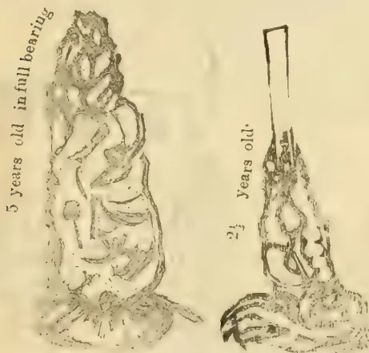

and had a maiden crop on them. I can't estimate how much an acre, but I think it was about 600 lb. per acre.

From a good old average vine—said to be 30 years old—I saw 30 lb. of green pepper taken and weighed. I saw several gardens that I believe averaged as much as this vine.

As pepper dries down to one-fifth of its green weight, this would be 6 lb. of marketable pepper, or at 889 vines per acre 5,334 lb. per acre for the autumn crop, and the Chinese said they got as much more for the spring crop. I did not see any spring crop, so cannot vouch for the truth of this total: say 10,000 lb. per acre per annum. I don't believe this.

The Chinese never, as far as I saw, plant more than from 10 to 15 acres of pepper in one garden along a carefully selected basin, and they cultivate each vine very highly, so that there are no bad vines in the whole acreage, until the garden is old and worn out.

A good average crop of pepper I have been told on reliable authority is about 28 piculs an acre or say 33 cwt., or rather over 4 lb. of prepared pepper per vine. The price of pepper in Singapore now \$15 per picul, is very high, and I was told that \$10 was a safe price to calculate on. This would give 28 piculs at \$10 = \$280, or say about R600 per acre as the value of the crop, and putting down the cultivation at the extreme limit of R200 per acre per annum, leaves a profit of R400 per acre. This sounds almost too good to be true, but I feel certain these profits

are made out of the pepper gardens in Singapore and Johore, and there is no doubt that the Chinese have made very large fortunes from this cultivation. The preparation is very simple. The Chinese use a very rough drying drier something like the ordinary Sinhalese lime-kilns with warachies on the top and matting on which the pepper is spread to dry with fire underneath. White pepper is made from the best and upper berries. It is placed in heaps for several days to ferment and then trampled out and washed and dried very much in the same way as coffee. Pepper is sent to England in bags of 142 lb. each. It is taken at 16 cwt. to the ton for black pepper, and 18 cwt. for white. By using winnowing and sizing machines, I am sure we would very much improve on the samples of Singapore black pepper, especially by picking out the grey peppercorns, for which work labour is too dear in Singapore. One penny per lb. covers shipping, insurance, loss on weight (which is from 6 to 10 per cent), brokerage and freight. Pepper damages tea, and some ships refuse it. The lowest price it has ever been down to is \$6 per picul many years ago. For the last five years it has averaged from \$10 to \$15 per picul.

A free rich soil is the best, and a continually wet climate. A long drought is said to cause the berries to fall off the branch before they are ripe. I could hear of no disease or blight that affected the vines, and certainly saw none on any of the many gardens I visited. The crop is picked with light step-ladders, the branches are picked whole, as soon as some of the berries begin to turn red and yellow. I don't think it possible to get all the berries on a branch ripe before it is picked; some would fall off before all were ripe. I consider good chena land, if not steep and washed, as better for pepper than virgin forest, unless all the logs and roots of the latter are cleared away, for it is extremely difficult to work up pepper as it should be done with the logs and roots on the ground. The vines that grow over the old stumps of large trees are always the finest, as they seem to derive nourishment from the rotting timber.

#### PEPPER:—COST OF CULTIVATION.

<table border="1">
<thead>
<tr>
<th></th>
<th>1st year.</th>
<th>Per acre.</th>
</tr>
</thead>
<tbody>
<tr>
<td>Superintendence ...</td>
<td>...</td>
<td>R10.00</td>
</tr>
<tr>
<td>Felling,* chena ...</td>
<td>...</td>
<td>8.00</td>
</tr>
<tr>
<td>Nurseries...</td>
<td>...</td>
<td>10.00</td>
</tr>
<tr>
<td>Weeding 8 months...</td>
<td>...</td>
<td>8.00</td>
</tr>
<tr>
<td>Lining ...</td>
<td>...</td>
<td>1.50</td>
</tr>
<tr>
<td>Holing ...</td>
<td>...</td>
<td>9.00</td>
</tr>
<tr>
<td>Filling in...</td>
<td>...</td>
<td>9.00</td>
</tr>
<tr>
<td>Draining and roads ...</td>
<td>...</td>
<td>12.00</td>
</tr>
<tr>
<td>Planting and shading pepper ...</td>
<td>...</td>
<td>6.00</td>
</tr>
<tr>
<td>Planting cotton plants ...</td>
<td>...</td>
<td>2.00</td>
</tr>
<tr>
<td>Tools, building contingencies, etc. ...</td>
<td>...</td>
<td>20.00</td>
</tr>
</tbody>
</table>

R95.50

<table border="1">
<thead>
<tr>
<th></th>
<th>2nd year.</th>
<th>Per acre.</th>
</tr>
</thead>
<tbody>
<tr>
<td>Superintendence ...</td>
<td>...</td>
<td>R12.00</td>
</tr>
<tr>
<td>Nurseries ..</td>
<td>...</td>
<td>2.00</td>
</tr>
<tr>
<td>Weeding ...</td>
<td>...</td>
<td>12.00</td>
</tr>
<tr>
<td>Roads, drains ...</td>
<td>...</td>
<td>1.00</td>
</tr>
<tr>
<td>Terracing...</td>
<td>...</td>
<td>8.00</td>
</tr>
<tr>
<td>Manuring ...</td>
<td>...</td>
<td>5.00</td>
</tr>
<tr>
<td>Pruning and training vines...</td>
<td>...</td>
<td>3.00</td>
</tr>
<tr>
<td>Supplying ...</td>
<td>...</td>
<td>1.00</td>
</tr>
<tr>
<td>Buildings, contingencies, etc. ...</td>
<td>...</td>
<td>10.00</td>
</tr>
</tbody>
</table>

R54.00

\* The cost of item will depend on whether cuttings can be bought close at hand, or plants are raised from seed.

822------------------------------------------------

APRIL 2, 1883.]THE TROPICAL AGRICULTURIST.803

3rd year.

<table>
<tr>
<td>Superintendence ..</td>
<td>...</td>
<td>...</td>
<td>...</td>
<td>R12.00</td>
</tr>
<tr>
<td>Weeding...</td>
<td>...</td>
<td>...</td>
<td>...</td>
<td>12.00</td>
</tr>
<tr>
<td>Roads, drains ..</td>
<td>...</td>
<td>...</td>
<td>...</td>
<td>2.00</td>
</tr>
<tr>
<td>Manuring ..</td>
<td>...</td>
<td>...</td>
<td>...</td>
<td>10.00</td>
</tr>
<tr>
<td>Pruning, training vines ..</td>
<td>...</td>
<td>...</td>
<td>...</td>
<td>3.00</td>
</tr>
<tr>
<td>Supplying ..</td>
<td>...</td>
<td>...</td>
<td>...</td>
<td>1.00</td>
</tr>
<tr>
<td>Building, etc. ..</td>
<td>...</td>
<td>...</td>
<td>...</td>
<td>10.00</td>
</tr>
<tr>
<td colspan="4"></td>
<td>R50.00</td>
</tr>
</table>

The 4th year's crop should quite cover expenses, but I cannot state the cost of picking and curing. I believe that for such districts in Ceylon as those round Galle, Awisawella, Yatiyantota and in fact all the south-west of the island, pepper will be one of the most remunerative products, if care is taken in selecting suitable localities for planting it. All ridges should be left in jungle so as to have plenty of earth available on the spot for using as manure when burnt. The Chinese pepper gardens are all surrounded by forest which, for about 2 chains from the pepper, have the earth for a foot deep at least all carried off during the course of years as manure.

I have forgotten to state that the vines should in no case be allowed to run up to the top of their post or pollard, until they have thickened out below. When the runner is 2 feet high the top should be nipped off to make it throw out laterals, and the vine should always be kept in the form of a sugar-loaf until it has got thick and bushy from the ground to the top of the pollard. If not stopped and made to thicken out, one single runner will get up to the top of the post or pollard in a year or 9 months' time and never become a good bearing vine.

We have now 130 acres of pepper planted at Ulu-gama on 5 estates, all coming on well, and the land selected as nearly as possible in the same way as I saw done by the Chinese at Johore. T. S. DOBREE.

#### THE OLDEST CINCHONA TREES IN CEYLON.

Kirimadua Estate, Hapatale, 8th March 1883.

DEAR SIR,—On seeing your footnote to my letter on the oldest cinchonas in Ceylon, I walked over this morning to Gonomotava estate to verify the report I had heard of these trees being *non-seed-bearing*. The two old trees\* planted in 1862 were covered with small green fruit or pods, which Mr. J. Orchard, the manager, assured me would "come to nothing," as every one of the pods would "wither prematurely and drop off," the same as they had been doing for the last 13 years, in all which time, Mr. Orchard told me, he had not been able to rear a single plant by seed from these trees, and I particularly noticed the absence of any self-sown trees or seedlings anywhere near these two oldest trees—and the fruit already commencing to shrivel up and drop off prematurely. The trees are growing on good black soil, and the surrounding coffee is excellent with fine crop, yet these imported cinchonas will not ripen their seed. This reminds me of a report of the late Mr. John Nietner, when planting out an experimental estate for the Baron Delmar, at Kadirana, near Negombo, on land purchased from the late Dr. Elliott (the father of the *Observer* and Sinhalese, as I have heard him called). On that experimental estate, intended by the Baron to introduce in 1852 other tropical cultivation into Ceylon than existed in those days, all the Egyptian, American and other varieties of cotton grew beautifully, blossomed, and fruited, but all the pods dropped off prematurely and never ripened, which Mr. Nietner put down to failure from "climatic causes"—something like Dr.

\* I measured these and found them 45 inches in circumference a foot from the ground, and over 30 feet high! This is good for poor "bleak and barren" Uva patanas.—J. A.

Trimen now putting down all my friends, the name *les hybrids*, under the one generic term "Robusta"! "Abnormal weather" is a very convenient "term," but what sort of weather it is I really don't know. For the last two days we have had lightning, thunder and heavy showers. Today it is grilling hot and as fine as midsummer. Yours truly,

JNO ATWELL.

#### FIRST CINCHONA TREES PLANTED IN HAPUTALE.

Parate, Moratuwa, 9th March 1883.

SIR,—Mr. John Atwell is in error in believing that I uprooted the cinchona trees which he planted on Mahapittia estate. He says it is necessary to mention names in order to put the saddle on the right horse, but he has put it on the wrong one this time.—Yours faithfully,

ALEX. T. GEDDES.

#### TEA-DRYING AND MR. SHAND'S "PATENT."

DEAR SIR,—My attention has been called to a paragraph in your issue of the 28th ultimo *re* Mr. Shand's tea drier (which I saw at work on Barra estate, Rakwana) as having been approved by me, and that teas were valued at 2/ to 2/3. These valuations were for broken pekoe made in the usual way over charcoal fires. The teas I tasted, fired by the patent drier, had a nasty metallic taste about them, and, as it is well known that tea will not keep by being prepared with such a moist heat as steam, I am at a loss to know how such a statement could have been sent you for publication, holding as I do an entirely different opinion of the capabilities of Mr. Shand's patent. I consider it practically useless for the manufacture of tea. Fearing tea planters may be misled, I shall be obliged by your inserting my contradiction of the statement in an early issue of your paper.—Yours faithfully,

W. CAMERON.

#### MR. SHAND'S PATENT TEA DRIER

Colombo, 12th March 1883

DEAR SIR,—With reference to the remarks in "Cha"s and Mr. Cameron's letters of the 8th instant, which appeared in your Saturday's issue, will you kindly allow me to explain that the little model referred to had only arrived on the Barra estate the day before "Cha"s visit, and was put up temporarily in the tea-house? I intended it to be experimented with in a corner of the store verandah.

I need not point out to the majority of your readers that, in permanent arrangements for using large-sized machines, neither smoke nor steam need be allowed to enter the tea-house any more than in those buildings elsewhere heated by means of hot water, or in manufactories where steam is used, the smoke and escape steam-pipes being both placed outside the buildings. "Cha"s is therefore evidently in error in stating that the machines could not be heated without filling the store with smoke or steam, and I me rather surprised that any one naturally supposed to possess mechanical knowledge should say so.

No planter desirous of adopting the principle of the models, for drying large quantities of tea, would think of doing so by means of 20 or 30 of them, instead of one or two large barbecue-shaped machines.

With regard to Mr. Cameron's letter the information I gave you as to the valuations was that furnished to me. I shall of course refer the difference in the two statements to my informant. If the galvanized iron surface imparts a metallic taste to the tea, the contact with the metal can be easily obviated by covering it with calico, a veneer of wood or something else, or by placing the tea on wire netting, as in the ordinary way, as I have previously suggested.

823------------------------------------------------

804THE TROPICAL AGRICULTURIST.[APRIL 2, 1883.]

Mr. Cameron may be correct in saying that tea prepared with such a moist heat as steam will not keep, but, as steam is not intended to come in contact with tea made on my principle, I do not see how it applies to it. He is probably not aware that I have before me a most favorable report from the highest authority in Mincing Lane upon the tea I originally made by my method, and upon which the applications for patents were made and obtained. However, all those who have ordered models for Ceylon and India will no doubt experiment with them, in an intelligent way; and they will shortly be in a position to form their own independent opinions as to the value of the process, without being guided by the prejudiced ones of myself or anyone else.

I am sure you will do me the justice of admitting that I have all along recommended planters to ascertain for themselves at small cost whether the tea-drier has the advantages I claim for it, and not to accept as fact my verdict in its favour. I am quite content to wait the result. I am obliged to Mr. Cameron for the opportunity he has afforded me of correcting anything wrong. As regards his opinion on the quality of the tea made on the little model, his present account differs so materially from what my informant led me to state to you that I shall refer the subject to him, and allow him to reconcile the difference in the statements. Mr. Ross Wright sent me samples of teas made both on the drier, and in the ordinary way and attached to them Mr. Cameron's valuations, and he led me to believe that the quality of the tea made by the drier was very fine, as it really is, and that, subject to some modifications, Mr. Cameron thought well of the process. I do not think such a letter as Mr. Cameron's will do much harm. On the contrary I believe it will induce many persons to experiment and form their own opinions.—Yours truly,

C. SHAND.

P. S.—Extract from letter, dated 25th February, from Mr. Ross Wright:—"I have today sent 6 samples: a broken pekoe, pekoe, pekoe souchong dried on your small model which came to hand safely, and acts very well as far as I can judge at present, and a broken pekoe, pekoe, and pekoe souchong dried in the usual way. Mr. Cameron, who has been round this district and Morawaka, valued the broken pekoe dried on your drier, and the broken pekoe dried as usual on the stove from 2s to 2s 3d. This is very encouraging." Other evidence if necessary is producible in corroboration of Mr. Wright's statement that Mr. Cameron tasted the two samples, and I am told he could not distinguish any difference until he was told which was made on the drier.—C. S.

#### COFFEE PRICE AND THE OUTLOOK IN BRAZIL.

SIR.—Coffee-growing in Brazil is probably now receiving a severe check. A short crop with probably for some months to come only a very partial recovery in price will do a great deal to demoralize an already disorganized labor supply, which must be provided for out of some product, and if not out of the profits from coffee from what other product is the upkeep of slaves to come? Let me call your attention to R. B. T.'s writing in your Handbook for 1880 on this subject. He said:—

"Prices will always determine the question of supply. Supply will depend upon the means of supply. We have, therefore, to consider how the consumption is supplied, and how this contribution is to be continued. Cast our eyes over a map of the world. Experience has shown that coffee does not thrive productively, excepting within the inner tropical circles. By 'thrive' I mean yield productively contending with all contingencies. Let us

take the map. How many centres of production are there capable of producing more coffee than all the world could consume. Central America, Guiana, West Indies, Liberia, with Africa generally, Arabia, Ceylon, all the islands of 'the Straits' region, great and small, Fiji, not to instance Borneo, New Guinea, &c.; but *where's the labour?* The key is *labour*. The cultivation of coffee must have labour, and that of a peculiar character: *minor labour* to cultivate—*major labour* to get in crops. Slave labour, however plentiful, being fixed, is fatal. It must ever be a condition of labour such as will afford a limited supply for cultivation, and an elastic draw for hands to pick. Any other condition will not suit. Else the burdens of hands out of crop must be too costly, while supply for picking in crop time is too few. Casting our eye over the map, there is no country like Ceylon in respect of labour, for we work our estates with whatever force we determine when we dismiss our hands out of crop, and regulate our advance for hands to come over from India to pick, according to our estimates of crop. India, adjoining our seaboard has a population of migrating labour of some eight or ten millions, out of whom we can draw some 200,000 crop hands, whom we dismiss with their earnings—to our relief, and to their own infinite benefit—to their homes, when crop is over. Where elsewhere do conditions of labour, such as these, suitable for coffee cultivation, exist? And a labour so suitable and so secure? It suits them and it suits us. So long therefore, as the Governments of India and Ceylon do not interfere injuriously (for interference must be injurious) with the influx and efflux of this stream of voluntary labour—so beneficial to the planter, so advantageous to the humble poor of India—so long as free currency is afforded to the natural adjustment of the supply and demand with its own preference of route—we, as coffee planters in Ceylon, or as employers of Indian labour for coffee, tea, cinchona, cinnamon, or cacao, or any other branches of industry, may bless ourselves that we possess a source of labour such as no other country of the world possesses for our peculiar demands. Such labour is the pivot upon which the question turns.

"Emigration from Europe will never succeed as directed to intertropical countries. Such emigration to Brazil to grow coffee will fail as disastrously as did that of Germans to Jamaica in 1836. What a vast field for supply of a most suitable labour there is in the hundred millions of industrious laborious Chinese—but they are for *number one*. Brazil is near to distraction on the question of labour to keep up their extensive cultivation. Sad for them—but good for us in Ceylon. No expedient can meet their condition. No inbringing of Germans, Portuguese, Maltese. They don't suit. Nor will their freed Africans suit. Nor will their own Brazilians suit, as labourers, to grow coffee, and gather in their crops. Notwithstanding the vast outlay on railways, and good capital laid out on apparently paying bases, they must come to a close on the question of labour as coffee growers. What gigantic visions come before us when we contemplate Brazil collapsing on the question of labour! We return to Ceylon with its labour resource. If we require Ramasamy we shall get Ramasamy, as long as we can afford to give him rupees, annas and pice.

"Endless resource of virgin forest for extension by surplus slave labour out of crop has resulted in a boundless expanse of planted land, for the gathering of the crops of which there is not sufficient labour, nor can it be found. Borrowed capital, got on a superficially glossed surface of apparent, and for the time ardent, prosperity, spun out a system of railways, and afforded the Brazilian the means of getting to the Barcadero his produce, to exhibit a momentarily manifest prosperity, but it was all on borrowed capital which had a basis of very questionable security, namely, slavery, and the

824------------------------------------------------

APRIL 2, 1883.]THE TROPICAL AGRICULTURIST.805

issue of slave labour. Labour collapsing, what comes of the security upon railway debentures? What for that of the borrowed capital? What of all securities connected with the coffee enterprise of Brazil? Let those concerned consider these questions, and, if possible, provide for them. I am merely considering how they affect the question of the supply of coffee to the market of the world, and next how this touches the value of estates in Ceylon. Six-and-twenty years ago I concluded that the slave trade from Africa being declared piracy by Brazil, and various influences being in direct action upon the slave stock within the Empire, such as all children of slaves being free, and facilities afforded to slaves for purchasing their freedom, the day would not be distant when collapse must follow for lack of labour. But there followed an uncalculated action—mortgagées of slaves working in Bahia, and generally in the north of Brazil, on cotton, finding that the labour of these slaves, if sent south of Rio and employed in the coffee industry, would pay far better, had them transferred to Santos, &c., and employed in coffee cultivation and extension. Of course the consequence of this would be to put back difficulty or collapse, on the score of labour. And another element came in. The Brazilians were not slow to see that every adult set free for culture was a gain. Before they had railways, they had to employ from 80,000 to 100,000 mules to work their transport, which we may assume involved 100,000 slaves to work these animals, and grow their food, &c. These have been liberated for employment on the coffee *Lavoura* since 26 years ago. And, moreover, if we grasp the fact that a vast extent of land most suitable for coffee has been, by hook or crook, planted with trees which are not pruned nor cultivated, but which in a state of nature, though left to contend with weeds, continue year by year still to throw a stream of coffee upon the market of the world, we must see natural and sufficient reason for postponement thus far of the collapse, which I consider is inevitable in the end. The slaves dying off, sources of liberation increasing the proportion of free blacks, the time must precipitate itself with something of revolutionary force, when the Government of Brazil will not be able to enforce the remnant of slavery in the Brazilian Empire. What then?"

At the time R. B. T. wrote the above (December 1878) Java coffee was at 42 cents.—Yours truly.

HOPEFUL.

#### MR. HALLILEY ON WEEDS.

DEAR SIR,—As the governor of a steam-engine regulates the steam, so weeds regulate the moisture to the coffee tree. In all my letters I said a carpet of weeds. I no more believe in not weeding than you do, but I believe in keeping a carpet of weeds by pulling up the big weeds and mulching the roots of the coffee tree or burying the weeds as the weeding is done, without favoritism, and carrying the weeds to the compost heap and then giving it to a favored few. Weeds regulate the moisture by absorbing any superabundance in wet weather, and by keeping the soil moist in dry weather. If it was not for weeds, would the Ouchterlony Valley estates have been the best paying estates in the world and how comes it that, previous to clean weeding, Ceylon estates paid, when coffee was as many shillings a bushel to what it is rupees now? After clean weeding what came over the old districts, with the exception of a few estates that had substitutes for weeds? What came over Kurunegala, Matale, Rakawana, Kadugattuawa, &c., &c. Take old Kabragalla above Nawalapitiya. It used to be a fine old estate and in 1874 (I think) was advertised for sale, and the advertisement stated that it never had leaf-disease. It was purchased for £15,000, and then clean weeding was insisted on, and now what has become of the once fine estate?

The substitutes for weeds are first boulders and stones, next thatch and last water-holes. Boulders and stones can only shade the soil, and prevent the drying of the moisture; they cannot regulate it. In England the farmers

remove all stones out of their land, as they have a moist climate and do not require the soil shaded; in Spain the farmers retain all the stones, and, when asked the reason, lift up a stone and point to the moisture. Spain being a warmer climate requires more moisture than England. In the countries where they cultivate oranges to any quantity, they grow lupines in between and mulch the roots of the orange trees with them. Thatch is about the same as boulders and stones. In 1858 I visited poor Whittaker on Sembawatte in Yakedsas and he showed me some coffee he thatched and you could not wish to have better looking coffee or better crops, but it was too expensive to carry out to any extent. Water-holes simply retain the rainfall and force it to soak into the ground. In 1872, after a fortnight's rain, I put on people to plant my second clearing, and I was greatly surprised after so much rain to find that the soil in the holes was quite dry, which is proof that on clean land the rainfall does soak into the ground. Coffee wants a certain amount of moisture, coffee always looks its best in the rainy season, and coffee is always better on a hollow than it is on a ridge. Is there anything in the world cultivated as we cultivate our coffee, and is simply keeping the ground clean and reducing our trees to a nicely arranged framework cultivation? No, it is fighting against nature.

There is nothing new under the sun: there is no such thing as spontaneous production and in reality there is no such thing as hybridization. A half-caste or a creole botanically speaking is a hybrid, but in reality are the same animal man, and man has so adapted himself to localities that if he were plants or trees he would hardly be recognized as the same species. So it is with plants or trees: they will only mix or hybridize with their own species, and they have so adapted themselves to localities as often to be mistaken for something new. So that leaf-disease is nothing new, is not spontaneous and is not a hybrid: it is something very old, something that must have existed in Ceylon long before coffee was introduced, and must have attacked the first shuck or neglected coffee tree in Ceylon but was not noticed. If a tree takes up too much moisture without a sufficient quantity of essential food, the result is mildew and if the tree cannot take up a sufficient quantity of food for want of moisture, the result is mildew, so that leaf-disease is nothing more nor less than mildew adapted itself in a different form in the locality. Mildew is yellow in the coffee, vine, castor, pineapple and other plants, it is white in the orange, is ash-colored in the rose tree, and is almost black in some trees, and the cure for mildew is light, a sufficient supply of essential food and a regular supply of moisture, and how is the moisture to be regulated without a carpet of weeds?

—I remain, yours truly, G. F. HALLILEY.

[We regret that this letter should have got mislaid and so been delayed.—Ed.]

#### COFFEE PLANTING:—WEEDS; STRIPPING LEAVES AND LEAF-DISEASE.

DEAR SIR,—Though rather late in the day, permit me to make a few remarks on some points that have been lately discussed in your columns.

1.—Weeds but slightly exhaust the soil till they begin to seed, and then the mischief begins. Could they be dug into the ground before seeding the soil would be enriched rather than impoverished. This digging however involves too much time, labor and money, with also the risk of wash. The system of merely hand-pulling the big weeds on a dirty estate has often been tried and never found to answer, as the white weed soon gives place to grass and other spreading weeds, which do harm and must be scraped off.

2.—Some 18 months ago I tried pulling off all the leaves of a coffee tree as a remedy for leaf-disease. Several of the primaries blackened and died off, others threw out foliage, which within about a month's time became infected with disease. It does not seem to be generally known that when a coffee leaf is pulled off no other grows to take its place: a branchlet, not a leaf, will spring from the point.

102

825------------------------------------------------

806THE TROPICAL AGRICULTURIST.[APRIL 2, 1883.]

3.—Undoubtedly leaf-disease has in most places been milder this last twelvemonth, but there are some marked exceptions, and the generally comparative immunity is doubtless due to the absence of crop—a cause which I trust will not be again repeated.—Yours truly,  
K. C. B.

DECAYING LOMBARDY POPLARS.—The decaying state of Lombard Poplars is extending to the North as well as in the neighbourhood of Devizes. In the South-west of Scotland scarcely a healthy tree is to be seen this year, and many of all ages, from twenty to fifty years old and more, seem in a hopeless state. The number of them in the district is not great, and wherever planted they seem much in the same state. If they do not recover and continue to grow, it will be a serious loss, as they appeared in many situations a most valuable tree to plant.—W. H. M. in *The Gardeners' Chronicle*.

PLANKS FROM STRAW.—A Home contemporary tells us that a process has been discovered in America by which planks can be manufactured from straw, and in Chicago a building six storeys high and occupying an entire block is being erected for the new industry. The board is manufactured by converting straw pulp into thin paper like sheets, which are passed through a bath containing certain chemicals in solution. They are then subjected to enormous pressure, and finally to a thorough drying process. By superimposing a number of sheets and incorporating them into one in the pressing process, boards of any desired thickness up to the capacity of the machinery employed may be produced. The finished article, some specimens of which have found their way into trade circles in London, appears as compact as ironwood, while it is nearly fire and water proof, and it is susceptible of being sawed, planed, or worked as wood. Three tons of straw, the average yield of an acre of ground—will make 1,606 superficial feet of board one inch in thickness.—*North China Herald*.

IVORY.—Sheffield cutters and cutlery manufacturers attended in unusually large numbers the first sales for the quarter at London. There were offered 129 tons, including 35 tons from Bombay, Zanzibar, and Mozambique, 46 tons from Egypt and Malta, 10 tons from the Cape, and 28½ tons from the West Coast of Africa, Lisbon, &c. There were also 3½ tons of sea-horse teeth, 2½ tons of mammoth, and ¾ tons of cuttings and waste. It was generally expected that after the Egyptian war ivory would come as freely as ever from that country. This expectation will probably be disappointed. One of the London brokers has been to Egypt, and through his arrangements there was a fair supply; but he states that for six months to come Egypt will not supply any ivory. It is supposed that it is heavily mortgaged, and can only be released as the owners are financially able to meet their engagements. Never has there been such poor Egyptian ivory offered in London. The buyers state they were at a loss how to value it on account of its great age and poor preservation. Prices ruled about the same as at Liverpool. Billiard-ball and bangle sorts were a little easier; "hollows" of all descriptions were dearer; small tusks fetched full rates. Best African was easier; common quality fetched generally good prices. The Egyptian ivory, poor as it was, sold for £750 per ton. Prices advanced as the sales proceeded, and some 10 tons were withdrawn at higher prices than prevailed at the outset. Dr. C. B. Webster, the American Consul at Sheffield, in a recent report presented to his Government, directed attention to the large proportion of very small tusks brought to market. This, of course, indicates how many elephants die in early youth. To show to what size many of these might have attained, Messrs. Joseph Rodgers & Sons (Limited), Sheffield, exhibit at their show-rooms an African elephant's tusk 9 feet long, 21 inches in girth, weighing 160 lbs. This is among the largest tusks on record. Its present value is 650 dollars. Dr. Webster remarks that an animal large and

strong enough to carry such a pair of incisors would attract more attention than Jumbo. It is estimated that the 5,286 tons of ivory imported into Great Britain during the nine years from 1873 to 1881 inclusive represent 296,016 pairs of tusks, and, consequently, the same number, of elephants that have died or been slaughtered to supply the demands of luxury for the past nine years. At this rate of destruction, it is clear that the noble elephant most rapidly disappear, and ivory become a thing of the past, unless the traveller of the future should reveal fresh sources of supply on a vast scale,—*Public Opinion*.

COFFEE PROSPECTS IN S. INDIA.—Our correspondents writing from the Shevaroys and Coorg do not give very encouraging reports of the growth of coffee in those parts and, consequently, prices have gone down. The yield has not been as large as was anticipated and the dull state of the English market which regulates prices in all the producing tracts intensifies the present unfavorable state of affairs. On the Shevaroys the smaller estates appear to be doing better than the larger ones and the reason for this is not far to seek. Efficient supervision is, as a matter of course, exercised over the smaller plantations and though a short time ago efforts were made to improve some of the larger estates by importing new machinery, expensive manure, and adopting all the means which often lead to success, still they have not realised the anticipations entertained. In Travancore and in parts of the Tinnevelly district increased attention is now given to the growth of coffee. Coffee prospects in the Nilgiri district, we are glad to learn, are just now pretty good. The blossoms promise well. If rain falls, damage is likely to be done to the crop.—*Madras Standard*.

POISONOUS "PEPPER."—The following refers to the sale of a compound described as "black pepper dust," which since it was admitted to contain nearly 50 per cent of mineral matter, ought, in the public interest, never to have been placed in the market at all:—"Dowgate Upper Dock, Thames-street, E. C., January 24th.—Sir—About 30 tons of an article described in the catalogue as 'pepper dust,' was offered at the public sales in Mincing Lane a week since, when we ventured to call attention to the fact that the samples shown were flavourless and quite destitute of the pungent qualities of pepper. The selling brokers offered to withdraw the lots for the purpose of obtaining an analysis, and accordingly the same parcel was again submitted for competition at the weekly spice sales yesterday, the lots being marked 'without reserve,' with the following prefix:—'Copy of analysis made by Mr. Ogston:—Whole grains of pepper, 1.00; pepper leaves, husks, &c., 54.80; sand and clay, 44.20; total, 100.00.' The proportion of 'foreign mineral matter' appeared quite sufficient to condemn it as an article of food, and in the hope of arresting the evil at its source we proposed a resolution as at foot. It was put to the room by the selling broker and carried. He jocosely remarked that the pepper dust could be used for chickens, and he should, therefore, proceed to sell it in spite of the resolution. The whole quantity was accordingly sold and realized an average price of about £17 10s per ton. Possibly the pepper dust may go to feed fowls, but should it reach the hands of unscrupulous dealers, we fear the public interests will suffer. It is only fair to mention that the representatives of all the leading spice houses expressed a strong feeling against the proposed sale.—Yours W. and D. Harvest.—Proposed by Mr. Daniel Harvest (W. and D. Harvest), seconded by Mr. Bryne (Peek, Brothers, and Co.):—That, inasmuch as the 608 bags pepper dust contain 44 per cent. of sand and clay, and would, therefore, subject retail dealers in the same penalties under the adulteration of food act, the buyers present protest against the proposed sale."—*Home and Colonial Mail*.

826------------------------------------------------

APRIL 2, 1883.]THE TROPICAL AGRICULTURIST.807HARVESTING CINCHONA.

Several planters having expressed surprize at the figures lately given by a Dolosbage planter for the daily average shaving of red bark trees by his coolies, as being so much more than usual, we referred the same back for further report. The result shews that there was no mistake in the figures. Our friend writes:—

"42 coolies got 5,634 lb from 6,463 trees planted in June 1880 and consequently rising 3 years. Of course I naturally chose a period when the coolies had got their hands well in (average for first four days was only 66) and when they were operating on the best piece in the clearing. I have now finished the field and give you the totals:—Extent of clearing 25 acres, 24,346 trees, 18,772 lb, 156 coolies, average per tree 12.33 oz. average per coolie 120 lb. Planted in June 1880; shaving commenced 26th January 1883; finished 7th March. Average age therefore two years eight months. Of course, you may furnish any sceptic with my name, though I did not send it for by publication with my letter."—We suspect that here we have the largest crop of cinchona shavings ever harvested from the same number of trees in so short a period. Dolosbage should be the paradise of red bark trees.

THE PROSPECTS OF INDIARUBBER.

(From our London Correspondent.)

I had a long talk recently with Mr. J. H. Roberts, of the firm of Messrs. S. Rucker & Co., on the subject of *indiarubber*, a friend of mine having told me that he should be obliged to give up a large portion of his manufacture—i.e., insulated telegraph wire—if he could find no fresh source of indiarubber supply. And he added: "The extension of our business which could be made, if such further supply was obtainable, you can hardly realize." He was prepared to largely extend his manufacturing plant but for this disability; but, as he argued, "where would be the use of my going to that expense, if, when incurred, I am landed in a difficulty for want of the material to be worked upon?" Mr. Roberts told me so much that was of interest as to the market position of indiarubber in London that I asked him if he would kindly—as on a previous occasion he did with reference to cocoa—let me have his remarks in such a form that I could submit them to your readers. To my application he kindly consented, and the following is what he has written for me on the subject:—

"The adverse circumstances which have so forcibly operated during the past few years against the yield of the coffee crops in Ceylon have tended at all events to stimulate efforts to develop the capabilities of the island in the production of other articles, to many of which it seems to be admirably adapted. At the same time, it would be taking too gloomy a view to suppose that coffee in Ceylon is to be a thing of the past.

"While tea and cinchona are certainly the two largest articles which are following coffee, cocoa and indiarubber (caoutchouc) demand an amount of attention which they should certainly have given to them, and the efforts already made for their cultivation should be strongly further encouraged. With regard to the latter (indiarubber) there is no doubt that with due care its cultivation would become remunerative. The existing increased demand for the article throughout the world, the present supplies are anything but adequate to meet; nor is there any reason to doubt, if there were a certainty of increased supplies, that the demand would still be further extended. Evidence of such increased demand has developed itself during the past two or three years, and prices have materially advanced; those for Para rubber, which ranged for a long time in the neigh-

bourhood of 2s 2d to 3s per lb. having during the past year been gradually advancing, and, after touching 4s 10d and 4s 11d, are now still at about 4s 5d per lb.

"It is not intended in offering these observations to attempt any instructions to planters as to the best species for growth, cultivation, or collection, as these items so much depend upon the nature of different districts, and can better be ascertained through sources which, like the *Tropical Agriculturist* of Ceylon, have already most ably treated the subject.

"Great stress has been laid on care being taken not to incise the wood of the tree, but only the bark. One important feature, however, from a commercial point of view, may be here mentioned, and that is to collect the rubber as *clean* as possible, so that it may be free from bark and dirt, which are two most objectionable things, by the presence of which the value is most injuriously affected. Pará rubber deservedly stands highest on the list, as it possesses all the properties requisite for its use in the highest class of manufactured articles, and its cleanliness also entitles it to the standard it occupies.

"Attention is also much directed in the London market to Madagascar rubber as possessing qualities which are much appreciated, and some excellent sorts have also reached here from Upper Assam. Experience, with time, can alone develop which sorts are best suited to Ceylon, but up to this time it would appear that the 'Ceará' descriptions promise the most favorable result. Samples already received from Ceylon approximate Ceará scrap rubber more than any other kind, and this is now worth 3s per lb.

"It is certainly well worth the attention of all those who have invested capital in Ceylon and who seek a handsome remuneration for their investments not to neglect so encouraging an article as caoutchouc, or, as it is more generally known, indiarubber. It is to be feared that the rough treatment to which the tapping of the trees are subjected in some of the South American districts will ultimately render supplies from that quarter even more precarious than at present, as collection further inland must necessarily add to its cost. In this we have another reason why this industry in Ceylon will be beneficial, both to the grower and the consumer, an exemplification of similar mutual benefit being already given by the locally grown cinchona, which is most successfully competing with South American barks."

Remarks of the above character from one of the partners in a firm of such standing as that of Messrs. S. Rucker & Co. will deserve attention from those who are now commencing the culture of indiarubber in Ceylon. We all here at home read with the greatest interest all we can find in the *Observer* and the *Tropical Agriculturist* which informs us as to the progress being made with it. As yet this appears to be slow, but it is hoped things will soon take a rapid start.

INDIARUBBER.—We call attention to the very encouraging report on the prospects of this product contained in the letter of our London Correspondent. We are hopeful that Ceylon will do a good deal ere long to supply the demand for the raw material. But, meantime, have planters generally noticed what a keen observer reports that there are Ceará rubber trees—and Ceará rubber trees? That is, some of those now growing in Ceylon do not seem to yield rubber at all, while others give an abundant supply considering their age. This point requires careful examination in order that trees of a poor or utterly bad type may be pulled out.

MANILA NEWS: EXPORTS.

(Translated from Spanish newspapers for the "Strait-Times.")

The *Comercio*, in reviewing the export trade from the ports of Manila, Cebu, and Iloilo, last year, says:

827------------------------------------------------

808THE TROPICAL AGRICULTURIST.[APRIL 2, 1883.]

that, from the prevalence of cholera, hurricanes, and other unfavourable circumstances, the exportation of sugar, hemp, indigo, coffee, pearl shell, and copper was less than in 1881, while that of dyewood, cigars, Manila rope, hides, and gum mastic, showed an increase. The pearl shell exported from these ports fell off from 1,192 piculs in 1881 to 377 piculs in 1882, owing to that article being now shipped direct from Sooloo to Singapore. The decline in the coffee exported is ascribed not only to hurricanes but to discouragement among native growers, owing to the fall in the prices of that article, the consequence being that the quantity exported has, within the last few years, been almost stationary, as will be seen from the following figures:—

<table>
<tr>
<td>81,039</td>
<td>piculs in 1882.</td>
</tr>
<tr>
<td>86,682</td>
<td>" " 1881.</td>
</tr>
<tr>
<td>83,999</td>
<td>" " 1880.</td>
</tr>
<tr>
<td>64,391</td>
<td>" " 1879.</td>
</tr>
<tr>
<td>38,782</td>
<td>" " 1878.</td>
</tr>
</table>

**PINEAPPLE FIBRE.**—A correspondent asks:—"Is there a market in London for 'pineapple fibre'? You were speaking in your columns of a machine for preparing aloe fibre. Will it answer for pineapple? What will it cost to get one?" There is scarcely a plant fibre more valuable than that of pineapple leaves. The finer portions have all the qualities of silk, while the coarser are fitted for ropes and cables. We do not at present know the cost of an Ekman machine, but we hope soon to learn. No doubt the machine which answers for aloes would suit for pineapple leaves, but we fear the machine is somewhat costly.

**GIGANTIC TREES.**—The *Lumberman* has an article on the gigantic trees of Australia, of which the following is an extract:—"The trackless forests in the west of Tasmania contain huge timber, and bushmen report that they have met with specimens of *eucalyptus* measuring 200 feet from the ground to the first branch, and fully 350 feet in all. Until 1873 there was standing on the eastern slope of Mount Wellington, within four miles of Hobart Town, a *eucalyptus* measuring at 86 feet in girth and more than 300 feet in height, and its ruined boll still forms a grim chamber in which many a merry party have enjoyed a picnic. The famous tree of the Huon forest measures 70 feet in girth, 6 feet from the ground, and is stated to be 240 feet high, but in the deep gorges of this grand forest the writer has seen higher trees than this, though not of quite equal circumference. But Victoria now claims the glory of holding the biggest of all the living 'big trees' in the world, so far as the height is concerned. In the Dandenong district at Fernshaw, has recently been discovered a specimen of *eucalyptus amygdalina*, or almond-leaf gum, which has been accurately measured as reaching the enormous height of 380 feet before throwing out a single branch, and 430 feet to the top, and having a girth of 60 feet at some distance above the ground. Some idea of what a height of 430 feet represents may be gased from the fact that this gum-tree, if growing by the side of the Houses of Parliament at Westminster, would overtop the Clock Tower by exactly 100 feet." It is distinctly stated in works on Victoria that a prostrated *E. amygdalina*, with the top broken off, measured over 474 feet. The top would probably make up the round 500 feet. But a man like Dr. George Bennett is still sceptical. Baron Von Mueller, however, who ought to be the best possible authority, accept as correct, measurements approaching 500 feet.

**Aloe Fibre.**—We have been favoured with a sample of Ceylon Aloe Fibre which sold last month in Mincing Lane at £25 5s per ton. We have several samples by us prepared by local experimentalists, equally good in appearance and strength, but this price can scarcely be profitable if, as Mr. C. Shand found, the proportion of clean fibre got from the aloes is only 2 per cent.

**SEASONS AND COFFEE CROPS.**—Mr. Giles F. Walker does not wish to be credited with saying that the short coffee crops of the past three or four years have been due to abnormal seasons only. Mr. Walker certainly considers that low temperature and insufficient sunshine and warmth have had much more to do with the past bad seasons than is generally admitted; but he does not leave out of sight the damage occasioned by leaf-disease, nor the fact that we have to face in future far smaller coffee crops in any season than we were formerly accustomed to expect.

**COFFEE AND CINCHONA.**—The following cost of mixtures of coffee and chicory may be interesting to our readers:—

<table>
<thead>
<tr>
<th rowspan="3">Wholesale selling price of roasted coffee per lb.</th>
<th colspan="4">What the mixture costs with the undernoted proportions of chicory at 3½d, and expenses at 2d per lb.</th>
</tr>
<tr>
<th>Cost with 20 percent of chicory per lb.</th>
<th>Cost with 40 percent of chicory per lb.</th>
<th>Cost with 60 percent of chicory per lb.</th>
<th>Cost with 80 percent of chicory per lb.</th>
</tr>
<tr>
<th>d.</th>
<th>d.</th>
<th>d.</th>
<th>d.</th>
</tr>
</thead>
<tbody>
<tr>
<td>8½</td>
<td>7½</td>
<td>7</td>
<td>6½</td>
<td>6½</td>
</tr>
<tr>
<td>9</td>
<td>8½</td>
<td>7½</td>
<td>6½</td>
<td>6½</td>
</tr>
<tr>
<td>10</td>
<td>8½</td>
<td>7½</td>
<td>6½</td>
<td>6½</td>
</tr>
<tr>
<td>10½</td>
<td>9½</td>
<td>8</td>
<td>7</td>
<td>7</td>
</tr>
</tbody>
</table>

**COCOA DRYING: A CHANCE FOR MR. SHAND.**—The following paragraph is from the *Trinidad Chronicle*:—"The Secretary of the Cacao Planters Association lately sent to England a draft for £50, the cost of a model cylinder for the artificial drying of Cacao in the wet season or bad weather. When the system proposed has been thoroughly tested, it is intended, to get out a larger machine, to do the work of an extensive estate. The present machine will be the property of the Association obtained for experimental purposes, and to ascertain what alteration, if any, it may be advisable to make in machines manufactured for estate-use on the scale of practice. Mr. Gibbs, Co. Essex, to whom is confided the make and fitting of the machine, is a gentleman who has bestowed a long and special attention of some years on the perfecting of machines for drying grain and fruit.

**SILK IN CALIFORNIA.**—In its retrospect of the trade of California for last year the *San Francisco Chronicle* says of the silk industry, in the State:—"No progress has been made in the manufacture of silks during 1882, for the very competent reason that the works of the company were burned to the ground on the 9th of June last. All the machinery was totally destroyed on that occasion, and its reconstruction is not yet completed. Meanwhile the California company disposed of its interest to an Eastern concern, which is the owner of many valuable patents. The latter is now preparing to re-erect the works, which will be fitted with the most improved machinery. When completed, about seventy people will find employment at the silk-spinning works. The raw material which the California company handles is imported from Japan, China and Italy. The agitation of the Silk Culture Association in this State has not led to any practical results, though all possible encouragement has been given, the manufacturers offering to purchase all California-grown silk at an advance of 25 per cent. over New York prices. A moneyed Frenchman who was attracted by the glowing pictures painted by the Silk Culture Association, and who went into the silk-worm business in earnest, found, after a short trial, that success could not yet be attained in California."—*North China Herald*.

828------------------------------------------------

APRIL 2, 1883.]

THE TROPICAL AGRICULTURIST.

809

TEA AMONGST COFFEE.

As planting tea amongst coffee is now becoming general, and as planters often have great difficulty in getting in the tea plants regularly, at suitable distances from one another, without running into the line of coffee, we publish a diagram showing how this can be done.

The only difficulty has hitherto been in the distance the lines should be apart, as *up* the lines any distance could be planted that was considered desirable. We will, however, to simplify matters take 4ft. as our standard *up* the line—this is of course for the tea.

Under the following system, should the coffee be planted 6ft.  $\times$  6ft. or even 6 ft. across the row and 5ft. up, the tea will fall 4ft.  $\times$  4ft. but should the coffee be 5ft.  $\times$  5ft. then the tea will fall 4ft.  $\times$  3 $\frac{1}{2}$ .

[In spite of the difficulty of exemplifying our method, the above diagram will sufficiently explain itself, the ciphers standing for coffee trees and the asterisks for tea.]

Let us take the first case, when the coffee is 6ft.  $\times$  5ft. as in the above diagram, that is 6ft. across the line, and 5ft. up. In the first line of coffee run a row of pegs 4ft. apart up the centre of the line. Next run a row of pegs 1ft. to the *right* of the next row of coffee trees and another 1ft. to the *left* of the third row of coffee, and so on *ad infinitum* across the field, one line of coffee having a line of tea down its centre, and the next line having two down each side. The first row of pegs run up the centre of the line of coffee will be 3ft. from the second row of coffee trees, and the second row of pegs 1ft. away from that, to the *right*, will make the distance the rows of pegs are apart, 4ft. the required distance. Again the third row of pegs being 1ft. to the left of the third row of coffee is thus 4ft. from the second row of pegs, the required distance. The above will be of use to many we feel sure.

[The plan of lining for tea, suggested in the above article is a very good one where the coffee lines are 6 feet apart. But a great deal of our coffee is lined 5 $\frac{1}{2}$ , and even 5 feet apart. Where such is the case, I would recommend that the ground be lined *anew*, say 4' by 3' in the case of good land, and 3 $\frac{1}{2}$ ' by 3' in the case of poor, or blown land. If this is done, it will give a much more satisfactory field of tea, than if the lining of the tea is made to suit that of the coffee. It is of course rather difficult to re-line for tea, a field of coffee, but it can be done, and the owner will be very thankful he did it, if the time comes when the Coffee has to be taken out. —*Practical planter.*—]—Ceylon Times."

COFFEE AND WEEDS.

With reference to his last letter, which will be found on page 683, February *T.A.*, Mr. Kearney sends the following:—

DEAR SIR,—Taking a glance from my point of view of your "Ed." note I would desire to be clearly understood in my object that each individual planter in his own interest should try my experiment, the cost being so small R12 per acre.

When general results are placed by small experiments and the point satisfactorily established Government may then help in suppressing "leaf-disease."

I feel sure to counteract the effect of this coffee crop destroyer—will not be deemed an unchristianlike act—nor yet be deemed the setting of the Creator at defiance—contrary to it—by striving to help ourselves we most probably will obtain that help which He may consider

us worthy of. I shall report steadily my results.—Yours faithfully,

GEO. H. KEARNEY.

NOTE.—Your p. d. or my penmanship is certainly responsible for a good many bad readings of my communication. I am sending with corrections.

The following are the corrections referred to:—

- Line 9 for "has" read "his"
- " 21 ,, "planters" ,, "planter"
- " 42 before "quoting" insert "here"
- " 51 delete "and"
- " 60 for "in" read "on,"
- " 61 ,, "so as to" ,, "and so"
- " 74 ,, "any" ,, "a"
- " 79-80 read "with all our strength and our real knowledge: will it" &c.
- " 81 delete "then"
- " 85 for "equal" read "equally"
- " 88 delete "and"
- " 91
- " 107 for "in 4 days read "one day"
- " delete "of"
- " 108 ,, "and that"
- " 109 for "allows" read "allow"
- " 114 after "it" insert "should be"
- " 115 delete "should be"
- " 116 for "in" read "on"
- " 117 ,, ,, ,, "a"
- " 118 put "will be clear to any one" in parentheses.
- " 127 delete "but"
- " 128 for "in" read "on to"
- " 129 ,, "dealt" ,, "death"
- " ,, ,, "if" ,, "If"; delete "it"; place last sentence in parentheses.
- " 152 delete "of course"; put parentheses before "unless" and after "useless"
- " 153 delete "but"

THE PRICKLY PEAR.

TO THE EDITOR OF "THE COLONIES AND INDIA."

SIR.—I see by the last issue of *The Colonies and India* that the Colonists of New South Wales are anxious to get rid of what they call a vegetable pest, the prickly pear. To do this is, as is well known, no easy matter, as the more the plants are cut up the greater the number of them there are, polyp-like each piece, even part of a leaf forming a new plant.

In South Africa, particularly in those parts skirting the great Karoo plains, we have many miles of land covered with this troublesome cactus; and when sheep-farming was the only industry in the Colony, to hear that there was a stretch of prickly pear on a farm took greatly from its value, and an immense amount of labour was expended in the endeavour to lessen the evil. I saw various methods tried, and the one that, as far as my experience went, proved the most efficacious was that of building up a substratum of loose bushes or brushwood (stones did not answer), and then stacking the prickly pear on to this, and in time, not being able to take root, it died. I was travelling one time at the foot of the Sneewberg range, not far from Graaff Reinet, when, in driving through a prickly-pear country, I found here and there a plant singularly affected by some kind of blight, and the farmer, on whose ground this occurred, told me that every plant so affected gradually withered and died. The disease was evidently contagious, for I noticed that where it touched the next plant became infected, whereas around an isolated plant the neighbouring ones were in a perfectly healthy condition.

What the disease was, and how it came there, the farmer could not tell me; he has very thankful that it was there, and hoped it might spread, though it seemed to him very slow in doing so. I suggested to him, if that were his wish, to inoculate the healthy plants by placing a leaf from a diseased one in each as far as he was able. He seemed amused by the suggestion, but I heard afterwards that he had tried it with success.

However, at the Cape we have always considered that prickly pears have their uses; in times of severe drought their great succulent leaves were lopped off, and, after having their thorns singed, are given to the cattle and sheep to save them from starvation. Indeed, notwithstanding the fine thorns, great herds of cattle feed among the prickly pears, these yielding moisture and fodder when every green leaf and blade

829------------------------------------------------

810THE TROPICAL AGRICULTURIST.[APRIL 2, 1883.]

of grass is gone and every water-hole in the country is dried up. And now that ostrich breeding and feather farming have been added to the industries of the South African Colonies, the prickly pear may be called the staple article of food for these birds; for although lucerne and other green food is largely cultivated for their use, the supply may—and does—frequently fail from the cause before mentioned, namely, the drought to which this country is unfortunately so subject periodically. My late husband, Mr. Carey-Hobson, an old Colonist of great experience, used to say: "Don't destroy all the prickly pears, for the time will come when they will be needed in the land."

I am, &c.,

54 Doughty Street, W. C.

M. CAREY-HOBSON.

#### CLEANLINESS IN GARDENING.

It is generally admitted that cleanliness is necessary for the health of animals, and it is quite as essential for that of plants, which without it suffer perhaps more quickly than ourselves, for when they get their leaves and bark coated over with dust and dirt the breathing pores and air passages are stopped, and root-action becomes enfeebled and slow. This is no fancy sketch, as many know who have had much to do with gardening, the best cultivators are so fully alive to the importance of keeping plants clean that they are always on the watch to free them from insects, which not only interfere with and cripple their growth by feeding on them, but do even more harm by the excretion they exude, and the way they seal up the pores. Take scale for instance, which confines itself mostly to the bark—or mealy-bug, that lives anywhere or on anything—and what can be more injurious than they? And yet the injury they commit is not so much from what they take from the plant as what they add to it, or in the way they affect it as mentioned above. It will be seen, then how necessary it is to free them from these parasites. Fortunately they succumb readily to paraffin, which is unquestionably one of the safest and best insecticides that can be had, for which proper care in mixing and applying it does not hurt anything, and has the merit of actually improving such foliage as that of the *Gardenia* or *Camellia*, to which it seems to impart an additional polish and lustre. For Peaches, Pears, or other fruit trees infested with scale it has no equal, as they may be gone over quickly by the aid of a syringe and wetted all over, and in a short time the scale, which before here able to cleave tightly, will be compelled to leave their hold, as the penetrating power of the paraffin is so great that, invulnerable as their coats seem, it soaks them through and through. The remedy for aphids is well known and easily carried out, and although they may be dealt with in a variety of other ways, such as by the application of tobacco-dust and insecticides used in a liquid state, nothing answers better than fumigating where the smoke can be confined, as it can always be in houses or pits. Thrips, too, are readily vanquished by the fumes of tobacco, but to be thoroughly effectual it is necessary to repeat the dose two or three times in quick succession, which is better than only one strong application, and running the risk of injuring the plants. To get rid of the excreta of insects and other dirty deposits from the foliage, the best way is to syringe it over with warm soapy water, which should be clear and soft, and after this has had time to soak in and soften the dirt, a thorough rinsing from the garden engine will remove it altogether, and make the leaves clean. *Camellias* always pay well for sponging, and it is a good plan to go over these at this season before the buds are further advanced, and give them a good washing after the engine has been brought to bear on them, as the beauty of the flowers is much enhanced by having bright glossy foliage to back them. Not only is it necessary to have the leaves and bark of all plants perfectly clean if they are to be maintained in health, but it is just as important that their habitations should be made in the same condition, and especially is it so as regards the roof—the glass—for light is life to vegetation, and few plants in houses at this time of year get enough for their welfare. All sashes and woodwork, too, are greatly improved by a good scrubbing, which, if soft-soap and water are used, is almost equal in its beneficial effects to a coat of paint, as it removes all filmy deposits, that harbour and hold the wet and carry decay into the wood. The best time to cleanse glass is when the atmosphere is damp and heavy, as then the vegetable matter with which it is coated

becomes slimy, and may be started quickly by using a large soft brush, followed up with plenty of water. This, driven on with force after the rubbing, will wash all off and make the glass clean, which will then admit the full rays of the sun, so cheering to plants at this season. The plants and glass clean, the next thing is to look to the soil and the pots, the former of which should be gently scraped and surfaced over so as to remove any mossy growth and let in the air, without which roots suffer, and the earth they are in soon becomes stagnant and sour. Dirty green pots are a frequent cause of the latter state of things, and they should therefore be scrubbed outside when in use, and always well washed all over and dried before putting plants in. Where there are walls in houses, a fresh coat of lime wash has a very sweetening effect; and not only this, but it adds to the light and gives a more cheerful appearance. In the sweeping and cleaning of floors the great thing is to avoid dust, which floats about in the atmosphere, from whence it is deposited on the plants and adheres to the foliage.—F. S.—*Gardeners' Chronicle*.

#### THE BAMBOOS

are thus noted in a paper on Arboriculture in the *Indian Agriculturist*:—To every one in India the name of bamboo is familiar; but every one knows such bamboos only which are found in places where he is located. For instance, in Oudh, there is one variety of bamboos called *kat bansi*, on account of the long spines, known to botanists by the name of *Bambusa Spinosa* of Roxburgh. The bamboo takes up great deal of space, does not grow straight, but from a certain height obliquely and crookedly, crossing other stems, throwing out dense spiny branches, forming impenetrable and formidable bush, which would retard and repel cannon balls (for which quality it used to be planted outside the *gurhs*—forts—to battle and repel the attacks of enemies), by which extraction of the stems become very difficult and expensive, and therefore not profitable. Judging from this bamboo, the people of Oudh would shrug their shoulders on hearing of bamboo cultivation, being no doubt ignorant of the large number of species free from thorns, perfectly straight in growth, easy of extraction, strong and durable, and useful in multifarious ways. Bamboo in its humble way is as useful, nay, in some instances more, but far cheaper than timber. In China, Japan, and Burmah, houses are built of bamboos, fancy trays and baskets, richly lacquered work-boat masts, fishing rods, sticks, *morhas* and couches, sericultural apparatus of all kinds, and many other things are made in these places and in India (where available, but in less ingenious fashion). A chief recommendation for the cultivation of bamboo is, that it grows very fast, coming to maturity in 3 to 5 years. In most parts of India the bungalows are made of sun-dried bricks, whitewashed, door and door-posts and windows made of wood, and the rest having bamboo work. When bamboo is not to be found, saplings of *Shorea robusta*, or that of *Acacia arabica* (if available) are used. The bamboo region stretches from the Lower Himalayas to Lower Bengal, the whole of Burmah (British and native), all Siam, China, and Japan, in the continent of Asia. These places have the best bamboo whether for industrial or for decorating purposes: in addition to these, some genera and species highly valuable are also found in South America, parts of Africa situated near the sea, Ceylon and Java, the Phillipine Islands and Madagascar. The bamboo genera are very numerous, and have many species and varieties. I will mention some of them which will grow in the plains of India, where this very useful plant is not to be found, forming artificial bamboo forest.

*Bambusa aspera* (Poir.)—Native of the Indian Archipelagoes. A lofty bamboo, 120 feet high. The stem is thick and very strong: it is straight in habit of growth, and has no spine. Propagated from off-shoots—or from cuttings.

*Bambusa vulgaris* (Wendland).—The common spineless bamboo of Bengal. It grows very fast, acquiring the height of 40 feet in one growing season (rainy weather). The maximum height hitherto, under no care whatever, observed, is 70 feet. The stem of this bamboo is extensively used in Bengal for building purposes and is the one known to the people of Western Bengal, N.-W. Provinces, and Oudh by the name of *Chaboo bans*.

*Bambusa balcooi* (Roxb.).—Another bamboo of Bengal, 70 feet high, spineless, strong, durable, easily split and worked into fine slices for manufacturing baskets, mats, &c.

830------------------------------------------------

APRIL 2, 1883.]THE TROPICAL AGRICULTURIST.811

*Bambusa Brandisii* (Munro).—Native of the Tenasserim division in British Burmah. The stem is 120 feet high, two feet in circumference, hollow, but pretty thick in the pith, strong and durable. It is spineless.

*Chusquea laurentiana* (Grisebach).—Sub-tropic Argentina in South America is the native habitat of this bamboo. It is not lofty, only 30 feet high, but is solid, very strong and durable, and affords much material for manufacture of many bamboo things; is also excellent for buildings.

#### THE ACTION OF MANURES ON FRUITS.

Cultivated plants are the inheritors of whatever benefits or may have derived from their predecessors. The thing is disadvantageous they obvious enough to those who look on plants from an evolutionist's point of view; and the practical outcome is that, except under special circumstances, or for some special purpose, it is best, in our attempt to improve upon what we have got, to deal with a plant that has been in cultivation for a long time, and so avail ourselves of its stored-up inheritance. It would be a long uphill work to start afresh with the crab or wild pear, for instance, although for the sake of getting a new "break" or more robustness of constitution it may be desirable sometimes to begin again at the beginning, or at least to infuse some less conventionalised blood into our plants, if we may so speak. A curious illustration of the contrast between the wild and the civilised condition is afforded in Professor Goessman's paper on "Mineral Constituents in Plant Growth" in the *Transactions of the Massachusetts Horticultural Society*. The Professor has been experimenting on the difference in chemical composition between vines unmanured and vines manured. In the course of his experiments he analysed the juice of a wild vine (*vitis labrusca*) grown without manure. And the juice of the same vine when treated with manure. At one bound the sugar rose from 8.22 per cent in the wilding without manure, to 13.67 per cent in the same wilding appropriately fed. This shows the advantage of the manure. But now, looking to the analysis of the cultivated variety (*Concord*), we find that in its juice, even when unmanured, the sugar amounted to 13.89 per cent, so that the cultivated variety, without manure at all, yielded a larger percentage of sugar than did the wild form with ample manure. The increase of sugar is coincident with a large increase of potash, and a largely diminished proportion of lime. In the case of strawberries the wild unmanured variety contains much less potash, much more lime, much less magnesia, much more iron, and about the same percentage of phosphoric acid as the cultivated and manured variety. The wild strawberry, moreover, contains one part of acid two to of sugar, while in the cultivated varieties the proportion of acid is one to four or more of sugar.—*Indian Agriculturist*.

#### CINCHONA CULTURE.

We gave, in our last, a very brief notice of Van Gorkom's Handbook on Cinchona Culture, as translated by Mr. B. D. Jackson, of the Linnean Society, but the work is of so much practical importance to a large section of our readers that no apology will be needed for recurring to it at greater length. The Dutch claim to have successfully introduced the cinchona plant into Java, in 1854, whereas it was not till 1859 that Mr. Clements Markham brought it from Peru to India. Comparatively little progress was, however, made with the cultivation in Java before Hans Van Gorkom took charge of the government garden there, in 1864, and to him really belongs the credit of having successfully established the industry there. He found, upon arrival, that the seedlings imported were chiefly the inferior species of cinchona, *C. Pahuadiana* (*C. Ovata*), of which 531,456 were at the end of 1863, under cultivation in the open ground, while the plantation only contained 7,498 calisaya plants. But in 1864 the cultivation of *C. Pahuadiana* was restricted and special attention given to the more valuable species of *C. Calisaya*, and the success of the plantations was assured by the planting out in 1866 of 12,000 young Ledger plants that had been raised from seed obtained from Mr. Ledger in 1865. Since 1872 *C. Ledgeriana*, *C. Officinalis* and *C. Succirubra* have been exclusively propagated, with the result that in 1880 the plantations contained 498,000 ledgeriana, 401,000 officinalis, and 278,000 succirubra plants.

Under the head of "Chemical Investigation" we find a short account of the cinchona alkaloids, and the result of

Moens' analyses of the three species under cultivation, whence it appears that in 1879—

<table border="1">
<thead>
<tr>
<th rowspan="2"></th>
<th colspan="2">Total alkaloids.</th>
<th colspan="2">Quinine.</th>
<th rowspan="2">Net weight of bark in <math>\frac{1}{2}</math> kilos.</th>
</tr>
<tr>
<th>min.</th>
<th>max.</th>
<th>min.</th>
<th>max.</th>
</tr>
</thead>
<tbody>
<tr>
<td>Ledgeriana gave</td>
<td>6.1</td>
<td>8.1</td>
<td>6.0</td>
<td>7.0</td>
<td>7,850</td>
</tr>
<tr>
<td>Officinalis "</td>
<td>5.3</td>
<td>6.8</td>
<td>1.2</td>
<td>4.6</td>
<td>3,365</td>
</tr>
<tr>
<td>Succirubra "</td>
<td>6.0</td>
<td>8.0</td>
<td>0.6</td>
<td>0.9</td>
<td>25,201</td>
</tr>
</tbody>
</table>

In 1878 Moens showed by an analysis of the outside scrapings or shavings of Ledgeriana, that the old method of the cascarrileos, which consisted in depriving the thick branches of their epidermis, was a costly operation, for in the samples of shavings he found 9.5 and 7.5 per cent. total alkaloid, containing 8.3 and 6.7 per cent. quinine respectively.

By the scraping process Moens and Scheffer ascertained that a kilogram of superior bark could be obtained annually from each tree; the author considers, moreover, that scraping might be done once or even many times with good results, but skill is required to prevent injury to the tree.

In Java, as it is now found in Ceylon, no variety of cinchona can be cultivated with better prospects of speedy and ample production than the succirubra; but the author is of opinion that so long as quinine is of primary importance, there can be no satisfaction in the exclusive cultivation of the succirubra.

The amount of alkaloids in the bark does not regularly increase with the age of the tree, and in normally developed trees, the maximum amount of alkaloids will be in trees from six to eight years old. The author does not regard the process of renewing under moss to be applicable to inferior kinds of cinchona; as is now well known, its effect on succirubra is to increase the yield of quinine and to decrease the cinchonidine, and on officinalis to suppress in most cases cinchonidine entirely.

In chapter XI. the artificial propagation by cuttings, with a description of Venleman's method of side grafting Ledgeriana on succirubra stems, which was first carried out in 1879. On this point we read, "For scions young twigs of Ledgeriana trees are taken, those with one joint are large enough, though as there are no reasons for extraordinary economy it is better to use tops of branches with two or three joints. The woody stem of a young succirubra plant serves as a stock, preferably a seedling, because cuttings usually possess a less developed root system. Succirubra stems as thick as a lead pencil offer sufficient surface; stronger stems may perhaps supply more nutriment to the scions, but it is an advantage on the other side that the diameter of stock and scion should agree, that the opposed barks may be united as completely as possible."

The best results are expected from this method, and it has the further advantage of requiring no propagating houses, and of being applicable after cropping an inferior cinchona plantation.—*Planters' Gazette*.

NEW PRODUCTS IN LOWER HAPUTALE, CEYLON (ABOUT 1500 FEET ABOVE SEA-LEVEL).—Cocoas are growing very fast—12 months in the ground, 4 ft. 6 in. to 5 ft. in height. Liberian coffee too is growing very fast before it began to grow, but, once it started, it came away and soon threw out primaries. I am convinced though, that thick shade, even in our hot dry climate, is a mistake. Liberian coffee simply glories in the sun-light, and seems to grow better in dry weather than in wet. I have tried plum nuts, but although those that germinated are alive, that is about all that can be said for them. Ledgers at 1,200 feet above sea level are growing very fast, in fine loamy soil. White ants play great havoc amongst the young cocoas, when first planted out. I have tried chopped aloes, placed round the plants both below and above the surface, and have been very successful in keeping off the enemies. The aloe soon rots, especially below the surface in showery weather, and the ants don't like the smell it gives out so keep away. Chopped aloes fermented for a week or ten days will keep any insect away from nurseries, and is also calculated to poison any one who goes too close, too often. I am going to try cardamoms next year. I have found the wild kind in several places about our low jungles. Calisayas too are in our nurseries for future planting. I tried some Nalkanad coffee, but have a good mind to pull it all up again, as it has been attacked most virulently by leaf disease, and the plants worst attacked are those still in

831------------------------------------------------

812THE TROPICAL AGRICULTURIST.[APRIL 2, 1883.]

the nursery. When we first planted, about the middle of November last, there were no germs visible. It may throw off the attack and not suffer much in the future.—*Cor. "Ceylon Times."*

**A FOREST MONARCH.**—Near Mexico Mo., on the farm of Charles Cowan, there was a tree that measured nine feet in diameter at the butt; it was 101 feet high, the first limb putting out 30 feet above the ground. The age of this tree was supposed to be 300 years. When the tree was felled and cut up it made 800 rails, 300 fence posts and 10 cords of wood. By its fall 12 squirrels and one racoon were killed.—*Chicago Lumberman.*

**TREE PLANTING EXTRAORDINARY.**—It may not be generally known that the Duke of Athole is one of the most extensive tree planters in the world. There are already vast woods and plantations in Athole and Dunkeld, and as, of course, they exist for use as well as ornament, large numbers of trees have to be planted annually to maintain the woods. Indeed, every year the Duke plants from 600,000 to a million trees. During this season a plantation covering 2,000 acres has been completed. It may be remembered that the Duke of Athole's plantations were thinned of 80,000 trees by the gale which destroyed the Tay Bridge. When the Planter-Duke began operations on a large scale, in 1774, the Dunkeld hills were almost bare. During his life the Duke, who may be described as a true benefactor to his country, planted 27,000,000 trees, covering 15,000 acres.—*Land.*

**GIGANTIC OLIVE TREES.**—A correspondent of the Berlin *Garten Zeitung* states that there is an olive tree at Bendinal, near Palma, in the Island of Majorca, that has a trunk 13 metres in circumference. The tree is of little height, and has few branches. Its fruit is like that of the younger trees. He goes on to say that the olive trees of Jerusalem are computed to be 2,000 years old, and they are only 6 metres in circumference. How old, then, he asks, may the Majorca tree be? Perhaps not so old as those at Jerusalem, we answer. Coutance, in his admirable "History of the Olive," mentions one tree as having a trunk 12½ metres in circumference close to the ground, and 6 metres at 1 metre from the ground. This tree stands between Villefranche and Nice, and was a notable tree in 1515. He also quotes another writer, though he does not seem convinced of his veracity, who describes an olive tree whose hollow trunk was so large that a score of persons could take shelter within it at once.—*Gardeners' Chronicle.*

**EFFECT OF TREES AND TREE PLANTING ON CLIMATE.**—The following is an extract from remarks with reference to the influence of woods and forests on climate, made by Dr. Schomburg in an appendix to his report of the Adelaide Botanic Garden:—"If any one still feels inclined to doubt the influence of forests on the climate of a country, I beg to give several instances of modern times. The Delta of Egypt, well known for its dry climate after the destruction of its forests—olive and other plantations—had about six rainy days every year on an average; but since so many millions of useful trees have again been planted, the rainy days have increased to forty days annually. It is also mentioned that the Viceroy, Mehmet Ali, had planted on the Delta twenty millions of trees. These results are confirmed by renowned travellers in Egypt, but especially by Mons. Pouchet. Many millions of trees have been planted in the barren and swampy districts of France, also thousands of acres in the desert of Algiers have been transformed into forests with trees suitable to the climate, and with surprising results. By the last accounts these plantations, especially of the Australian species, have already reached the height of 30 to 40 feet, and with their rapid growth a great change of the climate is observable, and twice more rain and dew has fallen in the neighbourhood of these forests than before. More than sixteen geographical square miles of the swampy and unhealthy country along the coast of the Bay of Biscay, in the Department of Lands, where swamp fever prevailed, have been planted with millions of trees, especially the cork oak, and swamp pine (*Pinus maritima*), with a surprisingly beneficial result. Not alone have the trees drained the land, but they have changed it into a healthy country with fine forests."—*Journal of Forestry.*

**CARDAMOMS.**—In rich moist lands in Northern Queensland this plant should be readily established, and prove a valuable addition to our marketable products.—*Queenslander.*

**PALM SEEDS.**—We hear from Mr. Joseph Stevenson, Honorary Secretary, Agri-Horticultural Society's Garden Madras, that he experiences great difficulty in making exchanges of Palm seeds. At the present time the garden authorities possess quantities of seeds of the following Palms:—*Corypha umbraculifera*, *Livistona mauritiana*, *Elaeis guineensis*, *Caryota urens*, *Areca catechu*, and several varieties of *Phoenix* and would be glad to receive offers in exchange from some of our readers.—*Gardeners' Chronicle.*

**CATTLE POISONED BY LABURNUM.**—I have always understood that the seeds of this tree are the part containing matter injurious to both human beings and cattle, and as your correspondent, Dr. Stark, mentions that there were pods both on the *Laburnum* that proved poisonous, and on the branches that were eaten with impunity, I conclude that the pods on the first contained their seeds, and that those on the branches had shed them, or else that the poison is more active at one particular stage of the ripening process that it is at another. *HOLON E. WATNEY.*—*Gardeners' Chronicle.*

**WOOD-ASHES.**—The usefulness of wood-ashes as a manure for the garden generally is now fully acknowledged on all hands, and, thanks to the laborious investigations of analytical chemists who have lent their aid to the practical horticulturist, we also know that it is more necessary to some members of the vegetable creation than to others, or, at least, is required in larger proportion in the soil in which they are cultivated. But it does not necessarily follow that the knowledge thus acquired is always turned to the best practical use, or that any more care is now taken to secure every available source of supply suitable for charring for ashes than was done many years ago, before gardeners were able to give any other reason for their practice than that it was justified by results. Mons. J. Ch. Puls, writing on the colouring of Grapes in the *Bulletin d' Arboriculture* for October, says:—"Another cause may, however, prevent good colour in some soils. The Grape that is in this the most sensitive is Mrs. Pince's Black Muscat. It does not colour well when potash is deficient in the soil, therefore I recommend always to cultivate one cane at least in a house of Muscats, because it will inform you of the state of the border." And he concludes by recommending the employment of wood-ashes in order to supply the deficiency of potash. Chemical analyses have shown what a large percentage of potash is contained in the berry of the Grape, and whether or not M. Puls be correct in directly attributing the lack of colour in the variety Mrs. Pince to a deficient supply of that essential in the soil, there can be no difficulty about acknowledging that the peculiar inherent weakness of any variety may be expected to develop itself whenever the conditions under which the plant is cultivated are in some particular unfavourable. Thus, indirectly at least, more ills than we are perhaps at present prepared to acknowledge owe their origin to the lack, or it may be superabundance, of something in the soil. A better time than the present for directing attention to the necessity for making the best practical use of our acquaintance with the value of wood ashes, cannot be expected to occur for some time. There are at the present time many thousands of tons of branches of trees torn down by the gale of last month throughout the country, which would make most valuable supplies of ashes that would have a magical effect on gardens requiring just that assistance. Quantities of the *debris* will litter the ground in parks, fields, and lanes for a long time, or be summarily burnt in small heaps in order to clear it away, and the resulting ashes lost for all practical purposes, if not systematically collected and carefully burnt. To secure in the fullest degree the retention of highly beneficial gases given off during combustion the fire should be kept well smothered with any small refuse that can be obtained. Earth thrown upon a covering of the smaller twigs will have the desired effect, but will considerably increase the bulk of the residue; this will, however, be but a slight disadvantage, quite disproportionate to the saving of useful manure obtained by the retention of the carbon, &c., which would be carried off in the atmosphere were not the mode of combustion regulated. *RALPH CROSSLING.*—*Gardeners' Chronicle.*

832------------------------------------------------

APRIL 2, 1883.]THE TROPICAL AGRICULTURIST.813A CEYLON PLANTER IN QUEENSLAND.

Brisbane, Jan'y. 8th, 1882.

There can be no doubt about Queensland being a fine country and better than other colonies as regards tropical agriculture; for anything will grow and thrive here, and although Brisbane is out of the tropics, the few coffee trees in the garden here are very fine, and the crop on them now ripe would make a good many in Ceylon look pleasant at such a crop. I have seen this patch of coffee now since the end of February, when it was covered with blossom, and, when it set, you would have put it down at 15 cwt. or at that rate per acre; but a short time afterwards a lot of it went off with something like white bug. I am sure that now ripe there is quite 8 cwts. to be picked. Brisbane, however, is too far south for coffee. At "Mackay" some 500 miles north from this, there is a small field of very fine coffee owned by a German, but they know nothing about it, either how to cure the crop or prune, or anything else. I did not see it, but two Ceylon men were at Mackay before they came here and told me about it. One F— from Maturata went on to Fiji, the other R— went back to Mackay in May to take up land on his own account. There is no leaf-disease on the coffee here or any sign of it, and as soon as the difficulty about coolies is got over, this field of coffee would be a good speck for seed, and I believe could be got cheap. Northern Queensland is bound to be a coffee country before long. I was prepared to go in for it, as I understand there is a lot of rough land suitable for coffee and cinchona, and not suitable for sugar-cane.

The first they have heard about cinchona was only a few months ago. A—, that was on—wood sent over 1 lb. of official seed to the *Courier* office, and a good many have been asking me about it. I have no doubt there will be a good opening in the North for both coffee and cinchona, though there will no doubt be a good many difficulties to contend against. Labour is the principal one. The law of the country makes it free to any one to bring coolies at their own expense, at present, but that would be the difficult part of it. As soon as the new law about coolies is passed, assistance will be got, and the B. I. steamer Company are about to start another line of coast steamers to start from Calcutta, calling at Madras and Colombo, and all the ports down the Queensland coast, and as far as Sydney. This will give a chance of bringing coolies at a cheaper rate. "Rama Samy," I have little doubt, would like the country well enough as the climate would suit. It is not so wet as Ceylon; he could grow everything; get a cheap cow or a sheep; but cocoanuts would have to be got for him and rice. At the price of land, gardens could be easily given him, paddy grows well, but it wants some one to cultivate it; a white labourer would not care to puddle a paddy field. The "Kanakas," South Sea Islanders, at present employed on the sugar estates are fair workers but you would not like the ugly brutes after the coolies.

The new bill about the regulations with the Indian Government for the importation of coolies is expected to be settled this session; only the labouring class here are very much against coolies coming here. A start has, however, been made, I hear. 25 Singhaless came in the *Scotland* for Normanton on the West Coast of Queensland at the Gulf of Carpentaria. The first thing to be done however, is to select land. The largest select on one man can take up is 1,280 acres, but had one the money he could take up some for each of his sons. Any number can do this or take up half that amount for each, paying 2s. per acre for ten years when the land is your own, provided the conditions are fulfilled; that is, you have to spend an equal amount on improving the land, buildings, &c. In consequence, I see accounts of people getting old men from poor-houses to take land out in their name and having it all transferred before the old chaps die; and then they hold the lot at the end of ten years. Land can be opened very easily by growing sugar on the flat land and selling the cane till you can put up machinery. You get a return from sugar in 12 or 15 months from the time you commence that will double the outlay. I know a man here who cleared 12 acres and, in the above length of time, cleared all he had then paid out for survey and rent on the whole selection. About opening

I believe Chinamen can be got to clear the land by contract, at about Ceylon rates, and on scrub land you can get a contractor with a team of bullocks to plough it up twice for about the same rate, £2 to £2 10s. an acre. Cane cuttings for planting are not very expensive. I have not got the books beside me now, as, I had to return them, but the figures are, as near as I can remember,—the return from the first crop of sugar up North is about two tons to the acre, worth at the ship's side from £25 to £30 per ton, and sometimes as much as £32. Selling cane realizes only about half and at 10s. and 12s. a ton comes to about half the price of the sugar; but in the meantime on the rough land coffee and cinchona would be coming on.

The figures I have from an estate on the Mary River just about the Tropical line and considerably further south than Mackay. From this estate 14,900 acres were planted; the cuttings of 525 acres of cane, crushed, gave 756 tons of sugar, 62,063 gallons of molasses, 4,257 gallons of rum, 32 overproof. The average yield at Mackay is one ton 8¾ cwts. of sugar alone. This leaves a profit, without rum, &c., of from £5 to £8 an acre. Something can also be made out of the untouched land by fencing and putting on cattle and horses, to find there own living as they require nothing. You can have your own beef, mutton, and poultry as stock of all kinds do well, so that one has only to buy flour, tea, sugar, &c. Stock for this would cost very little—store cattle about £2 to £2 10s.; horses depend on the class, but ordinary hacks don't cost much.—"Ceylon Times."

COLLECTION AND STORAGE OF SEED.

*Collection.*—Seeds may be obtained either by collecting directly, or through contractors, or by purchase in the market, or by exchange. Owing to the backwardness of forest culture in India, the third source scarcely exists for us, and the fourth is almost as limited. This is, however, no great disadvantage, as seeds collected directly or through contractors must necessarily belong to the latest crop, and are more likely to be fertile and sounder than those obtained otherwise and not only this, but they can be more thoroughly tested. The best seeds are produced by full fertile, healthy, vigorous trees growing not too close together in a favorable soil and situation. Very young trees usually furnish a large proportion of barren seed, while very old or weakly trees yield seeds which are not only difficult to keep but also produce weak plants. Deformities in trees are often inherited, as for instance twisted fibre, a squat habit, &c. Twisted fibre can be easily detected in trees possessing a cracked bark or chytidome, as the cracks follow the twist.

Seeds ought to be collected only when they are completely ripe; such as are not fully ripe when taken off the tree do not possess the germinative faculty in the same degree as ripe seeds and, moreover, lose that faculty much sooner. The ripe fruit of some species persist on the trees for a more or less considerable time; e.g., of teak, *Terminalia tomentosa*, *Pterocarpus Marsupium*, sissoo, &c. Such fruit one need be in no hurry to harvest. But there are other species, the majority of the seeds of which, with or without the rest of the fruit, are shed as soon as, or soon after, this ripens; e.g., sal, deodar, *Quercus semecarpifolia* and *ditata*, *Abies Webbiana*, birch *Lagarostremum parviflorum*, *Scherebera sietenioides*, &c. The collection of such seeds evidently admits of no delay. Rainy weather ought, whenever possible, to be avoided for the collection of seed especially of such as are small, viz., of *Anogeissus*, birch, *Adina cardifolia*, *Staphylea parvifolia*, &c.; but this prohibition obviously does not extend to such seeds as are to be sown at once, or, which comes to the same thing, as cannot under any circumstances be preserved, e.g., sal, *Quercus semecarpifolia*, &c.

According to the various species, seeds must be collected in different ways. The fruit may (i.) be hand-plucked off standing trees, or (ii.) off felled trees, or (iii.) be gathered off the ground after they have fallen naturally, or lastly (iv.) be broken off with a hook from standing trees.

(i.) HAND-PLUCKING OFF STANDING TREES.—This method is the most costly of the four, but is the only one applicable in the case of small or light fruit, e.g., *Pterocarpus Marsupium*, *Guettina dallergoides*, *Anogeissus*, khair, sissoo,

103

833------------------------------------------------

814THE TROPICAL AGRICULTURIST.[APRIL 2, 1883.]

*Hardwickia*, elms, maples, ash, &c., or of small light seeds that escape from the ripe fruit still hanging on the tree, *e.g.* deodar, silver fir, birch, *Schrebera suietenoides*, *Andromeda*, &c. The seed collector must climb up into the crown of the tree, with or without the help of a ladder, just as he can manage, and with a sack slung over his shoulder. What he cannot reach directly with his hand, he must draw to within arm's length of himself by means of a hook attached to the end of a light but strong sapling or bamboo of sufficient length. Branches and branchlets break off less easily when drawn upwards than if pulled downwards; hence it is always advisable for the collector to climb up to the highest point he can attain and begin by plucking off the fruit hanging at the summit of the tree. The fruit of many species is more or less articulated to the twig which bears them, and is thus easily gathered; but that of some species can only be plucked by twisting or otherwise forcibly breaking off the twig. For the latter class of fruit the use of a cutting implement, such as a pruning knife is to be recommended.

(ii.) HAND PLUCKING OFF FELLED TREES.—Trees that are to be cut for export in the ordinary course of work often yield a considerable supply of good seed. They should be felled immediately the fruit is ripe. A pruning hook often facilitates very materially the collection of fruit. This is the only method applicable to the various kinds of bamboos.

(iii.) GATHERING OFF THE GROUND.—The seeds that fall first are generally barren or worm-eaten; they should invariably be rejected. To this end the dead leaves and early fallen fruit or seed should be swept away from under the selected trees. This method of collection is very economical, and is peculiarly suited to large heavy fruit which falls more or less perpendicularly and which does not break up and allow the included seed or seeds to disperse, *e.g.* *Quercus incana*, the sandalwood tree, &c., *sal*, *Terminalia Chebula* and *belerica*, &c. To help the fall of the seed or fruit, the branches of the trees may be shaken.

(iv.) BREAKING OFF THE FRUIT FORCIBLY FROM STANDING TREES.—When trees marked to fall within a year or so are chosen as the seed-bearers, it may be found inconvenient or impossible to fell the trees as soon as the fruit ripens. On account of the nature and small size of the fruit and seed, the Third Method may also be inapplicable, while the First would be unnecessarily expensive, since there is no reason for sparing the fruit-bearing branchlets and twigs of such trees. The fruit may then be broken off singly or in bunches with the aid of a strong hook forming a sharp angle of about 30° firmly attached to one end of a long sapling or bamboo. The inside edge of the hook should be sharp and serrated and slightly curved inwards. The hook should be passed over the fruit-bearing branchlet or twig at the point at which it is to be broken off, and jerked downwards; or, if that does not suffice, it should be twisted round once or twice, by which means the branchlet or twig, as the case may be, will be firmly caught in it and a single jerk will then suffice to cut the former through. Where small wood has no value, and there is no objection to thinning out the crowns of the trees branchlets of a certain thickness may be cut off with a bill hook, and the fruit then hand plucked from them. Some trees produce bunches of fruit, the common stalk of which dries up at maturity and easily disarticulates from the rest of the branchlet. The paneled fructification of teak is a good instance in point. The present method may be employed with such trees, both independently and also to supplement the Third Method, when all the fruit, although they ripen more or less simultaneously, do not fall together.

TREATMENT AFTER COLLECTION.—The fruit of many trees require to undergo some previous manipulation before the seed is in a fit condition to be sown or stored up. Either (a) the seed is enclosed in a fleshy pulp, *e.g.* *Dillenia*, *Schleichera trijuga*, *Artocarpus*, *Gmelina arborea*, *Diospyros*, &c.; or (b) it is covered with a thick tough fibrous rind, *e.g.* cocoanut, &c.; or (c) it is included in a capsule or pod, or between scales, *e.g.* *Lagestremia*, *Schrebera*, *Michelia*, khair, *Hardwickia*, babul, *Conifera*, &c., or (d) it is surrounded or armed with foliaceous or comaceous appendages, which interfere with its uniform distribution in sowing as well as uselessly increase its bulk and weight, *e.g.* Teak, some *Terminalia*, *Pterocarpus Marsupium*, elms, maples,

pines, firs, poplars, willows, &c.; or (e) it is so full of moisture that it cannot be stored up at once without heating and fermenting, *e.g.* pines and firs, *Anogesssus*, *Quercus incana*, &c.; or (f), although as ripe as it can ever become on the parent trees, it would germinate badly or after much delay if sown as soon as collected, *e.g.*, teak, *Terminalia tomentosa* and *Arjuna*, *Pterocarpus Marsupium*, babul, ash, &c.

(a.) SEEDS ENCLOSED IN A FLESHY PULP.—In many cases the pulp may be got rid of by allowing it to rot in heaps, and then washing it off in large vats with abundance of water, working the contents of the vats well with strong rods bound together broom-fashion. Edible fruit, such as that of *Zizyphus*, *Diospyros*, *Buchanania*, *Schleichera* &c., give no trouble; people who live in or close to the forest will bring in all the seed required in return merely for the privilege of collecting the fruit with occasionally a trifling money remuneration added. Some kinds of fruit may also be given to goats and cattle, which eject the seed when chewing the cud, *e.g.* *Zizyphus*, *Terminalia belerica* and *Chebula*, *Phyllanthus Emblica*, *Gmelina arborea*, *Prosopis spicigera*, &c.

(b.) SEEDS COVERED WITH A THICK FIBROUS RIND.—The rind must be torn off with the aid of force and special shears.

(c.) SEEDS INCLUDED IN A CAPSULE OR POD, OR BETWEEN SCALES.—The quickest method, when that is practicable, is the application of heat, under the action of which the valves of the capsules or pods and the scales of the cones open out or disarticulate, and allow the enclosed seeds to escape out. In many cases simple exposure to the sun suffices; in others, however, a higher and more sustained temperature is required, and then special drying houses are necessary, in which the fruit to be treated is exposed to the direct action of air heated by steam pipes or over an open fire, and kept at the required temperature with the aid of thermometers. The coverings and scales are separated from the seed by raking or riddling or winnowing, according to circumstances. But the application of heat does not suffice for, or even does not succeed at all, with the fruit of many species, *e.g.* sissoo, *Hardwickia*, babul, khair, &c. In this case, if the seed is tough enough threshing in sacs or in the open air, or treading with bullocks on a well-beaten level floor in the manner of the Indian agriculturist gives good results. Some of these seeds, however, chiefly of leguminous plants, do not stand such rough treatment, viz., *Hardwickia binata*, sissoo, &c., and the only way to free them, as far as I know, is to manipulate each fruit individually with the hand, in case the separation of the seed from its covering is deemed necessary.

(d.) SEEDS WITH FOLIACEOUS OR COMACEOUS APPENDAGES.—The whole sale removal of these appendages, except one by one with the hand, is not always possible without injury to the germinative power of the seeds; but whenever practicable, it should be effected. If the seed is hard or tough, friction, more or less rough, suffices to detach these appendages. When this is the case, a very expeditious method is to nearly, but not quite, fill large stout sacs with the seed, and to thresh these or work them violently backwards and forwards, according to the toughness of the seed, until the appendages are detached or crushed, when they can be easily separated by the ordinary process of winnowing. Treading with cattle may sometimes be found efficacious. Threshing is necessary for seeds of *Terminalia tomentosa* and *Arjuna*, *Pterocarpus Marsupium*, &c. Treading with cattle or friction in sacs will succeed perfectly with teak, &c. With brittle or otherwise delicate seeds the following process may often be employed with the best result:—They should be spread out and sprinkled over lightly with water from a pot with a fine rose, and moistened thus, they should be collected into large heaps. As soon as a gentle heat is felt on inserting the hand into these heaps, they ought to be spread out to dry. When the seeds are again dry, the appendages will be found to have disarticulated of themselves.

(e.) SEEDS TOO MOIST TO BE STORED UP AT ONCE.—The seeds of many species have to be plucked from the parent tree before they are quite dry, in order to prevent their being disseminated and scattered far and wide. Other kinds of seed contain a great deal of moisture even when they fall off naturally. Such seeds should be

834------------------------------------------------

APRIL 2, 1883.]THE TROPICAL AGRICULTURIST.815

spread out not more than from 2 to 3 inches high in high in a dry, airy, sunny place, and turned over with a rake twice or thrice daily for a period varying with the kind of seed and the dryness and temperature of the weather. After this they should be piled up higher, the raking being continued as before but being limited to only once a day. This latter process should go on until the seeds are sufficiently dry. Experience alone can tell when this is the case. It is needless to say that in the cold weather the seeds should be removed under shelter while dew is being deposited. As regards reeds that are moist even when they are shed naturally, this drying is really the completion of ripening process, for such seeds germinate more promptly when they have been thus dried than if sown as soon as they fall off from the parent tree.

(d). SEEDS THAT REQUIRE A FURTHER PROCESS OF RIPENING AFTER FALLING OFF FROM THE PARENT TREE.—Among agricultural crops our gram is a well-known instance of such seeds. It will germinate freely only several months after it has been harvested. Instances of forest seeds, already given higher up, are those of teak in Central India and Bombay, of *Terminalia tomentosa* and *Ajuga*, of *Pterocarpus Marsupium*, babul, ash, &c. Drying increases the germinative faculty of each one of these species, especially the power of swelling up of the embryo and of the perisperm (when there is one) by the imbibition of water. In the case of teak in Central India, it would appear that continued exposure to all the alternations of the weather during a whole year, provided fermentation is prevented, favours the second ripening process.

—Indian Forester.

E. E. FERNANDEZ.

#### CINCHONA LEDGERIANA A DISTINCT SPECIES.

So far back as September 1881, Dr. Trimen sent and interesting paper on this subject to the "Journal of Botany" (it was published in the number for November following) giving a full description of the new species, the same being accompanied by coloured plates showing the leaf, flower buds, calyx, &c. Through an oversight, we failed to reproduce this valuable contribution to Cinchona literature at the time a copy reached us, but we are now reprinting the letter press for the April number of the *Tropical Agriculturist*, and in doing so, we are able to give at the same time a curious paper from the same journal (number for January 1883) by Dr. Kuntze endeavouring to controvert Dr. Trimen's argument and to demonstrate that *Ledgeriana* is a hybrid. Dr. Kuntze in a previous monograph of cinchona endeavoured to make out that there were only four species:—*Waddelliana* (including *Calisaya*); *Pavoniana* (including *Micrantha*); *Howardiana* (including *Succirubra*); and *Pahudiana*. All other cinchonas he regards as synonyms or hybrids of these four species; but Dr. Kuntze has failed to convince scientific botanists of the correctness of his views. In fact many of his notions are rather laughed at, than gravely regarded. Dr. Kuntze is a very eccentric and speculative botanist, and his views on cinchona, hastily adopted on imperfect data, are generally allowed to have little weight. It is perhaps desirable that he should have an opportunity of still advocating them in a scientific periodical, but it is as well for the public to understand that they have not been accepted by any other botanist acquainted with cinchona in the East. It was on this account doubtless that Dr. Trimen did not refer to Dr. Kuntze's views of the origin of *C. Ledgeriana* in the short article to which he refers, for Dr. Trimen must be well acquainted with his book on *Cinchona*, having reviewed it on its appearance in 1878, and he also has alluded to it in his "Medicinal Plants" under

"*Cinchona*," and again in Mr. T. C. Owen's *Manual* (p. 19).—Dr. Trimen has now, we understand, sent a brief reply to Dr. Kuntze's statements in the latter's paper in the December number of the "Journal of Botany," and has been enabled to show that Mr. Gamme, in answer to enquiries, denies absolutely having made any such statement as Dr. Kuntze credits him with (that *Ledgeriana* originated spontaneously in a *Calisaya* field and never came true from seed), and Mr. Gamme thinks Dr. Kuntze must have some other kind than *Tedgeriana* in his mind's eye.

BY HENRY TRIMEN, M.B., F.L.S.

(From the "Journal of Botany," Nov. 2, 1881.)

All who have followed the progress of the great and wonderfully successful experiment carried out in the East during the last twenty years, will be aware how prominent a part as a quinine-yielding tree is now filled by the plant known under the name of *Cinchona Ledgeriana*. The discovery of its value in 1872 gave new life to the flagging *Cinchona* enterprise in Java, which has since, under the able guidance of the present director, Mr. Moens, taken so leading a position; and the cultivation, propagation, and improvement of this species are now the principal objects of the plantations of the Dutch Government. In our own plantations in Sikkim, after years of neglect as one of the troublesome and hopelessly variable forms of *C. Calisaya*, the plant is now the object of careful cultivation; whilst in Southern India and Ceylon private planting enterprise especially has not been slow to turn to account the knowledge acquired, and the spread of *C. Ledgeriana*, in plantations in suitable localities, is merely a question of time.

There is no occasion to go into details as to the history of this species, but it is necessary to mention that the tree is only known to botanists in a cultivated state. All existing plants in the East are descendants of seed collected from about fifty trees growing on the almost inaccessible banks of the Rio Mamore in Bolivia, in June, 1865. It does not appear that any European has been within a hundred miles of this locality, or that the trees have been again seen. The actual collector was a half-caste, or native servant of Mr. C. Ledger, named Manuel Inca Mamani, who was afterwards murdered.\* Mr. Ledger's seed was sent to London, and after being (unfortunately as it has turned out) declined by the India Office, was purchased by the Dutch Government in Dec., 1865, and sent to Java, where it was raised and the plants carefully attended to under the care of Van Gorkom, then director of the plantations. A portion, however, of the same seed was acquired by Mr. Money, a planter in the Nilgiris, whence some found its way to the Government plantations at Ootacamund, and a small quantity to those at Darjeeling. Hence it resulted that plants of this valuable kind were being grown both in India and Java, but it was in the latter country that its superiority as a quinine-yielding variety was discovered.

In Java, too, it was soon observed that though showing a good deal of variation, the plants possessed some well-marked characters, and the name "*Ledgeriana*" became used (first in 1873?) in official reports and as a plantation name, to distinguish it from other varieties of *C. Calisaya*.† In India, however, it was not distinguished from other yellow bark trees, and it is only in the last few years that the trees have been picked out and identified by their botanical characteristics. Seed from Indian *Ledgeriana* also found its way to a few planters in Ceylon under the name of *C. Calisaya*; and trees five or six years old have been found on several estates mingled with other varieties, and generally unrecognized until the characters were pointed out by Mr. Moens during a visit to the island in Sept., 1880.

The name *Ledgeriana* received scientific sanction in 1876, being then published in Howard's magnificent work as *C. Calisaya*, var. *Ledgeriana*, How.‡ In this book, which I regret I have not at present at hand, much information will be found with reference to the plant and its allies. In now publishing it as a separate species, I almost feel to owe an apology for adding another to the already far too numerous

\* J. E. Howard in Pharm. Journ., March 13th, 1880.

† Howard, Quinol. Ind. Plant. p. 84.

‡ It is used in Howard's Notes on *Cinchona* in Journ. Linn. Soc. xiv. p. 174 (1874).

835------------------------------------------------

816THE TROPICAL AGRICULTURIST.[APRIL 2, 1883.]

specific names in the genus, and I should have abstained from doing so on my own judgment alone. But several supporting facts have been observed, especially by Mr. Moens in his long and intimate acquaintance with, and close study of, the plant and its allies. His opportunities for arriving at a correct conclusion are so much greater than those of any other person, that I feel there is little risk in adopting the view he holds (which will be more fully exhibited in his forthcoming book on the genus *Cinchona*), agreeing as it does with my own less well-grounded opinion.

A point which early struck me as noteworthy was, that among the amazing variety in the progeny of the ordinary *Calisaya*-forms nothing quite agreeing with *C. Ledgeriana* was ever observed. Desirous to know whether this was the case elsewhere, I made inquiries of Mr. Moens, who assured me that he never saw "anything like *Ledgeriana*, either botanically or chemically," to come from seed of a *Calisaya*. I understand that Mr. Gammie has the same experience. This is very remarkable, for the progeny that come from any sowing of *C. Calisaya* seed are certainly less like one another than some are like *C. Ledgeriana*; moreover, seed from the latter has not hitherto been found to come very true, even the progeny of the original seed from Bolivia showing a good deal of variation. But as seen under cultivation this has as yet been always the case with *Cinchonas*. How far it results from a strong natural tendency to variation, and how much is due to cross-fertilization, we have at present little direct evidence to show. The latter must, however, be a cause, and alone explains the undoubted improvement in the true-ness of seed from a tree hitherto grown in proximity to other species after isolation by their destruction. This has been conspicuously shown in the case of *C. Ledgeriana* itself in Sikkim, the seedlings from which, since Mr. Gammie uprooted nearly all the neighbouring trees, now come remarkably true, whereas before that was done the sporting was so great that Dr. King would not propagate by seed at all. The same results have been even more marked in Java. We may hope for some direct evidence on the subject, however, in time, as Mr. Moens is now conducting experiments in artificial hybridization with a view to comparison of the results with the naturally-produced sports.

So much interest attaches to this *Cinchona* that, though it has been comparatively recently the subject of three fine plates in Howard's sumptuous volume,§ I have thought that a less ambitious figure, carefully drawn from living specimens of the plant cultivated in Ceylon, might fitly accompany this notice. The artist has not been very fortunate in the specimen he had for delineation, which was from a tree grown in poor soil and an unsuitable situation, and flowering at an earlier age than would be the case with a more healthy subject. But there was then little choice as to specimens in Ceylon, where we have but few adult trees of the kind.

The following description gives those characters only which are helpful to distinguish *C. Ledgeriana* from its allies. They are chiefly taken from fresh Ceylon examples, but I have been assisted by dried specimens of some of the original trees from Java, for which I am indebted to Mr. Moens:—

CINCHONA LEDGERIANA, MOENS, MSS.

*C. Calisaya*, Wedd., var. *Ledgeriana*, Howard, *Quinol. Ind. Plant.*, p. 84, tt. 4–6 (1876).

Leaves when adult varying from pure lanceolate¶ to oval or to linear-lanceolate, or to oblong-oval, but always having the broadest part at or about the middle and equally narrowing towards either end, apex sub-acute (rarely acute) or sub-obtuse, base much attenuate into the short petiole, always perfectly glabrous on both surfaces, subcoriaceous, often wavy, full deep green, paler beneath, shining but not polished above, the base of the midrib and petioles more or less stained with orange-pink, the veins prominent beneath, scrobicules not conspicuous mostly confined to the upper vein-angles.

§ *Quinol. Ind. Plant.*, tt. 4. 5. 6.

¶ The sense in which I have always used the terms "lanceolate" and "oval" is that given in English text-books, and more precisely defined in this Journal, 1871, p. 370. But several descriptive botanists use the term "lanceolate" to express a form which I am accustomed to call ovate-lanceolate or narrowly ovate, *i. e.*, with the broadest diameter below the middle; whilst "oval" is employed with extreme laxity for several very different outlines.

stipules enclosing the terminal bud, quickly caducous, lanceolate-oblong, subacute, glabrous, keeled, and with numerous parallel veinlets.

Flowers small, on short curved pedicels and thus drooping or divaricate, tufted or crowded at the ends of the branches of the usually small rather dense pyramidal panicle; buds oblong-ovoid, blunt, when mature not at all or very slightly widened at the end and never abruptly enlarged there.

Corolla with a short wide tube about 1-6th inch long, somewhat inflated in the middle, pale green, lobes pure white or somewhat cream-coloured (very rarely pinkish), the marginal hairs copious and long.

Capsule short, ovoid-oblong, rarely more than  $\frac{3}{8}$  inch and never more than  $\frac{1}{2}$  inch in length, capped by the persistent cup-shaped calyx-limb with erect teeth.

As with other species of *Cinchona* in cultivation there is in this a great deal of variability in the form of the leaf, even in adult trees. On the flowering branches they are often narrow and almost strap-shaped, whilst in some plants they are as broad as *C. officinalis*, var. *Condaminea*, from which it is indeed not always easy to distinguish them. The amount of red coloration in the veins is variable, and rarely quite absent. Though always absolutely glabrous when mature, this is by no means the case with young plants; seedlings up to a year or two old are frequently more or less hairy beneath, but as the trees get older this disappears. These young leaves are also often of very large size, and the upper surface usually has a velvety sheen or reflet; not unfrequently the under side is of a fine purplish tint; but none of these points are, I think, of much importance. The unexpanded leaves and the buds and young soft shoots have, however, a bronzed or olive-orange tint by which in a field of *C. Calisaya* the plants of *C. Ledgeriana* may often be picked out at first sight. When withering the leaves turn orange-lake to brown.

The tree does not apparently attain any great height; it is distinctly pyramidal in shape, and less handsome in appearance than some other species. The bark is usually rather clean and smooth; but there seems to be considerable variability in appearance, and I cannot learn that any guide as to quality is afforded by it.

The long-styled and short-styled forms seem to be pretty equally distributed in Ceylon specimens, perhaps the short-styled (with exserted stamens) being rather more frequent. I do not observe any correlated differences in foliage or inflorescence. The trees flower here during the months from May to September.

The capsules are described by Dr. King as "nearly globular," but I have seen none of that form, all being as above described. Those originally collected were considered by Mr. Howard to be similar to *C. Calisaya* var. *microcarpa*, Wedd. (figured in the *Quinology*, t. 15).

The best marks distinguishing *C. Ledgeriana* from all forms of *C. Calisaya* are found in the flowers. Their drooping habit, and more especially the small size, short inflated tube, and white colour of their corolla, are quite characteristic; the difference is well seen just before expansion, when in *C. Calisaya* the tube is topped by a suddenly-inflated knob quite absent in the present species. The flowers certainly thus make an approach to *C. micrantha*, R. & P., but the very different foliage and capsules widely separate the two species. The plant alluded to by Mr. Howard in this Journal|| under the name of the "Morada," and collected by Pedro Rada on the rivers Bossi and Beni in Eastern Bolivia, is, to judge from the coloured figure given of the young leaves, extremely like *C. Ledgeriana*. The bark, too, is known to be a good sort of *Calisaya* bark. The trees, however, are said to reach a height of 120-150 feet, and the flowers of this "morada" to be "purple"; but a closely-allied form, "la verde," has them "white."

For the specimens figured I am indebted to Mr. Walter Agar. They are from Mahanillu Estate, in the Maskeliya district of Ceylon, about 53 years old from seed, and about 9½ feet high (being, as above mentioned, grown in unfavourable circumstances). The seed came from the late Mr. MacIvor, Superintendent of the *Cinchona* plantation in the Nilgiris, obtained, there can be no doubt, from trees which originated from Mr. Ledger's seed.

Peradeniya, Ceylon, September 1st, 1881.

|| *Journ. Bot.*, 1869, p. 1, t. 87.

836------------------------------------------------

APRIL 2, 1883.]THE TROPICAL AGRICULTURIST.817CINCHONA LEDGERIANA: A HYBRID?

BY OTTO KUNTZE, PH. D.

(From the "Journal of Botany British and Foreign" for January 1883, pages 5 to 8.)

Dr. Henry Trimen published in this journal for 1881 (pp. 321-325) a paper entitled "Cinchona Ledgeriana, a Distinct Species," wherein he maintains that C. Ledgeriana is not a variety of C. Calisaya, as Mr. J. E. Howard had supposed. He cites the following marks in support of his position:—(1) The leaves of C. Ledgeriana have always the broadest part at or about the middle. (2) The flowers approach those of C. Micrantha in their drooping habit, small size, short inflated tube, white colour, and also (3) by their buds, which are not at all or very slightly widened at the end, and never abruptly enlarged there, as they are in C. Calisaya. This last character is new to me.

C. Calisaya and C. Micrantha are the only species mentioned as nearly allied to C. Ledgeriana. I have described indeed C. ledgeriana as a hybrid of these two species in my monograph of cinchona\* wherein I acknowledge only four species:—Weddelliana=C. Calisaya *pro parte*; C. Pavoniana=C. Micrantha p. p.; C. Howardiana=C. succirubra p. p.; and C. Pahuadiana How. All other cinchonas I regard as synonyms or hybrids of those four species. The hybridization of cinchonas has been proved (1) by some direct artificial production of several hybrids, (2) by the fact that the seeds of marked trees produced plants with the mixed characters of another species. There cannot be any doubt as to the copious hybridization of cinchonas; and it is well known that the hybrids in the cinchona plantations have plenty of good fertile seeds; only C. ledgeriana shows an exception, and its more or less great sterility has been often noticed.

Cinchona Ledgeriana originated spontaneously in the Government plantations of Mungpo in Sikkim, as published by me in my monograph of cinchona. Dr. Trimen did not know this fact, and it would seem that he has not read my monograph; for he writes (p. 322):—"I made inquiries of Mr. Moens, who assured me that he never saw anything like ledgeriana to come from seed of a calisaya. I understand that Mr. Gammie has the same experience." During my visit to Java I never observed spontaneous C. Ledgeriana, but in Mungpo-Sikkim Mr. Gammie and the late Mr. Biermann assured me that "C. Ledgeriana had originated spontaneously there in the calisaya field." Besides Dr. Trimen supports this statement, saying "in our own plantations in Sikkim, after years of neglect as one of the troublesome and hopelessly variable forms of C. calisaya, the plant (C. Ledgeriana) is now the object of careful cultivation." Dr. Trimen is therefore in error to write that "all existing plants in the East are descendants of seeds collected in Bolivia, in June 1865."

But the testimony of the cinchona cultivators—valuable as it may be—is not necessary, for we know a fact that proves the hybrid origin of C. ledgeriana in Mungpo: the imported cinchonas in Mungpo are trees, with the exception of C. calisaya, and all descendants of C. calisaya are shrubs, pure calisaya are small shrubs, and the hybridized calisaya are very large shrubs, because the other hybridizing cinchonas are only trees. C. Ledgeriana of Mungpo is also a large shrub; it became only more tree-like by the art of the cultivators, who prefer trees for bark collecting. When I visited Mungpo, C. Ledgeriana was mostly not yet tree-like. In contrast to this shrubby Ledgeriana of Mungpo the descendants of Bolivian Ledgeriana in Java and Southern India, perhaps also in private Sikkim plantations, are veritable

trees. I do not know if there has been imported Bolivian ledgeriana into the Mungpo Government plantations after 1875; but until that date no Bolivian ledgeriana existed there.

The Mungpo ledgeriana shows another individual mark, by which I can easily distinguish it from Bolivian ledgeriana: the former has very divaricate panicles with slender ramification, the Bolivian descendants have a more dense panicle with thicker or shorter branches. The C. micrantha of Mungpo has accidentally such slender divaricate panicles, and all its hybrids at Mungpo, as well as C. ledgeriana, show that individual mark. The Mungpo calisaya field is of very great extension, and it is the same plan on which the former intendant of that plantation, Mr. C. B. Clarke, sowed the calisaya. Mr. Clarke said in November 1875, to me, "we sowed calisaya and got other plants," and among these other plants were many shrubs of C. ledgeriana.

I am anxious to correct the erroneous point of Dr. Trimen's publication, because Dr. A. Garcke† has briefly quoted the paper of Dr. Trimen against my deduction of the hybrid origin of C. ledgeriana; he says also:—"Messrs. Moens and Trimen prove that C. ledgeriana bears fruits like all other cinchonas, and they consider it therefore as a distinct species." As all other artificial and spontaneous cinchona hybrids ripen good seeds plentifully, the fertility only would be no proof for the establishment of a species; besides, the fertility of C. ledgeriana is neither existing nor confirmed by Dr. Trimen in that manner.

Cinchona ledgeriana is the only cinchona that suffers from sterility, and only ripens more fruits, if it gets fertilized and hybridized by other cinchonas; that happens often, and therefore the descendants of ledgeriana are mostly degenerated, and the so-called ledgeriana bark of Java contains often very little quinine (till only 0·8 per cent!). Dr. Trimen says that "the seedlings [of C. ledgeriana] since Mr. Gammie uprooted nearly all the neighbouring trees come remarkably true, whereas before that was done the sporting was so great that Dr. King would not propagate by seed at all." No cinchona species shows a similar degeneration as C. ledgeriana if growing between other cinchonas; even the calisaya field of Mungpo shows yet a greater part of true C. calisaya. Dr. Trimen says nothing about the great fertility of C. ledgeriana, as Dr. Garcke supposes, but he gives an illustration of partly abortive fruits. I may refer to some other notes on the fertility of C. ledgeriana: Ledger wrote to Howard,‡ on the discovery of C. ledgeriana in Bolivia, "he then told me the best bark trees had not produced ripe seeds for four years," whereof frost cannot be the cause, for all other cinchonas there around ripened good seeds. In the "Berichte nopens de Gouvernements Kina Onderneming" (2 Kwartaal, 1874, No. 19) we read, C. ledgerianas give few seeds, and receive us; the best trees were flowering to death. In the 3rd Kwartaal, 1875, from C. ledgeriana only fifty trees ripen sometimes a few fruits. In the 4th Kwartaal, 1877: the seeds of C. ledgeriana have failed. Visiting the Java and Mungpo plantations I observed also the poor fertility of C. ledgeriana.

As all other cinchona hybrids are always extremely fertile, I suppose C. ledgeriana must be an irregular hybrid—irregular, because the several qualities of the two parent species are not well combined as in the regular hybrids of cinchona. For instance, C. officinalis Hooker is the regular hybrid of C. calisaya and C. micrantha, whilst C. ledgeriana is the irregular hybrid of these two species. Both hybrids have the broadest part of the leaves at or about the middle,

\* "Cinchona, Arten, Hybriden und Cultur der cinchona-bäume." Leipzig, 1878; Verlag von Haessel.

† Handwörterbuch der Pharmakognosie von Wittstein, 1882, p. 131.

‡ Howard, "the Quinology of the East Indies, ii., iii., p. 48.

837------------------------------------------------

818THE TROPICAL AGRICULTURIST.[APRIL 2, 1883.]

because *C. calisaya* has leaves with the broadest part below the middle, and *C. micrantha* has leaves with the broadest part above the middle; *C. officinalis*, which also originated spontaneously in Mungpo, shows intermediate flowers and fruits with little variability, but *C. ledgeriana* possesses the flowers of *C. micrantha* and the fruits of *C. calisaya*, and shows great variability. Dr. Trimen confirms the great affinity of *C. officinalis* and *C. ledgeriana* by writing that it is indeed not always easy to distinguish *C. officinalis* from *C. ledgeriana*.

If we consider that (1) *C. ledgeriana* after its doubtless origin as a high shrub in the *calisaya* field of Mungpo must be a hybrid, (2) *C. ledgeriana* is a very rare plant of the American cinchona region, (3) *C. ledgeriana* shows only small fertility with its own pollen, (4) *C. ledgeriana* shows the best character of hybrids in preferring strange pollen to its own, as its typical degeneration proves, (5) *C. ledgeriana* shows only the specific qualities of *C. calisaya* and *C. micrantha*—we must conclude that *C. ledgeriana* is neither a variety of *C. calisaya* nor a distinct species, but a hybrid of *C. calisaya* with *C. micrantha*.

I gave two theses on the quantity of quinine in the bark relating to the hybridity:—

(1)—Only for the regular hybrids: the quantity of quinine increases by hybridity. For instance, the bark containing quinine averages:—

- I. *C. Howardiana* (*Succirubra* p. p.), 0.98 per cent.
- II. *C. Pahuadiana* Howard, 0.15 per cent.
- III. *C. Pavoniana* (*micrantha* p. p.), 0.01 per cent.
- IV. *C. Weddelliana* (*Calisaya* p. p.), 0.84 per cent.
- IxII. (*C. pubescens* Vahl. *Cordifolia Mutis*, *purea* R. and P., *Coloptera* Miq.), 0.72 per cent.
- IxIII. (*C. heterophylla* Pavon), no analysis existing.
- IxIV. (*C. lancifolia* Mutis), 1.20 per cent.
- IxIII. (*C. ovata* Wedd.), no analysis existing.
- IxIV. (*C. Humboldtiana* Lambert, *C. Hasskarliana* miq.), 0.70 per cent.
- IxIIIIV. (*C. officinalis* Hooker), 2.58 per cent.

(2)—Only for irregular hybrids (till now only *C. ledgeriana*): with the greater irregularity, *i.e.*, the more the several marks of the parents are separate in the hybrid) increases the quantity of quinine. That is proved by my choice of the best sorts according to the botanical qualities of the many forms of *C. ledgeriana* in Mungpo, and confirmed by the analysis of their barks.

On the origin of the irregular hybrid I gave the following hypothesis, which must yet be confirmed by experiment: the pollen of a newly sprung hybrid fertilized the ovary of a species. As the regular cinchona hybrids of older origin seem to act like species, it would be better to prefer new or young hybrids. I recommended the fertilization with pollen of long-styled hybrid flowers on the stigma of long-styled parent (species) flowers, or with the pollen of short-styled hybrid flowers on the stigma of short-styled parent flowers, because the crossing of equal hetero-styled flowers acts like a hybridization and therefore the effects of hybridization must be increased. This is only a scientific hypothesis, but the experiment causes no extraordinary expenses to cinchona planters and it is easy to execute: as the stamens are inserted in the corolla tube it is only necessary to put away before the corolla is opened (or the pollen is not yet developed) the deciduous corolla from the flower whose stigma shall be fertilized, further to take the opened corolla with mature pollen of the hybrid and to put it over the isolated style of the other plant. The experiment promises great success by increased quantity of quinine, so that it may be recommended to all cinchona cultivators.

Pharmazeutische Zeitung (Bunzlau), 1879, No. 93; Beilage No. 24.

**INFLUENCE OF LIME ON THE GERMINATION OF SEEDS.**—Some interesting results of experiments by Dr. Liebenberg as to the influence of lime on the germination of seeds, have recently been published in the *Journal of the Vienna Academy of Sciences*. It appears that the seeds of many plants require the presence of lime in the soil during the germinating process, or the seedlings die from want of it. It is likewise shown that many other plants do not fail to germinate freely and well without the presence of lime in the soil. Dr. Liebenberg also points out that plants which fail grow through the absence of lime in the soil do not fail in consequence of the injurious effects of any other matters that may be present, but because lime is essential to their healthy growth.—*Argus*.

**RUBBER IN INDIA.**—WE hear favorable accounts of the rubber trees sent to Nelambur and growing under the care and attention of Mr. Fergusson of the Forest Department. The *Cara* is the only variety that has attained any size. The trees are eighteen months old, and are freely flowering at present. There ought consequently to be a supply of seeds for distribution or propagation. The seed is large, and the shell is so hard as to make self-germination uncertain and protracted. With care, this might be effected in a year, but to expedite this important operation of nature, the bean should be rasped until the kernel is very nearly reached. When this is done, the seed will germinate in about three weeks.—*South of India Observer*.

**INCREASE OF FRUIT FARMING.**—That fruit-farming is extending in this country is good news for all sorts and conditions of men. Particularly cheering is it for the farmer and the fruit consumer. The one has a new source of income placed within his reach, and the other is charmed by the prospect of cheaper fruit. The growing of fruit is extending very rapidly in Kent, the increased acreage under fruit in that county being, no doubt, due to the proximity of a certain remunerative market in the metropolis. There are now some 18,000 acres of fruit-bearing land in Kent—a truly remarkable increase upon the 12,000 acres thus cultivated in 1875. The increase in the fruit acreage has been mainly in very recent years. In the five years between 1875 and 1880 the increase was only 2,645 acres; between 1880 and 1881 it was over 2,000 acres; and between then and 1882 it further increased by more than a 1,000 acres.—*Land*.

**THE NUMBER OF STOCK IN GREAT BRITAIN** has of late years decreased to an alarming extent, and values have consequently advanced to an unprecedented figure. Imports from America mitigated for a time the scarcity, but the United States, from which supplies were chiefly derived can no longer bear the drain. Her own teeming and rapidly increasing population will consume all she can raise for years to come. Thrown, therefore, to a great extent on her own resources, this country must face the question boldly. According to Moorhull's Balance Sheet of the World, the annual consumption of animal food in Europe is 853,000 tons more than the production. England alone consumes 1,800,000 tons yearly, and yet she produces only 1,205,000 tons. This deficiency of 595,000 tons must be supplied at home. The inference is, more attention must be directed to stock-raising, and that too without delay.—*Downes & Co.'s Circular*.

**JAPAN BLACK TEA.**—Mr. Consul Ensle writes from Kanagawa (Japan) as follows concerning black tea:—This has, on the whole, proved a failure, although the production continues on a limited scale. The climate and soil of this country appear unfitted to the growth of plants producing a leaf of the quality necessary to make good black. Teas resembling good leaf congos can be made with good and even handsome leaf, several samples being in appearance very similar to Indian teas of pekoe class, but lacking strength, and not being nearly equal to good Chinese Foochow teas in that respect. A small amount of these teas has been shipped to Germany on native account, a German financier providing the necessary funds; but thus far the outcome of these shipments has not transpired. The results generally of 1881 have not proved as satisfactory as those of the preceding year; the whole crop, and more particularly the first picking, shows signs of hasty and careless preparation. The amount of tea exported from Japan was decidedly in excess of the requirements of the United States and Canada, and a considerable portion of the shipments for the year had to be sacrificed at prices which did not cover laying down cost.—*Indian Tea Gazette*.

838------------------------------------------------

APRIL 2, 1883.]THE TROPICAL AGRICULTURIST.819FIBRE MACHINES.

MR. H. C. Smith's new fibre machine is thus noticed in a letter from our old friend, Mr. Thomas Clark, of Messrs. Clark, Spence & Co., Galle, who, it will be seen, are agents for the patentee. The specimen of aloe fibre is very fine, but Mr. Clark seems not to be aware how largely we have discussed the subject of fibres and fibre machines. Aloes and pineapple plants will yield excellent fibre, especially the latter, but we have not the same confidence as regards the comparatively weak leaves of the screw pine.

17, Philpot Lane, London, 26th January, 1883.

By way of renewing our very old acquaintance I am anxious to draw your attention to an improved scutching machine, which has recently been patented by Mr. H. C. Smith of Mauritius (now in England) for the production of aloe and other fibres.

I have noticed allusion in recent numbers of the *Observer* to the important increase in exports from Mauritius and Réunion islands of the aloe, and that several joint-stock Companies have sprung up of late years. I see no reason why this enterprise should not be extended to Ceylon. The plant grows almost throughout the island, and in the north I believe the coconut estates are fenced in with it.

Mr. Smith's new patent is applicable not only to the aloe leaf, but to the edible pineapple and wild pine, and perhaps I may include the plantain.

The patent is very simple, and one machine is capable of producing 600 lb. of clean fibre per day of 10 hours, and the present value on the average is about £36 per ton. I have sold two bales of superior at £42 per ton! Surely it is worth the serious attention of all who may have the raw material in the vicinity of their houses.

The cost of the machine is so trifling. It becomes within the reach of almost all; and you would, I am sure, be doing a public good by a favorable attention to the above remarks. Messrs. Clark, Spence & Co. of Galle are agents for the patentee.—Wishing you continued health and prosperity, believe me, yours faithfully,  
THOMAS CLARK.

As regards the Ekman process we have heard from a Colombo house that had made the needful enquiries, that the cost of the plant for this process is not less than £2,000! We see that some of the Mauritius "hemp" Companies estimate their produce all round at £32 a ton, but that they expect to work up to a fibre worth £40 a ton.

THE ADULTERATION OF QUININE.

Our London correspondent has recently referred to this topic, and we have received from an old Ceylon colonist, settled in Paris, a copy of the *Temps* of Feb. 5th, which contains an article on the subject. After giving a short sketch of the history of the fever bark, the writer refers to the alkaloids quinine and cinchonine, the action of the latter being, he says, uncertain. He then relates the experiments made by Doctor Laborde, the results of which are given in the *comptes rendus* of the Society of Biology of Paris. His first communication on the subject goes back to 4th Dec. last, and in it he recalls the fact that in 1877 he undertook experiments to determine the physiological action of quinine, cinchonine and cinchonidine, the toxicological convulsing properties of the latter two being such that the effects were designated by him "cinchonic epilepsy." It was the recent epidemic of typhoid fever that attracted Dr. Laborde's

attention to quinine, as he felt the necessity of determining the effects of a remedy so generally used. It was then that he first declared the quinine in use in the hospitals to be adulterated. At a meeting of the Society on 9th Dec., he reiterated and amplified his assertion, stating that the exact proportion of cinchonine in the quinine of the hospitals, determined by qualitative and quantitative analyses, was 43 per cent—almost half. He exhibited a specimen of the adulterated product, which had not the crystalline silky appearance of pure quinine but a dull cottony look. He also related experiments which he had performed with the substance on guinea-pigs, which proved the adulteration. At the sitting of 16th Dec. he again referred to the subject, and spoke of the necessity of an enquiry into the adulteration of the quinine supplied to the hospitals. Dr. Laborde's communication was reported to M. Baudrimont, the Director of the Central Pharmacy of the hospitals, who at first declared the adulteration to be impossible, as the quinine had passed through the hands of experts. However, he at once proceeded to test the statement of Dr. Laborde, which he found to be true, with this peculiarity, that in a certain establishment the quinine was pure, in another it was mixed with cinchonine in the proportions indicated by Dr. Laborde, while at another the bottles contained nothing but cinchonine. The Administration of Public Assistance, informed of the matter by M. Baudrimont, called upon the contractor, named Pressac, for an explanation; the latter replied that it was not he but M. Lacombe, the representative of the Lombard Manufactury of Chemical Products, who had supplied the drug. But the Public Assistance would not deal with the latter, Pressac having contracted to supply 70 kilos of sulphate of quinine at 370 fr. the kilo. They simply informed Pressac that they should lodge a complaint against him before the Public Prosecutor. Pressac hastened to Lacombe, who accompanied him to the Central Pharmacy, where he found visible proof of the adulteration in the boxes delivered on account of Pressac, which the latter had not even seen. It should be stated that cinchonine is worth 45 to 50 fr. the kilo, while 370 fr. was being paid for quinine. Lacombe was still more stupefied to find that in the boxes delivered by him in October and November the quinine occupied only about a third at the surface, the bottom being filled with cinchonine. The commission of experts had failed to detect the fraud, so that the hospitals first served had received pure quinine, the next a mixture, or account of the effect of the shaking of boxes, and the last were supplied with pure cinchonine. The commission is composed of 14 persons of the highest respectability, and it is therefore impossible that they could have been parties to the deception. Lacombe, on being pressed by one of the experts, declared that the quinine was furnished to him by the Lombard Manufactury at Milan, of which he was the agent, and that the fraud must have been committed by them, but after the lapse of some days he wrote to the expert withdrawing his accusation, and stating that a mistake had been made in his own house. He confessed that he had mixed sulphate of quinine of a French house, of which he had two boxes, with the contents of the boxes from Milan. The French product having a better appearance than the foreign, he placed the latter at the bottom and the former at the top. But he was convinced that the latter was quinine, though he had since recognized that it was quindine. He had mistaken the labels, and in support of his assertion he forwarded two labels meant for the two products and deceptive to the most experienced eye. This letter is at present in the hands of the *juge d'instruction*, who has been charged by the

839------------------------------------------------

820THE TROPICAL AGRICULTURIST.[APRIL 2, 1883.]

Public Prosecutor with the investigation of the affair. The writer in the *Temps* then describes the method of extracting quinine, and says that the French manufacturers complain that on account of the duty on spirits in France ether costs four francs the liter, while the Germans pay only one franc. To this fact they ascribe their inability to compete with foreigners. The article ends by calming the fears of those ready to take alarm, assuring them that the test of the adulteration of quinine is an easy matter to pharmacists and chemists, and that, now that their attention has been roused, they will see that what passes through their hands is the genuine article.

By a later mail we have received the following from our London Correspondent:—

“PARIS, Friday, Feb. 9th.—A politico-industrial discussion has been raging during the last few days between the French, German, and Italian papers, a discussion which threatens to become positively serious. There is a chemical manufactory at Milan which some time ago amalgamated with a German one. During the late typhoid epidemic here the Milan firm supplied a Paris house with considerable quantities of sulphate of quinine for the hospitals. It was suddenly perceived that this sulphate, which costs 450f. a kilogramme, was adulterated with a substance costing only 150f. The adulterated article was refused, and the French newspapers denounced German and Italian manufactures as fraudulent. This caused a great sensation in Italy and Germany. The manager of the Milanese factory hastened to Paris, and it was discovered that it was the Paris house that had substituted the spurious substance for the real sulphate of quinine—a fact which the head of the Paris house himself admitted in a letter to the manager of the Lombard factory. The latter has now commenced an action against the Paris house: but though the French papers, especially the *Temps*, have acknowledged their mistake, the papers of Germany and Italy continue to manifest great irritation at an accusation which might have thrown discredit on their respective chemical products. The action, it is to be hoped, will put an end to a discussion which only tends to embitter the feelings between the three nations.”

#### CINCHONA AND TEA CULTIVATION ON THE HILLS OF CEYLON.

With reference to the fact that twigs of some of our jungle trees act as poison to cinchona seedlings the question arises whether the influence of stocks and roots of such trees left in the soil may not account to some extent for the refusal to grow or the dying out of cinchonas? All the mischief may not be due to either climate or the conditions of soil, chemical or mechanical. The whole question of the effect of roots and stems of trees left to gradually decay in ground planted up with coffee, tea, cinchona, &c., is well worthy of investigation. Besides the general effect of rotting wood as a source of destructive insects and fungi, the directly poisonous action of particular forest trees on the various cultivated plants would have to be considered. The late Mr. Niethner collected much valuable information regarding the insect and fungic enemies of the coffee plant. We now want a supplement or a distinct treatise describing the vegetable enemies of our cultivated plants, from *ageratum* and “wild mignonette” (the latter stated to be sixteen years old in Uva and six in Dimbula) to the loftiest of our forest trees which may be proved or suspected of doing injury, in its living or dead state, to coffee, tea, cinchona, &c. The deadly effect on tea bushes of the decaying roots of a forest tree, not yet identified by its botanic

and native names, is unquestionably great, groups of from two to twelve plants being so poisoned to death. I see that an intelligent correspondent from the valley of the Peak traces paucity of feeding rootlets in the case of coffee trees to the enfeebling influence of the fungus. Although he also suggests a sour condition of the soil, I believe he might trace scarcity of bearing wood on the bushes to the same cause, the fungus. I have no belief in the theory of some planters that *Hemileia vastatrix* existed on coffee before 1869. Yellow leaves there were in plenty; but they were as different to the fatal copper-coloured masses of sporangia, as day is to night. I have no more doubt that the chief cause from which our great industry is suffering is the debilitating influence of the fungus which first developed on our cultivated coffee in 1869 than I have of my own existence. But grub has in many districts also done its part, and how far timber left in or on the ground to rot has been productive of mischief, in this and other ways, to coffee, and also to cinchona, tea, &c., demands full investigation. As bearing on the subject, however remotely, I may adduce the deadly influence of cultivated bamboos on coffee in their neighbourhood. Blue gums are also hurtful, and so are even cinchonas, especially succirubras when well-grown. As living trees are hurtful beyond what they produce of shade and drip—in a chemical sense—so dying and dead timber may be mischievous in various degrees. A set of analyses of soils and timbers and also weeds, proved or believed to be specially inimical to the healthy growth of our chief cultured products, such as coffee, tea, cinchona, cacao, &c., would be interesting and useful.

I am looking momentarily for a visit from our Mongolian mentor, “Cha” (strongly suspected of being a Scotchman of the *crooked nose*\*), and the first question I am likely to put to him is “Did you mean it, when you recommended the Rakwanaites to let every third row of tea grow up as a breakwind?” I believe in breakwinds, and in tea hedges along drains and paths and across hill faces, but to devote one third of a property to shelter belts takes me aback. If the system became general, tea seed would have to be expressed for oil and the cake used for cattle feed and manure. But “Cha,” perhaps, intends that the shelter belts should themselves be partially pruned or at any rate topped at 5 or 6 feet high so as to yield some flush? Shelter hedges of tea bushes by all means, but surely not the extent of one third of an estate, however windy. In walking over young tea this morning, the mental note I took was that wind which had blown cinchonas almost out of the ground did not seem to have even checked luxuriant growth, except where the exposure was to the north-west. Tea will grow where cinchonas and even coffee refuse to flourish; but even tea shows in its aspect the effect of different soils, and we must not be surprised if, on a large scale, it hangs fire somewhat on those most promising but generally most disappointing eastern fronts in this district, as far as coffee culture is concerned. Isolated tea plants grown as tea seed bearers in such positions, however, have grown splendidly. Our experience here is that a good Assam hybrid grows much more readily than Assam indigenous trees, while some patches of China plants which we were at one time advised to eradicate, have “broadened down” into splendid flush-yielding surfaces. The present weather is all that could be wished for tea, and we hope soon to “speed the parting guests,” in the shape of the tiny moth which lodges its grubs in the flush, and the leaf disease which has marked some of the more mature foliage with white dots. There must be something always to qualify sanguine feelings and we suppose we may thankful if worse never overtakes our tea than the moth and the white spot.

\* Gaelic “cam-shron.”

840------------------------------------------------

APRIL 2, 1883.]THE TROPICAL AGRICULTURIST.821Correspondence.

To the Editor of the "Ceylon Observer."

LIBERIAN COFFEE AT GAMPOLA.

Sinhapittia, 28th February 1883.

DEAR SIR,—I picked off one Liberian coffee tree this morning 4,755 cherries. It was topped at 5½ feet the longest primary is 6 feet; the longest secondary 4½ feet; No of primaries 33; and circumference at 6 inches from the ground 13½ inches. I am sorry I did not keep an account of what I picked in January. It was at least 3,000 and there are more than 4,000 more on the tree. Do you think any tree in C ylon could beat this?—Yours truly, E. B.  
P.S.—Age of tree: between 4½ and 5 years.

CACAO DRYING.

Colombo, 14th March 1883.

DEAR SIR,—I am much obliged for the hint given in last evening's issue regarding the reward offered in Trinidad for a cocoa drier. By a curious coincidence, just three weeks ago I sent to a friend in London the specifications and drawings of my drier and requested him to submit them to persons interested in the cultivation of cocoa in Trinidad and in the Spanish Republic, with the view of introducing the principle of the machines for drying cocoa in the way I suggested in a letter to the local "Times," copy of which I enclose for your *Tropical Agriculturist*.\*

\* CACAO DRYING.

Colombo, 24th Feb. 1883.

SIR,—My tea dryer can be applied to the drying of cocoa when it is necessary or advisable to apply artificial heat for that purpose. Though I have no experience in drying cocoa artificially, I am well acquainted with drying coffee in that way, as many years ago I used the Clerihew process on three estates I had at the time, and I know that though large quantities of wet stuff cannot be dried within a limited period on small heated areas, these may by rotation be made to do the work of large surfaces to which no artificial heat is applied, especially where, as in the case of cocoa, it is necessary to dry slowly. I have recently, through the kindness of the Ceylon Company, Limited, and Mr. Gavin Morice, been enabled to make some experiments in drying cocoa, and I think from what I have seen that in order to prevent the parchment or outer shell cracking from exudation of the moisture in the kernel, the drying must be gradual, and the heat should not be applied continuously. I am confirmed in this opinion by an experienced cocoa planter who informed me that, after the evaporation of the outside moisture, bright sun heat had the effect of cracking the parchment, thus rendering it liable to be detached from the kernel, which is the objection to drying artificially at a high temperature.

I have found that by heating the nibs to a certain point, and then putting them into bags or boxes for a time, the process of drying is gradual, and at the same time expeditions, without cracking the outer shells. It is unnecessary at present to go into estimates of the cost and capabilities of a drier 60 feet long by 4 feet wide, or calculate how much cocoa it would hold at a time, because I am sure no person would think of investing in a machine of that size without ascertaining its capabilities for himself by experimenting with small machines, the number and dimensions of which could be regulated by requirements and other circumstances.

One of the 8 feet by 2 feet dryers, three inches deep, costing about R40 heated to a temperature of 120 degrees would, I think, dry 4 cwt. in two days by rotating the charges every six hours or more frequently, two or more could be placed over the same fire which one could keep up.

C. SHAND.

P.S.—It should not be forgotten that the heat generated by these machines would keep a high temperature for drying purposes in a building constructed for the purpose.

—C. S.

104

I believe the improvements being made in the construction of my tea-driers will admit of their being supplied on a large scale of durable and substantial materials at about two-and-a-quarter rupees per superficial foot of drying surface. Compare this with the cost of patent siroccos, and kindly bear in mind that, whilst the working capacity of these cannot be easily added to, the size of my driers may be increased as circumstances call forth.—Yours truly,

C. SHAND.

PEPPER CULTIVATION:—WANTED INFORMATION FROM THE MALABAR COAST.

Colombo, 14th March 1883.

DEAR SIR,—Many of your readers will have read with much attention Mr. Dobree's valuable "Notes on Pepper Cultivation" (on page 801.)

As the writer of the queries on page 672, I beg to thank that gentleman for so disinterestedly placing the results of his study and observations before the public. And thanks are due to yourself for the very useful extracts appended to my communication of the above-mentioned date.

The information afforded thus far is opposed to the idea, a prevalent one here, that pepper will thrive in the jungle. It was to elicit information on this point especially that induced me to address you. Knowing the practice of the Chinese in this respect, on their plantations in Singapore and Johore, I was desirous of learning whether a different method of cultivation was followed on the Malabar coast, for I have found, on making enquiries here, that, where any knowledge of the subject is professed at all, the belief is common that in clearing for pepper only the undergrowth should be removed.

It any of your correspondents on the west coast of Southern India will describe the system pursued there, they will much oblige, yours faithfully.

LOWCOUNTRY.

TEA SEED—LOCAL AND IMPORTED—WHICH IS BEST?

C. P., 15th March 1883.

DEAR SIR,—I should feel very much obliged to your correspondent "Cha," whose letters on tea are of so much interest to your readers, if he will give us his opinion on TEA SEED in general. I have been assured by experienced tea-planters that we are ruining Ceylon as a tea producing country by planting country-grown seed—seed off young trees, very often unripe, and trees of a bad jât. In fact, according to some planters, we are just following in tea the course we pursued in coffee and cinchona, and which has proved the ruin of many good men. Anyone acquainted with agriculture knows the evils arising from "breeding in and in," and that is what we are doing. The only excuse we can offer is: "Oh, *Indian* seed is so dear and often turns out so bad, that we cannot afford to buy it." If this is so, would it not be better to leave tea alone? It is very gratifying to the owners of tea, bearing seed, to be able to make such handsome profits just now, but are they doing good to the colony by so doing? "Fools rush in where angels fear to tread." I fear there are a lot of fools still left in Ceylon, if what the *Indian* tea planters assert is true. Of course, they chuckle over it. With cheap labour, easy transport, and in some cases poor soil, of what avail will it be if our jât is bad? Yours truly, ENQUIRER.

COFFEE DRIED IN THE CHERRY.

155 Fenchurch Street, London E. C, 16th Feb. 1883.

SIR,—Your correspondent "Mixed Products," on the 19th January, page 29, asks about Liberian coffee "dried in the cherry."

841------------------------------------------------

822THE TROPICAL AGRICULTURIST.[APRIL 2, 1883.]

I have had over this from Liberia prepared both in the cherry and in the husk, but until lately it did not fetch a very high price, but of late things have changed very much. There is a market in England in which certain coffees fetch an enormous price, and the object of the buyer is to get as strong full-flavoured coffee as possible, because he wants to fetch up the flavour in the large amount of mixture which is sold as "coffee."

In manufacturing districts the poor people drink a much larger percentage of coffee than tea, and without milk. So far, the vendors of this trash have educated their customers' palates to a common coarse flavour, and I doubt if they would appreciate a pure coffee if put before them. For this reason it is well worth trying experiments. I ought to remind you at the same time that any of these special coffees are almost invariably sacrificed in the London market.

This is well borne out by the fact of some Jamaica plantation coffee fetching 183s per cwt., whereas in London this coffee, without it was recognised by the ordinary buyers, would pass almost unnoticed, if it had not a pretty berry.—I am, yours truly,

THOS. CHRISTY.

**INDIAN TEA STATISTICS.**—By this mail we have received from Messrs. Gow & Wilson, India Tea Brokers, a copy of a statement prepared by them on the above subject which gives a most hopeful view of India (and Ceylon) tea prospects. We shall quote the paper in full in an early issue.

**LINNEAN SOCIETY, Feb. 1st.**—Sir J. Lubbock, Bait, President, in the chair. Dr. W. C. Ondaatje called attention to examples of red coral from Ceylon.—Mr. W. T. Thistlethwaite exhibited a model of the fruit of the double cocoa-nut (*Lodoicea seychellarum*, Lab.) of an unusual form, obtained from Major-General C. G. Gordon.—A series of microscopic sections of coal plants were shown on behalf of Mr. J. Norman.—The following paper was read: "On the Structure, Development, and Life-history of a Tropical Epiphyllous Lichen," by Mr. H. M. Ward: The author's observations lead him to believe that the epiphyllous cryptogam in question supports the view that a lichen is a compound organism composed of an alga on which an ascomycetous fungus has become more or less intimately affixed and dependent. It is developed on the leaves of many plants, but it has been more closely watched on *Michelia furcata*. The lichen presents four types—orange-red stellate patches, greyish-green blotches, clear grey spots, and white shining circles; but these pass imperceptibly into one another and vary in size from a speck to a quarter of an inch in diameter. The reddish spots of the earlier stages is an alga of which the radiating filaments are in part reproductive organs and in part barren hairs. It subsequently passes into the grey and green stages, and by a modification of growth the invasion of a fungus mycelium succeeds. The white matrix of the complete lichen consists of the same algal thallus invested by dense masses of the fungus hyphae, which produce shining black dots, viz., the fruit bodies. The author describes in detail the peculiarities of growth and reproduction of the alga and fungus and the formation of the lichen. He alludes to and criticizes Dr. Cunningham's account of *Mycoides parasitica*, which plant is evidently closely related to that described by himself. Assuming that *Mycoides* and Ward's alga are generically the same, either Cunningham discovered a female organ of reproduction which becomes fertilized and produces zoospores, he confounded this with fertile hair organs. As regards the systematic position of growth of the alga, a comparison with *Colochroete* suggests that there is very little in common beyond the mode of the disc-like thallus and the production of zoospores from certain cells. The genus *Chroolepus*, moreover, presents features which agree in several important

points, viz., orange-red oily cell contents, habitat, and production of zoospores in ovoid cells developed terminally and laterally. The structure of the thallus and the relative positions of the main masses of fungal and algal portions agree with what occurs in heteromerous lichens, as Graphidea, but the perithecia indicate its angiocarpous alliance, bringing the form nearer such families as Pertusaria and Verrucaria, to the latter of which it may ultimately be referred.—*Athenæum*.

**SHAND'S PATENT TEA DRIER.**—The following letter was received by Mr. Shand from Mr. C. Ross Wright:—

Barra, Rakwaua, 2nd March 1883.

C. Shand, Esq., Colombo.

As stated in my last to you, dated 25th February, 1883, promising you a report of my trial of tea made on your patent steam heated tea-drier, I have much pleasure in sending you my experience with it. Leaf dried on the model now at "Barra" Tea house has a most perfect appearance, as I have no doubt you will have already seen by the samples I sent you on Monday, 26th February, 1883. The samples were made on the 24th February, and the broken pekoe was valued by "Chai" alias W. Cameron, Esq., from 2s. to 2s. 3d per lb. The leaf made into tea on this date was of the flushes after 4th round of plucking after pruning, and, having got a fair fermentation of  $\frac{3}{4}$  red, and  $\frac{1}{2}$  green, from 4 to 5 hours, with good temperature of 95° at noon was placed on the machine as follows:—

<table border="1">
<thead>
<tr>
<th></th>
<th colspan="4">taken time</th>
</tr>
<tr>
<th></th>
<th colspan="2">out.</th>
<th colspan="2">in.</th>
</tr>
<tr>
<th></th>
<th>p. m.</th>
<th>m.</th>
<th>p. m.</th>
<th>h.</th>
</tr>
</thead>
<tbody>
<tr>
<td>Fermentation 4 hours</td>
<td></td>
<td></td>
<td></td>
<td></td>
</tr>
<tr>
<td>Put on broken pekoe on stove fire</td>
<td>2:5</td>
<td>2:40</td>
<td>35</td>
<td><math>\frac{1}{2}</math></td>
</tr>
<tr>
<td>" " patent machine</td>
<td>1:50</td>
<td>3:00</td>
<td>1:10</td>
<td><math>\frac{1}{2}</math></td>
</tr>
<tr>
<td>Fermentation 4½ hours.</td>
<td></td>
<td></td>
<td></td>
<td></td>
</tr>
<tr>
<td>Put on pekoe on stove fire</td>
<td>11:50</td>
<td>12:37</td>
<td>47</td>
<td><math>\frac{4}{5}</math></td>
</tr>
<tr>
<td>" " patent machine</td>
<td>11:40</td>
<td>1:15</td>
<td>1:35</td>
<td><math>\frac{2}{3}</math></td>
</tr>
<tr>
<td>Fermentation 5 hours.</td>
<td></td>
<td></td>
<td></td>
<td></td>
</tr>
<tr>
<td>Put on pekoe souchong on stove fire</td>
<td>1:20</td>
<td>2:30</td>
<td>1:10</td>
<td>6</td>
</tr>
<tr>
<td>" " patent machine</td>
<td>1:5</td>
<td>3:40</td>
<td>2:35</td>
<td><math>\frac{3}{4}</math></td>
</tr>
</tbody>
</table>

I find that the leaf dried on the patent drier has to be put on some 10 to 15 m. prior to leaf fermenting, the same time as that to be dried on stoves, as fermentation continue to go on for the said time on the machine before it commences to be dried. The firing is somewhat slower than on the stoves (most excellent for final dryings, there is no chance of burning, and it requires but little supervision) the leaf on the machine before getting crisp (or shortly after putting the leaf on to the machine) is somewhat taken out of twist, but this does not apparently make any difference to the look of the bulk.—Yours truly, C. ROSS WRIGHT.

**PAPER-MAKING IN THE PAST.**—Europe learned the art of paper-making from the Saracens, or Arabs, in the seventh century, who probably learned it from the Chinese. The process the Saracens brought to Spain, after their conquest in 704, had been in vogue in China over 1,000 years. The process was simply beating to a pulp, in mortars of vegetable fibre, and drying it in sheets. The Chinese make paper in the same way today, as they are opposed to the use of labour-saving machinery. The only machine admitted to the Flowery Kingdom is the Yankee sewing-machine. The use of paper for documents began about the tenth century. The use of rags for paper-making began in the eleventh century; prior to that, cotton, flax, &c., being used. The earliest record of the building of a mill for paper-making is 1370, the mill being erected in Germany. The mill was, however, only for reducing the fibre to pulp by stamps, run by water power, and was in no way like our modern mills. In 1588 a German made such good paper that Queen Elizabeth knighted him, and gave him a monopoly of gathering rags in the kingdom for ten years. The real value of paper-making began to be best appreciated when the art of printing was discovered, in the fifteenth century. Had printing been discovered earlier, there would have been little use for it, as neither the bark nor straw-paper of the Chinese, the papyrus of the Egyptians, nor the parchment of the Greeks would have been sufficiently plentiful for the demands of the printing press. Germany, using cotton, flax, and rags, and her water and wind power for their reduction to pulp and fibre, was ready for the printer and his press, and these made possible the Reformation.—*Printers' Gazette*. [Has the time not come for manufacturing paper in Ceylon and Southern India?—ED.]

842------------------------------------------------

APRIL 2, 1883.]THE TROPICAL AGRICULTURIST.823AS TO HEDGE PLANTING.

TO THE EDITOR OF THE "INDIAN TEA GAZETTE."

SIR.—Would any of your readers enlighten me whether he tried planting on the *hedge system*: if so, with what result. This is quite distinct from close planting, which, with the soil and climate of Assam, is, I think, a mistake. I have planted 5 acres of land at  $5' \times 1\frac{1}{2}'$ , putting two seeds to a stake. If there be no accommodation for the bushes to grow, I shall then cut the bushes, so that they may be  $5' \times 3'$ . There is in my neighbourhood a garden planted  $6' \times 6'$ , from which the proprietors have got something like 7 maunds per acre this season. I wonder whether the yield would not have been 15 maunds per acre if the bushes were  $4' \times 4'$  instead of  $6' \times 6'$ . Yours, &c.—A VOICE FROM ASSAM.

SHIPMENT OF TEA, AND THE WOOD FOR TEA BOXES.

Judgment was delivered by Sir Robert Phillimore. The learned Judge, after reviewing the facts, stated that the plaintiffs, to succeed in the action, had to show that either the cargo was shipped in good order and delivered in bad condition, or to point to some cause of damage for which the shipowners were responsible. The bills of lading contained the words "shipped in good order and condition" and the clause "weight, quality, and contents unknown." The shipowners by these words must be taken to speak only to the external condition of the goods and the packages containing them. The plaintiffs had proved that the tea itself was in good condition when shipped, but not that the cases were of a proper quality or in good condition. They had therefore endeavoured to show that the cause of damage was the foul condition and defective ventilation of the ship. The evidence as to the condition of the ship when the tea was put on board, given by the captain and officers and surveyors at Shanghai, led the Court to the conclusion that the "Asia" was in a clean and proper condition for carrying tea; and this view was corroborated by the surveys held in London on her arrival. As to the ventilation, the Elder Brethren were of opinion, and he agreed with them, that the ship was sufficiently ventilated for carrying a full cargo of tea; tea being a dry cargo and not liable to sweat. Some of the plaintiffs witnesses had also stated that tea damaged by want of ventilation lost its crispness, which it was admitted was not the case here. The plaintiffs had therefore failed to discharge the burden of proof that lay upon them. The defendants, on the other hand, had put forward a theory, which was supported by the evidence of eminent chemical experts—viz., that certain of the woods now often used in the manufacture of tea chests, when subjected to the heat of a tropical voyage, gave off acetic acid, which formed a deposit of acetate of lead on the leaden linings, perforating the lead, and combined with the smell of the wood itself, imparted a sugary smell and taste to the tea. Samples of the wood and lead had been examined and found to contain such deposit and perforations. The evidence of these witnesses was unshaken in cross-examination, and was to a certain extent corroborated by the plaintiffs' expert witnesses called in reply, and to his mind the theory seemed a consistent one. He, therefore, gave judgment for the defendants, with costs.—*Home and Colonial Mail*.

TEA—HOEING.

The year now in its infancy, will, we trust, be a more successful one for the Tea Industry than the one just ended; and at its close we hope we may be able to offer our congratulations to planters. To effect this planters must, as long as production is in excess of consumption, keep quality steadily in view. That this subject is nearly threadbare we are aware, but we contend that it must be reiterated. Last year was an extraordinary one for the production of leaf, we are afraid, however, that quality was not kept in view, and hence, although we do not consider the fall in prices entirely due to coarse plucking or careless manufacture, we must plead guilty to believing that it was partly so, as the flushes came out more quickly than they could always be removed, and hence to some extent the deterioration of quality. Rapid flushes are more easily manipulated into good tea than slow ones, and in order to pro-

duce these, attention to cultivation is absolutely necessary. Hoeing, we are afraid, is often performed in a perfunctory manner, and as much attention is not paid to it as to some of the less important branches of cultivation. It is much easier to tell the Baboo to send so many men to the hoe than to go over each man's work carefully and see that the hoe is shovd in properly. The Baboo is delighted to show a fine surface all powdered down like a flower garden, entirely forgetting the important fact of shoving the hoe in six inches deep, and turning up the clods so as to show the reality of the work and obtain the full benefit of the first rains. Provided one could be assured that the hoe was actually put in, there is no objection to the smoothing over of the surface, especially on flat gardens; but we contend that the supervision such as gardens can afford, is not sufficient to go carefully over each day's work and see that a six inch hoeing has been given. In order to ensure as much as possible the reality of the hoeing, let the earth be turned up in large clods, which are standing witnesses of the reality of the work done. On teelah gardens this is also a great preventative of waste, as the early rains instead of running along the surface of smoothed ground, fill up the interstices between the clods, and before the second hoeing comes round, the surface is as a rule smooth. On teelahs as much hoeing as possible should be done round the teelahs. Many of the old teelahs were so planted that this is impossible, but where practicable it should be done. In former years, far more than is the case now, various expedients were resorted to, in order to prevent wash. In our estimation pitting and terracing are the most serviceable. Many people object to these as not giving room for cultivation, but it should be borne in mind that both these pits and terraces can be broken up in the cold weather and reformed preparatory to the opening of the rains, and that too with most beneficial results. That tea can be expected to go on yielding year after year without a good hoeing, is surely now an exploded idea, and we have no doubt but that substantial evidence could be adduced by planters that those who hoe deeply, be it on teelahs or flats, on terraces or pits, attain the best results both as regards quantity and, of course, a relative ratio of quality. The *chil chal* of a few years ago, we venture to hope, is now a thing of the past, and we also hope that the *kodali* or hoe now in use will soon be an obsolete implement replaced by a good substantial fork. In old gardens more especially harm is done by the hoe, as in very many instances the soil is so washed away that each blow of the hoe severs from the parent stem many useful lateral rootlets, and although all might not escape with impunity from the fork, yet the chances are that but few would be injured. We therefore recommend planters to hoe deeply and carefully, and to give as much attention to this simple operation as their other duties will admit of.—*Indigo Planters' Gazette*. [Forking and hoeing has been, and doubtless will be, the rule in Ceylon. Terracing is generally impossible, but pits at frequent intervals are feasible and ought to be resorted to.—Ed.]

NEW PRODUCTS IN THE NILGIRIS, S. INDIA.

GRASS—WATTLE—JALAP.

The following are extracts from Mr. Jamieson's report on the Botanical Gardens of the Nilgiris, and we call the attention of Planters to the excellent fodder-producer (*Tagasaste*)—*Tagasaste* (*Cytisus proliferus*).—Of all the plants with which I am acquainted none seem to have taken more kindly to the soil and climate of the Nilgiris than this shrub. The growth which it has made could not, I think, be exceeded in its native habitat. Many of the plants made a growth exceeding 20 feet in two years and have flowered and seeded abundantly. They were cut over at  $2\frac{1}{2}$  feet from the ground and have since pushed vigorous young shoots. This plant, I feel sure, would grow freely all over the Nilgiri Plateau and would be especially valuable in localities such as Kartary and Kalhatti, where grazing is year by year becoming more scarce. Mr. Christy, of London, in his pamphlet on new Commercial plants, makes the following remarks on the propagation and value of this new fodder plant: "The seed can be sown broadcast in the ordinary way. It is well to soak it in hot water for a few hours before sowing so as to soften it and allow the seed to germinate more quickly. When the plants come up too

843------------------------------------------------

824THE TROPICAL AGRICULTURIST.[APRIL 2, 1883.]

thickly they should be thinned and those taken out may be planted somewhere else. They should stand one yard and a half apart. For the first two years the crop does not attain its full development, but in the third year the full yield of foliage is obtained, and continues thereafter. The plants may be cut twice a year. Tagasaste has the advantage of containing a large quantity of nitrogenous matter. It is estimated to contain 1.136 of nitrogen against 1.028 yielded by the finest Clover hay. Each 100 lb of fodder is calculated to produce 2.60 lb. of meat. Animals fed on Tagasaste come into condition more rapidly and to a greater degree than with any other food except corn. The fodder is usually prepared by mixing 35lb. weight of fresh Tagasaste with 20lb. of chopped straw. The amount is sufficient for the daily nourishment of a horse or cow. It is said the animals so fed fatten more rapidly with Tagasaste than with hay, which is thought to be due to the presence in the plant of an essential oil which is thought may retard the waste of tissue and thus cause fattening. On this account Tagasaste is recommended for feeding stock not intended for working." I have a quantity of seed and will be happy to give some to any one willing to give it a trial.

**Black Wattle** (*Acacia decurrens*).—In consequence of scarcity of good Oak bark for tanning purposes the attention of land-owners in the Colonies and India has lately been directed to the cultivation of Black Wattle as a remunerative investment. This Acacia is a native of the eastern part of South Australia and is a middle-sized trees of rapid growth. Its wood can be used for staves and other purposes, and it supplies an excellent firewood. According to Baron Muller good Wattle bark is three times as rich as Oak bark in tanning principles and is much quicker produced. Some tree of this Acacia have been grown in the Ootacamund Gardens for some years and thrive quite as well as the Silver Wattle (*Acacia dealbata*). A writer in a recent number of the *Australasian* states that in three years an acre of ground will yield 2½ tons of Wattle bark. The bark is said to be worth from £8 to £11 per ton in the English market. Seeing that there are immense tracts of at present unproductive land on the Nilgiris, I would call the attention of such as contemplate planting Blue Gums for fire-wood, to this tree. Blue Gum, at all events in its green state, makes but inferior fire-wood, whereas the Black Wattle not only yields a valuable bark, but would, in the same period, give as much fire-wood as the Blue gum, and of a superior quality. If this tree were systematically planted on the Hills it would doubtless prove a profitable investment. The cultivation of the Wattle is simple and easy, the seeds being sown either broadcast or in rows.

**Jalap** (*Exgonium Purga*).—The cultivation of this plant has passed beyond the experimental stage, and it is now an established fact that Jalap can be grown successfully in Ootacamund and will pay a fair return on the outlay even at the price allowed by the Medical Stores. The out-turn of dry root was not so large as I anticipated or what it would have been had the tubers planted been allowed to come to maturity. But so long as I have to lift them to supply the public (*vide G. O.*, No. 1637, dated 6th December 1880), it will be some years before I have a sufficient area brought under cultivation to meet the demand of even the local Medical Department, the annual requirements of which Surgeon-General Cornish puts at 1,200 lb.—*South of India Observer*.

#### NILGIRI BOTANICAL GARDENS.

The report on the progress and condition of the Government Botanical Garden and Parks on the Nilgiris for the year 1881-82, which was submitted by Mr. A. Jamieson, the Superintendent, in July 1882, has been published, with the remarks of Government thereon. The latter include the following:—"The delay in the submission of this report, which was due on the 10th July, is noted with disapproval. In future the Collector should forward the Superintendent's report at once with any remarks he may have to make. An elaborate covering letter on a technical subject is wholly uncalled for." We read that "during the year under report, 377 fruit trees, 2,348 timber trees, 7,950 ornamental trees, shrubs and herbaceous plants, 2,317 packets of vegetable and flower seeds, 85 bouquets, and 141 baskets of cut-flowers were sold by the Gardens. The gross income from the sale

of seeds, plants, &c., from the several gardens was Rs. 3,026-10-4, and the expenditure Rs. 16,423." The growth of potatoes during the year has not been satisfactory, but the Superintendent has obtained some new and approved kinds from England which promise to do very well. He again calls the attention of planters and owners of cattle on the hills to prickly comfrey and Brome grass as fodder-producers. These fodder plants, he states, undoubtedly hold the first rank both as regards quantity and quality of their yield, and the ease with which they can be cultivated. A new fodder plant, tagasaste (*Cytisus proliferus*) has attracted Mr. Jamieson's attention, and he says that of all the plants with which he is acquainted none seem to have taken more kindly to the soil and climate of the Nilgiris than this shrub. The plant would, he feels sure, be especially valuable in localities such as Kartary and Kalhatti, where grazing is year by year becoming scarcer. He has a quantity of seed and will be happy to give some to any one willing to give it a trial. Some interesting experiments with cinchona were tried. *Cinchona Carthagena* thrived very well, and the propagation of this valuable species has been so successful that a number of wellgrown plants and cuttings were handed to the Overseer of the Dodabetta Plantation. At Sim's Park *Ledgeriana* did not succeed, owing to the soil being unfavourable. Here some foresight and a little thought might have prevented what proved a useless experiment. It is well known—or should be—what soil *Ledgeriana* will grow in, and surely the Superintendent knew what soil he had to deal with in Sim's Park? There is no lack of literature dealing with cinchona cultivation. Owen's Manual is one of the best works yet published, and besides that one there are King's Manual, Markham's "Peruvian Bark," Mr. J. Ferguson's essay, and others. What Mr. Jamieson prized most of the new plants introduced were the *Castilloa Elastica* plants obtained from Ceylon, and which he has no doubt will find a suitable home in Wynad, where it will probably yield a profitable return to the cultivator. The black wattle appears to thrive very well in Ootacamund and as the bark is valuable for tanning purposes while the timber is of a superior quality, the Superintendent of the Botanical Gardens calls the attention of all who contemplate planting to this valuable tree. The cultivation of the wattle is simple and easy. Perhaps we may soon read what the Conservator of Forests says about wattle, his opinion has been sought. Mr. Jamieson says of Liberian coffee:—

This excellent coffee continues to grow luxuriantly and yields annually more abundant crops than the ordinary coffee growing alongside of it. The Native estate proprietors in and around Barliyar are now, I am glad to say, beginning to recognise its superiority over the Coffea Arabica and are now planting it pretty extensively on their estates. There can be no question than in a climate like that of Barliyar heavier and more regular crops may be calculated upon from this species of coffee. Nearly half of last year's crop was stripped from the branches before ripening by the high winds in November. However, sufficient was saved to raise, nurseries and meet the demand for seeds.

Ipecacuanha has made fair progress, but has not increased in size and vigour, or made root growth sufficient to encourage a hope that it can ever be grown at Barliyar as an article of commerce. At His Excellency the Governor's request some plants are being tried in Ooty. Ceara Rubber trees have done very well, and there is a considerable demand for plants.—The cultivation of Jalap has passed beyond the experimental stage, and it is now an established fact that Jalap can be grown successfully in Ootacamund, and will pay a fair return on the outlay, even at the price allowed by the Medical Stores. On the whole, the gardens have been useful to the Presidency, but there seems to be something wanting; Rs. 13,000 per annum should produce better results. The experiments are generally on such a small scale that a slight accident may at any time destroy all the Superintendent has got of any new plant, and thus delay the publication of information which may be of vast importance to the agriculturists of the country. Professor Lawson's advent will probably give a stimulus to effort in this department, and we understand he will spend several weeks at the Peradeniya Gardens, Ceylon, before arriving here. There a much larger sum is expended on experiments, and the receipts for plants and seed sold are much higher.

—*Madras Mail*.

844------------------------------------------------

APRIL 2, 1883.]THE TROPICAL AGRICULTURIST.825INDIAN TEAS.

[From "The Art of Tea Blending," the Melbourne edition of which has been edited by Mr. J. Moody.]

One of the most remarkable circumstances in connection with the development of the Tea Trade is the rapidity of the increase in the production of Indian tea. It is within the memory of many still engaged in the trade, that the idea of Indian being one of the most important branches of the business would simply have provoked a smile, and yet, in the year 1881, there were imported 44,585,000 pounds of Indian tea; and, large as this quantity is, it failed to keep pace with the consumption, which for the same year was 43,342,000 pounds. This is an increase of tenfold in fifteen years, and even in weight is nearly one-fourth of the entire deliveries of tea; while, should money value be taken as the test, the proportion would be much larger, as the price commanded by Indian tea is considerably greater than that of China.

The taste for Indian tea is rapidly increasing; here and there some even prefer it by itself. Nearly all Indian tea, upon its arrival in this country, is bulked—that is, the whole of the chests are emptied upon one heap and well mixed: this has the advantage of ensuring the regularity of the break, but as it allows the atmosphere to get to the tea, much flavour is lost, and decay hastened. This loss of flavour is much greater in some varieties than in others. The classes most affected are highly fired teas, light flavoury teas, and those that have a bold open leaf. The cultivation of tea is in India much more a matter of science than it is in the Celestial Empire. The Chinese, from time immemorial, have grown their teas on every little available space—sometimes on hillsides, sometimes on patches of land comparatively barren. They have used little or no manure; in fact, the son has followed in his father's steps, without attempting to excel. On the contrary, the growth of the tea industry in India has been fostered by many experiments—experiments as to the climate most suitable to tea-growing, as to the soil most congenial to it, and the manure by which it is most nourished; experiments as to the best methods of manufacture, and also experiments to ascertain the best kind of plant to cultivate. All these problems have been solved to a certain extent, but there is no doubt much progress will still be made. When, therefore, we consider the difference between a system of cultivation so barred to progress as that of the Chinese, and one so enterprising as that of the English in India, we cannot wonder that while Indian tea has been advancing greatly in public estimation, China tea has made comparatively little progress.

Each district extends over many miles, and comprises within its limits gardens in various stages of cultivation, and that the varieties of "hybrids" between the indigenous tree and the China bush exceed one hundred. There is one remarkable difference between Indian and China teas, and that is, while second, third and fourth crop China teas are different in character and respectively inferior the one to the other, there is nothing in Indian tea to proclaim its relationship to any particular crop or gathering. The number of times an Indian tree is plucked varies considerably, according to the position and soil of the gardens and the state of the weather. When all things are favourable, some trees will yield as many as sixteen or seventeen *flushes* (pickings), while occasionally only five or six can be obtained.—*Indian Tea Gazette*.

ASSAM TEA IN NATAL seems to grow readily enough, but, as we found in Java, the bushes blossom and fruit at too early a stage. In Ceylon, while inferior China blossoms and fruits at a very early stage, good hybrid Assam gives very little seed before the fifth year, and we know of some seven and eight years old, from which but little seed can be obtained. In Natal however, according to Mr. Hullett's very interesting account:—During the year 1878, the plants progressed most satisfactorily (*i. e.*, those that survived the drought of the previous summer) and by the time they had been planted one year, they were strong and vigorous. After they had been planted 18 months, or in May, 1879, the trees were large and substantial bushes. In the spring of 1879, or two years from planting, I took my first leaf, and attempted the manufacture of the same (many of the trees had, in the May previous, blossomed). I could not tell what amount of tea I manufactured from the 1,200 young

trees (many of them were quite small), but sufficient for my own family purpose. However, being about to visit England, I took a few pounds with me for valuation, &c., (of which more anon). During February and March, 1880,\* I picked my first seed, and carefully planted it; this seed produced plants which were placed out in November and December, 1880, filling up all vacancies in the original field, and making a total of about 5 acres planted to December 31st, 1880. At this time my original 1,200 plants were three years old, and giving me a good yield of leaf, whilst the trees had obtained a height of, in many cases, 5 feet with stems 2 inches in diameter. In February and March, 1881, I picked a large quantity of seed, which I planted for my own use, and from which I supplied the 27 acres planted this last summer. During the winter of 1881, or just one year ago, I tried my hand at pruning, but, being desirous of obtaining a good supply of seed, I only pruned 400 out of the 1,200 trees. In the spring following (last September), I commenced my first regular picking, and up to the close of the season, about 6 weeks ago, the 1,200 trees have given me over 500 lb. of tea manufactured, and more than half a ton of seed. Had these trees all been pruned I might reasonably have expected 100 lb. more, which would have given a yield of 1,000 lb. to the acre, and this before the plants had been out five years. As it is, my yield has been at the rate of over 800 lb. to the acre. Tea is not supposed to arrive at its full bearing power under eight or nine years.—*Indian Tea Gazette*. [The yield of leaf is very large, and if plants which have freely seeded at 3 years old are found to be lasting, then, certainly tea planting in Natal, with the advantages of Indian labour ought to be a success. Coffee proved a dead failure.—Ed.]

TEA AND SILK FARMING IN NEW ZEALAND.

TO THE EDITOR OF "THE COLONIES AND INDIA."

SIR,—You were good enough on February 10 to notice in your columns a paper on the above subject read a few days previously before the Society of Arts. Probably some of your readers may not be averse to learn a little more on the same topic, seeing that your Auckland correspondent of February 28, as quoted in your journal of May 12, endorses the main views of the writer.

Since the former date, it is not too much to say, that not only in New Zealand, but all over the sericultural districts of the world, a degree of fresh and lively interest seems to have been awakened in the future of silk production which augurs well for that important industry, and seems to promise, perhaps at no very distant date, to reinstate it with something of the magnitude it possessed before the climax of the various silkworm diseases in 1853. In the early part of this year, M. Federli, an Italian expert, who had been superintending various Government silk-rearing experiments at Canterbury, N. Z., forwarded a report to the Minister of Lands, in which he mentioned having inspected some silkworms reared by Mr. Nairn, of Christchurch, from a breed cultivated there for *thirteen years*, and found "no trace of any kind of disease." A few days later M. Federli gave his views at a meeting of the Christchurch Industrial Association regarding the promising prospects of sericulture in the Colony, explaining that it was a mistake to suppose that the industry required a large quantity of labour, a great saving in this important item being readily effected by the use of perforated paper.

About the same period I received a letter from the New Zealand chief Hone Mohi Tawhai, one of the Maori representatives in the Colonial Parliament, in which he stated his gratification at the efforts being made to promote the establishment of sericulture and some other subsidiary industries in his native province of Auckland. He also referred to the improving habits of his countrymen, to their aptitude in learning handicrafts which interested them, and expressed his wish to assist the proposed sericultural undertaking in every way. Coming from a man of mark, among his own countrymen as well as ours, and from a member of the legislative body, it will not be surprising if, under this native gentleman's influence and auspices, the labour difficulty may eventually be in a great measure removed. Another encouraging feature has been the establishment in Auckland, some eight or ten months ago, of the Thames Sericultural Association, to promote the production of silk in the district. At one of the preliminary meetings, accord-

\* When the plants were not quite three years old.—Ed.

845------------------------------------------------

826THE TROPICAL AGRICULTURIST.[APRIL 2, 1883.]

ing to the *Thames Advertiser* of January 28, such was the enthusiasm among the gentlemen present that some four hundred shares were subscribed for in the room. It may be as well to note, however, as illustrative of the slowness with which new ideas spread, that this ebullition of sericultural ardour took four years to develop, as the moving spirit and secretary, Mr. Albert J. Allom, of Parawai, Thames, N. Z., began his advocacy of the undertaking through the Colonial press as far back as 1877. Possibly somewhat of this pleasing issue may have been owing to the interest which for the past few years has been taken in the promotion of the industry by many in the parent country.

That the tea farming industry has also lately received considerable attention in New Zealand, one has only to glance through a file of local papers to be convinced. In testimony of this improved attitude towards the "cup which cheers," I shall only quote a paragraph which appeared in your journal of August 11:—"Some time since the Acclimatisation Society of New Zealand invited Mr Reid, a gentleman connected with the cultivation of tea in India, to make experiments with tea plants grown in the gardens of the society of Auckland. Mr. Reid has lately made his report, which is eminently satisfactory, and shows that the plant can be most successfully cultivated in that district."

These various items of news cannot, I think, but prove welcome to those of your readers who feel interested in the subject and in the progress of New Zealand. They may also have the desirable effect of stimulating such well-wishers and others to lend their assistance to an enterprise which seeks to combine the two industries of tea and silk farming there as being the most likely form for commercial success in a country where at present labour is scarce and expensive.

Among the distinguished Colonists to whom the advocates of this combined enterprise are indebted is the Hon. John Bathgate, M. P. for the Roslyn district in Otago, author of one of the best descriptive pamphlets on the resources and prospects of New Zealand which have recently appeared. This gentleman took occasion, on July 19 last, from his place in the Colonial Parliament, to ask the Government if they intended taking steps to give practical effect to any suggestions lately offered in connection with the culture of tea and silk in the North Island. The reply, though not altogether satisfactory, contained the important words—"The subject had been before the Government, and was now before them, and probably, when it took a more substantial shape, might yet be considered."

There are, of course, different aspects in which the word "substantial" may be considered. In the case of the proposed sericultural enterprise it means the formation of a company with a capital of not less than 150,000*l.*, according to extent of field to be developed, with power to acquire eligible lands, forests, and running streams for water power, the erection of suitable buildings and machinery within the province of Auckland and elsewhere in New Zealand, for the purpose of conducting the farming and production of tea and silk, and any other articles of commerce found suited to the climate and locality. The offering of bonuses and other material encouragement for the development and stimulation of new industries, had long ago been a prominent feature in the policy of the New Zealand Executive, in common with the Governments of some of our other Colonies, so it was considered not unlikely that something of this kind might also be extended to sericulture and tea-planting. Accordingly, about two years ago the following openings for State aid were suggested to the Government:—

*For the Tea Industry.*

1. 1. The necessary supply of one-year-old tea plants and fresh seed from China, Ceylon, Assam, the Neigherries, and Darjeeling, delivered at the nearest port to the proposed plantations at cost price or free.
2. 2. Facilities for the importation of labour from China, India, or elsewhere, and reasonable legal protection to the planter against the non-fulfilment or evasion of labourers' engagements.
3. 3. A proportion of forest-land to the acreage purchased, or rented, at a reduced cost or free.
4. 4. The admission, without duty, of all material, implements, tools, and machinery necessary in tea cultivation, manufacture, and packing, for a short term of probably ten years.

1. 5. Freedom from duty or excise imposts for all tea grown and prepared in the Colony for the first ten years.

*For the Silk Industry.*

1. 6. The necessary supply (400 plants per acre) of five-year-old white mulberry bushes grafted on black mulberry stocks, or other approved kinds and seed, from Sydney or elsewhere. Also the needful quantities of any other silk-worm-feeding shrubs, such as the castor-oil plant, the terminalia, jubube trees, the ailanthus, &c., delivered at the nearest port to the proposed plantations at cost price or free.
2. 7. Facilities in regard to labour, land, and freedom from duties, as in the tea industry.
3. 8. And such encouragement generally as might lead to the speedy settlement of skilled reeplers from France and Italy, silk-throwsters from England, and the purchase in time of the mechanism required in the higher branches of the silk industry.

Such is the present position of this sericultural proposal. Its advocates having indicated to the New Zealand Government what they propose to do, and having specified as above several channels, in any one or more or all of which official aid might usefully be rendered, now respectfully await a decision. It is surely for the Executive to say, without further delay, in what direction, and to what extent, if at all, their assistance may be expected.

Meanwhile a manuscript prospectus of the proposed company is in circulation for additional suggestions and criticism, and I shall be happy to receive and register the names of well-wishers to the enterprise who may desire to co-operate in carrying it to a practical issue.—I remain, sir, Your obedient servant,

WILLIAM COCHRAN.

Overdale, Dunblane, Perthshire, November 1, 1882.

ALOE FIBRE.

The depressed condition of planting enterprise in Ceylon has awakened there an anxious interest in the commercial possibilities of new products, and the climatic suitability of plants hitherto untried in the island. The cultivation of the aloe in the Mauritius has attracted attention in this connection. There the preparation of the fibre now takes second rank among the leading industries of the colony, and is rapidly extending; and though it has been advanced that there is some reason to fear that the limits of consumption for the quality now produced may soon be reached, when prices would necessarily suffer, there is the certainty of the demand stimulating the supply, when the fitness of the fibre had been determined for finer purposes than the manufacture of rope, in which it is now chiefly employed. It is a question of chemical malleability, and the extraction of the fibre by an improved method. The last is as yet most crude, and the former untried. Given such encouragement, as the requirements of India now offer in respect of the development of country manufactures by the utilization of indigenous products, and the accomplishment of the necessary desiderata, it goes without saying, must be quickly achieved. The description of aloe grown in the Mauritius is the *Fourcroya gigantea*, better known as the "Yucca" or Adam's needle of Jamaica. It is of very hardy growth, requiring no attention, and will continue an abundant yield of leaves for several years. Drought has no effect upon it, and it grows luxuriantly in arid land that has been thrown out of cane cultivation. It is propagated either by seeds planted at stake, or by means of young plants from twelve months to three years old; they are put into the ground five feet apart. If grown from seed, they require five years to attain their full size; but if plants, 18 inches high are put in, they mature in three years. On an average they blossom in seven or eight years; they can therefore be cut only four or five times. There is another description, the *Aliafolis*, common everywhere in India, and familiar from its formidable array of long hard flattened leaves, which tipped with a needle-like horn, bears in the rains countless white flowers, hanging most beautifully like little bells from its neat growing stem. The American aloe is more of a garden plant, luxuriating in leaf mould, and from a richer soil derives a superior fibre. But there is a conflict of statements with regard to its marketable value. Messrs. Cantwell & Co., of Calcutta, who bring to the notice of the public that they have an inexpensive and simple method of extract-

846------------------------------------------------

APRIL 2, 1883.]THE TROPICAL AGRICULTURIST.827

ing the fibre, "adapted to the circumstances of the ryot," obtained a valuation of £28 per ton on a sample sent home by them; and their advice "also stated that the highest prices that any aloe fibre has hitherto realized in the London market, was £16 per ton." If this be so, the statement contained in the *Planters' Gazette* of November 16th, published in London, that the market, "after rising from £30 and £32 to £38 and £40, has declined to about £33 to £35 per ton," is misleading; unless such has been the condition of the market at a subsequent date, a jump in prices hardly credible; and it is disappointing that the *Planters' Gazette* quoting Messrs. Cantwell should have overlooked the discrepancy in the figures noted by us. But, whatever the commercial value in London of the fibre of the aloe, whether of the American species or the "Yucca," there can be no doubt of the remunerativeness of the cultivation of either in this country, where the times give promise of the establishment of a variety of mills for working up-country produce. It is estimated, though this is necessarily guess work, that a beegah yielding 50 maunds of clean fibre would at a market value in Calcutta of R8 per maund, give a return of R300 per annum, all costs being calculated at R2 per maund. In places where there are tracts of waste ground, the experiments may be tried on a larger scale, and perhaps where reh has exterminated every other vegetable product, a plant so hardy as the aloe may find root and live. We do not know; but planted in hedgerows, the aloe provides an impenetrable fencing for cattle, and in the day of pruning will give a handsome return. It is interesting at this point to consider the manner in which the fibre is separated from the leaf in the Mauritius. This is by a machine known as the "Grattense," of which an idea may be conveyed by the possibility of converting the old-fashioned coffee pulpers in Ceylon to the same use. But, in detail, pieces of 2-inch angle iron screwed across a drum at regular distances from scrapers, which in revolution comb the fibre off one side of the leaf. An adjustable sloping breat or chock placed a little below the periphery of the drum supports the aloe leaf, which is introduced from between two rollers, against the scrapers. This breat is three-quarters of an inch thick, and is sloped off exactly like the inside of a thumb. On this surface the leaf is combed, the chock being adjusted as required. There are 18 scrapers to each drum. When one side has been done, the leaf has to be withdrawn to present the other side. This is primitive enough, and with the steam power generally possessed in indigo concerns, any number of these machines may be driven. But it is exactly in respect of the manner in which the fibre is extracted, that its value is affected, and given as we have said, the circumstance of a large demand for a fine quality, fibre fine enough for spinning and superior paper, it can be confidently looked to that the Mauritius method will be improved out of recognition.—*Indigo Planters' Gazette*.

THE SILKWORM IN CEYLON.—A few years ago one of the Society of Arts' lecturers stated that scruples of a superstitious nature among the Buddhists of Ceylon had interfered to prevent silk culture becoming popular there, although the priests themselves did not hesitate to wear robes of the beautiful material. Since then those scruples have either disappeared or the sacerdotal teachings have lost their efficacy with the natives. Sericulture is now being pursued with considerable success in some districts of the great, yet unfortunate, coffee island. Among other amateur silk-farmers Father Palla, at Galle, has recently endeavoured, by the promotion of mulberry and silk culture, to open up new fields to the industry of the people. It appears that a demand for eggs produced in his magnanerie has arisen in Europe in consequence of the favourable impression created by samples of his cocoons lately sent over, which for size and beauty were much eulogised. Unfortunately there are obstacles to the prosecution of the silk industry in Ceylon in the shape of the too abundant insect, reptile, and rodent life which keeps the island always lively; so that the worms apt to be victimised by scorpions, wasps, ants, lizards, rats, and other obnoxious creatures. But by the exercise of the precautions usual in every tropical climate against the inroads of vermin, the attacks of those enemies will doubtless in time be frustrated. Farther from

the equator the risks diminish. Indeed, it is one of the merits of comparatively temperate countries, like the northern portion of New Zealand, that sericulture may be followed free from exasperating agencies. The whole surroundings are such as to render the light, agreeable, and charming industry of silk-farming equally alluring to old and young. *Colontis* and *Indu*.

KOLA.—At a meeting of the Linnean Society, December 21, Mr. T. Christy called attention to some experiments lately made, which show that the Kola nut possesses singular properties of clearing fermented liquors. Mr. W. B. Espeut, of Jamaica, also assured the meeting that it was a certain specific against drunkenness, sobering the individual very rapidly. Quite lately there has been advertised Kolanut Beer, and the maker states it to be superior to Bass's and Allsopp's famous brands, with nonintoxicating qualities and stimulant power of a high order. We would recommend Kola to the notice of the Yellow Riband Army.—*Gardeners' Chronicle*.

CINNAMOMUM TAMALA.—In the Palm house at Kew there are two fine specimens of this interesting Indian tree now in flower. The flowers, though produced in profusion, are, on account of their small size and lack of colour—greenish-white—somewhat inconspicuous; the foliage, however, somewhat makes up for the lack of beauty in these, particularly when the young growths are developing, the leaves then being a delicate pink. At present they are bright glossy light green in colour. This tree is somewhat widely distributed on the Himalayas, where it is found at elevations from 3000—7800 feet above sea level. It is not gregarious, but is scattered in the mixed forests, and generally affects shady moist glens. The bark, especially that of the root, is medicinal, and is largely collected and sold under the name of Taj. There is also a considerable trade done in the leaves, which are sold under the name of Tezpat and Tajpat. According to some authorities this species—but which also occurs in Queensland—is a source of *Cassia lignea* of commerce.—*Ibid*.

THE TREES OF MADAGASCAR.—The soil is most fertile, producing rice, manioc, sugar cane, pepper, cotton, indigo, tobacco, and a variety of medicinal plants. A range of fine mountains divides the island into numerous well watered valleys. But the great glory of Madagascar is her magnificent forests, stretching over two thousand miles, and containing the most beautiful and valuable trees, on which grow creepers and orchids of the rarest kinds. Among the trees are the pandanus, the acacia, the sago and the cocoa plum; but the most remarkable one that has been discovered in Madagascar is the *ravinala*, or traveller's tree (*urania speciosa*), which covers large tracts of the forest. The Rev. W. Ellis, speaking of this tree, says:—"It rises from the ground with a thick succulent stem like that of the plantain, and it sends out, from the centre of the stem, long broad leaves like those of the plantain only less fragile; and rising not round the stalk, but in two lines on opposite sides so that as the leaves increase and the lower once extend horizontally, the tree presents the appearance of a large open fan. I frequently counted from twenty to twenty-four leaves on a single tree, the stalk of each leaf being six or eight feet long and the broad leaf itself four or six feet more. These bright green gigantic leaves spread out like a fan at the top of a trunk thirty feet high, and present the most magnificent specimen of vegetation that can be conceived." But it is not only for beauty that this tree is so remarkable. It is used for almost everything (like the palm to the Arabs in the desert), but it is most valuable from its containing, even in the driest season, a large quantity of pure fresh water, supplying any want of wells or springs to the traveller. There is a kind of natural cavern or cistern at the base of the stalk of each of the leaves, above its union with the stem, and on piercing this a stream of pure clear water gushes out, which is cool and perfectly sweet. The leaves of this tree from the thatch of the native houses, while the hard outside bark is used for flooring. These leaves are sold in all the markets and are used as plates, dishes, table cloths, wrappers for packages, and even when folded into certain shapes, as spoons and drinking cups.—*Month*.

847------------------------------------------------

828THE TROPICAL AGRICULTURIST.[APRIL 2, 1883.]

A PEAR TREE REGULARLY BEARING TWO CROPS ANNUALLY.—A correspondent of the *Garten Zeitung*, hailing from Kirchheimbolanden, in the Palatinate, states that some six years ago the owner called his attention to a Pear tree, which he asserted regularly bore two crops a year, and this has actually been the case during the last six years, sometimes bearing few and sometimes may in the second crop. The tree is a healthy, vigorous one, probably from forty to fifty years old, and bears yearly. The first crop ripens at the end of August or middle of September, the fruit being of medium size, Pear-shaped, and well-flowered. The second blossoms appears on the tips of the young twigs about the middle of June, and the fruit, which is only a third the size of the first, ripens in October, and is equally well-flavoured as that of the first crop. In conclusion, the editors mention other instances of the phenomenon, and it is stated that Berre Perpetuel invariably does, as Napoleon sometimes does with us.—*Gardiners' Chronicle*.

THE TRADE IN WOOD.—Messrs. Churchill & Sim state in their annual circular that the consumption of wood in the United Kingdom in the year 1882 appears to have been large, for after an importation of more than 6,300,000 loads as compared with 5,600,000 loads in 1881, stocks generally, so far as it is possible to ascertain, are not heavier than at the commencement of the year. The total importation of foreign deals and battens has been 11,804,000 pieces, of which Sweden contributed 7,073,000. The dock deliveries have been 10,843,000, pieces, against 10,991,000 pieces in 1881. Mahogany.—The trade of the past year has been generally of a satisfactory character; prices, which were firm at the commencement of the year, have shown no great fluctuations, but remained fairly steady until the autumn, when it became evident that the supplies would again be light, and figures then advanced, especially for straight, sound logs from medium to large sizes, which have been and remain very scarce. The dealers and yard-keepers, having no accumulation of stocks, have throughout the year been ready buyers, and the auction sales have therefore been well attended, and as a rule showed considerable animation; prospects are now encouraging for importers. The total number of logs landed is almost identical with the previous year, being 29,435 logs as compared with 29,678 logs; but the consumption having increased nearly 8 per cent., the stock is now 36 per cent. less than at the commencement of last year, and lower than at any corresponding period since 1872, being only 5758 logs or little more than two months' average consumption.—*Thirl.*

MAIZE vs. COFFEE IN BRAZIL.—The "Rio News," in directing attention to the maize exports of the River Plate, a large quantity of which are introduced into Brazil for popular consumption, advocates the home growth of maize in the Imperial territory, where considerable tracts of country are well adapted for the profitable cultivation of this cereal product. We quote as follows:—Maize is fast becoming an article of regular import from the River Plate, where its cultivation is an industry of very recent date. On the 10th inst. one steamer alone, the "Mozart," brought 7,200 bags of maize from Buenos Ayres for this market, and the trade is steadily increasing. The question arises therefore, why cannot this local demand be met by local production? Maize is an article of prime necessity, and the demand for it will be constant. A large area within easy distance of market is well suited for its cultivation, and the industry requires few tools and no machinery. It is a product which can be cultivated on small plantations, by small planters, and in places where the more expensive cultivation of coffee or sugar cannot be carried on with profit. It needs no other capital than land and labour, and its market is constant. In view of the fact that coffee is fast becoming an unprofitable crop under the present system of production it would seem eminently wise that steps should be taken to substitute it in great part by other industries, and among them the cultivation of maize. At the River this industry has increased so rapidly and has gained such proportions that the excess of production this year available for export, is estimated to be not less than 200,000 tons. And yet labour is probably no cheaper there than here, and there are many localities in Brazil capable of producing fully as well as those of

the Platine republics. What is needed is a proper encouragement of the smaller industries, and the suppression of that mistaken opinion that the agriculture of the country is dependent upon the *grande labour* and servile labour. Free labour, small culture and diversified industries will do more for Brazil that the best system of great proprietorships ever known, and with them will disappear that economic anomaly of an agricultural country importing the greater part of its food from abroad.—*South American Journal*.

CASUARINA TREES (*Casuarina Muricata*) are thus noticed by Mr. Robertson of the Madras Government Farm:—The plantations continue to thrive. An account has been opened for each plantation, and it is hoped that data will be collected, which will be of use in showing the cost per ton, of the fuel produced under different systems of planting. At an auction sale held in February, 100 trees were sold for R194-4-0, nearly 2 rupees per tree: the buyers cut down the trees and removed them, at their own expense. None of these trees were over ten years of age. Some were under eight years. Another lot of ten trees were sold by weight; they weighed 3,796 lb., and the price obtained for them at R9 per ton, with one rupee obtained for the roots was R16-4-0, or R1-10-0 per tree. Of course, the trees cut down were the best in the plantations. The object in planting the land with Casuarina trees, was chiefly to improve the soil, and to utilize land, which for arable tillage was almost worthless. The intention is, to plant the land with fruit-bearing trees, such as guavas, mangoes, &c., as the Casuarinas are removed. During the year 8-93 acres of poor sandy outlying land were planted with Casuarinas.

REANA LUXURIANS.—Of this fodder, Mr. Robertson of the Madras Farm, reports:—This was grown as an ordinary field crop. The outturn of both fodder and grain was good but the weather during the experiment was unusually favorable. On good soils, under liberal treatment, when it can obtain plenty of rain or irrigation water, the crop growth most rapidly and luxuriantly; but it cannot withstand a drought. Indeed, the experiments made showed that a drought, which scarcely affected the sorghum crops, was sufficient to check the growth of the Reana to such an extent, as to render it useless to keep the crops standing longer. As a fodder crop, in a damp warm climate, or where irrigation can be secured, it is well worthy of attention. There is perhaps no other crop, sugar-cane excepted, which will produce such an enormous quantity of green plant per acre, but the fodder is very watery, and does not appear to be very palatable to stock when offered for the first time. The watery juices of the stem, appear to be destitute of saccharine matter, during all stages of growth. The grain is almost useless as food.

NITRATE OF SODA AND GUANO.—From Messrs. W. Montgomery & Co.'s report we learn that during the past six months there have been several considerable fluctuations in the market price of nitrate of soda. On June 30, when the half-yearly statistics were gathered together, a very large consumption was found to have taken place, and under the influence of this and consequent small stocks in the various consuming markets we experienced a brisk demand at advancing rates during the summer months; until in August 13s. to 13s 4½d was paid for cargo-sailing between June and November. This advance was however, quickly checked by reports of increasing shipments, and when the figures for September—October were generally known there was something like a panic in the cargo market, values being depressed in November to about 11s. 9s. per hundred-weight U. K. for autumn shipments. From this point there has been a decided recovery, chiefly owing to heavy buying on the part of a clique of operators who considered prices unduly low, and who consequently may be supposed to take a favourable view of the ability of the European markets to consume during the coming season the very ample supply now in view. That supply is an unprecedentedly large one, but so on the other hand has been the demand during the past twelve months. Indications are not wanting to show that the shipments for the future may be maintained at about the rate of 450,000 tons per annum. Peruvian guano.—The total imports into Europe during the past half-year amount to about 35,000 tons, principally of low quality containing from 4 to 6 per cent. ammonia, and from 40 to 50 per cent. phosphate of lime.—*Gardiners' Chronicle*.

848------------------------------------------------

APRIL 2, 1883.]THE TROPICAL AGRICULTURIST.829NORTH BORNEO OR "NEW CEYLON": THE  
SABAH GOVERNMENT.DIARY OF MR. VON DONOP TRAVELLING THROUGH THE  
COUNTRY.*To the Editors of the "Ceylon Observer."*

Sandakan, 3rd January 1883.

DEAR SIRS,—I have been intending to send you a short account of another trip through North Borneo for some time, back, but no opportunity has offered till now, I having to wait till weather clears up in order to get back to my headquarters at Selam.

On July 30th I left Kudat in the Company's launch "Mongelas" accompanied by Mr. Saunders, an experienced tobacco planter from Deli, who was anxious to ascertain whether this country was suited for that product. Our destination was the bay of Abai, situated on the west coast, which place we reached towards evening: but owing to the bar and low tide we were unable to enter till night. Abai had always been pronounced one of the pettiest Residencies of the Company and certainly it is very picturesque. The Government house, which lies quite close to the shore, has a beautiful green background, upon which several hundred head of cattle all in the pink of condition were to be seen grazing.

July 31st.—We landed and put up at the Residency, which happened to be unoccupied and made ourselves quite comfortable. During the afternoon two of the headmen from Jampassuk, which is about six miles distant, came over to pay their respects, and I at once questioned them about supplying me with men as carriers to go inland. The result was not very encouraging, as they told me this was a most unfortunate time of the year to procure them, as the men were all busy preparing their rice-fields; but that they would do their best for me and let me know on the morrow. After they had made their departure I crossed the river with Mr. Saunders to see some Liberian coffee and some of the Arabica kind. I found them without much difficulty growing under heavy shade and choked by a good deal of undergrowth. The Liberian variety was about 8 ft. high, but, owing to the shade, growing in a very lanky fashion. The Coffee Arabica was growing in native fashion and had not a very healthy appearance. I pruned them out a bit and topped the Liberian trees and then hacked some of the jungle to let in more light, from which they ought to gain great advantage. From here we took a stroll in the direction of the Jampassuk plain, which appeared very extensive. Parts appeared covered with a fodder grass and other with lalang. The soil appeared rather sandy, but I put off a further inspection till the next day.

August 1st.—We followed today the same tracks as yesterday. On nearing the old Jampassuk Residency, the soil appeared to be much richer than that in the Abai direction, there being also several fresh-water springs. Arrived at the Residency I sought out the little coffee (Arabica) garden, which was neatly enclosed in a fence. The trees were growing in native fashion and had a fair crop upon them. I could find no disease, every one of them looking most healthy. I gathered some of the ripe cherries, which, on tasting on my return to Abai, appeared to have a large percentage of light coffee, but this would be expected, seeing it is growing about 50 feet above the sea in a sandy soil and under the shade of the tamarind, tree. The Manila hemp which I next went to see I found smothered up in scrub, but it nevertheless looked well and I expect to get several hundred shoots from it. The natives told me that formerly it was grown on an extensive scale, but that cheap cotton goods had done away with the necessity for its cultivation.

I also saw the shoeflower growing and flowering well, so that residents in Borneo will be able to obtain a very pretty shrub for making garden fences. I thought in getting sapan seed from Ceylon I was introducing a new and valuable product, but I found it growing here, though on a small scale, the natives using the dye for ornamenting the coils of rattan they wore round their hips.

Crossing the Jampassuk river we again entered a large and extensive plain, the soil appearing very rich. I went into one field where I saw a man ploughing, and it struck

me he would get very good returns for his labour.

The river runs all along this plain, which could, if necessary, be easily irrigated. Passing on we arrived at the chief's house, whose name is Data Tomangong. He quickly brought a gaudy mat with cushions and requested us to make ourselves comfortable. A chief's house is rather interesting. Most of the space is taken up with large mosquito curtains, and inside each of them is a luxurious bed, consisting of a pile of mattresses and cushions, with a number of handsome boxes, brassware, old Borneo guns, etc., which form a rather queer background. Mrs. Data soon came to the front with a cup of tea and some sweet cakes, and, while refreshing ourselves, I made enquiries about the promised men, but found to my regret nothing as yet had been arranged. The chief informed me that the men all say: "If we don't sow our paddy we and our families will all die," but that he would still try to get some for me. We therefore said good-day and returned to the Abai. I learned afterwards that what we thought was tea turned out to be liquor made from a creeper called the *Lecatty Lema*. Neither Mr. Saunders nor myself could distinguish the difference between it and *China* tea.

August 2nd.—Started from the Abai soon after 6 o'clock to have a look at the plains to the south of Jampassuk. They were mostly rich in soil and here and there I noticed a small commencement had been made for planting paddy. On my way back I called on Data Rumbungan, and he told me he had got me three men and that he heard the other Data had got two and that most likely I would be able to procure as many more men as I required at Ginambur, a village on my route. I therefore decided to send back the launch to Kudat and do my best with buffaloes and what men I can get and make for Ginambur. I also intend to come over and put up with the Data, as I can make better arrangements on the spot.

August 3rd.—The launch left early for Kudat, and after it had gone we loaded two or three buffaloes with our luggage and started for Jampassuk. Arrived at the chief's house, we found him out, but made ourselves comfortable all the same. The old man came in towards evening, he having been hunting men for us and got he said a fair number who would arrive in the morning. The scenery round about his house reminds one very much of a nobleman's park. Large timber trees intermixed with fruit trees of all descriptions with cattle grazing on the grass beneath, combine to give the place a very picturesque appearance. We smoked and talked till late at night and then turned in. I fortunately had a mosquito curtain, but Mr. Saunders unfortunately was without one and suffered fearfully.

August 4th.—Shortly after six o'clock our men numbering about 20 arrived and then commenced the business of packing each man's pack and seeing that each had the right weight and taking an account of what each man had. This being at last accomplished, I bade farewell to the Data, gave his wife a small present, and then we commenced our march. This route is the same as was taken by Messrs. Low, St. John, and Burbridge on their way to Kinabahu. It was a very hot walk over the plains to Ginambur, a miserable little village. We arrived at it towards evening; but luckily it was close to the river and we were able to get a very pleasant bath. Just as we were going to sit down to our evening meal the news arrived that the buffalo carrying our rice had breathed his last in a pool some three miles distant. This was most amazing, as I did not like to send the men, who had had heavy loads and were naturally tired, back for it. Fortunately the Data happened to be following us on his way to market and brought us sufficient rice for the evening meal and sent back buffaloes for the remainder. Our abode for the night was much more humble than that on the preceding night.

August 5th.—Got a few more men and loaded them with rice and then commenced our day's journey, which was principally along the banks of the Ginambur river, the country being principally chena. Owing to the fine weather the river is low, but I can easily imagine what a swollen torrent it must become when the heavy rains commence. A small mountain called Parie Pair is always before us; it shews signs of cultivation most of the way up. Just before reaching a village called Tambutuan I saw paddy

105

849------------------------------------------------

830THE TROPICAL AGRICULTURIST.[APRIL 2, 1883.]

which was irrigated from the river, embankments of stone and mud having been made. Each little square I noticed was kept free from weeds while the paddy looked remarkably well. I wanted to reach Kian today, but owing to the late hour at which we started in the morning I found it impossible, so I decided to stop the night at Tambutan, but to reach this spot we had to climb a hill of 1,200 feet. It was very steep, but I was able to gain some idea of the soil, which was what I wanted. Arrived at the top I found I was monarch of all I surveyed, so sat down and waited for some of the men. At last my servant and interpreter Sandy arrived, and we entered the village, found the headman at home, who welcomed us to his house. We quickly made a raid on the coconut trees around us, and having changed our clothes were soon as comfortable as we could be. The neighbours around came pouring in to see us, and Sandy, who had been here before with Mr. Burbridge, found numbers of old acquaintances especially of the female sex. The old chief was great fun and we smoked and talked till very late. Master Sandy I found was also spending a pleasant evening from the shouts of laughter that came from the next room. I had the curiosity to look in while passing, and found him surrounded by an admiring crowd of girls whose fortunes he was pretending to tell.

August 6th.—The chief was very anxious to go through the ceremony of making us his brothers, but, as I knew we would have to give him a suitable present in return I declined, as we must economize our stock of barter goods, which consists of beads, dark blue cloth, white cloth, needles, small looking-glasses, and a few coloured handkerchiefs. Our descent was if anything too early accomplished, there having been a heavy dew overnight. Arrived below we followed our track of yesterday. Before reaching Kian we came across what must have been an old village, as a few coconut trees, sago, etc., etc., were to be seen. From the appearance of the land round about I should say they had moved on to some other place owing to the land being exhausted. We arrived at Kian about 10 o'clock, a small but pretty village on the banks of the river. From the number of young people amusing themselves in the river it would appear to be washing day. I did not care to stop as I wanted to reach Kian before night, so passed on and waited for my men in the river. From here I obtained a splendid view of old Kinabahu. Passing on again we met several parties travelling down from the Kian direction with tobacco, potatoes, etc., which they were taking to barter for rice. They seemed to think naturally we were making for Kinabahu. In crossing the river a little farther up we came across the chief of Kian with plenty of men. We had a short talk and then he acted as guide to Kian. The finish of our journey yesterday was steep but nothing to the one today—a short cut up through some patna to 2,900 feet. Arrived however at the top we were rewarded with a splendid view of the surrounding country. The chief's house looks down the valley which we have been travelling up and very little jungle is to be seen, but behind us Kinabahu has a good supply. The old chief mentioned by Mr. St. John is dead and another reigns in his stead. My object in coming to Kian was to ascend Kinabahu as far as 4,000 or 5,000 feet, and see what the soil, jungle, etc., were like, but I find it is impracticable, as we cannot beg a grain of rice here, and the journey there and back will take four days. It is very annoying but it cannot be helped. I shall cross some of the smaller ranges tomorrow and so shall get some idea of the soil. I had fondly hoped to have made an attempt to reach the highest point of the mountain (not however taking my own men, as they would, I feel sure, have been prostrated, for the rest of the journey) but getting some of the men of Kian. The journey however to the base had to be postponed; a trip to Kinabahu must be a trip of itself, and not as we are, bound for Bungon in the Marudu Bay, several days' journey from here. The cattle I saw grazing on the patana in front were as fine as any I have seen in Borneo. I fancy the climate and fodder must be in a great way the cause. I shall not easily forget the shock of a cold water bath up here; it was very different to the warm water one gets on the coast. The chief who had been out all day came in back in the evening with his wife, both in a high state of intoxication, at which he seemed very proud. Mr. Saunders

procured some very fair samples of tobacco, but I anticipate he will get better as he journeys on. The natives here appeared to think they would make a fortune out of us in bartering, but they were mistaken, as they got nothing except what I gave the chief as a present. I saw here for the first time a musical instrument resembling a bagpipe which was made out of a pumpkin.

August 8th.—The thermometer was 66. I was glad to make an early start. Our track took us down to the river again, which we crossed several times, and then struck off and ascended the hill facing Kian, passing on our way tobacco gardens. We arrived at last at the bottom of the range that separates this valley from the next, which we slowly ascended. I examined the soil, which appeared very good, and took a sample for analysis, the elevation being 3,000. Higher up I came across a newly-burnt clearing, the soil of which was similar to that I had seen below. Arrived on the ridge 4,700, we found an abandoned clearing from which we obtained a fine view. To the east and adjoining Kinabahu I see fine jungle, but at a high elevation, say from 3,500 and upward, while to the south-east one sees the supports to Kinabahu, as mentioned in the late Mr. Witt's diary, and with fine forest on them. The near ranges are called Siago and Sungei. In front below us are two villages separated by a small valley from each other. They are called Tuan and Tioung and must have sixty houses between them. We appear to be in altogether a different country since we crossed the range. We were not long in arriving at Tuan. We found the inhabitants very suspicious of us. I told them not to be afraid, as we did not intend to hurt them. I don't know that they said anything in reply, but I fancy, when they saw my few weary followers without any sign of a weapon they must have thought a lot. I inquired for the headman, but they said there was not one; every man was equal. On my asking for a house they declined to give me one: so we rested under a *jak* tree while I sent some of my men to look for some of their race, viz., Bagows. One was quickly found, and we were soon all comfortably housed, all the inhabitants of the place coming to have a look at the white men. I told Sandy to do a little bartering, as we were out of rice, but as usual the people want more than we are inclined to give. We shall, I think, be better able to do it tomorrow, when they see we are on the point of starting. I noticed jack, lime, and orange trees, all of which appeared to thrive wonderfully well. There are also a good number of wraps of straw on the house-tops, which indicates heads within, but in the house we stopped at I did not see any. The reason of the people here being suspicious is easily accounted for. In general cases we always obtain a guide, and, if we arrive at a strange village, the people know in the course of a minute or so who we are, where we came from, where we are going to, etc., but in this case one of the men knew the way; so it was not necessary to get a guide.

August 9th.—We were delayed till past seven buying rice, the women having, as I anticipated, lowered their terms. Having obtained as much as we could carry, and our guide being ready, we continued our journey, the road taking us down to a small river called the Legan, which we followed for some distance and then ascended a steep hill to a small village on some patana called Kian D sun. The men being some distance behind I sat down and admired the view. To the south-west I noticed range after range of jungle, but this is often very deceiving. For on steering for the expected ranges you find the eye has caught all the top ridges which generally are uncleared, while below the land is either in a state of cultivation or abandoned. Round about me I find small chena is being felled, the ashes and burnt soil being, I suppose, sufficient to raise a crop of paddy. The stragglers having arrived, we continued our journey, which was incessant ups and downs through chena, and the rain which commenced to fall made the ground very slippery. At one o'clock we arrived at Kapuringan, and here our guide declined to go farther, but luckily we found a man and his wife who were going our way and who acted as guides. We travelled through a good deal of bamboo and then arrived at a large village on the banks of the Yaggo river. The headman was out, but we made ourselves comfortable nevertheless.

August 10th.—It rained all night and in the morning I found our host had not yet arrived. The cocks crow

850------------------------------------------------

APRIL 2, 1883.]THE TROPICAL AGRICULTURIST.831

very early here, and were the means of my waking my men up at half-past four, thinking they had overslept themselves. However, there is nothing like making an early start in these expeditions; so having had our morning meal and procured a guide, we continued our journey, leaving, however, a small present for our "absent friend." We crossed the river and steered in an ENE direction. Kinabalu, from here, appears very close and very long, the supports standing boldly out. After crossing one or two pretty grass plains we arrived at the outskirts of Danoe Thain, having latterly steered due east. It being 8 o'clock we had our breakfast on the banks of the river and then continued our journey skirting the plain. I should have preferred stopping here last night, but our guides would not come on and there were no others to be had. This plain will, I anticipate, be a large settlement some day, and would be a suitable place for a road from Bungon through the country were one made. The soil on the plain is very rich and paddy, I am informed, is here irrigated in a proper manner. From Danoe we steered due north and crossed a small hill, the soil of which appears excellent, and so I took a sample, the elevation being 2,100. From the top of this hill I was able to continue my survey of Kinabalu, which I am gradually getting round. There appeared to be several thousand acres of land quite close, and which, I am sure, would be found suitable for tea and cinchona, while below some of the land might be found suitable for coffee. On descending on the other side the soil was hardly as good, but igneous rock was plentiful. We travelled along a jungle ridge for two hours and then descended to a small village called Legan and waited for stragglers. Leaving here we passed through some flat land with good soil and jungle till we came to a small river called Uhan, where we rested. From here we passed principally through chena till we came to a small village on the top of a hill, called Boukud, from which there appeared a good amount of jungle round about. This may possibly be owing to the proximity of Danoe, which ought to supply sufficient rice for the inhabitants round about. The next village we arrived at was Le Manse, and here our guides wanted to stop, stating that Lasas, the place I wanted to reach, was too far off. The people, however, of the village stated it was untrue, so after a short remonstrance with the guides we continued our journey and shortly after arrived at Lasas, better known as Guppo. We unfortunately missed the headman's house, but put up at another farther on. The people here remembered well the late Mr. Witt, he having stopped here on his way through Borneo. The land in the immediate vicinity appears flat, soil good, with a fine, clear river running through it. Towards Kinabalu I see two fine ranges covered with forest, which are named Lalumut and Pinonwentii. It seems strange to me, knowing the pushing nature of the Chinaman that none of his race are to be found inland. The reason, I feel sure, is, no white man, and so no Chinaman. What will, I think, be found the quickest mode of civilizing the natives inland will be:—1st European residents, 2nd a good road, 3rdly Chinese traders and agriculturists. A want I feel myself and which will also apply to them, is a dictionary of the Dusun language.

August 11th.—Started along the banks of the Yang Unnen river shortly after six o'clock, the soil in parts being very rich. On our way I experienced for the first time the "bad bird" nuisance, my guide always coming to a standstill. I persuaded him to go on a little further, and he would be sure to hear a good bird, but it appeared to have no effect on him. After a few moments of thought, in which I fancy blue cloth occupied a conspicuous place, he stated he would act as guide to the village, but could not stop the night. I concealed my sorrow and proceeded, passing the small village of Maranti (700) on our way. Around here jungle appears plentiful and the soil fair. To the N.W. Tinocun hill is to be seen, around which there appears fine jungle. The next village we arrived at was Mituo, and, as it was extremely hot, I accepted the chief's offer to come inside his fine house. He appeared a very pleasant man and remembered the late Mr. Witt when he passed through a year before. He gave me some information about my route and I then started, but not before giving him and his pretty little children some small token of friendship. From here we passed through jungle and chena till we arrived at the the Kapooikan river, alongside of which there is a village

of that name. We found the headman out, but made ourselves comfortable all the time.

August 12th.—We did not get away till close on 7 o'clock—the old story: guides not ready. Our route was not very interesting, as it was principally along the banks of the river. Passing on our right a small village called Kinuntang we then ascended through scrub to Mardli. I was rather disappointed with this place, there being only two small houses, one of which we occupied; but there did not appear much chance of our being able to increase our rice supply. I always like to have two if not three days' rice in hand, as one is then independent and can buy at a reasonable figure; but now, when we get to our next halting-place, Mumus, we shall have to buy at any price. The elevation here is 1,500 feet, and we are shut in with jungle which rises to 3,500 if not more. From here to Mumus takes a whole day, so we are forced to stop, though only 11 o'clock. Timberanokan appears to our west and has therefore a fine eastern aspect, and Tambuyukan, another fine range close to it, near which I expect to pass tomorrow.

August 13th.—We were all ready for our expected early walk by 6 o'clock, but the guides were not, and so we were delayed till seven. Our route led along the ridge of a range behind our house, the soil appearing in parts a light loam, while in others more dark. I took samples of both. We descended after having crossed several ravines to the Tambuyukan river, and while two men were eating their meal I looked for minerals; but I found none, although the place shone with mica. Continuing our journey along the banks of the river I noticed the soil was very fair and free from sand, as is not generally the case. To our west Tambuyukan hill is very distant, the height, I should say, being 5,000 feet. We arrived at Mumus at 12 o'clock, earlier than I anticipated, and, although our guide had told us, Mr. Hatton, the mineralogist of the Company had a house here it turned out to be untrue; his house being a little further on at a place called Kinarum. Our guide maintained he knew the road no farther and the houses around being empty everyone being out at work we were forced to stop where we were. Surely guides are the curse of travelling inland.

August 14th.—The houses had filled during the course of the evening before, and I made arrangements with a man to act as guide to Kinarum at which place we arrived shortly after 9 o'clock, and had the good fortune to find Mr. Hatton in. We stopped the night in his "palatial" residence, my men being able to get a good supply of rice.

Aug. 15th.—Early this morning we started, following an old Sheriff on a buffalo who was going the same way but before going far I discovered he was quite ignorant of the road as I was, and the only encouragement he could give me was that if we lost our way we would be *all lost together*. This might have been all very well for him but it did not quite suit my arrangements. So I picked out two of my sharpest men, and we soon got on the right track, leaving our friend with his buffalo to follow at leisure. Our route took us over a lot of flat land with good soil on the banks of the Kinarum river and which will I think be very suitable for Chinamen. Leaving the plain country we ascended a range called the Karamendicot, the highest point of which was about 1,500 feet. The timber was very fine, and the soil fair. We travelled through it for 5 hours and then descended again to the Kinarum river and put up at a small village on its banks called Timbangbattu (250). The country round here and to Bungon appears rather sandy. Mr. Saunders however procured a very good leaf of tobacco grown close here.

August 16th.—The pigs having absconded with one of Mr. Saunders's boots we were a little delayed. It was very different travelling to what we had been accustomed to, it being quite flat. The soil however was similar to yesterday, rather sandy. Arrived at Bungon we put up in a Chinaman's house, who I noticed was in the act of dispatching a boat to Kudat containing a good amount of gutta, rubber, rattans, &c., which had been collected principally in the neighbourhood of Kinarum. In conversation with Sheriff Shea the principal man of the place, he told me paddy was the principal product grown and that only in the wet season.

August 17th.—I was rather surprized and annoyed this morning by my men refusing to go any farther. From here it was my intention to cross overland to the

851------------------------------------------------

832THE TROPICAL AGRICULTURIST.[APRIL 2, 1883.

Benkoka river and proceed south, crossing the Sugut and back to Mr. Hatton's station. I warned the men they were breaking their contract with me and that they would obtain no wages, but this appeared to have no effect upon them, for on my return from a stroll I found they had already decamped and taken a short cut home. I heard afterwards that the report of cholera at Benkoka was the reason, but they never mentioned it to me. I made attempts to get men from the headman here, but he told me all the men had left and were working at Kudat, and that my best way would be to go there and procure them. So I obtained a boat and arrived at Kudat in the early morning of the day following.

Sept. 7th.—There is a long gap in my diary, the cause being due to cholera at Kudat and which prevented my taking men inland, but the pest having passed away I was able to collect a few men (the cholera having driven off a lot to Labuan, Brunei, &c.) and proceeded to Kinarum and join my force with that of Mr. Hatton's. On my arrival at Kudat from Bongon, I heard the sad news of Mr. Witt's murder. I little thought when wishing him goodbye inland behind Kimanis I was to be the last white man to see him alive. We started early for Bungon, and would have got there before dark had it not been for the tide being low and we consequently had some difficulty in getting our boat over the bar of the river. Arrived at Bungon we put up in the Chinaman's house and found a letter from Mr. Hatton, saying he had left for the Marudu river, a short distance from here, and to meet him there.

Sept. 8th.—Went over to Sheriff Shea's house to get the goods I had left with him and to obtain a guide. These having been obtained I started for a village called Mendanow. We travelled for some distance over the same flat land as previously experienced and with no sign of cultivation. We passed several small rivers which might be utilized for irrigating this plain and then arrived at a fair-sized village called Ramrow on the banks of the Marudu river. Here I rested and waited for my men, but, as they made no sign of turning up, I pushed on without them, crossing and re-crossing the river several times, then passed through some flat jungle with fair soil, which brought me out at Mendanow. Here I found Mr. Hatton at home, but rather seedy, owing to an attack of fever.

Sept. 9th.—Started up a hill behind our house to S.S.E. up to 900 feet. There was principally chena and poor soil; at 1,150 it improved. I found my stay at Kudat combined with an attack of fever had not improved my walking condition. At 1,900 feet I examined the soil again and found it less sandy, and this continued up to 2,500. The timber was very fine and shewed no signs of wind. In the afternoon I crossed over the river to a ravine in which Mr. Hatton was blasting. I ascended the hill I had noticed in the morning from the opposite side. The soil appeared light and sandy, while below it partook of a more clayey nature with signs of oxide of iron.

September 10th.—The next place we wished to visit was Pampang, farther up the river, and, as we could obtain no guides, we followed its course. Travelling along rivers is very monotonous, as the rough road occupies so much of one's attention. We arrived at our destination, Lomaine, during the course of the evening, and put up at the headman's house. Tomorrow we intend to explore the surrounding hills which completely shut us in. The elevation here is 800 feet. I find several kinds of paddy (hill) are grown here on account of their different flavours, but the most remunerative is a Sarawak paddy called Kalumbuan. It takes 5 months from the time of sowing to be ready for reaping. I purchased a piece of rope made from the bark of the Tumbaran tree, the same as rough coats are made of. I procured a sample to send home. The tree appears quick-growing, rather resembling the Ceara rubber, and seems to thrive in any soil.

September 11th and 12th were spent in exploring this neighbourhood, and we then decided to return to Kinarum and proceed from there to the western face of Kinabahu. We duly arrived at Ramrow, the village I had rested at on my way. I was sorry to hear cholera had broken out at Bungon. This will alter our plans a little. I had my first ride on a buffalo today and have come to the conclusion I prefer walking.

September 13th.—I left early with most of the men, Mr. Hatton paying a hurried visit to Bongon, but will join me in the evening. It was a very warm day, and I was glad

when our walk was over. A bath in the river adjoining Timbangbattu refreshed me however.

September 14th.—We were ready to start early but found two of our buffaloes had got away during the night; so we had to wait the whole day. They turned up in the evening, and so we made all the necessary arrangements for the next day.

September 15th.—I am now travelling over the same country as I did a few weeks before. We saw rain coming up, so pushed on and reached Kinarum just as it was beginning, but the river we crossed was impassable for our men, who arrived half-an-hour later, so that it must have been raining heavily farther inland.

September 17th.—Having made preparations the day before, we commenced our journey for our trip towards Kinabahu, steering S. W. The first halt we made was at Kias, where Mr. Burbridge was living and searching for minerals. We waited till our buffaloes arrived and then continued our march, leaving the river behind us and ascending a hill, passing on our way small gardens containing paddy, sugarcane and Indian corn, the soil appearing excellent. From the top of the hill I obtained a splendid view of the surrounding country. To the east I noticed several fine ranges of jungle, which are, I believe, the watersheds of the Paitan river. There I hope to explore in my trip from Kinarum to Benkoka on my return. The Tambuyukan range appears very close and I shall certainly visit this fine range also on my return. The immediate country is mostly chena with fair soil. Here and there some coconut and fruit trees shew signs of a previous settlement, the inhabitants having "moved on." The rain we had experienced in the morning still continued but fortunately there are no more rivers to cross, but it is all the same very uncomfortable walking. Arrived at a small village with two houses, we stopped and put up in one for the night, the rain still continuing.

September 18th.—We left early for Kian, but not the Kian I had previously visited, but one called Kian Gendokud, our direction being S. W. We passed through nothing but chena, but the soil, especially on the flats, appeared very rich. I noticed the remains of several old settlements. It seems strange to me that the people should abandon fertile land. The only reason I can attribute it to is that the weeds and lalang get too troublesome for them and that they therefore prefer to fell new land, which, besides giving them a larger return, is for a year or so pretty free from weeds. This though is a very extravagant habit. The rain today was very heavy and added much to the fatigues of the journey, the roads becoming so slippery. We arrived at our destination on the banks of the Jampassuk during the afternoon, but before descending I obtained a good view of the Abbai and Jampassuk plains as well as the sea. All the country around here is chena, some of which is being felled for the second time.

September 19th.—Leaving this morning we entered on a very different sort of country to that around Kinarum, this being the regular Jampassuk lay of land, consisting of easy undulating hills covered in many instances with fodder grass as high as one's head and in other parts with lalang and chena. Here and there we saw small patches of paddy growing, and it certainly seemed as if anything would grow in this steamy climate. The soil appeared light and sandy, and after last night's rain was of course looking its best. A good view is obtainable here of the country round about, old Kinabahu standing boldly out. The valley we are travelling up is parallel to the one I travelled on my first journey, but to the west. I forgot to mention a pretty little village surrounded with coconuts, which we passed on our way. It is called Mouhabar, and possibly we may stop at it on our way back. We crossed the river twice and found the current very strong, and the black clouds overhead shewed signs of approaching rain. In crossing a stream we were rather horrified to see one of our buffaloes that was carrying rice disappear under the water. Fortunately little damage only was done. Continuing our journey we reached a small village called Tarentedon. From here the road is impracticable for buffaloes, so we unloaded the rice to distribute it to the men, but during the process it rained so heavily that we decided to remain where we were for the night. During the course of the evening the rain stopped, and we obtained a close view of Kinabahu's northern face with the Tambuyukan range on its east. The former

852------------------------------------------------

APRIL 2, 1883.]THE TROPICAL AGRICULTURIST.833

appears, as would be expected, very precipitous, but there appear several smaller and easier ranges beneath. Tomorrow I expect a still better view. The people here appear to be a very poor lot and live principally on kiladis. On enquiring about Syap, which is a large village near here, they tell us we cannot even get rice there, should we want it. The paddy in this neighbourhood, it appears, suffers from a grub, which attacks its roots when young, but if the plant gets fairly started it does not suffer. This is the reason these people buy rice from the people of Mumus.

September 20th.—We started early for a village called Padoss, which, we were informed, was nearer to Kian than Syap. The road, certainly, very steep and difficult, and was I should think, seldom used. From the top of the grass hill we obtained another beautiful view of Kinabahu and the Tambuyukan range. Here, the highest point of the range called Nonahan I. Agaioh, looks fully 5,000 or 6,000 feet, the range being a continuation of Kinabahu. The Dusuns appear to be gradually working their way to the base of the mount, but there is still a large tract of forest in reserve. The smaller ranges of Kinabahu appear to run up to 3,000 and 4,000 feet. So far our journey had been fairly satisfactory, but after this our guide took us through some of the worst country imaginable. Our men, who had got an extra supply of rice to carry, were compelled to go up and down short cuts in the jungle without the smallest trace of a track. I allowed Mr. Hatton to bless the man for some time, and then I gave way as well. The fact of the matter was he had lost his way. We eventually came out some miles distant from the village we intended to get at.

Sept. 21st.—A miserable wet morning and very uninviting for our journey, but we are short of rice and must push on. We hoped to reach Kian today, but, owing to the rain and flooded rivers, we did not even reach Tambuyukan, the village I had previously stopped at. The incessant chena around us would make the journey very uninteresting were it not for the fine view we get occasionally of Kinabahu and surroundings. How we regret we did not take the route via Syap. We shall certainly return that way if we ever reach Kian. While I am writing there are some black clouds in the distance, though we are at present under a scorching sun. Arrived at the river, we found it too swollen to cross; so we put up for the night in an abandoned hut, over which we spread our waterproof sheets and made ourselves as comfortable as we could. After dinner we settled ourselves down to sleep, when the rain commenced, blowing straight in and wetting us baggage and all. I covered myself up in my rug and waited for daylight, and, as you may imagine, we neither of us had a pleasant sleep.

Sept. 22nd.—We found at daylight the river was more swollen than yesterday, and, as our guide said we would have larger ones to cross later on, we came to the conclusion that we must retrace our steps, as our rice supply would not allow us to wait, neither could we buy any on our way. Our return journey was accomplished quicker than we came. Mouhaban we reached the same night and Upper Kias the following, but at the last place we had to go to bed without any food as a change, having overwalked our men. Mr. Hatton now I remember had a sumptuous feed on Indian corn, for which he was sorry the next day.

Sept. 24th.—I was up and away early to get something to eat at Mr. Beveridge's, and then pushed on for Kinarum and went to bed with a good dose of fever. Though our trip through the Sissio country was short and we did not reach Kinabahu, nevertheless it was very interesting. I was greatly taken with the Tambuyukan range, which, with the country around Kinabahu, must comprise many thousand acres with a general elevation, say from 700 ft. to 4,000 ft., the land as a rule being steep. I forgot to mention that during the journey my aneroid got out of order. This I found most annoying, as it is so important to know the elevation one is travelling at. It was always securely packed, and I can only attribute its defect to dampness.

Sept. 27th.—Our men having to go to Bungon for rice and feeling better I decided to proceed to Kias and join Mr. Beveridge in a trip up Tambuyukan.

Sept. 28th.—I arrived at Kias last evening and this morning we made an early start in a S. W. direction, leaving the river after a few hundred yards and commencing a steep ascent with no sign of a road. The soil appeared

very good, free of all sandstone, limestone taking its place. The timber was not so fine as I have seen elsewhere. We crossed several ravines in our walk but discovered no water; so when we arrived at the ridge I sent some of the men away to find some for our evening meal, while the others built a leaf hut.

Sept. 29th.—This morning we continued our journey, descending on the other side. It was very steep and rocky; immense boulders of limestone and excellent soil. Descending to a ravine we found a small spring at which we halted to have our breakfast, not knowing whether we would get any farther on. Continuing our journey again we came to a big landslide from which I was able to obtain a good view of the range facing us. That is the one to follow if one wishes to reach the top of Tambuyukan but in my case without an aneroid it is not worth while. Descending again we heard the noise of a rush of water and soon after arrived at a ravine which had a large supply. We could have reached this yesterday if we had known water was to be had. Leaving our men behind us to build leaf huts, Mr. Beveridge and myself proceeded up the next ridge. This same sort of travelling I am sure extends as far as Kinabahu. We ascended as high as 2,500 and then descended well pleased with what I had seen. Planters who come to this country should pay this range a visit. They could grow cocoa, pepper, and Liberian coffee at the lower elevations and tea, cinchona, cardamoms, Coffee Arabica, etc., at the higher. Kias, the place I started from, can be reached in four days from Kudat via Bungon, Timbangbattu and Keroom.

Sept. 30th.—It rained heavily during last night, but our little leaf huts kept us dry. We decided to return by the river, but the big boulders made it very difficult travelling, and much more so when we got into the Kinarum river. Each side of the river was very precipitous, and it was no joke to have to scramble up the sides and walk along to miss some high rapid below. The last one we came to we managed in a different manner, sending our men round with our coats and boots while we swam the distance. We arrived safely at Kias, and Mr. Beveridge at once packed up all his things and we pushed on for Kinarum to meet Mr. Hatton, and then proceed together on the Sugut river trip, as mentioned previously. At Kinarum we found Mr. Hatton was away searching for some supposed birds' nests a short distance off.

October 2nd.—Kinarum is a very warm place, being shut in with jungle, but then it has a splendid bathing-pool, which goes a long way to remedy the heat. Mr. Hatton arrived in the evening very exhausted, after an unsuccessful attempt to find the caves.

October 3rd.—We decided last night that Mr. Beveridge and self should start at once for the Sugut country, but on Mr. Hatton seeing the samples of quartz collected during our trip, one appeared to contain such good traces of copper that he decided to send Mr. Beveridge back and follow up his search. This of course put all my arrangements out as I have only seven men, which are insufficient for the journey I have before me. However Mr. Hatton kindly placed three of his men and some stores at my disposal, so that I was able to make a start during the afternoon for the village of Pomatum, passing on my way through flat chena land with poor soil. Our direction is due east; to the west I noticed a long range of forest close to Tambuyukan and which is called Medallon. It appears to run up to 3,000 or 4,000 ft.

October 4th.—We left Pomatum early, but on arriving at another small village farther on I found one of the men was very bad with fever; so I had to stop and divide his load and send him back. From here our journey was very trying, the hills being very steep and water scarce. At a small house in a clearing, I came across some Kudat men who were collecting gutta in the neighbourhood. The jungle we passed through towards the latter part of the day had some splendid timber. Arrived at Moroli, I put up in the house of Balanting, the headman. In my previous visit to this place I stopped at a house on the opposite range. Here I was shewn a small shrub called Home, the leaves of which closely resemble that of a young cinchona succirubra in appearance. It is used as a dye in the place of indigo. The leaves are boiled and the thread or cloth is immersed in the liquor. The plant they told me was ready for plucking three months after planting.

853------------------------------------------------

834THE TROPICAL AGRICULTURIST.[APRIL 2, 1883.]

October 5th.—Balancing offered his services as guide, so we made an early start for Tibear. The route was picturesque but otherwise not of much interest, as it led along the banks of the Kapooikan river. Later on we branched off and ascended to a miserable little house, in which we put up in for the night.

October 6th.—Our journey this morning continued along the banks of the Kapooikan, and then we ascended through scrub and clearings to a village called Losus. The soil here appeared good, and I took one or two samples of it. The people here are a suspicious lot and think I have come to spy the land for gutta and are therefore very unwilling to give me any information. I had a touch of fever in the evening by way of keeping one's spirits up. I forgot to mention an old chief I met on the road during the day. He told me there had been a man rushing about the country where I was going to and who had been eating men and women. I asked him why they had not killed him, but he said they were unable to catch him. I then asked if I should have a chance of putting a ball into him, but he stated the man had cleared out and gone in the direction of the Paitan river. I discovered next day that cholera was what the old gentleman had been aiming at.

October 7th.—Started for Tinegas shortly after six o'clock, first crossing the Sugut river and then taking rather a round through jungle and chena, the soil of which appeared good, and arrived at Tinegas about two o'clock. The people appeared glad to see me, they having been visited previously by the late Mr. Witt. The house was a fine large one, containing, I should think, about 20 families. As is usual at this time of the year, the house is nearly empty during the day, all hands being busy in the clearing. Towards evening men and women came trooping in. Most of the evening was spent in buying rice, as our stock is getting low. I happened to open my medicine chest to give one of my men some. I was at once besieged; everybody had something the matter, even little children only a few months old, their mothers stated, were suffering in all sorts of ways. I distributed as much as I could spare, telling them at the same time I would not be responsible if a few of them died before marrying. This they appeared to think must be naturally expected. Sendoon, the chief, appeared a very good fellow. He told me that the Kagasingans, who are a small tribe not far from here and are the only ones given to headhunting in these parts, had taken his country from him. I told him he would have a white man to tell his complaints to shortly at the mouth of the river, at which he seemed very pleased. A Sulu trading boat arrived during the day, having taken about ten days to get here.

October 8th.—I prevailed upon Sendoon to come as guide as far as the next stage, Mellinsom, and so we commenced our journey by climbing a steep hill behind his house and through some extensive clearings which had been just burnt off, the soil of which appeared good, but rather light at the surface. Passing on we came to chena and then a jungle range rising up to 2,000 feet with fine soil and timber. It was rather heavy going, being up hill and down dale incessantly. I had pointed out to me for the first time a small shrub called *Lebullyboo*, the leaves of which are used as a substitute for quinine. On nearing Mellinsom there appeared nothing but chena around us, and I fancy this must have been a large settlement in days gone by. We put up at the house of the principal man named Tuggering, but as usual every one was out. The house was a very poor one after Tinegas, and it was some time before I laid my traps down, having to search for a spot that was waterproof overhead, experience having taught me caution. Celo Tuggering came in during the evening and I at once nicknamed him King Cole, as he was a merry old soul. He remembered poor Mr. Witt well.

October 9th.—Tuggering accompanied us as guide this morning. Around the village I noticed a great number of fruit trees of all descriptions. After a few hours' travelling we got into jungle, fine big timber but mostly surface feeders. The usual ups and downs were the order of the day. To the north and north-east, I observe some fine ranges of forest which I expect to pass through. I noticed that the lower portions are in many instances cleared. Ar-

rived at the Katahanan river, we first saw a party that were bathing in the river, but the instant they saw us coming there was a general stampede, articles of clothing, etc., being all left behind. Passing on we came across the headman and his party, who did not seem very anxious for us to stop, and gave us guides on to the next village. It was not far, but up a tremendous hill, which is always very trying at the end of a day's journey. Our guides pointed to the houses and then left us; so we arrived without the usual introduction. We found the place nearly empty, but picked out the best house and made ourselves comfortable, and only just in time, for it rained heavily, and some stragglers who came in late resembled drowned rats, while their companions were nice and dry. Sibango, the headman, duly arrived, and was very polite, though at the same time rather astonished to see us. He pressed me to take a lot of fruit, and promised guides on the morrow. The people here talk a queer sort of Dusun: my interpreter can only understand it with difficulty.

October 10th.—I was amused this morning, when, upon giving the chief a few yards of cloth, and his wife some needles, he hesitated to take them. I enquired the reason, and it appeared he was under the impression if he took them I would at once want something or ask him to do something in exchange. I soon explained to him it was only a small token of friendship and for the use of his house. The guides being ready we continued our journey, the roads being very slippery and steep. Arrived at a jungle range we travelled along the ridge, there being several small clearings below us on each side. We appeared to be going a good deal out of our way by my compass, but the guides declared this was the only route. Arrived at a small village the guides handed us over to some others, and from here our track was along a small watercourse, bringing us out at a place called Waigan and opposite a house in which three gutta hunters from Bungon were living. They pressed us to stop, which I did, though only twelve o'clock, but then we have a difficult journey tomorrow over the Nipis Nillu range, and besides I have my diary to write up and some clothes to wash.

October 11th.—Made an early start for Ralin, climbing being the order of the day. We first arrived at some chena with the remains of some houses which appeared only recently vacated. Shortly after we entered some fine forest with a fair soil. This range rises to 2,100 and there are several others round about us. I noticed several young gutta plants, but the older trees were conspicuous by their absence, they having I fancy caught the eye of the gutta hunter when travelling along this track. At the top of the ridge we found a strong fence, which was put up to keep the people of the village we are going to from entering the one we have left, there being reports of cholera at Benkoka and Bungon. We had a steep descent through high grass to Ralin, there also being a large amount of wild plantain. Arrived below I put up in a small house, and the owners at once went out and brought in large quantities of sugarcane, Indian corn and potatoes. These myself and my men enjoyed, as there was no rice to be had.

October 12th.—Having procured a guide we pushed on for Sonsogon, passing what used to be a large village called Palawayo, but the people have recently "moved on." Our path appeared to take a direct circle, but Dusun paths are generally of this nature. We passed through some good forest which had excellent soil, there being also a fair amount of young gutta trees about the place. Arrived at Sonsogon the people appeared glad to see us and stated if we would stop they would huss some paddy for us during the night, to which I assented, as I feel far from well. This hilly country, combined with my recent attack of fever, is beginning to take effect on me, but I hope to struggle on to the end. These people of the Sonsogon district appear superior in every way to the Dusun, being painfully polite and hospitable. The women also appear to be fairer than the Dusuns. The houses are all boarded with bark. I noticed a good supply of beeswax.

October 13th.—We entered jungle soon after leaving the house, ascending and descending as usual. The soil appeared rich, and I took a sample. Crossed the Nomar and Sonsogon rivers, which gave us our last supply of water for several miles. Later on we spied a house below

854------------------------------------------------

APRIL 2, 1883.]THE TROPICAL AGRICULTURIST.835

us, for which we steered, but had to get over all sorts of barricades which had been put up to keep people out who come from Benkoka. Directly we reached within hailing distance of the house there was a regular stampede: women picked up their children and old men hobbled off as fast as they could go to the jungle. I called to one man and told him we had not come from affected parts, but this was of no avail; so not wishing to alarm them more I told my men to return to our track again. Here we spied another Dusun just on the point of bolting, but we caught him and had a regular explanation, after which he pointed us out a small house in which we put up. Most of the people around Bungon and Benkoka, directly the cholera broke out, made a rush for the hills and put up a small hut and planted potatoes, waiting for the pest to disappear. One of my men who loitered behind has not arrived, but I have no doubt he will find his way alright, as I make it a rule to always throw branches across all but the *right* road.

October 14th.—Continued our journey along a buffalo track descending to the Benkoka river. Here I discovered we were making a mistake. One of my men had told me the mouth of the Benkoka is called Bungon. I now found on close inquiry such was not the case, so instead of crossing the river I followed its course, and soon found a track, which I followed, but unfortunately came across no sign of a house, and, as it was getting late and rain had commenced, I halted, and had a small leaf hut made, while some men went on to see if they could find any signs of life and get something to eat. This they were lucky enough to find, and came back with some potatoes, but it was too late to think of trying to find it again. It rained heavily all night and the house leaked like a sieve, causing the man who carried my rug to look rather glum at the addition added to it in the night.

October 15th.—My men had told me over night that two guides were coming in the morning, and they duly arrived. It appeared we were a little off our track and had to retrace our steps. The jungle we passed through was very fine, while to the E. and N. E. it looks very extensive, and, if I was well enough, I would certainly pay it a visit. Leaving the jungle we got again into chena and through some clearings descending to the village of Ebong, Headman Sembilam, and put up in a fine house on the banks of the Benkoka. The people seemed rather astonished to see us and were as usual alarmed about cholera. When the headman came in I told him I was ill and could not walk and that he must give me two boats to take my men and myself down the river. First he said he had none and then he said the river was only practicable for a short distance. I told him in that case I must stop in his house till my men went down the river and got a boat for me. The lost man we found had passed through only a few hours before us; so I sent after and brought him back.

Oct. 16th.—When the chief saw I was fully determined to stop and was collecting my remaining stores together, he came forward and offered me the two boats for a stage, at which place I could get others in the same way. So I was soon ready and being paddled down the river, and in this manner I reached a village not far from the mouth called Rutas. Here I tried hard to get a boat to take us all to Kudat, and, when the arrangements were completed, a boat turned up with rice, &c., for us from Kudat, which we most likely would have missed had it been night. I wished if possible to travel all night, but on getting outside the river I found the surf so high that we had to put back to shore, the soft sand being my bed for the night. I was rather astonished when about two o'clock in the morning I opened my eyes and saw a star which looked rather queer. I rubbed my eyes and thought perhaps the fever I had on me must have something to do with it, but calmly considering the question again I arrived at the conclusion that it must be a comet, which proved to be the case.

April 18th.—We started very early, although the weather did not look very bright, and arrived at Kudat during the course of the day, which ended my journey. I remained here a week or so and was soon alright.

I paid a hurried visit to Selam and then to Singapore. At the latter place I spent a very pleasant three weeks. I ac-

companied Mr. Watson to Johore and saw the Maharajah's gardens, which were all looking very well. Mr. Bailey's estate planted with cocoa, Liberian coffee, sago, nutmegs and a host of other products, could not be looking better, and reflects great credit on him. Tapioca planters are, I believe, having a bad time of it, prices being bad and disease (caterpillars) prevalent.

Selam, Jan. 17th, 1883.—North Borneo is just now like a beehive, every one being very busy with his department. Mr. Mann, who, (I was glad to see) saw a good deal of the country in a short time—the Tambuyukan range included—and I hope went away pleased with his trip. Mr. Saunders has returned here, and a large tobacco plantation is to be started shortly by a China firm, I think. Town lots at Sandakan are fetching high prices and many are regretting the chance they have lost. Messrs. de Lissa and Saxe have commenced their sugar enterprise, and others are on the point of being commenced. Chinese labour can now be obtained direct for \$8 per mensem, but this will be lower after a trip or more of them have arrived. Just before leaving Kudat a very good sample of coal was shewn me and it was stated that a large quantity existed. Mr. Hatton is at present travelling between here and the Kuinamatangan river. Resthouses have now been started both at Sandakan and Kudat and appear to be always full. The first paper printed in North Borneo is to appear shortly, to be called, *The North Borneo Herald and Official Gazette*, and will I fancy resemble in a great way that of Ceylon, only including news from the different stations, and this is what is greatly required. Selam is going steadily ahead. Some of the land applied for will I fancy be only a short distance from here. The plants we have put out are coming on very well, the Liberian coffee beating all records I have seen in Ceylon for its age. What we have either put out or in the course of being put out are tea (Assam), cocoa (red and yellow kind), cardamoms (Malabar), and coffee (Arabica, Coorg, and Java), sugar palms, African palms, pepper, allspice, cloves, cinnamon, gambier, sugar (six Mauritius varieties), indigo, sago, tobacco (Havana), cotton bush, aloe, Manila hemp trees, citronella grass, jak trees, sapan, ilangilang, shave tree, albizzia, and didap, and I also intend to add a large number of varieties of the rubbers and guttas of Borneo.—Yours faithfully, L. B. VON DONOP.

P. S.—Ladies are beginning to come to Sandakan, and more I am informed are expected. Certainly the rosy checks of the children are good advertisements for its healthiness.

## NEW PRODUCTS IN THE LOWCOUNTRY OF CEYLON.

GENERAL REPORT—WEATHER—COFFEE BLOSSOM—COCOA—TEA—CATERPILLARS—WEEDING.

From February to 6th March 1883.

*Weather.*—We had rain on the 2nd and 4th inst. an again on the 12th and 13th, but very light, so that this month has maintained its normal character as the driest of the year.

On the 6th and 7th, a pretty heavy blossom was out on the coffee, and now all the trees not denuded of leaves by the *H. V.* have as much crop as they can carry. The trees made a start of growth early in the month, but the drought has stopped it in mid-career, and now many of the trees are drooping. The growth ran chiefly to suckers rather than to fruit-bearing wood.

The *Cocoa* trees have been gradually getting over the effects of the storm at the end of December, but many of the larger trees still look bare to windward, and the afternoon winds that still continue are against them. Cocoa however seems to feel the drought less than Liberian coffee, and the smaller trees especially continue to grow as if they enjoyed it. The cocoanurseries are a serious difficulty this weather: even when carefully shaded the dry atmosphere sucks the moisture out of the light soil in the baskets in a few hours, and the young plant dies at once when the roots dry. These the white ants find wherever they may be placed, and destroy them as soon as they come up, so that fresh seed has to put down continually not in extending the nurseries but in keeping them up.

I have been unfortunate in the season of forming a tea nursery, as the shading and watering is a serious expense,

855------------------------------------------------

836THE TROPICAL AGRICULTURIST.[APRIL 2, 1883.]

but the plants are coming forward pretty well, at least to my inexperienced eye.

The drought told earliest on the *Nutmeg* nursery. The beds are kept well shaded so that no sun directly reaches the plants, yet two daily waterings will not keep them from drooping. The cardamoms stood out longer, but they too are now looking seedy, and require water, though two feet high and partially shaded by standing trees. Hitherto the vanilla vines seem to enjoy all the sun they get, and still grow vigorously.

The other day I discovered the common green caterpillar preying on the leaves of a young coffee field in thousands. I have known this insect for forty years, and never saw it touch coffee before. I had a gang of boys for two days at work, picking and killing.

I have suspended weeding till rain comes. Indeed it could be safely suspended for a couple of months, but for one weed that would be called an annual elsewhere, but is a monthly here. It is a grass, that sheds its seeds within a month of its appearance above ground, and grows as freely in dry as in wet weather. It produces a very large number of very minute seeds that are carried everywhere by the wind, and if left to propagate freely the land would be a good pasture field in six months.

Speaking of weeds, I knew an estate, well nigh thirty years ago, that had been in bearing twelve years, and in no one of those years did the crop cover the expenditure of its year. The proprietor did not follow the usual practice of those days in such cases, namely, making over the estate to his agents for one-tenth of what it had cost him; he merely changed his agent. The very first year of the new management gave him a profit of several hundreds, and the second nearer £4,000 than £3,000. This change in the character of the estate was due to thorough weeding and pruning. When the phlo-weedists can point out a clean estate that improved its bearing by letting it get into weeds, then they may hope to convert some of those who believe in the now common practice, that took so long a time to take root, but is now too firmly established, to be eradicated by anything short of unquestionable facts; certainly never by loose, speculative theories. It may be that coffee planting is a doomed industry in Ceylon. If so, it will not be saved by resuscitating old systems, tried long ago, condemned and abandoned for good and sufficient reasons. Our side rests on a theory, as old as agriculture itself, and is only questioned from time to time by those who practically failed in mastering the ever-present enemy of the cultivator. When the garden of the sluggard gets overrun, he suddenly discovers that weeds do no harm, and when it gets worse he rises to the sublime absurdity of declaring that weeds do good in cultivated land. "The grand old man" may not be much of a practical agriculturist, but every one owns him a fine intellect. In one of his speeches he told his audience that every thing that grew on cultivated land, besides the cultivated plant, was a weed, and every weed was a thief and a robber. Hamlet, in complaining of the state of affairs in the court of Denmark, says:—

"Fie on't, fie! 'tis an unweeded garden,  
That grows to seed."

—the nastiest thing he could think of.

We live, Mr. Editor, in a great age. Not only is patient, scientific investigation giving us day by day greater power over nature, but we have among us some gifted brethren, who communicate to us the will and ways of nature's God without the toil and trouble of observing facts, or forcing nature by special experiments. One of those great ones is he who has from his inner consciousness evolved the great announcement, that weeds are the choicest gift that a beneficent creator has bestowed on the cultivator of coffee. The original curse referred merely to thorns and thistles, but the ageratum, the spinous needle, and the pasture grasses, are neither thorns nor thistles, and to the incessant wāt carried on against those precious gifts of nature we owe the terrible visitation that has ruined our once flourishing industry and carried sorrow and suffering to thousands in its train. Had this prophet declared his mission earlier, Ceylon might have *retrenched* the salary of Marshall Ward. The remedy for all the ills the planter suffers is to let his weeds grow!!

## EXPORT TRADE OF MADAGASCAR.

A member of the Madagascar Embassy has supplied the following interesting information to the *Chamber of Commerce Journal*:—

The next important article of export from Madagascar is caoutchouc or india-rubber. Tho caoutchouc is procured both from a tree and from a vine, but all that I have seen on the east coast of Madagascar is taken from a vine, and if the india-rubber tree is found in Madagascar it is only on the west coast. It is not very many years since the natives were first taught that the India-rubber vine was such a valuable plant. It is true the children would collect the juice of the vine and with the juice of a lemon coagulate it, but about fifteen years ago foreigners first taught them the value of it, and it is, now an important occupation of those natives who are of a rough and rambling character to go out into the wood to collect it. \* \* \*

A party of five or six men is formed, each having an axe and a bottle of sulphuric acid and as much rice as he can carry. They are also provided with a few cooking pots, and of late years they generally take with them a gun by which means they can procure themselves food. These men strike into the forest until they find traces of the vine, then they camp and set to work to cut the vines down. These vines are perhaps six inches in diameter at their roots and taper off as they climb round the trees of the forest, forming one entangled mass. The Malagasy climb the trees and cut every branch that can be found, nor do they spare even the roots of the plant. These vines are cut into pieces two feet long, and placed on end in a trough of bamboo out of which the milky like juice is conducted to an iron pot. A few drops of sulphuric acid immediately converts the juice into a curd, which becomes the indiarubber of commerce. It will be noticed that the Madagascar indiarubber of commerce is in balls, just as it is made in these two and four-gallon iron cooking pots. The difference in the quality of indiarubber depends upon the soil, and also upon the period of ripeness at which the vine is cut. Ripe old vines that are found in the virgin forests of the north-east of Madagascar produce the indiarubber known as the "best pink." Indiarubber is bought from the natives now at as much as 10d and 1s per lb., though five years ago they sold it at 6d. It undergoes a shrinkage of 20 to 30 per cent, in weight, however, before it arrives in London.

Another valuable export from Madagascar is "*Gum Animi*," the gum of the copal tree. There are two chief qualities found in the north-east of the island, the white and the red, the former being by far the better of the two. It is not the deposit from year to year which we see in our markets, but the ancient deposits which have fallen from the trees years and years ago, and which the natives dig for. When they discover a forest of copaliers they do not look up at the trees for the gum, but they immediately dig for it, and I have seen pieces of gum of 8 or 10 lbs. weight found underneath deposits of earth of several inches in thickness. Gum is bought from the natives at 5d per lb.

Wax from Madagascar is beginning to be an important article of export, and I have quite recently heard that the quality is very good. It is a noticeable fact that the honey of Madagascar is of a greenish tint and tilus different to that of most other countries; there is also a poisonous honey in the island, but the wax as far as I am aware, is the same as anywhere else. It fetches about 5d a lb. in Madagascar.

It is not probable that any Madagascar rice over comes to England, but it is none the less an important item of British commerce, as a great deal is yearly shipped to the British colony of Mauritius.

Coffee and Sugar growing are to be the great in-

856------------------------------------------------

APRIL 2, 1883.]THE TROPICAL AGRICULTURIST.837

industries of the future, and they have already made a considerable start. With reference to the coffee, I do not suppose Englishmen ever know that Madagascar coffee is in the English market, and the reason is, that it is of such a superior quality that I should not be surprised if it is being sold under a famous name. There is every reason to believe that the Madagascar coffee will compare in quality with the best coffees of the world. Many planters have made great mistakes in planting coffee on these a shore, but if the lands 50 or 60 miles from the east coast were chosen, which lands are about 1,000 feet above sea level, then I can say our planters will have the finest coffee that can be produced.

In regard to sugar—this is an industry which must be carried on by very large capitalists. I am able to give any reliable details for the information of information of those who might think of such investments. I can say, however, that two or three sugar mills are now at work at Madagascar, and moreover, that the soil of the island is all that can be desired for the cultivation of the sugar cane.

The rearing of the silkworm is an occupation particularly suitable to the women and children of Madagascar. That already much is done in this is evident from the beautiful silk *lambas*, the native costume of the Malagasy, which are all spun by hand from Madagascar silk; but thus far no one has commenced buying up silk cocoons for export—a branch of commerce which would immediately increase ten-fold the amount produced.

I will refer lastly to an article of commerce largely shipped from Madagascar, viz., *Rofia fibre*, or the inner skin of the leaf of the *Rofia palm*. This fibre is stripped off from the under side of the leaf of the palm in the same manner as one can strip off the inner fibre of a pea-pod; in fact, it is very similar in appearance, only that of course it is two or three feet in length. It is dried in the sun, and woven by the natives into what is known in England as grass-cloth; it also serves the natives for all purposes for which twine or string are required.

Seeing so many bales of this fibre shipped to England I made a point of inquiring whether it might not be used for working up into some fabric, but I find that its sole use for florists to tie up flowers. A London merchant informed me last week that the market is at present overstocked with this commodity.

To say a word on the *Flora* of Madagascar, I may remark that some of the principal florists in London are annually exporting from Madagascar the choicest specimens of *Orchids* which grace English conservatories.

I might mention that Madagascar produces maize corn, that even wheat is grown by the natives in the interior, that tortoiseshell is largely collected on the coast, that, in fact there are scores of industries for the enterprising foreigner.

A. TACCHI.

Ambasadoranny Mpanjakany Madagascar, London,  
December 21st, 1882.

## PLANTING ON THE HILLS OF CEYLON.

DETERIORATION OF INDIAN TEA—POROUS LEAD—INSECT BORERS OF TEA CHESTS—WOOD FOR TEA CHESTS—ACTION OF THE CEYLON CLIMATE ON TEA—THICKER LEAD NEEDED FOR PACKING—AUTOMATIC FRUIT EVAPORATOR.

LINDLA: March 16.

Mr. Cameron (an Assam tea planter) arrived just in time to be consulted about a very important article in the *Indigo Planters' Gazette* on the admitted deterioration in recent years of Indian tea in "staying" or keeping power. After discussing under-firing as a possible cause, and while admitting the necessity of economy, the writer alluded to expresses his fears that in regard

to the lead used for lining boxes a desire to save expenditure may have been carried too far. To quote:—"Our attention has more than once been called to the condition of tea samples carefully leaded up for future reference, and we must say that had it occurred on one or two occasions only, we should not have paid so much attention to it; but we have seen out of 20 or 30 samples carefully leaded up for comparison, the following season not more than 6 or 8 turned out in anything approaching good condition. To what could the deterioration be due, was naturally asked, to improper leading? to improper firing? or to what? And after carefully weighing the matter and looking at the samples, we were forced to come to the conclusion that the lead used was too thin or to a certain extent porous. This conclusion that the lead, used was too thin, was forced upon us by the fact that the same samples put up in double lead were in good condition, and we trust that this is a matter to which agents will look. It would be interesting if our Calcutta firms would take this matter up, and if possible, ascertain the difference in the quality of the lead now supplied and that used years ago. We imagine that firms such as Betts & Co., and other well-known firms still supply brands something of the same quality as in former years, but we think it more than likely that many other brands that can be bought cheaper, have the lead simply rolled out thinner, and that the weight of the lead supplied to do the same amount of work at a less cost, is considerably less than that of the first brands in the market. We do not by any means say that this is the case, but it is a point which can be easily solved by those interested in tea matters; and we venture to think it is a point which ought not to be lost sight of. The tea lead used in a China chest is, so far as our knowledge goes, considerably heavier than that used for the same sized Indian package. Although to appearance less in size, and yet containing the same amount of tea, we venture to think the difference principally lies in the rough heavy wooden box used for Indian tea." Mr. Cameron tells me that in the early days of Indian tea planting the weight of the lead used was 7 ounces, or a little under  $\frac{1}{2}$  lb., per square foot. The lead now used has been reduced in weight to 5 ounces per foot, and of this lead 6 lb. will generally be required for a chest running from 80 lb. to 120 lb. of tea, with  $3\frac{1}{2}$  lb. for half-chests. There is a certain economy, therefore, in packing in full chests, which answer for the London market, half-chests being in request in Australia and America. Of course the thinner the tea lead is, the more danger there is of its tearing or getting pierced; but, with reference to the suggestion of porosity, we asked if there was any suspicion of the possible adulteration of the lead with any other substance. The answer was in the negative, but practical proof was adduced that an insect which could bore the timber of which a tea chest was made was able also to bore through the lead. So that insect-haunted wood, or timber likely or known to be liable to insect attacks, should be avoided as carefully as those possessing chemical qualities calculated to corrode the lead. Mr. Cameron seemed impressed by the question of the insufficient thickness of the tea lead now used, and stated that in his own experience in Ceylon he had been much disappointed at the end of six months to find specimens of tea which he had wrapped up in a fold of lead and then covered with paper, and which had been kept in a closed almirah, out of condition. Of course our hot damp

106

857------------------------------------------------

838THE TROPICAL AGRICULTURIST.[APRIL 2, 1883.]

climate in Ceylon is especially inimical to such an article as tea, and the sooner prepared tea is exported the better; but this question of the sufficient thickness of the sheet lead used is too important not to receive immediate and careful attention. A series of experiments should be instituted to set the question at rest. The saving of 2-7ths of the lead used in packing may be dearly purchased if our teas get the reputation of not keeping well,—or not so well as China teas.

I had also just received (all the way from America) in time to shew Mr. Cameron, a representation and description of "THE LATEST IMPROVED AUTOMATIC FRUIT EVAPORATOR," patented by McFarland & Wilt of Philadelphia. We were all amused to find that—furnace below, arrangement of trays above, chimney &c.—we were looking at a very close likeness of a tea drier: a gigantic "sirocco," in fact. I wrote of the ten trays (not the *tin* trays as the printers made it) of our improved Jackson's drier (which is doing excellent work); but the fruit evaporator, intended to prepare apples, peaches, &c., for export, has, we should say, from the picture, thrice ten trays fitted into it. Our tea driers are intended to expel *all* moisture: the principle, therefore, is that of the kiln or oven. But the fruit evaporator, although requiring so high a temperature as 212 to 240 degrees, requires also that the air in which the fruit is evaporated should be saturated with moisture. It is contemplated that fruit should come out of the evaporation with 12 per cent of water in it. In this state it is said it can be put by in a dark closet and preserved indefinitely; or better still put up in boxes lined with paper and kept in a cool place. It might be worth while importing one of these machines for the evaporation of mangoes, pineapples &c. But we have no doubt it could be utilized as a tea drier. We shall read the description carefully and let our readers know more about the evaporator, the prices of which (minus the patented hood, which is a feature in Jackson's drier) are from \$130 for 24 inch tray size to \$600 for 60 inch tray size: say from R300 to R1,300.

March 17th.

I narrowly missed seeing an American fruit evaporator in operation in Australia, a Mr. Pulleine having introduced it and having obtained prizes for fruit prepared by its means. It is like and yet unlike the tea drier. The wire net trays in the case of the latter are pushed into a framework, and when the leaf in the bottom tray is dry (in about 15 minutes) the tray is taken out, refilled, and inserted at the top, the trays coming gradually a step down until that which went in at the top ends at the bottom. In the case of the evaporator, the rims of the trays form the walls of a "tower," which ultimately reaches to a second story, the stove being in a cellar. A tray full of fruit is put over the heat for from 5 to 15 minutes; it is then hoisted by machinery to make room for another below, and this process goes on until the tray first put in and its successors reach and deposit their prepared fruit on the upper loft. In the fruit curing it is of importance that the moisture expelled from below should pass through the successive layers, for the object is not wholly to dry the fruit, but so partially to cook it, that it will keep well. In the case of the tea leaf, of course, the object is to expel every trace of moisture, so every tray is finished off at the bottom in almost immediate contact, a metal plate only intervening, with a heat 280°. In both cases there are two sections of trays, there being a division down the middle. But while in each section of the evaporator there are a score of trays there are but five in each section of Jackson's Drier. Each of the ten trays has a drying surface of 2 5" by 2' 9" or 7' 4" square, a total drying surface

of 73" 4", which is capable of converting 60 lb. of green leaf into 15 lb. of dry in 15 minutes. One of the great defects apparent in Mr. Shand's machine is that it has only one surface, instead of ten or any number which can be secured in the drier or the evaporator. This and the slowness of the drying process as well as the necessity of employing two heating agents (steam as well as fire) instead of one, seem to militate against its extensive use in tea-drying, however useful it may be for preparing cocoa and perhaps cinchona bark. To Mr. Shand's statement that surface can be increased at will, the obvious answer is that horizontal space may be so increased as to place the leaf beyond the reach of the coolies who are manipulating it. Cannot Mr. Shand dispense with steam and adopt tiers of wire gauze trays? But then would arise the question of invasion of patents. When the model arrives and is tried, I will be able to judge and report.

As regards the American Evaporator, the apples prepared by its means are pared and cores taken out by a machine which is sold by the same firm. It is claimed for the evaporator that it is equally useful for the preparation of vegetables, in which case our Yankee cousins might send us the material for "squash pie." In one of the testimonials, we observe that "corn" (maize cobs, of course) was one of the articles subjected to the process of evaporation. We quote a portion of the pamphlet which describes the mode in which the minimum of fuel is made to produce the maximum of heat:—

To obviate this excessive consumption of fuel, and in consequence, to render the drying more uniform and perfect, it becomes necessary to provide some means of increasing the draft through the drying flue; and to do this cheaply, effectively and conveniently, we construct the apparatus as follows: Over the stack of trays or over the flue we locate a hood, the lower mouth of which may be made of the proper size to envelope the upper extremity of the stack, and connect the upper mouth with the chimney. This chimney is supported above the position of the stack of trays, which stack, as it is gradually increased in height, approaches the mouth of the chimney. This arrangement leaves a clear space beneath the chimney for manipulation of the trays, and the chimney is not supported upon any casing for the trays such as immediately surrounds them in previous forms of driers and prevents immediate access to them.

From the heater the smoke pipe is carried up into the chimney just above the hood, and out at the top of the chimney, or, at least, up into the region of the top. To secure the best advantages, this smoke-pipe should be about centrally located within the chimney, and it should be so arranged as not to interfere with the convenient workings of the drier.

From this arrangement it will appear that the heat in the smoke-pipe, which would otherwise be wasted, will be imparted to the moisture-charged air above the drier, and this, in turn, will have a greater tendency to rise and pass off through the chimney, including a more rapid flow of air through the drying-flue, in accordance with well-known principles of pneumatics. The desired increased air-draft is thus economically produced, and the more thorough and uniform drying accomplished. By increasing the draft in this manner—that is, after the air leaves the contents of the trays—the condensation of moisture upon the top tray is obviated, and leaves the fruit perfectly cured, from the fact that it has been dried in the least possible time, without scorching, and the natural flavour retained.

Around that part of pipe between the first floor and its connection with the chimney, we place a jacket, the purpose of which is to confine the heat which would otherwise be radiated therefrom, and to conduct this to the chimney also, thereby aiding the draft within the air-flue, and at the same time excluding the heat from the work-rooms, which are upon the first and second floors.

Around the hood is a canvas or other flexible curtain, hanging down sufficiently far to envelope some of the

858------------------------------------------------

APRIL 2, 1883.]THE TROPICAL AGRICULTURIST.839

upper trays and to exclude the air, which would otherwise enter the hood from the outside of the stack.

To remove a tray from the top, the curtain may be easily drawn out of the way, and will immediately resume its place after the tray is detached from the stack. Since the hood remains stationary, the curtain forms a convenient prolongation thereof, useful at such times as before the stack reaches its ultimate height; and inasmuch as the curtain will immediately resume its proper place after having been disarranged, but little fresh air can enter to cool and check the draft through the stack. While green tea leaves are dried to one-fourth their weight, one-sixth seems a good return in the case of apples. We learn that the French distillers are using large quantities of dried apples for the manufacture of brandy! The following succinct account of the evaporator will give our readers a clear idea of the main principles employed, and experts can judge whether what answers for evaporating soft fruits and vegetables could not easily be adapted to the purpose of drying tea leaves:—

Extract from *Peninsular News and Advertiser*, Milford, Delaware, May 25th; 1877:—

"The Automatic Fruit Evaporator."—This new candidate for the favor of the fruit growers, has been set up and is now in operation in this town. We have inspected it closely, and observed it carefully, and are inclined to the opinion that it meets a long felt want; first, because of the excellent work it does on the true evaporating principle and second, because of the low cost of the machine. It consists essentially of a series of trays resting one upon the other, and forming a tight evaporating tower through which the heat passes from a well-designed and constructed furnace at the bottom.

The furnace appears to be a perfect piece of mechanism, and generates the heat in an economical manner. The trays are all entered at the bottom, filled with the green fruit, and the pile is easily and evenly raised by a crane power turned by a crank, so that even when full the whole pile is easily lifted and the fresh tray slid in over the heat box on an iron railway. When the trays are all full those first entered are at the top of the pile and are cured ready to be removed and the tray filled and slid in at the bottom to start with its second load through the machine. It is well constructed, works admirably and appears to be a great success.

The points most admirably covered by it are:—

1st. The true evaporating principle of a rising column of heated air passing through the trays in its progress upward.

2nd. Economy in running.

3rd. Moderate cost of the machine.

4th. Great capacity and perfect distribution of heat over all parts of the fruit trays.

#### CINCHONA BARK HARVESTING.

20th March.

As I write, a cooly brings a parcel and the following interesting note regarding the harvesting of cinchona bark:—

"Dimbula, 20th March.—In the *Observer* of 13th I see a paragraph about harvesting cinchona and 'shaving extraordinary' by a Dolosbage planter. As you take a deep interest in all our new and old products, I send you our cinchona account book, which you can at your leisure look over, and compare notes, and return at your convenience: it may interest you, and beats your Dolosbage friend's shaving to sticks. We got as much in as 324, 337, 368 and 404 pounds of wet bark per cooly on some days in July, our average on the whole being 244 lb per man.

"The totals are brought down daily; you will see at a glance the number of men daily, the quantity of work each man did, &c., &c. 149 men shaved 36,473 lb from 19,853 trees, giving approximately, 1.81 lb of wet bark per tree. The quantities alter at different times, as you will see from the different shavings. We only kept in this book the number of men for the shaving process: in taking the quill, bark &c. from the sickly trees we did not keep the account in the same way.

"We shaved in the wet weather, and that may to

some extent account for the larger quantity of bark brought in on some days.

"I hope the heavy rains we have been getting won't damage our blossoms. They have been very fairly good where we have good wood, and we are all now in need of a decent crop."

Cinchona bark as a general rule dries down to about 33½ per cent of its weight as taken from the tree, but, as the shaving in this case was performed in wet weather, let us adopt 30 per cent for marketable bark. In that case the maximum of 404 lb. would give as its equivalent somewhat over 120 lb., while the average of 244½ would give about 73 lb., and the average of wet bark per tree 1.81 lb. may be taken to represent a little over ½ lb. of dry bark. These are certainly very satisfactory results as to quantity, and we trust the prices realized will leave a good profit to the owners of the 19,853 trees operated on.

21st March.

I have watched with much interest the progress of some luxuriant groves of cinchona, calculated to remind me of those in which I once took such pride, but the larger portion of the trees of which succumbed in the third to the fifth year from planting out. Three months ago, I hoped that root disease and stem cancer might not find access to the groves alluded to. But the inevitable must be, and one-third of the trees are in the course of uprooting. As in our own case, so in this, of course the bark will be profitably utilized, but it is hard to see trees on whose comparative permanency planters have relied to compensate them for disappointments with coffee, thus "dying off." As in all previous cases, the vast bulk of the delicate trees are officinalis. *Succirubra*, although not exempt, is by no means so liable to disease, while the robust hybrids resist adverse influences best of all, although I have heard of even a few of these giving way. I believe I may add that where the stem cancer has now appeared with such fatal effect the Australian blue gums have not suffered to any appreciable extent. We may, therefore, possibly, be able finally to dismiss the idea that the eucalypts are sources of infection: they simply suffer intensely in cold, wet, exposed situations. In the course of my walk I saw *calisayas* flourishing equally with *succirubras* and hybrids in the subsoil by the side of the cart road, and it seemed as if the amount of shade from forest left standing above the road was beneficial. Having heard of the success of a rather extensive plot of *calisayas* planted under tree shade, I diverged from the main road to have a look at the experiment. Most of the forest trees which originally gave shade now stand up naked skeletons, such as the traveller in Australia is too familiar with as he passes through forests of "ringed" trees, over which the fire ash passed. At a distance from the forest which is still standing there was a fine group of trees on the top of a knoll. Down the sides of this knoll the trees were in all stages of decay. On the top of a larger knoll, sheltered from the north-east winds by the standing forest, there was a really fine expanse of flourishing *calisayas*; but decay appeared as we got down and to the outskirts. The experience here with *calisayas* is that which is general with officinalis; but the exceptions are such as to set rule at defiance. In damp ravines, it seems useless to attempt to grow cinchonas, and yet I have seen isolated plants flourishing with their feet permanently wet. I have in close juxtaposition two fine hill slopes. On one nearly every tree has disappeared from the top portion, while a fine group survives at the base. In the other case the very reverse results have taken place. No doubt free soil, even if gravelly, is favourable for these trees, but even in such soil they do not always succeed. In some cases they resist strong wind, while in others they are blown out of ex-

859------------------------------------------------

840THE TROPICAL AGRICULTURIST.[APRIL 2, 1883.]

istence. The most perfect surface draining rarely does good where plants have shewn signs of distress, and yet the taproots of tea plants seem capable of fitting stiff, damp clays for the successful growth of cinchonas. I have much faith in tea on its own account and as a forerunner of cinchona. Indeed our present system is to put in the two plants together. If the cinchonas refuse to grow, we have the tea, which, practically, grows everywhere. I had the old question put to me this morning as to diminished flush at these high altitudes. "Well," I said, "if we only get 500 lb. per acre against 700 in the low-country, there is the compensation of a perfectly salubrious climate." "It is certainly one of the healthiest in the world, as my experience with a large family of children proves," was the response.—From the cinchona account book sent to me yesterday, I take the following details of the earliest experiment with succirubra in this district:—2 $\frac{1}{2}$  acres of \_\_\_\_\_ estate were planted with succirubra in 1864-65. In 1874, that is 10 years after planting, 7,057 lb. of dry bark "gross weight" were obtained from  $\frac{3}{4}$  rds of the original clearing which was coppiced. In 1878 the remaining  $\frac{1}{4}$  rd was coppiced, and 6,457 lb. net of dry bark obtained. In 1879 the  $\frac{3}{4}$  rds of original clearing coppiced in 1874, was cut out, (rooted out, no doubt,) and the dry bark obtained from stems, stumps, roots, branches, &c., amounted to

<table style="width: 100%; border-collapse: collapse;">
<tr>
<td style="width: 50%;">Add as above</td>
<td style="width: 25%; text-align: right;">7,057 + 6,457</td>
<td style="width: 25%; text-align: right;">13,048 lb.</td>
</tr>
<tr>
<td></td>
<td style="text-align: right;">13,514 ,,</td>
<td></td>
</tr>
</table>

<table style="width: 100%; border-collapse: collapse;">
<tr>
<td style="width: 50%;">Total</td>
<td style="width: 25%; text-align: right;">26,562 ,,</td>
<td style="width: 25%;"></td>
</tr>
</table>

while the  $\frac{1}{4}$  rd coppiced in 1878 seems to have been still to the fore. At R1 per lb. all round this would give R26,562, or, if the  $\frac{3}{4}$  rd had been rooted out, say R30,000 in 1879 from 2 $\frac{1}{2}$  rds acres planted in 1864—15 years. This would be, at the rate of 9,660 lb. and R10,900 per acre. The ground is, I believe planted again, while a 16-acre field of flourishing succirubra has been added. From that field was obtained the large amounts of shaved bark noticed in my letter of yesterday.

**TREE-PLANTING.**—At the recent American Forestry Congress held at Montreal, Professor Hough read a paper on "Tree Planting by Railway Companies." In introducing his paper he said that there being in the United States about 100,000 miles of railway, the advisability of tree planting by railway companies for construction and maintenance was an important question, 2,000 to 3,000, and even 3,500, ties (sleepers) being used per mile. The average duration of ties is from five to eight years, consequently from 30,000,000 to 50,000,000 a year will be required for 100,000 miles of railway. Putting 500 ties as the product of an acre of woodland, from 60,000 to 100,000 acres will have to be cut every year, and as it takes thirty years for a tree to grow to the right size, the railway will require from 2,000,000 to 3,000,000 acres—or 3,126 to 4,687 square miles of forest to keep up the supply. At this rate, the *Railway Review* says, there should be twenty-five acres for each mile of road, involving an investment of £100 in land per mile—a wise investment, giving the railways an independent supply of ties. He stated that wood fuel is being superseded by coal, and wooden bridges by stone or iron. In Europe, wood in railway structures is very rare, and for ties, mineral substances will be much dearer than wood for some time. The professor concluded his paper with some references to the necessity of planting trees to hold embankments together by their roots, and alder and willow to prevent erosion of streams and the various kinds proper to plant for different purposes and in different localities; also the prevention of snow-blocks by having trees along the railway tracks.—*Knowledge*.

**SILK-WORM'S EGGS.**—The Government of India have received intimation of the despatch of silk-worms eggs from Dehra Dun for experimental rearing in Madras as desired by the Madras Government. But as there is no reason to believe that they were exposed to the influence of warm weather, which renders them liable to hatch a further supply of the eggs, packed in ice, has been despatched. This supply is from Kashmir, and is of the univoltine variety. With them has also been included a small quantity of eggs just received from China.—*Madras Times*.

**THE ACTION OF COFFEE.**—Dr. Guimaraes, of Rio de Janeiro, concludes, after many experiments upon animals, that coffee is directly useful owing to its assimilable principles, and is also especially useful indirectly owing to the large quantity of nitrogenised food which it causes to be consumed. It is probably superior to stimulants such as alcohol, because, taken in even large doses, it leaves a perfect equilibrium between assimilation and dis-assimilation, while at the same time permitting the tissues to be consumed to a greater extent. Although many points remain obscure in the mechanism of this impulse given to the most important organic functions, it is now known why the use of coffee is beneficial to those who wish to make a full use of their powers; it acts both as a stimulant and as a reparative agent, and, while permitting of a greater expenditure of force, and a greater consumption of nitrogenous substances, it clearly increases the capacity for work.—*Sanitary Record*.

**QUININE ADULTERATION.**—A most disquieting discovery was made last Friday in Paris. A dispenser at the Children's Hospital noticed that the powder on the bottom of an empty quinine-box presented a different appearance from that which he had taken out of the box. An examination showed that there was sulphate of quinine at the orifice and centre of the boxes, but that the rest was filled with sulphate of cinchonine and sulphate of cinchonidine. Investigations at other hospitals and in several drug-gists' shops gave the same result. The wholesale houses protest that they deliver the boxes just as they receive them, and that the sin lies at the door of the foreign manufacturers. However that may be, we hope that somebody either in America or France will be smartly punished for thus tampering with men's lives, for the typhoid fever so common in Paris is in variably treated with quinine.—*British India Journal*.

**A DISINFECTANT.**—Mr. Mattieu Williams notes that sulphate of copper may be usefully employed as a disinfectant. It may be bought at sixpence or less per pound (they call it blue vitriol) in the shops, and is really soluble in water. "I have lately used it," he says, "in the case of a trouble to which English householders are too commonly liable, and one that has in many cases done serious mischief. The stoppage of a soil-pipe caused the overflow of a closet, and a consequent saturation of floor-boards, that in time would probably have developed danger by nourishing and developing the germs of bacteria, bacilli, etc., which abound in the air, and are ready to increase and multiply wherever their unsavoury food abounds. By simply mopping the floor with a solution of these green crystals, and allowing it to soak well into the pores of the wood, they (the pores) cease to become a habitat for such microscopic abominations. The copper salt poisons the poisoners. It occurs to me that this would be a useful and interesting subject of inquiry for young microscopists." The solution of sulphate should not be put into iron or zinc vessels, as it rapidly corrodes them, and deposits a non-adherent film of copper. "It will even," says Mr. Williams, "disintegrate common earthenware by penetrating the glaze, and crystallising within the pores of the ware." Stone-ware resists them and they may be safely kept in wooden buckets.—*Knowledge*.

860------------------------------------------------

APRIL 2, 1883.]THE TROPICAL AGRICULTURIST.841Correspondence.

To the Editor of the "Ceylon Observer."

MR. STORCK'S CURE A FAILURE IN FIJI APPARENTLY.

15th March 1883.

DEAR SIR,—The bad opinion recently expressed in reference to the carbolic acid cure for leaf-disease is confirmed by the following extract I make from a letter lately received from an old correspondent of yours, who used to hail from Maturata, and who a short time ago, when visiting and reporting on a number of coffee estates in Fiji, also visited Mr. Storck's estate:—"I accepted an invitation from Mr. Storck to go and visit his place, and see his coffee and leaf-disease cure; so off again to the island of Viti Levu and up the Reva river about 50 miles; and there I saw Storck's coffee nursery and his cure for the disease H. V. He has small vessels made of tin or zinc, at the bottom of which is a little carbolic acid, and floating on the acid is water. His theory is, that the water absorbs a certain proportion of the acid, and through that medium is passed off continually in evaporation. He also said, in answer to my enquiry, that there was no danger of wind blowing the evaporized acid away, as it was heavier than the surrounding atmosphere, and could only be blown about among the trees, as it would always cling to the ground and not rise. This is a very pretty theory, but I doubt its efficacy, as I saw disease throughout all his nursery in all stages, and plenty of it. This he said was a fresh dose that he has had brought to his place, by coolies coming from a neighbouring estate up the river. Be this true or not, *the pest was there*, and whether it was a reappearance of the same disease, which had laid dormant, or been inoculated in the way he said, I can't say, nor can Mr. Storck." \* \* \* \*

He also says, further on, that he "found leaf-disease on some coffee which was on an island to windward of any other coffee estate, and to which, *no plants had been carried*, and the only way the place could have been infected must have been through the seed: which, if true, will upset Mr. Marshall Ward's theory, about the seed being a non-conductor, so to speak. I also observed a little bug but not much." This latter was on another estate, not on Mr. Storck's property.

From the above, I suppose we are as far as ever from finding out a cure for our deadly enemy H. V.—Yours faithfully,  
A. C. T.

LOWCOUNTRY CEYLON TEA, UNASSORTED, SELLING AT 1s 8½d IN MINCING LANE.

DEAR SIR,—The Culloden tea lately described as "peko" in the London sale list was the bulk from the whole tea on estate, and it fetched 1s 8½d. This is surely the highest average price got for Ceylon tea yet? I write this *pour encourager les autres*, especially lowcountry tea planters, this estate tea being only from 150 to 600 feet above sea-level.—Yours faithfully,  
TEKSAB.

COFFEE LEAF FUNGUS: WHEN DID IT FIRST APPEAR IN CEYLON?

DEAR SIR,—I see in your letter "From the Hills" in your paper of 15th, you say:—"I have no belief in the theory of some planters that *Hemileia vastatrix* existed in coffee before 1869." I now give you my experience of it. In 1863, a few days before Christmas, I walked from an estate near Gampola to one near Nawalapitiya. On the road there was a short cut through some coffee, which I took, and was surprised

to find some yellow powder on my coat sleeves that had come off the coffee. Next was on Bellgodde estate in 1866: just after crop, the field above the store was looking shuck and I manured it with a mixture of pulp ashes and charcoal collected from the furnace of the steam engine during crop. As soon as the coffee was manured it got as bad a dose of leaf-disease as I have ever seen, but the coffee recovered in a very short time and I did not notice any more of it as long as I was on the estate, till August 1869, when I went to the Hope estate and there it was on the abandoned patches. The crop of 1869 70 contained a large number of black beans and that was what attracted notice to the disease.—Yours truly,

G. F. HALLILEY.

MR. C. SHAND'S TEA DRIER.

DEAR SIR,—I have read two letters on the subject of Mr. Shand's tea drier in your paper, and if the following remarks can throw any light on his system of drying tea I shall be glad if you would publish them. A machine somewhat similar to the one in question was invented about 6 years ago in Assam by a Mr. Barber. It consisted of two iron or metal boxes placed one above the other, about 8 inches apart, connected by a steam-pipe, and enclosed in a casing of wood; these boxes were fed with steam from a boiler outside. The greenleaf was spread out on the surface of the iron cases, and was thus dried in about 50 minutes. I saw this machine dry tea repeatedly, and also saw valuations from London on samples of the same. There was nothing said about a metallic taste whatever. In Mr. Barber's machine there was no escapement of steam, the heat was not *moist* but *dry*, and the valuations on the samples forwarded were equal to those of any other teas prepared over charcoal fires. The reason this drier was not a success was on account of its not being able to fire off the green leaf quick enough to keep even a small rolling machine going. Since 1876 the "Sirocco" has been invented. There can be no comparison between the above machine and this, for the reason that no steam is required for the "Sirocco" and the green leaf is dried off in about one-half the time. I do not think any of Mr. Barber's machines were sold, as they could not compete with either Davidson's or Kinmond's hot air draft invention. I have not seen Mr. Shand's tea drier, but if it is similar to Mr. Barber's, I believe as good tea can be prepared in it as over any charcoal fires, while it has the advantage of not burning the leaf, even with a careless fire.—Yours faithfully,  
ASSAM.

NOTES FROM TEXAS, U. S. A.

DEAR SIR,—I extract the following from an ex-Ceylon planter's letter, who like so many more, has sought for "fields new":—"I arrived in New York after an ordinary winter passage. From New York, I left by emigrant train for this place. You would have laughed to have seen me huddled together with Poles, Italians, Germans and two English females. It took a week to get down here, and a week in a railway, sleeping and feeding when you can, is no joke. The climate is perfection. I am trying to get on a ranche in the capacity of what is here termed 'cowboy' or in reality 'stockman.' Several people assure me I need only wait a few days. There are any number of people to advise, but the best advice is I think that gained by experience. Sheep they say pay better than cattle; no doubt they are paying splendidly, the lowest rate being 15 per cent; but I have met a man who as a 'new chum' rushed in to invest and dropped all he had. *Experientia docet*. It is a roughish part, and cases of shooting are daily reported, but

861------------------------------------------------

842THE TROPICAL AGRICULTURIST.[APRIL 2, 1883.]

nearly all take place in drinking shops and gambling resorts. The people are not a bad set, but all seem to chew and spit in every direction in the most disgusting manner. The food is bad; the meat being tough and cooked to a cinder, and everything supposed to be gobbled up in five minutes. Things are awfully expensive here. No one drinks anything but tea and coffee at meals. The stuff they call whisky is most nauseous. Although the place is supposed to be most healthy every second shop is a chemist's."

—Yours,

R.

THE SALE OF CULLODEN TEA deserves a special word of notice such as our correspondent "Teksab" gives on page 841, for it seems the very good price of 1s 8½d per lb. was not for selected, but for the bulk of the estate's produce unassorted, and grown at only a few hundred feet above sea-level! Planters at as many thousand feet altitude must beat this price, before credit can be given for superior flavour; but the fact is that so far, the experience of tea planters at all levels in Ceylon is most encouraging to those interested in the future success of this industry.

ARTIFICIAL COFFEE.—SORNANI, of Pavia, in the *Ann. di Chim. appl., Farm. ed. Md.*, announces that he has discovered quite a new and serious adulteration of coffee which is being practised by the manufacture of artificial berries. These berries are composed of the meal of beans and acorns, with chicory and some quartz powder to bring the mixture to the requisite specific gravity. A dough is made of these ingredients, which is cut by a special machine into the shape of coffee berries, and after drying has exactly their colour. Sornani says he has found as much as 50 per cent of these artificial berries mixed with the genuine. On roasting they take just the same colour as the genuine, but they are discovered by soaking in water, when the false berries soon fall to pieces.—*Chemist and Druggist*.

COFFEE BLIGHT IN BRAZIL.—The *Brésil*, a Rio journal just to hand, states that the minister of agriculture is at present engaged in devising measures for stopping the destructive progress of a coffee blight that has made its appearance on the plantations of that country. One of the councillors of state has forwarded a report to the minister on the present condition of one of the largest Brazilian coffee plantations, on which the annual yield of over two hundred tons of coffee has fallen to an insignificant amount. According to one theory, the blight is caused by a minute needle-shaped parasite, which is produced by millions in the roots; while others attribute the mischief to exhaustion of the soil and neglect of weeding.—*Planters' Gazette*, March 2nd.

WHEAT MILDEW.—Mr. E. C. Buck, C. S. Secretary to the Government of India, Revenue and Agricultural Department (Agriculture), wrote to the Secretary to the Government of Madras on 19th February as follows:—"I am directed to forward, for information and for distribution, through the Agricultural Department, to Revenue Officers, Agricultural Societies and others, twenty-five copies of a note 'on wheat mildew,' obtained from the Journal of the Royal Agricultural Society of England. I am at the same time to request that, with the permission of His Excellency the Governor in Council, inquiries may be instituted as to whether, as has sometimes been alleged, rust is more common in fields in which mustard is grown than elsewhere. The Government of India desires that the results of these inquiries, together with any additional information which may be obtained on the subject of rust in India, may be hereafter communicated to it." We shall give a summary of the note on wheat mildew in the *Tropical Agriculturist*.

SUGAR.—A writer in the *New Orleans Times-Democrat* estimates that 200 acres of cane, yielding 20 tons of cane per acre, will give 363,000 lb. of sugar worth 5 cents per lb. and 297,000 lb. of molasses worth 2½ cents per lb., the whole crop bringing \$25.575. This is \$127 per acre, which is two or three times as much as the crops in the West pay. He estimates, also, that with the improved processes in grinding, pressing and boiling, the crop of cane on 200 acres can be made to yield \$15,890, or \$229 per acre.—*Rio News*.

GREEN MANURING AND NITRATES are thus noticed in the Madras Model Farm Report:—Further experience shows, that in dealing with the very sandy soils of the Farm, "Green Manuring" is, perhaps, the most successful means of improvement. The practice, now adopted, is, in the hot season, when the weather is showery, to sow with horse-gram a large area of the land without crop, the produce, either to be grazed by sheep folded on the land, or ploughed into the ground as green manure. There is, in most years, enough rain in June and July, to admit of this practice being carried out, though not enough for a regular crop to be matured, and secured, before the north-east rains set in. During the long preceding dry season, nitrification occurs in these soils to a very considerable extent, for though they are deficient in lime, they contain an abundance of soda, and this base is utilized in forming nitrates, and these being so very soluble would, if left in the land, be washed out, by the heavy rain of the monsoon; but when horse-gram is sown on the land, it greedily feeds on these nitrates, which, becoming worked up in organic combinations, are stored safely against removal by heavy rain. There must be an enormous waste of nitrates in this country when, after a very long dry season, heavy rains occur, as at the beginning of a monsoon. This shows the necessity for getting in the seed, as early as possible at seed time, before the setting in of the heavy monsoon rains, in order that the young plants may take up the nitrates and hold them safe. It has, in Europe, been repeatedly shown that during a year, as much as 40 lb. of nitrates per acre may be formed and stored in a good properly worked soil. Nitrates are so extremely valuable, the careful farmer should use every endeavour to utilize them thoroughly; and, the plan before suggested is, perhaps, the best that can be adopted.

GERMINATION OF COCONUTS.—Coconut cultivators in Ceylon will be interested in the following account of experiments on the Madras Farm:—Attention having been recently directed, in several scientific journals, to the possibility of hastening the germination of hard husked seeds, by steeping them in solutions of different salts and acids, especially in solutions of sulphuric acid, an experiment was made to test whether the germination of cocoanuts could thus be hastened. For the experiment ten fresh cocoanuts were taken, and they were treated as follows:—

*Experiment.*

No. 1.—Two nuts, steeped in water.  
 " 2.— " " with 5 P.C. of sulphuric acid.  
 " 3.— " " with 10 P.C. of "  
 " 4.— " " with 15 P.C. of "  
 " 5.— " not steeped.

The nuts were kept in the water, and solutions, for five days. On the 1st of December last, the whole of the nuts were planted in a piece of suitable soil. The soil was watered when necessary. On the 12th of March one of the nuts sent up a vigorous shoot, but the others having failed to send up shoots, they were all dug up on the 31st of March, when they were found in the condition stated below:—

*Experiment.*

No. 1.—Both nuts had germinated well, and produced vigorous shoots.  
 " 2.—One nut had germinated, the other was rotten.  
 " 3.—Neither of the nuts had germinated, but both were in good order.  
 " 4.—One of the nuts was just commencing to germinate, both were in good order.  
 " 5.—One of the nuts was just commencing to germinate, both were in good order.

As far as can be judged from this single experiment, steeping in acid solutions seems to retard rather than to facilitate the germination of cocoanuts, while steeping in pure water hastens germination. The subject will, however, receive further attention, and other experiments will be instituted.

862------------------------------------------------

APRIL 2, 1883.]THE TROPICAL AGRICULTURIST.843SUGAR.

There are at last strong signs of progress in some of the West Indies, and the old-fashioned methods of manufacture are doubtless doomed; for unless the colonists keep pace with the times the Cane Sugar industry cannot hold its own. The splendid island of Jamaica appears to be an exception to the progress elsewhere, although no place ought to produce better Sugar. It appears likely that refining kinds will fetch unusually low prices next Spring, and this will be a fresh incentive to improvements, which would save the waste, in weight or money, of practically two-thirds of the Sugar in the Cane. In Barbados the necessity for reform is now clearly recognised, and the transformation of the machinery on the island can only be a question of time. The *Barbados Herald* (an enterprising journal that has recently appeared in an enlarged and improved form, with a view to bring the local press up to the level of that of neighbouring colonies) has the following:—"Unusual activity prevails in the erection of steam machinery for Sugar-making. No less than eleven plants of steam machinery will be added to the steam Sugar works before the next crop, being, we believe the largest number ever erected in the course of a single year. We give a list of these new works:—

<table border="1">
<thead>
<tr>
<th></th>
<th>Makers.</th>
<th>Erected by</th>
</tr>
</thead>
<tbody>
<tr>
<td>Lower Estate.....16 H.P.,</td>
<td>by Geo. Fletcher &amp; Co.</td>
<td>D.M. Simpson &amp; Co.</td>
</tr>
<tr>
<td>Blackmans.....16 "</td>
<td>" "</td>
<td>" "</td>
</tr>
<tr>
<td>Bath .....12 "</td>
<td>" "</td>
<td>J. J. Law."</td>
</tr>
<tr>
<td>Joes River.....12 "</td>
<td>" "</td>
<td>" "</td>
</tr>
<tr>
<td>Mount Wilton.....25 "</td>
<td>" "</td>
<td>" "</td>
</tr>
<tr>
<td>Checker Hall...16 "</td>
<td>" "</td>
<td>J. Rudder.</td>
</tr>
<tr>
<td>Hanson.....12 "</td>
<td>" "</td>
<td>Gill Brothers.</td>
</tr>
<tr>
<td>Hopefield.....10 "</td>
<td>" "</td>
<td>D. M. Simpson &amp; Co.</td>
</tr>
<tr>
<td colspan="3">This plant has a train of steam pans, thereby doing away with the old-fashioned copper wall.</td>
</tr>
<tr>
<td>Hampton.....30 H.P.,</td>
<td>by Geo. Fletcher &amp; Co.</td>
<td>(to arrive)—D. M. S. &amp; Co.</td>
</tr>
<tr>
<td>Sandy Lane.....20 "</td>
<td>by A. &amp; W. McOnie</td>
<td>" "</td>
</tr>
<tr>
<td>Goodland.....8 "</td>
<td>by Jas. Shears &amp; Son</td>
<td>" "</td>
</tr>
</tbody>
</table>

In addition to these there is a vacuum pan at Halton, by Fletcher—B. St. Hill; boiler at Blowers—D. M. Simpson & Co.

These new works afford a pleasing evidence of activity and a desire to place the manufacture of Sugar in this Colony on a level with our neighbours who are ahead of us in the race of competition, the advocacy of which caused us to be gravely rebuked a couple of years back by a journal professing to speak with great authority on Barbados agriculture and its condition. There is still some Sugar from the last crop remaining unshipped, so that the returns are not finally closed. It is rather unusual to find Sugar remaining on hand so late in the season."—*Produce Markets' Review*.

TEA—PRUNING.

To begin with the teelah gardens, they are as we said mostly planted with China or a poor class of hybrid, and that bushes of this class make much more spurious wood, which it is necessary to remove in order to promote a vigorous growth for next season's crop, a more severe pruning can, with discretion, be applied to those old teelah gardens, than is necessary for young and flat gardens. For every one "bangy" or spurious shoot a hybrid bush makes, a China bush makes at least 10. The result of this spurious wood is a closing up of the centre of the bush, and a want of permeation of free air necessary to develop in the first instances strong flushes, and in the second being the foundation of good wood for next season's pruning. It is therefore necessary to be more careful to clean out all "bangy" or fragile shoots in a China bush than in a hybrid, and the China bush being more of a shrub than its brethren, the hybrid or indigenous, it is not necessary to allow it to grow so high, or we may say to prune to such a height, and we consider where bushes are uniform, a height of from 20 to 24 inches might be laid down. In addition to the above, it is necessary to be careful to remove all flowers, as the China bush has a great inclination to seed. With regard to the young gardens planted out since 1870, the class being higher, the prun-

ing may be lighter, and the bush left to a height of say 2 feet 6 inches, cleaning out of course seed twigs, and having as much lateral growth as can be managed, so as to get as much surface to pluck off as possible. In the low flats planted out more recently, say within the last five years, the class of plant, when obtainable, has mostly been indigenous, and, as a rule, the lighter the pruning, the better has been the result. The Burma and Munipoore plant, as a rule, stand a more severe pruning than the indigenous, such as is found in the jungles of Assam and Cachar, and as the latter plant is only prevented from growing into a tree by successions of pluckings, and has all the characteristics of a tree, the pruning knife should be applied very tenderly. The latter class of plant mentioned is so full of sap, that if the knife is applied severely, it suffers immensely from bleeding, and in many instances from severe pruning, has been known to die back 3 to 4 inches below the pruning. The indigenous plant shows very little tendency to seed, unless the Burma and Munipoore, hence there is less necessity to prune hard; and we consider the only necessity to prune this class is, in order to keep it to a sufficient height to enable the women to reach up to pluck it.—*Indigo Planters' Gazette*.

TROPICAL PRODUCTS OF COLOMBIA.

A correspondent of the New Orleans *Times-Democrat* who visited Colombia along with a commercial expedition, writes as follows of the products of that country:—

The principal exports of Colombia are quina bark, coffee, balsam copaiba, rubber, cotton, sugar, dividi, fustic, cocoa, salsaparilla, hides, spices, indigo, hats, straw goods, cedar, mahogany, various kinds of furniture woods, gold, silver, amethysts, rubies, tobacco, bananas, and other tropical fruits.

Colombia, although its territory is traversed by the equatorial line, possesses a variety of climates. Its capital is situated nearly 9,000 feet above the sea, and enjoys a temperate climate. The vast plains that surround it are extremely fertile, and yield plentiful harvests of corn, barley, wheat, rye, and oats. But this fertile region is separated from the tropical localities and the coast by high and almost impassable mountains, over which the roads are narrow and rough, and transportation of freight is almost impossible.

The wife of one of the early viceroys of Peru, the celebrated Countess of Cinchona, was the first European to discover the merits of the incomparable medicine—quinine—the only drug that conquers the terrible malarial fevers that scourge the low lands of intertropical countries.

Throughout most portions of northern South America, where the land reaches an altitude of 3,000 feet, this precious tree is found in valleys and hillsides that flank the deep barrancas which separate the mountains from the lower country. So plentifully is its production that the first groves, which were discovered three centuries ago, are yet unexhausted, while new forests are constantly being discovered. Yet the method of gathering this valuable bark might lead a casual observer to imagine that the demand will soon far exceed the supply, for the careless Indians generally cut the tree down, strip the upper portion, and are too lazy to turn it over and gather the bark on the other side. The vast forests of Colombia can afford a supply of this bark for centuries yet.

Coffee does not thrive well in the extreme tropics, but needs a humid climate, a damp soil, and, in many cases, protection from the intense heat of the tropic sun. It is often planted between rows of bananas, or under the shade of frondose trees. It will not grow well in Colombia at a less elevation than 2,500 feet above the level of the sea.

The coffee of Colombia may be considered as equal to the Rio bean. It is highly esteemed in New York and Europe. A large quantity of the best kind is exported through Maracaibo, and is known as Venezuelan coffee. It is needles to say that New York enjoys almost a monopoly of this trade. Although it is a conceded fact New Orleans is the most advantageous coffee mart in the United States, her merchants, as yet, do not control a pound of this traffic.

Rice has become one of the staple articles of consumption with the poorer classes of the Colombians. Owing to the high price of American rice but little of it is met with in this market. Formerly England supplied Colombia with Rangoon rice, but some few years ago New York stole

863------------------------------------------------

844THE TROPICAL AGRICULTURIST.[APRIL 2, 1883.]

the trade from her. Within the last two years the English merchants seem to have turned the tables upon their American competitors, and have recaptured the trade. How this occurred it would be hard to say, as Rangoon rice may be shipped in bond from American ports.

There are many small rice plantations in Colombia, but such is the prejudice in favor of native rice that the latter brings even a higher price than either the South Carolina or Louisiana staple. Yet the native rice is much inferior to the Rangoon, on account of the poor method of cleaning in vogue, which is exceedingly primitive. The grain is flayed, the consequence of which is that the majority of the rice is either poorly hulled or is broken in many pieces, besides being mixed with dirt and sand.

The traffic in rubber with the United States is constantly increasing, while the Colombian product is estimated as equal to that of Para. The banks of the Sinu, the Atrato, the Magdalena and other interior rivers are fringed with vast forests of rubber trees, which afford an almost inexhaustible supply of the precious article.

The banks of the Sinu, the Atrato and Magdalena rivers are fringed with vast forests of cedar, mahogany, fustic, logwood, rosewood, ebony, and other kinds of furniture and dye woods. Cartagena does a flourishing business in this trade.

There were exported to the United States in 1879 over 1,000,000 cocoanuts, and this year but 40,000. Cause for great decrease: The destructive and all-devouring locust. The cocoa walks are augmenting, and this trade will, in a short time, resume its normal condition. If would not be well, however, for any of our fruiters to send vessels to Cartagena until the locust ceases its ravages. There is not a sufficient quantity brought to market to supply the home demand. The present prices here \$40 to \$50 per 1,000. Had not the locusts devoured the cocoa bud, it is safe to estimate the exports this year to the United States would have reached 2,000,000 of nuts.—*Rio News*.

#### ARTIFICIAL HATCHING.

SIR,—In reply to your correspondent "Hen," in your issue of the 10th instant, allow me to inform her that the constant heat required for hatching hens' eggs should range from 103° to 106° F. A *Hydro Incubator* or *Hen-wife*, such as I exhibited at the recent Agricultural Exhibition at Madras, is the best for the purpose. I had to work my apparatus out in the open under difficulties. Notwithstanding, I succeeded in hatching seven chickens on the first, and five on the second day with the help of a large empty packing case as a protection from the wind. The President, Secretary, and some Members of the committee and several ladies and others, besides a crowd of natives, inspected the incubator. One lady carried away two chickens, three died, and I had to give the rest away. The incubator excited much interest among the natives, who did not understand its operation, and said that I must be a "magician" to place an egg in a box and take out a live chicken. I was surprised to see that the *Mail* had not noticed the incubator. It was the fault of the Committee in not allotting a proper place in the building itself, where the poultry and pigeons were exhibited. Had this been done, the incubator would have attracted considerably more attention than it did, although I advised the Committee that I intended exhibiting an incubator in working order. I would suggest that your correspondent "Hen" get a *Hydro Incubator*, and the can then hatch all her eggs! It is a very simple apparatus, and can be worked by a cooly if the principle is properly explained to him.—JOHN SHORTT.—Yercaud, 12th March.—*Madras Mail*.

SACCHARATE OF COFFEE.—Carlo Paresi, in an Italian journal, describes a new method of concentrating and administering the valuable and useful constituents of coffee as follows:—

<table>
<tr>
<td>R—Roasted coffee (best) ...</td>
<td>parts 1</td>
</tr>
<tr>
<td>Refined sugar ...</td>
<td>2</td>
</tr>
<tr>
<td>Warm water ...</td>
<td>q. s.</td>
</tr>
</table>

The coffee is exhausted in a convenient displacement apparatus of all its soluble constituents, by means of the warm water; the clear brown percolate is mixed with the sugar, and evaporated at a temperature not exceeding 50° C. (122° F.), in a suitable apparatus, to dryness. Finally, it is reduced to powder, and kept in well-closed vessels. The evaporating vessel should be shallow, so as to present a large surface of liquid to the air; or, better still, a vacuum

apparatus may be used. The product is a brownish powder, of a coffee odor, a sweet and slightly bitter, very agreeable taste, and very soluble in cold water. Dissolved in boiling water, it yields a very fine cup of coffee. If made into a paste with tragacanth, it may be formed into tablets or troches—a very convenient form of use.—*Rio News*.

MANILLA HEMP PLANT (*Musa Textilis*) AND THE COMMON PLANTAIN.—Of these Mr. Robertson of Madras reports:—The plants have grown well under the same conditions as the ordinary plantain. They will not thrive, unless planted on a deep well-manured soil, under regular irrigation. Hence, the cost of growing plants, until they reach the stage fit for cutting is great; at Saidapet, this cost will amount to not less than 2 annas each. It costs about the same sum to bring into bearing a plant of the ordinary variety of plantain, but then, the bunch of fruit may be worth 4 or 5 annas at the least, whereas, the fruit of the *Musa textilis* is of no value. There seems little or no probability of the *Musa textilis* becoming an established crop on this side of India. On the Western Coast, in some localities where irrigation and manuring are less urgently needed, the cost of producing the plants will be much less; and there, some experiments should be tried. Experiments might be tried in Ceylon, but the proportion of fibre to stem, from 48 to 81 per cent is discouragingly low. The report proceed:—Some of the plants were in flower, and some bearing fruit, when they were cut. It was, of course, undesirable as regards the production of fibre, that the plants should be allowed to stand so long as to produce fruit, but the intention had been to try to rear plants from the seeds, which was frustrated by a cyclone prostrating the plants; they were therefore utilized as already shown. The men when engaged in separating the fibre were allowed to work in their own way, in the manner adopted in extracting the fibre of the common plantain. The process is extremely clumsy, very slow, and very costly. With practice the men might have done better, but they never would be able, by their process, to produce prepared fibre at a cost sufficiently low to admit of it being sold at a profit. Some rough experiments were made in crushing longitudinal sections of the stems of the common plantain through an ordinary oat-crusher. In one experiment 20 lb. of plantain stalk yielded 7½ oz. of rough fibre, but even in this case the cost was about 2 annas per pound, much beyond the value of the fibre and the cleaning was very imperfectly done. For some purposes, it may be desirable to obtain roughly-prepared strong fibre, at a moderate cost, rather than a highly-prepared fibre, at a high cost. There is no probability of really clean fibre being turned out by the ordinary process, at a cost less than 6 annas per pound—a cost far in excess of the value of the fibre. The experiment with the corn-crusher therefore, suggests a direction in which economy may be secured in the extracting process. It was found that the iron rollers discolored the fibre. A stem-crusher formed of a pair of wooden rollers, has been constructed, but it needs further improvement. The experiments made with this machine will be noticed in the next report. Samples of this fibre, and of that prepared by the hand, in the usual way, have been sent to England for valuation. It would appear, than in this part of India, it would be better to give attention to the common plantain, in view to the production of fibre, or, a paper material, rather than to spend money in endeavouring to introduce *Musa textilis*. The fibre of the common plantain is utilized only to a very small extent; the plant is grown everywhere, where water can be commanded and a suitable soil is available. The culture of the crop is well understood, and in the price got for the fruit all expenses are returned; thus, the stems are obtained almost free of cost. The following data, referring to an ordinary plantain, the stem of which was crushed for fibre, may be of interest:—

<table>
<tr>
<td>Date of experiment ...</td>
<td>17th Nov. 1880.</td>
</tr>
<tr>
<td>Weight of stem ...</td>
<td>52 lb.</td>
</tr>
<tr>
<td>Length of stem ...</td>
<td>7½ ft.</td>
</tr>
<tr>
<td>Circumference of the stem near the ground ...</td>
<td>2 ft.</td>
</tr>
<tr>
<td>Yield of fibre ...</td>
<td>8 oz.</td>
</tr>
<tr>
<td>Percentage of the stem ...</td>
<td>1.04</td>
</tr>
</table>

It is evident, however, that the possession of a suitable mill for crushing the plant is an absolute necessity, to admit of the fibre being produced at a sufficiently moderate price to compete in the market. Several mills for extracting fibres, are now advertised by different manufacturers in the United States, and in that country inquiries will be instituted.

864------------------------------------------------

APRIL 2, 1883.]THE TROPICAL AGRICULTURIST.845BEE-CULTURE.

TO THE EDITOR OF THE "ASIAN."

SIR,—I am endeavouring to introduce bee-culture into India, and have succeeded in introducing the Italian bee so far, that I have two stocks breeding.

I should be very glad of assistance from any one sympathizing with my object, and I should have great pleasure in doing all I can to assist any one wishing to try bee-culture on the most approved system.

I find difficulty in getting stocks of indigenous bees for trial. Dr. King found a stock of *Apis indica*, but before he could capture it for me the nest was robbed.

Will any reader of the *Asian*, favourably situated for finding nests of wild bees, kindly assist me to the possession of some stocks?

If a dead bee and a short description of the nest is sent I should be able to judge if the bee would be likely to repay the trouble of hiving, and I would give instructions for its capture and carriage.

I should also feel greatly obliged by specimens of bees from any part of India as I am working out the distribution of the honey bee.

The very small bee with a broad yellow band across abdomen (*Apis florea*) is not likely to repay the trouble of hiving, but I believe the larger bee, with yellow and black stripes over the whole abdomen, (*Apis indica*) would prove profitable, and I should like to get a few stocks of this kind as also of *Apis dorsata*, the value of which latter as a hive bee is problematical.

In hiving wild bees it is probably safest either to cut the queen's wings or guard the flight hole with orifices which will allow of the passage of a worker but not of a queen. Without one of these precautions wild stocks are likely to abscond.—JOHN O. DOUGLAS, Calcutta.

INDIAN BOXWOOD.

The possible supply of this important commodity from India was adverted to in the *Kew Report* for 1877, p. 27. Messrs. Joseph Gardner & Sons, the well-known timber merchants, wrote to Dr. Brandis, the Inspector-General of Forests in India, April 29, 1881, on the subject:—"We bought the parcel (about 5 tons), landed ex 'Strathmore' in London at the high price of £30 per ton. At these high prices the consumption will be very limited indeed. Can you kindly inform us what the prospects are of securing any large quantities of this wood—say 5,000 to 10,000 tons, at about £10 per ton—in Liverpool or London? We are drawing our present supplies from Russia and Persia principally; but there are so many fiscal restrictions, and the wood is also inferior to your Indian shipments, that we should prefer drawing all our supplies from India. At anything like £30 per ton only very small quantities can be used; at £10, however, it would probably be used very extensively for various purposes for which cheaper woods than boxwood are now used." To this communication Dr. Brandis replied, July 6:—"The boxwood resources of the country are very limited. . . . There is no chance of such large supplies as from 5,000 to 10,000 tons being available from India." It is evident, therefore, that we cannot look to India to remedy the increasing dearth of boxwood. It would be obviously much to the advantage of any of our colonies that could send into the timber trade in quantity any wood which would be acceptable as a boxwood substitute. £10 a ton is calculated by the Indian forester to equal about 4s. the cubic foot. A further consideration is that the expense of conveying boxwood from the forests in India is very great, and unless a high price were reached its exportation would be impossible. The logs composing the parcel already referred to had to be carried partly on men's backs, and partly by carts, from the forests to Saharpur, and thence by rail to Bombay. A price of £30 a ton gave a profit of about 73 per cent; £17 10s. was consumed in expenses, and any price which did not cover this would of course involve loss.—*Kew Report* for 1881.

PLANT FOOD.

The nature and sources of Plant Food are naturally matters of great interest to all cultivators. From its universal diffusion, enormous quantity, and paramount importance this is particularly true of water. The rain it

raineth every day, and that being so we are apt to be heedless of what the rain really does for us, to underestimate the amount of plant-food it supplies, the changes it exerts on the soil, and the loss of food that accrues when an excess of water causes a proportionate amount of food to be washed out of the soil. Any inquiry into these matters is likely to tend towards a more rational system of cultivation, and a better adjustment and utilisation of the resources at our command. These circumstances lead us to bring under the attention of our readers one of the most interesting and valuable of the large series of elaborate memoirs prepared at Rothamsted, viz., that on the amount and composition of the rain and of the drainage-water collected at Rothamsted. The report is drawn up by Sir John Lawes, Dr. Gilbert, and Mr. Warington, conjointly, and is contained in the last volumes of the *Journal of the Royal Agricultural Society*. The average annual rainfall for twenty-eight years is noted at 28.3 inches, and tables are given showing the actual amount in each month of each year from 1853 to 1880. These are local details, however, with which we need not further concern ourselves here. Adverting to the section on the composition of the rain-water, the quantities of ammonia and of nitric acid are the most important for our purposes, as these substances supply the plants with the nitrogen they require. It became, therefore, a matter of the first importance to determine the proportion of nitrogen existing in the form of ammonia in the rainfall. Without going into details, which would occupy too much space here, we may state as a general result that on an average of three years, with a mean rainfall of 28.4 inches, there are 6.1 lb. of nitrogen, as ammonia, supplied to the soil per acre each year; and that in addition, on an average of two years, 0.74 lb. of nitrogen are gained in the form of nitric acid, giving a total of 6.84 lb. of nitrogen per acre—a quantity considerably smaller than the mean quantity per acre of a number of stations in various other districts.—*Gardeners' Chronicle*.

TRENCHING SOILS.

The soil of which our gardens are composed may be roughly divided into three classes, viz., light, medium, and heavy, ranging from sandy soil on gravel to clay on a stiff impervious bottom. In the standard works on gardening and the formation of gardens excellent advice is given as to the nature and depth of soil to choose for a garden. In one we are told "it ought not to be too strong nor clayey, nor of too loose and gravelly a quality, but of a rich and rather a light pliant nature, capable of being wrought at all seasons without inconvenience, and of sufficient depth to allow the roots of all sorts of trees and plants to extend themselves with facility." If a garden can be laid out on such soil as this the owner may consider himself fortunate, but such is not to be found often, and we must deal with such material as we have and make the most of it.

Light gravelly soils are about the worst to deal with, especially in dry districts; and one practical example of dealing with a garden of this kind is worth half a hundred theoretical examples. The soil is very light, and on some parts of it gravel was found less than a foot below the surface; in other places there would be about 2 feet in depth over the gravel. We had to make a number of paths in the garden, and had a quantity of spare soil upon them; we therefore took out a trench down to the gravel where there was not sufficient depth of soil, dug out 6 inches of the gravel, and exchanged it with the soil from the paths, and as the trenching went on the gravel was removed from the bottom of each trench until the quarter or border was finished. There was a good deal of labour involved in this work, but it was a paying concern, as the soil from the paths had to be taken somewhere, and after it was removed the paths had to be made up with gravel. The whole garden was exhausted with the roots of so many fruit trees, and when young ones were planted they cankered immediately; it was therefore thought by many that fruit trees would not succeed. I was confident they would, and the result has shown that this confidence was not misplaced, as the garden is now furnished with healthy free-bearing trees.

Our first work was to prepare the ground for the fruit trees. It was trenched from 18 inches to 2 feet deep, according to the nature of the soil, and as it was poor

107

865------------------------------------------------

846THE TROPICAL AGRICULTURIST.[APRIL 2, 1883.]

a layer of rotten manure was placed in the bottom of each trench after it had been stirred with a fork to the depth of 6 inches, another layer of manure was placed above this about 9 inches below the surface. The trees were planted at once, a few spadefuls of good loam from a distance being placed round the roots of each tree. Next season the ground was trenched over again to the same depth, and as the work proceeded the trees were moved with a whole mass of roots and replanted on the same ground; this time we worked about a barrowload of loam in amongst the roots of each tree, and when the trees were planted a mulching of good manure was placed round the roots of each.

I would warn the inexperienced against the danger of over-doing the work—that is, trenching all the good soil into the bottom, and leaving sterile stuff on the top, into which some crops will not push their roots. We find some soils with the clay very near the surface; the subsoil must in such cases be incorporated gradually, and rather than throw the second spit of such material to the surface I would fork the second trench over, and then place a layer of manure on it before throwing on the top spit from the next trench. The bottom spit that had been forked over and manured could be trenched up to the top next season. In many places it is quite necessary to dig up and incorporate the subsoil with manure before placing it on the surface, and even then only 2 or 3 inches should be worked to the top each season. It has happened in those cases where ground had been well trenched and manured; it would grow nothing until it was trenched over again, and the fertile mould restored to its original position. A failure of this kind would have been avoided by following the system I have indicated above.—J. DOUGLAS.—*Gardeners' Chronicle*.

#### REPORT ON THE BOTANICAL GARDENS AT GANESH KHIND FOR 1881-82.

Mr. Woodrow, the Superintendent of the Botanical Gardens of Ganesh Khind, in the Bombay Presidency, gives us some very interesting and useful information in his report for the year 1881-82.

One of the most important items in the report is the fact that, from experiments made during the year it has been discovered that paper of a very superior quality can be manufactured from the bulrush, *Typha elephantina*. A native paper-maker in Poona made some good country paper from bulrush stems supplied to him from the gardens, and that without any great difficulty. Some pulp having been prepared in the gardens which having satisfied the paper-maker that the manufacture was practicable, the paper-maker reported that if he had to make more paper from similar material he could make it of much better quality than what he had already produced. In experiments conducted by Mr. Woodrow himself, it was shown that 4 oz. of the dried crushed stems, boiled with caustic potash, and beaten in a mortar, gave  $2\frac{1}{2}$  oz. of what was considered to be good "pulp." The weight per acre of dried stems obtained from two cuttings is four tons, and it could be produced in unlimited quantities at R15 per ton. Mr. Routledge, the English paper manufacturer, gives the value of "Tufa," the inferior sort of esparto grass, at £10 per ton delivered in England. If, says Mr. Woodrow, this bulrush material is worth half as much, it would be profitable to cultivate. Mr. Woodrow thinks that it would be probably profitable to cut it up, boil it with alkali and send it to the paper-makers in the condition shown as half stuff, because by this means much valuable plant food would be retained as manure.

Another interesting item in the report is the account of the experiments made in collecting caoutchouc from the *Cryptostegia grandiflora*. 83 plants of this climber were in existence in the gardens during the year, varying from three to five years old and growing in a variety of soils mostly fine alluvial. The method adopted for collecting the sap is described as follows:—100 paper bags were prepared, and after weighing each bag was fixed with thorn to the cut end of a branch, the wound being renewed ten times daily; and when the watery portion of the sap had evaporated, the bags were again weighed, and the increase taken as commercial Indian rubber. The average yield of the plants is stated to have been 20 grains, the average ground occupied by each plant being 1 square yard; if these plants, therefore, had been cultivated in a field after making an allowance for unavoidable blank spaces, Mr.

Woodrow thinks the yield per acre would be 12 lb. The plants are said to suffer much from tapping, and would not bear the process more than twice in a year, which would give 24 lb. per acre of caoutchouc yearly. The cost of collecting was Re. 1 per lb., but this could be greatly reduced by improved methods of collecting. As the plants grow very slowly when young, the sap collecting cannot be begun before the third year.

Mr. Woodrow brings prominently to notice the large quantity of water-cress that has sprung up in the streams that run through the city of Poona, and which, he says, appear to be neglected by the people. Water-cress, it appears, has been proved by a French chemist to be rich in iron and iodine, and is believed to possess in a large degree the nutritive and antiscorbutic properties of the family it belongs to—the *Crucifera*. The fact that £150,000 worth of this herb is annually sold in Paris, that the value of the quantity sold annually in London is probably 30 lakhs of rupees, and that the average price in Manchester is twice the price of bread, deserves to awaken interest in the water-cress in Poona which would appear to be despised by the people.

The experiments made to show how exhausted sugar-cane land can be restored to fertility were satisfactory. The Superintendent says:—

"The ingredients which sugar-cane requires that are present in the soil in very small quantity are silica in combination with potash, soda, and lime in the soluble form called soluble silicates. To reproduce these soluble silicates is not difficult, but in this country, it will be expensive and it is not practicable in a short time.

"The process necessary is to manure with 2 tons per acre quicklime, and 10 loads per acre wood-ashes, sow and plough in a green crop such as "Tag" (*Crotolaria juncta*) or "mohria" (*Sinapis nigra*.)

"During four years manure as usual I cultivate such crops as the soil and markets suit, giving the preference, if practicable, to the pulses, and avoiding the cereals, in any case only one corn crop can be permitted. After this treat in the usual manner for sugar-cane and an average crop may be expected."—*Asian*

#### TREATMENT OF SEEDS.

Have any of your readers ever remarked the difference that treatment, as regards moisture and watering, makes to newly-sown seeds when they vegetate? I believe that, in nine cases in ten, the first thing the gardener does after sowing a pot of seeds is to water them thoroughly. Some even steep certain seeds in water previous to sowing—which may be advantageous in certain cases; but I am far from thinking that immediate soaking of newly-sown seeds is beneficial. I first noticed this in the case of melon and cucumber seeds, viz., that those seeds which were not watered for some days after sowing germinated most freely and more healthily. Those which were well watered when sown were weakest and palest in the foliage, and the difference was quite apparent to any one. Since then, I have carefully abstained from watering all seeds we are particular about, until they have begun to swell and burst their scales. Several physiological explanations of this suggest themselves; but here I only state the fact that seeds are better not watered till some little while after being sown. I am speaking of seeds sown under glass in the above cases; but I have noticed the same thing in the case of outdoor seeds, particularly peas, carrots, &c. Peas sown in friable, dry soil, and which experience a short spell of dry, sunny weather afterwards, come up strongly, and fewer seeds rot in the ground as old seeds are apt to do, especially of the later and more tender marrow kinds.

This may not appear a great matter; but we know that in the case of fine seeds, sown under glass, there are often great disappointments, and much depends on management. The seedmen, or the quality of the seeds, is not so often to blame as people sometimes think. No gardener of experience expects more than a liberal percentage of his seeds to grow, while some are always doubtful; but unless the sowing is managed skilfully, many things may fail partially, or altogether. Covering seeds too deeply is one of the most fertile causes of failure, for many a failure is due to this, and the cause never suspected. Big seeds of vigorous growing plants—like broad beans, for

866------------------------------------------------

APRIL 2, 1883.]THE TROPICAL AGRICULTURIST.847

example—have almost as much power as potatoes to push up through a heavy covering of soil; but, with exceptions of this kind, no seeds should be covered deeply, and small seeds should hardly be covered at all. It is necessary to surround them with sufficient compost to keep them always moist, but more than that is not needed. The seed should, in the first instance, be sown on a perfectly level and even surface, and then sprinkled over with a compost put through the finest of sieves. I am speaking of seeds like the *primula*, *cineraria*, *lobelia*, *carnation*, *calceolaria*, and the like. It does not matter so much what kind of compost the seeds have got under them, but that above them should always be fine and open, consisting in large part of sand and peat, or leaf mould, which will be found suitable for covering any seeds. But, rather than put too great a depth of even this light compost over very small seeds, it is better to barely cover them out of sight, and place a sheet of newspaper over the pan, or box, till vegetation takes place. The only object of covering seeds seems to be to keep them moist, and this can be effected with a paper cover only, laid over the box. *Begonia* seed is often sown in this way, it being too fine to be covered.

Next to these matters comes watering. A pot or pan of fine seeds is soon cleared by a careless waterer or an awkward watering-pot. The rose of the watering-pot should be very fine, but have many holes, and small as they can be bored, so that it will just deliver the water in a gentle spray or mist, and not with sufficient force to dislodge the seeds or disturb the surface of the soil. Seed-pans should never be floated with water, or the likelihood is the seeds will all swim to one corner, and that many of them will be buried, and never come up.

The rules to be observed in the case of outdoor seeds, flower seeds, and vegetables are the same. Sowing when the soil is in an open, friable state, and cover thinly, in proportion to the variety of seed. Peas will push through three or four inches of soil, but more will vegetate under less top-weight, especially in heavy soils. The nature of the soil should always be reckoned with. Seeds sown in light sandy soil are safe under a depth that would kill them in a stiff soil. Hence the rules laid down in calendars are often misleading in such matters. In one garden I know of, the old gardener, who sows many annuals in the flower garden where the soil is heavy, covers all the seeds with a dry compost composed of river-sand and leaf soil. If he were to use the ordinary soil, and rake the seeds in in the common way, he would probably not have the success he has.—S. W.—*Field*.

#### PLANTING IN NATAL DURING 1882.

To particularise more fully what our planters have done, we may say that the year will be long remembered by that community in consequence of the absence during the summer and autumn months (January, February and March) of the usual rains. Growth was seriously checked, much injury being done to the crops. We find, notwithstanding a considerable advance in the area under the cultivation of the sugar-cane, a much-diminished out-turn of sugar for the season. Canes have, although light in the ground, in some measure made up for a part of the deficiency by the richness of the juice obtained. The quality of the sugar has shown an advance on last season's work. The adoption of standard samples by the Chamber of Commerce will tend to encourage manufacturers to aim at making their sugar up to sample. The effect of the disturbance created by the Zulu war is still felt by our planters, in the absence of the average acreage of ratoons. A larger breadth of land than usual has been cleared and planted with cane. Planters have turned their serious attention to cultivating improved varieties of cane—principally importations from Mauritius. Green Natal, on good land, nay even on indifferent land, with good cultivation and manure, still bears the palm as the cane most fitted for the climate. We are glad to learn that manure is used on most estates. Artificial manures are in request; valuable compost heaps are found at most of the mills. The young canes are very backward in consequence of the want of moisture during October and November. Unless more favourable weather intervenes, the crop for next season will be unusually light. The disease called "smut" caused considerable anxiety during the early part of the year. A commission was appointed by the Victoria Planters' Association to enquire into and report on the disease. A very able paper

was the result of its labours. The attention thus drawn to the subject led planters to take steps to eradicate the disease. Marked success has attended their efforts; the ravages of the disease not only having been checked, but in a fair way to be stamped out. Much anxiety was caused during October and November by a spell of hot, dry weather, but all anxiety was dispelled by the abundant rains, accompanied by the fine growing weather of December. The acreage of mealies reaped during the year was larger than in any previous year, principally owned by Indians. The crop was a light one; had it been otherwise, the price would hardly have been remunerative. It was not until November that the price of mealies rose over 12s. Tobacco is now principally grown by Indians, its cultivation is rapidly extending. There seems no difficulty in disposing of any quantity of this crop in its unmanufactured state. It seems strange that the European grower, with his greater knowledge and greater skill, cannot compete successfully against the Indian in this crop. The curing of the Indian tobacco is of the most primitive kind. Tea has, through the energy and public spirit of Mr. Hulett, come into prominence. It promises to soon become a paying industry, the only seeming difficulty being of preparation for market. Coffee, as it always does, promised fairly well and disappointed its backers. It has again blossomed magnificently; it is impossible to say what the result may be, most probably another failure. There is very little coffee left under cultivation, and the outturn is unappreciable. Several good samples of cotton have been grown from selected Upland American cotton, and imported direct from New Orleans. The crop grown by Mr. Osborn, of Umtata, from this seed is a fair sample of Upland cotton, the colour is good, the staple quite up to the average, its only defect being that it is rather too much mixed with leaf. All the other samples of cotton produced were from the same seed, but several had been altogether spoilt in the ginning,—thus it came to be thought by the uninitiated that they were other varieties. An effort was made to induce the free Indians to cultivate the plant, but hitherto with but indifferent success. Public attention has been directed during the year to the production of fibres. Mr. de Chazal presented a paper on the subject to the Planters' Association, calling attention to the work done in Mauritius, and giving much valuable information and instructions as to growth and manufacture. Mr. Blamey of Milkwood Kraal, laid before the same Association some very interesting specimens of rope made from the Fourcroya, and also made some interesting remarks thereon. A commencement has been made in this industry; there is every probability that it will develop large proportions. The several associations have been active during the year, much good resulting from the interchange of thoughts and ideas on the different subjects discussed. The question of pollution of streams remains *in statu quo* so far as the Government is concerned, the Bill having been withdrawn last session of the Council. We understand that during the next few months Mr. Dumat will make arrangements for turning the refuse from the Mt. Edgcumbe Central Mill into a portable manure, thus doing away most effectually with any chance of pollution of streams. The sub-contractors for the Ladysmith extension have mainly relied upon the coast districts for their supply of labour, thus the labour market has been much straitened. A constant stream of toilers of both colours passed through the country; large numbers of natives were tempted to leave employment on the sugar estates for the railway. The supply of indentured Indians has not nearly met the demand; the immigration from India is languishing; but, as we have already shown, the Trust Board has done all that lies in its power to revive it by the appointment of so able a commissioner to proceed to India as Colonel Mitchell. To add to the general scarcity, during December the majority of Zulus left their works suddenly to return to their kraals, to watch the course of events following Cetywayo's return. Native labour in the past has been at all times unreliable, and promises in the future to be still more so. The coast railways have worked satisfactorily during the year; very few complaints are heard. The system seems in good working order. The rates of carriage remain too high for the due development of the country. It is considered that a reduction even at the cost of a land-tax would be for the benefit of the country. The extension of the lines north and south without delay would open some magnificent

867------------------------------------------------

848THE TROPICAL AGRICULTURIST.[APRIL 2, 1883.]

lands, which a taxation might throw into the market on reasonable terms. Holders of unoccupied lands are reaping annually the benefit of the industry and experience of occupiers without contributing their fair share to the cost of the government of the country. Their selfish policy is preventing the settlement of some of the most suitable land in the colony. The commercial depression has not materially affected the agriculturist. The financial corporations of Natal do not afford to agricultural enterprise those fostering facilities which do so much for the advancement of other countries.—*Natal Mercury*.

#### EXPERIMENTS IN COCOA CURING.

[The following letter, addressed to a cocoa planter, has been placed at our service for publication.—ED. T. A.]

Colombo, April 2, 1883.

DEAR SIR,—I have to apologize for having delayed so long my promised report on the experiments I made with cocoa pods you were so kind as to place at my disposal; one thing or another came in the way of my putting the results on paper. Your letter of the 31st ultimo hastens by a few days the letter I intended to write to you. One of the chief objects I had in view, in asking you to lend me some cocoa pods, was to ascertain whether I could hasten the process of fermentation, by the application of a regular and constant higher warmth than that of the atmosphere. I am sorry to say that all my experiments in this direction were complete failures; the result therefore is that instead of preserving the pink color of properly fermented beans, all I experimented with are very dark and coated, so far as the outward appearance is concerned. I attribute this complete failure, in a great measure, to my previous unacquaintance with the ordinary process, and also with the nature of the mucilage to be dealt with.

I found that if the whole of the mucilage was not got rid of, what was left, immediately turned black by exposure to the atmosphere, and very quickly got mouldy—all this of course you know, and I only mention it as an explanation of my failure in the object I had in view. But if the result of my experiments was unsatisfactory in one respect, it was satisfactory in another; it proved to me what you no doubt know but which I did not, that fermentation of the beans is only practised for the purpose of removing the mucilage; that process being perfectly unnecessary for imparting the true chocolate color to the cocoa kernels; this being developed in course of drying the beans by the conversion of the watery juices of the kernel into the coloring oil which, forms so large a portion of the cocoa bean. The satisfactory point ascertained by the experiments is, that not only may the whole of the mucilage be got rid of without any fermentation whatever, by a very simple and easy process; but the mucilage itself can easily be converted into a valuable product instead of being wasted as by the present method.

I found by experiments that considerably more than half of the mucilage may be separated from the beans, by washing them or rather mixing them with a little water, and by agitating them in a revolving cylinder with perforated holes for the fresh saccharine liquor to run into a trough, which would convey it to a clarifier which is the first process towards its manufacture into sugar.

That portion of the mucilage next to the beans, especially that adhering to them, is more refractory and difficult to separate, but I found that even this could be easily rubbed off instead of got rid of by friction. I should think a machine—similar to a washing machine, would answer the purpose on a large scale. I may mention that in my small experiments a quantity of small stones was mixed with the beans to chafe them when revolving, sufficiently to remove the whole of the mucilage, and preserve it before fermentation set in.

If cocoa planters are indifferent to the utilisation of the enormous quantity of saccharine, contained in the mucilage; or think the result will not compensate for the trouble. I still think a much better and speedier way of getting rid of the mucilage may be hit upon, than by the slow and wasteful process of fermentation. As a half or three-fourths of the mucilage can be removed at once by simple agitation, there is only the last coating to be dealt with—

this could be rubbed off by some process or other. I obtained a beautiful sample of cocoa by rubbing the mucilage off with a rough towel. However, I have no intention of suggesting any particular way of removing it. I only wish to say that I think for the reasons given above, that fermentation is a wasteful and an unnecessarily slow process. At present my interest in this portion of the question is very insignificant.

I will now advert to the point in the curing of cocoa in which I am particularly interested, and that is whether the principle of my tea-dryer cannot be applied to the drying of large quantities of cocoa (which, like the produce of its palm namesake, contains so large a quantity of oil as to render it very susceptible of mildew, in a damp atmosphere) until the whole of the moisture is evaporated or dried out. I believe that my tea-dryer can be advantageously used for the purpose of drying cocoa in a manner which would not injure or remove the outer skin or parchment. The result of my experiments is to satisfy me, that in the first instance, the drying should be very gradual though continuous, to allow of the watery juice to evaporate gradually, and for the coloring oil to take its place. If dried too quickly, the parchment will split on the germinating side; the watery juice will evaporate, and the kernel become dry before the oil has permeated the whole of the kernel; the result will be, that some of them will dry white or mottled, and the parchment will crack in a way that will render it liable to become detached from the nibs in transport, or manipulation.

My advice then is, if my dryer is used, to spread the cocoa fresh from the process of removing the mucilage on the hot surface rather thickly, say four or five inches thick, and keep it there until the whole becomes warm throughout. I would then remove it into bags, and let it stand for a few hours until a fresh charge is ready to be put into bags, I would then replace the first charge until it again became warm throughout; by thus alternating the charges, a large quantity of cocoa could be dried gradually, which I believe to be a necessity in cocoa curing. I assume that drying cocoa by artificial means would only be resorted to when it is impossible to dry it in the ordinary way, viz., by the heat of the sun, this method being obviously the cheapest one, though by no means the speediest, and during the greater part of the year the climate of the mountain zone of Ceylon renders it almost impossible to sun-dry cocoa satisfactorily on the estates. For the purpose of drying large quantities, a considerable area would be required. You can ascertain the cost by taking two-and-a-quarter rupees per superficial foot as the basis of calculation. The heat generated by the drying machines would, in a closed store, with ventilators, hasten the drying of half dried cocoa and prevent mildew and discoloration.

In communicating the results of my crude experiments, I desire only to turn your thoughts into the channels I have indicated. I have not the materials for continuing the experiments, nor can I afford either to buy them or the appliances for doing so. You will however be able to continue them on the hints I have ventured to offer.—  
Yours truly, C. SHAND.

P. S.—As the oil in cocoa beans liquifies at 120 degrees, the process coloration is hastened by drying gradually on a surface heated to 170 degrees.

IMPORTS OF CAOUTCHouc IN 1882.—From Messrs. Hecht, Levis and Kahn's Caoutchouc Report for 1882 we learn that "in spite of the high prices ruling throughout the year, the consumption of all kinds of india-rubber has steadily increased and the stocks remaining at the expiration of a year of large imports are very moderate." Fine Para rubber, it seems, gradually declined in price from 3s. 9d. to 3s. 5½d. in February; then, owing to an enormous American demand, rapidly rose to 4s. 10d. in May, falling again in August to 4s. 1½d. It subsequently advanced to 4s. 11d. in October, and in December last it stood at 4s. 7d. The production of Para rubber is stated to be steady on the increase. The imports into London and Liverpool amounted to 3,948 tons, against 3,855 tons in 1881, showing an increase of 93 tons. Of the total exports from Para the United States have taken about 6,000 tons direct from Para, being again an increase of 800 tons as compared with 1881. The total exports from Para to all ports are estimated at 10,200 tons against 8,850 tons in 1881, being an increase of 1,350 tons against 1881.—*Gardeners' Chronicle*,

868------------------------------------------------

APRIL 2, 1883.]THE TROPICAL AGRICULTURIST.849PLANTING ON THE HILLS OF CEYLON.

LINDULA, March 23rd.

WEEDS ON PLANTATIONS.

As the theories of Mr. Halliley and those who agree with him in favour of weeds are merely matter of opinion, we who are sceptics can safely smile at what we do not admit. We are placed in a different position when Mr. Halliley asserts that he had personal experience of the existence of *Hemileia vastatrix* on cultivated coffee, first in December 1863, or 5½ years previously to the date (May 1869) usually assigned to its first appearance in Ceylon; and again in 1866. I do not for a moment suppose that Mr. Halliley would assert that of the truth of which he was not perfectly satisfied; but he like other human beings is liable to error in the observations he makes and the conclusions he draws. It, in December 1863, *Hemileia vastatrix* existed on coffee between Gampola and Nawalapitiya, and that in so a virulent a form as to cover Mr. Halliley's coat and sleeves with the yellow dust of its spores, then several questions arise:—The late Dr. Thwaites, C.M.G., was then living in the island, and not only on the *qui-vive* to convey to Messrs. Berkeley and Broome specimens of all the Ceylon fungi, but as much alive then as he was in 1869 to the duty of informing the Government and warning the planters of Ceylon of the appearance of a new enemy of the great industry of the Colony. The *Observer* was also as ready to publish information on such an important matter as it is now. But we have never heard that Mr. Halliley or anyone else communicated on the subject either with the Director of the Botanic Gardens or with the press. If the disease existed as described in 1863 and in 1866, and of course in the intervening years, how can we account for its comparatively latent character seeing the rapidity and virulence with which it spread over the whole coffee cultivation of Ceylon, when first noticed by science and recognized by the great body of planters in 1869, appearing almost simultaneously (where equally with Ceylon it had never been authentically noticed before) in Southern India, Sumatra, Java, the Straits and practically the whole eastern world? Mr. George Wall was in 1863 and in 1866 as much interested in coffee as he was in 1869, and at least as keenly observant as he is now; but we are not aware that, although, like everybody else, he noticed yellow leaves on shuck trees, he ever saw or made sign of having seen before 1869 the fatal dust which covered Mr. Halliley's coat and sleeves as he asserts in 1863. As Mr. Halliley is a six-footer, does it not seem curious that it was on his coat and sleeves he specially observed the yellow powder? May he not have passed under trees other than coffee, affected by a fungus other than that which is peculiar to coffee? And seeing that Mr. Halliley attributes the present unfortunate condition of our coffee mainly to want of large applications of fertilizing matter, how does he account for his treatment of "shuck" coffee with pulp, ashes and charcoal causing it to develop as bad a dose of leaf-disease as ever he had seen, from which, however, the coffee recovered in a very short time, the disease, apparently, not spreading even to immediately adjoining coffee? There may have been a bad leaf-disease in 1863 and again, in 1866, but, with all deference to Mr. Halliley, we are not satisfied that it was the leaf-disease which, since its sudden and rapid development in 1869, has proved so fatal to the interests of coffee planters in Ceylon and India, and which is telling with disastrous effect, also, in many portions of Java and the Eastern Archipelago generally: which indeed threatens the whole coffee cultivation of the globe.

COMPENSATION OF DEW FOR ABSENCE OF RAIN.

What is the theory as to the extent to which dew compensates for the absence of rain? and what about the proportion of ammonia in each? My inclination is rather to believe that dew is freer from chemical constituents than rain, clearer, colder and less beneficial to vegetation? Whether "blobs" of dew do not sometimes help to blister leaves by concentrating the sun's rays, burning-glass fashion, is also a question on which I should like to have the opinions of experts.

THE DYING-OFF OF CINCHONAS.

I had been asked to go and see and have a talk about cinchonas, and just before sitting down to record a few of the impressions left by this visit I received from Maturata a letter which I place here, only premising that I evidently failed to make my correspondent understand that the dying-off and uprootal of cinchonas of which I wrote was on the ground of a neighbour, who, I had hoped, would escape experience which had previously been ours on Abbotsford. At present our cinchonas are singularly healthy, cases of the blistering canker being few and far between and root-canker equally rare. The new and anomalous gum leaf disease seems, with the occurrence of genial weather, to have abandoned eucalypts and cinchonas, and is now only apparent in the shape of white round spots and patches of discolouration on some of the older tea leaves "Things like this we know must be" in all cultural operations, and while we cease to be dismayed at their occurrence let us welcome all information in the direction of remedial measures.

SHAVING OFF CANKERED CINCHONA BARK.

Our friend writes:—

"Maturata, 26th March 1883.

"By the *Observer* of 22nd inst. I am sorry to learn you are, like myself, suffering very severely from canker among your cinchonas\* and are about to root them out. As the following experiments may be of service to you, I have much pleasure in placing them at your disposal. Should you deem them worthy of attention I shall be glad to hear what success they have with you.

"A year ago the idea struck me from seeing a succirubra tree on the roadside with the top broken off, where it was cankered, sending out fresh shoots, one of which had attained some six inches in height. This set me to work on a few young succirubra trees suffering from stem canker, off which I shaved the diseased as also a portion of the healthy bark, all round the part affected. When I left, two months after, the trees were looking healthy, but had done little towards renewing their bark; since then I have had no opportunity of seeing or hearing about them.

"In Sept. last, finding root canker spreading here, I set to work on three trees; unfortunately, by mistake, at different times, these trees have been cut down by my coolies: the last was brought in three weeks ago. My treatment of it and its appearance up to the time it was coppiced, was as follows:—I began by shaving out all the diseased bark aboveground; the tree stood from 10 to 12 feet high; the branches, with the exception of a few near the top were dead or dying, and the leaves sick or unhealthy. The bark at the ground was diseased three parts round the tree and ran upwards in strips, the longest extending to a height of 3½ feet; this I shaved off and a portion of the healthy bark adjoining it; finding the disease had, in some places, eaten right into the tree I shaved until I came to healthy wood, taking, in one place, quite a sixteenth of an inch out. Having shaved the remaining healthy bark, with the exception of a narrow strip which I left, the dying branches were cut off and the tree left. In the course of a few weeks most of the leaves fell. Gradually new leaves began to appear, the shaved barks to renew, and when the tree was coppiced there was a fair flush of new leaf, also one or two shoots springing from the stool, which, during the past three weeks, have made great strides, and are now strong and healthy. Although my experiments have in neither case had, from personal

\* No: see explanation prefixed.

869------------------------------------------------

350THE TROPICAL AGRICULTURIST.[APRIL 2, 1883.]

observation, time to come to maturity, still the way in which the latter came on, while other trees around were affected and died, augurs, I think, well for such treatment being successful, and I now mean to apply it on a large scale, having, I am sorry to say, a terrible dose of this disease in my *succirubra* fields.

"I think in shaving and not covering the healthy portion of the bark as I did I was wrong."

We had heard of, and on a small scale practised by way of experiment, this process of shaving off cankered bark, but we certainly had not cut into the wood or covered the shaved portion. Our correspondent's treatment is what the doctors would call "heroic." Indeed a similar process is common enough in human surgery, a cankered limb being often removed so as to save life in the remaining portion of the body. The new blister-canker or mortification generally first appears on a small portion of the stem, and were it attacked and removed in its incipient stage and the wound covered up, it seems highly probable that tens of thousands of valuable trees might be saved.

#### BARING THE ROOTS OF CANKERED CINCHONAS.

Our correspondent refers to root canker as being curable by his shaving out process, and one of the first matters which engaged our attention on visiting St. Regulus was the process adopted to counteract this deadly affection. Mr. Ewen Hay Cameron claims that on St. Regulus was first tried the root-baring process, and that, should its success be fully and finally established, the credit of initiating the treatment should be awarded to Mr. Parsons, the same gentleman who adopted the simple yet effective measure of bringing grubs to the surface by spreading sacks over the ground. Mr. Parsons, like Mr. Cameron himself, is an enthusiast in all that relates to cinchonas. It seems that more than a year ago Mr. Nock of the Hakgala Gardens was requested to come down to see and if possible suggest a remedy for trees suffering from or threatened with root canker. Mr. Nock was of opinion that the canker, if not cause, was aggravated by the damp earth which was generally heaped against the collar of the plant. This was new doctrine, certainly, for a few years back one of the great remedial measures enjoined was to heap earth above the plants in the shape of horizontal pyramids so that the rain-wash might be diverted from the roots and go down on each side. To bare the roots would surely give a severe shock to the trees, and I reminded Mr. Cameron of the treatment to which vines in Ceylon are subjected to compel them to bear fruit. "If," I said, "your object was to obtain a copious supply of seed from your trees, then I could understand the root-baring process and the inevitable shock which accompanies it." Mr. Cameron in reply stated that the process fell greatly short of that applied to the vine, inasmuch as only the large spreading roots ought in the case of the cinchonas to be bared, it being a defect in the process if the feeding rootlets were exposed or cut. It seems that Mr. Parsons followed out Mr. Nock's hint by reflecting that in passing through a forest it would be observed that a great proportion of the trees had their large lateral roots standing aboveground. What the forest trees found good for them might be good also for the cinchonas. "All right," we remarked, "for groves of cinchonas which, like forests, have a self-supplied shade; but here I see the process applied to isolated trees and to the rows of trees on each side of your paths. The roots being exposed to the full blaze of the sunlight and heat, the trees must surely suffer." "It is only natural to apprehend such consequences," was the response, "but the trees you are looking at have had their roots exposed for more than a year, and I ask you if you ever saw finer or healthier growth than they present." A large number of the plants referred to were officinalis, the kind most liable to

disease and premature death, and we could only say that never in Ceylon had we seen finer trees: those on Dodabetta were no doubt larger but then they were much older. Mr. Cameron's oldest trees (*officinalis*) are only seven years planted, and yet a large proportion of them range about 19 inches circumference of stem; while a fine specimen of *robusta* is 21 inches.

#### Is *Cinchona robusta* A HYBRID?

By the way, Mr. Cameron, while believing in hybrids, does not regard *Cinchona robusta*, the tree of the vigorous growth and specially dark green, glabrous leaves, as a hybrid, but as a distinct form. Has any planter been able to set this question at rest, by following hybrid plants from their infancy until fairly developed? Our impression was and is that experience had quite settled the fact that from a union of *succirubra* and *officinalis* resulted hybrids some of which leaned to the *succirubra* parent in foliage and were often pubescent, while others looked more like *officinalis*, having dark green, glabrous leaves, but far excelling *officinalis* in tall and luxuriant growth. Mr. Cameron's *officinalis*, however, left little to be desired in vigorous growth or height, whether the seven years old specimens along the paths, or those in a couple of splendid groves in which there is scarcely a vacancy.

#### SUPERIORITY OF CUTTINGS OVER SEEDLINGS.

Mr. Cameron is inclined to attribute the success of these trees to the fact that they have originated from surface-feeding cuttings obtained from Hakgala. This profession of faith in the superiority of cuttings over seedlings is another proof of the wide differences of opinion which exist or have existed amongst those interested in cinchona culture. I well remember that when the "dying-out" process first commenced on a large scale, after rainfall so excessive as to lead to a landslide in the Hakgala gardens, the feeling was strongly expressed, amongst others by a well-known Uva visiting agent, that the premature decay of the plants was due to the very fact that they were derived from cuttings and so had no taproots. There can little doubt, on the other hand, that much fatality has been due to the collection of seed from immature plants, and it is a characteristic of *C. officinalis* to flower and seed at an early age,—at least in India and Ceylon. Plenty of seed can now be obtained from well-matured trees, Mr. Cameron believes in and practises the excision of blossom and fruit stalks from his younger trees; but apart from some millions of self-sown seedlings, there is seed enough on the seven-year-old *officinalis* trees to stock the whole country-side. For the young plants in his two *officinalis* groves Mr. Cameron obtained a good market last year, but it was a great disappointment to him that, after having had, for a fair period, a practical monopoly of ledgeriana seed from Java, he was able to sell so few plants from his nurseries,—only enough to cover his expenditure, instead of giving him, as he had hoped, a couple thousands of pounds profit. In better times, it cannot be doubted, the whole of the plants in the ledgeriana nursery would have been readily bought up at the price of R30 per 1,000 fixed on them; but what is to be done when not only are there planters with no money to spend: but agents who have no funds to advance: estate agents here being often themselves but the agents of wealthy firms or moneyed men at home, whose faith in Ceylon has failed from the unfortunate decline in coffee?

#### HARD CASES.

Some of the tales afloat of descent from affluence or competency to poverty and worse—a burden of debt—are heartrending. Comparatively happy are some who get released from liability by giving up their property. Take one case: two gentlemen paid a few years ago £18,000 cash for a coffee estate which had just yielded 6,000 bushels of parchment, worth, then,

870------------------------------------------------

APRIL 2, 1883.]THE TROPICAL AGRICULTURIST.851

over R10 per bushel. It began to decline, until last year it gave only 600 bushels, and "the agents" took it over. If only the analogy of past crises is followed, this property may yet revive to more than its pristine value, especially as it is well supplied with cinchonas. That may be sufficient apology for my digression.

Mr. Cameron's succirubras, six years old, are splendid trees, and a large portion of St. Regulus is filled with cinchonas of all ages, including, as the most recent addition, a number of ledgerianas of the best type. My own belief in the almost unique success of cinchonas here—for there is only one small patch where failure has been met with—is that not cuttings or seedlings account for it, but the almost perfect conditions of elevation, climate, but especially soil, which are combined on St. Regulus. The elevation is about 4,500 feet above sea-level, and we could see no trace of damage from tearing winds.

#### CONDITIONS FOR SUCCESSFUL CINCHONA CULTIVATION.

But the great point in favour of successful cinchona culture on this estate is the existence over the greater portion of it of a gravelly but free soil, such as has been found specially to suit the fever plants in Ceylon; just as the free deep mould of southern India and the decomposed lavas of Java, respectively, have also suited the Andean plants. Not that there is not some excellent coffee on St. Regulus, from which a fair return may be expected. But nature intended the place for what it practically is: a cinchona plantation; and if the proprietor is able to persevere in his planting operations and is equally successful with ledgerianas and hybrids as he has been with succirubras and officinalis, he will ultimately have a property of immense value. The great point in this and other similar cases is that there should not be "devastation" of what is really capital for the sake of immediate returns.

#### SHAVING CINCHONAS AND COVERINGS.

Mr. Cameron does not believe in shaving more than once a year, in dry weather, and the trees to be invariably covered after shaving; the grass, if grass is used, to be dry. He would prefer jute sacking, coir matting, or cloth covering of a similar description, if it could be afforded in all cases, and if strips of bark are taken, as he has done with some of his succirubras, he regards covering with sacking or matting a *sine qua non*. Mana grass, with its sharp edges, would cut into the exposed cambium and do great mischief. We saw some trees covered with paddy straw, but this substance Mr. Cameron emphatically condemns as liable to rot. So is mana grass, if left on in wet weather. No doubt, shaving should take place at the commencement of the dry season or early in it, so that the bark may have time to renew and that the grass can be taken off before the advent of the fierce monsoon rains. Mr. Moens' original process was one of "whittling" of the bark, and this is what Mr. Cameron applies to his officinalis trees, which he would never spakebave. Mr. Cameron shewed us specimens of original and renewed bark, whittled from his officinalis trees, and nothing could look better. We took away a few bits of each, and we suggested to Mr. Cameron what we hope he will carry out, that he should send a complete set of specimens of cinchona bark to the forthcoming Calcutta Exhibition. For officinalis bark and perhaps for succirubra, we should not be surprised to see him take first place in competition with the Nilgiri and Sikkim barks. \* A considerable number of the succirubra trees, from which bark has never been taken, presented a very peculiar appearance as if ornamented with a mosaic, chiefly of diamond-shaped spots, elongated vertically. This was the result of the trees having been kept

covered with moss for a period of eighteen months, and the strips of that bark, when removed, must be of great value. Mr. Cameron takes away only two strips, at opposite sides of the trees, and he never permits a tree to be shaved all round. In short while as anxious as other planters to obtain immediate returns, he is specially and we hold justifiably anxious not to sacrifice valuable and comparatively permanent capital, such as he possesses in his trees, to reckless harvesting in the present. Coppicing he especially deprecates, from his experience of the large proportion of coppiced trees which died on a neighbouring estate. On those which have survived, only one shoot is allowed to grow. Opinions and experience regarding coppicing differ, and many resort to a process which is certainly risky, in all cases, on the principle of,—"My poverty but not my will consents." Personally we owe Mr. Ewen Hay Cameron thanks for having afforded us the opportunity of seeing the results of one of the most successful experiments in cinchona culture in Ceylon, and those who wish to see the fever trees at their best as the result of intelligent treatment by one who carries zeal for the pursuit to enthusiasm, will find profit as well as pleasure in a visit to St. Regulus.

#### CINCHONA CULTURE IN JAVA.

(Translated from Dutch newspapers for the "Straits Times.")

"The scheme of selling by auction Ledgeriana cinchona seeds at the Government plantations here to British India planters, for whom they have more value than for those in Netherlands India, taking into account the fact that this variety of cinchona, the best existing, is most common here but is very rarely met with in British India, has justifiably drawn forth protests against it from all quarters. The scheme is objectionable in the interest of both the Government and the Java Cinchona planters. By carrying it out, the Government would be killing the goose which laid golden eggs. Every catty of these seeds distributed throughout Java represents a future Cinchona plantation yielding a permanent revenue, direct and indirect, to Government. Every catty of them forwarded to British India yields only a handful of coin. Scandalous misuse of the liberality of Government by a few of the planters here, who sold in foreign countries the seeds supplied them gratis for extending their plantations, has, in addition to the needs of the Treasury, caused the Government to hesitate on the good road hitherto followed. It strikes us that to prevent misuse of liberality, nothing would be more effectual than to give away seeds only on condition that if the latter cannot be accounted for by a certain number of seedlings in each nursery on a liberal percentage, the applicant will have to pay a high price for seeds not thus accounted for. So long as private estates do not yield seeds, and are neither extensive nor far apart, such control is not impracticable. We have since heard with pleasure that the scheme for selling cinchona seeds by auction has been postponed for the present."—*Batavia Dagblad*, 14th Feb.

KOLA NER.—Referring to the kola nut a writer says—"It has been found to contain the same active principle, viz., caffeine, and more of it than the best coffee, and to contain also the same active principle as cocoa, but less fatty matter. Possessing the same qualities as these favourite beverages, it only needs proper treatment to develop a special flavour, and it would then probably be able to compete successfully with those beverages."—*Monthly Export Prices Current*.

871------------------------------------------------

852

THE TROPICAL AGRICULTURIST.

[APRIL 2, 1883]

MARKET RATES FOR OLD AND NEW PRODUCTS.  
(From LEWIS & PEAT'S London Price Current, March 1st, 1883.)

<table border="1">
<thead>
<tr>
<th colspan="3">IMPORTED FROM MALABAR COAST, COCHIN, CEYLON, MADRAS, &amp;c.</th>
<th colspan="3">IMPORTED FROM BOMBAY AND ZANZIBAR.</th>
</tr>
<tr>
<th></th>
<th>QUALITY.</th>
<th>QUOTATIONS.</th>
<th></th>
<th>QUALITY.</th>
<th>QUOTATIONS.</th>
</tr>
</thead>
<tbody>
<tr>
<td>BEES' WAX, White</td>
<td>Slightly softish to good</td>
<td></td>
<td>CLOVES, Stems</td>
<td>Fair, fresh</td>
<td>13d</td>
</tr>
<tr>
<td>Yellow</td>
<td>hard bright</td>
<td>£6 10s a £8</td>
<td>COCULUS INDICUS</td>
<td>Fair</td>
<td>10s 9d a 12s</td>
</tr>
<tr>
<td>CINCHONA BARK—</td>
<td>Do. drossy &amp; dark ditto...</td>
<td>£5 a £6</td>
<td>GALLS, Bussorah &amp; Turkey</td>
<td>blue</td>
<td>55s a 65s</td>
</tr>
<tr>
<td>Crown</td>
<td>Medium to fine Quill</td>
<td>2s a 4s per lb.</td>
<td></td>
<td>green...</td>
<td>50s a 52s</td>
</tr>
<tr>
<td>Red</td>
<td>Branch</td>
<td>1s 6d a 2s 6d</td>
<td></td>
<td>white...</td>
<td>47s a 50s</td>
</tr>
<tr>
<td>Twig</td>
<td>Medium to good Quill</td>
<td>1s 9d a 3s</td>
<td>GUM AMMONIACUM—</td>
<td>Good</td>
<td></td>
</tr>
<tr>
<td>CARDAMOMS, Malabar</td>
<td>Branch</td>
<td>1s a 1s 6d</td>
<td></td>
<td>Small to fine clean</td>
<td>60s a 75s</td>
</tr>
<tr>
<td>Alleppee</td>
<td>Middling, stalky &amp; lean</td>
<td>3s 6d a 5s</td>
<td>ANIMI, washed</td>
<td>block...</td>
<td>20s a 30s</td>
</tr>
<tr>
<td>Madras</td>
<td>Clipped, bold, bright, fine</td>
<td>6s 6d a 7s</td>
<td></td>
<td>Scraped...</td>
<td></td>
</tr>
<tr>
<td>Mangalore</td>
<td>Middling, stalky &amp; lean</td>
<td>3s 6d a 5s</td>
<td>ARABIC, picked</td>
<td>Bean &amp; Pea size ditto</td>
<td>£18 a £20</td>
</tr>
<tr>
<td>CINNAMON</td>
<td>Fair to fine plump clipped</td>
<td>4s a 5s</td>
<td></td>
<td>amber and dark bold</td>
<td>£14 a £16</td>
</tr>
<tr>
<td>1sts</td>
<td>Long, lean, to fair</td>
<td>2s 6d a 4s 6d</td>
<td></td>
<td>Medium &amp; bold sorts</td>
<td>6s a £13</td>
</tr>
<tr>
<td>2nds</td>
<td>Good &amp; fine, washed, bgt.</td>
<td>7s a 8s</td>
<td></td>
<td>Fair bold clean</td>
<td>£11 a £15</td>
</tr>
<tr>
<td>3rds</td>
<td>Middling to good...</td>
<td>2s 6d a 3s 6d</td>
<td></td>
<td>Yellowish and mixed</td>
<td>£7 a £10 10s</td>
</tr>
<tr>
<td>China</td>
<td>Ord. to fine pale quill</td>
<td>1s a 2s 5d</td>
<td></td>
<td>sorts...</td>
<td>35s a 42s 6d</td>
</tr>
<tr>
<td>Chips</td>
<td>" " " "</td>
<td>10d a 2s 1d</td>
<td></td>
<td>Fair to fine</td>
<td>30s a 33s</td>
</tr>
<tr>
<td>COCOA, Ceylon</td>
<td>" " " "</td>
<td>9d a 1s 9d</td>
<td></td>
<td>Clean fair to fine</td>
<td>65s a 90s</td>
</tr>
<tr>
<td>COFFEE Ceylon Plantation</td>
<td>Woody and hard...</td>
<td>7d a 1s 1d</td>
<td></td>
<td>Slightly stony and foul</td>
<td>15s a 50s</td>
</tr>
<tr>
<td>Native</td>
<td>Good to fine plant...</td>
<td>12d a 6d</td>
<td>KINO</td>
<td>part yellow and mixed</td>
<td>40s a 50s</td>
</tr>
<tr>
<td>East Indian</td>
<td>Good to fine</td>
<td>9s a 10s</td>
<td>MORRH, pick</td>
<td>part yellow and mixed</td>
<td>£5 10s a £9</td>
</tr>
<tr>
<td>Native</td>
<td>Grey to fair</td>
<td>7s a 9s</td>
<td></td>
<td>Aden sorts</td>
<td>£4 a £6</td>
</tr>
<tr>
<td>COIR ROPE, Ceylon and Cochin</td>
<td>Bold</td>
<td>10s a 11s</td>
<td></td>
<td>Fair to fine white</td>
<td>38s a 45s</td>
</tr>
<tr>
<td>FIBRE, Brush</td>
<td>Middling to good mid...</td>
<td>6s a 10s</td>
<td></td>
<td>Middling to good reddish</td>
<td>34s a 37s</td>
</tr>
<tr>
<td>Stuffing</td>
<td>Low middling...</td>
<td>5s a 6s</td>
<td></td>
<td>Middling to good pale</td>
<td>14s a 23s</td>
</tr>
<tr>
<td>COIR YARN, Ceylon</td>
<td>Small</td>
<td>6s a 7s</td>
<td>INDIA RUBBER</td>
<td>Slightly foul to fine</td>
<td>13s a 17s</td>
</tr>
<tr>
<td>Cochin</td>
<td>Good ordinary</td>
<td>44s a 48s</td>
<td></td>
<td>Mozambique, fair to fine</td>
<td></td>
</tr>
<tr>
<td>Do.</td>
<td>Bold...</td>
<td>95s a 11s</td>
<td></td>
<td>Sausage</td>
<td>2s 7d a 2s 8d</td>
</tr>
<tr>
<td>COLOMBO ROOT, sifted</td>
<td>Medium to fine</td>
<td>82s a 94s</td>
<td></td>
<td>" "</td>
<td></td>
</tr>
<tr>
<td>CROTON SEEDS, sifted</td>
<td>Good to fine ordinary</td>
<td>54s a 56s</td>
<td>SAFFLOWER, Persian</td>
<td>Ordinary to good</td>
<td>5s a 25s</td>
</tr>
<tr>
<td>EBONY WOOD</td>
<td>Mid. coarse to fine light</td>
<td>£14 a £22 10s</td>
<td></td>
<td></td>
<td></td>
</tr>
<tr>
<td>GINGER, Cochin, Cut</td>
<td>Ord. to fine long straight</td>
<td>£18 a £35</td>
<td>IMPORTED FROM CALCUTTA AND CAPE OF GOOD HOPE.</td>
<td></td>
<td></td>
</tr>
<tr>
<td>Rough</td>
<td>Course to fine</td>
<td>£12 a £16</td>
<td>CASTOR OIL, 1sts</td>
<td>Nearly water white</td>
<td>1d a 4 1/2d</td>
</tr>
<tr>
<td>NUX VOMICA</td>
<td>Good to superior</td>
<td>£1s a £3s</td>
<td>2nds</td>
<td>Fair and good pale</td>
<td>3s 1/2d a 3 3/4d</td>
</tr>
<tr>
<td>MYRABOLANES, pale</td>
<td>Ordinary to fair</td>
<td>£18 10s a £25</td>
<td>3rds</td>
<td>Brown and brownish</td>
<td>3d a 3 1/2d</td>
</tr>
<tr>
<td>OIL, CINNAMON</td>
<td>Roping fair to good</td>
<td>£16 10s a £20</td>
<td>CUTCH</td>
<td>Good dark clean</td>
<td>20s a 32s</td>
</tr>
<tr>
<td>CITRONELLA</td>
<td>Middling wormy to fine...</td>
<td>10s a 50s</td>
<td>INDIARUBBER Calcutta...</td>
<td>Good to fine</td>
<td>2s 2d a 2s 6d</td>
</tr>
<tr>
<td>LEMON GRASS</td>
<td>Fair to fine fresh...</td>
<td>55s a 60s</td>
<td></td>
<td>Common foul and mixed</td>
<td>5d a 1s 9d</td>
</tr>
<tr>
<td>ORCHELLA WEEJ</td>
<td>Middling to fine</td>
<td>£9 10s a £17</td>
<td></td>
<td>Rangoon</td>
<td>2s 4d a 2s 6d</td>
</tr>
<tr>
<td>PEPPER -</td>
<td>Good to fine bold...</td>
<td>72s a 112s</td>
<td></td>
<td>Madagascar</td>
<td>2s 10d a 2s 11d</td>
</tr>
<tr>
<td>Malabar, Black sifted</td>
<td>Small and medium</td>
<td>48s a 65s</td>
<td></td>
<td></td>
<td>2s 4d a 2s 8d</td>
</tr>
<tr>
<td>Alleppee &amp; Cochin</td>
<td>Fair to good bold...</td>
<td>40s a 52s</td>
<td>SAFFLOWER</td>
<td>Good to fine pinky</td>
<td>£3 5s a £4 10s</td>
</tr>
<tr>
<td>Tellicherry, White</td>
<td>Small</td>
<td>35s a 38s</td>
<td></td>
<td>Middling to fair</td>
<td>£2 10s a £3</td>
</tr>
<tr>
<td>PLUMBAGO, Lump</td>
<td>Fair to fine bold fresh...</td>
<td>8s a 13s</td>
<td></td>
<td>Inferior and pickings</td>
<td>£1 10s a £2 5s</td>
</tr>
<tr>
<td>chips</td>
<td>Small ordinary and fair...</td>
<td>7s 3d a 8s 6d</td>
<td>TAMARINDS</td>
<td>Middling to fine, not stony</td>
<td>1s 6d a 14s</td>
</tr>
<tr>
<td>dust</td>
<td>Good to fine picked</td>
<td>10s a 11s</td>
<td></td>
<td>Stony and inferior</td>
<td>3s a 5s</td>
</tr>
<tr>
<td>RED WOOD</td>
<td>Common to middling</td>
<td>8s 6d a 10s</td>
<td>IMPORTED FROM CAPE OF GOOD HOPE.</td>
<td></td>
<td></td>
</tr>
<tr>
<td>SAPAN WOOD</td>
<td>Fair Coast...</td>
<td>8s</td>
<td>ALOES, Cape</td>
<td>Fair dry to fine bright</td>
<td>50s a 54s</td>
</tr>
<tr>
<td>SANDAL WOOD, logs</td>
<td>Burnt and defective</td>
<td>7s a 8s</td>
<td></td>
<td>Common &amp; middling soft</td>
<td>38s a 48s</td>
</tr>
<tr>
<td>Do. chips</td>
<td>Good to fine heavy</td>
<td>1s a 3s 6d</td>
<td>Natal</td>
<td>Fair to fine</td>
<td>18s a 52s</td>
</tr>
<tr>
<td>SENNA, Tinneveli</td>
<td>Bright &amp; good flavour</td>
<td>1d</td>
<td>ARROWROOT (Natal)</td>
<td>Middling to fine</td>
<td>3d a 6d</td>
</tr>
<tr>
<td>Do.</td>
<td>Mid. to fine, not woody...</td>
<td>40s a 60s</td>
<td>IMPORTED FROM CHINA, JAPAN AND THE EASTERN ISLANDS.</td>
<td></td>
<td></td>
</tr>
<tr>
<td>TURMERIC, Madras</td>
<td>Fair to bold heavy</td>
<td>8d a 6d</td>
<td>CAMPHOR, China</td>
<td>Good, pure, &amp; dry white</td>
<td>68s a 71s</td>
</tr>
<tr>
<td>Do.</td>
<td>" good "</td>
<td>6d a 6d</td>
<td>Japan</td>
<td>" " pinky</td>
<td></td>
</tr>
<tr>
<td>Do.</td>
<td>Fair to fine bright bold...</td>
<td>9d a 2s 6d</td>
<td>CUTCH, Pegue</td>
<td>Good to fine</td>
<td>25s a 31s</td>
</tr>
<tr>
<td>Chips</td>
<td>Small middling to good...</td>
<td>12s a 14s</td>
<td>GAMBIER, Cubes</td>
<td>Ordinary to fine free</td>
<td>10s a 42s 6d</td>
</tr>
<tr>
<td>dust</td>
<td>Slight foul to fine bright</td>
<td>8s a 11s 9d</td>
<td></td>
<td>Pressed</td>
<td>32s a 35s</td>
</tr>
<tr>
<td>RED WOOD</td>
<td>Ordinary to fine bright</td>
<td>5s a 10s</td>
<td></td>
<td>Good</td>
<td>28s a 29s</td>
</tr>
<tr>
<td>SAPAN WOOD</td>
<td>Fair and fine bold</td>
<td>£5 10s a £5 15s</td>
<td>GUTTA PERCHA, genuine</td>
<td>Fine clean Banj &amp; Macassar</td>
<td>2s 4d a 3s</td>
</tr>
<tr>
<td>SANDAL WOOD, logs</td>
<td>Middling coated to good</td>
<td>£3 a £13</td>
<td>Sumatra...</td>
<td>Barky to fair</td>
<td>7d a 2s</td>
</tr>
<tr>
<td>Do. chips</td>
<td>Fair to good flavor</td>
<td>£30 a £60</td>
<td>Reboiled...</td>
<td>Common to fine clean</td>
<td>6d a 1s 6d</td>
</tr>
<tr>
<td>Do.</td>
<td>" " " "</td>
<td>£16 a £23</td>
<td>White Borneo</td>
<td>Good to fine clean</td>
<td>11d a 1s 3d</td>
</tr>
<tr>
<td>SENNA, Tinneveli</td>
<td>Good to fine bold green...</td>
<td>9d a 1s</td>
<td></td>
<td>Inferior and barky</td>
<td>1d a 10d</td>
</tr>
<tr>
<td>Do.</td>
<td>Fair middling bold</td>
<td>3d a 5d</td>
<td>NUTMEGS, large</td>
<td>64's a 80's, garbled</td>
<td>2s 4d a 3s 2d</td>
</tr>
<tr>
<td>TURMERIC, Madras</td>
<td>Common dark and small</td>
<td>1d a 2 1/2d</td>
<td>Medium</td>
<td>85's a 95's</td>
<td>2s 3d a 2s 5d</td>
</tr>
<tr>
<td>Do.</td>
<td>Finger fair to fine bold</td>
<td>18s a 20s</td>
<td>Small</td>
<td>100's a 125's</td>
<td>1s 9d a 2s 1d</td>
</tr>
<tr>
<td>Do.</td>
<td>Mixed middling</td>
<td>bright 1s a 17s 6d</td>
<td></td>
<td></td>
<td>1s 6d a 1s 9d</td>
</tr>
<tr>
<td>Do.</td>
<td>Bulbs whole</td>
<td>13s 6d a 15s</td>
<td>MACE</td>
<td>Pale reddish to pale</td>
<td>1s 3d a 1s 9d</td>
</tr>
<tr>
<td>Cochin</td>
<td>Do split</td>
<td>12s 6d a 13s 6d</td>
<td></td>
<td>Ordinary to red</td>
<td>1s 3d a 1s 5d</td>
</tr>
<tr>
<td>VANILLOES, Mauritius &amp; Bourbon, 1sts</td>
<td>Fine crystal-ed 6 a 9 inch</td>
<td>20s a 36s</td>
<td></td>
<td>Chips</td>
<td>1s a 1s 2d</td>
</tr>
<tr>
<td>2nds</td>
<td>Foxy &amp; reddish</td>
<td>14s a 18s</td>
<td>RHUBARB, Sun dried</td>
<td>Good to fine sound</td>
<td>2s a 3s 6d</td>
</tr>
<tr>
<td>3rds</td>
<td>Lean &amp; dry to middling</td>
<td></td>
<td></td>
<td>Dark ordinary &amp; middling</td>
<td>10d a 1s 8d</td>
</tr>
<tr>
<td>4th</td>
<td>under 6 inches</td>
<td>8s a 12s</td>
<td>High dried</td>
<td>Good to fine</td>
<td>1s 4d a 1s 6d</td>
</tr>
<tr>
<td></td>
<td>Low, foxy, inferior and pickings</td>
<td>5s a 7s</td>
<td></td>
<td>Dark, rough &amp; middling</td>
<td>8d a 1s 2d</td>
</tr>
<tr>
<td>IMPORTED FROM BOMBAY AND ZANZIBAR.</td>
<td></td>
<td></td>
<td>SAGO, Pearl, large</td>
<td>Fair to fine</td>
<td>15s a 16s 6d</td>
</tr>
<tr>
<td>ALOES, Socotrine and Hepatic...</td>
<td>Good and fine dry</td>
<td>£5 a £8</td>
<td>medium</td>
<td>" " "</td>
<td>15s a 16s</td>
</tr>
<tr>
<td>CHILLIES, Zanzibar</td>
<td>Common &amp; mid, part soft</td>
<td>£4 a £7</td>
<td>small</td>
<td>" " "</td>
<td>14s a 15s</td>
</tr>
<tr>
<td>CLOVES, Zanzibar</td>
<td>Good to fine bright</td>
<td>65s a 70s</td>
<td>Flour</td>
<td>Good pinky to white</td>
<td>12s a 14s</td>
</tr>
<tr>
<td>Pemba</td>
<td>Ordinary and middling</td>
<td>50s a 63s</td>
<td></td>
<td>Fair to fine</td>
<td>1d a 2d</td>
</tr>
<tr>
<td>Mother</td>
<td>Good and fine bright</td>
<td>6d a 7d</td>
<td>TAPIOCA, Penang Flake...</td>
<td>Singapore "</td>
<td>1d a 1 1/2d</td>
</tr>
<tr>
<td></td>
<td>Ordinary &amp; middling dull</td>
<td>6d a 6d</td>
<td></td>
<td>Flour</td>
<td>1 1/2d a 1d</td>
</tr>
<tr>
<td></td>
<td>Fair, usual dry</td>
<td>1d a 2d</td>
<td></td>
<td>Pearl</td>
<td>Bullets</td>
<td>15s a 16s</td>
</tr>
<tr>
<td></td>
<td></td>
<td></td>
<td></td>
<td></td>
<td>Medium</td>
<td>14s 6d a 15s 6d</td>
</tr>
<tr>
<td></td>
<td></td>
<td></td>
<td></td>
<td></td>
<td>Seed</td>
<td>14s 3d a 15s</td>
</tr>
</tbody>
</table>

872------------------------------------------------

MAY 1, 1883.]THE TROPICAL AGRICULTURIST.853

AGRICULTURAL DISTRESS IN BRITAIN  
AND PLANTING DEPRESSION IN CEYLON;  
NO REMEDY FOR ADVERSE SEASONS.

Though there may not be much consolation, there may be some instruction in the fact that we are not alone in our agricultural troubles. In the recent debate in Parliament on the Address, the prevailing distress of agriculturists in the Mother Country occupies a very prominent place; and is described as an urgent and painful subject. Sir W. Barttelot said: "We have had eight bad seasons in succession, and are already threatened with a ninth. The prospect of the wheat crop is injured, stock is scanty and disease in some districts is rife." Mr. Biddell was still more doleful, and said that "agriculture was as nearly as possible bankrupt." The London *Times* (weekly edition of 23rd February) referring to the debate, says:—"It is not surprising that the cry of agricultural distress should be loudly heard in Parliament, and that remedies of all kinds should be proposed. \* \* So great and so universal is the depression in all branches of agricultural industry that it is quite possible great changes may be impending in many parts of our agricultural system. \* \* The one certain and immediate cause of the present distress in undoubtedly, as all speakers admitted, to be found in the extraordinary succession of bad seasons from which this country has lately suffered." The general result of the debate was to "exhibit the deep uneasiness which prevails concerning agricultural distress. But though the fact itself admitted of no dispute, there was no practical agreement as to the proper remedies."

As we read this statement of the undisputed fact of agricultural distress in the old country, we seem to be reading a report of the condition of agriculture in our own island. The long persistence, universal prevalence and ruinous severity of failure seem to be alike in both countries, as well as the perplexity as to remedy. The *Times* indeed, seems to anticipate great changes in the present system of agriculture as a result of this long period of depression.

There may not be material consolation in the fact that we are but bearing our share of a common misfortune, but we may perhaps derive as we have said some instruction from it. Let us then mark the identity of the period through which our misfortunes have existed. The eight successive years above mentioned take us back to 1874, when the planters of Ceylon had also good harvests as well as agriculturists at home. But that year was exceptional both here and in Europe. Mr. Caird writing in 1879 of the previous decade, said there had been only one good crop, that of 1874, since 1870. Thus we are carried back, curiously enough to the date when the local failure of coffee crops commenced. Exceptionally high prices, happily for us, mitigated the severity and postponed the culmination of our suffering; still, the fact remains that the providential stroke fell here and elsewhere at the same time, and has persisted alas! with but little interruption through the same protracted term.

In the absence of leaf disease, or any other specific pest, to which to attribute the disturbed condition of home agriculture, we see a perfect agreement of opinion expressed as to the

cause of the distress, namely, *adverse seasons*; and if that comprehensive term be so used as to embrace all the forces of nature, known and unknown, it may serve as a confession of our ignorance, but does not enlighten our minds. It may furnish an answer to the general inquiry as to the cause of our discomfiture, but it makes the answer evasive, and in no wise relieves our perplexity. It may serve to stave off further question, but is it wise to adopt an answer to so great a question which satisfies the ear and tends to stifle research?

In truth we know very imperfectly the operations of the recognized factors which combine to produce the complicated phenomena of life and vegetation; and there are doubtless *others* besides whose existence we only suspect to account for effects not referable to known causes. Of the nature and operation of these, of course, we know nothing; but do we simplify matters by ignoring them and merging all the active influences of nature in one rather evasive term? Our studies of rainfall, wind, heat, and other known elements of that inscrutable term, season, though pursued with the aid of the most elaborate records, conveniently tabulated, still too often leave us in hopeless perplexity. Inferences which, after immense pains, we seem to have almost established, dissolve one after another, and we are driven baffled from the pursuit, with little better result, it may be than a headache. In truth, the research is hopeless, so long as we seek to resolve a problem of many factors by a partial and imperfect investigation and comparison of a few. The records of our thermometers, rain-gauges, barometers, &c., are undoubtedly of great importance, but what light do they throw on the mighty solar forces exerted by the agency of direct sunshine,—by the strange and devious actinic ray, with its incalculable chemical force—by the forces which accompany the phenomena of sunspots? We know that all these mighty forces exist and operate powerfully in the living organisms about us, but, as yet, we know not the part they play, nor distinguish the effects they produce from those of forces we recognize and examine. What strange force is that which suddenly endows with life and activity the myriads of germs which, till so kindled, lie for indefinite periods of time in a latent state? What, for instance, brings forth locusts, as it were out of the dust; aphides and fungi covering the whole surface of vegetation as though they had sprung out of its tissues as an exudation; and also, a fearful brood of pestilent germs which sweep over the earth like an atmosphere of animated death-warrants served on poor helpless humanity. (*Helpless*, however, only whilst *ignorant*.) What may be the nature, and whence the origin of those forces we know not. Neither rain-gauges nor other of our instruments of research afford us any clue. But we shall not be acting wisely if we put them out of the account and lump them all in a term which we would thus render vague and misleading.

Whilst deprecating the unscientific use by home legislators of the term in attributing the general disturbance of agriculture solely to adverse "seasons," we nevertheless commend the soundness of their conclusion in thus referring our misfortunes to Providence. Define it as we may, season comes not within the control of man, but is the act of God in the working of His immutable laws. The speakers in the parliamentary debate to which we refer addressed a sympathetic audience in terms of deepest sympathy. No attempt was made to wrest the facts of the universal distress for the support of favourite theories, or for party purposes. The hand of the Omnipotent was, by unanimous agreement, recognized. No railing accusation against their fellowmen by sufferers there! It is in Ceylon alone that men are found vile enough to overlook the Divine power which has been at work,

108

873------------------------------------------------

854THE TROPICAL AGRICULTURIST.[MAY 1, 1883.]

and to refer our suffering to "folly, deceit, inflation, exaggeration," and such like impotent causes. Though unanimous in Parliament as to the cause of the prevailing agricultural distress, and in the desire to obtain some remedy, there was no agreement as to the remedies proposed. What wonder: a remedy for seasons—a remedy for the immutable laws of the universe? No: our hope must be in acquiring a knowledge of those laws.

Recent research has shown that the measure of *direct* sunshine, as compared with veiled or interrupted light is a potent factor in the vegetative processes, especially in those of *fruition*. The comparisons instituted in our columns yesterday between temperature recorded in Bogawantalawa and that in Lindula, illustrate the fact that all our other records of the weather are fatally incomplete until this one be comprehended amongst them. Here is a point to be gained, and probably a more important one than most of those we have hitherto bestowed our pains upon. It has recently been shown that electric light will, for a time, at least, support vegetation, but fails utterly to promote fruition. Here again is a suggestive fact. There are others which might be brought forward, but enough has been said to shew the importance of the field for observation and research thus opened up—an importance not lessened by the hope that we may shortly be favoured with a cycle of seasons as favourable to the planters of Ceylon and the farmers of Britain as the past series referred to, has been the reverse.

#### PLANNING ON THE HILLS OF CEYLON.

##### LEDGERIANAS ON YARROW.

I quote information which will be interesting and useful to readers of the *Tropical Agriculturist*:—

"Yarrow, Pussellawa, March 24th, 1883.

"It has struck me that it would be advantageous to cinchona growers generally if you would kindly personally look at the remarkably fine ledgeriana trees growing on Yarrow, as also the very successful nurseries of plants and seedlings established from carefully selected seed.

"There appears to be a general belief that ledger plants raised from seed cannot be relied upon to come up true to type: however true this may be in regard to imported seed, our experience certainly is that with seed carefully harvested from selected trees of the true ledger type the plants may be relied upon to come up true to type.

"It would also I think be well worth your while to inspect the clearings we have successfully opened of ledgers raised from Gammie's seed, the plants in which are growing vigorously and certainly dispel the current idea, as to the delicate constitution of this variety and the difficulty of growing it. I may here mention that these clearings have received no greater care or attention than would have been bestowed on the supposed hardier varieties, not even being staked during either of the monsoons. In spite of this I think it may safely be stated that it would be difficult to find, either in this or any other district finer clearings of the same age of any other variety.

"Where elevation and climatic conditions are favorable and soil of an open nature, there seems little doubt of ledger growing freely and yielding the best results. Mr. Laurie, the part proprietor and superintendent of Yarrow had occasion a few weeks ago to cut out a 5½ year old ledger tree: the result in *dry* bark (root, stem and branch) is 10 lb.—this certainly is a most encouraging return. The tree in question was a well-grown one, but even with a lower average, which might be expected from a large number of trees, the return would still be most remunerative considering the high value of the bark.

"With regard to *nurseries*—a general impression appears to prevail that ledger seed is much more difficult to propagate than seed of other varieties. As a matter of fact in no year have our nurseries been so successful in point of outturn as during the past, when ledger seed was almost

exclusively planted, the tendency certainly is to over-coddle plants raised from seed of this valuable variety, and many failures may be traced to this cause, whereas, in cases when the seed has received the same treatment as the commoner varieties, the results have been eminently satisfactory.

"What do you think of the accompanying piece of ledger bark from a 5½ year old tree?"

We are naturally gratified to have such strong confirmation of our opinion that plants from ledgeriana seed will generally come true to type, and as to the successful growth of the trees the desiderata clearly are good climatic conditions and (above all) free soil.

##### A SPLENDID SPECIMEN OF BARK FROM A 5½ YEAR OLD TREE

Most of our readers are aware that not only is the bark of ledgeriana rich in alkaloids but large in substance: thicker even than succirubra bark. Knowing this, I was, nevertheless, taken by surprise by the specimen sent me of the 10 lb. dry bark taken from a 5½ year old tree at Yarrow. (t 5s per lb. that would mean £2 10s realized from one tree!) There were three planters present when the packet was opened, and they all insisted that the inner portion of what was claimed to be bark was really wood. But, ligneous as it looked, I said: "No, not wood; cambium," and sure enough when pieces of the supposed wood were cut away and masticated they gave out a bitter so intense as to leave no further doubt of their *bona fides*. My thought of the bark, therefore, is that it is splendid, and I hope yet to follow Wordsworth by singing of Yarrow not only visited but revisited. The experience obtained on this estate in Pussellawa, by Mr. Wm. Smith at Mattakelly, and by Mr. E. H. Cameron at St. Regulus—not to mention other cases,—is conclusive in favour of good seed of the most valuable of the cinchonas succeeding well in nurseries and the resulting plants growing well in the field, where conditions of climate and soil are favourable. Where pure ledgerianas will not grow well, hybrids will probably succeed, including those resulting from a union of succirubra, of which I saw some during my recent journey, which resemble those on this estate in luxuriance of foliage and robustness of growth.—In this, which will probably be my closing letter "From the Hills" on this occasion, I think readers of the *Observer* will acknowledge there is a good deal of interesting and valuable information on cinchonas and their culture: thanks to correspondents and friends.

##### THE DWARF BAMBOO AS A COVERING FOR SHAVED CINCHONAS.

Has any cinchona grower tried the dwarf upland bamboo as a covering for shaved trees, and with what result? The leaves will, no doubt, rapidly wither and drop off, but the stems can be thickly laid on.

##### TEA AND SHELVES.

An Assam planter of a good deal of experience, a visitor to Ceylon, accompanied me in a walk over our tea-fields, and expressed pleasure and surprise to see such growth at such an elevation and on such steep features. As regards the soil, he agreed with previous visitors as to its excellence. He was equally pleased with our tea-house arrangements, especially the multiplying of leaf-withering space by means of shelves (wooden frames covered with cloth) held up, one above the other, by the simple device of a knotted rope. That idea for utilizing space he will carry back as a present from Ceylon, the youngest of Indian tea districts, to Assam, the oldest. As I write, at 1 p.m., the rain, which commenced about half an hour ago, is pouring. What its effect on coffee may be remains to be seen, but, as there is no blossom out now, it will probably be as beneficial to coffee as it certainly will be to tea and cinchonas.

874------------------------------------------------

MAY 1, 1883.]THE TROPICAL AGRICULTURIST.855SHAVING OF CINCHONAS.

By the way a planter I met yesterday spoke strongly in favour of commencing to shave cinchonas at an early age, contending that, if allowed to grow to six or seven years before being operated on, growth will be arrested by the shock; while trees shaved at half the age continue to grow, frequently repeated shavings not stopping them. Thus do opinions differ.

THE CULTIVATION OF CINCHONA (MORE PARTICULARLY *C. OFFICINALIS*) IN THE YOUNG HIGH DISTRICTS.

Some time ago, when there was a discussion on the marvellous differences between clearings situated almost alongside of each other in the high districts, an experienced planter wrote to us as follows in a letter laid aside at the time:—

—, and especially those portions of it where officinalis is flourishing most luxuriantly, was some 2 years to 3 years ago chiefly remarkable for its red appearance, the steepness and elevated position of the fields referred to making it a very conspicuous object for some miles around. This objectionable colour, however, has now been replaced by the rich green of thousands of officinalis trees, and by the paler but brighter line of the succirubra. I do not refer to the older cinchona clearings on the estate, for they have always been green since the trees were 2 years old. The soil is not what would be considered rich, but it is of a free loamy nature with a considerable admixture of sand in places. It is well sheltered, and the annual rainfall is from 70 to 80 inches. The older officinalis clearing is situated in a basin, the land gently sloping to an almost flat centre, and the trees are equally large and healthy over the whole area of the hollow. An "abandoned plantation" is on the opposite side of the valley, having a different aspect and rainfall, and some 5 miles distant from ——. A casual glance at the soil of the two estates would be quite sufficient for the most inexperienced person to form his opinion of the respective merits of the two places, apart from considerations of aspect, climate, position and elevation. The one runs from 5,000 feet to 6,000 feet. The "abandoned plantation" does not reach 6,000 feet. It is, I believe, impossible to arrive at any satisfactory conclusion, as to why some estates are more suitable for the cultivation of officinalis than others are, but I have noticed one fact in connection with this: and that is that on most of the places adjoining the patanas officinalis is doing well, whereas on the other side of the valley an even cover of this variety is almost unknown. Yet, on the other hand almost adjoining the "abandoned plantation" is a place where there are many thousands of very fine 4-year old trees, and on land very near there is a very good and even 2-year old clearing. The more one tries to arrive at the "reason why," the further one gets afield. I believe, that recently opened land is often too wet, and that the action of sun and air upon it will eventually make it very good cinchona land, and I see no reason why replanting should not be carried out on land where plants and trees have died, provided, of course, that one takes care to avoid really stiff clayey places. Close draining and one dry season will, I think, go a long way towards preparing damp soil for cinchona.

My theory with regard to officinalis, though it may be a very wrong one is, that our forcing climate establishes a growth which, from the poverty and unfavourable condition of our soils, the roots cannot keep pace with. To remedy this I am trying topping 1 and 2-year old officinalis trees at 3 to 4 feet. This throws strength into the roots, and I have seen it arrest canker. I cannot yet say cure

it, as I must allow more time before I can speak positively.

I do not attach MUCH value to a light rainfall, as I know two other places equally favoured in this respect (if it is an advantage), and yet officinalis has died out there in a most heartrending manner.

(A month later.)

This much I can say with regard to the above, that some officinalis trees which looked quite unable to prolong a miserable and hungry existence a month longer, have from being topped at about 4 ft. 6 in. thrown out a bunch of healthy suckers and have filled out in the stem considerably, but, on the other hand, some of those I topped have died.

I have very little to add to what I wrote to you about the cinchona on — and —. The former place continues to improve steadily, while the reverse is I believe the case with the latter place: but, as I said before, there is vast difference in soil, climate and rainfall between the two places. From what I have observed in the Bogawantalawa valley I should say that officinalis will grow very fairly well from North Cove along the slopes of the ridge dividing Bogawantalawa from the Bopatalawa patanas down to the top of Killarney, at which latter place there is a good clearing rising 3 years. On the other side of the patanas Waverley and Sutton are remarkably good and Holmwood also, where the peaty and clayey soil of the flats and shallows is absent. The soil all over the area I have referred to above is of a very light, dry and gravelly nature and the rainfall is light.

There is, however, in my opinion one essential to success in growing cinchona officinalis, and that is seed from old and healthy trees. Given every advantage of soil, shelter, climate and elevation, I do not think a successful clearing could be made with plants raised from seed of young and unhealthy trees. In 1880 June-July I opened 20 acres; planted it 3 feet + 3 feet with plants raised from the seed of very old trees on Manickwattie, and I am convinced that there are at this moment at least 4,000 trees growing on every acre of the clearing. In 1882, October and November, I planted 10 acres adjoining the above with plants raised from seed from young trees 4 to 5 years old, and not 10 per cent of them are alive. I admit I was more favored with regard to weather when planting the older clearing, but the difference was not great enough to cause such a contrast.

I have noticed in one of my officinalis clearings that the only portion of it alive is a small piece regularly nibbled off by elk, and in this piece there is hardly a vacancy, but the 2-year old plants are merely bunches of suckers from 2 feet to 3 feet high.

Sulphur liberally sprinkled in seed beds where the young seedlings are dying off is a certain cure, as I have proved over and over again. It should be sprinkled some 4 inches beyond the outside of the dying circle.

PLANTING NOTES ON THE STRAITS SETTLEMENTS.

No. 1.—BY H. COTTAM.

PIONEERING IN PERAK—THE INFLUENCE OF CLIMATES ON ONE'S IDEAS—CULTIVATE CLEARING—CHINESE NEIGHBOURS—OPHIN EATING AND TALKING ALL NIGHT—MALAYS IN THE CLEARING LINES—THE HABIT OF SMOKING CIGARETTES AMONGST THE MALAYS—OUR RUSTIC FLOWER GARDEN—CHINAMEN, MALAYS AND KINGS (FAMILIES)—RAINFALL—LEVER AND HARD TIMES—A KNOWING ELEPHANT AND STILL MORE KNOWING MONKEYS—ELEPHANT TRAVELLING—JOURNEYS TO WATERLOO—AMATEUR BAKING—CENTIPEDES—THE CHINESE NEW YEAR IN PERAK.

A letter from Ceylon just to hand from a planter and old friend in the Madulsema district reminds me that my letter No. 1 addressed to you contrasted very favourably to my

875------------------------------------------------

856THE TROPICAL AGRICULTURIST.[MAY 1, 1883.]

private letter to him. Now the only way to account for this is difference of climate, temperature high, and high smells from the neighbouring Chinese villages.

The plain truth of the matter is this:—To catch the rainy season it was necessary to descend from the mountain top 3,500 feet above the sea to a clearing only about 1,200 feet elevation. Added to this, the neat little shaded well we had cut for our people there was in a filthy state and the water unfit to drink or even wash in, all the accumulated dirt from the Chinese and Malay compounds being washed down into their drinking water. Millions of mosquitoes of the ring-tail variety disputed our right to camp at these diggings and simply mobbed a poor fellow at certain hours of the twenty-four, keeping up a perpetual tune on their little musical instrument (a cross between the Scotch bagpipe and a Jew's harp). Any way they harped on the same old string all night and drove their poisonous proboscis (if we may use the expression) into every part of our unfortunate bodies covered or uncovered. It took the bloodthirsty little vagabonds some time to find your humble servant, because they evidently mistook me for a Chinaman, and jumped at the conclusion that I smoked tobacco and that of doubtful quality, little dreaming, deluded little insects (God bless them!), that I was fresh from the hill, with blood in good order and offered no obstacle to their taking me in the flank or even entering in a body by the door or window made of Bertam leaves and without the fear of being smoked out (the writer only indulging in a meditative smoke of one cheroot after breakfast and one after dinner). However the mosquitoes remained outside for several days, thank goodness, though they "made for me" properly every time I went out for a walk or to speak to the Chinese or Malays in the evening.

The Malays seemed to get the lion's share of their attention, and scratched themselves into ugly sores all over their bodies, and their blood not being very rich harbours the poisonous bite and festers into deep-seated ulcers: they complain bitterly of the "Namoo" or mosquito. Partly owing to their bodies itching and perhaps through a bad night's rest, the Malays worked very carelessly in the clearing, engaged as they were in lining for holes 10 by 10 for Liberian coffee. One of them would creep along at a snail's pace with the lining rope until he reached the place to stop and stretch the line, whereupon he immediately produced a cigarette and squatting down on his hind legs began to smoke, looking as though he did not care to call the Queen his aunt—so contented and happy a cuss.

I made a rough calculation that from the smallest boy to the most ancient individual they smoked about twenty cigarettes on an average. It was several days before I could check the bad habit, but now the Malays seldom smoke in my presence. Yet the cigarette may always be seen lurking behind the ear of every Malay man or boy ready when the "Tuan" (master) is not looking. But with all the faults of the Malays I love them well. They are a much better people than generally represented to be by people who do not know them well. I shall therefore devote a whole letter to them in this series in reply and as a counterblast to a letter written from Perak some time ago, and which, being so *autre*, disgusted and annoyed the majority of the Europeans in Perak, especially old settlers who have had Malay servants for years and where mutual love and respect exist.

The Hill-Malays are very clever at running up a shanty in the jungle, and the one I occasionally live in is very snug, made entirely of jungle sticks and plaited leaves of the Bertam. Heavy rain descended but none came in. The floor is made of bamboo and strips of bark, and not a nail is used in the whole construction, rattan cane always being used as a substitute for nails, in other words strongly tied.

Their own huts are of the same pattern, built on piles driven into the ground. The floor of a Malay hut is rather more open to enable them to smoke *ad libitum* and spit as much as they like, and empty their rice water away without the trouble of opening the door. For protection from wild animals at night (tigers have often entered houses and carried off human beings and domestic animals and do so still in many parts of the peninsula) the arrangement of an elevated floor is safe and secure, and, as before remarked, they prefer an open floor to let the rubbish go through to climbing up and down the stairs or wooden ladder.

This new clearing, called "Cecilia" and named after one

of the daughters of His Excellency Sir Frederick Weld Governor of the Straits Settlements, is a pretty formation or lay of land, and I managed to trace three good bridle-paths through the clearing with the aid of one of Walker's tracing machines procured by the Perak Government. These roads improve the appearance of the Cecilia estate immensely. There are a few acres of flat ground suitable for a site for building a bungalow, outhouses, and sheds for a farmyard, with grass field and paddock for horses, cows, sheep, pigs, and poultry. The water supply is the difficulty, but this may be conquered by spouting water from a considerable distance from the hill ranges above, or cutting drains for the same purpose to economize galvanized iron spouting, which is very expensive and difficult of transport.

All flowers grow well here, for we amuse ourselves every evening (stop a bit! I'm not quite sure about the *klng* being amused) making rustic little gardens under the shade of large jungle trees, blending some of the rare plants of the forest with domestic flowers, such as the carnation and pink, crotons of kinds, calladiums, both wild and cultivated varieties (including the black one), belfry, and a lovely climber, white and scarlet, cocks-combs of rare beauty, asters, zinnias, begonias, sweet william, phlox drumondii, coleus variegated, and dark purple grows freely. crocuses, pink and white, gladiolas, crinums, scarlet, and lilies, &c.

Amongst other pretty things collected in the Perak jungles is a large pink or orange flowering shrub called the ixora, I believe. If this was mentioned in a previous letter, I won't apologize, for repetition can do no harm in this case.

Tiger-striped wild ginger, resembling the maranta zebra common in Ceylon and a plant the Princess of Wales is very fond of, judging from the photographs of the Princess.

What should we all do in this world of ours, where we cannot "reject the weeds and keep the flowers," making a "heaven on earth," as Tom Moore would have liked, were it not for the pleasures of gardening and reading? They are certainly the writer's two hobbies, but often very very difficult to ride: for instance, when more land is opened than can be kept in order, the coffee, tea and cinchona nurseries require all the available labour to keep them in order, or heavy loss would be sustained. Flowers and rare plants are then called rubbish by some people and in dry weather even grudged a drink of water! Then again, reading is not always practicable, for what with a row in the kitchen between the cook and Johnny Amo the boy, with Ha Sing the water-carrier throwing in his opinion; an argument between the kopala or head Chinaman about advances on a road contract, and the China sawyers kicking up another bobbery, whilst the Malays have got a long yarn under weigh in a shanty under my nose and at pointed parts of the story yells of laughter rend the air and echo among the rocks; a small gambling party in the next hut, and in another corner a difference of opinion between Ha Koon and Ha Toon about a fowl mysteriously disappearing; with opium smokers just turned out when they ought to be turning in, make up a sum total of the most infernal rows ever heard or ever invented to upset the nerves of a European, kept up religiously until the small hours of the morning, when the wretches drop off one by one from sheer exhaustion and go to sleep about the time that people in health should be getting up and going to work. When they do turn out next morning they look as though they wished they had never been born and that living in this world was a gigantic mistake, mooning along with a stinking old bamboo pipe in the mouth and a big straw hat on the head, wide trousers of blue or black and sometimes clattering wooden shoes, heavy eyelids and generally an up-all-night-hat-caved-in-dissipated-good-for-nothing-looking-son-of-a-sea-cook.

The rains were heavy and continuous, and, though slowly, yet surely, the Chinese finished their clearing contract and took up the cutting of the roads traced.

Meanwhile one of our *klings* fell ill of fever, and before quinine could be obtained died. This was a loss to me, for poor Valan was teaching me the Malay language by interpreting in Malabar or Tamil. After the death of Valan, the other *klng*, a very old-fashioned individual, bolted without his clothes. So we took the liberty of using one of his comboys or sarongs to make a winding-sheet for Valan. Half-a-dozen Malays willingly dug a six-foot grave for the deceased coolie and about mid-day carried him to hi

876------------------------------------------------

MEV 1, 1883.]THE TROPICAL AGRICULTURIST.857

long home, his durai being the only mourner, though the Malay headman remarked that he hoped somebody would give him as good a funeral when his turn came.

Being now without an interpreter, and my knowledge of Malay very limited, for I had only been 6 weeks or two months in Perak, there was difficulty in making myself understood, and Mr. Bozzolo kindly relieved me, he coming down to Cecilia and I returning to the mountain top bungalow. I believe Mr. B. made short work of the Chinese and soon put a stop to the nocturnal row they made by chasing them round with a long bamboo, and, as they owed the Government money for advances on contracts for the jungle felling and clearing, a holing contract was given them to clear themselves and then clear out altogether!

Suffice it to say, at the expense of his health, for several bad attacks of fever laid him low, Mr. B. succeeded in getting the Cecilia clearing planted before the rains were over about Christmas time.

The climate here is very similar to that of Ceylon: 3 months of wet weather in October, November, and December, squally weather at the change of monsoons in the middle of the year, and the rest as dry and hot as—as—well—as a baker's oven!

It may interest some of your "clerks of the weather," who take an interest in meteorological returns, to see the rainfall for the past wet season in Perak, so herewith a copy of the register on our Government Hill Garden :-

Meteorological returns for Nov.-Dec. 1882 and Jan. 1883 of the Government Experimental Mountain Gardens, Perak. Elevation 3,500 ft.

<table border="1">
<thead>
<tr>
<th></th>
<th>Ther. in the shade.</th>
<th>Average Temp.</th>
</tr>
<tr>
<th></th>
<th>Inches.</th>
<th></th>
</tr>
</thead>
<tbody>
<tr>
<td>1882.—Total rainfall for Nov.</td>
<td>16.79</td>
<td>70°</td>
</tr>
<tr>
<td>1882.—" " Dec.</td>
<td>6.66</td>
<td>70°</td>
</tr>
<tr>
<td>1883.—" " Jan.</td>
<td>1.42</td>
<td>74°</td>
</tr>
</tbody>
</table>

Total 24.87

Both December and January fell short of the average rainfall of past years in Perak. October returns were sent to the Government Office.

N.B.—Though the December rainfall only amounted to 6.66 the days were cloudy and we had good planting weather, which was much better than heavy plumps of rain, there being few breaks in the working days.

On the 2nd Feb. (this month) we got 1.74, on the 6th 42 points, and 5 points on the 7th Feb.

You will see that January was very deficient in rain, and our newly planted supplies suffered to some extent in consequence on the hill, though on Cecilia, where the forest was only recently felled virgin forest, everything put down is growing remarkably well, and promises to be a successful clearing for tea and coffee of both Liberica and Arabica as well as fruit-trees and rubbers, &c., &c.

Although more fortunate than Mr. B. in escaping fever nevertheless I began to feel out of sorts, and used an Englishman's privilege pretty freely by "growling like a bear with a sore-head" at everything and anything—a sure sign of the liver being out of order. When in this state a letter from Captain Schutze generally arrived by a kling, inviting me to spend the following Sunday at Waterloo, and this of course was duly accepted, the pony, which we named "the Duke of Wellington," being in readiness at the lower bungalow. The ride to Waterloo was not "beer and skittles," however, for the "Iron Duke" was very troublesome and lazy at times and bad at going downhill, and if I dismounted he expressed objections to my getting up again, and then when everything was going on smoothly and the rider began to hum a tune in contentment whilst passing through a natural botanic garden (for such is the virgin forest of Perak), the Duke would come to a dead stand-still before a giant of the forest 15 or 16 feet in circumference lying prostrate across the bridle path, and all this time the heavy rain falling in a most pitiless fashion on horse and rider.

A climb up Jacob's ladder brought me to the Waterloo bungalow, tired and wet through, and the "gin-sling," already on the verandah table, for our especial benefit, was very acceptable, the distance travelled being about 14 miles, more than half of which distance walked, and breakfast nowhere, except perhaps a bottle of beer and a Chinese rusk at the tamby's caddy on the Kwala Kangsa road to Gapis

On another occasion we made a journey to Waterloo walking eight miles down our own hill to the lower garden on the banks of the Kangsa river, and mounted the female elephant, who carried us along Lady Weld's road and on towards "Romah Papan" to the turn off at Sara Liberian coffee garden without mishap, but when descending the steep jungle path rounding the picturesque Limestone-hill before referred to, she began to show signs of unwillingness to go on any further. Capt. E. had dismounted and Mr. Yare got up in his stead, but our combined weights only amounted to about 300 lb., or say three hundred-weights, not at all a heavy load for an elephant (although a female). I remarked that her ladyship was very lazy, whereupon Mr. Yare gave her a gentle kick at the back of the left ear and she accordingly went a little faster, but on arrival at a dirty pool of water sucked up a considerable quantity of gray, muddy, luke-warm water and throwing her trunk high in the air gave me the full benefit of a warm bath, smothering my shirt front and blue cloth coat with mud and filthy smelling stagnant water. This was quite an unexpected unadulterated christening and so careless was this young woman in rounding corners where the road was a gradient of about 1 in 6 and in passing by projecting branches of trees by the roadside that we thought it prudent to perform the rest of our journey on foot, getting wet as usual before reaching the Waterloo bungalow. However, it is a long jungle path that has no short cut, and on arrival a bath and change of clothes with refreshment soon made us forget the unpleasantness of jungle travelling in the rainy season in Perak.

The young ladies treated us to select music, and every luxury that could be wished for was obtainable at Captain Schutze's hospitable board. A full description of this estate was given in letter 3. So we need say no more than what has been before stated that it is a fine property, beautifully situated and the bungalow very comfortable. Amongst other amusements in the drawing-room is an organ mounted by four figures, one of them a monkey in full dress playing the violin, whilst another gentleman collects the half-pence, though, should anybody play him a practical joke by putting anything foreign to money into the plate, he deliberately throws it back to the donor. Another holds a bottle in one hand and goblet in the other and drinks to the visitors, and the fourth is an ancient individual who twists a golden serpent round a pole. All of them shake their heads in a knowing manner and roll their eyes, making up a very comical and amusing exhibition ("all for a penny").

Unfortunately the Schutze family took their departure from Perak to Singapore last Christmas, and Mr. Wambeek from Ceylon is in charge. Poor fellow he must have a lonely time of it by himself. There are no planting neighbours between this and Kwala Kangsa on the one side and Thaipeng on the other; both towns very far away. Perak is certainly very thinly populated and the monkeys seem to hold possession of thousands of acres that might be under cultivation. It seems a desolate country at times and requires stout heart to make oneself feel at home in such a wilderness. Poor Taylor is down with liver in Penang and his good wife and family with him and it is feared he will not be allowed to return to his duties. I believe Mr. B. has gone to see them off to England, if fit to be removed from his sick bed. The state of Perak loses the services of an able and energetic officer of long and steady service. He was in charge of the armed police-force at Kwala Kangsa, the Resident's quarters.

When at K. K. Mrs. T. kindly supplied us with bread on the hill, but since Christmas we had to depend entirely on Huntly & Palmer's. Sometimes running out of biscuits, we then tried a bag of flour and a bottle of baking-powder, and Mr. B. purchased a "Mistress" stove. The writer turned baker and the first loaf was a success, being made with milk. The next loaf not so good, being heavy and causing dreams of murder and fire, two-edged swords, snakes, centipedes, and other dreadful things.

The last-named *insect* comes down from the roof regularly every evening when the duplex lamp is put on the dining table. Great big ones sometimes come flop on the table, and one night a centipede stung me on the pulse vein and threw me into a fever all night, dreaming that another was inside the bed and had stung my left leg! On New Year's night a big fellow dropped into my plate,

877------------------------------------------------

858THE TROPICAL AGRICULTURIST.[MAY 1, 1883.]

so being the festive time of the year I gave him a drink of \*\*\* three star brandy and pushed him into it—altogether like a certain Duke in English history in the butt of Malmsey.

Mr. Denison, the superintendent of Lower Perak, when here with the Resident, had a young one drop into his finger-glass and wriggle about like a young alligator. There are half-a-dozen good specimens in the bottle of \*\*\*, but their fate does not deter the others from exploring the dinner table, for there was one asleep on a ripe pineapple only last night in the middle of the dinner things.

By the bye we made our own tea, and a very strong brew it was too, everything done in the orthodox manner, gathering, withering, rolling, fermenting and firing, the choolah or furnace being an old kerosine drum similar to the Deyenewatte apparatus in Badulla. It was certainly killing 3 birds with one stone, a loaf of home-made bread and a gooseberry tart in the oven and paning tea outside.

The "Mistress" stove has now found its way into the kitchen, and Johnny China makes the bread as hard as bricks. I believe the Revala Kwala Europeans got their staff-of-life from Taipeng, 18 or 20 miles off, in the mail-bags, but the postman objected to the great weight of the letters and newspapers as the community increased in number.

On Mr. B.'s return from Penang I shall have to camp at Cecilia clearing again to connect the roads already cut and trace some more. I hope the mosquitoes will not find me out until the job is finished. The heat is great, too, at this time.

A notice in the *Straits Times* appeared lately of the marriage of Mr. Woodgate, formerly our neighbour in the Madulsuma district. He was also advertising for a field assistant, both circumstances good signs of prosperity. He is a fledged surveyor in Malacca somewhere.

With a few Malays we are transplanting and pricking out Ledgeriana plants, with klings gathering coffee and pruning tea bushes, another gang cementing the bath room floors, and Chinese carpenters making an office and storeroom.

Life here is pleasant enough when backed up by labour, never mind how many different nationalities come to work. But when nobody comes, the feeling is very much akin to running amok!

Today and yesterday the Chinese commenced their New Year and their great ambition seems to be to see how many they can stow away and how much noise they can make with their Chinese crackers for chin-chin joss.

Little Hongkong lets bang a volley from the sawyer's lines on the ridge, and immediately big Shanghai opens fire in return from the road contractor's quarters at the foot of the hill.

Kwala Kangsa looked in the darkness from a bird's-eye-view like London (on a very small scale) with its numerous feasts of lanterns on the bank of the Perak River or Thames of the Peninsula.

### LOWCOUNTRY PRODUCTS. (From a planter on his travels.)

#### LIBERIAN COFFEE.

I have only seen the books of one estate in Kalutara, and they shewed that the 3-4 year old clearing is bearing now at the rate of over 5 cwt. per acre, planted 10 feet by 10 feet, or nearly 11 cwt. per acre at 7 feet by 7 feet; and this estimate is nearly picked now, the balance being certain, which goes more strongly than words to refute Mr. Ferdinands' opinion and statements.

Any of your readers who is disheartened with present gloomy prospects, or better still you yourself, Mr. Editor cannot do better than take a trip into one of the New Products districts, and refresh your eyes and heart with the results of the past five years' work, and the present prospects of most estates.

#### LEAF-DISEASE ON LIBERIAN COFFEE: BIG CROPS.

I have been told that leaf-disease would shortly kill out Liberian coffee, and indeed an idea of of this kind has become rather general lately, I think, but on this estate we find the trees, which have lately had an attack of leaf-disease, ripening up a fine crop of coffee, till on this small property of about 180 acres (30 of which are young and scarcely contribute anything) Mr. Jardine's estimate

of 3,500 bushels parchment is certain, and he believes that 4,000 will be got in, if not more. To date about 2,000 bushels parchment have been dispatched, while the trees are still laden with crop, and a very fine blossom has just set equal to at least 2,000 bushels. This is the first big blossom of 1883, and is fully as early as last year's, and from the appearance of the coffee, which is vigorous and healthy now, one can easily understand that Mr. Jardine's forecast of next year's crop, 6,000 bushels parchment, is very likely to be got.

#### COST OF CULTIVATION OF LIBERIAN COFFEE AND COCOA.

Leaf-disease may attack the coffee—it does, but planters have made up their mind to see it more or less everywhere nowadays; and the desideratum of the coffee planter is not coffee free from leaf-disease, but crop!—no matter what the condition of the trees is, and coffee bearing and blossoming as this is doing is certainly pretty near what is wanted. Its healthy appearance at present, under the crop, is sufficient to justify our believing that it will live for a number of years, and give returns which will make it a handsome investment. On the 150 acres in bearing the crop is over all equal to 5 cwt. per acre, but if we take the oldest field it is at present giving about 10 cwt. per acre, and taking into account that it was very widely planted—more than double the width Liberian coffee is being planted nowadays†—you will easily understand what a crop the trees are just ripening. The pulping-house is small, but railway transport makes up for this, as Mr. Jardine dispatches his coffee straight from the cisterns (wet) to the station, and it arrives in Colombo in perfect condition, to be dried and sorted there. The pulper was cutting a few of the leaf-diseased cherries, but not very many, and on a good sample of cherry this pulper, a Walker's disc, makes very good work, and it will, no doubt, be improved upon yet, when the picking over of the tails, which has to be done at present, will be unnecessary.

The coolies were picking three bushels cherry on the occasion of my visit, reminding one of bumper crops up-country, in days of old.

Liberian coffee and cocoa can now be carefully brought into bearing for R120 to R150 per acre, including purchase money for land; but in the days when Liberian coffee plants cost 25 cents each, only 4 years ago, it was a very different matter, and I know of an estate in another district, which, with plants, &c., cost about R350 per acre the first year.

In order to provide against contingencies, and assure the stability of the investment in the future, the proprietors have had cocoa interspersed throughout the coffee, and in one field the cocoa I saw about 18 months ago a very doubtful success is now rearing its head above the coffee, in beautiful avenues, while clusters of ripe pods all over prove that it has found a suitable habitat. A few cwts of cocoa have already been dispatched, and prices obtained for it, R50 to R55 per cwt, augur well for the future.

#### VARIETIES OF COCOA.

There are on this estate in one small field a large number of varieties of cocoa, but, so far, the market value of these varieties has not yet been ascertained.

The pods (mostly yellow) on some trees are very large, and a cwt. of clean cocoa is obtained from two-thirds of the number required in the common variety. Mr. Jardine is at present in communication with Dr. Trimen, with a view of finding out if any of the other varieties are now considered better than the ordinary one from the botanist's point of view, and when Dr. Trimen has given a definite answer in a regard to them Mr. Jardine will probably give the public through your columns the benefit of it.

#### EXPERIMENTS WITH WEEDS.

The whole estate will this year be planted with cocoa between the lines of coffee at different distances apart. A small plot of coffee has been left unweeded except removal of jungle staff, as an experiment. It has been over a year unweeded and the coffee shows no difference from the surrounding field. Lately however a small grass weed has appeared, which Mr. Jardine fears will damage the coffee much when it spreads, if left; and it will be interesting to know if it does so after a while: this I have no doubt Mr. Jardine will let us know, in due course, through your columns.

878------------------------------------------------

MAY 1, 1883.]THE TROPICAL AGRICULTURIST.859PEPPER VINES GROWN ON TO JAK-TREE BREAKWINDS.

Jak plants have been put in all over the estate as breakwinds, and for slight shade, and on the stems of them pepper vines are to be trained; a small experiment in growing pepper already having succeeded very well indeed. I noticed little or no damage to coffee trees growing close to Ceara rubbers, but perhaps in time they may be injurious to the coffee and cocoa in their vicinity.

FRUIT TREES.

Anon we retrace our steps to the bungalow, and during the short "gloamin," have just time to inspect a large number of fruit trees which the careful superintendent has planted all round the bungalow—indeed more or less all over the estate. Every superintendent in Ceylon, but especially in the lowcountry, should make a point of planting an abundance of fruit trees; and every proprietor should insist on this being done. There is no estate to which coolies can be got so easily, and in which they settle down so readily, as that on which they can obtain fruits either free or to purchase; while to Europeans plenty of vegetable diet means health in the lowcountry especially, and to have such a variety as we find in this estate means luxury too. The following list gives you some idea, and was just penned from memory:—Mangoes (varieties), mangosteen, roseapples (varieties), guavas (varieties), sour sop, custard-apple, almonds (varieties), Brazilian cherry, loviboli, bilimbi, oranges (8 varieties), limes, citrons, pomegranate, avocado pear, shaddock, grenadilla, jambu, tamarind, plantains, splendid pineapples, grape vine, and several others; while tomatoes, knolkohl, lettuce, cabbage, beans, radishes, spinach, onions, bandakai, &c., with a nice collection of crotons and flowers prettily laid out, complete the contents of a garden, as tasteful to the eye as the palate, and a preserver of health in itself.

But it is getting dark, and there is only time for a bath, before the lamps are lighted and we sit down to a most enjoyable meal, seasoned with a pleasant flow of stories from our host of "days of old," which make the time fly so fast, that we are astonished to find it so soon time to "turn in" when we would fain listen all night to such interesting "yarns."

After a very early tea next morning, I started off for Delgolla estate in Kurunegala.

The distance is twenty miles from Udapolla, but by the arrangement of our kind host of last night, in the shape of relays of bullocks at different points on the road, it was easily reached by 10 o'clock a.m.

The drive along this fine road is very pleasant in the cool of the morning, and the continual change of scenery makes it interesting too.

PADDY HARVESTING.

Harvest operations are in full swing amongst the villagers, and the "increase" in their case this year seems to be bountiful. Large numbers of small ricks or stacks were piled along the paddy-field bunds, while the uncut paddy seems to be hanging nearly flat in many fields with the weight of the grain.

ACCLIMATIZED TAMILS.

I was surprised to see such numbers of Tamils settled in the houses alongside of the road, and a planter made the remark in explanation of it, that when once a cooly gets acclimatized to the Kurunegala district, he rarely leaves it, which I could readily understand from the numbers I saw. Most of them were previously engaged on the abandoned estates round about, and their remaining on in the district is a great advantage to the estate superintendents, who, in their busy season, can get any extra coolies they require at once, and pay them off immediately the work is done.

DELGOLLA ESTATE.

At about 10 o'clock a.m. I reached Delgolla estate, and a short drive along a road lined on either side with rubber and fruit trees, and with neatly trimmed hedges, brought us to the bungalow.

This being the busy season, Mr. Fox did not arrive for some time and this gave me time to write a few letters, which I did.

In front of the bungalow a long avenue stretching away over a mile, and lined on either side with cocoa and jak trees, with a little hill in the distance crowned by a Buddhist temple produces a very pleasing effect.

When the trees grow up and shade the avenue, this will be a very pleasant promenade.

500 ACRES OF COCOA.

After breakfast we start for a round of this truly magnificent sheet of cocoa, Delgolla and Dynevor having between them an unbroken field of 500 acres.

SHADE FOR COCOA.

On both of those estates shade trees have been left all over but they are being gradually thinned out and replaced where necessary by valuable timber trees of quick growth such as jak, halmilla, &c.

After a couple of years cocoa requires much less shade than at first; indeed it can be planted without any, in sheltered places, but trees help to act as windbelts till it is firmly started, when by the arrangement of its own leaves the tree shades itself in an umbrella fashion, completely protecting the very delicate flowers from the rays of the sun.

ROOT GROWTH OF COCOA.

The most careful planters have observed that for about two years at first cocoa is mostly a taproot-feeder, and during this period may make very slow progress, but at about two years old it begins to throw out lateral roots freely and grows away with astonishing rapidity.

THE "SINE QUA NON" OF A SUCCESSFUL CLEARING.

Careful planting the first year and the absence of failures are the *sine qua non* in a successful clearing, which no amount of supplying will ever make up for.

All the planters here use baskets, pots, or transplanters, and in one clearing on Delgolla I saw, in 40 acres only 75 failures had occurred.

PLANTING AT STAKE AND IN POTS.

Here planting at stake has been very successful too but I think that this is accounted for partly by the white-ants not attacking the plants (a most curious circumstance, as there are white-ant hills all over the estate). Pots seem to be most commonly in vogue and are available for several seasons if carefully used, and, although the first cost is higher than baskets, they are as economical in the long run.

DISTANCE BETWEEN TREES.

The cocoa on Delgolla is planted at various distances from 9 ft.  $\times$  9 ft. to 13 ft.  $\times$  13 ft. apart: the former with a view of getting the ground covered and shaded quickly, and large maiden crops; and then by removing every other plant the remainder will be about exactly 13 ft.  $\times$  13 ft. (as 9 ft.  $\times$  9 ft. = 82 ft. and 13 ft.  $\times$  13 ft. = 169 ft.) which is the distance the planters here seem to think cocoa will ultimately cover. The trees in the field planted 9 ft.  $\times$  9 ft. are already met in the lines, and form a complete shade to the ground, on which the fallen leaves are beginning to make a layer of mould round the roots. Moisture and cool below and heat above are what cocoa delights in.

PRUNING—ESTIMATES OF CROP—COST OF OPENING ESTATE.

Mr. Fox goes in for pruning out all cross and dropping wood below, leaving fine strong upward growing primaries with strength to bear any amount of pods, and on many of them long rows of pods indicate the suitability of this treatment. On Udapolla I refrained from giving estimates or figures in regard to the cocoa, as it is so comparatively young but here we have figures to go by, which show what a profitable cultivation cocoa will now be in Kurunegala. On the trees in their 4th and 5th year there is a crop being gathered of 4 cwt. per acre; and the estimate will most likely be exceeded. This is selling at R50 to R55  $\text{P}$  cwt., and Mr. Fox's forecast for next year of 5 cwt. per acre from the same trees appears very moderate in view of the difference in age. The cultivation of a cocoa estate when once established is the simplest we have in the island, and the opening of an estate and bringing it into bearing need not cost more now (including cost of land) than R120 to R150 per acre. Suitable land is not very plentiful, at least land of the same description as Delgolla and Dynevor, which are nearly flat and fine soil. The only difficulty appears to be in the curing, in which the beans, as in the case of tea, must be fermented to a certain point, and then fermentation stopped at once; otherwise the sample is inferior and price lower. On every cocoa estate a "clerihew" and steam or water fan will be required to dry the cocoa, in the event of wet weather, and already these have been erected on

879------------------------------------------------

860THE TROPICAL AGRICULTURIST.[MAY 1, 1883.]

Delgolla, and have been doing useful work during the showery weather we have had lately.

#### CURING THE BEANS.

A cooly picks two bushels of cocoa beans per diem, and as 5 bushels wet = 1 cwt., the cost is only about 87c a cwt. for picking as compared with R2 to R3 for Liberian coffee. The pods are first cut from the tree, a small piece of stem being left on the tree, and the cooly takes one in each hand, and with a knock breaks them both in halves, and then with one draw of his fingers dexterously strips all the beans off the centre pulp. The pods are then thrown down round the trees and act as manure, while the beans are removed to the fermenting cisterns. It takes from 5 to 9 days to properly ferment the cocoa, and it is then ready for washing. It is trampled first, as in coffee with the feet, and then is removed in baskets and carefully handwashed, as washing with the "matalagci" damages the beans.

I have no doubt that ere long some means less expensive will be found for washing, and the clerihew will be much improved on too.

After washing, the cocoa is laid on mats to dry as coffee is, if the weather is suitable; and at times it is advisable to give it a rub over with small pieces of sack or cloth, which improves the appearance of the beans, and facilitates drying in this showery weather.

The difference in well cured and badly cured cocoa amounts to at least R20 per cwt., and the prices obtained for it, as in tea, will depend in a much greater measure on the careful attention of the superintendent to the curing, than in the case of *Coffea Arabica*, and the good man will have a better chance of coming 'to the fore' than in days of old with coffee.

#### RIPENING OF CROP.

It seems strange that cocoa on young trees does not ripen nearly so quickly as on trees over 4 or 5 years old, but the crop season in cocoa as in Liberian coffee extends over eight months of the year—which is a much less severe strain on the trees than if it were confined to three months as in the case of *Coffea Arabica*. By the time we had got round the estate it was getting late, and I returned to the bungalow more than pleased with my visit to this grand sheet of cocoa, which I cannot say more for than that it has exceeded the most sanguine expectations of Mr. Fox, the part-proprietor and superintendent, and we all know what that means, and how sanguine we are over the paper calculations, in the case of a new venture—too often alas! to be disappointed.

#### SQUIRRELS.

Squirrels used to destroy a lot of cocoa pods by eating through the shell, when the beans go bad at once; but after employing a watchman with a gun to shoot them for two years they are practically exterminated now, on this estate. At first he used to kill six to eight a day, but now he gets two with difficulty; however he must have been the death of some thousands of those "festive little cusses" first and last, and I wondered that he had never preserved their skins, as the fur is pretty, and would sell well at home, doubtless. He would do well, even now at the eleventh hour of the squirrels' existence on Delgolla, so to speak, to take a leaf out of the book of his American contemporaries. These squirrel-hunters use bullets only, and shoot the branch the squirrel is sitting on, when by the shock he usually drops stunned to the ground, with his coat perfectly uninjured. When squirrels are scarce and skins in good demand, his coat is carefully removed something on the principle of cinchona stripping, when I was assured it renews perfectly from 6 to 9 months, and having a much larger percentage of soft hairs, which sell at so much a unit, the renewed skin is much more valuable than the first one.

#### FRUIT AND RUBBER TREES.

But to return to our subject of "New Products." Round Mr. Fox's bungalow are a large number of fruit and rubber trees, the latter the result of a very moderate investment in seeds and plants (I forget which), amounting to R276 (two rupees and seventy-six cents), and from those trees Mr. Fox has sold R1,500 (fifteen hundred) worth of plants and seeds—a very good return for his money!

There can be no doubt that a few rupees invested in many of the new products now being advertised would, as a rule, pay handsomely, while, should the extension prove likely to be successful a nucleus having been formed, it would be an easy matter and inexpensive to extend the cultivation at any time.

After dinner, to which a neighbour came in, weary with his long round of work in this exhausting climate, the bullock driver got instructions to "hitch the insect," and I was soon rattling back merrily to Udapolla, which was reached somewhere about the wee short hour ayont the twal', and my conversation with Mr. Jardine (so far as I can remember) amounted to:—"You've got back all right?" "Yes, thanks." "You look very sleepy." "Yes, good night!" I scarcely remember even this much.

#### LIBERIA ESTATE:—THE COFFEE CROP.

Liberia estate lies about four miles from Udapolla, part of this being along the edge of the railway, and after leaving Udapolla about 8 a. m. I reached Liberia in time for a walk before breakfast. The trees here are in good heart. Leaf-disease has almost entirely disappeared. A fine blossom just out augurs well for next year's crop, which Mr. Sturgeon expects to amount to 2,500 bushels parchment. The coffee on this estate is very widely planted 10½ ft. × 10½ ft. on an average, but cocoa, which is coming on remarkably well, is being planted all over the estate with a view to supersede the coffee lator on. On this estate there is about 100 acres coffee planted and in bearing, and the present crop, 2,000 bushels, is at the rate of 4 cwt. per acre at this wide distance, and with a good many vacancies, or planted 7 ft. × 7 ft. at the rate of 9 cwt. per acre!!

As in the case of Delgolla and Udapolla the estimate this year will be fully got if not exceeded, and the cocoa is already beginning to bear in some of the first planted fields; 50 cwt. of a crop will be got from it next year, a few cwt. being already in store. This will increase very much for the next few years till all comes into bearing.

The country all round here (except on some ridges) seems best suited for cocoa, and the protection afforded by the coffee to the young plants helps the cocoa so well, that in a short time we may expect to find all the estates on this side—cocoa estates, with coffee as a subsidiary product—in fact every estate round about is being fully planted with cocoa so far as I could make out, and the several clearings being filled this year are all for cocoa also.

One enterprising proprietor is this year planting up a clearing between the lines of coffee with tea, and with such an ample and well distributed rainfall as there is, (which I was astonished to see, and annex), there seems every reason to believe it will succeed well. The average is about 105 inches for the two years, and it rained in every month, February being the driest, and October the wettest month of the year:—

#### LIBERIA ESTATE RAINFALL.

<table border="1">
<thead>
<tr>
<th></th>
<th>1881.</th>
<th>1882.</th>
</tr>
</thead>
<tbody>
<tr>
<td>January...</td>
<td>2.05</td>
<td>9.41</td>
</tr>
<tr>
<td>February</td>
<td>1.73</td>
<td>1.79</td>
</tr>
<tr>
<td>March</td>
<td>7.51</td>
<td>4.17</td>
</tr>
<tr>
<td>April</td>
<td>10.27</td>
<td>15.09</td>
</tr>
<tr>
<td>May</td>
<td>5.30</td>
<td>6.04</td>
</tr>
<tr>
<td>June</td>
<td>6.52</td>
<td>11.28</td>
</tr>
<tr>
<td>July</td>
<td>3.15</td>
<td>11.44</td>
</tr>
<tr>
<td>August</td>
<td>6.92</td>
<td>11.48</td>
</tr>
<tr>
<td>September</td>
<td>5.96</td>
<td>3.23</td>
</tr>
<tr>
<td>October...</td>
<td>17.23</td>
<td>20.74</td>
</tr>
<tr>
<td>November</td>
<td>14.87</td>
<td>8.19</td>
</tr>
<tr>
<td>December</td>
<td>20.00</td>
<td>8.00</td>
</tr>
<tr>
<td>Total.....</td>
<td>101.51</td>
<td>110.86</td>
</tr>
</tbody>
</table>

#### TEA.

In a year or two hence, tea will have had a fair trial, and we will then be able to speak of it as we can of the other products now—from experience. Several of the estates in this district near the cart road manure the coffee and cocoa with manure, collected from the cart-road cattle sheds, at which there is a lot available.

880------------------------------------------------

MAY 1, 1883.]THE TROPICAL AGRICULTURIST.861MANURE.

Mr. Jardine carts manure from Kurunegala, a distance of 9 miles, and lands it on the estate at about R6 per acre, allowing a bushel per tree, or 75 cents per cart, including purchase money (about 12½ cents per cart).

RAILWAY TRANSPORT CHARGES.

Mr. Sturgeon on Liberia was desirous of taking advantage of the railway to transport manure to the estate (Liberia), having to cart, and the railway passing along the boundary. The late careful Traffic Manager only asked the very moderate sum of R4.40 per ton for 2½ miles transport!!! Mr. Sturgeon requiring to load or unload the manure. Calculating that Mr. Jardine's carts only take  $\frac{1}{2}$  a ton, it only costs him 16 cents per mile per ton landed on any point of the estate, compared with about R2 per mile here, with the additional expense of loading and unloading. Of course this stopped the work being carried out, but it is surely very hard to think that instead of giving every possible assistance and encouragement to new product planters Government officials seem, in many cases, to put as many difficulties as possible in the way.

THEFTS OF PRODUCE.

Another case came under my notice is this district, of a man who was caught stealing in the act, with a bag of cocoa pods ready to be removed; he was fined R10: a friend who had also a bag picked ready for removal escaped free. Now the magistrate who tried them, a Sinhalese gentleman, must look on robbery of this kind from a very lenient point of view, and a little reflection on his part would at once convince him of the amount of damage he has already done; as a man can remove in one load R20 worth of cocoa beans, and it is almost impossible to catch the thieves in a large cocoa estate therefore it strikes one most forcibly, seeing that the chances are about 50 to 1 against the thief being caught, he is likely to make a fairly good thing of it, in the course of a year: in fact by this singular punishment on the part of the Galagedara magistrate, he has fairly laid the foundation of a new industry for his fellow-countrymen, doubtless unintentionally, and let us hope that the next offender may get punishment in lashes and hard-labour somewhat adequate to his offence.

A FINE RUBBER TREE.

One india rubber tree in front of Liberia bungalow 3 years old measured 2 feet in circumference 18 inches from the ground, and is very high and the milk very thick.

THE CARBOLIC ACID CURE FOR LEAF-DISEASE.

I saw the area treated on Udapolla with carbolic acid, and quite agree with what Mr. Jardine wrote to your paper lately: and in one case I felt the carbolic acid fume, strongly, several feet from the tree, which had leaf-disease on it, and a tin of pure carbolic beneath it!

CHEERING PROSPECTS FOR OLD AS WELL A NEW PRODUCTS.

When the foregoing notes were written for your journal, I had not seen your junior editor's very able papers on "Matale revisited," which every one must have felt extremely interested in, and I now send on the balance of my notes feeling sure that at the present crisis, as a sequel (however poor) to those letters just referred to, they will reach you at an opportune moment, when their appearance can do no harm, but may possibly do good by cheering some hard-worked planter on the verge of despair, and I feel certain that anyone who takes a trip over the ground I have just gone, and sees what I have feebly described, will exclaim like the queen of Sheba that "the half has not been told," and in the not very far distant future there is a likelihood of comparative prosperity to the country again, when we shall be able to look on days of depression as a thing of the past, and instead of only one great staple the failure of which, in a bad season, brings such disastrous effects, we shall have a variety of products, and be more or less independent of the failure of any one of them any year. The year that may be disastrous for one crop (as the late one for coffee) is exactly suited for another (as last year was for tea), and the happy planter will then be able to console himself with the reflection that "it is an ill-wind that blows nobody any good," and that "his eggs are not all in one basket."

If in the figures I have quoted there are any errors, I apologize to the gentlemen who so kindly gave me the information; but one conclusion only can be arrived at from the foregoing, which is, that in the 1,500 acres of cocoa, besides Liberian coffee, rubber, &c., which are flourishing on Liberia, Udapolla, Delgolla, Dynevor, Lowlands, Cairnhill, Lismore, Rockcave, and a number of other equally good estates in this vicinity, the nucleus of a grand district has been formed, which in a few years will have thousands of acres under "new products"; when the present pioneers will have the satisfaction of seeing what benefactors they have been to the country, and also of knowing that in their early investments they made a really "good thing" of it, a very unusual circumstance in this world with pioneers.

"Then happy lowly\* heads lie down,

"Uneasy lies the head that wears the crown†."

ALKALOIDS IN *C. SUCCIRUBRA* AT HIGH AND LOW ALTITUDES.

All connected with the culture of cinchona will read with special interest Dr. Trimen's letter given on page 864. From this it will be seen that a difference of altitude of 4,000 feet in favour of a tree over nineteen years old grown at Hakgala over one of equal age grown at Peradeniya, resulted not only in more robust growth and more than 3½ times more bark, but in a proportion of alkaloids, especially of the more valuable kinds, enormously greater. Unless, which is not very probable the tree at Hakgala was specially sheltered from wind, the case in favour of high altitude is exceedingly strong. If those who own high estates could only trench the ground to 4 feet or so, they could no doubt grow the vigorous *C. succirubra* to great profit. Now that shaving has been adopted, of course there would be no necessity to wait more than a fourth of the period of the growth of the trees experimented on.

THE PLANTING ENTERPRISE, ACTUAL AND PROSPECTIVE, IN TROPICAL QUEENSLAND AND THE "NORTHERN TERRITORY" OF SOUTH AUSTRALIA.

To a correspondent, who is turning to good account, in Northern Queensland, planting experience obtained in Southern India, we are indebted for the following very interesting details:—

The state of the planting industry in Queensland at present is fairly prosperous. Mackay, hitherto the premier sugar district, will, perhaps, have, comparatively speaking, the worst outturn. At Bundaberg a large area—heretofore a cattle station—has been bought by a syndicate who are now advertising for sale and lease in sections of 20 acres and upwards, and promising to put up a central mill to crush the cane. They have founded the township of Barolin and are claiming for it points over which Ruskin and Dr. Richardson would agree. The Pandora Sugar Co. has satisfied the people of Rockhampton that their neighbourhood is suitable for sugar. Proprietors of the rich scrub lands in the Logan valley are also offering land for sale or lease in small acreages, undertaking to give 10s per ton for matured cane as it stands in the field. This plan the Colonial Sugar Co. has largely adopted in New South Wales and Fiji, and it is found to answer well for all parties concerned. Many people who do not care notwithstanding liberal terms to take up land on the outposts of settlement readily avail themselves of this arrangement by which they are sure of a fixed return for capital invested. On the Bundakin Delta 4250,000 has already been expended on the plantations. Annabella

\* Lowcountry.

† Of King *Coffea Arabica*.

109

881------------------------------------------------

862THE TROPICAL AGRICULTURIST.[MAY 1, 1883.]

is to be extended to 5,000 acres. This district, like Mackay, Barolin and the Herbert, is what colonials term "open bush." The soil is of considerable fertility, but commend me the jungle or "scrub" as it is called here. Hundreds of Chinamen, as on the Herbert, Johnson and Cairns, are employed. The Kanakas employed on the Burdekin are an insubordinate lot, and I fancy turn out in the end very expensive labour, one nearly cut off an overseer's hand a short time ago, and it was the mutilation of that member that saved his head. It is observable that the contact with European labourers makes them worse workmen. They are made too much of by ploughmen and others; and the Kanaka overseer, who thinks he is bound to keep his nose at a certain angle, has often the finger of scorn pointed at him by the white workmen and generally in the presence of Kanakas. As may be expected, however imposing the overseer may be, he does not carry much moral or other influence under such circumstances. I have had very good accounts of the conduct of these Islanders on the Johnston and in the Cairns district, and so no ploughmen, owing to its being scrub land, are employed there, the milk in the coconut is accounted for. I had to do with the working of a large mob of Kanakas for a twelvemonth, where no white men, save overseers, were employed, and more reliable and satisfactory labour could not be found anywhere.

The pioneers of sugar planting are to be found on nearly every river of consideration so far up as the MacIver near the extremity of Cape York Peninsula. I am sure there has already appeared in your columns an extract of the Rev. J. Tenison Wood's graphic account of rich jungles between Cardwell and Cape Hattery, a distance of some 120 miles. I have been enquiring of people who have been to Normanton and the country bordering on the Gulf of Carpentaria, and no one seemed to consider it suitable for planting enterprise. The inspection of practical men may yet modify this opinion.

I had a long talk with a person down from the Northern Territory of South Australia. He says the white-ants are likely to have a disastrous effect on the sugar industry. They devour the roots of the cane. It is the only agricultural venture there yet, but he spoke of a Company that had been formed somewhere for a coffee plantation—probably the gentlemen from Ceylon who took up land some time ago, as reported in your columns. There is very little jungle, and also no ranges of consequence, but the open forest is of more than ordinary fertility and the rainfall perhaps larger than anywhere in Australia.

Mining also is a poor speculation there, and not to be at all compared to the flourishing condition it has attained in Victoria and Northern Queensland. The whites have to abandon their alluvial claims to Chinese, who appear to stick to them so long as they can get sufficient to buy "the smell of an oil rag," which is reckoned hereabouts their hard times fare.

Northern territory is unhealthy: my informant being a specimen of the enervating effects of bad climate and fever *pucka* jungle-fever.

Coolies have not yet landed there: at any rate they had not before he left.

The price of land has been raised from 7s 6d to 12s an acre, and the advance has caused great dissatisfaction that has found vent in the columns of the Sydney newspapers.

The land surrounding the ports of Palmerston and Port Darwin, he told me, was owned by English capitalists. They no doubt look forward to handsome returns when the trans-continental railway becomes a matter of fact.

With labour at reasonable rates coffee planting will become one of the great industries of Queensland. Even now it should prove remunerative, for when one can get 160 acres for 2s 6d an acre, the payment of this moderate sum spread over five years, he can afford to give a fair wage. The settler of small capital could not embark in a better undertaking, for, different to the sugar farmer, he would be independent of any possible caprices of a mill owner, and a young family would be quite equal to the large amount of light work fortunately attached to this cultivation. As to the question of the plant being at home here, there can be no doubt: I myself have seen on trees in the Brisbane Botanic Garden as good a crop as I have ever beheld on the slopes of Travancore or in the Pacific Islands, and I have heard especially good accounts of the Millicent Plantation Mackay.

and Gairloch estate in the Herbert River. I also saw with pleasure some young plants at Spillers in the Lower Burdekin, that looked strong and healthy, proving it is not too fastidious to content itself with good open forest soil. At Gladstone near Rockampton, many have got small gardens of the berry, and even so far south as the Logan Valley, which by the way is in N. S. W., the plant makes itself thoroughly at home. An old bushman, native of the colony, told me there were interminable forests of heavy scrub on the mountain sides between the Richmond and the river above named. If they can be utilized for coffee what a paradise for the planter! Soil and climate equal to any in the world, and white labour at half what it costs in Northern Queensland. I saw a few full-grown plants in the Botanic Gardens, Sydney, and even in that climate they had a few berries on their sheltered sides, which, however, as might be expected, were dwarfed and ill-formed.

From the Herbert in the south, far to the north, and for hundreds of miles to the west of the coast ranger a *terra incognita* lies, which, so far as it has been penetrated, shows a dense jungle, with soil of the greatest fertility and an abundant supply of water. It should also suit coffee together with other products. The name of "the Garden of Queensland" is already being applied to this region.

I had the pleasure of making the acquaintance of an enthusiastic bushman and daring explorer, Mr. Christopher Palmerston of Cairns, and when I touched upon the topic of coffee he gave it to his opinion that the Daintree river was the most suitable place for its cultivation he had viewed in all his wanderings.

The Anti-Coolie League is an established institution. From Townsville a delegate has been sent farther north to harangue and agitate. Considering the emigration not that has been passed in your colony, and the similar one that exists in India, the league is now really "fighting the air." It answers well as a political "bogie" however, the party fighting for the Anti-Coolie principle are pretty certain to get into the power soon. "Queensland for the white man" is the sentiment of nearly every workman in this colony, and no one can be here long without in some degree sharing it. The expediency of colonizing tropical Australia with Europeans is however open to question. The rising generation certainly exhibits a falling back in at least the physical attributes of his forbears. Whether this is merely an adaptation to climatic conditions, or the beginning of a series of stage of degeneracy can be settled only I imagine by time. Would it not be the wiser policy for the Imperial Government to direct the stream of emigration in the future to those temperate climes and fertile countries, which Britain possesses in such profusion until the suitability of Queensland for the Anglo-Saxon and Celtic race is beyond question. Let us hope however that our race is suited to people this beautiful country and that the inhabitants of Queensland will reach Charles Kingsley's beautiful ideal of a tropical people.

#### CEARA RUBBER.

TO THE EDITOR OF THE "PLANTERS' GAZETTE."

28th February 1883.

SIR,—I hear from Mr. George Wall today that he has made a round of several plantations growing the Ceara rubber trees in Ceylon, and he has tapped a great many of the stems of the Mauhot Glaziovii on different plantations. From some trees he gets the richest rubber, which comes out so thick it is nearly solid, in a short time; from other trees only a watery discharge, which is almost valueless.

This is an extremely important fact for merchants on this side to be made acquainted with, and it thoroughly confirms my previous letters stating that the authorities in Ceylon should instruct their assistants to carefully watch the trees that yield valuable products, so that they may be enabled to decide at what time of year the trees ought to be tapped, and also to ascertain if there is any difference in the trees. It is also important to know if the soil has any effect upon the quality of the indiarubber.

We can do nothing on this side, but surely Dr. Hy. Trimen, of the botanical gardens, Peradeniya, could investigate this subject, and I am much indebted to Mr. Wall for this valuable information.—Yours truly, THOS. CHRISTI.

882------------------------------------------------

MAY 1, 1883.]THE TROPICAL AGRICULTURIST.863Correspondence.

To the Editor of the "Ceylon Observer."

MR. GAMMIE ON THE COST OF CINCHONA FEBRIFUGE IN NORTHERN INDIA.

Darjeeling, 15th March 1883.

DEAR SIR,—The statement in your overland issue of the 24th February, which reads as if made on the authority of the Milan quinine manufacturers now travelling in the East, that "the febrifuge prepared in North India at a cost of from 20 to 25 rupees per lb. could be supplied from Europe we are told for R5 per lb., with a large profit," is as manifestly absurd as scarcely to require contradiction. Were it correct the prospect of cinchona planters, more especially of the growers of *C. succirubra*, would be gloomy indeed. Analyses show that even with an exhaustive process of manufacture, which means an expensive process, as may be seen from the charges of the London manufacturers, printed in your columns, for manufacturing the Madras Government bark, the average yield of *C. succirubra* bark, i. e. of the mixed root, stem and branch barks, is not more than 5 per cent of total alkaloids: hence 20 lb. of bark are required to make 1 lb. of febrifuge. In other words, to admit of the febrifuge being sold at R5 per lb., planters would have to grow, pack, ship and sell their *C. succirubra* bark in Europe at about fivepence a pound minus manufacturing charges and the "large profit." This would be equivalent to the unfortunate grower making a present of his bark to the lucky manufacturer and giving him a trifle besides for so good-naturedly taking it off his hands,—a prospect, however pleasant from the manufacturer's point of view, barely encouraging to the planter. But as a proof that this happy state of affairs has not yet been reached, I may mention that Mr. Böhringer of the Milan quinine factory told me that if the Bengal Government would sell their febrifuge at a price he named, and which is considerably higher than double R5 per pound, it would pay his firm to buy it all up and manufacture it into the different sulphates, &c. Readers of your paper will know from the annual cinchona reports that the cost of preparing the febrifuge in North India is less than half the figure quoted by your informant. Possibly a drug similar in appearance to the North Indian febrifuge can be procured from Europe at R5 per lb., but it will be of a very different composition. JAMES A. GAMMIE.

[Mr. Böhringer was our authority, and spoke of the matter as if he had discussed it fully, in the sense we gave, with Mr. Gammie. To any less authority we should not have paid any attention in making so extraordinary a statement; for clearly Mr. Gammie is right in showing the absurdity of the figures.—ED.]

THE SOLA PITH PLANT OF INDIA.

Brisbane, 20th Jan. 1883.

SIR,—Efforts are being made to establish on the margins of our lagoons the sola pith plant of India and Ceylon. It would doubtless grow to perfection in Queensland and provide without the labor and cost of cultivation a large amount of raw material useful for many purposes which would contribute to comfort and health.

I should be grateful to any of your readers who would take the trouble to give in your columns a few plain directions, as to the best mode of establishing the plant, its habit of growth, time and method of harvesting and subsequent treatment.

Anyone also who would send a small quantity of new seed might rely upon a return in kind or otherwise if desired.

I should add that the plant was once introduced into Queensland through the instrumentality of Baron von Mueller, but its habits were not understood, and it has quite died out.—Yours obediently,

INDUSTRIAL BOTANY.

[The shola or sola pith plant of India is so called from the Hindustani name of the plant. This is the *Eschynomene aspera*, Linn. and grows in Ceylon in rice fields, and all flooded places amongst grass and other plants. The portions of the stems of this plant growing under water are covered with a thick white spongy excrecence, evidently intended to protect the plant in some way, and this is what has most erroneously been called the "pith" by several writers, and even repeated by Baker in the *Flora of British India*, I. 152, so lately as 1876. Dr. Roxburgh's short account of this plant—viz., "Common on the borders of lakes of sweet water in most parts of India. Flowering time the rainy and cool seasons. The larger plants are particularly light, white and spongy; they are gathered during the dry months of April and May, and converted by the natives of Bengal into a great variety of toys, floats for fishing nets, gentlemen's hats, &c."—conveys a correct idea of the plant and its uses. I have no doubt the plant will grow in favorable localities in Brisbane, but much doubt the realization of the hopes expressed by your correspondent of its profitable growth in Queensland in competition with Bengal and its cheap and abundant labor and vast tracts of country in which the plant naturally grows. The *Eschynomene Indica* is now in abundant fruit in Colombo, but I have not secured seed of the sola plant at present: as soon as I do so I shall send you a good supply for your correspondent. The seeds should be sown in mud, and then put out into the shallow edges of the waters which are supposed to suit them. I regret that I have no correct account of the mode of manufacturing the white excrecence called sola to refer to. For an exhaustive account of this plant, I refer you to that by Mr. R. Morris in an issue of the *Ceylon Observer* some time ago which is well worth a re-issue in your *Tropical Agriculturists*. For an explanation of the terms "pith" and "bark" see Bentham's *Outlines of Elementary Botany*, paragraph 198, and sections 1 and 5 of the same para. The pith is in the centre and the bark on the outside of an exogenous plant.—W. F.]

TEA PLANTING IN CEYLON: MASKELIYA DISTRICT FOR TEA.

26th March 1883.

DEAR SIR,—I promised to let you know what I thought of this district for tea, and my opinion is that, had it been planted with tea instead of coffee, it would now have been the most valuable plantation district in Ceylon. I was simply astonished to see the growth of tea in this valley.

On Eländale, and on what most men would think rather poor soil, the growth was perfection for the age of the plants.

I think there is yet a great future for the Maskeliya planters, and I can name a few estates at least that will grow that "awful" 700 lb. per acre when in full bearing.

Ovoca, the property of Mrs. Gray, will just "walk down tea street." Bunyan and the level lands of Adam's Peak estate and about half Laxapane will grow very fine tea; but the picture place of the whole district, if planted up with tea, will be Bitterne estate. I saw the finest growth of tea for age on this estate that I have seen in Ceylon. There is seed now in nurseries to plant up the whole estate and I wish the proprietors the success which must naturally be expected on such soil. There is no doubt that the best tea planters have a great deal to learn about tea, and, as I have often remarked, our superintendents should visit each other, exchange samples and ideas, and all proprietors ought to give superintendents at least fifteen days' leave a year to go round and visit other estates. If they can see nothing to copy, it is possible that they will see something to avoid.

883------------------------------------------------

864THE TROPICAL AGRICULTURIST.[MAY 1, 1883.]

Perfection in tea manufacture will never be acquired by sticking all the time on *one estate*, and, as tea planting is a new thing here, let us all help each other and let none of us think that we know too much. I have seen lads that had only been at tea-planting a few months, strike out new ideas and teach men that had been at work for 20 years on certain points of tea manufacture. Now I know a little about tea myself, having gone through all the branches of the department, but on rounds I often see plenty to learn from men who have only started tea-planting. For instance the other day while in Maskeliya I saw a very simple dodge for sifting, which in future should be called "Tom Gray's patent." It was simply three sieves placed above each other slung by two wires and worked by one boy, doing as much work as three men could have done. This saved two-thirds of the labor usually required for this work. Now such hints as this are well worth noting, and the inventor deserves the thanks of all tea planters, for although simple in itself the plan is most effectual.

-Yours, CHA.

#### THE EFFECT OF ALTITUDE ON THE ALKALOIDS OF RED BARK.

Peradeniya, 5th April 1883.

SIR,—Everything that may throw any light upon the relationships of the cinchona-alkaloids, or on the causes which influence their production, is of much interest; it also has a practical value to cultivators. I therefore no longer delay in making public the results of two remarkable analyses of Ceylon *C. succirubra*.

With the object of ascertaining the effects of altitude on the alkaloid-production of this species, I, towards the end of last year, barked two trees growing respectively at elevations of 5,500 (Hakgala) and 1,500 (Peradeniya), a difference of 4,000 ft. The trees were, I have every reason to believe, of common origin: both being, in all probability, raised from the original seed collected in South America by Dr. Spruce, and planted out in the midst of other trees, in or about 1863. They were therefore about 19 years old reckoned from the planting, and both had grown up under fairly similar conditions excepting as regards climate. Their growth, however, had been very different. The tree at Hakgala was one of the largest there, 37 ft. high to the point where the stem was but one inch in diameter and 37 inches in girth at the base lessening to 24 inches at 5 ft. from the ground. It afforded 25 lb. of dry bark (77 lb. of wet), and the sample sent home was large quill 18 inches long with a "brown coat." On the other hand, the Peradeniya tree though not far off the other in height, being drawn up by the large trees around, girthed only about 20 inches near the ground and yielded about 7 lb. of dry bark (21 of wet). The sample of small quill sent home was described as having a "gray coat."

It is to my friend Mr. J. E. Howard, who is ever most liberal in helping to advance our knowledge of quinology, that I am indebted for the following comparative analysis of these two samples. He is himself much interested in the result, and we may, I believe, expect some observations upon it from his pen:—

<table border="1">
<thead>
<tr>
<th></th>
<th>Quinine</th>
<th>Sulphate.</th>
<th>Quinine.</th>
<th>Cinchonidine.</th>
<th>Cinchonine.</th>
<th>Quinidine.</th>
<th>Amorphous.</th>
<th>Total Alkaloids.</th>
</tr>
</thead>
<tbody>
<tr>
<td>A. Large quill grown at Hakgala 5,500 ft.</td>
<td>2.75</td>
<td>2.06</td>
<td>3.47</td>
<td>0.61</td>
<td>Trace</td>
<td>0.66</td>
<td>6.80</td>
<td></td>
</tr>
<tr>
<td>B. Small quill grown at Peradeniya, 1,500 ft.</td>
<td>0.62</td>
<td>0.47</td>
<td>0.05</td>
<td>1.67</td>
<td>0.30</td>
<td>1.06</td>
<td>3.55</td>
<td></td>
</tr>
</tbody>
</table>

A comparison of these very different analyses suggests many observations. And at first sight we cannot

but be struck with the influence for good of elevation in the production of the alkaloids as a whole, nearly double as much being produced in the higher locality. Mr. Howard remarks that as far as the appearance of the bark is concerned the contrary was the case, that from the low elevation being the "more attractive to those who judge merely by the eye."

The large amount of quinine in analysis A is also noteworthy in red bark from a tree nearly 20 years old, as showing that there is no necessary diminution of that alkaloid after 8 or 9 years, as Mr. Broughton was led to believe.

It is however as regards the proportions of the alkaloids that the comparison will be found most instructive. In A we have of quinine over 2 per cent, and of cinchonidine nearly 3½ per cent, whilst there is but 0.61 of cinchonine and a mere trace of quinidine: in B the change is very remarkable: quinine has sunk to less than ½ per cent and cinchonidine to little more than a trace (0.05 per cent), whilst on the other hand cinchonine has increased to 1.67 per cent—that is, about 2½ times as much as in A—and there is also an appreciable amount (0.30 per cent) of quinidine. It has been remarked\* that the natural or physiological relationship of the four principal alkaloids of cinchona bark is not expressed by their chemical constitution and terminology. Quinine and quinidine are, as is well-known, isomeric chemical bodies, i. e., both have the same empiric formula of composition, C20 H24 N2 O, and cinchonine and cinchonidine are similarly related, their common formula being C20 H24 N2 O. But in nature it would appear that the pairs are differently composed, and it is customary to find associated in the tissues of quinine and cinchonidine and cinchonine and quinidine and not the isomeric couples. It is indeed highly probable that, under conditions of oxidation and deoxidation at present not understood, the units in each of these naturally associated pairs are mutually convertible. The analyses before us bring out this association in a very marked manner.

The relationship of the alkaloids to which attention is here called is also indicated by the action of their solutions on a ray of polarized light. Quinine and cinchonidine deflect this to the left and are levo-rotatory, whilst cinchonine and quinidine have a right hand or dextro-rotatory action.

As to the causes which in the case before us have led to the disappearance of the quinine and cinchonidine in the low-grown bark, and their partial substitution by cinchonine and quinidine we have little to guide us, but the fact is a very important one as bearing on the cultivation of red bark at low elevations. A similar substitution has been recorded before in old trees, but age alone is seen by analysis A. to be an insufficient cause. It is probable that temperature is the more important factor, and support is given to this by the remarkable case recorded by Broughton† of the reversed action in *C. peruviana*. This species as grown at Neddivuttum is remarkable for affording cinchonine in large quantity—in the experiment recorded 3.84 per cent—and absolutely no quinine; when grown however at the higher elevation of Dodabetta, the cinchonine was greatly diminished, whilst quinine was present to the amount of 0.79 per cent.—I am, sir, yours faithfully,

HENRY TRIMEN.

#### WEEDING AND PRUNING OVERDONE?

DEAR SIR,—In my last I told you of an estate which had increased its crops through getting weedy. Now I could tell you of many estates that gave reduced crops

\* Mr. Howard especially called attention to this so long ago as 1866 (see Proc. Bot. Congress in London, p. 198).

† Report to Government of Madras, 26th September 1871.

884------------------------------------------------

MAY 1, 1883.]THE TROPICAL AGRICULTURIST.865

through being cleaned, but I will satisfy myself with the Nanuoya estate, the estate that was the cause of Dimbula being opened. When that was a weedy estate I believe it used to give 14 cwt. an acre. Has it done so since it has been made a clean estate? If it did, I do not think it would be kept dark. A writer in one of the papers has likened weeds to a standing army. So they are: they are King Coffee's standing army, and like all others must be kept down and in order, but not done away with. In a battle there are always two armies: one for and the other against; the weeds fight the elements and protect the coffee. Coffee being a surface feeder any intermediate crop for the benefit of the coffee must also be a surface feeder. We have been told what the white weed is and we have been told to grow an intermediate crop, so that what better or cheaper can we grow than the food for the coffee? In the weedy days coffee used to give its 6, 8, 10, and 15 cwt. an acre. Surely that ought to satisfy anyone. There is nothing that cannot be overdone and there is no doubt that weeding and pruning have been overdone. A tree can be weakened by over-pruning quite as much as it can by over bearing and does not land kept bare become barer or barren?—Yours truly,

G. F. HALLILEY.

#### HEMILEIA IS ONLY MILDEW AND SUCCULENT WEEDS AVERT MILDEW (?).

DEAR SIR,—It is now beyond a doubt that the so called leaf-disease is nothing but mildew. By a book kindly lent me by Mr. S. Green, entitled "Fungi, Their Nature, Influence and Uses," among the numerous varieties of mildew is mentioned *Hemileia vastatrix*, and from that book it appears that everything, tree, plant or herb, has its especial variety of mildew, or, as I said before, it adapts itself in a different form to the locality. Mr. Marshall Ward, I think, told us that he could find no germ of the disease in the sap of the tree. Now if he had found it in the upward sap it would have been proof positive that the mildew was in the soil, and the cure would have been ventilation of the soil and lime. Had he found any trace of it in the downward sap, Dr. Thwaites' prediction would have come true and coffee would now have been a thing of the past.\* Mildew must have attacked the fruits of the earth in the time of Solomon. (See II. Chronicles vi. chap. and 29th v.) We know in fresh water there is no trace of mildew, and we know that anything damp under certain conditions gets attacked with mildew. If a tree takes up too much moisture without a sufficient supply of essential food, as soon as the weather changes to bright, hot sunshine the sap becomes disorganized and the result is mildew, so in this case there are two things required to prevent mildew, and they are a sufficient supply of essential food† and something to absorb the superabundance of moisture. A tree also gets mildewed from not being able to take up a sufficient supply of food for want of moisture, so that the more succulent the weeds are kept the longer they will supply the coffee with moisture in dry weather. In ornamental gardens it is very well to keep them clear of weeds: these gardens are meant to please the eye and are constantly being manured and in dry weather are watered night and morning. Now we have every proof that leaf-

disease is nothing but mildew,\* or how are we to account for its disappearing and at times suddenly appearing almost in a night all over a district and at other times only bursting out in a small patches few and far between? I have never seen it spread from these patches, unless there was a sudden burst of wet weather and then hot sunshine, when it was undoubtedly a fresh attack, so that the real and true cause of leaf-disease and all that ails our coffee is want of means to cultivate and being obliged to follow the fashion.—I remain, your truly,

G. F. HALLILEY.

[On which we have to remark that never since coffee was created was it better or more liberally cultivated than at the period when this deadly blight burst out to ruin the most luxuriant as well as the most exhausted estates. One of the main remedies proposed for the evil was the removal of those weeds for which Mr. Halliley so enthusiastically pleads. Not only do they rob the coffee trees of their "essential food," but they form a nidus for the spores of the fungus or mildew.—Ed.]

#### MILDEW AND WEEDS, ONCE MORE.

DEAR SIR,—Mildew, though so minute a gathering, is still the great agent to convert everything after death to its original dust or ashes: as soon as a thing gets sick or weakened, mildew sets in ready to carry out its work, so that mildew is a natural consequence. In man when he gets sick it appears most commonly as fur on the tongue, but, as soon as he recovers, it disappears; so it is with plants and trees: as soon as they get sick or weakened, mildew appears, † when they recover it disappears, but, if the tree gets worse, the mildew follows up. Now, ask some of your readers that are near some shuck and abandoned coffee, to see if they cannot find you some branches that have a yellowish look about them, and see if it is not the same mildew following in the wake of death. When a tree takes up too much moisture, does it not get sick? Regarding your footnote, may I ask what good can manure do without moisture? If you put a plant into a pot of rich soil, that plant will die, unless it gets moisture. How can weeds rob the coffee if they are returned to the soil, and, are you certain that they derive all their constitutional [sic] parts from the soil? Now, suppose you fill a box with good soil, in one-half you plant a few cabbage seed, and in the other a few seed of the deadly nightshade, when those seed grow into plants, you would eat the cabbages without fear. Would you eat the deadly nightshade as readily? From whence do the deadly nightshade derive their poison? Not from the soil, or the cabbages would have been poisonous, and, if the weeds contain the same elements as the coffee, why should they not be attacked with the very same mildew as the coffee? You do not believe in shading the soil‡: may I ask what mulching is but shading the soil?

Now, I will show you my experience of moisture in the soil. When I was S. D. on Barra estate, when pruning came on, I asked my P. D. if I might stump some coffee trees that had lost all but one primary at the top, and he told me not to talk of stumping, or I would get the sack. I asked why; and he pointed to a piece on the top of the estate, and said it was eleven acres, it had been stumped, a bedding of jungle stuff laid on the soil and over that a dressing of earth, and not one of the stumps

\* Will Mr. Halliley read up and let us know whether there is a single well-authenticated case of the germs of mildew being found in either the ascending or descending sap of a plant?—Ed.

† As a matter of fact, duly recorded by Marshall Ward, a supply of "essential food" to the plant has been found merely to feed a larger and more luxuriant crop than ever of the fungus.—Ed.

\* No one, to our knowledge, ever denied that it belonged to the great family of mildew, smut, blight, rust, fungus.—Ed.

† *Hemileia vastatrix* impartially attacks the healthiest as well as the sickliest trees.—Ed.

‡ We certainly believe in shading the soil, but with coffee, not with weeds.—Ed.

885------------------------------------------------

866THE TROPICAL AGRICULTURIST.[MAY 1, 1883.]

threw up a good sucker; a few days after, I went up to have a look at it, when I found that the earth had been taken out of trenches that might have done for a double-cutting for a small railway, and there was no doubt that these trenches drained the sap out of the soil, and Rakwana was at that time a wet district. When I threw up Palamcottta and went up to Hattarahage what was my astonishment to find, that every tree on the then estate had been stumped and every stump had thrown up a sucker and formed a good tree, and Hattarahage was a very dry place.—Yours truly, G. F. HALLILEY.

[We believe in too much moisture being bad and too little being equally bad, equally with our correspondent; but in the benefit of weeds we do not and are not likely to believe.—ED.]

#### COFFEE-LEAF FUNGUS—CARBOLIC ACID— AND CROPS—THE TRUE REMEDY FOR PLANTERS' TROUBLES.

"Gold'ne Früchte seh' ich glühen,  
Winkend zwischen dunkelm Laub;  
Und die Blumen, die dort blühen,  
Werden keines Winter's Raub."

DEAR SIR,—I have read with much interest the letters which have appeared in your columns by "W." and others on coffee-leaf disease and its treatment by carbolic acid. In my own small way I have also tested the truth of the statements made by "W." and I have found that a saturated solution of water contained 4 per cent of carbolic acid. "W." doubts, however, whether the acid is volatile. If not volatile it cannot come into contact with the fungus, and is useless. This is "W."'s surmise. Whether *volatile* is the correct term to use I doubt very much. I have tested the air in the immediate neighbourhood of trees surrounded by tins of acid, and I have found that the air contained carbolic acid. I cannot say in what state it exists, whether in the form of vapour, or very small particles. We know that salt exists in the air in the form of very fine dust in the neighbourhood of salt lagoons, &c., and I am inclined to believe that the acid must exist in the same state. Finer appliances than I possess would settle this point, and some of your Colombo chemists might inform us on the point.

I have not been able to observe that any good has resulted from the exposing of the trees to this acid. I think the experience of those who have used it will corroborate my views. As a cure for leaf-disease, carbolic acid is valueless. Are we then to look helplessly on the ravages of the *Hemileia vastatrix*, convinced that no cure is available? I think we must. The wise planter cultivates his coffee carefully, sees that his wood is in order: in fact, that his estate is in perfect order, should the blossom and the favourable weather come. He knows that this is all that is in his power. "God alone giveth the increase." He repudiates these miserable tins of acid: the cheeseparings which saves a few cents to his proprietor, but leaves his trees unpruned, his house unswept for the coming guest, and when that guest comes in the shape of good blossom, with fine favourable weather to set it, he is unprepared to receive him, and the opportunity is lost. The cheeseparings has cost the proprietor thousands. I appeal to the planters in general, if this is not the case with very many. Just now there is a finer prospect of crop than we have had for several years. The guest has come unexpectedly, and those whose houses are prepared to receive him benefit to the full, but those whose wood is not in order, to whom cheeseparings seemed the acme of good management, lose the golden opportunity. They cannot but benefit by the golden shower, but they do not benefit to the extent the careful husbandman does. Favouring seasons alone

can mitigate, if not cure, this curse which has ruined so many fine estates. Artificial remedies are sought in vain. The fungus is the result of laws which we know to be invariable; natural laws the workings of which we can but weakly investigate. The fungus will disappear as it has appeared under the influence of these laws. Days of humiliation and fasting have been proposed as a cure. Let us fast and pray by all means. It becomes us to do so, at all seasons, and it is not for us finite beings to limit the power of God, by saying these laws cannot be altered, and *ergo* our prayers and fastings are of no avail. We know that natural laws are never altered in response to human prayer, but I maintain that it is still our duty to fast and pray, and trust to God to give us the increase in His own mysterious all-powerful way. Brighter prospects are now dawning on our beloved little island, and many hearts are fluttering with nascent joy which erstwhile lay in dust and ashes.—Yours, &c., NIEMAND.

SUGAR, COFFEE AND COPRA IN FIJI are thus noticed in the *Fiji Times*:—"Sugar has so decidedly taken the lead of other productions in our islands and the returns from it are so clearly to be the first proof of the fertility of our soil, that no apology is required for giving it the first place, apart from the large capital invested. But coffee is a product not to be passed by, although, so far, it has taken no very marked position on the export list. Most unfortunately, a severe blow, in August last, spoiled the blossom on the older plantations in Tavinui, and the other estates are not yet of sufficient age to yield a crop. We can scarcely have a doubt, however, but that another year will shew marked progress in this cultivation also and it will then be found profitable to get efficient machinery to clean the berry and present it in a marketable condition, without having to send it to Ceylon, as was done with the small shipment recently reported on. "Of the other products that we may hope to see exported, we have not yet sufficient experience to speak with confidence, and, while sanguine that these will one day, contribute very largely to the general prosperity, we must bide for time to develope, practically, their value."

ON SOME NEW SPECIES OF CURCULIONIDÆ [beetles of the weevil tribe] FROM CEYLON. By Francis P. Pascoe. (From the *Annals and Magazine of Natural History* for February 1883, p. 121.)—The Curculionidae described in this paper were collected by Mr. George Lewis during a recent visit of five months to Ceylon. His captures amounted to over 10,000 specimens, including 1,200 species.\* No such collection has been made before; indeed, I believe, since Sir Emerson Tennent's time, only a few stray specimens have ever reached this country. Notwithstanding the rich vegetation, the insect-fauna of Ceylon is rather disappointing so far as large and gaily-coloured species are concerned; but some of its apparently peculiar form are unusually interesting. The Curculionidae number about 70 species; of these I have only here described the duplicates. They were, as will be seen further on, almost entirely collected in the mountain district of Dikoya, at altitudes varying from 3,800 to 4,200 feet. Galle and Colombo, lying on the shore, are "rich in species." Mr. Lewis only spent a week in one and about three weeks in the other; but very few Curculionidae seem to have been met with. The following is a list of the species here described:—

*Apominae*.—*Apion maculipes*, hab. Kandy; *A. senepenne*, hab. Kandy.

*Attelabinae*.—*Apoderus pulchellus*, hab. Dikoya.

*Rhymnaceinae*.—*Rhynchites clavatus*, hab. Dikoya; *Eugnampus marginatus*, hab. Kandy.

*Alechinae*.—*Aleciodes Lewisii*, hab. Dikoya; *A. ruptus*, do do; *A. curialis*, do do; *A. guttulatus*, do Bogawantawala; *A. suspensus*, do Kitulgala; *A. argutor*, do Dikoya.

*Zygophane*.—*Podalia*, u. g.; *P. minica*, hab. Galle.

*Cryptorhymnelinae*.—*Amphibius*, u. g.; *A. turgidus*, hab. Dikoya; *A. argustus*, do do; *P. phrygena*, u. g.; *P. ephippiata*, has; *Dikoya*; *Stattis*, u. g.; *S. biguttatus*, hab. Dikoya; *S. vestigialis* hab. Dikoya.

\*For an interesting account of the visit, see *Trans. Entom. Soc.* 1882, pp. 475-483.

886------------------------------------------------

MAY 1, 1883.]THE TROPICAL AGRICULTURIST.867

**NEW PAPERMAKING MATERIAL.**—A new branch of industry has sprung up in Sweden lately—the fabrication of paper from moss—not from the living plant, but from the bleached remains of mosses that lived centuries ago, and of which enormous masses have accumulated in most part of the country. A manufactory of paper from this material has begun operations in Joenkæping, and is turning out paper in all degrees of excellence, from tissue paper to sheets three-quarters of an inch in thickness. These latter are said to be harder than wood.—*Druggist and Chemist*.

**LARGE CINCHONA TREES; THE WEEDING DISCUSSION.**—A Dimbula planter writes:—"I have just returned from Madulsuma, where I saw on Ury estate perhaps the largest cinchona tree in the island, five feet in circumference and estimated height between fifty and sixty feet. This is not bad for eleven and a-half years old? Some of the finest coffee and cinchona I have ever seen is to be met with in a walk over this property, and a night with its owner the genia patriarch is interesting! Don't you think we have had enough of Mr. Halliley? Would he have us believe that Nannuya estate under his system would have been giving equal crops to those of its earlier years? The Messrs. Hadden weeded their estates from the very beginning, over forty years ago, and their crops until recently ran from 8 to 12 and 14 cwt. every year. Their being still weeded is surely not the cause of the falling-off in crops, as I presume they are suffering like their neighbours. But why does your correspondent not practice what he preaches." Another gentleman writes:—"All good coffee on the Madulsuma side looked well for coming blossom and the finest cinchona trees I have seen are on Ury estate—Mr. Geo. Morice. One magnificent tree measured 60 inches round the stem at the surface of the ground! There are numbers of great growth: all, including the one measured, eleven to twelve years old."

**LAST YEAR'S INDIAN TEA CROP.**—The Indian Tea Association in their circular point out that the actual tea crop of last year has been in excess of the estimate. Actual results of the year's work have been received by the Association from gardens in all parts of India, with the exception of a few gardens in Dehra Dun, Kumaun, and Kangra. Forming an estimate for such gardens, it is found that the actual crop for 1882 is as follows:—

<table>
<thead>
<tr>
<th></th>
<th>lb.</th>
</tr>
</thead>
<tbody>
<tr>
<td>Assam</td>
<td>28,478,400</td>
</tr>
<tr>
<td>Cachar and Sylhet</td>
<td>16,806,754</td>
</tr>
<tr>
<td>Darjeeling and Doars</td>
<td>9,088,796</td>
</tr>
<tr>
<td>Chittagong and Chota Nagpore</td>
<td>1,404,801</td>
</tr>
<tr>
<td>Other districts</td>
<td>2,121,000</td>
</tr>
<tr>
<td>Total</td>
<td>57,899,751</td>
</tr>
</tbody>
</table>

The Association estimate that  $1\frac{1}{2}$  million pounds of the total may be put down for the local consumption of the country, including the requirements of Government. The shipments to Australia and America amounted to 3,361,841 lb., or more than  $1\frac{1}{2}$  million pounds over and above what had been anticipated as likely to be exported to those markets. The Continent of Europe and other parts of the world, exclusive of the United Kingdom, Australia and America, took 368,738 lb. of Indian tea, and there had been shipped to the United Kingdom up to the end of last February and since the 1st May last year 51,675,488 lb. Thus of the total crop of the year there remained in hand on the 1st March 1,653,683 lb. The bulk of this is likely to go to the United Kingdom, as it is thought that both Australia and America have been fully supplied for some months to come. As the growth of the tea industry in Ceylon is of some interest, we may mention that the shipments thence to England for the year under review are estimated at 600,000 lb.—*Pioneer*.

**AN EX-CEYLON PLANTER SELECTING FARMING LAND IN CAPE COLONY.**—There are still many in Ceylon who will remember Mr. Hugh Bisset, when he was manager of Imbulpitiya estate, Nawalapitiya, and afterwards as proprietor of the model plantation of Halgolla, Kotmalie. Some years have elapsed since Mr. Bisset sold the latter to Mr. Elphinstone for £10,000 and returned home to farm in the Mearns. Notwithstanding many advantages, however, farming was not found profitable, and Mr. Bisset, enterprising and energetic as ever, has been prospecting to some purpose in South Africa, according to the following extract from a Dundee paper:—

The *Cape Standard* of January 13th reports a meeting of the Queenstown (South Africa) Farmers' Association, where the conditions under which immigration should be encouraged were discussed. The meeting seemed of opinion that lands should be exclusively allotted by an agent in the colony, who would prefer colonists to newcomers, that allottees should cultivate and reside on the farm, and that only land well watered and near a market should be allotted. Suggestively enough, no remark is made on the practice of treating the money derived from sales of land as revenue—a vice these colonies will one day suffer for. The Secretary said—"The Government permit the agent in England, who in all probability knows nothing about South Africa, to distribute land which he has never seen. A case in point happened lately in this district. Mr. Hugh Bisset, who will, I believe, be a great acquisition to our district, had an interview with Mr. Walker, the agent in London, before coming out, and Mr. Walker gave him a paper binding the Government here to give him the choice of 500 acres of land on any of the many different farms. Than the Bridge Farm, with the land adjoining Umsheswe, no better place could be found for locating immigrants in the whole district. The farm is in extent about 6,000 acres, and at the head of it is a strong fount of water. Bordering this farm is St. Mark's, which gives promise of being in a few years a fine market town. It was impossible to have a finer field for immigrants than the Bridge Farm, and Mr. Bisset, being endowed with a good share of commonsense, chose all the arable land on one side of the stream, and thus takes all the water and all the land of value contained in 6,000 acres. What does the Government get in return? The grant is under the old Immigration Act, which gives the colony £25 a year for ten years, at the end of which time the land becomes freehold. The only obligations of the settler are to pay £250 ten years, to build a house value for £20, and to cultivate 30 acres. We have no right to blame any man for accepting land under such conditions, but we have a right to blame Government. Mr. Bisset, having the choice, and finding 500 acres of arable land in one block, naturally chose that block, and so was able to command 5,000 acres of commonage." The Chairman said—"It is well known that the Kei Bridge Farm is a most valuable one. I believe there are dozens of colonists who would willingly have given a rental of £150 to £200 for it, and now it is destroyed by Mr. Bisset having been allowed to appropriate the cream of it." It was the system, it was stated, that was to be condemned, and they did not at all blame Mr. Bisset. The *Standard*, in a leading article, accentuates these points, and the general policy seems open to some stricture. If, however, the colony is to attract settlers of the varied experience of our neighbour, Mr. Hugh Bisset, Pittarrow, Laurencekirk (the gentleman referred to), a generous confidence must be shown which will find its justification in the full and rapid development of the capabilities of the allotment. In Mr. Bisset's hands, aided by the industry of his large family, that may be confidently anticipated, and the resultant benefits to the colony will accrue the sooner that the advantages accorded to induce him to prefer the Cape seem to have been of a liberal character. His neighbours in Scotland will wish Mr. Bisset every success, and many of them, were they free from the thralldom of nineteen years' leases, would be glad to adopt a similar course.

887------------------------------------------------

868THE TROPICAL AGRICULTURIST.[MAY 1, 1883.]

**POTASH AS AN INSECTICIDE.**—A correspondent thus writes on this subject to the *Journal of Horticulture*:—"I use it for cleaning the glass, swelling all wood and brick-work everywhere, in fact, inside, and find it useful both for cleansing and as an insecticide; and I am inclined to think it has another good property—that is, a good dressing for the soil. I have used it as strong as one ounce to the gallon of water for syringing glass over plants, and it has not injured the leaves, but I imagine improved them. However, I would not advise its use in this way, at least not carelessly, but used as I have described it gets into every crack and crevice dealing certain death to the insect tribe. I would strongly advise all who have not had a thorough experience of them to be very cautious in their use of insecticides, and note carefully their results, as many are more dangerous than useful. Paraffin, for instance, when applied to plants in any form whatever kills the insects; but how often does it close the pores of the leaves, and make the plants unhealthy, and as a consequence more liable to future attack from their insect pests."—*Australasian*.

**MAHOGANY SEEDS (TRANSMISSION OF) AND ALOE FIBRE.**—From the proceedings of the Madras Agricultural Society of 8th March, we quote as follows:—

"Read letter from Dr. Trimen, dated Peradeniya, Ceylon, 27th January 1883, in which he says the *Curicaundria-marcensis* sent in the Wardian case received from him sometime ago is of interest economically, its unripe fruit being a capital vegetable which he frequently has at table and states "With regard to Mahogany it is not the case that it seeds in Ceylon in any quantity. The production indeed of a ripe capsule is quite an exceptional thing. It is very remarkable that this should be the case so generally in the East. I alluded to the matter in my annual report for 1880, p. 7. With regard to Jaffna where the trees are some 50 years old, about 20 pods have been obtained from them during the last few years and young trees raised from them. Here in Peradeniya we get two or three pods off several old trees in all each year." Recorded.—Read letter from J. C. Schmidt, Seedsman, &c., dated Erfurt, Prussia, 12th January 1883, asking for certain palm seeds announced by "The Gardener's Chronicle" to be available for exchange and giving the following valuable advice as to their despatch:—"All seeds must be sent off immediately after crop \* \* \* all fresh and good \* \* The greatest possible attention has to be paid to the packing, and if you follow my instructions regarding this part of the transaction, there is not the slightest doubt that the seeds will arrive in splendid condition. The seed must be packed in small but strong wooden boxes, the size of which must of course be regulated by the quantity of seeds to be packed, no zinc lining required. To prevent the seeds from getting rotten during the time they are on the way, they must be packed as follows:—Take a quantity of dry saw-dust of fir or pine trees (saw-dust of other trees will do as well in case you have no pine trees) and mix it with the same weight of water. To the latter must be added a quantity of Salicyl powder,  $5\frac{1}{2}$  ounces English weight to 1 cwt. water, which has been dissolved in boiling water before adding it, and then the water with the solution of Salicyl added to it must be worked thoroughly with saw-dust. This done, a quantity of the saw-dust is put on the bottom of the box, and then a layer of seeds is put in. Over this saw-dust is strewn, and another layer of seeds is put, and so on. The quantity of saw-dust which you prepare must of course be regulated by the quantity of seeds ready for shipment, and the Salicyl powder is to be had with every Druggist or Apothecary. The boxes must be nailed well and shipped by quickest way".—Read the following letter from John Horne, Esq., Director of Forests and Gardens, Mauritius, dated 27th December, last, "I send you by this opportunity a pamphlet on the culture of the Aloys vert' (*Fourcroya gigantea*) and the extraction of fibre from its leaves. I have just heard of a new, and, said to be, a much improved Machine. But it has not been tried in the colony. There is very little fibre extracted here from the leaves of *Agave Americana*, *Fourcroya gigantea* yields the whole of it. The seeds you sent arrived in good order, many thanks for them. I would like if you could send us a quantity of young plants of *Soyunda febrifuga* in a Wardian case, by some

of the coolie ships which come here. Seeds of this tree do not germinate after a voyage from India to this place and we have not a tree of it in the Island. I shall be glad if you will send me a list of your desiderata and I will endeavour to send you plants or seeds from time to time."

**THE COCONUT-PALM, COFFEE &c., IN FIJI.**—The Chairman of the Levuka Chamber of Commerce, after dwelling on the special capabilities of Fiji for sugar culture if only labour could be procured, and stating that within a couple of years the value of sugar exported would exceed half-a-million sterling, went on to say:—

"Cipra—At our last annual meeting I had to notice with regret the continued decline in the value of this article. It is doubly pleasing, therefore, on this occasion to be able to say that depression has passed, the value of this product now being 50 per cent. over what it was at this period last year. This difference means an increased spending power to those engaged in this industry of from £15 to £20,000 per annum, and a benefit we all participate in more or less. The large area of nuts planted some years back are now coming into bearing and we hear from all the merchants that it is coming to market faster than they can get ships to take it away. I believe all available storage in town is occupied, while large quantities are stowed at outstations, awaiting shipment. The export returns for 1882, I imagine will top that of former years by at least 1,000 tons.

"Coffee, tea, cinchona, and other new industries are gradually forging ahead. The former will probably double in value during this year, as several of the coffee estates will this year commence to yield. The samples of tea which have been analysed, show that we can produce an article equal to any grown elsewhere, but as this industry is only in its experimental stage, it remains to be seen whether the returns will be such as to induce larger ventures in this way. Cinchona is highly spoken of and is thriving well."—*Fiji Times*.

**ECCENTRICITIES IN COFFEE GROWTH.**—A number of five-seeded coffee cherries have been sent to us from Wilson's Bungalow. As our readers are aware, the normal number of seeds or beans is two, lying in the pulp face to face. When one seed proves abortive the remaining one curls round and becomes a "peaberry," or as the Germans call it "pearl." A still more curious monstrosity has just been sent to us from Udapussellawa in the shape of three cherries elongated and united. We shall send both specimens to the Museum. "W. F." writes on this subject:—"Some time ago you showed me some Liberian coffee berries which had several beans in them instead of the normal number of two, characteristic of the genus, but I forget from whom. If I recollect aright, each berry had four beans in it, and they were all the produce of one tree. Two of the berries which your correspondent H. A. Dambawinne from Wilson's Bungalow sends have each 5 regularly arranged beans in them, and the other, which is somewhat abortive, has shown signs of the same number of beans. This number of beans is, I should say, very abnormal, because they generally consist of 2, 4, or 6, by a double series, but I see no advantage to be derived from this, even if it keep true as a form: because the five beans are, if anything, less in bulk than the usual two. Your correspondent does not say what kind of coffee it is, but I think the fruits are those of the Liberian plant. Sir Joseph Hooker has taken a particular interest in the *Rubiaceæ*, the family to which the coffee belongs, and has marked it out with great care and admirable skill for the 3rd volume of the *Flora of British India*, and his full and perfect description of the genus *Coffea* is so good that I think you would do well to copy it into your *T. A.* as a reference for all future time."

888------------------------------------------------

MAY 1, 1883.]THE TROPICAL AGRICULTURIST.869WEEDING COFFEE ESTATES.

TO THE EDITOR OF THE "MADRAS MAIL."

1. I would strongly recommend hand weeding being done as early as possible, *i.e.*, as soon as the regular early showers of May have caused the seeds to germinate. I advocate the estate being weeded from "find to finish," and if this is done but little weeding will be necessary in June. I would persistently "pull up" by hand the weeds throughout the remaining monsoon, and allow the heaps to rot on the ground.

2. If the estate is regularly weeded, but little grass will show. I find nothing tends to eradicate grass so much as renewed "pulling up," whereas grass-knifing causes it to throw out innumerable rootlets which bind the earth as with a carpet, and which in my humble opinion do immense harm to the trees, particularly in forcing districts where the rainfall is light.

3. If the weeds have been persistently "pulled up" during the monsoon months, a coating of moss will cover the surface of the soil, making the latter hard and caked. Now the digging or forking system should be pursued. Turn up the soil as much as possible and in large clods. If a fork is used the roots of the coffee tree will not be injured to any appreciable extent; on the contrary the trees respond to the forking almost immediately. Continue the forking throughout October and November until crop time.

4. The cost of forking with me is about R5 per acre on old land, and from R6 to 8 on new.

5. I strongly recommend the three-pronged digging forks made by Messrs. Parkes and Co.

6. If you can keep your estate clean for 12 annas or one rupee per acre per mensem, I say, on no account allow it to get into a weedy state. My experience from observation shows that such an undesirable result tends to lamentable issues. I would add that I find forking most beneficial on tenacious loamy soils; in cases where the soil is friable I do not consider annual forking either necessary or desirable.—ATCHEOR.

THE JAMAICA BANANA TRADE.

Amid much depression, it is satisfactory to note that the comparatively new trade of exporting fruits from Jamaica to the United States is rapidly increasing. The trade is carried on chiefly from the ports of Kingston and Port Antonio, from which regular lines of steamers ply monthly or bi-monthly to New York, Philadelphia, Baltimore, and New Orleans, each of them carrying large quantities of fruits, among which bananas are perhaps the chief item each vessel carrying from 5,000 to 10,000 bunches. The banana is an annual, the fruit coming to maturity about a year after the shoot is planted, the trunk of the tree subsequently attaining a height of 8 feet to 10 feet, and a girth of 36 inches. From this trunk, which is of a fibrous nature, producing a fibre similar to Manila hemp, are thrown out long palm-like branches, at the junction of which appears the fruit, each group of bunches, numbering from four to twelve, being called a "hand," and each hand having eight or ten bananas upon it. A bunch of eight hands is the ordinary standard size of shipping fruit. From the root of the tree several shoots or suckers sprout, each of which, in turn, becomes a fresh tree. The life of the banana tree, however, is not usually long, for it is felled after the fruit is gathered, and sometimes, indeed, during the operation. Jamaica contains a good many banana plantations, varying in size from 25,000 to 200,000 trees, for the most part cultivated by the small settlers in the different parishes. These holdings generally consist of three or four acres of land, on which the owners live in a temporary mud hut, being afraid to leave their property to the tender mercies of their neighbours, who rob each other's ground with the strictest impartiality whenever they can get a chance. The habit of "predial larceny," although, fortunately, much less prevalent than formerly, is, indeed, one of the great obstacles to the employment of natives in new industries of this kind. The cultivation is very primitive. The land being cleared, a hole is dug

and the sucker is planted in it; but in larger plantations the trees are planted with some degree of system in the form of squares, and trenches are dug for irrigation, the banana thriving best in damp, stiff soil. The value of the industry is shown by the fact that in 1877 there was shipped from Kingston \$22,101 worth of bananas, whereas in 1882 the value exported was \$56,538. The amounts cleared out at Port Antonio for the same years were \$45,871 and \$153,136 respectively. Besides all this, considerable quantities were shipped from the ports of Lucca, Montego Bay, St. Ann's Bay, and Port Mara, on the north side of the island. The average shipping price is 50 cents per bunch all the year round.—*Colonies and India*.

INDIAN SEEDS.

TO THE EDITOR OF THE "SYDNEY MAIL."

SIR,—Seeds should be sown as soon as possible after they have been imported. Exposure to a humid atmosphere will often cause them utterly to fail. Coffee seeds, for instance, very soon lose their vitality, and of some thousands of berries of Liberian coffee that I distributed last year, scarcely one germinated. Some seeds perfectly good in themselves may be sown too soon in the season, and are hastily pronounced bad because they do not come up as soon as expected. Of such, for instance, are larkspur and nemophila. Succulent seeds, again, such as beet, ice plant, &c., are very liable to be eaten by sparrows; and others, such as lettuce, may be entirely carried away by ants.

Seeds of any size, lupins, beans, and of many shrubs and trees, the rinds of which have become hard and tough by keeping, may remain long in a dry soil before they germinate. It is an excellent plan with all such, and especially with hard horny seeds of the *Acacia mimosae* and similar varieties, to throw them into a basin of hot water, pick out those that float, and throw them away as useless. Let the rest steep for 12 hours, and then sow them at once.

One of the best authorities I know recommends sowing in pots and seed pans, in a mixture composed as follows:—One part leaf mould, one part common garden earth (loamy), and an eighth part silver-sand, well mixed.

A slight soil for covering the seeds with may be made of coarsely-pounded charcoal and leaf mould. The charcoal has a tendency to keep the soil from becoming green and sour, as it so often does from continued waterings.

The soil should be moist only, not wet, before sowing, and kept as equably moist as possible.

Tree seeds need not be wholly covered with soil, but the top just left barely appearing above ground.

Pots are the better for being kept in a dark place till the seeds show symptoms of germinating. They should then be immediately removed to where they can have abundant light and air, provided care be taken to shelter them from strong winds, heavy rains, and direct sunshine.

I have now growing a good few varieties of plants, shrubs, and trees that I have raised from imported Indian seed. Some are three years old, and have had to be cut back freely on account of making too rapid growth. The first year I raised them under glass, and at the end of a year I potted them in separate pots. After two years I transplanted them into the open, and several are now thriving after having had one cold and all of this hot season in the open at Redmyre.—Yours, &c. JAMES INGLE, 28, Charlotte-place.

FORESTS AND RAINFALL.

TO THE EDITOR OF THE "AUSTRALASIAN."

SIR,—In his annual address, Mr. Ellery, president of the Royal Society, says:—

"Wherever destruction of the forest has occurred on the ranges, springs have seriously diminished, and in very many instances ceased altogether, therefore the reckless denuding of our higher forests is absolutely robbing the country of water. Should this destruction continue, a seriously diminished flow of our rivers, dry creeks, and scarcity of water over formerly well-watered districts will become inevitable."

I cannot but think Mr. Ellery makes these remarks unadvisedly, and without due investigation. The opinion of

110

889------------------------------------------------

870THE TROPICAL AGRICULTURIST.[MAY 1, 1883.]

Mr. Russell, the Government astronomer of New South Wales, is quite opposed to that Mr. Ellery, as is also that of hundreds of the intelligent settlers of this colony. If the proceedings of the Royal Society of New South Wales, of which I am a member, be searched, it will there be seen that the question has been very exhaustively treated by Mr. Russell and others. About two years since, a great many letters also appeared in the *Sydney Mail* and other papers. The conclusions arrived at were:—

1. 1. That timber is not the cause of rainfall, but its effect.
2. 2. That in those countries where the forests have been most extensively cleared, such as the United States and Australia, the rainfall has not been thereby lessened.
3. 3. On the other hand, that where the forests have been killed, the grass has increased from fourfold to tenfold, and the wealth-producing power of the land in like ratio, and that the enormous quantities of water absorbed by these forests remains in the ground and makes its existence seen, not only by the increase of grass, but also by numerous springs and by creeks known to be dry except in very wet periods becoming permanent watercourses.

My own experience entirely agrees with these conclusions; by ring-barking I have caused a spring to become permanent that only ran during a very wet season, and I would strongly advise every farmer or squatter who has indications of surface drainage upon his land, such as spots which keep green long in summer, or grow rushes or small gum saplings thickly, to ring the timber along these watercourses, and he will not long be in doubt of the truth of these theories.

It is a well-known fact that gums are planted in Italy to dry fever swamps, and that each tree acts as a natural pump. No bushman who has stripped a sheet of bark can for a moment doubt the great quantity of water one tree takes up. A single willow has been known to absorb a spring. When the tree has been removed the spring has flowed again. Spain, a country like Australia in many respects, is usually pointed out as having suffered from forest denudation. If space permitted I could easily show that the low standard of farming and grazing in that country is entirely due to other causes.

Let Mr. Ellery consult Mr. Russell upon this important question, and I am sure his opinions will soon change.—I am, &c., VIGILEX.—Bogan River, N.S.W.

#### TEA PLUCKING IN CEYLON.

Tea plucking in India and in Ceylon are two very different things. Upon my first taking up visiting here in Ceylon, I intended to carry out the Indian method of plucking, but I discovered the growth was so quick that if our Indian mode was adopted, the tree would make so much wood and leaf that (nature being satisfied) it would refuse to flush.

I consider that eighteen months' growth in Ceylon is equal to 3 years in India; consequently, it is better to begin a gentle course of plucking (which is really pruning) at 18 months old, so as to form the bush, than to allow the tree to run up, say, eight to ten feet, then ruthlessly prune it down, and by so doing throw away what really ought to be in tea boxes. I consider the damage done to the tree by this method of treatment incalculable; in fact, in one or more gardens that had been allowed to run up, as described above, I feared to prune the trees to the required height, knowing the shock might prove fatal. Again, if early plucking is carefully carried out, the bush receiving a check on top, throws out laterals and so forms itself.

In India, a tree pruned and allowed to run for one year without plucking would make between three and four feet, in Ceylon it would make near ten. If we do not pluck our trees here they will simply run away from us, and in proof of this, I could mention more gardens than one, Indian tea planters, and Ceylon men also, ridicule the idea of our getting 700 lb. of dry tea per acre all round. From what I now see, I have come to the conclusion that 800 lb. is nearer the mark for carefully planted estates in the lowcountry. I have no fears of the bush being injured by this so-called "close plucking," if it gets a good start after pruning. The tea tree in Ceylon is

always growing, both above and below ground, and I have not on any estate noticed the bush receiving a check, unless where it has been insufficiently pruned.

I am not responsible for the remarks—that tea is hardly and likes a poor soil. On the contrary, it will only flourish in the soil that suits it. I acknowledge that we must to some extent vary our method in Ceylon, according to the different districts; the same as is done in India.

I presume that here, as in India, there are *planters* and *planters*. I have known adjoining gardens, similar in every respect, where yearly dividends varied as much as their manager's style of working. In conclusion, I consider that, as managers of tea estates are obliged to go round every month or six weeks, they are well able to watch the effect of their mode of plucking, and, such being the case, were the bushes seemingly the worse, a change could at once be made. It must always be remembered that success in tea depends entirely upon these three following important operations, viz., *Pruning*, *Plucking* and *Manufacture*; if these are not carefully attended to, fair returns cannot be expected. If, however, superintendents will only study the most desirable methods for obtaining the largest outturn, combined with the best average, not for one or two breaks, but for a whole season's shipments, I feel convinced that the tea enterprise in Ceylon will prove a remunerative investment.—W. CAMERON.—Yatiantote, April 2nd, 1883.—"Ceylon Times."

#### THE CATALPA, A VALUABLE TREE.

Some time ago, Sir John O'Shanassy called attention, in the Legislative Assembly, to a celebrated American timber tree called *Catalpa speciosa*. The Ministers of Lands and Agriculture moved in the matter, with a view to procuring information, and have received reports from Mr. Guilfoyle, the director of the Botanic-gardens, and Mr. Ferguson, inspector of state forests. Mr. Guilfoyle reports on the 27th November, 1882, that the tree is said by many horticulturists and botanists in America, where it is indigenous, to be one of the most valuable timber trees known. One writer, Mr. O. H. Miller, of Fairmount-park, Philadelphia, says:—"There is a fine grove of catalpa in the park, some of them very large, one measuring 13ft. in circumference." A Mr. Arthur Bryant, of Princeton, Illinois, is said to have in his grounds a catalpa of the *speciosa* variety, raised from seed in 1839, which measured in 1879 (stump high) 3ft. in diameter. Other of the trees in South-Eastern Missouri measured, in 1866, 3ft. and 4ft. in diameter, and 50ft. to a limb. In Indiana, the trees reached a diameter of 4½ft. From one tree, a limb was cut off 45ft. from the stump, a section of which was 8ft. long and 12½in. in diameter at the small end. A Mr. Barney, of Ohio, reported that a catalpa gate-post had been taken up, after being 46 years in the ground, and was found as sound as on the day it was set, no signs of decay being visible. Catalpa timber used in a stockade in Indiana had been found perfectly sound after being nearly 100 years in the ground. Similar particulars are given as to other pieces of this timber which have remained sound after being in use about 100 years. One log, after lying across a stream nearly 100 years, was cut into perfectly sound boards. Professor John Callot states that the timber is universally accredited with wonderful power to resist decay and time, and that, after diligent inquiry, he had found no one willing to say the timber was liable to rot. Another writer stated that no decayed catalpa logs were ever found in swamps. The tree thrived in France and Germany, and in protected positions in the South of England. It grows rapidly, and the wood is remarkably light, fine in texture, and capable of receiving a brilliant polish. The bark was said to be tonic, stimulant, and antiseptic. The tree can be readily raised from seeds and cuttings, and in this climate the seeds should be sown in September or October, and the cuttings planted out of doors in March or April. The tree has been of rather slow growth in the Botanic-gardens, the largest specimen, although upwards of 18 years old, being only about 10ft. or 12ft. high. That trudy growth was doubtless due in a great measure to the poverty of the soil. The tree would not bear much exposure to strong winds, and delighted in a loose and tolerably good soil. The present stock of young plants in the gardens, numbering some 30

890------------------------------------------------

MAY 1, 1883.]THE TROPICAL AGRICULTURIST.871

or 40, averaged from 1ft. to 2ft. in height, and were raised from seed supplied by Sir John O'Shanassy.

Subjoined is Mr. Ferguson's report:—

"State Nursery, Macedon,

"Sir,—I have the honour to acknowledge the receipt of your letter re catalpa tree (speciosa).

"I have the honour to report that I received from the late Secretary for Agriculture, in 1880, a package of seed of the above tree, and beg to inform the honourable the Minister of Lands that I have here about 1,500 plants that have been transplanted into nursery rows, most of which will be fit for planting out permanently in the forest during the coming autumn and winter.

"The catalpa speciosa is a native of the Southern States of North America, where it grows to a moderate-sized tree, seldom being met with more than 60ft. in height, with a median trunk. When in flower it is a grand sight, and like its congenier, catalpa bignonioides, of our gardens, is much admired for its large foliage and beautiful flowers.

"The timber of speciosa is much sought after in America for piles and posts for fencing, and has been found to last for many years when subjected to damp and marshy places, where other kinds of timber have perished.

"Since its introduction to this colony, I find it to be a tree of rapid growth, well suited for a dry country, and I have no doubt when it becomes better known it will be extensively planted.

"About 250 trees were raised in the State Nursery at Longerenong, in the Wimmera District, and during last season I had them transplanted into nursery lines, and they are growing rapidly.

"The catalpa speciosa, like the Paulownia, walnut, ash, and other deciduous trees in this locality, are liable to get cut up by spring frosts, and I intend next season to make a permanent plantation of the catalpa in some more suitable locality in the state forests.

"I have the honour to be, Sir, your most obedient servant,

"W. FERGUSON,

Inspector of State Forests.

"A. Morrah, Esq., Secretary for Lands, Melbourne."

—Australasian.

## ARRACACIA ESCULENTA.

(From the *Planters' Gazette*, Feb. 16th.)

The cultivation of the Arracacha (*Arracacia Esculenta*) has been more than once referred to of late in this Journal (vol. xxiii, pp. 178, 297, 401); the following additional particulars as to its cultivation may therefore be of interest to our readers. The subject of its growth in India having been brought before the Agri-horticultural Society of Madras at one of their recent meetings, the information here referred to was elicited, it seems to have been contained in a letter dated so far back as 1878, from Mr. Henry Birchall, an accomplished English gentleman, who resided many years in the country, to the British Consul General, Mr. Charles O'Leary, at Bogota. Mr. Birchall writes, that as a large number of sets is produced by one plant the propagation is rapid. The *modus operandi* is thus explained by him:—

"The propagation of the Arracacha is effected by the separation from the plant at maturity of a number of small peduncles or heads (leaf-stalks) spreading from the central root, which also, underground, throws out the carrot-shaped horns, which are the best of the edible part. The hard upper part of the central tuber to which these leaf-stalks are attached serves for hogs or cattle, as do the leaves for the latter.

The planting is done in rows with a distance of from 3 to 4 feet between each row, and as much between each set in the rows.

"The sets are planted by simply making a hole about six inches deep with a pointed stake and inserting the set slanting with the concave of its curve upwards and then treading in the soil slightly, leaving the shoot-bit of the stem barely at the surface. The average length of the set with the small piece of root attached will not exceed 3 to 5 inches. . . . The set being broken off the root should be neatly trimmed to a clean smooth surface. Weeding and earthing-up constitute the subsequent culture as often as required. It is customary also where the plant grows large to gather together the leaves and twist their necks moderately, a process said to prevent running to head and favoring development of the root. In favorable situations the planting may take place whenever ground and seed are available. We are always planting Arracacha, and see no particular advantage in one season over another. But the distinction between wet and dry seasons in this country [Fusagasuga] is less marked than

in some other tropical regions, and probably the close of a well-defined dry season would be the safest period.

"The plant requires from 10 to 12 months to reach maturity, but the tubers (or carrot-shaped roots) may be gathered two months earlier than this period if much wanted. In this case the produce is of course smaller, but it is said to be equally wholesome and agreeable to the taste." As to diseases, properly so called, Mr. Birchall says he "knows of none to which the Arracacha is subject."

"Occasionally, when exposed to too much drought, it becomes as it were frost bitten, called here *chucha* or *enchucada*, in which state it boils semi-transparent and remains hard after cooking and is unfit for human food. If, however, plants so affected are allowed to stand till the return of the rains and to renew their foliage the root will recover. Manure is never employed for this or for any crop, I can, therefore, give no opinion based on experience as to its application. But analogy would indicate that, as in the case of all other edible roots, the support and stimulus of manure could hardly fail to produce greatly increased crops. Here all we do is to clear the forest and plant the Arracacha among the maize which is the universal first crop."

Considering the risk and difficulty of transport for the living plants I venture to suggest the sending of the true seed of the Arracacha if for trial in other countries. The central peduncle of the branch of stalks is never intentionally planted as it produces the *Macho*, or male plant, which proceeds immediately to flower and yields no edible root. This for production of seed is never, so far as I have seen, cultivated in this country, but in every plantation, by oversight, these flowering plants occur. It appears to be certain that by sowing the seed and proceeding with the resulting plants, which are small at first, exactly as with those produced in the usual way, in two or three seasons the plants will attain fully their growth. This is, at any rate, what experienced farmers tell me, and it may be worth while to try this for the possible case of failure in those sent in a growing state."

We are further informed in some observations on the foregoing notes that several attempts have been from time to time made to introduce the plant in field culture in Europe, but without success, owing probably to the peculiar climate which it requires, and the great difficulty of preserving the roots through winter. The French made a fresh trial in 1876 to introduce it into the neighbourhood of Paris, but without success. Several attempts have also been made to introduce it into India, the latest being about 1879 from the Royal Gardens, Kew, whither they had been sent for transmission to India. "Of these twelve were alive, but they were not in a condition to bear the journey to India. They were, therefore, kept at Kew, and were sent out subsequently under case of a gardener who was coming out for the Bengal Cinchona Plantations. They reached Calcutta in March, 1879, and only two were alive, and Dr. King reported that even these looked sickly. After a few days they were sent to the Cinchona Plantations in Sikkim, under care of the same gardener proceeding there. On the way thither one died, so that only one reached Sikkim. This was kept at Mengpoo, near Darjiling, and on enquiry, Dr. King reported in June, 1879, that this one also died. Meanwhile, the seeds asked for were received, and sown in the Chajuri Gardens at Mussoorie by Mr. Duthie, who, in his annual report for 1880-81 on the Saharunpore and Mussoorie Botanical Gardens, said that even plants were the result, but that none are sufficiently grown yet to say more of them than that they look quite healthy."

"Judging from the information they brought together, it seems probable that parts of British Burmah and Assam will be suitable for the growth of the Arracacha, and it may perhaps be considered desirable to make an attempt to introduce the esculent into those provinces."

## TEA IN CEYLON.

Imlaupitiya is one of the few tea estates in Ceylon that have machinery fitted up, though it will not be long before all tea estates have the necessary rolling machinery and firing apparatus, as a great saving of labor is thereby effected. A small-sized roller, such as I saw, takes from 50 to 60 lb. of leaf, and in twenty minutes the roll is finished, so that not more than 150 lb. can be rolled in one hour, and when the pickings increase as the estate

891------------------------------------------------

872THE TROPICAL AGRICULTURIST.[MAY 1, 1883.]

gets older and new land comes into bearing, another roller will have to be put up. The machine is of the simplest construction, and best described as a box, the bottom of which is fluted and flat, the top also fluted, not flat but arched like a gothic roof. The bottom travels backwards and forwards at right angles to the line on which the box travels, so that a rotatory motion is imparted to the withered leaf, which, coming in contact with the top and bottom of the box, forms a perfect roll. One of the many advantages of machinery is that it permits of the whole of the leaf being ready for firing soon after withering is finished, and of the firing being finished at 4 o'clock on the day following the gathering. Night work is thus to a great extent avoided. The work of a coffee or cocoa planter no doubt is apparent in some degree either in the quantity or quality of his crop, but not to the same extent as a tea planter's, for he is often his own tea-maker, and this work requires constant supervision and care in its minutest details. In the withering of the leaf and the proper amount of fermentation required, differing in different seasons in firing and in sorting, and last but not least in packing and seeing the chests properly soldered, so that no air can enter; in all these operations so essential to the proper manufacture of tea, the planter's care and attention are required, not now and again, but continuously. But little of his time can be given to the field works, as the factory absorbs the bulk of it, and this too in a far from healthy atmosphere, with the thermometer up to 90 and more. But, on the other hand, if his work is hard, his labor unintermittent, he has at least this satisfaction, that it is made manifest to his employer in the samples of his tea, and the prices obtained at home, and that there is something to show as the direct result of his care and exertions. The rolling machinery is of course driven by water-power, and as tea estates spring up out of what is now jungle and lantana, many of the old wheels once used to drive busy pulpers on estates since abandoned, will be sold to, and utilised by, tea estates. Far more capital is required in stores, particularly in a tea than on a coffee estate, as not only has machinery eventually to be purchased, but sieves of all sizes, boxes for storing teas of different quality made of galvanized iron, and many other appliances have all to be bought and kept in apple-pie order. I should fancy too that the opening of many more tea estates would cause a demand for labor to spring up, which would soon bring Ramasamy over from his *seamy* again in crowds. On a coffee estate in its balmiest days, about three-quarter of a cooly to an acre—if I may use such an expression—was necessary to carry it on, but now, alas, a far smaller fraction in many cases would represent the cooly's proportion to the acres cultivated; but on a tea estate, and where no machinery is being used, nearly as much as two coolies to the acre are requisite, if not absolutely necessary, to carry on the ordinary works of the estate, to gather and make a complete round in eight days, and to carry on the curing in the factory. It will be at once seen what a difference this will make in the labor market if many more acres are opened in tea. Of course, there are very many fewer Tamils here than a few years ago, but should a demand arise, the supply will be forthcoming as of yore. Pruning has been so often described that little is left for me to say except that, from a coffee planter's view, nothing looks finished or tidy. No knots are cut off, and when a branch offends the eye and has in consequence to come off, instead of its being cut close to its root or eye, it will be left with as much as two or three inches from which new shoots may strike, and this has an unsightly appearance. One can't very well damage a tree by careless pruning; that is, not to the same extent as coffee, but however well the field works are looked after by the manager, no good result will be obtained unless he also give great attention to the actual tea-making. All the pickers are measured twice a day, or rather the leaf they pick is weighed out, and at once placed on the withering shelves, formed of sacking stretched on a wooden frame which I have described before now. On most estates the 10 o'clock leaf is properly withered by 6 o'clock next morning, and the 4 o'clock at midday next day, that is in about 20 hours, but this all depends upon the weather and the heat of the store. On Mariawatte, I found that 10 o'clock leaf was ready at about midnight, when a gang of rollers

were waiting for it, and when that was rolled the 4 o'clock leaf was also ready. This was due to the extreme heat of the store and other local causes, but whether it is beneficial or not to the leaf to wither so rapidly remains to be seen. Had machinery been available on Mariawatte, the large force of men rolling would have been dispensed with. On Imbulpitiya, the yesterday's leaf goes into the roller early in the morning, and before midday all is finished, and the leaf heaped on the tables, with a blanket over it for fermenting. When this is complete the heap turns a copperish hue, and is ready for firing when the greatest attention and care is requisite. The fermented leaf is spread lightly and evenly over a square sieve of small mesh, made of fine brass wire (size 20) and the sieve placed on the charcoal fire. It is soon taken off, turned, and again placed over the fire, but the fine tips are shaken through the sieve as soon as possible, as they naturally require but little firing. When the roll is finished and thoroughly fired, it is heaped or placed in cases to be afterwards sifted and sorted into different qualities. The size of the sieve through which the tea is sifted determines the quality. The bulk is first sifted through a No. 8 sieve, and what drops through is broken pekoe and pekoe, what remains in the sieve is pekoe souchong and broken mixed; and these are the only qualities regularly sent from estates in Ceylon. Broken pekoe, the finest quality of all, containing as it does the fine delicate tips, is separated from the pekoe by being passed through a No. 12 sieve—much smaller than a No. 8—the broken pekoe falling through and the pekoe remaining on the sieve. Pekoe souchong is separated from broken mixed by being sifted through a No. 7 sieve—larger than a No. 8—the pekoe souchong falling through and the tea that refuses to pass through, being broken through the sieve afterwards or through a No. 8. The chests are lined with tea-lead and packed as tightly as possible to allow of the proper weight always being inserted, usually from 80 to 90 lb. according to quality, and the lead is then soldered down, and the chests nailed down and marked, are then ready for despatch. The lay of Mariawatte is very flat, and though the trees are planted, as I said before, 4 feet by 4 feet in many places they touch and it is difficult to walk up the lines. The oldest part is but  $3\frac{1}{2}$  years old, so this must be considered a good growth, though the tea is not likely to flush so abundantly as in the low country with its still damper and more forcing climate. Here and there a cocoa tree pushes itself above the tea, but though it thrives exceedingly, the tea around it does not, and in all probability the cocoa will have to be cut down in a short time. One tea estate is so like another, and all are so young, that as yet we cannot determine what is likely to be the yield and profit per acre, but there seems every probability of 700 lb. the acre being gathered, particularly off the low-country estates on good soil, whilst the higher estates will no doubt average about 500 lb. without much effort, but, say that we take 500 lb. an acre to be an all round average for our tea estates throughout the island, that it can be put on board for 40 cents as an average, seems pretty certain. We thus have  $500 \times 40$  cents = R200 as the cost of one acre, or let us say 70 cents as an average price. This price has already been realised as the average of many breaks on more than one estate, and our teas are steadily rising in favour, our tea planters gradually getting more expert, so that we do not think 70 cents as an average will be an extreme price. Thus we have  $500 \times 70$  cents = R350 per acre, less R200 for upkeep per acre, having a profit of R150 per acre, which surely good enough, and shows that tea is a thoroughly safe investment planted on suitable land in a good climate with an experienced planter in charge.—“Ceylon Times.”

#### COFFEE: ITS HISTORY, PHILOSOPHY, SUPPLY AND CONSUMPTION

Of coffee which is now a necessary of life to so many human beings, the wonder is scarcely less than it should have been so long kept from mankind than that even now, after three hundred years of knowledge, it should be comparatively unfamiliar in its purity to so many millions who thirst after a beverage so innocent and healthful. The attributes of coffee have been celebrated in all languages. Chemists have told us how it clears

892------------------------------------------------

MAY 1, 1883.]THE TROPICAL AGRICULTURIST.873

the brain, calms the nerves, and supplies the waste of tissue. Poets have sung of the wisdom it gives to politicians, in strains which make us impatient of its too slender use for that purpose. Like tobacco, it is a universal taste; and, like that beneficent weed, it has been proscribed and preached at as ungodly, poisonous, and damnable—tending to sin, to sedition, and to heresy. In Turkey it was made a point of orthodoxy to rail at the new drink; in France, of fashion to discourage it. "Racine and coffee will pass," wrote Madame de Sevigne. Under Charles II. coffee-houses were to be put down as "hotbeds of seditious talk" and incentives to "general wagging of tongues." Coffee has risen superior to all these perils; and he would be a bold man now who should in the East or West, attempt to suppress it use. There is no article of those which furnish food for man on the merits of which there is so perfect a consensus of opinion. There is no beverage which unites in its favour so completely the suffrages both of men of science and of virtue; And when we consider what are the peculiar and exquisite virtues possessed by coffee, and in a less degree by its congeners tea and cocoa, we cannot help wondering what sort of a world it was which was as yet uncheered by that divine essence, caffeine, theine, or theobromine, which chemists tell us is the basis of the healthful and exhilarating properties of coffee. As man is the creature of what he eats and drinks, so man, before the discovery of coffee and its sister-beverages, must have been a duller, coarser, and less interesting animal than now, when he has the benefit of these new aids to physical and intellectual development.

Turning from the history and philosophy of coffee—a subject which has scarcely yet been treated in any becoming manner—to the concrete berry and its uses, the first thing which must strike us is the comparatively small favour in which it is held in this country, in spite of our unequalled opportunities of getting it in perfection. The total consumption of coffee in Europe, according to the latest authorities, is a little less than 400,000 tons annually. Of this quantity Great Britain took in 1880, for home consumption, 14,540 tons. The increase during the last twelve years has been very small, in spite of the reduction of the duty to 1½d. a pound on the raw and 2d. a pound on the roasted berry, in 1872. The consumption of coffee per head in Great Britain has, in fact declined from 1·34lb. in 1854, when it was at the maximum, to a fraction less than a pound a head in 1880. At present the people of England use about five pounds of tea a head every year to one pound of coffee. In France, where the duty is about five times heavier, the average annual consumption is about 40,000 tons, giving 2·23 lb. a head. In Germany and in Holland the proportion is 5·3 lb. a head; in Switzerland, 6·68 lb.; in Italy only 1·05 lb.; while in Belgium it amounts to 9 lb. a head, which is the highest figure reached by any European country. The United States are very large coffee consumers taking in the period 1876-80 an average of 156,482 tons a year. The total annual consumption of coffee in the world it is impossible to estimate with any approach to accuracy, owing to the imperfect returns of the quantities retained for home consumption in the coffee-producing countries. The total production, however, may be roughly estimated at something less than 600,000 tons a year. Of this quantity Brazil furnishes by far the largest proportion—indeed, nearly one-half of the whole. Java, in which is included Sumatra and other Dutch possessions in Further India, comes next with 90,000 tons. Central America is third with an annual supply of 50,000 tons, Ceylon stands for 43,000 tons, the West Indies for 40,000, Venezuela and New Granada for 35,000, India for 16,000, Mexico for 5,000 and Arabia for 4,000. The general supply, we may judge from the ruling prices of the article in the market is fully equal to the demand; though if the leaf-disease continues its ravages, it is possible that in a few years we may find this condition of things materially altered.

Great Britain is in possession of the finest coffee estates in the world. Epicures may brag of the flavour of genuine Mocha, but the Arabian berry is a thing rather of imagination than of fact, more talked of than tasted. The best Mocha is reserved by the Turks and Arabs for their private drinking, and does not come to this country. Like Imperial Tokay or caravan tea, it may be doubted

whether its quality is equal to its reputation. The shrivelled berry actually grown on the hills of Yemen produces, when cooked in the native fashion, an ardent, biting, muddy fluid, which only an educated taste can appreciate. The coffee of Mysore is perhaps superior to it in delicacy and richness of aroma. The Blue Mountain coffee of Jamaica is scarcely inferior. The pity of it is that the arrangements which have turned that beautiful island into a nigger Eden will not permit of any development of this most valuable natural product. The coffee of Ceylon, though it has lately been subject to much depression, still commands a more than average price in the market, and is certainly superior to what comes to us from Java or from Central America. The Brazilian coffee, though it forms so enormous a proportion of the total supply, bears an ill reputation, which perhaps it hardly deserves. In the United States, where it is most largely consumed, there are some varieties of Brazilian, such as "Golden Rio," which commands almost as high a price as the best growths from Java; and it appears from the excellent treatise of Mr. F. B. Thurber, a New York grocer—to which we have been indebted for a good deal of pleasant information—that great efforts are now being made in Brazil, by improvements in the process of cleaning the berries, to redeem the character of Brazilian coffee. That there is within the empire of Brazil a vast extent of territory fitted for the growth of coffee, with less difficulties in respect of labour than in most countries, is certain; and it may be that the future of cheap coffee lies not in the direction of date-stones, but in the increased supply from Brazil. At present the chief objection to the coffee shipped from Rio Janeiro is a peculiar rankness of smell and rawness of flavour, which, however, our American grocer tells us, disappear with keeping. The northern States of South America, especially Colombia, produce excellent coffee, and could supply more of it but for revolutions. The brand called Cucuta, grown in Maracaibo, is much esteemed in America, and often passes for the best Java. Costa Rica and Guatemala are among other coffee-bearing States, whose produce only needs better cultivation and preparation to be favourably known in our markets; and from Hayti and Porto Rico come berries which have much vogue in Spain and Italy. Lastly, there are the islands of Reunion and Mauritius, which produce admirable coffee; the latter to a very limited extent, the former entirely for consumption in France, where it is chiefly used at good tables in the shape of the after-dinner *dem tasse*.

Such are the legitimate sources of coffee in the world. But there are other and more questionable ways of filling the coffee-cup, which Mr. Thurber, with perhaps doubtful policy and an excess of candour has revealed out of the depths of his trade experience. Those who buy their coffee ready ground "tread a path," he tells us, "beset with snares and delusions." They are lucky if they find nothing worse in the cup than honest, harmless chicory. They may have beans, saw-dust, Venetian red, acorns, mangel-wurzel, and baked horse-liver. Then there is coffee essence, which may be a compound of "Black Jack," or the coarsest of molasses and chicory. A higher branch of art, dealing with a superior article, is that which concerns itself with "glossing." The gloss is made of "various starches, glues, and mosses," and applied to the roasted coffee-berry when hot, with the result of an abnormal shininess. This, observes our authority naively, "tends rather to injure the flavour than to improve it." Against all these depredations on his purse and assaults on his stomach, the consumer has only one effective way of protecting himself. Let him eschew the purchase of ground coffee, and grind for himself. Or, if his grocer will insist upon making him take chicory—which, as being the least harmful of all the ingredients which enter into the ground coffee of commerce, has come to be accepted as almost legitimate—let him do as M. Grevy did on a certain occasion when benighted out hunting in a little wine-house in the country. The President of the French Republic, among his many claims to the respect of mankind, is an epicure in coffee. "Have you any chicory?" said he to the man of the house. "Yes, sir." "Bring me some." The proprietor returned with a small can of chicory. "Is that all you have?" asked M. Grevy. "We have a little more." "Bring me the rest;" when he came again with

893------------------------------------------------

874THE TROPICAL AGRICULTURIST.[MAY 1, 1883.]

another can of chicory, M. Grevy said: "You have no more?" "No, sir." "Very well: now go and make me a cup of coffee." It is to Mr. Thurber we are indebted for this and many other good stories in his admirable book on "Coffee, from Plantation to Cup," published by the American Grocer Publishing Association of New York, and very creditable to the same.—*St. James's Gazette*.

#### THE CITRUS FAMILY: ORANGES, LEMONS AND CITRONS.

At a meeting of the Horticultural Society of Victoria, a paper, entitled as above, was read by Mr. Mars Miller, secretary of the society, who, by way of introduction, referred to the results of orange culture in Spain and other lands, and showed that a large portion of Australia lies within nearly the same latitude south as Madeira, Seville, and other orange-growing regions in the northern hemisphere. Parramatta experiences were reviewed, and Mr. Miller proceeded as follows:—

So much for a glance at other people's business. Now let me bring the subject within our own bounds, merely premising that I am not going into the question whether or not orange-growing on a large scale would pay. If I stimulate enterprise of much smaller dimensions I shall have achieved my purpose, and shall be well satisfied. Well, then, to go back no farther than last August and September. In our Experimental-gardens, Richmond-park, in which we have about 100 trees, there was such a plentiful and excellent crop of oranges, &c., that two gentlemen from Spain, who went out to see for themselves, assured our curator (Mr. Neilson) that "in their own country they had rarely witnessed a finer display." Undoubtedly the sight was marvellous. Whether you were near the trees, or looked from the other side of the Yarra, you saw from the ground to the topmost branches, some 15 ft. high, just a mass of golden fruit, reminding one of the fabled garden of the Hesperides. "Ah," you say, "that is the result of skilful professional culture beyond my reach." Without staying to argue the point, let me take you to the villa of quite an amateur, not employing a professional man, and found at his city counting-house from morning to night. The locality is South Yarra, opposite the north boundary of the Botanic-gardens. This gentleman exhibited specimens at one of our recent monthly meetings—pronounced by the judges to be of excellent quality. The crop was 350 fruits; he has since informed me that, from present appearances, he expects 1,000 next season. I saw the tree—about 13 ft. high by 8 ft. through—in a sheltered corner, affording to sight and taste a dainty offering. I could not but ask myself the question, "Why should not every villa, nay, every cottage, be similarly enriched?" The effect of one instance of the kind may be illustrated by what a most successful grower of table grapes said in my hearing, viz., "One of the first sights that struck me as a gardener from the old country, was a vine in full bearing trained against a common paling fence. Is said to myself there is a lesson for me." That occurred about 40 years ago. Perhaps my notable South Yarra specimen may in like manner stir up some one. Those who are so disposed may visit interesting orangeries in the vicinity of Melbourne, and will be repaid for their trouble. They are, of course, possessed by the wealthy. My object is, however, as I said before, to popularise. I will next adduce and example of lemon growing by a professional—Mr. H. U. Cole, of Shorland Nursery, Upper Hawthorn. About three months ago I visited his establishment, and saw many excellent specimens of horticulture and pomology, but two lemon trees rivetted my attention. Plenty of space afforded—each occupied a somewhat rising ground—and so thick was the foliage that you could see neither stem nor branch from top to bottom. (I may be allowed to say that some magnificent loquats in the adjoining garden, his father's, Mr. T. C. Cole, were similarly trained, the surface roots protected from the sun.) From each of these trees upwards of 100 dozen lemons have frequently been gathered in a year. Now, 2,400 fruits from two trees, at retail price of 6d. each, represent £60. I know that I have had to pay 6d. when requiring the best fruit for an invalid; but, making a liberal allowance, the grower in this instance realised probably about £40, certainly not a bad revenue from two trees. And here let me—for others' benefit—relate a lamentable instance of my own ignorance.

Some years since, thinking to greatly improve my lemon tree, I set about to dig deeply all round it, and even under the branches, liberally manuring it also, my efforts being rewarded by a plentiful lack of foliage, &c. The tree was "fertile in its own disgrace." And no wonder. I was unconsciously sapping its very vitals. Discovering at last what all growers of the citrus ought to know at first—that the tree thrives by its surface roots, which must not be disturbed—I at once changed my treatment, and am happy to say that a more beautiful object of its kind than this much-abused plant I would not wish to see—rapidly growing and giving promise when fully recovered of bearing well. I now make a great skip to the banks of the Murray, merely remarking that a few years ago, when in Beechworth for a day or two, I greatly admired some robust specimens of orange trees in that town. And here let me say that I have the singular advantage of reading my paper before both amateurs and practical gardeners, who will, doubtless, supplement my crude assertions with their matured judgment. I confess to having had this mentally before me from the first, and shall consider myself exceedingly successful if I can by boring down, as it were, into the experimental depths of my audience, educe thence a flow of instruction that, carried through the channels of the press and otherwise, will benefit many. The scene then changes, and we have presumably reached Murray Downs, lat. 35deg. 15min. S., longitude not required. In casting about for materials for this paper I perceived hulling in the sea of Melbourne reminiscences a splendid exhibition of the citrus family, ticketed as grown by Mr. S. H. Officer, "of that ilk," and upon consideration I wrote to that gentleman, at Toorak, requesting a little information. It was courteously furnished, and I proceed to quote largely from it, being confident that you will coincide with me in thinking such quotations to be the most valuable part of my paper. Let Mr. Officer speak for himself, viz:—

"In 1865, in a very unfavourable position as far as both soil and exposure are concerned, I planted about 100 in all of orange, lemon, and citron plants, and the results in quantity, quality and size of fruit have far exceeded my expectations. When I commenced there was not a single tree growing in the place save one willow and a few half-dead English fruit trees. The place is in the middle of a large plain, with a southern aspect, and therefore fully exposed to frost, and had at the first no shelter of any sort. By planting red gum and willows in and near the edge of the swamp which formed one side of the orangery, in the course of a few years a pretty strong break against the violent storms of wind was formed. I carted a foot or more deep of the stiff clay soil from the bed of the dry swamp and mixed this well with the sparse loam of the natural ground, adding also manure and broken bones, and planting the trees in this, sheltered each one for two or three years from the frost of winter and the summer sun, and after that left them uncovered to grow alone. As the rainfall was only about 12in. or 14in. per annum, no fruit trees could live long without a plentiful addition of water artfully applied. To do this efficiently and economically I raised the necessary water from the Murray with wind and horse power and reticulated it in pipes throughout the garden. In about three years some of the orange trees commenced to bear, and all soon after, also the lemon and citron trees. On some of the first trees I have measured fruit (some years) nearly 16 1/2in. in circumference with rather thick skins, but of the most delicious flavours and very juicy. These fine qualities I attribute not so much to the rich made soil as to the abundant supply of water the trees received. This is shown by the trees in some instances this year (1882) producing 'fozy' fruit, deficient in both size and quality, and becoming tasteless after being gathered a fortnight; and then I found that the gardener from a false notion of his own, had neglected to water fully. With water in quantity up there we can produce almost any fruit, even gooseberries. Apples grow to perfection, and stand the hottest winds and sun without the slightest scorching. Raspberries, strawberries, peaches, apricots, plums, figs, and other fruit can scarcely be excelled. The lemon and citron trees have rewarded my attention, if possible, more bountifully than the orange. The former, at least, are more hardy, stand the frost better, and take root more readily than their companion oranges; and we can propagate them easily by layers. Those in the garden had the advantage of being all in much better soil than many of the orange trees, and when the watering was well attended to the quantity and quality of fruit was surprising. I have forgotten the measurement, but can truly say I never anywhere (and I have been in many parts of the world) saw finer or larger fruit. The citron is a most beautiful and ornamental tree, and bears an immense mass of fruit year after year without any injury to its growth, or impairing its vitality in any apparent degree. All the family are liable to the same disease which has destroyed so many in Sydney—a decay of the bark round the stem of the tree, just under the soil; but by taking this in time, and paring away all the diseased part, and binding it closely round with cloths, we have generally saved the tree,

894------------------------------------------------

MAY 1, 1883.]THE TROPICAL AGRICULTURIST.875

though not a few have died. The scale blight requires unremitting attention, but late and more economical remedies now enable me to overcome this with ease."

Being desirous of learning, that I might make known the remedy, I again wrote to Mr. Officer, who replied thus:—

"Soft soap, 1lb (not less) to four gallons of water, and applied so hot that the syringe has to be held in a cloth, and used at a distance of a few feet. By the time the jets reach the tree the temperature has fallen sufficiently to not in any way injure. I have found this plain solution both here (Toorak) and at Murray Downs to be all we could desire. The trees may require a second dressing, if bad with the insect, but rarely so."

He adds—

"The soil and climate of the Murray, from at any rate, Echuca downwards, are admirably adapted for the growth of the citrus family, with the aid of artificial watering, energy, industry, and steadiness of purpose. From about 20 miles below that place, where the banks become low, and the rise and fall of the river is not more than 12 to 16 feet, to about 15 miles above Murray Downs, on both sides of the river, the Murray banks for a quarter of a mile inland, and as much further as pipes could be extended, might be made a perfect garden of Eden for productiveness of fruit."

In conclusion, I venture to assert, as fair inferences from the facts and illustrations adduced, that (1) wherever in all Victoria a supply of water can be secured, every suburban cottage, every farmer's homestead and selector's shanty should have at least two members of the citrus family attached to it, viz., the orange and the lemon; (2), carefully tended during the first three years, and not neglected afterwards, they will amply repay, by their hardy beauty and fertility—aye, and fragrance too—for neroli oil, one of the most delicious perfumes, is extracted from their blooms—all your trouble; and, meet companions of the vine and fig, will unite with them at once to banish the reproach of bare walls and unsightly surroundings, and to replenish the domestic board with their healthful juices and valuable conserves. Let us not forget, however, Mr. Officer's admonition as to "energy, industry, and steadiness of purpose." Nature resents your perfunctory, happy-go-lucky attentions. She yields her riches to those only who give her their hearts as well as their hands. Rightly wooed, she honours her suitor after no scanty fashion. *Note.*—It seems that good plants of the citrus family, about 3ft. high can be obtained from Parramatta at £5 per 100.—*Australasian*.

TRADE OF BORNEO—BRUNEI.—The following is from the Report by Consul-General Leys on the trade and commerce of Brunei for the year 1881:—The return of exports shows a very decided increase in the values of all the jungle produce (bees-wax, birds'-nests, gutta-percha, and camphor, especially the last) exported during the past year; the amount of gutta-percha, however, although less than that exported in 1880, was greater than that exported during the five years preceding 1880. The greatest decrease occurs under the head of sago flour, the value of which export forms about half of the total value of the exports. The great decrease in the value of sago exported during the last two years is mainly due to a drought that occurred in 1878, followed by extensive jungle fires extending over many miles of country. This drought lasted six months, and was the most severe that has been experienced in this part of Borneo for many years. These fires increased the actual amount of sago brought to the market during 1879, as many of the palms that were not fully grown, but had been severely scorched or killed by the fires, were cut down, and the raw sago extracted before they began to rot. The quantity of sago brought to market during the last two years was also much influenced by the low prices sago commanded during that period. As before remarked, these figures only show the value of sago flour exported from the two factories in the city of Brunei, and not from the other two factories on the coast. The only other export of any importance is tapioca. Several hundred acres of it were planted by an enterprising Straits-born Chinaman in 1879, on a low hill two or three miles from the city of Brunei. The experiment has not proved a success. Much of the ground on which it was planted was so steep that the heavy rains kept constantly washing the soil from the roots: the soil itself is not rich, and the depredations by men and wild pigs on the roots which did grow well were very considerable; agricultural labour also is very scarce and dear in Brunei.—*London and China Express*.

ESPARTO FIBRE FOR PAPER-MAKING.—A meeting of paper-makers and others interested in the paper trade was held on Tuesday afternoon at the Spread Eagle Hotel, Manchester, to hear a statement as to a movement for bringing an increased supply of esparto fibre into the market. Mr. W. Huntingdon (Darwen) presided. Dr. Matter (London) said the Franco-English Esparto Fibre Supply Company had been formed for the purpose of developing a concession by the Bey of Tunis to M. Duplessis of the exclusive right to collect and export esparto grass grown in the territories of Bouhedma, Majoura, Aicha, and Haldji. He had been to Bouhedma and satisfied himself that from that district alone 30,000 tons of esparto grass could be exported annually, and the labour necessary could be obtained on the spot. A tramway would be laid down to the nearest port and hydraulic presses erected, and the grass could be delivered in Liverpool for £3 18s. per ton, against £7 5s., the price of Sfax grass last year. A resolution was adopted to the effect that if the Company could do what it proposed it would have the support of the trade.—*Public Opinion*.

TANNING: ANALYSES OF BARKS.—The following analyses of samples of bark, leaves, &c., supposed to be useful to the tanners, has recently been furnished to the *British Trade Journal* by Mr. W.N. Evans, of the Tanners' Laboratory Taunton:—

Tannic Acid.  
Per cent..

<table>
<thead>
<tr>
<th colspan="2">WEST INDIES—</th>
</tr>
</thead>
<tbody>
<tr>
<td>Locust tree</td>
<td>10.02</td>
</tr>
<tr>
<td>Buttell tree</td>
<td>6.06</td>
</tr>
<tr>
<td>Guava tree</td>
<td>9.77</td>
</tr>
<tr>
<td>Pimento tree</td>
<td>19.70</td>
</tr>
<tr>
<td>Broadleaf tree</td>
<td>20.32</td>
</tr>
<tr>
<td>Trumpet tree</td>
<td>4.52</td>
</tr>
<tr>
<td>Red mangrove tree</td>
<td>27.13</td>
</tr>
<tr>
<td>Seaside grape tree</td>
<td>14.16</td>
</tr>
<tr>
<th colspan="2">EAST INDIES—</th>
</tr>
<tr>
<td>Lepidosperma tree</td>
<td>8.72</td>
</tr>
<tr>
<td>Wynaad bark</td>
<td>11.22</td>
</tr>
<tr>
<td>Vaingra bark</td>
<td>17.20</td>
</tr>
<tr>
<th colspan="2">SPAIN—</th>
</tr>
<tr>
<td>Jara plant</td>
<td></td>
</tr>
<tr>
<td>Leaves</td>
<td>12.33</td>
</tr>
<tr>
<td>Bark of root</td>
<td>15.09</td>
</tr>
<tr>
<td>Dead leaves</td>
<td>11.35</td>
</tr>
<tr>
<td>Seed pods</td>
<td>9.50</td>
</tr>
</tbody>
</table>

As many of the above trees grow in this colony, the information as to these new tanning materials may be of service to the trade.—*Queenslander*.

PLOUGH ON THE SAIDAPETT FAIRM, MADRAS, by Mr. Robertson are thus noticed:—Great difficulty has been met in experimenting on the farm with single-handle ploughs made like the country plough. The farm ploughmen have, for years, used only the double-handle ploughs of the European pattern, which require far less exertion on the part of the ploughman, than country ploughs. The men most decidedly prefer the double-handle ploughs. A great deal of nonsense has been written regarding the supposed advantage of a single-handle plough, in its admitting, when at work, of the ploughman using one of his hands in twisting the tails of his cattle. The farm ploughmen plough a much larger area of land in a day than is usually ploughed elsewhere, yet, as has already been noticed, they work only double-handle ploughs, and never touch the tails of their cattle; indeed, any such reprehensible performance in tail-twisting, though apparently, in some quarters, deemed inseparable from ploughing with cattle, would lead to the immediate dismissal of the ploughman. Each ploughman uses a pair of reins, and carries on his plough a light whip, which he occasionally uses. Each man manages entirely his own plough and cattle; some of the men can make as straight a furrow as, is made in other countries. A new implement was constructed, which promises to be useful. It is a copy of one used largely in Germany. It consists of a strong iron beam, which has holes for the reception of coulter fitted with shares; these are broad and narrow for broad sharing, grubbing, or sub-soiling; and one of the coulter is fitted with a mould-bard, so that the implement may be used as a cultivator, a grubber, a sub-soiler, and as a plough. Attention is being given to this implement, in view to its further improvement and adaptation to the wants of this country.

895------------------------------------------------

876THE TROPICAL AGRICULTURIST.[MAY 1, 1883.]

**GERMINATION OF SEEDS.**—Some interesting results concerning the germination of seeds have been obtained by Dr. Liebenberg, and published in the *Journal of the Vienna Academy of Sciences* (Garden, Dec. 2nd p. 480). He finds that many plants require the presence of lime in the soil during the germination process, and that the seedlings die if it is not present. On the other hand, there are some plants which germinate only without it. The cinchona trees are known not to require lime, but the frequent failure in Jamaica to raise seedlings, may perhaps, be due to the soil not containing the other ingredients necessary to their healthy growth.—*Pharmaceutical Journal*.

**CASSIA.**—In a note read at the Linnean Society, by Mr. W. T. Thiselton Dyer "On the Origin of *Cassia lignea*," he remarks that the want of exact evidence as to the botanical source of this spice is now cleared up. Mr. C. Ford, Superintendent of the Botanical Department at Hong Kong, has made an expedition to the districts in which the cassia tree is cultivated, and has brought back herbaceous specimens in flower, which prove to be those of *Cinnamomum Cassia*. So far as Mr. Ford could ascertain, cassia buds and leaves as well as barks are obtained from this tree only. The leaves are sent to Canton for the distillation of oil of cassia, and the buds are gathered when about one-eighth grown. The thick bark, so much valued by the Chinese, is obtained from trees reserved for seed bearing, when such can conveniently be spared for the purpose.—*Ibid*.

**FLOWERING OF PLANTS.**—It is not unusual to see violets and primroses and other spring flowers blossoming in the mild weather of late autumn, especially if they have been prevented from flowering by having been transplanted at the period of flowering. From some interesting facts stated by Dr. Brandis in the *Indian Forester* for July, 1882 (communicated by Mr. W. T. Thiselton Dyer to *Nature*, November 23rd 1882), it would appear that similarity of season has more to do than the time of year with the time of flowering. Dr. Brandis observed that from 1845 to 1850, *Acacia dealbata*, one of the Australian wattler trees, flowered in India in October; in 1860, it was observed to flower in September; in 1870, in August; in 1878, in July; and in 1882, in June. In Australia the tree flowers in October, which is the spring month there. In Ootacamund, the corresponding month is June. The tree has thus gradually worked back its time of flowering from October to June, from Indian autumn to Indian spring, during a period of forty years *Acacia decurrens*, in the same way, appears to have flowered, during May to July, at Kew, in 1790, but now blossoms in February.—*Ibid*.

**MEDICINAL PLANTS.**—At a meeting of the Linnean Society, Mr. W. E. Armit, of Queensland, contributed a paper on "The Native Medicinal Plants of North-West Australia." Among these he enumerated *Erythrina australis*, used as a tonic in febrile complaints; *Careya arborea*, a myrtaceous plant, the leaves of which are used as an application to ulcers; *Grewia polygama*, a tiliaceous plant, said by the author to be very useful in dysentery, he having "never known it to fail in any case, however serious," *Petalostigma quadriloculare*, a euphorbiaceous plant, the bark of which is used as a tonic in fevers in doses of 10 grs. three times a day; *Datura australis* and *Euphorbia pilulifera*, remedies for asthma. Of the two last, the former is said to be fatal to horses and cattle, the latter has recently been introduced into this country, and appears to valuable as a remedy for bronchitis as well as asthma. Dr. A. F. Currier, of New York, has published in the *American Journal of Medical Sciences* (October, 1882) an article on the use of *Eucalyptus Globulus*

(*Med. Times and Gaz.*, Dec. 2nd, p. 666.) The oil is said to diminish the action of the heart and the blood pressure, and to act as a stimulant, astringent and antiseptic on mucous membranes. It is also said to destroy entirely the unpleasant smell of iodoform. Dr. Currier speaks highly of its use as a disinfectant and antiseptic in chronic ovaritis and tumours of the breast in removing the factor of the discharges and relieving the pain and discomfort.—*Ibid*.

**CHEMISTRY OF VEGETATION.**—Several valuable memoirs have recently been presented to the Academy of Sciences upon points connected with the chemistry of vegetation. M. Leplay (*Comptes Rendus*, xcv., 1133) has given the conclusions he has drawn from the analysis of the different organs of maize at three different periods of its vegetation. He has found that at the end of the first period of vegetation (1st July) potash and lime are present in all parts of growing maize, in the soluble state in combination with vegetable acids in the juices, and also in the insoluble state in the tissues. From this time however, no more potash appears to be taken up from the soil; but that already present in the plant in soluble organic combination undergoes an extraordinary migration from one part of the plant to another. During the second period the growing ear is supplied with potash entirely at the expense of the stalks, which lose as much as 39 per cent. of the quantity present in them at the end of the first period; but in the third period the proportion of this base in the stalks is restored to the extent of about 25 per cent., the reserve drawn upon now having previously been stored up in the leaves. The quantity of potash in the roots is not affected or only very slightly diminished during these movements. On the other hand whilst the total quantity of potash in the plant remains stationary, the amount of lime in organic combination in the different parts of it is increased during the second and third periods (July 1st to September 1st) by about 140 per cent., the first augmentation taking place in the stalks, from whence as the plant approaches maturity it passes in considerable quantity into the ear and especially into the seeds. During the formation of the reproductive organ the potash in organic combination with the tissues is gradually diminished and disappears entirely from the stalks, being replaced by lime. The vegetable acids combined with the potash and lime are considered to have their origin in the carbonic acid taken up by the plant from the soil in the form of carbonate or dissolved in water. According to M. Leplay (*Comptes Rendus*, xcv., p. 895) this transformation is effected by (1) reduction of carbonic acid or elimination of oxygen; (2) condensation or assimilation of carbon; (3) assimilation of the elements of water in the same proportions as they exist in water. Equations representing the manner in which these changes are supposed to take place are given in the paper.

Another memoir, by M. Leplay (*Comptes Rendus*, Nov. 27th) throws some light on the relations between the presence of starch and sugar in plants. He found that sugar occurs in the leaves and accumulates in the stem until the moment of the formation of starch in the seeds. It then passes first into the inflorescence to support it, and subsequently into the seeds themselves, where it is replaced by starch. The function of the sugar would appear, therefore to be that of furnishing the seeds with the elements of starch.—*Ibid*.

**CINCHONA BARK.**—The Accounts relating to Trade and Navigation of the United Kingdom just issued, show that the "Peruvian bark" imported during the year 1882 weighed 138,763 cwts., and was of the estimated value of £1,781,482, whilst there was exported only 80,014 cwts., valued at £903,332. This would leave a good margin for the quinine manufacturers.—*Pharmaceutical Journal*.

896------------------------------------------------

MAY 1, 1883.]THE TROPICAL AGRICULTURIST.877CEYLON FIBRES.

The receipt of Dr. Trimen's letter on page 886, recalls our omission to deal with several samples and a good deal of information placed at our disposal in reference to local fibre-yielding plants of marketable value. This we must do in an early issue. Meantime we may say that Mr. C. Shand, who made experiments in the preparation of fibre from the *Sansevieria zeylanica*, produced a sample which was valued at £25 per ton; but he came to the conclusion that as the yield of fibre was only equal to two per cent, there was not sufficient margin for profit unless some very cheap means of separation were made available. It is a question however, as Dr. Trimen points out, whether the preparation of fibre from this plant, could not be made a native industry of some importance to people who have more time on their hands than they can utilize profitably. The revenue officers of Government should interest themselves in the matter.

FARMYARD AND ARTIFICIAL MANURES.

Of the value of farmyard manure, especially if composed of the droppings of animals fed on highly nitrogenous substances and well protected from the weather, there never was any doubt, we suppose, amongst either merely practical or scientific farmers. The Rothamstead experiments of Sir J. B. Lawes, indeed, resulted in proving that the beneficial effects of a liberal application of good farmyard dung could be traced up to a period of nearly a quarter of a century after the date of application. So much has farmyard manure been valued in English farming that the reserve of a portion of each farm for grazing purposes and the growth of hay has a recognized practice in orthodox agriculture as well as the cultivation of turnips and other roots. The feeding and the sale of stock, in truth, received in many cases as much attention as the growth of corn crops; for in a meat-eating country like England, and so long as cattle-disease was absent, the feeding and sale of surplus stock paid well. So much importance, indeed, was attached to farmyard manure by proprietors of land, that it was, and we suppose is, an almost invariable condition in leases to tenants that all straw is to be eaten or used on the farm: none sold away from it. Farmers suffered specially when epizootics appeared; and the chronic objection to farmyard manure was its enormous bulk and the proportionate cost of application. Here, in Ceylon, all the difficulties were aggravated. The mere growth of guinea or swamp grass was very expensive; oil-cake and imported grain, paddy and cotton seed were still more costly; cattle were specially liable to disease, and even for fattened cattle and pigs the market was neither steady nor remunerative. In 1879, therefore, when, with a great flourish of trumpets, Mr. Crookes, F. R. S., introduced to English readers the plausible and seductive work of the Frenchman, M. Georges Ville, we, amongst tens of thousands of others, were taken captive by statements which appeared to be the legitimate outcome of carefully conducted experiments. It seemed beyond doubt, for instance, that certain plants derived most of their nitrogen directly from the air. But Sir J. B. Lawes, who has unsparingly unmasked the sophistries of one who

is now declared to be neither a practical farmer nor a scientific man, has shewn that M. Ville's conclusions were arrived at by taking into account only the nitrogen in the manure applied to the soil with reference to a particular crop, while the nitrogen in the arable soil itself, from 10,000 to 12,000 lb. per acre, was entirely ignored! This is but a specimen of the fallacies which, according to a notice in the *Field* of Sir J. B. Lawes' articles in the *Agricultural Gazette*, pervade the whole book, and readers who have seen our elaborate review of M. Ville's work, with a summary of his conclusions in favour of artificial manures versus pasturage reserving and stock feeding for farmyard dung, will correct their impressions accordingly. The sober view of the matter is that farmers in Europe should continue to use farmyard manure and good artificial manures as well, taking special care that the farm manure is rich in fertilizing matter as the result of the food supplied to the cattle, and that it is reduced to as portable a form as possible. For us, in Ceylon, the discussion is not of much practical importance at present. When planters are able again to resort to manuring, most of them will only be able to add pulp and prunings and ravine stuff to good artificial manures. In a few cases the keeping of cattle may pay even now, there being a near market for surplus stock, and the day may come when stock-keeping and manuring estates with cattle dung (the best and most lasting manure of all) will pay. Meantime, it is well we should know and recognize the truth, as stated by so reliable an authority as Sir J. B. Lawes. We copy the article from the *Field*:-

ARTIFICIAL MANURES.

As far back as 1879 a work on Artificial Manures appeared in this country, written by a French chemist, M. Georges Ville, and translated and edited by Mr. Cookes, F. R. S. Few works on agricultural matters have caused more interest. The writer gave his opinions with so much confidence—quoting experiments in proof of the conclusions he had arrived at—that the public were very much carried away, and disposed to take M. Ville at his own valuation. The work was favourably and largely noticed, and we think that the *Field* amongst other papers, called attention to the remarkable results said to have been obtained by the use of artificials, and also to the statements as to the power of certain plants to obtain supplies of nitrogen direct from the atmosphere.

Quite recently Sir J. B. Lawes has published in the pages of the *Agricultural Gazette* a series of seven articles which will be found in the numbers from January 1st 1883, in which he subjects M. Ville's statements to a critical examination, and exposes their utter unreliability. The farming public, who are interested in this question, are much beholden to Sir James B. Lawes for having detected these fallacies, which as their principal object was to discredit farmyard manure and to exalt the virtues of artificials, and especially of certain receipts which appear at the end of the book, might, if accepted by English farmers, have led to great losses.

Artificial manures, suitable to the particular soils and crops, are valuable supplements to farmyard manure. But this, as containing all the materials required in plant food, though perhaps not always in the exact proportions most necessary, and being made, as a rule, at much less cost than what we pay for artificials, should be for nine-tenths of our main resource. Instead of our being led away by a will-o-the-wisp in the form of patent manure, and so induced to continue the wretchedly wasteful methods of manufacture which still too frequently prevail, we should be told how we may improve our practice, and how, by making and keeping our manure under cover, we may secure a concentrated and portable material, which will if we only have enough of it, render us to some extent independent of artificials. The more we can replace the outlay now made in artificial manures, by outlay in feeding materials which enrich the droppings of animals eating them, the more profitable will be our operations, be-

111

897------------------------------------------------

878THE TROPICAL AGRICULTURIST.[MAY 1, 1883.]

cause we shall get back much of our outlay in the animals, and we shall have a much more permanent manure; for, as the reviewer points out:

If there is one fact more than another upon which all practical farmers in Great Britain are absolutely agreed it is that of the lasting properties of farmyard dung as compared with artificial manures; and I may add that the general result of the Roth instead experiments has not only been to confirm the experience of practice but even to extend the operation of the dung to a far longer period, than that generally assigned to it.

This sentence was *appos* of a statement to the effect that the idea that the farmyard manure in an experiment of a M. Consard had not been exhausted in one year, whereas the chemical manure had been exhausted, was "contrary to all the known facts." It may be as well to give the quotation from the preface to the French edition referring to this same experiment, as an illustration of the delightfully vague way in which matters whose value depends upon exactness, are treated:

M. Ponsard, president of the Agricultural Chamber of D'Oury, in Champagne, made two parallel experiments on a piece of waste land in one of the most barren districts of a proverbially barren portion of that province. He manured one half of the ground with about 32 tons of farmyard manure per acre, and the other with about half a ton of chemical manure per acre. With the farm manure he obtained about 14 bushels of wheat, whereas with the chemical manure the land yielded about 36 bushels, there being a loss of £19 in the former case, and a gain of £17 in the latter.

If the figures as to profit indicate the general accuracy of the whole, we may pass over M. Ponsard's experiments as absolutely unreliable, seeing that, whilst M. Ville tells us that the cost of growing wheat (which, under the present system of agriculture, is 5s 6d a bushel) may be reduced to 3s 9d, he yet would have us believe that thirty-six bushels of wheat realised a profit of £17, equal to 9s a bushel; and this is of course, supposing no value for the land, and no expense in its cultivation.

As regards the important question as to the sources of the nitrogen of plants, M. Ville's statements as to the power of plants to derive a portion of their supplies directly from the air blown to the winds by a mass of facts, the result of actual experiments. M. Ville states that nitrogen is assimilated by plants in three different forms, viz., as ammonia, as the nitrate of some base, and as nitrogen gas; and that it has been ascertained that "crops always contain more nitrogen than the manure supplied to them, and this excess is derived not from the soil, but from the air." Such a positive statement is proved by Sir J. B. Lawes to be absolutely erroneous in every instance. Wheat most nearly, of all our cultivated crops, accounts for the nitrogen supplied in manure. In every other instance where excess of nitrogen above that contained in the manure is said to be derived from the atmosphere, the very opposite is the fact—the manure contains more nitrogen than appears in the crop, and a considerable loss occurs. In the analysis of the soil in which his experiments were carried out, though *made with the greatest care*, no mention is made of nitrogen, but he refers to it as similar to that of Rothamsted as to the nitrogenous matter. Sir J. B. Lawes states that within reach of agricultural crops, the arable soil contains from 10,000 lb to 12,000 lb of nitrogen per acre; but, apparently M. Ville leaves this out of calculation altogether; and, because he finds more nitrogen in certain crops than was supplied in the manure, jumps to the conclusion that the balance was derived directly from the air. In the case of wheat—which, as has been shown, makes the best use of the nitrogen supplied—it is shown by the reviewer that 1 cwt. of nitrate of soda furnishes 17 lb or 18 lb of nitrogen, and that if every particle were taken up this would suffice for 11 bushels of extra wheat, and he thinks farmers would be satisfied with 6 bushels on an average; and that even in 1863, the year of maximum produce at Rothamsted, the amount of nitrogen in the increase of the experimental crop was considerably less than that supplied in the manure.

As regards beetroot, M. Ville's statement that there is an excess of 114½ lb per acre over that furnished by manure, which is derived from the atmosphere, appears, to us wide of the mark; and this is actually proved from the experiments he quotes. Thus, certain manures without nitrogen resulted in a yield of 14 tons 14 cwt. of roots per acre. By adding to the minerals sufficient sulphate of ammonia to supply the respective amounts of 176 lb, 220 lb, and 264 lb of nitrogen per acre, a respective increase was obtained

of 4 tons 6 cwt., 5 tons 14 cwt. and 9 tons 2 cwt. per acre. Now, as the highest increase could not have contained more than 72 lb. of nitrogen per acre, and the smallest application of that substance was 176 lb. it is evident that, instead of a gain, there is an enormous loss of nitrogen. Another most remarkable statement is that the *profit* on an application equal to 12 cwt. of sulphate of ammonia, which caused an increase of 9 tons 2 cwt. of beets, was £9 2s 6d. Numerous other gross blunders, inaccuracies, and contradictions, are pointed out. Thus, in one place we are told of experiments in which artificial manures proved more permanent, and in another lecture that farmyard dung, "owing to its nature and its bulk, necessarily acts very slowly . . . and becomes the equivalent of a large amount of acquired riches.

Perhaps the most amusing part of M. Ville's book—which must be really considered more in the light of a romance of agricultural science than a work dealing in facts—is that in which he criticises Boussingault's farming operations and balance sheets. Discovering a mare's nest as respects the value put on the manure, he makes out balance sheet No. 2, which, with the correction as to the value of the manure turns Boussingault's modest profits at Bechelbronn, shown in his balance sheet, into a loss. Next, by the use of certain artificial manures, crops are to be trebled, and the balance put on the right side to the tune of £525. 11s. 2d. Thus is developed balance sheet No. 3; and in a fourth balance sheet the profits are actually increased to £635. 4s. 10d.

Sir J. B. Lawes points out many other errors which our limits will not allow us to recognise. Enough has been advanced to act as a warning to our readers not to blindly follow the advice of one who, however well-intentioned, is not a farmer, nor a scientific man, but is evidently profoundly ignorant of agricultural practice. The season is coming on when artificial manures will be in use. They are, when composed of genuine ingredients suitable to the crops and the soil, valuable as additions to the manorial resources of the farm; but, whilst we venture money in such aids, let us take care that we get as much as we possibly can form our home materials.

#### REPORT OF THE BOTANICAL GARDEN OF JAMAICA FOR THE YEAR ENDED 30TH SEPTEMBER 1882.

It is not one Garden but at least a dozen which Mr. Morris reports on in the Supplement to the *Jamaica Gazette* of February 22nd, of which an "early copy" reached us by the French mail. We have read this document of 19 folio pages with much interest, and we shall draw upon it for a great deal of valuable information bearing on similar enterprise here. Jamaica suffers now as it ever has done from occasionally unfavourable seasons and from a cause of swift and terrible destruction of which we in Ceylon know nothing: hurricane. The island has not yet recovered from the last storm which swept over it, and there has been a trying reaction from floods to drought. On the other hand the West Indian island possesses fertile soil of volcanic origin, and for all the fruit it can possibly grow, in the shape of coconuts, pineapples, oranges, mangoes, bananas, &c., there is a practically illimitable market close at hand amongst the fifty-five millions who inhabit the United States, a large proportion of them eminently fruit-eaters. Neither in soil nor in contiguity of markets, is Ceylon so favoured, although we cannot doubt that, as steamer intercourse increases and refrigerating apparatus are perfected and cheapened, there will be a large and increasing demand for tropical fruits and for vegetables, not only to supply passenger ships but to supply the Presid-

898------------------------------------------------

MAY 1, 1883.]THE TROPICAL AGRICULTURIST.879

ency and principal towns of India and to some extent Covent Garden in London and the East Market in Melbourne. Our one great advantage lies in the direction of a plentiful and reliable labour supply. The negroes of Jamaica have ever been given to a semi-savage and thriftless system of squatting and growing almost exclusively ground provisions, and now those of them inclined to work are going off in shoals to Panama, to give their labour and in too many cases their lives under the incitement of wages equal to \$1, or 4s 2d, per diem. Still progress has been made, and those who may be contemplating the establishment of extensive and systematically managed fruit orchards near Colombo will be interested in the details of the Jamaica fruit trade which Mr. Morris affords. Reserving a special notice for those portions of the report which deal with the very successful cinchona enterprise, we deal today with the fruits which are exported to America. And first, beyond compare, in importance, is the prolific combination of starch and sugar which we in Ceylon call the plantain, but which in the West Indies and all over the western world and also in Australia is known as the banana. An authority in whom, from his long experience and shrewd observing habits, we have much confidence has condemned the plantain as a shade plant for cacao (supposing shade were needed) because of the soil-exhausting nature of the plantain itself, orchards of the plant needing to be manured in order to save them from a condition which in the West Indies is indicated by the significant word "ruinate." The difference in favour of the soil in Jamaica is shown by the fact that Mr. Morris all through his reports takes it for granted that the growth of plantain as a shade plant will not deprive the main culture of cacao of any material portion of the fertile elements it needs. At the very commencement, Mr. Morris writes of cacao "which, combined with that of bananas, promises to be an important industry"; and when he comes to deal specially with the banana enterprise he writes:—

**BANANAS.**—This is the leading fruit interest in the island, and it is being prosecuted with energy and success by both European and negro settlers. As a nurse industry preparatory to that of cacao, banana cultivation deserves every encouragement.

It is to be hoped that no land placed under banana cultivation, which is, of necessity, according to the strength and character of the soil, of a more or less temporary character, will be allowed to fall into ruinate. Every banana plant should be utilized as a nurse for a cacao plant and thus when the banana fails, the cacao will take its place, to remain as a permanent cultivation, and a source of continued wealth to the colony.

Where bananas obtain good prices, as in Jamaica, it is no exaggeration to say that a cacao estate can be established here under more favourable conditions than in any other British possession.

The export of the fruit had risen from 163,000 bunches valued at £16,000 in 1877 to 887,000 bunches valued at £88,737 in 1882. The valuation seems to be at the rate of £1 for ten bunches. We have counted 250 separate fruits on a bunch, and we have no doubt 300 has been reached and exceeded. But, taking 100 fruits as an average, we get 887 millions of fruits exported in 1882, of which, allowing for the perishable nature of the fruits, some 750 millions must have gone into consumption in the United States. The plantain is, undoubtedly, not only a palatable but a wholesome and nutritious fruit, and, according to Humboldt, yielding a return of nutritious matter per acre, fortyfold more than wheat. Plantains split and dried in the sun or in an oven closely resemble figs, to which many prefer them. The stems, which, like those of the raspberry, yield only one crop of

fruit, had better be left on the ground as manure. Mr. Routledge, the papermaker, has finally pronounced against them as fibre plants, the proportion of fibre to watery matter being so minute. The next fruit on the list is the orange, and of this fruit the export has increased from 8,238,000 valued at £5,767 in 1877 to 35½ millions in 1882 valued at £33,684. The export of pineapples is still limited, the figures for 1882 being 8,887 dozens valued at £1,111; but Mr. Morris writes:—

Continued attention is being given to the cultivation of pine-apples in the neighbourhood of Kingston and generally in dry sandy districts within easy reach of shipping facilities.

In order to assist this industry, I have lately obtained through the Royal Gardens, Kew, a selection of all the best pines under cultivation in England, such as Lord Carrington, Smooth Cayenne, Lady Beatrice, etc., etc., which, with those already in the island, will place cultivators in possession of the finest strains for size and colour obtainable anywhere.

I have also, by the kindness of Mr. Anderson, obtained plants of the "Scarlet" and "Cuban" pines from the Bahamas, which obtain so much favour in the New York market.

We have no doubt Dr. Trimen will show himself willing to secure equal advantages for Ceylon, where pineapple cultivation ought to be profitable with reference to fibres as well as fruits. The export of mangoes from Jamaica is also in its early stage, the figures for 1882 being 150,671 fruits valued at £145. Mr. Morris remarks:—

The East Indian mangoes are being gradually distributed throughout the island, which, as they possess better keeping qualities than the celebrated No. 11 mango of Jamaica, should receive greater attention from those who grow this fruit for shipment. The export value of mangoes is steadily increasing, and, before long, if properly selected and packed, they will no doubt form an important article of commerce between this island and America.

In consequence of the drought the export of coconuts had decreased from 6,315,000 in 1880 to 2,560,000 in 1881. The total value of fruit exports in 1882 was £135,000, and it is impossible to predict the dimensions to which it may grow. We do not see why Ceylon also should not besides supplying local and passenger steamer demand, have a profitable export trade in table fruits.

## HOW THE CHINESE MANUFACTURE "LIE TEA"

is revealed in a letter to the *Argus* from Mr. Bainbridge, the Assam planter and tea expert who, at Mr. J. L. Moody's request, reported on the rubbishy Chinese teas recently imported into Melbourne. We quote as follows:—

These teas are of a very inferior description, and are evidently mixed up with various foreign substances, which could not have been introduced in the ordinary process of manufacture in a properly managed tea factory. It is quite clear to me, as an experienced tea maker of 22 years' standing, that the samples are made up by an admixture of fair tea with old leaf, picked up from the ground, and infused leaf, which has been recoloured and renewed by steeping in a strong decoction of prunings mixed with some kind of starch or gum, to set the colour. On carefully separating and examining the infused leaf I found some which it is quite evident does not belong to any known variety of the tea plant, and there is also an undue proportion of stalk, and much dust and rubbish.

The factory in which these teas were manufactured must have been of the most filthy description, or the

899------------------------------------------------

880THE TROPICAL AGRICULTURIST.[MAY 1, 1883.]

rotten leaf and large quantity of rubbish mixed up with the teas must have been purposely introduced to increase weight and bulk.

When in Calcutta I saw some very similar samples tested by the leading firm of brokers and tea tasters there, and their report was as follows:—

“A small proportion of fairly made and fermented leaf, mixed with old infused and re-coloured leaf, dirt, dust, and rubbish; valuation nil. These teas are quite unfit for consumption here.”

Lots 6, 7, 30, 33, 53, 54 (pekoes) appear better, having a considerable quantity of oolong pekoe leaf mixed up with a smaller proportion of rotten coloured leaf, rubbish, &c. The unpleasant flavour is somewhat disguised by the large proportion of scented leaf intermixed. The improvement is, however, more in appearance than substance, as these teas, I find on examination, have an extreme proportion of stalks and dust, and are mixed with nodules of gum, rubbish, colouring matter, and other impurities.

As it may interest you to know the system usually adopted by the Chinese for colouring exhausted black-leaf teas, stalks, &c., I subjoin a short memo. of the method taught by the head Chinese tea-maker employed in the Assam Company some years ago:—

‘A quantity of the old branches and useless leaves are collected from the bottom of the tea plants and pounded into a pulp in a rice-pounder or mortar, then tied up in a cloth and put in a hole in the ground to ferment for a few hours. When sufficiently fermented the pulp is placed in a large tea-pan, and boiling water poured on it. It is then allowed to boil until two-thirds of the water have evaporated. Then liquor is strained off, a proportion of gum and colouring mixed and the exhausted leaves and stalks steeped in it as long as considered necessary. The renewed tea is then partly dried, lightly rolled, and finished in the sun or on heated plates.’

## TRINIDAD BOTANIC GARDENS:

### TONGA-BEAN; COLA-NUT; CEARA/ RUBBER.

A report by Mr. Prestoe, Government Botanist of Trinidad, was published in the Trinidad Royal Gazette of November 1882. Under the heading Tonga-bean Mr. Prestoe says:—“There are large examples of this valuable tree in the Botanic Gardens, which afford evidence of the habit of growth of the tree and its requirements under the usual conditions of soil and climate here, and which in some districts appear to be exactly similar to those of the Tonga-bean districts of Venezuela. In the face of the commercial value of the Tonga-bean arising from a widespread and ever-increasing appreciation of its use in Europe and United States, as a flavouring in articles of enormous consumption which come under the head of indispensable luxuries as well as the more necessary food product—cacao. The price has already reached \$2 per lb. Its cultivation in this Colony may be regarded as of the highest prospective importance and value; the more so as the tree will thrive in land altogether too poor for cacao or sugar, and the forming of plantations (as with cacao) would have the great attendant advantage of maintaining the climatic and other conditions of characteristic of full afforestation (without its attendant drawback of malaria) so important in tropical agriculture, on land which once cleared is very liable to lapse into useless “blush,” or “jungle overborne with malaria.” Regarding the cola-nut Mr. Prestoe says:—“As may be expected, the price of the article has lately taken a sudden rise, and there is active en-

quiry from tropical agriculturists as to the characteristics of the tree bearing the Cola-nut and its prospective value as a subject for cultivation. As such it may be regarded only second in importance to the Tonga-bean. The general character of the tree is that of a strong growing cacao tree attaining the height of 30 or 40 feet with proportionate spread, and beginning to bear about the same age. Unlike the cacao as to requirements, however, it flourishes in comparatively poor soil and in exposed situations. The Cola-nut tree has been long grown in these Gardens, the original tree being now sixty inches girth, and from young trees put out during the last few years a very good idea of the disposition and habit of the tree as well as its requirements may be gained by those desirous of attempting its culture. The young plants progress satisfactorily without shade, if planted in moderately good soil, but in poor soil or dry situations, the usual shade afforded by plantain cultivation is advantageous or even necessary. The cultivation of the Cola-nut tree will therefore be of the simplest possible character. No particular as to soil, bearing full exposure, growing quickly from the large seed, the only care required will consist of suppressing native bushes of more rapid growth than it, and when matured and fruiting, to clean off the surface growth to facilitate the collecting of the seeds as they fall on the ground. Briefly, it will be a cultivation of a similar character but of much less cost than that of cacao, and suitable for land that may too dry or poor and exposed for that valuable cultivation. The process of planting up land abandoned as too poor for provision or other cultivation, or indeed any ‘rastrô’ land would be the same as recommended for the Ceara-rubber tree; only, the Cola-nut would not thrive in such a poor condition of soil as that tree.” As to vanilla we read:—“The value of the produce of Vanilla from a few square yards, is so considerable that the rental of any house may be realised by Vanilla culture in the court yard, provided there be means for 1° maintaining a chequered shade or a diminished sunlight—to one third of that it usually is: 2° a few hardwood posts and bamboo laths for horizontal trellises, and such vegetable matter or rubbish as is usually met with in yard or street—including, specially, horse droppings; the trellising being of course for support, and the rubbish—mixed with the surface soil—being the compost for the nourishment of the roots, and through them the sustenance of the plant.” Of Ceara rubber Mr. Prestoe writes:—“This rubber yielding plant, which is really only a gigantic form of Cassada, is specially adapted for cultivation in dry gravelly hillsides. It has enormous power of root development and penetration, growing luxuriantly during the wet months, and becoming dormant and leafless in the dry season when the milk-sap is of great density. It thus shows its adaptability for poor soil and arid situations; indeed the production of a satisfactory ‘rubber’ very largely depends on these conditions, for with trees in the gardens on moderately good and moist soil, under rapid growth as occurs in the wet season, the sap is watery and shows scarcely a trace of rubber globules. The cultivation of this tree is therefore a prospectively valuable one for the poor gravelly soils of the northwestern hill slopes. No preparation of the ground will be necessary beyond the reduction of useless and encumbering vine or bush growth: such trees as may be useful as timber or otherwise being left as shelter against the squalls of the wet season—the Ceara trees being somewhat heavy headed and brittle when in full growth. The young Ceara trees can then be planted—by labourers using ordinary grubbing hoes—singly wherever a space of 12 feet occurs among the indigenous trees left.”

900------------------------------------------------

MAY 1, 1883.]THE TROPICAL AGRICULTURIST.881TIMBER FOR TEA BOXES.

One of the great benefits which railway extension, when completed, will confer on the rising tea industry of Ceylon, will be that of placing suitable timber, cheap while sufficiently durable, at the disposal of planters. Boxes of proper sizes can be transported in shooks, the parts so prepared that only putting together, hooping and nailing will be required. An establishment purchasing, seasoning and working up large quantities of cheap timber ought, it appears to us, even now to be able to supply boxes in shooks, which after bearing railway, cart and cooly carriage, would be cheaper than those made on estates by ordinary carpenter. In any case such boxes ought to be less liable to warp and so better suited to be easily and rapidly put together. Premising that some estates may be entirely destitute of timber, the whole question in the case of properties possessed of reserves must be one of cost: the fact being kept in mind that the market value of reserve timber ought to be approximately calculated. Wishing to have reliable data for comparison between estate-made boxes and those obtainable in Colombo, we have been making personal enquiries. In one case we found that *hal* and *mango* timbers were employed. Against the latter there is a good deal of prejudice owing to the supposed acrid quality of its juices, while *hal*, unless very carefully seasoned, would also be objectionable. The price quoted for an 80 lb. box was R1.80, with 5 per cent discount for a quantity. At another establishment we were shewn some well-seasoned *lunumedilla* timber which in appearance and texture seemed all that could be desired. Our only fear was that this really nice-looking timber was open to the same objection as the white and red cedars of India, that of being too good for the purpose. For it is not part of the function of the tea planter in India or Ceylon to supply the buyer of his tea with timber which can be advantageously utilized in England, unless he is certain of a price being bid high in proportion to the value of the timber and its cost to himself. If the boxes are made of well-seasoned timber, free from corrosive juice or offensive odour, not liable to attacks of dry-rot or insects, and able for a period of four months or so to resist exposure and knocking about, that is all which can be desiderated. The price quoted for an 80 lb. box of this really superior timber was R2.12, thirty-two cents, or nearly one-third of a rupee, dearer than the previous quotation. We cannot help hoping, however, that *lunumedilla* can ultimately be obtained at prices which will lead to its utilization for tea boxes. It grows rapidly to a great height and sends out so few horizontal branches that a very large number of trees could be grown on an acre of land. As the tree is said to be fit for timber purposes in its tenth year, it seems obvious that plantations of this fast-growing timber tree ought to pay well, by-and-by. Mr. W. Ferguson, with all his study of trees and their properties, is of opinion that of all the timber trees of Ceylon this is the best suited for the manufacture of tea boxes; but it is so useful for many purposes especially of boat-building and house construction (it makes beautiful ceilings) that we fear it is too expensive to be converted into tea boxes. As there is not much spare capital in the island and few persons who can afford to wait ten years even for a large return for their money, we commend the cultivation of this tree emphatically to the at-

tention of the Forest Officers of Ceylon. The tree is especially a free seeder, so that hundreds of bushels of the seeds could be obtained at once. An allied tree, what in Ceylon we call popularly "the Persian lilac" (from its sweet-smelling lilac-like blossoms), has the same property of producing a large crop of seeds. We saw a specimen in Mr. James Henty's grounds at Kew, a suburb of Melbourne, and found that it was known in Australia as the "white cedar." We have never heard of its attaining the dimensions of a timber tree in Ceylon, but it ought to be more prized than it is as an ornamental dwarf-tree. Mr. Brace, who wrote an essay on tea cultivation which was published at the *Observer* office, gave a list of a dozen and-a-half timbers which he knew or supposed would be suitable, and noticed the *lunu-medilla* thus:—"MELIA COMPOSITA. Probably an excellent wood for this purpose. Beddome remarks:—'It is common in Ceylon and is known by the native name of *Lunu-middela* and Mr. W. Ferguson of the island says the timber is very light and cedar-like and in use for outriggers of boats and ceilings, and that it is said white ants will not attack it. This probably might take the place of our cedars, not only for boxes but for most of the items of furniture needed on an estate.'" Mr. W. Ferguson now writes:—

*Hal* is so inferior and so full of resin that it is only used for coffins. *Mango* wood is considered an inferior wood, but has been a good deal used for coffee casks.

The *lunu-middella* is no doubt about the best tree and timber for tea boxes in every respect in Ceylon. It is of very rapid growth, is still an abundant tree in the island, easily procurable, being floated down the rivers. It is used for the outriggers of Ceylon canoes; for kattumarams; is the best Ceylon wood for ceilings, because it has a slight look of mahogany and can be varnished or polished and is said not to be attacked by white ants; is very light but not strong, seasons very rapidly. It was described under several botanical names and generally as the *Melia composita* of Willdenow, but Mr. P. Hiern, who has worked out this order in Flora Brit. Ind. 1, p. 545, restores its first or oldest name, *Melia dubia*, Cavanilles, and gives the following synonyms for it:—*M. superba*, Rox., *M. robusta*, Rox., *M. australasica*, Adr. Juss., *M. æthiopica*, Welw., *M. Bombolo*, Welw., and *M. argentea*, Hb. Ham. I feel sure that it is also the *Auletæa Javanica*. Gaert. 1, 277, t. 58, f. 2.

Seeds about the size of an olive, and very like them, can be had in abundance in their season. Tree very high, leaves tripinnate, very large, on tops of branches, not a good shade tree, because it is quite leafless at times.

I saw an advertisement in the *Observer* from the Madras Railway or Harbour Department some months ago, calling for tenders for a supply of this wood, as *Malay Tambu*, if I recollect aright.

Mr. W. Ferguson and others will, however, like ourselves, have to review their opinions in regard to *hal*, in the presence of a specimen box of this wood sent to us by the Manager of the Ceylon Company Limited. This Company has had its experience of bad as well as good woods, and the final conclusion is in favour of good, well-seasoned *hal* for tea boxes. This was intimated to us in answer to a letter of enquiry whether materials for tea boxes procured and prepared in quantity could not be sold at a price cheaper than the cost of boxes in many cases made on estates. Copy of a circular was sent to us, in which, we were told, we should find our suggestions anticipated. In this circular, amongst information in regard to the leading requisites for packing tea, we find the following:—

TEA CHESTS.—The Company have a large stock of thoroughly seasoned *Hal* wood cut up for chests, only requiring to be put together. The chests are dovetailed, and their outside measurement is 24 in. by 19 by 19 in. so that ten chests make exactly 1 ton of 50 feet cubic measurement.

They hold 85 lb. Pekoe Souchong.

90 lb. pekoe.

110 lb. Broken Pekoe.

901------------------------------------------------

882THE TROPICAL AGRICULTURIST.[MAY 1, 1883.]

and can be supplied in shocks delivered at the Colombo Railway Station at R1.30 each (without nails.) or made up (with nails) at R1.40 each.

A chest requires about 70 to 80 wire nails (1 lb. = about 380 nails.)

<table border="0">
<tr>
<td>"</td>
<td>6 lb. tea lead.</td>
</tr>
<tr>
<td>"</td>
<td>3 oz. solder.</td>
</tr>
<tr>
<td>not quite</td>
<td><math>\frac{1}{2}</math> lb. hoop iron.</td>
</tr>
<tr>
<td>about</td>
<td>70 rose nails for fastening do. (1 lb. = about 560 nails.)</td>
</tr>
</table>

Now, provided the *hal* wood tea chest turns out to be good and serviceable,—and we can affirm that it *looks* the right thing, while the Company's Manager says the chests made of *hal* are good and compare most favourably with Indian tea boxes, of which a large number has passed through his hands,—we have here a box of superior capacity at a lower price than those previously quoted (made up with nails R1.40 each) and constructed on such scientific principles as to size that ten such boxes make up exactly the measurement ton of 50 cubic feet by which freight on tea is charged. If, in addition, the Company could manage so that each box should weigh exactly the same, so as to save the injurious necessity of bulking in the London Customs, they would deserve to be regarded as special benefactors to the tea interest of Ceylon. Perfectly seasoned wood, if not exposed to wet, ought not to alter appreciably in weight, and the weight of nails, tea lead, solder and hoop iron should be uniform. We surely are within hailing distance of the time when the quantity of tea of each kind in boxes can be so entirely relied upon, even by men so accustomed to the shady side of human nature as customs officers, that there may be no occasion to open boxes before sales, except for the purpose of taking samples.

If tea planters are grateful for having the above information placed prominently before them, the best way in which they can make a return is by supplying us, for the benefit of those interested in the new industry, with information as to the kinds of forest trees, in the lowcountry and at high elevations, which have hitherto been found best suited for the boxes, the prevalence of such timbers, and the comparative cost at which they can be felled, sawn, seasoned, and worked up on estates. It is of much importance that the use of tea driers will save the necessity of converting some of the best timber on estates into charcoal, because such timber can now be utilized for tea boxes or other purposes. With railway extension, indeed, it is possible that coke may be found a cheaper and better fuel for the tea driers than firewood, the smoke from which might be objectionable. As the supply of really good timber in the hill forests of Ceylon is, after all, very scanty, information regarding the best trees to grow at various elevations will be valuable. We do not forget the lists of low and high elevation trees issued by the late Dr. Thwaites, but they were prepared without any reference to the question now being discussed. We fear the *lunum-medilla* is specially a lowcountry plant, but probably trials will show that this and other suitable plants have a pretty extensive range as regards altitude.

Our present enquiries were started by the receipt of a letter from Mr. J. S. Gamble, whom we had the pleasure of meeting in British Sikkim in 1876, and who is now at the head of the Madras Government Forest Department. To the Indian and botanical names furnished by Mr. Gamble, Mr. W. Ferguson has, at our request, added notes indicating whether the trees are indigenous to or to be found in Ceylon. Here are the letter and the notes:—

Madras, 3rd April 1883.

SIR.—At p. 720 of your March No. o the *Tropical Agriculturist* you take me to task for not giving

the scientific names of the trees which I enumerated by their vernacular ones, as producing woods fit for tea boxes. So I send you the list with the native names perfectly corrected as to spelling. The misprints were chiefly made by the *Indian Forester*, I see. For 'Chota Kaggur' please read 'Chota Nagpur.'—  
Yours,  
J. S. GAMBLE.

Indian Names. Botanical Names.

<table border="0">
<tr>
<td>Toon</td>
<td>... 1.</td>
<td>Cedrela Toona, microcarpa or glabra (a)</td>
</tr>
<tr>
<td>Lampatia</td>
<td>... 2.</td>
<td>Dubangia sonneratioides (b)</td>
</tr>
<tr>
<td>Semul</td>
<td>... 3.</td>
<td>Bombax malabaricum (c)</td>
</tr>
<tr>
<td>Goguldhup</td>
<td>... 4.</td>
<td>Canarium bengalense (d)</td>
</tr>
<tr>
<td>Kadam</td>
<td>... 5.</td>
<td>Anthocaphalus Cadamba (e)</td>
</tr>
<tr>
<td>Mandania</td>
<td>... 6.</td>
<td>Acrocarpus fraxinifolius (f)</td>
</tr>
<tr>
<td>Mamakat</td>
<td>... 7.</td>
<td>Tetrameles undiflora (g)</td>
</tr>
<tr>
<td>Udal</td>
<td>... 8.</td>
<td>Sterculia villosa (bad) (h)</td>
</tr>
<tr>
<td>Kabashi</td>
<td>... 9.</td>
<td>Acer (Campbelli or levigatum) (i)</td>
</tr>
<tr>
<td>Mahua</td>
<td>... 10.</td>
<td>Engelhardtia spicata (j)</td>
</tr>
<tr>
<td>Gobria</td>
<td>... 11.</td>
<td>Echinocarpus dasycarpus (k)</td>
</tr>
<tr>
<td>Chilamni</td>
<td>... 12.</td>
<td>Nysa sessiliflora (l)</td>
</tr>
<tr>
<td>Lepchaphal</td>
<td>... 13.</td>
<td>Machilus edulis (m)</td>
</tr>
<tr>
<td>Tarsing</td>
<td>... 14.</td>
<td>Beilschmiedia Roxburghiana (n)</td>
</tr>
<tr>
<td>Salai</td>
<td>... 15.</td>
<td>Boswellia thurifera (o)</td>
</tr>
</table>

Mr. W. FERGUSON'S Notes:—(a) Not a native of Ceylon. Introduced in Peradeniya. (b) Not in Ceylon. (c) Katu-Imbul. Red flowered silk-cotton tree. (d) Not in Ceylon. (e) Common Ceylon tree. (f) Not in Ceylon. Leguminosae. (g) In Ceylon hills rare. Defescaceae. (h i and j) Not in Ceylon. (k) Not in Ceylon. Bhotan, Sikkim Eastern Himalaya. (l) Sikkim 5,000-7,000 ft. Martaban, Java. (m) Native of Northern India. (n) Also Northern India. (o) In northern part of Madras Presidency, and in Bengal, this and No. 4 closely allied. We have in Ceylon the Kakkuna, Canarium Zeylanicum, Thwaites.

Mr. W. Ferguson adds detailed remarks as follows:—  
NOTES ON MR. GAMBLE'S LIST OF TIMBER TREES FIT FOR  
TEA BOXES.

I have put notes opposite to Mr. Gamble's list and I shall here refer to the nos. only, as there is no use in repeating the native and botanic names:—

1.—Introduced to Ceylon and in the Peradeniya Gardens. Same family, Meliaceae, as the Lunu-middlla.

2.—Not yet in Ceylon. D. moluccana, in the Peradeniya gardens. See Morris's list. It is of the same family as Lagerstroemia flos-reginae, the Murutu.

3.—The red flowered silk cotton tree. Kattu-Imbul. Wood too weak and perishable, I should think.

4.—The family that produce the aromatic gums of the Bible. We have one in Ceylon, the Kakkuna. C. zeylanicum, Thwaites See No. 15 of same family. I don't think the timber of these would be good for tea boxes.

5. Ceylon tree, large and a quick grower. I know it well, but don't know much about its timber. It is so close an ally of the Bak-mi, which injured some Ceylon Company's tea, and about which Mr. Horsfall wrote to *Observer*, that they used to be in the same genus, Rubiaceae.

6.—Not in Ceylon. An Indian tree. Don't know much about it. A large tree.

7.—A Ceylon tree. The only one of the order DATISCEAE. I have never seen the tree, and failed to get a specimen of it.

8.—Not in Ceylon. Several of the family in Ceylon. I do not think any of them will be good for tea boxes.

9.—None of this genus in Ceylon.

10.—Not yet in Ceylon.

11.—Not in Ceylon. Allied to the Weralus. Bhotan, Sikkim, Eastern Himalaya.

12.—Not in Ceylon. An obscure family. This tree 60 feet high: Sikkim at 5,000-7,000 feet. Martaban, Java.

13.—One of the laurels. Native of Northern India. Kudu-Dawulu, a famous timber tree on estates in Dimbula and elsewhere, a close ally, but some of them are likely to have aromatic woods. The famous *Yaverni*, Aseodaphne semicarpifolia, of the Eastern Province. A good wood. Same family, cinnamon, camphor, &c.

14.—Not in Ceylon. Northern India. Same family as No. 13.

15.—Not in Ceylon. In northern part of the Madras Presidency and Bengal. See my note on No. 4.

See No. 13, p. 53, "Tea Cultivation in S. India and Ceylon," &c., and W. F.'s "Timber Trees."

As lightness combined with just sufficient strength to carry home a load of tea safely are the desiderata for tea-box timber, it is quite possible that experi

902------------------------------------------------

MAY 1, 1883.]THE TROPICAL AGRICULTURIST.883

ence may decide in favour of trees which the writer of the notes does not estimate highly. For instance, the *Bombax malabaricum*, or scarlet-flowered cotton tree. We do not know about its rapidity of growth, but such trees as this and *Erythrina indica*, and especially the common green cotton tree, could be crammed in great numbers into a limited space of ground. We do not want valuable timber for tea-boxes. If it is light, so much the better, provided it will season well and stand knocking about for a few months. Objectionable aroma, juices and gum, could probably be got rid of by judicious seasonings. Fire heat or steam, properly applied, can effect wonderful changes in the nature of timbers.

We add some general remarks with which Mr. W. Ferguson accompanied his notes:—

Surely by this time you and the other tea planters of Ceylon, viz., Taylor, Elphinstone, Armstrong, Jones, Mackwood, Ceylon Company, Owen, and others, have found out the cheapest and best kind of boxes, native or foreign, for packing tea in, and, if made of native woods, there ought to be a list of native names—at least of those found best fitted for the work. [Details regarding the timbers used on Abbotsford will be forthcoming immediately.—Ed. C. O.] I do not think there is any use in attempting to introduce and grow any foreign tree for this purpose, as I believe we have abundance of trees which will answer equally well.

Mr. Owen sent me a list of trees some time ago, and asked me to say which of them were suitable for tea boxes. I met him in the *Observer* office, and said: "Trust a great deal to your native carpenters, who know the qualities of the different native woods. Don't use those that have milk, gum, or acid juice, resin, &c., in the wood. Don't use heavy wood, nor one that will perish very soon, and don't let the wood have any smell of any kind, if possible."

But I fear the great bugbear is the want of proper seasoning in the log and after it is sawn before it is converted into tea boxes.

There was a regular set of saw-mills at work in the forests at Awisawella some time ago, sawing timber for tea boxes and other purposes, and the gentleman in charge, whom I met at Mr. Ward's house at Hanwella some time ago, promised to send me a list of the good and bad trees. I made a selection of 113 of the best timber trees of Ceylon, when I made the notes to Mendis's list, but I shall now include all the *real* trees of Ceylon, and finish their uses, or wipe them out as utterly useless. How in the meantime can we get lists from the different tea planters named, shewing the best tea woods they have actually used?

We cannot doubt that the information desiderated will be supplied, so that ere long we may have a reliable list of the most suitable timbers for tea-boxes and all the purposes connected with the tea industry.

Meantime we quote from Mr. Brace's list:—

**ACROCARPUS TRAXINHOLUS: RED CEDAR.**—"The timber is flesh-coloured and shrinks in seasoning; it is light and much resembles that of *cedrela toona* and has a cedrelaceous smell; it is known to planters by the name of Shingle Tree, Pink Cedar, and Red Cedar, and is called *mullay* here in Tinnivelly, and *kilingi* by the burghers on the Neigherries; it is of rapid growth and well worthy of cultivation by the Forest Department" (Bedd. Flor. Sylv.). I have used this timber more perhaps than any other for tea boxes and tea house furniture in general, and if it has been well seasoned it is as good a wood as could be procured for the purpose. I am not aware if this tree is found in Ceylon, but as it is readily propagated from seed I could suggest its being introduced. I cannot urge on planters, too strongly, the advisability of planting up odd corners of their grass-lands, &c. with useful timber trees, the cost of so doing is a mere trifle, and the addition made to the value of the property say in ten years' time is very great.

**ALSTONIA SCHOLARIS.**—"In Ceylon it is called *rookattama*, and the wood is therefore generally employed for making coffins. \* \* \* \* \* This wood, which is very bitter, is

white and light, and is used for making packing-cases &c." (Bedd. Flor. Sylv.).

This would probably be found an excellent wood for making boxes.

**ARTOCARPUS HIRSUTUS.**—"This tree yields the anjely wood so well known on the Western Coast for house building, ships, frame-works, &c. The tree attains a large size in the forests on the Western Coast, where it abounds. The fruit is the size of a large orange, and abounds in a viscid juice, which freely flows from the rind if touched; this is manufactured into birdlime" (Drury, id.). This too is as excellent wood both for making boxes, buildings and estate furniture generally, and like its congeners as ornamental as it is useful.

**ARTOCARPUS INTEGRIFOLIA.**—"This is perhaps the best wood for box-making of any; and is easily propagated and of rapid growth.

Beddome remarks that this tree is only found in Ceylon. Probably the timber is very similar to that of the other varieties and might be used for the same purposes.

**CEDRUS TOONA: WHITE CEDAR.**—"Called on the Neigherries *kal kilingi*. Drury remarks, "The wood is dense, hard, red, close grained, capable of high polish, not subjected to worms, nor liable to warp, and durable." Beddome says that "it is curiously absent from Ceylon" (Flor. Sylv.). This is a splendid wood, in my opinion, and as it is readily raised from seed and of rapid growth I would strongly advise Ceylon planters to introduce it. I never use any other wood when I can procure this at a moderate rate. There is hardly a purpose to which it may not be supplied. I employ it for leaf racks, rolling tables, &c.

**LITSEA ZELANICA.**—"This tree is most abundant on the Neigherries at 6,000 to 7,000 feet elevation, and is found throughout our Western Ghats at elevations about 2,000 feet, and it is equally common in Ceylon where it is called *dawul kooroodoo*" (Bedd. Flor. Sylv.). This is perhaps the best wood when well seasoned for boxes that one can meet with at the higher elevations; quite equal to the red and white cedars.

**MACHILUS MACRANTHA.**—"Called in Ceylon *ullalu*; the timber is often used for building purposes; it is light and even grained and would answer as a substitute for deal" (Bedd. Flor. Sylv.). This is probably a first-class wood for box-making.

**TECTONA GRANDIS: TEAK.**—"Teak is an excellent wood for boxes when it has been well seasoned, and can be procured cheap. Though heavy it can safely be sawn much thinner than other woods. I am not aware if the tree is found in Ceylon.

**TERMINALIA BELLERICA.**—"Found in Ceylon and there called *bulu*. It answers well for packing-cases and coffee boxes" (Bedd. Flor. Zeylan.). This would probably answer well for tea boxes also.

It would thus appear that there are trees indigenous to Southern India which would be valuable if they could be naturalized in Ceylon. The jak tree and the del (*Artocarpus nobilis*) are, of course, too valuable for tea chests. So we should say of teak, unless it could be obtained in abundance and sawn into very thin laminæ. If Mr. Brace is correct, the *dawul kurundu* ought to be found useful at high elevations. But the railway is a great leveller, even of altitudes, and the time is probably coming when nearly all tea estates will be supplied with tea-boxes from the "lowcountry." A correspondent of the local "Times" writes as follows:—

The owners of tea estates would do well to begin at once the growing of suitable timber trees, as it will greatly enhance the value of their properties. Even where there is a forest reserve, it is clearly valuable for its fuel, as the *viridula* timber trees form but a very small percentage of the forest. There are numerous kinds of indigenous fast-growing timber trees that would thrive better than the Australian gums of high chestnuts, jack wood, heavy a wood and is not of very quick growth. Teak is heavy, but is a harder and better timber for chests, if sawn in thin pieces and exposed for a few months in a very protected shed. It grows faster than jack after the first year. *Hemiptera*, *Boranel*, *Suriyah* (tulip tree) *Catta imbul*, are very suitable, and are very fast growers. The tulip tree wood is little used, being softer, as all is sought up carriage loads. It is light, strong, paint and stained for tea chests, being free of resin and acids, &c. On some coffee

903------------------------------------------------

884THE TROPICAL AGRICULTURIST.[MAY 1, 1883.

estates, where no timber trees are grown, fuel for coolies has to be bought and carted to the estates, and doled out pound by pound. This will occur on tea properties when the reserves are exhausted or planted up, as they will be, when the old clearings look seedy. For many more reasons the early planting of timber trees is a necessity on tea estates, and they who have omitted to do so should begin at once.

**DIVI-DIVI.** A Ceylon planter now on a visit to Southern India writes:—"I have seen several of the divi-divi trees, and they seem to thrive well and be of considerable value to the owners, besides being also themselves ornamental trees; nor from what I saw do they seem to require anything very great in the shape of soil. Have you any seed in Ceylon, as I would be glad to send you some just to try? They ought to grow well in the compounds in Colombo, unless sea air is injurious, which I am told it is not. What a tremendous change, as regards scenery, from Ceylon to the plains in the Madras Presidency, not to mention the heat!" A little of the seed will be welcome, although locally available.

THE NORTH TRAVANCORE PLANTING SOCIETY, is a limited Company of five years' standing on the East Annamalai Hills, once the property of the "Puniat Rajah." It is with the view and hope of securing a good return that the several shareholders (28 in number) have invested such large sums in its purchase, maintenance and progress. The cultivation at present consists chiefly of cinchona (condaminea and pubescens) and tea. The former plantation is only three to four years old, while the latter has had its virgin crop. The Company is divided into three distinct estates; viz:—"Terikulam," "Miniar" and "Talliar." The "Terikulam" estates are in charge of the manager of the aforesaid Company, while "Miniar" and "Talliar" are in charge of two separate Superintendents on salaries of R200 and 300 respectively. Of these three estates "Terikulam" is famous for its growth of cinchona, and from personal experience, I find the plants wonderfully healthy. "Miniar" for its tea, deserves equal praise. An experiment of coffee growing resulted in a failure, since the first bearing or virgin crop as one may call it, was deplorable this year. "Talliar," which was opened out three long years ago, seems a perfect sinecure when compared with the rest. Nothing grows satisfactorily and there is nothing like cinchona or tea or coffee. I would strongly urge that the idea of experimenting longer at "Talliar" be abandoned and that "India-rubber" or "cocoa" culture be at once substituted.—*Madras Times*.

OTHER BITTELS AS SUBSTITUTES FOR HOPS IN BEER are thus noticed in an article quoted by the *South of India Observer*:—"The repeated failures in the growth of hops in England have led to many discussions on the subject of a substitute for the hop bitters in the manufacture of beer. On this point the *British Medical Journal* writes:—As a matter of fact, there is no more virtue in lupulin, the bitter principle of the hop, than there is in the bitter principle of chiretta, of calumba root, or of gentian. The one is as harmless as the other and if the flavour is equally agreeable, and the brewer can produce bitter beer which is as palatable by using their bitter principles, instead of those of the hop, we can see no valid reason why he should not do so nor any reason why his doing so should be made the subject of reproach or of regret, except perhaps to the hop-grower. Whether or not bitter beer flavoured with the vegetable bitters in question be as agreeable and as acceptable to the public taste as beer flavoured with hop, is a matter on which we are unable to form an opinion; but the allegation that they are successfully so used, appears to be a presumption that they can be substituted without disadvantage. The notion which is put forward in some quarters that beer so flavoured would be "an infusion of bitters instead of good sound beer" is mere play upon words. The alcoholic properties of the beer depend, of course, upon the fermentable

basis employed, and the process of melting them; they have nothing whatever to do with the flavouring bitter used. The peculiar value attached to hop-bitter is mere superstition, and one which has nothing that we know of specially to recommend it.

We do not see why the more intense bitter of cinchona bark should have had no notice from the writer in the *British Medical Journal*.

SMITH'S PATENT FIBRE MACHINE.—While at Messrs. John Walker & Co.'s works the other day, to witness the performance of the tea-sifting machine, our attention was attracted to the first of Smith's patent machines for separating fibres from aloes, &c., which has ever reached Ceylon. Its main principles are a revolving cylinder armed with beaters, by the latter of which the substance operated on is repeatedly struck, while a jet of water is continuously flowing through the machine and washing away mucilage, &c. The machine will be shown at work in a few days. So confident is the inventor of its merits that he has applied for the prize offered by the Indian Government for a machine to deal with rhea.

JACKSON'S "EUREKA" TEA SIFTING MACHINE was tried the other day, at the works of Messrs. John Walker & Co. who are agents for this as for all Messrs. Jackson & Co.'s machinery. It is claimed for this machine that it is a great improvement on all previously invented and used, and we believe we only express the general opinion in saying that it did the work expected of it thoroughly well. It consists of four trays, each nine feet long, superimposed in a framework, and its action is as closely as possible an imitation of that of ordinary hand trays, drawn hither and thither by coolies, and striking against upright beams of wood at each end of the course. The material differences and improvements, however, are, the more rapid action of the machine (as impelled by steam or water power), and the fact that, instead of a shock at each end, continuous vibration is secured by means of elastic uprights made of American elm thoroughly prepared in oil. We learned that a spare set of these is supplied with each machine. The trays, although separately pierced for four sizes of tea, are in a sense continuous. A box of unassorted tea, supplied by the Ceylon Company Limited, was put in, gradually, at one end of the top tray. It was vibrated along to the other end, and all leaf not able to fall through the meshes of the top tray was ejected by the orifice (a *tiu spout*) for No. 4. No. 3 leaf then travelled over the second lower tray and was similarly disposed of. So to the end. No. 1 as sifted was composed of broken pekoe and dust; No. 2 was pekoe; No. 3 pekoe souchong; and No. 4 congou or something equivalent. Of course the final action of the human hand, guided by the human brain, can no more be dispensed with in tea sorting than in the sorting of coffee which has passed through the holes of revolving hollow cylinders. Red leaf and stalks will have to be picked out, and if it is desired that the dust (which is really comminuted tea of the best quality) should be separated from the broken pekoe, that process will require the aid of a hand-sieve; but Mr. Dalgarno, who is going to India on Mr. Jackson's behalf (returning to India indeed, for he obtained experience as engineer of a group of estates in Darjiling), remarked, in answer to a question on this point, that he did not see, why, with machine-rolling, drying and sifting, there should be any appreciable dust. Like all machinery calculated to do good work this machine is as simple as it is ingenious, and we cannot but congratulate tea growers in Ceylon that just as they are producing leaf in quantity, and it is important that human labor should be as much as possible economized, engineering skill has come to their aid in the shape of machinery for rolling the withered leaf, drying it, and, finally, sifting it

904------------------------------------------------

MAY 1, 1883.]THE TROPICAL AGRICULTURIST.85Correspondence.

To the Editor of the "Ceylon Observer."

ARROWROOT, CASSAVA, TAPIOCA, SAGO.

Colombo, 25th March 1883.

DEAR SIR,—If your correspondent "Cassava" (see *Observer*, Feb. 24th) attempts to sell as arrowroot the flour of cassava yams, he will find it will be rejected here, while in England he would be liable to a fine under the Adulteration Act. Arrowroot is the produce of a tuberous plant (*Maranta arundinacea*) and not of the cassava or manioc, of which there are two varieties, the sweet and bitter (*Manihot Junipha* and *Aipi*).

The Ceylon arrowroot is prepared by villagers in the neighbourhood of Colombo from the true plant, but they often adulterate it with cassava flour. This latter is cheaper but less wholesome and palatable. In 1842 Ceylon exported 150 boxes of arrowroot, and the export had increased up to 600 boxes in 1845. But for coffee being the chief attraction then, it would have received European support and continued increasing. As to the price realized as quoted by you, on a recent shipment, it is not unsatisfactory, for if this produce is cultivated largely on suitable land that could be ploughed, at 3d (English) per lb. a very fair return could be got within 13 to 14 months. The first few shipments of nearly all kinds of produce from places where they are never known before to come from fetch very low prices. So that 3½d to 4½d per lb can ultimately be realized for good genuine arrowroot shipped in large quantities. Cassava flour is called "Moussache," and is when prepared in the form of irregular masses known as "tapioca" or "tapioca sago." It is exported in the latter form and name largely from the Moluccas and Straits Settlements. The preparation here is certain to pay, as the cassava plant is of easy growth, and the yield both in weight and quantity of yams has been found equal to the average in Brazil, its natural home. Your correspondent should procure "tapioca sago" in bottles from the shops and endeavour to convert his crude cassava flour into that article.—Yours very truly,

W. PROWETT FERDINANDS.

[Whilst our correspondent has no doubt cleared up some of the confusion which exists on the subject of these substances, and their true sources, we think he has himself mixed up "tapioca sago," which is a term new to us. We are quite aware that the original and real arrowroot is the produce of *Maranta arundinacea* Linn., and that there are now other West and East Indian arrowroots which are the produce of other species of *Maranta*, and members of the same family, viz. *Cannaceæ*; that tapioca, granulated masses of larger or smaller size, is the produce of the manihot plant, and that, by the same process as that pursued in making real arrowroot, manihot arrowroot has been made to a considerable extent in former years at the Lunatic Asylum at Borella, in Colombo, as well as tapioca resembling that sold in the shops and sent here from England; that pearl and other kinds of sago are made from the farina in the trunks of the sago palm, *Metroxylon Sagu*, which is produced in such abundance in the islands of the Eastern Archipelago; and we rather think that our correspondent has mixed up some of the kinds of sago from this tree with tapioca and has called it "tapioca sago." If the real arrowroot could be grown in large quantities where it would not be destroyed by rats, its great enemy here, and where it would not be stolen by men, it might pay to grow and manufacture it in Ceylon.—Ed.]

112EFFECTS OF *HEMILEIA VASTATRIX* ON COFFEE.

South Travancore, 28th March, 1883.

DEAR SIR,—Referring to "J. R. C."s letter in the March *T. A.* I may say that appearances here go to shew that *H. V.* does affect the coffee bean, and that very curiously. I, too, have observed results very similar to those described by "J. R. C.," although I have never attributed them to the spores germinating on the berry itself; but have been more inclined to ascribe the drying up of the young berries as the result of loss of nourishment, and the presence of *H. V.* spores on the dried fruit to their having been deposited there by the wind.

In all cases I have seen the leaves on the tips of the branches first wither and fall from the effects of *H. V.*, after which the branch gradually dies back, the berries nearest the tip being those to suffer first without exception. In a case of a heavy crop, however, the coffee sometimes loses the whole of its leaves, and the apparent result is the yellowing, or premature ripening, of the entire crop, whilst the berries nearest the points of the branches wither and dry up.

I am also of opinion that *H. V.* exercises an influence detrimental on apparently sound and well-ripened beans, or how otherwise do you account for 5-20 bushels parchment being required for clean coffee where 4-90 bushels were before sufficient? Ancient coffee and exhausted soil may account for it certainly; but till it is proved that *H. V.* does not affect the beans beyond those directly influenced by the leaves and branches dying, it would be well not to advance any unsupported arguments.

It would be interesting to know if the Maharajah of his own accord noticed the scab on "D.O.N."s coffee, or if it was pointed out to him; as if H. H. noticed the thing himself the disease must have indeed been serious.—Yours truly,

D. B. C.

FIBRE FROM HIBISCUS.

Wilson's Bungalow, 29th March 1883.

DEAR SIR,—I have read Mr. W. Ferguson's very interesting account of the "Kaukiniss" fibre which appeared in the *Observer* of the 22nd ultimo. In compliance with his request, I beg to send you by miscellaneous post twigs of the two varieties of this plant having flowers, leaves and fruits on them. Kindly hand them to him, and oblige, yours faithfully,

HENRY E. DAMBAWINNE.

P. S.—I also send a specimen of "Gallehe" which is used by the people of this district in the manufacture of mats.—H. E. D.

[Your correspondent Mr. H. E. Dambawinne from Wilson's Bungalow says that he sends twigs of the two varieties of plants having flowers and fruits on them, and he adds that he sends also specimens of galehe (gal-æhæ) which is used by the people of this district in the manufacture of mats. Both the specimens of hibiscus were so miserably crushed and so badly put up that they are all but useless for identification. One of them is no doubt of the *Abelmoschus* section of hibiscus, but the other is of another section judging by the mutilated specimen sent. The gal-æhæ consists of the stems of a sedge without roots or flowers, and but for the fact that I know the mat plant of this name I could not otherwise recognize it. It agrees for the plant which Dr. Thwaites has given as the *Cyperus corymbosus*, Rottbl., but is likely the *Cyperus tegetum*, of which large quantities of mats are made and transported from China to America. The gal-æhæ is cultivated by the mat makers of the Kalutara district.—Here is a hint to all persons sending botanical specimens by post in Ceylon.

905------------------------------------------------

886THE TROPICAL AGRICULTURIST.[MAY 1, 1883.]

A parcel of these under four ounces and marked by Miscellaneous Post will come for 6 cents, and under 8 ounces for 12 cents. Collect specimens with leaves, flowers, and fruits on, if possible. Lay a bit of any kind of paper on a table, lay out your specimens on this as flat as you can, and do not put one over the other; lay another bit of paper above the plants, and any number of layers if you are going to send several kinds and large packet. Then begin at one end of your mass and roll it up in a line with the stems of the specimens, and if the roll is too long double it, or keep your specimens short enough to make a handy roll to come by post. The separation of the specimens by the paper will enable them to come all right for botanical purposes.—W. F.]

### NEYANDA FIBRE (*SANSEVIERA ZEYLANICA*).

Royal Botanical Garden, Peradeniya, 9th April 1883.

SIR,—The following valuation of the fibre from the Neyanda plant—*Sansevieria zeylanica*—is taken from a report obtained from London, by Messrs. Arbuthnot & Co., Madras, upon a sample from Vizagapatam, forwarded to them by the Board of Revenue of the Presidency. As so much interest is being taken in fibre-yielding plants, it may be worth giving this further publicity:—

Letter from Messrs. Arbuthnot & Co., Madras, to the Secretary to the Board of Revenue, dated Madras 29th August 1882:—

With reference to the Board's proceedings, No. 1,730 of the 23rd June, and our reply of the 30th, we have the honour to subjoin copy of a report received by us from our correspondents on the sample of fibre *Sansevieria zeylanica* forwarded to them. If the sample fairly represents the average quality of fibre which could be obtained, it would appear to be encouraging. In continuation of our letter of the 30th June referred to above we would suggest that the Collector of Vizagapatam should place himself in communication with our agent at Bimlipatam forwarding him enough of the fibre to be pressed into a bale at our Jute Factory. From it we could calculate the cost of baling, shipping, &c., &c., and form an estimate of the cost of freight.

#### Copy.

London, 29th July 1882.—Report:—Good fibre, well cleaned, good color, but rather short. There is a little roughness, but is mostly soft and would be a very useful fibre if a steady supply could be depended on. Value per ton about £20. Discount 2½ per cent.

The "Neyanda" is a very common small aloe-like plant with mottled leaves found in most of the lower parts of Ceylon, especially in dry, stony, or sandy districts, near the sea, usually under bushes. In old botanical books it is called *Aloe hyacinthoides* and *Aloe zeylanica*. The Tamil name is "Marool" and the Telugu "Chaga" or "Saga." The fibre is commonly used here for making ropes and whips, &c., but especially for sleeping mats. Of the latter, those made in Dumbara by the low-caste people, and dyed yellow, red, and black with native quickly-fading dyes are well known sofa-ornaments.

Good accounts of the uses of the plant in India are to be read in Roxburgh's "Flora Indica" (II. pp. 161-164) and Royle's "Fibrous Plants of India" (pp. 51-56). The former states that in cultivation the leaves reach three or four feet, and I have seen wild Ceylon specimens as long. The above price is scarcely such as to attract the planters' favourable attention, but native cultivators might make it answer well. It is probable that the fine soft fibre would give an excellent pulp for paper-making.—I am, sir, yours faithfully,

HENRY TRIMEN.

Divi Divi ought to flourish specially in those arid regions of the north and east of Ceylon, where the scrub is composed of mimosa or acacia plants. The pods are of considerable economic value, as is made evident by information we find in a paper received from the Madras Government. We quote as follows:—"The board having learned that Mr. Cardozo had a small Divi-Divi plantation that was turning out very well. Messrs. Whiteside and Wilson visited and inspected it on the 9th November 1882. Mr. Cardozo has about seven acres planted with Divi-Divi, all produce

from seed from two parent trees, which are about 25 years old. These two trees produced last year 560 lb. of pods, which when sold realised R18-10-0 (nett). Mr. Cardozo stated that the price in the London market varied from £13 to £19 a ton. During the three hottest months of the year, the trees are occasionally irrigated, but they are extremely hardy and thrive best on the soil that suits the Babul (*Acacia Arabica*). The trees are planted in rows, 22 feet apart.\* Mr. Cardozo has had offers for the seed at the rate of R12 an ounce, and for seedlings natives are now offering him R6 a hundred. So far as information is available at present, the Divi-Divi is of great value in tanning, dyeing and making ink; for each of these purposes a different part of the pod is used. Mr. Cardozo showed the ink made from Divi-Divi. It is extremely black, does not clog or corrode the pen and does not fade. The board are decidedly of opinion, in view of the success that is attending Mr. Cardozo's experiment, that it is very advisable to encourage the cultivation of Divi-Divi as widely as possible. There are immense tracts of land throughout the Presidency on which the tree would grow well. It requires very little attention, and the price that the pods and seed command in the market, even now when the great value of the product is not sufficiently known, is very remunerative. The board recommend that Collectors be instructed to endeavour to stimulate the cultivation of Divi-Divi. The demand for it in the London market would increase, no doubt, with the supply."

TEA SOWING AND MANUFACTURE IN JAPAN.—Mr. Robert son, of the British Consular Service in Japan, has recently translated a native work descriptive of the growth and manufacture of tea in that country. It appears that the preparation of the ground for the reception of the seed is as follows:—

"A hole about two feet in diameter is dug and well manured, earth sprinkled over this, and the seed can then be sown, the best kind of earth for this purpose is good black soil or what is known as hill soil, it should not be clayey, but friable. The ground should have a south easterly direction, and localities should be chosen with a due regard to a warm temperature, the great object is to guard against northerly and westerly winds. The land should be laid out in the same way as for vegetables that is in ridges and well manured.

The time for sowing is just about the break-up of winter and commencement of spring, when the snow is disappearing from off the ground.

The lid of a tub, about eight or nine inches in diameter, is taken (or what will do as well, the straw top of arice basket) and in this is mixed as a small quantity of tea seed and guano—the guano is used to keep off the moles—the seed is then sown over the plantation, and the sowings covered with a little earth.

The ground is prepared in the winter in the manner as above described, and when sowing, it is as well to cover the seed with a little rice bran.

The plant shows up well in about fifty days.

The first year the plant attains to about two inches, grows to nine or ten inches in the second year, throwing out a couple of branches, and in the third year grows to about a foot and a half with five branches. It is only in the fourth year that the first year's leaves are picked."

The treatment of Japan leaf after picking seems to differ more from the Indian method of curing than any other process in the two systems of tea culture:

"The process of steaming the tea is as follows:—As soon as picked it is at once steamed, all damp or wet leaves being thrown on one side, excepting those that may be a little wet with dew. In order to obtain the proper application of heat, a few leaves are put into a shallow basket, spread out evenly, and the lid put on, the basket is then placed over a charcoal fire box or stove, a perfume is at once perceived. When the greeny smell has subsided, the leaves are removed, spread on a piece of new matting, and fanned briskly so as to draw out the heat. After the lapse of some little time the tea is placed in a tray, and then undergoes a firing process, the length of which is regulated either by the minute hand of a watch or the beats of a pulse, and depends a good deal on the manipulator's own ideas."—*Indian Tea Gazette*.

\* Too wide apart by one-half, we should think.—Ed.

906------------------------------------------------

MAY 1, 1883.]THE TROPICAL AGRICULTURIST.887NEW REMEDIES.\*

BY WILLIAM ELBORNE.

*Abusprectorius. Nat. Ord., Leguminae.*—This plant, bearing the well-known red seeds common in Ceylon, (Ed.) was originally a native of India, but is now found in the West Indies, the Mauritius, and most tropical regions. It is remarkable for its small nearly globose seeds, which are of a brilliant scarlet colour, with a black scar indicating the hilum or place of attachment to the pods. These seeds are much used in India in the arts, for necklaces and other ornamental purposes, and are employed as a standard of weight under the name of Rati. The weight of the famous Koh-i-noor diamond was ascertained in this way. From a medicinal point of view the roots are made use of in the same manner as the roots of the liquorice plant (Indian Pharm.) An infusion of the curious scarlet seeds has long been used in the interior of Brazil as a popular remedy in the treatment of ophthalmic disorders. In some experiments made by Dr. de Wecker to test the action of this remedy, he found that a weak cold infusion made from the powdered seeds, when applied as a lotion, rapidly produced a purulent ophthalmia, of intensity corresponding to the number of applications made. The factitious ophthalmia thus produced disappeared in the course of ten days or a fortnight without any therapeutic intervention or danger to the cornea, and Dr. de Wecker is of opinion that this property possessed by the seeds, of provoking a very intense ophthalmia of short duration, could be utilized in ocular therapeutics in the treatment of granulations and conjunctival diphtheria. M. Silva Aranjo having recently submitted to microscopical examination the infusion and maceration of the seed, together with the exudation produced by their use, attributes the cause of the inflammation and the purulent condition which follows the use of the drug, to the great number of gonidia contained in both preparations of the seed developing abundantly on the conjunctiva.—*Pharmaceutical Journal.*

LIME JUICE.

BY MICHAEL CONROY, F.C.S.

Lime juice is the expressed juice of the fruit of *Citrus limetta*, a member of the orange tribe (Aurantiacæ). The tree is a thorny bushy evergreen, with handsome dark foliage of exquisite fragrance. The flowers are white, resembling orange blossoms, and their perfume is equally delicious. The tree flourishes best in a light sandy soil near the sea, and comes into full bearing in about seven years after the seed is set. It grows wild in nearly all tropical countries, but is now largely cultivated in the island of Montserrat. The fruit is about one-half the size of the lemon, with a smoother and thinner rind, oval, rounded at the extremities, and of a pale yellow or greenish-yellow colour. The exterior of the rind possesses a fragrant odour, and a warm aromatic, slightly bitter taste, somewhat similar to that of lemon. The juice, when fresh and sound, is sharply acid, with a peculiar refreshing and grateful flavour. In Montserrat the lime fruit harvest is heaviest from September to January, but a good supply of fruit is yielded throughout the whole year. Here, where the lime tree is specially cultivated for the sake of the juice, the work is done in a systematic manner with suitable machinery. The fruit, after collection, is taken to two central factories, where it is sliced by water power, and then squeezed in huge wooden presses, the juice being run into puncheons and quickly bunged up. This is a most important point in preparing the juice in a tropical climate, for if left exposed it would rapidly decompose. I am also informed that the choice fruit is alone used, and that only about two-thirds of the juice is pressed out, thus ensuring greater freedom from mucilaginous and pulpy matter. The further pressings, together with the juice of the unsound fruit, is evaporated to the consistence of treacle, and sent over to this country for the manufacture of citric acid. It is chiefly owing to these precautions that Montserrat lime juice is so much superior to that produced in Jamaica and elsewhere, where no care or supervision is exercised in its preparation.—*Pharmaceutical Journal.*

\* The subject of a Report on Materia Medica read before the School of Pharmacy Students' Association, Jan. 18, 1883.

COW TREE.

The Palo de Vaca, or Cow tree of South America (*Brosimum Galactodendron*), grows in large forests in the mountains near Cumana, and in other parts of the sea-coast of Venezuela. It forms a tree frequently over 100 feet high, and often running to a height of 60 or 70 feet before branching. The milk, which is obtained by making incisions in the trunk, is said to have an agreeable taste like that of sweet cream, with a slightly balsamic odour; it is somewhat glutinous, but said to be nourishing and perfectly wholesome. According to Boussingault the constitution of the "milk" of the Cow tree approaches very closely that of the genuine milk of the cow. At the request of the India Office we obtained from Venezuela a supply of the seeds, through the kind assistance of Dr. Ernst, Professor of Natural History in the University of Caracas. A case of germinating seeds was duly despatched in October, 1880, to the superintendent of the Victoria Gardens, Bombay. No information of any kind has since reached Kew officially as to the result of the experiment. I extract, however, the following account from Mr. Storrmont's report on the Khandesh Government Farm for 1881:—"Six small healthy-looking plants of the Cow tree (*Brosimum Galactodendron*) were received from the superintendent of the Victoria Gardens, Bombay, in July. Of these two were sent for trial in Dhulia, three others planted out in ordinary garden soil, and one merely shifted into a larger pot. The latter is doing well; but those planted out have made no progress—have even lost most of the leaves they had. What they may do in the hot weather remains to be seen." The home of the Cow tree in Venezuela is in 10° N. lat., and in a doubtless very damp climate. How it will fare 11° further north, with a rainfall of under 40 inches, is a not perhaps very hopeful prospect. A portion of the seeds retained at Kew germinated, and plants were sent during the past year to the botanic gardens of the following places:—Adelaide, Brisbane, Calcutta, Ceylon, Fiji, Java, and Singapore. In Ceylon the plants are reported as doing well, though slow in their growth.—*Kew Report for 1881.*

STORING IMPORTED VEGETABLE AND FLOWER SEEDS.

The following remarks are made with a view of drawing forth an expression of opinion from those who have had experience in keeping imported cold season vegetable and flower seeds in a germinative condition throughout the rainy season. Complaints are frequently made that certain seeds have not germinated, and for that reason have been classed as bad. There are many ways by which seeds may be brought to this condition, and I believe a bad method of packing and storing to be one of the most common. Seeds of vegetables and flowers, raised in this country, do not require much care in storing. If kept in a dry room and looked over occasionally, such appliances as hermetically sealed boxes, bottles, &c., are entirely unnecessary. It is very different however with imported seeds. A few days' exposure to the damp atmosphere of our rainy season is very fatal to their vitality. European seedsmen usually send out their seeds to this country in hermetically sealed tin boxes. When sent by a reputable firm, so as to arrive just when required for sowing, they will, as a rule, germinate freely. When failure occurs under these circumstances, the gardener who had charge of their management must be at fault. On the other hand, if, as is often the case, they arrive a month or two before the season for sowing, and have been kept in the sealed tin boxes until that time arrives, no one should blame the gardener, or feel surprised if they do not all come up. Packing seeds in hermetically sealed tin boxes, is, without doubt, one of the best methods for this country; for I believe their vitality is greatly injured if they remain in the boxes for a month or two after arrival. All good seeds contain a certain percentage of moisture, and the natural heat of our climate causes this moisture to be continually given off, and when confined within a sealed tin box it must condense and thereby injure the seeds. I strongly advise opening hermetically sealed boxes of seeds immediately on arrival, and transferring the contents to a well made wooden box.

907------------------------------------------------

388THE TROPICAL AGRICULTURIST.[MAY 1, 1883.]

Any rough box will do, provided it has a close fitting lid. The bottom of the box should be covered with a layer of charcoal dust. It is also a good plan to fill a few small bags with the same material, and place them amongst the seed packets. Charcoal is a capital substance for inhaling any moisture given off by the seeds, or any that may find its way within from the atmosphere. Bottles with glass stoppers, when used for keeping seeds, have the same injurious effects upon their vitality as hermetically sealed boxes. I have noticed that seeds, to all appearance quite dry, when placed in a glass stoppered bottle give off, within ten or twelve days, sufficient moisture to cover the inner surface of the vacant glass, with a heavy coating of dew. This is not so soon generated if common corks are used instead of glass stoppers; I suppose the cork inhales the moisture given off. When bottles are used for keeping any rare kind of seed, it is much the best plan therefore to use a common cork. This plan of opening hermetically sealed tin boxes immediately on arrival is much at variance with that adopted by other authorities, and as I consider the subject to be an important one, I shall be glad if any of the readers of the *Indian Forester* will record their experience.—W. G.—*Indian Forester*.

#### VANILLA PLANTING IN TAHITI.

The most precious crop here is the Vanilla, which is both pretty and lucrative, being worth about \$4 a pound. It is a luxuriant creeper, and grows so freely that a branch broken off and falling on the ground takes root of its own accord; and it climbs all over the tall Coffee shrubs; the Palms, Avocado Pear, and Orange trees, and everything that comes in its way growing best on living wood, the tendrils thence deriving sustenance. It also flourishes best in unweeded grounds, the roots being thereby kept cool.

So the steep-wooded hillside is densely matted with this fragrant spice, which scents the whole air, indeed the atmosphere of the house is redolent of Vanilla. It is like living in a spice-box, as the pods are laid to dry in every available corner. They must be gathered unripe, and dried in a moist, warm place; sometimes they are packed under layers of quilts to prevent them from bursting, and so losing their fragrant essences.

All this sounds very pleasant, and only suggests light work, yet in truth this cultivation involves most exhausting toil. The plant is an exotic; it lives in these isles by the will of the planter, not by nature's law. In its native home, exquisite humming birds hover over its blossoms, therein darting their long bills in search of honey, and drawing them forth, clogged with the golden pollen, which they carry to the next flower, thus doing nature's work of fertilization.

Here the flowers have no such dainty woos, and the Vanilla bears no fruit unless fertilized by human hand. So M. and Madame Valles, and their son, divide the steep hillside into three sections, and each morning they patiently and wearily toil up and down, up and down, again, and again, and again, in order to manipulate each blossom that has expanded during the night. "Faire le mange des fleurs," as Madame Valles describes her daily task, is no sinecure; it must be done during the hottest hours of the day, when any exertion is most exhausting. It needs a keen eye to detect each fresh blossom, and any neglected flower withers and drops. Each day the ripening pods must be gathered, and in dry weather the plants require frequent watering—an indescribable toil.

This morning Madame Valles let me accompany her on her morning rounds, whereby I realised that toil and hardship are to be found even in Paradise.—*A Lady's Cruise in a French Man-of-War, by Miss Gordon Cumming.*

#### COFFEE-PLANTING IN CEYLON IN THE EARLY DAYS.

(By an Old Proprietor—Major-General Braybrooke.)

As yet I understand that Guinea and Mauritius grasses are the only fodder, and coconut ponac the chief article of more nutritious food for cattle. As regards grasses, with care and attention I imagine that sufficient may be grown on most estates to supply all needs, as well as mana grass for bedding. In some localities also, paddy straw, natchinee stalks, &c., might be procurable, both of which, cut into chaff and mixed with ponac and a little salt,

would be capital food for cattle. I understand that even coconut ponac has become enormously dear. It is evidently most important for the interest of Ceylon that efforts should be made to grow other articles of food, &c., than now exists, and if the wealthy natives would set a good example to their fellow countrymen in the Maritime provinces, I have no doubt whatever that linseed, gingelly, cotton, Egyptian beans, lentils, different varieties of gram, Indian corn and other varieties of food for man and beast might be grown in abundance, also fine varieties of oranges, pineapples, &c., which would pay well. There are hundreds of thousands of acres of fine land under the mountains, which, but for the indolence and apathy of the Sinhalese might be turned to admirable use. I well recollect a splendid tract of country lying between Awisawella and Ratnapura (I commanded the outpost at Awisawella in 1814\*) which, if the proprietors would but exert themselves, might be made a paradise of, and there are plenty of other districts equally good. I entreat the educated and wealthy Sinhalese landholders to exert themselves and disprove Heber's sentiment that in Ceylon "man alone is vile." I think also, with all due deference, that the Ceylon Government ought to do its part in this direction, by establishing experimental farms for agriculture and thereby stimulate the natives to similar exertions.

Every proprietor and really zealous manager of estates must surely feel the deep importance of doing everything possible to lessen the cost of manuring. I believe that they may do much in this direction by careful experiments, carefully watched and recorded. On almost every property there are materials, such as prunings, weeds, soda of patanas, scrub and any such thing, which, if burnt, would prove valuable mixed with the cattle manure, or even the ashes alone applied to the roots of the trees. The castor oil plant would grow readily and the seed might be crushed on the estate; with the oil in it, it would, I fancy, prove a valuable adjunct to cattle manure. With care and patience, I believe that composts may be made of equal efficacy to cattle manure in far less bulk, and therefore saving largely in its application. Ashes and any refuse animal remains, lime, sulphur, pulp, chemicals as indicated on works upon agriculture, should be tried, but, whatever is done, they should be carefully superintended and results recorded. The following fact shows how essential such care is. When bones were first taken to Ceylon I purchased and sent to my property a quantity with directions to remove the soil from the roots of the trees, to mix a specific quantity of bones with it and then to put the mixture carefully over the roots. I went up to the estate soon afterwards and found bones in all the drains and on further investigation ascertained, that, except to a few trees close to the bungalow, where they had been carelessly put in a hole near the stems of the trees, the bulk of the bones had been simply scattered on the surface of the ground and were, of course, speedily washed away. This actually occurred with two Europeans upon the estate!

#### BILL NYE'S HOUSEHOLD HINTS.

##### FAMILIAR RECIPES.

To remove oils, varnishes, resins, tar, oyster soup, currant jelly, and other selections from the bill of fare: Use benzine soap and chlorofrom cautiously with whitewash brush and garden hose. Then hang on the wood-pile to remove the pungent effluvia of the benzine.—To clean ceilings that have been smoked by kerosene lamps or the fragrance of fried salt pork: Remove the ceiling, wash thoroughly with borax, turpentine, and rain water, then hang on the clothes-line to dry. Afterwards pulverise, and spread over the pie-plant bed for spring wear.—To remove starch and roughness from flat-irons: Hold the iron on a large grindstone for twenty moments or so, then wipe off carefully with a rag. To make this effective, the grindstone should be in motion while the iron is applied.—To soften water for household purposes:—Put an ounce of quicklime into a certain quantity of water. If it is not sufficient, use less water or more quicklime. Should the immediate lime continue to remain deliberate, lay the water down on a stone, and pound it with a baseball club.

\*Threescore and five years ago!—ED.

908------------------------------------------------

MAY 1, 1883.]THE TROPICAL AGRICULTURIST.889

To give relief to a burn: Apply the white of an egg. The yolk of the egg may be eaten, or placed on the shirt bosom, according to the taste of the person. If the burn should occur on a lady, she may omit the last instructions. - To wash black silk stockings: Prepare a tub of lather, composed of tepid rain-water and white soap with a little ammonia. Then stand in the tub till dinner is ready. Roll in a cloth to dry. Do not wring, but press, the water out. This will necessitate the removal of the stockings. - If your hands are badly chapped, wet them in warm water, rub them all over with Indian meal, then put on a coat of glycerine, and keep them in your pockets for ten days. If you have no pockets convenient, insert them in the pockets of a friend. - An excellent liniment for toothache or neuralgia is made of sassafras, oil of organum, and a half-ounce of tincture of capsicum, with half a pint of alcohol. Soak nine yards of red flannel in this mixture, wrap it around the head, and then insert the head in a haystack till death comes to your relief. - Woollen goods may be nicely washed, if you put half an ox-gall into two gallons of tepid water. It might be well to put the goods into the water also. If the mixture is not strong enough, put in another ox-gall. Should this fail to do the work, put in the entire ox, reserving the tail for soup. The ox-gall is comparatively useless for soup, and should not be preserved as an article of diet. *Quinquaria.*

#### POPLAR, VINE AND POTATO DISEASE.

The disease of the Lombardy poplar, (*Populus fastigiata*,) besides engaging the attention of the Norfolk Naturalists' Society, has been several times of late referred to in the *Field* and in the *Journal of Forestry*. A paper has lately been contributed to the *Forst und Jagd Zeitung* on this subject by Forstmeister Wiese, in which are quoted several extracts from a lecture by Dr. Jessen, professor of botany. The disease has been observed in Germany for about ten years, and they have accounts of its prevalence in North America, as also in England. Forstmeister Wiese observed it wherever he travelled in Dessau, Thuringia, and in Bavaria. It commences with a drying up of a few twigs at the top, or on the side, which gradually increases. Attempts have been made to pollard some of the trees affected; but without much success. Everywhere Lombardy poplars are dying off, and in some quarters it is no longer possible to get cuttings to form roots and foliage. The Lombardy poplar, for which he gives as its systematic designation the name *Populus dilatata*, was introduced into Germany from the north of Italy about a hundred years ago, probably by cuttings. Like other poplars it is dioecious, having the flowers of each sex on separate trees. Only male trees were acclimatised in the northern *habitat*, and they have been propagated by cuttings ever since, without any opportunity of reproducing the species by seeding. Now these gentlemen say that when a cutting takes root, and the apparent result is a young poplar two or three years old, this small plant really remains a divided part of the tree from which it was taken. The cutting therefore continues to partake of the identity of the tree, and remains the same in sex and also in age. The apparently young cutting may therefore start its separate life with all the weakness and predisposition to disease and decay characteristic of an advanced age. Every species of tree has a limit to the period of its growth, and those species which grow rapidly are generally short-lived. It may thus happen that a poplar raised from a cutting approaches its age limit before it is apparently twenty, and it dies off as if succumbing to an exceptionally severe season. By this reasoning the Lombardy poplars in Northern Europe are many of them much older than they seem, and the only cure for this widespread disease would be a return to the natural method of raising from seed, or a fresh importation from Italy of cuttings from really young trees.

Similarly a local disease of two willows, *Salix alba* and *Salix purpurea*, is accounted for. There had been pollarded along the wayside, and lately when it was wished to start new trunks for pollarding, it was found that cuttings from these trees, usually so exuberant, refused altogether to flourish. Both trees are common in both sexes in Germany, and seed profusely. But it seems that for convenience they have always been propagated by cuttings taken from the old hollow pollards, until now nature is exhausted.

The vine (*Vitis vinifera*) is also adduced as a case in point. Its liability to the vine disease and to the ravages of the phylloxera is attributed to the excessive age of most of the roots at present bearing wine in Europe.

Although not mentioned in the article which has been briefly summarised, the potato disease will readily suggest itself as affording another instance of propagation by division, and where a periodical return to the method of raising from the natural seed is urgently demanded.

Successful experiments have been made in raising the Lombardy poplar from seed at Carlsruhe. In the cold winter of 1879-80 there stood, side by side in the nursery, large saplings which had been raised from seed and plants of equal size which had proceeded from cuttings. The latter were all, without exception, frozen to death, while the seed-grown plants suffered no injury. - *Journal of Forestry*.

#### PLANT FOOD.

Reverting to the matter of Plant Food, alluded to in our last number, we now come to a very important question, viz., the quantity of nitrogenous food lost under existing circumstances by drainage. In the paper which has furnished the text for these remarks, the results of inquiries as to the amount and composition of the drainage-water are tabulated and commented on, in the first instance in the case of unmanured and uncropped land, and next on that which is variously cropped and manured. The amount of the drainage-water depends on the rainfall, on the physical character of the soil, its permeability and water-holding power, and on the amount of evaporation. This latter in its turn is determined by the temperature, the physical character of the soil, and is greatly increased when a crop is growing on its surface. The analyses of the drainage-water are consequently important, as bearing directly on the waste of available plant food.

During the ten years 1870-1880 the range in the amount of rainfall has been enormous, in other words, there have been extremes of drought and extremes of moisture—one period of twelve months had a rainfall of 22.9 inches, another of 42.7. In like manner the drainage collected from soil, uncovered with vegetation, has varied during the summer months from less than 1 inch to more than 12 inches, and during the winter months from nearly 4 inches to more than 15 inches, and the amount of drainage from nearly 5 to more than 26 inches. The causes of this extreme variation are dependent, among other matters, on the amount of evaporation from the surface, and this has been ascertained by subtracting the amount of drainage from the amount of the rainfall, the water removed by drainage being merely the excess of the rainfall over evaporation. The drainage, measured at depths of 20, 40, and 60 inches respectively, is, on an average, high in autumn and winter, attaining its maximum in November or January, and low in summer, the minimum occurring in May. The following figures, extracted from one of the tables, will show the relative amounts of the rainfall, drainage, and evaporation for a year (average of the ten from 1871-1880). Thus, with a total annual rainfall of 31.4 inches, the amount of drainage in inches at a depth below the surface of 20 inches was 14, at 40 inches in depth 14.9; and at 60 inches 13.2.

So far we have been dealing with the gain and loss of water from uncropped soil, but the results so obtained are of course only partially available for cultural purposes. It becomes therefore necessary to consider the state of affairs under more ordinary conditions when powerful evaporation takes place, this evaporation being mainly due to the rapid transpiration of water through the leaves. This takes place in a growing plant under the influence of light, the roots also lending assistance by enabling the plant to draw water from depths of the soil too great to be distributed by ordinary capillary attraction. Deeply rooting plants are thus more effectual in drying the soil than those with shorter, less deeply penetrating roots. As the transpiration of water from a plant is determined by light, the amount transpired must obviously have some connection with the rate of assimilation and growth. From experiments recorded many years ago in the *Journal of the Royal Horticultural Society* it was concluded in the case of pot plants that from 250 to 300 lb. of water were evaporated for

909------------------------------------------------

890THE TROPICAL AGRICULTURIST.[MAY 1, 1883.]

each pound of dry substance added to the plant by assimilation during its growth. The amount of evaporation from a cropped soil, however, must always be very variable according to season and the nature of the crops.

With reference to the composition of the drainage-waters we have first of all an analysis of the soil through which the water percolates, and an allusion to the formation of nitrates in the soil by the agency of bacterial growths. These act as ferments, oxidise the ammoniacal salts brought down by the rain, and bring about their conversion into nitric acid, the acid then unites with the bases in the soil, such as lime, forming calcium nitrate, &c. The ferment acts in all fertile soils that are sufficiently, but not too wet, and at all temperatures above freezing-point—the maximum energy being evinced at about  $37^{\circ}$  C. ( $98^{\circ}$  Fahr.)

When rain-water, itself containing ammonia, falls on the soil, it dissolves some of the ingredients of the soil, which may be detected in the drainage-water, but fertile soils possess a great retentive power for phosphoric acid, ammonia, and potash, which substances therefore are found only in minute quantities in the drainage-water. The composition of the drainage-water varies very much according as the weather is dry or wet. The drainage-water from the relatively drier soil contains about fifteen parts of nitrogen per million in the form of nitrates. After heavy rainfall the quantity of drainage-water is increased, and at the same time the proportion of nitrates is increased. The average amount of nitrogen, calculated as nitrates, per acre, in the drainage-water for twelve months, according to the tables here given, amounts to 45.5 lb. from the 20-inch gauge, 36.3 lb. from the 40-inch, and 43.5 lb. from the 60-inch gauge, so that the loss of nitrogen by drainage must be considerable when the season is wet. These results, it will be remembered, are from uncropped and unmanured soils.

Where manure is applied and the soil cropped it had been previously ascertained that a large proportion of the nitrogen supplied as manure was not recovered in the crop, nor was it accumulated in the soil. The only conclusion that could be drawn, therefore, was that the nitrogen was washed out of the soil by the rain. To test this drains were laid in each of the experimental wheat plots, and a trench cut at right angles to the drains, so that the water flowing from these latter could be readily collected from each plot separately for measurement and analysis. In summer-time, when the field is covered by crop, drainage rarely takes place, but in October the flow generally begins, to reach a maximum in December and January.

The composition of the drainage-water has been ascertained by very numerous analyses made at different times by Drs. Voelcker and Frankland, and in the Rothamsted laboratory. We cannot enter into details upon these matters, but it will be readily understood how the time at which the water was collected and the nature of the manure employed affect the composition, and how great is the difference in the composition of the surface water and of that which flows from the saturated soil. Without referring to other ingredients, it may be stated that the quantity of nitric acid lost by drainage from unmanured but cropped land, is much smaller than that from uncropped land, the crop assimilating the nitrate formed. The ammonia of the ammonium salts is retained by the soil, while the sulphuric acid or chlorine pass off in the drainage water in combination with lime. The ammonia is converted into nitric acid almost by the agency of the bacterial ferment alluded to immediately after application in wet soils. There is a greater loss of nitrogen from the use of nitrate of sodium than from that of a corresponding quantity of ammonia. It is interesting also to note the confirmation given of the fact, established in other ways, of the importance of mingling with the ammonia applied in manures some mineral substances also; thus, in summer, there is little or no loss of nitrates from the drainage-water of the ammonia plots if phosphates and potash are supplied with the ammonia, but with an excess of ammonia and a deficiency of ash constitutes the nitrates are imperfectly assimilated by the crop, and appear in the drainage-water. It would thus appear that, except under special circumstances, and for a particular purpose,

it is not good economy to apply nitrogenous manures by themselves, admixture with other material being generally preferable.

With these general remarks, which will suffice to indicate its general tenor, we take leave of this memoir, which is assuredly one of the most important treatises on plant food which has been issued even from Rothamsted.—*Gardeners' Chronicle*.

POOR TEA.—There enters into the importations of tea to this country a large amount of adulterated, exhausted, and otherwise impoverished material. English law strictly prohibits the introduction of such tea into Great Britain, and in 1881, more than 44,000 packages, forbidden entry there, were exported, the most of them to the United States. Among these bogus teas are those that have been already steeped and used, and then worked over for a second use. This is a matter of great interest to all tea drinkers, a legion among the farmers, and they will approve the legislation proposed in Congress to exclude those abominable combinations.—*American Agriculturist*.

THE JAPAN RADISH is thus noticed in the *American Agriculturist*:—Radishes are the roots most universally eaten by the Japanese. The Japanese radish differs from the American in size, color and taste. It is usually from 1 to 1½ foot in length, and 5 or 6 inches in circumference, but in one of the southern islands it often reaches the enormous length of 5 or 6 feet and weighs several pounds; the color is generally white and the taste is watery and sweet. It requires a deep soil and rich manuring for its growth. It is mostly planted in August and harvested in December, requiring sixty days for its growth, although there are varieties which can be planted even in spring or early summer. Every household uses this root at almost every meal throughout the whole year. It is eaten either raw, boiled, or pickled, and may be considered as the great necessary auxiliary to the Japanese meal.

SELANGOR FOR PLANTING ENTERPRISE.—There are no Malay settlements or plantations on the high hills, which are covered with primeval forest; and I briefly allude to them with a hope that the information may be of use to the coffee planters of Ceylon and other countries, some of whom have already opened plantations in Selangor at an altitude of 2,500 feet, and whose experience in other climes has favoured the belief that these hills are well suited for *Coffea Arabica*, cinchona, ippecacuanha, jalap, tea, &c.; and they have hitherto been most successful on the lower lands in rearing young plants of Liberian coffee, cocoa, sago and other tropical products. The rainfall averages about 130 inches per annum, and due provision is made in the leases to prevent the wholesale felling of timber on the summits of hills, such denudation having very much affected the rainfall in India, Australia, and other countries. Planters need have no fear of droughts, as the rains are general throughout the year.—D. D. DALY in *R. Geographical Society's Proceedings*, July 1882.

THE EUROPEAN OR ENGLISH WALNUT.—The correspondent who recently asked if the walnut was cultivated in Ceylon will find information regarding the tree in the following extract from the *American Agriculturist*:—The profitable culture of the English Walnut in California appears to have excited an interest in the tree on this side of the Continent, as shown by our numerous inquiries regarding it. In Europe this is known simply as the walnut. Our early settlers prefixed the term English to many things they received by the way of the Mother Country, without reference to their origin; hence we have "English Walnut." It is also called, especially by dealers, the "Madeira Nut." The tree is as much an exotic in England and in Spain as it is with us, it being a native of Persia and other parts of Asia. This walnut (*Juglans regia*) is a relative to our black walnut and butternut, and, like them, forms a large tree; its leaves are smooth, the surface of the nut is rather smooth, and the husk falls away from it when dry. A remarkable variety originated in France several years ago, called *Juglans preparuriens*. The tree bears large numbers of nuts of good size, with a tender shell, often bearing the third year from the seed. The tree does not grow very large, and its peculiar character of precocious fruiting is perpetuated by seeds.

910------------------------------------------------

MAY 1, 1883.]THE TROPICAL AGRICULTURIST.891

THE PHYLLOXERA, which was thought to have been stamped out in Victoria at so high a cost, has now broken out again.—*Planter and Farmer*. [Just what we anticipated, when the uprooting process was commenced in Geelong. It seems impossible to eradicate this insect past any more than our fungus.—Ed.]

WILL THE TOMATO be found to protect orange trees from blight and aphid? Our experience points in that direction. Will some of our veteran orange growers give their views on this very interesting question? We observe that the finest and cleanest of our young trees are those near tomato plants. It may be merely accidental, or the strong aroma of the plant may be obnoxious to these insects.—*Planter and Farmer*.

BEER.—A "Bill for better securing the purity of Beer," which has been brought into the House of Commons, provides that every person who sells or exposes for sale, by wholesale or retail, any beer brewed from or containing any ingredients other than hops and malt from barley, shall post conspicuously in the same place a legible notice stating what other ingredients are contained in it, under a penalty of twenty pounds for a first offence. "Beer" is defined as "beer (other than black or spruce beer), ale and porter."—*Pharmaceutical Journal*.

COMPARATIVE HARDNESS OF WOODS.—Talking shellbark hickory as the highest standard and calling that 100 other woods will compare with it for hardness as follows:—Shellbark hickory, 100; pig-nut hickory, 96; white oak, 84; white ash, 77; dogwood, 75; scrub oak, 63; white hazel, 72; apple tree, 70; red oak, 69; white beech, 65; black walnut, 65; black birch, 62; yellow oak, 60; white elm, 58; hard maple, 56; red cedar, 56; wild cherry, 55; yellow pine, 54; chestnut, 52; yellow poplar, 51; butternut, 43; white birch, 43; white pine, 30.—*Journal of Forestry*.

CURIOUS MISTAKES are sometimes made with regard to the names of drugs sent from foreign countries; thus safflower seed has been offered for sale as sunflower seed. Recently a fragrant commodity appeared in the market (*Gardeners' Chronicle*, Feb. 10, p. 184) under the name of safflower, which had not the least claim to the name, inasmuch as it was found to consist not of composite but of the finely broken leaves of a labiate plant, *Zataria multiflora*, a native of Persia, Beloochistan and Afghanistan. It was shipped to this country from Bombay, but with what object it is difficult to conceive. The odour of the leaves somewhat resembles that of thyme.—*Pharmaceutical Journal*.

TOMATO WINE.—Express the juice from clean, ripe tomatoes, and to each gallon of it (without any water) put brown sugar—4 lb. Put in the sugar immediately, or before fermentation begins; this ought to be done in making any fruit wine. Something of the character of a cheese-press, hoop, and cloth, is the best plan to squeeze out the juice of tomatoes or other fruit. Let the wine stand in a keg or barrel for two or three months; then draw off into bottles, carefully avoiding the sediment. It makes a most delightful wine, having all the beauties of flavour belonging to the tomato; and, no doubt, all its medicinal properties also, either as tonic, in disease, or as a beverage for those who are in the habit of using intoxicating beverages.—*Planter and Farmer*.

THE CINNAMON TREE IN QUEENSLAND.—The *Brisbane Planter and Farmer*, in noticing a nursery, states:—We find several notes in our book which space will not admit of our amplifying. But we cannot overlook a tree to which we desire very particularly to call the attention of our readers. This is the cinnamon-tree, which has grown to perfection. It is a large shrub of about 10 to 12 feet in height, and as many in diameter from branch to branch. It is the cinnamon of commerce, and, according to Mr. Williams, will grow on any stony ridge where but little or no frost is felt. The bark is taken from the last growth just as the new shoots are being made, and is cut off precisely as bark is peeled for the tanner. We were told that a tree will produce about 10 lb. of bark, and as little or no cultivation is required after the earlier days of growth, the people of our coast country should at once enter into this industry to the extent of a score or two of trees at least. In this way a new and valuable industry might be established, and our exports correspondingly raised. [Our contemporary evidently thinks that the bark of commerce is taken from trees such as he describes. It is not, and from her old coppiced plantations, can Ceylon more than supply the world's wants.—Ed.]

JARRAH WOOD (*EUCALYPTUS MARGINATA*).—Reporting on this wood the Chief Engineer at Adelaide, South Australia, says that it has been extensively used in the colony for many years for railway sleepers, piles, and other structural purposes. Many of the sleepers that have been laid in the permanent way for a period of eighteen years are quite sound at the present time, and show no symptoms of decay or destruction from the white ant. It is recommended that the timber should always be provided from the iron-stone ranges, and not from the flats or swamps, as from the latter places it is spongy, and is liable to attack from insects both on land and in the sea. It is also a matter of importance that the logs should be felled when the sap is down, and properly pitched, by which means any tendency to splitting is minimised. Sound logs are readily obtainable from 20 to 40 feet in length, and from 12 to 34 inches square. *Gardener's Chronicle*.

THE TOMATO AS FOOD.—Dr. Bennett, a professor of some celebrity, considers the tomato an invaluable article of diet, and ascribes to it various important medical properties. First—that the tomato is one of the most powerful aperients of the liver and other organs; where calomel is indicated, it is probably one of the most effective and least harmful remedial agents known to the profession. Second—that a chemical extract will be obtained from it that will supersede the use of calomel in the case of disease. Third—that he has successfully treated diarrhoea with this article alone. Fourth—that when used as an article of diet it is an almost sovereign remedy for dyspepsia and indigestion. Fifth—that it should be constantly used for daily food, either cooked or raw, or in the form of catsup; it is the most healthy article now in use. *Tomatoes as Food for Cows*.—The plan is to mix a little bran with them—say, three quarts to a half-bushel of tomatoes, when fed. They cause an excellent flow of rich and delicious milk.—*Planter and Farmer*.

THE OLIVE IN CALIFORNIA.—It appears that Mr. Cooper, of San Barbara, San Diego, and other places, has demonstrated by his cultivation of the olive that the tree thrives and bears well in California, and also that it is profitable to cultivate it. The trees begin to pay at three years, and when five years old will pay all expenses of tillage and harvesting with a surplus, while the sixth year the crop will pay for the land, the trees, and the tillage for the five years previous, and, with good care, the increase is larger from year to year for a century longer. Indeed there are now alive in Asia Minor trees known to be upwards of 1,200 years old, and they are still in full bearing. In a pamphlet published by Mr. Elwood Cooper, the statement is made that some of his best trees, eight years old, produced 2,000 gallons of berries to the acre, and the European standard is eight gallons of berries for one gallon of oil, so that this gives a product of 250 gallons of oil per acre. The oil finds a ready market at 5 dols. a gallon, which gives an income of 1,250 dols., or £250 an acre for the best eight years' old trees in an exceptionally good year.—*Farmer*.

LAYERING.—Anyone having a garden to attend to should understand layering. It is a very simple operation, and also a very effective one, for many things that cannot be got to strike from cuttings may, by layering, be propagated with certainty. The operation, as most of our readers are aware, consists in inducing a branch to emit roots before it is separated from the parent plant. Many plants do this of their own accord wherever they come near the ground; others can only be made to do it by artificial means. As a rule, it is necessary to cut or in some way injure the branch where roots are required to make, and this may be done by twisting it, by taking a ring of bark off, or, as is more frequently the custom, by cutting a notch or tongue in it, and pegging the branch with the tongue open several inches under the surface of the soil. The thing should be done in good growing weather, and the best to select for the purpose is young wood about half matured. Almost anything can be got to grow by attending to all these matters, but if old wood is layered it will only succeed with plants that root freely; some, it will be found, will never do more than form a hard callus. Layers should not only be pegged down firmly, but also staked securely; these two operations are more than half the battle.—*Queenslander*.

911------------------------------------------------

892THE TROPICAL AGRICULTURIST.[MAY 1, 1883.]

**ACTION OF LIME IN THE GERMINATION OF SEEDS.**—Following up the researches of M. Behm, Messrs. Deherain and Breal have ascertained that the presence of lime is beneficial to germinating seeds, especially as regards the development of the root, and specially when combined with ulmic acid. It might be worth trying what effect the addition of lime-water might have on the germination of seeds.—*Gardeners' Chronicle*.

**INTERNATIONAL EXHIBITION.**—A horticultural and agricultural exhibition will be held at Buitenzorg, Java, in September next. In addition to tropical products, such as rice, coffee, sugar, spices, and the plants producing them, prizes are offered for roses, begonias, glorioxias, and other flowers. Buitenzorg has one of the best and loveliest botanic gardens of the world, and if some roving correspondent should happen to visit the island in September, he might do some service by sending us a report of the show. The Secretary is Dr. J. C. Van Nooten.—*Gardeners' Chronicle*.

**EUCALYPTI IN ITALY.**—In a recently issued report on the sanitary condition of Italy, it is stated that at the present time the country possesses about 100,000 Eucalyptus plants, of which about 30,000 have been planted by the railway administrations and 70,000 by private individuals. After the proof given during the severe winter of 1879-80, the future of certain species of the tree is assured in the most positive manner. As to the beneficial effects to be derived from the Eucalyptus, it is considered certain that the plant is a powerful absorbent of moisture on wet lands, while its influence by means of balsamic emana tions if not so positively ascertained, is still maintained by many.—*Gardeners' Chronicle*.

**COFFEE-LEAF DISEASE IN MAURITIUS.**—The report of the Botanical Garden for 1881 records the development of the leaf-fungus, *Hemilia*, in Mauritius. How it was introduced is not known, but its effects have been very serious. Mr. Storck's plan of utilising the vapour of carbolic acid as a cure for the disease is considered as probably of little use, in the face of the experiments of Mr. Marshall Ward, who placed a coffee plant in a Ward's case filled with the vapour of carbolic acid and allowed it to remain for twenty-four hours. In spite of this exposure the spores of the fungus germinated after twenty-four hours.—*Gardeners' Chronicle*.

**THE ORANGERY IN ENGLAND.**—We have now a good crop of fruit on the St. Michael and Maltese Blood Oranges: and on some of the trees there is also a profusion of sweet-smelling blossoms. This I think makes the home-grown fruit so valuable. You can cut blossoms, green leaves and golden fruit from the trees at the same time; and surely no fruits at this season could have a more pleasant garniture. If the fruit is not yet ripe, a rather dry atmosphere with a temperature of 65 will answer best. The trees should be carefully watered, as too much of it causes the fruit to crack. It may be that the fruit has been gathered from some of the trees, and that another crop has set; in that case, syringe freely with water that has been standing for some time over the hot-water pipes, and keep up the temperature. But it ought not to exceed 65°. I fancy that 60° is better, as the fruit has a tendency to drop at this season, after it seems to have set. See that all the trees are cleaned from scale. If the stems and leaves can be well washed with soapy water, they may be kept clean for the season.—J. DOUGLAS, Loxford Hall, Ilford, E.—*Gardeners' Chronicle*.

**COFFEE ARABICA.**—In the Palm-house at Kew a plant of the Arabian coffee, bearing a fair crop of fruit, is an object which to untravelled Englishmen is not without considerable interest. The leaves are a glossy dark green, and the scarlet berries are frequently accompanied by sweet-scented blossoms. A writer, in his *Impressions of the West Indies*, thus speaks:—"Much has been written, and not without justice, of the rich fragrance of an Orange grove, and at home we oftentimes hear of the sweet odours of a bean field . . . but not for a moment would I compare either with the exquisite aromatic odours from a coffee plantation in full bloom when the hill-side, covered over with regular rows of the shrubs, with their millions of jasmine-like flowers, showers down upon you as you ride up between the plants a perfume of the most delicately delicious description. 'Tis worth going to the West Indies to see the sight and inhale the perfume."—*Gardeners' Chronicle*.

**CROPPING FRUIT TREE BORDERS.**—The annual cropping of fruit tree borders with vegetables is a great evil, and some of the diseases of wall trees are due to this cause. Not only is the nutriment taken out of the border, but the spade drives the roots down beyond the reach of solar warmth, which is so essential to the proper ripening of the wood. Moreover, all fruit trees thrive and bear best in a firm soil (I do not mean an unworked soil), and especially is this firmness necessary for the peach and the apricot. If the whole border cannot be given up to the trees, at least five feet running along the back should be left uncropped, and, beyond surface culture, undug.—E. H.—*Field*.

**SAGO FLOUR AND TAPIOCA MANUFACTURE IN BORNEO.**—The foreign trade of the Sultan of Brunei's territories appears to consist of what is known as jungle produce, such as camphor, bird's nests, bee's-wax, gutta-percha, and sago flour. This last is manufactured in four factories—two in the city of Brunei, and two in Brunei Bay, which are all owned and carried on by Chinese from the Straits Settlements and Labuan. Since 1879 the value of the exports of sago flour from Brunei has considerably decreased, and this decrease is described as being mainly due to a drought that occurred in 1878, followed by extensive jungle fires extending over many miles of country. This drought lasted six months, and was the most severe that has been experienced in this part of Borneo for many years. These fires increased the actual amount of sago brought to market during 1879, as many of the palms that were not fully grown, but had been severely scorched or killed by the fires were cut down, and the raw sago extracted before they began to rot. Another important export from Brunei is tapioca. Several hundred acres of it were planted by an enterprising Straits-born Chinaman in 1879 on a low hill 2 or 3 miles from the city of Brunei. The experiment has not proved a success. Much of the ground on which it was planted was so steep that the heavy rains kept constantly washing the soil from the roots; the soil itself is not rich, and the depredations by men and wild pigs on the roots which did grow well were very considerable.—*Gardeners' Chronicle*.

**TEA PLUCKING.**—I have heard it said in more places than one, and particularly from Indian Tea Planters who have now and again visited this district, that in Ceylon we over-pluck, this, too, not so much from the older trees but from the younger ones particularly. Now as this has not come from one Indian tea-planter, but from nearly all, surely their views should be received with attention instead of our calmly ignoring the statement altogether. I have a friend who is in Assam, and has been there for many years, who writes me that he cannot believe that I am getting 500 lb. tea per acre off my estate, which is a young one. He tells me that he would never pluck it up to that, but be content with 200 or 300 lb., and even off full-bearing tea he would not take more than 400 or 500 lb. at the most. Now I would ask—are we all quite sure that we are on the right tack so to speak? are we doing the correct thing and that which is likely to ultimately benefit the estate owners? That good tea estates in Ceylon will bear up to 700 lb. per acre is I think beyond doubt, but I want to know whether we are right in taking that quantity? Will it not in all probability impoverish our trees in a few years? It is an undoubted fact that the soil of most of our tea gardens or estates is not so good as those of India, and that any superiority we have, is entirely due to our climate; hot, steamy and forcing as it is *all the year round*. But is it not likely that this very excellent quality will cause our trees to flush for a few years, and so exhaust themselves? We are most of us in this particular instance, following the lead of an Indian Tea Planter, who has been among us for a few years, and who evidently has had long experience of tea; but I would ask him—has he thought deeply on this subject? has he thought that, though we have an admirable tea climate, the soil is, as a rule, poor, and most likely unable, for many years, to stand the great strain on it, viz., to produce flush after flush every 8 days for ten months of the year, to say nothing of almost renewing the entire tree every now and again after an excessive pruning? To say that tea is hardy, and likes a poor soil, is to talk nonsense.—Cor. "Ceylon Times."

912------------------------------------------------

MAY 1, 1883.]THE TROPICAL AGRICULTURIST.893EX-CEYLON PLANTERS IN THE FAR WEST.

We are permitted to quote from the letter of a gentleman who, after learning about planting in Ceylon, returned home and is now settled in the Northwest division of the Canadian Dominion. He writes to a Ceylon planter:—

Fort Macleod, N. W. Territory, Canada.

December 5th, 1882. [By mail of 15th.]

My dear ———, —A letter from this cool clime may be welcome at ———, as it is not a cool climb up to it; you may also like to know what has become of me. I came to Canada on a visit last spring, previous, as I expected, to returning to Ceylon; but while in Canada I was strongly urged to go in for cattle-raising up here, so accordingly here I am, and from reports I get from Ceylon I am well out of that unfortunate isle as a land of settlement, though "with all its faults I love it still," and shall look forward to visiting it as soon as I can. I am situated at the actual foot of the Rocky Mountains about 50 miles N. of the American boundary, on the E. side of the Rockies, a splendid climate, fine scenery, and a very agreeable life. I have applied for a lease of some 50,000 acres and have bought some stock. Our cattle run on the open prairie all the year round. It goes down to 35° below zero in the winter, but the violent winds which are almost constant in winter blow the snow off the grass. My range lies between two rivers, both of which are full of splendid fish which give good sport: there is also sport with wildfowl of various kinds deer, bears, &c., but the Indians are very destructive to game of all sorts. Last September I took a trip to Winnipeg in Manitoba, about 1,600 miles east of this: there is plenty of fine farming country all the way, but it seemed to me to be an uninteresting country to live in. The Canada Pacific Railway is being made from the Atlantic to the Pacific through Canadian soil the whole way: it is being made at 3 or 4 miles a day, and I saw  $\frac{1}{2}$  a mile of track laid in 35 minutes, and we returned over the rails that our train had brought at about 20 m. an hour. About 500 m. have been finished this season in about 5 months. (Ceylon may take a lesson from this country in railway making!) This country is rapidly filling up with settlers, it has only been open for settlement quite recently; till now the Indians were troublesome, now they are quiet and peaceable. All this part of the N. W. Territories adjacent to the Rockies is let on lease for grazing purposes as it is well suited to that. \* \* \* We have to do everything here for one's self, from building one's log cabin to cooking one's own meals and washing one's own clothes: a change after Ceylon! The new railway, which will come near us, will place us within about 14 days of Liverpool.

Another planter sends us a cutting from a Hampshire journal from which we quote as follows:—

LIFE IN THE FAR WEST.

The following letter from an old Portsmouth Grammar School boy, who went to Manitoba in September last, will help young folk bent upon adventuring in the far West to realise what to expect there:—

Brandon, Manitoba, Dec. 4th, 1882.

DEAR SIR,—I should have written to you before but I have not had much time. I am usually at work all the week, and on Sunday I write home and rest for the remainder of the day. I will begin at the beginning by telling you that I did not like the trip across the ocean at all; nor did I relish the succeeding fourteen days' railway journey at about twenty-five miles an hour. They cannot go faster because the track is laid just in the grass of the prairie. Crossing the prairie there is nothing to be seen as far as the eye can reach. It is awfully dreary. I stopped a week in Toronto and another at the end of Lake Huron at Sarnia. There I had the finest fishing I ever had in my life. The fish were 2ft. long and there were as many as you liked to catch. They bite at anything. It is really wonderful. When caught they are worth nothing, because they are so plentiful.

The journey up the lakes was as miserable as the voyage across the ocean. We were out of sight of land nearly the whole time. I got off the lake steamer at Duluth. Then I took to the train again and got to Winnipeg. I stopped there a week, and then came to Brandon 133 miles west of Winnipeg. There I went land hunting, and had to sleep out on the prairie for several nights. I can tell you times were hard. We found land, and my friend took a half section. We then went out shooting. I soon gave that up, and sold my gun. There is no real sport in this country. Prairie chickens, as big as fowls, are as plentiful as stones on Southsea beach. One has to shoot at them to make them get up. Ducks and

geese are in such quantities that they require to be seen to form any adequate idea of their number. In every little pond on the prairie there are two or three hundred. When you shoot at them they just rise and look at you, and pitch again. I soon got sick of them, and went out after the muskrats. I got about a dozen, and have preserved their skin. It has a very fine fur. I met a skunk. I shot him, but I could not go near him, he stank so badly. The stink of a skunk is the worst stink I ever did smell; about a thousand times worse than H. S. Never again will I shoot a skunk, except with a rifle. I shall get some sport when I go West next spring.

I stopped doing nothing for about three weeks, paying six dollars a week for board and lodging. Then I thought I had better try to earn some money. Since then I have saved 50 dollars and earned over 120 dollars. I meet plenty of English and Irish gentlemen's sons. I have seen a London city solicitor, a provincial attorney, an American doctor all shovelling dirt into the same wagon, at the time of 10s a day. I can tell you it is a hard life. For three weeks I was herding cattle out on the prairie. I had two dollars a day and board. My lodging was a hut; my bed was potatoes. It is a very well for fellows to sit at home and talk about the beauties of a wild life in the West, but when it comes to the real thing it is a different matter altogether. I get on pretty well, but I can tell you it is not a very fine thing to go to work in the morning when the thermometer is 17 degrees below zero. You don't know what that is in England. The cold is intense. Even today at noon in the sunshine the thermometer is 13 degrees below freezing.

You would like to wear the mocassins. They are the finest things I ever put on. The snow is so dry it does not wet them. They are made of thin buckskin, and sewn with sinews, and ornamented in front. The Indians make them. Three pairs of socks and the mocassins are required to keep one warm. Brandon is built in the Grand Valley of the Assiniboine. I can't say much for the beauty of it. It is only a few tents and shanties. Wood is ten dollars per cord and coal twenty dollars per ton. I see plenty of Indians. There are lots of Sioux near us. They are not up to much. Indians often come in from the Great Saskatchewan. They are fine men, dressed in buckskin.

This is an awful country for cold. The only comfortable place is bed. That is where I am writing this. Excuse the handwriting. Shovelling dirt for a period of time takes all the symmetry out of a fellow's handwriting. I have only seen six women since I have been in Brandon. They are very scarce here. If one goes out in the street everyone is staring at her. I should think they must be very proud to be so much thought of. I guess that is the sort of thing that satisfies the vanity of the female mind. Men out here fight like brutes. If one knocks the other down, he either jumps on him or else falls on him and bites him. They are an awful whiskey drinking, tobacco chewing of. All they think about is land and dollars. But in this place, as in every place I have been in America, every one is a gentleman. Yet the Magistrate chews and smokes in the Court. The people sit with it a huts on. In church, on the wall, is "gentlemen are requested not to spit tobacco juice on the floor." The parson reads the sermon out of a book. It is an awful place for a civilised person to come to, but at the same time it is the place to make a fool of. I shall save 50¢ next summer, come home for the winter, arrange for funds for a settlement, and then go out in the spring. I shall take lessons in bricklaying. If I were only a bricklayer I could get thirty shillings a day. I must stay indoors the greater part of the winter. I have had my nose and right ear frozen hard. Feathers frozen on the nose directly one goes out. But cold is not the only drawback. The water is distinctly alkaline. No water not only can be had in the place. This water brings on the so-called Red River fever. They tell me it is like typhoid. Both my friends have had it. I have kept clear of it. I have not had a good drink of pure water since I have been in the country. A man has now come in with both ears frozen hard. I must stop now.

THE USES OF THE MUNGOOSE.

For years the Mongoose has done good service in the West Indies in keeping down the plague of rats infesting sugar estates, and so tending to diminish the damage done by them to the cane crops. Now we hear that its aid is being sought by the New Zealand farmers in order to mitigate, if possible, the rabbit pest, which has recently assumed alarming proportions in some parts of the colony. The Government of India has been requested by the authorities of New Zealand to collect and ship a number of mongooses for acclimatisation, and we learn from Calcutta that 100 couples are being got together in the Zoological Gardens there preparatory to shipment to the new homes. Grace doubts have been expressed both as to the capacity of the mungoose to cope with the rabbit pest in certain districts where the animals have firmly established themselves, as their fecundity is well known to be something remarkable. It is also suggested that the remedy may perhaps prove ever worse than the disease. The New Zealand farmers may, however, take heart of grace from the success which attended the analogous experiment.

113

913------------------------------------------------

894THE TROPICAL AGRICULTURIST.[MAY 1, 1883.]

in Jamaica and Barbados. Mr. D. Morris, in his recently published pamphlet,\* thus describes its results:—

"They are now firmly established in the neighbourhood of Kingston and in every parish in the island; and even in the mountains at elevations from 5,000 ft. to 6,000 ft., with a minimum temperature of 45° Fahr. they are becoming quite common. That they can swim and dive with great facility has often been noticed; and thus streams and lagoons offer no hindrance to their dispersal. After just ten year's experience with the mungoose in Jamaica, it is an interesting question both for the sugar planter and the naturalist to discuss: what are the practical results of the experiment?

"The introduction and complete naturalisation of an animal possessing such strong predatory habits, and remarkable powers of reproduction, as the mungoose, must have an important influence on all indigenous and introduced animals capable of being affected by it. As it is well known, the mungoose, although shaped like a weasel, belongs to the civet-cat family (Viverridæ); and its disposition is as sanguinary as its habits are predatory. Its natural food consists of birds, snakes, lizards, rats, mice, and last, but not least, the eggs of both birds and reptiles. In India the destruction which it often causes amongst poultry is well compensated for by the incessant war which it wages against snakes and vermin. Even the lethal cobra falls a victim to the agility of the mungoose, which, according to eastern tradition, is said to possess an antidote, by means of which it can withstand the venom of the most deadly reptile.

"I have been at some pains to learn what the general opinion in the island at the present time is with regard to the influence of the mungoose; and, at the risk of being deemed prolix, I will give a summary of the information which I have gleaned from persons representing all kinds of industries.

"In the first place, there can be no doubt that on sugar estates the mungoose has fully realized the hopes held out respecting its power as a rat-catcher; and sugar planters all over the island speak in the most unqualified terms of the good it has done in destroying the rapacious 'cane-piece rat,' and reducing the expense of rat-catching in all its phases.

"On an estate where the mungoose had only been introduced in 1878, the attorney speaks of its usefulness as follows:—'In comparing the expenditure on an estate where I lived for some years, I find the present yearly expenditure for rat-catching shows £8, as compared with £80 spent in catching and poisoning rats, and rebuilding walls pulled down to catch rats. I take this from averages for five years before the introduction of the mungoose, as compared with last year's expenditure. This amount does not include the costs, of poisons, baits and traps, which would average fully £20 a year, making £100, as compared with £8.'

"In comparing the quantity of rat-eaten canes destroyed before the introduction of the mungoose, I take the number of gallons of rum-canes ground during the crop preceding the introduction of the mungoose, and compare it with the quantity ground last year. This shows 14,850 gallons rum-cane ground before 1878, to 7,425 gallons ground in 1881, which, compared at the rate of seven loads of canes to a siphon of 450 gallons, shows eleven and a half hogsheads of sugar spoilt before 1878, compared with 5¾ hogsheads spoilt in 1881—taking twenty loads of good canes to the hogshead—or a destruction of 10 per cent. as compared with 5 per cent. under existing circumstances.' Again:—'Some of the best cane lands on the estate I have just mentioned had to be thrown out of cultivation for years, owing to the impossibility of saving the canes from rats.'

"Hence, for sugar estates, the rat question appears, for the present at least, to have been fully solved. With regard to other industries, the question is not so clear, nor perhaps at first sight so satisfactory. For instance, rats, especially the black and brown species, have always caused considerable loss to coconut plantations by attacking the young nuts on the trees, and destroying them, sometimes in mere wantonness, in immense numbers. With the spread of the mungoose, I am informed that more rats than formerly have

taken refuge in coconut plantations, apparently driven away from sugar estates by the mungoose, and, as the latter cannot climb, the rats are apparently quite safe. This, I fear, will always be the case, especially with the black rat, which nests in trees and is a splendid climber. It is only in the open, were cultivation is carefully kept up, and the rats have no special shelter or trees to climb, that the mungoose is a successful rat-killer. Coconut planters are now, however, protecting their trees when grown up by placing strips of tin around the stem, about six feet from the ground after effectually clearing out the rats and their nests from the trees. Bats, here called 'rat bats,' probably do quite as much harm in some districts to young coconuts as rats; and to depredations of this kind there would appear to be no remedy.

"The cultivation of cacao will, no doubt, ultimately benefit, by the introduction of the mungoose, to a considerable extent. The peasantry have hitherto suffered so severely by the depredations of rats, that this cultivation has never been taken up by them on a large scale.

"Where large areas are planted with cacao, and where the ground is kept clean and open, the mungoose must prove of great service in checking the depredations of rats and the trees being small and low, rats would be unable to make a permanent lodgment in them.

"Similarly with coffee, which has hitherto suffered most severely from their depredations. The proportion of 'rat coffee' on some estates is probably one-twentieth of the whole crop; and it would be larger still if it were all carefully gathered and cured. The actual damage done to coffee by rats has been estimated as high as £15,000 per annum, and probably this is not far beyond the mark.

"In some districts the greater yield of coffee and cacao in recent years has been attributed more to the influence of the mungoose than to the increased area under cultivation. Certainly, the large increase of our exports in cacao during the last five years cannot be accounted for, alone, by the increase area devoted to this culture.

"Turning now to another phase of the subject, viz., the injuries said to be inflicted by the mungoose on poultry and other domestic animals, the general opinion amongst negroes and those who have not suffered severely by the depredations of rats, is of a character decidedly unfavourable to the mungoose.

"It is but natural that an ichneumon should eat eggs and destroy chickens when other supplies fail; but from my own experience (and I have some one hundred and fifty fowls running freely about the yard) I cannot recall a single instance in which eggs or chickens have been actually destroyed by the mungoose; and it is, and has been for some time, very prevalent in the neighbourhood. Many of my correspondents, however, state the fact, and on this account the negroes destroy the mungoose wherever they find it. The evil, as yet, is not of a serious character, whatever it may eventually attain, and certainly not greater in most districts than that formerly caused by rats before the mungoose became common. At present there would appear to be no diminution in the supply or increase in the price of either poultry or eggs. It is said that the mungoose will not trouble any fowl-house near which a dog is kept, and as it is a day walker, its depredations in these respects are likely to be kept within comparatively reasonable limits."

Thus far Mr. Morris, and it will be allowed that he has put the case both for and against the mungoose very fairly. This is not a matter, however, in which there is but one opinion, for a correspondent writes to one of our daily contemporaries:—"The people of Australia are about to introduce the mungoose from India, in order that the pest of rabbits may be abated. I only hope the colonists know what they are bringing upon themselves. Some times ago a mungoose came from India in a steamer. He was a lively little urchin of about the size of a pole-cat. His coat was wiry, and each hair looked like a miniature porcupine-quill. With his long snaky body, his vicious-looking claws, his sharp nose, and his villainous eye he was like murder incarnate. As he slid about on deck, casting keen glances from side to side, and undulating over chains, or ropes, or stray blocks, he looked very fell and uncanny. At night, when the dew came down, the rats would come up to sip the moisture. That was a time of rejoicing for the mungoose. His mode of working was marvelously skilful: not even the celebrated terrier which belonged

\* Which appears to be an amplification of his letter to the *Field*, which will be found on pages 206-8 of Vol. II. of the *Tropical Agriculturist*.—ED.

914------------------------------------------------

MAY 1, 1883.]THE TROPICAL AGRICULTURIST.895

to Mr. J. Shaw could have equalled him. He crawled sinuously up to his victim until he was within easy distance for a rush, and then struck with unerring aim, nipping the rat just at the base of the brain. The animals rarely had time to squeak, so sudden and deadly was the onslaught. In a single watch the mungoose would leave his traces from the companion to the engine-room, and sometimes the slain were found in numbers by the fore hatches. He never began to dine until his sport was over, and then he would tear and rend with extreme emphasis and enjoyment. By the time the ship got home he had established such a scare that he was obliged to go down below after his game, instead of enjoying himself on the dewy deck. Wherever a rat could enter he could enter: indeed the sailors declared, and perhaps believed, that he could go through a keyhole; and in truth that strange lithe body of his wound in and out of all but impossible places. Had he been full-grown he would not have been so useful; as if was, he nearly cleared the vessel in his time. When he came to England the troubles of his owner began. The young animal developed a singular ferocity. The sight of any small living creature made him frantic, and until a proper cage of zinc was made for him he could not be kept in confinement. At the most unseasonable hours he would escape from captivity; and when he did escape he made a sensation. He seemed to pervade the house, and his mania for getting into holes was most perplexing; for instance, the leg of a pair of trousers, with their owner in them, quite came up to his standard of a negotiable hole. If the Australians intend to let the Indian beasts go loose in their country in scores of couples, as is said, there is a sad future before the Australians. It seems to us, however, that if a single mungoose can clear a ship of rats, a hundred couples turned loose in New Zealand may make it too hot for the rabbits and so prove a great blessing to the farmers, nor is this in any way affected by the fact that the mungoose is a very objectionable pet in an English household.—*Planters' Gazette*.

#### TEA PLUCKING.

One of the most important operations in tea culture is the plucking or picking of the young leaves or flush. The right and the wrong mode are fully described in an article which the *Indian Tea Gazette* has republished and from which we quote as follows:—Supposing a bush, four years old or older, has been *badly plucked*, i.e., the new shoots not allowed to develop sufficiently, but *clawed off* whenever they are big enough to be caught hold of by the plucker (this method some call "clean plucking") the consequence is, that it is full of *crow's feet*, which have all to be cut out, and the bush properly ventilated and *liberally cultivated*, if not manured. It is not to be supposed that a bush can be plucked without making *crow's feet*, though not the hard, broom-like, stumpy bunches of twigs, clearly showing premature and indiscriminate *clawing* rather than plucking. At the end of the plucking season the new shoots that grew last spring should show a clean stump, four to six inches long, branching off, again and again, somewhat like straight antlers: the entire growth being a foot or eighteen inches: so that, when the pruner cuts below the lowest fork, there will be a clean, lead-pencil-like stump left, with a couple of well-developed leaves. It is from the axils of these leaves that the finest portion of next year's leaf and wood will spring. However, if the *clawing* process has been adopted, the stumps left after pruning will be wood, at least, of two years' growth. The new shoots that spring from the visible and invisible axils on these stumps, must be allowed to grow until the *second* flush makes a very decided appearance, say an expanded and the unrolled leaf. Then the two and a greater portion of the third leaf can be *nipped*, not *stripped off*. The *modus operandi* of nipping and stripping will be fully described further on. The reason of not taking off the entire lowest leaf plucked is this,—that such an act would injure the axil at its base, and thereby prevent another shoot, the next flush, developing, as it is pract-

ically impossible to remove the entire leaf without wrenching it bodily off the stock and leaving a cavity immediately below the axil, or carrying it away altogether with the leaf so taken off. The distances measuring along the stalk will decrease gradually as leaf upon leaf develops. The greater the distance between—sometimes four and five inches and even more—the leaves on a stalk, the better. On an ill-grown flush, six leaves will be found on a stalk four inches long; on a well-developed stalk the sixth leaf will not be reached till ten inches of growth have been made. The distances between the leaves, commencing from the lowest one, being three, two and-a-half, two, one and-a-half, and finally one inch. Therefore, plucking off two and-a-half inches, leaves seven and-a-half inches, which, when pruned just above the second from the bottom leaf, leaves a stump for next year a good four inches long, with two leaves and axils? The heavier the pruning, the fewer and more vigorous; the lighter the cutting, the more numerous and less vigorous will be the first flush of the following spring. The nearer a plant approaches the indigenous variety of Assam, the fewer, larger-leaved, further apart on the stalks, and golden tinted, will be the flushes. The severer the pruning with hybrid bushes at least, the greater forbearance must be exercised in plucking the first flush. Low-class China bushes seem to require heavy pruning and "clean plucking" annually. It is little use expecting a China bush to bear a long flush, and the sooner five leaves are attained, and three plucked, the better. The difference between *plucking* and *stripping* lies in the way the fingers are used. To *pluck*, the nail of the thumb must be applied to the tip or top point of the forefinger, and the stalk or leaf cut through. However, in practice it will be found that pluckers, if properly looked after, will *nip* the stalk or leaf between the thumb and slightly curved forefinger, and with a sharp *pinching twist* take off the leaf or stalk clean enough. *Stripping* consists in hooking the forefinger round the stalk, and with an upward motion *tearing off* leaves and axils. It will be obvious to the reader of the foregoing remarks, that, were such a vile, lazy practice allowed, the loss in the succeeding flush would simply be enormous. Stripping can easily be detected by examining the leaf baskets as they come in to be weighed at the factory. The *whole leaves* will show *stripping*; entire stalks and no loose leaves will show *bad plucking*, in so far as the lowest leaf has not been nipped off, leaving a third or quarter behind to protect the axil at its base; and stalks with a bud or unrolled leaf, two whole leaves attached and one three-quarter or two-third leaf loose, will show *perfect plucking*. To make coolies pluck well, is one of the planter's easiest tasks. All he has to do is to go round and *personally show each sirdar and each coolie how to pluck*; and if he finds his orders not carried out, to fine the *sirdar* his day's wages, and the coolie his or her wages, and any pice due them for plucking over and above the maximum number of pounds fixed for a day's work. Extra pice should never be given till after the first flush has been plucked.

#### ATMOSPHERE AND WATER.

[Mr. J. Holloway writes:—"I send you a translation of a letter appearing in *Biederman's Central Blatt*, (a book printed in Leipzig, Germany, on agriculture and chemistry) and will thank you to insert same in your paper for the information of my fellow-planters."]

(About the evaporation of water in the different species of soil.)

Experiments over the influence of the elements in the different soils on the evaporation of the water.

On the opinion of the farmers the field soil consists of the following chief elements:—

1. 1. Of sand.
2. 2. Limestone in dust form.

915------------------------------------------------

896

THE TROPICAL AGRICULTURIST.

[MAY 1, 1883.

3. Clay.  
4. Soil mixed up by manure, compounded by organic matters. According to this distribution for experiments have been taken.

(1.) Sand soil, containing 100 per cent sand.

(2.) Calcareous earth, containing coarse gravel 1.6 per cent

Limestone in dust form 96.0.

Clay ... .. 2.3.

3. Fuller's earth containing coarse gravel 4.0.

Clay ... .. 95.6.

4. Horse-dung.

5. Garden-soil, containing sand ... .. 61 per cent.

Limestone in dust form 12.6.

Clay ... .. 20.0.

Manure-earth and manure 5.3.

From each substance the same volume has been taken:  
400 C.U.M. substance free of water weighed :

Sand ... 600 g.

Calcareous earth 400 g.

Clay ... 300 g.

Manure ... 140 g.

Garden-soil ... 400 g.

<table border="1">
<thead>
<tr>
<th></th>
<th>Garden Soil.</th>
<th>Sand.</th>
<th>Calcareous Earth.</th>
<th>Clay.</th>
<th>Stable Dung.</th>
</tr>
</thead>
<tbody>
<tr>
<td>1. Satisfying capacity for rainwater</td>
<td>pretty weak</td>
<td>weak</td>
<td>strong</td>
<td>strong</td>
<td>strong</td>
</tr>
<tr>
<td>    volume 1</td>
<td>0.39</td>
<td>0.30</td>
<td>0.44</td>
<td>0.48</td>
<td>0.54</td>
</tr>
<tr>
<td>    weight 1</td>
<td>0.57</td>
<td>0.20</td>
<td>0.42</td>
<td>0.84</td>
<td>1.03</td>
</tr>
<tr>
<td>2. Drying after being saturated with water.</td>
<td>... quick</td>
<td>... quick</td>
<td>... slow</td>
<td>... slow</td>
<td>... quick</td>
</tr>
<tr>
<td>    Quickness of evaporation</td>
<td>... mm per day</td>
<td>... 3.70</td>
<td>... 3.50</td>
<td>... 4.30</td>
<td>... 4.50</td>
</tr>
<tr>
<td>    During the drying</td>
<td>... 3.</td>
<td>... 3.</td>
<td>... 5.</td>
<td>... 7.</td>
<td>... 3.</td>
</tr>
<tr>
<td>3. Permeating ability shown after the evaporation in the morning.</td>
<td>... strong</td>
<td>... weak</td>
<td>... weak</td>
<td>... weak</td>
<td>... strong</td>
</tr>
<tr>
<td>    Proportional number of days, on which the evaporation over-balanced on the morning</td>
<td>... 0.59</td>
<td>... 0.24</td>
<td>... 0.14</td>
<td>... 0.29</td>
<td>... 0.81</td>
</tr>
<tr>
<td>4. Density of the mechanical resistance made against evaporation, by which resistance the drying up is delayed.</td>
<td>... pretty strong</td>
<td>... strong</td>
<td>... moderate</td>
<td>... moderate</td>
<td>... weak</td>
</tr>
<tr>
<td>    Relative quantities of retained water</td>
<td>... 0.89</td>
<td>... 1.17</td>
<td>... 0.74</td>
<td>... 0.81</td>
<td>... 0.56</td>
</tr>
<tr>
<td>5. Hygroscopicity</td>
<td>... pretty weak</td>
<td>... very weak</td>
<td>... weak</td>
<td>... pretty strong</td>
<td>... strong</td>
</tr>
<tr>
<td>    In 100 g. substance g. water</td>
<td>... 5.60</td>
<td>... 2.10</td>
<td>... 3.60</td>
<td>... 7.00</td>
<td>... 41.00</td>
</tr>
<tr>
<td>6. Condensing power (effect of the hygroscopicity) for the water-vapours of the atmosphere</td>
<td>... pretty strong</td>
<td>... pretty strong</td>
<td>... very strong</td>
<td>... very strong</td>
<td>... very strong</td>
</tr>
<tr>
<td>    Comparative height of the water vapour condensed every night by the dry substances, ... mm.</td>
<td>... 0.13</td>
<td>... 0.13</td>
<td>... 0.05</td>
<td>... 0.19</td>
<td>... 0.30</td>
</tr>
<tr>
<td>7. Warming by influence of the sun-rays</td>
<td>... very warm</td>
<td>... warm</td>
<td>... pretty warm</td>
<td>... warm</td>
<td>... very warm</td>
</tr>
</tbody>
</table>

Comparative overplus of temperature of the very substances over the temperature of the surrounding atmosphere

8. Nightly cooling. Lowering of the temperature below that of the surrounding atmosphere

9. Given air by atmosphere

Weight of oxygen, which can be absorbed by 100 g. substance

The experiments continued from 20th May till 20th September without any interruption. Their results are written down in this table, which is completely copied. The given numbers characterize the qualities of the soil-elements, which have influence on the evaporation of the water; they show the satiating coefficient, relative to weight and volumes; they show the different quickness of evaporation and the space of time up to the normal drying; further they prove the natural influence of the porosity of the surface, the mechanical influence of substance, and the influence of the hygroscopicity as well by the ability of retaining water as by condensing water vapour from the atmosphere; finally they state the degrees of warming by the sun rays and that of cooling by nighttime. By the examinations, the following general conclusions follow for the practice:—

1.—Cultivation of the Sands.

Sand is saturated by a proportional small quantity of water, and dries out very quick. But the little porosity of it and the considerable compactness allow to conserve a small stock of water in the lower parts of it, and being hygroscopic enough for condensing atmospheric vapour of water on its surface. However, the upper parts of the sand grows hot very much by the influence of the sun and it absorbs only a little of oxygen from the air. Consequent

the sand-soils are not much favourable for the vegetation. They can be cultivated profitably only by ample supply of manure, by what means they get able to retain rain-water in sufficient large quantities. For growing grass irrigating is necessary. It is very profitable to roll sand-soil, being always dry and warm, to raise the resistance against becoming dry.

2.—Cultivation of the Calcareous Earth.

Those soils, containing lime in dust form in such quantity as to make it predominant, are very scarce; here are only calcareous and marly grounds to name:—

The calcareous soils consist of coarse gravel and limestone in dust form in smaller or larger quantities. We see that this calcareous soil is able to retain more water than sand soil, becoming dry less quick, the compactness of it being smaller, the hygroscopic qualities only a little more considerable; finally growing less hot by the sun and airing itself better. The calcareous soils ought to be cultivated like sand soils, but they will be generally more productive, making better use of the manure than sand.

The marl-soils are dense mixtures of clay and lime-stone in dust-form; the qualities of the clay are always predominant in slur soils, they must be treated in the same manner as the clay-soils, but the limestone will improve the excessive qualities of the clay, thus contributing to the fertility of the soil. By all means the presence of a considerable quantity of limestone is an element of fertility for all soils, sandy as well as clayey, not only by the named reasons, but also by helping to effect the decomposition of the manure. From that reason soils, being in want of limestone are supplied with limestone and clay artificially with great success.

3.—Cultivation of Clay Soils.

The name clay soils is given to soils, in which the special qualities of the clay are predominant. It is sufficient for that purpose, if there are about 30 per cent of clay. Clay is able to keep large quantities of water, without being too wet, it becomes dry only by slow degrees. The hygroscopic qualities of it prevent very much its becoming dry and enables it to condense large quantities of water-vapour from the atmosphere. It gets hot in the sun as much as sand, accelerating by serat, the decomposition of the manure. The clay is an element absorbing very much oxygen and therefore very favourable for vegetation. But the clay has also its faults, which can be removed by good cultivation. The clay soils are very damp and ought to be well drained, and by deep renovated ploughing. It can receive a great deal of manure, which being able to effect a poriness favourable for penetrating of the sun-heat and circulation of the air.

4.—Analyses of the Stable-Dung.

(1.) Besides the manuring effect of the stable-dung, it is able to retain the largest quantity of raining-water (110 of 100 weigh; 56 for 100 of its volume.)

(2.) An account of its great porosity it acquires itself very quick of superfluity of water; three days of fine weather are sufficient, to make it loose all excessive water.

(3.) Its great hygroscopic qualities allow it to conserve for a long time as much water as sufficient for the vegetation.

(4.) To the hygroscopic qualities of the stable-dung it is owing, that it retains even in air-dry condition 40 parts of water for 100 parts of its own weight, that water remains for supplying the plants, that is to say, the soil provided sufficiently with stable-dung, contains neither too much, nor too little of the rain water.

(5.) The stable-dung, kept in the upper parts of the soil, condenses very much water-vapour from the surrounding air to end of the night; it receives by this dew carbonic acid, ammoniac salts, nitrates and other things important for the vegetation.

(6.) Also the stable-dung mostly contributes to making the soil able to absorb the sun-rays which bring life into those it.

(7.) Finally, the stable-dung absorbs more than any other soil, the oxygen of the air, which is the strongest means for decomposing manure and the best agency for almost the whole subterranean course of life of the plants.

(8.) It is to be added, that abundant stable manure bestows upon the soil the ability to remain moist and full of poriness.

A soil deficient of stable-dung loses by drying up very

916------------------------------------------------

MAY 1, 1883.]THE TROPICAL AGRICULTURIST.897

much of its volume; it forms hard clods whereby the roots of the plants become torn and the plants die. But a soil enriched by stable-dung remains always moist and flexible, and the roots can ramify themselves in it very easily. This is known very well to gardeners, they do not spare stable-dung for tender plants.

The stable-dung is certainly the most advantageous means for improving soils and the farmers will get better crops by producing as much stable-dung as possible. The artificial manures will be always very useful for manuring, but the stable-dung and horse or cattle will be the strongest base of agriculture. Finally, stable-dung has the important faculty to condense gases and vapours from the atmosphere. This condensation proceeds of course in the upper parts of the soils, on that account it is very necessary not to bury the stable-dung too deep into the soil.

### INCREASE IN RAINFALL AND DECREASE IN WHEAT PRODUCTION IN ENGLAND; AND OF COFFEE CROPS IN CEYLON.

Our own experience here in Ceylon accords with that of the vast majority of meteorologists all over the world, to the effect that, whatever the aberrations of rainfall may be, a certain average is likely to be established and maintained, if the results of five years, or, at most, ten or eleven years, are analyzed. Whether the influence of sun-spot periods is admitted or denied (and we quite feel the difficulties arising from drought in one part of the earth corresponding with floods elsewhere) certain it is that dry and wet cycles are recognized by observers, and that the periods of such cycles coincide closely with a duration of eleven years. A period of thirty or more rainy years never came under our notice until we read the following letter addressed by Sir J. B. Lawes to the London Times:—

#### PROGRESSIVE INCREASE OF RAINFALL.

TO THE EDITOR OF THE TIMES.

Sir,—At Rothamsted, 30 years ago, a rain-gauge was erected in one of the fields of my farm. As our object was not only to measure the fall of rain but also to ascertain its chemical composition the gauge was made unusually large, having an area of more than 43 square feet. The following figures give the average yearly rainfall in each of the five periods of six years—1853—1858, 25 $\frac{1}{2}$ in.; 1859—1864, 26 $\frac{1}{2}$ in.; 1865—1870, 27.1-3in.; 1871—1876, 29 $\frac{1}{2}$ in.; 1877—1882, 33 $\frac{1}{2}$ in.; mean, 28 $\frac{1}{2}$ in. The progressive increase in the rainfall of each period is very remarkable.

During the same 30 years wheat has been grown continuously in an adjoining field; and in the experiment to which I am about to refer the same amount of manure has been applied to the crop each year, the object being to ascertain the influence of the climate of each year under circumstances as nearly parallel as possible. Dividing the 30 years into two periods of 18 years and 12 years respectively, the average produce of the wheat during the first period of 18 years was between 36 and 37 bushels per acre; while during the last period of 12 years it amounted only to 27 bushels per acre. From 1870 up to the present time there has been only one year, 1874, in which we have had a really good crop of wheat.

Since the beginning of last October the rainfall has been far above the average, and the wheat sown in the autumn was got in under the most unfavourable conditions; at present, therefore, the prospects for this year of an abundant wheat crop are by no means favourable.

Rothamsted.

J. B. LAWES.

But for the well-known character of Sir J. B. Lawes and his coadjutors for conscientious care in taking their observations, we should have deemed a continuous increase of rainfall for a period of thirty years as simply incredible. But there are the figures, giving an average of 25 $\frac{1}{2}$  inches for the first six years, so that probably the lowest figure was down to 23 inches. In that case—the averages showing a con-

tinuous and latterly a rapid rise—we have an increase of from 23 inches to probably 35; for 33 $\frac{1}{2}$  inches was the average of the six years 1877-1882. The increase of rainfall established in one locality in England in thirty years is therefore, 12 inches, or equal to one third if we take the extremes, and 8 $\frac{1}{2}$  inches if we take the averages of six years. A reaction may be speedily anticipated, for we submit to the better knowledge of experts that a continuous increase in rainfall for a period approaching one-third of a century is outside all precedent. The result of steadily increasing rainfall in the particular locality has been a reduction in wheat produce of considerably more than one-fourth—27 bushels only per acre in the concluding 12 years against 37 in the previous period of 15. When Sir J. B. Lawes wrote, the contest of rain *versus* sun, so far from having terminated, seemed at its worst, and it would almost appear as if the stars in their courses had been commissioned to fight against the landowners and farmers of Britain. Not long ago we read a rather flatulent paper by an American writer, in which it was assumed that American farmers, who but tickled the boundless prairies of the West in order to make them laugh into fertility, were rapidly changing the conditions of Society in England, by sapping the foundations on which rested the existence of a landed aristocracy. The very year in which that paper was written, the United States had to indent on Europe for a portion of the food required by nearly a million of immigrants who had come pouring in. As a matter of fact the farmers of Britain, with all the advantages in their favour, especially of nearness to market, would have been able to compete with the corn of America, Australia, and now India, had normal conditions of season but remained to them: had the sun but shone as brightly and warmly as was his wont, and had the rain only fallen in normal moderation: in accordance with the old character of the English climate, that it “rained legs of mutton and turnips.” But the results of Sir J. B. Lawes’ observations only cause us to wonder that the collapse of wheat farming in Britain has been so long delayed. We can but fear that a large portion of the farmers of Britain are in as bad case as the coffee planters of Ceylon. With the farmers the owners of land, whether directly farmers or not, also suffer; and the wise men in England who have chosen this crisis for airing the theory that all burdens of taxation should be borne by the land are comparable in logic, fairness and good feeling to Mr. J. F. Dickson, Government Agent of the Central Province, who, after making the case of the planters as bad as possible by placing the coffee crop at the minimum estimate of 150,000 cwt. (evidently gloating over the fact and what it indicated), went on to propose that on the articles chiefly used by this unfortunate class should be laid the burden of additional taxation! In his dislike of the European planters this very magnanimous official took care “to remember to forget” the truth which Sir W. Gregory repeatedly stated in public, that the remote and purely native Province where Mr. Dickson had the opportunity of making for himself a name was created and for years supported by money contributed by the planting enterprize. It is quite possible that the land-holders of England have failed in their duties and deserve the retribution which has come upon them; but it is surely too much that either in Britain or Ceylon the fanatical enemies of that agricultural enterprize on which even more than commerce, the well-being of a country depends, should seize the opportunity of a providential visitation to vent their petty spite. The English figures for rainfall are interesting to us in Ceylon because we have largely suffered from the same causes of excessive moisture and deficient

917------------------------------------------------

898THE TROPICAL AGRICULTURIST.[MAY 1, 1883.]

sun-heat. But here, as in Britain, the longest lane will have a turning: the darkest cloud will shew a silver lining, and the depressed agricultural enterprise will revive and prosper. There is the promise that to the effects of flood a limit will be placed, while summer and winter, seedtime and harvest shall not finally fail. It is true we cannot understand the meteorological aberrations from which we suffer. But we know that even these are portions of great cosmic laws, just as hurricanes and cyclones are, and that they subserve beneficent purposes on a grand scale. If, therefore, tillers of the earth will but persevere and patiently wait for results, the reward will be as certain as disappointment and trial have been.

### CINCHONA CULTURE.

Prize Essay on Cinchona Cultivation. Written for the Dikoya Planters' Association by Thomas North Christie. (A. M. & J. Ferguson: Colombo, 1883.)

(Communicated.)

This is a "record of practical personal experience," and gives us the results gained during nine years of cinchona planting. It will be useful as a plain and short manual, which describes the exact position attained on the cinchona question. The author is not one of those stiff-necked persons, who lay down hard and fast rules, which, because they suit them, must, they say, be universally applicable. He leaves us a choice of several methods, letting us know which one he has found most successful, but allowing a margin where each individual must use his own discretion, and be guided by the conditions of soil and climate.

Within the limits at our disposal it is impossible to go at length into all the questions raised and answered by Mr. Christie. He discusses seed, cuttings, grafting and budding—in fact all the modes of propagating the plant. He lays stress on the necessity for careful draining:—"With cinchona the chief object is to get rid of excessive moisture, while with coffee the object has been almost entirely to stop 'wash.' This difference should always be kept in view, and close, short, steep drains made the rule."

He then describes the four varieties of cinchona treated of, namely *succirubra*, *officinalis*, *robusta* (hybrid), and *ledgeriana*. He confines himself to these, as being the kinds in which the planter is at present most interested. *Officinalis* he considers unsuitable to our land, though he thinks that its failure has been aggravated by want of care. *Ledgeriana* is the most paying variety, and, as Mr. Christie says, "there are thousands of acres of patana and forest belt land, not only in Uva, but also between Nuwara Eliya and Kandy, admirably adapted for its cultivation."

When we add another quotation, it will be seen that Mr. Christie is sanguine as to the future chances of planters in Ceylon, for he ends his essay with these words:—"Those who are now only opening cinchona estates have, I think, as good a prospect before them as the earlier cultivators had. They will have the benefit of the experience of others, and any fall in the price of bark will be counterbalanced by cultivating the choicest varieties. It must also be remembered that a dozen years hence there will be very few of the cinchonias which now exist in the country alive, and that, unless fresh clearings are opened, the Ceylon production of bark, having reached the maximum, say 3 years hence, will begin to fall."

Of the different methods of harvesting bark, Mr. Christie prefers shaving, and for obvious reasons most planters will agree with him. He does not think that it should be attempted, if trees are expected to be permanent, before the end of their fourth year.

The book as a whole is worthy of recommendation. The author lapses occasionally into some rather uncouth "planterisms," but his work does not profess to be a model of style, and he will probably defend himself as being only anxious to point out the best methods of cinchona cultivation. It is a relief to turn to it from much of the unfounded assertion which has been prominent lately on the subject of coffee weeding, and leaf-disease, and it is amusing to find among the writers on practical subjects in Ceylon one who is content with a plain statement of facts as the result of his experience. Such a man is far more likely to carry conviction with him than he who, devoid of scientific education, and prone to jump at rash conclusions, gives us as incontrovertible the theories which he derives by reasoning from isolated instances.

### CACAO CULTURE.

TO THE EDITOR OF THE [DEMERRA] ROYAL GAZETTE.  
DEAR SIR,—I have been told by a gentleman from "Trinidad" that the Cacao tree in that Island are much damaged by the ravages of the "Macoosie" or Umbrella Ants. I had some fifteen settlements of these ants on one estate, and I took in hand to destroy them. I tried many things most of them poisonous, and some very expensive. At last I tried "Gas refuse," (Ammoniacal liquid). I simply dug a small drill all round the settlement. (One was 62 x 37 feet), I then threw buckets full of liquid on the nests and dug up them with a shovel, and the story was done. This is cheap and safe. Let our Trinidad fellow planters try it.—Yours very truly, T. F. MOBILE.  
The Endeavour, Canal No. 1, 7th February, 1883.

EXTRAORDINARY USE OF PAPER.—Under this heading the *British and Colonial Printer and Stationer* gives an account of the Willesden Waterproof Paper Company. We quote as follows:—"The properties this paper becomes possessed of after being treated in the way we have mentioned, are very extraordinary. It becomes absolutely impervious to moisture, weather, and rot proof. The Willesden Company, who have evidently the most implicit faith in the reliability of their manufactures, have covered a large portion of their buildings with this material, as well as applying it to a number of other uses. Fancy a system exhaust pipe made of paper! The steam, puffing away merrily while we were there, and had been in the habit of so doing, as Mr. Hall proudly informs us, more than two years. They make troughs for hot water of it; drain pipes; they dug up the earth and showed us one about a foot in diameter which had been going on for three years, buried in the wet soil, and is now without deterioration. A punt made of paper was floating on the canal. After this we went upstairs, which by the way, covered with this ubiquitous material, and saw workmen cutting it into shapes, for buckets, tents, gulley ranches, houses, drinking troughs, church doors, etc., etc., etc. After having inspected all this to our mutual satisfaction, we descended and went into the yard, where our attention was distracted from some interesting point which Mr. Hall was calling our attention to, by the sight of the yard dogs' kennel, which was made of the waterproof paper; chicken coops, and rain water barrels, all of the same material. We were hauled off into houses made of paper, inspected wheelbarrows and portmanteaux made of paper, decorations, æsthetic designs, and 4-ply roofing. Their paper makes strong, serviceable, and if coated with asbestos paint, fireproof roofing, besides being peculiarly suitable for an infinitude of other purposes, very foreign and remote indeed from those with which paper-makers have associated their productions, but none the less to be admired and encouraged."

918------------------------------------------------

MAY 1, 1883.]THE TROPICAL AGRICULTURIST899

**COFFEE CULTURE IN MEXICO.**—The cultivators of coffee are threatened with still further competition. A company has been formed in Mexico for growing and exporting coffee from Colima, which a Mexican paper before us speaks of as “one of the richest coffee districts in the world.” Sixteen thousand acres have been purchased near Manzanillo, on which there are already 60,000 trees in bearing and 600,000 coffee plants from one to three years old. The plants produce each two pounds annually at a low estimate. The state legislature of Colima, with a view to encouraging the industry, has passed enactments exempting from duty all machinery, implements, etc., used in the enterprise. It has, moreover, offered a large premium for the first fifteen thousand pounds of best quality of coffee raised,—*Rio News*. [Each plant 2 lb. It must either be planted very wide apart or lb. of cherry must be meant. The question is one of labour.—ED.]

**HOW TO RECOGNISE GOOD WOOD.**—Rankine says that there are certain appearances characteristic of good wood, to what class soever it belongs. In the same species of wood that specimen will in general be the strongest and most durable which has grown the slowest, as shown by the narrowness of the annular rings. The cellular tissue, as seen in the medullary rays (when visible), should be hard and compact. The vascular or fibrous tissue should adhere firmly together, and should show no wooliness at a freshly-cut surface; nor should it clog the teeth of the saw with loose fibres. If the wood is coloured, darkness of colour is in general a sign of strength and durability. The freshly-cut surface of the wood should be firm and shining, and should have somewhat of a translucent appearance. In wood of a given species the heavy specimens are in general the stronger and the more lasting. Among resinous woods those having the least resin in their pores, and among non-resinous woods those which have least sap or gum in them, are in general the strongest and most lasting. Timber should be free from such blemishes as “clefts,” or cracks radiating from the centre; “cup shakes,” or cracks which partially separate one layer from another; “upsets,” where the fibres have been crippled by compression; “wind galls,” or wounds in a layer of wood, which have been covered and concealed by the growth of the subsequent layers over them; and hollow or spongy places in the centre or elsewhere, indicating the commencement of decay.—*Lumberman's Gazette*.

**QUICKSANDS.**—A correspondent writes:—“Can you or some of your scientific readers be able to enlighten me on the general characteristics of a quicksand, its natural formation, causes and general phenomena? I find, in a book I was reading, an account of one somewhere on the north coast of Yorkshire. It appears, during the time of the tide, the whole face of the quicksand sits trembling and quivering in a manner remarkable to see, and gives one the idea of hundreds of suffocating people struggling to get to the surface and sinking lower and lower in the dreadful deeps. In shore parts it goes by the name of the ‘shivering sand.’ Can this be true and are there really such things as quicksands in existence?” Our correspondent should consult at the nearest library, Lyell’s or any other handbook of Geology, as to the causes of phenomena such as are indicated, which certainly exist and are sources of danger. We append an extract from *Knowledge* referring to a moving hill of sand:—The Reno, Nevada, *Gazette* describes a remarkable bill of moving sand in the eastern part of Churchill Country, Nevada, about sixty miles from Land Springs Station. It is about four miles long and about a mile wide. In the whole dune, which is from 100 to 400 feet in height, and contains millions of tons of sand, it is impossible to find a particle larger than a pin head. It is so fine that if an ordinary barley

sack be filled and placed in a moving waggon, the jolting of the vehicle would empty the sack, and yet it has no form of the dust in it, and is as clean as any sea-beach sand. The mountain is so solid as to give it a musical sound when trod upon, and oftentimes a bird lighting on it, or a large lizard running across the bottom, will start a large quantity of the sand to sliding, which makes a noise resembling the vibration of telegraph wires with a hard wind blowing, but so much louder that it is often heard at a distance of six or seven miles, and it is deafening to a person standing within a short distance of the sliding sand. A peculiar feature of the dune is that it is not stationary, but rolls slowly eastward, the wind gathering it up on the west end, and carrying it along the ridge until it is again deposited at the eastern end. Mr. Monroe, the well-known surveyor, having heard of the rambling habits of this mammoth sand-head, quite a number of years ago, took a careful bearing of it while sectioning Government lands in that vicinity. Several years later he visited the place, and found that the dune had moved something over a mile.”

**INDIAN COOLIES IN MAURITIUS.**—Some doubts prevent us being content to believe that the rose-coloured picture drawn by Mr. Trotter, the Protector of Immigrants in Mauritius, is the representation of a true state of things. The Lieutenant-Governor of that island is however satisfied; and upon these grounds. That first, the Protector writes,—we quote his report for 1881-82—“the relations existing between the Indians and their employers are most satisfactory. No single case of ill-usage came under my notice during the past year (1881), and I was surprised to find that on many estates in the island no complaint has been made against any of the servants for several months; and that on some no complaint had been preferred for 2, 3, 4, and 5 years. . . . As a general rule the planters are kind to their labourers, and do all in their power to make them comfortable and contented:” that, secondly, there is a steady decline in the number of Indian immigrants who return home; that the numerical equalization of female to males in the colony has reached the satisfactory point in its process which had been obtained in Bombay and Calcutta; that also a decrease of written engagements, of vagrancy, of desertion, of convictions before stipendiaries, is to be noticed. All these decreases are matters for congratulation, but one or two considerations should not be lost sight of. Besides the fact of an abnormal suicide rate (42 in 1881 against 33 in 1880), it is a singular coincidence that during 1881 not one Government immigrant should have gone to Mauritius or to Jamaica, as we pointed out yesterday. As regards Mauritius, such an occurrence has been unknown for forty years past, though, it is fair to add, it has not taken place during 1882-83. Again, Mr. Trotter does not say whether any complaints have been made against the planters by their coolie labourers nor does he say whether any planters have been convicted before stipendiaries of any harshness, cruelty, or fraud. Mr. Trotter, however, does confess, and the Lieutenant-Governor agrees with him, that the entire medical system and the system of coolie-children’s education demand a recast of the Labour Law of 1878. The anomaly of medically separating sugar plantations from the rest of the area in a sanitary scheme is admitted; and the Lieutenant-Governor sweepingly declares “that the whole medical system of Government is confessedly confused, expensive, and incomplete.”—*Pioneer*. What we gather from the tone of Mauritius press is that the planters complain of the wages which the coolies are able to command and that Government should permit them to reside in the island without entering into labour engagements.

919------------------------------------------------

900THE TROPICAL AGRICULTURIST.[MAY 1, 1883.]

THE RAINFALL ON THE SERRA DO MAR ABOVE SAO PAULO, the district in which the Santos coffee is grown, is copious, as will be seen from the following figures:—

<table>
<tbody>
<tr>
<td>1873</td>
<td>...</td>
<td>131.4</td>
<td>inches.</td>
<td>1878</td>
<td>...</td>
<td>145.3</td>
<td>inches</td>
</tr>
<tr>
<td>1874</td>
<td>...</td>
<td>157.0</td>
<td>"</td>
<td>1879</td>
<td>...</td>
<td>73.3</td>
<td>"</td>
</tr>
<tr>
<td>1875</td>
<td>...</td>
<td>143.9</td>
<td>"</td>
<td>1880</td>
<td>...</td>
<td>160.5</td>
<td>"</td>
</tr>
<tr>
<td>1876</td>
<td>...</td>
<td>121.0</td>
<td>"</td>
<td>1881</td>
<td>...</td>
<td>168.9</td>
<td>"</td>
</tr>
<tr>
<td>1877</td>
<td>...</td>
<td>141.6</td>
<td>"</td>
<td></td>
<td></td>
<td></td>
<td></td>
</tr>
</tbody>
</table>

It will be seen that for the five years ended 1877 the range was from 121 inches to 157, the average being about 140. In the past four years the seasons have been very irregular. Only 73 inches in 1879 must have meant drought, while the reaction to 160 and 168 led, as we know, to serious railway slips. The average for the four years is nearly 137 inches. The average for the nine years is somewhat under 139 inches: a good rainfall for coffee.

HOW COFFEE WAS KILLED OUT IN DOMINICA 40 years ago is of interest to Ceylon planters, but the notice given at the time by the local *Courant* was not very full:—

The first intimation of the presence of a blight on the coffee plantations that we find in the public records of the country, is contained in a speech of the Governor of the island, Sir J. Murray Macgregor, to the legislature on March 3rd, 1836. His Excellency says that the effects of the late tempest—the hurricane of 1834—are "aggravated in many instances by the ravages of the white fly, and it is anxiously to be hoped that some plan for the adoption of the legislature may be devised with the view of assisting the sufferers and accomplishing the destruction of the insect that so mischievously infests the coffee plantations.

"The medical gentlemen of the island are about to investigate this subject, and it is impossible to doubt the disposition of your House to afford every practicable encouragement to so laudable an undertaking."

Notwithstanding this strong recommendation, nothing seems to have been done, and the following extract from a Dominica paper of 1837 will show the extent of the calamity which overtook the island:—"It appears that the exportation of coffee for the twelve years preceding the hurricane of 1834 averaged 1,400,000 pounds, and has diminished from 2,177,558 to 396,315 pounds; add to this that the exportation of the present year is not expected to exceed 200,000 pounds! A brief account of this frightful failure of one of our staple productions cannot prove uninteresting. About the middle of 1833 it was first observed on a few properties that the leaves of the coffee trees were attacked by a very minute insect, and that in a short period of time the leaves attacked, withered and fell off—this, which was denominated the coffee blight, soon spread through the other estates, and so rapid was its progress that the crop of 1834 would have shown a very sensible diminution had not the hurricane of that year, by sweeping off the entire product of the trees, rendered any calculation of the effect of the blight impossible. Some idea may be entertained of the apprehensions of the planters on this head from the fact that many of the most respectable among them would have been reconciled to the entire loss of their crops and to the total destruction of large patches of their cultivation, had the hurricane also effected the destruction of the pest they so much dreaded. For a few months after that event there was no appearance of the blight, but no sooner had the trees recovered from the severe shock they had sustained and put forth fresh vegetation, than the formidable foe reappeared with the new leaves, and has since continued its ravages until there scarcely remains a single coffee estate in the Island on which one half of the trees are not already dead, and the remainder so enfeebled as hardly able to bring to maturity the little fruit they put forth. This insect does not confine itself to the grown-up trees, the youngest plants in the nursery are equally subject to its attack, even to the very cotyledons as they appear above the surface of the earth."

As our readers are aware, the only connection of an insect with leaf-disease is a beneficial one—an insect feeding on the fungus. We know the ravages of one insect plague, —the "bug" or scale insect; but happily we know nothing and we may be spared the knowledge of the "ravages of a white fly." It is just possible though that the white fly was a mere accompaniment of a fungoid blight.

NATAL COTTON.—The following opinions of experienced persons in England on Natal-grown cotton have been obtained by the Union Steamship Company, and handed to us for publication:—No. 1 is very clean, of good colour, and of fine staple, but the staple is short and weak and rather irregular. It is not suitable for higher counts than 30s. weft. I should value it at 5½d. today, and would give that price for it, but not more. No. 2 is worth in the market fully ¾d. per lb. less; it is of worse colour, and weaker and more irregular in staple. The above samples seem inferior in staple to those last sent.—*Natal Mercury*.

TEA.—The following account of the "powder tea" of Japan may be interesting to our readers:—"The same plant as that which yields the ordinary familiar teas of commerce produces this, only the shrubs selected are old, and must for the purpose have been subjected to a system of very copious manuring to the extent of ten applications per annum. The plucked leaves are for a few seconds exposed to a current of steam, dried by spreading out on a mat, and afterwards subjected to a similar round of manipulation as other tea, the finished product being immediately enclosed in air-tight metal jars. When required for consumption the necessary quantity for the party is withdrawn, slowly reduced to powder in a handmill, and for every individual a quarter of an ounce is removed on the tip of a feather to the cup, into which boiling water is poured. The mixture is now agitated with a wooden whisk, in the manner adopted with a cup of cocoa, until a drooping head of froth hangs over the vessel, when the fragrant nectar-like fluid is absorbed according to the fancy."—*Indigo Planter's Gazette*.

INSECTS VISITING FLOWERS.—The scientific writings of Darwin, Lubbock, and Hermann Müller relative to the part played by insects in their oft-recurring visits to flowers have of late years attracted much attention. The subject, in fact, has created a taste for observation, and an incentive has been given to watch the frequency of visits of various species to certain flowers and especially the insect's choice of coloured flowers. While the mere registering of visits may seem comparatively simple, the reason why insects show a preference to alight upon flowers of a certain colour, or on certain species of plants, is a much more complicated problem than at first it would appear. Two papers read at the last meeting of the Linnean Society (March 1st)—one by Mr. A. W. Bennett, "On the Constancy of Insects in their Visits to Flowers," and the other by Mr. R. M. Christy "On the Methodic Habits of Insects when visiting Flowers"—show that a strict watch and ward is being kept on the movements of the busy bee and its kindred. Mr. Bennett states that butterflies show but little constancy in their visits, citing a few instances only to the contrary; but according to him, to a certain extent, they seem to have a choice in colour. The Diptera exhibit greater constancy, though by no means absolute. The apidae, especially the hive-bee, manifest still greater constancy.....From these data he infers that the ratio of increase is in proportion to the part performed by the insects in their carrying pollen from flower to flower. Mr. Christy records in detail the movements of 76 insects, chiefly bees, when engaged in visiting 2,400 flowers. He tabulates the same, and concludes therefrom that insects, notably the bees, decidedly and with intent, confine their successive visits to the same species of flower.....According to him also, butterflies generally wander aimless in their flight, yet some species, including the fritillaries, are fairly methodical in habit. He believes that it is not by colour alone that insects are guided from one flower to another of the same species, and he suggests that the sense of smell may be brought into play. Bees, he avers, have but poor sight for long distances, but see well at short distances.—*Athenæum*, March 17th.

920------------------------------------------------

MAY 1, 1883.]THE TROPICAL AGRICULTURIST.91CINNAMON PRODUCTION AND SALES.

TO THE EDITOR OF THE CEYLON "EXAMINER."

DEAR SIR,—I notice a letter in the columns of the *Observer* signed "K. G." on Cinnamon Cultivation, which is evidently written by an old stager. I am at one with him in his statement that small native holdings turn out little, if any, chips. For this reason, that in such places peeling goes on almost all the year round, and no sticks are allowed to grow "coarse." It is different on a large estate. During the peeling season, the estate is gone over once, and very seldom twice. For a variety of reasons, often unexplainable, a certain proportion of sticks do not peel. They remain till the next crop, when if they are peelable they are cut and peeled, or if they have passed the peeling stage and have turned "Katta," they are cut down by the pruners, and the bark converted into chips.

In former days when cinnamon was carelessly quilled and the 4th quality cinnamon was made half the length of the other qualities, and as thick as a child's arm, the practice "K. G." refers to of getting peelers to cut coarse sticks first was no doubt very good and profitable; but in these times of severe competition, when every man strives to excel his neighbour in the fineness of his quill, and none but cinnamon of fine make is saleable, or at least saleable at a price to leave a margin of profit, however small, the cutting of coarse sticks is next to useless for quilling purposes. Often and often have I cut sticks of mediocre coarseness to have quilled for 4th quality cinnamon, and have signally failed, owing to the bark not folding in. This wasn't a drawback formerly, when it wasn't essential for the quills to be closed and the heart hid from view. Now, Sir, I am of those who think that the loss of these coarse sticks, and in fact of the coarser qualities of cinnamon and of chips, is a positive gain. Less cinnamon, but of finer quality, will be thrown into the market, and is bound to fetch higher prices, and higher prices will more than compensate for the withdrawal of coarse cinnamon and chips. I have been consistent in this belief and I have acted up to it. Unfortunately solitary efforts cannot stem the tide, and coarse cinnamon and chips are shipped in large quantities. "More cinnamon, more money," is analogous to the deep-rooted belief of the ignorant peasant, "more trees to the acre, more crop." Acting up to this belief he stocks a patch of ground with trees that will more than suffice for four times the acreage, with the result that the plants choke each other, and have an upward race for light and warmth, and bear little or no crop. This in no way shakes his belief in his system, and he exultingly speaks, not of the extent of his land, but of the number of trees it contains. So with cinnamon proprietors, men of education, they fail to see that when the demand for their produce is limited, a limited supply will help to keep up prices. Facts and figures have been placed before them in vain. It is a crying shame that when the principal growers of cinnamon are the prominent members of an Association, that Association, from want of unanimity, is powerless to effect a change for the better.—Yours truly, B.

LOSSES OF NITROGEN IN DRAINAGE WATERS.

From a letter by "Agricola" in the *Field* on this subject, we take the following extracts:—

There cannot be the slightest doubt that the heavy scourings in summer and autumn, which have proved such striking features in the last few years, are devastating in washing from the soil a great deal of soluble fertility. Even the more illiterate of farmers are well aware, from observation and experience, that such is the case; but, after all, these scourings are limited as to the actual injury they can do; while, on the other hand, wherever not absolutely excessive, the fact cannot be too strongly borne in mind that rains are calculated to be quite as beneficial, even chemically considered alone, in bringing down manure from the clouds, so that there is compensation even here.

And here comes to the very front the reflection of Mr. Jamieson, that the actual proportion of manure in soils which is actually soluble for the purposes of plant development is absolutely unknown, which nature's emblems are another conclusion, that the actual proportion having to be washed out by heavy rains cannot be estimated very definitely or concisely as yet. The bag and baggage of the agricultural army may be great or small; but the question

does not bear on the bulk of the equipments, but only on the proportion liable to be lost. And herein it is to be found that the heavy *mapedimata* or storms as appearing in humus or farmyard dung, or animal manures of any kind, have ten times the chance of withstanding the remorseless scourings of the storm-cloud than the light, volatile chemical mixtures, which, however valuable as dishes ready prepared for weak, sickly plants, may easily be swept away and lost ere they can be devoured and assimilated.

If a man or animal feeds on an excess of nutriment, the portion which cannot be assimilated by the organic system passes off as waste, and thus it must always be when the soil is fed; only there is an all-wise provision in nature that the insoluble portion or the plant food, of which farmyard dung and animal manures largely consist, are stored up in the interstices until wanted; only the energy of soluble fertility which cannot be taken up with sufficient rapidity by the roots of plants, is liable to be washed out by rains, and the farmer must endeavour to guard against this evil by employing nitrate of soda and sulphate of ammonia in small doses, and always in the spring.

This article commenced with Mr. Jamieson, and it may profitably end with him, for, at the annual meeting of the Sussex Association, he remarked on the fact that many of the soils which are now washed by the rains are the richest, while the arid and sun-baked are usually characterised by a far less amount of fertility. In alluding to the beautiful climate of the south of England, and the ability of farmers to grow a large amount of catch crops than in Scotland or the north of England, Mr. Jamieson remarked: "These good points are accompanied by certain evils, for the continuous heat burnt up a quantity of the decaying vegetable or animal matter, and, in doing this, a large proportion of nitrogen was dissipated." And again he said: "They did not seem to have in the soils of Sussex more than half of the nitrogen they had the benefit of in the soils of colder climates." Here we have nitrogen losses and infertility attributed to the very opposite influence. While the rain when it raineth every day is represented at Rothamsted as a pitiless scourger of fertility and an abstractor of wealth from farmers' pockets, a Scotch chemist, coming over the Border from the caress, moors, and fells, on which the clouds continually discharge themselves by bucketfuls, thinks that the sterility of the south country bears testimony to the blessing underlying all such soursings; but, on the other hand, falls into the error of abusing the glorious sunshine, and deeming it a misfortune to be subject to nature's warming embraces. Probably in the end it will be found that nature is not so unfriendly to mankind and the arts of husbandry as our savants at present think. We are only just beginning to understand her laws and pry into her secrets. If fertility is liable to be washed out of the soil, it is brought back again in the rain and dew; and to whatever extent the sun may burn up decaying vegetable matter, it imparts new vigour to plant development, and is the life and soul of the world. Both sun and rain may do some harm in their severest visitations, but least to those who know how to trim their sails to the gale, and to be prepared for either vicissitude. [This seems to be the true philosophy.—Ed.]

THE USE OF MATE TEA IN SOUTH AMERICA.

Our last number contained some curious illustrations of the effects produced by the drinking of maté in Patagonies, and generally speaking it is the universal beverage throughout a large portion of the South American continent, including Paraguay, the Argentine Republic, &c. The following is an extract of what appears in our article above alluded to:—"That a people can become too temperate may be as good an anomaly as that they may be too virtuous." At Glasgow was as temperate as Canada or Patagonia, I suppose, would they but as many stoopers of the Clyde? I once met a Mr. Googles or Father Matthews, who lectured on the habits of Rio Negro. But I noted in my tablets that where there is no industry there is no temperance, and where industry is no temperance, and so it is in every part of the world, the evil is more or less somewhere. Mate breeds idleness, not industry, which

114

921------------------------------------------------

902THE TROPICAL AGRICULTURIST.[MAY 1, 1883.]

revolt—elect as you may. On the face of the globe there is not to be found a more temperate town than Patagonies. But vegetables there are none, fish only once a week, although the river under their very nose is teeming with trout; carne, carne, carne, no potatoes, and hence no go in the people; no peas or beans, no porridge, and hence no grit in the character. The upland sloping deck of the hill on which Patagonies is built is the same today as in the last century. It seems that Nature's bounty satisfies the breasts of the sons of Patagonies: their bliss is small since it is only what sense alone bestows. It is essentially sensual, and when we survey the fine tall poplars that skirt the river, the rich vegetation of the river's valley, the florid beauty of the Islands above the town, the groves and fields with which Nature has decked the south side of the river, and think that in the whole town there is not to be found an onion or a potatoe, we fear we must accept the fact that man's industry is the only growth that is checked in this unsurpassed zone of mateism, yerbasim, and temperance."

We leave it to Sir Wilfrid Lawson and other advocates of teetotalism to account for this particular trait in human nature, but that the use of mate is suitable to the habits of some classes of people cannot be denied. In writing of the Paraguayans, it is stated, they are "insensible to stimulants," and mate is their general beverage—to be found ready in every domicile, and at all hours of the day, as well as of the night when desired. It is prepared in little round bowls or cups, with silver tubes to sip it through, those generally used being made from the shell of the coconut, and to refuse a bowl of maté is not considered polite. There is a certain degree of astringent about it, not always agreeable to strangers, but it is no doubt a healthy decoction. Mate was formerly the chief source of Paraguayan revenue, but the long, destructive war, seriously interfered with its growth, from the effects of which it is now slowly recovering. In Mr. Hadfield's notice of Paraguay, 1854 (page 350), occurs the following:—"There is also, however, another and not in considerable branch of revenue, viz., the monopoly enjoyed by government of the sale of maté, or Paraguay tea. It purchases this herb as prepared in the forests of the State, and when well packed and in good condition, at a given price, and disposes of it to the merchants for exportation, as well as to the consumers, at the rate of seven rials per arrobe." "The use of maté is further illustrated by Mr. Hadfield in the same volume, page 311:—"Mr. Hopkins also, I understand, contemplates improvements in the preparation of the famous Paraguay tea, maté, that will, if possible, enhance its popularity throughout South America, where there is scarcely a meal taken without it in a house with the least pretensions to respectability or refinement and elegance and adroitness in sipping it, through a tube or reed, something after the fashion adopted in the Yankee beverage, known as a sherry-cobbler, affords scarcely less opportunity at a *tertulia*, or evening party, for the display of breeding, than does the use of the fan in Spain. The taste of maté is not at all dissimilar to that of green tea, but without the acrid flavour of the Chinese infusion; and it is not improbable that Mr. Hopkins may render it a very acceptable addition to our drinks in this country; for it would, at least, from an agreeable variety to the somewhat limited round of compounds now in vogue amongst our temperance preachers and practitioners." Brazil is now a strong competitor with Paraguay in the production of mate, large quantities being grown in Paraguay and other parts of the interior, where the beverage is as often met with as coffee.—*South American Journal*.

#### SCREW-PINE; OR THATCH-TREE OF POLYNESIA.

The appearance of this tree is very remarkable. The spiral arrangement of its long, sword-like leaves, suggests the idea of an enormous screw. It is known to botanists as the *Pandanus odoratissimus*\*: it is called by the natives *Ara*. It sometimes attains the height of forty-five feet. The male and female flowers are on different trees. The great bunches of the former—of a light-yellow colour—finely contrast with the deep-green foliage of the tree. Numerous red and yellow fruits, nearly round, and weigh

\* *Pandanus Utilis*.—Ed.

ing from seven to ten pounds apiece, remind one of enormous pine-apples. Stout aerial roots, with cup-like spongioles, shoot down from the highest branches of old trees to the earth, thus supplying them with additional support and nourishment. One is amazed at the immense weight of trunk, branches, foliage, and fruit sustained by a number of prop-like roots, some five or six feet above ground. This wonder is often increased by seeing the trunk terminate above ground. The narrow leaves—sometimes seven feet in length—are armed along the edges and midrib with sharp hooks. Native lads angle for shrimps with these tiny hooks. The screw-pine grows everywhere in the Pacific, less commonly on the shores of New Guinea and the adjacent islands. Like the cocoa-nut palm, it loves the neighbourhood of the sea, and grows luxuriantly on the poorest soil; but, unlike that palm, it also thrives on the barren clay hills of the interior of many islands. It is the first fruit-bearing tree that grows out of the sand and shingle of newly-formed atolls. In the Line Islands, during frequent seasons of drought,\* when the coconut palm ceases to bear fruit, the natives contrive to exist upon fish and the drupes of the never-failing screw-pine. The inner part of the drupe is fleshy and pleasantly sweet. Several tiny kernels, in extremely hard shells, fill up the outer part. On many of the Gilbert Islands preparations of the pandanus were presented to us, as the most valuable gifts they could bestow. First, the ripe, fleshy parts of the drupe, pounded into a flat cake, in appearance like a mass of pressed oakum; this we could not eat. Next came extremely thin paper-like stuff, consisting of the sugary juice of the fruit dried in the sun; this was very palatable. Lastly came a sort of sawdust, or fine nutritious particles out of the kernel and drupe dried; this too was very nice, but it would take a great deal of such food to satisfy the appetite. We gave the whole to the teacher. The long, tough leaves of the screw-pine furnish the best thatch in the world. It is usual to pare away the prickly edges and midrib with a knife. The leaves are "seven" on reeds, or on the split adventitious roots of the parent tree. On some islands, until very lately, human rib-bones were employed for this purpose. It is to the process of "thatch-sewing" that the natives are indebted for the only word in their language (*tui*) for sewing, as their ancient garments were *pasted together*, not sewn. A house carefully covered with pandanus thatch will not need re-covering for ten or twelve years. The terminal buds and flowers of the pandanus are commonly eaten by the inhabitants of the low coral islets. Cattle love to browse upon the leaves. In the New Hebrides the petticoat worn by women and girls is prepared from the exposed roots of the pandanus by splitting and chewing them. The timber of the screw-pine, although poor, is used for house-building in all the low islands; and—on account of its being hollow—for piping in the high islands. The natives value the tree highly on account of the perfume yielded by the male inflorescence, used to scent coconut oil. The perfume is very powerful; to many Europeans it is very agreeable. The inner part of the drupe is cut off and threaded as necklaces, on account of the fragrance. When fresh and alternated with the deep-red, bell-shaped coverings of the seed of the *puka*, the effect is very fantastic. Native songs abound with references to this perfume (*Ara inano*, fragrant screw-pine). The octopus, doubtless attracted by the fragrance, climbs up the screw-pine to feast upon the flowers. Bats are very partial to the fruit. The interior of this tree is filled with loose fibres which soon decay. When very old—and it is believed to attain to a great age—beautiful walking-sticks, etc., may be made out of the hard external part.—(Signed) W. WYATT GILL, Raratonga.—*Leisure Hour*.

#### INSECTICIDES.

Next to artificial manures, of which we have from time to time published analyses, insecticides are probably offered in greatest number for the approval of gardeners. It is

\* On one island rain has lately fallen, after a drought of eight years. It was painful to gaze upon those starving, heathen islanders, without the ability to relieve their wants. To save life many emigrated to distant islands, returning home, however, as soon as they heard that rain had fallen.

922------------------------------------------------

MAY 1, 1883.]THE TROPICAL AGRICULTURIST.903

doubtful whether any of these insect slaughterers are more efficient in suitable cases than the general practice of fumigation. Nevertheless there are cases where fumigation is of no effect, or where its application is from various causes undesirable, and then the gardener has recourse to such tried friends as Gishurst Compound, or petroleum oil, or kerosene used in the proportion of a wineglassful of the oil to a gallon of water, in which soft-soap is stirred up so as to form an emulsion, and secure an equal mixture of the oil. To use this, constant stirring is necessary to secure the diffusion of the oil, and the liquid should then be applied to the plant through a fine rosed syringe or spray-producer. Constant stirring is necessary or the oil may kill the plant, as well as the scale insect. Prof. Riley recommends, as the result of many trials, the following emulsions:—Refined kerosene two parts, sour milk one part, or if milk cannot be obtained then condensed milk is employed, as in the following formula:—Kerosene, 1 gal., condensed milk 2 cans (1½ pint), and water 3 pints. Mix the condensed milk and the water before adding the oil. When the oil is added churn thoroughly till a sort of butter is produced. When required for use this butter should be diluted with twelve to sixteen times its bulk of water, so that the emulsion resembles milk, and it may in this state be used with a powerful syringe or, still better, force-pump, for the destruction of scale insects on Orange trees, Oleanders, Cactuses, &c. For other creatures, such as aphides, thrips, or red-spider, Pyrethrum powder applied as hereafter mentioned is more suitable. The Pyrethrum powder, known in commerce as Persian insect powder, is a veritable boon to suffering tourists, as many a traveller will acknowledge. The powder is made from, the dried flowers of Pyrethrum roseum, a hardy perennial, from which the now numerous double Pyrethrums of gardens originated. The plant is a native of the lower regions of the Caucasus Mountains, and is nowhere cultivated on a large scale. A nearly allied Dalmatian species, *P. cinerarifolium*, is used for similar purposes.

Both these plants might readily be cultivated here, though no doubt a hotter summer than we are generally blessed with is needed to develop the acrid oil, upon which the insecticide properties depend. The flower-heads should be gathered when fully expanded (but before the ripening of the seed), dried under cover, and finely pulverised; the powder, if not wanted for immediate use, should be preserved in tightly-closed vessels. When used as an insecticide it must be remembered that its effects are not permanent in the open air; if, for instance, it affects the insects on a particular plant, it has no effect upon those which may happen to alight on the plant half an hour after the application. Again, the powder is of no value unless it come in actual contact with the insect, and has no effect on the eggs or pupæ of the insect. In these particulars, says Prof. Riley (from whose paper in the annual report of the (American) State Entomologist for 1882 we extract these particulars), the Pyrethrum is less effectual than the arsenical poisons. On the other hand, the Pyrethrum is perfectly harmless to plants or to higher animals, and may thus be used without fear of untoward consequences. Under cover the Pyrethrum is naturally more effectual, so that its use in greenhouses or in domestic houses for the preservation of furs, or in the herbaria, or cabinets of the naturalist is very effectual. The ordinary mode of application is as a dry powder distributed by "dredging" the plant, or by the use of bellows, or of an elastic ball. This method of application is well known. Less familiar is the process of fumigation by its means; the powder burns freely, giving off much smoke, which suffices to kill or paralyse flies or mosquitoes in a room, and is very efficacious in the case of furs, feathers, herbaria, or in greenhouses. An alcoholic extract may also be used, distributed by a spray-producer. But the simplest and most efficient plan, says Prof. Riley, is to dissolve (? suspend) the powder in water and use it in a fine syringe or spray-producer. Bentley's spray-producer will be well adapted for the purpose. The Pyrethrum water is most efficacious freshly made, and loses its qualities if kept.

Prof. Riley supports his conclusions by the evidence afforded by numerous trials made by himself or under his direction. It is pretty clear then that the gardener has in Pyrethrum powder, used as above described, a simple and efficient means of destroying many insects at a comparatively

small cost. Indeed it is quite open to him to grow and prepare his own insecticide, and thus spare himself the expense of purchasing other not more effectual things at a relatively high price. To prevent disappointment, however, it must be added, that it is of no service in the case of hard-shelled insects, as beetles, scale insects, or hairy caterpillars; but for all kinds of aphids or greenfly it is spoken of as a specific, as also for flies and gnats. Whether it is fatal to wasps is not stated, but certainly it is hardly so to slugs, as most gardeners known to their cost.—*Gardeners' Chronicle*.

## EUROPEAN AND NATIVE CULTIVATION ON THE PLAINS OF CEYLON:

NEW AND OLD PRODUCTS.

I've seen as much hill and lowcountry scenery as most people. I'd like to know where you will find a lovelier or a grander view than from my little new product estate bungalow, looking from the porch, covered with flowering creepers, towards Adam's Peak crowned with roseate-tipped clouds in the early morning, and bright with the reflected light of sunset in the evenings. Long groves of cacao, wide-spreading fields of dark green tea dotted about with the graceful areka palm are seen stretching away right and left, and a pretty rippling stream, close by, makes its pleasant way down to a cool shady dell, where may be seen as pretty a garden as in many an English homestead. It is well stocked with celery, carrots, onions, radishes, and lettuces, reminding one of the "old house and garden at home." There are flowers too, and there are grape-vines and orange trees and pines, and, in fact, most of the fruits of the country in abundance. Opposite the porch, beneath a clump of shady trees is a neat little aviary, well stocked with birds of song and plumage; pigeons abound and feed from a stranger's hand; all about us in short tells as pleasant a tale of Ceylon rural life as need be wished for. The air is ever fresh, bright, and invigorating, for it comes over cool green glades and heavy jungle in which the sun but rarely penetrates, and in the early hours of morning, when the wind descends upon us from the lofty ranges of the Peak, it feels quite spring-like, and reminds one of the air in Devonshire.

There is an excellent cart road from the railway, made with village labour at a trifling cost, for the people, knowing well how much it would help them in the transport of their few products to a market. Anyone who will come amongst these poor creatures and give them the smallest amount of work to place food within their reach, will earn their lasting gratitude. Too gladly they give their labour, and had they but the tools and the seeds; how cheerfully they would plant and sow and reap. I have done what was in my power by example, by draining, opening, trenching and planting with yams a rather large stretch of some unprofitable swamp on which from the earliest time an uncertain crop of poor sickly paddy was raised, a tenth of which was pounced upon by the village Arachchi on behalf of our Sovereign Lady the Queen. I brought together some of the villagers, and placed them on the work that they might profit by example. A wide and tolerably deep drain was cut midway through it, from end to end. Into this were opened cross-drains, smaller and covered over by slabs of stone. Then when the ooze water had made its way out, and the land began to dry and crack, the villagers were set to cut up the thick heavy turf, and stack it for drying, whilst the soil below was turned over mamotie-deep and allowed to remain so for a month. Then the dried turf converted into peat was burnt, and the ashes and burnt clay scattered over the face of the land and finally dug into it. At the end of three months the whole aspect, the entire nature of the place, was changed. It was no longer a pestiferous ugly swamp, but a pleasant field, on one portion of which a number of yams have been planted and are doing remarkably well, looking as strong and healthy as though on the best land in the province. From one small plot of this ground, reclaimed some time ago, the produce in yams has been equal to a return of R200 the acre, and this without any application of manure.

Now there is nothing in this proceeding that may not be adopted by any of the villagers about, and I have no doubt with tools they will follow the example thus set them. There are very few villages that have not an unprofitable

923------------------------------------------------

904THE TROPICAL AGRICULTURIST.[MAY 1, 1883.]

swamp, and what easier than to drain, pave, burn, and dig. These are the simple things in agriculture which should be taught to the people. Such improvements are comprehensible and tangible, and come home to the simplest understanding. What the poor of the rural districts require are instruction in the form of example, and tools with which to imitate. I have walked through many lowcountry villages, and have talked with the villagers, but very rarely have seen anything more formidable in the form of tools than cattles. Often have I pointed out to the villagers how easy it would be to convert a dry sterile piece of their holding, that they had nothing from for a generation, into a garden plot, but the answer always was—"no tools, no seed." How some of these poor people manage to keep body and soul together is a marvel, but now that new products are making their way here, employment will be found for many, especially for women and children in tea plucking and rolling, but the tea about here is in its early stage, and so the employment is at present rather fleeting. But soon tea-houses will be erected, and there will be life and bustle and industry that will bring comfort to many a native homestead in the Plains. I find the villagers, men, women, and children thoroughly grateful for any little help given to them, although it is little enough one can do for all of them.—"Ceylon Times."

#### COCONUT GROWING.

TO THE EDITOR OF THE "QUEENSLANDER."

SIR,—Although the cultivation of a variety of tropical products has been, it is said, engaging the attention of planters in Northern Queensland, it is singular that coconut planting has not attracted more notice than it appears to have done. There is no doubt that the climate and soil on the coast of Northern Queensland is favourable to the growth of the coconut tree, and coconut planting gives a fair return when attended to in a systematic manner. To begin with, there is a good demand for coconut oil in the London market, and out of the husk good cordage is manufactured; in fact, scarcely any other is used in the East. A fair sort of sugar, or, as it is called "jaggery," is made from the sap. And perhaps it is not generally known that the sap of the tree, which goes by the name of "toddy," makes a very refreshing drink, and is credited with possessing great medicinal properties. From the toddy is also distilled the famous arrack of Ceylon, which, when pure, and improved by age, is equal to the best whisky, and is far superior to most of the brandy and rum sold in these colonies, and which often goes by the name of "chain lightning" and "fighting rum." As a proof of the wholesomeness of Ceylon arrack, it is used in India in the Government hospitals, and used to be served out to the troops. In Ceylon the Government has a good amount of revenue by the sale of the arrack rents every year, and the liquor is sold by the retailers at the price fixed by law—of 4s. 8d. per gallon. Among the planters and other European residents of Ceylon and India, to use the liquor, though palatable and good, is not considered the "right thing," not because it is not liked, but it is considered degrading to the position of the European to drink that which is sold in all the native taverns or canteens, and is chiefly drunk by soldiers, sailors, and the natives themselves; although there was a Governor once in the island, Sir Robert Wilmot Haughton,\* who had such a predilection for it that he preferred it to any other spirituous liquor, and afterwards through this, it took the name of "Haughton," and sometimes goes by that name still. However, leaving aside the manufacture of arrack, which is not engaged in by Europeans, and the prejudice entertained against that liquor by them, they engage in coconut planting because it is profitable. With regard to the medicinal properties of the sap or "toddy," it is related that when the Portuguese first went to Colicut, or Calicut, there was among the crew of one of their vessels a man who had contracted a contagious disease of a nature that need not be explained here; but he was so bad that none of his shipmates liked to go near him, a portion of the roof of his mouth having completely rotted away. He was given up by the ship's medical man as incurable. But a native doctor having come on board and seen the sufferer under-

took to cure him; and in a short time he did so to the astonishment of all on board, and the doctor in particular. The cure is said to have been effected by simply giving the patient quantities of toddy to drink. The truth of this was vouched for by a missionary who was on board the vessel at the time, and who, in writing an account of the voyage, mentioned this circumstance. However, the efficacy of the use of arrack in cases of cholera has been believed in in India from a very remote date by the natives. Though coconut planting may not bring in returns so soon—or perhaps so great—as coffee-planting, it certainly is not attended with the risk, nor does it require the outlay that coffee does—that is, if coffee planting is carried on in the way it is in Ceylon. And, as far as coffee planting is concerned, it will also be found by those who try the experiment (with the exception of small patches that can be watered by hand) that Northern Queensland has neither the climate nor other conditions necessary to ensure coffee-planting on an extensive scale ever becoming a profitable pursuit. In the first place, *Coffea Arabica* requires certain elevations, even when in the proper latitude. Northern Queensland is in the proper situation as far as latitude is in question; and, provided also that land of suitable elevation is to be found, the country is subject to severe droughts extending over such long intervals, that the coffee-berry, the development of which depends wholly on rain at suitable intervals, never comes to maturity, or is such as to be totally valueless as a staple of commerce. The above remarks do not apply to Liberian coffee. The coconut, unlike the coffee tree, requires no elevation, and is not nearly the trouble or expense. About the greatest trouble experienced in Ceylon in coconut planting is the protection of the young plants from the ravages of the porcupine, and which is done by digging deep trenches or drains around them. It is true that coconut planters were sometimes plagued by a beetle which used to pierce the young nut, and thus destroy it. But this was only in certain localities; and planters in Northern Queensland, I believe, have not got the porcupine, nor are they likely to be troubled with the insect abovenamed.—I am, sir, &c., J. BUCKLEY, Brisbane Valley Railway.—*Queenslander*.

[Much of the foregoing with reference to the coconut is well worthy of the attention of Northern coast residents. Sandy country near the sea suits it admirably, and in the great country for coconuts—Ceylon—only a very small acre furnishes all the labour required. But the remarks re *Coffea Arabica* are scarcely in accordance with the experience of those who have grown it, this variety having been fairly successful wherever properly tried in the North. Prolonged droughts in the coast districts of Northern Queensland, too, are rare.—Ed. Q.]

#### DEMERARA CRYSTALS.

The colony of British Guiana may be fitly described as, at the present, a vast manufactory of "Demerara Crystals." These sugar "crystals" fetch "fancy" prices in the European market, they are held in high esteem in English households, and there is little marvel in this to one who has visited the home of their production. It is probable that the "chemistry of common life" has no more distinct illustration of success. The whole system of production in scientific to the last degree; and when we remember that the system results in an annual output valued, even at low prices, at not less than £2,400,000, we see we are dealing with a system of very practical interest to consumers as well as to producers of "sugar." Moreover, there is already £2,000,000 worth of machinery at work in the colony; the annual importation of English manufactured goods now exceeds £1,000,000, and the total tonnage leaving the port already exceeds 200,000 tons. This community, it will be seen, is a great customer for our home producers, and the sole present basis of its property is sugar, and that chiefly in the form of Demerara crystals.

The sugar planters out here have taken their cue from the refiners in England, and have with vigor joined the loud throng who with superstitious unity of feeling attribute every evil incident to sugar to the influence of the bounties. The mysterious term has been erected into a scapegoat, and made to carry all the blame which is

\* Horton.—ED.

924------------------------------------------------

MAY 1, 1883.]THE TROPICAL AGRICULTURIST.905

in reality due to endless other influences. But even trade depressions, bad seasons, and over-stocking of markets have not always so much effect as new developments of manufacture; and this is a class of influence altogether ignored. Demerara crystals constitute one signal and important instance of this class. The planters here have devised a system which supplies the English market with a raw sugar fit to go into English consumption without further refining. We have thus a sugar under the very cheapest of conditions, and directly competing on the very breakfast-table with other sugars the result of extensive sugar growing operations in one part of the world, and extensive sugar refining operations in another part of the world. The English makers of this particular class of refined sugar—of crystals—whether in Bristol or in Glasgow, will, by degrees, accumulate experience sufficient enough to accept this fact, and no longer go wailing the country over that French sugar bounties alone have ruined their business.

But if Demerara crystals are thus indictable for influences hitherto attributable solely to bounties, these crystals are acting most prejudicially on these obnoxious bounties themselves. It is not merely a matter of supplying sugar at the cheapest scientific cost, but a system is now being introduced here, the "Weinrich" system, which puts in the market what is practically a Loaf-sugar. And, as we are told that loaf sugar has almost entirely gone out in England, this is an item of news of significant interest to our bounty-fed continental competitors. There is thus much reason for detailing the present condition and the prospects of the sugar industry in this thriving colony.

British Guiana is a business-like colony. Others, envious of its success, term it the "mud-colony." But this "mud" is the staple basis of its high prosperity. It is reported to be "an alluvial deposit composed chiefly of blue clay, impregnated with submarine salt and rich in decomposed vegetable matter." This mud extends far; the great majority of the 70,000 acres planted with sugar cane are actually below the level of the sea, fenced round and about with sea-walls and dams, and yielding an area of soil, all alluvial, for 100 feet in depth, that is practically inexhaustible, and yet most easily worked. The area, so utilised, is comparatively a mere strip along the coast, reaching never more than a few miles inland, to the belt of "tropical forest" which interposes the barrier of a soil that is nothing else but a loose piling up of vegetable debris, nowhere sufficiently compressed to be even good peat. But beyond this, again, when higher land is reached up the rivers, there are reports of experimental yields of enormous growth; of sugar-cane attaining a circumstance of seven inches. Only to utilise this alluvial area considerable capital has been needed; £80,000 for a sea-wall on one single estate was considered a mere incidental expense. But this habitual investing of capital has, in the course of years, produced an artificial sugar-growing area that gives facilities for the production of sugar that must strike dismay into the hearts of Beet sugar-growers.

It will be valuable briefly to point out the advantages enjoyed here in the different processes by which sugar-cane is transformed into sugar fit for the table. First, then, in regard to the growing of the cane itself, it is found that the variety of cane has far less to do with the percentage of sugar yielded than the soil and mode of tillage, combined with the season. The question of water is being here set to rights by an elaborate system of drainage, which, as it becomes realised, so lessens considerably the cost of cultivation. Even now fresh water is always to be had in sufficient quantities. As a sign of the progress and improvement in this direction, it may be well to notice that, by skilful levelling, natural drainage has been in great measure to supersede pumping—a task of no little expense where neither coal nor labor is cheap. Most estates lie between the high and the low water level, and this substitution has been highly feasible. It has been estimated that on some estates this substitution of natural for artificial drainage has reduced the cost of producing a ton of sugar by no less than £2. But, besides this, these irrigation schemes have aided in developing the system of water carriage, which already forms the main feature of every estate in this colony.

Small canals regularly intersect the cane fields, and on these ply light barges towed by mules.

The question of tillage has been gone into with corresponding vigor. Plough and spade work and every dreamt-of system of drainage or ridging have had due attention paid to them. The general result has been a very heavy crop of crystallisable sugar per acre, which is transferred cheaply and readily by this water carriage to the works; and nearly all these works are connected by further irrigation outlets with the shipping in the ports.

The works themselves are of remarkable magnitude and finish. The plant and machinery actually in work boast a present value for the whole colony of not less than £2,000,000, and the various processes fall nothing short of the most advanced discoveries of the day—even to the application of the electric light, should night work be desirable. After this scientific cultivation and scientific hauling there remain those great divisions of process before sugar in the cane becomes sugar on the table, and in each of these British Guiana exhibits a height of science rarely attained elsewhere.

Considerable improvement has of late taken place in the extracting of sugar from the cane. In 100 parts of cane there are, on the average, 17 parts of saccharine matter. By the common method of extracting this the cane is crushed between heavy rollers, and most of the saccharine matter squeezed out in a juice or syrup. This was long thought the only possible process, thought it was well known that eight to ten of these original parts of saccharine matter remained a fixture in the cane. West Indian planters have to thank the much-abused bounties for discovering a remedy for this evil. The excise tax on beet sugar in Austria was levied on the amount of sugar a ton of beet could yield by crushing; this was, say, five parts in every hundred. The drawback system paid to the refiner the amount of this excise tax on every five parts per hundred he exported. He thus secured back the amount he had paid away, but he found enormous profits in the substitution of other methods which obtained from the beet more parts of sugar than the five he could get by crushing. He found that if, instead of crushing and squeezing, he simply sliced his beet and allowed it to become well steeped in warm water, he extracted from the beet 12 of the 13 parts of saccharine matter in each 100. Cane-growers have not yet adopted generally any actual "diffusion" process, the only difficulty that yet retards such action being the difficulty of cutting up the cane. But they have adopted in Demerara an intermediate process, known as "maceration," by which the cane, after one severe crushing, is passed over steam, gradually increasing to a heat of 180 deg. Fahrenheit. It is then crushed again, and, in the end, it has yielded up in the various processes 15, at least of the 17 parts of saccharine matter it originally contained. The exact results of this process are, however, in debate, and more important even than these is the question of pounds, shillings, and pence. Does this extra yield of a few parts of sugar repay the extra expenditure in plant, machinery, fuel, labor, and time? It is also asserted that the cane-refuse, after this double crushing, is greatly deteriorated in value as fuel; and in many works this refuse or megass, is the sole fuel used in boiling the sugar.

It is, however, not at all improbable that the diffusion process, pure and simple, may in the future supersede both the crushing and the "maceration" processes. The only difficulty is the dividing the cane into layers sufficiently thin for each sugar-holding all to come into open contact with the water. This being accomplished, the cane is automatically soaked in sixteen fresh liquors for ten minutes, each soaking in water gradually rising to a temperature of 180 deg. Fahrenheit. The machinery necessary is not expensive, no steam power is required, and the proportional amount of labor is largely reduced,—a fact of the first importance in the West Indies. There is no doubt that if diffusion can be applied to cane more generally, it will again considerably lower the cost of production, even to the extent of one-third, if we are to believe that it would free for clarifying sixteen of the seventeen parts of saccharine matter, only eight or nine of which are obtained by the crushing process.

The question of labor—the greatest of questions in the West Indian colonies has been settled more or less satis-

925------------------------------------------------

906THE TROPICAL AGRICULTURIST.[MAY 1, 1883.]

factorily in British Guiana by the instrumentality of a vigorous immigration system. This has not only supplied numbers, but variety; and the consequence is that, with nationality to set off against another, not only is there a potential incentive to all to work, but there comes to exist a considerable natural guarantee against riot and labor troubles of all sorts. With all these advantages—of tillage, of labor, and of invested capital—the planters here have thus been enabled to produce sugar on a system secure against competition elsewhere. We have spoken of the merits of their method of growing cane and of extracting the sugar; they are equally successful in the converting of this rude saccharine matter into portable raw sugar; and, further, in refining this again into edible sugar. The ordinary boiling-down process is finished off by means of the vacuum pan, and much of the sugar so finished passes through the centrifugal machine, and reaches the home market to be put directly on the table of the consumer, to the great consternation of many of our English refiners.

In British Guiana the cost of producing sugar—inclusive, that is, of the capital invested in machinery, in land, in stores, and of the money expended in labor, superintendence, and so forth—varies, of course, with the particular kind of sugar turned out in the works. There are common-process raw sugars that fetch £20 in the English market, and there are the best Demerara Crystals, the home price of which often approaches £30 the ton. The cost of production in the colony varies, with the kind of sugar produced, from £3 up to £16 the ton. The cost of transference to the English market need never exceed £4. It is certain that beet growers can never destroy the facilities which nature here offers for the production of sugar. There are, of course, great risks here, and the capital invested is great, and some account has to be taken of a dim consciousness that, as with cotton and coffee—which were years ago at successive periods the great articles of export—so the day may come when cane sugar shall no longer be exported at a profit, and all capital fixed in machinery and so forth will be sacrificed altogether. But, nevertheless, for the present, with its large expenditure, its large output, and large profits, the industry of sugar-growing in British Guiana has, it would seem, attained to a scientific thoroughness which will enable it to outlast any temporary obstacles or competition whatever.—*Produce Market's Review.*

## COFFEE CULTIVATION IN BERICBE, 50 YEARS AGO.

BY ALEXANDER WINTER.

Although there is no coffee estate now in Berbice, and has not been for many years past, yet coffee cultivation was at one time a very important industry here, even more so than sugar. At the time of the junction of the colony of Berbice with those of Demerara and Essequibo, forming the united colony of British Guiana, which was in 1831, there were in full operation in Berbice 31 sugar estates, 40 coffee estates, and 8 cotton estates. Of the 40 coffee estates, 17 were situated on the right bank of the Berbice river, 17 on the left bank, and 6 in Canje.

These were owned partly by resident proprietors, living on their own estates such as the late Wolfart Katz, Esquire, said to have been the most extensive resident proprietor in the West Indies,\* partly by English merchants residing in London or Liverpool, and partly by Dutch merchants residing in Amsterdam and represented by Dutch planters living in Berbice.

The history of some of these estates is rather curious. Several of them were owned by the once well-known Paul Benfield, a large capitalist, the Rothchild of his day, who negotiated loans for Governments, and had advanced large sums to the French Government in the time of the Bour-

\* Mr. Katz lived in a fine mansion on his Plantation Vryheid, a coffee estate near New Amsterdam; besides which he was sole owner of Plantations Philadelphia, Gebroeders, S'Gravinhague, Cotton Tree, and Belair or Number six, on all of which there were large gangs of negroes. Although the compensation allowed by Government at the time of emancipation, was only 8s. in the £ on the appraised value of the property taken, Katz's share of this was over £63,500 sterling.

bons. When France became a Republic after the revolution of '92, these claims were repudiated; and Paul Benfield is said to have died a pauper! At the restoration of the Monarchy however, after the battle of Waterloo, Benfield's claim was acknowledged and honestly paid with interest, and his family then became very wealthy. Two of the heiresses married members of the Berkeley family, who thus became connected with this colony as owners of what were called the "Benfield's estate." These consisted of plantations Edinburgh, Glasgow, Welgelegen, Herstelling, New Welgelegen, Belinmont, Union, Monchoisi, Zeelicht and Edderton,—in all 6,655 acres. They were not very thriving estates, and Grantley Berkeley, one of the parties interested, used sometimes to get up in Parliament and asked the Colonial Minister how it was, "that he got such small returns from his estates in the West Indies." These estates have all now been out of cultivation for many years; and the land has been sold to villagers!

What were called the "Dutch estates" were mostly in the possession of large mercantile house in Amsterdam such as Waterloo & Co., Charbon and Zoon, and Westerick and Poole, who held the titles of the estates in their own names and administered them through the agency of their attorneys in the colony. They also shipped all the stores and supplies for the estates in their own vessels, which also carried home the crops, which were kept on hand till one of the Dutch ships arrived; for the crops were bound to be shipped to Holland, and in Dutch bottoms. These Dutch ships were very awkward clumsy looking vessels, high at the bow and stern and low in the middle. They were not very fast sailors, but very safe.

Although the merchants of Amsterdam had the entire charge of the Dutch coffee estates in their hands, they were not really the owners; for these were owned in shares which were transferable and could be bought and sold on the exchange, like shares in any company. This practice is reviving in the colony, several large estates in Demerara being now owned in transferable share on the old system. This has probably been adopted in consequence of the peculiar and inconvenient Dutch law of inheritance.

These estates were conducted on a different system from the English estates. The managers received very small money salaries, but it was made up to them in other ways. For instance, their houses were furnished for them, and they were allowed a small share of the plantains, rice, salt-fish, tobacco, &c., sent to the estates for the people; then they could help themselves to the osnaburgs, salemporas drill, &c., shipped from Holland for the same purpose, and have them made up into clothing by the house servants; so that they had very little to buy, and were very comfortably off; besides which, the Dutch ships when they came in always brought the resident managers and attorneys supplies of schiedam, claret, liqueurs and other good things for the table. On all of these the merchants in Amsterdam had their commission.

All the coffee estates were pleasant places to visit. The managers generally had a good deal of leisure time on their hands. They kept nice gardens, and had abundance of vegetables and fruit to spare; the hedges were neatly trimmed; and altogether these surroundings were very picturesque and attractive.

The cultivation of the coffee was a kind of gardening, and consisted of weeding between the coffee-bushes, and trimming the old branches so as to promote the growth of new wood, from which alone fruit was to be expected. The coffee was planted under the shades of tall trees called in Berbice Sand-Cooks, in Demerara Oronoque-trees, and botanically *erythrina crystagalli*.

Coffee, at the best is a very uncertain crop. It requires peculiar weather; a spell of dry weather to check the growth followed by copious rains to bring out the blossom. If instead of this there were continual showers when the trees were "working," as it was called, the result was a development of leaf, instead of flower buds; and there was no crop.

Were all things favourable, and there were signs of a good blossom, the news soon spread throughout the colony, and all parties connected with coffee estates were astir, and eager to go and witness the "coffee blossom." It was best seen in the early morning, before the sun was high, and you had to start at a very early hour. Some enthusiastic planters

926------------------------------------------------

MAY 1, 1883.]THE TROPICAL AGRICULTURIST.907

would take their hammocks and sleep aback, in order to see the blossom to advantage, and make an estimate of the probable extent of crop.

The large estates had some five or six hundred acres in coffee, divided into fields of ten acres each, separated by intervals called "alleys." These being mostly planted with fruit trees were called fruit-alleys. Each field had the number of trees it contained painted on a board at one corner of the field; so that, to judge the extent of the "blossom," you had to decide what was the average to be expected from each tree, and then multiply it by the number of trees, modifying it by circumstances, some fields having more young trees than others some more "water sprouts" from neglect in pruning, some being injured from neglect in weeding. It required considerable experience and practice to make a correct estimate. If the blossom was a fine one, you might see people driving into town in triumph waving branches of coffee trees, white with the jasmine-like flowers.

But there was still uncertainty; the blossom did not always "set" as it was termed, or form fruit; or from some cause, the young fruit would drop, and there would be great disappointment.

If all went well, and the crop began to ripen, the busy time of the coffee estate commenced. All hands were sent aback to pick coffee and everybody that could be mustered was employed in getting in the harvest before it fell from the trees. Horses were turned out to graze, that the grooms might pick coffee instead of cutting grass: managers and attorneys had to diminish the number of their attendants as much as possible, and every effort was made to secure the crop, the reward of all their soil.

There was much competition among the neighbouring estates, as to which should make the largest crop. As soon as 100,000 lb. was gathered in, a flag was hoisted at the top of the logie, and great were the efforts to be the first to "hoist the flag." The people, too, shared the excitement and it was a cheerful sight of an afternoon, to witness the return of the pickers from aback; bature after bature would be seen racing home in the canal, each loaded with baskets of fresh picked coffee, which looked like red gooseberries.

On reaching the buildings, the coffee was carried up into the loft over the pulping-mill. Here it was measured. The coffee, as it was brought in, was poured into a square box which held as much green coffee as would yield 14 lb. of clean coffee when divested of its pulp. A tally of the number of boxes was kept by an overseer and each person bringing in a boxful received a ticket.

From this upper floor the coffee was sent down a spout or shoot to the mill, where it was divested of its outer husk or pulp, which fell in one place, while the beans fell in another. The pulp was carried away and thrown in a heap where it soon fermented, and became most offensive to the neighbourhood far worse than the "lees nuisance". The beans, divested of the pulp, fell into a brick gutter, sloping down to the wash pit. This was a square brick cistern, about 5 feet deep, into which water flowed in at one end and out at the other. Here the coffee was washed, being hauled backwards and forwards by a kind of wooden rake. This washing cleaned the beans from the slimy juice adhering to them, and they were then taken out and spread over the "droogheric," a raised and tiled pavement sometimes called the "barbacot" or "plankier" where they were dried in the sun, and were then carried up to the logie, to be stored till the picking of the crop was finished. There were generally two crops in a year.

If the crop was large, great care had to be taken that the coffee in the logie did not get heated, and thus spoilt. To prevent this, it was spread as thinly as possible and constantly turned by wooden shovels day and night. Large as the coffee logies were—many of them over 100 feet long—when the coffee was plentiful there was danger of its getting heated, and extra buildings had to be used to house some of the crop. Occasionally managers and attorneys had to submit to having some of their rooms used for this purpose.

When the picking was over, the crop had to be prepared for shipment, which was a somewhat tedious process, requiring a good deal of care and attention. It had first to be husked and deprived of the "parchment skin" which surrounded each bean. For this purpose it was first spread out on the droogheric and dried in the sun till it became quite

hot, and the outer skin crisp and brittle. It was then taken to the "stamping-mill" and thrown into circular trough about 3 feet deep and a foot wide, and subjected to the pressure of two heavy wooden rollers, a foot wide, six feet in diameter which were kept revolving by mules. This process broke the crisp outer skin, which was blown away by the winnowing machine like chaff, leaving the coffee quite clean and fit for use. It had however to undergo further manipulation, as the different qualities had to be sorted and shipped separately. This took a good deal of time, as every single bean had to be separated by hand. This was done by women who sat down on the floor of the logie in long lines, each having her allotted task before her in a sieve. The coffee was carefully hand-picked, the good beans being put into one calabash, those broken into another, and the inferior discoloured beans, (the effect of "heating") into a third calabash to be thrown away.

The "broken coffee" was as good as the "whole" in quality, but inferior in appearance, and was called "triage" by the London brokers, and sold at a lower price. There was always a proportion of pearl coffee in every crop, and this was considered the best of all. When a berry instead of having two beans, had only one, it took a rounded form instead of being flat on one side, as usual; this was the so-called pearl-coffee. If the proportion of pearl-coffee was considerable, it was separated from the rest and shipped by itself. It sold high in the London market, fetching 120/ per cwt. when other coffee sold for 80/ or 85/. But the quantity of pearl-coffee shipped was not great.

The coffee when cleaned and prepared for shipment was put away in a large air-tight compartment, called the coffee chest, which was of sufficient dimensions to hold the whole crop; for this had to be kept on hand until the ship that was to take it arrived. These coffee-chests were built of dark wood and were kept carefully polished; for the planters were very proud of them. They were made perfectly air-tight, not only at the sides but at the top also. When the coffee was wanted for shipment it was taken out of the chest and put into tiers or bags.

Coffee was more or less injured on the passage home, by the steam from the sugar on board, and it was desirable to ship it, if possible, in a vessel loaded entirely with coffee, or at least, having no sugar on board. A small vessel came here once from Jersey loaded entirely with potatoes in bulk; these were readily disposed of, and the ship loaded home with coffee.

The freight of coffee was higher than sugar, it being lighter; when the freight of sugar was 3/ per cwt., coffee paid 1/.

Berbice coffee ranked high in the market and was bought to mix with Jamaica coffee, which being grown on the mountains, was more delicate in flavour than that from Berbice but not nearly so strong.

That particular quality is still called "Berbice coffee" in the shops in London, though none has been shipped from Berbice for twenty or thirty years.

The cessation of the coffee cultivation has been a great social loss to Berbice, as reducing the number of the educated class. Each estate had not only a manager, but by law was obliged to have a white overseer for every hundred negroes. But it was impossible to continue the cultivation under the free system without loss. This the Dutchmen very soon discovered, and they sold their estates and cleared out to a man. The free system did not suit their ideas at all, any more than it does that of their countrymen, the Boers, in South Africa.

There were several reasons for this, but the principal one was, that the negroes, when entirely free would not pick the crop. At first they would do a little. For instance a woman would go aback and bring in a basket of coffee about 12 o'clock, for which she got a guilier. Then urged to go and pick a second or third basket, which could easily be done, and was done under the overseer system, the answer was "No, I am not inclined to work any more to-day. I have earned my guilier and am satisfied." The consequence was that half the crop fell from the trees and was lost; for, when once ripe, the berry does not remain long on the trees. When the negroes bought land, and lived in their own houses, the coffee estates got none of their labour, for it all went to the sugar estates, where they preferred going, when disposed to work for money wages. They showed a

927------------------------------------------------

908THE TROPICAL AGRICULTURIST.[MAY 1, 1883.]

marked preference for working on the sugar estates. This really was the cause of coffee cultivation being abandoned. It was not so much a question of price, but simply the want of labour. The only supply of labour in the country was that of the emancipated negroes; and that was withheld. Besides which the estates lost their market plantains. Formerly the coffee estates not only fed their own gangs with their plantains, but had contracts with the sugar-estates to supply them; and so they were sure of a sale for their plantains. After freedom this market was lost, and there was nothing to meet the current expenses of coffee cultivation; and very soon the negroes themselves became growers of plantains. So there was nothing for it but to give up and go; the buildings were sold off as old materials, the land was either disposed of, in lots to villagers, or taken over by some neighbouring sugar-estate. And thus coffee cultivation in Berbice, once such a thriving industry, became a tradition of the past!—*Royal Gazette*.

A NEW VARIETY of aniseed has lately appeared in the market, imported from Chili. Eighty-six bags of this variety were offered at the London drug sales this month, but fetched a low price, being small and not so free from stalks, etc., as European aniseed.—*Pharmaceutical Journal*.

FRUIT TREES AND WEEDS.—The *American Agriculturist* is as much opposed to weeds as agriculturists all over the world are. But, in dealing with orchard culture, it recommends a subsidiary crop in the shape of red clover. But this is that the pigs may be turned in to feed and fatten and manure the soil:—It is strange that more is often expected of the area appropriated to the orchard than of any other land upon the farm. It is expected to produce two crops each year, and to do so without manure. The space between the rows is occupied by some crop, or the whole surface is in grass, and made to afford a crop of hay as well as a crop of fruit. The many "run-down" orchards in all of the older States testify to the prevalence of this custom. In the renovation of an old orchard, the first step should be to give the trees the whole of the soil, and the next, to improve the soil, in order to nourish the trees. There is but one crop which should share the soil with the trees—that is, the pork crop! As a means of keeping a productive orchard in good condition, and as a method of bringing up an unproductive or run-down one, give it a generous manuring, and sow red clover. It would have been better had the manuring and plowing been done last fall, but better do it now than to wait. When the clover is well established, the pigs may be pastured upon it, but no other animals should be allowed in the orchard.

CEARA RUBBERS IN CEYLON.—Ceara Rubber grows very well in Ballangoda, where I know of its having been cultivated for some time past, but on only a small, and, I might say, an experimental scale. There are also several trees on an estate in Bambara Cotowa. Most of the trees are at an elevation of from 2,000, to 2,500 feet; and some of which I have personal experience, as I planted them in 1880, are looking remarkably healthy, though irregular in point of height. The best out of the number I planted is about 20 feet high, and eight inches in diameter at the base. I operated on this tree a few days ago, and found that the milk, though firm and thick, did not appear to be present in any very large quantity. Last year the quantity of milk was more, though of a very watery consistency, that at the time I believed to be due to extreme wet, but from my last experience, this view is not supported by the facts of the case. The Ceara Rubber comes into flower during the first, and seemingly every succeeding year; but I learn that the first year's seed is objected to for planting purposes. Shelter from extreme wind is very necessary for this tree, for the stem is easily broken by a strong gust, which, though not fatal to the life of the plant, throws it back very considerably, till replaced by a new shoot or "sucker." I believe it is said that nothing will grow under Ceara Rubber, but this is quite contrary to my own experience, for I have found that weeds, as well as larger plants, thrive perfectly under the influence of their lactiferous companions. The Mozambique variety has been tried on one estate in the district, but its growth—about 6 inches in a year—is very much against it; but it is very possible that the climate is unsuitable, or we are ignorant as to the locality and altitude best adapted to the successful cultivation of this product.—*Ceylon Times*.

A GOOD WORD FOR OATMEAL.—Among the people who use it, and in the analysis of the chemist, it stands confessed as of the most nutritious and economical foods that can be used. The Scotch people are living examples of what oatmeal will do to make an athletic race with plenty of brain, bone, and muscle. The Scotchman's average daily ration is  $2\frac{1}{2}$  lb. of oatmeal and a pint of milk. On this he thrives and performs the labor of the farm. Analysis shows that oatmeal is very rich in nitrogenous matter, and comes much nearer wheat flour in nutritive value, than is generally supposed. The following table shows their comparative value.

<table border="1">
<thead>
<tr>
<th></th>
<th>Oatmeal.</th>
<th>Wheat-flour.</th>
</tr>
</thead>
<tbody>
<tr>
<td>Nitrogenous matter</td>
<td>12.16</td>
<td>10.8</td>
</tr>
<tr>
<td>Carbo-hydrates</td>
<td>63.08</td>
<td>70.5</td>
</tr>
<tr>
<td>Fatty matter</td>
<td>5.06</td>
<td>2.0</td>
</tr>
<tr>
<td>Saline matter</td>
<td>3.00</td>
<td>—</td>
</tr>
<tr>
<td>Mineral matter</td>
<td>—</td>
<td>1.7</td>
</tr>
<tr>
<td>Water</td>
<td>15.0</td>
<td>15.0</td>
</tr>
</tbody>
</table>

There can be no doubt that oatmeal cooked in its various forms might be added to the list of our dishes in the farming districts with great advantage. It is one of the best sustainers of muscle in the list of human foods.—*American Agriculturist*.

CLAY IN A NEW RÔLE.—All fertile soils are largely composed of clay. The best lands for permanent cultivation are heavy clays well drained and pulverized. Their fineness of grain allows the free penetration of the exceedingly small feeding roots and root hairs of plants, and by capillary attraction they bring up moisture from below to withstand droughts. A very sandy soil is greatly improved by mixing clay with it, to form a loam. In its pure state, and in combination, clay constitutes the largest portion of the crust of the earth. In the form of bricks it is used in the construction of a large percentage of human dwellings public buildings, and mercantile and manufacturing establishments. Chemistry makes many interesting and useful revelations. It shows, for example, that every  $58\frac{1}{2}$  ounces of dry common salt is made up of 23 ounces of a metal much like silver in appearance, and  $35\frac{1}{2}$  ounces of a yellowish gas (chlorine), so acidic, that a pint of it mixed with the air of a room produces great irritation of the lungs, if not suffocation. It was discovered only 56 years ago that every  $51\frac{1}{2}$  ounces of pure dry clay is made up of 24 ounces of oxygen (which forms four-fifths of the bulk of air and fifteen-sixteenths of the weight of water), and about 27 $\frac{1}{2}$  ounces of a most important metal called *Aluminum*. This clay metal, if it can be obtained pure in sufficient quantity, is more valuable for almost all uses than any other known metal, except iron.—*American Agriculturist*.

CUPREA BARK.—A few months since Dr. Hesse stated (*Pharm. Journ.* [3], xii., 517) that in a peculiar thin kind of cuprea bark, of a much paler colour than the ordinary bark of the *Remijia pedunculata*, he had found, in addition to cinchonine and a new alkaloid, a large quantity of aricine and cusconine. This "new alkaloid" he now believes (*Berichte*, xvi., 58) to be identical with the "hydrocinchonine" of Caventou and Willm, and the alkaloids he then regarded as aricine and cusconine, he now finds to consist of several new bodies. At present Dr. Hesse has separated an alkaloid which he calls "concusconine," as standing in the same relation to cusconine as quinidine to quinine; another which he has named "concusconidine," analogous to cusconidine, and a third, somewhat resembling aricine, which he believes may eventually prove to be identical with Arnaud's cinchonamine. As Dr. Hesse is extracting the alkaloids from about 100 kilos of this bark, there is a possibility of the discovery of other alkaloids and an elucidation of the question as to the identity of cinchonamine. Diconchinine (diquinidine) and a small quantity of cincholine are also separable from the amorphous bases of cuprea bark, and more conveniently that when dealing with cinchona bark. In these days of unbelief it is satisfactory to learn (*Berichte*, xvi. 60) that Dr. Hesse has confirmed the independent statements of three sets of observers as to the existence of a peculiar alkaloid in cuprea bark,—"homoquinine," "ultraquinine" or "cuprcine,"—by an examination of a portion of the alkaloid obtained by Messrs. Paul and Cowlen in their investigation. He states moreover that, although working with quinine and quinidine of absolute purity and prepared from cuprea bark, he has been unable to obtain the compound of quinine and quinidine which Messrs. C. H. Wood and Barrett stated they had prepared.—*Pharmaceutical Journal*.

928------------------------------------------------

MAY 1, 1883.]THE TROPICAL AGRICULTURIST.909CEYLON TIMBERS FOR TEA BOXES.

Since writing on this subject, we have looked over Mr. W. FERGUSON'S notes on MENDIS'S list of Ceylon timber trees, singling out those described as inferior for general purposes, from their lightness and want of fibre or great strength, as probably the most likely to be sufficiently useful without being too costly. We fear *lana-medilla* is too good, but the specimen box of the much despised *hal* is certainly most encouraging. From what is said of the "*aluba*" "this is one of the largest trees of this order growing in Ceylon and common in the Western Province, but it is not a valuable timber though used for house-building,"—we should think it might answer? Also *bata-domba*, used for house-building and agricultural purposes? *Kadal*, one of the mangroves "the timber of which is seldom used if any other can be had," might, like *hal*, when well seasoned, do for tea boxes? The *kottamba* or country almond is a ready and rapid grower and its light but durable wood might suit? Plantations of this tree could be quickly established. *Diya para*, which is "seldom used except for common house-building," might answer for tea boxes. *Maendra* is, we fear too much in request for rafters and reepers in house-building. *Haamba*, though "scarcely deserving a place amongst the really useful timber trees of Ceylon" (written when tea boxes had not come to the front), might, when well seasoned, be good enough for carrying tea to London in, the tea being protected by lead? *Hora*, just because it shares with *hal* the position of being one of the "most despised of the timbers of Ceylon," may be cheap enough while good enough (if thoroughly seasoned) for tea boxes. The *kahata* is the tree with large oak-like leaves, so commonly scattered over the patanas of Ceylon up to 3,000 [5,000?] feet. As "its timber is in great request in Ceylon," it might be cheap enough to be used for tea chests, but perhaps the timber is too heavy: 50 lb. a cubic foot, when seasoned? *Kabella*, which grows up to 3,000 feet, and which, though "used for building purposes, is not considered valuable," might be good enough for tea boxes? The timber of *kiripalla* and that of all the Indian figs (bo, banyan, &c.) is described as nearly worthless, but some of these, well seasoned, might answer the purpose of the tea planter? *Lamulu* might suit, just because "the wood is used for common house-building, but is not valuable." What we want is cheap wood, but sufficiently good. The *mora*, the wood of which is used for common house-building but is not much in request, might answer? The *nelli* shares with the *kahata* the possession of the upland patanas, and, although in Ceylon its timber is not valued as it is in Madras, it might be good enough and of sufficient size for tea-boxes? Trees which will flourish on Ceylon patanas, resisting the action of periodical fires, ought surely to be valuable? *Ravuna-idala*, which has a range from the coast to 7,000 feet, is "used for common house-building" and might answer for tea chests? *Ruk-attana*, with "its timber, white, light and used for coffins, packing cases, &c.," looks as promising as *hal* itself. Has it been tried for tea-boxes? *Telambu* we merely mention for the purpose of turning up our nose at its timber, which is said to be as fetid as its flowers. If the smell can be dispelled (and it surely can?) the timber seems all that could be desired—"light, tough, easily worked and not liable to split or warp."

The fetid odour, it appears, becomes apparent only when the wood is bruised, which tea-boxes are certainly liable to be. *Wal-bombu*, properly *bombu*, is we find a *symphlocos* (*S. spicata*), and, therefore, allied to, if it is not the very tree, the roots of which poison tea-bushes to death? It is common from the coast up to 7,000 feet. The wood is close in grain, light, very deficient in fibre and not durable: it is used for common house-building and firewood. This tree of wide range, if not high character, might, perhaps, answer well enough for tea-boxes? The other trees in the list seem too good, or rather too costly, and too heavy for tea-boxes. The only question is whether superior timbers, such as teak, may not, as we previously suggested, be made to pay as material for tea-boxes by being sawn into very thin deals? Has anyone used teak boxes and have experiments been tried with the timbers we have mentioned by their Sinhalese names? And has the timber of *E. globulus* or any other of the Australian trees been tried? If so, information will be valued and will prove useful to the rising tea enterprise. We hope no one who has obtained light on the subject under discussion will hide it under a bushel. We may refer to a paragraph on our back page for the scientific names of trees used in Northern India by planters for tea-boxes.

Since writing the above we have received the following useful communication, *Malabada*, it will be seen, is not a good timber tree, but when well seasoned (the great point) is good enough for tea-boxes:—

April 19th, 1883.

Sir,—You ask for information regarding tea-box woods. The wood which I always use now is *Malle-bodde*, the wild nutmeg, well seasoned, and in this lies the secret.

This wood is very common, seasons quickly, is light and free from smell, whilst the large size of the trees makes sawing it cheap. As we all know, it is a bad timber wood, being subject to the attacks of insects, and unable to stand damp.

Sawyers will cut into planking at R3 per 100 feet: and chests and half-chests will cost, without nails, lead or hooping, 2 cents per lb. tea as an average, presuming that the timber is transported to the workshop by coolies leaving work, &c.—I am, sir, your obedient servant,  
T. C. OWEN.

TEA-DRYING BY STEAM.

On this subject we have received the following letter:—

Kalutara, 7th April 1883.

SIR,—I send you a rough sketch of a tea-drying machine which has been suggested to me and which recommends itself so strongly in some of its original points that I believe it quite worth while laying before the public.

The weak point, so far as I can see, in Mr. Shand's machine (and in the case of the "Sirocco" and other driers in the upper trays to some extent) is that it stews the tea: i.e., that fermentation continues for some time after the leaf has been put on to dry.

This, you will see from the enclosed sketch, is entirely avoided in this machine, as each tray has its own conical artifice regulated by pressure to any heat it is wanted, and, by the valve arrangement on the top, over-heating is impossible, as any over-pressure would open the valve and thereby reduce the temperature to the exact point required.

Another strong point in its favour is that the heated vapour from the lower trays does not pass through the upper ones (thereby stewing the tea) but passes out behind into a vapour escape-tube: the

115

929------------------------------------------------

910THE TROPICAL AGRICULTURIST.[MAY 1, 1883.]

advantage of this must be apparent to the most uninitiated.

The cost of fuel in this machine must be comparatively very low, as there is no escape of steam except through negligence of the attendant, and, as it is self-regulating, it is impossible to burn the tea, while any heat may be maintained at a minimum expenditure of fuel.

The trays have, you will observe, a slight inclination upwards towards the vapour escape flue at the back, thus facilitating the escape of the vapour from the tray spaces, and the easy removal of the trays in working the machine.

I annex a few figures in regard to the probable pressure necessary for working the machine, but have no doubt some of your mathematical correspondents will give the correct figures should mine be "out."

<table>
<tr>
<td>15 lb</td>
<td>pressure</td>
<td>steam</td>
<td>=</td>
<td>213°</td>
<td>heat.</td>
</tr>
<tr>
<td>35 "</td>
<td>"</td>
<td>"</td>
<td>=</td>
<td>216°</td>
<td>"</td>
</tr>
<tr>
<td>70 "</td>
<td>"</td>
<td>"</td>
<td>=</td>
<td>306°</td>
<td>"</td>
</tr>
</table>

And as about 280° is I believe the correct heat at which to dry tea, about 57 lb or say 60 lb steam would be required to work the machine; but this could easily be determined by actual experiment. To recapitulate: its strong points are, 1st, The self-regulating valve which does away with the possibility of tea being burnt through negligence; 2nd, great economy in fuel; 3rd, uniform distribution of heat which does away with the necessity of changing the trays, and dries them exactly on the principle of firing each over a separate fire; 4th, capability of drying a large amount of leaf at once.—Yours faithfully,  
TEKSAB.

The sketch which accompanied the above letter, and which quite took our fancy, represents a long array of super-imposed trays, each in its own compartment. The sketch can be seen by anyone interested, but, having submitted it to an expert, we have received the following adverse judgment:—

"Your note with Law's patent pressure steam or air dryer I had this morning. There is nothing in it, and such a machine could not be made to stand 75 lb. pressure, for a fortune, as every one knows a flat surface will never stand pressure like a cylindrical.

"Steam-drying has been tried in India many a time and has been abandoned for various reasons, and among the most important the danger of explosion from sudden expansion and contraction, two laws which, if not studied in steam drying machinery of any kind, may prove fatal to life and destructive to property." It is, of course, possible that the objections referred to may be obviated. Meantime we may say that we have noticed no stewing effects from the use of the trays in the drier. Four are placed above each other in two divisions of Jackson's drier, and the trays being shifted (the necessity which is the one objection to this machine) the tea in fifteen minutes is dry and crisp without being burnt.

#### FODDER GRASSES AND HUMAN FOOD PRODUCTS FOR CEYLON.

There has been lying by us for some time the following letter received from Mr. P. D. Millie, giving suggestions from a brother of his who has been long settled in South America which deserve attention in Ceylon:—

Coquimbo, Chile.

In the Ceylon papers which you occasionally send me I see many complaints about the scarcity of fodder for cattle and horses, and the very inferior quality of meat, which of course is a natural consequence. I observe that all kinds of provisions and vegetables are

likewise as a rule both inferior and scarce. At the same time, the replies to queries published, prove that very many English vegetables can be successfully cultivated upcountry, and that pumpkins, cucumbers, haricots &c., which are principally cultivated in Southern Europe, thrive in Ceylon.

The temperature in the higher districts of that island seems to present no obstacle to the cultivation of many of our Chilian vegetable products, which embrace those of both Northern and Southern Europe, and therefore I wish to make two or three suggestions which might be useful, if published in the columns of a Ceylon newspaper.

Here in Northern Chile the climate is very dry, but not exceedingly hot. English clover and grasses grow well enough, but require too much irrigation, and therefore are not cultivated. Our mainstay in the way of fodder is a kind of *lucerne*, known in California as "*Chilian Alfalfa*," and now accepted and adopted there as altogether superior to any other fodder plant which has ever been tried, both as regards fattening qualities and weight of produce per acre, and also as regards rapid growth. It grows well in stony or sandy soils, sending down roots to an enormous depth, but will not do well in marshy land. It grows perfectly well in Peru and Bolivia, which, in some parts, are semi-tropical countries, and I think that, if it has not been tried in Ceylon, it ought to be introduced. Drought simply checks its growth; but its deep roots will keep it alive for an indefinite period, without irrigation or rain. It is *par excellence* the fodder of dry countries, and I see no reason why it should not succeed in the districts of India which are subject to periodical droughts. A year's complete drought does not kill it in South America, and, with the first rain or artificial irrigation at the end of that time, it comes rushing up and produces a plentiful crop. I have never seen it mentioned in the Ceylon papers, and, if you think that it would be a benefit to the Colony, I would be happy to send you some Peruvian and Chilian seed in tins, which would probably be necessary in order to preserve its vitality.

But, as you have in Ceylon much marshy land in the low grounds, I would strongly recommend the trial of another fodder plant, just discovered here to be available as such. It is neither more or less than the common *artichoke*, which we are now beginning to cultivate for that purpose.

It is one of the most easily propagated of plants, as it throws out shoots or suckers, which, when the main stem is cut down, grow up in its place. By sowing the seed in beds, the young plants can be dibbled out at the proper time without any previous preparation of the soil. If planted amongst foul weeds and "knot grass," it will speedily overtop and overpower them, thus cleansing the soil for the cultivation of vegetables or anything else. The heads can be cut off when ripe and sold as vegetables; or else, should there be no sale, left on, and carried with the leaves to the cattle-yard, where everything is consumed.

The plants grow rapidly in marshy saline soils, and should be dibbled out at distances of four or five feet. In Ceylon very likely they would require more space than here, where the cool or cold nights perhaps check their luxuriance.

When full-grown, the main stem and superfluous root-suckers should be cut down and carried to the cattle or horses, leaving one healthy sucker to keep up the succession of growth. If the animals are turned into the field, they not only tread down more than they consume, but destroy all the young suckers.

I am informed that the artichoke can also be easily propagated like the potato, by cutting the roots into pieces and planting them.

Here is a new fodder plant for you, which might be a great acquisition for Ceylon. At first cattle or

930------------------------------------------------

MAY 1, 1883.]THE TROPICAL AGRICULTURIST.911

horses may be slow to take to it, but they soon get to like the leaves, and my cousin, who is a farmer, informs me that his animals eat it most greedily, leaving nothing on the ground—heads and all disappear as if by magic in a few minutes.

As for human food, I recommend the general cultivation of the most suitable varieties of haricot beans. The dry beans, boiled and prepared with a little suet and Chile pepper, form the staple food of our working classes, and a harder or more enduring set of men cannot I think be found anywhere. The first water in which they are boiled must be poured off: this is the only only hint necessary as to cooking them. My family constantly use them, and I hold them to be far better food than rice.

T. J. W. MILLIE.

[There is no fodder likely to rival the "Guinea" and "Mauritius" grass which grow so well when attended to in Ceylon.—ED.]

#### MR. MOENS' WORK ON CINCHONA.

When we had the pleasure and advantage of meeting Mr. Moens in Java, he allowed us look at the advance sheets of a book which was in course of being printed, and which, besides a history of the introduction of the fever trees into Asia, was intended specially to embody the result of the experience obtained by himself in the culture of all the species, and particularly the most valuable of all, *Ledgeriana*. We also had a sight of the series of photographs which were prepared to illustrate the book, and which, being reproduced by the Woodbury process, were perfect portraits of the plants and their parts. We understood that the Dutch Government of Java were to publish the book, and we have long looked for the announcement that it was ready, and for an early copy. We are taken by surprize, there fore, by the receipt of the following letter:—

We beg to draw your attention to a standard work on *cinchona* by Mr. J. C. B. Moens, Director of the Government Cinchona Plantations in Java, entitled '*De Kina Cultuur in Azie*' 1854-1882 (The Cinchona Cultivation in Asia from 1854 until 1882), which has been published today, by the Society for the promotion of Medical Science in Netherlands India. It is a large quarto book, containing 400 pages of letterpress (in the Dutch language) and 33 full-paged photographic plates and one map, and is strongly bound in linen. The 33 chapters in which the book is divided, contain the following matter:—  
The discovery of the medical properties of the bark and its introduction in Europe. The cinchona tree in America. The transportation to Europe. Geographical divulgation of the trees. Climate and soil. Choice of sites and of land for making plantations. The different kinds of cinchonas found in Asia. The cultivation in Asia. The soil. The shading. The clearing and felling. The terracing. Planting. Planting distance. Seed and cuttings. Nurseries. Pruning. Transplanting. Manuring. The growth. Diseases and enemies. Harvesting. Drying and packing. The trade in cinchona bark. The market. Production. Consumption. Chemical analyses and consumption of the cinchona bark, etc., etc.

The plates show typical trees of different kinds of cinchona as grown in Java, types of bark of different kinds, leaves, flowers and seed, nurseries, grafting, etc., etc.

The price of the book is here f36 (£3) and can be obtained from, your correspondents, G. KOLFF & Co., Booksellers and Publishers. We give gratuitous insertion and prominence to the

above letter (which is really an advertisement), as a proof of the value we attach to the benefits which Mr. Moens has conferred on cinchona planters in Ceylon as well as in other parts of the world, and also as a small return for much courtesy received at the hands of the able Director of "*de Kina Cultuur*" in Java. We can only regret that in these hard times the price, £3, will place the work beyond the reach of so large a portion of our friends, the planters. When it is considered, however, that, besides 400 pages of letterpress and a map, there are no fewer than thirty-three plates, the price charged is really moderate. Even those who can make out but little of the Dutch text will have their money's worth in the plates. The Woodbury process either originated in Batavia or was at an early period introduced, and the name of "*Woodbury*" is prominent amongst the photographers of the chief city of Java. The process has been most successfully used to reproduce photographs for this work.

#### PLANTING ENTERPRISE IN INDIA.

In 1881 the number of tea plantations in India was 3,368 comprising an area under cultivation of nearly a quarter of a million acres, and yielding about 50,000,000 lb. of tea. In addition to the land under actual cultivation, nearly 600,000 acres have been taken up for tea cultivation. This means that, given favourable conditions to the planters, the yield of Indian tea may be quadrupled in less than ten years. The areas under cultivation, or taken up for planting, in the different Provinces, are as follows:—

<table border="1">
<thead>
<tr>
<th></th>
<th><i>Actual cultivation.</i></th>
<th><i>Taken up.</i></th>
</tr>
</thead>
<tbody>
<tr>
<td>Assam</td>
<td>158,427 acres.</td>
<td>543,222 acres.</td>
</tr>
<tr>
<td>Bengal</td>
<td>42,217 "</td>
<td>36,319 "</td>
</tr>
<tr>
<td>N. W. Provinces</td>
<td>8,445 "</td>
<td>3,197 "</td>
</tr>
<tr>
<td>Punjab</td>
<td>7,973 "</td>
<td>2,115 "</td>
</tr>
<tr>
<td>Madras (including Travancore)</td>
<td>4,447 "</td>
<td>4,898 "</td>
</tr>
<tr>
<td>Burmah</td>
<td>160 "</td>
<td>30 "</td>
</tr>
</tbody>
</table>

Those are the figures for tea only. The cultivation of coffee is carried almost exclusively to southern India. The areas under cultivation, or taken up for planting, in 1881 were as follows:

<table border="1">
<thead>
<tr>
<th></th>
<th><i>Actual cultivation.</i></th>
<th><i>Taken up.</i></th>
</tr>
</thead>
<tbody>
<tr>
<td>Bengal</td>
<td>8 acres.</td>
<td>acres.</td>
</tr>
<tr>
<td>Madras</td>
<td>74,236 "</td>
<td>59,355 "</td>
</tr>
<tr>
<td>Mysore</td>
<td>84,383 "</td>
<td>81,986 "</td>
</tr>
<tr>
<td>Coorg</td>
<td>47,750 "</td>
<td>29,724 "</td>
</tr>
<tr>
<td>Travancore and Cochin</td>
<td>9,920 "</td>
<td>12,427 "</td>
</tr>
</tbody>
</table>

Roughly, therefore, there are 400,000 acres under coffee and taken up for coffee cultivation, the approximate yield of coffee in 1881 having been about 40,000,000 lb., and the approximate value at a low price 1½ million sterling. As regards the statistics of cinchona cultivation, we find that Government had 2,328 acres under cultivation in Sikkim, with over 5,000,000 trees and plants; 83 acres at Thandongyee, Burmah, with over 60,000 trees and plants; 41 acres in Mysore, with about 35,000 trees and plants; 847 acres on the Nilgiris, with about 3,000,000 trees and plants. The Sikkim plantations yield about 600,000 lb. of bark a year, and the Nilgiri plantations about 250,000 lb., the yield of the Madras plantations having doubted since 1878. The price yielded by Sikkim bark during five years has ranged from R2-5 to R2-10 per lb.; that for Nilgiri bark from R2-8 to R3-13-5 per lb. The total expenditure and receipts on the Nilgiri plantations in four recent years were as follows:—

<table border="1">
<thead>
<tr>
<th></th>
<th><i>Expenditure.</i></th>
<th><i>Receipts.</i></th>
</tr>
</thead>
<tbody>
<tr>
<td>1877-78</td>
<td>R60,771</td>
<td>R65,751</td>
</tr>
<tr>
<td>1878-79</td>
<td>73,682</td>
<td>400,353</td>
</tr>
<tr>
<td>1879-80</td>
<td>79,724</td>
<td>314,815</td>
</tr>
<tr>
<td>1880-81</td>
<td>96,104</td>
<td>432,200</td>
</tr>
</tbody>
</table>

No wonder that, with such profits, private planters have rushed in to compete with Government in cinchona cultivation. The report before us gives but meagre information as to the extent of the private plantations of cinchona. A footnote informs us that "no information is available in regard to private plantations in the Nilgiris and British Burmah," a rather serious omission, so far as the Nilgiris

931------------------------------------------------

912THE TROPICAL AGRICULTURIST.[MAY 1, 1883.]

and the Wynad are concerned, for it is there where cinchona cultivation is being pushed forward so vigorously. It is estimated, however, that private plantations in Bengal yielded some 250,000 lb. of bark in 1881, the area under cultivation being 381 acres, containing about 325,000 plants. In Mysore, the private plantations are returned as only 15 acres, with a yield of 1,364 lb. of bark. In Coorg, cinchona cultivation was developed enormously during the last five years. In 1878 there were only 23,900 cinchona plants laid down, but the return for 1882 is 617,156 plants, and it is estimated that nearly 800 acres are already under cultivation, or an area nearly equal to the Government plantations on the Nilgiris. It is abundantly clear from the above figures that the cultivation of cinchona is assuming enormous proportions in Southern India, and there is every prospect of cinchona bark becoming one of the most valuable exports from India.—*Madras Mail*.

### EXPORTS OF DRUGS AND CHEMICALS FROM THE PORT OF LONDON,

It is curious to note that Holland took nearly half the cinchona bark exported during February, or 17,783 lb. out of a total of 38,270 lbs. The export of aniline, valued at 1,784*l.* in February and at 4,243*l.* in January, to India, China, and Japan—at least half going to the two latter countries—gives rise to curious reflections. Hamburg shows itself the second drug market in the world by taking half the London exports of drugs, half the gum, half the essential oils, and a very considerable proportion of nearly all the other articles enumerated. Boulogne has taken the 18 cwt. of bismuth exported this year. Bruges receives more than a quarter of the rapeseed, and Belgium and Holland together absorbed two-thirds of the rape and oil seed we export. One curious item was the export of 1,950 lbs. of opium to Alexandria during January. This was anticipated in our trade report, for it is probably the “large quantity of Persian opium, which will be sent back to whence it came” (page 42, top of column 2). The opium sent to Trinidad and Guayaquill is perhaps for the use of Hindoo coolies. The enormous quantity of 700 lbs. of chloral hydrate sent to Yokohama in January is a striking circumstance.

It is, of course, absurd to believe that 5 or 10 tons represent all the alkali we export in a month, that no acids are sent abroad, that 4 oz. of quinine sent to St. Lucia in January and 500 oz. to Calcutta in February represent, even approximately, our real business in those articles. The small recorded exports of heavy chemicals represent those cleared from the port of London; but the alkali trade is done further North, and we must probably look to Newcastle and Liverpool for the true figures. Quinine is, perhaps, included under the heading “Chemicals,” which must cover a large number of unspecified compounds used in small quantities. “Drugs” is another extensive heading which it would be interesting to dissect.

Doubtless our friends the exporting druggists will notice what goes abroad and where it goes, and ask themselves if they are doing their share of the business. We ask them to note, first of all, what important customers our Australian colonies are. For sponge, Genoa and New York are the largest customers for February, taking 10,728 lb., but of the remaining 1,869 lb. sent to all other parts of the world. Australia and New Zealand took 1,319 lb., besides nearly 1,600 lb. in January. Of corks 67,252 lb. were exported in February to all parts of the world, 37,212 lb. going to the Antipodes. A sixth of the essential oils, a fourth of the almonds, more than a third of the chemicals, three-fourths of the ether and a fifth of the chloroform, nine-tenths of the licorice, a fourth of the castor oil, a sixth of the perfumed spirit,

three-fifths of the transparent soap, half the olive oil, nearly all the train and cod oil went to that part of the world. The proportion of licorice consumed there is curious, and seems more like the state of things in America than in the mother country.—*Chemist and Druggist*.

### INDIA: CROP AND WEATHER REPORT.

FOR THE WEEK ENDING THE 10TH APRIL 1883.

(From the *Pioneer*, April 17th.)

GENERAL REMARKS.—Slight rain has fallen in a few districts in the Madras Presidency, in the Punjab, in British Burma, and in parts of Bengal proper. There has also been some rain in Mysore and Mercara and in Cachar. Elsewhere there has been no rain to report during the week.

The harvest of summer ragi, cholum, and paddy continues in nearly all the districts of the Madras Presidency, and prospects are good, except in Madura, where the standing crops are reported to have failed in parts. In the Bombay Presidency the rabi harvest is over; sugarcane is being planted in parts; scarcity of drinking-water still prevails in some places in Dharwar. Locusts have reappeared in the Dekkan districts, and measures for their destruction have been commenced in Satara. In the Bengal Presidency the rabi harvest is for the most part over, with generally a fair outturn; rain is much wanted throughout Bengal proper for general ploughing, and for sowing of autumn crops and also for standing crops in Orissa. The rabi harvest is in active progress throughout the North-Western Provinces and Oudh, and has been nearly completed in some places. Prospects are good; but rain is wanted in Kumaun for late rabi and for kharif sowings. Harvest operations have commenced in two districts of the Punjab, and prospects are generally good. In the Central Provinces harvest prospects are good, and in one district the rabi outturn is reported to be above the average. In Assam ploughing and sowing is reported to be in progress. In Mysore and Coorg paddy and sugarcane has been more or less harvested in all districts, and in the Nizam's territories reaping is still in progress. In the Central India States and in Rajputana the harvest is in progress and prospects are good.

MADRAS.—General prospects good.

THE EMPLOYMENT OF COCOA MEAL in the rations of French cavalry horses has produced such satisfactory results that the practice will be continued permanently.—*M. Mail*.

SYLHET TEA DISTRICT.—An ex-Colombo resident, who has gone to assist on a tea estate in this division of Northern India, writing on the 8th April says:—“The heat here is intense.”

PUNERIA BERRY.—The plant “Puneria” known to Botanists as *Withania Coagulans*, and common in the Trans-Indus tracts and along the salt range up to an elevation of 4,500 feet, yields a berry which the Afghans and Beluchis use for curdling milk to make cheese, and it occurred to Sir James Fergusson, the Governor of Bombay, that it might form a cheap substitute for rennet. Accordingly, a consignment of the berries was sent to the Kilkerran estate, the property of His Excellency, and distributed to some of his tenants who instituted a series of experiments which were most successful, the small number of failures being attributed to the use of hot instead of cold water in steeping the berries. The cultivation of the plant is being tried at the Government Botanical Gardens at Saharanpur, and it is believed that it would grow almost in any part of the north-west of India. *Withania Coagulans* does not grow in Southern India, but *Withania Somnifera* does, and as it would be interesting to compare the results obtained by the use of the two allied species, the local Government have directed the attention of Mr. Wilson, Director of Agriculture, Dr. Bidie, and Professor Lawson to the subject.—*Madras Standard*.

932------------------------------------------------

MAY 1, 1883.]THE TROPICAL AGRICULTURIST.913

## ROYAL BOTANIC GARDENS.

### REPORT OF THE DIRECTOR FOR THE YEAR 1882.

#### I.—THE GARDENS.

##### 1.—PÉRÁDENIYA GARDEN.

A GREAT deal of heavy work has been got through during the year, nearly everything planned at the close of the previous one having been carried out.

*Roads and Paths.*—It was mentioned in my last report that extensive repairs had become necessary to nearly all the main driving thoroughfares in the garden, and accordingly much of our labour during 1882 has been expended on this work. Those in the garden itself are now in good order, and the remainder in the old arboretum, which need much remaking, will be put into proper condition in the coming season. The roads by the fernery, round the small circle, near the stores and the Director's house, have been completely remade, as well as those at the entrance and from thence to the lake. Culverts have been put in where necessary, and opportunity taken to make some alterations in their course and to remove old trees and straggling vegetation in too close proximity. The long drive in the new garden was completed early in the year.

Two new footpaths have been made—one from the fernery to the small circle, the other along the course of a long disused drive by the old nursery and bordered by a grove of very fine old specimens of Java almond trees (*Canarium commune*). These open up parts of the garden not previously accessible to visitors.

*Buildings.*—An estimate for necessary repairs to the Assistant Director's bungalow—now for a year unoccupied—has at length been sanctioned, but these have not yet been commenced.

The little monument erected in 1855 as a cenotaph in memory of Mr. Gardner—the well-known botanist and traveller who preceded Dr. Thwaites as Superintendent of the garden—had fallen into very bad repair and is now undergoing renovation. This I have been enabled to undertake with the aid of a small balance of the sum originally subscribed, which had remained in Dr. Thwaites' hands. It is hoped that sufficient may remain to obtain and affix a small memorial tablet as originally intended by the subscribers.

The glass-roofed plant-shed proposed in my last report has been built during the year. It is 40 feet long by 15 feet wide, and the roof is supported by ten cylindrical red brick pillars; the floor is also of brick and is well drained. The appearance is very light and ornamental, and will be more so when the staging and blinds are put up. This has been a rather expensive building, but the cost has been entirely met out of the ordinary votes for the garden. It will be used for the safe keeping and exhibition of the choicer pot plants, orchids, &c., which are easily lost when planted out amidst the exuberant vegetation of the garden.

The old carpenter's shed having fallen in during the extremely wet weather of July, a new and substantial brick-pillared and tiled building has been erected for the use of the carpenter and his assistant. In this case also there has been no application to Government for funds.

*Lawns.*—A special vote having been included in this year's estimates for the purchase of a large mowing machine, I took advantage of a visit to England to make the necessary inquiries, and ultimately selected Messrs. Samuelson's "P. Balance Draught" grass-mower, with certain modifications to fit it for traction by bullocks. This machine has arrived, and I anticipate a very great saving of labour by its use.

It is necessary, however, to first bring our extensive tracts of grass into a fit condition, and the whole will be gone over carefully with this object. The stumps of old trees and bushes have to be dug out as well as numerous ant-hills, much levelling is necessary, and quantities of stones and rubbish have to be removed. When this is finished, and the grass regularly cut and attended to, very fine lawns will be produced.

*Propagation and Planting.*—The planting up of the new arboretum formed a principal part of the work during the wet season. The unusually prolonged rains during the past year have been very favourable for this, and very few plants have been lost. The trees of the natural families—*Sapotaceæ*, *Ebenaceæ*, *Bignoniaceæ*, *Verbenaceæ*, &c.—have been planted in their position in the new garden where the *Bixaceæ*, *Pittosporaceæ*, *Rutaceæ*, and *Capparideæ* have been also allocated.

933------------------------------------------------

914THE TROPICAL AGRICULTURIST.[MAY 1, 1883.]

As I expected, however, this addition to the garden has not been found sufficiently extensive to accommodate the whole of the classified collection of trees. I have therefore concluded the arrangement in a convenient part of the old arboretum. There have been commenced the natural orders—*Magnoliaceæ*, *Anonaceæ*, *Guttifereæ*, *Dipterocarpaceæ*, *Malvaceæ*, *Sterculiaceæ*, *Tiliaceæ*, *Meliaceæ*, and *Sapindaceæ*. To make way for this, a number of cocoanuts planted some 25 years ago (and a constant temptation to pilfering) were cut down and dug out.

The woody monocotyledons are all to be accommodated in the new garden, and all that are available have been put in their places. The *Palms* are of course the most important. The planting of the great crescent with these commenced in June, and about 80 species have been successfully established; many more are coming on in the nurseries and pots, and will be put out next season. The crescent is 285 feet across and 114 feet in depth at its centre, and the attempt is being made to arrange the palms in such a way that while their affinities to one another are exhibited, the harmonious and picturesque effect of the whole group shall be kept in view. The fan-leaved kinds occupy the two horns (the smallest species at the points) whilst the central parts contain the far more numerous groups with feather-leaves. It has been an object to keep the species of different genera together, and attention has also been paid to the relative heights of the adult trees, the smaller kinds occupying the front and those of gradually increasing size being placed in series behind one another. Though such an attempt can be expected to prove only moderately successful—being interfered with by such causes as relative rate of growth, suitability of soil, site and climate, and want of information as to size and habit—it may be expected that this palmery will in time present a very magnificent spectacle.

The other allied families—the screw pines (*Pandanaceæ*), bamboos and other large grasses, aloes, *Musaceæ*, &c.—have been planted in order by the carriage drive round the palms. The collections of *Cycadeæ* also finds a place here: these were planted in November.

A good commencement has also been made in planting up the *Herbaceous Ground*. The space was first partitioned out among the natural orders, and the stocking commenced in May with collections brought in by the collectors from the jungle. It is being continually added to, and is already proving of great assistance. I have also begun the planting of the proposed series of woody creepers and twiners on the steep bank of the high road. Along the top of this the wet weather enabled the hedge of dwarf bamboo, which had twice been replanted, to become at last, I hope, well established.

There is thus now provided a general systematic garden for both arboreous and herbaceous plants, and new species as they arrive find their places in it. This has been effected with no disturbance, by any formal arrangements, of the picturesque natural character for which this garden is so well known.

The fernery, always one of the most attractive spots in the garden, had lost much of its beauty and utility, and has been almost entirely renovated. The common native ferns and many spontaneous weeds had gradually prevailed over the others, and the soil had been washed away and choked the water-courses. These latter and the paths have been repaired, the old soil of the beds dug out and replaced and the surface covered with small broken pieces of cabook, and the whole replanted with a larger variety of species.

A selection of succulents and sun-loving species has been put out on the rock-work near the lake. The circular flower bed near the store has been raised and turned into a rockery, a water-course being conducted round it in a brick channel: other unsatisfactory borders around have been laid down as grass. The place is too much shaded by trees for flower beds. This change, with the clearing away of much undergrowth, has greatly improved this portion of the garden.

*Labelling.*—Of the zinc-painted labels only about 300 have been fixed this year, and of these many were to supply the place of former ones already destroyed by the climate. In the shade these labels are fairly satisfactory, some now 18 months in position being as good as when put up, but in positions exposed to the sun some other sort will be necessary. The paint in such situation quickly cracks and in a few months the writing is illegible, or it detaches itself altogether from the zinc and peels off. Experiments will be made with printed labels, protected from insects by poison. The whole question of properly labelling the collections is a most difficult one to solve in this climate and with our resources.

*Visitors.*—The number of visitors to the garden has shown a very marked increase, since the transfer of the Mail Steamer port to Colombo has enabled travellers to avail themselves of the Kandy railway. Of these, Australians form a large proportion.

934------------------------------------------------

MAY 1, 1883.]THE TROPICAL AGRICULTURIST.915

*Meteorological Observations.*—I beg leave to repeat the request already made, that sets of simple instruments (adjusted in accordance with those at the Surveyor-General's Office) may be supplied to the three gardens. A weather record at Hakgala is especially desirable, as, apart from its botanical utility, it would be of quite exceptional meteorological value. I trust that this want may be supplied as soon as possible.

## 2.—HAKGALA GARDEN.

It is with much satisfaction that I am able to record the revival of this garden from past stagnation, and the promising commencement of the course planned out in my last report. In the superintendent, Mr. Nock, I have an officer capable of entering into my plans with intelligence and zeal, and on whose practical experience I can rely to carry them out with success.\*

The repairs to the water-course have occupied at intervals a good part of the year and have been satisfactorily carried out by the Public Works Department. Want of water was fortunately, owing to the wet weather, not much felt. It now runs freely, and it is hoped that the course will give no further trouble. The storeroom and outhouses have also been reshungled and whitewashed by the Public Works Department.

The improvement most needed at Hakgala is an extension of the present carriage drive. The attention of Government has been called to this during the past year, and though it has not been found possible to afford me any extra grant for labour at present, I purpose to make a commencement on this most desirable piece of work at once. At present the drive suddenly terminates exactly in front of the superintendent's bungalow, and, as it is at this spot only that carriages can turn all must proceed hither, and hence return by the way they have come. I intend to construct a continuation, leaving the present road before that reaches the bungalow, passing through the lower part of the garden and shrubberies, and curving round back to the entrance-gate. The whole of this continuous drive is planned out; it will take in some parts of the garden now scarcely seen, and include the fine view across the Uva country. The length of this addition to the drive is 495 yards, but I purpose at present to complete a portion only. 135 yards in length, to a level spot where a carriage-house and sheds can be built for the convenience of visitors. Hence a foot-path will be made in the line of the proposed extension.

My strongly-urged request to Government for a propagating house having been very liberally granted, I prepared, in conjunction with Mr. Nock, a plan of what was required, and during my visit to England, made arrangements for its construction by Messrs. Boyd, of Paisley. It is expected to arrive out early in the present year, and its erection will be at once proceeded with. This will very greatly add to the efficiency of the garden.

The superintendent has, at my request, submitted to me a detailed report on the work of the year in the garden, from which large extracts are given below. A catalogue of the plants growing in the garden has also been compiled; the exotic (not Ceylonese) species and varieties amount to over 600.

“*Buildings*—In the superintendent's bungalow the plaster in several places has become cracked, and has fallen off in others; and the whole building requires white washing and repainting: otherwise it is in good order, the locks and bolts to the doors and windows having been repaired during the year.

“Quarters consisting of four rooms have been erected for the foreman out of the ordinary vote for upkeep, the greater part of the work being done by the workmen employed in the garden.

“The small dilapidated propagating house has given way several times during the bad weather, and on one occasion a considerable number of grafted *Ledgeriana* plants were destroyed. The plants in it have to be continually moved about to try and avoid the drip and draughts, and I regret to say that many valuable seedlings have been lost during the year for want of proper propagating accommodation.

“The cooly lines, the carpenter's shed, and the potting shed are still in a very leaky state, and will require to be thoroughly repaired during this year. In the potting shed a substantial bench has been fitted up, and the work can now be carried on in a satisfactory manner.

“One of the cart sheds near the bungalow, that was used by persons visiting the garden as a shelter for horses and carriages, was blown down during the S.W. monsoon, and the one used for the garden carts, &c., was considerably damaged. The site of these sheds being very

\* During my absence from Ceylon, Mr. Nock acted for me officially, and thrice visited Péradeniya.

935------------------------------------------------

916THE TROPICAL AGRICULTURIST.[MAY 1, 1883.]

inconvenient, it is not thought advisable to build another in the same spot as the one blown down, or to spend much labour in repairing the other, as a much more convenient site can be found for them as soon as the proposed new drive is made.

“*Carriage Drive and Paths.*—The carriage drive at the entrance gate has been remade for a distance of 90 feet, and turf laid down on each side. Inside the gate for a distance of 66 feet an edging of turf has been made on each side, and a flower border on the lower side. The drain on the upper side for a distance of 300 feet has been repaired, stone edgings laid down on each side of the drive for the same distance, and a margin of *Sedum*, 12 inches wide, planted. This was planted here in consequence of the trees above giving too much shade for turf. The rest of the drive is still in bad condition, and it is intended to remake this as soon as possible and place an edging of *Sedum* or turf on each side. A quantity of materials has already been got together for this purpose.

“All the old paths were in very bad condition, and these for a total length of 1,049 yards have been broken up, large stones and roots removed, the surface levelled down, and a layer of rough sand stamped in on those most used, and a drain made on one or both sides, as was required, for the same length. Two hundred and eighty yards of new paths have been made in various parts of the garden. A great deal has still to be done to the paths in the way of edging, forming drains, and in making the surface firm and even. Until they become uniformly hard they will require constant attention in filling up holes, &c., as the drip from the trees with a few hours' rain works out the surface gravel in the loose places and carries it away.

“*Fernery.*—The old fernery, which had become very much overgrown with jungle, has been opened out, and the soil in the beds, which was nothing more than a mass of matted roots from the surrounding trees, was taken out to a depth of 12 to 14 inches and replaced with leaf mould and surface soil from the jungle. The whole has been replanted with native ferns from the surrounding districts, mixed with Begonias and a few other suitable plants. The approach to the fernery, which was in the worst possible condition, has been newly laid out. A winding path 4 feet wide and 108 feet long has been made, with a shallow paved drain 1 foot wide on each side; and a low rock bank formed on each side, on which have been planted small ferns and Begonias. The small paths winding through the fernery have all been made even and rough sand placed on the surface. The appearance of the fernery has thus greatly improved, and is now much appreciated by visitors. This situation is so favourable for the growth of ferns, that I feel sure there could be found at least 500 or 600 species that would thrive here. I have now, as a commencement, a considerable number raised from spores of foreign species, but they are still small plants, and it will be some months before they will be fit to plant out. It is intended to grow with the ferns as many of the native and foreign orchids as can be secured suitable to the climate, and several of the native species have been brought in for this purpose.

“*Ornamental Pond.*—The trees and shrubs bordering this pond have been thinned and pruned, and several suitable trees and plants planted where required. The old arbour here, placed in a very inconvenient spot, has been taken down, the hollow filled up for a distance of 36 feet from the pond, and a new arbour erected. This commands a very fine view of the Hakgala rock, which, though not more than a mile off, is about 1,400 feet higher. A small winding path has been made from the arbour through the shrubbery into the main drive, with flower borders on each side edged with turf. The old path on the lower side was remade and turf edgings laid down. Flower borders were also made round the arbour, and one on the lower side of the old path. An ugly bend in one part of the pond was taken off and the soil used for filling up the hollow abovementioned. In the border on the lower side of the pond examples of each of the varieties of roses growing in the garden have been planted.

“*Herbaceous Garden.*—A commencement has been made to get the herbaceous plants together, and nine beds have been made in a part of No. 3 nursery where 233 species have been set out and labelled, arranged according to their relations. Most of them have been raised from seed received (from various sources) during the year, and the majority of the plants are as yet small; but as there are many species of economic value, the garden will no doubt prove interesting and useful to visitors. Besides, much time will be saved in collecting seed as they are growing side by side and all named.

“*Borders and Shrubbery.*—The soil in the old borders has been renewed, new borders have been made and planted—generally with mixed plants. This plan of planting has not answered so well as was desired, as the plants soon run into one another and assume a wild, uncultivated look.

936------------------------------------------------

MAY 1, 1883.]THE TROPICAL AGRICULTURIST.917

There is also the difficulty, when taking cuttings, unless they are in flower, of knowing one from another. In future I propose to plant in clumps or chain fashion, and keep each kind as distinct as possible.

“The work of thinning and pruning has been carried on as time allowed, and several hundreds of loads of thinnings and prunings have been taken out. There is still a very great deal to be done in this way, and until a large number of the remaining unshapely trees have been taken out so as to admit light and air, it will be impossible to make this part look as bright and cheerful as is desired. Holes have been made under and about the trees wherever there was a chance of a plant growing, and several thousand herbaceous plants have been set out in them. Each plant received manure and sand, where required; but although a large proportion have done well, a considerable number have been almost killed by the hungry roots of the trees running in and taking up all the nourishment that was intended for the plants. In many cases examined I found that the roots from the trees had taken full possession of the soil in six weeks. The trees that have been pruned and the light let in round about them have very much improved, and a good many promising specimens are now to be seen where a perfect jungle existed twelve months ago. Nine thousand seven hundred and sixty-five garden plants have been planted out in the borders and shrubbery during the year.

“*Flower Garden*.—The large ungainly trees along the edge of the flower garden have been entirely rooted out and a low wall built in their place. In the joints of this wall were planted the naturalized *Calceolaria* and *Bromellia*, with a few other things. The old flower garden, which was laid out in shingle-edged beds, was all dug up, levelled and turfed over, and in this has been cut a design of 26 beds with a narrow border running all round. The usual showy garden plants have been planted, and on the whole have done well, though, owing to the continuous wet weather, there has not been any great show of bloom.

“*Eucalyptus Plantation*.—Forty-three different species of *Eucalyptus* have been planted out in the semi-abandoned cinchona clearing. They are planted in clumps of five, each clump being 25 feet apart. The soil is very poor here, but the plants have made a good start, and it is hoped will soon make fine specimens.

“*Cinchona clearings*.—The remaining trees of *C. Calisaya*, *Ledgeriana* and *officinalis* in these clearings have continued to die out, and all those that showed signs of going off, as well as the old *C. succirubra* trees planted in the jungle which were in the same condition, were uprooted and barked: they yielded 1,472 lbs. of dry bark. (For particulars see p. 10 D.)

“In accordance with instructions, a small plantation has been prepared with the object of exhibiting type-specimens of cinchonas, and in it have been planted examples of fifteen kinds. The site for each plant was specially prepared, large holes being made and nine inches to a foot of drainage placed in the bottom of each. The holes were filled in with surface soil from the jungle, enriched with well-decomposed cattle manure. The plants are all alive, but I regret to say have made hardly any growth, and I am afraid that with the best of treatment we shall never be able to make a satisfactory cinchona plantation here even on such a small scale.

“*Visitors*.—The number of visitors during the year was 370.

“*Weather*.—I regret exceedingly, not being able to give full particulars of the weather, not having yet been supplied with instruments for this purpose; but the following remarks may probably be interesting. Rain fell on 235 days, counting from 14th of January, the date of my taking over the charge of the garden, as follows:—

<table>
<tbody>
<tr>
<td>January (14—31)</td>
<td>rain on 10 days</td>
<td>September</td>
<td>... rain on 27 days</td>
</tr>
<tr>
<td>February</td>
<td>... do. 16 do.</td>
<td>October</td>
<td>... do. 27 do.</td>
</tr>
<tr>
<td>March</td>
<td>... do. 6 do.</td>
<td>November</td>
<td>... do. 20 do.</td>
</tr>
<tr>
<td>April</td>
<td>... do. 12 do.</td>
<td>December</td>
<td>... do. 22 do.</td>
</tr>
<tr>
<td>May</td>
<td>... do. 15 do.</td>
<td></td>
<td></td>
</tr>
<tr>
<td>June</td>
<td>... do. 18 do.</td>
<td></td>
<td></td>
</tr>
<tr>
<td>July</td>
<td>... do. 31 do.</td>
<td></td>
<td></td>
</tr>
<tr>
<td>August</td>
<td>... do. 31 do.</td>
<td></td>
<td></td>
</tr>
<tr>
<td></td>
<td></td>
<td></td>
<td>Total ... 235</td>
</tr>
</tbody>
</table>

Rain fell on every day from the 25th June to 23rd September, with one exception—the 13th September.

High winds prevailed from the 18th May to the middle of September, at times almost blowing a hurricane.

116

937------------------------------------------------

918THE TROPICAL AGRICULTURIST.[MAY 1, 1883.]

The weather on the whole was very unfavourable for garden work, the greater part being too wet for planting; and the damp sunless weather proved fatal to hundreds of succulent plants. It appears that the year 1882 has been exceptional, both as regards rain and wind, but no record has hitherto been kept here so far as I am aware. Such a record would be very interesting, as the weather appears to be quite different a few miles away on either side. We often have heavy rain here when a mile away there has not been a drop."

### 3.—HENARATGODA GARDEN.

This continues to fulfil admirably the purposes for which it was instituted. Indeed, as the useful plants of tropical low-lying regions are being successively introduced, it is becoming more and more valuable. Such purely equatorial species, as the gutta-perchas and the majority of the india-rubbers, the Brazil nut, the cow tree, and many others, which make very slow progress at Péradeniya (some have even died off here), are very much more at home in the lower garden, where they grow with vigour and rapidity. The higher night temperature seems to be the principal cause of this great difference.

During the year the roads in the garden have been remade and new nurseries laid out. A number of crowded trees have been rooted out and new nurseries for Burmah and African rubbers made. Another rose bed has been formed.

The garden having become a rather favourite spot for excursions from Colombo, a small but substantial covered erection has been put up near the conductor's house for the accommodation of visitors. I am glad to see from the visitors' book that so many persons have been to this interesting and instructive garden (including the botanical class of the academy) during the year.

The behaviour of the conductor remains uniformly excellent, and his management of the garden such as to merit my continued warm approbation.

The results of an experimental tapping of the *Hevea* and *Castilloa* rubbers will be found at page 12.

With the view of improving the approach to the gardens from the railway station, I have suggested to the Government Agent the desirability of planting an avenue of shade trees along the straight hot glaring road. As my proposal has been met very cordially, this work will be carried out under the conductor's supervision during the next rainy weather.

*Anurádhapura*.—The small experimental garden at Toluwila, close to the ancient capital of Ceylon (referred to in last year's report) has been transferred to my Department, and the charges for its upkeep appear on the votes for 1883. I have had much trouble in persuading any suitable man from the Péradeniya staff to remain in this garden owing to the prevalence of fever, but have at length obtained a capable and intelligent native who has had many years training and experience in Péradeniya, who took charge in October. Unfortunately, the results of his work were in December entirely destroyed by a flood. The unusually heavy rains of that month submerged the garden to a depth of several feet, and all the young plants and seedlings recently put out perished. This misfortune has shown that it will not be wise to retain the garden in its present situation. This is just beneath the great bund of the Tissawewa tank, and in heavy rains the water unable to get away regurgitates from the bund and floods the land. It is my intention to select a new site in a better position nearer the town, and the Government Agent, who agrees with me as to the necessity of the step, has already suggested a suitable locality.

### II.—INTERCHANGE OF PLANTS AND SEEDS.

The exchange between the gardens and similar public establishments in other countries has been vigorously maintained, and as is seen by the appended lists, many valuable plants have been added to the collections. At the same time, experience shows that it is not possible to obtain in this way quite all the sorts of plants that the public hope to see in the gardens. I should therefore be glad if liberty were accorded me to *purchase* (out of the vote for contingencies) certain seeds and plants which cannot otherwise be obtained. This power would be rarely exercised, but florists' flowers, the better sorts of fruit trees, grass seeds, &c., can be acquired only (apart from gifts) through the trade.

During the year, wardian cases have been received from the Botanic Gardens at Kew (4), Calcutta, Buitenzorg, Hongkong and Brisbane; from the Agri-Horticultural Society of Madras; from the Deputy Commissioner for the Andamans; and from Messrs. Veitch, of Chelsea.

On our part, cases have been sent out to the Gardens at Kew (2), Calcutta (2), Ootacamund, Singapore, Buitenzorg and Hongkong; to the Agri-Horticultural Society of Madras; to Rajah Brooke, of Sarawak; and to Messrs. Veitch, of Chelsea, and Mr. Roberts, of Melbourne.

938------------------------------------------------

MAY 1, 1883.]THE TROPICAL AGRICULTURIST919

Packets of seeds have to be acknowledged from the Botanic establishments at Kew, Dublin, St. Petersburg, Calcutta, Saharunpore, Ootacamund, Singapore, Hongkong, Buitenzorg, Jamaica, and Demerara.

Seeds, &c., have been forwarded to the Government gardens at Kew, Dublin, Calcutta, Saharunpore, Ootacamund, Singapore, Buitenzorg, Hongkong, Brisbane, Jamaica, and Demerara; to the Royal Botanic Society of London, the Horticultural School of Belgium, and the Agri-Horticultural Society of Madras; to the Colonial Secretary of Western Australia; to the Secretary to the Bombay Government, and to the Conservators of Forests, Madras and Assam; also to Messrs. Bull and Messrs. Veitch, of Chelsea, and to Mr. Roberts, of Melbourne.

Plants and seeds have been delivered gratis to the Government Agents at Kandy, Ratnapura, Kurunéga, Anurádhapura, Vaviniyan-Viláñkulám, Jaffna and Mullaittivu; to the Police Barracks, Kandy, and to the Municipality of Colombo.

For gifts of seeds or plants to the gardens during the year, I have to thank the following:—  
Sir H. Lefroy, K.C.M.G., &c.; H. Low, C.M.G. (Perak); Hon. M. Lister (Sunjéi Ujong); T. Christy (London); L. B. von Douop (N. Borneo); Mr. H. Starling (Bombay); Sir F. von Mueller, K.C.M.G. (Melbourne); Mr. Cresswell (Sydney); and M. J. de Cock (Ghent); and in the Colony, His Excellency the Governor, Mrs. Baker, Mrs. Ellis, Mrs. Harvey, Messrs. Auwardt, Capt. Bayley, A. B. Braine, L. Brown, W. J. Cotton, R. E. Falls, W. Ferguson, F.L.S., A. H. Macartney, T. H. Moorhouse, H. Nevill, C.C.S., J. C. Roberts, W. G. Sandison, H. S. Saunders, F. S. Stephens, C. E. Welldon, J. Westland, W. H. Wright, and the Ceylon Company, Limited.

### III.—ADDITIONS TO THE COLLECTIONS.

The following are the more interesting exotic plants added during the year. I was able during my leave in England to visit the Royal Gardens at Kew, and with the kind assistance of Sir Joseph Hooker, to make a selection from their duplicates of both tropical and temperate species suitable for the gardens here. Many desiderata have been thus supplied.

#### 1.—PÉRÁDENIYA AND HENARATGODA GARDENS.

##### DICOTYLEDONS.

*Wormia Burbidgei*, Hk. f. N. Borneo. Figured in Bot. Mag. 6531. (Kew.)  
*Canella alba*, Murr. The "wild cinnamon" of the West Indies: the bark long used in medicine. (Kew.)  
*Pittosporum melanospermum*, F. M. Queensland. (von Mueller.)  
*Garcinia (Xanthochymus) dulcis*, (Roxb.) Moluccas. (Singapore.)  
*Malvaviscus multiflorus*, Spach (*Pavonia*, Juss.) Brazil. (Kew.)  
*Sterculia acrifolia*, A. Cunn. The "Flame-tree" of N. S. Wales; very ornamental. (Roberts, Melbourne.)  
 — *diversifolia*, G. Don (*Brachychiton populneum*). One of the "Bottle Trees." N. S. Wales. (Id.)  
 — *ramiflora*, Benth. N. Australia. (Id.)  
 — *trifida*, (Id.)  
 — sp. (Saharunpore.)  
 — sp. "Macoque." (Kew.)  
*Melochia velutina*, Bedd. (*Visenia*, Voight.) India. (Madras.)  
*Elæocarpus (Monocera) lanceolata*, Hassk. Java. (Buitenzorg.)  
*Guaiacum officinale*, L. The wood "Lignum Vitæ" is remarkably hard and tough, and yields a peculiar stimulant resin used in medicine. W. Indies. (Jamaica.)  
*Murraya*, sp. (Roberts, Melbourne.)  
*Atlantus moluccana*, DC. Moluccas. (Buitenzorg.)  
*Flindersia australis*, R. Br. Queensland. (Brisbane.)  
*Carapa guianensis*, Aubl. Trop. America and W. Trop. Africa. (Brit. Guiana, 1881.)  
*Ilex paraguayensis*, St. Hil. The "Yerba" of Paraguay. Leaves afford "Maté" or Paraguay Tea, the favourite drink of the Spanish Americans. (Madras and Kew.)  
*Enonymus* sp. nov. Affords the "Paich'ha" (= White Tea) wood in which the well-known Ningpo carvings are wrought. (See Kew Report, 1878, p. 41.) (Hongkong.)  
*Catha edulis*, Forsk. "Arabian Tea." Native of Abyssinia, much cultivated, like coffee, in Arabia: the leaves and twigs, called "Kât," are made into a stimulant drink and also chewed. (Kew.)  
*Cissus porphyrophyllus*, Hort. Very ornamental foliage. (Kew.)  
*Paullinia caracasana*, Jacq. Trop. S. America. (Kew.)  
*Crotalaria*, sp. nov. Australia. (von Mueller.)  
*Sophora*, sp. Trinidad. (Buitenzorg.)

939------------------------------------------------

920THE TROPICAL AGRICULTURIST.[MAY 1, 1883.]

*Glycine (Soja) hispida*, Moench. "Soy Bean," Japan and China: a good food, and foundation of a well-known Japanese sauce. (T. Christy.)

*Millettia megasperma*, F. M. Queensland. Figured in Bot. Mag. 6541. (Roberts, Melbourne.)

*Pterocarpus echinatus*, Pers. Philippines. (Buitenzorg.)

*Hymenæa Courbaril*, L. W. Indies. (*Ib.*)

*Lysidice rhodostegia*, Hance. S. China. (Hongkong.)

*Afzelia (Intsia) amboinensis*, Thouars. Java, &c. (*Ib.*)

*Blakea trinervia*, L. Jamaica. (Kew.)

*Begonia ulmifolia*, Willd. Trop. S. America. (*Ib.*)

*Gardenia megasperma*, F. M. N. Australia. (von Mueller.)

———— *citriodora*, Hortor. (Veitch.)

*Ixora Colei*, Hortor. (*Id.*)

*Notonia corymbosa*, DC. S. India. (Madras.)

*Ardisia*, sp. Penang. (Calcutta.)

*Bassia latifolia*, Roxb. The "Mahwa" of Central India. The sweet fleshy corollas afford a nourishing food and a spirit. (Madras.)

*Dichopsis*, sp. Perak. Affords "Gatah Taban Putih," a good sort of Gutta Percha. (H. Low.)

*Noronhia emarginata*, Thouars. Madagascar. (Madras.)

*Landolphia (Vahea) madagascariensis*, (DC.) Madagascar. Affords an India Rubber. (Kew.)

*Strophanthus longicaudatus*, Wight. Malaya. (*Ib.*)

*Ochrosia (Lactaria) acuminata*. (Buitenzorg.)

*Tabernæmontuna pubescens*, R. Br. Queensland. (Roberts, Melbourne.)

*Buddleia madagascariensis*, Vahl. Madagascar. (Kew.)

*Drymonia punctata*. Trop. America. (*Ib.*)

*Dolichandrone falcata*, Seem. S. India. (Buitenzorg.)

———— *Cauda-felineæ*, Benth. China. (Hongkong.)

*Acanthus montanus*, Hort. Madr. (Madras.)

*Eranthemum*, sp. (Kew.)

*Ruellia flagelliformis*, Roxb. Moluccas. (Calcutta.)

*Beloperone elongata*. Trop. America. (Kew.)

*Clerodendron fragrans*, Willd. (fl. pleno.) Japan. (Veitch.)

*Salvia atropurpurea*. (Calcutta.)

———— *glutinosa*, L. S. Europe. (Saharunpore.)

*Melanocarpum Sprucei*, Hk. f. (Pleuropetalum costaricense, *H. Wendl.*) Ecuador, Mexico. (Kew.)

*Rivina flava*, Hortor. Trop. America. (*Ib.*)

*Coccoloba dubia*. Trop. America. (*Ib.*)

*Nepenthes superba*

———— *intermedia* } Hybrid Pitcher-plants. (*Ib.*)

———— *Dominiana* }

*Peperomia resedæflora*, André. New Grenada. Figured in Bot. Mag. 6619. (Kew.)

———— *maculosa*, A. Dietr. Peru. (S. Petersburg.)

*Cinnamomum Cassia*, Bl. The source of the "Cassia lignea" of commerce. S. China. (Hongkong.)

*Phyllanthus atropurpureus*, Hortor. (Kew.)

*Acalypha illustrata*, Hortor. (Calcutta.)

*Broussonetia papyrifera*, Vent. The "Paper Mulberry." China, Japan, and Burmah. The very strong paper of Japan is made from the inner bark. (Calcutta.)

*Gnetum Gnemon*, L. Malay Archipelago. Leaves, flowers and fruit eaten by the natives. (Kew.)

*Cycas media*, R. Br. Queensland. (Hongkong and Melbourne.)

*Macrozamia* sp. ("Cycas.") (Roberts, Melbourne.)

MONOCOTYLEDONS.

*Cienkowskia Kirkii*. (Kew.)

*Musa coccinea*, Andr. China, Java, &c. (*Ib.*)

———— *superba*, Roxb. India. (Singapore.)

———— *Cavendishii*, Paxt. China. (Veitch.)

*Phajus grandifolius*, Lour. China. (Kew.)

*Epidendrum bicornutum*, Hook. Trinidad. (Kew.)

———— *virens*, Lindl. Trop. America. (*Ib.*)

———— *Lindeni*,

———— *purum*, } (Kew.)

———— *aromaticum*, }

*Schizocapsa plantaginea*, Hance. S. China. A new genus of *Taccaceæ*. (Hongkong.)

940------------------------------------------------

MAY 1, 1883.]THE TROPICAL AGRICULTURIST.921

*Moræa Robinsoniana*, F. M. "Wedding Flower." Lord Howe's Island. (Cresswell, Sydney.)  
*Hæmanthus albiflos*, Jacq. Cape. (Kew.)  
*Vallota purpurea*, Herb. Cape. (*Ib.*)  
*Hymenocallis caribbæa*, Herb. W. Indies. (Veitch.)  
*Crinum (Careyanum)*, Herb. Mauritius. (Kew.)  
 — *Moorei*, Hk. f. Natal. (*Ib.*)  
*Eucharis candida*, Planch. New Grenada. (*Ib.*)

Palms.

*Kentia Wendlandiana*, F. M. (*Hydriastele*, Wendl.) Queensland. (Brisbane.)  
 — *Macarthuri*. (Singapore.)  
*Euterpe*, sp. Dominica. (Kew.)  
 — *montana*, Grah. Venezuela and New Grenada. (*Ib.*)  
*Ptychosperma singaporensis*, Becc. Singapore. (Calcutta.)  
*Oreodoxa* sp. Brit. Guiana. (Kew.)  
*Manicaria sacrifera*, Gaertn. "Bussû" Palm. Brazil. (Kew.)  
*Ceroxylon andicola*, H. & Bonpl. (*Iriartea*, Spreng.) Wax Palm. Aude. (*Ib.*)  
*Wallichia caryotoides*, Roxb. Malaya. (Calcutta.)  
*Phœnix acaulis*, Roxb. India and Burmah. (Jamaica.)  
 — *tenuis*, Hortor. (Roberts, Melbourne.)  
*Caryota sobolifera*, Wall. India and Malaya. (Singapore.)  
*Copernicia cerifera*, Mart. "Carnauba" Palm. S. Brazil. (W. Ferguson.)  
*Thrinax excelsa*, Lodd. Jamaica. (Jamaica.)  
*Sabal*, sp. (Roberts, Melbourne.)  
*Bactris*, sp. (Kew.)  
*Diplothemium maritimum*, Mart. Brazil. (Roberts, Melbourne.)

*Epipremnum mirabile*, Schott. Malay Islands, Fiji, and Trop. Australia. The "Tonga"; said to be a valuable remedy for neuralgia. (Kew.)  
*Godwinia gigas*, Seem. (*Dracontium*, Engl.) Nicaragua. One of the largest known aroids. (Madras.)  
*Veltheimia viridiflora*, Jacq. Cape. (Kew.)  
*Drimiopsis Kirkii*, Baker. Zanzibar. Figured in Bot. Mag. 6276. (Kew.)  
*Schænocaulon officinale*, A. Gray. Central America. Affords "Cevadilla" seeds. (Kew.)  
*Yucca aloefolia*, L. W. Indies and Mexico. (St. Petersburg and Jamaica.)  
 — *baccata*, Torr. California and Mexico. (Kew.)  
*Cordylina stricta*, Endl. Queensland. (Roberts, Melbourne.)  
*Dasyllirion serratifolium*, Karw. and Zucc. Mexico. (Roberts, Melbourne.)  
*Asparagus plumosus*, Baker. Cape and Natal. (Kew.)  
*Dichorisandra undata*, Linden. Brazil. (Kew.)  
*Mapania* sp. (*Hypolistrum trinervium*, Hort. Calcutta.)  
*Andropogon Schænanthus*, L. "Ginger grass." N. and Central India. Affords Rûsa ("Rose") oil, "Oil of Geranium," and "Oil of Namur" of commerce.

2.—HAKGALA GARDEN.DICOTYLEDONS.

*Drimys Winteri*, Forst. Original "Winter's Bark" of medicine. Temp. S. America.  
*Anona Cherimolia*, Mill. The "Cherimoyer," an excellent fruit. Bolivia & Peru.  
*Berberis vulgaris*, L. Common Barberry. Europe.  
*Chilidonium majus*, L. Celandine. Europe, W. Asia.  
*Bocconia frutescens*, L. The "John Crow Bush" of Jamaica, so called because not even the "John Crow"—the carrion bird—will eat it. W. Indies.  
*Isatis tinctoria*, L. Woad. Gives a blue dye. Europe & N. Asia.  
*Linum usitatissimum*, L. Flax. Affords Linseed. Europe & Asia; not known wild.  
*Cytisus Laburnum*, L. Several varieties. Laburnum. Europe.  
 — *proliferus*, L. f. "Tagasaste." Recommended as a fodder plant. Canary Islands.  
*Spartium junceum*, L. Spanish Broom. Europe.  
*Galega officinalis*, L. Goat's Rue. Europe.  
*Colutea arborescens*, L. Bladder Senna. Europe. [Minor, &c.]  
*Ceratonia Siliqua*, L. Carob Bean, "St. John's Bread." Pods a good food for stock. S. Europe, Asia  
*Ribes nigrum*, L. Black Currant. Europe & W. Himalayas.  
*Cephalotus follicularis*, Lab. Australia Pitcher-plant. W. Australia.  
*Pimpinella Anisum*, L. Anise. Egypt, Crete, &c.  
*Sambucus nigra*, L. Common Elder. Europe.

941------------------------------------------------

922THE TROPICAL AGRICULTURIST.[MAY 1, 1883.]

*Cinchona pitayensis*, Wedd. Pitayo Bark. The principal source of quinine. New Grenada.  
 ——— *cordifolia*, Mutis, var. Cross. Hard Carthagenia bark. New Grenada to Bolivia.  
 ——— *Calisaya*, Wedd., var. "Verde." (Christy.)  
 ——— *Calisaya*, Wedd., var. "Morada." (Roberts.)  
 ——— *Calisaya*, Wedd., var. (Jamaica No. 1.)  
 ——— *robusta*, hybr., Trimen. (Jamaica No. 4.)  
*Remijia*, sp. One of the trees affording cuprea bark. U. S. Columbia.  
*Eupatorium cannabinum*, L. Hemp Agrimon. Europe, N. Asia.  
*Antennaria margaritacea*, Br. Pearly Everlasting. N. America.  
*Inula Helenium*, L. Elecampane. Europe and N.-W. India.  
*Anthemis nobilis*, L. True Camomile. Europe.  
*Anacyclus Pyrethrum*, DC. Pellitory of Spain. Used to relieve toothache. Algeria.  
*Pyrethrum Parthenium*, L. Feverfew. Midd. & S. Europe.  
*Tanacetum vulgare*, L. Tansy. Europe, N. Asia.  
*Artemisia Dracunculus*, L. Tarragon. E. Europe.  
*Cnicus benedictus*, L. S. Europe.  
*Cichorium Intybus*, L. Chicory. Used to mix with coffee. Europe to N.-W. India.  
*Lactuca virosa*, L. Wild Lettuce. One source of Lactucarium, a mild narcotic. Europe  
*Taraxacum officinale*, Wigg. Dandelion. A valuable medicine. N. Temp. regions.  
*Syringa vulgaris*, L. Persian Lilac. E. Europe, Persia.  
*Borago officinalis*, L. Borage. Midd. & S. Europe.  
*Atropa Belladonna*, L. Deadly Nightshade. Europe.  
*Hyoscyamus niger*, L. Henbane. Europe.  
 ——— *albus*, L. S. Europe.  
*Mimulus moschatus*, Dougl. Musk Plant. Western N. America.  
*Lavandula vera*, DC. Lavender. S. Europe.  
*Salvia argentea*, L. Mediterranean Coasts.  
*Hyssopus officinalis*, L. Hyssop. S. Europe.  
*Melissa officinalis*, L. Balm. Midd. & S. Europe. [Madeira.  
*Cedronella trifida*, Moench. *Dracocephalum canariense*, L. "Balm of Gilead." Canary Islands and  
*Marrubium vulgare*, L. Horehound. Europe & W. Asia.  
*Rheum officinale*, Baill. N.-E. Thibet. Affords a part, at least, of the best officinal Rhubarb.  
*Rumex alpinus*, L. Monk's Rhubarb. N. Europe.  
*Chenopodium Quinoa*, Willd. The small seeds used for food in Chili and Peru; not known wild.  
*Araucaria Cunninghamii*, Ait. var., *glauca*.  
*Taxodium (Glyptostrobus) heterophyllum*, Brongn. S. China.

MONOCOTYLEDONS.

*Doryanthes Palmeri*, Hill. Palm Lily. Queensland. A magnificent plant of the **Agave** tribe.  
*Schænocaulon officinale*, Gray. "Sabadilla." Central America.  
*Ceroxylon andicola*, H. & B. Andean Wax Palm. Cordilleras.

FERNS.

*Cyathea dealbata*, Sw. A handsome tree fern. New Zealand.  
*Todea africana*, Willd. S. Africa, Australia, New Zealand.

IV.—ECONOMIC PLANTS.

**Coffee.**—Leaf disease has in no degree diminished, and the continued failure of crop during the past year has added to the difficulties of all concerned in the planting enterprise of the Colony. No combined effort whatever to prevent the disease on the lines indicated by its known nature has been even attempted, whilst the waste of money and time in local applications of "cures" has continued. As, at the same time, high cultivation and liberal manuring have become, generally, impossible from pecuniary necessities, the existing state of things, however much to be lamented, cannot be considered surprising.

A remarkably wet season, too, has aggravated the condition of the badly-nourished trees, and the low prices ruling for coffee have intensified the loss by short crops. Thus the cultivation of coffee has been in many places found not to cover expenses, and the necessity of growing other products has been more than ever forced upon proprietors.

The Planters' Association having called the attention of Government to the serious ravages of "grub" in several of the coffee districts, and requested that a naturalist might be appointed to aid the planters in devising remedial measures, I have suggested that if the Association would draw up a succinct and plain statement of the points in connection with the subject which still required elucidation, I would endeavour to obtain the opinions of a skilled entomologist of repu-

942------------------------------------------------

MAY 1, 1883.]THE TROPICAL AGRICULTURIST.923

tation upon them. It may be hoped that, as nothing more is required in such an investigation besides careful and sustained observation, full and accurate information on the life and habits of these coleopterous larvæ (chiefly cockchafers) will be forthcoming from the Association. I fear, however, that with reference to any remedies that might be suggested, the same want of co-operation will be met with as in other similar cases. It is a fact that there are some gentlemen here who, in opposition to the agriculturists of every other country, maintain that these larvæ do no harm whatever, as they feed only on rootlets already diseased or decayed. It is obvious that persons guided by such notions could seriously hinder any plan that might be recommended.

*Liberian Coffee* has had to bear severe attacks of leaf-disease,\* and rises and falls in planters' estimation, yet in suitable soils and localities it does well, and the old trees in Pêrádeniya (now eight and nine years old) though badly diseased show no marked diminution in their crop-bearing capacities; they are, however, regularly manured. I regret to find that it is not possible to ascertain the exports of this coffee from Ceylon, as it is unfortunately not distinguished from other "plantation" in the returns.

The gratis distribution of seedlings to native cultivators through the Government Agents has continued, and I have drawn up a short paper of simple instructions for planting and cultivation. This has been printed in the vernacular and distributed with the plants. We have at Henaratgoda far more seeds and seedlings than are applied for, and I should be glad if a more general distribution could be carried out.

*Cinchona*.—The enormous advance in the cultivation of cinchona fully justifies one in considering it, at present, as the foremost product of Ceylon. In some of the older districts *C. succirubra* is, on numerous estates, now completely supplanting the coffee which is allowed gradually to go out of cultivation as the former grows up amongst it. During the year ending September last, as much as 3,099,895 lbs. were exported, being an increase of 1,592,175 lbs. over that for the previous year, or considerably more than double. It has, however, to be allowed that a large quantity of inferior bark has gone into the market. The position at the end of the year may be well seen from the following, extracted from Messrs. Rucker and Beucraft's Weekly Circular dated 21st December, 1882:—

"The shipments from Ceylon are very heavy, and altogether beyond what was at present expected, but they are also somewhat deceptive. A very considerable proportion of these barks are twigs, scrapings, weak branch, &c., barks, which in bales appear important and affect statistics, but from a sulphate of quinine point of view, of little value. Also much young bark is being sent forward, and for these reasons we think that those who study the position of this market must be careful not to turn round now and over-estimate the production in Ceylon.

\* \* \* \* \*

"Ceylon barks were, as usual, catalogued to be sold at market prices, and a fall of 15 to 20 per cent. was at once established. Some barks sold well, and apparently at full prices, but these were invariably barks containing a heavy percentage of cinchonidine, orders for which alkaloid had been received."

The remarks made in my report for 1880 become thus every day more and more warranted—that, so long as quinine retains its supremacy, only the rich barks can secure good prices, whilst the inferior ones must hang on hand and only be sold at reduced rates. There is little or no fear of an excess in production of bark of the best qualities here, but it is otherwise with the poorer sorts, and it is with these that *from the planting point of view* production may be overdone. On this account, in growing quinine barks planters will do well to go in for the best kinds only. Of these *C. Ledgeriana* still remains by far the most desirable, but it cannot be grown at high elevations.

It is, however, at the same time pretty evident that we are approaching the time when the almost exclusive estimation of quinine must give way before the evident advantages of employing the mixed alkaloids. The great philanthropic idea which led to the acclimatization of these trees in the East—the provision of the blessing of cheap febrifuge to a fever-stricken population—must be carried to its issue in spite of any interested efforts to delay it; the practical efficiency of the imperfect preparation made by the Indian Government, now well established, has shown the way to a vast future development of the use of similar and improved preparations. Foreign manufacturers have already appreciated the great market opening before them—(thus the Zimmer manufactory at Frankfort-on-Maine makes vast quantities of sulphate of cinchonidine for export to the United States at a price from one-third to one-fourth that of quinine sulphate)—and growers should not be unprepared for the change. This, when it comes, will not be disadvantageous to Ceylon planters with their large acreage of *C. succirubra*, the proportional value of which to other barks will rather be increased.

\* *Hemileia* not unfrequently attacks the fruit in this species.

943------------------------------------------------

924THE TROPICAL AGRICULTURIST.[MAY 1, 1883.]

How great a demand for a febrifuge drug exists in the East may be gathered from the subjoined extract from a report on the trade of Kanagawa, Japan, by Consul Ensle :—

“That the consumption of quinine is not so large as might be expected is due to the fact that the bulk of the population in Japan is too poor to pay for such an expensive drug, and the cheaper cinchona alkaloids are sold in place of it. English-made quinine does not appear in this market; that principally imported is prepared in Milan. Then comes German, and after that Pelletier’s muriate of cinchonine, which is imported in large quantities.

“The Japanese prefer goods of English preparation, and if manufacturers comply with the requirements of this market it will doubtless prove to be an important outlet for their goods; it should, however, be borne in mind that they have powerful competitors in German merchants, who, in addition to their well-known scientific attainments in the manufacture of chemicals, are now turning out articles of quite as good a quality as those coming from England, and in many cases at very much lower prices.”

There is also, of course, a large local consumption in this Colouy, and I cannot but think that a local manufacture of mixed cinchona-alkaloids under efficient management might prove our true policy in regard to the general outlook of the cinchona industry; but the success of the enterprise depends upon a number of commercial considerations of which I am unable to judge the value.

The practice, invented by Mr. Moens, of shaving off the rich outer portions of the bark down to a plane as near the cambium zone as possible without reaching it has become very general. It is found to be simple and easily learnt, expeditious, cheap, and very convenient for drying, packing, and baling for shipment. As a consequence, it has nearly superseded other modes of harvesting, and it has been remarked that there will soon be little but renewed bark sent from Ceylon. The practice is applied to all the kinds grown, and as a rule the trees do not appear to suffer much, if the operation be carefully performed. New bark is rapidly formed, and the amount of quinine is much increased in the renewed tissues. The scraped surface is usually covered, the common mana grass (*Andropogon Martini*, Thw.), readily obtained and durable, being commonly used for the purpose; renewal, however, occurs without any covering, except in very dry weather. It is regrettable to see such very young trees (saplings of eighteen months even, scarcely three-quarter inch in diameter) subjected to this process, with the accompanying pruning off of all side branches, and the short intervals allowed between successive shavings. There is a present small gain in such procedure, but it is doubtless wasteful in the long run. I have noticed many young trees succumb to the treatment, and in any case it must greatly check their growth, impair their vigour, and shorten their life. Experiments, however, are greatly needed to determine several points in connection with this subject, especially as to the ratio of the increase of alkaloids in renewed bark to the age of the tree, the best period to allow to pass between successive shavings, &c. It is much to be desired that gentlemen who have the opportunities would carefully conduct such investigations upon their estates, and it would be in such cases that, in my opinion, the assistance of Government in obtaining the necessary analyses, for the general good, might be fairly asked for.

The bark taken from a few old trees of *C. succirubra* at Hakgala (see p. 4) was sold in Colombo in December. The trees were in all probability some of those raised from Spruce’s original seed received in 1861, the young plants from which were planted out in 1863 in the wild jungle, in accordance with the views then accepted as to their requirements. Though the oldest, these were not the largest in the Island. One stem girthed 37 inches near the ground, and 24 inches at 5 feet above it; its roots were badly cankered. This tree gave 77 lbs. of wet bark (25 lbs. when dry), and most of this was fine quill. The handsome trunk bark of these trees was locally analysed (by Mr. Cochrane, of Colombo) for sale purposes, and yielded 5.62 per cent. total alkaloids, 2.41 per cent. being quinine sulphate. No fuller analysis was made, and this fine bark was apparently sold on its quinine value only.\*

\* I am able, by the kindness of Mr. J. E. Howard, who at my request has been so obliging as to analyse a sample of the bark of the large tree above mentioned, to supply its full alkaloidal composition.

<table>
<tbody>
<tr>
<td>Quinine</td>
<td>...</td>
<td>2.06 (= Quin. Sulphate 2.75)</td>
</tr>
<tr>
<td>Cinchonidine</td>
<td>...</td>
<td>3.47</td>
</tr>
<tr>
<td>Cinchonine</td>
<td>...</td>
<td>0.61</td>
</tr>
<tr>
<td>Quinidine</td>
<td>...</td>
<td>Trace</td>
</tr>
<tr>
<td>Amorphous</td>
<td>...</td>
<td>0.66</td>
</tr>
<tr>
<td>Total alkaloids</td>
<td>...</td>
<td>6.80</td>
</tr>
</tbody>
</table>

This analysis of Messrs. Howard differs, it will be observed, considerably from that given above of a sample of the whole parcel, showing 0.34 per cent. more of quinine sulphate, and no less than 1.18 per cent. more of total alkaloids than were found by the local chemist. [Note added.]

944------------------------------------------------

MAY 1, 1883.]THE TROPICAL AGRICULTURIST.925

The trees of *C. Ledgeriana* barked at Hakgala at the same time were small and not three years old. The local analyses of this bark showed 2.63 per cent. of quinine sulphate and 4.53 total alkaloids. A number more of these remain at Hakgala, but are dying out steadily; the high elevation (over 5,600 feet), shallow soil and wet sub-soil are insurmountable obstacles to the cultivation of this species. Taking these local disadvantages into consideration, the above analysis of such young trees is satisfactory.

Two plants of "Hard Carthagena" bark were received from Kew in September. One of these succumbed to the voyage and was dead on arrival, and the other nearly so, but Mr. Nock has succeeded in saving it, and there are now three plants at Hakgala. Several varieties of this were collected by Cross in 1878, the best at Coralis Iuza, in the district of the Magdalena, at 7,000 feet elevation. An analysis of the bark by Howard showed:—

<table>
<tr>
<td>Quinine</td>
<td>...</td>
<td>1.88</td>
</tr>
<tr>
<td>Cinchonidine</td>
<td>...</td>
<td>1.18</td>
</tr>
<tr>
<td>Quinidine</td>
<td>...</td>
<td>.18</td>
</tr>
<tr>
<td>Cinchonine</td>
<td>...</td>
<td>.71</td>
</tr>
<tr>
<td>Total</td>
<td>...</td>
<td>4.75</td>
</tr>
</table>

It appears to be an undescribed species or variety, occupying, according to Howard, a sort of intermediate position between *C. cordifolia* and *C. Calisaya* with points of resemblance to *C. purpurea*. Markham refers it without hesitation (and without evidence) to *C. cordifolia*. It seems different from the *C. cordifolia* (also from Carthagena) of the Java plantations received from Mr. Moens last year.

To the Madras Government I am indebted for seeds of *C. pitayensis* received from Dodabetta in March. It germinated well. This affords "Pitayo" bark, remarkable as the chief source of quinidine. It also is a native of New Grenada (Pitayo is near Popayan) and is a remarkably distinct species with long calyx-teeth and the corolla hairy inside. Mr. Moens has analyzed\* the bark of one of the Dodabetta trees, ten years old, with the following result:—

<table>
<tr>
<td>Quinine</td>
<td>...</td>
<td>2.49</td>
</tr>
<tr>
<td>Cinchonidine</td>
<td>...</td>
<td>0</td>
</tr>
<tr>
<td>Quinidine</td>
<td>...</td>
<td>2.10</td>
</tr>
<tr>
<td>Cinchonine</td>
<td>...</td>
<td>2.52</td>
</tr>
<tr>
<td>Amorphous</td>
<td>...</td>
<td>0.58</td>
</tr>
<tr>
<td></td>
<td></td>
<td>7.69</td>
</tr>
</table>

It is thus seen to be a valuable species, and is said to be very hardy.

Seed of two sorts from Jamaica has been received through Kew,—of the "Jamaica hybrid," which appears quite the same as the hybrid *robusta glabra* of Ceylon (whence the seed was probably sent), and of "*Calisaya* No. 1," which is just an ordinary sort of no special value.

Several varieties of "*C. Calisaya*" alleged to be of first-rate importance have been recently obtained direct from South America. I am indebted to Mr. J. C. Roberts, of Udagama, for a little "morada" seed lately received by him. This was sent to Hakgala in September, and there are over 200 seedlings, but Mr. Nock thinks it too cold for them there. To Mr. T. Christy, of London, we owe seed of the "verde" variety from Bolivia (received in February), and this germinated well. Mr. Holmes, of the Pharmaceutical Society, matches the leaves with the var. *oblongifolia* of Weddell. Of both these it is as yet too soon to pronounce as to their type, whether mere calisayas or the much more valuable, and as I think quite distinct, *C. Ledgeriana*.

After much trouble, seed has been obtained at Kew of the "Cupra Quina" tree affording the "Cuprea" bark imported during the last two or three years to the London market (*via* New York) in such vast quantities. A little of this seed has been sent to me; it was collected from trees growing between 5,000 and 6,000 feet at Landasugi, in the State of Santander (U.S. Columbia), and sent from Bogota. No time was lost by me in forwarding this to Hakgala, but I regret to say that only two seeds germinated, of which one subsequently died, so that we have now but a single seedling of this interesting plant. Mr. Triana has identified the Cuprea-bark trees as species of *Remijia*, a genus nearly allied to *Cinchona*, so that it is no longer possible to consider the febr-

\* Quarterly Report of Java Cinchona Enterprise; July, 1881.

117

945------------------------------------------------

926THE TROPICAL AGRICULTURIST.[MAY 1, 1883.]

fugal alkaloids exclusively produced by the latter.\* The analyses of the better sorts of Cuprea bark average 1.8 to 1.9 of quinine sulphate, rarely reaching 2 per cent.; but some varieties are almost worthless. Manufacturers, however, prefer it in consequence of its freedom from cinchonine and the readiness with which it pulverizes. There are many varieties, and some grow at a much lower elevation than that above given; it is thought such may do in low coast districts.

*Tea.*—The past year has witnessed a very striking rise in the export of tea,—no less than 345,702 lbs. more in the year ending September, 1882, than in the previous one, the whole quantity shipped being 623,292 lbs. Tea estates have been opened at all elevations, from near sea level up to the highest available land in the wet districts, and many old coffee estates, not suited for cinchona, are now cropped with tea. This article has thus stepped into the second place, and with cinchona has gone a considerable way towards compensating for the serious diminution in coffee.†

In connection with tea, I may mention that an excellent wood for boxes is that of *Cedrela Toona*, a large tree with a wide geographical range in Tropical Asia, but not native to Ceylon. The few trees in the gardens give an abundance of seed, and it has the advantage of growing very quickly. Thus seedlings at six months measure 10 feet high, and in trees seven years old the circumference of the stem one foot above the ground is 4 feet 10 inches. The wood is light, strong, clean, non-resinous, and not attacked by insects.

*Cacao.*—There is every prospect that this article will play an important part in the future of Ceylon cultures. The year ending with September, 1882, saw 1,018 cwts. exported, against 479 cwts. in the previous one; and what is more satisfactory is that the prices secured show that our product is of the best quality and esteemed in the market. In the lower hill districts are many old and more or less abandoned coffee estates, and on not a few of these cacao is being successfully grown, if only due care be taken in first planting, and protection from wind afforded during the first two years.

Several enquiries have been made of me as to the variety to which this old Ceylon cacao—which has now shown itself of so good a quality—ought to be referred. Its origin in Ceylon is quite obscure; it was in cultivation in Moon's time (1824), and has probably been continuously grown in the botanic gardens since that date. The cacao of the Dumbara Valley estates (which is that chiefly exported hitherto) appears identical with the old untended and semi-wild trees in Péradeniya. This I have been accustomed to refer to the class of cacao called "Forastero" in the West Indies, and probably it may be the variety called "Red Condeamar," which is one of the best sorts. Its fruit is always dark red, and the section of the ovoid scarcely compressed seeds (like large almonds) is yellowish-white, becoming darker on exposure.

In recent years several other kinds, with paler pink or yellow fruit, have been imported into Ceylon. Of these, some were introduced in 1873 by Mr. Worms, and others by Captain Bayley, the Ceylon Company, &c. Some were obtained direct from Caracas, and consequently the plants have been generally known as "Caracas" in the Colony. Several varieties of this sort are in the Henaratgoda Gardens; the pods vary in colour, pale glaucous green passing into yellow or orange, pale pink or pale crimson, and the seed is always flattish, and paler or darker purple in section. It is clear that the true "Caracas"—also known as "Criollo"—(creole) cacao is a different variety from these, as it is stated to have the pods almost invariably red and the seeds *nearly globular and pale crimson on section*. I am thus inclined to refer our pale-fruited kinds to the varieties called in Trinidad, "Verdilico" and "Cayenne," the former with the long-pointed worted dark yellow or orange fruits, and the latter with the pods smoother and blunter. But these determinations are little more than reasonable guesses.

Comparison will, however, soon enable us to check and correct them, as examples of these last and other sorts were received from Trinidad two years ago.—(See previous reports). Among them are also some true Criollo, the fruiting of which I shall watch with interest: so far as I can judge, with the exception of these, there is no true Caracas cacao in this Colony.

A further gratis distribution of seed has been made to native cultivators.

*India-rubber.*—In continuation of my previous reports on the South American rubber-trees, I have now to record a considerable step in advance. Samples collected from each of the three species have been submitted to the best commercial authority in London, and the reports received

\* This consideration should encourage search among allied plants, even in the Old World; but only analysis can decide as to real value. Mr. Low, of Perak, has recently sent me leaves of a tree thought by some there to be a "wild cinchona"; it appears to be a species of *Wendlandia*, but I have heard nothing of its properties.

† The fine unpruned trees of "Assam Hybrid" in Péradeniya are now 16 years old (having been obtained from India in 1867); they yield a fair quantity of seed, which is, however, now rarely applied for.

946------------------------------------------------

MAY 1, 1883.]THE TROPICAL AGRICULTURIST927

are very encouraging so far as the quality and value of the product is concerned. In no way does the rubber fall short of that from the wild trees.

A tapping of Ceara (*Manihot Glaziovii*) was made at the end of April (dry weather) and about 20 ozs. of dry rubber were obtained from nine or ten trees. One of these afforded nearly 4 ozs., whilst another, which had been bled to the extent of 2 ozs. the year before, gave scarcely 1 oz. The process followed consisted merely in peeling off the dry parchment-like outer bark and making short slanting cuts with a sharp knife on the green surface exposed. The milk flowed most freely in the early morning. I at first experimented with a small axe purposely constructed with a sharp cutting edge prevented from penetrating too deeply by a projecting shoulder, but this did not answer so well as an ordinary knife. The milk which trickled down the stem was allowed to remain there till it solidified, when the strings were pulled off and rolled into balls. By this means a generally clean and dry sample was secured; a portion, however, afterwards acquired a somewhat sticky consistence along with a slight admixture of sand contracted by dropping on to the soil at the foot of the tree. I separated this from the rest and submitted both to Messrs. Silver for report, in June. They valued the dry and clean portion at 2s. 9d. to 3s. per pound—a high price for "Ceara Scrap"; the sticky portion, which could not be properly washed and analyzed, was not considered worth more than 1s. to 1s. 3d. per pound. The importance of taking care to secure a clean, dry rubber is thus very evident.

The value of Ceara rubber being now assured, it may be expected that planters (some of whom have now a large stock of trees) will institute experiments as to the method which will secure the largest quantity of milk per annum or during the life of the tree.

Further supplies of seed have been sent to the Gardens and Forest Departments at Saharunpore, Lucknow, Assam, British Bombay, Bombay, Perak, and Jamaica.

The *Castilloa* trees both at Péradeniya and Henaratgoda have flowered during the year, but a single tree only (at Péradeniya) ripened any seed. Two fruits were matured in June from which 15 seeds were obtained; of these 9 germinated on the thirteenth day after sowing, and have grown rapidly. It is hoped that a larger quantity will be produced during 1883. The trees are now six years old; the largest at Henaratgoda is about 46 feet high and 26 inches in circumference at a yard from the ground, an increase of  $3\frac{1}{2}$  inches in girth during the year.

A few plants have been sent to India in 1882, viz.:—to Ootacamund 2, to Calcutta 2, and to Nilambur 3; and I am about to despatch 6 more to the Malabar Coast.

*Hevea* has not yet flowered at Péradeniya, and I am disappointed that only 36 seeds were secured at Henaratgoda. In Mr. Low's experimental garden at Perak several trees have seeded, and to his courtesy I am indebted (through Mr. J. A. Swettenham) for 18 seeds, but they were all quite dead on arrival, in March.

The plantation at Henaratgoda has been thinned out in the hope of more sunlight leading to a larger production of flowers. Our largest tree there is now about 50 feet in height, and at a yard from the ground measures  $25\frac{1}{2}$  inches in girth,  $4\frac{1}{2}$  inches more than last year.

I regret that no information has reached me as to the safety or otherwise of the case of 28 plants of *Hevea* sent to the Andaman Islands in November, 1881.

An experimental bleeding of both *Hevea* and *Castilloa* was made at Henaratgoda in October. Five of the *Hevea* trees were prepared by scraping off on one side the rough surface of the outer bark; a few short cuts with a knife were then made and the rubber allowed to dry (as in the Ceara): the strings were rolled off into a ball, which weighed somewhat over  $2\frac{1}{2}$  ozs. Only two *Castilloa* trees were slightly bled in the same way, the sample ball obtained weighing above 3 ozs. Both samples were perfectly clean, and were forwarded to Messrs. Silver for report in November.\*

\* This (dated 8th December, 1882), was received in January, 1883. The *Hevea* rubber was found to differ chemically in no respect from the better descriptions of Para bottle rubber, but the ash was about one-half only. "As far as can be determined on so small a sample, there is reason to believe that as regards strength and elasticity it would be fully equal to good Para India-rubber." The market value was estimated at 4s. per lb.

The *Castilloa* sample was found to become on drying much darker and shorter than the Para. This shortness "would restrict its use to some slight extent where tensile strength or tenacity is required. When mixed with the usual proportion of sulphur and heated, it vulcanizes well, but imperfectly, and is devoid of strength—characteristics of the better kinds of rubber. Nicaragua rubber is not at present met with in this country to any great extent, but there is no doubt that the purity and general qualities of this sample would gain for it a favourable reception even if our supplies from present sources were more adequate to our demands.

The chemical analysis of the ash of the *Castilloa* shows that there is no very marked difference in the mineral constituents of the pieces of the *Hevea* and *Castilloa* under the present system of cultivation."

This is most encouraging, and it may be expected that the Indian Governments will be stimulated by it to seriously take up the cultivation of the American rubber trees.—[Note added.]

947------------------------------------------------

928THE TROPICAL AGRICULTURIST.[MAY 1, 1883.]

No new kinds of rubber-producing plants have been received in the past year. The "apocynaceous" rubber sent out by Mr. T. Christy recently (see his "New Commercial Plants," IV., p. 13), has flowered, and proves to be a *Cryptostegia*, probably not distinct from *C. grandiflora*, a common plant in Colombo gardens. It is therefore not "apocynaceous," but asclepiadeous. The species was long ago advocated in India as a rubber-yielding plant, but the quality of the product remains to be tested.

All the climbing caoutchouc plants—*Landolphia* (including *Vahea*), *Urceola* (including *Chavannesia*) and *Willughbeia*—grow very much better at Henaratgoda than in the Péradeniya garden, which is at too high an elevation for them; *Landolphia florida* succeeds best in the latter locality. *L. Kirkii* makes but slow growth here compared with Henaratgoda, where the stem of one (now nearly three years old) is fully three-fourths of an inch in diameter. The milk of this species I find to be extremely thick, solidifying with rapidity into a very tough, elastic rubber; it should be a very good sort, but will be difficult to collect. The *Urceola* (*Chavannesia*) *esculenta*, which completely failed at Péradeniya, has made astonishingly rapid growth in the tropical garden, where in the course of a few months it has completely covered trees of considerable size with its long close-twining stems. I may mention that the leaves of our plant are thin, dark green, and roughly scabrous-pubescent on both surfaces, thus differing greatly from the description of *U. esculenta* in the recently published "Flora of British India": it has not yet flowered. Mention of this book reminds me to note a slight change of nomenclature. The *Willughbeia Burbridgei* of the Kew Report for 1880 (and mine for 1881) proves to be identical with a species already described, *W. firma* Bl., found also in Sumatra and Borneo. Also, I find that the plant in Péradeniya sent by Mr. Murton from Singapore some years back (and which I had not previously distinguished from the last) is *W. flavescens*, Dyer (*Chilocarpus* in Kew Report, 1880). Both these species seem to afford the "Gutta Singgarip" of Singapore.

Seeds of *Hancornia speciosa*, the Mangabeira rubber, have been received from Kew and from Mr. T. Christy, but none have germinated. The *Tabernaemartana crassa* seedlings have also died off at Péradeniya, but one plant at Henaratgoda is doing well.

*Gutta Percha*.—The "Gutta Sundek" trees (*Payena*, sp.) are doing well; naturally, they grow more rapidly at Henaratgoda, where the largest are now 3 feet 9 inches high. I have not as yet been able to get any nearer to the name of this tree. Prof. Oliver, of Kew, to whom I sent specimens, is inclined to refer it to *Payena* (*Keratophorus*) *Leerii* (Hassk.), in which M. Beauvisage, of Paris, agrees, but Mr. Clarke, in the new "Flora of British India," thinks this an erroneous determination.

I am again greatly indebted to Mr. Low, of Perak, for seeds of a second *Gutta Percha* tree. These were received in September, germinated well, and are now promising seedlings. These were sent under the name of "Gatah taban putih," but Mr. Low has since expressed some doubt as to this source. They are however clearly from a species of *Dichopsis* (or *Bassia*?). To judge from the leaf-specimens of "Gatah taban putih," afterwards sent by Mr. Low, this can scarcely be separable from *D. Gutta*; the leaves are somewhat broader, and their primary veins more prominent than in that species. Mr. Low writes with them: "This is the most common of the species of *Gutta Percha*, but I have never been able to find it in flower; it is a very large tree."

There still remains the best sort—"Gatah taban merali"—of these *Gutta* trees to be collected, and Mr. Low is energetically endeavouring to secure the seed of this also.

*Medicinal plants*.—It is my intention to cultivate such of the plants used in medical practice in the Colony as will grow well in Ceylon, and especially to devote a part of Hakgala garden to this object.

*Jalap*.—Mr. Nock reports as follows:—"The half-dozen plants here have been increased to about 150, which are now in a very healthy condition, and promise to do well." I hope next year we may be able to send home some samples for report.

*Taraxacum*.—This valuable drug is largely used in the Colony, and it would be very advantageous to have the fresh root at hand. A supply of seed was obtained from Saharunpore in April, and was at once forwarded to Hakgala. Mr. Nock has taken much pains with its cultivation, and sends the following report:—"Small plots were at once sown in five different places. Of those sown in patana land, in an old tea clearing, and in a poor place in an abandoned cinchona plantation, scarcely a plant grew further than to make two leaves. Their death was partly due to the great heat of the sun for a few days just after they germinated, and partly to the poorness of the soil. The seed sown under shade, and that on rather better soil and in a damper situation, came up well, and the plants are now looking very healthy and promise to turn out well. A portion

948------------------------------------------------

MAY 1, 1883.]THE TROPICAL AGRICULTURIST.929

of the seed was sown in nursery beds under thatch. All this germinated well, and when the seedlings were large enough to handle they were pricked out. Some were planted on the plots of land where the seed had failed, but these also failed to thrive, and the poorness of the soil is shown by the plants being hardly any bigger now, after several months, than when pricked out. The old tea clearing, which is about half an acre, was also prepared and plants were pricked out in this 3 inches apart. They are now all established and are growing well, and should be ready to lift in three or four months' time. 274,000 taraxacum plants were pricked out in the above-mentioned places."

The want of depth of soil and its poverty in nitrogenous matters are no doubt against the production of the finest roots, but I am glad to see that some roots have already attained the very creditable length of 14 inches, and I believe that, with some manuring, a satisfactory product will be secured.

Other drugs established at Hakgala are Rhubarb (both the official species), Belladonna, Hyoscyamus, Digitalis, Camomile, and others, some of which it will be probably worth while to grow for use in the Colony.

Seeds of *Guaiacum* or *Lignum Vitæ* were received from Jamaica, and have grown well; a small plantation of this has been formed at Péradeniya.

*Chinese Cassia lignea.*—To Mr. Ford (Superintendent of the Botanic Garden at Hongkong) the Gardens are indebted for sending (with the consent of the Secretary of State and the Government of Hongkong), a Wardian case of young plants of *Cinnamomum Cassia*, the plant affording the "Cassia lignea" of commerce. Eighteen of these have been planted at Péradeniya, and some sent to Hakgala for trial. The plants seem very hardy. These were collected by Mr. Ford himself from the plantations on the West River in the province of Kwangtung, South China, where an immense cultivation is carried on. Like our Ceylon cinnamon, the precise plant is not known wild, but is probably a cultivated race of some common wild species. By this visit Mr. Ford has satisfactorily determined that this is the sole source of "Cassia lignea," which has been hitherto supposed to be derived from a number of species of *Cinnamomum*. Dried specimens kindly sent me at the same time show that the species is quite the same as the *C. Cassia* figured by me in "Medicinal Plants," tab. 223, which was drawn from dried specimens at Kew collected by Dr. Hance from a tree (as I have since ascertained) growing in the Public Garden of Canton. The export of this product from Canton in 1878 reached the enormous quantity of 58,313 piculs; it is, however, of far less value than cinnamon in the market. The spice has been brought from South China since the earliest dawn of history, and is doubtless the original cinnamon of the Mosaic and other early writings. The scent of the leaves is far more pleasant than that of Ceylon cinnamon. A return case of the latter has been sent to Hongkong.

*Star Anise.*—Some seeds of the true Chinese "Star Anise" (*Illicium anisatum*) have been received from Dr. Hance, of Whampoa, but, I regret to say, all failed to germinate. (This was also the case with some kindly given me by Mr. C. J. Scott in 1881.) They were obtained by a special agent in the south-west of Kwangsi from the living trees. This fruit is a large export from Pakhoi, one of the less-known treaty ports of China, but the Chinese always take care to *bake* it before export, so that the tree is unknown out of the country.

*Borneo Camphor.*—I have had another disappointment in the failure to germinate of seeds of a very interesting plant—the camphor tree of Borneo and Sumatra (*Dryobalanops aromatica*). After a good deal of difficulty, Dr. Treub, Director of the Buitenzorg Gardens, succeeded in obtaining these seeds from Sumatra, but all were quite dead before reaching Ceylon. This magnificent tree is in no way allied to the ordinary camphor; its product is wholly consumed in China and Japan, where it fetches a price equal to £4 or £5 per pound, and consequently never finds its way into European commerce.

*"Mysore" Cardamom.*—In my last report I mentioned under this name a variety of the ordinary *Elettaria Cardamomum*, differing merely in having the raceme of flowers carried up from the base to the summit of the leafy stem, an accident which occurs occasionally in other allied species of Zingiberaceæ. I now find that I was misinformed as to this being the variety known by planters here as "Mysore" cardamom. That plant presents differences other than the one above noted. These are the following, so far as I have yet been able to observe:—the leaves are distinctly stalked, the petiole being about one inch long; the blade is broader than in the Malabar form, and quite smooth (not pubescent) beneath, and the ligule is decidedly larger; the flower-raceme comes off from the usual place—the base of the leafy shoot, but is stiff and erect, instead of prostrate, on the soil. I have not had an opportunity yet of examining the flowers or fruit. It is clearly a

949------------------------------------------------

930THE TROPICAL AGRICULTURIST.[MAY 1, 1883.]

well-marked variety, and can be recognized when a small seedling. The plant is larger and more robust, and is said to thrive at a higher elevation than the ordinary kind.

*Pepper.*—As the cultivation of this condiment is attracting some attention in the Southern Province, I have been at the pains to obtain from Singapore some roots of the best sort there grown. These only arrived towards the end of the year. They are growing vigorously, and will be cultivated in the Singapore manner. *Erythrina* stumps have been planted for the support of the “vines.” The foliage of these plants appears at present to show considerable differences from any of the peppers grown by the natives here.

*Cow Tree.*—The specimen of *Galactodendron* at Henaratgoda is 18 inches high, and flourishing. Of the two at Péradeniya, always sickly, one succumbed to the prolonged wet weather and the other was destroyed in a night by a hare, which nibbled it off down to the ground.

*Sago.*—The young plants raised from the Sarawak seed all grew vigorously, but there has been no demand for them. A small artificial marsh was made at Péradeniya and 27 plants put out in it at eight feet apart. These have made splendid growth and are perfectly healthy.

*Wax Palms.*—The Brazilian Carnauba palm (*Copernicia cerifera*, Mart.) has been introduced to the Colony by private means. I am indebted to Mr. W. Ferguson, of Colombo, for seeds which germinated fairly, and we have now numerous young plants. The wax in this species comes from the young leaves in the form of a scaly powder.

The wax palm of the Andes, *Ceroxylon andicola*, H. & B., is one of the few mountain palms flourishing, with oaks and conifers, between 8,000 and 10,000 feet in the Cordilleras. The wax here is an excretion from the trunk between the leaf-scars. Seeds of this interesting plant were received from Kew, and the young plants are doing well at Hakgala.

*Orchella Weed.*—This figures as a rather large export from Ceylon, the amount in the year ending September, 1882, being no less than 1,157 cwts. As I have had several inquiries about it, the following information may be of use. The plant is a lichen, and grows in the hot dry districts of Ceylon close to the coast, or at least not beyond maritime influence. Its favourite localities are seashore rocks, where on the east coast it is frequent, but it is also commonly found on old tree-trunks near the coast, as about Jaffna. The species appears to be *Roccella Montagnei* only, no other member of the genus, so far as I know, occurring in the Island. It is a pale greenish-grey lichen with the fronds ribbon-like, flaccid, much and irregularly cut, torn and split-up. The colouring matters Litmus (solid), Orchil (liquid), and Cudbear (a powder) are manufactured from this and other species.

*Peruvian Cotton.*—Mr. J. C. Roberts, of Udagama, has sent seed of this kind of cotton from Peru. It is very favourably noticed by Mr. Markham (in his work “Peruvian Bark”), who introduced it into India, where he says it has been “highly spoken of by the agriculturists of Madras.” It is said to be the only long-stapled sort that will endure prolonged dry weather, and should therefore be very suitable for our northern districts. I have sent some to Anurádhapura, Vavúniyan-Viláñkulám, and Mannár for experiment.

*Fibres.*—In view of the large amount of land formerly under coffee but now uncultivated, it becomes a question whether some one or more of the numerous fibre-yielding plants might not be grown with profit. Of these the large green aloe *Fourcroya gigantea*, formerly *Agave fætida*) so commonly grown for hedges in the coffee districts, and the less frequent glaucous-leaved one (*Agave americana*)—both long ago introduced—as well as the pine-apple and the plantain, yield excellent fibre and are abundant. Of others, such as Rheeá, Ramee or China grass (*Boehmeria nivea* and varieties), Manila hemp (*Musa textilis*) and New Zealand flax (*Phormium tenax*) the gardens always keep up a small supply which can be readily increased if needed.

Many of the native fibres might be also worthy of trial on a large scale. The following are the most promising:—Belli (*Hibiscus tiliaceus*), Jute (*Corchorus capsularis* and others), Caleya (*Grewia* species), Hanna, Sunn hemp (*Crotalaria juncea*), Wara (*Calotropis gigantea*), Dul (*Boehmeria malabarica*), Allandu (*Allieanthus zeylanicus*), Neyanda (*Sansevieria zeylanica*); and a true Aloe (*Aloe indica*?) which grows on the sea coast in the dry districts.

*Forests.*—It is a matter for satisfaction that the whole subject of the future management of our remaining forests can scarcely fail to be raised on the Report of Mr. Vincent, who is now concluding his labours in Ceylon. In the present condition of the revenue too much care can scarcely be bestowed on this subject, and it may be hoped that the reform so urgently needed in the careless waste and want of management of the past will be a thorough one. It does not fall within my province to enter on this important subject, which is beset with difficulties, but there are some cognate matters which I would wish to press upon the attention of Government. Apart from

950------------------------------------------------

MAY 1, 1883.]THE TROPICAL AGRICULTURIST.931

the demarcation and conservancy of natural forests, there is a large field for enterprise in the systematic formation of plantations of timber trees. Teak can be grown over large portions of the Southern, Western, and Central Provinces, and sandalwood in the drier parts of the last mentioned. In different ways these are the most profitable woods known. But there are other substances besides timber yielded by forest trees which are not suited for private culture. Such are most of the India-rubbers, especially *Hevea* and *Castilloa*, and such even more markedly are the gutta perchas, for which a large demand must arise before long. These products appear to me eminently suitable for cultivation by a Forest Department as a source of revenue. The utilization of waste lands should also be considered in this connection, either in the way of re-afforesting where possible, or by the cultivation of other products, such as some of the fibres above alluded to, or others suitable for paper-making.

#### V.—HERBARIUM AND LIBRARY.

*Herbarium.*—The arrangement of the herbarium of Ceylon plants has been completed during the year. The specimens are now mounted on thick white paper, properly arranged and nearly all written up; the collection is thus in perfect order for reference. Numerous additions have been laid into their places. During this work, which has engaged much of my time, a number of extra specimens have been removed from the herbarium, forming a fair series of authentic duplicates; these I am about to send to Hakgala for the Superintendent's assistance in learning the names of the native plants.

I made two expeditions for collecting during the year, one to Horton Plains, Bilhul-oya, &c., the other to Hambantota, Kirinda, and the neighbourhood. The latter little-known district afforded me over twenty species previously unrecorded from Ceylon. I have to thank the Government Agents and Assistants for their kind aid in furthering my objects.

The general herbarium is making good progress. The plants are now arranged in their genera as far as to the end of the monopetalæ, nearly two-thirds of the whole. Four new cabinets have been set up towards their accommodation.

During my visit home I was permitted by the Director of Kew Gardens to select a number of duplicate sets of plants from the herbarium, and these have since been received here. They comprise plants from Algeria, collected by Munby; from Sikkim, by Treutler; from the Malay Peninsula, by Griffith and Helfer; from Formosa, by Oldham; from Fiji, by Horne; and from Brazil, by Glaziou; also a portion of the late General Munro's herbarium, and a set of cinchonas from the Nilgiri plantations collected by Dr. Bidie.

To Mr. C. B. Clarke, of the Bengal Education Department, I am indebted for a set of duplicates of part of his large Indian herbarium.

Little progress towards a *Museum* of vegetable economic products, &c., has as yet been made. I find that this climate requires that all specimens be preserved in close glass-stoppered bottles, or they rapidly fall a prey to damp, mould, and insects. The expense of these it has hitherto been impossible to afford. I am, however, bringing together specimens as opportunity occurs, and fully intend to get this useful adjunct to a botanic garden into proper shape as soon as possible. I take this opportunity of saying how gratefully I should receive suitable specimens towards this collection.

*Library.*—Many valuable books have been acquired during the year. Of these, several were presented by the executors of the late Dr. Thwaites (whose lamented death occurred on the 11th September), and in addition to the books is a valuable series of original drawings. These consist of dissections of the flowers, &c., of Ceylon plants by Dr. Thwaites, and represent much of his work in our native flora upon which the "Enumeratio" was based. This series has been placed in the herbarium and is available for use by students of Ceylon botany along with the dried specimens themselves.

The following have been the additions to the Library during the year:—

Triana, Recherches nouvelles sur les Quinquinas, 1870.

Veitch, Manual of the Coniferae, 1881.

Clarke, C. B., Commelinaceæ et Cyrtandraceæ Bengalenses, 1874. (*Presented.*)

Treub, Annales du Jardin Botanique de Buitenzorg, Vol. II., Part 1, and Vol. III, Part 1, 1881-2. (*Presented.*)

Beccari, Malesia, Parts 2 and 3, 1877-8. (*Presented.*)

Hooker, J. D., Students' Flora of the British Islands, 1870. (*Presented.*)

Hooker and Baker, Synopsis Filicum, Ed. 2, 1874.

Mitten, Musci Indiæ Orientalis, 1859. (*Presented.*)

951------------------------------------------------

932THE TROPICAL AGRICULTURIST.[MAY 1, 1883.]

Muller, C., De Muscorum Ceylonensium coll. Neitner, 1868. (*Presented.*)  
 Harvey, Nereis Australis, Parts 1 and 2, 1848-9. (*Presented.*)  
 Cooke, M. C., British Fungi, 2 Vols., 1870-1. (*Presented.*)  
 Ward, H. M., Morphology of Hemileia vastatrix, 1882. (*Presented.*)  
 Brown, R., Miscellaneous Botanical Works, 2 Vols. and Atlas, 1866-8. (*Presented.*)  
 Darwin, C., The Forms of Flowers, 1877. (*Presented.*)  
 Ford, C., Report on Cassia lignea, 1882. (*do.*)  
 Neitner, The Coffee Tree and its enemies, 1872 (*do.*)  
 The Planters' Gazette, 1882. (*Presented.*)  
 Linnean Society's Journal—Botany, 18 Vols., 1857-81. (*Presented.*)  
 Gamble, Manual of Indian Timbers, 1881. (*Presented.*)  
 Moore, F., Lepidoptera of Ceylon, Parts 3, 4 and 5. (*Presented.*)  
 Hooker, Icones Plantarum, Vol. XIV., Parts 3 and 4 (in continuation).  
 And numerous memoirs, papers and pamphlets.

Also the numbers for the year, in continuation, of the following periodical publications:—  
 Belgique Horticole, Botanical Magazine, Botanische Zeitung, Gardener's Chronicle, Flora, Indian Forester, Nature, Pharmaceutical Journal, Journal of Botany and Tropical Agriculturist.

We have also received the usual Annual Reports of Indian and Colonial Botanic Gardens, Forests, Cinchona plantations, &c.

#### VI.—RECEIPTS FROM SALES.

The sales of plants and seeds have been considerably less than in 1881, the Gardens especially suffering from the general depression and want of ready money.

The following are the receipts paid to the Treasurer during the year:—

<table>
<thead>
<tr>
<th></th>
<th>Rs.</th>
<th>cts.</th>
</tr>
</thead>
<tbody>
<tr>
<td>From Péradeniya</td>
<td>2,916</td>
<td>17</td>
</tr>
<tr>
<td>Henaratgoða</td>
<td>487</td>
<td>39</td>
</tr>
<tr>
<td>Hakgala</td>
<td>166</td>
<td>75</td>
</tr>
<tr>
<td>Total...</td>
<td>Rs. 3,570</td>
<td>31</td>
</tr>
</tbody>
</table>

against Rs. 4,938.32 in the previous year.

The sale of Hakgala bark at Colombo produced, clear of all charges, Rs. 959.26, making the total receipts up to Rs. 4,529.57.

In the number of purchasers the diminution is still more evident—

<table>
<tbody>
<tr>
<td>At Péradeniya</td>
<td>489</td>
</tr>
<tr>
<td>Henaratgoða</td>
<td>130</td>
</tr>
<tr>
<td>Hakgala</td>
<td>39</td>
</tr>
<tr>
<td>Total</td>
<td>658</td>
</tr>
</tbody>
</table>

against a total of 1,147 in the year 1881.

#### VII.—EXPENDITURE.

The total expenditure on this Establishment for 1882 has been Rs. 37,824.58, divided as follows:—

<table>
<thead>
<tr>
<th></th>
<th>Rs.</th>
<th>cts.</th>
</tr>
</thead>
<tbody>
<tr>
<td>Salaries</td>
<td>17,798</td>
<td>25</td>
</tr>
<tr>
<td>Gardeners' and Labourers' Wages:—</td>
<td></td>
<td></td>
</tr>
<tr>
<td>    Péradeniya (Revenue Service)</td>
<td>8,181</td>
<td>73</td>
</tr>
<tr>
<td>    Hakgala (do.)</td>
<td>3,000</td>
<td>00</td>
</tr>
<tr>
<td>    Henaratgoða (do.)</td>
<td>1,999</td>
<td>41</td>
</tr>
<tr>
<td>    Pavilion, Kandy (Miscellaneous)</td>
<td>2,173</td>
<td>75</td>
</tr>
<tr>
<td>Office Contingencies</td>
<td>2,598</td>
<td>64</td>
</tr>
<tr>
<td>Stationery (Revenue Service)</td>
<td>74</td>
<td>66</td>
</tr>
<tr>
<td>Travelling and Collecting (Transport)</td>
<td>1,998</td>
<td>14</td>
</tr>
<tr>
<td>Total</td>
<td>Rs. 37,824</td>
<td>81</td>
</tr>
</tbody>
</table>

HENRY TRIMEN, M.B.,  
 Director.

Péradeniya, 1st January, 1883.

952------------------------------------------------

MAY 1, 1883.]THE TROPICAL AGRICULTURIST.933

THE TANK PLANTS at the Government garden a Rangoon suffer from a strange enemy. The lakes in the gardens are infested with tortoises, or fresh-water turtle, which have gradually destroyed all specimens of the *Victoria regia*. The last specimen was preserved for a long time by placing bamboo network all round it, but at last, when the lakes filled during the rains, this could no longer be done and it too was destroyed.—*Englishman*, 14th March.

TAPIOCA FROM BAPUTALE.—We have been favoured with samples of tapioca and of tapioca flour grown and prepared in the country. The tapioca may not look quite so white as that imported usually from England, but we fail to perceive any difference between the two when cooked, and should certainly use island-grown produce on principle if it were put into the market. The flour seems to resemble arrowroot, but it has more body and flavour and seems more nutritious. If cheaper than corn-flour, it might well take its place for household use. Mr. Westland, who sends us the samples does not seem to consider the preparation of it very troublesome. He writes:—"I think it a pity more do not go in for cultivating this useful article of food, not so much for export as for private use. The root, when divested of the woody top, carefully cleaned, cut up into pieces and boiled, is a grand substitute for potatoes. The refuse of the root, i.e., when all the flour or starch has been extracted, is readily eaten by cattle, and I imagine has about as much nourishment as poonac."

JAMAICA LABOURERS leaving for the Panama Canal is the burden of two paragraphs is *Gads's News Letter*:

"Still they go" is the cry which we have to reiterate in respect to the labourers from amongst us who are leaving by the hundred for the 18th mile of Panama. Week after week fresh bands are emigrating. Even from the other West Indian Islands, Agents have been sent to collect them, so that in course of time if this exodus continues we shall be losing a few thousands of our able-bodied labourers. Several estates are already complaining of scanty labour on that account, but the remedy to retain them, which is increased wages, is not forthcoming. 32 labourers from St. Lucia and 38 from Barbados are among the passengers en route to the Ishmu, engaged for one year, at the end of which term, they are entitled to return to their respective colonies at the expense of the company. The wages offered are ten cents per hour for a working day of ten hours. [In other words \$1 or 4s 2d per diem! No wonder if the negroes of the West Indies are attracted.—ED.]

MANURE HEAPS.—The following wrinkle may be of use to planters who have jungles adjoining their coffee. A piece of jungle is cut down and the leaves are allowed to decay; in a few months the stumps of the trees grow vigorously again. The jungle is cut down again, and after it has decayed somewhat, coolies are allowed to help themselves to the twigs for firewood, and then after the whole surface had been strewn over with lime, put to collect the leaves and top-soil into heaps. These heaps after a time are mixed with lime and fish and applied to the coffee, and the effect it is said lasts for 3 years. A piece of jungle will yield manure periodically. A Government irrigation stream runs along the bottom of Mr. Holloway's Estate, and is lined with large trees. He has the upkeep of as much of it as runs through his property. He makes this yield him manure. During dry weather like the present it is cleaned up, and along its whole length I observed heaps made of the weeds growing in it and the rich mud and decayed leaves that had settled at its bottom. These are made the basis of compost heaps.—*Cor.* "Ceylon Examiner."

CINCHONA CULTIVATION IN COORG.—Fully twenty years have elapsed since the Government initiated on a small scale the cultivation of cinchona in Coorg; now that its cultivation may be fairly regarded as beyond its experimental stage, and found to be a profitable undertaking, we find several private parties coming timidly forward to renew the experiment. Land for the purpose is being sold at the surprisingly low upset price of two rupees per acre, and seeds and plants are being distributed either gratis or sold at a nominal price, so that ere long we hope to see the Government entirely relieved of its illegitimate work of cinchona planting and the enterprise entirely in the hands of private capitalists. *Bangalore Spectator*.

COCONUTS ON THE CEYLON SEASIDE.—Your correspondent, who writes on the subject of coconut property along the seaside line, seems a bit of a wag from his pretending not to understand that it is the *bungalow* at Dehiwala, and not the coconut trees, that is to let. As regards the poor specimens of coconut trees along the sea-side, the poverty of the soil is the cause. What can we expect from mere sea-sand, on which even a blade of grass will not grow? Manure these trees with *cutback earth* and the result will be marvellous.—*Cor.* [Are our correspondents aware that so late as 1740 nine-tenths of the land between Colombo and Kalutara, now we suppose one continuous grove of coconut and other fruit trees, was described as waste land, and Governor Van Imhoff in that year surveyed and distributed the land in limited portions to persons who would plant coconuts. It is therefore possible that some of the trees along the seaside are 140 years old?—ED.]

SAGO AND TAPIOCA.—Somebody, not content with our morning contemporary's having made such a fool of himself about Lady Florence Dixie, has evidently been hoaxing him about the preparation of sago and tapioca, for in a recent issue he says in reply to the enquiry of a correspondent about these products:—"The enquiry of a correspondent relative to these two products is easily answered. Cassava flour is the produce of the root of the manioc, which is scraped and roasted the same as is done with arrowroot, but tapioca is the produce of the sago palm, made from the flour, much as is sago, but by a somewhat different process." Arrowroot flour is made by scraping or pounding the root and extracting the starch by washing, but the flour is not roasted. Cassava flour is made by cutting the roots of the cassava or manioc into slices about as thick as a five-cent coin, drying them in the sun till they become brittle, pounding them in a mortar, and then sifting the powder to separate the woody from the farinaceous particles. Cassava flour is not, so far as we know, a commercial product, but that is the way it is made in this country for domestic use. Tapioca is also obtained from the cassava root and not, as the *Times* in his wisdom supposes, from the sago palm, which is the tree from which sago is obtained. The starch from which both sago and tapioca are made is obtained in the same way as arrowroot flour—that is, by separating the starch from the woody fibre by washing in water—and the raw starch is in both cases in fine powder in the raw state and is made to granulate by heating it on iron plates over a fire. The name of arrowroot is derived from the use of the plant by the savages of South America as a real or imaginary medicine for wounds made by their poisoned arrows. There are two kinds of cassava, one poisonous and the other not, but the leaves of even the harmless kind are sufficiently poisonous to poison cattle if they are cut and given to the animals, as we know from experience. Yet, for some reason which we cannot explain, cattle seem to suffer no harm from browsing on the leaves of the growing plant, as we have often known them do it with impunity. The poisonous cassava is not a safe article of diet, but it is not poisonous where sufficiently cooked, because the poison in it is volatile, and can be quite expelled by heat. Tapioca can be made from either variety of the plant, but the poisonous kind is said to yield more starch than the other. Cassava will grow in very poor soil, and the quantity of tapioca that this country could produce is practically unlimited, but the demand for it is not very great.—*Ceylon "Catholic Messenger."*

953------------------------------------------------

934THE TROPICAL AGRICULTURIST.[MAY 1, 1883.]

**TEA CURING.**—Under favourable circumstances drying machines may do all that is promised by their vendors, but we contend that in dull cloudy weather the results expected are considerably more than can be attained; and we would ask the Calcutta houses largely interested in the industry, to bear this in mind and make a liberal allowance in their estimates for extra fuel. Did they do so we feel confident the result will be satisfactory to all concerned. In these days when one planter is pitted against another to turn out his tea at the lowest rate, we consider that such instructions as sometimes emanate from “the powers that be,” are quite sufficient to make the planter cut it a little too fine, and the result is complaints about soft teas, because a liberal allowance of charcoal has not been sanctioned, and the planter must not exceed his estimate. As we have said in former articles, in olden times *pucca batty* lasted about 8 to 10 hours, and in those days there were no complaints of soft teas. With drying machines, times, of course, have somewhat altered, but we would advise planters thoroughly to test the proper duration of *kutchā*, and more especially *pucca battu* in those dryers, as this alone is the only safe test to go by.—*Indigo Planters' Gazette*.

**THE CASTOR-OIL TREE.**—A member of the Limoges Horticultural Society has made the discovery that the well-known castor-oil plant is fatal to nearly all kinds of insects—a property which adds one more to its already long list of virtues.\* Having placed a specimen of the plant in a room infested by flies, the gentleman in question, M. Raffard, found that the flies suddenly disappeared in a most remarkable manner. On seeking to ascertain the cause, he found a large number of flies lying dead in all directions, and more particularly close to the plant, while quantities of flies adhered to the under side of its leaves, which exude an oil that is apparently poisonous to insects. This discovery has suggested the idea of employing a decoction of the leaves as an insecticide. If the plant is equally fatal to aphids and the other parasitic insects which are so abundant this season, the castor-oil plant will demand a place in every conservatory, independently of its value as an ornamental shrub; while its cultivation would be advantageous out of doors in all countries whose climate is suited to it. The plant is fairly hardy, and deserves much more attention than it receives, especially in our warmer colonies, where it should find a place for the sake of its invaluable oil. Castor-oil is best known for its medicinal quantities, but it is equally valuable in many industrial arts, and is available for many more purposes than those to which it is usually applied. Its newly-discovered property as an insect destroyer is not the least of its virtues.—*West Australian Inquirer*.

**EXTRAORDINARY ANALYSIS OF SUCCIRUBRA BARK.**—The renewed bark of a succirubra tree on Braemore estate in the Agras, has given the wonderful outturn of 8.06 sulph. quinine! This comes to us from Mr. J. Buchanan, the manager of the estate. The tree was only 6½ years old, and, curiously enough, the bark was 18 months renewed under mana grass. Most of the former analyses of renewed bark have pointed rather to a decrease of alkaloids after some months or so and certainly seemed to prove that at about 6 months renewal the bark was richest. This wonderful analysis of Braemore bark leads to an entirely different conclusion, and, should other analyses bear out these figures, perhaps we have been harvesting our renewed bark too early. If renewed succirubra can give anything like this outturn, officialis even in favourable spots, will have to hide its diminished head. We shall await other analyses from Braemore with much interests.—To more thoroughly test the wonderful yield of sulphate of quinine that the renewed bark of a succirubra on Braemore gave, Mr. Buchanan has had an average analysis taken of about 1,000 succirubra trees. The sample tested was carefully taken from each sack, containing the renewed bark from those trees, well mixed together, and therefore is a valuable analysis as showing the average yield of quinine from such a number of trees. Nearly 500 lb. of renewed bark were taken from these trees, 12 months after original shaving, and the result, though of course not so good as the 8 per cent that the single tree gave, still is most marvellously

\*In the *T. A.*, vol. I, p. 908, a correspondent called in question this property of the castor-oil plant.—Ed.

good. The figures are 5.02 sulph. of quinine. The single tree analysed, it will be remembered, was shaved 18 months previously, while the present trees were shaved 12 months before, and possibly, had they been allowed to remain another 6 months, the yield might have been still greater. Mr. Buchanan is about to have another average analysis taken from a number of trees, the renewed bark of which, similarly to the first tree analysed, is now 18 months old. There must be something in Braemore peculiarly suitable to the vigorous growth of succirubra, and to the formation of alkaloids; and should all its succirubras turn out as valuable in quinine as those already analysed, they will indeed be a mine of wealth.—*Ceylon Times*.

**KEROSINE AND QUININE.**—Hitherto the mode adopted in the extraction of the alkaloids, and in the after separation of the sulphate of quinine has been by the employment of ether and alcohol alternately: both these vehicles are ultimately recovered by distillation for re-use, but for all that there is necessarily a certain amount of wastage in them both. We understand that a more economical process has been adopted by the Milan Manufacturer, by means of kerosine, which is made to do duty for ether, but this method does not yet appear to be adopted by either English or French manufacturers. The latest suggestion in regard to this process is that the alkaloids should be extracted in the crude state on the spot where the bark is grown, and that they be shipped home in that state to the quinine manufacturer who could then without difficulty separate the ordinary from the more valuable alkaloid. If this could be done with twigs and other inferior and bulky kinds, it would be the means of saving largely in the items of packing and freight.—*Ceylon Times*.

**CAROB SEED.**—During the last two years District Forest Officers in the Bombay Presidency have been engaged in carrying out experiments with carob seed, but the results do not appear to have been very promising. In Sind the Conservator states that all the plants were protected by mats from the frost during the cold season, and adds that when once these plants have established themselves in the soil, they should be able to exist without artificial irrigation of protection; at present they are too small, and it would be premature to express an opinion as to their flourishing in Sind or not. The Superintendent of the Economic Garden at Hyderabad, Sind, also states that though the plant will grow, the slowness of growth will prevent its being of much use except as an ornamental shrub in gardens. The reports from other stations in all parts of the presidency are of a similar nature. At some stations the plants have died, and at others the growth is very slow. In the Government gardens at Poona there are two trees about fifteen years old. The peculiarity of this tree is that it has the sexes on separate individuals. From the female tree in the Poona gardens about 71 lb. of fairly good fruit were obtained in May last year, and the crop would have been heavier if protected from parrots.—*Indian Daily News*.

**THE BRINJAL: “AN UNKNOWN PLANT.”**—The appended letter was addressed by “An Old Indian” to the editor of a well-known London weekly newspaper, and may interest those of our readers who are on the watch to introduce improvements or novelties into the Chinese-European cuisine.—“In your issue of the 30th ultimo I noticed a paragraph *re* ‘An Unknown Plant,’ and from it have gained some information. I recognised the vegetable the moment I saw it as the ‘Brinjal,’ which is common all over India and Ceylon, and cooked in a variety of ways. There are two varieties, as we have with the radish, the long and the round. I do not know why the round kind is not imported, they are both equally good. I recollect seeing some of the round kind growing in a garden in Wadsworth some twenty years ago; they were called ‘egg plant,’ and were not considered fit for food. My subsequent Indian experience has taught me the contrary. It should be a valuable addition to our list of vegetables for the table. ‘Knoll kholl’ or ‘kholl rabi’ is also a very good table vegetable, if boiled when not too old and tough. It is prized as a vegetable in India. In England it is either unknown or despised as only fit for sheep. It is, on the contrary, an excellent vegetable.—*Penrhynendraet*.

954------------------------------------------------

MAY 1, 1883.]THE TROPICAL AGRICULTURIST.935NEW PRODUCTS IN THE LOWCOUNTRY  
OF CEYLON.THE WEATHER—CACAO—TEA—WEEDING—A RETROSPECT—  
PINEAPPLES—RUBBER.GENERAL REPORT FOR MARCH 1883.

The only rain that has fallen this month was a few sprinklings from the outskirts of thunderstorms that spent their force elsewhere. On the 25th, after an elaborate muster of forces threatening a deluge, we were put off with a few hailstones, like pistol balls, and a sharp shower of ten minutes' duration.

Whatever progress *H. V.* may make when the rains come, it has been making none during these dry months. The old spots cannot be obliterated, but no new ones have been formed, for four months. The coffee trees have been growing, but it seems to go mostly to suckers, taking much labour to remove. There have been several small blossoms out during the month, and in this climate there is no difficulty about setting.

The cacao trees are still being teased and held in check by the afternoon winds which still blow daily, but they continue to come into bearing as they get into form and gather strength. The nurseries, what with drought, white-ants, crickets and lizards, are a rather uphill job in these times.

The tea nursery still requires and receives a daily watering, as a good deal of the seed that has germinated is not above ground yet, though other plants are eight inches high. I observe by the advertisements that anything above 60 is considered a fair percentage of plants to seed, and I think I will get 60, if not more, though some of the boxes have given less than 50. My sworn foes, the crickets, have discovered the new venture and make their mark daily, but tea, unlike coffee and cacao, if cut, grows again from the root. I hope to be fully prepared to get the whole planted out during the break storms of the monsoon.

I suspended weeding for a fortnight, because there were no weeds. I am now racing over the field two hands to the acre, and if the daughters do not shoulder mammoths and betake themselves to digging tea holes they must take their otium in the lines till the weeds grow again.

The year 1879, in which I commenced here, was disastrously dry from the 7th of June to the 2nd of November. From that date till November 1882 we had on two occasions twenty days without rain in the centre of what we call the dry season, and we had no light rains during those three years. If a thunderstorm brewed within fifty miles, its course and its central virulence was here, but this season the storms have taken another course. On two successive evenings this month I saw the army of waters muster in the south, and, with the black banner in the centre, march straight upon us. The scouts reached us as fierce gusts of cold wind, the advance-guard in the form of the nimbus approached within three miles, when suddenly the army broke into two detachments: the right marched off to lay the dust in Colombo, and the left to moisten native interests, on the line of country between Hanwella and Kegalla.

Though the progressive growth of all plants has been retarded, the few light rains we have had during the last three months have come on so nearly at the right time, no great harm has been done hitherto, and some of my experimental ventures seem to get on better in dry than rainy weather.

Over ten acres that I cleared this season, I had

succeeded in leaving as much shade as I thought necessary for my purpose, but having taken in hand two acres more this month and arranged the undergrowth so as to burn without serious injury to the trees I intended to leave, the fire burned so fiercely, that over more than an acre not one is saved.

Mr. Halliley's answer to my challenge is more in accord with my views than his own. The estate he mentions did not bear the unique series of crops he claims for it (which I would believe if I could) while under weeds, but while under process of being restored to rational cultivation. There seems hardly to be any difference between the cases, repectively adduced by him and by me: both estates were in a bad state from long neglected weeds; both had a large reserve of fertility in the soil; and in both the coffee responded vigorously on the conquest of the enemy that starved it while free scope for its plundering operations were allowed. The same operations which in the fifties restored coffee fields from barrenness to a highly profitable yield may utterly fail in the eighties, because the same conditions do not exist. In the old times weeds were allowed to run their free course, unchecked for years among young coffee, resulting in crops that were hardly worth gathering, while the reserve of fertility in the soil, remained almost intact. Such fields only needed weeding, to bring out in the shape of *pa'am* whatever power the soil possessed. The original fertility of a soil is practically a definite quantity, which is diminished in volume by every particle of matter removed from it, and, unless an equivalent is restored to it in some form, the crops of cultivated land will yearly diminish. A specially favourable season may cause a spurt, but the tendency must always be downwards: quicker or slower, according to the amount of the original fund, but always downwards. For the last twenty years, the general treatment of coffee has been such, as to draw out this fund quickly. From ten to fifteen years ago planters became fully alive to the necessity of giving as well as taking, but before much progress was made in the new direction, *Hemileia vastatrix* came on the clean and the weedy, the sluggish and the enterprising, the encumbered struggler and the full-handed capitalist alike. A bravely contested battle against this last enemy has been fought, and not won, but it may decline and coffee planting revive on a new system, not Mr. Halliley's.

18th April.—Rain at last, and as usual rather more than we wanted. Herewith a pineapple: it is the second one of this variety I have grown, and the misfortune that has happened to both, has given me a lesson in pinery. If the Kew pine is not supported by a strong stake or otherwise, the weight of the fruit is apt to give the plant a list, and as soon as the plant leaves the perpendicular the fruit stem snaps across, like a pipe stem. This one is hardly mature and so far short of the dimensions I have heard of; yet it is a fruit of highly respectable appearance. I have not wished to say anything about Ceylon Rubber, till I see what comes of the present death-like appearance of the trees I believe something of the same kind has happened elsewhere, but for the present all that have borne seed are leafless as well as some that have borne none. Everything is looking fresh and flourishing after the rain.

KUSKUS ROOTS.—Mr. A. C. Sumps writes:—"With reference to Mr. A. P. Abraham's desired information on kuskus roots and to your editorial query therein referred to, in your issue of the 20th inst., I have the pleasure to state that I use kuskus for tats, for the hangings of punkahs and for fans. The kuskus tats hanging all round the Grand Oriental Hotel verandahs are those supplied by me."

955------------------------------------------------

936

THE TROPICAL AGRICULTURIST.

MAY 1, 1883.]

MARKET RATES FOR OLD AND NEW PRODUCTS.

(From LEWIS & PEAT'S London Price Current, March 29th, 1883.)

<table border="1">
<thead>
<tr>
<th colspan="2">IMPORTED FROM MALABAR COAST, COCHIN, CEYLON, MADRAS, &amp;c.</th>
<th>QUALITY.</th>
<th>QUOTATIONS.</th>
<th colspan="2">IMPORTED FROM BOMBAY AND ZANZIBAR.</th>
<th>QUALITY.</th>
<th>QUOTATIONS.</th>
</tr>
</thead>
<tbody>
<tr>
<td colspan="2">BEES' WAX, White</td>
<td>... { Slightly softish to good hard bright</td>
<td>... £6</td>
<td colspan="2">CLOVES, Stems</td>
<td>... Fair, fresh</td>
<td>... 2d a 2½d</td>
</tr>
<tr>
<td colspan="2">Yellow</td>
<td>... Do. drossy &amp; dark ditto...</td>
<td>£5 a £6</td>
<td colspan="2">COCULUS INDICUS</td>
<td>... Fair</td>
<td>... 10s 9d a 12s</td>
</tr>
<tr>
<td colspan="2">CINCHONA BARK—</td>
<td>Crown Medium to fine Quill</td>
<td>2s a 3s</td>
<td colspan="2">GALLS, Bussorah &amp; Turkey</td>
<td>blue } Fair to fine dark</td>
<td>50s a 55s</td>
</tr>
<tr>
<td colspan="2">" Red</td>
<td>Branch ...</td>
<td>1s 6d a 2s</td>
<td colspan="2">green... } Good</td>
<td>white... } ...</td>
<td>48s a 52s</td>
</tr>
<tr>
<td colspan="2">" " </td>
<td>Medium to good Quill</td>
<td>1s 9d a 3s</td>
<td colspan="2">GUM AMMONIACUM—</td>
<td>drop ...</td>
<td>60s a 75s</td>
</tr>
<tr>
<td colspan="2">" " </td>
<td>Branch ...</td>
<td>1s a 1s 6d</td>
<td colspan="2">dark to good</td>
<td>block... } Small to fine clean</td>
<td>20s a 30s</td>
</tr>
<tr>
<td colspan="2">" " </td>
<td>Twig ...</td>
<td>1½d a 6d</td>
<td colspan="2">ANIMI, washed ...</td>
<td>Picked fine pale in sorts, part yellow and mixed</td>
<td>£18 a £21</td>
</tr>
<tr>
<td colspan="2">CARDAMOMS, Malabar</td>
<td>Clipped, bold, bright, fine 6s 6d a 7s</td>
<td></td>
<td colspan="2">scraped...</td>
<td>Bean &amp; Pea size ditto</td>
<td>£14 a £16</td>
</tr>
<tr>
<td colspan="2">" " </td>
<td>Middling, stalky &amp; lean 3s 6d a 5s</td>
<td></td>
<td colspan="2">ARABIC, picked...</td>
<td>amber and dark bold</td>
<td>£11 a £15</td>
</tr>
<tr>
<td colspan="2">" " </td>
<td>Fair to fine plump clipped 4s a 5s</td>
<td></td>
<td colspan="2">Yellowish and mixed</td>
<td>Medium &amp; bold sorts</td>
<td>£7 a £10 10s</td>
</tr>
<tr>
<td colspan="2">" " </td>
<td>Long, lean, to fair</td>
<td>2s 6d a 4s 6d</td>
<td colspan="2">sorts...</td>
<td>Pale bold clean</td>
<td>35s a 42s 6d</td>
</tr>
<tr>
<td colspan="2">" " </td>
<td>Good &amp; fine, washed, bgt. 7s a 8s</td>
<td></td>
<td colspan="2">ASSAFÆTIDA ...</td>
<td>Clean fair to fine</td>
<td>65s a 90s</td>
</tr>
<tr>
<td colspan="2">" " </td>
<td>Middling to good...</td>
<td>2s 6d a 3s 6d</td>
<td colspan="2">KINO ...</td>
<td>Slightly stony and foul</td>
<td>16s a 50s</td>
</tr>
<tr>
<td colspan="2">CINNAMON</td>
<td>1sts Ord. to fine pale quill</td>
<td>1s a 2s 5d</td>
<td colspan="2">MYRRH, picked ...</td>
<td>Fair to fine bright</td>
<td>40s a 50s</td>
</tr>
<tr>
<td colspan="2">" " </td>
<td>2nds " " " "</td>
<td>10d a 2s 1d</td>
<td colspan="2">Aden sorts</td>
<td>Fair to fine pale</td>
<td>£5 10s a £8</td>
</tr>
<tr>
<td colspan="2">" " </td>
<td>3rds " " " "</td>
<td>9d a 1s 9d</td>
<td colspan="2">OLIBANUM, drop</td>
<td>Middling to good</td>
<td>£1 a £6</td>
</tr>
<tr>
<td colspan="2">" " </td>
<td>Woody and hard ...</td>
<td>7d a 1s 1d</td>
<td colspan="2">pickings...</td>
<td>Middling to good pale</td>
<td>14s a 23s</td>
</tr>
<tr>
<td colspan="2">China</td>
<td>...</td>
<td></td>
<td colspan="2">siftings ...</td>
<td>Slightly foul to fine</td>
<td>13s a 15s</td>
</tr>
<tr>
<td colspan="2">Chips</td>
<td>... Fair to fine plant...</td>
<td>1½d a 6d</td>
<td colspan="2">INDIA RUBBER</td>
<td>Mozambique, fair to fine } sausage</td>
<td>2s 9d a 2s 10½d</td>
</tr>
<tr>
<td colspan="2">COCOA, Ceylon</td>
<td>... Good to fine ...</td>
<td>90s a 100s</td>
<td colspan="2">" " " " } Ball</td>
<td>...</td>
<td></td>
</tr>
<tr>
<td colspan="2">" " </td>
<td>Grey to fair ...</td>
<td>70s a 85s</td>
<td colspan="2">SAFFLOWER, Persian ...</td>
<td>Ordinary to good</td>
<td>5s a 25s</td>
</tr>
<tr>
<td colspan="2">COFFEE Ceylon Plantation</td>
<td>Bold... ...</td>
<td>102s a 112s</td>
<td colspan="2">IMPORTED FROM CALCUTTA AND CAPE OF GOOD HOPE.</td>
<td></td>
<td></td>
</tr>
<tr>
<td colspan="2">" " </td>
<td>Middling to good mid. ...</td>
<td>92s a 102s</td>
<td colspan="2">CASTOR OIL, 1sts</td>
<td>... Nearly water white</td>
<td>4d a 4½d</td>
</tr>
<tr>
<td colspan="2">" " </td>
<td>Low middling ...</td>
<td>85s a 88s</td>
<td colspan="2">2nds</td>
<td>... Fair and good pale</td>
<td>3½d a 3¾d</td>
</tr>
<tr>
<td colspan="2">" " </td>
<td>Smalls ...</td>
<td>68s a 75s</td>
<td colspan="2">3rds</td>
<td>... Brown and brownish</td>
<td>3d a 3½d</td>
</tr>
<tr>
<td colspan="2">" " </td>
<td>Good ordinary ...</td>
<td>10s a 18s</td>
<td colspan="2">CUTCH</td>
<td>... Good dark clean</td>
<td>20s a 32s</td>
</tr>
<tr>
<td colspan="2">" " </td>
<td>Bold... ...</td>
<td>95s a 115s</td>
<td colspan="2">INDIARUBBER Calcutta...</td>
<td>Good to fine</td>
<td>2s 6d a 2s 9d</td>
</tr>
<tr>
<td colspan="2">" " </td>
<td>Medium to fine ...</td>
<td>82s a 94s</td>
<td colspan="2">Rangoon</td>
<td>Common foul and mixed</td>
<td>6d a 2s</td>
</tr>
<tr>
<td colspan="2">" " </td>
<td>Good to fine ordinary ...</td>
<td>56s a 60s</td>
<td colspan="2">Madagascar</td>
<td>Fair to good clean</td>
<td>2s 6d a 2s 9d</td>
</tr>
<tr>
<td colspan="2">COIR ROPE, Ceylon and Cochin</td>
<td>Mid. coarse to fine light</td>
<td>£14 a £22 10s</td>
<td colspan="2">SAFFLOWER</td>
<td>Good to fine pinky &amp; white</td>
<td>2s 10d a 2s 11d</td>
</tr>
<tr>
<td colspan="2">FIBRE, Brush</td>
<td>Ord. to fine long straight</td>
<td>£18 a £35</td>
<td colspan="2">" " " "</td>
<td>Fair to good black</td>
<td>2s 4d a 2s 8d</td>
</tr>
<tr>
<td colspan="2">" " </td>
<td>Coarse to fine ...</td>
<td>£12 a £16</td>
<td colspan="2">" " " "</td>
<td>Good to fine pinky</td>
<td>£3 5s a £4 10s</td>
</tr>
<tr>
<td colspan="2">COIR YARN, Ceylon</td>
<td>... Good to superior ...</td>
<td>£18 a £39</td>
<td colspan="2">" " " "</td>
<td>Middling to fair</td>
<td>£2 10s a £3</td>
</tr>
<tr>
<td colspan="2">" " </td>
<td>Ordinary to fair ...</td>
<td>£18 10s a £25</td>
<td colspan="2">TAMARINDS</td>
<td>Inferior and pickings</td>
<td>£1 10s a £2 5s</td>
</tr>
<tr>
<td colspan="2">" " </td>
<td>... Roping fair to good ...</td>
<td>£16 10s a £20</td>
<td colspan="2">" " " "</td>
<td>Middling to fine, not stony</td>
<td>11s 6d a 14s</td>
</tr>
<tr>
<td colspan="2">COLOMBO ROOT, sifted</td>
<td>Middling wormy to fine...</td>
<td>40s a 50s</td>
<td colspan="2">" " " "</td>
<td>Stony and inferior</td>
<td>3s a 5s</td>
</tr>
<tr>
<td colspan="2">CROTON SEEDS, sifted</td>
<td>Fair to fine fresh...</td>
<td>55s a 60s</td>
<td colspan="2">IMPORTED FROM CAPE OF GOOD HOPE.</td>
<td></td>
<td></td>
</tr>
<tr>
<td colspan="2">ERONY WOOD</td>
<td>Middling to fine ...</td>
<td>£7 a £13</td>
<td colspan="2">ALOES, Cape</td>
<td>... Fair dry to fine bright</td>
<td>50s a 52s</td>
</tr>
<tr>
<td colspan="2">GINGER, Cochin, Cut</td>
<td>Good to fine bold...</td>
<td>72s a 112s</td>
<td colspan="2">" " "</td>
<td>Common &amp; middling soft</td>
<td>36s a 48s</td>
</tr>
<tr>
<td colspan="2">" " </td>
<td>Small and medium ...</td>
<td>48s a 65s</td>
<td colspan="2">Natal</td>
<td>... Fair to fine</td>
<td>48s a 52s</td>
</tr>
<tr>
<td colspan="2">" " </td>
<td>Fair to good bold...</td>
<td>40s a 52s</td>
<td colspan="2">ARROWROOT (Natal)</td>
<td>Middling to fine</td>
<td>3d a 6d</td>
</tr>
<tr>
<td colspan="2">" " </td>
<td>Small ...</td>
<td>35s a 38s</td>
<td colspan="2">IMPORTED FROM CHINA, JAPAN AND THE EASTERN ISLANDS.</td>
<td></td>
<td></td>
</tr>
<tr>
<td colspan="2">" " </td>
<td>Fair to fine bold fresh...</td>
<td>8s a 13s</td>
<td colspan="2">CAMPHOR, China</td>
<td>... Good, pure, &amp; dry white</td>
<td>68s a 70s</td>
</tr>
<tr>
<td colspan="2">NUX VOMICA</td>
<td>Small ordinary and fair...</td>
<td>7s 3d a 8s 6d</td>
<td colspan="2">Japan</td>
<td>... " " pinky</td>
<td>25s a 31s</td>
</tr>
<tr>
<td colspan="2">" " "</td>
<td>Good to fine picked</td>
<td>10s a 11s</td>
<td colspan="2">CUTCH, Pegu</td>
<td>... Ordinary to fine free</td>
<td>10s a 42s 6d</td>
</tr>
<tr>
<td colspan="2">MYRABOLANES, pale</td>
<td>Common to middling</td>
<td>8s 6d a 10s</td>
<td colspan="2">GAMBIER, Cubes</td>
<td>Pressed</td>
<td>32s a 35s</td>
</tr>
<tr>
<td colspan="2">" " "</td>
<td>Fair Coast...</td>
<td>9s</td>
<td colspan="2">" " " "</td>
<td>Good</td>
<td>27s 6d a 28s</td>
</tr>
<tr>
<td colspan="2">" " "</td>
<td>Burnt and defective ...</td>
<td>7s a 8s</td>
<td colspan="2">GUTTA PERCHA, genuine</td>
<td>... Fine clean Banj &amp; Macas</td>
<td>2s 1d a 3s</td>
</tr>
<tr>
<td colspan="2">OIL, CINNAMON</td>
<td>... Good to fine heavy</td>
<td>1s a 3s 6d</td>
<td colspan="2">Sumatra...</td>
<td>Barky to fair</td>
<td>7d a 2s</td>
</tr>
<tr>
<td colspan="2">CITRONELLA</td>
<td>Bright &amp; good flavour</td>
<td>1½d</td>
<td colspan="2">Rehoboth</td>
<td>Common to fine clean</td>
<td>6d a 1s 6d</td>
</tr>
<tr>
<td colspan="2">LEMON GRASS</td>
<td>... " " " " " "</td>
<td>1½d a 1½d</td>
<td colspan="2">White Borneo</td>
<td>Good to fine clean</td>
<td>11d a 1s 3d</td>
</tr>
<tr>
<td colspan="2">ORCHELLA WEED</td>
<td>Mid. to fine, not woody...</td>
<td>10s a 60s</td>
<td colspan="2">NUTMEGS, large</td>
<td>Inferior and barky</td>
<td>1d a 10d</td>
</tr>
<tr>
<td colspan="2">PEPPER—</td>
<td>Malabar, Black sifted</td>
<td>9½d a 6½d</td>
<td colspan="2">Medium</td>
<td>6½s a 80s, garbled</td>
<td>2s 6d a 3s 1d</td>
</tr>
<tr>
<td colspan="2">" " "</td>
<td>Alleppe &amp; Cochin</td>
<td>9d a 6½d</td>
<td colspan="2">Small</td>
<td>85s a 95s</td>
<td>2s 5d a 2s 7d</td>
</tr>
<tr>
<td colspan="2">" " "</td>
<td>Tellicherry, White</td>
<td>9d a 2s 6d</td>
<td colspan="2">MACE</td>
<td>100s a 125s</td>
<td>1s 10d a 2s 4d</td>
</tr>
<tr>
<td colspan="2">PLUMBAGO, Lump</td>
<td>Fair to fine bright bold...</td>
<td>15s a 18s</td>
<td colspan="2">" " " "</td>
<td>Pale reddish to pale</td>
<td>1s 6d a 1s 9d</td>
</tr>
<tr>
<td colspan="2">" " " "</td>
<td>Small middling to good</td>
<td>12s a 11s</td>
<td colspan="2">" " " "</td>
<td>Ordinary to red</td>
<td>1s 3d a 1s 5d</td>
</tr>
<tr>
<td colspan="2">" " " "</td>
<td>Slight foul to fine bright</td>
<td>8s a 11s 9d</td>
<td colspan="2">" " " "</td>
<td>Chips</td>
<td>1s a 1s 2d</td>
</tr>
<tr>
<td colspan="2">" " " "</td>
<td>Ordinary to fine bright</td>
<td>15s a 10s</td>
<td colspan="2">RHUBARB, Sun dried</td>
<td>Good to fine sound</td>
<td>2s a 3s 6d</td>
</tr>
<tr>
<td colspan="2">" " " "</td>
<td>Fair and fine bold</td>
<td>1s 1s a 1s 15s</td>
<td colspan="2">" " " "</td>
<td>Bark ordinary &amp; middling</td>
<td>10d a 1s 8d</td>
</tr>
<tr>
<td colspan="2">" " " "</td>
<td>Middling coated to good</td>
<td>1s a 1½s</td>
<td colspan="2">" " " "</td>
<td>Good to fine</td>
<td>1s 4d a 1s 6d</td>
</tr>
<tr>
<td colspan="2">" " " "</td>
<td>Fair to good flavor</td>
<td>13d a 16d</td>
<td colspan="2">" " " "</td>
<td>Dark, rough &amp; middling</td>
<td>6d a 1s 2d</td>
</tr>
<tr>
<td colspan="2">" " " "</td>
<td>Do. chips</td>
<td>10d a 12d</td>
<td colspan="2">" " " "</td>
<td>Fair to fine</td>
<td>15s a 16s 6d</td>
</tr>
<tr>
<td colspan="2">" " " "</td>
<td>food to fine bold green</td>
<td>5d a 1s</td>
<td colspan="2">" " " "</td>
<td>Flour</td>
<td>12s a 15s</td>
</tr>
<tr>
<td colspan="2">" " " "</td>
<td>Fair middling bold</td>
<td>3d a 5d</td>
<td colspan="2">" " " "</td>
<td>TAPIOCA, Penang Flake...</td>
<td>12d a 11s</td>
</tr>
<tr>
<td colspan="2">" " " "</td>
<td>Common dark and small 1d a 2d</td>
<td></td>
<td colspan="2">" " " "</td>
<td>Fair to fine</td>
<td>12d a 2d</td>
</tr>
<tr>
<td colspan="2">" " " "</td>
<td>Finest fair to fine bold 18s a 22s</td>
<td></td>
<td colspan="2">" " " "</td>
<td>Flour</td>
<td>1d a 1½d</td>
</tr>
<tr>
<td colspan="2">" " " "</td>
<td>Mixed middling [bright 16s 6d a 17s 6d</td>
<td></td>
<td colspan="2">" " " "</td>
<td>Pearl</td>
<td>1½d a 1½d</td>
</tr>
<tr>
<td colspan="2">" " " "</td>
<td>Balls whole ...</td>
<td>11s a 16s</td>
<td colspan="2">" " " "</td>
<td>Bullets</td>
<td>15s a 16s</td>
</tr>
<tr>
<td colspan="2">" " " "</td>
<td>Do. split ...</td>
<td>1s 6d a 1½s 6d</td>
<td colspan="2">" " " "</td>
<td>Medium</td>
<td>14s 6d a 15s 6d</td>
</tr>
<tr>
<td colspan="2">" " " "</td>
<td>Fine crystallised in a 9inch</td>
<td>2s a 3s</td>
<td colspan="2">" " " "</td>
<td>Seed</td>
<td>14s 3d a 15s</td>
</tr>
<tr>
<td colspan="2">" " " "</td>
<td>Foxy &amp; reddish ...</td>
<td>10s a 25s</td>
<td colspan="2">" " " "</td>
<td></td>
<td></td>
</tr>
<tr>
<td colspan="2">" " " "</td>
<td>1 Lb. &amp; dry to middling</td>
<td>10s a 15s</td>
<td colspan="2">" " " "</td>
<td></td>
<td></td>
</tr>
<tr>
<td colspan="2">" " " "</td>
<td>under 6 inches</td>
<td></td>
<td colspan="2">" " " "</td>
<td></td>
<td></td>
</tr>
<tr>
<td colspan="2">" " " "</td>
<td>Low, foxy, inferior and pickings</td>
<td>5s a 10s</td>
<td colspan="2">" " " "</td>
<td></td>
<td></td>
</tr>
<tr>
<td colspan="2">IMPORTED FROM BOMBAY AND ZANZIBAR.</td>
<td></td>
<td></td>
<td colspan="2">" " " "</td>
<td></td>
<td></td>
</tr>
<tr>
<td colspan="2">ALOES, Socotrine and Hepatic...</td>
<td>Good in fine dry</td>
<td>£5 a £6</td>
<td colspan="2">" " " "</td>
<td></td>
<td></td>
</tr>
<tr>
<td colspan="2">" " "</td>
<td>Common &amp; mid, part soft</td>
<td>£4 a 47</td>
<td colspan="2">" " " "</td>
<td></td>
<td></td>
</tr>
<tr>
<td colspan="2">CHILLIES, Zanzibar</td>
<td>Good to fine bright</td>
<td>55s a 65s</td>
<td colspan="2">" " " "</td>
<td></td>
<td></td>
</tr>
<tr>
<td colspan="2">" " "</td>
<td>Ordinary and middling</td>
<td>45s a 50s</td>
<td colspan="2">" " " "</td>
<td></td>
<td></td>
</tr>
<tr>
<td colspan="2">CLOVES, Zanzibar and Pemba</td>
<td>Good and fine bright</td>
<td>8½d a 10s</td>
<td colspan="2">" " " "</td>
<td></td>
<td></td>
</tr>
<tr>
<td colspan="2">" " "</td>
<td>Ordinary &amp; middling dull</td>
<td>6d a 8d</td>
<td colspan="2">" " " "</td>
<td></td>
<td></td>
</tr>
<tr>
<td colspan="2">Mother</td>
<td>Fair, usual dry</td>
<td>2d a 4d</td>
<td colspan="2">" " " "</td>
<td></td>
<td></td>
</tr>
</tbody>
</table>

956------------------------------------------------

JUNE 1, 1883.]THE TROPICAL AGRICULTURIST.937THE CEYLON COFFEE-PLANTING INDUSTRY :

CEYLON AS AN " INCUBATOR " FOR ABSENTEE

CAPITALISTS.

Crop prospects are not cheering. Though the coffee crop of 1883-84 will assuredly exceed that of the season just past by probably a large amount, it will fall very far short of what might reasonably have been expected from the appearance of the " bearing wood" on which our hopes in December last were founded. Owing probably to the very light crop of last year, the wood for this year's coffee crop matured very early. Even so soon as the latter days of November the eyes were swelled with coming spike, and they continued to put forth bud throughout December and January, but the persistent rains which then prevailed, prevented the spike from coming forward into blossom. When, at last, fine, hot, sunny weather came, the eyes on the best of the mature wood were already nearly exhausted, and the blossoms which followed were mainly formed on the younger wood since forced out by the rain of the early blossoming season. We shall, no doubt, have a crop to pay expenses on all, or nearly all, estates that have had fair cultivation, but not such a crop as was wanted to lift the clouds that hang over our enterprise. Long as these clouds of debt and depression have been lowering over us, they seem yet destined to darken our prospects.

True, we are still sharing a common lot. Agriculture elsewhere, especially in our own country, suffers equally from repeated and successive disappointments. After eight years of deficient harvests in succession, a ninth is now almost assured to our fellow-agriculturists in Britain. Still, though their misfortunes may be as great as ours, they are not so ruinously felt. In times like these, the fatal peculiarity of our local enterprise manifests itself in its fullest force. The "accumulated profits," made during the time of prosperity, which at home form a reserve fund of local wealth to enable the sufferer from present adversity to benefit by past earnings, are utterly wanting in Ceylon. We have no reserve fund of past profits to fall back upon, no class of wealthy Europeans enriched by former times of prosperity living amongst us and circulating the liquidated products of former industry.

Ceylon, in fact, is a sort of *incubator*, to which capitalists send their eggs to be hatched, whence they receive from time to time an abundant brood, and leave us but the shells for our local portion. Money has been sent here to fell our forests and plant them with coffee, and it has been returned in the shape of copious harvests to the home capitalists, leaving us in some cases, the bare hillsides from whence those rich harvests were drawn. Had the profits from our abundant coffee crops in the past been located here, and invested in the country and its soil, what a fund of local wealth would now exist, what new industries might have been created, what manufactures might now have been flourishing, what numbers of wealthy citizens of our own race might have been living in affluence, and what resources should we not have poss-

essed to help us over the time of our adversity and depression !

The total amount of coffee raised on the plantations of Ceylon since 1849 is about *Cwt.* 18,100,000 and there were produced previously (excluding native coffee in both cases) about ... 1,000,000

At the least, making a grand total of coffee of 19,100,000 as the produce of imported capital. Including interest, and all items of local cost, we may safely say that this coffee has been produced for 25 rupees per *cwt.* and has realized, at the least, R55 net, on an average ; and it has therefore thus earned a net profit of ... .. R191,000,000

The coffee so produced has been yielded by plantations aggregating not more than 320,000 acres after including a due allowance for lands abandoned ; and the average cost of the estates, including the purchase of the land, has certainly not exceeded R300 per acre, involving a total capital of ... .. R96,000,000

There has therefore been a sum of at least R95,000,000 of liquidated *profit* returned to the capitalist, besides the refund of his *principal*, and there remains still the existing plant of say 250,000 acres of land under cultivation by means of the said capital worth surely R150 per acre ... .. R37,500,000 thus showing a total profit at the very least of ... .. R132,500,000

In short, we have dispatched a brood of 95 millions, and have 37½ millions still in the shell !

Hence comes it that, though we possess many of the outward and visible signs of national wealth, such as abundant revenues, great public works, railways, roads, harbours, tanks and irrigation works, public buildings (not omitting the Asylum !), yet there is not a wealthy European in the island. Though we have heaped up riches elsewhere, we have made no local piles and are absolutely without any reserve of liquidated accumulations to meet the era of short crops and of financial disaster which began in 1879.

It must be remembered that in the above remarks on "Ceylon as an incubator for absentee capitalists," we were dealing with the enterprise from the colonists' point of view, and only took into account the "plantation" coffee exported. The profits on the six or seven millions of *cwt.* of "native" coffee exported have all come to the Ceylonese people concerned, and moreover a large proportion of the "R300 per acre" and "R25 per *cwt.*" allowed for expenditure on plantations and crop has directly gone into the hands of the people and so far benefited the island. But here again, a considerable amount of what has been paid to Tamil coolies—over thirty millions' pounds sterling in about 40 years—apart from the rice, curry-stuffs and cotton cloth purchased by them in Ceylon has gone in the shape of their profits to benefit Southern India. Here the Imperial Government give us no credit as a Colony, nor has it been realized in England that, during the Madras famine of 1877-78, well nigh 200,000 fugitives found means of subsistence in Ceylon, over and above the usual labour supply of the planters. Indeed, in this way, Ceylon—mainly through its colonists—contributed about as much to the aid of India as the total of the "Mansion House Famine Fund" about which so much was heard at the time. But to turn more particularly to further disadvantages we labour under, it will be found that it is not only the profits of our European agriculture of which the country fails to reap the benefit. Her highest and best-paid officers carry away, or

118

957------------------------------------------------

938THE TROPICAL AGRICULTURIST.[JUNE 1, 1883.]

their departure from the country, a large proportion of what they did not remit "home" during the brief tenure of their office. The whole Civil Service, as a body, also remit a large proportion of the pay they draw from the island's revenues to maintain and educate their families at home. And when, at length, their terms of service have been completed, their pensions, swelled, it may be, by rewards for services elsewhere, are drawn from the island's resources and permanently alienated from its wealth. Even our commerce contributes its profits to the mother-country and leaves "the empty shells" in the place whence the substantial brood has been driven.

#### ADULTERATING INDIAN TEA WITH MATÉ! THE USE OF MATÉ IN S. AMERICA.

The extraordinary proposal of the *Indian Tea Gazette* to blend maté with Indian tea is thus noticed by Mr. P. D. Millie's brother in South America:—

"The *North China Herald's* idea about the virtues and defects of maté are jumbled up with something which can only have reference to the Bolivian *coca*, about which much crude nonsense has been written, and which in its turn has been jumbled up with cacao or cocoa or vaguely inferred to have some connection with coconuts, or to be some preparation therefrom derived!

"I frequently use Paraguay tea or *maté*, and can assure any one wishing to know the truth that it is not tea at all, and is for a certain reason utterly unfit to be used to 'blend with Indian teas.' *Maté* parts with its flavour and colouring matter almost instantaneously by pouring boiling water over the leaves, and this may be repeated several times without exhausting them. Tea, on the contrary, parts slowly with its theine and colouring; if mixed with the leaves of the *maté* illex, its flavour would be utterly overpowered by that of the latter.

"*Maté* does not produce any 'excitement of a very unpleasant kind to Europeans.' On the contrary, I know Europeans who cannot take tea who resort to *maté*, because it does not produce the excitement to the nervous system caused by tea, including insomnia. Judging from its effects on myself, I consider it to be one of the most harmless of warm infusions, and have always liked it. The South American peoples who use it certainly do not suffer from its exciting properties, although many of those who imbibe *maté* in great quantities object to a cup of tea because it affects their nerves.

"*Maté* is an excellent substitute for tea: as a *blend* it never can be used. We use it in South America either by pouring boiling water over the pulverized leaves and twigs, adding sugar to suit the palate, and then sucking it through a silver tube, or by infusing the entire leaf in a teapot or jug, and pouring it out like tea. The latter way of preparation is not very common yet, but will, I think, soon become more general. Undoubtedly it is a good morning or evening beverage for nervous persons who cannot take tea.

"This is the plain truth about *maté*. It will never supplant tea in Europe or elsewhere, and will never be employed (at least successfully) to adulterate the latter. It is a beverage *sui generis*, and, although I enjoy a *maté* now and then, I have no inclination to abandon the use of tea. Rich and poor among the natives of the Spanish American Republics use it: but for all that tea and coffee are yearly being consumed to a greater extent by all classes whilst the consumption of *maté* remains about stationary.

"Coquimbo, Chile.

T. J. W. MILLIE."

#### LABOUR IN FIJI.

We have already noticed the effect of Sir Arthur Gordon's regulations by which most of the natives of Fiji are prevented from labouring for European employers on estates. Then, it appears, that, while in Queensland the exceptional mortality amongst the South Sea Islanders (*kanakas*) is attributed largely to a change of diet, including too large a proportion of meat, a similar exceptional mortality amongst the same class on Fiji plantations is traced to a diet too exclusively vegetable. The present editor of the *Fiji Times* admits that the main food consists of wild roots gathered in the forests called "tivolis" and sweet potatoes often unripe. Yams ought to be cultivated and supplied more largely, with meat or fish. We cannot forget the terrible mortality amongst Tamils in Ceylon in early times, but the *kanakas* seem specially unable to bear regular work and exposure on the weather. The following is an extract from a report by Dr. MacGregor:—"The frightful mortality among the Polynesian laborers has been variously ascribed by employers to acclimatization and the overflow of the river some five or six months ago. As the Polynesian can hardly be said to be submitted to a change of climate by removal to Fiji, where also he is understood to be fed on precisely the same kind of food he has always been accustomed to, the cause or causes of mortality cannot be ascribed to acclimatization. Nor can it be imputed to the overflow of the river, seeing that the health of the Indians has not been affected by it. It is, however, notorious that the mortality amongst recently introduced Polynesians is very much greater than among old residents. This is not in my opinion owing to the climate, but is due to changed conditions of living. Polynesian youths and boys that have hitherto led a lazy and indolent life are brought from their own country, set to do continuous and hard work, fed on food of inferior quality and exposed to all kinds of weather. There can be no doubt the class of Polynesian now introduced is greatly inferior in physique to that formerly brought to this Colony; they are therefore less able to bear the transition from their previous mode of life and they have a greater liability to sickness when exposed to contagion—such as that of dysentery—and less recuperative power; few of them can undergo without injury the fatigue of a fair day's work for an average healthy man, and they have less power of resistance to the chilling and lowering effects of bad weather. The suggestions made to the different managers in my letters have reference specially to houses, food, water, sleeping accommodation, the treatment of the sick, exposure, and work." After dealing with the sanitary arrangements of houses and condemning unripe sweet potatoes, Dr. MacGregor proceeds:—"I observed on two or three estates that the Polynesians at the time of my visit were eating rice, which they said they relished. At \* \* \* \* a considerable number are now using flour made into cakes of the kind prepared by the Indians. The use of both these articles of diet should be encouraged as the supply of yams and taro will constantly and rapidly become more and more disproportionate to the demand, on account, on the one hand of the employment of the natives in the cultivation of sugarcane, and by reason on the other hand of the ever-increasing number of laborers employed on the estates. I am strongly inclined to think that the planters will find it cheaper to use rice and flour than to plant yams and taro on their own estates. The use of manioc or kassava deserves a trial as an article of diet. It can be grown cheaper, and as a crop is much less precarious than yams. It is largely used by planters in Seychelles, and is there a healthy and nutritious diet. In all other tropical countries with which I am familiar it is considered necessary that the coloured laborers should receive a certain

958------------------------------------------------

JUNE 1, 1883.]THE TROPICAL AGRICULTURIST.939

allowance of animal food. This is most frequently given in the form of salt fish. I believe this addition to their food is as necessary in Fiji as elsewhere, and I would therefore raise this point for the consideration of the Governor." Mosquito nets for estate labourers sounds to us absurd, but in Fiji they seem an absolute necessity, for Dr. MacGregor writes :—" In preserving the health of the labourers it is of much importance that they be put in a position to procure, at night, sound sleep, and rest to the body. This is hardly attainable on any single estate visited by me. In most cases the mosquito nets were highly objectionable, incapable of excluding mosquitos in the majority of cases; but, in one instance, made of thick calico, and therefore too hot and close. In almost every case, if not in all, the labourer sleeps on a hard plank or on *vatas* (shelves) constructed of bamboo, covered usually with a single mat. It is difficult to believe that a tired man can rest his body sleeping on a hard plank, and I would therefore insist on the use of a certain quantity of some soft material below the mat. Mosquito nets, I hold, should be of a white colour, to make sure of their being kept clean : the meshes should be large enough to permit the circulation of air, but not so large as to allow the entrance of mosquitoes. Care is also needed to prevent too many men from occupying one mosquito net." The comparison instituted between Polynesians and Indian coolies shows why planters accustomed to docile kanakas find coolies too independent :—" Although a matter that is difficult to prove by actual demonstration there is much reason to believe that exposure to cold and wet has much to do with the very frequent occurrence of fatal dysentery among the Polynesians. The Polynesian is placed at a great disadvantage compared with the Indian. The Polynesian is much more passive, greatly more ignorant, and far less able to protect himself than the cunning, exacting complaining Indian : and yet the law protects the latter to a very much greater degree than it does the former. The Indian nearly always works by the task—that is by piece work. If he feels in any way indisposed, or if the weather is bad, he need not work; and thus he avoids exposure, and can rest if ailing. If he does more than an average day's work in fine weather, he is paid accordingly. The Indian feeds himself and can therefore select his own food : and he possesses naturally, a certain amount of talent in cooking, and in making himself comfortable. His position is therefore greatly superior to that of the Polynesian, who little understands how to make himself comfortable, whose services at all times and in any weather are at the call of his employer. He eats what is given to him, which is, I fear, often of bad quality, and cooked in the roughest possible manner; he lives without complaint in any house or hovel put at his disposal by his employer, and accepts whatever accommodation is supplied to him. Unless his employer gives him a specified task the Polynesian has but little idea of hours or of a fair day's work. When sick his passiveness and docility become helplessness. Surely if this comparison of the two races is a fair one, and as it is based on my own observations, I believe it is not misleading, the law should provide greater protection for the Polynesian than for the Indian. The legal safeguards furnished the Indian are not greater than are required; in the case of the Polynesian they are less than experience demands."

#### REPORT FOR 1882 OF THE PUBLIC GARDENS AND PLANTATIONS IN JAMAICA.

We have already noticed that portion of Mr. Morris's elaborate Report which dealt with the production and export of table fruits to the United

States. Reverting to the document we find it stated that, in consequence of the failure of the May rains or "seasons," after a series of dry months with parching winds, all agricultural operations suffered from drought. Young coffee and cinchona plants suffered very severely, and precautionary measures had to be taken with reference to the water supply of Kingston. Old planters in Jamaica, like old planters in Ceylon, believe that the seasons are more irregular and precarious than in former days, and there is an evident inclination to lay the blame on forest denudation. But the clearing away of forest can scarcely have produced, simultaneously, unseasonable drought in Jamaica and unseasonable rains in Ceylon. Trees may have important local effects, but the seasons are surely influenced by great cosmic forces beyond the control of man. No doubt lands entirely bared of timber are specially liable to injury from floods. Mr. Morris has, therefore, only performed his duty in recommending for consideration the preservation of forest on mountain tops and ridges as well as in the neighbourhood of springs and on the banks of rivers. Jamaica, like the whole of the West Indies, is subjected to much more violent meteorological phenomena than are ever experienced in Ceylon. No wonder, if the export of produce from Jamaica was diminished in 1881-82, when we learn that severe floods in 1879 were followed by an unprecedented drought in 1880, to which a hurricane was added, drought continuing, in 1881! Nevertheless, Mr. Morris writes :—

At the close of the year 1881, in spite of the drought of that year there were many hopeful signs of improvement. The sugar crop, grown in localities not seriously affected by the decreased rainfall, was the largest for many years; the exports being sugar, 38,392 hhd. of the value of £61,128, and rum 22,742 plans of the value of £295,645; which is an increase on the exported value of these two articles, as compared with 1880, to the extent of £398,621. The coffee crop as a whole was above the average, but on account of the low prices ruling for this article, many of the settlers growing lowland coffee suffered severely. For the best qualities of Blue Mountain coffee, grown and cured by skilled labour, the prices appeared to have been little changed.

Many suggestions have been made to deal with the evil but deep digging and treating with caustic lime, while the insect is in the larval state, appears to be the only effective means of destroying it. Careful rolling of the surface with a heavy roller when the ground is soft might also be tried: as well as assiduously destroying the adult insects whenever practicable.

There are no figures for the coffee crop, but, allowing for local consumption of sugar and rum, the value of products of the sugarcane exceeded one million sterling, notwithstanding the prevalence in some districts of an aphid blight in the caues, as also a destructive caterpillar: but the latter for only a few weeks. Much mischief has been done to pasturage by the mole cricket (*Grillus campestris*) so wellknown on lowcountry estates in Ceylon, where the insect flies at higher game than grass roots, to wit cacao and Liberian coffee seedlings. Mr. Morris writes :—

While on the subject of insect pests in this island, I would desire to draw attention to the fact that I have noticed that such pests are most prevalent in the neighbourhood of villages and in localities where bird life is rare or entirely absent. Owing to the indiscriminate slaughter of small birds in this island, where every one with means sufficient to purchase a gun can shoot all the year round, bird life (especially humming birds, redstarts and others of an insectivorous character and with bright plumage) is becoming more and more rare.

959------------------------------------------------

940THE TROPICAL AGRICULTURIST.[JUNE 1, 1883.]

It would be very desirable to restrict, if not entirely abolish, the shooting of all birds in this island during certain seasons; but I would earnestly recommend that, at least, protection be given to the large class of insectivorous birds which is now practically becoming exterminated.

There can be little doubt that we suffer more in Ceylon from "grub" than we might, if insectivorous birds were more plentiful. But birds have an unhappy faculty of changing their habits; and there are no greater enemies of wheat growers in Australia than parrots, while the imported sparrows are equally destructive to cherries. Coming to "exchange of plants and seeds," we find it stated:—

Among the special contributions received from Kew were the following:—seed of *Cinchona Ledgeriana*; *cinchona morada veluta* (*Cinchona calisaya*, Boliviana); *cuprea bark* (*Remija pedunculata*?); the *Mangaba* (*Hancornia speciosa*) which, besides being one of the sources of India-rubber in Brazil, bears a most delicious fruit.

We suppose Dr. Trimen's forthcoming Report will tell us that seeds of the *Cuprea bark* trees (which flourish at much lower levels than the true cinchonas) have been received in Ceylon as well as of the tree which, besides producing rubber gum, yields a delicious fruit. That tree ought certainly to be an acquisition. Considerable additions had been made to the Botanical Library, amongst which we notice "Freaks of Plant Life" by Cooke, and "Vegetable Technology" by Jackson. At the cinchona plantations, elevation 5,000 feet, the mean temperature of the air and of the earth 6 feet below the surface was 63°. As Jamaica is 10° further from the equator than either Java or Ceylon, it is curious that the mean temperature at 5,000 feet should not be lower in the West Indian Island than in those within 7° of the equator in the British and Netherlands East Indies. If there is no mistake, we should be glad to learn what the influences are which give Jamaica a mountain climate in 17° North as warm as that which prevails at precisely similar altitudes in Ceylon 7° north and Java 7° south of the equator. In British Sikkim at 10° farther north than Jamaica we know that 3,600 feet altitude is equivalent to 5,000 in Ceylon, each giving a mean temperature of 63°. The difference for 20° latitude is 1,400 feet altitude. As British Sikkim is close below the everlasting snows of the Himalayas, the cold of winter may have some effect in reducing the mean temperature. Instead of 700 feet for 10° in the case of Jamaica, therefore, let us take 500. Even then, by analogy the mean temperature of 63° should in the West India Island distinguish an elevation of 4,500 feet, and at 5,000 feet the mean should be, not 63° as shewn, but about 60°. Do the contiguity to a great continent in the case of Ceylon and the vast mass of Java and Sumatra (practically one island) account for the difference; or is the heat of Jamaica raised by the waters of "the Gulf Stream" or by warm air currents? It is, at any rate, curious that Jamaica at 17° from the equator should have the same mean temperature at 5,000 feet, which is shown at the same elevation in Java and Ceylon at 7° from the equator. Against a mean of 63° at 5,000 feet in Jamaica, we have a mean maximum of 68.9 and a mean minimum of 58.4. The highest range was 72.8 in June and the lowest 54.4 in February. The mean of the dew point for the year was 57.9. The rainfall for 1881-82 (a year of drought) was 73.77. The rainiest month was October 1881 with 34.52 inches, November coming next with 8.02, while June gave only 0.76. From a table of rainfall for ten years we gather that by far the rainiest time of the year extends from August to December, the average being:—

<table>
<tr>
<td>August 11.44 inches</td>
<td>Nov. 9.57 inches</td>
</tr>
<tr>
<td>Sept. 12.76 "</td>
<td>Dec. 12.97 "</td>
</tr>
<tr>
<td>October 20.74 "</td>
<td></td>
</tr>
</table>

May in the other months of the year makes the best shew, thus:—

<table>
<tr>
<td>January 9.90 inches</td>
<td>May 11.74 inches</td>
</tr>
<tr>
<td>February 3.19 "</td>
<td>June 5.78 "</td>
</tr>
<tr>
<td>March 7.39 "</td>
<td>July 4.72 "</td>
</tr>
<tr>
<td>April 7.05 "</td>
<td></td>
</tr>
</table>

The rainfall (average for the year 119.10 inches) is thus very fairly distributed. The averages were reduced by 68 inches only in 1881, the lowest of the series, and 73.77 in 1882, the next lowest. Except October every month of 1881-82 was below the average of 9.93 inches; the monthly average for last year being 6.14 inches. The highest rainfall in ten years, 156.82 inches, occurred in 1877; the lowest, as we have shown, was 68 inches in 1881. The highest fall in any month in the ten years was 43.74 in December 1878, and the lowest 0.76 in June 1882. The climate is certainly all that could be desiderated for cinchona culture, but the great factor in favour of Jamaica, as well as Java, must be the soil, for in Mr. Morris's reports we see nothing said about the dying-off from root and stem canker, which has so largely qualified the profit of the enterprise in Ceylon. All we can see about disease is that four plants of the hard *Carthagena* kind were exhibiting the most luxuriant growth at 6,100 feet, but that at lower elevations they did not do so well. "At elevations of even 5,000 feet they are attacked by red spider and thrip and make very slow progress." Red spider and thrip are, therefore, present, and, if canker is as entirely absent as Mr. Morris's silence on the subject would lead us to infer, we should like to know what, in Mr. Morris's opinion, is the reason why. We have little doubt he would answer "soil," adding, perhaps, "shelter," for it does not seem that the hurricanes have done much damage to the fever trees.

The first of the numerous gardens under his charge reported on by Mr. Morris are the "Castleton Gardens," 580 feet above the sea, with a mean temperature of 75° and a rainfall of 92 inches. A number of improvements was effected, and we are told that

These banks instead of being turfed with sods in the usual expensive manner were replanted, at a comparatively small cost, with small pieces of Bahama, *Cynodon Dactylon*, and other stock-spreading grasses, and after the interval of only a few months they now present a beautiful green sward.

Large numbers of seeds and plants were distributed from these Gardens: amongst the rest 6 barrels of mahogany seed to the Royal Gardens at Kew for transmission to India and 10 lb. to the Nizam's Conservator of Forests. The rainfall at this altitude had varied as follows:—

<table>
<tr>
<td>1879-80 ... 104.00 inches</td>
</tr>
<tr>
<td>1880-81 ... 76.80 "</td>
</tr>
<tr>
<td>1881-82 ... 90.56 "</td>
</tr>
</table>

The first year noted was distinguished for floods, and then came the reaction to 76.80 inches instead of the average of 92.

We now come to the "Cinchona Plantation," 5,000 feet altitude, 63° mean temperature, and 119 inches average rainfall. We quote as follows:—

In my report for the year ending 30th September, 1880, I mentioned that the object of the Government in maintaining these plantations was not on account of the pecuniary returns likely to be yielded by them, but for the purpose of showing that cinchona barks of good quality could be successfully grown in Jamaica; and also that cinchona planting, as an enterprise in private hands, possessed all the elements of a sound and remunerative industry.

The sales of Jamaica-grown cinchona bark during the last three years, having, I believe, fully proved both these points, the Government Plantations may now naturally devote chief attention to the successful introduction and cultivation on a small scale of all the newer and richer kinds of cinchonas for the purpose of successfully estab.

960------------------------------------------------

JUNE 1, 1883.]THE TROPICAL AGRICULTURIST.941

lishing them in the island; and, also, to such necessary experimental and scientific work relating to the industry which, for lack of means or of scientific knowledge, cannot be conveniently undertaken by private enterprise.

As already mentioned much remains to be done in this respect; and as the plantations as a whole do not contain more than about 180 acres, this will not allow on the average more than about five acres for each of the twenty-five or thirty species, varieties and forms of cinchona barks now the subject of careful experiment and investigation on these plantations.

In order to test the commercial value of Jamaica-grown bark, no better plan could be followed than to send it in lots to the open market and place it in competition with barks from other countries. That it has so satisfactorily stood this test and brought in a large return on the outlay, and, moreover, that the results of the sales have induced cinchona planting to be undertaken in the island by private enterprise with energy and success, are matters for which the Government no less than the general public are to be congratulated.

Three years ago the kinds of cinchona barks under cultivation here were only three:—viz., cinchona succirubra, cinchona officinalis, and the so-called cinchona calisaya, now proved to be identical with cinchona hybrid or *robusta* of Ceylon and India.

Since that time, numerous kinds have been introduced which are now the subject of careful experiment to determine the most favourable circumstances of soil, elevation, rainfall and aspect suitable for their successful cultivation: the best methods for harvesting the bark and inducing the largest formation of alkaloids, as well as determining the simplest and most economical methods for their general treatment and management.

Among the kinds of bark now under experimental cultivation at the Government Plantations are:—

*Red Barks.*—Cinchona succirubra; cinchona succirubra, var. sub. pubescens.

*Crown Barks.*—Cinchona officinalis; cinchona officinalis, var. uritusinga; cinchona officinalis, var. Bonplandiana; cinchona officinalis, var. crispa; cinchona officinalis, magnifolia; cinchona officinalis, pubescens.

*Hybrid Bark.*—Cinchona hybrid or robusta.

*Ledgeriana Bark.*—Cinchona ledgeriana.

*Yellow Barks.*—Cinchona calisaya; cinchona calisaya vera; cinchona calisaya, var. Josephiana; cinchona calisaya, var. Javanica; cinchona calisaya, verde; cinchona calisaya, morada form.

*Grey Barks.*—Cinchona peruviana; cinchona nitida; cinchona micrantha.

*Carthagena Bark.*—Cinchona lancifolia.

*Cuprea Bark.*—Remija pedunculata?

There is, I fear, some confusion respecting the classification of more than one of the cinchonas now under cultivation in the East and West Indies. Many names, especially of the varieties or forms of the large class of Crown barks, require to be carefully revised, and, on that account, the above enumeration is only intended to indicate the names under which certain kinds have been received here.

During the past year chief attention has been given to the successful introduction of cinchona ledgeriana and its establishment as a cultivated plant in Jamaica. In addition to the plants established on the Government Plantations several thousands have been distributed amongst private planters, and each lot of these will doubtless form a nucleus from whence seeds and cuttings may hereafter be obtained and thus prove most valuable acquisitions to private plantations.

In connection with the general working of the Cinchona Plantation, I would mention that Mr. Hart, who was lately appointed superintendent in succession to Mr. Nock, has devoted himself with commendable energy to the duties entrusted to his care, and I have confidence that he will prove a capable and valuable officer.

It will be seen that no fewer than thirty-five species, varieties and forms of cinchona were the subjects of investigation in the area of 180 acres, against only the three leading species when Mr. Morris took charge, what was called calisaya, however, turning out to be identical with the hybrid or robusta of Ceylon and India. It will be noticed that Mr. Morris

classes *pubescens* not as a hybrid, but as a variety of succirubra. His list includes also a pubescent officinalis. Amongst the yellow barks we find calisaya verde and the morada form. The classification requires revision, however, and we have little doubt that Mr. Morris's list of thirty-five will be considerably reduced.

Then follow details regarding nurseries, &c., and we find that from the plantation were distributed 372 ounces of seed, 77,961 plants, and 362,250 seedlings. The plants included 4,108 Ledgerianas, and of the valuable and hardy hybrids the distribution was 527 ounces seed, 750 plants and 91,800 seedlings. We quote again:—

Seed of cinchona ledgeriana continues to be received in small quantities both from Java and India and a proportionate number of seedlings are raised to supply the demands of private planters. Seed of an apparently new kind of Cinchona belong to the Calisaya or Yellow bark—Calisaya verde (*Cinchona Calisaya oblongifolia*) introduced by Mr. Christy, has also been received and the plants, though few in number, are doing well. A small quantity of seed of Calisaya morada veluta (*Cinchona Boliviana*) was received from Kew, which I trust will also be successfully raised.\*

A few plants of the Cuprea Bark, *Remija pedunculata*? raised from seed received from Bogota, are also being tried in order to test the value of this bark under cultivation.

After details on conifers and other ornamental and useful trees grown on the plantation, we are told that:—

Numerous cuttings from the three Ledgeriana trees received from Kew in 1880, have been rooted in the propagating houses and after being hardened, they were planted in a well-prepared and sheltered spot near the nurseries. They are 50 in number and are growing well.

\* Referring to these barks the following note has been made upon them by Mr. E. M. Holmes, F. L. S., Curator of the Museum of the Pharmaceutical Society of Great Britain:—

"With respect to the leaves and fruit, so far as I can judge, the '*Calisaya morada veluta*,' is the *Cinchona Calisaya Boliviana* subvar. *pubescens* of Weddel's Notes (Transl. p. 44), and the *Calisaya verde* is, so far as I can ascertain, Weddel's *Cinchona Calisaya oblongifolia*, and the tree concerning which Markham ('Travels in India and Peru,' p. 270) gives the following account:—'I have been assured by Girona and Martinez that there are three sorts of Calisaya; *Calisaya fina* (*C. Calisaya a vera*, Wedd.), the *Calisaya morada* (*C. Boliviana*, Wedd.), and the *Calisaya verde*. They also told me that the last-named tree was a very large one, with leaves whole devoid of any red colour on the nerves, and habitually growing very far down the valleys and even in the plains. A tree of this variety supplies 600 to 700 lb. weight of bark, whereas the *Calisaya fina* yields only 300 to 400. Girona declares that in the province of Munecas, Bolivia, he saw one that furnished 1,000 lb. of table, that is to say, of the bark, of the trunk, and lower branches.'

"These remarks confirm the statement made in the copy of the letter forwarded with the barks, viz., that it pays better to cultivate the *Calisaya verde* than the *Calisaya fina*, or, in other words, that although the *Calisaya verde* yields only 6½ to 9 per cent. of pure sulphate of quinine (while the very best Ledgeriana yields 13 per cent., and other specimens not more than 6 per cent.) yet as the *Calisaya verde* yields twice the amount of bark that the *fina* or Ledgeriana does, this equivalent to from 13 to 18 per cent. of quinine in the *Calisaya verde*; moreover, from the fact that the *Calisaya verde* is a more vigorous tree than the delicate Ledgeriana, and will grow at a lower elevation, it is obvious that it can be cultivated to a much greater extent and may be extremely valuable for grafting the Ledgeriana upon, more especially since the attempt to graft the Ledgeriana upon *C. succirubra* has proved unsuccessful.

"I am not aware that the *Calisaya verde*, *Cinchona Calisaya oblongifolia* has yet been introduced into India, and I think you are to be congratulated on having succeeded in obtaining seeds of so valuable a *Calisaya*."

961------------------------------------------------

942THE TROPICAL AGRICULTURIST.[JUNE 1, 1883.]

Some scions from the same trees were grafted, about the middle of August, on roots from strong growing healthy trees of "Hybrid" and they have now united and have commenced making healthy growth.

**UPPER BUZZA PLANTATION.**—The operations on this plantation have consisted chiefly of the routine weeding, cleaning and supplying vacancies. The trees of all kinds have made satisfactory progress, some of the "Hybrid" plants being over 10 feet in height at a little over 3 years old.

Some of *C. Officialis*, now about 2 years and 9 months planted, are over 7 feet in height and being closely placed and often two at one stake, they will soon require thinning.

It is estimated that bark could be taken from this plantation next year (that is, in the fourth year after planting) to the value of at least £15 per acre, net. The number of plants supplied to this plantation (in the last planted portion) was about 6,000 *C. Officialis*, and 580 *C. Hybrid*.

**BELLE VUE PLANTATION.**—The principal field operations of the year have been for the most part, confined to this plantation, and have consisted in the clearing and replanting of the too widely-planted portions described in former reports.

The portion treated last year and planted with *C. Officialis* var. *uritusinga* has, notwithstanding the severe drought, grown well—except in some few denuded ridges where ferruginous clay crops up through the upper or surface soil; the general growth of the entire field is on the whole very satisfactory. Adjoining this portion, a field of about 5 acres has been cleared and planted with *C. Officialis* of the same variety (Colorado de Loxa of Spanish commerce) as that growing at the Newhaven Gap and Monkey Hill plantations. The land was first thoroughly cleaned and then dug into the form of ordinary yam-hills  $3\frac{1}{2}$  feet by  $3\frac{1}{2}$  feet apart. These hills were allowed to settle and become soaked by a few showers of rain previous to planting. Three large drains dividing the slope (which is rather steep) into four portions have been made for the purpose of counteracting the effect of heavy rains and preventing wash.

On this plantation, also, a site has been selected and partially prepared for plants of the glabrous variety of *C. Pubescens* (*Magnifolia*) raised from seed received from the Indian Plantations.

**WHITE'S PIECE.**—The growth of the Hybrid plants on these fields continues to be very satisfactory, and the plantation generally is in good order. It will be remembered that this is the second planting of *Cinchona* on land from which a large crop had been previously harvested, and the general health of the plants leads me to hope that the second crop will be fully equal to the first.

**NEWHAVEN GAP AND MONKEY HILL PLANTATIONS.**—These fields, established mostly with *C. Officialis*, were cropped last year and a total of 60,194 pounds of wet bark, yielding 21,512 pounds of dry bark, was successfully shipped therefrom. The results of these sales will be discussed later. The fields are now in good order and with the coppiced stools sending out abundant shoots, some of which are 14 inches high. It has been noticed that with *C. Officialis* on these fields the stools have in no instance failed to throw out shoots, and they have maintained their health and vigour after being coppiced two or three times.

Four plants of the hard *Carthagena* Bark received from the Government of India have been established near Monkey Hill hut (6,100 feet) and at this elevation they are exhibiting most luxuriant growth.

Plants of the same kind are also established at lower elevations, for experimental purposes; but, judging from their relative rate of growth and their habit, it is evident that this kind is adapted only for the highest elevations in the island.

At elevations of even 5,000 feet they are attacked by "red spider" and "thrip" and make very slow progress.

**LATIMER PLANTATION.**—On this plantation a small sheltered spot has been selected for experimental trial of *Cinchona* *Ledgeriana* at 5,500 feet. As in the other cases, where this kind is planted, it is hoped to keep the plants free from hybridization and so ensure pure seed.

It will be seen that Mr. Morris had been successful in grafting *Ledger* scions on to hybrid stocks, and that the growth of hybrids and *officialis* was good. It is interesting to learn that a second planting of *cinchona* on the same land was likely to be a success. *C. officialis* trees had coppiced well two

or three times, still retaining their vigour. We shall be curious to know how *Ledgerianas* answer in Jamaica at 5,500 feet. The fact that the site is sheltered is of much importance.

We now come to the

**RESULTS OF BARK SALES, 1881-82.**—One shipment of bark was made from the plantations during the past year, which for the most part was the result of "thinnings" and "prunings" of New Haven Gap and Monkey Hill plantations, rendered necessary by the too abundant growth of established trees and self sown seedlings. The bark thus harvested was composed of "twig and broken bark" but the results of the sales were of a very satisfactory character. The net amount realized was two thousand, four hundred and nineteen pounds five shillings and seven pence, being four hundred and nineteen pounds five shillings and seven pence beyond the estimated value of the consignment.

The results of the sales may be briefly summarized as follows:—

<table border="1">
<thead>
<tr>
<th>Kind.</th>
<th>Gross Weight Shipped.</th>
<th>Deductions for Sample Dust, &amp;c.</th>
<th>Net weight Sold.</th>
<th>Av. price p. lb. on all Qlts.</th>
<th>Total Amount Realized.</th>
</tr>
<tr>
<th></th>
<th>lb.</th>
<th>lb.</th>
<th>lb.</th>
<th>s. d.</th>
<th>£ s. d.</th>
</tr>
</thead>
<tbody>
<tr>
<td colspan="6"><i>Cinchona Bark.</i></td>
</tr>
<tr>
<td colspan="6"><i>Cinchona Officialis.</i></td>
</tr>
<tr>
<td>Root bark</td>
<td>2,342</td>
<td>275<math>\frac{1}{2}</math></td>
<td>2,066<math>\frac{1}{2}</math></td>
<td>4 9<math>\frac{1}{2}</math></td>
<td>495 4 5</td>
</tr>
<tr>
<td>Stem bark</td>
<td>10,448</td>
<td>1,224<math>\frac{1}{2}</math></td>
<td>9,224<math>\frac{1}{2}</math></td>
<td>3 1<math>\frac{1}{2}</math></td>
<td>1,484 2 7</td>
</tr>
<tr>
<td>Twig bark</td>
<td>7,320</td>
<td>1,129<math>\frac{1}{2}</math></td>
<td>6,190<math>\frac{1}{2}</math></td>
<td>1 4<math>\frac{1}{2}</math></td>
<td>436 18 9</td>
</tr>
<tr>
<td>Mixed bark</td>
<td>92</td>
<td>10</td>
<td>82</td>
<td>3 4<math>\frac{1}{2}</math></td>
<td>13 17 2</td>
</tr>
<tr>
<td>Garblings, dust, &amp;c.</td>
<td>1,310</td>
<td>140<math>\frac{1}{2}</math></td>
<td>1,169<math>\frac{1}{2}</math></td>
<td>1 10<math>\frac{1}{2}</math></td>
<td>108 19 9</td>
</tr>
<tr>
<td>Total ...</td>
<td>21,512</td>
<td>2,780</td>
<td>18,732</td>
<td>...</td>
<td>2,539 2 8</td>
</tr>
</tbody>
</table>

As compared with consignments from other countries, the prices obtained for Jamaica-grown bark were most satisfactory and encouraging.

It will be noticed that the highest prices, viz., 8s and 4s 11d per pound, were obtained by no other *C. Officialis* bark in the market, while they were approached only by one sample of *Calisaya* bark, usually considered more valuable than *Officialis* bark, which sold for 5s 3d per pound. The high prices referred to are shown in a detailed table for which we cannot make room, but we may say that 248 lb. "fine root" bark of *C. officialis* sold at per lb., 1,144 $\frac{1}{2}$  "fair root" at 4s 5d, and 674 $\frac{1}{2}$  "fair root" at 4s 3d. The root bark sold highest of all, a result which, for some reason we do not understand, does not now hold good in the case of Ceylon cinchona. The explanation may possibly be found in the combined greater age and superior vigour of the Jamaica plants. For, Mr. Morris goes on to say:—

The "fine root" bark was taken from trees about eight or nine years old and the price obtained was higher than for similar bark shipped during the year 1880, while the price obtained for trunk bark, classed as "fair branch," was slightly lower.

The twig bark classed as "good twigs" was obtained from young shoots and saplings probably not more than a year or a year-and-a-half old. These had to be removed to thin the plantations and to allow more space for the stronger shoots to grow and increase in size and value. For bark from these an average of 1s 4 $\frac{1}{2}$ d per pound was obtained.

As the actual cost of barking, curing and shipping amounts to about 7 $\frac{1}{2}$ d per pound it is evident that even with such young growths as these there is fair margin for profit to the grower. The one bag of "middling twigs," which obtained only 7 $\frac{1}{2}$ d per pound, was sent merely as an experiment in order to test the lowest quality which could be remuneratively sent to the market. The bark was of a thin papery texture, obtained from the youngest and most succulent shoots. The "dust and garblings" were the sweepings of the barbecues and drying shelves, which, it will be noticed, obtained 1s 11d, and 1s 10d per pound.

A consideration of these sales will, I believe, show that, for good cinchona barks, the market has altered but very slightly and there is every indication that cinchona cultivation in Jamaica, if confined to the best kinds and intelligently pursued, has every prospect of becoming a successful and remunerative industry. I would add that this is the *th rd* crop of bark harvested by coppicing &c., from the New Haven Gap and Monkey Hill Plantations, and they are now in a good state of cultivation and likely to yield a succession of crops for many years to come.

962------------------------------------------------

JUNE 1, 1883.]THE TROPICAL AGRICULTURIST.943

This is, as far as I am aware, a fact unique in the history of cinchona cultivation.

Altogether it seems evident that if the soil and other conditions generally are equal to those of the New Haven Gap and Monkey Hill plantations, Jamaica is likely to run Java closely in the race of successful cinchona culture. The only qualification Mr. Morris makes apart from red spider and thrip already noticed, is with reference to "some few denuded ridges where ruginous clay crops up." Mr. Morris notices favourably the desire of the Jamaica Government to get cinchona febrifuge manufactured locally; but we suspect the better plan will be to sell their bark at good prices in the London market and then buy the various alkaloids from those who have devoted their lives to cinchona bark chemistry. After a paragraph on jalap cultivation, Mr. Morris notices a system of training cadets and apprentices at the plantations, which might, in a modified form, be worthy of consideration in Ceylon; although of course, the pursuit with us has already been taken up largely as a matter of private enterprise. Still young Europeans and Tamils might be taught a good deal that would be useful to them in our Government Gardens. We quote the paragraphs:—

**CADETS.**—With the approval of His Excellency the Governor a certain number of cadets are being received, without salary, at the Government Plantations for the purpose of being taught the details of cinchona cultivation, and with the view of fitting them either to open plantations on their own account, or to act as Managers or Superintendents of cinchona plantations. At the present time three gentlemen are so attached, and I am glad to be able to report that they are devoting themselves with zeal and energy to their work and taking a keen interest in all that concerns the value and management of labour: details of nursery work; the minutiae of planting; and the various methods adopted for successfully harvesting cinchona bark.

The knowledge and experience thus gained will doubtless prove of great service to them in after life, and I look forward to a great impetus being given to Cinchona planting by the introduction of men of captain and education who intend to devote themselves solely to this important industry.

**APPRENTICES.**—In order to train a number of the better class of native workmen in the details of nursery and propagating work connected with Cinchona cultivation, an attempt has been made to attach a certain number to the Government Plantations, where they undergo a systematic course, so as to fit them in due time to take charge of nurseries or act as foremen on private plantations. The experiment so far has worked satisfactorily. The apprentices for the first three months receive only a nominal rate of pay, which, however, is gradually increased as they become more efficient. When applications are received for men to take charge of nurseries on private plantations, the best of these apprentices are recommended, and they generally receive wages ranging from 12 to 20 per week. Three men trained at the Government establishment have lately been appointed as foremen on private plantations, and four more are undergoing a course of training to fit them for such appointments.

By these means it is hoped the success of cinchona planting in private hands will be greatly promoted and at the same time an important service rendered to a large class of young men hitherto without the means of lucrative employment.

The cinchona plantations disposed of, we have next a notice of the Parade Garden, Kingston, 50 feet above the sea, with a mean temperature of 79.5 (1° below Colombo) and 43.18 inches rain (the rainfall of Jaffna nearly). This is a park and pleasure gardens for the good people of Kingston. What Mr. Morris says about the *Victoria regia* may, perhaps, account for failures with this Royal Water Lily in Ceylon:—

The *Victoria regia* (Royal Water-Lily) which flourishes with great luxuriance at the Castleton Gardens has often been tried in this basin but it has seldom grown for more than a few months. It is evidently destroyed by a small

fresh water snail (*Planorbis*) which comes in the larval or young state in the water. A similar difficulty was found in establishing this handsome plant at the Ceylon Botanical Gardens and I doubt whether it can be wholly overcome.

We never heard the term "willow" applied to any of the Indian figs in Ceylon, but, as far as we can make out, our bo-tree, which might well be called the Indian aspen, is in Jamaica called "the Ceylon willow," and Mr. Morris values its ornamental character so highly that he has planted it (or some Indian fig) alternately with the Royal Cuba palm, in an avenue at the Governor's residence. The Indian figs (*Urostigma*) are thus noticed with other plants as growing in the Kingston Garden:—

Among the plants worthy of note in this garden, mention might be made of several species of *Urostigma*, which with their bright, green, glossy foliage and drooping habit are admirably adapted as shade trees for their plains. They have a rich profusion of small and somewhat thick leaves on numerous pendant branches, they stand wind well and never appear to suffer from drought. One species here commonly called the "Ceylon Willow" has been largely propagated by layering, and plants have been distributed to May Pen Cemetery and other places where handsome spacious trees are desired.

Two plants of *Brachychiton populnea*, allied to the Flame tree of Australia, are growing well and promise to become very ornamental.

A plant of *Erythroxylon coca*, propagated by seed from a specimen received about three years ago from the Royal Gardens, Kew, has within 18 months grown remarkably well and is now bearing seed. The leaves of this plant, it will be remembered, are largely employed as a masticatory under the name of Coca by the inhabitants of Peru, Quito and New Grenada. Coca forms an article of commerce among the Indians and wherever they go they carry with them a bag of the carefully dried leaves. [See Treasury of Botany, p. 469.] Among the plants of economic interest are two specimens of the Ceara rubber *Mani-hot Glaziovi*, which withstood the late drought much better than was expected; they are now growing rapidly and showing signs of flowering.

Among palms the indigenous *Sabal umbraculifera*, the Bull Thatch or Royal Palmetto, appears as would naturally be expected, to thrive well at this garden. A specimen only about 4 or 5 years old has flowered and fruited for some time and it is evidently at home.

The handsome and graceful *Cocos plumosa*: the glaucous-hued Date palm, *Phoenix dactylifera*: the Royal Palm of Cuba, *Oreodoxa regia*: the indigenous Mountain Cabbage, *Oreodoxa oleracea*, also add to the beauty of the garden and give it a characteristic tropical aspect.

If the Royal Palmetto is so much at home in Kingston, surely it would do well in portions of Colombo fairly sheltered from the monsoon winds? The Hope plantation is situated at 650 feet altitude, with a mean temperature of 78° and a rainfall of 56 inches, and of it Mr. Morris says:—

This establishment has been found of increasing importance for the distribution of economic plants in the plains; and Mr. McNair has steadily and satisfactorily met the numerous demands made for new sugar canes and for such plants as Liberian coffee, cacao, nutmeg, orange, pine apple, teak, mahogany, divi-divi, and other timber and fruit trees.

The celebrated Caracas cacao which, I believe, has now been introduced for the first time to Jamaica is likely to prove most useful for cultivation in warm sheltered valleys along the southern slopes of the island.

The elephant cane, the history of which has already been given in former reports, continues to be in great demand and is much liked in certain districts. It is evidently best suited for warm humid climates. In dry districts even with irrigation it is not so successful as the Salangore. With such varying conditions of soil and climate as exist on sugar estates in Jamaica, it may naturally be expected that numerous varieties of canes are required to enable the planter to obtain the best results with the means at his command. Hence, I look upon the greater interest which is taken in cultivating new varieties of sugar-canes and the

963------------------------------------------------

944THE TROPICAL AGRICULTURIST.[JUNE 1, 1883.]

establishment of nurseries on estates as most hopeful signs of awakening in the staple industry of Jamaica.

A large collection of canes had been received from Mr. Horne of Mauritius. one of which is said in the Sandwich Islands to yield 6 to  $7\frac{1}{2}$  tons of sugar per acre, or over three times the average! But this cane rotons only once. We quote again:—

The selected varieties of cacao plants, numbering about 310, are in good health and have made rapid growth during the past year. Although planted out only about 27 months ago the largest are now 7 feet in height and measuring 7 inches in circumference at the base. Many have flowered freely, but in order to keep the plant in a good state of vigorous growth, they have not been allowed to bear at this early age. The temporary shade for these plants has consisted of a moderately thick growth of castor oil and banana; while young trees of the Sand box (*Hura crepitans*), Guango (*Pithecolobium Saman*), Jak fruit (*Artocarpus integrifolia*) as well as one or two of the *Bois immortelle* (*Erythrina umbrosa*) are already established so as to become the permanent shade trees.

The small blocks of Liberian coffee, nutmeg, clove, and cinnamon are also doing well, although they were severely tried by the drought. From observations at the Hope Plantations it would appear that Liberian coffee is quite unsuited to the Liguanea or any dry arid plains of a similar character even when well shaded; the plants continually suffer from "black bug" and have leaves of a sickly yellow tinge and show every symptom of feeble health. On the contrary, in the moister districts of the island, Liberian coffee looks very vigorous and healthy, as evidenced by their dark, glossy leaves, and the stout, robust character of their stems.

Similar remarks apply to nutmegs, which require very much the same conditions; and, if possible, the neighbourhood of a stream with deep alluvial soil.

The teak plantation occupying about ten acres is in good condition and forms an object of great interest. the trees are now between 7 and 8 years old, and, although planted in a gravelly soil, have made good progress.

The largest are about 40 feet high, with a circumference at base of about 26 inches.

It will be seen that there is, as yet, no evidence of *Hemileia castaneae* having found its way to Jamaica.

The Palisadoes plantation is only 15 feet above sea-level and evidently on the sea-shore. The mean temperature is that of Colombo, 80°, but the rainfall, 39½ inches, seems too low for successful coconut culture. It will be observed that the superintendent, in describing the effect of the salt-laden winds on the young plants, applies the very language we used when noticing the effects of salt-storms on vegetation, with reference to the stem-mortification disease—"as if they had been burnt by fire." It will be seen also that the mungoose which has freed the sugar estates from rats is powerless against those climbing vermin on coconut plantations.

At this experimental coconut plantation, the chief operations have been the clearing of land for extensions on the eastern boundaries; supplying vacancies; the maintenance of nurseries; and general manuring and weeding. The number of young coconut plants put out in fresh ground or for supplying vacancies amounted to 2,371; the number distributed free to the admiralty for planting at the Morant Cays, and Port Royal, to the Commissioner of Turks Islands, and the Royal Engineer's Department was 1,750; while 200 coconut plants were sold to private plantations. The number of plants at present (Sept. 30th) in the nurseries, ready for planting out, is 3,135.

The crops of nuts obtained during the year was 33,380. This is the smallest return for some years and is attributed by the superintendent to the severe drought of last year which lasted for seven months—viz. December, 1881, to June, 1882. For four months, of this time, he reports the prevalence of strong sea breezes with heavy spray which affected the general health of the trees "making them look as if they had been burnt by fire." To these I would add, the after effects of the hurricane of 1880, which did much more injury to this plantation than was, at first, anticipated. There is, no doubt, that although coconut

trees can withstand moderately strong winds, they suffer for a long time if subjected to anything like a hurricane. The trees actually blown down and broken were in most cases irretrievably lost; but of the remaining trees many had their crop of young nuts so battered that they never ripened: while the snapping of their numerous rootlets caused by the heavy swaying of the trees during the gale retarded their growth and rendered them unproductive for a longer or shorter period in proportion to the injuries received.

I find that the experience of coconut planters at Morant Bay, and other parts of the island, visited by the hurricane, fully confirms this view, and the opinion of one of large experience is "that coconut plantations take fully two years to recover after such a hurricane as we had in 1880."

This view is supported by the decided falling-off in the general export of coconuts from this island during the past year. While in 1880 the number of coconuts exported from Jamaica had reached the large sum of 6,315,475, the exports for 1881 suddenly fell to 2,560,534, or about three-eighths of that amount.

The superintendent reports that during the drought, when there was a scarcity of fresh water on the plantation, the black rat, which is a tree climber, was very destructive to the young nuts, causing the loss of fully 20 per cent. of those forming on the trees.

Although the mungoose is plentifully distributed over the plantation, (and is often seen swimming across the salt water lagoons to reach the birds' nests on the islands) as it cannot climb, it is quite unable to reach the black rat which builds its nest and practically lives in coconut trees. The depredation caused by rats is not so apparent during or after rains as probably during such times they are not driven by thirst to attack the young coconuts.

King's House Gardens and Grounds are 380 feet elevation, with a mean temperature of 78.7 and a rainfall of 43.53 inches. In Jamaica, as in Ceylon, the guava plant seems to haunt waste grounds. Mr. Morris writes:—

The pasture adjoining the East Lodge has been thoroughly weeded and the ubiquitous guava bushes carefully rooted out. The guava is one of the most troublesome weeds in lowland pastures in Jamaica, and although horses and cattle are fond of the fruit and are observed eagerly searching for it on the trees, a pasture over-run with guava bushes has a most untidy appearance. Another troublesome pest in pastures is the guinea-hen weed, *Petiveria alliacea*, which, as it endures much drought, and remains green when other plants are burned up, is often eaten by cattle. It has been observed to give milk the taste of garlic and it is also said to communicate a most unpleasant flavour to the flesh of the animals feeding upon it. Other troublesome weeds in the pastures are *Corchorus hirsutus* and *Triumfetta semitriloba*.

As contributing to give the approaches to King's House a more cultivated appearance an avenue has been designed one chain wide on each side of the road which, this year, has received its first supply of plants. These, about 130 in number, consist of *Urostigma*, here called the Ceylon Willow, alternating with *Orodoxa regia* or the Royal Palm of Cuba, one of the most stately and handsome of the palm tribe. A pit four feet wide and three feet deep was prepared for each plant and filled with two cart loads of soil well mixed with rotten manure and leaf mould. To prevent cattle from injuring the plants they have been enclosed by a circle of penguin about ten feet in diameter which, when fully grown, will form a cheap and excellent protection against all kinds of stock. The space between the avenue and the road is kept clean and closely cut.

Besides "the Ceylon willow," there is mention made of another Ceylon plant in the following paragraph:—

Among the trees and shrubs which were noticed in flower for the first time was *Dillenia indica*, the Hondapara of the Sinhalese, a handsome East Indian tree with leaves resembling the Spanish chestnut and very large white petalled flowers with yellow stamens. The Loquat or Japanese medlar (*Eriobotrya japonica*) also flowered at King's House for the first time, although in other parts of the island it has been established for some time. Among other plants worthy of note which have lately flowered mention might be made of *Dipladenia amabilis*, with its handsome cluster

964------------------------------------------------

JUNE 1, 1883.]THE TROPICAL AGRICULTURIST.945

of rose-coloured flowers, and the *Gloriosa* (*Methonica*) *superba*, commonly known as the climbing lily.

During the latter part of the year there was a decided improvement apparent in the general health of the trees with every promise of a good crop next year.

The *Moringa* (*Moringa pterygosperma*) plantation consisting of about 1,048 trees is in good order and coming into bearing.

Bath Garden, at the extreme end of the island, must be near the mountains or in the track of the rain clouds, for, although only 170 feet above sea-level and with a mean temperature of 79.5, the rainfall is 96 inches, or more than twice that of Kings House Gardens at an altitude of 350 feet. In the section headed "Cultivation and Distribution of Economic Plants," Mr. Morris writes:—

**LIBERIAN COFFEE.** Continued attention appears to be devoted to this coffee in the moist lowland districts of the island, where it promises to become an established industry.

In suitable localities—that is, at elevations not exceeding 800 feet, and with a mean annual rainfall not less than 80 inches—it appears to be a very robust and hardy plant, possessing great yielding qualities.

At the Castle-on gardens, Mr. Syme reports that the small plantation established little more than three years ago is all that could be desired. The larger plants are bearing heavily, and now (October) ripening their first crop of cherries.

At Plantain Garden River estate, Mr. James Harrison, the enterprising manager, has a very promising plantation of this large-beaned coffee in full bearing.

For pulping Liberian coffee, I notice that a very useful hand-pulper has been invented especially for this large-beaned coffee by Messrs. John Walker & Co., Colombo, Ceylon. It is said to pull at the rate of ten bushels per hour, and cost complete eighteen pounds.

Another machine adapted for hulling this coffee in the "cracknel" state, that is, after the cherries have been dried in the sun (without pulping), is recommended by Mr. E. S. Morris, of Philadelphia, who has taken a great personal interest in the development of the coffee industry amongst the negroes of the Liberian republic.

**CACAO.**—There are very satisfactory indications that cacao planting is being generally taken up in Jamaica, and especially in conjunction with that of bananas.

I am unable to enumerate all the localities where cacao cultivation is being tried, but the following instances will indicate the chief centres of operation:—

In the Bath district, I am informed that Dr. Neyland, Mr. Hoyes, Mr. Harrison, Mr. Thompson, and others have, in the aggregate, "about 250 acres of cacao regularly planted and highly cultivated; but generally throughout the district cacao grows with great luxuriance, and in almost a wild state around the houses of settlers."

As already indicated in the handbook on cacao cultivation, "cacao to be successfully cultivated in Jamaica must be confined for the most part to the moister valleys and hollows. Where the plains meet the hills, at elevations say from sea-level up to 450 and 500 feet, and where there is good shelter from prevailing winds, cacao should thrive well. The rainfall should not be below an average of 60 inches per annum, nor should the mean annual temperature fall below 75 Feh."

Again, "most of the cacao shipped, at present, from Jamaica is grown by settlers or small proprietors who are wholly unacquainted with the 'sweating' and curing processes: and hence the produce (simply washed and dried in the sun) is shipped in an inferior condition, and the prices realized are only one-half of what they ought to be."

Since the publication of the handbook I am glad to find that greater attention is given to the sweating and curing of cacao; and, as the cultivation is more generally taken up by Europeans, the day is not far distant when Jamaica cacao will greatly improve its position in the London market.

**CARDAMOM.** This valuable spice plant, allied to pepper, having much of the habit of, the wild-ginger of this island, has lately been introduced to Jamaica with satisfactory results. It is adapted for cultivation in moist

shady situations and at elevations ranging from 2,000 ft. to 3,500 ft. The plants may be put out at 5 ft. to 6 ft. apart and require little cultivation beyond keeping the ground clear of rank-growing weeds. The return, per acre, at the end of three years is safely estimated, in Ceylon, at about 170 pounds of cardamom seeds worth 4s per pound. Several hundred plants are now available for distribution from the Public gardens.

**VANILLA AND BLACK PEPPER.** The cultivation of these plants is being gradually extended; but not nearly to the extent to which they deserve. To encourage their more general cultivation cuttings are now being supplied from the Public gardens, by post, accompanied by full details as to treatment and cultivation.

**NUTMEG.**—Continued attention is being given to the cultivation of nutmegs; and although every effort is made to keep up supplies of plants, in pots, at the Public gardens, the stock is still inadequate to meet the steady demand for this valuable spice tree. I fear numerous plants are lost in the island on account of want of attention to their requirements as regards climate and soil. It cannot be too often repeated that nutmegs require a warm, moist climate at nearly sea-level: a deep, rich alluvial soil in a sheltered position: and these conditions are much improved by the presence, in the immediate neighbourhood, of a stream of fresh water or a slow flowing river.

**CINNAMON.**—The plant of the best variety of Ceylon cinnamon, brought from Kew, in 1879, is now 7 feet high and in excellent health at the Castleton gardens. Several plants obtained by layering its branches have been put out in the experimental garden. Besides which a few are now established in pots ready for distribution. The stock of plants of the ordinary "country" form of cinnamon is very extensive.

**KOLA NUT.**—This tree which has lately attracted considerable attention is common in many parts of the island under the name of "Byssi" and seeds can be obtained, in quantity, if required for commercial purposes. Dr. Neish, of Port Royal, to whom I am indebted for a note on this product, remarks: "What enhances the value of kola nuts at the present time is the fact that citrate of caffeine—a medicine now much employed for the relief of sea-sickness, megrim, and other nervous complaints—can be readily obtained from these nuts, for the reason that the nuts contain more caffeine than coffee berries: and in the kola nut the caffeine is in the free or uncombined state. These nuts are likely to take their place in the market as furnishing a nutritive and stimulant beverage. Rich in the active principle of coffee, containing also a large proportion of thebromine, the active principle of cacao, these nuts in addition contain three times the percentage of starch contained in chocolate: and, moreover, they also contain less fat, so that, in addition to stimulant and nutritive properties, there is the probability that a chocolate prepared from them will more readily agree with delicate stomachs."

The suggestion made by Dr. Neish that a chocolate might be prepared from the kola nut seems a very appropriate one, for both the cacao and kola belong to the same natural order, Sterculiaceæ, and the habits and characteristics of the two trees are very similar. They both effect low warm situations and in view of the probable demand for kola nuts, attention might very well be given to their cultivation.

That portion of the report dealing with table fruit we have already noticed, so that now we have only to quote what is said respecting

**RETIRED-YOUNG PLANTS.**—Of the African rubber plant there are four species of *Landolphia*, viz.: *L. Kirkii*, *L. Watsonii*, *L. Petersoniana* and *L. florida* at Castleton, which are growing well. They are scrambling twines, which require stakes or low trees for support. Of the *Para* rubber there is only a single specimen about 20 feet high at Castleton; it is in good health and likely, before long, to give its first crop of seeds.

The *Courea* rubber trees, of which there are several specimens in excellent health, promises in every way to be suitable for cultivation in Jamaica. The largest tree is about 10 feet high, with a circumference at 10 feet from the ground of 30 inches.

The *Courea* rubber tree at Castleton was introduced from the Cape of Good Hope, and there are two plants of which one is in good health. Being considered a

119

965------------------------------------------------

946THE TROPICAL AGRICULTURIST.[JUNE 1, 1883.]

breadfruit family, this rubber-tree promises to be most valuable as a shade tree for cacao, and arrangements are being made to introduce seeds in large quantities, and distribute them for experimental trial amongst cacao planters.

PARA OR BRAZIL NUT.—This is now established in the island from seed obtained in May 1881. The Sapucaja nut (*Lecythis Sapucaja*) is also established and promises to prove a valuable acquisition.

TONGA.—I quote the following from the *Gardeners' Chronicle*—

"TONGA, THE SPECIFIC FOR NEURALGIA."—Such is an advertisement of Messrs. Allen & Hanbury's that has now been before the public for many months past. Tonga is a vegetable drug, and the material from which it is prepared is stated to consist of a mixture of bark and fibrous matter, the botanical origin of which was for some time unknown. It is now proved to be an ornamental climber, and a member of the Arum family with pin-natifoliate leaves in the adult stage, and large inflorescences, resembling those of a *Monstera*. Its medicinal qualities have been long known to the natives of the countries the plant inhabits. A few plants received from Kew, quite recently, have grown rapidly at the Castleton Gardens, and numerous specimens are available for distribution.

We suspect the Castilloa rubber plant will be found too exhaustive of the soil to be useful as a shade plant. That shade is necessary for the cacao seems to be taken for granted. Our readers will thus see that, in parting with Mr. D. Morris to Jamaica, we gave the West India island just the agent calculated to enable her successfully to compete with us in tropical agriculture. Dr. Trimen has not, like the Jamaica botanist, regular cinchona plantations under his care, but when his report is published we doubt not it will contain much of interest and value, both to us and to the our friends in island of the West.

#### PLANTING IN CEYLON HILL-COUNTRY: GENERAL REPORT.

COFFEE PROSPECTS IN HIGH DISTRICTS—ADVERSE WEATHER  
TS. LEAF-DISEASE—TEA AND ASSAM TEA PLANTERS.

Kandy, 26th April 1883.

I passed through the greater part of Dimbula, Dikoya and Maskeliya about ten days ago, and, with the exception of a few crack estates, I saw very little to cheer me. Crops will undoubtedly be short again unless we got a good May blossom, and this is, to say the least of it, unusual. Some blame the seasons, and I am myself inclined to agree with them. At any rate, to a certain extent, we have undoubtedly had far too much rain, and high coffee will not bear unless it has plenty of sunshine. A Ceylon planter now resident in the Wynaad paid a visit to Dikoya about a month ago, and in reply to an enquiry as to how our coffee compares with his, he said that it was immeasurably superior, and that he attributed his crops, which are always pretty good, to favourable seasons: they have no rain in the Wynaad worth speaking of for the first three months in the year, then come a series of blossoming showers and every branch bears. It is this sort of weather we want—not ten days fine and then showers every afternoon for another ten days. The appearance of the coffee in the young districts, excepting on grubbed estates, is as promising as one could wish, but it is impossible the trees can blossom with a rainfall such as has been experienced this season.

Leaf-disease is of course a terrible scourge, and one which may safely be blamed for many of our misfortunes, but they have the fungus in India as well as in Ceylon, and yet the crops from Coorg and Wynaad satisfy proprietors.\* Who knows therefore what coffee may do for us when Mr. Tytler's wet cycle comes to an end, and we have the good old-fashioned seasons back again?

\* Not last season: Coorg crops were nowhere.—ED.

But there are scores of planters who ridicule the idea of adverse weather being in any way responsible for short crops. They will lead you triumphantly to a field of young coffee bearing its 4 and 5 cwt. an acre and again to trees such as are to be found on places like St. Clair, Devon, Yoxford, &c., and ask you how you reconcile these results with the theory of unfavourable seasons. I admit the difficulty of the problem—the condition of the wood no doubt has a great deal to do with the diminished yield on most estates—but at the same time the gentlemen who profess to ignore the prejudicial effects of an abnormally heavy rainfall will find it very difficult to convince me that, had we experienced dry weather for the first two months of the year, crops even on the few crack estates we boast of would not have been very much better, and as for those less favourably situated, a dry season is, I repeat, essential, and it is what we always used to have.

The effects of rain on an open blossom are not in my opinion so serious as is generally represented, and, although it may appear strange to say so, I would sooner have rain than a broiling sun at this particular time. However it is not much use pursuing the subject. Unless something unforeseen occurs, we are to have another short crop, and planters I suppose will go in all the more strongly for tea. If the bushes only flush as freely as the coffee, we shall have very little to complain of: but will they? and will they stand this system of constant plucking insisted upon by Mr. Cameron?

We have several Assam tea planters in our midst now, and, seeing that Mr. Cameron was the first to recommend a ten days' plucking, why don't some of them come forward and tell us whether in their opinion we are right or wrong in adopting this system? It is one to which, I presume, they have all given a great deal of attention, but I don't understand these Assam planters—they are a complete puzzle to me. Either Mr. Cameron is right in concluding that Ceylon tea can be plucked away at constantly without doing the trees any harm, or he is wrong. If he is right, why were we not told so long ago by the Indian tea planters who have settled among us? If he is wrong and the theory is unsound, let them come forward and say so. One would think that the first thing a tea planter should learn would be how to pluck, and, if these Assam swells cannot tell us, what is the use of them?

Mr. Cameron tells us that some of the best estates in Maskeliya will yield 600 and 700 lb. of dry leaf per acre when the bushes reach maturity. I simply do not believe this any more than I do that a flush will be ready for the coolies every Monday morning, irrespective altogether of seasons and everything else.

However we shall soon have the views of another on this subject, for, if my information is correct, Messrs. Cameron and W. B. Aitken are to address the members of the Maskeliya planters' Association on tea cultivation generally at high elevations at their next meeting, and the planters in the neighbourhood are looking forward with interest to the occasion.

If I were present, I should ask Mr. Aitken point-blank: "Do you or do you not support the system of constant plucking advocated by Mr. Cameron?" But, as I shall not be there, put up a member of the Association to ask the question for me and note carefully the answer given.

A. B. C.

#### INDIAN AND CHINA TEA.

Like many others out here, I have been much surprised at the remarks in yours of 22nd December, re the adulteration of tea, inasmuch as they are likely to lead the public to infer that Indian tea is adulterated. I have been planter now some 18 years,

966------------------------------------------------

JUNE 1, 1883.]THE TROPICAL AGRICULTURIST.947

and can truly assure your many readers that there is not the slightest foundation for such statement. I am interested, of course, in trying to get our Indian teas known at home; but I can also tell you that it would be simple ruin for us to adulterate, from two very obvious reasons. 1st. It would be more expensive to adulterate than to send out tea pure. 2nd. It would at once be found out, and be certain ruin to the man doing it, whether he be manager or proprietor. Your readers, of course, do not know that all our boxes are conspicuously marked, either by the garden name, or its monogram, and can be recognised by the trade, and the slightest attempt at any tricks would become at once, widely known, and the man or garden marked and ruined. But the most conclusive proof that we do not adulterate is that it would cost more to do it than to make our teas pure. It is not as though we were short of bushes or leaves. Most planters know to their sorrow, that we are so short-handed that it is often more than we can do, to take off the so-called "flushes" of young leaf on our gardens, without searching for other leaves in the jungles. The best tea-seed is R150 per maund of 80lb., and 20,000 seeds, say 100 seeds for one shilling, and as the one maund will plant out five acres, the cost is simply nominal. Our land again at its highest rates is only 4s. per acre per annum, so neither of these items are worth speaking about. If your readers could see a tea garden (and they run from 50 to 3,000 acres) a huge clean sheet of bushes in rows, 3ft. to 6ft. apart, and the leaves all out in a flush, and people at their wits' end to get the leaf off, they would properly laugh at the idea of searching for jungley leaves in the forest at tea or twenty times the cost. Coolies pluck 16 lb. of young leaf (which alone will roll) as the day's task, but it is so easy that they do extra, for pace, and average 30 lb. to even 60 lb., and this leaf stands us in about 4 lb. a penny; and it takes 4 lb. of the "green leaf" to make 1 lb. of dry tea, the collecting only costs us, say, 1d. per lb. (It is generally far less.) Next I may tell your readers that, though I know these forests well, I don't, so far, know a single leaf that can be confounded with a tea-leaf, and to be able to get them at all cheap, they must be planted and in the open; ergo, why not plant tea at once? Tea and tea planters are in a bad way now here, but it is not from want of leaves; we are suffering from an overstocked market; production has so outrun demand that it has doubled in a few years, and our prices are fallen so low that many estates have now for two years been worked at a loss, even though we now make our teas on the garden at 6d. per lb., all costs in, and all classes alike. Freights are high, and it takes as much to send our teas down to Calcutta as thence home. The freight of plain iron work up from Calcutta by river steamer is equal to the freight from home plus the cost price of the iron. Again, we planters are in the middle men's hands. We suffer from "rings," and to crown all, the men who sell for us are also the men who buy for the home trade. Can you wonder we are short at our last gasp, and long to sell direct to the grocer or consumer? In my last sale but one, the "Pekoe," equal to what the great advertising firms sell at 3s only realised 10d and as another 10d would pay duty and freight home, there is a huge profit made by these people, or the middle-man, and neither the planter who has the hard work in the jungles nor the English mechanic get their share. A few men are making huge fortunes out of us, especially the small concerns. The extraordinary and barefaced lies that are told the public by the great advertising firms are simply appalling—about the best tea being off the first flush of leaf. It is the very opposite; the first flush is always nearly destitute of

"tips" (or the little bright unrolled buds), and our "flushes" come out about every 12 or 16 days, from May to October, the best in July or August. The comical "rot" about sweeping up the "fallen leaf," rotten, smothered in mud, and only seen when our season is over, is—well, it's painful for a planter to read. Again, there is, not a single firm at home, who get their teas plucked for them to order; it is absurd, but the public unfortunately can't see that it is as absurd as a hotel-keeper gravely saying he had a particular turbot grown for his customer in the North Sea. Last year and the one before a small quantity of tea from specified estates has been "bulked"—i.e., mixed for the Australian market, but it was and is a necessity there, so as to elucidate slight differences and be able to send a steady quality always. This is easily understood. Again, your readers, perhaps, don't know that all our Indian teas, without exception as far as I know, are sold from the report of valuation of leaf and liquor. We dare not adulterate. If it is done, it is only possible after it leaves bond in England, and the chests are opened by the middle-man and dealer, or grocer; and here it is we have cause of complaint, as the public never taste our teas pure; they are always mixed with "China," unless got direct from the estate and in original boxes with garden mark. This "mixing and blending" with China may be a necessity in a transition stage from pure China teas to pure Indian; none the less, it is not done here for the home market—cannot be; and as for using other leaves, it is a gross calumny. I defy anyone to prove such a thing of an Englishman, or any English firm. Nay, more, I am certain planters, though none too well off, would gladly contribute for a big bonus to anyone who could prove such a thing. The absolute purity of our tea is our only hope—our sheet anchor. We may have hard times occasionally, and many of us sink under our difficulties; but none the less, we must hold on—the right road, and we shall win, in the end, and China die out. I can send you all about home plant, and "pluck" roll, and sift and pack if you like; but first I protest against the lies told of us. It speaks volumes that the men who sell our teas for us in Calcutta positively decline to let us know who purchased them, or the prices they realised at home in England.—S. E. PEAL, tea planter, Aideo, Sibsagar, Asam.—*English Mechanic and World of Science.*

#### FIBRES AND FIBROUS MATERIALS:

##### CHINA (RHEEA) GRASS; ALOE AND OTHER FIBRES.

There is no limit to the experiments as well as the writing which the wealth of fibrous material or of raw material of supposed marketable value, provokes. The way in which information accumulates is most perplexing. A great deal of it may be of little value, because repeating an old story or taking up a substance, the marketable unfitness or unprofitableness of which has over and over again been demonstrated. This accumulation of material which has had to be weeded out is our excuse for not acknowledging and publishing some papers of interest with which we have been favoured, and which have been lying by for a considerable period. First, we are indebted to Mr. Kay-Shuttleworth for some papers referring to China grass as cultivated and the product manufactured in Northern Italy, with samples obtained when on a visit to San Remo towards the end of last year. These samples of the smooth silky fibre in its natural colour, and of the same smooth fibre coloured to all shades of the rainbow, rivalling silk in its fineness and beauty, together with samples of cloth manufact-

967------------------------------------------------

948THE TROPICAL AGRICULTURIST.[JUNE 1, 1883.]

ured from light tweed up to heavy cretonne and damask, have excited the interest of scores of visitors who have seen them on our table during the past few months. Our correspondent's thought was that China grass might prove a useful "new product" for Ceylon, and perhaps grow freely and profitably on abandoned plantations. "It is such an exceedingly simple cultivation (in North Italy) and from the price, the machinery is so easily within the reach of small capitalists." It seems that the capitalist who has given the start to a new industry in North Italy is M. d'Humières, a Frenchman, who after residing in Java for some years, where he owns estates and where of course the Rhee (China grass) grows freely, retired from the tropics and bought the sole use in Italy of French patent machinery for the manufacture of Rhee fibre. M. d'Humières hopes to make money by growing and buying the grass from the Italian cultivators whom he supplies gratis with plants under an agreement, the substance of which is mentioned in the following extract for which we are indebted to Mr. Kay-Shuttleworth:—

*Urtica (Urtica tenacissima\*)*—(*Eng.*, China grass ; *French, Ramic.*)

(Translation of article in the "Corriere di San Remo" of September 10th, 1882.)

We would commend to the attention of agriculturists a fact which may be of considerable and beneficial importance to Italy and especially to the Riviera [coast between Marseilles and Genoa]. M. d'Humières has imported into this district the cultivation of a new plant, which flourishes in our climate and yields abundant and excellent crops.

The plant, of which M. d'Humières owns large plantations in Java, and which he has undertaken to cultivate here at San Remo and in other places in Liguria, is a textile plant, *Urtica tenacissima*, indigenous in India and China. It grows wild in Java. It is easily acclimatized in temperate latitude and grows in any soil, but flourishes best in light, sandy and alluvial soils. Its cultivation is easy and simple and it yields four crops in the year.†

Its form is that of a shrub with stalks from  $1\frac{1}{2}$  to 2 meters in height. The stalks are as thick as one's little finger at the root, straight and smooth. The textile fibre is covered with a thin bark; when this has been carefully removed, there is a mass of long threads, silky and very strong, admirably adapted to all the requirements of manufacture. When bleached these threads are shiny like silk. In the East this fibre is called vegetable silk.

When combed and treated in the same manner as Australian wool it can be spun very fine and can be mixed with cotton wool or silk and dyed any colour or pattern.

Eastern nations have used it for centuries in their peculiar silky stuffs; in their cashmires and nankeens, they introduce a certain proportion of these vegetable threads. These stuffs owe their consistency and softness, the secret of which European manufacturers have vainly sought to discover, to the admixture of China grass in their composition.

But this is not its only use. Its principal quality is tenacity (hence its name, *tenacissima*). In the Sunda Islands, its original habitat, cords, fishing nets and very solid sails are made of it, and it is particularly well adapted to these uses, being watertight. The light strong fishing nets which come to Europe from China are made of this fibre.

China grass is beginning to be used in Europe for

\* The better known botanical name for the Rhee is *Bambusa nirea*.—Ed.

† This applies only to the most favourable places; in her places it yields only 2 or 3 crops.

several industries. Every part of it may be utilized—the remains of the stalk, after the fibre has been extracted, contain tannin—the leaves are fibrous like the stalks and useful for paper-making, besides being excellent food for cattle.

The *Urtica tenacissima* is a perennial plant, like the bramble; it springs up again from the roots.

The useful qualities of this plant are so highly esteemed by the Dutch Government that it has appointed a commission to study the advantages and drawbacks attending its cultivation. In 1870 the Minister of Commerce and Agriculture in France appointed a similar commission. The English Government [of India], convinced of the important part that this plant will some day play in industry and commerce, has offered a prize of £5,000 for the best system of extracting its fibre. Much more might be said about this plant, but the above will suffice to prove that its cultivation in Italy will be of great service to our national agriculture and industry, and especially at the present day, when England, France and Germany have established manufactories in which they use it, and draw their supplies from China alone in sufficient quantity for their requirements. We propose to return to this subject on a future occasion, and only wish to call attention in this article to the excellent results which M. d'Humières has obtained in our soil and in that of other places in the Riviera.

From the experiments we have witnessed, it results that the climate of Liguria is preeminently favourable to the cultivation of this article, which yields four crops a year here, while in Egypt and Algiers it only yields three and only two in France, and it must be observed that it is a much richer crop than flax or hemp. In about a fortnight 200,000 plants will be cut that were planted in June in a garden of San Martino. Signor Calsino has started another small plantation which is prospering very well in the locality called Cadorso.

At Loano, where M. d'Humières has taken 300,000 square metres of land on a long lease, he has lately planted more than a million young plants, of which a large part is put at the disposal of agriculturists who are inclined to try this new crop. On this point we are moreover authorized to state that M. d'Humières will spare nothing to encourage and help them in this new enterprise. He will instruct them with his counsels, give them moral and material help, put at their disposal the necessary quantity of plants, contracting to buy all their crops at a price which will offer them large profits. Sole possessor of a machine newly invented for peeling and bleaching the fibre, M. d'Humières is in the most favourable position for giving this new agricultural industry an impulse such as may work a beneficial revolution in this district.

Notes on above, after a conversation with M. d'Humières.

The *Urtica*, an indigenous variety, is used by the Sinhalese for nets, and I believe grows from a low elevation to 5,000 feet in Ceylon. The "China grass" is exceedingly easily cultivated, and is growing freely at San Remo in the stiffest of clays. It grows from root cuttings. 4 lb. of dry stems give 1 lb. of fibre. The fibre sells for about R1.37 per lb. or £6 per kilo. In the cotton districts of America and Egypt it is being substituted for cotton.

The machinery is a French patent, and a machine capable of turning out 225 lb. of clean fibre per diem costs about £2,000 or R1,000, weighs 250 lb. and measures about 4 square metres. M. d'Humières showed me some fibre in the rough and bleached, also various fabrics, sail cloth, calico, a kind of serge, and mixed fabrics, besides a piece of cord made of it. The plant is a bush throwing up 40 to 80 shoots about 5 feet high, which are cut periodically. The cultivation appears to be thoroughly suitable as a substit

968------------------------------------------------

JUNE 1, 1883.]THE TROPICAL AGRICULTURIST.949

ute for lantana or old coffee, and seems worth thorough enquiry in all quarters.

The outlay for such a culture in Ceylon appears to be very small. Unlike coffee and other products grown by planters, the *Urtica* gives a speedy return, and apparently promises a large one, but it remains to enquire more closely into figures. If the *Urtica* gave only R200 worth of fibre per acre, the profit would be very large, as from the conversation I have had with M. d'Humières I believe it to be, but I hope to get more information shortly, and send it to you. My object is to direct attention to this apparently good new product, as a remedy for abandoned or worn-out coffee to take the place of lantana and scrub, if not as a regular new product for new lands.

Wages here are R1.50 for men R0.75 for women, and if in this comparatively dry climate with such wages as these the cultivation is profitable, can we not with cheap labour and a forcing climate grow what is so profitable here and in Java? It could be worked by contract, the attention required being merely to cut the shoots at the right times, and bring them to the store, care being taken not to injure the younger shoots.

But I hope to send more detailed information shortly. This letter must be looked on merely as an introduction to the subject, and I hope that it may prove useful to my fellow planters, who may perhaps get more local information from Java, China, India, etc., and enquire carefully into the subject individually.

S.

San Remo, Italy, Nov. 25th, 1882.

It may be as well to give at once here what is said of the *Rheea* in the "Treasury of Botany":—

*Bolanderia*. This genus of theordea of nettles (*Urticacee*) contains numerous species distributed throughout the tropics and subtropics of both hemispheres. They are herbaceous plants or shrubs, closely allied to true nettles (*Urtica*), but differing from them in not having stinging hairs. The male and female flowers are produced in separate spikes on the same plant; the males having a four-parted calyx and four stamens, the females a tubular calyx divided into four teeth at the top, and a slender style with hairs along one side. Several of the species yield valuable fibres. The most interesting of them is *B. urea*, the Tchou-ma of the Chinese, the *Rheea* of Assam, and the Chinese Grass-cloth plant of English writers. It is a small shrubby plant about three or four feet high, throwing up numerous straight shoots, which are about as thick as the little finger and covered with short soft hairs. Its leaves grow upon long hairy footstalks, and are broadly heart-shaped, about six inches long by four broad, terminating in a long slender point, and having their edges cut like a saw. They are of a deep green colour on the upper side, but covered on the under side with a dense coating of white down, which gives them an appearance, like that of frosted silver. The beautiful fabric known in England as Grass-cloth, and rivaling the best French cambric in softness and fineness of texture, is manufactured from the fibre obtained from the inner bark of this shrub, which is a native of China and Sumatra, and has long been cultivated in those countries and also in India, where it has recently been recognized as identical with the *Rheea* of Assam. The Chinese bestow an immense amount of care and labour upon its cultivation and the preparation of its fibre; they obtain three crops of the stems annually, the second being considered the best. To obtain the fibre the bark is stripped off in two long pieces and carefully scraped with a knife, so as to get rid of all useless matter, after which it is softened and separated into fine filaments, either by steeping it in hot water or holding it over steam. The fibre is of different degrees of fineness according to the age of the plant, and the part of the bark from which it is taken: the inner bark of young, quickly grown stems yielding the beautifully fine delicate fibre, from which the best fabrics are manufactured, while the outer portion affords a coarse fibre only fit for making ropes, canvas, etc. Experiments made with the view of testing the strength of this fibre have proved it to possess nearly double the tenacity of Russian hemp.

*B. Puga*, which is a native of Nepal, very closely resembles the preceding both in its botanical characters and general appearance. It is, however, rather taller, growing as high as six or eight feet, and its leaves are of a different form, being broadly lance-shaped, and terminating in a sharp point; but they have serrated edges, and are silvery on the under side as in the last. This plant is called Pooh or Puya in Sikkim and Nepal, and its fibre has long been in use among the natives; but they have hitherto employed clay or mud in its preparation, which greatly deteriorates its value. When properly prepared it is very strong, and makes good cordage and sailcloth. Of the other species of this genus we may mention that the inner bark of *B. albidula* is used in the Sandwich Islands for making cloth; and *B. albidula* is employed medicinally in Brazil.

To be continued.

## NEW AND OLD PRODUCTS IN CEYLON.

For 30 years coffee reigned king in Ceylon; no other product was dreamed of by the enterprising European. There is now a danger of running into the opposite extreme and producing merely a numerous array of samples a thing that never pays. Well it would be for all concerned if a few products could be fixed upon at as early a date as possible and gone into on sound commercial principles. An estate producing samples of a dozen different products is less likely to pay than one restricted to one or two.

I am glad to note Mr. Cameron's opinions of Rakwana and Morawaka as tea districts. I had for 15 years better opportunities of knowing these districts than most men, and have long been of opinion that the only known products that would pay in such localities are tea and aloe.

It is of course difficult to speak particularly of any district without trampling on some sensational fellow's toes, but time and money will be wasted in attempting cocoa or even cinchona in a district so varied in soil, climate and shelter. Patches of any tropical product may be grown, but patches do not pay. With the ridges however planted with aloe, now becoming so valuable for fibre, and tea in the sheltered valley, the old Rakwana range might yet rejoice. The aloe has the advantage over any other plant of actually improving the soil in which it grows, and, while pointing its own hardy leaf fearlessly to the S. W. monsoon will help to shelter the tea.

## HISTORIC NOTES ON TEA.

Some interesting information on this head is furnished in a newly published work by the learned Swiss botanist, professor A. de Candolle. A legend, originally related by the Dutch traveller Kœmpfer, of a Buddhist monk, who came to China from India some time during the fifth century of the Christian era, and, in vexation at having slumbered during a night of vigil and prayer, cut off his eyelids, whence, forthwith, sprang up two teaplates, has often been repeated in popular works as not only prefiguring the anti-somnolent properties of the leaf, but as affording traditional evidence of the source and probable period of introduction of the tea plant into the Flowery land. Unfortunately for this view, the legend, it seems, is wholly unknown in China, whilst the plant itself has been known there from ages far more remote. Dr. Bretschneider, physician to the Russian Legation, Pekin, who has made many valuable researches in Chinese literature, states that tea is mentioned 2,700 B. C. in a Chinese compilation known as the *Past See*, and likewise in another, the *Rheea*, which dates from 500 B. C. to 600 B. C., whilst a native commentator on the latter work, writing A. D. 400, gives full details of the plant and of the modes of infusion still in use. Its antiquity in China is therefore very great.\* In Japan it may be of later introduction.

\* We should like to know what learned Sinologists have to say to this assertion? The *New China Herald* editor has expressed scepticism regarding the alleged great antiquity of tea in China.—Ed

969------------------------------------------------

950THE TROPICAL AGRICULTURIST.[JUNE 1, 1883.]

but neither there nor in Cochin China, where it is probably of high antiquity, is there any tradition of its introduction from India. Its name is unknown in Sanscrit, as in the various dialects of modern India. The cultivated plant spreads its seeds readily, and thus runs wild—*eer-wildert*, as the German botanists say—so that naturalists are much at variance as to the actual spontaneity of the specimens alleged to have been found growing wild in different parts of China and Japan. A better established fact appears to be that the plant has been found, in an apparently indigenous state, by English travellers in Upper Assam and Cachar.

M. de Candolle, who treats the plant as a distinct botanic genus, not, as some naturalists are inclined, as a species of camellia—believes its native home to be the mountains on the south-west of China, which separate the great plains of China from those of India. Thence, in remote times, its use spread into China, but—strangely enough, considering the success which has attended its recent introduction in Assam—not in the direction of India. He likewise notes a curious incompatibility between the tea-plant and the vine, in which speculative advocates of total abstinence might find a suggestive theme. The two are never found together. In a few spots, like the Azores, it is true both tea and vine are grown; but these have been experiments on a small scale, and plants thus tried often prove unremunerative when tried on a larger scale. China has the vine, but it is little cultivated, China, Japan, Assam, and next to them, Ceylon and Java—these are the great tea-growing countries of the world. None of them grow the vine to any extent, if at all. On the other hand, Australia, the Cape, and other countries which promise to make their mark as the vine-producing countries of the future, are unfitted by drought for the cultivation of the tea-plant.—*Grocer*.

#### DR. TRIMEN'S REPORT FOR 1882 OF THE CEYLON ROYAL BOTANIC GARDENS.

Now that Colombo is the mail port and the great steamer port of the island, we are not surprised to learn, what the Director states, that there has been a large increase of visitors to the central establishment at Peradeniya and to the Tropical Gardens at Henaratgoda. When the railway is open to Nanuoya, we have no doubt travellers from Australia, India, and elsewhere, will be making pilgrimages to Hakgala, not only to see the site where cinchona culture was commenced in Ceylon, but to complete their enjoyment of beautiful and varied scenery by a view of the grand panorama of mountains, forests, patanas, rice fields and river-stretching away over the principality of Uva. We are glad, therefore, to learn that much has been done and is being done to add to the natural beauty as well as the economic value of the various gardens. It was only to be anticipated that with the occurrence of "hard times" the revenues of the gardens should fall off, from fewness of purchases and paucity of purchasers. But we must remember what the establishments have done for the interests of the island in the past, what they are doing in the present to help us to overcome depression, and what we feel certain they are destined to do in the future in accelerating revived prosperity, by introducing and supplying information regarding "new products." The cost of the Ceylon Botanic Gardens in 1882 was R37,824, of which about ten per cent was recouped by sales. It does not seem that this included the amount realized by sales of cinchona bark, a total from the first of 14,529. In looking at the total cost to the colony, we must not fail to take into account the fact that a sum of

over R2,000 is included on account of upkeep of the beautiful Pavilion Gardens, portions of which are open to the public and which add so much to the attractions of Kandy. We do not envy the mountain capital its good fortune in having one fine public garden in its centre in addition to the beautiful river-encircled garden, park and forest combined at Peradeniya, but we must put in a strong plea for a distinct government establishment in the real capital of the colony. We are not forgetful of what the Municipality have done (the growing of plants and trees being a labour of love to their Superintendent of Works), or of the extent to which they have been aided by gifts of seeds and plants from Government; but surely Colombo is entitled to a separate Botanic Gardens of its own, in which visitors with only a day or a few hours at their disposal could see representatives of all the leading plants which flourish on or near the seashore. We believe a site with suitable soil could be found in the Cinnamon Gardens, at Wellewatta, or elsewhere. The capital of the North-Central Province is to have a Botanic Garden of its own, and we should be glad to see the capital of each of the other provinces of the island equally favoured. Money devoted to such purposes is never thrown away, for we have to consider not only the profit to the country by the successful introduction of new plants, but the refining and humanizing influence on the people of a well ordered collection of plants and flowers to which they can have constant access. Visitors to continental India cannot but be struck with the existence at every station of importance of Public Gardens which, in the name, still retained, of "Company Bagh," preserve the traditions of that eminent body of English traders, who, beginning as merchants, developed into statesmen and warriors and gave Britain ultimately the grandest empire which the world has ever seen: an empire in which all the productions of every clime, as well as most of the world's races, are meeting and flourishing. In the forefront of agricultural and horticultural enterprise has been and will be this "India's utmost isle" of ours, and ere long we have no doubt we shall take good rank in attention to arboriculture. We now await with interest the appearance of Mr. Trimen's elaborate Report on our Forests, to which Dr. Trimen alludes and which we have no doubt will prove as useful as it will be interesting.

For the right cultivation of forest trees as well as for the successful establishment of plants in Botanic Gardens, a knowledge of the main characteristics of climate is indispensable. Our readers will, therefore, be as much surprised as we are to learn that, although so long ago as 1861 Mr. Clements Markham chose, for the initiation of the experiments connected with the introduction of the fever plants to Ceylon, the plateau under the rock summit of Hakgala, because of the general resemblance of the natural features to those which distinguish the habitat of the cinchonas in the Andean ranges, yet, in the whole interval of twenty-two years, no regular meteorological observations have been taken, until Mr. Nock took to counting the number of rainy days. It is just possible that, as observations were regularly taken near by at Nuwara Eliya, two stations in such close contiguity were not deemed necessary. But Hakgala although not very distant in a direct line is in a different position as regards the vast plains of Uva, and faces the east, while the site of the Gardens is 600 feet below Nuwara Eliya Plain. The observations which Mr. Nock has been able to take seem to prove that the mountain plateau receives as much rain as the mountain plain. Mr. Nock's experience has been that rain fell at Hakgala in 1882 (a specially wet year) on 235 days out

970------------------------------------------------

JUNE 1, 1883.]THE TROPICAL AGRICULTURIST.951

of the 365; in other words there were only 130 rainless days in the year. In the ninety days between 23rd June and 23rd September, rain fell on every day except one. No wonder if at Hakgala as elsewhere numbers of plants perished from the effects of persistent wet, which in high altitudes means persistent cold. Such seasons as we have recently experienced remind us of the old Scotch gardener who said the reason good apples, pears, strawberries, &c., could not be grown in tropical regions was owing to deficiency of heat! He was right in this way:—We have fierce heat here occasionally, but it lasts, at the utmost, not quite ten hours in the twenty-four, while in northern regions during summertime the sun scarcely sets for three months. Recently, however, excessive rainfall seems to have diminished summer heat in temperate regions as much as in the tropics. We may rely on it, however, that the sun will in due time reassert his genial influences. Meantime we would point out that, in Ceylon, at least, forest deundation has not diminished rainfall; while neither here nor elsewhere on the earth's surface has the comet produced excessive heat. At Hakgala high winds occasionally approaching hurricane force accompanied the heavy rains, from middle of May to middle of September, just as was the case at similar altitudes in Upper Dumbula. We have no doubt a set of meteorological instruments have been or will be supplied to Mr. Nock; but meantime, judging from analogy, we are safe in assuming that the mean temperature of the Gardens at 5,600 feet cannot be higher than 60°. A good deal of forest has been left for shelter, but on the other hand the wind, obeying the same general law as water, must come tumbling and tearing down the rock face, from the summit which is 1,400 feet higher up. On the whole, although shelter cinchona nurseries have succeeded well at Hakgala, it does not seem suitable either in soil or climate for the establishment of experimental plantations of the various kinds. With a change of seasons, however, Mr. Nock may have a better account to give. It is curious, however, that Dr. Trimen, who mentions leaf-disease and grub, should have said nothing respecting the two cankers, root and stem, which have proved so fatal to cinchonas during the past severe season. Neither does Mr. Nock, while recording the "dying out" of Ledgerianas, say anything about the disease, if specific disease there was. What the Doctor says about grub, however, deserves to be noted by planters and scientists like our good friends Messrs. Cantlay and Dixon, who give the cockchafer "cusses" credit for attacking only unhealthy roots! On the other hand be it noted Dr. Trimen's reference to the virulent prevalence of *hemileia vastatrix* referred to 1882. There is a general feeling that things have improved in 1883. We shall soon know. In part of Netherlands India, we observe, the fungus is exceedingly destructive. The misery of it is that, after the experience with Liberian coffee, planters have so little encouragement to try superior coffees, like that recently coming to the front in Brazil. Like the Jamaica Blue Mountain kind, it would probably be attacked by the fungus as soon as it got above ground.

Dr. Trimen's notices of Arabian coffee and its chief enemies, fungus and grub, are not encouraging. On the other hand, he states that Liberian coffee, although badly attacked by the fungus, continues to yield good crops. Now that the local demand for seed has abated, and that this kind of coffee will make some figure in our exports, it would be well if it were separately specified in the Customs returns. We can, however, understand the objection of growers to describe their export as Liberian, while a prejudice exists against this "new product" in the London market. The very reverse feeling exists as regards Ceylon-grown cacao, the seeds of which are in such demand that the article will not for

some time make any great figure in our export trade. Dr. Trimen's account of the varieties cultivated in Ceylon is interesting, and it is fortunate that the one which has been longest in existence in our island is of good quality. This industry is advancing, but Dr. Trimen regards cinchona as at present the foremost product of Ceylon. What the Director says about the growth of inferior kinds has, however, to be qualified by the fact that the range of climate and soil for Ledgeriana is limited; while bark of the succirubra, when repeatedly renewed under Mr. Moens's shaving process, vies with the yellow barks in quality. The true policy, therefore, no doubt is, for all who can, to grow Ledgeriana, and for those who cannot, to devote their attention to succirubra and the robust hybrids or varieties. Dr. Trimen adds another answer to his own argument in favour of the superior kinds by showing how febrifuges composed of the secondary alkaloids are increasing in favour and in use. Amongst the millions of Eastern Asia, as well as the fever-smitten inhabitants of the Russian and American swamps, in the armies of the nations, and in all places where malarial fevers and debility afflict humanity, there is enormous scope for the use of the cheaper alkaloids of the cinchona barks. We know that English physicians have a prejudice in favour of sulphate of quinine, and we have heard that the German doctors have an equal prejudice against cinchonine; but we believe all candid persons, including doctors who have fairly tested the drug, will acknowledge that cinchonidine, in which our high-grown officinalis, and especially our red barks, are rich, is little, if at all, inferior to quinine in therapeutic value. Objections on the score of occasional nausea we regard as of little consequence, because emetics are frequently curative of fever. But, we believe, this nausea objection has been greatly exaggerated. Dr. Trimen deprecates the practice of shaving very young trees, of which the poor planters will say: "My poverty but not my will consents," and our readers will recollect that we recently quoted the opinion of a planter who had devoted much attention to cinchona culture, that the shock to comparatively young plants by the shaving operation is less than in the case of mature trees. In most cases, however, we suppose, 3½ to 4 years from planting out should be allowed to elapse before the first shaving is performed. We are glad to observe that the Pitayo species has been introduced. We made an unsuccessful attempt in 1877. The plants we saw growing on Dodabetta had foliage comparable to that of Liberian coffee, and we were told that this was the hardiest of all the cinchonas, growing on the Andes up to 10,000 feet altitude. If this is correct, the plant ought to flourish in our alpine regions in Ceylon. The "hard Carthagena" and the plants which yield cuprea bark have also been introduced. In the latter case, the plants, which were understood to affect low levels, were growing at 6,000 feet altitude. If the cuprea bark trees are really worth cultivation, it may be taken for granted they will receive every justice in Ceylon. They are not true cinchonas, but they yield precisely the same alkaloids, while the barks appear to be easily operated on by the chemist. The great objection to the bark (original) of the succirubra is found in the large proportion of tannin and colouring matter which exists, and which renders the extraction of the alkaloids a difficult task. For de-coctions, however, we believe, the tannin is valuable rather than the reverse, and we should think that chewing succirubra bark might be remedial in cases of diarrhoea? Let us hope that the "morada" and "verde" varieties of calisaya (?) may meet the expectations formed of them. Dr. Trimen does not say much about tea, and he mentions only one timber,

971------------------------------------------------

952THE TROPICAL AGRICULTURIST.[JUNE 1, 1883.]

the toon (*Cedrela toona*), as suitable for tea-boxes. As we have already pointed out, this cedar is only too good (that is, likely to be too expensive) for the purpose. Dr. Trimen, writing, we suppose, of plants grown at Peradeniya, gives a most encouraging account of rapid growth, but our readers may remember the record of Mr. James Taylor's experience, whose toon trees were destroyed by insects. Of course, locality may have had something to do with this. The Forest Department ought certainly to give a full trial to the cultivation of this most valuable timber tree. When in Java we found it the object of great attention on the part of Government and planters. It was being planted in immense numbers alongside the public roads, and in this connection we may mention that succirubra plants were so plentiful and so little valued for bark purposes, that they were being used as nurses for this and other valuable forest trees: that is, the succirubra plant with its broad luxuriant foliage was used to shade the forest tree seedling until it was beyond danger, when the nurse was removed. We do not know if this idea is likely to be of value in re-afforestation operations in Ceylon.

The information regarding rubber-yielding plants is interesting and useful, and we trust that ere long every tree yielding "indiarubber" or the gums called "gutta percha" will be at home and flourishing in Ceylon. It is interesting also to learn that attention is given to jalap and other medicinal plants, some of which it may pay planters to grow. In all such cases a considerable and expansive demand is a *sine qua non*. We had received the impression that the lichen, "orchella weed," which yields a fine dye, was especially plentiful on the stems of coconut palms. It was on that account, we understood, that the late Mr. H. Mead chose the neighbourhood of Kalpitiya as the scene of his collecting operations; but Dr. Trimen merely mentions the trunks of trees generally. As regards fibre plants, we think it is time the common plantain, with only about 2 per cent of fibre to nearly 98 of water, should be left out of court, while the true aloe which grows on the seashore in the dry districts, is surely too soft and succulent to yield fibre? Dr. Trimen was very successful in a collecting trip to the arid region in the neighbourhood of Hambantota, and the general herbarium is making good progress. The museum of economical products is only in the early stages. Ought not duplicate sets of the herbarium and museum specimens to be placed in the central Colombo Museum for the instruction of the thousands who can never enjoy the pleasure of a visit to Peradeniya? and ought we not soon to hear that a popular Botany of Ceylon is well advanced? We have waited long for this Handbook, while neighbouring colonies have long been supplied with descriptions of their "Flora." Thwaites' *Enumeration* is a learned book for learned men. A book is desiderated which can be "understood of the common people": newspaper editors and the like.

Believing as we do that Ceylon should largely imitate the policy of Switzerland by making the country as attractive as possible to tourists, nature having already done so much, we are glad to see that under Dr. Trimen's régime the fame and attractiveness of our Public Gardens is not likely to suffer, but rather to be enhanced, and we entirely approve of liberal expenditure in directions calculated not only to gratify professional botanists and meet the demands of agricultural industry, but to excite the admiration of travellers and visitors who, though neither botanists nor planters, have a keen sense of what is grand and beautiful in the garments, composed of trees and fruits and flowers, from the stately palm to the brilliant balsams, with which it has pleased the Creator to clothe our island.

## INDIAN TIMBERS FOR TEA BOXES AND OTHER PURPOSES.

Mr. S. E. Peal, the wellknown Indian tea-planter, has commenced a series of articles in the *Indian Tea Gazette*, of which the following is the first. Although Mr. Peal has not in this preliminary article arrived at the class of woods suited for tea-boxes, yet our readers will be interested in what he says about the best timbers for general purposes, the list being headed by the valuable *sal*, next to teak, we suppose, the most valuable of Indian timbers. Jak holds the second place in Mr. Peal's list, while ironwood comes third, as suitable for posts and outside work generally. *Lagerstroemia regina* becomes a large and valuable timber tree in Northern India, while in Ceylon it is rare as an ornamental tree. Have our foresters devoted any attention to it? Mr. Peal's list, it will be observed, includes two varieties of *sapus*, while the golden-flowered *cassia fistula*, common in the Eastern Province jungles, takes rank amongst the most useful timbers. A forest of *Lagerstroemia* and *cassia fistula* would certainly be "a thing of beauty."

In classifying woods for practical purposes, we may omit their botanical relationships, and look on them solely in regard to their uses: thus some woods may be specially suitable for special things, while others may be good for several.

Firstly, we may take those more suitable for outdoor work, and in doing so divide them into two groups,—those that are in the ground or under water, as posts of houses and bridges, and those for upper work.

For outdoor work, as posts, &c.

The list of woods suitable and reliable under this heading are comparatively few: extreme hardness and weight also are not, as some might suppose, essential. The lasting qualities appear to be due more to chemical or organic structure, than to density, thus Saw, heart wood of old trees at least (*Acacia stipularis*), is both extremely lasting and extremely light, and like the Maipak, (name so far unknown botanically) appears due to a resin among the fibres of the wood, and which also seems to protect them in some measure from the ravages of insects.

The woods best suited for outdoor posts, &c., are—

<table>
<tbody>
<tr>
<td>Sal,</td>
<td>Shorea robusta.</td>
</tr>
<tr>
<td>Jack,</td>
<td>Artocarpus integrifolius.</td>
</tr>
<tr>
<td>Nahor,</td>
<td>Mesua ferra?</td>
</tr>
<tr>
<td>Ajar,</td>
<td>Lagerstroemia regina.</td>
</tr>
<tr>
<td>Gondserai.</td>
<td></td>
</tr>
<tr>
<td>Koroi,</td>
<td>Accasia.</td>
</tr>
<tr>
<td>Gomari.</td>
<td></td>
</tr>
<tr>
<td>Tita Sopa,</td>
<td>Micheilia.</td>
</tr>
<tr>
<td>Korika Sopa,</td>
<td>"</td>
</tr>
<tr>
<td>Uriam,</td>
<td>Audrache trifolium.</td>
</tr>
<tr>
<td>Gahora.</td>
<td></td>
</tr>
<tr>
<td>Tei angoli jamok.</td>
<td></td>
</tr>
<tr>
<td>Sonaru,</td>
<td>Cassia fistula.</td>
</tr>
<tr>
<td>Amsia.</td>
<td></td>
</tr>
</tbody>
</table>

No doubt a secondary list might be made up of such woods, as Moj, Maipak, Paroli, &c., but the above are more reliable as bridge posts, or house posts, most of which, while they often last well above, yet go between wind and water, or near the surface of the ground. It is seldom that a post decays to the very foot, say at 5 feet, below the surface, decay usually occurs within a foot of the surface each way and may be due to the presence of air and moisture, both at the one spot, including some form of oxidation.

Of the foregoing trees undoubtedly *Sal* stands the highest (for we have no teak naturally), but it is not seen in Upper Assam, except in a few places, where it has been planted, but grows well. Like most of the harder woods it sinks in water; at times the *Sal* grows to a large size, as 10 or 12 feet in girth, at 6 feet from the ground, where it is usual to measure it, unless there are large roots standing out like buttresses. A clear shatt also of 50 feet to the first branch is not uncommon, but timbers of such a size are seldom needed, and very difficult to deal with. It may not be out

972------------------------------------------------

JUNE 1, 1883.]THE TROPICAL AGRICULTURIST.953

of place here to say that trees should be rung, or have a large ring of bark and sap wood removed, near the ground, some months, or even years, before they are required. Failure to season the wood in this way often induces dry rot. It is also better to season the stem standing, and before it is felled and cut up, as it is then much less liable to warp.

This rule of ringing timbers applies to all those having so-called heart wood; with softer wood it is not always possible: there are some that actually seem to rot ere they can dry.

Most of the woods in the above list are cross in grain, and difficult to work, requiring all tools to be both strong and sharp; the Sopas being the easiest and straightest of grain.

*Jack* is seldom found, in the plains at least, very straight. It is usually more or less curved, and with large branches, comparatively low down, and if grown for timber, these should be removed when young. There are said to be 2 or 3 kinds of jack, but the difference in the woods is not very great. Jack is a good wood for the tables of rolling machines, being tolerably tough and dense.

It stands weathering out of doors better than many other woods on this list.

*Nahor*, if well grown, is a fine wood; at times it is seen 10 to 12 feet in girth, and straight clean shaft for 45 and 50 feet. As a rule in the plains the straighter ones are young, and the old ones more or less crooked. The forest if properly studied, often yields information of peculiar kind: thus the above gives a clue to the density of population compared to what we see now. These large old and crooked branching *Nahors* clearly indicate that when young, the country (now forest,) was then open. They are often along the sides of old bunds in dense forest, and evidently planted, and from the seed the surrounding *Nahor* forest has sprung up, and it is generally as straight as the old trees are the reverse. As a tree the *Nahor* is very ornamental: the young foliage out in March is a bright crimson, and the tree if in the open, a cone of foliage, and later in the year, about May, the blossoms out in profusion are like large white wild roses, often in bunches, and perfume the air all around. The immense bunch of stamens in each flower are a deep golden colour, and contrast beautifully with the large white petals. No wonder the tree was a favourite in old times. It was mainly on this account that it was planted about. As a wood *Nahor* is hard and cross; it is also fairly heavy, and the "heart" lasts well in the ground as posts, going for 16 to 20 years or so. For indoor and lighter work *Nahor* is a very second-rate wood, on account of being comparatively difficult to work: there are so many much better. Its main use is for posts, in tea estates at least, or where strength is needed.

*Ajar* (called in Cachar *Jarul*) has also a handsome purple blossom or spike of blossoms. It is at times a large tree, 8 and 9 feet in girth, and perhaps 40 to 50 in the shaft; and if in the open, is very handsome when in flower.

For lasting in the ground, or water, it has a reputation quite equal to *Nahor*; and the heart, if large, can be relied on for 12 or 14 years. The wood is rather lighter and more easily worked than *Nahor*, which it somewhat resembles, in other characters, of strength and toughness: it is a first-class useful wood.—S. E. P.

#### PLANTING IN THE HILL-COUNTRY OF CEYLON: GENERAL REPORT.

Kandy, 1st May 1883.

The weather keeps up wonderfully, and slight dribble blossoms peep through the dark foliage of our luxuriant coffee! 'T is true and 't is a pity, crop again seems most disappointing: our hopes and fears are having a lively time of it this season on the Kandy side. The blossom of the season does not seem to have profited by fine weather, and the result I fear will be yet another *short* year. On many estates the wood, which has been making rapid growth lately, is too young to mature blossom for this season. It is nevertheless of a stronger nature and more of the "good old style" than I have noticed for some years. So let us take unto ourselves a fresh stock of hope, keep expenditure down, and our spirits

up, and peralventure mortgagees may bear with us yet one more year. *Haputale* and *Uva* seem in luck once more. It does one's eyes good to see such fields of coffee. Crops are not doomed in those districts yet-a-while, judging by the appearance of the bushes, and the prices realized at home for brands like *Kelburne*, *Wiharagala*, *Golconda*, etc., turn the tables completely on former years. A whisper has it that B. & H.'s curing has touched up some of the "sleepy hollows" of our merchant princes and not before it was *badly* wanted.

What a grand thing for planters in this island that the price of rice continues so moderate. We may also thank our stars that "Ramasamy" is so amably disposed and content to work four days a week, no doubt with an eye to his "pickings" in crop time *au revoir*.

#### TEA AND COFFEE.

As the Budget arrangements are to be discussed in the House of Commons next week, the tea trade, as is usual, canvass the prospects of a reduction in the duty. Owing to the great fall in the value of tea, that charge has become proportionately far greater than it used to be, and forms quite 50 per cent, on the average wholesale price, while on some perfectly sound, although common, *Congous*, which have been selling at as little as 4½d per lb., the duty is 125 per cent, of the wholesale value. By the time the tea reaches the public the burden is much greater, as the wholesale and retail trade have to be paid for collecting the revenue in infinite detail, and the Grocers of course reckon their percentage of profit on the retail price. In consequence of the increased proportionate burden upon tea, the trade certainly think they have a claim upon the Government's consideration as to the duty. At the present moment, however, there appears no prospect of the removal of this great obstacle, not only to the use of tea in this country, but to increased trade with India and China in tea and in our own produce. As the revenue will apparently not bear any considerable sacrifice, such as the removal of the tea duty.

It is singular that India not only excels China in tea, but produces far finer coffee than that grown in any other country. This may be partly due to the virgin soil upon which most of the southern Indian coffee is grown and to the climate, but the energy and ability of our planters also count much for in the result. The clearing of a tropical forest and its transference into a coffee garden are most arduous undertakings; and the English pioneers, leading solitary lives in fever-haunted jungles, have anything but an enviable time of it. Indeed, for several years, the planter's life in a new district is one of the most miserable that can be conceived. All the more credit is therefore due to those, who, under such difficulties, have brought Indian coffee into the very front rank. The planters also keep themselves informed of all that is going on. For instance, at the Madras Agri Horticultural show, held by Government on the 24th February last, samples of coffee from no less than forty-three estates in Mysore, Coorg, Wynnaad, the Neigherries and Travancore were exhibited. The prize medal was carried off by the "Cannons" Mysore coffee, which is so well known to the home trade.—*Produce Markets' Review*.

AN APPLE in perfect preservation, although ninety-six years old, is in possession of a gentleman in Ulster County, Pennsylvania. As it rounded up from the blossom of the parent stem in the early summer of 1787 a bottle was drawn over it and attached to the branch, and after the apple had ripened the stem was severed and the bottle sealed tightly. It looks as fresh as when first plucked.—*Home paper*.

120

973------------------------------------------------

954THE TROPICAL AGRICULTURIST.[JUNE 1, 1883.]

PAPER IN CINCHONA CULTURE.—In Ceylon, where much attention has of late been given to Cinchona culture, stout brown paper has been found an effectual protection for the trees after they have been "shaved," or had their bark removed. The paper will not, however, stand the south-west monsoon. "We suggested," says the *Tropical Agriculturist*, "that brown paper might answer if the outside was tarred, and we are also going to try what the stationers call 'duck back paper,' but that is expensive." If the planters find paper answer the purpose, there will soon be a good market for a tough waterproof wrapping in that region.—*Stationery Trades Journal*.

A NEW SUBSTITUTE FOR QUININE.—Messrs. Parke, Davis & Co. bring before the notice of the medical profession, by their *Therapeutic Gazette*, a new herb, brought from the Sierra Nevadas, where it is said to have long enjoyed a local fame, known under the name of "Sierra Salvia," or Mountain Sage. Botanically it is the *Artemisia frigida*. Messrs. Parke, Davis & Co. are having its claims tested. Dr. Comstock, of Silver Cliff, Colorado, who introduces the plant to the profession, declares that in his experience "the intermittent, remittent, and congestive forms of fever yield to this herb much more readily than to quinine, and with infinitely less disturbance than to system."

MULBERRY CULTIVATION IN INDIA.—At a meeting of the Government of Madras, Revenue department, on 28th March, a letter was read from T. W. Holderness, Esq., C. S., Officiating Under-Secretary to the Government of India, Revenue and Agricultural Department (Fibres and Silk), to the Secretary to the Government of Madras, dated Calcutta, 16th March 1883, forwarding for information and communication to the Director, Department of Agriculture, copy of a letter, of the 1st February last, from the Superintendent, Botanical Gardens, Saharanpur, on the subject of the cultivation of the mulberry tree. In this letter the varieties of mulberry under cultivation at Saharanpur are detailed, and the mode of cultivation is described.

AN ENEMY OF THE CINCHONA.—A planter writes:—"I forward you 9 'poochies' which I found on 8 months' ledger plants, in my new clearing. On careful examination, I found that they do not seem to attack the succirubra, hybrid, officinalis or calisaya plants. The leaves sent along with them are of 3 days' destruction off one tree. I do not know if they are one of the enemies of cinchona, so should like to know through the medium of your columns what remedy will be best to keep them off and save my ledgers. The tree had from 50 to 60 leaves, out of which the 4 sent are the remnants. Out of all the ledgers affected, I can find no other 'poochies' but these." Our entomological referee reports as follows:—"A weevil of a greyish-brown colour. Whole of body and legs covered with scales having a slightly metallic lustre. Largest specimen 6-10ths of an inch. Smallest 4-10ths of an inch. Should be collected and destroyed, which is considered the only remedy."

THE QUESTION OF MANURES is at present exciting a good deal of attention in France; ought they to be mineral, though erroneously termed chemical, manures: or organic, which comprise the refuse of animal and vegetable products? Professor Baron, of Alfort College, leans to the latter class, of which farmyard manure is the type, while Professor Georges Ville, as strongly advocates inorganic fertilizers. Farmyard manure ameliorates the soil; by the slowness of its decomposition it imparts from time to time the doses of nutrition required by the plant. But the pulverized mineral phosphate of lime, sulphate of ammonia, nitrate of limes, the salts of potash, &c., also augment the yield of crops. There is nothing definite to prescribe: the layer of arable soil requires a mixture of various substances, which are decomposed by certain forces, and transformed into food for plants. How the latter feed themselves, science cannot yet say; cannot state how starch, sugar, albumen, and cellulose are produced in nearly all

plants: how immediate principles are produced in certain plants; nicotine in tobacco; essential oils in odoriferous plants; quinine in cinchona; citric acid in lemons, malic acid in apples and pears. Soils and plants require fertilizers, differing in kind and amount; exclude none, but ever judiciously select. Some crops are glutinous for phosphoric acid, others are dainty for nitrogen; spring is the season for employing complementary manures of a soluble nature, while autumn is better for such as decompose slowly.—*Madras Mail*.

WEEVIL IN WHEAT.—The *Civil and Military Gazette* in the course of a very able article, showing how seriously its undrest and dirty condition places Indian wheat at a disadvantage when compared with American, goes on to notice another great evil thus:—A former Lieutenant-Governor took great interest in this trade; which he, with an almost prophetic eye, foresaw would one day arise. At his suggestion, many experiments were conducted with a view to discovering an effectual and practical means of destroying weevils and grain moths—the curses of Indian grain. A perfectly simple method for their destruction was discovered; but whether the application of the method would be feasible under all circumstances, or whether it would affect the market value of the grain, we are not prepared to state. The losses from weevil are so enormous as to defy calculation. One pair of weevils have been known to reproduce 6,045 of their kind in five months; and the birthplace of each of these weevils is a grain of corn, which the inmate does not vacate whilst there is still anything to devour. The systematic destruction of such pests is worthy the attention of any Government.

FODDER RESERVES.—In one district of India alone, half the cattle, or 250,000 head, died from starvation in 1877. Disasters of this sort have resulted from an increase of the population, which advances further and further into the jungle, bringing into cultivation cultivable waste land, which formerly served the purposes of village grazing grounds. Precisely the same encroachments occur in Europe from the same cause—that of increasing numbers. But owing to the greater constancy of the weather in temperate climates, the effects there are not serious. In such places, compensation for the lost grazing ground is found in the increase of cultivated fodder crops, upon which reliance can be placed from year to year. But in India, things are different. In unirrigated tracts—that is, over a very large part of the country—if droughts occur, and we know that they do so periodically, the fodder crops wither and die, and the cattle, having no longer any jungle to which to turn, perish miserably. The Government of India is therefore setting itself to work to remedy this state of things, by protecting and enclosing forest grazing lands. This will serve a double purpose. The long-rooted grasses deriving a supply of moisture from below, and the shallow grasses protected by shade above, will then furnish food for cattle, while the bushes and smaller trees will reproduce themselves by seeding, and provide fuel. Something has already been done in this way in Ajmere; and the results, after five years only, are said to be most encouraging, the appearance of the hills and countryside being quite altered. Averse as the villagers must be at the outset to a proceeding which encloses even a portion of their grazing lands for a time, they come to see the advantages of it when drought is upon them, and will, no doubt, before many years have passed, be allies instead of opponents, of a measure designed solely for their benefit. In Ajmere, side by side lie protected fodder reserves and unprotected jungle, and the difference is most striking, though the enclosures have existed so short a time. "The first are covered with an almost impenetrable thicket, chiefly composed of shoots edible by cattle. The second are practically devoid of all vegetation, and appear to be mere heaps of rock and stone."—*Indigo Planters' Gazette*.

974------------------------------------------------

JUNE 1, 1883.]THE TROPICAL AGRICULTURIST."955Correspondence.

To the Editor of the "Ceylon Observer."

DIVI-DIVI CULTIVATION.

Heneratgoda, 20th April 1883.

SIR, — I beg to annex extract of a letter just received from an experienced divi-divi planter in India. Trusting it will be useful to the majority of your readers, yours faithfully,  
J. P. WILLIAM.

(Extract referred to.)

"I am in receipt of your letter regarding the cultivation of 'divi-divi.' There are so many applications for the seed of this tree, and each application requiring full instructions as to the proper method of its cultivation I find it difficult to keep pace with the demand, and as it has been so strongly recommended by the Governor-General of India, I think the least the Government could have done would have been to publish a pamphlet explanatory of the modes to be adopted.

"The beginning is of the utmost importance as with a false start the ending will sure to be disastrous, and I feel very sure from information I have received that many of the speculators in this enterprise will look on their speculations with dismay. The first thing to be very cautious about is the selection of the seeds which should come from mature trees and mature trees alone. The seeds which I have used have been taken from trees upwards of twenty-five years of age and upwards of thirty feet in height, the result being that the young trees in the plantation from six to seven years of age show themselves in such fine condition and have given such bumper crops for the year 1882-83.

"Now about the preservation of these delicate seeds: they must on no account be exposed to the atmosphere until the nurseries are ready to receive them. Kept in hermetically sealed pods they are perfectly safe, but in sending them upcountry to save extra charge for carriage I send them in clean dry bottles well corked and well dammed to protect them from the atmosphere. In sowing them in the nursery little holes not more than one quarter of an inch deep and seven inches apart have been universally followed by me. They are not sown deeper than a quarter of an inch, as the sun would not have the necessary power to force their germination and in point of fact, when I have found some of the seeds fail I have had them dug up half-inch and three-quarters of an inch deep and have usually found that they had germinated at that depth, but had been smothered by the extra moisture, and the little seedlings which are of so delicate a character, could not penetrate the extra soil above them. The reason for setting them seven inches apart is that when ready for transplantation they can be cut out with a ball of loam without injury to the taproots, which will be in about six months after sowing, when they will be from two to three feet in height.

"The plan adopted by me in planting out was to have pits dug three feet square and at least two feet deep and twenty-two feet apart; the pits were then filled in with a little manure and sand mixed with the loam. Channels are then cut from pit to pit, so that water discharged at the higher level would, as a natural circumstance, run down to the lower. This watering process I have found to be necessary during two or three of the hottest months in the year. Plants under unusually favourable circumstances have given small crops in the second year; they nearly all blossom after the third year. The produce, however, would not be suitable for propagation, but somewhat suitable in the industries, dyeing, tanning and making ink.

"An ounce of the seed, if properly attended to at the beginning should yield on an average 1,250 seedlings: at least, that has been my average. For the first two years a little attention should be given in cutting away the side or spring branches, in the third year the lower branches especially the weak ones should be pruned away and the plant made to assume as much the appearance of a tree as possible. In some instances this has not been accomplished under four years.

"On the subject of preserving them from the atmosphere until ready to be sown there is a very curious fact which

I have omitted to mention. In each seed there is the spawn of a maggot which begins his boring explorations after 36 hours' exposure to the air. In three days the maggot will be found to emerge at the apex of the seed totally destroying the germ which contains a good deal of saccharine matter and hence it is useless labour to sow such seeds although I hear it is commonly done throughout southern India. A native young gentleman who has been working with me as accountant and auditor for the last 15 months has taken great interest in the cultivation of the 'divi-divi,' and, if sufficient inducement offers, he says he is willing to proceed to Ceylon and superintend as many plantations as may be within an easy distance.

"In no case must the bottle be opened until the nursery is ready to receive the seeds, as I have known the borer to start when seeds have been exposed barely one hour.

"I may mention that 'divi-divi' will not thrive at a higher altitude than 2,000 feet."

MESSRS. CALVERT & CO. ON CARBOLIC ACID.

SIR, — In your paper of Feb. 23rd we note a statement\* that carbolic acid exposed to the open air does not evaporate. This cannot be considered an accurate opinion, as we could tender numerous proofs to the contrary!

In a paper "On the treatment of pulmonary disease," read before the Medical Society of London on the 12th inst., we find it stated that "carbolic acid has the singular property of volatilising in exactly the same proportion as the water with which it is mixed (*i. e. dissolved*); and thus it is the most suitable for all antiseptic methods of treatment."

Regarding its possible utility as a remedy for the coffee leaf-disease we cannot venture an opinion, and it is a matter for simple experiment, but of its good effect in vapor on the bacilli or germs developed by fevers, feet and mouth disease, epizooty, consumption, and other kindred ailments there can now be no doubt, because the fact is generally admitted by medical and scientific men who have carefully investigated the question and can vouch for the results of their experiments. Professor Koch's remarks on carbolic acid being inert when dissolved in water or oil are so opposed to an enormous mass of scientific evidence by eminent men (including Professors Lister, Tyndall, Crookes, Nussbaum and Rays Lankester) that we may reasonably assume Professors Koch to be at fault if he has been correctly reported. Anyone can test the question by adding carbolic acid to a watery solution of some putrescible matter in the ratio of 1 part acid (also known as phenol) to 500 parts of the solution and comparing it, after some weeks, with part of a similar solution not treated with carbolic acid (phenol).

It is clearly proved that all so-called micrococci or bacilli are themselves developed from spores, or eggs, which have so tenacious a vitality that they cannot be destroyed by prolonged boiling or even by strong solutions of any antiseptic; but these spores when gradually developed are readily killed in the firsts stage of their life, as bacilli or microbes, when encompassed by carbolic solutions or vapor.

In view of the facts regarding these spores, as expounded by Prof. Tyndall, it is easy to see why a continuous disinfection for varying periods becomes needful to ensure complete destruction of spore life, which can only be attacked effectively after passing into the bacilli or active stage.

The subject of this letter, being of very general importance, will, we trust, justify its insertion in your paper. — Yours truly, F. C. CALVERT & Co.

[The subject is certainly a very interesting one, and for ourselves we can say that we cannot understand any person with a nasal organ doubting the vaporiz-

By Mr. Geo. Wall. — Ed.

975------------------------------------------------

956THE TROPICAL AGRICULTURIST.[JUNE 1, 1883.]

ation of carbolic acid. Its disinfectant and medicaments too, are well established, and we do not feel that this substance ought to be in any way discredited because, used in the open air in saucers placed at intervals over a field, it has not answered the sanguine expectations of men like Messrs. Schrottky and Storck. Messrs. Calvert & Co. enclose the following paragraph in their letter:—"A French chemist claims to have discovered a method of overcoming the danger threatening vineyards from the ravages of the phylloxera. His process is to inoculate the vine with the phenol [Phenol is carbolic acid.—F. C. C. & Co.] poison. The phylloxera do not attack plants thus treated, and are extirpated for want of food. The vines are in no way injured by the inoculation process.—*Lucknow Express*, Feb. 3rd." We believe Mr. Schrottky tried inoculation, but without success. Inoculation of the vine with a solution of phylloxera insects, and of the coffee trees with a solution of the fungus, would seem, from the analogy of Pasteur's experiments in the animal world, to offer more chances of success. Messrs. Calvert & Co. send also copies of printed certificates from medical and scientific men as to the disinfecting properties of carbolic acid in cases of smallpox, fever, &c., which are familiar to most of our readers. We think it highly probable that the vapour of carbolic acid would be potent to the extermination of leaf fungus on coffee trees in a conservatory. Fields of hundreds of acres in the open air seem beyond the power of any remedial agent except that of the great healer, time.—ED.]

ANDROPOGON MURICATUM (CUSCUS  
GRASS, ENGLISH).

DEAR SIR,—Kindly let me know per your columns if there is any demand for cuscus root and what will be the price per cwt. of root. These are used for making fans &c., and there is little demand for medical uses in this country. The Tamil name is vatti-vam. This grass is growing very splendidly on upcountry estates, the root is giving a good lavender smell, so why not they used for mattresses?—I remain, dear sir, yours obdtly., J. P. ABRAHAM.

[Perhaps some of your readers may answer Mr. Abraham as to the sweet-smelling roots, "Why not used for mattresses?" We fear they would be brittle and perishable. Kuskustatties are largely used in India in the hot weather, and we do not see why, to some extent, they should not be used here. What has Mr. Sumps to say? For tats, fans, &c., made of kuskus, we should think there would be a demand in Australia. ED.]

SHAND'S PATENT STEAM DRIER.

Colombo, 23rd April 1883.

DEAR SIR,—Will you allow me to point out to the writer of the letter in your Saturday's issue on tea drying by steam that the machine referred to is an infringement of the patent granted to me by Government in 1879. In using my drier there is no possibility of an explosion, as the steam is allowed to escape as fast as it is generated: in fact there is no more danger in boiling water in it than there is in boiling in an ordinary tea kettle. To thoroughly dry tea a temperature of from 213 to 280 degrees is not required.

Any person desirous of ascertaining this can satisfy himself without even investing in one of my models, by putting a wide-mouthed chatty of water on the fire, and placing over it one of those large earthenware rice bowls: the surface will heat 170 degrees which is hot enough to dry thoroughly anything.—Yours truly, C. SHAND.

TEA-PLUCKING.

Nawalapitiya, 28th April 1883.

DEAR MR. EDITOR,—Your correspondent "A. B. C."s notions of tea-plucking are apparently very crude and fairly well represented by his signature. Does he imagine that our "teatotams" are stripped of *all* their young leaf once in, say, 8 to 10 days? The growth of flush (allow me to enlighten him) is gradual. Our "Hindu brethren" are therefore instructed to pluck only that flush which has attained a given size. An eight daily round secures all leaf from hardening, viz. from growing past the flush period, and also ensures the whole produce—in leaf—of the best quality, from your estate.

If the flush is small "Ramasamy and his satellites" have only to get over more ground to obtain their "kanak" for NUMONA THARMA DURAI.

Of course the tree makes an effort against nature from the very first pruning, and plucking is only a miniature pruning.—N. T. D.

QUEENSLAND AND NEW GUINEA.—From an article in the *Straits Times* on the recent annexation, we quote the following paragraph:—It will be interesting to read the remarks of the Continental press with reference to this step with New Guinea: although Queensland enjoys self-legislative powers, yet in matters of Imperial interest the sanction of the Home Government has to be obtained, especially before any alteration of her boundaries can be made, as in the case only a year or two ago when she "amended" and extended her maritime boundary to within three miles of the New Guinea Coast; this included the whole of Torres Straits now fast becoming a highway for vessels; indeed, Colonel Scratchley, R.E., on his recent Colonial tour of inspection, recommended a scheme of defence commanding the main passage, and the Imperial Government already allow £500 per annum towards the maintenance of the establishment at Thursday Island.

CINCHONA: YARROW LEDGERS' ANALYSES.—We learn that the last mail brought out the results of further analyses of Yarrow ledger bark from 5½ years old trees by Dr. Paul of London, and we feel, sure our readers will agree with us that they are simply *splendid*, especially No. 5—14.50 per cent of crystallised sulphate. The superintendent of Yarrow has sent down 100 lb. of ledger bark from trees thinned out and, as a test of what it will fetch in the local market, Messrs. Somerville & Co. have been instructed to sell it on Mr. Symons' average analyses of 5.7 per stem and 4.17 per branch bark. The result of sale will be duly reported. With Dr. Trimen's report and such encouraging results as we are now able to place before the public there should be no hesitation about extending the cultivation of ledgers. The analyses are as follows:—

ANALYSES OF YARROW LEDGER BARK FROM 5½ YEAR OLD TREES.

<table border="1">
<thead>
<tr>
<th>Number of Samples.</th>
<th>Crystallized Sulphate of Quinine.</th>
<th>Quinidine.</th>
<th>Cinchonidine.</th>
</tr>
</thead>
<tbody>
<tr>
<td>No.</td>
<td></td>
<td></td>
<td></td>
</tr>
<tr>
<td>1</td>
<td>12.30</td>
<td>Nil</td>
<td>Nil</td>
</tr>
<tr>
<td>2</td>
<td>7.94</td>
<td>"</td>
<td>"</td>
</tr>
<tr>
<td>3</td>
<td>11.82</td>
<td>"</td>
<td>.93</td>
</tr>
<tr>
<td>4</td>
<td>11.90</td>
<td>"</td>
<td>.75</td>
</tr>
<tr>
<td>5</td>
<td>14.50</td>
<td>"</td>
<td>.20</td>
</tr>
<tr>
<td>6</td>
<td>12.50</td>
<td>"</td>
<td>.0</td>
</tr>
<tr>
<td>7</td>
<td>6.10</td>
<td>.83</td>
<td>.40</td>
</tr>
<tr>
<td>8</td>
<td>8.50</td>
<td>.0</td>
<td>.75</td>
</tr>
<tr>
<td>9</td>
<td>10.40</td>
<td>.0</td>
<td>.0</td>
</tr>
<tr>
<td>10</td>
<td>11.40</td>
<td>.15</td>
<td>.10</td>
</tr>
<tr>
<td>Samples 10</td>
<td>107.36</td>
<td></td>
<td></td>
</tr>
</tbody>
</table>

10.73 = average of 10 samples.

Analyzed March 1883

976------------------------------------------------

JUNE 1, 1883.]THE TROPICAL AGRICULTURIST.957COLONIAL GUM COLLECTING.

Mr. Thomas Kirk, F.L.S., a New Zealand botanist of note, recommends to the notice of Colonists in that island the shrub *Astragalus tragacantha*, which grows freely in Asia Minor, Armenia, and Persia, and in Northern Syria, at an altitude of 5,000 feet, and from whose sap the useful gum known as Gum Tragacanth, sometimes called Gum Dragon, is derived. Although probably not so valuable a product as gum arabic, not being applicable to so many purposes, this gum nevertheless forms an important item in the commerce of the Levant, the town of Smyrna alone exporting annually more than 70,000l. worth. From the similarity in climate between the Colony and the natural habitat of the plant, Mr. Kirk is convinced that the culture of the plant might very successfully and very profitably be taken up in New Zealand, where the collection of its gum would soon rank as an important item among other pursuits of a similar nature. Another gumiferous plant, which has lately attracted much attention in Australia, and which might probably be introduced into other Colonies, is the *Eucalyptus resinifera*, usually called the Red-gum tree, which yields a volatile, aromatic gum from both its leaves and its trunk. This gum is stated by experts to be almost identical with the better-known Gum Kino, a valuable drug as well as a useful dye, obtained principally from the East Indies, where it is boiled out of the bruised twigs of the *Nauchea gambier*, the decoction being afterwards evaporated to the density of an ordinary extract. When the bark of the Red-gum tree is wounded in a proper manner as much as sixty gallons of sap, equal to five hundred pounds' weight of the drug, may flow from a single tree. Another candidate for tropical Colonial culture is the great conifer which yields Gum dammar, long a specialty of the Moluccas. The celebrated Kauri pine of New Zealand (*Dammaria australis*) is a member of the same family, with the advantage that, though it grows in a temperate climate, it yields a valuable gum of a similar nature. The yield of sap in the species generally is indeed most abundant—so profuse, indeed, that, in some of the gigantic Moluccas specimens, it exudes spontaneously. The Kauri gum of Auckland, of which such considerable quantities are shipped, is the hardened and semi-fossilised exudation of ancient Kauri trees which ages ago ceased to exist, and whose imperishable product is found below the surface of the ground. This unique industry is, of course dependent on the exhaustion of the stock of buried gum, and it ought to be supplemented by the careful extraction of gum from the living trees. Properly carried out, this extraction of gum may be a perennial source of profit, while, on the other hand, the improper tapping of the trees may result—as it has too often already—in the destruction of the source of supply.—*Colonies and India*.

"FUNGUS—A CAUSE OR A CONSEQUENCE OF DISEASE?"

A writer in the *Gardian* who is a skilled horticulturist, and who evidently leans to the theory that fungi are commonly a consequence of disease, whilst admitting that both cultivators and fungologists are pretty well agreed that the fungus (*peronospera*) is the cause of the rot in potatoes, suggests the possibility of their conclusions having been too hastily arrived at. In hot and dry seasons, he says, the fungus (left from the preceding season) is there, but is unable to make any progress. When the conditions alter, and wet and ungenial weather sets in, the fungus is developed, but not until after the potato has suffered from the altered conditions. In reference to the curl or blister in peaches he says:—"There has at times been some discussion regarding a disease in peaches called 'blister,' which fungologists have declared was also caused by a fungus, because they found the fungus present in the injured leaves; but no cultivator believes it, because they know that under conditions which they could provide at pleasure they could defy the fungologist to produce 'blister,' even if he were to dust the leaves of the trees with the spores of the fungus 20 times a day. Practical men call that a cause which by preventing they can cure or arrest the disease, and this, it seems to me, is the point so-called 'scientific men' should concern themselves about instead of dealing with secondary

causes, which is, perhaps, all that they are able to see or have any knowledge of. If it were proved that fungi always preceded disease in animal and vegetable bodies, it would settle the matter, but that is just where the difficulty lies, for it is perfectly well known that many kinds of fungi follow decomposition or decay." Instances are cited of the annual production of "toadstools" in ground containing portions of the rotten wood of felled trees, and which appear in no other part of the grounds than in the hollows caused by the subsidence of the soil employed to fill up the holes where the trees grew. Of the vine mildew, which is to Australians by far the most interesting subject, he writes:—"You may produce it almost with certainty on vines if you lower the temperature of the vinery when growth is active, so as to produce a cold, stagnant atmosphere, and it will of course destroy the crop and the foliage, but the very conditions that produce the mildew would do the same if prolonged sufficiently. Cultivators and their suggestions have, until lately, been rather ignored by scientific investigators, but the latter, having exhausted their specifics, are now appealing to the former for assistance. When many years ago the farmer said the potato disease was caused by the wet, and could only be prevented or alleviated by contending with that evil by means of drainage, choice of soils, or protective measures for that end, he said all that could be said, and suggested the only preventive measures that have yet been found in any degree efficacious, and the same may be said of peach blister and other things of a similar character."—*Australasian*.

THE ACCLIMATIZATION SOCIETY OF QUEENSLAND

is the Society of which Mr. Bernays has been the life and soul, and which has achieved such large success. From one of its annual reports we quote:—

"The progress of plant acclimatisation in new countries—slow, and beset with obstacles at all times—appears more so from the difficulty of ascertaining results over so wide an area of operations as that occupied by the society. Attempts have been made at intervals, by addressing circulars to the society's constituents within the colony, to learn what success has attended their efforts at cultivating the plants sent to them; but the information obtained in this way has been, with very few exceptions, imperfect and unsatisfactory. It was therefore deemed advisable that the principal plantations and gardens of the older settlements along the line of coast northwards should be visited; and the vice-president (Mr. L. A. Bernays) was accordingly deputed to undertake this interesting and important task. The result of this gentleman's investigation is embodied in a report to the Minister for Lands; the Government approving of the project and having given it their support by sharing the expense of carrying it out.

"Since Mr. Bernays' return, and upon his advice, very large numbers of plants, the ultimate success of which is least assured, such as the mangosteen and the bread fruit, together with others which afford good ground for hope, such as the nutmeg, the cocoa, pepper, &c., &c., have been passed away among our northern constituents, the rainy season occurring opportunely and the stocks being ample for the purpose. Increased vigor has been imported into the introduction or propagation of those plants, from which the best results are looked for, and measures have been adopted to introduce in quantity others which have yet to be tried, but which, from their similarity of habit or other analogy to some already in cultivation, may be expected to find a home in Queensland soil.

"The relations of correspondence with foreign parts have this year been materially extended, communication having been opened with the following places, namely:—Balia, Buenos Ayres, Canary Islands, Cuba, Chili, Cochín (China), Ecuador, Florida, Florence, Greece, Guatemala, Guadeloupe, Guiana (French and British), Georgia, Hungary, Hayti, Jamaica, Lisbon, Martinique, Mexico, Manila, New Grenada, Pondichery, Peru, Palermo, Reunion, Rome, Turkey, Turin, Tahiti, Uruguay, Venezuela, and Zanzibar. From not a few of these communications results have already flowed, while in the case of others the overtures of the Society have been met in a friendly and promising spirit.

977------------------------------------------------

958THE TROPICAL AGRICULTURIST.[JUNE 1, 1883.]

"A transaction likely to be attended with valuable results has been carried out in the importation, through the medium of Mr. John Bramston, of the Colonial Office, of a large quantity of seed of the "guango" of Jamaica (*Pithecolobium Saman*). The rapid growth of this tree, its elegant umbrageous character and adaptability to arid country, and its value as a fodder producer, are all qualifications pointing to its usefulness for cultivation on a large scale in Queensland. The seed has been widely distributed, and, as the recipients have been recommended to sow it where they intend the trees to grow permanently, it is hoped that in a very few years the guango may be found thriving wherever there is settlement and the climate proves suitable.

"The expotation of indigenous seeds to foreign constituents is largely on the increase. Difficulty is sometimes found in obtaining sufficient supplies from trustworthy sources; but intelligent collectors are not so rare as they used to be. As the processes of preparing, packing and transmitting seeds so as to preserve their vitality are better understood, seeds become to a larger extent the subjects of exchange, in places of plants, in all cases in which propagation of exact species by seed is practicable. By this means the lessening of risk and cost of exchanges, and the proportionate increase of material upon which to work, is very considerable.

"The subject of importing game and song birds has, at the instigation of Mr. W. Senior, specially engaged the attention of the council, and a good deal of useful information on the subject has been got together. The ordinary revenue of the society being, however, inadequate to bear the expense of transactions of this character, and the juncture not being considered favourable for the formation of a fund for the purpose by special subscriptions, the matter has been allowed to remain in abeyance for more prosperous time."—*Brisbane Courier*. [Looking at such a report as this, we may well wish that the scope of our Botanical Gardens were widened so as to include the introduction of useful animals and fishes. We want in truth a Ceylon Acclimatization Society.—Ed.]

#### HARVESTING IN CEYLON AND INDIA—AND IN EUROPE AND AMERICA.

The recent harvest suggests many points of comparison with the same operation in other lands. In England and America grain is now largely cut by horse-power or steam. A row of sharp triangular two-edged knives is fastened to a bar giving the appearance of great teeth of a saw. This bar moves swiftly back and forth through a slit in a row of solid teeth. The sharp teeth passing through the solid teeth, cut off all the stalks of grain that come between. This double row of teeth, 4 to 8 feet long, extends from one side of the machine near the surface of the ground, and when the machine is drawn by the horses, it cuts all the grain for a width of 4 to 8 feet at the side. When grass is cut to be dried for hay it is allowed to fall as cut. In reaping grain a platform is attached on which the grain is gathered in straight bundles for binding. Sometimes the men who bind ride, and in some machines more recently invented, the grain is bound up with cords or wires by the machine itself. With one of these, one man can cut and bind as much grain in a day as fifty men with sickles. But irrigation will need to be under better control in Jaffna before "reapers" can be advantageously used. Most of the fields are too small, and often, when cutting the grain, the ground is so soft that machines would sink in and be impeded. Fields 20 rods square might admit reapers if the ground were firm. The "cradle" might be used with advantage. This consists of a scythe or knife-blade about 3 ft. long and slightly curved, attached at an angle to a long handle. Parallel to the scythe and at equal distances above it are 4 or 5 fingers, or smooth pointed rods of light tough wood, of the same length as the scythe. These are attached by light framework and give the name to the instrument. The reaper swings this cradle before him cutting forward about one foot at each stroke in a path, called swath, 5 or 6 feet wide. The grain is caught by the wooden fingers and laid down even and smooth at one side, as the cradle swings back for a new stroke. With this, one man can cut as much as 3 or 4 men with

sickles. The cradle is not easily used when the grain is fallen down.

Threshing is very generally done by machinery. The motive power is furnished by one or two horses walking on an inclined plane. This causes a cylinder to revolve rapidly, and teeth in the surface of the cylinder meeting other fixed teeth tear the straw to pieces and allow the grain to fall into a fan which cleans it, and empties it into bags. In California and Australia the thresher is sometimes one with the reaper, and the same machine cuts the grain cleans it, and puts it in bags. It might be profitable to have a horse-power for sawing wood at all seasons, and in harvest time attach apparatus for threshing, which would not be expensive. Then all the grain of a neighborhood could be threshed in a short time. For small amounts the flail is used. This is a club attached by thongs to a long handle. The club is called a swingel and swings around the handle striking hard and flat on the grain and straw. Any carpenter could make one.

Probably as long as the farmers have a drove of these wretched starveling stunted cattle they will find it cheaper to make use of them for threshing. But when they think that it only pays to keep good cattle, then the flail will be introduced and the more elaborate threshing machine. The flails would even now do better for the dry grains than those curved clubs used by some.

Machines enable one man to do the work of several. By their help nature is more thoroughly subdued, and man's wants better satisfied. He has time, opportunity, and means for hire pursuits, and can come nearer the ideal perfect man. But every blessing may be a curse, and if man's heart is not right, machinery oppresses the poor and brings innumerable evils.—*Jaffna Morning Star*.

#### NOTES AND GLEANINGS.

The following are quoted from the *Garden* (London), in which they appear under the heading "American Notes":—

**CELERY CULTURE MADE EASY.**—I believe I have learned the easiest way to grow a family supply of celery. We this year filled our hot-bed frame, 3 feet by 12 feet, with celery plants, setting them about 8 inches apart each way, making 60 plants in the frame. They have grown splendidly, and as fast as they grow we fill in with earth, and they blanch nicely. I believe that they would have done as well if planted closer, say 100 plants in the frame. The advantage is that they occupy but little space, are not much trouble to cultivate, and require much less water than if planted in the usual way, with the rows 6 feet or 8 feet apart, besides a much smaller quantity of earth answers for banking up for bleaching, and of course if one has not a hot-bed frame, he can set boards less labourround the edge of a bed in the garden, and manage in the same way. Boards 1 foot wide should be used, and very cheap refuse timber will answer for the purpose.—*New York Tribune*.

**DRY SAND AS PACKING.**—The citrus men of Los Angeles, Cal. have made a discovery of great value to Florida. Dry sand is the best packing for oranges and lemons. It must be quite dry and no paper must be used. The fruit must touch the sand. Experience warrants keeping for five months at least. The dry sand has absorbing power that apparently takes up all exudations subject to decomposition, the rind being very porous. Naturally the thoughtful mind suggests that, on the same principle, dry sand must have a similar preservative effect on other fruits, such as pears, plums, nectarines, apples, and other smooth skinned varieties.

**CLASSIFICATION OF SOILS.**—Professor Johnston classifies soils, says the *Massachusetts Ploughman*, according to their clayey or sandy proportions, thus:—First, pure clay, from which no sand can be washed. Second, strong clay or brick clay, which contains from 5 to 20 per cent of sand. Third, clay loam, which contains from 20 to 40 per cent of sand. Fourth, loam, which has from 40 to 70 per cent of sand. Fifth, sandy loam, which has from 70 to 90 per cent of sand. Sixth, light sand, which has less than 10 per cent of clay.

**LABELS.**—We think that the label problem is solved. Lead pencil upon zinc will endure for many years—nobody knows how long. Over three years ago we marked a zinc

978------------------------------------------------

JUNE 1, 1883.]THE TROPICAL AGRICULTURIST.959

label two inches long as follows:—"Umus gras. Written with lead pencil Aug. 20, 1879." On the other side was written:—"President Gale's suggestion." President M. P. Wilder has since told the readers of the *Rural New Yorker* that he has used these zinc labels written upon with common lead pencil for many years. When first letters are written they so very indistinctly—just as if written upon glass; but in a few days they grow more distinct, and finally show as plainly as if upon painted wood. Copper wire alone should be used, for the reason that iron wire soon rusts, and the rust is washed over the zinc. This label is so far free from objections that we are now using it for all of our plants as the old wood labels wear out or the marking becomes indistinct.

**EVAPORATING FRUITS ON A SMALL SCALE.**—Fruit raisers who have a limited supply of fruit often wish to know of the facilities for doing the work of drying with their own hands without much outlay. We lately examined the work of a neighbour who performed all himself. He uses the American dryer, costing 75 dollars (formerly 40 dollars), which will dry twelve bushels of apples in a day, although much of his fruit is so wormy that he can cut only nine bushels. A hundred pounds of coal does the evaporating for twelve hours. Four hours are required to complete the process, or four bushels at a time. A bushel will make five pounds of evaporated fruit. Wormy and defective apples will give only four pounds. They are pared, cored, and sliced by machinery. The entire cost of drying is three cents per pound of dried fruit.—*Australasian*.

#### SUGAR.

The following table (taken from the *Journal des Fabricants de Sucre*) shews the average yield of Sugar from the Beetroot worked each season in the German Empire (or Zollverein):—

<table border="1">
<tbody>
<tr>
<td>1840-41</td>
<td>5.88</td>
<td>1850-51</td>
<td>7.25</td>
<td>1860-61</td>
<td>8.62</td>
<td>1870-71</td>
<td>7.62</td>
</tr>
<tr>
<td>1841-42</td>
<td>6.13</td>
<td>1851-52</td>
<td>6.90</td>
<td>1861-62</td>
<td>7.94</td>
<td>1871-72</td>
<td>8.28</td>
</tr>
<tr>
<td>1842-43</td>
<td>6.25</td>
<td>1852-53</td>
<td>7.81</td>
<td>1862-63</td>
<td>7.52</td>
<td>1872-73</td>
<td>8.26</td>
</tr>
<tr>
<td>1843-44</td>
<td>6.58</td>
<td>1853-54</td>
<td>7.70</td>
<td>1863-64</td>
<td>7.58</td>
<td>1873-74</td>
<td>8.25</td>
</tr>
<tr>
<td>1844-45</td>
<td>6.67</td>
<td>1854-55</td>
<td>8.20</td>
<td>1864-65</td>
<td>8.20</td>
<td>1874-75</td>
<td>9.30</td>
</tr>
<tr>
<td>1845-46</td>
<td>6.80</td>
<td>1855-56</td>
<td>8.00</td>
<td>1865-66</td>
<td>8.55</td>
<td>1875-76</td>
<td>8.60</td>
</tr>
<tr>
<td>1846-47</td>
<td>7.14</td>
<td>1856-57</td>
<td>7.52</td>
<td>1866-67</td>
<td>7.94</td>
<td>1876-77</td>
<td>8.15</td>
</tr>
<tr>
<td>1847-48</td>
<td>7.00</td>
<td>1857-58</td>
<td>8.33</td>
<td>1867-68</td>
<td>8.13</td>
<td>1877-78</td>
<td>9.24</td>
</tr>
<tr>
<td>1848-49</td>
<td>7.25</td>
<td>1858-59</td>
<td>7.87</td>
<td>1868-69</td>
<td>8.33</td>
<td>1878-79</td>
<td>9.21</td>
</tr>
<tr>
<td>1849-50</td>
<td>7.35</td>
<td>1859-60</td>
<td>8.47</td>
<td>1869-70</td>
<td>8.33</td>
<td>1879-80</td>
<td>8.52</td>
</tr>
<tr>
<td></td>
<td></td>
<td></td>
<td></td>
<td></td>
<td></td>
<td>1880-81</td>
<td>8.79</td>
</tr>
<tr>
<td></td>
<td></td>
<td></td>
<td></td>
<td></td>
<td></td>
<td>1881-82</td>
<td>9.56</td>
</tr>
</tbody>
</table>

This is truly a most remarkable record of the progress attainable with patient science and skill. During the same period almost complete stagnation has reigned in our West Indian Colonies, where, instead of improving the strength of their plant year by year, and extracting every atom of saccharine, as the Germans do with the Beet, the Cane rather deteriorates than improves, and the Planters are contended with extracting one-third of the Sugar in the Cane in a semi-liquid state and one-sixth more as molasses. The resulting badly-made Sugar loses 10 to 15 per cent on the voyage to England, and then has to be sold 5s. to 10s. below the price of properly-made parcels. It must be remembered, also, that up to eight years ago there was no bounty on German exports, as the average yield only corresponded with that anticipated by Government. By far the greater part of the progress made was therefore aided by no extraneous causes, and even now the bounties can only be obtained by the utmost skill in manufacture. If the German bounties continue and increase for a few more seasons, their operation will compel reforms in the West Indies which nothing else can. The West Indian Planters, after throwing away two-thirds of the money they might get from their land, have hitherto been too prosperous to care to change, but when they are really pinched, when the old wasteful system no longer pays on a small scale, when estates are amalgamated, and modern machinery set up—then, sooner or later, a period of almost unheard-of prosperity would set in, and the Cane would at last begin to compete with the Beet, with a tropical climate and 18 per cent of saccharine in its favour. To aid this result, there is ample room for half a dozen West Indian Committees, the more so as the one at home occu-

pies so much time in the impossible task of getting foreign bounties of 3s. per cwt. removed, at a time when a large portion of its constituents are year by year sacrificing, certainly, one-half of their possible net income. The produce of the islands is about 250,000 tons of Sugar a year, worth, at 18s. per cwt., £4,100,000, and 125,000 tons of Molasses (and Rum made from it), worth, at 8s. per cwt., £1,000,000; a total produce of £5,100,000. The same fields, with proper machinery, would yield 500,000 tons of Sugar, worth, at 25s. per cwt., £12,500,000, without counting offal in the shape of Molasses or Rum.

The following, from *Nature*, mentions a new sweetener, of which the name will have to be shortened before it becomes a serious competitor with Sugar, even if the public were bold enough to put a coal-tar derivative into their Tea:—"A new substance, remarkable for its intense sweetness, being much sweeter than Cane Sugar, has been lately found by Dr. Fahlberg in the course of some investigations on coal-tar derivatives (*Journ. Frank. Inst.*). He designates it 'benzoic sulphimide,' or 'anhydrosulphamine benzoic acid.'"

The *American Grocer* states that the Hon. Geo. B. Loring, U. S. Commissioner of Agriculture, recently delivered a highly interesting address before the Mississippi Valley Cane Growers' Association at St. Louis. Speaking of the extent of the Sorghum industry in this country and its possibilities, Mr. Loring said:—"The fact that Sugar can be made from Sorghum has been proved. That it can be profitably made Professors Weber and Scoville have demonstrated, and have so declared to this association with their figures before them. That there is a market for the product, no man doubts. Whether it is a universal crop or not, time and experience alone can prove. Who can say, as yet, that this crop will take its place among the special crops of our extreme Northern and Eastern States, or will occupy the place now filled by the Sugar Cane of the South? Nor is this important. Like all other agricultural products, the profit of Sorghum depends on locality, soil, climate, and the commercial status of the cultivator as regards the ownership of his land; whether he possesses a plantation of thousands of acres or a small farm; whether he sets up his own Sugar mill and runs a Sugar plantation, or depends upon a neighbouring factory for his market of the crop from his few acres. We have a right to expect that it will find its place, as every other crop has done, and will be accepted in its proper sphere, either for the domestic supply of Molasses when convenient and economical, or for conversion into Sugar where circumstances are favourable. It took many years for the great cotton and woolen and iron industries to establish themselves and occupy the market, but their founders made their goods, found their market, and pocketed their profits. They worked with perseverance, economy, and great ingenuity and skill. You can follow their example."—*Produce Markets' Review*.

#### PSEUDO-GUTTA PERCHAS.

OR SUBSTANCES SUPPLEMENTARY TO GUTTA PERCHA.

Foremost amongst Pseudo-Guttas as we use the phrase, stands Balata Gum. It is obtained from the *Minusops Balata* of Gaertner (*Nat. Ord. Sapindace*), and is synonymous with the *Sapota Mulleri* of Bleekrod, the *Achras Balata* of Aublet, &c. It is found in Demerara, Berbice, British and French Guiana, Antilles, Jamaica, and Surinam. It has many vernacular names, amongst which may be mentioned, Balata, Paardenvleesch (Dutch—horse-flesh), bullet tree, &c.

One of the first writers on this substance was Professor Bleekrod, who communicated some information as to the plant and its product to the Society of Arts, in 1857. He, too, described the plant and named it *Sapota Mulleri*. In 1860 Mr. Walker communicated samples &c., received from Dr. Van Holst of Berbice, to the same society, and in 1864 Sir William Holmes also drew attention to the same subject. The tree is a large one with a trunk of about six feet in diameter, and furnishes a wood much liked for building purposes and of the colour of horse-flesh—hence the Dutch name. The bark is thick and rough, and the fruit is of the size of a coffee berry, sweet like a plum, and with a hard white kernel which yields a bitter oil. The leaves are glossy, oval, and acuminate. The milk is

979------------------------------------------------

960THE TROPICAL AGRICULTURIST.[JUNE 1, 1883.]

drunk by the natives, in cases of diarrhea, and when diluted with water it is used as cow's milk. The trees grow in groups and in alluvial soil.

The "Balata" gum is of a character somewhat between caoutchouc and gutta percha, combining in some degree the elasticity of the one with the ductility of the other, freely softening and becoming plastic and easily moulded like gutta percha. What small parcels arrived in England met with a ready sale and were remarkably free from adulteration. But, unfortunately, through the difficulty of collection—the undertaking being so dangerous and unhealthy—the supply of this excellent article has fallen off. It is collected by making incisions in the bark about 7 feet from the ground, and a ring of clay placed round the tree to catch the milk as it exudes. The yield is said to be in profusion especially at the time of the full moon, and the operation can be repeated every two months in the rainy season. It takes six hours to bring about coalescence by simple atmospheric influence, but very quickly by boiling in water. A large tree is said to yield as much as 45lb. of "dry gum." The tree in every way is well worthy of a trial by acclimating it.

In India there are several plants whose products may be classed as Pseudo-Guttas. First and foremost of these we have the Pseudochontee or Indian gutta tree, the *Bassia elliptica* of Dalzell, the *Isonandra acuminata* of Lindley, but now known as *Dichopsis elliptica*. It is found in the Wynaad, Coorg, Anamallay and Neigherry Hills, Sholah Forest, Cochin, Sichar, and, according to General Cullen, "appears to be common in all the forest tracts at all within the influences of the south-west rains." This tree, which is now placed in the same genus as the true gutta percha, is a large one—from 80 to 100ft. high—and was first met with by Mr. Dalzell in North Canara, near the falls of Goirsupph, in 1849. Since that date General Cullen and Dr. Olegorn have used every exertion to bring the substance prominently forward, but without success. The gum is obtained by tapping, a pound and-a-half being obtained from one tree by five or six incisions, a large tree yielding as much as 20 to 40lb. of sap. Many experiments have been made with specimens of the raw milk, i.e., milk simply dried by exposure to the atmosphere. The results of these experiments have shown that for telegraphic purposes it is wanting in some essential qualities, but it has been recommended as a sub-aqueous cement or glue. When dissolved in ordinary gutta percha solvents, it, after the evaporation of the solvent, remains some time soft and viscid, and partakes somewhat of the character of bird-lime. When cold, it is hard and brittle. Without wishing in the slightest degree to throw doubt or discredit on the many and valuable experiments made, we would suggest that good samples be collected and treated in the same manner as recommended for gutta percha. We have no doubt that many a parcel of what would otherwise be good gutta percha, is spoilt through not being well boiled immediately after collection from the tree. At present this is the only way in which we see there is a possibility of ascertaining whether this product can be utilized, and we have the more hope from the fact that the structural character has led the plant to be placed in the same genus as the true gutta percha—structural affinity agreeing so often to chemical affinity.

There are in India other nearly allied *Sapotaceæ* which deserve attention in order to ascertain whether any of them yield a milky juice likely to be of commercial use. Amongst the *Euphorbiaceæ* there are two plants worthy of notice. The *Euphorbia cattimandoo*, found in various parts of India, was first brought to notice by the Hon'ble W. Elliot, and a prize medal was awarded for this substance by the jurors of the 1851 Exhibition. This spiny Euphorb grows to the size of a shrub or small tree, and the milk flows out freely when a branch is cut. The natives use it as a cement to fasten knives in handles, &c. Under the influence of heat it becomes soft and viscid, and when dry very brittle. The *Euphorbia tirucalli*, the milk hedge or Indian tree spurge, is a succulent unarmed plant attaining a height of 20 feet, and its inspissated milk is used for various—chiefly medicinal—purposes, and has been recommended as a gutta percha substitute; but like gum *Euphorbium*, it has a very acrid character, and the collection is a very dangerous operation to the eyes.—*Indian Agriculturist*.

TEA IN AMERICA.—A petition has been presented to the United States Congress asking for the prohibition of the importation of adulterated teas from China and Japan, which are at present extensively sold. This, it is thought, will lead to increased attention being paid to Indian teas, which are well known to be pure and unadulterated.—*Indian Tea Gazette*.

THOMPSON'S "CHALLENGE" ROLLING-MACHINE.—Sir,—The special features of the "Challenge" are, firstly, free contact of the leaf throughout the roll with the outer air; cheapness (see advertisement); simplicity of mechanism; perfection of feed, discharge and pressure; minimum of power required. And I think I may here take the opportunity of informing your good self and the tea community generally that I have patented, and shall shortly have ready, two new inventions facilitating very greatly the other processes of tea manufacture, and greatly economising space required in the factory. They are:—A combined Dryer, Sorter, and Breaker, thus enabling the manufacturer to pack his tea right off, while the heat may be generated by any description of fuel. Also, patent withering trays so arranged as to occupy the actual minimum of space, while possessing every facility to fill and discharge the leaf.—Yours, &c., A. THOMPSON.—*Indian Tea Gazette*.

THE FUTURE GARDEN OF QUEENSLAND.—The works for uniting Herberton with Mourilyan Harbour, on the Pacific, are (says a Sydney paper) revealing unsuspected wonders on the coast range table-lands. The Palmerston party report that the elevated country intervening between the longitude of Herberton and the Pacific must one day become the garden of Queensland, so rich and deep is the chocolate-coloured soil, and so numerous and large are the rivers and creeks. The smallest ravines are reported to have water trickling down them. Broad sheets of water are also met with, falling over huge basaltic precipices. So dense is the scrub that some aboriginal tribes exist who have never seen open country. These are armed, not with spears, but with wooden swords, and followed the district Government exploring party for days in large mobs. The Johnstone River is large and deep, and empties itself into the Pacific ten miles north of Mourilyan Harbour, gold and tin being found in innumerable places along its banks. The flora of this region is reported to be of incredible luxuriance, and would well repay a visit by scientific men, as it possesses many shrubs and fruits heretofore undescribed.

PLUCKING TEA.—Many and varied are the ideas on plucking as on all other departments in tea gardens; some say pluck hard at first, others say let it run out well, but we imagine there must be a medium in this as in all things. We should first consider the number of flushes a bush is likely to give; some say 15, some say 8, some say 10, and so on, but we do not think we are far out in putting them at say from 11 to 12 during the season; and we will suppose that the first flush is allowed to grow to six leaves and then three are removed, leaving the 3 lower on the bush, or say 2 inches at the very least of succulent young wood which soon ripens into good red wood if the bush is vigorous. From the axils of those leaves left another flush springs up, which we may suppose is allowed to run to five leaves, when two or three are removed, and say an inch of wood remains, and for the remaining flushes allowing only one leaf to be left, or say  $\frac{1}{2}$  inch wood for the 11 flushes, we get, if plucked then, a growth of good wood of about inches for the season, which we think ample to prune upon the following season. We imagine, if planters' experience was taken upon the subject, the growth generally allowed is even greater than this, and we contend if the first flush is carefully removed and a good foundation laid, it is almost impossible to over-pluck a bush if in fairly good health. That there is nothing more easily done if the trees are not in vigorous health, we do not deny, but if at all in good health, it is an extremely difficult thing to do after the end of May, if carefully plucked up to that time. What we recommend therefore to our friends is not to be too eager in the commencement, else you kill the goose that lays the golden eggs, but to pluck very carefully for the first two months, and the result will not be disappointing.—*Indigo Planters' Gazette*.

980------------------------------------------------

JUNE 1, 1883.]THE TROPICAL AGRICULTURIST.961THE BITTER PRINCIPLE OF HYMENODICTYON EXCELSUM.\*

BY W. A. H. NAYLOR.

The interest attaching to the two species of *Hymenodictyon*, viz., *H. excelsum* and *H. obtusatum*, is derived from the circumstance that they both yield a bitter bark which is in common use among the natives of India as a tonic. Surgeon-Major Dymock has remarked that the bark of *H. excelsum* is the more bitter of the two, and is therefore probably the more valuable, although he is not aware that either of the barks has been properly tested in European practice. As a remedy of repute it was invested with additional importance when it received a place among the non-official drugs of the Pharmacopoeia of India for 1868. Referring to the species *H. excelsum* it is there stated that the "inner coat of the bark, according to Roxburgh, possesses the bitterness and astringency of cinchona. . . . The outer light spongy layer of the bark is comparatively tasteless. Considering the natural order to which the tree belongs and the sensible properties of its bark, it is not improbable that it may prove a valuable remedy. In all future inquiries into the subject of Indian anti-periodics this bark should be one of the first to which attention should be directed." The success which attended its use as a native febrifuge probably gave rise to the supposition that its medicinal properties were due to the presence of quinine. Consequently, in 1870, Mr Broughton who was at that time the Government Quinologist at the Ootacamund plantations, submitted to an examination the fresh bark of the tree. He found that the bitter taste was due to the existence of *esculin*, and that the bark when dry was almost tasteless owing to its transformation into *esculetin*, the decomposition having been induced by contact with decaying organic matter.—*Pharmaceutical Journal*.

JAPANESE SUGAR.

The sugar of Japan, says Consul-General Van Buren, is made from that species of the sorghum plant known as the Chinese-sorghum. It grows luxuriantly in all the southern portions of the empire south of the 36th degree of north latitude. The whole product of the empire in 1878 was 64,297,580 pounds. Importation in 1878 was 67,434,805 pounds. For three or four hundred years the processes of granulating and refining sugars have been known and practiced. Sorghum is not grown, as with us, from the seed, but from cuttings. In September selected stalks are cut and buried in trenches a foot deep. Through the winter, from each joint of the stalks sprouts grow. In the spring these points are cut off and set out in rows 15 to 18 inches apart, and about the same distance from each other in the rows. The ground has previously been thoroughly dug up, and pulverized by a long-bladed mattock. The fertilizers used are ashes, fish, decomposed hay, straw and sea-weed, or night soil. The plants are thoroughly hoed, hilled, and irrigated. In October and November the leaves are stripped off and the stalks are then cut and the hard outer covering is removed, and the remaining portion is then ground between rollers of stone or hard wood. The cane juice is then boiled in iron kettles till the granulation takes place, when it is placed in bags and pressed dry. The expressed sirup is used as molasses. Dry upland soils are required for the successful growth of the cane, and the expenditure of labor and fertilizers is as great if not greater than for any other crop. Great exertions are being made to promote the increased production of sugar, which will probably be in some degree successful. In fact, I am informed that large orders for the apparatus for sugar-making have been received from districts which heretofore have not grown sugar-cane.—*India Mercury*.

A SUBSTITUTE FOR QUININE.

The *Colonist* (a Demerara journal) states that it has received from Mr. Courtenay a sample of *Sulpho* of *Beberia*, which is an alkaloid obtained from the bark of the *Nectandra Rodiaca*, or *maculata*. This tree grows as much in Surinam as in Demerara, and as it can be used

as timber, it may be well to call attention to it. We therefore give the communication from the *Colonist*. "Mr. Courtenay has obtained in London 30s. 8d. per English pound, for this medicine, prepared by himself. He is convinced that by preparing it in large quantities it would be very advantageous and prove a remunerative industry, because the cost of the manufacture is small and the original material is now of no value. In a London circular the price of this substitute for quinine is noted at 4s. 2d. per oz. It is an excellent febrifuge and largely used in the English army; but until recently it was cheaper to use quinine, simply because the preparation of *Beberia* was not so general as that of quinine. We believe that the bark of *green-heart* has occasionally been imported into England, in small quantities, for the preparation of *Beberia*; but up to the present time no efforts have been made, by larger importation, to obtain the benefits of an article which is yearly thrown away in large quantities. *Propos* of the above, the *Nieuws van den Day* gives the following:—The *Nectandra Rodiaca* growing in Demerara is not the *green-heart* tree so well known by us, but is a *yellow-heart* found plentifully in the English colonies and there called *green-heart* and in French *cèdre jaune*. The *yellow-heart* is not often found in Surinam. It produces good timber for furniture and has a strong scent. The *green-heart* (*Bignonia leucoxylon*)—not to be mistaken for the English *green-heart*—grows abundantly, in all dimensions, in Surinam, particularly in Upper Para, and in the high ground of the Surinam River, and is much required for timber. The bark provides no drug like the *yellow-heart*. After the *brown-heart*, the *green-heart* is certainly the most durable of any Surinam wood. It is heavy, of a brown colour and difficult to be worked. The sawdust when fresh is of a bright green colour, but when mixed with lye it produces a red colouring substance.—*India Mercury*.

LIGHT AND DARKNESS FOR VEGETATION.

Cultivators, rule of thumb and scientific alike, have been so fully alive to the importance of light to vegetation and produce, that they have too generally overlooked the place and power of darkness. Under certain circumstances, Nature herself teaches the importance of darkness as in the germination of seeds by covering them as a rule with the stimulating and protecting covering of rotten leaves. A good many seeds will germinate in the light, but they do so sooner and to better effect in darkness; still, even this fact is not taken full advantage of in practice, as whole ranges of seed-pots and pans placed in the light abundantly show. These not only occupy valuable space, that might as a rule be filled with growing plants, but labour in watering, shading, &c., as well as time, are lost by sowing seeds in the light.

There is also another source of loss by this general practice; the seeds are covered too deeply for their safety, in order to exclude the light. Number of them are thus ruined and rotted. All these risks would be avoided by simply sowing seeds in a dark shed or closet. Many seeds will hardly need covering; all would need less if placed in total darkness. Of course they would require pretty close watching, and prompt removal to light so soon as fairly vegetated. The transition from total darkness to absolute light also needs to be very gradual; but this period is of very short duration, for it is astonishing how soon healthy and vigorous embryo plants get used to the light.

But what may be called dark culture has a far wider field than the mere raising of seeds. Its importance has long been recognised in the rooting of Dutch and other bulbs. With the compound object of fully developing roots, and holding the stems in check till these are formed, bulbs are plunged in total darkness. In this also we are but following the example of Nature: whence the success that has attended the practice of keeping bulbs in the dark through their preliminary stages.

The next great step in dark culture consists in the treating of buds and root-stocks in the same way as seeds and bulbs. Corresponding as they do to the latter to a great extent in structure and functions, they may be treated in a similar manner, and with equally successful results. Growth in darkness is no longer a matter of theory, but is very widely practised, and has proved a striking commercial success. Up to the present time perhaps it has been most widely applied to *Lilacs*, *Spiræas*, and *Lilacs*.

\* Read at an Evening Meeting of the Pharmaceutical Society, April 4, 1883.

121

981------------------------------------------------

962THE TROPICAL AGRICULTURIST.[JUNE 1, 1883.]

of the Valley. Most of the earlier white Lilacs, that fill the Parisian, and to a large extent furnish the English markets early in the season, are grown in the dark. English cultivators are now fast imitating the French example, and, as a matter of experience, we can affirm that Lilac blooms so grown are even more pure and delicate and of about the same sweetness as those grown in the light. It is said that the French blanch the Lilac so completely in forcing it into bloom that they care little whether the variety is white or not to start with. We have not found it so. The coloured Lilac grows pale when grown in the dark but has not the absolute purity of the white varieties. —*Gardeners' Chronicle*.

#### GREAT ORANGES.

One of my orange trees grows fruit of an extraordinary size. There is nothing peculiar that I know of in soil, drainage, or exposure, to have caused the unusual vigour shown by this tree. It was planted near my house 12 years ago, at the same time with other fruit seeds of various kinds, the results of which are around it in a very slow-growing Sapodilla, a rather small Shaddock tree, several Governor plums (*Flacourtia*), a Rose-apple (*Jambosa*), a flourishing Cinnamon tree on the opposite side of the roadway, a few star-apples (*Chrysophyllum Cainito*) and a number of Lemon trees—large bearers of coarse, thick-skinned fruit. A very shallow gutter was certainly dug two feet from the trunk, but this does not seem to have favourably affected other fruit trees of same age equally near to the slight drain. The tree has sent up a tall, open-branched, good-sized straight stem (whose height and girth I shall state in next issue) and evidently comes from a good stock. This, my boys tell me, is the third year of fair cropping, but planted in 1871—it yielded a few fruit in the Xmas season of 1879-80 in its ninth year. In the Xmas of 1880-81 it gave a heavy crop—all big fruit, weighing down the branches till they were like to break, and in that of 1881-82 a similar one of like big fruit. The present year's crop, 1882-83, fit for gathering during the last five weeks and finished with the half-dozen plucked on Sunday, 18th inst., has been only a small one, most of the fruit again very big, more resembling shaddocks than oranges, but of the few found on the tree on Sunday only one was of the great size of the bulk of the first two crops and the most of last month's. The others have been appropriated, I am sorry to say, without leave or asking, and in spite of protest and warning. I had waited for an opportunity to send a sample of these large fruit to a friend, and now that it had arrived on proceeding to pluck the cherished and as I thought saved fruit, I found the tree almost bared of them. The half-dozen weighed 5lb. 13oz., an average of 15½ oz. per orange. The biggest weighed 20 oz. and was 13 inches round, and two others together weighed just 2lb. For these weights and measurement I am indebted to my friend who kindly undertook to ascertain the facts for me and who will save the seed of the best fruit for planting, in the hope of obtaining by selection, repeated if possible, a large-fruited variety of orange. I should add, the oranges of this tree have a thick skin little inclined to turn yellow, but the flesh, as my boys assure me, is as sweet as that of other oranges here, and—as is well known to all who have tasted them—West Indian oranges are remarkably sweet and juicy. It is annoying (and worse) that greed and curiosity could not keep thievish hands from this tree, as I am assured that two of the missing oranges were some ounces bigger (heavier) than the big one taken to St. Ann's on Sunday—at least 2 oz., and more likely 3 or 4 oz. If the latter, the biggest oranges of the season's crop weighed each a pound and a half! Several others were of a like size and no doubt weight, to that of 20 oz. Thus, a little miserable boyish pilfering has defeated the hope (the present hope at least) of obtaining a race of monster oranges.—C., Belmont, February 21, 1883.—*Trinidad Chronicle*.

#### CINCHONA MANURING.

SIR,—It is generally believed that the only manure for cinchona is cattle manure, and that it produces a slightly more rapid growth but does not affect the richness of the bark. Now, I determined to make some experiments of my own last year, in the following manner:—My estate is a little over 4,000 feet, a part of which faces the north,

the remainder the east. I have two clearings of cinchona, a large one of succirubra and a smaller one of officialis; the former about two, and the latter nearly three years old. In May of last year, I applied manure to an acre of each field, thus:

I divided each acre in two portions, as nearly as possible in half, and so had four divisions, two of succirubra, and two of officialis. In one field of officialis and one field of succirubra I put cattle manure about half a basket, while to the other two portions I applied castor cake and bone dust in the proportion of two-thirds and one-third.

The following was the result:—The officialis, with cattle manure, in August made a great start, and grew rapidly in bulk till January, when it stopped, and began to shew red-leaf. Since then canker has broken out and is now rapidly demolishing the field, which threatens to become extinct shortly. The officialis, unmanured, is only slightly affected, and the mortality has not been nearly as high as on the experimented patch alluded to. On the other patch of officialis, with castor and bone dust, the trees have only progressed in the same manner as the unmanured officialis, and the death rate is about the same as the surrounding field. The succirubra with cattle manure began to show increased signs of vitality in September and went on to December, when it hung back again, and is now about on a par with that around it, as though there had been a spurt and then a reaction. The castor and bone dust on the other patch of succirubra has had a most wonderful effect. The trees have not only increased rapidly in bulk and are still doing so, but they are now one healthy sheet of dark green than which none better could be desired.

At the same time the fatalities from canker have ceased altogether, and the patch in this, as in all respects, shows a marked difference from the succirubra adjoining it. I am still watching the fields as the experiment is still going on, and I intend to manure again shortly. It would appear as yet that cattle manure to officialis is harmful instead of beneficial, while artificial manure produces no effect at all. On succirubra, cattle manure seems to have a temporary effect, but the reaction, when the immediate effect of the manure has ceased, brings it back to the state it was in before. To succirubra the castor and bone dust seem most beneficial, and if, after the end of the twelve months, the progress in the successful patch continues, I shall go in for a wide application of it, as I reckon it will make the yield almost a quarter as much again as it would otherwise have been. What the effect of the manure on the barks has been I do not yet know, but if it happens that succirubra bark is enriched as well as increased by the application of castor and bone dust, then I say an important discovery has been made, as, though renewing produces the first result, the combination of both has not yet been attained.

I forgot to say that the soil of the patches on which I experimented was a rather heavy, dark chocolate one, as it is on the whole of my clearings, with a good deal of rock scattered about.—CADENUS in "Ceylon Times."

#### RUBBER IN BRAZIL.

In the early morning, men and women come with baskets of clay cups on their backs, and little hatchets to gash the trees. Where the white milk drips down from the gash they stick their cups on the trunk with daubs of clay, moulded so as to catch the whole flow. If the tree is a large one, four or five gashes may be cut in a circle around the trunk. On the next day other gashes are made a little below these, and so on until the rows reach the ground. By eleven o'clock the flow of milk has ceased and the *seringueiros* come to collect the contents of the cups in calabash jugs. A gill or so is the utmost yield from each tree, and a single gatherer may attend to a hundred and twenty trees or more, wading always through these dark marshes, and paying dearly for his profit in fever and weakness. Our *mameluca* hostess has brought in her day's gathering—a calabash full of the white liquid, in appearance precisely like milk. If left in this condition it coagulates after a while, and forms an inferior whitish gum. To make the black rubber of commerce, the milk must go through a peculiar process of manufacture, for which our guide has been preparing. Over a smouldering fire, fed with hard nuts of the *tucuma* palm he places a kind of clay chimney,

982------------------------------------------------

JUNE 1, 1883.]THE TROPICAL AGRICULTURIST.963

like a wide-mouthed, bottomless jug; through this *hoio* the thick smoke pours in a constant stream. New he takes his mould—in this case a wooden one, like a round-bladed paddle—washes it with the milk, and holds it over the smoke until the liquid coagulates. Then another coat is added, only now as the wood is heated, the milk coagulates faster. It may take the gatherings of two or three days to cover the mould thickly enough. Then the rubber is still dull white, but in a short time it turns brown and finally almost black, as it is sent to the market. The mass is cut from the paddle and sold to traders in the village. Bottles are sometimes made by moulding the rubber over a clay ball, which is then broken up and removed. Our old fashioned rubber shoes used to be made in this way. Twenty million pounds of rubber, valued at \$6,000,000 are annually exported from Pará in the dry season; many thousand people are engaged in gathering it. But the business is altogether a ruinous one for the province, as Brazilians themselves are fully aware. The *seringueiros*, who gains two or three dollars for a single day's gathering, has enough, as life goes here, to keep him in idleness for a week; and when his money is spent, he can draw again on his ever-ready bank.

The present wasteful system is spoken of as follows:—The half-wild *seringueiros* will go on submitting to impositions and dying here in the swamps, until Brazilians learn that by purchasing this land from the government, and planting it in rubber trees, they can insure vastly larger profits, and do away with the evils of the present system. It is what must eventually be done. The rubber gatherers, in their eagerness to secure large harvests, have already killed an immense number of trees about the Pará estuary; they have been obliged to penetrate farther and farther into the forest, to the Tocantins, Madeira, Purus, Rio Negro, and eventually even these regions must be exhausted, unless they are protected in some way. The trees, properly planted and cared for, will yield well in fifteen years, and, of course, the cost of gathering would be vastly reduced in a compact plantation; half the present labor of the rubber collector consists in his long tramps through the swampy forest.—*Dominica Tid.*

#### CINCHONA CANKER.

With regard to the clay sub-soil theory, I have two patches of succirubra, growing side by side, on a *quartz* ridge, one some 5 years old, and the other two. The 5 year old trees have stood two shavings, and are looking very healthy, while a considerable percentage of the two year old ones are sicklied over with the roseate hue of—death! There is neither clay nor water here, but good honest quartz, with healthy *old* trees, and sickly young ones beside them. Then again with respect to the “wet-feet” cause of canker, I have seen good and healthy trees growing close to, and I might almost say *in*, swampy ground, and not a sign of disease has *yet*—and I say again *yet*, for I don't think there is a tree positively safe from canker—come to change the aspect of affairs. Steep land, flat land, dry land, wet land, they all alike seem to afford the fatal facility for this complicated disease, and as I have tried to prove at all stages starting with the seed. “A hard sub-soil” impervious to water, is said to produce canker; but trees growing on 3 inches of soil on a slab rock, to a measure, negative this so-called cause; and also prove that shallowness of soil will not answer the question, as I have here shewn. If clay sub-soil produced the disease, a general death on such a plot of ground must be expected, and at an uniform age, *i.e.*, after all the roots had got down to the sub-soil; but this is contrary to experience. One of the most striking phases of canker is that, in a whole field wearing the gorgeous death banner, exceptional trees survive, looking all that could be desired in point of health. Can it then be said that the tree possesses a stronger constitution, and is therefore better able to withstand the plague that his killed its brothers in tribulation? I fear then, though we are well aware, nay, too well aware of the effect, we know nothing respecting the cause of this dire evil, that has blighted many fond hopes and clear anticipations. I hope from what I have said here that I have shewn “K. C. B.” good grounds for *not* including canker, for at best I could only tell him what he already knows; but I trust that those who can do the subject the justice that it demands will make their observations public, so that an opportunity is afforded to those who study the matter to acquaint themselves with the experiences of

many. It appears to me that, in considering the question: “Does cinchona canker in its natural habitat?” while we know very little as regards soil, temperature, &c., there, we overlook an important fact, viz., that thousands of seeds and seedlings must perish before even a single tree arrives at its full growth. This must be so, or a tree so prolific as we know the cinchona to be would produce such numbers as to smother each other; hence in the “struggle for existence,” we find the “survival of the fittest,” but at the cost of how many lives we know not. In our way of treating the subject, we grow a pound of seed, and hope to see so many thousands of *plants*, and a large proportion of *trees*. Such could scarcely be the case in its native state. Nevertheless, this does not explain away the why or wherefore of canker, as we know it in Ceylon; nor yet does it do away with a theory that presents itself, that canker *may* have been imported to the country. But asks “K. C. B.,” and I own to being dumb to reply, “Is there any instance of a cultivated tree being attacked with a similar kind of canker to the bark?” I can only advance one reply, and that is that both animals and vegetables have their natural enemies, some in the form of blight, others in fungoid disease, or some possible physical ailment; so can we expect cinchona to be free? Agriculture alone has brought us into a closer sphere of observation, and hence diseases present themselves to view, merely because of their individuality, whereas, in their wild state, we know absolutely nothing beyond perhaps the name and use to which the tree or plant may be applied, on which we are questioned.—Cor. “Ceylon Times.”

#### SETTING OUT OR DIBBLING PLANTS.

BY J. E. SCOTT, DEL.

It is an arduous task to set out a large number of plants in the spring in the usual manner. In order to make sure of suitable weather for transplanting, it is frequently important that it should be done very rapidly, and anything that will facilitate the work will be of value. I have found the implements illustrated of very great assistance in setting out such plants as sweet-potatoes, tomatoes, and cabbages. I do not know where they originated, but they have been in use by the truckers in this section for three or four years past; and as they can be easily made by any farmer of average mechanical skill, I will describe them with the aid of the sketches herewith sent. The wooden tongs, fig. 1, are about three

Fig. 1.—THE TONGS.

Fig. 2.—THE DIBBLE.

and a half feet long, and are made of two pieces of about the same width and thickness as ordinary lath; these are nailed at one end to a block about an inch thick and four or five inches long. This is used for picking up the plant before placing it in the ground. The hole for the plant is made with the instrument shown in fig. 2. This “dibble,” or “dibber,” is a piece, of yellow pine or ash, half an inch thick, three inches wide, and three and a half feet long; it is wedge-shaped at the lower end, where it is covered with sheet-iron or tin for a distance of five or six inches from the point, to prevent wear. A little above the middle, an

983------------------------------------------------

964THE TROPICAL AGRICULTURIST.[JUNE 1, 1883.]

old fork-handle or shovel-handle is attached at an angle, and about three inches from the top there is fastened a strap, provided with a buckle, and long enough to reach around a man's arm.

The manner of operating is shown in figure 3. A boy drops the plants near the hills, and the operator following, seizes each plant in turn with the tongs, in such a way as to have the roots pointing downward. With his left arm he thrusts the dibble into the ground, and slightly turning the same, forms a hole for the reception of the plant. After placing the plant in the hole, the operator thrusts the dibble into the soil near the plant, its point near the lower end of the root, and pushes enough soil around the roots to complete the work. A good hand can set from 10,000 to 12,000 plants per day, and at the same time do it as well as it can be done in the old way and much easier.—*American Agriculturist*.

#### FAILURE OF THE TOBACCO CROP IN VICTORIA.

About one-third of the tobacco grown in the colony is produced in the Oxley district, and nearly the whole of the remaining quantity in the adjoining districts. The aich alluvial flats along the Ovens and King rivers, described in a former report upon hop-growing, constitute the tobacco land, being well suited for the growth of this crop; and it is estimated that between 500 and 600 acres of these flats have been devoted to its cultivation. The industry is also carried on upon the flats of Mitta Mitta, the Kewa, the Upper Murray, and on small alluvial patches in the direction, the whole area in these localities amounting to 600 or 700 acres, so that, including the Oxley district, there are in the counties of Dalatite, Bogong, and Benambra between 1,200 and 1,400 acres of land under tobacco, out of an estimated total for the colony of about 1,500 acres. Upon the Ovens and the King the crop this season is a total failure. There are only a few patches that will be gathered at all, and these will not yield more than 5 cwt. per acre. During my recent visit I saw a large number of plantations from which the tobacco had completely died away, and from inquiries made at Beechworth and Wangaratta, I am disposed to believe that the crops are nearly as bad in all parts of the north-eastern tobacco-growing districts.

A few years ago the industry was to a large extent in the hands of Chinese, but more recently, while Chinamen are extensively employed in the work, the plantations have more generally come into the possession of the European farmers. Much of the best land for tobacco-growing has to be cleared of timber, and much labour and attention has to be bestowed in cultivating and gathering the crop. As the work of cultivation was well suited for Chinese, many of the landowners let pieces of land to the Chinamen upon clearing leases, accepting a proportion of the crop as rent. A number of these tenants were prosperous, and purchased land of their own, while others selected small allotments of public land upon river flats, and while prices were encouraging, good progress was made. The system of giving a share of the crop to the Chinese who work the plantations is still carried out, but many of the European landowners now have the cultivation in their own hands, employing Chinese and other men as labourers. The failure of the crop, therefore, falls more heavily upon the Europeans than it would have done a few years ago.

The crop is well known to be an uncertain one, but it was generally reckoned that a good yield might be expected every third year, the intermediate returns being about half a crop. The yield was a light one last year, and owing to the low prices obtainable, a full crop was required this season to make up the growers' profits. A total failure is felt with intensified force. The failure was altogether unexpected, and its cause is not easily explained. Everything was favourable in the beginning of the season. The critical period of transplanting was passed through safely, and the plants for some time afterwards looked well, promising to turn out a fine crop. After the rains, however, which fell in October and during moist warm weather, known as "muggy," which succeeded, the plants became covered with a kind of blue mould, and ceased to make progress. Throughout the spring and summer there was no progress, but, on the contrary, the

plants in many cases died quite away. It is certain that the failure was not from want of rain. Some of the growers believe there was too much rain in the summer, and others hold that the rain would have done no harm had the showers been followed by clear bright weather. There is no doubt that the blue mould which threatens the plant every year was the immediate cause of its destruction this season, the character of the summer weather being favourable to the growth of the disease.

The process of culture is to raise the plants in a seed bed, in the meantime preparing the land by ploughing and harrowing for receiving the crop. The free alluvial soil is worked into a fine tilth, and as the land is generally new, weeds are kept down with comparatively little trouble. In the month of October, and sometimes in September and November, transplanting takes place, the plants being about 4 inches long. Each plant is watered when planted out, and if rain soon follows all is well. This is the critical period, as, if it is not got over well, planting has to be done again. Should rain not come in time, however, the plants are sometimes kept growing by being again watered. As a general rule, when the plants start well after being planted out they make good progress until they reach maturity, but on this occasion, although all went well for a fortnight or three weeks after planting, an utter failure has resulted. When ready to gather the top is cut off the plant and the stalk is split down to within a few inches of the ground. Below this point the stalks are cut off and carried to large bark sheds, in which they are hung up to dry, the split stalks being hung across transverse wires or lines, the leaves drooping downwards. When sufficiently dry the leaves are stripped off and put into bales ready for market.

At one time the prices fluctuated to some extent according to the yield of the crop, so that when the crop was light the price was good, but the last change that was made in the adjustment of taxation and the relating to the manufacture of tobacco has had the effect of keeping the prices down. A number of small manufacturing establishments have been closed, and there are so few buyers that there is not sufficient competition among them to raise prices to a rate remunerative to the grower. The result is that the tobacco-growing industry stands in great danger of being extinguished. All the growers whom I met during my visit had decided to abandon tobacco culture for some more encouraging branch of industry. They stated that when prices varied with the character of the crop enough profit was made out of one good yield to recoup losses in less productive years, and there then was some inducement to continue, but with prices steady at from 5d. to 6d. per pound this was not the case. New land has to be cleared for the crop every second or third year, or heavy manuring must be resorted to. There is much labour involved in raising the crop and gathering it in, so that with the uncertainty of the yield the price obtainable is not considered remunerative.

About 13 cwt. per acre is regarded as a fairly good crop, and as much as 18 cwt. per acre has been sometimes obtained. The crop, however, is an exhaustive one, and could not be grown for more than three years without manure. Instead of manuring, however, the practice is to take in fresh ground, but this has to be allowed for in estimating the cost of producing of the crop. In addition to the low prices there is another thing which is likely to reduce tobacco in the market within very narrow limits, viz., the profitableness of hop-culture. As a general rule, the best tobacco-growing land is suitable for hop-gardens, and in a good many cases the tobacco-growers are about to turn their attention to hop-culture. There has been a demand for hop-sets all over the district, some orders coming from as far as the Upper Murray, so that a very large area will probably be planted this season—apart from the probability of an extensive abandonment of tobacco-culture next year, on account of the failure of the present season. Estimating last year's yield for the colony at about 700 tons, and reckoning that the loss in the Oxley district alone this year must amount to fully 150 tons, the year's total will show a serious falling off. Unless the crops on the Mitta Mitta, the Upper Murray, and other rivers in those localities are much better than they are represented, the yield of the colony will not be more than 300 or 400 tons, or even less.—*Australasian*.

984------------------------------------------------

JUNE 1, 1883.]THE TROPICAL AGRICULTURIST.965THE ORIGIN OF CULTIVATED PLANTS.

From a review in *Nature* of De Candolle's latest work, we extract some very interesting details.

"An English vegetable garden," says Mr. Tylor, "is a curious study for the botanist, who assigns to each plant its proper home; and to the philologist, who traces its name." But De Candolle, not confining himself to our temperate pot-herbs, has included in his studies the cultivated plants of all countries. Accurate knowledge in this matter is a thing of comparatively recent growth. Linnaeus bestowed no pains upon it. Humboldt in 1807 dismissed it as an impenetrable secret. De Candolle has now discussed no less than 247 species. It is curious—perhaps significant—to note that 199 of these trace back to the Old World; only 45 are American, and 3 doubtful. Neither the tropical nor the southern regions of either hemisphere have any of these species in common. The northern have five which are so, but it goes with the rest of the facts that the domestication of these belongs to the Old World, and to this De Candolle has accordingly credited them. Some things no doubt have escaped him, although the list is remarkably complete. Perhaps the most curious omission is rhubarb, the use of which for the table seems pretty much confined to England and Holland.\*

It is rather to be regretted that De Candolle has abandoned the attempt to indicate the points on the earth's surface from which the maximum number of cultivated plants appear to have sprung. He contents himself with saying that the original distribution of the stocks of cultivated plants is most irregular. "It had no relation with the needs of man supplied nor with the area of origin." I have a decided suspicion that the facts might be made to yield a different result. There does not seem any *a priori* reason why plants susceptible of useful development under cultivation should be so arbitrarily distributed. The number of species domesticated in a given area would, other things being equal, seem to be related to the intelligence of the races working on them. North America has only given us the vegetable marrow and the Jerusalem artichoke; and neither deserve more than a *succès d'estime*. But our best domesticated plants have developed their merits *pars passu* with the races that educated them. If we stumbled now against the primitive stocks they might seem as little susceptible of development as the plants of the United States, whose capabilities we rank so low. But had the Old World races been but early enough on the New World soil to work out their progress to civilization, possibly the balance in the proportion of domesticated plants would have been redressed. If the gardens of the United States are filled with Old World vegetables, the houses are inhabited by an Old World stock. The two things seem to me to go together; the indigenous races could neither develop their latent vegetables nor hold their own against an Old World human invasion.

The circumstances of domestication, however, impose certain conditions which the flora drawn upon must fulfil. The early stages of civilisation were probably unsuited to any fixity of abode. Tylor, it is true, remarks that "even very rude people mostly plant a little." But they will plant only what will give a quick return, and the qualities of foresight as well as a permanent social structure must be developed before men would have the disposition to plant fruit trees, which perhaps only their descendants would gather from. The first domesticated plants must have been those that were in themselves succulent, or would in the course of a single season yield some desired product. We find then that out of the 44 species, the cultivation of which in the Old World goes back to the dawn of civilisation, half are annuals; and these are just what the great temperate flora of the northern hemisphere would supply. On the other hand, Patagonia and South Africa have not yielded a single domesticated plant. Australia only contributes the overrated *Eucalyptus globulus*, and New Zealand a wretched spinach (*Tetrayonia*). But then, as De Candolle remarks, their floras are destitute of the types of *Gramineae*, *Leguminosae*, and *Cruciferae*, which were available in the northern hemisphere, and predominate in the list of the 44 most anciently cultivated plants. As between the north and the south

I think this argument is valid. But as between the east and the west in the north hemisphere, since the main features of the flora are radically the same, any similar explanation does not hold.

With regard to such of these primitive cultures as belong to the temperate regions of the Old World, it will be interesting to give De Candolle's conclusions. The turnip and rapeseed (not however sustainable as distinct species) originated in Northern Europe. The cabbage was derived from the western coasts of Europe, where its wild stock may still be found; it was first gathered and then cultivated by pre-Aryan races. Purslane is wild from the Western Himalayas to Greece. The onion was brought from Western Asia. As to textiles, the origin of flax is somewhat complicated. The inhabitants of the Swiss lake-dwellings of the Stone Age did not use our present annual flax but a subperennial sort indigenous to Southern Europe (*Linum angustifolium*). This was displaced by *Linum usitatissimum*, a native of countries south of the Caspian, which was introduced into Europe and India by Aryan races. The knowledge of hemp seems to have been brought into Europe by the Scythians about 1500 B.C.; there is no trace of it in the Swiss lake-dwellings. The vine is indigenous in Western Asia, whence its use was carried to various countries by both Aryan and Semitic races; but it did not reach China before 122 B.C.

The almond, although so characteristic of Mediterranean countries, seems to be a native of Western Asia, and perhaps Greece. As late as the time of Pliny the fruits were known to the Romans as *Nux quercus*. The wild stocks of our pears and apples seem to have been indigenous to Southern Europe and Western Asia before the Aryan invasion; they remain abundant in the Swiss lake-dwellings. The quince is a native of North Persia, but seems to have been introduced into Eastern Europe in pre-Hellenic times. Remains of a form of the pomegranate have been found in strata of the Pleiocene age in Southern France by Saporta; but it died out and was reintroduced from countries adjoining Persia in prehistoric times into the Mediterranean region of which it is now so characteristic a feature. The primitive home of the olive was apparently the eastern shores of the Mediterranean, where the Greeks discovered its useful qualities, the Romans learning them later. The fig has left its remains in quaternary rocks in France along with the teeth of *Elephas primigenius*, but its prehistoric home must be sought in the Southern Mediterranean shores and lands, where it survived after probably perishing in France. The common bean (*Faba vulgaris*) seems to have become extinct in a wild state; it may have originated south of the Caspian, and was introduced into Europe by the Aryans. The remains of lentils have been found in lake-dwellings of the Bronze Age, and it was probably indigenous in Western Asia, Greece, and Italy before its cultivation in these countries; subsequently it was introduced into Egypt. The chick-pea was carried from the south of the Caucasus by the Aryans to India and Europe. The carob is indigenous to the Eastern Mediterranean, whence the Greeks introduced it into Italy and the Arabs into Western Europe. De Candolle regards all the various kinds of wheat as derivatives of the small-grained kind found in the most ancient lake-dwellings of Western Switzerland. He inclines to the belief that the wild stock of this originated in Mesopotamia, where it may still exist. The origin of spelt is very doubtful, and it may possibly be an ancient cultivated derivative from the wheat stock. As to barley, the inhabitants and the Swiss lake-dwellings cultivated both the two-rowed and the six-rowed kinds. The former is found spontaneously in the area between the Red Sea and the Caspian; but nothing is known of the spontaneous occurrence of the latter or of the four-rowed kind. Either then both were derivatives in prehistoric times of the two-rowed variety, or they are the cultivated representatives of species which have since become extinct. As to rye, probability points to an origin in South-Eastern Europe. The lake-dwellers even of the age of Bronze did not know it, but Pliny mentions its cultivation near Turin. De Candolle supposes that the Aryan migrations westward met with it in Europe and carried it onward. Oats seem also to have originated in Eastern Europe; they are found not earlier than the Bronze Age in Switzerland. From Pliny's mention that the Germans used oatmeal, it is concluded that it was not cultivated by the Romans.

\* No: in the United States they call it "the pie plant."—Ed.

985------------------------------------------------

966THE TROPICAL AGRICULTURIST.[JUNE 1, 1883.]TREES OF MADAGASCAR.

The soil of Madagascar is very fertile, and produces rice, maniok, sugar-cane, pepper, cotton, indigo, tobacco, as well as a number of medicinal herbs. A chain of high mountains divides the country into several well-watered valleys. The most beautiful feature in the island is the imposing forests which extend over a distance of two thousand English miles and contain fine and valuable trees covered with rare climbers and orchids. Among the trees are found pandanas, acacia, sago and the cocoa nut, but above all is the ravinda (*Urania Speciosa*) which of itself forms large forests. The Rev. W. Ellis says of this tree:—It springs up with a thick, juicy stem similar to the Banana (*Musa Sapientum*), in the centre of it are broad leaves which resemble the Banana but are less brittle. The leaves surround the stem in rows on opposite sides, and by increasing and leaning over those underneath, the tree assumes the shape of a large open fan. I have counted, on more than one occasion, twenty to twenty-five leaves on one tree. The stalk of the leaves is from six to eight feet long, while the broad leaf itself is from four to six feet long. The bright green leaves, extending themselves like a fan, form the most beautiful plant that can be imagined." But it is not only for its beauty that the tree is remarkable. It is used for many purposes, in the same way as the palm tree is in the Arabian desert; but one of its most important properties is that during the dry season it contains a large quantity of fresh and pure water, and is thus a refreshing spring for the thirsty traveller. The reservoir is situated at the base of the stalk of each leaf, and, upon being opened, a stream of cool and sweet water appears. The natives use the leaves of the tree to cover the houses, and the bark for flooring. At most of the markets there are sold articles made from these leaves, comprising plates, dishes, table cloths, napkins, etc., and even spoons and tumblers, but for these last articles the leaves are specially moulded.—*India Mercury*.

AGRICULTURAL "FADS."—Among the many "fads," which Mr. Angus Mackay used to expatiate on with so much gusto, was the Scuppernong grape, which we were asked to believe, some twelve or fifteen years since, was a most valuable addition to our then known vines. We saw one of these at Carlsburg the other day. Like one or two we have seen elsewhere, it has never borne but one or two berries, nothing approaching a bunch ever having been seen upon it. This American creeper is a fit companion to that English weed—the prickly comfrey, which we were told was so valuable as a forage plant.—*Planter and Farmer*.

HOT WATER AS AN INSECTICIDE.—J. W. Liverpool, writes:—"Last spring I read in the Journal that the best way to get rid of insects destructive to Orchids was to plunge the pots in hot water at a temperature of 120°. I was rather in doubt whether it was safe to do this, consequently tried two or three pots that I knew were pretty well full of woodlice, or, perhaps I should say, appeared so from the condition of the roots. The contents of these pots all changed, the insects were killed, and the Orchids improved. Seeing that no injury was caused to the plants, I last August plunged every Orchid I had in water heated to 120°. I have found that it has not injured one plant. Dendrobium densiflorum that I subjected to this treatment has now no less than forty-two spikes of bloom, and these in a few days will be fully expanded.—*Journal of Horticulture*.

NEW PRODUCTS.—The Hon. John Douglas, C.M.G., during his recent visit to Bundaberg—where we notice he became a purchaser in the new Barolin township—collected a quantity of a certain weed, which is stated by him to be becoming very prevalent in the Woongarra Scrub, and the root of which grows to the size of beet-root. Mr. F. M. Bailey, the Government Botanist, to whom he submitted it for inspection, says it is the first specimen of the plant he has seen. He states it to be the Virginian Poke (*Phytolacca decandra*, Linn.). It is said that the berries were at one time used in Portugal to give the deep colour to red port. The root is emetic, nearly like ipocacuanha. Some say that when properly prepared it operates in the same doses with the same certainty; externally applied, it is said to cure psora and tinea-capitis, whatever those ills of humanity may be.—*Planter and Farmer*.

THE PHYLOXERA.—According to the last report of M. Tisserand, Director of Agriculture, cited in the *Revue Horticole*, no fewer than fifty departments of France are invaded by Phylloxera, 764,000 hectares of Vines entirely destroyed (a hectare=about 2½ acres), 642,000 hectares more or less seriously affected.—*Gardeners' Chronicle*.

NEILGERRY CINCHONA.—The following facts are interesting in connection with Mr. John Hughes' paper upon Neilgerry cinchona soils, recently published by us:—"The Madras Government some time ago forwarded to the Secretary of State consignments of cinchona bark from their estates at Naddewatum, Dodabetta and Pykara, from which quinine and other alkaloids were to be manufactured on their behalf. These barks were made over to Mr. Whiffen, the well-known pharmaceutical chemist, and the analysis yielded the following results:—

<table border="1">
<thead>
<tr>
<th></th>
<th>Quinine sul-Cinchonidine</th>
<th>Cinchona</th>
</tr>
</thead>
<tbody>
<tr>
<td>Description of bark</td>
<td>phate per ct. sulphate p. ct.</td>
<td>alkaloid p. ct.</td>
</tr>
<tr>
<td>Renewed crown...</td>
<td>5.57 to 5.71</td>
<td>0.41 to 0.48</td>
<td>0.12 to 0.31</td>
</tr>
<tr>
<td>Mossed...</td>
<td>4.06 to 4.03</td>
<td>1.0 to 1.05</td>
<td>0.02 to 0.24</td>
</tr>
<tr>
<td>Natural...</td>
<td>3.6 to 3.42</td>
<td>1.02 to 1.21</td>
<td>0.15 to 0.23</td>
</tr>
<tr>
<td>Renewed red...</td>
<td>3.04</td>
<td>2.32</td>
<td>1.84</td>
</tr>
<tr>
<td>Mossed...</td>
<td>1.71 to 2.09</td>
<td>2.15 to 2.32</td>
<td>1.68 to 2.39</td>
</tr>
<tr>
<td>Natural...</td>
<td>1.28 to 1.2</td>
<td>2.8 to 3.57</td>
<td>1.14 to 1.63</td>
</tr>
<tr>
<td>Root...</td>
<td>1.3 to 2.9</td>
<td>2.1 to 2.15</td>
<td>2.39 to 2.57</td>
</tr>
<tr>
<td>Branch...</td>
<td>0.8 to 0.66</td>
<td>1.5 to 1.35</td>
<td>0.47 to 0.51</td>
</tr>
<tr>
<td>Renewed scraped</td>
<td></td>
<td></td>
<td></td>
</tr>
<tr>
<td>crown...</td>
<td>4.34</td>
<td>0.37</td>
<td>0.21</td>
</tr>
<tr>
<td>Natural scraped...</td>
<td>1.81</td>
<td>0.75</td>
<td>0.06</td>
</tr>
<tr>
<td>Branch crown...</td>
<td>0.07</td>
<td>0.16</td>
<td>0.04</td>
</tr>
</tbody>
</table>

The total of products obtained by manufacture was as follows:—

<table border="1">
<tbody>
<tr>
<td>Quinine sulphate</td>
<td>1,467 lb.</td>
</tr>
<tr>
<td>Cinchonidine sulphate...</td>
<td>345 "</td>
</tr>
<tr>
<td>Quinidine "</td>
<td>40 "</td>
</tr>
<tr>
<td>Cinchonine alkaloid</td>
<td>208 "</td>
</tr>
<tr>
<td>Febrifuge</td>
<td>2,236 "</td>
</tr>
</tbody>
</table>

Total charges on account of the bark sent amounted to £3,352 0s 9d, distributed as follows:—

<table border="1">
<tbody>
<tr>
<td>Freight Agency, &amp;c...</td>
<td>721</td>
<td>9</td>
<td>3</td>
</tr>
<tr>
<td>Manufacturing charges</td>
<td>2,604</td>
<td>11</td>
<td>0</td>
</tr>
<tr>
<td>Fire Insurance of bark at factory...</td>
<td>26</td>
<td>0</td>
<td>0</td>
</tr>
</tbody>
</table>

—*Planters' Gazette*.

RUBBER IN BOLIVIA.—The recent extraordinary rise in the price of Para rubber, and the manifest need of a new source of supply for that valuable commodity beyond the control of the parties who have cornered the Brazilian supply, serve to bring to notice the promising rubber district explored by Mr. E. R. Heath, in Bolivia, two years ago. He describes the Beni River as navigable by large steamers for a distance of 525 miles from its junction with the Mamore, and for 300 miles more by craft of less than three-feet draught. The forests on both sides of the river are full of rubber trees, offering a supply of rubber "practically inexhaustible." On the north side of the Beni River the forest extends from the water's edge over fifteen degrees of latitude. Mr. Heath penetrated this dense forest at one place as far as twenty-one miles from the river, and the further he went inland he found the rubber trees increase in size and number. Each square league contains from 300 to 5,000 trees. On the south side of the river, the forest is only from three to ten miles wide, but it abounds in rubber trees. The supply of the rubber, Mr. Heath says, is sufficient to give employment to 100,000 men, and as soon as the chain of communication by steamer and railway is completed, that number of men will soon be engaged in that field of labour. The rubber, though at present commanding only the same market price, is of a slightly finer quality than that obtained from the old-established districts between the falls and the mouth of the Madeira River, and on the river Tapajoz and other tributaries of the Amazon near Para. It possesses other more important advantages over the older districts. The climate is healthy. There is an abundant supply of cheap labour at hand, the Indians obtained from the department of the Beni, who are practically slaves, working at from 10s. to 14s. a month. The abundant supply of palm-nuts which are used in smoking the rubber—a necessary process previous to evaporation—enables the collectors to work ten months out of the twelve, instead of six, as in the other districts.—*British and Colonial Printer*.

986------------------------------------------------

JUNE 1, 1883.]THE TROPICAL AGRICULTURIST.967

SAP.—Seeds should not be much more than half dried and dry grass or paddy straw should be strewn over the ground after planting them. When planted, they should be freely watered. The outer shell and inner soft covering of the seed may be found to have rotted, but that would not indicate the germ was dead.—*Cor.*

NEW KINDS OF TEA.—Mr. E. Colborne Baber, while Consul at Chung King, described a few of the wild teas of Szechuen in Western China, which evince peculiarities of considerable interest. During one of his rambles the monks of the Ngomi monasteries refreshed him with a naturally sweet tea which tasted like common Congou mingled with brown sugar. The tea seems to be found only on the slopes of this range, as inquiries a few miles distant failed to produce any recognition of it among the natives. Another kind was met with in the wilderness of Hwang-muchang plateau overhanging the Tung river at a height of 6,000 ft., which yielded a highly coloured, but somewhat weak infusion, having the taste and flavour of tea and milk mingled together. The plant is described as a leafy shrub 15 feet high, with a stem some four inches thick, every portion of which, except the roots, is used in preparing the beverage.—*Indigo Planters' Gazette.*

GOLD IN FIJI.—The tidings from Taviuni give the impression that the gale of the 12th and 13th has been most severe to windward. At Vuna Point the force of the wind was not excessive, and no damage of any kind was done, but at the north end residents of many years declared it was the most severe blow they could recollect. To cocoanut, palms, breadfruit and other trees, very serious damage was done. Some places the cocoanuts were snapped off through the middle, in others the younger trees were blown clean out of the ground. Qamia, and particularly Laucala, have especially suffered most severely, the fine breadfruit trees on the latter island being nearly destroyed. Coffee escaped without very serious hurt, but tobacco, of which very large quantities had been planted this year, has been very severely handled. Of this crop the portion approaching maturity was almost destroyed, but to the young, immature plants, less damage was done.—*Fiji Times.*

SUGAR IN CUBA.—In a recent report of Acting Consul-General Carden, on the "Number and Condition of the Slaves in Cuba," the following mention is made of the Sugar industries:—"But besides these there is another and perhaps a somewhat unexpected reason why there should be fewer emancipations in the country districts. I allude to the disinclination of many slaves to leave the place where they have been born and brought up and have their families, unless driven to it by very harsh treatment. It should be borne in mind that on almost all Sugar estates the negroes have their little plots of land, on which they grow vegetables and raise fowls and pigs, often selling them to their master himself; indeed, it is rare to find an estate where the industrious ones have not at least 50 or 100 dollars laid by. Now that, besides these little earnings, they are receiving wages as well, I am convinced that, were it not for the restraining influences of locality and custom, many more would avail themselves of the power they unquestionably have to purchase their freedom, which year by year it is becoming easier for them to do, and I am inclined, therefore, to think that the fact of their not doing so more proves they are, on the whole, fairly treated.—*Produce Markets' Review.*

IMITATION AROMATIC WOODS.—Our readers may not be aware that not one out of ten of the so-called camphor-wood boxes imported from China and sold in India is made of the genuine material. The imitative faculty of the celestial is proverbial, and in this branch of industry—the manufacture of imitation camphor-wood boxes—it has been exercised with a high degree of success. For these same spurious boxes are greatly in request as cheap substitutes for the comparatively scarce and more costly article. The operation is very simple—the application of camphor oil to any wood capable of absorbing it, but more especially to those varieties of timber which, in appearance, colour, and grain approach the camphor laurel. There are two species of the camphor tree, viz., the Chinese and Malayan, the product of the latter (which is found in a natural state) being a hundredfold more valuable than that of the former. We have, here in Southern India, an

analogous case of the similar impregnation of woods with essential oils derived from other trees. This is notably exemplified in the carved cabinets, work-boxes, picture-frames, &c., exposed for sale as sandal-wood—whereas, in most instances, the articles in question are made of a very different wood, and are only smeared or coated with the perfumed extract or essential oil of the sandal-wood tree.—*Madras Times.*

WORKING THE SOIL.—Farmers are frequently met with who object to stirring the soil among growing crops, or knocking it about very much previously to sowing the seed, from the fear that they will exhaust the moisture by so doing and spoil the crop. An American exchange says:—"Professor S. W. Clark, Spencerport, New York, reports a farm neighbour as preferring to give up manure rather than frequent tillage. Mr. Henry U. King, of West Walworth, says he cultivated a field of corn six times the past very dry summer, and the crop was one of the best he ever had. 'Thorough working of the soil,' he finds, 'neutralises the effect of the drought.'" Many of the shallow theories which readily lodge in the minds of colonial farmers, and influence their operations continually, are totally at variance with fact, and so men would find if they would venture on a little experiment. Pulverising and frequent stirrings of the soil create rather than dissipate moisture.—*Queenslander.*

ROYAL HORTICULTURAL. March 27.—Scientific Committee.—Sir J. D. Hooker, K. C. S. L., in the chair. Present—Messrs. G. Henslow, R. MacLachlan, W. G. Smith, Geo. Murray, Arthur Grote, Professor Church, Drs. Low and Masters. The *Papaw* and its influence on Meat.—Rev. Geo. Henslow spoke of experiments he had made with the leaf of the Carica exhibited at the preceding meeting with a view of testing its alleged power of softening meat. Some beef-steak was wrapped in the leaf for twenty-four hours, a corresponding portion being placed by its side under like conditions except as to the leaf. When both were cooked it was found that the steak wrapped in the Papaw leaf was markedly more tender, but had acquired a peculiar flavour. *Coccus on Orange Trees.*—Mr. McLachlan read a communication from the Government of the Bahamas with reference to the coccus scale on Orange trees, which was proving so destructive in those islands. The insect in question is *Mytilaspis citricola*, one of the *Coccidae*. Washes and syringing with petroleum prepared, and the use of whale-oil soap were found to be the most serviceable.—*Gardeners' Chronicle.*

PAPAW JUICE.—Among new and interesting substances which have come prominently forward within the last year or two, we should mention papaw juice, which is the juice or milk of the fruit and bark of the *Carica papaya*, a tree to which attention was first called, in this particular respect, in the year 1875, on account of the wonderful digestive powers ascribed to the said juice. The tree is said to grow plentifully throughout the Brazils and in the West India Islands. It will be remembered that M. Wurtz, of Paris, professor of chemistry at the school of medicine, drew attention lately to the active principle, *papaine*, extracted from the juice of this plant, and that its solvent or digestive action is said to extend to the pseudomembrane of diphtheritic affections. The milk or juice is now to be met with in the American market, but it is said to be an unstable and unreliable article, which no one will be ready to deny. Papaine which can also be extracted from the leaves of the tree is supposed to be preferable. The powerfully caustic or corrosive action of the crude article requires that it should be used with all due care, especially if given as an internal remedy. It already goes by the name of "vegetable pepsine," which of course behoves double caution on the part of the physician who prescribes it either internally or externally. No doubt is entertained by many able pharmacists that, at no very distant future, it will find a useful place in pharmacy. In the meantime, an enterprising manufacturing chemist has placed in the market a soap for cleaning and softening the skin, which it is believed contains papaine in a mild form. The experiments carried out at some of the Paris hospitals where this active principle was used in place of lemon juice or hydrochloric acid to dissolve and detach diphtheritic membrane, appeared to promise most satisfactory results, but, on the whole, no marked advantage appears to have been gained by its use.—*Monthly Export Prices Current.*

987------------------------------------------------

968THE TROPICAL AGRICULTURIST.[JUNE 1, 1883.]

THE Swedish Government has granted a sum of £60 for this year, to an entomologist, whose duty it will be to advise farmers as to the best means of destroying injurious insects.—*Nature*.

THE TARO PLANT, which constitutes the principal article of diet amongst the natives of many of the South Sea islands, has been cultivated for years on many of the sugar plantations of this colony for the use of kanakas. It has not come into general consumption amongst the white population, although it is said to be a very healthy vegetable, equal, if not superior, to the sweet potato. It has recently been introduced into some of the Southern States of America, where it is not only relished as a vegetable, but has been found a most excellent food for horses and cattle. The taro grows to greater perfection in the island of Tanna than in any of the other islands, on account of the great depth and freeness of soil in that island. The natives cultivate it, like the yams, on the tops of mounds of finely pulverised earth. When grown on land cultivated by the plough, it is usual to plant it on the tops of large drills prepared by hilling up together three or four furrows. A very good starch and a very fair arrowroot are made from the bulb. It can only be cultivated with success, however, on fine alluvial soil such as are to be found along the banks of rivers in this colony.—*Queenslander*.

COCO-NUT FIBRE for potting Cattleyas and other Orchids has been tried at Broomfield, Chelmsford, with the most lamentable results. When, with Mr. Warner, over twenty years ago we made a series of very careful experiments with the whole husk, the roughly broken husk and the fibre, and the result in each case proved that the end thereof was death to all the Orchids experimented on if they were not shaken out and repotted in the usual way. Notwithstanding these experiments, Mr. Warner has recently used it largely, and it has proved an expensive experiment to him, as it will to all who are beguiled into trying it. It is strange that these pranks should be played always by old and clever growers; one seldom sees the beginner depart from the tried and proved methods. A few years ago I saw a very large collection reduced to misery by the use of coco-nut fibre mixed with sphagnum, and since that I saw that the grower who had produced some of the finest specimens in the North when he used peat and sphagnum, had potted a great number of his plants in sphagnum mixed with what seemed to be road scrapings. My experiments show that, when kept dry, cocoa-fibre gets covered with a white mould, and when wet with a gelatinous fungus, either of is poison to the roots. When dry it is next to impossible to thoroughly wet it, and the harsh fibres cripple the roots wherever they touch them. If any one wants to earn a testimonial from the Orchid growers let him tell them where they can get the good old Orchid peat they used to get: there must be plenty of it in the British Isles. I have seen fine samples from Sweden and Norway: if it cannot be got here, I think it would pay some one to get some over.—JAMES O'BRIEN.—*Gardeners' Chronicle*.

PINEAPPLE CULTURE IN QUEENSLAND.—Very few people have any idea of the possible yield with pineapples where the climate and soil favour their production. It has been recently stated by a Mr. Rodda, after an inspection of a pineapple patch, that an acre of soil would yield over 10,000 fruit in the season, and, where a plantation is well established, and the plants in their prime, this is not an over estimate. On an average of 5ft. from plant plant an acre would carry 1,750 plants per acre. The first year two to each plant would be a good yield, the second year four or six, and after that strong plants will often give from eight to twelve pineapples in the year, if not all at one time at intervals during the season. So then the first year's yield would be 3,500, the second year from 7,000 to 10,000, and the third year, if eight or twelve fruit were produced on each stool, the yield would be 14,000 or 21,000. Starting though these figures may appear, they are quite within reach with good cultivation; with the neglect so frequently attendant upon pineapple and banana culture, however, the half of this is a high average. But taking 10,000 as an average crop, and the low rate of 1s. per dozen as the market value, one acre of pineapples would realise over £40, which is a good return for the labour and outlay necessary to produce

them. It has always been a matter of surprise to us that the cultivation of this delicious fruit has been so much neglected, especially when the fact, so frequently brought to light, that Queensland-grown pineapples are equal, if not superior, to those grown in Florida or elsewhere is taken into consideration. The cultivation necessary for a five-acre plantation, and everything to be done efficiently, could be easily compassed by one man, breaking the land up deeply in the first instance with the plough followed by the subsoiler. Coast lands in Southern Queensland are very well adapted for this fruit if the soil is deep, rich, and drained thoroughly.—*Queenslander*.

WHAT LEAVES ARE TO TREES, is shown, and the disastrous influence of leaf disease, on tree life can be inferred, from the following introductory paragraph to an article in *Nature*:—"The leaf is the essential and really active part of the ordinary vegetal organism: it is at once the mouth, the stomach, the heart, the lungs, and the whole vital mechanism of the entire plant. Indeed, from the strictest biological point of view every leaf must be regarded as to some extent an individual organism by itself, and the tree or the herb must be looked upon as an aggregate or colony of such separate units bound together much in the same way as a group of coral polypes or the separate parts of a sponge in the animal world." The writer, Mr. Grant Allen, goes on to describe the functions and food of leaves after a fashion calculated to impress us deeply with the importance to a tree of a plentiful supply of healthy foliage. We confess that we never, previously realized so vividly the value of carbon as plant food. "The great function of a leaf is the absorption of carbonic acid from the air, and its deoxidation under the influence of sunlight. From the free carbon thus obtained, together with the hydrogen liberated from the water in the sap, manufactures the hydrocarbons which form the mass of its various tissues. Vegetal life in the true or green plant consists merely in such deoxidation of carbonic acid and water, and rearrangement of their atoms in new forms, implying the reception of external energy; and this external energy is supplied by sunlight. We have thus two main conditions affecting the shape and size of leaves: first, the nature and amount of the supply of carbonic acid; and second, the nature and amount of the supply of sunshine. But as leaves also aid and supplement the roots as absorbers of water, or even under certain circumstances perform that function almost entirely alone, a third and subordinate element also comes into play in many cases, namely, the nature and amount of the supply of watery vapour in the air. This last element, however, we may leave out of consideration for the present, confining our attention at the outset to the first two. Carbonic acid is the true food of plants: water, one may say, is only their drink. The roots can almost always obtain a sufficient amount of moisture; and though no doubt there is sometimes a fierce struggle for this material between young plants, yet its effects are not usually so obvious or so lasting on the shape of the parts concerned. But for the carbon of which their tissues must be built up, there exists a competition between plants as great and as evident as the competition between carnivores for the prey they pursue, or between herbivores for the grasses and fruits on which they subsist. The plant endeavours to get for itself as much as it can of this fundamental food stuff; and all its neighbours endeavour to frustrate and to forestall it in the struggle for aerial nutriment. Again, the carbon is of no use without a supply of sunlight in the right place to deoxidise it and render it available for the use of the plant. Hence these two points between them mainly govern the shapes of leaves. Natural selection insures in the long run the survival of those types of foliage which are best fitted for the performance of their functions—as mouths and stomachs in the particular environments that each species affects. Accordingly, in the final result each plant tends to have its chlorophyll disposed in the most economical position for catching such sunlight as it can secure; and it tends to have its whole absorbent surface disposed in the most advantageous position for drinking in such particles of carbonic acid as may pass its way. The importance of the first element has always been fully recognised by botanists; but the importance of the second appears hitherto to have been too frequently overlooked."

988------------------------------------------------

JUNE 1, 1883.]THE TROPICAL AGRICULTURIST.969TEA CULTURE IN DARJILING, SYLHET  
AND CEYLON.

When in the Darjiling district in March 1876, we examined with special interest the more elevated tea estates with reference to the question of tea culture at high altitudes in Ceylon. The highest estate of all was one close to the station at an elevation of nearly 7,000 feet, being the property of the late Mr. David Wilson of Calcutta. The feeling then was strong as to the unprofitableness of estates at any higher altitude than about 3,000 feet : the idea being that the lower the better and the flatter the more productive. We learn that there has lately been quite a revolution of feeling in regard to altitude in the Darjiling district. Not only have the high estates yielded much better than was expected, but they have been free from the plague of red spider, which has ravaged the lower estates. As 3,600 in Darjiling is the equivalent of 5,000 in Ceylon, it is obvious that, if estates at and above 3,600 feet in a locality 27° from the equator give good results, we may very safely go up to 6,000 feet and over in Ceylon. The yield of tea per acre may not be equal to that obtained in "lowcountry" places, but not only may the quality be finer, but there is the grand consideration of a climate most favourable to human health, with, probably, immunity of the tea-plants from blight.

We have had a call from Mr. Constable Brown of the Sylhet district on his way home, and he informs us that the plantation he was on—he mentioned the name, but we forget it—has 200 acres planted with tea, of which 90 are in bearing, and from this portion there has been gathered the biggest return this year recorded for the Indian districts. From 54 acres on the flat he gathered 10 maunds (840 lb.) per acre all over, and from 36 acres of hilly ground an average of 8 maunds (672 lb.), and all this tea was delivered in Calcutta at 5 annas 9 pies per lb., the exact equivalent of 36 cents. Of course, the splendid yield reduced the average cost per lb., but Mr. Brown says that in Sylhet with cheap water carriage, and so far as he knows a fairly good labour supply, many of the planters aim at a reduction even on this rate, and he added that one large firm who are opening 1,500 acres this year base their estimate on a cost of 5½ annas or 34·37 cents per lb. in Calcutta. Mr. Constable Brown had visited our hill-country when Windsor Forest was being planted, and he then expressed a favourable opinion about the growth of tea in the Dolosbage district, but he has a strong opinion in favour of flats and against sloping ground, based no doubt on his own favorable experience on flat land in Sylhet. On the other hand, a gentleman with Assam experience declares that the draining of "flats" costs a large sum there. Of course the Sylhet returns mentioned are far above the average—being the season's maximum—for the Indian districts; but, if Mr. Cameron is a true prophet, we may hope to see a considerable area in Ceylon yielding 8 maunds and upwards; while already it is stated that the tea from a well-known Ambagamuwa property (all sloping land and 3,000 feet above sea level—at least) is being delivered in Colombo at a cost of 30 cents per lb.

On the other hand we have heard the question of labour supply for Ceylon tea estates debated as one of serious moment in connection with the future success of the enterprise. The argument is put in this way:—"In the busiest and most prosperous days of coffee planting, one cooly per acre per annum was

an ample supply to bring in the biggest crop. But for tea, it would seem to be a case of 3 or 4 hands to the acre in the height of plucking (if from 600 lb. upwards are to be gathered); and so, if plucking is to be continued for 8 or 9 months of the year, where are the hands to come from, when we have 150,000 acres under tea? At this moment with the scant coolies supply it would be difficult to overtake 5,000 acres of tea in bearing." Our answer to this is:—"Would that the Colony had a crop to gather today beyond the visible supply of hands—the coolies would quickly be found, or Sinhalese brought in to help,—if there only was the leaf available. Taking averages however and supposing that coffee in bearing required  $\frac{3}{4}$  cooly per acre, and that tea will take  $1\frac{1}{2}$  all the year round, the difference in the demand for labour for the two industries will no doubt be considerable. But are not the Sinhalese men, women and even children specially fitted to be tea pluckers? We believe the Dolosbage tea planters say (at least Mr. Blackett is confident) that as many Sinhalese could be got for their requirements as may at any time be required, and no doubt this will hold good of districts lower down all the way to Morawak Korale and Kalutara. Indian coolies too will very speedily find their way back to Ceylon when they hear that there is crop—(whether leaf, or cherry, or pod, or bark, or rubber juice), which means money, to harvest. We have no fear therefore that this Colony will be in difficulties from shortness of labour supply for tea or any of the new or old products.

It was startling to see Mr. Tom Gray the other day, calmly stating that he had pruned and was plucking two-year old tea trees. It is laid down in books on Indian tea planting that tea bushes should not be subjected to even light plucking until their third year. But then in India age is computed from the date of putting the seed into the nursery. So that to Indian planters Mr. Gray's plants would be three years old. Nevertheless it would stagger an orthodox Indian planter to hear of three year old trees being "cut down." Done as this was under Mr. Cameron's advice, the presumption is that growth in Maskeliya is rapid beyond Indian experience.

TEA IN CHINA.

Sir,—The interesting article on the manufacture and sale of Indian tea, in *The Times* of March 24, contains the very practical suggestion for the development of that important industry that the Chinese system of tea-hongs should be established in the principal centres of cultivation.

Having had exceptional opportunities of studying the whole Chinese economy of tea growing, picking, sorting, firing, and packing, it is possible that my experience may be of some use to those who may wish to interest themselves in this subject.

In the year 1861, when the Yangtse-kiang had just been opened under Lord Elgin's Treaty and the extensive tea-growing regions of Hupeh and Hunan were made accessible by that great water-route, I was sent by my employers at the opening of the season to superintend the purchase and manufacture of the first pickings of the tea, under the impression, not always justified by experience, that the nearer one could approach the source of supply the cheaper one could buy. Europeans had begun to settle at Hankow so soon to become a great inland seaport, and there my modest expedition was equipped. After three days and nights of slow but comfortable travel in an empty tea junk I landed at a point on the river 100 miles above Hankow, called Szitun, my

122

989------------------------------------------------

970THE TROPICAL AGRICULTURIST.[JUNE 1, 1883.]

most lively recollection of which is the unspeakable swarm of mosquitoes, which however, entirely succumbed to fumes of chemically-prepared touchwood. The journey thence to Yung Lan-tung was over a most interesting mountain track, the path consisting of steps cut out of a precipitous wall of a rock, round which the coolies who carried the chairs in which we rode stepped like cats, gripping the rock with their toes, in places so narrow that their bodies only could pass when turned sideways. I doubt if I should have dared to walk on my own legs along such a track, and it was not without considerable trepidation that I allowed myself to be carried on the shoulders of other men who far from sympathising with my nervousness, kept up a loud discussion with each other at the most critical turns as to how much money they were to receive and how they would spend it.

Yung Lan-tung is a town of tea-hongs in a valley surrounded by tea plantations on the hill-sides. The first packing having been finished before my arrival, the sun-dried leaves were being brought into the hongs in baskets for sale. There is always enough free selling to make a market, but a large proportion of the crop is bespoken by the hong merchants, who make advances to the growers. A tea hong is a large solid brick building on the typical Chinese plan, court within court, covering ground measuring 500ft. by 200ft.

The tea buying is carried on very rapidly. The buyer stands on a raised platform, the sellers in the large open court in front. Each seller hands up a sample of his leaf on a small wicker tray for inspection, when the buyer, without a moment's hesitation, fixes the price, and writes it on a slip of paper, which is handed to the seller, who is equally prompt in accepting or rejecting the price offered, and there is no chaffering, time being too precious. If the price be accepted, the leaf is at once carried into the hong, weighed, and the money paid on the nail. There is always keen competition among the buying hongs, and the growers are thus secured a full market price. After the buying for the day is over, the qualities are sorted out, the leaves are slightly fired, and then packed away, as tightly as hay in a stack, in dark stalls in the interior of the hong, where the tea is left till fermentation commences. It is then put into the hands of the pickers, women and girls, each of whom receives one katty (equal to  $1\frac{1}{2}$  lb.) at a time, from which they pick out the brown leaves and stalks. The leaf is then winnowed to throw the dust off. The fresh leaves which are left are gathered together and fired, which is the most important process of all, as the appearance, character, and flavour of all depend on the skill and are of the firing. There manager sits up all night watching his hundreds of baskets of tea slowly baking over charcoal fires. When done to a turn the charcoal pans are suddenly removed and the tea allowed to cool. It is then ready to be packed into the familiar lead-lined chests for shipment to England. A "chop," or one firing of tea, varies from 600 to 800 chests. The chests are made to order, of uniform size and weight, and the tea is not weighed, but carefully measured into the chests. An impression used to prevail that the tea was all picked with chop-sticks, but I found that it was only the samples which are made up for the sale of the tea that were put through this process of selection; and much labour and sorrow it entails on both buyer and seller in the rejection of chops of tea for being inferior to sample.

Not having visited the Indian tea district myself, I should not like to say how much of the above-described Chinese practice might profitably be adopted by the Indian planters. But as in the course of my business as a tea dealer both Indian and Chinese tea pass daily through my hands, I should judge from the practice

al results of the Indian process that the Indian planter has little to learn from the Chinese in respect of the firing or manufacture of the leaf. There would seem, however, to be obvious advantages in separating the growing from the manufacturing and packing, carrying on the latter processes on a larger and more uniform scale and at a very much less cost than is possible where each small garden has to keep up its own separate establishment.—I am, Sir, yours truly,

7 and 8, Idol-lane, E.C.  
—London Times. JAMES INNES.

[The above is interesting, but there is a good deal which requires explanation. If we understand aright, the tea leaf purchased at the hongs has been rolled and sundried (!) by the growers. It is then partially sorted, slightly fired and closely packed in dark stalls where it ferments! It is then apparently again sorted and sifted, and there is a final firing before packing. But Mr. Innes confuses the matter by stating that it is the "fresh leaves which are left" that are gathered together and fired! India and Ceylon tea is, when gathered, spread to wither, it is then rolled, put under blankets to ferment and then fired. The sifting and sorting follow and a final firing before packing.—Ed.]

#### YARROW CINCHONA LEDGERS.

We now publish the promised report on the sale of Yarrow ledger bark to Messrs. J. M. Robertson & Co., agents for the great Milan quinine manufacture. The sale is a very satisfactory one and a good test of what the richer barks will fetch in the market:—

Colombo, 4th May 1883.

W. F. Laurie, Esq., Yarrow.—Dear Sir,—Mr. Symons analyzed your small consignment of *Ledgeriana* bark with the following results:—

<table border="0">
<tr>
<td>Stem quill</td>
<td>5.77</td>
<td>Sulphate of Quinine.</td>
</tr>
<tr>
<td>Chips and branch</td>
<td>5.18</td>
<td>do</td>
</tr>
</table>

We sold the quill R2.42 per lb. and the chips and branch R1.75 per lb. being at the rate of 42 cents per unit of quinine. The buyers, who act as agents for the principal buyers of cinchona in this market, informed us that they could not pay more, as they only had limits for bark yielding up to 5 per cent quinine, and the parcel was too small to induce them to exceed their limits. They have, however, written to their principals for limits for bark yielding 5 per cent quinine and upwards.—We are, dear sir, yours faithfully,  
SOMERVILLE & CO.

#### THE PROBABILITY OF THE BARK OF *C. LEDGERIANA* DETERIORATING AFTER A CERTAIN AGE: SPLENDID BARK FROM YARROW LEDGERS.

In copying the following account of the bark of *Ledgeriana* trees grown at Coonoor, from the *Madras Mail*, we would attract attention to the fact noted by the writer that the bark of a tree seventeen years old gave less quinine and more cinchonidine than the bark of younger trees. But caution should be exercised in drawing conclusions. Mr. Broughton laid down the general proposition that the bark of the cinchonas deteriorated after ten years of age, but Dr. Trimen shewed recently the grand results obtained from an old *succirubra* tree. Our own opinion is that trees of all kinds, even the best, will be found to vary, and it is encouraging to learn that the progeny of *Ledger* plants yielding only  $7\frac{1}{2}$  per cent gave 14 per cent of quinine. And this reminds us of a couple of magnificent specimens of Yarrow *Ledger* bark which have been sent to us with a re-

990------------------------------------------------

JUNE 1, 1883.]THE TROPICAL AGRICULTURIST.971

commendation to taste the bitterness. All we can say is that finer bark we never saw. In colour it looks like old succirubra bark, but in thickness and quality it is evidently far and away beyond any succirubra bark ever grown.

Mr. W. Lee Kirby, of Brooklands estate, Coonoor, writes:—"As many of your readers are interested in the cultivation of cinchona on the Nilgiris and elsewhere, the following analysis of the barks of 39 trees just received from Dr. B. H. Paul, of London, may prove of some interest to them, more so as this analysis unquestionably shows that, after a certain age, which one may conclude to be the eleventh or twelfth year of growth, the sulphate of quinine which makes the ledgeriana variety so valuable, gradually disappears, and dissolves into inferior sulphates and alkaloids. I refer particularly to tree Z, in the list given below, as I have every reason to believe all the other trees, with the exception of those marked E. K., are plants raised from this tree Z, planted in 1866, and raised from the original seed procured by Mr. Ledger from Peru in June 1865. The foliage and bark of the tree itself testify in every minute particular to its true type. The trees E. R. are also of the same age, raised from Mr. Ledger's seed, but of a different character, and here is noticed also how the sulphate of quinine is dissolving into cinchonine. A question of great importance to be solved is, will the renewed bark of old trees give the amount of sulphate of quinine one might assume the original bark of these sixteen year old trees would have yielded at the age when their barks contained the most sulphate of quinine? I have proved that even suckers hardly an inch in circumference growing out of a tree still standing contain a very extraordinary proportion of quinine sulphate to the tree from which the sucker comes, as can be seen in the tree marked S., where the bark from the small shoots gives an analysis of 5.49 per cent against the bark of the tree itself, analyzed, 8.83 per cent of sulphate of quinine. These trees being entirely isolated from any other varieties of cinchona may possibly yield seed which will produce a yet more valuable quinine-producing offspring, as a friend of mine, and one of the oldest cinchona planters in Java, writes me, he has obtained from a parent tree, the bark of which only analyzed 7½ per cent of sulphate of quinine, progeny which has yielded as high as 14 per cent of quinine. We may therefore still hope to see, with good cultivation and a suitable climate, together with a judicious selection of seed or seedlings of undoubted origin, "Ledger" bark selling at half a guinea per pound even when the price of quinine has fallen 25 per cent below its present market value:—

ANALYSIS BY DR. PAUL, 26TH JANUARY 1883.

<table border="1">
<thead>
<tr>
<th>Trees Marked.</th>
<th>Quinine per cent.</th>
<th>Quinidine per cent.</th>
<th>Chinchonidine.</th>
<th>Cinchonine (Alkaloid).</th>
</tr>
</thead>
<tbody>
<tr>
<td>A (2 trees)...</td>
<td>10.10</td>
<td>—</td>
<td>trace</td>
<td>—</td>
</tr>
<tr>
<td>S R (4 " )...</td>
<td>9.34</td>
<td>0.10</td>
<td>.20</td>
<td>trace</td>
</tr>
<tr>
<td>OW (5 " )...</td>
<td>9.01</td>
<td>—</td>
<td>.30</td>
<td>trace</td>
</tr>
<tr>
<td>S (1 " )...</td>
<td>8.83</td>
<td>—</td>
<td>.51</td>
<td>trace</td>
</tr>
<tr>
<td>" (Sucker)</td>
<td>5.59</td>
<td>—</td>
<td>trace</td>
<td>—</td>
</tr>
<tr>
<td>R P (6 trees)...</td>
<td>8.54</td>
<td>0.10</td>
<td>0.20</td>
<td>trace</td>
</tr>
<tr>
<td>DE (5 " )...</td>
<td>8.48</td>
<td>0.10</td>
<td>0.30</td>
<td>trace</td>
</tr>
<tr>
<td>G V (1 " )...</td>
<td>8.20</td>
<td>—</td>
<td>trace</td>
<td>—</td>
</tr>
<tr>
<td>V (1 " )...</td>
<td>7.90</td>
<td>—</td>
<td>trace</td>
<td>—</td>
</tr>
<tr>
<td>D (2 " )...</td>
<td>7.58</td>
<td>—</td>
<td>0.30</td>
<td>trace</td>
</tr>
<tr>
<td>OE (2 " )...</td>
<td>7.58</td>
<td>0.72</td>
<td>0.24</td>
<td>0.20</td>
</tr>
<tr>
<td>N P (3 " )...</td>
<td>7.15</td>
<td>—</td>
<td>1.02</td>
<td>trace</td>
</tr>
<tr>
<td>T (1 " )...</td>
<td>6.35</td>
<td>—</td>
<td>1.03</td>
<td>0.40</td>
</tr>
<tr>
<td colspan="5">1866 Planting.</td>
</tr>
<tr>
<td>Z (1 tree)</td>
<td>5.60</td>
<td>0.16</td>
<td>2.84</td>
<td>0.90</td>
</tr>
<tr>
<td>E K (4 " )...</td>
<td>2.39</td>
<td>0.30</td>
<td>0.62</td>
<td>2.54</td>
</tr>
</tbody>
</table>

(Signed) B. H. PAUL, C. F. S.

THE BREADFRUIT TREE (*ARTOCARPUS INCISA*, LINN.).

Whilst there seems a sort of mania abroad at present for raking up and discussing all sorts of plants producing valuable or imaginary products, reminding us of the old herbalists, there are several useful plants which seem to be neglected, and, as far as Ceylon is concerned, we may instance the breadfruit tree, introduced to the island early in this century, and of which we have only one variety, and that a very inferior one, bearing only once or twice a year. No attempt has yet been made by Government or private individuals to introduce better varieties, several of which are known to exist in the South Sea Islands, unless it be by the Hon. F. M. Mackwood, whose attempt to introduce good varieties failed in consequence of the plants having died on their way to Ceylon, from want of a proper mode of sending them, no doubt. The failure of the unfortunate Captain Bligh's first attempt to introduce the breadfruit tree from the South Seas to the West Indies, in the "Bounty," is well-known, but in January 1793 he arrived in the West Indies in His Majesty's ship "Providence," having on board breadfruit trees, and a vast number of other choice and curious plants. The breadfruit of Dampier, Anson, Cook, Allis and others, which is a native of the Moluccas and the South Sea Islands, is likely to have been introduced to Ceylon by the Portuguese or Dutch before 1793, and is known to the natives as the *rata* (foreign) *del*. A close ally of the real breadfruit, the *del*, *Artocarpus nobilis*, Thw. and one with a small fruit, the *Artocarpus Lakoocha*, Rox, are natives of Ceylon, whilst the jak-tree, *Artocarpus integrifolia*, Linn., is a doubtful native.

When the Rev. W. Ellis, the accomplished author of *Polynesian Researches*, visited Ceylon in 1854 or 1855 he mentioned the fact that we had only one variety of the foreign breadfruit tree in the island, and that a very inferior one: this fact was mentioned by Mr. W. Ferguson in his footnote to Cameron's *Gardening in Ceylon*, in Ferguson's *Ceylon Directory* for 1863, p. 218, and has several times been alluded to in these pages since, and though they seem to have in the South Seas many varieties of the breadfruit with large and small fruits, and of several qualities, some of them in fruit at all seasons, just as we have varieties of the mangoes in Ceylon, nevertheless here we are in 1883 without any regular attempt, except the one referred to, to introduce better varieties of the breadfruit into Ceylon. The late Mr. Dyke, Government Agent of the Northern Province, for many years kept getting supplies of plants from the Western Province to be distributed in Jaffna of this valuable vegetable. Our Ceylon variety bears no seeds, but in the South Seas and West Indies they seem to have seed-bearing ones called *Nucifera* or breadnut tree, and seedless ones, *Apyrena* or breadfruit tree.

In addition to the extracts we give from Bennett's *Gatherings of a Naturalist*, who gives a list of no less than 24 varieties of the breadfruit, and Horne's *Fiji*, we would refer our readers for further information to Ellis's *Polynesian Researches*, vol. 1, pp. 39-43, Williams's *Enterprise in the South Sea Islands*, pp. 421-23, for most interesting facts on the different kinds and uses of the breadfruit tree. We extract as follows:—

Next to the above-mentioned food plants comes the breadfruit (*Artocarpus incisa*) which is a most useful as well as a highly ornamental tree. It sometimes attains a height of 50 feet, but the average is from 30 to 50 feet. In general its trunk will measure about 15 feet to the first branches, with a girth of 3 to 4 feet. It is a horizontal branching tree, with a cone-shaped head. The leaves of the young trees are sometimes 2 feet in length, and from 12 to 15 inches in width. Those of the older trees are little more than half that size.

991------------------------------------------------

972THE TROPICAL AGRICULTURIST.[JUNE 1, 1883.]

They are covered with rough hairs, which makes them disagreeable to the touch. Some of the varieties have leaves deeply lobed, and those of some others are almost entire. The fruit of some of these varieties weighs as much as 9 lb., that of others does not exceed 1 or 2 lb., and 4 or 5 pounds may be reckoned the average weight throughout the group; They are in general cone-shaped, flattened at the base, or spheroid. The quality of some of them is excellent, dry and mealy like a potato; that of others is watery and insipid. They are either baked or boiled, and eaten alone, or with pork or fish. Sometimes they are made into puddings, or baked under ground, and made into a *Manbui*, i.e., native bread. At all periods of the year there are some of the varieties in fruit, but the fruit is most abundant from the middle of February to the middle of April. In some of the native towns the trees are abundant, and groups of 20 or more, may frequently be seen scattered over land which had been cultivated. Large numbers of trees were destroyed in the wars that constantly occurred between different tribes,—the first acts of an invading force being to destroy food plants and fruit-bearing trees of the tribe invaded.

One or more of the varieties of the bread-fruit bear seeds, but the most of them are barren. It is doubtful whether these seed-bearing trees are varieties of the *Artocarpus incisa*, or if they do not form another species of the same genus. The wood of the bread-fruit is used for some purposes by the Fijians, but it is not so good as that of "Jack" (*Artocarpus integrifolia*) or the *artocarpus hirsuta*. It is soft, light brown, with parallel veins of a reddish colour. When wounded, the trees yield a large quantity of white sticky juice, which is used for caulking the seams of canoes. The tree is propagated by suckers attached to a portion of the root from which the sucker has sprung. The young trees grow rapidly, and in the third or fourth year after planting they reach a height of about 16 feet, and begin to bear fruit. They have a picturesque appearance peculiar to themselves, of which a minute description would convey a very indifferent idea.

The bread-fruit tree (*Artocarpus incisa*) is one of the valuable indigenous productions of the island of Tahiti; and as it bears at various periods in different parts of the island, the fruit can be procured during the whole year. There is also a variety with seeds, called by a distinct name, which I have seen at Erromanga (New Hebrides group), and it is also found at the Navigators' and Marquesas Islands. The *Artocarpus* delights in rich, moist, and sheltered situations, and is not found on elevated lands. The general name for the bread-fruit tree is *Maioe*; there are twenty-four varieties.\* A white viscid juice is collected by incisions from the trunk, which is an excellent substitute for pitch. This tree attains the height of from 50 to 60, and a circumference of 6 feet. The timber is excellent and durable, and is used by the natives for building their vessels, as well as for other purposes; its colour is reddish-brown, becoming darker with age; the sap-wood is light yellow. Some of the native cloth (named *Hobu* and *Aaone*) is manufactured from the bark of this tree, after undergoing the same preparation as the bark of the *Auté*, or Paper Mulberry (*Broussaisia papyrifera*): this latter plant is a shrub, from the inner bark of which the Polynesian islanders manufacture their primitive cloth; the Japanese are said to use it in the fabrication of paper.

<table border="0">
<tr>
<td>* 1. <i>Paea</i>.</td>
<td>This is a mountain bread-fruit: the fruit is long, of a large size, and very rough or tuberculated.</td>
</tr>
<tr>
<td>2. <i>Rare</i>.</td>
<td>The fruit is round, with a bright epidermis.</td>
</tr>
<tr>
<td>3. <i>Maire</i>.</td>
<td>One of the best kinds: it is a large and round fruit, with rather a smooth skin, and the leaves are more divided than in any of the other varieties.</td>
</tr>
<tr>
<td>4. <i>Kautia</i>.</td>
<td>5. <i>Buco</i>.</td>
<td>6. <i>Ravmac</i>.</td>
</tr>
<tr>
<td>7. <i>Aravei</i>.</td>
<td>A long fruit with smooth skin.</td>
<td>10. <i>Tatara</i>.</td>
</tr>
<tr>
<td>8. <i>Pehi</i>.</td>
<td>9. <i>Peidhori</i>.</td>
<td>11. <i>Piipia</i>.</td>
</tr>
<tr>
<td>12. <i>Iofoi</i>.</td>
<td>13. <i>Finau</i>.</td>
<td>14. <i>Opuha</i>.</td>
</tr>
<tr>
<td>15. <i>Ofatu</i>.</td>
<td>16. <i>Royu</i>.</td>
<td>17. <i>Oviri</i>.</td>
</tr>
<tr>
<td>18. <i>Otea</i>.</td>
<td></td>
<td></td>
</tr>
</table>

The fruits of these last-named eleven varieties are of large size.

<table border="0">
<tr>
<td>19. <i>Pafara</i>.</td>
<td>20. <i>Afatu</i>.</td>
<td>Both these bear small and round fruit.</td>
</tr>
<tr>
<td>21. <i>Tao</i>.</td>
<td>22. <i>Pafai</i>.</td>
<td>23. <i>Avanau</i>.</td>
</tr>
<tr>
<td>24. <i>Maioe maoli</i></td>
<td colspan="2">(the common bread-fruit).</td>
</tr>
</table>

## COFFEE LEAF-DISEASE.

FINAL REPORT of the COMMITTEE appointed to inspect Mr. Schrottky's CARBOLIC TREATMENT FOR LEAF-DISEASE on Claverton, DIKOYA, CEYLON.

*Summary of Operations Pursued.*—Mr. Schrottky's system consisted firstly in dusting the trees with a pink carbolic powder twice at an interval of a week immediately after pruning. This was done in the presence of members of the Committee on 16th and 23rd April 1882, the weather on each occasion, and for some days after being most favorable for the best results claimed for the dusting process by Mr. Schrottky. This treatment was supplemented ten days later by what Mr. Schrottky terms his permanent system of evaporization. Measured quantities of a much more strongly carbolicized powder were placed out in covered coconut shells, 36 feet apart, throughout the coffee. The powder was renewed fortnightly and stirred up twice in this interval, say from 3rd May to 10th November, when the supply provided for the experiments was exhausted.

2.—*Area Selected for Operation* and approved by Mr. Schrottky was a square block of 100 acres 10 year old coffee bounded on the North by the Dikoya river, on the south and west by Claverton coffee, 7 and 9 years old and on the east by Castlerea. This field as well as the two adjoining fields of Claverton coffee had all been manured similarly in July-August 1881, but only the 100 acres had been pruned previous to the experiments. The Superintendent's report to the Committee of 20th April 1882 stated that "leaf-disease had been very virulent all over this coffee from the end of June to the middle of October in 1881 and caused great loss of crop during the earlier pickings. The central portions of it and the river faces which are intersected with mossy ravines were at all times of the year infected with the worst forms of the fungus and from the signs of leaf-disease then present it appeared likely to develop itself as fully in the same months of 1882."

3.—*Record of Observations Made by the Committee, Supplied by the Superintendent on the Spot.*—At the commencement of the experiments leaf-disease was apparent everywhere in such a modified form as is usual in the district at this time of year (April): From May to July it spread very rapidly on the unpruned coffee, while on the pruned and treated 100 acres the disease was scarcely perceptible. At the end of June, when the committee reported progress, no more striking contrast could have been presented to the eye or a more conclusive proof in favor of the treatment been wished for, but for the one fact that the 100 acres had been pruned and the other coffee had not. There were however many minor circumstances such as the absence of fungus in distinct patches anywhere and especially where it had usually been most severe previously, to induce faith in the treatment. Also there was an eastern face with a good crop on it that had been only pruned lightly, which was very free from any symptom of disease, while the unpruned coffee on the same slope higher up was completely eaten up with it. On the whole it seemed impossible to attribute the good results obtained to *pruning alone*, but, owing to the difficulty of making a fair comparison, it was decided to compare the Claverton 100 acres later on with a field of Castlerea coffee that had been pruned at the same time. This was not done till October, previous to which a very marked attack of leaf-disease had been reported on the Castlerea field in July without any corresponding attack having been noted on Claverton. The Committee made a careful inspection of both fields on 12th October, and the balance of opinion was strongly in favor of there having been much less fall of leaf previously on Claverton than on Castlerea, while the appearance of the Claverton coffee left little to be desired in point of color and general freedom from disease. It was, however, decided that, as the setting of crop was the real result looked for, no opinion should be hazarded until after the blossoming season. In November and December a very heavy fall of leaf was reported from Claverton, having apparently no connection whatever with leaf-disease, although far in excess of the ordinary fall of leaf which was occurring on neighbouring estates at the same time. This abnormal loss of green leaf favors the belief that some change has come over the character of the wood itself and that

992------------------------------------------------

JUNE 1, 1883.]THE TROPICAL AGRICULTURIST.973

(perhaps from the weakening of disease) trees are unable to carry their leaves to maturity, as should be the case with naturally healthy coffee.

4.—*Crop gathered on the 100 acres* was 750 bushels of parchment. Three-fourths of this was picked off the upper 45 acres, and on two small faces bearing heavily was well carried without manure, and the coffee is now looking well.

5.—*Appearance of Wood with reference to the Setting of Blossom.*—The Committee made their final visit of inspection to examine the result of blossoms on the 24th instant, and were of opinion that no difference could be traced between the setting of the blossom on the Claverton 100 acres and other coffee in the neighbourhood. They were again impressed with the good appearance of the coffee which did not look as if it had suffered from leaf-disease through the discontinuance of the treatment for now nearly five months.

6.—*Apparent Results of the Experiments* must still remain very much a matter of opinion. It must be admitted that the coffee treated has been unusually exempt from leaf-disease for a period of a year and the comparison with other coffee pruned at the same time would induce the belief that the treatment has to some extent been efficacious. On the other hand it is well known that the evaporation of carbolic gas, which Mr. Schrottky calls his permanent system, has, wherever else attempted, been declared a failure, nor is there anything in the history of the Claverton experiments to lead to the conclusion that it has been necessarily a success there. These is much better ground for thinking that the dusting process, aided by favorable weather, was at the time very effectual, and it is quite possible that the disease spores above the surface of the ground were sufficiently destroyed to prevent it making head again for a considerable period.

7.—*Practical Deductions from the Experiments.*—The Committee are unanimously of opinion that carbolic acid, as hitherto applied, cannot be regarded as supplying any practical cure for leaf-disease. The dusting process might at times be applied with as successful results as certainly seemed to have attended its use on Claverton, but it would far more often be accompanied with less favorable weather, in which case an outlay of from £10 to £15 per acre might be completely thrown away. The Committee are of opinion that it would be far more economical to spend money on pruning or manure than on any topical treatment that has yet been suggested.

GEO. GREIG, W. TAYLOR, GILES F. WALKER, F. G. A. LANE, E. H. SKRINE.

#### REMARKS ON SOME MEDICINAL PLANTS OF CEYLON.

By W. C. ONDAATTIE, F.L.S., *Colonial Surgeon of Ceylon.*

It is well known that several Indian drugs have been incorporated into the British Pharmacopoeia, which have added to the number of remedial agents, thus conferring no small advantage on the medical profession, and the publication of the Pharmacopoeia of India has conferred an incalculable benefit on the medical practitioner in the East, but still there are many medicinal plants of the colonies and India which deserve a scientific examination.

The public revenue of the colonies is applied to many useful purposes for promoting the general welfare of the people. I believe that if a sum of money were voted annually to be expended in carrying out chemical examination of indigenous drugs and other products by competent persons in this country, all expenditure would be well repaid by the advantages reaped in the saving of Government expenses for medicines and in the demand created for native products.

It is a matter of great importance to the millions in the East, and in fact to the whole community, that they be enabled to avail themselves of efficient substitutes for many official drugs which our colonies supply.

I may here mention that the annual cost of drugs for the use of the public service of Ceylon forms a considerable item. The natives are now more largely availing themselves of European medical practice, since the extension of Government hospitals and dispensaries, and consequently an increasing expenditure under this head cannot be avoided without detriment to the best interests of the population.

The necessity for adopting such a measure as I have suggested

will be apparent to those who have studied Indian drugs. The natives of the East have attributed imaginary properties to many plants and drugs, and much that is absurd is mixed up with much that is valuable.

While clinical observations in hospitals and medical colleges are of much importance to ascertain the therapeutic action, chemical examination will perfect the knowledge thus obtained, and will, with the aid of pharmacy, show the best mode of preparation and administration, and no institution can more efficiently carry out this work than the Pharmaceutical Society of Great Britain.

I will now proceed to make a few brief remarks on some medicinal plants which I brought with me from Ceylon.

1. *Randia dumetorum*, Lam.—The seeds of this tree are used by the natives of Ceylon and India as a reliable agent in producing emesis.

I am not aware that any chemical examination has been made to detect the active principle.

It belongs to the same family (*Cincho naceæ*) as *Cephe lis Ipecacuanha*, and it would be important to determine if it contains emetine, more particularly since an allied species, *R. uliginosa* is, according to Dr. Dymock, used in India as a remedy for dysentery. This species is also indigenous in Ceylon. The bark of *R. dumetorum* also possesses the same qualities.

I have seen the powdered seeds used with as good effect as ipecacuanha in doses of 5 to 10 grains. If analysis should prove *Randia* to possess the same active principle as ipecacuanha, a great saving might be effected by its substitution for the more expensive Brazilian drug.

Some weeks ago I had the pleasure of presenting a small quantity of the fruit to your Museum.

2. *Sethia acuminata*, Arn.—This is a remedy much used by the Sinhalese as a vermifuge. The part used is the leaves, the juice of the leaves being mixed with sugar and castor oil, or with the powder of the leaves. The leaves are easily powdered when dried.

Professor Bentley notices its vermifuge properties in his 'Manual of Botany.'

Dr. Thwaites, in his 'Enumeratio Plantarum Zeylaniae,' also refers to it. He says "the Sinhalese attach much value to this plant as an anthelmintic for children, giving the juice expressed from the fresh leaves." It is chiefly used for expelling round worm and possesses the advantage of not having a disagreeable taste. The powder is used in the dose of 10 to 15 grains.

I presented a small quantity of the leaves and a flowering specimen of the plant to your Museum.

3. *Coscinium fenestratum*, Colebr.—Many years ago, while using it as a tonic, I found by experiment that it possessed antiseptic properties, to which I beg to invite your attention.

I found that pieces of beef immersed in an infusion of the stem were preserved for several weeks. I am unable to give more details, as my notes made in Ceylon are not at hand.

I also used in Ceylon a weak infusion of the stem as a lotion of foul ulcers with great success.

I believe the plant has already been subjected to chemical analysis in this country and contains the active principle berberia.

It has been used also as a yellow dye. As this root has recently been imported in quantity into England it could easily be obtained, and an examination of the cause of its antiseptic properties seems desirable.

4. *Vateria Indica*, L.—Some of the bark of the tree I have presented to your Museum. The natives used it daily to arrest the alcoholic fermentation of the juice of the jaggery palm, *Caryota urens*, which is a favourite beverage with the natives. This property of preventing fermentation might, I think, be turned to account in some of the great manufacturing industries, if not in medicine, and I trust the bark may be thought deserving of chemical investigation by some members of your Society.

5. *Semecarpus Gardneri*, Thw.—The black resin yielded by this tree, although not possessing medicinal properties, may be of some interest in the arts.

I have presented to the Museum some of the resin. The resin is hard, breaks with a smooth fracture, burns with a bright flame, is soluble in turpentine, and adheres strongly to wood and metal. It is free from acidity.

The formula for using the resin as a varnish is as follows:—

To a saturated solution of *Vateria Indica* resin in oil of turpentine, add by degrees pieces of black resin, and

993------------------------------------------------

974THE TROPICAL AGRICULTURIST.[JUNE 1, 1883.

put it into a bottle and shake it well until the whole is dissolved, then apply it to wood on metal, which will give a varnish of great lustre and beauty. The resin should be first melted and strained through coarse calico or a sieve, to free it from impurities.

6. *Vernonia anthelmintica*, Willd.—This plant is cultivated by the Sinhalese and is in great repute as a remedy, which is indicated by its name.

The seeds are black, of a bitter and nauseous taste are easily procured from bazaars and are commonly used by the village people for expelling the ascaris lumbricoides and act as a vermicide.

The dose of the powdered seed to an adult is from  $\frac{1}{2}$  to 1 drachm.

The native physicians prescribe it generally as a tonic in the shape of an infusion.

The Sinhalese name is *sanne nayan* and the Tamil name *kadosragam*.

European practitioners in India, from personal observations, confirm the truth of the above statement.

7. *Alstonia scholaris*, R. Br.—In 1865 I forwarded to England, to my friend and correspondent, Mr. P. L. Simmonds, the Editor of the *Technologist*, specimens of a kind of caoutchouc, as a substitute for gutta-percha.

The following information supplied by me appeared in that periodical of August 1865:—

“Another substitute for gutta-percha, the milky juice of the *Alstonia scholaris*, a tree belonging to the natural order Apocynæe, has been forwarded from Ceylon by Mr. Ondaatje; it is stated to possess the same properties and to be workable as gutta-percha. It readily softens when plunged in boiling water, is soluble in turpentine and chloroform, receives and retains impressions permanently, and is adapted for seals to documents.”

The bark of this tree is thick and spongy. Its properties as a medicinal agent are fully described in the *Pharmacopoeia of India*.\*

8. *Acorus Calamus*, Linn.—The well-known sweet flag I merely notice as an anthelmintic, which property is not included in the Indian Pharmacopoeia.

An infusion of the rhizome or root stock given to young children acts effectually, as I have seen many such cases treated among the natives.

## THE BULKING OF INDIAN TEAS.

TO THE EDITOR OF THE “HOME AND COLONIAL MAIL.”

SIR,—There appeared in the London *Times* of the 24th ult. under the above heading, an article “From a Correspondent,” in which the writer professed to examine the grievances which the Indian tea planters have through the Indian Tea Districts Association, lately laid before the Secretary of State for India. This correspondent offered certain criticisms on the points referred to in our memorial and on the situation generally. I trust, by your courtesy, to be allowed to reply to these remarks. In the first place, the correspondent admits that the grievances in question are “not wholly groundless,” though he adds “the remedy should probably be sought in another direction,” and that the present treatment of Indian tea “inflicts a serious burden on the trade, not only through the expense, but the destruction of the chests and their contents.” The only difference between us, then, is the direction in which we are to look for a remedy. From the evidence afforded by the correspondent’s letter, it is clear that he is practically unacquainted with the conditions under which the great Indian tea industry is carried on. He has also misunderstood and incorrectly set forth the planters’ case in affirming that “what the planters claim is that one or two chests only out of a ‘break’ shall be opened, and the tare so found apply to the whole.” The sole burden of the planters’ prayer is that the tea shall be weighed, and the tare—that is to say, the weight of the empty package, whether box or chest—shall be disregarded. All the buyer demands is that the tea in a given number of packages shall be of even quality and ascertained weight. Neither the one or the other has hitherto

commanded the attention of managers generally for the simple reason that while it is by no means difficult to procure woods suitable for the construction of cases that will serve the essential purpose of preserving the teas in a sound condition till they reach the hands of the retail dealer has been found difficult, costly, and uncertain, to construct these covering shells so as to ensure an even tare weight on arrival in London, i. e., that the cases when weighed empty shall be found of uniform weight. This being so, the plan followed in the case of China teas of finding an average weight of the break or chop by taring a few test chests, fails to be applicable to Indian teas, and the whole of the chests have to be emptied of their contents, and each tared separately. The teas are then bulked and replaced in the cases, the importer getting credit for the quantity actually found irrespective of the Indian weights. Thus bulking and exact weighing in India are rendered practically useless unless the third condition of even weight in the empty cases is secured; hence the appeal of the planters and importers that this vexatious and uncertain factor should be replaced by the more intelligible and exact method of weighing the tea itself in a certain proportion, say from 5 to 10 per cent. if found necessary, of test chests to determine the average weight of the break.\* Upon the adoption of this simple change of usage hangs the solution of the question whether bulking in India shall become the rule instead of the exception, and the teas be preserved from the deteriorating treatment they are now subjected to in the London warehouses. The advice given to “take a leaf out of the Chinese book” evidently implies a complete misapprehension of the difference in the working conditions of the two countries, a difference on which mainly depends the superiority of Indian over China tea. In China the cultivation is carried on in a thickly populated country by villagers, each of whom has his little patch of tea, and it obviously suits his purpose better to dispose of the produce, whether green leaves or crudely prepared tea, to a collector possessing the means and appliances for completing the manufacture on a large scale. In India, on the contrary, the cultivation of tea is almost entirely in the hands of Europeans. The gardens or plantations are not individually small as is stated, but consist of blocks ranging from hundreds to thousands of acres in extent. The different estates, however, are frequently widely separated, rendering the adoption of the Chinese system of “hongs” utterly impracticable even if it were desirable. Naturally, therefore, each individual estate has to provide its own “plant” in the shape of rolling and sorting machinery, buildings, &c. Many estates produce yearly 500,000 lb. of tea, several make 1,000,000 lb., while the famous old Assam Company turns out 2,500,000 lb. per annum. The distinct flavour and characteristics of different marks of India tea are due to the varying soils and methods of treatment. Were it possible to follow the advice of a correspondent, and blend the teas of all the Indian gardens, a result would be obtained such as would follow the mixing of all the wines of a vine growing district—a dull, undesirable uniformity.

Indian tea planters understand their business thoroughly, and desire to retain the high reputation they have gained for their produce. All they ask is that they shall not be hampered by unnecessary and vexatious trade restrictions.—I am, &c.,

ERNEST TYE, Secretary.

\* Here is the whole heart of the matter. Indian and Ceylon planters cannot secure boxes of precisely similar weight, but surely, if 5 or 10 boxes out of 100 gave a certain hweight of tea, the customers and purchasers might well be asfiedtis to take the average.—Ed.

994------------------------------------------------

JUNE 1, 1883.]THE TROPICAL AGRICULTURIST.975

CATALOGUE OF SPECIMENS OF CINCHONA BARK  
WITH ILLUSTRATIVE BOTANICAL SPECIMENS.

forwarded through Her Majesty's Secretary of State for India for the Pharmaceutical Society for Great Britain.  
(Furnished through Dr. Bidie.)

(From the "Pharmaceutical Journal.")

<table border="1">
<thead>
<tr>
<th>No. of Specimens.</th>
<th>Name of Specimen.</th>
<th>No. of Herbarium Specimens.</th>
<th>Kind of Bark.</th>
<th>Habitat.</th>
</tr>
</thead>
<tbody>
<tr>
<td>1/2</td>
<td>C. offic., Uritusinga</td>
<td>1</td>
<td>Natural</td>
<td>Nilgiris. Dodabetta a</td>
</tr>
<tr>
<td>2/7</td>
<td>do do</td>
<td>1</td>
<td>Mossed</td>
<td>do b</td>
</tr>
<tr>
<td>3/12</td>
<td>do Condaminea</td>
<td>1</td>
<td>Renewed</td>
<td>do c</td>
</tr>
<tr>
<td>4/15</td>
<td>do do</td>
<td>1</td>
<td>do</td>
<td>do d</td>
</tr>
<tr>
<td>5/22</td>
<td>do ...</td>
<td>1</td>
<td>From coppice shoots</td>
<td>do</td>
</tr>
<tr>
<td>6/27</td>
<td>do ...</td>
<td>1</td>
<td>Renewd. after shaving</td>
<td>do f</td>
</tr>
<tr>
<td>7/28</td>
<td>? corky bark</td>
<td>1</td>
<td>Natural</td>
<td>do g</td>
</tr>
<tr>
<td>8/29</td>
<td>C. offic.</td>
<td>1</td>
<td>Renewed</td>
<td>do</td>
</tr>
<tr>
<td>9/36</td>
<td>do Condaminea</td>
<td>1</td>
<td>do</td>
<td>Naduvattam h</td>
</tr>
<tr>
<td>10/9</td>
<td>do Uritusinga</td>
<td>-</td>
<td>do</td>
<td>Dodabetta</td>
</tr>
<tr>
<td>11/16</td>
<td>do angustifolia</td>
<td>1</td>
<td>Mossed</td>
<td>do j</td>
</tr>
<tr>
<td>12/13</td>
<td>do do</td>
<td>0</td>
<td>Renewed</td>
<td>do j</td>
</tr>
<tr>
<td>A/0</td>
<td>do do</td>
<td>2</td>
<td>do</td>
<td>do k</td>
</tr>
<tr>
<td>B/44</td>
<td>do Uritusinga</td>
<td>0</td>
<td>Natural</td>
<td>do</td>
</tr>
<tr>
<td>C/25</td>
<td>do ...</td>
<td>0</td>
<td>do</td>
<td>Naduvattam</td>
</tr>
<tr>
<td>D/0</td>
<td>do angustifolia</td>
<td>0</td>
<td>do</td>
<td>Dodabetta</td>
</tr>
<tr>
<td>E/43</td>
<td>do Uritusinga</td>
<td>0</td>
<td>Mossed</td>
<td>do</td>
</tr>
<tr>
<td>F/42</td>
<td>do ...</td>
<td>0</td>
<td>do</td>
<td>Naduvattam</td>
</tr>
<tr>
<td>G/0</td>
<td>do ...</td>
<td>0</td>
<td>do</td>
<td>do</td>
</tr>
<tr>
<td>13/0</td>
<td>C. Pitayensis...</td>
<td>0</td>
<td>Renewed</td>
<td>Dodabetta</td>
</tr>
<tr>
<td>14/0</td>
<td>do ...</td>
<td>1</td>
<td>Natural</td>
<td>do</td>
</tr>
<tr>
<td>15/1</td>
<td>C. Pahudiana</td>
<td>1</td>
<td>No bark</td>
<td>do</td>
</tr>
<tr>
<td>16/23</td>
<td>do ...</td>
<td>1</td>
<td>Natural</td>
<td>do l</td>
</tr>
<tr>
<td>17/50</td>
<td>do ...</td>
<td>1</td>
<td>Mossed</td>
<td>do</td>
</tr>
<tr>
<td>18/5</td>
<td>? corky bark</td>
<td>2</td>
<td>Natural</td>
<td>Naduvattam</td>
</tr>
<tr>
<td>19/14</td>
<td>do ...</td>
<td>2</td>
<td>Renewed</td>
<td>Dodabetta m</td>
</tr>
<tr>
<td>20/32</td>
<td>C. mnerautha ...</td>
<td>1</td>
<td>Natural</td>
<td>do</td>
</tr>
<tr>
<td>21/18</td>
<td>C. Calsaya ...</td>
<td>2</td>
<td>do</td>
<td>Naduvattam</td>
</tr>
<tr>
<td>22/49</td>
<td>do ...</td>
<td>2</td>
<td>do</td>
<td>do n</td>
</tr>
<tr>
<td>23/17</td>
<td>do Josephiana</td>
<td>1</td>
<td>do</td>
<td>do o</td>
</tr>
</tbody>
</table>

REMARKS.—a. This is the *C. Uritusinga*, type of Pavon. b. *C. Uritusinga*, Pavon type. c. *C. Condaminea*, How. variety. d. do How. type. e. These botanical specimens and also the bark were taken from coppice shoots. f. The bark belonging to this specimen is renewed, after the tree had been subjected to the Java shaving process. In this the outer cellular portion is shaved or pared off, the inner vascular layer being left intact. g. Bark covered externally with a thick corky layer, and very peculiar, of officinalis type but undetermined species. h. This is the *C. Condaminea* type of How. i. Large leaved or *C. Uritusinga*, Pavon type. j. This is the No. 1 form of *C. Angustifolia*, How., according to the estate nomenclature. k. This is the No. 2 variety, in the estate nomenclature, of the variety *C. angustifolia*, How. l. This species was discovered by Hasskari, cultivated on a large scale in Java and found to be worthless. From Java it was introduced into India, but fortunately its culture here never went beyond the stage of an experiment. m. This plant was said by Cross, on his recent visit to the Nilgiris, to be the *C. crispa* of which he sent seeds from the Loxa Mountains. That it came from Loxa there is no doubt, as the few specimens of it on the estate of Dodabetta are growing amongst the "crown" barks introduced from that region. It differs, however, very much from the *C. crispa* of Tafalia, which belongs to the *C. officinalis* group of Weddell. In general appearance it is more nearly allied to Weddell's section *Pahudiane*. Its bark is also very peculiar, in fact unique. n. This form of the *C. Calsaya* grows to a considerable size and has bright green shining leaves, some of which measure from 6 to 7 inches in length by  $\frac{3}{4}$  to 4 inches in width. Flowers pink, very sweetly scented. o. This plant approaches the *Botiviana* form of Weddell, but the *Calsayas* are most variable.

At a meeting of the Society, Mr. Holmes called attention to various specimens of Indian bark which had been forwarded under the instructions of the Indian Government by Surgeon-Major Bidie, the Superintendent of the Museum at Madras. A descriptive catalogue of the barks, and of the Herbarium specimens accompanying them, is printed on pp. 821, 822. Mr. Holmes said that the bark were accompanied by excellent specimens of the plants themselves, representing the flower, the leaf, and the fruit, the Herbarium specimens being labelled with numbers corresponding to the numbers of the barks. The specimens had been prepared with the greatest care, and full details had been given in each case, both of the plant and of the bark. This was one of the most valuable collections of Indian barks which had ever been sent to this country. Great credit was due to the gentleman who had superintended the collection of these specimens. It would be possible ... the

feeling for any person who wanted to identify the bark which he was using to do so by comparing it with the Museum specimens. Two of the specimens were very interesting from a botanical point of view as showing that the cinchonias, like the elms and maples of England, sometimes produced a bark which was excessively corky. The cork in some of these barks varied from  $\frac{1}{4}$  inch to  $\frac{1}{2}$  inch in thickness. There was also on the table a specimen of *Manilla Elemi* presented by Messrs. Evans, Lescher and Webb. It was imported in a new kind of packing, which he had never seen before. There was also a specimen of crude and refined ozokerit and an elastic bitumen from Castleton, in Derbyshire, somewhat approaching the coorongite of Australia.

The President said that the members of the Society would better appreciate the very complete catalogue of the specimens which had been sent with the collection of barks when they were able to read it. The Council of the Society had already expressed its thanks officially to the Government of India for its courtesy in passing on to the proper authorities the request of the Society to be furnished with these specimens. They had been collected and arranged under the personal superintendence of Surgeon-Major Bidie. If had not been for Surgeon-Major Bidie's zeal, probably the Society would not have been so successful in getting a complete collection, and certainly not so successful in getting such excellent botanical specimens. Their thanks were eminently due to him and the officials of the Government for their courtesy.

LEAF-DISEASE IN NETHERLANDS INDIA is evidently pursuing the same disastrous course as in the British East Indian possessions, as witness the following paragraph of Netherlands India news in the *Straits Times*:—By last advices, leaf-disease had appeared on many estates in the neighbourhood of Samrang. Trees in hundreds have been thereby rendered leafless, no remedy apparently availing.

"TAPIOA AND ARROWROOT."—A correspondent writes:—"Allow me to thank your Colombo correspondent for his valuable information as to boiling tapioca. It isn't likely I should eat it uncooked, but it isn't necessary to boil it at all. Baking answers the purpose equally well. For your correspondent's information, allow me to say my grand-mother used to tell me when a child that uncooked potatoes contained poison, and since then I have learned that many other esculent roots contain poison, but when subjected to either a dry or moist heat, the poison is expelled." Mr. J. W. Home informs us that he is prepared to supply 100 tons of tapioca per annum at 3d per lb.; but even at this low rate there is no local demand worth speaking of, and yet surely, in these "hard times," tapioca at 3d per lb., ought to be a famous article of diet in families with children.

MYSORE, April 21st.—Good prospects for cardamoms here, if we get April rains. But they have not come as yet. Why do not Ceylon fellows advertise in the *Ceylon Weekly Observer* or the *Tropical Agriculturist* cinchona seed. Two men do it, but where are the rest? We want variety to choose from. Yarrow ledgers germinated beautifully common method. So a beginning in cinchona has been made. Queer climate. Been seedy for a month and a-half. Will get us a ton in time. Could give more hints on pepper and cardamoms, but are too tired. Indian planters are not so free with information as Ceylon men. Witness Dobree with his startling pictures. He should have been an artist. Perhaps the engraver was of an independent turn. What knocks me up here is the kiln-like heat compared with the steamy heat of Ceylon. I'll do 30 miles a day in Ratanapara heat, when you require a horse here for ordinary work. They get their rain here all at once and heat it up. Coffee looking very pretty, but I sternly gaze on its charms, as cardamoms are what must be cultivated.

995------------------------------------------------

976THE TROPICAL AGRICULTURIST.[JUNE 1, 1883.]

**CANKER IN CINCHONA.**—An absent proprietor writing by last mail from home says:—"I wish to give the \_\_\_\_\_ clearing another trial. Weakly and immature plants put out have, as far as I could judge, been the bane of cinchona planting. If plants in the nursery are not big and strong, why not leave them in the nursery where they can be carefully attended to, even though a season be lost, i. e. when good strong plants can be bought outside."

**NUTMEGS.**—The Macassar *Handelsblad* reports that the nutmeg crop this year in Menado is considerable. During the last five years, since a long continued drought in 1877, nutmeg cultivation has, however, suffered greatly there from a disease, hitherto unknown, chiefly among the trees in bearing. On estates containing 4,000 to 5,000 nutmeg trees, about twenty or more of the latter die regularly every month. No remedy has yet been suggested for this disease, the roots being the part first affected. Their decay is followed by the trees withering away and dying more or less rapidly.—*Straits Times*.

**TEA IN CEYLON.**—The reason why the low-lying tea districts of this island, so favorable for the yield of tea, unlike those of India, are so favorable to health, is the fact of their exposure to healthy sea-breezes, which reaches them across an open, well-cultivated country. Yatiantota, Avisawella Dolosbage and the Morowa korle have none of them exhierting, bracing climates, yet they cannot be termed unhealthy for the reason abovenamed. In the Avisawella district, and those adjacent, tea flushes very nearly throughout the year, certainly in nine out of the twelve months, and during those nine months plucking rarely ceases. In the Morowa korle we believe a similar state of things prevails. After an interregnum of some years since King Coffee was deposited in that part of the island, it has been ascertained beyond a doubt that no more suitable district for tea exists in the country. The forcing qualities so detrimental to coffee production, and which were the cause of the abandonment of states on which much capital had been expended, are precisely those which go to make successful tea plantations. So undoubted has been the success attending the pioneer operations of tea planters in the Morowakorle, that the proprietor of a number of extensive estates on which coffee has proved a failure, has resolved, after an inspection of the land and under first-rate advice.—"Ceylon Times."

**A REMEDY FOR WHITE ANTS.**—A report from the Commissioner for Railways to Mr. John Lackey, M. L. A., giving his experience of a very simple remedy for white ants, is as follows:—"It will be in your recollection that in May last year I brought under your attention, as Secretary for Public Works, that the ravages of the white ants in the bridges on the South-western Railway had been so severe as to justify the fear that a large expenditure would have to be incurred, if the evil could not be checked, in substituting iron for these wooden structures. You then suggested that a trial should be made of a mixture of arsenic and grease, and you stated your belief that not only would it prove to be a corrective, but that it would in a short time remove the cause of the mischief. It affords me pleasure to inform you that the application of this specific has been most efficacious. The engineer for existing lines has just furnished me with the report of the bridge inspector, who states that he has made experiments with it on fifteen culverts and five bridges, and in no case in which it has been applied is the white ant, which previously infested these structures, now to be seen. A large public saving has thus been effected."—*Queenslander*.

\* Mr. Cameron's advice to Mr. Boustead on the Craven group of estates, we believe; and it is on the same "first-rate" advice that planters are encouraged to plant high up and to go on cultivating tea with the certainty of success even to 5,600 feet in Lindula, while the finest tea-garden Mr. Cameron has yet seen in Ceylon is close on 4,000 feet above sea-level.—ED.

**SAN DOMINGO,** in Laborie's time the great scene of coffee cultivation, exported only 1,260,800 lb. in 1881 and 340,500 lb. of cocoa. Nothing better could be expected of a country which has a revolution about every six months. Its chief exports are forest products which require but a slight exercise of skill and labour to collect. Amongst the exports are 354,000 lb. of divi-divi and 262,000 lb. "extract of logwood." If the dye principle can be extracted from logwood in St. Domingo, why is the inferior sappan wood sent from Ceylon in the block?

**CINCHONA ROBUSTA.**—Dr. Trimen advisedly recommended this name, because it left the question of distinct species or variety and that of hybrid, still open, although it was clear enough that Dr. Trimen agreed with the vast majority of planters in regarding the robust cinchona as a hybrid. But now, according to the London correspondent of a co-temporary, the great authority of Mr. John Eliot Howard is to be given against the hybrid theory. It would appear that he regards the tree as a variety of *C. succirubra*. This must be meant, because those who uphold the hybrid origin of the plant, also regard it as closely "allied" to the *succirubra*. Whatever Mr. Howard has to say on the subject will be received with the respect due to his age and his unrivalled experience.

**THE TROPICAL AGRICULTURIST.**—We have just received the April number of this useful publication, which has now been in existence for nearly two years. It is, as set forth on the title page, "a monthly record of information for planters of coffee, tea, cocoa, cinchona, sugar, rubber, palms, rice, and other products suited for cultivation in the tropics." It contains a reprint of editorials and correspondence on these subjects, which have appeared during the previous month in the *Ceylon Observer*, and also a collection of articles, reports, letters, &c., on the same and similar topics extracted from other journals and publications from all quarters of the world. Each number, consisting of 80 octavo pages forms a repertory of the latest information on subjects in question, which must be of the utmost value to planters in the tropics. We cordially recommend the work to those of our readers who take an interest in agricultural matters, and especially to all planters in Singapore and the Malay Peninsula. It is published at the *Ceylon Observer* Office, Colombo.—*Straits Times*.

**CINCHONA LANDS** in Jamaica are being bought up rapidly by officials, and others who have arrived here from Ceylon, India, and the United States. Complaints are however made that the Government sells land to men who buy purely on speculation to sell again when there is less to be had, and when a higher price can be obtained, the consequence is persons have to make roads through these lots to reach their own so that the lazy man profits by his laziness while the enterprising man has to make the road through his own property and his neighbour's besides. There is evidently need for some legislation in this respect for we believe the Government desire to be just in this matter. The land is sold for two shillings an acre on condition that one-sixth of it is cultivated in cinchona. If at the end of five years the purchaser has complied with the conditions of purchase, the land is then his for ever. The cost of clearing the land is £4 an acre and planting out £3. The total cost of clearing, planting and cultivating for five years is £30 the trees bear bark fit for cutting (by thinning) in four years and the purchaser then gets back all his outlay. Every year after the fourth is clear profit.—*Call's Weekly News Letter*.

996------------------------------------------------

JUNE 1, 1883.]THE TROPICAL AGRICULTURIST.977UNEQUAL DISTRIBUTION OF RAINFALL.

Our Australian friends who specially know what it is to suffer from drought, scarcity of pasturage, flocks and herds and destructive bush fires, will now learn from their fellow-colonists who have had such a striking and, we hope, refreshing experience in Ceylon, that it is quite possible to have too much even of such a good thing as rain. If we could only get mixed up with Australia and strike an average of moisture, we should no doubt feel that the arrangement would be an improvement on the existing state of things. We are reminded of the old doctor who said:—"No doubt when you knock your shin against a sharp object and are wincing from the pain, you think you could improve the human frame by placing the calves of the legs in front of the bones instead of behind." The true philosophy, however, without doubt, is that there are good and beneficent reasons for arrangements and phenomena which we cannot comprehend or only partially understand, especially in the case of the grand cosmic causes which influence rainfall. Even in Seinde, where rain sometimes does not fall for years, and where the average is only four inches, irrigation has converted portions into verdant gardens, and the same agency has been so successful in Australia, that explorers have ceased to regard as hopeless the central deserts of sand and stone and spinifex, now scenes of horrid and forbidding desolation, into which brave men have ventured only to die in the wild delirium of thirst. It seems more difficult to apply a remedy in such cases as that of Cherapunjee at the base of the Himalayas, the average annual rainfall of which is close on 600 inches (50 feet), and where one year considerably over 800 inches fell, no less than 330 inches coming in the one month of July! Forty-eight inches or four feet of rain have been known to fall here in a few hours of one day. That is the climate truly to take the starch out of the stiff and to convert men of deficient backbone into limpness. Here, in Ceylon, our average range is from 30 inches at Mannar to 250 (280 were recorded one year) at Padupolla, under "the shadow of the Peak." Apart from the agencies which produce rain currents, there can be no doubt that the deposition of moisture is chiefly influenced by mountain ranges. As we go southwards from Colombo and nearer the hills, the rainfall becomes greater; the reverse process being observed as we go northwards and away from the influence of the mountains. Warm currents of air striking on the bases of mountains part with more and more of their moisture as they are forced upwards into the cold. But a point is reached where rainfall commences to decrease, and, at last, in the case of such high mountains as the Himalayas, it ceases altogether, and while the Khasia Hills at 4,000 feet elevation on the base of the Himalayas are deluged and send floods down into the valleys of Sylhet, the dwellers in the regions on the opposite side of the vast rampart sigh in vain for even a portion of the cloud treasures. No doubt experiences were different before the "grand abode of snow" was upheaved, and they will probably again change when Mount Everest, Kinchinjunga and Maha Devisease to reign over "the upper crust of the globe." Meantime, all accumulated experience does but strengthen our conviction that the presence of forest depends on the presence of rainfall, and that the large number even of scientific men who believe they can by tree-planting convert arid regions into pluvial, are mistaken

In Seinde, for instance, we do not believe that any amount of "forestation" would sensibly increase the average rainfall of four inches, however much the action of irrigation and the presence of trees and plants may modify the climate otherwise. And so with the converse case: we feel confident that the denudation of forest for many miles around Cherapunjee would not lessen the average rainfall, though it would lead to the more rapid passage downwards of the waters and the more serious flooding of Sylhet. Here, in Ceylon, the recorded figures shew that forest felling has not affected our rainfall a decimal: indeed, after half-a-century of coffee-planting, our complaint is of too much and unseasonable rain; the very complaint which farmers in England make, after a thousand years of clearing and cropping. We can no more alter the great influences of nature by our puny operations on the surface of a few districts of the globe, than we can succeed in making one hair white or black, seize the ocean by its mane, or chain the winds which in obedience to a law which is now largely understood, go "circling about continually." We have before us as we write a map which shews rainfall with reference to the prevalence of forest trees in India, published in the *Indian Forester* to illustrate an able paper by Dr. Brandis on the distribution of forests in India, and also a somewhat similar map, coloured to shew the meteorology of India, and used by Sir Joseph Fayer to illustrate a most interesting pamphlet on the Rainfall and Climate of India. Both maps teach the same lesson, that, as far as rainfall is concerned—the deposition of moisture—the climate of districts depends on their contiguity to or hostition in regard to the influence of mountain ranges. The rainiest region in India is on the western face of the Himalayas; the next rainiest is along "the Western Ghauts" of the Peninsula, from Bombay to Cape Comorin. In the *Indian Forester's* map, white indicates the arid zone, under 15 inches of rainfall including the inland portions of Southern India and all that portion of India north of Delhi and from Kurrachee to Peshawur. Next comes the dry zone, (light green) from 15 to 30 inches, including a good deal of northern India and of the central portion of the Peninsula. The intermediate zone (light blue), 30 to 75 inches, includes the larger portion of India and Ceylon. The figures for rainfall in the case of our island are 72 inches against Colombo and 85 for Kandy. The true figures are:—

<table>
<tr>
<td>Colombo ...</td>
<td>... 86½ inches</td>
</tr>
<tr>
<td>Kandy ...</td>
<td>... 82 "</td>
</tr>
</table>

but portions of our island, Ambagamuwa for instance, ought to be coloured deep blue as in the moist zone above 75 inches. The Deodar (cedrus deodara) is referred to the arid zone under 15 inches, behind the Himalayas; sal (shorea robusta) and babul (acacia arabica) to the dry zone, 15 to 30 inches; caoutchouc (ficus elastica) and sandal (santalum album) to the intermediate zone, 30 to 75 inches; and teak (tectona grandis) to the moist zone, above 75 inches. The northern limit of this prince of timbers is marked by the course of the Irrawaddy. Mr. Vincent's report on our Ceylon forests is, we believe, to be accompanied by a carefully compiled map shewing rainfall and its influence on tree vegetation. But our chief interest at present centres in the south-west monsoon which, if it has not actually reached us, has certainly sent forward some its most forcible *avant-couriers* in the shape of rainstorms. Sir Joseph Fayer in his able paper, shews the great influence of the physical peculiarities of a country, in determining the quantity, the distribution and the periods of the rainfall and he traces the origin of rain to the gaseous envelope of nitrogen and oxygen by which our globe is surrounded to a height of forty or fifty miles. Into this atmosphere rises watery vapour from the ocean, lakes, rivers, &c., until saturation takes place or until cold condenses the vapour into clouds, rain or dew. On the conditions which affect evaporation and condensation, rainfall de-

123

997------------------------------------------------

978THE TROPICAL AGRICULTURIST.[JUNE 1, 1883.]

pend; but there is a constant circulation of moisture from the waters of the earth to the atmosphere and back again. "All the rivers run into the sea, yet the sea is not full; unto the place from whence the rivers come thither they return again." So that in all the variations a law prevails, and those who believe that "chance" or "forces" are alone at work, are not to be congratulated on their creed. Wherever there is water there is evaporation, but as heat is the great agent of evaporation, the process goes on most constantly and powerfully near the equator, and as the warm vapour-laden air ascends, it is replaced by constant currents from the poles, to be in their turn saturated, warmed and uplifted. Thus, there is a perpetual circulation, "making the equatorial rain-belt of great distillery of nature." Again to quote the old book:—"The wind goeth towards the south and turneth about into the north; it whirleth about continually, and the wind returneth again according to its circuits." Here is the foundation of "the law of storms" discovery. But there are disturbances of the regular laws in consequence of the greater mass of land in the northern hemisphere, and it is to perturbations hence resulting that the "MONSOONS" and their rain-laden winds are due. In regard to those phenomena, we quote from Sir Joseph Fayer's pamphlet:—

"The great producers and distributors of rain in India, then are the monsoons or periodic seasonal winds. The term is of Arabic origin, from "Mausim," a season, and is applied to the great air-current that blows for one-half of the year northwards, carrying the moisture taken up from a vast extent of the Indian Ocean, extending from Africa to Malacca; whilst for the other half the year it blows from the opposite direction. The north-east monsoon corresponds to the north-east trade, and would be constant were it not for the counteracting influences which disturb the atmospheric equilibrium. Monsoons are not peculiar to India, but occur in other regions where there are similar distributions of land and water. The Indian monsoons are caused in the following manner:—About the commencement of April, when the whole surface of the continent of India becomes hotter than the sea, the rarified air rises, and is replaced by the comparatively cooler currents drawn in from, and laden with moisture taken up by evaporation from the Indian Ocean. This is the south-west monsoon, which, rising to higher regions, or, being intercepted by the mountain ranges, condenses, its moisture in rain on [the mountains of Ceylon Ed. C. O.] the Western Ghāts and on the coast of Aracan. Following a north-eastern course, it gradually loses its influence and its rain, as it approaches the northern limits of the continent. About October the winds are variable; there is a reversal of the current, which begins to blow southwards for the most part as a dry wind, till on the Coromandel coast it brings moisture from the Bay of Bengal, which falls as rain on the coast of the Carnatic and on the Eastern Ghats; whilst some parts of the South of India receive a certain amount of rain with each monsoon.

"This winter or north-east monsoon, which on land has a northerly or north-westerly direction, returns again as a south-westerly current in the upper regions of the atmosphere, having been heated in the south. It is sometimes called the anti-monsoon, appears to be felt in the Himalayas, and, descending in the North-West Provinces and Punjab, brings their winter rains.

"The rainfall on the southern and western coasts is the heaviest; but there are many variations and peculiarities due to local conditions; elevated regions receiving almost a deluge, whilst some lower areas are very dry. All the conditions favourable to the condensation and fall of rain exist in certain localities, whilst the converse obtains in others."

#### AN ABORTIVE LIBERIAN COFFEE TREE.

On receiving Mr. Hadow's letter (on page 990), our first conclusion was that the isolated tree which never matured true fruits was uni-sexual. But after a conversation with Mr. Wm. Ferguson on the subject, and seeing the "leafy matter" in the interior of the apparently well-formed beans, we have no further doubt as to the cause of sterility. It is one to which individual trees of all species are liable, that of never being able to carry their fruits beyond the leaf stage. One of the most important and most pregnant discoveries made in botanical science was that which proved that bud, leaf, flower, fruit, thorn, branch and twig, were all but developments and modifications of one original principle in plant life. Why some plants should bear "nothing but leaves," others nothing but thorns, while others again throw their whole energies into flowers and fruits, we may not be able to understand; but we well know to our cost here in Ceylon that unfavourable weather may convert coffee blossom into coffee leaves. In that case, however, the transformation takes place before our eyes, and we are not, as in the case of Mr. Hadow's isolated tree, deceived into the belief that we are to gather a crop of good cherries containing well-formed beans. The beans in this case are just layers of undeveloped leaves. From the external appearance of the cherries no one would suspect this, but usually in such cases the pseudo-fruit puts on an abnormal appearance. For instance, we once saw a coconut which looked for all the world like a bunch of plantains, and Mr. W. Ferguson told us of a coconut he had received from the Messrs. Leechman which was a grotesque cross between fruit and leaf. We fear that in the case of the isolated Liberian coffee there is not the slightest hope of amendment by any possible treatment which can be applied, although we should be curious to learn the effect, if any, of attempting to fertilize the blossoms of this tree by pollen from the fruit-yielding Liberian bushes in the neighbourhood. It is an unfortunate chance that a tree, isolated, pruned, manured and forked as this one has been, should still resemble the barren fig-tree of the parable. But, one further experiment might be tried. As roasted coffee leaves yield an infusion acceptable to some, the "leafy matter" might be roasted and ground and then brewed, so as to see whether after all the abortive fruits may not be good for something. If this is done, we should like to hear the verdict on the resulting beverage. Meantime the tree is a curiosity, and we have no doubt, Dr. Trimen would be glad to obtain cherries for examination and branches with flowers and fruits for his herbarium. Happily abortive Liberian coffee trees must be very rare, for this is the first which has been brought to our notice.

#### GENERAL PLANTING REPORT FOR THE HILLCOUNTRY OF CEYLON.

Kandy, 11th May 1883.

Sultry, steamy weather up to the 8th instant, when the S. W. suddenly put in an appearance. Rain, cloud and wind have combined to reduce the temperature, the former will help to swell out the coffee berries that we may expect for autumn, and planters will soon be able to judge pretty accurately of what the outturn should be.

Short, shorter, shortest.

Let us hope good prices may be realized as a slight make-up for short crops, and that "*M. plant.*"

998------------------------------------------------

JUNE 1, 1883.]THE TROPICAL AGRICULTURIST.979

ation" may reach the three figures ere A. D. 1883 is extinct. The question may soon arise as to what has become of all the blossom which rejoiced so many hearts a short time ago. Query indeed! Some say rain, some say sun spoilt it, and some there are who delude themselves into the belief that it has—all set! and that they are going to pick a "bumper." The word "bumper" reminds one of the "good old times," when estates could afford to pay R2-25 curing charges; how is it that such charges are still almost the rule? Messrs. Baker & Hall advertise a reduction of 50 cents per cwt. on this sum, and surely it is time for struggling planters to make an effort and say to those princes of "ye sleepy hollows": "Reduce your charges and give us a better average outturn for our parchment!" It can be done, and it should be done. Expenditure on everything else is cut down to the lowest and even mortgagees have been known to ease the interest, but our merchant princes grind out the uttermost farthing!!

Who is to be King, after the demise of our old friend "Arabica." This is a question that requires mature divination.

Tea and cinchona at present seem to be in the majority. Cocoa, however, has many and strong admirers, and undoubtedly gives a handsome return, but it will not cover the thousands of acres that the former is bound to do, nor will it suit many localities on account of its deadly enemy "wind". Tea will be the mainspring of our future, and we should try and do it all the justice we possibly can, as regards cultivation as well as manipulation. A good cup of tea is a thing to be remembered, so is a bad one!! Ceylon teaplanters should bear this in mind.

Rubber, they say, is to be planted up largely by some of the knowing ones. There certainly seems to be unlimited accommodation for this product. The Ceara variety gave us rather a scare in its wintering "vagaries," the leaves appearing as if stricken by some fell disease—rusty, speckled sunburnt, and finally drooping and drooping off. Fortunes they prognosticate are to be made of this adjunct to our planting enterprise *Nevis verrons.* AC REVONK.

be right in saying that tea can never hold so important a position or yield such profits as the coffee enterprise did in its palmy days. Mr. Aitken is as much enamoured as Mr. Cameron was of the Maskeliya flats, Bitterne, Kintyre, Laxapana, &c., but his reference to Calsay and Rookwood, and his expressed opinion in favour of the superior quality and the profitable quantity of high grown tea, shew that the owners of places at high altitudes need not envy their brethren in the lowcountry. Yield may not be so copious in the alpine regions, but the climate is preferable and the soil is better, and with due precautions against wash, will probably be more lasting. For both low and high estates the prospects are exceedingly good.

But people must not kill the goose that lays the golden eggs; and we are sorry and shocked to learn from Mr. Aitken's paper, that in the greed for quick returns, tea plants are cut and hacked down at eighteen months old. All the literature of the subject led us to believe in only light plucking until the third year, that is according to Indian mode of counting, the third year from the nursery, which agrees with Mr. Aitken's second year from the planting. Full plucking should only commence with what would be the fourth year in the one case and the third in the other. What Mr. Aitken says about planting at stake agrees with the best Indian opinions; but our own experience leads us to repeat our recommendation of damp ravines as sites for tea nurseries. Moisture in such places reaches the seeds by capillary attraction and no shade is necessary. Then again our experience is that the strong tap-root of the tea plant, enables the product to flourish where the subsoil is stiff clay—subsoil into which the tap-root of the cinchona cannot penetrate. As regards distances apart, we see no reason to regret our adoption of 3×3 feet; and on steep inclines we only regret we did not put the plants at half this distance in the rows across the faces of the steep. Mr. Kerkhoven, the leading tea-planter in Java perhaps, was in favour of "the hedge system" even at 1,500 feet elevation on gently undulating ground: 4 feet between the rows for cultivation, and the plants in the rows only 1 foot apart. This, of course, was for China plant, which we see Mr. Aitken denounces. We think he is right in giving the preference to good jat (variety) of hybrid. The hybrids originated in the introduction to Assam of China teas by Mr. Fortune, under the orders of Lord William Bentinck's government. The fact of there being an indigenous tea in the jungles of Assam was, curiously enough, held to indicate, not that this indigenous plant should be cultivated, but that the soil and climate would suit what were deemed the superior China teas! That was half-a-century ago, and Col. Money expressed regret, in which many will not share, that the China plant ever came to Assam to contaminate the indigenous. But a good hybrid, with large golden-green leaves is scarcely inferior to the indigenous in any quality, and is superior in robustness. Even up to 6,000 feet, our hybrids from the old Assam Company's estate flourish, but our small trials with indigenous have been disappointing. We are bound to state, however, that a jat strongly China, which Mr. Graham, a Darjiling planter, sold us as good Assam hybrid, and which at one time we were advised to root out, is now giving excellent returns, the surface of some of the bushes being remarkable. Our experience agrees with Mr. Aitken's in favour of well-grown nursery plants, small ones being naturally checked in growth. But there are great differences in the progress of tea plants according to season. When the first planters went to Assam about forty years ago, they found there the three varieties of tea: the Assam indigenous; the intro-

#### AN ASSAM TEA PLANTER ON TEA IN CEYLON.

From Mr. Aitken's paper which we publish on page 980, it will be seen that this gentleman, who, equally with Mr. Cameron, has had experience in Assam and subsequently in Ceylon, though he does not feel that he can endorse the prediction of a yield of 700 lb. of tea per acre for Ceylon lowcountry estates, is yet quite certain, from what has been obtained from Calsay at 5,200 feet (some of the tea, we suspect runs up to 5,500) that Ceylon tea planters may calculate on an average of 5 maunds (400 lb.) per acre against 3 maunds (240 lb.) in Assam and Sylhet. We have a forcing tropical climate, fairly fertile soil, and regular rainfall; our labour supply is good and plentiful; we are exceptionally favoured in regard to means of transport and the sanitary conditions in our island are immensely superior, an important consideration in regard to native labour and the well-being of its European directors. The result of all these advantages is that, in Mr. Aitken's opinion we can produce tea at 32½ cents per lb. against 42½ cents in India. Mr. Aitken talks of this as a difference of 20 per cent in our favour, but it is in reality nearer 25 per cent, and the larger our yield per acre, of course the larger is the difference in our favour. This is surely encouraging, although Mr. Aitken may

999------------------------------------------------

980THE TROPICAL AGRICULTURIST.[JUNE 1, 1883.]

duced China; and the resulting hybrid. The pioneer work was done by Government who gladly retired in favour of that private enterprise which, in the face of vast difficulties, has done so much for India. Virtually commencing thirty years later, the prospect is that we, in Ceylon, shall more than compete with our Indian precursors in the enterprise, and, if the Indian estates have been all formed with locally grown seed, we cannot see any reason why that example as well as others should not be followed in our island. Granted, plants from good Assam seed, the seed of such plants ought to be as good as any imported.

GENTLEMEN.—I have been asked by your Honorary Secretary to make a few remarks on TEA, and its probable future in the upcountry districts of Ceylon, and I propose now confining myself to the following heads, namely, Seed, Land, Planting, Pruning, Picking and Yield.

Some 35 or 40 years ago, the pioneer planters entered Assam, which was at that time in rather an uncivilized state, bringing with them tea seed from China, and also Chinamen to guide them in the cultivation and manufacture of tea. A considerable area was planted up in different parts of the valley, before it was discovered that a plant closely resembling the China bush, although larger in leaf and growth, was growing wild in the forests. Seed from this tree was procured and planted beside the China cultivation, and, in the fertilizing of the two jats, *i.e.*, the China and the indigenous, we have the hybrid, which is considered the hardest and strongest yielder of all tea plants. There are of course many degrees of hybrid, but the kind preferred is the large-leaved, bright-green plant, leaning more to the indigenous, yet combining the hardness of the China with the yield and strength of the former. I have been asked whether it would not be better to import seed from India in preference to the seed procurable here, and in reply I would say, *take* the best Ceylon seed if you can get it. No doubt there is better seed in India, but the difficulty is to get it here. The Singlow estate for example in Assam sells its indigenous seed at R120 per maund, and this, if procured, would doubtless prove a good investment, but, generally speaking, the risk is very great, both as regards soundness and jat. A really good hybrid sells for about R50 a maund in Assam; so it seems doubtful that you could buy the same article here in Colombo for R40 or R45. I must say, however, that I saw seedlings a few days ago in Mr. Skrine's nursery in Dikoya, raised from some "Amluckie" seed bought in Colombo, which were all that could be desired as regards jat. To those who contemplate large extensions, and who must import seeds, I would say buy from some reliable agent in Calcutta *yourself*, have it carefully packed, forwarded as soon as possible, taken *immediate* delivery of in Colombo, brought to the estate, swatted and planted, by which means it is quite probable that 75 per cent of the seed will be found good and germinate. I have heard that the China plant has been advised for the higher elevations of Ceylon. The idea is an utter fallacy. There is little or no excuse for planting China in Northern Assam, and there is less here, as our climate is a tropical one.

LAND.—The lays of land *best* suited to tea are the flat and undulating. There are some estates in Maskeliya, which I have seen, that answer to this description. By way of example I would mention Batten, Kintyre and Laxapane; in Upper Maskeliya Alton and Glenugie are also suitable. The soils peculiar to the upcountry are, I believe, very favourable for tea, being light and friable, with a free subsoil, impregnated more or less with ferruginous matter, while the regular rainfall and tropical climate are conducive to a quick growth and regular flushes. I consider the labor in Ceylon as second to none in the east, and a point of the greatest consideration to the tea planter because it is owing to the facilities there are in procuring coolies, and working them cheaply that he will be able to produce his teas at a cheaper rate than they can in India. Assam at the present moment is very badly off for labor, and you can imagine the difficulty, when R50 to R100 for coolies per head is paid to contractors before they can be landed on the estate. For this sum you have an agreement for 3 years, much of which time the coolies may be down with fever, to say nothing of the loss in-

curred through mortality, which is heavy. Another advantage I would point out is that of cheap transport. There are few colonies better if so well off in this respect. Thus with a good supply of labor and cheap transport the Ceylon tea planter has the advantage of his brother in India, in that he can produce his teas at a lower figure, while the yield of tea obtained on an average is, we now know, much better.

PLANTING.—In planting up old coffee with tea, I would advise the holes to be cut about 15 inches deep, and about 8 inches in diameter. These again should be 3 feet  $\times$  3 feet apart on the steeper lands, and 4 feet  $\times$  4 feet on the flat. Should the land be very steep I would advise it being planted up *closer*. As regards planting seed at stake and transplants from nurseries, I advocate the latter as being the safer method. Seed put out at stake in old coffee land have not the advantage of the original surface soil, while it runs the risk of being washed out by heavy rains, or being eaten off by poochieh before it can get a fair start. Planting at stake is I know considered the cheaper way of putting out tea, but when you calculate the loss through seed not germinating, insect pests, &c., I think you will find the system of nurseries and transplants the cheaper in the end. There are supposed to be 32,000 seeds in a maund, and supposing it were purchased locally, and delivered the same week it was picked, I see no reason why 25,000 seeds *at least* should not germinate, and turn out well. When planting at stake in Assam 2 seeds at least (and often 3) are put into each hole, thus at 3ft.  $\times$  3ft., 4,840 holes to the acre, would require 1 maund of seed to 3 acres. Supposing again 25,000 seeds out of 1 maund of 32,000 germinate, and turn out well in the nurseries, they would be sufficient to plant up 5 acres at the same distance apart. The advantage thus clearly lies with the nurseries. It is a popular idea in Ceylon that all seed that floats in water is bad. This is not so. The slightest contraction of the kernel may make the seed float, while it may be quite good if swatted. I would not care to sell seed on these conditions. The best and fairest test I know of is that of taking 100 seeds or less, breaking them, and so finding out the percentage of good or bad.

NURSERIES.—In making nurseries, the land should be chosen in some level protected part or parts of the estate, where the soil is really good. Nurseries made on the side of a hill exposed, dry, and weather-beaten are seldom great successes, or so good as they should be. The beds again should be as broad as possible, say from 4 ft. to 5 ft., and the seeds put in 3 inches apart in regular lines, so as to enable the plants to come up evenly. As regards shade and protection, I am in favor of *sticking* in ferns, if procurable. They save wash and help to keep the beds damp, which is all that is required. Straw or grass is often spread on the beds, but it should be removed as soon as the seedlings appear, as its weight might hamper their growth if put on thick. I have noticed often that, in planting out here, very small seedlings not more than 4 inches high have been taken from the nursery. This is a great mistake. I would put out nothing, if possible, under 10 inches in height. I have always found that the larger and stronger the transplant the quicker start and growth, as there is no doubt that the smaller ones feel the cold and exposure, which, to say the least of it, must check their growth for a time.

PRUNING AND PLUCKING.—After a lapse of two years or nearly so, pruning and plucking will become the next considerations. These are most important stages, and are either the making or marring of the plant—at least for a time. Tea should not be pruned with a view to plucking before two years or more. I know that it has become the fashion in Ceylon to cut down 18 month old plants, and to bolster them up with cowdung, with a view to getting a crop. But I put it to you, gentlemen, as practical planters, whether the few miserable pounds of tea obtained can compensate for the stunted growth that must ensue. In Assam, where the growth is as strong, if not stronger than Ceylon, no young tea is touched with the knife before the end of the second year, and after that, it has a few months' grace before hard plucking is resorted to in its third year. It surely requires no tea expert to tell you that the tea plant requires *some* root, growth and strength before it can be called on to give a return, and I

1000------------------------------------------------

JUNE 1, 1883.]THE TROPICAL AGRICULTURIST.981

have no hesitation in saying that, if this indiscriminate hacking and plucking of young cultivation be continued, the system will be found disastrous, and the result a temporary collapse of the plant. At the end of the second year, I would advise the young plants being cut across at from 2 feet to 2 feet 6 inches according to the *jat*. They will require little more, excepting that all low laterals touching or trailing on the ground be removed close to the stem. The subsequent prunings I shall not deal with separately. Suffice it to say that the ends in view are uniform height—good plucking surface, and the preservation of all strong woos capable of giving leaf. *Stick pruning*, the severest of all, is only resorted to, when the plant is exhausted from bad treatment or other causes, in which case it is cut down within a foot of the ground, and not tampered with again before it has completely recovered its original size. When the new growth or flush appears, it should be allowed to grow until it is 8 or 9 inches long, after which it may be tipped—no more. Tipping means plucking the top leaf only. The subsequent flushes are plucked to  $2\frac{1}{2}$  leaves, not counting the *pekoe tip*, and, as a rule, the trees should flush in from ten to twelve days according to the weather. I have heard that the pluckers go round in the lowcountry once a week, but I fear that is the exception. If they do, they must be plucking remarkably fine, or in other words taking off a growth that is scarcely a flush at all. A very young flush of course makes fine tea, which may be a credit to the tea-maker, but I doubt if it remunerates the proprietor, who must lose considerably by this system of plucking. A planter last week described the state of some trees he saw in the lowcountry, as a mass of stunted foliage. He referred to the effect of the plucking, and I believe he was not far wrong. A severe pruning in itself will do the tea bush no harm, but hard plucking on the top of it, i. e., plucking again before the new shoots have matured is a serious mistake—in fact a blunder. I am told that proprietors, must have money, but what proprietor would sanction this treatment if he knew it to be prejudicial to his plants? I think people are tired of strange theories and rash experiments, and I would advise those who are interested to thoroughly satisfy themselves before adopting any new system. All I can say more on this point is that the Calsay estate (5,200 ft.), consisting of about 40 acres of 5-year old tea, gave 2,829 lb. of made tea last month, and it has not been cut down or overplucked. I do not propose going into the details of manufacture, which I daresay are familiar to you all, beyond comparing the high and lowcountry qualities of tea. As yet I think the “Rookwood” Estate, at a high elevation, has the advantage in average prices, but I am not certain as to the yield per acre of that estate. There is little doubt that the estates from 2,500 feet elevation downwards will give a larger yield per acre than the higher districts, but I doubt if there be a very great difference, as we have much better soil as a rule, although we may not have the forcing climate.

My experience of the quality of the high and low grown teas is that the latter has more strength and pungency, while the former almost makes up for this in the flavor peculiar to all hill growths. I do not think therefore that there is any advantage to speak of on either side in this respect. In putting his crop into the market, the tea maker does not look so much to *our* high-priced tea, as to a good general average, and if R40 per maund *nett* be averaged, a fair profit should be shewn. Say that we have 200 acres in its sixth year, giving 5 maunds per acre. This makes a crop of 1,000 maunds which at R40 = R40,000. Against this we have an expenditure of R130 per acre amounting to R26,000, which leaves a profit of R14,000 on the working of the 200 acres. After a careful estimate of the expenditure on an estate giving 5 maunds per acre, I consider that R130 per acre is no under estimate, provided the necessary machinery is supplied. Should there be a greater yield than 5 maunds per acre, the profit would of course be greater, with little extra expenditure, according to the amount of leaf the machinery is capable of working up to *gold*. The average yield of tea per acre in India is a little over 3 maunds per acre, if that; while the average cost of production is as near as possible, 42 cents per lb. delivered in Calcutta. There are many

estates which yield much more, but, taking all the old China cultivation into account, I think the above figure about correct. In Ceylon up to the present time we have every reason to believe that our yield per acre will far exceed this, and I do not think I am above the mark when I say that 5 maunds per acre may be confidently expected on an average upcountry estate. I have estimated the expenditure with machinery at R130 per acre, which with a crop of 5 maunds brings the cost per lb. to 32 $\frac{1}{2}$  cents delivered in Colombo.

It would be absurd for any stranger like myself to come forward and predict with any degree of certainty, an excessive yield, such as 7 or 8 maunds per acre, in this district without first having some basis upon which to argue. I have said 5 maunds or 400 lb. per acre, because Calsay—a place known to you all—gives me strong hopes of yielding that crop next season.

Thus the difference in cost of production between Ceylon and India is 10 cts. or say about 20 per cent in favor of Ceylon.

In conclusion, I would again lay before you the main points of vantage in comparing our prospects with those of India. First, we have good labour and plenty of it, cheap transport, regular rainfall and a good yield of leaf per acre, all of which are essential to the success of the industry. Assam, on the other hand, can boast of few of these advantages, while her labour question is as likely as not to bring her into further difficulties. I am positive that, given a crop of 5 maunds to the acre, we can put our teas in Colombo for 32 $\frac{1}{2}$  cents per lb. and perhaps less, while I am as certain that the Assam, Cachar and Sylhet teas delivered in Calcutta, cost at least 10 cents more. This difference in cost of production is, of course, our strongest point. We can make as good teas, and for less money, and, whatever may be the result of the depression now in India, our future, as far as tea is concerned, is, I am convinced, a bright one. Although tea can never altogether take the place of coffee, and give the same large profits, yet it is sure, and, as a staple product will help to bring back the prosperous times of which we stand so much in need. W. H. AITKEN.

Harrington, Dimbula, 3rd May, 1883.

#### TEA BOXES.

The late action at home reported in the *Home and Colonial Mail*, regarding injury to tea in transit brought out a point of great interest to all concerned in the industry, and one which to some extent no doubt accounts for “soft,” to which we have been endeavouring to draw our planter friends’ attention lately. Within the last five years since wood became dearer, and greater precautions were taken by Government to prevent the reserves being intended on, tea boxes have deteriorated much in the qualities of the wood they are manufactured from; and the greatest caution is now necessary in dealing with the box contractors. Sixteen years ago the fact of cotton trees being used for tea boxes was unheard of, but now-a-days it is by no means uncommon; and judging from the stench this wood has when raised out of the water to be made into boxes, we do not wonder at tea deteriorating even with a sheet of lead between it and such a stench. Mango wood is now a lyst coming into common use. We wonder if any of these new woods have been subjected to chemical analysis, or whether their suitability for the purpose to which they are put, has been practically tested before being filled with tea, made into boxes, and shipped off to London to take their chance. The woods most commonly in use for boxes are mango (*man*), Keora, S. thong, Teak or *cutt* of India and Teak. The last mentioned is not in use in Cachar, but is much used by the large companies in Assam Proper. We ourselves gave opinion regarding those woods beyond what is well known to every planter. The cotton tree is extremely soft and porous, and if not well seasoned, after manufacture is very full of water, and very liable to *stink*, &c. &c. From this we should say that the *toota* or cotton wood is to be

1001------------------------------------------------

982THE TROPICAL AGRICULTURIST.[JUNE 1, 1883.]

avoided, and should never be used, if possible. Mangoe or *aum* has a strong resinous smell, and should, we think, be used with caution until the fact has been well established by carefully conducted experiments, whether it really injures the tea or not. It is only within the last few years that it has been introduced to any extent, and we must not forget that it was during the same period that the deterioration in the staying powers of our tea has been complained of. It would be worth the while of some of our planters to keep a chest for a year or so, and report the result. Koorba and Sostrong have been in use many years, and we have never heard any complaints beyond the fact that they were not so durable as some of the hard woods; and that more breakages were reported on arrival in Calcutta than amongst the others. Jalna and teak are both hard woods, but the great drawback to their use is their very heavy weight which makes them undesirable, especially in the case of gardens which have much land carriage. Toon or ooma wood is, we believe, used in Darjeeling. This should be a good tough wood as well as being light, and could be made up into very neat looking packages. Mr. Sibthorpe when down in Australia, and when in America, several times noted that there was great room for improvement in the matter of boxes; and his comparison with the China boxes was anything but favourable. In Calcutta for furniture the ooma or toon wood is in much request, and we see no reason, if this is a suitable wood for tea-boxes, why for a very small extra outlay a really respectable box could not be turned out. Let our planters once take the thing in hand, it will be done. At the present moment there is probably no more clumsy, unwieldy looking thing than an Assam tea chest; and the rough exterior is, we doubt not, much against its taking in a new market. A very small progressive move in this respect has been made by one firm in Calcutta in decorated tea-boxes; but the price is prohibitive to any large consumption. We fail to see why our brethren in Assam should not be equal to the occasion and get up nice packages, trim and neat, and fit to put along-side of the Chinese. We feel sure that the indomitable British spirit of enterprise has only to be properly aroused to get it done. If  $\frac{1}{2}$  inch thick wood is enough to keep together China tea, why is it not enough for Indian? These are points which every planter should think over and endeavour to improve, as every little, helps in the struggle now going on for existence.

[To the above article from the *Indigo Planters' Gazette* we would add our already often repeated hope that erelong paper may supersede wood as material for tea boxes. Subjected to the tremendous pressure which proper machinery can effect, paper ought to have all the solidity of wood of the same thickness, say  $\frac{1}{2}$  inch, and ought to be equally capable of being dove-tailed and bored for nails. The material could be sent out in shooks of pieces ready prepared or in sheet s to be cut to different sizes. Ultimately the cost of carriage might be saved by the manufacture of papier-mâché, properly varnished in India and why not in Ceylon? Has any experiment in this direction been made?—Ed.]

#### THE CINCHONA ENTERPRIZE: SUPPLY AND DEMAND.

We quote from the *Madras Times* a letter from a South-East Wynaad planter who re-sings a song which has already been repeatedly chanted, the burden of which is that cinchona culture in the east and west is being overdone, and that the supply will erelong exceed the demand. There is, no doubt, much truth in the warning notes, and the wretchedly unremunerative

rates at which twig bark has recently sold add force to the arguments used. In talking of the hundreds of thousands of trees planted in India, Ceylon, Java, Jamaica and other places, we must not forget our experience here in Ceylon of the enormous proportion which "dies off" or "cankers" before coming to maturity. There is also no doubt that, in the case of quinine and the other fever-curing alkaloids, there is, beyond most articles of human use, scope for extended consumption. The only limit, indeed, is that of cost, and what has happened and is happening in the case of coffee and tea will certainly happen in regard to cinchona bark; low prices will encourage consumption and demand will continue even in the face of higher prices. There is wisdom in the advice given to cultivate only the best kinds, but with this qualification, that robust trees, such as *succirubra*, the renewed bark of which seems to improve with every shaving, may prove to be ultimately the best.

COCHINEAL.—Cochineal is the body of the female cochineal insect dried. This insect exists on a species of cactus, and when alive is about the size of a ladybird, or perhaps a trifle smaller. It is wingless, rather long, equally broad all over, and is marked behind with deep incisions and wrinkles. It has six feet, which curiously enough are only of use directly after birth, and it secures itself to the plant by means of a trunk which is found between the fore feet, and derives its nourishment from the sap. The male cochineal is like the female only during the larva period. It changes into chrysalis, and eventually appears as red flies. The female deposits some thousands of eggs which she protects under her body until they are hatched, and on the appearance of the young ones the parent dies. While the young are in the larva state their sex cannot be determined. They lose their skins several times, and while the female fixes herself on the plant, the male, after getting over the pupa state, is winged. Two or three months is the extent of the life of these little insects. They are gathered before they lay eggs, and are then rich in colouring matter. About 70,000 insects are said to go to the pound of cochineal.—*Export Prices Current & Trade Report*.

PIONEERING WITH NEW PRODUCTS.—A capitalist interested in Ceylon writes:—"Many people now disbelieve in rubber cultivation ever being made a paying investment in Ceylon. Had Ceylon been blessed with Governors of sense we would years ago have had demonstrated to us, in different localities in the island, which new products could be made to pay. No man cares to become a pioneer in new products, be he ever so wealthy. When the Government authority, the Director of Ceylon Botanical Gardens, gave it as his opinion that the days of coffee were numbered, it must have been the manifest duty of Government to set about to demonstrate the capabilities of the island for new products at various elevations. Had this been done, the exports today of these new products would almost have equalled in value those of old King Coffee in his prime. As in the case of Samson, now that the main pillars have gone, all (even Government officials) with all the coffee (Samson) perish (or nearly so) in the one catastrophe. But this talk of "perishing" is nonsense: coffee is not yet dead, old Sol is in an erratic mood and playing truant with good seasons. Coffee will yet pay magnificently."—Our correspondent must remember that Governor Gregory most energetically and personally interested himself in "New Products." In his time, "cinchona," "tea," "cocoa," "rubber," were honoured with special headings and paragraphs in the annual Address, and, in order to give reliable information for the benefit of absentees who pay great attention to what a Governor says, Sir William visited every district where experiments were carried on. It was part of his policy, too, to establish Experimental Gardens for new and old products in every province in the island.

1002------------------------------------------------

JUNE 1, 1883.]THE TROPICAL AGRICULTURIST.983TEA IN AMBAGAMUWA, CEYLON.

Imbulpitiya tea has topped the London market in the sales reported by last mail, thus maintaining the high reputation of Ambagamuwa for tea. Although less than three years old this tea plantation has already given crop at the rate of 400 lb. per acre, while we are credibly informed that Galbodde tea in full bearing will have yielded for the year ending 30th June next at the rate of 800 lb. per acre!—about 700 lb. having been gathered up to date.

GRAPES GROWN IN COLOMBO.

We have received the following:—

Colombo, May 14th, 1883.

The Editors, "Ceylon Observer."

"MY DEAR SIR, —I send you per bearer a small parcel of grapes from a vine growing in Hillebrandt garden at Wolfendahl, and shall be glad to have your opinion on the same. There were about 500 bunches but I am sorry to say nearly four-fifths were destroyed by the rain and black ants. Is there any remedy for the latter?—Yours truly, C. H. DE SOYSA."

The bunches of grapes sent to us are simply magnificent: the fruit being large, fully formed and of fine flavour: Mr. de Soysa ought to have had his tree with 500 bunches photographed from different points of view, and as to the ants the vine well deserves to be thoroughly protected with a glass house, tar and other means being used to prevent the ants getting in. We have to thank Mr. de Soysa for this very acceptable gift.

RESUME OF VARIOUS METHODS FOR DETERMINING THE TOTAL ALKALOIDS IN CINCHONA BARKS.

H. Meyer, of the Pharmaceutical Laboratory at Groningen has carefully examined and compared the various methods in vogue for determining the total alkaloids in cinchona barks, and has further worked out a new method of his own. In the *Archiv der Pharmacie*, November 27, 1882, he gives the following *resumé* of his investigations:—

1. 1. When finely-powdered cinchona bark is boiled for an hour with freshly-prepared milk of lime and 90 per cent. alcohol, the whole of the alkaloids present in the bark is brought into solution.
2. 2. Previous maceration with dilute sulphuric acid or alcohol acidulated with this acid is only useful in cases of imperfect extraction, as in the method of Prollius (see the Chemist and Druggist, 1881, page 397), and does not yield better results than the extraction with milk of lime.
3. 3. In the separation of the alkaloids themselves, repeated extraction by agitation with the solvent is far preferable to precipitation.
4. 4. The separation of chinovic acid, chinovine, and a certain wax-like fat may be effected without loss by mixing the alcoholic infusion, previous to evaporation, with an excess of sulphuric acid, and then evaporating gradually under constant stirring. The above substances are then found in a state of fine suspension in the liquid, and admit of being completely washed out.
5. 5. Only by means of protracted decoction and displacement of the cinchona lime is it possible to extract the entire amount of alkaloids present in the bark operated on.
6. 6. According to H. Meyer's modified lime-alcohol method the total percentage of alkaloids in a given bark may be ascertained in twelve hours, or with ease in two days.
7. 7. All other methods of extracting the cinchona powder, either by means of dilute acids (de Vrij, Hager), mixtures of chloroform and glacial acetic acid (Eykman), or chloroform, alcohol, and ammonia (Prollius) are imperfect, a considerable quantity of alkaloids always remaining in the bark.
8. 8. The methods of Professor Gunning and Prollius give too high results, for impurities, such as calcium chinovate.

chinovine lime, and a wax-like fat, are thereby reckoned among the alkaloids, and calculated as such.

The following table will afford a view of the results obtained by the various methods. The figures represent in part the average of a number of analyses

<table border="1">
<thead>
<tr>
<th rowspan="2">Method</th>
<th colspan="3">Percentage of Pure Alkaloids</th>
</tr>
<tr>
<th>Cort. Cin. Succi. Javaneus</th>
<th>Cort. Cin. Oulisaye.</th>
<th>Cort. Cin. Offi. (P.G.)</th>
</tr>
</thead>
<tbody>
<tr>
<td>Hager ... ..</td>
<td>3.75</td>
<td>2.78</td>
<td>—</td>
</tr>
<tr>
<td>Prollius, non-modified ...</td>
<td>6.33</td>
<td>—</td>
<td>—</td>
</tr>
<tr>
<td>Prollius, modified, without maceration with acid ...</td>
<td>4.14</td>
<td>3.7</td>
<td>5.12</td>
</tr>
<tr>
<td>Prollius, modified previous maceration with acid ...</td>
<td>4.77</td>
<td>4.17</td>
<td>5.54</td>
</tr>
<tr>
<td>De Vrij ... ..</td>
<td>4.60</td>
<td>3.86</td>
<td>5.85</td>
</tr>
<tr>
<td>Eykman, chloroform, glacial acetic acid M. ...</td>
<td>4.72</td>
<td>3.9</td>
<td>5.81</td>
</tr>
<tr>
<td>Gunning, non-modified ...</td>
<td>8.12</td>
<td>—</td>
<td>—</td>
</tr>
<tr>
<td>Gunning, modified ...</td>
<td>5.16</td>
<td>—</td>
<td>—</td>
</tr>
<tr>
<td>Meyer ... ..</td>
<td>5.4</td>
<td>4.6</td>
<td>6.57</td>
</tr>
<tr>
<td>Meyer, maceration with 2 per cent. sulph. acid ...</td>
<td>5.42</td>
<td>4.59</td>
<td>6.67</td>
</tr>
<tr>
<td>Meyer, maceration with 90 per cent. alcohol and sulph. acid ...</td>
<td>5.38</td>
<td>4.61</td>
<td>6.65</td>
</tr>
<tr>
<td>Meyer, maceration with 50 per cent. alcohol ...</td>
<td>5.4</td>
<td>4.57</td>
<td>—</td>
</tr>
</tbody>
</table>

—Chemist and Druggist.

PLANTING IN BUNDABERG, QUEENSLAND.

The recent resistance offered by the working class of whites to the introduction of Sinhalese to one of the sugar districts of Queensland, and the consequent failure of this effort to increase the labour supply there, has brought into some notice the district of Bundaberg, where the disturbance occurred. By the kindness of a former resident there, now in this Colony, we have read a pamphlet by Mr. Andrew M. Goodwin, a reprint of a series of articles in the "Bundaberg Mail," giving an account of the sugar industry in the district, up to December last, and as it may interest our readers to know the position in which settlers there are now placed, we give an abstract of the information it contains.

Bundaberg is a thriving town on the river Burnett, ten miles from its mouth, 70 miles north of Maryborough, and 272 miles north of Brisbane. Between the river and the Pacific Ocean is a volcanic formation called the Woongara Scrub, twelve miles long by eight wide, the soil of which is said to be of the first excellence in the growth of sugar. In 1879 there were two factories on the banks of the river, near the town. Now besides older mills on the north bank, there are eight crushing mills of varying capacities, from 550 to 2,000 galls *per diem*, sending their juice to a large refining factory, and six complete sugar plants, capable of turning out from  $2\frac{1}{2}$  to 8 or 10 tons sugar *per diem*, besides others in course of manufacture and some estates depending on their neighbours for getting their cane crushed. Most of these are in the Woongara Scrub,\* one or two only being on the northern bank of the river.

The Woongara Scrub is a rolling piece of country forming a sort of flattened ridge, between the sea and the river of no great height, but rising sufficiently towards the centre to form a mound so distinctive as to be of use as a beacon to guide vessels in making the mouth of the river. This elevation, known as "The Hummock," is reserved from clearing operations in consequence of its service in this way. The Woongara Scrub is a dense jungle of vine and trees.

\* "Scrub" in Australian parlance signifying forest.—ED.

1003------------------------------------------------

984THE TROPICAL AGRICULTURIST.[JUNE 1, 1883.]

far larger, says our informant, than any in Fiji. He describes its soil as red and sticky, very absorbent of moisture, and of great fertility. Throughout its extent there is a large quantity of volcanic scoriae and tufae and the soil of Loma Loma is almost identical. There are some clearings on it here and there, but the larger portion is still in the natural scrub. The cane grown there is described as of "surpassing growth and full of saccharine richness." As it approaches the sea and river on either side it becomes open timber land, and the soil assumes the character of a rich black loam. This has been used for some years as a grazing country, but it is now intended that the greater portion of this also shall be planted with sugar-cane, for the cultivation of which it is said to be equally well suited with the scrub lands. The returns are said to be equal to three tons per acre. This portion also includes the point where the river debouches into the Pacific, and the whole extent of it has lately been purchased by a syndicate, for the purpose of breaking up into suitably sized farms, to encourage settlers, of small or large capital. This has been done, and the lands were advertised to be sold by auction last month, in sections of various sizes, from 20 to 400 acres. A new town is projected at the mouth of the river, the sections of which are also offered for sale. At the point where the proposed town is to be built, the river is six fathoms deep thirty yards off the bank and wide enough to allow large steamers to turn while steaming. It is therefore claimed to be a most favourable position for steamers calling. From this tram lines are projected all through the estate, and it is anticipated that a railway, connecting with Maryborough, will shortly be carried out.

At the end of 1882 there were 4,300 acres under cane, out of a possibility of 50,000 acres, more or less, about 3,000 acres of which had been crushed or was fit for crushing. The richness of the juice had been spoiled by frost, and it only showed a density of 6° to 8°, though one or two patches are reported at 10°. This danger of frost is one to which the lands on the inland side, or with a westerly aspect, and on the banks of the river are liable, though it appears to be of rare occurrence. On the sea ward side the cane was in no way injured, even by the severe and unusual frost experienced last year. The labour employed has been European and Polynesian, but this is the hill of difficulty there as here. Indeed, our informant tells us they are far worse off there than we are in Fiji, and it is mainly on that account he left the district. We observe in the account before us that one planter endeavoured to work his mill entirely with white labour. "In this laudable attempt, however, he failed, for on the first Monday morning after commencing operations only one man put in an appearance, the others being either discontented with the 'hardness' and 'muckiness' of the labour or dissatisfied with the wages they had agreed to see the season through for." No wonder this planter declares that, "if he had to depend on European labour to attend his sugar mill, he would not grow a stick of cane." The numbers of Polynesians seems very insufficient, for, though they are not given in all cases, there does not seem more than an average of twenty-five to each plantation, including mills and all. These are to some extent supplemented by "free," what we call "time-expired," Polynesians, but withal it is evident this is the main drag on the advance of this district in sugar cultivation. It is said "unless the labour difficulty is made easier of solution than it is at present, speculative operations will cease, for none of the planters feel justified in risking capital on the very doubtful chance of securing the necessary labour to enable them to obtain any return for their expenditure." "Even at the present juncture there are insufficient labourers

to attend to the different places, and to extend operations is simply out of the question."

On the whole this seems to be a splendid sugar district could it be utilized properly, and it does seem very suicidal on the part of whites to try to exclude labourers, who must certainly increase the wealth of the country and the necessity for extended white labour at the same time. As things stand however, labour is king, and capital and splendid land must lie idle until it can be moved. Private accounts state the Indian labourers brought were far from being what was wanted. They were not farm laborers, but billiard markers, professed thieves, jail birds, and vagabonds of every description. The planters there are now turning their eyes to China, where, they are informed, they can obtain an unlimited supply of real farm labourers, who will cost landed, including the £10 poll-tax, not more than £18 or £20 : five years' men at £22 per annum including everything.—*Fiji Times*.

[Frost is a serious objection, but want of cheap labour is still more serious. We see the Mackay planters were about to indent on New Guinea for labour, but the more feasible plan will be for sugar planters to go where there is good soil, plenty of labour (if the natives of New Guinea will work for planters) and no frost.—Ed.]

#### SORGHUM AS A SUGAR-YELDER.

The impression we have received from all we have read of experiments with sorghum as a substitute for sugarcane in America is that although sorghum, especially the amber variety, has merits of its own, it is not likely to supersede sugar-cane as a source of fine well-crystallized sugar. The Indian papers contain a report of an experiment made in the North-West Provinces, which seems to promise profitable results because the richly glucose, honey-like *gur* (something like our jaggery produce) suits the taste of the people, who are large consumers of sugar. One of the chief articles of food in the North-West of India, indeed, is a cake made of wheat flour and sugar, while sugar confections of all kinds are also much used. The sorghum, being a gigantic millet, has the additional advantages of yielding grain before the canes are cut, while the leaves and stalks are greedily devoured by cattle. The hope expressed is that sorghum may yield a sugar for local consumption, so setting free that derived from the sugarcane for export. But India seems capable of absorbing any possible quantity of sugar that can be made, the very tobacco smoked by the people being largely mixed with the produce of the sweet cane, while a favourite drink is sugarcane sherbet. The thirsty pilgrims at Benares go to a boutique, put down a small coin, are supplied with a bit of sugarcane, a pair of squeezers and a cup, and they go their way refreshed. It seems that the juice of the sorghum is specially acid, requiring treatment with lime and soda, and it is amusing and somewhat disgusting that castor oil is used to help forward the process of crystallization. If there were a market in Ceylon for sorghum sugar, the plant could, no doubt, be cultivated wherever maize or "Indian corn" will flourish. From the paper referred to we make a few extracts:—

The experiments were directed solely to procuring the best possible sample of crystallised sugar in the compost form (*gur*). So far as could be understood from the re-

1004------------------------------------------------

JUNE 1, 1883.]THE TROPICAL AGRICULTURIST.985

ports receive from other parts of India, no saleable gur had yet been made, and even in America the manufacture of anything but syrup would seem to date from about 1861. Experiments were tried with various re-agents for defecating and clarifying the juice which is intensely acid, much more so than that of sugarcane. Canes were cut at various stages of growth to ascertain the most profitable period. Canes were ground with the leaves on to economise the labour for stripping. The worm-eaten canes were excluded. So a great deal of the crop was used to gain experience and scarcely as much was used in the manufacture of the best samples as would warrant the building up thereon of a commercial scheme. For this another season or two must be awaited. The best results were arrived at by stripping the canes in the field, carrying them straight to the mill as cut, putting them through a Bihia mill at once, and boiling the juice in one pan, as soon as removed from the mill. The best time for cutting the canes is when the seed is in the dough stage. The head of seed is cut off with the top short, and left in the sun to ripen, the whole of the seed being saved. As economy is a great point, a portable mill that can be carried to the field is a desideratum. Fermentation converts crystallisable sugar into uncrystallisable. So does the acid in the juice at high temperatures. Fermentation is set up in the juice on exposure to the air; hence the necessities for getting the canes pressed and the juice neutralized as quickly as possible after cutting. To prevent fermentation also the mill, boiling pan, and vessel for holding the juice as it comes from the mill were daily fumigated with a few sulphur matches. A few drops of castor oil were sprinkled on the juice as it approached boiling point to aid in clarification, and at boiling point, milk of lime was added carefully to a point close on neutrality. The scum as it rose was carefully removed and the juice concentrated down to the proper consistency for gur. A small quantity of "rab" was made from which drained crystals were obtained as a sample: but attention was chiefly concentrated on making gur. The above details show no difference from those of the process of manufacturing gur from sugarcane, as now practised by many manufacturers. It is only given in detail because although gur may be made from sugarcane juice, without using lime, a skilful native sugar-boiler entirely failed in operating on sorghum juice without lime, and for the black sorghum the failure was maintained even with lime, until a small quantity of carbonate of soda, or saji, had been aided as well as the lime.

The analysis by Messrs. Carew and Company, Limited, of a sample was as under:—

<table>
<tbody>
<tr>
<td>Cane sugar</td>
<td>..</td>
<td>..</td>
<td>61.00</td>
</tr>
<tr>
<td>Glucose</td>
<td>..</td>
<td>..</td>
<td>23.85</td>
</tr>
<tr>
<td>Moisture</td>
<td>..</td>
<td>..</td>
<td>7.99</td>
</tr>
<tr>
<td>Ash</td>
<td>..</td>
<td>..</td>
<td>3.15</td>
</tr>
<tr>
<td>Unknown</td>
<td>..</td>
<td>..</td>
<td>4.01</td>
</tr>
</tbody>
</table>

Total...100.00

This analysis shows for refining purposes an objectionable amount of glucose and a larger amount than was present in a sample of sorghum gur manufactured this year, also, at the Aska Sugar Works in Madras. The sugar would clearly be more suitable for brewing purposes than for refining purposes so far as export is concerned. But a peculiarity of glucose sugar is, I believe, its similarity in taste to honey, a taste which was very marked in some samples of the sorghum gur and which seems to be to the liking of the people. Coming as it does out of season and forming a good eating gur, there is testimony from both Carew and Company and from Messrs. Thomson and Mlyne that it will fetch a top price in the market. It may possibly then become at least as popular for eating as sugarcane gur, and so free a large quantity of the latter for export particularly, if as may be hoped, further experience will lead of further improvement. Sorghum requires no irrigation, nor does it require much manuring. It can be grown on high light land which grows ordinary kharif crops, and has in America been cultivated year after year on the same soil without deterioration. The seed is all saved and is good food for man or cattle, while the tops, leaves, and begass are all eaten greedily by cattle. It is worth then the closer attention of Indian agriculturists; and a large supply for distribution should be intended of the best Early Amber variety from America against the coming kharif season.

124

## CINCHONA CULTIVATION: ITS FINANCIAL ASPECTS.

A planter, S. E. Wynaad, writes:—There has, within the last 3 years, been quite a rage for cinchona planting. Everyone has taken to planting cinchonas, to a great or less extent; and we all have, or have had hopes of making fortunes out of the bark, and being able notwithstanding the fickleness of our old love of coffee, to retire some of us after many years of exile, to England, and those home comforts which memory paints for us in the brightest hues.

The cinchona-mania has some *raison d'être*. Money has undoubtedly been made, and is now being made, from cinchonas; and estimates, drawn up by authorities on the subject shew us what handsome profits are still likely in their opinion to be derived from the cultivation. But, looking at the rapid extension which has been made in cinchona cultivation of late, the question naturally arises will the demand for, and consumption of, the bark keep up with the supply, so as to insure paying prices some years hence, when trees now being planted will have reached the producing stage? Philanthropists may rejoice when "the bitter blessing" is brought within reach of the poorest in the land; it will be well for the world generally; but will it be altogether satisfactory for the individual planter? Though he has his fair share of the milk (unadulterated) of human kindness; it was not philanthropy alone which induced the planter to spend his best years in fostering the Fever-slayer; *cela va sans dire*. Neither was it revenge on the malignant goddess Malaria, for a shattered constitution.

I calculate that there are now growing in Pykara, Neddiiwattum, Ouchterlony Valley, and S. E. Wynaad, 5,000,000 cinchona plants; 10,000,000 may be put down for North and South Wynaad, Ootacamund, Coonoor, Kotageri, Kartary, Koondahs, &c., giving a total of 15,000,000 plants for the Wynaad and Nilgiris. We have besides Mysore, Coorg, Travancore, and other districts in Southern India, and Sikkim and Darjeeling in the North, where cinchonas have been extensively planted; and I do not think I would be far wrong in putting down another 15,000,000 as the number of plants now growing in these parts; giving, with the cultivation in Wynaad and Nilgiris, a total of 30,000,000 plants for the whole of British India. During the next two planting seasons, 1883 and 1884, I believe a larger number of cinchonas will be planted out than in any previous years; and by the year 1890, there will be in British India not less than 40,000,000 cinchona trees (yellow, crown, and red barks) none of them less than 5 years' old, with an annual producing power, allowing 4 lb. of bark, of 10,000,000 lb. of bark, that is to say more than half the amount of the present average annual outturn of bark in South America from all sources. Then there are Ceylon, Java, Jamaica, Mexico, and other countries which have gone, and are still going, in largely for this cultivation; and though it has been reported that the South American cinchona forests, owing to the wholesale harvesting, are rapidly decreasing, it is difficult to get reliable information on the subject, and it seems unlikely that South America will cease to be a large producer of bark for several years to come. I do not think it would be too much to put down the production of bark, in 1890, in countries other than British India, at 40,000,000 lb., which would bring the whole world's production to the grand total of 50,000,000 lb., annually; or, as far as I have means of learning, more than double the present annual consumption, and, even, allowing for a large yearly increase in the demand for bark, far more than is likely to be required to supply the world's wants at that date.

At the present time, inferior bark (twig and branch) is not worth shipping; being "a drug" in the market the druggists will have none of it; and if the German brewers want to make use of it instead of hops for their beer, one would naturally suppose that they would be willing to give for it what would at least pay the grower for the freight and charges, especially this year when the supply of hops was reported to be short. It remains to be seen whether the price of a great deal of our stem bark will not, within the next few years, fall to a point at which it will barely pay us to grow it. There is scope for the extension of the consumption of quinine of course.

1005------------------------------------------------

986THE TROPICAL AGRICULTURIST.[JUNE 1, 1883.]

but it is not unlimited scope. Those countries favoured with cheap labour, and suitable soil and climate, may be able to derive fair profits from cinchonas for some years to come: and amongst cinchona growers, he who is most careful in the selection of his seed and gets a strong-growing variety with rich bark to flourish on his land, will be better off than others. But to those who may contemplate going in for cinchona cultivation, I would point out that the grand results talked of as having been obtained and being now obtained by some in this branch of agriculture, may, as far as they are concerned, be relegated to the limbo of past possibilities.

I am not myself a scientific man, but there is what may be called the scientific side of Cinchona cultivation which cannot be ignored in looking at its financial aspect. As a cinchona-grower, I have to call in the aid of the scientist to make *analyses* of different barks for me in my selection of the best parents from which to get my plants in the future. It might be well for a cinchona planter to be able to make his own *analyses*; but, after all, the number of *analyses* he will require, for all practical purposes, will be few. Unless he may hope by judicious hybridization to get a variety richer or stronger growing than any that has yet been found, and thus make a name for himself (for the desire for fame may be found even in the jungle-wallah) his expenses in the way of getting necessary *analyses* made for him will not amount to much. A planter can, or ought to be able to, tell from the growth of a tree (be it of the yellow, brown, or red bark family) and the *appearance* of the bark, whether it deserves his special attention. There is, as everybody knows, in the cinchona tribe, a great range of richness in quinine—from the *Grey-barks*, with hardly any quinine in them at all, to some of the *Ledgerianas* which have given over 13 per cent of this precious alkaloid. Some of the best *Ledger* plants are of shrubby growth, and though they may give, when mature, over 10 per cent. of quinine, it is a question whether it will not pay the planter better to go in for a stronger-growing tree with only half this percentage of quinine in the bark. It will, however, be the endeavour of every cultivator in the future to grow as rich a variety as he can get to take kindly to his soil and climate; and it follows that, by this selection ("natural selection" of the fittest!) of the best varieties of cinchona, and, for the purposes of propagation, the best parents amongst these varieties, steadily continued in future years, the average percentage of quinine in the bark reaching the different markets must go on increasing annually.

Putting down the quantity of bark produced, we get in 1883, 25,000,000 lbs.; in 1890, 50,000,000 lbs.; and in the year 1900, 2,000,000,000 lbs. But whereas the average richness in quinine of total bark gathered in 1883 is  $\frac{1}{4}$  per cent; the average in 1890 will be 3 per cent. and in 1900, possibly  $4\frac{1}{2}$  per cent. So that, though the *quantity of bark* in the years 1890 and 1900, will be respectively twice and four times that of 1883, the *quantity of quinine* will be respectively four times and twelve times greater.

To state the case in another form; in this year (1883), barks giving under 1 per cent of quinine are all but unsaleable; in 1890, barks giving under 2 per cent, and in the year 1900, barks giving under 3 per cent of quinine will be in the same unfortunate position.

The curative properties of quinine and cinchonidine (and in a lesser degree cinchonine) are now being thoroughly recognized; this ought to raise a little the value of red, relatively to other barks which are richer in quinine, if it has not done so; but, for the purposes of my argument, it was unnecessary to notice any but the principal alkaloid. My figures do not pretend to be more than a very rough approximation; in a statement of this sort, this could not have been otherwise. We cannot predict with certainty what may happen by the year 1900; Wynnaad may then have lapsed into jungle, and Mr. Gupta be Viceroy of India! But if it can be shewn by any of your planting readers that my figures are far wrong, or that my statement of the position of cinchona cultivation is founded on a misapprehension of the probabilities, nobody will be more glad than I.

I have written simply and purely for the sake of ventilating a view with regard to the future of cinchonas, which, as one directly interested in their cultivation, is causing me (possibly others also) considerable uneasiness.—*Madras Times*.

## PEPPER CULTIVATION ON THE WEST COAST OF INDIA.

[BENPORE, 20th April.—Referring to your enquiry re pepper cultivation sent to our Coimbatore friends, we have obtained the information we think you require, shewing how pepper is cultivated on this coast, and enclose same.—STANES & Co.]

THE PEPPER SHOULD BE PLANTED IN LOW, FIRM GROUND. In the beginning of the month of June, when the rain falls incessantly, at the foot of a jack, mango, cajon, marcim, or any other trees whose bark is rough or prickly dig a hole one foot deep, the breadth and length six inches. Into this hole put a cutting from the extremity of one of the branches of a pepper vine, then fill it up with earth, taking care no water is therein, and that none may remain after planting. In the month of July roots will extend themselves in the ground and the sprouts will appear on the surface, when they are to be tied to a tree, and a circular bank of earth thrown up round them that they may enjoy the moisture of the water, which remains on the ground and sheltered from the heat that prevails from the month of July to October. When the rains cease, cover the root of the vines with fresh leaves, it matters not from what tree, so that they have the quality of cooling. If the ground is too dry, water the same morning and evening; but, if it is entirely cool, twice in eight days is sufficient. Then plant five or six sprigs at the foot of the same tree, taking particular care that they in no wise touch each other. Ten days after the rains set in, remove the leaves that cover the root of the vine, pull up the grass that may have grown near them, and demolish the circular bank of earth made to contain the water, that none may remain at the foot of the tree. In the month of August repeat the same. The vines are to be cherished in this manner for three years. It must be observed that the foot of the vines should be covered every year in the manner before mentioned. If the vine is once smothered by the heat, it will begin to languish and produce no fruit; so it is necessary to follow the above instructions. The leaves ought likewise to be removed in the month of June, to prevent the white ants from reaching the root of the vine.

THE MANNER OF PLANTING IN THE MONTH OF FEBRUARY, WHEN THE GROUND IS LOW AND FIRM.

Having made hole ten inches from the tree, the depth thereof being fifteen inches, the length and breadth twelve inches each, take seven branches from the extremity of the vine, cut them thirty inches long, and put them into the hole; then fill it three quarters with earth, and the remainder with fresh leaves, observing to put water thereon, morning and evening, till the commencement of the rains, when fill the hole with earth, and throw up the bank as before directed. The time for planting these vines, in the rainy season, is in the month of June; and in the month of February in the dry season. If they are planted at any other time, they will not bear fruit. Trees planted for the support of pepper vines ought to be fifteen or sixteen feet as under. If closer, the branches will shade the vines from the sun, and they ought to receive a moderate amount of warmth.

MANNER OF PLANTING IN THE HIGHER SITUATIONS AND FIRM GROUND.

Make a square whole fifteen inches, the same distance from the tree, take ten branches from the extremity of the vine of seven inches length each, put them into the hole of a certain distance, filling it with earth and treating them as before directed. Two years after they are planted it is necessary to throw up a square bank of earth round every five plants that the rainwater may soak in and nourish the roots. If this is omitted during the rains, the vine will not subsist during the dry season, on account of the heat. This square is to be repaired every three years by which means the vine will live a long time and produce plenty of pepper; it ought to be done during the rains, in the month of July.

MANNER OF PLANTING IN VERY HIGH GROUND.

Make a square hole  $2\frac{1}{2}$  feet deep, at the same distance from the tree, take 12 slips from the extremity of one of the vines, two feet nine inches long, put them into a hole at a certain distance, and cover them as before directed throwing up the square bank. It is necessary to plant these vines at the time before-mentioned. The reason for making the whole deeper is on account of the heat which

1006------------------------------------------------

JUNE 1, 1883.]THE TROPICAL AGRICULTURIST.987

prevails on high places. Vines planted in a strong soil will not produce any fruit, because the roots cannot extend themselves with facility.

A sandy soil is equally prejudicial to them because it is naturally hot; and the heat of the sun penetrates with more facility than in any other ground.

You may plant vines in a place where fresh water communicates itself in the same manner as in ground entirely low and firm; but I doubt very much if they will produce pepper. If they yield any I am certain the grapes will be of no great account, because of the continual moisture the plant will receive. I have already remarked it is absolutely necessary that the vines enjoy an equal degree of heat and moisture, if you think of gathering a good crop.

#### MANNER OF PLANTING THE PEPPER GRAIN.

Take ripe pepper and put into water for three days, at the end of which take off the skin, and, after you have mixed good red earth, with cow dung and water, put the pepper into it, exposing the same to the sun for three days, early in the morning and evening; it is necessary this mixture be neither too thick nor too thin. After this plant the same in an earthen pot, every grain at a certain distance, taking care to water them every day with a water-pot, until the stalk has four leaves. Then dig a hole at the foot of a tree, two feet deep and nine inches long and broad, take cow dung and ashes of all sorts of firewood, put it into the hole, and mix the same with the ground dug out of it, taking care to fill it in such a manner that there only remains five inches of elevation. Fifteen days after, plant four pepper vines in every hole, cover them with earth two inches deep; during the summer water them every day, morning and evening, and cover during the rains. Likewise take care that no water remains at their feet, by covering them with earth. As soon as the rains are over, throw up a circular bank of earth round them to contain the water they are watered with. In this manner they must be nourished for three years; in the fourth year they will begin to give fruit. These instructions are to be followed every year. These proper plants are planted either in high or low ground, but it is necessary it be very firm.

#### MANNER OF PLANTING WHERE SALT WATER IS.

After having made a hole, thirteen inches square, at the foot of a tree, fill the same half up with good red earth without mixing it in the least with salt water; then plant therein ten slips of those vine, at a certain distance, and cover the same with good red earth. When the rains are over, throw again red earth at their feet, and make a circular bank round them, to form a conservatory, for watering them every other day, taking particular care to cover the feet of the branches with fresh leaves. In the beginning of the rains, fill the conservatory and take away the leaves, observing to pull up the grass that sprouts at their feet, covering them with red earth, at the same time spreading same round about. They are to be nourished every year, as is pointed out at the beginning of these instructions.—*Indian Agriculturist*, September 1878.

### COFFEE TRADE OF SANTOS.

BY CONSUL WRIGHT.

The production of coffee was already fast outstripping consumption when, early in 1880, the Brazilian Government saw fit to become an exporter of the article, with the view of placing funds abroad to meet its obligations instead of as hitherto making remittances in bills of exchange; thus entering the Rio market as a buyer in competition with legitimate exporters, and upsetting for the time being all calculations as to exchange, not only preventing the then natural decline of prices out here, but really causing an advance to a point relatively above the simultaneous market value abroad, and depressing all foreign markets by throwing their shipments almost *in toto* upon one, New York, especially at that time, when a combination was endeavouring to "corner" coffee, thereby causing greater caution on the part of the general trade and anxiety in Europe that New York might be compelled to ship part of her stocks thither.

The operation of the government resulted in a loss stated to amount to at least 800,000 milreis, to say nothing of its consequences upon legitimate mercantile trade. As a matter of course, I would not allude thus to the transaction had it not been so freely discussed in and out of Parliament and in commercial circles everywhere for some time past as to place it beyond the pale of official reserve.

Looking at the then tremulous state of the coffee trade (so often before afflicted by speculative rings which resulted disastrously), owing to the visible and increasing overproduction everywhere as compared with consumption, it is considered to have been unwise on the part of the Government to have struck the first blow at the downward tendency because if left to merchants regularly and legitimately in the trade, they would have known how to have met the anticipated natural changes. But even this was denied them by the public assertion of the successor to the minister of finance who executed the commercial measure alluded to, that he approved of the course of his predecessor, and would repeat the operation if he saw fit, while the operation has lately been defended in the Imperial House of Representatives, although ably contested. All this causes nervousness in the trade now, as for some time past, lest such an operation might suddenly be predicated.

There are those who believe that the Brazilian Government is interested in the great Havre ring, but I am not one of them, however plausible their deductions drawn from the past year may appear. It may be that the operation I have alluded to may have given birth to the hope of these wealthy French speculators that it might be repeated either wholly or on account with them, but they have apparently been left to carry their own burden. They may have been and may still be influenced by the hope that the reported negotiation between Brazil and France may result in a commercial treaty, resulting in a diminution of the exorbitant French duty on coffee amounting to more than the invoice cost, with freight and marine insurance added, so as to offset some recompense on this side for the importation of real French wines, instead of the Hamburg concoctions imported and sold as French.

In my No. 66, dated January 16, I spoke of the Havre ring, with its enormous coffee stock hanging as an incubus over the trade, and so it has continued. In September its Havre stocks were represented to have cost £3,000,000 sterling, against the market estimated value £2,000,000 sterling, or a straight loss of £1,000,000 sterling, not including expenses of "carrying," previous losses, &c. Several large failures also have occurred there; yet a reinforced concern seems to have been organized, and is apparently determined to continue the same course. Why Santos and Santos coffee should have been alone selected for these speculative operations is puzzling, but so it is. Certain is it also that the Brazilian coffee trade has changed, assumed a new form; for whereas formerly the large importers sent out orders and letters of credit for purchases, of large parcels and cargoes for sale there to jobbers; now-a-days these very jobbers have become importers, and to such an extent that the old importers are almost driven from the field. Nearly all the firms in Santos and Rio have head or branch houses, or partners, or agents abroad, through whom they offer to sell for immediate or future shipment a given quantity of coffee, quality as per type sample there shown, at a fixed price in foreign money, this price including invoice cost on board and freight. This enables the jobbers and retailers to buy out here instead of there, where they were so often in the meshes of speculative cliques. Now they know that on a certain day they will have their supply and its cost, they running no risk except the loss of the vessel, and hence their expected supply, all other risks falling upon the vendor here. They obtain letters of credit just as others do, and settle for the drafts drawn in virtue thereof payable at ninety days after sight in London, Paris, Frankfurt, etc., just as readily as if they made the purchase in warehouse at New York, Havre, Antwerp, Hamburg, etc., on sixty days' credit, to be paid for in cash as "taken from store, with discount." But the system is a bad one and may yet result seriously, and this seems to be the opinion of many who shun such, on a principle well founded. The risks run by the party out here are many and serious: among them, quality sold not obtainable, prices advanced, exchange rates advanced, absence of steamers and vessels, rainy weather preventing shipments within specified time, fires, etc. If all these are to be feared in contracting for shipping "short," how much more for "long" delivery?

I am informed that coffee has been sold to Havre, quality and price agreed upon, for shipment here all along up the end of March, 1883. Coffee is therefore sold which may not exist, as hybrids of pods or dried berries are still on the bushes, and may or may not inclose beans or burnt, oilless kernels. Then, again, this is a rainy climate

1007------------------------------------------------

988THE TROPICAL AGRICULTURIST.[JUNE 1, 1883.]

and the main stem of our railroad system may again be damaged on the Serra and traffic interrupted, as we have often seen before, thus stopping supplies, which would of course interfere with the fulfilment of these future delivery contracts. Nothing can show more plainly how the trade has been cut up than Table V., in my dispatch No. 84, made up from the invoice book of this consulate containing the number of invoices certified to. The number for 1882 would have been greater had not a large buyer in New York, for its roasting purposes, opened branch houses at Rio and here and ship their coffees in large invoices. The small invoices, then, point to the fact that the consignees are many, and perhaps a number of them are in our interior cities and towns.

Laying aside the Havre operations, the same is the case with Europe, where it seems many cities and town have their respective little combinations for importation and division among individual members thereof. A house here not long ago shipped per steamer to Hamburg 2,000 bags, divided or cut up into fifteen invoices for delivery all over Germany at different points. I was told that the largest invoice was for 1,000 bags. This house is one of the oldest, wealthiest and most reliable import and export firms here, able to do what they wish, but nothing with type samples futures or speculation as now conducted. You will thus see that the Brazilian coffee trade has been brought down nearly to a Ceylon writer's notion of "plantation to cup."

The prices of coffee here are very low as compared with former years, and much is being said and written about it both here and abroad, and the Government and Associations are engaged in promoting the display of samples in Europe and the United States, with the view of bringing Brazilian, especially Santos coffee better before consumers. If an exportation of 1,500,000 bags cannot show what Santos coffee really is I fail to see how a few finger-picked samples, showing what it can and ought to be, but representing what cannot be had, can have any good effect. Far better would it be to have an exhibition of samples of coffee from other producing countries at some central point in the province where the planters might go and see that planters in those countries send to consuming markets for sale the same coffee that their own cooks, after picking and washing out stones, chaff, &c., roast and prepare for the table. No one can or will deny that the flavour of Santos coffee is not equal to any other, but it hurts the planter to see it quoted so much below others abroad, and to be told that it is mixed with and sold as some other kind at the quoted market price for such kind. Nothing more reasonable than this, for if the planter deems it more to his interest to send down for sale his crop containing one-fourth stones, dirt, unsightly, valueless, black, and ashy beans and husk, he ought to expect it to be sold at a price here which will allow some margin for cleaning it abroad and putting it into the same condition for roasting and raising as he himself uses.

Too many coffee trees have been planted, and hence the fruit is not properly harvested and prepared for market, and planters are reported as confessing this. Well-prepared coffees are sent down and fetch relatively high prices, both here and abroad, but being exceptions, are not generally quoted. And if the actual low prices here leave a loss to the planter, which, however, I do not believe he must blame himself in tacitly protecting the high and exorbitant railroad freight charges. These railroads pay dividends at the rate of ten to fourteen per centum per annum. All but one are native enterprises, in many instances, many planters being large shareholders, who grumble at low coffee prices, but not at their railroad dividends. The railroad freight and charges average 5 milreis on every bag of coffee sent to Santos; the average sale price today is about 17 milreis per bag (60 kilogs. or 132 lb), not including very ordinary and triage, of which there is a large quantity in store not worth on an average over 9 or 10 milreis per bag, which, deducting all other charges will leave little or nothing for the planter. The planter must now clean his crop very much better so as to send down a better quality, send down a smaller quantity and obtain comparatively higher prices, paying or rather not paying, freight on unscut trash, and cause railroads to be satisfied with less incomes and smaller dividends; otherwise Mexico may teach them a severe lesson.—*American Mail*.

TO MAKE TOUGH MEAT TENDER (see p. 987).—Please try Fig leaves for softening meat, as I recommended in your Journal years ago. You might do well to wait until you have some grown in the open air, as those grown under glass might be less efficient than I found them in Algiers. The common Nettle is considered in Belgium to possess the opposite properties, and is much used for wrapping up such delicate things as trout, crayfish, game and other delicacies, when sending them out in baskets.—JEAN VAN VOLKEM.—*Gardeners' Chronicle*.

MANGROVE FRUIT.—Mispripts are a source of trouble to all editors and words similar in orthography are often confounded. The most recent case occurs in the *Queenslander* where "mangoes" has been changed by *composite diablerie* into "mangroves," thus:—"Orchards of a tropical character are not at all unfrequent in the coast lands near Brisbane, and conspicuous among them is Green Hill nursery and orchard, owned by Mr. A. Williams at the eight-mile Plains. His mangroves this year have produced particularly good fruit, the flavour of most of them being excellent, especially the 'rose' and the 'strawberry' varieties, and others which we have had the pleasure of tasting. To give our readers an idea of them it is only necessary to state that some of the larger ones were nearly 1½ lb. weight."

PLANTING TEA WITH COFFEE.—With reference to "Vera"'s rather despondent letter and estimates on page 991, we may briefly say that while he puts R60 per acre as the cost of planting up coffee with tea and cultivating &c., several planters think it can be done, with care and economy, for not more than R40 per acre. One point cannot be pressed too strongly on planters of tea, and that is to have their supply of plants well matured before going to the expense of clearing new land or of holing coffee-land. One authority goes so far as to say that plants might well be left more than a year in the nursery with advantage, and we learn of a case where 150,000 two year old nursery plants put out last season have done so well that this year they are being cropped, thus saving cost of a year's weeding as well as interest on planting on new land, and saving the coffee one year longer on old plantations. First, then, let the would-be tea planter make sure of his nursery and of a good supply of fully-matured healthy tea plants.

EUCALYPTUS LEAF OINTMENT.—Josephson's Ointment is of Australian origin, being the property of Messrs. E. Row and Co., of New South Wales. In the colonies it has achieved, we believe, considerable success in the treatment of wounds, etc. It is, we are told, prepared from wild plants that are peculiar to Australia, these plants being "met with nowhere except on that continent." What these plants are we are not informed, but their efficacy on being transformed into an ointment is testified to by a number of testimonials published by the English agent, Mr. Dawson, of Macclesfield. As some of these date back as far as 1874, the ointment can scarcely be considered in its infancy. It is in composition a vegetable extract, and quite harmless, and is very cooling in its action. For sores of all kinds, and for burns, chilblains, piles, etc., it is especially recommended. Since writing the above our attention has been drawn to the following paragraph in explanation of the composition of the ointment:—"Of the various families of plants peculiar to Australia, none is of greater importance, both from a scientific and an industrial point of view, than those comprised in the class of *Eucalypti* or gum trees. There are in all over one hundred distinct species in this family, some of the larger varieties being giant forest trees, attaining a height of upwards of 200 feet. Besides timber of a superior quality, they yield gum, tannin, and other products of economic utility. It is to the medicinal virtues of the *Eucalypti*, however, that particular attention is directed. The leaves of several of the species, when duly prepared and compounded into an ointment, are found to possess healing properties, which, without exaggeration, may be termed remarkable."—*Export Prices Current & Trade Report*.

1008------------------------------------------------

JUNE 1, 1883.]THE TROPICAL AGRICULTURIST.989Correspondence.

To the Editor of the "Ceylon Observer."

THE BABOOL (ACACIA ARABICA) TREE.

London, 20th April 1883.

SIR,—In my No. 5 "New Commercial Plants." I pointed out the probable value that the babool tree (*Acacia Arabica*) would obtain.

I am glad to be able now to inform your readers that the dried pods have been tested here, and they are found to yield about 60 per cent of tannin matter: this is after the seeds have been extracted. There is no value in the seed; therefore it would be better to let the pods dry on the place where they are cultivated, and then extract the seed, and press the pods and send them home.

The action of this tannin produces a beautiful light-coloured leather, and I feel sure that it will be worth while growing this tree. It is a native of India and the West Indies; so there will be no difficulty in obtaining stock direct.

Valonia is now worth £18 a ton; so this ought certainly to be worth £40, but owing to the tanners being so peculiar and really not knowing when they get a valuable and rich tannin substance, they often allow such drugs as Balsamocarpum, which yields four times as much as Valonia, to lie in the market unsold at £18 to £20 a ton; whereas, if they knew the value of it, it would be worth to them £40 to £50 a ton for the pod.

Owing to the diffusion of information by Mr. W. N. Evans, the greatest authority on practical tanning, many of the tanners are having the water they use analyzed, and where it is hard they are precipitating the lime and in consequence obtaining very beneficial results.

I can only give you from time to time the matters that pass before me in this country, and I do hope that some of your scientific readers will give the public the benefit of their experience of the Babool tree, and if it is easily cultivated when it fruits, &c.

I do so miss the *Tropical Agriculturist*, my copy having gone astray.—I am, sir, yours obediently,  
THOMAS CHRISTY.

TEA IN FIJI.

Alpha Estate, Taviuni, Fiji.

DEAR SIR,—I should esteem it a favour if you would be kind enough to insert Mr. Moody's letter and the report in your valuable journal. I have the pleasure to draw your attention to a number of the *Federal Australian*, particularly No. 88, of November last, in which an article on the capabilities of Fiji appeared, and on which a leader was written. If you consider these worthy of notice in your columns, I am sure much interest would be felt by many of your readers.—Believe me, faithfully yours,  
JAMES E. MASON.

Hon. James E. Mason, Taviuni, Fiji.

Melbourne, 16th December 1882.

Dear Sir,—I duly received yours of the 31st October and also samples of teas which have been carefully examined, and further I sent them up to the laboratory for analysis.

The result I duly sent to the *Argus*, *Age* and *Telegraph* newspapers, and it appears in the two latter papers copies of which I send you, and I also enclose clipping from the *Age*. The *Argus* so far has not published it.

To the report I have little to add. The teas are excellently fermented, but the firing should have been brisker, but beware of burning or smoking. If you can turn out tea like the samples, you are sure to sell such teas freely and at good paying prices. Any way it proves fine teas can be grown in Fiji. The analysis is very satisfactory.

Only Ceylon teas have gone so low in mineral ash as yours. The highest extract obtained from any tea never went beyond 53 for Ceylon, and the average of Foochow teas rarely exceeds 34: so yours at 45.21 and 45.80 are very high. The soluble salts, in comparison with the mineral ash, are very high. The percentage of theine 1.73 and 1.86, is also good. Some China teas lately arrived only went 43 to 40.

The appearance of both teas with their rich tips is very good, though for keeping I prefer the grey black to the black colour of your teas.

It is very difficult to value a new article, but my values are near enough, and would probably be realized for small quantities of like samples to those you forwarded.

The notices I sent to the press, because it is a new thing in this part of the world, and also it will help it on in selling the tea next year.—Yours very truly,  
J. O. MOODY.

P.S.—18th.—The *Argus* puts it in today's issue.—J. O. M.(Extract from the *Melbourne* "Argus," November 18th, 1882).TEA FROM FIJI.

The Hon. James E. Mason, of the Alpha tea and coffee estate, Taviuni Fiji, has forwarded to Mr. J. O. Moody, tea expert of Melbourne, samples of the first Fijian tea produced, accompanying it with a letter stating that early next year he hoped to pluck off 30 acres planted with tea, and that the samples sent were hastily prepared in a barrel with a fryingpan of charcoal. Mr. J. O. Moody's report on the samples is as follows:—

"Fiji Pekoe.—Leaf, handsome, small, even, golden-tipped pekoe, evenly and well fermented. Liquor, very strong, full, rich and pungent pekoe flavour, thick with deep red infusion: an invaluable tea for mixing, and worth about 24/6d per lb. in bond.

"Fiji Pekoe Souchong.—Leaf, well-made, wiry, twisted, rich black tippy leaf, evenly and well fermented. Liquor, strong full, rich, and ripe, true pekoe souchong flavour, with good bright-red infusion: a fine tea to drink alone, and worth about 1s 9d per lb. in bond. These teas have the character of good Ceylon growths, and are in every respect suitable teas for general consumption. Such samples are sure to meet with ready sale in Australasia or Great Britain."

Mr. Frederic Dunn, Analyst, Industrial and Technological Museum Laboratory, under date the 12th November 1882, reports on the same samples:—

"Upon analysis they give:—

<table border="1">
<thead>
<tr>
<th></th>
<th>Percentage of Moisture.</th>
<th>Percentage of Mineral Ash.</th>
<th>Percentage of Extract (Total).</th>
<th>Percentage of Soluble Salts.</th>
<th>Percentage of Theine.</th>
</tr>
</thead>
<tbody>
<tr>
<td>Pekoe</td>
<td>9.00</td>
<td>4.36</td>
<td>45.80</td>
<td>2.98</td>
<td>1.73</td>
</tr>
<tr>
<td>Pekoe Souchong</td>
<td>8.85</td>
<td>4.40</td>
<td>48.28</td>
<td>3.00</td>
<td>1.86</td>
</tr>
</tbody>
</table>

"The percentage of mineral ash and soluble salts found in these teas closely resemble the amount obtained from the Ceylon exhibition teas. Taking into consideration that the above samples are the result of an experimental trial, the results are highly satisfactory, and the analysis speak well for Fijian teas."

True copy.—James E. Mason, Taviuni.

TEA DRYING BY STEAM.

2nd May 1883.

DEAR SIR,—Referring to a communication in your paper of the 21st ult., under the aboveheading, I may explain that its publication was premature. It contained only a crude idea, and the details given are meant rather to illustrate the principle than to describe what I consider the completed machine.

The drawings and descriptive letter were submitted by "Teksab" to an expert of his acquaintance for an opinion on the same with a request to return them, which was overlooked.

The main feature in the machine is the arrangement for producing any desired temperature above 212° by generating steam under a corresponding pressure. That this can be effected with perfect neatness by a pressure valve was shown in the letter referred to, and my object in writing now is to point out that the danger of explosion will be very much less than you might

1009------------------------------------------------

990THE TROPICAL AGRICULTURIST.[JUNE 1, 1883.]

conclude from the remarks of the expert to whom you submitted the matter.

I annex a series of temperatures with the relative pressures. From it you will see that the pressure corresponding to a temperature of 280° (beyond which no tea machine should be worked) is only 36 pounds, not 75 as your referee implied. The machine will be made of steel plates, and, as they will nowhere be more than 1½" to 2" apart, they may be strengthened to any required degree by ribs of iron. The distance at which these ribs should be placed and thickness of plates required in order to bear with *perfect safety* a maximum pressure of 36 pounds are mere matters of detail.

By the way, I can't help questioning your expert's competency to give a verdict in the decisive terms he uses, or he must have glanced at the thing in a very cursory manner not to have seen that, in this case, flat surfaces could be strengthened to bear almost any pressure and this without seriously encroaching on his "small fortune." May I ask further for particulars of a few of the fatal explosions caused by the "sudden contraction" of steam in India? That steam-driers have been tried in India and abandoned is no reason why they should not be tried in Ceylon, as I may remind you that in more than one instance Indian failures have been carried to a successful issue in Ceylon.

I may add that, instead of having steam led into the apparatus from a detached boiler, as suggested in "Teksab's" letter, the machine will be its own boiler, and, in working, would be filled with water to above the level of the top tray, so that it will be not steam but water at a temperature of 280° which will be in contact with the drying plates.—Yours faithfully,

JOHN R. K. LAW.

P.S.—I have seen Mr. Shand's letter, pronouncing the idea an infringement of his patent. Are we to conclude that this patent covers all possible and impossible applications of steam—that in short he is the inventor of steam? As well might Mr. Laurie claim that all the recent transplanters are infringements of his original patent, since, like his, they are all made of tin.

J. R. K. L.

<table border="1">
<thead>
<tr>
<th>Temperature.</th>
<th>Corresponding pressure in lb. to sq. inch.</th>
</tr>
</thead>
<tbody>
<tr>
<td>230°</td>
<td>7</td>
</tr>
<tr>
<td>235°</td>
<td>9</td>
</tr>
<tr>
<td>240°</td>
<td>11</td>
</tr>
<tr>
<td>245°</td>
<td>13</td>
</tr>
<tr>
<td>250°</td>
<td>16</td>
</tr>
<tr>
<td>255°</td>
<td>19</td>
</tr>
<tr>
<td>260°</td>
<td>22</td>
</tr>
<tr>
<td>265°</td>
<td>25</td>
</tr>
<tr>
<td>270°</td>
<td>28</td>
</tr>
<tr>
<td>275°</td>
<td>32</td>
</tr>
<tr>
<td>280°</td>
<td>36</td>
</tr>
</tbody>
</table>

#### TRANSPLANTERS AND TRANSPLANTING.

2nd May 1883.

DEAR SIR,—In reply to "Planter's" enquiry in yesterday's issue, I have seen Davidson's envelopes with Scowen's transplanter, worked alongside of Wilton's, Moir's, Wright's, F. Laurie's, and two others; and they (Davidson's envelopes and Scowen's transplanters) in every case superseded the others. In addition to the very low price (partly as they are not patented, and partly as they are so simple) they are much quicker, less liable to get out of order, and simpler to work than any other that I have seen. A transplanter and 100 tins can be got for about eleven pence.—Yours faithfully,

TRANSPLANTER.

#### AN ABORTIVE LIBERIAN COFFEE TREE.

Badulla, May 8th, 1883.

SIR,—I am forwarding to you by this post a small parcel containing two samples of Liberian coffee cherries, 3 of each, marked No. 1 and No. 2.

You will find No. 1 contains no matured beans, nothing but leafy matter, while No. 2 is as it should be.

The No. 1 cherries are taken from a tree 6½ years ago, planted at an elevation of 3,000 ft. on Serendib estate in this district and well sheltered. It is in fair average soil among *Coffea Arabica* but has a clear space all round it of from 12 to 15 ft. It has blossomed for the last four years, but till now has never set its blossoms and not a single cherry has been picked off it. This year, to all appearances it is bearing very well, but up to date not one matured bean has been found in 100 cherries picked. The husk is to all appearance *canckered*. A small black mark shows on it after it has swollen to a decent size, which gradually develops and dries up the husk.

The tree is an isolated one, no other Liberian coffee tree being near. It is topped at 5 feet and receives attention in the way of handling and manuring and forking, having had cattle manure forked in round it once a year for the last three years. It has been very free from leaf-disease for the last 15 months, and I have never seen leaf-disease on it beyond the pin-spot stage during the last four years. At the present time there is not the slightest sign of disease.

The No. 2 cherries come from the trees at the other end of the estates, about half-a-mile distant from No. 1. The trees are 3½ years old and have cropped well since the second year. There are several of them close together, and none of them have behaved like No. 1.

Can it be owing to its isolated position and want of neighbours that this strange behaviour of No. 1 is due? It appears to me to be as great a puzzle as the "No. 1" of Irish notoriety! I am, yours faithfully,

P. FRANK HADOW.

#### YARROW LEDGERS.

Yarrow, 13th May 1883.

DEAR SIR,—With reference to the sale in Colombo of the small parcel of Yarrow ledger bark reported in your columns the other day, I would feel obliged if you would mention that the parcel contained a very small percentage of stem quill, being mainly composed of prunings. The trees, having never been pruned up since they were planted, had become in places so thick as to exclude the light, thereby both hindering the growth of the smaller trees and preventing the larger ones from blossoming freely. It was therefore necessary to remove some of the lower branches, and it was from these principally that the bark was obtained. A few trees were also cut out, but in all cases these were such as had yielded an inferior result on analysis (below 7 per cent) or small trees of inferior growth. None of the trees of high analysis were removed. I mention this, as the analysis of the bark, 577, may appear a poor one, taking into consideration the very high analyses of individual trees which we have received.

W. F. L.

#### THE RUBBER TRADE OF THE UNITED STATES.

Colombo, 15th May 1883.

DEAR SIRS,—Why characterize the paragraph about "Indian Rubber" in the *American Mail and Export Journal* as an exaggeration? The figures given are strongly corroborative.

For instance, we have 30,000 tons, say 60,000,000 lb. of raw rubber imported, worth \$60,000,000; plus 270,000 tons of cotton, shoddy, &c., also entering into the manufacture

1010------------------------------------------------

JUNE 1, 1883.]THE TROPICAL AGRICULTURIST.99

certainly worth \$16,000,000, total \$76,000,000 for raw material, the value of which would surely be more than trebled in the manufacture. Thus \$250,000,000, are obtained, which is more than equivalent to the £50,000,000 your contemporary of the "Times" lately quoted, and, unless you are prepared to show that the import of raw rubber into the United States was considerably less than 33,000 tons last year, you are wrong in calling the American editor's statement "an exaggeration." Certainly, you cannot condemn figures given in a *Census Bulletin* for the year 1882 upon the strength of a newspaper's loose statement for the year 1880! And a striking feature which you would do well to call your readers' attention to is the increase in value of the raw product in six years from 48 cents to \$1.25 cents per lb.—Yours truly,  
W. MOREY.

[The sooner Mr. Morey, as Consul, refers the question to headquarters the better, and he will probably find that a printer's error is accountable for the 250 millions dollars worth of rubber manufactures; the *Census Bulletin* may be all right and the *Mail* all wrong.—Ed.]

#### MOSS GROWING ON COFFEE TREES AS COVERING FOR CINCHONAS.

DEAR SIR,—Has any one tried moss growing on the stems and primaries of old coffee as a covering for cinchona trees, as I have never seen it done, and would recommend some of your readers to try how to apply it best.

Sometimes grass for thatching the trees growing through coffee is not to be had within reach, and in such a case moss will be found a cheap covering for trees large enough to be worth the labour, while the coffee trees will benefit by its removal.

I have tried it on a small scale, and so far it appears to answer the purpose well.

The plan I have taken is, after removing strips of bark for quill off a tree, to lay on moss under old shingles and tie firmly with coir, beginning at the bottom of the stem and working upwards. Perhaps dead coffee leaves might be a substitute for moss, put on and secured under shingles; but this may draw attention to material at hand for experiment, and how to make it of use.—Yours truly,  
FOG.

#### PLANTING TEA AND CINCHONA ON MORTGAGED COFFEE ESTATES.

DEAR SIR, At this time proprietors are planting up their coffee estates with tea. I would ask for whom, i. e., for themselves or for their mortgagees? Let us take a not unusual case—a 200 acre estate that during the last 4 years has dwindled down from 5,000 to 1,000 bushels parchment and over which there is a mortgage of R50,000 at 8 per cent and from which say 5,000 rupees worth of cinchona shavings and toppings can be obtained annually at present. I am speaking of holing and planting plants, and propose the first year to plant 100 acres between the coffee rows only, at 3 feet apart; the second year to plant the other 100 acres the same way; the third to plant up the coffee rows in 100 acres 3 feet apart, taking out the coffee; the fourth year to plant the coffee row of the remaining 100 acres, taking out the coffee: so at the end of the fourth year you have 50 acres 4 year old, 50 acres 3 year old, 50 acres 2 year old, 50 acres 1 year old tea and no coffee. To keep the coffee and planted tea in order, to plant 50 acres tea yearly, to plant and harvest the cinchona, I do not think R60 per acre is a high expenditure. Taking the above figures and taking 4 years, what is the result?

<table>
<tr>
<td>1st year expenditure</td>
<td>12,000</td>
<td>Profit.</td>
<td>Loss.</td>
</tr>
<tr>
<td>Interest ...</td>
<td>4,000 = 16,000</td>
<td></td>
<td></td>
</tr>
<tr>
<td>Value of cinchona ...</td>
<td>5,000</td>
<td></td>
<td></td>
</tr>
<tr>
<td>Value of coffee ...</td>
<td>10,000 = 15,000</td>
<td></td>
<td>1,000</td>
</tr>
<tr>
<td>2nd year's result is the same</td>
<td>...</td>
<td></td>
<td>10,00</td>
</tr>
</table>

3rd year you take out 100 acres of coffee, but may fairly increase the return from cinchona, say:—

<table>
<tr>
<td>Value of cinchona ...</td>
<td>7,500</td>
<td></td>
<td></td>
</tr>
<tr>
<td>Value of coffee ...</td>
<td>5,000 = 12,500</td>
<td></td>
<td></td>
</tr>
<tr>
<td>against interest and expenditure</td>
<td>16,000</td>
<td></td>
<td>3,500</td>
</tr>
</table>

<table>
<tr>
<td>4th year you have no coffee but say profit of 10 cents per lb. on 7,500 lb. tea, say</td>
<td>750</td>
<td></td>
<td></td>
</tr>
<tr>
<td>and value of cinchona ...</td>
<td>7,500 = 8,250</td>
<td></td>
<td></td>
</tr>
<tr>
<td>against expenditure and interest of ...</td>
<td>16,000</td>
<td></td>
<td>7,750</td>
</tr>
<tr>
<td>or a total loss on the 4 years' working of ...</td>
<td>R13,250</td>
<td></td>
<td></td>
</tr>
<tr>
<td>which added to the mortgage above-mentioned</td>
<td>50,000</td>
<td></td>
<td></td>
</tr>
</table>

<table>
<tr>
<td>makes a debt on the estate of ...</td>
<td>63,250</td>
<td></td>
<td></td>
</tr>
<tr>
<td>or say as the last year's expenditure was not reduced ...</td>
<td>60,000</td>
<td></td>
<td></td>
</tr>
</table>

<table>
<tr>
<td>and you may have:</td>
<td></td>
<td></td>
<td></td>
</tr>
<tr>
<td>50 acres 4 year old tea worth R300 per acre ...</td>
<td>15,000</td>
<td></td>
<td></td>
</tr>
<tr>
<td>50 ,, 3 ,, ,, 250 ,, ...</td>
<td>12,500</td>
<td></td>
<td></td>
</tr>
<tr>
<td>50 ,, 2 ,, ,, 200 ,, ...</td>
<td>10,000</td>
<td></td>
<td></td>
</tr>
<tr>
<td>50 ,, 1 ,, ,, 150 ,, ...</td>
<td>7,500</td>
<td></td>
<td></td>
</tr>
<tr>
<td>and cinchonas worth perhaps ...</td>
<td>30,000</td>
<td></td>
<td></td>
</tr>
</table>

making the whole estate worth ... 75,000 and an estate which would not give you profit after paying interest for perhaps 2 years longer. Few mortgagees can wait so long for their money, and, if there are not buyers, there is small chance of borrowing R60,000 on an estate valued at R75,000: in fact a tea estate has been made for your mortgagee. There may be other better ways of planting tea through coffee, and planting at stake may be cheaper; but I think the yield of coffee will be lessened by tea growing thickly through it. I don't say I am correct, but I should like to see the subject discussed. My estimate is a very rough one and can very easily be picked to pieces. Cinchonas grow, and more bark can be harvested, but cinchonas also die; we may get better coffee crops, but we may get worse, and are specially likely to when tea is sapping the soil. Great reduction of interest by mortgagees aided by better coffee crops would help the proprietor more than anything. Let the visiting agents in their reports, instead of condemning coffee, tea and cinchona, condemn the high rates of interest, and they would do good to the proprietor, mortgagee and the country.—I am, yours faithfully,  
VERA.

CYCLOSTOMY OF TREE GROWTH. An interesting observation on tree rings is recorded by Prof. Bachelart in *La Nature*. During a visit to the ruins of Palenque, Mexico, in 1859, M. Charnay caused all the trees that hid the façade of one of the pyramids of the place to be cut down. On a second visit in 1880, he cut the trees that had grown since 1859, and he remarked that all of them had a number of concentric circles greatly superior to their age. The oldest could only have been 22 years of age, but on a section of one of them he counted 250 circles. A shrub, 18 months old at most, had 18 concentric circles. M. Charnay found the case repeated in every species, and in trees of all sizes. He concluded that in a hot or moist climate, where nature is never at rest, it may produce not one circle a year as with us, but one a month. The age of a monument has often been calculated from that of trees that have grown on its ruins. For Palenque, M. Larainzar calculated 1,700 years, having counted 1,700 rings in a tree. M. Charnay's observation requires the number to be cut down to 150 or 200 years, making a considerable difference, a matter of 1,500 years. Prof. Bachelart asks whether M. Charnay took account of certain coloured rings which some tropical trees present in cross section, and which are to be distinguished from the annual circles.—N. W. LUMBERMAN.—*Journal of Forestry*.

1011------------------------------------------------

992THE TROPICAL AGRICULTURIST.[JUNE 1, 1883.

**MATURITY OF WOOD.**—The question is often put, At what age is wood of the different species of trees most profitable and advantageously cut as a ripe and mature crop? This is not a simple but compound question, and requires a somewhat lengthy explanatory answer. Two things in particular contribute materially in determining the age at which each species of tree should be cut as properly mature. First, the situation and kind of soil on which the tree grows; second, the number of trees upon the ground and manner in which they were thinned at the various stages of growth.—*Gardeners' Chronicle*.

**CAMPHOR ASSISTING THE GERMINATION OF SEEDS.**—It is, I believe, not generally known that most seeds are greatly hastened in their germinating process by being soaked, previous to sowing, in soft water, to a pint of which a lump of camphor about the size of a large nut has been added. I have tried this experiment on many vegetable seeds, such as Peas, Beans, &c., as well as Palms, Ricinus and various other tropical seeds, which we often receive with very hard testas, many of which would require soaking for a long period in the ordinary way; but with the addition of camphor, as before stated, only a very short period of soaking is required. When time will permit I intend undertaking a series of experiments relative to the value of camphor, &c., in influencing or hastening the germination of seeds generally, and will, with the Editor's permission, communicate the results in these columns.—T. W. S. LEE.—*Journal of Horticulture*.

**MALARIA IN ITALY.**—An Embassy report from Italy in referring to the subject of malaria in the country, which is very great, says the chief causes of the complaint are attributed to stagnant water and the destruction of timber. It is pointed out that while in France the forest service costs the State 14,000,000 francs per annum, Italy spends no more than 150,000 lire. France has laid out 23,000,000 francs on rewooding her forests during the past twenty years; Italy in five years has completely denuded of timber 1,500,000 hectares of land. Emigration increased from 19,000 persons in 1876 to over 40,000 in 1879, to a great extent on account of the malaria. The sole practical effort to combat this plague has been made by the individual energy of the French Trappists at the monastery of Tre Fontane, near Rome, where they have planted Eucalyptus trees on a large scale in one of the most unhealthy parts of the Campagna.—*Gardeners' Chronicle*.

**"NATIVE BREAD."**—A few specimens of a curious tuberous body, which occurs in small quantities in clayey soil in Jamaica, have been forwarded to us with the following account by Mr. J. Hart:—"It is apparently of fungous origin. It may be an edible species of Tuberacei. It is found about 2 inches from the surface of strong clayey pastures at 5,000 feet elevation; mean temperature 63° Fahr. The specimens are found solitary, at very irregular distances from each other, and of different sizes, at all seasons of the year. They are often discovered on the surface after heavy rains, the wash from which has carried away the surface soil." Mr. Hart's specimens at once reminded us of those which were sent more than twenty years ago from Travancore by Horaninow under the name of Myliitta lapidescens, Hor., and which are figured in *Linn. Transactions*, vol. xxiii., tab. 9, fig. 14—17, and they are doubtless identical, though coming from such a distant locality. They accord closely in structure with Myliitta australis, a fresh specimen of which was sent both to Tulasne and Corda, and figured by the latter in his *Icones*, vi., tab. ix., fig. 93, from which it is clear that the affinity is with Endogone, but unfortunately perfect fruit has never been seen. The production is well known in Australia under the name of "native bread," and there is no doubt that it is perfectly wholesome, but the Jamaica specimens are too small to make them of any economic importance. The white veins consist of threads less compacted than those of the intermediate mass, the tips of which swell, and doubtless are the infant state either of asci or spores. A long account of similar matters will be found in the *Journal of the Linnean Society*, vol. iii., No. 10. The Travancore specimens are used as medicine by the Chinese, but, like many other of their remedies, are of very doubtful utility, and perhaps rather dependent on their nutritious property, like Salep, than on any sanative attribute.—M. J. B.—*Gardeners' Chronicle*.

**TEMPERATURE OF SOIL AND "CANKER"** are thus noticed in the *Journal of Horticulture*:—Barren cankered trees have been cured of their disease, and their barrenness replaced by fertility, by simply having their roots lifted out of the cold under soil and placed near the warmer surface. Dr. Lindley, quoting from the Memoirs of the Caledonian Horticultural Society, in his "Theory of Horticulture," mentions a case of this kind. Mr. Reid of Balcarra cured cankered trees by taking their roots out of soil which at 3 feet deep was during the summer months 44°, at 18 inches 50°, at 9 inches 57°, and at 6 inches 61°. In a raised border where the soil was dark we, ten years ago, found a thermometer indicate 67° 6 inches from the surface; near by, on the level, it was only 59°. The border, it should be added, had a slope of 25° or thereby.

**AN ANGRY TREE.**—A very entertaining and amusing scrap-book could soon be made by any one who would take the trouble to cut out paragraphs on the idiosyncracies of plants, and the various other items of information on botanical and horticultural subjects, which appear in newspapers. Performances altogether putting into the shade anything recorded by the author of *Freaks and Marvels of Plant Life* are gravely related. The following, recently published under the above heading by more than one London daily, is a good instance in point:—"A singular species of Acacia is growing at Virginia, which shows all the characteristics of a Sensitive Plant. It is about 8 feet high, and growing rapidly. When the sun sets its leaves fold together, and the ends of the twigs coil up like a pig's-tail, and if the latter are handled there is evident uneasiness throughout the plant. Its highest state of agitation was reached when the tree was removed from the pot in which it was matured into a larger one. To use the gardener's expression, it went very mad. It had scarcely been placed in the new quarters before the leaves began to stand up in all directions like the hair on the tail of an angry cat, and soon the whole plant was in a quiver. At the same time it gave out a sickening and pungent odour, resembling that of a rattlesnake when teased. The smell so filled the house that it was necessary to open the doors and windows, and it was a full hour before the plant calmed down and folded its leaves in peace."—*Gardeners' Chronicle*.

**CASTOR OIL PLANTS.**—Few plants that are grown for the beauty of their foliage are more ornamental than the different varieties of ricinus or castor oil plants, which are not half so much grown as their merits deserve, as not only are they suitable for pots, to use for the embellishment of large conservatories or halls, but they are grand outdoors, where, if planted as single specimens on lawns, dotted here and there in borders, or grouped in masses, they produce a striking effect. If arranged in the last-named way, the stronger sorts should be placed in the centre, and the weaker around, that the group may assume uniformity: and where single plants are used in prominent positions, the most robust look the boldest and best. There is one among the weaker growers deserving of special mention (R. Gibsoni), which has leaves and stem as darkly-coloured and rich-looking as Iresine or Dell's beet; and, if planted with an edging of Abutilon Thompsoni, the contrast between the two is most pleasing, as they associate and look well together. As these castor oils are gross feeding plants, the soil should be specially prepared for them by being trenched or deeply dug, and at the same time heavily manured with rotten dung; and if this is done, they will develop magnificent leaves, and have a shapely appearance the whole of the summer. Many make mistakes with ricinus in sowing them too soon, and starving the plants at first starting; for if they become drawn and checked then, they run up with weak naked stems instead of being furnished with foliage below. As the seeds germinate so quickly, and the plants grow so fast, the middle or end of April is quiet time enough to sow, for it is not safe to plant out till the first week in June, and they get to a large size in a month or six weeks, if well treated and nursed on in heat. Before planting out it is necessary to harden them by gradual exposure, and directly they are in the beds they should be staked and securely tied, or the wind will break and destroy them.—D.—*Field*.

1012------------------------------------------------

JUNE 1, 1883.]THE TROPICAL AGRICULTURIST.993

INFLUENCE OF THE STOCK ON THE GRAFT, AND  
OF THE GRAFT ON THE STOCK.

Some contest this influence. Very lately my friend Alphonse Karr has cited an example, that of hybrid perpetual rose flowering better when grafted on the common China rose than on the briar. In my opinion that influence is general, although not always perceptible. Let those who have doubts make an experiment. Let them plant two wild briars, like those used for standard roses, near one another, graft one of them with a tea rose, and let the other grow at random. After three or four years they will find that the grafted one has scarcely grown thicker, and that the one left to itself has nearly doubled in circumference; and perhaps the grafted one has died. Who does not know that pears are grafted on the quince to obtain pyramidal forms, growth not too vigorous, and in consequence earlier fruit? Let those who are not acquainted with this matter graft the same variety of pears on a quince stock and on a seedling pear of the same age, and they will soon perceive that the latter is by far the more vigorous. I had in the severe winter of 1871 a sad experience; all the pear trees in my garden grafted on quinces were killed by the hard frost, while those on pear stocks survived. Why do tea roses, and particularly the more delicate varieties, acquire more vigour when grafted on the seedling briar than on their own roots?—JEAN SISLEY, Monplaisir, Lyons.—*Field*.

TENNYSON AND TREES.

It is interesting to notice the frequency with which our common forest trees are mentioned in the writings of Mr. Tennyson. To the Oak many felicitous epithets are applied, the most remarkable of them, perhaps, being "gouty," which is used,—playfully of course,—in "Amphion." Everyone remembers the Oak—

"So hollow, huge, and old,

It looked a tower of ruined masonwork,"

before which the fair but false-hearted Vivien lay at the feet of the great enchantor; and also the tree described in that lightest and brightest and most airily-sweet of poems, "The Talking Oak."

The Beech, despite its inexpressible beauty, not only when clad in freshest summer green, but also in autumn, when its leaves are dyed a million glorious colours, has been somewhat neglected by the Laureate, as well as by most of our poets; but in "Edwin Morris" we read of a thought

"That like a purple beech among the greens  
Looked out of place."

The Ash has received more attention. In "The Gardener's Daughter" Juliet's hair is said to be black

"As ash-buds in the front of March;"

and in "The Princess" we find the following lines:—

"Why lingereth she to clothe her heart with love,  
Delaying, as the tender ash delays,  
To clothe herself when all the woods are green."

In "The Miller's Daughter" we read of

"Gummy chestnut buds

All glistening to the breezy blue";

in "In Memoriam" of the Sycamore's "breadth and height" of foliage; and in "Amphion" of the "Birch's fragrant hair."

The joyful Elm is spoken of as "full foliaged"; and notice is taken of

"The moan of doves in immortal elms

And murmur of innumerable bees";

while the lines—

"Witch-elm, that counter-change the floor

Of this flat lawn with dusk and bright,"

show that the poet recognizes the beauty of the less stately Wych or Scotch Elm. The dark and gloomy Yew is noticed almost as frequently as in the writings of Wordsworth. Probably the finest lines ever written on what is pre-eminently the "tree of bitter gall and ebonsal" \* form section 2 of "In Memoriam." FRANK MILLER.

—*Journal of Forestry*.

\* Spenser.

125

ANALYSIS OF MANURES.

During a course of lectures at Aberdeen, Mr. Jamieson F.I.C., dealt very fully with the subject of the analyses of manures, which at present, he declared, have neither the essential of accuracy, nor the virtue of simplicity. He stated the errors arose from incapacity, accidents, and unequal samples; but outside these inaccurate processes were used. Analyses and phosphates were usually "high," and he quoted a series of experiments to show that the inaccuracy was generally from 1 to 3 per cent, and he suggested that, in their own interests, farmers should insist on their phosphatic manures being analysed by the Molybdenum method, and checked by the Uranium method. Phosphate of lime was the only useful phosphate as a manure; but in analyses, phosphates of iron and alumina were included, and usually went as high as 5 per cent. These should be stated separately. To make his meaning clear, he showed that 310lb of insoluble phosphate of lime mixed with sulphuric acid makes a quantity of gypsum, and only 234lb of soluble phosphate; but credit is usually given by the chemist for 310lb., there being here an error of 76lb. Other errors similar in principle arose in denominating the essential ingredient in phosphate, and in using the term ammonia when it was necessary only to determine the amount of nitrogen, and in using the word potash instead of potassium. After explaining his views on these matters, Mr. Jamieson urged that we ought to have a uniform system of stating an analysis that shall be intelligible. He recommends that the ordinary form of analysis shall be treated in the following manner: The useless matter—viz., the water, the sand, the organic matter, and the alkaline salts—shall be first struck out. Then a circle should be put round the matter of little value, viz., the magnesia and lime, and a cross put against the probably injurious matter, viz., sulphuric acid. You would then be able finally to determine how much there is of the three useful elements, viz., nitrogen, phosphorus, and potassium. For this purpose he recommended the following practice:

<table border="1">
<thead>
<tr>
<th>To Change</th>
<th>To</th>
<th>Multiply by</th>
</tr>
</thead>
<tbody>
<tr>
<td>Ammonia.....</td>
<td>Nitrogen</td>
<td>0.82:</td>
</tr>
<tr>
<td>Sulphate of ammonia.....</td>
<td>"</td>
<td>0.212</td>
</tr>
<tr>
<td>Dry potash.....</td>
<td>Potassium</td>
<td>0.83</td>
</tr>
<tr>
<td>Wet potash.....</td>
<td>"</td>
<td>0.7</td>
</tr>
<tr>
<td>Sulphate of potash.....</td>
<td>"</td>
<td>0.45</td>
</tr>
<tr>
<td>Insoluble phosphate of lime...</td>
<td>Phosphorus</td>
<td>0.2</td>
</tr>
<tr>
<td>Soluble ditto ditto.....</td>
<td>"</td>
<td>0.265</td>
</tr>
<tr>
<td>Biphosphate of lime.....</td>
<td>"</td>
<td>0.313</td>
</tr>
<tr>
<td>Phosphoric anhydride.....</td>
<td>"</td>
<td>0.44</td>
</tr>
<tr>
<td>Phosphoric acid.....</td>
<td>"</td>
<td>0.32</td>
</tr>
</tbody>
</table>

But, as even with this there would still be to some extent a difficulty in farmers knowing what the actual value of the manure was, and as to the kind of potash or phosphorus meant, Mr. Jamieson urged that all analyses of manures should be stated in the following manner:

<table border="1">
<tbody>
<tr>
<td rowspan="4">Useful matter</td>
<td rowspan="4">{ Nitrogen Phosphorus, as soluble phos- phate of lime. Phosphorus, as insoluble phos- phate of lime. Potassium.</td>
<td rowspan="2">Matter probably injurious .....</td>
<td rowspan="2">} Sulphuric acid</td>
</tr>
<tr>
<td>Water.</td>
</tr>
<tr>
<td rowspan="3">Useless matter..</td>
<td rowspan="3">}</td>
<td>Organic matter.</td>
</tr>
<tr>
<td>Sand.</td>
</tr>
<tr>
<td>Alkaline salts</td>
</tr>
<tr>
<td rowspan="2">Matter of little value.</td>
<td rowspan="2">{ Lime. Magnesia</td>
<td rowspan="2">}</td>
<td>Phosphorus as phosphate of iron and al- umina.</td>
</tr>
<tr>
<td></td>
</tr>
</tbody>
</table>

Such a form as this would give farmers a fairly intelligible idea as to the manure they were purchasing, and on the ground of both simplicity and greater accuracy, it was recommended to their attention.—*Field*.

FRUIT AND VEGETABLE CULTIVATION IN ITALY.

In a report on the fruit cultivation in Italy, it is stated that this branch of culture cannot be said to be skilfully managed, and its results are rendered uncertain by the great variety of the climate and the predominance of high winds. Mild winters are often followed by hard weather in spring, which destroys the buds; but the supply of fruit can generally be kept up from other parts which have not suffered. In

1013------------------------------------------------

994THE TROPICAL AGRICULTURIST.[JUNE 1, 1883.]

a good year Plums, Peaches, and Cherries are sold in Naples at 1*d.* to 1½*d.* per kilogramme. Quantity prevails over quality, as the natives prefer to eat four bad Peaches rather than one good one at the same price. The fertility of the soil causes a copious production in spite of the bad system of cultivation, in which the training and trimming of the trees is almost entirely ignored. The exportation of both fresh and tinned fruit and vegetables is daily increasing. New and even superior varieties of fruit obtain no sale in the local markets, the populace refusing to buy any but the kinds known to them. There is a large export trade in Walnuts, especially from Sorrento, but it has somewhat languished of late in consequence of the exporters having filled up their boxes with inferior sorts so as to satisfy the great demand and obtain a larger profit. Oranges and Lemons are much grown for export. Figs, especially in their fresh state, are enormously consumed in Naples. There are twenty-three varieties known, and no disease has hitherto attacked the Fig. The various modes of its cultivation are very interesting, and the same may be said with regard to the Orange and Lemon, so extensively cultivated at Sorrento. These trees are subject to no serious disease, and fear only the cold, against which, however, no precautions are taken in this part of Italy. Land on which Oranges grow lets at £27 per acre, and sells at an even higher comparative rate since it is small in extent and there are very many would-be purchasers. All the Oranges exported are measured by being passed through a ring, and only those are packed which are of an uniform size. Increased facilities of railway transport have reduced the retail price of the fruit in distant northern countries from 1 franc to less than 20 centimes. Citric acid has, hitherto, not been manufactured in Italy, the Lemon juice being sent in casks to England, but it is intended to start this industry at Ischia. Olives are extensively cultivated in the districts of Sorrento and Castellammare, and the oil produced is of excellent quality. Want of skill and attention is again manifest in this branch of agriculture. The cultivation is likely to remain stationary on account of the lack of new ground available for the purpose. Grapes are grown in all parts of the provinces both for wine making and for the table. Thirty or forty varieties of Vine are grown promiscuously, whereas a few choice kinds would produce better results. No real improvement can be expected until selection becomes general and the cultivation of inferior Vines is abandoned. The system of training Vines in festoons from high poles or trees, which prevails in the South of Italy, is an irrational one; the Grapes ripen badly and make inferior wines, but on the other hand room is left on the ground for growing vegetable produce, and the Poplars which are so much used for supporting the Vines furnish valuable fuel in considerable quantity. Four Vines are attached to each tree to a height of 4 metres. No rearing-houses for Vines have yet been built, and the want of them is much felt. The Vine diseases most prevalent are the oidium, anthracnosis, and torula. Vine leaves are much used as food for cattle. Not less than 141 varieties of Grapes grow in the province of Naples alone. Tomatoes are grown and consumed to a prodigious amount, both fresh and as sauce for macaroni. They are a favourite food with all classes. This cultivation is constantly assuming larger proportions on account of the extensive exportation of the fruits. Amongst other produce, of which the cultivation is important, may be mentioned Water Melons, Artichokes, Peas, Cauliflowers of huge size, Strawberries, and all kinds of early fruit and vegetables for export. There is plenty of room for improvement in the tillage of gardens and kitchen gardens. No schools of botany exist, and ignorance holds undisputed sway. Hemp is better understood, and yields remunerative crops.—*Gardeners' Chronicle*.

#### THE BITTER PRINCIPLE OF HYMENODICTYON EXCELSUM.

BY W. A. N. NAYLOR.

The paper is printed on p. 961, and gave rise to the following discussion:—

The PRESIDENT said he was sure it would be the desire of the meeting that Mr. Naylor might shortly find an opportunity of completing his investigations on this subject. Professor BENTLEY said that this question was invested

with interest now in consequence of the "cuprea" barks and other barks obtained from allied plants, which were formerly placed among the cinchonas, having yielded a certain amount of cinchona alkaloids. At the first blush a botanist would naturally expect that *Hymenodictyon excelsum* would have yielded some of the alkaloids of cinchona, since the genus *Hymenodictyon* was formerly included in the genus *Cinchona*, and this plant was the *Cinchona excelsa* of Roxburgh. One would naturally expect to find paricine or some allied alkaloid. The first plant in which paricine was discovered, as far back as 1845, was a rubiaceous plant, namely the *Buena hevandra*. The interest of paricine being found in *Hymenodictyon excelsum* was still further brought out by the fact that it had been found in red bark together with quinine. Therefore the investigation of substances derived from plants which had been within a comparatively few years disassociated from the cinchonas became a matter of great interest, and he looked forward with interest to the confirmation or otherwise of Mr. Naylor's present results by his further investigations.

Mr. HOLMES said that his name had been mentioned by the author in connection with this bark, but he should like to disclaim any thanks with regard to the matter. The bark had been sent to him by Dr. Dymock, of Bombay, a gentleman who had in a most disinterested manner contributed very largely to the museum on various occasions. Dr. Dymock had kindly promised to complete the collection of Indian drugs for the museum.

Dr. ONDAATJE, referring to the virtues of *Hymenodictyon excelsum* as a febrifuge, said that he was in India many years back, when Sir William O'Shaughnessy was compiling his first book on Indian drugs, the 'Bengal Dispensatory,' and this drug was then tried in the hospitals of the Medical College and found to be most valuable. In mild cases of fever it was almost equal to the cinchona bark. There was another species almost as efficacious as the *Hymenodictyon excelsum*. He believed that it was the *H. luciflorum*.

Mr. LUFF wished to ask Mr. Naylor whether heat was employed in drying the pasty mixture of the powdered bark. He would suggest that Mr. Naylor, on resuming his investigations, should extract the alkaloid under somewhat different conditions. According to his (Mr. Luff's) experience of alkaloid work, Mr. Naylor had employed almost the very conditions which were most likely to bring about a decomposition of the alkaloid, namely, in the first place, contact with a fixed alkali, lime; in the second place, percolation with boiling or hot alcohol; in the third place, contact with a strong inorganic acid—sulphuric acid—during the distillation; and in the next place precipitation with a fixed alkali, caustic soda. In his experience those conditions were likely to produce that destruction of the alkaloid which was generally spoken of in chemical phraseology as saponification. This change consisted of a decomposition of the alkaloid into another alkaloid of a lower molecular weight and an acid. Probably the reason why Mr. Naylor obtained a resinous mass, and failed to get a crystallizable alkaloid or crystallizable salts, was that he had brought about this kind of decomposition. All the different kinds of alkaloids which Dr. Wright and he had worked upon were decomposed by contact with even warm alcohol, by contact with any of the alkalies, and by contact with any of the mineral acids. He would suggest that Mr. Naylor should percolate the bark with alcohol acidified with tartaric acid, for an organic acid produced scarcely any saponification, and avoid precipitation with a strong alkali such as caustic soda or potash. Assuming that the alkaloid present with the bark was paricine, which seemed probable, Mr. Naylor's experiments would point to an actual decomposition or saponification of the alkaloid, for the general result of saponification was that, whilst the carbon percentage of the alkaloid remained the same, the hydrogen percentage was increased; and this Mr. Naylor's figures showed.

Mr. GERRARD differed somewhat from the statement which had just been made by Mr. Luff, especially with regard to the use of lime as the means of liberating alkaloids under certain conditions. He thought that the process employed by Mr. Naylor was admirably suited for the purpose where an alkaloidal body was in combination with an acid of the tannic acid series. Lime lent itself most

1014------------------------------------------------

JUNE 1, 1883.]THE TROPICAL AGRICULTURIST.995

readily to combinations with acids of that series, and also with many of the colouring matters. Let any one take a sample of cinchona bark, and mix it with potash soda, or ammonia, and another portion and mix it with lime, and prepare a tincture from each mixture; the difference of colouring of the two mixtures would be astonishing. Of course an operator conducting an experiment with lime and a bark would take care that he did not carry his temperature too high. It was possible to exhaust cinchona bark with lime and alcohol at a normal temperature, provided that the bark and the lime were in a proper state of division. He did not say that lime was adapted all round under all circumstances; but under certain circumstances it was the best agent. Especially was it the best thing for beberine. He had lately had a bark sent to him from the west coast of Africa, and he had experimented upon it with various alkalies, but he found lime the best of all. He should like to ask Mr. Naylor whether he prepared the hydrobromide or the phosphate of the alkaloid. Those salts usually yielded themselves very readily to crystallization, and as a rule they were insoluble in cold alcohol, but they dissolved readily in hot alcohol, from which they were generally deposited upon cooling in a crystalline form. That was, in his opinion, one of the best methods of obtaining a pure crystalline salt of an alkaloid. He should like to know what quantity of bark Mr. Naylor operated upon, as the quantity made a considerable difference in the investigation. It was not possible to carry out a thoroughly exhaustive investigation with a small quantity; from 7 to 14 pounds were needed for a full investigation.

Mr. LUFF remarked that Mr. Gerrard had not brought forward any experimental evidence that lime did not bring about the decomposition which he (Mr. Luff) had mentioned.

Mr. TANNER said he should like to ask whether Mr. Naylor had examined the liquid from which the precipitate was obtained, and whether he concluded that by the precipitation of the body which appeared to be allied to paricine he had separated all the alkaloidal constituents. If not, Mr. Naylor's results and those obtained by Mr. Broughton might be brought into accordance. It was known that when alkaloids were precipitated with caustic soda or potash, the residual liquor might contain another body, even æsculin, or the product æsculetin. With regard to the non-crystallizability of the alkaloid, he should like to ask what solvents Mr. Naylor employed, for it was known that in some cases the addition of a body having a less solvent action on the alkaloid than the one in which it was dissolved would determine crystallization.

Mr. NAYLOR, in reply, said in reference to the remarks of Mr. Luff, that he did not think that any process which could be devised would be suitable for the extraction of an alkaloid in every instance. Had he not been pretty certain from preliminary investigations that the alkaloid in question was very closely allied to beberine on the one hand, and to quinine on the other, and further, had he not found the colouring matter somewhat troublesome, he certainly should not have employed such a process as the lime process. That process was by no means original. Not only was it largely employed for the extraction of quinine from cinchona barks, but it was the process which Dr. Hesse had himself made use of for the extraction of paricine. He thoroughly agreed with what Mr. Gerrard had said as to the use of lime, and he only needed to emphasize his remarks on that point. Oxalic acid was perhaps about as serviceable an acid as could be employed for the extraction in this case. It extracted the alkaloid with probably the minimum amount of colouring matter, and it might be advisable to employ a weak solution of oxalic acid; but decomposition took place very largely in the heating of the body afterwards. In reply to Mr. Gerrard, he might state that he did not prepare the hydrobromide, but he did prepare the phosphate, though he did not succeed in getting it to crystallize. The quantity of bark that he worked upon was 500 grammes. The bark was tested for æsculin, but that body was not found. The solvents employed were benzol, chloroform, ether, petroleum spirit, acetic ether, organic acids and mineral acids. As to temperature, he had employed various temperatures ranging from 60° to 120°; and with regard to time, the periods had varied from very short

ones to periods of four or five days, with a temperature of 110° F. It was well known that paricine had not yet been obtained in the crystalline condition. He wished it to be distinctly understood that he did not state that the body which he had obtained was paricine; that point remained for further investigation.

A vote of thanks to Mr. Naylor was then passed. — *Pharmaceutical Journal*.

## VICTORIA PLANTERS' ASSOCIATION, NATAL.

### FREE-PLANTING AND RAINFALL.

Mr. Wilkinson's paper, as follows, was then read:—

Tree-planting in its relation to the rainfall of the country, and the kinds of trees most adapted to our coast climate.

The subject of the influence of trees on rainfall has been a good deal written on, and in a series of articles published by Mr. A. Fryer in the *Sugar Cane*, the subject has been very ably and exhaustively treated. Any one reading these articles can come, I think, only to one conclusion. I propose in this paper to make a few extracts from them, and must refer any one requiring more information to Mr. Fryer's papers in vols. 4, 5 and 6 of the *Sugar Cane*. In many countries and districts which once were celebrated for their fertility, agriculture cannot now be carried on at all on account of the diminished rainfall, consequent on denuding the country of forests and bush—for instance Palestine, the northern shores of the Mediterranean, Greece, and parts of Spain. The mountains of Estremadura and Mureix have been stripped of their forests, and there is now no rain there for eight to ten months, which forbids agriculture; while Catalonia and Valencia are covered with wood, and possess a moist and productive soil. Professor Lindley observes of Mauritius: "If this island should in time become barren, it will only undergo the fate which universally attends the destruction or absence of forest in countries exposed to great solar heat." Blanqui says of the Cape Verd Islands: "The terrible droughts which devastate them must be attributed to the destruction of the forests. On the other hand, in South America, there-appearance of forest upon cleared land was followed by a rising of the waters of Lake Tacaragua." Again Blanqui says: "In St. Helena the wooded surface has extended and the rain has increased in proportion. It is now double what it was during the residence of Napoleon." The same authority says: "In Egypt recent plantations have caused rain. The rainfall in Egypt was as low as 12 in. a year, but by the planting of some millions of trees by Mahamet Ali the rainfall has been brought up to 40 in. This is a quantity at which sugar can be profitably grown, although 50 in. would be better; in some of the more favoured stations in Mauritius the rainfall is over 70 in. When the Mormons first settled in Utah they found the district barren; water had to be brought almost incredible distances in wooden pipes; trees were carefully planted and nourished with the water so brought, and now the district may be termed the garden of the world, and is not dependent on water brought a distance, but enjoys a steady rainfall." In Ascension, the re-planting of a mountain caused a spring which had dried up after felling the wood to flow again with its former abundance, the wood having been cut down on the sides of the mountain had dried up the spring at its base. The following is from "Professor's Light Science":

"We may point out in this place the important connection which exists between the rainfall of a country and the amount of forest land. We notice that in parts of America attention is being paid with marked good results to the influence of forests in encouraging rainfall. We have here an instance in which cause and effect are interchangeable. Rain encourages the growth of an abundant vegetation, and abundant vegetation in town aids in producing a state of the superincumbent atmosphere, which encourages the precipitation of rain. The consequence is that it is very necessary to check, before it is too late, the processes which lead to the general destruction of forests. If these processes are continued, and the climate has become excessively dry, it is almost impossible to remedy the mischief, simply because the want of moisture is destructive to the trees which may be planted to encourage rainfall. Thus, there are few processes more difficult as has been found in parts of Spain and elsewhere, than the change of an arid region into a vegetation covered district. In fact,

1015------------------------------------------------

966THE TROPICAL AGRICULTURIST.[JUNE 1, 1883.]

if the region is one of great extent, the attempt to effect such a change is a perfectly hopeless one. On the other hand, the contrary process—that is to attempt to change a climate which is too moist into one of less humidity—is in general not attended with much difficulty. A judicious system of clearing nearly always leads to the desired result. It seems to be generally believed that trees produce the following effects:—They increase the amount of rainfall. This they probably effect thus: They lower the temperature, and thus cause the moisture-laden air first to become visible as cloud, and secondly, to be precipitated as rain. They intercept, and as it were, tap the vapour charged winds. They supersede the state of tension and polarisation which exists when a electrified cloud is above them by silently discharging the electricity. The discharge of electricity, as for example in the case of thunder-storms, is generally accompanied by rain. It is well known that a moderate amount of rain falls upon the ocean far away from land, and it may be thought by some that the absence of trees cannot reduce the rainfall to an amount less than the fall at sea, which may be considered the normal fall. That from some cause or other a less amount of rain may fall upon land than sea, is evident from the existence of the rainless districts of North Africa, Mexico and Peru. In order to attract rain it has been shown that the surface must be covered with objects like trees, which produce a diminution of temperature, which can intercept the current of air, and which are good conductors of electricity. The luxuriance of vegetation does not depend on the amount of rainfall, but upon a sufficiency of moisture finding its way to the roots of the plants. A heavy tropical rain of say five inches in a single day produces no more good than a gentle continuous rain of one inch during the same period, as four-fifths of the former rain are carried away by streams into the sea, and some valuable soil with it. Gentle rain is all utilised; every drop sinks into the ground, neither water nor soil is carried away. If the foregoing explanations are correct it will follow that the gentle showers are attracted by trees, and that violent rains will fall whether trees are present or not. But the trees on the slopes of mountains check the fury of the violent rain, prevent the low lands from being flooded, and save the soil from being washed away.

A good deal might be done in affecting the climate for the better, if owners of estates would make up their minds to plant a few hundred trees each year in a belt east and west across the south-west or rainy winds on their boundary lines; it would have a double effect of attracting the vapour-laden clouds and producing moisture, and also check the spread of large fires from one estate to another—letting alone the great value such plantations would prove in a few years, if suitable trees were planted for wagon wood and railway sleepers, the demand for which I anticipate will be great in future years. For any one who has the capital to spare and can afford to wait for a return, I don't know of any investment which would pay better here than tree-planting. Our Government might assist the movement by giving prizes or premiums in each country for the greatest number of hardwood trees planted when two years old, taking good cultivation into consideration; also by taking the present tax off plantations by striking plantations out of the valuations for railway taxes. The great drawback to persons planting trees is, that it takes both time and money, and there is a long time to wait for any return. Now if a scheme could be elaborated for Government to make loans at a low rate of interest to persons for tree-planting in a similar manner to what is done in England for draining land (such loan to be a first charge on an estate), something might be done towards forming extensive plantations, which would have a double economic effect, viz., improve the climate and save money to the colony for the importation of railway sleepers, which no doubt could be grown for less price and of better quality than those imported. Government might also, at the Botanic Gardens, raise suitable trees in quantity from seed, and supply them at cost price to parties requiring them. Few people have the knowledge and time requisite for raising the various kinds of young trees from seed—it is a business in itself and requires great care and attention. In view of future use the last few years I have given a good deal of attention to the kind of trees best adapted to our east lands and the most economical way of planting out.

Scarcely any of the European forest trees are suitable to the coast lands. The oak makes a good shade tree, but it is of slow growth. For forming plantations rapidly the gums, or *Eucalypti* of Australia, rank first, and as there are over 50 varieties now growing in the colony there is plenty of choice. The blue gum and stringy bark, which grow so well at Maritzburg and beyond, have the great drawback of being destroyed by the white ants. Next to the gums is the blackwood of Tasmania, *Acacia Melanoxyylon*. It is a straight-growing tree of rapid growth; the wood is very hard when seasoned, and is suitable for wagon wood, furniture, and railway sleepers. The blackwood has one very valuable property, it will grow well on waste stony places if only a pit is made in the stone to start it in, and it roots well, that is grows up again from the roots into fine straight poles when cut down, thus rendering replanting unnecessary. The blackwood must not be confounded with the black wattle; the wattles don't thrive well on the coast, they die away after 5 or 6 years, and are only fit for firewood. The *Casuarina* grows well, being a tropical tree; it is straight and hard, but white ants are rather fond of it; it is a fine tree for attracting rain-clouds from its numerous points. It has been found good for that purpose in Mauritius, where I hear hundreds of acres have been planted with it; it is there called *Felou*. The silver oak or *Grevillia* does well and grows rapidly; but I do not know if the timber is of much value. But the tree of most value to us, if we could get it to grow, would be the pitch pine of the Southern States of America. This pine grows in a similar latitude to Natal; forests of it extend for hundreds of miles, from Savannah across Georgia and Alabama to Mobile. The wood of this tree is all that can be wished for building purposes; it is also good for resisting white ants where growing; for fuel it burns like a torch. There is a difficulty in raising the young plant from seed, but when once over the first year, and planted out, they run up rapidly and are handsome trees; the difficulty at first can be overcome by care and attention. The pitch pine grows best in America in red sandy soil similar to our Berea soil. I must not forget the bamboo, one of the most valuable plants for our watercourses and river banks. In a semi-tropical climate it is invaluable, both for fuel, building coolie houses, fencing, &c. If planted along the watercourses, it preserves the banks from being washed away, and the water from being evaporated; it is very ornamental, easily propagated by cuttings like cane in the spring from last year's shoots; and it is in great demand for building houses. In forming plantations, I would plant these trees out in rows 9 feet apart, or about 500 trees to the acre (allowing for a few misses) in rows both ways, so that a small one-horse plough can be run through each way; and I would put a row of mealies between the trees for the first two years. This would ensure proper cultivation of the trees, and the mealies would pay for the cultivation. It is of little use planting trees in this climate unless you cultivate them well, and keep them free from weeds. What the Mormons have done in Utah to improve the climate for agriculture can surely be done by English colonists in Victoria County, Natal. The Mormons went to Utah and found it a desert; they have made it one of the gardens of the world. But I am afraid if we go on here as we have been doing this last year, cutting down so much bush and planting no trees, we shall reverse that picture; so let us endeavour to do something to remedy the evil before it is too late. This paper has extended to much greater length than I had intended it, but to treat the subject of the loss of rainfall and its remedy in its various aspects I could not well make it shorter; but I hope it may have the effect of drawing your attention to the very important subject of which it treats.

Mr. Garland said that he had found in the first two years he was in the country that he was able to get over the Umgeni, he walked across the Great Umhlanga dry shed, and all the water in the rivers was collected in pools. In 1850 and 1851 the rainfall was so inconsiderable that the Great Umhlanga was so empty that water to drink could not be obtained, and he remembered trekking up and down to find water for that purpose. That was before any bush was stripped off or trees cut down, so that there were times when droughts occurred. He did not dispute the principle that the denudation of forests

1016------------------------------------------------

JUNE 1, 1883.]THE TROPICAL AGRICULTURIST.997

decreased the rainfall, he simply stated that droughts were known. He had heard from one old settler that there was one before that, and tradition said that there were droughts before they came to the country greater than any which had been seen since.—*Natal Mercury*.

#### CULTIVATION OF CINCHONAS.

The very interesting series of Jamaica cinchona barks, accompanied by leaves, flowers, fruits and seeds of the plants from which they had been taken, which attracted the attention of visitors to the last Evening Meeting of the Pharmaceutical Society, supplemented as it has since been by an even more extensive series from the Indian Government plantations at Ootacamund, which will be shown on Wednesday evening next, will contribute to a realization of the great importance that the experiments in cinchona cultivation in different parts of the world are now assuming towards pharmacists or consumers of bark. It is indeed a matter for congratulation that the authorities at the Indian and Colonial Offices have complied so liberally with the request of the Council of the Pharmaceutical Society, that typical specimens grown in the Government plantations should be made accessible to the inspection of British pharmacists by being placed in the Society's Museum, especially as they are accompanied by useful information as to their history and characters, such as has been furnished by Mr. Morris. Whilst the subject is thus somewhat prominently under notice, it will be opportune to quote from two official reports that have just been issued some statements bearing upon cinchona cultivation in India and Jamaica.

From the new Report on the Trade of British India we learn that the exports of cinchona bark from that country during the year 1881-82 showed a considerable decline as compared with the previous year, the quantity being only 428,497 pounds against 699,258 pounds in the previous year, the fall in value being from R7,24,705 to R4,58,340. This decline, however, does not appear to be attributable to any decrease in the production of the plantations, but to the fall of price in the European market caused by the enormous importations of cuprea bark from South America. Indeed the Collector of Customs at Calcutta expressly states that, if necessary, there could have been larger shipments made than in the preceding year, the trees not having been barked in consequence of the lowness of price. It must not be assumed, however, that the figure reached was therefore one below the point at which cinchona cultivation can be carried on in India profitably; for the bark was simply withheld in expectation of a rise in the market. But should the decline in value prove permanent, the Report says there can be no reason to doubt that the industry is one which has a very hopeful future, notwithstanding it may have to compete with importations from South America. The bark is exported almost exclusively from Calcutta and Madras, a very small quantity being sent from British Burmah. The quantity exported from Calcutta, which is said to represent almost entirely the exports of one company in the Darjeeling district, amounted in 1881-82 to 249,694 pounds, valued at R1,86,795; the exports from Madras amounted to 178,467 pounds, valued at R2,71,195. These figures show that the average price of the bark shipped from Calcutta was very much below that shipped from Madras.

It is interesting to observe in the face of the foregoing figures, suggesting an accumulation of bark in the country, that the imports of quinine rose during the same time enormously, having amounted 10,615 pounds, valued at R9,98,631, in 1881-82, against 3,964 pounds, valued at R4,29,515, in 1880-81. As these figures show that the large increase in the quantity of quinine imported was accompanied by a considerable fall in price, it is probable that both the decrease in exports of bark and the increase in imports of quinine were to a considerable extent due to the disturbing influence of the enormous supply of cuprea bark thrown upon the market as raw material. The figures, however, have a further significance, since they show that a low-priced quinine is capable of driving all its competitors out of the field. In the previous report it had been remarked that the "cinchona alkaloid" had been largely used in preference to quinine, and to this preference was

attributed some falling-off in the imports of quinine; but the larger consumption of the mixed alkaloids would now appear to have been based rather upon economical considerations. The increased demand for quinine may, however, have been due to some extent to the fact that although the general health of the country was fairly good during the year, there were severe outbreaks of malarious fever in certain districts in Bengal; whilst in parts of Northern India also fever was more than usually prevalent.

A Supplement to the *Jamaica Gazette* of the 22nd ult. contains the report of the Director of Public Gardens and Plantations in Jamaica for the year ending September 30, 1882. In this report Mr. Morris states definitely that the purpose of the Government in establishing cinchona plantations in Jamaica,—namely, to show that cinchona barks of good quality could be produced in the island, and that cinchona planting, as an enterprise in private hands, possesses all the elements of a remunerative industry,—has been attained, these points having been demonstrated by the returns from the sale of Jamaica-grown barks during the last three years. It is therefore proposed henceforth to devote the chief attention in the Government plantations to the introduction and cultivation, on a small scale, of all new and rich kinds of cinchonias, with a view to establishing them as far as possible in the island, and to carrying on experimental and scientific work in connection with the industry, such as is not likely at present to be undertaken by private individuals. The extent to which Mr. Morris has succeeded in impressing upon others his conviction as to the remunerativeness of cinchona cultivation is shown by the fact that during the year the sales from the Government nurseries to private planters amounted to 372 ounces of seeds, 77,961 plants and 362,250 seedlings of various species of cinchona, *C. officinalis* appearing to be the one most in demand. One shipment only of bark to Europe was made during the year, and this consisted for the most part of "thinnings" or "prunings" from two plantations, rendered necessary by the too abundant growth of established trees and self-sown seedlings. Notwithstanding, however, that the consignment, amounting to 21,512 pounds, consisted consequently principally of twig and broken bark, and the somewhat unfavourable condition of the market, the results were very satisfactory, the net amount realized being £2,419 5s. 7d., the prospective estimate having only been £2,000. As compared with consignments from other countries the prices obtained for this Jamaica-grown bark were very encouraging. The highest price, 8s. per pound, was paid for 248 pounds of root bark of *C. officinalis*, taken from trees eight or nine years old, whilst a large package of stem bark realized 4s. 11d. per pound. The largest parcels were 7,844 pounds of "small branch" bark which fetched 3s. per pound, and 6,151 pounds of twig bark, derived from young shoots and saplings, probably not more than a year and a half old, which realized 1s. 5d. per pound. Since the actual cost of barking, curing and shipping amounted to only about 7½d. per pound, it is evident that even these young growths yielded a fair margin of profit.—*Pharmaceutical Journal*.

#### CULTIVATION OF CINCHONA IN JAMAICA.\*

NOTES ON SPECIMENS OF CINCHONA SENT TO THE PHARMACEUTICAL SOCIETY OF GREAT BRITAIN FROM THE GOVERNMENT PLANTATIONS.

BY D. MORRIS, M.A.,

*Director of Public Gardens and Plantations, Jamaica.*

No. 1. *Cinchona officinalis*, of the ordinary type of the Government plantations, Jamaica. Specimens of leaves, flowers, fruit and seed. Three kinds of bark, viz., root, stem and twigs. All the specimens with the exception of the seeds (in a separate packet) have been taken from the same tree, so that botanical specimens as well as samples of bark, are exactly identical.

With reference to this species of cinchona in Jamaica the following extract from official reports and letters from Mr. John Eliot Howard, F.R.S., on similar specimens will be of interest.

"Cinchona specimens of the Jamaica plantations. The average price per pound on all qualities, viz., root, stem

\* Read at an Evening Meeting of the Pharmaceutical Society, March 7, 1883.

1017------------------------------------------------

998THE TROPICAL AGRICULTURIST.[JUNE 1, 1883.]

and branch bark, 6s. 7d.; highest price realized, 10s. 1d. per pound for root bark; lowest price realized, 2s. 3d. per pound for twig bark."

The tree from which the specimens were taken was about nine years old, and growing at an elevation of 5,500 feet. Mr. Howard's analysis of the trunk bark is as follows:—

<table>
<tr>
<td>Quinine alkaloid . . .</td>
<td>5.18=</td>
<td>Quinine Sulphate . . .</td>
<td>6.95</td>
</tr>
<tr>
<td>Cinchonidine . . . . .</td>
<td>0.22</td>
<td></td>
<td></td>
</tr>
<tr>
<td>Cinchonine . . . . .</td>
<td>0.01</td>
<td></td>
<td></td>
</tr>
<tr>
<td>Quinidine . . . . .</td>
<td>0.15</td>
<td></td>
<td></td>
</tr>
</table>

Mr. Howard adds:—"This bark does not require many observations, as the price per pound agrees with the appearance of the bark and with the analysis in showing that it is good *Cinchona officinalis*, perhaps of slightly varying forms."

No. 2.—*Cinchona Succirubra*, of the ordinary type of the Government plantations, Jamaica. Specimens of leaves, flowers, fruit, seed and three kinds of bark, viz., root, stem and twigs; all the specimens have been taken from the same tree.

"*Cinchona succirubra* of Jamaica plantations. Average price per pound on all qualities, viz., root, stem, and branch bark, 4s.; highest price realized 5s. 7d. per pound for root bark; lowest price realized 1s. 3d. per pound for twig bark." Specimens sent from trees nine years old, growing at an elevation of 5,000 feet. Mr. Howard reports on this bark as follows:—"Very good and true *Cinchona succirubra*, agreeing well with my specimens from South America. It is a sub-pubescent form."

No. 3.—*Cinchona hybrid* of the Government plantations, Jamaica. Specimens of leaves, flowers, fruit, seed and three kinds of bark, viz., root, stem and twigs. All the specimens have been taken from the same tree. Supposed to be a hybrid from between *Cinchona succirubra* and *Cinchona officinalis*. Up to 1879 it was considered by Mr. Thompson to be *Cinchona Calisaya*. Average price per pound on all qualities, viz., root, stem and branch bark, 6s. 1½d.; highest price realized 7s. 9d. per pound for trunk bark; lowest price realized 4s. 6d. per pound also for trunk bark. The specimens taken from a tree nine years old, growing at an elevation of 5,300 feet. Mr. Howard's analysis of trunk bark is as follows:—

<table>
<tr>
<td>Quinine alkaloid . . .</td>
<td>6.00=</td>
<td>Quinine sulphate . . .</td>
<td>8.00</td>
</tr>
<tr>
<td>Cinchonidine . . . . .</td>
<td>0.73</td>
<td></td>
<td></td>
</tr>
<tr>
<td>Cinchonine . . . . .</td>
<td>0.10</td>
<td></td>
<td></td>
</tr>
<tr>
<td>Quinidine . . . . .</td>
<td>0.03</td>
<td></td>
<td></td>
</tr>
</table>

Mr. Howard adds "What proof is there that this is a hybrid? What connection with *Calisaya*? It is an excellent bark, resembles true *Cinchona officinalis*, var. *Utriusinga*." In another communication Mr. Howard remarks, "It is evident that the so-called 'hybrid' No. 4, if only it is a free grower, must be about the most valuable of all the sorts. The price obtained in commerce does not seem proportional to its value; but possibly, as remarked before, it may be an exceptionally fine specimen. So far as I can judge by the botanical specimens it is a true form of *Cinchona officinalis*."

With regard to the above remarks on this "hybrid" form, I would mention that although in single specimens of leaves, flowers, etc., it is almost impossible to decide its hybridity, yet on the plantations, where all gradations may be distinguished from among these trees, from almost the pure *succirubra* type to almost the pure *officinalis*, there can be no doubt of their origin. Again, when seed of this kind was sent to Kew the seedlings and plants were pronounced of a decidedly "hybrid" character; and, lastly, although following Mr. Thompson's classification, I shipped the bark at first to the London market as "*Calisaya*?", the brokers in their report drew my attention to it and remarked, "It is not pure yellow bark, but supposed to be a hybrid with *succirubra*." It is nevertheless gratifying to find that this bark is of so valuable a character, and as it is a free grower at lower elevations, steps are being taken to propagate it for general distribution. According to the analysis of the specimen bark sent to Mr. Howard its market value would not fall far short of 14s. per pound.

No. 4.—*Cinchona Calisaya* of the Government Plantations, Jamaica. Specimens of leaves, flowers, fruit, seed and three kinds of bark, viz., root, stem and twigs. All the speci-

mens have been taken from the same tree. These trees are about 9 or 10 feet high at five or six years old; they were formerly included under *Cinchona officinalis*. Their compact hardy habit and early maturing render them very suitable for steep slopes. Mr. Howard's analysis of trunk bark is as follows:—

<table>
<tr>
<td>Quinine alkaloid . . .</td>
<td>3.70=</td>
<td>Quinine sulphate . . .</td>
<td>4.93</td>
</tr>
<tr>
<td>Cinchonidine . . . . .</td>
<td>0.60</td>
<td></td>
<td></td>
</tr>
<tr>
<td>Cinchonine . . . . .</td>
<td>.35</td>
<td></td>
<td></td>
</tr>
<tr>
<td>Quinidine . . . . .</td>
<td>.05</td>
<td></td>
<td></td>
</tr>
</table>

Mr. Howard adds "these trees appear to me to be true to the *Calisaya* type and form a valuable portion of the plantations. I should not think they belong to either the *Josephiana* or the *Ledgeriana* form, but that the exact variety is perhaps not yet published. In the meantime it might be well to call them *Cinchona Calisaya* simply. There is no appearance of 'hybridity' nor any resemblance to the *Loxa* (*officinalis*) barks."

No. 5.—*Cinchona Ledgeriana*. Specimens of the leaves and flowers from one of three plants (the broad-leaved form) of this species sent out by Mr. John Eliot Howard, F.R.S., through the Royal Gardens, Kew, in 1880. For description and plate of the original of these plants, see *Gardeners' Chronicle*, 1880, vol. 12, p. 457. The plant from which the specimens were taken was 6 feet high: some trunk bark is sent herewith.

No. 6.—Specimens of leaves and flowers of a tree supposed to be *Cinchona Micrantha*, not determined.—*Pharmaceutical Journal*.

## ON THE DISTRIBUTION OF FORESTS IN INDIA.\*

BY DIETRICH BRANDIS, PH. D.

From an able paper by the late head of the Indian Forest Department republished in the *Indian Forester*, we quote a few important passages:—

In all countries the character of forest vegetation mainly depends on soil, climate, and the action of man. In India the greater or less degree of moisture is perhaps the most important element in this respect. Moisture and rainfall are not identical terms. Dew and the aqueous vapour, dissolved in the atmosphere, or the water derived from the overflow of rivers and from percolation, are sources of moisture as important for the maintenance of arborescent vegetation as the fall of rain and snow. It would greatly facilitate the labours of the forester, and of the botanist who inquires after the geographical distribution of forest trees, if the amount of atmospheric moisture and the formation of dew during the seasons of the year in different parts of India had been sufficiently studied; but, in the present state of our knowledge, we must be satisfied with dividing India into regions and zones according to the more or less heavy rainfall during the year.

Really thriving forests are only found where the fall exceeds 40 inches, and rich luxuriant vegetation is limited to those belts which have a much higher rainfall. It must be borne in mind that the annual mean temperature of Central Europe ranges between 45° and 60°, while that of India is as high as 75° to 85°. Under a higher temperature a larger amount of moisture is required to produce rich vegetation. At the same time, in India, the supply of moisture is unequally distributed over the seasons of the year. In most districts the year divides itself into two unequal parts,—a long dry season, and a short rainy season. In most provinces of India the principal rains are summer rains, due to the prevalence during that season of the south-west monsoon, and the most humid regions are those tracts which are fully exposed to the influence of these moist south-westerly winds. In addition to these, there are Christmas or winter rains in Northern India, but they only last a few days, or at the outside a week or two,

\* The above has been reprinted from the Transactions of the Scottish Arboricultural Society, 1873, and was sent to us by Mr. Brandis, who stated that he saw no reason to make any alterations at the present time, and we have therefore reproduced it for the benefit of the readers of the *Indian Forester*, few of whom may have had access to the original.

The map has been prepared through the kindness of Mr. G. B. H. Annessy, Deputy Surveyor-General, from the one accompanying the original pamphlet, and is an improvement on the latter in many respects.

1018------------------------------------------------

JUNE 1, 1883.]THE TROPICAL AGRICULTURIST.999

and are, moreover, extremely uncertain and irregular. On the eastern coast of the peninsula the summer rains are slight, the principal fall coming with north-easterly winds in October and November. But in the greater part of India the dry season lasts from November to May, the rains commencing between May and July, and ending between August and October. In the moister districts the rains commence early and last longer, while in the dry belts there is rain only during two or three months of the year; and in the arid region the rainfall is altogether uncertain.

The temperature during this long dry season is cooler at first and warmer afterwards. The mean temperature of the three months, December, January, and February, generally termed the cool season, ranges between  $60^{\circ}$  in the Punjab, and  $79^{\circ}$  in the south of the Peninsula. During these months dew is formed more or less, regularly, and contributes much to the maintenance of vegetation particularly in the dry and arid zones. Radiation is so powerful during this season that frost is not of uncommon occurrence in the plains and lower hills of Northern and a part of Central India. These night frosts have interfered much with the satisfactory progress of the plantations in the Punjab, and as far south as Sukkur on the Indus, in latitude  $27^{\circ} 30'$ , and the Satpura range in the Central Provinces, in latitude  $23^{\circ}$ , frost is a serious difficulty in arboriculture. As far south as Calcutta, ice can be made on carefully prepared beds covered with straw, shortly before sunrise on a still, clear morning. The mean temperature of the three months which follow, which are generally called the hot season, is  $75^{\circ}$  in the Punjab,  $85^{\circ}$  along the coastline, and  $90^{\circ}$  in the interior of the Peninsula, and this dry heat, with the hot scorching winds which blow over a great part of India during these months, makes this season extremely trying to vegetation.

With the exception of the extensive evergreen forests of the Himalaya, and the limited tracts of evergreen forests in the plains and lower hills of the humid regions, the great mass of forests in India are deciduous, and they are bare and leafless during the hot season. During this time of the year, the sojourn in the Indian forests is not pleasant. No shade, no protection against the fierce rays of the sun, great scarcity of water in many parts, and a tent or hut with a temperature in its coolest part of  $102^{\circ}$ ,—these are conditions of existence which are not easily forgotten. Deciduous, however, as applied to trees, is a relative term. The only difference is, that an evergreen tree retains its leaves longer than one which is called deciduous. Thus the spruce and silver-fir retain their needles from seven to eleven years, the Spanish *Pinus pinsapo* and the *Araucaria* retain them even longer, hence the full foliage and the dense shade of these trees. On the other hand, the needles of the Corsican and Austrian fir, (*Pinus laricio*) remain three to four years; and the Scotch fir, with lighter foliage, has needles of two or three years only on its branches. The sal tree (*Shorea robusta*), one of the most important timber trees of India, with strong, hard, heavy wood, which forms extensive forests along the foot of the Himalaya and in the eastern part of Central India, retains its leaves nearly twelve months; the old leaves fall gradually, and the foliage gets thinner and thinner, and until the new flush of leaves breaks out in March or early in April. So that although a sal forest is hot during that time of the year, and there is not much shade, yet the tree is never completely bare. The teak tree, on the other hand, which may be called the king of Indian timber trees, on account of its useful, durable, strong, and yet not very heavy wood, sheds its leaves as early as January, and is leafless for four or five months, though this again depends upon the supply of moisture, for in low humid places the tree often continues green throughout February. Fortunately for foresters in the hot dry provinces of India, there are to be found in most dry deciduous forests one or two kinds which break out in leaf sooner than the others, and I have spent many an hour during the heat of the day under the grateful shade of what we call the forester's friend (*Schindlera indica*), a tree remarkable for its extremely heavy wood, the cubic foot weighing, when perfectly dry, over 70 lb., or nearly three times the weight of common deal.

Writing of forest fires, Dr. Brandis traces to their effects which are also most marked in Australia, the general

hollowness of trees:—The damage, however, done by them defies calculation. Millions of seeds and seedlings are destroyed, trees of all ages are injured, and often killed, the bark is scorched and burned, the wood exposed to the air, dry rot sets in, and the tree gets hollow and useless for timber. One of the most remarkable facts in the working of the Indian forests in the plains and lower hills has been the large proportion of hollow and unsound trees. In many forests one-half, in others three-fourths of the mature trees are hollow. To a certain extent this is due to the old age of the timber felled; but experience elsewhere proves that old age can only account for a small proportion of the hollow and unsound trees. The annual jungle-fires are the principal cause of this mischief. In this respect all deciduous forests in India suffer alike. With regard to reproduction, that this, the growth of seedlings, some trees are better off in this respect than others. Thus the sal tree ripens its seed about the commencement of the rains, after the jungle-fires have passed through the forest. The young plants thus germinate at once in great abundance. The jungle-fires of the coming season kill a good many and cause a large proportion of the others to grow hollow; but in the dense mass of seedlings which clothes the ground under the parent trees in a sal forest, the damage done is comparatively small. This, to a certain extent, explains how the sal forests are nearly pure, the stronger tree in the matter of reproduction predominating over all the rest. The teak, on the other hand, ripens its seed early in the dry season, the jungle-fires consume large quantities of it; a smaller proportion of seedlings spring up, and these are either killed or cut down to the root year after year by the fires. Meanwhile, the root stock increases in size every year by the action of the shoots, which come up during the rains, and at last, often after the lapse of many years, it produces a shoot strong enough to outlive the fires. Thus what appears a seedling plant of teak is in most cases really a coppice shoot from a thick gnarled root-stock, bearing the scars of successive generations of shoots, which were burned down by the annual fires.

From what has been said, it will be understood that in the plains and lower hills of India the annual repose of arborescent vegetation is not caused by the cold of winter, but mainly by the drought of the hot season. Shortly before the rains set in, or with the early showers which precede the monsoon, most trees clothe themselves with fresh green, and in the arid region, where the periodical summer rains are wanting, the summer floods of the river revive the forest growth on its banks after the long drought of the dry season. In those parts of India which have a heavy monsoon, the temperature is generally somewhat lower during the summer months, June, July, and August, than during the preceding hot season. Thus it is that on the western coast of the peninsula the mean temperature of the hot season is  $85^{\circ}$ , and that of the three succeeding months, when the sky is overcast with clouds, and the force of the sun's rays is rarely felt, is only between  $80^{\circ}$  and  $82^{\circ}$ . On the Burma coast also, in Akyab, Rangoon, and Moulmein, the mean temperature of the monsoon months is somewhat lower than that of the preceding hot season. The relief from the incessant powerful action of the sun's rays, brought about by the storms of the monsoon, and the cloudy and rainy weather which follows, is delightful. It is not the vegetation only which revives; the whole animated nature feels the pleasant change. This relief is denied to the arid region. Here, in the north-west corner of India, the temperature continues to rise higher with the sun, and the result is, that in June, July, and August, the highest mean temperature is found in the arid zone of India. Thus Multan has a mean temperature of  $77^{\circ}$  during what is termed the hot season in other parts of India, and of  $92^{\circ}$  during June, July, and August; and at Jacobabad, in Sindh, the mean temperature during these months is as high as  $96^{\circ}$ . Where, however, sufficient water is supplied by irrigation, these high temperatures stimulate vegetation in a remarkable manner. The station of Jacobabad is a striking example of the effect of water supply in that climate. It was founded in 1844 by General Jacob, in the midst of a barren, treeless desert. A canal was led to it from the Indus, and now the plain is a dense forest of babul and other trees, upwards of 60 feet high, sheltering the houses and gardens of the inhabitants. A ride of a few miles takes you into the desert which skirts the hills of

1019------------------------------------------------

1000THE TROPICAL AGRICULTURIST.[JUNE 1, 1883.]

Beluchistan, a level plain of splendid, fertile, alluvial soil, but hard, naked, and barren, like a threshing floor, without shrub, herb, or grass, except in the vicinity of the canals, where vegetation is rich and luxuriant.

On the higher mountain ranges of this extensive moist region, forests of pines and other conifers extend from the north-west Himalaya southwards to the mountains of Burma. The deodar has its eastern limit in Kumaon, but there are other coniferous trees, which extend over the eastern part of the Himalaya range. One of the finest of these is *Pinus Kasya*, which is found as far south as the high mountains between the Salween and Sitang rivers in British Burma. These mountains are the seat of a numerous Karen population, formerly an idle, drunken, and lawless race, which, through the teaching of Christianity, brought to them by American missionaries, have become an industrious, sober, and perceptive people. Some of their villages are in the midst of these splendid pine forests, and I have often, when coming from the teak forests in the hot valleys of the Salween and Sitang, been refreshed by the delightful fragrance and cool shade of the pine trees on these hills. But, as if to remind the botanist that, though in a pleasant, cool mountain climate, he is within the tropics, and only 19° distant from the equator, there is an underwood of the sago palm (*Cycas*) under the pine trees, and most of the Karen villages are surrounded by the gigantic bamboo, which yields the posts, rafters, walls and floors of their houses. The joints of this bamboo are so large that they are used as water pails and buckets. There is another pine tree in Burma, nearly related to a Japanese species, which grows at a lower elevation in the midst of the dry and not too humid deciduous forests.

These tropical and sub-tropical pines, however, are not yet of much practical importance. The production of teak timber is the main object which the forester has in view in those parts of the country. The export of teak timber from Rangoon is of old date; but, under the Burmese rule, the quantity exported never came to any very large amount. When the province of Tenasserim became British in 1826, the Attaran forests, which are situated south of the town of Moulmein, were worked with great energy, and yielded large quantities of excellent timber. The supply from that source, however, soon diminished, and thus the attention of timber traders was directed to the extensive teak-producing forests beyond the British frontier, on the Salween river and its tributaries, and from that time the importation of foreign timber into Moulmein has steadily increased until within the last few years, when the quantity floated down decreased, mainly because the stock of good timber in the vicinity of the river and its tributaries had gradually become less. Soon after the annexation of Pegu in 1853, the forests of that province were placed under a regular system of administration, and in 1858 this system was extended to the forests in the province of Martaban and Tenasserim. The result has been, that without impairing their productiveness, the outturn of the forests in British territory has gradually been raised from an insignificant figure to a very considerable amount; so that within the last five years they have yielded between one-third and one-half of the total quantity of teak timber brought to the principal seaports. The timber trade of the Burma port is not large as compared with that of Canada, yet it is of considerable importance, the export amounting to about 100,000 tons annually, with a value of about £700,000. The forests in the King of Burma's territory; in Siam and the Karenee country, are much more extensive and rich in fine timber than those in our territory; yet, unless placed under a regular system of management, they will surely be exhausted before long, and on that account we must, to a great extent, look to the forests within British territory for the maintenance of the supply in future. It is satisfactory that the efforts to protect and improve the forests in British Burma have also financially been remunerative. Within the last four years the gross revenue from these forests has fluctuated between £64,700 and £98,400, and the net annual surplus to the State has been between £31,900 and £56,500. The teak tree in Burma, as elsewhere, is found in the dry deciduous woods never forming pure forests, but always growing in company with a large number of bamboos and other trees. Its growth is rapid while young, but slow at a more ad-

vanced age. In 1862 I sent a few teak poles, 30 feet long to the great London Exhibition; they had attained that size in two years, in a moist part of the country, on rich soil, and protected from fire. On the other hand, the results of researches made regarding the age of mature trees have led us to the conclusion that more than 100 years are required on an average for the teak tree to attain a diameter of 2 feet.

MR. S. TAYLOR, writing in reply to "Crux" relative to Cocoa-nut Fibre and Woodlice, says:—"I use the refuse extensively for plunging Pines and other plants in, and scarcely ever see an insect, and having used it for nearly four years in the same houses, I can venture to say it does not harbour woodlice. We have another house in which we use leaves for plunging plants in, and the woodlice breed by the thousand in them; and unless decayed leaves are wanted for soil, I should advise your correspondent to substitute the fibre instead of leaves or manure. Nearly all kinds of cuttings strike readily in it."—*Journal of Horticulture*.

ZAPALLO FRUIT.—The fruit of the zapallo, a cucurbitaceous plant of Uruguay, appears to afford a most wholesome food. It is cut up with the saw, because the rind is too hard for a knife to penetrate. It is firm, of a yellow colour, a sweet amylose flavour, and slight smell resembling that of the carrot. The most esteemed quality, called rubango, has a ligneous rind of a dark green colour, with orange pulp, and white oily seeds. The relative proportions are:—Seeds 4, pulp 59, and rind 37. According to M. Sace, the chemical composition is as follows:—Gum, 0.44; sugar, 2.52; starch, 13.73; fibrine, 0.47; lignose, 0.22; ash, 0.81; water, 81.81; total, 100.0.—*Journal of the Society of Arts*.

LIABILITY OF EXOTIC PLANTS TO DISEASE.—In a review of a report of forest progress in Burma by the *Indian Forester*, we find the following passage:—"Mahogany would do well if it were not for the attacks of insects, probably the larva of a beetle. It is stated that "some trees have their terminal shoots eaten off, while others are attacked just above the collar and simply girdled, others again are bored along the whole length of their stem." This liability to injury of introduced species is very curious, and has caused great havoc amongst Australian trees at the Cape." It will thus be seen that our experience in some parts of Ceylon is not singular as regards the Australian plants, and it must be remembered that cinchonas are introduced plants.

THE CATALPA TREE.—Captain Pogson offers some remarks in reference to the "Catalpa tree"—and the desirability of attempting its introduction into India:—I have enclosed a cutting from the *Tasmanian Mail* of the 10th February 1883, which please submit to the Council of the Agricultural and Horticultural Society, and if approved published in the Proceedings, so that steps may be taken by the Forest Department, to introduce this valuable tree into India. The Baron von Mueller will no doubt on your requisition send a supply of seeds, which could be tried by the members of the Society, some information as to climate best suited to the Catalpa tree, should be sent you. "Our lands Department, urged by Sir John O'Shannassy, says a Victorian paper, is proposing to introduce the cultivation of the Catalpa tree. Reports from Baron von Mueller and Mr. Guilloyle show that these trees are practically imperishable, and are frequently 4½ ft. in diameter. Trees of this wood tested after a century of growth have been found to be perfectly sound, railway rails of it have been used for 48 years without exhibiting wear. Posts 20 years in ground show no decay, and logs lying in swamps, used as bridges for a hundred years, remain unchanged. The wood is light, of a greyish white colour, fine in texture, capable of receiving a brilliant polish, and the bark is tonic stimulant, antiseptic, the honey from the flowers being poisonous. It is recommended for forest glades in sheltered situations, grows 60 ft. in height, flowers beautifully, and for mining purposes, especially below water, should prove invaluable. About 250 of these trees have been recently grown at Longerong State Nursery, and their acclimatization will be watched as an event of national importance."—*Agricultural and Horticultural Society of India*.

1020------------------------------------------------

JUNE 1, 1883.]THE TROPICAL AGRICULTURIST.CEYLON (WINDSOR FOREST) TEA.

Just as Mr. C. A. Hay is leaving the Windsor Forest tea estate to take charge of Blackwater plantation, Ambagamuwa, there comes the report of the sale of a break of tea made under his care, in the London market, which, we suppose, can be fairly said to be the most satisfactory in prices yet reached for Ceylon tea. Even the Mepitiyakande 4 chests at 2s 8½d can scarcely be placed against a sale of no less than 37 chests of Windsor Forest which realized 2s 4½d per lb. The average of the whole sale is also exceedingly satisfactory and must be gratifying to the proprietor "Logie," while we are pleased to see Mr. Hay (an old Darjeeling planter) coming to the front. Altogether Ceylon tea has made its mark on the London market with unexampled rapidity and there is much encouragement to extend the cultivation of the plant in this island.

TEA PREPARATION.

We extract the following practical notes on "Rolling" from the *Indigo Planters' Gazette* :—

We object to heavy rolling by hand or machine, unless the leaves have been gathered during very rainy weather, and they are themselves also overcharged with moisture, in which case it must be resorted to but merely to expel the superfluous water. In all other conditions we maintain that the less pressure is exerted upon them the better and stronger will be the teas. The operation of rolling is simply for the purpose of breaking or bruising the numerous diminutive cells of which the leaves are constructed, in order to induce chemical action to take place, the resultant of which is the product called tea; but how this arises we are unable to state, neither is it of the slightest practical importance to the manufacturer. Old tea planters believed that the rolling was solely for the purpose of extracting the acrid juices from the leaves, but a moment's reflection should convince any one that it is these very juices which are contained in the cells and their interstices that make the tea. To look at the matter in an extreme point of view, supposing the entire fluids were removed from the leaves during manufacture, their would remain nothing but the bare skeletons to be put into the pot, and consequently the boiling water could extract no tea from these suitable for the table. Rolling for a longer time than experience dictates, although lightly, is as detrimental as the converse.

The rolling process during which the leaf cells are broken up, is, of course, absolutely necessary as a preliminary to the important action of "fermentation." The belief is prevalent that the finer if weaker flavour of China teas is due to the fact that the Chinese throw away much of the expressed juice which the manufacturers of Indian and Ceylon teas are careful to have re-absorbed into the rolled tea before it is covered over for the "fermenting" process. Whether scientifically the process, from which germs whether of animal or vegetable origin seem excluded can be regarded as true fermentation or not, is not of practical importance. On the process itself and whether it is too protracted or too limited in time the quality of the tea mainly depends. It is a pity, therefore, that after the learned disquisition on germ fermentation, information was not given as to the varying periods during which tea should be allowed to be heaped under cover, before being fired in wet weather and dry, and the signs indicated of colour, sensation from touch of the hand, etc., indicating ripeness or the reverse. What the writer does is to assume full knowledge on the part of those he wrote to instruct, thus :—

We thus have three phases of fermentation. In all three the casual force is to be found in the life existing in cells

or seeds or eggs, and the question is—does any such process take place in the manufacture of tea?

The process of rolling expresses the pires of a leaf and among them appears *Tannic acid*. Fire your leaf immediately after it is rolled, and after infusion note favour of liquor and color of out-turn. The liquor, tastes harsh, pungent, and raspy, and is quite unpalatable. It further wants 'body.' Compare this with leaf that has been fired after being just sufficiently fermented and then with leaf that has been allowed to 'over-ferment' before being laid on the trays. It is quite unnecessary to enter into particulars, as they are familiar to everyone."

As to "firing" we read :—

The leaf, after having arrived at the proper state of fermentation, should be quickly fired and well dried, which process ought not to exceed one hour. There is no doubt that quick packing after manufacture tends to keep a rich aroma in the teas, which it very soon loses on exposure even in a good factory. In many concerns it may be difficult to completely fire off the teas on the day of manufacture, but in all such cases they should be so far dried that there will be no danger of their getting so damp and soft as to risk the chance of sourness, which is apt to set in, if proper care is not taken.

The day's manufacture should be finished during daylight. With proper arrangements there should be difficulty in doing this. Manufacture carried on at night is always inferior. Of course there are times when this cannot be avoided, but this should be exceptional.

The roll should be spread less than 1 inch thick on the trays, and half an hour should be taken for firing. The malty quality in tea is imparted by brisk sharp firing. Teas should always have a final firing or hot sunning before packing.

Jackson's drier (we have not seen Kinmond's) completes the drying process in 15 minutes, and we suppose the perfection of preparation would be to pack hot. But as the various qualities have to be sifted and separated, a short final drying becomes necessary.

THE LABOUR QUESTION IN NORTH QUEENSLAND.

From the *Mackay Standard* we abridge the following account of a largely-attended meeting of the Planters and Farmers' Association recently held there :—

The President Mr. Davidson said that the object of the meeting was to consider the state of the labour supply in this district for plantation progress. Unless some great change took place it would be impossible to carry on the production of sugar at the profit due to large investments. There appeared to be three courses open to planters. First, he was strongly in favour of getting coolies from India; of course, provided they came down under the most stringent regulations. For the present he thought there was little chance of getting the coolies, though he hoped that within a few years they would be introduced with the approval of the country. As for the plantations in which he was directly interested, no less than 350 kanakas would be returning in them during the current year, and he could not get more than 200 to supply their places. The result would be that he would have to reduce the extent of his cultivation unless he could obtain hands to do the work. Others, he knew, were similarly situated, and the result would be that the output of sugar for the district would be greatly diminished unless some provision was at once made to secure the labour required. The second proposition was to get Chinese. The planters would prefer any other class of labour, but the impossibility of procuring adequate supplies of kanakas, or of getting coolies, appeared to him to compel planters to avail themselves of any source of supply which might be open to them. He believed it would be found impossible to grow sugar profitably without at least one coloured labourer to every six acres of cane cultivation, and, at that rate, more men were required than appeared to be available. The third proposition was the purchase of a team to run to the islands. It was thought that many islands which could only be reached with difficulty by sailing vessels, could be tapped by the employment of a steamer, and that plenty of men would be procurable.

126

1021------------------------------------------------

1002THE TROPICAL AGRICULTURIST.[JUNE 1, 1883.]

The following resolutions were then put and carried:—  
 “That the association is of opinion that the purchase of a steamer is not desirable.” “That it is desirable to procure a supply of Chinese labour on the basis of the letter before the meeting.” “That Mr. J. M’Bryde be authorized to proceed to China with letters of credit and letters of introduction with a view of obtaining a supply of the labour if it appeared to him likely to be satisfactory.”

A list was opened in the room of the names of those desirous of obtaining the Chinese, and applications for over 300 were at once made.—*Queenslander*.

[Our sentiments in regard to Chinese as estate labourers are well known. The bad characters amongst them are liable to sudden outbreaks in which they are reckless of life. The quiet and industrious are impatient to set up for themselves as market gardeners, shopkeepers and so forth. The continued success of the sugar industry in Northern Queensland depends on a well-ordered system of cooly immigration from India.—Ed.]

#### REPORT ON THE GOVERNMENT CINCHONA ENTERPRIZE IN JAVA FOR THE 1ST QUARTER 1883.

The weather was very variable during the past quarter. At the end of February, as well as in the beginning and middle of March, a drought quite exceptional for those months was experienced, which was not favorable for the young plants. At Nagrak especially the young plants suffered greatly from the drought. At the end of January a severe storm was experienced everywhere. Of all the plantations the Nagrak establishment suffered most from it. Considerable damage was done not only to the plants but also to the dwellings and the nursery-house. The export of cinchona bark during the past quarter amounted to 98,247 Amst. lb. Of this 61,456 lb. belong to the harvest of 1882. Of the produce of the harvest of 1883 34,970 Amst. lb. are intended for sale in the Netherlands, and 1,821 lb. for the local military medical service here. There are still some 35,000 lb. of bark in the packing-houses, which on account of a larger supply of means of transport will at the end of this quarter be quickly dispatched to Tjikao. The supply of laborers was more than sufficient, in spite of the great demands for labor on the private cinchona estates, which are continually extending in the vicinity of the Government gardens. On 3rd March 2,000 Ledgeriana grafts were sold by public auction at Bandoeng. Of these 1,300 found buyers at the upset price of £10 each, fixed by the Government. The plants were bought solely by Java cinchona planters. According to the information given in the report for the 4th quarter of 1882, the fear was still entertained of the exercise of an evil influence of the succirubra stem on the Ledgeriana graft. An analysis of bark taken from twenty grafts obtained from slips of the mother tree No. 23 clearly evidenced the groundlessness of this fear. On examination of these three-year trees indeed not a trace of cinchonidine was discovered, while 7.37 per cent of quinine was found in the bark. Slips were therefore taken almost wholly from this wonderful tree for artificial propagation. At the beginning of March two years' leave to Europe was granted to the Director of the Government cinchona enterprise, J. C. Bernelot Moens. The Assistant Director was appointed to act for him. With reference to an Assistant Director, nothing had been determined at the end of this quarter.

VAN ROMUNDE,

*Dir. Govt. Cinchona Enterprise.*

Bandoeng, 8th April 1883.

#### THE BOILING OF WATER AND THE “RECEPTIVITY” OF CERTAIN ANIMAL (AND PLANT) CONSTITUTIONS.

We append an interesting and instructive paragraph from *Knowledge* written by Mr. W. Mattieu Williams in discussing “the chemistry of cookery.” He says:—  
 “Our tea-kettles, engine boilers, &c., become incrustated when fed with calcareous waters, and most waters are

calcareous; those supplied to London, which is surrounded by chalk, are largely so. Thus the boiling or cooking of such water effects a removal of its mineral impurities more or less completely. Other waters contain such mineral matter as salts of sodium and potassium. These are not removable by mere boiling.

“Usually we have no very strong motive for removing either these or the dissolved carbonate of lime, or the atmospheric gases from water, but there is another class of impurities of serious importance. There are organic matters dissolved in all water that has run over land covered with vegetable growth, or, more especially, which has received contributions from sewers or any other form of house drainage. Such water supplies nutriment to those microscopic abominations, the *micrococci*, *bacilli*, *bacteria*, &c., which are now shown to be connected with blood-poisoning—possibly do the whole of the poisoning business. These little pests are harmless, and probably nutritious, when cooked, but in their raw and wriggling state are horribly prolific in the blood of people who are in certain states of what is called “receptivity.” They (the bacteria, &c.) appear to be poisoned or somehow killed off by the digestive secretions of the blood of some people, and nourished luxuriantly in the blood of others. As nobody can be quite sure to which class he belongs, or may presently belong, or whether the water supplied to his household is free from blood-poisoning organisms, cooked water is a safer beverage than raw water.

“The requirement for this simple operation of cooking increases with the density of our population, which on reaching a certain degree renders the pollution of all water obtained from the ordinary sources almost inevitable.

“Reflecting on the subject, I have been struck with a curious fact that has hitherto escaped notice, viz., that in the country which over all others combines a very large population with a very small allowance of cleanliness, the ordinary drink of the people is boiled water flavoured by an infusion of leaves. These people, the Chinese, seem, in fact, to have been the inventors of boiled water beverages. Judging from travellers' accounts of the state of the rivers, rivulets, and general drainage and irrigation arrangements of China, its population could scarcely have reached its present density if Chinamen were drinkers of raw instead of cooked water.”

Apart from what we are told as to the greater safety of cooked rather than raw water—and, in Ceylon, boiled water, filtered and cooled, is often a necessity and is especially desirable in the case of children;—the remark as to the “receptivity” of the blood of certain people, an esteemed correspondent thinks, may throw light on the way in which certain coffee trees suffer from leaf disease while others close by are often exempt. The germs alluded to are “killed off” in some and luxuriantly nourished in others, *somewhere*, but no one knows how. Now, it may be maintained that there is a *logical necessity* for the existence of such a “certain state of receptivity” in the coffee tree, the greater or less degree of which determines the greater or less severity of the attack. Surely there is nothing extraordinary in this: any more than in the fact that certain plants refuse to grow in some soils and luxuriate in others. But then, did not Marshall Ward seem to deny any such state in our coffee trees, although in so doing he would appear to be opposed to both fact and theory?

#### “ROUGH ON RATS.”

Clears out rats, mice, roaches, flies, ants, bed-bugs, beetles, insects, skunks, chipmunks, gophers. T&G Druggists, B. S. Madon & Co., Bombay. General Agents.

1022------------------------------------------------

JUNE 1, 1883.]THE TROPICAL AGRICULTURIST.1003

A COORG COFFEE PLANTER IN AUSTRALIA.—Mr. R. Lindsay, late a coffee planter in Coorg, but now residing at Waldeck, Ballina, New South Wales, writes to us as follows:—"I was for ten years a coffee planter in Coorg, but sold out a year and a half ago, as the smallness of the money to be made in coffee did not compare favourably with the long residence to be made up country in India; so I packed up my traps and made 'tracks' for Australia. After looking about the colonies for six months, I decided to settle here in sugar planting and farming generally. This sugar growing ranks with sheep and cattle farming as a money-making concern, and is besides the very thing for men with small capital, say two or three thousand pounds, up to any amount. The climate here in the north-east corner of New South Wales, is the very thing for an Anglo-Indian, something like that of the Neigherries, but with a sea breeze. Pine apples grow splendidly in the open air, and all other tropical fruits and flowers grow as well here as they do in the tropics, while the climate has not the same relaxing heat. Besides sugar cane and maize, my staple products, I have growing here bananas, pine-apples, passion fruit, custard-apple, lemons, oranges, peaches, guavas, grapes, figs, mulberries, water-melons, pumpkins, sweet potatoes and all English vegetables, and even the eternal Madras 'brinjal.'—*M. Mail*.

HOW TO ENJOY COFFEE.—It remains then to make the coffee. A common coffee-pot suffices, and the commonest kind of boiling water. We want no percolators or extractors; and, indeed, if this paper has any value, it will perhaps consist in the prescription of an exceedingly simple plan of ensuring coffee "as in Paris." Put into the pot a teacupful of coffee and two teaspoonfuls of chicory for every three breakfast cups of infusion required. Put the pot on the hot grate for a few moments to warm the coffee, then pour in the boiling water and put the pot on the fire, and when the coffee boils pour it out and return it a few times in the "old fashioned way," for the is no better way; and you want no egg shells, no sole skins, and no isinglass, for if you are smart in your movements, and then leave the pot alone for five minutes, the infusion will be as clear as an honest man's conscience and you have but to pour it out in the cups and enjoy it. Having made it, you must drink it; and here it must be recorded that as a breakfast beverage it is certainly better with hot than with cold milk. The why and the wherefore cannot be explained by the writer of this, but the fact is not to be doubted, that scalding the milk improves the flavour and the wholesomeness of the coffee. It should be strong, so as to require reducing with milk and sweetening with sugar, and then it is a question if it is not equivalent to meat and drink for assuredly it is as full of support as Atlas, who once took the earth upon his back and is said to have thought nothing of it. Conversing lately with a friend on this subject, he said that when in a Continental hotel he found it a very easy matter to conform to the Continental rule of eating only biscuit or light roll with his morning coffee. "For," said he, "there is so much support in their splendid coffee that I can do a long and heavy morning's work in picture galleries, and hard walking, and want nothing after my coffee and roll until I return at one to the substantial and savoury déjeuner. At home I take tea with bacon and eggs, but I prefer the continental fashion of grand coffee and but little to eat with it." Those to whom, by reason of the day's engagements, it is a matter of importance to make a hearty breakfast, "coffee as in Paris," may be less desirable than appears. At all events, in our households, when we have any reason for beginning the day with a good meal, we take care to order coffee for breakfast. Taking a broad view of the subject, and with regard to health solely, it seems that

tea is an impoverishing sort of beverage, and as a rule, not fit for regular use at the beginning of the day.—X. Y. Z. in the *Gardener's Magazine*.

CINCHONA CULTURE IN JAVA.—We call attention to the first report on the Java Government Cinchona Gardens written by Mr. Moens' successor, and translated for our columns. The most important fact is the complete success of the ledger grafts on succirubra stems, the red bark trees exercising no deleterious influence as was feared. Can it be true as stated by a visitor from Java that one private proprietor in that island has as many as 5,000 acres under Cinchona Ledgeriana and all flourishing and promising well? It seems rather a big story.

NOT CONTENT WITH MAKING COFFEE OUT OF DATE STONES, the inventive genius of the age promises to produce us cheese which has never seen the inside of a dairy. For a long time past, it appears the Chinese and Japanese have indulged, with much satisfaction, in a very remarkable kind of bean which grows in that region; but some energetic European has found out that this bean, owing to the greasy matter and the albumen which it contains, can be worked up into an excellent cheese. The bean is, therefore, to be imported into the south of France, and, if it thrive we are promised cheese which will rank with nothing less than the very best Parmesan.—*Rio News*.

THE PERTINACITY AND PREDOMINANCE OF WEEDS.—Considering weeds to be plants of the nature of herbs which tend to take prevalent possession of soil used for man's purposes, irrespective of his will, Professor Asa Gray inquires, in a recent paper in *Silliman's Journal*, whether weeds have any common characteristic which may give them advantage, and why most of the weeds of the United States, and probably of similar temperate countries, should be foreigners. This latter is strikingly the case on the Atlantic side of temperate North America, where the weeds have mainly come from Europe, and the common answer to the question must be largely true—viz., that, as the region was not really forest-clad, there were few of its native herbs which, if they could bear the exposure at all, could compete on cleared land with emigrants from the Old World. A certain number of the weeds in that region have come from the west and south, some with rather rapid strides in recent years owing to increased means of communication, and there are also native American weeds, indigenous to the region, which have become strongly aggressive through changed conditions. Professor Claypole, of Ohio, has tried to account for the predominance of Old World weeds in the Atlantic United States by supposing a greater "plasticity" in European than in American flora (the plant more easily adapting itself, if the change be not too great or sudden, to its new situation, and taking out a new lease of life as a weed). But Professor Gray regards this view as purely hypothetical. Again, Mr. Henslow thinks that weeds or intrusive dominant plants generally have a common characteristic to which this dominance may be attributed—viz., that they are in general self-fertilized plants. The question whether the weeds which Europe has given to North America are more self-fertilizing or less subject to cross fertilization than others is examined by Professor Gray, and he is led to answer that self-fertilization is neither the cause nor a perceptible cause of the prepotency referred to. A similar conclusion is justified by a cursory examination of the indigenous weeds of the Atlantic States, and of the prevalent species in California, which (as might be expected) are mostly indigenous species or immigrants from South America, though the common weeds of the Old World, especially of Southern Europe, are coming in.

1023------------------------------------------------

1004THE TROPICAL AGRICULTURIST.[JUNE 1, 1883.]

**GINGER-BEER.**—Dr. Ondaatje, of Ceylon, states that the bark of *Vateria Indica*, or piney-tree, is constantly used by the Cingalese to arrest the alcoholic fermentation of the juice of the jaggery palm, which is a favourite beverage with them. This property of arresting fermentation might, perhaps, be used to keep ginger-beer sound, though more definite information as to the mode of use is desirable.—*The Chemist and Druggist*.

**THE CLIMATE OF S. PAULO**, the capital of the Santos coffee district, is thus summarized in the *Rio News* :—

**ANNUAL SUMMARY.**

Meteorological observations taken at Braz, in the city of S Paulo, during 1882, by the Companhia Cantareira e Esgotos :—

Lat. 23 deg. 32 min. 55 sec. S.  
 Long. 46 deg. 36 min. 46 sec. W. (Greenwich).  
 Height of barometer, 2,393 ft. above mean sea-level.  
 Do of rain-gauge, 2,378.5 ft. do do  
 Maximum pressure of barometer during hours of observation 27,991 inches on 10th June, 9 p.m.  
 Minimum pressure of barometer during hours of observation 27,409 inches on the 8th December, 9 a.m.  
 Maximum pressure of barometer during hours of observation corrected to 32 deg. F. at sea-level, 30,481 on 18th July, 9 p.m.  
 Minimum pressure of barometer during hours of observation corrected to 32 deg. F. at sea-level, 29,671 on 6th July, 9 a.m.  
 Maximum thermometer in shade 91 deg. 9 on November 27th.  
 Minimum do do 33 deg. on August 7th.  
 Do do on grass 26 deg. on August 5th.  
 Total rainfall during year 60.40 inches.  
 Greatest fall on one day 2.61 inches on January 4th.  
 It rained on 156 days.  
 Fog on mornings of 77 days and nights of 14.  
 Dew on mornings of 113 days and nights of 137.  
 Thunder and lightning on 40 days.  
 Thunder heard and lightning imperceptible on 29 days.  
 Lightning seen and thunder not heard on 31 days.  
 Lunar Corona observed on January 31st, June 26th and 29th August 19th and December 18th.  
 Lunar Halo observed on May 30th, Nov. 21st and Dec. 21st.  
 Comet observed on 30th September.  
 Zodiacal light observed on August 13th.  
 Frost on 10 nights.

**THE FUELS OF INDIA : SUN HEAT.**—In a series of lectures at Bombay by Mr. Alfred N. Pearson, a mining engineer, the following interesting statement was made :—

Under the heading of "Fuels," the coal fields of India were touched upon, and it was stated that India contained the thickest known coal seams of the world, some being 100, 120 and 160 feet thick. On the Ranigunge coal field, which had a probable area of 1,000 square miles, there were in 1872 no less than 44 mines at work. In 1879 this field yielded 523,000 tons of coal, and gave employment to 389,000 men, 195,000 women, and 27,000 children. The expense of carriage of coal over land was very considerable and prevented the Indian coal fields from meeting much more than the local demand. Coal which in 1880 sold at 2½ to 3 rupees at the pit's mouth on the Raniganj coal field, cost 7 to 8 rupees in Calcutta and no less than R50 in Lahore. Mr. Ball, in his little book on the "Diamonds, coal and gold of India," stated that the annual consumption of coal in India was upwards of one and-a-half million tons, and that in round figures two-thirds of this amount was raised in the country. As a sign of progress in the development of Indian industries this statement was not unsatisfactory; but it was completely dwarfed when one turned to the statistics of the English coal fields where in 1872 not one and-a-half million, but 123½ millions of tons of coal were raised, 16 millions of which were exported, and the rest consumed in the country. Other fuels, such as wood, peat, lignite, and petroleum were dealt with; and before leaving the subject of fuels the importance of the sun's heat as a fuel was pointed out. However unequally wood and coal were distributed over India, there was no doubt that sunshine was given impartially enough. Some efforts to use it in a concentrated form had been made in the drying of tea, but with only partial success. For the most chemical processes and even for brick-burning, the lecturer believed a determined effort to apply it would result in success.

**NEW INDUSTRIES AND BONUSES.**—The Colonial Secretary of New Zealand has been instructed to offer the following bonuses for the encouragement of new local industries :—Fifty per cent on the value realized for the first £1,000 worth of cocoons or silkworms' eggs produced in the Colony, to be paid on quantities of not less than £50 worth, or more than £100 worth, reared by any one person; £500 for the first £2,500 worth of native manganese and bronze; £300 for the first £1,500 worth of native marble sold in a foreign market for not less than 9s per cubic foot; £500 for the first 250 tons of native antimony regulus sold in a foreign country at a fair market value; and £1,000 for the production, from native ores by a direct process within the Colony, of 200 tons of "iron blooms" of marketable quality.—*Public Opinion*.

**THE EMANCIPATION QUESTION IN BRAZIL** is thus discussed by Mr. J. W. Hammond, in a letter to the *Rio News* :—

All revolutions leave blood stains; therefore the milder they are the less apparent will these be. In the Brazilian emancipation I, however, see so many and such fearful rocks and breakers ahead, that I should be truly glad if some one could point out the safe way. There are employed in the coffee plantations of Brazil about 500,000 slaves, of which, if freed, only about 150,000 would work, and these not so hard as they do now. Here therefore we find a want of 350,000 laborers, which would have to be found somewhere, to carry on the great agriculture of the country. To supply this need only about 10 to 15,000 free people enter the plantations yearly, all other immigrants or free laborers finding the of a living in Brazil so easy near the large cities, where there are some diversions and pastimes, naturally prefer this, to the comparatively hard life in the preparation of coffee for the market. At this rate, it would take 20 years to supply the simple needs of the present plantations; but during those 20 years what would become of the Brazilian nation, as a nation, if it lost, say, only half of its revenue from coffee, a sum greater than £4,000,000 (four millions pounds sterling)? If it can be proved that no thought need be given to this point then will I join you, in calling out for immediate emancipation. That there will be troublous times, and grievous ones, if this question be not properly worked out, you yourself concur in, in saying that in the United States "they" (the emancipated ones) "went to work in part just as soon as the country became settled and returned to productive pursuits." Now if there had been no time of non-production, no time when the country became unsettled, hence returned to weeds and rank growth, there could not then have been a time of returning. This is the time I dread for Brazil, the days of non-production, of anarchy, and of misery, which will come between the abandoning of, and the returning to cultivation. Surely the fact can not be contested, that the United States suffered horribly during the period, from the promulgation of forced emancipation in 1863 down to 1866—this was during the war and shortly after it, and the war was the payment for the holding of slaves. We must not hide the fact that great social upturnings bring tremendous social misery in their wake. The English paid hard cash, and the Americans slaughtered each other in order to bring about emancipation. Which of these would you have the Brazilians follow? The first they can not; the second would be the abandoning of the ills we know of, for those we know not of. Brazil must try other means, if she would attain an early and satisfactory emancipation, free from bloodshed and bankruptcy, and one which would bless the emancipated as well as the emancipators.

1024------------------------------------------------

JUNE 1, 1883.]THE TROPICAL AGRICULTURIST.1005Correspondence.

To the Editor of the "Ceylon Observer."

EFFECTS OF *HEMILEIA VASTATRIX* ON COFFEE.

Coppah, 3rd May 1883.

DEAR SIR,—In your paper of the 14th ultimo, I notice a letter from "D. B. C." in reference to mine on the above subject. I agree with him about the effects on old trees, but not on the young. On the young, the leaves drop as they do on all trees attacked with the disease, but the branches do not necessarily die back, and why? Because, being young, there is more nourishment in the soil to enable the plants to survive easier than is the case with the old coffee. If I mistake not, it is the wind that spreads the *H. V.* by driving the seed of the fungus from one tree to another, and there it germinates and increases.

I am no botanist, but I presume that, to a great extent, the peel of the berry is of the same substance as the leaves, and, therefore, if the seed of the fungus germinates on the leaves why not on the peel, and if it does so germinate then the attacked peel has the same effect on the berry as the infected leaves have on the tree: that is to say, it feeds on the nourishment that would otherwise go to mature and ripen the berry and consequently weakens it.

The printer made an error in the signature of my last by mistaking the "E" for a "C."—Yours truly,  
J. R. E.

CORRECTION IN DR. TRIMEN'S REPORT.

Ootacamund, 9th May 1883.

SIR,—I regret to find on p. 10 of my report for 1882, (see page 925 of *T. A.*) in the analysis of "hard Carthagena" bark, that a line has been omitted. The amount of cinchonine should be 80 and there should follow it:—

Amorphous... 71

This makes the total 475, as printed. This analysis, with those of other varieties of Columbian bark will be found printed in the report by Robert Cross of his mission to South America in 1877-78, p. 53.

I am sorry that, in the hurry of leaving Colombo, I should have let this error escape me.—I am, yours faithfully,  
HENRY TRIMEN.

TEA-GROWING BY THE SEASIDE.

16th May 1883.

SIR,—Can you please inform me in your next issue whether tea will grow on estates lying close to the sea (say about one-eighth of a mile), and at no greater elevations than about twenty or thirty feet from the level of the sea? If indeed your answer is in the affirmative, then it may be well for coconut estate owners, who seldom receive a greater return than twenty rupees per acre a year, to become exclusively tea planters, when they will get a return of six times the amount they now get. I say, exclusively, because I think (under your correction) that tea will not grow with coconuts, under the shade of its palm. This, however, is not my object in seeking the present information from you. My object is to clear up a jungle lying close to the sea and to plant it with tea, if you recommend it. I shall also thank you to refer me in this your invaluable paper to some publication, whence I can obtain information respecting tea planting: especially of pruning, plucking and preparing tea.—I remain, yours truly,

LOWCOUNTRY.

[Tea is being successfully cultivated in the Kalutara

district within the influence of the sea-air, though some miles distant and at an elevation of perhaps two or three hundred feet above it. An experiment even nearer and more on a level, would probably be successful provided the soil were good; but where is there good jungle and soil contiguous to the sea? The pamphlet published at this office "Tea-planting in Southern India and Ceylon" will give the information required by "Low-country."—ED.]

SILK CULTURE IN CEYLON.

Hope Estate, Deltota, 20th May 1883.

DEAR SIR,—Of the cocoons I brought from England a great many hatched out on board the steamer and the moths paired freely. I have eggs of the following species now ready for distribution gratis to all who take an interest in sericulture:—*Cecropia*, *Polyphemus* and *Pernyi*. The worms of the first-mentioned feed on pear, apple, plum and other fruit trees, and the other two species are oak-feeders, and can doubtless be reared on loquat, Avocado pear and indigenous trees whose foliage is of similar character.

The moths of *Cynthia*, *Attacus ricini* and of the Himalayan atlas have not yet emerged.—Yours faithfully,  
P. N. B.

TEA-PLANTING.—Some time ago a Ceylon planter wrote to us:—While conversing this morning with a proprietor of tea estates in Cachai, I learned a practice in tea-planting there, which I have not seen brought forward in any of your articles on the subject, and which may be interesting, if you do not already know it. In planting it has become usual, in order to secure a first-class tea, to plant the following varieties and proportions in the same field:—First-class hybrid 75 per cent, pure indigenous 15 per cent, and China tea 10 per cent. On older fields, where this has not already been done, the planters are supplying with a view to arrive at it. [Has this ever been confirmed?—ED. C. O.] The China growth should be central and surrounded by the hybrid, while the indigenous is planted promiscuously throughout the field. I have also been told that all teas should be properly cured and packed on the estates, as any subsequent break of bulk causes deterioration.

CANKER.—A planter who has recently returned from a tour through the Dimbula and Dikoya districts writes us as follows:—Few people have any conception of the enormous number of cinchonas that have died during the last 12 months from canker and the large number that will very likely go during this present year. Even planters themselves object to discuss the question. There is no doubt in my mind that canker is spreading and that, rapidly. It is much more difficult now to grow plants than it used to be and it is well nigh impossible to get any large percentage to strike after planting out, whilst some say that pricking out beds that have once been used are unable to raise a plant. I confess I myself have not found this to be the case if the soil of the beds is loose and free. It used once to be thought that 18 months to two years old was the most critical time for a cinchona tree, but I think now all times and ages are critical, and none more so than another. I suppose a smaller percentage of trees of six year old have been raised from cinchona seed than from seed of any other tree in existence? How many seeds are there as an average in a lb. of succirabra seed—I suppose about 400,000. How many pounds weight of seed does each six year old tree represent!—Local "Times."

MOTHER SWAN'S WORM SYRUP.

Infallible, tasteless, harmless, cathartic; for feverishness, restlessness, worms, constipation. Is at druggists B. S. Madon & Co., Bombay, General Agents.

1025------------------------------------------------

1006THE TROPICAL AGRICULTURIST.[JUNE 1, 1883.]

### EXPOSING THE ROOTS OF FRUIT-TREES.

[The author of the following letter, it will be seen, is opposed to the Jaffna system of vine-culture, viz., exposing the roots.—Ed.]

Regarding Jujube's comments on my remarks on exposing the roots of fruit trees, in the last number of the *Indian Forester*. The soil in his garden must be very good for the cultivation of vines. I find no difficulty here, in ripening the wood without having recourse to exposing their roots to sun and air, however my vines do not make a superabundance of wood and I fancy his do. If he would reduce the amount of his wood by lopping off the leading shoots and thinning out the lateral ones periodically during their season of growth, he would not have to dig a trench round his vines in order to make them hibernate. By adopting that plan, I am certain he would obtain even better crops than at present. When vines are very luxuriant and produce more wood than they can ripen, it is better to cut it out as soon as made, than run the risk of injuring even a single fibre of their roots. Vines are very tenacious of life, and will stand very rough treatment for years, but the roots of those that have been least disturbed will remain in a bearing and healthy condition the longest.

Regarding his query as to the length of time a vine will live productively. This depends greatly on circumstances. If these are favourable it will live to a great age. The famous vine at Hampton Court was planted in 1769, and when last I heard of it (1878) was bearing a heavy crop.—W. G.—*Indian Forester*.

### CACAO, LIBERIAN COFFEE, AND TEA GROWING ON THE OLDEST COFFEE ESTATES IN CEYLON.

The older cacaos in the lower fields of the estate (SINNAPITTIA) are very forward for their age, and will next year yield a fairish crop. The strong and vigorous growth of cacao in an old field of coffee, probably under cultivation for about 50 years, is really surprising. Anyone acquainted with hill cultivation, and who has seen the color of streams during a shower of rain, must have been sadly impressed with the sight of thousands of tons of valuable soil carried away to the sea with every rain-storm. Contour drainage, or even terracing, only tends to lessen wash, not to arrest it effectually. Well, I say those experienced in hill cultivation can quite understand the state of the soil of a field under cultivation for half a century, and subject to monthly scrapings and exposed to the rains of two monsoons annually. Plants growing in this field have nothing but subsoil to subsist upon, yet cacao is thriving apace. As cacao does not draw from the soil the same constituents as coffee, it may be said that the constituents it requires, never having been drawn upon, abound in the soil; but what explanation can be given of Liberian coffee not only growing in these fields, but flourishing with a vigour not to be surpassed even on virgin soil? About three years ago the plants put down amongst the old and washed out coffee, were bearing at such a rate, that the trees had to be supported with a dose of manure. The effect of the manure was to put on the trees a crop the branches were not able to support. They had all to be propped up with sticks and kept in position by strings drawn from the stem under every branch. The trees present a very ludicrous appearance now, with such a mass of rope on them. For some idea to be formed of the number of cherries a single tree has been bearing, I will quote from a letter in the *Tropical Agriculturist*, written evidently by the Superintendent, and therefore authentic.—“I picked off one Liberian coffee tree this morning 4,755 cherries. \*\*\* I am sorry I did not keep an account of what I picked in January. It was at least 3,000, and there are more than 4,000 more on the tree. Do you think any tree in Ceylon could beat this?” At the period of my visit the trees were enjoying a well-earned rest and had no crop on them to speak about, but they were looking far from played out, and seemed fit to bear many more large crops. The above has reference mainly to new products in fields of old coffee, but Sinnappittia has taken a new lease of life in its new clearing opened within the last three years. The traveller by train is introduced to these from the Gampola station onwards for over a mile. The land has a beautiful lie, and is composed of very fairish,

porous soil. Most of the land was under heavy lantana when cleared. It is one continuous strip of about twelve chains in width, and running for very nearly 2 miles from end to end. These clearings, in extent about 150 acres, are planted with Liberian coffee and quincunx with cacao. The growth of both products is very fair. I think the large quantity of loose boulders that are met frequently in the clearing, can be profitably utilized to terrace it. An ordinarily intelligent coolie can in a very short time be trained to masonry, and can with a coolie to assist it carrying stones, build from 100 to 120 feet a day. This is as cheap as draining and much more effective. Besides scattered as they are broadcast, the stones are very much in the way. These clearings of Liberian coffee and cacao are now being lined 4×4 and holed for tea.—“Examiner.”

### MR. VINCENT ON MADRAS AND ITS VAGETATION.

The gentleman who was deputed from India to report on the forests of Ceylon has given his impressions of Madras in the *Indian Forester*, in a letter from which we quote as follows:—

There can be no doubt that Madras is in process of becoming one of the handsomest towns in India. Were it not for its great area and want of local municipal funds, it would long ago have been undoubtedly one of the finest as it is one of the healthiest of them. A great feature in Madras is the number of large buildings, mostly public, built in the oriental style of architecture. Most prominent of all these is the Chepauk Palace, an old palace of the Nawabs of the Carnatic, largely added to, and now used by the Board of Revenue. Here I found the Forest office, with a fine verandah looking out to sea, over a pretty grass lawn adorned with fountains and young Poon trees. Near it is the grand new University Senate house, which seems to the uninitiated to be a mixture of Gothic and Saracenic architecture. Behind these and other neighbouring large buildings are the grounds of Government House, in process of transformation into a Botanic Garden, and a very pretty garden it will be when completed, for besides the sea frontage and the broad mouth of the Coom river, there are large tanks and the Buckingham Canal, pretty bridges and groups of trees of various kinds. The summer avenue trees of Madras are the Nim, the Casuarina and the *Odina Wodier*, the latter most remarkable, as Dr. Brandis has pointed out, for retaining its leaves the whole year round, while only a few miles into the country it may be found in its usual cold weather leafless state. Hedges, principally of *Inga dulcis*, surround the large compounds of the houses, while in places groves of Coconut palms remind us of the first impressions of India we gained on landing in Ceylon. A special feature in Madras, and most of all in the more aristocratic quarters of Nangumbaukum, Chetput, Egmore and Adyar, is the immense size of the house compounds. Some of them would make a not inconsiderable park for an English squire, and the houses are generally large, airy and comfortable. The gardens seem to keep themselves; ferns and especially *Adianta* thrive most luxuriantly in the shade, while the magnificent growth of Crotons, which in Calcutta one is chiefly accustomed to see carefully tended in small pots, is in Madras a most striking feature, and makes gay the lawns and shrubberies with every shade of red and yellow and orange and purple. Here they are not small plants in small pots, but either in the ground direct, or in huge pots, they show tall masses of column often 10 to 15 feet high and proportionately broad. The great number of Nim [Margosa.—Ed.] trees is very noticeable, while the yellow pods of *Albizia Lebbek* keep up their ceaseless rattle at every puff of sea breeze which shakes the roadside trees. The public gardens, besides the new one which is being made near Government House, are the Peoples' Park and the Agri-Horticultural. The former, near the handsome Madras Railway Station, is not very well kept, and possesses very few trees of any size, but the latter has, though of small area, a particularly fine collection of trees and interesting plants. The curious *Kigelia pinnata* with spreading branches and huge pumpkin-like fruits hanging at the end of long strings from the branches attracts attention at once, and there is a Baobab which

1026------------------------------------------------

JUNE 1, 1883.]THE TROPICAL AGRICULTURIST.1007

gives a very good idea of what a strange object it must be in a Central African landscape. The Mahogany seems to thrive, and so do numerous species of Diospyros, while among the specimens of palms, are some which I do not remember even to have seen in the palm house or the palmetum at Calcutta. A rather longer excursion may be made to Guindy Park, which lies away to the west behind the model farm of Sydapet. Guindy Park is the hot weather residence of the Governor, and the shrubberies present specimen trees of almost everything curious that can be thought of. But to the Forester, there is nothing so interesting as the Casuarina, and indeed I expect that the Madras Presidency can, in its coast plantations of Casuarina, rival the work done on the dunes of Gascony with the maritime pine. But I must leave my remarks on them for another letter. A. V.

#### TROPICAL AGRICULTURE IN THE NORTHERN TERRITORY OF SOUTH AUSTRALIA.

On Friday evening, April 6, Mr. E. W. Price, Government Resident of the Northern Territory, who has just arrived in Adelaide on a holiday trip, delivered in the Town Hall Banqueting-room an interesting and instructive lecture upon "The Northern Territory, its climate, productions, capabilities and prospects." We quote:—Contrary to expectation agriculture could be carried on in the Northern Territory with success; fruit and vegetables were grown in various parts of the country from Palmerston to Pine Creek, and at all the telegraph stations the supply was ample. Having referred to the experimental garden under the care of Mr. Holtze, he stated that there were millions of acres of land far richer than that garden still open for selection. Speaking of the experiments with sugarcane, he expressed the opinion that the cane could be cultivated successfully without artificial irrigation or manure. Since then the cane had been tried on various other soils with equal success. The Chinese grew it for eating purposes, and on rich moist soil at Mindale, about one mile from the town, it attained great size, and the Chinese said it was very rich in saccharine matter. On the banks of the Daly River splendid cane had been raised. On the Adelaide River Mr. Sergison planted some on the virgin soil which was only ploughed a few days before for the first time. There the cane was growing splendidly, although the bush rats gave a little trouble, but that evil had disappeared. On Douglas' Peninsula, Messrs. Harris, Head, Erickson, and Clippenburg were growing magnificent cane on their farms, but too far away from the Delissa Company's mill to pay for crushing. Mr. Bean was growing some fine samples at Delissaville, but the ground at present cleared was in his (Mr. Price's) opinion not suitable. It was too light, and had not the power to retain sufficient moisture, except a small patch on the creek near the mill. No doubt on the same estate there were large patches of suitable land, but still uncleread. The same remark applied to the whole of that peninsula. He thought the great sugar estates of the Northern Territory would be on the banks of the rivers, and there were several reasons for that. First, the land was rich, and when cultivated turned into a rich loam—rich enough to crop for years without manure; secondly, there was no cost for clearing the land being reared for the plough at once; and thirdly, there was water carriage to the mill-door. The only disadvantage he could see was the rapid growth of grass, necessitating labour to keep it down. There were millions of acres of that rich land on the banks of the Daly, Adelaide, Victoria—the three alligator rivers—the Roper, Liverpool, and several smaller streams, so that the area as far as known in Queensland was limited; that in the Territory was practically unlimited. South Australia at present purchased 12,000 tons of sugar a year from other countries, every penny of which would remain in the country when the sugar industry was fairly developed in the Northern Territory. Immediate success could not be expected, nor had it been attained in Queensland without a great deal of difficulty, but that the Northern Territory climate was suitable for sugar-growing he had no doubt. The average rainfall in seven years had been 62 inches, spread over seven to eight months; and during the dry months at times heavy dews fell, quite as useful as rains, and at

the Melbourne Exhibition some maize was shown which had been sown and reaped in the dry season without a single shower. There was one thing lacking in the Northern Territory, and that was lime, but the cost of supplying that would be small, as lime was easily obtained from shell and coral close to hand. The next interest in importance to sugar would be the cultivation of cinchona, but there was only one plantation of it yet, and Mr. Poett, who had taken it up, had great success promised him, although at first he had much trouble with the plants. Even in Ceylon Mr. Poett had not seen such rapid growth, and the great value of growing that plant was so well admitted that in Ceylon the coffee planters who had suitable land were trying cinchona, as being far safer and more remunerative than coffee. Liberian coffee succeeded very well, both at the Government Nursery and at Mr. Poett's place, where there were also 150,000 plants growing from seed cotton. Tobacco had to be planted at the Territory just at the close of the wet season, as the heat was too great before; it would therefore require irrigation, or a very moist and cool soil. Two fair crops had been produced at the Nursery, and cigars from it were exhibited at the Melbourne Exhibition. Indiarubber, a most valuable plant, was making rapid progress. Indigo, tapioca, arrowroot, rice, maize, ramic. (Chinese grasscloth), ground nut, sesame oil, and ginger—every one had been a perfect success. The plants that had failed were Arabian coffee, cinnamon, cocoa, nutmeg, pepper, tea, vanilla, and poppy. Many of those Mr. Holtze believed would succeed in moist gullies, but not close to the sea. The mango, breadfruit, custard apple, pineapple, soursop, orange, citron, lime, lemon, shaddock, banana, fig, peach, pomegranate, almond, quince, bambootam, and granadilla, as well as a large number of fodder plants, succeeded. As regarded the climate, he said that the Northern Territory for a tropical country was certainly healthy. There was no yellow fever, and as yet no cholera or smallpox. Dysentery was very rare; diphtheria was unknown, and so also was typhoid fever. The last question for intending planters was the labour question. He did not think the Chinese suitable for plantations. They were liable to leave at a very short notice, and perhaps when most wanted, while their wages—3s. a day—was too high. Therefore the Government had wisely provided for the importation of Indian coolies, who had everywhere proved themselves good plantation hands. They would supply every need in the labour line. In closing, Mr. Price spoke of the natural advantages of the Northern Territory, its various resources, the character of its buildings, fine harbours, admirable geographical position, and general advantages. He defended the Territory against its traducers, who were for the main part men whose ill-success was due to themselves; and he said that so far from the Territory now deserving the title of "White Elephant" it was a credit to South Australia and a valuable portion of her possessions. A hearty vote of thanks brought the engagement to a close.—*Adelaide Observer*.

#### INDIA:—CROP AND WEATHER REPORT.

FOR THE WEEK ENDING THE 8TH MAY 1883.

GENERAL REMARKS.—Heavy showers have again fallen in Assam, and good rain is also reported to have occurred throughout Bengal proper. In Madras rain has fallen more or less throughout the Presidency. In the Bombay Presidency heavy rain is reported from parts of Dharwar and slight showers from three other districts. In Mysore and Coorg rain has fallen in all districts. Elsewhere there has been no rain to report for the week under notice. No report has been received from British Burma.

MADRAS. No rain in Chingleput, Tanjore and Travancore; general prospects good.

#### GORGED LIVERS,

Bilious conditions, constipation, piles, dyspepsia, headache, cured by "Wells' May Apple pills." 5d. and 1s. boxes at druggists. B. S. Madon & Co., Bombay, General Agents for East India

1027------------------------------------------------

<!-- stage4: ACCEPT_TABLE vsplitV/V_001:0+1+2+3+4 -->

1008THE TROPICAL AGRICULTURIST.[JUNE 1, 1883.]

---

---

MARKET RATES FOR OLD AND NEW PRODUCTS.

(From LEWIS & PEAT's London Price Current, May 10th, 1883.)

<table border="1">
<thead>
<tr>
<th colspan="2">IMPORTED FROM MALABAR COAST, COCHIN, CEYLON, MADRAS, &amp;c.</th>
<th>QUALITY.</th>
<th>QUOTATIONS.</th>
</tr>
</thead>
<tbody>
<tr>
<td rowspan="2">BEES' WAX, White</td>
<td>...</td>
<td>Slightly softish to good</td>
<td></td>
</tr>
<tr>
<td></td>
<td>hard bright ...</td>
<td>£6</td>
</tr>
<tr>
<td>Yellow</td>
<td>...</td>
<td>Do. drossy &amp; dark ditto...</td>
<td>£5 a £6</td>
</tr>
<tr>
<td colspan="2">CINCHONA BARK—</td>
<td></td>
<td></td>
</tr>
<tr>
<td rowspan="6">Crown</td>
<td>...</td>
<td>Medium to fine Quill ...</td>
<td>2s a 3s</td>
</tr>
<tr>
<td>...</td>
<td>Spoke shavings ...</td>
<td>1s 6d a 2s 6d</td>
</tr>
<tr>
<td>...</td>
<td>Branch ...</td>
<td>1s 6d a 2s</td>
</tr>
<tr>
<td rowspan="3">Red</td>
<td>...</td>
<td>Medium to good Quill ...</td>
<td>1s 9d a 3s</td>
</tr>
<tr>
<td>...</td>
<td>Spoke shavings ...</td>
<td>9d a 1s 9d</td>
</tr>
<tr>
<td>...</td>
<td>Branch ...</td>
<td>1s a 1s 6d</td>
</tr>
<tr>
<td>Twig</td>
<td>...</td>
<td>...</td>
<td>1½d a 6d</td>
</tr>
<tr>
<td colspan="2">CARDAMOMS, Malabar</td>
<td>Clipped, bold, bright, fine</td>
<td>6s 6d a 7s</td>
</tr>
<tr>
<td></td>
<td></td>
<td>Middling, stalky &amp; lean</td>
<td>3s 6d a 5s</td>
</tr>
<tr>
<td>Alepee</td>
<td></td>
<td>Fair to fine plump clipped</td>
<td>4s a 5s</td>
</tr>
<tr>
<td>Madras</td>
<td></td>
<td>Long, lean, to fair ...</td>
<td>2s 6d a 4s 6d</td>
</tr>
<tr>
<td>Mangalore</td>
<td></td>
<td>Good &amp; fine, washed, bgt.</td>
<td>7s a 8s</td>
</tr>
<tr>
<td>Ceylon</td>
<td></td>
<td>Middling to good...</td>
<td>2s 6d a 3s 6d</td>
</tr>
<tr>
<td rowspan="4">CINNAMON</td>
<td>1sts</td>
<td>Ord. to fine pale quill ...</td>
<td>1s a 2s 5d</td>
</tr>
<tr>
<td>2nds</td>
<td>" " " "</td>
<td>10d a 2s 1d</td>
</tr>
<tr>
<td>3rds</td>
<td>" " " "</td>
<td>9d a 1s 9d</td>
</tr>
<tr>
<td></td>
<td>Woody and hard ...</td>
<td>7d a 1s 1d</td>
</tr>
<tr>
<td>China</td>
<td>...</td>
<td></td>
<td></td>
</tr>
<tr>
<td>Chips</td>
<td>...</td>
<td>Fair to fine plant...</td>
<td>1½d a 6d</td>
</tr>
<tr>
<td rowspan="2">COCOA, Ceylon</td>
<td>...</td>
<td>Good to fine ...</td>
<td>90s a 100s</td>
</tr>
<tr>
<td></td>
<td>Grey to fair ...</td>
<td>70s a 85s</td>
</tr>
<tr>
<td rowspan="6">COFFEE Ceylon Plantation</td>
<td>...</td>
<td>Bold... ...</td>
<td>95s a 105s</td>
</tr>
<tr>
<td>...</td>
<td>Middling to good mid. ...</td>
<td>86s a 95s</td>
</tr>
<tr>
<td>...</td>
<td>Low middling ...</td>
<td>84s a 85s</td>
</tr>
<tr>
<td>...</td>
<td>Smalls ...</td>
<td>67s a 75s</td>
</tr>
<tr>
<td>Native</td>
<td>...</td>
<td>Good ordinary ...</td>
<td>48s</td>
</tr>
<tr>
<td>East Indian</td>
<td>...</td>
<td>Bold... ...</td>
<td>95s a 115s</td>
</tr>
<tr>
<td></td>
<td></td>
<td>Medium to fine ...</td>
<td>82s a 94s</td>
</tr>
<tr>
<td>Native</td>
<td></td>
<td>Good to fine ordinary ...</td>
<td>60s a 62s</td>
</tr>
<tr>
<td colspan="2">COIR ROPE, Ceylon and</td>
<td></td>
<td></td>
</tr>
<tr>
<td>Cochin</td>
<td>...</td>
<td>Mid. coarse to fine light</td>
<td>£14 a £22 10s</td>
</tr>
<tr>
<td>FIBRE, Brush</td>
<td>...</td>
<td>Ord. to fine long straight</td>
<td>£25 a £45</td>
</tr>
<tr>
<td>Stuffing</td>
<td>...</td>
<td>Coarse to fine ...</td>
<td>£14 a £18</td>
</tr>
<tr>
<td>COIR YARN, Ceylon</td>
<td>...</td>
<td>Good to superior ...</td>
<td>£18 a £39</td>
</tr>
<tr>
<td>Cochin</td>
<td>...</td>
<td>Ordinary to fair ...</td>
<td>£18 10s a £25</td>
</tr>
<tr>
<td>Do.</td>
<td>...</td>
<td>Roping fair to good ...</td>
<td>£16 10s a £20</td>
</tr>
<tr>
<td>COLOMBO ROOT, sifted</td>
<td>...</td>
<td>Middling wormy to fine...</td>
<td>20s a 35s</td>
</tr>
<tr>
<td>CROTON SEEDS, sifted</td>
<td>...</td>
<td>Fair to fine fresh...</td>
<td>55s a 60s</td>
</tr>
<tr>
<td>EBONY WOOD</td>
<td>...</td>
<td>Middling to fine ...</td>
<td>£7 a £13</td>
</tr>
<tr>
<td>GINGER, Cochin, Cut</td>
<td>...</td>
<td>Good to fine bold...</td>
<td>72s a 112s</td>
</tr>
<tr>
<td>"</td>
<td></td>
<td>Small and medium</td>
<td>48s a 65s</td>
</tr>
<tr>
<td>Rough</td>
<td></td>
<td>Fair to good bold...</td>
<td>40s a 52s</td>
</tr>
</tbody>
</table>

<table border="1">
<tbody>
<tr>
<td>NUX VOMICA</td>
<td>Small</td>
<td>35s a 38s</td>
</tr>
<tr>
<td></td>
<td>Fair to fine bold fresh...</td>
<td>8s a 13s</td>
</tr>
<tr>
<td></td>
<td>Small ordinary and fair...</td>
<td>7s 3d a 8s 6d</td>
</tr>
<tr>
<td>MYRABOLANES, pale</td>
<td>Good to fine picked</td>
<td>10s a 11s</td>
</tr>
<tr>
<td></td>
<td>Common to middling</td>
<td>8s 6d a 10s</td>
</tr>
<tr>
<td></td>
<td>Fair Coast...</td>
<td>9s</td>
</tr>
<tr>
<td></td>
<td>Pickings Burnt and defective</td>
<td>7s a 8s</td>
</tr>
<tr>
<td>OIL, CINNAMON</td>
<td>Good to fine heavy</td>
<td>1s a 3s 6d</td>
</tr>
<tr>
<td>CITRONELLA</td>
<td>Bright &amp; good flavour</td>
<td>1<math>\frac{3}{4}</math>d a 1<math>\frac{7}{8}</math>d</td>
</tr>
<tr>
<td>LEMON GRASS</td>
<td>" " " "</td>
<td>1<math>\frac{3}{4}</math>d a 1<math>\frac{7}{8}</math>d</td>
</tr>
<tr>
<td>ORCHELLA WEED</td>
<td>Mid. to fine, not woody...</td>
<td>40s a 60s</td>
</tr>
<tr>
<td>PEPPER—</td>
<td></td>
<td></td>
</tr>
<tr>
<td>Malabar, Black sifted</td>
<td>Fair to bold heavy</td>
<td>6<math>\frac{1}{2}</math>d a 6<math>\frac{3}{4}</math>d</td>
</tr>
<tr>
<td>Alleppe &amp; Cochin "</td>
<td>" good "</td>
<td>6<math>\frac{1}{2}</math>d a 6<math>\frac{3}{4}</math>d</td>
</tr>
<tr>
<td>Tellicherry, White</td>
<td>" " "</td>
<td>9d a 2s 6d</td>
</tr>
<tr>
<td>PLUMBAGO, Lump</td>
<td>Fair to fine bright bold...</td>
<td>14s a 17s</td>
</tr>
<tr>
<td></td>
<td>Small middling to good...</td>
<td>8s a 12s</td>
</tr>
<tr>
<td>chips</td>
<td>Slight foul to fine bright</td>
<td>8s a 14s</td>
</tr>
<tr>
<td>dust</td>
<td>Ordinary to fine bright</td>
<td>5s a 10s</td>
</tr>
<tr>
<td>RED WOOD</td>
<td>Fair and fine bold</td>
<td>£5 10s a £5 15s</td>
</tr>
<tr>
<td>SAPAN WOOD</td>
<td>Middling coated to good</td>
<td>£9 a £13</td>
</tr>
<tr>
<td>SANDAL WOOD, logs</td>
<td>Fair to good flavor</td>
<td>£30 a £60</td>
</tr>
<tr>
<td>Do. chips</td>
<td>" " " "</td>
<td>£16 a £23</td>
</tr>
<tr>
<td>SENNA, Tinneveli</td>
<td>Good to fine bold green</td>
<td>9d a 1s 5d</td>
</tr>
<tr>
<td></td>
<td>Fair middling bold</td>
<td>3d a 5d</td>
</tr>
<tr>
<td></td>
<td>Common dark and small</td>
<td>1d a 2<math>\frac{1}{2}</math>d</td>
</tr>
<tr>
<td>TURMERIC, Madras</td>
<td>Finger fair to fine bold</td>
<td>20s a 24s</td>
</tr>
<tr>
<td>Do.</td>
<td>Mixed middling [bright</td>
<td>18s a 20s</td>
</tr>
<tr>
<td>Do.</td>
<td>Bulbs whole</td>
<td>14s a 16s</td>
</tr>
<tr>
<td>Cochin</td>
<td>Do split</td>
<td>13s 6d a 14s 6d</td>
</tr>
<tr>
<td>VANILLOES, Mauritius &amp;</td>
<td></td>
<td></td>
</tr>
<tr>
<td>Bourbon, 1sts</td>
<td>Fine crystallised 6 a 9inch</td>
<td>25s a 38s</td>
</tr>
<tr>
<td>2nds</td>
<td>Foxy &amp; reddish " "</td>
<td>15s a 20s</td>
</tr>
<tr>
<td>3rds</td>
<td>Lean &amp; dry to middling</td>
<td rowspan="2">10s a 15s</td>
</tr>
<tr>
<td></td>
<td>under 6 inches</td>
</tr>
<tr>
<td>4th</td>
<td>Low, foxy, inferior and pickings</td>
<td>5s a 10s</td>
</tr>
</tbody>
</table>

IMPORTED FROM  
BOMBAY  
AND ZANZIBAR.

<table border="1">
<tbody>
<tr>
<td>ALOES, Socotrine and Hepatic...</td>
<td>Good and fine dry</td>
<td>£5 a £8</td>
</tr>
<tr>
<td></td>
<td>Common &amp; mid, part soft</td>
<td>£4 a £7</td>
</tr>
<tr>
<td>CHILLIES, Zanzibar</td>
<td>Good to fine bright</td>
<td>45s a 55s</td>
</tr>
<tr>
<td></td>
<td>Ordinary and middling</td>
<td>30s a 40s</td>
</tr>
<tr>
<td>CLOVES, Zanzibar and Pemba</td>
<td>Good and fine bright</td>
<td>7<math>\frac{3}{4}</math>d a 7<math>\frac{1}{2}</math>d</td>
</tr>
<tr>
<td></td>
<td>Ordinary &amp; middling dull</td>
<td>7d a 7<math>\frac{3}{4}</math>d</td>
</tr>
</tbody>
</table>

<table border="1">
<thead>
<tr>
<th>IMPORTED FROM BOMBAY AND ZANZIBAR.</th>
<th>QUALITY.</th>
<th>QUOTATIONS.</th>
</tr>
</thead>
<tbody>
<tr>
<td>CLOVES, Mother ...</td>
<td>Fair, usual dry</td>
<td>... 2d a 4d</td>
</tr>
<tr>
<td>Stems...</td>
<td>Fair, fresh</td>
<td>... 2d a 2½d</td>
</tr>
<tr>
<td>POCULUS INDICUS ...</td>
<td>Fair</td>
<td>... 10s 9d a 12s</td>
</tr>
<tr>
<td>HALLS, Bussorah &amp; Turkey } blue</td>
<td>Fair to fine dark</td>
<td>... 50s a 57s 6d</td>
</tr>
<tr>
<td>green...</td>
<td>Good</td>
<td>... 42s a 50s</td>
</tr>
<tr>
<td>white...</td>
<td>"</td>
<td>... 45s a 50s</td>
</tr>
<tr>
<td>GUM AMMONIACUM— drop ...</td>
<td>Small to fine clean</td>
<td>... 50s a 60s</td>
</tr>
<tr>
<td>block...</td>
<td>dark to good</td>
<td>... 20s a 30s</td>
</tr>
<tr>
<td>ANIMI, washed ...</td>
<td>Picked fine pale in sorts, part yellow and mixed</td>
<td>£17 a £20 £14 a £16</td>
</tr>
<tr>
<td></td>
<td>Bean &amp; Pea size ditto</td>
<td>... £8 a £12</td>
</tr>
<tr>
<td></td>
<td>amber and dark bold</td>
<td>... £11 a £15</td>
</tr>
<tr>
<td>scraped...</td>
<td>Medium &amp; bold sorts</td>
<td>... £6 a £9</td>
</tr>
<tr>
<td>ARABIC, picked ...</td>
<td>Pale bold clean</td>
<td>... 35s a 42s 6d</td>
</tr>
<tr>
<td></td>
<td>Yellowish and mixed</td>
<td>... 30s a 33s</td>
</tr>
<tr>
<td>sorts...</td>
<td>Fair to fine</td>
<td>... 32s a 38s</td>
</tr>
<tr>
<td>ASSAFETIDA ...</td>
<td>Clean fair to fine</td>
<td>... 65s a 90s</td>
</tr>
<tr>
<td></td>
<td>Slightly stony and foul</td>
<td>... 25s a 50s</td>
</tr>
<tr>
<td>KINO ...</td>
<td>Fair to fine bright</td>
<td>... 40s a 45s</td>
</tr>
<tr>
<td>MYRRH, picked ...</td>
<td>Fair to fine pale</td>
<td>... £6 a £9</td>
</tr>
<tr>
<td>Aden sorts</td>
<td>Middling to good</td>
<td>... £4 a £6</td>
</tr>
<tr>
<td>OLIBANUM, drop</td>
<td>Fair to good white</td>
<td>... 40s a 48s 6d</td>
</tr>
<tr>
<td>"</td>
<td>Middling to good reddish</td>
<td>36s a 38s</td>
</tr>
<tr>
<td>pickings...</td>
<td>Middling to good pale</td>
<td>14s a 22s 6d</td>
</tr>
<tr>
<td>siftings ...</td>
<td>Slightly foul to fine</td>
<td>12s a 16s</td>
</tr>
<tr>
<td>INDIA RUBBER ...</td>
<td>Mozambique, fair to fine } sausage</td>
<td>2s 9d a 2s 11d</td>
</tr>
<tr>
<td></td>
<td>" " Ball...</td>
<td>2s 8d a 2s 10d</td>
</tr>
<tr>
<td>SAFFLOWER, Persian ...</td>
<td>Ordinary to good</td>
<td>5s a 25s</td>
</tr>
<tr>
<td colspan="3">
</td>
</tr>
<tr>
<td colspan="3">IMPORTED FROM CALCUTTA AND CAPE OF GOOD HOPE.</td>
</tr>
<tr>
<td>CASTOR OIL, 1sts ...</td>
<td>Nearly water white</td>
<td>4d a 4½d</td>
</tr>
<tr>
<td>2nds ...</td>
<td>Fair and good pale</td>
<td>3½d a 3½d</td>
</tr>
<tr>
<td>3rds ...</td>
<td>Brown and brownish</td>
<td>3d a 3½d</td>
</tr>
<tr>
<td>CUTCH ...</td>
<td>Good dark clean</td>
<td>20s a 32s</td>
</tr>
<tr>
<td>INDIARUBBER Calcutta...</td>
<td>Good to fine</td>
<td>2s 9d a 2s 11d</td>
</tr>
<tr>
<td></td>
<td>Common foul and mixed</td>
<td>6d a 2s</td>
</tr>
<tr>
<td>Rangoon ...</td>
<td>Fair to good clean</td>
<td>2s 6d a 2s 11d</td>
</tr>
<tr>
<td>Madagascar</td>
<td>Good to fine pinky &amp; white</td>
<td>2s 11d a 3s</td>
</tr>
<tr>
<td></td>
<td>Fair to good black</td>
<td>2s 4d a 2s 7d</td>
</tr>
<tr>
<td>SAFFLOWER ...</td>
<td>Good to fine pinky</td>
<td>£3 5s a £4 10s</td>
</tr>
<tr>
<td></td>
<td>Middling to fair</td>
<td>£2 10s a £3</td>
</tr>
<tr>
<td></td>
<td>Inferior and pickings</td>
<td>£1 10s a £2 5s</td>
</tr>
<tr>
<td>TAMARINDS ...</td>
<td>Middling to fine, not stony</td>
<td>11s 6d a 14s</td>
</tr>
<tr>
<td></td>
<td>Stony and inferior</td>
<td>3s a 5s</td>
</tr>
</tbody>
</table>

IMPORTED FROM  
CAPE OF GOOD HOPE.

<table border="1">
<tr>
<td>ALOES, Cape</td>
<td>...</td>
<td>Fair dry to fine bright</td>
<td>...</td>
<td>52s a 54s 6d</td>
</tr>
<tr>
<td>"</td>
<td>...</td>
<td>Common &amp; middling soft</td>
<td>...</td>
<td>42s a 50s</td>
</tr>
<tr>
<td>Natal</td>
<td>...</td>
<td>Fair to fine</td>
<td>...</td>
<td>55s a 70s</td>
</tr>
<tr>
<td>ARROWROOT (Natal)</td>
<td>...</td>
<td>Middling to fine</td>
<td>...</td>
<td>3d a 6d</td>
</tr>
</table>

IMPORTED FROM  
CHINA, JAPAN AND THE  
EASTERN ISLANDS.

<table border="1">
<tr>
<td>GAMPHOR, China</td>
<td>...</td>
<td>Good, pure, &amp; dry white</td>
<td rowspan="2">}</td>
<td rowspan="2">65s a 70s</td>
</tr>
<tr>
<td>Japan</td>
<td>...</td>
<td>" " pinky</td>
</tr>
<tr>
<td>GUTCH, Pegue</td>
<td>...</td>
<td>Good to fine</td>
<td>...</td>
<td>25s a 31s</td>
</tr>
<tr>
<td>GAMBIER, Cubes</td>
<td>...</td>
<td>Ordinary to fine free</td>
<td>...</td>
<td>40s a 42s 6d</td>
</tr>
<tr>
<td></td>
<td></td>
<td>Pressed</td>
<td>...</td>
<td>32s a 35s</td>
</tr>
<tr>
<td>Block</td>
<td>...</td>
<td>Good</td>
<td>...</td>
<td>26s a 27s</td>
</tr>
<tr>
<td>GUTTA PERCHA, genuine</td>
<td>...</td>
<td>Fine clean Banj &amp; Macas-</td>
<td>...</td>
<td>2s 4d a 3s</td>
</tr>
<tr>
<td>Sumatra...</td>
<td>...</td>
<td>Barky to fair</td>
<td>[sar</td>
<td>7d a 2s</td>
</tr>
<tr>
<td>Reboiled...</td>
<td>...</td>
<td>Common to fine clean</td>
<td>...</td>
<td>6d a 1s 6d</td>
</tr>
<tr>
<td>White Borneo</td>
<td>...</td>
<td>Good to fine clean</td>
<td>...</td>
<td>11d a 1s 3d</td>
</tr>
<tr>
<td></td>
<td></td>
<td>Inferior and barky</td>
<td>...</td>
<td>4d a 10d</td>
</tr>
<tr>
<td>GUTMEGS, large</td>
<td>...</td>
<td>64's a 80's, garbled</td>
<td>...</td>
<td>2s 10d a 3s 7d</td>
</tr>
<tr>
<td>Medium</td>
<td>...</td>
<td>85's a 95's</td>
<td>...</td>
<td>2s 8d a 2s 9d</td>
</tr>
<tr>
<td>Small</td>
<td>...</td>
<td>100's a 125's</td>
<td>...</td>
<td>2s 2d a 2s 7d</td>
</tr>
<tr>
<td>FACE</td>
<td>...</td>
<td>Pale reddish to pale</td>
<td>...</td>
<td>1s 8d a 2s</td>
</tr>
<tr>
<td></td>
<td></td>
<td>Ordinary to red</td>
<td>...</td>
<td>1s 5d a 1s 7d</td>
</tr>
<tr>
<td></td>
<td></td>
<td>Chips</td>
<td>...</td>
<td>1s a 1s 2d</td>
</tr>
<tr>
<td>GHUBARB, Sun dried</td>
<td>...</td>
<td>Good to fine sound</td>
<td>...</td>
<td>2s 6d a 4s</td>
</tr>
<tr>
<td></td>
<td></td>
<td>Dark ordinary &amp; middling</td>
<td>...</td>
<td>10d a 1s 8d</td>
</tr>
<tr>
<td>High dried</td>
<td>...</td>
<td>Good to fine</td>
<td>...</td>
<td>1s 4d a 1s 6d</td>
</tr>
<tr>
<td></td>
<td></td>
<td>Dark, rough &amp; middling</td>
<td>...</td>
<td>8d a 1s 2d</td>
</tr>
<tr>
<td>LAGO, Pearl, large</td>
<td>...</td>
<td>Fair to fine</td>
<td>...</td>
<td>14s 6d a 16s</td>
</tr>
<tr>
<td>medium</td>
<td>...</td>
<td>" " "</td>
<td>...</td>
<td>14s 6d a 15s 6d</td>
</tr>
<tr>
<td>small</td>
<td>...</td>
<td>" " "</td>
<td>...</td>
<td>14s a 15s</td>
</tr>
<tr>
<td>Flour</td>
<td>...</td>
<td>Good pinky to white</td>
<td>...</td>
<td>12s a 14s</td>
</tr>
<tr>
<td>CAPIOCA, Penang Flake...</td>
<td>...</td>
<td>Fair to fine</td>
<td>...</td>
<td>1½d a 2d</td>
</tr>
<tr>
<td>Singapore "</td>
<td>...</td>
<td>" "</td>
<td>...</td>
<td>1½d a 1¾d</td>
</tr>
<tr>
<td>Flour</td>
<td>...</td>
<td>" "</td>
<td>...</td>
<td>1½d a 1¾d</td>
</tr>
<tr>
<td>Pearl</td>
<td>...</td>
<td>Bullets</td>
<td>...</td>
<td>15s a 16s</td>
</tr>
<tr>
<td></td>
<td></td>
<td>Medium</td>
<td>...</td>
<td>14s 6d a 15s</td>
</tr>
<tr>
<td></td>
<td></td>
<td>Seed</td>
<td>...</td>
<td>14s 3d a 15s</td>
</tr>
</table>

1028------------------------------------------------

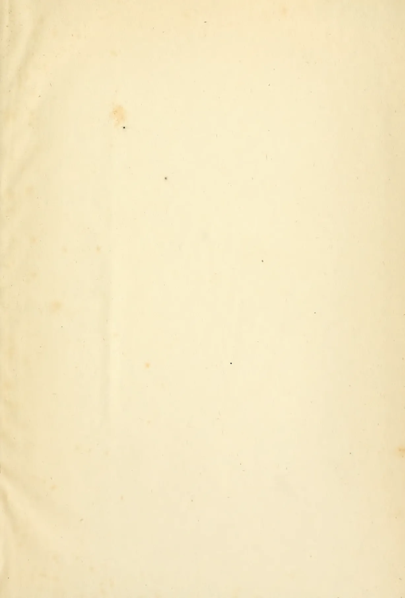This image shows a blank, aged, cream-colored page, likely an endpaper or flyleaf from an old book. The paper has a visible texture and some minor blemishes, including a few small dark spots and faint discolorations, particularly towards the top and left edges. There is no text or other markings on the page.

1029------------------------------------------------

1030------------------------------------------------

New York Botanical Garden Library

A standard 1D barcode with vertical black bars of varying widths on a white background.

3 5185 00257 5726

1031------------------------------------------------

